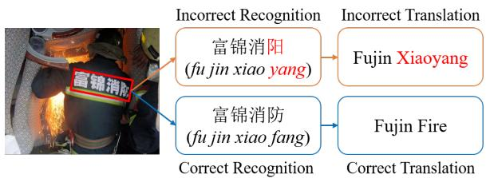
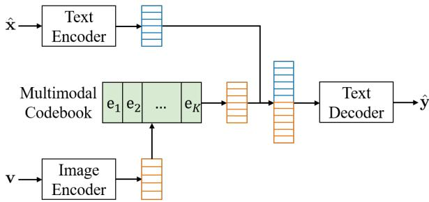
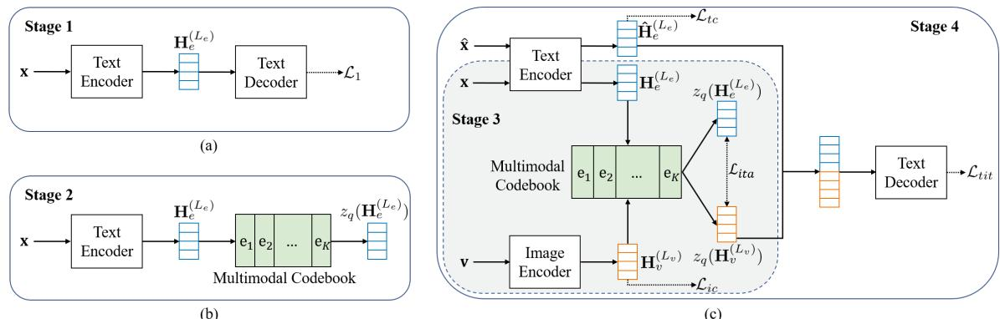
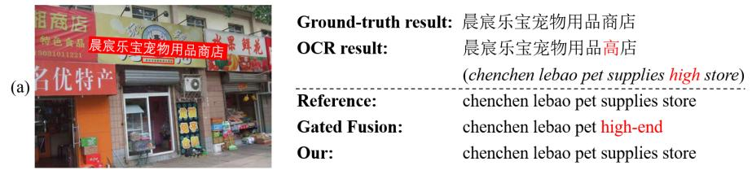
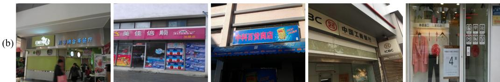

# Exploring Better Text Image Translation with Multimodal Codebook

Zhibin Lan1,3∗, Jiawei Yu1,3∗, Xiang Li2, Wen Zhang2, Jian Luan2

Bin Wang2, Degen Huang4, Jinsong Su1,3†

1School of Informatics, Xiamen University, China

2Xiaomi AI Lab, Beijing, China

3Key Laboratory of Digital Protection and Intelligent Processing of Intangible Cultural Heritage of Fujian and Taiwan (Xiamen University), Ministry of Culture and Tourism, China 4Dalian University of Technology, China

{lanzhibin,yujiawei}@stu.xmu.edu.cn jssu@xmu.edu.cn

## Abstract

Text image translation (TIT) aims to translate the source texts embedded in the image to target translations, which has a wide range of applications and thus has important research value. However, current studies on TIT are confronted with two main bottlenecks: 1) this task lacks a publicly available TIT dataset, 2) dominant models are constructed in a cascaded manner, which tends to suffer from the error propagation of optical character recognition (OCR). In this work, we first annotate a Chinese-English TIT dataset named OCRMT30K, providing convenience for subsequent studies. Then, we propose a TIT model with a multimodal codebook, which is able to associate the image with relevant texts, providing useful supplementary information for translation. Moreover, we present a multi-stage training framework involving text machine translation, image-text alignment, and TIT tasks, which fully exploits additional bilingual texts, OCR dataset and our OCRMT30K dataset to train our model. Extensive experiments and in-depth analyses strongly demonstrate the effectiveness of our proposed model and training framework.1

## 1 Introduction

In recent years, multimodal machine translation (MMT) has achieved great progress and thus received increasing attention. Current studies on MMT mainly focus on the text machine translation with scene images (Elliott et al., 2016; Calixto et al., 2017a; Elliott and Kádár, 2017; Libovický et al., 2018; Ive et al., 2019; Zhang et al., 2020; Sulubacak et al., 2020). However, a more common requirement for MMT in real-world applications is text image translation (TIT) (Ma et al., 2022), which aims to translate the source texts embedded in the image to target translations. Due to its wide applications, the industry has developed multiple services to support this task, such as Google Camera Translation.

  
Figure 1: An example of text image translation. The Bounding box in red represents the text to be recognized. We can observe that the incorrect OCR result will negatively affect the subsequent translation.

Current studies on TIT face two main bottlenecks. First, this task lacks a publicly available TIT dataset. Second, the common practice is to adopt a cascaded translation system, where the texts embedded in the input image are firstly recognized by an optical character recognition (OCR) model, and then the recognition results are fed into a textonly neural machine translation (NMT) model for translation. However, such a method tends to suffer from the problem of OCR error propagation, and thus often generates unsatisfactory translations. As shown in Figure 1, “富锦消防” ("fu jin xiao fang”) in the image is incorrectly recognized as “富锦消阳” (“fu jin xiao yang”). Consequently, the text-only NMT model incorrectly translates it into “Fujin Xiaoyang”. Furthermore, we use the commonly-used PaddleOCR2 to handle several OCR benchmark datasets. As reported in Table 1, we observe that the highest recognition accuracy at the image level is less than 67% and that at the sentence level is not higher than 81%. It can be said that OCR errors are very common, thus they have a serious negative impact on subsequent translation.

In this paper, we first manually annotate a Chinese-English TIT dataset named OCRMT30K, providing convenience for subsequent studies. This dataset is developed based on five Chinese OCR datasets, including about 30,000 image-text pairs.

<table><tr><td>Dataset</td><td>Image Level Accuracy</td><td>Sentence Level Accuracy</td></tr><tr><td>RCTW-17</td><td>65.27%</td><td>80.20%</td></tr><tr><td>CASIA-10K</td><td>43.63%</td><td>69.79%</td></tr><tr><td>ICDAR19-ArT</td><td>50.96%</td><td>75.84%</td></tr><tr><td>ICDAR19-MLT</td><td>66.63%</td><td>80.77%</td></tr><tr><td>ICDAR19-LSVT</td><td>43.97%</td><td>75.70%</td></tr></table>

Table 1: Recognition accuracies on five commonly-used OCR datasets. Image level accuracy refers to the proportion of correct recognitions among all images. Sentence level accuracy denotes the proportion of correctly recognized sentences among all recognized sentences.

Besides, we propose a TIT model with a multimodal codebook to alleviate the OCR error propagation problem. The basic intuition behind our model is that when humans observe the incorrectly recognized text in an image, they can still associate the image with relevant or correct texts, which can provide useful supplementary information for translation. Figure 3 shows the basic architecture of our model, which mainly consists of four modules: 1) a text encoder that converts the input text into a hidden state sequence; 2) an image encoder encoding the input image as a visual vector sequence; 3) a multimodal codebook. This module can be described as a vocabulary comprising latent codes, each of which represents a cluster. It is trained to map the input images and ground-truth texts into the shared semantic space of latent codes. During inference, this module is fed with the input image and then outputs latent codes containing the text information related to ground-truth texts. 4) a text decoder that is fed with the combined representation of the recognized text and the outputted latent codes, and then generates the final translation.

Moreover, we propose a multi-stage training framework for our TIT model, which can fully exploit additional bilingual texts and OCR data for model training. Specifically, our framework consists of four stages. First, we use a large-scale bilingual corpus to pretrain the text encoder and text decoder. Second, we pretrain the newly added multimodal codebook on a large-scale monolingual corpus. Third, we further introduce an image encoder that includes a pretrained vision Transformer with fixed parameters to extract visual features, and continue to train the multimodal codebook. Additionally, we introduce an image-text alignment task to enhance the ability of the multimodal codebook in associating images with related texts. Finally, we finetune the entire model on the OCRMT30K dataset. Particularly, we maintain the image-text alignment task at this stage to reduce the gap between the third and fourth training stages.

Our main contributions are as follows:

• We release an OCRMT30K dataset, which is the first Chinese-English TIT dataset, prompting the subsequent studies.

• We present a TIT model with a multimodal codebook, which can leverage the input image to generate the information of relevant or correct texts, providing useful information for the subsequent translation.

• We propose a multi-stage training framework for our model, which effectively leverages additional bilingual texts and OCR data to enhance the model training.

• Extensive experiments and analyses demonstrate the effectiveness of our model and training framework.

## 2 Related Work

In MMT, most early attempts exploit visual context via attention mechanisms (Caglayan et al., 2016; Huang et al., 2016; Calixto et al., 2017a; Libovický and Helcl, 2017; Calixto and Liu, 2017; Su et al., 2021). Afterwards, Ive et al. (2019) employ a translate-and-refine approach to improve translation drafts with visual context. Meanwhile, Calixto et al. (2019) incorporate visual context into MMT model through latent variables. Different from these studies focusing on coarse-grained visual-text alignment information, Yin et al. (2020) propose a unified multimodal graph based encoder to capture various semantic relationships between tokens and visual objects. Lin et al. (2020) present a dynamic context-guided capsule network to effectively capture visual features at different granularities for MMT.

Obviously, the effectiveness of conventional MMT heavily relies on the availability of bilingual texts with images, which restricts its wide applicability. To address this issue, Zhang et al. (2020) first build a token-image lookup table from an image-text dataset, and then retrieve images matching the source keywords to benefit the predictions of target translation. Recently, Fang and

Feng (2022) present a phrase-level retrieval-based method that learns visual information from the pairs of source phrases and grounded regions.

Besides, researchers investigate whether visual information is really useful for machine translation. Elliott (2018) finds that irrelevant images have little impact on translation quality. Wu et al. (2021) attribute the gain of MMT to the regularization effect. Unlike these conclusions, Caglayan et al. (2019) and Li et al. (2021) observe that MMT models rely more on images when textual ambiguity is high or textual information is insufficient.

To break the limitation that MMT requires sentence-image pairs during inference, researchers introduce different modules, such as image prediction decoder (Elliott and Kádár, 2017), generative imagination network (Long et al., 2021), autoregressive hallucination Transformer (Li et al., 2022b), to produce a visual vector sequence that is associated with the input sentence.

Significantly different from the above studies on MMT with scene images, several works also explore different directions in MMT. For instance, Calixto et al. (2017b) and Song et al. (2021) investigate product-oriented machine translation, and other researchers focus on multimodal simultaneous machine translation (Caglayan et al., 2020; Ive et al., 2021). Moreover, there is a growing body of studies on video-guided machine translation (Wang et al., 2019; Gu et al., 2021; Kang et al., 2023). These studies demonstrate the diverse applications and potential of MMT beyond scene images.

In this work, we mainly focus on TIT, which suffers from incorrectly recognized text information and is more practicable in real scenarios. The most related work to ours mainly includes (Mansimov et al., 2020; Jain et al., 2021; Ma et al., 2022). Mansimov et al. (2020) first explore in-image translation task, which transforms an image containing the source text into an image with the target translation. They not only build a synthetic in-image translation dataset but also put forward an end-toend model combining a self-attention encoder with two convolutional encoders and a convolutional decoder. Jain et al. (2021) focus on the TIT task, and propose to combine OCR and NMT into an endto-end model with a convolutional encoder and an autoregressive Transformer decoder. Along this line, Ma et al. (2022) apply multi-task learning to this task, where MT, TIT, and OCR are jointly trained. However, these studies only center around synthetic TIT datasets, which are far from the real scenario.

<table><tr><td rowspan=1 colspan=1>Image</td><td rowspan=1 colspan=1>Locations</td><td rowspan=1 colspan=1>SourceTexts</td><td rowspan=1 colspan=1>TargetTranslations</td></tr><tr><td rowspan=4 colspan=1>GEEEu，前方施工车辆慢行武汉清</td><td rowspan=1 colspan=1>(967, 1410), (1782, 1401),(980, 1682), (1795, 1691)</td><td rowspan=1 colspan=1>前方施工</td><td rowspan=1 colspan=1>Constructionahead</td></tr><tr><td rowspan=1 colspan=1>(989, 1652), (1798, 1643),(993, 1922), (1802, 1911)</td><td rowspan=1 colspan=1>车辆慢行</td><td rowspan=1 colspan=1>Traffic movingslowly</td></tr><tr><td rowspan=1 colspan=1>(1003, 1893), (1810, 1885),(1006, 2174), (1813, 2168)</td><td rowspan=1 colspan=1>给您带来不便请谅解</td><td rowspan=1 colspan=1>Sorry for theinconvenience</td></tr><tr><td rowspan=1 colspan=1>(1515, 2280), (1808, 2264),(1526, 2360), (1819, 2344)</td><td rowspan=1 colspan=1>武汉地铁</td><td rowspan=1 colspan=1>Wuhan Metro</td></tr></table>

Figure 2: An example of the OCRMT30K dataset. The Locations are annotated by drawing bounding boxes to surround every text line.

## 3 Dataset and Annotation

To the best of our knowledge, there is no publicly available dataset for the task of TIT. Thus we first manually annotate a Chinese-English TIT dataset named OCRMT30K, which is based on five commonly-used Chinese OCR datasets: RCTW-17 (Shi et al., 2017), CASIA-10K (He et al., 2018), ICDAR19-MLT (Nayef et al., 2019), ICDAR19- LSVT (Sun et al., 2019) and ICDAR19-ArT (Chng et al., 2019). We hire eight professional translators for annotation over five months and each translator is responsible for annotating 25 images per day to prevent fatigue. Translators are shown an image with several Chinese texts and are required to produce correct and fluent translations for them in English. In addition, we hire a professional translator to sample and check the annotated instances for quality control. We totally annotate 30,186 instances and the number of parallel sentence pairs is 164,674. Figure 2 presents an example of our dataset.

## 4 Our Model

## 4.1 Task Formulation

In this work, following common practices (Afli and Way, 2016; Ma et al., 2022), we first use an OCR model to recognize texts from the input image v. Then, we fed both v and each recognized text xˆ into our TIT model, producing the target translation y. In addition, x is used to denote the ground-truth text of xˆ recognized from v.

To train our TIT model, we will focus on establishing the following conditional predictive proba-

  
Figure 3: The overall architecture of our model includes a text encoder, an image encoder, a multimodal codebook, and a text decoder. Particularly, the multimodal codebook is the most critical module, which can associate images with relevant or correct texts. xˆ is the recognized text from the input image v, $e _ { k }$ represents the k-th latent code embedding and $\hat { \mathbf { y } }$ is the outputted target translation.

bility distribution:

$$
P ( \mathbf { y } | \mathbf { v } , { \hat { \mathbf { x } } } ; \pmb { \theta } ) = \prod _ { t = 1 } ^ { | \mathbf { y } | } P ( y _ { t } | \mathbf { v } , { \hat { \mathbf { x } } } , \mathbf { y } _ { < t } ; \pmb { \theta } ) ,\tag{1}
$$

where θ denotes the model parameters.

## 4.2 Model Architecture

As shown in Figure 3, our model includes four modules: 1) a text encoder converting the input text into a hidden state sequence; 2) an image encoder encoding the input image as a visual vector sequence; 3) a multimodal codebook that is fed with the image representation and then outputs latent codes containing the text information related to the ground-truth text; and 4) a text decoder that generates the final translation under the semantic guides of text encoder hidden states and outputted latent codes. All these modules will be elaborated in the following.

Text Encoder. Similar to dominant NMT models, our text encoder is based on the Transformer (Vaswani et al., 2017) encoder. It stacks $L _ { e }$ identical layers, each of which contains a self-attention sub-layer and a feed-forward network (FFN) sublayer.

Let $\mathbf { H } _ { e } ^ { ( l ) } = { h } _ { e , 1 } ^ { ( l ) } , { h } _ { e , 2 } ^ { ( l ) } , . . . , { h } _ { e , N _ { e } } ^ { ( l ) }$ denotes the hidden states of the l-th encoder layer, where $N _ { e }$ is the length of the hidden states $\mathbf { H } _ { e } ^ { ( \bar { l } ) }$ . Formally, $\mathbf { H } _ { e } ^ { ( l ) }$ is calculated in the following way:

$$
\mathbf { H } _ { e } ^ { ( l ) } = \mathrm { F F N } ( \mathrm { M H A } ( \mathbf { H } _ { e } ^ { ( l - 1 ) } , \mathbf { H } _ { e } ^ { ( l - 1 ) } , \mathbf { H } _ { e } ^ { ( l - 1 ) } ) ) ,\tag{2}
$$

where $\mathrm { M H A } ( \cdot , \cdot , \cdot )$ denotes a multi-head attention function (Vaswani et al., 2017). Particularly, ${ \bf { H } } _ { e } ^ { ( 0 ) }$ is the sum of word embeddings and position embeddings. Note that we follow Vaswani et al. (2017) to use residual connection and layer normalization (LN) in each sub-layer, of which descriptions are omitted for simplicity. During training, the text encoder is utilized to encode both the ground-truth text x and the recognized text xˆ, so we use $\hat { \mathbf { H } } _ { e } ^ { ( l ) }$ to denote the hidden state of recognized text for clarity. In contrast, during inference, the text encoder only encodes the recognized text xˆ, refer to Section 4.3 for more details.

Image Encoder. As a common practice, we use ViT (Dosovitskiy et al., 2021) to construct our image encoder. Similar to the Transformer encoder, ViT also consists of $L _ { v }$ stacked layers, each of which includes a self-attention sub-layer and an FFN sub-layer. One key difference between the Transformer encoder and ViT is the placement of LN, where pre-norm is applied in ViT.

Given the image input v, the visual vector sequence $\mathbf { H } _ { v } ^ { ( L _ { v } ) } = \mathbf { \bar { \mathit { h } } } _ { v , 1 } ^ { ( L _ { v } ) } , \mathit { h } _ { v , 2 } ^ { ( L _ { v } ) } , . . . , \mathit { h } _ { v , N _ { v } } ^ { ( L _ { v } ) }$ output by the image encoder can be formulated as

$$
\mathbf { H } _ { v } ^ { ( L _ { v } ) } = \mathrm { M H A } ( \mathbf { H } _ { e } ^ { ( L _ { e } ) } , \mathbf { W } _ { v } \mathrm { V i T } ( \mathbf { v } ) , \mathbf { W } _ { v } \mathrm { V i T } ( \mathbf { v } ) ) ,\tag{3}
$$

where $N _ { v }$ is the length of the hidden states $\mathbf { H } _ { v } ^ { ( L _ { v } ) }$ and $\mathbf { W } _ { v }$ is a projection matrix to convert the dimension of $\operatorname { V i T } ( \mathbf { v } )$ into that of ${ \bf { H } } _ { e } ^ { ( L _ { e } ) }$

Multimodal Codebook. It is the core module of our model. The multimodal codebook is essentially a vocabulary with K latent codes, each of which is represented by a d-dimensional vector $e _ { k }$ like word embeddings. Note that we always set the dimension of the latent code equal to that of the text encoder, so as to facilitate the subsequent calculation in Equation 11.

With the multimodal codebook, we can quantize the hidden state sequence $\begin{array} { r l } { \mathbf { H } _ { e } ^ { ( L _ { e } ) } } & { { } = } \end{array}$ $\hat { h } _ { e , 1 } ^ { ( L _ { e } ) } , h _ { e , 2 } ^ { ( L _ { e } ) } , . . . , h _ { e , N _ { e } } ^ { ( L _ { e } ) }$ or the visual vector sequence $\mathbf { H } _ { v } ^ { ( L _ { v } ) } = h _ { v , 1 } ^ { ( L _ { v } ) } , h _ { v , 2 } ^ { ( \dot { L } _ { v } ) } , . . . , h _ { v , N _ { v } } ^ { ( L _ { v } ) }$ to latent codes via a quantizer $z _ { q } ( \cdot )$ . Formally, the quantizer looks up the nearest latent code for each input, as shown in the following:

$$
z _ { q } ( h _ { e , i } ^ { ( L _ { e } ) } ) = \underset { \boldsymbol { e } _ { k ^ { \prime } } } { \mathrm { a r g m i n } } \ : | | h _ { e , i } ^ { ( L _ { e } ) } - e _ { k ^ { \prime } } | | _ { 2 } ,\tag{4}
$$

$$
z _ { q } ( h _ { v , j } ^ { ( L _ { v } ) } ) = \underset { e _ { k ^ { \prime \prime } } } { \mathrm { a r g m i n } } | | h _ { v , j } ^ { ( L _ { v } ) } - e _ { k ^ { \prime \prime } } | | _ { 2 } .\tag{5}
$$

By doing $\mathbf { s o } ,$ both text and image representations are mapped into the shared semantic space of latent codes.

  
Figure 4: Overview of our multi-stage training framework. (a) Stage 1: we pretrain the text encoder and text decoder with ${ \mathcal { L } } _ { 1 } . ~ ( { \mathfrak { b } } )$ Stage 2: we update the multimodal codebook with an exponential moving average (EMA). (c) In Stage 3, we only train the dashed part of the model with $\mathcal { L } _ { i t a }$ and $\mathcal { L } _ { i c }$ . As for Stage 4, we optimize the whole model through $\mathcal { L } _ { i t a } , \mathcal { L } _ { i c } , \mathcal { L } _ { t i t }$ , and $\mathcal { L } _ { t c } .$

Text Decoder. This decoder is also based on the Transformer decoder, with $L _ { d }$ identical layers. In addition to self-attention and FFN sub-layers, each decoder layer is equipped with a cross-attention sub-layer to exploit recognized text hidden states $\hat { \mathbf { H } } _ { e } ^ { ( L _ { e } ) }$ and latent codes $z _ { q } ( \mathbf { H } _ { v } ^ { ( L _ { v } ) } )$ .

The hidden states of the l-th decoder layer are denoted by $\mathbf { H } _ { d } ^ { ( l ) } = { h } _ { d , 1 } ^ { ( l ) } , { h } _ { d , 2 } ^ { ( l ) } , . . . , { h } _ { d , N _ { d } } ^ { ( l ) } ,$ where $N _ { d }$ represents the total number of hidden states. These hidden states are calculated using the following equations:

$$
\mathbf { C } _ { d } ^ { ( l ) } = \mathrm { M H A } ( \mathbf { H } _ { d } ^ { ( l - 1 ) } , \mathbf { H } _ { d } ^ { ( l - 1 ) } , \mathbf { H } _ { d } ^ { ( l - 1 ) } ) ,\tag{6}
$$

$$
\mathbf { T } _ { d } ^ { ( l ) } = [ \hat { \mathbf { H } } _ { e } ^ { ( L _ { e } ) } ; z _ { q } ( \mathbf { H } _ { v } ^ { ( L _ { v } ) } ) ] ,\tag{7}
$$

$$
\mathbf { H } _ { d } ^ { ( l ) } = \mathrm { F F N } ( \mathrm { M H A } ( \mathbf { C } _ { d } ^ { ( l ) } , \mathbf { T } _ { d } ^ { ( l ) } , \mathbf { T } _ { d } ^ { ( l ) } ) ) .\tag{8}
$$

Finally, at each decoding timestep t, the probability distribution of generating the next target token $y _ { t }$ is defined as follows:

$$
P ( y _ { t } | \mathbf { v } , \hat { \mathbf { x } } , \mathbf { y } _ { < t } ; \pmb { \theta } ) = \mathrm { s o f t m a x } ( \mathbf { W } _ { o } h _ { d , t } ^ { ( L _ { d } ) } + b _ { o } ) ,\tag{9}
$$

where $\mathbf { W } _ { o }$ and $b _ { o }$ are trainable model parameters.

## 4.3 Multi-stage Training Framework

In this section, we present in detail the procedures of our proposed multi-stage training framework. As shown in Figure 4, it totally consists of four stages: 1) pretraining the text encoder and text decoder on a large-scale bilingual corpus; 2) pretraining the multimodal codebook on a large-scale monolingual corpus; 3) using additional OCR data to train the image encoder and multimodal codebook via an image-text alignment task; 4) finetuning the whole model on our released TIT dataset.

Stage 1. We first pretrain the text encoder and text decoder on a large-scale bilingual corpus $D _ { b c }$ in the way of a vanilla machine translation. Formally, for each parallel sentence $( \mathbf { x } , \mathbf { y } ) { \in } D _ { b c }$ , we define the following training objective for this stage:

$$
\mathcal { L } _ { 1 } ( \pmb { \theta } _ { t e } , \pmb { \theta } _ { t d } ) = - \sum _ { t = 1 } ^ { | \mathbf { y } | } \log \bigl ( p ( y _ { t } | \mathbf { x } , \mathbf { y } _ { < t } ) \bigr ) ,\tag{10}
$$

where $\theta _ { t e }$ and $\theta _ { t d }$ denote the trainable parameters of the text encoder and text decoder, respectively.

Stage 2. This stage serves as an intermediate phase, where we exploit monolingual data to pretrain the multimodal codebook. Through this stage of training, we will learn a clustering representation for each latent code of the multimodal codebook.

Concretely, we utilize the same dataset as the first stage but only use its source texts. Following van den Oord et al. (2017), we update the multimodal codebook with an exponential moving average (EMA), where a decay factor determines the degree to which past values affect the current average. Formally, the latent code embedding $e _ { k }$ is updated as follows:

$$
\begin{array} { l } { { \displaystyle { c _ { k } = \sum _ { i = 1 } ^ { N _ { e } } \mathbb { I } \big ( z _ { q } \big ( h _ { e , i } ^ { ( L _ { e } ) } \big ) = e _ { k } \big ) , } } } \\ { { \displaystyle { h _ { k } = \sum _ { i = 1 } ^ { N _ { e } } \mathbb { I } \big ( z _ { q } \big ( h _ { e , i } ^ { ( L _ { e } ) } \big ) = e _ { k } \big ) h _ { e , i } ^ { ( L _ { e } ) } , } } } \\ { { \displaystyle { n _ { k }  \gamma n _ { k } + ( 1 - \gamma ) c _ { k } , } } } \\ { { \displaystyle { e _ { k }  \frac { 1 } { n _ { k } } \big ( \gamma e _ { k } + ( 1 - \gamma ) h _ { k } \big ) } , } } \end{array}\tag{11}
$$

where I( ) is the indicator function and γ is a decay factor we set to 0.99, as implemented in (van den

Oord et al., 2017). $c _ { k }$ counts the number of text encoder hidden states that are clustered into the kth latent code, $h _ { k }$ denotes the sum of these hidden states, and $n _ { k }$ represents the sum of the past exponentially weighted average and the current value $c _ { k }$ . Particularly, $n _ { k }$ is set to 0 at the beginning.

Stage 3. During this stage, we introduce an image-text alignment task involving an additional OCR dataset $D _ { o c r }$ to further train the image encoder and multimodal codebook. Through this stage of training, we expect to endow the multimodal codebook with the preliminary capability of associating images with related texts.

Given an image-text training instance $( \mathbf { v } , \mathbf { x } ) \in$ $D _ { o c r }$ , we define the training objective at this stage as

$$
\mathcal { L } _ { 3 } = \mathcal { L } _ { i t a } + \alpha \mathcal { L } _ { i c } ,\tag{12}
$$

$$
\mathcal { L } _ { i t a } ( \pmb { \theta } _ { i e } ) = | | z _ { \overline { { q } } } ( \mathbf { H } _ { v } ^ { ( L _ { v } ) } ) - \mathrm { s g } ( z _ { \overline { { q } } } ( \mathbf { H } _ { e } ^ { ( L _ { e } ) } ) ) | | _ { 2 } ^ { 2 } ,\tag{13}
$$

$$
\mathcal { L } _ { i c } ( \pmb { \theta } _ { i e } ) = | | \mathbf { H } _ { v } ^ { ( L _ { v } ) } - \mathrm { s g } ( z _ { q } ( \mathbf { H } _ { v } ^ { ( L _ { v } ) } ) ) | | _ { 2 } ^ { 2 } ,\tag{14}
$$

where $\operatorname { s g } ( \cdot )$ refers to a stop-gradient operation and $\theta _ { i e }$ is the parameters of the image encoder except the ViT module. Specifically, $z _ { \overline { { { q } } } } ( \mathbf { H } _ { v } ^ { ( L _ { v } ) } )$ is calculated as $\begin{array} { r } { \frac { 1 } { N _ { v } } \sum _ { j = 1 } ^ { N _ { v } } z _ { q } ( h _ { v , j } ^ { ( L _ { v } ) } ) } \end{array}$ and $z _ { \overline { { q } } } ( \mathbf { H } _ { e } ^ { ( L _ { e } ) } )$ is calculated as $\begin{array} { r } { \frac { 1 } { N _ { e } } \sum _ { i = 1 } ^ { N _ { e } } z _ { q } ( h _ { e , i } ^ { ( L _ { e } ) } ) } \end{array}$ , which represent the semantic information of image and text respectively. Via $\mathcal { L } _ { i t a }$ , we expect to enable both image and text representations to be quantized into the same latent codes. Meanwhile, following van den Oord et al. (2017), we use the commitment loss $\mathcal { L } _ { i c }$ to ensure that the output hidden states of image encoder stay close to the chosen latent code embedding, preventing it fluctuating frequently from one latent code to another, and α is a hyperparameter to control the effect of $\mathcal { L } _ { i c }$ . Note that at this stage, we continue to update the parameters of the multimodal codebook using Equation 11.

Stage 4. Finally, we use the TIT dataset $D _ { t i t }$ to finetune the whole model. Notably, $\mathcal { L } _ { 3 }$ is still involved, which maintains the training consistency and makes finetuning smoothing.

Given a TIT training instance $( { \bf v } , \hat { \bf x } , { \bf x } , { \bf y } ) \in D _ { t i t }$ we optimize the whole model through the following objective:

$$
\mathcal { L } _ { 4 } = \mathcal { L } _ { 3 } + \mathcal { L } _ { t i t } + \beta \mathcal { L } _ { t c } ,\tag{15}
$$

$$
\mathcal { L } _ { t i t } ( \pmb { \theta } _ { t e } , \pmb { \theta } _ { i e } , \pmb { \theta } _ { t d } ) = - \sum _ { t = 1 } ^ { | \mathbf { y } | } \log ( p ( y _ { t } | \mathbf { v } , \hat { \mathbf { x } } , \mathbf { y } _ { < t } ) ) ,\tag{16}
$$

$$
\mathcal { L } _ { t c } ( \pmb { \theta } _ { t e } ) = | | \mathbf { H } _ { e } ^ { ( L _ { e } ) } - \mathrm { s g } ( z _ { q } ( \mathbf { H } _ { e } ^ { ( L _ { e } ) } ) ) | | _ { 2 } ^ { 2 } ,\tag{17}
$$

where $\mathcal { L } _ { t c }$ is also a commitment loss proposed for the text encoder, and $\beta$ is a hyperparameter quantifying its effect. Note that xˆ is only used as an input for $\mathcal { L } _ { t i t }$ to ensure the consistency between the model training and inference, and x is used as an input for image-text alignment task to train the ability of the multimodal codebook in associating the input image with the ground-truth text. Besides, we still update the multimodal codebook with EMA.

## 5 Experiments

## 5.1 Datasets

Our proposed training framework consists of four stages, involving the following three datasets:

WMT22 ZH-EN3. This large-scale parallel corpus contains about 28M parallel sentence pairs and we sample 2M parallel sentence pairs from the original whole corpus. During the first and second training stages, we use the sampled dataset to pretrain our text encoder and text decoder.

ICDAR19-LSVT. It is an OCR dataset including 450, 000 images with texts that are freely captured in the streets, e.g., storefronts and landmarks. In this dataset, 50,000 fully-annotated images are partially selected to construct the OCRMT30K dataset, and the remaining 400,000 images are weakly annotated, where only the text-of-interest in these images are provided as ground truths without location annotations. In the third training stage, we use these weakly annotated data to train the image encoder and multimodal codebook via the image-text alignment task.

OCRMT30K. As mentioned previously, our OCRMT30K dataset involves five Chinese OCR datasets: RCTW-17, CASIA-10K, ICDAR19-MLT, ICDAR19-LSVT, and ICDAR19-ArT. It totally contains about 30,000 instances, where each instance involves an image paired with several Chinese texts and their corresponding English translations. In the experiments, we choose 1,000 instances for development, 1,000 for evaluation, and the remaining instances for training. Besides, We use the commonly-used PaddleOCR to handle our dataset and obtain the recognized texts. In the final training stage, we use the training set of OCRMT30K to finetune our whole model.

## 5.2 Settings

We use the standard ViT-B/16 (Dosovitskiy et al., 2021) to model our image encoder. Both our text encoder and text decoder consist of 6 layers, each of which has 512-dimensional hidden sizes, 8 attention heads, and 2,048 feed-forward hidden units. Particularly, a 512-dimensional word embedding layer is shared across the text encoder and the text decoder. We set the size of the multimodal codebook to 2,048.

During the third stage, following van den Oord et al. (2017), we set α in Equation 12 to 0.25. During the final training stage, we set α to 0.75 and β in Equation 15 to 0.25 determined by a grid search on the validation set, both of which are varied from 0.25 to 1 with an interval of 0.25. We use the batch size of 32,768 tokens in the first and second training stages and 4,096 tokens in the third and final training stages. In all stages, we apply the Adam optimizer (Kingma and Ba, 2015) with $\beta _ { 1 } = 0 . 9 ,$ β2 = 0.98 to train the model, where the inverse square root schedule algorithm and warmup strategy are adopted for the learning rate. Besides, we set the dropout to 0.1 in the first three training stages and 0.3 in the final training stage, and the value of label smoothing to 0.1 in all stages.

During inference, we use beam search with a beam size of 5. Finally, we employ BLEU (Papineni et al., 2002) calculated by SacreBLEU4 (Post, 2018) and COMET5 (Rei et al., 2020) to evaluate the model performance.

## 5.3 Baselines

In addition to the text-only Transformer (Vaswani et al., 2017), our baselines include:

• Doubly-ATT (Calixto et al., 2017a). This model uses two attention mechanisms to exploit the image and text representations for translation, respectively.

• Imagination (Elliott and Kádár, 2017). It trains an image prediction decoder to predict a global visual feature vector that is associated with the input sentence.

• Gated Fusion (Wu et al., 2021). This model uses a gated vector to fuse image and text representations, and then feeds them to a decoder for translation.

<table><tr><td>Model</td><td>BLEU COMET</td><td></td></tr><tr><td colspan="3">Text-only Transformer</td></tr><tr><td>Transformer (Vaswani et al., 2017)</td><td>39.38</td><td>30.01</td></tr><tr><td colspan="3">Existing MMT Systems</td></tr><tr><td>Imagination (Elliott and Kádár, 2017) Doubly-ATT (Calixto et al., 2017a) Gated Fusion (Wu et al., 2021)</td><td>39.47 39.93 40.03</td><td>30.66 30.52 30.91</td></tr><tr><td>Selective Attn (Li et al., 2022a) VALHALLA (Li et al., 2022b)</td><td>39.82 39.73</td><td>30.82 30.10</td></tr><tr><td colspan="3">Existing TIT System</td></tr><tr><td>E2E-TIT (Ma et al., 2022)</td><td>19.50</td><td>-31.90</td></tr><tr><td colspan="3">Our TIT System</td></tr><tr><td>Our model</td><td>40.78</td><td>33.09</td></tr></table>

Table 2: Experimental results on the Zh En TIT task. “ ” represents the improvement over the best result of all other contrast models is statistically significant (p<0.01).

• Selective Attn (Li et al., 2022a). It is similar to Gated Fusion, but uses a selective attention mechanism to make better use of the patchlevel image representation.

• VALHALLA (Li et al., 2022b). This model uses an autoregressive hallucination Transformer to predict discrete visual representations from the input text, which are then combined with text representations to obtain the target translation.

• E2E-TIT (Ma et al., 2022). It applies a multitask learning framework to train an end-toend TIT model, where MT and OCR serve as auxiliary tasks. Note that except for E2E-TIT, all other models are cascaded ones. Unlike other cascaded models that take recognized text and the entire image as input, the input to this end-to-end model is an image cropped from the text bounding box.

To ensure fair comparisons, we pretrain all these baselines on the same large-scale bilingual corpus.

## 5.4 Results

Table 2 reports the performance of all models. We can observe that our model outperforms all baselines, achieving state-of-the-art results. Moreover, we draw the following interesting conclusions:

First, all cascaded models exhibit better performance than E2E-TIT. For this result, we speculate that as an end-to-end model, E2E-TIT may struggle to distinguish text from the surrounding background in the image when the background exhibits visual characteristics similar to the text.

<table><tr><td>Model</td><td></td><td>BLEU COMET</td></tr><tr><td colspan="3">Text-only Transformer</td></tr><tr><td>Transformer (Vaswani et al., 2017)</td><td>39.38</td><td>30.01</td></tr><tr><td colspan="3">Existing MMT Systems</td></tr><tr><td>Imagination (Elliott and Kádár, 2017) Doubly-ATT (Calixto et al., 2017a) Gated Fusion (Wu et al., 2021) Selective Attn (Li et al., 2022a) VALHALLA (Li et al., 2022b)</td><td>39.64 39.71 39.03 40.13 39.24</td><td>30.68 31.42 30.46 30.74 29.08</td></tr><tr><td colspan="3">Existing TIT System</td></tr><tr><td>E2E-TIT (Ma et al., 2022)</td><td>19.50</td><td>-31.90</td></tr><tr><td colspan="3">Our TIT System</td></tr><tr><td>Our model</td><td>40.78</td><td>33.09†</td></tr></table>

Table 3: Additional experimental results on the Zh En TIT task. $\cdot \mathrm { \uparrow } / \mathrm { \uparrow } ^ { \mathrm { \prime } }$ represents the improvement over the best result of all other contrast models is statistically significant (p<0.01/0.05).

Second, our model outperforms Doubly-ATT, Gated Fusion, and Selective Attn, all of which adopt attention mechanisms to exploit image information for translation. The underlying reason is that each input image and its texts are mapped into the shared semantic space of latent codes, reducing the modality gap and thus enabling the model to effectively utilize image information.

Third, our model also surpasses Imagination and VALHALLA, both of which use the input text to generate the representations of related images. We conjecture that in the TIT task, it may be challenging for the model to generate useful image representations from the incorrectly recognized text. In contrast, our model utilizes the input image to generate related text representations, which is more suitable for the TIT task.

Inspired by E2E-TIT, we also compare other baselines with the cropped image as input. Table 3 reports the results of our model compared with other baselines using the cropped image as input. We can observe that our model still achieves stateof-the-art results.

## 5.5 Ablation Study

To investigate the effectiveness of different stages and modules, we further compare our model with several variants in Table 4:

w/o Stage 2. We remove the second training stage in this variant. The result in line 2 shows that this change causes a significant performance decline. It suggests that pretraining the clustering representations of latent codes in the multimodal codebook is indeed helpful for the model training.

w/o Stage 3. In this variant, we remove the third stage of training. The result in line 3 indicates that this removal leads to a performance drop. The result confirms our previous assumption that training the preliminary capability of associating images and related texts indeed enhances the TIT model.

<table><tr><td>Model</td><td>BLEU</td><td>COMET</td></tr><tr><td>Our model</td><td>40.78</td><td>33.09</td></tr><tr><td>w/o Stage 2</td><td>39.93</td><td>31.35</td></tr><tr><td>w/o Stage 3</td><td>40.15</td><td>30.90</td></tr><tr><td>w/o  $\mathcal { L } _ { 3 }$  in Stage 4</td><td>40.18</td><td>31.99</td></tr><tr><td>w/o multimodal codebook</td><td>38.81</td><td>29.08</td></tr><tr><td>w/ randomly sampling latent codes</td><td>34.91</td><td>18.90</td></tr></table>

Table 4: Ablation study of our model on the Zh En text image translation task.

w/o $\mathcal { L } _ { 3 }$ in Stage 4. When constructing this variant, we remove the loss item $\mathcal { L } _ { 3 }$ from stage 4. From line 4, we can observe that preserving $\mathcal { L } _ { 3 }$ in the fourth stage makes the transition from the third to the fourth stage smoother, which further alleviates the training discrepancy.

w/o multimodal codebook. We remove the multimodal codebook in this variant, and the visual features extracted through the image encoder are utilized in its place. Apparently, the performance drop drastically as reported in line 5, demonstrating the effectiveness of the multimodal codebook.

w/ randomly sampling latent codes. Instead of employing quantization, we randomly sample latent codes from the multimodal codebook in this variant. Line 6 shows that such sampling leads to a substantial performance decline. Thus, we confirm that latent codes generated from the input image indeed benefits the subquent translation.

## 5.6 Analysis

To further reveal the effect of the multimodal book, we provide a translation example in Figure 5(a), listing the OCR result and translations produced by ours and Gated Fusion, which is the most competitive baseline. It can be seen that “用品商店” (“supplies store”) is incorrectly recognized as “用 品高店” (“supplies high store”), resulting in the incorrect translation even for Gated Fusion. By contrast, our model can output the correct translation with the help of the multimodal codebook.

During decoding for “supplies store”, latent code 1368 demonstrated the highest cross-attention weight in comparison to other codes. Therefore, we only visualize the latent code 1368 for analysis. In Figure 5(b), since tokens may be duplicated and all images are different, we provide the five most frequent tokens and five randomly-selected images from this latent code, and find that all these tokens and images are highly related to the topic of business. Thus, intuitively, the clustering vector of this latent code will fully encode the information related to the business, and thus can provide useful information to help the model conduct the correct translation.

Latent code 1368:商(merchant)，交易(transaction)，经营者(operator)，购物(shopping)，商业(business)  
  
Figure 5: An example of TIT task on the OCRMT30K dataset.

## 6 Conclusion

In this paper, we release a Chinese-English TIT dataset named OCRMT30K, which is the first publicly available TIT dataset. Then, we propose a novel TIT model with a multimodal codebook. Typically, our model can leverage the input image to predict latent codes associated with the input sentence via the multimodal codebook, providing supplementary information for the subsequent translation. Moreover, we present a multi-stage training framework that effectively utilizes additional bilingual texts and OCR data to refine the training of our model.

In the future, we intend to construct a larger dataset and explore the potential applications of our method in other multimodal tasks, such as videoguided machine translation.

## Limitations

Since our model involves an additional step of OCR, it is less efficient than the end-to-end TIT model, although it can achieve significantly better performance. Besides, with the incorporation of image information, our model is still unable to completely address the issue of error propagation caused by OCR.

## Ethics Statement

This paper proposes a TIT model and a multi-stage training framework. We take ethical considerations seriously and ensure that the methods used in this study are conducted in a responsible and ethical manner. We also release a Chinese-English TIT dataset named OCRMT30K, which is annotated based on five publicly available Chinese OCR datasets, and are used to support scholars in doing research and not for commercial use, thus there exists not any ethical concern.

## Acknowledgments

The project was supported by National Key Research and Development Program of China (No. 2020AAA0108004), National Natural Science Foundation of China (No. 62276219), and Natural Science Foundation of Fujian Province of China (No. 2020J06001). We also thank the reviewers for their insightful comments.

## References

Haithem Afli and Andy Way. 2016. Integrating optical character recognition and machine translation of historical documents. In Proc. ofCOLING.

Ozan Caglayan, Loïc Barrault, and Fethi Bougares. 2016. Multimodal attention for neural machine translation. CoRR.

Ozan Caglayan, Julia Ive, Veneta Haralampieva, Pranava Madhyastha, Loïc Barrault, and Lucia Specia. 2020. Simultaneous machine translation with visual context. In Proc. ofEMNLP.

Ozan Caglayan, Pranava Madhyastha, Lucia Specia, and Loïc Barrault. 2019. Probing the need for visual context in multimodal machine translation. In Proc. of NAACL.

Iacer Calixto and Qun Liu. 2017. Incorporating global visual features into attention-based neural machine translation. In Proc. ofEMNLP.

Iacer Calixto, Qun Liu, and Nick Campbell. 2017a. Doubly-attentive decoder for multi-modal neural machine translation. In Proc. ofACL.

Iacer Calixto, Miguel Rios, and Wilker Aziz. 2019. Latent variable model for multi-modal translation. In Proc. ofACL.

Iacer Calixto, Daniel Stein, Evgeny Matusov, Pintu Lohar, Sheila Castilho, and Andy Way. 2017b. Using images to improve machine-translating e-commerce product listings. In Proc. ofEACL.

Chee Kheng Chng, Errui Ding, Jingtuo Liu, Dimosthenis Karatzas, Chee Seng Chan, Lianwen Jin, Yuliang Liu, Yipeng Sun, Chun Chet Ng, Canjie Luo, Zihan Ni, ChuanMing Fang, Shuaitao Zhang, and Junyu Han. 2019. ICDAR2019 robust reading challenge on arbitrary-shaped text - rrc-art. In Proc. ofICDAR.

Alexey Dosovitskiy, Lucas Beyer, Alexander Kolesnikov, Dirk Weissenborn, Xiaohua Zhai, Thomas Unterthiner, Mostafa Dehghani, Matthias Minderer, Georg Heigold, Sylvain Gelly, Jakob Uszkoreit, and Neil Houlsby. 2021. An image is worth 16x16 words: Transformers for image recognition at scale. In Proc. ofICLR.

Desmond Elliott. 2018. Adversarial evaluation of multimodal machine translation. In Proc. ofEMNLP.

Desmond Elliott, Stella Frank, Khalil Sima’an, and Lucia Specia. 2016. Multi30k: Multilingual englishgerman image descriptions. In Proc. ofACL.

Desmond Elliott and Ákos Kádár. 2017. Imagination improves multimodal translation. In Proc. of IJC-NLP.

Qingkai Fang and Yang Feng. 2022. Neural machine translation with phrase-level universal visual representations. In Proc. of ACL.

Weiqi Gu, Haiyue Song, Chenhui Chu, and Sadao Kurohashi. 2021. Video-guided machine translation with spatial hierarchical attention network. In Proc. of ACL-IJCNLP.

Wenhao He, Xu-Yao Zhang, Fei Yin, and Cheng-Lin Liu. 2018. Multi-oriented and multi-lingual scene text detection with direct regression. IEEE Trans. Image Process.

Po-Yao Huang, Frederick Liu, Sz-Rung Shiang, Jean Oh, and Chris Dyer. 2016. Attention-based multimodal neural machine translation. In Proc. of WMT.

Julia Ive, Andy Mingren Li, Yishu Miao, Ozan Caglayan, Pranava Madhyastha, and Lucia Specia. 2021. Exploiting multimodal reinforcement learning for simultaneous machine translation. In Proc. of EACL.

Julia Ive, Pranava Madhyastha, and Lucia Specia. 2019. Distilling translations with visual awareness. In Proc. of ACL.

Puneet Jain, Orhan Firat, Qi Ge, and Sihang Liang. 2021. Image translation network. In Image Translation Model.

Liyan Kang, Luyang Huang, Ningxin Peng, Peihao Zhu, Zewei Sun, Shanbo Cheng, Mingxuan Wang, Degen Huang, and Jinsong Su. 2023. Bigvideo: A largescale video subtitle translation dataset for multimodal machine translation. In Proc. of ACL Findings.

Diederik P. Kingma and Jimmy Ba. 2015. Adam: A method for stochastic optimization. In Proc. of ICLR.

Bei Li, Chuanhao Lv, Zefan Zhou, Tao Zhou, Tong Xiao, Anxiang Ma, and Jingbo Zhu. 2022a. On vision features in multimodal machine translation. In Proc. of ACL.

Jiaoda Li, Duygu Ataman, and Rico Sennrich. 2021. Vision matters when it should: Sanity checking multimodal machine translation models. In Proc. of EMNLP.

Yi Li, Rameswar Panda, Yoon Kim, Chun-Fu Richard Chen, Rogério Feris, David D. Cox, and Nuno Vasconcelos. 2022b. VALHALLA: visual hallucination for machine translation. In Proc. ofCVPR.

Jindrich Libovický and Jindrich Helcl. 2017. Attention strategies for multi-source sequence-to-sequence learning. In Proc. of ACL.

Jindrich Libovický, Jindrich Helcl, and David Marecek. 2018. Input combination strategies for multi-source transformer decoder. In Proc. ofWMT.

Huan Lin, Fandong Meng, Jinsong Su, Yongjing Yin, Zhengyuan Yang, Yubin Ge, Jie Zhou, and Jiebo Luo. 2020. Dynamic context-guided capsule network for multimodal machine translation. In Proc. of ACMMM, pages 1320–1329.

Quanyu Long, Mingxuan Wang, and Lei Li. 2021. Generative imagination elevates machine translation. In Proc. ofNAACL.

Cong Ma, Yaping Zhang, Mei Tu, Xu Han, Linghui Wu, Yang Zhao, and Yu Zhou. 2022. Improving endto-end text image translation from the auxiliary text translation task. In Proc. of ICPR.

Elman Mansimov, Mitchell Stern, Mia Xu Chen, Orhan Firat, Jakob Uszkoreit, and Puneet Jain. 2020. Towards end-to-end in-image neural machine translation. CoRR.

Nibal Nayef, Cheng-Lin Liu, Jean-Marc Ogier, Yash Patel, Michal Busta, Pinaki Nath Chowdhury, Dimosthenis Karatzas, Wafa Khlif, Jiri Matas, Umapada Pal, and Jean-Christophe Burie. 2019. ICDAR2019 robust reading challenge on multi-lingual scene text detection and recognition - RRC-MLT-2019. In Proc. of ICDAR.

Kishore Papineni, Salim Roukos, Todd Ward, and Wei-Jing Zhu. 2002. Bleu: a method for automatic evaluation of machine translation. In Proc. ofACL.

Matt Post. 2018. A call for clarity in reporting BLEU scores. In Proc. of WMT.

Ricardo Rei, Craig Stewart, Ana C. Farinha, and Alon Lavie. 2020. COMET: A neural framework for MT evaluation. In Proc. ofEMNLP.

Baoguang Shi, Cong Yao, Minghui Liao, Mingkun Yang, Pei Xu, Linyan Cui, Serge J. Belongie, Shijian Lu, and Xiang Bai. 2017. ICDAR2017 competition on reading chinese text in the wild (RCTW-17). In Proc. ofICDAR.

Yuqing Song, Shizhe Chen, Qin Jin, Wei Luo, Jun Xie, and Fei Huang. 2021. Product-oriented machine translation with cross-modal cross-lingual pretraining. In Proc. ofACMMM.

Jinsong Su, Jinchang Chen, Hui Jiang, Chulun Zhou, Huan Lin, Yubin Ge, Qingqiang Wu, and Yongxuan Lai. 2021. Multi-modal neural machine translation with deep semantic interactions. Inf. Sci.

Umut Sulubacak, Ozan Caglayan, Stig-Arne Grönroos, Aku Rouhe, Desmond Elliott, Lucia Specia, and Jörg Tiedemann. 2020. Multimodal machine translation through visuals and speech. Mach. Transl.

Yipeng Sun, Jiaming Liu, Wei Liu, Junyu Han, Errui Ding, and Jingtuo Liu. 2019. Chinese street view text: Large-scale chinese text reading with partially supervised learning. In Proc. ofICCV.

Aäron van den Oord, Oriol Vinyals, and Koray Kavukcuoglu. 2017. Neural discrete representation learning. In Proc. ofNeurIPS.

Ashish Vaswani, Noam Shazeer, Niki Parmar, Jakob Uszkoreit, Llion Jones, Aidan N. Gomez, Lukasz Kaiser, and Illia Polosukhin. 2017. Attention is all you need. In Proc. ofNeurIPS.

Xin Wang, Jiawei Wu, Junkun Chen, Lei Li, Yuan-Fang Wang, and William Yang Wang. 2019. Vatex: A large-scale, high-quality multilingual dataset for video-and-language research. In Proc. ofICCV.

Zhiyong Wu, Lingpeng Kong, Wei Bi, Xiang Li, and Ben Kao. 2021. Good for misconceived reasons: An empirical revisiting on the need for visual context in multimodal machine translation. In Proc. of ACL-IJCNLP.

Yongjing Yin, Fandong Meng, Jinsong Su, Chulun Zhou, Zhengyuan Yang, Jie Zhou, and Jiebo Luo. 2020. A novel graph-based multi-modal fusion encoder for neural machine translation. In Proc. of ACL.

Zhuosheng Zhang, Kehai Chen, Rui Wang, Masao Utiyama, Eiichiro Sumita, Zuchao Li, and Hai Zhao. 2020. Neural machine translation with universal visual representation. In Proc. ofICLR.

A For every submission: ✓ A1. Did you describe the limitations of your work? In the limitations section

✓ A2. Did you discuss any potential risks of your work? In the ethics statement section

✓ A3. Do the abstract and introduction summarize the paper’s main claims? 6

✗ A4. Have you used AI writing assistants when working on this paper? Left blank.

## B ✓ Did you use or create scientific artifacts?

1,5

✓ B1. Did you cite the creators of artifacts you used? 5

✗ B2. Did you discuss the license or terms for use and / or distribution of any artifacts? Wefollow license but do not discuss

✓ B3. Did you discuss if your use of existing artifact(s) was consistent with their intended use, provided that it was specified? For the artifacts you create, do you specify intended use and whether that is compatible with the original access conditions (in particular, derivatives of data accessed for research purposes should not be used outside of research contexts)? 5

✗ B4. Did you discuss the steps taken to check whether the data that was collected / used contains any information that names or uniquely identifies individual people or offensive content, and the steps taken to protect / anonymize it? We use existing datasets

✗ B5. Did you provide documentation of the artifacts, e.g., coverage of domains, languages, and linguistic phenomena, demographic groups represented, etc.? We use existing artifacts

✓ B6. Did you report relevant statistics like the number of examples, details of train / test / dev splits, etc. for the data that you used / created? Even for commonly-used benchmark datasets, include the number of examples in train / validation / test splits, as these provide necessary context for a reader to understand experimental results. For example, small differences in accuracy on large test sets may be significant, while on small test sets they may not be. 3,5

## C ✗ Did you run computational experiments?

Left blank.

 C1. Did you report the number of parameters in the models used, the total computational budget (e.g., GPU hours), and computing infrastructure used? Not applicable. Left blank.

The Responsible NLP Checklist used at ACL 2023 is adopted from NAACL 2022, with the addition of a question on AI writing assistance.

 C2. Did you discuss the experimental setup, including hyperparameter search and best-found hyperparameter values? Not applicable. Left blank.

 C3. Did you report descriptive statistics about your results (e.g., error bars around results, summary statistics from sets of experiments), and is it transparent whether you are reporting the max, mean, etc. or just a single run? Not applicable. Left blank.

 C4. If you used existing packages (e.g., for preprocessing, for normalization, or for evaluation), did you report the implementation, model, and parameter settings used (e.g., NLTK, Spacy, ROUGE, etc.)? Not applicable. Left blank.

D ✓ Did you use human annotators (e.g., crowdworkers) or research with human participants? 3

✗ D1. Did you report the full text of instructions given to participants, including e.g., screenshots, disclaimers of any risks to participants or annotators, etc.? We provide it, but do not describe in the paper

✗ D2. Did you report information about how you recruited (e.g., crowdsourcing platform, students) and paid participants, and discuss if such payment is adequate given the participants’ demographic (e.g., country of residence)? This is not the focus of our paper

✗ D3. Did you discuss whether and how consent was obtained from people whose data you’re using/curating? For example, if you collected data via crowdsourcing, did your instructions to crowdworkers explain how the data would be used? We have obtained consent but not described it in the paper

 D4. Was the data collection protocol approved (or determined exempt) by an ethics review board? Not applicable. Left blank.

✗ D5. Did you report the basic demographic and geographic characteristics of the annotator population that is the source of the data? Due to personal privacy, we did not describe it in the paper