# Exploring How Generative Adversarial Networks Learn Phonological Representations

Jingyi Chen Department of Linguistics The Ohio State University chen.9220@osu.edu

Micha Elsner Department of Linguistics The Ohio State University elsner.14@osu.edu

## Abstract

This paper explores how Generative Adversarial Networks (GANs) learn representations of phonological phenomena. We analyze how GANs encode contrastive and non-contrastive nasality in French and English vowels by applying the ciwGAN architecture (Begusˇ, 2021a). Begusˇ claims that ciwGAN encodes linguistically meaningful representations with categorical variables in its latent space and manipulating the latent variables shows an almost one to one corresponding control of the phonological features in ciwGAN’s generated outputs. However, our results show an interactive effect of latent variables on the features in the generated outputs, which suggests the learned representations in neural networks are different from the phonological representations proposed by linguists. On the other hand, ciwGAN is able to distinguish contrastive and noncontrastive features in English and French by encoding them differently. Comparing the performance of GANs learning from different languages results in a better understanding of what language specific features contribute to developing language specific phonological representations. We also discuss the role of training data frequencies in phonological feature learning.

## 1 Introduction

Recent studies in natural language processing (NLP) have demonstrated two generic trends: neural networks dominate language-specific machine learning models; the common practice of model training (pre-training and fine-tuning) outperforms many traditional training methods and is particularly suitable for the development of language models used for various downstream tasks. These language models, however, are of black-box nature. The interpretability of these models is limited that the language representation they learned might not align to human language. How, then, to understand the opaque and complex learned representation of language models is an important question in recent studies. Phonology, the study of the sound system of human languages, plays an important role in understanding models’ inherent biases and their ability to make human-like generalizations.

The sound systems of human languages are not organized arbitrarily, but contain structural generalizations and interdependence. Thus, learning a sound system involves not only learning to acoustically realize or recognize segments (phonetics), but also mapping them to an inventory characterized by distinctive features, and learning distributional constraints on segment sequences (phonology). Just as computational psycholinguists have investigated the degree to which neural network language models learn linguistically motivated features like syntax (Linzen et al., 2016; Lau et al., 2017; Gulordava et al., 2018; Marvin and Linzen, 2018; Futrell et al., 2019), they have also investigated the degree to which phonological organization emerges from neural models trained on acoustics (Gelderloos and Chrupała, 2016; Chrupała et al., 2017).

The degree to which these models learn phonological features is still debatable. Recently, a neural network autoencoder seems to successfully learn phoneme-like representations without explicit labels (Ras¨ anen et al.¨ , 2016; Shain and Elsner, 2019). While autoencoders seem to acquire some phonological generalizations, their representations of the kind of phonological features used by linguists are both incomplete and distributed across the latent space, requiring probing classifiers to detect. Because of this limited success and lack of transparency, it is difficult to tell whether higher-order phonotactic dependencies between different segments are acquired. Generative Adversarial Networks (GANs) (Goodfellow et al., 2014, 2020; Begusˇ, 2020b), on the other hand, are claimed to model language acquisition naturally because GANs can model phonetic and phonological computation as an almost one to one mapping from random space to generated data of a GAN instance trained on raw speech data (Begus and Zhou, 2022). The learned internal representations of GANs is claimed to resemble phonological learning in human speech acquisition: GANs learn to build their internal latent space via unsupervised phonetic learning from raw acoustic data, which is similar to human constructs underlying phonological representation by listening to the speech sounds in a language.

Begusˇ (2021a) proposed ciwGAN (Categorical InfoGAN) which is based on WaveGAN architecture but with an extra Q-network that motivates the Generator to produce linguistically categorical and meaningful sounds. Begus and Zhou (2022) shows that ciwGAN can encode allophonic distribution: word-initial pre-vocalic aspiration of voiceless stops $( [ \mathrm { p } ^ { \mathrm { h } } \mathrm { r t } ]$ v.s. [spIt]). In English, the aspiration of stop consonant T occurs initially before a vowel $( \# \mathrm { T } ^ { \mathrm { h } } \mathrm { V } ,$ , h refers to the aspiration) while a period of stop closure occurs between the aspiration and the period frication noise of [s] (#sTV). CiwGAN successfully learned and generated this allophonic distribution in that the generated outputs obey this phonological constraint. Moreover, changing a single variable in the latent space is capable of changing generated tokens from sTV to ThV, suggesting an almost one-to-one correspondence between latent variables and phonological features. This finding is claimed to prove that GANs can model unsupervised phonological representation learning from raw speech data.

In this study, we explore the robustness of ciw-GAN as a phonological feature learner by testing ciwGAN on learning the feature of nasality, which is distinct in French and English. Nasality is a contrastive feature for French vowels; nasal vowels can appear independently of nasal consonants (Cohn, 1993). In English, however, vowel nasality is allophonic, like voiceless stop aspiration – nasal vowels appear only preceding nasal consonants. Linguists traditionally analyze this relationship as reflecting a single nasal feature on the consonant, without an independent feature controlling vowel nasality (Kager, 1999; McMahon, 2002; Hayes, 2011; Ogden, 2017; Zsiga, 2012). Thus, our experiment provides a more rigorously controlled test of the claims of Begus and Zhou (2022). Ciw-GAN networks are trained on English and French datasets respectively to learn the distinct nasal features of the two languages. Analysis of the result ciwGAN networks is development to answer the following research questions: (1) What features of the data contribute to learning the nasal representations in English vs. French? (2) How does the training data’s distribution affect the learned feature system in waveGAN network?

Results show interactive effects between latent variables in controlling the phonetic and phonological features: multiple to one corresponding mapping is found between latent variables and the phonetic and phonological features, suggesting that the claimed advantage of GANs over autoencoders is not as great as was originally claimed. ciwGAN do react differently in encoding the different nasal representations in English and French to indicate whether a feature is or is not contrastive, highlighting their potential as phonological learners. Moreover, we found that training data’s distribution affects the learned feature system in ciwGAN; to the extent that GANs can be considered cognitively plausible models of human learning, this may lead to predictions about how changes in phonetic distribution can become phonologized into almost-categorical rules.

## 2 Related Works

We review two areas of recent literature. Largescale unsupervised models of speech learn words and in some cases phoneme categories, but the degree to which they acquire phonological feature systems is not clear. Some smaller-scale models have been specifically analyzed in phonological terms. One recent and successful pre-trained model (wav2vec 2.0) is shown to encode audio sequences with its intermediate representation vectors, which demonstrates superiority in downstream fine-tuning such as automatic speech recognition (ASR) tasks, speaker verification tasks, and keyword spotting tasks (Baevski et al., 2020b).

Similar to wav2vec, Hu-BERT (Hsu et al., 2021), a pretrain language model that leverages selfsupervised learning for speech, directly processes audio waveform information from raw speech to predict clustering categories for the speech segments. Both wav2vec 2.0 and Hu-BERT have been successful in capturing acoustic information from raw speech and improve the state-of-the-art performance in speech recognition and translation. van den Oord et al. (2016) introduces a dilated causal convolutional network WaveNet which attempts to discover phone units from audios; however, because of the lack of lexical knowledge, WaveNet cannot emit explicit phonemes (van den Oord et al., 2016).

Moreover, the submissions for the ZeroSpeech Challenges (Dunbar et al., 2017, 2019, 2020, 2021) utilizes generative models like GANs (Begusˇ, 2021a; Yamamoto et al., 2020) and autoencoders (Chung et al., 2016; Baevski et al., 2020a) to learn the lexical or phone-level presentation from raw speech data. However, the learning of phonology features of language from raw speech data is not particularly implemented or evaluated in the above studies. Although these models have shown impressive results in speech representation learning that capture phonetic/acoustic content, the degree to which they acquire phonological feature systems is still not clear.

Some studies have been focused on developing language models that learn phonological representations. In Shain and Elsner (2019), an autoencoder neural network is trained on pre-segmented acoustic data and output values that correlates to phonological features. Nevertheless, the architecture of autoencoder brings a problem in learning phonological representation: because autoencoders are trained to reproduce their inputs faithfully, their latent representations may contain too much information which is extraneous to phonological categorization, such as speaker-specific information. GANs are not trained to strictly reproduce the training data and therefore might not be subject to this issue.

Recently, Donahue et al. (2019)’s study applies the GAN architecture based on the DCGAN architecture (Radford et al., 2015) to learn language features from continuous speech signals (WaveGAN). GAN networks as generative model, is firstly applied in learning allophonic distribution from raw acoustic data in Begusˇ (2020a,b) which also proposes a probing technique to interpret the internal representation of GAN networks. The internal language representation is probed and claimed to be interpretable in Begusˇ (2021b); Begus and Zhou (2022) which firstly shows that GAN networks can learn reduplication and conditional allophonic distribution of voice onset time (VOT) duration from the raw speech audio, respectively.

Begusˇ (2021a) proposes ciwGAN (Categorical InfoWaveGAN) and fiwGAN, two GAN networks for unsupervised lexical learning from raw acoustic inputs; the two GAN networks combine WaveGAN with InfoGAN, an extension to GAN architecture, that includes an additional “Q-network” which encourages the model’s productions to group into discrete categories (Chen et al., 2016). In these earlier papers, the discrete representational elements in these GAN architectures were proposed and interpreted with respect to lexical category learning. In our work, this interpretation does not apply, since our data consists of syllables rather than whole words. While top-down lexical information appears critical to learning many phonological contrasts, the rules governing the distribution of vowel nasality we are studying here are local phonotactic phenomena which can be learned purely by capturing the distribution of vowels and coda consonants.

## 3 Model

In this paper, we use ciwGAN to model phonetic and phonological learning for vowel nasalization in English and French. The GAN architecture involves two deep convolutional neural networks: the Generator network and the Discriminator network (Goodfellow et al., 2014, 2020). They are trained against each other to boost their performance. The Generator network is trained to generate data from a set of latent variables and maximize the error rate of the Discriminator network. The Discriminator takes the training data and output of the Generator network as input and attempts to determine whether its input comes from the training dataset (actual data) or generator output (fake data). The competition of the two networks against each other makes the Generator generate data that is similar to the actual data. The architecture of ciwGAN is shown in Figure 1. The Generator takes categorical binary latent variables $\phi$ (size is 3 in Figure 1) and continuous latent variable z that are uniformly distributed in the interval (-1, 1) as input and outputs a continuous time-series data as audio signal (xˆ). The Q-network, extra component in ciwGAN than WaveGAN, also takes audio signals as input, but gives a categorical estimation $\hat { \phi }$ on the audio signal. It is trained to minimize the difference between the categorical estimation $\hat { \phi }$ and the actual latent categorical variables $\phi$ in the Generator’s latent space. With the Q-network, the Generator is motivated to generate audio signals that are categorically distinguishable for the Q-network.

To interpret the learned phonological features in the generated output, Begus and Zhou (2022) uses regression analysis. They manually label each generated audio snippet with its phonological features, then measures the strength of correlation between the latent variables (z) and the phonological feature of interest. We also use this technique in our experiments to find the latent variables that correspond to the nasal feature in English and French. Begusˇ (2020) uses regression analysis from the latent variables to the phonetic and phonological features in the generated outputs to reveal the correspondence relations between latent variables and the phonetic and phonological features.

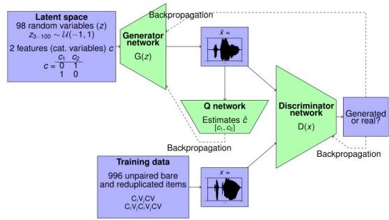  
Figure 1: ciwGAN architecture: three convolutional neural networks are presented by green boxes and inputs to these neural networks are presented by purple boxes. This figure is from (Begus and Zhou, 2022).

However, to avoid expensive manual labeling, we develop a supervised nasal detector (nasalDNN), a deep neural network model adapted from Yurt et al. (2021), to determine whether a generated output carries nasality or not. The nasalDNN is a 1D CNN that takes speech segments as inputs, and calculates the posterior probabilities for the sample at the center point of the segment belongs to nasal phoneme classes [n, m, ng].

For French, we trained the convolutional nasalDNN on the SIWIS dataset, which has ground truth labels for both nasal consonants and nasal vowels. We used these labels to learn a four-way classifier, which we applied to the sample at the center point of each segment. In English, since TIMIT has no ground truth labeling of nasal vowels, we used a different procedure: we learned independent classifiers for vowels and nasal sounds (using consonants as the gold examples of nasals) and detected nasal vowels by intersecting the predictions.

## 4 Data

To learn vowel and nasality features in Engish and French, two ciwGAN instances are trained separately on TIMIT Speech Corpus (Garofolo et al., 1993) and the SIWIS French Speech Synthesis Database (Yamagishi et al., 2017). The TIMIT Speech Corpus includes English raw speech sentences (at 16 kHz sampling rate) and their corresponding time-aligned phonetic labels. In the TIMIT corpus, there are 6300 sentences recorded by 630 speakers from eight dialect regions of the United States. We used the entire TIMIT dataset to extract training data for the English experiment. The SIWIS French Speech Synthesis Database consists of high-quality French speech recordings and associated text files. There are 9750 utterances uttered by French speakers. This French database includes more than ten hours of speech data.

## 4.1 Data Preprocessing

For English dataset, we first excluded SA sentences in TIMIT, which are read by all the speakers, to avoid a possible bias and then extracted sliced sequences of the structure VT and VN from the rest of the sentences 1. 6255 tokens are extracted from the monosyllabic words and 2474 are extracted from the multi-syllabic words’ last syllable . Thus, altogether 8729 tokens from TIMIT were used for training, 5570 tokens of the structure VT, 3159 tokens of the structure VN.

As the SIWIS French Speech Synthesis Database does not provide time-aligned phonetic labels for their recordings, we use the Montreal Forced Aligner (McAuliffe et al., 2017), a forced alignment system with acoustic models using Kaldi speech recognition toolkit (Povey et al., 2011) to time-align a transcript corresponding to a audio file at the phone and word levels. Based on the time-aligned phonetic labels, we extracted sliced sequences of the structure VT, VN, VT,˝ VN˝ 2. As French has contrastive nasal vowels and oral vowels, we used V to indicate nasal vowels ˝ 3 and used V to show oral vowels 4. We extracted 4686 tokens where 2681 tokens are extracted from monosyllabic words and 2005 tokens are from the multisyllabic words’ last syllable. We have 1031 VT˝ tokens, 2577 VT tokens, 47 VN tokens, and 1031˝ VN tokens as French training dataset. Example lexical items of English and French are shown in the appendix.

<table><tr><td rowspan=1 colspan=1>Dataset</td><td rowspan=1 colspan=1>VT</td><td rowspan=1 colspan=1>VN</td><td rowspan=1 colspan=1>VT</td><td rowspan=1 colspan=1>VN</td></tr><tr><td rowspan=1 colspan=1>TIMIT*</td><td rowspan=1 colspan=1>5570</td><td rowspan=1 colspan=1>3159</td><td rowspan=1 colspan=1>0</td><td rowspan=1 colspan=1>0</td></tr><tr><td rowspan=1 colspan=1>SIWIS*</td><td rowspan=1 colspan=1>2577</td><td rowspan=1 colspan=1>1031</td><td rowspan=1 colspan=1>1031</td><td rowspan=1 colspan=1>47</td></tr></table>

Table 1: Training Dataset for CiwGAN to Learn Vowel and Nasality Features in English and French

## 5 Experiments

To explore our first research question: What features of the data contribute to learning the nasal representations in English vs. French, we implement English and French experiments. The results suggest different learned phonetic/phonological representations in ciwGAN may be caused by different typology of English and French syllable types for nasal vowels and nasal consonants.

## 5.1 English Experiment

After the ciwGAN instance is trained for 649 epochs, it learns to generate 3840 speech-like sequences (VT and VN) that are similar to the training data. As described above, we label these outputs with a supervised classifier to determine which ones are nasal, then apply linear regression analysis to identify latent variables that correlate to nasal features. The results of linear regression are shown in Figure 7 in Appendix. Among the 100 latent variables in latent space, we identify 7 latent variables that have the highest chi-square scores, which indicates a strongly correlation to nasality. Figure 7 also illustrates a considerable difference between the highest seven latent variables and the rest of the variables indicating that ciwGAN may encodes nasal feature mainly with these seven latent variables and use other latent variables to increase variance.

We also apply another investigative technique from Begusˇ (2020), in which selected latent variables are set to values outside their training range. As in that study, we examine the audio generated from representations with manipulated variables, which contain exaggerated acoustic cues indicating which phonetic qualities the variables control. We sample 100 random latent vectors, and for each one, manipulate the target variable to values between -5 and 5 in increments of 1.

Although seven latent variables are identified as closely corresponding to the presence of consonants’ nasal feature via linear regression, only two latent variables z13 and z90 show a strong control of the nasality in consonants. Figure 6 , in Appendix, illustrates the manipulation effects of z13 and z90 on nasal consonant. The spectrograms show a relatively high F1 (around 650 Hz) initially which corresponds to the vowel and a lower amplitude (F1 at around 250 Hz) at the end of the sound which represents the nasal consonant [n]. The nasality in the consonant gradually decreases as the values of z13 and z90 increase separately. Seven latent variables are also found to be relative to nasal vowels via linear regression; however, manipulating these seven latent variables, vowels’ nasality do not show a regular change pattern in the generated audios, which indicates that these seven latent variables do not have one to one corresponding control of the nasality in vowels.

As both latent variables z13 and z90 are able to control the nasality in consonants, we further explore the interactive effects of these two latent variables by manipulating them simultaneously to test all combinations of the two variables in range [- 5,5] and increment of 1. However, no clear interactive correlation are found regarding to the nasality between the two latent variables. Although z13 and z90 show effects on the nasal feature in consonants when they are manipulated separately, z90 show a primary control on consonants’ nasality. As illustrated in Figure 2a, when z90 >0, the Generator tends to produce nasal consonants while the value of z13 does not show a clear effect on generated sound features. We also found that vowels’ nasality tends to covary with the presence of nasal codas. In Figure 2a, whenever a nasal vowel is detected in the generated outputs, they also have a nasal consonant detected in the outputs.

We also evaluate if the two latent variables (z4 and z37), with the highest chi-square value for nasal vowels, have effects on producing English nasal vowels. However, neither z4 nor z37 show control of English nasal vowels (the left panel of Figure 2bb); instead, as seen in the right panel, their primary effect is on consonant nasality. These results suggest that ciwGAN encodes English nasal vowels as an non-contrastive phonetic feature which co-occurs with nasal consonants, a phonological feature.

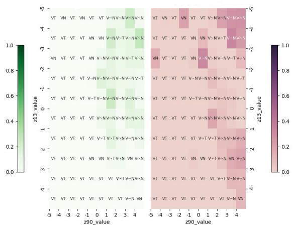  
(a) English - z90 & z13

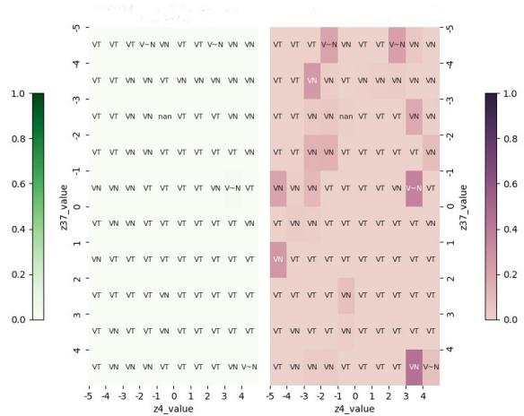  
(b) English - z4 & z37  
Figure 2: English experiment results: Figure 2a shows the generated audios with concurrent manipulation of latent variables z90 and z13 (x axis: z90 & y axis: z13); Figure 2b shows the generated audios with concurrent manipulation of latent variables z4 and z37 (x axis: z4 & y axis: z37); Green color heatmap (left side of Figure 2a and Figure 2b) indicates the detected English nasal vowel on generated audio; Red color heatmap (right side of Figure 2a and Figure 2b) indicates the detected English nasal consonant on the same generated audio; darkness of color refers to the proportion of detected nasal vowels and the detected nasal consonants in the manipulated audios; annotation are syllables types of the manipulated audios based on the results of nasal detectors.

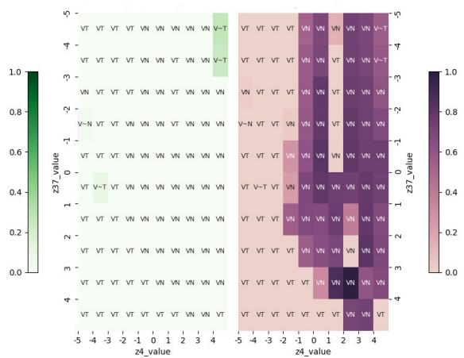  
(a) French - z4 & z37

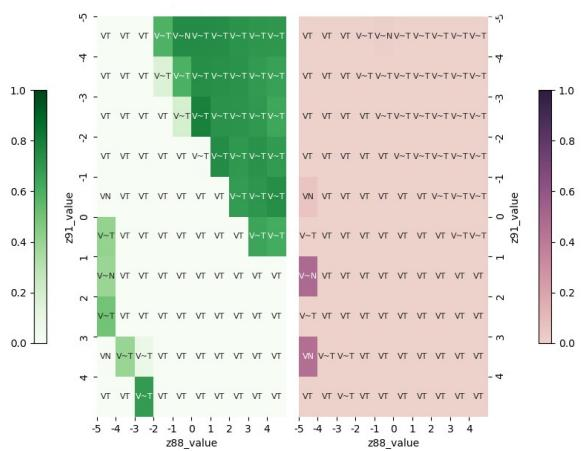  
(b) French - z88 & z91  
Figure 3: French experiment results: Figure 3a shows the generated audios with concurrent manipulation of latent variables z4 and z37 (x axis: z4 & y axis: z37); Figure 3b shows the generated audios with concurrent manipulation of latent variables z88 and z91 (x axis: z88 & y axis: z91). Green heatmap indicates the detected French nasal vowel; Red heatmap indicates the detected French nasal consonant.

## 5.2 French Experiment

The networks learn to generate speech-like sequences (VT, VN, VT,˝ VN) that are similar to train-˝ ing data as well as the distribution of nasalized vowels and oral vowels in French after 649 epochs training. We perform the same analysis process as we had in English Experiment. Two latent variables (z4 and z37) are also found to be closely relative to French nasal consonants. Different from English, two latent variables (z88 and z91) show independent control of French nasal vowels.

Manipulating these pairs of latent variables concurrently shows some interaction of latent variables in controlling nasal vowels and nasal consonants. In Figure 3a, although z4 show primary controls of nasal consonants, as nasal consonants tend to presence in the generated outputs when z4 is positive, some interaction effects of z4 and z37 are found near the bottom right of the right panel. In Figure 3b, z88 and z91 demonstrates interactive effects on the nasal vowels: when z88 >0 and z91<0, the Generator tends to output nasal vowels. Most importantly, the variables tested in Figure 3ba control nasal consonants while the ones in Figure 3bb control vowels— unlike the English results, in which one set of variables controlled both. These results indicate that both French nasal vowels and nasal consonants are encoded as independent phonological features in ciwGAN and ciwGAN seems to apply some interactions between latent variables to control the presence of phonological features.

## 5.3 Balanced Training Dataset Experiments

In previous two experiments,we found that ciw-GAN can capture the contrastiveness of the phonological phenomenon in English and French with different learned representation. We are also interested to evaluate how would the frequencies of different syllable types in the training data affect the learned representations of ciwGAN. We conduct experiments on two artificially balanced datasets. For our English-like experiment, we have 5570 tokens of the VT, 5570 tokens of VN. For French-like experiment, as most French nasal vowels extracted from SIWIS tend to be /o/, we mitigate this bias by˝ only include tokens with vowel /o/ for all syllable types in the training dataset: 1031 tokens of the oT,

1031 tokens of oN, 1031 tokens of oT, 1031 tokens˝ of oN.˝

English-like Experiment In contrast to the natural English ciwGAN, where no latent variables are found to control nasal vowels, the Generator seems to encode vowels’ nasality with latent variables (z60, z71), even though latent variable z60 is found to controls the both nasal consonants and nasal vowels. By manipulating z60 to [-5, 5], we can decrease the proportion of nasality in both vowels and consonants and have nasal vowels and nasal consonants completely disappear in the generated data.

Interactive effects are found between z60 and z68 and between z60 and z71 in controlling nasal consonants and nasal vowels respectively, which is similar to the interactive correlations of latent variables we found in French experiment. As illustrated in Figure 4a and Figure 4b, the ciwGAN tends to generate nasal consonants except when the values of z60 and z68 are both set to negative and ciwGAN will generate nasal vowels when z60 and z71 are non-negative. Despite the dependency between nasal vowels and nasal consonants is also found in English ciwGAN with balanced dataset: the Generator tends to produce nasal vowels following nasal consonants, ciwGANs can generate independent nasal vowels in some generated audio: there are some tokens carry VT in the generated˝ audios.

French-like Experiment With balanced dataset, we can still find latent variables that only control nasal consonants. As shown in Figure 4a nasal consonants can be produced independently when z60 <0 and z71 >0. Interactive effects of latent variables are also found on both nasal vowels and nasal codas. ciwGAN tend to generate nasal vowels when z16>0 and z88 <0, as in Figure 4b. However, different from the model trained on natural French dataset, we cannot find latent variables that only control French nasal vowels. When z16 is set to a positive value and z88 is set to be negative, the generated audios on the top right of the Figure 4b, are detected to have both nasal vowels and nasal consonants.

The phenomenon that interactive effects occurs in ciwGAN with balanced English dataset matches with the finding in French experiment and Frenchlike experiment, which suggests that ciwGAN develops similar learned representations between the two languages with balanced datasets. Besides, no latent variables can only control French nasal vowels in French-like experiment, which is similar to the results in English-like experiments, but different from French experiment.

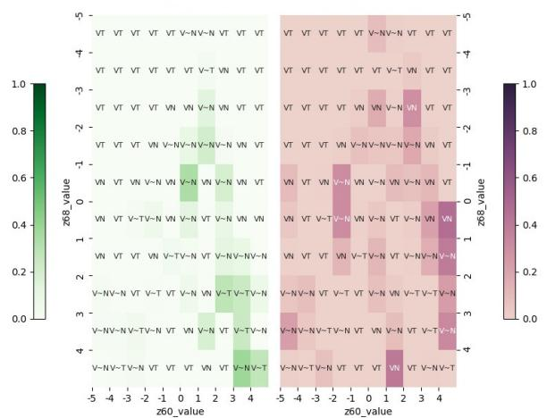  
(a) English like - z60 & z68

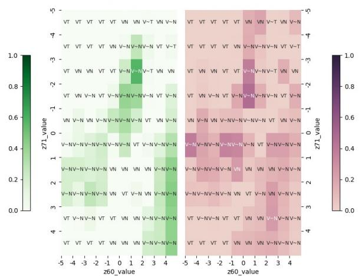  
(b) English like - z60 & z71  
Figure 4: English-like experiment results: Figure 4a shows the generated audios with concurrent manipulation of latent variables z60 and z68 (x axis: z60 & y axis: z68); Figure 4b shows the generated audios with concurrent manipulation of latent variables z71 and z60 (x axis: z71 & y axis: z60) Green heatmap indicates the detected English nasal vowel; Red heatmap indicates the detected English nasal consonant.

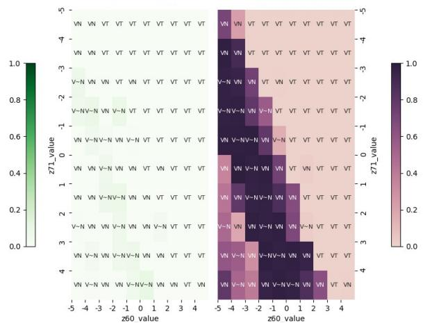  
(a) French-like - z60 & z71

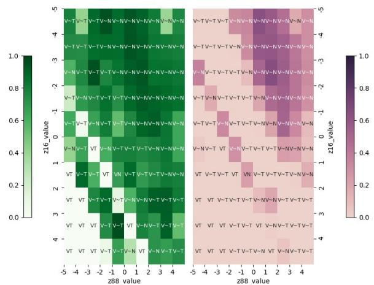  
(b) French-like - z88 & z16  
Figure 5: French-like experiment results: Figure 5a shows the generated audios with concurrent manipulation of latent variables z60 and z71 (x axis: z60 & y axis: z71); Figure 5b shows the generated audios with concurrent manipulation of latent variables z88 and z16 (x axis: z88 & y axis: z16) Green heatmap indicates the detected French nasal vowel; Red heatmap indicates the detected French nasal consonant.

## 6 Conclusion

Our results qualify Begusˇ (2020a)’s claim that GANs can learn clearly interpretable representational systems in which single latent variables correspond to identifiable phonological features. While we do find this in the English experiment, we do not find it in the French experiment, Englishlike experiment and French-like experiment. This suggests that both the frequencies with which different syllable types in the data occur, and the contrastiveness of the phonological phenomenon, may affect whether the learned representation is simple or distributed across many variables. Moreover, as the learned representations in ciwGANs involve featural conjunction, this counters Begusˇ (2020a)’s claim of ciwGANs having an independent dimension for every phonological feature. In future work, understanding more complicated feature interactions, we plan to use eigendecomposition or other methods which can more easily represent higher-order interactions between features. However, our current methods are still informative about the learned representations, since the regression analyses show that only a few of the learned features are critical to representing nasality.

On the other hand, we do find that GANs clearly distinguish between the contrastive and noncontrastive status of vowel nasality in English and French. This supports Begusˇ (2020a)’s higher-level claim that GANs are good phonological learners by testing it in a more controlled setting in which the same feature is compared across languages.

While artificially balancing the frequencies of syllable types in the training data does not erase the difference between English and French, we do observe that the learned representations are more similar between the two, and that the GANs learning from English data begins to be able to generate some VT syllables, although with low frequency.˝ This aligns with a widespread theory for the origin of contrastive nasality in languages like French. Changing the patterns’ frequency will change the feature systems in languages.

Our results highlight the difficulty of learning featural phonological representations from acoustic data, as well as the interpretational difficulties of detecting such representations once learned. We believe that the question of which architectures successfully acquire these systems is still open— more work needs to be done on larger pretrained models to determine which, if any, of these generalizations they encode. More careful comparisons between smaller-scale systems can also shed light on how well they distinguish between completely predictable (allophonic) distributional properties of segments due to phonotactic constraints, and statistical regularities due to the lexicon or morphology.

On the other hand, the observed difficulty of learning these generalizations lends support to theories of phonological change in which mistakes in acquisition lead to the expansion or restructuring of a feature inventory (Foulkes and Vihman, 2013). By looking at historical corpus of old French, we can observe how the lexicon evolves over time changing the frequency of different vowel-consonant combinations. The fact that changes in frequency result in this kind of change for our model is evidence that this mechanism is plausible, and offers a route to testing its explanatory power for specific historical hypotheses in the future.

Although the long-term goal of this research is understanding how phonological representation learning works for a variety of models and phenomena, we believe it is necessary to start small, with the treatment of one particular phenomenon. In text linguistics, there are now established benchmarks for understanding linguistic representation in language models, for example, The Benchmark of Linguistic Minimal Pairs (BLiMP) (Warstadt et al., 2020), but in speech linguistics, we are lagging behind. Even doing studies of an individual phenomenon requires identifying a phonological phenomenon, extracting and labeling a corpus and conducting a study of the model’s learning behavior. A diverse and comprehensive benchmark dataset for studying phonological learning (beyond phoneme segmentation and categorization) would be an exciting goal for future work.

## 7 Acknowledgements

We thank the Phonies group at OSU Linguistics Department for helpful discussion, especially Dr. Cynthia Clopper and Dr. Becca Morley. We also thank Dr. Gasper Begu ˇ s for sharing the trainingˇ dataset used in (Begus and Zhou, 2022)

## 8 Limitations

The study of language model in their alignment to linguistic theories are interdisciplinary and hence usually hard to find explicit connection between language model and theories. In this paper we claim that a generative model, ciwGAN, can model both phonetic and phonology features. However, the two features are learned by two ciwGAN instances from disjoint training data sets. Our finding couldn’t support or deny the following statements that are of researchers’ concern:

1. Generic GAN model can learn phonology features like ciwGAN.

2. CiwGAN can model phonetic and phonology features simultaneously from a single dataset.

## References

Alexei Baevski, Steffen Schneider, and Michael Auli. 2020a. Vq-wav2vec: Self-Supervised Learning of Discrete Speech Representations.

Alexei Baevski, Henry Zhou, Abdelrahman Mohamed, and Michael Auli. 2020b. Wav2vec 2.0: A Framework for Self-Supervised Learning of Speech Representations.

Gasper Begu ˇ s. 2020. Generative adversarial phonology:ˇ Modeling unsupervised phonetic and phonological learning with neural networks. Frontiers in artificial intelligence, 3:44.

Gasper Begus and Alan Zhou. 2022. Interpreting Intermediate Convolutional Layers of Generative CNNs Trained on Waveforms. 30:3214–3229.

Gasper Beguˇ s. 2020a.ˇ Generative Adversarial Phonology: Modeling Unsupervised Phonetic and Phonological Learning With Neural Networks. 3:44.

Gasper Beguˇ s. 2020b. Modeling unsupervised phoneticˇ and phonological learning in Generative Adversarial Phonology.

Gasper Beguˇ s. 2021a.ˇ Ciwgan and fiwgan: Encoding information in acoustic data to model lexical learning with generative adversarial networks. 139:305–325.

Gasper Beguˇ s. 2021b.ˇ Identity-based patterns in deep convolutional networks: Generative adversarial phonology and reduplication. 9:1180–1196.

Xi Chen, Yan Duan, Rein Houthooft, John Schulman, Ilya Sutskever, and Pieter Abbeel. 2016. Infogan: Interpretable representation learning by information maximizing generative adversarial nets. Advances in neural information processing systems, 29.

Grzegorz Chrupała, Lieke Gelderloos, and Afra Alishahi. 2017. Representations of language in a model of visually grounded speech signal. In Proceedings of the 55th Annual Meeting of the Association for Computational Linguistics (Volume 1: Long Papers), pages 613–622, Vancouver, Canada. Association for Computational Linguistics.

Yu-An Chung, Chao-Chung Wu, Chia-Hao Shen, Hung-Yi Lee, and Lin-Shan Lee. 2016. Audio Word2Vec: Unsupervised Learning of Audio Segment Representations using Sequence-to-sequence Autoencoder.

Abigail C Cohn. 1993. Nasalisation in english: phonology or phonetics. Phonology, 10(1):43–81.

Paul T Donahue, Samuel J Wilson, Charles C Williams, Melinda Valliant, and John C Garner. 2019. Impact of hydration status on electromyography and ratings of perceived exertion during the vertical jump. International Journal ofKinesiology and Sports Science, 7(4):1–9.

Ewan Dunbar, Robin Algayres, Julien Karadayi, Mathieu Bernard, Juan Benjumea, Xuan-Nga Cao, Lucie Miskic, Charlotte Dugrain, Lucas Ondel, Alan W. Black, Laurent Besacier, Sakriani Sakti, and Emmanuel Dupoux. 2019. The Zero Resource Speech Challenge 2019: TTS without T.

Ewan Dunbar, Mathieu Bernard, Nicolas Hamilakis, Tu Anh Nguyen, Maureen de Seyssel, Patricia Roze, Morgane Rivi´ ere, Eugene Kharitonov, and Em-\` manuel Dupoux. 2021. The Zero Resource Speech Challenge 2021: Spoken language modelling.

Ewan Dunbar, Xuan Nga Cao, Juan Benjumea, Julien Karadayi, Mathieu Bernard, Laurent Besacier, Xavier Anguera, and Emmanuel Dupoux. 2017. The Zero Resource Speech Challenge 2017.

Ewan Dunbar, Julien Karadayi, Mathieu Bernard, Xuan-Nga Cao, Robin Algayres, Lucas Ondel, Laurent Besacier, Sakriani Sakti, and Emmanuel Dupoux. 2020. The Zero Resource Speech Challenge 2020: Discovering discrete subword and word units.

Paul Foulkes and Marilyn May Vihman. 2013. First language acquisition and phonological change.

Richard Futrell, Ethan Wilcox, Takashi Morita, Peng Qian, Miguel Ballesteros, and Roger Levy. 2019. Neural language models as psycholinguistic subjects: Representations of syntactic state. In Proceedings of the 2019 Conference of the North American Chapter of the Association for Computational Linguistics: Human Language Technologies, Volume 1 (Long and Short Papers), pages 32–42, Minneapolis, Minnesota. Association for Computational Linguistics.

John S Garofolo, Lori F Lamel, William M Fisher, Jonathan G Fiscus, and David S Pallett. 1993. Darpa timit acoustic-phonetic continous speech corpus cdrom. nist speech disc 1-1.1. NASA STI/Recon technical report n, 93:27403.

Lieke Gelderloos and Grzegorz Chrupała. 2016. From phonemes to images: levels of representation in a recurrent neural model of visually-grounded language learning. arXiv preprint arXiv:1610.03342.

Ian Goodfellow, Jean Pouget-Abadie, Mehdi Mirza, Bing Xu, David Warde-Farley, Sherjil Ozair, Aaron Courville, and Yoshua Bengio. 2020. Generative adversarial networks. 63(11):139–144.

Ian J. Goodfellow, Jean Pouget-Abadie, Mehdi Mirza, Bing Xu, David Warde-Farley, Sherjil Ozair, Aaron Courville, and Yoshua Bengio. 2014. Generative adversarial networks.

Kristina Gulordava, Piotr Bojanowski, Edouard Grave, Tal Linzen, and Marco Baroni. 2018. Colorless green recurrent networks dream hierarchically. In Proceedings ofthe 2018 Conference ofthe North American Chapter of the Association for Computational Linguistics: Human Language Technologies, Volume 1 (Long Papers), pages 1195–1205, New Orleans, Louisiana. Association for Computational Linguistics.

Bruce Hayes. 2011. Introductory phonology. John Wiley & Sons.

Wei-Ning Hsu, Benjamin Bolte, Yao-Hung Hubert Tsai, Kushal Lakhotia, Ruslan Salakhutdinov, and Abdelrahman Mohamed. 2021. HuBERT: Self-Supervised Speech Representation Learning by Masked Prediction of Hidden Units.

Rene Kager. 1999. ´ Optimality theory. Cambridge university press.

Jey Han Lau, Alexander Clark, and Shalom Lappin. 2017. Grammaticality, acceptability, and probability: A probabilistic view of linguistic knowledge. Cognitive Science, 41(5):1202–1241.

Tal Linzen, Emmanuel Dupoux, and Yoav Goldberg. 2016. Assessing the ability of lstms to learn syntaxsensitive dependencies. Transactions ofthe Associationfor Computational Linguistics, 4:521–535.

Rebecca Marvin and Tal Linzen. 2018. Targeted syntactic evaluation of language models. In Proceedings of the 2018 Conference on Empirical Methods in Natural Language Processing, pages 1192–1202, Brussels, Belgium. Association for Computational Linguistics.

Michael McAuliffe, Michaela Socolof, Sarah Mihuc, Michael Wagner, and Morgan Sonderegger. 2017. Montreal forced aligner: Trainable text-speech alignment using kaldi. In Interspeech, volume 2017, pages 498–502.

April McMahon. 2002. An introduction to English phonology. Edinburgh University Press.

Richard Ogden. 2017. Introduction to English phonetics. Edinburgh university press.

Aaron van den Oord, Sander Dieleman, Heiga Zen, Karen Simonyan, Oriol Vinyals, Alex Graves, Nal Kalchbrenner, Andrew Senior, and Koray Kavukcuoglu. 2016. WaveNet: A Generative Model for Raw Audio.

Daniel Povey, Arnab Ghoshal, Gilles Boulianne, Lukas Burget, Ondrej Glembek, Nagendra Goel, Mirko Hannemann, Petr Motlicek, Yanmin Qian, Petr Schwarz, et al. 2011. The kaldi speech recognition toolkit. In IEEE 2011 workshop on automatic speech recognition and understanding, CONF. IEEE Signal Processing Society.

Alec Radford, Luke Metz, and Soumith Chintala. 2015. Unsupervised representation learning with deep convolutional generative adversarial networks. arXiv preprint arXiv:1511.06434.

Okko Ras¨ anen, Tasha Nagamine, and Nima Mesgarani.¨ 2016. Analyzing distributional learning of phonemic categories in unsupervised deep neural networks. In CogSci... Annual Conference ofthe Cognitive Science Society. Cognitive Science Society (US). Conference, volume 2016, page 1757. NIH Public Access.

Cory Shain and Micha Elsner. 2019. Measuring the perceptual availability of phonological features during language acquisition using unsupervised binary stochastic autoencoders. In Proceedings ofthe 2019 Conference of the North American Chapter of the Associationfor Computational Linguistics: Human Language Technologies, Volume 1 (Long and Short Papers), pages 69–85. Association for Computational Linguistics.

Alex Warstadt, Alicia Parrish, Haokun Liu, Anhad Mohananey, Wei Peng, Sheng-Fu Wang, and Samuel R Bowman. 2020. Blimp: The benchmark of linguistic minimal pairs for english. Transactions of the Associationfor Computational Linguistics, 8:377–392.

Junichi Yamagishi, Pierre-Edouard Honnet, Philip Garner, Alexandros Lazaridis, et al. 2017. The siwis french speech synthesis database.

Ryuichi Yamamoto, Eunwoo Song, and Jae-Min Kim. 2020. Parallel WaveGAN: A fast waveform generation model based on generative adversarial networks with multi-resolution spectrogram.

Metehan Yurt, Pavan Kantharaju, Sascha Disch, Andreas Niedermeier, Alberto N Escalante-B, and Veniamin I Morgenshtern. 2021. Fricative phoneme detection using deep neural networks and its comparison to traditional methods. In Proc. Interspeech, pages 51–55.

Elizabeth C Zsiga. 2012. The sounds oflanguage: An introduction to phonetics and phonology. John Wiley & Sons.

## A Manipulation Effects on Nasal Consonant

Figure 6 illustrates the manipulation effects of z13 and z90 on nasal consonant.

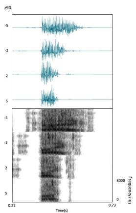

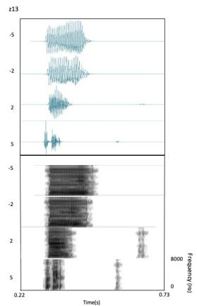  
Figure 6: Waveforms and spectrograms (0-8000 Hz) of generated audio with z90 variable manipulated (left); Waveforms and spectrograms (0-8000 Hz) of generated audio with z13 variable manipulated (right)

## B Example Lexical Items of French and English

<table><tr><td rowspan=1 colspan=9>French Lexical Items from dataset</td></tr><tr><td rowspan=1 colspan=2>Syllabletypes</td><td rowspan=1 colspan=2>Orthography</td><td rowspan=1 colspan=2>IPA</td><td rowspan=1 colspan=2>Gloss</td><td rowspan=1 colspan=1>Extractedpart</td></tr><tr><td rowspan=1 colspan=2>CVTCVNCÚTCN</td><td rowspan=1 colspan=2>potebon amipontemon ami</td><td rowspan=1 colspan=2>/pot//bonami//p&quot;ot//m&quot;onami/</td><td rowspan=1 colspan=2>&quot;buddy&quot;&quot;goodfriend&quot;&quot;clutch&quot;&quot;myfriend&quot;</td><td rowspan=1 colspan=1>/ot//on/l&#x27;ot/l’on/</td></tr><tr><td rowspan=3 colspan=1></td><td rowspan=1 colspan=8>English Lexical Items from dataset</td></tr><tr><td rowspan=1 colspan=2>Syllabletypes</td><td rowspan=1 colspan=2>Orthography</td><td rowspan=1 colspan=2>IPA</td><td rowspan=1 colspan=2>Extractedpart</td></tr><tr><td rowspan=1 colspan=2>CVTCVN</td><td rowspan=1 colspan=2>badban</td><td rowspan=1 colspan=2>/bæd//bæn/</td><td rowspan=1 colspan=2>/æd//æn/</td></tr></table>

## C Model Parameters and Source Code

WaveGAN parameters and source code are provided in https://github.com/DeliJingyiC/ wavegan\_phonology.git

## D Linear Regression Analysis

In section 5, we have linear regression analysis to identify latent variables that correlate to nasal features. The values of 100 latent variables in ciw-GAN’s latent space is analyzed and 7 latent variables that have the highest chi-square scores are considered to have a strongly correlation to nasality.

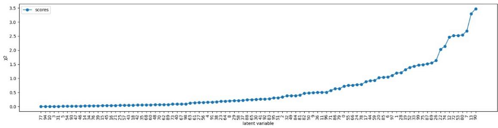  
Figure 7: Linear regression analysis of the nasality and the corresponding latent variables z. Y axis is Chisquare scores for 97 latent variable z and X axis is latent variables z.

A For every submission: ✓ A1. Did you describe the limitations of your work? Section 7

✗ A2. Did you discuss any potential risks of your work? This paper does not include any risks listed in the checklist.

✓ A3. Do the abstract and introduction summarize the paper’s main claims? Left blank.

✗ A4. Have you used AI writing assistants when working on this paper? Left blank.

## B ✓ Did you use or create scientific artifacts?

Section 3 and 4

✓ B1. Did you cite the creators of artifacts you used? Section 3 and 4

 B2. Did you discuss the license or terms for use and / or distribution of any artifacts? Not applicable. I use TIMIT dataset and SIWIS French Speech Synthesis Database. The licensesfor these two dataset are unknown

✓ B3. Did you discuss if your use of existing artifact(s) was consistent with their intended use, provided that it was specified? For the artifacts you create, do you specify intended use and whether that is compatible with the original access conditions (in particular, derivatives of data accessed for research purposes should not be used outside of research contexts)? Section 5

 B4. Did you discuss the steps taken to check whether the data that was collected / used contains any information that names or uniquely identifies individual people or offensive content, and the steps taken to protect / anonymize it? Not applicable. Left blank.

✓ B5. Did you provide documentation of the artifacts, e.g., coverage of domains, languages, and linguistic phenomena, demographic groups represented, etc.? Section 4

✓ B6. Did you report relevant statistics like the number of examples, details of train / test / dev splits, etc. for the data that you used / created? Even for commonly-used benchmark datasets, include the number of examples in train / validation / test splits, as these provide necessary context for a reader to understand experimental results. For example, small differences in accuracy on large test sets may be significant, while on small test sets they may not be. Section 4

## C ✗ Did you run computational experiments?

Left blank.

 C1. Did you report the number of parameters in the models used, the total computational budget (e.g., GPU hours), and computing infrastructure used? No response.

 C2. Did you discuss the experimental setup, including hyperparameter search and best-found hyperparameter values? No response.

 C3. Did you report descriptive statistics about your results (e.g., error bars around results, summary statistics from sets of experiments), and is it transparent whether you are reporting the max, mean, etc. or just a single run? No response.

 C4. If you used existing packages (e.g., for preprocessing, for normalization, or for evaluation), did you report the implementation, model, and parameter settings used (e.g., NLTK, Spacy, ROUGE, etc.)? No response.

D ✗ Did you use human annotators (e.g., crowdworkers) or research with human participants? Left blank.

 D1. Did you report the full text of instructions given to participants, including e.g., screenshots, disclaimers of any risks to participants or annotators, etc.? No response.

 D2. Did you report information about how you recruited (e.g., crowdsourcing platform, students) and paid participants, and discuss if such payment is adequate given the participants’ demographic (e.g., country of residence)? No response.

 D3. Did you discuss whether and how consent was obtained from people whose data you’re using/curating? For example, if you collected data via crowdsourcing, did your instructions to crowdworkers explain how the data would be used? No response.

 D4. Was the data collection protocol approved (or determined exempt) by an ethics review board? No response.

 D5. Did you report the basic demographic and geographic characteristics of the annotator population that is the source of the data? No response.