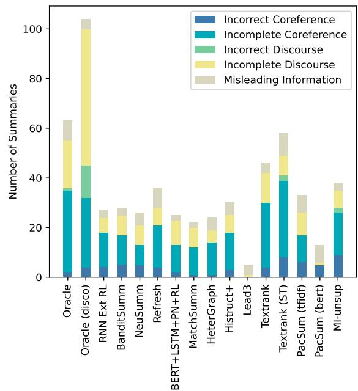
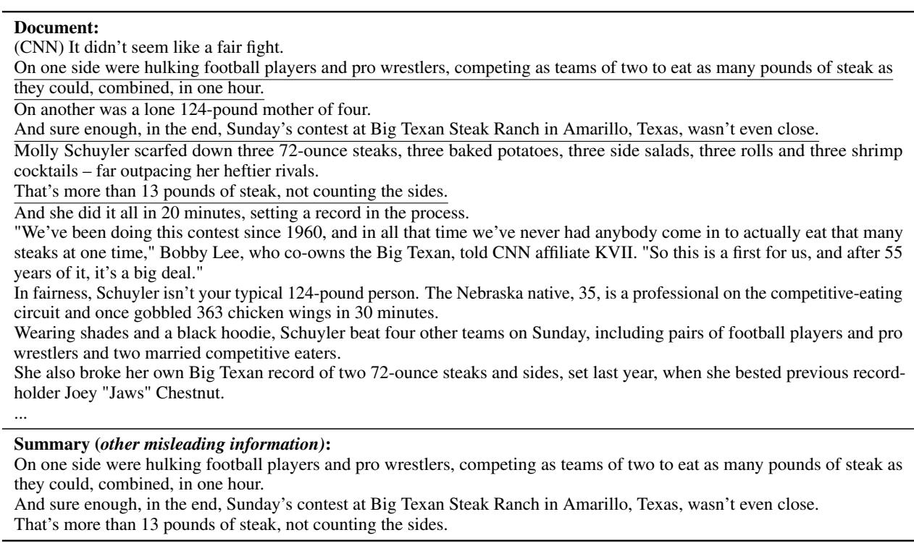
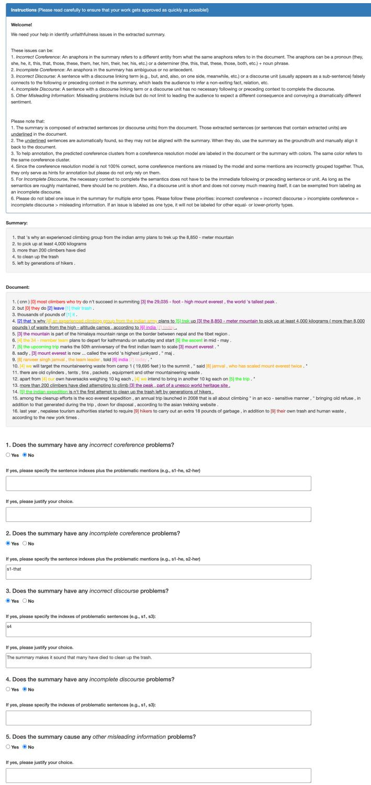

# Extractive is not Faithful: An Investigation of Broad Unfaithfulness Problems in Extractive Summarization

Shiyue Zhang∗ David Wan∗ Mohit Bansal

UNC Chapel Hill

{shiyue, davidwan, mbansal}@cs.unc.edu

## Abstract

The problems of unfaithful summaries have been widely discussed under the context of abstractive summarization. Though extractive summarization is less prone to the common unfaithfulness issues of abstractive summaries, does that mean extractive is equal to faithful? Turns out that the answer is no. In this work, we define a typology with five types of broad unfaithfulness problems (including and beyond not-entailment) that can appear in extractive summaries, including incorrect coreference, incomplete coreference, incorrect discourse, incomplete discourse, as well as other misleading information. We ask humans to label these problems out of 1600 English summaries produced by 16 diverse extractive systems. We find that 30% of the summaries have at least one of the five issues. To automatically detect these problems, we find that 5 existing faithfulness evaluation metrics for summarization have poor correlations with human judgment. To remedy this, we propose a new metric, EXTEVAL, that is designed for detecting unfaithful extractive summaries and is shown to have the best performance. We hope our work can increase the awareness of unfaithfulness problems in extractive summarization and help future work to evaluate and resolve these issues.

## 1 Introduction

Text summarization is the process of distilling the most important information from a source to produce an abridged version for a particular user or task (Maybury, 1999). Although there are many types of text summarization tasks, in this work, we focus on the task of general purpose single document summarization. To produce summaries, usually either extractive summarization methods, i.e., extracting sentences from the source, or abstractive summarization methods, i.e., generating novel text, are applied (Saggion and Poibeau, 2013).

Abstractive summarization attracts more attention from recent works because it can produce more coherent summaries and behaves more like humans (Cohn and Lapata, 2008). Impressive progress has been made for abstractive summarization by large-scale pre-trained models (Lewis et al., 2020; Zhang et al., 2020a). However, unfaithfulness problems, i.e., hallucinating new information or generating content that contradicts the source, are widely spread across models and tasks (Cao et al., 2018; Maynez et al., 2020). Although these problems do not necessarily get captured by typically-used evaluation metrics, e.g., ROUGE (Lin, 2004), even minor unfaithfulness can be catastrophic and drive users away from real-world applications. Therefore, an increasing volume of research has focused on analyzing (Falke et al., 2019; Maynez et al., 2020; Goyal and Durrett, 2021), evaluating (Kryscinski et al., 2020; Goyal and Durrett, 2021; Wang et al., 2020a; Durmus et al., 2020; Scialom et al., 2021; Xie et al., 2021), or addressing (Cao et al., 2018; Li et al., 2018; Fan et al., 2018; Chen et al., 2021; Cao and Wang, 2021; Xu et al., 2022; Wan and Bansal, 2022) unfaithfulness problems in abstractive summarization.

Extractive summarization is known to be faster, more interpretable, and more reliable (Chen and Bansal, 2018; Li et al., 2021; Dreyer et al., 2021). And the selection of important information is the first skill that humans learn for summarization (Kintsch and van Dijk, 1978; Brown and Day, 1983). Recently, some works discuss the trade-off between abstractiveness and faithfulness (Ladhak et al., 2022; Dreyer et al., 2021). They find that the more extractive the summary is, the more faithful it is.2 This may give the community the impression that if the content is extracted from the source, it is guaranteed to be faithful. However, is this always true? In this work, we will show that, unfortunately, it is not.

The problems of extractive summarization are usually referred as coherence, out-of-context, or readability issues (Nanba and Okumura, 2000; Nenkova and McKeown, 2012; Saggion and Poibeau, 2013; Dreyer et al., 2021). Though they may sound irrelevant to faithfulness, some early works give hints of their unfaithful ingredients. Gupta and Lehal (2010) describe the ‘dangling anaphora problem – sentences often contain pronouns that lose their referents when extracted out of context, and stitching together extracts may lead to a misleading interpretation ofanaphors. Barzilay et al. (1999) comment on extractive methods for multi-document summarization, that extracting some similar sentences could produce a summary biases towards some sources. Cheung (2008) says that sentence extraction produces extremely incoherent text that did not seem to convey the gist of the overall controversiality of the source. These all suggest that even though all information is extracted directly from the source, the summary is not necessarily faithful to the source. However, none of these works has proposed an error typology nor quantitatively answered how unfaithful the model extracted summaries are, which motivates us to fill in this missing piece.

In this work, we conduct a thorough investigation of the broad unfaithfulness problems in extractive summarization. Although the literature of abstractive summarization usually limits unfaithful summaries to those that are not entailed by the source (Maynez et al., 2020; Kryscinski et al., 2020), we discuss broader unfaithfulness issues including and beyond not-entailment. We first design a typology consisting five types of unfaithfulness problems that could happen in extractive summaries: incorrect coreference, incomplete coreference, incorrect discourse, incomplete discourse, and other misleading information (see definitions in Figure 2). Among them, incorrect coreference and incorrect discourse are not-entailment based errors. An example of incorrect coreference is shown in Summary 1 of Figure 1, where that in the second sentence should refer to the second document sentence –But they do leave their trash, but it incorrectly refers to the first sentence in the summary.

Summaries with incomplete coreferences or discourses are usually entailed by the source, but they can still lead to unfaithful interpretations. Lastly, inspired by misinformation (O’Connor and Weatherall, 2019), our misleading information error type refers to other cases where, despite being entailed by the source, the summary still misleads the audience by selecting biased information, giving the readers wrong impressions, etc (see Section 2).

We ask humans to label these problems out of 1600 model extracted summaries that are produced by 16 extractive summarization systems for 100 CNN/DM English articles (Hermann et al., 2015). These 16 systems cover both supervised and unsupervised methods, include both recent neuralbased and early graph-based models, and extract sentences or elementary discourse units (see Section 3). By analyzing human annotations, we find that 30.3% of the 1600 summaries have at least one of the five types of errors. Out of which, 3.9% and 15.4% summaries contain incorrect and incomplete coreferences respectively, 1.1% and 10.7% summaries have incorrect and incomplete discourses respectively, and other 4.9% summaries still mislead the audience without having coreference or discourse issues. The non-negligible error rate demonstrates that extractive is not necessarily faithful. Among the 16 systems, we find that the two oracle extractive systems (that maximize ROUGE (Lin, 2004) against the gold summary by using extracted discourse units or sentences) surprisingly have the most number of problems, while the Lead3 model (the first three sentences of the source document) causes the least number of issues.

We examine whether these problems can be automatically detected by 5 widely-used metrics, including ROUGE (Lin, 2004) and 4 faithfulness evaluation metrics for abstractive summarization (FactCC (Kryscinski et al., 2020), DAE (Goyal and Durrett, 2020), QuestEval (Scialom et al., 2021), BERTScore (Zhang et al., 2020b)). We find that, except BERTScore, they have either no or small correlations with human labels. We design a new metric, EXTEVAL, for extractive summarization. It contains four sub-metrics that are used to detect incorrect coreference, incomplete coreference, incorrect or incomplete discourse, and sentiment bias, respectively. We show that EXTEVAL performs best at detecting unfaithful extractive summaries (see Section 4 for more details). Finally, we discuss the generalizability and future directions of

<table><tr><td>Document: (CNN) Most climbers who try don&#x27;t succeed in summiting the 29,035-foot-high Mount Everest, the world&#x27;s tallest peak. But they do leave their trash. Thousands of pounds of it.</td></tr><tr><td>That&#x27;s why an experienced climbing group from the Indian army plans to trek up the 8,850-meter mountain to pick up at least 4,000 kilograms (more than 8,000 pounds) of waste from the high-altitude camps, according to India Today.</td></tr><tr><td>The mountain is part of the Himalaya mountain range on the border between Nepal and the Tibet region.</td></tr><tr><td>The 34-member team plans to depart for Kathmandu on Saturday and start the ascent in mid-May.</td></tr><tr><td>The upcoming trip marks the 50th anniversary of the first Indian team to scale Mount Everest [...]</td></tr><tr><td>More than 200 climbers have died attempting to climb the peak, part of a UNESCO World Heritage Site. The Indian expedition isn&#x27;t the first attempt to clean up the trash left by generations of hikers[...]</td></tr><tr><td>Summary 1 (incorrect coreference): (CNN) Most climbers who try don&#x27;t succeed in summiting the 29,035-foot-high Mount Everest, the world&#x27;s tallest peak.</td></tr><tr><td>That&#x27;s why an experienced climbing group from the Indian army plans to trek up the 8,850-meter mountain to pick up at least 4,000 kilograms (more than 8,000 pounds) of waste from the high-altitude camps, according to India Today. [...] Summary 2 (incomplete coreference &amp; incorrect discourse) : That&#x27;s why an experienced climbing group from the Indian army plans to trek up the 8,850-meter mountain</td></tr><tr><td>to pick up at least 4,000 kilograms More than 200 climbers have died</td></tr><tr><td>Summary 3 (incomplete discourse &amp; incomplete coreference):</td></tr><tr><td>to clean up the trash [...]</td></tr></table>

Figure 1: An example from CNN/DM (Hermann et al., 2015) testing set showing the first four types of unfaithfulness problems defined in section 2. The three summaries are generated by NeuSumm (Zhou et al., 2018a) Oracle (disco) (Xu et al., 2020), and BERT+LSTM+PN+RL (Zhong et al., 2019), respectively. All extracted sentences or discouse units are underlined in the document. The problematic parts are bolded in the summary. The incorrect reference in the summary is marked with red, and the correct reference is marked with blue in the document. We replace non-relevant sentences with [...].

## our work in Section 5.

In summary, our contributions are (1) a taxonomy of broad unfaithfulness problems in extractive summarization, (2) a human-labeled evaluation set with 1600 examples from 16 diverse extractive systems, (3) meta-evaluations of 5 existing metrics, (4) a new faithfulness metric (EXTEVAL) for extractive summarization. Overall, we want to remind the community that even when the content is extracted from the source, there is still a chance to be unfaithful. Hence, we should be aware of these problems, be able to detect them, and eventually resolve them to achieve a more reliable summarization.

## 2 Broad Unfaithfulness Problems

In this section, we will describe the five types of broad unfaithfulness problems (Figure 2) we identified for extractive summarization under our typology. In previous works about abstractive summarization, unfaithfulness usually only refers to the summary being not entailed by the source (Maynez et al., 2020; Kryscinski et al., 2020). The formal definition of entailment is t entails h if, typically, a human reading t would infer that h is most likely true (Dagan et al., 2005). While we also consider being not entailed as one of the unfaithfulness problems, we will show that there is still a chance to be unfaithful despite being entailed by the source. Hence, we call the five error types we define here the ‘broad’ unfaithfulness problems, and we provide a rationale for each error type in Figure 2.

The most frequent unfaithfulness problem of abstractive summarization is the presence of incorrect entities or predicates (Gabriel et al., 2021; Pagnoni et al., 2021), which can never happen within extracted sentences (or elementary discourse units3). For extractive summarization, the problems can only happen ‘across’ sentences (or units).4 Hence, we first define four error types about coreference and discourse. Following SemEval-2010 (Màrquez et al., 2013), we define coreference as the mention of the same textual references to an object in the discourse model, and we focus primarily on anaphors that require finding the correct antecedent. We ground our discourse analysis for systems that extract sentences in the Penn Discourse Treebank (Prasad et al., 2008), which considers the discourse relation between sentences as “lexically grounded”. E.g., the relations can be triggered by subordinating conjunctions (because, when, etc.), coordinating conjunctions (and, but, etc.), and discourse adverbials (however, as a result, etc). We refer to such words as discourse linking terms. For systems that extract discourse units, we follow the Rhetorical Structure Theory (Mann and Thompson, 1988) and assume every unit potentially requires another unit to complete the discourse.

<table><tr><td rowspan=1 colspan=3>Type         Definition                                                                  Rationale</td></tr><tr><td rowspan=1 colspan=1>IncorrectCoreference</td><td rowspan=1 colspan=1>An anaphor in the summary refers to a different entity from what the sameanaphor refers to in the document. The anaphor can be a pronoun (they,she, he, it, this, that, those, these, them, her, him, their, her, his, etc.) or a‘determiner (the, this, that, these, those, both, etc.) + noun&#x27; phrase.</td><td rowspan=1 colspan=1>Not-entailment</td></tr><tr><td rowspan=1 colspan=1>IncompleteCoreference</td><td rowspan=1 colspan=1>An anaphor in the summary has ambiguous or no antecedent.</td><td rowspan=1 colspan=1>Ambiguous interpretation</td></tr><tr><td rowspan=1 colspan=1>IncorrectDiscourse</td><td rowspan=1 colspan=1>A sentence with a discourse linking term (e.g., but, and, also, on one side,meanwhile, etc.) or a discourse unit (usually appears as a sub-sentence)falsely connects to the following or preceding context in the summary, whichleads the audience to infer a non-exiting fact, relation, etc.</td><td rowspan=1 colspan=1>Not-entailment</td></tr><tr><td rowspan=1 colspan=1>IncompleteDiscourse</td><td rowspan=1 colspan=1>A sentence with a discourse linking term or a discourse unit has no necessaryfollowing or preceding context to complete the discourse.</td><td rowspan=1 colspan=1>Ambiguous interpretation</td></tr><tr><td rowspan=1 colspan=1>OtherMisleadingInformation</td><td rowspan=1 colspan=1>Other misleading problems include but do not limit to leading the audienceto expect a different consequence and conveying a dramatically differentsentiment.</td><td rowspan=1 colspan=1>Bias and wrong impression</td></tr></table>

Figure 2: Our typology of broad unfaithfulness problems in extractive summarization.

Finally, inspired by the concept of misinformation (incorrect or misleading information presented as fact), we define the fifth error type – misleading information that captures other misleading problems besides the other four errors. The detailed definitions of the five error types are as follows:

Incorrect coreference happens when the same anaphor is referred to different entities given the summary and the document. The anaphor can be a pronoun (they, she, he, it, etc.) or a ‘determiner (the, this, that, etc.) + noun’ phrase. This error makes the summary not entailed by the source. An example is Summary 1 of Figure 1, where the mention that refers to the sentence –But they do leave their trash. Thousands ofpounds ofit – in the document but incorrectly refers to Most climbers who try don’t succeed in summiting the 29,035-foot-high Mount Everest. Users who only read the summary may think there is some connection between cleaning up trash and the fact that most climbers do not succeed in summiting the Mount Everest.

Incomplete coreference happens when an anaphor in the summary has ambiguous or no antecedent.5 Following the formal definition of entailment, these examples are considered to be entailed by the document. Nonetheless, it sometimes can still cause unfaithfulness, as it leads to ‘ambiguous interpretation’. For example, given the source “Jack eats an orange. John eats an apple” and the faithfulness of “He eats an apple” depends entirely on whom “he” is. Figure 1 illustrates an example of incomplete coreference, where Summary 2 starts with that’s why, but readers of that summary do not know the actual reason. Please refer to Figure 4 in the Appendix for another example with a dangling pronoun and ambiguous antecedents.

Incorrect discourse happens when a sentence with a discourse linking term (e.g., but, and, also, etc.)6 or a discourse unit falsely connects to the following or preceding context in the summary, which leads the audience to infer a non-exiting fact, relation, etc. An example is shown by Summary 2 in Figure 1, where More than 200 climbers have died falsely connects to clean up the trash, which makes readers believe 200 climbers have died because of cleaning up the trash. But in fact, they died attempting to climb the peak. This summary is also clearly not entailed by the source.

Incomplete discourse happens when a sentence with a discourse linking term or a discourse unit has no necessary following or preceding context to complete the discourse. Similar to incomplete coreference, summaries with this error are considered entailed, but the broken discourse makes the summary confusing and thus may lead to problematic interpretations. An example is shown in Figure 1. Summary 3 starts with but, and readers expect to know what leads to this turning, but it is never mentioned. See Figure 5 for another example that may leave readers with a wrong impression because of incomplete discourse.

Other misleading information refers to other misleading problems besides the other four error types. It includes but does not limit to leading the audience to expect a different consequence and conveying a dramatically different sentiment. This error is also difficult to capture using the entailment-based definition. Summaries always select partial content from the source, however, sometimes, the selection can mislead or bias the audience. Gentzkow et al. (2015) show that filtering and selection can result in ‘media bias’. We define this error type so that annotators can freely express whether they think the summary has some bias or leaves them with a wrong impression. The summary in Figure 6 is labeled as misleading by two annotators because it can mislead the audience to believe that the football players and pro wrestlers won the contest and ate 13 pounds of steak.

Note that we think it is also valid to separate misleading information and incomplete coreference/discourse, as they are less severe in unfaithfulness compared to not-entailment-based incorrect coreference/discourse, but we choose to cover all of them under the ‘broad unfaithfulness’ umbrella for completeness.

## 3 Human Evaluation

In this section, we describe how we ask humans to find and annotate the unfaithfulness problems.

## 3.1 Data

We randomly select 100 articles from CNN/DM test set (Hermann et al., 2015) because it is a widely used benchmark for single-document English summarization and extractive methods perform decently well on it. The dataset is distributed under an Apache 2.0 license.7 We use 16 extractive systems to produce summaries, i.e., 1600 summaries in total. We retain the order of sentences or units in the document as their order in the summary.

Ten supervised systems: (1) Oracle maximizes the ROUGE between the extracted summary and the ground-truth summary; (2) Oracle (discourse) (Xu et al., 2020) extracts discourse units instead of sentences to maximize ROUGE while considering discourse constraints; (3) RNN Ext RL (Chen and Bansal, 2018); (4) BanditSumm (Dong et al., 2018); (5) NeuSumm (Zhou et al., 2018b); (6) Refresh (Narayan et al., 2018b); (7) BERT+LSTM+PN+RL (Zhong et al., 2019); (8) MatchSumm (Zhong et al., 2020); (9) Heter-Graph (Wang et al., 2020b); (10) Histruct+ (Ruan et al., 2022). We implement the Oracle system, and we use the open-sourced code of RNN Ext RL8 and output of Oracle (discourse)9. We get summaries from Histruct+ using their released code and model.10 The summaries of other systems are from REALSumm (Bhandari et al., 2020) opensourced data.11

Six unsupervised systems: (1) Lead3 extracts the first three sentences of the document as the summary; (2) Textrank (Mihalcea and Tarau, 2004); (3) Textrank (ST): ST stands for Sentence Transformers (Reimers and Gurevych, 2019); (4) Pac-Sum (tfidf) and (5) PacSum (bert) (Zheng and Lapata, 2019); (6) MI-unsup (Padmakumar and He, 2021). We implement Lead3 and use the released code of PacSum.12 For Textrank, we use the summa package.13 For MI-unsup, we directly use the system outputs open-sourced by the authors.14

Even though only Oracle (discourse) explicitly uses the discourse structure (the Rhetorical Structure Theory graph), some other systems also implicitly model discourse, e.g., HeterGraph builds a graph of sentences based on word overlap.

## 3.2 Setup

We ask humans to label unfaithfulness problems out of the 1600 system summaries. The annotation interface (HTML page) is shown in Figure 8 in the Appendix. It first shows the summary and the document. The summary sentences are also underlined in the document. To help with annotation, we run a state-of-the-art coreference resolution model, Span-

  
Figure 3: The unfaithfulness error distributions of 16 extractive summarization systems.

BERT (Joshi et al., 2020) via AllenNLP (v2.4.0) (Gardner et al., 2018) on the summary and the document respectively. Then, mentions from the same coreference cluster will be shown in the same color. Since the coreference model can make mistakes, we ask annotators to use them with caution.

Annotators are asked to judge whether the summary has each of the five types of unfaithfulness via five yes or no questions and if yes, justify the choice by pointing out the unfaithful parts. Details of the annotation can be found in Appendix D.

Four annotators, two of the authors (PhD students trained in NLP/CL) and two other CS undergraduate students (researchers in NLP/CL), conducted all annotations carefully in about 3 months. Each of the 1600 summaries first was labeled by two annotators independently. Then, they worked together to resolve their differences in annotating incorrect/incomplete coreferences and incorrect/incomplete discourses because these errors have little subjectivity and agreements can be achieved. The judgment of misleading information is more subjective. Hence, each annotator independently double-checked examples that they labeled no while their partner labeled yes, with their partner’s answers shown to them. They do not have to change their mind if they do not agree with their partner. This step is meant to make sure nothing is missed by accident. In total, 149 examples have at least one misleading label, out of which, 79 examples have both annotators’ misleading labels. In analysis, we only view a summary as misleading when both annotators labeled yes, regardless of the fact that they may have different reasons.

## 3.3 Results of Human Evaluation

Finally, we find that 484 out of 1600 (30.3%) summaries contain at least one of the five problems. 63 (3.9%) summaries contain incorrect coreferences, 247 (15.4%) summaries have incomplete coreferences, 18 (1.1%) summaries have incorrect discourses, 171 (10.7%) have incomplete discourses, and 79 (4.9%) summaries are misleading. The error breakdowns for each system are illustrated in Figure 3. Note that one summary can have multiple problems, hence why Oracle (discourse) in Figure 3 has more than 100 errors.

The nature of different models makes them have different chances to create unfaithfulness problems. For example, the Lead3 system has the least number of problems because the first three sentences of the document usually have an intact discourse, except in a few cases it requires one more sentence to complete the discourse. In contrast, the two Oracle systems have the most problems. The Oracle model often extracts sentences from the middle part of the document, i.e., having a higher chance to cause dangling anaphora or discourse linking. The Oracle (discourse) model contains the most number of incorrect discourses because concatenating element discourse units together increases the risk of misleading context. Furthermore, better systems w.r.t ROUGE scores do not necessarily mean that the summaries are more faithful; the latest system Histruct+ still contains many unfaithfulness errors, indicating the need to specifically address such faithfulness issues.

Cao et al. (2018) show that about 30% abstractive summaries generated for CNN/DM are not entailed by the source. Also on CNN/DM, FRANK (Pagnoni et al., 2021) finds that about 42% abstractive summaries are unfaithful, including both entity/predicate errors and coreference/discourse/grammar errors. Compared to these findings, extractive summarization apparently has fewer issues. We do note, however, that the quantity is not negligible, i.e., extractive = faithful.

## 4 Automatic Evaluation

Here, we analyze whether existing automatic faithfulness evaluation metrics can detect unfaithful ex-

tractive summaries. We additionally propose a new evaluation approach, EXTEVAL.

## 4.1 Meta-evaluation Method

To evaluate automatic faithfulness evaluation metrics (i.e., meta-evaluation) for extractive summarization, we follow the faithfulness evaluation literature of abstractive summarization (Durmus et al., 2020; Wang et al., 2020a; Pagnoni et al., 2021) and compute the correlations between metric scores and human judgment on our meta-evaluation dataset (i.e., the 1600 examples). Though one summary can have multiple issues for one error type, for simplicity, we use the binary (0 or 1) label as the human judgment of each error type. In addition, we introduce an Overall human judgment by taking the summation of the five error types. So, the maximum score of Overall is 5. We use Pearson r or Spearman ρ as the correlation measure.

This meta-evaluation method is essentially assessing how well the metric can automatically detect unfaithful summaries, which is practically useful. For example, we can pick out summaries with high unfaithfulness scores and ask human editors to fix them. One underlying assumption is that the metric score is comparable across examples. However, some metrics are example-dependent (one example’s score of 0.5 = another example’s score of 0.5), e.g., ROUGE is influenced by summary length (Sun et al., 2019). In practice, we do not observe any significant effect of example dependence on our correlation computation.

To understand the correlation without exampledependence issues, we provide two alternative evaluations system-level and summary-level correlations, which have been reported in a number of previous works (Peyrard et al., 2017; Bhandari et al., 2020; Deutsch et al., 2021; Zhang and Bansal, 2021). These two correlations assess the effectiveness of the metrics to rank systems. We define the correlations and present the results in Appendix A.

## 4.2 Existing Faithfulness Evaluation Metrics

In faithfulness evaluation literature, a number of metrics have been proposed for abstractive summarization. They can be roughly categorized into two groups: entailment classification and question generation/answering (QGQA). Some of them assume that the extractive method is inherently faithful.

We choose FactCC (Kryscinski et al., 2020) and DAE (Goyal and Durrett, 2020) as representative entailment classification metrics. However, since they are designed to check whether each sentence or dependency arc is entailed by the source, we suspect that they cannot detect discourse-level errors. QuestEval (Scialom et al., 2021) is a representative QGQA metric, which theoretically can detect incorrect coreference because QG considers the long context of the summary and the document. We also explore BERTScore Precision (Zhang et al., 2020b) that is shown to well correlate with human judgment of faithfulness (Pagnoni et al., 2021; Fischer, 2021), as well as ROUGE-2-F1 (Lin, 2004). Details of these metrics can be found in Appendix E.

Note that for all metrics except for DAE, we negate their scores before computing humanmetric correlations because we want them to have higher scores when the summary is more unfaithful, just like our human labels. Table 5 in the Appendix shows their original scores for the 16 systems.

## 4.3 A New Metric: EXTEVAL

We introduce EXTEVAL that is designed for detecting unfaithful extractive summaries. Corresponding to the faithfulness problems defined in Section 2, EXTEVAL is composed of four sub-metrics described as follows. We refer the readers to Appendix F for more details.

INCORCOREFEVAL focuses on detecting incorrect coreferences. Taking advantage of the modelpredicted coreference clusters by SpanBERT described in Section 3.2, we consider the different cluster mapping of the same mention in the document and summary as incorrect coreference.

INCOMCOREFEVAL detects incomplete coreferences. We also make use of the model-predicted coreference clusters. If the first appeared mention in a summary cluster is a pronoun or ‘determiner + noun’ phrase, and it is not the first mention in the corresponding document cluster, then the summary is considered to have an incomplete coreference.

INCOMDISCOEVAL is primarily designed to detect incomplete discourse. Concretely, we check for sentences with discourse linking terms and incomplete discourse units. We consider the summary to have a problem if a discourse linking term is present but its necessary context (the previous or next sentence) is missing or a discourse unit misses its previous unit in the same sentence. It is important to note that the detected errors also include incorrect discourse. However, we cannot distinguish between these two errors.

SENTIBIAS evaluates how different the summary sentiment is from the document sentiment. Sentiment bias is easier to be quantified than other misleading problems. We use the RoBERTa-based (Liu et al., 2019) sentiment analysis model from AllenNLP (Gardner et al., 2018)15 to get the sentiments of each sentence. We take the average of sentence sentiments as the overall sentiment of the document or the summary. Then, sentiment bias is measured by the absolute difference between summary sentiment and document sentiment.

<table><tr><td rowspan="2">Metrics</td><td colspan="2">Incor. Coref.</td><td colspan="2">Incom. Coref.</td><td colspan="2">Incor. Disco.</td><td colspan="2">Incom. Disco.</td><td colspan="2">Mislead.</td><td colspan="2">Overall</td></tr><tr><td>r</td><td>ρ</td><td>r</td><td>ρ</td><td>r</td><td>ρ</td><td>r</td><td>ρ</td><td>r</td><td>ρ</td><td>r</td><td>ρ</td></tr><tr><td>-ROUGE-2-F1</td><td>0.05</td><td>0.06</td><td>0.03</td><td>0.08</td><td>-0.07</td><td>-0.07</td><td>-0.14</td><td>-0.10</td><td>0.03</td><td>0.03</td><td>-0.04</td><td>0.02</td></tr><tr><td>-FactCC</td><td>-0.04</td><td>-0.04</td><td>0.05</td><td>0.02</td><td>0.24</td><td>0.17</td><td>0.10</td><td>0.03</td><td>-0.00</td><td>0.01</td><td>0.11</td><td>0.05</td></tr><tr><td>DAE</td><td>0.01</td><td>0.04</td><td>0.04</td><td>0.08</td><td>0.02</td><td>0.04</td><td>-0.01</td><td>0.02</td><td>0.06</td><td>0.03</td><td>0.05</td><td>0.07</td></tr><tr><td>-QuestEval</td><td>0.09</td><td>0.12</td><td>0.14</td><td>0.15</td><td>-0.01</td><td>0.01</td><td>0.05</td><td>0.06</td><td>0.08</td><td>0.09</td><td>0.17</td><td>0.19</td></tr><tr><td>-BERTScore Pre.</td><td>0.08</td><td>0.09</td><td>0.21</td><td>0.20</td><td>0.18</td><td>0.15</td><td>0.29</td><td>0.25</td><td>0.11</td><td>0.12</td><td>0.37</td><td>0.35</td></tr><tr><td>INCORCOREFEVAL</td><td>0.25</td><td>0.25</td><td>0.04</td><td>0.04</td><td>-0.01</td><td>-0.01</td><td>-0.00</td><td>-0.00</td><td>0.04</td><td>0.04</td><td>0.11</td><td>0.08</td></tr><tr><td>INCOMCOREFEVAL</td><td>0.11</td><td>0.11</td><td>0.48</td><td>0.48</td><td>0.06</td><td>0.06</td><td>0.16</td><td>0.16</td><td>0.01</td><td>0.01</td><td>0.42</td><td>0.42</td></tr><tr><td>INCOMDISCOEVAL</td><td>0.03</td><td>0.03</td><td>0.11</td><td>0.11</td><td>0.20</td><td>0.20</td><td>0.61</td><td>0.61</td><td>-0.02</td><td>-0.02</td><td>0.42</td><td>0.38</td></tr><tr><td>SENTIBIAS</td><td>-0.02</td><td>-0.03</td><td>0.07</td><td>0.05</td><td>-0.01</td><td>-0.00</td><td>0.09</td><td>0.08</td><td>0.14</td><td>0.11</td><td>0.13</td><td>0.11</td></tr><tr><td>EXTEVAL</td><td>0.17</td><td>0.13</td><td>0.37</td><td>0.34</td><td>0.14</td><td>0.11</td><td>0.43</td><td>0.36</td><td>0.04</td><td>0.05</td><td>0.54</td><td>0.46</td></tr></table>

Table 1: Human-metric correlations. The negative sign (-) before metrics means that their scores are negated to retain the feature that the higher the scores are the more unfaithful the summaries are.

EXTEVAL is simply the summation of the above sub-metrics, i.e., EXTEVAL = INCORCOREFE-VAL + INCOMCOREFEVAL + INCOMDISCO-EVAL + SENTIBIAS. Same as human scores, we make INCORCOREFEVAL, INCOMCOREFEVAL, and INCOMDISCOEVAL as binary (0 or 1) scores, while SENTIBIAS is a continuous number between 0 and 1. EXTEVAL corresponds to the Overall human judgment introduced in Section 4.1. Note that when one TiTAN V 12G GPU is available, it takes 0.43 seconds per example to compute EXTEVAL on average.

## 4.4 Meta-Evaluation Results

Table 1 shows the human-metric correlations. First, out of the five existing metrics, BERTScore in general works best and has small to moderate (Cohen, 1988) correlations with human judgment, FactCC has a small correlation with incorrect discourse, and other metrics have small or no correlations with human labels. Considering the fact that all these five errors can also happen in abstractive summarization, existing faithfulness evaluation metrics apparently leave these errors behind. Second, the four sub-metrics of EXTEVAL (INCORCOREFEVAL, IN-COMCOREFEVAL, INCOMDISCOEVAL, and SEN-TIBIAS) in general demonstrate better performance than other metrics at detecting their corresponding problems. Lastly, our EXTEVAL has moderate to large (Cohen, 1988) correlations with the Overall judgment, which is greatly better than all other metrics.

Table 2 in Appendix A shows the system-level and summary-level correlations. Our EXTEVAL still has the best Pearson and Spearman correlations with the Overall score on both the system level and the summary level. Please see Appendix A for more discussions.

In addition, we evaluate EXTEVAL on an existing meta-evaluation benchmark, SummEval (Fabbri et al., 2021). In particular, we use a subset of SummEval that has 4 extractive systems, and we take the average of their expert-annotated consistency scores as the gold human faithfulness scores and compute its correlation with EXTEVAL. We find that EXTEVAL achieves the best Spearman correlations, which demonstrates the good generalizability of EXTEVAL. Please refer to Appendix B for more details.

In summary, our EXTEVAL is better at identifying unfaithful extractive summaries than the 5 existing metrics we compare to. Its four sub-metrics can be used independently to examine the corresponding unfaithfulness problems.

## 5 Generalizability & Future Work

One future direction for resolving these unfaithfulness problems is to use the errors automatically detected by EXTEVAL as hints for humans or programs to fix the summary by doing necessary yet minimal edits. Here we illustrate the possibility for incorrect coreference. We manually examined the automatically detected incorrect coreferences by EXTEVAL. 28 out of 32 detected incorrect coreferences are true incorrect coreferences16, which we attempt to fix by developing a simple post-edit program, similar to the revision system proposed by Nanba and Okumura (2000). The program replaces the problematic mention in the summary with the first mention in the correct coreference cluster of the document. We manually checked the corrected examples and found that 16 out of 28 were fixed correctly (see an example in Figure 7). We leave the improvement and the extension of post-edit systems for future work.

It is worth noting that all of the five error types we define in Section 2 can also happen in abstractive summarization, though they are less studied and measured in the literature. To our best knowledge, FRANK (Pagnoni et al., 2021) and SNaC (Goyal et al., 2022) have discussed the coreference and discourse errors in the abstractive summaries. Gabriel et al. (2021) define a sentiment error as an adjective or adverb appearing in the summary that contradicts the source, while our misleading information has a more general definition. We hope that our taxonomy can shed some light for future works to explore the broad unfaithfulness of all summarization methods.

## 6 Conclusion

We conducted a systematic analysis of broad unfaithfulness problems in extractive summarization. We proposed 5 error types and produced a humanlabeled evaluation set of 1600 examples. We found that (i) 30.3% of the summaries have at least one of the 5 issues, (ii) existing metrics correlate poorly with human judgment, and (iii) our new faithfulness evaluation metric EXTEVAL performs the best at identifying these problems. Through this work, we want to raise the awareness of unfaithfulness issues in extractive summarization and stress that extractive is not equal tofaithful.

## Acknowledgments

We thank anonymous reviewers for their valuable comments. We thank Yinuo Hu and Abhay Zala for helping with the data, and Jiacheng Xu for helping us get the system outputs of the Oracle (discourse)

model. We also thank Ido Dagan for the helpful discussions. This work was supported by NSF-CAREER Award 1846185, NSF-AI Engage Institute DRL-2112635, and a Bloomberg Data Science Ph.D. Fellowship.

## Limitations

Since we focus on extractive summarization in this work, the conclusions will be more useful for summarization tasks where extractive methods perform decently well (e.g., CNN/DM (Hermann et al., 2015)) compared to extremely abstractive summarization tasks (e.g., XSum (Narayan et al., 2018a)). Experts, two of the authors (PhD students trained in NLP/CL) and two other CS undergraduate students (researchers in NLP/CL), conducted our annotations. Hence, to scale up data annotation by working with crowdsourcing workers may require additional training for the workers. Our EXTEVAL is designed for extractive summarization, which is currently not directly applicable for abstractive summaries except for SENTIBIAS.

As our data is collected on CNN/DM, the percentages of each error type may change when evaluating a different summarization dataset, though we believe that the conclusion, extractive is not faithful, will not change. To initially verify our conjecture, we manually examine 23 oracle summaries from the test set of PubMed (Sen et al., 2008) and find 2 incorrect coreferences, 5 incomplete coreferences, 1 incorrect discourse, and 1 incomplete discourse.

## Broader Impact Statement

Many works have shown that model-generated summaries are often “unfaithful”, where the summarization model changes the meaning of the source document or hallucinates new content (Cao et al., 2018; Maynez et al., 2020). This potentially causes misinformation in practice. Our work follows the same idea, but, as opposed to focusing on abstractive summarization, we show that even extracting content from the source document can still alter the meaning of the source document and cause misinformation. Hence, we want to remind NLP practitioners that even extractive is not faithful and these issues need to be addressed before we can trust model-produced extractive summaries for realworld applications.

## References

Regina Barzilay, Kathleen R. McKeown, and Michael Elhadad. 1999. Information fusion in the context of multi-document summarization. In Proceedings of the 37th Annual Meeting ofthe Associationfor Computational Linguistics, pages 550–557, College Park, Maryland, USA. Association for Computational Linguistics.

Manik Bhandari, Pranav Narayan Gour, Atabak Ashfaq, Pengfei Liu, and Graham Neubig. 2020. Reevaluating evaluation in text summarization. In Proceedings of the 2020 Conference on Empirical Methods in Natural Language Processing (EMNLP), pages 9347–9359, Online. Association for Computational Linguistics.

Ann L Brown and Jeanne D Day. 1983. Macrorules for summarizing texts: The development of expertise. Journal ofverbal learning and verbal behavior, 22(1):1–14.

Shuyang Cao and Lu Wang. 2021. CLIFF: Contrastive learning for improving faithfulness and factuality in abstractive summarization. In Proceedings of the 2021 Conference on Empirical Methods in Natural Language Processing, pages 6633–6649, Online and Punta Cana, Dominican Republic. Association for Computational Linguistics.

Ziqiang Cao, Furu Wei, Wenjie Li, and Sujian Li. 2018. Faithful to the original: Fact aware neural abstractive summarization. Proceedings ofthe AAAI Conference on Artificial Intelligence, 32(1).

Sihao Chen, Fan Zhang, Kazoo Sone, and Dan Roth. 2021. Improving faithfulness in abstractive summarization with contrast candidate generation and selection. In Proceedings ofthe 2021 Conference of the North American Chapter ofthe Associationfor Computational Linguistics: Human Language Technologies, pages 5935–5941, Online. Association for Computational Linguistics.

Yen-Chun Chen and Mohit Bansal. 2018. Fast abstractive summarization with reinforce-selected sentence rewriting. In Proceedings of the 56th Annual Meeting of the Association for Computational Linguistics (Volume 1: Long Papers), pages 675–686, Melbourne, Australia. Association for Computational Linguistics.

Jackie CK Cheung. 2008. Comparing abstractive and extractive summarization of evaluative text: controversiality and content selection. B. Sc.(Hons.) Thesis in the Department ofComputer Science ofthe Faculty ofScience, University ofBritish Columbia, 47.

Jacob Cohen. 1988. Statistical Power Analysisfor the Behavioral Sciences. Routledge.

Trevor Cohn and Mirella Lapata. 2008. Sentence compression beyond word deletion. In Proceedings of the 22nd International Conference on Computational Linguistics (Coling 2008), pages 137–144, Manchester, UK. Coling 2008 Organizing Committee.

Ido Dagan, Oren Glickman, and Bernardo Magnini. 2005. The pascal recognising textual entailment challenge. In Machine Learning Challenges Workshop, pages 177–190. Springer.

Daniel Deutsch, Tania Bedrax-Weiss, and Dan Roth. 2021. Towards question-answering as an automatic metric for evaluating the content quality of a summary. Transactions ofthe Associationfor Computational Linguistics, 9:774–789.

Jacob Devlin, Ming-Wei Chang, Kenton Lee, and Kristina Toutanova. 2019. BERT: Pre-training of deep bidirectional transformers for language understanding. In Proceedings ofthe 2019 Conference of the North American Chapter of the Association for Computational Linguistics: Human Language Technologies, Volume 1 (Long and Short Papers), pages 4171–4186, Minneapolis, Minnesota. Association for Computational Linguistics.

Yue Dong, Yikang Shen, Eric Crawford, Herke van Hoof, and Jackie Chi Kit Cheung. 2018. Bandit-Sum: Extractive summarization as a contextual bandit. In Proceedings ofthe 2018 Conference on Empirical Methods in Natural Language Processing, pages 3739–3748, Brussels, Belgium. Association for Computational Linguistics.

Markus Dreyer, Mengwen Liu, Feng Nan, Sandeep Atluri, and Sujith Ravi. 2021. Analyzing the abstractiveness-factuality tradeoff with nonlinear abstractiveness constraints. arXiv preprint arXiv:2108.02859.

Esin Durmus, He He, and Mona Diab. 2020. FEQA: A question answering evaluation framework for faithfulness assessment in abstractive summarization. In Proceedings ofthe 58th Annual Meeting ofthe Associationfor Computational Linguistics, pages 5055– 5070, Online. Association for Computational Linguistics.

Alexander R. Fabbri, Wojciech Krysci ´ nski, Bryan Mc-´ Cann, Caiming Xiong, Richard Socher, and Dragomir Radev. 2021. SummEval: Re-evaluating summarization evaluation. Transactions ofthe Associationfor Computational Linguistics, 9:391–409.

Tobias Falke, Leonardo F. R. Ribeiro, Prasetya Ajie Utama, Ido Dagan, and Iryna Gurevych. 2019. Ranking generated summaries by correctness: An interesting but challenging application for natural language inference. In Proceedings ofthe 57th Annual Meeting of the Association for Computational Linguistics, pages 2214–2220, Florence, Italy. Association for Computational Linguistics.

Lisa Fan, Dong Yu, and Lu Wang. 2018. Robust neural abstractive summarization systems and evaluation against adversarial information. In Workshop on Interpretability and Robustness in Audio, Speech, and Language (IRASL). Neural Information Processing Systems.

Tim Fischer. 2021. Finding factual inconsistencies in abstractive summaries. Master’s thesis, Universität Hamburg.

Saadia Gabriel, Asli Celikyilmaz, Rahul Jha, Yejin Choi, and Jianfeng Gao. 2021. GO FIGURE: A meta evaluation of factuality in summarization. In Findings of the Associationfor Computational Linguistics: ACL IJCNLP 2021, pages 478–487, Online. Association for Computational Linguistics.

Matt Gardner, Joel Grus, Mark Neumann, Oyvind Tafjord, Pradeep Dasigi, Nelson F Liu, Matthew E Peters, Michael Schmitz, and Luke Zettlemoyer. 2018. Allennlp: A deep semantic natural language processing platform. In Proceedings ofWorkshopfor NLP Open Source Software (NLP-OSS), pages 1–6.

Matthew Gentzkow, Jesse M Shapiro, and Daniel F Stone. 2015. Media bias in the marketplace: Theory. In Handbook of media economics, volume 1, pages 623–645. Elsevier.

Tanya Goyal and Greg Durrett. 2020. Evaluating factuality in generation with dependency-level entailment. In Findings ofthe Associationfor Computational Linguistics: EMNLP 2020, pages 3592–3603, Online. Association for Computational Linguistics.

Tanya Goyal and Greg Durrett. 2021. Annotating and modeling fine-grained factuality in summarization. In Proceedings ofthe 2021 Conference ofthe North American Chapter of the Association for Computational Linguistics: Human Language Technologies, pages 1449–1462, Online. Association for Computational Linguistics.

Tanya Goyal, Junyi Jessy Li, and Greg Durrett. 2022. Snac: Coherence error detection for narrative summarization. arXiv preprint arXiv:2205.09641.

Vishal Gupta and Gurpreet Singh Lehal. 2010. A survey of text summarization extractive techniques. Journal of emerging technologies in web intelligence, 2(3):258–268.

Karl Moritz Hermann, Tomas Kocisky, Edward Grefenstette, Lasse Espeholt, Will Kay, Mustafa Suleyman, and Phil Blunsom. 2015. Teaching machines to read and comprehend. In Advances in Neural Information Processing Systems, volume 28. Curran Associates, Inc.

Mandar Joshi, Danqi Chen, Yinhan Liu, Daniel S. Weld, Luke Zettlemoyer, and Omer Levy. 2020. Span-BERT: Improving pre-training by representing and predicting spans. Transactions of the Association for Computational Linguistics, 8:64–77.

Walter Kintsch and Teun van Dijk. 1978. Cognitive psychology and discourse: Recalling and summarizing stories. Current trends in text linguistics, pages 61–80.

Wojciech Kryscinski, Bryan McCann, Caiming Xiong, and Richard Socher. 2020. Evaluating the factual consistency of abstractive text summarization. In Proceedings of the 2020 Conference on Empirical Methods in Natural Language Processing (EMNLP), pages 9332–9346, Online. Association for Computational Linguistics.

Faisal Ladhak, Esin Durmus, He He, Claire Cardie, and Kathleen McKeown. 2022. Faithful or extractive? on mitigating the faithfulness-abstractiveness tradeoff in abstractive summarization. In Proceedings of the 60th Annual Meeting of the Association for Computational Linguistics (Volume 1: Long Papers), pages 1410–1421, Dublin, Ireland. Association for Computational Linguistics.

Mike Lewis, Yinhan Liu, Naman Goyal, Marjan Ghazvininejad, Abdelrahman Mohamed, Omer Levy, Veselin Stoyanov, and Luke Zettlemoyer. 2020. BART: Denoising sequence-to-sequence pre-training for natural language generation, translation, and comprehension. In Proceedings ofthe 58th Annual Meeting ofthe Associationfor Computational Linguistics, pages 7871–7880, Online. Association for Computational Linguistics.

Haoran Li, Arash Einolghozati, Srinivasan Iyer, Bhargavi Paranjape, Yashar Mehdad, Sonal Gupta, and Marjan Ghazvininejad. 2021. EASE: Extractiveabstractive summarization end-to-end using the information bottleneck principle. In Proceedings of the Third Workshop on New Frontiers in Summarization, pages 85–95, Online and in Dominican Republic. Association for Computational Linguistics.

Haoran Li, Junnan Zhu, Jiajun Zhang, and Chengqing Zong. 2018. Ensure the correctness of the summary: Incorporate entailment knowledge into abstractive sentence summarization. In Proceedings ofthe 27th International Conference on Computational Linguistics, pages 1430–1441, Santa Fe, New Mexico, USA. Association for Computational Linguistics.

Chin-Yew Lin. 2004. ROUGE: A package for automatic evaluation of summaries. In Text Summarization Branches Out, pages 74–81, Barcelona, Spain. Association for Computational Linguistics.

Yinhan Liu, Myle Ott, Naman Goyal, Jingfei Du, Mandar Joshi, Danqi Chen, Omer Levy, Mike Lewis, Luke Zettlemoyer, and Veselin Stoyanov. 2019. Roberta: A robustly optimized bert pretraining approach. arXiv preprint arXiv:1907.11692.

William C Mann and Sandra A Thompson. 1988. Rhetorical structure theory: Toward a functional theory of text organization. Text-interdisciplinary Journalfor the Study ofDiscourse, 8(3):243–281.

Lluís Màrquez, Marta Recasens, and Emili Sapena. 2013. Coreference resolution: An empirical study based on semeval-2010 shared task 1. Lang. Resour. Eval., 47(3):661–694.

Mani Maybury. 1999. Advances in automatic text summarization. MIT press.

Joshua Maynez, Shashi Narayan, Bernd Bohnet, and Ryan McDonald. 2020. On faithfulness and factuality in abstractive summarization. In Proceedings of the 58th Annual Meeting of the Association for Computational Linguistics, pages 1906–1919, Online. Association for Computational Linguistics.

Rada Mihalcea and Paul Tarau. 2004. TextRank: Bringing order into text. In Proceedings ofthe 2004 Conference on Empirical Methods in Natural Language Processing, pages 404–411, Barcelona, Spain. Association for Computational Linguistics.

Hidetsugu Nanba and Manabu Okumura. 2000. Producing more readable extracts by revising them. In COLING 2000 Volume 2: The 18th International Conference on Computational Linguistics.

Shashi Narayan, Shay B. Cohen, and Mirella Lapata. 2018a. Don’t give me the details, just the summary! topic-aware convolutional neural networks for extreme summarization. In Proceedings of the 2018 Conference on Empirical Methods in Natural Language Processing, pages 1797–1807, Brussels, Belgium. Association for Computational Linguistics.

Shashi Narayan, Shay B. Cohen, and Mirella Lapata. 2018b. Ranking sentences for extractive summarization with reinforcement learning. In Proceedings of the 2018 Conference of the North American Chapter ofthe Associationfor Computational Linguistics: Human Language Technologies, Volume 1 (Long Papers), pages 1747–1759, New Orleans, Louisiana. Association for Computational Linguistics.

Ani Nenkova and Kathleen McKeown. 2012. A survey of text summarization techniques. In Mining text data, pages 43–76. Springer.

Cailin O’Connor and James Owen Weatherall. 2019. The misinformation age. In The Misinformation Age. Yale University Press.

Vishakh Padmakumar and He He. 2021. Unsupervised extractive summarization using pointwise mutual information. In Proceedings ofthe 16th Conference of the European Chapter ofthe Associationfor Computational Linguistics: Main Volume, pages 2505–2512, Online. Association for Computational Linguistics.

Artidoro Pagnoni, Vidhisha Balachandran, and Yulia Tsvetkov. 2021. Understanding factuality in abstractive summarization with FRANK: A benchmark for factuality metrics. In Proceedings of the 2021 Conference ofthe North American Chapter ofthe Associationfor Computational Linguistics: Human Language Technologies, pages 4812–4829, Online. Association for Computational Linguistics.

Maxime Peyrard, Teresa Botschen, and Iryna Gurevych. 2017. Learning to score system summaries for better content selection evaluation. In Proceedings of the Workshop on New Frontiers in Summarization,

pages 74–84, Copenhagen, Denmark. Association for Computational Linguistics.

Rashmi Prasad, Nikhil Dinesh, Alan Lee, Eleni Miltsakaki, Livio Robaldo, Aravind Joshi, and Bonnie Webber. 2008. The Penn Discourse TreeBank 2.0. In Proceedings ofthe Sixth International Conference on Language Resources and Evaluation (LREC’08), Marrakech, Morocco. European Language Resources Association (ELRA).

Peng Qi, Yuhao Zhang, Yuhui Zhang, Jason Bolton, and Christopher D. Manning. 2020. Stanza: A python natural language processing toolkit for many human languages. In Proceedings ofthe 58th Annual Meeting of the Association for Computational Linguistics: System Demonstrations, pages 101–108, Online. Association for Computational Linguistics.

Nils Reimers and Iryna Gurevych. 2019. Sentence-BERT: Sentence embeddings using Siamese BERTnetworks. In Proceedings ofthe 2019 Conference on Empirical Methods in Natural Language Processing and the 9th International Joint Conference on Natural Language Processing (EMNLP-IJCNLP), pages 3982–3992, Hong Kong, China. Association for Computational Linguistics.

Qian Ruan, Malte Ostendorff, and Georg Rehm. 2022. HiStruct+: Improving extractive text summarization with hierarchical structure information. In Findings of the Association for Computational Linguistics: ACL 2022, pages 1292–1308, Dublin, Ireland. Association for Computational Linguistics.

Horacio Saggion and Thierry Poibeau. 2013. Automatic text summarization: Past, present and future. In Multi-source, multilingual information extraction and summarization, pages 3–21. Springer.

Thomas Scialom, Paul-Alexis Dray, Sylvain Lamprier, Benjamin Piwowarski, Jacopo Staiano, Alex Wang, and Patrick Gallinari. 2021. QuestEval: Summarization asks for fact-based evaluation. In Proceedings of the 2021 Conference on Empirical Methods in Natural Language Processing, pages 6594–6604, Online and Punta Cana, Dominican Republic. Association for Computational Linguistics.

Prithviraj Sen, Galileo Namata, Mustafa Bilgic, Lise Getoor, Brian Galligher, and Tina Eliassi-Rad. 2008. Collective classification in network data. AI magazine, 29(3):93–93.

Simeng Sun, Ori Shapira, Ido Dagan, and Ani Nenkova. 2019. How to compare summarizers without target length? pitfalls, solutions and re-examination of the neural summarization literature. In Proceedings of the Workshop on Methods for Optimizing and Evaluating Neural Language Generation, pages 21–29, Minneapolis, Minnesota. Association for Computational Linguistics.

David Wan and Mohit Bansal. 2022. FactPEGASUS: Factuality-aware pre-training and fine-tuning for abstractive summarization. In Proceedings ofthe 2022

Conference of the North American Chapter of the Associationfor Computational Linguistics: Human Language Technologies, pages 1010–1028, Seattle, United States. Association for Computational Linguistics.

Alex Wang, Kyunghyun Cho, and Mike Lewis. 2020a. Asking and answering questions to evaluate the factual consistency of summaries. In Proceedings ofthe 58th Annual Meeting ofthe Associationfor Computational Linguistics, pages 5008–5020, Online. Association for Computational Linguistics.

Danqing Wang, Pengfei Liu, Yining Zheng, Xipeng Qiu, and Xuanjing Huang. 2020b. Heterogeneous graph neural networks for extractive document summarization. In Proceedings of the 58th Annual Meeting of the Associationfor Computational Linguistics, pages 6209–6219, Online. Association for Computational Linguistics.

Yuexiang Xie, Fei Sun, Yang Deng, Yaliang Li, and Bolin Ding. 2021. Factual consistency evaluation for text summarization via counterfactual estimation. In Findings ofthe Associationfor Computational Linguistics: EMNLP 2021, pages 100–110, Punta Cana, Dominican Republic. Association for Computational Linguistics.

Jiacheng Xu, Zhe Gan, Yu Cheng, and Jingjing Liu. 2020. Discourse-aware neural extractive text summarization. In Proceedings ofthe 58th Annual Meeting of the Association for Computational Linguistics, pages 5021–5031, Online. Association for Computational Linguistics.

Shusheng Xu, Xingxing Zhang, Yi Wu, and Furu Wei. 2022. Sequence level contrastive learning for text summarization. Proceedings of the AAAI Conference on Artificial Intelligence, 36(10):11556–11565.

Jingqing Zhang, Yao Zhao, Mohammad Saleh, and Peter Liu. 2020a. PEGASUS: Pre-training with extracted gap-sentences for abstractive summarization. In Proceedings ofthe 37th International Conference on Machine Learning, volume 119 of Proceedings ofMachine Learning Research, pages 11328–11339. PMLR.

Shiyue Zhang and Mohit Bansal. 2021. Finding a balanced degree of automation for summary evaluation. In Proceedings of the 2021 Conference on Empirical Methods in Natural Language Processing, pages 6617–6632, Online and Punta Cana, Dominican Republic. Association for Computational Linguistics.

Tianyi Zhang, Varsha Kishore, Felix Wu, Kilian Q. Weinberger, and Yoav Artzi. 2020b. Bertscore: Evaluating text generation with bert. In International Conference on Learning Representations.

Hao Zheng and Mirella Lapata. 2019. Sentence centrality revisited for unsupervised summarization. In Proceedings of the 57th Annual Meeting of the Association for Computational Linguistics, pages 6236– 6247, Florence, Italy. Association for Computational Linguistics.

Ming Zhong, Pengfei Liu, Yiran Chen, Danqing Wang, Xipeng Qiu, and Xuanjing Huang. 2020. Extractive summarization as text matching. In Proceedings of the 58th Annual Meeting of the Association for Computational Linguistics, pages 6197–6208, Online. Association for Computational Linguistics.

Ming Zhong, Pengfei Liu, Danqing Wang, Xipeng Qiu, and Xuanjing Huang. 2019. Searching for effective neural extractive summarization: What works and what’s next. In Proceedings ofthe 57th Annual Meeting ofthe Associationfor Computational Linguistics, pages 1049–1058, Florence, Italy. Association for Computational Linguistics.

Deyu Zhou, Linsen Guo, and Yulan He. 2018a. Neural storyline extraction model for storyline generation from news articles. In Proceedings of the 2018 Conference of the North American Chapter of the Association for Computational Linguistics: Human Language Technologies, Volume 1 (Long Papers), pages 1727–1736, New Orleans, Louisiana. Association for Computational Linguistics.

Qingyu Zhou, Nan Yang, Furu Wei, Shaohan Huang, Ming Zhou, and Tiejun Zhao. 2018b. Neural document summarization by jointly learning to score and select sentences. In Proceedings ofthe 56th Annual Meeting of the Association for Computational Linguistics (Volume 1: Long Papers), pages 654–663, Melbourne, Australia. Association for Computational Linguistics.

## Appendix

## A Another Meta-evaluation Method

## A.1 Definitions

System-level correlation evaluates how well the metric can compare different summarization systems. We denote the correlation measure as K, human scores as h, the metric as m, and generated summaries as s. We assume there are N documents and S systems in the mete-evaluation dataset. The system-level correlation is defined as follows:

$$
\begin{array} { r } { \displaystyle K _ { m , h } ^ { s y s } = K ( [ \frac { 1 } { N } \sum _ { i = 1 } ^ { N } m ( s _ { i 1 } ) , . . . , \frac { 1 } { N } \sum _ { i = 1 } ^ { N } m ( s _ { i S } ) ] , } \\ { \displaystyle [ \frac { 1 } { N } \sum _ { i = 1 } ^ { N } h ( s _ { i 1 } ) , . . . , \frac { 1 } { N } \sum _ { i = 1 } ^ { N } h ( s _ { i S } ) ] ) } \end{array}
$$

In our case, N = 100 and S = 16. We use Pearson r or Spearman ρ as the correlation measure K.

Summary-level correlation evaluates if the metric can reliably compare summaries generated by different systems for the same document. Using the

System-level Correlations
<table><tr><td rowspan="2">Metrics</td><td colspan="2">Incor. Coref.</td><td colspan="2">Incom. Coref.</td><td colspan="2">Incor. Disco.</td><td colspan="2">Incom. Disco.</td><td colspan="2">Mislead.</td><td colspan="2">Overall</td></tr><tr><td>r</td><td>ρ</td><td>r</td><td>ρ</td><td>r</td><td>ρ</td><td>r</td><td>ρ</td><td>r</td><td>ρ</td><td>r</td><td>ρ</td></tr><tr><td>-ROUGE-2-F1</td><td>0.28</td><td>0.59</td><td>-0.39</td><td>0.08</td><td>-0.78</td><td>-0.01</td><td>-0.88</td><td>-0.26</td><td>0.01</td><td>0.12</td><td>-0.71</td><td>0.14</td></tr><tr><td>-FactCC</td><td>0.29</td><td>0.34</td><td>0.44</td><td>0.39</td><td>0.81</td><td>0.51</td><td>0.81</td><td>0.60</td><td>-0.13</td><td>-0.22</td><td>0.75</td><td>0.54</td></tr><tr><td>DAE</td><td>0.23</td><td>0.26</td><td>0.66</td><td>0.39</td><td>0.11</td><td>0.41</td><td>0.23</td><td>0.74</td><td>0.64</td><td>0.44</td><td>0.50</td><td>0.58</td></tr><tr><td>-QuestEval</td><td>0.27</td><td>0.35</td><td>0.16</td><td>0.40</td><td>-0.26</td><td>0.33</td><td>-0.25</td><td>0.36</td><td>0.18</td><td>0.19</td><td>-0.06</td><td>0.43</td></tr><tr><td>-BERTScore Pre.</td><td>0.29</td><td>0.30</td><td>0.50</td><td>0.57</td><td>0.70</td><td>0.58</td><td>0.73</td><td>0.58</td><td>0.09</td><td>0.10</td><td>0.74</td><td>0.68</td></tr><tr><td>INCORCOREFEVAL</td><td>0.43</td><td>0.12</td><td>0.32</td><td>0.31</td><td>-0.03</td><td>0.19</td><td>-0.16</td><td>-0.02</td><td>0.25</td><td>0.12</td><td>0.11</td><td>0.22</td></tr><tr><td>INCOMCOREFEVAL</td><td>0.38</td><td>0.34</td><td>0.96</td><td>0.87</td><td>0.52</td><td>0.72</td><td>0.59</td><td>0.56</td><td>0.20</td><td>0.13</td><td>0.85</td><td>0.85</td></tr><tr><td>INCOMDISCOEVAL</td><td>0.30</td><td>0.46</td><td>0.58</td><td>0.76</td><td>0.96</td><td>0.76</td><td>0.92</td><td>0.71</td><td>-0.06</td><td>0.10</td><td>0.90</td><td>0.88</td></tr><tr><td>SENTIBIAS</td><td>-0.37</td><td>-0.48</td><td>0.37</td><td>0.18</td><td>0.57</td><td>0.19</td><td>0.69</td><td>0.32</td><td>0.00</td><td>0.01</td><td>0.56</td><td>0.09</td></tr><tr><td>EXTEVAL</td><td>0.37</td><td>0.33</td><td>0.83</td><td>0.84</td><td>0.83</td><td>0.76</td><td>0.84</td><td>0.67</td><td>0.08</td><td>0.09</td><td>0.96</td><td>0.88</td></tr></table>

Summary-level Correlations
<table><tr><td rowspan="2">Metrics</td><td colspan="2">Incor. Coref.</td><td colspan="2">Incom. Coref.</td><td colspan="2">Incor. Disco.</td><td colspan="2">Incom. Disco.</td><td colspan="2">Mislead.</td><td colspan="2">Overall</td></tr><tr><td>r</td><td>ρ</td><td>r</td><td>ρ</td><td>r</td><td>ρ</td><td>r</td><td>ρ</td><td>r</td><td>ρ</td><td>r</td><td>ρ</td></tr><tr><td>-ROUGE-2-F1</td><td>0.09</td><td>0.06</td><td>-0.05</td><td>-0.01</td><td>-0.47</td><td>-0.28</td><td>-0.37</td><td>-0.28</td><td>-0.00</td><td>0.02</td><td>-0.22</td><td>-0.13</td></tr><tr><td>-FactCC</td><td>-0.07</td><td>-0.07</td><td>0.05</td><td>0.04</td><td>0.46</td><td>0.42</td><td>0.13</td><td>0.10</td><td>0.03</td><td>0.03</td><td>0.12</td><td>0.09</td></tr><tr><td>DAE</td><td>0.03</td><td>0.03</td><td>0.16</td><td>0.23</td><td>0.01</td><td>0.11</td><td>0.00</td><td>0.03</td><td>0.20</td><td>0.17</td><td>0.10</td><td>0.14</td></tr><tr><td>-QuestEval</td><td>0.10</td><td>0.13</td><td>0.17</td><td>0.20</td><td>-0.13</td><td>-0.06</td><td>-0.03</td><td>-0.02</td><td>0.06</td><td>0.08</td><td>0.08</td><td>0.13</td></tr><tr><td>-BERTScore Pre.</td><td>0.11</td><td>0.12</td><td>0.24</td><td>0.23</td><td>0.48</td><td>0.37</td><td>0.36</td><td>0.30</td><td>0.10</td><td>0.09</td><td>0.36</td><td>0.32</td></tr><tr><td>INCORCOREFEVAL</td><td>0.44</td><td>0.44</td><td>0.07</td><td>0.07</td><td>-0.07</td><td>-0.07</td><td>-0.06</td><td>-0.06</td><td>0.13</td><td>0.13</td><td>0.13</td><td>0.12</td></tr><tr><td>INCOMCOREFEVAL</td><td>0.13</td><td>0.13</td><td>0.52</td><td>0.52</td><td>0.09</td><td>0.09</td><td>0.23</td><td>0.23</td><td>0.04</td><td>0.04</td><td>0.43</td><td>0.43</td></tr><tr><td>INCOMDISCOEVAL</td><td>0.06</td><td>0.06</td><td>0.15</td><td>0.15</td><td>0.65</td><td>0.65</td><td>0.67</td><td>0.67</td><td>-0.04</td><td>-0.04</td><td>0.43</td><td>0.41</td></tr><tr><td>SENTIBIAS</td><td>-0.06</td><td>-0.06</td><td>0.07</td><td>0.07</td><td>-0.01</td><td>0.01</td><td>0.06</td><td>0.07</td><td>0.11</td><td>0.11</td><td>0.09</td><td>0.10</td></tr><tr><td>EXTEVAL</td><td>0.23</td><td>0.16</td><td>0.42</td><td>0.37</td><td>0.36</td><td>0.28</td><td>0.48</td><td>0.37</td><td>0.04</td><td>0.07</td><td>0.52</td><td>0.43</td></tr></table>

Table 2: System-level and summary-level correlations. The negative sign (-) before metrics means that their scores are negated to retain the feature that the higher the scores are the unfaithful the summaries are.

same notations as above, it is written by:

$$
K _ { m , h } ^ { s u m } = \frac { 1 } { N } \sum _ { i = 1 } ^ { N } K ( [ m ( s _ { i 1 } ) , . . . , m ( s _ { i S } ) ] ,
$$

## A.2 Results

Table 2 illustrates the system-level and summarylevel correlations of different metrics with human judgment. Note that, for both system-level and summary-level correlations, their correlations are computed between two vectors of length 16 (16 systems), whereas the meta-evaluation method we used in the main paper computes the correlations between two vectors of length 1600 (1600 examples). A smaller sample size will cause a larger variance. This is especially true for system-level correlations, because, following the definitions above, the summary-level correlation $( K _ { m , h } ^ { s u m } )$ averages across N (in our case, N=100) which can help reduce the variance.

Nevertheless, as shown in Table 2, our EX-TEVAL achieves the best Pearson and Spearman correlations with the Overall human judgment on both the system level and the summary level.

It means EXTEVAL can rank extractive systems well based on how unfaithful they are. The three sub-metrics (INCORCOREFEVAL, INCOM-COREFEVAL, and INCOMDISCOEVAL) perform best at judging which system produces more errors of their corresponding error types. But for detecting misleading information, DAE works best. Out of the 5 existing metrics, BERTScore Precision is the best in general, and on system level, FactCC also works decently well.

## B Meta-evaluation Results on SummEval

We mainly evaluate EXTEVAL on the dataset we collected because EXTEVAL is designed for detecting problematic extractive summaries and is not applicable to abstractive summaries. Nonetheless, we find a subset of SummEval (Fabbri et al., 2021) that contains 4 extractive systems. We use the average of their consistency (=faithfulness) scores annotated by experts as the gold human scores and compute its correlation with EXTEVAL. We apply two meta-evaluation methods: (1) Method 1, the same meta-evaluation method as Section 4.1, and (2) Method 2, the system-level evaluation introduced in A, which is also used by Fabbri et al. (2021), though here we only have 4 systems. The results can be found in Table 4. As we can observe, under both methods, our EXTEVAL achieves the best Spearman correlations and competitive Pearson correlations, which demonstrates the good generalizability of EXTEVAL.

<table><tr><td rowspan="2">Metrics</td><td colspan="2">Incor. Coref.</td><td colspan="2">Incom. Coref.</td><td colspan="2">Incor. Disco.</td><td colspan="2">Incom. Disco.</td><td colspan="2">Mislead.</td><td colspan="2">Overall</td></tr><tr><td>r</td><td>ρ</td><td>r</td><td>ρ</td><td>r</td><td>ρ</td><td>r</td><td>ρ</td><td>r</td><td>ρ</td><td>r</td><td>ρ</td></tr><tr><td>SENTIBIAS (AllenNLP)</td><td>-0.02</td><td>-0.03</td><td>0.07</td><td>0.05</td><td>-0.01</td><td>-0.00</td><td>0.09</td><td>0.08</td><td>0.15</td><td>0.12</td><td>0.13</td><td>0.11</td></tr><tr><td>SENTIBIAS (Stanza)</td><td>0.01</td><td>0.02</td><td>-0.01</td><td>-0.02</td><td>0.01</td><td>0.01</td><td>0.10</td><td>0.09</td><td>0.06</td><td>0.04</td><td>0.07</td><td>0.05</td></tr><tr><td>SENTIBIAS (Google)</td><td>0.06</td><td>0.06</td><td>-0.01</td><td>-0.01</td><td>0.00</td><td>0.01</td><td>0.04</td><td>0.04</td><td>0.05</td><td>0.05</td><td>0.05</td><td>0.06</td></tr><tr><td>SENTIBIAS (ensemble)</td><td>0.02</td><td>0.04</td><td>0.02</td><td>0.02</td><td>0.00</td><td>-0.00</td><td>0.12</td><td>0.11</td><td>0.12</td><td>0.10</td><td>0.12</td><td>0.12</td></tr></table>

Table 3: Comparison of using different sentiment analysis tools in SentiBias sub-metric.

<table><tr><td rowspan="2">Metrics</td><td colspan="2">Method 1</td><td colspan="2">Method 2</td></tr><tr><td>r</td><td>ρ</td><td>r</td><td>ρ</td></tr><tr><td>FactCC</td><td>-0.04</td><td>-0.11</td><td>0.68</td><td>0.40</td></tr><tr><td>QuestEval</td><td>-0.04</td><td>0.02</td><td>-0.46</td><td>-0.68</td></tr><tr><td>BERTScore Pre.</td><td>0.13</td><td>0.14</td><td>-0.30</td><td>0.0</td></tr><tr><td>-EXTEVAL</td><td>0.10</td><td>0.16</td><td>0.31</td><td>0.60</td></tr></table>

Table 4: Meta-evaluation results on SummEval (Fabbri et al., 2021). Method 1 refers to the meta-evaluation method used in Section 4.1, while Method 2 refers to the system-level correlation used by Fabbri et al. (2021). We negate EXTEVAL to make higher scores mean more faithful.

## C Alternative Sentiment Analysis Tools

In the main paper, we use the sentiment analysis tool from AllenNLP (v2.4.0) (Gardner et al., 2018)17 to implement our SENTIBIAS sub-metric of EXTEVAL. Here, we test two other sentiment analysis tools from Stanza (Qi et al., 2020) and Google Cloud API18, respectively. We also try an ensemble method by averaging their output scores. Table 3 shows the performance. Note that these correlations are computed with 15 systems (except Histruct+) because we added Histruct+ after we conducted this analysis. Thus, the numbers are slightly different from those in Table 1. AllenNLP works better than the other two tools. The ensemble does not help improve the performance either.

## D Human Evaluation Details

We did not choose to label the data on Amazon Mechanical Turk because we think that understanding the concepts of coreference and discourse requires some background knowledge of linguistics and NLP.

Figure 8 shows the annotation interface and an example annotation. We ask the expert annotators to justify when they think there exists an unfaithful problem. Specifically, if they think the summary has incorrect coreferences, they need to further specify the sentence indices and the mentions. For example, “s2-he” means “he” in the second summary sentence is problematic. Meanwhile, they need to justify their answer by explaining why “s2- he” is an incorrect coreference. For incomplete coreference, annotators also need to specify the sentence indices plus mentions, but no explanation is required because it can always be “the mention has no clear antecedent.” For incorrect discourse, they need to specify sentence indices and justify their choice. For incomplete discourse, they only need to specify sentence indices. We find that many summaries have multiple incomplete coreference or discourse issues. Annotators need to label all of them, separated by “,”, e.g., “s2-he, s3-the man”. Lastly, besides these four errors, if they think the summary can still mislead the audience, we ask them to provide an explanation to support it.

To avoid one issue in the summary being identified as multiple types of errors, we give the following priorities: incorrect coreference = incorrect discourse > incomplete coreference = incomplete discourse > other misleading information. If an issue is labeled as one type, it will not be labeled for other equal- or lower-priority types.

## E Faithfulness Metric Details

We select the following representative metrics to assess whether they can help to detect unfaithful summaries for extractive summarization. Unless otherwise stated, we use the original code provided by the official repository.

ROUGE (Lin, 2004) is not designed for faithfulness evaluation; instead, it is the most widely used content selection evaluation metric for summarization. Although it has been shown that ROUGE correlates poorly with the human judgment of faithfulness (Maynez et al., 2020), we explore whether it still holds for the extractive case. We only report ROUGE-2-F1 because other variants share similar trends with it. we use the implementation from the Google research Github repo.19

<table><tr><td rowspan=1 colspan=1></td><td rowspan=1 colspan=5>ROUGE-2-F1  FactCC DAE↓  QuestEval  BERTScore Pre.</td><td rowspan=1 colspan=2>EXTEVAL↓  Human Overall.↓</td></tr><tr><td rowspan=2 colspan=1>OracleOracle (discourse)</td><td rowspan=2 colspan=1>25.0933.38</td><td rowspan=1 colspan=1>0.95</td><td rowspan=1 colspan=1>0.02</td><td rowspan=1 colspan=1>0.45</td><td rowspan=1 colspan=1>0.92</td><td rowspan=1 colspan=1>0.98</td><td rowspan=2 colspan=1>0.631.04</td></tr><tr><td rowspan=1 colspan=1>0.77</td><td rowspan=1 colspan=1>0.00</td><td rowspan=1 colspan=1>0.55</td><td rowspan=1 colspan=1>0.89</td><td rowspan=1 colspan=1>1.65</td></tr><tr><td rowspan=1 colspan=1>RNN Ext RL</td><td rowspan=1 colspan=1>12.89</td><td rowspan=1 colspan=1>0.97</td><td rowspan=1 colspan=1>0.00</td><td rowspan=1 colspan=1>0.49</td><td rowspan=1 colspan=1>0.95</td><td rowspan=1 colspan=1>0.59</td><td rowspan=1 colspan=1>0.27</td></tr><tr><td rowspan=1 colspan=1>BanditSumm</td><td rowspan=1 colspan=1>13.48</td><td rowspan=1 colspan=1>0.91</td><td rowspan=1 colspan=1>0.00</td><td rowspan=1 colspan=1>0.48</td><td rowspan=1 colspan=1>0.93</td><td rowspan=1 colspan=1>0.57</td><td rowspan=1 colspan=1>0.28</td></tr><tr><td rowspan=1 colspan=1>NeuSumm</td><td rowspan=1 colspan=1>13.69</td><td rowspan=1 colspan=1>0.90</td><td rowspan=1 colspan=1>0.01</td><td rowspan=1 colspan=1>0.48</td><td rowspan=1 colspan=1>0.91</td><td rowspan=1 colspan=1>0.52</td><td rowspan=1 colspan=1>0.26</td></tr><tr><td rowspan=1 colspan=1>Refresh</td><td rowspan=1 colspan=1>12.96</td><td rowspan=1 colspan=1>0.93</td><td rowspan=1 colspan=1>0.00</td><td rowspan=1 colspan=1>0.48</td><td rowspan=1 colspan=1>0.92</td><td rowspan=1 colspan=1>0.66</td><td rowspan=1 colspan=1>0.36</td></tr><tr><td rowspan=1 colspan=1>BERT+LSTM+PN+RL</td><td rowspan=1 colspan=1>14.34</td><td rowspan=1 colspan=1>0.90</td><td rowspan=1 colspan=1>0.00</td><td rowspan=1 colspan=1>0.48</td><td rowspan=1 colspan=1>0.93</td><td rowspan=1 colspan=1>0.59</td><td rowspan=1 colspan=1>0.25</td></tr><tr><td rowspan=1 colspan=1>MatchSumm</td><td rowspan=1 colspan=1>15.42</td><td rowspan=1 colspan=1>0.99</td><td rowspan=1 colspan=1>0.00</td><td rowspan=1 colspan=1>0.48</td><td rowspan=1 colspan=1>0.94</td><td rowspan=1 colspan=1>0.58</td><td rowspan=1 colspan=1>0.22</td></tr><tr><td rowspan=2 colspan=1>HeterGraphHistruct+</td><td rowspan=1 colspan=1>14.05</td><td rowspan=1 colspan=1>1.00</td><td rowspan=1 colspan=1>0.00</td><td rowspan=1 colspan=1>0.50</td><td rowspan=1 colspan=1>0.94</td><td rowspan=1 colspan=1>0.53</td><td rowspan=2 colspan=1>0.240.30</td></tr><tr><td rowspan=1 colspan=1>14.43</td><td rowspan=1 colspan=1>0.99</td><td rowspan=1 colspan=1>0.00</td><td rowspan=1 colspan=1>0.63</td><td rowspan=1 colspan=1>0.94</td><td rowspan=1 colspan=1>0.54</td></tr><tr><td rowspan=1 colspan=1>Lead3</td><td rowspan=1 colspan=1>13.03</td><td rowspan=1 colspan=1>1.00</td><td rowspan=1 colspan=1>0.00</td><td rowspan=1 colspan=1>0.49</td><td rowspan=1 colspan=1>0.95</td><td rowspan=1 colspan=1>0.28</td><td rowspan=1 colspan=1>0.05</td></tr><tr><td rowspan=1 colspan=1>Textrank</td><td rowspan=1 colspan=1>11.06</td><td rowspan=1 colspan=1>0.96</td><td rowspan=1 colspan=1>0.00</td><td rowspan=1 colspan=1>0.46</td><td rowspan=1 colspan=1>0.93</td><td rowspan=1 colspan=1>0.91</td><td rowspan=1 colspan=1>0.46</td></tr><tr><td rowspan=1 colspan=1>Textrank (ST)</td><td rowspan=1 colspan=1>8.92</td><td rowspan=1 colspan=1>0.93</td><td rowspan=1 colspan=1>0.02</td><td rowspan=1 colspan=1>0.44</td><td rowspan=1 colspan=1>0.93</td><td rowspan=1 colspan=1>1.07</td><td rowspan=1 colspan=1>0.58</td></tr><tr><td rowspan=1 colspan=1>PacSum (tfidf)</td><td rowspan=1 colspan=1>12.89</td><td rowspan=1 colspan=1>0.99</td><td rowspan=1 colspan=1>0.01</td><td rowspan=1 colspan=1>0.49</td><td rowspan=1 colspan=1>0.94</td><td rowspan=1 colspan=1>0.59</td><td rowspan=1 colspan=1>0.33</td></tr><tr><td rowspan=1 colspan=1>PacSum (bert)</td><td rowspan=1 colspan=1>13.98</td><td rowspan=1 colspan=1>1.00</td><td rowspan=1 colspan=1>0.00</td><td rowspan=1 colspan=1>0.49</td><td rowspan=1 colspan=1>0.95</td><td rowspan=1 colspan=1>0.31</td><td rowspan=1 colspan=1>0.13</td></tr><tr><td rowspan=1 colspan=1>MI-unsup</td><td rowspan=1 colspan=1>10.62</td><td rowspan=1 colspan=1>0.99</td><td rowspan=1 colspan=1>0.00</td><td rowspan=1 colspan=1>0.46</td><td rowspan=1 colspan=1>0.92</td><td rowspan=1 colspan=1>1.05</td><td rowspan=1 colspan=1>0.38</td></tr></table>

Table 5: All metric scores and the human Overall score for the 16 extractive systems on the 100 CNN/DM testing examples. The score of a system is the average score of 100 examples. means the scores are the lower the better.

FactCC (Kryscinski et al., 2020) is an entailment-based metric trained on a synthetic corpus consisting of source sentences as faithful summaries and perturbed source sentences as unfaithful ones. It means that FactCC inherently treats each source sentence as faithful. During the evaluation, they take the average score for each summary sentence as the final score.

DAE (Goyal and Durrett, 2020) is also entailment-based and evaluates whether each dependency arc in the summary is entailed by the document or not. The final score is the average of arc-level entailment labels. DAE is similarly trained by a synthetic dataset compiled from paraphrasing. Since dependency arcs are within sentences, DAE also can hardly detect discourse-level unfaithfulness issues.

QuestEval (Scialom et al., 2021) is a F1 style QGQA metric for both faithfulness and content selection evaluations. It first generates questions from both the document and the summary. Then, it answers the questions derived from the summary using the document (i.e., precision) and answers the questions derived from the summary using the summary (i.e., recall). The final score is their harmonic mean (i.e., F1). QuestEval theoretically can detect incorrect coreference because QG considers the long context of the summary and the document.

However, it may not be able to capture the other three types of errors.

BERTScore (Zhang et al., 2020b) is a general evaluation metric for text generation. It computes the token-level cosine similarities between two texts using BERT (Devlin et al., 2019). Some previous works (Pagnoni et al., 2021; Fischer, 2021) have shown that its precision score between the summary and the source (i.e., how much summary information is similar to that in the document) has a good correlation with the summary’s faithfulness. We hypothesize BERTScore is able to capture more general discourse-level errors because of the contextualized representations from BERT.

Table 5 show the metric scores as well as the human Overall score of the 16 systems we study in this work. Scores are computed only on the 100 CNN/DM testing examples we use, and the system score is the average of example scores.

## F EXTEVAL Details

For INCOMCOREFEVAL, the list of pronouns we use includes they, she, he, it, this, that, those, these, them, her, him, their, her, his, and the list of determiners includes the, that, this, these, those, both. This list only contains frequent terms that appear in our dataset, which is not exhaustive.

The list of linking terms for INCOMDISCO-EVAL includes and, so, still, also, however, but, clearly, meanwhile, not only, not just, on one side, on another, then, moreover. Similarly, the list is not exhaustive, and we only keep frequent terms.

Summary (incomplete coreference):

<table><tr><td>Document: (CNN) The California Public Utilities Commission on Thursday said it is ordering Pacific Gas &amp; Electric Co. to pay a record</td></tr><tr><td>$1.6 billion penalty for unsafe operation of its gas transmission system, including the pipeline rupture that killed eight people in San Bruno in September 2010.</td></tr><tr><td>Most of the penalty amounts to forced spending on improving pipeline safety. Of the 1.6billion,850 million will go to &quot;gas transmission pipeline safety infrastructure improvements,&quot; the commission said.</td></tr><tr><td>Another $50 million will go toward &quot;other remedies to enhance pipeline safety,&quot; according to the commission. &quot;PG&amp;E failed to uphold the public&#x27;s trust,&quot; commission President Michael Picker said.</td></tr><tr><td>&quot;The CPUC failed to keep vigilant. Lives were lost. Numerous people were injured. Homes were destroyed.</td></tr><tr><td>We must do everything we can to ensure that nothing like this happens again.&quot; The company&#x27;s chief executive officer said in a written statement that PG&amp;E is working to become the safest energy company in the United States.</td></tr><tr><td>&quot;Since the 2010 explosion of our natural gas transmission pipeline in San Bruno, we have worked hard to do the right thing</td></tr><tr><td>for the victims, their families and the community of San Bruno,&quot; Tony Earley said. &quot;We are deeply sorry for this tragic event, and we have dedicated ourselves to re-earning the trust of our customers and the</td></tr><tr><td>communities we serve. The lessons of this tragic event will not be forgotten.&quot; On September 9, 2010, a section of PG&amp;E pipeline exploded in San Bruno, killing eight people and injuring more than 50</td></tr><tr><td>others.</td></tr><tr><td></td></tr><tr><td>The blast destroyed 37 homes. PG&amp;E said it has paid more than $500 million in claims to the victims and victims&#x27; families in San Bruno, which is just south of San Francisco.</td></tr><tr><td>The company also said it has already replaced more than 800 miles of pipe, installed new gas leak technology and implemented</td></tr><tr><td>nine of 12 recommendations from the National Transportation Safety Board. According to its website, PG&amp;E has 5.4 million electric customers and 4.3 million natural gas customers.</td></tr></table>

(CNN) The California Public Utilities Commission on Thursday said it is ordering Pacific Gas & Electric Co. to pay a record \$1.6 billion penalty for unsafe operation of its gas transmission system, including the pipeline rupture that killed eight people in San Bruno in September 2010. According to its website, PG&E has 5.4 million electric customers and 4.3 million natural gas customers.

Figure 4: An example from CNN/DM (Hermann et al., 2015) testing set showing an incomplete coreference error. The summary is generated by BERT+LSTM+PN+RL (Zhong et al., 2019). All extracted sentences are underlined in the document. The word its in the summary is ambiguous. It can refer to PG&E or California Public Utilities Commission. The correct coreference should be PG&E in the document.

## G Additional Examples

Figure 4 and Figure 5 show two additional examples of incomplete coreference and incomplete disource respectively. Figure 6 shows a misleading information example. Figure 7 is an example of fixing an incorrect coreference error via post-editing.

<table><tr><td>Document: (CNN) It&#x27;s been a busy few weeks for multiples.</td></tr><tr><td>The first set of female quintuplets in the world since 1969 was born in Houston on April 8, and the parents are blogging about their unique experience. Danielle Busby delivered all five girls at the Woman&#x27;s Hospital of Texas via C-section at 28 weeks and two days, according</td></tr><tr><td>to CNN affiliate KPRC. Parents Danielle and Adam and big sister Blayke are now a family of eight. The babies are named Ava Lane, Hazel Grace, Olivia Marie, Parker Kate and Riley Paige. &quot;We are so thankful and blessed,&quot; said Danielle Busby, who had intrauterine insemination to get pregnant.</td></tr><tr><td>&quot;I honestly give all the credit to my God. I am so thankful for this wonderful hospital and team of people here. They truly all are amazing.&quot; You can learn all about their journey at their blog, &quot;It&#x27;s a Buzz World.&quot; Early news reports said the Busby girls were the first all-female quintuplets born in the U.S.</td></tr><tr><td>But a user alerted CNN to news clippings that show quintuplet girls were born in 1959 to Charles and Cecilia Hannan in San Antonio. All of the girls died within 24 hours. Like the Busby family, Sharon and Korey Rademacher were hoping for a second child.</td></tr><tr><td>When they found out what they were having, they decided to keep it a secret from family and friends. That&#x27;s why they didn&#x27;t tell their family the gender of baby No. 2 – or that Sharon was actually expecting not one but two</td></tr><tr><td>girls, according to CNN affiliate WEAR. And when everyone arrived at West Florida Hospital in Pensacola, Florida, after Sharon gave birth March 11, they recorded everyone&#x27;s reactions to meeting twins Mary Ann Grace and Brianna Faith.</td></tr><tr><td>The video was uploaded to YouTube on Saturday and has been viewed more than 700,000 times. Could you keep it a secret? Summary (incomplete discourse):</td></tr></table>

Figure 5: An example from CNN/DM (Hermann et al., 2015) testing set showing an incomplete discourse error. The summary is generated by the Oracle (disco) (Xu et al., 2020) extractive system. All extracted elementary discourse units are underlined in the document. The last summary sentence missed the “born in the u.s” part which may make people think the Busby girls is the first all-female quintuplets not only in US.

  
Figure 6: An example from CNN/DM (Hermann et al., 2015) testing set showing a other misleading information error. The summary is generated by the HeterGraph (Wang et al., 2020b) extractive system. All extracted sentences are underlined in the document. If readers only read the summary, they may think the football players and pro wrestlers won the contest and ate 13 pounds of steak.

<table><tr><td>Document: (CNN) North Korea accused Mexico of illegally holding one of its cargo ships Wednesday and demanded the release of</td></tr><tr><td>the vessel and crew. The ship, the Mu Du Bong, was detained after it ran aground off the coast of Mexico in July.</td></tr><tr><td>Mexico defended the move Wednesday, saying it followed proper protocol because the company that owns the ship, North Korea&#x27;s Ocean Maritime Management company, has skirted United Nations sanctions.</td></tr><tr><td>But An Myong Hun, North Korea&#x27;s deputy ambassador to the United Nations, said there was no reason to hold the Mu Du Bong and accused Mexico of violating the crew members&#x27; human rights by keeping them from their families. &quot;Mu Du Bong is a peaceful, merchant ship and it has not shipped any items prohibited by international laws or regulations,&quot; An told reporters at the United Nations headquarters Wednesday. &quot;And we have already paid full compensation to Mexican authorities according to its domestic laws.&quot; According to Mexico&#x27;s U.N. mission, the 33 North Korean nationals who make up the vessel&#x27;s crew are free, staying at a</td></tr><tr><td>hotel in the port city of Tuxpan and regularly visiting the ship to check on it. They will soon be sent back to North Korea with help from the country&#x27;s embassy, Mexican authorities said. In the case of the Chong Chon Gang, Panamanian authorities found it was carrying undeclared weaponry from Cuba – including MiG fighter jets, anti-aircraft systems and explosives – buried under thousands of bags of sugar. Panama seized the cargo and held onto the ship and its crew for months. North Korea eventually agreed to pay a fine of</td></tr><tr><td>$666,666 for the vessel&#x27;s release. CNN&#x27;s Jethro Mullen contributed to this report. Original Summary (incorrect coreference): (CNN) North Korea accused Mexico of illegally holding one of its cargo ships Wednesday and demanded the release of the vessel and crew</td></tr><tr><td>The ship, the Mu Du Bong, was detained after it ran aground off the coast of Mexico in July. They will soon be sent back to North Korea with help from the country&#x27;s embassy, Mexican authorities said. Automatically Corrected Summary: (CNN) North Korea accused Mexico of illegally holding one of its cargo ships Wednesday and demanded the release of the</td></tr></table>

Figure 7: An example of post-correction with EXTEVAL. In the original summary, they refers to the vessel and crew in the summary, but it only refers to the crew in the document. In the corrected summary, the automated program successfully replaces they with the crew members’ though with a minor grammar issue.

  
Figure 8: The interface for human annotation.

## ACL 2023 Responsible NLP Checklist

## A For every submission:

✓ A1. Did you describe the limitations of your work? the limitation section on page 9.

✓ A2. Did you discuss any potential risks of your work? the broader impact statement section on page 9.

✓ A3. Do the abstract and introduction summarize the paper’s main claims? abstract and Section 1

✗ A4. Have you used AI writing assistants when working on this paper? Left blank.

## B ✓ Did you use or create scientific artifacts?

Section 3

✓ B1. Did you cite the creators of artifacts you used? Section 3

✓ B2. Did you discuss the license or terms for use and / or distribution of any artifacts? Section 3 and our GitHub repo.

✓ B3. Did you discuss if your use of existing artifact(s) was consistent with their intended use, provided that it was specified? For the artifacts you create, do you specify intended use and whether that is compatible with the original access conditions (in particular, derivatives of data accessed for research purposes should not be used outside of research contexts)? Section 3 and our GitHub repo.

✗ B4. Did you discuss the steps taken to check whether the data that was collected / used contains any information that names or uniquely identifies individual people or offensive content, and the steps taken to protect / anonymize it? Our data collection will not introduce people’s identifications or offensive content.

✓ B5. Did you provide documentation of the artifacts, e.g., coverage of domains, languages, and linguistic phenomena, demographic groups represented, etc.? Section 2 and Section 3

✓ B6. Did you report relevant statistics like the number of examples, details of train / test / dev splits, etc. for the data that you used / created? Even for commonly-used benchmark datasets, include the number of examples in train / validation / test splits, as these provide necessary context for a reader to understand experimental results. For example, small differences in accuracy on large test sets may be significant, while on small test sets they may not be. Section 3

## C ✓ Did you run computational experiments?

Section 4

✓ C1. Did you report the number of parameters in the models used, the total computational budget (e.g., GPU hours), and computing infrastructure used? Section 4

✓ C2. Did you discuss the experimental setup, including hyperparameter search and best-found hyperparameter values? Section 4

✓ C3. Did you report descriptive statistics about your results (e.g., error bars around results, summary statistics from sets of experiments), and is it transparent whether you are reporting the max, mean, etc. or just a single run? Section 4

✓ C4. If you used existing packages (e.g., for preprocessing, for normalization, or for evaluation), did you report the implementation, model, and parameter settings used (e.g., NLTK, Spacy, ROUGE, etc.)? Section 4 and Appendix E

D ✓ Did you use human annotators (e.g., crowdworkers) or research with human participants? Section 3

✓ D1. Did you report the full text of instructions given to participants, including e.g., screenshots, disclaimers of any risks to participants or annotators, etc.? Section 3 and Appendix D

✓ D2. Did you report information about how you recruited (e.g., crowdsourcing platform, students) and paid participants, and discuss if such payment is adequate given the participants’ demographic (e.g., country of residence)? Section 3 and Appendix D

✓ D3. Did you discuss whether and how consent was obtained from people whose data you’re using/curating? For example, if you collected data via crowdsourcing, did your instructions to crowdworkers explain how the data would be used? Section 3 and Appendix D

✓ D4. Was the data collection protocol approved (or determined exempt) by an ethics review board? Section 3 and Appendix D

✓ D5. Did you report the basic demographic and geographic characteristics of the annotator population that is the source of the data? Section 3 and Appendix D