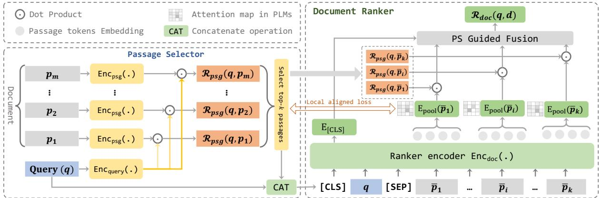
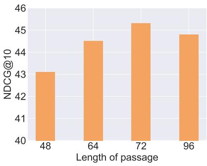

# FAA: Fine-grained Attention Alignment for Cascade Document Ranking

Zhen Li1, Chongyang Tao2, Jiazhan Feng1, Tao Shen3, Dongyan Zhao1,4∗

Xiubo Geng2, Daxin Jiang2∗

1Wangxuan Institute of Computer Technology, Peking University

2Microsoft Corporation

3FEIT, University of Technology Sydney

4State Key Laboratory of Media Convergence Production Technology and Systems 1{lizhen63,fengjiazhan,zhaody}@pku.edu.cn 2{chotao,xigeng,djiang}@microsoft.com 3shentao@uts.edu.cn

## Abstract

Document ranking aims at sorting a collection of documents with their relevance to a query. Contemporary methods explore more efficient transformers or divide long documents into passages to handle the long input. However, intensive query-irrelevant content may lead to harmful distraction and high query latency. Some recent works further propose cascade document ranking models that extract relevant passages with an efficient selector before ranking, however, their selection and ranking modules are almost independently optimized and deployed, leading to selecting error reinforcement and sub-optimal performance. In fact, the document ranker can provide fine-grained supervision to make the selector more generalizable and compatible, and the selector built upon a different structure can offer a distinct perspective to assist in document ranking. Inspired by this, we propose a fine-grained attention alignment approach to jointly optimize a cascade document ranking model. Specifically, we utilize the attention activations over the passages from the ranker as fine-grained attention feedback to optimize the selector. Meanwhile, we fuse the relevance scores from the passage selector into the ranker to assist in calculating the cooperative matching representation. Experiments on MS MARCO and TREC DL demonstrate the effectiveness of our method.

## 1 Introduction

Document ranking aims at ranking the candidate documents according to their relevance to an input query, and it has been widely applied in many natural language processing (NLP) and information retrieval tasks, such as search engines (Hofstätter et al., 2021) and question answering (Chen and Yih, 2020). Due to the powerful representation ability of large-scale pre-trained language models (PLMs) (e.g., BERT (Devlin et al., 2019) and

  
Figure 1: The case of scope hypothesis. In this example, p2 is strongly relevant to the query, and $p _ { 3 }$ is weakly relevant where other passages focus on other topics different from query.

RoBERTa (Liu et al., 2019)) that have achieved impressive performance in a large number of NLP tasks, several researchers have considered making use of pre-trained models for document ranking (MacAvaney et al., 2019; Li and Gaussier, 2021; Fu et al., 2022).

One major challenge in applying PLMs for neural document ranking is their difficulty in handling long texts due to high computational complexity and memory requirements, such as the 512 token limit for BERT. In fact, documents typically contain long text, for example, the mean length of documents in 2019 TREC Deep Learning Track Document Collection is 1600 (Hofstätter et al., 2021). To address this issue, various studies have been conducted to develop more efficient attention mechanisms in transformers (Beltagy et al., 2020; Hofstätter et al., 2020a), by simply truncating the document to meet the requirement for the relevance model (Boytsov et al., 2022), or by breaking down the long document into smaller segments or passages that can be processed individually by the pre-trained models (Dai and Callan, 2019; Rudra and Anand, 2020; Li et al., 2020; Chen et al., 2022).

Actually, long documents often contain a variety of subjects, as evidenced by the scope hypothesis (Robertson et al., 2009) from traditional information retrieval. An illustration from the MS MARCO dataset (Nguyen et al., 2016) is presented in Figure 1, and it is noted that only a small part of the document (e.g., p and p ) is relevant to the given query and different parts may be unequally informative to the query. Thus even though existing techniques for modeling long documents have been demonstrated to be effective and efficient, utilizing the entire document can result in high query latency and intensive query-irrelevant content can be a distraction and negatively impact performance. Consequently, some recent studies propose cascade document ranking models (Li et al., 2020; Hofstätter et al., 2021; Li and Gaussier, 2021) that extract relevant passages with an efficient selector before performing the ranking. However, their selection and ranking modules are almost independently optimized and deployed, leading to selecting error reinforcement and sub-optimal performance. Moreover, these models do not differentiate between the passages or segments taken from a document while matching with the query.

In fact, the document ranker can provide finegrained supervision to enhance the generalizability and compatibility of the selector. Conversely, the selector, built upon a heterogeneous structure, can offer a distinct perspective to assist in document ranking. Taking inspiration from this, we propose a Fine-grained Attention Alignment approach (FAA) to jointly optimize a cascade document ranking model. Specifically, we initialize the passage selector as an efficient dual encoder and the document ranker with an effective crossencoder. To better optimize and make use of both worlds, we leverage the attention activations over the passages from the ranker as fine-grained attention feedback to optimize the selector. Simultaneously, we incorporate the relevance scores from the passage selector into the ranker to assist in calculating the final cooperative matching representation. We conduct experiments on three public benchmarks: MS MARCO (Nguyen et al., 2016), TREC-DL 2019 (Craswell et al., 2020), and TREC-DL 2020. The evaluation results show that our proposed model is better than several competitive baselines and our FAA can bring significant improvement to the cascade model. To sum up, our contribution is three-fold:

• We propose a Fine-grained Attention

Alignment approach to jointly optimize a cascade document ranking model.

• We explore fusing the passage-level relevance scores into the document ranker to produce the cooperative matching representation.

• We conduct extensive experiments and analysis on three benchmarks and the evaluation results show the effectiveness of our model.

## 2 Related Works

Neural models for document ranking In the early stages, traditional algorithms like BM25 (Robertson et al., 2009) and TF-IDF were commonly employed for ranking documents in information retrieval. With the development of neural network technology (Cho et al., 2014; Gu et al., 2018), some neural-based ranking models have been proposed (Huang et al., 2013; Guo et al., 2016; Hui et al., 2017, 2018; MacAvaney et al., 2020). Xiong et al. (2017) proposed a kernelbased neural ranking model (K-NRM) which used a kernel-pooling layer to combine word pair similarities with distributed representations. Dai et al. (2018) extended K-NRM to Conv-KNRM which used Convolutional Neural Networks to model ngram embedding. Hofstätter et al. (2020b) proposed a Transformer-Kernel model which used a small number of transformer layers to contextualize query and document sequences independently and distilled the interactions between terms. Compared to traditional methods, neural ranking models produce a dense representation of the queries and documents which improves the ranking performance.

Pre-trained models for document ranking Recently a large number of transformer-based pretrained models have been proposed (Devlin et al., 2019; Lewis et al., 2020; Radford et al., 2019; Raffel et al., 2020) and shown their effectiveness in natural language processing tasks. Therefore many works have utilized pre-trained models in document ranking tasks. Nogueira et al. (2019) used a sequence-to-sequence transformer model with document terms as input and produced the possible questions that the document might answer to expand document for document retrieval. Finally this work used BERT to re-rank these retrieved documents. Yan et al. (2019) used a pre-trained BERT model to classify sentences into three categories and then fine-tuned the model using a point-wise ranking method for ranking documents.

Passage-level document ranking Since the high demand for memory space and computing resources, pre-trained models usually have a limit on the input length, and the length of actual long documents is always beyond this limitation. To this end, some works proposed to split the long documents into multiple passages which satisfy the limitation of the input length of the pre-trained models (Li et al., 2020; Hofstätter et al., 2020a; Yang et al., 2019). The studies applied pre-trained models to each passage individually and then combined the relevance scores at the passage level to generate the relevance scores for the entire document. For example, Dai and Callan (2019) determined the relevance score of the document by utilizing the score of the first passage, the top-performing pas sage, and the summation of all passages, respectively. Fu et al. (2022) proposed a Multi-view interpassage Interaction based Ranking model (MIR) with intra-passage attention and inter-passage at tention, and used a multi-view aggregation layer to produce the document-level representation across multiple granularities. These works took all passages into document ranking which may introduce noise from the query-irrelevant passages and in crease the query latency. To address this problem, some works proposed to pre-select query-relevant passages from all passages before aggregating. In this work, we propose a cooperative distillation and representation cascade ranking model which uses an efficient model as a passage selector to calculate passage-level relevance scores and select top-k passages, while uses an effective model as the document ranker to calculate the document-level relevance scores with the selected passages.

## 3 Methodology

In this section we first formalize the document ranking task, then we introduce the model architecture and the proposed Fine-grained Attention Alignment (FAA) approach for model optimization.

Task Formalization Given a query q and a set of candidate documents $\mathcal { C } = \{ d _ { 1 } , d _ { 2 } , . . . , d _ { m } \}$ including both the ground-truth document and negative documents, where m is the number of the candidate documents, the task is to train a document ranking model $\mathcal { R } ( q , d )$ with the training data . When provided with a new query and its corresponding candidate documents, the ranking model assesses the relevance between the query and each candidate document by computing relevance scores. Subsequently, it can arrange the documents in order based on these scores.

Model Overview Inspired by previous work on passage-level evidence for document ranking (Hofstätter et al., 2021; Li and Gaussier, 2021), in this paper we adopt the efficient and effective cascade document ranking paradigm which first extracts relevant passages with an efficient selector and then performs the ranking with a smart document ranker based on the pruned content. To better optimize and make use of both worlds, we propose a finegrained attention alignment approach to jointly optimize a cascade document ranking model. Specifically, we utilize the attention activations over the passages from the ranker as fine-grained attention feedback to optimize the selector. Additionally, in the process of document ranking, the passage-level relevance scores in the selector are fused in the document ranker to produce the cooperative matching representation for calculating the final matching score. By this means, the document ranker can provide fine-grained supervision to make the selector more generalizable and compatible, and the selector built upon a heterogeneous structure can conversely offer a distinct view to help the ranker. Figure 2 presents the high-level architecture of the proposed method.

## 3.1 Passage Selector

To satisfy the input length limit of the pre-trained models, the candidate documents are first split into multiple passages with a sliding window in the size of l words and a stride in the size of s words. The set of passages of document d can be formalized as

$$
\mathbb { P } = \{ d _ { 0 : l } , d _ { s : s + l } , d _ { 2 * s : 2 * s + l } , \ldots \}\tag{1}
$$

In the phase of passage selection, the passage selector identifies and extracts a subset of passages that are highly relevant to the given query. We adopt the simple and efficient dual-encoder structure built on a small pre-trained model as the passages selector which has a lower query latency. Given the query q and the set of passages $\mathbb { P } = \{ p _ { 1 } , p _ { 2 } , \dotsb , p _ { w } \}$ where w is the number of passages, q and each $p _ { i } \in \mathbb { P }$ are fed into the passage selector and encoded as d-dimensional vectors respectively which are denoted as $\mathtt { E n c } _ { \mathsf { p s g } } ( q )$ and $\mathsf { E n c } _ { \mathsf { p s g } } ( p _ { i } )$ . With the representative vectors of query and passages, the passage selector calculates the dot product between $\mathsf { E n c } _ { \mathsf { p s g } } ( q )$ and $\mathsf { E n c } _ { \mathsf { p s g } } ( p _ { i } )$

  
Figure 2: Overall architecture of our model (FAA). The selector encodes the query and passages with sharing parameters.

$$
\mathcal { R } _ { \mathsf { p s g } } ( q , p _ { i } ) = \frac { \mathsf { E n c } _ { \mathsf { p s g } } ( q ) ^ { T } \mathsf { E n c } _ { \mathsf { p s g } } ( p _ { i } ) } { \sqrt { d } }\tag{2}
$$

The passage-level relevance scores are scaled by dividing by ${ \sqrt { d } } .$ Next, the passage selector selects the k passages with the highest relevance score to form $\bf { \bar { P } } .$ , which is formalized as:

$$
\bar { \mathbb { P } } = \operatorname * { a r g m a x } _ { \bar { \mathbb { P } } \subset \mathbb { P } , \ \lVert \bar { \mathbb { P } } \rVert = k } \sum _ { p _ { i } \in \bar { \mathbb { P } } } \mathcal { R } _ { \mathsf { p s g } } ( q , p _ { i } )\tag{3}
$$

Passages in $\bar { \mathbb { P } }$ contain informative content for query and are used for document ranking. By selecting the most relevant top-k passages $\bar { \mathbb { P } }$ from all the passages, the passage selector filters out a large number of irrelevant passages for document ranking processes, which can reduce the query latency and avoid the noise caused by irrelevant passages.

## 3.2 Document Ranker

We adopt a cross-encoder based on pre-trained models as the document ranker to calculate the document-level relevance score with P¯. The architecture performs full attention across the query and the extracted passages and has been proven to be effective for ranking (Hofstätter et al., 2021). Formally, all selected passages in $\bar { \mathbb { P } }$ are first spliced together as $\hat { \mathbb { P } } = \{ \bar { p } _ { 1 } ; \bar { p } _ { 2 } ; \cdot \cdot \cdot ; \bar { p } _ { k } \}$ , and then we concatenate query and the spliced passages $\hat { \mathbb { P } }$ as the input of the document ranker with [CLS] and [SEP] tokens, which is denoted as u:

$$
\boldsymbol { u } = \{ [ \mathsf { C L S } ] ; q ; [ \mathsf { S E P } ] ; \hat { \mathbb { P } } ; [ \mathsf { S E P } ] \}\tag{4}
$$

The document ranker performs semantic interaction through multi-layer attention blocks and outputs a sequence of contextualized representations. Typically, the output representation of the first token [CLS] is adpoted the encoded vector of u, namely Enc $\mathsf { q } _ { \mathsf { o c } } ( u ) = E _ { \mathsf { L C L S } ] }$ . Then the vector is fed to a multilayer perceptron (MLP) to calculate the document-level relevance score:

$$
\mathcal { R } _ { \mathsf { d o c } } ( q , d ) = \mathsf { M L P } ( \mathsf { E n c } _ { \mathsf { d o c } } ( u ) )\tag{5}
$$

Since the dataset provides the positive document for each query, the loss function we use to optimize the document ranker is defined below following the previous works (Wu et al., 2018; Oord et al., 2018):

$$
\mathcal { L } _ { \sf r a n k } = - \sum _ { q \in \mathcal { D } } \log \frac { \exp ( \mathcal { R } _ { d o c } ( q , d ^ { + } ) ) } { \sum _ { d \in \mathcal { C } } \exp ( \mathcal { R } _ { d o c } ( q , d ) ) }\tag{6}
$$

where $d ^ { + }$ is the ground-truth document for the query $q$ and  is a set of document candidates (including both the ground-truth document and negative documents) for $q .$

## 3.3 Cooperative Matching Representation

Considering the passage selector is based on heterogeneous dual-encoder architecture, we think that the selector can offer a distinct view to help document ranking. Therefore, different from traditional encoding which only uses the encoded vector of the first token [CLS] as the representation of sequence, we propose to fuse the selected passagelevel relevance scores from the passage selector to produce the cooperative matching representation $\mathsf { E n c } _ { d o c } ( u )$ of input sequence $u .$ Specifically, we denote the embedding vector of [CLS] as $E _ { [ \mathsf { C L S } ] }$ and denote the embedding vector of tokens in Pˆ as $\{ E _ { 1 } ^ { 1 } , E _ { 1 } ^ { 2 } , \cdot \cdot \cdot , E _ { i } ^ { j } , \cdot \cdot \cdot \}$ , where $E _ { i } ^ { j }$ represents the embedding vector of the j-th token in the i-th selected passage ${ \bar { p } } _ { i }$ . To produce $\mathsf { E n c } _ { d o c } ( u )$ , we first calculate the average embedding vector of each selected passage:

$$
\begin{array} { r } { \mathsf { M e a n P o o l } \left( \bar { p } _ { i } \right) = \sum _ { z = 1 } ^ { l } E _ { i } ^ { z } / l } \end{array}\tag{7}
$$

where l is the length of ${ \bar { p _ { i } } }$ . We then calculate the product of the passage-level relevance scores from the selector and the average vector of the passage in the ranker, and take the summation of the results as the passage-selector guided vector $E _ { \mathsf { P G V } }$ formalized as:

$$
E _ { \mathsf { P G V } } = \sum _ { t = 1 } ^ { k } \mathsf { M e a n P o o l } ( \bar { p } _ { i } ) \cdot \mathcal { R } _ { \mathsf { p s g } } ( q , \bar { p } _ { i } )\tag{8}
$$

Finally we fuse the passage-selector guided vector $E _ { \mathsf { P G V } }$ with $E _ { [ \mathsf { C L S } ] }$ to get the cooperative document-level matching representation:

$$
\mathsf { E n c } _ { d o c } ( u ) = E _ { [ \mathsf { C L S } ] } + \lambda \cdot E _ { \mathsf { P G V } }\tag{9}
$$

where λ is a parameter to control the weight of $E _ { \mathsf { P G V } } .$ Then we can feed the above $\mathsf { E n c } _ { d o c } ( u )$ into a multi-layer perceptron to calculate the final document-level relevance score, as formalized in Equation 5. We can find that the more relevant a passage is, the greater its proportion in the fusion, which causes the document ranker to pay more attention to it.

## 3.4 Fine-grained Attention Alignement

As mentioned above, the passage selector is initialized by dual-encoder architecture which is efficient but performance sub-optimal compared with cross-encoder. It is not so compatible in ranking model and need to be tuned. Besides, there are no passage-level labels in most document ranking tasks. Inspired by knowledge distillation (Hinton et al., 2015; Wang et al., 2020), we use the complicated and effective document ranker as the teacher model to provide fine-grained supervision for optimizing the passage selector which is regarded as a student model to make the selector more generalizable and compatible. To be specific, with the self-attention mechanism in the transformerbased model, we use fine-grained attention activation scores over the passage as the pseudo labels of passages for optimization. We consider that if one passage is more informative to query, the query will provide more attention to it when document ranking which results in a higher attention score for this passage.

For the input u, the representation output by the previous layer is denoted as $H \in R ^ { l _ { u } \times d }$ where $l _ { u }$ is the length of $u .$ The self-attention module produces queries $Q ,$ keys $K$ , and values $V$ matrices through linear transformations (Vaswani et al., 2017), and then the attention map can be calculated as:

$$
M = s o f t m a x ( \frac { Q K ^ { T } } { \sqrt { d } } )\tag{10}
$$

where d is the dimension of vectors in $Q .$ . We denote $\alpha _ { i  j } = M _ { i , j }$ as the attention score from i-th token to j-th token in u. Following the calculation of the attention score from one token to another token, we calculate the attention activation score of each selected passage $\bar { p } _ { i } ( \in \bar { \mathbb { P } } )$ as the maximal attention score from all tokens in query $q$ and all tokens in the $\bar { p } _ { i } { \cdot }$

$$
\begin{array} { r } { \alpha _ { q  \bar { p } _ { i } } = \mathsf { M a x P o o l } ( \widetilde { M } ) , } \\ { \widetilde { M } = M _ { x : x + l _ { q } , y : y + l _ { p _ { i } } } } \end{array}\tag{11}
$$

where x, $y$ is the starting token of $q$ and $p _ { i } .$ , and $l _ { q } , l _ { p _ { i } }$ is the length of $q$ and $p _ { i }$ respectively. $\widetilde { M }$ is the attention map between $q$ and $p _ { i }$ , where $\widetilde { M } _ { i , j }$ is the attention score from i-th token in $q$ fto j-th token in $p _ { i }$ . We also experimented with the meanpooling operation to calculate attention scores and found that it performed worse than max-pooling. Following previous knowledge distillation methods based on pre-trained language models (Wang et al., 2020), we also calculate the attention score of ${ \bar { p } } _ { i }$ in the last self-attention layer of the document ranker. Taking into account the multi-head attention mechanism in the transformer-based model, we select the maximal attention score through all attention heads as the final scores.

We use KL-divergence between the relevance scores of passages output by the passage selector and the attention scores as the loss function of the passage selector:

$$
{ \mathcal { L } } _ { \mathrm { a l i g n } } = \sum _ { q \in { \mathcal { D } } } { \mathsf { K L - D i v } } ( { \mathcal { H } } ^ { p s g } ( q , { \bar { \mathbb { P } } } ) , A ^ { d o c } ( q , { \bar { \mathbb { P } } } ) )\tag{12}
$$

where $\mathcal { H } _ { p s g } ( q , \bar { \mathbb { P } } )$ is the output distribution over the relevance scores of passages in $\bar { \mathbb { P } }$ from the selector, $\mathcal { A } _ { d o c } ( q , \bar { \mathbb { P } } )$ is the distribution of the aggregated attention scores in ranker. $\mathcal { H } ^ { p s g } ( q , \bar { p } _ { k } )$ and $\boldsymbol { \mathcal { A } } ^ { d o c } ( \boldsymbol { q } , \bar { p } \boldsymbol { k } )$ are the k-th item in $\mathcal { H } ^ { p s g }$ and $\mathcal { A } ^ { d o c }$ respectively, which can be calculated as below:

$$
{ \mathcal H } ^ { p s g } ( q , \bar { p } _ { k } ) = \frac { \exp ( \mathcal { R } _ { \sf p s g } ( q , \bar { p } _ { k } ) / \tau ) } { \sum _ { \bar { p } \in \bar { \mathbb { P } } } \exp ( \mathcal { R } _ { \sf p s g } ( q , \bar { p } ) / \tau ) }\tag{13}
$$

<table><tr><td>Algorithm 1 The proposed FAA</td><td> $\phi _ { \mathsf { p s g } } ,$ </td></tr><tr><td>Require: Training set D, selector parameters</td><td rowspan="5"></td></tr><tr><td>ranker parameters  $\phi _ { \mathrm { d o c } }$ </td></tr><tr><td>Initialize parameters φpsg, φdoc repeat</td></tr><tr><td>Sample a batch B from D</td></tr><tr><td>Compute passage relevance scores by Eq (2)</td></tr><tr><td>Select top-k relevant passages P by Eq (3) Compute document relevance scores with P Compute  $\mathcal { L } _ { \mathrm { { r a n k } } }$  on B and optimize φdoc</td></tr></table>

$$
\mathcal { A } ^ { d o c } ( q , \bar { p } _ { k } ) = \frac { \exp ( \alpha _ { q  \bar { p } _ { k } } / \tau ) } { \sum _ { \bar { p } \in \mathbb { \bar { P } } } \exp ( \alpha _ { q  \bar { p } } / \tau ) }\tag{14}
$$

where $\tau$ is the temperature hyper-parameter.

Above all, in our overall ranking model, the loss function can be described as the combination of the loss for the document ranker and the attention alignment loss:

$$
\mathcal { L } _ { \sf f i n a l } = \mathcal { L } _ { \sf a l i g n } + \mathcal { L } _ { \sf r a n k }\tag{15}
$$

In this work, we tried to jointly train the passage selector and document ranker. Particularly, we update the ranker with only $\mathcal { L } _ { \mathrm { { r a n k } } }$ , and the gradient from $\mathcal { L } _ { \mathsf { a l i g n } }$ is stopped. Algorithm 1 gives a pseudo-code of our training process.

## 4 Experiments

In this section, we first introduce the datasets we use, the evaluation metrics, the baselines, and the implementation details of our experiment. Then we introduce the evaluation results and further analysis of our method.

## 4.1 Datasets and Evaluation

In line with previous studies on this task (Hofstätter et al., 2021; Li and Gaussier, 2021), we conduct an evaluation of our proposed model on three publicly available document ranking datasets: MSMARCO (Nguyen et al., 2016), TREC-DL 2019 (Craswell et al., 2020), and TREC-DL 2020. The MS-MARCO dataset comprises 3.2 million documents and 367,013 training queries, sourced from web pages. For evaluation, we utilize the MS-MARCO DEV set, which consists of 5,193 queries.

The evaluation metrics employed are NDCG@10, MAP, and MRR@10. Both the TREC-DL 2019 and TREC-DL 2020 datasets share the same document collection as MS-MARCO and include 43 and 45 queries, respectively. For both TREC-DL datasets, we employ NDCG@10 and MAP as the evaluation metrics. Across all datasets, we perform document re-ranking based on the top 100 documents retrieved by BM25.

## 4.2 Baselines

We compare our model with traditional and neural document ranking models:

• BM25 (Robertson et al., 2009) is a widelyused unsupervised text-retrieval algorithm based on IDF-weighted counting.

• BERT-MaxP (Dai and Callan, 2019) uses BERT to encode passages split from the document to calculate the relevance score and choose the best passage-level score as the document-level score.

• Sparse-Transformer (Child et al., 2019) introduces several sparse factorizations of the attention matrix.

• LongFormer-QA (Beltagy et al., 2020) extends Sparse-Transformer by attaching two global attention tokens to the query and the document as their settings for QA.

• Transformer Kernel Long (Hofstätter et al., 2020a) proposes a local self-attention mechanism with the kernel-pooling strategy.

• Transformer-XH (Zhao et al., 2020) introduces an extra hop attention layer that can produce a more global representation of each piece of text.

• QDS-Transformer (Jiang et al., 2020) proposes a query-directed sparse transformerbased ranking model which uses sparse local attention to obtain high efficiency.

• KeyBLD (Li and Gaussier, 2021) proposes using local query-block pre-ranking to choose key blocks of a long document and aggregates blocks to form a short document which is further processed by BERT.

<table><tr><td rowspan="2">Models</td><td colspan="3">MSMARCO DEV</td><td colspan="2">TREC DL 2019</td><td colspan="2">TREC DL 2020</td></tr><tr><td>NDCG@10</td><td>MAP</td><td>MRR@10</td><td>NDCG@10</td><td>MAP</td><td>NDCG@10</td><td>MAP</td></tr><tr><td>BM25 (Robertson et al., 2009)</td><td>0.311</td><td>0.265</td><td>0.252</td><td>0.488</td><td>0.234</td><td></td><td></td></tr><tr><td>BERT-MaxP (Dai and Callan, 2019)</td><td></td><td></td><td></td><td>0.642</td><td>0.257</td><td>0.630</td><td>0.420</td></tr><tr><td>Sparse-Transformer (Child et al., 2019)</td><td></td><td></td><td></td><td>0.634</td><td>0.257</td><td></td><td></td></tr><tr><td>LongFormer-QA (Beltagy et al., 2020)</td><td></td><td></td><td></td><td>0.627</td><td>0.255</td><td></td><td></td></tr><tr><td>Transformer Kernel Long (Hofstätter et al., 2020a)</td><td>0.403</td><td>0.345</td><td>0.338</td><td>0.644</td><td>0.277</td><td>0.585</td><td>0.381</td></tr><tr><td>Transformer-XH (Zhao et al., 2020)</td><td></td><td></td><td></td><td>0.646</td><td>0.256</td><td>–</td><td>=</td></tr><tr><td>QDS-Transformer (Jiang et al., 2020)</td><td></td><td></td><td></td><td>0.667</td><td>0.278</td><td>–</td><td>–</td></tr><tr><td>PARADEMax-Pool (Li et al., 2020)</td><td>0.445</td><td></td><td></td><td>0.679</td><td>0.287</td><td>0.613</td><td>0.420</td></tr><tr><td>PARADETF (Li et al., 2020)</td><td>0.446</td><td>0.387</td><td>0.382</td><td>0.650</td><td>0.274</td><td>0.601</td><td>0.404</td></tr><tr><td>KeyBLD (Li and Gaussier, 2021)</td><td></td><td></td><td></td><td>0.707</td><td>0.281</td><td>0.618</td><td>0.415</td></tr><tr><td>IDCM (Hofstätter et al., 2021)</td><td>0.446</td><td>0.387</td><td>0.380</td><td>0.679</td><td>0.273</td><td></td><td></td></tr><tr><td>FAA</td><td>0.453</td><td>0.397</td><td>0.390</td><td>0.685</td><td>0.275</td><td>0.647</td><td>0.424</td></tr></table>

Table 1: Performance of different methods on the document ranking task in MSMARCO DEV and TREC-DL dataset. The best results are in underlined fonts.

• PARADE (Li et al., 2020) truncates a long document into multiple passages and uses different strategies to aggregate the passage-level relevance scores. PARADEMax-Pool uses maxpooling to obtain document-level relevance scores and PARADETF uses a transformer encoder for passages aggregation.

• IDCM (Hofstätter et al., 2021) uses a fast model (ESM) for passage selection and a effective model (ETM) for document ranking, where optimizes the ESM with the knowledge distillation from ETM to ESM.

## 4.3 Implementation Details

Our proposed model is implemented by the transformer library provided by hugging face1. We use DistilBERT (Sanh et al., 2019) to initialize our passage selector which is more efficient and has comparable performance with BERT-base. For document ranking, we use the publicly trained model2 to initialize our document ranker. We set the length of the sliding window and stride as 72. The query length is set as 30 and the number of selected passages is set as 3. We use Adam optimizer (Kingma and Ba, 2015) to train our model with batch size set as 4. The initial learning rate of the passage selector and document ranker are set as 5e-7 and 7e-6 respectively. We vary λ (Equation (9)) in {0.1, 0.2, 0.5, 1.0} and find that 0.2 is the best choice. τ in Equation (13) and Equation (14) is set as 0.2.

## 4.4 Evaluation Results

The evaluation results of our proposed model and all baselines on MS MARCO, TREC-DL 2019 and TREC-DL 2020 are reported in Table 1. First, compared with the models with more efficient attention mechanisms in transformer (e.g. Sparse-Transformer, Transformer-XH, QDS-Transformer, and Transformer Kernel Long), our method and other cascade document ranking models (e.g. Key-BLD and IDCM) can achieve better performance on almost all metrics. The phenomenon indicates the superiority of the cascade document ranking paradigm. Second, compared with two previous cascade methods3 (e.g. IDCM) that select passage before ranking, our model has better performance than them on MS-MARCO and TREC DL 2020, and shows comparable performance on TREC DL 2019. Different from these baselines which optimize the selector and ranker independently, our model jointly optimizes the selector and ranker with fine-grained attention alignment. Meanwhile, we utilize the passage-level relevance scores in document ranking to obtain cooperative fusion representation. The evaluation results demonstrate the effectiveness of our proposed methods.

## 4.5 Discussions

Ablation study Table 2 presents the findings from our ablation study, where we systematically remove specific components to assess their impact on performance. Firstly, we eliminate the finegrained attention alignment for the passage selector, denoted as $" _ { \mathrm { { W } } } / \mathrm { { o } } .$ $\mathcal { L } _ { \sf a l i g n } "$ . Next, we remove the passage-level multi-vector fusion during document ranking, denoted as "w/o. $E _ { \mathsf { P G V } } "$ . The results reveal that removing either $\mathcal { L } _ { \mathsf { a l i g n } }$ or EPGV leads to a drop in performance, indicating the effectiveness of our fine-grained attention alignment approach and the importance of utilizing cooperative fusion representation to enhance the ranker’s capabilities. Notably, removing both components simultaneously results in an even greater performance decrease. Furthermore, we examine the use of average pooling in representation fusion, denoted as $" { \mathcal R } _ { \mathrm { p s g } } ( q , \bar { p } _ { i } ) = 1 / k , "$ which replaces $\mathcal { R } _ { \sf p s g }$ in Eq. 8 with $\frac { 1 } { k }$ . Our findings indicate that simply incorporating average pooling of passage representations does not yield substantial gains, as it only achieves comparable performance to the model without $E _ { \mathsf { P G V } }$ . Notably, the performance of $" \mathcal { R } _ { \mathrm { p s g } } ( q , \bar { p } _ { i } ) = 1 / k "$ and the model without $E _ { \mathsf { P G V } }$ are inferior to that of our model, illustrating the utility and superiority of cooperative fusion of relevance scores from selectors over independent representation fusion. Lastly, we explore the use of mean-pooling operation for calculating attention scores and observe that it performs worse than maxpooling.

<table><tr><td>Models</td><td>NDCG@10 MAP</td><td>MRR@10</td><td></td></tr><tr><td>FAA</td><td>0.453</td><td>0.397</td><td>0.390</td></tr><tr><td>w/o.  $\mathcal { L } _ { \mathsf { a l i g n } }$ </td><td>0.361</td><td>0.313</td><td>0.290</td></tr><tr><td>w/o. EPGV</td><td>0.449</td><td>0.393</td><td>0.385</td></tr><tr><td> $\mathsf { w } / \mathsf { o } . \mathrm { \Omega } \{ \mathcal { L } _ { \mathsf { a l i g n } } \& E _ { \mathsf { P G V } } \}$ </td><td>0.358</td><td>0.312</td><td>0.288</td></tr><tr><td> $\mathcal { R } _ { \sf p s g } ( q , \bar { p } _ { i } ) = 1 / k$ </td><td>0.449</td><td>0.394</td><td>0.386</td></tr><tr><td> $\alpha _ { q  \bar { p } _ { i } } = \mathsf { M e a n P o o l } ( \widetilde { M } )$ </td><td>0.436</td><td>0.380</td><td>0.352</td></tr></table>

Table 2: Ablation Study.

  
Figure 3: The impact of length of the split passage on MS-MARCO Dev.

The impact of passage length When constructing the training data, the length of the split passage plays a vital role as it also indirectly controls the number of passage candidates for each document. To investigate the impact of the passage length, we test the performance of our method across different passage lengths and the results are shown in Figure 3. We can find that the performance of our model improves until the passage length reaches 72, and then drops when the passage length keeps increasing. The reason might be that the selector needs to rank fewer candidates as the passage length increases at first and it could select more accurate passages that are relevant to the query for matching, but when the length of the passage becomes larger enough, the noise will be brought to matching as some content in each passage could be irrelevant to the query.

<table><tr><td># PSG</td><td>NDCG@10</td><td>MAP</td><td>MRR@10</td></tr><tr><td>1</td><td>0.389</td><td>0.340</td><td>0.331</td></tr><tr><td>2</td><td>0.440</td><td>0.384</td><td>0.377</td></tr><tr><td>3</td><td>0.453</td><td>0.397</td><td>0.390</td></tr><tr><td>4</td><td>0.451</td><td>0.390</td><td>0.387</td></tr></table>

Table 3: The performance across different numbers of selected passages on MS-MARCO Dev.

<table><tr><td colspan="3">Query: how many mm is a nickel coin</td></tr><tr><td>PID</td><td>Content</td><td>Rank  $\mid { \mathcal { R } } _ { \mathsf { p s g } }$ </td></tr><tr><td>0</td><td>... Nickel United States Value 0.05 U. S. dollar Mass 5.000 g, Diameter 21.21 mm (0.835 in)...</td><td>1/ 0.954</td></tr><tr><td>2</td><td>... Its diameter is .835 inches (21.21 mm) and its thickness is .077 inches (1.95 mm)...</td><td>2 / 0.934</td></tr><tr><td>1</td><td>...War Nickels&quot; (mid-1942 to 1945): 56% copper, 35% silver, 9% man- ganese Silver 1942 to 1945 Wartime Nickels only...</td><td>3 / 0.759</td></tr><tr><td>11</td><td>...The half dime was originally struck from 1794 until 1805, though none were dated 1798, 1799, or  $1 8 0 4 . . . .$ </td><td>20 / 0.468</td></tr></table>

Table 4: A case study from MS-MARCO dataset. The term $" \mathrm { P I D } "$ refers to the position number of a passage that has been split from the test document. $\mathcal { R } _ { \sf p s g }$ denotes relevance scores provided by the passage selector while "Rank" signifies the rank of the passage based on these relevance scores.

The impact of the number of selected passages We are also curious about the impact of the number of selected passages. We test the performance of our method with different numbers of selected passages and the evaluation results are illustrated in Table 3. We can observe that when the performance of our model was significantly improved as the number of selected passages increased at the beginning ( 3), and then began to drop when the number kept increasing. The results are rational because more passage entries can provide more useful information for response matching, but when the passage becomes enough, query-irrelevant noise will be brought to matching.

Case study To verify the effectiveness of our cascade model in document ranking, we show a ranker example from MS-MARCO dataset in Table 4. For the input query how many mm is a nickel coin, our FAA ranks the positive document at first and it is split into 24 passages. We show the top-3 passages selected by our passage selector and a random passage that is not selected. We can find that the top 2 passages harbor a significant amount of valuable query-relevant information, encompassing terms like "nickel" and "diameter." Conversely, the final passage, which displays lesser relevance to the query, receives a lower relevance score as determined by the passage selector. This case serves as an illustration of our model’s proficiency in selecting pertinent content within the document and ranking it based on query relevance.

## 5 Conclusion

In this work, we propose FAA, a cascade ranking model with a fine-grained attention alignment and cooperative matching representation. Our model utilizes the fine-grained attention alignment approach to train the passage selector and fuses the passage-level relevance scores into document ranking to produce cooperative matching representation. The evaluation results on MS MARCO and TREC DL demonstrate the effectiveness of FAA.

## 6 Limitations

While our approach effectively mitigates query latency through a cascade ranking paradigm, it necessitates additional computational resources during training due to the need for attention score calculation and alignment in the optimization process. Additionally, our model incorporates passage-level relevance scores into the ranker, generating a cooperative matching representation during document ranking, which could marginally augment the inference time. In our future endeavors, we aim to explore more efficient methodologies that can further improve ranking efficiency. Furthermore, it is worth noting that our approach has been tested using specific backbone models. To fully evaluate the effectiveness of our method, it is essential to conduct experiments with a diverse range of backbone models, which remains an avenue for further exploration.

## Acknowledgements

We would like to thank the anonymous reviewers for their constructive comments. This work was supported by the National Key Research and Development Program of China (No. 2021YFC3340304).

## Ethical Statement

Our paper centers around the document ranking task, a well-established and widely applicable problem. In conducting our research, we have exclusively utilized queries and documents sourced from open public datasets, with proper citation and adherence to licensing agreements. We have taken great care to ensure that our experiments have no bearing on privacy security, discrimination, or bias. We affirm that our work aligns with ethical principles and regulations, and it does not infringe upon any established ethical codes or guidelines.

## References

Iz Beltagy, Matthew E Peters, and Arman Cohan. 2020. Longformer: The long-document transformer. arXiv preprint arXiv:2004.05150.

Leonid Boytsov, Tianyi Lin, Fangwei Gao, Yutian Zhao, Jeffrey Huang, and Eric Nyberg. 2022. Understanding performance of long-document ranking models through comprehensive evaluation and leaderboarding. arXiv preprint arXiv:2207.01262.

Danqi Chen and Wen-tau Yih. 2020. Open-domain question answering. In Proceedings of the 58th Annual Meeting ofthe Associationfor Computational Linguistics: Tutorial Abstracts, pages 34–37, Online. Association for Computational Linguistics.

Junying Chen, Qingcai Chen, Dongfang Li, and Yutao Huang. 2022. Sedr: Segment representation learning for long documents dense retrieval. arXiv preprint arXiv:2211.10841.

Rewon Child, Scott Gray, Alec Radford, and Ilya Sutskever. 2019. Generating long sequences with sparse transformers. arXiv preprint arXiv:1904.10509.

Kyunghyun Cho, Bart van Merriënboer, Caglar Gulcehre, Dzmitry Bahdanau, Fethi Bougares, Holger

Schwenk, and Yoshua Bengio. 2014. Learning phrase representations using RNN encoder–decoder for statistical machine translation. In Proceedings of the 2014 Conference on Empirical Methods in Natural Language Processing (EMNLP), pages 1724– 1734, Doha, Qatar. Association for Computational Linguistics.

Nick Craswell, Bhaskar Mitra, Emine Yilmaz, Daniel Campos, and Ellen M Voorhees. 2020. Overview of the trec 2019 deep learning track. arXiv preprint arXiv:2003.07820.

Zhuyun Dai and Jamie Callan. 2019. Deeper text understanding for ir with contextual neural language modeling. In Proceedings ofthe 42nd International ACM SIGIR Conference on Research and Development in Information Retrieval, pages 985–988.

Zhuyun Dai, Chenyan Xiong, Jamie Callan, and Zhiyuan Liu. 2018. Convolutional neural networks for soft-matching n-grams in ad-hoc search. In Proceedings of the eleventh ACM international conference on web search and data mining, pages 126–134.

Jacob Devlin, Ming-Wei Chang, Kenton Lee, and Kristina Toutanova. 2019. BERT: Pre-training of deep bidirectional transformers for language understanding. In Proceedings ofthe 2019 Conference of the North American Chapter ofthe Associationfor Computational Linguistics: Human Language Technologies, Volume 1 (Long and Short Papers), pages 4171–4186, Minneapolis, Minnesota. Association for Computational Linguistics.

Chengzhen Fu, Enrui Hu, Letian Feng, Zhicheng Dou, Yantao Jia, Lei Chen, Fan Yu, and Zhao Cao. 2022. Leveraging multi-view inter-passage interactions for neural document ranking. In Proceedings ofthe Fifteenth ACM International Conference on Web Search and Data Mining, pages 298–306.

Jiuxiang Gu, Zhenhua Wang, Jason Kuen, Lianyang Ma, Amir Shahroudy, Bing Shuai, Ting Liu, Xingxing Wang, Gang Wang, Jianfei Cai, et al. 2018. Recent advances in convolutional neural networks. Pattern recognition, 77:354–377.

Jiafeng Guo, Yixing Fan, Qingyao Ai, and W Bruce Croft. 2016. A deep relevance matching model for ad-hoc retrieval. In Proceedings ofthe 25th ACM international on conference on information and knowledge management, pages 55–64.

Geoffrey Hinton, Oriol Vinyals, Jeff Dean, et al. 2015. Distilling the knowledge in a neural network. arXiv preprint arXiv:1503.02531, 2(7).

Sebastian Hofstätter, Bhaskar Mitra, Hamed Zamani, Nick Craswell, and Allan Hanbury. 2021. Intradocument cascading: learning to select passages for neural document ranking. In Proceedings ofthe 44th International ACM SIGIR Conference on Research and Development in Information Retrieval, pages 1349–1358.

Sebastian Hofstätter, Hamed Zamani, Bhaskar Mitra, Nick Craswell, and Allan Hanbury. 2020a. Local self-attention over long text for efficient document retrieval. In Proceedings of the 43rd International ACM SIGIR Conference on Research and Development in Information Retrieval, pages 2021–2024.

Sebastian Hofstätter, Markus Zlabinger, and Allan Hanbury. 2020b. Interpretable & time-budgetconstrained contextualization for re-ranking. In ECAI 2020, pages 513–520. IOS Press.

Po-Sen Huang, Xiaodong He, Jianfeng Gao, Li Deng, Alex Acero, and Larry Heck. 2013. Learning deep structured semantic models for web search using clickthrough data. In Proceedings of the 22nd ACM international conference on Information & Knowledge Management, pages 2333–2338.

Kai Hui, Andrew Yates, Klaus Berberich, and Gerard de Melo. 2017. PACRR: A position-aware neural IR model for relevance matching. In Proceedings of the 2017 Conference on Empirical Methods in Natural Language Processing, pages 1049–1058, Copenhagen, Denmark. Association for Computational Linguistics.

Kai Hui, Andrew Yates, Klaus Berberich, and Gerard De Melo. 2018. Co-pacrr: A context-aware neural ir model for ad-hoc retrieval. In Proceedings of the eleventh ACM international conference on web search and data mining, pages 279–287.

Jyun-Yu Jiang, Chenyan Xiong, Chia-Jung Lee, and Wei Wang. 2020. Long document ranking with querydirected sparse transformer. In Findings ofthe Associationfor Computational Linguistics: EMNLP 2020, pages 4594–4605, Online. Association for Computational Linguistics.

Diederik P Kingma and Jimmy Ba. 2015. Adam: A method for stochastic optimization. In ICLR (Poster).

Mike Lewis, Yinhan Liu, Naman Goyal, Marjan Ghazvininejad, Abdelrahman Mohamed, Omer Levy, Veselin Stoyanov, and Luke Zettlemoyer. 2020. BART: Denoising sequence-to-sequence pre-training for natural language generation, translation, and comprehension. In Proceedings of the 58th Annual Meeting of the Association for Computational Linguistics, pages 7871–7880, Online. Association for Computational Linguistics.

Canjia Li, Andrew Yates, Sean MacAvaney, Ben He, and Yingfei Sun. 2020. Parade: Passage representation aggregation for document reranking. arXiv preprint arXiv:2008.09093.

Minghan Li and Eric Gaussier. 2021. Keybld: Selecting key blocks with local pre-ranking for long document information retrieval. In Proceedings of the 44th International ACM SIGIR Conference on Research and Development in Information Retrieval, pages 2207–2211.

Yinhan Liu, Myle Ott, Naman Goyal, Jingfei Du, Mandar Joshi, Danqi Chen, Omer Levy, Mike Lewis, Luke Zettlemoyer, and Veselin Stoyanov. 2019. Roberta: A robustly optimized bert pretraining approach. arXiv preprint arXiv:1907.11692.

Sean MacAvaney, Franco Maria Nardini, Raffaele Perego, Nicola Tonellotto, Nazli Goharian, and Ophir Frieder. 2020. Efficient document re-ranking for transformers by precomputing term representations. In Proceedings of the 43rd International ACM SI-GIR Conference on Research and Development in Information Retrieval, pages 49–58.

Sean MacAvaney, Andrew Yates, Arman Cohan, and Nazli Goharian. 2019. Cedr: Contextualized embeddings for document ranking. In Proceedings of the 42nd international ACM SIGIR conference on research and development in information retrieval, pages 1101–1104.

Tri Nguyen, Mir Rosenberg, Xia Song, Jianfeng Gao, Saurabh Tiwary, Rangan Majumder, and Li Deng. 2016. Ms marco: A human generated machine reading comprehension dataset. In CoCo@ NIPs.

Rodrigo Nogueira, Wei Yang, Jimmy Lin, and Kyunghyun Cho. 2019. Document expansion by query prediction. arXiv preprint arXiv:1904.08375.

Aaron van den Oord, Yazhe Li, and Oriol Vinyals. 2018. Representation learning with contrastive predictive coding. arXiv preprint arXiv:1807.03748.

Alec Radford, Jeffrey Wu, Rewon Child, David Luan, Dario Amodei, Ilya Sutskever, et al. 2019. Language models are unsupervised multitask learners. OpenAI blog, 1(8):9.

Colin Raffel, Noam Shazeer, Adam Roberts, Katherine Lee, Sharan Narang, Michael Matena, Yanqi Zhou, Wei Li, Peter J Liu, et al. 2020. Exploring the limits of transfer learning with a unified text-to-text transformer. J. Mach. Learn. Res., 21(140):1–67.

Stephen Robertson, Hugo Zaragoza, et al. 2009. The probabilistic relevance framework: Bm25 and beyond. Foundations and Trends® in Information Retrieval, 3(4):333–389.

Koustav Rudra and Avishek Anand. 2020. Distant supervision in bert-based adhoc document retrieval. In Proceedings ofthe 29th ACM International Conference on Information & Knowledge Management, pages 2197–2200.

Victor Sanh, Lysandre Debut, Julien Chaumond, and Thomas Wolf. 2019. Distilbert, a distilled version of bert: smaller, faster, cheaper and lighter. arXiv preprint arXiv:1910.01108.

Ashish Vaswani, Noam Shazeer, Niki Parmar, Jakob Uszkoreit, Llion Jones, Aidan N Gomez, Łukasz Kaiser, and Illia Polosukhin. 2017. Attention is all you need. Advances in neural information processing systems, 30.

Wenhui Wang, Furu Wei, Li Dong, Hangbo Bao, Nan Yang, and Ming Zhou. 2020. Minilm: Deep selfattention distillation for task-agnostic compression of pre-trained transformers. Advances in Neural Information Processing Systems, 33:5776–5788.

Zhirong Wu, Yuanjun Xiong, Stella X Yu, and Dahua Lin. 2018. Unsupervised feature learning via nonparametric instance discrimination. In Proceedings ofthe IEEE conference on computer vision and pattern recognition, pages 3733–3742.

Chenyan Xiong, Zhuyun Dai, Jamie Callan, Zhiyuan Liu, and Russell Power. 2017. End-to-end neural ad-hoc ranking with kernel pooling. In Proceedings ofthe 40th International ACM SIGIR conference on research and development in information retrieval, pages 55–64.

Ming Yan, Chenliang Li, Chen Wu, Bin Bi, Wei Wang, Jiangnan Xia, and Luo Si. 2019. Idst at trec 2019 deep learning track: Deep cascade ranking with generation-based document expansion and pre-trained language modeling. In TREC.

Wei Yang, Haotian Zhang, and Jimmy Lin. 2019. Simple applications of bert for ad hoc document retrieval. arXiv preprint arXiv:1903.10972.

Chen Zhao, Chenyan Xiong, Corby Rosset, Xia Song, Paul Bennett, and Saurabh Tiwary. 2020. Transformer-xh: Multi-evidence reasoning with extra hop attention.

## ACL 2023 Responsible NLP Checklist

A For every submission: ✓ A1. Did you describe the limitations of your work? Limitation section

✗ A2. Did you discuss any potential risks of your work? The topic of the paper deals only with document retrieval

✓ A3. Do the abstract and introduction summarize the paper’s main claims? Abstract and Introduction section

✗ A4. Have you used AI writing assistants when working on this paper? Left blank.

## B ✓ Did you use or create scientific artifacts?

4 Experiments section

✓ B1. Did you cite the creators of artifacts you used? 4 Experiments section

✗ B2. Did you discuss the license or terms for use and / or distribution of any artifacts? MS-MARCO and Trec DL are open-source datasets

✗ B3. Did you discuss if your use of existing artifact(s) was consistent with their intended use, provided that it was specified? For the artifacts you create, do you specify intended use and whether that is compatible with the original access conditions (in particular, derivatives of data accessed for research purposes should not be used outside of research contexts)? Our use of MS-MARCO and Trec DL was consistent with their intended use.

 B4. Did you discuss the steps taken to check whether the data that was collected / used contains any information that names or uniquely identifies individual people or offensive content, and the steps taken to protect / anonymize it? Not applicable. Left blank.

 B5. Did you provide documentation of the artifacts, e.g., coverage of domains, languages, and linguistic phenomena, demographic groups represented, etc.? Not applicable. Left blank.

✓ B6. Did you report relevant statistics like the number of examples, details of train / test / dev splits, etc. for the data that you used / created? Even for commonly-used benchmark datasets, include the number of examples in train / validation / test splits, as these provide necessary context for a reader to understand experimental results. For example, small differences in accuracy on large test sets may be significant, while on small test sets they may not be. 4 Experiments section

## C ✓ Did you run computational experiments?

4 Experiments section

✓ C1. Did you report the number of parameters in the models used, the total computational budget (e.g., GPU hours), and computing infrastructure used? 4 Experiments section

✓ C2. Did you discuss the experimental setup, including hyperparameter search and best-found hyperparameter values? 4 Experiments section

✓ C3. Did you report descriptive statistics about your results (e.g., error bars around results, summary statistics from sets of experiments), and is it transparent whether you are reporting the max, mean, etc. or just a single run? 4 Experiments section

 C4. If you used existing packages (e.g., for preprocessing, for normalization, or for evaluation), did you report the implementation, model, and parameter settings used (e.g., NLTK, Spacy, ROUGE, etc.)? Not applicable. Left blank.

D ✗ Did you use human annotators (e.g., crowdworkers) or research with human participants? Left blank.

 D1. Did you report the full text of instructions given to participants, including e.g., screenshots, disclaimers of any risks to participants or annotators, etc.? Not applicable. Left blank.

 D2. Did you report information about how you recruited (e.g., crowdsourcing platform, students) and paid participants, and discuss if such payment is adequate given the participants’ demographic (e.g., country of residence)? Not applicable. Left blank.

 D3. Did you discuss whether and how consent was obtained from people whose data you’re using/curating? For example, if you collected data via crowdsourcing, did your instructions to crowdworkers explain how the data would be used? Not applicable. Left blank.

 D4. Was the data collection protocol approved (or determined exempt) by an ethics review board? Not applicable. Left blank.

 D5. Did you report the basic demographic and geographic characteristics of the annotator population that is the source of the data? Not applicable. Left blank.