# FEDLEGAL: The First Real-World Federated Learning Benchmark for Legal NLP

Zhuo Zhang1,2,∗ Xiangjing Hu1,∗ Jingyuan Zhang4 Yating Zhang

Hui Wang2 Lizhen Qu3,† Zenglin Xu1,2,†

1Harbin Institute of Technology, Shenzhen, China

2Peng Cheng Lab, Shenzhen, China

3Monash University, Melbourne, Australia

4Independent Researcher

{iezhuo17, starry.hxj, zhangjingyuan1994, yatingz89}@gmail.com wanghu06@pcl.ac.cn Lizhen.Qu@monash.edu.cn xuzenglin@hit.edu.cn

## Abstract

The inevitable private information in legal data necessitates legal artificial intelligence to study privacy-preserving and decentralized learning methods. Federated learning (FL) has merged as a promising technique for multiple participants to collaboratively train a shared model while efficiently protecting the sensitive data of participants. However, to the best of our knowledge, there is no work on applying FL to legal NLP. To fill this gap, this paper presents the first real-world FL benchmark for legal NLP, coined FEDLEGAL, which comprises five legal NLP tasks and one privacy task based on the data from Chinese courts. Based on the extensive experiments on these datasets, our results show that FL faces new challenges in terms of real-world non-IID data. The benchmark also encourages researchers to investigate privacy protection using real-world data in the FL setting, as well as deploying models in resourceconstrained scenarios. The code and datasets of FEDLEGAL are available here.

## 1 Introduction

It has been noticed that learning, comprehending and properly using an ever-increasing huge amount of legal data is way beyond human capability of legal practitioners (Gomes et al., 2022). Since the majority of the data is text, such an “information crisis in law” is encouraging the research and development of legal Natural Language Processing (NLP) techniques, to provide affordable legal services to both legal professionals and the general public (Sun et al., 2020a). As the majority of those techniques are based on machine learning, they require training on centralized datasets. However, such approaches raise increasing privacy concerns of the public and impose risks of breaching data protection laws, such as the General Data Protection Regulation (GDPR).

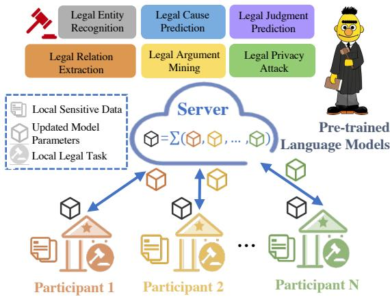  
Figure 1: The overview of FEDLEGAL.

To address the above concerns, federated learning (FL) is widely considered as a family of training algorithms to achieve a promising trade-off between information utility and privacy preservation, without sharing sensitive data of data owners (McMahan et al., 2017). As depicted in Figure 1, those algorithms permit local machines of participants to coordinate with one or multiple servers to train a model in a decentralized and collaborative way while preserving data privacy. Despite its rosy future, FL still faces open challenges due to the needs of coping with data heterogeneity (Ge et al., 2020), privacy attacks (Gupta et al., 2022), and system inefficiency (Liu et al., 2022).

In particular, differences between local data distributions of participants impose a special challenge when they are not Independently and Identically Distributed (non-IID) (Zhao et al., 2018). Although this phenomenon is broadly observed in practice, almost all studies in this area rely on artificially partitioned non-IID datasets using heuristic sampling methods (Ji et al., 2020; Morafah et al., 2022), due to the lack of real-world non-IID datasets. However, the FL datasets resulted from those sampling methods are significantly less challenging for FL algorithms than non-IID local data in real-world applications. As shown in Figure 2 (c), FL algorithms applied on the datasets using heuristic sampling achieve significantly higher F1 scores than those on the natural non-IID data.

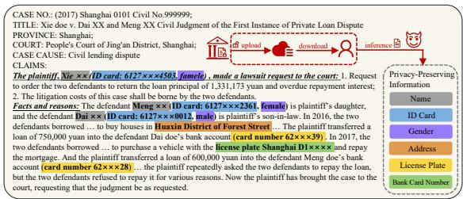

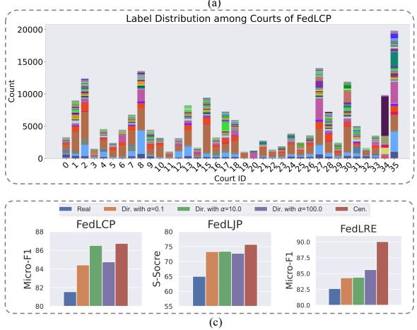  
Figure 2: Characteristics of FEDLEGAL: (a) demonstrating the rich sensitive information in a legal document; (b) depicting the data size (unbalanced) and label distributions (non-IID) among real-world courts; (c) showing heuristic sampling methods may bury the realistic difficulty of non-IID in real-world applications.

To facilitate FL research in the legal domain, we build the first FL benchmark for legal NLP, coined FEDLEGAL. It includes five legal NLP tasks on real-world legal texts collected from Chinese courts: Legal Cause Prediction (FEDLCP), Legal Argumentation Mining (FEDLAM), Legal Entity Recognition (FEDLER), Legal Relation Extraction (FEDLRE), and Legal Judgment Prediction (FEDLJP). In addition, we introduce a privacy attack task, coined FEDLPA, to evaluate risks of privacy leakage. To preserve the naturalness of local distributions, we partition datasets based on either cities or case categories such that the data in a different partition comes from a court in a different city or belongs to a different case category. Due to the varying socio-economic status of different cities, we observe that the data distributions from the courts in different cities are clearly non-IID. As illustrated in Figure 2 (b), the data volumes and label distributions differ dramatically across different cities. The local distributions between case categories exhibit even higher divergence.

On those natural partitions of our datasets, we conduct thefirst empirical study to investigate the model performance, privacy risks, and resource consumption for each legal NLP task with varying federated learning algorithms. In order to preserve the key characteristics of sensitive data (shown in Figure 2 (a)) without privacy leakage, we manually substitute various types of personally identifiable information (PII) and values of sensitive attributes, such as person names and addresses, for non-existing fake information in the same data formats. For example, replacing a real personal ID with a randomly picked non-existing personal ID in the same format. In addition, we provide a fully modularized and easy-to-extend codebase to facilitate FL research in the legal domain. Through extensive experiments on those legal NLP tasks, we obtain the following interesting findings not reported in prior FL studies.

• On the natural non-IID data of most of the legal NLP tasks, there is still a large performance gap between FL algorithms and supervised algorithms on centralized data.

• For FL algorithms, it is more challenging to achieve high performance on the natural non-IID local distributions of almost all legal NLP tasks than that on the distributions sampled by heuristic sampling algorithms. Heuristically splitted data exhibit different research problems than naturally partitioned data.

• The natural non-IID data partitions pose more challenges to small and shallow transformer models (Liu et al., 2019) than their large and deep counterparts.

## 2 Preliminaries

This section starts with reviewing the concepts, problem formulations, and challenges of federated learning, followed by providing an overview of the lifecycle of the lawsuit in the Chinese court system.

## 2.1 Federated Learning

FL is a distributed learning technology that collaboratively learns a shared global model from multiple isolated participants (or silos), while preserving privacy (McMahan et al., 2017; Li et al., 2020, 2021b). In a typical FL cross-silo setup, there is a server that coordinates the FL process and aggregates model information (e.g., model gradients) collected from scattered participants.

Algorithm 1: Training process of FedAvg   
Parameters: Silo set ; Communication round $\tau ;$   
Local epoch number $\varepsilon ;$ The shared global model   
parameters $\mathcal { W } ^ { 0 }$ on server; The local learning rate $\eta ;$   
The local dataset $\mathcal { D } _ { k }$ of the k-th silo ;   
ServerGlobalUpdating:   
for each communication round t = 1 to $\underline { \tau }$ do   
for each silo $\underline { { \boldsymbol { k } \in \left| \boldsymbol { S } \right| } }$ in parallel do   
SiloLocalTraining(k, $\overline { { \mathcal { W } ^ { t - 1 } } } )$   
end   
Receive participant-uploaded parameters $\mathcal { W } _ { k } ^ { t }$   
Perform global aggregation by:   
$\begin{array} { r } { \mathcal { W } ^ { t } = \sum _ { k = 1 } ^ { | S | } \frac { | \mathcal { D } _ { k } | } { \sum _ { k = 1 } ^ { | S | } | \mathcal { D } _ { k } | } \mathcal { W } _ { k } ^ { t } } \end{array}$ (1)   
end   
SiloLocalTraining $( k , \mathcal { W } ^ { t } ) :$   
for epoch $\underline { { e = \bar { 1 } } }$ to  do   
$\begin{array} { r } { \mathcal { W } _ { k } ^ { t }  \mathcal { W } _ { k } ^ { t } - \eta \frac { \partial \mathcal { L } _ { k } } { \partial \mathcal { W } _ { k } ^ { t } } } \end{array}$   
end   
Send $\mathcal { W } _ { k } ^ { t + 1 }$ to the server

FedAvg (McMahan et al., 2017) is the first and one of the most widely used FL algorithms, whose details are outlined in Algorithm 1. At the beginning of each communication round, the server sends model parameters to each participating silo. Then, the silo trains on local private data $\mathcal { D } _ { k }$ (SiloLocalTraining) and subsequently uploads the updated model parameters. The server monitors and collects the updated model parameters from the silo. After collecting the model parameters from all the silos, the server aggregates all model updates according to Eq. (1). The above process is repeated until the global model converges.

As elaborated in Algorithm 1, we identify three main challenges in FL as follows. (1) Training models with FL algorithms on the non-IID local data $\mathcal { D } _ { k }$ between silos often leads to inferior performance than that with centralized training, as demonstrated in previous work (McMahan et al., 2017; Weller et al., 2022). (2) Although FL aims to protect the participants’ private data, prior studies (Zhu et al., 2019; Sun et al., 2020b; Boenisch et al., 2021) show that the local training data can be partially reconstructed from the gradients uploaded by participants, resulting in privacy leakage . (3) Resource-constrained FL requires high-frequency communication between the server and participants to accelerate model convergence. However, these participants1 often have limited computing resources and communication bandwidth (Pfeiffer et al., 2023), which prevent them from training large-scale pre-trained models.

## 2.2 The Lifecycle of Lawsuit

The procedure for legal cases can be broadly divided into three phases in chronological order: (1) At Pre-trial stage, plaintiffs submit the claims and evidence to the court, and judges conduct a desk review of the case and read through the files to get a rough picture; During this stage, Legal AI techniques can be applied to assist both plaintiffs and judges with process work or paperwork. (2) In Trial stage, two or more parties get chances to cross-examine in the court; During this stage, the judge needs to summarize the dispute focusing on the views of different parties and inquire about their concerns. This part of the work can be assisted with Legal AI system by providing some suggestions through the analysis over past cases. (3) In many cases, the judge may not directly pronounce sentence in court at the end of trial, instead several weeks/months should be spent at After-trial stage to let the judge further review the information obtained during trial and then make the final decision. In addition, the prosecutor’s office and the court are responsible for supervising the quality of judgments or even analyzing criminal clues or patterns with some structural data.

## 3 FEDLEGAL

To facilitate the research on the incorporation of FL and LegalAI, we present the legal FL benchmark FEDLEGAL with natural non-IID partitions and practical private information. FEDLEGAL consists of six critical legal tasks which covers a broad range of task types, federated participant numbers, and natural non-IID data as shown in Table 1. Examples for each task can be found in Appendix C.

## 3.1 Tasks

FEDLCP The task of Legal Cause Prediction aims to automatically predict causes, namely case categories (e.g., private lending disputes), of civil cases. A system tackling this task is commonly used to assist plaintiffs with limited legal knowledge to choose the correct category of a case in the filing process at the pre-trial stage.

<table><tr><td rowspan="2">Task Type</td><td rowspan="2">Dataset</td><td rowspan="2">Metrics</td><td rowspan="2">Case Source</td><td colspan="4">Size</td><td colspan="3">Trial Stage</td></tr><tr><td># Instances</td><td># Silos</td><td># Loc.</td><td># Glo.</td><td>Pre-Trial</td><td>Trial</td><td>After-Trial</td></tr><tr><td>Cls.</td><td>FEDLCP</td><td>Micro/Macro-F1</td><td>Civil</td><td>199,284</td><td>36</td><td>3,542/443/443</td><td>19,928/19,929</td><td>V</td><td></td><td></td></tr><tr><td rowspan="2">IE.</td><td>FEDLAM</td><td>Micro-F1</td><td>Civil</td><td>4,866</td><td>15</td><td>207/26/26</td><td>487/487</td><td>V</td><td>V</td><td></td></tr><tr><td>FEDLER FEDLRE</td><td>Pre./Rec./Micro-F1</td><td>Criminal</td><td>2,282</td><td>10</td><td>146/18/19</td><td>228/229</td><td>V</td><td></td><td>V V</td></tr><tr><td>Reg.</td><td>FEDLJP</td><td>Macro-F1 S-Score/Acc@0.2</td><td>Criminal</td><td>5,923</td><td>10</td><td>379/47/48</td><td>592/593</td><td>V</td><td></td><td></td></tr><tr><td>Pri.</td><td></td><td></td><td>Criminal</td><td>59,431</td><td>24</td><td>1,584/198/199</td><td>5,943/5,944</td><td></td><td></td><td>V</td></tr><tr><td></td><td>FEDLPA</td><td>Pre./Rec./F1</td><td>Civil</td><td>80</td><td>1</td><td></td><td></td><td></td><td></td><td>=</td></tr></table>

Table 1: Task descriptions and statistics of FEDLEGAL. Cls., IE., Reg., Pri. represent the text classification, information extraction, regression, and privacy attack tasks, respectively. The cells in # Instances represent the total number of samples for each task. The cells in # Loc. represent the mean of data volume from local train/dev/test on all silos. The cells in # Glo. represent the volume of global dev/test data. See Appendix A for more details. Considering the trade-off between the time consumed by the attack and the batch size of local training, the volume of data for FEDLPA is generally tiny.

FEDLJP Legal Judgment Prediction is a regression task that automatically predicts the duration of a sentence given the facts identified by a judge. Noteworthy, the goal of this task is to provide predicted judgements as references to users. Based on estimated judgements, lawyers can tailor their arguments, assess legal risks and provide appropriate advice to litigants. Similarly, judges may double check their judgements if there are discrepancies.

FEDLER The task of Legal Entity Recognition aims to extract crime-related entities (e.g. instruments of crime, stolen amount and alcohol level in blood) from case documents. In practice, the extracted entities contribute to sorting out the gist of a case and characterization of a crime.

FEDLRE Based on the outputs of FEDLER, this task detects relations among entities and classifies entity pairs into specific types, such as a certain drug and its weight. These relations are then utilized to organize massive entities and avoid misplaced relations for subsequent analysis.

FEDLAM Legal Argument Mining seeks to identify arguments and dispute focuses between a plaintiff and a defendant from court transcripts and estimate their argument types. To well understand a case, judges are required to summarize those arguments and investigate them during a trial. Before analyzing arguments and dispute focuses, cases are divided into different categories and are assigned to the corresponding courts. Law firms are usually specialized in only one or a handful of case categories. As cases are organized by case categories before analyzing arguments, we partition data by case categories in this benchmark.

FEDLPA Legal Privacy Attack aims to evaluate privacy leaks in federated learning. Concretely, FEDLEGAL provides a well-designed privacy attack dataset FEDLPA containing 80 privacysensitive examples extracted from FEDLJP. As shown in Figure 5, such attack data includes privacy-sensitive attributes (e.g., age and gender) with various types, such as numbers and characters. Note that this is the first real-world privacy attack dataset for FL. We hope that FEDLPA can facilitate studies of FL in terms of privacy protection.

## 3.2 Dataset

The source data for all tasks are collected from the public legal judgements that are anonymized and released by the Supreme Court of China2. The FEDLCP dataset is collected from the results of a rigorous charge determination process, and the FEDLJP dataset directly uses the official court decisions. Regarding the datasets for FEDLAM, FEDLER and FEDLRE tasks, we establish a data schema and the corresponding annotation guidelines, and recruit a team of five law school students for annotation. A legal professional oversees the process, answering questions about annotation standards and performing quality checks. On average, annotating a sample takes about three minutes per person. The Kappa scores (McHugh, 2012) among five annotators are 92%, 96%, 96% for each respective task. The sentences provided for FEDLPA are manually created by the annotators to simulate real-world cases.

Practitioners and researchers aim to improve FL algorithms that customize models to perform well on each distinct local dataset and build a global model to perform well on all partitions without customization. The above two goals in FL are often difficult to achieve altogether, especially on significantly heterogeneous data partitions (Kairouz et al., 2021). Unfortunately, the existing FL benchmarks only focus on one of the two goals but rarely take both into consideration (Chen et al., 2022). Thus, accurately evaluating the pros and cons of different FL algorithms for both goals is difficult with existing FL benchmarks. For example, an optimal model personalized for a single data partition does not necessarily perform well on all partitions.

In light of above analysis, we build a local and a global evaluation set for each task in FEDLEGAL. For the local one, we divide each local partition into the local train/valid/test sets by 8:1:1. For the global evaluation set, we collect the training data of all partitions and divide the union into the global train/valid/test sets with the ratios of 8:1:1. During the global FL training, the global train set is partitioned for each participant w.r.t. either courts or case categories for respective tasks. Table 1 shows the basic statistics of each dataset in FEDLEGAL.

## 3.3 Framework Design

To facilitate research on FL in the legal domain, we build a general FL framework for legal tasks. Figure 3 shows the overview of our framework. Our framework is based on FedLab (Zeng et al., 2023), a lightweight open-source framework for FL simulation. However, FedLab contains only basic FL framework components (e.g., communication configurations and FL algorithms), which lack APIs for downstream tasks. Therefore, on top of Fed-Lab, we further establish the training pipelines for various legal tasks. Meanwhile, our framework integrates HuggingFace3, which is widely recognized for its rich pre-trained models for NLP applications. Thus this framework is suitable for practitioners to study Legal NLP problems in FL settings using the state-of-the-art pre-trained language models.

## 4 Experiment

In this section, we first show the performance of different FL algorithms on FEDLEGAL (see Section

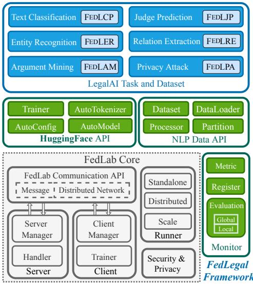  
Figure 3: The Overview of our framework.

4.2). To obtain a clear understanding of the practical challenges of FL in real-world applications, we conduct an in-depth investigation on FEDLE-GAL, covering privacy leakage analysis (see Section 4.3) and resource-constrained FL scenario (see Section 4.4).

## 4.1 Experiment Setup

Baseline Algorithms Our experiment adopts the four typical FL algorithms for each legal task. The first two are classic and global FL algorithms: FedAvg (McMahan et al., 2017) is the oft-cited FL algorithm that collaboratively trains a global FL model across participants, and FedProx (Li et al., 2020) addresses statistical heterogeneity in FL by introducing L proximal term during the local training process. The last is the personalized FL method FedOPT (Reddi et al., 2021) is an extended version of FedAvg, which respectively uses two gradient based optimizers in participants and servers. Ditto (Li et al., 2021b), which excels at tackling the competing constraints of accuracy, fairness, and robustness in FL. Besides the FL family, we also include the local training algorithm: Standalone refers to the training model only using local data on each participant without collaborations between participants, and Centralized refers to the ideal centralized training setting where the server could collect all participants’ data. Since pre-trained language models (PLMs) have been de facto base model architecture in NLP research nowadays, we adopt RoBERTa-WWM (Cui et al., 2019) released by HggingFace4 for all tasks. More implementation details on each baseline algorithm can be found in Appendix B.

Evaluation Strategies As described in Section 3.2, for a comprehensive evaluation, our experiments test all algorithms using two evaluation strategies: 1) Global test performance (GLOBAL) is evaluated on the global test set and used to determine whether the model has learned global knowledge. The better results of GLOBAL indicate that the model is closer to the centralized training. 2) Local test performance (LOCAL) is evaluated on each local test set and averaged by all participants. The LOCAL is more practical in real-world applications than GLOBAL because it shows performance improvement without centralizing all local data.

Training Details The number of silos involved in federated training for each task are listed in Table 1. Our experiments mainly focus on the cross-silo FL scenario, where all silos participate in training at each communication round. In silo local training, we adopt AdamW optimizer for RoBERTa-WWM. Considering the trade-off between computation and communication, we set the local training epoch to 1 and the communication rounds to 20 throughout experiments except for FEDLAM. Since FEDLAM is a highly non-IID task, we set the communication round to 50 on this task to ensure that the federated model can be fully trained.

## 4.2 Utility Experiment

We first conduct experiments to investigate different baseline algorithms’ utility on FEDLE-GAL. The experimental results demonstrate that federated learning is crucial and efficient for privacy-sensitive downstream tasks (compared with Standalone), while there is still significant room for performance improvement using the real-world data partitions (compared with Centralized).

The GLOBAL and LOCAL performances are shown in Table 2 and 3 respectively. FL algorithms outperform Standalone training on GLOBAL and LOCAL in the majority of FEDLEGAL tasks. This can be attributed to FL’s privacy-preserving training manner which enables the model to harness knowledge from all participants, leading to a significant performance boost. We also observe that Standalone exhibits either superior or acceptable LOCAL performance in FEDLCP and FED-LAM. Compared with other tasks, each participant in FEDLCP has enough local data, which allows the local model to be fully trained and achieves better performance in local test. As shown in Table 4, when there is only a small amount of data locally, Standalone’s LOCAL performance drops precipitously while the FL algorithm still performs well. This emphasizes the advantages of FL for collaborative model training in situations where local data is limited and centralized collection of data is prohibited. As for FEDLAM, we presume that its strong non-IID features lead to the LOCAL performance better than federated algorithms.

Upon comparing various FL algorithms, we find that they possess unique pros and cons, specific to different tasks. While FedAvg may not attain the best performance in all tasks, its margin of difference from the best-performing algorithm is minimal. FedProx can achieve similar performances as FedAvg, consistent with the finding of Lin et al. (2022). FedOPT, an advanced federation algorithm, attains superior performance in most tasks, which aligns with prior research (Lin et al., 2022). As a personalized FL algorithm, Ditto can achieve better performance results on LOCAL but struggles on GLOBAL. FEDLEGAL exhibits the clear trade-off between global and personalized models, providing a more comprehensive evaluation of different FL algorithms. Comparing the FL algorithm with centralized training, we found a sharp performance gap between the FL algorithm on GLOBAL and LOCAL due to the complex real-world data heterogeneity in FEDLEGAL. In this sense, we believe FEDLEGAL can facilitate the FL community to develop more robust FL algorithms.

We further scrutinize the contrast between natural partitioning and commonly employed artificially split methods in non-IID settings. For this analysis, we utilize oft-cited FedAvg and the applicable artificially split methods in each task, referenced in Appendix B. As shown in Table 5, compared with artificially splitted datasets, we find that the natural non-IID is notably more arduous to address in federated scenarios across all tasks. Moreover, we uncover that artificially split methods may fail to accurately reflect the attendant non-IID complexities, such as those exhibited in FEDLJP with α values5 of 1.0 and 10.0 and FEDLAM with α values of 0.1 and 1.0. These experimental findings provide further justification for our motivation to develop our FEDLEGAL.

<table><tr><td></td><td colspan="2">FEDLCP</td><td colspan="2">FEDLJP</td><td colspan="3">FEDLER Rec.</td><td rowspan="2">FEDLRE Macro-F1</td><td rowspan="2">FEDLAM Micro-F1</td></tr><tr><td></td><td>Micro-F1</td><td>Macro-F1</td><td>S-Score</td><td>Acc@0.2</td><td>Pre.</td><td>Micro-F1</td><td></td></tr><tr><td>Standalone</td><td>61.54</td><td>8.33</td><td>52.65</td><td>17.84</td><td>65.74</td><td>69.69</td><td>67.56</td><td>62.84</td><td>16.21</td></tr><tr><td>FedAvg</td><td>81.56</td><td>19.29</td><td>65.01</td><td>27.81</td><td>82.84</td><td>87.25</td><td>84.99</td><td>82.62</td><td>35.51</td></tr><tr><td>FedProx</td><td>81.09</td><td>18.46</td><td>65.76</td><td>28.30</td><td>82.81</td><td>87.25</td><td>84.97</td><td>82.51</td><td>34.11</td></tr><tr><td>FedOPT</td><td>81.03</td><td>19.30</td><td>65.77</td><td>30.33</td><td>81.29</td><td>88.09</td><td>84.55</td><td>80.74</td><td>35.73</td></tr><tr><td>Ditto</td><td>81.32</td><td>19.28</td><td>65.93</td><td>30.53</td><td>78.06</td><td>86.82</td><td>82.20</td><td>88.21</td><td>28.63</td></tr><tr><td>Centralized</td><td>86.74</td><td>39.90</td><td>75.72</td><td>36.46</td><td>85.74</td><td>87.37</td><td>86.54</td><td>90.04</td><td>79.62</td></tr></table>

Table 2: The GLOBAL performances of different FL methods on FEDLEGAL.
<table><tr><td></td><td colspan="2">FEDLCP</td><td colspan="2">FEDLJP S-Score</td><td colspan="3">FEDLER</td><td rowspan="2">FEDLRE Macro-F1</td><td rowspan="2">FEDLAM Micro-F1</td></tr><tr><td></td><td>Micro-F1</td><td>Macro-F1</td><td></td><td>Acc@0.2</td><td>Pre.</td><td>Rec. Micro-F1</td><td></td></tr><tr><td>Standalone</td><td>88.01</td><td>51.28</td><td>53.77</td><td>9.58</td><td>73.42</td><td>82.57</td><td>77.66</td><td>82.02</td><td>60.43</td></tr><tr><td>FedAvg</td><td>87.47</td><td>48.22</td><td>63.52</td><td>26.10</td><td>78.15</td><td>82.08</td><td>79.95</td><td>89.76</td><td>45.94</td></tr><tr><td>FedProx</td><td>87.59</td><td>48.35</td><td>63.75</td><td>27.77</td><td>78.44</td><td>82.29</td><td>80.21</td><td>89.94</td><td>44.77</td></tr><tr><td>FedOPT</td><td>87.31</td><td>48.88</td><td>64.59</td><td>28.32</td><td>79.49</td><td>86.22</td><td>82.67</td><td>87.02</td><td>47.75</td></tr><tr><td>Ditto</td><td>87.44</td><td>49.73</td><td>60.65</td><td>23.99</td><td>73.37</td><td>82.45</td><td>77.56</td><td>84.19</td><td>66.18</td></tr><tr><td>Centralized</td><td>86.42</td><td>48.21</td><td>75.53</td><td>36.33</td><td>82.12</td><td>85.06</td><td>83.47</td><td>92.35</td><td>78.14</td></tr></table>

Table 3: The LOCAL performances of different FL methods on FEDLEGAL. Underlined numbers denote either superior or acceptable performance for Standalone.

<table><tr><td rowspan=1 colspan=1>Data Ratios</td><td rowspan=1 colspan=1>0.1</td><td rowspan=1 colspan=1>0.5</td><td rowspan=1 colspan=1>1.0</td></tr><tr><td rowspan=1 colspan=1>Standalone</td><td rowspan=1 colspan=1>44.38</td><td rowspan=1 colspan=1>56.92</td><td rowspan=1 colspan=1>88.01</td></tr><tr><td rowspan=1 colspan=1>FedAvg</td><td rowspan=1 colspan=1>72.38</td><td rowspan=1 colspan=1>79.51</td><td rowspan=1 colspan=1>87.47</td></tr></table>

Table 4: The LOCAL performance of Standalone and FedAvg with different data ratios on FEDLCP.  
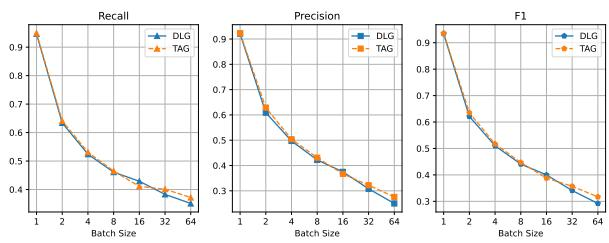  
Figure 4: Privacy attack results of DLG and TAG on FEDLPA under different local training batch sizes. The higher metric means more serious privacy breaches.

## 4.3 Privacy Experiment

In FL systems, the server updates the global model by aggregating participant-uploaded model gradients, maintaining privacy by not directly accessing local data. However, prior work (Zhu et al., 2019; Deng et al., 2021) has demonstrated the potential privacy breaches in which participants’ training data can be partially reconstructed from gradients. To analyze the privacy leakage of FL, we adopt two gradient-based privacy attack methods: DLG (Deep Leakage from Gradients) (Zhu et al., 2019) and TAG (Gradient Attack on Transformer-based Models) (Deng et al., 2021) in our privacy attack dataset FEDLPA. Both attack methods can effectively recover the original data from the participantuploaded gradients. For the evaluation metrics, we follow Song and Raghunathan (2020) and use precision (the average percentage of recovered words in the target texts), recall (the average percentage of words in the target texts are predicted), and F1 score (the harmonic mean between precision and recall).

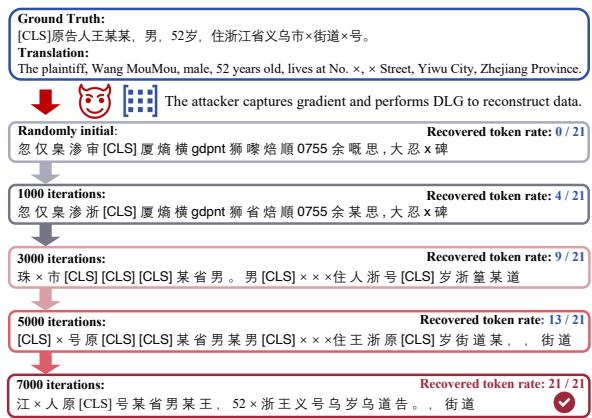  
Figure 5: Recover progress of gradient attack on an example of FEDLPA.

Figure 4 shows privacy attack results of DLG and TAG on FEDLPA under different local training batch sizes, we find that attackers can still efficiently reconstruct the data from the participant-uploaded gradients even in privacy-preserving FL. Figure 4 also shows that data is more likely to leak when the local batch size is small. To attain a clearer understanding of gradient attacks, we show the recovery progress of gradient attacks on an example of FEDLPA in Figure 5. Although the existing gradient attack can effectively recover every token in the sentence, it is hard for the attacker to recover the order of tokens. This outcome also reveals the potential privacy risks arising from the unordered bag of words even though it may be challenging for an attacker to obtain the exact original training data from the gradient. Overall, FEDLPA provides an available privacy attack dataset, which researchers can use to simulate privacy attacks and study privacy defenses in the FL setting.

<table><tr><td rowspan="2"></td><td colspan="2">FEDLCP</td><td colspan="2">FEDLJP</td><td rowspan="2"></td><td colspan="2">FEDLER</td><td rowspan="2">FEDLRE Macro-F1</td><td rowspan="2">FEDLAM Micro-F1</td></tr><tr><td>Micro-F1</td><td>Macro-F1</td><td>S-Score Acc@0.2</td><td>Pre.</td><td>Rec.</td><td>Micro-F1</td></tr><tr><td>Centralized</td><td>86.74</td><td>39.90</td><td>75.72</td><td>36.46</td><td>85.74</td><td>87.37</td><td>86.54</td><td>90.04</td><td>79.62</td></tr><tr><td>Dir. 0.1</td><td>84.43</td><td>38.28</td><td>73.31</td><td>34.22</td><td>81.10</td><td>88.85</td><td>84.80</td><td>84.33</td><td>42.44</td></tr><tr><td>Dir. 1.0</td><td>86.52</td><td>37.48</td><td>73.39</td><td>34.59</td><td>82.39</td><td>88.51</td><td>85.34</td><td>84.41</td><td>40.95</td></tr><tr><td>Dir. 10.0</td><td>84.76</td><td>33.58</td><td>72.74</td><td>35.18</td><td>81.25</td><td>88.24</td><td>84.58</td><td>85.61</td><td>42.99</td></tr><tr><td>Natural non-IID</td><td>81.56</td><td>19.29</td><td>65.01</td><td>27.81</td><td>82.84</td><td>87.25</td><td>84.99</td><td>82.62</td><td>35.51</td></tr></table>

Table 5: The GLOBAL performance comparisons between artificially sampled local partitions (Dir.) and their natural non-IID counterparts on FEDLEGAL. Underlined numbers indicate the lowest performance and also imply the more challenging non-IID. FEDLCP and FEDLAM adopt Label-level Dir. Partition, FEDLJP and FEDLRE adopt Quantity-level Dir. Partition, FEDLER adopts Clustering-level Dir. Partition. See Appendix B for more details.

## 4.4 Resource Cost

This section analyzes resource-intensive situations in real-world federated systems, including communication overhead in federated training and computational resources of local participants.

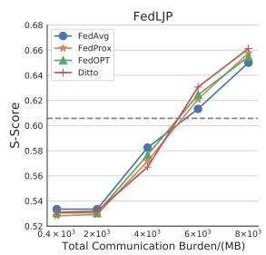

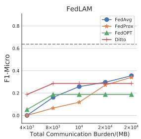  
Figure 6: Performance versus Communication Budgets on FEDLJP and FEDLAM. The horizontal dashed line indicates the acceptable performance, which is 80% of centralized training’s performance.

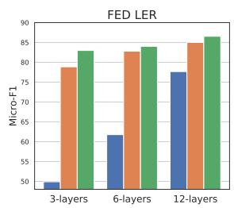

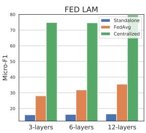  
Figure 7: Performance with different model sizes on FEDLER and FEDLAM in federated and local training settings. The x-layers denotes the number of RoBERTa’s encoder layers.

The effect of communication We investigate the performance versus communication budgets on FEDLJP and FEDLAM, which is illustrated in figure 6. Although FL can make the model attain the desired performance by multiple communications (e.g., more than 80% performance of centralized training), it also requires an extremely heavy communication cost. For example, the local model has to upload about 6 GB communication overhead cumulatively when FL algorithms achieve the desired performance on FEDLJP. Such cumbersome communication overhead is unacceptable in a real-world federation system, especially when the local client has limited transmission bandwidth. With the increasing scale of PLMs, communication overhead becomes a significant bottleneck for landing PLMs in real-world FL scenarios. In this sense, developing communication-friendly and PLMs-empowered FL algorithms is necessary. Besides, we find that vanilla FedAvg and FedProx algorithms show better performance and robustness in GLOBAL performance under extremely non-IID task FEDLAM.

The resource-constrained computation Participants in the FL system typically have limited computation resources, thereby it is practical to consider small federated models to reduce the computation costs. Figure 7 shows the performances of different sizes of models in federated and local training settings for FEDLER and FEDLAM tasks. We find that smaller models suffer drastic performance degradation in FL, despite reducing the training cost of local clients. Note that, the performance of FL is still weaker than the results of Centralized setting. This result is contrary to that in Lin et al. (2022), where they experimentally demonstrate that a small-scale model can still achieve competitive performance. We speculate that this result may be due to the real-world data heterogeneity in FEDLEGAL, and Lin et al. (2022) uses a heuristic partitioning method. Based on this, FEDLEGAL could be better to reflect the trade-off between local computational resources and performance.

## 5 Related Work

Legal Artificial Intelligence Legal Artificial Intelligence (LegalAI) provides intelligent assistance for legal practitioners in judicial domain. It promotes the efficiency of lawyers and judges and provides afford-service for the public. Commendable progress has been achieved for LegalAI applications, such as legal judgment prediction (Chalkidis et al., 2019a; Ma et al., 2021), legal information extraction(Cardellino et al., 2017; Angelidis et al., 2018a; Cardellino et al., 2017), legal text classification(Chalkidis et al., 2019b), legal text summarization(Aletras et al., 2016; Duan et al., 2019), and legal question answering(Khazaeli et al., 2021).

Unfortunately, in practical situations, legal data of limited size is usually distributed over multiple regions/courts, and meanwhile different courts may devote to various scenes of a same task. Due to privacy and strategic concerns, it is unattainable to put all these data together (especially for non-public files) to satisfy the demands of those data-driven algorithms. The ways to effectively consume these data in the justice sector remain under-explored.

Federated Learning Federated learning (McMahan et al., 2017) (FL) is a prevalent decentralized machine learning technique in privacy-sensitive tasks. To facilitate FL research, researchers have proposed numerous FL benchmarks and made successful progress in FL standardized evaluation, such as LEAF (Caldas et al., 2018), Fed-Scale (Lai et al., 2022), pFL-Bench (Chen et al.,

2022), FedCV(He et al., 2021), and FedNLP (Lin et al., 2022). To simulate the non-IID challenge in FL, these benchmarks generally employ different heuristic sampling methods (Ji et al., 2020; Li et al., 2021a; Morafah et al., 2022) to build heterogeneous data partitions from an existing public dataset and assign them to hypothetical participants, which may bury the complexity of natural data heterogeneity in realistic applications (du Terrail et al., 2022). Unlike these benchmarks, the datasets in FEDLEGAL are collected from real-world applications and preserve the natural non-IID partitioning.

Recently, some benchmarks specifically designed for FL have been proposed. du Terrail et al. (2022) proposed FLamby, a realistic healthcare cross-silo FL benchmark. Jain and Jerripothula (2023) presented the first real-world FL image classification dataset. These benchmarks are all image task datasets and either lack task scale or task diversity. Compared to these benchmarks, FEDLEGAL covers a broad range of NLP task types. To facilitate FL’s research on privacy attacks, FEDLEGAL includes the first practical privacy attack dataset FEDLPA.

## 6 Conclusion

This paper proposes thefirst real-world federated learning benchmark for legal NLP (FEDLEGAL), which contains five NLP tasks and one privacy task. The benchmark features a large number of FL participants and natural non-IID data partitions. On this dataset, we conduct the extensive empirical study, including performance comparisons, privacy leakage, and resource-constrained analysis. The experimental results reveal that FL algorithms are effective for real-world applications but our benchmark poses new challenges on natural non-IID partitions. In addition, we build a lightweight and easy-to-extend codebase to facilitate FL research in the legal domain. We hope that FEDLEGAL would facilitate the development of novel and practical FL algorithms for real-world legal applications.

## Limitations

We summarized the limitations of FEDLEGAL as follows: (1) Although FEDLEGAL includes a variety of legal tasks with natural language understanding, more useful legal generation tasks should be included, such as legal court debate, legal case summary, etc. However, the tasks in FEDLEGAL are more commonly used in the legal domain compared to these tasks. On the other hand, the manual annotation cost is also a limited factor. We will expand more useful legal tasks and also welcome contributions of new datasets to keep FEDLEGAL up-to-date. (2) We do not analyze the FL algorithm’s robustness attacks (i.e., poisoning attacks). We argue that it is impractical to have malicious court participants when multiple official courts perform federal learning. Therefore that discussion is beyond the scope of our study in this paper. As robustness attacks pose significant threats to FL, FEDLEGAL containing natural non-IID will also be more suitable for studying powerful FL algorithms for resisting robustness attacks.

## Ethics Statement

All proposed tasks aim at increasing the efficiency of judges instead of helping the judges make decisions. Extracted or classified information will be further checked by judges and we only provide techniques to serve as an auxiliary tool. All source files of our datasets are from the official legal document website and are properly anonymized. We do not analyze the content of the case or the litigants in any way other than provide tool for judges.

## Acknowledgements

We’d like to thank all the anonymous reviewers for their careful readings and valuable comments. This work was partially supported by the National Key Research and Development Program of China (No. 2018AAA0100204), a key program of fundamental research from Shenzhen Science and Technology Innovation Commission (No. JCYJ20200109113403826), the Major Key Project of PCL (No. 2022ZD0115301), and an Open Research Project of Zhejiang Lab (NO.2022RC0AB04).

## References

Nikolaos Aletras, Dimitrios Tsarapatsanis, Daniel Preotiuc-Pietro, and Vasileios Lampos. 2016. Predicting judicial decisions of the european court of human rights: a natural language processing perspective. PeerJ Comput. Sci., 2:e93.

Iosif Angelidis, Ilias Chalkidis, and Manolis Koubarakis. 2018a. Named entity recognition, linking and generation for greek legislation. In JURIX, volume 313 of Frontiers in Artificial Intelligence and Applications, pages 1–10. IOS Press.

Iosif Angelidis, Ilias Chalkidis, and Manolis Koubarakis. 2018b. Named entity recognition, linking and generation for greek legislation. In JURIX, pages 1–10.

Franziska Boenisch, Adam Dziedzic, Roei Schuster, Ali Shahin Shamsabadi, Ilia Shumailov, and Nicolas Papernot. 2021. When the curious abandon honesty: Federated learning is not private. arXiv preprint arXiv:2112.02918.

Sebastian Caldas, Peter Wu, Tian Li, Jakub Konecný,ˇ H. Brendan McMahan, Virginia Smith, and Ameet Talwalkar. 2018. LEAF: A benchmark for federated settings. CoRR, abs/1812.01097.

Cristian Cardellino, Milagro Teruel, Laura Alonso Alemany, and Serena Villata. 2017. Legal NERC with ontologies, wikipedia and curriculum learning. In EACL (2), pages 254–259. Association for Computational Linguistics.

Ilias Chalkidis, Ion Androutsopoulos, and Nikolaos Aletras. 2019a. Neural legal judgment prediction in english. In ACL (1), pages 4317–4323. Association for Computational Linguistics.

Ilias Chalkidis, Manos Fergadiotis, Prodromos Malakasiotis, and Ion Androutsopoulos. 2019b. Large-scale multi-label text classification on EU legislation. In ACL (1), pages 6314–6322. Association for Computational Linguistics.

Daoyuan Chen, Dawei Gao, Weirui Kuang, Yaliang Li, and Bolin Ding. 2022. pFL-bench: A comprehensive benchmark for personalized federated learning. In Thirty-sixth Conference on Neural Information Processing Systems Datasets and Benchmarks Track.

Yiming Cui, Wanxiang Che, Ting Liu, Bing Qin, Ziqing Yang, Shijin Wang, and Guoping Hu. 2019. Pretraining with whole word masking for chinese bert. arXiv preprint arXiv:1906.08101.

Jieren Deng, Yijue Wang, Ji Li, Chao Shang, Hang Liu, Sanguthevar Rajasekaran, and Caiwen Ding. 2021. Tag: Gradient attack on transformer-based language models. arXiv preprint arXiv:2103.06819.

Jean Ogier du Terrail, Samy-Safwan Ayed, Edwige Cyffers, Felix Grimberg, Chaoyang He, Regis Loeb, Paul Mangold, Tanguy Marchand, Othmane Marfoq, Erum Mushtaq, Boris Muzellec, Constantin Philippenko, Santiago Silva, Maria Telenczuk, Shadi Albar-´ qouni, Salman Avestimehr, Aurélien Bellet, Aymeric Dieuleveut, Martin Jaggi, Sai Praneeth Karimireddy, Marco Lorenzi, Giovanni Neglia, Marc Tommasi, and Mathieu Andreux. 2022. FLamby: Datasets and benchmarks for cross-silo federated learning in realistic healthcare settings. In Thirty-sixth Conference on Neural Information Processing Systems Datasets and Benchmarks Track.

Xinyu Duan, Yating Zhang, Lin Yuan, Xin Zhou, Xiaozhong Liu, Tianyi Wang, Ruocheng Wang, Qiong Zhang, Changlong Sun, and Fei Wu. 2019. Legal

summarization for multi-role debate dialogue via controversy focus mining and multi-task learning. In CIKM, pages 1361–1370. ACM.

Suyu Ge, Fangzhao Wu, Chuhan Wu, Tao Qi, Yongfeng Huang, and Xing Xie. 2020. Fedner: Medical named entity recognition with federated learning. arXiv preprint arXiv:2003.09288.

Marco Gomes, Bruno Oliveira, and Cristóvão Sousa. 2022. Enriching legal knowledge through intelligent information retrieval techniques: A review. In EPIA Conference on Artificial Intelligence, pages 119–130. Springer.

Samyak Gupta, Yangsibo Huang, Zexuan Zhong, Tianyu Gao, Kai Li, and Danqi Chen. 2022. Recovering private text in federated learning of language models. arXiv preprint arXiv:2205.08514.

Chaoyang He, Alay Dilipbhai Shah, Zhenheng Tang, Di Fan, Adarshan Naiynar Sivashunmugam, Keerti Bhogaraju, Mita Shimpi, Li Shen, Xiaowen Chu, Mahdi Soltanolkotabi, and Salman Avestimehr. 2021. Fedcv: A federated learning framework for diverse computer vision tasks. CoRR, abs/2111.11066.

Shreyansh Jain and Koteswar Rao Jerripothula. 2023. Federated learning for commercial image sources. In Proceedings of the IEEE/CVF Winter Conference on Applications of Computer Vision, pages 6534– 6543.

Shaoxiong Ji, Wenqi Jiang, Anwar Walid, and Xue Li. 2020. Dynamic sampling and selective masking for communication-efficient federated learning. arXiv preprint arXiv:2003.09603.

Peter Kairouz, H Brendan McMahan, Brendan Avent, Aurélien Bellet, Mehdi Bennis, Arjun Nitin Bhagoji, Kallista Bonawitz, Zachary Charles, Graham Cormode, Rachel Cummings, et al. 2021. Advances and open problems in federated learning. Foundations and Trends® in Machine Learning, 14(1–2):1–210.

Soha Khazaeli, Janardhana Punuru, Chad Morris, Sanjay Sharma, Bert Staub, Michael Cole, Sunny Chiu-Webster, and Dhruv Sakalley. 2021. A free format legal question answering system. In Proceedings of the Natural Legal Language Processing Workshop 2021, pages 107–113, Punta Cana, Dominican Republic. Association for Computational Linguistics.

Fan Lai, Yinwei Dai, Sanjay Sri Vallabh Singapuram, Jiachen Liu, Xiangfeng Zhu, Harsha V. Madhyastha, and Mosharaf Chowdhury. 2022. Fedscale: Benchmarking model and system performance of federated learning at scale. In ICML, volume 162 of Proceedings of Machine Learning Research, pages 11814–11827. PMLR.

Qinbin Li, Yiqun Diao, Quan Chen, and Bingsheng He. 2021a. Federated learning on non-iid data silos: An experimental study. arXiv preprint arXiv:2102.02079.

Tian Li, Shengyuan Hu, Ahmad Beirami, and Virginia Smith. 2021b. Ditto: Fair and robust federated learning through personalization. In International Conference on Machine Learning, pages 6357–6368. PMLR.

Tian Li, Anit Kumar Sahu, Manzil Zaheer, Maziar Sanjabi, Ameet Talwalkar, and Virginia Smith. 2020. Federated optimization in heterogeneous networks. Proceedings of Machine Learning and Systems, 2:429–450.

Bill Yuchen Lin, Chaoyang He, Zihang Ze, Hulin Wang, Yufen Hua, Christophe Dupuy, Rahul Gupta, Mahdi Soltanolkotabi, Xiang Ren, and Salman Avestimehr. 2022. FedNLP: Benchmarking federated learning methods for natural language processing tasks. In Findings of the Association for Computational Linguistics: NAACL 2022, pages 157–175, Seattle, United States. Association for Computational Linguistics.

Ruixuan Liu, Fangzhao Wu, Chuhan Wu, Yanlin Wang, Lingjuan Lyu, Hong Chen, and Xing Xie. 2022. No one left behind: Inclusive federated learning over heterogeneous devices. arXiv preprint arXiv:2202.08036.

Yinhan Liu, Myle Ott, Naman Goyal, Jingfei Du, Mandar Joshi, Danqi Chen, Omer Levy, Mike Lewis, Luke Zettlemoyer, and Veselin Stoyanov. 2019. Roberta: A robustly optimized bert pretraining approach. arXiv preprint arXiv:1907.11692.

Luyao Ma, Yating Zhang, Tianyi Wang, Xiaozhong Liu, Wei Ye, Changlong Sun, and Shikun Zhang. 2021. Legal judgment prediction with multi-stage case representation learning in the real court setting. In SIGIR, pages 993–1002. ACM.

Mary L McHugh. 2012. Interrater reliability: the kappa statistic. Biochemia medica, 22(3):276–282.

Brendan McMahan, Eider Moore, Daniel Ramage, Seth Hampson, and Blaise Aguera y Arcas. 2017. Communication-efficient learning of deep networks from decentralized data. In Artificial intelligence and statistics, pages 1273–1282. PMLR.

Mahdi Morafah, Saeed Vahidian, Chen Chen, Mubarak Shah, and Bill Lin. 2022. Rethinking data heterogeneity in federated learning: Introducing a new notion and standard benchmarks. arXiv preprint arXiv:2209.15595.

Kilian Y. Pfeiffer, Martin Rapp, Ramin Khalili, and Jörg Henkel. 2023. Federated learning for computationally-constrained heterogeneous devices: A survey. ACM Computing Surveys.

Sashank J. Reddi, Zachary Charles, Manzil Zaheer, Zachary Garrett, Keith Rush, Jakub Konecný, San-ˇ jiv Kumar, and Hugh Brendan McMahan. 2021. Adaptive federated optimization. In International Conference on Learning Representations.

Congzheng Song and Ananth Raghunathan. 2020. Information leakage in embedding models. In Proceedings of the 2020 ACM SIGSAC Conference on Computer and Communications Security, pages 377–390.

Changlong Sun, Yating Zhang, Xiaozhong Liu, and Fei Wu. 2020a. Legal intelligence: Algorithmic, data, and social challenges. In Proceedings of the 43rd International ACM SIGIR Conference on Research and Development in Information Retrieval, pages 2464–2467.

Jingwei Sun, Ang Li, Binghui Wang, Huanrui Yang, Hai Li, and Yiran Chen. 2020b. Provable defense against privacy leakage in federated learning from representation perspective. arXiv preprint arXiv:2012.06043.

Orion Weller, Marc Marone, Vladimir Braverman, Dawn Lawrie, and Benjamin Van Durme. 2022. Pretrained models for multilingual federated learning. In Proceedings of the 2022 Conference of the North American Chapter of the Association for Computational Linguistics: Human Language Technologies, pages 1413–1421, Seattle, United States. Association for Computational Linguistics.

Dun Zeng, Siqi Liang, Xiangjing Hu, Hui Wang, and Zenglin Xu. 2023. Fedlab: A flexible federated learning framework. Journal of Machine Learning Research, 24(100):1–7.

Yue Zhao, Meng Li, Liangzhen Lai, Naveen Suda, Damon Civin, and Vikas Chandra. 2018. Federated learning with non-iid data. arXiv preprint arXiv:1806.00582.

Haoxi Zhong, Chaojun Xiao, Zhipeng Guo, Cunchao Tu, Zhiyuan Liu, Maosong Sun, Yansong Feng, Xianpei Han, Zhen Hu, Heng Wang, and Jianfeng Xu. 2018. Overview of CAIL2018: legal judgment prediction competition. CoRR, abs/1810.05851.

Haoxi Zhong, Chaojun Xiao, Cunchao Tu, Tianyang Zhang, Zhiyuan Liu, and Maosong Sun. 2020. How does nlp benefit legal system: A summary of legal artificial intelligence. arXiv preprint arXiv:2004.12158.

Ligeng Zhu, Zhijian Liu, and Song Han. 2019. Deep leakage from gradients. Advances in neural information processing systems, 32.

## A The Data Distribution of FEDLEGAL

Figure 8 plots the train/validation/test number of samples per client for each task in FEDLEGAL. More details about the example of FEDLEGAL can be found in the released code.

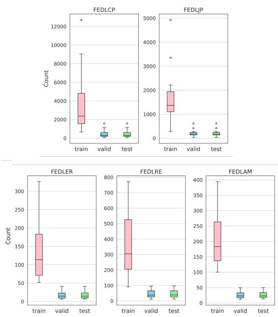  
Figure 8: Client data distribution of each task

## B Implementation Details

Baseline Algorithms The implementations of all baseline algorithms are from FedLab6, which is a lightweight open-source framework (Zeng et al., 2023) for FL simulations. For FedProx, we search its hyper-parameter λ from { 0.001, 0.01, 0.05, 0.1, 1.0 }. For Ditto, we tune the hyperparameters a and a from { 0.001, 0.01, 0.1, 1.0, 10.0, 100.0 }. For FedOPT, we design AdamW as clients’ optimizer while adopting an SGD algorithm with momentum for server optimizer followed by FedNLP(Lin et al., 2022), with server’s momentum hyper-parameter β  { 0.1, 0.3, 0.5, 0.7, 0.9, 0.92, 0.95, 0.98, 0.99, 0.999 } and fixed server learning rate τ=1.0 . To make fair comparisons, the total number of local training epochs in the Standalone algorithms will be greater than that of FL algorithms. We set local training epochs as 20. All experiments are done on a server with 8 Nvidia Tesla V100 GPUs with 32GB RAM.

Base Models Pre-trained language models (PLMs) have been de facto base model architecture in NLP research nowadays, so our experiments choose PLMs as the base federated model throughout baseline algorithms. We adopt the RoBERTa-WWM (Cui et al., 2019) released by Hggingface7 for all tasks. The reasons are (1) the corpus of FEDLEGAL is in Chinese, (2) RoBERTa-WWM is prevalent in Chinese version PLMs, which achieves remarkable performance in various downstream Chinese tasks.

Dir. Partition Methods Details For fair comparison, we follow Lin et al. (2022) to generate artificial local data partitions in comparison with the natural partitions. Specifically, we generate the non-IID partitions sampled by Dirichlet (Dir.) distributions with hyper-parameter $\alpha \in \{ 0 . 1 , 1 . 0 , 1 0 \}$ and compare the performance of FedAvg under different partitions.

In the context of FEDLCP and FEDLAM classification tasks, we employ the label-level Dirichlet partition approach, which allocates each client a specific proportion of samples for each label based on a Dirichlet distribution. Specifically, for label i, we sample $q _ { i } \sim D i r _ { N } ( \alpha )$ for N clients, where $q _ { i , j }$ represents the proportion of instances with label i assigned to client j. For FEDLJP and FEDLRE tasks, we utilize quantity-level Dirichlet partition to determine each client’s quantity of instances based on Dirichlet distribution, simulating quantity skew. We use FedLab’s data partition tool to simulate these two non-IID partition methods. In the FEDLER task, we utilize the clustering-level Dirichlet partition, where sentence embeddings are generated using Roberta-WWM (Cui et al., 2019), and K-Means clustering is performed to obtain latent labels. Subsequently, these latent labels are used to perform label-level Dirichlet partition for label skew simulation.

Metrics We utilize common metrics Micro-F1 and Macro-F1 to evaluate model performance of classification tasks (Zhong et al., 2020), including FEDLCP, FEDLER, FEDLER, FEDLAM. Micro-F1 treats all instances and categories equally, whereas Macro-F1 computes an F1 score individually for each category and then averages them. Precision and recall metrics are employed additionally (Angelidis et al., 2018b) for FEDLER task. For FEDLJP task, we utilize the S-score metric and Acc@0.2 metrics used in (Zhong et al., 2018) to assess the judgment score for each case’s prison term. We denote the ground-truth prison term for the i-th case as $\hat { t _ { i } }$ and the predicted result as $t _ { i } .$ . The difference $d _ { i }$ is defined as $d _ { i } = | \log ( \hat { t _ { i } } + 1 )$ log(ti +1) . Based on difference, we calculate prediction score from the score function $f ( v )$ as:

$$
f ( v ) = \left\{ \begin{array} { l l } { 1 . 0 \quad \mathrm { i f ~ } v \leq 0 . 2 , } \\ { 0 . 8 \quad \mathrm { i f ~ } 0 . 2 < v \leq 0 . 4 , } \\ { 0 . 6 \quad \mathrm { i f ~ } 0 . 4 < v \leq 0 . 6 , } \\ { 0 . 4 \quad \mathrm { i f ~ } 0 . 6 < v \leq 0 . 8 , } \\ { 0 . 2 \quad \mathrm { i f ~ } 0 . 8 < v \leq 1 , } \\ { 0 . 0 \quad \mathrm { i f ~ } v < 1 . } \end{array} \right.\tag{1}
$$

And the final score is determined by taking the average score of all case instances:

$$
S = \sum _ { i = 1 } ^ { M } \frac { f ( d _ { i } ) } { M }\tag{2}
$$

The Acc@0.2 metric calculates the average accuracy of predictions that fall within a 20% interval around the corresponding ground-truth values.

$$
\begin{array} { r l r } {  { \mathrm { A c c } @ 0 . 2 = \frac { 1 } { M } \sum _ { i = 1 } ^ { M } A _ { i } } } \\ & { } & { \quad A _ { i } = \{ 1 \quad \mathrm { i f } | t _ { i } - \hat { t } _ { i } | \leq 0 . 2 | t _ { i } |  } \end{array}\tag{3}
$$

## C FEDLEGAL examples

## C.1 FEDLCP

• Claims (input): Li ×× submitted a lawsuit request to the court: 1. Ordered the defendant Yu ×× to repay the plaintiff 4000 yuan; 2. The costs of the case shall be borne by the defendant. Facts and reasons: On April 19, 2015, because the defendant owed me 4,000 yuan in wages, the defendant refused to pay me after I urged him for many times. On November 21, 2017, the defendant issued an IOU to me at his home, saying that he owed me 4,000 yuan for his 2015 salary and paid off the IOU in March 2018. After my repeated urging, the defendant refused to pay for various reasons.

• Case Cause (ground truth): labor contract dispute

## C.2 FEDLJP

• Facts (input) : After the trial, it was found that: 1. On March 29, 2019, at No. ×××, Chaoyang District, Beijing, the defendant Song ×× defrauded the victim Shao (female, 28 years old, from Beijing) of RMB 16,500 in the name of an overseas purchasing agent.

Yuan. 2. On March 6, 2019, Song ××, the defendant, defrauded the victim Wang (female, 28 years old, from Beijing) of 8,500 yuan in the name of an overseas purchasing agent at No. ×××, Chaoyang District, Beijing.

• Defendants and charges (input): Song ××; crime of fraud

• Punishment (ground truth) : 12 Months

## C.3 FEDLER

• Claim tokens (input and ground truth): The public prosecution accused: At about 14:00 on March 27, 2018, the defendant Chen ×× stole a Jinli brand F100S mobile phone of the victim Liu in Room ×××, Unit ×××, No. 121 Ding Road, ×× District, ×× District, this city ( worth RMB 651) and cash RMB 140 The next day, the defendant Chen ×× was arrested by the investigators and brought to justice, and the above-mentioned cash was seized, and the cash has been returned. On April 16 of the same year, Chen ××’s family members refunded the victim’s loss and obtained an understanding.

Criminal suspect ; Victim ; Stolen items

## C.4 FEDLRE

• Claim (input): The public prosecution accused: At about 22 o’clock in the evening on November 20, 2015, the defendant Li ×× stole an iPhone 6 mobile phone from the bag on the right side of the victim Tang when she was not prepared by the victim Tang near the ×× Shopping Center on ×× Road, ×× City. And the iPhone 6 mobile phone is appraised value is RMB 4288. Later, Li ×× sold the mobile phone to passers-by at a price of 1,200 yuan, and the proceeds were squandered. At around 21:00 on November 21, 2015, the police arrested Li near the ×× Palace in ×× District, ×× City.

• Subject and object (input): Li ×× and an iPhone 6

• Relationship (ground truth): Stealing (item) relationship

## C.5 FEDLAM

• Claim from the plaintiff (input): The plaintiff, Tang ××, sued, claiming that there was a relationship between the plaintiff and the defendant in the sale of rough air pump crankshafts. On January 26, 2013, after the settlement between the two parties, the defendant Liu still owed the plaintiff RMB 157,160 for the goods, and the defendant issued an IOU. Afterwards, the defendant only paid 103,800 yuan for the goods, and the balance of 53,360 yuan has not been paid so far. The plaintiff has repeatedly demanded but failed. The defendant Liu is now required to pay RMB 53,360 for the goods.

• Argumentation from the defendant (input): The defendant, Liu ×× , argued that the arrears were true, but the plaintiff’s products had quality problems, and there were still defective products worth more than 30,000 yuan that had not been returned, and they were willing to pay off the remaining money immediately after returning the products.

• Disputes (ground truth): Return goods dispute; Payment dispute; Goods defect dispute

A For every submission: ✓ A1. Did you describe the limitations of your work? 7 ✓ A2. Did you discuss any potential risks of your work? 8 ✓ A3. Do the abstract and introduction summarize the paper’s main claims? 1 ✗ A4. Have you used AI writing assistants when working on this paper? Left blank.

B ✗ Did you use or create scientific artifacts? Left blank.

 B1. Did you cite the creators of artifacts you used? No response.

 B2. Did you discuss the license or terms for use and / or distribution of any artifacts? No response.

 B3. Did you discuss if your use of existing artifact(s) was consistent with their intended use, provided that it was specified? For the artifacts you create, do you specify intended use and whether that is compatible with the original access conditions (in particular, derivatives of data accessed for research purposes should not be used outside of research contexts)? No response.

 B4. Did you discuss the steps taken to check whether the data that was collected / used contains any information that names or uniquely identifies individual people or offensive content, and the steps taken to protect / anonymize it? No response.

 B5. Did you provide documentation of the artifacts, e.g., coverage of domains, languages, and linguistic phenomena, demographic groups represented, etc.? No response.

 B6. Did you report relevant statistics like the number of examples, details of train / test / dev splits, etc. for the data that you used / created? Even for commonly-used benchmark datasets, include the number of examples in train / validation / test splits, as these provide necessary context for a reader to understand experimental results. For example, small differences in accuracy on large test sets may be significant, while on small test sets they may not be. No response.

## C ✓ Did you run computational experiments?

✓ C1. Did you report the number of parameters in the models used, the total computational budget (e.g., GPU hours), and computing infrastructure used?

✓ C2. Did you discuss the experimental setup, including hyperparameter search and best-found hyperparameter values? 4

✓ C3. Did you report descriptive statistics about your results (e.g., error bars around results, summary statistics from sets of experiments), and is it transparent whether you are reporting the max, mean, etc. or just a single run? 4

✓ C4. If you used existing packages (e.g., for preprocessing, for normalization, or for evaluation), did you report the implementation, model, and parameter settings used (e.g., NLTK, Spacy, ROUGE, etc.)? 4

D ✓ Did you use human annotators (e.g., crowdworkers) or research with human participants? 3

✓ D1. Did you report the full text of instructions given to participants, including e.g., screenshots, disclaimers of any risks to participants or annotators, etc.? 8

✓ D2. Did you report information about how you recruited (e.g., crowdsourcing platform, students) and paid participants, and discuss if such payment is adequate given the participants’ demographic (e.g., country of residence)? 3 and 8

✓ D3. Did you discuss whether and how consent was obtained from people whose data you’re using/curating? For example, if you collected data via crowdsourcing, did your instructions to crowdworkers explain how the data would be used? 8

✓ D4. Was the data collection protocol approved (or determined exempt) by an ethics review board? 8

✓ D5. Did you report the basic demographic and geographic characteristics of the annotator population that is the source of the data? 8