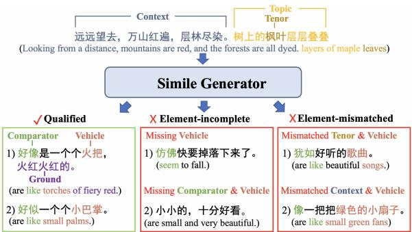
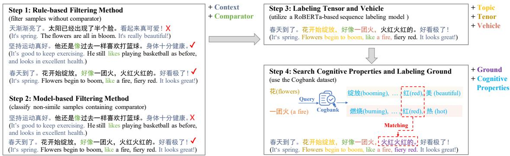
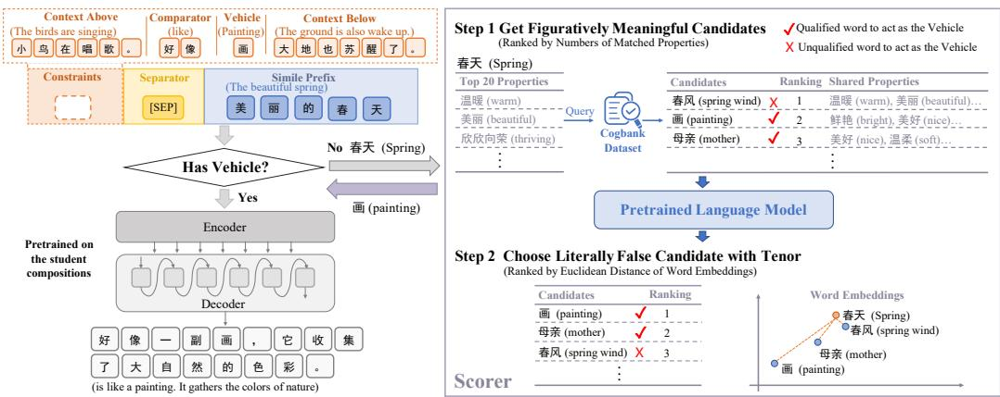
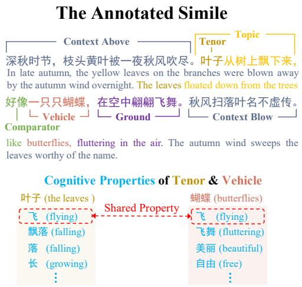
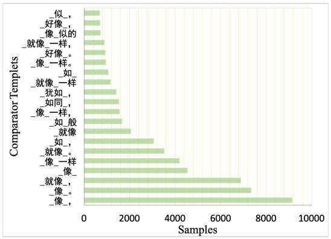
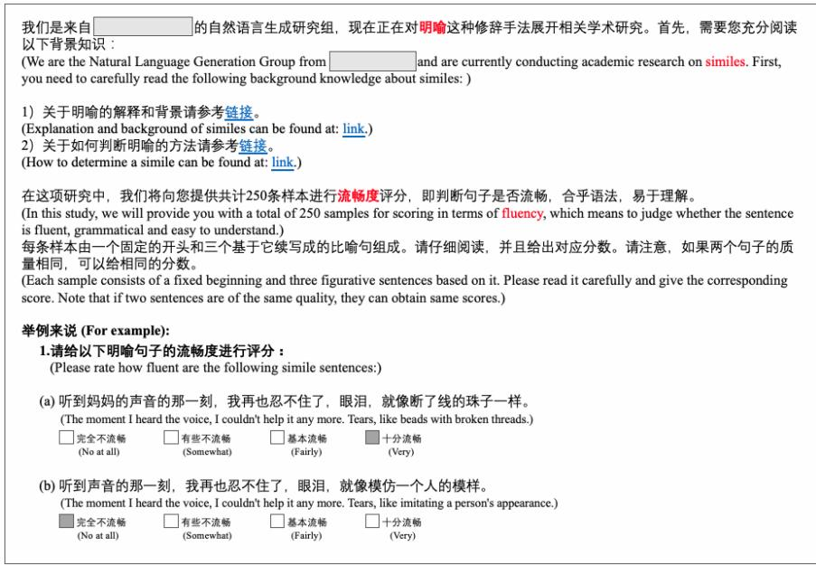
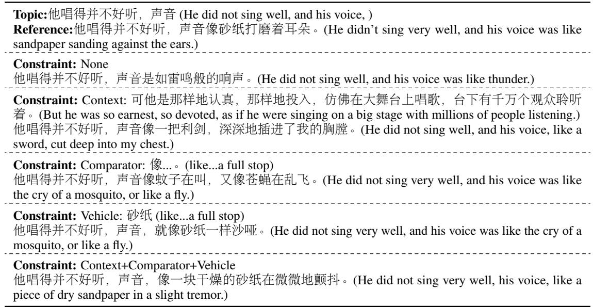

# Fantastic Expressions and Where to Find Them: Chinese Simile Generation with Multiple Constraints

Kexin Yang♠ ∗ Dayiheng Liu♠ † Wenqiang Lei♢ Baosong Yang♠ Xiangpeng Wei♠ Zhengyuan Liu♣ Jun Xie ♠

♠Alibaba Group

♢National University of Singapore ♣Institute for Infocomm Research (I2R), A\*STAR, Singapore {kexinyang0528, losinuris}@gmail.com

## Abstract

Similes occur in the creative context of describing a concept (i.e., tenor) by making a literally false yet figuratively meaningful comparison to another (i.e., vehicle). Previous efforts form simile generation as a context-free generation task, focusing on simile-style transfer or writ ing a simile from a given prefix. However, generated texts under such settings might be undesirable, such as hardly meeting the simile definition (e.g., missing vehicle) or difficult to address certain preferences of content as humans wish (e.g., describe the color of apples through the simile). We believe that a simile could be more qualified and user-oriented if incorporated with pre-specified constraints. To this end, we introduce controllable simile generation (CSG), a new task that requires the model to generate a simile with multiple simile elements, e.g., context and vehicle. To facilitate this task, we present GraCe, including 61.3k simile-element annotated Chinese similes. Based on it, we propose a CSG model Similor to benchmark this task, including a vehicle retrieval module Scorer to obtain the explicable comparison for a given tenor in the vehicle-unknown situation. Both statistical and experimental analyses show that GraCe is of high quality beyond all other Chinese simile datasets, in terms of the number (8 vs. 3) of an notation elements, Is-Simile accuracy (98.9% vs. 78.7%), and increasing model-performance gains for both uncontrollable and controllable simile generation. Meanwhile, Similor can serve as a strong baseline for CSG, especially with Scorer, which beats model-based retrieval methods without any re-training.

## 1 Introduction

Similes are widely-used and stimulate people’s creativity (Li et al., 2022). According to Rhetoric’s classical terms (Campbell, 1988), a simile uses comparison words (i.e., comparator) to make a literally false comparison between a concept (i.e., tenor) and another (i.e., vehicle). It also ensures this comparison pair is figuratively meaningful by examining whether they have shared properties (i.e., ground) (Tartakovsky et al., 2019). Notably, ground can be expressed in an explicit or implicit way (Chakrabarty et al., 2020). As shown in Figure 1 qualified samples. “Maple leaves are like torches of fired red.” has the explicit ground that the tenor “maple leaves” and the vehicle “torches” have the similar color of “fired red”, while “maple leaves are like small palms.” implies the ground that they have a similar pentagram shape.

  
Figure 1: Toy examples to explain element-incomplete and -mismatched generated results from a given prefix. Translations are provided for non-Chinese speakers.

Although simile detection has been widely explored (Liu et al., 2018; Zeng et al., 2020; Mao and Li, 2021), simile generation is still in its fledgling stage. Existing efforts focus on context-free simile generation, including: 1) style-transfer-based and 2) prefix-based simile generation. The former paraphrases a literal sentence into its simile version (Chakrabarty et al., 2020; Zhang et al., 2021) and the latter aims at writing a simile from a prespecified tenor (Li et al., 2022; Chen et al., 2022). Despite great progress, such experiment settings may result in undesirable results, such as unqualified similes or being unable to meet the content preferences of humans wish. As shown in Figure 1, the former means the generated sentences may miss indispensable simile elements or generate incoherence elements, i.e., generating element-incomplete or -mismatched samples. For example, “maple leaves are small and beautiful.” misses both tenor and vehicle and “maple leaves are like small green fans.” has inconsistent vehicle “green fans” with the context “mountains are red”. The second problem may arise when users wish to describe the color of maple leaves by similes but get “maple leaves are like small palms.”, although it is qualified according to the simile definition.

<table><tr><td rowspan="2">Dataset</td><td rowspan="2"># Nums</td><td rowspan="2"># Avg.</td><td rowspan="2">% Is-Simile</td><td rowspan="2">Topic</td><td rowspan="2">Comparator</td><td rowspan="2">Tenor W/F</td><td rowspan="2">Vehicle W/F</td><td rowspan="2">Ground</td><td>Context</td></tr><tr><td>Above / Below</td></tr><tr><td>Poetry (2019b)</td><td>43,051</td><td>23</td><td></td><td>X</td><td>X</td><td>X1X</td><td>X1X</td><td>X</td><td>√ix</td></tr><tr><td>Lyrics (2019b)</td><td>246,669</td><td>23</td><td></td><td>x</td><td>X</td><td>X1X</td><td>X1X</td><td>x</td><td>√ix</td></tr><tr><td>CS (2021)</td><td>5,490,721</td><td>61</td><td>29.3%</td><td>X</td><td>X</td><td>XIX</td><td>X1X</td><td>X</td><td>√I√</td></tr><tr><td>CMC (2022)</td><td>2,787</td><td>35</td><td>78.7%</td><td>X</td><td>√</td><td>√ix</td><td>√ix</td><td>x</td><td>X1X</td></tr><tr><td>GraCe</td><td>61,360</td><td>89</td><td>98.9%</td><td>√</td><td>√</td><td>√1√</td><td>√1√</td><td>√</td><td>√1√</td></tr></table>

Table 1: Statistic characteristics and annotation information of main existing Chinese generation datasets of metaphor and simile and our GraCe dataset. !indicates that the dataset contains annotations of the corresponding item, %is the opposite. # Avg. denotes averaged tokens per sentence. W and F mean the tenor/vehicle words and the corresponding feature words, respectively. % Is-Simile denotes the average percentage of similes from 1000 randomly selected samples from each dataset, which is annotated by three professional annotators. We ignore the Poetry and Lyrics datasets because their text styles are different from the others.

To solve these problems, we explore incorporating various constraints into simile generation. Specifically, we introduce a new task of controllable simile generation (CSG) – generating a simile with multiple simile elements (e.g., vehicle, context, etc.) from a given prefix (i.e., topic). We collect a Fine-Grained annotated Chinese Simile dataset (GraCe), containing annotated 61.3k similes from 260k cleaned text of student compositions. As shown in Table 1, we expand three commonly annotated elements (i.e., tenor, vehicle and comparator) (Li et al., 2022) to eight, such as the context element that could put each simile into a more naturally-using situation (Sun et al., 2022).1 In details, we annotate explicit ground to better understand the simile comparison. As for implicit ground, we try to interpret the relationship between tenor and vehicle by their cognitive properties. Such property is a set of adjectives that describe the distinctive features of the corresponding nouns (Veale and Hao, 2007), which helps to understand the comparison from the aspect of Cognitive

Linguistics (Kövecses, 2010). To benchmark CSG, we build the model Similor, which first retrieves vehicle (if it is unknown) by the module Scorer (a Shared cognitive-property-based retrieval method ) for the given tenor, then incorporates all constraints and the input prefix (i.e., topic) to generate the simile. Both statistical and experimental analyses show that GraCe is of high quality beyond previous Chinese simile datasets. Meanwhile, Similor can successfully incorporate the constraints in the outputs. Especially in vehicle-unknown setup, Scorer beats the model-based retrieval method both in automatic and human evaluations without any

## 2 Related Work

Different from metaphor (Yu and Wan, 2019; Chakrabarty et al., 2021a; Stowe et al., 2021) that using implicit comparators, similes are much easier to be located. However, existing efforts mainly focus on simile detection (Liu et al., 2018; Zeng et al., 2020; Mao and Li, 2021), leaving simile generation under-explored. Previous work on context-free simile generation can be divided into: 1) styletransfer-based and 2) prefix-based simile generation. The first forms this task as paraphrasing a literal sentence into a simile-style sentence, and automatically edits self-labeled similes to their literal version for building pairs of (literal sentence, simile). For example, SCOPE (Chakrabarty et al., 2020) uses commonsense properties words (Bosselut et al., 2019) of the vehicle to replace it in a simile, then removes the comparator to form the final literal sentence. WPS (Zhang et al., 2021)

  
Figure 2: The pipeline of building GraCe. “+” illustrates that this element is annotated in the corresponding step.

deletes a span from a simile to obtain the literal sentence. The second focuses on generating the comparator and tenor from a pre-specified tenor. Liu et al. (2019b) uses a continuous latent variable as a rhetoric controller to generate Chinese poetry. CMC (Li et al., 2022) provides a multi-task framework that leverages unlabeled data to enhance performance. Chen et al. (2022) use three words triple (tenor, attribute, vehicle) and a relationship pattern to hint the model for generating simile. Different from all of them, we focus on controllable simile generation – generating a simile with multiple constraints. To make it a computationally feasible task, we build a high-quality dataset GraCe and a CSG model Similor with Scorer to ensure explicable tenor-vehicle pairs in generated similes. As shown in Table 1, GraCe is far beyond the most recent dataset CMC (Li et al., 2022) in terms of collected samples (61.3k v.s. 2.7k), simile quality (98.9% v.s. 78.7% Is-Simile accuracy) and the number of annotated elements (eight v.s. three).3

## 3 GraCe Dataset

A fine-grained annotated simile dataset is important both for training a supervised CTG model and exploring combinations of constraints. However, relevant datasets (Table 1) might be insufficient. Therefore, we present the GraCe dataset, and elaborate on dataset creation and analysis.

## 3.1 Dataset Creation

Dataset Collection We collect 260k student compositions (grades range from elementary to high school) from the free-access website,4 ensuring data resources are close to real-world cases. After sentence segmentation and the removal of non-

Chinese sentences, we get about 5.48 million sentences. At most two sentences above and below each sample are used as the context element.

Dataset Processing As shown in Figure 2, we build our GraCe dataset in four steps. In Step 1, we filter out sentences that do not contain comparator-related words. Specifically, we tokenize candidate sentences with the toolkit Jieba5 and filter out sentences without comparator-related words, as comparator is the hallmark of a simile. The comparator words are varied to ensure the diversity of simile patterns (e.g., “好像”, “仿佛”,“犹如”, etc, all means “like”). However, a sentence containing comparator may not trigger a simile (Liu et al., 2018). As the example 2 in Step 1, “他还是像过 去一样喜欢打篮球。(He still likes playing basketball as before.)”, here “像 (as)” implies identity rather than comparison. Therefore, Step 2 focuses on recognizing non-simile sentences containing comparator words. We train a binary classifier based on RoBERTaLarge (Liu et al., 2019a) with a confidence score of 80% to select similes.6 Notably, we do not pursue higher score confidence as it may face the risk of reducing patterns of simile.

After the above two steps, we get the simile dataset without fine-grained annotations. Therefore, Step 3 aims at annotating tenor, topic, and vehicle for each simile. We utilize a sequence labeling model based on RoBERTaLarge to annotate tenor and vehicle for each simile.7 Meanwhile, we annotate topic as the span between tenor and comparator, which denotes tenor and its supplementary description. After that, Step 4 furtherly aims at annotating the ground and cognitive properties of tenor and vehicle. As the interpretation for a simile comparison (Tartakovsky et al., 2019), ground plays an important role in making the tenorvehicle pair of a simile being easily-understood and figuratively meaningful (Campbell and Katz, 2006; End, 1986), yet being ignored in previous datasets. We first query Cogbank dataset8 to obtain the cognitive properties for both tenor and vehicle. Then, their shared properties are used to fuzzy match9 the property-related clauses in a simile as the ground. Finally, the detailed statistics of our GraCe dataset are shown in Table 2, and some dataset samples are shown in Appendix A.4.

<table><tr><td>Measurement</td><td># Nums</td><td># Average Tokens</td></tr><tr><td>Sentences</td><td>61,360</td><td>89.0</td></tr><tr><td></td><td>Annotated Elements</td><td></td></tr><tr><td>Topic</td><td>61,360</td><td>11.4</td></tr><tr><td>Tenor</td><td>61,360</td><td>1.9</td></tr><tr><td>Tenor Property</td><td>52,474</td><td>73.2</td></tr><tr><td>Comparator</td><td>61,360</td><td>2.6</td></tr><tr><td>Vehicle</td><td>61,360</td><td>2.3</td></tr><tr><td>Vehicle Property</td><td>61,360</td><td>83.0</td></tr><tr><td>Ground</td><td>15,087</td><td>8.6</td></tr><tr><td>Context</td><td>57,543</td><td>39.5</td></tr></table>

Table 2: Core statistics of the GraCe dataset. Here ground denotes the explicit ground in the simile. We annotate implicit ground as the shared properties between tenor and vehicle.

<table><tr><td>Measurement</td><td>Value</td></tr><tr><td>% Simile</td><td>98.9</td></tr><tr><td>% Correct Tenor</td><td>95.2</td></tr><tr><td>% Correct Vehicle</td><td>98.2</td></tr><tr><td>% Correct Comparator % Correct Ground</td><td>98.7 94.1</td></tr></table>

Table 3: Statistics of 1000 randomly selected samples from the GraCe annotated by three professional annotators. 98.9% samples are similes. The statistics of the dash line below are calculated for these similes.

## 3.2 Dataset Analysis

Data Quality We invite three professional annotators to independently annotate 1000 randomly selected samples from multiple aspects.10 As shown in Table 3, only 1.1% samples are not similes, which is far beyond other Chinese simile datasets (see Table 1). More importantly, it maintains high accuracies even in fine-grained annotations for important elements of a simile (94.1% - 98.7%).

<table><tr><td>Measurement</td><td>Value</td></tr><tr><td># Distinct Tenors</td><td>7,958</td></tr><tr><td># Distinct Vehicles</td><td>5,350</td></tr><tr><td># Distinct Comparators</td><td>371</td></tr></table>

Table 4: Distinct Statistics of the GraCe dataset.

Diversity of Similes We analyze the diversity of similes and present the statistics in Table 4. First, the fertility of tenor and vehicle ensure the diverse content of the simile. Besides, different from Liu et al. (2018); Chakrabarty et al. (2020) using only a single pattern comparator of simile in their dataset (i.e., “\_好像 (like) \_” in Chinese), we build the comparator as 371 patterns of fill-in-the-blank templets. Specifically, inspired by WPS (Zhang et al., 2021) that the position information of simile in the context is a strong feature, we incorporate it by adding the punctuation that closely followed the vehicle to our template. As shown in Appendix Figure 5, “\_如同 (like) \_，” means the simile part appears in the middle clause without any description after vehicle. If no punctuation in the template, it means there is an explicit ground or context after vehicle to complement the content.

## 4 Controllable Simile Generation

## 4.1 Task Definition

The controllable simile generation task is formulated as follows: given a topic x containing a tenor $s _ { t }$ and a variety of pre-specified constraints c, the model generates a simile $\pmb { y } = \left( y _ { 1 } , y _ { 2 } , . . . , y _ { N } \right)$ by:

$$
p ( \pmb { y } | \pmb { x } , \pmb { c } ) = \prod _ { n = 1 } ^ { N } p ( y _ { n } | \pmb { y } _ { < n } , \pmb { x } , \pmb { c } ; \theta ) ,\tag{1}
$$

where θ are the model parameters. Notably, the constraints c can be freely selected and combined from the candidate set $\pmb { s } = ( s _ { v } , s _ { p } , s _ { c } )$ , which denote the vehicle, comparator, and context, respectively.

## 4.2 Methodology

We benchmark this task with the CSG model Similor, which contains a module Scorer for the vehicle-unknown situation. To ease of presentation, we start with a toy example to illustrate them.

Similor As shown in Figure 3, the topic “美 丽的春天 (the beautiful spring)” containing the tenor “春天 (spring)” is firstly concatenated with optional sequential constraints by the separator signal “[SEP]”. If the vehicle is pre-specified in the constraints, the input sequence is then fed into an encoder-decoder model. Afterward, the model auto-regressively generates “好像一幅画，它收 集了大自然的色彩。 (is like a painting. It gathers the colors of nature.)”. We first continue pretraining the large Chinese text generation model (e.g., ChineseBART (Shao et al., 2021)) on the collected 260k student compositions with the language modeling object. Then, Similor is instantiated with it to be finetuned on the GraCe.

  
Figure 3: A toy example to elaborate the workflow of Similor and Scorer.

Scorer If the vehicle is unknown, we use the Scorer module to retrieve a vehicle and then add it to the input sequence. As shown in the right part of Figure 3, Scorer contains two steps to get figuratively meaningful while literally false pair of tenor-vehicle. Step 1 queries Cogbank dataset for the tenor “春天 (spring)” to obtain its top k most frequently used cognitive properties. These properties provide a basis for vehicle candidates selection and matching. The Cogbank dataset (83,017 items) contains more words than the glossary of common words in modern Chinese11 (56,008 items), allowing fuller retrieval of vehicle candidates. In the implementation, the top 20 nouns with numbers of cognitive properties identical to tenor are chosen as candidates, which ensures a figuratively meaningful simile as the matched properties can be regarded as the ground. However, some literal-related words may also be selected in this step, e.g, “春风 (spring wind)”. To obtain only figurative items, Step 2 reranks the Step 1 candidate based on the Euclidean distance of word embeddings between each item and tenor. Candidates with a longer distance are ranked higher, as they are less literally associated with tenor. As a result, the “画 (painting)” is selected as the final vehicle. To be exact, given a tenor $s _ { t }$ , the i-th item $w _ { i }$ in Cogbank dataset get the ranking score Scorecandi by:

$$
\begin{array} { r l } & { S c o r e _ { w _ { i } } = \mathrm { R a n k } ( F i g _ { w _ { i } } ) + \mathrm { R a n k } ( L i t _ { w _ { i } } ) , } \\ & { ~ F i g _ { w _ { i } } = \mathrm { M a t c h } ( w _ { i } , s _ { t } ) , } \\ & { ~ L i t _ { w _ { i } } = \mathrm { E u c D i s t } ( w _ { i } , s _ { t } ) . } \end{array}\tag{2}
$$

Where Rank( ) denotes getting the ranking of the corresponding score. Match( ) means to count the numbers of shared cognitive properties between two items and EucDist( ) means the Euclidean distance between their word embedding. Notably, we use rankings to normalize these scores, avoiding the effects of different score scales.

## 5 Experiments

In this section, we first experimentally evaluate the quality of the GraCe dataset by applying it to prefixbased simile generation (§ 5.1). Since the setup of this uncontrollable generation task does not need additional annotations on the training samples, we can compare GraCe with previous Chinese simile datasets. Based on it, we then evaluate the proposed Similor on the new CSG task (§ 5.2). Specifically, we first compare different model varieties of Similor constrained by comparator and vehicle, and then evaluate the performances of Similor under more extensive constraints. Finally, we explore whether Scorer helps Similor to generate similes in the vehicle-unknown setup.

## 5.1 Experimental Analysis of GraCe

As statistical analysis is insufficient to evaluate GraCe, we evaluate it by prefix-based simile generation. One of the simple pipelines is to train a generator with the language modeling object on the simile dataset. In inference, this model is asked to generate a simile with a pre-specified tenor.

<table><tr><td>Dataset</td><td>% Comp.↑</td><td>Simile Conf.↑</td><td>PPL↓</td></tr><tr><td colspan="4">Backbone: ChineseGPT2</td></tr><tr><td>None</td><td>1.4</td><td>0.3</td><td>40.9</td></tr><tr><td>CS (2021)</td><td>46.0</td><td>0.6</td><td>43.0</td></tr><tr><td>CMC (2022)</td><td>44.4</td><td>0.7</td><td>30.9</td></tr><tr><td>GraCe</td><td>93.5</td><td>0.9</td><td>10.9</td></tr><tr><td colspan="4">Backbone: ChineseBART</td></tr><tr><td>CS (2021)</td><td>65.3</td><td>0.5</td><td>33.1</td></tr><tr><td>CMC (2022)</td><td>56.7</td><td>0.8</td><td>33.3</td></tr><tr><td>GraCe</td><td>85.3</td><td>0.9</td><td>28.7</td></tr></table>

Table 5: The main results of prefix generation. “None” means using the backbone model to generate sentences without any continuing training, we ignore “None” of ChineseBART as it performs poorly in fluency.  means a higher score is better whereas  is exactly the opposite. Highest numbers are in bold.
<table><tr><td>Dataset</td><td>Fluen.↑</td><td>Creat.↑</td><td>Consi.↑</td><td>Overall↑</td></tr><tr><td>CS</td><td>2.5</td><td>1.9</td><td>1.9</td><td>2.1</td></tr><tr><td>CMC</td><td>2.2</td><td>2.0</td><td>1.9</td><td>2.0</td></tr><tr><td>GraCe</td><td>3.0</td><td>3.2</td><td>3.2</td><td>2.8</td></tr></table>

Table 6: The human evaluation of prefix generation.

Baselines and Backbones. We compare the proposed GraCe with previous Chinese simile datasets: 1) CS (Zhang et al., 2021) contains 5.49M similes extracted from online fictions. 2) CMC (Li et al., 2022) contains 2.7k metaphors and similes from Chinese literature corpus. Besides, we utilize two representative Chinese pre-trained language models to avoid training from scratch: 1) Chinese-BART(CBART) (Shao et al., 2021): a $\mathrm { B A R T _ { L a r g e } }$ model pre-trained on 200GB text from Chinese Wikipedia and WuDaoCorpus. 2) ChineseGPT2 (CGPT2) (Zhao et al., 2019): a GPT2Medium model pre-trained on the CLUECorpusSmall dataset.

Experiment Setup. We employ the original hyper-parameter setting of $\mathbf { B A R T _ { L a r g e } }$ and $\mathbf { G P T } 2 _ { \mathrm { M e d i u m } }$ to train all models, with a BERT tokenizer (Devlin et al., 2019) to process Chinese text. During inference, we use 25 common tenors as prefixes and ask models to continue writing with them (100 completions for each).12

Metrics. For automatic evaluation, we first use Perplexity (PPL) from CGPT2 to evaluate the text quality. As for simile evaluation, we compute the proportion of sentences containing comparator words (%Comp.) to evaluate element-incomplete cases, because it’s the hallmark of a simile. However, a sentence containing comparator words may not trigger a simile (Liu et al., 2018). Therefore, we use Simile Conf. to evaluate the figurative meaning of the generated results, i.e., element-mismatched cases. Specifically, we reuse the simile classifier in Step 2 of the dataset processing (See § 3.1) to compute the averaged confidence score of each method. Aside from it, we also conduct human evaluation following Chakrabarty et al. (2020). 250 samples are randomly selected from each generated result. Then, three crowdsource evaluators are asked to rate model results in four categories: 1) Fluency (Fluen.). Whether the sentence is fluent and grammatical; 2) Creativity. How well the sentence is figurately meaningful; 3) Consistency (Consi.). Whether the generated vehicle has shared properties with the pre-specified tenor. 4) Overall. How good is the simile overall? The score is based on how well-formed, creative, and consistent it is. Scores are ranged from 1 to 4, the higher is better.13

Results The prefix generation results are shown in Table 5 and human evaluation results are in Table 6. We find that: 1) Models finetuned with GraCe outperform other simile datasets in terms of text quality and simile creativity. 2) Generative language models tend to produce literal sentences over similes that highlight challenges of simile generation, as also mentioned in Chakrabarty et al. (2021b). Although Models could produce similelike sentences through prefix generation, undesired results are also obtained (e.g., missing compartor and having incoherent tenor-vehicle pairs) without controlling simile elements.14 Thus, it is necessary to explore a new simile generation method.

## 5.2 Controllable Simile Generation

We first benchmark the CSG task with different model varieties constrained on pre-specified comparator and vehicle, then explore the performances of Similor under different combinations of constraints. Finally, we evaluate Similor with Scorer in the vehicle-unknown CSG setup. Specifically, given a topic containing a tenor, the tenor-vehicle pair retrieval method is asked to find an appropriate vehicle as the constraint, then hints Similor to

<table><tr><td>Methods</td><td>ROUGE-1/2/L↑</td><td>BLEU↑</td><td>BERTScore↑</td><td>ACC-V↑</td></tr><tr><td>CGPT2</td><td>20.7/4.2/18.3</td><td>0.3</td><td>60.6</td><td>16.4</td></tr><tr><td>CBART</td><td>21.3/10.9/20.9</td><td>1.7</td><td>55.9</td><td>71.1</td></tr><tr><td> $\mathrm { C G P T } 2 _ { \mathrm { F T } }$ </td><td>22.2/7.6/20.2</td><td>3.0</td><td>56.8</td><td>19.2</td></tr><tr><td> $\mathrm { C B A R T _ { F T } }$ </td><td>31.4/13.3/26.6</td><td>3.0</td><td>66.7</td><td>54.5</td></tr><tr><td>SimilorcGPT2</td><td>37.7/17.4/32.9</td><td>3.3</td><td>83.8</td><td>49.1</td></tr><tr><td> $\mathrm { S i m i l o r } _ { \mathrm { C B A R T } }$ </td><td>56.6/39.6/54.7</td><td>19.7</td><td>68.9</td><td>99.4</td></tr><tr><td> $\mathrm { S i m i l o r } _ { \mathrm { C G P T 2 } _ { \mathrm { F T } } }$ </td><td>39.5/19.0/34.0</td><td>4.0</td><td>68.2</td><td>84.3</td></tr><tr><td> $\mathrm { S i m i l o r _ { C B A R T _ { F T } } }$ </td><td>57.3/40.5/55.3</td><td>19.9</td><td>69.1</td><td>99.0</td></tr></table>

Table 7: Results of different models that all be constrained with pre-specified vehicle and comparator.
<table><tr><td>Constraints</td><td>ROUGE-1/2/L</td><td>BLEU</td><td>BERTScore</td><td>ACC-V</td><td>ACC-C</td></tr><tr><td>None</td><td>29.5/10.4/27.1</td><td>4.2</td><td>63.4</td><td>17.9</td><td>38.5</td></tr><tr><td>Context</td><td>35.4/14.7/32.8</td><td>5.6</td><td>65.4</td><td>27.4</td><td>42.0</td></tr><tr><td>Comparator</td><td>43.0/23.6/41.5</td><td>10.0</td><td>66.2</td><td>30.0</td><td>95.9</td></tr><tr><td>Vehicle</td><td>51.9/30.6/47.6</td><td>14.0</td><td>68.4</td><td>99.0</td><td>47.2</td></tr><tr><td> ${ \mathrm { V e h i c l e } } + { \mathrm { C o m p a r a t o r } }$ </td><td>57.3/40.5/55.3</td><td>19.9</td><td>69.1</td><td>99.0</td><td>99.9</td></tr><tr><td> $\mathrm { V e h i c l e + C o m p a r a t o r + C o n t e x t }$ </td><td>59.8/41.4/57.2</td><td>21.3</td><td>69.9</td><td>94.8</td><td>98.3</td></tr></table>

Table 8: Performances of different constraints and combinations under SimilorCBART. ACC-C: the accuracy of whether the comparator appears in the final output if it is not pre-specified.

generate the final simile.

Methods. As a new task of simile generation, we benchmark it with Similor and evaluate model variants as follows: 1) ChineseBART (CBART) and 2) ChineseGPT2 (CGPT2) as described in § 5.1. However, they take language modeling as the learning object and cannot directly adapt to the new task. Following He et al. (2022) use the manual prompt for simile probing, we use “以\_为喻体， 写出比喻句： (means write a simile with \_ as a vehicle:, ‘\_’ is the placeholder for pre-specified textitvehicle)” as the prompt. Then, it is concatenated with the given topic and comparator as the input while generating a simile, which is similar to the in-context learning (Brown et al., 2020). 3) Finetuned ChineseBART (CBARTFT) and 4) Finetuned ChineseGPT2 $( \mathbf { C G P T 2 } _ { \mathrm { F T } } )$ . We finetune CBART and CGPT2 on the collected 260k student compositions with the language modeling object, respectively. The goal of finetuning is to make the model adapt to the composition writing domain. 5) Similor. We first instantiate Similor with CBART and CGPT2, namely SmilorCBART and $\mathrm { S m i l o r } _ { \mathrm { C G P T 2 } } .$ , respectively. To evaluate the gain performances that continuing fine-tuning on the student compositions, Similor is also instantiated by $\mathbf { C B A R T } _ { \mathrm { F T } }$ and $\mathrm { C G P T } 2 _ { \mathrm { F T } }$ , namely $\mathrm { S m i l o r } _ { \mathrm { C B A R T } _ { \mathrm { F T } } }$ and $\mathrm { S m i l o r } _ { \mathrm { C G P T } 2 _ { \mathrm { F T } } }$ , respectively. All of the models are then finetuned by GraCe Dataset. After that, we evaluate Scorer variants and baseline as follows:

1) Literally False Matching (LFM). The second step of Scorer, aims at ranking the candidate by the word embedding Euclidean distance between the candidate and the tenor. 2) ANT (Chen et al., 2022): A pre-training stage for $\mathrm { \Delta B E R T _ { L a r g e } }$ that only masks the noun or adjective in amod dependencies. Following Li et al. (2022), we translate the concatenated comparator and topic into English by Google translation and feed it to ANT to generate a vehicle.

Experiment Setup. We randomly split the GraCe dataset into 2000 test samples, and 2000 validation samples, and the rest are used for training. The training parameters setup for all models is as same as § 5.1. In inference, the beam size and length penalty (Wu et al., 2016) are set to 4 and 1.2, respectively. As for evaluating Scorer, we remain top 20 candidates for Step 1, finally returning the top one vehicle for generating the simile. For a fair comparison, all retrieval methods use $\mathrm { S i m l o r } _ { \mathrm { C B A R T } _ { \mathrm { F T } } }$ to generate final results.

Metrics. Following Chakrabarty et al. (2020); Zhang et al. (2021); Li et al. (2022), we evaluate results on BERTScore (Zhang et al., 2020), four-gram BLEU (Papineni et al., 2002), ROUGE-1/2/L (Lin, 2004). Besides, if the vehicle or comparator is pre-specified as the constraint, we use ACC-V or ACC-C to evaluate the accuracy of the offered vehicle or comparator appears in outputs. As a novel setup in CSG, vehicle-unknown CSG aims to find a figuratively meaningful yet literally false (Goodman, 1979) tenor-vehicle pair that has shared attributes to form the ground. Thus for evaluating Scorer, we first use Simile Conf. and Perplexity (PPL) mentioned in § 5.1 to evaluate the figurative meaning and text quality of the outputs, respectively. Following Shutova et al. (2016); Yu and Wan (2019), literally false factor is computed by Literal Simi., which denotes the average cosine similarity of the given tenor and the retrieval vehicle, the lower the better. We use the SimlorCBARTFT to compute the word embeddings. Besides, we conduct the human evaluation described in § 5.1.

<table><tr><td rowspan="2">Methods</td><td colspan="4">Automantic Evaluation</td><td colspan="4">Human Evaluation</td></tr><tr><td>Simile Conf.↑</td><td>Literal Simi.↓</td><td>PPL↓</td><td>%V↑</td><td>Fluen.↑</td><td>Creat.↑</td><td>Consi.↑</td><td>Overall↑</td></tr><tr><td>ANT</td><td>0.6</td><td>0.003</td><td>25.0</td><td>42.7%</td><td>1.9</td><td>1.7</td><td>1.6</td><td>1.7</td></tr><tr><td>LFM</td><td>0.8</td><td>-0.020</td><td>28.1</td><td>100.0%</td><td>2.7</td><td>2.3</td><td>2.3</td><td>2.3</td></tr><tr><td>Scorer</td><td>0.8</td><td>0.240</td><td>12.8</td><td>100.0%</td><td>3.1</td><td>2.5</td><td>3.0</td><td>2.6</td></tr></table>

Table 9: The main results of generating similes with different tensor-vehicle pairs retrieval method. %V represents the proportion of the samples that its vehicle is retrieved in the total number of test samples.

<table><tr><td rowspan="2">Automatic Metrics</td><td colspan="4">Human Evaluation Scores</td></tr><tr><td>Fluen.</td><td>Creat.</td><td>Consi.</td><td>Overall</td></tr><tr><td>Simile Conf.</td><td>0.312</td><td>0.634</td><td>0.603</td><td>0.540</td></tr><tr><td>%Comp.</td><td>0.286</td><td>0.329</td><td>0.324</td><td>0.351</td></tr><tr><td>PPL</td><td>0.388</td><td>0.311</td><td>0.321</td><td>0.377</td></tr></table>

Table 10: Pearson correlation between automatic metrics and human evaluation scores (p-value < 0.01).

Results. Comparations of different model varieties are shown in Table 7. We find that: 1) Both CSG task and models benefit from the pre-training stage, especially for the BART-based backbone. 2) Both SimilorCBART and SimilorCGPT2 can generate similes that correctly incorporate constraints in outputs, with higher text quality than baselines. Besides, performances of Similor with different constraints are in Table 8, which indicates: 3) Introducing more simile constraints helps Similor to generate desired similes. Especially context, Similor could generate similes only being hinted by context (BERTScore 63.4 to 65.4). Finally, As shown in Table 9, Scorer beats model-based retrieval method both in figuratively meaningful and text quality, guaranteeing to provide vehicle for each testing tenor. As for literal similarity, LFM gets the highest score yet surfers from the lowest text quality, indicating that there is a trade-off between figuratively meaningful and literally false factors when generating similes.

## 5.3 Further Discussions

As a new task in simile generation, the evaluation method of it is absolutely important. Thus we compute the system-level Pearson correlation between automatic scores and human judgments of generated similes. In Table 10, Simile Conf. shows a strong correlation with human scores in terms of Creativity and Consistency, indicating that it could be an effective method to evaluate the figurative meaning of similes. In contrast, % Comp. shows a poor correlation with that two scores, which demonstrates the limitations of only considering the comparator when judging a simile. Meanwhile, PPL shows a higher correlation than the other two metrics in evaluating fluency, yet having a remarkable gap with the human score. To furtherly explore the concerns of human when evaluating a simile, we also compute the internal correlation of human scores. As shown in Appendix Table 11, there is a strong correlation between Creativity and Consistency. It means that having ground is also important in generating a creative simile, illustrating the necessity of interpretably retrieving tenor-vehivle pair in the vehicle-unknown setup.

## 6 Conclusion

In this paper, we introduce a new task setup for simile generation: controllable simile generation (CSG). To facilitate it, we build GraCe, a finegrained annotated Chinese simile dataset, and benchmark this task with the proposed CSG model Similor, which includes a vehicle-retrieval module Scorer. Our work takes the first attempt to expand the elements of simile from the aspect of Cognitive Linguistics (Kövecses, 2010) (i.e, ground and context), and tentatively gives a successful implementation of probing simile interpretation from the cognitive property. We hope this idea can provide novel insights to future works of the creative generation, such as puns, hyperbole, and poetry, etc.

## Limitations

In this paper, we explore incorporating multiple constraints to simile generation and attempt to interpret the simile comparisons from the aspect of Cognitive Linguistics. However, the creativity of simile is one kind of subjective feeling and is difficult to be accurately judged, which is also a big challenge for other kinds of creative writing tasks. We hope this task and dataset could provide novel insight into user-oriented text generation, and give the interactive and collaborative generation a closer and more detailed exploration.

## Ethics Statement

We hereby acknowledge that all of the co-authors of this work are aware of the provided ACL Code of Ethics and honor the code of conduct. We elaborate ethical considerations to the community as follows:

All procedures performed in studies involving human participants were in accordance with the ethical standards of the institutional and/or national research committee and with the 1964 Helsinki declaration and its later amendments or comparable ethical standards. This article does not contain any studies with animals performed by any of the authors. Informed consent was obtained from all individual participants included in the study. Specifically, we conduct all of the human evaluations via full-time Chinese employees from the Chinese data annotation platform, ensuring all of the personal information of the workers involved (e.g., usernames, emails, URLs, demographic information, etc.) is discarded. Meanwhile, we ensure the pay per sample is above the annotator’s local minimum wage (approximately \$0.7 USD / sample).

## References

Antoine Bosselut, Hannah Rashkin, Maarten Sap, Chaitanya Malaviya, Asli Celikyilmaz, and Yejin Choi. 2019. COMET: commonsense transformers for automatic knowledge graph construction. In ACL 2019, pages 4762–4779. Association for Computational Linguistics.

Tom B. Brown, Benjamin Mann, Nick Ryder, Melanie Subbiah, Jared Kaplan, Prafulla Dhariwal, Arvind Neelakantan, Pranav Shyam, Girish Sastry, Amanda Askell, Sandhini Agarwal, Ariel Herbert-Voss, Gretchen Krueger, Tom Henighan, Rewon Child, Aditya Ramesh, Daniel M. Ziegler, Jeffrey Wu, Clemens Winter, Christopher Hesse, Mark Chen, Eric Sigler, Mateusz Litwin, Scott Gray, Benjamin Chess, Jack Clark, Christopher Berner, Sam McCandlish,

Alec Radford, Ilya Sutskever, and Dario Amodei. 2020. Language models are few-shot learners. In NeurIPS 2020.

George Campbell. 1988. The philosophy of rhetoric. SIU Press.

John D Campbell and Albert N Katz. 2006. On reversing the topics and vehicles of metaphor. Metaphor and Symbol, 21(1):1–22.

Tuhin Chakrabarty, Smaranda Muresan, and Nanyun Peng. 2020. Generating similes effortlessly like a pro: A style transfer approach for simile generation. In EMNLP 2020, pages 6455–6469. Association for Computational Linguistics.

Tuhin Chakrabarty, Xurui Zhang, Smaranda Muresan, and Nanyun Peng. 2021a. MERMAID: metaphor generation with symbolism and discriminative decoding. In NAACL 2021, pages 4250–4261. Association for Computational Linguistics.

Tuhin Chakrabarty, Xurui Zhang, Smaranda Muresan, and Nanyun Peng. 2021b. MERMAID: metaphor generation with symbolism and discriminative decoding. In NAACL 2021, pages 4250–4261. Association for Computational Linguistics.

Weijie Chen, Yongzhu Chang, Rongsheng Zhang, Jiashu Pu, Guandan Chen, Le Zhang, Yadong Xi, Yijiang Chen, and Chang Su. 2022. Probing simile knowledge from pre-trained language models. In ACL 2022, pages 5875–5887. Association for Computational Linguistics.

Jacob Devlin, Ming-Wei Chang, Kenton Lee, and Kristina Toutanova. 2019. BERT: pre-training of deep bidirectional transformers for language understanding. In NAACL 2019, pages 4171–4186. Association for Computational Linguistics.

Laure J. End. 1986. Grounds for metaphor comprehension. Advances in psychology, 39:327–345.

Joseph L Fleiss. 1971. Measuring nominal scale agreement among many raters. Psychological bulletin, 76(5):378.

Nelson Goodman. 1979. Metaphor as moonlighting. Critical Inquiry, 6:125 – 130.

Qianyu He, Sijie Cheng, Zhixu Li, Rui Xie, and Yanghua Xiao. 2022. Can pre-trained language models interpret similes as smart as human? In ACL 2022, pages 7875–7887. Association for Computational Linguistics.

Zoltán Kövecses. 2010. A new look at metaphorical creativity in cognitive linguistics. 21(4):663–697.

Yucheng Li, Chenghua Lin, and Frank Geurin. 2022. Nominal metaphor generation with multitask learning. In INLG 2022.

Chin-Yew Lin. 2004. ROUGE: A package for automatic evaluation of summaries. In Text Summarization Branches Out, pages 74–81, Barcelona, Spain. ACL.

Lizhen Liu, Xiao Hu, Wei Song, Ruiji Fu, Ting Liu, and Guoping Hu. 2018. Neural multitask learning for simile recognition. In EMNLP 2018, pages 1543– 1553, Brussels, Belgium. Association for Computational Linguistics.

Yinhan Liu, Myle Ott, Naman Goyal, Jingfei Du, Mandar Joshi, Danqi Chen, Omer Levy, Mike Lewis, Luke Zettlemoyer, and Veselin Stoyanov. 2019a. Roberta: A robustly optimized BERT pretraining approach. CoRR, abs/1907.11692.

Zhiqiang Liu, Zuohui Fu, Jie Cao, Gerard de Melo, Yik-Cheung Tam, Cheng Niu, and Jie Zhou. 2019b. Rhetorically controlled encoder-decoder for modern chinese poetry generation. In ACL 2019, pages 1992– 2001. Association for Computational Linguistics.

Rui Mao and Xiao Li. 2021. Bridging towers of multitask learning with a gating mechanism for aspectbased sentiment analysis and sequential metaphor identification. In AAAI 2021, pages 13534–13542. AAAI Press.

Kishore Papineni, Salim Roukos, Todd Ward, and Wei-Jing Zhu. 2002. Bleu: a method for automatic evaluation of machine translation. In ACL 2002, pages 311–318. ACL.

Yunfan Shao, Zhichao Geng, Yitao Liu, Junqi Dai, Fei Yang, Li Zhe, Hujun Bao, and Xipeng Qiu. 2021. CPT: A pre-trained unbalanced transformer for both chinese language understanding and generation. CoRR, abs/2109.05729.

Ekaterina Shutova, Douwe Kiela, and Jean Maillard. 2016. Black holes and white rabbits: Metaphor identification with visual features. In NAACL 2016, pages 160–170.

Kevin Stowe, Tuhin Chakrabarty, Nanyun Peng, Smaranda Muresan, and Iryna Gurevych. 2021. Metaphor generation with conceptual mappings. In ACL 2021, pages 6724–6736. Association for Computational Linguistics.

Jiao Sun, Anjali Narayan-Chen, Shereen Oraby, Shuyang Gao, Tagyoung Chung, Jing Huang, Yang Liu, and Nanyun Peng. 2022. Context-situated pun generation. In Proceedings of the 2022 Conference on Empirical Methods in Natural Language Processing, EMNLP 2022, Abu Dhabi, United Arab Emirates, December 7-11, 2022, pages 4635–4648. Association for Computational Linguistics.

Maosong Sun, Ting Liu, Xiaojie Wang, Zhiyuan Liu, and Yang Liu, editors. 2018. Chinese Computational Linguistics and Natural Language Processing Based on Naturally Annotated Big Data - 17th China National Conference, CCL 2018, and 6th International Symposium, NLP-NABD 2018, Changsha, China, October 19-21, 2018, Proceedings, volume 11221 of Lecture Notes in Computer Science. Springer.

Roi Tartakovsky, David Fishelov, and Yeshayahu Shen. 2019. Not as clear as day: On irony, humor, and poeticity in the closed simile. Metaphor and Symbol, 34(3):185–196.

Tony Veale and Yanfen Hao. 2007. Learning to understand figurative language: From similes to metaphors to irony. In Proceedings ofthe annual meeting ofthe cognitive science society, volume 29.

Yonghui Wu, Mike Schuster, Zhifeng Chen, Quoc V. Le, Mohammad Norouzi, Wolfgang Macherey, Maxim Krikun, Yuan Cao, Qin Gao, Klaus Macherey, Jeff Klingner, Apurva Shah, Melvin Johnson, Xiaobing Liu, Lukasz Kaiser, Stephan Gouws, Yoshikiyo Kato, Taku Kudo, Hideto Kazawa, Keith Stevens, George Kurian, Nishant Patil, Wei Wang, Cliff Young, Jason Smith, Jason Riesa, Alex Rudnick, Oriol Vinyals, Greg Corrado, Macduff Hughes, and Jeffrey Dean. 2016. Google’s neural machine translation system: Bridging the gap between human and machine translation. CoRR, abs/1609.08144.

Zhiwei Yu and Xiaojun Wan. 2019. How to avoid sentences spelling boring? towards a neural approach to unsupervised metaphor generation. In NAACL 2019, pages 861–871. ACL.

Jiali Zeng, Linfeng Song, Jinsong Su, Jun Xie, Wei Song, and Jiebo Luo. 2020. Neural simile recognition with cyclic multitask learning and local attention. In AAAI 2020, pages 9515–9522. AAAI Press.

Jiayi Zhang, Zhi Cui, Xiaoqiang Xia, Yalong Guo, Yanran Li, Chen Wei, and Jianwei Cui. 2021. Writing polishment with simile: Task, dataset and A neural approach. In AAAI 2021, pages 14383–14392. AAAI Press.

Tianyi Zhang, Varsha Kishore, Felix Wu, Kilian Q. Weinberger, and Yoav Artzi. 2020. Bertscore: Evaluating text generation with BERT. In ICLR. OpenReview.net.

Zhe Zhao, Hui Chen, Jinbin Zhang, Xin Zhao, Tao Liu, Wei Lu, Xi Chen, Haotang Deng, Qi Ju, and Xiaoyong Du. 2019. UER: an open-source toolkit for pre-training models. In EMNLP 2019, pages 241– 246. Association for Computational Linguistics.

  
Figure 4: An example to explain the annotated eight elements of a simile in our GraCe dataset. Translations are provided for non-Chinese speakers.

## A Details of Dataset Building

As shown in Figure 4, we expand three commonly annotated elements (i.e., tenor, vehicle and comparator) (Li et al., 2022) to eight, including the context element to put each simile into a more naturally-using situation.

## A.1 Simile Classification

The simile classifier aims at filtering those nosimile samples containing comparator words. These sentences can be roughly divided into three types: 1) personified sentence, e.g., “大树好像在 向我们招手。 (The tree seems to be waving to us.)” contains comparator word “好像 (seems to)”. 2) hyperbole sentence, e.g., “这教室静得仿佛掉 一根针都能听见。 (The classroom was so silent like you could hear a pin drop.)” contains comparator word “仿佛 (like)”. 3) literal sentence, e.g., “他 似乎从来没有来过这里。 (He never seems to be here.)” contains comparator word “似乎 (seems to)”. However, the previous dataset (Li et al., 2022) only offers the literal sentence that does not contains comparator words as the negative samples for the simile classifier, which may not satisfy our settings.

To this end, we collect a new dataset to include negative samples about these three types of nosimile sentences. Specifically, we collect personified sentences15 and hyperbole sentences16 from websites and only keep sentences that contains comparator words. As for type three, we ask three annotators to annotate randomly selected 3000 samples from Step 1 candidates. A sentence is selected as the negative sample if all of them regard it as a literal sentence. As for the positive samples, we also collect similes from the website of composition teaching 17 to ensure their styles are similar to our candidates. Finally, we get the new simile classification dataset and randomly split it into: training set 5905 samples (positive:2913 negative: 2992) / validation set 200 samples (positive:100 negative:100) / testing set 200 (positive:100 negative:100).

Based on this new dataset, we finetune a Chinese $\mathrm { R o B E R T a _ { L a r g e } }$ model to classify the Step 1 candidates. For training this model, the learning rate is set to 5e-5 and the warm-up step is set to 200. The f1 score on the validation set and testing set are 0.85 and 0.82, respectively.

## A.2 Simile Detection

Simile Detection aims at labeling out the tenor and vehicle of a simile, that is, forming it as a sequence labeling task. In implantation, we use the most relevant dataset CCL2018 (2018) to train the sequence labeling model. The CCL2018 dataset contains 6554 training samples, 2038 testing samples, and 1650 validation samples. Based on this dataset, we finetune a Chinese RoBERTaLarge model to label each sample in GraCe. For training this model, the learning rate is set to 5e-5 and the warm-up step is set to 200. The Accuracy scores on the validation set and testing set are 98.47% and 98.38%, respectively.

However, all samples only contain one kind of comparator words (i.e., “像 (like)”), the trained model cannot be directly applied to GraCe that contains various comparator words and their corresponding patterns. To solve this problem, in the inference stage, we first locate and replace each comparator pattern with the pattern containing the comparator word “像 (like)”, as they have the same meaning in different words (all means like). After that, we use this new sample as model input to get corresponding tenor and vehicle.

Algorithm 1 Fuzzy Matching   
Require: C: the Cogbank dictionary with nouns   
as keys and the associated cognitive attributes as   
their values   
Require: t: the tokenized word sequence needed   
to be queried with the length of l, t =   
$\{ t _ { 1 } , t _ { 2 } , . . . , t _ { l } \}$   
Require: w: the width of the sliding window.   
w = l   
while w > 0 do   
if w = l and $\pmb { t } \in C$ then   
return t   
else   
i = 1   
while i < l + 1 do   
word = ti, ..., ti+w   
if word C then   
return word   
else   
i = i + 1   
end if   
end while   
end if   
w = w 1   
end while   
return None Words Mapping

## A.3 Fuzzy Matching for Cogbank Dataset

The fuzzy matching algorithm is shown in algorithm 1.

## A.4 Simile Samples

We show some annotated samples of GraCe in Table 12.

## B Details of Experiments

## B.1 Simile Genearting Prefix

We consider 25 commonly used tenors as sentence starters for evaluating different datasets in the Experiment for prefix generation. The entire set is blow (Translations are provided for non-Chinese speakers.):

“爱 (love)”, “时 间 (time)”, “叶 子 (leaves)”,   
“太 阳 (sun)”, “树 叶 (leaves)”, “童 年 (child  
hood)”, “笑容 (smile)”, “落叶 (fallen leaves)”,   
“眼泪 (tears)”, “阳光 (sunshine)”, “泪水 (tears)”,   
“时光 (time)”, “柿子 (persimmon)”, “生命 (life)”,

  
Figure 5: The top 20 most frequent comparator templates in the GraCe, all means “like”. “\_” denotes the placeholder that can be filled with tenor-related (the first) and vehicle-related (the second) content.

“记忆 (memory)”, “花瓣 (petals)”, “天空 (sky)”, “目光 (gaze)”, “雪花 (snowflakes)”, “苹果 (apple)”, “青春 (youth)”, “枫叶 (maple leaves)”, “友 谊 (friendship)”, “微笑 (smile)”, “幸福 (happiness)”.

In inference, we use top-k sampling with k=10 and fix the random seed as 42 for all models to get the final results, while the maximum generation length is set to 100.

## B.2 Generating Samples of Prefix Generation

To intuitively display the effects of datasets, we show some generating results in Table 13.

## B.3 Generating Samples of Controllable Simile Generation

Some generating results of Similor with different constraints are shown in Table 14 and we also sample the results of Similor with different vehicle retrieval methods as shown in Table 15.

## C Details of Human Evaluation

## C.1 Human Evaluation for Datasets Comparasions

In order to compare the GraCe dataset with other relevant datasets, 1000 samples are randomly selected from each dataset. At the same time, three professional annotators are invited to label these data samples. Notably, the mother tongue of all annotators is Chinese. The only difference between professional annotators and crowdsourcing annotators is that professional annotators major in Chinese language and literature while crowdsourcing annotators only require majors related to Chinese literature. Because the studied courses include Chinese grammar and rhetoric, professional annotators have the ability to verify that the fine-grained annotations in our dataset are correct.

Before the formal progress, we first set a guideline for evaluating, which includes the task background, key points, detailed descriptions, and examples of different patterns of similes. Then, we set an entry barrier for annotators. In detail, we organize a training program and a preliminary annotating examination (20 examples for each dataset) to select appropriate annotators with an approval rate higher than 95%.

Score Definition we first ask annotators to determine whether a given sample is a simile (1 means the given sample is a simile, and 0 is the opposite). Notably, as the CMC dataset (Li et al., 2022) also contains metaphors, annotators are asked to regard that cases as another kind of simile and label them with 1. Aside from it, we furtherly check the finegrained annotated elements of samples from the GraCe dataset. In detail, annotators are also asked to determine whether the annotated elements of these samples are correct (1 means yes, and 0 is the opposite), including tenor, vehicle, comparator, and ground.

Inter-annotator agreement We use Fleiss’ kappa (Fleiss, 1971) to measure three annotator’s reliability18. The results are: 1) For CS dataset: 0.72 (substantial); 2) For CMC dataset: 0.62 (substantial); 3) For GraCe dataset:0.78 (substantial).

## C.2 Details of Human Evaluation

For human evaluation, we first set a guideline for evaluating, which includes the task background, key points, detailed descriptions, and examples of evaluation scores from 1 to 4. Then, we set an entry barrier for annotators. In detail, we organize a training program and a preliminary annotating examination (50 examples for each model) to select appropriate annotators with an approval rate higher than 95%.

Score Definition We define four categories in the human evaluation as follows:

1. Fulency (Fluen.) means whether the sentence corresponding to the option is fluent, grammatical, well-formed, and easy to understand.

2. Creativity (Creat.) means whether the sentence corresponding to the option is creative and figuratively meaningful.

3. Consistency (Consi.) means whether the sentence corresponding to the option contains a meaningful tenor-vehicle pair. A meaningful pair denotes there are some share properties between the tenor and the vehicle, i.e., having the explicit/implicit ground.

4. Overall means how good is the sentence corresponding to the option overall? The annotators are asked to score the generating results based on how well-formed, creative, and consistent it is.

Inter-annotator agreement We use Fleiss’ kappa (Fleiss, 1971) to measure three annotator’s reliability19. The results are: 1) For Experiment Q1: 0.43 (moderate) 2) For Experiment Q2: 0.30 (moderate).

## C.3 Correlation Analyze

<table><tr><td></td><td>Fluen.</td><td>Creat.</td><td>Consi.</td><td>Overall</td></tr><tr><td>Fluen.</td><td></td><td>0.477</td><td>0.482</td><td>0.729</td></tr><tr><td>Creat.</td><td>0.477</td><td></td><td>0.970</td><td>0.841</td></tr><tr><td>Consi.</td><td>0.482</td><td>0.970</td><td></td><td>0.843</td></tr><tr><td>Overall</td><td>0.729</td><td>0.841</td><td>0.843</td><td>-</td></tr></table>

Table 11: Pearson correlation between different human evaluation scores (p-value < 0.01).

  
Figure 6: The interface for scoring Fluency.

<table><tr><td rowspan="2">Topic</td><td rowspan="2">Comparator</td><td colspan="2">Tenor</td><td colspan="2">Vehicle</td><td rowspan="2">Ground</td><td colspan="2">Context</td></tr><tr><td>Word</td><td>Property Word</td><td>Property</td><td>Above</td><td>Below</td></tr><tr><td colspan="7">Sample1:远看，层林尽染。近看，那深红、浅红、金黄的枫叶，像一只只小手掌在风中摇曳着，似乎在欢迎着 我们的到来。片片美丽的叶子像蝴蝶一样飘飞，脚底有树叶轻轻的碎响，秋那厚重的美就久久盘旋心头。 Sample 1: From a distance, the layers of trees are dyed in color. Looking up close, the dark red, light red and golden maple leaves, like small palms swaying in the wind, seem to welcome us. Pieces of beautiful leaves fluttered like butterflies, and</td></tr><tr><td>the soles of my feet were softly cracking, and the heavy beauty of autumn was circling in my heart for a long time. 片片美 丽的叶 子</td><td>像一样，叶子</td><td>飞， 飘落， 落...</td><td>蝴蝶</td><td>飞， 飞舞， 美丽...</td><td>飘飞</td><td>远看...似 乎在欢迎 着我们的 到来。</td><td>脚底..盘 旋心头。</td></tr><tr><td>pieces of like beautiful leaves</td><td></td><td>leaves</td><td>flying, falling, falling...</td><td>butterflies flying, fluttering, beautiful...</td><td>fluttered</td><td>From a dis- tance...seem to welcome us.</td><td>and the soles...was circling in my heart for a long</td></tr><tr><td colspan="8">time. Sample2:当秋姑娘来到了硕果累累的果园时。那一串串紫色的葡萄就像一颗颗紫色的珍珠，真美丽啊！粉红的 苹果绽开了笑脸，好像在说：“秋姑娘来了，我们又苏醒了。” Sample 2: When the autumn girl came to the fruitful orchard. A bunch of purple grapes like a purple pearl, really beautiful! Pink apple blooming smile, as if to say: &quot;Autumn girl came, we woke up again.&quot;</td></tr><tr><td colspan="2">那一串就像 葡萄 串紫色 的葡萄 a bunch like grapes of purple grapes</td><td>水灵灵，珍珠 亮晶晶， 晶莹... watery, glitter, crystal...</td><td>pearl</td><td>熠熠生辉，无 晶莹， 细腻... shining, None crystal, exquisite...</td><td>时。 When... orchard.</td><td>当…果园真.又苏 醒了。” up again.&quot;</td><td>really...woke</td></tr><tr><td colspan="8">Sample3:透过晶莹的泪珠，我看到了暖洋洋的太阳。爸爸妈妈的爱不就像太阳一样温暖着我吗？那一刻，已成 为我人生中最重要的时刻，时时牵动着我的心. Sample 3: Through the crystal tears, I saw the warm sun. Isn&#x27;t mom and dad&#x27;s love warm me like the sun? That moment has become the most important moment in my life, always affecting my heart... 爸爸妈就像一爱 热烈， 太阳 温暖， 温暖着 透过...太那</td></tr><tr><td colspan="8">妈的爱 样 甜， 光明， 我吗？ 阳。 刻，…心…… 温暖... 火红... mom and like love warm, sun warm, warm Through...sun. That mo-</td></tr><tr><td colspan="8">dad&#x27;s sweet, light, me ment..heart... love warm... fiery ... Sample4:到了云锦山庄，我们被眼前的景色迷住了，仿佛走进了仙境。朵朵白云漂浮在碧蓝的天空中，好像 团团棉花。明净的湖面上隐隐约约可以看到蓝天白云的倒影，微风吹过，湖面上泛起了小小的波纹，在阳光的照</td></tr><tr><td colspan="8">耀下，变得波光粼粼，真是美丽啊！ Sample 4: To the Yunjin Villa, we were fascinated by the scenery, as if in a fairyland. White clouds floated in the blue sky, like clumps of cotton. The reflection of the blue sky and white clouds can be seen faintly on the clear lake. The breeze blows, and there are small ripples on the lake. Under the sunshine, it becomes sparkling, it is really beautiful! 朵朵白 好像。 百云 柔软， 棉花 柔软， 无 到了...仙 明净的湖 面...美丽</td></tr><tr><td colspan="6">食 美 云 漂 洁白， 轻盈， 碧 蓝 轻盈... 蓬松... 啊！ 中， cotton soft, light, tion of... beautiful!</td><td colspan="3">境 To...fairyland The reflec-</td></tr><tr><td colspan="5">white like white soft, clouds clouds white, floated in light... the blue sky,</td><td colspan="3">None fluffy...</td></tr></table>

Table 12: The annotated samples from the GraCe dataset. For each sample, we first give the full text and then give all the annotated information. “无(None)” denotes the ground is implicit in the simile. Due to space constraints, we have omitted some contents of the property and context. Translations are provided for non-Chinese speakers.

<table><tr><td colspan="2">Prefix 1:时间(time)</td></tr><tr><td>CS</td><td>时间果然很是短暂，不等他做出什么反应时就已经过去了。(The time was really short, and it passed before he could react.) X</td></tr><tr><td>CMC GraCe</td><td>时间是像一条彩带系在心中。(Time is like a ribbon in the heart.)√ 时间，如同奔腾的江河，在我面前悄然逝去。(Time, like a pentium river, quietly flows away in front of me.)√</td></tr><tr><td>Prefix 2: 叶子 (Leaves) CS</td><td>叶子何时变得这么小，简直就像是一个孩子一般。我的心也被这个情景吓到了。(When did the leaf become so small, it was like a child. My heart was also frightened by this scene.) X</td></tr><tr><td>CMC GraCe</td><td>叶子像，就像那空中飞舞的蝴蝶一样，扇动着薄翼，初降人间。(The leaves are like, just like the butterflies in the air, flapping their thin wings and falling to the world.)√ 叶子，长得又细又尖，像一把锋利的宝剑。(The leaves grow thin and pointed, like a sharp sword) √</td></tr><tr><td>Prefix 3:太阳(Sun) CS</td><td>太阳点点亮，天边的云层被晒得滚红，就像是要下雨了似的。(The sun lit up, and the clouds on the horizon were reddened, as if it were going to rain.) X</td></tr><tr><td>CMC GraCe</td><td>太阳就是春天的一缕阳光，拂去冬日炎热和干燥。(The sun is a ray of spring sunshine, brushing away the heat and dryness of winter.)X</td></tr><tr><td>Prefix 4: 记忆 (Memory)</td><td>太阳火辣辣的照着大地，就像一个巨大的火球在燃烧。(The sun blazed down on the earth like a huge fireball burning.)√</td></tr><tr><td>CS CMC GraCe</td><td>记忆果然如同传说中一样美丽迷人。(The memory is as beautiful and charming as the legend.) 记忆，就像那些仙天上的星斗一样美丽。(Memories are as beautiful as the stars in the fairy sky.)√</td></tr><tr><td>Prefix 5: 雪花 (Snowflake)</td><td>记忆，是一个五味瓶，酸甜苦辣样样俱全，如同过山车般满载喜怒哀乐。(Memory is a tasting bottle, sour, sweet, bitter, and spicy everything, like a roller coaster full of joys and sorrows.)√</td></tr><tr><td>CS CMC</td><td>雪花着何其美丽，雪花就好像是精灵一样，一点一点融化在天空中。(How beautiful snowflakes are, snowflakes are like fairies, melting in the sky bit by bit.)√ 雪花，在空中飘动，就像一个个银色的精灵。(snowflakes, fluttering in the air, like a silver spirit.)√</td></tr></table>

Table 13: Samples of prefix generation with different datasets. !indicates the corresponding sentence is a simile, while %means it is not a simile. Translations are provided for non-Chinese speakers.

  
Table 14: Samples of Similor under different constraints and combinations. Translations are provided for non-Chinese speakers.

<table><tr><td rowspan=1 colspan=2>Sample 1:ANT         风，缓缓吹过，槐花树上的槐花便落下，洁白的花瓣如英亩 一般，在空中飞舞。(The wind,slowly blowing, flowers on the sophora tree fell down, white petals like acres, flying in the air.)</td></tr><tr><td rowspan=1 colspan=2>Literal False  风，缓缓吹过，槐花树上的槐花便落下，洁白的花瓣，如白色的百合一般，美丽极了。(The wind, slowly blowing, flowers on the sophora tree fell down, white petals like white lilies,very beautiful.)</td></tr><tr><td rowspan=1 colspan=2>Shared properties between tenor and vehicle: 美丽 (beautiful), 绽放 (blooming),盛开 (full-blown), 枯萎(withered)，美好(good)..</td></tr><tr><td rowspan=1 colspan=2>Scorer        风，缓缓吹过，槐花树上的槐花便落下，洁白的花瓣，如口羽毛一般，轻轻地飞下来。(Thewind, slowly blowing, flowers on the sophora tree fell down, white petals like feathers, gently fly down.)</td></tr><tr><td rowspan=1 colspan=2>Shared properties between tenor and vehicle: 散落(scattered)，柔软 (soft)，美丽 (beautiful)，轻盈 (lithesome),飘(fluttering)...</td></tr><tr><td rowspan=1 colspan=2>Sample 2:ANT         然后在杯中倒入开水，胖大海立马就浮起来了，还像离开水的小白兔一样。(Then we pourboiling water into the cup, the sterculia scaphigera floats up immediately like a white rabbit out of water.)</td></tr><tr><td rowspan=1 colspan=2>Literal False  然后在杯中倒入开水，胖大海立马就浮起来了，我还像一只小刺猬一样蜷缩着。(Then wepour boiling water into the cup, the sterculia scaphigera floats up immediately and I curl up like a littlehedgehog.)</td></tr><tr><td rowspan=1 colspan=1></td><td rowspan=1 colspan=1>Shared properties between tenor and vehicle: 膨胀 (intumescent)</td></tr><tr><td rowspan=1 colspan=1>Scorer</td><td rowspan=2 colspan=1>然后在杯中倒入开水，胖大海立马就浮起来了，还像面包 一样膨胀起来。(Then we pourboiling water into the cup, the sterculia scaphigera floats up immediately, and expands like bread.)</td></tr><tr><td rowspan=1 colspan=1></td></tr><tr><td rowspan=1 colspan=1></td><td rowspan=1 colspan=1>Shared properties between tenor and vehicle: 膨胀 (intumescent), 发开 (rasing)</td></tr><tr><td rowspan=1 colspan=1>Sample 3:ANT</td><td rowspan=1 colspan=1>None</td></tr><tr><td rowspan=1 colspan=1>Literal False</td><td rowspan=1 colspan=1>老人微眯双眼，眺望着天空中的风筝，眼神祥和宁静，如杰克般飞翔......(The old mansquinted his eyes and looked at the kite in the sky. His eyes were peaceful and quiet, flying like Jack...)</td></tr><tr><td rowspan=1 colspan=1></td><td rowspan=1 colspan=1>Shared properties between tenor and vehicle: 忧郁 (melancholy)</td></tr><tr><td rowspan=1 colspan=1>Scorer</td><td rowspan=3 colspan=1>老人微眯双眼，眺望着天空中的风筝，眼神祥和宁静，如晨露般滋润着我的心田。(Theold man squinted his eyes and looked at the kite in the sky. His eyes were peaceful and quiet, whichmoistened my heart like morning dew.)</td></tr><tr><td rowspan=1 colspan=1></td></tr><tr><td rowspan=1 colspan=1></td></tr><tr><td rowspan=1 colspan=1></td><td rowspan=1 colspan=1>Shared properties between tenor and vehicle: 干净 (fresh), 清澈 (limpid)</td></tr><tr><td rowspan=1 colspan=1>Sample 4:ANT</td><td rowspan=1 colspan=1>None</td></tr><tr><td rowspan=1 colspan=1>Literal False</td><td rowspan=2 colspan=1>望着一个个设施，一幅幅画面，从我们的眼前闪过，回忆，像蜡人似的，一个个地浮现在我们眼前。(Looking at the facilities one by one, a picture flashed from our eyes, memories, like waxdolls, one by one emerged in front of our eyes.)</td></tr><tr><td rowspan=1 colspan=1></td></tr><tr><td rowspan=1 colspan=1></td><td rowspan=1 colspan=1>Shared properties between tenor and vehicle: 不真实 (unreal)</td></tr><tr><td rowspan=1 colspan=1>Scorer</td><td rowspan=3 colspan=1>望着一个个设施，一幅幅画面，从我们的眼前闪过，回忆，像春花似的，开满了我们的心田。(Looking at the facilities one by one, a picture flashed from our eyes, memories, like spring flowers,open full of our hearts of the field.)</td></tr><tr><td rowspan=1 colspan=1></td></tr><tr><td rowspan=1 colspan=1></td></tr><tr><td rowspan=1 colspan=1></td><td rowspan=1 colspan=1>Shared properties between tenor and vehicle: 温暖 (warm), 绚烂 (splendid)</td></tr><tr><td rowspan=1 colspan=1>Sample 5:ANT</td><td rowspan=1 colspan=1>None</td></tr><tr><td rowspan=1 colspan=1>Literal False</td><td rowspan=2 colspan=1>站在黑板前，我忽然有种恍然隔世的感觉，尘封已久的记忆如一片平静的太平洋。(Standing in front of the blackboard, I suddenly feel as if a generation has passed, dustymemories are like the calm Pacific Ocean.)</td></tr><tr><td rowspan=1 colspan=1></td></tr><tr><td rowspan=1 colspan=1></td><td rowspan=1 colspan=1>Shared properties between tenor and vehicle: 深 (deep), 美丽 (beautiful)</td></tr><tr><td rowspan=1 colspan=1>Scorer</td><td rowspan=2 colspan=1>站在黑板前，我忽然有种恍然隔世的感觉，尘封已久的记忆如一片大海  宽阔而又神秘。(Standing in front of the blackboard, I suddenly feel as if a generation has passed, dusty memoriesare like a sea, wide and mysterious.)</td></tr><tr><td rowspan=1 colspan=1></td></tr><tr><td rowspan=1 colspan=2>Shared properties between tenor and vehicle: 深 (deep),美丽 (beautiful), 悠久 (long-standing)</td></tr></table>

Table 15: Samples of Similor with different vehicle retrieval methods. “None” means no valid vehicle has been retrieved and we highlight the tensor - vehicle pair for better view.Translations are provided for non-Chinese speakers.

## ACL 2023 Responsible NLP Checklist

## A For every submission:

✓ A1. Did you describe the limitations of your work? See Limitations section (page nine).

 A2. Did you discuss any potential risks of your work? Not applicable. Left blank.

✓ A3. Do the abstract and introduction summarize the paper’s main claims? See the Abstract and Section 1.

✗ A4. Have you used AI writing assistants when working on this paper? Left blank.

B  Did you use or create scientific artifacts? Not applicable. Left blank.

 B1. Did you cite the creators of artifacts you used? Not applicable. Left blank.

 B2. Did you discuss the license or terms for use and / or distribution of any artifacts? Not applicable. Left blank.

 B3. Did you discuss if your use of existing artifact(s) was consistent with their intended use, provided that it was specified? For the artifacts you create, do you specify intended use and whether that is compatible with the original access conditions (in particular, derivatives of data accessed for research purposes should not be used outside of research contexts)? Not applicable. Left blank.

 B4. Did you discuss the steps taken to check whether the data that was collected / used contains any information that names or uniquely identifies individual people or offensive content, and the steps taken to protect / anonymize it? Not applicable. Left blank.

 B5. Did you provide documentation of the artifacts, e.g., coverage of domains, languages, and linguistic phenomena, demographic groups represented, etc.? Not applicable. Left blank.

 B6. Did you report relevant statistics like the number of examples, details of train / test / dev splits, etc. for the data that you used / created? Even for commonly-used benchmark datasets, include the number of examples in train / validation / test splits, as these provide necessary context for a reader to understand experimental results. For example, small differences in accuracy on large test sets may be significant, while on small test sets they may not be. Not applicable. Left blank.

## C ✓ Did you run computational experiments?

See Section 5

✓ C1. Did you report the number of parameters in the models used, the total computational budget (e.g., GPU hours), and computing infrastructure used? See Section 5

The Responsible NLP Checklist used at ACL 2023 is adoptedfrom NAACL 2022, with the addition ofa question on AI writing assistance.

✓ C2. Did you discuss the experimental setup, including hyperparameter search and best-found hyperparameter values? See Appendix

✓ C3. Did you report descriptive statistics about your results (e.g., error bars around results, summary statistics from sets of experiments), and is it transparent whether you are reporting the max, mean, etc. or just a single run? See Section 5

✓ C4. If you used existing packages (e.g., for preprocessing, for normalization, or for evaluation), did you report the implementation, model, and parameter settings used (e.g., NLTK, Spacy, ROUGE, etc.)? See Sections 3 and 5

D ✓ Did you use human annotators (e.g., crowdworkers) or research with human participants? See Section 5

✓ D1. Did you report the full text of instructions given to participants, including e.g., screenshots, disclaimers of any risks to participants or annotators, etc.? See Appendix

✓ D2. Did you report information about how you recruited (e.g., crowdsourcing platform, students) and paid participants, and discuss if such payment is adequate given the participants’ demographic (e.g., country of residence)? See Appendix and Ethics Statement

 D3. Did you discuss whether and how consent was obtained from people whose data you’re using/curating? For example, if you collected data via crowdsourcing, did your instructions to crowdworkers explain how the data would be used? Not applicable. Left blank.

✓ D4. Was the data collection protocol approved (or determined exempt) by an ethics review board? See Ethics Statement

 D5. Did you report the basic demographic and geographic characteristics of the annotator population that is the source of the data? Not applicable. Left blank.