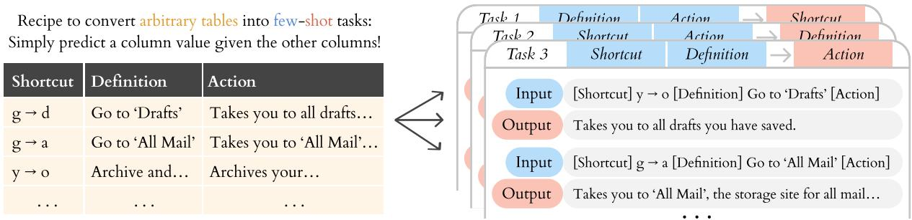
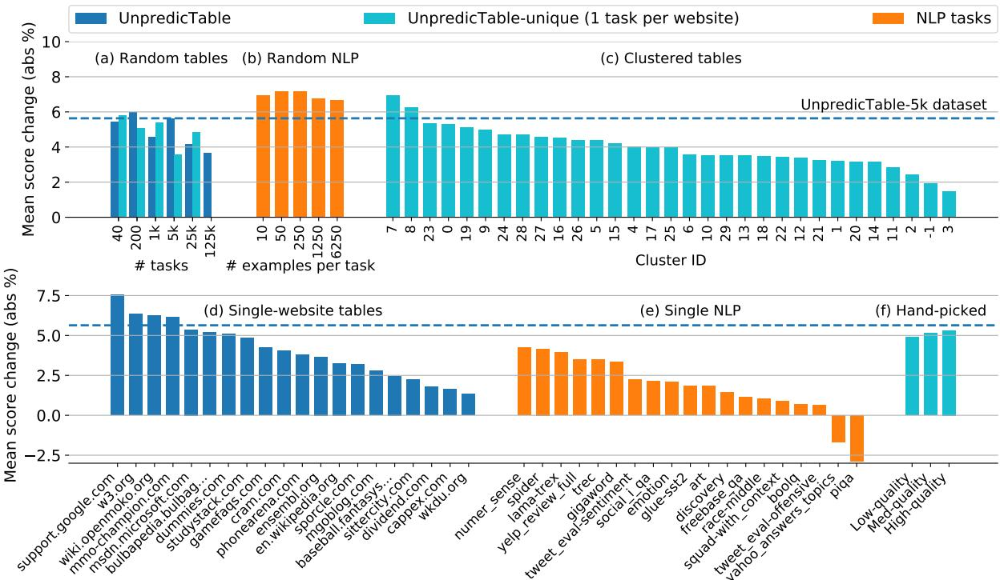
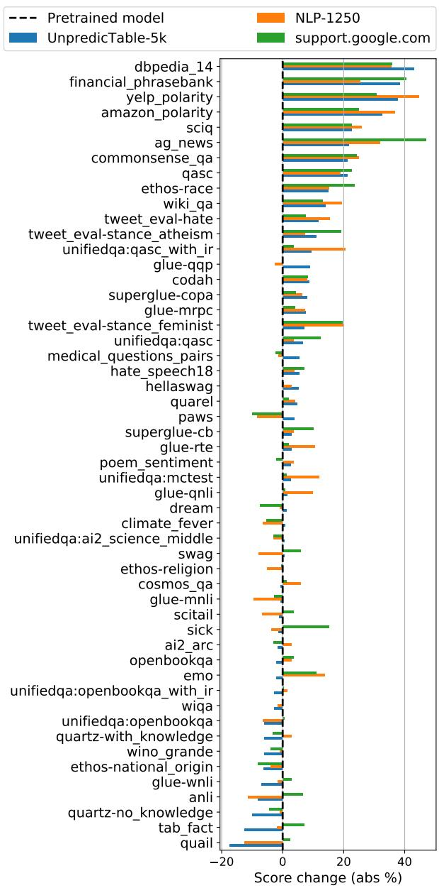
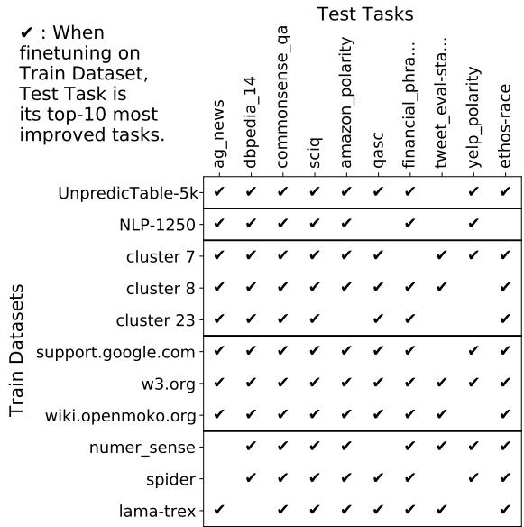

# Few-shot Adaptation Works with UnpredicTable Data

Jun Shern Chan1 2 Michael Pieler1 2 Jonathan Jao1 2 Jérémy Scheurer1 2

Ethan Perez1 2 3∗

1New York University, 2Fund for Alignment Research, 3Anthropic {junshern,perez}@nyu.edu

## Abstract

Prior work on language models (LMs) shows that training on a large number of diverse tasks improves few-shot learning (FSL) performance on new tasks. We take this to the extreme, automatically extracting 413,299 tasks from internet tables - orders of magnitude more than the next-largest public datasets. Finetuning on the resulting dataset leads to improved FSL performance on Natural Language Processing (NLP) tasks, but not proportionally to dataset scale. In fact, we find that narrow subsets of our dataset sometimes outperform more diverse datasets. For example, finetuning on software documentation from support.google.com raises FSL performance by a mean of +7.5% on 52 downstream tasks, which beats training on 40 humancurated NLP datasets (+6.7%). Finetuning on various narrow datasets leads to similar broad improvements across test tasks, suggesting that the gains are not from domain adaptation but adapting to FSL in general. We do not observe clear patterns between the datasets that lead to FSL gains, leaving open questions about why certain data helps with FSL.

## 1 Introduction

Brown et al. (2020) showed that language models (LMs) learn to perform new tasks from a few examples (“few-shot learning”; FSL). Explicitly training LMs for FSL further improves performance (Min et al., 2021; Chen et al., 2021b), and prior work has found that increasing the size and diversity of training tasks improves generalization to new tasks (Sanh et al., 2021; Aribandi et al., 2021; Aghajanyan et al., 2021a; Wang et al., 2022). We push size and diversity to the extreme by finetuning on a large dataset of automatically-curated FSL tasks, and surprisingly find that certain narrow datasets of tasks (e.g. software documentation) outperform much larger and more diverse datasets.

1 Scrape HTML tables from . support.google.com
<table><tr><td>If you want to ...</td><td>Then ...</td></tr><tr><td>Report spam</td><td>Submit a spam report.</td></tr><tr><td>Get a page or site removed...</td><td>Submit a URL removal request.</td></tr><tr><td>Tell Google to crawl your si...</td><td>Request a change in crawl rate.</td></tr><tr><td></td><td></td></tr><tr><td></td><td>② Convert tables to few-shot tasks.</td></tr><tr><td>Input</td><td>[If you want to ..] Report spam [Then ...]</td></tr><tr><td>Output</td><td>Submit a spam report.</td></tr><tr><td>Input</td><td>[If you want to ...] Get a page or site remove...</td></tr><tr><td>Output</td><td>Submit a URL removal request.</td></tr><tr><td>3</td><td></td></tr><tr><td></td><td>Fine-tune an LM on the generated tasks.</td></tr><tr><td>Outperform multi-task training with 40 NLP datasets in few-shot task transfer?!</td><td></td></tr></table>

Figure 1: We convert web tables into FSL tasks, then use these tasks via finetuning to adapt language models for FSL. Unexpected tables lead to strong task transfer: finetuning GPT2 on software documentation from support.google.com outperforms finetuning on 40 curated NLP datasets on average across 52 test tasks, with strong improvements across diverse tasks including article classification (+47%), sentiment classification (+31%) and scientific question-answering (+23%).

Investigations into dataset size and diversity require a large dataset of FSL tasks. To this end, we explore tables as a naturally-occurring source of diverse FSL tasks. Given a table where each row is a list of fields, we hold out one row as the test example and treat all other rows as task training examples. We apply this idea to automatically convert internet tables into UnpredicTable1, a dataset of 413,299 diverse few-shot tasks. We finetune GPT-2 to perform a new task given a few task examples in its context (“MetaICL”; Min et al.,

2021). Finetuning on UnpredicTable leads to strong FSL performance on average over 52 NLP test tasks. However, the observed gains fall short of expectations for such a large dataset.

To understand why our gains were limited, we perform ablations on dataset size, diversity, and content. We find that finetuning on narrow subsets of UnpredicTable outperforms finetuning on our diverse dataset and on curated NLP data. Surprisingly, datasets that we handpick according to what we expect to be helpful are not strongly correlated with performance. In fact, the training datasets that lead to strong improvements are often counterintuitive, covering trivia content (e.g. video games and software documentation; see Fig. 1) that are unrelated to test tasks. Finetuning on these narrow datasets cause broad improvements similar to finetuning on curated NLP datasets when compared on the same test tasks. This suggests that these aren’t domain- or task-specific improvements, but improvements in general few-shot ability (“few-shot adaptation”). Our work calls into question common wisdom that adapting LMs to FSL requires diverse, high-quality training data.

## 2 Web Tables Are Few-Shot Tasks

We begin by describing FSL, which is the problem of learning from a small number of training examples. We make the case that web tables can be used as a diverse source of few-shot tasks. Then, we introduce our algorithm for converting tables into tasks and apply this to produce UnpredicTable, a dataset of 413,299 few-shot tasks.

## 2.1 Few-Shot Learning Tasks

We define a task $T$ as a set of input-output pairs $T = \{ ( x _ { i } , y _ { i } ) \} _ { i = 1 } ^ { k }$ where inputs $x _ { i }$ map to outputs $y _ { i }$ . Tasks can be very diverse, from questionanswering (Questions Answers), to summarization (Books Summaries), to translation (French English). In FSL, k is small. LMs can be used to perform FSL by providing k training pairs $\{ ( x _ { i } , y _ { i } ) : i = 1 , \ldots , k \}$ in the LM context. Then, given a new example $x _ { \mathrm { { t a r g e t } } }$ for which ytarget is unknown, we use the model to predict ytarget.

## 2.2 Tables Dataset

Motivated by prior work on FSL adaptation (Min et al., 2021; Chen et al., 2021b) and multi-task learning (Sanh et al., 2021; Aribandi et al., 2021; Aghajanyan et al., 2021a), we hypothesize that we can extend the results of multi-task FSL finetuning with an even larger set of few-shot tasks. We make the case that web tables are a large and diverse source of few-shot tasks. Consider a table where each row is an instance of a similar class and columns describe the attributes of an instance. We use each row as an example of a task, where the task is filling in missing attributes in a row. For a table with k rows, each table becomes a k-shot dataset for a particular task.

As a source of table data, we use tables from the English-language Relational Subset of the WDC Web Table Corpus 2015 (WTC)2 (Lehmberg et al., 2016). The WTC dataset was extracted from the July 2015 Common Crawl web corpus, and contains 50M tables from 323K web domains. We focus on relational tables, which describe a set of similar items along with their attributes. For example, a table listing national dishes by country is a relational table, while a table where each row describes a different attribute of a single item is not. WTC also provides helpful metadata including the source URL, title, and header rows.

## 2.3 Turning Tables Into Tasks

In practice, there are important design choices for converting a table into a task of input-output pairs. Here, we describe our chosen procedure. We start with the assumption that items in the relational table are listed row-wise (as in Fig. 2) instead of column-wise. Where necessary, we transpose the tables to suit our requirement. To convert a row into an input-output task pair, we consider a single column as a potential output target $y _ { i }$ and concatenate the remaining columns to form the input $x _ { i }$ For additional context, we prefix each value with its column header (see Fig. 2). Since any column is a potential output target, we create multiple tasks per table. For example, a table with 3 columns A, B, and C may be cast as three different tasks: $P ( A | B , C ) , P ( B | A , C )$ and $P ( C | A , B )$ . Exhaustively converting every column from every table into a new task leads to a large number of junk tasks, so we filter out tasks that do not meet basic criteria of task coherence (see Appendix A).

We apply our tables-to-tasks procedure to produce UnpredicTable, a dataset with 413,299 tasks from 23,744 websites. The shape of our dataset is different from most NLP datasets: NLP datasets typically contain a handful of tasks, with thousands of examples per task. UnpredicTable contains 400K tasks but most tasks have fewer than 50 examples. Thus, our dataset has a large variety of tasks but each task has limited training examples, true to the small-k FSL setting. Our code and dataset are open-source.3

  
Figure 2: An algorithm to convert tables into tasks for FSL: Given the task of "Predict this column value given the other column values as input," each row in the table can be used as an example for that task.

## 3 Multitask Training with Few-shot Tasks for Few-shot Adaptation

The shape of our dataset makes it suitable for multitask learning algorithms. In multitask learning, we have a training dataset $\mathcal { D } _ { \mathrm { t r a i n } } = \{ T _ { i } \} _ { i = 1 } ^ { M _ { \mathrm { t r a i n } } }$ containing $M _ { \mathrm { t r a i n } }$ training tasks $T ,$ and a test dataset $\mathcal { D } _ { \mathrm { t e s t } }$ with $M _ { \mathrm { t e s t } }$ tasks which are disjoint to $\mathcal { D } _ { \mathrm { t r a i n } } .$ The key idea is to use $\mathcal { D } _ { \mathrm { t r a i n } }$ to train a model to be generalizable to new tasks in $\mathcal { D } _ { \mathrm { t e s t } } .$

Here, we focus on the MetaICL algorithm (Min et al., 2021) for few-shot adaptation, which has shown strong FSL results across a variety of downstream tasks. To study the generalization of our results across different training algorithms, models and test tasks, we include additional experiments in Appendix D including zero-shot results and evaluation on the CrossFit (Ye et al., 2021) and FLEX (Bragg et al., 2021) benchmarks.

## 3.1 MetaICL

MetaICL (Min et al., 2021) trains LMs to predict the output for a target input, given a few input-output pairs provided in the LM context. On each training iteration, one task $T _ { i }$ is sampled from $\mathcal { D } _ { \mathrm { t r a i n } }$ and $k + 1$ training examples $\left\{ ( x _ { 1 } , y _ { 1 } ) , \dotsc , ( x _ { k + 1 } , y _ { k + 1 } ) \right\}$ are sampled from $T _ { i }$ MetaICL trains an LM with parameters θ to maximize log $P ( y _ { k + 1 } | x _ { 1 } , y _ { 1 } , \dots , x _ { k } , y _ { k } , x _ { k + 1 } )$ . At test time, for a new task in $\mathcal { D } _ { \mathrm { t e s t } }$ we draw a set of examples $\{ x _ { 1 } , y _ { 1 } , \dotsc , x _ { k } , y _ { k } \}$ and a query $x _ { k + 1 }$ . Given this context, the LM uses θ to select the most likely $y _ { k + 1 }$ from a discrete set of possible labels.

## 3.2 Experiments

Here, we investigate how finetuning on UnpredicTable compares to finetuning on human-curated NLP datasets. We finetune the 774M parameter pretrained GPT2-large LM (Radford et al., 2019), following Min et al. (2021). See Appendix C for details on our hyperparameter and finetuning setup.

NLP datasets and evaluation settings Min et al. (2021) use 142 unique NLP tasks from Ye et al. (2021) and Khashabi et al. (2020) to form $\mathcal { D } _ { \mathrm { t r a i n } }$ and $\mathcal { D } _ { \mathrm { t e s t } }$ for 5 different NLP task categories: 26 Low Resource (LR) tasks with <1000 examples per task, 8 Natural Language Inference (NLI) tasks to test entailment between a premise and hypothesis clause, 4 Paraphrase (Para) tasks that test the equivalence of two differently-worded phrases, 20 Classification (Class) tasks, and 22 Question-Answering (QA) tasks. We show results on each category. See Appendix C for a full list of tasks.

MetaICL methods MetaICL evaluates performance on each task category in two ways. First, they consider an out of distribution $( ^ { 6 6 } \mathrm { O O D ^ { , 9 } } )$ setting, where they finetune a model on a dataset $\mathcal { D } _ { \mathrm { t r a i n } }$ consisting of tasks from all other categories excluding the target task category. Second, for Class and QA categories, they consider an in-domain $\mathrm { ( ^ { 6 6 } I I D ^ { \prime } ) }$ setting, where they finetune a model on a dataset $\mathcal { D } _ { \mathrm { t r a i n } }$ consisting of only tasks from the same category as the target task category.

Our dataset We sample M = 5000 tasks from UnpredicTable, choosing M based on results on a development set of tasks (Appendix C). We refer to this dataset as UnpredicTable-5k. Min et al. (2021) train one model per task category, while we fine-tune a single GPT2-large model on UnpredicTable-5k and test the resulting model on all task categories.

## 3.3 Results

Task category [# test tasks]
<table><tr><td rowspan=1 colspan=1></td><td rowspan=1 colspan=5>Task Category [&quot; test tasks]</td></tr><tr><td rowspan=1 colspan=1>Method</td><td rowspan=1 colspan=1>LR</td><td rowspan=1 colspan=1>Class</td><td rowspan=1 colspan=1>QA</td><td rowspan=1 colspan=1>NLI</td><td rowspan=1 colspan=1>Para</td></tr><tr><td rowspan=1 colspan=1>GPT2 0-shot</td><td rowspan=1 colspan=1>34.9</td><td rowspan=1 colspan=1>34.2</td><td rowspan=1 colspan=1>40.4</td><td rowspan=1 colspan=1>25.5</td><td rowspan=1 colspan=1>34.2</td></tr><tr><td rowspan=1 colspan=1>GPT2 k-shot</td><td rowspan=1 colspan=1>38.2</td><td rowspan=1 colspan=1>37.4</td><td rowspan=1 colspan=1>40.2</td><td rowspan=1 colspan=1>34</td><td rowspan=1 colspan=1>33.7</td></tr><tr><td rowspan=1 colspan=6>MetaICL k-shot trained with</td></tr><tr><td rowspan=1 colspan=1>NLP (OOD)NLP (IID)</td><td rowspan=1 colspan=1>43.2–</td><td rowspan=1 colspan=1>38.243.4</td><td rowspan=1 colspan=1>38.745.9</td><td rowspan=1 colspan=1>49、</td><td rowspan=1 colspan=1>33.1</td></tr><tr><td rowspan=1 colspan=1>UnpredicTable-5k(our dataset)</td><td rowspan=1 colspan=1>43.7</td><td rowspan=1 colspan=1>46.1</td><td rowspan=1 colspan=1>42.3</td><td rowspan=1 colspan=1>36.3</td><td rowspan=1 colspan=1>45.7</td></tr></table>

Table 1: Columns represent different test settings; rows represent different methods. MetaICL k-shot with finetuning on our dataset improves pretrained model performance (GPT2 k-shot) on all test categories. Furthermore, finetuning on our tasks beats finetuning on outcategory NLP datasets (OOD) on 4/5 settings, and incategory NLP datasets (IID) on 1/2 settings.

For each category, we report the mean task accuracy for all tasks in the category. Tab. 1 shows the results. MetaICL finetuning on our table tasks improves FSL performance on all test settings. Furthermore, finetuning on our dataset outperforms finetuning on OOD NLP tasks on 4/5 settings, and IID NLP tasks on 1/2 settings. Overall, finetuning on our data results in comparable performance to finetuning on curated NLP tasks.

## 4 Why Is UnpredicTable Helpful?

To understand why UnpredicTable is helpful training data, we construct subsets of the dataset varying features we wish to study. For each subdataset, we finetune on that dataset individually following the setup as before (Appendix C) and measure FSL performance on MetaICL test tasks from all categories (52 total). All experiments are repeated for 3 random seeds to minimize the effects of random task sampling in each dataset. We report the mean accuracy from each experiment in Fig. 3.

## 4.1 Does increasing dataset size improve finetuning performance?

Fig. 3a shows FSL performance for differentlysized datasets randomly sampled from UnpredicTable. Each dataset has a maximum number of examples per task $N ~ = ~ 1 0$ and varies the number of tasks T. Increasing the number of tasks from $T = 4 0$ does not help and performance deteriorates beyond T = 5000, contrary to results in Wang et al. (2022).4 Overall, the number of tasks does not seem to be the key factor for our finetuning transfer success.

## 4.2 Does diversity improve performance?

Next, we study the effect of task diversity on FSL performance. Tasks from the same website tend to be similar in content, so we construct more diverse datasets by sampling tasks from UnpredicTable-unique, a version of UnpredicTable filtered to have a maximum of one task per website (vs. up to 2500 in UnpredicTable). Fig. 3a shows that the difference between UnpredicTable-unique and UnpredicTable at matching sizes is small, suggesting that dataset diversity is not an important factor for our finetuning transfer success.

To examine narrow datasets in contrast to the uniformly-sampled ones, we consider 3 types of datasets grouped by content. We sample tasks from 20 websites of different genres, forming a dataset from each website (Fig. 3d). Secondly, we also form datasets of semantically similar tasks by clustering UnpredicTable-unique tasks into 30 clusters using HDBSCAN5 (McInnes et al., 2017) (Fig. 3c). Finally, we also sample 20 NLP tasks from the 90 MetaICL training tasks and use each task as a separate training dataset (Fig. 3e). Singlewebsite and single-NLP datasets have $T \times N =$ 10000 total examples, and cluster datasets have different T due to the clustering algorithm.

We find significant variance among the narrow datasets. Some single-website or cluster datasets are better than diverse datasets, such as support.google.com which is our best dataset overall (even outperforming diverse NLP datasets). This suggests that diverse task datasets can be replaced with careful selection of a narrow training dataset for FSL improvement.

## 4.3 Can we select good tasks by hand?

Padmakumar et al. (2022) found that some training tasks can negatively impact downstream performance, which could explain why aggregating many random tasks may be less successful than individual tasks. We manually categorize 2,000 tasks from UnpredicTable-unique into High, Mid, and Low-quality.6 We define low-quality tasks as tasks where the content is junk or relies on missing context. High-quality tasks are ones where an annotator could pick the correct answer from a list of options, and tests useful abilities (logic, general knowledge, comprehension, etc.). Mid-quality tasks are the remaining tasks. For each class, we randomly sample T = 200 tasks to form its own dataset.

  
Figure 3: Each bar represents a GPT2 model finetuned on a different dataset. The y-axis shows mean improvement of a finetuned LM over the pretrained LM. Comparing dataset helpfulness: Datasets made of diverse tasks from UnpredicTable (a) and NLP datasets (b) lead to +5–7% improvement. Narrow clusters (c) and websites (d) within UnpredicTable vary significantly, with the best narrow datasets matching the best multi-task NLP datasets (b).

Surprisingly, our manual annotations of quality are not strongly correlated with downstream task performance (Fig. 3f). Our handpicked dataset of high-quality tasks does not even surpass the scores of randomly-sampled tasks, and the difference in performance between our low and high-quality datasets are <1%. These results suggest that tasks that look helpful are not necessarily helpful.

## 4.4 How do helpful and unhelpful tasks look?

We look for features of helpful and unhelpful datasets with examples from cluster, single-website and single-NLP datasets. 4/5 of the most helpful datasets are softwarerelated. support.google.com, w3.org and wiki.openmoko.org contain software documentation; cluster 7 describes information related to internet cookies. Unhelpful datasets are more varied. The two least-helpful datasets are NLP datasets: piqa (questionanswering task for physical knowledge) and yahoo\_answers\_topics (topic-classification task) both yield negative transfer results. The least helpful table datasets include highly-repetitive software tables (cluster 2 & 3), tasks classified as noise by the clustering algorithm (cluster -1), college review posts (cappex.com), and music database entries (wkdu.org).

The top datasets appear unrelated to our test tasks (e.g. there are no softwarerelated test tasks). Additional examples highlight this: mmo-champion.com and bulbapedia.bulbagarden.net are video game trivia sites that do not seem useful for other tasks, yet these datasets are on par with UnpredicTable-5k. Conversely, websites containing high-quality question-answer pairs such as cram.com and studystack.com, as well as en.wikipedia.org which contains many real-world facts, yield subpar improvements. We include examples of helpful and unhelpful tasks in Tab. 2, and more examples in Appendix G.

<table><tr><td rowspan=1 colspan=2>Examples of Helpful Tasks</td></tr><tr><td rowspan=1 colspan=2>w3.org</td></tr><tr><td rowspan=1 colspan=1>inputoutput</td><td rowspan=1 colspan=1>[Keyword] password [Data type] Text with noline breaks (sensitive information) [State]Password</td></tr><tr><td rowspan=1 colspan=2>bulbapedia.bulbagarden.net</td></tr><tr><td rowspan=1 colspan=1>inputoutput</td><td rowspan=1 colspan=1>[Move] Odor Sleuth [Effect]Never ends, screen freezes with the words&quot;Wild/Foe (Pokémon) used Odor Sleuth!&quot;</td></tr><tr><td rowspan=1 colspan=2>cluster 7</td></tr><tr><td rowspan=1 colspan=1>inputoutput</td><td rowspan=1 colspan=1>[Cookie] guest_id, ki [Information]These cookies allow you to access the Twitterfeed on the homepage.</td></tr><tr><td rowspan=1 colspan=2>Examples of Unhelpful Tasks</td></tr><tr><td rowspan=1 colspan=2>wkdu.org</td></tr><tr><td rowspan=1 colspan=1>inputoutput</td><td rowspan=1 colspan=1>[Artist] Noah and the Whale [Title]5 Years Time</td></tr><tr><td rowspan=1 colspan=2>cappex.com</td></tr><tr><td rowspan=1 colspan=1>inputoutput</td><td rowspan=1 colspan=1>[Comments] ... anything you would want to do isjust an easy ten minute drive away. [Categories]What to do for fun</td></tr><tr><td rowspan=1 colspan=2>yahoo_answers_topics</td></tr><tr><td rowspan=1 colspan=1>inputoutput</td><td rowspan=1 colspan=1>bungee jumping site in victoria??? i am trying tofind a site for bungee jumping ... (Truncated)Sports</td></tr></table>

Table 2: Helpful and unhelpful datasets are highly varied and do not always match intuitions on task quality.

## 4.5 Which tasks are our datasets helpful for?

Here, we investigate which test tasks benefit from our finetuning. Fig 4 shows score improvements on all 52 test tasks relative to the pretrained model after finetuning on UnpredicTable-5k, NLP-12507, and support.google.com. Summary statistics are shown in Tab. 3. Across the 3 datasets, 60-70% of tasks have improved scores over the pretrained model. The distribution of test score improvements appear to be highly concentrated on a few tasks, with 20% of test tasks accounting for 60-80% of all improvement. The median score change for UnpredicTable-5k is only +2.8%, though the max is +43.0%.

Fig. 5 shows the 10 most-improving test tasks (median of all 90 training datasets in Fig. 4). The tasks are highly varied, spanning topics from finance to science, and have binary or multiplechoice (MCQ) labels. It is difficult to draw clear relationships between test tasks and the datasets that lead to their largest improvement (Best dataset). For example, cluster 7 (a dataset on web cookies) is the most helpful dataset for both ag\_news (news classification) and amazon\_polarity (sentiment classification). Our examples of unintuitive task transfer contradict prior work that suggest domain similarity is key for successful task transfer (Gururangan et al., 2020).

  
Figure 4: Score changes (vs pretrained) on 52 test tasks for models finetuned on 3 different datasets.

<table><tr><td rowspan=1 colspan=1>Task</td><td rowspan=1 colspan=1>Type</td><td rowspan=1 colspan=1>Output space</td><td rowspan=1 colspan=1>Chance (%)</td><td rowspan=1 colspan=1>Median (%)</td><td rowspan=1 colspan=1>Max (%)</td><td rowspan=1 colspan=1>Best dataset</td></tr><tr><td rowspan=1 colspan=1>ag_news</td><td rowspan=1 colspan=1>News class</td><td rowspan=1 colspan=1>World / Sports / Business / SciTech</td><td rowspan=1 colspan=1>25</td><td rowspan=1 colspan=1>42 (+29)</td><td rowspan=1 colspan=1>63 (+50)</td><td rowspan=1 colspan=1>cluster 7</td></tr><tr><td rowspan=1 colspan=1>dbpedia_14</td><td rowspan=1 colspan=1>Wikipedia class</td><td rowspan=1 colspan=1>14 classes (plant / athlete / ...)</td><td rowspan=1 colspan=1>7</td><td rowspan=1 colspan=1>31 (+25)</td><td rowspan=1 colspan=1>47 (+42)</td><td rowspan=1 colspan=1>w3.org</td></tr><tr><td rowspan=1 colspan=1>commonsense_qa</td><td rowspan=1 colspan=1>General QA</td><td rowspan=1 colspan=1>MCQ</td><td rowspan=1 colspan=1>20</td><td rowspan=1 colspan=1>44 (+23)</td><td rowspan=1 colspan=1>51 (+30)</td><td rowspan=1 colspan=1>cluster 12</td></tr><tr><td rowspan=1 colspan=1>sciq</td><td rowspan=1 colspan=1>Scientific QA</td><td rowspan=1 colspan=1>MCQ</td><td rowspan=1 colspan=1>25</td><td rowspan=1 colspan=1>81 (+23)</td><td rowspan=1 colspan=1>87 (+29)</td><td rowspan=1 colspan=1>cluster 0</td></tr><tr><td rowspan=1 colspan=1>amazon_polarity</td><td rowspan=1 colspan=1>Review class</td><td rowspan=1 colspan=1>positive / negative</td><td rowspan=1 colspan=1>50</td><td rowspan=1 colspan=1>77 (+18)</td><td rowspan=1 colspan=1>92 (+34)</td><td rowspan=1 colspan=1>cluster 7</td></tr><tr><td rowspan=1 colspan=1>qasc</td><td rowspan=1 colspan=1>General QA</td><td rowspan=1 colspan=1>MCQ</td><td rowspan=1 colspan=1>13</td><td rowspan=1 colspan=1>30 (+17)</td><td rowspan=1 colspan=1>38 (+25)</td><td rowspan=1 colspan=1>cluster 8</td></tr><tr><td rowspan=1 colspan=1>financial_phrasebank</td><td rowspan=1 colspan=1>Financial class</td><td rowspan=1 colspan=1>positive / negative / neutral</td><td rowspan=1 colspan=1>33</td><td rowspan=1 colspan=1>41 (+14)</td><td rowspan=1 colspan=1>68 (+40)</td><td rowspan=1 colspan=1>support.google.com</td></tr><tr><td rowspan=1 colspan=1>tweet_eval-stance_atheism</td><td rowspan=1 colspan=1>Tweet class</td><td rowspan=1 colspan=1>none / against / favor</td><td rowspan=1 colspan=1>33</td><td rowspan=1 colspan=1>31 (+13)</td><td rowspan=1 colspan=1>44 (+25)</td><td rowspan=1 colspan=1>msdn.microsoft.com</td></tr><tr><td rowspan=1 colspan=1>yelp_polarity</td><td rowspan=1 colspan=1>Review class</td><td rowspan=1 colspan=1>positive / negative</td><td rowspan=1 colspan=1>50</td><td rowspan=1 colspan=1>61 (+12)</td><td rowspan=1 colspan=1>84 (+36)</td><td rowspan=1 colspan=1>w3.org</td></tr><tr><td rowspan=1 colspan=1>ethos-race</td><td rowspan=1 colspan=1>Hate speech class</td><td rowspan=1 colspan=1>true / false</td><td rowspan=1 colspan=1>50</td><td rowspan=1 colspan=1>43 (+12)</td><td rowspan=1 colspan=1>55 (+23)</td><td rowspan=1 colspan=1>support.google.com</td></tr></table>

Figure 5: The most-improving tasks in the MetaICL test set span a wide variety of topics and output spaces. There is no clear connection to the training datasets that most strongly improve FSL performance (Best dataset), yet score improvements are significant. We show absolute scores for random Chance as well as the Median and Max scores across different training datasets. Improvements w.r.t. to the pretrained model are shown in parentheses.

<table><tr><td rowspan=2 colspan=1></td><td rowspan=1 colspan=1>Table-5k</td><td rowspan=1 colspan=1>NLP-1250</td><td rowspan=1 colspan=1>support.google</td></tr><tr><td rowspan=1 colspan=3>Test tasks counts (# out of 52)</td></tr><tr><td rowspan=1 colspan=1>Improved</td><td rowspan=1 colspan=1>33</td><td rowspan=1 colspan=1>32</td><td rowspan=1 colspan=1>37</td></tr><tr><td rowspan=1 colspan=1>Decreased</td><td rowspan=1 colspan=1>19</td><td rowspan=1 colspan=1>20</td><td rowspan=1 colspan=1>15</td></tr><tr><td rowspan=1 colspan=1>&gt;Chance(pre: 23)</td><td rowspan=1 colspan=1>23</td><td rowspan=1 colspan=1>31</td><td rowspan=1 colspan=1>34</td></tr><tr><td rowspan=1 colspan=1></td><td rowspan=1 colspan=3>Score change (finetuned - pre) (%)</td></tr><tr><td rowspan=1 colspan=1>Mean</td><td rowspan=1 colspan=1>+5.6</td><td rowspan=1 colspan=1>+6.7</td><td rowspan=1 colspan=1>+7.5</td></tr><tr><td rowspan=1 colspan=1>Median</td><td rowspan=1 colspan=1>+2.8</td><td rowspan=1 colspan=1>+3.5</td><td rowspan=1 colspan=1>+3.6</td></tr><tr><td rowspan=1 colspan=1>Max</td><td rowspan=1 colspan=1>+43.0</td><td rowspan=1 colspan=1>+44.7</td><td rowspan=1 colspan=1>+47.1</td></tr><tr><td rowspan=1 colspan=1>Min</td><td rowspan=1 colspan=1>-17.3</td><td rowspan=1 colspan=1>-12.5</td><td rowspan=1 colspan=1>-10.0</td></tr></table>

Table 3: Top: Rows 1 & 2 show the number of test tasks that improved or not (vs the pretrained model) after finetuning. Row 3 shows the number of test tasks that score >random chance for multiple-choice answers. Bottom: Improvements are not evenly distributed; the maximum score increase on support.google.com is +47.1% but median improvement is only +3.6%.

## 4.6 Do different datasets lead improvements on different test tasks?

We wish to understand if finetuning on different datasets lead to different test task improvements. Fig. 6 illustrates that the same set of 10 test tasks make up the majority of the top-10 improving test tasks for each of our best training datasets (the top-performing datasets for each category in Fig. 4). This suggests that the improvements learned from highly different training datasets are domainagnostic. However, it is unclear why these improvements can be learned from these particular training datasets but not others, and why these particular test tasks benefit most from the improvements.

## 5 Related Work

We focus on the FSL setting where few training samples are available. Pretrained LMs can learn from few-shot examples in-context (Brown et al.,

  
Figure 6: Finetuning on different datasets leads to broadly similar improvements. For example, finetuning on wiki.openmoko.org (software documentation) and lama-trex (factual knowledge) lead to 8 of the same test tasks being in their respective top-10 mostimproved test tasks. (Out of 52 total test tasks)

2020; Scao and Rush, 2021) but have weaknesses including prompt sensitivity (Lu et al., 2021; Perez et al., 2021) and miscalibration (Zhao et al., 2021). Min et al. (2021) and Chen et al. (2021b) alleviate these issues with FSL adaptation - fine-tuning LMs to predict the target given few-shot examples in the prompt. We adopt MetaICL (Min et al., 2021) training for our main experiments and support our results with additional few-shot benchmarks, Cross-Fit (Ye et al., 2021) and FLEX (Bragg et al., 2021).

Our work connects with other work in domain adaptation. Gururangan et al. (2020) show that finetuning on domains related to the downstream task leads to performance gains. More recent examples include Chen et al. (2021a) for coding tasks and

Lewkowycz et al. (2022) for mathematics tasks. Solaiman and Dennison (2021) demonstrate finetuning on value-aligned text to generate text in accordance with intrinsic human values. In contrast, we show that LMs can be finetuned on unrelated domains to improve on new tasks. Other work adapt to task formats: Khashabi et al. (2020); Huber et al. (2021); Zhong et al. (2021b) convert broad NLP tasks into question-answering tasks and finetune to excel at question-answering; Zhong et al. (2021a) finetune models for classification tasks; Gao et al. (2020) finetune models to perform tasks within predetermined prompt templates. More generally, LMs have been finetuned to follow instructions (Ouyang et al., 2022; Wei et al., 2021) which allows for diverse task formats. FSL adaptation can be seen as adaptation to the FSL prompt format, though the tasks can be diverse in domain and structure.

Multi-task literature show that training on a wide variety of tasks improves generalization to new tasks, which motivates our exploration of a large scale task dataset. Sanh et al. (2021); Aribandi et al. (2021); Mishra et al. (2021); Aghajanyan et al. (2021a); Padmakumar et al. (2022) demonstrate that increasing the number of tasks for multi-task training improves generalization in the zero-shot setting. Xu et al. (2022); Wang et al. (2022) extended this result to more than 1,000 tasks. We were inspired by these results to obtain a training dataset with 100x more tasks, but found certain narrow datasets are more helpful than diverse ones. Padmakumar et al. (2022) showed that some training tasks negatively impact downstream performance, which could explain why mixing diverse tasks might underperform. This begs the question of how to select training datasets to improve downstream task performance. Vu et al. (2020) show that domain similarity can be used as a predictor for successful transfer, but our results suggest there may be domain-agnostic improvements to be gained from training on tasks unrelated to the test tasks. Others study the effect of pretraining data on FSL, including (Shin et al., 2022) and (Chan et al., 2022) who find that FSL emerges when the training data exhibits particular distributional properties.

Our use of structured datasets to generate training tasks is inspired by other work, though others have focused on a limited set of task types. Yoran et al. (2021) also turn tables into tasks, using handwritten templates to extract question-answer pairs from tables. Aghajanyan et al. (2021b) train LMs to predict masked spans in HTML webpages, then use HTML markup to prompt language models to do summarization and classification tasks. Chen et al. (2022) transform ordinary (non-table) text into sentence completion, masked phrase prediction, and classification tasks. In contrast, our approach captures any tasks that occur naturally in tables.

## 6 Limitations & Future Work

The UnpredicTable dataset may contain inaccuracies, biases, and inappropriate content. We do not recommend using this dataset to train models for deployment, but release this primarily as a research resource. We do not introduce any new model capabilities that lead to different risks than the usual risks associated with model usage. Our work highlights the unpredictability of model behavior given various training datasets which calls for heightened vigilance for behavior changes after finetuning. Our design choices in using table data for FSL training led to a dataset that is quite different than typical NLP datasets, so specific results from training on our dataset may not fully generalize to other kinds of datasets. Further work may consider other methods for converting tables to tasks, other sources of tables besides WTC, or other structured datasets besides tables. Our experiments focused on modestly-sized models (GPT-2 Large, 750M parameters) so our conclusions may not hold for larger models. Our evaluations are limited to multiple-choice tasks. Future work may extend our analyses with larger models and other tasks including freeform generation.

## 7 Conclusion

We produced UnpredicTable, a dataset of 413,299 diverse few-shot learning tasks from internet tables. Finetuning on UnpredicTable improves the FSL ability of LMs. However, the size of our dataset is not the key factor in its success. We find that certain narrow datasets (even ones made of trivia) are even more helpful than diverse, curated NLP datasets. Finetuning on these narrow datasets leads to strong improvements on the same test tasks as finetuning on diverse, curated NLP datasets. This suggests that finetuning on these datasets cause domain-agnostic FSL gains, though we were unable to find clear patterns to explain why this happens for some data and not others. Our results question common wisdom that task diversity is necessary for adapting LMs to FSL. We hope our work spurs investigation on what data causes few-shot learning to emerge, both to develop better datasets and to better understand how training data leads to unexpected behaviors or failures.

## References

Armen Aghajanyan, Anchit Gupta, Akshat Shrivastava, Xilun Chen, Luke Zettlemoyer, and Sonal Gupta. 2021a. Muppet: Massive multi-task representations with pre-finetuning. arXiv preprint arXiv:2101.11038.

Armen Aghajanyan, Dmytro Okhonko, Mike Lewis, Mandar Joshi, Hu Xu, Gargi Ghosh, and Luke Zettlemoyer. 2021b. Htlm: Hyper-text pre-training and prompting of language models. arXiv preprint arXiv:2107.06955.

Tiago A. Almeida, José María G. Hidalgo, and Akebo Yamakami. 2011. Contributions to the study of sms spam filtering: New collection and results. In Proceedings of the 11th ACM Symposium on Document Engineering.

Vamsi Aribandi, Yi Tay, Tal Schuster, Jinfeng Rao, Huaixiu Steven Zheng, Sanket Vaibhav Mehta, Honglei Zhuang, Vinh Q Tran, Dara Bahri, Jianmo Ni, et al. 2021. Ext5: Towards extreme multitask scaling for transfer learning. arXiv preprint arXiv:2111.10952.

Roy Bar-Haim, Ido Dagan, Bill Dolan, Lisa Ferro, Danilo Giampiccolo, Bernardo Magnini, and Idan Szpektor. 2006. The second pascal recognising textual entailment challenge. In Proceedings ofthe second PASCAL challenges workshop on recognising textual entailment.

Francesco Barbieri, Jose Camacho-Collados, Luis Espinosa Anke, and Leonardo Neves. 2020. TweetEval: Unified benchmark and comparative evaluation for tweet classification. In Findings of the Association for Computational Linguistics: EMNLP 2020.

Luisa Bentivogli, Peter Clark, Ido Dagan, and Danilo Giampiccolo. 2009. The fifth pascal recognizing textual entailment challenge. In TAC.

Jonathan Berant, Andrew Chou, Roy Frostig, and Percy Liang. 2013. Semantic parsing on Freebase from question-answer pairs. In EMNLP.

Chandra Bhagavatula, Ronan Le Bras, Chaitanya Malaviya, Keisuke Sakaguchi, Ari Holtzman, Hannah Rashkin, Doug Downey, Wen tau Yih, and Yejin Choi. 2020. Abductive commonsense reasoning. In ICLR.

Yonatan Bisk, Rowan Zellers, Ronan Le Bras, Jianfeng Gao, and Yejin Choi. 2020. Piqa: Reasoning about physical commonsense in natural language. In AAAI.

Michael Boratko, Xiang Li, Tim O’Gorman, Rajarshi Das, Dan Le, and Andrew McCallum. 2020. ProtoQA: A question answering dataset for prototypical common-sense reasoning. In EMNLP.

Jonathan Bragg, Arman Cohan, Kyle Lo, and Iz Beltagy. 2021. Flex: Unifying evaluation for few-shot nlp. Advances in Neural Information Processing Systems, 34:15787–15800.

Tom Brown, Benjamin Mann, Nick Ryder, Melanie Subbiah, Jared D Kaplan, Prafulla Dhariwal, Arvind Neelakantan, Pranav Shyam, Girish Sastry, Amanda Askell, et al. 2020. Language models are few-shot learners. Advances in neural information processing systems, 33:1877–1901.

Stephanie CY Chan, Adam Santoro, Andrew K Lampinen, Jane X Wang, Aaditya Singh, Pierre H Richemond, Jay McClelland, and Felix Hill. 2022. Data distributional properties drive emergent fewshot learning in transformers. arXiv preprint arXiv:2205.05055.

Ankush Chatterjee, Kedhar Nath Narahari, Meghana Joshi, and Puneet Agrawal. 2019. SemEval-2019 task 3: EmoContext contextual emotion detection in text. In Proceedings of the 13th International Workshop on Semantic Evaluation.

Mark Chen, Jerry Tworek, Heewoo Jun, Qiming Yuan, Henrique Ponde de Oliveira Pinto, Jared Kaplan, Harri Edwards, Yuri Burda, Nicholas Joseph, Greg Brockman, et al. 2021a. Evaluating large language models trained on code. arXiv preprint arXiv:2107.03374.

Michael Chen, Mike D’Arcy, Alisa Liu, Jared Fernandez, and Doug Downey. 2019. CODAH: An adversarially-authored question answering dataset for common sense. In Proceedings of the 3rd Workshop on Evaluating Vector Space Representations for NLP.

Mingda Chen, Jingfei Du, Ramakanth Pasunuru, Todor Mihaylov, Srini Iyer, Veselin Stoyanov, and Zornitsa Kozareva. 2022. Improving in-context few-shot learning via self-supervised training. arXiv preprint arXiv:2205.01703.

Wenhu Chen, Hongmin Wang, Jianshu Chen, Yunkai Zhang, Hong Wang, Shiyang Li, Xiyou Zhou, and William Yang Wang. 2020. Tabfact: A large-scale dataset for table-based fact verification. In ICLR.

Yanda Chen, Ruiqi Zhong, Sheng Zha, George Karypis, and He He. 2021b. Meta-learning via language model in-context tuning. arXiv preprint arXiv:2110.07814.

Christopher Clark, Kenton Lee, Ming-Wei Chang, Tom Kwiatkowski, Michael Collins, and Kristina Toutanova. 2019. BoolQ: Exploring the surprising difficulty of natural yes/no questions. In NAACL-HLT.

Peter Clark, Isaac Cowhey, Oren Etzioni, Tushar Khot, Ashish Sabharwal, Carissa Schoenick, and Oyvind Tafjord. 2018. Think you have solved question answering? try arc, the ai2 reasoning challenge. arXiv preprint arXiv:1803.05457.

Ido Dagan, Oren Glickman, and Bernardo Magnini. 2005. The pascal recognising textual entailment challenge. In Machine Learning Challenges Workshop.

Pradeep Dasigi, Nelson F. Liu, Ana Marasovic, Noah A.´ Smith, and Matt Gardner. 2019. Quoref: A reading comprehension dataset with questions requiring coreferential reasoning. In EMNLP.

Thomas Davidson, Dana Warmsley, Michael Macy, and Ingmar Weber. 2017. Automated hate speech detection and the problem of offensive language. In Proceedings ofthe 11th International AAAI Conference on Web and Social Media.

Ona de Gibert, Naiara Perez, Aitor García-Pablos, and Montse Cuadros. 2018. Hate Speech Dataset from a White Supremacy Forum. In Proceedings of the 2nd Workshop on Abusive Language Online (ALW2).

Marie-Catherine de Marneffe, Mandy Simons, and Judith Tonhauser. 2019. The commitmentbank: Investigating projection in naturally occurring discourse. Proceedings ofSinn und Bedeutung.

T. Diggelmann, Jordan L. Boyd-Graber, Jannis Bulian, Massimiliano Ciaramita, and Markus Leippold. 2020. Climate-fever: A dataset for verification of real-world climate claims. ArXiv.

William B. Dolan and Chris Brockett. 2005. Automatically constructing a corpus of sentential paraphrases. In Proceedings of the Third International Workshop on Paraphrasing (IWP2005).

Dheeru Dua, Yizhong Wang, Pradeep Dasigi, Gabriel Stanovsky, Sameer Singh, and Matt Gardner. 2019. DROP: A reading comprehension benchmark requiring discrete reasoning over paragraphs. In NAACL.

Matthew Dunn, Levent Sagun, Mike Higgins, V. U. Güney, Volkan Cirik, and Kyunghyun Cho. 2017. Searchqa: A new q&a dataset augmented with context from a search engine. arXiv preprint arXiv:1704.05179.

Hady Elsahar, Pavlos Vougiouklis, Arslen Remaci, Christophe Gravier, Jonathon Hare, Frederique Laforest, and Elena Simperl. 2018. T-REx: A large scale alignment of natural language with knowledge base triples. In LREC.

Manaal Faruqui and Dipanjan Das. 2018. Identifying well-formed natural language questions. In EMNLP.

Tianyu Gao, Adam Fisch, and Danqi Chen. 2020. Making pre-trained language models better few-shot learners. arXiv preprint arXiv:2012.15723.

Danilo Giampiccolo, Bernardo Magnini, Ido Dagan, and Bill Dolan. 2007. The third pascal recognizing textual entailment challenge. In Proceedings of the ACL-PASCAL workshop on textual entailment and paraphrasing.

Andrew Gordon, Zornitsa Kozareva, and Melissa Roemmele. 2012. SemEval-2012 task 7: Choice of plausible alternatives: An evaluation of commonsense causal reasoning. In The First Joint Conference on Lexical and Computational Semantics (SemEval).

Harsha Gurulingappa, Abdul Mateen Rajput, Angus Roberts, Juliane Fluck, Martin Hofmann-Apitius, and Luca Toldo. 2012. Development of a benchmark corpus to support the automatic extraction of drug-related adverse effects from medical case reports. Journal of Biomedical Informatics.

Suchin Gururangan, Ana Marasovic, Swabha´ Swayamdipta, Kyle Lo, Iz Beltagy, Doug Downey, and Noah A Smith. 2020. Don’t stop pretraining: adapt language models to domains and tasks. arXiv preprint arXiv:2004.10964.

Luheng He, Mike Lewis, and Luke Zettlemoyer. 2015. Question-answer driven semantic role labeling: Using natural language to annotate natural language. In Proceedings of the 2015 Conference on Empirical Methods in Natural Language Processing.

Johannes Hoffart, Mohamed Amir Yosef, Ilaria Bordino, Hagen Fürstenau, Manfred Pinkal, Marc Spaniol, Bilyana Taneva, Stefan Thater, and Gerhard Weikum. 2011. Robust disambiguation of named entities in text. In EMNLP.

Eduard Hovy, Laurie Gerber, Ulf Hermjakob, Chin-Yew Lin, and Deepak Ravichandran. 2001. Toward semantics-based answer pinpointing. In Proceedings ofthe First International Conference on Human Language Technology Research.

Lifu Huang, Ronan Le Bras, Chandra Bhagavatula, and Yejin Choi. 2019. Cosmos QA: Machine reading comprehension with contextual commonsense reasoning. In EMNLP.

Patrick Huber, Armen Aghajanyan, Barlas Oguz,˘ Dmytro Okhonko, Wen-tau Yih, Sonal Gupta, and Xilun Chen. 2021. Ccqa: A new web-scale question answering dataset for model pre-training. arXiv preprint arXiv:2110.07731.

Kelvin Jiang, Dekun Wu, and Hui Jiang. 2019. FreebaseQA: A new factoid QA data set matching trivia-style question-answer pairs with Freebase. In NAACL-HLT.

Daniel Khashabi, Snigdha Chaturvedi, Michael Roth, Shyam Upadhyay, and Dan Roth. 2018. Looking beyond the surface: A challenge set for reading comprehension over multiple sentences. In NAACL-HLT.

Daniel Khashabi, Sewon Min, Tushar Khot, Ashish Sabharwal, Oyvind Tafjord, Peter Clark, and Hannaneh Hajishirzi. 2020. Unifiedqa: Crossing format boundaries with a single qa system. arXiv preprint arXiv:2005.00700.

Tushar Khot, Peter Clark, Michal Guerquin, Peter Jansen, and Ashish Sabharwal. 2019. QASC: A dataset for question answering via sentence composition. In AAAI.

Tushar Khot, Peter Clark, Michal Guerquin, Peter Jansen, and Ashish Sabharwal. 2020. Qasc: A dataset for question answering via sentence composition. In AAAI.

Tushar Khot, Ashish Sabharwal, and Peter Clark. 2018. Scitail: A textual entailment dataset from science question answering. In AAAI.

Tomás Kociský, Jonathan Schwarz, Phil Blunsom, Chris Dyer, Karl Moritz Hermann, Gábor Melis, and Edward Grefenstette. 2018. The narrativeqa reading comprehension challenge. TACL.

Neema Kotonya and Francesca Toni. 2020. Explainable automated fact-checking for public health claims. In EMNLP.

Tom Kwiatkowski, Jennimaria Palomaki, Olivia Redfield, Michael Collins, Ankur P. Parikh, Chris Alberti, Danielle Epstein, Illia Polosukhin, Jacob Devlin, Kenton Lee, Kristina Toutanova, Llion Jones, Matthew Kelcey, Ming-Wei Chang, Andrew M. Dai, Jakob Uszkoreit, Quoc Le, and Slav Petrov. 2019. Natural questions: A benchmark for question answering research. TACL.

Guokun Lai, Qizhe Xie, Hanxiao Liu, Yiming Yang, and Eduard H. Hovy. 2017. RACE: Large-scale reading comprehension dataset from examinations. In EMNLP.

Jens Lehmann, Robert Isele, Max Jakob, Anja Jentzsch, D. Kontokostas, Pablo N. Mendes, Sebastian Hellmann, M. Morsey, Patrick van Kleef, S. Auer, and C. Bizer. 2015. Dbpedia - a large-scale, multilingual knowledge base extracted from wikipedia. Semantic Web.

Oliver Lehmberg, Dominique Ritze, Robert Meusel, and Christian Bizer. 2016. A large public corpus of web tables containing time and context metadata. In Proceedings of the 25th international conference companion on world wide web, pages 75–76.

Hector J. Levesque, Ernest Davis, and Leora Morgenstern. 2012. The winograd schema challenge. In Proceedings of the Thirteenth International Conference on Principles of Knowledge Representation and Reasoning.

Omer Levy, Minjoon Seo, Eunsol Choi, and Luke Zettlemoyer. 2017. Zero-shot relation extraction via reading comprehension. In CoNLL.

Mike Lewis, Yinhan Liu, Naman Goyal, Marjan Ghazvininejad, Abdelrahman Mohamed, Omer Levy, Ves Stoyanov, and Luke Zettlemoyer. 2019. Bart: Denoising sequence-to-sequence pre-training for natural language generation, translation, and comprehension. arXiv preprint arXiv:1910.13461.

Aitor Lewkowycz, Anders Andreassen, David Dohan, Ethan Dyer, Henryk Michalewski, Vinay Ramasesh, Ambrose Slone, Cem Anil, Imanol Schlag, Theo Gutman-Solo, et al. 2022. Solving quantitative reasoning problems with language models. arXiv preprint arXiv:2206.14858.

Xin Li and Dan Roth. 2002. Learning question classifiers. In COLING.

Bill Yuchen Lin, Seyeon Lee, Rahul Khanna, and Xiang Ren. 2020. Birds have four legs?! NumerSense: Probing Numerical Commonsense Knowledge of Pre-Trained Language Models. In EMNLP.

Kevin Lin, Oyvind Tafjord, Peter Clark, and Matt Gardner. 2019. Reasoning over paragraph effects in situations. In Proceedings of the 2nd Workshop on Machine Readingfor Question Answering.

Annie Louis, Dan Roth, and Filip Radlinski. 2020. “I’d rather just go to bed”: Understanding indirect answers. In EMNLP.

Yao Lu, Max Bartolo, Alastair Moore, Sebastian Riedel, and Pontus Stenetorp. 2021. Fantastically ordered prompts and where to find them: Overcoming few-shot prompt order sensitivity. arXiv preprint arXiv:2104.08786.

Andrew L. Maas, Raymond E. Daly, Peter T. Pham, Dan Huang, Andrew Y. Ng, and Christopher Potts. 2011. Learning word vectors for sentiment analysis. In Proceedings of the 49th Annual Meeting of the Association for Computational Linguistics: Human Language Technologies.

Pekka Malo, Ankur Sinha, Pekka Korhonen, Jyrki Wallenius, and Pyry Takala. 2014. Good debt or bad debt: Detecting semantic orientations in economic texts. J. Assoc. Inf. Sci. Technol.

Marco Marelli, Stefano Menini, Marco Baroni, Luisa Bentivogli, Raffaella Bernardi, and Roberto Zamparelli. 2014. A SICK cure for the evaluation of compositional distributional semantic models. In LREC.

Binny Mathew, Punyajoy Saha, Seid Muhie Yimam, Chris Biemann, Pawan Goyal, and Animesh Mukherjee. 2020. Hatexplain: A benchmark dataset for explainable hate speech detection. arXiv preprint arXiv:2012.10289.

Julian McAuley and J. Leskovec. 2013. Hidden factors and hidden topics: understanding rating dimensions with review text. Proceedings of the 7th ACM conference on Recommender systems.

Clara H. McCreery, Namit Katariya, Anitha Kannan, Manish Chablani, and Xavier Amatriain. 2020. Effective transfer learning for identifying similar questions: Matching user questions to covid-19 faqs. In Proceedings of the 26th ACM SIGKDD International Conference on Knowledge Discovery & Data Mining.

Leland McInnes, John Healy, and Steve Astels. 2017. hdbscan: Hierarchical density based clustering. J. Open Source Softw., 2(11):205.

Leland McInnes, John Healy, Nathaniel Saul, and Lukas Grossberger. 2018. Umap: Uniform manifold approximation and projection. The Journal of Open Source Software, 3(29):861.

Todor Mihaylov, Peter Clark, Tushar Khot, and Ashish Sabharwal. 2018. Can a suit of armor conduct electricity? a new dataset for open book question answering. In EMNLP.

Sewon Min, Mike Lewis, Luke Zettlemoyer, and Hannaneh Hajishirzi. 2021. Metaicl: Learning to learn in context. arXiv preprint arXiv:2110.15943.

Swaroop Mishra, Daniel Khashabi, Chitta Baral, and Hannaneh Hajishirzi. 2021. Cross-task generalization via natural language crowdsourcing instructions. arXiv preprint arXiv:2104.08773.

Ioannis Mollas, Zoe Chrysopoulou, Stamatis Karlos, and Grigorios Tsoumakas. 2020. Ethos: an online hate speech detection dataset. arXiv preprint arXiv:2006.08328.

Nikita Nangia, Clara Vania, Rasika Bhalerao, and Samuel R. Bowman. 2020. CrowS-pairs: A challenge dataset for measuring social biases in masked language models. In EMNLP.

Courtney Napoles, Matthew Gormley, and Benjamin Van Durme. 2012. Annotated Gigaword. In Proceedings ofthe Joint Workshop on Automatic Knowledge Base Construction and Web-scale Knowledge Extraction (AKBC-WEKEX).

Shashi Narayan, Shay B. Cohen, and Mirella Lapata. 2018. Don’t give me the details, just the summary! topic-aware convolutional neural networks for extreme summarization. In EMNLP.

Yixin Nie, Adina Williams, Emily Dinan, Mohit Bansal, Jason Weston, and Douwe Kiela. 2020. Adversarial NLI: A new benchmark for natural language understanding. In ACL.

Long Ouyang, Jeff Wu, Xu Jiang, Diogo Almeida, Carroll L Wainwright, Pamela Mishkin, Chong Zhang, Sandhini Agarwal, Katarina Slama, Alex Ray, et al. 2022. Training language models to follow instructions with human feedback. arXiv preprint arXiv:2203.02155.

Vishakh Padmakumar, Leonard Lausen, Miguel Ballesteros, Sheng Zha, He He, and George Karypis. 2022. Exploring the role of task transferability in large-scale multi-task learning. arXiv preprint arXiv:2204.11117.

Bo Pang and Lillian Lee. 2005. Seeing stars: Exploiting class relationships for sentiment categorization with respect to rating scales. In ACL.

Dimitris Pappas, Petros Stavropoulos, Ion Androutsopoulos, and Ryan McDonald. 2020. BioMRC: A dataset for biomedical machine reading comprehension. In Proceedings of the 19th SIGBioMed Workshop on Biomedical Language Processing.

Ethan Perez, Douwe Kiela, and Kyunghyun Cho. 2021. True few-shot learning with language models. Advances in Neural Information Processing Systems, 34:11054–11070.

Fabio Petroni, Patrick Lewis, Aleksandra Piktus, Tim Rocktäschel, Yuxiang Wu, Alexander H. Miller, and Sebastian Riedel. 2020. How context affects language models’ factual predictions. In Automated Knowledge Base Construction.

Fabio Petroni, Tim Rocktäschel, Sebastian Riedel, Patrick Lewis, Anton Bakhtin, Yuxiang Wu, and Alexander Miller. 2019. Language models as knowledge bases? In EMNLP.

Mohammad Taher Pilehvar and Jose Camacho-Collados. 2019. WiC: the word-in-context dataset for evaluating context-sensitive meaning representations. In NAACL-HLT.

Alec Radford, Jeffrey Wu, Rewon Child, David Luan, Dario Amodei, Ilya Sutskever, et al. 2019. Language models are unsupervised multitask learners. OpenAI blog, 1(8):9.

Pranav Rajpurkar, Robin Jia, and Percy Liang. 2018. Know what you don’t know: Unanswerable questions for squad. In ACL.

Pranav Rajpurkar, Jian Zhang, Konstantin Lopyrev, and Percy Liang. 2016. SQuAD: 100,000+ questions for machine comprehension of text. In EMNLP.

Matthew Richardson, Christopher J. C. Burges, and Erin Renshaw. 2013. Mctest: A challenge dataset for the open-domain machine comprehension of text. In EMNLP.

Anna Rogers, Olga Kovaleva, Matthew Downey, and Anna Rumshisky. 2020. Getting closer to ai complete question answering: A set of prerequisite real tasks. In AAAI.

Keisuke Sakaguchi, Ronan Le Bras, Chandra Bhagavatula, and Yejin Choi. 2020a. WINOGRANDE: an adversarial winograd schema challenge at scale. In AAAI.

Keisuke Sakaguchi, Ronan Le Bras, Chandra Bhagavatula, and Yejin Choi. 2020b. Winogrande: An adversarial winograd schema challenge at scale. In AAAI.

Victor Sanh, Albert Webson, Colin Raffel, Stephen H Bach, Lintang Sutawika, Zaid Alyafeai, Antoine Chaffin, Arnaud Stiegler, Teven Le Scao, Arun Raja, et al. 2021. Multitask prompted training enables zero-shot task generalization. arXiv preprint arXiv:2110.08207.

Maarten Sap, Hannah Rashkin, Derek Chen, Ronan Le Bras, and Yejin Choi. 2019a. Social IQa: Commonsense reasoning about social interactions. In EMNLP.

Maarten Sap, Hannah Rashkin, Derek Chen, Ronan Le Bras, and Yejin Choi. 2019b. Social iqa: Commonsense reasoning about social interactions. In EMNLP-IJCNLP.

Elvis Saravia, Hsien-Chi Toby Liu, Yen-Hao Huang, Junlin Wu, and Yi-Shin Chen. 2018. CARER: Contextualized affect representations for emotion recognition. In EMNLP.

Teven Le Scao and Alexander M Rush. 2021. How many data points is a prompt worth? arXiv preprint arXiv:2103.08493.

Emily Sheng and David Uthus. 2020. Investigating societal biases in a poetry composition system. In Proceedings ofthe Second Workshop on Gender Bias in Natural Language Processing.

Seongjin Shin, Sang-Woo Lee, Hwijeen Ahn, Sungdong Kim, HyoungSeok Kim, Boseop Kim, Kyunghyun Cho, Gichang Lee, Woomyoung Park, Jung-Woo Ha, et al. 2022. On the effect of pretraining corpora on in-context learning by a large-scale language model. arXiv preprint arXiv:2204.13509.

Damien Sileo, Tim Van De Cruys, Camille Pradel, and Philippe Muller. 2019. Mining discourse markers for unsupervised sentence representation learning. In NAACL-HLT.

Richard Socher, Alex Perelygin, Jean Wu, Jason Chuang, Christopher D. Manning, Andrew Ng, and Christopher Potts. 2013. Recursive deep models for semantic compositionality over a sentiment treebank. In EMNLP.

Irene Solaiman and Christy Dennison. 2021. Process for adapting language models to society (palms) with values-targeted datasets. Advances in Neural Information Processing Systems, 34:5861–5873.

Kai Sun, Dian Yu, Jianshu Chen, Dong Yu, Yejin Choi, and Claire Cardie. 2019. DREAM: A challenge data set and models for dialogue-based reading comprehension. TACL.

Oyvind Tafjord, Peter Clark, Matt Gardner, Wen-tau Yih, and Ashish Sabharwal. 2019a. Quarel: A dataset and models for answering questions about qualitative relationships. In AAAI.

Oyvind Tafjord, Matt Gardner, Kevin Lin, and Peter Clark. 2019b. QuaRTz: An open-domain dataset of qualitative relationship questions. In EMNLP.

Alon Talmor, Jonathan Herzig, Nicholas Lourie, and Jonathan Berant. 2019. Commonsenseqa: A question answering challenge targeting commonsense knowledge. In NAACL-HLT.

Niket Tandon, Bhavana Dalvi, Keisuke Sakaguchi, Peter Clark, and Antoine Bosselut. 2019. WIQA: A dataset for “what if...” reasoning over procedural text. In EMNLP.

James Thorne, Andreas Vlachos, Christos Christodoulopoulos, and Arpit Mittal. 2018. FEVER: a large-scale dataset for fact extraction and VERification. In NAACL-HLT.

Adam Trischler, Tong Wang, Xingdi Yuan, Justin Harris, Alessandro Sordoni, Philip Bachman, and Kaheer Suleman. 2017. Newsqa: A machine comprehension dataset. In Rep4NLP@ACL.

Sowmya Vajjala and Ivana Luciˇ c. 2018. On-´ eStopEnglish corpus: A new corpus for automatic readability assessment and text simplification. In Proceedings of the Thirteenth Workshop on Innovative Use of NLP for Building Educational Applications.

Ashish Vaswani, Noam Shazeer, Niki Parmar, Jakob Uszkoreit, Llion Jones, Aidan N Gomez, Ł ukasz Kaiser, and Illia Polosukhin. 2017. Attention is all you need. In Advances in Neural Information Processing Systems, volume 30. Curran Associates, Inc.

Tu Vu, Tong Wang, Tsendsuren Munkhdalai, Alessandro Sordoni, Adam Trischler, Andrew Mattarella-Micke, Subhransu Maji, and Mohit Iyyer. 2020. Exploring and predicting transferability across nlp tasks. arXiv preprint arXiv:2005.00770.

William Yang Wang. 2017. “liar, liar pants on fire”: A new benchmark dataset for fake news detection. In ACL.

Yizhong Wang, Swaroop Mishra, Pegah Alipoormolabashi, Yeganeh Kordi, Amirreza Mirzaei, Anjana Arunkumar, Arjun Ashok, Arut Selvan Dhanasekaran, Atharva Naik, David Stap, et al. 2022. Benchmarking generalization via in-context instructions on 1,600+ language tasks. arXiv preprint arXiv:2204.07705.

Alex Warstadt, Alicia Parrish, Haokun Liu, Anhad Mohananey, Wei Peng, Sheng-Fu Wang, and Samuel R. Bowman. 2020. Blimp: The benchmark of linguistic minimal pairs for english. TACL.

Alex Warstadt, Amanpreet Singh, and Samuel R. Bowman. 2019. Neural network acceptability judgments. TACL.

Jason Wei, Maarten Bosma, Vincent Y Zhao, Kelvin Guu, Adams Wei Yu, Brian Lester, Nan Du, Andrew M Dai, and Quoc V Le. 2021. Finetuned language models are zero-shot learners. arXiv preprint arXiv:2109.01652.

Johannes Welbl, Nelson F. Liu, and Matt Gardner. 2017. Crowdsourcing multiple choice science questions. In Proceedings of the 3rd Workshop on Noisy Usergenerated Text.

Adina Williams, Nikita Nangia, and Samuel Bowman. 2018. A broad-coverage challenge corpus for sentence understanding through inference. In NAACL-HLT.

Wenhan Xiong, Jiawei Wu, Hong Wang, Vivek Kulkarni, Mo Yu, Shiyu Chang, Xiaoxiao Guo, and William Yang Wang. 2019. TWEETQA: A social media focused question answering dataset. In ACL.

Hanwei Xu, Yujun Chen, Yulun Du, Nan Shao, Yanggang Wang, Haiyu Li, and Zhilin Yang. 2022. Zeroprompt: Scaling prompt-based pretraining to 1,000 tasks improves zero-shot generalization. arXiv preprint arXiv:2201.06910.

Yi Yang, Wen-tau Yih, and Christopher Meek. 2015. WikiQA: A challenge dataset for open-domain question answering. In EMNLP.

Zhilin Yang, Peng Qi, Saizheng Zhang, Yoshua Bengio, William Cohen, Ruslan Salakhutdinov, and Christopher D. Manning. 2018. HotpotQA: A dataset for diverse, explainable multi-hop question answering. In EMNLP.

Qinyuan Ye, Bill Yuchen Lin, and Xiang Ren. 2021. Crossfit: A few-shot learning challenge for cross-task generalization in nlp. arXiv preprint arXiv:2104.08835.

Ori Yoran, Alon Talmor, and Jonathan Berant. 2021. Turning tables: Generating examples from semi-structured tables for endowing language models with reasoning skills. arXiv preprint arXiv:2107.07261.

Tao Yu, Rui Zhang, Kai Yang, Michihiro Yasunaga, Dongxu Wang, Zifan Li, James Ma, Irene Li, Qingning Yao, Shanelle Roman, Zilin Zhang, and Dragomir Radev. 2018. Spider: A large-scale human-labeled dataset for complex and crossdomain semantic parsing and text-to-SQL task. In EMNLP.

Rowan Zellers, Yonatan Bisk, Roy Schwartz, and Yejin Choi. 2018. SWAG: A large-scale adversarial dataset for grounded commonsense inference. In EMNLP.

Rowan Zellers, Ari Holtzman, Yonatan Bisk, Ali Farhadi, and Yejin Choi. 2019. HellaSwag: Can a machine really finish your sentence? In ACL.

Sheng Zhang, X. Liu, J. Liu, Jianfeng Gao, Kevin Duh, and Benjamin Van Durme. 2018. Record: Bridging the gap between human and machine commonsense reading comprehension. arXiv preprint arXiv:1810.12885.

Xiang Zhang, Junbo Zhao, and Yann LeCun. 2015. Character-level convolutional networks for text classification. In Advances in neural information processing systems, pages 649–657.

Yuan Zhang, Jason Baldridge, and Luheng He. 2019. PAWS: Paraphrase adversaries from word scrambling. In NAACL-HLT.

Zihao Zhao, Eric Wallace, Shi Feng, Dan Klein, and Sameer Singh. 2021. Calibrate before use: Improving few-shot performance of language models. In International Conference on Machine Learning, pages 12697–12706. PMLR.

Ruiqi Zhong, Kristy Lee, Zheng Zhang, and Dan Klein. 2021a. Adapting language models for zero-shot learning by meta-tuning on dataset and prompt collections. arXiv preprint arXiv:2104.04670.

Ruiqi Zhong, Kristy Lee, Zheng Zhang, and Dan Klein. 2021b. Meta-tuning language models to answer prompts better. CoRR.

Victor Zhong, Caiming Xiong, and Richard Socher. 2017. Seq2sql: Generating structured queries from natural language using reinforcement learning. arXiv preprint arXiv:1709.00103.

Ben Zhou, Daniel Khashabi, Qiang Ning, and Dan Roth. 2019. “going on a vacation” takes longer than “going for a walk”: A study of temporal commonsense understanding. In EMNLP.

## A Tables-to-tasks filtering

Below, we describe the filtering steps applied when converting tables into tasks:

Filtering tables We reject tables with fewer than 2 unique columns (one for the task output and at least one more for the input) or 6 unique rows (at least 5 examples + 1 target row). We find a large number of tables containing junk data or only numerical values. To remove these, we reject tables with 20% of tokens tagged as either Numeral, Proper Noun, Symbol, Punctuation, or Other by the spaCy part-of-speech classifier.8 The tables that pass this filtering stage are converted into tasks.

Filtering tasks Given a set of candidate tasks, we require that the output space contains at least two unique answers, and reject tasks with severe class imbalance.9 To narrow our scope to tasks with a single correct answer, we reject tasks where any input appears more than once with different outputs. Finally, we only accept up to 2500 tasks per website to counter imbalance10 in the source website of generated tasks. Appendix A shows the breakdown of items filtered at each stage.

Tab. 4 shows the number of tables and tasks filtered at each stage of our tables-to-tasks procedure.

<table><tr><td>tables initial rejected min rows rejected non-english</td><td>50,820,216 -25,638,244 -23,034,542</td></tr><tr><td>tables remaining</td><td>2,147,532</td></tr><tr><td>tasks initial rejected max domain rejected min rows rejected one-to-many rejected min classes rejected non-english output</td><td>5,646,614 -4,054,764 -99,226 -322,536 -157,199 -561,622</td></tr><tr><td>rejected class balance tasks remaining</td><td>-38,505 413,299</td></tr></table>

Table 4: Converting 50M tables into 400k tasks.

## B Dataset License

The WDC Web Table Corpus 2015 dataset is provided under the Apache-2.0 license. Our usage of the dataset is in accordance with intended use

which includes NLP research (Lehmberg et al., 2016). Our dataset, UnpredicTable, is likewise released with the Apache-2.0 license.

## C MetaICL experiment details

This section provides training and evaluation details for our MetaICL experiments in 3 and 4. The datasets used in MetaICL train and test settings are taken from CROSSFIT (Ye et al., 2021) and UNI-FIEDQA (Khashabi et al., 2020), which in turn have been compiled from various other sources. The full list for all datasets and their citations are provided in Fig. 7. We make use of 3 different task splits:

Test Tasks (52 tasks) The union of all test tasks from the 7 task settings in Min et al. (2021).

Train Tasks (90 tasks) Contains all tasks in Min et al. (2021) except those which are Test Tasks. These tasks are only used as a source of NLP datasets in 4.

Dev Tasks (50 tasks) Contains all our Train Tasks except those which are not multiple-choice. These tasks are used for hyperparameter selection.

For hyperparameter selection, we finetune the GPT2-large model (774M)11 on UnpredicTable-5k and sweep over batch sizes 1, 8, 64 and learning rates $\{ 5 e ^ { - 5 } , 5 e ^ { - 6 } , 5 e ^ { - 7 } \}$ . We select batch size = 1 and learning $\mathrm { r a t e } = 5 e ^ { - 6 }$ based on Dev scores and use this for all MetaICL experiments. We train for 5 epochs and evaluate after each epoch, selecting the checkpoint with the highest mean Dev Tasks score. We report scores of the selected checkpoint evaluated on the Test Tasks. Each training and inference run is done on a single RTX8000 GPU. The duration of training varies by dataset size (training 5 epochs on UnpredicTable-5k takes 24 hours).

## D Do Other Learning Algorithms Benefit from Table Data?

Our main experiments use the MetaICL algorithm and benchmarks for training and evaluation. To understand how well our findings hold in other settings, we report additional experiments comparing UnpredicTable-5k against NLP datasets using different multi-task learning algorithms, models, and evaluation settings.

## D.1 MetaICL zero-shot

We investigate whether finetuning on our dataset also helps in the zero-shot generalization case. We use a similar setup as 4 where $\mathcal { D } _ { \mathrm { t e s t } }$ contains all 52 test tasks from the MetaICL test set and we compare between $\mathcal { D } _ { \mathrm { t r a i n } }$ of UnpredicTable-5k, NLP-1250 and support.google.com. Instead of few-shot (FS) as before, we now use the models zero-shot (ZS) i.e. $k = 0$ so the model is trained to maximize log $P ( y _ { i } | x _ { i } )$ for each training pair $( x _ { i } , y _ { i } )$ . At test time, the model selects the most likely label y for an unseen query x.

<table><tr><td rowspan=1 colspan=1> $\mathcal { D } _ { \mathrm { t r a i n } }$ </td><td rowspan=1 colspan=1>ZS</td><td rowspan=1 colspan=1>FS</td></tr><tr><td rowspan=1 colspan=1>Pretrained (GPT2-large)</td><td rowspan=1 colspan=1>34.5</td><td rowspan=1 colspan=1>35.6</td></tr><tr><td rowspan=1 colspan=1>NLP-1250</td><td rowspan=1 colspan=1>39.1</td><td rowspan=1 colspan=1>42.3</td></tr><tr><td rowspan=1 colspan=1>UnpredicTable-5k</td><td rowspan=1 colspan=1>38.7</td><td rowspan=1 colspan=1>40.6</td></tr><tr><td rowspan=1 colspan=1>support.google.com</td><td rowspan=1 colspan=1>39.7</td><td rowspan=1 colspan=1>43.1</td></tr></table>

Table 5: Comparing zero-shot (ZS) and few-shot (FS) methods for the pretrained model, finetuning on NLP datasets (NLP-1250), and finetuning on table datasets (UnpredicTable-5k, support.google.com). Showing mean scores on 52 test tasks.

Results Tab. 5 compares fine-tuning on 3 different datasets using two methods: ZS and FS (FS results same as Tab. 3). Scores are the mean over 52 test tasks. We find that finetuning on our table datasets (UnpredicTable-5k and support.google.com) is as effective as finetuning on NLP datasets (NLP-1250) for improving zero-shot generalization. Notably, as in the fewshot case, training on support.google.com improves zero-shot performance (+5.2%) even more than training on curated NLP datasets (NLP-1250) (+4.6%). This result validates that the benefit of training on our table datasets is not a quirk of our particular FSL training setup, but also applies to the more general zero-shot setting.

## D.2 CrossFit

Ye et al. (2021) introduce the Few-Shot Gym, a collection of 160 NLP tasks, and a problem setup called CrossFit. We focus on the Random task partition of CrossFit where $\mathcal { D } _ { \mathrm { t r a i n } }$ and $\mathcal { D } _ { \mathrm { t e s t } }$ contain 120 and 20 tasks respectively, sampled IID from the Few-Shot Gym. For our learning algorithm, we adopt the best-performing method in Ye et al. (2021), MTL, which finetunes on $\mathcal { D } _ { \mathrm { t r a i n } }$ followed by finetuning on the few-shot training examples from a given target task in $\mathcal { D } _ { \mathrm { t e s t } }$ (finetuning a separate model for each target task in $\mathcal { D } _ { \mathrm { t e s t } } )$ . We compare three different methods: MTL with $\mathcal { D } _ { \mathrm { t r a i n } }$ from the Few-Shot Gym, MTL with UnpredicTable-5k as $\mathcal { D } _ { \mathrm { t r a i n } }$ , and Direct Finetuning (DF) which is a baseline without finetuning on any $\mathcal { D } _ { \mathrm { t r a i n } }$ . All experiments finetune a BART-Base (Lewis et al., 2019), a pretrained encoderdecoder transformer model (Vaswani et al., 2017).

<table><tr><td rowspan=1 colspan=1>Task</td><td rowspan=1 colspan=1>DF</td><td rowspan=1 colspan=1>MTL</td><td rowspan=1 colspan=1>Ours</td></tr><tr><td rowspan=1 colspan=1>glue-cola</td><td rowspan=1 colspan=1>0.0</td><td rowspan=1 colspan=1>1.0</td><td rowspan=1 colspan=1>0.0</td></tr><tr><td rowspan=1 colspan=1>crawl_domain</td><td rowspan=1 colspan=1>30.6</td><td rowspan=1 colspan=1>25.6</td><td rowspan=1 colspan=1>29.5</td></tr><tr><td rowspan=1 colspan=1>ag_news</td><td rowspan=1 colspan=1>86.1</td><td rowspan=1 colspan=1>82.6</td><td rowspan=1 colspan=1>84.9</td></tr><tr><td rowspan=1 colspan=1>ai2_arc</td><td rowspan=1 colspan=1>16.1</td><td rowspan=1 colspan=1>25.4</td><td rowspan=1 colspan=1>15.7</td></tr><tr><td rowspan=1 colspan=1>wiki_split</td><td rowspan=1 colspan=1>79.6</td><td rowspan=1 colspan=1>80.0</td><td rowspan=1 colspan=1>78.4</td></tr><tr><td rowspan=1 colspan=1>amazon_polarity</td><td rowspan=1 colspan=1>79.4</td><td rowspan=1 colspan=1>92.1</td><td rowspan=1 colspan=1>90.8</td></tr><tr><td rowspan=1 colspan=1>blimp-..._present</td><td rowspan=1 colspan=1>99.4</td><td rowspan=1 colspan=1>98.5</td><td rowspan=1 colspan=1>97.8</td></tr><tr><td rowspan=1 colspan=1>tweet_eval-irony</td><td rowspan=1 colspan=1>55.0</td><td rowspan=1 colspan=1>56.4</td><td rowspan=1 colspan=1>52.5</td></tr><tr><td rowspan=1 colspan=1>ethos-disability</td><td rowspan=1 colspan=1>75.8</td><td rowspan=1 colspan=1>77.7</td><td rowspan=1 colspan=1>71.3</td></tr><tr><td rowspan=1 colspan=1>sglue-rte</td><td rowspan=1 colspan=1>49.5</td><td rowspan=1 colspan=1>56.2</td><td rowspan=1 colspan=1>49.9</td></tr><tr><td rowspan=1 colspan=1>circa</td><td rowspan=1 colspan=1>46.3</td><td rowspan=1 colspan=1>44.8</td><td rowspan=1 colspan=1>48.3</td></tr><tr><td rowspan=1 colspan=1>ethos-sexual_orient.</td><td rowspan=1 colspan=1>57.7</td><td rowspan=1 colspan=1>69.9</td><td rowspan=1 colspan=1>60.9</td></tr><tr><td rowspan=1 colspan=1>hatexplain</td><td rowspan=1 colspan=1>42.0</td><td rowspan=1 colspan=1>45.5</td><td rowspan=1 colspan=1>41.0</td></tr><tr><td rowspan=1 colspan=1>race-high</td><td rowspan=1 colspan=1>16.5</td><td rowspan=1 colspan=1>32.4</td><td rowspan=1 colspan=1>14.2</td></tr><tr><td rowspan=1 colspan=1>glue-qnli</td><td rowspan=1 colspan=1>60.5</td><td rowspan=1 colspan=1>74.2</td><td rowspan=1 colspan=1>56.9</td></tr><tr><td rowspan=1 colspan=1>quoref</td><td rowspan=1 colspan=1>24.7</td><td rowspan=1 colspan=1>41.8</td><td rowspan=1 colspan=1>23.3</td></tr><tr><td rowspan=1 colspan=1>blimp-...npi_scope</td><td rowspan=1 colspan=1>70.9</td><td rowspan=1 colspan=1>97.1</td><td rowspan=1 colspan=1>82.6</td></tr><tr><td rowspan=1 colspan=1>break-QDMR</td><td rowspan=1 colspan=1>2.3</td><td rowspan=1 colspan=1>4.8</td><td rowspan=1 colspan=1>1.7</td></tr><tr><td rowspan=1 colspan=1>yelp_polarity</td><td rowspan=1 colspan=1>40.6</td><td rowspan=1 colspan=1>93.5</td><td rowspan=1 colspan=1>56.2</td></tr><tr><td rowspan=1 colspan=1>freebase-qa</td><td rowspan=1 colspan=1>0.5</td><td rowspan=1 colspan=1>1.2</td><td rowspan=1 colspan=1>0.4</td></tr><tr><td rowspan=1 colspan=1>mean</td><td rowspan=1 colspan=1>46.7</td><td rowspan=1 colspan=1>49.1</td><td rowspan=1 colspan=1>47.8</td></tr></table>

Table 6: Results on the CrossFit benchmark. We compare the Direct Finetuning DF baseline (no multi-task learning) against multi-task learning on the NLP Fewshot Gym dataset (MTL) and multi-task learning with UnpredicTable-5k (Ours).

Results Tab. 6 shows the full results. Compared to DF, MTL with our dataset improves results by a mean of +1.1%. 3 out of 20 tasks improve by more than +10% including amazon\_polarity and yelp\_polarity, which are also among the tasks with the largest improvements in MetaICL. MTL with UnpredicTable-5k is less helpful than MTL with curated NLP datasets (+2.4% relative to DF), but still recovers 46% of the relative improvement from finetuning on 120 curated NLP tasks. Our results show that finetuning on UnpredicTable helps even with MTL (a different learning algorithm) on BART (a different LM). We see large gains on similar tasks as in MetaICL, which suggests that our data helps consistently on these tasks (and the observed gains are not just an artifact of MetaICL training).

## D.3 FLEX

FLEX (Bragg et al., 2021) is a FSL benchmark that provides 11 NLP training tasks and 20 NLP test tasks, carefully chosen to evaluate various task transfer settings. The baseline model is UniFew, which uses a UnifiedQA model (Khashabi et al., 2020) with a prompt that converts task examples into a multiple-choice questionanswer format. The primary FLEX model is $\mathbf { U n i F e w _ { M e t a } } ,$ which is UniFew finetuned with the 11 FLEX training tasks. As in MetaICL, $\mathrm { U n i F e w _ { M e t a } }$ finetuning uses k examples in the input to maximize log $P ( y _ { k + 1 } | x _ { 1 } , y _ { 1 } , \dots , x _ { k } , y _ { k } , x _ { k + 1 } )$ Our approach (Ours) uses the same setup as $\mathrm { U n i F e w _ { M e t a } }$ but replaces the FLEX training tasks with UnpredicTable-5k. Evaluation for all models is done with FSL on the FLEX test tasks.

<table><tr><td rowspan=1 colspan=1>Task</td><td rowspan=1 colspan=1>UniFew</td><td rowspan=1 colspan=1>Ours</td><td rowspan=1 colspan=1>UniFeWMeta</td></tr><tr><td rowspan=1 colspan=1>FewRel</td><td rowspan=1 colspan=1>79.2</td><td rowspan=1 colspan=1>79.4</td><td rowspan=1 colspan=1>87.2</td></tr><tr><td rowspan=1 colspan=1>HuffPost</td><td rowspan=1 colspan=1>62.8</td><td rowspan=1 colspan=1>63.1</td><td rowspan=1 colspan=1>68.0</td></tr><tr><td rowspan=1 colspan=1>Amazon</td><td rowspan=1 colspan=1>79.5</td><td rowspan=1 colspan=1>79.4</td><td rowspan=1 colspan=1>82.1</td></tr><tr><td rowspan=1 colspan=1>20News</td><td rowspan=1 colspan=1>63.1</td><td rowspan=1 colspan=1>63.4</td><td rowspan=1 colspan=1>67.3</td></tr><tr><td rowspan=1 colspan=1>Reuters</td><td rowspan=1 colspan=1>94.5</td><td rowspan=1 colspan=1>95.5</td><td rowspan=1 colspan=1>96.3</td></tr><tr><td rowspan=1 colspan=1>MR</td><td rowspan=1 colspan=1>78.6</td><td rowspan=1 colspan=1>83.1</td><td rowspan=1 colspan=1>89.4</td></tr><tr><td rowspan=1 colspan=1>CR</td><td rowspan=1 colspan=1>90.1</td><td rowspan=1 colspan=1>92.0</td><td rowspan=1 colspan=1>93.3</td></tr><tr><td rowspan=1 colspan=1>SNLI</td><td rowspan=1 colspan=1>55.8</td><td rowspan=1 colspan=1>56.5</td><td rowspan=1 colspan=1>80.9</td></tr><tr><td rowspan=1 colspan=1>SciTail</td><td rowspan=1 colspan=1>64.9</td><td rowspan=1 colspan=1>65.5</td><td rowspan=1 colspan=1>83.6</td></tr><tr><td rowspan=1 colspan=1>SUBJ</td><td rowspan=1 colspan=1>60.5</td><td rowspan=1 colspan=1>63.7</td><td rowspan=1 colspan=1>68.7</td></tr><tr><td rowspan=1 colspan=1>TREC</td><td rowspan=1 colspan=1>58.1</td><td rowspan=1 colspan=1>62.9</td><td rowspan=1 colspan=1>60.0</td></tr><tr><td rowspan=1 colspan=1>CoNLL</td><td rowspan=1 colspan=1>44.3</td><td rowspan=1 colspan=1>44.0</td><td rowspan=1 colspan=1>58.6</td></tr><tr><td rowspan=1 colspan=1>Mean</td><td rowspan=1 colspan=1>69.3</td><td rowspan=1 colspan=1>70.7</td><td rowspan=1 colspan=1>77.9</td></tr></table>

Table 7: Results on the FLEX benchmark. We compare the pretraining-only UniFew model against the same model finetuned on the FLEX dataset (Unifew-Meta) and UnpredicTable-5k (Ours).

Results Tab. 7 shows our results. Training on our dataset improves over UniFew for 10/12 tasks (mean +1.4%, max +5.5%). However, we do not approach the level of $\mathrm { U n i F e w _ { M e t a } }$ (mean improvement +8.6%). This discrepancy is likely because the FLEX training and test tasks have been chosen with overlapping domains/task types to study various transfer learning settings (see Bragg et al.

(2021) for details). Nevertheless, the results show that our table tasks still lead to improvements in FLEX with a different model and test tasks.

## E Clustering

Here, we describe the clustering procedure used to group UnpredicTable-unique tasks into narrow data subsets based on content. For all examples in all tasks, we concatenate each (x, y) example and obtain their embeddings from a pretrained GPT-2 model12. We average the resulting 1024-dimensional embeddings at a task level. We normalize each task embedding and apply a twostage dimensionality reduction consisting of a PCA transformation to 128 dimensions followed by further reduction using UMAP (McInnes et al. (2018), $n _ { \mathrm { n e i g h b o r s } } = 4 , \mathrm { d } _ { \mathrm { m i n } } = 0 . 0 )$ to 32 dimensions. We cluster the 32D task embeddings using the HDB-SCAN algorithm (McInnes et al., 2017) with a minimum cluster size of 60 and 400 minimum samples. This setup results in 30 task clusters plus an additional cluster (cluster -1) containing tasks that HDBSCAN rejected as noise. The cluster sizes range from $T = 6 1 \ : \mathrm { t o } \ : T = 5 7 0 0$ . We tested several hyperparameters for our clustering pipeline until we arrived at a setup with reasonable in-cluster content similarity (manual inspection).

## F Task Quality Annotation Instructions

Below, we display a condensed version of the instructions given to annotators for annotating the dataset into different task quality levels. The full instructions are available online13

Introduction Thank you for agreeing to contribute annotations to our dataset! Here are some brief instructions to help you successfully complete this work.

Context We have a large number of Tasks created for training language models to learn a variety of skills. A standard example of a task is shown in Tab. 8 as Task 1. This example closely resembles the Question-Answer form that is commonly encountered in human competency tests, but this is not the only valid form. More generally, a Task is simply a set of input-output pairs where the inputs map to outputs in a common and (given knowledge of the mapping) predictable way; given an input, an individual skilled in this task should be able to respond with the correct output. Another example of a valid task is shown in Tab. 8 as Task 2. In this case, the inputs are a set of issues that a user might be having, and the outputs suggest actions to address each issue.

<table><tr><td colspan="3">Examples of Tasks for Annotation</td></tr><tr><td colspan="3">Task 1</td></tr><tr><td>input output</td><td>[Question] The parotid glands are lo- cated: [Answer] cheek</td><td></td></tr><tr><td>input output</td><td>[Question] The roof of the mouth is called the: [Answer] hard palte</td><td></td></tr><tr><td>input output</td><td>[Question] The bone that forms the pos- terior portion of the skull is the [An- swer] occipital bone</td><td></td></tr><tr><td>input output</td><td>[Question] The lower jawbone is the [Answer]</td><td></td></tr><tr><td>mandible</td><td></td><td>Task 2</td></tr><tr><td>input output</td><td>[If you want to ...] Get a page or site removed from Google [Then ...] Submit a URL removal request.</td><td></td></tr><tr><td>input output input</td><td>...] Submit a spam report.</td><td>[If you want to ...] Report spam [Then</td></tr><tr><td>output</td><td>[Then ...]</td><td>[If you want to ...] Report a copyright violation or the misuse of your content File a DMCA takedown request.</td></tr><tr><td>input</td><td>your site more slowly [Then ...]</td><td>[If you want to ..] Tell Google to crawl</td></tr><tr><td>output input</td><td>Request a change in crawl rate.</td><td>[If you want to ...] Tell Google that your</td></tr><tr><td>output</td><td>SafeSearch [Then ...] Submit a SafeSearch issue.</td><td>content is mistakenly being filtered by</td></tr></table>

Table 8: Example tasks provided with the instructions for the task-quality annotation

The Problem Our pool of tasks has been curated in an automated way from natural internet content, so they vary greatly in quality and form. It would be valuable to label each task’s quality so that we may investigate (1) what is the overall quality in our pool of tasks, and (2) how task quality affects the ability of language models to learn from it.

The Work In this session, you will classify a number of tasks in terms of how feasible and useful they are. Each task should be rated from 0-2, where 0 is “This task is not valid or useful at all” and 2 is “This task demonstrates an interesting and useful skill”.

## Criteria of Class 0 (low rating) Tasks

• The input-output mapping appears nonsensical and/or arbitrary.

• The task is not in English.

• Would never be useful in any realistic setting / practicing this task does not build any generally-useful skills.

• Tests highly obscure knowledge that is not correlated with the input text (highly contextdependent knowledge, entertainment trivia on fan sites, product specifications, . . . )

• You would not even be able to tell if all output labels have been shuffled.

## Criteria of Class 1 (medium rating) Tasks

• This class is a catch-all for tasks that are neither squarely Class 0 nor Class 2.

• The task is quite interesting, but its current form contains flaws that make it confusing or lacks enough context to do a good job of the task.

• You could narrow the space of possible options and guess the right answer with betterthan-random accuracy (especially with the help of multiple-choice options).

• The task makes sense but is trivial or not interesting enough to be Class 2. For example, the output is just a copy of the input.

## Criteria of Class 2 (high rating) Tasks

• The task is well-posed with enough context that an expert could give a reasonably correct answer most of the time.

• Demonstrates a skill that is definitely useful for real-world tasks, i.e. might be tested in an exam or competency test, or part of a job.

• Resembles the type of skill that is tested in typical NLP datasets. See "Examples from real NLP datasets" section in the full instructions13.

## Further notes

• These criteria are not a complete set of rules for membership, so based on the above you may make your own judgement regarding a new task that does not perfectly fit any criteria.

• We expect that the majority of our tasks will fall into either Class 0 or Class 1; fewer than 20% of the tasks will meet the standard for Class 2.

• A single input may not always be enough to know what the task expects in the output; this is acceptable (even for Class 2) as long as the input-output mapping is clear after observing several demonstration pairs.

• The "Examples from real NLP datasets" section in the full instructions13 show the kinds of interesting tasks we would like to see in Class 2, but we expect (and encourage) that our tasks will span a wider variety that are still interesting and valuable.

## G Examples of tasks

In the following pages, we provide examples from various datasets discussed in the text:

1. Quality-annotated (High)

2. Quality-annotated (Med)

3. Quality-annotated (Low)

4. Single-website (support.google.com)

5. Single-website (w3.org)

6. Single-website (mmo-champion)

7. Single-website (studystack.com)

8. Cluster 7

9. Cluster 8

10. Cluster -1

11. Cluster 3

12. NLP train (2 best and 2 worst)

13. NLP test (10 most-improving)

## Train Tasks (90 tasks)

ade\_corpus\_v2-classification (Gurulingappa et al., 2012), ade\_corpus\_v2-dosage (Gurulingappa et al., 2012), art (Bhagavatula et al., 2020), biomrc (Pappas et al., 2020), blimp-anaphor\_number\_agreement (Warstadt et al., 2020), blimp-ellipsis\_n\_bar\_2 (Warstadt et al., 2020), blimp-sentential\_negation\_npi\_licensor\_present (Warstadt et al., 2020), blimp-sentential\_negation\_npi\_scope (Warstadt et al., 2020), boolq (Clark et al., 2019), circa (Louis et al., 2020), crows\_pairs (Nangia et al., 2020), discovery (Sileo et al., 2019), emotion (Saravia et al., 2018), ethos-directed\_vs\_generalized (Mollas et al., 2020), ethos-disability (Mollas et al., 2020), ethos-gender (Mollas et al., 2020), ethos-sexual\_orientation (Mollas et al., 2020), freebase\_qa (Jiang et al., 2019), gigaword (Napoles et al., 2012), glue-cola (Warstadt et al., 2019), glue-sst2 (Socher et al., 2013), google\_wellformed\_query (Faruqui and Das, 2018), hate\_speech\_offensive (Davidson et al., 2017), hatexplain (Mathew et al., 2020), health\_fact (Kotonya and Toni, 2020), hotpot\_qa (Yang et al., 2018), imdb (Maas et al., 2011), kilt\_ay2 (Hoffart et al., 2011), kilt\_fever (Thorne et al., 2018), kilt\_hotpotqa (Yang et al., 2018), kilt\_nq (Kwiatkowski et al., 2019), kilt\_trex (Elsahar et al., 2018), kilt\_zsre (Levy et al., 2017), lama-conceptnet (Petroni et al., 2019, 2020), lama-google\_re (Petroni et al., 2019, 2020), lama-squad (Petroni et al., 2019, 2020), lama-trex (Petroni et al., 2019, 2020), liar (Wang, 2017), mc\_taco (Zhou et al., 2019), numer\_sense (Lin et al., 2020), onestop\_english (Vajjala and Luciˇ c´, 2018), piqa (Bisk et al., 2020), proto\_qa (Boratko et al., 2020), qa\_srl (He et al., 2015), quoref (Dasigi et al., 2019)12, race-high (Lai et al., 2017), race-middle (Lai et al., 2017), ropes (Lin et al., 2019), rotten\_tomatoes (Pang and Lee, 2005), search\_qa (Dunn et al., 2017), sms\_spam (Almeida et al., 2011), so cial\_i\_qa (Sap et al., 2019a), spider (Yu et al., 2018), squad-no\_context (Rajpurkar et al., 2016), squad with\_context (Rajpurkar et al., 2016), superglue-multirc (Khashabi et al., 2018), superglue-record (Zhang et al., 2018), superglue-rte (Dagan et al., 2005; Bar-Haim et al., 2006)(Giampiccolo et al., 2007; Bentivogli et al., 2009), superglue-wic (Pilehvar and Camacho-Collados, 2019), superglue-wsc (Levesque et al., 2012), trec (Li and Roth, 2002; Hovy et al., 2001), trec-finegrained (Li and Roth, 2002; Hovy et al., 2001), tweet\_eval-emoji (Barbieri et al., 2020), tweet\_eval-emotion (Barbieri et al., 2020), tweet\_eval-irony (Barbieri et al., 2020), tweet\_evaloffensive (Barbieri et al., 2020), tweet\_eval-sentiment (Barbieri et al., 2020), tweet\_eval-stance\_abortion (Barbieri et al., 2020), tweet\_eval-stance\_climate (Barbieri et al., 2020), tweet\_eval-stance\_hillary (Barbieri et al., 2020), tweet\_qa (Xiong et al., 2019), unifiedqa:boolq (Clark et al., 2019), unifiedqa:commonsenseqa (Talmor et al., 2019), unifiedqa:drop (Dua et al., 2019), unifiedqa:narrativeqa (Kociský et al., 2018), unifiedqa:natural\_questions\_with\_dpr\_para, unifiedqa:newsqa (Trischler et al., 2017), unifiedqa:physical\_iqa (Bisk et al., 2020), unifiedqa:quoref (Dasigi et al., 2019), unifiedqa:race\_string (Lai et al., 2017), unifiedqa:ropes (Lin et al., 2019), unifiedqa:social\_iqa (Sap et al., 2019b), unifiedqa:squad1\_1 (Rajpurkar et al., 2016), unifiedqa:squad2 (Rajpurkar et al., 2018), unifiedqa:winogrande\_xl (Sakaguchi et al., 2020a), web\_questions (Berant et al., 2013), wikisql (Zhong et al., 2017), xsum (Narayan et al., 2018), yahoo\_answers\_topics (link), yelp\_review\_full (Zhang et al., 2015)

## Test Tasks (52 tasks)

ag\_news Gulli (link), ai2\_arc (Clark et al., 2018), amazon\_polarity (McAuley and Leskovec, 2013), anli (Nie et al., 2020), climate\_fever (Diggelmann et al., 2020), codah (Chen et al., 2019), commonsense\_qa (Talmor et al., 2019), cosmos\_qa (Huang et al., 2019), dbpedia\_14 (Lehmann et al., 2015), dream (Sun et al., 2019), emo (Chatterjee et al., 2019), ethos-national\_origin (Mollas et al., 2020), ethosrace (Mollas et al., 2020), ethos-religion (Mollas et al., 2020), financial\_phrasebank (Malo et al., 2014), glue-mnli (Williams et al., 2018), glue-mrpc (Dolan and Brockett, 2005), glue-qnli (Rajpurkar et al., 2016), glue-qqp (data.quora.com/First-Quora-Dataset-Release-Question-Pairs), glue-rte (Dagan et al., 2005; Bar-Haim et al., 2006)(Giampiccolo et al., 2007; Bentivogli et al., 2009), gluewnli (Levesque et al., 2012), hate\_speech18 (de Gibert et al., 2018), hellaswag (Zellers et al., 2019), medical\_questions\_pairs (McCreery et al., 2020), openbookqa (Mihaylov et al., 2018), paws (Zhang et al., 2019), poem\_sentiment (Sheng and Uthus, 2020), qasc (Khot et al., 2020), quail (Rogers et al., 2020), quarel (Tafjord et al., 2019a), quartz-no\_knowledge (Tafjord et al., 2019b), quartz-with\_knowledge (Tafjord et al., 2019b), sciq (Welbl et al., 2017), scitail (Khot et al., 2018), sick (Marelli et al., 2014), superglue-cb (de Marneffe et al., 2019), supergluecopa (Gordon et al., 2012), swag (Zellers et al., 2018), tab\_fact (Chen et al., 2020), tweet\_eval-hate (Barbieri et al., 2020), tweet\_eval-stance\_atheism (Barbieri et al., 2020), tweet\_eval-stance\_feminist (Barbieri et al., 2020), unifiedqa:ai2\_science\_middle (data.allenai.org/ai2-science-questions), unifiedqa:mctest (Richardson et al., 2013), unifiedqa:openbookqa (Mihaylov et al., 2018), unifiedqa:openbookqa\_with\_ir, unifiedqa:qasc (Khot et al., 2019), unifiedqa:qasc\_with\_ir, wiki\_qa (Yang et al., 2015), wino\_grande (Sakaguchi et al., 2020b), wiqa (Tan don et al., 2019), yelp\_polarity (Zhang et al., 2015)

## Dev Tasks (50 tasks)

ade\_corpus\_v2-classification, art, biomrc, blimp-anaphor\_number\_agreement, blimp-ellipsis\_n\_bar\_2, blimpsentential\_negation\_npi\_licensor\_present, blimp-sentential\_negation\_npi\_scope, boolq, circa, crows\_pairs, discovery, emotion, ethos-directed\_vs\_generalized, ethos-disability, ethos-gender, ethos-sexual\_orientation, glue cola, glue-sst2, google\_wellformed\_query, hate\_speech\_offensive, hatexplain, health\_fact, imdb, kilt\_fever, liar, mc\_taco, numer\_sense, onestop\_english, piqa, race-high, race-middle, rotten\_tomatoes, sms\_spam, social\_i\_qa, superglue-multirc, superglue-rte, superglue-wic, superglue-wsc, trec, trec-finegrained, tweet\_eval-emoji, tweet\_evalemotion, tweet\_eval-irony, tweet\_eval-offensive, tweet\_eval-sentiment, tweet\_eval-stance\_abortion, tweet\_evalstance\_climate, tweet\_eval-stance\_hillary, yahoo\_answers\_topics, yelp\_review\_full

Figure 7: All the task datasets used in our MetaICL experiments, along with citations of their original source. Dev Tasks are a subset of Train Tasks so citations are not repeated.

<table><tr><td colspan="2" rowspan="1">quality_annotated : High</td></tr><tr><td colspan="2" rowspan="1">Task 1 (6 examples)</td></tr><tr><td colspan="1" rowspan="1">inputoutput</td><td colspan="1" rowspan="1">[Format option] Heading 3 [What it will look like]is a sub-header and can be used as a sub-section heading</td></tr><tr><td colspan="1" rowspan="1">inputoutput</td><td colspan="1" rowspan="1">[Format option] Code / preformatted [What it will look like]Technical text that should be displayed in a fixed-width font</td></tr><tr><td colspan="1" rowspan="1">inputoutput</td><td colspan="1" rowspan="1">[Format option] Heading 5 [What it will look like]is the smallest sub-header option</td></tr><tr><td colspan="2" rowspan="1">Task 2 (10 examples)</td></tr><tr><td colspan="1" rowspan="1">inputoutput</td><td colspan="1" rowspan="1">[No.] 07 [Answer] Sahara desert [Question]The biggest desert in the world is the</td></tr><tr><td colspan="1" rowspan="1">inputoutput</td><td colspan="1" rowspan="1">[No.] 02 [Answer] Nile [Question]The longest river in the world is the</td></tr><tr><td colspan="1" rowspan="1">inputoutput</td><td colspan="1" rowspan="1">[No.] 05 [Answer] Everest [Question]The highest mountain in the world is the</td></tr><tr><td colspan="1" rowspan="1"></td><td colspan="1" rowspan="1">Task 3 (6 examples)</td></tr><tr><td colspan="1" rowspan="1">inputoutput</td><td colspan="1" rowspan="1">[property] monitorType [applies to] all [description] one of counter, guage, string [type]enum</td></tr><tr><td colspan="1" rowspan="1">inputoutput</td><td colspan="1" rowspan="1">[property] observedAttribute [applies to] all [description] the attribute being observed [type]string</td></tr><tr><td colspan="1" rowspan="1">inputoutput</td><td colspan="1" rowspan="1">[property] initThreshold [applies to] counter [description] initial threshold value [type]number</td></tr><tr><td colspan="1" rowspan="1"></td><td colspan="1" rowspan="1">Task 4 (14 examples)</td></tr><tr><td colspan="1" rowspan="1">inputoutput</td><td colspan="1" rowspan="1">[Verse] 14 [King James Version] And she lay at his feet until the morning: and she rose upbefore one could know another. And he said, Let it not be known that a woman came into thefloor. So she lay at his feet until morning. She got up before either could know the other. Hesaid, "Don't let it be known that a woman came into the threshing-floor." [Analysis]Boaz wants to avoid scandal.</td></tr><tr><td colspan="1" rowspan="1">inputoutput</td><td colspan="1" rowspan="2">[Verse] 5 [King James Version] And she said unto her, All that thou sayest unto me I will do.Ruth said to her, "I will do everything you say." [Analysis]What Ruth must have thought of these orders, none can speculate.[Verse] 1 [King James Version] Then Naomi her mother in law said unto her, My daughter,shall I not seek rest for thee, that it may be well with thee? Now Naomi, mother-in-law of Ruth,said to her, "My daughter, I should find you a place of rest, that will be good for you. [Analysis]Naomi wants to settle Ruth properly.</td></tr><tr><td colspan="1" rowspan="1">inputoutput</td></tr><tr><td colspan="2" rowspan="1">quality_annotated : Med</td></tr><tr><td colspan="2" rowspan="1">Task 1 (11 examples)</td></tr><tr><td colspan="1" rowspan="1">inputoutput</td><td colspan="1" rowspan="1">[Symptom] Sore Throat [Cold] Sore throat is commonly present with a cold. [Flu] Sore throatis not commonly present with the flu. [Allergies]Sore throat is sometimes present if enough post-nasal drainage occurs.</td></tr><tr><td colspan="1" rowspan="1">inputoutput</td><td colspan="1" rowspan="1">[Symptom] Sudden Symptoms [Cold] Cold symptoms tend to develop over a few days. [Flu]The flu has a rapid onset within 3-6 hours. The flu hits hard and includes sudden symptoms likehigh fever, aches and pains. [Allergies]Rapid onset.</td></tr><tr><td colspan="1" rowspan="1">inputoutput</td><td colspan="1" rowspan="1">[Symptom] Aches [Cold] Slight body aches and pains can be part of a cold. [Flu] Severe achesand pains are common with the flu. [Allergies]No aches and pains.</td></tr><tr><td colspan="1" rowspan="1"></td><td colspan="1" rowspan="1">Task 2 (9 examples)</td></tr><tr><td colspan="1" rowspan="1">inputoutput</td><td colspan="1" rowspan="1">[0] Space Requirements Larger due to the existence of aggregation structures and history data;requires more indexes than OLTPCan be relatively small if historical data is archived</td></tr><tr><td colspan="1" rowspan="1">inputoutput</td><td colspan="1" rowspan="1">[0] Backup and Recovery Instead of regular backups, some environments may consider simplyreloading the OLTP data as a recovery methodBackup religiously; operational data is critical to run the business, data loss is likely to entailsignificant monetary loss and legal liability</td></tr><tr><td colspan="1" rowspan="1">inputoutput</td><td colspan="1" rowspan="1">[0] Queries Often complex queries involving aggregationsRelatively standardized and simple queries Returning relatively few records</td></tr><tr><td colspan="1" rowspan="1"></td><td colspan="1" rowspan="1">Task 3 (7 examples)</td></tr><tr><td colspan="1" rowspan="1">inputoutput</td><td colspan="1" rowspan="1">[Action] Add a point to an editable shape [Shortcut]Option-click the shape edge where you want to add a point</td></tr><tr><td colspan="1" rowspan="1">inputoutput</td><td colspan="1" rowspan="1">[Action] Change a curved point of an editable shape into a corner point [Shortcut]Double-click the curved point</td></tr><tr><td colspan="1" rowspan="1">inputoutput</td><td colspan="1" rowspan="1">[Action] Delete a point of an editable shape [Shortcut]Click point and press Delete</td></tr><tr><td colspan="1" rowspan="1"></td><td colspan="1" rowspan="1">Task 4 (8 examples)</td></tr><tr><td colspan="1" rowspan="1">inputoutput</td><td colspan="1" rowspan="1">[0] Length [1] meter [2]distance light travels in a vacuum</td></tr><tr><td colspan="1" rowspan="1">inputoutput</td><td colspan="1" rowspan="1">[0] Time [1] second [2]oscillations of the cesium atom</td></tr><tr><td colspan="1" rowspan="1">inputoutput</td><td colspan="1" rowspan="1">[0] Electric current [1] ampere [2]attraction between two wires</td></tr><tr><td colspan="2" rowspan="1">quality_annotated : Low</td></tr><tr><td colspan="2" rowspan="1">Task 1 (285 examples)</td></tr><tr><td colspan="1" rowspan="1">inputoutput</td><td colspan="1" rowspan="1">[Career Cluster] Manufacturing [Career Title] Stationary Engineers and Boiler Operators[Nontraditional for...]Women</td></tr><tr><td colspan="1" rowspan="1">inputoutput</td><td colspan="1" rowspan="1">[Career Cluster] Health Science [Career Title] Health Care Social Workers [Nontraditionalfor...]Men</td></tr><tr><td colspan="1" rowspan="1">inputoutput</td><td colspan="1" rowspan="1">[Career Cluster] Government and Public Administration [Career Title] Government ProgramEligibility Interviewers [Nontraditional for...]Men</td></tr><tr><td colspan="1" rowspan="1"></td><td colspan="1" rowspan="1">Task 2 (8 examples)</td></tr><tr><td colspan="1" rowspan="1">inputoutput</td><td colspan="1" rowspan="2">[RESTRICTED] YES CONFIDENTIAL [UNRESTRICTED]NO (Sensitive/need to know)[RESTRICTED] Available COUNSELING SERVICES [UNRESTRICTED]Available</td></tr><tr><td colspan="1" rowspan="1">inputoutput</td></tr><tr><td colspan="1" rowspan="1">inputoutput</td><td colspan="1" rowspan="1">[RESTRICTED] Active Duty Military Only ELIGIBILITY [UNRESTRICTED]All personnel</td></tr><tr><td colspan="1" rowspan="1"></td><td colspan="1" rowspan="1">Task 3 (6 examples)</td></tr><tr><td colspan="1" rowspan="1">inputoutput</td><td colspan="1" rowspan="1">[Talent Cards] Beat Back [Type]Melee</td></tr><tr><td colspan="1" rowspan="1">inputoutput</td><td colspan="1" rowspan="1">[Type]Insanity</td></tr><tr><td colspan="1" rowspan="1">inputoutput</td><td colspan="1" rowspan="1">[Talent Cards] Clear Minded [Type]Focus</td></tr><tr><td colspan="1" rowspan="1"></td><td colspan="1" rowspan="1">Task 4 (10 examples)</td></tr><tr><td colspan="1" rowspan="1">input</td><td colspan="1" rowspan="2">[Directive] odbc.default_db [Master Value] no value [Local Value]no value</td></tr><tr><td colspan="1" rowspan="1">output</td></tr><tr><td colspan="1" rowspan="1">inputoutput</td><td colspan="1" rowspan="1">[Directive] odbc.defaultlrl [Master Value] return up to 4096 bytes [Local Value]return up to 4096 bytes</td></tr><tr><td colspan="1" rowspan="1">inputoutput</td><td colspan="1" rowspan="1">[Directive] odbc.defaultbinmode [Master Value] return as is [Local Value]return as is</td></tr><tr><td colspan="2" rowspan="1">single_website_tables : support.google.com</td></tr><tr><td colspan="2" rowspan="1">Task 1 (6 examples)</td></tr><tr><td colspan="1" rowspan="1">inputoutput</td><td colspan="1" rowspan="1">[If you want to ...] Report a copyright violation or the misuse of your content [Then ...]File a DMCA takedown request.</td></tr><tr><td colspan="1" rowspan="1">inputoutput</td><td colspan="1" rowspan="1">[If you want to ...] Tell Google to crawl your site more slowly [Then ...]Request a change in crawl rate.</td></tr><tr><td colspan="1" rowspan="1">inputoutput</td><td colspan="1" rowspan="1">[If you want to ...] Get a site added back to Google [Then ...]If your site was distributing malware, and is now clean, request a malware review. If yoursite was showing spam, but is now clean, submit a reconsideration request. If your site was inviolation of the Webmaster Guidelines, but is now clean, submit ... (Truncated)</td></tr><tr><td colspan="1" rowspan="1"></td><td colspan="1" rowspan="1">Task 2 (6 examples)</td></tr><tr><td colspan="1" rowspan="1">inputoutput</td><td colspan="1" rowspan="2">[Term] Impressions [Search Console usage] Used exclusively for Google Search impressions[Analytics usage]Used for both AdWords impressions and Google Search impressions[Term] CTR [Search Console usage] Clickthrough rate. Clicks/Impressions for Google Searchclicks. [Analytics usage]Clickthrough rate. Clicks/Impressions for both AdWords and Google Search clicks.</td></tr><tr><td colspan="1" rowspan="1">inputoutput</td></tr><tr><td colspan="1" rowspan="1">inputoutput</td><td colspan="1" rowspan="1">[Term] Average Position [Search Console usage] Average ranking in Google Search results[Analytics usage]Average ranking in Google Search results</td></tr><tr><td colspan="1" rowspan="1"></td><td colspan="1" rowspan="1">Task 3 (7 examples)</td></tr><tr><td colspan="1" rowspan="1">inputoutput</td><td colspan="1" rowspan="1">[Setting] Devices [Description] Campaigns target all types of devices, which include desktops,tablets, and mobile devices. Later, you can choose to customize ads for different devices. [Learnmore]Types of mobile ads</td></tr><tr><td colspan="1" rowspan="1">inputoutput</td><td colspan="1" rowspan="1">[Setting] Locations and languages [Description] Your campaign's ads are eligible to showto customers in your targeted geographic locations, or to customers who have selected yourtargeted language as their interface language. We recommend choosing t ... (Truncated)Location and language targeting</td></tr><tr><td colspan="1" rowspan="1">inputoutput</td><td colspan="1" rowspan="1">[Setting] Type [Description] The campaign type determines which settings we'll show you asyou create or edit your campaign. The type you choose tailors the campaign setup to just what'sappropriate for your goals, eliminating unrelated features. We ... (Truncated)Choosing the campaign type that's right for you</td></tr><tr><td colspan="1" rowspan="1"></td><td colspan="1" rowspan="1">Task 4 (6 examples)</td></tr><tr><td colspan="1" rowspan="1">inputoutput</td><td colspan="1" rowspan="1">[Then ...] File a DMCA takedown request. [If you want to ...]Report a copyright violation or the misuse of your content</td></tr><tr><td colspan="1" rowspan="1">inputoutput</td><td colspan="1" rowspan="1">[Then ...] Submit a URL removal request. [If you want to ...]Get a page or site removed from Google</td></tr><tr><td colspan="1" rowspan="1">inputoutput</td><td colspan="1" rowspan="1">[Then ...] If your site was distributing malware, and is now clean, request a malware review. Ifyour site was showing spam, but is now clean, submit a reconsideration request. If your sitewas in violation of the Webmaster Guidelines, but is now cle ... (Truncated)Get a site added back to Google</td></tr><tr><td colspan="2" rowspan="1">single_website_tables : w3.org</td></tr><tr><td colspan="2" rowspan="1">Task 1 (23 examples)</td></tr><tr><td colspan="1" rowspan="1">inputoutput</td><td colspan="1" rowspan="1">[Keyword] week [Data type] A date consisting of a week-year number and a week number withno time zone [Control type] A week control [State]Week</td></tr><tr><td colspan="1" rowspan="1">inputoutput</td><td colspan="1" rowspan="1">[Keyword] hidden [Data type] An arbitrary string [Control type] n/a [State]Hidden</td></tr><tr><td colspan="1" rowspan="1">inputoutput</td><td colspan="1" rowspan="1">[Keyword] password [Data type] Text with no line breaks (sensitive information) [Control type]A text field that obscures data entry [State]Password</td></tr><tr><td colspan="1" rowspan="1"></td><td colspan="1" rowspan="1">Task 2 (6 examples)</td></tr><tr><td colspan="1" rowspan="1">inputoutput</td><td colspan="1" rowspan="1">[Attribute Name] next [Details]an ECMAScript expression which returns the URI of the CCXML document to be fetched.</td></tr><tr><td colspan="1" rowspan="1">inputoutput</td><td colspan="1" rowspan="1">[Attribute Name] timeout [Details]is an ECMAScript expression returning a string in CSS2 [CSS2] format interpreted as a timeinterval. The interval begins when the is executed. The fetch will fail if not completed at theend of this interval. A failed fetch will return the error.fetc ... (Truncated)</td></tr><tr><td colspan="1" rowspan="1">inputoutput</td><td colspan="1" rowspan="1">[Attribute Name] synch [Details]is an ECMAScript left-hand-side expression that is set to the fetch completion event. Thespecification of this attribute in a implies a blocking fetch, which will be executed synchronously.If this attribute is not specified, the fetch is asynchrono ... (Truncated)</td></tr><tr><td colspan="1" rowspan="1"></td><td colspan="1" rowspan="1">Task 3 (7 examples)</td></tr><tr><td colspan="1" rowspan="1">inputoutput</td><td colspan="1" rowspan="1">[Function] DeleteScope [Arguments] name(optional) [Description] Removes a scope from thescope stack. If no name is provided, the topmost scope is removed. Otherwise the scope withprovided name is removed. A Failure status is returned if the stack i ... (Truncated)Success or Failure</td></tr><tr><td colspan="1" rowspan="1">inputoutput</td><td colspan="1" rowspan="1">[Function] CreateScope [Arguments] name(optional) [Description] Creates a new scope objectand pushes it on top of the scope stack. If no name is provided the scope is anonymous andmay be accessed only when it on the top of the scope stack. A Failur ... (Truncated)Success or Failure</td></tr><tr><td colspan="1" rowspan="1">inputoutput</td><td colspan="1" rowspan="1">[Function] Update Variable [Arguments] variableName, new Value, scopeName(optional) [De-scription] Assigns a new value to the variable specified. If scopeName is not specified, thevariable is accessed in the topmost scope on the stack. A Failure status ... (Truncated)Success or Failure</td></tr><tr><td colspan="1" rowspan="1"></td><td colspan="1" rowspan="1">Task 4 (9 examples)</td></tr><tr><td colspan="1" rowspan="1">inputoutput</td><td colspan="1" rowspan="1">[Event Type] help [Action] reprompt [Audio Provided]yes</td></tr><tr><td colspan="1" rowspan="1">inputoutput</td><td colspan="1" rowspan="1">[Event Type] noinput [Action] reprompt [Audio Provided]no</td></tr><tr><td colspan="1" rowspan="1">inputoutput</td><td colspan="1" rowspan="1">[Event Type] exit [Action] exit interpreter [Audio Provided]no</td></tr><tr><td colspan="2" rowspan="1">single_website_tables : mmo-champion.com</td></tr><tr><td colspan="2" rowspan="1">Task 1 (15 examples)</td></tr><tr><td colspan="1" rowspan="1">inputoutput</td><td colspan="1" rowspan="1">[Level] 384 [Type] Leather [Spec] Feral [Slot] Legs [Name]Deep Earth Legguards</td></tr><tr><td colspan="1" rowspan="1">inputoutput</td><td colspan="1" rowspan="1">[Level] 384 [Type] Leather [Spec] Feral [Slot] Chest [Name]Deep Earth Raiment</td></tr><tr><td colspan="1" rowspan="1">inputoutput</td><td colspan="1" rowspan="1">[Level] 384 [Type] Leather [Spec] Restoration [Slot] Shoulder [Name]Deep Earth Mantle</td></tr><tr><td colspan="1" rowspan="1"></td><td colspan="1" rowspan="1">Task 2 (23 examples)</td></tr><tr><td colspan="1" rowspan="1">inputoutput</td><td colspan="1" rowspan="1">[Level] 384 [Type] Tier 13 [Slot] Token [Name] Crown of the Corrupted Protector [Instance]Dragon Soul [Boss] LFR Warmaster Blackhorn [Spec]Armor</td></tr><tr><td colspan="1" rowspan="1">inputoutput</td><td colspan="1" rowspan="1">[Level] 384 [Type] Trinket [Slot] Trinket [Name] Bone-Link Fetish [Instance] Dragon Soul[Boss] LFR All Bosses Except Deathwing [Spec]Melee</td></tr><tr><td colspan="1" rowspan="1">inputoutput</td><td colspan="1" rowspan="1">[Level] 384 [Type] Mace [Slot] Two-Hand [Name] Ataraxis, Cudgel of the Warmaster [Instance]Dragon Soul [Boss] LFR Warmaster Blackhorn [Spec]Melee</td></tr><tr><td colspan="1" rowspan="1"></td><td colspan="1" rowspan="1">Task 3 (12 examples)</td></tr><tr><td colspan="1" rowspan="1">inputoutput</td><td colspan="1" rowspan="1">[ilvl] 85 [Type] Enchant [Item] Lesser Inscription of Charged Lodestone [Slot]Shoulder</td></tr><tr><td colspan="1" rowspan="1">inputoutput</td><td colspan="1" rowspan="2">[ilvl] 346 [Type] Finger [Spec] Physical DPS [Item] Terrath's Signet of Balance [Slot]Finger[ilvl] 346 [Type] Finger [Spec] Melee [Item] Gorsik's Band of Shattering [Slot]Finger</td></tr><tr><td colspan="1" rowspan="1">inputoutput</td></tr><tr><td colspan="1" rowspan="1"></td><td colspan="1" rowspan="1">Task 4 (77 examples)</td></tr><tr><td colspan="1" rowspan="1">inputoutput</td><td colspan="1" rowspan="1">[Level] 522 [Type] Mail [Spec] Physical DPS [Slot] Chest [Name] Carapace of SegmentedScale [Req. Standing]Revered</td></tr><tr><td colspan="1" rowspan="1">inputoutput</td><td colspan="1" rowspan="1">[Level] 522 [Type] Leather [Spec] Physical DPS [Slot] Waist [Name] Darkfang Belt [Req.Standing]Revered</td></tr><tr><td colspan="1" rowspan="1">inputoutput</td><td colspan="1" rowspan="1">[Level] 522 [Type] Trinket [Slot] Trinket [Name] Steadfast Talisman of the Shado-Pan Assault[Req. Standing]Friendly</td></tr><tr><td colspan="2" rowspan="1">single_website_tables : studystack.com</td></tr><tr><td colspan="2" rowspan="1">Task 1 (24 examples)</td></tr><tr><td colspan="1" rowspan="1">inputoutput</td><td colspan="1" rowspan="1">[Answer] hard palte [Question]The roof of the mouth is called the:</td></tr><tr><td colspan="1" rowspan="1">inputoutput</td><td colspan="1" rowspan="1">[Answer] middle ear [Question]The malleus, incus, and stapes are located in the:</td></tr><tr><td colspan="1" rowspan="1">inputoutput</td><td colspan="1" rowspan="1">[Answer] Volar [Question]The palm of the hand is called what?</td></tr><tr><td colspan="2" rowspan="1">Task 2 (15 examples)</td></tr><tr><td colspan="1" rowspan="1">inputoutput</td><td colspan="1" rowspan="1">[Answer] Evert/eversion [Question]Turning outward, typically used to describe ankle motion.</td></tr><tr><td colspan="1" rowspan="1">inputoutput</td><td colspan="1" rowspan="1">[Answer] Gliding motion [Question]Occurs when one bone slides over another. EX. kneecap</td></tr><tr><td colspan="1" rowspan="1">inputoutput</td><td colspan="1" rowspan="1">[Answer] Invert/inversion [Question]Turning inward, typically used to describe ankle motion,</td></tr><tr><td colspan="2" rowspan="1">Task 3 (13 examples)</td></tr><tr><td colspan="1" rowspan="1">inputoutput</td><td colspan="1" rowspan="1">[Definition] freewriting, clustering, mapping, questioning, brainstorming [Term]prewriting techniques.</td></tr><tr><td colspan="1" rowspan="1">inputoutput</td><td colspan="1" rowspan="1">[Definition] 5 senses, be specific, use comparisions, similes, metophores. Eliminate fluff words[Term]good writing techniques</td></tr><tr><td colspan="1" rowspan="1">inputoutput</td><td colspan="1" rowspan="1">[Definition] (1) a topic and (2) a controlling idea [Term]Two parts of a topic sentence</td></tr><tr><td colspan="2" rowspan="1">Task 4 (9 examples)</td></tr><tr><td colspan="1" rowspan="1">inputoutput</td><td colspan="1" rowspan="1">[Definition] the amount of space something takes up [Term]Mass</td></tr><tr><td colspan="1" rowspan="1">inputoutput</td><td colspan="1" rowspan="1">[Definition] a mixture made up of particles that are uniformly y distributed [Term]homogeneous mixture</td></tr><tr><td colspan="1" rowspan="1">inputoutput</td><td colspan="1" rowspan="1">[Definition] the science of matter and how it changes [Term]Chemistry</td></tr><tr><td colspan="2" rowspan="1">cluster_tables : 7</td></tr><tr><td colspan="2" rowspan="1">Task 1 (7 examples)</td></tr><tr><td colspan="1" rowspan="1">inputoutput</td><td colspan="1" rowspan="1">[Cookie Name] _utmb [Cookie Length] 30 minutes [Description]Establish and continue a user session on the site</td></tr><tr><td colspan="1" rowspan="1">inputoutput</td><td colspan="1" rowspan="1">[Cookie Name] utmz [Cookie Length] 6 months [Description]Used to track traffic sources and page navigation</td></tr><tr><td colspan="1" rowspan="1">inputoutput</td><td colspan="1" rowspan="1">[Cookie Name] _UKWM [Cookie Length] 2 years [Description]Used to identify traffic sources</td></tr><tr><td colspan="1" rowspan="1"></td><td colspan="1" rowspan="1">Task 2 (8 examples)</td></tr><tr><td colspan="1" rowspan="1">inputoutput</td><td colspan="1" rowspan="1">[Cookie Name or Service] MoodleSessionTest MoodleSession MoodleID_ [Purpose]Our virtual learning environment, Moodle, uses cookies to record when visitors have success-fully logged into the service.</td></tr><tr><td colspan="1" rowspan="1">inputoutput</td><td colspan="1" rowspan="1">[Cookie Name or Service] ASPSESSIONIDCQBSDQCQ [Purpose]This is a functional cookie that does not contain any personal information and is automaticallyremoved when the visitor closes their web browser.</td></tr><tr><td colspan="1" rowspan="1">inputoutput</td><td colspan="1" rowspan="1">[Cookie Name or Service] CAKEPHP [Purpose]This is a functional cookie that does not contain any personal information and is automaticallyremoved when the visitor closes their web browser.</td></tr><tr><td colspan="1" rowspan="1"></td><td colspan="1" rowspan="1">Task 3 (9 examples)</td></tr><tr><td colspan="1" rowspan="1">inputoutput</td><td colspan="1" rowspan="1">[Cookie] guest_id, ki [Information]These cookies allow you to access the Twitter feed on the homepage.</td></tr><tr><td colspan="1" rowspan="1">inputoutput</td><td colspan="1" rowspan="1">[Cookie] use hitbox [Information]This is downloaded when you play an embedded YouTube video.</td></tr><tr><td colspan="1" rowspan="1">inputoutput</td><td colspan="1" rowspan="1">[Cookie] BX, localization [Information]These cookies are downloaded by Flickr if you visit the page with the MEI Conference 2010Photographs slideshow.</td></tr><tr><td colspan="1" rowspan="1"></td><td colspan="1" rowspan="1">Task 4 (12 examples)</td></tr><tr><td colspan="1" rowspan="1">inputoutput</td><td colspan="1" rowspan="2">[Cookie] pmx_cbtstat{ID} [Origin] www.whymsical.com [Persistency] Current session only[Information and Usage]These cookies are set to records the expand/collapse state for a CBT Navigator block content.[Cookie] pmx_YOfs [Origin] www.whymsical.com [Persistency] Page load time [Informationand Usage]This cookie will probably never see you. It is set on portal actions like click on a page number.The cookie is evaluated on load the desired page and then deleted. It is used to restore thevertical screen position as before the click.</td></tr><tr><td colspan="1" rowspan="1">inputoutput</td></tr><tr><td colspan="1" rowspan="1">inputoutput</td><td colspan="1" rowspan="1">[Cookie] AWNUTSWhymsicalcom [Origin] www.whymsical.com [Persistency] Expires ac-cording to user-chosen session duration [Information and Usage]If you log-in as a member of this site, this cookie contains your user name, an encrypted hash ofyour password and the time you logged-in. It is used by the site software to ensure that featuressuch as indicating new Forum and Private messages are ... (Truncated)</td></tr><tr><td colspan="2" rowspan="1">cluster_tables : 8</td></tr><tr><td colspan="2" rowspan="1">Task 1 (7 examples)</td></tr><tr><td colspan="1" rowspan="1">inputoutput</td><td colspan="1" rowspan="1">[0] Appearance [Scholarly Journals] Plain, “serious" cover Text with black &amp; white graphs,charts, and photographs which ... (Truncated)Generally glossy cover Color photographs and illustrations used to support the article as wellas draw in readers</td></tr><tr><td colspan="1" rowspan="1">inputoutput</td><td colspan="1" rowspan="1">[0] Examples [Scholarly Journals] American Journal of Education Journal of the EvangelicalTheological Society Modern Fiction Studies [Trade Journals]Indiana Business Instrumentalist Preaching</td></tr><tr><td colspan="1" rowspan="1">¯inputoutput</td><td colspan="1" rowspan="1">[0] Validity [Scholarly Journals] Articles reviewed and evaluated by other experts in the field 7discipline (peer reviewed / ... (Truncated)Articles may be reviewed by one editor with knowledge related to the topic</td></tr><tr><td colspan="1" rowspan="1"></td><td colspan="1" rowspan="1">Task 2 (15 examples)</td></tr><tr><td colspan="1" rowspan="1">inputoutput</td><td colspan="1" rowspan="1">[DATABASE TITLE] Engineered Materials Abstracts [FULL DESCRIPTION] Comprehensiveindex to world literature on engineered .. (Truncated)no</td></tr><tr><td colspan="1" rowspan="1">input</td><td colspan="1" rowspan="2">[DATABASE TITLE] Engineering Research Database [FULL DESCRIPTION] The ProQuestEngineering Research Database covers the ... (Truncated)no</td></tr><tr><td colspan="1" rowspan="1">output</td></tr><tr><td colspan="1" rowspan="1">inputoutput</td><td colspan="1" rowspan="1">[DATABASE TITLE] ENGnetBASE [FULL DESCRIPTION] The ENGnetBase eBook collec-tion includes over 2300 cutting-edge and bestselling ... (Truncated)yes</td></tr><tr><td colspan="1" rowspan="1"></td><td colspan="1" rowspan="1">Task 3 (20 examples)</td></tr><tr><td colspan="1" rowspan="1">inputoutput</td><td colspan="1" rowspan="1">[Access] Website [2] Choose My Plate The new food and dietary guidelines! Also included arerelated links such as: farmer's markets, nutrition labels and food safety. Created by the USDA.[Subject]Health &amp; Nutrition</td></tr><tr><td colspan="1" rowspan="1">inputoutput</td><td colspan="1" rowspan="1">[Access] Website [2] Library of Congress; Performing Arts Encyclopedia This is an amzingguide to the performing arts. You can ... (Truncated)Art</td></tr><tr><td colspan="1" rowspan="1">inputoutput</td><td colspan="1" rowspan="1">[Access] Library Card Required [2] Encyclopedia Britannica This encyclopedia has A LOT ofinformation, which is great, but ... (Truncated)Cultures</td></tr><tr><td colspan="1" rowspan="1"></td><td colspan="1" rowspan="1">Task 4 (6 examples)</td></tr><tr><td colspan="1" rowspan="1">inputoutput</td><td colspan="1" rowspan="1">[Time Frame of Event] Seconds/minutes/hours Provides sketchy details, may be inaccurate butgood for firsthand accounts [Information Resource]Television/radio/internet</td></tr><tr><td colspan="1" rowspan="1">inputoutput</td><td colspan="1" rowspan="1">[Time Frame of Event] Six months or more In depth analysis of event written by experts intheir field. In most cases, ... (Truncated)Scholarly Journals</td></tr><tr><td colspan="1" rowspan="1">inputoutput</td><td colspan="1" rowspan="1">[Time Frame of Event] Next day or two More details and greater accuracy, the first rough draftof history [Information Resource]Newspapers</td></tr></table>

<table><tr><td colspan="3" rowspan="1">cluster_tables : -1</td></tr><tr><td colspan="3" rowspan="1">Task 1 (7 examples)</td></tr><tr><td colspan="1" rowspan="1">inputoutput</td><td colspan="2" rowspan="2">[Domain Name] TinyHomeForSale.com [Price] $1,999 [Buy] Buy it Now [Keyword]Tiny Home For Sale[Domain Name] DomainSalesHistory.com [Price] Offer [Buy] Buy it Now [Keyword]Domain Sales History</td></tr><tr><td colspan="2" rowspan="1">inputoutput</td></tr><tr><td colspan="1" rowspan="1">inputoutput</td><td colspan="2" rowspan="1">[Domain Name] NearbyForSale.com [Price] $999 [Buy] Buy it Now [Keyword]Nearby For Sale</td></tr><tr><td colspan="1" rowspan="1"></td><td colspan="2" rowspan="1">Task 2 (8 examples)</td></tr><tr><td colspan="1" rowspan="1">inputoutput</td><td colspan="2" rowspan="1">[You are...] Supportive [You should have...]A strong stomach</td></tr><tr><td colspan="1" rowspan="1">inputoutput</td><td colspan="2" rowspan="1">[You are...] Dependable [You should have...]Good ethical standards</td></tr><tr><td colspan="1" rowspan="1">inputoutput</td><td colspan="2" rowspan="1">[You are...] Organized [You should have...]Excellent attention to detail</td></tr><tr><td colspan="1" rowspan="1"></td><td colspan="2" rowspan="1">Task 3 (10 examples)</td></tr><tr><td colspan="1" rowspan="1">inputoutput</td><td colspan="2" rowspan="1">[Indonesian] perangko [English]stamp</td></tr><tr><td colspan="1" rowspan="1">inputoutput</td><td colspan="2" rowspan="1">[Indonesian] surat [English]letter</td></tr><tr><td colspan="1" rowspan="1">inputoutput</td><td colspan="2" rowspan="1">[Indonesian] terdaftar [English]registered mail</td></tr><tr><td colspan="1" rowspan="1"></td><td colspan="2" rowspan="1">Task 4 (9 examples)</td></tr><tr><td colspan="1" rowspan="1">inputoutput</td><td colspan="2" rowspan="3">[Endpoint/Outcome Measure] Vertebral Morphometry (6-point, 95-point) [Modality] X-Ray,DXA, CT [Description]Automatic identification of vertebral body margins[Endpoint/Outcome Measure] Microarchitecture [Modality] MRI, High resolution QCT (HR-pQCT) [Description]Measurement of trabecular and cortical bone microarchitecture[Endpoint/Outcome Measure] Bone Marrow Edema (BME) [Modality] X-Ray, MRI [Descrip-tion]Detection of pathogenic changes in the bone marrow of the femoral head</td></tr><tr><td colspan="2" rowspan="1">inputoutput</td></tr><tr><td colspan="2" rowspan="1">inputoutput</td></tr><tr><td colspan="2" rowspan="1">cluster_tables : 3</td></tr><tr><td colspan="2" rowspan="1">Task 1 (25 examples)</td></tr><tr><td colspan="1" rowspan="1">inputoutput</td><td colspan="1" rowspan="2">[COOKIE name] CATEGORY_INFO [COOKIE Description]Stores the category info on the page, that allows to display pages more quickly.[COOKIE name] FRONTEND [COOKIE Description]You sesssion ID on the server.</td></tr><tr><td colspan="1" rowspan="1">inputoutput</td></tr><tr><td colspan="1" rowspan="1">inputoutput</td><td colspan="1" rowspan="1">[COOKIE name] CART [COOKIE Description]The association with your shopping cart.</td></tr><tr><td colspan="2" rowspan="1">Task 2 (25 examples)</td></tr><tr><td colspan="1" rowspan="1">inputoutput</td><td colspan="1" rowspan="1">[COOKIE name] WISHLIST_CNT [COOKIE Description]The number of items in your Wishlist.</td></tr><tr><td colspan="1" rowspan="1">inputoutput</td><td colspan="1" rowspan="1">[COOKIE name] NO_CACHE [COOKIE Description]Indicates whether it is allowed to use cache.</td></tr><tr><td colspan="1" rowspan="1">inputoutput</td><td colspan="1" rowspan="1">[COOKIE name] GUEST-VIEW [COOKIE Description]Allows guests to edit their orders.</td></tr><tr><td colspan="2" rowspan="1">Task 3 (25 examples)</td></tr><tr><td colspan="1" rowspan="1">input</td><td colspan="1" rowspan="4">[COOKIE name] CUSTOMER_AUTH [COOKIE Description]An indicator if you are currently logged into the store.[COOKIE name] CUSTOMER [COOKIE Description]An encrypted version of your customer id with the store.</td></tr><tr><td colspan="1" rowspan="1">output</td><td colspan="1" rowspan="2"></td></tr><tr><td colspan="1" rowspan="1">input</td></tr><tr><td colspan="1" rowspan="1">output</td></tr><tr><td colspan="1" rowspan="1">inputoutput</td><td colspan="1" rowspan="1">[COOKIE name] STORE [COOKIE Description]The store view or language you have selected.</td></tr><tr><td colspan="2" rowspan="1">Task 4 (25 examples)</td></tr><tr><td colspan="1" rowspan="1">inputoutputinputoutput</td><td colspan="1" rowspan="1">[COOKIE name] NO_CACHE [COOKIE Description]Indicates whether it is allowed to use cache.[COOKIE name] LAST_CATEGORY [COOKIE Description]The last category you visited.</td></tr><tr><td colspan="1" rowspan="1">inputoutput</td><td colspan="1" rowspan="1">[COOKIE name] POLL [COOKIE Description]The ID of any polls you have recently voted in.</td></tr><tr><td colspan="3" rowspan="1">nlp_train</td></tr><tr><td colspan="3" rowspan="1">numer_sense (100 examples)</td></tr><tr><td colspan="1" rowspan="1">inputoutput</td><td colspan="2" rowspan="1">All scorpions have an additional [MASK] segments after the initial seven, ending in a sharpsting.five</td></tr><tr><td colspan="1" rowspan="1">inputoutput</td><td colspan="2" rowspan="1">Heart failure affects about [MASK] million people in the United States.five</td></tr><tr><td colspan="1" rowspan="1">inputoutput</td><td colspan="2" rowspan="1">Ribosomes have [MASK] subunits - small and large.two</td></tr><tr><td colspan="1" rowspan="1"></td><td colspan="2" rowspan="1">spider (100 examples)</td></tr><tr><td colspan="1" rowspan="1">inputoutput</td><td colspan="2" rowspan="2">What are the names of the climbers, ordered by points descending?SELECT Name FROM climber ORDER BY Points DESCFind the first names and offices of all instructors who have taught some course and also find thecourse description.SELECT T2.emp_fname , T4.prof_office , T3.crs_description FROM CLASS AS T1 JOINemployee AS T2 ON T1.prof_num = T2.emp_num JOIN course AS T3 ON T1.crs_code =T3.crs_code JOIN professor AS T4 ON T2.emp_num = T4.emp_num</td></tr><tr><td colspan="2" rowspan="1">inputoutput</td></tr><tr><td colspan="1" rowspan="1">inputoutput</td><td colspan="2" rowspan="1">What is the county that produces the most wines scoring higher than 90?SELECT T1.County FROM APPELLATIONS AS T1 JOIN WINE AS T2 ON T1.Appelation= T2.Appelation WHERE T2.Score &gt; 90 GROUP BY T1.County ORDER BY count(*) DESCLIMIT 1</td></tr><tr><td colspan="1" rowspan="1"></td><td colspan="2" rowspan="1">yahoo_answers_topics (100 examples)</td></tr><tr><td colspan="1" rowspan="1">inputoutput</td><td colspan="2" rowspan="1">question_title: man date women but has serious secret interest exclusively in men who arewomen from waist up? [SEP] question_content: and who wear make-up etc - is he reallyinterested in men, and too afraid to come out of the closet or what? [SEP ... (Truncated)Society &amp; Culture</td></tr><tr><td colspan="1" rowspan="1">inputoutput</td><td colspan="2" rowspan="1">question_title: bungee jumping site in victoria??? [SEP] question_content: i am trying to find asite for bungee jumping around melbourne. i went thru the internet but couldnt find much. cananyone give me some info pls coz i ve been dreaming for t ... (Truncated)Sports</td></tr><tr><td colspan="1" rowspan="1">inputoutput</td><td colspan="2" rowspan="1">question_title: celebs criminal conviction? [SEP] question_content: can anybody suggestingsome famous celebs or successful persons who's got criminal conviction? [SEP] best_answer:Lots of celebrity activists have had criminal convictions, usuall .. (Truncated)Politics &amp; Government</td></tr><tr><td colspan="1" rowspan="1"></td><td colspan="2" rowspan="1">piqa (100 examples)</td></tr><tr><td colspan="1" rowspan="1">inputoutput</td><td colspan="2" rowspan="1">goal: Preserve expensive lipstick. [SEP] solution 1Keep in clothes drawer. [SEP] solution 2Keepin fridge.1</td></tr><tr><td colspan="1" rowspan="1">inputoutput</td><td colspan="2" rowspan="1">goal: How to wash a dog. [SEP] solution 1Wet the dog with warm water, apply shampoo, latherand massage into fur, no need to rinse out all shampoo. Repeat process with conditioner ifdesired. [SEP] solution 2Wet the dog with warm water, apply shampoo ... (Truncated)1</td></tr><tr><td colspan="1" rowspan="1">inputoutput</td><td colspan="2" rowspan="1">goal: To add a light inside a lamp. [SEP] solution 1Get wire with a plug, and chain, and feedthe chain on. Then put on a washer -this should be decently big, and this is how the shade partwill be attached. Then tape the wire to the socket, and scre ... (Truncated)1</td></tr><tr><td colspan="3">nlp_test</td></tr><tr><td colspan="3">ag_news (100 examples) Delegation Is Delayed Before Reaching Najaf AGHDAD, Iraq, Aug. 17 A delegation of Iraqis</td></tr><tr><td>input</td><td colspan="2">was delayed for security reasons today but still intended to visit Najaf to try to convince a</td></tr><tr><td></td><td colspan="2">rebellious Shiite cleric and his militia to evacuate a shrine in t ... (Truncated)</td></tr><tr><td>output</td><td colspan="2">World</td></tr><tr><td>input</td><td colspan="2">Restive Maldives eases curfew after rounding up dissidents (AFP) AFP - A curfew in the capital of the Maldives was eased but parliament sessions were put off indefinitely and emergency rule</td></tr><tr><td>output</td><td colspan="2">continued following last week's riots, officials and residen ... (Truncated) World</td></tr><tr><td>input</td><td colspan="2">Another Major Non-Factor Another major, another disappointment for Tiger Woods, the No. 1 ranked player in the world who has not won a major championship since his triumph at the</td></tr><tr><td>output</td><td colspan="2">2002 U.S. Open. Sports</td></tr><tr><td colspan="3">amazon_polarity (100 examples)</td></tr><tr><td>input</td><td colspan="2">title: Prompt shipment [SEP] content: I still haven't had time to watch the video to comment</td></tr><tr><td></td><td colspan="2">about the quality, but it was shipped promptly and seems to be in good order. positive</td></tr><tr><td>output input</td><td colspan="2">title: Hey, we gotta talk [SEP] content: well, i gotta say this is one of her better albums. I'm real is da bomb and so is the I'm real (murder remix) she and ja rule sound SOOOOOO fine</td></tr><tr><td>output</td><td colspan="2">together. Love dont' cost a thing is hott too but Play is almost ... (Truncated) positive</td></tr><tr><td>input</td><td colspan="2">title: absolute lemon [SEP] content: I probably have as much experience with 11x17 capable color printers as anyone in the world and I've got to say this is easily the most difficult and unsatisfactory printer I have ever dealt with. HP's last 11x17 ... (Truncated)</td></tr><tr><td colspan="3">output negative commonsense_qa (100 examples)</td></tr><tr><td>input output</td><td colspan="2">What is the main purpose of farmers? supply food</td></tr><tr><td>input output</td><td colspan="2">When drinking booze what can you do to stay busy? examine thing</td></tr><tr><td>input output</td><td colspan="2">If you are prone to postpone work what will you have to do in order to finish on time? hasten</td></tr><tr><td colspan="3">dbpedia_14 (100 examples)</td></tr><tr><td>input</td><td colspan="2">Edward Albert Eddie Nicholls (born 10 December 1947 in British Guiana) is an international Test and One Day International cricket umpire. Nicholls officiated in 17 Tests from 1997 to 2001 and 46 ODIs from 1995 to 2005. Nicholls is one of four West In ... (Truncated)</td></tr><tr><td>output input</td><td colspan="2">Athlete Cryptolepis is a plant genus in the family Apocynaceae. It includes some 42 species. Plant</td></tr><tr><td>output input</td><td colspan="2">Mike Enneking is a retired American soccer player who played professionally in the Western Soccer Alliance and Major Indoor Soccer League. He is the Vice President of Crossfire Premier</td></tr><tr><td colspan="3" rowspan="1">ethos-race (87 examples)</td></tr><tr><td colspan="1" rowspan="1">inputoutput</td><td colspan="2" rowspan="1">In my dream I wished you have died! Don't call yourself man, while talking like queen.false</td></tr><tr><td colspan="1" rowspan="1">inputoutput</td><td colspan="2" rowspan="1">Is that your nose or is that Thor's Hammer?false</td></tr><tr><td colspan="1" rowspan="1">inputoutput</td><td colspan="2" rowspan="1">All girls like you should have a pimp to guide them to successful prostitutionfalse</td></tr><tr><td colspan="3" rowspan="1">financial_phrasebank (100 examples)</td></tr><tr><td colspan="1" rowspan="1">inputoutput</td><td colspan="2" rowspan="1">Profit before taxes was EUR 5.4 mn , up from EUR 3.6 mn a year earlier .positive</td></tr><tr><td colspan="1" rowspan="1">inputoutput</td><td colspan="2" rowspan="1">The order was valued at USD12 .2 m.neutral</td></tr><tr><td colspan="1" rowspan="1">inputoutput</td><td colspan="2" rowspan="1">The company expects net sales to significantly increase from 2009.positive</td></tr><tr><td colspan="1" rowspan="1"></td><td colspan="2" rowspan="1">qasc (100 examples)</td></tr><tr><td colspan="1" rowspan="1">inputoutput</td><td colspan="2" rowspan="1">what is tourette syndrome?trait</td></tr><tr><td colspan="1" rowspan="1">inputoutput</td><td colspan="2" rowspan="1">Animals that are _ provide little if any care to their young.cold blooded</td></tr><tr><td colspan="1" rowspan="1">inputoutput</td><td colspan="2" rowspan="1">What can be used for transportation?trailers and boats</td></tr><tr><td colspan="1" rowspan="1"></td><td colspan="2" rowspan="1">sciq (100 examples)</td></tr><tr><td colspan="1" rowspan="1">inputoutput</td><td colspan="2" rowspan="1">All alkaline Earth metals have similar properties because they all have two valence electrons.They readily give up their two valence electrons to achieve a full outer energy level, which isthe most stable arrangement of electrons. As a result, the ... (Truncated)valence electrons</td></tr><tr><td colspan="1" rowspan="1">inputoutput</td><td colspan="2" rowspan="1">Exposure gives an indication of the amount of radiation that travels through the air. Two factorsinfluence the amount of exposure a person may receive – time and intensity. Acute exposureindicates a large amount of radiation received over a short ... (Truncated)chronic exposure</td></tr><tr><td colspan="1" rowspan="1">inputoutput</td><td colspan="2" rowspan="1">Ventricular Systole Ventricular systole (see Figure 19.27) follows the depolarization of theventricles and is represented by the QRS complex in the ECG. It may be conveniently dividedinto two phases, lasting a total of 270 ms. At the end of atrial ... (Truncated)pulmonary and aortic semilunar</td></tr><tr><td colspan="3">tweet_eval-stance_atheism (52 examples) The worst day of my life so far is here, setting my Nan to rest. Even as a physicist, times like</td></tr><tr><td>input output</td><td colspan="2">these make you wonder. #SemST none</td></tr><tr><td>input output</td><td colspan="2">I will dwell in a peaceful habitation, in secure dwellings, and in quiet resting places -Isa. 32:18 #SemST against</td></tr><tr><td>input output</td><td colspan="2">@user sweet! Congratulations to a rational decision. #SemST none</td></tr><tr><td></td><td colspan="2">yelp_polarity (100 examples) Very disappointed in this salon. Set an appt 4 days ahead of time. Area were I for my set put on</td></tr><tr><td>input output</td><td colspan="2">was dirty from a past client. The mail tech did not talk, I felt rushed through my appt which resulted in me leaving unhappy. I won't be returning. negative</td></tr><tr><td>input</td><td colspan="2">Our flight arrived to Vegas earlier than excepted, so we expected our room not to be ready. When we arrived at the hotel on May 19th, the front desk girl offered us a room that was ready on the 28th floor that wasn't facing the Bellagio fountain. I b ... (Truncated)</td></tr><tr><td>output input</td><td colspan="2">positive My poor children who live out of state, have no idea how cheap and ugly the flowers I just received from Carmel Florist are. They do not resemble the online photo at all. I actually laughed at the gentleman who delivered them to my door. They spent ... (Truncated) negative</td></tr></table>

## ACL 2023 Responsible NLP Checklist

## A For every submission:

 A1. Did you describe the limitations of your work? Left blank.

 A2. Did you discuss any potential risks of your work? Left blank.

 A3. Do the abstract and introduction summarize the paper’s main claims? Left blank.

 A4. Have you used AI writing assistants when working on this paper? Left blank.

B  Did you use or create scientific artifacts? Left blank.

 B1. Did you cite the creators of artifacts you used? Left blank.

 B2. Did you discuss the license or terms for use and / or distribution of any artifacts? Left blank.

 B3. Did you discuss if your use of existing artifact(s) was consistent with their intended use, provided that it was specified? For the artifacts you create, do you specify intended use and whether that is compatible with the original access conditions (in particular, derivatives of data accessed for research purposes should not be used outside of research contexts)? Left blank.

 B4. Did you discuss the steps taken to check whether the data that was collected / used contains any information that names or uniquely identifies individual people or offensive content, and the steps taken to protect / anonymize it? Left blank.

 B5. Did you provide documentation of the artifacts, e.g., coverage of domains, languages, and linguistic phenomena, demographic groups represented, etc.? Left blank.

 B6. Did you report relevant statistics like the number of examples, details of train / test / dev splits, etc. for the data that you used / created? Even for commonly-used benchmark datasets, include the number of examples in train / validation / test splits, as these provide necessary context for a reader to understand experimental results. For example, small differences in accuracy on large test sets may be significant, while on small test sets they may not be. Left blank.

## C  Did you run computational experiments?

Left blank.

 C1. Did you report the number of parameters in the models used, the total computational budget (e.g., GPU hours), and computing infrastructure used? Left blank.

 C2. Did you discuss the experimental setup, including hyperparameter search and best-found hyperparameter values? Left blank.

 C3. Did you report descriptive statistics about your results (e.g., error bars around results, summary statistics from sets of experiments), and is it transparent whether you are reporting the max, mean, etc. or just a single run? Left blank.

 C4. If you used existing packages (e.g., for preprocessing, for normalization, or for evaluation), did you report the implementation, model, and parameter settings used (e.g., NLTK, Spacy, ROUGE, etc.)? Left blank.

D  Did you use human annotators (e.g., crowdworkers) or research with human participants? Left blank.

 D1. Did you report the full text of instructions given to participants, including e.g., screenshots, disclaimers of any risks to participants or annotators, etc.? Left blank.

 D2. Did you report information about how you recruited (e.g., crowdsourcing platform, students) and paid participants, and discuss if such payment is adequate given the participants’ demographic (e.g., country of residence)? Left blank.

 D3. Did you discuss whether and how consent was obtained from people whose data you’re using/curating? For example, if you collected data via crowdsourcing, did your instructions to crowdworkers explain how the data would be used? Left blank.

 D4. Was the data collection protocol approved (or determined exempt) by an ethics review board? Left blank.

 D5. Did you report the basic demographic and geographic characteristics of the annotator population that is the source of the data? Left blank.