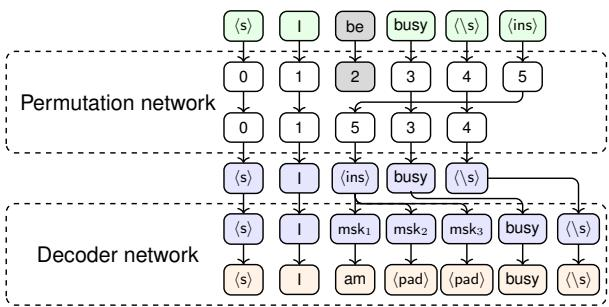
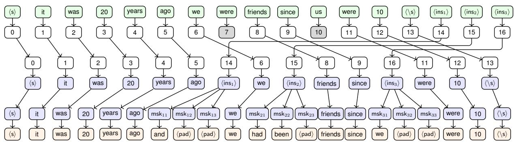
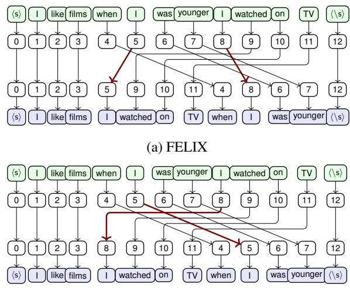
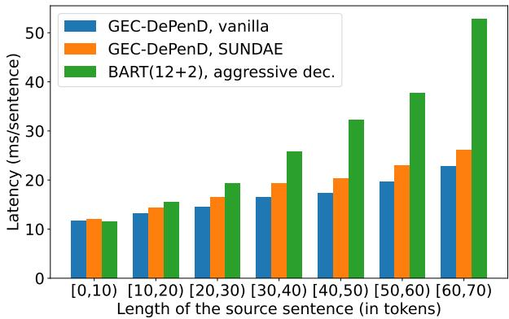

# GEC-DePenD: Non-Autoregressive Grammatical Error Correction with Decoupled Permutation and Decoding

Konstantin Yakovlev Huawei Noah’s Ark Lab Moscow, Russia yakovlev.konstantin1 @huawei-partners.com

Alexander Podolskiy   
Huawei Noah’s Ark Lab Moscow, Russia   
podolskiy.alexander @huawei.com

Sergey Nikolenko AI Center, NUST MISiS, Moscow, Russia PDMI RAS, St. Petersburg, Russia sergey@logic.pdmi.ras.ru

## Abstract

Grammatical error correction (GEC) is an important NLP task that is currently usually solved with autoregressive sequence-tosequence models. However, approaches of this class are inherently slow due to one-byone token generation, so non-autoregressive alternatives are needed. In this work, we propose a novel non-autoregressive approach to GEC that decouples the architecture into a permutation network that outputs a self-attention weight matrix that can be used in beam search to find the best permutation of input tokens (with auxiliary ins tokens) and a decoder network based on a step-unrolled denoising autoencoder that fills in specific tokens. This allows us to find the token permutation after only one forward pass of the permutation network, avoiding autoregressive constructions. We show that the resulting network improves over previously known non-autoregressive methods for GEC and reaches the level of autoregressive methods that do not use language-specific synthetic data generation methods. Our results are supported by a comprehensive experimental validation on the ConLL-2014 and Write&Improve+LOCNESS datasets and an extensive ablation study that supports our architectural and algorithmic choices.

## 1 Introduction

Grammatical error correction (GEC) is an important and obviously practically relevant problem in natural language processing. In recent works, GEC has been usually tackled with machine learning approaches, where it has been formalized either as looking for a sequence of edits or transformation tags (Omelianchuk et al., 2020) or, more generally, as a sequence-to-sequence text rewriting

Andrey Bout   
Huawei Noah’s Ark Lab   
Moscow, Russia   
bout.andrey   
@huawei.com

Irina Piontkovskaya Huawei Noah’s Ark Lab Moscow, Russia piontkovskaya.irina@huawei.com

  
Figure 1: GEC-DePenD: idea and example.

problem (Náplava and Straka, 2019; Grundkiewicz et al., 2019), a problem that is a natural fit for encoder-decoder architectures.

Latest encoder-decoder architectures indeed define the state of the art in grammatical error correction (Rothe et al., 2021a; Lichtarge et al., 2020). However, the best current results for GEC are achieved by autoregressive methods that need to produce output tokens one by one, which significantly hinders inference time and thus limits their applicability in real world solutions. This motivates the development of non-autoregressive models that can achieve results similar to autoregressive ones but with a significantly improved runtime. Previously developed non-autoregressive approaches have relied on language-specific transformation tags (Omelianchuk et al., 2020; Tarnavskyi et al., 2022). In this work, we develop a novel non-autoregressive and languageagnostic approach, called GEC-DePenD (GEC with Decoupled Permutation & Decoding) that yields excellent performance on the GEC task and has other attractive properties. In particular, it is able to output a ranked list of hypotheses that a potential user can choose from.

The main idea of GEC-DePenD is to decouple permutation and decoding, with one network producing a permutation of input tokens together with specially added ins tokens for possible insertions and another network actually infilling ins tokens. Fig. 1 illustrates the idea: the source sentence “I be busy” is encoded as $^ { 6 6 } \langle { \sf s } \rangle$ I be busy $\langle \langle \mathsf { s } \rangle \langle \mathsf { i n s } \rangle ^ { \ast }$ the permutation network obtains “ s I ins busy $\langle \langle s \rangle ^ { * }$ , and then the decoder network converts $^ { 6 6 } \langle { \sf s } \rangle$ I msk1 msk2 msk3 busy $\langle \langle \mathsf { s } \rangle ^ { \flat }$ into “ s I am pad pad busy $\langle \langle \mathsf { s } \rangle ^ { \flat }$ and outputs “I am busy” as the corrected sentence. In a single run, the permutation network produces a self-attention matrix for subsequent beam search (Mallinson et al., 2020), while in the decoder network we use the step-unrolled denoising autoencoder (SUNDAE) proposed by Savinov et al. (2022). We also adapt and evaluate several additional techniques including a three-stage training schedule, length normalization, and inference tweaks that improve the final performance.

Thus, our main contributions can be summarized as follows: (i) we propose, to the best of our knowledge, the first open-vocabulary iterative non-autoregressive GEC model 1 based on decoupling permutation and decoding, including (ii) a novel pointing mechanism that can be implemented by a single permutation network without an additional tagger and (iii) a new algorithm for producing ground truth permutations from source (errorful) and target (corrected) sentences, leading to more adequate dataset construction for the GEC task. In experimental evaluation, we show that our model outperforms previously known nonautoregressive approaches (apart from GECToR that uses language-specific tagging (Omelianchuk et al., 2020)) and operates, with similar implementations for backbone networks, several times faster than either autoregressive approaches or GECToR.

The paper is organized as follows. Section 2 surveys related work on both autoregressive and nonautoregressive approaches to GEC. Section 3 introduces our approach, including our idea on decoupling permutation and decoding, SUNDAE, and new ideas for dataset construction and inference tweaks that make our approach work. Section 4 shows the main experimental results, Section 5 presents an extensive ablation study that highlights the contributions of various parts of our approach, Section 6 concludes the paper, and Section 7 discusses the limitations of our approach.

## 2 Related work

Synthetic data for grammatical error correction. In this work we concentrate on the model part of a GEC pipeline, but we also have to emphasize the importance of data and training pipelines for GEC. We discuss available datasets in Section 4.1 but it is important to note the role of synthetic data generation for GEC model training. Synthetic data has been used for GEC for a long time (Foster and Andersen, 2009; Brockett et al., 2006), and recent research shows that it can lead to significant performance gains (Stahlberg and Kumar, 2021; Htut and Tetreault, 2019). Approaches for synthetic data generation include character perturbations, dictionary- or edit-distance based replacements, shuffling word order, rule-based suffix transformations, and more (Grundkiewicz et al., 2019; Awasthi et al., 2019a; Náplava and Straka, 2019; Rothe et al., 2021b). However, the most effective methods are language-dependent and require to construct a dictionary of tags and transformations for every language. In particular, Omelianchuk et al. (2020) and Tarnavskyi et al. (2022) employ language-specific schemes while we present a language-agnostic approach.

Non-autoregressive machine translation. Autoregressive models can be slow due to sequential generation of output tokens. To alleviate this, Gu et al. (2017) proposed non-autoregressive generation for machine translation via generating output tokens in parallel. Since non-autoregressive models are not capable of modeling target side dependencies, several approaches have been proposed to alleviate this issue: knowledge distillation (Gu et al., 2017; Lee et al., 2018), iterative decoding (Ghazvininejad et al., 2019; Kasai et al., 2020), latent variables (Shu et al., 2020; Ma et al., 2019), and iterative methods (Gu et al., 2019; Kasai et al., 2020; Saharia et al., 2020).

Autoregressive grammatical error correction. Autoregressive models show outstanding performance in the GEC task (Rothe et al., 2021a; Lichtarge et al., 2020). The generation process can be done either in token space (Lichtarge et al., 2020) or in the space of edits that need to be applied to the source sequence to get the target (Stahlberg and Kumar, 2020; Malmi et al., 2019). Using the edit space is motivated by improving the runtime; another way of increasing inference speed is to use aggressive decoding where tokens are generated in parallel and regenerated when there is a difference between source and target sequences (Sun et al., 2021). Combinations with a non-autoregressive error detection model, where an autoregressive decoder generates tokens to be corrected instead of generating the full output sequence, also can improve the running time (Chen et al., 2020).

Non-autoregressive text editing models. Mallinson et al. (2020) proposed to split the modeling of the target sequence given the source into two parts: the first non-autoregressive model performs tagging and permutes the tokens, and the second model non-autoregressively performs insertions on msk token positions. In contrast to our work, insertion position are predicted non-autoregressively, which yields lower quality than our approach. Omelianchuk et al. (2020) and Tarnavskyi et al. (2022) proposed to employ a non-autoregressive tagging model for GEC, predicting the transformation of each token. However, these transformations are language-specific, which limits the approach in multilingual settings; in contrast, our approach is language-agnostic. Awasthi et al. (2019b) suggested to construct a language-specific space of all possible edits and proposed iterative refinement that improves decoding performance. They apply the model to the predicted target sequence several times, but this leads to an additional train-test domain shift since the model receives a partially corrected input. In this work we alleviate this issue by using SUNDAE and perform iterative refinement only with the decoder rather than the entire model, further improving inference speed.

Iterative decoding. Several approaches were introduced to better capture target-side dependencies. Ghazvininejad et al. (2019) decompose the decoding iteration into two parts: predicting all tokens and masking less confident predictions. Lee et al. (2018) predict all tokens simultaneously, while Savinov et al. (2022) introduce argmax-unrolled decoding that first updates most confident tokens and then less confident ones from the previous iteration.

## 3 Methods

## 3.1 Decoupling permutation and decoding

In GEC-DePenD, we separate changes in word order and choosing the actual tokens to insert. Consider a source sentence $\mathbf { x } ~ = ~ ( x ^ { 1 } , \ldots , x ^ { n } )$ with fixed first and last tokens: $x ^ { 1 } = \langle { \mathsf { s } } \rangle , x ^ { n } = \langle \backslash { \mathsf { s } } \rangle$ We append s special tokens responsible for insertions, $\{ \langle \mathsf { i n s } _ { i } \rangle \} _ { i = 1 } ^ { s }$ , getting $\tilde { \mathbf { x } } , | \tilde { \mathbf { x } } | = n + s$ . The task is to get an output sequence which is a permutation of a subset of tokens of x˜, with $\langle \mathrm { i n } \mathsf { s } _ { i } \rangle$ tokens occurring in order and separated by at least one token from x. Let $\pmb { \pi } = \left( \pi ^ { 1 } , \ldots , \pi ^ { p } \right)$ be a sequence of indices defining the permutation, with $\pi ^ { 1 } = 1$ and $\pi ^ { p } = n$ (it points to $\langle \backslash \mathsf { s } \rangle$ and indicates stopping). We decompose the architecture according to

$$
p _ { \pmb { \theta } } \left( \mathbf { y } | \mathbf { x } \right) = \sum _ { \pmb { \pi } } p _ { \pmb { \theta } } \left( \pmb { \pi } | \mathbf { x } \right) p _ { \pmb { \theta } } \left( \mathbf { y } | \pmb { \pi } , \mathbf { x } \right)\tag{1}
$$

into a permutation network implementing $p _ { \pmb { \theta } } \left( \pmb { \pi } | \mathbf { x } \right)$ and a decoder network for $p _ { \pmb { \theta } } \left( \mathbf { y } | \pmb { \pi } , \mathbf { x } \right)$ (see Fig. 1 for an example). The permutation and decoder networks have a shared encoder, but we do not perform end-to-end training, so in effect we approximate $\scriptstyle \sum _ { \pi }$ with a single π (defined in Section 3.3), similar to Mallinson et al. (2020).

Permutation. For the permutation network, from the last hidden state of the encoder we obtain a representation $\mathbf { H } \in \mathbb { R } ^ { ( n + s ) \times d }$ , where d is the latent dimension. We follow Mallinson et al. (2022) and feed H through a linear key layer and a single Transformer query layer, obtaining an attention matrix $\mathbf { A } \in \bar { \mathbb { R } } ^ { ( n + s ) \times ( n + s ) }$ by computing pairwise dot products of the rows of key and query matrices. Then the likelihood of the permutation is decomposed as

$$
\begin{array} { r l } & { \log p \left( \pmb { \pi } | \mathbf { A } \right) = \sum _ { i = 2 } ^ { p } \log p \left( \pi ^ { i } | \pmb { \pi } ^ { 1 : i - 1 } , \mathbf { A } \right) = } \\ & { = \sum _ { i = 2 } ^ { p } \mathrm { L o g S o f t m a x } ( \mathbf { A } _ { \pi ^ { i - 1 } } + \mathbf { m } _ { \pi ^ { 1 : i - 1 } } ) , ( 2 ) } \end{array}
$$

where $\mathbf { m } _ { \pi ^ { 1 : i - 1 } }$ is a mask vector. We mask attention weights in A in the row $\pi ^ { i - 1 }$ for columns $\pi ^ { 1 } , \ldots , \pi ^ { i - 1 }$ and do not allow pointing to $ { \langle \mathrm { I N S } _ { s } \rangle }$ before $ { \langle \mathrm { I N S } _ { s - 1 } \rangle }$ ; masking means setting the corresponding $m _ { i } { \mathrm { t o } } - \infty$ . The key observation here is that while formula (2) is an autoregressive decomposition for π, we do not use it directly during either training or inference. On inference, we get the permutation π with beam search after one encoder pass that gives the attention matrix A and thus defines log $p \left( \pi | \mathbf { x } \right)$ for any π. Moreover, beam search outputs a ranked list of permutations that can lead to a set of candidate corrections, a feature useful in real world applications.

Decoding. After obtaining π, we apply it to the source sentence, getting a permuted input $\pi ( \tilde { \mathbf { x } } )$ and then apply the decoder network that is supposed to replace $\langle \mathrm { i n } \mathsf { s } _ { i } \rangle$ in $\pi ( \tilde { \mathbf { x } } )$ with actual tokens.

During training, the decoder receives a permutation of the source sentence x˜ given by an oracle.

Following Mallinson et al. (2020), we replace each $\langle \mathrm { i n } \mathsf { s } _ { i } \rangle$ token by three msk tokens (if the target is shorter than 3 tokens we add pad tokens), sample tokens at msk positions, and feed the result to the decoder again to calculate the loss function (see Section 3.2 below).

During inference, the decoder iteratively refines tokens at positions where the input had msk tokens, without any changes to other tokens or their ordering. We apply the decoder to the output of the previous iteration and replace only tokens at positions that were msk after the permutation (but could change on previous iterations of the decoder). To speed up inference, we do not run the decoder if there are no insertions in the prediction.

Objective. We minimize the loss function

$$
\begin{array} { r } { \mathcal { L } _ { \mathrm { t o t a l } } ( \pmb { \theta } ) = - \lambda _ { \mathrm { p e r } } \log p _ { \pmb { \theta } } \left( \pi | \mathbf { x } \right) - \mathcal { L } _ { \mathrm { m s k } } ( \pmb { \theta } ) , } \end{array}\tag{3}
$$

where ${ \mathcal { L } } _ { \mathrm { m s k } } ( \theta )$ is a lower bound (see Section 3.2) on the marginal probability of tokens only at msk positions (the rest are unchanged by the decoder), and $\lambda _ { \mathrm { p e r } }$ is a hyperparameter. Fig. 2 shows a complex example of GEC-DePenD operation with multiple insertions.

## 3.2 Step-unrolled denoising autoencoder

For the decoder, we use the step-unrolled denoising autoencoder (SUNDAE) proposed by Savinov et al. (2022). Consider a sequence-to-sequence problem with source sequence (sentence) $\mathbf { x } = ( x ^ { 1 } , \ldots , x ^ { n } )$ and target sequence $\mathbf { y } = ( y ^ { 1 } , \dots , y ^ { m } )$ . SUNDAE constructs T intermediate sequences $\mathbf { y } _ { 1 } , \ldots , \mathbf { y } _ { T }$ with $\mathbf { y } _ { T } = \mathbf { y }$ , decomposing

$p _ { \pmb \theta } \left( \mathbf { y } _ { 1 } , \ldots , \mathbf { y } _ { T } | \mathbf { x } \right) = p _ { \pmb \theta } \left( \mathbf { y } _ { 1 } | \mathbf { x } \right) \prod _ { t = 2 } ^ { T } p _ { \pmb \theta } \left( \mathbf { y } _ { t } | \mathbf { y } _ { t - 1 } , \mathbf { x } \right) ,$ where θ are model parameters. Each term is factorized in a non-autoregressive way, with yi depending only on the previous step $\mathbf { y } _ { t - 1 } .$

$$
\begin{array} { c } { { p _ { \pmb \theta } \left( \mathbf { y } _ { 1 } | \mathbf { x } \right) = \prod _ { i = 1 } ^ { m } p _ { \pmb \theta } \left( y _ { 1 } ^ { i } | \mathbf { x } \right) , } } \\ { { p _ { \pmb \theta } \left( \mathbf { y } _ { t } | \mathbf { y } _ { t - 1 } , \mathbf { x } \right) = \prod _ { i = 1 } ^ { m } p _ { \pmb \theta } \left( y _ { t } ^ { i } | \mathbf { y } _ { t - 1 } , \mathbf { x } \right) , } } \end{array}
$$

so the marginal log-likelihood lower bound is

$$
\begin{array} { r l } & { \log p _ { \pmb { \theta } } \left( \mathbf { y } | \mathbf { x } \right) \geq \mathcal { L } ( \pmb { \theta } ) = } \\ & { \qquad = \mathbb { E } _ { \mathbf { y } _ { 1 } , \dots , \mathbf { y } _ { T - 1 } } \left[ \log p _ { \pmb { \theta } } \left( \mathbf { y } | \mathbf { y } _ { T - 1 } \right) \right] . } \end{array}
$$

We follow Savinov et al. (2022) and set $T = 2$ The gradient of the lower bound w.r.t. θ is given as

$$
\begin{array} { r l } & { \nabla _ { \pmb { \theta } } \mathcal { L } ( \pmb { \theta } ) \approx \lambda _ { 0 } \nabla _ { \pmb { \theta } } \log p _ { \pmb { \theta } } \left( \mathbf { y } _ { 1 } | \mathbf { x } \right) \big | _ { \mathbf { y } _ { 1 } = \mathbf { y } } + } \\ & { \qquad + ( 1 - \lambda _ { 0 } ) \mathbb { E } _ { \mathbf { y } _ { 1 } } \left[ \nabla _ { \pmb { \theta } } \log p _ { \pmb { \theta } } \left( \mathbf { y } | \mathbf { y } _ { 1 } , \mathbf { x } \right) \right] , } \end{array}\tag{4}
$$

where $\lambda _ { 0 } ~ \in ~ [ 0 , 1 ]$ . Savinov et al. (2022) used $\lambda _ { 0 } ~ = ~ 0 . 5$ , while we treat $\lambda _ { 0 }$ as a hyperparameter and optimize it. This is an approximation since we do not propagate the gradients through sampling $\mathbf { y } _ { 1 }$ . The case $\lambda _ { 0 } = 1$ corresponds to $T = 1$ i.e. for $\lambda _ { 0 } = 1$ target tokens are independent given the source sentence. We call this case vanilla below and always perform one decoding step for the vanilla model. If $\lambda _ { 0 } \neq 1$ , target tokens are dependent given the source; we call this case SUNDAE.

## 3.3 Dataset construction

During training, given source and target sentences $\displaystyle ( \mathbf { x } , \mathbf { y } )$ , we need to find a permutation π and sequences of tokens that correspond to special $\langle \mathrm { i n } \mathsf { s } _ { i } \rangle$ tokens. This requires a special algorithm to be applied to available training data; one such algorithm is FELIX proposed by Mallinson et al. (2020).

However, we do not use the FELIX dataset construction algorithm because we want to handle cases with repeating tokens differently. Fig. 3 shows an example: for the input “I like films when I was younger I watched on $T V ^ { \ast }$ the model has to move the clause “I watched on $T V ^ { \ast }$ forward. Both algorithms produce the same tokens but in the permutation, FELIX leaves the $^ { \ast \ast } I ^ { \ast }$ pronouns close to their original locations, breaking the span “when I was younger”, which is undesirable since it makes the permutation network’s job harder.

Therefore, we propose a different construction of the permutation π given a source sentence x and target sentence y. Our algorithm operates as follows:

(1) find all matching spans for the source and target sequences; we iterate over target spans from longer to shorter, and if the current span occurs in the source we remove it from both source and target; at the end of this step, we obtain a sequence of pairs of aligned spans;

(2) reorder source spans and insert missing tokens; we do not allow to reorder spans whose ranks in the target sequence differ by max\_len = 2 to make the permutations local; we maximize the total length of spans covered under these constraints with dynamic programming.

Algorithm 1 shows this idea in full formal detail; in the example shown on Fig. 3, it keeps both ${ } ^ { 6 6 } I { } ^ { 5 } \mathrm { { s } }$ with their clauses.

Figure 2: A complex example of GEC-DePenD with multiple insertions and deletions: $^ { 6 6 } I t$ was $2 0$ years ago we werefriends since us were $I O ^ { \circ }$ becomes $^ { * } { } ^ { t }$ was 20 years ago and we had beenfriends since we were $I O ^ { \circ }$  
  
(b) Proposed algorithm.  
Figure 3: Dataset construction algorithms.

## 3.4 Beam search modifications

To further improve the permutation network, we use two important tricks (see also Section 5). First, we use length normalization, i.e., we divide each candidate score by its length in beam search (Bahdanau et al., 2014; Yang et al., 2018).

Second, we use inference tweaks to improve the $\mathrm { F _ { 0 . 5 } }$ score by rebalancing precision and recall, increasing the former and decreasing the latter (Omelianchuk et al., 2020; Tarnavskyi et al., 2022). The idea is to make a correction only if we are confident enough. We adopt this idea to beam search decoding in the permutation network. We prioritize the position nearest to the last pointed position on the right. Formally, given a distribution $p \left( \pi ^ { i } \left| \pi ^ { 1 : i - 1 } , \mathbf { A } \right. \right)$ , we introduce a confidence bias parameter $c \in [ 0 , 1 ]$ and rescore the distribution as

$$
\begin{array} { r } { \tilde { p } \left( \pi ^ { i } | \pi ^ { 1 : i - 1 } , \mathbf { A } \right) = ( 1 - c ) p \left( \pi ^ { i } | \pi ^ { 1 : i - 1 } , \mathbf { A } \right) + } \\ { + c \cdot \mathrm { o n e \_ h o t } ( \mathrm { r i g h t } ( \pi ^ { 1 : i - 1 } ) ) , } \end{array}
$$

Algorithm 1: Dataset construction   
Data: x, y, s, max\_len   
Result: π, dec\_input, dec\_output   
/\* List of triples (start\_src, start\_tgt, length) \*/   
aligns = [ ];   
msk\_x, msk\_y = x, y;   
for len in $\{ | \mathbf { y } | , \dotsc , 1 \}$ do   
for i in $\{ 0 , \ldots , | \mathbf { \bar { y } } | - \mathrm { l e n } + 1 \}$ do   
start = cont\_len(msk\_y[i : i + len], msk\_x);   
if start != -1 then   
aligns.append(start, i, len);   
/\* Hide aligned source tokens \*/   
msk\_x[start : start + len] = -1;   
/\* Hide aligned target tokens \*/   
msk\_y[i : i + len] = -2;   
/\* Find the order ofappearance ofsource spans in the   
target sequence and their lengths \*/   
aligns = sorted(aligns, key=start\_tgt);   
src\_ranks = argsort(argsort(aligns, key=start\_src));   
src\_lens = aligns[:, 2];   
/\* Find with dynamic programming a subsequence of   
src\_ranks s.t. adjacent ranks differ by max\_len   
with max total length ofselected spans; add spans   
with s and /s manually ifnot selected \*/   
ids = get\_subsequence(src\_ranks, src\_lens, max\_len);   
reduced\_aligns = aligns[ids];   
/\* Construct π, decoder input, and decoder output \*/   
π, dec\_output, dec\_input = [ ], [ ], [ ];   
last\_src, last $\displaystyle { \mathrm { t g t } = - 1 , - 1 } ;$   
k = 1;   
for start\_src, start\_tgt, len in reduced\_aligns do   
if last\_tgt != -1 and k s and   
start\_tgt - last\_tgt 2 then   
π.append( x + k - 1);   
k += 1;   
ins\_seq = y[last\_tgt + 1 : start\_tgt];   
ins\_seq.extend([ pad , pad ]);   
dec\_output.extend(ins\_seq[:3]);   
dec\_input.extend([ msk ] \* 3);   
π.extend([start\_src, . . . , start\_src + len - 1]);   
dec\_input.extend(x[start\_src : start\_src + len]);   
dec\_output.extend(x[start\_src : start\_src + len]);   
last\_tgt = start\_tgt + len - 1;   
last\_src = start\_src + len - 1;

where right $( \pi ^ { 1 : i - 1 } )$ is the smallest $j \in [ \pi ^ { i - 1 } +$ 1, $n + 2 ]$ such that $j \not \in \pi ^ { 1 : i - 1 }$

## 4 Evaluation

## 4.1 Datasets and training stages

Each dataset is a parallel corpus of errorful and error-free sentences. Similar to (Omelianchuk et al., 2020; Tarnavskyi et al., 2022; Katsumata and Komachi, 2020), we train GEC-DePenD in three coarse-to-fine training stages. Table 1 summarizes dataset statistics and which stages of our pipeline they are used on. For Stage I (pretraining), we use the synthetic PIE dataset constructed by Awasthi et al. (2019b) by injecting synthetic grammatical errors into correct sentences. For training on Stage II, we used several datasets: (i) First Certificate in English (FCE) (Yannakoudakis et al., 2011) that contains 28 350 errorcoded sentences from English as a second language exams, (ii) National University of Singapore Corpus of Learner English (NUCLE) (Dahlmeier et al., 2013) with over 50K annotated sentences from essays of undergraduate students learning English, (iii) Write&Improve+LOCNESS dataset (W&I+L, also called BEA-2019 in some literature) (Bryant et al., 2019) intended to represent a wide variety of English levels and abilities, and (iv) cLang8 (Rothe et al., 2021a), a distilled version of the Lang8 dataset (Mizumoto et al., 2011) cleaned with the gT5 model. Finally, we used the W&I+L dataset again for additional training on Stage III.

As evaluation data, we used the CoNLL-2014 test dataset (Ng et al., 2014) with the $M ^ { 2 }$ scorer (Dahlmeier and Ng, 2012) and W&I+L dev and test sets with the ERRANT scorer (Bryant et al., 2017). The W&I+L dev set was used for validation and ablation study; the two test sets, for evaluation.

## 4.2 Baseline methods

We consider both autoregressive and non-autoregressive baselines.

BART (Lewis et al., 2020) is an autoregressive sequence-to-sequence model; it takes an errorful sentence as input and produces an error-free sentence token by token with the decoder. We show the scores reported by Katsumata and Komachi (2020) and also reimplement the model with a shallow 2- layer decoder (BART(12+2) in Table 2) and train it according to the stages shown in Section 4.1; note that our reimplementation has improved the results. We consider two types of decoding: greedy and aggressive greedy (Sun et al., 2021). In greedy decoding, we generate the token with highest conditional probability. In aggressive greedy decoding, we generate as many tokens as possible in parallel, then re-decode several tokens after the first difference between source and target sequences, and then switch back to aggressive greedy decoding, repeating the procedure until the $\langle / \mathrm { s } \rangle$ token. Aggressive greedy decoding is guaranteed to produce the same output as greedy decoding but can be much faster. For comparison, we also show the state of the art T5-XXL autoregressive model with 11B parameters based on T5 (Raffel et al., 2020) and trained on a much larger synthetic dataset.

FELIX (Mallinson et al., 2020) is a nonautoregressive model. It consists of two submodels: the first one predicts the permutation of a subset of source tokens and inserts msk tokens, and the second model infills msk tokens conditioned on the outputs of the first model. Both stages are done in a non-autoregressive way. Note that the model does not use any language-specific information.

Levenshtein Transformer (LevT) (Gu et al., 2019; Chen et al., 2020) is a partially nonautoregressive model that does not use languagespecific information. It is based on insertions and deletions and performs multiple refinement steps.

GECToR (Omelianchuk et al., 2020; Tarnavskyi et al., 2022) is a non-autoregressive tagging model that uses language-specific information, predicting a transformation for every token. The model is iteratively applied to the corrected sentence from the previous iteration. We compare GECToR based on XLNet (GEC $\mathrm { T o R } _ { \mathrm { X L N e t } } )$ and RoBERTa-large $\mathrm { ( G E C T o R _ { l a r g e } ) }$ pretrained models.

Parallel Iterative Edit (PIE) (Awasthi et al., 2019b) is a non-autoregressive model that uses language-specific information. For each source token it predicts the corresponding edits, applying the model iteratively to get the corrected sentence.

## 4.3 Experimental setup

As the base model for GEC-DePenD we used BART-large (Lewis et al., 2020) with 12 pretrained encoder layers and 2 decoder layers, initialized randomly. The permutation network uses a single Transformer layer, also randomly initialized; the same encoder and decoder configurations were used for our autoregressive baseline BART(12+2).

For training we used AdamW (Loshchilov and Hutter, 2017) with $\beta _ { 1 } = 0 . 9 , \beta _ { 2 } = 0 . 9 9 9 , \epsilon =$ $1 0 ^ { - 8 }$ , weight decay 0.01, and no gradient accumulation. For stages I and II we used learning rate $3 \cdot 1 0 ^ { - 5 }$ and constant learning rate scheduler with

<table><tr><td>Dataset</td><td>#sentences</td><td>%errorful</td><td>Stages</td></tr><tr><td>PIE</td><td>9 000 000</td><td>100.0</td><td>I</td></tr><tr><td>cLang8</td><td>2372 119</td><td>57.7</td><td>II</td></tr><tr><td>FCE, train</td><td>28 350</td><td>62.5</td><td>II</td></tr><tr><td>NUCLE</td><td>57 151</td><td>37.4</td><td>ⅡI</td></tr><tr><td>W&amp;I+L, train</td><td>34 308</td><td>66.3</td><td>II, III</td></tr><tr><td>W&amp;I+L, dev</td><td>4384</td><td>64.3</td><td>Val</td></tr><tr><td>CoNLL, test</td><td>1312</td><td>71.9</td><td>Test</td></tr><tr><td>W&amp;I+L, test</td><td>4477</td><td>N/A</td><td>Test</td></tr></table>

Table 1: Training, validation, and test datasets.

500 steps of linear warmup. For stage III we used learning rate $1 0 ^ { - 5 }$ and no warmup. For all stages we used 0.1 dropout, max\_len $= 2 , s = 8$ for Algorithm 1, $\lambda _ { \mathrm { p e r } } = 5$ , confidence bias $c \in [ 0 . 1 , 0 . 3 ]$ 2-4 epochs, max 70 tokens per sentence and 3000 tokens per GPU, training on 4 TESLA T4 GPUs.

## 4.4 Experimental results

The main results of our comparison are presented in Table 2. We have evaluated the baselines described in Section 4.2 and GEC-DePenD in two versions: vanilla and SUNDAE with 2 decoder steps. The results show that GEC-DePenD outperforms all existing non-autoregressive baselines except for the language-specific GECToR family.

We have also compared GEC baselines and GEC-DePenD in terms of inference speed on the ConLL-2014 test dataset on a single GPU. All models were implemented with the Transformers library (Wolf et al., 2020). In addition, we do not clip the source sentence, as was done by Omelianchuk et al. (2020), and process one sentence at a time. We used a single TESLA-T4 GPU. Performance results are summarized in Table 3. As we can see, GEC-DePenD outperforms all baselines in terms of inference speed and sets a new standard for performance, running twice faster than even non-autoregressive GECToR models. Note that GEC-DePenD with SUNDAE both outperforms 1- step $\mathrm { G E C T o R _ { l a r g e } }$ in terms of $\mathrm { F _ { 0 . 5 } }$ on ConLL-14 (Table 2) and operates 1.25x faster (Table 3). The quality gap between GEC-DePenD and its autoregressive counterpart (BART(12+2), our implementation) is reduced but still remains in Table 2.

Figure 4 shows a study of the latency with respect to the length of the input sentence in tokens; it shows the results on the BEA-2019 dev set for the proposed GEC-DePenD and autoregressive BART(12+2) with greedy aggressive decoding. We see that the latency of the autoregressive baseline increases faster with increasing input sentence length than for the proposed non-autoregressive models. In addition, the speedup over the autoregressive baseline approaches 2x on sentence lengths from 60 to 70.

  
Figure 4: Latency of BART(12+2), aggressive decoding and the proposed family of GEC-DePenD on BEA dev set.

## 5 Ablation study

In this section, we present a detailed ablation study, reporting both ideas that worked (Section 3) and ideas that did not work. Table 4 shows our evaluation on the W&I+L-dev dataset; below we describe the results of Table 4 from top to bottom. Subscripts (e.g., VanillaII, III) show which training stages were used in the experiment (Section 4.1).

## 5.1 Dataset construction

First, we show that the proposed dataset construction algorithm (Algorithm 1) indeed yields an increase in performance. We considered the BARTlarge(12+2) model and performed training without stage I (Section 4.1) with FELIX (Mallinson et al., 2020) and Algorithm 1, calibrating the results with inference tweaks. Table 4 shows that the effect from Algorithm 1 is positive and significant.

## 5.2 Stage III, SUNDAE, and inference tweaks

The next section of Table 4 shows all combinations of two- and three-stage training (Section 4.1), vanilla and SUNDAE model (Section 3.2), and adding inference tweaks (Section 3.4). We see that each addition—Stage III, SUNDAE, and inference tweaks—has a positive effect on validation performance in all settings, and the best model, naturally, is $\mathrm { \bf S U N D A E _ { I I } } ,$ III with inference tweaks.

<table><tr><td></td><td></td><td colspan="3">ConLL-14 test set</td><td colspan="3">W&amp;I+L test set</td></tr><tr><td></td><td></td><td>Prec</td><td>Rec</td><td> $\mathbf { F } _ { 0 . 5 }$ </td><td>Prec</td><td>Rec</td><td> $\mathbf { F } _ { 0 . 5 }$ </td></tr><tr><td colspan="8">Autoregressive</td></tr><tr><td>BART-large</td><td>(Katsumata and Komachi, 2020)</td><td>69.3</td><td>45.0</td><td>62.6</td><td>68.3</td><td>57.1</td><td>65.6</td></tr><tr><td>BART(12+2)</td><td>Our implementation</td><td>69.2</td><td>49.8</td><td>64.2</td><td>69.6</td><td>63.5</td><td>68.3</td></tr><tr><td>T5-XXL, 11B parameters</td><td>(Rothe et al., 2021a)</td><td></td><td></td><td>68.75</td><td></td><td></td><td>75.88</td></tr><tr><td colspan="8">Non-autoregressive</td></tr><tr><td>LevT</td><td>(Chen et al., 2020)</td><td>53.1</td><td>23.6</td><td>42.5</td><td>45.5</td><td>37.0</td><td>43.5</td></tr><tr><td>FELIX</td><td>(Mallinson et al., 2022)</td><td></td><td></td><td></td><td></td><td></td><td>63.5</td></tr><tr><td>PIE, BERT-large</td><td>(Awasthi et al., 2019b)</td><td>66.1</td><td>43.0</td><td>59.7</td><td>58.0</td><td>53.1</td><td>56.9</td></tr><tr><td> $\mathrm { { G E C T o R } _ { \mathrm { { l a r g e } } } , }$  1 step</td><td>(Tarnavskyi et al., 2022)</td><td>75.4</td><td>35.3</td><td>61.4</td><td>82.03</td><td>50.81</td><td>73.05</td></tr><tr><td> $\mathrm { { G E C T o R } _ { \mathrm { { l a r g e } } } , }$  3 steps</td><td>(Tarnavskyi et al., 2022)</td><td>76.2</td><td>37.7</td><td>63.3</td><td>80.73</td><td>53.56</td><td>73.29</td></tr><tr><td> $\mathrm { G E C T o R } _ { \mathrm { l a r g e } , } 5$  steps</td><td>(Tarnavskyi et al., 2022)</td><td>76.1</td><td>37.6</td><td>63.2</td><td>80.73</td><td>53.63</td><td>73.32</td></tr><tr><td> $\mathbf { G E C T o R } _ { \mathrm { X L N e t } }$ </td><td>(Omelianchuk et al., 2020)</td><td>77.5</td><td>40.1</td><td>65.3</td><td>79.2</td><td>53.9</td><td>72.4</td></tr><tr><td>GEC-DePenD, vanilla</td><td>Ours</td><td>67.8</td><td>41.3</td><td>60.1</td><td>69.5</td><td>55.3</td><td>66.1</td></tr><tr><td>GEC-DePenD, SUNDAE</td><td>Ours</td><td>73.2</td><td>37.8</td><td>61.6</td><td>72.9</td><td>53.2</td><td>67.9</td></tr></table>

Table 2: Experimental results on the ConLL-14 and W&I+L test sets.

<table><tr><td>Model</td><td>Speedup</td><td>#params</td></tr><tr><td>BART(12+2), greedy dec.</td><td>1.0x</td><td>238M</td></tr><tr><td>BART(12+2), aggressive dec.</td><td>3.7x</td><td>238M</td></tr><tr><td> $\mathrm { G E C T o R } _ { \mathrm { X L N e t } } , 5 \mathrm { s t e p s }$ </td><td>2.8x</td><td>120M</td></tr><tr><td> $\mathrm { { G E C T o R } _ { \mathrm { { l a r g e } } } , }$  1 step</td><td>3.8x</td><td>360M</td></tr><tr><td> $\mathbf { G E C T o R } _ { \mathrm { l a r g e } } , 3 ~ { \mathrm { s t e p s } }$ </td><td>2.4x</td><td>360M</td></tr><tr><td> $\mathrm { G E C T o R } _ { \mathrm { l a r g e } , } 5$  steps</td><td>2.4x</td><td>360M</td></tr><tr><td> $\begin{array} { r } { \mathbf { G E C - D e P e n D } , } \end{array}$  vanilla</td><td>5.3x</td><td>253M</td></tr><tr><td>GEC-DePenD, SUNDAE</td><td>4.7x</td><td>253M</td></tr></table>

Table 3: Performance comparison, ConLL-2014-test.

## 5.3 SUNDAE hyperparameters

Next, we show that tuning SUNDAE hyperparameters, i.e., number of steps and $\lambda _ { 0 }$ (Section 3.2), can indeed improve performance; for the final model, we chose $\lambda _ { 0 } = 0 . 2 5$ and 2 steps of SUNDAE.

## 5.4 Beam search rescoring and sinkhorn

We first check how much choosing the right hypothesis from the beam search output will increase the performance. We generate top 3 beam search outputs and use the decoder to fill in msk tokens. Then we select the hypothesis with the best GLEU score (Wu et al., 2016) compared to the ground truth, evaluating on W&I+L-dev. The next section of Table 4 shows that although the results deteriorate significantly from #1 beam search hypothesis to #2 and #3 (suggesting that beam search works as intended), choosing the best out of top three gives a very large increase in the metrics (more than +0.1 in terms of the $\mathrm { F _ { 0 . 5 } }$ measure), so there is a lot of room for improvement in beam search generation. For this improvement, we explored two approaches. First, we tried to rescore hypotheses with decoder scores. Note that the log probability of a hypothesis is the sum of permutation and decoder scores. We introduce $\lambda _ { \mathrm { r e s c } } \in [ 0 , 1 ]$ and choose the best hypothesis out of three by the score $\lambda _ { \mathrm { { r e s c } } }$ log $p \left( \pi | \mathbf { x } \right) + \left( 1 - \lambda _ { \mathrm { r e s c } } \right)$ log $p \left( \mathbf { y } | \boldsymbol { \pi } , \mathbf { x } \right)$ . We chose the best $\lambda _ { \mathrm { { r e s c } } }$ by validation $\mathrm { F _ { 0 . 5 } }$ but found that while $\lambda _ { \mathrm { { r e s c } } }$ does help rebalance precision and recall, the best $\mathrm { F _ { 0 . 5 } }$ is achieved for $\lambda _ { \mathrm { r e s c } } ^ { \ast } = 1$ , so rescoring with the decoder is not helpful.

<table><tr><td>Model</td><td>Prec</td><td>Rec</td><td> $\mathbf { F } _ { 0 . 5 }$ </td></tr><tr><td colspan="4">Dataset construction</td></tr><tr><td>Vanillaı1, I11 + FELIX tagger</td><td>52.5</td><td>39.5</td><td>49.3</td></tr><tr><td>Vanilla11, 11 + Algorithm 1</td><td>57.6</td><td>38.9</td><td>52.5</td></tr><tr><td colspan="4">Training stages, SUNDAE and inference tweaks</td></tr><tr><td>VanillaI</td><td>57.9</td><td>36.5</td><td>51.8</td></tr><tr><td>Vanillaıı + inf. tweaks</td><td>59.3</td><td>34.6</td><td>51.9</td></tr><tr><td> $\mathrm { S U N D A E _ { I I } }$ </td><td>56.4</td><td>39.3</td><td>51.9</td></tr><tr><td> $\mathrm { S U N D A E _ { I I } + i n f . }$  tweaks</td><td>59.9</td><td>35.0</td><td>52.4</td></tr><tr><td> $\mathrm { V a n i l l a _ { I I } , _ { I I I } }$ </td><td>54.6</td><td>42.8</td><td>51.7</td></tr><tr><td> $\mathrm { V a n i l l a _ { I I } , _ { I I I } + i n f . }$  tweaks</td><td>60.6</td><td>36.5</td><td>53.5</td></tr><tr><td> $\mathrm { S U N D A E _ { I I } , _ { I I I } }$ </td><td>54.9</td><td>43.4</td><td>52.1</td></tr><tr><td>SUNDAE11, 1I + inf. tweaks</td><td>63.5</td><td>34.3</td><td>54.3</td></tr><tr><td colspan="4">SUNDAE hyperparameters selection</td></tr><tr><td> $1 \mathrm { s t e p } , \lambda _ { 0 } = 0 . 7 5$ </td><td>60.8</td><td>36.5</td><td>53.6</td></tr><tr><td> $1 \mathrm { s t e p } , \lambda _ { 0 } = 0 . 2 5$ </td><td>62.9</td><td>33.9</td><td>53.7</td></tr><tr><td> $1 \mathrm { s t e p } , \lambda _ { 0 } = 0 . 0 1$ </td><td>60.8</td><td>35.8</td><td>53.4</td></tr><tr><td> $2 \mathrm { s t e p s } , \lambda _ { 0 } = 0 . 7 5$ </td><td>61.2</td><td>36.6</td><td>54.0</td></tr><tr><td> $2 \mathrm { s t e p s , } \lambda _ { 0 } = 0 . 2 5$ </td><td>63.5</td><td>34.3</td><td>54.3</td></tr><tr><td> $2 \mathrm { s t e p s } , \lambda _ { 0 } = 0 . 0 1$ </td><td>61.6</td><td>36.4</td><td>54.1</td></tr><tr><td> $3 \mathrm { s t e p s } , \lambda _ { 0 } = 0 . 7 5$ </td><td>61.3</td><td>36.7</td><td>54.0</td></tr><tr><td> $3 \mathrm { s t e p s } , \lambda _ { 0 } = 0 . 2 5$ </td><td>63.5</td><td>34.3</td><td>54.3</td></tr><tr><td> $3 \mathrm { s t e p s } , \lambda _ { 0 } = 0 . 0 1$ </td><td>61.7</td><td>36.4</td><td>54.1</td></tr><tr><td colspan="4">Beam search rescoring and sinkhorn</td></tr><tr><td>#1 hypothesis, no length norm</td><td>60.4</td><td>35.2</td><td>52.8</td></tr><tr><td>#2 hypothesis, no length norm</td><td>40.4</td><td>28.3</td><td>37.2</td></tr><tr><td>#3 hypothesis, no length norm</td><td>33.1</td><td>28.3</td><td>32.0</td></tr><tr><td>Best of top-3 by GLEU</td><td>71.8</td><td>45.9</td><td>64.5</td></tr><tr><td>#1 hypothesis, with length norm</td><td>60.6</td><td>36.5</td><td>53.5</td></tr><tr><td>Decoder rescoring,  $\lambda _ { \mathrm { r e s c } } = 0 . 9 9$ </td><td>62.3</td><td>31.8</td><td>52.3</td></tr><tr><td>Decoder rescoring,  $\lambda _ { \mathrm { r e s c } } = 0 . 9 9 9$ </td><td>60.3</td><td>34.8</td><td>52.6</td></tr><tr><td>Decoder rescoring,  $\lambda _ { \mathrm { f e s c } } = 1$ </td><td>60.4</td><td>35.2</td><td>52.8</td></tr><tr><td>Vanillaı1, I11, 16 sinkhorn layers</td><td>60.6</td><td>36.7</td><td>53.6</td></tr></table>

Table 4: Ablation study on W&I+L-dev.

The second approach, length normalization (Section 3.4), indeed improved the performance.

Another related idea, the sinkhorn layer, was proposed by Mena et al. (2018) as an extension of the Gumbel-Softmax trick and later used for GEC by Mallinson et al. (2022). For an arbitrary matrix A, a sinkhorn step is defined as follows:

$$
\begin{array} { r c l } { { { \bf A } ^ { \prime } } } & { { = } } & { { { \bf A } - \mathrm { L o g S u m E x p } ( { \bf A } , \mathrm { d i m } = 0 ) , } } \\ { { { \bf A } ^ { ( 1 ) } } } & { { = } } & { { { \bf A } ^ { \prime } - \mathrm { L o g S u m E x p } ( { \bf A } ^ { \prime } , \mathrm { d i m } = 1 ) . } } \end{array}
$$

$\mathbf { A } ^ { ( 1 ) }$ is the output of the first sinkhorn step, and these steps can be repeated. The theoretical motivation here is that when the number of steps k tends to infinity, $\exp ( \mathbf { A } ^ { ( k ) } )$ tends to a doubly stochastic matrix, i.e., after applying arg max to each row we obtain a valid permutation that does not point to the same token twice; the idea is to make several sinkhorn steps on A and then optimize the crossentropy loss as usual. We have experimented with different variations of sinkhorn layers, but even the best (shown in Table 4) did not bring any improvements.

## 6 Conclusion

In this work, we have presented GEC-DePenD, a novel method for non-autoregressive grammatical error correction that decouples permutation and decoding steps, adds the step-unrolled denoising autoencoder into the decoder network, changes the dataset construction algorithm to preserve long spans, and uses inference tweaks to improve the results. GEC-DePenD shows the best results among non-autoregressive language-agnostic GEC models and significantly outperforms other models in terms of inference speed. We hope that our approach can become a basis for real life applications of grammatical error correction.

## 7 Limitations

The main limitations of our study also provide motivation for future work. First, while we have provided an extensive ablation study for GEC-DePenD, there are many more low-level optimizations that can be done to further improve the results. In a real life application, one would be encouraged to investigate these optimizations.

Second, obviously, non-autoregressive models, including GEC-DePenD, still lose to state of the art autoregressive models. While the existence of this gap may be inevitable, we believe that it can be significantly reduced in further work.

## Acknowledgements

We gratefully acknowledge the support of Mind-Spore, CANN (Compute Architecture for Neural Networks) and Ascend AI Processor used for this research.

The work of Sergey Nikolenko was prepared in the framework of the strategic project “Digital Business” within the Strategic Academic Leadership Program “Priority 2030” at NUST MISiS.

## References

Abhijeet Awasthi, Sunita Sarawagi, Rasna Goyal, Sabyasachi Ghosh, and Vihari Piratla. 2019a. Parallel iterative edit models for local sequence transduction. In Proceedings of the 2019 Conference on Empirical Methods in Natural Language Processing and the 9th International Joint Conference on Natural Language Processing (EMNLP-IJCNLP), pages 4260–4270, Hong Kong, China. Association for Computational Linguistics.

Abhijeet Awasthi, Sunita Sarawagi, Rasna Goyal, Sabyasachi Ghosh, and Vihari Piratla. 2019b. Parallel iterative edit models for local sequence transduction. ArXiv, abs/1910.02893.

Dzmitry Bahdanau, Kyunghyun Cho, and Yoshua Bengio. 2014. Neural machine translation by jointly learning to align and translate. CoRR, abs/1409.0473.

Chris Brockett, William B. Dolan, and Michael Gamon. 2006. Correcting ESL errors using phrasal SMT techniques. In Proceedings of the 21st International Conference on Computational Linguistics and 44th Annual Meeting of the Association for Computational Linguistics, pages 249–256, Sydney, Australia. Association for Computational Linguistics.

Christopher Bryant, Mariano Felice, Øistein E. Andersen, and Ted Briscoe. 2019. The bea-2019 shared task on grammatical error correction. In BEA@ACL.

Christopher Bryant, Mariano Felice, and Ted Briscoe. 2017. Automatic annotation and evaluation of error types for grammatical error correction. In Annual Meeting of the Association for Computational Linguistics.

Meng Hui Chen, Tao Ge, Xingxing Zhang, Furu Wei, and M. Zhou. 2020. Improving the efficiency of

grammatical error correction with erroneous span detection and correction. In Conference on Empirical Methods in Natural Language Processing.

Daniel Dahlmeier and Hwee Tou Ng. 2012. Better evaluation for grammatical error correction. In North American Chapter of the Association for Computational Linguistics.

Daniel Dahlmeier, Hwee Tou Ng, and Siew Mei Wu. 2013. Building a large annotated corpus of learner english: The nus corpus of learner english. In BEA@NAACL-HLT.

Jennifer Foster and Oistein Andersen. 2009. Gen-ERRate: Generating errors for use in grammatical error detection. In Proceedings of the Fourth Workshop on Innovative Use of NLP for Building Educational Applications, pages 82–90, Boulder, Colorado. Association for Computational Linguistics.

Marjan Ghazvininejad, Omer Levy, Yinhan Liu, and Luke Zettlemoyer. 2019. Mask-predict: Parallel decoding of conditional masked language models. In Conference on Empirical Methods in Natural Language Processing.

Roman Grundkiewicz, Marcin Junczys-Dowmunt, and Kenneth Heafield. 2019. Neural grammatical error correction systems with unsupervised pre-training on synthetic data. In Proceedings of the Fourteenth Workshop on Innovative Use of NLP for Building Educational Applications, pages 252–263, Florence, Italy. Association for Computational Linguistics.

Jiatao Gu, James Bradbury, Caiming Xiong, Victor O. K. Li, and Richard Socher. 2017. Nonautoregressive neural machine translation. ArXiv, abs/1711.02281.

Jiatao Gu, Changhan Wang, and Jake Zhao. 2019. Levenshtein transformer. In Neural Information Processing Systems.

Phu Mon Htut and Joel Tetreault. 2019. The unbearable weight of generating artificial errors for grammatical error correction. In Proceedings of the Fourteenth Workshop on Innovative Use ofNLPfor Building Educational Applications, pages 478–483, Florence, Italy. Association for Computational Linguistics.

Jungo Kasai, James Cross, Marjan Ghazvininejad, and Jiatao Gu. 2020. Non-autoregressive machine translation with disentangled context transformer. In International Conference on Machine Learning.

Satoru Katsumata and Mamoru Komachi. 2020. Stronger baselines for grammatical error correction using a pretrained encoder-decoder model. In AACL.

Jason Lee, Elman Mansimov, and Kyunghyun Cho. 2018. Deterministic non-autoregressive neural sequence modeling by iterative refinement. In Conference on Empirical Methods in Natural Language Processing.

Mike Lewis, Yinhan Liu, Naman Goyal, Marjan Ghazvininejad, Abdelrahman Mohamed, Omer Levy, Veselin Stoyanov, and Luke Zettlemoyer. 2020. BART: Denoising sequence-to-sequence pretraining for natural language generation, translation, and comprehension. In Proceedings of the 58th Annual Meeting of the Association for Computational Linguistics, pages 7871–7880, Online. Association for Computational Linguistics.

Jared Lichtarge, Chris Alberti, and Shankar Kumar. 2020. Data weighted training strategies for grammatical error correction. Transactions of the Associationfor Computational Linguistics, 8:634–646.

Ilya Loshchilov and Frank Hutter. 2017. Decoupled weight decay regularization. In International Conference on Learning Representations.

Xuezhe Ma, Chunting Zhou, Xian Li, Graham Neubig, and Eduard H. Hovy. 2019. Flowseq: Nonautoregressive conditional sequence generation with generative flow. ArXiv, abs/1909.02480.

Jonathan Mallinson, Jakub Adamek, Eric Malmi, and Aliaksei Severyn. 2022. Edit5: Semiautoregressive text-editing with t5 warm-start. ArXiv, abs/2205.12209.

Jonathan Mallinson, Aliaksei Severyn, Eric Malmi, and Guillermo Garrido. 2020. Felix: Flexible text editing through tagging and insertion. ArXiv, abs/2003.10687.

Eric Malmi, Sebastian Krause, Sascha Rothe, Daniil Mirylenka, and Aliaksei Severyn. 2019. Encode, tag, realize: High-precision text editing. ArXiv, abs/1909.01187.

Gonzalo E. Mena, David Belanger, Scott W. Linderman, and Jasper Snoek. 2018. Learning latent permutations with gumbel-sinkhorn networks. ArXiv, abs/1802.08665.

Tomoya Mizumoto, Mamoru Komachi, Masaaki Nagata, and Yuji Matsumoto. 2011. Mining revision log of language learning sns for automated japanese error correction of second language learners. In International Joint Conference on Natural Language Processing.

Jakub Náplava and Milan Straka. 2019. Grammatical error correction in low-resource scenarios. In Proceedings of the 5th Workshop on Noisy Usergenerated Text (W-NUT 2019), pages 346–356, Hong Kong, China. Association for Computational Linguistics.

Hwee Tou Ng, Siew Mei Wu, Ted Briscoe, Christian Hadiwinoto, Raymond Hendy Susanto, and Christopher Bryant. 2014. The conll-2014 shared task on grammatical error correction.

Kostiantyn Omelianchuk, Vitaliy Atrasevych, Artem N. Chernodub, and Oleksandr Skurzhanskyi. 2020. Gector – grammatical error correction: Tag, not

rewrite. In Workshop on Innovative Use ofNLP for Building Educational Applications.

Colin Raffel, Noam Shazeer, Adam Roberts, Katherine Lee, Sharan Narang, Michael Matena, Yanqi Zhou, Wei Li, Peter J Liu, et al. 2020. Exploring the limits of transfer learning with a unified text-to-text transformer. J. Mach. Learn. Res., 21(140):1–67.

Sascha Rothe, Jonathan Mallinson, Eric Malmi, Sebastian Krause, and Aliaksei Severyn. 2021a. A simple recipe for multilingual grammatical error correction. In Annual Meeting of the Association for Computational Linguistics.

Sascha Rothe, Jonathan Mallinson, Eric Malmi, Sebastian Krause, and Aliaksei Severyn. 2021b. A simple recipe for multilingual grammatical error correction. In Proceedings of the 59th Annual Meeting of the Association for Computational Linguistics and the 11th International Joint Conference on Natural Language Processing (Volume 2: Short Papers), pages 702–707, Online. Association for Computational Linguistics.

Chitwan Saharia, William Chan, Saurabh Saxena, and Mohammad Norouzi. 2020. Non-autoregressive machine translation with latent alignments. In Conference on Empirical Methods in Natural Language Processing.

Nikolay Savinov, Junyoung Chung, Mikolaj Binkowski, Erich Elsen, and Aäron van den Oord. 2022. Step-unrolled denoising autoencoders for text generation. ArXiv, abs/2112.06749.

Raphael Shu, Hideki Nakayama, and Kyunghyun Cho. 2020. Latent-variable non-autoregressive neural machine translation with deterministic inference using a delta posterior. Proceedings of the AAAI Conference on Artificial Intelligence, 34:8846–8853.

Felix Stahlberg and Shankar Kumar. 2020. Seq2edits: Sequence transduction using span-level edit operations. ArXiv, abs/2009.11136.

Felix Stahlberg and Shankar Kumar. 2021. Synthetic data generation for grammatical error correction with tagged corruption models. In Proceedings of the 16th Workshop on Innovative Use of NLP for Building Educational Applications, pages 37–47, Online. Association for Computational Linguistics.

Xin Sun, Tao Ge, Furu Wei, and Houfeng Wang. 2021. Instantaneous grammatical error correction with shallow aggressive decoding. ArXiv, abs/2106.04970.

Maksym Tarnavskyi, Artem N. Chernodub, and Kostiantyn Omelianchuk. 2022. Ensembling and knowledge distilling of large sequence taggers for grammatical error correction. In Annual Meeting of the Associationfor Computational Linguistics.

Thomas Wolf, Lysandre Debut, Victor Sanh, Julien Chaumond, Clement Delangue, Anthony Moi, Pierric Cistac, Tim Rault, Remi Louf, Morgan Funtowicz, Joe Davison, Sam Shleifer, Patrick von Platen, Clara Ma, Yacine Jernite, Julien Plu, Canwen Xu, Teven Le Scao, Sylvain Gugger, Mariama Drame, Quentin Lhoest, and Alexander Rush. 2020. Transformers: State-of-the-art natural language processing. In Proceedings of the 2020 Conference on Empirical Methods in Natural Language Processing: System Demonstrations, pages 38–45, Online. Association for Computational Linguistics.

Yonghui Wu, Mike Schuster, Z. Chen, Quoc V. Le, Mohammad Norouzi, Wolfgang Macherey, Maxim Krikun, Yuan Cao, Qin Gao, Klaus Macherey, Jeff Klingner, Apurva Shah, Melvin Johnson, Xiaobing Liu, Lukasz Kaiser, Stephan Gouws, Yoshikiyo Kato, Taku Kudo, Hideto Kazawa, Keith Stevens, George Kurian, Nishant Patil, Wei Wang, Cliff Young, Jason R. Smith, Jason Riesa, Alex Rudnick, Oriol Vinyals, Gregory S. Corrado, Macduff Hughes, and Jeffrey Dean. 2016. Google’s neural machine translation system: Bridging the gap between human and machine translation. ArXiv, abs/1609.08144.

Yilin Yang, Liang Huang, and Mingbo Ma. 2018. Breaking the beam search curse: A study of (re-)scoring methods and stopping criteria for neural machine translation. In EMNLP.

Helen Yannakoudakis, Ted Briscoe, and Ben Medlock. 2011. A new dataset and method for automatically grading esol texts. In Annual Meeting of the Associationfor Computational Linguistics.

## ACL 2023 Responsible NLP Checklist

## A For every submission:

✓ A1. Did you describe the limitations of your work? Section 7

✗ A2. Did you discuss any potential risks of your work? Our work deals with improving grammatical error correction and does not seem to have potential risks beyond the usual ecological concerns related to using large language models; we do note the model size and training time.

✓ A3. Do the abstract and introduction summarize the paper’s main claims? Section 1

✗ A4. Have you used AI writing assistants when working on this paper? Left blank.

## B ✓ Did you use or create scientific artifacts?

Section 4

✓ B1. Did you cite the creators of artifacts you used? Section 4

✓ B2. Did you discuss the license or terms for use and / or distribution of any artifacts? See the Supplement.

✓ B3. Did you discuss if your use of existing artifact(s) was consistent with their intended use, provided that it was specified? For the artifacts you create, do you specify intended use and whether that is compatible with the original access conditions (in particular, derivatives of data accessed for research purposes should not be used outside of research contexts)? See the Supplement.

 B4. Did you discuss the steps taken to check whether the data that was collected / used contains any information that names or uniquely identifies individual people or offensive content, and the steps taken to protect / anonymize it? Not applicable. Left blank.

 B5. Did you provide documentation of the artifacts, e.g., coverage of domains, languages, and linguistic phenomena, demographic groups represented, etc.? Not applicable. Left blank.

✓ B6. Did you report relevant statistics like the number of examples, details of train / test / dev splits, etc. for the data that you used / created? Even for commonly-used benchmark datasets, include the number of examples in train / validation / test splits, as these provide necessary context for a reader to understand experimental results. For example, small differences in accuracy on large test sets may be significant, while on small test sets they may not be. Section 4

## C ✓ Did you run computational experiments?

Sections 4 and 5

✓ C1. Did you report the number of parameters in the models used, the total computational budget (e.g., GPU hours), and computing infrastructure used? Section 4

✓ C2. Did you discuss the experimental setup, including hyperparameter search and best-found hyperparameter values? Section 4

✓ C3. Did you report descriptive statistics about your results (e.g., error bars around results, summary statistics from sets of experiments), and is it transparent whether you are reporting the max, mean, etc. or just a single run? Sections 4 and 5

✓ C4. If you used existing packages (e.g., for preprocessing, for normalization, or for evaluation), did you report the implementation, model, and parameter settings used (e.g., NLTK, Spacy, ROUGE, etc.)? Section 3

D ✗ Did you use human annotators (e.g., crowdworkers) or research with human participants? Left blank.

 D1. Did you report the full text of instructions given to participants, including e.g., screenshots, disclaimers of any risks to participants or annotators, etc.? No response.

 D2. Did you report information about how you recruited (e.g., crowdsourcing platform, students) and paid participants, and discuss if such payment is adequate given the participants’ demographic (e.g., country of residence)? No response.

 D3. Did you discuss whether and how consent was obtained from people whose data you’re using/curating? For example, if you collected data via crowdsourcing, did your instructions to crowdworkers explain how the data would be used? No response.

 D4. Was the data collection protocol approved (or determined exempt) by an ethics review board? No response.

 D5. Did you report the basic demographic and geographic characteristics of the annotator population that is the source of the data? No response.