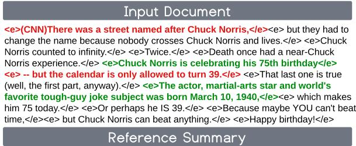
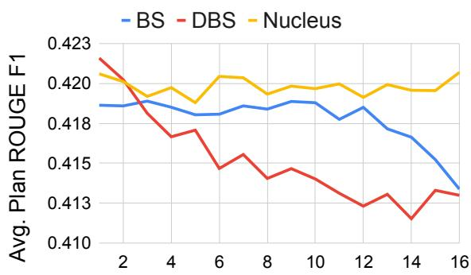
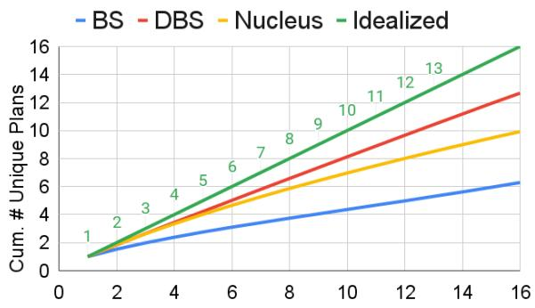
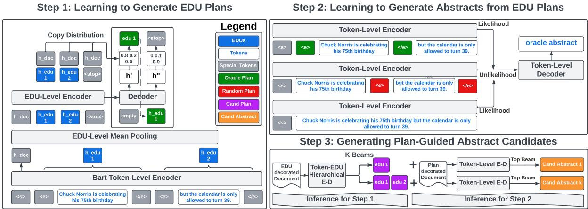
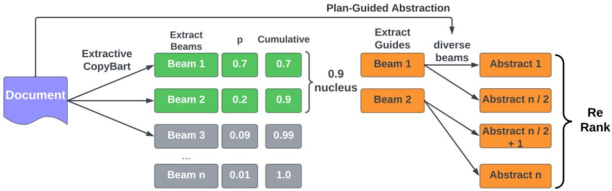
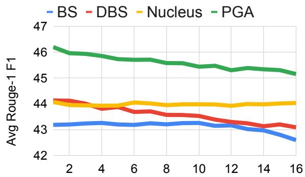
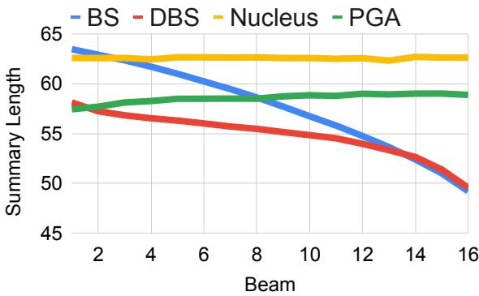
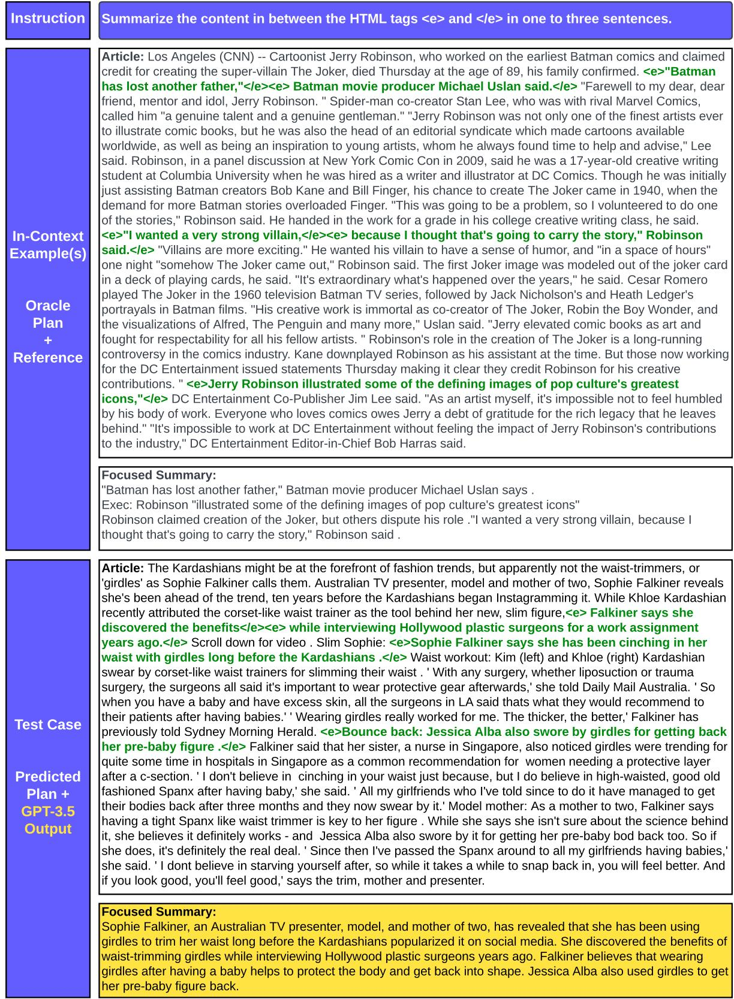

# Generating EDU Extracts for Plan-Guided Summary Re-Ranking

Griffin Adams♠,♣ griffin.adams@columbia.edu

Alexander R. Fabbri♢ afabbri@salesforce.com

Faisal Ladhak ♠ faisal@cs.columbia.edu

Kathleen McKeown ♠ kathy@cs.columbia.edu

Noémie Elhadad♠,♣ noemie.elhadad@columbia.edu

Salesforce Research♢ Columbia University: Computer Science♠, Biomedical Informatics♣

## Abstract

Two-step approaches, in which summary candidates are generated-then-reranked to return a single summary, can improve ROUGE scores over the standard single-step approach. Yet, standard decoding methods (i.e., beam search, nucleus sampling, and diverse beam search) produce candidates with redundant, and often low quality, content. In this paper, we design a novel method to generate candidates for re-ranking that addresses these issues. We ground each candidate abstract on its own unique content plan and generate distinct plan-guided abstracts using a model’s top beam. More concretely, a standard language model (a BART LM) auto-regressively generates elemental discourse unit (EDU) content plans with an extractive copy mechanism. The top K beams from the content plan generator are then used to guide a separate LM, which produces a single abstractive candidate for each distinct plan. We apply an existing re-ranker (BRIO) to abstractive candidates generated from our method, as well as baseline decoding methods. We show large relevance improvements over previously published methods on widely used single document news article corpora, with ROUGE-2 F1 gains of 0.88, 2.01, and 0.38 on CNN / Dailymail, NYT, and Xsum, respectively. A human evaluation on CNN / DM validates these results. Similarly, on 1k samples from CNN / DM, we show that prompting GPT-3 to follow EDU plans outperforms sampling-based methods by 1.05 ROUGE-2 F1 points. Code to generate and realize plans is available at https: //github.com/griff4692/edu-sum.

## 1 Introduction

Generating diverse abstracts and then re-ranking can lead to large performance gains (in ROUGE) (Liu et al., 2022b; Ravaut et al., 2022a) over the standard approach of generating a single summary. Typically, diversity is controlled for at the token-level by modifying beam search to introduce sampling (top-K (Fan et al., 2018), nucleus (Holtzman et al., 2020)) or directly penalize repetition (Vijayakumar et al., 2016).

  
Tuesday is Chuck Norris' 75th birthday . The actor and martial arts master is now known as subject of tough-guy one-liners .

Figure 1: EDU Plan-Guided Abstraction (PGA). EDU spans form the oracle content plan, while EDU spans form a random distractor plan. A model is trained to generate the reference only when given the oracle plan, not the random one. EDU-level plans afford more fine-grained control than sentence-level as irrelevant content is cut out: “but the calendar is only allowed to turn 39”.

Yet, there is a tradeoff, as these methods tend to achieve diversity at the expense of quality (Holtzman et al., 2020). To avoid content de-generation while still achieving diversity1, diversity can be introduced during a planning stage, as in Narayan et al. (2022), who generate entity chain plans with diverse beam search before realizing a summary with regular beam search.

In this paper, we also explore achieving diverse summaries through diverse plans, yet we focus on grounded extractive plans, which promote diversity by encouraging a model to focus on specific, unique parts of the source text. We define a content plan as a set of non-overlapping text spans from the source document. Specifically, we choose elemental discourse units (EDUs) as the appropriate granularity for content planning (Mann and Thompson, 1988). EDUs represent sub-sentential independent clauses and allow for more fine-grained control than sentence-level extraction. EDUs are more self-contained and less fragmented than other potential sub-sentence content units, e.g. entities or noun phrases. Extractive EDUs are contiguous and are atomic, whereas entities do not cover all content and can appear in multiple contexts.

At a high-level, we employ two encoder-decoder models. Given a document, the first model generates K unique content plans with beam search. Then, each content plan is used as a guide to a second model, which realizes an abstract given the plan and the document. Specifically, a BART-based (Lewis et al., 2020) hierarchical encoder-decoder learns to generate extracts from left-to-right by copying EDUs until a special end of extract token is copied. These extractive plans are used to decorate the input document and serve as a guide for the Plan-Guided Abstractor (PGA). The top K beams are returned from the content planner, while only the top beam is returned for plan realization to avoid de-generation. An example of the training procedure from the CNN/DailyMail news dataset is shown in Figure 1.

We compare our PGA candidate generation method to other decoding baselines (beam search, diverse beam, search, and nucleus sampling) at both the candidate level (across beams), as well as after applying a re-ranker (BRIO (Liu et al., 2022b)) to obtain a single, re-ranked summary. We also benchmark the performance of re-ranked summaries from our PGA method against publicly reported results from other summary re-ranking papers. We note consistently higher ROUGE and BERTScores against both our internal baselines and public benchmarks, which we link to improved content selection across candidate beams. We also conduct a human evaluation and find that annotators assess top ranked summaries from PGA candidates as containing more relevant content than candidates produced by baseline decoding methods. By separately optimizing the plan and plan-guided abstracts, we can easily combine generated plans with a Large Language Model (LLM). In §7, we prompt GPT-3.5 to generate diverse,focused summaries and apply a re-ranker. We compare with a series of unfocused prompts and find that ROUGE scores improve across the board. More generally, prompting with diverse plans, and then re-ranking, is a convenient alternative to RLHF alignment when using closed models.

Our primary contributions are: (1). We propose a novel two-stage model for generating high-quality, diverse candidate summaries for downstream re-ranking. Our plan generation approach adapts a pre-trained LM to perform span-level copying to produce EDU-level plans. (2). Our plan-guided abstraction model leads to large improvements in top-ranked summaries vis-a-vis previously published results (0.88, 2.01, and 0.38 ROUGE-2 F1 percentage point gains on CNN/DM, NYT, and Xsum, respectively), and outperforms on summary relevance according to human evaluation. (3) We perform extensive analysis of candidate generation methods, according to the diversity of derived content plans and factors, such as source length. (4) We show that we can improve the reference-based performance of few-shot LLMs by prompting for diverse summaries based on extractive EDU plans.

## 2 Related Work

Two-Step Summarization. Re-ranking candidate summaries can address the “exposure bias” problem (Ranzato et al., 2016) from standard maximum likelihood teacher forcing by allowing an external model to coordinate system outputs with evaluation metrics. Re-ranking diverse candidates can lead to improved faithfulness (Zhao et al., 2020; Chen et al., 2021) or relevance (as measured by ROUGE) (Liu and Liu, 2021; Ravaut et al., 2022a; Liu et al., 2022b; Zhao et al., 2022). Ranking can also be incorporated into training by adding a contrastive loss to the standard MLE loss for a multi-task objective (Nan et al., 2021b; Liu et al., 2022b). This work is related to, yet distinct from, our work, as we focus on the impact of candidate generation methods on explicit re-ranking.

Diverse Decoding. Diverse candidates are typically generated by a pre-trained model by modifying standard beam search to introduce sampling (top-k (Fan et al., 2018) or a dynamic nucleus (Holtzman et al., 2020)) or penalizing repeated tokens across distinct beam groups (Vijayakumar et al., 2018). While increasing diversity, these methods introduce a quality-diversity tradeoff (Ippolito et al., 2019).

Our approach to generating diverse abstracts has similarities to Compositional Sampling, introduced by Narayan et al. (2022). They use diverse beam search to predict an entity chain–based on the authors’ FROST model (Narayan et al., 2021), before continuing to decode with regular beam search. Sampling at the plan level encourages diversity without having to use degenerative token-level sampling. Our approach is different in that, rather than use entity chains, we explicitly control the content focus to specific sentence fragments (EDUs). The goal of their work is high quality diverse summaries, while the goal of our work is to leverage diversity to achieve a single high quality summary.

More concretely, we differentiate our approach along three dimensions. (1) Uniqueness. Composition Sampling uses diverse beam search (DBS) to construct an entity chain and a summary. DBS penalizes repetition across beam groups at the same position, which allows for nearly identical plans with shifted word order. FROST does not localize each entity, which may be problematic for documents with coreferent entities. Our approach performs beam search over discrete plans. As such, it enforces that each plan is unique and localized. (2) Completeness. Entities–a subset of noun phrases–do not cover all the information in a document. Our method considers contiguous spans with no gaps. (3) Complementarity. The top beam from the FROST model represents the highest joint likelihood of plan and summary. Given the length mismatch of summaries vs plans, the top beam may not return an optimal plan. Our EDU generator serves as a standalone planner, which makes it more easily integrated with an LLM, as we explore in §7.

Extract-Then-Abstract Methods that decouple content selection from surface realization have proven effective, especially for long-document corpora with high compression ratios (Pilault et al., 2020). While typically a two-step, coarse-to-fine framework (Liu et al., 2018; Zhang et al., 2022), end-to-end systems are possible by bridging the gap with latent extraction (Mao et al., 2022) or using reinforcement learning: optimizing ROUGE-based rewards with policy gradients (Chen and Bansal, 2018) (Actor Critic), or multi-armed bandits (Song et al., 2022) (Self-Critical).

For shorter tasks, two-step approaches have also proven effective (Mendes et al., 2019). Yet, given that input compression is less of a concern, extractive guidance can also be added as an auxiliary input in a dual-encoder setup (Dou et al., 2021). Guidance can either be provided as input (encoder-side (He et al., 2022)) or generated as part of a decoder prompted content planning step (Narayan et al., 2021).

Our work is based on a two-step extract-thenabstract framework, yet the goal is very different. We use extraction, not just as a guide, but as a tool to control the diversity of downstream abstracts.

## 3 Motivation & Analysis

Elemental Discourse Units. Prior work has shown that reference summary sentences usually combine information from multiple document sentences, while removing non-essential descriptive details (Lebanoff et al., 2019; Liu and Chen, 2019; Li et al., 2020). As such, an ideal extractive plan would select only the relevant subsentential units to incorporate into the final summary. To achieve this, we rely on discourse level segmentation from Rhetorical Structure Theory (Mann and Thompson, 1988) to segment document sentences into Elementary Discourse Units (EDUs), which are contiguous spans of tokens representing independent clauses. EDUs are a good approximation (Li et al., 2016) of Summary Content Units (SCUs) written by human annotators for the Pyramid evaluation method (Nenkova and Passonneau, 2004).

Figure 2: The average Salience of Derived Content Plans (DCPs) at different beams for BS (beam search), DBS (diverse beam search), and nucleus, or Top-P, sampling. Results shown are on the full CNN/DailyMail test set.  
  
Figure 3: The Uniqueness score as a function of the beam size. Results shown are on the full CNN/DailyMail test set.

To extract EDUs, We use the neural parser (Liu et al., 2020, 2021), fine-tuned from xlmroberta-base (Conneau et al., 2020) on RST treebanks from 6 languages, to segment sentences into non-overlapping, contiguous EDU fragments. Their model merges short EDUs (< 5 tokens) to prevent fragmentation. As such, these EDU fragments are closer to proposition-level extraction than other possible units of extraction, e.g., entities.

<table><tr><td>Text Unit</td><td># in Doc</td><td># in Oracle</td><td>Rouge-1 F1</td></tr><tr><td>Sentences</td><td>29.2</td><td>3.3</td><td>57.8</td></tr><tr><td>EDU</td><td>51.6</td><td>5.3</td><td>61.7</td></tr></table>

Table 1: Comparing oracles formed from source sentences versus EDU spans on the CNN / Dailymail validation set.

Table 1 displays statistics for EDU versus sentence segmentation. There are less than 2 EDUs per sentence (51.6/29.2) and less than 2 times as many EDUs in oracle extracts (5.3) as with sentences. Extractive oracles are computed the same way for both sentences and EDUs: by greedily selecting extractive units to maximize the average ROUGE-1 and ROUGE-2 F1 of partially built extracts against the reference summary, as in Nallapati et al. (2017). We compute the ROUGE-1 F1 overlap against the reference of oracles formed from EDUs versus sentences. EDUs outperform sentences (61.7 versus 57.8), which confirms similar oracle analysis on CNN/DM from Liu and Chen (2019).

Content Selection Shortcomings of Existing Methods. We first propose two simple preferred properties of candidate sets for re-ranking. The first is a Salience Property: all candidates should focus on relevant content. The rationale is trivial: a re-ranker will not always select the best candidate2, so it is important that, on average, candidates be relevant. The second is a Uniqueness Property: candidates should focus on different parts of the source. Without content diversity, there is limited upside to re-ranking over just taking the top beam. Because summaries are typically evaluated against a single reference, a tradeoff exists. High Salience favors candidates clustered around the reference, while Uniqueness favors exploration.

To quantify these properties, we introduce the notion of a Derived Content Plan (DCP). First, we align each summary to a set of extractive fragments from the source text (EDUs). We use a greedy approach, which maximizes the relative average ROUGE-1/ROUGE-2 F1 gain of adding each additional EDU from the source text to the plan. This procedure is identical to the widely-used oracle sentence labeling defined by Nallapati et al. (2017), except that EDUs are extracted, not sentences. The unordered set of EDUs aligned to a summary form its DCP. Roughly speaking, DCPs map the content of each summary, which may exhibit some lexical variation, onto a shared space (the input document).

For this analysis, we then define Salience as the ROUGE-1 F1 overlap between a summary’s DCP and the gold-standard reference. Uniqueness, on the hand, we define at the candidate set level. Specifically, it is the number of unique DCPs among a set of candidate summaries. Lower scores signal more content redundancy. Figure 2 reveals a near monotonic decline in DCP Salience at each successive beam for beam search (BS) and diverse beam search (DBS). Nucleus sampling is constant given that each candidate is sampled independently. Figure 3 shows an Idealized scenario in which $y = x$ and each candidate has a unique DCP. All baseline methods fall below the Idealized line and exhibit DCP redundancy.

Looking at Figures 2 and 3 together, a tradeoff is easily visible. DBS has the most pronounced decline in Salience yet most closely satisfies the Uniqueness property (closest to Idealized). We hypothesize that an optimal decoding method should achieve a high degree of Uniqueness while exhibiting minimal Salience degradation across beams.

## 4 Plan-Guided Abstraction (PGA)

At a high-level, we ensure3 Uniqueness by conditioning each candidate on its own unique content plan, and minimize quality degradation by only using the top beam from the abstractive decoder. More specifically, we transform a BART LM into a hierarchical encoder, single-decoder model, which learns to copy extractive content plans at the EDU-level (§4.1). Another encoder-decoder model (BART for CNN/DM and NYT, PEGASUS for Xsum) learns to generate the reference given special markers to indicate the content plan (§4.2). Figure 4 depicts the training procedure for Extract Generation (Step 1, §4.1) and Plan-Guided Abstraction (Step 2, §4.2), as well as the end-to-end candidate generation method (Step 3).

## 4.1 Generating EDU-Level Plans

tl;dr. Inspired by the AREDSUM-SEQ model (Bi et al., 2021), which itself is based off the hierarchical encoder from BertSumExt (Liu and Lapata, 2019), we adapt a BART conditional language model such that it is able to generate extractive EDU fragments left-to-right, in the order in which they appear. The decoder uses a copy mechanism for EDUs and a special end of extract token. The special token enables EDU extractive plans to have variable length.

Notation. A document D can be expressed as a list of K non-overlapping EDU segments: ${ \cal D } = \{ s _ { 1 } , s _ { 2 } , . . . , s _ { K } \}$ . A content plan S is a subset of the EDUs in the document: $S \subset D$ . Let $S _ { t } ^ { * }$ represent an ordered partial extract ending in $s _ { t }$ . The probability of adding EDU $s _ { i }$ to $S _ { t } ^ { * }$ is modeled as:

$$
\left\{ \begin{array} { l l } { p ( s _ { i } | D , S _ { t } ^ { * } ) } & { i \in K , i > t } \\ { 0 } & { i \in K , i \leq t } \end{array} \right.
$$

We note that adding EDUs to an extractive plan in the order in which they appear in the document is nonstandard. Most extractive models build summaries in a confidence-first fashion, as in Zhou et al. (2018). We experimented with both in-order and confidence-first and found that the former slightly outperformed.

  
Figure 4: Plan-Guided Abstraction (PGA). In the first step, a token-level encoder processes a document decorated with special EDU boundary markers. EDU-level hidden states are formed with mean-pooling and serve as the inputs to a shallow EDU-level Encoder-Decoder, which learns to auto-regressively copy oracle EDU plans. In the second stage, a Plan-Guided Abstractor learns to generate abstractive reference summaries from inputs decorated with EDU boundary markers to indicate the oracle plan, as well as a random distractor plan for unlikelihood training. During inference, the PGA generates a single summary for each unique content plan returned by the top K beams of the EDU generator.

To encode EDUs, we bracket each EDU with start <e> and $< / \mathrm { e } >$ tokens. We pass the full document: EDU markers and tokens through a pre-trained BART encoder, and extract hidden states for each EDU with mean pooling over each token within the EDU (including the start and stop tokens): $\{ h _ { s _ { 1 } } , . . . , h _ { s _ { 1 } } \}$ Then, the EDU representations are modeled by a newly initialized EDU-level BART encoder:

$$
\begin{array} { r l r } { \{ h _ { s _ { 1 } } ^ { ' } , . . . , h _ { s _ { K } } ^ { ' } , h _ { e o e } ^ { ' } \} = } & { { } } & { } \\ { E N C _ { s e n t } ( \{ h _ { s _ { 1 } } , . . . , h _ { s _ { K } } , E ( e o e ) \} ) } & { { } } & { } \end{array}
$$

E(eoe) represents a learned embedding for the end of extract token. Positional embeddings are added to each EDU representation $( h _ { s _ { i } } )$ to indicate its position in the document, before being passed through the stacked transformer layers in the encoder. At decoder timestep k with hidden state $h _ { k } ^ { * }$ and partial extract $S _ { t } ^ { * }$ each valid next output $( s _ { i } \in S , i > t$ and eoe) is scored by a single layer MLP, which can be represented $\mathrm { { a s ^ { 4 } } }$

$$
\left\{ \begin{array} { l l } { W _ { o } ( [ h _ { i } ^ { ' } ; h _ { k } ^ { * } ] ) + b _ { o } } & { s _ { i } \in S , i > t } \\ { W _ { o } ( [ h _ { e o e } ^ { ' } ; h _ { k } ^ { * } ] ) + b _ { o } } & { e o e } \end{array} \right.
$$

Plan Objective. Given the above probability distribution, we treat the plan generator as a standard LM and train it with maximum likelihood estimation (MLE) of the oracle plan given the source document.

Oracle Labels. As discussed in §3, We use the greedy search algorithm proposed by Nallapati et al. (2017) to generate oracle EDU extractive plans.

Inference. As a functional LM, we generate distinct EDU extractive plans with beam search.

## 4.2 Learning to Abstract from EDU Plans

tl;dr. We fine-tune a separate token-level LM, which learns to generate the reference given an oracle plan, while discouraging it from generating the same reference given a random plan. An MLE loss is added as regularization. During inference, the model receives EDU plans from §4.1 and generates one abstract per plan with standard beam search.

Decorating inputs. We implement a simple parameter-efficient method for incorporating an extractive plan. We simply demarcate the EDUs in the plan with special start and end tokens <e> and </e>, whose embeddings are learned during fine-tuning. This is similar yet different from the extractive plan generator. When learning to generate plans, all EDUs are tagged, yet when generating the abstract, only the in-plan EDUs are tagged. Decorating the input is a more flexible approach to incorporating extractive guidance than modifying encoder-decoder attention (Saito et al., 2020) and is more parameter-efficient than separately modeling the set of extracted text units (Dou et al., 2021).

Guided-Abstraction Objective. We use a likelihood objective for plan-guided abstraction, and to improve plan adherence, add an unlikelihood term (Welleck et al., 2020), which discourages the model from generating the reference given a random plan:

$$
\begin{array} { r l } & { \mathcal { L } _ { \mathcal { G A } } = \lambda l o g ( p ( R | D , S _ { o r a c l e } ) ) } \\ & { ~ + \lambda l o g ( 1 - p ( R | D , S _ { r a n d o m } ) ) ) } \\ & { ~ + \beta l o g ( p ( R | D ) ) } \end{array}\tag{1}
$$

$S _ { o r a c l e }$ represents the oracle plan for the reference R and $S _ { r a n d o m }$ is a randomly sampled plan of the same length from the set of non-oracle source EDUs. The first two terms encourage the model to rely on the plan when generating an abstract, while the final term is the standard MLE objective (without plan) and acts as a regularization term. λ and $\beta$ are scalars controlling the relative weight of the plan adherence versus regularization components on the $\mathcal { L } _ { \mathcal { G A } }$ loss.

Inference. The guided-abstractor is trained on oracle extractive plans yet, at inference time, realizes extractive content plans produced by the extract generator from §4.1. Standard beam search is used to decode a single abstract for each unique plan.

## 5 Experimental Setup

Datasets. We use the same datasets as in BRIO Liu et al. (2022b), which are CNN / Dailymail (Hermann et al., 2015; See et al., 2017), the New York Times annotated corpus (Sandhaus, 2008), and Xsum (Narayan et al., 2018). The first two are more extractive while Xsum is more abstractive and contains highly noisy references (Nan et al., 2021b). We use code from Kedzie et al. (2018) for data pre-processing and splitting of the corpus, and treat the archival abstract as the ground-truth reference.

Metrics. We compare summaries to references with ROUGE 1/2/L F1 (Lin, 2004) and BERTScore F1 (Zhang et al., 2020b). We use the standard PERL ROUGE script for ROUGE scoring with PTB tokenization and lowercasing, as in Liu et al. (2022b). For BERTScore, we use the default model (roberta-large) and settings from the widely-used bert-score Python package5.

Baselines. We generate 16 candidates with different decoding methods: beam search, diverse beam search, and nucleus sampling. We use google/pegasus-xsum for Xsum, facebook/bart-large-cnn for CNN, and fine-tune a BART-Large model on the NYT corpus. For NYT, we fine-tune using a standard MLE loss for up to 10 epochs, choosing the best model based on validation ROUGE score. These are also the checkpoints used to initialize our plan extractor token-level encoder and guided abstractor. We also compare our method to previous work on summary re-ranking. SimCLS (Liu and Liu, 2021) and BRIO-Ctr (Liu et al., 2022b) both generate 16 candidates via diverse beam search using the same pre-trained weights as in our work6. The major difference between the papers is that a RoBERTa (Liu et al., 2019) classifier is used for re-ranking SimCLS, while in BRIO, the model likelihoods are calibrated to ROUGE rankings. SummaReranker (Ravaut et al., 2022a) trains a RoBERTa-based mixture of experts classifier on up to 60 candidates ensembled from multiple decoding methods (beam search, diverse beam search, nucleus sampling, and top-k sampling). We report their best ensemble configuration for CNN and NYT, which uses dataset-specific fine-tuned PEGASUS (Zhang et al., 2020a) checkpoints from the HuggingFace Transformers library (Wolf et al., 2020). SummaFusion (Ravaut et al., 2022b) fuses candidate summaries into a single summary. Candidates are generated with diverse beam search from the same PEGASUS checkpoint for Xsum (google/pegasus-xsum).

Training Details. For the EDU plan generator, we initialize the token-level encoder from fine-tuned summarization checkpoints for each dataset (listed above in Baselines paragraph). The EDU-level BART encoder and decoder are randomly initialized to have two layers (using a BART-Large configuration to determine parameter dimensions). For both EDU-Extract and Guided abstract training, we fine-tune with Pytorch Lightning (Falcon, 2019) for a maximum of 150,000 steps with 200 warmup steps, a learning rate of 1e-5, batch size of 16, and weight decay of 5e 5. For Xsum, we fine-tune plan-guided abstraction from google/pegasus-xsum and use a learning rate of 1e 4 and a batch size of 64.

For the EDU generator, we select the checkpoint that maximizes the ROUGE score on the validation set. For the Plan-Guided Abstractor, we select the checkpoint that maximizes the oracle-guided abstract ROUGE score. We grid-searched λ and $\beta$ from Equation 1 over [0,0.1,1,10] and selected based on top-ranked validation set summaries. For NYT, we set λ=1 and $\beta = 0$ from Equation 1. No regularization is needed. For CNN and Xsum, we use more regularization: λ=1 and $\beta = 1 0$ . For Xsum, we enforce the last plan beam to be the null-plan (no EDU guidance)7.

<table><tr><td rowspan="2">Candidate Method</td><td colspan="4">CNN/DM</td><td colspan="4">NYT</td><td colspan="4">Xsum</td></tr><tr><td>R1</td><td>R2</td><td>RL</td><td>BS</td><td>R1</td><td>R2</td><td>RL</td><td>BS</td><td>R1</td><td>R2</td><td>RL</td><td>BS</td></tr><tr><td>Top Beam^†</td><td>44.0</td><td>21.03</td><td>37.42</td><td>86.38</td><td>54.02</td><td>35.10</td><td>50.84</td><td>89.05</td><td>47.23</td><td>24.60</td><td>39.37</td><td>91.32</td></tr><tr><td>SimCLS*</td><td>46.67</td><td>22.15</td><td>43.54</td><td>-</td><td>-</td><td>-</td><td>-</td><td>一</td><td>47.61</td><td>24.57</td><td>39.44</td><td>一</td></tr><tr><td>SummaReRanker*</td><td>47.16</td><td>22.55</td><td>43.87</td><td></td><td></td><td></td><td></td><td>一</td><td>48.12</td><td>24.95</td><td>40.00</td><td></td></tr><tr><td> ${ \tt B R I O - C t r } ^ { * }$ </td><td>47.28</td><td>22.93</td><td>44.15</td><td></td><td>55.98</td><td>36.54</td><td>52.51</td><td>一</td><td>48.13</td><td>25.13</td><td>39.80</td><td></td></tr><tr><td>SummaFusion*</td><td>-</td><td>一</td><td>-</td><td>-</td><td>一</td><td>-</td><td>-</td><td>-</td><td>47.08</td><td>24.05</td><td>38.82</td><td></td></tr><tr><td>Beam Search†</td><td>45.26</td><td>22.04</td><td>41.87</td><td>88.52</td><td>55.24</td><td>36.61</td><td>51.99</td><td>89.52</td><td>48.40</td><td>25.50</td><td>40.36</td><td>91.46</td></tr><tr><td>Diverse Beam†</td><td>46.98</td><td>22.90</td><td>43.85</td><td>88.95</td><td>54.89</td><td>36.05</td><td>51.62</td><td>89.56</td><td>47.86</td><td>24.84</td><td>39.81</td><td>91.41</td></tr><tr><td>Nucleus†</td><td>46.57</td><td>23.06</td><td>43.37</td><td>88.84</td><td>55.15</td><td>36.38</td><td>51.83</td><td>89.33</td><td>46.78</td><td>23.74</td><td>38.86</td><td>91.20</td></tr><tr><td>PGA (ours)</td><td>47.59</td><td>23.81</td><td>44.33</td><td>89.02</td><td>57.19</td><td>38.55</td><td>54.12</td><td>89.96</td><td>48.44</td><td>25.51</td><td>40.34</td><td>91.45</td></tr></table>

Table 2: ROUGE-F1, BERTScore (BS) metrics for top-ranked summaries across three datasets. Best results across all rows are bolded and are statistically significant $( p < . 0 5 )$ with respect to our internal baselines (Confidence testing is only done for ROUGE scores, not BS). Top Beam represents the conventional single candidate setup, : reported results in reranking papers. : candidates generated by us and re-ranked by available BRIO re-rankers (Liu et al., 2022b)). Candidates from our PGA method are re-ranked by the same BRIO models to allow for direct comparison with our baselines ( ).

Decoding Parameters. For EDU plan generation, we set the min-max plan lengths to 2-20 and use a length penalty of 1.0 for CNN and NYT, while 2.0 for Xsum. For plan-guided abstraction, we set a beam size of 4 for CNN and NYT, while 8 for Xsum. The baselines and plan-guided models use the same min-max summary lengths and length penalties: 56-142 and 2.0 for CNN, 56-256 and 2.0 for NYT, and 11-62 and 0.6 for Xsum. For nucleus sampling, we set $p { = } 0 . 9 2$ . For diverse beam search, we set the diversity penalty to 1 and set the number of beams and beam groups equal to the number of candidates (16), as in Liu et al. (2022b).

Re-Rankers. We obtain top ranked summaries from pre-trained re-rankers supplied from BRIO (Liu et al., 2022b). Their CTR model coordinates likelihoods with ROUGE-defined rankings by optimizing the following pairwise margin ranking loss:

$$
m a x ( 0 , f ( D , \hat { y } _ { j } ) - f ( D , \hat { y } _ { i } ) + ( j - i ) * \lambda ) \forall i , j \in | \hat { Y } | , i < j\tag{2}
$$

where $\hat { Y } = \{ \hat { y } _ { 1 } , . . . , \hat { y } _ { n } \}$ represents an ordered list of summaries: $R O U G E ( \hat { y } _ { i } , y ) \ge R O U G E ( \hat { y } _ { j } , y )$ $\forall i , j \in | { \hat { Y } } | , i < j .$ . f represents the length normalized log likelihood of generating the summary. We use BRIO configurations and default hyper-parameters.

## 6 Results

Please refer to Appendix A for an analysis of the beam consistency of PGA candidates versus baselines.

Re-Ranked Performance. Table 2 shows that the top-ranked summaries of PGA candidate sets consistently outperform. Compared to the best internal baseline method (beam search, diverse beam, nucleus sampling), we see ROUGE-2 F1 percentage advantages of .75 (23.81 versus 23.06), 1.94 (38.55 versus 36.61), and .01 (25.51 versus 25.50) on CNN/DM, NYT, and Xsum, respectively. Our PGA method also outperforms the best published results for re-ranked summaries. In particular, across datasets, we see ROUGE-2 F1 percentage advantages of .88 (23.81 versus 22.93), 2.01 (38.55 versus 36.54), and .38 (25.51 versus 25.13). The performance gains against our internal baselines ( in Table) 2 are significant for CNN/DM and NYT $\mathbf { ( { \pmb { p } } < 0 . 0 5 ) }$ , but not for Xsum. Extractive planning may be less useful when reference summaries are shorter and noisier. Xsum references have been shown to contain entity-based “hallucinations”–content that is unsupported by the input document (Narayan et al., 2021; Nan et al., 2021a).

<table><tr><td></td><td>Method</td><td>R1</td><td>R2</td><td>RL</td><td># CPs</td></tr><tr><td rowspan="4">DCP</td><td>BS</td><td>41.8</td><td>19.2</td><td>35.3</td><td>6.3</td></tr><tr><td>DBS</td><td>41.5</td><td>18.9</td><td>34.9</td><td>12.7</td></tr><tr><td>Nucleus</td><td>42.0</td><td>19.4</td><td>35.3</td><td>9.9</td></tr><tr><td>PGA (Ours)</td><td>43.6</td><td>20.8</td><td>36.9</td><td>13.0</td></tr><tr><td>ECP</td><td>EDU Plan</td><td>43.1</td><td>20.5</td><td>36.8</td><td>16</td></tr></table>

Table 3: Analyzing set statistics for Explicit Content Plans (ECP) versus Derived (DCP). We compare the ROUGE scores of plans vis-a-vis reference, as well as the number of unique content plans (ECP or DCP) from sets of 16. Results shown for CNN / Dailymail test set.

Analyzing Content Plans. We compare the explicit plans from our EDU-plan generator with Derived Content Plans (DCPs) from our baseline decoding methods, as defined in §3, to assess whether or not a dedicated content selector is a better content selector than a derived one. Table 3 reveals that explicit content plans (ECPs) outperform all DCPs (43.1 R1 versus 41.8 / 41.5 / 42.0), except when the DCP is derived from an ECP-guided summary (43.6 R1). Using simpler terms, a dedicated content selector chooses more relevant content than the content implied by token-level abstractors, and this performance gain is only overturned when generating an abstract conditioned on these high quality content plans.

<table><tr><td>Method</td><td>DCP Sent</td><td>Summary Sents</td><td>Fusion Ratio</td></tr><tr><td>Beam</td><td>3.22</td><td>3.17</td><td>1.03</td></tr><tr><td>Diverse Beam</td><td>3.85</td><td>3.86</td><td>1.02</td></tr><tr><td>Nucleus</td><td>3.75</td><td>3.69</td><td>1.03</td></tr><tr><td>PGA (ours)</td><td>3.81</td><td>3.69</td><td>1.05</td></tr><tr><td>Reference</td><td>4.25</td><td>3.76</td><td>1.17</td></tr></table>

Table 4: Fusion ratios: # of unique source sentences which contain the EDUs in the implied plan (# DCP Sent), divided by the number of sentences in the summary.

Fusion Analysis. One of the potential benefits to EDU-based content planning is fusion. Prior work has argued that fusion is desirable for its impact on conciseness, while noting that existing models perform very little fusion (Lebanoff et al., 2020). We measure fusion at the candidate level across decoding methods (including PGA), as well as the summary references, by computing the EDU-level Derived Content Plan (DCP) for each summary, and then recording how many unique source sentences contain the EDUs in this implied plan. To normalize, we then divide it by the number of predicted summary sentences to provide an approximate fusion ratio. Table 4 shows that, while PGA has a higher fusion ratio on average than the baselines (1.05 versus 1.03,1.02,1.03), model-generated summaries fuse content from fewer sources sentences than human-generated summaries (the Reference fusion ratio is the highest at 1.17).

<table><tr><td>Method</td><td>Q1</td><td>Q2</td><td>Q3</td><td>Q4</td><td>Avg</td></tr><tr><td>Beam</td><td>47.8</td><td>46.2</td><td>44.5</td><td>42.6</td><td>45.3</td></tr><tr><td>Diverse Beam Nucleus</td><td>49.2</td><td>48.0</td><td>46.0</td><td>44.7</td><td>47.0</td></tr><tr><td>Baseline Avg</td><td>48.7 48.6</td><td>47.5 47.2</td><td>45.7 45.5</td><td>44.3</td><td>46.6</td></tr><tr><td>PGA (ours)</td><td>50.1</td><td>48.5</td><td>46.5</td><td>43.9 45.3</td><td>46.3 47.6</td></tr><tr><td>Avg % Gain</td><td>3.09</td><td>2.75</td><td>2.20</td><td>3.19</td><td>2.81</td></tr></table>

Table 5: ROUGE-1 F1 for top-ranked summaries on the CNN/DM test set binned into quartiles by summary length.

Impact of Length. Previous work has shown that content selection is more difficult as inputs scale (Ladhak et al., 2020). This would suggest that our approach, which relies on explicit content plans, might scale well to long inputs. To get a sense of the relative impact of the PGA method by length, we bin the CNN test set into quartiles based on the number of EDUs in the source document. In Table 5, we report average ROUGE-1 F1 scores of top-ranked summaries for the baseline methods and PGA, as well as an average of the baselines (Baseline Avg). The final row (Avg % Gain) shows the percentage gain for each quartile of moving from Baseline Avg to PGA. The gain is the largest for the fourth quartile (3.19%), yet the increase is not monotonic. The second largest benefit comes from the shortest quartile 3.09%. While not conclusive, this analysis suggests that our PGA method could benefit even further from application to long-document and/or multi-document corpora, on which re-ranking methods are largely untested.

<table><tr><td colspan="4">Top Ranked</td><td colspan="3">Plan Adherence</td></tr><tr><td>Method</td><td>R1</td><td>R2</td><td>RL</td><td>R</td><td>P</td><td>F1</td></tr><tr><td>PGA (ours)</td><td>47.59</td><td>23.81 44.33</td><td></td><td>87.1</td><td>78.6 81.5</td><td></td></tr><tr><td>w/o Unlike</td><td>47.43</td><td>23.4844.16</td><td></td><td>87.2</td><td>76.5 80.3</td><td></td></tr></table>

Table 6: Impact of removing the unlikelihood objective from Equation 1 on the top-ranked summary ROUGE scores and on average adherence to the content plan.

Plan Adherence. Adherence to the plan is critical to the diversity of PGA outputs given that each candidate is produced from the top beam of the abstractor. If it ignores the provided content plan, all the candidates will be the same. We measure plan adherence by comparing the overlap of DCPs (the implied plan realized by the abstractor) versus ECPs (the plan provided to the abstractor). In particular, we measure the recall, precision, and F1-overlap metrics. Additionally, we train a PGA model without the unlikelihood objective in Equation 1 to determine its importance to plan adherence and the ROUGE scores of downstream re-ranked candidates. Table 6 shows the ablated model’s performance vis-a-vis the PGA model trained with the unlikelihood loss. The top ranked ROUGE-1 is hurt by removing the loss (47.59 versus 47.43 R1), and the abstractor also adheres less to the ECP (81.5 versus 80.3). While the differences are minor, control could be important for human-in-the-loop use cases, in which a user highlights an extractive plan and expects a summary which focuses on these highlights.

Human Evaluation. To verify the ability of our approach to better capture salient information found in reference summaries, we perform a human evaluation study using the Atomic Content Unit (ACU) protocol introduced in Liu et al. (2022a). In this protocol, atomic facts are extracted from reference summaries and matched with system summaries; the average number of matched units constitutes the recall-focused ACU score, and a length normalized ACU score (nACU) is also reported. We apply this protocol on MTurk and filter workers from the US/UK with 98% HIT approval and provide a pay-rate of \$12/hour. We use the provided reference ACUs from a 100-example subset from Liu et al. (2022a) and achieve a Krippendorf alpha of 0.70 over three annotators. We compare against our Diverse Beam Search baseline in addition to the four systems from the ACU paper: BART, BRIO-Mul, T0, and GPT-3. As shown in Table 7, PGA top-ranked summaries outperform summaries from the state of the art supervised8 model (BRIO-Mul) with respect to un-normalized and length-normalized (ACU / nACU) matching of ACUs between reference and system summaries: 0.4421 / 0.3650 for PGA versus 0.4290 / 0.3565 for BRIO-Mul.

<table><tr><td>Method</td><td>ACU</td><td>nACU</td></tr><tr><td>BART (Lewis et al., 2020)</td><td>0.3671</td><td>0.2980</td></tr><tr><td>BRIO-Mu1 (Liu et al., 2022b)</td><td>0.4290</td><td>0.3565</td></tr><tr><td>TO (Sanh et al., 2022)</td><td>0.2947</td><td>0.2520</td></tr><tr><td>GPT-3 (Brown et al., 2020)</td><td>0.2690</td><td>0.2143</td></tr><tr><td>Diverse Beam Search</td><td>0.3683</td><td>0.3261</td></tr><tr><td>PGA (ours)</td><td>0.4421</td><td>0.3650</td></tr></table>

Table 7: Human evaluation using the ACU protocol Liu et al. (2022a); the first four rows are copied from their Table 7. Diverse Beam represents our best re-ranking baseline according to ROUGE. PGA (ours) represents a state of the art improvement in reference-based human assessment.

## 7 Guiding GPT with EDU Plans

Background. To date, GPT models (Brown et al., 2020; Ouyang et al., 2022) have only been evaluated as summarizers in the conventional single candidate setup (Zhang et al., 2023). In zero and few-shot settings, GPT summaries have been shown to underperform fine-tuned models with regards to referencebased metrics, yet over-perform according to human judgments (Goyal et al., 2022; Liu et al., 2022a).

Diverse Prompt-Then-Rank as Alternative to ICL. To better align closed-source LLMs, such as GPT, to labeled data, in-context learning (ICL) Brown et al. (2020); Min et al. (2022) has been shown to help. Yet, closed source LLMs can also be adapted to a task by eliciting diverse outputs and then applying a task-specific, smaller re-ranker (e.g., BRIO). ICL and diverse prompt-then-rank can be complementary.

Experimental Setup. We sample a set of 1,000 summaries at random from the CNN/DailyMail test set and prompt GPT-3.5 (Ouyang et al., 2022) to generate summaries. Similarly to Top Beam in Table 2, we include a single candidate baseline (Single) with the instruction from Goyal et al. (2022); Zhang et al. (2023): Summarize the article in three sentences. For re-ranking baselines, we generate 16 diverse candidates by separately increasing the temperature 0.3 0.7 (Temperature Sampling), and sampling from a 0.8 nucleus (Nucleus Sampling). To implement PGA, we decorate the source article with EDU tags <e> </e> and instruct GPT to summarize only the text within the tags. Specifically, we instruct it to Summarize the content in between the HTML tags <e> and </e> in one to three sentences. As with Single, we set the temperature to 0.3. In all cases, we randomly sample 3 examples from the training set to be used as in-context exemplars. We compute a different random sample for each test case to encourage diversity, as in Adams et al. (2023). For PGA ICL, we decorate articles with the oracle plan.

<table><tr><td>Candidate Method</td><td>R1</td><td>R2</td><td>RL</td></tr><tr><td>Single Temperature Sampling</td><td>40.84 42.51</td><td>17.30 19.17</td><td>37.07 38.73</td></tr><tr><td>Nucleus Sampling</td><td>42.43</td><td>19.06</td><td>38.65</td></tr><tr><td>PGA (ours)</td><td>43.56</td><td>20.11</td><td>39.95</td></tr></table>

Table 8: ROUGE-F1 metrics for top-ranked GPT-3.5 summaries on a random 1k subset of the CNN/DailyMail test set. Single represents a single candidate baseline (similarly to Top Beam in Table 2). The others produce 16 candidates, which are then re-ranked with BRIO.

Results. As shown in Table 8, PGA outperforms all single and diverse candidate methods: 43.56 ROUGE-1 F1 versus 40.84/42.51/42.43 for the baselines. Please refer to Appendix B for a depiction of the prompt and sample plan-guided output. We publicly release all GPT-3.5 candidates to support RLHF (Stiennon et al., 2020) or calibration (Zhao et al., 2023)9.

## 8 Conclusion

In this paper, we demonstrate that offloading content selection to a dedicated extractor, rather than relying on the decoder to perform both content selection and surface realization, can lead to better and more diverse content selection across beams, which ultimately leads to increased ROUGE scores for top-ranked summaries after applying a re-ranker. EDU plan-guided abstraction exhibits other encouraging traits, such as an increased level of fusion and scalability to longer inputs.

  
Figure 5: Future work could involve generating plan-guided abstracts from a dynamic nucleus of extracts.

## 9 Limitations

Our findings are primarily based on ROUGE score, which is a noisy, unstable metric with well-studied limitations (Schluter, 2017). To address this, however, we conduct a human evaluation to support our findings. In both automatic and human annotation settings, we base our evaluations on naturally occurring references, which have been shown to be silver-standard (Gehrmann et al., 2022; Wan and Bansal, 2022; Adams et al., 2022). We hope that our work on PGA–a method to generate high-quality diverse candidates–can be applied to new domains (e.g., (Gliwa et al., 2019; Adams et al., 2021; DeYoung et al., 2021)) and reference-free learning objectives (e.g., RLHF and calibration). Also, our candidate generation method requires two models, which is less elegant and computationally efficient than an end to end solution combining planning and surface realization.

Lastly, PGA treats all content plans as equally likely (each plan is given one abstractive beam). Yet, there is an unexplored trade-off between exploration and exploitation. Should higher-confidence content plans receive more candidates? Future work should explore a generating diverse abstracts from a dynamic nucleus of extracts, which would allow for the generation of many abstracts from only a few extracts when confident (e.g. short documents), while exploring more diverse content when the extractive generator is less confident. We sketch out such a potential system in Figure 5 with a made-up nucleus probability of 0.9.

## References

Griffin Adams, Emily Alsentzer, Mert Ketenci, Jason Zucker, and Noémie Elhadad. 2021. What’s in a summary? laying the groundwork for advances in hospital-course summarization. In Proceedings of the 2021 Conference of the North American Chapter of

the Association for Computational Linguistics: Human Language Technologies, pages 4794–4811, Online. Association for Computational Linguistics.

Griffin Adams, Bichlien H Nguyen, Jake Smith, Yingce Xia, Shufang Xie, Anna Ostropolets, Budhaditya Deb, Yuan-Jyue Chen, Tristan Naumann, and Noémie Elhadad. 2023. What are the desired characteristics of calibration sets? identifying correlates on long form scientific summarization. ArXiv preprint, abs/2305.07615.

Griffin Adams, Han-Chin Shing, Qing Sun, Christopher Winestock, Kathleen McKeown, and Noémie Elhadad. 2022. Learning to revise references for faithful summarization. In Findings of the Association for Computational Linguistics: EMNLP 2022, pages 4009–4027, Abu Dhabi, United Arab Emirates. Association for Computational Linguistics.

Keping Bi, Rahul Jha, Bruce Croft, and Asli Celikyilmaz. 2021. AREDSUM: Adaptive redundancy-aware iterative sentence ranking for extractive document summarization. In Proceedings ofthe 16th Conference of the European Chapter of the Association for Computational Linguistics: Main Volume, pages 281–291, Online. Association for Computational Linguistics.

Tom B. Brown, Benjamin Mann, Nick Ryder, Melanie Subbiah, Jared Kaplan, Prafulla Dhariwal, Arvind Neelakantan, Pranav Shyam, Girish Sastry, Amanda Askell, Sandhini Agarwal, Ariel Herbert-Voss, Gretchen Krueger, Tom Henighan, Rewon Child, Aditya Ramesh, Daniel M. Ziegler, Jeffrey Wu, Clemens Winter, Christopher Hesse, Mark Chen, Eric Sigler, Mateusz Litwin, Scott Gray, Benjamin Chess, Jack Clark, Christopher Berner, Sam McCandlish, Alec Radford, Ilya Sutskever, and Dario Amodei. 2020. Language models are few-shot learners. In Advances in Neural Information Processing Systems 33: Annual Conference on Neural Information Processing Systems 2020, NeurIPS 2020, December 6-12, 2020, virtual.

Sihao Chen, Fan Zhang, Kazoo Sone, and Dan Roth. 2021. Improving faithfulness in abstractive summarization with contrast candidate generation and selection. In Proceedings ofthe 2021 Conference ofthe North American

Chapter of the Association for Computational Linguistics: Human Language Technologies, pages 5935–5941, Online. Association for Computational Linguistics.

Yen-Chun Chen and Mohit Bansal. 2018. Fast abstractive summarization with reinforce-selected sentence rewriting. In Proceedings ofthe 56th Annual Meeting of the Associationfor Computational Linguistics (Volume 1: Long Papers), pages 675–686, Melbourne, Australia. Association for Computational Linguistics.

Alexis Conneau, Kartikay Khandelwal, Naman Goyal, Vishrav Chaudhary, Guillaume Wenzek, Francisco Guzmán, Edouard Grave, Myle Ott, Luke Zettlemoyer, and Veselin Stoyanov. 2020. Unsupervised crosslingual representation learning at scale. In Proceedings of the 58th Annual Meeting of the Association for Computational Linguistics, pages 8440–8451, Online. Association for Computational Linguistics.

Jay DeYoung, Iz Beltagy, Madeleine van Zuylen, Bailey Kuehl, and Lucy Wang. 2021. MSˆ2: Multi-document summarization of medical studies. In Proceedings of the 2021 Conference on Empirical Methods in Natural Language Processing, pages 7494–7513, Online and Punta Cana, Dominican Republic. Association for Computational Linguistics.

Zi-Yi Dou, Pengfei Liu, Hiroaki Hayashi, Zhengbao Jiang, and Graham Neubig. 2021. GSum: A general framework for guided neural abstractive summarization. In Proceedings of the 2021 Conference of the North American Chapter ofthe Associationfor Computational Linguistics: Human Language Technologies, pages 4830–4842, Online. Association for Computational Linguistics.

William Falcon. 2019. The pytorch lightning team. Pytorch lightning, 3:6.

Angela Fan, Mike Lewis, and Yann Dauphin. 2018. Hierarchical neural story generation. In Proceedings of the 56th Annual Meeting of the Association for Computational Linguistics (Volume 1: Long Papers), pages 889–898, Melbourne, Australia. Association for Computational Linguistics.

Sebastian Gehrmann, Elizabeth Clark, and Thibault Sellam. 2022. Repairing the cracked foundation: A survey of obstacles in evaluation practices for generated text. ArXiv preprint, abs/2202.06935.

Bogdan Gliwa, Iwona Mochol, Maciej Biesek, and Aleksander Wawer. 2019. SAMSum corpus: A human-annotated dialogue dataset for abstractive summarization. In Proceedings of the 2nd Workshop on New Frontiers in Summarization, pages 70–79, Hong Kong, China. Association for Computational Linguistics.

Tanya Goyal, Junyi Jessy Li, and Greg Durrett. 2022. News summarization and evaluation in the era of gpt-3. ArXiv preprint, abs/2209.12356.

Junxian He, Wojciech Kryscinski, Bryan McCann, Nazneen Rajani, and Caiming Xiong. 2022. CTRLsum: Towards generic controllable text summarization. In

Proceedings of the 2022 Conference on Empirical Methods in Natural Language Processing, pages 5879–5915, Abu Dhabi, United Arab Emirates. Association for Computational Linguistics.

Karl Moritz Hermann, Tomás Kociský, Edward Grefenstette, Lasse Espeholt, Will Kay, Mustafa Suleyman, and Phil Blunsom. 2015. Teaching machines to read and comprehend. In Advances in Neural Information Processing Systems 28: Annual Conference on Neural Information Processing Systems 2015, December 7-12, 2015, Montreal, Quebec, Canada, pages 1693–1701.

Ari Holtzman, Jan Buys, Li Du, Maxwell Forbes, and Yejin Choi. 2020. The curious case of neural text degeneration. In 8th International Conference on Learning Representations, ICLR 2020, Addis Ababa, Ethiopia, April 26-30, 2020. OpenReview.net.

Daphne Ippolito, Reno Kriz, João Sedoc, Maria Kustikova, and Chris Callison-Burch. 2019. Comparison of diverse decoding methods from conditional language models. In Proceedings of the 57th Annual Meeting of the Association for Computational Linguistics, pages 3752–3762, Florence, Italy. Association for Computational Linguistics.

Chris Kedzie, Kathleen McKeown, and Hal Daumé III. 2018. Content selection in deep learning models of summarization. In Proceedings ofthe 2018 Conference on Empirical Methods in Natural Language Processing, pages 1818–1828, Brussels, Belgium. Association for Computational Linguistics.

Faisal Ladhak, Bryan Li, Yaser Al-Onaizan, and Kathleen McKeown. 2020. Exploring content selection in summarization of novel chapters. In Proceedings of the 58th Annual Meeting of the Association for Computational Linguistics, pages 5043–5054, Online. Association for Computational Linguistics.

Logan Lebanoff, Franck Dernoncourt, Doo Soon Kim, Lidan Wang, Walter Chang, and Fei Liu. 2020. Learning to fuse sentences with transformers for summarization. In Proceedings ofthe 2020 Conference on Empirical Methods in Natural Language Processing (EMNLP), pages 4136–4142, Online. Association for Computational Linguistics.

Logan Lebanoff, Kaiqiang Song, Franck Dernoncourt, Doo Soon Kim, Seokhwan Kim, Walter Chang, and Fei Liu. 2019. Scoring sentence singletons and pairs for abstractive summarization. In Proceedings of the 57th Annual Meeting of the Association for Computational Linguistics, pages 2175–2189, Florence, Italy. Association for Computational Linguistics.

Mike Lewis, Yinhan Liu, Naman Goyal, Marjan Ghazvininejad, Abdelrahman Mohamed, Omer Levy, Veselin Stoyanov, and Luke Zettlemoyer. 2020. BART: Denoising sequence-to-sequence pre-training for natural language generation, translation, and comprehension. In Proceedings of the 58th Annual Meeting of the Association for Computational Linguistics, pages 7871–7880, Online. Association for Computational Linguistics.

Junyi Jessy Li, Kapil Thadani, and Amanda Stent. 2016. The role of discourse units in near-extractive summarization. In Proceedings of the 17th Annual Meeting of the Special Interest Group on Discourse and Dialogue, pages 137–147, Los Angeles. Association for Computational Linguistics.

Zhenwen Li, Wenhao Wu, and Sujian Li. 2020. Composing elementary discourse units in abstractive summarization. In Proceedings of the 58th Annual Meeting of the Association for Computational Linguistics, pages 6191–6196, Online. Association for Computational Linguistics.

Chin-Yew Lin. 2004. ROUGE: A package for automatic evaluation of summaries. In Text Summarization Branches Out, pages 74–81, Barcelona, Spain. Association for Computational Linguistics.

Peter J. Liu, Mohammad Saleh, Etienne Pot, Ben Goodrich, Ryan Sepassi, Lukasz Kaiser, and Noam Shazeer. 2018. Generating wikipedia by summarizing long sequences. In 6th International Conference on Learning Representations, ICLR 2018, Vancouver, BC, Canada, April 30 - May 3, 2018, Conference Track Proceedings. OpenReview.net.

Yang Liu and Mirella Lapata. 2019. Text summarization with pretrained encoders. In Proceedings ofthe 2019 Conference on Empirical Methods in Natural Language Processing and the 9th International Joint Conference on Natural Language Processing (EMNLP-IJCNLP), pages 3730–3740, Hong Kong, China. Association for Computational Linguistics.

Yinhan Liu, Myle Ott, Naman Goyal, Jingfei Du, Mandar Joshi, Danqi Chen, Omer Levy, Mike Lewis, Luke Zettlemoyer, and Veselin Stoyanov. 2019. Roberta: A robustly optimized bert pretraining approach. ArXiv preprint, abs/1907.11692.

Yixin Liu, Alexander R. Fabbri, Pengfei Liu, Yilun Zhao, Linyong Nan, Ruilin Han, Simeng Han, Shafiq Joty, Chien-Sheng Wu, Caiming Xiong, and Dragomir Radev. 2022a. Revisiting the gold standard: Grounding summarization evaluation with robust human evaluation.

Yixin Liu and Pengfei Liu. 2021. SimCLS: A simple framework for contrastive learning of abstractive summarization. In Proceedings of the 59th Annual Meeting of the Associationfor Computational Linguistics and the 11th International Joint Conference on Natural Language Processing (Volume 2: Short Papers), pages 1065–1072, Online. Association for Computational Linguistics.

Yixin Liu, Pengfei Liu, Dragomir Radev, and Graham Neubig. 2022b. BRIO: Bringing order to abstractive summarization. In Proceedings of the 60th Annual Meeting of the Association for Computational Linguistics (Volume 1: Long Papers), pages 2890–2903, Dublin, Ireland. Association for Computational Linguistics.

Zhengyuan Liu and Nancy Chen. 2019. Exploiting discourse-level segmentation for extractive summarization. In Proceedings ofthe 2nd Workshop on New Frontiers in Summarization, pages 116–121, Hong Kong, China. Association for Computational Linguistics.

Zhengyuan Liu, Ke Shi, and Nancy Chen. 2020. Multilingual neural RST discourse parsing. In Proceedings ofthe 28th International Conference on Computational Linguistics, pages 6730–6738, Barcelona, Spain (Online). International Committee on Computational Linguistics.

Zhengyuan Liu, Ke Shi, and Nancy Chen. 2021. DMRST: A joint framework for document-level multilingual RST discourse segmentation and parsing. In Proceedings of the 2nd Workshop on Computational Approaches to Discourse, pages 154–164, Punta Cana, Dominican Republic and Online. Association for Computational Linguistics.

William C Mann and Sandra A Thompson. 1988. Rhetorical structure theory: Toward a functional theory of text organization. Text-interdisciplinary Journalfor the Study ofDiscourse, 8(3):243–281.

Ziming Mao, Chen Henry Wu, Ansong Ni, Yusen Zhang, Rui Zhang, Tao Yu, Budhaditya Deb, Chenguang Zhu, Ahmed Awadallah, and Dragomir Radev. 2022. DYLE: Dynamic latent extraction for abstractive long-input summarization. In Proceedings of the 60th Annual Meeting ofthe Associationfor Computational Linguistics (Volume 1: Long Papers), pages 1687–1698, Dublin, Ireland. Association for Computational Linguistics.

Afonso Mendes, Shashi Narayan, Sebastião Miranda, Zita Marinho, André F. T. Martins, and Shay B. Cohen. 2019. Jointly extracting and compressing documents with summary state representations. In Proceedings of the 2019 Conference ofthe North American Chapter of the Association for Computational Linguistics: Human Language Technologies, Volume 1 (Long and Short Papers), pages 3955–3966, Minneapolis, Minnesota. Association for Computational Linguistics.

Sewon Min, Xinxi Lyu, Ari Holtzman, Mikel Artetxe, Mike Lewis, Hannaneh Hajishirzi, and Luke Zettlemoyer. 2022. Rethinking the role of demonstrations: What makes in-context learning work? In Proceedings of the 2022 Conference on Empirical Methods in Natural Language Processing, pages 11048–11064, Abu Dhabi, United Arab Emirates. Association for Computational Linguistics.

Ramesh Nallapati, Feifei Zhai, and Bowen Zhou. 2017. Summarunner: A recurrent neural network based sequence model for extractive summarization of documents. In Proceedings of the Thirty-First AAAI Conference on Artificial Intelligence, February 4-9, 2017, San Francisco, California, USA, pages 3075–3081. AAAI Press.

Feng Nan, Ramesh Nallapati, Zhiguo Wang, Cicero Nogueira dos Santos, Henghui Zhu, Dejiao Zhang, Kathleen McKeown, and Bing Xiang. 2021a. Entity-level factual consistency of abstractive text summarization. In Proceedings of the 16th Conference of the European Chapter of the Association for Computational Linguistics: Main Volume, pages 2727–2733, Online. Association for Computational Linguistics.

Feng Nan, Cicero Nogueira dos Santos, Henghui Zhu, Patrick Ng, Kathleen McKeown, Ramesh Nallapati, Dejiao Zhang, Zhiguo Wang, Andrew O. Arnold, and Bing Xiang. 2021b. Improving factual consistency of abstractive summarization via question answering. In Proceedings of the 59th Annual Meeting of the Associationfor Computational Linguistics and the 11th International Joint Conference on Natural Language Processing (Volume 1: Long Papers), pages 6881–6894, Online. Association for Computational Linguistics.

Shashi Narayan, Shay B. Cohen, and Mirella Lapata. 2018. Don’t give me the details, just the summary! topic-aware convolutional neural networks for extreme summarization. In Proceedings of the 2018 Conference on Empirical Methods in Natural Language Processing, pages 1797–1807, Brussels, Belgium. Association for Computational Linguistics.

Shashi Narayan, Gonçalo Simões, Yao Zhao, Joshua Maynez, Dipanjan Das, Michael Collins, and Mirella Lapata. 2022. A well-composed text is half done! composition sampling for diverse conditional generation. In Proceedings of the 60th Annual Meeting of the Association for Computational Linguistics (Volume 1: Long Papers), pages 1319–1339, Dublin, Ireland. Association for Computational Linguistics.

Shashi Narayan, Yao Zhao, Joshua Maynez, Gonçalo Simões, Vitaly Nikolaev, and Ryan McDonald. 2021. Planning with learned entity prompts for abstractive summarization. Transactions of the Association for Computational Linguistics, 9:1475–1492.

Ani Nenkova and Rebecca Passonneau. 2004. Evaluating content selection in summarization: The pyramid method. In Proceedings of the Human Language Technology Conference ofthe North American Chapter ofthe Associationfor Computational Linguistics: HLT-NAACL 2004, pages 145–152, Boston, Massachusetts, USA. Association for Computational Linguistics.

Long Ouyang, Jeffrey Wu, Xu Jiang, Diogo Almeida, Carroll Wainwright, Pamela Mishkin, Chong Zhang, Sandhini Agarwal, Katarina Slama, Alex Ray, et al. 2022. Training language models to follow instructions with human feedback. Advances in Neural Information Processing Systems, 35:27730–27744.

Jonathan Pilault, Raymond Li, Sandeep Subramanian, and Chris Pal. 2020. On extractive and abstractive neural document summarization with transformer language models. In Proceedings of the 2020 Conference on Empirical Methods in Natural Language Processing (EMNLP), pages 9308–9319, Online. Association for Computational Linguistics.

Marc’Aurelio Ranzato, Sumit Chopra, Michael Auli, and Wojciech Zaremba. 2016. Sequence level training with recurrent neural networks. In 4th International Conference on Learning Representations, ICLR 2016, San Juan, Puerto Rico, May 2-4, 2016, Conference Track Proceedings.

Mathieu Ravaut, Shafiq Joty, and Nancy Chen. 2022a. SummaReranker: A multi-task mixture-of-experts

re-ranking framework for abstractive summarization. In Proceedings of the 60th Annual Meeting of the Association for Computational Linguistics (Volume 1: Long Papers), pages 4504–4524, Dublin, Ireland. Association for Computational Linguistics.

Mathieu Ravaut, Shafiq Joty, and Nancy Chen. 2022b. Towards summary candidates fusion. In Proceedings of the 2022 Conference on Empirical Methods in Natural Language Processing, pages 8488–8504, Abu Dhabi, United Arab Emirates. Association for Computational Linguistics.

Itsumi Saito, Kyosuke Nishida, Kosuke Nishida, and Junji Tomita. 2020. Abstractive summarization with combination of pre-trained sequence-to-sequence and saliency models. ArXiv preprint, abs/2003.13028.

Evan Sandhaus. 2008. The new york times annotated corpus. Linguistic Data Consortium, Philadelphia, 6(12):e26752.

Victor Sanh, Albert Webson, Colin Raffel, Stephen H. Bach, Lintang Sutawika, Zaid Alyafeai, Antoine Chaffin, Arnaud Stiegler, Arun Raja, Manan Dey, M Saiful Bari, Canwen Xu, Urmish Thakker, Shanya Sharma Sharma, Eliza Szczechla, Taewoon Kim, Gunjan Chhablani, Nihal V. Nayak, Debajyoti Datta, Jonathan Chang, Mike Tian-Jian Jiang, Han Wang, Matteo Manica, Sheng Shen, Zheng Xin Yong, Harshit Pandey, Rachel Bawden, Thomas Wang, Trishala Neeraj, Jos Rozen, Abheesht Sharma, Andrea Santilli, Thibault Févry, Jason Alan Fries, Ryan Teehan, Teven Le Scao, Stella Biderman, Leo Gao, Thomas Wolf, and Alexander M. Rush. 2022. Multitask prompted training enables zero-shot task generalization. In The Tenth International Conference on Learning Representations, ICLR 2022, Virtual Event, April 25-29, 2022. OpenReview.net.

Natalie Schluter. 2017. The limits of automatic summarisation according to ROUGE. In Proceedings of the 15th Conference of the European Chapter of the Associationfor Computational Linguistics: Volume 2, Short Papers, pages 41–45, Valencia, Spain. Association for Computational Linguistics.

Abigail See, Peter J. Liu, and Christopher D. Manning. 2017. Get to the point: Summarization with pointer-generator networks. In Proceedings ofthe 55th Annual Meeting of the Association for Computational Linguistics (Volume 1: Long Papers), pages 1073–1083, Vancouver, Canada. Association for Computational Linguistics.

Yun-Zhu Song, Yi-Syuan Chen, and Hong-Han Shuai. 2022. Improving multi-document summarization through referenced flexible extraction with creditawareness. In Proceedings of the 2022 Conference of the North American Chapter of the Association for Computational Linguistics: Human Language Technologies, pages 1667–1681, Seattle, United States. Association for Computational Linguistics.

Nisan Stiennon, Long Ouyang, Jeffrey Wu, Daniel M. Ziegler, Ryan Lowe, Chelsea Voss, Alec Radford, Dario

Amodei, and Paul F. Christiano. 2020. Learning to summarize with human feedback. In Advances in Neural Information Processing Systems 33: Annual Conference on Neural Information Processing Systems 2020, NeurIPS 2020, December 6-12, 2020, virtual.

Ashwin K. Vijayakumar, Michael Cogswell, Ramprasaath R. Selvaraju, Qing Sun, Stefan Lee, David J. Crandall, and Dhruv Batra. 2018. Diverse beam search for improved description of complex scenes. In Proceedings ofthe Thirty-Second AAAI Conference on Artificial Intelligence, (AAAI-18), the 30th innovative Applications of Artificial Intelligence (IAAI-18), and the 8th AAAI Symposium on Educational Advances in Artificial Intelligence (EAAI-18), New Orleans, Louisiana, USA, February 2-7, 2018, pages 7371–7379. AAAI Press.

Ashwin K Vijayakumar, Michael Cogswell, Ramprasath R Selvaraju, Qing Sun, Stefan Lee, David Crandall, and Dhruv Batra. 2016. Diverse beam search: Decoding diverse solutions from neural sequence models. ArXiv preprint, abs/1610.02424.

David Wan and Mohit Bansal. 2022. FactPEGASUS: Factuality-aware pre-training and fine-tuning for abstractive summarization. In Proceedings of the 2022 Conference of the North American Chapter of the Associationfor Computational Linguistics: Human Language Technologies, pages 1010–1028, Seattle, United States. Association for Computational Linguistics.

Sean Welleck, Ilia Kulikov, Stephen Roller, Emily Dinan, Kyunghyun Cho, and Jason Weston. 2020. Neural text generation with unlikelihood training. In 8th International Conference on Learning Representations, ICLR 2020, Addis Ababa, Ethiopia, April 26-30, 2020. OpenReview.net.

Thomas Wolf, Lysandre Debut, Victor Sanh, Julien Chaumond, Clement Delangue, Anthony Moi, Pierric Cistac, Tim Rault, Remi Louf, Morgan Funtowicz, Joe Davison, Sam Shleifer, Patrick von Platen, Clara Ma, Yacine Jernite, Julien Plu, Canwen Xu, Teven Le Scao, Sylvain Gugger, Mariama Drame, Quentin Lhoest, and Alexander Rush. 2020. Transformers: State-of-the-art natural language processing. In Proceedings ofthe 2020 Conference on Empirical Methods in Natural Language Processing: System Demonstrations, pages 38–45, Online. Association for Computational Linguistics.

Jingqing Zhang, Yao Zhao, Mohammad Saleh, and Peter J. Liu. 2020a. PEGASUS: pre-training with extracted gap-sentences for abstractive summarization. In Proceedings of the 37th International Conference on Machine Learning, ICML 2020, 13-18 July 2020, Virtual Event, volume 119 of Proceedings ofMachine Learning Research, pages 11328–11339. PMLR.

Tianyi Zhang, Varsha Kishore, Felix Wu, Kilian Q. Weinberger, and Yoav Artzi. 2020b. Bertscore: Evaluating text generation with BERT. In 8th International Conference on Learning Representations, ICLR 2020, Addis Ababa, Ethiopia, April 26-30, 2020. OpenReview.net.

Tianyi Zhang, Faisal Ladhak, Esin Durmus, Percy Liang, Kathleen McKeown, and Tatsunori B Hashimoto.

  
Figure 6: Average ROUGE-1 F1 by beam for the CNN test set.

2023. Benchmarking large language models for news summarization. ArXiv preprint, abs/2301.13848.

Yusen Zhang, Ansong Ni, Ziming Mao, Chen Henry Wu, Chenguang Zhu, Budhaditya Deb, Ahmed Awadallah, Dragomir Radev, and Rui Zhang. 2022. Summn: A multi-stage summarization framework for long input dialogues and documents. In Proceedings of the 60th Annual Meeting of the Association for Computational Linguistics (Volume 1: Long Papers), pages 1592–1604, Dublin, Ireland. Association for Computational Linguistics.

Yao Zhao, Rishabh Joshi, Tianqi Liu, Misha Khalman, Mohammad Saleh, and Peter J Liu. 2023. Slic-hf: Sequence likelihood calibration with human feedback. ArXiv preprint, abs/2305.10425.

Yao Zhao, Misha Khalman, Rishabh Joshi, Shashi Narayan, Mohammad Saleh, and Peter J Liu. 2022. Calibrating sequence likelihood improves conditional language generation. ArXiv preprint, abs/2210.00045.

Zheng Zhao, Shay B. Cohen, and Bonnie Webber. 2020. Reducing quantity hallucinations in abstractive summarization. In Findings ofthe Associationfor Computational Linguistics: EMNLP 2020, pages 2237–2249, Online. Association for Computational Linguistics.

Qingyu Zhou, Nan Yang, Furu Wei, Shaohan Huang, Ming Zhou, and Tiejun Zhao. 2018. Neural document summarization by jointly learning to score and select sentences. In Proceedings of the 56th Annual Meeting of the Association for Computational Linguistics (Volume 1: Long Papers), pages 654–663, Melbourne, Australia. Association for Computational Linguistics.

## A Beam Consistency

Consistency across beams. A primary benefit to PGA is that each candidate is selected from the top beam. To see whether this leads to more consistency across candidates, we analyze average ROUGE-1 F1 scores by beam, as well as average lengths on the CNN / Dailymail test set. Figure 6 shows that, on the CNN / Dailymail test set, our PGA candidates obtain higher average ROUGE scores across beams than all other methods. In fact, the last beam PGA has a higher average ROUGE-1 score than the top beam of all baseline methods. Figure 7 shows that nucleus and PGA candidates are more stable length-wise than beam search (regular and diverse). For nucleus, the stability comes from the fact that each candidate is produced by the same sampling procedure. For beam search, the sharp drop-off suggests that length variability may be driving diversity, rather than content selection (as evidenced by DCP redundancy from Table 3).

  
Figure 7: Average length by beam for the CNN test set.

## B Prompting GPT-3.5 with PGA

Figure 8 (below) shows the prompt instruction, an in-context example, and an example output from the CNN/DM test set. For the results in §8, three in-context examples are sampled from the test set.

  
Figure 8: GPT-3.5 Prompt. The instruction is to summarize the content within the $< \Theta > . . . < / \Theta >$ tags. In-Context examples are constructed using oracle EDU plans. Then, GPT-3.5 is given a test case and generates its own Focused Summary, which is highlighted in yellow. GPT-3.5 generates 16 focused summaries based on 16 unique plans.

A For every submission: ✓ A1. Did you describe the limitations of your work? 8

 A2. Did you discuss any potential risks of your work? Not applicable. Left blank.

✓ A3. Do the abstract and introduction summarize the paper’s main claims? 1

✗ A4. Have you used AI writing assistants when working on this paper? Left blank.

## B ✓ Did you use or create scientific artifacts?

✓ B1. Did you cite the creators of artifacts you used? 5

 B2. Did you discuss the license or terms for use and / or distribution of any artifacts? Not applicable. Left blank.

 B3. Did you discuss if your use of existing artifact(s) was consistent with their intended use, provided that it was specified? For the artifacts you create, do you specify intended use and whether that is compatible with the original access conditions (in particular, derivatives of data accessed for research purposes should not be used outside of research contexts)? Not applicable. Left blank.

 B4. Did you discuss the steps taken to check whether the data that was collected / used contains any information that names or uniquely identifies individual people or offensive content, and the steps taken to protect / anonymize it? Not applicable. Left blank.

 B5. Did you provide documentation of the artifacts, e.g., coverage of domains, languages, and linguistic phenomena, demographic groups represented, etc.? Not applicable. Left blank.

✓ B6. Did you report relevant statistics like the number of examples, details of train / test / dev splits, etc. for the data that you used / created? Even for commonly-used benchmark datasets, include the number of examples in train / validation / test splits, as these provide necessary context for a reader to understand experimental results. For example, small differences in accuracy on large test sets may be significant, while on small test sets they may not be. 5

## C ✓ Did you run computational experiments?

5

✓ C1. Did you report the number of parameters in the models used, the total computational budget (e.g., GPU hours), and computing infrastructure used?

✓ C2. Did you discuss the experimental setup, including hyperparameter search and best-found hyperparameter values? 5

✓ C3. Did you report descriptive statistics about your results (e.g., error bars around results, summary statistics from sets of experiments), and is it transparent whether you are reporting the max, mean, etc. or just a single run? 5

✓ C4. If you used existing packages (e.g., for preprocessing, for normalization, or for evaluation), did you report the implementation, model, and parameter settings used (e.g., NLTK, Spacy, ROUGE, etc.)? 5

D ✗ Did you use human annotators (e.g., crowdworkers) or research with human participants? Left blank.

✓ D1. Did you report the full text of instructions given to participants, including e.g., screenshots, disclaimers of any risks to participants or annotators, etc.? Left blank.

✓ D2. Did you report information about how you recruited (e.g., crowdsourcing platform, students) and paid participants, and discuss if such payment is adequate given the participants’ demographic (e.g., country of residence)? Left blank.

✓ D3. Did you discuss whether and how consent was obtained from people whose data you’re using/curating? For example, if you collected data via crowdsourcing, did your instructions to crowdworkers explain how the data would be used? Left blank.

 D4. Was the data collection protocol approved (or determined exempt) by an ethics review board? Not applicable. Left blank.

✓ D5. Did you report the basic demographic and geographic characteristics of the annotator population that is the source of the data? Left blank.