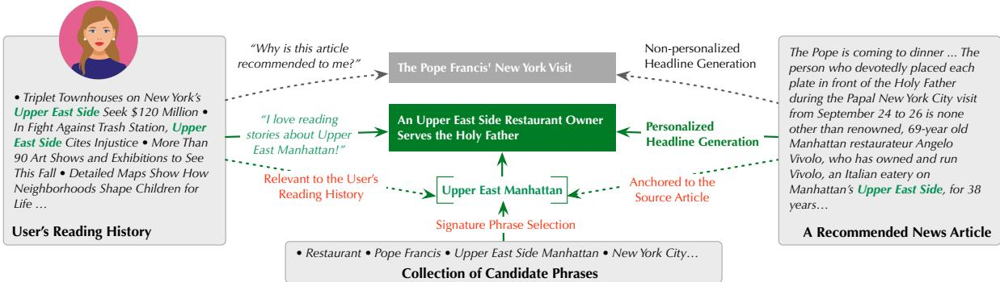
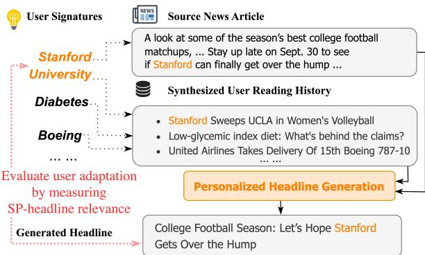
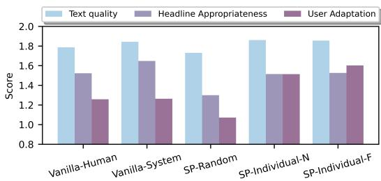

# Generating User-Engaging News Headlines

Pengshan Cai,1∗ Kaiqiang Song,2 Sangwoo Cho,2 Hongwei Wang,2 Xiaoyang Wang,2 Hong Yu,1,3 Fei Liu,4 Dong Yu2

1University of Massachusetts, Amherst 2Tencent AI Lab, Bellevue, WA 3University of Massachusetts, Lowell 4Emory University {pengshancai,hongyu}@cs.umass.edu fei.liu@emory.edu {riversong,swcho,hongweiw,shawnxywang,dyu}@global.tencent.com

## Abstract

The potential choices for news article headlines are enormous, and finding the right balance between conveying the essential message and capturing the reader’s attention is key to effective headlining. However, presenting the same news headline to all readers is a suboptimal strategy, because it does not take into account the different preferences and interests of diverse readers, who may be confused about why a particular article has been recommended to them and do not see a clear connection between their interests and the recommended article. In this paper, we present a novel framework that addresses these challenges by incorporating user profil ing to generate personalized headlines, and a combination of automated and human evaluation methods to determine user preference for personalized headlines. Our framework utilizes a learnable relevance function to assign personalized signature phrases to users based on their reading histories, which are then used to personalize headline generation. Through extensive evaluation, we demonstrate the effectiveness of our proposed framework in generating personalized headlines that meet the needs of a diverse audience. Our framework has the potential to improve the efficacy of news recommendations and facilitate creation of personalized content.1

## 1 Introduction

Personalized news recommendation systems, such as Google News and Yahoo News, help users discover articles that align with their interests (Karimi et al., 2018). However, these systems often present the same article headline to all users, making it difficult for them to understand the connection between their interests and the recommended article, potentially reducing the effectiveness of the recommendation system. To address this, we propose a new framework for generating personalized, engaging headlines that clearly show the connection between a user’s reading history and a recommended article. Our framework has the potential to improve the efficacy of personalized news recommendations, and recommendations for short videos, articles, recipes, etc. (Majumder et al., 2019; Kanouchi et al., 2020; Gosangi et al., 2021)

Generating personalized headlines is a challenging task due to the constraints of conciseness and the need to capture the reader’s attention. A personalized headline should (a) effectively convey the main message of the article and (b) provide a clear link to the user’s reading history, using only about 10 words on average (Bernstein et al., 2020). There are two main challenges in this task. First, a headline that entices users to click, but only presents limited information and fails to convey the essential story, becomes clickbait rather than a useful headline (Bourgonje et al., 2017; Potthast et al., 2018). Second, it is difficult to find large scale annotated datasets containing news articles, multiple personalized headlines, and associated user profiles. Such a dataset would be useful in developing personalized headlines, but it is currently unattainable.

The key to effective personalization is to develop a comprehensive framework that enables us to (a) understand users’ interests based on their reading histories, (b) produce personalized headlines, and (c) evaluate the effectiveness of these headlines in terms of user preference. Previous studies on headline generation have primarily focused on producing headlines that accurately summarize a given news article or its first sentence (Song et al., 2018; Xu et al., 2019; Matsumaru et al., 2020; Song et al., 2021; Kanungo et al., 2021), but have not considered the potential benefits of personalization. In this study, we propose a pipeline that incorporates user profiling2 and a comprehensive synthesis of automated and human evaluation methods for user preference to produce personalized headlines that cater to a varied audience.

  
Figure 1: An example of generating a personalized news headline using our framework (black solid line) as compared to generating general headlines directly from the news article (grey dotted line). Both headlines are appropriate for the news article, but headline 1 is more attractive to users interested in the topic Upper East Side, Manhattan.

Our approach focuses on learning a relevance function that condenses a user’s reading history into a collection of signature phrases. This method for user profiling is both efficient and adaptable, as the signature phrases can be easily updated as the user’s interests evolve (Bansal et al., 2015). These signature phrases are derived from news article based on the user’s reading history through contrastive learning without the needfor annotated data. For example, if the phrase Upper East Side frequently appears in the user’s reading history, it could become a signature phrase for that user (Figure 1). These signature phrases do not need to appear verbatim in the user’s reading history and can indicate broader interests, e.g., if the phrases Avengers and Hulk appear in the user’s reading history, it could indicate a love for Marvel movies and Marvel Studios could be a signature phrase that reflects this interest. We build a synthetic dataset that trains the model to generate personalized head lines for a news article. Using signature phrases, our model is able to create a connection between the recommended article and the user’s interests, resulting in personalized headlines that are both engaging and anchored to the article to avoid clickbait.

Evaluating personalized news headlines presents unique challenges (Gligoric et al.´ , 2021). It would be ideal to have human evaluators judge the effectiveness of system headlines. Indeed, we have conducted a human evaluation in this study. However, this process is time-consuming and costly, making it impractical during the system development phase. Thus, we propose a comprehensive synthesis ofautomated and human evaluation methods to assess headline relevance and user preference. By using signature phrases, we can synthesize user profiles of various types. We hypothesize that personalized headlines generated for these user profiles will be preferred by the same users over generic, nonpersonalized headlines according to recommenderdriven metrics (Karpukhin et al., 2020; Wu et al., 2021a). We also experiment with a variety of automatic metrics to assess headline quality in terms of informativeness, relevance to the source article, and content accuracy (Kryscinski et al., 2020; Fabbri et al., 2021).

In this paper, we make the following contributions:

• we present a comprehensive framework for generating personalized news headlines that convey the essential message of the article and capture the reader’s attention while also aligning with their interests. Our framework utilizes a learnable relevance function to derive signature phrases from users’ reading histories and uses them to personalize the headlines;

• we thoroughly synthesize automated and human evaluation methods to assess the effectiveness of headlines in terms of their accuracy and user preference. We further compare our proposed framework with strong headline generation baselines, present results on benchmark news datasets, and identify promising directions for future research through an in-depth analysis of system outputs.

## 2 Related Work

Automatic headline generation has made significant progress in recent years (Matsumaru et al., 2020; Horvitz et al., 2020; Laban et al., 2021; Song et al., 2020; Goyal et al., 2022), thanks in part to the development of large language models (Lewis et al., 2020; Raffel et al., 2020; Zhang et al., 2020a; Brown et al., 2020; Chowdhery et al., 2022) and the availability of benchmark news datasets such as Gigaword, XSum, and Newsroom (Rush et al., 2015; Narayan et al., 2018; Grusky et al., 2018).

These datasets include a single headline for each news article, serving as the groundtruth for the models. In contrast to previous works, we aim to personalize headline generation to improve content recommendations, where a personalized headline should convey the main points of the article and capture the user’s attention.

Personalization is a highly sought-after technique, and researchers have explored its use for tasks such as headline generation, dialog response generation and recipe creation (Ao et al., 2021; Majumder et al., 2019; Flek, 2020; Wu et al., 2021b; Dudy et al., 2021). We anticipate that this technique to continue to have a significant impact. For example, when a recommender system distributes news articles or short videos, personalizing the headline can help users find a clear connection between their interests and the recommended article/video (Karimi et al., 2018; Bernstein et al., 2020), thus improving their experience.

Evaluating personalized content is a largely under-explored area, partly due to the lack of ground truth for personalized content generation (Gligoric et al.´ , 2021). Without ground truth, it is challenging to apply commonly used text generation evaluation metrics such as ROUGE, BLEU, BERTScore, MoverScore, BLEURT, etc. (Lin, 2004; Post, 2018; Zhang et al., 2020b; Zhao et al., 2019; Sellam et al., 2020). To leverage recent advances in data synthesis (Pasunuru et al., 2021; Amplayo and Lapata, 2020; Magooda and Litman, 2021), we propose synthesizing user profiles of various types. We then evaluate system headlines against these profiles along multiple dimensions, including their alignment with user interests, relevance to the source article, and content accuracy. In the following, we provide details of our approach.

## 3 Our Approach

Our goal is to generate a user-engaging headline that conveys the main idea of a given news article d for a specific user u. To achieve this, we have developed a three-step framework: (1) Signature phrases identification. Using a key-phrase generation module, we identify a set of candidate signature phrases $Z _ { d } = \{ z _ { 1 } , z _ { 2 } , . . . \}$ that cover various aspects of d (Section 3.1); (2) User signature phrases selection. From the set of candidate signature phrases, we select a subset $Z _ { d } ^ { u } \subseteq Z _ { d }$ that relates to user u’s interests as the user signature phrases (Section 3.2); (3) Signature-oriented headline generation. Based on the news article d and the selected user signature phrases $Z _ { d } ^ { u }$ , we generate a headline that introduces the content of the article d from the perspective of the user u’s personalized interests (Section 3.3).

## 3.1 Signature Phrases Identification

We approach this task as a conditional text generation problem, in which the model takes a news article or headline as input and outputs all candidate signature phrases in the input sequence, separated by semicolons. We use a BART model that has been pretrained on the KPTimes dataset3. KPTimes (Gallina et al., 2019) is a large-scale dataset containing 279K news articles paired with editorcurated signature phrases. Unlike other datasets for signature phrase identification (Meng et al., 2017; Krapivin et al., 2009) that focus on scientific research papers, KPTimes focuses on extracting signature phrases in news articles, making it well-suited for our task. The model is trained by minimizing the cross-entropy loss between the predicted signature phrase sequences and the humancurated signature phrase sequences.

## 3.2 User Signature Selection

In this step, we rank all candidate signature phrases in $Z _ { d }$ based on their level of engagement with user u’s reading history $H _ { u }$ , and select the top k candidate signature phrases as the user signature phrases. Suppose that the user’s history $H _ { u }$ can be defined as a set of headlines of articles that the user has previously read, i.e., $H _ { u } = \{ t _ { 1 } , t _ { 2 } , \dots \}$ . We first convert each signature phrase $z _ { i } \in Z _ { d }$ into a dense vector $\mathbf { z } _ { i }$ using a signature phrase encoder. To calculate the user-engaging scores for each candidate signature phrase $z _ { i } ,$ we consider two different encoding strategies for the user’s history:

(1) Holistic history encoding. We concatenate all headlines in the user’s reading history $H _ { u }$ with additional semicolons for headline separation. Then we encode the concatenated headlines into a dense vector $\mathbf { h } _ { u }$ using a holistic history encoder. The engaging score $S ( z _ { i } , H _ { u } )$ of a signature phrase $z _ { i } \in Z _ { d }$ for user u is obtained by the dot product of the two vectors:

$$
S ( z _ { i } , H _ { u } ) = \mathbf { z } _ { i } ^ { \top } \mathbf { h } _ { u } .\tag{1}
$$

(2) Individual history encoding. Each individual headline $t _ { j } \in H _ { u }$ is encoded as a dense vector $\mathbf { t } _ { j }$ using an individual headline encoder. The userengaging score is then defined as the maximum dotproduct relevance between the signature phrase zi and each individual headline in the reading history:

$$
S ( z _ { i } , H _ { u } ) = \operatorname* { m a x } _ { t _ { j } \in H _ { u } } \mathbf { z } _ { i } ^ { \top } \mathbf { t } _ { j } .\tag{2}
$$

In practice, we train the user signature phrase selection model using an in-batch contrastive learning approach (Radford et al., 2021). We consider a batch of synthesized users $\{ u _ { 1 } , u _ { 2 } , \cdot \cdot \cdot , u _ { N _ { B } } \}$ where $N _ { B }$ is the batch size, and each user $u _ { i }$ has exactly one user signature phrase $z _ { i }$ . The reading history $H _ { i }$ for user $u _ { i }$ is then constructed by randomly sampling news articles whose candidate signature phrases contain $z _ { i } .$ , i.e., $H _ { i } = \{ d \mid z _ { i } \in Z _ { d } \}$ In this way, $( z _ { i } , H _ { i } )$ is considered as a positive pair, and $\left( z _ { i } , H _ { j } \right) ( i \neq j )$ is considered as a negative pair. The contrastive loss for this batch is defined as follows:

$$
L _ { s e l e c t } = \frac { 1 } { 2 } \Bigg ( \sum _ { i = 1 } ^ { N _ { B } } \log \frac { S ( z _ { i } , H _ { i } ) } { \sum _ { j = 1 } ^ { N _ { B } } S ( z _ { i } , H _ { j } ) } +\tag{3}
$$

$$
\sum _ { j = 1 } ^ { N _ { B } } \log \frac { S ( z _ { j } , H _ { j } ) } { \sum _ { i = 1 } ^ { N _ { B } } S ( z _ { i } , H _ { j } ) } \Bigg )\tag{4}
$$

## 3.3 Signature-Oriented Headline Generation

We model the user-specific headline generation process as a conditional generation task. Given a news article d and a user u, along with the user signature phrases $Z _ { d } ^ { u } \subseteq Z _ { d }$ , our goal is to generate a headline $t = [ w _ { 1 } , w _ { 2 } , \dots ]$ for $d ,$ where $w _ { i }$ is the i-th token in t. The loss for this generation step is calculated as the negative log-likelihood of the conditional language generation:

$$
{ \it L } _ { g e n } = - \sum _ { i } \log \mathrm { P r } ( w _ { i } \mid w _ { 1 } , \cdots , w _ { i - 1 } ; Z _ { d } ^ { u } , d )\tag{5}
$$

Specifically, the input to the generator is the concatenation of the user signature phrases $Z _ { d } ^ { u }$ and news article d, and the output is the signature-based headline t. During the training stage, $Z _ { d } ^ { u }$ is identified from t, the ground-truth headline of d. During the inference stage, $Z _ { d } ^ { u }$ is identified from d itself and selected by user signature selection models, since the headline t is not available before generation. We use BART here as the generator for headline generation.

## 4 Corpora Processing

In this section, we describe the corpora processing step, including the creation of synthesized users and the generation of signature phrase based headlines. Our data is sourced from two existing news corpora: Newsroom (Grusky et al., 2018) and Gigaword (Rush et al., 2015; Graff et al., 2003). The Newsroom corpus contains 995,041 articleheadline pairs in its training set, 108,837 in its validation set, and 108,862 in its test set. The Gigaword corpus contains 7,704,419 instances in its training set, 394,390 in its validation set, and 381,045 in its test set. For each corpus, we construct two datasets: a synthesized user dataset and a headline generation dataset. The first dataset is used for training the use signature phrase selection model (Section 3.2) and evaluating the entire system, while the second dataset is used for training the signature-oriented headline generation model (Section 3.3). Further data statistics can be found in Table 1.

<table><tr><td colspan="2">Corpus</td><td>Newsroom Gigaword</td></tr><tr><td>Synthesized user dataset # instances Train # signature phrases per user</td><td>994,680</td><td>6,848,000 1</td></tr><tr><td># instances Dev # signature phrases per user</td><td>Avg. # articles read by a user 16.17 49,860 1 Avg. # articles read by a user 16.32</td><td>16.31 49,984 1 16.33</td></tr><tr><td># instances Test # signature phrases per user Avg. # articles read by a user</td><td>10,000 1~5 15.03</td><td>10,000 1~5 14.99</td></tr><tr><td># train instances # dev instances Avg. # words/article Avg. # words/headline Avg. # signature phrase/article Total # of signature phrases</td><td>Headline generation dataset 995,041 58,530 661.58 8.73</td><td>7,704,419 394,390 421.42 8.44 10.81</td></tr></table>

Table 1: Statistics of the datasets. For each corpus, the synthesized user dataset is used for training the signature phrase selection module and evaluating the entire system, while the headline generation dataset is used for training the headline generation module (it does not have a test set because the generation step is evaluated in the entire system using the test set of synthesized user dataset).

Synthesized User Creation. As real user data is not available, we generate synthesized users to mimic real users’ reading histories. The process for creating synthesized users is illustrated in Figure 2 and consists of the following steps: (1) Identification of signature phrases in all news articles of a corpus to build a candidate phrase pool; (2) Mapping of each signature phrase to a series of news articles that contain that phrase; (3) Random sampling of a subset of phrases from the candidate phrase pool as each synthesized user’s area of interest; (4) Random sampling of a set of news articles that contain each user’s chosen interest phrase using the phrase-article map established in step 2.

During the training stage of the signature phrase selector, each synthesized user is assigned only one interest phrase to enable contrastive learning (Eq. 4). However, when evaluating the model, each synthesized user is assigned 1 5 interest phrases to mimic real-world scenarios. It is important to note that it is easier to generate personalized headlines for users with simpler backgrounds (e.g. users whose reading histories only relate to one or two topics). To study the effect of the number of users’ interested phrases on the generated headlines, we create 2,000 synthesized users with 1 5 number of interested phrases respectively.

  
Figure 2: Synthesizing user profiles. The synthesized user’s interests contain randomly selected interest phrases, i.e. Stanford University, Diabetes, Boeing. etc. Some news headlines related to these phrases are chosen to represent the synthesized user’s reading history. During the inference stage, one news article containing the interest phrase Stanford University is selected as the source article for headline generation.

In general, headline personalizing is only effective when the source article content aligns with the user’s interests. To ensure relevancy, we randomly select one of the user signature phrases from each synthesized user, and then randomly choose one news article that contains the selected phrase as the input for the test case. This ensures that the news article whose headline needs to be generated is relevant to the user. The evaluation details are further explained in Section 5.

Headline Generation. In order to generate signature phrase oriented headlines, we use the signature phrases identification model to extract signature phrases from the original headlines. These generated phrases, along with the corresponding news article contents, are then fed into the headline generation model to generate the original headlines. In our experiments, we truncate all news articles to a maximum of 512 tokens and only keep signature phrases that appear in more than 10 news articles. On average, around 10 candidate signature phrases are identified in each news article, providing a diverse range of perspectives for headline generation.

## 5 Experiments

We thoroughly evaluate our proposed system from different perspectives, including objective evaluation (Section 5.2), subjective evaluation (Section 5.3) and ablation studies (Section 5.4), for personalized headline generation.

## 5.1 Baseline Methods

We compare the performance of our system with the following baseline approaches: (1) PENS-EBNR and (2) PENS-NRMS (Ao et al., 2021) are LSTM-based personalized headline generation models. Both were trained on the PENS dataset, but using different reading history encoding models; (3) Vanilla System is a BART-large model fine-tuned directly on headline generation datasets without using signature phrases; (4) Vanilla Human refers to original headline given by the author of the news article; (5) SP-headline uses signature phrases identified in the original humanwritten headline to guide headline generation; (6) SP-random randomly selects signature phrases in the news article to guide headline generation. (7) SP-holistic and (8) SP-individual were introduced in previous sections.

## 5.2 Objective Evaluation

We use various metrics to evaluate the entire personalized headline generation pipeline:

(1) Relevance Metrics. We use pre-trained DPR (Karpukhin et al., 2020) and Sentence-BERT (Reimers and Gurevych, 2019) models to calculate the relevance score between texts. Specifically, we report dot-product similarity when using DPR, and cosine similarity when using Sentence-BERT. These relevance metrics are calculated for both the headline-user relevance and the headline-article relevance. For headline-user relevance, the score is calculated between the generated headline and the user signatures. For headline-article relevance, the score is calculated between the generated headline and the entire news article.

(2) Recommendation Score. Following (Wu et al., 2021a), we train a news recommendation system using the MIND dataset (Wu et al., 2020). The system takes in a user’s reading history and a headline of a news article, and outputs a score indicating the degree to which the system would recommend the news to the user.

(3) Factual Consistency. We apply the pre-trained FactCC model (Kryscinski et al., 2020) to obtain the factual consistency score between the generated headline and the news article. We report the percentage of generated headlines that are predicted to be factually consistent with the news article by the FactCC model.

<table><tr><td rowspan="3" colspan="2">Methods</td><td colspan="3">User Adaptation Metrics</td><td colspan="3">Article Loyalty Metrics</td><td colspan="3">Other Metrics</td></tr><tr><td colspan="2">H-U Relevance DPR</td><td>REC Score</td><td colspan="2">H-A Relevance</td><td>FactCC</td><td colspan="2">R-L Ext Cvrg</td><td>Length</td></tr><tr><td>SBERT</td><td></td><td>Newsroom</td><td>DPR</td><td>SBERT</td><td></td><td></td><td></td><td></td></tr><tr><td colspan="10"></td></tr><tr><td rowspan="5">Baselines</td><td>PENS-NRMS</td><td>50.85</td><td>0.221</td><td>2.449</td><td>60.25</td><td>0.659</td><td>0.498</td><td>17.98</td><td>0.982</td><td>9.99</td></tr><tr><td>PENS-EBNR</td><td>50.89</td><td>0.219</td><td>2.476</td><td>60.84</td><td>0.666</td><td>0.521</td><td>19.75</td><td>0.984</td><td>10.00</td></tr><tr><td>Vanilla System</td><td>51.78</td><td>0.249</td><td>2.697</td><td>64.31</td><td>0.681</td><td>0.639</td><td>37.02</td><td>0.828</td><td>8.51</td></tr><tr><td>Vanilla Human</td><td>51.39</td><td>0.241</td><td>2.690</td><td>64.00</td><td>0.642</td><td>0.682</td><td>N/A</td><td>0.749</td><td>8.96</td></tr><tr><td>SP Headline</td><td>52.42</td><td>0.270</td><td>2.577</td><td>63.74</td><td>0.651</td><td>0.694</td><td>42.63</td><td>0.772</td><td>7.53</td></tr><tr><td rowspan="5">Ours</td><td>SP Random</td><td>52.26</td><td>0.263</td><td>2.735</td><td>64.31</td><td>0.652</td><td>0.680</td><td>29.40</td><td>0.817</td><td>8.87</td></tr><tr><td>SP holistic-N</td><td>53.23</td><td>0.286</td><td>2.896</td><td>64.33</td><td>0.654</td><td>0.673</td><td>29.52</td><td>0.817</td><td>8.83</td></tr><tr><td>SP individual-N</td><td>54.19</td><td>0.313</td><td>2.735</td><td>64.57</td><td>0.659</td><td>0.670</td><td>30.14</td><td>0.818</td><td>8.87</td></tr><tr><td>SP holistic-F</td><td>54.00</td><td>0.310</td><td>2.882</td><td>64.24</td><td>0.655</td><td>0.662</td><td>29.92</td><td>0.814</td><td>8.79</td></tr><tr><td>SP individual-F</td><td>55.05</td><td>0.342</td><td>2.947</td><td>64.85</td><td>0.658</td><td>0.695</td><td>29.83</td><td>0.820</td><td>8.98</td></tr><tr><td colspan="10">Gigaword</td></tr><tr><td rowspan="5">Baselines</td><td>PENS-NRMS PENS-EBNR</td><td>52.30 52.51</td><td>0.22 0.221</td><td>3.144 3.224</td><td>63.72 64.51</td><td>0.678 0.696</td><td>0.524 0.551</td><td>23.06 22.30</td><td>0.999 0.997</td><td>9.97 10.00</td></tr><tr><td>Vanilla System</td><td>53.28</td><td>0.241</td><td></td><td></td><td>0.702</td><td>0.636</td><td>44.95</td><td>0.797</td><td>8.22</td></tr><tr><td></td><td>52.80</td><td></td><td>3.526</td><td>66.90</td><td>0.652</td><td></td><td></td><td></td><td></td></tr><tr><td>Vanilla Human</td><td>52.94</td><td>0.236</td><td>3.489</td><td>66.08</td><td></td><td>0.684</td><td>N/A</td><td>0.716</td><td>8.57</td></tr><tr><td>SP Headline</td><td></td><td>0.236</td><td>3.478</td><td>66.39</td><td>0.684</td><td>0.655</td><td>54.68</td><td>0.782</td><td>8.13</td></tr><tr><td rowspan="5">Ours</td><td>SP Random</td><td>52.44</td><td>0.235</td><td>3.216</td><td>64.33</td><td>0.625</td><td>0.718</td><td>33.33</td><td>0.764</td><td>7.86</td></tr><tr><td>SP holistic-N</td><td>53.39</td><td>0.253</td><td>3.414</td><td>64.81</td><td>0.638</td><td>0.697</td><td>35.39</td><td>0.768</td><td>7.84</td></tr><tr><td>SP individual-N</td><td>54.08 54.14</td><td>0.272</td><td>3.455</td><td>65.25</td><td>0.648</td><td>0.695</td><td>36.36</td><td>0.776</td><td>7.87</td></tr><tr><td>SP holistic-F</td><td></td><td>0.278</td><td>3.396</td><td>64.77</td><td>0.636</td><td>0.704</td><td>35.16</td><td>0.769</td><td>7.87</td></tr><tr><td>SP individual-F</td><td>54.82</td><td>0.299</td><td>3.459</td><td>65.34</td><td>0.643</td><td>0.738</td><td>34.65</td><td>0.778</td><td>8.06</td></tr></table>

Table 2: Objective evaluation results of all methods. “-F” means using the fine-tuned signature phrase encoder, headline encoder and user history encoder, while “-N” means using the naive DPR models as encoders. “REC Score” refers to recommendation score. Vanilla approaches do not consider human preference.

(4) Surface Overlap. We use ROUGE-L F1 and Extractive Coverage to evaluate the surface overlap between the generated headline and the reference headline/news article. ROUGE (Lin, 2004) scores are widely used to evaluate the surface level coverage of generated summaries against golden standards. Specifically, ROUGE-L F1 measures the longest common sub-sequence between the generated output and reference. Extractive Coverage (Grusky et al., 2018) is the percentage of words in the generated headline that are from the source news article, measuring the extent to which the summary is derived from the text.

Table 2 presents objective evaluation results for generated headlines. We elaborate our observations from the following perspectives:

User Adaptation. (1) The methods SP holistic and SP individual generally show better performance, indicating that our signature phrase based headline generation framework is able to generate more user-oriented headlines. In contrast, while Vanilla System and SP Headline achieve higher Rouge-L scores, they have lower scores in user adaptation, suggesting that they have higher similarity with the original headline but do not achieve personalization. (2) Comparing SP based methods, we observe that using selectors fine-tuned on our signature selection datasets (i.e. -F) leads to more user-preferred headlines than their naive counterparts (i.e. -N). This reflects the improvement of fine-tuning signature phrase selector. It is worth noting that the performance of SP Random is significantly lower than SP holistic/individual, and almost similar to Vanilla System, which suggests that user adaptation is only achieved when signature phrases of users’ interests are well-selected. (3) SP individual shows better performance than SP holistic, indicating that individual encoding better aligns users’ reading history with their interests.

Article Loyalty. (1) While Vanilla System generally achieves better performance in headline-article relevance, SP individual-F generates more headlines that are identified as factually consistent by FactCC. Our analysis found that headlines generated by our SP-based methods are usually anchored to news articles by the signature phrase, i.e. the generated headlines may contain content in the context of the signature phrase (as shown in the example in Figure 2). This keeps the generated headlines related and factually consistent with the news article, thus avoiding click-bait headlines. (2) The extractive converge of the original human headlines is lower than all machine-generated headlines, which implies that human written headlines are more abstractive. This explains the original headlines’ low performance in article loyalty metrics. Note that ROUGE scores do measure our goal of headline personalization, we present the results only to show the generated headlines’ surface-level resemblance to the human written ones.

  
Figure 3: Result of human evaluation scores on the generated headlines w.r.t. text quality, headline appropriateness, and user adaptation.

## 5.3 Subjective Evaluation

We conduct a two-step human evaluation using 16 evaluators who have high English proficiency. In the first step, we collected 2,260 news headlines from 113 common topics in Newsroom and Gigaword corpus. We presented the volunteers with the article headlines and corresponding topics and asked them to select around 20 headlines of their interests mimicking their interest phrases and reading histories. In the second step, we generated headlines for 12 randomly selected news articles containing the volunteers’ interested phrases (6 from Newsroom and 6 from Gigaword). We then asked the volunteers to evaluate the generated headlines through the following five approaches: (1) Vanilla Human; (2) Vanilla System; (3) SPrandom; (4) SP-individual-N; (5) SP-individual-F. We evaluated the headlines from three perspectives: (1) User adaptation; (2) Headline appropriateness and (3) Text quality. The grading scale ranges from 1 (worst) to 3 (best), and detailed grading standards are provided in Appendix A.3.

According to Figure 3, our signature-oriented headline generation approaches, SP-Individual-F and SP-Individual-N, perform better than other baseline methods in terms of user adaptation. This is in line with the objective results that our signature-oriented framework generates headlines that cater more to users’ interests.

Further, the headlines generated by Vanilla System obtain the highest scores in headline appropriateness. However, after analyzing the generated headlines, we realized that some identified signature phrases did not correlate well with the article’s main point, thus diverging from the article. For example, in the third example in Table 3, the generated headline focuses on Shanghai Index’s drop, which is only a minor evidence to support the article’s main point, i.e. China’s stock market crush, and is therefore not appropriate to be included in the headline.

<table><tr><td rowspan=1 colspan=1>1</td><td rowspan=1 colspan=1>User Signatures: Mark Zuckerberg; Bill GatesNews Article: The Giving Pledge, invented by Bill and Melinda Gatesand Warren Buffett to spur the philanthropy of billionaires, ... assuredlythe coolest recruits are Facebook co-founders Mark Zuckerberg andDustin Moskovitz, who each turned 27 in May ...Generated Headline: The Giving Pledge: Zuckerberg and Gates at 27</td></tr><tr><td rowspan=1 colspan=1>2</td><td rowspan=1 colspan=1>User Signatures: The Force AwakensUser Interest Phrase: Star WarsNews Article: Star Wars: Episode 7 has revealed its full title - it will becalled Star Wars: The Force Awakens ...Generated Headline: Star Wars Episode 7 to be called Star Wars: TheForce Awakens</td></tr><tr><td rowspan=1 colspan=1>3</td><td rowspan=1 colspan=1>User Signatures: Shanghai Composite IndexNews Article: China stocks fell more than 1 percent on Tuesday morning... the Shanghai Composite Index lost 1.4 percent .Generated Headline: Shanghai Composite Index falls 1.4% despitemarket-soothing measures</td></tr><tr><td rowspan=1 colspan=1>4</td><td rowspan=1 colspan=1>User Signatures: PhotographyNews Article: ... Self-publishing is not a new development in photogra-phy, but recently the trend to make, edit, design and produce ..Human Headline: Self-publish or be damned: why photographers aregoing it aloneGenerated Headline: Self-published photography books to be show-cased at Photographers&#x27; Gallery</td></tr></table>

Table 3: Examples of generated headlines.

<table><tr><td>Selector</td><td>Hit@1</td><td>Hit@3</td><td>Hit@5</td><td>Mean Rank↓</td></tr><tr><td colspan="5">Newsroom</td></tr><tr><td>Random</td><td>9.28</td><td>27.79</td><td>46.28</td><td>5.071</td></tr><tr><td>Holistic-N</td><td>18.30</td><td>41.82</td><td>57.95</td><td>4.395</td></tr><tr><td>Holistic-F</td><td>30.10</td><td>54.69</td><td>68.81</td><td>3.376</td></tr><tr><td>Individual-N</td><td>30.99</td><td>57.05</td><td>71.68</td><td>3.193</td></tr><tr><td>Individual-F</td><td>40.34</td><td>67.57</td><td>79.64</td><td>2.395</td></tr><tr><td colspan="5">Gigaword</td></tr><tr><td>Random</td><td>9.28</td><td>27.79</td><td>46.28</td><td>5.071</td></tr><tr><td>Holistic-N</td><td>16.91</td><td>39.56</td><td>58.31</td><td>4.142</td></tr><tr><td>Holistic-F</td><td>29.21</td><td>55.44</td><td>70.95</td><td>3.094</td></tr><tr><td>Individual-N</td><td>23.98</td><td>50.09</td><td>67.50</td><td>3.438</td></tr><tr><td>Individual-F</td><td>34.05</td><td>64.01</td><td>79.71</td><td>2.426</td></tr></table>

Table 4: The impact of different signature phrase selectors.

Moreover, the Vanilla Human did not receive the highest scores. We found some of the human written headlines are overly rhetorical and not easily understandable to ordinary readers (see the fourth example in Table 3). All NLP models achieve good performance (around 1.8 points) in text quality, which is similar to the scores of the human-written headlines. 4

## 5.4 Ablation Study

Selectors Evaluation. To evaluate the performance of signature selection, we rank all candidate signature phrases within an article for a synthesized user and report the following metrics: (1) Hit@K, which is the percentage of times that the correct signature phrase is ranked among the top K; (2) Mean rank, which is the average rank of the correct signature phrase. We use our synthesized user evaluation dataset to evaluate both headline generation and signature selection.

<table><tr><td rowspan="2"># User&#x27;s Interest Phrases</td><td colspan="3">User Adaptation Metrics</td><td colspan="2">Article Loyalty Metrics</td><td colspan="3">Other Metrics</td></tr><tr><td>H-U Relevance DPR</td><td>SBERT</td><td>REC Score DPR</td><td>H-A Relevance SBERT</td><td>FactCC</td><td>R-L</td><td>Ext Cvrg</td><td>Length</td></tr><tr><td>1</td><td>55.63</td><td>0.362</td><td>4.532</td><td>65.14 0.665</td><td>70.2</td><td>30.28</td><td>0.826</td><td>9.04</td></tr><tr><td>2</td><td>55.04</td><td>0.347</td><td>3.077</td><td>64.87 0.656</td><td>69.2</td><td>30.03</td><td>0.818</td><td>9.02</td></tr><tr><td>3</td><td>54.96</td><td>0.343</td><td>2.555</td><td>64.84 0.660</td><td>68.5</td><td>29.55</td><td>0.821</td><td>9.04</td></tr><tr><td>4</td><td>54.96</td><td>0.330</td><td>2.262</td><td>64.53 0.653</td><td>68.9</td><td>29.31</td><td>0.815</td><td>8.82</td></tr><tr><td>5</td><td>54.65</td><td>0.328</td><td>2.310</td><td>64.88 0.658</td><td>70.7</td><td>29.97</td><td>0.821</td><td>8.98</td></tr><tr><td>10</td><td>54.39</td><td>0.323</td><td>1.871</td><td>64.96 0.655</td><td>69.3</td><td>29.18</td><td>0.813</td><td>8.89</td></tr><tr><td>20</td><td>53.74</td><td>0.305</td><td>1.65</td><td>64.7 0.657</td><td>66.9</td><td>30.01</td><td>0.812</td><td>8.93</td></tr><tr><td>30</td><td>53.14</td><td>0.291</td><td>1.778</td><td>64.66 0.658</td><td>69.1</td><td>29.55</td><td>0.817</td><td>8.94</td></tr></table>

Table 5: Result of generated headlines for newsroom articles when synthesized users have different number of interest phrases.
<table><tr><td rowspan="2">Methods</td><td colspan="3">User Adaptation Metrics</td><td colspan="3">Article Loyalty Metrics</td><td colspan="3">Other Metrics</td></tr><tr><td>H-U Relevance DPR</td><td>SBERT</td><td>REC Score</td><td>H-A Relevance DPR SBERT</td><td>FactCC</td><td>R-L</td><td>Ext Cvrg</td><td></td><td>Length</td></tr><tr><td>History Oriented (GPT-3)</td><td>51.76</td><td>0.277</td><td>4.277</td><td>64.05</td><td>0.676</td><td>0.64</td><td>29.99</td><td>0.751</td><td>7.02</td></tr><tr><td>Topic Oriented (GPT-3)</td><td>52.73</td><td>0.296</td><td>4.562</td><td>64.21</td><td>0.685</td><td>0.65</td><td>26.32</td><td>0.759</td><td>7.80</td></tr><tr><td>SP individual-F</td><td>54.75</td><td>0.330</td><td>4.618</td><td>64.85</td><td>0.672</td><td>0.71</td><td>36.89</td><td>0.835</td><td>9.14</td></tr></table>

Table 6: Performance of GPT-3 generated headlines compared to our SP individual-F.  
History Oriented: Assume a reader has already read a series of articles titled [Title 1], [Title 2], . . . . Here’s an input news article: [Article]. Generate a compelling headline within ten words for this news article that the reader would find interesting.  
Topic Oriented: [Article]. Generate a compelling headline within ten words for the above news article that a reader who has already read a series of articles on the topics of [Topic 1], [Topic 2], . . . . would find interesting.

Table 7: Two paradigms of applying GPT-3 in personalized headline generation. History Oriented uses GPT-3 to generate headlines for users based on their reading history. Topic Oriented first obtains focused signature phrases using our signature identification and selection modules, and then generates the headline based based on the focused topics using GPT-3.

As shown in Table 4, Individual-F demonstrates the best performance among all selectors. This explains the high user adaptation scores of headlines generated by SP individual-F. We have observed that the selector does not always choose the gold user signature phrases, yet the generated headline still relates to user’s interests. For example, in the second example of Table 3, even though the user’s interested phrase Star War was not chosen as the user signature, the generated headline is still relevant to Star War, as the selected signature phrase The Force Awakens is the subheading of a movie in the Star War movie series.

Factors Affecting Headline Generation. Through our experiments, we have identified that the following factors affect the quality of the generated headlines: (1) Number of topics that the user is interested in. As shown in Table 55, the evaluation results of headlines generated from newsroom articles for synthesized users with varying number of interest phrases indicates that, as the number of interest phrases increases, the user adaptation scores decreases, while other scores remain roughly the same. This suggests that it is easier to generate personalized headlines for users who read news related to fewer interest phrases. However, even when the number of interest topics increases to 30, our proposed method still achieves better user adaptation scores then the vanilla systems, while showing similar performance in article loyalty metric. (2) Number of user signature phrases. Our analysis of generated headlines revealed that when the signature-oriented headline generator takes multiple user signature phrases as input, the generated headline may contain factual errors. This is because the generator is compelled to incorporate irrelevant signature phrases into a coherent headline, as seen in the first example in Table 3). As a result, we only use a single signature phrase to guide headline generation.

Applying GPT-3 for Personalized Headline Generation. Recently, GPT-3 (Brown et al., 2020) has been found to be effective in zero-shot prompting automatic summarization (Goyal et al., 2022). In this section, we investigate whether prompts can inspire GPT-36 to generate personalized headlines of good quality. To achieve this goal, we conduct experiment with 100 random samples from our newsroom test set using two paradigms, as shown in Table 7, and present the results in Table 6.

Our SP individual-F method outperforms GPT-3 based methods in terms of user adaptation metrics and ROUGE-L score. This suggests that despite GPT-3’s strong ability in zero-shot setting, it is still incomparable to models that are specifically trained for our headline generation task. Specifically, the topic oriented method shows better performance in user adaptation metrics than the history oriented method, which implies that our topic selector effectively reveals users’ interests.

## 6 Conclusion

We investigate the generation of personalized headlines tailored to various users’ interests. We propose a topic-focused generation framework and methods for creating synthesized data to support the training of our framework without the need for human-annotated datasets. Additionally, we explore evaluation methods that enable the automatic evaluation of the generated headlines from multiple perspectives. Our experiments demonstrate the effectiveness of our proposed approaches.

## 7 Limitations

Personalized news headline generation has the potential to improve the way users consume and understand the news. However, it is important to be aware of its limitations. The performance of any natural language generation model, including those used for personalized news headlines, is dependent on the quality and consistency of the data used to train it. Similar to personalized recommendation systems, personalized headlines have the potential to create echo chambers. If the model is trained on a biased or unrepresentative dataset, it may generate outputs that are incomplete, inaccurate, or misleading. Therefore, it is crucial to be aware of the limitations of the model and to ensure that it is trained on high-quality data to generate accurate and personalized headlines.

## 8 Ethical Considerations

It is important to use the proposed personalized news headline generation technique ethically and responsibly. While the technique aims to improve personalized content recommendations and optimize the user experience, it could also be used to generate headlines that are more likely to appeal to an individual reader, potentially resulting in a biased view of the news. In this paper, we have taken necessary precautions to protect personal data. Our technique is based on a user’s reading history, which is represented as a sequence of recently viewed news headlines. No demographic data such as age, gender, or location is used or collected, due to privacy concerns. We encourage the community to continue to explore the potential risks and implications of this technique.

## References

Reinald Kim Amplayo and Mirella Lapata. 2020. Unsupervised opinion summarization with noising and denoising. In Proceedings ofthe 58th Annual Meeting ofthe Associationfor Computational Linguistics, pages 1934–1945, Online. Association for Computational Linguistics.

Xiang Ao, Xiting Wang, Ling Luo, Ying Qiao, Qing He, and Xing Xie. 2021. PENS: A dataset and generic framework for personalized news headline generation. In Proceedings of the 59th Annual Meeting of the Association for Computational Linguistics and the 11th International Joint Conference on Natural Language Processing (Volume 1: Long Papers), pages 82–92, Online. Association for Computational Linguistics.

Trapit Bansal, Mrinal Das, and Chiranjib Bhattacharyya. 2015. Content driven user profiling for commentworthy recommendations of news and blog articles. In Proceedings ofthe 9th ACM Conference on Recommender Systems, page 195–202.

Abraham Bernstein, Claes De Vreese, Natali Helberger, Wolfgang Schulz, and Katharina A Zweig. 2020. Diversity, fairness, and data-driven personalization in (news) recommender system. Dagstuhl perspectives workshop 19482.

Peter Bourgonje, Julian Moreno Schneider, and Georg Rehm. 2017. From clickbait to fake news detection: An approach based on detecting the stance of headlines to articles. In Proceedings ofthe 2017 EMNLP Workshop: Natural Language Processing meets Journalism, pages 84–89, Copenhagen, Denmark. Association for Computational Linguistics.

Tom Brown, Benjamin Mann, Nick Ryder, Melanie Subbiah, Jared D Kaplan, Prafulla Dhariwal, Arvind Neelakantan, Pranav Shyam, Girish Sastry, and Amanda Askell et al. 2020. Language models are few-shot learners. In Advances in Neural Information Processing Systems, volume 33, pages 1877–1901.

Aakanksha Chowdhery, Sharan Narang, Jacob Devlin, Maarten Bosma, Gaurav Mishra, Adam Roberts, Paul Barham, Hyung Won Chung, Charles Sutton, and Sebastian Gehrmann et al. 2022. PaLM: Scaling language modeling with pathways. arXiv preprint arXiv:2204.02311.

Shiran Dudy, Steven Bedrick, and Bonnie Webber. 2021. Refocusing on relevance: Personalization in NLG. In Proceedings of the 2021 Conference on Empirical Methods in Natural Language Processing, pages 5190–5202, Online and Punta Cana, Dominican Republic. Association for Computational Linguistics.

Alexander R Fabbri, Wojciech Krysci´ nski, Bryan Mc-´ Cann, Caiming Xiong, Richard Socher, and Dragomir Radev. 2021. Summeval: Re-evaluating summarization evaluation. Transactions of the Association for Computational Linguistics, 9:391–409.

Lucie Flek. 2020. Returning the N to NLP: Towards contextually personalized classification models. In Proceedings of the 58th Annual Meeting of the Associationfor Computational Linguistics, pages 7828– 7838, Online. Association for Computational Linguistics.

Ygor Gallina, Florian Boudin, and Beatrice Daille. 2019. KPTimes: A large-scale dataset for keyphrase generation on news documents. In Proceedings ofthe 12th International Conference on Natural Language Generation, pages 130–135, Tokyo, Japan. Association for Computational Linguistics.

Kristina Gligoric, George Lifchits, Robert West, and´ Ashton Anderson. 2021. Linguistic effects on news headline success: Evidence from thousands of online field experiments (Registered Report Protocol). PLoS One, 16(9):e0257091.

Rakesh Gosangi, Ravneet Arora, Mohsen Gheisarieha, Debanjan Mahata, and Haimin Zhang. 2021. On the use of context for predicting citation worthiness of sentences in scholarly articles. In Proceedings of the 2021 Conference of the North American Chapter of the Association for Computational Linguistics: Human Language Technologies, pages 4539–4545, Online. Association for Computational Linguistics.

Tanya Goyal, Junyi Jessy Li, and Greg Durrett. 2022. News summarization and evaluation in the era of gpt-3. arXiv preprint arXiv:2209.12356.

David Graff, Junbo Kong, Ke Chen, and Kazuaki Maeda. 2003. English gigaword. Linguistic Data Consortium, Philadelphia, 4(1):34.

Max Grusky, Mor Naaman, and Yoav Artzi. 2018. Newsroom: A dataset of 1.3 million summaries with diverse extractive strategies. In Proceedings of the 2018 Conference ofthe North American Chapter of the Associationfor Computational Linguistics: Human Language Technologies, Volume 1 (Long Papers), pages 708–719, New Orleans, Louisiana. Association for Computational Linguistics.

Zachary Horvitz, Nam Do, and Michael L. Littman. 2020. Context-driven satirical news generation. In Proceedings ofthe Second Workshop on Figurative Language Processing, pages 40–50, Online. Association for Computational Linguistics.

Shin Kanouchi, Masato Neishi, Yuta Hayashibe, Hiroki Ouchi, and Naoaki Okazaki. 2020. You may like this hotel because ...: Identifying evidence for explainable recommendations. In Proceedings of the 1st Conference of the Asia-Pacific Chapter of the Associationfor Computational Linguistics and the 10th International Joint Conference on Natural Language

Processing, pages 890–899, Suzhou, China. Association for Computational Linguistics.

Yashal Shakti Kanungo, Sumit Negi, and Aruna Rajan. 2021. Ad headline generation using self-critical masked language model. In Proceedings ofthe 2021 Conference of the North American Chapter of the Association for Computational Linguistics: Human Language Technologies: Industry Papers, pages 263– 271, Online. Association for Computational Linguistics.

Mozhgan Karimi, Dietmar Jannach, and Michael Jugovac. 2018. News recommender systems – survey and roads ahead. Information Processing Management, 54(6):1203–1227.

Vladimir Karpukhin, Barlas Oguz, Sewon Min, Patrick Lewis, Ledell Wu, Sergey Edunov, Danqi Chen, and Wen-tau Yih. 2020. Dense passage retrieval for opendomain question answering. In Proceedings of the 2020 Conference on Empirical Methods in Natural Language Processing (EMNLP), pages 6769–6781, Online. Association for Computational Linguistics.

Mikalai Krapivin, Aliaksandr Autaeu, and Maurizio Marchese. 2009. Large dataset for keyphrases extraction.

Wojciech Kryscinski, Bryan McCann, Caiming Xiong, and Richard Socher. 2020. Evaluating the factual consistency of abstractive text summarization. In Proceedings of the 2020 Conference on Empirical Methods in Natural Language Processing (EMNLP), pages 9332–9346, Online. Association for Computational Linguistics.

Philippe Laban, Lucas Bandarkar, and Marti A. Hearst. 2021. News headline grouping as a challenging NLU task. In Proceedings of the 2021 Conference of the North American Chapter of the Association for Computational Linguistics: Human Language Technologies, pages 3186–3198, Online. Association for Computational Linguistics.

Mike Lewis, Yinhan Liu, Naman Goyal, Marjan Ghazvininejad, Abdelrahman Mohamed, Omer Levy, Veselin Stoyanov, and Luke Zettlemoyer. 2020. BART: Denoising sequence-to-sequence pre-training for natural language generation, translation, and comprehension. In Proceedings ofthe 58th Annual Meeting of the Association for Computational Linguistics, pages 7871–7880, Online. Association for Computational Linguistics.

Chin-Yew Lin. 2004. ROUGE: A package for automatic evaluation of summaries. In Text Summarization Branches Out, pages 74–81, Barcelona, Spain. Association for Computational Linguistics.

Ahmed Magooda and Diane Litman. 2021. Mitigating data scarceness through data synthesis, augmentation and curriculum for abstractive summarization. In Findings of the Association for Computational Linguistics: EMNLP 2021, pages 2043–2052, Punta

Cana, Dominican Republic. Association for Computational Linguistics.

Bodhisattwa Prasad Majumder, Shuyang Li, Jianmo Ni, and Julian McAuley. 2019. Generating personalized recipes from historical user preferences. In Proceedings ofthe 2019 Conference on Empirical Methods in Natural Language Processing and the 9th International Joint Conference on Natural Language Processing (EMNLP-IJCNLP), pages 5976–5982, Hong Kong, China. Association for Computational Linguistics.

Kazuki Matsumaru, Sho Takase, and Naoaki Okazaki. 2020. Improving truthfulness of headline generation. In Proceedings of the 58th Annual Meeting of the Association for Computational Linguistics, pages 1335–1346, Online. Association for Computational Linguistics.

Rui Meng, Sanqiang Zhao, Shuguang Han, Daqing He, Peter Brusilovsky, and Yu Chi. 2017. Deep keyphrase generation. In Proceedings ofthe 55th Annual Meeting ofthe Associationfor Computational Linguistics (Volume 1: Long Papers), pages 582–592, Vancouver, Canada. Association for Computational Linguistics.

Shashi Narayan, Shay B. Cohen, and Mirella Lapata. 2018. Don’t give me the details, just the summary! topic-aware convolutional neural networks for extreme summarization. In Proceedings of the 2018 Conference on Empirical Methods in Natural Language Processing, pages 1797–1807, Brussels, Belgium. Association for Computational Linguistics.

Ramakanth Pasunuru, Asli Celikyilmaz, Michel Galley, Chenyan Xiong, Yizhe Zhang, Mohit Bansal, and Jianfeng Gao. 2021. Data augmentation for abstractive query-focused multi-document summarization. In Proceedings ofthe AAAI Conference on Artificial Intelligence, volume 35, pages 13666–13674.

Matt Post. 2018. A call for clarity in reporting BLEU scores. In Proceedings of the Third Conference on Machine Translation: Research Papers, pages 186– 191, Brussels, Belgium. Association for Computational Linguistics.

Martin Potthast, Tim Gollub, Kristof Komlossy, Sebastian Schuster, Matti Wiegmann, Erika Patricia Garces Fernandez, Matthias Hagen, and Benno Stein. 2018. Crowdsourcing a large corpus of clickbait on Twitter. In Proceedings of the 27th International Conference on Computational Linguistics, pages 1498–1507, Santa Fe, New Mexico, USA. Association for Computational Linguistics.

Alec Radford, Jong Wook Kim, Chris Hallacy, Aditya Ramesh, Gabriel Goh, Sandhini Agarwal, Girish Sastry, Amanda Askell, Pamela Mishkin, Jack Clark, et al. 2021. Learning transferable visual models from natural language supervision. In International Conference on Machine Learning, pages 8748–8763. PMLR.

Colin Raffel, Noam Shazeer, Adam Roberts, Katherine Lee, Sharan Narang, Michael Matena, Yanqi Zhou, Wei Li, and Peter J. Liu. 2020. Exploring the limits of transfer learning with a unified text-to-text transformer. J. Mach. Learn. Res., 21(1).

Nils Reimers and Iryna Gurevych. 2019. Sentence-BERT: Sentence embeddings using Siamese BERTnetworks. In Proceedings ofthe 2019 Conference on Empirical Methods in Natural Language Processing and the 9th International Joint Conference on Natural Language Processing (EMNLP-IJCNLP), pages 3982–3992, Hong Kong, China. Association for Computational Linguistics.

Alexander M. Rush, Sumit Chopra, and Jason Weston. 2015. A neural attention model for abstractive sentence summarization. In Proceedings of the 2015 Conference on Empirical Methods in Natural Language Processing, pages 379–389, Lisbon, Portugal. Association for Computational Linguistics.

Thibault Sellam, Dipanjan Das, and Ankur Parikh. 2020. BLEURT: Learning robust metrics for text generation. In Proceedings ofthe 58th Annual Meeting of the Associationfor Computational Linguistics, pages 7881–7892, Online. Association for Computational Linguistics.

Kaiqiang Song, Bingqing Wang, Zhe Feng, and Fei Liu. 2021. A new approach to overgenerating and scoring abstractive summaries. In Proceedings of the 2021 Conference of the North American Chapter of the Associationfor Computational Linguistics: Human Language Technologies, pages 1392–1404, Online. Association for Computational Linguistics.

Kaiqiang Song, Bingqing Wang, Zhe Feng, Liu Ren, and Fei Liu. 2020. Controlling the amount of verbatim copying in abstractive summarization. In Proceedings of the Thirty-Fourth AAAI Conference on Artificial Intelligence (AAAI).

Kaiqiang Song, Lin Zhao, and Fei Liu. 2018. Structureinfused copy mechanisms for abstractive summarization. In Proceedings ofthe 27th International Conference on Computational Linguistics, pages 1717– 1729, Santa Fe, New Mexico, USA. Association for Computational Linguistics.

Chuhan Wu, Fangzhao Wu, Tao Qi, and Yongfeng Huang. 2021a. Empowering news recommendation with pre-trained language models. In Proceedings of the 44th International ACM SIGIR Conference on Research and Development in Information Retrieval, pages 1652–1656.

Fangzhao Wu, Ying Qiao, Jiun-Hung Chen, Chuhan Wu, Tao Qi, Jianxun Lian, Danyang Liu, Xing Xie, Jianfeng Gao, Winnie Wu, and Ming Zhou. 2020. MIND: A large-scale dataset for news recommendation. In Proceedings of the 58th Annual Meeting of the Association for Computational Linguistics, pages 3597–3606, Online. Association for Computational Linguistics.

Yuwei Wu, Xuezhe Ma, and Diyi Yang. 2021b. Personalized response generation via generative split memory network. In Proceedings ofthe 2021 Conference of the North American Chapter of the Association for Computational Linguistics: Human Language Technologies, pages 1956–1970, Online. Association for Computational Linguistics.

Peng Xu, Chien-Sheng Wu, Andrea Madotto, and Pascale Fung. 2019. Clickbait? sensational headline generation with auto-tuned reinforcement learning. In Proceedings ofthe 2019 Conference on Empirical Methods in Natural Language Processing and the 9th International Joint Conference on Natural Language Processing (EMNLP-IJCNLP), pages 3065– 3075, Hong Kong, China. Association for Computational Linguistics.

Jingqing Zhang, Yao Zhao, Mohammad Saleh, and Peter Liu. 2020a. Pegasus: Pre-training with extracted gap-sentences for abstractive summarization. In International Conference on Machine Learning, pages 11328–11339. PMLR.

Tianyi Zhang, Varsha Kishore, Felix Wu, Kilian Q. Weinberger, and Yoav Artzi. 2020b. Bertscore: Evaluating text generation with bert. In International Conference on Learning Representations.

Wei Zhao, Maxime Peyrard, Fei Liu, Yang Gao, Christian M. Meyer, and Steffen Eger. 2019. MoverScore: Text generation evaluating with contextualized embeddings and earth mover distance. In Proceedings of the 2019 Conference on Empirical Methods in Natural Language Processing and the 9th International Joint Conference on Natural Language Processing (EMNLP-IJCNLP), pages 563–578, Hong Kong, China. Association for Computational Linguistics.

## A Appendix

## A.1 Implementation Details

Signature Phrase Selector. We fine-tune pretrained DPR models on our signature phrase selection datasets (both Newsroom and Gigaword) to obtain signature phrase selectors. The pre-trained models were obtained from huggingface. Under individual setting, the signature phrase encoder was initialized from the DPR question encoder7, and the headline encoder was initialized from the DPR context encoder 8. (The DPR models were also applied in evaluating headline-user & headline-article relevance.) Our signature selectors and headline generators are trained on 8 Nvidia-A100 GPUs. Under holistic setting, the signature phrase encoder was initialized from the DPR question encoder, and the history encoder was initialized from the DPR context encoder. Fine-tuning key hyper-parameters are shown in Table 8:

<table><tr><td colspan="2">Signature Phrase Selection</td></tr><tr><td>Batch size Learning rate # of train epochs Signature phrase max length Headline max length</td><td>96*8 3e-5 15 16 tokens 48 tokens</td></tr><tr><td>Reading history max length Signature-oriented Headline Generation</td><td>256 tokens</td></tr><tr><td>Batch size Learning rate # of train epochs Input news article max length Reading history max length</td><td>48 *8 5e-5 6 512 tokens 256 tokens</td></tr></table>

Table 8: Hyperparameters of the model.

Signature-oriented Headline Generator. We fine-tune a pre-trained BART-large model9 on our user-oriented headline generation dataset. Our key hyper-parameters are shown in Table 8.

PENS. The PENS baselines were implemented following the original paper’s github repo 10. For comparison fairness, we only use the headline of each news article to represent that article in the user’s reading history. We limited the max length of the generated headlines to be 10 words. Other then than that we train the models following the repo’s original setting.

Sentence BERT. We use the pre-trained sentence BERT model (all-MiniLM-L6-v2) from the following repo: https://github.com/UKPLab/ sentence-transformers The original sentence BERT setting is to calculate the semantic similarity between two sentences. As a result, when calculating the headline-article relevance, we report the maximum similarity score between the headline and all sentences in the news article.

Recommender System. As no pretrained model was provided by the authors We train the model from scratch. We use the implementation provided by https://github.com/wuch15/ PLM4NewsRec with default settings.

FactCC. The FactCC model we apply as an evaluation metric was obtained from the following paper’s original github repo (directly use the pre-trained model): https://github.com/ salesforce/factCC.

GPT-3. We apply GPT-3 by calling OpenAI API

at https://openai.com/api/.

## A.2 Analysis of GPT-3 Generated Headlines

In addition to the findings we reported in section 5.4, we report the following observations of headlines generated by GPT-3 guided by prompts: We found including the phrase within ten words in the prompt greatly boost the quality of the generated headlines. When including this phrase, the average length of the generated headlines is less than 8 words. However, when not including this phrase, the average length of generated headlines is close to 15 words, which is much longer than the average length of human written news headlines (around 8 words). Long headlines can contain too much information, and does not fulfill the headline requirement of being succinct.

## A.3 Human Evaluation Details

We explain human evaluation criteria in Table 10.

## A.4 A Case Study

Table 9 shows examples of editor-written, generic headlines compared to headlines generated by our proposed system.

Example 1 shows the smartphone market rankings can be approached from different perspectives. The editor headline focuses on Apple’s slip to 3rd place, while the generated headline emphasizes on Xiaomi’s rise to the top. In this case, the generated headline aligns better with the reader’s interests.

In Example 2, both the human headline and generated headline mention Sony’s new PC. Our generated headline includes a reference to Microsoft, making it likely to capture the reader’s interest.

In Example 3, we show that the generated headline has a stronger correlation with the news content compared to the human-written headline.

<table><tr><td></td><td>Example 1</td></tr><tr><td>News Article</td><td>Apple has hit a road bump in it quest to dominate the Chinese smartphone market, according to data tracking the shipment of phones in the second quarter. Over the period from April to June, Fortune&#x27;s leading startup unicorn Xiaomi regained its label as the largest smartphone vendor in China by capturing a 15.9% market share, ... Right behind was Huawei with a 15.7% share ...</td></tr><tr><td>Human Headline Generated Headline</td><td>Apple Slips To 3rd Place In Key China Smartphone Market Xiaomi reclaims top spot in China smartphone market (Signature phrase: Xiaomi)</td></tr><tr><td colspan="2">Example 2</td></tr><tr><td>News Article</td><td>Thin and light is in, and nobody is pushing that more than Sony this holiday season. On Tuesday morning, the company announced the pricing and availability for what just may be the most intriguing item in its holiday lineup, the Tap 11 tablet PC ... It&#x27;s perhaps the jewel of Sony&#x27;s holiday lineup, and it just might be able to go head-to-head with Microsoft&#x27;s Surface 2 thanks to that ultra-light profile and the</td></tr><tr><td></td><td>inclusion of the keyboard cover... Sony announces Tap 11 tablet PC, Flip laptop lines</td></tr><tr><td>Human Headline Generated Headline</td><td>Sony unveils lightest tablet PC yet, taking on Microsoft&#x27;s Surface 2 (Signature phrase: Microsoft)</td></tr><tr><td colspan="2">Example 3</td></tr><tr><td>News Article</td><td>Luxury resorts from Thailand to Germany to California are offering a range of detox fasting programmes aimed at weight loss and well-being, but the &quot;health&quot; factor remains open to question. Shunning food for religious or spiritual reasons has existed for centuries, as</td></tr><tr><td>Human Headline Generated Headline</td><td>during Ramadan, Lent or Yom Kippur for instance ... To eat or not to eat Dieting holidays: &#x27;detoxification&#x27;or &#x27;health&#x27; fad? (Signature phrase: Diet)</td></tr><tr><td colspan="2">Example 4</td></tr><tr><td></td><td>A study of New York City&#x27;s pioneering law on posting calories in restaurant chains suggests that when it comes to deciding what to order, people&#x27;s stomachs are more powerful than their brains ... It found that about half the customers noticed the calorie counts, which were prominently posted on menu boards ... But when the researchers checked receipts afterward, they found that people had, in fact, ordered slightly more calories than the typical customer had before the labeling law went into effect, in July 2008.</td></tr><tr><td>Human Headline Generated Headline</td><td>Calorie Postings Don&#x27;t Change Habits, Study Finds Calories on Menu Boards May Not Cut Obesity, Study Finds (Signature phrase: Obesity)</td></tr><tr><td></td><td>Example 5</td></tr><tr><td>News Article</td><td>It&#x27;s a loaded question, one with no clear answer. But in the year since Apple&#x27;s co-founder and visionary CEO died, it&#x27;s been asked in tech circles over and over: Who is the next Steve Jobs? ... Bezos actually has a host of traits that mirror Jobs. Like Jobs was with Apple, he&#x27;s the</td></tr><tr><td>Human Headline</td><td>founder of Amazon as well as its CEO ... Who is the next Steve Jobs (and is there one)?</td></tr><tr><td>Generated Headline</td><td>Amazon&#x27;s Bezos: The next Steve Jobs? (Signature phrase: Jeff Bezos)</td></tr></table>

Table 9: Human written headlines vs. generated headlines.

<table><tr><td>User Adaptation: Does the headline cater to the user&#x27;s interest 2 The headline is related to user&#x27;s interest 1 The headline is weakly related to user&#x27;s interest 0 The headline is not related to user&#x27;s interest at all</td></tr><tr><td>Headline Appropriateness: Is the headline proper to the news article 2 The headline is proper to the news article 1 The headline is not entirely appropriate</td></tr><tr><td>0 The headline does not correlate to the news article at all</td></tr><tr><td></td></tr><tr><td>Text quality: Is the headline grammatically and semantically correct</td></tr><tr><td>2 The headline has no semantic or grammar error</td></tr><tr><td></td></tr><tr><td></td></tr><tr><td>1 The headline has one minor semantic or grammar error</td></tr><tr><td>0 The headline has serious semantic or grammar errors</td></tr></table>

Table 10: Each summary is scored on a scale of 0 (worst) to 2 (best) for three criteria: relevance to the user, appropriateness of the headline, and overall text quality.

## ACL 2023 Responsible NLP Checklist

A For every submission: ✓ A1. Did you describe the limitations of your work? 7 ✓ A2. Did you discuss any potential risks of your work? 8 ✓ A3. Do the abstract and introduction summarize the paper’s main claims? 1 ✗ A4. Have you used AI writing assistants when working on this paper? Left blank.

## B ✓ Did you use or create scientific artifacts?

✓ B1. Did you cite the creators of artifacts you used? 1, 2, 3, 4

 B2. Did you discuss the license or terms for use and / or distribution of any artifacts? Not applicable. Left blank.

 B3. Did you discuss if your use of existing artifact(s) was consistent with their intended use, provided that it was specified? For the artifacts you create, do you specify intended use and whether that is compatible with the original access conditions (in particular, derivatives of data accessed for research purposes should not be used outside of research contexts)? Not applicable. Left blank.

 B4. Did you discuss the steps taken to check whether the data that was collected / used contains any information that names or uniquely identifies individual people or offensive content, and the steps taken to protect / anonymize it? Not applicable. Left blank.

✓ B5. Did you provide documentation of the artifacts, e.g., coverage of domains, languages, and linguistic phenomena, demographic groups represented, etc.? 4

✓ B6. Did you report relevant statistics like the number of examples, details of train / test / dev splits, etc. for the data that you used / created? Even for commonly-used benchmark datasets, include the number of examples in train / validation / test splits, as these provide necessary context for a reader to understand experimental results. For example, small differences in accuracy on large test sets may be significant, while on small test sets they may not be. 4

## C ✓ Did you run computational experiments?

5

✓ C1. Did you report the number of parameters in the models used, the total computational budget (e.g., GPU hours), and computing infrastructure used? 5, Appendix

✓ C2. Did you discuss the experimental setup, including hyperparameter search and best-found hyperparameter values? 5, Appendix

✓ C3. Did you report descriptive statistics about your results (e.g., error bars around results, summary statistics from sets of experiments), and is it transparent whether you are reporting the max, mean, etc. or just a single run? 5, Appendix

✓ C4. If you used existing packages (e.g., for preprocessing, for normalization, or for evaluation), did you report the implementation, model, and parameter settings used (e.g., NLTK, Spacy, ROUGE, etc.)? 5, Appendix

## D ✓ Did you use human annotators (e.g., crowdworkers) or research with human participants? 5, Appendix

✓ D1. Did you report the full text of instructions given to participants, including e.g., screenshots, disclaimers of any risks to participants or annotators, etc.? I attached it in the supplementary material (data.zip)

✗ D2. Did you report information about how you recruited (e.g., crowdsourcing platform, students) and paid participants, and discuss if such payment is adequate given the participants’ demographic (e.g., country of residence)? The authors recruit their friends as volunteer evaluators

✗ D3. Did you discuss whether and how consent was obtained from people whose data you’re using/curating? For example, if you collected data via crowdsourcing, did your instructions to crowdworkers explain how the data would be used? We explain to evaluators that their personal data will not be disclosed

✗ D4. Was the data collection protocol approved (or determined exempt) by an ethics review board? The risk and potential consequences ofexposing personal information is low

✓ D5. Did you report the basic demographic and geographic characteristics of the annotator population that is the source of the data? 5