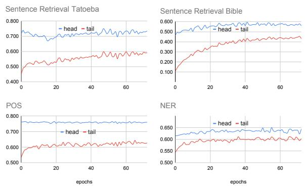

# Glot500:

# Scaling Multilingual Corpora and Language Models to 500 Languages

Ayyoob Imani∗1,2, Peiqin Lin∗1,2, Amir Hossein Kargaran1,2, Silvia Severini1, Masoud Jalili Sabet1, Nora Kassner1,2, Chunlan Ma1,2,

Helmut Schmid1, André F. T. Martins3,4,5, François Yvon6 and Hinrich Schütze1,2 1CIS, LMU Munich, Germany 2Munich Center for Machine Learning (MCML), Germany 3Instituto Superior Técnico (Lisbon ELLIS Unit) 4Instituto de Telecomunicações 5Unbabel 6Sorbonne Université, CNRS, ISIR, France {ayyoob, linpq, amir, silvia}@cis.lmu.de

## Abstract

The NLP community has mainly focused on scaling Large Language Models (LLMs) vertically, i.e., making them better for about 100 languages. We instead scale LLMs horizontally: we create, through continued pretraining, Glot500-m, an LLM that covers 511 predominantly low-resource languages. An important part of this efort is to collect and clean Glot500-c, a corpus that covers these 511 languages and allows us to train Glot500-m. We evaluate Glot500-m on five diverse tasks across these languages. We observe large improvements for both high-resource and low-resource languages compared to an XLM-R baseline. Our analysis shows that no single factor explains the quality of multilingual LLM representations. Rather, a combination of factors determines quality including corpus size, script, “help” from related languages and the total capacity of the model. Our work addresses an important goal of NLP research: we should not limit NLP to a small fraction of the world’s languages and instead strive to support as many languages as possible to bring the benefits of NLP technology to all languages and cultures. Code, data and models are available at https://github.com/cisnlp/Glot500.

## 1 Introduction

The NLP community has mainly focused on scaling Large Language Models (LLMs) vertically, i.e., deepening their understanding of high-resource languages by scaling up parameters and training data. While this approach has revolutionized NLP, the achievements are largely limited to high-resource languages. Examples of “vertical” LLMs are GPT3 (Brown et al., 2020), PaLM (Chowdhery et al., 2022) and Bloom (BigScience et al., 2022). In this paper, we create Glot500-m, a model that instead focuses on scaling multilingual LLMs horizontally, i.e., scaling to a large number of languages the great majority of which is low-resource. As LLMs are essential for progress in NLP, lack of LLMs supporting low-resource languages is a serious impediment to bringing NLP to all of the world’s languages and cultures. Our goal is to address this need with the creation of Glot500-m.1

Existing multilingual LLMs support only about 100 (Conneau et al., 2020) out ofthe 7000 languages of the world. These supported languages are the ones for which large amounts of training data are available through projects such as Oscar (Suárez et al., 2019) and the Wikipedia dumps.2 Following Siddhant et al. (2022), we refer to the 100 languages covered by XLM-R (Conneau et al., 2020) as head languages and to the remaining languages as tail languages. This terminology is motivated by the skewed distribution of available data per language: for the best-resourced languages there are huge corpora available, but for the long tail of languages, only small corpora exist. This is a key problem we address: the availability of data for tail languages is limited compared to head languages. As a result, tail languages have often been ignored by language technologies (Joshi et al., 2020).

Although there exists some work on machine translation for a large number of tail languages (Costa-jussà et al., 2022; Bapna et al., 2022), existing LLMs for tail languages are limited to a relatively small number of languages (Wang et al., 2019; Alabi et al., 2022; Wang et al., 2022). In this paper, we address this gap. Our work has three parts. (i) Corpus collection. We collect Glot2000-c, a corpus covering thousands of tail languages. (ii) Model training. Using Glot500-c, a subset of Glot2000-c, we train Glot500-m, an LLM covering 511 languages. (iii) Validation. We conduct an extensive evaluation of the quality of Glot500-m’s representations of tail languages on a diverse suite of tasks.

In more detail, corpus collection considers three major sources: websites that are known to publish content in specific languages, corpora with classified multilingual content and datasets published in specific tail languages. The resulting dataset Glot2000-c comprises 700GB in 2266 languages collected from 150 sources. After cleaning and deduplication, we create the subset Glot500-c, consisting of 511 languages and 534 language-scripts (where we define a language-script as a combination of ISO 639-33 and script) to train Glot500-m. Our criterion for including a language-script in Glot500-c is that it includes more than 30,000 sentences.

Model training. To train Glot500-m, we employ vocabulary extension and continued pretraining. XLM-R’s vocabulary is extended with new tokens trained on Glot500-c. We then perform continued pretraining of XLM-R with the MLM objective (Devlin et al., 2019).

Validation. We comprehensively evaluate Glot500-m on a diverse suite of natural language understanding, sequence labeling and multilingual tasks for hundreds of languages. The results demonstrate that Glot500-m performs better than XLM-R-B (XLM-R-base) for tail languages by a large margin while performing comparably (or better) for head languages.

Previous work on multilinguality has been hindered by the lack of LLMs supporting a large number of languages. This limitation has led to studies being conducted in settings dissimilar from realworld scenarios. For example, Dufter and Schütze (2020) use synthetic language data. And the curse of multilinguality has been primarily studied for a set of high-resource languages (Conneau et al., 2020). By creating Glot500-m, we can investigate these issues in a more realistic setting. We make code, data and trained models available to foster research by the community on how to include hundreds of languages that are currently ill-served by NLP technology.

Contributions. (i) We train the multilingual model Glot500-m on a 600GB corpus, covering more than 500 diverse languages, and make it publicly available at https://github.com/cisnlp/ Glot500. (ii) We collect and clean Glot500-c, a corpus that covers these diverse languages and allows us to train Glot500-m, and will make as much of it publicly available as possible. (iii) We evaluate Glot500-m on pseudoperplexity and on five diverse tasks across these languages. We observe large improvements for low-resource languages compared to an XLM-R baseline. (iv) Our extensive analysis shows that no single factor explains the quality of multilingual LLM representations. Rather, a combination of factors determines quality including corpus size, script, “help” from related languages and the total capacity of the model. (v) Our work addresses an important goal of NLP research: we should not limit NLP to a relatively small number of high-resource languages and instead strive to support as many languages as possible to bring the benefits of NLP to all languages and cultures.

## 2 Related Work

Training multilingual LLMs using the masked language modeling (MLM) objective is efective to achieve cross-lingual representations (Devlin et al., 2019; Conneau et al., 2020). These models can be further improved by incorporating techniques such as discriminative pre-training (Chi et al., 2022) and the use of parallel data (Yang et al., 2020; Chi et al., 2021). However, this primarily benefits a limited set of languages with large corpora.

Recent research has attempted to extend existing LLMs to languages with limited resources. Wang et al. (2019) propose vocabulary extension; Ebrahimi and Kann (2021) investigate adaptation methods, including MLM and Translation Language Model (TLM) objectives and adapters; Alabi et al. (2022) adapt XLM-R to 17 African languages; Wang et al. (2022) expand language models to low-resource languages using bilingual lexicons.

Alternatively, parameter-eficient fine-tuning adapts pre-trained models to new languages by training a small set of weights efectively (Zhao et al., 2020; Pfeifer et al., 2021; Ansell et al., 2022). Pfeifer et al. (2022) address the “curse of multilinguality” by sharing a part of the model among all languages and having separate modules for each language. We show that the common perception that multilinguality increases as we add more languages, until, from some point, it starts decreasing, is naive. The amount of available data per language and the similarity between languages also play important roles (§6.8).

Another approach trains LLMs from scratch for a limited number of tail languages; e.g., AfriBERTa (Ogueji et al., 2021a) and IndicNLPSuite (Kakwani et al., 2020) are LLMs for 11 African languages and 11 Indic languages. In concurrent work, Adebara et al. (2022) train a multilingual model for 517 African languages on a 42 GB corpus, but without making the model available and with an evaluation on a smaller number of languages than ours.

Closely related to our work on corpus creation, Bapna et al. (2022) and Costa-jussà et al. (2022) also create NLP resources for a large number of tail languages. They train a language identifier model and extract textual data for tail languages from largescale web crawls. This approach is efective, but it requires significant computational resources and native speakers for all tail languages. This is hard to do outside of large corporations. Bapna et al. (2022) have not made their data available. Costajussà et al. (2022) have only released a portion of their data in around 200 languages.

A key benefit of “horizontally” scaled multilingual LLMs is transfer from high- to low-resource languages. Our evaluation suggests that Glot500-m excels at this, but this is not the main focus of our paper. There is a large body of work on crosslingual transfer: (Artetxe and Schwenk, 2019; Imani-Googhari et al., 2022; Lauscher et al., 2020; Conneau et al., 2020; Turc et al., 2021; Fan et al., 2021; Severini et al., 2022; Choenni and Shutova, 2022; Wang et al., 2023), inter alia.

## 3 Glot2000-c

## 3.1 Data Collection

One of the major challenges in developing NLP technologies for tail languages is the scarcity of high-quality training data. In this work, we propose a lightweight methodology that is easily replicable for academic labs. We identify tail language data previously published by researchers, publishers and translators and then crawl or download them. By crawling a few websites and compiling data from around 150 diferent datasets, we amass more than 700GB of text in 2266 languages. We will refer to these sources of data as data sources. Our data covers many domains, including religious texts, news articles and scientific papers. Some of the data sources are high-quality, verified by native speakers, translators and linguists. Others are less reliable such as web crawls and Wikipedia dumps. It is therefore necessary to clean the data. For a list of data sources, see $\ S C$

## 3.2 Language-Scripts

Some languages are written in multiple scripts; e.g., Tajik is written in both Cyrillic and Arabic scripts. Some data sources indicate the script, but others either do not or provide mixed text in multiple scripts. We detect the script for each sentence and treat each language-script as a separate entity.

## 3.3 Ngram LMs and Language Divergence

We train a 3-gram character-level language model $M _ { i }$ for each language-script $L _ { i }$ , using KenLM (Heafield, 2011). We refer to the perplexity calculated for the corpus of language $L _ { i }$ using language model $M _ { j }$ as $\mathcal { P P } ( M _ { j } , L _ { i } )$ . Similar to Gamallo et al. (2017), we define a perplexity-based divergence measure of languages $L _ { i }$ and $L _ { j }$ as:

$$
\mathcal { D } _ { L _ { i } , L _ { j } } = \operatorname* { m a x } \left( \mathcal { P } \mathcal { P } ( M _ { j } , L _ { i } ) , \mathcal { P } \mathcal { P } ( M _ { i } , L _ { j } ) \right)
$$

We use to filter out noisy data in §3.4 and study the efect of similar languages in LLM training in §6.7 and §6.8. For more details, see §A.

## 3.4 Data Cleaning

To remove noise, we use chunk-level and corpuslevel filters.

While some sources are sentence-split, others provide multiple sentences (e.g., a paragraph) as one chunk. Chunk-level filters process each chunk of text from a data source as a unit, without sentencesplitting. Some chunk-level filters are based on the notion of word: we use white space tokenization when possible and otherwise resort to sentencePiece (Kudo and Richardson, 2018) trained by Costa-jussà et al. (2022).

As chunk-level filters, we employ the sentencelevel filters SF1–SF5 from BigScience ROOTS (Laurençon et al., 2022).

SF1 Character repetition. If the ratio of repeated characters is too high, it is likely that the sentence has not enough textual content.

SF2 Word repetition. A high ratio of repeated words indicates non-useful repetitive content.

SF3 Special characters. Sentences with a high ratio of special characters are likely to be crawling artifacts or computer code.

SF4 Insuficient number of words. Since training language models requires enough context, very small chunks of text are not useful.

SF5 Deduplication. If two sentences are identical after eliminating punctuation and white space, one is removed.

<table><tr><td></td><td>scipts lags</td><td></td><td>ets</td><td>m medan</td></tr><tr><td>Glot2000-c</td><td>2266</td><td></td><td>35 2.3B</td><td>8K</td></tr><tr><td>Glot500-c</td><td>511</td><td></td><td>301.5B</td><td>120K</td></tr><tr><td>Costa-jussà et al. (2022)</td><td>134</td><td></td><td>- 2.4B</td><td>3.3M</td></tr><tr><td>Bapna et al. (2022)</td><td>1503</td><td></td><td>- 1.7B</td><td>25K</td></tr></table>

Table 1: Statistics for Glot2000-c, Glot500-c and existing multilingual datasets: number of languages, scripts, sentences’ and median number of sentences per language-script.

In the rest of the paper, we refer to a chunk as a sentence’. A sentence’ can consist of a short segment, a complete sentence or a chunk (i.e., several sentences).

Corpus-level filters detect if the corpus of a language-script is noisy; e.g., the corpus is in another language or consists of non-meaningful content such as tabular data. We employ filters CF1 and CF2.

CF1 In case of mismatch between language and script, the corpus is removed; e.g., Chinese written in Arabic is unlikely to be Chinese.

CF2 Perplexity mismatch. For each languagescript L1, we find its closest language-script L2: the language-script with the lowest perplexity divergence (§3.3). If L1 and L2 are not in the same typological family, we check L1/L2 manually and take appropriate action such as removing the corpus (e.g., if it is actually English) or correcting the ISO code assigned to the corpus.

## 3.5 Training Data: Glot500-c

Among the 2000+ language-scripts that we collected data for, after cleaning, most have too little data for pretraining LLMs. It is dificult to quantify the minimum amount needed for pretraining. Therefore, we pick a relatively high “safe” threshold, 30,000 sentences’, for inclusion of language-scripts in model training. This allows us to train the model efectively and cover many low-resource languages. Table 1 gives Glot500-c statistics. See §B for a list of language-scripts. We train Glot500-m on Glot500-c; note that while Glot500-c focuses on tail languages, it contains some data in head languages which we include in Glot500-m training to prevent catastrophic forgetting.

We divide the corpus for each language into train/dev/test, reserving 1000 sentences’ each for dev and test and using the rest for train. We pick 1000 parallel verses if we have a Bible translation and add 500 each to test and dev. These parallel verses convey identical meanings and facilitate crosslingual evaluation. We pretrain the model using only the training data.

<table><tr><td></td><td>XLM-R-B</td><td>XLM-R-L</td><td>Glot500-m</td></tr><tr><td>Model Size</td><td>278M</td><td>560M</td><td>395M</td></tr><tr><td>Vocab Size</td><td>250K</td><td>250K</td><td>401K</td></tr><tr><td>Transformer Size</td><td>86M</td><td>303M</td><td>86M</td></tr></table>

Table 2: Model sizes. Glot500-m and XLM-R-B have the same transformer size, but Glot500-m has a larger vocabulary, resulting in an overall larger model.

## 4 Glot500-m

## 4.1 Vocabulary Extension

To extend XLM-R’s vocabulary, we use Sentence-Piece (Kudo and Richardson, 2018) with a unigram language model (Kudo, 2018) to train a tokenizer with a vocabulary size of 250K on Glot500-c. We sample data from diferent language-scripts according to a multinomial distribution, with �=.3. The amount we sample for head languages is the same as tail languages with the lowest amount; this favors tail languages – head languages are already well learned by XLM-R. We merge the obtained tokens with XLM-R’s vocabulary. About 100K new tokens were in fact old tokens, i.e., already part of XLM-R’s vocabulary. We take the probabilities of the (genuinely) new tokens directly from SentencePiece. After adding the 151K new tokens to XLM-R’s vocabulary (which has size 250K), the vocabulary size of Glot500-m is 401K.

We could also calculate probabilities of existing and new tokens over a mixture of original XLM-R training corpus and Glot500-c (Chung et al., 2020). For head languages, the percentage of changed tokens using the new tokenizer compared to the original tokenizer ranges from 0.2% to 50%. However, we found no relationship between percentage of changed tokens and change in performance on downstream tasks. Thus, there was little efect of tokenization in our experiments.

## 4.2 Continued Pretraining

We create Glot500-m by continued pretraining of XLM-R-B with the MLM objective. The optimizer used is Adam with betas (0.9, 0.999). Initial learning rate: 5e-5. Each training step contains a batch of 384 training samples randomly picked from all language-scripts. The sampling strategy across language-scripts is the same as for vocabulary extension (§4.1). We save checkpoints every 10K steps and select the checkpoint with the best average performance on downstream tasks by early stopping. Table 2 lists the sizes of XLM-R-B, XLM-R-L and Glot500-m. Except for a larger vocabulary (§4.1), Glot500-m has the same size as XLM-R-B. We train Glot500-m on a server with eight NVIDIA RTX A6000 GPUs for two weeks.

<table><tr><td></td><td>||head| |tail|</td><td></td><td>measure (%)</td></tr><tr><td>Sentence Retrieval Tatoeba</td><td>70</td><td>28</td><td>Top10 Acc.</td></tr><tr><td>Sentence Retrieval Bible</td><td>94</td><td>275</td><td>Top10 Acc.</td></tr><tr><td>Text Classification</td><td>90</td><td>264</td><td>F1</td></tr><tr><td>NER</td><td>89</td><td>75</td><td>F1</td></tr><tr><td>POS</td><td>63</td><td>28</td><td>F1</td></tr><tr><td>Roundtrip Alignment</td><td>85</td><td>288</td><td>Accuracy</td></tr></table>

Table 3: Evaluation tasks and measures. |head|/|tail|: number of head/tail language-scripts

Similar to XLM-R, we concatenate sentences’ of a language-script and feed them as a stream to the tokenizer. The resulting output is then divided into chunks of 512 tokens and fed to the model.

## 5 Experimental Setup

For most tail languages, there are no manually labeled evaluation data. We therefore adopt a mixed evaluation strategy: based partly on human labels, partly on evaluation methods that are applicable to many languages without requiring gold data. Table 3 lists all our evaluation tasks.

Perplexity Following Salazar et al. (2020), we calculate pseudoperplexity (PPPL) over the heldout test set. PPPL is based on masking tokens one-by-one (not left to right). Salazar et al. (2020) give evidence that PPPL is a better measure of linguistic acceptability compared to standard leftto-right perplexity.

Roundtrip Alignment For assessing the quality of multilingual representations for a broad range of tail languages without human gold data, we adopt roundtrip evaluation (Dufter et al., 2018). We first word-align sentences’ in a parallel corpus based on the multilingual representations of an LLM. We then start from a word � in a sentence’ in language-script L1, follow the alignment links to its translations in language-script L2, then the alignment links from L2 to L3 and so on, until in the end we follow alignment links back to L1. If this “roundtrip” gets us back to �, then it indicates that the LLM has similar representations for the meaning of � in language-scripts L1, L2, L3, etc. In other words, the cross-lingual quality of representations is high. Vice versa, failure to get back to � is a sign of poor multilingual representations.

We use SimAlign (Jalili Sabet et al., 2020) and align on the sub-word level on the Bible part of test, based on the representations of the LLM computed by transformer layer 8 as suggested in the original paper. We use intersection symmetrization: each word in a sentence’ is aligned to at most one word in the other sentence’.

As evaluation measure we compute the percentage of roundtrips that were successes, i.e., the roundtrip starts at � in L1 and returns back to �. For each language-script in test, we randomly select three language-scripts as intermediate points L2, L3, L4. Since the intermediate points influence the results, we run the experiment five times with diferent intermediate points and report the average. All models are evaluated with the same five sets of three intermediate language-scripts.

Sequence Labeling We consider two sequence labeling tasks: Named Entity Recognition (NER) and Part-Of-Speech (POS) tagging. We use the WikiANN dataset (Pan et al., 2017) for NER and version v2.11 of Universal Dependencies (UD) (de Marnefe et al., 2021) for POS. Since training data does not exist for some languages, we finetune on English (with early stopping based on dev) and evaluate zero-shot transfer on all languages covered by WikiANN/UD. We set the learning rate to 2e-5 with Adam.

Sentence Retrieval Following (Hu et al., 2020), we use up to 1000 English-aligned sentences’ from Tatoeba (Artetxe and Schwenk, 2019) to evaluate SentRetr (sentence retrieval). We also use 500 English-aligned sentences’ from the Bible part of test. We find nearest neighbors using cosine similarity based on the average word embeddings in layer � = 8 – following Jalili Sabet et al. (2020) – and compute top10 accuracy. For fair comparison and because the architectures are the same, we do not optimize the hyperparameter � for Glot500-m and XLM-R-B.

Text Classification We evaluate on Taxi1500 (Ma et al., 2023). It provides gold data for text classification with six classes in a large number of language-scripts of which Glot500-m supports 354. We finetune on English (with early stopping on dev) and evaluate zero-shot on test of the target language-script. Learning rate: 2e-5, batch size:

16 (following Ma et al. (2023)).

## 6 Experiments

In this section, we discuss aggregate results. For detailed results, see §D and §E.

## 6.1 Results

Table 4 gives results. Glot500-m outperforms XLM-R-B on all tasks for both head and tail language-scripts, except for POS on head. That Glot500-m outperforms XLM-R-B is expected for tail language-scripts (i.e., those not covered by XLM-R). For these language-scripts the improvement margin is large. Outperformance may seem counterintuitive for head language-scripts (those covered by XLM-R) since Glot500-m has the same number of (non-embedding) parameters as XLM-R-B. Since the number of covered languages has greatly increased, leaving less capacity per language, we might expect underperformance. There are a few possible explanations. First, XLM-R may be undertrained, and the inclusion of more head language training data may improve their representations. Second, having more languages may improve multilinguality by allowing languages to synergize and enhance each other’s representations and cross-lingual transfer. Third, there are languages similar to head languages among the tail languages, which in turn aids head languages.

The gap between Glot500-m and the baselines for tail language-scripts in sequence labeling is smaller. These tasks do not require as deep an understanding of language and thus transfer from head to tail language-scripts is easier through shared tokens.

Glot500-m also outperforms XLM-R-L for tail language-scripts (all tasks) and head languagescripts (3 tasks). This suggests that scaling up size is not the only way for improvements. We can also improve the quality of multilingual LLM representations by increasing the number of languages.

## 6.2 Language Coverage

Table 5 compares Glot500-m vs. XLM-R-B on pseudoperplexity. For fair comparison we use word-level normalization. For 69 head languagescripts, Glot500-m underperforms XLM-R-B. This is expected as Glot500-m’s training data is small for these language-scripts. Glot500-m outperforms XLM-R-B for 420 tail language-scripts.

There are eight tail language-scripts for which

  
Figure 1: Progression of training for sentence retrieval and sequence labeling. x-axis: epochs/10K. The improvement is fast in the beginning for tail languages, then gets slower and and reaches a plateau. This pattern is partially observed for head languages.

Glot500-m performs worse than XLM-R-B. Five are tail languages with a similar head language where the two share a macro-language: ekk/Standard Estonian (est/Estonian), aln/Gheg Albanian (sqi/Albanian), nob/Norwegian Bokmal (nor/Norwegian), hbs/Serbo-Croatian (srp/Serbian), lvs/Standard Latvian (lav/Latvian). Since XLM-R-B’s pretraining corpus is large for the five head languages, its performance is good for the close tail languages.

The other three languages all have a unique script: sat/Santali (Ol Chiki script), div/Dhivehi (Thaana script), iku/Inuktitut (Inuktitut syllabics). For these languages, XLM-R-B’s tokenizer returns many UNK tokens since it is not trained on these scripts, resulting in an unreasonably optimistic estimate of pseudoperplexity by our implementation.

Glot500-m’s token-level normalized pseudoperplexity ranges from 1.95 for lhu/Lahu to 94.4 for tok/Toki Pona. The average is 13.5, the median 10.6. We analyze the five language-scripts with the highest pseudoperplexity: tok\_Latn, luo\_Latn, acm\_Arab, ach\_Latn, and teo\_Latn.

tok/Toki Pona is a constructed language. According to Wikipedia: “Essentially identical concepts can be described by diferent words as the choice relies on the speaker’s perception and experience.” This property can result in higher variability and higher perplexity.

acm/Mesopotamian Arabic contains a large number of tweets in raw form. This may result in dificult-to-predict tokens in test.

luo/Luo, ach/Acoli and teo/Teso are related Nilotic languages spoken in Kenya, Tanzania, Uganda and South Sudan. Their high perplexity could be related to the fact that they are tonal languages, but the tones are not orthographically indicated. Another possible explanation is that the training data is dominated by one subcorpus (Jehova’s Witnesses) whereas the test data are dominated by PBC. There are orthographic diferences between the two, e.g., “dong” (JW) vs. “doŋ” (PBC) for Acoli. These three languages are also spoken over a large area in countries with diferent standard languages, which could increase variability.

<table><tr><td rowspan="2"></td><td colspan="3">tail XLM-R-B XLM-R-L Glot500-m|XLM-R-B XLM-R-L Glot500-m|XLM-R-B XLM-R-L Glot500-m</td><td colspan="2">head</td><td colspan="3">all</td></tr><tr><td></td><td></td><td></td><td></td><td></td><td></td><td></td><td></td></tr><tr><td>Pseudoperplexity</td><td>304.2</td><td>168.6</td><td>12.2|</td><td>12.5</td><td>8.4</td><td>11.8| 75.0</td><td>247.8</td><td>136.4 11.6</td></tr><tr><td>Sentence Retrieval Tatoeba</td><td>32.6</td><td>33.6</td><td>59.8</td><td>66.2 71.1</td><td></td><td>56.6</td><td>60.4</td><td>70.7</td></tr><tr><td>Sentence Retrieval Bible</td><td>7.4</td><td>7.1</td><td>43.2</td><td>54.2</td><td>58.3</td><td>59.0 19.3</td><td>20.1</td><td>47.3</td></tr><tr><td>Text Classification</td><td>13.7</td><td>13.9</td><td>46.6</td><td>51.3</td><td>60.5</td><td>54.7 23.3</td><td>25.8</td><td>48.7</td></tr><tr><td>NER</td><td>47.5</td><td>51.8</td><td>60.7</td><td>61.8</td><td>66.0</td><td>63.9</td><td>55.3 59.5 67.7</td><td>62.4 71.8</td></tr><tr><td>POS</td><td>41.7</td><td>43.5</td><td>62.3 4.5</td><td>76.4</td><td>78.4 4.1</td><td>76.0 5.5</td><td>65.8</td><td>4.7</td></tr><tr><td>Roundtrip Alignment</td><td>2.6</td><td>3.1</td><td></td><td>3.4</td><td></td><td></td><td>2.8 3.3</td><td></td></tr></table>

Table 4: Evaluation of XLM-R base and large (XLM-R-B and XLM-R-L) and Glot500-m on pseudoperplexity and six multilingual tasks across 5 seeds. Each number is an average over head, tail and all language-scripts. See §D, §E for results per task and language-script. Glot500-m outperforms XLM-R-B in all tasks for head (except for POS) and tail language-scripts and XLM-R-L for tail language-scripts. Best result per row/column group in bold.

<table><tr><td></td><td>head</td><td>tail</td></tr><tr><td>Glot500-m is better</td><td>37</td><td>420</td></tr><tr><td>XLM-R-B is better</td><td>69</td><td>8</td></tr></table>

Table 5: Pseudoperplexity Glot500-m vs XLM-R-B. Glot500-m’s worse performance on head can be attributed to smaller training corpora and the relative dificulty of learning five times more languages with the same number of (non-embedding) parameters. Glot500-m performs better on almost all tail language-scripts. §6.2 discusses the eight exceptions.

Our analysis is not conclusive. We note however that the gap between the three languages and the next most dificult languages in terms of pseudoperplexity is not large. So maybe Luo, Acoli and Teso are simply (for reasons still to be determined) languages that have higher perplexity than others.

## 6.3 Training Progression

To analyze the training process, we evaluate Glot500-m on sequence labeling and SentRetr at 10,000-step intervals. Figure 1 shows that performance improves rapidly at the onset of training, but then the rate of improvement slows down. This trend is particularly pronounced for tail languages in SentRetr. In comparison, sequence labeling is relatively straightforward, with the baseline (XLM-R-B, epoch 0) achieving high performance by correctly transferring prevalent classes such as verb and noun through shared vocabulary, resulting in a smaller improvement of Glot500-m vs. XLM-R-B.

For SentRetr, we observe larger improvements for the Bible than for Tatoeba. This is likely due to the higher proportion of religious data in Glot500-c, compared to XLM-R’s training data (i.e., CC100).

The average performance on downstream tasks peaks at 480K steps. We have taken a snapshot of Glot500-m at this stage and released it.

## 6.4 Analysis across Language-Scripts

To analyze the efect of language-scripts, we select five tail language-scripts each with the largest and smallest gain when comparing Glot500-m vs. XLM-R-B for SentRetr and sequence labeling.

Table 6 shows that Glot500-m improves languages with scripts not covered by XLM-R (e.g., div/Dhivehi, Thaana script, see §6.2) by a large margin since XLM-R simply regards the uncovered scripts as unknown tokens and cannot compute meaningful representations for the input. The large amount of data we collected in Glot500-c also contributes to the improvement for tail languages, e.g., for tat\_Cyrl (Tatar) in SentRetr Tatoeba and mlt\_Latn (Maltese) in POS. See §6.7 for a detailed analysis of the efect of corpus size.

On the other hand, Glot500-m achieves just comparable or even worse results for some languagescripts. We see at least three explanations. (i) As discussed in §6.2, some tail languages (e.g., nob/Norwegian Bokmal) are close to a head language (e.g., nor/Norwegian), so Glot500-m has no advantage over XLM-R-B. (ii) A language is at the low end of our corpus size range (i.e., 30,000 sentences’). Example: xav\_Latn, Xavánte. (iii) Some languages are completely distinct from all other languages in Glot500-c, thus without support from any similar language. An example is mau\_Latn, Huautla Mazatec. Glot500-m has a much harder time learning good representations in these cases.

<table><tr><td colspan="2"></td><td></td><td>language-script</td><td>XLMR Glot500</td><td></td><td>gain</td><td></td><td>language-script</td><td></td><td>XLMR Glot500</td><td>gain</td></tr><tr><td rowspan="5">hiəh nd</td><td rowspan="8"></td><td rowspan="5"></td><td>tat C Tatar</td><td>10.3</td><td>70.3</td><td>60.0</td><td></td><td>uzn CNorthern Uzbek</td><td>5.4</td><td>87.0</td><td>81.6</td></tr><tr><td>nds L Low German</td><td>28.8</td><td>77.1</td><td>48.3</td><td></td><td>crs L Seselwa Creole</td><td>7.4</td><td>80.6</td><td>73.2</td></tr><tr><td>tuk L Turkmen</td><td>16.3</td><td>63.5</td><td>47.3</td><td></td><td>srn L Sranan Tongo</td><td>6.8</td><td>79.8</td><td>73.0</td></tr><tr><td>ile L Interlingue</td><td>34.6</td><td>75.6</td><td>41.0</td><td></td><td>uzb C Uzbek</td><td>6.2</td><td>78.8</td><td>72.6</td></tr><tr><td>uzb C Uzbek</td><td>25.2</td><td>64.5</td><td>39.3</td><td>Seuttt Bbble</td><td>bcl L Central Bikol</td><td>10.2</td><td>79.8</td><td>69.6</td></tr><tr><td>Sntt Toeba</td><td>dtp L Kadazan Dusun</td><td>5.6</td><td>21.1</td><td>15.5</td><td></td><td>xav L Xavánte</td><td>2.2</td><td>5.0</td><td>2.8</td></tr><tr><td rowspan="4">oww nd</td><td>kab L Kabyle</td><td>3.7</td><td>16.4</td><td>12.7</td><td></td><td></td><td>mauL Huautla Mazatec</td><td>2.4</td><td>3.6</td><td>1.2</td></tr><tr><td>pamL Pampanga</td><td>4.8</td><td>11.0</td><td>6.2</td><td></td><td>ahk L Akha</td><td></td><td>3.0</td><td>3.2</td><td>0.2</td></tr><tr><td>lvs L Standard Latvian</td><td>73.4</td><td>76.9</td><td>3.5</td><td></td><td></td><td>aln L Gheg Albanian</td><td>67.8</td><td>67.6</td><td>-0.2</td></tr><tr><td>nob L Bokmål</td><td>93.5</td><td>95.7</td><td>2.2</td><td></td><td>nob L Bokmål</td><td></td><td>82.8</td><td>79.2</td><td>-3.6</td></tr><tr><td rowspan="6">hih nd loww nd</td><td rowspan="9">NER</td><td>div T Dhivehi</td><td>0.0</td><td>50.9</td><td>50.9</td><td></td><td></td><td>mlt L Maltese</td><td>21.3</td><td>80.3</td><td>59.0</td></tr><tr><td>che C Chechen</td><td></td><td>15.3</td><td>61.2</td><td>45.9</td><td></td><td>sah C Yakut</td><td>21.9</td><td>76.9</td><td>55.0</td></tr><tr><td>mri L Maori</td><td>16.0</td><td>58.9</td><td>42.9</td><td></td><td></td><td>sme L Northern Sami</td><td>29.6</td><td>73.6</td><td>44.1</td></tr><tr><td>nan L Min Nan</td><td></td><td>42.3</td><td>84.9</td><td>42.6</td><td></td><td>yor L Yoruba</td><td>22.8</td><td>64.2</td><td>41.4</td></tr><tr><td>tgk C Tajik</td><td>26.3</td><td></td><td>66.4</td><td>40.0</td><td>POS</td><td>quc L K&#x27;iche&#x27;</td><td>28.5</td><td>64.1</td><td>35.6</td></tr><tr><td>zea L Zeeuws</td><td></td><td>68.1</td><td>67.3</td><td>-0.8</td><td></td><td>lzh HLiterary Chinese</td><td>11.7</td><td>18.4</td><td>6.7</td></tr><tr><td>vol L Volapük</td><td></td><td>60.0</td><td>59.0</td><td>-1.0</td><td></td><td>nap L Neapolitan</td><td>47.1</td><td>50.0</td><td>2.9</td></tr><tr><td></td><td>min L Minangkabau</td><td>42.3</td><td>40.4</td><td>-1.8</td><td></td><td>hyw A Western Armenian</td><td>79.1</td><td>81.1</td><td>2.0</td></tr><tr><td></td><td>wuuH Wu Chinese</td><td>28.9</td><td>23.9</td><td>-5.0</td><td></td><td>kmr L Northern Kurdish</td><td>73.5</td><td>75.2</td><td>1.7</td></tr><tr><td></td><td>lzh HLiterary Chinese</td><td>15.7</td><td>10.3</td><td>-5.4</td><td></td><td>aln L Gheg Albanian</td><td>54.7</td><td>51.2</td><td>-3.5</td></tr></table>

Table 6: Results for five tail language-scripts each with the largest (high end) and smallest (low end) gain Glot500-m vs. XLM-R-B for four tasks. Glot500-m’s gain over XLM-R-B is large at the high end and small or slightly negative at the low end. L = Latin, C = Cyrillic, H = Hani, A = Armenian, T = Thaana

<table><tr><td colspan="2">lang-script</td><td>XLM-R-B</td><td>Glot500-m</td><td>gain</td></tr><tr><td>uig_Arab uig_Latn</td><td>head tail</td><td>45.8 9.8</td><td>56.2 62.8</td><td>10.4 53.0</td></tr><tr><td>hin_Deva hin_Latn</td><td>head tail</td><td>67.0 13.6</td><td>76.6 43.2</td><td>9.6 29.6</td></tr><tr><td>uzb_Latn uzb_Cyrl</td><td>head tail</td><td>54.8 6.2</td><td>67.6 78.8</td><td>12.8 72.6</td></tr><tr><td>kaa_Cyrl</td><td>tail</td><td>17.6</td><td>73.8</td><td>56.2</td></tr><tr><td>kaa_Latn</td><td>tail</td><td>9.2</td><td>43.4</td><td>34.2</td></tr><tr><td></td><td></td><td></td><td></td><td></td></tr><tr><td>kmr_Cyrl</td><td>tail</td><td>4.0</td><td>42.4</td><td>38.4</td></tr><tr><td>kmr_Latn</td><td>tail</td><td>35.8</td><td>63.0</td><td>27.2</td></tr><tr><td></td><td>tail</td><td></td><td></td><td></td></tr><tr><td>tuk_Cyrl</td><td></td><td>13.6</td><td>65.0</td><td>51.4</td></tr><tr><td>tuk_Latn</td><td>tail</td><td>9.6</td><td>66.2</td><td>56.6</td></tr></table>

Table 7: Sentence Retrieval Bible performance of Glot500-m and XLM-R-B for six languages with two scripts: Uighur (uig), Hindi (hin), Uzbek (uzb), Kara-Kalpak (kaa), Northern Kurdish (kmr), Turkmen (tuk). Glot500-m clearly outperforms XLM-R-B with large diferences for tail language-scripts.

## 6.5 Languages with Multiple Scripts

Table 7 compares SentRetr performance XLM-R-B vs. Glot500-m for six languages with two scripts. Unsurprisingly, XLM-R performs much better for a language-script it was pretrained on (“head”) than on one that it was not (“tail”). We can improve the performance of a language, even surpassing the language-script covered by XLM-R, if we collect enough data for its script not covered by XLM-R. For languages with two scripts not covered by XLM-

R, the performance is better for the script for which we collect a larger corpus. For example, kaa\_Cyrl (Kara-Kalpak) has about three times as much data as kaa\_Latn. This explains why kaa\_Cyrl outperforms kaa\_Latn by 30%.

Dufter and Schütze (2020) found that, after training a multilingual model with two scripts for English (natural English and “fake English”), the model performed well at zero-shot transfer if the capacity of the model was of the right size (i.e., not too small, not too large). Our experiments with real data show the complexity of the issue: even if there is a “right” size for an LLM that supports both full acquisition of languages and multilingual transfer, this size is dificult to determine and it may be diferent for different language pairs in a large horizontally scaled model like Glot500-m.

## 6.6 Analysis across Language Families

Table 8 compares SentRetr performance Glot500-m vs. XLM-R-B for seven language families that have ten or more language-scripts in Glot500-c. We assign languages to families based on Glottolog. 4 Generally, XLM-R has better performance the more language-scripts from a language family are represented in its training data; e.g., performance is better for indo1319 and worse for maya1287. The results suggest that Glot500-m’s improvement over

<table><tr><td>family</td><td> $| | L _ { G } |$ </td><td> $| L _ { X } |$  XLM-R-B</td><td></td><td>Glot500-m gain</td></tr><tr><td>indo1319</td><td>91</td><td>50</td><td>41.5 61.4</td><td>19.9</td></tr><tr><td>atla1278</td><td>69</td><td>2</td><td>5.5 45.2</td><td>39.6</td></tr><tr><td>aust1307</td><td>53</td><td>6</td><td>13.7 47.0</td><td>33.2</td></tr><tr><td>turk1311</td><td>22</td><td>7</td><td>20.1 62.9</td><td>42.8</td></tr><tr><td>sino1245</td><td>22</td><td>2</td><td>7.6 38.9</td><td>31.3</td></tr><tr><td>maya1287</td><td>15</td><td>0</td><td>3.8 20.3</td><td>16.4</td></tr><tr><td>afro1255</td><td>12</td><td>5</td><td>13.0 34.3</td><td>21.4</td></tr></table>

Table 8: Average Sentence Retrieval Bible performance of Glot500-m and XLM-R-B for seven language families. The diference in coverage of a family by Glot500-m vs. XLM-R-B is partially predictive of the performance diference. $| L _ { G } | / | L _ { X } | ;$ number of language-scripts from family covered by Glot500-m/XLM-R.
<table><tr><td>lang-script</td><td>Glot+1</td><td>Glot500-m</td></tr><tr><td>rug_Latn, Roviana yan_Latn, Mayangna/Sumo wbm_Latn, Wa/Va</td><td>51.0 46.4</td><td>49.0 31.8</td></tr><tr><td>ctd_Latn, Tedim Chin</td><td>49.6 47.4</td><td>46.4 59.4</td></tr><tr><td>quh_Latn, Southern Quechua</td><td>33.4</td><td>56.2</td></tr><tr><td>tat_Cyrl, Tatar</td><td>58.8</td><td>67.2</td></tr></table>

Table 9: Performance on Sentence Retrieval Bible of continued pretraining on just one language-script (Glot+1) vs. on Glot500-c (Glot500-m). Glot500-m underperforms on the top three and outperforms on the bottom three. Our explanation is that the second group is supported by closely related languages in Glot500-c; e.g., for Southern Quechua (quh), Glot500-m also covers closely related Cuzco Quechua (quz). For the first group this is not the case; e.g., the Wa language (wbm) has no close relative in Glot500-c.

XLM-R is the larger, the better our training corpus Glot500-c’s coverage is of a family.

## 6.7 Efect of Amount of Training Data

We examine correlation between pretraining corpus size and Glot500-m zero-shot performance. We focus on SentRetr Bible (§5) since it supports the most head and tail languages. We find that Pearson’s $r ~ = ~ . 3 4$ , i.e., corpus size and performance are moderately, but clearly correlated. We suspect that the correlation is not larger because, in addition to corpus size of language � itself, corpus size of languages closely related to � is also an important factor (see §6.4 for a similar finding for Norwegian). We therefore also compute Pearson’s � between (i) performance of language � on SentRetr Bible and (ii) joint corpus size of � and its � nearest neighbors (according to perplexity divergence, §3.3). In this case, Pearson’s $r = . 4 4$ (for both � = 3 and $k = 4 )$ , indicating that the corpus size of nearest neighbor languages does play a role.

## 6.8 Support through Related Languages

Building on §6.7, there is another way we can investigate the positive efect of closely related languages on performance: We can compare performance (again on SentRetr Bible) of continued pretraining on just one language (we refer to this model as Glot+1) vs. on all 511 languages represented in Glot500-c (i.e., Glot500-m). Table 9 presents results for six language-scripts selected from various language families and suggests that some languages do not receive support from related languages (top three). In that case, Glot+1 can fully concentrate on learning the isolated language and does better than Glot500-c. Other languages (bottom three) do receive support from related languages. For example, Southern Quechua (quh) seems to receive support in Glot500-m from closely related Cuzco Quechua (quz), resulting in Glot500-m outperforming Glot+1.

## 7 Conclusion and Future Work

We collect and data-clean Glot500-c, a large corpus of hundreds of usually neglected tail (i.e., long-tail) languages and create Glot500-m, an LLM that is trained on Glot500-c and covers these languages. We evaluate Glot500-m on six tasks that allow us to evaluate almost all languages. We observe large improvements for both head and tail languages compared to XLM-R. Our analysis shows that no single factor fully explains the quality of the representation of a language in a multilingual model. Rather, a combination of factors is important, including corpus size, script, “help” from related languages and the total capacity of the model.

This work is the first to create a language model on a dataset of several hundreds of gigabytes and to make it publicly available for such a large and diverse number of low-resource languages. In future research, we would like to train larger models to further investigate the efect of model size, distill highly multilingual models for resource-eficient deployment, explore alternatives to continued pretraining and use models for more tail language downstream tasks.

## Limitations

(1) We did not perform any comprehensive hyperparameter search, which would have further consolidated our results. This decision was made due to the high cost of training multiple models. (2) Compared to current very large models, Glot500-m is comparatively small. (3) Although we have tried to minimize the amount of noise in our data, some noise is still present.

## Ethics Statement

There are two issues worth mentioning in regards to this project. First, it was not feasible for us to thoroughly examine the content of the data for all languages, thus we cannot confirm the absence of discrimination based on factors such as race or sexuality. The data was solely utilized as a textual corpus, and the content should not be interpreted as an endorsement by our team. If the model is subsequently utilized for generation, it is possible that the training data may be reflected in the generated output. However, addressing potential biases within the data is an area for future research. Second, it is important to note that while the data sources utilized in this study do not explicitly prohibit the reuse of data for research purposes, some sources do have copyright statements indicating that such use is permissible while others do not. Additionally, certain sources prohibit the redistribution of data. As such, data from these sources is omitted from the published version of Glot2000-c.

## Acknowledgements

We would like to thank Renhao Pei, Yihong Liu, Verena Blaschke, and the anonymous reviewers. This work was funded by the European Research Council (grants #740516 and #758969) and EU’s Horizon Europe Research and Innovation Actions (UTTER, contract 101070631).

## References

Solomon Teferra Abate, Michael Melese, Martha Yifiru Tachbelie, Million Meshesha, Solomon Atinafu, Wondwossen Mulugeta, Yaregal Assabie, Hafte Abera, Binyam Ephrem, Tewodros Abebe, Wondimagegnhue Tsegaye, Amanuel Lemma, Tsegaye Andargie, and Seifedin Shifaw. 2018. Parallel corpora for bi-lingual English-Ethiopian languages statistical machine translation. In Proceedings ofthe 27th International Conference on Computational Linguistics, pages 3102–3111, Santa Fe, New Mexico, USA. Association for Computational Linguistics.

Ahmed Abdelali, Hamdy Mubarak, Younes Samih, Sabit Hassan, and Kareem Darwish. 2021. QADI: Arabic dialect identification in the wild. In Proceedings of the Sixth Arabic Natural Language Processing Workshop, pages 1–10, Kyiv, Ukraine (Virtual). Association for Computational Linguistics.

Kathrein Abu Kwaik, Motaz Saad, Stergios Chatzikyriakidis, and Simon Dobnik. 2018. Shami: A corpus of Levantine Arabic dialects. In Proceedings of the Eleventh International Conference on Language Resources and Evaluation (LREC 2018), Miyazaki, Japan. European Language Resources Association (ELRA).

Ife Adebara, AbdelRahim Elmadany, Muhammad Abdul-Mageed, and Alcides Alcoba Inciarte. 2022. SERENGETI: Massively multilingual language models for Africa. arXiv preprint arXiv:2212.10785.

David Adelani, Jesujoba Alabi, Angela Fan, Julia Kreutzer, Xiaoyu Shen, Machel Reid, Dana Ruiter, Dietrich Klakow, Peter Nabende, Ernie Chang, Tajuddeen Gwadabe, Freshia Sackey, Bonaventure F. P. Dossou, Chris Emezue, Colin Leong, Michael Beukman, Shamsuddeen Muhammad, Guyo Jarso, Oreen Yousuf, Andre Niyongabo Rubungo, Gilles Hacheme, Eric Peter Wairagala, Muhammad Umair Nasir, Benjamin Ajibade, Tunde Ajayi, Yvonne Gitau, Jade Abbott, Mohamed Ahmed, Millicent Ochieng, Anuoluwapo Aremu, Perez Ogayo, Jonathan Mukiibi, Fatoumata Ouoba Kabore, Godson Kalipe, Derguene Mbaye, Allahsera Auguste Tapo, Victoire Memdjokam Koagne, Edwin Munkoh-Buabeng, Valencia Wagner, Idris Abdulmumin, Ayodele Awokoya, Happy Buzaaba, Blessing Sibanda, Andiswa Bukula, and Sam Manthalu. 2022. A few thousand translations go a long way! leveraging pre-trained models for African news translation. In Proceedings of the 2022 Conference of the North American Chapter of the Association for Computational Linguistics: Human Language Technologies, pages 3053–3070, Seattle, United States. Association for Computational Linguistics.

David Adelani, Dana Ruiter, Jesujoba Alabi, Damilola Adebonojo, Adesina Ayeni, Mofe Adeyemi, Ayodele Esther Awokoya, and Cristina España-Bonet. 2021. The efect of domain and diacritics in Yoruba– English neural machine translation. In Proceedings of Machine Translation Summit XVIII: Research Track, pages 61–75, Virtual. Association for Machine Translation in the Americas.

Rodrigo Agerri, Xavier Gómez Guinovart, German Rigau, and Miguel Anxo Solla Portela. 2018. Developing new linguistic resources and tools for the Galician language. In Proceedings of the Eleventh International Conference on Language Resources and Evaluation (LREC 2018), Miyazaki, Japan. European Language Resources Association (ELRA).

Jesujoba O. Alabi, David Ifeoluwa Adelani, Marius Mosbach, and Dietrich Klakow. 2022. Adapting pretrained language models to African languages via multilingual adaptive fine-tuning. In Proceedings of the 29th International Conference on Computational Linguistics, pages 4336–4349, Gyeongju, Republic of Korea. International Committee on Computational Linguistics.

Israa Alsarsour, Esraa Mohamed, Reem Suwaileh, and Tamer Elsayed. 2018. DART: A large dataset of dialectal Arabic tweets. In Proceedings of the Eleventh International Conference on Language Resources and Evaluation (LREC 2018), Miyazaki, Japan. European Language Resources Association (ELRA).

Antonios Anastasopoulos, Alessandro Cattelan, Zi-Yi Dou, Marcello Federico, Christian Federmann, Dmitriy Genzel, Franscisco Guzmán, Junjie Hu, Macduf Hughes, Philipp Koehn, Rosie Lazar, Will Lewis, Graham Neubig, Mengmeng Niu, Alp Öktem, Eric Paquin, Grace Tang, and Sylwia Tur. 2020. TICO-19: the translation initiative for COvid-19. In Proceedings of the 1st Workshop on NLP for COVID-19 (Part 2) at EMNLP 2020, Online. Association for Computational Linguistics.

Alan Ansell, Edoardo Ponti, Anna Korhonen, and Ivan Vulić. 2022. Composable sparse fine-tuning for crosslingual transfer. In Proceedings ofthe 60th Annual Meeting of the Association for Computational Linguistics (Volume 1: Long Papers), pages 1778–1796, Dublin, Ireland. Association for Computational Linguistics.

Mikel Artetxe and Holger Schwenk. 2019. Massively multilingual sentence embeddings for zero-shot crosslingual transfer and beyond. Transactions of the Association for Computational Linguistics, 7:597– 610.

Niyati Bafna. 2022. Empirical models for an indic language continuum.

Marta Bañón, Pinzhen Chen, Barry Haddow, Kenneth Heafield, Hieu Hoang, Miquel Esplà-Gomis, Mikel L. Forcada, Amir Kamran, Faheem Kirefu, Philipp Koehn, Sergio Ortiz Rojas, Leopoldo Pla Sempere, Gema Ramírez-Sánchez, Elsa Sarrías, Marek Strelec, Brian Thompson, William Waites, Dion Wiggins, and Jaume Zaragoza. 2020. ParaCrawl: Web-scale acquisition of parallel corpora. In Proceedings ofthe 58th Annual Meeting ofthe Associationfor Computational Linguistics, pages 4555–4567, Online. Association for Computational Linguistics.

Marta Bañón, Miquel Esplà-Gomis, Mikel L. Forcada, Cristian García-Romero, Taja Kuzman, Nikola Ljubesic, Rik van Noord, Leopoldo Pla Sempere, Gema Ramírez-Sánchez, Peter Rupnik, Vít Suchomel, Antonio Toral, Tobias van der Werf, and Jaume Zaragoza. 2022. Macocu: Massive collection and curation of monolingual and bilingual data: focus on under-resourced languages. In Proceedings ofthe 23rd Annual Conference of the European Association for Machine Translation, EAMT 2022, Ghent, Belgium, June 1-3, 2022, pages 301–302. European Association for Machine Translation.

Ankur Bapna, Isaac Caswell, Julia Kreutzer, Orhan Firat, Daan van Esch, Aditya Siddhant, Mengmeng Niu, Pallavi Baljekar, Xavier Garcia, Wolfgang Macherey, et al. 2022. Building machine translation systems for the next thousand languages. arXiv preprint arXiv:2205.03983.

Workshop BigScience, :, Teven Le Scao, Angela Fan, Christopher Akiki, Ellie Pavlick, Suzana Ilić, Daniel Hesslow, Roman Castagné, Alexandra Sasha Luc cioni, François Yvon, Matthias Gallé, Jonathan Tow, Alexander M. Rush, Stella Biderman, Albert Webson, Pawan Sasanka Ammanamanchi, Thomas Wang, Benoît Sagot, Niklas Muennighof, Albert Villanova del Moral, Olatunji Ruwase, Rachel Bawden, Stas Bekman, Angelina McMillan-Major, Iz Beltagy, Huu Nguyen, Lucile Saulnier, Samson Tan, Pedro Ortiz Suarez, Victor Sanh, Hugo Laurençon, Yacine Jernite, Julien Launay, Margaret Mitchell Colin Rafel, Aaron Gokaslan, Adi Simhi, Aitor Soroa, Alham Fikri Aji, Amit Alfassy, Anna Rogers, Ariel Kreisberg Nitzav, Canwen Xu, Chenghao Mou, Chris Emezue, Christopher Klamm, Colin Leong, Daniel van Strien, David Ifeoluwa Adelani, Dragomir Radev, Eduardo González Ponferrada, Efrat Levkovizh, Ethan Kim, Eyal Bar Natan, Francesco De Toni, Gérard Dupont, Germán Kruszewski, Giada Pistilli, Hady Elsahar, Hamza Benyamina, Hieu Tran, Ian Yu, Idris Abdulmumin, Isaac Johnson, Itziar Gonzalez-Dios, Javier de la Rosa, Jenny Chim, Jesse Dodge, Jian Zhu, Jonathan Chang, Jörg Frohberg, Joseph Tobing, Joydeep Bhattacharjee, Khalid Almubarak, Kimbo Chen, Kyle Lo, Leandro Von Werra, Leon Weber, Long Phan, Loubna Ben allal, Ludovic Tanguy, Manan Dey, Manuel Romero Muñoz, Maraim Masoud, María Grandury, Mario Šaško, Max Huang, Maximin Coavoux, Mayank Singh, Mike Tian Jian Jiang, Minh Chien Vu, Mohammad A. Jauhar, Mustafa Ghaleb, Nishant Subramani, Nora Kassner, Nurulaqilla Khamis, Olivier Nguyen, Omar Espe jel, Ona de Gibert, Paulo Villegas, Peter Henderson, Pierre Colombo, Priscilla Amuok, Quentin Lhoest Rheza Harliman, Rishi Bommasani, Roberto Luis López, Rui Ribeiro, Salomey Osei, Sampo Pyysalo, Sebastian Nagel, Shamik Bose, Shamsuddeen Hassan Muhammad, Shanya Sharma, Shayne Longpre, Somaieh Nikpoor, Stanislav Silberberg, Suhas Pai, Sydney Zink, Tiago Timponi Torrent, Timo Schick, Tristan Thrush, Valentin Danchev, Vassilina Nikoulina, Veronika Laippala, Violette Lepercq, Vrinda Prabhu Zaid Alyafeai, Zeerak Talat, Arun Raja, Benjamin Heinzerling, Chenglei Si, Davut Emre Taşar, Eliz abeth Salesky, Sabrina J. Mielke, Wilson Y. Lee, Abheesht Sharma, Andrea Santilli, Antoine Chafin, Arnaud Stiegler, Debajyoti Datta, Eliza Szczechla, Gunjan Chhablani, Han Wang, Harshit Pandey, Hen drik Strobelt, Jason Alan Fries, Jos Rozen, Leo Gao, Lintang Sutawika, M Saiful Bari, Maged S. Al-shaibani, Matteo Manica, Nihal Nayak, Ryan Teehan, Samuel Albanie, Sheng Shen, Srulik Ben-David Stephen H. Bach, Taewoon Kim, Tali Bers, Thibault Fevry, Trishala Neeraj, Urmish Thakker, Vikas Raunak, Xiangru Tang, Zheng-Xin Yong, Zhiqing Sun, Shaked Brody, Yallow Uri, Hadar Tojarieh, Adam Roberts, Hyung Won Chung, Jaesung Tae, Jason Phang, Ofir Press, Conglong Li, Deepak Narayanan, Hatim Bourfoune, Jared Casper, Jef Rasley, Max Ryabinin, Mayank Mishra, Minjia Zhang, Mohammad Shoeybi, Myriam Peyrounette, Nicolas Pa try, Nouamane Tazi, Omar Sanseviero, Patrick von

Platen, Pierre Cornette, Pierre François Lavallée, Rémi Lacroix, Samyam Rajbhandari, Sanchit Gandhi, Shaden Smith, Stéphane Requena, Suraj Patil, Tim Dettmers, Ahmed Baruwa, Amanpreet Singh, Anasta sia Cheveleva, Anne-Laure Ligozat, Arjun Subramo nian, Aurélie Névéol, Charles Lovering, Dan Garrette, Deepak Tunuguntla, Ehud Reiter, Ekaterina Takta sheva, Ekaterina Voloshina, Eli Bogdanov, Genta In dra Winata, Hailey Schoelkopf, Jan-Christoph Kalo, Jekaterina Novikova, Jessica Zosa Forde, Jordan Clive, Jungo Kasai, Ken Kawamura, Liam Hazan, Marine Carpuat, Miruna Clinciu, Najoung Kim, New ton Cheng, Oleg Serikov, Omer Antverg, Oskar van der Wal, Rui Zhang, Ruochen Zhang, Sebas tian Gehrmann, Shachar Mirkin, Shani Pais, Tatiana Shavrina, Thomas Scialom, Tian Yun, Tomasz Lim isiewicz, Verena Rieser, Vitaly Protasov, Vladislav Mikhailov, Yada Pruksachatkun, Yonatan Belinkov, Zachary Bamberger, Zdeněk Kasner, Alice Rueda, Amanda Pestana, Amir Feizpour, Ammar Khan, Amy Faranak, Ana Santos, Anthony Hevia, Antigona Unl dreaj, Arash Aghagol, Arezoo Abdollahi, Aycha Tam mour, Azadeh HajiHosseini, Bahareh Behroozi, Ben jamin Ajibade, Bharat Saxena, Carlos Muñoz Ferran dis, Danish Contractor, David Lansky, Davis David, Douwe Kiela, Duong A. Nguyen, Edward Tan, Emi Baylor, Ezinwanne Ozoani, Fatima Mirza, Frankline Ononiwu, Habib Rezanejad, Hessie Jones, Indrani Bhattacharya, Irene Solaiman, Irina Sedenko, Isar Nejadgholi, Jesse Passmore, Josh Seltzer, Julio Bo nis Sanz, Livia Dutra, Mairon Samagaio, Maraim Elbadri, Margot Mieskes, Marissa Gerchick, Martha Akinlolu, Michael McKenna, Mike Qiu, Muhammed Ghauri, Mykola Burynok, Nafis Abrar, Nazneen Ra jani, Nour Elkott, Nour Fahmy, Olanrewaju Samuel, Ran An, Rasmus Kromann, Ryan Hao, Samira Al izadeh, Sarmad Shubber, Silas Wang, Sourav Roy, Sylvain Viguier, Thanh Le, Tobi Oyebade, Trieu Le, Yoyo Yang, Zach Nguyen, Abhinav Ramesh Kashyap, Alfredo Palasciano, Alison Callahan, Anima Shukla, Antonio Miranda-Escalada, Ayush Singh, Benjamin Beilharz, Bo Wang, Caio Brito, Chenxi Zhou, Chirag Jain, Chuxin Xu, Clémentine Fourrier, Daniel León Periñán, Daniel Molano, Dian Yu, Enrique Manjava cas, Fabio Barth, Florian Fuhrimann, Gabriel Altay, Giyaseddin Bayrak, Gully Burns, Helena U. Vrabec, Imane Bello, Ishani Dash, Jihyun Kang, John Giorgi, Jonas Golde, Jose David Posada, Karthik Rangasai Sivaraman, Lokesh Bulchandani, Lu Liu, Luisa Shin zato, Madeleine Hahn de Bykhovetz, Maiko Takeuchi, Marc Pàmies, Maria A Castillo, Marianna Nezhurina, Mario Sänger, Matthias Samwald, Michael Cullan, Michael Weinberg, Michiel De Wolf, Mina Mihalj cic, Minna Liu, Moritz Freidank, Myungsun Kang, Natasha Seelam, Nathan Dahlberg, Nicholas Michio Broad, Nikolaus Muellner, Pascale Fung, Patrick Haller, Ramya Chandrasekhar, Renata Eisenberg, Robert Martin, Rodrigo Canalli, Rosaline Su, Ruisi Su, Samuel Cahyawijaya, Samuele Garda, Shlok S Deshmukh, Shubhanshu Mishra, Sid Kiblawi, Si mon Ott, Sinee Sang-aroonsiri, Srishti Kumar, Stefan Schweter, Sushil Bharati, Tanmay Laud, Théo Gigant, Tomoya Kainuma, Wojciech Kusa, Yanis Labrak,

Yash Shailesh Bajaj, Yash Venkatraman, Yifan Xu, Yingxin Xu, Yu Xu, Zhe Tan, Zhongli Xie, Zifan Ye, Mathilde Bras, Younes Belkada, and Thomas Wolf. 2022. BLOOM: a 176b-parameter open-access multilingual language model.

Tom Brown, Benjamin Mann, Nick Ryder, Melanie Subbiah, Jared D Kaplan, Prafulla Dhariwal, Arvind Neelakantan, Pranav Shyam, Girish Sastry, Amanda Askell, et al. 2020. Language models are few-shot learners. Advances in neural information processing systems, 33:1877–1901.

José Camacho-Collados, Claudio Delli Bovi, Alessandro Raganato, and Roberto Navigli. 2016. A large-scale multilingual disambiguation of glosses. In Proceedings of the Tenth International Conference on Language Resources and Evaluation (LREC’16), pages 1701–1708, Portorož, Slovenia. European Language Resources Association (ELRA).

Zewen Chi, Li Dong, Furu Wei, Nan Yang, Saksham Singhal, Wenhui Wang, Xia Song, Xian-Ling Mao, Heyan Huang, and Ming Zhou. 2021. InfoXLM: An information-theoretic framework for cross-lingual language model pre-training. In Proceedings ofthe 2021 Conference ofthe NorthAmerican Chapter ofthe Association for Computational Linguistics: Human Language Technologies, pages 3576–3588, Online. Association for Computational Linguistics.

Zewen Chi, Shaohan Huang, Li Dong, Shuming Ma, Bo Zheng, Saksham Singhal, Payal Bajaj, Xia Song, Xian-Ling Mao, Heyan Huang, and Furu Wei. 2022. XLM-E: Cross-lingual language model pre-training via ELECTRA. In Proceedings ofthe 60th Annual Meeting of the Association for Computational Linguistics (Volume 1: Long Papers), pages 6170–6182, Dublin, Ireland. Association for Computational Linguistics.

Rochelle Choenni and Ekaterina Shutova. 2022. Investigating language relationships in multilingual sentence encoders through the lens of linguistic typology. Computational Linguistics, 48(3):635–672.

Aakanksha Chowdhery, Sharan Narang, Jacob Devlin, Maarten Bosma, Gaurav Mishra, Adam Roberts, Paul Barham, Hyung Won Chung, Charles Sutton, Sebastian Gehrmann, et al. 2022. Palm: Scaling language modeling with pathways. arXiv preprint arXiv:2204.02311.

Hyung Won Chung, Dan Garrette, Kiat Chuan Tan, and Jason Riesa. 2020. Improving multilingual models with language-clustered vocabularies. In Proceedings ofthe 2020 Conference on Empirical Methods in Natural Language Processing (EMNLP), pages 4536–4546, Online. Association for Computational Linguistics.

Alexis Conneau, Kartikay Khandelwal, Naman Goyal, Vishrav Chaudhary, Guillaume Wenzek, Francisco Guzmán, Edouard Grave, Myle Ott, Luke Zettlemoyer, and Veselin Stoyanov. 2020. Unsupervised

cross-lingual representation learning at scale. In Proceedings of the 58th Annual Meeting of the Associationfor Computational Linguistics, pages 8440–8451, Online. Association for Computational Linguistics.

Marta R Costa-jussà, James Cross, Onur Çelebi, Maha Elbayad, Kenneth Heafield, Kevin Hefernan, Elahe Kalbassi, Janice Lam, Daniel Licht, Jean Maillard, et al. 2022. No language left behind: Scaling human-centered machine translation. arXiv preprint arXiv:2207.04672.

Marie-Catherine de Marnefe, Christopher D. Manning, Joakim Nivre, and Daniel Zeman. 2021. Universal dependencies. Computational Linguistics, 47(2):255– 308.

Jacob Devlin, Ming-Wei Chang, Kenton Lee, and Kristina Toutanova. 2019. BERT: Pre-training of deep bidirectional transformers for language understanding. In Proceedings ofthe 2019 Conference of the North American Chapter of the Association for Computational Linguistics: Human Language Technologies, Volume 1 (Long and Short Papers), pages 4171–4186, Minneapolis, Minnesota. Association for Computational Linguistics.

Philipp Dufter and Hinrich Schütze. 2020. Identifying elements essential for BERT’s multilinguality. In Proceedings of the 2020 Conference on Empirical Methods in Natural Language Processing (EMNLP), pages 4423–4437, Online. Association for Computational Linguistics.

Philipp Dufter, Mengjie Zhao, Martin Schmitt, Alexander Fraser, and Hinrich Schütze. 2018. Embedding learning through multilingual concept induction. In Proceedings ofthe 56th Annual Meeting ofthe Associationfor Computational Linguistics (Volume 1: Long Papers), pages 1520–1530, Melbourne, Australia. Association for Computational Linguistics.

Jonathan Dunn. 2020. Mapping languages: the corpus of global language use. Lang. Resour. Evaluation, 54(4):999–1018.

Eberhard, David M., Gary F. Simons, and Charles D. Fennig (eds.). 2022. Ethnologue: Languages of the world. twenty-fifth edition.

Abteen Ebrahimi and Katharina Kann. 2021. How to adapt your pretrained multilingual model to 1600 languages. In Proceedings of the 59th Annual Meeting ofthe Associationfor Computational Linguistics and the 11th International Joint Conference on Natural Language Processing (Volume 1: Long Papers), pages 4555–4567, Online. Association for Computational Linguistics.

Mahmoud El-Haj. 2020. Habibi - a multi dialect multi national Arabic song lyrics corpus. In Proceedings ofthe Twelfth Language Resources and Evaluation Conference, pages 1318–1326, Marseille, France. European Language Resources Association.

Mahmoud El-Haj, Paul Rayson, and Mariam Aboelezz. 2018. Arabic dialect identification in the context of bivalency and code-switching. In Proceedings of the Eleventh International Conference on Language Resources and Evaluation (LREC 2018), Miyazaki, Japan. European Language Resources Association (ELRA).

Angela Fan, Shruti Bhosale, Holger Schwenk, Zhiyi Ma, Ahmed El-Kishky, Siddharth Goyal, Mandeep Baines, Onur Celebi, Guillaume Wenzek, Vishrav Chaudhary, Naman Goyal, Tom Birch, Vitaliy Liptchinsky, Sergey Edunov, Michael Auli, and Armand Joulin. 2021. Beyond english-centric multilingual machine translation. J. Mach. Learn. Res., 22:107:1–107:48.

Pablo Gamallo, Jose Ramom Pichel, and Iñaki Alegria. 2017. A perplexity-based method for similar languages discrimination. In Proceedings ofthe Fourth Workshop on NLPfor Similar Languages, Varieties and Dialects (VarDial), pages 109–114, Valencia, Spain. Association for Computational Linguistics.

Dirk Goldhahn, Thomas Eckart, and Uwe Quasthof. 2012. Building large monolingual dictionaries at the leipzig corpora collection: From 100 to 200 languages. In Proceedings ofthe Eighth International Conference on Language Resources and Evaluation, LREC 2012, Istanbul, Turkey, May 23-25, 2012, pages 759–765. European Language Resources Association (ELRA).

Santiago Góngora, Nicolás Giossa, and Luis Chiruzzo. 2021. Experiments on a Guarani corpus of news and social media. In Proceedings ofthe First Workshop on Natural Language Processing for Indigenous Languages of the Americas, pages 153–158, Online. Association for Computational Linguistics.

Santiago Góngora, Nicolás Giossa, and Luis Chiruzzo. 2022. Can we use word embeddings for enhancing Guarani-Spanish machine translation? In Proceedings of the Fifth Workshop on the Use of Computational Methods in the Study of Endangered Languages, pages 127–132, Dublin, Ireland. Association for Computational Linguistics.

Thamme Gowda, Zhao Zhang, Chris Mattmann, and Jonathan May. 2021. Many-to-English machine translation tools, data, and pretrained models. In Proceedings of the 59th Annual Meeting of the Association for Computational Linguistics and the 11th International Joint Conference on Natural Language Processing: System Demonstrations, pages 306–316, Online. Association for Computational Linguistics.

Tahmid Hasan, Abhik Bhattacharjee, Md. Saiful Islam, Kazi Samin Mubasshir, Yuan-Fang Li, Yong-Bin Kang, M. Sohel Rahman, and Rifat Shahriyar. 2021. Xl-sum: Large-scale multilingual abstractive summarization for 44 languages. In Findings of the Association for Computational Linguistics: ACL/IJCNLP 2021, Online Event, August 1-6, 2021, volume ACL/IJCNLP 2021 of Findings ofACL, pages 4693–4703. Association for Computational Linguistics.

Kenneth Heafield. 2011. KenLM: Faster and smaller language model queries. In Proceedings ofthe Sixth Workshop on Statistical Machine Translation, pages 187–197, Edinburgh, Scotland. Association for Computational Linguistics.

Junjie Hu, Sebastian Ruder, Aditya Siddhant, Graham Neubig, Orhan Firat, and Melvin Johnson. 2020. XTREME: A massively multilingual multi-task benchmark for evaluating cross-lingual generalisation. In Proceedings of the 37th International Conference on Machine Learning, volume 119 of Proceedings of Machine Learning Research, pages 4411–4421. PMLR.

Ayyoob ImaniGooghari, Silvia Severini, Masoud Jalili Sabet, François Yvon, and Hinrich Schütze. 2022. Graph-based multilingual label propagation for low-resource part-of-speech tagging. In Proceedings ofthe 2022 Conference on Empirical Methods in Natural Language Processing, pages 1577–1589, Abu Dhabi, United Arab Emirates. Association for Computational Linguistics.

Masoud Jalili Sabet, Philipp Dufter, François Yvon, and Hinrich Schütze. 2020. SimAlign: High quality word alignments without parallel training data using static and contextualized embeddings. In Findings of the Association for Computational Linguistics: EMNLP 2020, pages 1627–1643, Online. Association for Computational Linguistics.

Pratik Joshi, Sebastin Santy, Amar Budhiraja, Kalika Bali, and Monojit Choudhury. 2020. The state and fate of linguistic diversity and inclusion in the NLP world. In Proceedings of the 58th Annual Meeting of the Association for Computational Linguistics, pages 6282–6293, Online. Association for Computational Linguistics.

Divyanshu Kakwani, Anoop Kunchukuttan, Satish Golla, Gokul N.C., Avik Bhattacharyya, Mitesh M. Khapra, and Pratyush Kumar. 2020. IndicNLPSuite: Monolingual corpora, evaluation benchmarks and pre-trained multilingual language models for Indian languages. In Findings of the Association for Computational Linguistics: EMNLP 2020, pages 4948–4961, Online. Association for Computational Linguistics.

Fajri Koto and Ikhwan Koto. 2020. Towards computational linguistics in Minangkabau language: Studies on sentiment analysis and machine translation. In Proceedings ofthe 34th Pacific Asia Conference on Language, Information and Computation, pages 138– 148, Hanoi, Vietnam. Association for Computational Linguistics.

Julia Kreutzer, Isaac Caswell, Lisa Wang, Ahsan Wahab, Daan van Esch, Nasanbayar Ulzii-Orshikh, Allahsera Tapo, Nishant Subramani, Artem Sokolov, Claytone Sikasote, Monang Setyawan, Supheakmungkol Sarin, Sokhar Samb, Benoît Sagot, Clara Rivera, Annette Rios, Isabel Papadimitriou, Salomey Osei, Pedro Ortiz Suarez, Iroro Orife, Kelechi Ogueji, Andre Niyongabo Rubungo, Toan Q. Nguyen, Mathias Müller, André Müller, Shamsuddeen Hassan

Muhammad, Nanda Muhammad, Ayanda Mnyakeni, Jamshidbek Mirzakhalov, Tapiwanashe Matangira, Colin Leong, Nze Lawson, Sneha Kudugunta, Yacine Jernite, Mathias Jenny, Orhan Firat, Bonaventure F. P. Dossou, Sakhile Dlamini, Nisansa de Silva, Sakine Çabuk Ballı, Stella Biderman, Alessia Battisti, Ahmed Baruwa, Ankur Bapna, Pallavi Baljekar, Israel Abebe Azime, Ayodele Awokoya, Duygu Ataman, Orevaoghene Ahia, Oghenefego Ahia, Sweta Agrawal, and Mofetoluwa Adeyemi. 2022. Quality at a glance: An audit of web-crawled multilingual datasets. Transactions ofthe Associationfor Computational Linguistics, 10:50–72.

Taku Kudo. 2018. Subword regularization: Improving neural network translation models with multiple subword candidates. In Proceedings ofthe 56th Annual Meeting ofthe Associationfor Computational Linguistics (Volume 1: Long Papers), pages 66–75, Melbourne, Australia. Association for Computational Linguistics.

Taku Kudo and John Richardson. 2018. SentencePiece: A simple and language independent subword tokenizer and detokenizer for neural text processing. In Proceedings of the 2018 Conference on Empirical Methods in Natural Language Processing: System Demonstrations, pages 66–71, Brussels, Belgium. Association for Computational Linguistics.

Anoop Kunchukuttan, Pratik Mehta, and Pushpak Bhattacharyya. 2018. The IIT Bombay English-Hindi parallel corpus. In Proceedings of the Eleventh International Conference on Language Resources and Evaluation (LREC 2018), Miyazaki, Japan. European Language Resources Association (ELRA).

Hugo Laurençon, Lucile Saulnier, Thomas Wang, Christopher Akiki, Albert Villanova del Moral, Teven Le Scao, Leandro Von Werra, Chenghao Mou, Eduardo González Ponferrada, Huu Nguyen, et al. 2022. The BigScience ROOTS Corpus: A 1.6 TB Composite Multilingual Dataset. In Thirty-sixth Conference on Neural Information Processing Systems Datasets and Benchmarks Track.

Anne Lauscher, Vinit Ravishankar, Ivan Vulić, and Goran Glavaš. 2020. From zero to hero: On the limitations of zero-shot language transfer with multilingual Transformers. In Proceedings ofthe 2020 Conference on Empirical Methods in Natural Language Processing (EMNLP), pages 4483–4499, Online. Association for Computational Linguistics.

Colin Leong, Joshua Nemecek, Jacob Mansdorfer, Anna Filighera, Abraham Owodunni, and Daniel Whitenack. 2022. Bloom library: Multimodal datasets in 300+ languages for a variety of downstream tasks. In Proceedings of the 2022 Conference on Empirical Methods in Natural Language Processing, EMNLP 2022, Abu Dhabi, United Arab Emirates, December 7-11, 2022, pages 8608–8621. Association for Computational Linguistics.

Chunlan Ma, Ayyoob ImaniGooghari, Haotian Ye, Ehsaneddin Asgari, and Hinrich Schütze. 2023. Taxi1500: A multilingual dataset for text classification in 1500 languages.

Martin Majliš. 2011. W2C – web to corpus – corpora. LINDAT/CLARIAH-CZ digital library at the Institute of Formal and Applied Linguistics (ÚFAL), Faculty of Mathematics and Physics, Charles University.

Jamshidbek Mirzakhalov, Anoop Babu, Duygu Ataman, Sherzod Kariev, Francis Tyers, Otabek Abduraufov, Mammad Hajili, Sardana Ivanova, Abror Khaytbaev, Antonio Laverghetta Jr., Bekhzodbek Moydinboyev, Esra Onal, Shaxnoza Pulatova, Ahsan Wahab, Orhan Firat, and Sriram Chellappan. 2021. A large-scale study of machine translation in Turkic languages. In Proceedings of the 2021 Conference on Empirical Methods in Natural Language Processing, pages 5876– 5890, Online and Punta Cana, Dominican Republic. Association for Computational Linguistics.

Steven Moran, Christian Bentz, Ximena Gutierrez-Vasques, Olga Pelloni, and Tanja Samardzic. 2022. TeDDi sample: Text data diversity sample for language comparison and multilingual NLP. In Proceedings ofthe Thirteenth Language Resources and Evaluation Conference, pages 1150–1158, Marseille, France. European Language Resources Association.

Makoto Morishita, Jun Suzuki, and Masaaki Nagata. 2020. JParaCrawl: A large scale web-based English-Japanese parallel corpus. In Proceedings of the Twelfth Language Resources and Evaluation Conference, pages 3603–3609, Marseille, France. European Language Resources Association.

Toshiaki Nakazawa, Hideya Mino, Isao Goto, Raj Dabre, Shohei Higashiyama, Shantipriya Parida, Anoop Kunchukuttan, Makoto Morishita, Ondřej Bojar, Chenhui Chu, Akiko Eriguchi, Kaori Abe, Yusuke Oda, and Sadao Kurohashi. 2022. Overview of the 9th workshop on Asian translation. In Proceedings of the 9th Workshop on Asian Translation, pages 1–36, Gyeongju, Republic of Korea. International Conference on Computational Linguistics.

Toshiaki Nakazawa, Hideki Nakayama, Chenchen Ding, Raj Dabre, Shohei Higashiyama, Hideya Mino, Isao Goto, Win Pa Pa, Anoop Kunchukuttan, Shantipriya Parida, Ondřej Bojar, Chenhui Chu, Akiko Eriguchi, Kaori Abe, Yusuke Oda, and Sadao Kurohashi. 2021. Overview of the 8th workshop on Asian translation. In Proceedings ofthe 8th Workshop on Asian Translation (WAT2021), pages 1–45, Online. Association for Computational Linguistics.

Graham Neubig. 2011. The Kyoto free translation task. http://www.phontron.com/kftt.

Kelechi Ogueji, Yuxin Zhu, and Jimmy Lin. 2021a. Small data? no problem! exploring the viability of pretrained multilingual language models for lowresourced languages. In Proceedings ofthe 1st Workshop on Multilingual Representation Learning, pages

116–126, Punta Cana, Dominican Republic. Association for Computational Linguistics.

Kelechi Ogueji, Yuxin Zhu, and Jimmy Lin. 2021b. Small data? no problem! exploring the viability of pretrained multilingual language models for lowresourced languages. In Proceedings ofthe 1st Workshop on Multilingual Representation Learning, pages 116–126.

Chester Palen-Michel, June Kim, and Constantine Lignos. 2022. Multilingual open text release 1: Public domain news in 44 languages. In Proceedings of the Thirteenth Language Resources and Evaluation Conference, pages 2080–2089, Marseille, France. European Language Resources Association.

Xiaoman Pan, Boliang Zhang, Jonathan May, Joel Nothman, Kevin Knight, and Heng Ji. 2017. Cross-lingual name tagging and linking for 282 languages. In Proceedings of the 55th Annual Meeting of the Associationfor Computational Linguistics (Volume 1: Long Papers), pages 1946–1958, Vancouver, Canada. Association for Computational Linguistics.

Jonas Pfeifer, Naman Goyal, Xi Lin, Xian Li, James Cross, Sebastian Riedel, and Mikel Artetxe. 2022. Lifting the curse of multilinguality by pre-training modular transformers. In Proceedings of the 2022 Conference of the North American Chapter of the Associationfor Computational Linguistics: Human Language Technologies, pages 3479–3495, Seattle, United States. Association for Computational Linguistics.

Jonas Pfeifer, Ivan Vulić, Iryna Gurevych, and Sebastian Ruder. 2021. UNKs everywhere: Adapting multilingual language models to new scripts. In Proceedings of the 2021 Conference on Empirical Methods in Natural Language Processing, pages 10186–10203, Online and Punta Cana, Dominican Republic. Association for Computational Linguistics.

Colin Rafel, Noam Shazeer, Adam Roberts, Katherine Lee, Sharan Narang, Michael Matena, Yanqi Zhou, Wei Li, and Peter J. Liu. 2020. Exploring the limits of transfer learning with a unified text-to-text transformer. J. Mach. Learn. Res., 21:140:1–140:67.

Roberts Rozis and Raivis Skadinš. 2017. Tilde MODEL - multilingual open data for EU languages. In Proceedings of the 21st Nordic Conference on Computational Linguistics, pages 263–265, Gothenburg, Sweden. Association for Computational Linguistics.

Hassan Sajjad, Ahmed Abdelali, Nadir Durrani, and Fahim Dalvi. 2020. AraBench: Benchmarking dialectal Arabic-English machine translation. In Proceedings ofthe 28th International Conference on Computational Linguistics, pages 5094–5107, Barcelona, Spain (Online). International Committee on Computational Linguistics.

Julian Salazar, Davis Liang, Toan Q. Nguyen, and Katrin Kirchhof. 2020. Masked language model scoring.

In Proceedings of the 58th Annual Meeting of the Association for Computational Linguistics, pages 2699–2712, Online. Association for Computational Linguistics.

Holger Schwenk, Vishrav Chaudhary, Shuo Sun, Hongyu Gong, and Francisco Guzmán. 2021. Wiki-Matrix: Mining 135M parallel sentences in 1620 language pairs from Wikipedia. In Proceedings of the 16th Conference ofthe European Chapter ofthe Association for Computational Linguistics: Main Volume, pages 1351–1361, Online. Association for Computational Linguistics.

Silvia Severini, Ayyoob Imani, Philipp Dufter, and Hinrich Schütze. 2022. Towards a broad coverage named entity resource: A data-eficient approach for many diverse languages. arXiv preprint arXiv:2201.12219.

Aditya Siddhant, Ankur Bapna, Orhan Firat, Yuan Cao, Mia Xu Chen, Isaac Caswell, and Xavier Garcia. 2022. Towards the next 1000 languages in multilingual machine translation: Exploring the synergy between supervised and self-supervised learning. arXiv preprint arXiv:2201.03110.

Anil Kumar Singh. 2008. Named entity recognition for south and south East Asian languages: Taking stock. In Proceedings ofthe IJCNLP-08 Workshop on Named Entity Recognition for South and South East Asian Languages.

Pedro Javier Ortiz Suárez, Benoît Sagot, and Laurent Romary. 2019. Asynchronous pipeline for processing huge corpora on medium to low resource infrastructures. In 7th Workshop on the Challenges in the Management ofLarge Corpora (CMLC-7). Leibniz-Institut für Deutsche Sprache.

Jörg Tiedemann. 2012. Parallel data, tools and interfaces in opus. In Proceedings of the Eight International Conference on Language Resources and Evaluation (LREC’12), Istanbul, Turkey. European Language Resources Association (ELRA).

Iulia Turc, Kenton Lee, Jacob Eisenstein, Ming-Wei Chang, and Kristina Toutanova. 2021. Revisiting the primacy of english in zero-shot cross-lingual transfer. CoRR, abs/2106.16171.

Hai Wang, Dian Yu, Kai Sun, Jianshu Chen, and Dong Yu. 2019. Improving pre-trained multilingual model with vocabulary expansion. In Proceedings of the 23rd Conference on Computational Natural Language Learning (CoNLL), pages 316–327, Hong Kong, China. Association for Computational Linguistics.

Mingyang Wang, Heike Adel, Lukas Lange, Jannik Strötgen, and Hinrich Schütze. 2023. NLNDE at semeval-2023 task 12: Adaptive pretraining and source language selection for low-resource multilingual sentiment analysis. CoRR, abs/2305.00090.

Xinyi Wang, Sebastian Ruder, and Graham Neubig. 2022. Expanding pretrained models to thousands more languages via lexicon-based adaptation. In Proceedings of the 60th Annual Meeting of the Association for Computational Linguistics (Volume 1: Long Papers), pages 863–877, Dublin, Ireland. Association for Computational Linguistics.

Guillaume Wenzek, Marie-Anne Lachaux, Alexis Conneau, Vishrav Chaudhary, Francisco Guzmán, Armand Joulin, and Edouard Grave. 2020a. Ccnet: Extracting high quality monolingual datasets from web crawl data. In Proceedings of The 12th Language Resources and Evaluation Conference, LREC 2020, Marseille, France, May 11-16, 2020, pages 4003– 4012. European Language Resources Association.

Guillaume Wenzek, Marie-Anne Lachaux, Alexis Conneau, Vishrav Chaudhary, Francisco Guzmán, Armand Joulin, and Edouard Grave. 2020b. CCNet: Extracting high quality monolingual datasets from web crawl data. In Proceedings of the Twelfth Language Resources and Evaluation Conference, pages 4003–4012, Marseille, France. European Language Resources Association.

Linting Xue, Noah Constant, Adam Roberts, Mihir Kale, Rami Al-Rfou, Aditya Siddhant, Aditya Barua, and Colin Rafel. 2021. mT5: A massively multilingual pre-trained text-to-text transformer. In Proceedings of the 2021 Conference ofthe North American Chapter ofthe Associationfor Computational Linguistics: Human Language Technologies, pages 483–498, Online. Association for Computational Linguistics.

Jian Yang, Shuming Ma, Dongdong Zhang, Shuangzhi Wu, Zhoujun Li, and Ming Zhou. 2020. Alternating language modeling for cross-lingual pre-training. In Proceedings of the AAAI Conference on Artificial Intelligence, volume 34, pages 9386–9393.

Rodolfo Zevallos, John Ortega, William Chen, Richard Castro, Núria Bel, Cesar Toshio, Renzo Venturas, Hilario Aradiel, and Nelsi Melgarejo. 2022. Introducing QuBERT: A large monolingual corpus and BERT model for Southern Quechua. In Proceedings of the Third Workshop on Deep Learning for Low-Resource Natural Language Processing, pages 1–13, Hybrid. Association for Computational Linguistics.

Mengjie Zhao, Tao Lin, Fei Mi, Martin Jaggi, and Hinrich Schütze. 2020. Masking as an eficient alternative to finetuning for pretrained language models. In Proceedings of the 2020 Conference on Empirical Methods in Natural Language Processing (EMNLP), pages 2226–2241, Online. Association for Computational Linguistics.

## A N-grams LMs and Language Divergence

Perplexity and Language Divergence. Perplexity measures how well a model predicts a sample test data. Assuming a test data contains sequences of

characters $S = c h _ { 1 } , c h _ { 2 } , \cdot \cdot \cdot , c h _ { T }$ , perplexity $( \mathcal { P P } )$ of � given an n-gram character level language model � is computed as follows:

$$
\mathcal { P P } ( S , M ) = \sqrt [ T ] { \prod _ { t = 1 } ^ { T } \frac { 1 } { \mathbb { P } \left( c h _ { t } \mid c h _ { 1 } ^ { t - 1 } \right) } }\tag{1}
$$

where $\mathbb { P } \left( c h _ { t } \mid c h _ { 1 } ^ { t - 1 } \right)$ is computed as by dividing the observed frequency (�) of $c h _ { 1 } ^ { t - 1 } c h _ { i }$ by the observed frequency of $c h _ { 1 } ^ { t - 1 }$ in � training data:

$$
\mathbb { P } \left( c h _ { t } \mid c h _ { 1 } ^ { t - 1 } \right) = \frac { C \left( c h _ { 1 } ^ { t - 1 } c h _ { t } \right) } { C \left( c h _ { 1 } ^ { t - 1 } \right) }\tag{2}
$$

Given the definition of perplexity, we can determine how well a trained language model on language $L _ { 1 }$ predicts the test text of language $L _ { 2 }$ and vice-versa. The divergence between two languages is computed with the maximum of the perplexity values in both directions. Two reasons lead to the use of max: first, a symmetrical divergence is required, and second, languages difer in their complexity, so one direction of computing perplexity may result in a much lower perplexity than another. Thus, comparing perplexity results becomes dificult. As an example, the Kuanua language (ksd\_Latn) has short words and a simple structure, which results in 3 gram models getting lower perplexity on its text compared to other languages. The lower the perplexity the smaller the divergence between lan-guages. The divergence (D) between language $L _ { i }$ and $L _ { j }$ with trained language models of $M _ { L _ { z } }$ and test texts of $S _ { L _ { z } }$ , where $L _ { z }$ is the corresponding language, computed as follows:

$$
\mathcal { D } _ { L _ { i } , L _ { j } } = \operatorname* { m a x } \left( \mathcal { P P } ( S _ { L _ { i } } , M _ { L _ { j } } ) , \mathcal { P P } ( S _ { L _ { j } } , M _ { L _ { i } } ) \right)\tag{3}
$$

Runs and Data. The data used to train and test the character level n-gram models is the same data used for the training and testing of the Glot500-m. The training of the models was limited to 100, 000 sentences’ per language-script. We use KenLM library (Heafield, 2011) to build n-gram models. This library uses an interpolated modified Kneser-Ney smoothing for estimating the unseen n-grams. Our evaluation has been performed over 7 n-gram models $( 3 \leq n \leq 9 )$ .

Baseline and Evaluation. Language family trees were used as a baseline for evaluating the divergence measures of the proposed approach. We obtained language family tree data from Ethnologue online version (Eberhard et al., 2022). For each language, the family tree follows the general order from largest typological language family group to smallest. There is only one family tree for each language in the baseline data. Nodes in the family tree represent typological language family groups. Each node only has one parent, so if a node is common in the family tree of two languages, its parent is also common. We evaluate our perplexity method on the following binary classification task: Do the majority of a language $L _ { z } { ' } \mathrm { s }$ � nearest neighbors belong to the same typological language family group as $L _ { z } ?$ Assuming languages $L _ { i }$ and $L _ { j }$ , with the following family trees:

$$
\begin{array} { l } { { T _ { L } : \mathbb { O } \to \mathbb { O } \to \mathbb { O } \to \mathbb { O } \to \mathbb { O } \to \mathbb { O } \to \mathbb { O } \to \mathbb { O } \to \mathbb { O } } } \\ { { T _ { L _ { j } } : \mathbb { O } \to \mathbb { O } \to \mathbb { O } \to \mathbb { O } \to \mathbb { O } } } \end{array}
$$

These 2 languages belong to the same typological family group with family tree levels of $l \in \{ 1 , 2 \}$ but not with family tree levels of � = 3 and higher. Result. When it comes to language families, the majority of studies only refer to the largest typological language family group (level � = 1). Here, we also assess our methodology for other levels. The results of classification accuracy for 3 gram model, $k \in \{ 1 , 3 , 7 , 1 3 , 2 1 \}$ and $l \in \{ 1 , 2 , 3 , \operatorname* { m a x } \}$ are shown in Table 10. In cases where the maximum level of a tree is less than the � parameter, the max imum level for that language is used. Languages without a family or no other family member in our data are excluded. We only report the 3 gram model results as it gets the best results in most configurations among other n-gram models. With increasing �, the accuracy decreases, since more languages fall outside the same typological family. As � increases, the accuracy decreases, because languages with faraway neighbors are being included but the number of languages in the language typological group family will remain the same. There are times when languages have a lot of loan words from other languages because of geological proximity or historical reasons (e.g, colonization), which makes them similar to the languages they borrowed words from in our method. However they are diferent when it comes to their typological families and our method fails in these cases. Aymara (Macrolanguage: aym\_Latn) and Quechua (Macrolanguage: que\_Latn), for example, had a great deal of contact and influence on each other, but they do not belong to the same typological group. As well, some of the typological families are not that large, which makes our results worse when � increases. This is

the case, for instance, of the Tarascan typological family which only has two members.
<table><tr><td>model</td><td>l</td><td>k</td><td>accuracy (%)</td></tr><tr><td>3-gram</td><td>1</td><td>1</td><td>84.45</td></tr><tr><td>3-gram</td><td>1</td><td>3</td><td>75.77</td></tr><tr><td>3-gram</td><td>1</td><td>7</td><td>69.08</td></tr><tr><td>3-gram</td><td>1</td><td>13</td><td>62.75</td></tr><tr><td>3-gram</td><td>1</td><td>21</td><td>55.33</td></tr><tr><td>3-gram</td><td>2</td><td>1</td><td>79.75</td></tr><tr><td>3-gram</td><td>2</td><td>3</td><td>67.63</td></tr><tr><td>3-gram</td><td>2</td><td>7</td><td>59.49</td></tr><tr><td>3-gram</td><td>2</td><td>13</td><td>51.36</td></tr><tr><td>3-gram</td><td>2</td><td>21</td><td>42.68</td></tr><tr><td>3-gram</td><td>3</td><td>1</td><td>75.05</td></tr><tr><td>3-gram</td><td>3</td><td>3</td><td>60.22</td></tr><tr><td>3-gram</td><td>3</td><td>7</td><td>49.55</td></tr><tr><td>3-gram</td><td>3</td><td>13</td><td>38.34</td></tr><tr><td>3-gram</td><td>3</td><td>21</td><td>29.84</td></tr><tr><td>3-gram</td><td>max</td><td>1</td><td>59.31</td></tr><tr><td>3-gram</td><td>max</td><td>3</td><td>36.89</td></tr><tr><td>3-gram</td><td>max</td><td>7</td><td>18.81</td></tr><tr><td>3-gram</td><td>max</td><td>13</td><td>6.87</td></tr><tr><td>3-gram</td><td>max</td><td>21</td><td>2.89</td></tr></table>

Table 10: Detecting the typological relatedness of language with n-gram divergence: (Eq. 3); �: level of typological language family group; �: number of nearest language neighbors.

## C List of data sources

The datasets and repositories used in this project involve: AI4Bharat,5 AIFORTHAI-LotusCorpus,6 Add (El-Haj et al., 2018), AfriBERTa (Ogueji et al., 2021b), AfroMAFT (Adelani et al., 2022; Xue et al., 2021), Anuvaad,7 AraBench (Sajjad et al., 2020), AUTSHUMATO,8 Bloom (Leong et al., 2022), CC100 (Conneau et al., 2020; Wenzek et al., 2020a), CCNet (Wenzek et al., 2020b), CMU\_Haitian\_Creole,9 CORP.NCHLT,10 Clarin,11 DART (Alsarsour et al., 2018), Earthlings (Dunn, 2020), FFR,12 Flores200 (Costa-jussà et al., 2022), GiossaMedia (Góngora et al., 2022, 2021), Glosses (Camacho-Collados et al., 2016), Habibi (El-Haj, 2020), HinDialect (Bafna, 2022), HornMT,13 IITB (Kunchukuttan et al., 2018), IndicNLP (Nakazawa et al., 2021), Indiccorp (Kakwani et al., 2020), isiZulu,14 JParaCrawl (Morishita et al., 2020), KinyaSMT,15 LeipzigData (Goldhahn et al., 2012), Lindat,16 Lingala\_Song\_Lyrics,17 Lyrics,18 MC4 (Rafel et al., 2020), MTData (Gowda et al., 2021), MaCoCu (Bañón et al., 2022), Makerere MT Corpus,19 Masakhane community,20 Mburisano\_Covid,21 Menyo20K (Adelani et al., 2021), Minangkabau corpora (Koto and Koto, 2020), MoT (Palen-Michel et al., 2022), NLLB\_seed (Costa-jussà et al., 2022), Nart/abkhaz,22 OPUS (Tiedemann, 2012), OS-CAR (Suárez et al., 2019), ParaCrawl (Bañón et al., 2020), Parallel Corpora for Ethiopian Lan-

## B Languages

The list of languages used to train Glot500-m with the amount of available data for each language is available in Tables 11, 12 and 13.

On Macrolanguages The presence of language codes that are supersets of other language codes within datasets is not uncommon (Kreutzer et al., 2022). This issue becomes more prevalent in extensive collections. Within the ISO 639-3 standard, these languages are referred to as macrolanguages. When confronted with macrolanguages, if it is not feasible to ascertain the specific individual language contained within a dataset, the macrolanguage code is retained. Consequently, it is possible that in Glot2000-c and Glot500-c both the corpora for the macrolanguage and its individual languages have been included.

<table><tr><td>Language-Script</td><td>|Sent|</td><td>Family</td><td>Head</td><td>Language-Script</td><td>|Sent|</td><td>Family</td><td>Head</td><td>Language-Script</td><td></td><td>|Sent|</td><td>Family</td><td>Head</td></tr><tr><td></td><td>63411156</td><td>indo1319</td><td></td><td></td><td>vec_Latn</td><td>514240</td><td>indo1319</td><td></td><td>swh_Latn</td><td>95776</td><td>atla1278</td><td>yes</td></tr><tr><td>hbs_Latn</td><td>48098273</td><td></td><td></td><td></td><td>jpn_Jpan</td><td>510722</td><td>japo1237</td><td>yes</td><td>alt_Cyrl</td><td>95148</td><td></td><td></td></tr><tr><td>mal_Mlym</td><td>46300705</td><td>drav1251</td><td>yes</td><td></td><td>lus_Latn</td><td>509250</td><td>sino1245</td><td></td><td>rmn_Grek</td><td>94533</td><td>turk1311 indo1319</td><td></td></tr><tr><td>aze_Latn</td><td>45738685</td><td>indo1319</td><td>yes yes</td><td></td><td>crs_Latn</td><td>508755</td><td>indo1319</td><td></td><td>miq_Latn</td><td>94343</td><td>misu1242</td><td></td></tr><tr><td>guj_Gujr</td><td>43514870</td><td></td><td></td><td></td><td>kqn_Latn</td><td>507913</td><td>atla1278</td><td></td><td>kaa_Cyrl</td><td>88815</td><td></td><td></td></tr><tr><td>ben_Beng</td><td></td><td>indo1319</td><td>yes</td><td></td><td></td><td></td><td></td><td></td><td></td><td></td><td>turk1311</td><td></td></tr><tr><td>kan_Knda</td><td>41836495</td><td>drav1251</td><td>yes</td><td></td><td>ndo_Latn</td><td>496613</td><td>atla1278</td><td></td><td>kos_Latn</td><td>88603</td><td>aust1307</td><td></td></tr><tr><td>tel_Telu</td><td>41580525</td><td>drav1251</td><td>yes</td><td></td><td>snd_Arab</td><td>488730</td><td>indo1319</td><td>yes</td><td>grn_Latn</td><td>87568</td><td></td><td></td></tr><tr><td>mlt_Latn</td><td>40654838</td><td>afro1255</td><td></td><td></td><td>yue_Hani</td><td>484700</td><td>sino1245</td><td></td><td>lhu_Latn</td><td>87255</td><td>sino1245</td><td></td></tr><tr><td>fra_Latn</td><td>39197581</td><td>indo1319</td><td>yes</td><td></td><td>tiv_Latn</td><td>483064</td><td>atla1278</td><td></td><td>lzh_Hani</td><td>86035</td><td>sino1245</td><td></td></tr><tr><td>spa_Latn</td><td>37286756</td><td>indo1319</td><td>yes</td><td></td><td>kua_Latn kwy_Latn</td><td>473535</td><td>atla1278</td><td></td><td>ajp_Arab</td><td>83297</td><td>afro1255</td><td></td></tr><tr><td>eng_Latn</td><td>36122761</td><td>indo1319</td><td>yes</td><td></td><td>hin_Latn</td><td>473274 466175</td><td>atla1278 indo1319</td><td></td><td>cmn_Hani</td><td>80745</td><td>sino1245</td><td>yes</td></tr><tr><td>fil_Latn</td><td>33493255</td><td>aust1307</td><td>yes</td><td></td><td>iku_Cans</td><td>465011</td><td></td><td></td><td>gcf_Latn</td><td>80737</td><td>indo1319</td><td></td></tr><tr><td>nob_Latn</td><td>32869205</td><td>indo1319</td><td></td><td></td><td>kal_Latn</td><td></td><td>eski1264</td><td></td><td>rmn_Cyrl kjh_Cyrl</td><td>79925</td><td>indo1319</td><td></td></tr><tr><td>rus_Cyrl</td><td>31787973</td><td>indo1319</td><td>yes</td><td></td><td>tdt_Latn</td><td>462430</td><td>aust1307</td><td></td><td></td><td>79262</td><td>turk1311</td><td></td></tr><tr><td>deu_Latn</td><td>31015993</td><td>indo1319</td><td>yes</td><td></td><td>gsw_Latn</td><td>459818</td><td>indo1319</td><td></td><td>rng_Latn</td><td>78177</td><td>atla1278</td><td></td></tr><tr><td>tur_Latn</td><td>29184662</td><td>turk1311</td><td>yes</td><td></td><td>mfe_Latn</td><td>449240 447435</td><td>indo1319</td><td></td><td>mgh_Latn</td><td>78117</td><td>atla1278</td><td></td></tr><tr><td>pan_Guru</td><td>29052537</td><td>indo1319</td><td>yes</td><td></td><td>swc_Latn</td><td>446378</td><td>atla1278</td><td></td><td>xmv_Latn</td><td>77896</td><td>aust1307</td><td></td></tr><tr><td>mar_Deva</td><td>28748897</td><td>indo1319</td><td>yes</td><td></td><td>mon_Latn</td><td>437950</td><td>mong1349</td><td></td><td>ige_Latn rmy_Latn</td><td>77114</td><td>atla1278</td><td></td></tr><tr><td>por_Latn</td><td>27824391</td><td>indo1319</td><td>yes</td><td></td><td>mos_Latn</td><td></td><td>atla1278</td><td></td><td></td><td>76991</td><td>indo1319</td><td></td></tr><tr><td>nld_Latn</td><td>25061426</td><td>indo1319</td><td>yes</td><td></td><td>kik_Latn</td><td>437666 437228</td><td>atla1278</td><td></td><td>srm_Latn bak_Latn</td><td>76884 76809</td><td>indo1319</td><td></td></tr><tr><td>ara_Arab</td><td>24524122</td><td></td><td>yes</td><td></td><td>cnh_Latn</td><td>436667</td><td>sino1245</td><td></td><td>gur_Latn</td><td>76151</td><td>turk1311</td><td></td></tr><tr><td>zho_Hani</td><td>24143786</td><td>indo1319</td><td>yes</td><td></td><td>gil_Latn</td><td>434529</td><td>aust1307</td><td></td><td>idu_Latn</td><td>75106</td><td>atla1278 atla1278</td><td></td></tr><tr><td>ita_Latn</td><td>23539857</td><td></td><td>yes</td><td></td><td>pon_Latn</td><td>434522</td><td>aust1307</td><td></td><td>yom_Latn</td><td>74818</td><td></td><td>atla1278</td></tr><tr><td>ind_Latn</td><td>23018106</td><td>aust1307 indo1319</td><td>yes</td><td></td><td>umb_Latn</td><td>431589</td><td>atla1278</td><td></td><td>tdx_Latn</td><td>74430</td><td></td><td>aust1307</td></tr><tr><td>ell_Grek</td><td>22033282</td><td>indo1319</td><td>yes yes</td><td></td><td>lvs_Latn</td><td>422952</td><td>indo1319</td><td></td><td>mzn_Arab</td><td>73719</td><td></td><td>indo1319</td></tr><tr><td>bul_Cyrl</td><td>21823004 20725883</td><td>indo1319</td><td>yes</td><td></td><td>sco_Latn</td><td>411591</td><td>indo1319</td><td></td><td>cfm_Latn</td><td>70227</td><td></td><td>sino1245</td></tr><tr><td>swe_Latn</td><td>20376340</td><td>indo1319</td><td>yes</td><td></td><td>ori_Orya</td><td>410827</td><td></td><td>yes</td><td>zpa_Latn</td><td>69237</td><td></td><td>otom1299</td></tr><tr><td>ces_Latn</td><td>19547941</td><td>indo1319</td><td>yes</td><td></td><td>arg_Latn</td><td>410683</td><td>indo1319</td><td></td><td>kbd_Cyrl</td><td>67914</td><td></td><td>abkh1242</td></tr><tr><td>isl_Latn</td><td>19339945</td><td>indo1319</td><td>yes</td><td></td><td>kur_Latn</td><td>407169</td><td>indo1319</td><td>yes</td><td>lao_Laoo</td><td>66966</td><td></td><td>taik1256 yes</td></tr><tr><td>pol_Latn</td><td>19190217</td><td>indo1319</td><td>yes</td><td></td><td>dhv_Latn</td><td>405711</td><td>aust1307</td><td></td><td>nap_Latn</td><td>65826</td><td></td><td>indo1319</td></tr><tr><td>ron_Latn</td><td>19174573</td><td>indo1319</td><td>yes</td><td></td><td>luo_Latn</td><td>398974</td><td>nilo1247</td><td></td><td>qub_Latn</td><td>64973</td><td></td><td>quec1387 atla1278</td></tr><tr><td>dan_Latn hun_Latn</td><td>18800025</td><td>ural1272</td><td>yes</td></table>

Table 11: List of languages used to train Glot500-m (Part I).

<table><tr><td rowspan=1 colspan=5>Language-Script  |Sent|   Family  Head</td><td rowspan=1 colspan=5>Language-Script |Sent|   Family  Head</td><td rowspan=1 colspan=5>Language-Script |Sent|  Family  Head</td></tr><tr><td rowspan=1 colspan=3>ast_Latn    4683554</td><td rowspan=1 colspan=2>indo1319</td><td rowspan=1 colspan=2>guc_Latn</td><td rowspan=1 colspan=1>249044</td><td rowspan=1 colspan=2>araw1281</td><td rowspan=1 colspan=3>hrx_Latn   45716</td><td rowspan=1 colspan=2>indo1319</td></tr><tr><td rowspan=1 colspan=2>mon_Cyrl</td><td rowspan=1 colspan=1>4616960</td><td rowspan=1 colspan=2>mong1349 yes</td><td rowspan=1 colspan=2>mam_Latn</td><td rowspan=1 colspan=1>248348</td><td rowspan=1 colspan=2>maya1287</td><td rowspan=1 colspan=3>quh_Latn    45566</td><td rowspan=1 colspan=1>quec1387</td><td rowspan=1 colspan=1></td></tr><tr><td rowspan=1 colspan=2>hbs_Cyrl</td><td rowspan=1 colspan=1>4598073</td><td rowspan=1 colspan=2>indo1319</td><td rowspan=1 colspan=2>nia_Latn</td><td rowspan=1 colspan=1>247406</td><td rowspan=1 colspan=2>aust1307</td><td rowspan=1 colspan=3>hyw_Cyrl   45379</td><td rowspan=1 colspan=1>indo1319</td><td rowspan=1 colspan=1></td></tr><tr><td rowspan=1 colspan=2>hau_Latn</td><td rowspan=1 colspan=1>4368483</td><td rowspan=1 colspan=2>afro1255  yes</td><td rowspan=1 colspan=2>nyn_Latn</td><td rowspan=1 colspan=1>241992</td><td rowspan=1 colspan=2>atla1278</td><td rowspan=1 colspan=3>rue_Cyrl    45369</td><td rowspan=1 colspan=1>indo1319</td><td rowspan=1 colspan=1></td></tr><tr><td rowspan=1 colspan=2>sna_Latn</td><td rowspan=1 colspan=1>4019596</td><td rowspan=1 colspan=1>atla1278</td><td rowspan=1 colspan=1></td><td rowspan=1 colspan=2>cab_Latn</td><td rowspan=1 colspan=1>240101</td><td rowspan=1 colspan=2>araw1281</td><td rowspan=1 colspan=2>eml_Latn</td><td rowspan=1 colspan=1>44630</td><td rowspan=1 colspan=1>indo1319</td><td rowspan=1 colspan=1></td></tr><tr><td rowspan=1 colspan=2>msa_Latn</td><td rowspan=1 colspan=1>3929084</td><td rowspan=1 colspan=1></td><td rowspan=1 colspan=1>yes</td><td rowspan=1 colspan=2>top_Latn</td><td rowspan=1 colspan=1>239232</td><td rowspan=1 colspan=2>toto1251</td><td rowspan=1 colspan=2>acm_Arab</td><td rowspan=1 colspan=1>44505</td><td rowspan=1 colspan=1>afro1255</td><td rowspan=1 colspan=1></td></tr><tr><td rowspan=1 colspan=2>som_Latn</td><td rowspan=1 colspan=1>3916769</td><td rowspan=1 colspan=2>afro1255  yes</td><td rowspan=1 colspan=2>tog_Latn</td><td rowspan=1 colspan=1>231969</td><td rowspan=1 colspan=2>atla1278</td><td rowspan=1 colspan=2>tob_Latn</td><td rowspan=1 colspan=1>44473</td><td rowspan=1 colspan=1>guai1249</td><td rowspan=1 colspan=1></td></tr><tr><td rowspan=1 colspan=2>srp_Cyrl</td><td rowspan=1 colspan=1>3864091</td><td rowspan=1 colspan=2>indo1319  yes</td><td rowspan=1 colspan=2>mco_Latn</td><td rowspan=1 colspan=1>231209</td><td rowspan=1 colspan=2>mixe1284</td><td rowspan=1 colspan=2>ach_Latn</td><td rowspan=1 colspan=1>43974</td><td rowspan=1 colspan=1>nilo1247</td><td rowspan=1 colspan=1></td></tr><tr><td rowspan=1 colspan=2>mlg_Latn</td><td rowspan=1 colspan=1>3715802</td><td rowspan=1 colspan=2>yes</td><td rowspan=1 colspan=2>tzh_Latn</td><td rowspan=1 colspan=1>230706</td><td rowspan=1 colspan=2>maya1287</td><td rowspan=1 colspan=2>vep_Latn</td><td rowspan=1 colspan=1>43076</td><td rowspan=1 colspan=1>ural1272</td><td rowspan=1 colspan=1></td></tr><tr><td rowspan=1 colspan=1></td><td rowspan=1 colspan=1>zul_Latn</td><td rowspan=1 colspan=1>3580113</td><td rowspan=1 colspan=1>atla1278</td><td rowspan=1 colspan=1></td><td rowspan=1 colspan=2>pms_Latn</td><td rowspan=1 colspan=1>227748</td><td rowspan=1 colspan=2>indo1319</td><td rowspan=1 colspan=2>npi_Deva</td><td rowspan=1 colspan=1>43072</td><td rowspan=1 colspan=1>indo1319</td><td rowspan=1 colspan=1></td></tr><tr><td rowspan=1 colspan=1></td><td rowspan=1 colspan=1>arz_Arab</td><td rowspan=1 colspan=1>3488224</td><td rowspan=1 colspan=1>afro1255</td><td rowspan=1 colspan=1></td><td rowspan=1 colspan=2>wuu_Hani</td><td rowspan=1 colspan=1>224088</td><td rowspan=1 colspan=2>sino1245</td><td rowspan=1 colspan=2>tok_Latn</td><td rowspan=1 colspan=1>42820</td><td rowspan=1 colspan=1>arti1236</td><td rowspan=1 colspan=1></td></tr><tr><td rowspan=1 colspan=1></td><td rowspan=1 colspan=1>nya_Latn</td><td rowspan=1 colspan=1>3409030</td><td rowspan=1 colspan=1>atla1278</td><td rowspan=1 colspan=1></td><td rowspan=1 colspan=2>plt_Latn</td><td rowspan=1 colspan=1>220413</td><td rowspan=1 colspan=1>aust1307</td><td rowspan=1 colspan=1></td><td rowspan=1 colspan=2>sgs_Latn</td><td rowspan=1 colspan=1>42467</td><td rowspan=1 colspan=1>indo1319</td><td rowspan=1 colspan=1></td></tr><tr><td rowspan=1 colspan=1></td><td rowspan=1 colspan=1>tam_Taml</td><td rowspan=1 colspan=1>3388255</td><td rowspan=1 colspan=1>drav1251</td><td rowspan=1 colspan=1>yes</td><td rowspan=1 colspan=2>yid_Hebr</td><td rowspan=1 colspan=1>220214</td><td rowspan=1 colspan=1>indo1319</td><td rowspan=1 colspan=1>yes</td><td rowspan=1 colspan=2>lij_Latn</td><td rowspan=1 colspan=1>42447</td><td rowspan=1 colspan=1>indo1319</td><td rowspan=1 colspan=1></td></tr><tr><td rowspan=1 colspan=1></td><td rowspan=1 colspan=1>hat_Latn</td><td rowspan=1 colspan=1>3226932</td><td rowspan=1 colspan=1>indo1319</td><td rowspan=1 colspan=1></td><td rowspan=1 colspan=2>ada_Latn</td><td rowspan=1 colspan=1>219427</td><td rowspan=1 colspan=1>atla1278</td><td rowspan=1 colspan=1></td><td rowspan=1 colspan=2>myv_Cyrl</td><td rowspan=1 colspan=1>42147</td><td rowspan=1 colspan=1>ural1272</td><td rowspan=1 colspan=1></td></tr><tr><td rowspan=1 colspan=1></td><td rowspan=1 colspan=1>uzb_Latn</td><td rowspan=1 colspan=1>3223485</td><td rowspan=1 colspan=1>turk1311</td><td rowspan=1 colspan=1>yes</td><td rowspan=1 colspan=2>iba_Latn</td><td rowspan=1 colspan=1>213615</td><td rowspan=1 colspan=2>aust1307</td><td rowspan=1 colspan=2>tih_Latn</td><td rowspan=1 colspan=1>41873</td><td rowspan=1 colspan=1>aust1307</td><td rowspan=1 colspan=1></td></tr><tr><td rowspan=1 colspan=1></td><td rowspan=1 colspan=1>sot_Latn</td><td rowspan=1 colspan=1>3205510</td><td rowspan=1 colspan=1>atla1278</td><td rowspan=1 colspan=1></td><td rowspan=1 colspan=2>kek_Latn</td><td rowspan=1 colspan=1>209932</td><td rowspan=1 colspan=2>maya1287</td><td rowspan=1 colspan=2>tat_Latn</td><td rowspan=1 colspan=1>41640</td><td rowspan=1 colspan=1>turk1311</td><td rowspan=1 colspan=1></td></tr><tr><td rowspan=1 colspan=1></td><td rowspan=1 colspan=1>uzb_Cyrl</td><td rowspan=1 colspan=1>3029947</td><td rowspan=1 colspan=1>turk1311</td><td rowspan=1 colspan=1></td><td rowspan=1 colspan=2>koo_Latn</td><td rowspan=1 colspan=1>209375</td><td rowspan=1 colspan=2>atla1278</td><td rowspan=1 colspan=2>lfn_Latn</td><td rowspan=1 colspan=1>41632</td><td rowspan=1 colspan=1>arti1236</td><td rowspan=1 colspan=1></td></tr><tr><td rowspan=1 colspan=1></td><td rowspan=1 colspan=1>cos_Latn</td><td rowspan=1 colspan=1>3015055</td><td rowspan=1 colspan=1>indo1319</td><td rowspan=1 colspan=1></td><td rowspan=1 colspan=2>sop_Latn</td><td rowspan=1 colspan=1>206501</td><td rowspan=1 colspan=2>atla1278</td><td rowspan=1 colspan=2>cgg_Latn</td><td rowspan=1 colspan=1>41196</td><td rowspan=1 colspan=1>atla1278</td><td rowspan=1 colspan=1></td></tr><tr><td rowspan=1 colspan=1></td><td rowspan=1 colspan=1>als_Latn</td><td rowspan=1 colspan=1>2954874</td><td rowspan=1 colspan=1>indo1319</td><td rowspan=1 colspan=1></td><td rowspan=1 colspan=2>kac_Latn</td><td rowspan=1 colspan=1>205542</td><td rowspan=1 colspan=2>sino1245</td><td rowspan=1 colspan=2>ful_Latn</td><td rowspan=1 colspan=1>41188</td><td rowspan=1 colspan=1>atla1278</td><td rowspan=1 colspan=1></td></tr><tr><td rowspan=1 colspan=1></td><td rowspan=1 colspan=1>amh_Ethi</td><td rowspan=1 colspan=1>2862985</td><td rowspan=1 colspan=1>afro1255</td><td rowspan=1 colspan=1>yes</td><td rowspan=1 colspan=2>qvi_Latn</td><td rowspan=1 colspan=1>205447</td><td rowspan=1 colspan=2>quec1387</td><td rowspan=1 colspan=2>gor_Latn</td><td rowspan=1 colspan=1>41174</td><td rowspan=1 colspan=1>aust1307</td><td rowspan=1 colspan=1></td></tr><tr><td rowspan=1 colspan=1></td><td rowspan=1 colspan=1>sun_Latn</td><td rowspan=1 colspan=1>2586011</td><td rowspan=1 colspan=1>aust1307</td><td rowspan=1 colspan=1>yes</td><td rowspan=1 colspan=2>cak_Latn</td><td rowspan=1 colspan=1>204472</td><td rowspan=1 colspan=2>maya1287</td><td rowspan=1 colspan=2>ile_Latn</td><td rowspan=1 colspan=1>40984</td><td rowspan=1 colspan=1>arti1236</td><td rowspan=1 colspan=1></td></tr><tr><td rowspan=1 colspan=1></td><td rowspan=1 colspan=1>war_Latn</td><td rowspan=1 colspan=1>2584810</td><td rowspan=1 colspan=1>aust1307</td><td rowspan=1 colspan=1></td><td rowspan=1 colspan=2>kbp_Latn</td><td rowspan=1 colspan=1>202877</td><td rowspan=1 colspan=2>atla1278</td><td rowspan=1 colspan=2>ium_Latn</td><td rowspan=1 colspan=1>40683</td><td rowspan=1 colspan=1>hmon1336</td><td rowspan=1 colspan=1></td></tr><tr><td rowspan=1 colspan=1></td><td rowspan=1 colspan=1>div_Thaa</td><td rowspan=1 colspan=1>2418687</td><td rowspan=1 colspan=1>indo1319</td><td rowspan=1 colspan=1></td><td rowspan=1 colspan=2>ctu_Latn</td><td rowspan=1 colspan=1>201662</td><td rowspan=1 colspan=2>maya1287</td><td rowspan=1 colspan=2>teo_Latn</td><td rowspan=1 colspan=1>40203</td><td rowspan=1 colspan=1>nilo1247</td><td rowspan=1 colspan=1></td></tr><tr><td rowspan=1 colspan=1></td><td rowspan=1 colspan=1>yor_Latn</td><td rowspan=1 colspan=1>2392359</td><td rowspan=1 colspan=2>atla1278</td><td rowspan=1 colspan=2>kri_Latn</td><td rowspan=1 colspan=1>201087</td><td rowspan=1 colspan=2>indo1319</td><td rowspan=1 colspan=2>kia_Latn</td><td rowspan=1 colspan=1>40035</td><td rowspan=1 colspan=1>atla1278</td><td rowspan=1 colspan=1></td></tr><tr><td rowspan=1 colspan=1></td><td rowspan=1 colspan=1>fao_Latn</td><td rowspan=1 colspan=1>2365271</td><td rowspan=1 colspan=1>indo1319</td><td rowspan=1 colspan=1></td><td rowspan=1 colspan=2>mau_Latn</td><td rowspan=1 colspan=1>199134</td><td rowspan=1 colspan=2>otom1299</td><td rowspan=1 colspan=2>crh_Cyrl</td><td rowspan=1 colspan=1>39985</td><td rowspan=1 colspan=1>turk1311</td><td rowspan=1 colspan=1></td></tr><tr><td rowspan=1 colspan=1></td><td rowspan=1 colspan=1>uzn_Cyrl</td><td rowspan=1 colspan=1>2293672</td><td rowspan=1 colspan=1>turk1311</td><td rowspan=1 colspan=1></td><td rowspan=1 colspan=2>scn_Latn</td><td rowspan=1 colspan=1>199068</td><td rowspan=1 colspan=2>indo1319</td><td rowspan=1 colspan=2>crh_Latn</td><td rowspan=1 colspan=1>39896</td><td rowspan=1 colspan=1>turk1311</td><td rowspan=1 colspan=1></td></tr><tr><td rowspan=1 colspan=1></td><td rowspan=1 colspan=1>smo_Latn</td><td rowspan=1 colspan=1>2290439</td><td rowspan=1 colspan=1>aust1307</td><td rowspan=1 colspan=1></td><td rowspan=1 colspan=2>tyv_Cyrl</td><td rowspan=1 colspan=1>198649</td><td rowspan=1 colspan=2>turk1311</td><td rowspan=1 colspan=2>enm_Latn</td><td rowspan=1 colspan=1>39809</td><td rowspan=1 colspan=1>indo1319</td><td rowspan=1 colspan=1></td></tr><tr><td rowspan=1 colspan=1></td><td rowspan=1 colspan=1>bak_Cyrl</td><td rowspan=1 colspan=1>2264196</td><td rowspan=1 colspan=1>turk1311</td><td rowspan=1 colspan=1></td><td rowspan=1 colspan=2>ina_Latn</td><td rowspan=1 colspan=1>197315</td><td rowspan=1 colspan=2>arti1236</td><td rowspan=1 colspan=2>sat_Olck</td><td rowspan=1 colspan=1>39614</td><td rowspan=1 colspan=1>aust1305</td><td rowspan=1 colspan=1></td></tr><tr><td rowspan=1 colspan=1></td><td rowspan=1 colspan=1>ilo_Latn</td><td rowspan=1 colspan=1>2106531</td><td rowspan=1 colspan=1>aust1307</td><td rowspan=1 colspan=1></td><td rowspan=1 colspan=2>btx_Latn</td><td rowspan=1 colspan=1>193701</td><td rowspan=1 colspan=1>aust1307</td><td rowspan=1 colspan=1></td><td rowspan=1 colspan=1></td><td rowspan=1 colspan=1>mad_Latn</td><td rowspan=1 colspan=1>38993</td><td rowspan=1 colspan=1>aust1307</td><td rowspan=1 colspan=1></td></tr><tr><td rowspan=1 colspan=1></td><td rowspan=1 colspan=1>tso_Latn</td><td rowspan=1 colspan=1>2100708</td><td rowspan=1 colspan=1>atla1278</td><td rowspan=1 colspan=1></td><td rowspan=1 colspan=2>nch_Latn</td><td rowspan=1 colspan=1>193129</td><td rowspan=1 colspan=1>utoa1244</td><td rowspan=1 colspan=1></td><td rowspan=1 colspan=1></td><td rowspan=1 colspan=1>cac_Latn</td><td rowspan=1 colspan=1>38812</td><td rowspan=1 colspan=1>maya1287</td><td rowspan=1 colspan=1></td></tr><tr><td rowspan=1 colspan=1></td><td rowspan=1 colspan=1>mri_Latn</td><td rowspan=1 colspan=1>2046850</td><td rowspan=1 colspan=1>aust1307</td><td rowspan=1 colspan=1></td><td rowspan=1 colspan=2>ncj_Latn</td><td rowspan=1 colspan=1>192962</td><td rowspan=1 colspan=1>utoa1244</td><td rowspan=1 colspan=1></td><td rowspan=1 colspan=1></td><td rowspan=1 colspan=1>hnj_Latn</td><td rowspan=1 colspan=1>38611</td><td rowspan=1 colspan=1>hmon1336</td><td rowspan=1 colspan=1></td></tr><tr><td rowspan=1 colspan=1></td><td rowspan=1 colspan=1>hmn_Latn</td><td rowspan=1 colspan=1>1903898</td><td rowspan=1 colspan=1></td><td rowspan=1 colspan=1></td><td rowspan=1 colspan=2>pau_Latn</td><td rowspan=1 colspan=1>190529</td><td rowspan=1 colspan=1>aust1307</td><td rowspan=1 colspan=1></td><td rowspan=1 colspan=1></td><td rowspan=1 colspan=1>ksh_Latn</td><td rowspan=1 colspan=1>38130</td><td rowspan=1 colspan=1>indo1319</td><td rowspan=1 colspan=1></td></tr><tr><td rowspan=1 colspan=1></td><td rowspan=1 colspan=1>asm_Beng</td><td rowspan=1 colspan=1>1882353</td><td rowspan=1 colspan=1>indo1319</td><td rowspan=1 colspan=1>yes</td><td rowspan=1 colspan=2>toj_Latn</td><td rowspan=1 colspan=1>189651</td><td rowspan=1 colspan=1>maya1287</td><td rowspan=1 colspan=1></td><td rowspan=1 colspan=1></td><td rowspan=1 colspan=1>ikk_Latn</td><td rowspan=1 colspan=1>38071</td><td rowspan=1 colspan=1>atla1278</td><td rowspan=1 colspan=1></td></tr><tr><td rowspan=1 colspan=1></td><td rowspan=1 colspan=1>hil_Latn</td><td rowspan=1 colspan=1>1798875</td><td rowspan=1 colspan=1>aust1307</td><td rowspan=1 colspan=1></td><td rowspan=1 colspan=2>pcm_Latn</td><td rowspan=1 colspan=1>187594</td><td rowspan=1 colspan=1>indo1319</td><td rowspan=1 colspan=1></td><td rowspan=1 colspan=1></td><td rowspan=1 colspan=1>sba_Latn</td><td rowspan=1 colspan=1>38040</td><td rowspan=1 colspan=1>cent2225</td><td rowspan=1 colspan=1></td></tr><tr><td rowspan=1 colspan=1></td><td rowspan=1 colspan=1>nso_Latn</td><td rowspan=1 colspan=1>1619354</td><td rowspan=1 colspan=1>atla1278</td><td rowspan=1 colspan=1></td><td rowspan=1 colspan=1></td><td rowspan=1 colspan=1>dyu_Latn</td><td rowspan=1 colspan=1>186367</td><td rowspan=1 colspan=1>mand1469</td><td rowspan=1 colspan=1></td><td rowspan=1 colspan=1></td><td rowspan=1 colspan=1>zom_Latn</td><td rowspan=1 colspan=1>37013</td><td rowspan=1 colspan=1>sino1245</td><td rowspan=1 colspan=1></td></tr><tr><td rowspan=1 colspan=1></td><td rowspan=1 colspan=1>ibo_Latn</td><td rowspan=1 colspan=1>1543820</td><td rowspan=1 colspan=1>atla1278</td><td rowspan=1 colspan=1></td><td rowspan=1 colspan=1></td><td rowspan=1 colspan=1>kss_Latn</td><td rowspan=1 colspan=1>185868</td><td rowspan=1 colspan=1>atla1278</td><td rowspan=1 colspan=1></td><td rowspan=1 colspan=1></td><td rowspan=1 colspan=1>bqc_Latn</td><td rowspan=1 colspan=1>36881</td><td rowspan=1 colspan=1>mand1469</td><td rowspan=1 colspan=1></td></tr><tr><td rowspan=1 colspan=1></td><td rowspan=1 colspan=1>kin_Latn</td><td rowspan=1 colspan=1>1521612</td><td rowspan=1 colspan=1>atla1278</td><td rowspan=1 colspan=1></td><td rowspan=1 colspan=1></td><td rowspan=1 colspan=1>afb_Arab</td><td rowspan=1 colspan=1>183694</td><td rowspan=1 colspan=1>afro1255</td><td rowspan=1 colspan=1></td><td rowspan=1 colspan=1></td><td rowspan=1 colspan=1>bim_Latn</td><td rowspan=1 colspan=1>36835</td><td rowspan=1 colspan=1>atla1278</td><td rowspan=1 colspan=1></td></tr><tr><td rowspan=1 colspan=1></td><td rowspan=1 colspan=1>hye_Armn</td><td rowspan=1 colspan=1>1463123</td><td rowspan=1 colspan=1>indo1319</td><td rowspan=1 colspan=1>yes</td><td rowspan=1 colspan=1></td><td rowspan=1 colspan=1>urh_Latn</td><td rowspan=1 colspan=1>182214</td><td rowspan=1 colspan=1>atla1278</td><td rowspan=1 colspan=1></td><td rowspan=1 colspan=1></td><td rowspan=1 colspan=1>mdy_Ethi</td><td rowspan=1 colspan=1>36370</td><td rowspan=1 colspan=1>gong1255</td><td rowspan=1 colspan=1></td></tr><tr><td rowspan=1 colspan=1></td><td rowspan=1 colspan=1>oci_Latn</td><td rowspan=1 colspan=1>1449128</td><td rowspan=1 colspan=1>indo1319</td><td rowspan=1 colspan=1></td><td rowspan=1 colspan=1></td><td rowspan=1 colspan=1>quc_Latn</td><td rowspan=1 colspan=1>181559</td><td rowspan=1 colspan=1>maya1287</td><td rowspan=1 colspan=1></td><td rowspan=1 colspan=1></td><td rowspan=1 colspan=1>bts_Latn</td><td rowspan=1 colspan=1>36216</td><td rowspan=1 colspan=1>aust1307</td><td rowspan=1 colspan=1></td></tr><tr><td rowspan=1 colspan=1></td><td rowspan=1 colspan=1>lin_Latn</td><td rowspan=1 colspan=1>1408460</td><td rowspan=1 colspan=1>atla1278</td><td rowspan=1 colspan=1></td><td rowspan=1 colspan=1></td><td rowspan=1 colspan=1>new_Deva</td><td rowspan=1 colspan=1>181427</td><td rowspan=1 colspan=1>sino1245</td><td rowspan=1 colspan=1></td><td rowspan=1 colspan=1></td><td rowspan=1 colspan=1>gya_Latn</td><td rowspan=1 colspan=1>35902</td><td rowspan=1 colspan=1>atla1278</td><td rowspan=1 colspan=1></td></tr><tr><td rowspan=1 colspan=1></td><td rowspan=1 colspan=1>tpi_Latn</td><td rowspan=1 colspan=1>1401844</td><td rowspan=1 colspan=1>indo1319</td><td rowspan=1 colspan=1></td><td rowspan=1 colspan=1></td><td rowspan=1 colspan=1>yao_Latn</td><td rowspan=1 colspan=1>179965</td><td rowspan=1 colspan=1>atla1278</td><td rowspan=1 colspan=1></td><td rowspan=1 colspan=1></td><td rowspan=1 colspan=1>ajg_Latn</td><td rowspan=1 colspan=1>35631</td><td rowspan=1 colspan=1>atla1278</td><td rowspan=1 colspan=1></td></tr><tr><td rowspan=1 colspan=1></td><td rowspan=1 colspan=1>twi_Latn</td><td rowspan=1 colspan=1>1400979</td><td rowspan=1 colspan=1>atla1278</td><td rowspan=1 colspan=1></td><td rowspan=1 colspan=1></td><td rowspan=1 colspan=1>ngl_Latn</td><td rowspan=1 colspan=1>178498</td><td rowspan=1 colspan=1>atla1278</td><td rowspan=1 colspan=1></td><td rowspan=1 colspan=1></td><td rowspan=1 colspan=1>agw_Latn</td><td rowspan=1 colspan=1>35585</td><td rowspan=1 colspan=1>aust1307</td><td rowspan=1 colspan=1></td></tr><tr><td rowspan=1 colspan=1></td><td rowspan=1 colspan=1>kir_Cyrl</td><td rowspan=1 colspan=1>1397566</td><td rowspan=1 colspan=1>turk1311</td><td rowspan=1 colspan=1>yes</td><td rowspan=1 colspan=1></td><td rowspan=1 colspan=1>nyu_Latn</td><td rowspan=1 colspan=1>177483</td><td rowspan=1 colspan=1>atla1278</td><td rowspan=1 colspan=1></td><td rowspan=1 colspan=1></td><td rowspan=1 colspan=1>kom_Cyrl</td><td rowspan=1 colspan=1>35249</td><td rowspan=1 colspan=1>ural1272</td><td rowspan=1 colspan=1></td></tr><tr><td rowspan=1 colspan=1></td><td rowspan=1 colspan=1>pap_Latn</td><td rowspan=1 colspan=1>1360138</td><td rowspan=1 colspan=1>indo1319</td><td rowspan=1 colspan=1></td><td rowspan=1 colspan=1></td><td rowspan=1 colspan=1>kab_Latn</td><td rowspan=1 colspan=1>176015</td><td rowspan=1 colspan=1>afro1255</td><td rowspan=1 colspan=1></td><td rowspan=1 colspan=1></td><td rowspan=1 colspan=1>knv_Latn</td><td rowspan=1 colspan=1>35196</td><td rowspan=1 colspan=1></td><td rowspan=1 colspan=1></td></tr><tr><td rowspan=1 colspan=1></td><td rowspan=1 colspan=1>nep_Deva</td><td rowspan=1 colspan=1>1317291</td><td rowspan=1 colspan=1>indo1319</td><td rowspan=1 colspan=1>yes</td><td rowspan=1 colspan=1></td><td rowspan=1 colspan=1>tuk_Cyrl</td><td rowspan=1 colspan=1>175769</td><td rowspan=1 colspan=1>turk1311</td><td rowspan=1 colspan=1></td><td rowspan=1 colspan=1></td><td rowspan=1 colspan=1>giz_Latn</td><td rowspan=1 colspan=1>35040</td><td rowspan=1 colspan=1>afro1255</td><td rowspan=1 colspan=1></td></tr><tr><td rowspan=1 colspan=1></td><td rowspan=1 colspan=1>azj_Latn</td><td rowspan=1 colspan=1>1315834</td><td rowspan=1 colspan=1>turk1311</td><td rowspan=1 colspan=1></td><td rowspan=1 colspan=1></td><td rowspan=1 colspan=1>xmf_Geor</td><td rowspan=1 colspan=1>174994</td><td rowspan=1 colspan=1>kart1248</td><td rowspan=1 colspan=1></td><td rowspan=1 colspan=1></td><td rowspan=1 colspan=1>hui_Latn</td><td rowspan=1 colspan=1>34926</td><td rowspan=1 colspan=1>nucl1709</td><td rowspan=1 colspan=1></td></tr><tr><td rowspan=1 colspan=1></td><td rowspan=1 colspan=1>bcl_Latn</td><td rowspan=1 colspan=1>1284493</td><td rowspan=1 colspan=1>aust1307</td><td rowspan=1 colspan=1></td><td rowspan=1 colspan=1></td><td rowspan=1 colspan=1>ndc_Latn</td><td rowspan=1 colspan=1>174305</td><td rowspan=1 colspan=1>atla1278</td><td rowspan=1 colspan=1></td><td rowspan=1 colspan=1></td><td rowspan=1 colspan=1>kpg_Latn</td><td rowspan=1 colspan=1>34900</td><td rowspan=1 colspan=1>aust1307</td><td rowspan=1 colspan=1></td></tr><tr><td rowspan=1 colspan=1></td><td rowspan=1 colspan=1>xho_Latn</td><td rowspan=1 colspan=1>1262364</td><td rowspan=1 colspan=1>atla1278</td><td rowspan=1 colspan=1>yes</td><td rowspan=1 colspan=1></td><td rowspan=1 colspan=1>san_Deva</td><td rowspan=1 colspan=1>165616</td><td rowspan=1 colspan=1>indo1319</td><td rowspan=1 colspan=1>yes</td><td rowspan=1 colspan=1></td><td rowspan=1 colspan=1>zea_Latn</td><td rowspan=1 colspan=1>34426</td><td rowspan=1 colspan=1>indo1319</td><td rowspan=1 colspan=1></td></tr><tr><td rowspan=1 colspan=1></td><td rowspan=1 colspan=1>cym_Latn</td><td rowspan=1 colspan=1>1244783</td><td rowspan=1 colspan=1>indo1319</td><td rowspan=1 colspan=1>yes</td><td rowspan=1 colspan=1></td><td rowspan=1 colspan=1>nba_Latn</td><td rowspan=1 colspan=1>163485</td><td rowspan=1 colspan=1>atla1278</td><td rowspan=1 colspan=1></td><td rowspan=1 colspan=1></td><td rowspan=1 colspan=1>aoj_Latn</td><td rowspan=1 colspan=1>34349</td><td rowspan=1 colspan=1>nucl1708</td><td rowspan=1 colspan=1></td></tr><tr><td rowspan=1 colspan=1></td><td rowspan=1 colspan=1>gaa_Latn</td><td rowspan=1 colspan=1>1222307</td><td rowspan=1 colspan=1>atla1278</td><td rowspan=1 colspan=1></td><td rowspan=1 colspan=1></td><td rowspan=1 colspan=1>bpy_Beng</td><td rowspan=1 colspan=1>162838</td><td rowspan=1 colspan=1>indo1319</td><td rowspan=1 colspan=1></td><td rowspan=1 colspan=1></td><td rowspan=1 colspan=1>csy_Latn</td><td rowspan=1 colspan=1>34126</td><td rowspan=1 colspan=1>sino1245</td><td rowspan=1 colspan=1></td></tr><tr><td rowspan=1 colspan=1></td><td rowspan=1 colspan=1>ton_Latn</td><td rowspan=1 colspan=1>1216118</td><td rowspan=1 colspan=1>aust1307</td><td rowspan=1 colspan=1></td><td rowspan=1 colspan=2>ncx_Latn</td><td rowspan=1 colspan=1>162558</td><td rowspan=1 colspan=1>utoa1244</td><td rowspan=1 colspan=1></td><td rowspan=1 colspan=1></td><td rowspan=1 colspan=1>azb_Arab</td><td rowspan=1 colspan=1>33758</td><td rowspan=1 colspan=1>turk1311</td><td rowspan=1 colspan=1>yes</td></tr><tr><td rowspan=1 colspan=1></td><td rowspan=1 colspan=1>tah_Latn</td><td rowspan=1 colspan=1>1190747</td><td rowspan=1 colspan=1>aust1307</td><td rowspan=1 colspan=1></td><td rowspan=1 colspan=2>qug_Latn</td><td rowspan=1 colspan=1>162500</td><td rowspan=1 colspan=1>quec1387</td><td rowspan=1 colspan=1></td><td rowspan=1 colspan=1></td><td rowspan=1 colspan=1>csb_Latn</td><td rowspan=1 colspan=1>33743</td><td rowspan=1 colspan=1>indo1319</td><td rowspan=1 colspan=1></td></tr><tr><td rowspan=1 colspan=1></td><td rowspan=1 colspan=1>lat_Latn</td><td rowspan=1 colspan=1>1179913</td><td rowspan=1 colspan=1>indo1319</td><td rowspan=1 colspan=1>yes</td><td rowspan=1 colspan=2>rmn_Latn</td><td rowspan=1 colspan=1>162069</td><td rowspan=1 colspan=1>indo1319</td><td rowspan=1 colspan=1></td><td rowspan=1 colspan=1></td><td rowspan=1 colspan=1>tpm_Latn</td><td rowspan=1 colspan=1>33517</td><td rowspan=1 colspan=1>atla1278</td><td rowspan=1 colspan=1></td></tr><tr><td rowspan=1 colspan=1></td><td rowspan=1 colspan=1>srn_Latn</td><td rowspan=1 colspan=1>1172349</td><td rowspan=1 colspan=1>indo1319</td><td rowspan=1 colspan=1></td><td rowspan=1 colspan=2>cjk_Latn</td><td rowspan=1 colspan=1>160645</td><td rowspan=1 colspan=1>atla1278</td><td rowspan=1 colspan=1></td><td rowspan=1 colspan=1></td><td rowspan=1 colspan=1>quw_Latn</td><td rowspan=1 colspan=1>33449</td><td rowspan=1 colspan=1>quec1387</td><td rowspan=1 colspan=1></td></tr><tr><td rowspan=1 colspan=1></td><td rowspan=1 colspan=1>ewe_Latn</td><td rowspan=1 colspan=1>1161605</td><td rowspan=1 colspan=1>atla1278</td><td rowspan=1 colspan=1></td><td rowspan=1 colspan=2>arb_Arab</td><td rowspan=1 colspan=1>159884</td><td rowspan=1 colspan=1>afro1255</td><td rowspan=1 colspan=1>yes</td><td rowspan=1 colspan=1></td><td rowspan=1 colspan=1>rmy_Cyrl</td><td rowspan=1 colspan=1>33351</td><td rowspan=1 colspan=1>indo1319</td><td rowspan=1 colspan=1></td></tr><tr><td rowspan=1 colspan=1></td><td rowspan=1 colspan=2>bem_Latn   1111969</td><td rowspan=1 colspan=1>atla1278</td><td rowspan=1 colspan=1></td><td rowspan=1 colspan=2>kea_Latn</td><td rowspan=1 colspan=1>158047</td><td rowspan=1 colspan=1>indo1319</td><td rowspan=1 colspan=1></td><td rowspan=1 colspan=1></td><td rowspan=1 colspan=1>ixl_Latn</td><td rowspan=1 colspan=1>33289</td><td rowspan=1 colspan=1>maya1287</td><td rowspan=1 colspan=1></td></tr><tr><td rowspan=1 colspan=1></td><td rowspan=1 colspan=1>efi_Latn</td><td rowspan=1 colspan=1>1082621</td><td rowspan=1 colspan=1>atla1278</td><td rowspan=1 colspan=1></td><td rowspan=1 colspan=2>mck_Latn</td><td rowspan=1 colspan=1>157521</td><td rowspan=1 colspan=1>atla1278</td><td rowspan=1 colspan=1></td><td rowspan=1 colspan=1></td><td rowspan=1 colspan=1>mbb_Latn</td><td rowspan=1 colspan=1>33240</td><td rowspan=1 colspan=1>aust1307</td><td rowspan=1 colspan=1></td></tr><tr><td rowspan=1 colspan=1></td><td rowspan=1 colspan=1>bis_Latn</td><td rowspan=1 colspan=1>1070170</td><td rowspan=1 colspan=1>indo1319</td><td rowspan=1 colspan=1></td><td rowspan=1 colspan=2>arn_Latn</td><td rowspan=1 colspan=1>155882</td><td rowspan=1 colspan=1>arau1255</td><td rowspan=1 colspan=1></td><td rowspan=1 colspan=1></td><td rowspan=1 colspan=1>pf_Latn</td><td rowspan=1 colspan=1>33148</td><td rowspan=1 colspan=1>indo1319</td><td rowspan=1 colspan=1></td></tr><tr><td rowspan=1 colspan=1></td><td rowspan=1 colspan=2>orm_Latn   1067699</td><td rowspan=1 colspan=1></td><td rowspan=1 colspan=1>yes</td><td rowspan=1 colspan=2>pdt_Latn</td><td rowspan=1 colspan=1>155485</td><td rowspan=1 colspan=1>indo1319</td><td rowspan=1 colspan=1></td><td rowspan=1 colspan=1></td><td rowspan=1 colspan=1>pcd_Latn</td><td rowspan=1 colspan=1>32867</td><td rowspan=1 colspan=1>indo1319</td><td rowspan=1 colspan=1></td></tr><tr><td rowspan=1 colspan=1></td><td rowspan=1 colspan=2>haw_Latn   1062491</td><td rowspan=1 colspan=1>aust1307</td><td rowspan=1 colspan=1></td><td rowspan=1 colspan=2>her_Latn</td><td rowspan=1 colspan=1>154827</td><td rowspan=1 colspan=1>atla1278</td><td rowspan=1 colspan=1></td><td rowspan=1 colspan=1></td><td rowspan=1 colspan=1>tlh_Latn</td><td rowspan=1 colspan=1>32863</td><td rowspan=1 colspan=1>arti1236</td><td rowspan=1 colspan=1></td></tr><tr><td rowspan=1 colspan=1></td><td rowspan=1 colspan=1>hmo_Latn</td><td rowspan=1 colspan=1>1033636</td><td rowspan=1 colspan=1>pidg1258</td><td rowspan=1 colspan=1></td><td rowspan=1 colspan=2>gla_Latn</td><td rowspan=1 colspan=1>152563</td><td rowspan=1 colspan=1>indo1319</td><td rowspan=1 colspan=1>yes</td><td rowspan=1 colspan=1></td><td rowspan=1 colspan=1>suz_Deva</td><td rowspan=1 colspan=1>32811</td><td rowspan=1 colspan=1>sino1245</td><td rowspan=1 colspan=1></td></tr><tr><td rowspan=1 colspan=1></td><td rowspan=1 colspan=1>kat_Geor</td><td rowspan=1 colspan=1>1004297</td><td rowspan=1 colspan=1>kart1248</td><td rowspan=1 colspan=1>yes</td><td rowspan=1 colspan=2>kmr_Cyrl</td><td rowspan=1 colspan=1>151728</td><td rowspan=1 colspan=1>indo1319</td><td rowspan=1 colspan=1></td><td rowspan=1 colspan=1></td><td rowspan=1 colspan=1>gcr_Latn</td><td rowspan=1 colspan=1>32676</td><td rowspan=1 colspan=1>indo1319</td><td rowspan=1 colspan=1></td></tr><tr><td rowspan=1 colspan=1></td><td rowspan=1 colspan=1>pag_Latn</td><td rowspan=1 colspan=1>983637</td><td rowspan=1 colspan=1>aust1307</td><td rowspan=1 colspan=1></td><td rowspan=1 colspan=2>mwl_Latn</td><td rowspan=1 colspan=1>150054</td><td rowspan=1 colspan=1>indo1319</td><td rowspan=1 colspan=1></td><td rowspan=1 colspan=2>jbo_Latn</td><td rowspan=1 colspan=1>32619</td><td rowspan=1 colspan=1>arti1236</td><td rowspan=1 colspan=1></td></tr><tr><td rowspan=1 colspan=1></td><td rowspan=1 colspan=1>loz_Latn</td><td rowspan=1 colspan=1>964418</td><td rowspan=1 colspan=1>atla1278</td><td rowspan=1 colspan=1></td><td rowspan=1 colspan=2>nav_Latn</td><td rowspan=1 colspan=1>147702</td><td rowspan=1 colspan=1>atha1245</td><td rowspan=1 colspan=1></td><td rowspan=1 colspan=1></td><td rowspan=1 colspan=1>tbz_Latn</td><td rowspan=1 colspan=1>32264</td><td rowspan=1 colspan=1>atla1278</td><td rowspan=1 colspan=1></td></tr><tr><td rowspan=1 colspan=2>fry_Latn</td><td rowspan=1 colspan=1>957422</td><td rowspan=1 colspan=1>indo1319</td><td rowspan=1 colspan=1>yes</td><td rowspan=1 colspan=2>ksw_Mymr</td><td rowspan=1 colspan=1>147674</td><td rowspan=1 colspan=1>sino1245</td><td rowspan=1 colspan=1></td><td rowspan=1 colspan=1></td><td rowspan=1 colspan=2>bam_Latn   32150</td><td rowspan=1 colspan=1>mand1469</td><td rowspan=1 colspan=1></td></tr><tr><td rowspan=1 colspan=2>mya_Mymr</td><td rowspan=1 colspan=1>945180</td><td rowspan=1 colspan=1>sino1245</td><td rowspan=1 colspan=1>yes</td><td rowspan=1 colspan=2>mxv_Latn</td><td rowspan=1 colspan=1>147591</td><td rowspan=1 colspan=1>otom1299</td><td rowspan=1 colspan=1></td><td rowspan=1 colspan=1></td><td rowspan=1 colspan=2>prk_Latn   32085</td><td rowspan=1 colspan=1>aust1305</td><td rowspan=1 colspan=1></td></tr><tr><td rowspan=1 colspan=2>nds_Latn</td><td rowspan=1 colspan=1>944715</td><td rowspan=1 colspan=1>indo1319</td><td rowspan=1 colspan=1></td><td rowspan=1 colspan=2>hif_Latn</td><td rowspan=1 colspan=1>147261</td><td rowspan=1 colspan=1>indo1319</td><td rowspan=1 colspan=1></td><td rowspan=1 colspan=3>jam_Latn   32048</td><td rowspan=1 colspan=1>indo1319</td><td rowspan=1 colspan=1></td></tr><tr><td rowspan=1 colspan=3>run_Latn    943828</td><td rowspan=1 colspan=1>atla1278</td><td rowspan=1 colspan=1></td><td rowspan=1 colspan=3>wol_Latn    146992</td><td rowspan=1 colspan=2>atla1278</td><td rowspan=1 colspan=3>twx_Latn    32028</td><td rowspan=1 colspan=1>atla1278</td><td rowspan=1 colspan=1></td></tr></table>

Table 12: List of languages used to train Glot500-m (Part II).

<table><tr><td rowspan=1 colspan=5>Language-Script |Sent|  Family  Head</td><td rowspan=1 colspan=3>Language-Script |Sent|   Family  Head</td><td rowspan=1 colspan=4>Language-Script |Sent|  Family  Head</td></tr><tr><td rowspan=1 colspan=5>pnb_Arab    899895 indo1319</td><td rowspan=1 colspan=3>sme_Latn    146803 ural1272</td><td rowspan=1 colspan=4>nmf_Latn    31997 sino1245</td></tr><tr><td rowspan=1 colspan=3>rar_Latn    894515</td><td rowspan=1 colspan=2>aust1307</td><td rowspan=1 colspan=1>gom_Latn    143937</td><td rowspan=1 colspan=2>indo1319</td><td rowspan=1 colspan=2>caq_Latn    31903</td><td rowspan=1 colspan=1>aust1305</td><td rowspan=1 colspan=1></td></tr><tr><td rowspan=1 colspan=3>fij_Latn    887134</td><td rowspan=1 colspan=2>aust1307</td><td rowspan=1 colspan=1>bum_Latn   141673</td><td rowspan=1 colspan=2>atla1278</td><td rowspan=1 colspan=2>rop_Latn    31889</td><td rowspan=1 colspan=1>indo1319</td><td rowspan=1 colspan=1></td></tr><tr><td rowspan=1 colspan=3>wls_Latn    882167</td><td rowspan=1 colspan=2>aust1307</td><td rowspan=1 colspan=1>mgr_Latn    138953</td><td rowspan=1 colspan=2>atla1278</td><td rowspan=1 colspan=1>tca_Latn</td><td rowspan=1 colspan=1>31852</td><td rowspan=1 colspan=1>ticu1244</td><td rowspan=1 colspan=1></td></tr><tr><td rowspan=1 colspan=3>ckb_Arab   874441</td><td rowspan=1 colspan=2>indo1319</td><td rowspan=1 colspan=1>ahk_Latn    135068</td><td rowspan=1 colspan=2>sino1245</td><td rowspan=1 colspan=1>yan_Latn</td><td rowspan=1 colspan=1>31775</td><td rowspan=1 colspan=1>misu1242</td><td rowspan=1 colspan=1></td></tr><tr><td rowspan=1 colspan=3>ven_Latn    860249</td><td rowspan=1 colspan=2>atla1278</td><td rowspan=1 colspan=1>kur_Arab    134160</td><td rowspan=1 colspan=2>indo1319</td><td rowspan=1 colspan=1>xav_Latn</td><td rowspan=1 colspan=1>31765</td><td rowspan=1 colspan=1>nucl1710</td><td rowspan=1 colspan=1></td></tr><tr><td rowspan=1 colspan=2>zsm_Latn</td><td rowspan=1 colspan=1>859947</td><td rowspan=1 colspan=2>aust1307  yes</td><td rowspan=1 colspan=1>bas_Latn    133436</td><td rowspan=1 colspan=2>atla1278</td><td rowspan=1 colspan=1>bih_Deva</td><td rowspan=1 colspan=1>31658</td><td rowspan=1 colspan=1></td><td rowspan=1 colspan=1></td></tr><tr><td rowspan=1 colspan=1></td><td rowspan=1 colspan=1>chv_Cyrl</td><td rowspan=1 colspan=1>859863</td><td rowspan=1 colspan=2>turk1311</td><td rowspan=1 colspan=1>bin_Latn    133256</td><td rowspan=1 colspan=2>atla1278</td><td rowspan=1 colspan=1>cuk_Latn</td><td rowspan=1 colspan=1>31612</td><td rowspan=1 colspan=1>chib1249</td><td rowspan=1 colspan=1></td></tr><tr><td rowspan=1 colspan=1></td><td rowspan=1 colspan=1>lua_Latn</td><td rowspan=1 colspan=1>854359</td><td rowspan=1 colspan=2>atla1278</td><td rowspan=1 colspan=1>tsz_Latn    133251</td><td rowspan=1 colspan=1>tara1323</td><td rowspan=1 colspan=1></td><td rowspan=1 colspan=1>kjb_Latn</td><td rowspan=1 colspan=1>31471</td><td rowspan=1 colspan=1>maya1287</td><td rowspan=1 colspan=1></td></tr><tr><td rowspan=1 colspan=1></td><td rowspan=1 colspan=1>que_Latn</td><td rowspan=1 colspan=1>838486</td><td rowspan=1 colspan=2></td><td rowspan=1 colspan=1>sid_Latn    130406</td><td rowspan=1 colspan=1>afro1255</td><td rowspan=1 colspan=1></td><td rowspan=1 colspan=1>hne_Deva</td><td rowspan=1 colspan=1>31465</td><td rowspan=1 colspan=1>indo1319</td><td rowspan=1 colspan=1></td></tr><tr><td rowspan=1 colspan=1></td><td rowspan=1 colspan=1>sag_Latn</td><td rowspan=1 colspan=1>771048</td><td rowspan=1 colspan=2>atla1278</td><td rowspan=1 colspan=1>diq_Latn    128908</td><td rowspan=1 colspan=2>indo1319</td><td rowspan=1 colspan=1>wbm_Latn</td><td rowspan=1 colspan=1>31394</td><td rowspan=1 colspan=1>aust1305</td><td rowspan=1 colspan=1></td></tr><tr><td rowspan=1 colspan=1></td><td rowspan=1 colspan=1>guw_Latn</td><td rowspan=1 colspan=1>767918</td><td rowspan=1 colspan=2>atla1278</td><td rowspan=1 colspan=1>srd_Latn    127064</td><td rowspan=1 colspan=2></td><td rowspan=1 colspan=1>zlm_Latn</td><td rowspan=1 colspan=1>31345</td><td rowspan=1 colspan=1>aust1307</td><td rowspan=1 colspan=1></td></tr><tr><td rowspan=1 colspan=1></td><td rowspan=1 colspan=1>bre_Latn</td><td rowspan=1 colspan=1>748954</td><td rowspan=1 colspan=2>indo1319  yes</td><td rowspan=1 colspan=1>tcf_Latn    126050</td><td rowspan=1 colspan=2>otom1299</td><td rowspan=1 colspan=1>tui_Latn</td><td rowspan=1 colspan=1>31161</td><td rowspan=1 colspan=1>atla1278</td><td rowspan=1 colspan=1></td></tr><tr><td rowspan=1 colspan=1></td><td rowspan=1 colspan=1>toi_Latn</td><td rowspan=1 colspan=1>745385</td><td rowspan=1 colspan=2>atla1278</td><td rowspan=1 colspan=1>bzj_Latn    124958</td><td rowspan=1 colspan=2>indo1319</td><td rowspan=1 colspan=1>ifb_Latn</td><td rowspan=1 colspan=1>30980</td><td rowspan=1 colspan=1>aust1307</td><td rowspan=1 colspan=1></td></tr><tr><td rowspan=1 colspan=2>pus_Arab</td><td rowspan=1 colspan=1>731992</td><td rowspan=1 colspan=2>indo1319  yes</td><td rowspan=1 colspan=1>udm_Cyrl    121705</td><td rowspan=1 colspan=2>ural1272</td><td rowspan=1 colspan=1>izz_Latn</td><td rowspan=1 colspan=1>30894</td><td rowspan=1 colspan=1>atla1278</td><td rowspan=1 colspan=1></td></tr><tr><td rowspan=1 colspan=1></td><td rowspan=1 colspan=1>che_Cyrl</td><td rowspan=1 colspan=1>728201</td><td rowspan=1 colspan=2>nakh1245</td><td rowspan=1 colspan=1>cce_Latn    120636</td><td rowspan=1 colspan=1>atla1278</td><td rowspan=1 colspan=1></td><td rowspan=1 colspan=1>rug_Latn</td><td rowspan=1 colspan=1>30857</td><td rowspan=1 colspan=1>aust1307</td><td rowspan=1 colspan=1></td></tr><tr><td rowspan=1 colspan=1></td><td rowspan=1 colspan=1>pis_Latn</td><td rowspan=1 colspan=1>714783</td><td rowspan=1 colspan=2>indo1319</td><td rowspan=1 colspan=1>meu_Latn   120273</td><td rowspan=1 colspan=1>aust1307</td><td rowspan=1 colspan=1></td><td rowspan=1 colspan=1>aka_Latn</td><td rowspan=1 colspan=1>30704</td><td rowspan=1 colspan=1>atla1278</td><td rowspan=1 colspan=1></td></tr><tr><td rowspan=1 colspan=1></td><td rowspan=1 colspan=1>kon_Latn</td><td rowspan=1 colspan=1>685194</td><td rowspan=1 colspan=2></td><td rowspan=1 colspan=1>chw_Latn    119751</td><td rowspan=1 colspan=1>atla1278</td><td rowspan=1 colspan=1></td><td rowspan=1 colspan=1>pxm_Latn</td><td rowspan=1 colspan=1>30698</td><td rowspan=1 colspan=1>book1242</td><td rowspan=1 colspan=1></td></tr><tr><td rowspan=1 colspan=1></td><td rowspan=1 colspan=1>oss_Cyrl</td><td rowspan=1 colspan=1>683517</td><td rowspan=1 colspan=2>indo1319</td><td rowspan=1 colspan=1>cbk_Latn    118789</td><td rowspan=1 colspan=1>indo1319</td><td rowspan=1 colspan=1></td><td rowspan=1 colspan=1>kmm_Latn</td><td rowspan=1 colspan=1>30671</td><td rowspan=1 colspan=1>sino1245</td><td rowspan=1 colspan=1></td></tr><tr><td rowspan=1 colspan=1></td><td rowspan=1 colspan=1>hyw_Armn</td><td rowspan=1 colspan=1>679819</td><td rowspan=1 colspan=1>indo1319</td><td rowspan=1 colspan=1></td><td rowspan=1 colspan=1>ibg_Latn    118733</td><td rowspan=1 colspan=1>aust1307</td><td rowspan=1 colspan=1></td><td rowspan=1 colspan=1>mcn_Latn</td><td rowspan=1 colspan=1>30666</td><td rowspan=1 colspan=1>afro1255</td><td rowspan=1 colspan=1></td></tr><tr><td rowspan=1 colspan=1></td><td rowspan=1 colspan=1>iso_Latn</td><td rowspan=1 colspan=1>658789</td><td rowspan=1 colspan=1>atla1278</td><td rowspan=1 colspan=1></td><td rowspan=1 colspan=1>bhw_Latn   117381</td><td rowspan=1 colspan=1>aust1307</td><td rowspan=1 colspan=1></td><td rowspan=1 colspan=1>ifa_Latn</td><td rowspan=1 colspan=1>30621</td><td rowspan=1 colspan=1>aust1307</td><td rowspan=1 colspan=1></td></tr><tr><td rowspan=1 colspan=1></td><td rowspan=1 colspan=1>nan_Latn</td><td rowspan=1 colspan=1>656389</td><td rowspan=1 colspan=1>sino1245</td><td rowspan=1 colspan=1></td><td rowspan=1 colspan=1>ngu_Latn   116851</td><td rowspan=1 colspan=1>utoa1244</td><td rowspan=1 colspan=1></td><td rowspan=1 colspan=1>dln_Latn</td><td rowspan=1 colspan=1>30620</td><td rowspan=1 colspan=1>sino1245</td><td rowspan=1 colspan=1></td></tr><tr><td rowspan=1 colspan=1></td><td rowspan=1 colspan=1>lub_Latn</td><td rowspan=1 colspan=1>654390</td><td rowspan=1 colspan=1>atla1278</td><td rowspan=1 colspan=1></td><td rowspan=1 colspan=1>nyy_Latn    115914</td><td rowspan=1 colspan=1>atla1278</td><td rowspan=1 colspan=1></td><td rowspan=1 colspan=1>ext_Latn</td><td rowspan=1 colspan=1>30605</td><td rowspan=1 colspan=1>indo1319</td><td rowspan=1 colspan=1></td></tr><tr><td rowspan=1 colspan=1></td><td rowspan=1 colspan=1>lim_Latn</td><td rowspan=1 colspan=1>652078</td><td rowspan=1 colspan=1>indo1319</td><td rowspan=1 colspan=1></td><td rowspan=1 colspan=1>szl_Latn    112496</td><td rowspan=1 colspan=1>indo1319</td><td rowspan=1 colspan=1></td><td rowspan=1 colspan=1>ksd_Latn</td><td rowspan=1 colspan=1>30550</td><td rowspan=1 colspan=1>aust1307</td><td rowspan=1 colspan=1></td></tr><tr><td rowspan=1 colspan=1></td><td rowspan=1 colspan=1>tuk_Latn</td><td rowspan=1 colspan=1>649411</td><td rowspan=1 colspan=1>turk1311</td><td rowspan=1 colspan=1></td><td rowspan=1 colspan=1>ish_Latn    111814</td><td rowspan=1 colspan=1>atla1278</td><td rowspan=1 colspan=1></td><td rowspan=1 colspan=1>mzh_Latn</td><td rowspan=1 colspan=1>30517</td><td rowspan=1 colspan=1>mata1289</td><td rowspan=1 colspan=1></td></tr><tr><td rowspan=1 colspan=1></td><td rowspan=1 colspan=1>tir_Ethi</td><td rowspan=1 colspan=1>649117</td><td rowspan=1 colspan=1>afro1255</td><td rowspan=1 colspan=1></td><td rowspan=1 colspan=1>naq_Latn    109747</td><td rowspan=1 colspan=1>khoe1240</td><td rowspan=1 colspan=1></td><td rowspan=1 colspan=1>llb_Latn</td><td rowspan=1 colspan=1>30480</td><td rowspan=1 colspan=1>atla1278</td><td rowspan=1 colspan=1></td></tr><tr><td rowspan=1 colspan=1></td><td rowspan=1 colspan=1>tgk_Latn</td><td rowspan=1 colspan=1>636541</td><td rowspan=1 colspan=1>indo1319</td><td rowspan=1 colspan=1></td><td rowspan=1 colspan=1>toh_Latn    107583</td><td rowspan=1 colspan=1>atla1278</td><td rowspan=1 colspan=1></td><td rowspan=1 colspan=1>hra_Latn</td><td rowspan=1 colspan=1>30472</td><td rowspan=1 colspan=1>sino1245</td><td rowspan=1 colspan=1></td></tr><tr><td rowspan=1 colspan=1></td><td rowspan=1 colspan=1>yua_Latn</td><td rowspan=1 colspan=1>610052</td><td rowspan=1 colspan=1>maya1287</td><td rowspan=1 colspan=1></td><td rowspan=1 colspan=1>ttj_Latn    106925</td><td rowspan=1 colspan=1>atla1278</td><td rowspan=1 colspan=1></td><td rowspan=1 colspan=1>mwm_Latn</td><td rowspan=1 colspan=1>30432</td><td rowspan=1 colspan=1>cent2225</td><td rowspan=1 colspan=1></td></tr><tr><td rowspan=1 colspan=1></td><td rowspan=1 colspan=1>min_Latn</td><td rowspan=1 colspan=1>609065</td><td rowspan=1 colspan=1>aust1307</td><td rowspan=1 colspan=1></td><td rowspan=1 colspan=1>nse_Latn    105189</td><td rowspan=1 colspan=1>atla1278</td><td rowspan=1 colspan=1></td><td rowspan=1 colspan=1>krc_Cyrl</td><td rowspan=1 colspan=1>30353</td><td rowspan=1 colspan=1>turk1311</td><td rowspan=1 colspan=1></td></tr><tr><td rowspan=1 colspan=1></td><td rowspan=1 colspan=1>lue_Latn</td><td rowspan=1 colspan=1>599429</td><td rowspan=1 colspan=1>atla1278</td><td rowspan=1 colspan=1></td><td rowspan=1 colspan=1>hsb_Latn    104802</td><td rowspan=1 colspan=1>indo1319</td><td rowspan=1 colspan=1></td><td rowspan=1 colspan=1>tuc_Latn</td><td rowspan=1 colspan=1>30349</td><td rowspan=1 colspan=1>aust1307</td><td rowspan=1 colspan=1></td></tr><tr><td rowspan=1 colspan=1></td><td rowspan=1 colspan=1>khm_Khmr</td><td rowspan=1 colspan=1>590429</td><td rowspan=1 colspan=1>aust1305</td><td rowspan=1 colspan=1>yes</td><td rowspan=1 colspan=1>ami_Latn    104559</td><td rowspan=1 colspan=1>aust1307</td><td rowspan=1 colspan=1></td><td rowspan=1 colspan=1>mrw_Latn</td><td rowspan=1 colspan=1>30304</td><td rowspan=1 colspan=1>aust1307</td><td rowspan=1 colspan=1></td></tr><tr><td rowspan=1 colspan=1></td><td rowspan=1 colspan=1>tum_Latn</td><td rowspan=1 colspan=1>589857</td><td rowspan=1 colspan=1>atla1278</td><td rowspan=1 colspan=1></td><td rowspan=1 colspan=1>alz_Latn    104392</td><td rowspan=1 colspan=1>nilo1247</td><td rowspan=1 colspan=1></td><td rowspan=1 colspan=1>pls_Latn</td><td rowspan=1 colspan=1>30136</td><td rowspan=1 colspan=1>otom1299</td><td rowspan=1 colspan=1></td></tr><tr><td rowspan=1 colspan=1></td><td rowspan=1 colspan=1>tll_Latn</td><td rowspan=1 colspan=1>586530</td><td rowspan=1 colspan=1>atla1278</td><td rowspan=1 colspan=1></td><td rowspan=1 colspan=1>apc_Arab    102392</td><td rowspan=1 colspan=1>afro1255</td><td rowspan=1 colspan=1></td><td rowspan=1 colspan=1>rap_Latn</td><td rowspan=1 colspan=1>30102</td><td rowspan=1 colspan=1>aust1307</td><td rowspan=1 colspan=1></td></tr><tr><td rowspan=1 colspan=1></td><td rowspan=1 colspan=1>ekk_Latn</td><td rowspan=1 colspan=1>582595</td><td rowspan=1 colspan=1>ural1272</td><td rowspan=1 colspan=1></td><td rowspan=1 colspan=1>vls_Latn    101900</td><td rowspan=1 colspan=1>indo1319</td><td rowspan=1 colspan=1></td><td rowspan=1 colspan=1>fur_Latn</td><td rowspan=1 colspan=1>30052</td><td rowspan=1 colspan=1>indo1319</td><td rowspan=1 colspan=1></td></tr><tr><td rowspan=1 colspan=1></td><td rowspan=1 colspan=1>lug_Latn</td><td rowspan=1 colspan=1>566948</td><td rowspan=1 colspan=1>atla1278</td><td rowspan=1 colspan=1></td><td rowspan=1 colspan=1>mhr_Cyrl    100474</td><td rowspan=1 colspan=2>ural1272</td><td rowspan=1 colspan=1>kaa_Latn</td><td rowspan=1 colspan=1>30031</td><td rowspan=1 colspan=1>turk1311</td><td rowspan=1 colspan=1></td></tr><tr><td rowspan=1 colspan=1></td><td rowspan=1 colspan=1>niu_Latn</td><td rowspan=1 colspan=1>566715</td><td rowspan=1 colspan=1>aust1307</td><td rowspan=1 colspan=1></td><td rowspan=1 colspan=1>djk_Latn    99234</td><td rowspan=1 colspan=2>indo1319</td><td rowspan=1 colspan=1>prs_Arab</td><td rowspan=1 colspan=1>26823</td><td rowspan=1 colspan=1>indo1319</td><td rowspan=1 colspan=1>yes</td></tr><tr><td rowspan=1 colspan=1></td><td rowspan=1 colspan=2>tzo_Latn    540262</td><td rowspan=1 colspan=2>maya1287</td><td rowspan=1 colspan=1>wes_Latn    98492</td><td rowspan=1 colspan=2>indo1319</td><td rowspan=1 colspan=1>san_Latn</td><td rowspan=1 colspan=1>25742</td><td rowspan=1 colspan=1>indo1319</td><td rowspan=1 colspan=1>yes</td></tr><tr><td rowspan=1 colspan=1></td><td rowspan=1 colspan=2>mah_Latn    534614</td><td rowspan=1 colspan=2>aust1307</td><td rowspan=1 colspan=1>gkn_Latn    97041</td><td rowspan=1 colspan=2>atla1278</td><td rowspan=1 colspan=1>som_Arab</td><td rowspan=1 colspan=1>14199</td><td rowspan=1 colspan=1>afro1255</td><td rowspan=1 colspan=1>yes</td></tr><tr><td rowspan=1 colspan=1></td><td rowspan=1 colspan=2>tvl_Latn    521556</td><td rowspan=1 colspan=2>aust1307</td><td rowspan=1 colspan=1>grc_Grek    96986</td><td rowspan=1 colspan=2>indo1319</td><td rowspan=1 colspan=1>uig_Latn</td><td rowspan=1 colspan=1>9637</td><td rowspan=1 colspan=2>turk1311  yes</td></tr><tr><td rowspan=1 colspan=3>jav_Latn    516833</td><td rowspan=1 colspan=2>aust1307  yes</td><td rowspan=1 colspan=1>hbo_Hebr    96484</td><td rowspan=1 colspan=2>afro1255</td><td rowspan=1 colspan=2>hau_Arab    9593</td><td rowspan=1 colspan=2>afro1255  yes</td></tr></table>

Table 13: List of languages used to train Glot500-m (Part III).

guages (Abate et al., 2018), Phontron (Neubig, 2011), QADI (Abdelali et al., 2021), Quechua-IIC (Zevallos et al., 2022), SLI\_GalWeb.1.0 (Agerri et al., 2018), Shami (Abu Kwaik et al., 2018), Stanford NLP,23 StatMT,24 TICO (Anastasopoulos et al., 2020), TIL (Mirzakhalov et al., 2021), Tatoeba,25 TeDDi (Moran et al., 2022), Tilde (Rozis and Skadin, š, 2017), W2C (Majliš, 2011), WAT (Nakazawa et al., 2022), WikiMatrix (Schwenk et al., 2021), Wikipedia,26 Workshop on NER for South and South East Asian Languages (Singh, 2008), XLSum (Hasan et al., 2021).

## D Results for Each Task and Language

We report the detailed results for all tasks and languages in Table 14 (Sentence Retrieval Tatoeba), 15, 16 (Sentence Retrieval Bible), 17 (NER), and 18 (POS), 19, 20 (Text Classification), 21, 22 (Round Trip Alignment).

## E Perplexity Results for all Languages

Perplexity number for all languages is presented in Table 23, Table 24, and Table 25.

<table><tr><td>Language-Script</td><td>XLM-R-B</td><td>XLM-R-L</td><td>Glot500-m</td><td>Language-Script</td><td>XLM-R-B</td><td>XLM-R-L</td><td>Glot500-m</td><td>Language-Script</td><td>XLM-R-B</td><td>XLM-R-L</td><td>Glot500-m</td></tr><tr><td>afr_Latn</td><td>71.9</td><td>76.5</td><td>81.1</td><td>heb_Hebr</td><td>76.3</td><td>84.1</td><td>76.0</td><td>pam_Latn</td><td>4.8</td><td>5.6</td><td>11.0</td></tr><tr><td>amh_Ethi</td><td>35.1</td><td>37.5</td><td>44.6</td><td>hin_Deva</td><td>73.8</td><td>88.8</td><td>85.6</td><td>pes_Arab</td><td>83.3</td><td>86.6</td><td>87.6</td></tr><tr><td>ara_Arab</td><td>59.2</td><td>66.8</td><td>64.2</td><td>hrv_Latn</td><td>79.6</td><td>85.6</td><td>89.8</td><td>pms_Latn</td><td>16.6</td><td>12.6</td><td>54.5</td></tr><tr><td>arz_Arab</td><td>32.5</td><td>47.8</td><td>63.5</td><td>hsb_Latn</td><td>21.5</td><td>23.0</td><td>53.6</td><td>pol_Latn</td><td>82.6</td><td>89.6</td><td>82.4</td></tr><tr><td>ast_Latn</td><td>59.8</td><td>59.8</td><td>87.4</td><td>hun_Latn</td><td>76.1</td><td>81.8</td><td>69.2</td><td>por_Latn</td><td>91.0</td><td>92.1</td><td>90.1</td></tr><tr><td>aze_Latn</td><td>62.6</td><td>78.3</td><td>79.9</td><td>hye_Armn</td><td>64.6</td><td>40.0</td><td>83.2</td><td>ron_Latn</td><td>86.0</td><td>89.1</td><td>82.8</td></tr><tr><td>bel_Cyrl</td><td>70.0</td><td>80.5</td><td>81.4</td><td>ido_Latn</td><td>25.7</td><td>28.8</td><td>57.6</td><td>rus_Cyrl</td><td>89.6</td><td>91.6</td><td>91.5</td></tr><tr><td>ben_Beng</td><td>54.1</td><td>68.2</td><td>69.4</td><td>ile_Latn</td><td>34.6</td><td>41.9</td><td>75.6</td><td>slk_Latn</td><td>73.2</td><td>80.6</td><td>75.9</td></tr><tr><td>bos_Latn</td><td>78.5</td><td>82.2</td><td>92.4</td><td>ina_Latn</td><td>62.7</td><td>66.2</td><td>91.4</td><td>slv_Latn</td><td>72.1</td><td>78.0</td><td>77.0</td></tr><tr><td>bre_Latn</td><td>10.3</td><td>10.9</td><td>19.9</td><td>ind_Latn</td><td>84.3</td><td>90.2</td><td>88.8</td><td>spa_Latn</td><td>85.5</td><td>89.0</td><td>88.9</td></tr><tr><td>bul_Cyrl</td><td>84.4</td><td>88.3</td><td>86.7</td><td>isl_Latn</td><td>78.7</td><td>84.5</td><td>84.0</td><td>sqi_Latn</td><td>72.2</td><td>81.4</td><td>84.7</td></tr><tr><td>cat_Latn</td><td>72.8</td><td>73.9</td><td>78.7</td><td>ita_Latn</td><td>81.3</td><td>84.7</td><td>86.4</td><td>srp_Latn</td><td>78.1</td><td>85.0</td><td>90.0</td></tr><tr><td>cbk_Latn</td><td>33.2</td><td>36.0</td><td>49.4</td><td>jpn_Jpan</td><td>74.4</td><td>80.8</td><td>72.6</td><td>swe_Latn</td><td>90.4</td><td>92.4</td><td>89.7</td></tr><tr><td>ceb_Latn</td><td>15.2</td><td>15.0</td><td>41.3</td><td>kab_Latn</td><td>3.7</td><td>3.0</td><td>16.4</td><td>swh_Latn</td><td>30.3</td><td>34.6</td><td>44.1</td></tr><tr><td>ces_Latn</td><td>71.1</td><td>81.3</td><td>75.1</td><td>kat_Geor</td><td>61.1</td><td>79.1</td><td>67.7</td><td>tam_Taml</td><td>46.9</td><td>42.3</td><td>66.4</td></tr><tr><td>cmn_Hani</td><td>79.5</td><td>84.8</td><td>85.6</td><td>kaz_Cyrl</td><td>60.3</td><td>69.9</td><td>72.3</td><td>tat_Cyrl</td><td>10.3</td><td>10.3</td><td>70.3</td></tr><tr><td>csb_Latn</td><td>21.3</td><td>20.2</td><td>40.3</td><td>khm_Khmr</td><td>41.1</td><td>45.0</td><td>52.5</td><td>tel_Telu</td><td>58.5</td><td>50.4</td><td>67.9</td></tr><tr><td>cym_Latn</td><td>45.7</td><td>45.7</td><td>55.7</td><td>kor_Hang</td><td>73.4</td><td>84.3</td><td>78.0</td><td>tgl_Latn</td><td>47.6</td><td>54.2</td><td>77.1</td></tr><tr><td>dan_Latn</td><td>91.9</td><td>93.9</td><td>91.5</td><td>kur_Latn</td><td>24.1</td><td>28.5</td><td>54.1</td><td>tha_Thai</td><td>56.8</td><td>39.4</td><td>78.1</td></tr><tr><td>deu_Latn</td><td>95.9</td><td>94.7</td><td>95.0</td><td>lat_Latn</td><td>33.6</td><td>48.0</td><td>42.8</td><td>tuk_Latn</td><td>16.3</td><td>14.8</td><td>63.5</td></tr><tr><td>dtp_Latn</td><td>5.6</td><td>4.7</td><td>21.1</td><td>lfn_Latn</td><td>32.5</td><td>35.9</td><td>59.3</td><td>tur_Latn</td><td>77.9</td><td>85.4</td><td>78.4</td></tr><tr><td>ell_Grek</td><td>76.2</td><td>84.1</td><td>80.2</td><td>lit_Latn</td><td>73.4</td><td>76.8</td><td>65.6</td><td>uig_Arab</td><td>38.8</td><td>58.3</td><td>62.6</td></tr><tr><td>epo_Latn</td><td>64.9</td><td>68.5</td><td>74.3</td><td>lvs_Latn</td><td>73.4</td><td>78.9</td><td>76.9</td><td>ukr_Cyrl</td><td>77.1</td><td>88.3</td><td>83.7</td></tr><tr><td>est_Latn</td><td>63.9</td><td>68.6</td><td>69.1</td><td>mal_Mlym</td><td>80.1</td><td>84.4</td><td>83.8</td><td>urd_Arab</td><td>54.4</td><td>34.3</td><td>80.9</td></tr><tr><td>eus_Latn</td><td>45.9</td><td>54.4</td><td>52.7</td><td>mar_Deva</td><td>63.5</td><td>81.2</td><td>77.9</td><td>uzb_Cyrl</td><td>25.2</td><td>32.2</td><td>64.5</td></tr><tr><td>fao_Latn</td><td>45.0</td><td>42.7</td><td>82.4</td><td>mhr_Cyrl</td><td>6.5</td><td>5.8</td><td>34.9</td><td>vie_Latn</td><td>85.4</td><td>87.9</td><td>87.0</td></tr><tr><td>fin_Latn</td><td>81.9</td><td>85.8</td><td>72.3</td><td>mkd_Cyrl</td><td>70.5</td><td>83.9</td><td>81.4</td><td>war_Latn</td><td>8.0</td><td>6.5</td><td>26.2</td></tr><tr><td>fra_Latn</td><td>85.7</td><td>85.8</td><td>86.0</td><td>mon_Cyrl</td><td>60.9</td><td>77.3</td><td>77.0</td><td>wuu_Hani</td><td>56.1</td><td>47.4</td><td>79.7</td></tr><tr><td>fry_Latn</td><td>60.1</td><td>62.4</td><td>75.1</td><td>nds_Latn</td><td>28.8</td><td>29.0</td><td>77.1</td><td>xho_Latn</td><td>28.9</td><td>31.7</td><td>56.3</td></tr><tr><td>gla_Latn</td><td>21.0</td><td>21.2</td><td>41.9</td><td>nld_Latn</td><td>90.3</td><td>91.8</td><td>91.8</td><td>yid_Hebr</td><td>37.3</td><td>51.8</td><td>74.4</td></tr><tr><td>gle_Latn</td><td>32.0</td><td>36.9</td><td>50.8</td><td>nno_Latn</td><td>70.7</td><td>77.8</td><td>87.8</td><td>yue_Hani</td><td>50.3</td><td>42.3</td><td>76.3</td></tr><tr><td>glg_Latn gsw_Latn</td><td>72.6 36.8</td><td>75.8 31.6</td><td>77.5 69.2</td><td>nob_Latn oci_Latn</td><td>93.5 22.9</td><td>96.5 23.2</td><td>95.7 46.9</td><td>zsm_Latn</td><td>81.4</td><td>87.4</td><td>91.8</td></tr><tr><td>ace_Latn</td><td>4.4</td><td>4.6</td><td>53.4</td><td>iba_Latn</td><td>14.4</td><td>13.6</td><td>66.0</td><td>pan_Guru</td><td>43.2</td><td>59.4</td><td>48.8</td></tr><tr><td>ach_Latn</td><td>4.4</td><td>3.2</td><td>40.0</td><td>ibo_Latn</td><td>5.0</td><td>3.0</td><td>30.4</td><td>pap_Latn</td><td>12.4</td><td>9.2</td><td>72.4</td></tr><tr><td>acr_Latn</td><td>2.6</td><td>3.4</td><td>25.4</td><td>ifa_Latn</td><td>4.4</td><td>4.4</td><td>39.2</td><td>pau_Latn</td><td>4.4</td><td>4.0</td><td>29.8</td></tr><tr><td>afr_Latn</td><td>76.8</td><td>77.2</td><td>69.4</td><td>ifb_Latn</td><td>4.8</td><td>3.6</td><td>36.6</td><td>pcm_Latn</td><td>13.6</td><td>10.4</td><td>66.8</td></tr><tr><td>agw_Latn</td><td>5.8</td><td>3.0</td><td>36.0</td><td>ikk_Latn</td><td>3.0</td><td>3.2</td><td>50.6</td><td>pdt_Latn</td><td>9.2</td><td>8.6</td><td>68.6</td></tr><tr><td>ahk_Latn</td><td>3.0</td><td>2.6</td><td>3.2</td><td>ilo_Latn</td><td>6.2</td><td>3.6</td><td>55.0</td><td>pes_Arab</td><td>69.4</td><td>72.2</td><td>80.8</td></tr><tr><td>aka_Latn</td><td>5.0</td><td>4.2</td><td>57.0</td><td>ind_Latn</td><td>82.6</td><td>80.4</td><td>72.2</td><td>pis_Latn</td><td>6.4</td><td>5.0</td><td>57.2</td></tr><tr><td>aln_Latn</td><td>67.8</td><td>72.4</td><td>67.6</td><td>isl_Latn</td><td>62.6</td><td>73.6</td><td>66.0</td><td>pls_Latn</td><td>5.0</td><td>4.0</td><td>34.4</td></tr><tr><td>als_Latn</td><td>51.4</td><td>48.0</td><td>55.8</td><td>ita_Latn</td><td>75.4</td><td>73.6</td><td>70.0</td><td>plt_Latn</td><td>26.6</td><td>28.0</td><td>59.8</td></tr><tr><td>alt_Cyrl</td><td>12.6</td><td>9.0</td><td>50.8</td><td>ium_Latn</td><td>3.2</td><td>3.0</td><td>24.8</td><td>poh_Latn</td><td>3.4</td><td>2.4</td><td>15.2</td></tr><tr><td>alz_Latn</td><td>4.6</td><td>3.8</td><td>34.6</td><td>ixl_Latn</td><td>4.0</td><td>3.0</td><td>18.4</td><td>pol_Latn</td><td>79.2</td><td>79.8</td><td>63.8</td></tr><tr><td>amh_Ethi</td><td>35.4</td><td>43.2</td><td>52.8</td><td>izz_Latn</td><td>2.8</td><td>2.8</td><td>25.6</td><td>pon_Latn</td><td>5.6</td><td>4.4</td><td>21.6</td></tr><tr><td>aoj_Latn</td><td>5.0</td><td>3.0</td><td>20.4</td><td>jam_Latn</td><td>6.6</td><td>4.4</td><td>67.8</td><td>por_Latn</td><td>81.6</td><td>79.8</td><td>76.6</td></tr><tr><td>arb_Arab</td><td>7.0</td><td>7.8</td><td>14.6</td><td>jav_Latn</td><td>25.4</td><td>33.2</td><td>47.4</td><td>prk_Latn</td><td>3.6</td><td>2.2</td><td>49.8</td></tr><tr><td>arn_Latn</td><td>4.8</td><td>4.0</td><td>28.4</td><td>jpn_Jpan</td><td>65.0</td><td>71.8</td><td>64.2</td><td>prs_Arab</td><td>79.4</td><td>78.6</td><td>88.8</td></tr><tr><td>ary_Arab</td><td>2.8</td><td>4.0</td><td>15.2</td><td>kaa_Cyrl</td><td>17.6</td><td>24.8</td><td>73.8</td><td>pxm_Latn</td><td>3.2</td><td>3.2</td><td>24.0</td></tr><tr><td>arz_Arab</td><td>5.4</td><td>4.8</td><td>24.8</td><td>kaa_Latn</td><td>9.2</td><td>9.8</td><td>43.4</td><td>qub_Latn</td><td>4.6</td><td>3.6</td><td>43.4</td></tr><tr><td>asm_Beng</td><td>26.2</td><td>40.6</td><td>66.6</td><td>kab_Latn</td><td>3.4</td><td>2.4</td><td>20.6</td><td>quc_Latn</td><td>3.6</td><td>2.8</td><td>24.8</td></tr><tr><td>ayr_Latn</td><td>4.8</td><td>4.8</td><td>52.8</td><td>kac_Latn</td><td>3.6</td><td>3.2</td><td>26.4</td><td>qug_Latn</td><td>4.8</td><td>3.6</td><td>50.8</td></tr><tr><td>azb_Arab</td><td>7.4</td><td>6.8</td><td>72.4</td><td>kal_Latn</td><td>3.4</td><td>3.6</td><td>23.2</td><td>quh_Latn</td><td>4.6</td><td>4.4</td><td>56.2</td></tr><tr><td>aze_Latn</td><td>71.0</td><td>78.6</td><td>73.0</td><td>kan_Knda</td><td>51.2</td><td>67.6</td><td>50.2</td><td>quw_Latn</td><td>6.2</td><td>4.6</td><td>49.2</td></tr><tr><td>bak_Cyrl</td><td>5.4</td><td>6.4</td><td>65.2</td><td>kat_Geor</td><td>54.2</td><td>61.4</td><td>51.4</td><td>quy_Latn</td><td>4.6</td><td>4.6</td><td>61.4</td></tr><tr><td>bam_Latn</td><td>3.4</td><td>3.6</td><td>60.2</td><td>kaz_Cyrl</td><td>61.4</td><td>73.0</td><td>56.8</td><td>quz_Latn</td><td>4.8</td><td>4.2</td><td>68.0</td></tr><tr><td>ban_Latn</td><td>9.0</td><td>9.8</td><td>33.0</td><td>kbp_Latn</td><td>2.6</td><td>2.6</td><td>36.0</td><td>qvi_Latn</td><td>4.4</td><td>3.4</td><td>46.8</td></tr><tr><td>bar_Latn</td><td>13.4</td><td>12.8</td><td>40.8</td><td>kek_Latn</td><td>5.0</td><td>3.4</td><td>26.4</td><td>rap_Latn</td><td>3.2</td><td>3.2</td><td>25.6</td></tr><tr><td>bba_Latn</td><td>3.8</td><td>3.4</td><td>36.8</td><td>khm_Khmr</td><td>28.4</td><td>42.6</td><td>47.6</td><td>rar_Latn</td><td>3.2</td><td>3.0</td><td>26.6</td></tr><tr><td>bbc_Latn</td><td>7.8</td><td>7.4</td><td>57.2</td><td>kia_Latn</td><td>4.0</td><td>5.6</td><td>33.2</td><td>rmy_Latn</td><td>6.8</td><td>5.8</td><td>34.6</td></tr><tr><td>bci_Latn</td><td>4.4</td><td>3.6</td><td>13.2</td><td>kik_Latn</td><td>3.2</td><td>2.8</td><td>53.4</td><td>ron_Latn</td><td>72.2</td><td>69.6</td><td>66.6</td></tr><tr><td>bcl_Latn</td><td>10.2</td><td>11.2</td><td>79.8</td><td>kin_Latn</td><td>5.0</td><td>5.0</td><td>59.4</td><td>rop_Latn</td><td>4.6</td><td>3.4</td><td>46.0</td></tr><tr><td>bel_Cyrl</td><td>67.2</td><td>72.8</td><td>55.8</td><td>kir_Cyrl</td><td>54.8</td><td>70.2</td><td>66.6</td><td>rug_Latn</td><td>3.6</td><td>3.4</td><td>49.0</td></tr><tr><td>bem_Latn</td><td>6.6</td><td>5.4</td><td>58.2</td><td>kjb_Latn</td><td>4.0</td><td>3.8</td><td>29.6</td><td>run_Latn</td><td>5.4</td><td>6.4</td><td>54.6</td></tr><tr><td>ben_Beng</td><td>46.4</td><td>52.8</td><td>53.4</td><td>kjh_Cyrl</td><td>11.0</td><td>7.8</td><td>53.8</td><td>rus_Cyrl</td><td>75.8</td><td>74.6</td><td>71.2</td></tr><tr><td>bhw_Latn</td><td>4.4</td><td>6.0</td><td>47.8</td><td>kmm_Latn</td><td>4.8</td><td>3.8</td><td>42.6</td><td>sag_Latn</td><td>6.0</td><td>4.4</td><td>52.4</td></tr><tr><td>bim_Latn</td><td>4.2</td><td>2.8</td><td>52.2</td><td>kmr_Cyrl</td><td>4.0</td><td>4.2</td><td>42.4</td><td>sah_Cyrl</td><td>6.2</td><td>4.6 14.2</td><td>45.8 27.2</td></tr><tr><td>bis_Latn bod_Tibt</td><td>7.0 2.0</td><td>4.6 1.8</td><td>48.6 33.2</td><td>kmr_Latn knv_Latn</td><td>35.8 2.8</td><td>40.4 2.2</td><td>63.0 9.0</td><td>san_Deva san_Latn</td><td>13.8</td></tr><tr><td>dtp_Latn</td><td>5.4</td><td>4.2</td><td>24.2</td><td>mdy_Ethi</td><td>2.8</td><td>2.4</td><td>31.6</td><td>tih_Latn</td><td>5.2</td><td>4.4</td><td>51.6</td></tr><tr><td>dyu_Latn</td><td>4.2</td><td>2.4</td><td>50.2</td><td>meu_Latn</td><td>5.6</td><td>4.4</td><td>52.0</td><td>tir_Ethi</td><td>7.4</td><td>6.2</td><td>43.4</td></tr><tr><td>dzo_Tibt</td><td>2.2</td><td>2.0</td><td>36.4</td><td>mfe_Latn</td><td>9.0</td><td>6.8</td><td>78.6</td><td>tlh_Latn</td><td>7.8</td><td>6.4</td><td>72.4</td></tr><tr><td>efi_Latn</td><td>4.4</td><td>4.2</td><td>54.0</td><td>mgh_Latn</td><td>5.2</td><td>3.4</td><td>23.6</td><td>tob_Latn</td><td>2.2</td><td>3.0</td><td>16.8</td></tr><tr><td>ell_Grek</td><td>52.6</td><td>53.8</td><td>48.6</td><td>mgr_Latn</td><td>4.0</td><td>4.4</td><td>57.6</td><td>toh_Latn</td><td>4.0</td><td>4.0</td><td>47.2</td></tr><tr><td>enm_Latn</td><td>39.8</td><td>39.2</td><td>66.0</td><td>mhr_Cyrl</td><td>6.6</td><td>5.4</td><td>48.0</td><td>toi_Latn</td><td>4.2</td><td>4.4</td><td>47.4</td></tr><tr><td>epo_Latn</td><td>64.6</td><td>59.8</td><td>56.2</td><td>min_Latn</td><td>9.4</td><td>6.2</td><td>29.0</td><td>toj_Latn</td><td>4.2</td><td>4.0</td><td>15.6</td></tr><tr><td>est_Latn</td><td>72.0</td><td>75.6</td><td>56.4</td><td>miq_Latn</td><td>4.4</td><td>4.4</td><td>47.4</td><td>ton_Latn</td><td>4.2</td><td>3.8</td><td>22.4</td></tr><tr><td>eus_Latn</td><td>26.2</td><td>28.4</td><td>23.0</td><td>mkd_Cyrl</td><td>76.6</td><td>72.6</td><td>74.8</td><td>top_Latn</td><td>3.4</td><td>3.6</td><td>8.0</td></tr><tr><td>ewe_Latn</td><td>4.6</td><td>3.0</td><td>49.0</td><td>mlg_Latn</td><td>29.0</td><td>28.4</td><td>66.0</td><td>tpi_Latn</td><td>5.8</td><td>4.4</td><td>58.0</td></tr><tr><td>fao_Latn</td><td>24.0</td><td>28.4</td><td>73.4</td><td>mlt_Latn</td><td>5.8</td><td>5.2</td><td>50.4</td><td>tpm_Latn</td><td>3.6</td><td>3.0</td><td>39.6</td></tr><tr><td>fas_Arab</td><td>78.2</td><td>80.4</td><td>89.2</td><td>mos_Latn</td><td>4.2</td><td>3.6</td><td>42.8</td><td>tsn_Latn</td><td>5.4</td><td>3.6</td><td>41.8</td></tr><tr><td>fij_Latn</td><td>3.8</td><td>3.0</td><td>36.4</td><td>mps_Latn</td><td>3.2</td><td>3.2</td><td>21.6</td><td>tso_Latn</td><td>5.6</td><td>5.0</td><td>50.8</td></tr><tr><td>fil_Latn</td><td>60.4</td><td>64.4</td><td>72.0</td><td>mri_Latn</td><td>4.2</td><td>3.8</td><td>48.4</td><td>tsz_Latn</td><td>5.6</td><td>3.2</td><td>27.0</td></tr><tr><td>fin_Latn</td><td>75.6</td><td>75.0</td><td>53.8</td><td>mrw_Latn</td><td>6.0</td><td>4.4</td><td>52.2</td><td>tuc_Latn</td><td>2.6</td><td>2.6</td><td>31.4</td></tr><tr><td>fon_Latn</td><td>2.6</td><td>2.0</td><td>33.4</td><td>msa_Latn</td><td>40.0</td><td>40.2</td><td>40.6</td><td>tui_Latn</td><td>3.6</td><td>3.2</td><td>38.0</td></tr><tr><td>fra_Latn</td><td>88.6</td><td>86.8</td><td>79.2</td><td>mwm_Latn</td><td>2.6</td><td>2.6</td><td>35.8</td><td>tuk_Cyrl</td><td>13.6</td><td>15.8</td><td>65.0</td></tr><tr><td>fry_Latn</td><td>27.8</td><td>27.4</td><td>44.0</td><td>mxv_Latn</td><td>3.0</td><td>3.4</td><td>8.8</td><td>tuk_Latn</td><td>9.6</td><td>9.6</td><td>66.2</td></tr><tr><td>gaa_Latn</td><td>3.8</td><td>3.4</td><td>47.0</td><td>mya_Mymr</td><td>20.2</td><td>27.8</td><td>29.4</td><td>tum_Latn</td><td>5.2</td><td>4.6</td><td>66.2</td></tr><tr><td>gil_Latn</td><td>5.6</td><td>3.6</td><td>36.8</td><td>myv_Cyrl</td><td>4.6</td><td>4.0</td><td>35.0</td><td>tur_Latn</td><td>74.4</td><td>74.8</td><td>63.2</td></tr><tr><td>giz_Latn</td><td>6.2</td><td>4.0</td><td>41.0</td><td>mzh_Latn</td><td>4.6</td><td>3.2</td><td>36.2</td><td>twi_Latn</td><td>3.8</td><td>3.0</td><td>50.0</td></tr><tr><td>gkn_Latn</td><td>4.0</td><td>3.4</td><td>32.2</td><td>nan_Latn</td><td>3.2</td><td>3.2</td><td>13.6</td><td>tyv_Cyrl</td><td>6.8</td><td>7.0</td><td>46.6</td></tr><tr><td>gkp_Latn</td><td>3.0</td><td>3.2</td><td>20.4</td><td>naq_Latn</td><td>3.0</td><td>2.2</td><td>25.0</td><td>tzh_Latn</td><td>6.0</td><td>5.2</td><td>25.8</td></tr><tr><td>gla_Latn</td><td>25.2</td><td>26.6</td><td>43.0</td><td>nav_Latn</td><td>2.4</td><td>2.8</td><td>11.2</td><td>tzo_Latn</td><td>3.8</td><td>3.8</td><td>16.6</td></tr><tr><td>gle_Latn</td><td>35.0</td><td>38.6</td><td>40.0</td><td>nbl_Latn</td><td>9.2</td><td>11.8</td><td>53.8</td><td>udm_Cyrl</td><td>6.0</td><td>5.0</td><td>55.2</td></tr><tr><td>glv_Latn</td><td>5.8</td><td>3.6</td><td>47.4</td><td>nch_Latn</td><td>4.4</td><td>3.0</td><td>21.4</td><td>uig_Arab</td><td>45.8</td><td>63.6</td><td>56.2</td></tr><tr><td>gom_Latn</td><td>6.0</td><td>4.6</td><td>42.8</td><td>ncj_Latn</td><td>4.6</td><td>3.0</td><td>25.2</td><td>uig_Latn</td><td>9.8</td><td>11.0</td><td>62.8</td></tr><tr><td>gor_Latn</td><td>3.8</td><td>3.0</td><td>26.0</td><td>ndc_Latn</td><td>5.2</td><td>4.6</td><td>40.0</td><td>ukr_Cyrl</td><td>66.0</td><td>63.4</td><td>57.0</td></tr><tr><td>grc_Grek</td><td>17.4</td><td>23.8</td><td>54.8</td><td>nde_Latn</td><td>13.0</td><td>15.2</td><td>53.8</td><td>urd_Arab</td><td>47.6</td><td>47.0</td><td>65.0</td></tr><tr><td>guc_Latn</td><td>3.4</td><td>2.6</td><td>13.0</td><td>ndo_Latn</td><td>5.2</td><td>4.0</td><td>48.2</td><td>uzb_Cyrl</td><td>6.2</td><td>7.4</td><td>78.8</td></tr><tr><td>gug_Latn</td><td>4.6</td><td>3.2</td><td>36.0</td><td>nds_Latn</td><td>9.6</td><td>8.4</td><td>43.0</td><td>uzb_Latn</td><td>54.8</td><td>60.8</td><td>67.6</td></tr><tr><td>guj_Gujr</td><td>53.8</td><td>71.2</td><td>71.4</td><td>nep_Deva</td><td>35.6</td><td>50.6</td><td>58.6</td><td>uzn_Cyrl</td><td>5.4</td><td>5.4</td><td>87.0</td></tr><tr><td>gur_Latn</td><td>3.8</td><td>2.8</td><td>27.0</td><td>ngu_Latn</td><td>4.6</td><td>3.4</td><td>27.6</td><td>ven_Latn</td><td>4.8</td><td>4.2</td><td>47.2</td></tr><tr><td>guw_Latn</td><td>4.0</td><td>3.4</td><td>59.4</td><td>nia_Latn</td><td>4.6</td><td>3.2</td><td>29.4</td><td>vie_Latn</td><td>72.8</td><td>71.0 5.4</td><td>57.8 51.4</td></tr><tr><td>gya_Latn gym_Latn</td><td>3.6 3.6</td><td>3.0 3.8</td><td>41.0 18.0</td><td>nld_Latn nmf_Latn</td><td>78.0 4.6</td><td>75.8 4.6</td><td>71.8 36.6</td><td>wal_Latn war_Latn</td><td>4.2 9.8</td></tr><tr><td>Language-Script</td><td>XLM-R-B</td><td>XLM-R-L</td><td>Glot500-m</td><td>|Language-Script</td><td>XLM-R-B</td><td>XLM-R-L</td><td>Glot500-m</td><td>| Language-Script</td><td>XLM-R-B</td><td>XLM-R-L</td><td>Glot500-m</td></tr><tr><td>ace_Latn</td><td>33.4</td><td>38.9</td><td>44.2</td><td>heb_Hebr</td><td>51.5</td><td>56.5</td><td>49.0</td><td>ori_Orya</td><td>31.4</td><td>27.6</td><td>31.0</td></tr><tr><td>afr_Latn</td><td>75.6</td><td>78.3</td><td>76.7</td><td>hin_Deva</td><td>67.0</td><td>71.1</td><td>69.4</td><td>oss_Cyrl</td><td>33.7</td><td>39.2</td><td>52.1</td></tr><tr><td>als_Latn</td><td>60.7</td><td>61.4</td><td>80.0</td><td>hrv_Latn</td><td>77.2</td><td>78.9</td><td>77.3</td><td>pan_Guru</td><td>50.0</td><td>50.5</td><td>48.1</td></tr><tr><td>amh_Ethi</td><td>42.2</td><td>40.9</td><td>45.4</td><td>hsb_Latn</td><td>64.0</td><td>69.0</td><td>71.2</td><td>pms_Latn</td><td>71.2</td><td>74.9</td><td>75.9</td></tr><tr><td>ara_Arab</td><td>44.7</td><td>48.7</td><td>56.1</td><td>hun_Latn</td><td>76.2</td><td>79.8</td><td>75.9</td><td>pnb_Arab</td><td>57.0</td><td>64.6</td><td>65.8</td></tr><tr><td>arg_Latn</td><td>73.6</td><td>74.6</td><td>77.2</td><td>hye_Armn</td><td>50.8</td><td>61.7</td><td>54.8</td><td>pol_Latn</td><td>77.5</td><td>81.2</td><td>78.1</td></tr><tr><td>arz_Arab</td><td>48.3</td><td>52.5</td><td>57.4</td><td>ibo_Latn</td><td>40.8</td><td>42.8</td><td>58.6</td><td>por_Latn</td><td>77.8</td><td>81.2</td><td>78.6</td></tr><tr><td>asm_Beng</td><td>53.2</td><td>64.4</td><td>64.2</td><td>ido_Latn</td><td>61.6</td><td>78.6</td><td>77.8</td><td>pus_Arab</td><td>37.4</td><td>39.9</td><td>41.4</td></tr><tr><td>ast_Latn</td><td>78.1</td><td>82.8</td><td>84.5</td><td>ilo_Latn</td><td>55.3</td><td>65.3</td><td>77.1</td><td>que_Latn</td><td>59.1</td><td>55.2</td><td>66.8</td></tr><tr><td>aym_Latn</td><td>40.8</td><td>38.7</td><td>47.1</td><td>ina_Latn</td><td>54.7</td><td>63.4</td><td>58.0</td><td>roh_Latn</td><td>52.6</td><td>55.7</td><td>60.3</td></tr><tr><td>aze_Latn</td><td>62.4</td><td>69.2</td><td>66.1</td><td>ind_Latn</td><td>49.0</td><td>54.1</td><td>56.6</td><td>ron_Latn</td><td>74.8</td><td>79.9</td><td>74.2</td></tr><tr><td>bak_Cyrl</td><td>35.1</td><td>49.3</td><td>59.4</td><td>isl_Latn</td><td>69.1</td><td>77.2</td><td>72.1</td><td>rus_Cyrl</td><td>63.8</td><td>70.0</td><td>67.6</td></tr><tr><td>bar_Latn</td><td>55.2</td><td>58.6</td><td>68.4</td><td>ita_Latn</td><td>77.3</td><td>81.2</td><td>78.7</td><td>sah_Cyrl</td><td>47.3</td><td>49.7</td><td>74.2</td></tr><tr><td>bel_Cyrl</td><td>74.2</td><td>78.7</td><td>74.3</td><td>jav_Latn</td><td>58.4</td><td>61.2</td><td>55.8</td><td>san_Deva</td><td>36.9</td><td>37.3</td><td>35.8</td></tr><tr><td>ben_Beng</td><td>65.3</td><td>75.8</td><td>71.6</td><td>jbo_Latn</td><td>18.0</td><td>26.3</td><td>27.8</td><td>scn_Latn</td><td>49.9</td><td>54.8</td><td>65.8</td></tr><tr><td>bih_Deva</td><td>50.7</td><td>57.1</td><td>58.7</td><td>jpn_Jpan</td><td>19.7</td><td>20.6</td><td>17.2</td><td>sco_Latn</td><td>80.9</td><td>81.8</td><td>85.6</td></tr><tr><td>bod_Tibt</td><td>2.5</td><td>3.0</td><td>31.6</td><td>kan_Knda</td><td>56.9</td><td>60.8</td><td>58.4</td><td>sgs_Latn</td><td>42.5</td><td>47.4</td><td>62.7</td></tr><tr><td>bos_Latn</td><td>74.0</td><td>74.3</td><td>74.2</td><td>kat_Geor</td><td>65.5</td><td>69.5</td><td>68.3</td><td>sin_Sinh</td><td>52.2</td><td>57.0</td><td>57.8</td></tr><tr><td>bre_Latn</td><td>59.1</td><td>63.9</td><td>63.3</td><td>kaz_Cyrl</td><td>43.7</td><td>52.7</td><td>50.0</td><td>slk_Latn</td><td>75.0</td><td>81.7</td><td>78.5</td></tr><tr><td>bul_Cyrl</td><td>76.8</td><td>81.6</td><td>77.2</td><td>khm_Khmr</td><td>43.3</td><td>46.2</td><td>40.6</td><td>slv_Latn</td><td>79.4</td><td>82.2</td><td>80.1</td></tr><tr><td>cat_Latn</td><td>82.2</td><td>85.4</td><td>83.7</td><td>kin_Latn</td><td>60.5</td><td>58.4</td><td>67.1</td><td>snd_Arab</td><td>41.2</td><td>46.6</td><td>41.8</td></tr><tr><td>cbk_Latn</td><td>54.6</td><td>54.0</td><td>54.1</td><td>kir_Cyrl</td><td>44.2</td><td>46.9</td><td>46.7</td><td>som_Latn</td><td>55.8</td><td>55.5</td><td>58.2</td></tr><tr><td>ceb_Latn</td><td>55.1</td><td>57.8</td><td>53.8</td><td>kor_Hang</td><td>49.1</td><td>58.5</td><td>50.9</td><td>spa_Latn</td><td>72.8</td><td>73.3</td><td>72.8</td></tr><tr><td>ces_Latn</td><td>77.6</td><td>80.8</td><td>78.3</td><td>ksh_Latn</td><td>41.3</td><td>48.3</td><td>58.7</td><td>sqi_Latn</td><td>74.0</td><td>74.4</td><td>76.6</td></tr><tr><td>che_Cyrl</td><td>15.4</td><td>24.6</td><td>60.9</td><td>kur_Latn</td><td>58.8</td><td>65.0</td><td>69.6</td><td>srp_Cyrl</td><td>59.7</td><td>71.4</td><td>66.4</td></tr><tr><td>chv_Cyrl</td><td>52.9</td><td>51.6</td><td>75.9</td><td>lat_Latn</td><td>70.7</td><td>79.2</td><td>73.8</td><td>sun_Latn</td><td>42.0</td><td>49.7</td><td>57.7</td></tr><tr><td>ckb_Arab</td><td>33.1</td><td>42.6</td><td>75.5</td><td>lav_Latn</td><td>73.4</td><td>77.1</td><td>74.0</td><td>swa_Latn</td><td>65.6</td><td>69.0</td><td>69.6</td></tr><tr><td>cos_Latn</td><td>54.3</td><td>56.4</td><td>56.0</td><td>lij_Latn</td><td>36.9</td><td>41.6</td><td>46.6</td><td>swe_Latn</td><td>71.8</td><td>75.9</td><td>69.7</td></tr><tr><td>crh_Latn</td><td>44.3</td><td>52.4</td><td>54.7</td><td>lim_Latn</td><td>59.9</td><td>64.7</td><td>71.8</td><td>szl_Latn</td><td>58.2</td><td>56.7</td><td>67.6</td></tr><tr><td>csb_Latn</td><td>55.1</td><td>54.2</td><td>61.2</td><td>lin_Latn</td><td>37.4</td><td>41.3</td><td>54.0</td><td>tam_Taml</td><td>55.0</td><td>57.9</td><td>55.2</td></tr><tr><td>cym_Latn</td><td>57.9</td><td>60.1</td><td>59.7</td><td>lit_Latn</td><td>73.4</td><td>77.0</td><td>73.5</td><td>tat_Cyrl</td><td>40.7</td><td>47.7</td><td>68.0</td></tr><tr><td>dan_Latn</td><td>81.5</td><td>84.2</td><td>81.7</td><td>lmo_Latn</td><td>68.8</td><td>68.4</td><td>71.3</td><td>tel_Telu</td><td>47.4</td><td>52.5</td><td>46.0</td></tr><tr><td>deu_Latn</td><td>74.3</td><td>78.6</td><td>75.7</td><td>ltz_Latn</td><td>47.4</td><td>55.8</td><td>69.1</td><td>tgk_Cyrl</td><td>24.7</td><td>38.3</td><td>68.5</td></tr><tr><td>diq_Latn</td><td>37.8</td><td>43.3</td><td>53.1</td><td>lzh_Hani</td><td>15.6</td><td>21.6</td><td>11.8 61.3</td><td>tgl_Latn tha_Thai</td><td>71.0 4.2</td><td>74.7 1.6</td><td>75.1 3.2</td></tr><tr><td>div_Thaa ell_Grek</td><td>0.0 73.7</td><td>0.0 78.6</td><td>51.1 72.8</td><td>mal_Mlym mar_Deva</td><td>61.0 60.2</td><td>63.3 63.4</td></tr><tr><td>Language-Script</td><td>XLM-R-B</td><td>XLM-R-L</td><td>Glot500-m</td><td>Language-Script</td><td>XLM-R-B</td><td>XLM-R-L</td><td>Glot500-m</td><td>Language-Script</td><td>XLM-R-B</td><td>XLM-R-L</td><td>Glot500-m</td></tr><tr><td>afr_Latn</td><td>88.7</td><td>89.3</td><td>87.5</td><td>hbo_Hebr</td><td>38.9</td><td>45.7</td><td>54.2</td><td>pol_Latn</td><td>84.7</td><td>85.4</td><td>82.4</td></tr><tr><td>ajp_Arab</td><td>62.9</td><td>67.3</td><td>69.7</td><td>heb_Hebr</td><td>68.0</td><td>69.2</td><td>67.2</td><td>por_Latn</td><td>88.6</td><td>89.8</td><td>88.2</td></tr><tr><td>aln_Latn</td><td>53.5</td><td>60.4</td><td>52.3</td><td>hin_Deva</td><td>71.3</td><td>75.3</td><td>70.3</td><td>quc_Latn</td><td>28.9</td><td>29.3</td><td>62.4</td></tr><tr><td>amh_Ethi</td><td>64.5</td><td>66.2</td><td>66.1</td><td>hrv_Latn</td><td>85.9</td><td>86.2</td><td>85.5</td><td>ron_Latn</td><td>83.9</td><td>85.7</td><td>80.6</td></tr><tr><td>ara_Arab</td><td>68.5</td><td>69.7</td><td>65.4</td><td>hsb_Latn</td><td>71.5</td><td>74.4</td><td>83.6</td><td>rus_Cyrl</td><td>89.1</td><td>89.7</td><td>88.7</td></tr><tr><td>bam_Latn</td><td>25.4</td><td>23.5</td><td>40.8</td><td>hun_Latn</td><td>82.6</td><td>82.7</td><td>81.2</td><td>sah_Cyrl</td><td>20.3</td><td>22.8</td><td>76.8</td></tr><tr><td>bel_Cyrl</td><td>86.2</td><td>86.2</td><td>86.0</td><td>hye_Armn</td><td>85.2</td><td>86.5</td><td>84.0</td><td>san_Deva</td><td>18.3</td><td>28.6</td><td>26.1</td></tr><tr><td>ben_Beng</td><td>82.8</td><td>83.8</td><td>83.8</td><td>hyw_Armn</td><td>78.5</td><td>82.5</td><td>80.4</td><td>sin_Sinh</td><td>57.7</td><td>60.1</td><td>54.7</td></tr><tr><td>bre_Latn</td><td>61.6</td><td>66.6</td><td>60.7</td><td>ind_Latn</td><td>83.5</td><td>84.1</td><td>82.7</td><td>slk_Latn</td><td>85.6</td><td>85.8</td><td>84.4</td></tr><tr><td>bul_Cyrl</td><td>89.1</td><td>88.9</td><td>88.1</td><td>isl_Latn</td><td>84.2</td><td>85.1</td><td>82.8</td><td>slv_Latn</td><td>78.5</td><td>79.1</td><td>75.9</td></tr><tr><td>cat_Latn</td><td>86.7</td><td>87.9</td><td>86.3</td><td>ita_Latn</td><td>88.3</td><td>89.6</td><td>87.3</td><td>sme_Latn</td><td>29.8</td><td>31.5</td><td>73.7</td></tr><tr><td>ceb_Latn</td><td>49.3</td><td>49.5</td><td>66.4</td><td>jav_Latn</td><td>73.2</td><td>76.7</td><td>74.1</td><td>spa_Latn</td><td>88.5</td><td>89.0</td><td>88.0</td></tr><tr><td>ces_Latn</td><td>85.0</td><td>85.4</td><td>84.4</td><td>jpn_Jpan</td><td>17.3</td><td>32.2</td><td>31.7</td><td>sqi_Latn</td><td>81.4</td><td>82.9</td><td>77.9</td></tr><tr><td>cym_Latn</td><td>65.5</td><td>67.0</td><td>64.4</td><td>kaz_Cyrl</td><td>77.3</td><td>79.1</td><td>75.9</td><td>srp_Latn</td><td>86.1</td><td>86.6</td><td>85.3</td></tr><tr><td>dan_Latn</td><td>90.7</td><td>91.0</td><td>90.2</td><td>kmr_Latn</td><td>73.1</td><td>78.2</td><td>75.5</td><td>swe_Latn</td><td>93.5</td><td>93.7</td><td>92.1</td></tr><tr><td>deu_Latn</td><td>88.4</td><td>88.4</td><td>87.9</td><td>kor_Hang</td><td>53.7</td><td>53.4</td><td>53.1</td><td>tam_Taml</td><td>76.1</td><td>76.9</td><td>75.0</td></tr><tr><td>ell_Grek</td><td>87.3</td><td>87.0</td><td>85.4</td><td>lat_Latn</td><td>75.0</td><td>80.3</td><td>72.4</td><td>tat_Cyrl</td><td>45.0</td><td>48.8</td><td>70.1</td></tr><tr><td>eng_Latn</td><td>96.3</td><td>96.5</td><td>96.0</td><td>lav_Latn</td><td>86.0</td><td>86.3</td><td>83.5</td><td>tel_Telu</td><td>85.0</td><td>85.0</td><td>82.2</td></tr><tr><td>est_Latn</td><td>86.1</td><td>86.4</td><td>83.1</td><td>lij_Latn</td><td>48.1</td><td>48.6</td><td>76.8</td><td>tgl_Latn</td><td>72.7</td><td>74.8</td><td>74.7</td></tr><tr><td>eus_Latn</td><td>71.3</td><td>73.7</td><td>61.8</td><td>lit_Latn</td><td>84.1</td><td>84.6</td><td>81.1</td><td>tha_Thai</td><td>46.0</td><td>54.7</td><td>56.7</td></tr><tr><td>fao_Latn</td><td>77.0</td><td>80.6</td><td>89.2</td><td>lzh_Hani</td><td>14.1</td><td>23.1</td><td>23.0</td><td>tur_Latn</td><td>72.9</td><td>74.0</td><td>70.7</td></tr><tr><td>fas_Arab</td><td>71.8</td><td>74.2</td><td>71.5</td><td>mal_Mlym</td><td>86.9</td><td>86.7</td><td>84.4</td><td>uig_Arab</td><td>68.2</td><td>70.2</td><td>68.9</td></tr><tr><td>fin_Latn</td><td>85.2</td><td>85.7</td><td>80.8</td><td>mar_Deva</td><td>83.0</td><td>85.2</td><td>80.8</td><td>ukr_Cyrl</td><td>85.9</td><td>86.3</td><td>84.8</td></tr><tr><td>fra_Latn</td><td>86.7</td><td>87.3</td><td>85.4</td><td>mlt_Latn</td><td>21.0</td><td>21.9</td><td>79.5</td><td>urd_Arab</td><td>61.0</td><td>68.2</td><td>62.0</td></tr><tr><td>gla_Latn</td><td>57.4</td><td>61.8</td><td>60.2</td><td>myv_Cyrl</td><td>39.7</td><td>38.6</td><td>65.7</td><td>vie_Latn</td><td>70.9</td><td>72.2</td><td>67.1</td></tr><tr><td>gle_Latn</td><td>65.5</td><td>68.7</td><td>64.4</td><td>nap_Latn</td><td>52.8</td><td>17.0</td><td>63.6</td><td>wol_Latn</td><td>25.6</td><td>25.5</td><td>61.6</td></tr><tr><td>glg_Latn</td><td>83.7</td><td>86.4</td><td>82.6</td><td>nds_Latn</td><td>58.0</td><td>67.3</td><td>77.2</td><td>xav_Latn</td><td>8.4</td><td>5.3</td><td>14.0</td></tr><tr><td>glv_Latn</td><td>27.5</td><td>29.5</td><td>52.7</td><td>nld_Latn</td><td>88.5</td><td>88.8</td><td>88.2</td><td>yor_Latn</td><td>21.7</td><td>21.4</td><td>63.9</td></tr><tr><td>grc_Grek</td><td>62.0</td><td>68.1</td><td>73.1</td><td>nor_Latn</td><td>88.1</td><td>88.9</td><td>88.0</td><td>yue_Hani</td><td>31.5</td><td>42.0</td><td>40.9</td></tr><tr><td>grn_Latn gsw_Latn</td><td>8.9</td><td>7.8 55.9</td><td>19.8 80.3</td><td>pcm_Latn</td><td>47.3</td><td>50.1</td><td>57.1</td><td>zho_Hani</td><td>28.6</td><td>42.4</td><td>43.1</td></tr></table>

Table 14: Top10 accuracy of XLM-R-B, XLM-R-L, and Glot500-m on Sentence Retrieval Tatoeba.

Table 15: Top10 accuracy of XLM-R-B, XLM-R-L, and Glot500-m on Sentence Retrieval Bible (Part I).

Table 16: Top10 accuracy of XLM-R-B, XLM-R-L, and Glot500-m on Sentence Retrieval Bible (Part II).

Table 17: F1 of XLM-R-B, XLM-R-L, and Glot500-m on NER.

Table 18: F1 of XLM-R-B, XLM-R-L, and Glot500-m on POS.

<table><tr><td rowspan=1 colspan=8>Language-ScriptXLM-R-BXLM-R-LGlot500-m</td><td rowspan=1 colspan=8>Language-ScriptXLM-R-BXLM-R-LGlot500-m</td><td rowspan=1 colspan=6>Language-ScriptXLM-R-BXLM-R-LGlot500-m</td></tr><tr><td rowspan=1 colspan=8>ace_Latn      15      25      60</td><td rowspan=1 colspan=8>iba_Latn      30      35      56</td><td rowspan=2 colspan=6>ote_Latn      6       5      36ote_Latn      6      5      36</td></tr><tr><td rowspan=1 colspan=8>ace_Latn      15      25      60</td><td rowspan=1 colspan=8>iba_Latn      30     35      56</td></tr><tr><td rowspan=1 colspan=8>ach_Latn      9      8      34</td><td rowspan=1 colspan=8>ibo_Latn      8      6      51</td><td rowspan=1 colspan=6>pag_Latn      22      21      52</td></tr><tr><td rowspan=1 colspan=8>acr_Latn      10       8       46</td><td rowspan=1 colspan=8>ifa_Latn      12      12      47</td><td rowspan=1 colspan=6>pam_Latn     20      18      41</td></tr><tr><td rowspan=1 colspan=8>afr_Latn      54      64      57</td><td rowspan=1 colspan=7>ifb_Latn      14      11</td><td rowspan=1 colspan=1>48</td><td rowspan=1 colspan=6>pan_Guru     53      65      59</td></tr><tr><td rowspan=1 colspan=1></td><td rowspan=1 colspan=7>agw_Latn      11      13      54</td><td rowspan=1 colspan=7>ikk_Latn      11      7</td><td rowspan=1 colspan=1>47</td><td rowspan=1 colspan=6>pap_Latn      31      36      55</td></tr><tr><td rowspan=1 colspan=1></td><td rowspan=1 colspan=7>ahk_Latn      5       5      24</td><td rowspan=1 colspan=7>ilo_Latn      15      13</td><td rowspan=1 colspan=1>52</td><td rowspan=1 colspan=6>pau_Latn      12      10      41</td></tr><tr><td rowspan=1 colspan=1></td><td rowspan=1 colspan=7>aka_Latn      11      7      48</td><td rowspan=1 colspan=8>ind_Latn      62      66      63</td><td rowspan=1 colspan=6>pcm_Latn     25      28      46</td></tr><tr><td rowspan=1 colspan=1></td><td rowspan=1 colspan=7>aln_Latn      44      51      49</td><td rowspan=1 colspan=8>isl_Latn      50      60      49</td><td rowspan=1 colspan=6>pdt_Latn      17      20      53</td></tr><tr><td rowspan=1 colspan=1></td><td rowspan=1 colspan=6>als_Latn      45      51</td><td rowspan=1 colspan=1>50</td><td rowspan=1 colspan=7>ita_Latn      57      68</td><td rowspan=1 colspan=1>61</td><td rowspan=1 colspan=6>pes_Arab     60      70      64</td></tr><tr><td rowspan=1 colspan=1></td><td rowspan=1 colspan=6>alt_Cyrl      25      23</td><td rowspan=1 colspan=1>54</td><td rowspan=1 colspan=7>ium_Latn      6       7</td><td rowspan=1 colspan=1>53</td><td rowspan=1 colspan=6>pis_Latn      13      13      57</td></tr><tr><td rowspan=1 colspan=1></td><td rowspan=1 colspan=6>alz_Latn      13      11</td><td rowspan=1 colspan=1>34</td><td rowspan=1 colspan=7>ixl_Latn      10      7</td><td rowspan=1 colspan=1>33</td><td rowspan=1 colspan=1>pls_Latn</td><td rowspan=1 colspan=3>6      7</td><td rowspan=1 colspan=1></td><td rowspan=1 colspan=1>41</td></tr><tr><td rowspan=1 colspan=1></td><td rowspan=1 colspan=6>amh_Ethi      42      49</td><td rowspan=1 colspan=1>43</td><td rowspan=1 colspan=7>izz_Latn      9      6</td><td rowspan=1 colspan=1>41</td><td rowspan=1 colspan=1>plt_Latn</td><td rowspan=1 colspan=3>30      51</td><td rowspan=1 colspan=1></td><td rowspan=1 colspan=1>50</td></tr><tr><td rowspan=1 colspan=1></td><td rowspan=1 colspan=6>aoj_Latn      12      9</td><td rowspan=1 colspan=1>41</td><td rowspan=1 colspan=7>jam_Latn      15      14</td><td rowspan=1 colspan=1>55</td><td rowspan=1 colspan=1>poh_Latn</td><td rowspan=1 colspan=3>16      8</td><td rowspan=1 colspan=1></td><td rowspan=1 colspan=1>48</td></tr><tr><td rowspan=1 colspan=1></td><td rowspan=1 colspan=6>arb_Arab      27      55</td><td rowspan=1 colspan=1>45</td><td rowspan=1 colspan=7>jav_Latn      44      54</td><td rowspan=1 colspan=1>49</td><td rowspan=1 colspan=1>pol_Latn</td><td rowspan=1 colspan=3>53      63</td><td rowspan=1 colspan=1></td><td rowspan=1 colspan=1>47</td></tr><tr><td rowspan=1 colspan=1></td><td rowspan=1 colspan=6>arn_Latn      9      8</td><td rowspan=1 colspan=1>46</td><td rowspan=1 colspan=7>jpn_Jpan      56      66</td><td rowspan=1 colspan=1>56</td><td rowspan=1 colspan=1>pon_Latn</td><td rowspan=1 colspan=3>10      8</td><td rowspan=1 colspan=1></td><td rowspan=1 colspan=1>50</td></tr><tr><td rowspan=1 colspan=1></td><td rowspan=1 colspan=6>ary_Arab      16      27</td><td rowspan=1 colspan=1>40</td><td rowspan=1 colspan=2>kaa_Cyrl</td><td rowspan=1 colspan=5>35      49</td><td rowspan=1 colspan=1>59</td><td rowspan=1 colspan=1>por_Latn</td><td rowspan=1 colspan=3>61      67</td><td rowspan=1 colspan=1></td><td rowspan=1 colspan=1>57</td></tr><tr><td rowspan=1 colspan=1></td><td rowspan=1 colspan=6>arz_Arab      28      49</td><td rowspan=1 colspan=1>39</td><td rowspan=1 colspan=2>kab_Latn</td><td rowspan=1 colspan=5>8       7</td><td rowspan=1 colspan=1>30</td><td rowspan=1 colspan=1>prk_Latn</td><td rowspan=1 colspan=3>6      6</td><td rowspan=1 colspan=2>51</td></tr><tr><td rowspan=1 colspan=1></td><td rowspan=1 colspan=6>asm_Beng     44      53</td><td rowspan=1 colspan=1>53</td><td rowspan=1 colspan=2>kac_Latn</td><td rowspan=1 colspan=5>7       8</td><td rowspan=1 colspan=1>44</td><td rowspan=1 colspan=1>prs_Arab</td><td rowspan=1 colspan=3>62      67</td><td rowspan=1 colspan=2>65</td></tr><tr><td rowspan=1 colspan=1></td><td rowspan=1 colspan=6>ayr_Latn      11      9</td><td rowspan=1 colspan=1>53</td><td rowspan=1 colspan=7>kal_Latn      9       7</td><td rowspan=1 colspan=1>33</td><td rowspan=1 colspan=1>pxm_Latn</td><td rowspan=1 colspan=3>9       9</td><td rowspan=1 colspan=2>43</td></tr><tr><td rowspan=1 colspan=1></td><td rowspan=1 colspan=6>azb_Arab      19      17</td><td rowspan=1 colspan=1>55</td><td rowspan=1 colspan=2>kan_Knda</td><td rowspan=1 colspan=5>53      63</td><td rowspan=1 colspan=1>59</td><td rowspan=1 colspan=1>qub_Latn</td><td rowspan=1 colspan=3>13      10</td><td rowspan=1 colspan=2>55</td></tr><tr><td rowspan=1 colspan=1></td><td rowspan=1 colspan=6>aze_Latn      56      64</td><td rowspan=1 colspan=1>61</td><td rowspan=1 colspan=2>kat_Geor</td><td rowspan=1 colspan=5>55      60</td><td rowspan=1 colspan=1>57</td><td rowspan=1 colspan=1>quc_Latn</td><td rowspan=1 colspan=3>9       7</td><td rowspan=1 colspan=2>45</td></tr><tr><td rowspan=1 colspan=1></td><td rowspan=1 colspan=6>bak_Cyrl      17      19</td><td rowspan=1 colspan=1>57</td><td rowspan=1 colspan=2>kaz_Cyrl</td><td rowspan=1 colspan=5>53      64</td><td rowspan=1 colspan=1>56</td><td rowspan=1 colspan=1>qug_Latn</td><td rowspan=1 colspan=3>13      8</td><td rowspan=1 colspan=2>59</td></tr><tr><td rowspan=1 colspan=1></td><td rowspan=1 colspan=6>bam_Latn      7       7</td><td rowspan=1 colspan=1>46</td><td rowspan=1 colspan=2>kbp_Latn</td><td rowspan=1 colspan=5>5       5</td><td rowspan=1 colspan=1>35</td><td rowspan=1 colspan=1>quh_Latn</td><td rowspan=1 colspan=3>11      10</td><td rowspan=1 colspan=2>56</td></tr><tr><td rowspan=1 colspan=1></td><td rowspan=1 colspan=6>ban_Latn      21      24</td><td rowspan=1 colspan=1>46</td><td rowspan=1 colspan=2>kek_Latn</td><td rowspan=1 colspan=5>6       9</td><td rowspan=1 colspan=1>45</td><td rowspan=1 colspan=1>quw_Latn</td><td rowspan=1 colspan=3>13      10</td><td rowspan=1 colspan=1></td><td rowspan=1 colspan=1>48</td></tr><tr><td rowspan=1 colspan=1></td><td rowspan=1 colspan=6>bar_Latn      31      42</td><td rowspan=1 colspan=1>45</td><td rowspan=1 colspan=2>khm_Khmr</td><td rowspan=1 colspan=5>51      64</td><td rowspan=1 colspan=1>59</td><td rowspan=1 colspan=1>quy_Latn</td><td rowspan=1 colspan=3>12      11</td><td rowspan=1 colspan=1></td><td rowspan=1 colspan=1>57</td></tr><tr><td rowspan=1 colspan=1></td><td rowspan=1 colspan=6>bba_Latn      6      6</td><td rowspan=1 colspan=1>42</td><td rowspan=1 colspan=2>kia_Latn</td><td rowspan=1 colspan=5>7       7</td><td rowspan=1 colspan=1>39</td><td rowspan=1 colspan=1>quz_Latn</td><td rowspan=1 colspan=3>11      8</td><td rowspan=1 colspan=1></td><td rowspan=1 colspan=1>56</td></tr><tr><td rowspan=1 colspan=1></td><td rowspan=1 colspan=6>bci_Latn      9      8</td><td rowspan=1 colspan=1>28</td><td rowspan=1 colspan=2>kik_Latn</td><td rowspan=1 colspan=5>7       6</td><td rowspan=1 colspan=1>40</td><td rowspan=1 colspan=1>qvi_Latn</td><td rowspan=1 colspan=3>9       8</td><td rowspan=1 colspan=1></td><td rowspan=1 colspan=1>59</td></tr><tr><td rowspan=1 colspan=1></td><td rowspan=1 colspan=6>bcl_Latn      28      27</td><td rowspan=1 colspan=1>51</td><td rowspan=1 colspan=2>kin_Latn</td><td rowspan=1 colspan=5>17      9</td><td rowspan=1 colspan=1>50</td><td rowspan=1 colspan=1>rap_Latn</td><td rowspan=1 colspan=3>8       7</td><td rowspan=1 colspan=1></td><td rowspan=1 colspan=1>50</td></tr><tr><td rowspan=1 colspan=1></td><td rowspan=1 colspan=6>bel_Cyrl      56      67</td><td rowspan=1 colspan=1>54</td><td rowspan=1 colspan=2>kir_Cyrl</td><td rowspan=1 colspan=5>55      63</td><td rowspan=1 colspan=1>60</td><td rowspan=1 colspan=1>rar_Latn</td><td rowspan=1 colspan=3>8       9</td><td rowspan=1 colspan=1></td><td rowspan=1 colspan=1>48</td></tr><tr><td rowspan=1 colspan=1></td><td rowspan=1 colspan=1>bem_Latn</td><td rowspan=1 colspan=2>13</td><td rowspan=1 colspan=3>14</td><td rowspan=1 colspan=1>43</td><td rowspan=1 colspan=2>kjb_Latn</td><td rowspan=1 colspan=4>7       9</td><td rowspan=1 colspan=1></td><td rowspan=1 colspan=1>48</td><td rowspan=1 colspan=1>rmy_Latn</td><td rowspan=1 colspan=1></td><td rowspan=1 colspan=1>16</td><td rowspan=1 colspan=1>12</td><td rowspan=1 colspan=1></td><td rowspan=1 colspan=1>47</td></tr><tr><td rowspan=1 colspan=1></td><td rowspan=1 colspan=1>ben_Beng</td><td rowspan=1 colspan=2>53</td><td rowspan=1 colspan=3>65</td><td rowspan=1 colspan=1>60</td><td rowspan=1 colspan=2>kjh_Cyrl</td><td rowspan=1 colspan=4>15      19</td><td rowspan=1 colspan=1></td><td rowspan=1 colspan=1>50</td><td rowspan=1 colspan=1>ron_Latn</td><td rowspan=1 colspan=1></td><td rowspan=1 colspan=1>60</td><td rowspan=1 colspan=1>70</td><td rowspan=1 colspan=1></td><td rowspan=1 colspan=1>60</td></tr><tr><td rowspan=1 colspan=1></td><td rowspan=1 colspan=1>bhw_Latn</td><td rowspan=1 colspan=2>11</td><td rowspan=1 colspan=3>11</td><td rowspan=1 colspan=1>47</td><td rowspan=1 colspan=2>kmm_Latn</td><td rowspan=1 colspan=4>8       6</td><td rowspan=1 colspan=1></td><td rowspan=1 colspan=1>46</td><td rowspan=1 colspan=1>rop_Latn</td><td rowspan=1 colspan=1></td><td rowspan=1 colspan=1>10</td><td rowspan=1 colspan=1>10</td><td rowspan=1 colspan=1></td><td rowspan=1 colspan=1>50</td></tr><tr><td rowspan=1 colspan=1></td><td rowspan=1 colspan=1>bim_Latn</td><td rowspan=1 colspan=2>7</td><td rowspan=1 colspan=3>7</td><td rowspan=1 colspan=1>47</td><td rowspan=1 colspan=1>kmr_Cyrl</td><td rowspan=1 colspan=1></td><td rowspan=1 colspan=4>8       8</td><td rowspan=1 colspan=1></td><td rowspan=1 colspan=1>44</td><td rowspan=1 colspan=1>rug_Latn</td><td rowspan=1 colspan=1></td><td rowspan=1 colspan=1>7</td><td rowspan=1 colspan=1>7</td><td rowspan=1 colspan=1></td><td rowspan=1 colspan=1>55</td></tr><tr><td rowspan=1 colspan=1></td><td rowspan=1 colspan=1>bis_Latn</td><td rowspan=1 colspan=1></td><td rowspan=1 colspan=1>13</td><td rowspan=1 colspan=1></td><td rowspan=1 colspan=2>12</td><td rowspan=1 colspan=1>57</td><td rowspan=1 colspan=1>knv_Latn</td><td rowspan=1 colspan=1></td><td rowspan=1 colspan=4>7       6</td><td rowspan=1 colspan=1></td><td rowspan=1 colspan=1>44</td><td rowspan=1 colspan=1>run_Latn</td><td rowspan=1 colspan=1></td><td rowspan=1 colspan=1>16</td><td rowspan=1 colspan=1>9</td><td rowspan=1 colspan=1></td><td rowspan=1 colspan=1>49</td></tr><tr><td rowspan=1 colspan=1></td><td rowspan=1 colspan=1>bqc_Latn</td><td rowspan=1 colspan=1></td><td rowspan=1 colspan=1>7</td><td rowspan=1 colspan=1></td><td rowspan=1 colspan=2>7</td><td rowspan=1 colspan=1>36</td><td rowspan=1 colspan=1>kor_Hang</td><td rowspan=1 colspan=1></td><td rowspan=1 colspan=4>59      70</td><td rowspan=1 colspan=1></td><td rowspan=1 colspan=1>60</td><td rowspan=1 colspan=1>rus_Cyrl</td><td rowspan=1 colspan=1></td><td rowspan=1 colspan=1>60</td><td rowspan=1 colspan=1>66</td><td rowspan=1 colspan=1></td><td rowspan=1 colspan=1>61</td></tr><tr><td rowspan=1 colspan=1></td><td rowspan=1 colspan=1>bre_Latn</td><td rowspan=1 colspan=1></td><td rowspan=1 colspan=1>30</td><td rowspan=1 colspan=1></td><td rowspan=1 colspan=2>49</td><td rowspan=1 colspan=1>36</td><td rowspan=1 colspan=1>kpg_Latn</td><td rowspan=1 colspan=1></td><td rowspan=1 colspan=4>9      10</td><td rowspan=1 colspan=1></td><td rowspan=1 colspan=1>57</td><td rowspan=1 colspan=1>sag_Latn</td><td rowspan=1 colspan=1></td><td rowspan=1 colspan=1>9</td><td rowspan=1 colspan=1>11</td><td rowspan=1 colspan=1></td><td rowspan=1 colspan=1>42</td></tr><tr><td rowspan=1 colspan=1></td><td rowspan=1 colspan=1>bts_Latn</td><td rowspan=1 colspan=1></td><td rowspan=1 colspan=1>18</td><td rowspan=1 colspan=3>17</td><td rowspan=1 colspan=1>56</td><td rowspan=1 colspan=1>krc_Cyrl</td><td rowspan=1 colspan=1></td><td rowspan=1 colspan=4>25      22</td><td rowspan=1 colspan=1></td><td rowspan=1 colspan=1>56</td><td rowspan=1 colspan=1>sah_Cyrl</td><td rowspan=1 colspan=1></td><td rowspan=1 colspan=1>10</td><td rowspan=1 colspan=1>9</td><td rowspan=1 colspan=1></td><td rowspan=3 colspan=1>524147</td></tr><tr><td rowspan=1 colspan=1></td><td rowspan=1 colspan=1>btx_Latn</td><td rowspan=1 colspan=1></td><td rowspan=1 colspan=1>23</td><td rowspan=1 colspan=1></td><td rowspan=1 colspan=2>26</td><td rowspan=1 colspan=1>53</td><td rowspan=1 colspan=1>kri_Latn</td><td rowspan=1 colspan=1></td><td rowspan=1 colspan=4>7       9</td><td rowspan=1 colspan=1></td><td rowspan=1 colspan=1>52</td><td rowspan=1 colspan=1>sba_Latn</td><td rowspan=1 colspan=1></td><td rowspan=1 colspan=1>7</td><td rowspan=1 colspan=1>6</td><td rowspan=1 colspan=1></td></tr><tr><td rowspan=1 colspan=1></td><td rowspan=1 colspan=1>bul_Cyrl</td><td rowspan=1 colspan=1></td><td rowspan=1 colspan=1>61</td><td rowspan=1 colspan=1></td><td rowspan=1 colspan=2>70</td><td rowspan=1 colspan=1>57</td><td rowspan=1 colspan=1>ksd_Latn</td><td rowspan=1 colspan=1></td><td rowspan=1 colspan=4>10      11</td><td rowspan=1 colspan=1></td><td rowspan=1 colspan=1>53</td><td rowspan=1 colspan=1>seh_Latn</td><td rowspan=1 colspan=1></td><td rowspan=1 colspan=1>11</td><td rowspan=1 colspan=1>8</td><td rowspan=1 colspan=1></td></tr><tr><td rowspan=1 colspan=1></td><td rowspan=1 colspan=1>bum_Latn</td><td rowspan=1 colspan=2>9</td><td rowspan=1 colspan=1></td><td rowspan=1 colspan=2>9</td><td rowspan=1 colspan=1>43</td><td rowspan=1 colspan=1>kss_Latn</td><td rowspan=1 colspan=1></td><td rowspan=1 colspan=4>5       5</td><td rowspan=1 colspan=1></td><td rowspan=1 colspan=1>23</td><td rowspan=1 colspan=1>sin_Sinh</td><td rowspan=1 colspan=1></td><td rowspan=1 colspan=1>54</td><td rowspan=1 colspan=1>66</td><td rowspan=1 colspan=1></td><td rowspan=1 colspan=1>59</td></tr><tr><td rowspan=1 colspan=1></td><td rowspan=1 colspan=1>bzj_Latn</td><td rowspan=1 colspan=2>18</td><td rowspan=1 colspan=1></td><td rowspan=1 colspan=2>14</td><td rowspan=1 colspan=1>56</td><td rowspan=1 colspan=1>ksw_Mymr</td><td rowspan=1 colspan=1></td><td rowspan=1 colspan=3>5</td><td rowspan=1 colspan=1>5</td><td rowspan=1 colspan=1></td><td rowspan=1 colspan=1>53</td><td rowspan=1 colspan=1>slk_Latn</td><td rowspan=1 colspan=1></td><td rowspan=1 colspan=1>56</td><td rowspan=1 colspan=1>63</td><td rowspan=1 colspan=1></td><td rowspan=1 colspan=1>56</td></tr><tr><td rowspan=1 colspan=1></td><td rowspan=1 colspan=1>cab_Latn</td><td rowspan=1 colspan=2>9</td><td rowspan=1 colspan=1></td><td rowspan=1 colspan=2>8</td><td rowspan=1 colspan=1>41</td><td rowspan=1 colspan=1>kua_Latn</td><td rowspan=1 colspan=1></td><td rowspan=1 colspan=1></td><td rowspan=1 colspan=1>12</td><td rowspan=1 colspan=1></td><td rowspan=1 colspan=1>12</td><td rowspan=1 colspan=1></td><td rowspan=1 colspan=1>45</td><td rowspan=1 colspan=1>slv_Latn</td><td rowspan=1 colspan=1></td><td rowspan=1 colspan=1>59</td><td rowspan=1 colspan=1>66</td><td rowspan=1 colspan=1></td><td rowspan=2 colspan=1>6143</td></tr><tr><td rowspan=1 colspan=1></td><td rowspan=1 colspan=1>cac_Latn</td><td rowspan=1 colspan=3>10</td><td rowspan=1 colspan=2>10</td><td rowspan=1 colspan=1>47</td><td rowspan=1 colspan=1>lam_Latn</td><td rowspan=1 colspan=1></td><td rowspan=1 colspan=1></td><td rowspan=1 colspan=1>5</td><td rowspan=1 colspan=1></td><td rowspan=1 colspan=1>8</td><td rowspan=1 colspan=1></td><td rowspan=1 colspan=1>28</td><td rowspan=1 colspan=1>sme_Latn</td><td rowspan=1 colspan=1></td><td rowspan=1 colspan=1>10</td><td rowspan=1 colspan=1>12</td><td rowspan=1 colspan=1></td></tr><tr><td rowspan=1 colspan=1></td><td rowspan=1 colspan=1>cak_Latn</td><td rowspan=1 colspan=5>7      8</td><td rowspan=1 colspan=1>53</td><td rowspan=1 colspan=1>lao_Laoo</td><td rowspan=1 colspan=1></td><td rowspan=1 colspan=1></td><td rowspan=1 colspan=1>56</td><td rowspan=1 colspan=1></td><td rowspan=1 colspan=1>66</td><td rowspan=1 colspan=1></td><td rowspan=1 colspan=1>64</td><td rowspan=1 colspan=1>smo_Latn</td><td rowspan=1 colspan=1></td><td rowspan=1 colspan=1>8</td><td rowspan=1 colspan=1>7</td><td rowspan=1 colspan=1></td><td rowspan=1 colspan=1>51</td></tr><tr><td rowspan=1 colspan=1></td><td rowspan=1 colspan=6>caq_Latn      7       7</td><td rowspan=1 colspan=1>47</td><td rowspan=1 colspan=2>lat_Latn</td><td rowspan=1 colspan=1></td><td rowspan=1 colspan=3>56      64</td><td rowspan=1 colspan=1></td><td rowspan=1 colspan=1>50</td><td rowspan=1 colspan=1>sna_Latn</td><td rowspan=1 colspan=1></td><td rowspan=1 colspan=2>13      11</td><td rowspan=1 colspan=1></td><td rowspan=1 colspan=1>42</td></tr><tr><td rowspan=1 colspan=1></td><td rowspan=1 colspan=6>cat_Latn      53      64</td><td rowspan=1 colspan=1>48</td><td rowspan=1 colspan=2>lav_Latn</td><td rowspan=1 colspan=4>54      66</td><td rowspan=1 colspan=1></td><td rowspan=1 colspan=1>55</td><td rowspan=1 colspan=1>snd_Arab</td><td rowspan=1 colspan=1></td><td rowspan=1 colspan=2>54      64</td><td rowspan=1 colspan=1></td><td rowspan=1 colspan=1>57</td></tr><tr><td rowspan=1 colspan=1></td><td rowspan=1 colspan=6>cbk_Latn     43      47</td><td rowspan=1 colspan=1>57</td><td rowspan=1 colspan=2>ldi_Latn</td><td rowspan=1 colspan=2>8</td><td rowspan=1 colspan=2>9</td><td rowspan=1 colspan=1></td><td rowspan=1 colspan=1>28</td><td rowspan=1 colspan=1>som_Latn</td><td rowspan=1 colspan=1></td><td rowspan=1 colspan=2>32      45</td><td rowspan=1 colspan=1></td><td rowspan=1 colspan=1>33</td></tr><tr><td rowspan=1 colspan=1></td><td rowspan=1 colspan=6>cce_Latn      13      9</td><td rowspan=1 colspan=1>47</td><td rowspan=1 colspan=2>leh_Latn</td><td rowspan=1 colspan=2>13</td><td rowspan=1 colspan=2>10</td><td rowspan=1 colspan=1></td><td rowspan=1 colspan=1>44</td><td rowspan=1 colspan=1>sop_Latn</td><td rowspan=1 colspan=1></td><td rowspan=1 colspan=2>12      8</td><td rowspan=1 colspan=1></td><td rowspan=1 colspan=1>32</td></tr><tr><td rowspan=1 colspan=1></td><td rowspan=1 colspan=6>ceb_Latn      28      30</td><td rowspan=1 colspan=1>49</td><td rowspan=1 colspan=2>lhu_Latn</td><td rowspan=1 colspan=2>6</td><td rowspan=1 colspan=2>6</td><td rowspan=1 colspan=1></td><td rowspan=1 colspan=1>30</td><td rowspan=1 colspan=1>sot_Latn</td><td rowspan=1 colspan=1></td><td rowspan=1 colspan=2>11      8</td><td rowspan=1 colspan=1></td><td rowspan=1 colspan=1>45</td></tr><tr><td rowspan=1 colspan=1></td><td rowspan=1 colspan=3>ces_Latn      50</td><td rowspan=1 colspan=3>65</td><td rowspan=1 colspan=1>53</td><td rowspan=1 colspan=2>lin_Latn</td><td rowspan=1 colspan=2>10</td><td rowspan=1 colspan=2>7</td><td rowspan=1 colspan=1></td><td rowspan=1 colspan=1>49</td><td rowspan=1 colspan=1>spa_Latn</td><td rowspan=1 colspan=1></td><td rowspan=1 colspan=1>61</td><td rowspan=1 colspan=1>69</td><td rowspan=1 colspan=1></td><td rowspan=1 colspan=1>60</td></tr><tr><td rowspan=1 colspan=1></td><td rowspan=1 colspan=3>cfm_Latn      8</td><td rowspan=1 colspan=3>8</td><td rowspan=1 colspan=1>55</td><td rowspan=1 colspan=2>lit_Latn</td><td rowspan=1 colspan=2>54</td><td rowspan=1 colspan=2>66</td><td rowspan=1 colspan=1></td><td rowspan=1 colspan=1>53</td><td rowspan=1 colspan=1>sqi_Latn</td><td rowspan=1 colspan=1></td><td rowspan=1 colspan=1>57</td><td rowspan=1 colspan=1>68</td><td rowspan=1 colspan=1></td><td rowspan=1 colspan=1>60</td></tr><tr><td rowspan=1 colspan=1></td><td rowspan=1 colspan=3>che_Cyrl      11</td><td rowspan=1 colspan=3>6</td><td rowspan=1 colspan=1>20</td><td rowspan=1 colspan=2>loz_Latn</td><td rowspan=1 colspan=2>10</td><td rowspan=1 colspan=2>10</td><td rowspan=1 colspan=1></td><td rowspan=1 colspan=1>48</td><td rowspan=1 colspan=1>srm_Latn</td><td rowspan=1 colspan=1></td><td rowspan=1 colspan=1>10</td><td rowspan=1 colspan=1>9</td><td rowspan=1 colspan=1></td><td rowspan=1 colspan=1>53</td></tr><tr><td rowspan=1 colspan=1></td><td rowspan=1 colspan=6>chv_Cyrl      8       7</td><td rowspan=1 colspan=1>52</td><td rowspan=1 colspan=4>ltz_Latn      22</td><td rowspan=1 colspan=2>30</td><td rowspan=1 colspan=1></td><td rowspan=1 colspan=1>52</td><td rowspan=1 colspan=1>srn_Latn</td><td rowspan=1 colspan=1></td><td rowspan=1 colspan=2>10      9</td><td rowspan=1 colspan=1></td><td rowspan=1 colspan=1>53</td></tr><tr><td rowspan=1 colspan=1></td><td rowspan=1 colspan=6>cmn_Hani      53      62</td><td rowspan=1 colspan=1>56</td><td rowspan=1 colspan=4>lug_Latn      16</td><td rowspan=1 colspan=3>9</td><td rowspan=1 colspan=1>45</td><td rowspan=1 colspan=1>srp_Latn</td><td rowspan=1 colspan=1></td><td rowspan=1 colspan=2>55      67</td><td rowspan=1 colspan=1></td><td rowspan=1 colspan=1>56</td></tr><tr><td rowspan=1 colspan=1></td><td rowspan=1 colspan=3>cnh_Latn      7</td><td rowspan=1 colspan=3>8</td><td rowspan=1 colspan=1>56</td><td rowspan=1 colspan=2>luo_Latn</td><td rowspan=1 colspan=2>12</td><td rowspan=1 colspan=3>10</td><td rowspan=1 colspan=1>39</td><td rowspan=1 colspan=1>ssw_Latn</td><td rowspan=1 colspan=1></td><td rowspan=1 colspan=2>14      17</td><td rowspan=2 colspan=2>4047</td></tr><tr><td rowspan=1 colspan=1></td><td rowspan=1 colspan=3>crh_Cyrl      22</td><td rowspan=1 colspan=3>31</td><td rowspan=1 colspan=1>57</td><td rowspan=1 colspan=2>lus_Latn</td><td rowspan=1 colspan=2>11</td><td rowspan=1 colspan=2>7</td><td rowspan=1 colspan=1></td><td rowspan=1 colspan=1>52</td><td rowspan=1 colspan=1>sun_Latn</td><td rowspan=1 colspan=1></td><td rowspan=1 colspan=2>40      47</td></tr><tr><td rowspan=1 colspan=1></td><td rowspan=1 colspan=3>crs_Latn      14</td><td rowspan=1 colspan=3>17</td><td rowspan=1 colspan=1>61</td><td rowspan=1 colspan=2>lzh_Hani</td><td rowspan=1 colspan=2>46</td><td rowspan=1 colspan=2>55</td><td rowspan=1 colspan=1></td><td rowspan=1 colspan=1>55</td><td rowspan=1 colspan=1>suz_Deva</td><td rowspan=1 colspan=1></td><td rowspan=1 colspan=2>15      13</td><td rowspan=1 colspan=2>53</td></tr><tr><td rowspan=1 colspan=7>csy_Latn      9       7</td><td rowspan=1 colspan=1>52</td><td rowspan=1 colspan=6>mad_Latn     23      28</td><td rowspan=1 colspan=1></td><td rowspan=1 colspan=1>56</td><td rowspan=1 colspan=2>swe_Latn</td><td rowspan=1 colspan=2>60      66</td><td rowspan=1 colspan=2>56</td></tr><tr><td rowspan=1 colspan=4>ctd_Latn      9</td><td rowspan=1 colspan=3>8</td><td rowspan=1 colspan=1>56</td><td rowspan=1 colspan=6>mah_Latn      6       6</td><td rowspan=1 colspan=1></td><td rowspan=1 colspan=1>42</td><td rowspan=1 colspan=2>swh_Latn</td><td rowspan=1 colspan=2>47      59</td><td rowspan=2 colspan=2>5646</td></tr><tr><td rowspan=1 colspan=1></td><td rowspan=1 colspan=3>ctu_Latn      15</td><td rowspan=1 colspan=3>14</td><td rowspan=1 colspan=1>51</td><td rowspan=1 colspan=1>mai_Deva</td><td rowspan=1 colspan=6>34      39</td><td rowspan=1 colspan=1>59</td><td rowspan=1 colspan=2>sxn_Latn</td><td rowspan=1 colspan=2>11      8</td><td rowspan=1 colspan=1></td></tr><tr><td rowspan=1 colspan=1></td><td rowspan=1 colspan=3>cuk_Latn      15</td><td rowspan=1 colspan=3>7</td><td rowspan=1 colspan=1>44</td><td rowspan=1 colspan=1>mal_Mlym</td><td rowspan=1 colspan=6>56      64</td><td rowspan=1 colspan=1>60</td><td rowspan=1 colspan=2>tam_Taml</td><td rowspan=1 colspan=2>56      61</td><td rowspan=1 colspan=1></td><td rowspan=1 colspan=1>60</td></tr><tr><td rowspan=1 colspan=1></td><td rowspan=1 colspan=3>cym_Latn     46</td><td rowspan=1 colspan=3>51</td><td rowspan=1 colspan=1>48</td><td rowspan=1 colspan=1>mam_Latn</td><td rowspan=1 colspan=6>10      6</td><td rowspan=1 colspan=1>31</td><td rowspan=1 colspan=4>tat_Cyrl      21      28</td><td rowspan=4 colspan=2>64434756</td></tr><tr><td rowspan=1 colspan=1></td><td rowspan=1 colspan=3>dan_Latn      51</td><td rowspan=1 colspan=3>62</td><td rowspan=1 colspan=1>50</td><td rowspan=1 colspan=1>mar_Deva</td><td rowspan=1 colspan=6>55      63</td><td rowspan=1 colspan=1>60</td><td rowspan=1 colspan=4>tbz_Latn      6      6</td><td rowspan=1 colspan=1></td></tr><tr><td rowspan=1 colspan=1></td><td rowspan=1 colspan=3>deu_Latn      56</td><td rowspan=1 colspan=2></td><td rowspan=1 colspan=1>65</td><td rowspan=1 colspan=1>53</td><td rowspan=1 colspan=1>mau_Latn</td><td rowspan=1 colspan=1></td><td rowspan=1 colspan=2>5</td><td rowspan=1 colspan=3>5</td><td rowspan=1 colspan=1>6</td><td rowspan=1 colspan=4>tca_Latn      5       5</td><td rowspan=1 colspan=1></td></tr><tr><td rowspan=1 colspan=1></td><td rowspan=1 colspan=3>djk_Latn      12</td><td rowspan=1 colspan=2></td><td rowspan=1 colspan=1>10</td><td rowspan=1 colspan=1>46</td><td rowspan=1 colspan=1>mbb_Latn</td><td rowspan=1 colspan=1></td><td rowspan=1 colspan=2>11</td><td rowspan=1 colspan=3>7</td><td rowspan=1 colspan=1>48</td><td rowspan=1 colspan=4>tdt_Latn      16      13</td></tr><tr><td rowspan=1 colspan=1></td><td rowspan=1 colspan=3>dln_Latn      10</td><td rowspan=1 colspan=2></td><td rowspan=1 colspan=1></td><td rowspan=1 colspan=1>52</td><td rowspan=1 colspan=1>mck_Latn</td><td rowspan=1 colspan=1></td><td rowspan=1 colspan=2>15</td><td rowspan=1 colspan=3>10</td><td rowspan=1 colspan=1>41</td><td rowspan=1 colspan=4>tel_Telu      55      65</td><td rowspan=1 colspan=2>60</td></tr><tr><td rowspan=1 colspan=6>dtp_Latn      9</td><td rowspan=1 colspan=1></td><td rowspan=1 colspan=1>39</td><td rowspan=1 colspan=1>mcn_Latn</td><td rowspan=1 colspan=6>13      9</td><td rowspan=1 colspan=1>43</td><td rowspan=1 colspan=4>teo_Latn      12      8</td><td rowspan=3 colspan=2>265556</td></tr><tr><td rowspan=1 colspan=6>dyu_Latn      6</td><td rowspan=1 colspan=1></td><td rowspan=1 colspan=1>52</td><td rowspan=1 colspan=1>mco_Latn</td><td rowspan=1 colspan=6>6       7</td><td rowspan=1 colspan=1>28</td><td rowspan=1 colspan=4>tgk_Cyrl      10      7</td></tr><tr><td rowspan=1 colspan=6>dzo_Tibt      6</td><td rowspan=1 colspan=2>55</td><td rowspan=1 colspan=8>mdy_Ethi      6       7      47</td><td rowspan=1 colspan=4>tgl_Latn      48      60</td></tr></table>

Table 19: F1 of XLM-R-B, XLM-R-L, and Glot500-m on Text Classification (Part I).

<table><tr><td>Language-Script</td><td>XLM-R-B</td><td>XLM-R-L</td><td>Glot500-m</td><td>Language-Script</td><td>XLM-R-B</td><td>XLM-R-L</td><td>Glot500-m</td><td>Language-Script</td><td>XLM-R-B</td><td>XLM-R-L</td><td>Glot500-m</td></tr><tr><td>efi_Latn</td><td>10</td><td>9</td><td>50</td><td>meu_Latn</td><td>15</td><td>11</td><td>52</td><td>tha_Thai</td><td>56</td><td>67</td><td>61</td></tr><tr><td>ell_Grek</td><td>37</td><td>47</td><td>54</td><td>mfe_Latn</td><td>16</td><td>14</td><td>61</td><td>tih_Latn</td><td>11</td><td>11</td><td>56</td></tr><tr><td>eng_Latn</td><td>74</td><td>75</td><td>68</td><td>mgh_Latn</td><td>10</td><td>6</td><td>35</td><td>tir_Ethi</td><td>23</td><td>27</td><td>48</td></tr><tr><td>enm_Latn</td><td>46</td><td>56</td><td>65</td><td>mgr_Latn</td><td>14</td><td>12</td><td>46</td><td>tlh_Latn</td><td>30</td><td>26</td><td>59</td></tr><tr><td>epo_Latn</td><td>53</td><td>63</td><td>53</td><td>mhr_Cyrl</td><td>14</td><td>10</td><td>43</td><td>tob_Latn</td><td>6</td><td>9</td><td>52</td></tr><tr><td>est_Latn</td><td>62</td><td>68</td><td>53</td><td>min_Latn</td><td>27</td><td>37</td><td>50</td><td>toh_Latn</td><td>11</td><td>8</td><td>41</td></tr><tr><td>eus_Latn</td><td>28</td><td>33</td><td>22</td><td>miq_Latn</td><td>7</td><td>7</td><td>48</td><td>toi_Latn</td><td>14</td><td>10</td><td>40</td></tr><tr><td>ewe_Latn</td><td>9</td><td>9</td><td>52</td><td>mkd_Cyrl</td><td>65</td><td>69</td><td>61</td><td>toj_Latn</td><td>12</td><td>11</td><td>42</td></tr><tr><td>fao_Latn</td><td>33</td><td>41</td><td>55</td><td>mlg_Latn</td><td>32</td><td>51</td><td>48</td><td>ton_Latn</td><td>6</td><td>7</td><td>47</td></tr><tr><td>fas_Arab</td><td>62</td><td>68</td><td>62</td><td>mlt_Latn</td><td>12</td><td>11</td><td>49</td><td>top_Latn</td><td>11</td><td>10</td><td>25</td></tr><tr><td>fij_Latn</td><td>8</td><td>7</td><td>51</td><td>mos_Latn</td><td>7</td><td>8</td><td>41</td><td>tpi_Latn</td><td>11</td><td>13</td><td>55</td></tr><tr><td>fil_Latn</td><td>47</td><td>56</td><td>53</td><td>mps_Latn</td><td>11</td><td>12</td><td>54</td><td>tpm_Latn</td><td>9</td><td>8</td><td>47</td></tr><tr><td>fin_Latn</td><td>57</td><td>66</td><td>56</td><td>mri_Latn</td><td>9</td><td>8</td><td>47</td><td>tsn_Latn</td><td>11</td><td>8</td><td>45</td></tr><tr><td>fon_Latn</td><td>5</td><td>6</td><td>49</td><td>mrw_Latn</td><td>15</td><td>18</td><td>41</td><td>tsz_Latn</td><td>10</td><td>10</td><td>45</td></tr><tr><td>fra_Latn</td><td>57</td><td>66</td><td>57</td><td>msa_Latn</td><td>43</td><td>49</td><td>46</td><td>tuc_Latn</td><td>7</td><td>9</td><td>50</td></tr><tr><td>fry_Latn</td><td>31</td><td>34</td><td>37</td><td>mwm_Latn</td><td>5</td><td>6</td><td>50</td><td>tui_Latn</td><td>8</td><td>8</td><td>49</td></tr><tr><td>gaa_Latn</td><td>5</td><td>6</td><td>43</td><td>mxv_Latn</td><td>8</td><td>8</td><td>24</td><td>tuk_Latn</td><td>23</td><td>26</td><td>53</td></tr><tr><td>gil_Latn</td><td>9</td><td>8</td><td>44</td><td>mya_Mymr</td><td>45</td><td>52</td><td>54</td><td>tum_Latn</td><td>12</td><td>12</td><td>49</td></tr><tr><td>giz_Latn</td><td>9</td><td>10</td><td>49</td><td>myv_Cyrl</td><td>11</td><td>7</td><td>47</td><td>tur_Latn</td><td>55</td><td>66</td><td>56</td></tr><tr><td>gkn_Latn</td><td>8</td><td>7</td><td>40</td><td>mzh_Latn</td><td>7</td><td>9</td><td>45</td><td>twi_Latn</td><td>9</td><td>6</td><td>46</td></tr><tr><td>gkp_Latn</td><td>5</td><td>6</td><td>35</td><td>nan_Latn</td><td>6</td><td>6</td><td>30</td><td>tyv_Cyrl</td><td>19</td><td>18</td><td>54</td></tr><tr><td>gla_Latn</td><td>28</td><td>43</td><td>42</td><td>naq_Latn</td><td>8</td><td>7</td><td>42</td><td>tzh_Latn</td><td>12</td><td>13</td><td>42</td></tr><tr><td>gle_Latn</td><td>37</td><td>53</td><td>40</td><td>nav_Latn</td><td>7</td><td>9</td><td>25</td><td>tzo_Latn</td><td>13</td><td>11</td><td>41</td></tr><tr><td>glv_Latn</td><td>10</td><td>12</td><td>38</td><td>nbl_Latn</td><td>20</td><td>26</td><td>46</td><td>udm_Cyrl</td><td>10</td><td>11</td><td>51</td></tr><tr><td>gom_Latn</td><td>10</td><td>13</td><td>39</td><td>nch_Latn</td><td>10</td><td>8</td><td>39</td><td>ukr_Cyrl</td><td>61</td><td>67</td><td>56</td></tr><tr><td>gor_Latn</td><td>17</td><td>15</td><td>50</td><td>ncj_Latn</td><td>7</td><td>9</td><td>43</td><td>urd_Arab</td><td>59</td><td>65</td><td>59</td></tr><tr><td>guc_Latn</td><td>8</td><td>6</td><td>42</td><td>ndc_Latn</td><td>13</td><td>13</td><td>40</td><td>uzb_Latn</td><td>49</td><td>59</td><td>56</td></tr><tr><td>gug_Latn</td><td>11</td><td>7</td><td>44</td><td>nde_Latn</td><td>20</td><td>26</td><td>46</td><td>uzn_Cyrl</td><td>13</td><td>17</td><td>57</td></tr><tr><td>guj_Gujr</td><td>57</td><td>67</td><td>63</td><td>ndo_Latn</td><td>13</td><td>9</td><td>40</td><td>ven_Latn</td><td>10</td><td>8</td><td>43</td></tr><tr><td>gur_Latn</td><td>6</td><td>6</td><td>47</td><td>nds_Latn</td><td>16</td><td>15</td><td>42</td><td>vie_Latn</td><td>57</td><td>65</td><td>55</td></tr><tr><td>guw_Latn</td><td>11</td><td>9</td><td>49</td><td>nep_Deva</td><td>56</td><td>61</td><td>61</td><td>wal_Latn</td><td>15</td><td>9</td><td>41</td></tr><tr><td>gya_Latn</td><td>5</td><td>5</td><td>39</td><td>ngu_Latn</td><td>8</td><td>10</td><td>50</td><td>war_Latn</td><td>19</td><td>21</td><td>41</td></tr><tr><td>gym_Latn</td><td>10</td><td>7</td><td>47</td><td>nia_Latn</td><td>11</td><td>9</td><td>47</td><td>wbm_Latn</td><td>7</td><td>6</td><td>52</td></tr><tr><td>hat_Latn</td><td>11</td><td>10</td><td>59</td><td>nld_Latn</td><td>50</td><td>59</td><td>55</td><td>wol_Latn</td><td>11</td><td>9</td><td>40</td></tr><tr><td>hau_Latn haw_Latn</td><td>34 8</td><td>40 7</td><td>47 41</td><td>nmf_Latn nnb_Latn</td><td>9 11</td><td>7 8</td><td>36 46</td><td>xav_Latn xho_Latn</td><td>10 23</td></tr><tr><td>ace_Latn</td><td>2.50</td><td>2.83</td><td>4.56</td><td>hye_Armn</td><td>2.32</td><td>3.25</td><td>4.91</td><td></td><td></td><td></td><td></td></tr><tr><td>ach_Latn</td><td></td><td></td><td>5.60</td><td>hye_Latn</td><td>2.34</td><td>2.98</td><td>2.44</td><td>pam_Latn pan_Guru</td><td>2.85 2.11</td><td>3.52 2.73</td><td>4.46 4.11</td></tr><tr><td>acr_Latn afr_Latn</td><td>3.13 2.01</td><td>4.02 2.46</td><td>2.51</td><td>iba_Latn</td><td>2.77</td><td>3.85</td><td>6.01</td><td>pap_Latn</td><td>3.12</td><td>3.85</td><td>5.46</td></tr><tr><td></td><td>3.17</td><td>3.66</td><td>5.46</td><td>ibo_Latn</td><td>2.05</td><td>2.43</td><td>4.33</td><td>pau_Latn pcm_Latn</td><td>2.67</td><td>3.09</td><td>4.09</td></tr><tr><td>agw_Latn</td><td></td><td>2.80</td><td>4.09</td><td>ifa_Latn</td><td>1.81</td><td>2.40</td><td>3.45</td><td></td><td>3.81</td><td>4.44</td><td>6.47</td></tr><tr><td></td><td>2.51</td><td>1.23</td><td>1.22</td><td>ifb_Latn</td><td>2.22</td><td>2.58</td><td>3.28</td><td>pdt_Latn</td><td>2.41</td><td>3.33</td><td>5.11</td></tr><tr><td>ahk_Latn</td><td>1.11</td><td></td><td>6.48</td><td>ikk_Latn</td><td>1.75</td><td>2.29</td><td>3.83</td><td>pes_Arab</td><td>2.66</td><td>3.91</td><td>4.81</td></tr><tr><td>aka_Latn</td><td>3.38</td><td>4.50</td><td></td><td></td><td></td><td>3.87</td><td>6.24</td><td>pis_Latn</td><td></td><td></td><td>4.42</td></tr><tr><td>aln_Latn</td><td>4.06</td><td>4.92</td><td>7.39</td><td>ilo_Latn</td><td>3.06</td><td></td><td>7.60</td><td>pls_Latn</td><td>1.91</td><td>2.32</td><td></td></tr><tr><td>als_Latn</td><td></td><td>4.85</td><td>6.32</td><td>ind_Latn</td><td>4.06</td><td>5.00</td><td>7.07</td><td>plt_Latn</td><td>2.14</td><td>2.57</td><td>4.02</td></tr><tr><td>alt_Cyrl</td><td>3.92</td><td>3.36</td><td>5.32</td><td>isl_Latn</td><td>4.40</td><td>5.22</td><td></td><td></td><td>3.74</td><td>3.99</td><td>6.82</td></tr><tr><td>alz_Latn</td><td>2.91</td><td>4.89</td><td>5.94</td><td>ita_Latn</td><td>3.55</td><td>4.02</td><td>6.18</td><td>poh_Latn</td><td>0.92</td><td>1.10</td><td>1.87</td></tr><tr><td>amh_Ethi</td><td>3.78</td><td>3.10</td><td>4.87</td><td>ium_Latn</td><td>2.00</td><td>2.27</td><td>3.46</td><td>pol_Latn</td><td>3.94</td><td>5.20</td><td>5.12</td></tr><tr><td></td><td>3.04</td><td>1.76</td><td>1.70</td><td>ixl_Latn</td><td>1.62</td><td>1.94</td><td>2.14</td><td>pon_Latn</td><td>3.53</td><td>4.51</td><td>5.18</td></tr><tr><td>amh_Latn</td><td>1.41</td><td>1.97</td><td>3.22</td><td>izz_Latn</td><td>1.65</td><td>2.06</td><td>3.12</td><td>por_Latn</td><td>3.61</td><td>4.35</td><td>6.12</td></tr><tr><td>aoj_Latn</td><td>1.77</td><td></td><td>2.40</td><td>jam_Latn</td><td>2.77</td><td>3.06</td><td>3.59 5.21</td><td>prk_Latn prs_Arab</td><td>2.10</td><td>2.70</td><td>5.40</td></tr><tr><td>arb_Arab</td><td>1.07</td><td>1.47</td><td>4.51</td><td>jav_Latn</td><td>3.10</td><td>3.67</td><td>4.07</td><td>pxm_Latn</td><td>3.54</td><td>4.28</td><td>6.92</td></tr><tr><td>arn_Latn</td><td>2.40</td><td>2.79</td><td></td><td>jpn_Jpan</td><td>3.62</td><td>4.39</td><td>5.45</td><td>qub_Latn</td><td>1.76</td><td>2.15</td><td>3.40</td></tr><tr><td>ary_Arab</td><td>0.86</td><td>1.10</td><td>2.43</td><td>kaa_Cyrl</td><td>2.99</td><td>3.91</td><td>3.64</td><td>quc_Latn</td><td>2.48</td><td>2.97</td><td>4.24</td></tr><tr><td>arz_Arab</td><td>0.83</td><td>1.14</td><td>2.52</td><td>kaa_Latn</td><td>2.34</td><td>2.96</td><td>3.14</td><td></td><td>1.87</td><td>2.45</td><td>2.77</td></tr><tr><td>asm_Beng</td><td>2.82</td><td>2.47</td><td>5.21</td><td>kab_Latn</td><td>2.51</td><td>3.08</td><td></td><td>qug_Latn</td><td>2.44</td><td>2.99</td><td>5.34</td></tr><tr><td>ayr_Latn</td><td>2.61</td><td>3.09</td><td>3.93</td><td>kac_Latn</td><td>1.66</td><td>2.17</td><td>3.34</td><td>quh_Latn</td><td>2.91</td><td>3.46</td><td>5.43</td></tr><tr><td>azb_Arab</td><td>2.57</td><td>3.16</td><td>4.96</td><td>kal_Latn</td><td>3.00</td><td>3.90</td><td>4.73</td><td>quw_Latn</td><td>2.89</td><td>3.50</td><td>5.62</td></tr><tr><td>aze_Cyrl</td><td>2.76</td><td>3.26</td><td>3.62</td><td>kan_Knda</td><td>2.58</td><td>3.18</td><td>4.05</td><td>quy_Latn</td><td>2.69</td><td>3.15</td><td>5.51</td></tr><tr><td>aze_Latn</td><td>4.24</td><td>5.04</td><td>8.00</td><td></td><td>1.62</td><td>2.08</td><td>1.81</td><td>quz_Latn</td><td>3.33</td><td>3.89</td><td>6.07</td></tr><tr><td>bak_Cyrl</td><td>2.20</td><td>2.38</td><td>4.35</td><td>kan_Latn</td><td></td><td>4.99</td><td>5.53</td><td>qvi_Latn</td><td>2.82</td><td>3.42</td><td>4.89</td></tr><tr><td>bam_Latn</td><td></td><td>4.29</td><td>5.73</td><td>kat_Geor</td><td>4.06 3.82</td><td>4.56</td><td>5.31</td><td>rap_Latn</td><td>1.31</td><td>1.61</td><td>2.31</td></tr><tr><td>ban_Latn</td><td>3.56</td><td>2.74</td><td>3.37</td><td>kaz_Cyrl</td><td>1.47</td><td>1.65</td><td>3.32</td><td>rar_Latn</td><td>1.83</td><td>2.22</td><td>3.27</td></tr><tr><td>bar_Latn</td><td>2.26</td><td>3.81</td><td>3.84</td><td>kbp_Latn</td><td></td><td>2.45</td><td>2.70</td><td>rmy_Latn</td><td>2.85</td><td>3.68</td><td>4.83</td></tr><tr><td>bba_Latn</td><td>3.11</td><td>2.80</td><td>4.16</td><td>kek_Latn</td><td>1.91</td><td>1.70</td><td>2.82</td><td>ron_Latn</td><td>3.33</td><td>4.00</td><td>4.99</td></tr><tr><td>bbc_Latn</td><td>2.43</td><td>3.85</td><td>5.22</td><td>khm_Khmr</td><td>1.57</td><td>3.27</td><td>4.69</td><td>rop_Latn rug_Latn</td><td>1.60</td><td>2.08</td><td>3.46</td></tr><tr><td>bci_Latn</td><td>3.02</td><td>3.18</td><td>3.30</td><td>kia_Latn</td><td>2.92</td><td>2.73</td><td>4.38</td><td>run_Latn</td><td>2.56</td><td>2.95</td><td>3.60</td></tr><tr><td>bcl_Latn</td><td>2.81</td><td>4.61</td><td>8.06</td><td>kik_Latn</td><td>2.28 2.67</td><td>3.26</td><td>4.19</td><td>rus_Cyrl</td><td>3.33</td><td>3.98</td><td>6.82</td></tr><tr><td>bel_Cyrl</td><td>3.78</td><td>4.91</td><td>6.46</td><td>kin_Latn</td><td></td><td>4.35</td><td>6.36</td><td>sag_Latn</td><td>4.20 2.92</td><td>5.05 3.52</td><td>7.38</td></tr><tr><td>bem_Latn ben_Beng</td><td>3.73 3.06</td><td>3.77 3.07</td><td>5.69 4.99</td><td>kir_Cyrl kjb_Latn</td><td>4.54 2.42</td><td>3.03</td><td>3.27 5.39 3.73</td><td>sah_Cyrl san_Deva</td></tr><tr><td>efi_Latn</td><td>2.55</td><td>3.25</td><td>6.23</td><td>mfe_Latn</td><td>3.61</td><td>4.19</td><td>6.26</td><td>toi_Latn</td><td>3.19</td><td>4.10</td><td>4.31</td></tr><tr><td>ell_Grek</td><td>2.79</td><td>3.38</td><td>4.77</td><td>mgh_Latn</td><td>2.78</td><td>3.28</td><td>3.48</td><td>toj_Latn</td><td>1.43</td><td>1.84</td><td>2.25</td></tr><tr><td>eng_Latn</td><td>4.02</td><td>4.49</td><td>6.39</td><td>mgr_Latn</td><td>3.32</td><td>4.06</td><td>6.39</td><td>ton_Latn</td><td>2.01</td><td>2.64</td><td>3.63</td></tr><tr><td>enm_Latn</td><td>3.77</td><td>4.60</td><td>7.19</td><td>mhr_Cyrl</td><td>2.75</td><td>3.28</td><td>5.32</td><td>top_Latn</td><td>1.56</td><td>2.16</td><td>2.19</td></tr><tr><td>epo_Latn</td><td>4.01</td><td>4.83</td><td>5.88</td><td>min_Latn</td><td>2.62</td><td>3.05</td><td>3.78</td><td>tpi_Latn</td><td>2.44</td><td>2.71</td><td>5.96</td></tr><tr><td>est_Latn</td><td>4.34</td><td>5.24</td><td>8.21</td><td>miq_Latn</td><td>2.23</td><td>3.13</td><td>4.12</td><td>tpm_Latn</td><td>2.79</td><td>3.39</td><td>4.67</td></tr><tr><td>eus_Latn</td><td>3.12</td><td>3.80</td><td>4.19</td><td>mkd_Cyrl</td><td>3.99</td><td>4.54</td><td>7.37</td><td>tsn_Latn</td><td>2.82</td><td>3.12</td><td>4.63</td></tr><tr><td>ewe_Latn</td><td>2.22</td><td>2.67</td><td>4.74</td><td>mlg_Latn</td><td>3.34</td><td>3.81</td><td>6.33</td><td>tso_Latn</td><td>2.40</td><td>3.05</td><td>5.00</td></tr><tr><td>fao_Latn</td><td>3.85</td><td>4.62</td><td>5.75</td><td>mlt_Latn</td><td>2.94</td><td>3.57</td><td>4.87</td><td>tsz_Latn</td><td>2.68</td><td>3.14</td><td>4.20</td></tr><tr><td>fas_Arab</td><td>4.54</td><td>4.48</td><td>7.00</td><td>mos_Latn</td><td>2.71</td><td>3.24</td><td>4.25</td><td>tuc_Latn</td><td>1.43</td><td>1.83</td><td>2.36</td></tr><tr><td>fij_Latn</td><td>2.81</td><td>3.17</td><td>4.94</td><td>mps_Latn</td><td>1.50</td><td>1.65</td><td>3.05</td><td>tui_Latn</td><td>2.47</td><td>2.83</td><td>4.53</td></tr><tr><td>fil_Latn</td><td>3.26</td><td>3.92</td><td>4.80</td><td>mri_Latn</td><td>2.81</td><td>3.44</td><td>5.49</td><td>tuk_Cyrl</td><td>2.74</td><td>3.68</td><td>4.33</td></tr><tr><td>fin_Latn</td><td>4.06</td><td>5.19</td><td>6.03</td><td>mrw_Latn</td><td>2.69</td><td>3.24</td><td>4.58</td><td>tuk_Latn</td><td>2.43</td><td>3.23</td><td>4.74</td></tr><tr><td>fon_Latn</td><td>1.63</td><td>1.89</td><td>3.70</td><td>msa_Latn</td><td>3.17</td><td>3.50</td><td>5.38</td><td>tum_Latn</td><td>3.41</td><td>4.13</td><td>6.15</td></tr><tr><td>fra_Latn</td><td>3.19</td><td>3.97</td><td>5.08</td><td>mwm_Latn</td><td>1.74</td><td>1.99</td><td>3.20</td><td>tur_Latn</td><td>5.18</td><td>4.86</td><td>7.45</td></tr><tr><td>fry_Latn</td><td>3.36</td><td>3.99</td><td>4.52</td><td>mxv_Latn</td><td>1.75</td><td>2.11</td><td>2.31</td><td>twi_Latn</td><td>3.05</td><td>4.06</td><td>6.70</td></tr><tr><td>gaa_Latn</td><td>2.74</td><td>3.26</td><td>6.01</td><td>mya_Mymr</td><td>1.54</td><td>1.53</td><td>2.46</td><td>tyv_Cyrl</td><td>2.31</td><td>2.83</td><td>3.33</td></tr><tr><td>gil_Latn</td><td>2.76</td><td>3.20</td><td>4.50</td><td>myv_Cyrl</td><td>2.90</td><td>3.42</td><td>4.46</td><td>tzh_Latn</td><td>2.16</td><td>2.50</td><td>3.08</td></tr><tr><td>giz_Latn</td><td>3.00</td><td>3.43</td><td>5.40</td><td>mzh_Latn</td><td>2.62</td><td>3.02</td><td>4.10</td><td>tzo_Latn</td><td>2.01</td><td>2.29</td><td>2.77</td></tr><tr><td>gkn_Latn</td><td>1.93</td><td>2.07</td><td>3.31</td><td>nan_Latn</td><td>1.99</td><td>2.51</td><td>2.56</td><td>udm_Cyrl</td><td>2.90</td><td>3.48</td><td>4.72</td></tr><tr><td>gkp_Latn</td><td>1.88</td><td>2.25</td><td>3.40</td><td>naq_Latn</td><td>2.42</td><td>3.15</td><td>4.41</td><td>uig_Arab</td><td>2.58</td><td>3.11</td><td>3.61</td></tr><tr><td>gla_Latn</td><td>2.90</td><td>3.48</td><td>3.61</td><td>nav_Latn</td><td>1.75</td><td>2.10</td><td>2.71</td><td>uig_Latn</td><td>2.26</td><td>2.76</td><td>3.79</td></tr><tr><td>gle_Latn</td><td>3.52</td><td>4.24</td><td>4.49</td><td>nbl_Latn</td><td>3.09</td><td>3.87</td><td>4.85</td><td>ukr_Cyrl</td><td>5.71</td><td>5.96</td><td>7.47</td></tr><tr><td>glv_Latn</td><td>2.76</td><td>3.38</td><td>4.45</td><td>nch_Latn</td><td>2.18</td><td>2.74</td><td>3.32</td><td>urd_Arab</td><td>1.88</td><td>2.88</td><td>3.96</td></tr><tr><td>gom_Latn</td><td>3.05</td><td>3.59</td><td>4.40</td><td>ncj_Latn</td><td>2.64</td><td>3.40</td><td>3.69</td><td>urd_Latn</td><td>2.29</td><td>2.97</td><td>3.03</td></tr><tr><td>gor_Latn</td><td>2.26</td><td>2.73</td><td>3.71</td><td>ndc_Latn</td><td>3.32</td><td>3.85</td><td>6.67</td><td>uzb_Cyrl</td><td>2.73</td><td>3.26</td><td>7.24</td></tr><tr><td>grc_Grek</td><td>1.11</td><td>2.00</td><td>2.93</td><td>nde_Latn</td><td>4.00</td><td>4.60</td><td>6.05</td><td>uzb_Latn</td><td>3.32</td><td>3.98</td><td>5.91</td></tr><tr><td>guc_Latn</td><td>1.46</td><td>1.80</td><td>2.23</td><td>ndo_Latn</td><td>3.21</td><td>3.85</td><td>5.61</td><td>uzn_Cyrl</td><td>2.61</td><td>3.06</td><td>5.86</td></tr><tr><td>gug_Latn</td><td>2.60</td><td>3.23</td><td>4.70</td><td>nds_Latn</td><td>2.98</td><td>3.69</td><td>4.70</td><td>ven_Latn</td><td>2.96</td><td>3.64</td><td>5.34</td></tr><tr><td>guj_Gujr</td><td>3.18</td><td>4.15</td><td>4.38</td><td>nep_Deva</td><td>3.02</td><td>2.97</td><td>6.31</td><td>vie_Latn</td><td>3.99</td><td>4.48</td><td>6.69</td></tr><tr><td>gur_Latn</td><td>2.14</td><td>2.59</td><td>3.22</td><td>ngu_Latn</td><td>1.86</td><td>2.34</td><td>3.39</td><td>wal_Latn</td><td>2.87</td><td>3.65</td><td>4.24</td></tr><tr><td>guw_Latn</td><td>2.18</td><td>2.54</td><td>4.56</td><td>nia_Latn</td><td>2.75</td><td>3.47</td><td>3.24</td><td>war_Latn</td><td>3.04</td><td>3.74</td><td>5.43</td></tr><tr><td>gya_Latn</td><td>1.94</td><td>2.25</td><td>4.63</td><td>nld_Latn</td><td>2.81</td><td>3.63</td><td>4.90</td><td>wbm_Latn</td><td>2.44</td><td>2.86</td><td>6.53</td></tr><tr><td>gym_Latn</td><td>1.44</td><td>1.78</td><td>2.63</td><td>nmf_Latn</td><td>3.30</td><td>4.27</td><td>5.05</td><td>wol_Latn</td><td>3.47</td><td>4.48 1.03</td><td>6.10 1.12</td></tr><tr><td>hat_Latn hau_Latn</td><td>3.21 3.69</td><td>3.64 4.24</td><td>6.39 6.31</td><td>nnb_Latn nno_Latn</td><td>2.46 3.90</td><td>3.14 4.61</td><td>4.08 7.41</td><td>xav_Latn xho_Latn</td><td>0.87 3.61</td></tr><tr><td>srd_Latn</td><td>87.2</td><td>66.6</td><td>5.4</td><td>aka_Latn</td><td>86.7</td><td>74.1</td><td>14.2</td><td>dyu_Latn</td><td>68.5</td><td>27.4</td><td>10.2</td></tr><tr><td>ben_Beng</td><td>5.2</td><td>3.7</td><td>7.2</td><td>mon_Latn</td><td>288</td><td>282.4</td><td>33.7</td><td>nyy_Latn</td><td>628.5</td><td>198.3</td><td>18.0</td></tr><tr><td>ajp_Arab</td><td>74.6</td><td>34.0</td><td>44.8</td><td>gor_Latn</td><td>89.8</td><td>140.7</td><td>8.8</td><td>tzh_Latn</td><td>320.3</td><td>82.8</td><td>4.7</td></tr><tr><td>tdx_Latn</td><td>688.4</td><td>716.4</td><td>16.0</td><td>kjb_Latn</td><td>110.8</td><td>81.1</td><td>16.2</td><td>hne_Deva</td><td>80.1</td><td>60.3</td><td>9.1</td></tr><tr><td>tpm_Latn</td><td>99.9</td><td>90.2</td><td>17.9</td><td>lhu_Latn</td><td>44.7</td><td>12.3</td><td>2.0</td><td>bel_Cyrl</td><td>3.4</td><td>2.5</td><td>5.3</td></tr><tr><td>grc_Grek</td><td>10.1</td><td>10.4</td><td>3.4</td><td>bos_Latn</td><td>6.1</td><td>3.4</td><td>7.9</td><td>szl_Latn</td><td>46.4</td><td>30.2</td><td>3.1</td></tr><tr><td>sxn_Latn</td><td>469.2</td><td>148.3</td><td>14.5</td><td>lmo_Latn</td><td>48.4</td><td>25.9</td><td>6.1</td><td>ksh_Latn</td><td>340.3</td><td>227.6</td><td>19.9</td></tr><tr><td>cos_Latn</td><td>52.1</td><td>22.8</td><td>13.3</td><td>mwn_Latn</td><td>697.8</td><td>543.8</td><td>30.7</td><td>pcd_Latn</td><td>61.2</td><td>40.8</td><td>13.2</td></tr><tr><td>tlh_Latn</td><td>53.6</td><td>46.3</td><td>11.1</td><td>aym_Latn</td><td>1084.6</td><td>727.8</td><td>14.5</td><td>ada_Latn</td><td>100</td><td>78.5</td><td>9.5</td></tr><tr><td>sid_Latn</td><td>1003.6</td><td>782.3</td><td>34.5</td><td>aoj_Latn</td><td>95.1</td><td>53.7</td><td>7.4</td><td>pxm_Latn</td><td>101.3</td><td>120.7</td><td>2.7</td></tr><tr><td>jam_Latn</td><td>213.3</td><td>195.2</td><td>15.8</td><td>est_Latn</td><td>7.7</td><td>4.0</td><td>22.1</td><td>xho_Latn</td><td>32.5</td><td>9.4</td><td>16.7</td></tr><tr><td>ban_Latn</td><td>40.8</td><td>76.1</td><td>16.1</td><td>bre_Latn</td><td>12.9</td><td>3.7</td><td>12.3</td><td>kaa_Cyrl</td><td>72.9</td><td>29.2</td><td>8.8</td></tr><tr><td>kin_Latn</td><td>544.1</td><td>203.2</td><td>6.6</td><td>bsb_Latn</td><td>74.5</td><td>45.1</td><td>7.6</td><td>kea_Latn</td><td>754.2</td><td>525.3</td><td>13.4</td></tr><tr><td>rop_Latn</td><td>150.7</td><td>93.4</td><td>8.4</td><td>yua_Latn</td><td>246.8</td><td>55.1</td><td>4.6</td><td>teo_Latn</td><td>587.1</td><td>271.7</td><td>62.0</td></tr><tr><td>alz_Latn</td><td>511.9</td><td>145.6</td><td>47.7</td><td>hrv_Latn</td><td>7.4</td><td>4.9</td><td>9.7</td><td>tsc_Latn</td><td>726.3</td><td>501.1</td><td>17.0</td></tr><tr><td>kwy_Latn</td><td>598.8</td><td>514.4</td><td>30.5</td><td>jav_Latn</td><td>20.2</td><td>4.4</td><td>22</td><td>hin_Deva</td><td>7.4</td><td>3.1</td><td>10</td></tr><tr><td>yor_Latn</td><td>109.1</td><td>55.9</td><td>11.0</td><td>mai_Deva</td><td>42.9</td><td>48.8</td><td>6.0</td><td>ekk_Latn</td><td>7</td><td>3.8</td><td>11.8</td></tr><tr><td>lao_Laoo</td><td>4.2</td><td>4.4</td><td>3.8</td><td>tyv_Cyrl</td><td>104.1</td><td>104.4</td><td>7.3</td><td>umb_Latn</td><td>920</td><td>838.8</td><td>17.4</td></tr><tr><td>aze_Latn</td><td>5.6</td><td>3.6</td><td>5.4</td><td>afb_Arab</td><td>68.7</td><td>44.4</td><td>55.9</td><td>tam_Taml</td><td>7.2</td><td>2.3</td><td>9.8</td></tr><tr><td>mya_Mymr</td><td>6.9</td><td>2.7</td><td>6.3</td><td>twi_Latn</td><td>178.9</td><td>66.7</td><td>17.9</td><td>toi_Latn</td><td>988.7</td><td>246.5</td><td>20.9</td></tr><tr><td>ssw_Latn</td><td>345.7</td><td>108.4</td><td>20.2</td><td>sme_Latn</td><td>293</td><td>368.2</td><td>6.5</td><td>kon_Latn</td><td>463.7</td><td>418.9</td><td>16.3</td></tr><tr><td>lus_Latn</td><td>493.5</td><td>131.2</td><td>16.4</td><td>yom_Latn</td><td>468</td><td>240.7</td><td>43.1</td><td>che_Cyrl</td><td>266.4</td><td>127.6</td><td>5.7</td></tr><tr><td>krc_Cyrl</td><td>120.1</td><td>63.2</td><td>9.3</td><td>tob_Latn</td><td>115</td><td>78.8</td><td>7.2</td><td>gaa_Latn</td><td>109.3</td><td>33.3</td><td>13.5</td></tr><tr><td>hbo_Hebr</td><td>6.3</td><td>3.6</td><td>5.6</td><td>mxv_Latn</td><td>69.8</td><td>29.7</td><td>5.0</td><td>tzo_Latn</td><td>246.5</td><td>54.3</td><td>7.0</td></tr><tr><td>mgr_Latn</td><td>737.8</td><td>254.2</td><td>33.0</td><td>ron_Latn</td><td>4.4</td><td>2.9</td><td>10.4</td><td>mon_Cyrl</td><td>5.8</td><td>3.4</td><td>8.6</td></tr><tr><td>crh_Cyrl</td><td>138.6</td><td>86.3</td><td>5.2</td><td>ile_Latn</td><td>67.9</td><td>40.1</td><td>5.7</td><td>cuk_Latn</td><td>211.5</td><td>72.1</td><td>32.0</td></tr><tr><td>ara_Arab</td><td>10.1</td><td>6.3</td><td>18.8</td><td>cce_Latn</td><td>468.3</td><td>123.5</td><td>22.5</td><td>ces_Latn</td><td>4.4</td><td>3.1</td><td>11.6</td></tr><tr><td>mar_Deva</td><td>7.5</td><td>4.6</td><td>11.2</td><td>uzn_Cyrl</td><td>402.4</td><td>138.7</td><td>5.2</td><td>rmy_Latn</td><td>288.2</td><td>349.8</td><td>25.0</td></tr><tr><td>nba_Latn</td><td>638.8</td><td>675.1</td><td>14.6</td><td>ibg_Latn</td><td>897.3</td><td>807.3</td><td>21.8</td><td>phm_Latn</td><td>914.5</td><td>678.5</td><td>11.6</td></tr><tr><td>mny_Latn</td><td>568.9</td><td>492.5</td><td>38.7</td><td>hat_Latn</td><td>228</td><td>113.3</td><td>14.0</td><td>glv_Latn</td><td>240.2</td><td>182.3</td><td>9.4</td></tr><tr><td>run_Latn</td><td>817.5</td><td>218.5</td><td>16.9</td><td>fij_Latn</td><td>377.3</td><td>96</td><td>12.8</td><td>diq_Latn</td><td>256.6</td><td>120.5</td><td>13.4</td></tr><tr><td>rus_Cyrl</td><td>3.3</td><td>2.3</td><td>4.5</td><td>kbp_Latn</td><td>34.6</td><td>24.5</td><td>7.1</td><td>poh_Latn</td><td>62.8</td><td>68.9</td><td>3.8</td></tr><tr><td>hbs_Latn</td><td>4.5</td><td>2.6</td><td>6</td><td>mlt_Latn</td><td>223</td><td>162.2</td><td>10.3</td><td>oss_Cyrl</td><td>121.8</td><td>58.7</td><td>5.1</td></tr><tr><td>lug_Latn</td><td>489</td><td>197.5</td><td>13.1</td><td>kjh_Cyrl</td><td>209.8</td><td>88.8</td><td>16.4</td><td>san_Deva</td><td>20.5</td><td>12.4 71.2</td><td>15.5 8.0</td></tr><tr><td>pls_Latn hif_Latn</td><td>91.7 21.6</td><td>98.9 46.7</td><td>6.9 13.5</td><td>ndo_Latn rar_Latn</td><td>892.3 458.1</td><td>178.1 50.2</td><td>21.1 12.1</td><td>ote_Latn</td><td>127.8 776</td></tr></table>

Table 20: F1 of XLM-R-B, XLM-R-L, and Glot500-m on Text Classification (Part II).

Table 21: Accuracy of XLM-R-B, XLM-R-L, and Glot500-m on Round Trip Alignment (Part I).

Table 22: Accuracy of XLM-R-B, XLM-R-L, and Glot500-m on Round Trip Alignment (Part II).

Table 23: Perplexity of all languages covered by Glot500-m (Part I).

<table><tr><td rowspan=1 colspan=6>Language-ScriptXLM-R-BXLM-R-LGlot500-m</td><td rowspan=1 colspan=7>Language-ScriptXLM-R-BXLM-R-LGlot500-m</td><td rowspan=1 colspan=6>Language-ScriptXLM-R-BXLM-R-LGlot500-m</td></tr><tr><td rowspan=1 colspan=6>swc_Latn     39.2    22.5     13.2</td><td rowspan=1 colspan=7>top_Latn     589.2    89.6    23.5</td><td rowspan=1 colspan=6>hin_Latn     11.1    22.1     11.9</td></tr><tr><td rowspan=1 colspan=6>deu_Latn     4.4     3.6     10.2</td><td rowspan=1 colspan=7>bin_Latn    278.1   169.8    13.3</td><td rowspan=1 colspan=6>eng_Latn     5.7    4.0     7.5</td></tr><tr><td rowspan=1 colspan=6>caq_Latn    185.9    129     21.6</td><td rowspan=1 colspan=7>chw_Latn    778.9    645.8    33.9</td><td rowspan=1 colspan=6>hus_Latn    134.6    68.2     5.3</td></tr><tr><td rowspan=1 colspan=3>ceb_Latn     63.1</td><td rowspan=1 colspan=3>53.1     2.1</td><td rowspan=1 colspan=7>hyw_Cyrl    268.5   233.5    6.3</td><td rowspan=1 colspan=6>urh_Latn    236.8   211.5    11.4</td></tr><tr><td rowspan=1 colspan=3>nia_Latn    280.3</td><td rowspan=1 colspan=3>85.5     7.5</td><td rowspan=1 colspan=3>kor_Hang     7.2</td><td rowspan=1 colspan=4>2.6     11</td><td rowspan=1 colspan=6>mkd_Cyrl    4.3    3.1     6.2</td></tr><tr><td rowspan=1 colspan=3>urd_Arab     8.3</td><td rowspan=1 colspan=3>5.3     8.7</td><td rowspan=1 colspan=3>btx_Latn     463</td><td rowspan=1 colspan=4>163.1    19.3</td><td rowspan=1 colspan=6>wbm_Latn    58.9    47.3    13.6</td></tr><tr><td rowspan=1 colspan=6>niu_Latn    600.1    437.5    10.1</td><td rowspan=1 colspan=3>srn_Latn     609.3</td><td rowspan=1 colspan=4>137.2    12.6</td><td rowspan=1 colspan=6>kwn_Latn    1053.6   753.2    32.0</td></tr><tr><td rowspan=1 colspan=6>mrw_Latn    320.8   174.9    7.6</td><td rowspan=1 colspan=7>Illb_Latn    555.6   589.8    41.1</td><td rowspan=1 colspan=6>guc_Latn    432.6   117.8    9.4</td></tr><tr><td rowspan=1 colspan=3>bul_Cyrl     3.9</td><td rowspan=1 colspan=3>3.6     6.8</td><td rowspan=1 colspan=7>cbk_Latn    129.5    60.4    11.6</td><td rowspan=1 colspan=6>quc_Latn    270.7   83.9     5.6</td></tr><tr><td rowspan=1 colspan=3>pau_Latn    333.7</td><td rowspan=1 colspan=3>147.3    7.2</td><td rowspan=1 colspan=3>bcl_Latn     270</td><td rowspan=1 colspan=4>60.1    12.5</td><td rowspan=1 colspan=6>nds_Latn    112.5   161.1    7.4</td></tr><tr><td rowspan=1 colspan=3>tha_Thai     10.8</td><td rowspan=1 colspan=3>2.9     14.6</td><td rowspan=1 colspan=3>csy_Latn    198.3</td><td rowspan=1 colspan=4>152.5    21.7</td><td rowspan=1 colspan=6>ind_Latn     8.5    5.4     17.1</td></tr><tr><td rowspan=1 colspan=1></td><td rowspan=1 colspan=2>ilo_Latn     786.7</td><td rowspan=1 colspan=3>184.4    13.8</td><td rowspan=1 colspan=3>ctd_Latn    249.2</td><td rowspan=1 colspan=4>166.1    11.6</td><td rowspan=1 colspan=6>nde_Latn    56.7    21.5    12.1</td></tr><tr><td rowspan=1 colspan=1></td><td rowspan=1 colspan=1>kss_Latn</td><td rowspan=1 colspan=1>90.4</td><td rowspan=1 colspan=3>13.2    11.2</td><td rowspan=1 colspan=1>plt_Latn</td><td rowspan=1 colspan=2>10.8</td><td rowspan=1 colspan=4>3.6     5.7</td><td rowspan=1 colspan=6>kua_Latn    1104.8   191.2    13.4</td></tr><tr><td rowspan=1 colspan=1></td><td rowspan=1 colspan=1>zai_Latn</td><td rowspan=1 colspan=1>719.4</td><td rowspan=1 colspan=3>212.5    10.4</td><td rowspan=1 colspan=1>smo_Latn</td><td rowspan=1 colspan=2>235.7</td><td rowspan=1 colspan=4>55.6     7.0</td><td rowspan=1 colspan=6>nch_Latn    705.1   166.4    11.2</td></tr><tr><td rowspan=1 colspan=1></td><td rowspan=1 colspan=1>guw_Latn</td><td rowspan=1 colspan=1>267.7</td><td rowspan=1 colspan=2>65.5</td><td rowspan=1 colspan=1>6.9</td><td rowspan=1 colspan=1>kab_Latn</td><td rowspan=1 colspan=2>744.5</td><td rowspan=1 colspan=4>203.5    24.3</td><td rowspan=1 colspan=6>por_Latn     5.1     3.9     9.3</td></tr><tr><td rowspan=1 colspan=1></td><td rowspan=1 colspan=1>kbd_Cyrl</td><td rowspan=1 colspan=1>175.7</td><td rowspan=1 colspan=2>94.4</td><td rowspan=1 colspan=1>9.1</td><td rowspan=1 colspan=1>gom_Deva</td><td rowspan=1 colspan=2>82.8</td><td rowspan=1 colspan=4>48.4     9.0</td><td rowspan=1 colspan=6>jpn_Jpan     7.9     3.9     10</td></tr><tr><td rowspan=1 colspan=1></td><td rowspan=1 colspan=1>dln_Latn</td><td rowspan=1 colspan=1>238.8</td><td rowspan=1 colspan=2>207.8</td><td rowspan=1 colspan=1>7.5</td><td rowspan=1 colspan=1>ukr_Cyrl</td><td rowspan=1 colspan=2>3.1</td><td rowspan=1 colspan=4>2.9     5.9</td><td rowspan=1 colspan=6>spa_Latn     4.6     3.5     7.8</td></tr><tr><td rowspan=1 colspan=1></td><td rowspan=1 colspan=1>war_Latn</td><td rowspan=1 colspan=1>200.9</td><td rowspan=1 colspan=3>110.7     2.3</td><td rowspan=1 colspan=1>ast_Latn</td><td rowspan=1 colspan=2>27.5</td><td rowspan=1 colspan=4>18.6     4.8</td><td rowspan=1 colspan=6>knv_Latn     129    78.3     5.8</td></tr><tr><td rowspan=1 colspan=1></td><td rowspan=1 colspan=1>tca_Latn</td><td rowspan=1 colspan=1>70.4</td><td rowspan=1 colspan=3>49     6.0</td><td rowspan=1 colspan=1>lvs_Latn</td><td rowspan=1 colspan=2>4.8</td><td rowspan=1 colspan=4>2.7     5.7</td><td rowspan=1 colspan=6>agw_Latn    150.1    73.4    16.3</td></tr><tr><td rowspan=1 colspan=2>iku_Cans</td><td rowspan=1 colspan=1>2.2</td><td rowspan=1 colspan=3>1.9     5.8</td><td rowspan=1 colspan=1>rmn_Cyrl</td><td rowspan=1 colspan=2>624.3</td><td rowspan=1 colspan=4>513.1    8.7</td><td rowspan=1 colspan=6>ige_Latn    181.1   105.2    11.9</td></tr><tr><td rowspan=1 colspan=2>bjn_Latn</td><td rowspan=1 colspan=1>41.3</td><td rowspan=1 colspan=3>17.6    11.4</td><td rowspan=1 colspan=1>kir_Cyrl</td><td rowspan=1 colspan=2>7.7</td><td rowspan=1 colspan=4>2.9     11.9</td><td rowspan=1 colspan=6>dua_Latn    232.8    152.2    19.1</td></tr><tr><td rowspan=1 colspan=2>ngu_Latn</td><td rowspan=1 colspan=1>918</td><td rowspan=1 colspan=3>110.9    13.4</td><td rowspan=1 colspan=1>pfl_Latn</td><td rowspan=1 colspan=2>152</td><td rowspan=1 colspan=4>101.3    11.3</td><td rowspan=1 colspan=6>ogo_Latn    131.3   129.7    31.1</td></tr><tr><td rowspan=1 colspan=2>kmr_Latn</td><td rowspan=1 colspan=1>68</td><td rowspan=1 colspan=3>4.6     10.6</td><td rowspan=1 colspan=1>bqc_Latn</td><td rowspan=1 colspan=2>102.7</td><td rowspan=1 colspan=4>71.1    26.5</td><td rowspan=1 colspan=6>bas_Latn    410.4   437.7    16.7</td></tr><tr><td rowspan=1 colspan=2>tgl_Latn</td><td rowspan=1 colspan=1>7.9</td><td rowspan=1 colspan=3>4.4     8.9</td><td rowspan=1 colspan=1>yid_Hebr</td><td rowspan=1 colspan=2>7.6</td><td rowspan=1 colspan=4>4.8     5.1</td><td rowspan=1 colspan=6>bpy_Beng     20    21.4     2.9</td></tr><tr><td rowspan=1 colspan=1></td><td rowspan=1 colspan=2>eus_Latn     10.7</td><td rowspan=1 colspan=3>6.2     37.3</td><td rowspan=1 colspan=1>fil_Latn</td><td rowspan=1 colspan=2>9.2</td><td rowspan=1 colspan=4>2.3     9.9</td><td rowspan=1 colspan=5>lfn_Latn     60.4    51</td><td rowspan=1 colspan=1>6.9</td></tr><tr><td rowspan=1 colspan=1></td><td rowspan=1 colspan=1>hra_Latn</td><td rowspan=1 colspan=1>212.1</td><td rowspan=1 colspan=3>177.7    54.3</td><td rowspan=1 colspan=1>nap_Latn</td><td rowspan=1 colspan=2>81.7</td><td rowspan=1 colspan=4>39.6    10.5</td><td rowspan=1 colspan=2>ton_Latn</td><td rowspan=1 colspan=3>116    65.2</td><td rowspan=1 colspan=1>2.8</td></tr><tr><td rowspan=1 colspan=1></td><td rowspan=1 colspan=1>lue_Latn</td><td rowspan=1 colspan=1>839.2</td><td rowspan=1 colspan=2>627.4</td><td rowspan=1 colspan=1>19.8</td><td rowspan=1 colspan=1>heb_Hebr</td><td rowspan=1 colspan=2>6.7</td><td rowspan=1 colspan=4>4.9     13.5</td><td rowspan=1 colspan=2>lim_Latn</td><td rowspan=1 colspan=3>66.8    43.5    1</td><td rowspan=1 colspan=1>1.4</td></tr><tr><td rowspan=1 colspan=1></td><td rowspan=1 colspan=1>pol_Latn</td><td rowspan=1 colspan=1>4.5</td><td rowspan=1 colspan=2>2.7</td><td rowspan=1 colspan=1>10.6</td><td rowspan=1 colspan=1>sba_Latn</td><td rowspan=1 colspan=2>75.7</td><td rowspan=1 colspan=4>81.8     6.0</td><td rowspan=1 colspan=2>lav_Latn</td><td rowspan=1 colspan=4>4.2     2.2     6.6</td></tr><tr><td rowspan=1 colspan=1></td><td rowspan=1 colspan=1>leh_Latn</td><td rowspan=1 colspan=1>476.5</td><td rowspan=1 colspan=2>253.9</td><td rowspan=1 colspan=1>26.2</td><td rowspan=1 colspan=1>ifa_Latn</td><td rowspan=1 colspan=2>371.9</td><td rowspan=1 colspan=4>266.1    6.0</td><td rowspan=1 colspan=6>bih_Deva    27.6    16.1     5.0</td></tr><tr><td rowspan=1 colspan=1></td><td rowspan=1 colspan=1>lat_Latn</td><td rowspan=1 colspan=1>15.3</td><td rowspan=1 colspan=2>3.7</td><td rowspan=1 colspan=1>24.5</td><td rowspan=1 colspan=1>ami_Latn</td><td rowspan=1 colspan=1></td><td rowspan=1 colspan=1>1070.7</td><td rowspan=1 colspan=4>710.2    29.2</td><td rowspan=1 colspan=4>gym_Latn    509.6</td><td rowspan=1 colspan=2>66.3    17.0</td></tr><tr><td rowspan=1 colspan=1></td><td rowspan=1 colspan=1>div_Thaa</td><td rowspan=1 colspan=1>1.6</td><td rowspan=1 colspan=2>1.5</td><td rowspan=1 colspan=1>3.5</td><td rowspan=1 colspan=1>gil_Latn</td><td rowspan=1 colspan=1></td><td rowspan=1 colspan=1>763.5</td><td rowspan=1 colspan=2>161.3</td><td rowspan=1 colspan=1></td><td rowspan=1 colspan=1>15.7</td><td rowspan=1 colspan=1>ish_Latn</td><td rowspan=1 colspan=1></td><td rowspan=1 colspan=1></td><td rowspan=1 colspan=1>144.9</td><td rowspan=1 colspan=2>134     11.6</td></tr><tr><td rowspan=1 colspan=1></td><td rowspan=1 colspan=1>min_Latn</td><td rowspan=1 colspan=1>105</td><td rowspan=1 colspan=2>39.7</td><td rowspan=1 colspan=1>3.9</td><td rowspan=1 colspan=1>djk_Latn</td><td rowspan=1 colspan=1></td><td rowspan=1 colspan=1>360.4</td><td rowspan=1 colspan=2>93.4</td><td rowspan=1 colspan=1></td><td rowspan=1 colspan=1>13.4</td><td rowspan=1 colspan=1>zea_Latn</td><td rowspan=1 colspan=1></td><td rowspan=1 colspan=1></td><td rowspan=1 colspan=1>69.6</td><td rowspan=1 colspan=2>27.5     8.7</td></tr><tr><td rowspan=1 colspan=1></td><td rowspan=1 colspan=1>ctu_Latn</td><td rowspan=1 colspan=1>177.4</td><td rowspan=1 colspan=2>37.9</td><td rowspan=1 colspan=1>4.5</td><td rowspan=1 colspan=1>new_Deva</td><td rowspan=1 colspan=1></td><td rowspan=1 colspan=1>36.1</td><td rowspan=1 colspan=2>29.8</td><td rowspan=1 colspan=1></td><td rowspan=1 colspan=1>4.5</td><td rowspan=1 colspan=1>aln_Latn</td><td rowspan=1 colspan=1></td><td rowspan=1 colspan=1></td><td rowspan=1 colspan=1>3.9</td><td rowspan=1 colspan=1>2.3</td><td rowspan=1 colspan=1>12.7</td></tr><tr><td rowspan=1 colspan=1></td><td rowspan=1 colspan=1>tur_Latn</td><td rowspan=1 colspan=1>9.1</td><td rowspan=1 colspan=1>4.1</td><td rowspan=1 colspan=1></td><td rowspan=1 colspan=1>29.5</td><td rowspan=1 colspan=1>bam_Latn</td><td rowspan=1 colspan=1></td><td rowspan=1 colspan=1>74.5</td><td rowspan=1 colspan=2>23.7</td><td rowspan=1 colspan=1></td><td rowspan=1 colspan=1>46.8</td><td rowspan=1 colspan=1>gcr_Latn</td><td rowspan=1 colspan=2></td><td rowspan=1 colspan=1>352.9</td><td rowspan=1 colspan=1>314.7</td><td rowspan=1 colspan=1>7.5</td></tr><tr><td rowspan=1 colspan=1></td><td rowspan=1 colspan=1>dhv_Latn</td><td rowspan=1 colspan=1>509</td><td rowspan=1 colspan=1>435.8</td><td rowspan=1 colspan=1></td><td rowspan=1 colspan=1>11.8</td><td rowspan=1 colspan=1>wol_Latn</td><td rowspan=1 colspan=1></td><td rowspan=1 colspan=1>236.4</td><td rowspan=1 colspan=2>158.3</td><td rowspan=1 colspan=1></td><td rowspan=1 colspan=1>32.0</td><td rowspan=1 colspan=1>kal_Latn</td><td rowspan=1 colspan=2></td><td rowspan=1 colspan=1>377.2</td><td rowspan=1 colspan=1>370.9</td><td rowspan=1 colspan=1>8.3</td></tr><tr><td rowspan=1 colspan=1></td><td rowspan=1 colspan=1>lua_Latn</td><td rowspan=1 colspan=1>706</td><td rowspan=1 colspan=1>784.5</td><td rowspan=1 colspan=1></td><td rowspan=1 colspan=1>21.7</td><td rowspan=1 colspan=1>alt_Cyrl</td><td rowspan=1 colspan=1></td><td rowspan=1 colspan=1>140.7</td><td rowspan=1 colspan=2>50.9</td><td rowspan=1 colspan=1></td><td rowspan=1 colspan=1>9.3</td><td rowspan=1 colspan=1>dan_Latn</td><td rowspan=1 colspan=2></td><td rowspan=1 colspan=1>6</td><td rowspan=1 colspan=1>3.6</td><td rowspan=1 colspan=1>13.1</td></tr><tr><td rowspan=1 colspan=1></td><td rowspan=1 colspan=1>rmy_Cyrl</td><td rowspan=1 colspan=1>488.1</td><td rowspan=1 colspan=1>389.3</td><td rowspan=1 colspan=1></td><td rowspan=1 colspan=1>9.3</td><td rowspan=1 colspan=1>kri_Latn</td><td rowspan=1 colspan=1></td><td rowspan=1 colspan=1>87.6</td><td rowspan=1 colspan=2>35.8</td><td rowspan=1 colspan=1></td><td rowspan=1 colspan=1>8.6</td><td rowspan=1 colspan=3>tah_Latn</td><td rowspan=1 colspan=1>363</td><td rowspan=1 colspan=1>330.9</td><td rowspan=1 colspan=1>4.8</td></tr><tr><td rowspan=1 colspan=1></td><td rowspan=1 colspan=1>zpa_Latn</td><td rowspan=1 colspan=1>476.1</td><td rowspan=1 colspan=1>550.1</td><td rowspan=1 colspan=1></td><td rowspan=1 colspan=1>13.6</td><td rowspan=1 colspan=1>kom_Cyrl</td><td rowspan=1 colspan=1></td><td rowspan=1 colspan=1>93.4</td><td rowspan=1 colspan=2>57</td><td rowspan=1 colspan=1></td><td rowspan=1 colspan=1>4.9</td><td rowspan=1 colspan=3>kik_Latn</td><td rowspan=1 colspan=1>205.8</td><td rowspan=1 colspan=1>55.5</td><td rowspan=1 colspan=1>12.1</td></tr><tr><td rowspan=1 colspan=1></td><td rowspan=1 colspan=1>gom_Latn</td><td rowspan=1 colspan=1>405.7</td><td rowspan=1 colspan=1>282.9</td><td rowspan=1 colspan=1></td><td rowspan=1 colspan=1>27.9</td><td rowspan=1 colspan=1>sah_Cyrl</td><td rowspan=1 colspan=1></td><td rowspan=1 colspan=1>99.9</td><td rowspan=1 colspan=1></td><td rowspan=1 colspan=1>91.1</td><td rowspan=1 colspan=1></td><td rowspan=1 colspan=1>4.5</td><td rowspan=1 colspan=3>vmw_Latn</td><td rowspan=1 colspan=1>828.8</td><td rowspan=1 colspan=1>434.8</td><td rowspan=1 colspan=1>17.8</td></tr><tr><td rowspan=1 colspan=1></td><td rowspan=1 colspan=1>dtp_Latn</td><td rowspan=1 colspan=1>166.4</td><td rowspan=1 colspan=1>78.7</td><td rowspan=1 colspan=1></td><td rowspan=1 colspan=1>5.5</td><td rowspan=1 colspan=1>mzh_Latn</td><td rowspan=1 colspan=1></td><td rowspan=1 colspan=1>132.8</td><td rowspan=1 colspan=1></td><td rowspan=1 colspan=1>133.4</td><td rowspan=1 colspan=1></td><td rowspan=1 colspan=1>9.6</td><td rowspan=1 colspan=1>eml_Latn</td><td rowspan=1 colspan=2></td><td rowspan=1 colspan=1>283.4</td><td rowspan=1 colspan=1>144.9</td><td rowspan=1 colspan=1>6.6</td></tr><tr><td rowspan=1 colspan=1></td><td rowspan=1 colspan=1>fra_Latn</td><td rowspan=1 colspan=1>4.1</td><td rowspan=1 colspan=1>2.8</td><td rowspan=1 colspan=1></td><td rowspan=1 colspan=1>6.9</td><td rowspan=1 colspan=1>sna_Latn</td><td rowspan=1 colspan=1></td><td rowspan=1 colspan=1>316.6</td><td rowspan=1 colspan=1></td><td rowspan=1 colspan=1>331.1</td><td rowspan=1 colspan=1></td><td rowspan=1 colspan=1>16.4</td><td rowspan=1 colspan=1>sco_Latn</td><td rowspan=1 colspan=2></td><td rowspan=1 colspan=1>28.1</td><td rowspan=1 colspan=1>15.5</td><td rowspan=1 colspan=1>9.8</td></tr><tr><td rowspan=1 colspan=1></td><td rowspan=1 colspan=1>cat_Latn</td><td rowspan=1 colspan=1>4.1</td><td rowspan=1 colspan=1>2.2</td><td rowspan=1 colspan=1></td><td rowspan=1 colspan=1>7.3</td><td rowspan=1 colspan=1>bzj_Latn</td><td rowspan=1 colspan=1></td><td rowspan=1 colspan=1>264.7</td><td rowspan=1 colspan=1></td><td rowspan=1 colspan=1>75.8</td><td rowspan=1 colspan=1></td><td rowspan=1 colspan=1>10.9</td><td rowspan=1 colspan=1>kac_Latn</td><td rowspan=1 colspan=2></td><td rowspan=1 colspan=1>189.9</td><td rowspan=1 colspan=1>76.3</td><td rowspan=1 colspan=1>17.9</td></tr><tr><td rowspan=1 colspan=1></td><td rowspan=1 colspan=1>xmf_Geor</td><td rowspan=1 colspan=1>71.2</td><td rowspan=1 colspan=1>72.3</td><td rowspan=1 colspan=1></td><td rowspan=1 colspan=1>3.8</td><td rowspan=1 colspan=1>nld_Latn</td><td rowspan=1 colspan=1></td><td rowspan=1 colspan=1>5.7</td><td rowspan=1 colspan=1></td><td rowspan=1 colspan=1>4.5</td><td rowspan=1 colspan=1></td><td rowspan=1 colspan=1>12</td><td rowspan=1 colspan=1>ttj_Latn</td><td rowspan=1 colspan=2></td><td rowspan=1 colspan=1>865.2</td><td rowspan=1 colspan=1>509.5</td><td rowspan=1 colspan=1>15.5</td></tr><tr><td rowspan=1 colspan=1></td><td rowspan=1 colspan=1>ixl_Latn</td><td rowspan=1 colspan=1>53</td><td rowspan=1 colspan=2>29.6</td><td rowspan=1 colspan=1>4.2</td><td rowspan=1 colspan=1>gug_Latn</td><td rowspan=1 colspan=1></td><td rowspan=1 colspan=1>626.9</td><td rowspan=1 colspan=2>141.6</td><td rowspan=1 colspan=1></td><td rowspan=1 colspan=1>8.4</td><td rowspan=1 colspan=1>lun_Latn</td><td rowspan=1 colspan=2></td><td rowspan=1 colspan=1>720.1</td><td rowspan=1 colspan=1>565.6</td><td rowspan=1 colspan=1>31.9</td></tr><tr><td rowspan=1 colspan=1></td><td rowspan=1 colspan=1>ckb_Arab</td><td rowspan=1 colspan=1>72.2</td><td rowspan=1 colspan=2>80.6</td><td rowspan=1 colspan=1>6.0</td><td rowspan=1 colspan=1>yue_Hani</td><td rowspan=1 colspan=1></td><td rowspan=1 colspan=1>17.8</td><td rowspan=1 colspan=2>10.6</td><td rowspan=1 colspan=1></td><td rowspan=1 colspan=1>10.8</td><td rowspan=1 colspan=1>sot_Latn</td><td rowspan=1 colspan=2></td><td rowspan=1 colspan=1>269.1</td><td rowspan=1 colspan=1>122.4</td><td rowspan=1 colspan=1>8.1</td></tr><tr><td rowspan=1 colspan=1></td><td rowspan=1 colspan=1>ahk_Latn</td><td rowspan=1 colspan=1>44.8</td><td rowspan=1 colspan=2>9.1</td><td rowspan=1 colspan=1>2.1</td><td rowspan=1 colspan=1>fry_Latn</td><td rowspan=1 colspan=2>16.1</td><td rowspan=1 colspan=2>15.4</td><td rowspan=1 colspan=1></td><td rowspan=1 colspan=1>17.2</td><td rowspan=1 colspan=1>mau_Latn</td><td rowspan=1 colspan=2></td><td rowspan=1 colspan=1>199.7</td><td rowspan=1 colspan=2>13.6    8.4</td></tr><tr><td rowspan=1 colspan=1></td><td rowspan=1 colspan=2>sag_Latn    491.4</td><td rowspan=1 colspan=2>68.7</td><td rowspan=1 colspan=1>11.1</td><td rowspan=1 colspan=1>jbo_Latn</td><td rowspan=1 colspan=2>132.3</td><td rowspan=1 colspan=2>187.1</td><td rowspan=1 colspan=1></td><td rowspan=1 colspan=1>9.0</td><td rowspan=1 colspan=1>yan_Latn</td><td rowspan=1 colspan=2></td><td rowspan=1 colspan=1>134.4</td><td rowspan=1 colspan=1>108.4</td><td rowspan=1 colspan=1>31.4</td></tr><tr><td rowspan=1 colspan=1></td><td rowspan=1 colspan=2>qug_Latn     505</td><td rowspan=1 colspan=2>135.2</td><td rowspan=1 colspan=1>13.7</td><td rowspan=1 colspan=1>iba_Latn</td><td rowspan=1 colspan=2>529.3</td><td rowspan=1 colspan=2>87</td><td rowspan=1 colspan=1></td><td rowspan=1 colspan=1>16.6</td><td rowspan=1 colspan=1>ido_Latn</td><td rowspan=1 colspan=2></td><td rowspan=1 colspan=1>79.8</td><td rowspan=1 colspan=1>24.2</td><td rowspan=1 colspan=1>7.1</td></tr><tr><td rowspan=1 colspan=1></td><td rowspan=1 colspan=2>nyn_Latn     834.8</td><td rowspan=1 colspan=2>236.9</td><td rowspan=1 colspan=1>16.8</td><td rowspan=1 colspan=1>nya_Latn</td><td rowspan=1 colspan=2>319.6</td><td rowspan=1 colspan=2>256.8</td><td rowspan=1 colspan=1></td><td rowspan=1 colspan=1>12.7</td><td rowspan=1 colspan=1>rmn_Latn</td><td rowspan=1 colspan=2></td><td rowspan=1 colspan=1>968.8</td><td rowspan=1 colspan=1>1062.8   2</td><td rowspan=1 colspan=1>2.9</td></tr><tr><td rowspan=1 colspan=1></td><td rowspan=1 colspan=4>koo_Latn    481.3   321.6</td><td rowspan=1 colspan=1>13.8</td><td rowspan=1 colspan=1>tat_Cyrl</td><td rowspan=1 colspan=2>99.8</td><td rowspan=1 colspan=2>116</td><td rowspan=1 colspan=1></td><td rowspan=1 colspan=1>4.1</td><td rowspan=1 colspan=1>sat_Olck</td><td rowspan=1 colspan=2></td><td rowspan=1 colspan=1>1.4</td><td rowspan=1 colspan=2>1.2     4.6</td></tr><tr><td rowspan=1 colspan=1></td><td rowspan=1 colspan=2>uig_Arab     8.1</td><td rowspan=1 colspan=2>2.4</td><td rowspan=1 colspan=1>5.5</td><td rowspan=1 colspan=1>nzi_Latn</td><td rowspan=1 colspan=2>113.7</td><td rowspan=1 colspan=2>47.4</td><td rowspan=1 colspan=1></td><td rowspan=1 colspan=1>12.5</td><td rowspan=1 colspan=1>mad_Latn</td><td rowspan=1 colspan=2></td><td rowspan=1 colspan=1>132.7</td><td rowspan=1 colspan=2>90.2     7.9</td></tr><tr><td rowspan=1 colspan=1></td><td rowspan=1 colspan=2>kam_Latn    225.9</td><td rowspan=1 colspan=2>155.7</td><td rowspan=1 colspan=1>10.3</td><td rowspan=1 colspan=1>wal_Latn</td><td rowspan=1 colspan=2>492.7</td><td rowspan=1 colspan=2>120.3</td><td rowspan=1 colspan=1></td><td rowspan=1 colspan=1>18.1</td><td rowspan=1 colspan=1>hil_Latn</td><td rowspan=1 colspan=2></td><td rowspan=1 colspan=1>366</td><td rowspan=1 colspan=2>38.7     9.6</td></tr><tr><td rowspan=1 colspan=1></td><td rowspan=1 colspan=2>gkn_Latn     248</td><td rowspan=1 colspan=2>74.6</td><td rowspan=1 colspan=1>9.4</td><td rowspan=1 colspan=1>pdt_Latn</td><td rowspan=1 colspan=2>417.7</td><td rowspan=1 colspan=2>143</td><td rowspan=1 colspan=1></td><td rowspan=1 colspan=1>13.3</td><td rowspan=1 colspan=1>khm_Khmr</td><td rowspan=1 colspan=2></td><td rowspan=1 colspan=1>4.8</td><td rowspan=1 colspan=2>3.2     4.5</td></tr><tr><td rowspan=1 colspan=1></td><td rowspan=1 colspan=2>twx_Latn    1209.8</td><td rowspan=1 colspan=2>978.2</td><td rowspan=1 colspan=1>15.5</td><td rowspan=1 colspan=1>apc_Arab</td><td rowspan=1 colspan=2>74.8</td><td rowspan=1 colspan=3>42.2</td><td rowspan=1 colspan=1>37.2</td><td rowspan=1 colspan=1>fon_Latn</td><td rowspan=1 colspan=2></td><td rowspan=1 colspan=3>71.8    27     10.4</td></tr><tr><td rowspan=1 colspan=1></td><td rowspan=1 colspan=2>skg_Latn     665.4</td><td rowspan=1 colspan=2>624.1</td><td rowspan=1 colspan=1>15.8</td><td rowspan=1 colspan=3>mdy_Ethi    65.7</td><td rowspan=1 colspan=3>68.4</td><td rowspan=1 colspan=1>5.4</td><td rowspan=1 colspan=1>ngl_Latn</td><td rowspan=1 colspan=5>664.9    518.3    15.9</td></tr><tr><td rowspan=1 colspan=1></td><td rowspan=1 colspan=2>arb_Arab     4.1</td><td rowspan=1 colspan=2>2.1</td><td rowspan=1 colspan=1>6</td><td rowspan=1 colspan=3>rue_Cyrl     18.7</td><td rowspan=1 colspan=2>11.4</td><td rowspan=1 colspan=1></td><td rowspan=1 colspan=1>4.5</td><td rowspan=1 colspan=1>tcf_Latn</td><td rowspan=1 colspan=2></td><td rowspan=1 colspan=3>224.5   225.4    6.9</td></tr><tr><td rowspan=1 colspan=1></td><td rowspan=1 colspan=2>mco_Latn     295</td><td rowspan=1 colspan=2>37.6</td><td rowspan=1 colspan=1>4.6</td><td rowspan=1 colspan=3>azb_Arab    194.1</td><td rowspan=1 colspan=2>141.8</td><td rowspan=1 colspan=1></td><td rowspan=1 colspan=1>4.8</td><td rowspan=1 colspan=1>gur_Latn</td><td rowspan=1 colspan=2></td><td rowspan=1 colspan=3>86.2     39     17.9</td></tr><tr><td rowspan=1 colspan=1></td><td rowspan=1 colspan=2>sqi_Latn     6.2</td><td rowspan=1 colspan=2>2.1</td><td rowspan=1 colspan=1>8.4</td><td rowspan=1 colspan=3>bci_Latn     129.6</td><td rowspan=1 colspan=2>95.6</td><td rowspan=1 colspan=1></td><td rowspan=1 colspan=1>8.7</td><td rowspan=1 colspan=1>qvi_Latn</td><td rowspan=1 colspan=2></td><td rowspan=1 colspan=3>863.4    91.5    12.3</td></tr><tr><td rowspan=1 colspan=1></td><td rowspan=1 colspan=2>cnh_Latn     496</td><td rowspan=1 colspan=2>154.4</td><td rowspan=1 colspan=1>16.3</td><td rowspan=1 colspan=3>kmm_Latn    193.3</td><td rowspan=1 colspan=2>164.9</td><td rowspan=1 colspan=1></td><td rowspan=1 colspan=1>20.2</td><td rowspan=1 colspan=1>izz_Latn</td><td rowspan=1 colspan=2></td><td rowspan=1 colspan=3>95.5    78.5    5.5</td></tr><tr><td rowspan=1 colspan=1></td><td rowspan=1 colspan=4>sin_Sinh     7.5     5.4</td><td rowspan=1 colspan=1>9.8</td><td rowspan=1 colspan=3>bak_Cyrl     99</td><td rowspan=1 colspan=3>79</td><td rowspan=1 colspan=1>5.3</td><td rowspan=1 colspan=3>kur_Arab</td><td rowspan=1 colspan=3>90.3    76.3     5.7</td></tr><tr><td rowspan=1 colspan=1></td><td rowspan=1 colspan=4>kmb_Latn    564.8    465.8</td><td rowspan=1 colspan=1>15.6</td><td rowspan=1 colspan=3>miq_Latn    347.4</td><td rowspan=1 colspan=3>198.9</td><td rowspan=1 colspan=1>23.6</td><td rowspan=1 colspan=3>hbs_Cyrl</td><td rowspan=1 colspan=3>3.7     2.3     4.3</td></tr><tr><td rowspan=1 colspan=1></td><td rowspan=1 colspan=4>vol_Latn     78.4    67.7</td><td rowspan=1 colspan=1>2.4</td><td rowspan=1 colspan=1>kaa_Latn</td><td rowspan=1 colspan=2>94.2</td><td rowspan=1 colspan=3>100.6</td><td rowspan=1 colspan=1>7.3</td><td rowspan=1 colspan=3>ach_Latn</td><td rowspan=1 colspan=3>488.8   114.6    77.3</td></tr><tr><td rowspan=1 colspan=1></td><td rowspan=1 colspan=4>msa_Latn     8.2    26.1</td><td rowspan=1 colspan=1>15</td><td rowspan=1 colspan=1>bod_Tibt</td><td rowspan=1 colspan=2>8.8</td><td rowspan=1 colspan=4>4.0     6.3</td><td rowspan=1 colspan=3>wuu_Hani</td><td rowspan=1 colspan=3>35.9    16.8    11.7</td></tr><tr><td rowspan=1 colspan=1></td><td rowspan=1 colspan=4>bba_Latn     75.5    65.5</td><td rowspan=1 colspan=1>16.3</td><td rowspan=1 colspan=1>glg_Latn</td><td rowspan=1 colspan=2>5.9</td><td rowspan=1 colspan=4>4.6     9.2</td><td rowspan=1 colspan=3>quz_Latn</td><td rowspan=1 colspan=3>804.5   269.4    12.2</td></tr><tr><td rowspan=1 colspan=1></td><td rowspan=1 colspan=4>tgk_Latn     11.9    11.7</td><td rowspan=1 colspan=1>7.5</td><td rowspan=1 colspan=3>tum_Latn    516.4</td><td rowspan=1 colspan=4>168.3    10.2</td><td rowspan=1 colspan=3>tok_Latn</td><td rowspan=1 colspan=3>592.4    423    94.5</td></tr><tr><td rowspan=1 colspan=1></td><td rowspan=1 colspan=4>tiv_Latn    912.3    716.3</td><td rowspan=1 colspan=1>29.3</td><td rowspan=1 colspan=1>bbc_Latn</td><td rowspan=1 colspan=2>787.9</td><td rowspan=1 colspan=2>203.7</td><td rowspan=1 colspan=2>13.6</td><td rowspan=1 colspan=3>bis_Latn</td><td rowspan=1 colspan=3>727.1    47.7     10.7</td></tr><tr><td rowspan=1 colspan=1></td><td rowspan=1 colspan=4>hmn_Latn     60.9    52.5</td><td rowspan=1 colspan=1>8.8</td><td rowspan=1 colspan=1>kek_Latn</td><td rowspan=1 colspan=2>126.4</td><td rowspan=1 colspan=2>40.6</td><td rowspan=1 colspan=2>4.3</td><td rowspan=1 colspan=3>fur_Latn</td><td rowspan=1 colspan=3>196.5    142.8    7.7</td></tr><tr><td rowspan=1 colspan=1></td><td rowspan=1 colspan=4>swh_Latn     12.6    5.8</td><td rowspan=1 colspan=1>24.4</td><td rowspan=1 colspan=1>ace_Latn</td><td rowspan=1 colspan=2>81.5</td><td rowspan=1 colspan=4>54     6.4</td><td rowspan=1 colspan=3>ium_Latn</td><td rowspan=1 colspan=3>36.6    33.1    7.2</td></tr><tr><td rowspan=1 colspan=1></td><td rowspan=1 colspan=5>pis_Latn    563.2    64.7     9.7</td><td rowspan=1 colspan=7>pam_Latn    59.6   276.7    28.2</td><td rowspan=1 colspan=3>nse_Latn</td><td rowspan=1 colspan=3>771.7   292.3    13.7</td></tr><tr><td rowspan=1 colspan=6>mzn_Arab     50    34.3     6.3</td><td rowspan=1 colspan=7>fas_Arab      8     4.1     14.1</td><td rowspan=1 colspan=6>zul_Latn     36.3   10.1    21.7</td></tr></table>

Table 24: Perplexity of all languages covered by Glot500-m (Part II).

<table><tr><td>Language-Script</td><td>XLM-R-B</td><td>XLM-R-L</td><td>Glot500-m</td><td>Language-Script</td><td>XLM-R-B</td><td>XLM-R-L</td><td>Glot500-m</td><td>Language-Script</td><td>XLM-R-B</td><td>XLM-R-L</td><td>Glot500-m</td></tr><tr><td>bts_Latn</td><td>205.7</td><td>204.5</td><td>8.8</td><td>tsn_Latn</td><td>264.7</td><td>137.8</td><td>12.5</td><td>orm_Latn</td><td>23.4</td><td>8.6</td><td>16</td></tr><tr><td>gla_Latn</td><td>11.5</td><td>12.7</td><td>7.2</td><td>pon_Latn</td><td>928.4</td><td>181.9</td><td>19.2</td><td>luo_Latn</td><td>699.4</td><td>258.5</td><td>85.1</td></tr><tr><td>kat_Latn</td><td>36.4</td><td>24.8</td><td>18.3</td><td>nmf_Latn</td><td>297.6</td><td>310.6</td><td>44.9</td><td>pcm_Latn</td><td>38.3</td><td>169.6</td><td>3.6</td></tr><tr><td>uig_Latn</td><td>188.8</td><td>173.9</td><td>15.2</td><td>ajg_Latn</td><td>147.1</td><td>149.5</td><td>22.6</td><td>nnb_Latn</td><td>364.1</td><td>95</td><td>28.6</td></tr><tr><td>kat_Geor</td><td>6</td><td>3.9</td><td>6.4</td><td>tir_Ethi</td><td>28.3</td><td>15.7</td><td>4.4</td><td>kaz_Cyrl</td><td>4.3</td><td>5.4</td><td>9.6</td></tr><tr><td>mlg_Latn</td><td>10.9</td><td>4.4</td><td>7.6</td><td>bhw_Latn</td><td>411.2</td><td>126.2</td><td>21.6</td><td>dzo_Tibt</td><td>8.5</td><td>3.3</td><td>5.7</td></tr><tr><td>arn_Latn</td><td>382.7</td><td>96.7</td><td>17.6</td><td>mhr_Cyrl</td><td>122.9</td><td>168.4</td><td>5.8</td><td>sun_Latn</td><td>23.6</td><td>11.9</td><td>17</td></tr><tr><td>tuk_Latn</td><td>456.7</td><td>197.8</td><td>5.8</td><td>swe_Latn</td><td>4.8</td><td>3.5</td><td>12.7</td><td>vec_Latn</td><td>40.6</td><td>21.1</td><td>9.2</td></tr><tr><td>vls_Latn</td><td>97.7</td><td>39.6</td><td>9.7</td><td>scn_Latn</td><td>117</td><td>64.9</td><td>7.8</td><td>ayr_Latn</td><td>261.1</td><td>237.6</td><td>27.7</td></tr><tr><td>hyw_Armn</td><td>15.8</td><td>9.1</td><td>4.3</td><td>udm_Cyrl</td><td>356.7</td><td>224.9</td><td>6.7</td><td>oke_Latn</td><td>209.2</td><td>220.1</td><td>13.0</td></tr><tr><td>que_Latn</td><td>447.9</td><td>536.1</td><td>11.9</td><td>ifb_Latn</td><td>246.3</td><td>177.9</td><td>5.1</td><td>kur_Latn</td><td>14.2</td><td>6.8</td><td>10.3</td></tr><tr><td>snd_Arab</td><td>13.2</td><td>4.1</td><td>19.5</td><td>naq_Latn</td><td>136.8</td><td>60.2</td><td>15.7</td><td>mgh_Latn</td><td>680</td><td>272.8</td><td>23.7</td></tr><tr><td>giz_Latn</td><td>81.9</td><td>82.9</td><td>37.7</td><td>zlm_Latn</td><td>5.6</td><td>3.3</td><td>4.6</td><td>tgk_Cyrl</td><td>181.3</td><td>153</td><td>4.5</td></tr><tr><td>ita_Latn</td><td>4.5</td><td>3.3</td><td>7.2</td><td>hrx_Latn</td><td>478.1</td><td>679.1</td><td>14.9</td><td>sop_Latn</td><td>607.5</td><td>228.2</td><td>29.5</td></tr><tr><td>qub_Latn</td><td>283.2</td><td>312.7</td><td>9.4</td><td>lzh_Hani</td><td>70</td><td>58</td><td>21.8</td><td>mos_Latn</td><td>272.6</td><td>118.3</td><td>13.2</td></tr><tr><td>nav_Latn</td><td>228.5</td><td>126.5</td><td>5.2</td><td>pap_Latn</td><td>674.4</td><td>149.3</td><td>18.1</td><td>rap_Latn</td><td>36.1</td><td>31.1</td><td>2.8</td></tr><tr><td>kqn_Latn</td><td>825.9</td><td>686.6</td><td>17.5</td><td>cfm_Latn</td><td>235.1</td><td>155</td><td>14.0</td><td>prk_Latn</td><td>69.4</td><td>45.9</td><td>7.1</td></tr><tr><td>toh_Latn</td><td>758.3</td><td>216.6</td><td>19.6</td><td>chv_Cyrl</td><td>122.5</td><td>73.8</td><td>5.4</td><td>uzb_Cyrl</td><td>236.2</td><td>138.4</td><td>4.9</td></tr><tr><td>mah_Latn</td><td>314.7</td><td>81.8</td><td>17.3</td><td>tdt_Latn</td><td>641.9</td><td>78.6</td><td>9.7</td><td>tog_Latn</td><td>821.1</td><td>777.7</td><td>13.4</td></tr><tr><td>wes_Latn</td><td>144.6</td><td>103.9</td><td>14.3</td><td>pan_Guru</td><td>4.4</td><td>2.5</td><td>4.3</td><td>mal_Mlym</td><td>5</td><td>3.7</td><td>6.2</td></tr><tr><td>nob_Latn</td><td>6.8</td><td>4.0</td><td>9.5</td><td>pms_Latn</td><td>83.6</td><td>46.2</td><td>3.6</td><td>nyk_Latn</td><td>1182.6</td><td>914.2</td><td>16.5</td></tr><tr><td>ext_Latn</td><td>68.3</td><td>38.2</td><td>8.1</td><td>roh_Latn</td><td>243.5</td><td>170</td><td>7.0</td><td>quy_Latn</td><td>949.7</td><td>320.2</td><td>14.5</td></tr><tr><td>lam_Latn</td><td>233.7</td><td>160.8</td><td>21.6</td><td>prs_Arab</td><td>6.8</td><td>3.5</td><td>4.8</td><td>abn_Latn</td><td>245.2</td><td>272.5</td><td>8.7</td></tr><tr><td>mwm_Latn</td><td>44.8</td><td>53.1</td><td>7.1</td><td>tuk_Cyrl</td><td>277.4</td><td>86.3</td><td>6.7</td><td>mcn_Latn</td><td>120.7</td><td>129.7</td><td>43.6</td></tr><tr><td>kpg_Latn</td><td>165.9</td><td>122.6</td><td>15.1</td><td>srm_Latn</td><td>257.5</td><td>74.5</td><td>12.3</td><td>nep_Deva</td><td>8.8</td><td>6.3</td><td>10</td></tr><tr><td>hau_Arab</td><td>5.3</td><td>3.0</td><td>8.1</td><td>gsw_Latn</td><td>288.2</td><td>181.2</td><td>22.3</td><td>gle_Latn</td><td>10.5</td><td>3.7</td><td>9.8</td></tr><tr><td>ksd_Latn</td><td>150</td><td>154.9</td><td>7.7</td><td>fat_Latn</td><td>192.3</td><td>149</td><td>17.6</td><td>cab_Latn</td><td>1216.7</td><td>155.6</td><td>15.4</td></tr><tr><td>zsm_Latn</td><td>12.2</td><td>2.9</td><td>22.7</td><td>ldi_Latn</td><td>394.8</td><td>107.1</td><td>38.2</td><td>mps_Latn</td><td>75.2</td><td>55.2</td><td>17.4</td></tr><tr><td>hui_Latn</td><td>209.9</td><td>177</td><td>10.0</td><td>kos_Latn</td><td>470.7</td><td>485.7</td><td>27.0</td><td>pnb_Arab</td><td>51.8</td><td>30.8</td><td>7.1</td></tr><tr><td>cym_Latn</td><td>8.2</td><td>4.8</td><td>11.2</td><td>acr_Latn</td><td>155.7</td><td>90.7</td><td>5.8</td><td>swa_Latn</td><td>11.4</td><td>6.4</td><td>20</td></tr><tr><td>srp_Latn</td><td>10.9</td><td>7.9</td><td>13.3</td><td>mri_Latn</td><td>63</td><td>59.5</td><td>8.7</td><td>hnj_Latn</td><td>88.3</td><td>92.5</td><td>11.3</td></tr><tr><td>bak_Latn</td><td>347.1</td><td>211</td><td>7.5</td><td>frr_Latn</td><td>117.6</td><td>101</td><td>9.5</td><td>haw_Latn</td><td>63.5</td><td>66.7</td><td>7.4</td></tr><tr><td>zho_Hani</td><td>20.7</td><td>5.9</td><td>31.3</td><td>mck_Latn</td><td>369.3</td><td>164.8</td><td>24.7</td><td>tpi_Latn</td><td>891.8</td><td>67.8</td><td>8.8</td></tr><tr><td>nno_Latn</td><td>9.9</td><td>12.7</td><td>10.4</td><td>pes_Arab</td><td>5.5</td><td>3.1</td><td>5.3 12.0</td><td>ncj_Latn som_Latn</td><td>1019 14.1</td><td>136.2 6.9</td><td>13.7 22.2</td></tr><tr><td>gya_Latn ibo_Latn</td><td>31 77.1</td><td>24.3 90.1</td><td>16.5 8.5</td><td>san_Latn yao_Latn</td><td>94.4 738.9</td><td>96.8 162.4</td></table>

Table 25: Perplexity of all languages covered by Glot500-m (Part III).

## A For every submission:

✓ A1. Did you describe the limitations of your work? section ’Limitation

✓ A2. Did you discuss any potential risks of your work? section ‘Ethics Statement’

✓ A3. Do the abstract and introduction summarize the paper’s main claims? Abstract and section 1

✗ A4. Have you used AI writing assistants when working on this paper? Left blank.

## B ✓ Did you use or create scientific artifacts?

section 3.3, section 4, appendix c

✓ B1. Did you cite the creators of artifacts you used? section 3.3, section 4, appendix c

✓ B2. Did you discuss the license or terms for use and / or distribution of any artifacts? section ‘Ethics Statement’

✓ B3. Did you discuss if your use of existing artifact(s) was consistent with their intended use, provided that it was specified? For the artifacts you create, do you specify intended use and whether that is compatible with the original access conditions (in particular, derivatives of data accessed for research purposes should not be used outside of research contexts)? section ‘Ethics Statement’

✗ B4. Did you discuss the steps taken to check whether the data that was collected / used contains any information that names or uniquely identifies individual people or offensive content, and the steps taken to protect / anonymize it? Since our work deals with millions ofsentences in hundreds oflanguages, it was impossiblefor us to check the content. We leave it as a future work

✓ B5. Did you provide documentation of the artifacts, e.g., coverage of domains, languages, and linguistic phenomena, demographic groups represented, etc.? section 3.1, appendix a, appendix c

✓ B6. Did you report relevant statistics like the number of examples, details of train / test / dev splits, etc. for the data that you used / created? Even for commonly-used benchmark datasets, include the number of examples in train / validation / test splits, as these provide necessary context for a reader to understand experimental results. For example, small differences in accuracy on large test sets may be significant, while on small test sets they may not be. section 5

## C ✓ Did you run computational experiments?

section 4.2

✓ C1. Did you report the number of parameters in the models used, the total computational budget (e.g., GPU hours), and computing infrastructure used? section 4.2

The Responsible NLP Checklist used at ACL 2023 is adopted from NAACL 2022, with the addition of a question on AI writing assistance.

✓ C2. Did you discuss the experimental setup, including hyperparameter search and best-found hyperparameter values? section 5

✓ C3. Did you report descriptive statistics about your results (e.g., error bars around results, summary statistics from sets of experiments), and is it transparent whether you are reporting the max, mean, etc. or just a single run? section 5. For continued pretraining, it is a single run due to computational resource limitation. For downstream task evaluation, it is multilple runs across 5 seeds.

✓ C4. If you used existing packages (e.g., for preprocessing, for normalization, or for evaluation), did you report the implementation, model, and parameter settings used (e.g., NLTK, Spacy, ROUGE, etc.)? section 3.3

D ✗ Did you use human annotators (e.g., crowdworkers) or research with human participants? Left blank.

 D1. Did you report the full text of instructions given to participants, including e.g., screenshots, disclaimers of any risks to participants or annotators, etc.? No response.

 D2. Did you report information about how you recruited (e.g., crowdsourcing platform, students) and paid participants, and discuss if such payment is adequate given the participants’ demographic (e.g., country of residence)? No response.

 D3. Did you discuss whether and how consent was obtained from people whose data you’re using/curating? For example, if you collected data via crowdsourcing, did your instructions to crowdworkers explain how the data would be used? No response.

 D4. Was the data collection protocol approved (or determined exempt) by an ethics review board? No response.

 D5. Did you report the basic demographic and geographic characteristics of the annotator population that is the source of the data? No response.