# Helping a Friend or Supporting a Cause? Disentangling Active and Passive Cosponsorship in the U.S. Congress

Giuseppe Russo ETH Zurich

Christoph Gote ETH Zurich

Laurence Brandenberger ETH Zurich

FrankSchweitzer ETH Zurich

{russog, cgote, lbrandenberger, schlosser, fschweitzer}@ethz.ch

## Abstract

In the U.S. Congress, legislators can use active and passive cosponsorship to support bills. We show that these two types of cosponsorship are driven by two different motivations: the backing of political colleagues and the backing of the bill’s content. To this end, we develop an Encoder+RGCN based model that learns legislator representations from bill texts and speech transcripts. These representations predict active and passive cosponsorship with an F1-score of 0.88. Applying our representations to predict voting decisions, we show that they are interpretable and generalize to unseen tasks.

## 1 Introduction

Expressing political support through the cosponsorship of bills is essential for the proper execution of congressional activities.

In the US Congress, legislators can draft bills and introduce them to the congress floor, after which they are referred to a committee for assessment. Once a legislative draft passes the committee, it is discussed in the plenary. Here, legislators defend their stance and debate the bill’s merits. Finally, a bill is voted on. Throughout the entire process—from a bills’ conception until the final vote—legislators can cosponsor the bill.

Cosponsorship has a critical role in studies relative to legislative activities. For instance, cosponsorship is used to investigate alliance formation (Fowler, 2006; Kirkland, 2011; Kirkland and Gross, 2014; Lee et al., 2017), the effect that such expression of support has on bill’s approval (Browne, 1985; Woon, 2008; Sciarini et al., 2021; Dockendorff, 2021), and how it signals the positions of legislators on a specific political issue (Kessler and Krehbiel, 1996; Wilson and Young, 1997).

In the US Congress, cosponsorship can be differentiated between active and passive. As illustrated in Figure 1, the timing of cosponsorship determines this differentiation. Active cosponsorship entails involvement —together with the legislator introducing the bill (sponsor)—in the bill’s creation in its initial stages. In contrast, passive cosponsorship can be issued after the introduction of a bill to the Congress floor.

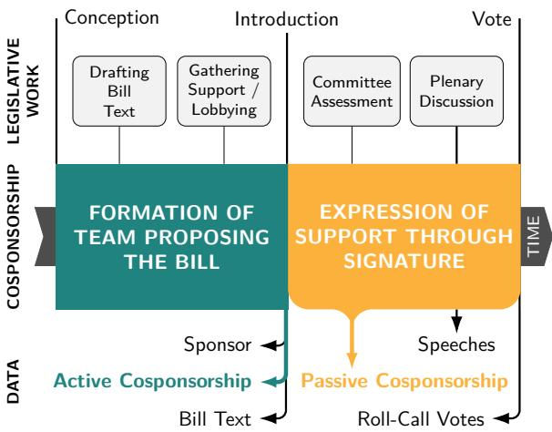  
Figure 1: Distinction between active and passive cosponsorship in time and their relation to the legislative work. Active cosponsorship □ occurs at the initial phase, before the bill is introduced. Passive cosponsorship □ occurs during the deliberation phase of the bill.

So far, most studies analyzing cosponsorship have not differentiated between active and passive cosponsorship. These two actions have been qualitatively distinguished with respect to their effort required. Active cosponsorship can be considered as a more resource-intense form of support, given that legislators can be involved in the drafting process of a bill and help gather support. In turn, passive cosponsorship is viewed as less resource-intense with a minimal effort to sign the bill (Fowler, 2006). However, no studies so far have examined the underlying motivations that drive a legislator to actively or passively cosponsor a bill. Given the importance of cosponsorship as a signal of support for a bill during a legislative process, we believe that it crucial to understand not only if a legislator cosponsors a bill, but why a legislator opts for an active or a passive cosponsorship.

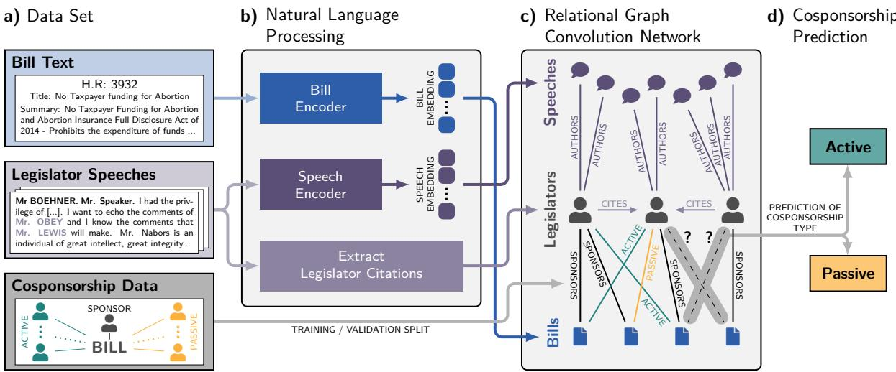  
Figure 2: Overview of our Model. a) Our data contains bill texts, legislator speeches, and cosponsorship data for all bills from the 112th to 115th U.S. Congress. b) We use Natural language processing to obtain contextual embeddings of bills and speeches and to extract a citation network between legislators. c) We develop a Relational Graph Convolutional Network (RGCN) is trained based on a subset of the cosponsorship relations. d) The trained RGCN predicts active and passive cosponsorship relations in the validation and test data.

This work demonstrates that active and passive cosponsorship is driven by two different motivations. Active cosponsorship is people-centric and primarily signals the backing of the sponsor of the bill. In contrast, passive cosponsorship is driven by backing a bill’s content. This result result yields implication for studies in political science. For instance, alliance formation studies can analyze personal networks by considering the active consponsorships. Similarly, studies in position taking can focus on passive consporships to analyze the alignment between legislators and political issues.

Our work makes the following contributions:

’ We curate a data set containing information on all bills and speeches from the 112th to 115th U.S. Congress, which we make available1.

’ We develop a novel encoder enabling us to learn single embeddings from long documents, exceeding current token limitations of state-of-theart models.

’ We propose a Relational Graph Convolutional Network (RGCN) learning legislator representations accounting for (i) the speeches they give, (ii) the bills they sponsor and cosponsor, and (iii) the other legislators they cite in their speeches. We show that the resulting legislator embeddings proxy the legislators’ ideological positions.

’ We train our model using three tasks from the political science domain: (i) cosponsorship, (ii) authorship, and (iii) citation prediction. Through a rigorous ablation study, we show the substantial benefits of such a multi-task learning procedure for the first time in a social science application.

’ Through our representation we disentangle the underlying motivations behind active and passive cosponsorship. Active cosponsorship relates primarily to the backing of the sponsor of a bill, whereas passive cosponsorship relates primarily to the backing of the content of a bill.

’ Finally, our representations achieve state-of-theart performance for voting prediction. This is remarkable, as our result comes from a zero-shot prediction, i.e., our representation has not been trained on any voting data. This further emphasizes the value of our legislator representation as a general proxy for legislators’ ideology.

## 2 Data

For our study, we collect fine-grained data on all bills and legislators from the 112th to 115th U.S. Congress, which we make freely available. Our data set contains (i) metadata for all legislators, (ii) bill texts, (iii) transcripts of all speeches mapped to the corresponding legislator, (iv) disambiguated data capturing which legislators sponsored and actively or passively cosponsored each bill, and (v) the resulting roll-call votes for all bills. We provide detailed statistics for our data set Appendix B.

Legislator Metadata We obtain the BioGuide ID, first name, last name, gender, age, party affiliation, state, and district of all legislators from voteview.com, a curated database containing basic data related to the U.S. Congress.

Bill Text As mentioned above, legislators introduce bills to propose laws or amend existing ones in order to further their agenda. We acquire IDs, titles, and introduction dates of bills using the API of propublica.org, a non-profit organisation that collects and provides access to congressional documents. We further collect summaries of the bill’s content, which the API provides for around 95% of all cases. For bills where no summary is available, we use the full-body texts instead. As we create our data set to study active and passive cosponsorship, we discard all bills for which no cosponsorship links were recorded. Overall, our data set contains information on over 50, 000 bills.

Legislator Speeches Legislators take the floor to advocate or oppose bills. In these speeches, they communicate their agenda to their fellow colleagues in order to persuade them to vote for (or against) a bill. We obtain transcripts of congressional speeches by scraping congress.gov, the official website of the U.S. Congress. The transcripts are archived in so-called daily editions, which are effectively concatenations of all speeches from a day written verbatim. All congressional speeches start with a formal introduction of the legislator giving the speech and the session’s chairperson, e.g., “Mr. POE of Texas. Mrs. President.” or “Mr. BOEHNER. Mr. Speaker” (cf. Figure 2a). Using this pattern, we can split the daily editions and recover the individual speeches and speakers as follows: First, we tag names and geopolitical entities (e.g., “of Texas”) using the Named Entity Recognition model from SpaCy2 with [PERSON] and [GPE] tags, respectively. Second, we tag all salutations (e.g., Mrs/Mr) and institutional roles (e.g., Speaker, President) with [SAL] and [ROLE]. In doing so, the start of speeches is tagged either as [SAL]+[PERSON]+[SAL]+[ROLE] or [SAL]+[PERSON]+[GPE]+[SAL]+[ROLE]. The [PERSON] tag further identifies the legislator giving the speech.

With this simple procedure, we map roughly 93% of the speeches to the correct legislator. We perform manual data cleaning on the speeches excluding subsets for three reasons described below. (i) Speeches for which we cannot determine an author are predominantly given by a legislator representing a committee or an office. When legislators speak on behalf of an office or committee, the opinion expressed in the speech not necessarily corresponds to their personal opinion. (ii) We found many speeches with less than 10 sentences that only contain procedural information. (iii) Similarly, very long speeches with more than 500 sentences are usually of a commemorative nature, paying tribute to or praising a person, an institution, or an event. Both (ii) and (iii) convey no information on the legislators’ stances. Excluding these speeches from our data set, we obtain a total of over 120, 000 speech transcripts. Finally, as shown in Figure 2a, legislators frequently cite each other in speeches. To detect citations in a speech, we first collect all entities that SpaCy tags as [PERSON]. To distinguish instances in which speeches cite other legislators compared to third parties, we utilise the fact that in daily editions, the names of legislators are always written in upper case. We match the names of legislators to their BioGuide IDs resulting in a citation network.

Cosponsorship Data We identify the sponsor of all bills using the API of propublica.org. In addition, the API provides the names of the legislators who cosponsored a bill and when this cosponsorship occurred. We automatically match the cosponsors’ names to their BioGuide ID. In cases where automated matching was not possible —e.g., because legislators signed with their nicknames— we resorted to manual matching. As discussed in Section 1, we assign cosponsorship their official label. Cospsonsorships recorded at the bill’s introduction are active and those recorded after its introduction are passive.

Roll-call votes Roll-call votes are records of how legislators voted on bills. We scrape these data using the Python package of Pujari and Goldwasser (2021), yielding over 1.5 million votes, which we match to the corresponding legislator and bill IDs.

## 3 Methodology

Our model to classify cosponsorship decisions based on the legislator and bill data described in the previous section consists of two main elements, an Encoder and a Relational Graph Convolutional Network (RGCN). The Encoder computes high dimensional representations of legislators’ bills and speeches based on their texts and transcripts, respectively. These representations are used by an RGCN and a downstream Feed-Forward Neural Network (FFNN) allowing us to predict how (i.e., active or passive) a cosponsor supports a bill.

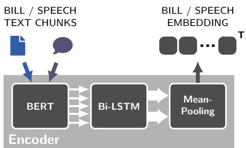  
Figure 3: Overview of our Encoder: The bill/speech chunks are embedded by BERT. The Bi-LSTM computes an aggregated embedding for speeches/bills and the mean pooling layer reduces their dimensionality.

## 3.1 Encoder

The aim of our Encoder is to compute textual embeddings for bills and speeches while preserving the contextual information contained in the texts and transcripts of these documents. When developing such an encoder, we have to solve the problem that both bills and speeches have lengths exceeding the embedding capabilities of SOTA language models (Devlin et al., 2018; Beltagy et al., 2020). In our case, the average number of words for bills and speeches is 2239.43 and 8129.23, respectively. We, therefore, propose the Encoder architecture shown in Figure 3 in which we split the original bill/speech documents D into 512-word chunks $C _ { i } , \mathrm { i . e . , } D = \{ C _ { 1 } , C _ { 2 } , . . . , C _ { T } \}$ . Subsequently, we use BERT (Devlin et al., 2019) to compute embedding vectors $C _ { i } ^ { b e r t }$ for each chunk $C _ { i }$ . We then use a Bi-directional Long-Short-Term-Memory (Bi-LSTM) neural network (Hochreiter and Schmidhuber, 1997) to combine the individual BERT embeddings. The Bi-LSTM processes the BERT embeddings of a document’s chunks both in a forward and a backward direction aggregating them to two hidden states $\stackrel {  } { h _ { T } }$ and $\overleftarrow { h } _ { T }$ . In a final step, we concatenate and mean-pool them to obtain the final document embedding $f \ = \ \left\lceil \overrightarrow { h } _ { \mathit { T } } ; \overleftarrow { h } _ { \mathit { T } } \right\rceil$ . By combining a BERT with a Bi-LSTM model, our encoder succeeds in retaining a biderectional representation of the full document. As a core characteristic, BERT utilizes biderectionality to provide a representation for each chunk. However, it cannot provide a single document representation that leverages the biderectionality across chunks. Instead, using the Bi-LSTM, our encoder can provide representation of the full-text based on biderectional information from the chunks. We compare our encoder against other possible embedding strategies of long documents and report the results in appendix D.1. Vocabulary and grammar of written and spoken language can differ considerably (Akinnaso, 1982; Biber, 1991). To account for this, we train separate Encoder instances for the bill texts and speech transcripts (see Bill and Speech Encoder in Figure 2).

## 3.2 Relational Graph Convolutional Network

Our bill and speech encoders yield embeddings for all bills and speeches, respectively. To model the relations of legislators with these bills and speeches, we use a multi-relational heterogeneous graph $\mathcal { G } = ( \nu , \mathcal { E } )$

’ $\mathcal { V } = \{ S , L , B \}$ is the set of all nodes where S is the set of speeches, L is the set of legislators and B is the set of bills. The bill and speech nodes are initialized with the embeddings computed by the encoders. Legislator nodes are initialized with a hot-one encoding of their metadata (see Section 2).

’  is the set of edges. All edges $( u , v , r ) \in \mathcal { E }$ have a source $u ,$ a target $v ,$ and a relation type $r ~ \in ~ \mathcal { R }$ . The set of possible relations $\mathcal { R } =$ $\{ R _ { 1 } , R _ { 2 } , R _ { 3 } , R _ { 4 } , R _ { 5 } \}$ contains: $R _ { 1 }$ authorship of speech; $R _ { 2 }$ citation of legislator (directed); $R _ { 3 }$ sponsorship of bill; $R _ { 4 }$ active cosponsorship of bill; $R _ { 5 }$ passive cosponsorship of bill.

Based on this heterogeneous graph, we employ a three-layer RGCN (Schlichtkrull et al., 2018). RGCNs are graph neural networks specifically designed to learn representations for multi-relational data. With each layer, the RGCN iteratively updates the initial embeddings of nodes based on their neighborhood, while accounting for the type of relation with the neighbors. This means that for each node $v \in V$ our RGCN computes its embedding $e _ { v } ^ { ( k + 1 ) }$ in its convolutional layer $( k + 1 )$ as

$$
e _ { v } ^ { ( k + 1 ) } = \sigma \left( \sum _ { r \in \mathcal { R } } \sum _ { j \in \mathcal { N } _ { v } ^ { r } } \frac { W _ { r } ^ { ( k ) } e _ { j } ^ { k } } { c _ { v , r } } + W _ { 0 } ^ { k } e _ { v } ^ { k } \right) ,
$$

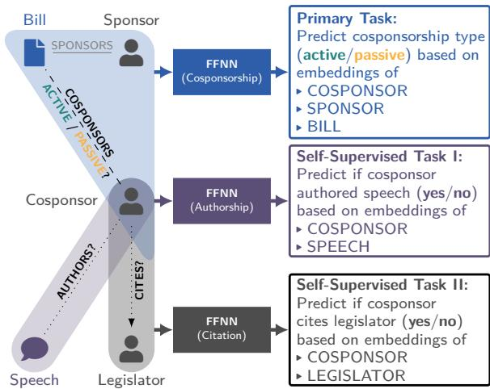  
Figure 4: Overview of our classification tasks: In the primary task we predict active and passive cosponsorship. In the self-supervised tasks, we predict if the cosponsor is the author of a speech and if the cosponsor cited another colleague in their speeches.

where $\mathcal { N } _ { v } ^ { r }$ is the set of neighbours of node v connected by relation of type r, σ is the activation function, $c _ { v , r }$ is a normalization constant, and $W _ { r }$ and $W _ { 0 }$ denote the relation specific transformations used by the RGCN during the training. As suggested by Schlichtkrull et al. (2018), we set $c _ { v , r } = | \mathcal { N } _ { v } ^ { r } |$ . As a result, our RGCN yields holistic representations of legislators based on the speeches they give, the bills they sponsor and cosponsor, and the other legislators they cite in speeches.

## 3.3 Model Training

We train our model by minimising the joint loss function ${ \mathcal L } _ { \mathrm { t o t } }$ of three tasks

$$
\begin{array} { r } { \mathcal { L } _ { \mathrm { t o t } } = \lambda _ { 1 } \mathcal { L } _ { \mathrm { c o s p } } + \lambda _ { 2 } \mathcal { L } _ { \mathrm { a u t h } } + \lambda _ { 3 } \mathcal { L } _ { \mathrm { c i t } } , } \end{array}
$$

where $\lambda _ { 1 } = 0 . 8$ and $\lambda _ { 2 } = \lambda _ { 3 } = 0 . 1 . \ : \mathcal { L } _ { \mathrm { c o s p } }$ relates to our primary task of predicting active and passive cosponsorship. ${ \mathcal { L } } _ { \mathrm { a u t h } }$ and $\mathcal { L } _ { \mathrm { c i t } }$ are the losses from authorship prediction and citation prediction, two additional self-supervised tasks that we use to improve our model’s representation of legislators. An overview of the three tasks, which we detail in the paragraphs below, is shown in Figure 4. We provide summary statistics for training and validation data and report the results of the self-supervised tasks in Appendix C. We assess how the two self-supervised tasks influence our prediction performance in an ablation study (see Appendix D.4).

Cosponsorship Classification The primary task of our model is to predict whether a legislator’s cosponsorship for a bill is active or passive. Active and passive cosponsorship are mutually exclusive. This means that a legislator $l \in L$ in the set of cosponsors ${ \mathcal { C } } ( b )$ of a bill $b \in B .$ , must be either an active cosponsor, $l \in \mathcal { C } _ { A } ( b )$ , or a passive cosponsor, $l \in \mathcal { C } _ { \mathcal { P } } ( b )$ . Therefore, we can formalize active/passive cosponsorship classification as computing the probability that l is in the set of active cosponsors $\mathcal { C } _ { A } ( b )$ of bill b, given the bill b, the bill’s sponsor $S ( b )$ , and the knowledge that l is a cosponsor of the bill.

$$
p _ { \cal A } = p ( l \in \mathcal { C } _ { \cal A } ( b ) | b , S ( b ) , l \in \mathcal { C } ( b ) )
$$

To compute $p _ { A } .$ , we concatenate the node embeddings of the legislator l, the bill b and the bill’s sponsor $S ( b )$ . We use concatenated embeddings as input for an FFNN with softmax which returns $p _ { \mathcal { A } }$ . We use a binary cross-entropy loss to train the model for this classification task:

$$
\begin{array} { r } { \mathcal { L } _ { \mathrm { c o s p } } = - \left( y _ { A } \log p _ { A } + y _ { \mathcal { P } } \log ( 1 - p _ { A } ) \right) . } \end{array}
$$

$y _ { A }$ and $y _ { \mathcal { P } }$ are binary vectors indicating if the true cosponsorship is active or passive, respectively.

Authorship Prediction With our primary task, we aim to distinguish between active and passive cosponsorship based on the embeddings of legislators and the cosponsored bill. To ensure that our model appropriately learns the nuances between the speeches of different legislators, we introduce our first self-supervised task, authorship prediction. For this task, we first sample a speech s every time a legislator l cosponsors a bill. To obtain an equal representation of positive and negative classes, we bias our sampling such that, with a probability of 50%, s was given by l. In a binary classification task, we then use an FFNN that takes the embeddings of the cosponsor l and the speech s as inputs and computes the probability $p _ { \mathrm { a u t h } }$ that l is the author of s. We evaluate the performance of our classifier using the binary cross-entropy loss ${ \mathcal { L } } _ { \mathrm { a u t h } } .$ where $y _ { \mathrm { a u t h } }$ is 1 if legislator l is the speaker of the speech $s ,$ is zero otherwise.

$$
\mathcal { L } _ { \mathrm { a u t h } } = - y _ { \mathrm { a u t h } } \log p _ { \mathrm { a u t h } } - ( 1 - y _ { \mathrm { a u t h } } ) \log ( 1 - p _ { \mathrm { a u t h } } )
$$

Citation Prediction With our second selfsupervised task, we ensure that our model learns the social relationships between legislators expressed in the citations of other legislators in their speeches. To this end, we sample a legislator $l _ { o }$ every time a legislator $l _ { c }$ cosponsors a bill. We again bias our sampling such that, with a probability of $5 0 \% , l _ { c }$ cites $l _ { o } .$ . We use a third FFNN which outputs the probability $p _ { c i t }$ that $l _ { c }$ cited $l _ { o } .$ . To train the model, we use again a binary cross-entropy loss $\mathcal { L } _ { \mathrm { c i t } } .$ , where $y _ { \mathrm { c i t } }$ is 1 if $l _ { c }$ cited $l _ { o }$ and 0 otherwise.

<table><tr><td>Congress</td><td>Ideology</td><td>Metadata</td><td>GloVe</td><td>Encoder</td><td>Encoder + Metadata</td><td>GCN</td><td>RGCN</td><td>Our</td></tr><tr><td>112</td><td> $0 . 7 4 2 { \scriptstyle \pm 0 . 0 2 }$ </td><td> $0 . 7 4 6 { \scriptstyle \pm 0 . 0 8 }$ </td><td> $0 . 7 7 8 { \scriptstyle \pm 0 . 0 5 }$ </td><td> $0 . 8 4 2 { \scriptstyle \pm 0 . 0 4 }$ </td><td> $0 . 8 2 9 { \scriptstyle \pm 0 . 0 5 }$ </td><td> $0 . 7 4 9 { \scriptstyle \pm 0 . 0 5 }$ </td><td> $0 . 7 8 4 \pm 0 . 0 4$ </td><td> $\mathbf { 0 . 8 7 4 } \pm 0 . 0 5$ </td></tr><tr><td>113</td><td> $0 . 7 5 1 { \scriptstyle \pm 0 . 0 3 }$ </td><td> $0 . 7 3 6 { \scriptstyle \pm 0 . 0 6 }$ </td><td> $0 . 7 6 2 { \scriptstyle \pm 0 . 0 5 }$ </td><td> $0 . 8 5 1 { \scriptstyle \pm 0 . 0 6 }$ </td><td> $0 . 8 4 5 { \scriptstyle \pm 0 . 0 6 }$ </td><td> $0 . 7 5 5 { \scriptstyle \pm 0 . 0 3 }$ </td><td> $0 . 7 9 9 \pm 0 . 0 4$ </td><td> $\mathbf { 0 . 8 9 2 } 2 { \scriptstyle \pm 0 . 0 3 }$ </td></tr><tr><td>114</td><td> $0 . 7 4 7 { \scriptstyle \pm 0 . 0 4 }$ </td><td> $0 . 7 3 5 { \scriptstyle \pm 0 . 0 6 }$ </td><td> $0 . 7 6 5 { \scriptstyle \pm 0 . 0 4 }$ </td><td> $0 . 8 3 3 { \scriptstyle \pm 0 . 0 4 }$ </td><td> $0 . 8 6 1 { \scriptstyle \pm 0 . 0 6 }$ </td><td> $0 . 7 6 3 { \scriptstyle \pm 0 . 0 4 }$ </td><td> $0 . 8 0 1 \pm 0 . 0 3$ </td><td> $\mathbf { 0 . 8 8 2 } { \scriptstyle \pm 0 . 0 4 }$ </td></tr><tr><td>115</td><td> $0 . 7 4 9 { \scriptstyle \pm 0 . 0 3 }$ </td><td> $0 . 7 3 1 { \scriptstyle \pm 0 . 0 7 }$ </td><td> $0 . 7 8 2 { \scriptstyle \pm 0 . 0 4 }$ </td><td> $0 . 8 4 8 { \scriptstyle \pm 0 . 0 5 }$ </td><td> $0 . 8 5 3 { \scriptstyle \pm 0 . 0 4 }$ </td><td> $0 . 7 9 2 { \scriptstyle \pm 0 . 0 5 }$ </td><td> $0 . 8 1 6 \pm 0 . 0 5$ </td><td> $\mathbf { 0 . 8 8 9 } 2 0 . 0 4$ </td></tr><tr><td>Avg</td><td> $0 . 7 4 6 { \scriptstyle \pm 0 . 0 3 }$ </td><td> $0 . 7 3 7 { \scriptstyle \pm 0 . 0 7 }$ </td><td> $0 . 7 7 1 { \scriptstyle \pm 0 . 0 5 }$ </td><td> $0 . 8 4 6 { \scriptstyle \pm 0 . 0 3 }$ </td><td> $0 . 8 4 7 { \scriptstyle \pm 0 . 0 5 }$ </td><td> $0 . 7 6 5 { \scriptstyle \pm 0 . 0 4 }$ </td><td> $0 . 8 0 0 \pm 0 . 0 5$ </td><td> $\mathbf { 0 . 8 8 4 } \pm 0 . 0 4$ </td></tr></table>

Table 1: F1-score ( s.d.) for our model (bold) and baselines for active and passive cosponsorship classification.

$$
\mathcal { L } _ { \mathrm { c i t } } = - y _ { \mathrm { c i t } } \log p ( y _ { \mathrm { c i t } } ) - ( 1 - y _ { \mathrm { c i t } } ) \log ( 1 - p ( y _ { \mathrm { c i t } } ) )
$$

## 4 Experimental Setup and Results

Baselines We test our model against seven baselines (B1 to B7) which predict active and passive cosponsorship based different representations of the bill, its sponsor, and the cosponsor. The first two baselines differ only in the way legislators are represented. In B1 Ideology, legislators are represented by their ideology scores computed according to Gerrish and Blei (2011a). Instead, B2 Metadata represents legislators using their meta data introduced in Section 2. In both cases, bills are captured by their topic (e.g., healthcare) and the predictions are made using a Random-Forest-Classifier. Analogous to Section 3.3, all other baselines make predictions using an FFNN. To this end, B3 GloVe represents each bill based on the to 200 unigrams they contain and legislators using the top 200 unigrams in their speeches using GLOVE-840B-300D (Pennington et al., 2014) pre-trained word vectors. B4 Encoder instead obtains bill and speech representations using our Encoder introduced in Section 3.1. To obtain representations for legislators, we then average the representations or their speeches. Baseline B5 Encoder + Metadata uses the identical approach but extends legislator representations using their corresponding metadata. Our final two baseline models operate on the multi-relational heterogeneous graph introduced in Section 3.2. As these baselines do not consider textual information from our Encoder, the representations for legislators and bills are initialized randomly, and the speech nodes are excluded. Based on this graph, B6 GCN learns representations for legislators and bills using a Graph Convolution

Network (GCN) (Zhang et al., 2019). Instead, B7 (RGCN uses an RGCN accounts for the multiple types of relations existing in the data. Additionally, in appendix D.3, we test our model against a broader combination of baselines which combines non-textual, textual and relational informations.

Model Performance We used the model specified in Section 3 and compare it to the baselines introduced in Section 4 for our primary task of active and passive cosponsorship prediction. Summarizing our findings, our model yields a high prediction performance with an F1-score of 0.88. This was only possible because we incorporate contextual language and relational features of legislators and information about the bills they support to predict cosponsorship decisions. The results reported in Table 1 demonstrate that our model outperforms all seven baselines. Our model has better performance than the B1 Ideology and the B2 Metadata, which relies on simple legislator characteristics, of 14% and 15% respectively. This means that simple characteristics of legislators cannot sufficiently explain their cosponsorship behavior. Adding contextual information, B4 Encoder increases the prediction performance over B1 and B2 by roughly the 10%. This points to a topical alignment between the speeches of legislators and the bills they cosponsor. By combining the RGCN with the Encoder, our model utilizes both language and relational information (citation, authorship and cosponsorship), resulting in an F1-score of 0.88. To conclude, the combination of textual and relational information proves to be key for an accurate prediction of cosponsorship decisions. We complement these results in appendix D.2.

Active vs. passive cosponsorship Our model learns representations for both legislators and bills in order to predict active and passive cosponsorship. Figure 5a illustrates that representations of active cosponsors of a bill have a higher average cosine similarity with the representation of the sponsor of the bill. This means that active cosponsorship is primarily used as a signal of support towards a person, i.e., the sponsor. We verify with a test the validity of this claim finding a $\mathrm { . \ p \mathrm { - v a l u e = 4 . 3 \cdot 1 0 ^ { 1 2 } } }$ . On the other hand, representations of passive cosponsors have a higher average cosine similarity with the representations of the bills (see Figure 5b). Once again, we validate this observation using KS test. We find a $\mathrm { p - v a l u e = 3 . 3 7 \cdot 1 0 ^ { 6 } }$ , which once again support our claim about passive cosponsorship. To summarize our findings, we can explain the difference between active and passive consponsorship by distinguishing between two different motivations, namely backing political colleagues or backing a bill’s content. As such, information about active cosponsorship can provide further insights into political alliances, whereas information about passive cosponsorship can be useful for agenda setting and campaigning.

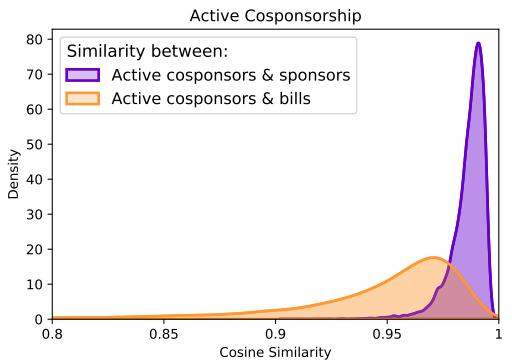

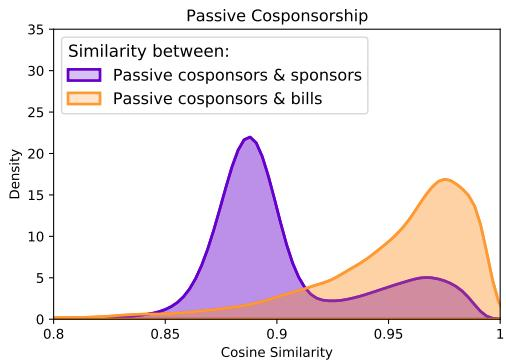  
Figure 5: Density of cosine similarity between cosponsor representations and sponsor □ or bill □ representation. Panel (a) shows active cosponsors. Panel (b) shows passive cosponsors.

Prediction of other legislative decisions Our legislator representations can be further used to study other legislative decisions, such as voting.

To do so, we use an additional FFNN that takes as input the representations of legislators and bills to predict the vote of a legislator on a bill ("yea", "nay"). We compare the results of this model with four models directly trained for the task of voting predictions: (i) Majority (Maj) is a baseline which assumes all legislators vote yea. (ii) Ideal-Vectors (IV) are multidimensional ideal vectors for legislators based on bill texts obtained following the method of Kraft et al. (2016). (iii) CNN+meta is based on CNN and adds the percentage of sponsors of different parties as bill’s authorship information (Kornilova et al., 2018). (iv) LSTM+GCN uses

<table><tr><td>Congr.</td><td>Maj</td><td>IV</td><td>CNN</td><td>LSTM+ GCN</td><td>Our Repr.+ FFNN</td></tr><tr><td>112</td><td>0.781</td><td>0.874</td><td>0.888</td><td>0.895</td><td>0.928</td></tr><tr><td>113</td><td>0.775</td><td>0.882</td><td>0.891</td><td>0.894</td><td>0.904</td></tr><tr><td>114</td><td>0.784</td><td>0.874</td><td>0.878</td><td>0.896</td><td>0.901</td></tr><tr><td>115</td><td>0.776</td><td>0.882</td><td>0.885</td><td>0.903</td><td>0.895</td></tr><tr><td>Avg</td><td>0.778</td><td>0.879</td><td>0.8869</td><td>0.896</td><td>0.907</td></tr></table>

Table 2: F1-scores for Roll-Call-Vote predictions.

LSTM to encode legislation and applies a GCN to update representations of legislators (Yang et al., 2020). Table 6 shows that our model achieves an F1-score of 0.907. To avoid leakage of information we predict the voting decisions on bills that were not cosponsored by the legislator voting.

Interpretation of legislator representations Given that our representations can explain multiple legislators decisions, we can interpret them as a proxy of legislators’ ideology. In Figure 6 we plot a two-dimensional projection (using TSNE, Van der Maaten and Hinton 2008) of our legislator representations. We find a clear split between Republican and Democrat legislators. Interestingly, Republican and Democrat party leaders are located at the center of their respective party. Moreover, we highlight the so-called "Blue Dog Caucus", the group of conservative Democrats who our representations place between Republicans and Democrats.

## 5 Related Work

The analysis of cosponsorship decisions has been widely studied by experts of political science (e.g., Campbell, 1982; Krehbiel, 1995; Mayhew, 2004). Research on cosponsorship often focuses on three aspects: the agenda-setting dynamics of bill introductions and cosponsorship (Koger, 2003; Kessler and Krehbiel, 1996), how cosponsorship affects bill passage (Wilson and Young, 1997; Browne, 1985; Woon, 2008; Sciarini et al., 2021; Dockendorff, 2021), and alliances between legislators (Fowler, 2006; Kirkland, 2011; Kirkland and Gross, 2014; Lee et al., 2017; Brandenberger, 2018; Brandenberger et al., 2022). Despite political science research directly linking cosponsorship to the texts of bills and speeches in congress, cosponsorship has so far received little to no attention from the NLP community. However, recent advances of natural language processing (Devlin et al., 2018; Vaswani et al., 2017; Zhao et al., 2019; Russo et al., 2020) provides tools to address questions related to political studies (Nguyen et al., 2015; Schein, 2019; Stoehr et al., 2023a; Falck et al., 2020; Glavaš et al., 2017). Among these studies, the prediction of rollcall votes has received great attention. For example, Eidelman et al. (2018) propose a model to predict voting behavior using bill texts and sponsorship information and find that the addition of the textual information of the bill improves voting predictions drastically. Similarly, Gerrish and Blei (2011b) improve upon voting prediction by proposing a congress model that proxies ideological positions of legislators by linking legislative sentiment to bill texts. This model has been extended to further improve predictions of roll-call votes (Patil et al., 2019; Kraft et al., 2016; Karimi et al., 2019; Kornilova et al., 2018; Xiang and Wang, 2019; Bud hwar et al., 2018; Vafa et al., 2020; Mou et al., 2021).

## 6 Conclusion

In this work, we developed an Encoder+RGCN based model that learns holistic representations of legislators, accounting for the bills they sponsor and cosponsor, the speeches they give, and other legislators they cite. This representation enabled us to predict the type of cosponsorship support legislators give to colleagues with high accuracy. Specifically, we differentiated between active cosponsorship, which is given before the official introduction of the bill to the Congress floor, and passive cosponsorship, which is given afterwards. So far, the political science literature has distinguished these forms of cosponsorship in terms of their resourceintensity (Fowler, 2006) and their alliance formation dynamics (Brandenberger, 2018). However, we showed that legislators in the U.S. Congress use active and passive cosponsorship for two fundamentally different aims: active cosponsorship is used to back a colleague and passive cosponsorship serves to back a bills’ agenda. Studying the transferability of our representations to other legislative activities, we showed that the resulting legislator embeddings can be used to proxy their ideological positions. Specifically, our representations separate legislators, matching not only their party affiliation but even their caucus membership. Finally, in an application of zero-shot learning, we showed that our representations match task-specific SOTA methods when predicting the outcomes of roll-call votes without requiring any additional training. Hence, our legislator representations are interpretable and generalize well to unseen tasks. Our results have important implications for both the study of cosponsorship and future studies of U.S. legislative activities. For cosponsorship, when aiming to study the relations between legislators, data on active cosponsorship should be used. In turn, to study agenda support among legislators, the information contained in passive cosponsorship is most meaningful. In future research, our holistic representations of U.S. legislators allow for deeper insights into how ideology affects alliance formation, agenda setting and political influencing.

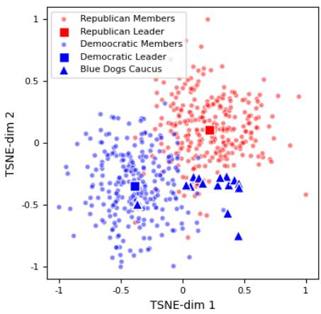  
Figure 6: 2D projection of the legislator representations. As shown, our representation of Legislators splits them correctly along party lines (□, □). Party leaders are found in the center of their respective party clusters. We also find that members of the “Blue Dogs Caucus” are correctly positioned between the two parties.

## References

F Niyi Akinnaso. 1982. On the differences between spoken and written language. Language and speech, 25(2):97–125.

Iz Beltagy, Matthew E Peters, and Arman Cohan. 2020. Longformer: The long-document transformer. arXiv preprint arXiv:2004.05150.

Douglas Biber. 1991. Variation across speech and writing. Cambridge University Press.

Laurence Brandenberger. 2018. Trading favors – examining the temporal dynamics of reciprocity in congressional collaborations using relational event models. Social Networks, 54:238–253.

Laurence Brandenberger, Giona Casiraghi, Georges Andres, Simon Schweighofer, and Frank Schweitzer. 2022. Comparing online and offline political support. Swiss Political Science Review, Online First:1–35.

William P Browne. 1985. Multiple sponsorship and bill success in us state legislatures. Legislative Studies Quarterly, pages 483–488.

Aditya Budhwar, Toshihiro Kuboi, Alex Dekhtyar, and Foaad Khosmood. 2018. Predicting the vote using legislative speech. In Proceedings of the 19th annual international conference on digital government research: governance in the data age, pages 1–10.

James E Campbell. 1982. Cosponsoring legislation in the us congress. Legislative Studies Quarterly, 7:415– 422.

Jacob Devlin, Ming-Wei Chang, Kenton Lee, and Kristina Toutanova. 2018. Bert: Pre-training of deep bidirectional transformers for language understanding. arXiv preprint arXiv:1810.04805.

Jacob Devlin, Ming Wei Chang, Kenton Lee, and Kristina Toutanova. 2019. BERT: Pre-training of deep bidirectional transformers for language understanding. In NAACL HLT 2019 - 2019 Conference of the North American Chapter of the Association for Computational Linguistics: Human Language Technologies - Proceedings ofthe Conference.

Andrés Dockendorff. 2021. Why are some parliamentarians’ bills more likely to progress? sponsorship as a signal. The British Journal ofPolitics and International Relations, 23(1):139–157.

Vlad Eidelman, Anastassia Kornilova, and Daniel Argyle. 2018. How predictable is your state? leveraging lexical and contextual information for predicting legislative floor action at the state level. ArXiv PrePrint: 1806.05284, pages 1–16.

Fabian Falck, Julian Marstaller, Niklas Stoehr, Sören Maucher, Jeana Ren, Andreas Thalhammer, Achim Rettinger, and Rudi Studer. 2020. Measuring proximity between newspapers and political parties: the sentiment political compass. Policy & internet, 12(3):367–399.

James H Fowler. 2006. Connecting the congress: A study of cosponsorship networks. Political Analysis, 14(4):456–487.

Sean M Gerrish and David M Blei. 2011a. Predicting legislative roll calls from text. In Proceedings ofthe 28th International Conference on Machine Learning, ICML 2011.

Sean M. Gerrish and David M. Blei. 2011b. Predicting legislative roll calls from text. In Proceedings ofthe 28th International Conference on Machine Learning, ICML 2011.

Goran Glavaš, Federico Nanni, and Simone Paolo Ponzetto. 2017. Unsupervised cross-lingual scaling of political texts. In European semantic web conference, pages 593–607. Association for Computational Linguistics.

Sepp Hochreiter and Jürgen Schmidhuber. 1997. Long short-term memory. Neural computation, 9(8):1735– 1780.

Hamid Karimi, Tyler Derr, Aaron Brookhouse, and Jiliang Tang. 2019. Multi-factor congressional vote prediction. In Proceedings ofthe 2019 IEEE/ACM International Conference on Advances in Social Networks Analysis and Mining, ASONAM 2019.

Daniel Kessler and Keith Krehbiel. 1996. Dynamics of cosponsorship. American Political Science Review, 90(03):555–566.

Justin H Kirkland. 2011. The relational determinants of legislative outcomes: Strong and weak ties between legislators. The Journal ofPolitics, 73(3):887–898.

Justin H Kirkland and Justin H Gross. 2014. Measurement and theory in legislative networks: The evolving topology of congressional collaboration. Social Networks, 36:97–109.

Gregory Koger. 2003. Position taking and cosponsorship in the us house. Legislative Studies Quarterly, 28(2):225–246.

Anastassia Kornilova, Daniel Argyle, and Vladimir Eidelman. 2018. Party matters: Enhancing legislative embeddings with author attributes for vote prediction. In Proceedings of the 56th Annual Meeting of the Association for Computational Linguistics (Volume 2: Short Papers), pages 510–515, Melbourne, Australia. Association for Computational Linguistics.

Peter E. Kraft, Hirsh Jain, and Alexander M. Rush. 2016. An embedding model for predicting roll-call votes. In EMNLP 2016 - Conference on Empirical Methods in Natural Language Processing, Proceedings.

Keith Krehbiel. 1995. Cosponsors and wafflers from a to z. American Journal of Political Science, pages 906–923.

Sang Hoon Lee, José Manuel Magallanes, and Mason A Porter. 2017. Time-dependent community structure in legislation cosponsorship networks in the congress of the republic of peru. Journal ofComplex Networks, 5(1):127–144.

Ilya Loshchilov and Frank Hutter. 2017. Decoupled weight decay regularization. arXiv preprint arXiv:1711.05101.

David R Mayhew. 2004. Congress: The electoral connection. Yale university press.

Xinyi Mou, Zhongyu Wei, Lei Chen, Shangyi Ning, Yancheng He, Changjian Jiang, and Xuan-Jing Huang. 2021. Align voting behavior with public statements for legislator representation learning. In Proceedings of the 59th Annual Meeting of the Associationfor Computational Linguistics and the 11th International Joint Conference on Natural Language Processing (Volume 1: Long Papers), pages 1236– 1246.

Viet-An Nguyen, Jordan Boyd-Graber, Philip Resnik, and Kristina Miler. 2015. Tea party in the house: A hierarchical ideal point topic model and its application to republican legislators in the 112th congress. In Proceedings of the 53rd Annual Meeting of the Association for Computational Linguistics and the 7th International Joint Conference on Natural Language Processing (Volume 1: Long Papers), pages 1438–1448.

Adam Paszke, Sam Gross, Francisco Massa, Adam Lerer, James Bradbury, Gregory Chanan, Trevor Killeen, Zeming Lin, Natalia Gimelshein, Luca Antiga, et al. 2019. Pytorch: An imperative style, high-performance deep learning library. Advances in neural information processing systems, 32.

Pallavi Patil, Kriti Myer, Ronak Zala, Arpit Singh, Sheshera Mysore, Andrew McCallum, Adrian Benton, and Amanda Stent. 2019. Roll call vote prediction with knowledge augmented models. In CoNLL 2019 - 23rd Conference on Computational Natural Language Learning, Proceedings of the Conference.

Jeffrey Pennington, Richard Socher, and Christopher D. Manning. 2014. GloVe: Global vectors for word representation. In EMNLP 2014 - 2014 Conference on Empirical Methods in Natural Language Processing, Proceedings ofthe Conference.

Rajkumar Pujari and Dan Goldwasser. 2021. Understanding politics via contextualized discourse processing. In Proceedings ofthe 2021 Conference on Empirical Methods in Natural Language Processing, pages 1353–1367, Online and Punta Cana, Dominican Republic. Association for Computational Linguistics.

Giuseppe Russo, Nora Hollenstein, Claudiu Cristian Musat, and Ce Zhang. 2020. Control, generate, augment: A scalable framework for multi-attribute text

generation. In Findings ofthe Associationfor Computational Linguistics: EMNLP 2020, pages 351– 366, Online. Association for Computational Linguistics.

Giuseppe Russo, Manoel Horta Ribeiro, Giona Casiraghi, and Luca Verginer. 2022a. Understanding online migration decisions following the banning of radical communities. Proceedings ofthe 15th ACM Web Science Conference 2023.

Giuseppe Russo, Luca Verginer, Manoel Horta Ribeiro, and Giona Casiraghi. 2022b. Spillover of antisocial behavior from fringe platforms: The unintended consequences of community banning. ArXiv, abs/2209.09803.

Aaron Schein. 2019. Allocative poisson factorization for computational social science. arXiv preprint arXiv:2104.12133.

Michael Schlichtkrull, Thomas N Kipf, Peter Bloem, Rianne van den Berg, Ivan Titov, and Max Welling. 2018. Modeling relational data with graph convolutional networks. In European semantic web conference, pages 593–607. Springer.

Pascal Sciarini, Manuel Fischer, Roy Gava, and Frédéric Varone. 2021. The influence of co-sponsorship on mps’ agenda-setting success. West European Politics, 44(2):327–353.

Nitish Srivastava, Geoffrey Hinton, Alex Krizhevsky, Ilya Sutskever, and Ruslan Salakhutdinov. 2014. Dropout: a simple way to prevent neural networks from overfitting. The journal of machine learning research, 15(1):1929–1958.

Niklas Stoehr, Ryan Cotterell, and Aaron Schein. 2023a. Sentiment as an ordinal latent variable. In Proceedings ofthe 17th Conference ofthe European Chapter ofthe Associationfor Computational Linguistics, pages 103–115, Dubrovnik, Croatia. Association for Computational Linguistics.

Niklas Stoehr, Benjamin J. Radford, Ryan Cotterell, and Aaron Schein. 2023b. The ordered matrix dirichlet for state-space models. In Proceedings ofThe 26th International Conference on Artificial Intelligence and Statistics, volume 206 of Proceedings of Machine Learning Research, pages 1888–1903. PMLR.

Keyon Vafa, Suresh Naidu, and David M Blei. 2020. Text-based ideal points. arXiv preprint arXiv:2005.04232.

Laurens Van der Maaten and Geoffrey Hinton. 2008. Visualizing data using t-sne. Journal of machine learning research, 9(11).

Ashish Vaswani, Noam Shazeer, Niki Parmar, Jakob Uszkoreit, Llion Jones, Aidan N Gomez, Łukasz Kaiser, and Illia Polosukhin. 2017. Attention is all you need. Advances in neural information processing systems, 30.

Minjie Wang, Da Zheng, Zihao Ye, Quan Gan, Mufei Li, Xiang Song, Jinjing Zhou, Chao Ma, Lingfan Yu, Yu Gai, Tianjun Xiao, Tong He, George Karypis, Jinyang Li, and Zheng Zhang. 2019. Deep graph library: A graph-centric, highly-performant package for graph neural networks. arXiv preprint arXiv:1909.01315.

Rick K Wilson and Cheryl D Young. 1997. Cosponsorship in the us congress. Legislative Studies Quarterly, pages 25–43.

Thomas Wolf, Lysandre Debut, Victor Sanh, Julien Chaumond, Clement Delangue, Anthony Moi, Pierric Cistac, Tim Rault, Rémi Louf, Morgan Funtowicz, et al. 2019. Huggingface’s transformers: State-of the-art natural language processing. arXiv preprint arXiv:1910.03771.

Jonathan Woon. 2008. Bill sponsorship in congress: the moderating effect of agenda positions on legislative proposals. The Journal ofPolitics, 70(1):201–216.

Wei Xiang and Bang Wang. 2019. A Survey of Event Extraction from Text. IEEE Access, 7:173111– 173137.

Yuqiao Yang, Xiaoqiang Lin, Geng Lin, Zengfeng Huang, Changjian Jiang, and Zhongyu Wei. 2020. Joint representation learning of legislator and legislation for roll call prediction. In IJCAI, pages 1424– 1430.

Si Zhang, Hanghang Tong, Jiejun Xu, and Ross Maciejewski. 2019. Graph convolutional networks: a comprehensive review. Computational Social Networks, 6(1):1–23.

Jieyu Zhao, Tianlu Wang, Mark Yatskar, Ryan Cotterell, Vicente Ordonez, and Kai-Wei Chang. 2019. Gender bias in contextualized word embeddings. arXiv preprint arXiv:1904.03310.

## A Reproducibility

Data set splits We perform a time-based splitting of our full data set for each Congress. Specifically, we consider the first 60% of each Congress period as training data, the subsequent 20% as validation data, and the final 20% as test data. For active and passive cosponsorship classification, this yields, a total of 370, 000 training observations, and 120, 000 validation and testing samples, each.

Implementation Details We use BERT (bert-base-uncased) from the HugginFace library (Wolf et al., 2019). We fine-tune our two language models (LMs) for 5 epochs, following the indication provided by Devlin et al. (2018). The dimension of the BERT embeddings is set to 768. We use the implementation of Bi-LSTM from PyTorch (Paszke et al., 2019). We set the hidden states dimension of the Bi-LSTM to 384. Finally, the mean pooling layer at the end of the encoder outputs the initial node embeddings whose dimension is set to 128. To implement the RGCN we use the DGL library (Wang et al., 2019). We use 2 layers for the RGCN as motivated by model performance (reported in Appendix C). The hidden layer sizes of the two convolutional layers are 128 and 64, respectively. Additionally, we use three different one-layer FFNNs with a softmax activation function for our three tasks (cosponsorship, author and citation prediction). These FFNNs have dimensions 192, 128, and 128, respectively. To train the model we use AdamW (Loshchilov and Hutter, 2017) as optimizer. We tested the following learning rates for the AdamW: $\{ 1 0 ^ { - 1 } , 1 0 ^ { - 2 } , 1 0 ^ { - \bar { 3 } } , 1 0 ^ { - 4 } \} $ . We obtain the best results with a learning rate of 10−4. Additionally, we train our model with a batch size of 64. We add dropout regularization (Srivastava et al., 2014) and early stopping to prevent the model from over-fitting. We stop the training after 8 epochs.

## B Data

In this section we decide to provide additional information about our collected data. We provide a summary statistics of our dataset in Table 3

## B.1 Cosponsoring

In this section we provide additional information about all the data we used. We collected all bills that were supported by more than 10 cosponsors. In particular, we collected all the bills of the following caterogies: (i) House Resolution, (ii) House Joint Resolution, (iii) House Concurrent Resolution.

<table><tr><td>Congress</td><td>#Bill</td><td>#Active</td><td>#Passive</td></tr><tr><td>112</td><td>14042</td><td>68113</td><td>78507</td></tr><tr><td>113</td><td>12852</td><td>63176</td><td>82657</td></tr><tr><td>114</td><td>14550</td><td>77746</td><td>82149</td></tr><tr><td>115</td><td>15754</td><td>78751</td><td>85308</td></tr></table>

Table 3: Summary statistics of bills and cosponsorship signatures.
<table><tr><td>Congress</td><td>#Speeches (total)</td><td>#Speeches (avg. per MP)</td><td>Speech length (avg. # words)</td></tr><tr><td>112</td><td>32189</td><td>60.16</td><td>224.82</td></tr><tr><td>113</td><td>36623</td><td>68.47</td><td>225.41</td></tr><tr><td>114</td><td>30121</td><td>56.30</td><td>218.10</td></tr><tr><td>115</td><td>31579</td><td>59.02</td><td>223.64</td></tr></table>

Table 4: Summary statistics of congressional speeches.

Active and Passive Cosponsoring To show that the party affiliation does not affect significantly the distribution of active and passive labels, we provide in Figure 7 an analysis of the distribution of the two labels. We notice that there is a higher tendency of Republicans to cosponsor both actively and passively.

Finally, in Table 4 we provide statistics about the number of speeches and how they are distributed among legislators. We also provide a visualization of the number of bills proposed by Republicans and Democrats during the four Congresses in Figure 8.

## C Training Results

As discussed in Section 3.3, we use authorship and citation prediction as two additional self-supervised tasks to train our model. Here we discuss some of the details about the implementation of these two tasks. In particular, we first discuss how the data are generated and two how the model performances on these tasks are.

Authorship prediction For this particular task, we first sample a speech s every time a legislator l cosponsor a bill. This speech is sampled with 30% chance from the speeches that l gave and with 70% chance from other speeches not given by l. Following this procedure we generate our positive and negative training samples for each legislator. These data are split into training, validation and test sets using the same splitting scheme (60-20-20) used for the primary tasks of cosponsorship prediction (see Section 3.3). We test the performance of our model on the training and validation set and compare it with the performance yield by the Encoder representations only. These results are shown in Table 5.

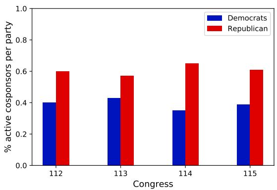

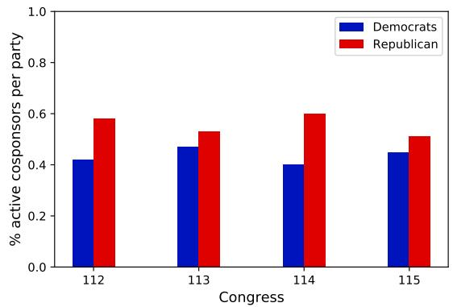  
Figure 7: Distribution of active (left) and passive (right) cosponsorship across parties.

<table><tr><td>Model</td><td>Training</td><td>Validation</td><td>Test</td></tr><tr><td colspan="4">Authorship Prediction</td></tr><tr><td>Encoder</td><td>0.881</td><td>0.875</td><td>0.873</td></tr><tr><td>Our model</td><td>0.932</td><td>0.921</td><td>0.911</td></tr><tr><td colspan="4">Citation Prediction</td></tr><tr><td>Encoder</td><td>0.667</td><td>0.652</td><td>0.639</td></tr><tr><td>Our model</td><td>0.699</td><td>0.685</td><td>0.665</td></tr></table>

Table 5: F1-scores for training, validation and testing separated for the two learning tasks. For each task, we compare our model (Encoder + RGCN) against the encoder representations.

Citation Prediction Similar to the authorship prediction task, we sample a legislator $l _ { o }$ every time a legislator $l _ { c }$ cosponsors a bill. This legislator $l _ { o }$ is sampled with a 50% chance from the legislators that $l _ { c }$ cited in their speeches. Additionally, we substitute the name of the cited legislator $l _ { o }$ with the token <LEG> in all the speeches of legislator ${ l } _ { c } .$ As before, we applied a 60-20-20 split to the data that we generated with this procedure. Table 5 provides the results from the performance of our model on the training and validation set and a comparison with the performance from the encoder representations only.

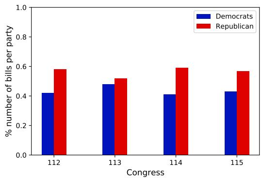  
Figure 8: Distribution of the number of bills across parties for the 112th-115th congresses.

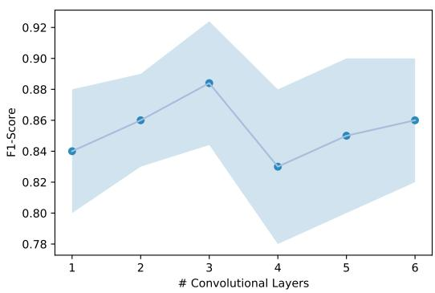  
Figure 9: Model performance of our model w.r.t to the number of convolutional layers.

## D Results

## D.1 Encoder Results

We test our textual encoder against other SOTA models to embed long documents. To do so, we subsitute oure textual encode with (1) Doc2Vec, (2) BERT, and (3) LongFormer to compoute the embeddings for the speeches. In particular, the Long-Former we divide the text of speechs in chunks of 4, 906 (maximum lenght of the LongFormer) we then average these chunks. For BERT we divide the text of the speeches in chunks of 512 words and we average them, (3) Our textual encoder provifdes significantly higher performance compared to the model trained using Doc2Vec, BERT, and the LongFormer.

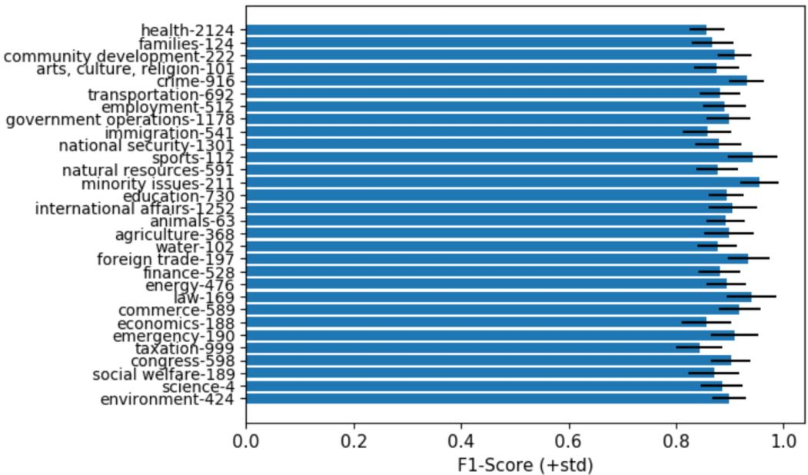  
Figure 10: Error Analysis: We report the F1-Score for each bill topic. Bill topics are selected according to the official denomination of the U.S. Congress. We report each topic using the convetion TopicName-TopicCode

<table><tr><td>Congr.</td><td>Doc2Vec+ RGCN</td><td>BERT+ RGCN</td><td>LongF+ RGCN</td><td>Our</td></tr><tr><td>112</td><td>0.812</td><td>0.852</td><td>0.854</td><td>0.874</td></tr><tr><td>113</td><td>0.809</td><td>0.847</td><td>0.861</td><td>0.892</td></tr><tr><td>114</td><td>0.822</td><td>0.851</td><td>0.849</td><td>0.882</td></tr><tr><td>115</td><td>0.835</td><td>0.855</td><td>0.867</td><td>0.889</td></tr><tr><td>Avg</td><td>0.820</td><td>0.851</td><td>0.857</td><td>0.884</td></tr></table>

Table 6: F1-scores for the active/passive cosponsorship classification task when our textual encoder is substituted with Doc2Vec, Bert and the LongFormer.

## D.2 Error Analysis

We conducted an error analysis analyzing the model performance w.r.t the different topics of the bills. Our models provides significantly robust performances across most topics in fig. 10. Furthermore, we analyze the model performance on each legislator of the U.S. Congress. We obtain an average F1-Score per legislator of 0.889 with a stand deviation of 0.05. Unsurprisingly, our model performance drops for legislators with less than 8 speeches achieving an average F1-score of 0.758 with a standard deviation of 0.09

## D.3 Additional Baselines

We test our model also against a broader set of baselines. In particula, we test it against a combination of non-textual, textual and relational model. We provide the list of the additional baselines we tested on: (1) BoW+Metadata+Ideology (BMI). This Baseline combines a Bag-of-Words approach with the metadata and the DW-nominates scores of the legislators. In particular, for each legislator we compute its BoW extracted from its speeches. We consider exclusively the top 500 words selected using the methodology of Patil et al. (2019) and combine it with the metadata and the DWnominates score of the legislator. As we observe in table 7, this baseline perform significantly worst that our proposed model. It also yields lower performance than the textual Encoder only (see table 1. (2) BoW+Metadata+Ideology+RGCN (BMI-RGCN). This baselines uses the BoW representations for speeches and bills as an initiliazation for the bill and speech embeddings of the RGCN. The Ideology+Metadata are used as iniitialization for the legislator nodes. This baseline slightly increased the results of the RGCN baseline reported in table 1. (3) Glove+Metadata+Ideology+RGCN (Glove-RGCN). In this additional baseline we encode bills and speeechs using GloVe. In particular, we utilize as a representation for each speech the average of the top 500 words selected accordingly to Patil et al. (2019). Finally, we use such represntations to initialize the RGCN. Such a baseline does not provide signifucantly better results compare to the BMI-RGCN baseline. We report the results for these baselines in table 7

<table><tr><td>Congr.</td><td>BMI</td><td>BMI+ RGCN</td><td>GloVe+ RGCN</td><td>Our</td></tr><tr><td>112</td><td>0.746</td><td>0.787</td><td>0.792</td><td>0.874</td></tr><tr><td>113</td><td>0.759</td><td>0.804</td><td>0.816</td><td>0.892</td></tr><tr><td>114</td><td>0.762</td><td>0.808</td><td>0.824</td><td>0.882</td></tr><tr><td>115</td><td>0.733</td><td>0.825</td><td>0.833</td><td>0.889</td></tr><tr><td>Avg</td><td>0.750</td><td>0.806</td><td>0.817</td><td>0.884</td></tr></table>

Table 7: F1-scores for the additional baselines on the active/passive cosponsorship classification task.

<table><tr><td>Congress</td><td> $\mathcal { L } _ { \mathrm { c o s p } }$ </td><td> ${ \mathcal { L } } _ { \mathrm { t o t } ^ { - } } { \mathcal { L } } _ { \mathrm { a u t h } }$ </td><td> $\mathcal { L } _ { \mathrm { t o t } } { - } \mathcal { L } _ { \mathrm { c i t } }$ </td><td> ${ \mathcal { L } } _ { \mathrm { t o t } }$ </td></tr><tr><td>112</td><td>0.841</td><td>0.855</td><td>0.858</td><td>0.874</td></tr><tr><td>113</td><td>0.847</td><td>0.875</td><td>0.871</td><td>0.892</td></tr><tr><td>114</td><td>0.864</td><td>0.878</td><td>0.869</td><td>0.882</td></tr><tr><td>115</td><td>0.861</td><td>0.871</td><td>0.871</td><td>0.889</td></tr><tr><td>Avg</td><td>0.853</td><td>0.870</td><td>0.867</td><td>0.884</td></tr></table>

Table 8: Ablation Study of the loss functions $\mathcal { L } _ { \mathrm { c o s p } }$ (cosponsorship), ${ \mathcal { L } } _ { \mathrm { a u t h } }$ (authorship) and ${ \mathcal L } _ { \mathrm { c i t } }$ (citations) for the 112th-115th congresses.

## D.4 Ablation Study

We conduct an ablation study by testing how our two self-supervised tasks, authorship prediction and citation prediction, affect our overall prediction performance. The model trained without the two self-supervised tasks achieves a F1-score of 0.85 (see Table 8). By including authorship prediction only, the F1-score increase to 0.87. By including citation prediction only, the same accuracy is achieved. Including both tasks together, our model results in the highest F1-score of 0.88.

## D.5 Predicting Roll-Call Votes

As discusssed in Section 4, we use the representations learnt by our model to predict other legislative decisions. In particular, we focused on the prediction of Roll-Call-Votes , which are votes expressed by a legislator on a bill ("yea", "nay"). To perform this task we train a three layer FFNN with ReLu as activation function and dropout regularization set to 0.2. The FFNN takes as input the embeddings of the bill and of the legislator voting on that specific bill. To avoid leakage of information we predict the voting decisions on bills that were not cosponsored by the legislator voting.

## E Limitations and Impact

Legislators show political support in multiple ways. In this work, we operationalised political support as Active and Passive cosponsorship. Active and

Passive cosponsorship represent a strong signal of support between legislators that has been widely accepted in the political science literature (Kessler and Krehbiel, 1996; Wilson and Young, 1997; Browne, 1985; Woon, 2008; Sciarini et al., 2021; Dockendorff, 2021; Fowler, 2006; Kirkland, 2011; Kirkland and Gross, 2014; Lee et al., 2017). However, other forms of political support, e.g., endorsement of public posts on social media, could be considered. Future research might explore the extent to which these forms of support might reveal additional insights about the cooperation between legislators.

Our second limitation relates to the estimation of legislator’s ideology. Ideology is a latent concept. This means that it cannot be directly measured and no ground-truth data exists. Therefore, to validate that our legislator representations encode ideology, we need to prove their performance in a variety of tasks in which the political science literature suggests ideology is important. In our work, we studied three tasks: (i) active/passive cosponsorship prediction, (ii) party affiliation recovery, and (iii) voting prediction. We argue that this is a representative set of tasks. However, legislators are involved in additional ideology-driven tasks, e.g., the release of public statements. Showing that our representations are also predictive of these additional tasks might be considered an even more robust and convincing validation of our results.

Third, in its current form, our model cannot compute predictions for newly elected legislators. This is due to no data being available—newly elected legislators have not given any speeches, or (co)sponsored any bills. We argue that by applying our model as an online predictor, new information on legislators could be incorporated as soon as it becomes available. However, a full exploration of our model’s potential for this application was outside the scope of this work.

Our final limitation concerns how our model can be extended to other data. In our work, we studied four different U.S. Congresses. For these, we obtained consistent and high performance. Therefore, we expect this performance to extend to other Congresses. However, having focused exclusively on the U.S., we cannot make any statements about the applicability of our framework to other legislative systems. Addressing this limitation could contribute to proving the generalizability of our results.

Future Work Our work can impact studies on t latent factors (e.g., ideology) in other domains. For instance, recent works on radicalization (Russo et al., 2022b,a) can take a similar approach to study the relation between ideology and radicalization. Similarly, studies on international relations can benefit (Stoehr et al., 2023b) from this approach in order to study latent states between nations such as “ally”, “neutral”, and “enemy”.

## ACL 2023 Responsible NLP Checklist

A For every submission: ✓ A1. Did you describe the limitations of your work? ✓

✓ A2. Did you discuss any potential risks of your work? ✓

✓ A3. Do the abstract and introduction summarize the paper’s main claims? Left blank.

✓ A4. Have you used AI writing assistants when working on this paper? Left blank.

B ✗ Did you use or create scientific artifacts? Left blank.

✗ B1. Did you cite the creators of artifacts you used? Left blank.

✗ B2. Did you discuss the license or terms for use and / or distribution of any artifacts? Left blank.

✗ B3. Did you discuss if your use of existing artifact(s) was consistent with their intended use, provided that it was specified? For the artifacts you create, do you specify intended use and whether that is compatible with the original access conditions (in particular, derivatives of data accessed for research purposes should not be used outside of research contexts)? Left blank.

✓ B4. Did you discuss the steps taken to check whether the data that was collected / used contains any information that names or uniquely identifies individual people or offensive content, and the steps taken to protect / anonymize it? Left blank.

✗ B5. Did you provide documentation of the artifacts, e.g., coverage of domains, languages, and linguistic phenomena, demographic groups represented, etc.? Left blank.

✓ B6. Did you report relevant statistics like the number of examples, details of train / test / dev splits, etc. for the data that you used / created? Even for commonly-used benchmark datasets, include the number of examples in train / validation / test splits, as these provide necessary context for a reader to understand experimental results. For example, small differences in accuracy on large test sets may be significant, while on small test sets they may not be. Left blank.

## C ✓ Did you run computational experiments?

Left blank.

✓ C1. Did you report the number of parameters in the models used, the total computational budget (e.g., GPU hours), and computing infrastructure used? Left blank.

✓ C2. Did you discuss the experimental setup, including hyperparameter search and best-found hyperparameter values? Left blank.

✓ C3. Did you report descriptive statistics about your results (e.g., error bars around results, summary statistics from sets of experiments), and is it transparent whether you are reporting the max, mean, etc. or just a single run? Left blank.

✓ C4. If you used existing packages (e.g., for preprocessing, for normalization, or for evaluation), did you report the implementation, model, and parameter settings used (e.g., NLTK, Spacy, ROUGE, etc.)? Left blank.

D ✗ Did you use human annotators (e.g., crowdworkers) or research with human participants? Left blank.

 D1. Did you report the full text of instructions given to participants, including e.g., screenshots, disclaimers of any risks to participants or annotators, etc.? Not applicable. Left blank.

 D2. Did you report information about how you recruited (e.g., crowdsourcing platform, students) and paid participants, and discuss if such payment is adequate given the participants’ demographic (e.g., country of residence)? Not applicable. Left blank.

 D3. Did you discuss whether and how consent was obtained from people whose data you’re using/curating? For example, if you collected data via crowdsourcing, did your instructions to crowdworkers explain how the data would be used? Not applicable. Left blank.

 D4. Was the data collection protocol approved (or determined exempt) by an ethics review board? Not applicable. Left blank.

 D5. Did you report the basic demographic and geographic characteristics of the annotator population that is the source of the data? Not applicable. Left blank.