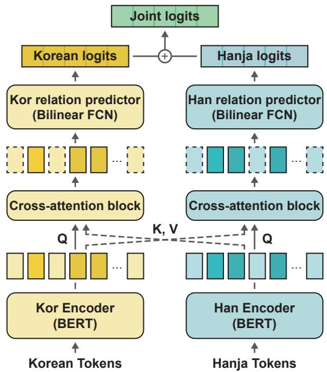
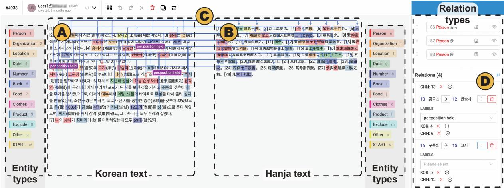

Entity: Person, Location, Clothes, Datetime  
Relation  
{sbj\_kor: “경영 관사”, obj\_kor: “돈의문”,  
sbj\_han: “京營官舍”, obj\_han: “敦義門”,  
label: “nearby”,  
evidence\_kor: [3, 4],  
evidence\_han: [3, 4, 5, 6, 7]}  
Metadata  
Book\_title: “연도기행”, Book\_volume: “연도기행 하”,  
Text\_chapter: “일록(日錄) ○ 병신년 순치(順治)  
13년 (1656, 효종 7) 12월”,  
Title: “16일(기축)”, Writer: “송계”, Year: 1656,  
Copyright: “한국고전번역원 | 이민수 (역) | 1976”

# HistRED: A Historical Document-Level Relation Extraction Dataset

Soyoung Yang Minseok Choi Youngwoo Cho Jaegul Choo

KAIST AI

{sy\_yang, minseok.choi, cyw314, jchoo}@kaist.ac.kr

## Abstract

Despite the extensive applications of relation extraction (RE) tasks in various domains, little has been explored in the historical context, which contains promising data across hundreds and thousands of years. To promote the historical RE research, we present HistRED constructed from Yeonhaengnok. Yeonhaengnok is a collection of records originally written in Hanja, the classical Chinese writing, which has later been translated into Korean. HistRED provides bilingual annotations such that RE can be performed on Korean and Hanja texts. In addition, HistRED supports various self-contained subtexts with different lengths, from a sentence level to a document level, supporting diverse context settings for researchers to evaluate the robustness of their RE models. To demonstrate the usefulness of our dataset, we propose a bilingual RE model that leverages both Korean and Hanja contexts to predict relations between entities. Our model outperforms monolingual baselines on HistRED, showing that employing multiple language contexts supplements the RE predictions. The dataset is publicly available at: https://huggingface.co/ datasets/Soyoung/HistRED under CC BY-NC-ND 4.0 license.

## 1 Introduction

Relation extraction (RE) is the task of extracting relational facts from natural language texts. To solve RE problems, diverse datasets and machine learning (ML) methods have been developed. Earlier work limits the scope of the problem to sentencelevel RE, in which the task is to predict a relationship between two entities in a single sentence (Doddington et al., 2004; Walker et al., 2006; Hendrickx et al., 2010; Alt et al., 2020; Stoica et al., 2021). However, such a setting is impractical in real-world applications where relations between entities can exist across sentences in large unstructured texts. Therefore, document-level RE datasets for general and biomedical domains have been introduced (Li

## Korean

[1] 잠시 앉아서 응대했다. [2] 관할하는 여러 시의 낭관이일제히 와서 인사를 드렸다. [3] 경영 관사에 이르러 관복을정제하고 가니, 부사ㆍ서장관 및 각 부서의 원역들이 무리를따라 나갔다. [4] 돈의문으로 들어가, 종루를 지났다. [5] 눈에띄는 고향의 모습이 전이나 다름없었다. [6] 지난해 8월에작별하던 때의 회포를 돌이켜 생각하니, 눈물이 하염없이솟는다.

## Hanja

[1] 所按諸寺郞官. [2] 齊進投刺. [3] 進到京營官舍.   
[4]整冠服以行. [5] 副价行臺曁各務員役. [6] 逐隊以進.   
[7] 入敦義門. [8] 過鐘樓故里. [9] 物色觸目如舊.   
[10] 回思仲秋別時情懷.

## English\*

I sat down for a while to respond. Many of the city’s officials came at once to greet me. When I reached the management office and refined my official clothes, BusaㆍSeoJangKwon and the officers of each department followed the crowd. Entering Donuimun Gate, I passed a bell tower. The appearance of my hometown was same as before. When I looked back on the recollection of saying goodbye in August last year, my tears well up.

Figure 1: An example from HistRED. Only one relation is shown for readability. The text is translated into English for comprehension (\*). Relation information includes (i) subject and object entities for Korean and Hanja (sbj\_kor, sbj\_han, obj\_kor, obj\_han, (ii) a relation type (label), (iii) evidence sentence index(es) for each language (evidence\_kor, evidence\_han). Metadata contains additional information, such as which book the text is extracted from.

et al., 2016; Yao et al., 2019; Wu et al., 2019; Zaporojets et al., 2021; Luo et al., 2022), serving as benchmarks for document-level RE models (Huguet Cabot and Navigli, 2021; Tan et al., 2022; Xiao et al., 2022; Xie et al., 2022; Xu et al., 2021).

<table><tr><td rowspan="2">Dataset</td><td rowspan="2">Language</td><td colspan="2">Dataset type</td><td rowspan="2">Input level Sent. Doc.</td><td colspan="2"># of Doc. # of Sent.</td><td rowspan="2"># of Tok. (avg.)</td></tr><tr><td>Historical Relation</td><td></td><td></td><td></td></tr><tr><td>I.PHI DocRED-h</td><td>Ancient Greeks</td><td>V</td><td></td><td>V</td><td>5,051</td><td>40,276</td><td>229.64</td></tr><tr><td>DocRED-d</td><td>English</td><td></td><td>V</td><td>V</td><td>101,873</td><td>828,115</td><td>231.34</td></tr><tr><td>KLUE-RE HistRED</td><td>Korean Korean</td><td></td><td>V V</td><td></td><td>40,235</td><td>40,235 8,035</td><td>60.50 100.57</td></tr><tr><td>(Ours)</td><td>Hanja</td><td>V</td><td>V V</td><td>レ</td><td>5,816</td><td>23,803</td><td>63.96</td></tr></table>

Table 1: Dataset comparison. I.PHI is a dataset used for training Ithaca (Assael et al., 2022). DocRED-h (Yao et al., 2019) is human-annotated, while DocRED-d is generated by distant supervision. Historical indicates that the dataset contains historical contents, and Relation means the dataset is built for the RE task. Input level is whether the input sequence is a single sentence (Sent.) or multiple sentences (Doc.). # of Doc. represents the number of documents, # of Sent. is the number of sentences, and # of Tok. is the average number of tokens in a document using the mBERT tokenizer.

Despite the vast amount of accumulated historical data and the ML methods available for extracting information from it, research on information extraction targeting historical data has been rarely conducted. We believe this is due to the high complexity of analyzing historical records which are written in early languages and cover hundreds and thousands of years. For instance, early languages pose a challenge for accurate translation and knowledge extraction due to their differences in expressions, styles, and formats compared to contemporary languages. Also, since historical records are translated a long time after their creation, reading bilingual texts is necessary to fully understand the text. Such discrepancy requires domain experts who are able to understand both languages in order to accurately annotate the data. There has been a demand from historical academics to utilize ML algorithms to extract information from the huge amount of records; however, because of the aforementioned challenges, the historical domain has been overlooked by most ML communities.

In response, we introduce HistRED, a documentlevel RE dataset annotated on historical documents for promoting future historical RE studies. HistRED contains 5,816 documents extracted from 39 books in the Yeonhaengnok corpus (see Section 2 for details). As described in Table 11, our dataset is the first dataset that extracts relational information from the historical domain and differs from other RE datasets in that it supports both sentence-level and document-level contexts, as well as two languages: Korean and Hanja. Furthermore, researchers can select different sequence levels (SL), which we define as a unit of context lengths, when evaluating their RE models. Such independent subtexts are constructed by considering evidence sentences, which the annotators have tagged. The intuition is that evidence sentences, which provide context for deriving a certain relation between two entities, should not be separated from the original text when splitting a document; thus, we introduce an algorithm that properly splits a full document into several self-contained subtexts. Finally, we propose a novel architecture that can fully utilize bilingual contexts using pretrained language models (PLMs). Experimental results demonstrate that our bilingual RE model outperforms other monolingual ones.

Our contributions are summarized as follows:

• We introduce HistRED, a historical RE dataset built from scratch on Yeonhaengnok, a historical record written between the 16th and 19th centuries.

• We define new entity and relation types fit for our historical data and proceed with the dataset construction in collaboration with domain experts.

• We introduce a sequence level (SL) as a unit of varying sequence lengths, which properly splits a full document into several independent contexts, serving as a testbed for evaluating RE models on different context lengths.

## 2 Dataset Construction

To the best of our knowledge, HistRED is the first RE dataset in the historical domain; thus, there is no consensus regarding the dataset construction process on the historical corpus. In the process of designing our dataset, we collaborated with experts in the linguistics and literature of Hanja to arrive at a consensus. This section describes how we collaborated with the domain experts to construct HistRED without losing annotation quality.

## 2.1 Background

Joseon, the last dynastic kingdom of Korea, lasted just over five centuries, from 1392 to 1897, and many aspects of Korean traditions and customs trace their roots back to this era. Numerous historical documents exist from the Joseon dynasty, including Annals ofJoseon Dynasty (AJD) and Diaries ofthe Royal Secretariats (DRS). Note that the majority of Joseon’s records were written in Hanja, the archaic Chinese writing that differs from modern Chinese, because the Korean language had not been standardized until much later. We considered a number of available historical texts and selected Yeonhaengnok, taking into account the amount of text and the annotation difficulty. Yeonhaengnok is essentially a travel diary from the Joseon period. In the past, traveling to other places, particularly to foreign countries, was rare. Therefore, intellectuals who traveled to Chung (also referred to as the Qing dynasty) meticulously documented their journeys, and Yeonhaengnok is a compilation of these accounts. Diverse individuals from different generations recorded their business trips following similar routes from Joseon to Chung, focusing on people, products, and events they encountered. The Institute for the Translation of Korean Classics (ITKC) has open-sourced the original and their translated texts for many historical documents, promoting active historical research2.

## 2.2 Dataset Schema

We engaged in rounds of deliberate discussions with three experts who have studied the linguistics and literature of Hanja for more than two decades and defined our dataset schema.

Documents Written between the 16th and 19th centuries, the books in Yeonhaengnok have different formats and contexts depending on the author or the purpose of the book. After consulting with the experts, a total of 39 books that contain rich textual information were selected for our dataset, excluding ones that only list the names of people or products. The collection consists of a grand total of 2,019 complete documents, with each document encompassing the text for a single day. This arrangement is made possible because each book separates its contents according to date, akin to a modern-day diary.

Entity and Relation Types Since Yeonhaengnok is a unique record from the Joseon dynasty, entity and relation types used in typical RE tasks are not fit for our dataset. After conferring with the experts, we newly define the entity and relation types appropriate for our historical data. The details are described in Appendix A.2.

## 2.3 Annotate and Collect

Annotators 15 annotators were recruited, who can comprehend the Hanja texts with the Korean translations and have studied the linguistics and literature of Hanja for at least four years.

Data Annotation The annotation process was divided into two steps: Each annotator first annotates the text from scratch, and then a different annotator cross-checks the annotations. Prior to each step, we provided the annotators with guidelines and promptly addressed any inquiries they had throughout the annotation process. The annotators were instructed to tag four types of information: entities, relation types, coreferences, and evidence sentences. Entities are annotated in both Korean and Hanja texts, whereas the relations between entities are tagged in the Korean text only, reducing redundant workload for the annotators. Coreferences, which are words or expressions that refer to the same entity, are also tagged such that they are all used to represent a single entity during model training. Evidence sentences, which provide context why the entities have a particular relation, are labeled as well, following Yao et al. (2019). For 2,019 parallel texts, the average number of sentences is 24, and the average number of characters in a sentence is 45 in Korean, and 65 and 7 in Hanja, respectively.

Preprocessing The initial annotated data is preprocessed to facilitate model training due to several issues it presents. First, some texts contain quotes from other books and poems, which may be unnecessary information for performing the RE task, and thus we exclude them from our dataset. Second, the annotators have found no relation information in some texts either because they were too short or the author of the text had not written any meaningful information. We filter out such texts accordingly. Lastly, the average number of sentences is quite high, with a high variance of 1,503 characters in Korean and 12,812 characters in Hanja. This is because the writing rule of Yeonhaengnok is not stringent. Therefore, we divide these texts with respect to different sequence levels, as described in Section 2.4. Consequently, the original 2,019 texts yield a total of 5,852 data instances3. The mean and the variance of the number of sentences are reduced from 24(1503) to 2(4.15) in Korean and from 65(12812) to 5(57.62) in Hanja.

Statistics of HistRED The collected dataset is split into the training, validation, and test sets, and their statistics are demonstrated in Table 2. Since the sequence length of each document varies, we first sort all data by Korean character lengths, followed by random sampling in a 2:1:1 ratio for the training, validation, and test sets, respectively.

## 2.4 Sequence Level

A length of a document is a major obstacle to training a PLM such as BERT, which can take sequences of length only up to a specified length, e.g., 512 tokens. Naively, we can split long documents into multiple chunks; however, a problem may arise when the context for identifying a certain relation exists in a different chunk of text. To resolve this issue, we introduce a sequence level (SL), a unit of sequence length for extracting self-contained subtexts without losing context information for each relation in the text. This is achieved since we have instructed the annotators beforehand to mark evidence sentence(s), which are contextual sentences that help identify the corresponding relation. As a result, we can utilize these sentences as indicators when varying the lengths of a document.

Formally, let $T _ { a } ^ { k }$ represent a subtext for relation A when SL is k. Assume two relations exist in separate sentences of a document, i.e., $D = [ s _ { 1 } , \cdots , s _ { n } ]$ , which consists of n sentences. When SL is 0 and $i + 1 < j $ , the two subtexts can be defined as $T _ { a } ^ { 0 } \ = \ [ s _ { i } , s _ { i + 1 } ] , T _ { b } ^ { 0 } \ = \ [ s _ { j } ]$ where relation A exists in $s _ { i }$ and its context in $s _ { i + 1 }$ , while relation B exists and has its context in $s _ { j } .$ If SL is set as $k ,$ each subtext is expanded to $T _ { a } ^ { k } = [ s _ { i - k } , \cdot \cdot \cdot , s _ { i + k } ] , T _ { b } ^ { k } = [ s _ { j - k } , \cdot \cdot \cdot , s _ { j + k } ] ,$ where $1 \leq i - k , 1 \leq j - k , i + k \leq n ,$ , and $j + k \le n$ . Note that the expansion is based on the sentence where the relation exists, $\mathrm { i . e . , } s _ { i }$ and $s _ { j }$ . If $i - k < 1$ or $j - k < 1$ , we set the initial index of $T ^ { k }$ as 1, and if $n < i + k$ or $n < j + k ,$ , we set the last index of $T ^ { k }$ as n.

<table><tr><td>SL</td><td>Total</td><td>ITrainl</td><td>IValidl</td><td>ITestl</td></tr><tr><td>0</td><td>5,852</td><td>2,926</td><td>1,463</td><td>1,463</td></tr><tr><td>1</td><td>5,850</td><td>2,925</td><td>1,463</td><td>1,462</td></tr><tr><td>2</td><td>5,816</td><td>2,908</td><td>1,454</td><td>1,454</td></tr><tr><td>4</td><td>5,704</td><td>2,852</td><td>1,426</td><td>1,426</td></tr><tr><td>8</td><td>5,331</td><td>2,665</td><td>1,333</td><td>1,333</td></tr></table>

Table 2: Statistics of HistRED

In addition, we must verify whether duplication occurs between the subtexts. If $s _ { i + k }$ of $T _ { a } ^ { k }$ becomes the same sentence as $s _ { j - k }$ of $T _ { b } ^ { k }$ , we combine two subtexts to a new subtext $T _ { a + b } ^ { k }$ to remove the duplication between them. As shown in Table 2, the size of the dataset decreases as SL increases due to the removal of duplication. Based on this process, we produce five versions of our dataset, where $\{ 0 , 1 , 2 , 4 , 8 \} \in k$ . Because our dataset contains the bilingual corpus, the new documents are first generated in Korean text, followed by constructing the corresponding Hanja subtexts.

## 3 Data Analysis

In this section, we analyze various aspects of HistRED to provide a deeper understanding and highlight several characteristics of our historical data. Table 1 shows the properties and statistical aspects of HistRED with three most related datasets: I.PHI (Assael et al., 2022), DocRED (Yao et al., 2019), and KLUE-RE (Park et al., 2021). The tokenizer of mBERT (Devlin et al., 2019) is utilized to obtain the number of tokens in diverse languages. HistRED is the first dataset comprised of historical texts targeting the document-level RE task. There have been several studies on the historical corpus (Assael et al., 2019, 2022); however, most RE datasets are based on a general or biomedical domain (Yao et al., 2019; Luo et al., 2022), making it hard to derive historical knowledge.

Named Entity Types HistRED contains 10 entity types, including Location (35.91%), Person (34.55%), Number (13.61%), DateTime (4.82%), and Product $( 4 . 4 0 \% ) ^ { 4 }$ . On average, approximately 11 entities appear in a single document, with the median being 10. The aforementioned types are the five most frequent entity types. This can be explained that Yeonhaengnok is a business-travel journal from Joseon to Chung; thus, the authors described whom they had met and when and where they had traveled. The full description is in Appendix Table 7.

Relation Types Our dataset encloses 20 relation types, including “per:position\_held” (32.05%), “nearby” (27.28%), “alternate\_name” (7.59%), “per:country\_of\_citizenship” (5.35%), and “product:provided\_ $. \mathrm { b y } ^ { \prime \prime } ( 3 . 8 2 \% ) ^ { 5 }$ The frequent occurrence of “per:position\_held” can be explained by the distinctive writing style during the Joseon dynasty. For instance, people wrote the name of another person along with their title (e.g., “Scientist Alan Turing” rather than “Alan Turing.”) People referred to each other by their titles or alternative names, such as pseudonyms because using a person’s given name implied a lack of respect and courtesy. The second most common relation is “nearby,” which indicates that the place or organization is located nearby6. This demonstrates that the authors were interested in geographic information when traveling. The full description is in Appendix Table 8.

Varying Sequence Length As described in Section 2.4, the input text length can be altered via the sequence level (SL). Table 3 shows a distribution of the number of tokens within a document when SL changes. When SL is 1, our sequence length becomes longer than the sentence-level RE dataset, including KLUE-RE. Additionally, when SL 4, our dataset exceeds the length of other document-level RE datasets, including DocRED.

Annotation Procedure Statistics Since our dataset construction consists of annotation and cross-checking steps, we summarize the statistics of this procedure. As shown in Table 4, each annotator tagged an average of 51.3 Korean entities, 50.6 Hanja entities, and 4.9 relations on each raw text. At the cross-checking step, a different annotator added an average of 6.5 Korean entities, 6.2

<table><tr><td>SL</td><td>Language</td><td>Mean</td><td>Var.</td><td>Median</td></tr><tr><td>0</td><td>Korean Hanja</td><td>46.46 31.56</td><td>5,026 2,729</td><td>37 24</td></tr><tr><td>1</td><td>Korean Hanja</td><td>100.58 64.01</td><td>6,505 3,786</td><td>91 56</td></tr><tr><td>2</td><td>Korean Hanja</td><td>152.51 97.78</td><td>8,399 5,148</td><td>142 89</td></tr><tr><td>4</td><td>Korean Hanja</td><td>250.64 163.29</td><td>15,416 10,224</td><td>239 153</td></tr><tr><td>8</td><td>Korean Hanja</td><td>427.28 282.04</td><td>36,6410 23,758</td><td>420 274</td></tr><tr><td>KLUE-RE DocRED-h</td><td>Korean English</td><td>60.50 229.64</td><td>918 5,646</td><td>54 209</td></tr></table>

Table 3: Distribution of the number of tokens in a document for each dataset with various sequence levels (SL). We use mBERT tokenizer to get the number of tokens.

<table><tr><td rowspan=1 colspan=1> $\mu ( \sigma ^ { 2 } )$ </td><td rowspan=1 colspan=1> $N _ { i n i t }$ </td><td rowspan=1 colspan=1> $N _ { a d d }$ </td><td rowspan=1 colspan=1> $N _ { d e l }$ </td><td rowspan=1 colspan=1> $N _ { f i n }$ </td></tr><tr><td rowspan=1 colspan=1> $E _ { k o r }$ </td><td rowspan=1 colspan=1>51.3(96.6)</td><td rowspan=1 colspan=1>6.5(23.1)</td><td rowspan=1 colspan=1>2.2(15.2)</td><td rowspan=1 colspan=1>55.6(101.6)</td></tr><tr><td rowspan=1 colspan=1> $E _ { h a n }$ </td><td rowspan=1 colspan=1>50.62(95.6)</td><td rowspan=1 colspan=1>6.2(22.1)</td><td rowspan=1 colspan=1>2.0(13.8)</td><td rowspan=1 colspan=1>54.8(100.4)</td></tr><tr><td rowspan=1 colspan=1>Rel</td><td rowspan=1 colspan=1>4.9(11.4)</td><td rowspan=1 colspan=1>0.6(2.3)</td><td rowspan=1 colspan=1>0.4(1.9)</td><td rowspan=1 colspan=1>6.1(11.5)</td></tr></table>

Table 4: Annotation statistics during the data construction procedure. $E _ { k o r }$ and $E _ { h a n }$ represent named entities in the Korean text and the Hanja text, respectively. Rel is the number of relational triplets. $N _ { i n i t }$ is the number of annotations at the first step. $N _ { a d d }$ and $N _ { d e l }$ are the number of addition and deletions from previous annotations after cross-checking. $N _ { f i n }$ is the number of final annotations.

Hanja entities, and 0.5 relations, while deleting 2.2 Korean entities, 2.0 Hanja entities, and 0.3 relations. As a result, the final annotations consist of 55.6 Korean entities, 54.8 Hanja entities, and 5.1 relations for each raw text on average.

## 4 Bilingual Relation Extraction Model

Unlike translation between modern languages, such as translation from English to Korean, historical records have been translated hundreds of years after their creation. As a result, the gap between ancient and present makes the translation task from Hanja into Korean difficult. Also, the translated texts can vary across translators; thus, the domain experts read both Hanja and Korean texts to fully understand the original text. Based on this observation, we hypothesize that understanding the bilingual text would help a model extract valuable information and design our bilingual RE model.

As shown in Figure 2, our model is a joint model of two separate encoders for Hanja and Korean, along with a cross-attention block from the Transformer architecture (Vaswani et al., 2017). For a document D of length n in Hanja and m in Korean, we have $D _ { h a n } = [ x _ { t } ] _ { t = 1 } ^ { n }$ and $D _ { k o r } = [ y _ { t } ] _ { t = 1 } ^ { m } .$ where x and y are input tokens of each document. We use the PLM encoder to obtain contextualized embeddings: $H _ { k o r } , H _ { h a n }$ . Based on these hidden representations, we adopt the multi-head crossattention block, which consists of a cross-attention layer and residual connection layer (Vaswani et al., 2017). For instance, when the encoder process the Hanja text, we set the query as the Hanja token and the key and value to the Korean tokens. Crossattended representation $H ^ { \prime }$ is defined as

$$
H _ { h a n } ^ { \prime } = s o f t m a x ( Q _ { h a n } , K _ { k o r } ) V _ { k o r } ,\tag{1}
$$

where we denote query $Q _ { h a n } \ : = \ : W _ { Q } H _ { h a n } .$ , key $K _ { k o r } = W _ { K } H _ { k o r } ,$ , and value $V _ { k o r } = W _ { V } H _ { k o r } ,$ which are all linear projections of hidden representation H. $W _ { Q } \in \bar { \mathbb { R } ^ { d \times d } } , W _ { K } \in \mathbb { R } ^ { d \times d }$ , and $W _ { V } \in$ $\mathbb { R } ^ { d \times d }$ are learnable weight matrices. After the cross attention, $H _ { h a n } ^ { \prime }$ is further processed in a residualconnection layer, $Z _ { h a n } = L i n e a r ( H _ { h a n } + H _ { h a n } ^ { \prime } )$ We get $Z _ { k o r }$ in the same manner. Our model pools entity embeddings from $Z _ { h a n }$ and $Z _ { k o r }$ . Each bilinear classifier predicts relation types, returning separate logits: $\mathrm { l o g i t } _ { h a n }$ and $\mathrm { l o g i t } _ { k o r }$ . At last, our model generates final logits as follows:

$$
\begin{array} { r } { \mathrm { l o g i t } _ { o u t } = \alpha \cdot \mathrm { l o g i t } _ { h a n } + ( 1 - \alpha ) \cdot \mathrm { l o g i t } _ { k o r } , } \end{array}\tag{2}
$$

where logit $\in \mathbb { R } ^ { k \times c }$ denotes the output logits of k entity pairs for all c relations, and α is a hyperparameter.

## 5 Experiments

## 5.1 Settings

Models Since our dataset consists of two languages, we build separate models for each language. We implement all models based on Huggingface Transformers (Wolf et al., 2020). For Korean, the baselines are mBERT (Devlin et al., 2019), KoBERT (a Korean BERT)7, and KLUE (Park et al., 2021). For Hanja, the baselines are mBERT and AnchiBERT (Tian et al., 2021). For our bilingual model, we consider combinations of these PLMs, i.e., KLUE, KoBERT, and mBERT for the Korean encoder and mBERT and AnchiBERT for the Hanja encoder. In our experiments, the combination of KLUE and AnchiBERT shows consistent scores when varying SL. Therefore, our model consists of KLUE and AnchiBERT for Korean and Hanja encoders.

  
Figure 2: Architecture of our bilingual RE model. The entities are colored in dark compared with the other input tokens. “Kor Encoder” is an encoder for the Korean language, and “Han Encoder” is for the Hanja language.

Evaluation Metric Following previous work in RE (Yao et al., 2019), precision, recall, and micro-F1 scores are used for evaluating models.

Hyper-parameters Hyper-parameters are set similarly to the BERT-base model in Devlin et al. (2019). The size of the embedding and hidden vector dimensions are set to 768, and the dimension of the position-wise feed-forward layers to 3,072. All encoders consist of 12 layers and 12 attention heads for each multi-head attention layer. Also, the cross-attention block consists of 8 multi-head attention, and α is set as 0.5 when we get the final logits $( L _ { o u t } )$ . However, when SL is 2, 4, and 8, α is set to 0.6. The batch size for all experiments is set to 8. The learning rate is set to 5e-5 using the Adam optimizer (Kingma and Ba, 2015). All models are trained for 200 epochs and computed on a single NVIDIA TESLA V100 GPU. Computational details are in Appendix B.1.

## 5.2 Results

As shown in Table 5, our model outperforms other monolingual baselines and consistently demonstrates the best performance even as SL grows. Even though KLUE as a monolingual model performs worse than mBERT when SL is 1, our model, which combines KLUE and AnchiBERT, outperforms mBERT. This indicates that exploiting bilingual contexts improves performance. We believe that the cross-attention module and the joint architecture not only incorporate the knowledge from the Korean model, but also create synergy between the Korean and Hanja language models by compensating for each other’s deficiencies. We test this hypothesis with analysis in Section 6. Consequently, the experimental results imply that utilizing a bilingual model would be efficient in analyzing other historical records if the record is written in an early language and translated into a modern one.

<table><tr><td rowspan="2">Language</td><td rowspan="2">Model</td><td colspan="3">SL = 0</td><td colspan="3">SL = 1</td><td colspan="3">SL = 2</td></tr><tr><td>P</td><td>R</td><td>F1</td><td>P</td><td>R</td><td>F1</td><td>P</td><td>R</td><td>F1</td></tr><tr><td rowspan="3">Korean</td><td>mBERT</td><td>67.80</td><td>58.01</td><td>62.53</td><td>66.10</td><td>50.63</td><td>57.34</td><td>57.43</td><td>42.69</td><td>48.97</td></tr><tr><td>KoBERT</td><td>71.16</td><td>49.94</td><td>58.69</td><td>58.80</td><td>45.207</td><td>51.11</td><td>47.01</td><td>31.43</td><td>37.67</td></tr><tr><td>KLUE</td><td>73.43</td><td>54.52</td><td>62.58</td><td>62.60</td><td>52.16</td><td>56.90</td><td>54.93</td><td>45.47</td><td>49.75</td></tr><tr><td rowspan="2">Hanja</td><td>mBERT</td><td>56.88</td><td>42.94</td><td>48.93</td><td>41.53</td><td>26.92</td><td>32.67</td><td>26.81</td><td>26.24</td><td>26.52</td></tr><tr><td>AnchiBERT</td><td>63.40</td><td>50.04</td><td>55.93</td><td>50.28</td><td>32.69</td><td>39.62</td><td>32.27</td><td>32.12</td><td>32.24</td></tr><tr><td>Korean+Hanja</td><td>Ours</td><td>73.75</td><td>55.71</td><td>63.48</td><td>70.37</td><td>50.10</td><td>58.53</td><td>66.73</td><td>41.24</td><td>50.98</td></tr></table>

Table 5: Performance comparison when the sequence level (SL) of HistRED is 0, 1, and 2. P, R, F1 are precision, recall, and F1 score respectively. All model is based on BERT-base. All scores are described on the percentage (%) and rounded off the third decimal point. The best F1 score is in bold at each SL, and the second score for each language is underlined.

As our dataset also supports using only one language, we also make note of the monolingual performance. In the Korean dataset, KLUE outperforms mBERT and KoBERT when SL is 0 and 2, while mBERT performs better than KLUE when SL is 1. We also find that KoBERT shows worse performance than mBERT, even though KoBERT was trained specifically on the Korean corpus. This demonstrates that our historical domain is dissimilar from the modern Korean one. In Hanja, AnchiB-ERT performs best regardless of input text length. Additional experimental results are reported in Appendix Table 6.

## 6 Analysis

In this section, we introduce a real-world usage scenario and analyze our model on HistRED, describing how our historical dataset can be utilized in detail.

## 6.1 Usage Scenario of HistRED

Let us assume that a domain expert aims to collect information about the kings of Chung. In our dataset, he or she can extract the facts via the entity of “Hwang Jae (황제)” in Korean, which is a particular word to indicate the emperors of Chung, and chronologically order the events around the title. Note that this is possible because our dataset contains (i) the text in both Korean and Hanja and (ii) the year when the text was written. In total, 34 relational facts are derived from eight distinct years between 1712 and 1849, including that (a) the king in 1713 had the seventh child via the “person:child” class, and (b) the king in 1848 presented the various products with specific names, including “五絲緞” and “小荷包,” to Joseon via the “product:given\_by” class. Since most of the historical records only mentioned a crown prince of Chung, describing the seventh child of the king of Chung is a rare event, which can be a motive for other creative writings. In addition, the exact name of the products the king gives reveals that those products were produced in Chung in 1848 and would be a cue to guess the lifestyle of Chung.

The expert can derive the facts from our dataset only by reading the 34 relational facts. However, if he or she has to extract them from the raw corpus, they must read at least 20 raw documents containing 1,525 sentences in Korean and 4,995 in Hanja. This scenario illustrates how HistRED can accelerate the analysis process in the historical domain.

## 6.2 Advantage of the Bilingual RE Model

To analyze the stability of our joint model, we compare three models on random samples from the test set. We use KLUE and AnchiBERT models independently for a monolingual setting, whereas we combine them for our joint model. The SL is set to 4. As shown in Figure 3, we sample two examples: case A and B, each of which displays the most representative sentences that contain the relations for the sake of readability. In both examples, our model successfully predicts accurate relation classes. In the case of A, the ground truth (GT) label is “per:worn\_by” for first and second relation triplets. Despite the successful prediction of our model with relatively high confidence scores, the Korean model matches only one of the two, while the Hanja model fails to predict both. In the case of B, the GT label is “nearby” for the third and fourth ones. Since the third and fourth relations exist across sentences, predicting them is crucial for a document-level RE task. Our model successfully predicts both relation types even with a low confidence score, while the other monolingual models fail. This case study confirms our hypothesis on our joint model; the jointly trained model can improve the performance by compensating for each monolingual model’s weaknesses, and our model successfully harmonizes the separate PLMs.

<table><tr><td colspan="2">Data examples</td><td>Method</td><td colspan="2">Confidence score (%)</td><td># of accurate prediction</td></tr><tr><td colspan="2">[A] Kor: </td><td></td><td colspan="2"></td><td>per:worn_by</td></tr><tr><td rowspan="3">Han: 余亦換穿狹袖戎衣. 戴織竹涼戰笠. Eng: 大</td><td>叫 壬号 0</td><td>Ours 73.77</td><td>85.89</td><td>2</td></tr><tr><td>i also changed into a narrow-sleeved military uniform and wore</td><td>Korean 78.64</td><td>28.25</td><td>1</td></tr><tr><td>Hanja Yang Jeon-ryun, which was woven into a bamboo.</td><td>39.58</td><td>26.66</td><td>0</td></tr><tr><td colspan="2">[B] ，  </td><td></td><td>③ 4</td><td></td><td>nearby</td></tr><tr><td rowspan="3"></td><td></td><td>Ours 60.10</td><td>25.72</td><td></td><td>2</td></tr><tr><td>Han:遼左襟喉樓. 城外有勑賜褒忠廟東嶽廟.</td><td>Korean</td><td>52.21</td><td>19.30</td><td></td></tr><tr><td>Eng: , we past Keumhuru. Outside the castle, there were the tomb of Chiksa Oochung and the tomb of Dongak.</td><td>Hanja 16.69</td><td>24.66</td><td></td><td>0 0</td></tr></table>

Figure 3: Case study of our dataset. We compare our model with two monolingual baselines: KLUE for Korean and AnchiBERT for Hanja. The bold blue represents for “person” entity, orange for “clothes,” and green for “location.” The sentences are extracted from documents for readability, and translated into English for comprehension (\*).

## 7 Related Work

## 7.1 Relation Extraction

RE datasets (Yao et al., 2019; Alt et al., 2020; Stoica et al., 2021; Park et al., 2021; Luo et al., 2022) have been extensively studied to predict relation types when given the named entities in text. RE dataset begins at the sentence level, where the input sequence is a single sentence. This includes human-annotated datasets (Doddington et al., 2004; Walker et al., 2006; Hendrickx et al., 2010) and utilization of distant supervision (Riedel et al., 2010) or external knowledge (Cai et al., 2016; Han et al., 2018). Especially, TACRED (Alt et al.,

2020; Stoica et al., 2021) is one of the most representative datasets for the sentence-level RE task. However, inter-sentence relations in multiple sentences are difficult for models trained on a sentencelevel dataset, where the model is trained to extract intra-sentence relations. To resolve such issues, document-level RE datasets (Li et al., 2016; Yao et al., 2019; Wu et al., 2019; Zaporojets et al., 2021; Luo et al., 2022) have been proposed. Especially, DocRED (Yao et al., 2019) contains large-scale, distantly supervised data, and human-annotated data. KLUE-RE (Park et al., 2021) is an RE dataset constructed in the Korean language. However, KLUE-RE is a sentence-level RE dataset, making it challenging to apply document-level extraction to the historical Korean text. To the best of our knowledge, our dataset is the first document-level RE dataset in both Korean and Hanja.

## 7.2 Study on Historical Records

Several studies have been conducted on the application of deep learning models in historical corpora, particularly in Ancient Greece and Ancient Korea. The restoration and attribution of ancient Greece (Assael et al., 2019, 2022) have been studied in close collaboration with experts of epigraphy, also known as the study of inscriptions. In Korea, thanks to the enormous amount of historical records from the Joseon dynasty, a variety of research projects have been conducted focusing on AJD and DRS (Yang et al., 2005; Bak and Oh, 2015; Hayakawa et al., 2017; Ki et al., 2018; Bak and Oh, 2018; Yoo et al., 2019; Kang et al., 2021; Yoo et al., 2022). In addition, using the Korean text of AJD, researchers have discovered historical events such as magnetic storm activities (Hayakawa et al., 2017), conversation patterns of the kings of Joseon (Bak and Oh, 2018), and social relations (Ki et al., 2018). Kang et al. (2021) also suggests a translation model that restores omitted characters when both languages are used. Yoo et al. (2022) introduce BERT-based pretrained models for AJD and DRS. As interests in historical records grow, numerous research proposals have emerged. However, most studies only utilize the translated text to analyze its knowledge. In this paper, we aim to go beyond the studies that rely solely on the text.

## 8 Conclusion

In this paper, we present HistRED, a documentlevel relation extraction dataset of our historical corpus. Our study specializes in extracting the knowledge in Yeonhaengnok by working closely with domain experts. The novelty of HistRED can be summarized by two characteristics: it contains a bilingual corpus, especially on historical records, and SL is used to alter the length of input sequences. We also propose a bilingual RE model that can fully exploit the bilingual text of HistRED and demonstrate that our model is an appropriate approach for HistRED. We anticipate not only will our dataset contribute to the application of ML to historical corpora but also to research in relation extraction.

## Limitations

We acknowledge that our dataset is not huge compared to other sentence-level relation extraction datasets. However, HistRED is the first bilingual RE dataset at the document level on the historical corpus. In addition, we constructed 5,816 data instances, and our bilingual model trained on HistRED achieved an F1 score of 63.48 percent when SL is 2. This reveals that our dataset is sufficient for finetuning the pretrained language models. Also, because Yeonhaengnok is a collection of travel records, the domain is not as expansive as other Joseon dynasty records. Additional research on massive corpora covering a broader domain is required in future studies.

## Ethical Consideration

We conducted two separate meetings before the first and second steps of data construction. At first, we introduced the reason we built this dataset and the goal of our study and clarified what the relation extraction task is and how the dataset will be used. All annotators agreed that their annotated dataset would be used to build an RE dataset and train neural networks. We explained each type of the named entity and the relation with multiple examples and shared user guidance. In the second meeting, we guided the annotators in evaluating and modifying the interim findings in an appropriate manner.

We adjusted the workload of each annotator to be similar by assigning different text lengths during the first and second steps. We compensated each annotator an average of \$1,700, which is greater than the minimum wage in Korea. Among 15 annotators, 14 were Korean, one was Chinese, 11 were female, and four were male. 30% of annotators are in a doctorate and 65% are in a master’s degree. Regarding copyrights, since our corpus is a historical record, all copyrights belong to ITKC. ITKC officially admit the usage of their corpus under CC BY-NC-ND 4.0 license.

## Acknowledgement

This research was supported by the KAIST AI Institute (“Kim Jae-Chul AI Development Fund” AI Dataset Challenge Project) (Project No. N11210253), the National Supercomputing Center with supercomputing resources including technical support (KSC-2022-CRE-0312), and the Challengeable Future Defense Technology Research and Development Program through the Agency For Defense Development (ADD) funded by the Defense Acquisition Program Administration (DAPA) in 2022 (No. N04220080). We also thank Junchul Lim, Wonseok Yang, Hobin Song of Korea University, and the Institute for the Translation of Korean Classics (ITKC) for their discussions and support.

## References

Christoph Alt, Aleksandra Gabryszak, and Leonhard Hennig. 2020. TACRED revisited: A thorough evaluation of the TACRED relation extraction task. In Proc. the Annual Meeting ofthe Associationfor Computational Linguistics (ACL), pages 1558–1569.

Yannis Assael, Thea Sommerschield, and Jonathan Prag. 2019. Restoring ancient text using deep learning: a case study on Greek epigraphy. In Proc. of the Conference on Empirical Methods in Natural Language Processing (EMNLP), pages 6368–6375.

Yannis Assael, Thea Sommerschield, Brendan Shillingford, Mahyar Bordbar, John Pavlopoulos, Marita Chatzipanagiotou, Ion Androutsopoulos, Jonathan

Prag, and Nando de Freitas. 2022. Restoring and attributing ancient texts using deep neural networks. Nature, 603(7900):280–283.

JinYeong Bak and Alice Oh. 2015. Five centuries of monarchy in Korea: Mining the text of the annals of the Joseon dynasty. In Proc. ofThe SIGHUM Workshop on Language Technology for Cultural Heritage, Social Sciences, and Humanities (LaTeCH), pages 10–14.

JinYeong Bak and Alice Oh. 2018. Conversational decision-making model for predicting the king’s decision in the annals of the Joseon dynasty. In Proc. ofthe Conference on Empirical Methods in Natural Language Processing (EMNLP), pages 956–961.

Rui Cai, Xiaodong Zhang, and Houfeng Wang. 2016. Bidirectional recurrent convolutional neural network for relation classification. In Proc. the Annual Meeting ofthe Associationfor Computational Linguistics (ACL), pages 756–765.

Jacob Devlin, Ming-Wei Chang, Kenton Lee, and Kristina Toutanova. 2019. BERT: Pre-training of deep bidirectional transformers for language understanding. In Proc. ofThe Annual Conference ofthe North American Chapter of the Association for Computational Linguistics (NAACL), pages 4171–4186.

George Doddington, Alexis Mitchell, Mark Przybocki, Lance Ramshaw, Stephanie Strassel, and Ralph Weischedel. 2004. The automatic content extraction (ACE) program – tasks, data, and evaluation. In Proc. of The International Conference on Language Resources and Evaluation (LREC).

Xu Han, Hao Zhu, Pengfei Yu, Ziyun Wang, Yuan Yao, Zhiyuan Liu, and Maosong Sun. 2018. FewRel: A large-scale supervised few-shot relation classification dataset with state-of-the-art evaluation. In Proc. of the Conference on Empirical Methods in Natural Language Processing (EMNLP), pages 4803–4809.

Hisashi Hayakawa, Kiyomi Iwahashi, Yusuke Ebihara, Harufumi Tamazawa, Kazunari Shibata, Delores J. Knipp, Akito D. Kawamura, Kentaro Hattori, Kumiko Mase, Ichiro Nakanishi, and Hiroaki Isobe. 2017. Long-lasting extreme magnetic storm activities in 1770 found in historical documents. The Astrophysical Journal Letters, 850(2):L31.

Iris Hendrickx, Su Nam Kim, Zornitsa Kozareva, Preslav Nakov, Diarmuid Ó Séaghdha, Sebastian Padó, Marco Pennacchiotti, Lorenza Romano, and Stan Szpakowicz. 2010. SemEval-2010 task 8: Multiway classification of semantic relations between pairs of nominals. In Proc. of The International Workshop on Semantic Evaluation, pages 33–38.

Pere-Lluís Huguet Cabot and Roberto Navigli. 2021. REBEL: Relation extraction by end-to-end language generation. In Proc. of the Conference on Empirical Methods in Natural Language Processing (EMNLP), pages 2370–2381.

Kyeongpil Kang, Kyohoon Jin, Soyoung Yang, Soojin Jang, Jaegul Choo, and Youngbin Kim. 2021. Restoring and mining the records of the Joseon dynasty via neural language modeling and machine translation. In Proc. ofThe Annual Conference ofthe North American Chapter ofthe Associationfor Computational Linguistics (NAACL), pages 4031–4042.

Ho Chul Ki, Eun-Kyoung Shin, Eun Jin Woo, Eunju Lee, Jong Ha Hong, and Dong Hoon Shin. 2018. Horseriding accidents and injuries in historical records of joseon dynasty, korea. International Journal of Paleopathology, 20:20–25.

Diederik P. Kingma and Jimmy Ba. 2015. Adam: A method for stochastic optimization. In Proc. the International Conference on Learning Representations (ICLR).

Jiao Li, Yueping Sun, Robin J. Johnson, Daniela Sciaky, Chih-Hsuan Wei, Robert Leaman, Allan Peter Davis, Carolyn J. Mattingly, Thomas C. Wiegers, and Zhiyong Lu. 2016. BioCreative V CDR task corpus: a resource for chemical disease relation extraction. Database, 2016.

Ling Luo, Po-Ting Lai, Chih-Hsuan Wei, Cecilia N Arighi, and Zhiyong Lu. 2022. BioRED: a rich biomedical relation extraction dataset. Briefings in Bioinformatics, 23(5).

Sungjoon Park, Jihyung Moon, Sungdong Kim, Won Ik Cho, Ji Yoon Han, Jangwon Park, Chisung Song, Junseong Kim, Youngsook Song, Taehwan Oh, Joohong Lee, Juhyun Oh, Sungwon Lyu, Younghoon Jeong, Inkwon Lee, Sangwoo Seo, Dongjun Lee, Hyunwoo Kim, Myeonghwa Lee, Seongbo Jang, Seungwon Do, Sunkyoung Kim, Kyungtae Lim, Jongwon Lee, Kyumin Park, Jamin Shin, Seonghyun Kim, Lucy Park, Lucy Park, Alice Oh, Jung-Woo Ha, and Kyunghyun Cho. 2021. Klue: Korean language understanding evaluation. In Proc. the Advances in Neural Information Processing Systems (NeurIPS).

Sebastian Riedel, Limin Yao, and Andrew McCallum. 2010. Modeling relations and their mentions without labeled text. In Proc. of The European Conference on Machine Learning and Principles and Practice of Knowledge Discovery in Databases (PKDD), pages 148–163.

George Stoica, Emmanouil Antonios Platanios, and Barnabas Poczos. 2021. Re-tacred: Addressing shortcomings of the tacred dataset. In Proc. the AAAI Conference on Artificial Intelligence (AAAI), pages 13843–13850.

Qingyu Tan, Ruidan He, Lidong Bing, and Hwee Tou Ng. 2022. Document-level relation extraction with adaptive focal loss and knowledge distillation. In Proc. the Annual Meeting ofthe Associationfor Computational Linguistics (ACL), pages 1672–1681.

Huishuang Tian, Kexin Yang, Dayiheng Liu, and Jiancheng Lv. 2021. Anchibert: A pre-trained model

for ancient chinese language understanding and generation. In Proc. ofThe International Joint Conference on Neural Networks (IJCNN), pages 1–8.

Ashish Vaswani, Noam Shazeer, Niki Parmar, Jakob Uszkoreit, Llion Jones, Aidan N Gomez, Ł ukasz Kaiser, and Illia Polosukhin. 2017. Attention is all you need. In Proc. the Advances in Neural Information Processing Systems (NeurIPS).

Christopher Walker, Stephanie Strassel, Julie Medero, and Maeda Kazuaki. 2006. Ace 2005 multilingual training corpus. Linguistic Data Consortium, 57(1).

Thomas Wolf, Lysandre Debut, Victor Sanh, Julien Chaumond, Clement Delangue, Anthony Moi, Pierric Cistac, Tim Rault, Remi Louf, Morgan Funtowicz, Joe Davison, Sam Shleifer, Patrick von Platen, Clara Ma, Yacine Jernite, Julien Plu, Canwen Xu, Teven Le Scao, Sylvain Gugger, Mariama Drame, Quentin Lhoest, and Alexander Rush. 2020. Transformers: State-of-the-art natural language processing. In Proc. ofthe Conference on Empirical Methods in Natural Language Processing (EMNLP), pages 38–45.

Ye Wu, Ruibang Luo, Henry C. M. Leung, Hing-Fung Ting, and Tak-Wah Lam. 2019. Renet: A deep learning approach for extracting gene-disease associations from literature. In Proc. of The Research in Computational Molecular Biology, pages 272–284.

Yuxin Xiao, Zecheng Zhang, Yuning Mao, Carl Yang, and Jiawei Han. 2022. SAIS: Supervising and augmenting intermediate steps for document-level relation extraction. In Proc. ofThe Annual Conference of the North American Chapter of the Association for Computational Linguistics (NAACL), pages 2395– 2409.

Yiqing Xie, Jiaming Shen, Sha Li, Yuning Mao, and Jiawei Han. 2022. Eider: Empowering document-level relation extraction with efficient evidence extraction and inference-stage fusion. In Proc. the Annual Meeting ofthe Associationfor Computational Linguistics (ACL), pages 257–268.

Benfeng Xu, Quan Wang, Yajuan Lyu, Yong Zhu, and Zhendong Mao. 2021. Entity structure within and throughout: Modeling mention dependencies for document-level relation extraction. In Proc. the AAAI Conference on Artificial Intelligence (AAAI), pages 14149–14157.

Hong-Jin Yang, Changbom Park, and Myeong-Gu Park. 2005. Analysis of historical meteor and meteor shower records: Korea, china, and japan. Icarus, 175(1):215–225.

Yuan Yao, Deming Ye, Peng Li, Xu Han, Yankai Lin, Zhenghao Liu, Zhiyuan Liu, Lixin Huang, Jie Zhou, and Maosong Sun. 2019. DocRED: A large-scale document-level relation extraction dataset. In Proc. the Annual Meeting of the Association for Computational Linguistics (ACL), pages 764–777.

Haneul Yoo, Jiho Jin, Juhee Son, JinYeong Bak, Kyunghyun Cho, and Alice Oh. 2022. HUE: Pretrained model and dataset for understanding hanja documents of Ancient Korea. In Proc. ofThe Annual Conference of the North American Chapter of the Associationfor Computational Linguistics (NAACL), pages 1832–1844.

Kang Min Yoo, Taeuk Kim, and Sang-goo Lee. 2019. Don’t just scratch the surface: Enhancing word representations for Korean with hanja. In Proc. of the Conference on Empirical Methods in Natural Language Processing (EMNLP), pages 3528–3533.

Klim Zaporojets, Johannes Deleu, Chris Develder, and Thomas Demeester. 2021. Dwie: An entity-centric dataset for multi-task document-level information extraction. Information Processing Management, 58(4):102563.

## A Dataset Construction

The procedure consists of the following five steps: 1) collecting corpus from the open-source data of ITKC; 2) defining the schema of the named entities and relations; 3) identifying the entities in given documents; 4) annotating corresponding relations; and 5) modifying the interim results. This section illustrates the overall procedure.

Note that the construction process is divided into two phases because the raw text of Yeonhaengnok is significantly long, where the average length of Korean text is 1,106 characters, and the historyspecialized annotators are rare. Before beginning the first phase, the annotators received instructions on the purpose of this study, the types of entities and relations, and how to operate the user interface (UI) for data tagging. After instructions, annotators identified the named entities and the relations between them. In the second phase, the annotators cross-checked the intermediate results and modified incorrect annotations. During both phases, we provided the annotators with user guidance and maintained real-time communication.

## A.1 Corpus Collection

As mentioned in 2.2, we selected 39 books from Yeonhaengnok and divided them into 2,019 texts, each containing a single day’s content. We did not divide the text into shorter texts before providing it to the annotators because a relation may exist across multiple sentences or have its evidence sentence distant from where the relation appears. We provided the entire text to the annotators to reduce the possibility of losing relational data. Due to the highly variable length of the text, an additional process step was required to extract relational information in a manageable length. To select the sentences containing all the information that can indicate the relational fact, we guided the annotators to detect the evidence sentence(s) when they annotated the relation types.

## A.2 Defining Schema

## A.2.1 Types of Named Entities

As shown in Table 7, we defined 10 entity types. Here, we added the date and time as entity type; thus, we can estimate the exact time because most of the corpus includes the time when the text was written. For example, if a text contains tomorrow’s plan by mentioning “tomorrow” and the written date is June 6, we can recognize the date of tomorrow as June 7.

In historical studies, it is essential to understand the lifestyle of ancient times. Lifestyle includes clothing, food, and utilized products. For instance, humans began consuming grains such as wheat and rice after the agricultural revolution. Since lifestyle has changed according to time and location, detecting food, clothes, and products on our corpus becomes a non-trivial task.

We also excluded two text types in the preprocessing: poems and quotations. When writing the Yeonhaengnok, the writers commonly composed poems or quoted related or ancient books, including the Analects of Confucius and Mencius. We decided to detect the books’ name because it helps us imply the political status of the writer. However, the poems usually describe the sentiments or thoughts of the writer, and the quotations are written in a more ancient time than Joseon. Since we concentrated on finding objective relational facts about the Joseon dynasty, we determined to exclude the poems and quotations. A special “exclude” entity type was provided to the annotators, and the annotators tagged such subtexts if the text was a poem or a quotation.

## A.2.2 Types of Relations

Since our corpus is a collection of travel reports, the authors wrote the people they had met and the places they had visited. As shown in Table 8, we defined 20 relation classes, including 14 personal and 4 location relations. In the Joseon dynasty, it was a convention to refer to one another by their alternative name or title; thus, identifying the alternative name of a specified person is essential for tracking the individual’s life. Also, since the name of a particular location can vary depending on time and place, we added “alternate name” as a relation class to account for these instances. Additionally, in Yeonhaengnok, the number indicates the distance traveled from one location to another. We hypothesized that the locations are close to each other if the text contains the distance between the locations where the author moved because there was no mechanical mobility and they usually walked the cities. In addition, they described the characteristics of a location, such as its regional product or cuisine and its functional role. Therefore, “loc:famous\_for” and “loc:function\_as” were added to the set of relation types.

  
Figure 4: User interface for data annotation. We divide the overall step into four notations: A, B, C, and D. A, B, and C are for the entity annotation step, and D is for the relation annotation. The annotators detect the named entity of the Korean text in A, find the parallel entity of the Hanja text in B, and annotate the parallel relationship, shown as the blue line in C. After checking the entity detection, the annotators move to D, where they annotate the relation between the entities, choose the relation class, and add the indices of evidence sentences.

## A.3 Entity Detection

The annotators annotated entities using a predefined set of entity types. We provided the original Hanja and the translated Korean texts, as shown in Fig. 4. As most annotators’ native language is Korean, we recommended detecting the entities in the Korean text first and the parallel entities in the Hanja text after. After detecting entities in both texts, the annotators drew a line connecting the same entity between the two languages (as in apple and pomme in English and French texts). The annotators also drew a line connecting entities that express a certain relation. To avoid confusion, the two lines are colored in blue and orange, respectively, as shown in Figure 4.

## A.4 Relation Annotation

After identifying the relations in the previous step, the annotators added relations by using the “add relation” button and selected a relation class for the relation triplet. They also tagged the indices of evidence sentences on the Korean and Hanja texts.

## A.5 Cross-Checking and Modification

After the first phase, we analyzed the intermediate result and updated the user manual, focusing on instructions for editing initial annotations. Before the cross-checking stage, we conducted a second tutorial for the annotators using the updated manual. We assigned annotators to texts such that they had not seen them during the first phase. If they found an error(s) during cross-checking, they revised the annotations by adding or removing the entity(s) or relation(s).

## B Experiments

## B.1 Computational Details

Our experiments include monolingual and bilingual settings. For each model, we describe the number of total parameters and computational budget (hours) for training on 200 epochs on our dataset when SL is 0. For the Korean model, mBERT consists of 178M parameters and consumes about 4.2 hours, KoBERT is 93M and 3.3 hours, and KLUE is 111M and 4.0 hours, respectively. For the Hanja model, mBERT consists of 178M parameters and requires 4.6 hours, and AnchiBERT is 95M and 3.3 hours. Our joint model consists of 206M parameters and consumes 6.6 hours because our model adopts two separate PLMs.

## B.2 Performance Comparison on Large SL

As shown in Table 6, our joint model outperforms other baseline models when SL is 2, 4, and 8, where the average length of documents is 153, 250, and 427 tokens on the Korean text. Our model scores better when α is 0.6 rather than 0.5 when SL is 2, 4, and 8. This can be explained by the fact that ours is affected by the low performance of the Hanja encoder, i.e., AnchiBERT. The Hanja encoder significantly drops its scores as SL increases.

<table><tr><td></td><td></td><td colspan="3">SL = 2</td><td colspan="3">SL = 4</td><td colspan="3">SL = 8</td></tr><tr><td>Language</td><td>Model</td><td>P</td><td>R</td><td>F1</td><td>P</td><td>R</td><td>F1</td><td>P</td><td>R</td><td>F1</td></tr><tr><td rowspan="3">Korean</td><td>mBERT</td><td>57.43</td><td>42.69</td><td>48.97</td><td>37.15</td><td>38.80</td><td>37.96</td><td>18.16</td><td>20.86</td><td>19.41</td></tr><tr><td>KoBERT</td><td>47.01</td><td>31.43</td><td>37.67</td><td>14.54</td><td>14.32</td><td>14.43</td><td>7.35</td><td>5.46</td><td>6.27</td></tr><tr><td>KLUE</td><td>54.93</td><td>45.47</td><td>49.75</td><td>36.36</td><td>38.21</td><td>37.27</td><td>16.76</td><td>25.54</td><td>20.24</td></tr><tr><td rowspan="2">Hanja</td><td>mBERT</td><td>26.81</td><td>26.24</td><td>26.52</td><td>17.58</td><td>18.73</td><td>18.14</td><td>9.58</td><td>13.69</td><td>11.27</td></tr><tr><td>AnchiBERT</td><td>32.27</td><td>32.12</td><td>32.24</td><td>22.11</td><td>22.87</td><td>22.48</td><td>15.16</td><td>18.71</td><td>16.75</td></tr><tr><td>Korean+Hanja</td><td>Ours</td><td>66.73</td><td>41.24</td><td>50.98</td><td>48.27</td><td>36.21</td><td>41.38</td><td>25.30</td><td>21.97</td><td>23.52</td></tr></table>

Table 6: Performance comparison when SL is 2, 4, and 8. P, R, F1 are precision, recall, and F1 score respectively. All scores are described on the percentage (%) and rounded off the third decimal point. The best F1 score is in bold at each SL, and the second score for each language is underlined.

## C Dataset Examples

We include additional full data samples: Table 9, Table 10, and Table 11.

<table><tr><td>Entity type</td><td>Frequency</td><td>Ratio (%)</td><td>Description</td></tr><tr><td>Person</td><td>22,998</td><td>34.55</td><td>People, the alternate name of a specific person, title Geogprahically defined locations, including mountains and waters, etc.</td></tr><tr><td>Location</td><td>23,900</td><td>35.91</td><td>Politically defined locations, including countries, cities, states, etc. Facilities, including building, etc.</td></tr><tr><td>Organization</td><td>1,806</td><td>2.71</td><td>Institutions, political or religious groups, etc.</td></tr><tr><td>Number</td><td>9,057</td><td>13.61</td><td>Money and quantities, including distance between locations, etc.</td></tr><tr><td>Datetime</td><td>3,210</td><td>4.82</td><td>Absolute or relative dates, times, or periods.</td></tr><tr><td>Product</td><td>2,927</td><td>4.40</td><td>Gifts, regional specialties, tributes, and animal, etc.</td></tr><tr><td>Food</td><td>550</td><td>0.83</td><td>Meal, snack, fruits, and drinks, etc.</td></tr><tr><td>Clothes</td><td>753</td><td>1.13</td><td>Garment or dress.</td></tr><tr><td>Book</td><td>287</td><td>0.43</td><td>Antique or referred name of books</td></tr><tr><td>Other</td><td>1,068</td><td>1.60</td><td>Relevant entity type which are not included in the predefined types.</td></tr><tr><td>Total</td><td>66,556</td><td>100.00</td><td></td></tr></table>

Table 7: List of entity types.

<table><tr><td>Relation type</td><td>Frequency</td><td>Ratio (%)</td><td>Description</td></tr><tr><td>nearby</td><td>2,718</td><td>27.28</td><td>The location or organization are geographically close to the specified location or organization.</td></tr><tr><td>alternate_name</td><td>756</td><td>7.59</td><td>Alternative names called instead of the official name to refer the specified person, organization, location, etc.</td></tr><tr><td>per:position_held</td><td>3,194</td><td>32.05</td><td>Title that represent the position of the specified person.</td></tr><tr><td>per:worn_by</td><td>353</td><td>3.54</td><td>Garment or dress that the specified person wears.</td></tr><tr><td>per:friend</td><td>143</td><td>1.44</td><td>The friend of the specified person</td></tr><tr><td>per:enemy</td><td>49</td><td>0.49</td><td>The person or organization that the specified person is hostile to.</td></tr><tr><td>per:child</td><td>113</td><td>1.13</td><td>The children of the specified person.</td></tr><tr><td>per:sibling</td><td>75</td><td>0.75</td><td>The brothers or sisters of the specified person.</td></tr><tr><td>per:other_family</td><td>168</td><td>1.69</td><td>Family members of the specified person other than parents, children, siblings.</td></tr><tr><td>per:country_of_citizenship</td><td>533</td><td>5.35</td><td>The nationality of the specified person.</td></tr><tr><td>per:place_of_residence</td><td>364</td><td>3.65</td><td>The place where the specified person lives.</td></tr><tr><td>per:place_of_birth</td><td>58</td><td>0.58</td><td>The place where the specified person was born.</td></tr><tr><td>per:place_of_death</td><td>26</td><td>0.26</td><td>The place where the specified person died.</td></tr><tr><td>per:date_of_birth</td><td>10</td><td>0.10</td><td>The date when the specified person was born.</td></tr><tr><td>per:date_of_death</td><td>8</td><td>0.08</td><td>The date when the specified person was died.</td></tr><tr><td>loc:functions_as</td><td>319</td><td>3.20</td><td>The political or functional role of the specified location.</td></tr><tr><td>loc:famous_for</td><td>64</td><td>0.64</td><td>The regional product or food that is famous at the specified location.</td></tr><tr><td>product:provided_by</td><td>381</td><td>3.82</td><td>The organization or person that gives the specified product.</td></tr><tr><td>org:member_of</td><td>369</td><td>3.70</td><td>The specified person who belongs to the specified organization.</td></tr><tr><td>others</td><td>264</td><td>2.65</td><td>Relevant relation class which are not included in the predefined classes.</td></tr><tr><td>Total</td><td>9,965</td><td>100.00</td><td></td></tr></table>

Table 8: List of relation types.

<table><tr><td rowspan=1 colspan=1>Text_Kor</td><td rowspan=1 colspan=1></td></tr><tr><td rowspan=1 colspan=1>Text_Han</td><td rowspan=1 colspan=1>第城中左右廛舍. 狀如我東.而大路亦不廣於我國.而第路邊元無結假家之規.曾聞入城之日.於車馬. 實難前進矣. 今則一行雙雙比肩. 任意作行.而左右耳目之所睹.決不過於通州.路逢着黄錦帽黃錦衣者.怪而問之. 則答云皇帝願堂寺蒙古僧也.</td></tr><tr><td rowspan=1 colspan=1>Text_Eng*</td><td rowspan=1 colspan=1>The temple on the left and right sides of the fortress has the same shape as Korea, and the main road was not wider than that of Korea,but there is no original rule on the side of the road. I heard earlier that it was difficult to move forward on the day of entering the countrybecause the road was blocked due to the kiln, but this time, the party went arbitrarily, shoulder to shoulder in pairs,and what is visible to the left and right is no better than Tongju. I met a man in a yellow silk hat and a yellow silk dress on the street.When I asked him in a strange way, he replied that he was a Mongolian monk in the emperor&#x27;s original temple.All the women who came and went after entering the country were women, and there were no women who entered the author.</td></tr><tr><td rowspan=1 colspan=1>Entity</td><td rowspan=1 colspan=1>Location, Person, Clothes</td></tr><tr><td rowspan=1 colspan=1>Relation</td><td rowspan=1 colspan=1>(&#x27;sbj_kor&#x27;:号卫合引，&#x27;sbj_han&#x27;:蒙古僧，&#x27;obj_kor&#x27;:日吴，&#x27;obj_han&#x27;:黄錦衣,&#x27;relation&#x27;: per:worn_by),(‘sbj_kor&#x27;:号卫合引，&#x27;sbj_han&#x27;:蒙古僧，&#x27;obj_kor&#x27;:日，&#x27;obj_han&#x27;:黄錦帽，&#x27;relation&#x27;:per:worn_by)</td></tr><tr><td rowspan=1 colspan=1>Meta data</td><td rowspan=1 colspan=1>&#x27;book_title&#x27;: 号, &#x27;text_chapter&#x27;: ](1712,否38)12, &#x27;title&#x27;: 27 (3), &#x27;writer&#x27;: , &#x27;year&#x27;: 1712,&#x27;book_volume&#x27;:](日記),copyright&#x27;:©]()1976</td></tr></table>

Table 9: HistRED example when $S L { = } 2$

<table><tr><td rowspan=1 colspan=1>Text_Kor</td><td rowspan=1 colspan=1>，</td></tr><tr><td rowspan=1 colspan=1>Text_Han</td><td rowspan=1 colspan=1>如十里堡之村居.堡去五里許.有暴交村.村去八里許. 有火燒橋,匠鋪等村矣自白塔堡行十餘里. 有混河.而一名阿利江. 江之南岸. 有關將三昆季騎馬之像. 江邊有津船及馬上船</td></tr><tr><td rowspan=1 colspan=1>Text_Eng*</td><td rowspan=1 colspan=1>The village house was divided on both sides of the water, so the topography and village system were the same as Sipribo Village.Pogyo Village was located about 5 ri away from Sahabo, and there were villages such as Hwasogyo Bridge and Jeonjangpo 8 ri awayfrom Pogyo Village. After going about 10 ri from Baektapbo, there is Honha, also known as Arigang. On the southern hill of the Ari River,there was a mounted statue of the three officers. There were ferry boats and horseboats along the river.</td></tr><tr><td rowspan=1 colspan=1>Entity</td><td rowspan=1 colspan=1>Location, Person, Number</td></tr><tr><td rowspan=1 colspan=1>Relation</td><td rowspan=1 colspan=1>(&#x27;sbj_kor&#x27;:，&#x27;sbj_han&#x27;:混河, &#x27;obj_kor&#x27;: o}, &#x27;obj_han&#x27;:阿利江, &#x27;relation&#x27;: alternate_name),(‘sbj_kor&#x27;:昏早，&#x27;sbj_han&#x27;:白塔堡， &#x27;obj_kor&#x27;:哥, &#x27;obj_han&#x27;:混河， &#x27;relation&#x27;: nearby)</td></tr><tr><td rowspan=1 colspan=1>Meta data</td><td rowspan=1 colspan=1>&#x27;book_title&#x27;:,&#x27;text_chapter&#x27;:(1712, 38)12,&#x27;title&#x27;: 6(3),&#x27;writer&#x27;:,year&#x27;: 1712,&#x27;book_volume&#x27;:](日記), copyright&#x27;: ©]()1976</td></tr></table>

Table 10: HistRED example when $S L { = } 2 .$

<table><tr><td rowspan=1 colspan=1>Text_Kor</td><td rowspan=1 colspan=1>,，，</td></tr><tr><td rowspan=1 colspan=1>Text_Han</td><td rowspan=1 colspan=1>若我國別使同時入城.則又設一館於北門内.故有南北館之別也.館凡百餘間.皆縱橫為一字制.館門内有中門.中門内有東西廊屋.此員譯辈所處也.又於小門内有正堂.正使處焉. 左右月廊上房. 幕所處也.又北而第二第三行則副使，書狀分處焉.幕則亦分入本房夾廊.後邊有北十數間.員譯及下輩人馬</td></tr><tr><td rowspan=1 colspan=1>Text_Eng*</td><td rowspan=1 colspan=1>This is because if a Korean monk enters at the same time, the coffin was also installed inside the north gate and it was distinguished as Namgwanand Bukgwan. The coffin is usually about 100 compartments, all of which are straight in width and length, and there is a middle gateinside the gate and a Nangok from east to west inside the middle gate, which is a place where groups of original stations live.Also, there is a Jeongdang, where Jeongsa lives, and the left and right Wollang was where the Pyeonak lived.In addition, in the second and third houses to the north, the deputy and the minister Seo lived separately, and the Pyeonmak were also divided intothe side quarters of the main room. There was an ondol ten-square compartment in the back, and the original station, servants,and horses were included in it, and they were woven with a sorghum stick and applied with rouge to separate them.</td></tr><tr><td rowspan=1 colspan=1>Entity</td><td rowspan=1 colspan=1>Location, Person, Product</td></tr><tr><td rowspan=1 colspan=1>Relation</td><td rowspan=1 colspan=1>(‘sbj_kor&#x27;:仝号，‘sbj_han&#x27;:小門，&#x27;obj_kor&#x27;:，obj_han&#x27;:正堂，&#x27;relation&#x27;: nearby),(‘sbj_kor&#x27;:，&#x27;sbj_han&#x27;:正堂，&#x27;obj_kor&#x27;:}刘买，obj_han&#x27;:正使處，&#x27;relation&#x27;: loc:functions_as),(‘sbj_kor&#x27;:啡，‘sbj_han&#x27;:月廊上房，obj_kor&#x27;:]买，obj_han&#x27;:幕所處，‘relation&#x27;: loc:functions_as)</td></tr><tr><td rowspan=1 colspan=1>Meta data</td><td rowspan=1 colspan=1>&#x27;book_title&#x27;: 7],&#x27;text_chapter&#x27;: 叶(渡灣)哥(1803,3)12[4]-24]], &#x27;title&#x27;: 24()(2), &#x27;writer&#x27;:&#x27;]&#x27;, &#x27;year&#x27;: 1803&#x27;book_volume&#x27;:]2，copyright&#x27;:©()1976</td></tr></table>

Table 11: HistRED example when SL=2.

A For every submission: ✓ A1. Did you describe the limitations of your work? Limitation (9)

✓ A2. Did you discuss any potential risks of your work? Limitation section (9)

✓ A3. Do the abstract and introduction summarize the paper’s main claims? Abstract, 1. Introduction

✓ A4. Have you used AI writing assistants when working on this paper? language check: tools like Grammarly, QuillBot, spell checkers, dictionaries, and synonym tools

## B ✓ Did you use or create scientific artifacts?

5; Huggingface and Pytorch tool.

✓ B1. Did you cite the creators of artifacts you used? 5

✓ B2. Did you discuss the license or terms for use and / or distribution of any artifacts? 5

✓ B3. Did you discuss if your use of existing artifact(s) was consistent with their intended use, provided that it was specified? For the artifacts you create, do you specify intended use and whether that is compatible with the original access conditions (in particular, derivatives of data accessed for research purposes should not be used outside of research contexts)? 5, Limitation (9)

 B4. Did you discuss the steps taken to check whether the data that was collected / used contains any information that names or uniquely identifies individual people or offensive content, and the steps taken to protect / anonymize it? No response.

✓ B5. Did you provide documentation of the artifacts, e.g., coverage of domains, languages, and linguistic phenomena, demographic groups represented, etc.? 1

✓ B6. Did you report relevant statistics like the number of examples, details of train / test / dev splits, etc. for the data that you used / created? Even for commonly-used benchmark datasets, include the number of examples in train / validation / test splits, as these provide necessary context for a reader to understand experimental results. For example, small differences in accuracy on large test sets may be significant, while on small test sets they may not be. 1, 2, 3

## C ✓ Did you run computational experiments?

Left blank.

✓ C1. Did you report the number of parameters in the models used, the total computational budget (e.g., GPU hours), and computing infrastructure used? B in appendix

✓ C2. Did you discuss the experimental setup, including hyperparameter search and best-found hyperparameter values? 5

✓ C3. Did you report descriptive statistics about your results (e.g., error bars around results, summary statistics from sets of experiments), and is it transparent whether you are reporting the max, mean, etc. or just a single run? 5

✓ C4. If you used existing packages (e.g., for preprocessing, for normalization, or for evaluation), did you report the implementation, model, and parameter settings used (e.g., NLTK, Spacy, ROUGE, etc.)? 5

D ✓ Did you use human annotators (e.g., crowdworkers) or research with human participants? Left blank.

✓ D1. Did you report the full text of instructions given to participants, including e.g., screenshots, disclaimers of any risks to participants or annotators, etc.? A

✓ D2. Did you report information about how you recruited (e.g., crowdsourcing platform, students) and paid participants, and discuss if such payment is adequate given the participants’ demographic (e.g., country of residence)? 2, Ethical Consideration (10)

✓ D3. Did you discuss whether and how consent was obtained from people whose data you’re using/curating? For example, if you collected data via crowdsourcing, did your instructions to crowdworkers explain how the data would be used? Ethical Consideration (10)

✗ D4. Was the data collection protocol approved (or determined exempt) by an ethics review board? Since our corpus is historical records in Joseon dynasty, the copyrights of all text belongs to the Institutefor the Translation ofKorean Classics (ITKC). Our work is approved by ITKC to utilize the corpus, therefore the ethics is hard to be applied to our dataset.

✓ D5. Did you report the basic demographic and geographic characteristics of the annotator population that is the source of the data? Ethical Consideration (10)