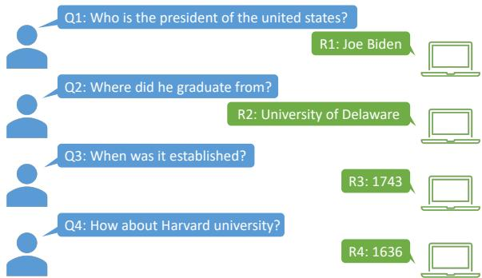
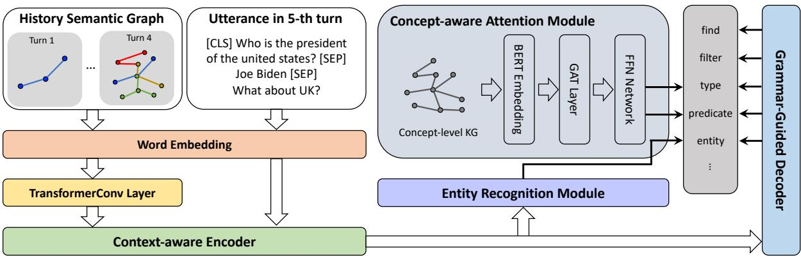
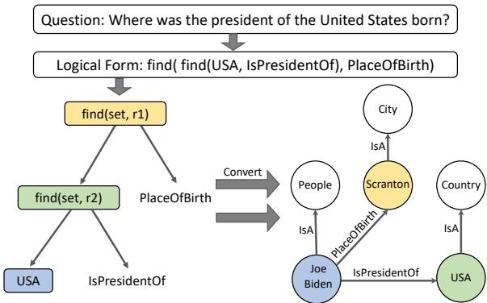
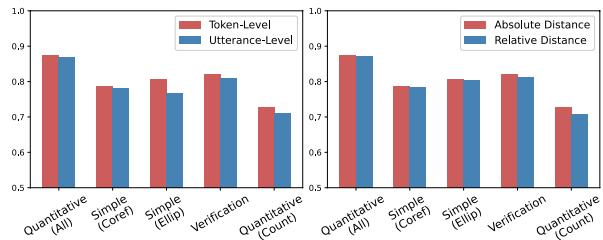
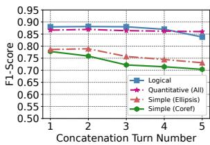
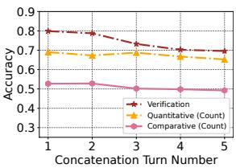

# History Semantic Graph Enhanced Conversational KBQA with Temporal Information Modeling

Hao Sun<sup>1</sup>, Yang Li<sup>2</sup>, Liwei Deng<sup>3</sup>, Bowen Li<sup>2</sup>, Binyuan Hui<sup>2</sup>

Binhua Li<sup>2</sup>, Yunshi Lan<sup>4</sup>, Yan Zhang<sup>1</sup>, Yongbin Li <sup>2</sup>

<sup>1</sup> Peking University, <sup>2</sup> Alibaba Group

<sup>3</sup> University of Electronic Science and Technology of China, <sup>4</sup> East China Normal University

sunhao@stu.pku.edu.cn, zhyzhy001@pku.edu.cn

{ly200170, binyuan.hby, binhua.lbh, shuide.lyb}@alibaba-inc.com deng\_liwei@std.uestc.edu.cn, libowen.ne@gmail.com, yslan@dase.ecnu.edu.cn

## Abstract

Context information modeling is an important task in conversational KBQA. However, existing methods usually assume the indepen dence of utterances and model them in isolation. In this paper, we propose a History Semantic Graph Enhanced KBQA model (HSGE) that is able to effectively model long-range se mantic dependencies in conversation history while maintaining low computational cost. The framework incorporates a context-aware encoder, which employs a dynamic memory decay mechanism and models context at different levels of granularity. We evaluate HSGE on a widely used benchmark dataset for complex sequential question answering. Experimental results demonstrate that it outperforms existing baselines averaged on all question types.

## 1 Introduction

In recent years, with the development of large-scale knowledge base (KB) like DBPedia (Auer et al., 2007) and Freebase (Bollacker et al., 2008), Knowledge Base Question Answering (KBQA) (Wang et al., 2020; Ye et al., 2021; Yan et al., 2021; Yadati et al., 2021; Das et al., 2021; Wang et al., 2022) has become a popular research topic, which aims to convert a natural language question to a query over a knowledge graph to retrieve the correct answer. With the increasing popularity of AI-driven assistants (e.g., Siri, Alexa and Cortana), research focus has shifted towards conversational KBQA (Shen et al., 2019; Kacupaj et al., 2021; Marion et al., 2021) that involves multi-turn dialogues.

A common solution to the task of conversational KBQA is to map an utterance to a logical form using semantic parsing approach (Shen et al., 2019; Guo et al., 2018). The state-of-the-art semantic parsing approach (Kacupaj et al., 2021) breaks down the process into two stages: a logical form is first generated by low-level features and then the missing details are filled by taking both the question and templates into consideration. Other approaches (Dong and Lapata, 2016; Liang et al., 2016; Guo et al., 2018) mainly focus on first detecting entities in the question and then mapping the question to a logical form.

  
Figure 1: An example illustrating the task of conversational KBQA.

Despite the inspiring results of the semantic parsing methods mentioned above, most of them fail to model the long-range semantic dependency in conversation history. Specifically, they usually directly incorporate immediate two turns of conversations and ignore the conversation history two turns away. To demonstrate the importance of long-range conversation history, Figure 1 shows an example illustrating the task of conversational KBQA. After the question “who is the president of the United States”, the user consecutively proposes three questions that involve Coreference and Ellipsis phenomena (Androutsopoulos et al., 1995). Only when the system understands the complete conversation history can the system successfully predict the answer. Though existing contextual semantic parsing models (Iyyer et al., 2017; Suhr et al., 2018; Yu et al., 2019) can be used to model conversation history, a survey (Liu et al., 2020) points out that their performance is not as good as simply concatenating the conversation history, which is the most common conversation history modeling technique.

To tackle the issues mentioned above, we propose a History Semantic Graph Enhanced Conversational KBQA model (HSGE) for conversation history modeling. Specifically, we convert the logical forms of previous turns into history semantic graphs, whose nodes are the entities mentioned in the conversation history and edges are the relations between them. By applying graph neural network on the history semantic graph, the model can capture the complex interaction between the entities and improve its understanding of the conversation history. From the perspective of practice, using the history semantic graph to represent the conversation history is also more computationally efficient than directly concatenating the conversation history. Besides, we design a context-aware encoder that addresses user’s conversation focus shift phenomenon (Lan and Jiang, 2021) by introducing temporal embedding and allows the model to incorporate information from the history semantic graph at both token-level and utterance-level.

To summarize, our major contributions are:

• We propose to model conversation history using history semantic graph, which is effective and efficient. As far as we know, this is the first attempt to use graph structure to model conversation history in conversational KBQA.

• We design a context-aware encoder that utilizes temporal embedding to address the shift of user’s conversation focus and aggregate context information at different granularities.

• Extensive experiments on the widely used CSQA dataset demonstrate that HSGE achieves the state-of-the-art performance averaged on all question types.

## 2 Related Work

The works most related to ours are those investigating semantic parsing-based approaches in conversational KBQA. Given a natural language question, traditional semantic-parsing methods (Zettlemoyer and Collins, 2009; Artzi and Zettlemoyer, 2013) usually learn a lexicon-based parser and a scoring function to produce a logical form. For instance, (Zettlemoyer and Collins, 2009) propose to learn a context-independent CCG parser and (Long et al., 2016) utilizes a shift-reduce parser for logical form construction.

Recently, neural semantic parsing approaches are gaining attention with the development of deep learning (Qu et al., 2019; Chen et al., 2019). For example, (Liang et al., 2016) introduces a neural symbolic machine (NSM) extended with a keyvalue memory network. (Guo et al., 2018) proposes D2A, a neural symbolic model with memory augmentation. S2A+MAML (Guo et al., 2019) extends D2A with a meta-learning strategy to account for context. (Shen et al., 2019) proposes the first multi-task learning framework MaSP that simultaneously learns type-aware entity detection and pointer-equipped logical form generation. (Plepi et al., 2021) introduces CARTON which utilizes pointer networks to specify the KG items. (Kacupaj et al., 2021) proposes a graph attention network to exploit correlations between entity types and predicates. (Marion et al., 2021) proposes to use KG contextual data for semantic augmentation.

While these methods have demonstrated promising results, they typically only consider the immediate two turns of conversations as input while neglecting the context two turns away. Though (Guo et al., 2018) introduces a Dialog Memory to maintain previously observed entities and predicates, it fails to capture their high-order interaction information. By introducing history semantic graph, our model HSGE can not only memorize previously appeared entities and predicates but also model their interaction features using GNN to gain a deeper understanding of conversation history.

## 3 Method

The structure of our proposed HSGE model is illustrated in Figure 2. The model consists of six components: Word Embedding, TransformerConv Layer, Context-aware Encoder, Entity Recognition Module, Concept-aware Attention Module and Grammar-Guided Decoder.

## 3.1 Grammar

We predefined a grammar with various actions in Table 4, which can result in different logical forms that can be executed on the KG. Analogous to (Kacupaj et al., 2021), each action in this work consists of three components: a semantic category, a function symbol and a list of arguments with specified semantic categories. Amongst them, semantic categories can be classified into two groups depending on the ways of instantiation. One is referred to as entry semantic category (i.e., e, p, tp, num for entities, predicates, entity types and numbers) whose instantiations are constants parsed from a question. Another is referred to as intermediate semantic category (i.e., set, dict, boolean, number ) whose instantiation is the output of an action execution.

  
Figure 2: Model architecture of HSGE, which includes Word Embedding, TransformerConv Layer, Context-aware Encoder, Entity Recognition Module, Concept-aware Attention Module and Grammar-Guided Decoder.

## 3.2 Input and Word Embedding

To incorporate the recent dialog history from previous interactions, the model input for each turn contains the following utterances: the previous question, the previous answer and the current question. Utterances are separated by a [SEP] token and a context token [CLS] is appended at the beginning of the input as the semantic representation of the entire input.

Specifically, given an input u, we use WordPiece tokenization (Wu et al., 2016) to tokenize the conversation context into token sequence $\{ w _ { 1 } , . . . , w _ { n } \}$ and then we use the pre-trained language model BERT (Devlin et al., 2018) to embed each word into a vector representation space of dimension d. Our word embedding module provides us with an embedding sequence $\{ x _ { 1 } , . . . , x _ { n } \}$ , where $x _ { i } \in \mathbb { R } ^ { d }$ is given by $x _ { i } = \mathsf { B E R T } ( w _ { i } )$

## 3.3 History Semantic Graph

To effectively and efficiently model conversation history that contains multiple turns, we design History Semantic Graph, inspired by the recent studies on dynamically evolving structures (Hui et al., 2021). As the conversation proceeds, more and more entities and predicates are involved, which makes it difficult for the model to capture the complex interactions among them and reason over them. Thus, we hope to store these information into a graph structure and empower the model with strong reasoning ability by applying GNN onto the graph. Considering that we are trying to model the interactions between entities and predicates which are naturally included in logical forms, one good solution is to directly convert the logical forms into KG triplets as shown in Figure 3. By doing so, we guarantee the quality of the graph because the entities and predicates are directly related to the answers of previous questions, while also injecting history semantic information into the graph.

  
Figure 3: Illustration example for history semantic graph construction.

Graph Construction. Specifically, we define the history semantic graph to be $\mathcal { G } = < \mathcal { V } , \mathcal { E } >$ , where $\mathcal { V } = s e t ( e ) \cup s e t ( t p ) , \mathcal { E } = s e t ( p )$ , and e, tp, p denote entity, entity type and predicate, respectively. We define the following rules to transform the actions defined in Table 4 to the KG triplets:

• For each element $e _ { i }$ in the operator result of s $\operatorname { \mathcal { O } } t \to f i n d ( e , p )$ , we directly add $< e _ { i } , p , e >$ into the graph.

• For each element $e _ { i }$ in the operator result of set  f ind\_reverse $( e , p )$ , we directly add ${ < e , p , e _ { i } > }$ into the graph.

• For each entity $e _ { i } ~ \in ~ \nu$ , we also add the $< e _ { i } , I s A , t p _ { i } >$ to the graph, where $t p _ { i }$ is the entity type of entity $e _ { i }$ extracted from Wikidata knowledge graph.

• For the f ind and f ind\_reverse actions that are followed by f ilter\_type or filter\_multi\_types action for entity filtering, we would add the element in the filtering result to the graph, which prevents introducing unrelated entities into the graph.

It is worth mentioning that we choose to transform these actions because they directly model the relationship between entities and predicates. Besides, as the conversation proceeds and new logical forms are generated, more KG triplets will be added to the graph and the graph will grow larger. However, the number of nodes involved in the graph is still relatively small and is highly controllable by only keeping several recent KG triplets. Considering the $O ( N ^ { 2 } )$ computational complexity of Transformer encoders (Vaswani et al., 2017), it would be more computationally efficient to model conversation history using history semantic graph than directly concatenating previous utterances.

Graph Reasoning. Given constructed history semantic graph $\mathcal { G } _ { : }$ , we first initialize the embeddings of nodes and relations using BERT, i.e., BERT $( e _ { i } / p _ { i } )$ , where $e _ { i }$ and $p _ { i }$ represent the text of node and relation, respectively. Then we follow TransformerConv (Shi et al., 2020) and update node embeddings as follows:

$$
H = \operatorname { T r a n s f o r m e r } \mathbf { C o n v } ( E , \mathcal { G } )\tag{1}
$$

where $E \in \mathbb { R } ^ { ( | \mathcal { V } | + | \mathcal { E } | ) \times d }$ denotes the embeddings of nodes and relations.

## 3.4 Context-aware Encoder

Temporal Information Modeling. As the conversation continues and further inquiries are raised, individuals tend to focus more on recent entities, which is also called Focal Entity Transition phenomenon (Lan and Jiang, 2021). To incorporate this insight into the model, we introduce temporal embedding to enable the model to distinguish newly introduced entities. Specifically, given the current turn index t and previous turn index i in which entities appeared, we define two distance calculation methods:

• Absolute Distance: The turn index of the previous turn in which the entities were mentioned, i.e., $D = t$

• Relative Distance: The difference in turn indices between the current turn and the previous turn in which the entities were mentioned, $\mathrm { i . e . , } D = t - i .$

For each method, we consider two approaches for representing the distance: unlearnable positional embedding and learnable positional embedding. For unlearnable positional encoding, the computation is defined using the following sinusoid function (Vaswani et al., 2017):

$$
\left\{ \begin{array} { l l } { e _ { t } ( 2 i ) = s i n ( D / 1 0 0 0 0 ^ { 2 i / d } ) , } \\ { e _ { t } ( 2 i + 1 ) = c o s ( D / 1 0 0 0 0 ^ { 2 i / d } ) , } \end{array} \right.\tag{2}
$$

where i is the dimension and D is the absolute distance or relative distance.

For learnable positional encoding, the positional encoding is defined as a learnable matrix $E _ { t } \in$ $\mathbb { R } ^ { M \times d }$ , where M is the predefined maximum number of turns.

Then we directly add the temporal embedding to obtain temporal-aware node embeddings.

$$
\bar { h } _ { i } = h _ { i } + e _ { t } ,\tag{3}
$$

where $h _ { i }$ is the embedding of node $e _ { i }$

Semantic Information Aggregation. As the conversation progresses, user’s intentions may change frequently, which leads to the appearance of intention-unrelated entities in history semantic graph. To address this issue, we introduce tokenlevel and utterance-level aggregation mechanisms that allow the model to dynamically select the most relevant entities. These mechanisms also enable the model to model contextual information at different levels of granularity.

• Token-level Aggregation: For each token $x _ { i } ,$ we propose to attend all the nodes in the history semantic graph to achieve fine-grained modeling at token-level:

$$
\begin{array} { l } { { x _ { i } ^ { t } = \mathrm { M H A } ( x _ { i } , \bar { H } , \bar { H } ) , } } \\ { { \bar { x } _ { i } = x _ { i } ^ { t } + x _ { i } , } } \end{array}\tag{4}
$$

where MHA denotes the multi-head attention mechanism and $\bar { H }$ denotes the embeddings of all nodes in the history semantic graph.

• Utterance-level Aggregation: Sometimes the token itself may not contain semantic information, e.g., stop words. We further propose to incorporate history information at the utterance-level for these tokens:

$$
\begin{array} { r l } & { x _ { i } ^ { u } = \mathbf { M H A } ( x _ { [ \mathrm { C L S } ] } , \bar { H } , \bar { H } ) , } \\ & { \bar { x } _ { i } = x _ { i } ^ { u } + x _ { i } , } \end{array}\tag{5}
$$

where x<sub>[CLS]</sub> denotes the representation of the [CLS] token.

Then, history-semantic-aware token embeddings are forwarded as input to the encoder of Transformer (Vaswani et al., 2017) for deep interaction:

$$
h ^ { ( e n c ) } = \operatorname { E n c o d e r } ( \bar { X } ; \theta ^ { ( e n c ) } ) ,\tag{6}
$$

where $\theta ^ { ( e n c ) }$ are encoder trainable parameters.

## 3.5 Grammar-Guided Decoder

After encoding all the semantic information into the hidden state $h ^ { ( e n c ) }$ , we utilize stacked masked attention mechanism (Vaswani et al., 2017) to generate sequence-formatted logical forms. Specifically, in each decoding step, our model predicts a token from a small decoding vocabulary $V ^ { ( d e c ) } =$ $\{ s t a r t , e n d , e , p , t p , . . . , f i n d \}$ , where all the actions from the Table 4 are included. On top of the decoder, we employ a linear layer alongside a softmax to calculate each token’s probability distribution in the vocabulary. The detailed computation is defined as follows:

$$
\begin{array} { r } { h ^ { ( d e c ) } = \operatorname { D e c o d e r } ( h ^ { ( e n c ) } ; \theta ^ { ( d e c ) } ) , } \\ { p _ { t } ^ { ( d e c ) } = \operatorname { S o f t m a x } ( W ^ { ( d e c ) } h _ { t } ^ { ( d e c ) } ) , } \end{array}\tag{7}
$$

where $h _ { t } ^ { ( d e c ) }$ is the hidden state at time step $t ,$ $\theta ^ { ( d e c ) } , \dot { W ^ { ( d e c ) } }$ are decoder trainable parameters, $p _ { t } ^ { ( d e c ) } \in \mathbb { R } ^ { | V ^ { ( d e c ) } | }$ is the probability distribution over the decoding vocabulary at time step t.

## 3.6 Entity Recognition Module

Entity recognition module aims to fill the entity slot in the predicted logical forms, which consists of entity detection module and entity linking module.

Entity Detection. The goal of entity detection is to identify mentions of entities in the input. Previous studies (Shen et al., 2019) have shown that multiple entities of different types in a large KB may share the same entity text, which is a common phenomenon called Named Entity Ambiguity. To address this issue and inspired by (Kacupaj et al., 2021), we adopt a type-aware entity detection approach using BIO sequence tagging. Specifically, the entity detection vocabulary is defined as $V ^ { ( e d ) } = \{ O , \{ B , I \} \times \{ T P _ { i } \} _ { i = 1 } ^ { N ^ { ( t p ) } } \}$ , where $T P _ { i }$ denotes the i-th entity type label, $N ^ { ( t p ) }$ stands for the number of distinct entity types in the knowledge graph and $\vert V ^ { ( e d ) } \vert = 2 \times \overbar { N ^ { ( t p ) } } + 1$ . We leverage LSTM (Hochreiter and Schmidhuber, 1997) to perform the sequence tagging task:

$$
\begin{array} { r l } & { h ^ { ( e d ) } = \mathrm { L e a k y R e L U } ( \mathrm { L S T M } ( h ^ { ( e n c ) } ; \theta ^ { ( l ) } ) ) , } \\ & { p _ { t } ^ { ( e d ) } = \mathrm { S o f t m a x } ( W ^ { ( e d ) } h _ { t } ^ { ( e d ) } ) , } \end{array}\tag{8}
$$

where $h ^ { ( e n c ) }$ is the encoder hidden state, $\theta ^ { ( l ) }$ are the LSTM trainable parameters, $h _ { t } ^ { ( e d ) }$ is the LSTM hidden state at time step $t ,$ and $p _ { t } ^ { ( e d ) }$ is the probability distribution over $V ^ { ( e d ) }$ at time step t.

Entity Linking. Once we detect the entities in the input utterance, we perform entity linking to link the entities to the entity slots in the predicted logical form. Specifically, we define the entity linking vocabulary as $V ^ { ( e l ) } = \{ 0 , 1 , . . . , M \}$ where 0 means that the entity does not link to any entity slot in the predicted logical form and M denotes the total number of indices based on the maximum number of entities from all logical forms. The probability distribution is defined as follows:

$$
\begin{array} { r l } & { h ^ { ( e l ) } = \mathrm { L e a k y R e L U } ( W ^ { ( e l _ { 1 } ) } [ h ^ { ( e n c ) } ; h ^ { ( e d ) } ] ) , } \\ & { p _ { t } ^ { ( e l ) } = \mathrm { S o f t m a x } ( W ^ { ( e l _ { 2 } ) } h _ { t } ^ { ( e l ) } ) , } \end{array}\tag{9}
$$

where $W ^ { ( e l _ { 1 } ) } , W ^ { ( e l _ { 2 } ) }$ are trainable parameters, $h _ { t } ^ { ( e l ) }$ is the hidden state at time step t, and $p _ { t } ^ { ( e l ) }$ is the probability distribution over the tag indices $V ^ { ( e l ) }$ at time step t.

## 3.7 Concept-aware Attention Module

In the Concept-aware Attention Module, we first model the complex interaction between entity types and predicates, then we predict the entity types and predicates for the logical form.

To begin with, we first develop an entity-toconcept converter to replace the entities in each factual triple of Wikidata KG with corresponding concepts (i.e., entity types). Take an instance in Figure 3 as example, the factual triple (Joe Biden, IsPresidentOf, USA) can be transformed to two concept-level tuples (Person, IsPresidentOf), and (IsPresidentOf, Country) in the concept graph. Then, we initialize node embeddings using their texts with BERT and apply Graph Attention Networks (GAT) (Velickovi ˇ c et al. ´ , 2017) to project the KG information into the embedding space.

Finally, we model the task of predicting the correct entity type or predicate of the logical form as a classification task. For each time step of decoding, we directly calculate the probability distribution at time step t as:

$$
\begin{array} { r l } & { h _ { t } ^ { ( c ) } = \mathrm { L e a k y R e L U } ( W ^ { ( c ) } [ h _ { [ \mathrm { C L S } ] } ^ { ( e n c ) } ; h _ { t } ^ { ( d e c ) } ] ) , } \\ & { p _ { t } ^ { ( c ) } = \mathrm { S o f t m a x } ( h ^ { ( g ) T } h _ { t } ^ { ( c ) } ) , } \end{array}\tag{10}
$$

where $h ^ { ( g ) }$ is the updated entity type and predicate embedding and $p _ { t } ^ { ( \bar { c } ) }$ is the probability distribution over them at time step t.

## 3.8 Training

The framework consists of four trainable modules: Entity Detection Module, Entity Linking Module, Grammar-guided Decoder and Concept-aware Attention Module. Each module consists of a loss function that can be used to optimize the parameters in itself. We use the weighted average of all the losses as our loss function:

$$
L = \lambda _ { 1 } L ^ { e d } + \lambda _ { 2 } L ^ { e l } + \lambda _ { 3 } L ^ { d e c } + \lambda _ { 4 } L ^ { c } ,\tag{11}
$$

where $\lambda _ { 1 } , \lambda _ { 2 } , \lambda _ { 3 } , \lambda _ { 4 }$ are the weights that decide the importance of each component. The detailed loss calculation method is in Appendix B. The multitask setting enables modules to share supervision signals, which benefits the model performance.

## 4 Experiments

## 4.1 Experimental Setup

Dataset. We conduct experiments on CSQA (Complex Sequential Question Answering) dataset <sup>1</sup> (Saha et al., 2018). CSQA was built based on the Wikidata knowledge graph, which consists of 21.1M triples with over 12.8M entities, 3,054 entity types and 567 predicates. CSQA dataset is the largest dataset for conversational KBQA and consists of around 200K dialogues where training set, validation set and testing set contain 153K, 16K and 28K dialogues, respectively. Questions in the dataset are classified as different types, e.g., simple questions, logical reasoning and so on.

Metrics. To evaluate HSGE, We use the same metrics as employed by the authors of the CSQA dataset as well as the previous baselines. F1 score is used to evaluate the question whose answer is comprised of entities, while Accuracy is used to measure the question whose answer is a number or a boolean number. Following (Marion et al., 2021), we don’t report results for “Clarification” question type, as this question type can be accurately modeled with a simple classification task.

Baselines. We compare HSGE with the latest five baselines that include D2A (Guo et al., 2018), S2A+MAML (Guo et al., 2019), MaSP (Shen et al., 2019), OAT (Marion et al., 2021) and LASAGNE (Kacupaj et al., 2021).

## 4.2 Overall Performance

Table 1 summarizes the results comparing the HSGE framework against the previous baselines. From the result, we have three observations:

(1) The D2A and S2A-MAML models exhibit superior performance on the Simple Question (Direct) question type. This can likely be attributed to their ability to memorize context information previously mentioned in the conversation. However, these models fail to model the complex interaction between entities, resulting in inferior performance on other question types.

(2) OAT achieves superior performance on three question types, which might be attributed to its incorporation of additional KG information. However, its performance is not consistent across all question types, leading to a low overall performance averaged on all question types.

(3) Our method HSGE achieves the new SOTA on the overall performance averaged on all question types. There are two possible reasons for the improvement. First, the incorporation of HSG allows the modeling of longer dependencies within the context, enabling the model to handle situations where the user asks about entities that were previously mentioned. Second, by utilizing graph neural network to facilitate information flow in HSG, the interaction among previously appeared entities, entity types and predicates are better captured, which endows our model with stronger reasoning ability.

## 4.3 Ablation Study

In this section, we first conduct experiments to verify the effectiveness of each model component. Then, we investigate the effects of different model choices inside the Context-aware Encoder. Finally, we compare our HSGE with the most widely used concatenation method.

Effect of HSG and TIM. To show the effectiveness of each component, we create two ablations by directly removing history semantic graph (HSG) and temporal information modeling (TIM), respectively. As shown in Table 2, HSGE outperforms all the ablations across all question types, which verifies the importance of each model component.

<table><tr><td>Methods</td><td></td><td>D2A</td><td>S2A-MAML</td><td>MaSP OAT</td><td></td><td>LASAGNE</td><td>HSGE</td></tr><tr><td>Question Type</td><td>#Example</td><td colspan="6">F1 Score</td></tr><tr><td>Comparative</td><td>15K</td><td>44.20</td><td>48.13</td><td>68.90</td><td>70.76</td><td>69.77</td><td>69.70</td></tr><tr><td>Logical</td><td>22K</td><td>43.62</td><td>44.34</td><td>69.04</td><td>81.57</td><td>89.83</td><td>91.24</td></tr><tr><td>Quantitative</td><td>9K</td><td>50.25</td><td>50.30</td><td>73.75</td><td>74.83</td><td>86.67</td><td>87.37</td></tr><tr><td>Simple (Coreferenced)</td><td>55K</td><td>69.83</td><td>71.18</td><td>76.47</td><td>79.23</td><td>79.06</td><td>78.73</td></tr><tr><td>Simple (Direct)</td><td>82K</td><td>91.41</td><td>92.66</td><td>85.18</td><td>82.69</td><td>87.95</td><td>89.38</td></tr><tr><td>Simple (Ellipsis)</td><td>10K</td><td>81.98</td><td>82.21</td><td>83.73</td><td>84.44</td><td>80.09</td><td>80.53</td></tr><tr><td>Question Type</td><td>#Example</td><td colspan="6">Accuracy</td></tr><tr><td>Verification (Boolean)</td><td>27K</td><td>45.05</td><td>50.16</td><td>60.63</td><td>66.39</td><td>78.86</td><td>82.17</td></tr><tr><td>Quantitative (Count)</td><td>24K</td><td>40.94</td><td>46.43</td><td>43.39</td><td>71.79</td><td>55.18</td><td>72.88</td></tr><tr><td>Comparative (Count)</td><td>15K</td><td>17.78</td><td>18.91</td><td>22.26</td><td>36.00</td><td>53.34</td><td>53.74</td></tr><tr><td>Overall</td><td>260K</td><td>64.47</td><td>66.54</td><td>70.56</td><td>75.57</td><td>78.82</td><td> $\overline { { 8 1 . 3 8 ^ { * \dag } 8 } }$ </td></tr></table>

Table 1: HSGE’s performance comparison on the CSQA dataset. HSGE achieves new state-of-the-art on the overall performance averaged on all question types. We use the paired t-test with $p \leq 0 . 0 1$ . The superscripts refer to significant improvements compared to LASAGNE(∗), OAT(†) and MaSP(§).

<table><tr><td>Methods</td><td>Ours w/o HSG</td><td>w/o TIM</td></tr><tr><td>Question Type Comparative</td><td colspan="2">F1 Score 69.70 69.47</td></tr><tr><td>Logical Quantitative Simple (Coref) Simple (Direct)</td><td>91.24 87.99 87.37 86.63 78.73 77.78 89.38</td><td>69.55 89.99 86.71 78.17 88.97</td></tr><tr><td>Simple (Ellipsis)</td><td colspan="2">88.64 80.53 78.60 79.95</td></tr><tr><td>Question Type Verification</td><td colspan="2">Accuracy 82.17 79.70</td></tr><tr><td>Quantitative (Count)</td><td>72.88 69.00</td><td>78.05 71.29</td></tr><tr><td>Comparative (Count) Overall</td><td>53.74 52.70  $\overline { { { \bf 8 1 . 3 8 ^ { * \dagger } } } }$  79.87</td><td>53.14 80.36</td></tr></table>

Table 2: Ablation Study. We use the paired t-test with $p \leq 0 . 0 1$ . The superscripts refer to significant improvements compared to w/o HSG(∗) and w/o TIM(†).

It is worth mentioning that after removing HSG, the performance of our method on some question types that require reasoning (i.e., Logical Reasoning, Quantitative Reasoning (Count)) drops significantly. We think that the reason might be the utilization of graph neural network on HSG empowers the model with great reasoning ability, which further benefits model performance.

Comparison of Internal Model Choice. In context-aware encoder, we design two distance calculation methods (i.e., absolute distance and relative distance) for temporal information modeling, as well as two information aggregation granularities (i.e., token-level and utterance-level aggregation) for semantic information aggregation. To study their effects, we conduct experiments by fixing one setting while changing the other. And the comparison result is shown in Figure 4.

  
Figure 4: The comparison between token/utterancelevel aggregation and between absolute/relative distance on five selected question types.

From the results, it is obvious that we can get the following conclusions: (1) Token-level aggregation method performs better than utterance-level aggregation method. This is because the token-level aggregation allows the model to incorporate context information at a finer granularity and the information unrelated to the target token can be removed. (2) Absolute distance method performs better than relative distance method. The reason may be that although both distance calculation methods can provide temporal information, absolute distance is more informative since the model can derive relative distance using absolute distance while the opposite is not true.



  
Figure 5: The performance of the concatenation method on seven representative question types with regard to the concatenation turn number.

<table><tr><td>Task</td><td>LASAGNE</td><td>HSGE</td></tr><tr><td>Entity Detection</td><td>86.75%</td><td>89.75%</td></tr><tr><td>Entity Linking</td><td>97.49%</td><td>98.19%</td></tr><tr><td>Logical Form Generation</td><td>98.61%</td><td>92.76%</td></tr><tr><td>Type&amp;Predicate Prediction</td><td>92.28%</td><td>93.11%</td></tr></table>

Table 3: Comparison of subtask accuracy in LASAGNE and HSGE.

Comparison with Concatenation Method. One of the most widely used methods for context modeling is to directly concatenate history conversations (Liu et al., 2020). To analyze its effectiveness, we remove HSG and observe the performance of seven representative question types using the concatenation of history conversations as input, which is shown in Figure 5.

As we can see, at the initial stages of concatenation turn number increase, the performances on some question types increase a little while remaining unchanged or even decreasing on others, leading to an almost unchanged overall performance. It is reasonable because history turns contain useful semantic information, which leads to performance gain. However, as more conversation turns are introduced into the model, more noisy tokens will also be introduced into the model, which leads to performance degradation. Besides, the introduction of more context tokens will also lead to an increase in computational cost with the $O ( N ^ { 2 } )$ complexity.

It is worth noting that the best setting of concatenation method still performs worse than HSGE. It is mainly because we use attention mechanism to dynamically select the most related entities from the HSG, which achieves effective history modeling while avoiding introducing noisy information. And as we only extract entities and predicates from history conversations, the size of the graph is relatively small and the increase in computational cost as the conversation progresses is marginal.

## 4.4 Subtask Analysis

The task of conversational KBQA involves multiple subtasks, each of which can directly impact the final model accuracy. To gain a deeper understanding of HSGE, we compare its performance of each subtask with the current SOTA model LASAGNE in Table 3. We can observe that most of the subtask’s performance in HSGE is better than that of LASAGNE and mostly achieves accuracy above 90%. Amongst them, the improvement in Entity Detection is the largest. We think the main reason is that the token-level aggregation mechanism endows each token with richer semantic information.

## 4.5 Error Analysis

In this section, we randomly sample 200 incorrect predictions and analyze their error causes:

Entity Ambiguity. Entity ambiguity refers to the situation where there exist multiple entities with the same text and type in the Wikidata knowledge graph. For example, we cannot distinguish multiple people called “Mary Johnson” because we have no more information other than entity text and entity type. We believe that incorporating other contextual information such as entity descriptions may help solve this problem (Mulang et al., 2020).

Spurious Logical Form. We follow (Shen et al., 2019; Kacupaj et al., 2021) and produce golden logical forms by leveraging BFS to search valid logical forms for questions in training data. This can sometimes lead to wrong golden actions such as two actions with different semantic information but accidentally sharing the same execution result. This may misguide our model during training.

## 5 Conclusion

In this paper, we propose a novel Conversational KBQA method HSGE, which achieves effective history modeling with minimal computational cost. We design a context-aware encoder that introduces temporal embedding to address user’s conversation focus shift phenomenon and aggregate context information at both token-level and utterance-level. Our proposed HSGE outperforms existing baselines averaged on all question types on the widely used CSQA dataset.

## References

Ion Androutsopoulos, Graeme D Ritchie, and Peter Thanisch. 1995. Natural language interfaces to databases–an introduction. Natural language engineering, 1(1):29–81.

Yoav Artzi and Luke Zettlemoyer. 2013. Weakly supervised learning of semantic parsers for mapping instructions to actions. Transactions ofthe Association for Computational Linguistics, 1:49–62.

Sören Auer, Christian Bizer, Georgi Kobilarov, Jens Lehmann, Richard Cyganiak, and Zachary Ives. 2007. Dbpedia: A nucleus for a web of open data. In The semantic web, pages 722–735. Springer.

Kurt Bollacker, Colin Evans, Praveen Paritosh, Tim Sturge, and Jamie Taylor. 2008. Freebase: a collaboratively created graph database for structuring human knowledge. In Proceedings of the 2008 ACM SIG-MOD international conference on Management of data, pages 1247–1250.

Yu Chen, Lingfei Wu, and Mohammed J Zaki. 2019. Graphflow: Exploiting conversation flow with graph neural networks for conversational machine comprehension. arXiv preprint arXiv:1908.00059.

Rajarshi Das, Manzil Zaheer, Dung Thai, Ameya Godbole, Ethan Perez, Jay-Yoon Lee, Lizhen Tan, Lazaros Polymenakos, and Andrew McCallum. 2021. Case-based reasoning for natural language queries over knowledge bases. arXiv preprint arXiv:2104.08762.

Jacob Devlin, Ming-Wei Chang, Kenton Lee, and Kristina Toutanova. 2018. Bert: Pre-training of deep bidirectional transformers for language understanding. arXiv preprint arXiv:1810.04805.

Li Dong and Mirella Lapata. 2016. Language to logical form with neural attention. arXiv preprint arXiv:1601.01280.

Daya Guo, Duyu Tang, Nan Duan, Ming Zhou, and Jian Yin. 2018. Dialog-to-action: Conversational question answering over a large-scale knowledge base. Advances in Neural Information Processing Systems, 31.

Daya Guo, Duyu Tang, Nan Duan, Ming Zhou, and Jian Yin. 2019. Coupling retrieval and meta-learning for context-dependent semantic parsing. arXiv preprint arXiv:1906.07108.

Sepp Hochreiter and Jürgen Schmidhuber. 1997. Long short-term memory. Neural computation, 9(8):1735– 1780.

Binyuan Hui, Ruiying Geng, Qiyu Ren, Binhua Li, Yongbin Li, Jian Sun, Fei Huang, Luo Si, Pengfei Zhu, and Xiaodan Zhu. 2021. Dynamic hybrid relation network for cross-domain context-dependent semantic parsing. arXiv preprint arXiv:2101.01686.

Mohit Iyyer, Wen-tau Yih, and Ming-Wei Chang. 2017. Search-based neural structured learning for sequential question answering. In ACL.

Endri Kacupaj, Joan Plepi, Kuldeep Singh, Harsh Thakkar, Jens Lehmann, and Maria Maleshkova. 2021. Conversational question answering over knowledge graphs with transformer and graph attention networks. arXiv preprint arXiv:2104.01569.

Yunshi Lan and Jing Jiang. 2021. Modeling transitions of focal entities for conversational knowledge base question answering. In Proceedings ofthe 59th Annual Meeting ofthe Associationfor Computational Linguistics and the 11th International Joint Conference on Natural Language Processing (Volume 1: Long Papers), pages 3288–3297.

Chen Liang, Jonathan Berant, Quoc Le, Kenneth D Forbus, and Ni Lao. 2016. Neural symbolic machines: Learning semantic parsers on freebase with weak supervision. arXiv preprint arXiv:1611.00020.

Qian Liu, Bei Chen, Jiaqi Guo, Jian-Guang Lou, Bin Zhou, and Dongmei Zhang. 2020. How far are we from effective context modeling? an exploratory study on semantic parsing in context. arXiv preprint arXiv:2002.00652.

Reginald Long, Panupong Pasupat, and Percy Liang. 2016. Simpler context-dependent logical forms via model projections. arXiv preprint arXiv:1606.05378.

Pierre Marion, Paweł Krzysztof Nowak, and Francesco Piccinno. 2021. Structured context and highcoverage grammar for conversational question answering over knowledge graphs. arXiv preprint arXiv:2109.00269.

Isaiah Onando Mulang, Kuldeep Singh, Akhilesh Vyas, Saeedeh Shekarpour, Maria-Esther Vidal, Jens Lehmann, and Soren Auer. 2020. Encoding knowledge graph entity aliases in attentive neural network for wikidata entity linking. In International Conference on Web Information Systems Engineering, pages 328–342. Springer.

Joan Plepi, Endri Kacupaj, Kuldeep Singh, Harsh Thakkar, and Jens Lehmann. 2021. Context transformer with stacked pointer networks for conversational question answering over knowledge graphs. In European Semantic Web Conference, pages 356–371. Springer.

Chen Qu, Liu Yang, Minghui Qiu, Yongfeng Zhang, Cen Chen, W Bruce Croft, and Mohit Iyyer. 2019. Attentive history selection for conversational question answering. In Proceedings of the 28th ACM International Conference on Information and Knowledge Management, pages 1391–1400.

Amrita Saha, Vardaan Pahuja, Mitesh Khapra, Karthik Sankaranarayanan, and Sarath Chandar. 2018. Complex sequential question answering: Towards learning to converse over linked question answer pairs with a knowledge graph. In Proceedings of the AAAI Conference on Artificial Intelligence, volume 32.

Tao Shen, Xiubo Geng, Tao Qin, Daya Guo, Duyu Tang, Nan Duan, Guodong Long, and Daxin Jiang. 2019. Multi-task learning for conversational question answering over a large-scale knowledge base. arXiv preprint arXiv:1910.05069.

Yunsheng Shi, Zhengjie Huang, Shikun Feng, Hui Zhong, Wenjin Wang, and Yu Sun. 2020. Masked label prediction: Unified message passing model for semi-supervised classification. arXiv preprint arXiv:2009.03509.

Alane Suhr, Srinivasan Iyer, and Yoav Artzi. 2018. Learning to map context-dependent sentences to executable formal queries. In NAACL.

Ashish Vaswani, Noam Shazeer, Niki Parmar, Jakob Uszkoreit, Llion Jones, Aidan N Gomez, Łukasz Kaiser, and Illia Polosukhin. 2017. Attention is all you need. Advances in neural information processing systems, 30.

Petar Velickoviˇ c, Guillem Cucurull, Arantxa Casanova,´ Adriana Romero, Pietro Lio, and Yoshua Bengio. 2017. Graph attention networks. arXiv preprint arXiv:1710.10903.

Xu Wang, Shuai Zhao, Jiale Han, Bo Cheng, Hao Yang, Jianchang Ao, and Zhenzi Li. 2020. Modelling longdistance node relations for kbqa with global dynamic graph. In Proceedings ofthe 28th International Conference on Computational Linguistics, pages 2572– 2582.

Yu Wang, Hongxia Jin, et al. 2022. A new concept of knowledge based question answering (kbqa) system for multi-hop reasoning. In Proceedings of the 2022 Conference of the North American Chapter of the Association for Computational Linguistics: Human Language Technologies, pages 4007–4017.

Yonghui Wu, Mike Schuster, Zhifeng Chen, Quoc V Le, Mohammad Norouzi, Wolfgang Macherey, Maxim Krikun, Yuan Cao, Qin Gao, Klaus Macherey, et al. 2016. Google’s neural machine translation system: Bridging the gap between human and machine translation. arXiv preprint arXiv:1609.08144.

Naganand Yadati, RS Dayanidhi, S Vaishnavi, KM Indira, and G Srinidhi. 2021. Knowledge base question answering through recursive hypergraphs. In Proceedings of the 16th Conference of the European Chapter of the Association for Computational Linguistics: Main Volume, pages 448–454.

Yuanmeng Yan, Rumei Li, Sirui Wang, Hongzhi Zhang, Zan Daoguang, Fuzheng Zhang, Wei Wu, and Weiran Xu. 2021. Large-scale relation learning for question answering over knowledge bases with pre-trained language models. In Proceedings ofthe 2021 Conference on Empirical Methods in Natural Language Processing, pages 3653–3660.

Xi Ye, Semih Yavuz, Kazuma Hashimoto, Yingbo Zhou, and Caiming Xiong. 2021. Rng-kbqa: Generation augmented iterative ranking for knowledge base question answering. arXiv preprint arXiv:2109.08678.

Tao Yu, Rui Zhang, Heyang Er, Suyi Li, Eric Xue, Bo Pang, Xi Victoria Lin, Yi Chern Tan, Tianze Shi, Zihan Li, Youxuan Jiang, Michihiro Yasunaga, Sungrok Shim, Tao Chen, Alexander Fabbri, Zifan Li, Luyao Chen, Yuwen Zhang, Shreya Dixit, Vincent Zhang, Caiming Xiong, Richard Socher, Walter Lasecki, and Dragomir Radev. 2019. CoSQL: A conversational text-to-SQL challenge towards crossdomain natural language interfaces to databases. In EMNLP-IJCNLP.

Luke S Zettlemoyer and Michael Collins. 2009. Learning context-dependent mappings from sentences to logical form.

```csv
Action Description
set  f ind(e, p) set of subjects part of the triples with object e and predicate p
set find_reverse(e, p) set of objects part of the triples with subject e and predicate p
set  f ilter_type(set, tp) filter the given set of entities based on the given type
set  f ilter_multi_types(set<sub>1</sub>, set<sub>2</sub>) filter the given set of entities based on the given set of types
dict find_tuple_count $s ( p , t p _ { 1 } , t p )$ extracts a dictionary, where keys are entities of type<sub>1</sub> and values are the number
of objects of type related with p
dict find_reverse_tuple_counts(p, tp<sub>1</sub>, tp<sub>2</sub>) extracts a dictionary, where keys are entities of $t y p e _ { 1 }$ and values are the number
of subjects of type<sub>2</sub> related with p
set greater(dict, num) set of those entities that have lesser count than num
set lesser(dict, num) set of those entities that have greater count than num
set  equal(dict, num) set of those entities that have equal count with num
set approx(dict, num) set of those entities that have approximately same count with num
set atmost(dict, num) set of those entities that have at most same count with num
set atleast(dict, num) set of those entities that have at least same count with num
set argmin(dict) set of those entities that have the most count
set argmax(dict) set of those entities that have the least count
boolean is_in(entity, set) check if the entity is part of the set
number count(set) count the number of elements in the set
set union(set , set ) union of set and set
set intersection(set , set ) intersection of set and set
set difference(set , set ) difference of set and set
```  
Table 4: The grammar we use in this work for generating logical forms.

## A Grammar

The grammar we use in this work is defined in Table 4. Please note that each single action can only model relatively simple semantics. High-level semantics of complex question is achieved by integrating multiple actions into a single logical form.

## B Loss Calculation

$L ^ { e d } , L ^ { e l } , L ^ { d e c }$ and L<sup>c</sup> are the negative loglikelihood losses of the Entity Detection Module, Entity Linking Module, Grammar-guided Decoder and Concept-aware Attention Module, respectively. These losses are defined as follows:

$$
\begin{array} { l } { { L ^ { e d } = \displaystyle - \sum _ { i = 1 } ^ { n } \log p ( y _ { i } ^ { ( e d ) } | x ) , } } \\ { { \displaystyle L ^ { e l } = - \sum _ { i = 1 } ^ { n } \log p ( y _ { i } ^ { ( e l ) } | x ) , } } \\ { { \displaystyle L ^ { d e c } = - \sum _ { i = 1 } ^ { m } \log p ( y _ { k } ^ { ( d e c ) } | x ) , } } \\ { { \displaystyle L ^ { c } = - \sum _ { i = 1 } ^ { m } \log p ( y _ { k } ^ { ( e c ) } | x ) , } } \end{array}\tag{12}
$$

where n and m are the length of the input utterance x and golden logical form, respectively. $y _ { i } ^ { ( e d ) } , y _ { i } ^ { ( e l ) } , y _ { i } ^ { ( d e c ) } , y _ { i } ^ { ( c ) }$ are the golden labels for Entity Detection Module, Entity Linking Module, Grammar-guided Decoder and Concept-aware Attention Module, respectively.

## C Hyper-parameters and Implementation Details

<table><tr><td>Parameters</td><td>Setting</td></tr><tr><td>Optimizer</td><td>BertAdam</td></tr><tr><td>Batch Size</td><td>120</td></tr><tr><td>Hidden Size</td><td>768</td></tr><tr><td>Learning Rate</td><td>5e-5</td></tr><tr><td>Head Number</td><td>6</td></tr><tr><td>Aggregation Level</td><td>Token-level</td></tr><tr><td>Activation Function</td><td>ReLU</td></tr><tr><td>Distance Calculation</td><td>Absolute</td></tr><tr><td>Encoder Layer Number</td><td>2</td></tr><tr><td>Decoder Layer Number</td><td>2</td></tr><tr><td>Loss Component Weight</td><td>All set to 1</td></tr><tr><td>GAT Embedding Dimension</td><td>3072</td></tr><tr><td>Word Embedding Dimension</td><td>768</td></tr></table>

Table 5: Hyper-parameters for HSGE.

The experiments are conducted on 8 NVIDIA V100 GPUs. During model tuning, we identify optimal hyperparameters by modifying one parameter while keeping others fixed and select the hyperparameters that resulted in the highest model performance. We implement our code using Pytorch. The detailed hyper-parameter setting for HSGE is shown in Table 5.

## ACL 2023 Responsible NLP Checklist

A For every submission: <sup>✓</sup> A1. Did you describe the limitations of your work? In section Limitations

✗ A2. Did you discuss any potential risks of your work? This work was conducted in accordance with ethical principles. We use the publicly available datasetfor the experiments and have no potential risks about credentials or data privacy. No human participants are involved in our experiment. Therefore, we don’t foresee any potential risk of this work.

<sup>✓</sup> A3. Do the abstract and introduction summarize the paper’s main claims? In section Abstract

✗ A4. Have you used AI writing assistants when working on this paper? Left blank.

## B <sup>✓</sup> Did you use or create scientific artifacts?

In Section Method

<sup>✓</sup> B1. Did you cite the creators of artifacts you used? In Section Experiments

✗ B2. Did you discuss the license or terms for use and / or distribution of any artifacts? We directly used the original CSQA dataset and did not change it. This dataset is released under Creative-Commons license

✗ B3. Did you discuss if your use of existing artifact(s) was consistent with their intended use, provided that it was specified? For the artifacts you create, do you specify intended use and whether that is compatible with the original access conditions (in particular, derivatives of data accessed for research purposes should not be used outside of research contexts)? The datasets are used widely by the research community for studying csqa.

✗ B4. Did you discuss the steps taken to check whether the data that was collected / used contains any information that names or uniquely identifies individual people or offensive content, and the steps taken to protect / anonymize it? No personal information is involved in the dataset

✗ B5. Did you provide documentation of the artifacts, e.g., coverage of domains, languages, and linguistic phenomena, demographic groups represented, etc.? The datasets are used widely by the research community for studying csqa.

<sup>✓</sup> B6. Did you report relevant statistics like the number of examples, details of train / test / dev splits, etc. for the data that you used / created? Even for commonly-used benchmark datasets, include the number of examples in train / validation / test splits, as these provide necessary context for a reader to understand experimental results. For example, small differences in accuracy on large test sets may be significant, while on small test sets they may not be. In Section Experiment

The Responsible NLP Checklist used at ACL 2023 is adopted from NAACL 2022, with the addition of a question on AI writing assistance.

## C <sup>✓</sup> Did you run computational experiments?

<sup>✓</sup> C1. Did you report the number of parameters in the models used, the total computational budget (e.g., GPU hours), and computing infrastructure used? In Section Experiment

<sup>✓</sup> C2. Did you discuss the experimental setup, including hyperparameter search and best-found hyperparameter values? In Section Appendix

<sup>✓</sup> C3. Did you report descriptive statistics about your results (e.g., error bars around results, summary statistics from sets of experiments), and is it transparent whether you are reporting the max, mean, etc. or just a single run? In Section Experiment

<sup>✓</sup> C4. If you used existing packages (e.g., for preprocessing, for normalization, or for evaluation), did you report the implementation, model, and parameter settings used (e.g., NLTK, Spacy, ROUGE, etc.)? In Section Experiment

D ✗ Did you use human annotators (e.g., crowdworkers) or research with human participants? Left blank.

 D1. Did you report the full text of instructions given to participants, including e.g., screenshots, disclaimers of any risks to participants or annotators, etc.? No response.

 D2. Did you report information about how you recruited (e.g., crowdsourcing platform, students) and paid participants, and discuss if such payment is adequate given the participants’ demographic (e.g., country of residence)? No response.

 D3. Did you discuss whether and how consent was obtained from people whose data you’re using/curating? For example, if you collected data via crowdsourcing, did your instructions to crowdworkers explain how the data would be used? No response.

 D4. Was the data collection protocol approved (or determined exempt) by an ethics review board? No response.

 D5. Did you report the basic demographic and geographic characteristics of the annotator population that is the source of the data? No response.