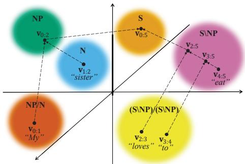
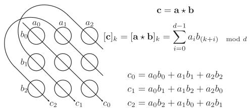
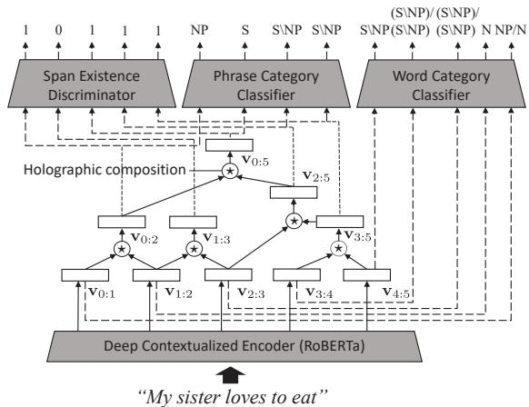
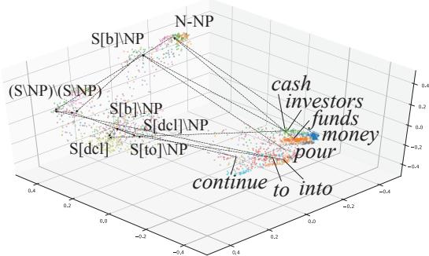

# Holographic CCG Parsing

Ryosuke Yamaki Tadahiro Taniguchi Ritsumeikan University   
1-1-1 Noji Higashi, Kusatsu, Shiga Japan {yamaki.ryosuke,taniguchi} @em.ci.ritsumei.ac.jp

## Abstract

We propose a method for formulating CCG as a recursive composition in a continuous vector space. Recent CCG supertagging and parsing models generally demonstrate high performance, yet rely on black-box neural architectures to implicitly model phrase structure dependencies. Instead, we leverage the method of holographic embeddings (Nickel et al., 2016) as a compositional operator to explicitly model the dependencies between words and phrase structures in the embedding space. Experimental results revealed that holographic composition effectively improves the supertagging accuracy to achieve state-of-the-art parsing performance when using a C&C parser. The proposed span-based parsing algorithm using holographic composition achieves performance comparable to state-of-the-art neural parsing with Transformers. Furthermore, our model can semantically and syntactically infill text at the phrase level due to the decomposability of holographic composition.

## 1 Introduction

Combinatory Categorial Grammar (CCG; Steedman 2000) is a highly lexicalized grammar formalism comprising syntactically rich lexical categories and a limited number of combinatory rules. In principle, CCG is suitable for modelling complicated syntactic structures and operates as a natural interface connecting syntax to semantics because of its isomorphism with lambda calculus (Bos et al., 2004; Mineshima et al., 2015; Martinez-Gómez et al., 2016). In this paper, we propose a method to formulate CCG (a discrete symbol system) as an operation between distributed representations in a continuous vector space, demonstrating its contribution to improved supertagging performance and span-based parsing.

Prior studies on PCFG, compositional vector grammar (CVG; Socher et al. 2013a), and its generalization, latent vector grammar (LVeG; Zhao

Daichi Mochihashi The Institute of Statistical Mathematics 10-3 Midori-cho, Tachikawa city, Tokyo Japan daichi@ism.ac.jp

  
Figure 1: Conceptual diagram of holographic composition of vectors in embedding space according to CCG. Each pair of arrows represent a recursive composition of vectors without any additional parameters.

et al. 2018), have shown the efficacy of representing discrete symbols as vector operations. Highdimensional vectors’ expressive power complements syntactic disambiguation, which is difficult to address solely through discrete symbols. We propose a model that bridges discrete symbols and continuous vectors in CCG.

In this study, we introduce recursive vector composition in the embedding space illustrated in Figure 1 by employing holographic embeddings (HolE; Nickel et al. 2016) to incorporate syntactic structures into the supertagging and parsing model explicitly.

Similar methods for embedding tree structures into fixed-length vectors, CVG, and kernel-inspired encoders with recursive mechanisms for interpretable trees (KERMIT; Zanzotto et al. 2020a) have been proposed. Our model differs from CVG, as it does not require a large number of matrix parameters for nonlinear compositions, and directly optimizes parsing, enabling the construction of phrase-level representations by dynamically exploring phrase structures, whereas KERMIT requires an external parser.

Experiments revealed that phrase-level dependency modelling with holographic composition can induce correct supertagging, achieving state-of-theart performance in supertagging and parsing with a C&C parser (Clark and Curran, 2007; Clark et al., 2015), and further improved performance with a novel span-based parsing algorithm.1

Additionally, we focused on the fact that the inverse operation of holographic composition is easily available. This property can be applied to text-infilling tasks, predicting missing parts of sentences consistent with the rest syntactically and semantically. This task is difficult to accomplish using the existing neural architectures.

The main contributions of this research can be summarized as follows:

1. We introduce HolE as a recursive compositional operator for explicit modelling of syntactic structures, enabling CCG to be treated as an operation between distributed representations. This modelling improves supertagging and parsing, achieving state-of-the-art performance with a C&C parser.

2. We propose a novel span-based parsing algorithm incorporating phrase-level representation from our model, achieving comparable performance to the current state-of-the-art.

3. We propose an approach to compute phraselevel representations containing rich syntactic information while satisfying decomposability. We further demonstrate the applicability of decomposability to phrase-level text-infilling.

## 2 Background and Related Work

## 2.1 Recursive Compositional Models

Previous studies have shown benefits of explicit syntactic information incorporation into neural networks (Socher et al., 2011, 2013a,c; Tai et al., 2015; Zhu et al., 2015; Zhang et al., 2016; Zhao et al., 2018; Wang et al., 2019; Zanzotto et al., 2020a).

First, CVG (Socher et al., 2013a) was used to modify the recursive neural network (Socher et al., 2011), resulting in improved PCFG parsing performance. It recursively composes vectors of words and phrases using a nonlinear composition operation for a PCFG rule C A B as

$$
\mathbf { c } = \operatorname { t a n h } ( W _ { C  A B } [ \begin{array} { l } { \mathbf { a } } \\ { \mathbf { b } } \end{array} ] ) ,\tag{1}
$$

where $\mathbf { a } , \mathbf { b } , \mathbf { c }$ are d-dimensional vectors that represent A, B and C, respectively. $W _ { C  A B }$ is a d 2d matrix for each rule, $C \  \ A \ B$ . Therefore, it contains a huge number of parameters as well as word vectors themselves: when d is as small as 100 and there are 882 binary rules, as in (Socher et al., 2013a), it needs 100 200 882 = 17, 640, 000 parameters for the matrix $W _ { C  A B }$ , not to mention about the difficult nonlinear optimization involved.2 For the same reason, Compositional Distributional Semantics (Polajnar et al., 2015), a method of composing phrase-level semantic representations, using tensors whose order is defined by CCG type, is hard to scale for higher dimensions.

A related study, KERMIT (Zanzotto et al., 2020a) is a model that embeds parse tree structures and subtrees in PCFG into fixed-length vector representations via recursive vector composition, enhancing the performance of downstream tasks. A comparison of this model with ours is given in Section 3.1.

## 2.2 Span-Based Parsing

Clark (2021) applied Transformers to span-scorebased PCFGs (Stern et al., 2017; Kitaev and Klein, 2018) for CCG parsing, achieving significant performance gains. These studies computed a vector for each span in a sentence, input it into a feedforward neural network to obtain a span score, and then apply it to a chart-based parsing algorithm.

Specifically, Kitaev and Klein (2018) calculated the vector $\mathbf { y } _ { i : j }$ corresponding to the span from the ith word to the jth word as follows:

$$
\mathbf { y } _ { i : j } = [ \overrightarrow { \mathbf { y } } _ { j } - \overrightarrow { \mathbf { y } } _ { i } ; \overleftarrow { \mathbf { y } } _ { j + 1 } - \overleftarrow { \mathbf { y } } _ { i + 1 } ] ,\tag{2}
$$

where $\vec { \textbf { y } } _ { k }$ and $\scriptstyle \overleftarrow { \mathbf { y } } _ { k }$ denote the right and left halves, respectively, when the vector $\mathbf { y } _ { k }$ associated with the kth word is split by half. Constructing a vector of the span via simple subtraction between vectors, as in Equation (2), does not explicitly reflect the internal structures of the span.

## 3 Holographic CCG

Our research objective is to compute phrase-level representations to capture dependencies and hierarchical relationships among its internal components for supertagging and parsing in CCG. We describe the mechanism for composing these representations and discuss their application to supertagging. We then introduce a novel span-based parsing that utilizes these representations.

  
Figure 2: Schematic of circular correlation: adapted from Plate (1995); Nickel et al. (2016) (each circle representing a vector element, arrows denoting pattern of addition).

## 3.1 Holographic Embeddings

We explore methods to compose phrase-level representations capturing dependencies and hierarchical relationships between components. We focus on the commonalities between knowledge graphs and syntactic structures of natural language sentences. Both of them represent nonlinear relationships depending on the semantic aspect of each component, suggesting existing knowledge graph embedding methods (Socher et al., 2013b; Nickel et al., 2016; Trouillon et al., 2016; Abboud et al., 2020) are applicable to our objective. We employ HolE (Nickel et al., 2016) due to its desirable properties for embedding phrase structures without additional parameters, as we describe below.

HolE uses circular correlation (Plate, 1995) as a compositional operator for sophisticated knowledge graph modelling while maintaining computational efficiency. Focusing on HolE and circular correlation as compositional operators to model dependencies and hierarchical relationships, we compose two vectors a, b into a single vector c.

$$
\mathbf { c } = \mathbf { a } + \mathbf { b } ,\tag{3}
$$

where - : $\mathbb { R } ^ { d } \times \mathbb { R } ^ { d } \to \mathbb { R } ^ { d }$ denotes a circular correlation:

$$
[ { \bf c } ] _ { k } = [ { \bf a \star b } ] _ { k } = \sum _ { i = 0 } ^ { d - 1 } a _ { i } b _ { ( k + i ) } \mod d \cdot\tag{4}
$$

Circular correlation can be computed via Fourier transform, such as

$$
\mathbf { c } = \mathbf { a } \star \mathbf { b } = { \mathcal { F } } ^ { - 1 } ( { \overline { { { \mathcal { F } } ( \mathbf { a } ) } } } \odot { \mathcal { F } } ( \mathbf { b } ) ) ,\tag{5}
$$

where $\mathcal F ( \cdot )$ and $\mathcal { F } ^ { - 1 } ( \cdot )$ denote the fast Fourier transformation and its inverse, respectively, $\overline { { \mathcal { F } ( \cdot ) } }$ represents conjugation in a complex space, and denotes an element-wise product. Figure 2 shows a schematic of the circular correlation when d = 3.

Circular correlation exhibits desirable characteristics for our objective.

Noncommutative: Generally, a - b = b - a holds true, making noncommutativity attractive for modelling asymmetric relations; for example, two noun phrases “human right” and “right human” will be composed into different vectors.

Nonassociative: Circular correlation is nonassociative, i.e., $( { \bf a } { \star } { \bf b } ) { \star } { \bf c } \neq { \bf a } { \star } ( { \bf b } { \star } { \bf c } )$ , making it ideal for modelling hierarchical structures. For example, the phrase “saw a girl with a telescope” yields different vectors when a circular correlation is used, depending on the internal structure “((saw (a girl)) (with (a telescope)))” and “(saw ((a girl) (with (a telescope))))”. Associative operations, however, yield the same representation, thus failing to reflect the internal structure.

Circular convolution, a similar operation to circular correlation, does not satisfy the above two properties:

$$
[ \mathbf { c } ] _ { k } = [ \mathbf { a * b } ] _ { k } = \sum _ { i = 0 } ^ { d - 1 } a _ { i } b _ { ( k - i ) } { \mathrm { ~ m o d ~ } } d\tag{6}
$$

where $\ast : \mathbb { R } ^ { d } \times \mathbb { R } ^ { d } \to \mathbb { R } ^ { d }$ denotes the circular convolution operator. Circular convolution can be computed via Fourier transform, such as

$$
\mathbf { c } = \mathbf { a } * \mathbf { b } = \mathcal { F } ^ { - 1 } ( \mathcal { F } ( \mathbf { a } ) \odot \mathcal { F } ( \mathbf { b } ) ) ,\tag{7}
$$

Here, KERMIT (Zanzotto et al., 2020a) utilizes shuffled circular convolution as the vector composition operator to guarantee the above properties.

$$
\mathbf { c } = \mathbf { a } \otimes \mathbf { b } = \mathbf { a } * \boldsymbol { \Phi } \mathbf { b } ,\tag{8}
$$

where $\otimes : \mathbb { R } ^ { d } \times \mathbb { R } ^ { d } \to \mathbb { R } ^ { d }$ is the shuffled circular convolution operator and Φ denotes a permutation matrix that shuffles the elements of b. Section 5.3 provides an experimental comparison of these three operators. Another major difference between our model and KERMIT is that our model does not rely on an external parser to extract tree structure from the input.

Circular correlation is a first-degree noncommutative operation, making it difficult to distinguish between c - (a - b) and b - (a - c) (Zanzotto and Dell’Arciprete 2012). However, this is not critical for parsing, as it is sufficient to distinguish between possible internal structures of a given fixed word order sentence. We refer to the vector composition operation by circular correlation as holographic composition in this paper.

Zanzotto et al. (2020b) approximates the CKY algorithm using matrix multiplication and the property of holographic representation from Plate (1995). While similar to our approach in exploiting holographic representations and operations, our approach differs in performing a recursive holographic composition of distributed representations (described in the next section).

  
Figure 3: Proposed approach of composing phrase and sentence-level representation to predict categories and probability of span existence in Holographic CCG.

## 3.2 Recursive Vector Composition

We acquired phrase- and sentence-level representations via recursive composition of word representations, as illustrated in Figure 3 for the input sentence “My sister loves to eat”. First, the input sentence is fed into a RoBERTa encoder (Liu et al., 2019; Wolf et al., 2020), obtaining highdimensional vectors $( \mathbf { v } _ { 0 : 1 } , \ldots , \mathbf { v } _ { 4 : 5 } )$

For a given phrase structure representable by an arbitrary binary tree, vector representations of the phrase and sentence are computed by applying holographic composition recursively. The vector for the entire sentence $\mathbf { v _ { 0 : 5 } }$ is computed based on each word and phrase vector as follows:

$$
\begin{array} { r l } & { \mathbf { v } _ { 0 : 5 } = \mathbf { v } _ { 0 : 2 } \star \mathbf { v } _ { 2 : 5 } } \\ & { \qquad = \left( \mathbf { v } _ { 0 : 1 } \star \mathbf { v } _ { 1 : 2 } \right) \star \left( \mathbf { v } _ { 2 : 3 } \star \mathbf { v } _ { 3 : 5 } \right) } \\ & { \qquad = \left( \mathbf { v } _ { 0 : 1 } \star \mathbf { v } _ { 1 : 2 } \right) \star \left( \mathbf { v } _ { 2 : 3 } \star \left( \mathbf { v } _ { 3 : 4 } \star \mathbf { v } _ { 4 : 5 } \right) \right) . } \end{array}
$$

We observed a rapid norm increase of vectors with recursive holographic composition, thus necessitating norm constraint. We adopted either of two methods of norm constraint.

Normalization on real space: We imposed a norm constraint on all words and composed phrase vectors in real space.

$$
\mathbf { v } ^ { \prime } = k \cdot { \frac { \mathbf { v } } { \operatorname* { m a x } ( \lVert \mathbf { v } \rVert , \epsilon ) } } ,\tag{9}
$$

where v and $\mathbf { v } ^ { \prime }$ denote vectors without and with the imposed norm constraint, respectively, and k is the desired norm after normalization.

Complex unit magnitude projection: Ganesan et al. (2021) introduce a method applying a norm constraint to a vector in complex space as follows:

$$
\mathbf { v } ^ { \prime } = \mathcal { F } ^ { - 1 } \left( \cdots , \frac { \mathcal { F } ( \mathbf { v } ) _ { i } } { | \mathcal { F } ( \mathbf { v } ) _ { i } | } , \cdots \right) ,\tag{10}
$$

where $\mathcal { F } ( \mathbf { v } ) _ { i }$ denotes the ith element of a vector mapped into a complex space by a Fourier transformation. Applying the norm constraint to word vectors yields a norm of 1 for all composed vectors, avoiding rapid norm increase. Furthermore, this yields desirable properties, such as decomposability (described in Section 3.5).

## 3.3 Supertagging

In CCG, supertagging is the task of assigning a plausible CCG category to each word in the sentence. In existing supertagging methods, various encoders transform each word into a highdimensional vector that is input to the classifier to predict the appropriate category for each word (Vaswani et al., 2016; Lewis et al., 2016; Tian et al., 2020).

The present supertagging approach differs from existing models in its training mechanism of word vectors, which are treated as intermediate products rather than end products. Category prediction is performed at the word, phrase, and sentence levels, inducing the training of vector representations of words that consider dependencies with other components.

Compute vectors for words/phrases, feed into a feed-forward neural network to form $P _ { w } ( i , i + 1 )$ , $P _ { p } ( i , j )$ (category assignment probability distribution), and $P _ { s } ( i , j )$ (binary probability distribution of span existence), referring to Stern et al. (2017); Kitaev and Klein (2018) as

$$
\begin{array} { r l } & { P _ { w } ( i , i + 1 ) } \\ & { \ = S M ( \mathbf { Q } _ { w } \sigma ( L N ( \mathbf { U } _ { w } \mathbf { v } _ { i : i + 1 } + \mathbf { b } _ { w } ) + \mathbf { c } _ { w } ) } \end{array}\tag{11}
$$

$$
= S M ( \mathbf { Q } _ { p } \sigma ( L N ( \mathbf { U } _ { p } \mathbf { v } _ { i : j } + \mathbf { b } _ { p } ) ) + \mathbf { c } _ { p } )\tag{12}
$$

$$
= S M ( \mathbf { Q } _ { s } \sigma ( L N ( \mathbf { U } _ { s } \mathbf { v } _ { i : j } + \mathbf { b } _ { s } ) ) + \mathbf { c } _ { s } ) ,\tag{13}
$$

where $\mathbf { Q } _ { w } , \mathbf { Q } _ { p } , \mathbf { Q } _ { s } , \mathbf { U } _ { w } , \mathbf { U } _ { p } , \mathbf { U } _ { s } , \mathbf { b } _ { w } , \mathbf { b } _ { p } , \mathbf { b } _ { s } , \mathbf { c } _ { w }$ $\mathbf { c } _ { p }$ and $\mathbf { c } _ { s }$ denote the trainable parameters, $\sigma ( \cdot )$ represents the nonlinear activation of the rectified linear unit (ReLU), and $L N ( \cdot )$ indicates layer normalization, SM( ) denotes the softmax function. In addition, the dropout layer was immediately inserted after activation by the ReLU in each feedforward neural network.

Thereafter, we used backpropagation of multiple losses to train the model, using a corpus of CCG derivations and dependency structures as the basis for losses. $\mathcal { L } _ { w } , ~ \mathcal { L } _ { p }$ , and $\mathcal { L } _ { s }$ were computed based on cross-entropy loss between $P _ { w } ( i , i + 1 ) , P _ { p } ( i , j ) , P _ { s } ( i , j )$ , and their supervised data $O _ { w } ( i , i + 1 ) , O _ { p } ( i , j )$ , and $O _ { s } ( i , j )$ (one-hot categorical distribution):

$$
\mathcal { L } _ { w } = - \sum _ { i = 0 } ^ { n - 1 } \log ( P _ { w } ( i , i + 1 ) ) ^ { \mathsf { T } } O _ { w } ( i , i + 1 )\tag{14}
$$

$$
\mathcal { L } _ { p } = - \sum _ { ( i , j ) \in I _ { p } } \log ( P _ { p } ( i , j ) ) ^ { \mathsf { T } } O _ { p } ( i , j )\tag{15}
$$

$$
\mathcal { L } _ { s } = - \sum _ { ( i , j ) \in I _ { s } } \log ( P _ { s } ( i , j ) ) ^ { \mathsf { T } } O _ { s } ( i , j ) ,\tag{16}
$$

where log represents the element-wise logarithmic operation and $I _ { p }$ and $I _ { s }$ denote the set of span ranges in the training data. Thereafter, the model parameters were optimized by backpropagating a portion or all of the losses. In the case of backpropagation of all three losses, the calculation of the total loss and the update of the model parameters are expressed by the following equations:

$$
\mathcal { L } = \mathcal { L } _ { w } + \mathcal { L } _ { p } + \mathcal { L } _ { s } , \ : \theta \gets \theta - \mu \frac { \partial \mathcal { L } } { \partial \theta }\tag{17}
$$

where $\mathcal { L }$ denotes the total loss to be backpropagated, θ represents the model parameters, and $\mu$ denotes the learning rate.

After training, the development and test data were supertagged by evaluating $P _ { w } ( i , i + 1 )$ and predicting the category assignment.

## 3.4 Parsing

In this section, we describe a method for incorporating phrase-level representations into span-based parsing, which searches for the binary tree maximizing the sum of log-likelihoods of category assignments and span existence, following the CKY algorithm. This framework is based on Stern et al. (2017) and Kitaev and Klein (2018).

Formulating CCG parsing, $T$ was represented as a set of spans $( i _ { t } , j _ { t } )$ with categories $\ell _ { t }$ assigned.

$$
T : = \{ ( \ell _ { t } , ( i _ { t } , j _ { t } ) ) : t = 1 , \ldots , | T | \}
$$

Let $P _ { * } ( i , j ) [ \ell ]$ and $P _ { s } ( i , j ) [ e ]$ denote the probabilities of assigning a CCG category  and the existence of span $( i , j )$ , respectively. The loglikelihood of the entire tree is computed by

$$
\sum _ { ( \ell , ( i , j ) ) \in { \cal T } } [ \log P _ { * } ( i , j ) [ \ell ] + \log P _ { s } ( i , j ) [ e ] ] ,\tag{18}
$$

and the problem of searching for the most plausible constituency tree $\hat { T }$ can be expressed as

$$
\hat { T } = \underset { T } { \operatorname { a r g m a x } } \log P ( T ) ,\tag{19}
$$

where the subscript of $P _ { * } ( i , j ) [ \ell ]$ represents w for $j = i +$ 1; otherwise, $p$ and $P _ { s } ( i , j )$ are defined using only $j \neq i + 1$

In accordance with the presented formulation, Appendix A delineates our proposed span-based parsing method. The presence of unary rules within CCG’s combinatory rules can potentially hinder not only the training process of the model but also the integration of a span-based parsing algorithm. While our assumption rests primarily on binary rules, unary rules—such as the transformation of N into NP—do exist. Consequently, this limits the proposed model’s capability to delineate the procedure for vector composition.

In alignment with Stern et al. (2017), we consider the chain of categories processed by the unary rule as a unified category. We addressed this issue by transforming the CCG derivation into a form that could be represented by a complete binary tree; for instance, treating a chain of N to NP as a unified category N-NP based on the unary rule. This led to the prediction models of supertags and phrase types containing 1,340 and 948 category types, respectively.

Furthermore, inconsistencies may emerge in the categories of phrases and their constituent components (child nodes) based solely on the outcomes of category prediction. To address this issue, our proposed span-based parsing algorithm exclusively evaluates categories derived from child nodes, in compliance with the CCG combinatory rules, during the determination of the phrase category. This procedure is illustrated in lines 15 to 19 of Algorithm 1.

## 3.5 Decomposability

Our proposed model has a property allowing vector composition and decomposition, as expressed by Equations (20) and (21).

$$
\begin{array} { r c l } { \mathbf { c } } & { = } & { \mathbf { a } \circ \mathbf { b } } \\ { \mathbf { b } } & { = } & { \mathbf { c } \circ \mathbf { a } } \end{array}\tag{20}
$$

(21)

where and denote general composition and decomposition operations, respectively. In this formulation, decomposability is equivalent to automatically deriving b from c and a.

In the proposed model, the composition operation is a circular correlation:

$$
\mathbf { c } = \mathbf { a } \circ \mathbf { b } = \mathbf { a } \star \mathbf { b } .\tag{22}
$$

<table><tr><td>Training Objectives</td><td>Norm Constraint</td><td>Parser</td><td>Acc</td><td>LF</td></tr><tr><td> $\overline { { \mathcal { L } _ { w } } }$  (baseline)</td><td>Real</td><td>C&amp;C</td><td>96.41±0.03</td><td>91.77±0.03</td></tr><tr><td> $\mathcal { L } _ { w } + \mathcal { L } _ { p }$ </td><td>Real</td><td>C&amp;C</td><td>96.54±0.03</td><td>91.95±0.03</td></tr><tr><td> $\mathcal { L } _ { w } + \mathcal { L } _ { s }$ </td><td>Real</td><td>C&amp;C</td><td>96.54±0.03</td><td>91.94±0.04</td></tr><tr><td rowspan="3"> $\mathcal { L } _ { w } + \mathcal { L } _ { p } + \mathcal { L } _ { s }$ </td><td>Real</td><td>C&amp;C Span-based</td><td>96.59±0.02</td><td>92.03±0.04  $\mathbf { 9 2 . 6 1 { \pm 0 . 0 3 } }$ </td></tr><tr><td>Complex</td><td>C&amp;C</td><td>96.57±0.02</td><td>91.98±0.03</td></tr><tr><td></td><td>Span-based</td><td></td><td>92.15±0.04</td></tr></table>

Table 1: Comparison of the supertagging accuracy (Acc) and labeled F-score (LF) on development data by training objective, norm constraint, and parser. In norm constraint, “Real” denotes normalization in real space, and “Complex” denotes complex unit magnitude projection. Both of these normalization methods are described in Section 3.2.

Assuming the complex unit magnitude projection of Section 3.2 is used for the vector’s norm constraint, the decomposition operation can be derived by considering the inverse of Equation (5):

$$
\mathbf { b } = \mathbf { c } \diamond \mathbf { a } = \mathcal { F } ^ { - 1 } ( \mathcal { F } ( \mathbf { c } ) \oslash \overline { { \mathcal { F } ( \mathbf { a } ) } } )\tag{23}
$$

where $\oslash$ denotes the element-wise division. As discussed in Section 3.1, the circular correlation is a noncommutative operation, and if we need a instead of b, then the decomposition operation needs to be modified as follows:

$$
\mathbf { a } = \mathbf { c } \diamond \mathbf { b } = \mathcal { F } ^ { - 1 } ( \overline { { \mathcal { F } ( \mathbf { c } ) \oslash \mathcal { F } ( \mathbf { b } ) } } ) .\tag{24}
$$

Here, CVG (Socher et al., 2013a) lacks decomposability due to the need for the matrix $W _ { C  A B }$ and lack of PCFG category information from the vectors themselves. In contrast, the current model has no such intervening parameters, enabling complete decomposition.

Vector decompositions enable text-infilling at phrase-level. Given vectors of words and phrases for input sentence “My sister loves to eat” (shown in Figure 3), we can reconstruct $\mathbf { v } _ { 0 : 2 } { = } ^ { \ast } M \mathbf { y }$ sister” from $\mathbf { v } _ { 0 : 5 }$ and $\mathbf { v } _ { 2 : 5 } = { } ^ { * } l$ oves to eat” as follows:

$$
\mathbf { v } _ { 0 : 2 } = \mathbf { v } _ { 0 : 5 } \diamond \mathbf { v } _ { 2 : 5 } .\tag{25}
$$

Calculating the similarity between $\mathbf { v } _ { 0 : 2 }$ and other vectors using cosine similarity enables retrieval of syntactically and semantically similar expressions. In this case, expected search results include phrases such as “My brother” and “His sister”.

This task does not necessarily require syntactic information and can be performed by mask prediction with large-scale language models (LLM). However, the prediction would be syntactically unnatural compared to our method, as shown in Tables 4 and 5. Additionally, the number of subwords to be predicted must be pre-determined when using LLM, thus precluding variable-length phrase filling as our method does. We tested the decomposability of our model in various cases on text-infilling tasks and compared the results to LLM.

## 4 Experiments

## 4.1 Datasets

We conducted experiments on CCGbank (Hockenmaier and Steedman, 2007), using a standard split scheme (02-21 section for training, 00 for development, and 23 for testing). Statistics on CCGbank are shown in Appendix B.

## 4.2 Training

We trained our model using different combinations of objectives, demonstrating the effectiveness of supertagging by training on only $\mathcal { L } _ { w }$ . We compared this baseline with those trained on $\mathcal { L } _ { w } , \mathcal { L } _ { p } .$ and $\mathcal { L } _ { s } ^ { \mathrm { ~ ~ } }$ thus enabling a single training process to satisfy both supertagging and parsing requirements.

To train $P _ { s } ( i , j )$ , the actual spans in the gold derivation in CCGbank were treated as positive examples, and the spans generated by randomly and recursively splitting the span containing the entire sentence, but not included in gold derivation, were treated as negative examples.

We trained both the baseline model (minimized only ${ \mathcal { L } } _ { w } )$ and the proposed model $( \mathcal { L } _ { p }$ and $\mathcal { L } _ { s }$ were subject to minimization) 10 times, with unique random seeds for each instance, and averaged the performance metrics for each model to perform a onetailed t-test at the 1% significance level.

The proposed model contains 362 million trainable parameters, with 98.2% of these being derived from RoBERTa. In addition, we minimized the objectives using an AdamW optimizer (Loshchilov and Hutter, 2019). Model training takes around 2 hours using a single NVIDIA A100 GPU. Other hyperparameters are listed in Appendix C.

## 4.3 Parser Configuration

First, we conducted a parsing experiment using the Java version of the C&C parser (Clark et al., 2015) to demonstrate the effectiveness of our proposed supertagging model. We adopted a multitagging scheme, assigning supertags to each word with an assignment probability greater than 0.1, and used the default parameters of the C&C parser.

<table><tr><td>Model</td><td>Super-Tagger</td><td>Parser</td><td>Acc</td><td>LF</td></tr><tr><td>Lewis et al. (2016)</td><td>LSTM</td><td>A*</td><td>94.7</td><td>88.1</td></tr><tr><td>Vaswani et al. (2016)</td><td>LSTM</td><td>C&amp;C</td><td>94.5</td><td>88.32</td></tr><tr><td>Yoshikawa et al. (2017)</td><td>LSTM</td><td>A* (LSTM)</td><td>一</td><td>88.8</td></tr><tr><td>Stanojević and Steedman (2020)</td><td>LSTM</td><td>Shift-Reduce (LSTM)</td><td></td><td>90.6</td></tr><tr><td>Tian et al. (2020)</td><td>Attentive-GCNN</td><td>EasyCCG</td><td>96.25</td><td>90.58</td></tr><tr><td>Bhargava and Penn (2020)</td><td>LSTM decoder</td><td>C&amp;C</td><td>96.00</td><td>90.9</td></tr><tr><td>Liu et al. (2021)</td><td>Category Generator</td><td>C&amp;C</td><td>96.05</td><td>90.87</td></tr><tr><td>Prange et al. (2021)</td><td>Tree-Structured decoder</td><td>C&amp;C</td><td>96.22</td><td>90.91</td></tr><tr><td>Kogkalidis and Moortgat (2022)</td><td>Heterogeneous Dynamic Convolutions</td><td></td><td>96.29</td><td></td></tr><tr><td>Clark (2021)</td><td>Tian et al. (2020)</td><td>C&amp;C Span-based</td><td></td><td>91.9 92.9</td></tr><tr><td>Ours  $( \mathcal { L } _ { w } + \mathcal { L } _ { p } + \mathcal { L } _ { s } ,$  Real)</td><td>Holographic</td><td>C&amp;C Span-based</td><td>96.60</td><td>92.12 92.67</td></tr></table>

Table 2: Comparison of the proposed model and existing methods; best results are shown in bold.
<table><tr><td>Operator</td><td>Acc</td><td>LF</td></tr><tr><td>Corr (*)</td><td> $9 6 . 5 9 { \pm } 0 . 0 2$ </td><td> $\overline { { 9 2 . 6 1 \pm 0 . 0 3 } }$ </td></tr><tr><td>Conv (*)</td><td> $9 6 . 5 7 { \scriptstyle \pm 0 . 0 2 }$ </td><td> $9 2 . 7 5 { \scriptstyle \pm 0 . 0 2 }$ </td></tr><tr><td>s-Conv (⊗)</td><td> $9 6 . 5 4 { \pm } 0 . 0 2$ </td><td> $9 2 . 1 2 { \pm } 0 . 0 4$ </td></tr></table>

Table 3: Performance comparison on development data using different compositional operators, measured by accuracy for supertagging and labeled F-score for parsing. Corr, Conv, and s-Conv denote circular correlation, circular convolution, and shuffled circular convolution, respectively.

Subsequently, we conducted an experiment with our proposed span-based parsing algorithm to demonstrate phrase-level category assignment influence on parsing. For evaluation, we extracted dependencies from CCG derivation using the generate program of the C&C parser. Variations in grammatical constraints caused programmatic extraction failure for some sentences, so their dependencies were replaced by C&C parser results.

Furthermore, we implemented the skimmer mode for our span-based parsing algorithm, along with the C&C parser, enabling the detection of dependencies between words, even if the parser is unable to parse the entire sentence. Consequently, our parser achieved 100% coverage.

## 5 Results

## 5.1 Supertagging Accuracy

Table 1 presents supertagging accuracy on development data for each training loss combination. First, we compared models with norm constraints on real space and found our proposed models to be statistically superior to the baseline in terms of supertagging accuracy. Moreover, the supertagging performance varied slightly compared to the model with norm constraints on the complex space, indicating a low impact of the type of norm constraint.

Table 2 shows the proposed supertagging model outperforming existing models, achieving a new state of the art. This indicates the effectiveness of the proposed approach in inducing category assignments at the word level while considering phraselevel representations.

## 5.2 Parsing Performance

The labeled F-scores of the current span-based parser and C&C parser on the development data are presented in Table 1. First, the model with norm constraints on the real space outperformed the baseline, even with the same C&C parser, due to improved supertagging. Furthermore, compared with C&C, the proposed span-based parsing algorithm improved performance for the model with norm constraint on real space. However, the performance gap between C&C and the model with norm constraints on complex space is relatively small. This implies that models’ expressive power with the norm constraint on complex space is limited compared to real space. This could be due to representations being distributed on a d-dimensional unit hypersphere in complex space, thus lacking norm information along each dimension.

Model using proposed supertagging approach and C&C outperformed all existing models with the same parser (Table 2). Furthermore, the performance of the proposed span-based parsing model is comparable to that of the current state-of-the-art model of Clark (2021) using Transformers. Overall, results indicate recursive holographic compositions improve CCG parsing performance.

## 5.3 Replacement of Compositional Operator

Examining performance gaps when employing alternative compositional operators in our method (Table 3) revealed little difference in performance for supertagging. However, the application of shuffled circular convolution exhibited lower performance than the other two operators for parsing.

<table><tr><td>ID</td><td>Sentence</td><td>Replacement by Holographic CCG</td><td>Sim.</td><td>NPMI</td></tr><tr><td>1</td><td>Mr. Vinken is chairman of Elsevier N.V. , the Dutch publishing group .</td><td>Mr. Baris Dr. Novello Ms. Ensrud</td><td>1.00 1.00 1.00</td><td>0.19 0.10 0.11</td></tr><tr><td>2</td><td>When Scoring High first came out in 1979 , it was a publication of Random House .</td><td>turned up sold out sells out</td><td>0.94 0.91 0.90</td><td>0.27 0.29 0.24</td></tr><tr><td>3</td><td>In early trading in Hong Kong Thursday , gold was quoted at $ 374.19 an ounce .</td><td>for $ 25.50 a share for $ 60 a bottle at $ 51.25 a share</td><td>0.94 0.94 0.93</td><td>0.33 0.29 0.34</td></tr><tr><td>4</td><td>Judges are not getting what they deserve .</td><td>what she did what they do what we do</td><td>0.96 0.96 0.89</td><td>0.28 0.36 0.35</td></tr><tr><td>5</td><td>Despite recent declines in yields , investors continue to pour cash into money funds .</td><td>Despite the flap over transplants In a victory for environmentalists On the issue of abortion</td><td>0.89 0.86 0.82</td><td>0.22 0.22 0.27</td></tr><tr><td>6</td><td>Despite recent declines in yields , investors continue to pour cash into money funds .</td><td>to provide maintenance for other manufacturers to share data via the telephone to cut costs throughout the organization</td><td>0.83 0.79 0.77</td><td>0.27 0.21 0.26</td></tr></table>

Table 4: List of target sentences, phrases, and candidates for replacement. The underlined parts of the sentence denote phrases for reconstruction and replacement and Sim. indicates the cosine similarity between the reconstructed vector and the replacement candidate vector. NPMI shows the mean of the values calculated for each word among the replacement candidates.
<table><tr><td>ID</td><td>Replacement by RoBERTa</td><td>NPMI</td></tr><tr><td rowspan="3">1</td><td>A.P. Bates</td><td>0.11</td></tr><tr><td>Ms. Vinken</td><td>0.35</td></tr><tr><td>Dyearella Sr.</td><td>0.08</td></tr><tr><td rowspan="3">2</td><td>was introduced</td><td>0.32</td></tr><tr><td>went open</td><td>0.22</td></tr><tr><td>took place</td><td>0.23</td></tr><tr><td rowspan="2">3</td><td>with $ 368.24 an ounce</td><td>0.38</td></tr><tr><td>as $ 368.79 an ounce at $ 368.24 a piece</td><td>0.38 0.31</td></tr><tr><td rowspan="3">4</td><td>difficult to defend</td><td>0.23 †</td></tr><tr><td>at their views</td><td>0.26 †</td></tr><tr><td>out of themselves</td><td>0.28 †</td></tr><tr><td rowspan="3">5</td><td>To provide a defensive edge</td><td>0.26 †</td></tr><tr><td>In a routine shakeup</td><td>0.20</td></tr><tr><td>After several years of weakness</td><td>0.26</td></tr><tr><td rowspan="3">6</td><td>on a trend toward lower yields</td><td>0.32 †</td></tr><tr><td>6 ignore the quake in California</td><td>0.24</td></tr><tr><td>getting scared out of their lives</td><td>0.21</td></tr></table>

Table 5: List of replacement candidates and NPMI with mask prediction using RoBERTa. IDs are consistent with those of Table 4. Replacement candidates with † mean that the outermost non-terminal symbol given by Berkeley Neural Parser is different from that of the original phrase in the sentence.

This difference may be attributed to the presence of a permutation matrix Φ in Equation (8), unlike the other two. As for parsing, circular convolution was slightly superior to circular correlation, yet the small performance gap is not considered serious enough to preclude circular correlation in our approach, due to its desirable properties for embedding phrase structures and potential for composing semantic and syntactic information.

## 5.4 Decomposition

We present a qualitative evaluation of text-infilling, enabled by the decomposability of our model. We reconstruct phrase vectors from development data and compare them to the vectors of phrases in other sentences to select the top-n most similar phrases as candidate replacements, following Tian et al. (2016). Then we compare our proposed decomposition method (Table 4) with fine-tuned RoBERTa for mask prediction (Table 5).

Results indicate our method found expressions more syntactically similar to the original. E.g. for ID 4, our method output all relative pronoun phrases beginning with “what”, and for ID 6, infinitive phrases starting with “to”, as did the original expression, unlike RoBERTa. In addition, we used Berkeley Neural Parser (Stern et al., 2017; Kitaev and Klein, 2018; Kitaev et al., 2018) for the analysis of the original and replaced sentences and showed that all the non-terminal symbols in the pre- and post-replaced phrases matched in our method, whereas different non-terminal symbols were assigned in RoBERTa in some cases (syntactic structure has changed). Randomly selecting phrases of length 2-6 from sentences of length 10- 30 (total 1,285 sentences) in development data, our method achieved a 96.31% match rate of outermost nonterminals, compared to 77.95% for RoBERTa.

Furthermore, we calculated normalized pointwise mutual information (NPMI; Bouma 2009) to evaluate semantic naturalness; a two-tailed t-test showed no significant difference in mean NPMI of the proposed method and RoBERTa (0.255 vs. 0.258; p-value = 0.910). Our model can provide syntactically and semantically natural replacement, despite focusing on syntactic information.

  
Figure 4: Recursive vector composition on embedding space for a sentence “investors continue to pour cash into money funds”, visualized by PCA. The color of each dot represents a unique CCG category. CCG categories for words are as follows: money: N/N, funds: N, cash, investors: N-NP, continue: (S[dcl]\NP)/(S[to]\NP), to: (S[to]\NP)/(S[b]\NP), pour: (S[b]\NP)/ NP, into: ((S\NP)\(S\NP))/NP.

## 6 Conclusion

In this paper, we proposed a novel method for formulating CCG as a recursive composition operation on a continuous vector space and constructing phrase/sentence-level representations from word representations. We demonstrated its utility for supertagging and parsing. Experimentation demonstrated the effectiveness of holographic compositions in explicitly modelling dependencies between sentence components, resulting in improved performance and state-of-the-art results in supertagging and parsing using the C&C parser. In addition, we validated that phrase-level text-infilling is possible by applying the decomposable property of the holographic representation in the proposed model.

## 7 Limitations

Firstly, the training process of our proposed model is dependent on supervised data, thus precluding its application to languages without a supervised dataset for CCG.

Also, the span-based parsing algorithm proposed in this study is implemented in Python and may take a considerable amount of time to parse extremely long sentences (more than 100 words) due to a lack of optimization for implementation.

## Acknowledgements

This work was supported by JST, Moonshot R&D Grant Number JPMJMS2033, and JSPS KAK-ENHI Grant Number JP23H04835.

## References

Ralph Abboud, Ismail Ceylan, Thomas Lukasiewicz, and Tommaso Salvatori. 2020. BoxE: A box embedding model for knowledge base completion. In Advances in Neural Information Processing Systems, volume 33, pages 9649–9661. Curran Associates, Inc.

Aditya Bhargava and Gerald Penn. 2020. Supertagging with CCG primitives. In Proceedings of the 5th Workshop on Representation Learningfor NLP, pages 194–204, Online. Association for Computational Linguistics.

Johan Bos, Stephen Clark, Mark Steedman, James R. Curran, and Julia Hockenmaier. 2004. Widecoverage semantic representations from a CCG parser. In COLING 2004: Proceedings of the 20th International Conference on Computational Linguistics, pages 1240–1246, Geneva, Switzerland. COL-ING.

Gerlof Bouma. 2009. Normalized (pointwise) mutual information in collocation extraction. Proceedings of GSCL, 30:31–40.

Stephen Clark. 2021. Something old, something new: Grammar-based CCG parsing with transformer models. CoRR, abs/2109.10044v2.

Stephen Clark and James R. Curran. 2007. Widecoverage efficient statistical parsing with CCG and log-linear models. Computational Linguistics, 33(4):493–552.

Stephen Clark, Darren Foong, Luana Bulat, and Wenduan Xu. 2015. The Java version of the C&C Parser: Version 0.95. Technical report, University of Cambridge Computer Laboratory, August.

Ashwinkumar Ganesan, Hang Gao, Sunil Gandhi, Edward Raff, Tim Oates, James Holt, and Mark McLean. 2021. Learning with holographic reduced representations. In Advances in Neural Information Processing Systems.

Julia Hockenmaier and Mark Steedman. 2007. CCGbank: A Corpus of CCG Derivations and Dependency Structures Extracted from the Penn Treebank. Computational Linguistics, 33(3):355–396.

Nikita Kitaev, Steven Cao, and Dan Klein. 2018. Multilingual constituency parsing with self-attention and pre-training. In Annual Meeting of the Association for Computational Linguistics.

Nikita Kitaev and Dan Klein. 2018. Constituency parsing with a self-attentive encoder. In Proceedings of the 56th Annual Meeting of the Association for Computational Linguistics (Volume 1: Long Papers), pages 2676–2686, Melbourne, Australia. Association for Computational Linguistics.

Konstantinos Kogkalidis and Michael Moortgat. 2022. Geometry-aware supertagging with heterogeneous dynamic convolutions. CoRR, abs/2203.12235v2.

Mike Lewis, Kenton Lee, and Luke Zettlemoyer. 2016. LSTM CCG parsing. In Proceedings of the 2016 Conference of the North American Chapter of the Associationfor Computational Linguistics: Human Language Technologies, pages 221–231, San Diego, California. Association for Computational Linguistics.

Yinhan Liu, Myle Ott, Naman Goyal, Jingfei Du, Mandar Joshi, Danqi Chen, Omer Levy, Mike Lewis, Luke Zettlemoyer, and Veselin Stoyanov. 2019. RoBERTa: A robustly optimized BERT pretraining approach. CoRR, abs/1907.11692v1.

Yufang Liu, Tao Ji, Yuanbin Wu, and Man Lan. 2021. Generating CCG categories. Proceedings of the AAAI Conference on Artificial Intelligence, 35(15):13443–13451.

Ilya Loshchilov and Frank Hutter. 2019. Decoupled weight decay regularization. In 7th International Conference on Learning Representations, ICLR 2019, New Orleans, LA, USA, May 6-9, 2019. OpenReview.net.

Pascual Martinez-Gómez, Koji Mineshima, Yusuke Miyao, and Daisuke Bekki. 2016. ccg2lambda: A compositional semantics system. In Proceedings of ACL-2016 System Demonstrations, pages 85–90.

Koji Mineshima, Pascual Martínez-Gómez, Yusuke Miyao, and Daisuke Bekki. 2015. Higher-order logical inference with compositional semantics. In Proceedings of the 2015 Conference on Empirical Methods in Natural Language Processing, pages 2055– 2061, Lisbon, Portugal. Association for Computational Linguistics.

Maximilian Nickel, Lorenzo Rosasco, and Tomaso Poggio. 2016. Holographic embeddings of knowledge graphs. In Proceedings of the Thirtieth AAAI Conference on Artificial Intelligence, AAAI’16, page 1955–1961. AAAI Press.

T.A. Plate. 1995. Holographic reduced representations. IEEE Transactions on Neural Networks, 6(3):623– 641.

Tamara Polajnar, Laura Rimell, and Stephen Clark. 2015. An exploration of discourse-based sentence spaces for compositional distributional semantics. In Proceedings of the First Workshop on Linking Computational Models of Lexical, Sentential and Discourse-level Semantics, pages 1–11, Lisbon, Portugal. Association for Computational Linguistics.

Jakob Prange, Nathan Schneider, and Vivek Srikumar. 2021. Supertagging the Long Tail with Tree-Structured Decoding of Complex Categories. Transactions of the Association for Computational Linguistics, 9:243–260.

Richard Socher, John Bauer, Christopher D. Manning, and Andrew Y. Ng. 2013a. Parsing with compositional vector grammars. In Proceedings of the 51st Annual Meeting of the Association for Computational Linguistics (Volume 1: Long Papers), pages 455–465, Sofia, Bulgaria. Association for Computational Linguistics.

Richard Socher, Danqi Chen, Christopher D Manning, and Andrew Ng. 2013b. Reasoning with neural tensor networks for knowledge base completion. In Advances in Neural Information Processing Systems, volume 26. Curran Associates, Inc.

Richard Socher, Cliff Chiung-Yu Lin, Andrew Y. Ng, and Christopher D. Manning. 2011. Parsing natural scenes and natural language with recursive neural networks. In Proceedings ofthe 28th International Conference on International Conference on Machine Learning, ICML’11, page 129–136, Madison, WI, USA. Omnipress.

Richard Socher, Alex Perelygin, Jean Wu, Jason Chuang, Christopher D. Manning, Andrew Ng, and Christopher Potts. 2013c. Recursive deep models for semantic compositionality over a sentiment treebank. In Proceedings of the 2013 Conference on Empirical Methods in Natural Language Processing, pages 1631–1642, Seattle, Washington, USA. Association for Computational Linguistics.

Miloš Stanojevic and Mark Steedman. 2020.´ Maxmargin incremental CCG parsing. In Proceedings of the 58th Annual Meeting of the Association for Computational Linguistics, pages 4111–4122, Online. Association for Computational Linguistics.

Mark Steedman. 2000. The Syntactic Process. MIT Press, Cambridge, MA, USA.

Mitchell Stern, Jacob Andreas, and Dan Klein. 2017. A minimal span-based neural constituency parser. In Proceedings of the 55th Annual Meeting of the Association for Computational Linguistics (Volume 1: Long Papers), pages 818–827, Vancouver, Canada. Association for Computational Linguistics.

Kai Sheng Tai, Richard Socher, and Christopher D. Manning. 2015. Improved semantic representations from tree-structured long short-term memory networks. In Proceedings of the 53rd Annual Meeting of the Associationfor Computational Linguistics and the 7th International Joint Conference on Natural Language Processing (Volume 1: Long Papers), pages 1556– 1566, Beijing, China. Association for Computational Linguistics.

Ran Tian, Naoaki Okazaki, and Kentaro Inui. 2016. Learning semantically and additively compositional

distributional representations. In Proceedings ofthe 54th Annual Meeting of the Association for Computational Linguistics (Volume 1: Long Papers), pages 1277–1287, Berlin, Germany. Association for Computational Linguistics.

Yuanhe Tian, Yan Song, and Fei Xia. 2020. Supertagging Combinatory Categorial Grammar with attentive graph convolutional networks. In Proceedings ofthe 2020 Conference on Empirical Methods in Natural Language Processing (EMNLP), pages 6037–6044, Online. Association for Computational Linguistics.

Théo Trouillon, Johannes Welbl, Sebastian Riedel, Éric Gaussier, and Guillaume Bouchard. 2016. Complex embeddings for simple link prediction. In Proceedings of the 33rd International Conference on International Conference on Machine Learning - Volume 48, ICML’16, page 2071–2080. JMLR.org.

Ashish Vaswani, Yonatan Bisk, Kenji Sagae, and Ryan Musa. 2016. Supertagging with LSTMs. In Proceedings ofthe 2016 Conference ofthe North American Chapter of the Association for Computational Linguistics: Human Language Technologies, pages 232– 237, San Diego, California. Association for Computational Linguistics.

Yaushian Wang, Hung-Yi Lee, and Yun-Nung Chen. 2019. Tree transformer: Integrating tree structures into self-attention. In Proceedings ofthe 2019 Conference on Empirical Methods in Natural Language Processing and the 9th International Joint Conference on Natural Language Processing (EMNLP-IJCNLP), pages 1061–1070, Hong Kong, China. Association for Computational Linguistics.

Thomas Wolf, Lysandre Debut, Victor Sanh, Julien Chaumond, Clement Delangue, Anthony Moi, Pierric Cistac, Tim Rault, Remi Louf, Morgan Funtowicz, Joe Davison, Sam Shleifer, Patrick von Platen, Clara Ma, Yacine Jernite, Julien Plu, Canwen Xu, Teven Le Scao, Sylvain Gugger, Mariama Drame, Quentin Lhoest, and Alexander Rush. 2020. Transformers: State-of-the-art natural language processing. In Proceedings ofthe 2020 Conference on Empirical Methods in Natural Language Processing: System Demonstrations, pages 38–45, Online. Association for Computational Linguistics.

Masashi Yoshikawa, Hiroshi Noji, and Yuji Matsumoto. 2017. A\* CCG parsing with a supertag and dependency factored model. In Proceedings of the 55th Annual Meeting of the Association for Computational Linguistics (Volume 1: Long Papers), pages 277–287, Vancouver, Canada. Association for Computational Linguistics.

Fabio Massimo Zanzotto and Lorenzo Dell’Arciprete. 2012. Distributed tree kernels. In Proceedings of the 29th International Coference on International Conference on Machine Learning, ICML’12, page 115–122, Madison, WI, USA. Omnipress.

Fabio Massimo Zanzotto, Andrea Santilli, Leonardo Ranaldi, Dario Onorati, Pierfrancesco Tommasino, and Francesca Fallucchi. 2020a. KERMIT: Complementing transformer architectures with encoders of explicit syntactic interpretations. In Proceedings of the 2020 Conference on Empirical Methods in Natural Language Processing (EMNLP), pages 256–267, Online. Association for Computational Linguistics.

Fabio Massimo Zanzotto, Giorgio Satta, and Giordano Cristini. 2020b. CYK parsing over distributed representations. Algorithms, 13(10).

Xingxing Zhang, Liang Lu, and Mirella Lapata. 2016. Top-down tree long short-term memory networks. In Proceedings of the 2016 Conference of the North American Chapter of the Association for Computational Linguistics: Human Language Technologies, pages 310–320, San Diego, California. Association for Computational Linguistics.

Yanpeng Zhao, Liwen Zhang, and Kewei Tu. 2018. Gaussian mixture latent vector grammars. In Proceedings of the 56th Annual Meeting of the Association for Computational Linguistics (Volume 1: Long Papers), pages 1181–1189, Melbourne, Australia. Association for Computational Linguistics.

Xiaodan Zhu, Parinaz Sobihani, and Hongyu Guo. 2015. Long short-term memory over recursive structures. In Proceedings ofthe 32nd International Conference on Machine Learning, volume 37 of Proceedings of Machine Learning Research, pages 1604–1612, Lille, France. PMLR.

## A Span-based Parsing Algorithm

Our proposed novel span-based parsing algorithm is shown in Algorithm 1. Although the basic flow of the algorithm remained the same as that of the original CKY algorithm, there were certain modifications related to the incorporation of phrase-level representations which are explained in detail by associating line numbers in the Algorithm 1.

First, in line 1, the input word sequence $( w _ { 1 } , w _ { 2 } , \cdots , w _ { n } )$ was converted into vectors $( \mathbf { v } _ { 0 : 1 } , \mathbf { v } _ { 1 : 2 } , \cdot \cdot \cdot , \mathbf { v } _ { n - 1 : n } )$ using the encoder, and in lines 2 to 6, the categories with a higher probability of assignment to each word were stored in the chart along with the log-likelihood of their assignment. In particular, the unique feature of this algorithm pertains to line 6, wherein the vector of each word is stored in a separate chart to compute the vector of phrases at a later stage. Moreover, the vector $\mathbf { v } _ { i : j }$ of the span $( i , j )$ to be split at split point k using circular correlation is stated in line 16, and this vector is used for calculating the probability distribution of span existence and category assignment to the phrases in line 17 and 19. After conducting the two-step thresholding process in lines 18 and 20, the log-likelihood of assigning category $C ,$ which was combined from categories $C _ { 1 }$ and $C _ { 2 }$ following the combinatory rule $R ,$ to span $( i , j )$ was calculated in line 21 based on Equation (18).

Algorithm 1: Span-based CKY parsing   
1 $\mathbf { v } _ { 0 : 1 } , \mathbf { v } _ { 1 : 2 } , \cdot \cdot \cdot , \mathbf { v } _ { n - 1 : n } = E n c o d e ( w _ { 1 } , w _ { 2 } , \cdot \cdot \cdot , w _ { n } )$ ;   
2 for $i = 0 , \cdots , n - 1$ do   
3 $P _ { w } ( i , i + 1 ) = S M ( \mathbf { Q } _ { w } \sigma ( L N ( \mathbf { U } _ { w } \mathbf { v } _ { i : i + 1 } + \mathbf { b } _ { w } ) ) + \mathbf { c } _ { w } )$  Equation (11)   
4 for $C \in \{ X | P _ { w } ( i , i + 1 ) [ X ] > t _ { w } = 0 . 1 \}$ do   
5 $p r o b [ i , i + 1 , C ] =$ log $P _ { w } ( i , i + 1 ) [ C ]$ ;   
6 $v e c t o r [ i , i + 1 , C ] = { \bf v } _ { i : i + 1 } ;$   
7 for $\ell = 2 , \cdots , n$ do   
8 for $i = 0 , \cdots , n - \ell$ do   
9 $j = i + \ell ;$   
10 for $k = i + 1 , \cdots , j - 1$ do   
11 for $C _ { 1 } \in \{ X | p r o b [ i , k , X ] > 0 \}$ do   
12 ${ \bf v } _ { i : k } = v e c t o r [ i , k , C _ { 1 } ] ;$   
13 for $C _ { 2 } \in \{ X | p r o b [ k , j , X ] > 0 \}$ do   
14 ${ \bf v } _ { k : j } = v e c t o r [ k , j , C _ { 2 } ] ;$   
15 for $C \in \{ X | C _ { 1 } C _ { 2 } \to X \in R \}$ do   
16 $\mathbf { v } _ { i : j } = \mathbf { v } _ { i : k } \star \mathbf { v } _ { k : j } \ ;$  Equations (4) and (5)   
17 $\begin{array} { r } { P _ { s } ( i , j ) = S M ( \mathbf { \bar { Q } } _ { s } \sigma ( L N ( \mathbf { U } _ { s } \mathbf { v } _ { i : j } + \mathbf { b } _ { s } ) ) + \mathbf { c } _ { s } ) } \end{array}$ ;  Equation (13)   
18 if $P _ { s } ( i , j ) [ e ] > t _ { s } = 0 . 0 1$ then   
19 $P _ { p } ( i , j ) = S M ( \mathbf { Q } _ { p } \sigma ( L N ( \mathbf { U } _ { p } \mathbf { v } _ { i : j } + \mathbf { b } _ { p } ) ) + \mathbf { c } _ { p } )$ ;  Equation (12)   
20 if $P _ { p } ( i , j ) [ C ] > t _ { p } = 0 . 0 1$ then   
21 $\dot { p } = \log P _ { p } ( \dot { \iota } , \dot { \jmath } ) [ C ] + \log P _ { s } ( \dot { \iota } , \dot { \jmath } ) [ e ] + p r o b [ i , k , C _ { 1 } ] + p r o b [ k , j , C _ { 2 } ] ;$   
22 if $p > p r o b [ i , j , C ]$ then   
23 $p r o b [ i , j , C ] = p ;$   
24 backpointer $[ i , j , C ] = ( k , C _ { 1 } , C _ { 2 } )$ ;   
25 vector $[ i , j , C ] = \mathbf { v } _ { i : j } ;$

In implementing the combinatory rules used in the algorithm (R in line 15), we employed all combinatory rules that appeared at least once in the training data. This allows for a larger search space and simpler program implementation compared to existing methods.

## B CCGbank Statistics

Table 6 presents the statistics of CCGbank which we used for our experiments.

## C Hyperparameters

Table 7 presents the list of hyperparameters used in our experiments.

<table><tr><td></td><td>Train</td><td>Dev</td><td>Test</td></tr><tr><td>Section number</td><td>02-21</td><td>00</td><td>23</td></tr><tr><td>Number of sentences</td><td>39,604</td><td>1,913</td><td>2,407</td></tr><tr><td>Number of words</td><td>929,552</td><td>45,422</td><td>55,371</td></tr></table>

Table 6: Statistics of CCGbank.

<table><tr><td>Hyperparameters</td><td>Values</td></tr><tr><td>k in Equation (9)</td><td>30</td></tr><tr><td>€ in Equation (9)</td><td>1e-12</td></tr><tr><td>Training epochs</td><td>10</td></tr><tr><td>Batch size</td><td>16</td></tr><tr><td>Learning rates</td><td>1e-4(base), 1e-5(fine-tune)</td></tr><tr><td>AdamW  $\beta ^ { \prime } s$ </td><td>0.9, 0.999</td></tr><tr><td>AdamW €</td><td>1e-6</td></tr><tr><td>Weight decay</td><td>0.01</td></tr><tr><td>Dropout probability</td><td>0.2</td></tr></table>

Table 7: List of hyperparameters used in our experiments. Among the model components, we adopted various learning rates for the encoding component using RoBERTa-large (fine-tune) and the other component (base).

A For every submission: ✓ A1. Did you describe the limitations of your work? 7

✗ A2. Did you discuss any potential risks of your work? Since we do not find any potential risk in this study (parsing with CCG).

✓ A3. Do the abstract and introduction summarize the paper’s main claims? Abstract, 1

✗ A4. Have you used AI writing assistants when working on this paper? Left blank.

B ✓ Did you use or create scientific artifacts? 4,5

✓ B1. Did you cite the creators of artifacts you used? 3,4,5

✗ B2. Did you discuss the license or terms for use and / or distribution of any artifacts? Since it is clear that the artifacts we used can be only beneficial for academic purposes.

✗ B3. Did you discuss if your use of existing artifact(s) was consistent with their intended use, provided that it was specified? For the artifacts you create, do you specify intended use and whether that is compatible with the original access conditions (in particular, derivatives of data accessed for research purposes should not be used outside of research contexts)? Since it is clear that the artifacts we used are consistent with our usagefor the experiment (parsing with CCG).

✗ B4. Did you discuss the steps taken to check whether the data that was collected / used contains any information that names or uniquely identifies individual people or offensive content, and the steps taken to protect / anonymize it? Since we used a dataset commonly used in studies on CCG that is based on newspaper articles, and since we do not find any such concerns.

✗ B5. Did you provide documentation of the artifacts, e.g., coverage of domains, languages, and linguistic phenomena, demographic groups represented, etc.? Since it is obvious that the dataset we used is written in English and detailed information is already available in the reference we cited.

✓ B6. Did you report relevant statistics like the number of examples, details of train / test / dev splits, etc. for the data that you used / created? Even for commonly-used benchmark datasets, include the number of examples in train / validation / test splits, as these provide necessary context for a reader to understand experimental results. For example, small differences in accuracy on large test sets may be significant, while on small test sets they may not be. We presented the statistics of the dataset used for the experiment in Appendix B.

The Responsible NLP Checklist used at ACL 2023 is adoptedfrom NAACL 2022, with the addition ofa question on AI writing assistance.

## C ✓ Did you run computational experiments? 4,5

✓ C1. Did you report the number of parameters in the models used, the total computational budget (e.g., GPU hours), and computing infrastructure used? 4

✓ C2. Did you discuss the experimental setup, including hyperparameter search and best-found hyperparameter values? 4, Appendix C

✓ C3. Did you report descriptive statistics about your results (e.g., error bars around results, summary statistics from sets of experiments), and is it transparent whether you are reporting the max, mean, etc. or just a single run? 5

✓ C4. If you used existing packages (e.g., for preprocessing, for normalization, or for evaluation), did you report the implementation, model, and parameter settings used (e.g., NLTK, Spacy, ROUGE, etc.)? 4, Appendix C

D ✗ Did you use human annotators (e.g., crowdworkers) or research with human participants? Left blank.

 D1. Did you report the full text of instructions given to participants, including e.g., screenshots, disclaimers of any risks to participants or annotators, etc.? No response.

 D2. Did you report information about how you recruited (e.g., crowdsourcing platform, students) and paid participants, and discuss if such payment is adequate given the participants’ demographic (e.g., country of residence)? No response.

 D3. Did you discuss whether and how consent was obtained from people whose data you’re using/curating? For example, if you collected data via crowdsourcing, did your instructions to crowdworkers explain how the data would be used? No response.

 D4. Was the data collection protocol approved (or determined exempt) by an ethics review board? No response.

 D5. Did you report the basic demographic and geographic characteristics of the annotator population that is the source of the data? No response.