# HuCurl: Human-induced Curriculum Discovery

Mohamed Elgaar and Hadi Amiri Department of Computer Science University of Massachusetts Lowell {melgaar,hadi}@cs.uml.edu

## Abstract

We introduce the problem of curriculum discovery and describe a curriculum learning framework capable of discovering effective curricula in a curriculum space based on prior knowledge about sample difficulty. Using annotation entropy and loss as measures of difficulty, we show that (i): the top-performing discovered curricula for a given model and dataset are often non-monotonic as apposed to monotonic curricula in existing literature, (ii): the prevailing easy-to-hard or hard-to-easy transition curricula are often at the risk of underperforming, and (iii): the curricula discovered for smaller datasets and models perform well on larger datasets and models respectively. The proposed framework encompasses some of the existing curriculum learning approaches and can discover curricula that outperform them across several NLP tasks.

## 1 Introduction

Annotation information has been extensively used by previous research in NLP to devise strategies for further data collection (Yang et al., 2019; Dligach et al., 2010), model improvement and annotation analysis (Zaidan and Eisner, 2008; Paun et al., 2018), pruning and weighting samples for better learning (Yang et al., 2019), or efficient use of monetary funds (Dligach et al., 2010). Recent studies show consistent positive correlation between difficulty of samples to the model and their level of human agreement (Nie et al., 2020a; Zaidan and Eisner, 2008; Yang et al., 2019). Building on these findings, we aim to utilize such prior knowledge about sample difficulty to develop a curriculum learning (CL) framework that is capable of discovering effective curricula for NLP tasks.

A curriculum is a planned sequence of learning materials and an effective one can improve training of NLP systems (Settles and Meeder, 2016; Amiri et al., 2017; Zhang et al., 2019; Lalor and Yu, 2020; Xu et al., 2020; Kreutzer et al., 2021;

Agrawal and Carpuat, 2022; Maharana and Bansal, 2022). CL seeks to improve model generalizability by ordering samples for training based on their latent difficulty (Bengio et al., 2009). Recent work reported efficiency and effectiveness gains through CL (Jiang et al., 2018; Castells et al., 2020; Zhou et al., 2020), especially in cases of harder tasks and limited or noisy data (Wu et al., 2021).

Existing CL approaches are designed to learn a single curriculum that works best for a given model and dataset. However, effective training could be achieved in multiple ways. In addition, existing approaches quantify sample difficulty through model behavior during training. Although efficient and effective, model behavior can be affected by initialization and training dynamics (Erhan et al., 2010; Wu et al., 2021), which limits the curriculum space that can be examined for finding effective curricula.

This paper advocates a re-imagining of CL paradigms by introducing and formalizing the task of curriculum discovery, which aims to find effective curricula for a given model and dataset over a curriculum space. The present work specifically focuses on determining when and in which difficulty order text data samples should be learned for effective training of NLP systems. We propose a framework that employs prior knowledge about sample difficulty, such as entropy in human annotations, to inform an effective and flexible sample weighting scheme for curriculum discovery. The framework is capable of discovering optimal curricula (within the space of its weight functions) for any given model and dataset by optimizing the weight functions and adjusting the difficulty group of data samples as training progresses. The discovered curricula provide useful insights about datasets and models, such as the relative importance of different groups of samples for models or knowledge dependency among samples. We illustrate that the proposed framework has the potential to encompass some of the existing CL approaches.

Experimental results show that (a): the topperforming discovered curricula for the same model and dataset can be fundamentally dissimilar in their training strategies, indicating that effective training can be achieved in multiple ways; (b): the discovered curricula are often non-monotonic and greatly differ from the known strategies reported in existing literature, indicating that existing curricula, including easy-to-hard transition curricula, are at the risk of underperforming; and (c): the curricula discovered on small datasets and models perform exceptionally well on larger datasets and models respectively, illustrating the transferability of the discovered curricula. The paper presents a new curriculum learning approach that unlike existing approaches can discover multiple high-performing (and often diverse) curricula for each given NLP model and dataset, provide interpretable curricula in terms of sample difficulty, and encompass some of the existing curriculum learning approaches.1

## 2 Related Work

Existing CL approaches are designed to learn a single curriculum that works best for a given model and dataset. They estimate sample difficulty through model behavior during training, quantified by the instantaneous loss (Xu et al., 2020; Wu et al., 2021), consistency in instantaneous loss (Xu et al., 2020), moving average of loss (Jiang et al., 2018; Zhou et al., 2020), transformations of loss (Amiri et al., 2017; Castells et al., 2020; Chen et al., 2021; Vakil and Amiri, 2022), loss regularization (Kumar et al., 2010; Jiang et al., 2015; Castells et al., 2020), or learnable per-sample confidence (Shu et al., 2021; Saxena et al., 2019; Jiang et al., 2018). In terms of data ordering, subsampling approaches sample the easiest or hardest instances at every training iteration (Bengio et al., 2009; Kumar et al., 2010; Guo et al., 2018; Platanios et al., 2019; Xu et al., 2020), sample weighting techniques weight instances according to their estimated difficulty (Kumar et al., 2010; Jiang et al., 2015, 2018; Yang et al., 2019; Castells et al., 2020; Zhou et al., 2020), and sample pruning techniques filter hard or noisy instances from data prior to training (Northcutt et al., 2021). Sub-sampling methods can be cumulative, exclusive or a combination of both. Cumulative approaches add new samples to the ones that have been previously used for training (Guo et al., 2018; Xu et al., 2020), while exclusive approaches create a new subset of the data at every training stage (Bengio et al., 2009; Zhou and Bilmes, 2018). In addition, previous research has developed model-driven (Karras et al., 2018; Morerio et al., 2017; Sinha et al., 2020) and task-driven (Caubrière et al., 2019; Florensa et al., 2017; Sarafianos et al., 2017) techniques.

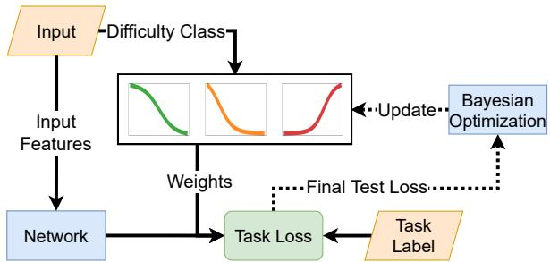  
Figure 1: The model defines a difficulty score based on prior knowledge about sample difficulty and assigns samples to k difficulty groups before training, e.g., easy, medium, and hard for k = 3. A curriculum is defined for each difficulty group, which dynamically weights sample losses according to their difficulty groups. Each curriculum is defined by a pair of parameters (r, s) that will be optimized to discover an optimized curriculum based on sample difficulty and model behavior.

## 3 Curriculum Discovery Framework

We consider the training dataset $\begin{array} { r l } { \mathcal { D } } & { { } = } \end{array}$ $\left\{ ( \mathbf { x } _ { 1 } , y _ { 1 } ) , \dotsc , ( \mathbf { x } _ { n } , y _ { n } ) \right\}$ of size n, where $\mathbf { x } _ { i }$ denotes the ith training sample with the groundtruth label $y _ { i }$ and $\psi \in [ 0 , 1 ] ^ { n }$ indicates the initial difficulty estimates of training samples, see §3.4. The data is initially clustered into k groups of increasing difficulty, e.g. {easy, medium, hard} groups for $k = 3$ , which can be achieved using difficulty score percentiles or 1-dimensional K-means applied to $\psi .$ As Figure 1 shows, the framework develops a separate parameterized weight function for each difficulty group (§3.1), and dynamically weights training samples and adjust their difficulty groups according to the training progress of the downstream model (§3.2). Specifically, at training iteration t, the weighted loss $\hat { l } _ { i }$ for sample i of the difficulty group $c \in \{ 1 , \ldots , k \}$ will be computed as follows:

$$
\begin{array} { r } { \hat { l } _ { i } = w ( t ; r _ { c } , s _ { c } ) \times l _ { i } , } \end{array}\tag{1}
$$

where $l _ { i }$ is the instantaneous loss of sample i, and $w ( t ; r _ { c } , s _ { c } )$ is the weight of sample ¿ in its difficulty group c at training iteration t, with class-specific weight function parameters $r _ { c }$ and $s _ { c }$ (see below).

## 3.1 Monotonic Curricula

We define a curriculum using the generalized logistic function (Richards, 1959) of the form:

$$
w ( t ; r , s ) = \frac { 1 } { 1 + \exp ( - r \times ( t - s ) ) } ,\tag{2}
$$

where $r \in \textbf { R }$ is the rate-of-change parameter, which specifies how fast the weight can increase $( r > 0 )$ or decrease $( r < 0 ) ; t \in [ 0 , 1 ]$ is the training progress (typically iteration number divided by max iterations); and $s \in \textbf { R }$ shifts the pivot weight of the logistic function $( w ( . ) = . 5 )$ to the left or right such that at $t = s$ the weight is 0.5. Figure 2a illustrates the effect of these parameters. Greater absolute values for the rate parameter enforce faster rates of change in weights, while greater values of the shift parameter enforce longer delays in reaching the pivot weight of 0.5. These parameters provide flexibility in controlling sample weights during training, which is key for deriving effective curricula. The above function can approximate existing predefined curricula. For example, Figure 2b shows a specific configuration for the logistic functions for standard CL (Bengio et al., 2009), where training starts with easier samples and gradually proceeds with harder ones.

## 3.2 Non-monotonic Curricula

Although the generalized logistic function in (2) can lead to effective curricula, monotonic functions are limited in their coverage capacity. For example, they do not allow easy samples with low weights to become important again (receive high weights) at later stages of training to mitigate forgetting, which is a major challenge for effective curriculum learning (Toneva et al., 2019; Zhou et al., 2020).

We address this challenge by extending the framework to non-monotonic curricula, where samples can move between difficulty classes based on their learning progress during training. We quantify learning progress for training samples based on the deviation of their losses from the average losses of their corresponding difficulty groups. At every iteration, samples with loss values greater than the average are promoted to their immediate higher difficulty groups and the rest are demoted to their immediate lower difficulty groups. These movements allow monotonic weight functions result in non-monotonic and multimodal weight trajectories for training samples, which improves the search capability of our framework and addresses the forgetting challenge.

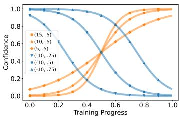

(a) Effect of rate/shift parameters.  
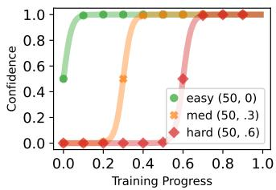  
(b) Easy to Hard Curriculum.  
Figure 2: Generalized logistic functions for curriculum discovery. (a) shows the effect of the rate and $s h i f t$ shift parameters, $( r , s )$ in (2), shown in the legend respectively. (b) is a specific parameter configuration for a curriculum that first introduces easier samples to a model, and then medium and hard samples as training progresses.

## 3.3 Parameter Optimization

We find the optimal curriculum parameters $( r , s )$ for each difficulty group using the Tree-structured Parzen Estimator (TPE) algorithm (Bergstra et al., 2011; Akiba et al., 2019), which, unlike the grid or random search, traverses the parameter space by estimating the parameters that are most probable to perform better on a trial. Using this method, we can learn data-driven curricula beyond what could be manually designed through empirical settings or choices among the limited ordering strategies.

The discovered curricula are optimal within our search space, as defined by the weight functions and searchable parameters. However, in practice, we observed that the change in performance across the missing regions in the search space is minor. Given that our weight functions can approximate other curricula learned by existing CL models, see §4.7, we expect the optimum curriculum within our search space closely approximates the optimal curriculum for each dataset and model pair.

## 3.4 Prior Knowledge of Difficulty

Annotation entropy is a natural measure of difficulty (for humans) and may serve as a reliable difficulty metric for models. Entropy of each sample $x _ { i }$ is calculated as $- \sum _ { l } p _ { c }$ log $p _ { c }$ (Shannon, 1948), where c is a class category and $p _ { c }$ is the fraction of annotators who chose label c for the sample. The use of entropy is supported in (Nie et al., 2020a), reporting a consistent positive correlation between model accuracy and level of human agreement.

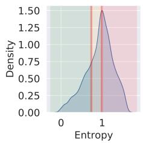  
(a) ChaosNLI Entropy

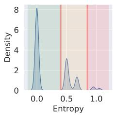  
(b) SNLI Entropy

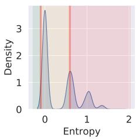

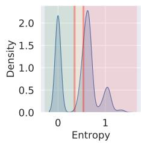

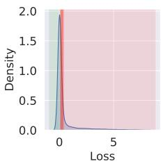  
(e) ChaosNLI Loss

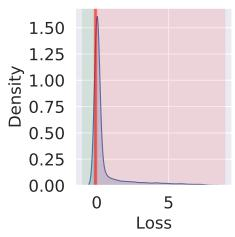  
(f) SNLI Loss

(d) Reddit Entropy  
(c) Twitter Entropy  
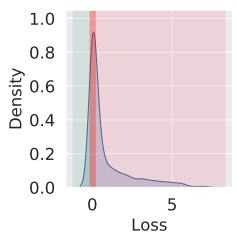  
(g) Twitter Loss

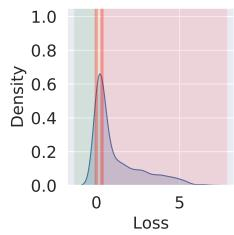  
(h) Reddit Loss  
Figure 3: Distributions of entropy and loss in our datasets. Samples of the easy class are to the left of the first vertical line and shaded in green, those of the medium class are between the two vertical lines and shaded in orange, and samples of the hard class are to the right of the second line and shaded in red.

Furthermore, moving average of a sample's instantaneous loss is a good metric for difficulty (Zhou et al., 2020). Using a baseline model trained with no curriculum and with default hyperparameters, we collect the loss values of all training instances at intervals of 0.5 epochs and use the average loss as prior knowledge about sample difficulty. We obtain twenty observations of the loss and compute the average for each sample.

Figure 3 shows the distributions of entropy and loss, and examples of data partitions across four datasets. Most datasets are highly imbalanced across difficulty groups, often containing more easier samples than harder ones. Such data disparities would perhaps explain why computational models can achieve human-level performance on complex NLP tasks or recent results reporting neural models being largely invariant to random word order permutation of data (Sinha et al., 2021).

We acknowledge that while multiple annotations per sample may not be readily available for many NLP datasets, such annotations were collected for most NLP datasets at their dataset development time. Our work shows that such information can be used to find effective curricula for NLP models and encourages dataset creators to publish their full annotation information. In addition, our curriculum discovery framework is independent of annotation information. In fact, we evaluated our approach with both annotation entropy and loss as two choices for sample-level difficulty estimation.

## 4 Experiments

## 4.1 Datasets

For the purpose of our experiments, we chose datasets for which several annotations per sample are available. Such annotator-level information is often available at the creation time of most NLP datasets and provide rich information for effective learning. Before training, we partition each dataset into k difficulty groups using { k }i= quantiles.

SNLI (Bowman et al., 2015). The Stanford Natural Language Inference (SNLI) benchmark (Bowman et al., 2015) contains 36.7k and 2.6k samples annotated by 5 and 4 workers respectively, which we refer to as SNLI full in our experiments.

ChaosNLI (Nie et al., 2020b) contains 100 annotations per sample for about 1.5K development samples of SNLI and MNLI (Williams et al., 2018). We use these samples as training data, the remaining 8.5K development samples of SNLI as development set, and the test set of SNLI as test set.

Twitter (Amiri et al., 2018). This dataset has been developed to obtain population-level statistics of alcohol use reports through social media. It contains more than 9k tweet, annotated by at least three workers for report of first-person alcohol use, intensity of the drinking (light vs. heavy), context of drinking (social vs. individual), and time of drinking (past, present, or future). We define a multi-class classification task for this dataset based on the above categories, see the data distribution in Appendix A. We randomly split the data into 5.4k, 1.8k and 1.8k training, development and test sets.

Reddit. We developed this dataset to obtain population-level statistics of cancer patients. It contains 3.8k Reddit posts annotated by at least three annotators for relevance to specific cancer types. We define a multi-class classification task based on post relevance and cancer type, see Appendix A. We randomly split the data into 2.2k, 765, and 765 training, development and test sets respectively.

ChaosNLI is balanced in its difficulty groups. We create difficulty-balanced versions of SNLI, Twitter and Reddit by collecting an equal number of samples from each difficulty group. The resulting datasets contain 1.7K to 2.3K samples.

## 4.2 Baselines

No-CL The conventional training approach, which involves utilizing all samples for training in each iteration.

Self-paced Learning (SPL) (Kumar et al., 2010) weights instances based on their difficulty to the model by optimizing the following objective:

$$
\mathcal { L } ( \mathcal { D } ; \theta ) = \arg \operatorname* { m i n } _ { \pmb { v } } \sum _ { i } ^ { n } v _ { i } l _ { i } + f ( \pmb { v } ; \lambda ) ,\tag{3}
$$

where $l _ { i }$ is the loss of instance i parameterized by $\theta ,$ $v _ { i }$ is a trainable weight parameter assigned to each instance, and $f$ is a regularization function for the weights. The model finds v that minimizes its loss under the constraint of $f .$ The binary scheme SPL is defined by the regularization function $f ( \mathbf { v } ; \lambda ) =$ $- \lambda \| \mathbf { v } \| _ { 1 } ; \mathrm { i f } l _ { i } < \lambda , v _ { i } = 1$ , otherwise $v _ { i } = 0 , { \mathrm { i . e . } }$ only easy samples are selected at each step.

Mentornet (Jiang et al., 2018) uses an auxiliary network to weight samples at every iteration. The network takes as input recent loss history, running mean of the loss, current epoch number (to account for training progress), and target labels. The network consists of an LSTM layer to encode the k steps of loss, embedding matrices for the target label and epoch number; a fully connected layer; and a final sigmoid layer. The sigmoid layer outputs weights of samples for training.

Difficulty Prediction (DP) (Yang et al., 2019) defines sample difficulty as follows:

$$
d _ { i } = \frac { \sum _ { j = 1 } ^ { l _ { i } } f ( y _ { i } ^ { ( j ) } , \hat { y } _ { i } ) } { l _ { i } } ,\tag{4}
$$

where $\hat { y } _ { i }$ is the ground truth label and f measures the Spearman's rank correlation coefficient between labels produced by experts and non-experts. The model re-weights samples for performance improvement using a pre-defined threshold τ,:

$$
1 - \alpha \frac { d _ { i } - \tau } { 1 - \tau } .\tag{5}
$$

SuperLoss (SL) (Castells et al., 2020) uses the following function to estimate sample weights:

$$
\mathcal { L } _ { \lambda } = \left( l _ { i } - \tau \right) \sigma _ { i } + \lambda ( \log \sigma _ { i } ) ^ { 2 } ,\tag{6}
$$

where τ is the moving average of loss (as the measure of difficulty) and σ is sample confidence. The model emphasizes easy samples (those with small losses) throughout the training.

Our approach employs two difficulty scoring functions and two curriculum types for each dataset. The difficulty scoring functions are Loss and Ent (entropy) described in §3.4. The first curriculum type (inc) is the off-the-shelf gradually increasing approach in Figure 2b, which is rapidly computed and applied to all models, resulting in Ent(inc) and Loss(inc) approaches. The non-monotonic version of the inc curriculum (§3.2) are labeled Ent+(inc) and Loss+(inc). The second curriculum type (sp, for specialized) is obtained through the proposed optimization approach (§3.3) that finds optimal curricula for each model and dataset, resulting in Ent(sp) and Loss(sp).

## 4.3 Settings

We use bayesian optimization to tune the parameters λ of SL and α and τ of DP on development data. The optimal values found are $\lambda \ = \ 1 . 2 .$ $\alpha = 0 . 9$ and $\tau$ is set dynamically upon loading the dataset to the 50 percentile difficulty value of the training data. We use twitter-roberta-base for Twitter and roberta-base for other datasets, both from (Wolf et al., 2020). We set learning rate to $1 \times 1 0 ^ { - 5 }$ , batch size to 16, epochs to 10 (we confirm that this number of iterations is sufficient for all models to converge), and use Adam optimizer (Kingma and Ba, 2017). The checkpoint with the best performance is used for testing. For each experiment, we train the model using five random seeds and report standard error.

<table><tr><td></td><td colspan="3">Full</td><td colspan="5">Difficulty Balanced</td></tr><tr><td></td><td>SNLI</td><td>Twitter</td><td>Reddit</td><td>ChaosNLI</td><td>SNLI</td><td>Twitter</td><td>Reddit</td><td>Avg</td></tr><tr><td>Ent (sp)</td><td> $\mathbf { 8 8 . 3 \ : \pm 0 . 0 4 }$ </td><td> $7 9 . 1 \pm 0 . 1 5$ </td><td> $7 3 . 5 \pm 0 . 2 2$ </td><td> $7 8 . 3 \pm 0 . 4 9$ </td><td> $8 0 . 6 \pm 0 . 1 6$ </td><td> $7 6 . 7 \pm 0 . 1 4$ </td><td> $7 2 . 4 \pm 0 . 4 6$ </td><td>78.4</td></tr><tr><td>Ent (inc)</td><td> $8 8 . 0 \pm 0 . 0 5$ </td><td> $7 9 . 4 \pm 0 . 1 1$ </td><td> $7 3 . 5 \pm 0 . 2 1$ </td><td> $7 7 . 5 \pm 0 . 6 4$ </td><td> $8 0 . 6 \pm 0 . 2 5$ </td><td> $7 6 . 7 \pm 0 . 1 7$ </td><td> $7 1 . 1 \pm 0 . 2 2$ </td><td>78.0</td></tr><tr><td>Ent+ (inc)</td><td> $8 8 . 0 \pm 0 . 1 7$ </td><td> $\mathbf { 7 9 . 7 \ : \pm 0 . 1 7 }$ </td><td> $7 3 . 9 \pm 0 . 2 1$ </td><td> $7 7 . 8 \pm 0 . 3 9$ </td><td> $7 7 . 9 \pm 2 . 1 0$ </td><td> $7 7 . 2 \pm 0 . 1 8$ </td><td> $7 2 . 9 \pm 0 . 2 8$ </td><td>78.2</td></tr><tr><td>Loss (sp)</td><td> $8 8 . 0 \pm 0 . 0 5$ </td><td> $7 9 . 3 \pm 0 . 1 7$ </td><td> $7 2 . 6 \pm 0 . 2 3$ </td><td> $7 6 . 8 \pm 0 . 9 0$ </td><td> ${ \bf 8 1 . 4 \_ 0 . 1 6 }$ </td><td> $7 7 . 0 \pm 0 . 1 6$ </td><td> $7 3 . 0 \pm 0 . 6 1$ </td><td>78.3</td></tr><tr><td>Loss (inc)</td><td> $8 7 . 9 \pm 0 . 0 6$ </td><td> $7 8 . 9 \pm 0 . 1 1$ </td><td> $7 2 . 7 \pm 0 . 1 6$ </td><td> $7 4 . 7 \pm 0 . 8 6$ </td><td> $8 0 . 8 \pm 0 . 3 7$ </td><td> $7 5 . 7 \pm 0 . 1 9$ </td><td> $7 1 . 7 \pm 0 . 6 9$ </td><td>77.5</td></tr><tr><td>Loss+ (inc)</td><td> $8 7 . 8 \pm 0 . 0 9$ </td><td> $7 8 . 6 \pm 0 . 3 1$ </td><td> $7 2 . 3 \pm 0 . 4 8$ </td><td> $7 4 . 0 \pm 1 . 2 6$ </td><td> $7 9 . 0 \pm 0 . 9 1$ </td><td> $7 6 . 6 \pm 0 . 3 6$ </td><td> ${ 7 3 . 0 \pm 0 . 3 4 }$ </td><td>77.3</td></tr><tr><td>DP</td><td> $8 8 . 1 \pm 0 . 0 6$ </td><td> $7 8 . 5 \pm 0 . 1 2$ </td><td> $7 3 . 0 \pm 0 . 2 4$ </td><td> $7 6 . 4 \pm 0 . 2 2$ </td><td> $7 9 . 6 \pm 0 . 3 6$ </td><td> $7 6 . 1 \pm 0 . 1 5$ </td><td> $7 1 . 5 \pm 0 . 3 5$ </td><td>77.6</td></tr><tr><td>SL</td><td> $8 8 . 0 \pm 0 . 0 7$ </td><td> $7 8 . 6 \pm 0 . 1 3$ </td><td> $7 3 . 1 \pm 0 . 2 4$ </td><td> $7 7 . 3 \pm 0 . 5 3$ </td><td> $7 8 . 2 \pm 0 . 4 8$ </td><td> $7 6 . 0 \pm 0 . 1 5$ </td><td> $7 0 . 7 \pm 0 . 4 1$ </td><td>77.4</td></tr><tr><td>MentorNet</td><td> $8 7 . 7 \pm 0 . 1 8$ </td><td> $7 8 . 2 \pm 0 . 1 2$ </td><td> $7 3 . 1 \pm 0 . 2 3$ </td><td> $7 6 . 0 \pm 0 . 0 0$ </td><td> $7 9 . 0 \pm 0 . 6 9$ </td><td> $7 6 . 3 \pm 0 . 1 6$ </td><td> $7 1 . 1 \pm 0 . 4 8$ </td><td>77.3</td></tr><tr><td>No-CL</td><td> $8 7 . 9 \pm 0 . 0 7$ </td><td> $7 8 . 6 \pm 0 . 1 2$ </td><td> $7 3 . 3 \pm 0 . 2 0$ </td><td> $7 6 . 2 \pm 0 . 2 7$ </td><td> $7 9 . 4 \pm 0 . 3 2$ </td><td> $7 6 . 4 \pm 0 . 1 6$ </td><td> $7 0 . 8 \pm 0 . 2 6$ </td><td>77.5</td></tr></table>

Table 1: Loss and Ent indicate curricula that partition the data based on $k = 3$ difficulty groups determined by loss and entropy respectively, see §3.4. inc is the easy to hard curriculum shown in Figure 2b. $s p$ is the specialized curriculum obtained by curriculum discovery, see §3.3, which is different for each dataset.

In addition, we set the search space for the rate (r) and shift (s) parameters to [—10, 10] with a step of 2 and [—0.5, 1.5] with a step of 0.25 respectively. The search is run for at least 100 trials using the method described in (§3.3). Each trial is run with three seeds and the result is averaged. The search objective is to maximize accuracy over development data. The trial number in which the best parameters are found is reported in Appendix C. We only search for curricula with three difficulty groups to ease interpretability and improve readability, and to minimize the number of search parameters. However, in case of inc curriculum, the optimal number of difficulty groups for ChaosNLI, SNLI, Twitter, Reddit are 12, 3, 28, and 12 respectively; in all cases, we tune the number of groups on the development set and evaluate on the best performing one. Appendix B includes the results of tuning the number of groups.

## 4.4 Curriculum Discovery Improves Models

model. The results also show that non-monotonic curricula (Ent+, Loss+) can further improve the performance; we attribute this result to the ability of the non-monotonic curricula to dynamically adjust the difficulty of samples according to model behavior as training progresses, allowing easier or harder samples to the model accumulate in the easier and harder difficulty groups. The performance improvement is more pronounced on the difficulty balanced datasets compared to full datasets, which can be attributed to the balanced nature or smaller size of these datasets.

Table 1 shows that the gradually increasing curriculum using entropy, Ent (inc), achieves better accuracy than No-CL and other baselines, and the difference is significant. The gain is often greater with more than 3 difficulty groups, see detail results in Figure 8, Appendix B. Both (inc) and the specialized (sp) curricula often perform better than the baselines. On average, entropy as scoring function performs better than loss, indicating prior knowledge based on difficulty to humans is useful to the

## 4.5 Discovered Curricula Are Non-monotonic

Figure 4 shows the mean and 95% CI of the top 25 performing curricula. The resulting curricula are non-monotonic and greatly differ from the known strategies reported in literature, such as gradually increasing difficulty or anti-curriculum. In addition, the weights of hard samples tend to decrease, supporting the hypothesis that these instances may be too difficult or noisy for models to learn. In addition, in SNLI and Twitter easy samples often carry the most significant weight, unlike Reddit, where easy samples are often down-weighted early during the training. These weighting patterns reveal the relative importance of samples in each dataset. Finally, the full SNLI dataset with entropy partitions provides useful information. In Figure 4c, hard samples are assigned weights around 0.5, unlike the three other cases of SNLI. We attribute this result to the reduced presence of hard samples (skewed entropy in Figure 3b).

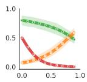

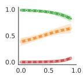  
(a) S-D-E

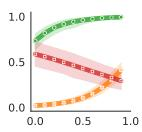

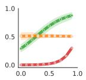

(b) S-D-L  
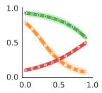

(c) S-F-E  
(d) S-F-L  
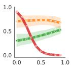

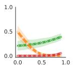

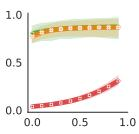

(e) T-D-E  
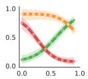

(f) T-D-L  
(g) T-F-E  
(h) T-F-L  
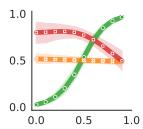

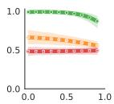  
(i) R-D-E

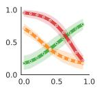

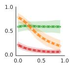

(j) R-D-L  
(k) R-F-E  
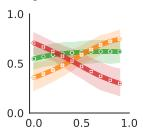  
(1) R-F-L  
(m) C-D-E  
(n) C-D-L  
Figure 4: Each caption is composed of the first character of the name of a dataset: {ChaosNLI, SNLI, Twitter, Reddit}, followed by the type of the dataset {Difficulty-balanced or Full}, and the difficulty score used {Entropy, Loss} in experiments. The x-axis is the training progress and y-axis is the confidence assigned to samples of a difficulty-class. The green line (circle marker) is easy, orange line (x marker) is medium, and red line (diamond marker) is hard. The solid line is the mean of the top 25 performing configurations for each dataset and scoring function pair, and the shaded area represents the 95% CI.

## 4.6 Discovered Curricula Are Generalizable

Figure 5 shows the accuracy obtained when the topperforming discovered curriculum for one dataset (from Figure 4) is applied to other datasets. Each cell is the average result of 5 seeds. We observe common characteristics among datasets that cause the curriculum to be transferable between them. First, the top generalizable configuration is obtained from ChaosNLI, the dataset with the richest inter-annotator entropy signal. Therefore, the quality of the difficulty score is important to the discovery of an effective curriculum. Second, the inc configuration is among the most generalizable configurations, with no added cost in its creation. Third, the curricula obtained using the small, down-sampled difficulty-balanced datasets generalize well and achieve high performance on the large datasets. This is useful as curriculum discovery is much faster on smaller datasets, and the framework can be applied to large datasets by searching for a curriculum on a small subset of the data, mitigating the computational expenses of using full datasets. Fourth, as noted previously, instances of the Reddit dataset consist of long paragraphs, causing high variance in models trained using the dataset. Consequently, the curricula obtained using the Reddit and loss as measure of difficulty are of lower quality and perform poorly. Appendix D reports the results of all configurations.

<table><tr><td rowspan=3 colspan=1>Curriculum</td><td></td><td></td><td></td></tr><tr><td rowspan=2 colspan=1>82M</td><td rowspan=2 colspan=1>125M</td><td></td></tr><tr><td rowspan=1 colspan=1>406M</td></tr><tr><td rowspan=1 colspan=1>No-CLBest baseline</td><td rowspan=1 colspan=1> $6 3 . 9 \pm 0 . 1 3$  $6 4 . 7 \pm 0 . 3$ </td><td rowspan=1 colspan=1> $7 6 . 2 \pm 0 . 2 7$  $7 7 . 3 \pm 0 . 5 3$ </td><td rowspan=1 colspan=1> $8 0 . 0 \pm 0 . 4 1$  $8 1 . 9 \pm 0 . 8 6$ </td></tr><tr><td rowspan=1 colspan=1>Ent (sp) 82MEnt (sp) 125MEnt (sp) 406M</td><td rowspan=1 colspan=1> ${ \bf 6 7 . 4 \pm 0 . 2 5 }$ </td><td rowspan=1 colspan=1> $7 8 . 4 \pm 0 . 4 6$  $7 8 . 3 \pm 0 . 4 9$ </td><td rowspan=1 colspan=1> $8 1 . 5 \pm 0 . 5 0$  ${ \bf 8 2 . 6 \pm 0 . 3 9 }$  $8 2 . 3 \pm 0 . 5 4$ </td></tr></table>

Table 2: Transferability of the specialized curricula discovered for small models to large models on ChaosNLI. “Best baseline" shows the best performance obtained by baselines (DP, SL, Mentornet). “Ent (sp) n" indicates the curriculum discovered on the model with n parameters. Column headers indicate the model trained using the discovered curricula of the corresponding rows.

Table 2 shows the transferability of discovered curricula across model sizes. We consider three models with increasing sizes applied to ChaosNLI: distilroberta-base with 82M parameters, roberta-base with 125M parameters, and bart-large with 406M parameters. The results show that the curricula discovered for small models are transferable to larger models, with significant improvement over No-CL and other CL baselines. In particular, we observe greater transferability for smaller model sizes, which indicates curriculum discovery is more beneficial to smaller models than larger (more robust) models. In some cases, the curricula discovered for smaller models perform better than those discovered for larger models, see Ent(sp) 82M and 125M. This is because curriculum discovery is less expensive on smaller models, allowing better exploration of curriculum space to find better curricula.

Figure 6 shows the curricula obtained using models of different sizes. The three curricula are similar in their relative treatment of difficulty groups: samples from the easy class are assigned higher weights than those from the medium class, and medium samples receive higher weights than hard samples. In addition, hard samples are considerably down-weighted, which indicates deemphasizing hard samples during training can lead to better results on the test data of ChaosNLi.

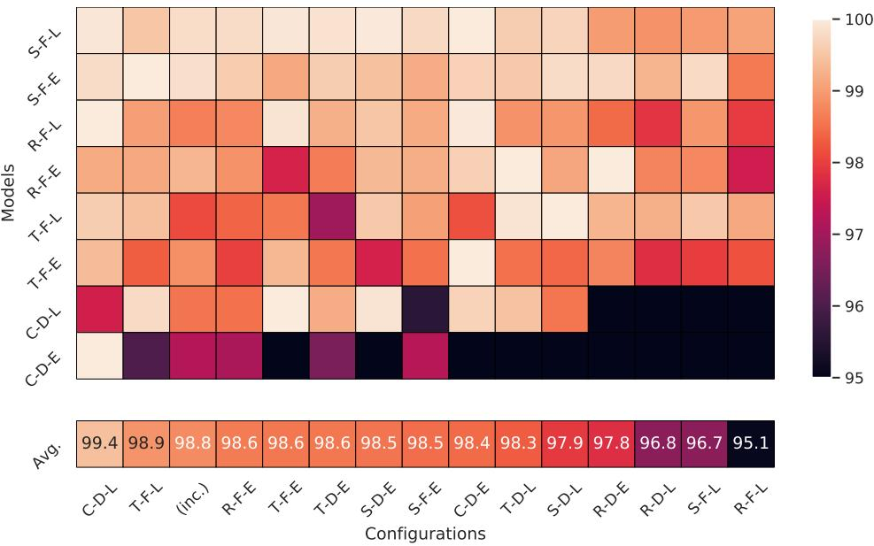  
Figure 5: Notation is the same as Figure 4: {ChaosNLI, SNLI, Twitter, Reddit}, followed by the type of the dataset {Difficulty-balanced or Full}, and the difficulty score used {Entropy, Loss }. The x-axis lists curricula discovered using a particular dataset and scoring function, and the increasing curriculum inc (Figure 2b). The y-axis lists models that are trained using each curriculum. For example, the cell at the intersection of row "S-F-L" and column "T-F-E" represents a model trained on SNLI full partitioned by loss, using the curriculum discovered for the full Twitter dataset partitioned by entropy (Figure 4g). Each row of the Table is normalized to match the scales of different models (after normalization, the max of each row is 100)

## 4.7 Potential to Encompass Existing Models

The framework presented in this paper is capable of representing curriculum learning approaches that prune noisy data, e.g. (Northcutt et al., 2021), use different sub-samples of data during training, e.g. (Xu et al., 2020), and re-weight loss according to sample difficulty, choosing to emphasize either easy or hard samples, e.g. (Castells et al., 2020).

First, data pruning can be achieved by assigning negative values to the rate and shift parameters in our framework, r and s in (1), which cause the weights to approach zero before training begins. Second, data sub-sampling can be represented by “inc" in Figure 2b. Third, approaches that estimate sample confidence based on loss (Castells et al., 2020; Felzenszwalb et al., 2009; Kumar et al., 2010; Jiang et al., 2015; Zhou et al., 2020) tend to generate monotonic curves over the course of training because training loss tends to be non-increasing at every step. Figure 7 shows the confidence scores assigned to our data by three loss re-weighting approaches. The results are generated by our implementations of the three approaches, where each model runs with five random seeds. The partitioning of easy, medium, and hard is according to the entropy, as described in §3.4. We record the average weight assigned to each group. The result is averaged over all the runs, and the shaded area indicates the 95% confidence interval (CI). The results show that the confidence scores assigned by these approaches follow a monotonic curve that can be approximated by our curriculum discovery framework. We note that although the weight scale of SuperLoss (Castells et al., 2020) in Figure 7a is larger than one, this model can still be represented by our framework because the increased scale corresponds to scaling of the learning rate, as shown:

$$
\begin{array} { l } { \displaystyle \theta _ { t } = \theta _ { t - 1 } - \eta \nabla \frac { 1 } { n } \sum _ { i } \sigma _ { i } l _ { i } } \\ { \displaystyle = \theta _ { t - 1 } - ( \eta \cdot \sigma _ { m a x } ) \nabla \frac { 1 } { n } \sum _ { i } \frac { \sigma _ { i } } { \sigma _ { m a x } } l _ { i } , } \end{array}\tag{7}
$$

where $l _ { i }$ and $\sigma _ { i }$ are the instantaneous loss and confidence of sample i respectively. Therefore, the proposed framework can also represent CL approaches with a confidence scale larger than one.

## 5 Conclusion and Future Work

We introduce an effective curriculum learning framework that employs prior knowledge about sample difficulty in its training paradigm for curriculum discovery. The proposed framework initially partitions its input data into several groups of increasing difficulty, defines parameterized functions to weight sample losses in each difficulty group, moves samples across difficulty groups based on their learning progress, and enables tuning the parameters of the weight function to discover novel curricula. We demonstrate that this framework is capable of representing several categories of curriculum learning approaches. The task of curriculum discovery alleviates the limitations imposed by selecting a single curriculum strategy, and instead, focuses on finding and analyzing different curricula that work equally-well for a given model and dataset. In addition, the discovered curricula provide insight into how different portions of the dataset contribute toward learning at different stages of training a model, which, in turn, provide knowledge about the learning dynamics of different models. The task of curriculum discovery could be costly on large datasets, in particular, when the goal is to find optimal curricula for different models and datasets. To mitigate the computational cost, we show that it is possible to rapidly discover a curriculum on a small subset of the dataset (or a smaller version of the model with significantly less number of parameters) and apply the resulting curriculum to the full dataset.

(c) HNM (Felzenszwalb et al., 2009)  
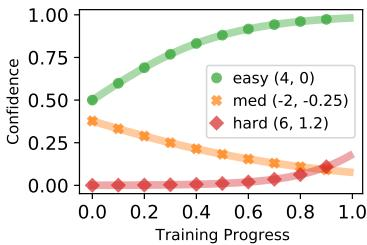

(a) 82M Parameter Model  
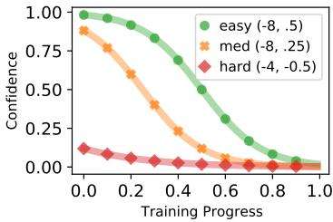

(b) 125M Parameter Model  
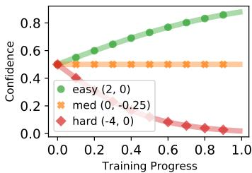  
(c) 406M Parameter Model  
Figure 6: Specialized curricula optimized on ChaosNLi using distilroberta (82M), roberta-base (125M), and facebook/bart-large (406M). The performances of each curriculum are reported in Table 2.

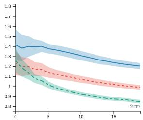

(a) SuperLoss (Castells et al., 2020)  
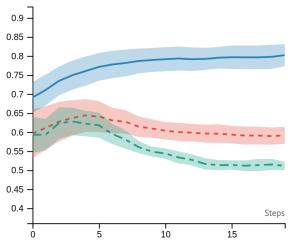

(b) Self-paced Learning (Kumar et al., 2010)  
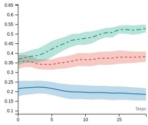  
Figure 7: Confidence assignment to samples in our datasets by three CL approaches. The x-axis is the epoch number, and y-axis is the average weight assigned to samples of each difficulty group. Blue (solid) is easy, orange (dashed) is medium, and green (dash-dot) is hard. The shaded area is the 95% CI over the datasets with five random seeds each. The curves are monotonic for most parts, and can be approximated by our framework.

There are several promising areas for future work. These include approaches for learning new difficulty indicators from data (e.g., linguistic difficulty including lexical, syntactic and semantic difficulty), prioritizing medium level instances and those with greatest progress during training, and developing challenge datasets that contain diverse data samples with different levels of difficulty. Finally, investigating diverse curricula that are suitable for general use and across datasets through curriculum discovery and generalization is a promising area for research.

## Limitations

The present work investigates the use of two sample difficulty scoring functions, human-induced annotation entropy and model-induced loss, for NLP models and datasets. The former requires the availability of multiple annotations per sample and the latter requires training an auxiliary model to compute sample instantaneous loss during the course of training. Our work does not provide a general solution to the choice or availability of good difficulty scoring functions. However, once such a function is available, our work presents solutions to the problem of finding high-performing curricula in curriculum space. Our approach, although effective at finding such curricula, requires a Bayesian search of its hyperparameters. We reduce these costs by finding curricula on smaller datasets and smaller models that can then be applied to corresponding larger datasets and models. Finally, the proposed method lacks theoretical analysis of the dynamic interactions between data, downstream models, and discovered curricula.

## References

Sweta Agrawal and Marine Carpuat. 2022. An imitation learning curriculum for text editing with nonautoregressive models. In Proceedings of the 60th Annual Meeting of the Association for Computational Linguistics (Volume 1: Long Papers), pages 7550– 7563, Dublin, Ireland. Association for Computational Linguistics.

Takuya Akiba, Shotaro Sano, Toshihiko Yanase, Takeru Ohta, and Masanori Koyama. 2019. Optuna: A nextgeneration hyperparameter optimization framework. In Proceedings of the 25th ACM SIGKDD international conference on knowledge discovery & data mining, pages 2623–2631.

Hadi Amiri, Kara M Magane, Lauren E Wisk, Guergana Savova, and Elissa R Weitzman. 2018. Toward large-scale and multi-facet analysis of first person alcohol drinking. In American Medical Informatics Association (AMIA).

Hadi Amiri, Timothy Miller, and Guergana Savova. 2017. Repeat before forgetting: Spaced repetition for efficient and effective training of neural networks. In Proceedings of the 2017 Conference on Empirical Methods in Natural Language Processing (EMNLP), pages 2401–2410, Copenhagen, Denmark. Association for Computational Linguistics.

Yoshua Bengio, Jérôme Louradour, Ronan Collobert, and Jason Weston. 2009. Curriculum learning. In ACM International Conference Proceeding Series,

volume 382, pages 1–8, New York, New York, USA. ACM Press.

James Bergstra, Rémi Bardenet, Yoshua Bengio, and Balázs Kégl. 2011. Algorithms for hyper-parameter optimization. Advances in Neural Information Processing Systems (NIPS), 24.

Samuel R Bowman, Gabor Angeli, Christopher Potts, and Christopher D Manning. 2015. A large annotated corpus for learning natural language inference. In Conference on Empirical Methods in Natural Language Processing, EMNLP 2015, pages 632–642. Association for Computational Linguistics (ACL).

Thibault Castells, Philippe Weinzaepfel, and Jerome Revaud. 2020. Superloss: A generic loss for robust curriculum learning. Advances in Neural Information Processing Systems (NeurIPS), 33.

Antoine Caubrière, Natalia Tomashenko, Antoine Laurent, Emmanuel Morin, Nathalie Camelin, and Yannick Estève. 2019. Curriculum-based transfer learning for an effective end-to-end spoken language understanding and domain portability. In 20th Annual Conference of the International Speech Communication Association (InterSpeech), pages 1198–1202.

Hong Chen, Yudong Chen, Xin Wang, Ruobing Xie, Rui Wang, Feng Xia, and Wenwu Zhu. 2021. Curriculum disentangled recommendation with noisy multifeedback. Advances in Neural Information Processing Systems, 34:26924–26936.

Dmitriy Dligach, Rodney Nielsen, and Martha Palmer. 2010. To annotate more accurately or to annotate more. In Proceedings of the Fourth Linguistic Annotation Workshop (LAW), pages 64–72.

Dumitru Erhan, Aaron Courville, Yoshua Bengio, and Pascal Vincent. 2010. Why does unsupervised pretraining help deep learning? In Proceedings of the thirteenth international conference on artificial intelligence and statistics, pages 201–208. JMLR Workshop and Conference Proceedings.

Pedro F Felzenszwalb, Ross B Girshick, David McAllester, and Deva Ramanan. 2009. Object detection with discriminatively trained part-based models. IEEE transactions on pattern analysis and machine intelligence, 32(9):1627–1645.

Carlos Florensa, David Held, Markus Wulfmeier, Michael Zhang, and Pieter Abbeel. 2017. Reverse curriculum generation for reinforcement learning. In Conference on robot learning, pages 482–495. PMLR.

Sheng Guo, Weilin Huang, Haozhi Zhang, Chenfan Zhuang, Dengke Dong, Matthew R Scott, and Dinglong Huang. 2018. Curriculumnet: Weakly supervised learning from large-scale web images. In Proceedings of the European Conference on Computer Vision (ECCV), pages 135–150.

Lu Jiang, Deyu Meng, Qian Zhao, Shiguang Shan, and Alexander G Hauptmann. 2015. Self-paced curriculum learning. In Twenty-Ninth AAAI Conference on Artificial Intelligence.

Lu Jiang, Zhengyuan Zhou, Thomas Leung, Li-Jia Li, and Li Fei-Fei. 2018. Mentornet: Learning datadriven curriculum for very deep neural networks on corrupted labels. In International Conference on Machine Learning (ICML), pages 2304–2313. PMLR.

Tero Karras, Timo Aila, Samuli Laine, and Jaakko Lehtinen. 2018. Progressive growing of gans for improved quality, stability, and variation. In International Conference on Learning Representations.

Diederik P. Kingma and Jimmy Ba. 2017. Adam: A method for stochastic optimization.

Julia Kreutzer, David Vilar, and Artem Sokolov. 2021. Bandits don't follow rules: Balancing multi-facet machine translation with multi-armed bandits. In Findings of the Association for Computational Linguistics: EMNLP 2021, pages 3190–3204, Punta Cana, Dominican Republic. Association for Computational Linguistics.

M Kumar, Benjamin Packer, and Daphne Koller. 2010. Self-paced learning for latent variable models. Advances in Neural Information Processing Systems (NIPS), 23:1189–1197.

John P. Lalor and Hong Yu. 2020. Dynamic data selection for curriculum learning via ability estimation. In Findings of the Association for Computational Linguistics: EMNLP 2020, pages 545–555, Online. Association for Computational Linguistics.

Adyasha Maharana and Mohit Bansal. 2022. On curriculum learning for commonsense reasoning. In Proceedings of the 2022 Conference of the North American Chapter of the Association for Computational Linguistics: Human Language Technologies, pages 983–992, Seattle, United States. Association for Computational Linguistics.

Pietro Morerio, Jacopo Cavazza, Riccardo Volpi, Rene Vidal, and Vittorio Murino. 2017. Curriculum dropout. In 2017 IEEE International Conference on Computer Vision (ICCV), pages 3564–3572. IEEE Computer Society.

Yixin Nie, Xiang Zhou, and Mohit Bansal. 2020a. What can we learn from collective human opinions on natural language inference data? In Proceedings of the 2020 Conference on Empirical Methods in Natural Language Processing (EMNLP), pages 9131–9143.

Yixin Nie, Xiang Zhou, and Mohit Bansal. 2020b. What can we learn from collective human opinions on natural language inference data? In Proceedings of the 2020 Conference on Empirical Methods in Natural Language Processing (EMNLP), pages 9131–9143.

Curtis Northcutt, Lu Jiang, and Isaac Chuang. 2021. Confident learning: Estimating uncertainty in dataset labels. Journal of Artificial Intelligence Research, 70:1373-1411.

Silviu Paun, Bob Carpenter, Jon Chamberlain, Dirk Hovy, Udo Kruschwitz, and Massimo Poesio. 2018. Comparing Bayesian models of annotation. Transactions of the Association for Computational Linguistics, 6:571–585.

Emmanouil Antonios Platanios, Otilia Stretcu, Graham Neubig, Barnabas Poczos, and Tom M Mitchell. 2019. Competence-based curriculum learning for neural machine translation. In Proceedings of the Conference of the North American Chapter of the Association for Computational Linguistics: Human Language Technologies, NAACL-HLT, pages 1162–1172.

FJ Richards. 1959. A flexible growth function for empirical use. Journal of experimental Botany (JXB), 10(2):290–301.

Nikolaos Sarafianos, Theodore Giannakopoulos, Christophoros Nikou, and Ioannis A Kakadiaris. 2017. Curriculum learning for multi-task classification of visual attributes. In Proceedings of the IEEE International Conference on Computer Vision Workshops, pages 2608–2615.

Shreyas Saxena, Oncel Tuzel, and Dennis DeCoste. 2019. Data parameters: A new family of parameters for learning a differentiable curriculum. Advances in Neural Information Processing Systems, 32:11095– 11105.

Burr Settles and Brendan Meeder. 2016. A trainable spaced repetition model for language learning. In Proceedings of the 54th annual meeting of the association for computational linguistics (volume 1: Long papers), pages 1848–1858.

Claude Elwood Shannon. 1948. A mathematical theory of communication. The Bell system technical journal, 27(3):379–423.

Lei Shu, Yiluan Guo, Huiping Wang, Xuetao Zhang, and Renfen Hu. 2021. The construction and application of Ancient Chinese corpus with word sense annotation. In Proceedings of the 20th Chinese National Conference on Computational Linguistics, pages 549– 563, Huhhot, China. Chinese Information Processing Society of China.

Koustuv Sinha, Prasanna Parthasarathi, Joelle Pineau, and Adina Williams. 2021. UnNatural Language Inference. In Proceedings of the 59th Annual Meeting of the Association for Computational Linguistics and the 11th International Joint Conference on Natural Language Processing (Volume 1: Long Papers), pages 7329–7346, Online. Association for Computational Linguistics.

Samarth Sinha, Animesh Garg, and Hugo Larochelle. 2020. Curriculum by smoothing. Advances in Neural Information Processing Systems, 33.

Mariya Toneva, Alessandro Sordoni, Remi Tachet des Combes, Adam Trischler, Yoshua Bengio, and Geoffrey J. Gordon. 2019. An empirical study of example forgetting during deep neural network learning. In 7th International Conference on Learning Representations, ICLR 2019, New Orleans, LA, USA, May 6-9, 2019. OpenReview.net.

Nidhi Vakil and Hadi Amiri. 2022. Generic and trendaware curriculum learning for relation extraction. In Proceedings of the 2022 Conference of the North American Chapter of the Association for Computational Linguistics: Human Language Technologies, pages 2202–2213, Seattle, United States. Association for Computational Linguistics.

Adina Williams, Nikita Nangia, and Samuel Bowman. 2018. A broad-coverage challenge corpus for sentence understanding through inference. In Proceedings of the 2018 Conference of the North American Chapter of the Association for Computational Linguistics: Human Language Technologies, Volume 1 (Long Papers), pages 1112–1122, New Orleans, Louisiana. Association for Computational Linguistics.

Thomas Wolf, Lysandre Debut, Victor Sanh, Julien Chaumond, Clement Delangue, Anthony Moi, Pierric Cistac, Tim Rault, Rémi Louf, Morgan Funtowicz, Joe Davison, Sam Shleifer, Patrick von Platen, Clara Ma, Yacine Jernite, Julien Plu, Canwen Xu, Teven Le Scao, Sylvain Gugger, Mariama Drame, Quentin Lhoest, and Alexander M. Rush. 2020. Transformers: State-of-the-art natural language processing. In Proceedings of the 2020 Conference on Empirical Methods in Natural Language Processing (EMNLP): System Demonstrations, pages 38–45, Online. Association for Computational Linguistics.

Xiaoxia Wu, Ethan Dyer, and Behnam Neyshabur. 2021. When do curricula work? In International Conference on Learning Representations (ICLR).

Benfeng Xu, Licheng Zhang, Zhendong Mao, Quan Wang, Hongtao Xie, and Yongdong Zhang. 2020. Curriculum learning for natural language understanding. In Proceedings of the 58th Annual Meeting of the Association for Computational Linguistics (ACL), pages 6095–6104.

Yinfei Yang, Oshin Agarwal, Chris Tar, Byron C Wallace, and Ani Nenkova. 2019. Predicting annotation difficulty to improve task routing and model performance for biomedical information extraction. In Proceedings of the Conference of the North American Chapter of the Association for Computational Linguistics: Human Language Technologies, NAACL-HLT, pages 1471–1480.

Omar Zaidan and Jason Eisner. 2008. Modeling annotators: A generative approach to learning from annotator rationales. In Proceedings of the 2008 conference on Empirical methods in natural language processing (EMNLP), pages 31–40.

Xuan Zhang, Pamela Shapiro, Gaurav Kumar, Paul McNamee, Marine Carpuat, and Kevin Duh. 2019. Curriculum learning for domain adaptation in neural machine translation. In Proceedings of the 2019 Conference of the North American Chapter of the Association for Computational Linguistics: Human Language Technologies (NAACL-HLT), pages 1903– 1915.

Tianyi Zhou and Jeff Bilmes. 2018. Minimax curriculum learning: Machine teaching with desirable difficulties and scheduled diversity. In International Conference on Learning Representations.

Tianyi Zhou, Shengjie Wang, and Jeff A Bilmes. 2020. Curriculum learning by dynamic instance hardness. Advances in Neural Information Processing Systems (NeurIPS), 33.

## A Data Categories Distribution

<table><tr><td>Class Count</td></tr><tr><td>(no) 5,325 (yes, light use, individual) 1,464</td></tr><tr><td>(yes, heavy use, individual) 964 (yes, not sure, individual) 457</td></tr><tr><td>(yes, heavy use, other) 423 (yes, heavy use, group) 284</td></tr><tr><td>(yes, light use, group) 161 Total 9,078</td></tr></table>

(a) Twitter

<table><tr><td>Class</td><td>Count</td></tr><tr><td>(irrelevant, no patient experience)</td><td>1,996</td></tr><tr><td>(relevant, breast cancer)</td><td>617</td></tr><tr><td>(relevant, colon cancer)</td><td>444</td></tr><tr><td>(relevant, brain cancer)</td><td>284</td></tr><tr><td>(irrelevant, none of the above) (irrelevant, other cancer types)</td><td>251</td></tr><tr><td>(irrelevant, news related to cancer)</td><td>162 70</td></tr><tr><td>Total</td><td>3,824</td></tr></table>

(b) Reddit  
Table 3: Statistics of the Twitter and Reddit datasets.

Table 3 shows the target class distributions of the Reddit and Twitter datasets.

## B Finer-grained Difficulty Classes

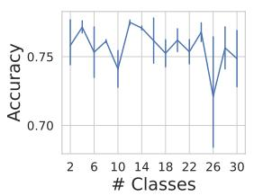  
(a) ChaosNLI.

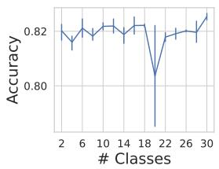  
(b) SNLI.

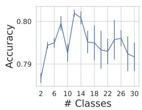  
(c) Twitter.

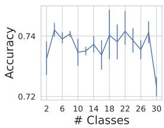  
(d) Reddit.  
Figure 8: Accuracy of models trained with the inc curriculum (see §4.2) and different number of difficulty classes.

Figure 8 shows the effect of different number of difficulty classes on he accuracy of models trained with our inc curriculum (see §4.2). The results show that the number of difficulty classes used is an important factor in our framework, and further tuning of this parameter can further improve the performance of our model.

## C Curriculum Search Computational Cost

<table><tr><td>Configuration</td><td>Number of trials (Avg. turnaround time per trial: 15 minutes)</td></tr><tr><td>S-F-E</td><td>87</td></tr><tr><td>S-F-L</td><td>111</td></tr><tr><td>S-B-E</td><td>135</td></tr><tr><td>S-B-L</td><td>75</td></tr><tr><td>T-F-E</td><td>139</td></tr><tr><td>T-F-L</td><td>73</td></tr><tr><td>T-B-E</td><td>106</td></tr><tr><td>T-B-L</td><td>44</td></tr><tr><td>R-F-E</td><td>61</td></tr><tr><td>R-F-L</td><td>73</td></tr><tr><td>R-B-E</td><td>69</td></tr><tr><td>R-B-L</td><td>112</td></tr><tr><td>C-D-E</td><td>36</td></tr><tr><td>C-D-L</td><td>70</td></tr><tr><td></td><td>71</td></tr><tr><td>C-D-E [82M parameter model]</td><td>69</td></tr><tr><td>C-D-E [406M parameter model]</td><td></td></tr></table>

Table 4: Number of trials for the best parameters found. The notation for configurations is the same as Figure 4.

With our experimental settings, it takes around 15 minutes on average to train a base model on our datasets of up to 3k samples using a single GPU. Therefore, a curriculum search take around 9 hours (36 trials) to around 35 hours (139 trials) using a single GPU.

## D Extended Configuration Generalizablity Experiments

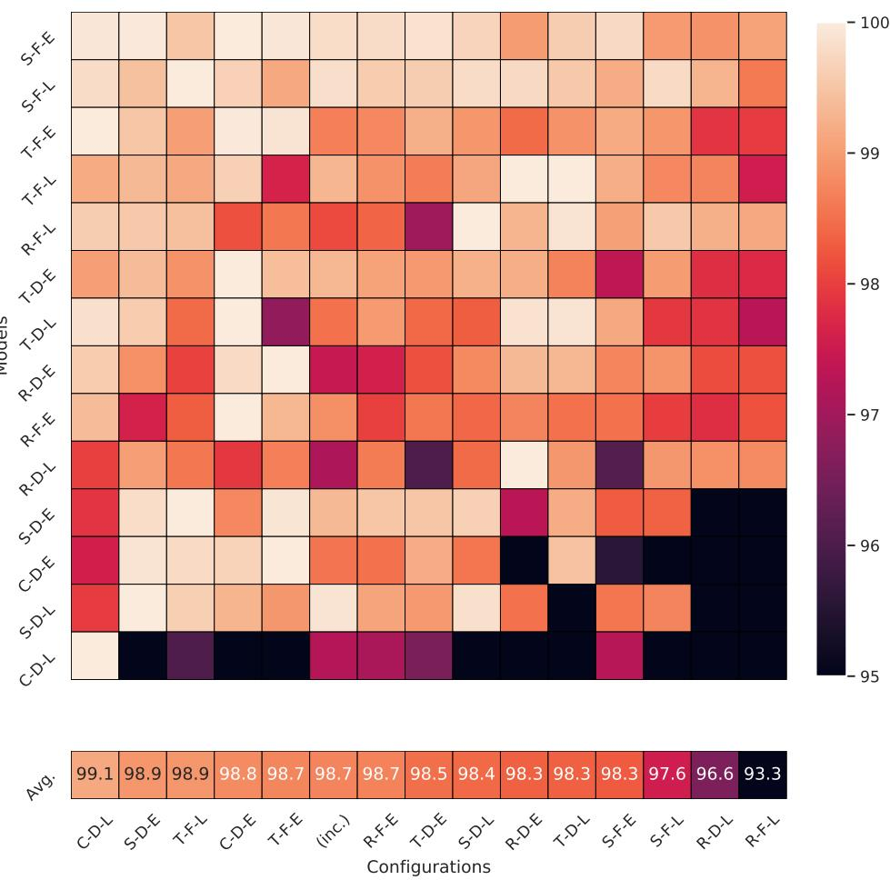  
Figure 9: An extended version of Figure 5 including experiments on balanced versions of the datasets.

Figure 9 shows the result of every model trained using every specialized curricula (and inc). We see that the generalizable curricula that are effective on small (down-sampled) datasets, also tend to perform well on large (full) datasets.

## ACL 2023 Responsible NLP Checklist

## A For every submission:

A1. Did you describe the limitations of your work? Left blank.

A2. Did you discuss any potential risks of your work? Left blank.

A3. Do the abstract and introduction summarize the paper's main claims? Left blank.

A4. Have you used AI writing assistants when working on this paper? Left blank.

B  Did you use or create scientific artifacts? Left blank.

B1. Did you cite the creators of artifacts you used? Left blank.

B2. Did you discuss the license or terms for use and / or distribution of any artifacts? Left blank.

B3. Did you discuss if your use of existing artifact(s) was consistent with their intended use, provided that it was specified? For the artifacts you create, do you specify intended use and whether that is compatible with the original access conditions (in particular, derivatives of data accessed for research purposes should not be used outside of research contexts)? Left blank.

B4. Did you discuss the steps taken to check whether the data that was collected / used contains any information that names or uniquely identifies individual people or offensive content, and the steps taken to protect / anonymize it? Left blank.

B5. Did you provide documentation of the artifacts, e.g., coverage of domains, languages, and linguistic phenomena, demographic groups represented, etc.? Left blank.

B6. Did you report relevant statistics like the number of examples, details of train / test / dev splits, etc. for the data that you used / created? Even for commonly-used benchmark datasets, include the number of examples in train / validation / test splits, as these provide necessary context for a reader to understand experimental results. For example, small differences in accuracy on large test sets may be significant, while on small test sets they may not be. Left blank.

## C  Did you run computational experiments?

Left blank.

C1. Did you report the number of parameters in the models used, the total computational budget (e.g., GPU hours), and computing infrastructure used? Left blank.

C2. Did you discuss the experimental setup, including hyperparameter search and best-found hyperparameter values? Left blank.

C3. Did you report descriptive statistics about your results (e.g., error bars around results, summary statistics from sets of experiments), and is it transparent whether you are reporting the max, mean, etc. or just a single run? Left blank.

C4. If you used existing packages (e.g., for preprocessing, for normalization, or for evaluation), did you report the implementation, model, and parameter settings used (e.g., NLTK, Spacy, ROUGE, etc.)? Left blank.

D  Did you use human annotators (e.g., crowdworkers) or research with human participants? Left blank.

D1. Did you report the full text of instructions given to participants, including e.g., screenshots, disclaimers of any risks to participants or annotators, etc.? Left blank.

D2. Did you report information about how you recruited (e.g., crowdsourcing platform, students) and paid participants, and discuss if such payment is adequate given the participants' demographic (e.g., country of residence)? Left blank.

D3. Did you discuss whether and how consent was obtained from people whose data you're using/curating? For example, if you collected data via crowdsourcing, did your instructions to crowdworkers explain how the data would be used? Left blank.

D4. Was the data collection protocol approved (or determined exempt) by an ethics review board? Left blank.

D5. Did you report the basic demographic and geographic characteristics of the annotator population that is the source of the data? Left blank.