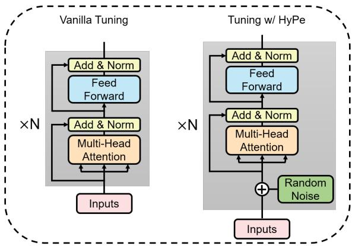
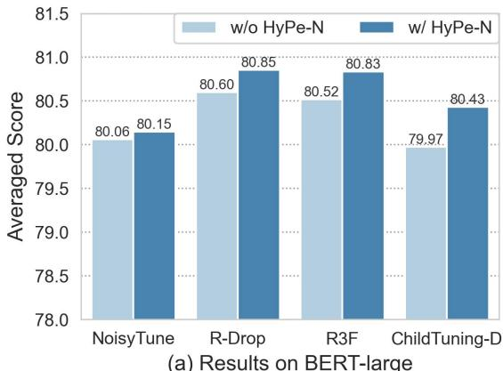
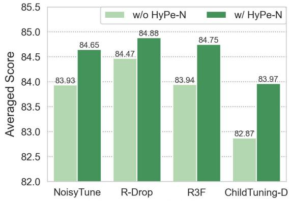
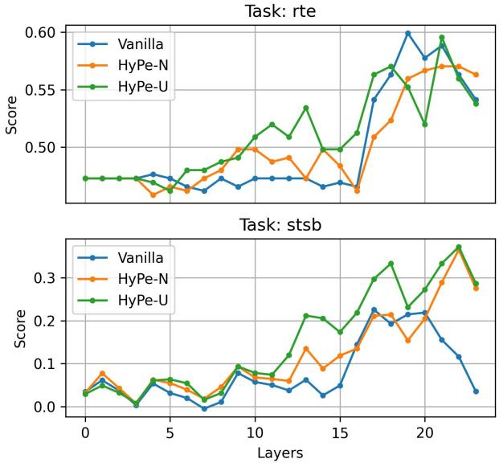
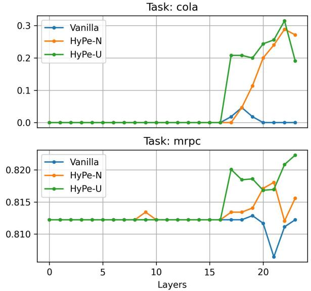
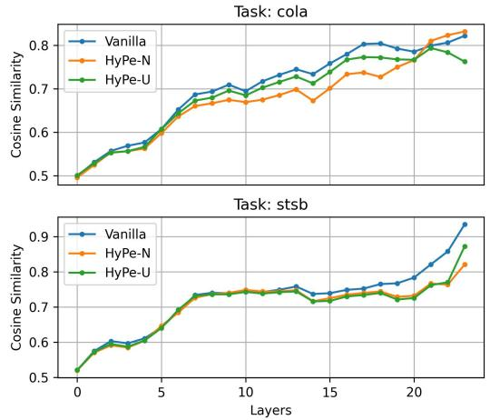
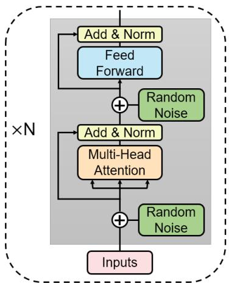

# HyPe: Better Pre-trained Language Model Fine-tuning with Hidden Representation Perturbation

Hongyi Yuan12∗, Zheng Yuan2, Chuanqi Tan2, Fei Huang2, Songfang Huang2

1Tsinghua University, 2Alibaba Group

yuanhy20@mails.tsinghua.edu.cn

{yuanzheng.yuanzhen,chuanqi.tcq,f.huang,songfang.hsf}@alibaba-inc.com

## Abstract

Language models with the Transformers structure have shown great performance in natural language processing. However, there still poses problems when fine-tuning pre-trained language models on downstream tasks, such as over-fitting or representation collapse. In this work, we propose HyPe, a simple yet effective fine-tuning technique to alleviate such problems by perturbing hidden representations of Transformers layers. Unlike previous works that only add noise to inputs or parameters, we argue that the hidden representations of Transformers layers convey more diverse and meaningful language information. Therefore, making the Transformers layers more robust to hidden representation perturbations can further benefit the fine-tuning of PLMs en bloc. We conduct extensive experiments and analyses on GLUE and other natural language inference datasets. Results demonstrate that HyPe outperforms vanilla fine-tuning and enhances generalization of hidden representations from different layers. In addition, HyPe acquires negligible computational overheads, and is better than and compatible with previous state-of-theart fine-tuning techniques. Codes are released at https://github.com/Yuanhy1997/HyPe.

## 1 Introduction

Pretrain-then-finetune has become the mainstream paradigm in recent natural language processing (NLP) practices, and there emerges various pretrained language models (PLMs) such as BERT (Devlin et al., 2019), RoBERTa (Liu et al., 2019), and XLNet (Yang et al., 2019). Vanilla PLM finetuning with common strategies (e.g., dropout (Srivastava et al., 2014) and AdamW (Loshchilov and Hutter, 2019)) can empower PLMs with excellent downstream performance. However, vanilla finetuned PLMs acquire performances with large variances on the downstream tasks (Dodge et al., 2020).

  
Figure 1: The overview of proposed HyPe fine-tuning technique. The random noise is added to the hidden representations fed into each Transformers layer in the forward computation of PLMs.

Such unstable performances may results from overfitting or representation collapse (Aghajanyan et al., 2021). These problems can be aggravated in lowresource scenarios (Zhang et al., 2021).

In recent literature, effective fine-tuning techniques have been proposed to improve the performance and generalization (transferability) of finetuned PLMs (Jiang et al., 2020; Lee et al., 2020; Chen et al., 2020). Besides other explicit regularization, adding noise is a widely-used strategy to smoothen the optimization landscape and mitigate over-fitting. For example, some works apply the perturbation to pre-trained parameter weights (e.g., NoisyTune (Wu et al., 2022)), input embedding features (e.g., R3F (Aghajanyan et al., 2021)) or gradients (e.g., ChildTuning (Xu et al., 2021)) during the fine-tuning process.

Injecting noise to input features is a conventional technique for generalization and can be seen as implicit parameter regularization (Bishop, 1995). Common PLMs are stacked basic neural network layers (i.e., Transformer layers (Vaswani et al., 2017)), and previous research (Tenney et al., 2019) points out that different Transformers layers of PLMs resolve different language information which is encoded in hidden representations. We turn to inject noise between layers to enhance the hidden semantic representations for better generalization on Transformers layer level.

Based on the above findings, we propose to improve fine-tuning by perturbing the hidden representations. As shown in Figure 1, we propose a simple yet effective fine-tuning technique named HyPe (Hi(y)dden representation Perturbation) that adds random noise to the hidden representations between layers (i.e., the inputs of each Transformers layer) to alleviate the performance of fine-tuned layers from degrading. To be concrete, we introduce no inductive biases to the distributions of noise in HyPe and focus on the pivotal influences of noise per se. Although noise can be compatible with auxiliary constrains (Aghajanyan et al., 2021) or include informative priors (Xu et al., 2021), they may lead to non-negligible computational overheads. We simply use the uniform and normal distributions as two variants of noise distributions and denote them as HyPe-U and HyPe-N, respectively. The computational overheads are marginal in HyPe. HyPe can also be regarded as a decoupling analysis of the above methods.

We conduct extensive experiments on GLUE benchmark (Wang et al., 2018) and HyPe improves vanilla fine-tuning up to 1.60 on BERT in terms of average scores of the relatively small datasets MRPC, RTE, CoLA, and STS-B, surpasses previous state-of-the-art techniques (i.e. R-Drop (Liang et al., 2021)) by 0.15, and improves performance in low-resource scenarios. Further analyses demonstrate that HyPe is also compatible with different scales of PLM (Section 5.1) and other fine-tuning techniques (Section 5.2), increases the robustness towards adversarial attacks (Section 5.3), and improves generalization across tasks and domains on different layers (Section 5.4).

To summarize our work, the main contributions are listed as follows:

1. We propose HyPe, a simple yet effective fine-tuning technique requiring little computational overhead to improve the performance and transferability of fine-tuning PLMs.

2. Extensive experimental results show that 1) HyPe improves fine-tuning in the aspect of task performance and generalization and is complementary to PLM scaling; 2) HyPe surpasses and is compatible with current state-ofthe-art fine-tuning techniques.

## 2 Related Works

For large-scale PLMs, fine-tuning on downstream tasks may acquire unstable performances, resulting from over-fitting problems or failed training runs (Dodge et al., 2020; Zhang et al., 2021). Recent research has focused on how to alleviate such problems and effectively improve fine-tuning of PLMs on the downstream tasks.

A general idea is to make the best of the pretrained weights and constrain the fine-tuned parameters from deviating much from the pre-trained weights. For example, Top-K Tuning (Houlsby et al., 2019) only fine-tunes the top-k layers of PLMs and keeps the lower pre-trained layers intact. Inspired by DropConnect (Wan et al., 2013), mixout (Lee et al., 2020) randomly replaces the weights of parameters with their pre-trained values instead of zero. RecAdam (Chen et al., 2020) introduces L2 distance to penalize the change of weights from the pre-trained ones. ChildTuning (Xu et al., 2021) applies task-free or task-driven masks on the gradients thus only a subset of parameters are changed during fine-tuning. SAGE (Liang et al., 2022) uses differential updating step sizes for each parameter. Parameters with higher sensitivities are updated less aggressively where the computation of sensitivities is related to the pre-trained parameters in the cases of PLM fine-tuning.

Another line of work use noise to improve finetuning. R-Drop (Liang et al., 2021) uses KL divergence to regularize the discrepancy between the noised outputs produced by different dropout (Srivastava et al., 2014) masks during fine-tuning. Recently proposed NoisyTune (Wu et al., 2022) directly adds weight-aware noise to the pre-trained parameters before fine-tuning to improve performance. Based on the ideas of trust regions and adversarial training, FreeLB (Zhu et al., 2019), SMART (Jiang et al., 2020) and R3F (Aghajanyan et al., 2021) are proposed to improve fine-tuning by introducing adversarial noise to the input representations during training. Tong et al. (2022) create noised input representations by interpolating the representations between in-batch samples. The augmented fine-tuning data can alleviate overfitting and help PLMs learn a smoother decision boundary.

Previous research has proven the pivotal role of noise in improving PLM fine-tuning. Our proposed technique looks into the PLMs and adds noise to the hidden representations. Previous works introduce regulations along with the added noise. Generating random noise only requires little computational overheads, while additional regulations can cause non-negligible computational overheads in memory footprints or training time, such as R-Drop requiring two forward computations in each training step (Liang et al., 2021), and Child-TuningD (Xu et al., 2021) requiring to pre-compute Fisher information matrices.

## 3 Hidden Representation Perturbation

HyPe is motivated to improve fine-tuning of PLMs. Perturbing input features for better training performance is proven in effect in wide machine learning applications (Nazaré et al., 2017; Aghajanyan et al., 2021). The structure of PLMs is complicated and different layers may have diverse impacts on understanding languages (Tenney et al., 2019). Therefore, by perturbing the hidden representations, we can improve the performance of each layer hence the whole PLMs in fine-tuning processes.

In the vanilla fine-tuning setting of language models, we denote the mapping of a PLM comprising of n network layers as $f _ { \theta } ( \cdot )$ and the classification head for the downstream task as $c _ { \psi } ( \cdot )$ where θ stands for the pre-trained parameters of the PLMs and ψ represents the parameters of the classification head on top of the PLM. Here we have the whole forward mapping $\hat { y } = c _ { \psi } ( f _ { \theta } ( x ) )$ where x and $\hat { y }$ are the embedded language inputs and predicted target labels respectively. The training objective is $\mathcal { L } ( \theta , \psi ) = \mathcal { L } \left( c _ { \psi } ( f _ { \theta } ( x ) ) , y \right)$ , where is the loss function defined by tasks.

The basic layer block of nowadays PLMs (e.g., BERT) is Transformers (Vaswani et al., 2017) which mainly comprises of multi-head selfattention mechanism and feed-forward neural network. By stacking the Transformers layers, the scales of PLMs can get larger (e.g., the base and large versions of BERT contain 12 and 24 layers respectively). Given the stacking structure of PLMs, $f _ { \boldsymbol { \theta } } ( \boldsymbol { x } )$ can be decomposed as:

$$
f _ { \theta } ( x ) = g _ { \theta ^ { n } } \circ g _ { \theta ^ { n - 1 } } \circ \cdot \cdot \cdot g _ { \theta ^ { 1 } } ( x ) ,
$$

where $g _ { \theta ^ { i } } ( \cdot )$ is the mapping function of the i-th Transformers layer of the PLM, $\theta ^ { i }$ represents the parameters within layer i and we have $\cup _ { i = 1 } ^ { n } \theta ^ { i } = \theta$ Let $h ^ { i }$ represents the hidden states fed into the layer i, then $h ^ { i + 1 } = g _ { \theta ^ { i } } ( h ^ { i } )$ . As the input sequences may comprise multiple word tokens, without the loss of generality, we omit the token position and sample index marks for $x , y$ and $h ^ { i }$ for simplicity.

Algorithm 1 Forward Propagation with HyPe   
Input: Word Token Sequences x   
1: $h ^ { 1 }$ = EmbeddingLayer(x)   
2: for each i in layer number n do   
3: Generate $\varepsilon ^ { i }$ from ${ \mathcal { N } } ( 0 , \sigma ^ { 2 } )$ or $\mathcal { U } ( - \sigma , \sigma )$   
4: $h ^ { i } = h ^ { i } + \varepsilon ^ { i } ,$   
// ▷ Add Random Noise to Hidden States   
5: $h ^ { i + 1 } = g _ { \theta ^ { i } } ( h ^ { i } )$   
6: end for   
7: ${ \hat { y } } = c _ { \psi } ( h ^ { n } )$   
8: return $\hat { y }$

During fine-tuning, HyPe injects parameterindependent noise to the hidden states (representations) of each layer, then for the i-th layer:

$$
\begin{array} { c } { { h ^ { i + 1 } = g _ { \theta ^ { i } } ( h ^ { i } + \varepsilon ^ { i } ) } } \\ { { { } } } \\ { { : = g _ { \theta ^ { i } } ^ { \varepsilon ^ { i } } ( h ^ { i } ) , } } \end{array}
$$

therefore the whole feed-forward process of the PLM becomes:

$$
f _ { \theta } ^ { \mathrm { H y P e } } ( x ) = g _ { \theta ^ { n } } ^ { \varepsilon ^ { n } } \circ g _ { \theta ^ { n - 1 } } ^ { \varepsilon ^ { i } } \circ \cdot \cdot \cdot g _ { \theta ^ { 1 } } ^ { \varepsilon ^ { 1 } } ( x ) ,
$$

where $\varepsilon ^ { i }$ is the random noise for layer i and each entry is distributed as ${ \mathcal { N } } ( 0 , \sigma ^ { 2 } )$ or $\mathcal { U } ( - \sigma , \sigma )$ . With HyPe, the training objective is simply:

$$
\begin{array} { r } { \mathcal { L } ^ { \mathrm { H y P e } } ( \theta , \psi ) = \mathcal { L } \left( c _ { \psi } ( f _ { \theta } ^ { \mathrm { H y P e } } ( x ) ) , y \right) . } \end{array}
$$

As shown above, HyPe is a simple and straightforward fine-tuning technique. It can be easily applied to different tasks and PLMs.

## 4 Experiments

In this section, we empirically demonstrate the effectiveness of HyPe through extensive experiments. We use GLUE benchmark (Wang et al., 2018) to illustrate the performance of HyPe in comparison to vanilla fine-tuning.

## 4.1 Datasets

GLUE GLUE is a widely-used benchmark designed for evaluating the natural language understanding abilities of models. Tasks in GLUE cover different aspects of language understanding including sentiment analysis, language acceptability, etc.

<table><tr><td>Dataset</td><td>STS-B</td><td>COLA</td><td>MRPC</td><td>RTE</td><td>AVG</td><td>STS-B</td><td>CoLA</td><td>MRPC</td><td>RTE</td><td>AVG</td></tr><tr><td></td><td colspan="6">BERT</td><td colspan="3"> $\overline { { \mathrm { \ X L N e t } } }$ </td><td></td></tr><tr><td>Vanilla</td><td> $9 0 . 0 7 _ { 0 . 6 7 }$ </td><td> $6 3 . 6 3 _ { 1 . 8 2 }$ </td><td> $9 0 . 6 7 _ { 0 . 9 2 }$ </td><td> $7 2 . 2 4 _ { 2 . 1 8 }$ </td><td>79.15</td><td> $9 1 . 6 8 _ { 0 . 0 6 }$ </td><td> $3 0 . 9 1 _ { 2 4 . 9 9 }$ </td><td> $9 2 . 1 2 _ { 0 . 4 0 }$ </td><td> $7 5 . 5 7 _ { 1 1 . 6 3 }$ </td><td>72.57</td></tr><tr><td>HyPe-N</td><td> $\mathbf { 9 0 . 3 7 } _ { 0 . 4 3 }$ </td><td> ${ \bf 6 6 . 2 6 } _ { 1 . 9 0 }$ </td><td> $9 1 . 9 8 _ { 1 . 1 1 }$ </td><td> $7 4 . 3 7 _ { 1 . 6 4 }$ </td><td>80.75</td><td> $9 1 . 8 7 _ { 0 . 0 6 }$ </td><td> $\mathbf { 6 4 . 4 0 _ { \ 0 . 7 2 } }$ </td><td> $\mathbf { 9 } 2 . 6 6 _ { 0 . 1 2 }$ </td><td> $8 3 . 1 5 \mathrm { ~ } _ { 0 . 9 0 }$ </td><td>83.02</td></tr><tr><td>HyPe-U</td><td> $9 0 . 3 1 _ { 0 . 4 1 }$ </td><td> $6 5 . 4 8 _ { 0 . 4 5 }$ </td><td> $9 2 . 1 2 _ { 0 . 2 8 }$ </td><td> $7 4 . 4 9 _ { 0 . 9 5 }$ </td><td>80.60</td><td> $\mathbf { 9 1 . 9 7 } _ { 0 . 1 0 }$ </td><td> $5 8 . 0 5 \ _ { 2 . 5 3 }$ </td><td> $9 2 . 4 0 _ { 0 . 2 4 }$ </td><td> $8 3 . 2 7 \ _ { 1 . 0 4 }$ </td><td>81.42</td></tr><tr><td></td><td colspan="6"> $\mathrm { R o B E R T a }$ </td><td colspan="3"> $\mathrm { E L E C T R A }$ </td><td></td></tr><tr><td>Vanilla</td><td> $9 1 . 9 0 _ { 0 . 1 1 }$ </td><td> $6 5 . 5 5 _ { 0 . 3 6 }$ </td><td> $9 2 . 0 9 _ { 0 . 1 6 }$ </td><td> $8 1 . 7 1 _ { 2 . 1 3 }$ </td><td>82.81</td><td> $9 2 . 2 7 _ { 0 . 1 6 }$ </td><td> $4 6 . 4 1 _ { 3 2 . 8 3 }$ </td><td> $9 3 . 4 9 _ { 0 . 8 6 }$ </td><td> $8 8 . 3 3 _ { \ 0 . 4 5 }$ </td><td>80.13</td></tr><tr><td>HyPe-N</td><td> $9 2 . 2 2 _ { 0 . 1 2 }$ </td><td> ${ \bf 6 6 . 0 4 } _ { 1 . 8 3 }$ </td><td> $9 2 . 0 4 _ { 0 . 5 8 }$ </td><td> $8 2 . 7 9 _ { 1 . 5 1 }$ </td><td>83.27</td><td> $\mathbf { 9 2 . 3 7 } _ { 0 . 0 6 }$ </td><td> $\mathbf { 6 8 . 8 8 _ { \ 0 . 9 8 } }$ </td><td> $\mathbf { 9 4 . 0 0 } _ { 0 . 6 1 }$ </td><td> $\mathbf { 8 8 . 4 5 _ { \ 1 . 5 6 } }$ </td><td>85.93</td></tr><tr><td>HyPe-U</td><td> $\mathbf { 9 2 . 2 9 } _ { 0 . 0 6 }$ </td><td> $6 5 . 7 7 _ { 1 . 2 2 }$ </td><td> $\mathbf { 9 2 . 6 0 } _ { 0 . 7 1 }$ </td><td> $\mathbf { 8 4 . 1 2 } _ { 0 . 2 9 }$ </td><td>83.70</td><td> $9 2 . 2 0 _ { 0 . 1 6 }$ </td><td> $5 1 . 0 1 _ { 2 5 . 3 4 }$ </td><td> $9 3 . 9 1 _ { 0 . 4 4 }$ </td><td> $\mathbf { 8 8 . 4 5 _ { \ 1 . 1 8 } }$ </td><td>81.39</td></tr></table>

Table 1: Comparison results of HyPe and vanilla fine-tuning on relatively small datasets using different PLMs. The best results are in bold. The standard deviations for each results are shown in the subscripts. AVG means the average score of the four datasets. Vanilla fine-tuning on CoLA using XLNet and ELECTRA is highly unstable hence resulting in low average scores with high variances.
<table><tr><td>Dataset</td><td>SST2</td><td>QNLI</td><td>QQP</td><td>MNLI</td><td>AVG</td></tr><tr><td>Vanilla</td><td> $9 5 . 8 3 _ { 0 . 3 0 }$ </td><td> $\overline { { 9 3 . 4 3 _ { 0 . 7 7 } } }$ </td><td> $\overline { { 8 8 . 9 9 _ { 0 . 1 2 } } }$ </td><td> $\mathbf { 9 0 . 5 8 } _ { 0 . 0 7 }$ </td><td>92.21</td></tr><tr><td>HyPe-N</td><td> $\mathbf { 9 6 . 0 6 } _ { 0 . 0 5 }$ </td><td> $9 3 . 9 8 _ { 0 . 2 7 }$ </td><td> $8 9 . 1 5 _ { 0 . 1 3 }$ </td><td> $9 0 . 3 2 _ { 0 . 0 7 }$ </td><td>92.38</td></tr><tr><td>HyPe-U</td><td> $9 6 . 0 2 _ { 0 . 1 9 }$ </td><td> $\mathbf { 9 4 . 1 9 } _ { 0 . 2 4 }$ </td><td> $\mathbf { 8 9 . 2 5 } _ { 0 . 1 5 }$ </td><td> $9 0 . 2 5 _ { 0 . 1 3 }$ </td><td>92.43</td></tr></table>

Table 2: Comparison results of HyPe and vanilla fine-tuning on large GLUE datasets using RoBERTa. The best results are in bold. The standard deviations for each results are shown in the subscripts. AVG means the average score of the four datasets.

Following Xu et al. (2021), we mainly use four relatively small datasets STS-B (Cer et al., 2017), MRPC (Dolan and Brockett, 2005), RTE (Socher et al., 2013a) and CoLA (Warstadt et al., 2019), as the over-fitting problem is more notable in the small data settings (Dodge et al., 2020). We also use other larger datasets SST2 (Socher et al., 2013b), QNLI (Rajpurkar et al., 2016), $\mathrm { Q Q P ^ { 1 } }$ and MNLI (Williams et al., 2018) to further illustrate the performance of HyPe. We report performance on the development set since the test set labels are not released. The statistics of GLUE are listed in Appendix B.

## 4.2 Experiment Settings

For all experiments listed in the following, we do grid search on the learning rates and report the average results over three different random seeds. We use the hidden representations of the first special token (e.g., [CLS] in BERT) for sentence representation. For our HyPe, we conduct experiments on two variants with different distributions of noise, denoted as HyPe-N where $\varepsilon \sim \mathcal { N } ( 0 , \sigma ^ { 2 } )$ and HyPe-U where $\varepsilon \sim \mathcal { U } ( - \sigma , \sigma )$ . HyPe is only added during training. When using HyPe, we empirically find that turning off dropout will improve the technique’s performance, which will be discussed in Section 5.5. Therefore, we run experiments with HyPe using no dropout on hidden representations.

For the more detailed settings concerning individual experiments, we list them in Appendix A G.1.

## 4.3 Performance on GLUE

To illustrate the generality of HyPe, we conduct experiments on the GLUE benchmark with four popular PLMs, BERT-large (Devlin et al., 2019), RoBERTa-large (Liu et al., 2019), ELECTRA-large (Clark et al., 2020) and XLNet-large (Yang et al., 2019). We use the PLMs from Huggingface Hub2 (Wolf et al., 2020).

We first evaluate HyPe on the four relatively small datasets from GLUE. As shown in Table 1, both variants of HyPe with different noise consistently improve the performance over vanilla finetuning. On average scores across tasks, the improvements are 1.60 on BERT, 0.89 on RoBERTa, 7.45 on XLNet, and 5.80 on ELECTRA, respectively. In addition, HyPe can help the model converge better on the CoLA dataset using XLNet and ELECTRA with smaller standard deviations.

We also evaluate HyPe on relatively large datasets. We fine-tune RoBERTa on the larger datasets of GLUE benchmark, with and without HyPe. The results listed in Table 2 also show that HyPe improves performance with large amounts of fine-tuning samples. The average gains across datasets are 0.22 and 0.17 for HyPe-U and HyPe-N

<table><tr><td>Dataset</td><td>Vanilla</td><td>HyPe-N</td><td> $_ \mathrm { H y P e - U }$ </td></tr><tr><td>STS-B CoLA</td><td> $\overline { { 8 9 . 2 8 \ _ { 0 . 0 7 } } }$   $4 3 . 2 0 _ { 1 2 . 2 6 }$ </td><td> $\overline { { 8 9 . 3 3 _ { 0 . 5 9 } } }$ </td><td> $\mathbf { 8 9 . 7 7 _ { 0 . 4 1 } }$ </td></tr><tr><td>MRPC</td><td> $8 8 . 0 2 \ _ { 0 . 8 0 }$ </td><td> $5 5 . 3 4 _ { 1 . 7 0 }$   $\mathbf { 8 9 . 7 4 } _ { 1 . 4 8 }$ </td><td> ${ \bar { \mathbf { 5 6 . 3 4 } } } _ { 2 . 2 3 }$   $8 8 . 4 9 _ { 0 . 1 1 }$ </td></tr><tr><td>RTE SST2</td><td> $6 1 . 6 1 _ { \ 6 . 9 5 }$   $9 2 . 4 7 \ _ { \ 0 . 6 8 }$ </td><td> $7 4 . 6 1 _ { 7 . 3 2 }$   $\mathbf { 9 2 . 9 7 } _ { 1 . 1 2 }$ </td><td> $7 8 . 5 8 _ { 5 . 0 2 }$   $9 2 . 5 1 _ { 0 . 4 7 }$ </td></tr><tr><td>QNLI</td><td> $8 4 . 9 4 _ { \ 1 . 1 4 }$ </td><td> $\mathbf { 8 5 . 3 9 } _ { 1 . 6 1 }$ </td><td> $8 4 . 8 6 _ { 1 . 1 9 }$ </td></tr><tr><td>QQP MNLI</td><td> $7 3 . 9 2 \ _ { 3 . 5 9 }$   $6 0 . 9 0 _ { 1 1 . 8 9 }$ </td><td> $7 4 . 9 7 _ { 1 . 6 9 }$   $7 9 . 9 0 _ { 1 . 4 9 }$ </td><td> $7 6 . 3 8 _ { 0 . 7 7 }$ </td></tr></table>

Table 3: Two variants of HyPe results in low-resource scenarios in comparison to vanilla fine-tuning. Best results are in bold, and standard deviations are marked in subscripts.

respectively.

In summary of the aforementioned results, we can conclude that HyPe improves and stabilizes fine-tuning consistently across different datasets and PLMs. In addition, we observe that the improvements are more significant on small datasets, which indicates that HyPe has the capability of mitigating the over-fitting problem of PLM fine-tuning.

## 4.4 Performance with Low Resources

As the amount of training data becomes smaller, the over-fitting problem can be more severe. Since HyPe shows good performance in mitigating overfitting on relatively small GLUE datasets, we create a low-resource setting to further illustrate the performance of HyPe. We follow previous research (Xu et al., 2021) for the low-resource setting. In detail, we subsample the training samples of each dataset in GLUE benchmark to a training subset with 1k samples, and evaluate the performance using the original development set.

As shown in Table 3, both variants of HyPe with RoBERTa-large outperform vanilla consistently. On average, the improvements brought by HyPe-N and HyPe-U are up to 7.37 and 7.96 respectively. On some datasets, the improvements are significant: for example, the improvements of HyPe-N and HyPe-U are up to 13.00 and 16.97 on RTE respectively. In summary, HyPe can effectively prevent PLMs from over-fitting when fine-tuning in low-resource scenarios.

## 5 Further Analysis

We provide further analyses and discussions on the performances of HyPe for model scaling, methods comparison and combination, adversarial attacks, and hyper-parameters in this section.

<table><tr><td></td><td>STS-B</td><td>COLA</td><td>MRPC</td><td>RTE</td><td>Avg. Imp.</td></tr><tr><td>Base /w HyPe</td><td>91.58 91.86</td><td>63.81 65.08</td><td>92.34 93.07</td><td>84.84 85.44</td><td>+0.72</td></tr><tr><td>Large /w HyPe</td><td>92.39 92.68</td><td>67.01 67.92</td><td>93.34 93.17</td><td>90.97 91.10</td><td>+0.29</td></tr><tr><td>XL /w HyPe</td><td>92.62 92.56</td><td>69.12 70.74</td><td>92.97 93.33</td><td>91.34 91.94</td><td>+0.63</td></tr><tr><td>XXL /w HyPe</td><td>93.02 93.23</td><td>70.24 70.76</td><td>93.80 94.26</td><td>92.06 92.42</td><td>+0.39</td></tr></table>

Table 4: Performances on models with different parameter sizes. Avg. Imp. represents Averaged Improvements.

## 5.1 Performance on Parameter Scaling

We investigate how HyPe performs as parameters of PLM scale up. We experiment on DeBERTa (He et al., 2021) with 4 sizes: base, large, XL, and XXL. The experimental details are shown in Appendix F. Results in Table 4 show that HyPe uniformly improves vanilla fine-tuning across different model sizes. The averaged improvements are +0.72, +0.29, +0.63, and +0.39 as the size scales up. This demonstrates that HyPe is complimentary to PLMs parameter scaling.

## 5.2 Methods Comparison

To compare HyPe with previous techniques for effective fine-tuning, we review and compare with the following baselines: (1) Top-K Tuning (Houlsby et al., 2019); (2) Mixout (Lee et al., 2020); (3) RecAdam (Chen et al., 2020); (4) R3F (Aghajanyan et al., 2021); (5) ChildTuning (Xu et al., 2021); (6) R-Drop (Liang et al., 2021); (7) LNSR (Hua et al., 2021); (8) NoisyTune (Wu et al., 2022). The comparison experiments are conducted on the GLUE datasets STS-B, CoLA, MRPC, and RTE.

Comparison From the results shown in Table 5, HyPe achieves the best results on STS-B and CoLA, and consistently outperforms Top-K Tuning, Mixout, RecAdam, Child-TuningF, and NoisyTune across different datasets. HyPe-N achieves the best average score of four tasks and surpasses the previous state-of-the-art R-Drop by 0.15. On MRPC and RTE, HyPe achieves competitive results with R3F, R-Drop, and Child-TuningD. However, R3F and R-Drop include a KL divergence regularization objective and need to make two forward computations in a fine-tuning step. Both methods may have additional computational overhead. Take GPU memory footprints as an example, under the same training setting (e.g., batch size of 16), R3F and R-Drop require 16GB of memory while HyPe only requires about 11GB of memory. Child-TuningD is a taskspecific method and needs additional computation of the Fisher information matrix. HyPe only adds task-agnostic random noise to the hidden representations, and is more computationally efficient.

<table><tr><td rowspan=1 colspan=1>Dataset</td><td rowspan=1 colspan=1>STS-B     COLA     MRPC      RTE</td><td rowspan=1 colspan=1>Average</td></tr><tr><td rowspan=1 colspan=1>Vanilla</td><td rowspan=1 colspan=1> $\overline { { 9 0 . 0 7 _ { 0 . 6 7 } } }$    $\overline { { 6 3 . 6 3 _ { 1 . 8 2 } } }$    $9 0 . 6 7 _ { 0 . 9 2 }$    $7 2 . 2 4 _ { 2 . 1 8 }$ </td><td rowspan=1 colspan=1>79.31</td></tr><tr><td rowspan=7 colspan=1>Top-K Tuning*Mixout*RecAdam*LNSR*Child-Tuning FChild-TuningDR-DropR3F</td><td rowspan=1 colspan=1>89.97      62.63      91.09      70.90</td><td rowspan=1 colspan=1>78.65</td></tr><tr><td rowspan=1 colspan=1>89.99      63.60      91.29      72.15</td><td rowspan=1 colspan=1>79.26</td></tr><tr><td rowspan=1 colspan=1>89.86      64.33      90.85      71.63</td><td rowspan=1 colspan=1>79.17</td></tr><tr><td rowspan=1 colspan=1>90.23      63.35      88.50      73.31</td><td rowspan=3 colspan=1>78.8579.8379.9780.60</td></tr><tr><td rowspan=1 colspan=1> $9 0 . 2 4 _ { 0 . 4 5 }$    $6 3 . 8 6 _ { 1 . 6 0 }$    $9 1 . 4 3 _ { 1 . 1 1 }$     $7 3 . 7 7 _ { 2 . 0 9 }$  $\underline { { 9 0 . 3 4 _ { 0 . 5 5 } } }$    $6 4 . 4 8 _ { 1 . 2 9 }$    $9 1 . 4 3 _ { 0 . 2 4 }$    $7 3 . 6 5 _ { 0 . 5 1 }$ </td></tr><tr><td rowspan=1 colspan=1> $9 0 . 2 9 _ { 0 . 3 7 }$    $6 5 . 0 6 _ { 0 . 3 5 }$    $9 1 . 8 4 _ { 0 . 5 4 }$     $7 5 . 2 1 _ { 0 . 9 0 }$ </td></tr><tr><td rowspan=1 colspan=1> $9 0 . 2 1 _ { 0 . 5 4 }$    $6 4 . 9 0 _ { 1 . 5 0 }$    $\mathbf { 9 2 . 2 3 } _ { 0 . 6 7 }$     $\underline { { 7 4 . 7 3 _ { 2 . 4 1 } } }$ </td><td rowspan=1 colspan=1>80.52</td></tr><tr><td rowspan=1 colspan=1>NoisyTune</td><td rowspan=1 colspan=1> $9 0 . 2 2 _ { 0 . 5 5 }$    $6 4 . 6 7 _ { 0 . 2 7 }$    $9 1 . 4 6 _ { 0 . 6 4 }$     $7 3 . 8 9 _ { 1 . 7 8 }$ </td><td rowspan=1 colspan=1>80.06</td></tr><tr><td rowspan=1 colspan=1>HyPe-N</td><td rowspan=1 colspan=1> $\mathbf { 9 0 . 3 7 } _ { 0 . 4 3 }$     $\overline { { 6 6 . 2 6 _ { 1 . 9 0 } } }$    $9 1 . 9 8 _ { 1 . 1 1 }$     $\overline { { 7 4 . 3 7 _ { 1 . 6 4 } } }$ </td><td rowspan=1 colspan=1>80.75</td></tr><tr><td rowspan=1 colspan=1>HyPe-U</td><td rowspan=1 colspan=1> $9 0 . 3 1 _ { 0 . 4 1 }$     $6 5 . 4 8 _ { 0 . 4 5 }$    $9 2 . 1 2 _ { 0 . 2 8 }$    $7 4 . 4 9 _ { 0 . 9 5 }$ </td><td rowspan=1 colspan=1>80.60</td></tr></table>

Table 5: Results comparing to other effective fine-tuning techniques using BERT-large. Best results are bold, and the second best results are underlined. Standard deviations are provided in subscripts. \* are reported from Xu et al. (2021) as the experiment settings are similar.

<table><tr><td>advGLUE</td><td>SST-2</td><td>MNLI(m/mm)</td><td>RTE</td><td>QNLI</td><td>QQP</td></tr><tr><td>Vanilla</td><td>33.03</td><td>28.72/27.05</td><td>40.46</td><td>39.77</td><td>37.91</td></tr><tr><td>HyPe</td><td>34.45</td><td>32.51/27.78</td><td>48.56</td><td>47.97</td><td>40.17</td></tr></table>

Table 6: Accuracy results on the adversarial attacked testing samples from advGLUE using BERT-large. Detailed data introduction and experiment settings are in Appendix E. MNLI(m/mm) stands for MNLImatch/mismatch.

Compatibility To show the complementarity of HyPe with other effective fine-tuning techniques, we conduct experiments on the combination of techniques. We integrate HyPe-N with four recently proposed state-of-the-art techniques, R-Drop, R3F, Child-TuningD, and NoisyTune. We use MRPC, STS-B, CoLA, and RTE datasets and apply different combinations to RoBERTa and BERT. The average results of the four tasks in Figure 2 show that combining HyPe with other effective fine-tuning techniques can further boost performance. This illustrates that the improvements brought by adding noise to hidden representations do not overlap with other techniques, thus another advantage of HyPe is being compatible with others. The details of experiment settings and results are shown in Appendix D.

## 5.3 Performance on Adversarial Samples

Fine-tuning PLMs may prone to bad generalization of adversarial attacks. Results listed in Table 6 on textually crafted adversarial samples from advGLUE (Wang et al., 2021) show that vanilla finetuned PLMs suffer from adversarial attacks, and compared to vanilla, the performance gains brought by HyPeN are up to +1.42, +3.79/+0.73, +8.10, +8.20 and +2.26 on advSST-2, advMNLI(m/mm), advRTE, advQNLI and advQQP respectively. The results demonstrate that injecting noise into the hidden representations can increase the robustness of fine-tuning towards adversarial attacks.

## 5.4 Performance on Generalization

Probings on generalization abilities is another scope to access the over-fitting problem of finetuning (Xu et al., 2021; Aghajanyan et al., 2021). In this subsection, we discuss the transferability of HyPe fine-tuned PLMs from the perspective of task generalization and domain generalization.

Task Generalization Probing One side effect of over-fitting is the degeneration of the dense representations of PLMs after fine-tuning, and the phenomenon is named representation collapse (Aghajanyan et al., 2021). We probe fine-tuned PLMs task generalization by training a PLM on one task and then evaluating on another with parameters fixed. Previous works freeze the whole parameters of PLMs and only tune a linear classifier for other tasks (Aghajanyan et al., 2021; Xu et al., 2021). As HyPe perturbs hidden representations among layers, we extend this experiment by training separated linear classifiers for hidden representation of each layer, and show their representational abilities.

We use MRPC, STS-B, RTE, and CoLA for the target tasks and start from the checkpoints of RoBERTa fine-tuned on SST2. As depicted in Figure 3, it is shown that 1) both variants of HyPe achieve better performance than vanilla fine-tuning overall; 2) the improvement is more significant on higher layers of the PLM. In the lower layers, the three lines seem entangled. This is reasonable as the lower layers of PLMs are changed less in finetuning, as discussed by previous research (Durrani et al., 2021). The results show that PLMs finetuned with HyPe maintain better representation ability across layers, thus demonstrating that they suffer less from the over-fitting problem.

<table><tr><td rowspan="2"></td><td colspan="5">Fine-tune on MNLI</td><td colspan="5">Fine-tune on SNLI</td></tr><tr><td>Vanilla</td><td>HyPe-N</td><td> $\Delta$ </td><td>HyPe-U</td><td> $\Delta$ </td><td>Vanilla</td><td>HyPe-N</td><td> $\Delta$ </td><td>HyPe-U</td><td> $\Delta$ </td></tr><tr><td>SNLI</td><td>90.67</td><td>91.30</td><td>+0.63</td><td>90.77</td><td>+0.10</td><td>92.99</td><td>93.60</td><td>+0.61</td><td>93.49</td><td>+0.50</td></tr><tr><td>SICK</td><td>90.30</td><td>89.76</td><td>-0.54</td><td>89.16</td><td>-1.14</td><td>87.74</td><td>89.09</td><td>+1.35</td><td>90.30</td><td>+2.56</td></tr><tr><td>SciTaiL</td><td>80.04</td><td>81.40</td><td>+1.36</td><td>80.44</td><td>+0.40</td><td>79.58</td><td>80.71</td><td>+1.13</td><td>80.83</td><td>+1.25</td></tr><tr><td>QQP</td><td>75.84</td><td>76.22</td><td>+0.38</td><td>76.04</td><td>+0.20</td><td>74.12</td><td>75.12</td><td>+1.00</td><td>74.90</td><td>+0.78</td></tr><tr><td>MNLI</td><td>89.91</td><td>90.42</td><td>+0.51</td><td>90.01</td><td>+0.10</td><td>86.66</td><td>87.63</td><td>+0.97</td><td>87.40</td><td>+0.74</td></tr><tr><td>MNLI-mm</td><td>90.73</td><td>91.12</td><td>+0.39</td><td>90.82</td><td>+0.09</td><td>87.28</td><td>88.44</td><td>+1.16</td><td>88.03</td><td>+0.75</td></tr></table>

Table 7: Comparison results on domain generalization. ∆ represents the change of performance over vanilla fine-tuning. Improvements of two HyPe variants over vanilla fine-tuning are in bold. All evaluation datasets are out-of-domain except the dataset from the training set itself.

  
(a) Results on BERT-large

  
(b) Results on RoBERTa-large  
Figure 2: Results for combining HyPe-N with other effective fine-tuning techniques. The result numbers are the average evaluation scores of task MRPC, STS-B, CoLA, and RTE.

Domain Generalization Probing Besides generalization across tasks, Xu et al. (2021) also experiments on transferability across domains for the same. Good domain generalization may indicate that PLMs are fine-tuned to learn general semantic features and not easily over-fit the domain-specific information within training data. Following their work, we use natural language inference (NLI) tasks from different domains. Beyond NLI datasets MNLI and QQP in GLUE, we additionally introduce datasets SNLI (Bowman et al., 2015), SciTaiL (Khot et al., 2018) and SICK (Marelli et al., 2014). For MNLI, we use both development sets of MNLImatch (MNLI) and MNLI-mismatch (MNLI-mm) for evaluation. Following previous research, we fine-tune RoBERTa-large with different techniques on a 5k sample subset of MNLI and SNLI datasets, respectively. Then, we test the fine-tuned PLMs on the aforementioned datasets to show the domain generalization ability. The detailed introductions of the datasets, experiment settings, and necessary label mappings are shown in Appendix C.

The results listed in Table 7 illustrate that both variants of HyPe outperform vanilla fine-tuned models on most of the out-of-domain datasets, except for SICK when fine-tuned on MNLI. This shows that HyPe can mitigate model over-fitting to domain-related features. Therefore when the domain of downstream tasks varies, PLMs fine-tuned with HyPe can still have good performance.

Both generalization probing experiments above demonstrate that HyPe can help PLMs avoid representation collapse and over-fitting to the fine-tuning data, hence obtaining good generalization across tasks and domains.

## 5.5 Discussions

Do the noise forms and scales matter? Here we discuss how performance varies given different noise distributions and scales σ.

In Table 8, we can conclude from the results that 1) given different distributions and scales, HyPe consistently outperforms vanilla fine-tuning; 2) for different tasks the best choice for distributions and scales may differ: for example, on CoLA, the language acceptability task, the best choice is using a normal distribution with small scale $\sigma = 1 0 ^ { - 5 }$ while on MRPC, the semantical equivalence task, it is better to use uniform distribution with the scale of $\sigma = 1 0 ^ { - 5 }$

  
Figure 3: Linear probings on the hidden representations across layers based on the RoBERTa-large checkpoint fine-tuned on SST2.

<table><tr><td>Dataset</td><td>STS-B</td><td>CoLA</td><td>MRPC</td><td>RTE</td></tr><tr><td>Vanilla</td><td>90.07</td><td>63.63</td><td>90.67</td><td>72.24</td></tr><tr><td colspan="5"> $_ \mathrm { H y P e - N }$ </td></tr><tr><td> $\sigma = 1 0 ^ { - 5 }$ </td><td>90.37</td><td>66.26</td><td>91.14</td><td>74.37</td></tr><tr><td> $\sigma = 1 0 ^ { - 4 }$ </td><td>90.29</td><td>64.71</td><td>91.98</td><td>73.16</td></tr><tr><td> $\sigma = 1 0 ^ { - 3 }$ </td><td>90.37</td><td>64.94</td><td>91.73</td><td>72.80</td></tr><tr><td> $\sigma = 1 0 ^ { - 2 }$ </td><td>90.36</td><td>64.60</td><td>91.61</td><td>74.13</td></tr><tr><td colspan="5"> $_ \mathrm { H y P e - U }$ </td></tr><tr><td> $\sigma = 1 0 ^ { - 5 }$ </td><td>90.24</td><td>65.48</td><td>92.12</td><td>73.65</td></tr><tr><td> $\sigma = 1 0 ^ { - 4 }$ </td><td>90.31</td><td>65.13</td><td>91.83</td><td>74.49</td></tr></table>

Table 8: Results of analysis experiments on the distribution forms and scales of the noise. Experiments conducted on BERT-large.

Relation with Dropout Note that in the aforementioned experiments we turn off dropout when using HyPe. When combining HyPe-N with dropout, we empirically find that the performance degrades. The average score drops from 80.75 to 79.92, as shown in Table 9. The possible explanation is that the improvement brought by dropout and that by HyPe partly overlap, since dropout randomly sets entries of hidden representations to zero, which can be regarded as a discrete form of 0/1 noise multiplied to different hidden representations where each entry of noise obeys a Bernoulli distribution. In terms of HyPe, we add continuous random noise to the hidden representations. Empirically our HyPe shows superior performance than dropout, as in vanilla fine-tuning we apply 0.1 dropout rate. Therefore, adding continuous noise to the hidden representations in HyPe can be a good alternative for the discrete noise of dropout.

<table><tr><td>Dataset</td><td>STS-B</td><td>CoLA</td><td>MRPC</td><td>RTE</td><td>AVG</td></tr><tr><td>Vanilla</td><td>90.07</td><td>63.63</td><td>90.67</td><td>72.24</td><td>79.15</td></tr><tr><td>HyPe-N</td><td>90.37</td><td>66.26</td><td>91.98</td><td>74.37</td><td>80.75</td></tr><tr><td>HyPe-N+DP</td><td>90.21</td><td>64.52</td><td>91.53</td><td>73.41</td><td>79.92</td></tr></table>

Table 9: Results with and without dropout when using HyPe on BERT-large. DP represents dropout.

We leave the discussions of adding noise only to hidden representations of a subset of layers and adding additional noise to the representations of self-attention mechanism outputs inside each Transformers layer to Appendix G.

## 6 Conclusion

To conclude, we introduce HyPe, a technique to improve PLM fine-tuning. HyPe enhances finetuning by perturbing the intermediate hidden representations of a PLM with task and model agnostic random noise. Through experiments on GLUE and other NLI tasks, we demonstrate that PLMs fine-tuned with HyPe have better performance and transferability in comparison to vanilla fine-tuning, especially in a low-resource scenario. In further analyses, without additional regulation like KLdivergence and computational overheads, HyPe obtains superior performances compared to existing state-of-the-art fine-tuning techniques, and can further boost fine-tuning combined with others. Finetuning with HyPe improves hidden representations across different layers and provide stable improvements for generalization, adversarial attack and different model scales.

## Limitations

Collapsed fine-tuning runs mostly occur in the low resource scenario where PLMs may easily overfit to the small data. The improvement with the proposed technique becomes marginal when the amount of training data scales up, as shown in Table 2. The other limitation is that HyPe introduces two new hyper-parameters: The noise distribution form and the scale of variance. To achieve the best performance, we may need to search for different combinations of hyper-parameters.

## Ethic Statement and Broader Impact

As the parameter scale of PLMs and the pretraining cost get much larger hence showing better brilliant performance in language modeling, it is necessary to improve the fine-tuning performance of the language model in an effective and efficient way. Our proposed HyPe improves large PLM fine-tuning by only adding noise to the hidden representations. Unlike previous works, we do not include additional regulations since additional regulations may require non-negligible computational resources which may increase as the scale of PLM gets larger. It is important to develop effective fine-tuning techniques that are efficient and easy to implement. Through extensive discussions of HyPe, we illustrate that including perturbations in the features or representations could be the key part of why previous techniques work. Besides, we show that our HyPe can be a good continuous noise alternative for the widely-used dropout which can be regarded as 0/1 discrete noise multiplied to hidden representations. How and where to include perturbations and which forms of perturbations to apply to the fine-tuning of language models is worth studying and would be beneficial for advancing NLP frontiers.

## Acknowledgments

This work was supported by Alibaba Group through Alibaba Research Intern Program.

## References

Armen Aghajanyan, Akshat Shrivastava, Anchit Gupta, Naman Goyal, Luke Zettlemoyer, and Sonal Gupta. 2021. Better fine-tuning by reducing representational collapse. In ICLR.

Chris M. Bishop. 1995. Training with Noise is Equivalent to Tikhonov Regularization. Neural Computation, 7(1):108–116.

Samuel R. Bowman, Gabor Angeli, Christopher Potts, and Christopher D. Manning. 2015. A large annotated corpus for learning natural language inference. In Proceedings of the 2015 Conference on Empirical Methods in Natural Language Processing, pages 632–642, Lisbon, Portugal. Association for Computational Linguistics.

Daniel Cer, Mona Diab, Eneko Agirre, Iñigo Lopez-Gazpio, and Lucia Specia. 2017. SemEval-2017 task 1: Semantic textual similarity multilingual and crosslingual focused evaluation. In Proceedings of the 11th International Workshop on Semantic Evaluation (SemEval-2017), pages 1–14, Vancouver, Canada. Association for Computational Linguistics.

Sanyuan Chen, Yutai Hou, Yiming Cui, Wanxiang Che, Ting Liu, and Xiangzhan Yu. 2020. Recall and learn: Fine-tuning deep pretrained language models with less forgetting. In Proceedings of the 2020 Conference on Empirical Methods in Natural Language Processing (EMNLP), pages 7870–7881, Online. Association for Computational Linguistics.

Kevin Clark, Minh-Thang Luong, Quoc V. Le, and Christopher D. Manning. 2020. Electra: Pre-training text encoders as discriminators rather than generators. In International Conference on Learning Representations.

Jacob Devlin, Ming-Wei Chang, Kenton Lee, and Kristina Toutanova. 2019. BERT: Pre-training of deep bidirectional transformers for language understanding. In Proceedings ofthe 2019 Conference of the North American Chapter ofthe Associationfor Computational Linguistics: Human Language Technologies, Volume 1 (Long and Short Papers), pages 4171–4186, Minneapolis, Minnesota. Association for Computational Linguistics.

Jesse Dodge, Gabriel Ilharco, Roy Schwartz, Ali Farhadi, Hannaneh Hajishirzi, and Noah A. Smith. 2020. Fine-tuning pretrained language models: Weight initializations, data orders, and early stopping. ArXiv, abs/2002.06305.

William B. Dolan and Chris Brockett. 2005. Automatically constructing a corpus of sentential paraphrases. In Proceedings ofthe Third International Workshop on Paraphrasing (IWP2005).

Nadir Durrani, Hassan Sajjad, and Fahim Dalvi. 2021. How transfer learning impacts linguistic knowledge in deep NLP models? In Findings of the Association for Computational Linguistics: ACL-IJCNLP 2021, pages 4947–4957, Online. Association for Computational Linguistics.

Kawin Ethayarajh. 2019. How contextual are contextualized word representations? Comparing the geometry of BERT, ELMo, and GPT-2 embeddings. In

Proceedings of the 2019 Conference on Empirical Methods in Natural Language Processing and the 9th International Joint Conference on Natural Language Processing (EMNLP-IJCNLP), pages 55–65, Hong Kong, China. Association for Computational Linguistics.

Jun Gao, Di He, Xu Tan, Tao Qin, Liwei Wang, and Tieyan Liu. 2019. Representation degeneration problem in training natural language generation models. In International Conference on Learning Representations.

Yichen Gong, Heng Luo, and Jian Zhang. 2018. Natural language inference over interaction space. In International Conference on Learning Representations.

Pengcheng He, Xiaodong Liu, Jianfeng Gao, and Weizhu Chen. 2021. Deberta: Decoding-enhanced bert with disentangled attention. In International Conference on Learning Representations.

Neil Houlsby, Andrei Giurgiu, Stanislaw Jastrzebski, Bruna Morrone, Quentin De Laroussilhe, Andrea Gesmundo, Mona Attariyan, and Sylvain Gelly. 2019. Parameter-efficient transfer learning for NLP. In Proceedings of the 36th International Conference on Machine Learning, volume 97 of Proceedings of Machine Learning Research, pages 2790–2799. PMLR.

Hang Hua, Xingjian Li, Dejing Dou, Chengzhong Xu, and Jiebo Luo. 2021. Noise stability regularization for improving BERT fine-tuning. In Proceedings of the 2021 Conference of the North American Chapter ofthe Associationfor Computational Linguistics: Human Language Technologies, pages 3229–3241, Online. Association for Computational Linguistics.

Haoming Jiang, Pengcheng He, Weizhu Chen, Xiaodong Liu, Jianfeng Gao, and Tuo Zhao. 2020. SMART: Robust and efficient fine-tuning for pretrained natural language models through principled regularized optimization. In Proceedings ofthe 58th Annual Meeting of the Association for Computational Linguistics, pages 2177–2190, Online. Association for Computational Linguistics.

Tushar Khot, Ashish Sabharwal, and Peter Clark. 2018. Scitail: A textual entailment dataset from science question answering. In AAAI.

Cheolhyoung Lee, Kyunghyun Cho, and Wanmo Kang. 2020. Mixout: Effective regularization to finetune large-scale pretrained language models. In 8th International Conference on Learning Representations, ICLR 2020, Addis Ababa, Ethiopia, April 26-30, 2020. OpenReview.net.

Chen Liang, Haoming Jiang, Simiao Zuo, Pengcheng He, Xiaodong Liu, Jianfeng Gao, Weizhu Chen, and Tuo Zhao. 2022. No parameters left behind: Sensitivity guided adaptive learning rate for training large transformer models. In International Conference on Learning Representations.

Xiaobo\* Liang, Lijun\* Wu, Juntao Li, Yue Wang, Qi Meng, Tao Qin, Wei Chen, Min Zhang, and Tie-Yan Liu. 2021. R-drop: Regularized dropout for neural networks. In NeurIPS.

Yinhan Liu, Myle Ott, Naman Goyal, Jingfei Du, Mandar Joshi, Danqi Chen, Omer Levy, Mike Lewis, Luke Zettlemoyer, and Veselin Stoyanov. 2019. Roberta: A robustly optimized bert pretraining approach. ArXiv, abs/1907.11692.

Ilya Loshchilov and Frank Hutter. 2019. Decoupled weight decay regularization. In International Conference on Learning Representations.

Marco Marelli, Stefano Menini, Marco Baroni, Luisa Bentivogli, Raffaella Bernardi, and Roberto Zamparelli. 2014. A SICK cure for the evaluation of compositional distributional semantic models. In Proceedings of the Ninth International Conference on Language Resources and Evaluation (LREC’14), pages 216–223, Reykjavik, Iceland. European Language Resources Association (ELRA).

Tiago Santana Nazaré, G. B. P. D. Costa, Welinton A. Contato, and Moacir P. Ponti. 2017. Deep convolutional neural networks and noisy images. In CIARP.

Pranav Rajpurkar, Jian Zhang, Konstantin Lopyrev, and Percy Liang. 2016. SQuAD: 100,000+ questions for machine comprehension of text. In Proceedings of the 2016 Conference on Empirical Methods in Natural Language Processing, pages 2383–2392, Austin, Texas. Association for Computational Linguistics.

Richard Socher, Alex Perelygin, Jean Wu, Jason Chuang, Christopher D. Manning, Andrew Ng, and Christopher Potts. 2013a. Recursive deep models for semantic compositionality over a sentiment treebank. In Proceedings of the 2013 Conference on Empirical Methods in Natural Language Processing, pages 1631–1642, Seattle, Washington, USA. Association for Computational Linguistics.

Richard Socher, Alex Perelygin, Jean Wu, Jason Chuang, Christopher D. Manning, Andrew Ng, and Christopher Potts. 2013b. Recursive deep models for semantic compositionality over a sentiment treebank. In Proceedings of the 2013 Conference on Empirical Methods in Natural Language Processing, pages 1631–1642, Seattle, Washington, USA. Association for Computational Linguistics.

Nitish Srivastava, Geoffrey Hinton, Alex Krizhevsky, Ilya Sutskever, and Ruslan Salakhutdinov. 2014. Dropout: A simple way to prevent neural networks from overfitting. Journal ofMachine Learning Research, 15(56):1929–1958.

Yixuan Su, Fangyu Liu, Zaiqiao Meng, Tian Lan, Lei Shu, Ehsan Shareghi, and Nigel Collier. 2021. Tacl: Improving bert pre-training with token-aware contrastive learning.

Ian Tenney, Dipanjan Das, and Ellie Pavlick. 2019. BERT rediscovers the classical NLP pipeline. In Proceedings ofthe 57th Annual Meeting ofthe Association for Computational Linguistics, pages 4593– 4601, Florence, Italy. Association for Computational Linguistics.

Shoujie Tong, Qingxiu Dong, Damai Dai, Yifan song, Tianyu Liu, Baobao Chang, and Zhifang Sui. 2022. Robust fine-tuning via perturbation and interpolation from in-batch instances.

Ashish Vaswani, Noam Shazeer, Niki Parmar, Jakob Uszkoreit, Llion Jones, Aidan N Gomez, Ł ukasz Kaiser, and Illia Polosukhin. 2017. Attention is all you need. In Advances in Neural Information Processing Systems, volume 30. Curran Associates, Inc.

Li Wan, Matthew Zeiler, Sixin Zhang, Yann LeCun, and Rob Fergus. 2013. Regularization of neural networks using dropconnect. In Proceedings of the 30th In ternational Conference on International Conference on Machine Learning - Volume 28, ICML’13, page III–1058–III–1066. JMLR.org.

Alex Wang, Amanpreet Singh, Julian Michael, Felix Hill, Omer Levy, and Samuel Bowman. 2018. GLUE: A multi-task benchmark and analysis platform for natural language understanding. In Proceedings ofthe 2018 EMNLP Workshop BlackboxNLP: Analyzing and Interpreting Neural Networks for NLP, pages 353–355, Brussels, Belgium. Association for Computational Linguistics.

Boxin Wang, Chejian Xu, Shuohang Wang, Shuohang Wang, Zhe Gan, Yu Cheng, Jianfeng Gao, Ahmed Awadallah, and Bo Li. 2021. Adversarial glue: A multi-task benchmark for robustness evaluation of language models. In Proceedings of the Neural Information Processing Systems Track on Datasets and Benchmarks, volume 1.

Alex Warstadt, Amanpreet Singh, and Samuel R. Bowman. 2019. Neural network acceptability judgments. Transactions of the Association for Computational Linguistics, 7:625–641.

Adina Williams, Nikita Nangia, and Samuel Bowman. 2018. A broad-coverage challenge corpus for sentence understanding through inference. In Proceedings of the 2018 Conference of the North American Chapter of the Association for Computational Linguistics: Human Language Technologies, Volume 1 (Long Papers), pages 1112–1122, New Orleans, Louisiana. Association for Computational Linguistics.

Thomas Wolf, Lysandre Debut, Victor Sanh, Julien Chaumond, Clement Delangue, Anthony Moi, Pierric Cistac, Tim Rault, Remi Louf, Morgan Funtowicz, Joe Davison, Sam Shleifer, Patrick von Platen, Clara Ma, Yacine Jernite, Julien Plu, Canwen Xu, Teven Le Scao, Sylvain Gugger, Mariama Drame, Quentin Lhoest, and Alexander Rush. 2020. Transformers: State-of-the-art natural language processing.

In Proceedings ofthe 2020 Conference on Empirical Methods in Natural Language Processing: System Demonstrations, pages 38–45, Online. Association for Computational Linguistics.

Chuhan Wu, Fangzhao Wu, Tao Qi, and Yongfeng Huang. 2022. NoisyTune: A little noise can help you finetune pretrained language models better. In Proceedings of the 60th Annual Meeting of the Associationfor Computational Linguistics (Volume 2: Short Papers), pages 680–685, Dublin, Ireland. Association for Computational Linguistics.

Runxin Xu, Fuli Luo, Zhiyuan Zhang, Chuanqi Tan, Baobao Chang, Songfang Huang, and Fei Huang. 2021. Raise a child in large language model: Towards effective and generalizable fine-tuning. In Proceedings of the 2021 Conference on Empirical Methods in Natural Language Processing, pages 9514– 9528, Online and Punta Cana, Dominican Republic. Association for Computational Linguistics.

Zhilin Yang, Zihang Dai, Yiming Yang, Jaime Carbonell, Russ R Salakhutdinov, and Quoc V Le. 2019. Xlnet: Generalized autoregressive pretraining for language understanding. In Advances in Neural Information Processing Systems, volume 32. Curran Associates, Inc.

Sangwon Yu, Jongyoon Song, Heeseung Kim, Seongmin Lee, Woo-Jong Ryu, and Sungroh Yoon. 2022. Rare tokens degenerate all tokens: Improving neural text generation via adaptive gradient gating for rare token embeddings. In Proceedings of the 60th Annual Meeting ofthe Associationfor Computational Linguistics (Volume 1: Long Papers), pages 29–45, Dublin, Ireland. Association for Computational Linguistics.

Tianyi Zhang, Felix Wu, Arzoo Katiyar, Kilian Q. Weinberger, and Yoav Artzi. 2021. Revisiting few-sample bert fine-tuning. ArXiv, abs/2006.05987.

Chen Zhu, Yu Cheng, Zhe Gan, Siqi Sun, Tom Goldstein, and Jingjing Liu. 2019. Freelb: Enhanced adversarial training for language understanding. CoRR, abs/1909.11764.

## A General Experiment Settings

On each experiment with each PLM, we run for three different random seeds for the averaged results and we grid search on learning rates of $\{ 1 , 2 , 3 , 4 \} \times 1 0 ^ { - 5 }$ for the best results. Across different PLMs and tasks, we use AdamW (Loshchilov and Hutter, 2019) as the optimizer with Adam $\beta$ of (0.9,0.99), Adam ϵ of $1 \times 1 0 ^ { - 5 }$ and 0.1 weight decay. For the learning rate scheduler, we use a linear decay scheme. We truncate all the inputs to a length of 128 tokens. In vanilla finetuning, we use 0.1 dropout rate. For HyPe-N and HyPe-U, we use the best results of the scale $1 0 ^ { - 4 }$ and $1 0 ^ { - 5 }$ and turn off dropout if not otherwise specified.

All our experiments are conducted on 32G NVIDIA V100 GPU in a single GPU setting.

## B Experiments on GLUE

## B.1 Data Introduction

<table><tr><td>Dataset</td><td>Train. Size</td><td>Dev. Size</td><td>Metric</td></tr><tr><td>MRPC</td><td>3.7k</td><td>408</td><td>F1</td></tr><tr><td>RTE</td><td>2.5k</td><td>277</td><td>Accuracy</td></tr><tr><td>STS-B</td><td>5.7k</td><td>1.5k</td><td>Pearson-Spearman Corr</td></tr><tr><td>CoLA</td><td>8.5k</td><td>1.0k</td><td>Matthew&#x27;s Corr</td></tr><tr><td>QNLI</td><td>108k</td><td>5.7k</td><td>Accuracy</td></tr><tr><td>QQP</td><td>364k</td><td>40k</td><td>F1</td></tr><tr><td>SST2</td><td>67k</td><td>872</td><td>Accuracy</td></tr><tr><td>MNLI</td><td>393k</td><td>9.8k</td><td>Accuracy</td></tr><tr><td>MNLI-mm</td><td>=</td><td>9.8k</td><td>Accuracy</td></tr></table>

Table 10: The summary statistics of GLUE benchmark.

The summary statistics of GLUE and the reported evaluation metric is listed in Table 10. The license for GLUE is CC-BY-4.0.

## B.2 Experiment Settings

For different fine-tuning techniques, we experiment with the same hyper-parameter setting, which are listed in Table 11.

## B.3 GLUE Test Set Results

The conventional evaluation procedures of the previous research (R3F, RDrop, ChildTuning, Noisy-Tune) only report results on development sets of GLUE. Here we compare the vanilla fine-tuned results with HyPe fine-tuned results on test sets. Results listed in Table 12 show that on the averaged scores (column AVG.-ALL) of 8 GLUE tasks except WNLI and AX, HyPe-N and HyPe-U achieve 82.27 and 82.20 for BERT, as well as 85.71 and 86.02 for RoBERTa, which is obviously better than vanilla fine-tuning of 81.40 for BERT and 84.94 for RoBERTa. The improvements are more higher on 4 relatively small datasets (column AVG.), and HyPe-(N/U) achieves 2.30/1.90 and 1.17/1.92 for BERT and RoBERTa respectively. The results are consistent with those in Table 1 and 2 where HyPe can bring more performance gains on small data setting, since PLMs are prone to over-fitting more given small data.

## C Generalization Probings

## C.1 Dataset Introduction

The summary statistics of the NLI datasets SNLI, SICK and ScitaiL used in domain generalization probing experiments are presented in Table 13. The licenses for SICK and ScitaiL are CC-BY-NC-SA-3.0 and Apache-2.0 respectively.

## C.2 Experiment Settings

Task Generalization We freeze the model parameters fine-tuned on SST2 except for fine-tuning a re-initialized linear head for each task. For each experiment, we use a learning rate of 0.001 for 3 epochs and batch size 16 for tuning the linear heads.

Domain Generalization We train on the subsets for 3 epochs with batch size 16. For different datasets we used, their label spaces are different as shown in Table 14. Therefore, we follow the experiment settings in Xu et al. (2021). Since SciTaiL only contains two labels entailment and neutral in their label spaces, we map the contradiction label in MNLI, MNLI-mm, SICK and SNLI to neutral to reduce their label space to entailment and neutral. For QQP, following Gong et al. (2018), we map duplicate to entailment and not duplicate to contradiction. With the above procedures, we create a consistent label space for each dataset to run evaluations. Besides, for some samples in SNLI, there exists no golden labels, and we filter them for training and evaluation. For the datasets used, we use their corresponding development sets for evaluation.

## D With Other Techniques

## D.1 Baseline Techniques

Different previously proposed effective fine-tuning techniques have exclusive hyper-parameters, we list the hyper-parameters we used in our re-implementation in Table 15. For each, we follow the best settings reported in their papers. For ChildTuning, we use the Python code implementation from https://github.com/ alibaba/AliceMind/tree/main/ChildTuning. For R-Drop, we use the implementation in https://github.com/dropreg/R-Drop. For R3F, we use the implementation from https://github.com/facebookresearch/ fairseq/tree/main/examples/rxf. Note that in the original R3F implementation, they leave out STS-B task as this is a regression task and is not compatible with KL divergence. In our implementation, for STS-B task, we use mean squared error (MSE) in place of KL divergence for regulation.

<table><tr><td>Dataset</td><td>Batch Size</td><td>Update Steps</td><td>Warm-up Steps</td></tr><tr><td>BERT</td><td></td><td></td><td></td></tr><tr><td>MRPC</td><td>16</td><td>3 epochs</td><td>10% of total steps</td></tr><tr><td>RTE</td><td>16</td><td>3 epochs</td><td>10% of total steps</td></tr><tr><td>STS-B</td><td>16</td><td>3 epochs</td><td>10% of total steps</td></tr><tr><td>CoLA RoBERTa</td><td>16</td><td>3 epochs</td><td>10% of total steps</td></tr><tr><td></td><td>16</td><td>3 epochs</td><td>10% of total steps</td></tr><tr><td>MRPC RTE</td><td>16</td><td>3 epochs</td><td>10% of total steps</td></tr><tr><td>STS-B</td><td>16</td><td>3 epochs</td><td>10% of total steps</td></tr><tr><td>CoLA SST2</td><td>16</td><td>3 epochs</td><td>10% of total steps</td></tr><tr><td></td><td>16</td><td>3 epochs</td><td>10% of total steps</td></tr><tr><td>QNLI</td><td>16</td><td>3 epochs</td><td>10% of total steps</td></tr><tr><td>QQP</td><td>16</td><td>3 epochs</td><td>10% of total steps</td></tr><tr><td>MNLI</td><td>16</td><td>3 epochs</td><td>10% of total steps</td></tr><tr><td>ELECTRA MRPC</td><td></td><td></td><td>10% of total steps</td></tr><tr><td>RTE</td><td>32</td><td>3 epochs</td><td>10% of total steps</td></tr><tr><td>STS-B</td><td>32</td><td>10 epochs</td><td>10% of total steps</td></tr><tr><td>CoLA</td><td>32</td><td>10 epochs 3 epochs</td><td>10% of total steps</td></tr><tr><td>XLNet</td><td>32</td><td></td><td></td></tr><tr><td>MRPC</td><td>32</td><td>800 steps</td><td>200 steps</td></tr><tr><td></td><td></td><td></td><td></td></tr><tr><td>RTE</td><td>32</td><td>800 steps</td><td>200 steps</td></tr><tr><td>STS-B</td><td>32</td><td>3000 steps</td><td>500 steps</td></tr><tr><td>CoLA</td><td>64</td><td>1200 steps</td><td>120 steps</td></tr></table>

Table 11: Experiment settings used for different GLUE datasets and PLMs.
<table><tr><td></td><td>CoLA</td><td>STS-B</td><td>MRPC</td><td>RTE</td><td>AVG.(∆)</td><td>SST-2</td><td>QNLI</td><td>QQP</td><td>MNLI-m/mm</td><td>AVG.-ALL(∆)</td></tr><tr><td>Vanilla</td><td>62.3</td><td>90.7</td><td>90.8</td><td>79.9</td><td>80.93(-)</td><td>96.6</td><td>91.9</td><td>73.3</td><td>89.6/89.3</td><td>84.94(-)</td></tr><tr><td>HyPe-N</td><td>65.5</td><td>90.9</td><td>91.0</td><td>81.0</td><td>82.10(+1.17)</td><td>96.5</td><td>94.1</td><td>73.0</td><td>89.8/89.6</td><td>85.71(+0.77)</td></tr><tr><td>HyPe-U</td><td>65.2</td><td>91.1</td><td>92.3</td><td>82.8</td><td>82.85(+1.92)</td><td>96.4</td><td>93.8</td><td>73.1</td><td>89.9/89.6</td><td>86.02(+1.08)</td></tr></table>

Table 12: Test set results on GLUE for RoBERTa-large. We use $\sigma = 1 0 ^ { - 5 }$ for HyPe-N and HyPe-U.

<table><tr><td>Dataset</td><td>Train. Size</td><td>Dev. Size</td><td>Test Size</td><td>Metric</td></tr><tr><td>SNLI</td><td>550,152</td><td>10,000</td><td>10,000</td><td>Accuracy</td></tr><tr><td>ScitaiL</td><td>23,596</td><td>1,304</td><td>2,126</td><td>Accuracy</td></tr><tr><td>SICK</td><td>4,439</td><td>495</td><td>4,906</td><td>Accuracy</td></tr></table>

Table 13: The summary statistics of NLI datasets used in domain generalization probing experiments.
<table><tr><td>Dataset</td><td>Label Space</td></tr><tr><td>MNLI MNLI-mm</td><td>entailment/neutral/contradiction entailment/neutral/contradiction</td></tr><tr><td>SNLI</td><td>entailment/neutral/contradiction</td></tr><tr><td>SciTaiL</td><td>entailment/neutral</td></tr><tr><td>SICK QQP</td><td>entailment/neutral/contradiction duplicate/not duplicate</td></tr></table>

Table 14: The label spaces for datasets used in domain generalization experiments of Section 5.4.

## D.2 Combination Experiments

We use the HyPe variant HyPe-N with scale $\sigma =$ 10−5 to integrate with others. When combining with Child-TuningD, we add HyPe to the forward computations. When combining with R3F, we use HyPe for the noised forward computation. When combining with R-Drop, we add HyPe to two forward computations in a training step with no dropout. When combining with NoisyTune, we add the noise to the parameters before fine-tuning with HyPe. For the combination experiments, we also search on the same ranges of hyper-parameters for the best result.

## D.3 Detailed Results for Technique Combination

The detailed results for Figure 2 are listed in Table 16.

<table><tr><td>Technique</td><td>Hyper-parameters</td><td>Values</td></tr><tr><td>Child-Tuning F</td><td>Gradient Mask Probability p</td><td>{0.2, 0.3, 0.4}</td></tr><tr><td>Child-Tuning D</td><td>Gradient Mask Probability p</td><td>{0.1, 0.2, 0.3}</td></tr><tr><td>R-Drop</td><td>Regularization Weight α</td><td> $\{ 0 . 1 , 0 . 5 , 1 . 0 \}$ </td></tr><tr><td>R3F</td><td>Noise Distribution</td><td> ${ \mathcal { N } } ( 0 , \sigma ^ { 2 } )$ </td></tr><tr><td rowspan="3">NoisyTune</td><td>Noise Scale σ</td><td>10-5</td></tr><tr><td>Regularization Weight λ</td><td> $\{ 0 . 1 , 0 . 5 , 1 . 0 \}$ </td></tr><tr><td>Noisy Intensity λ</td><td> $\{ \mathrm { \dot { 0 } . 1 , 0 . 1 5 , 0 . \dot { 2 } } \}$ </td></tr></table>

Table 15: The exclusive hyper-parameter settings for each baselines. For multiple values, we use the best results searched on these numbers.
<table><tr><td>Dataset</td><td>STS-B</td><td>COLA</td><td>MRPC</td><td>RTE</td><td>average</td><td>∆</td></tr><tr><td>Detailed results on BERT</td><td colspan="6"></td></tr><tr><td>RDrop</td><td> $9 0 . 2 9 _ { 0 . 3 7 }$ </td><td> $6 5 . 0 6 _ { 0 . 3 5 }$ </td><td> $9 1 . 8 4 _ { 0 . 5 4 }$ </td><td> $7 5 . 2 1 _ { 0 . 9 0 }$ </td><td>80.60</td><td></td></tr><tr><td>HyPe-N+RDrop</td><td> $9 0 . 4 5 _ { 0 . 3 3 }$ </td><td> $6 5 . 2 3 _ { 0 . 4 3 }$ </td><td> $9 1 . 8 0 _ { 0 . 2 6 }$ </td><td> $7 5 . 9 3 _ { 0 . 8 5 }$ </td><td>80.85</td><td>+0.25</td></tr><tr><td>R3F</td><td> $9 0 . 2 1 _ { 0 . 5 6 }$ </td><td> $6 4 . 9 0 _ { 1 . 5 0 }$ </td><td> $9 2 . 2 3 _ { 0 . 6 7 }$ </td><td> $7 4 . 7 3 _ { 2 . 4 1 }$ </td><td>80.52</td><td></td></tr><tr><td> $\mathrm { H y P e - N + R 3 F }$ </td><td> $9 0 . 3 6 _ { 0 . 3 7 }$ </td><td> $6 5 . 5 8 _ { 0 . 5 2 }$ </td><td> $9 1 . 8 2 _ { 0 . 4 4 }$ </td><td> $7 5 . 5 7 _ { 0 . 8 5 }$ </td><td>80.83</td><td>+0.31</td></tr><tr><td>Child-TuningD</td><td> $9 0 . 3 4 _ { 0 . 5 5 }$ </td><td> $6 4 . 4 8 _ { 1 . 2 9 }$ </td><td> $9 1 . 4 3 _ { 0 . 2 4 }$ </td><td> $7 3 . 6 5 _ { 0 . 5 1 }$ </td><td>79.97</td><td></td></tr><tr><td>HyPe-N+Child-TuningD</td><td> $9 0 . 7 5 _ { 0 . 6 5 }$ </td><td> $6 5 . 1 8 _ { 1 . 1 7 }$ </td><td> $9 1 . 7 7 _ { 0 . 3 0 }$ </td><td> $7 4 . 0 1 _ { 0 . 2 9 }$ </td><td>80.43</td><td>+0.46</td></tr><tr><td>NoisyTune</td><td> $9 0 . 2 2 _ { 0 . 5 5 }$ </td><td> $6 4 . 6 7 _ { 0 . 2 7 }$ </td><td> $9 1 . 4 6 _ { 0 . 6 4 }$ </td><td> $7 3 . 8 9 _ { 1 . 7 8 }$ </td><td>80.06</td><td></td></tr><tr><td>HyPe-N+NoisyTune</td><td> $9 0 . 3 7 _ { 0 . 5 1 }$ </td><td> $6 5 . 1 2 _ { 2 . 1 2 }$ </td><td> $9 1 . 4 5 _ { 0 . 2 0 }$ </td><td> $7 3 . 6 5 _ { 0 . 2 9 }$ </td><td>80.15</td><td>+0.09</td></tr><tr><td>Detailed results on RoBERTa</td><td colspan="6"></td></tr><tr><td>RDrop</td><td> $9 2 . 2 6 \mathrm { _ { 0 . 1 2 } }$ </td><td> $6 7 . 0 3 \phantom { 0 } _ { 0 . 4 2 }$ </td><td> $9 3 . 0 3 \mathrm { _ { 0 . 6 4 } }$ </td><td> $8 5 . 5 6 _ { 0 . 5 9 }$ </td><td>84.47</td><td></td></tr><tr><td> $\mathrm { H y P e - N + R D r o p }$ </td><td> $9 2 . 3 4 _ { 0 . 0 3 }$ </td><td> $6 8 . 7 7 _ { 3 . 5 9 }$ </td><td> $9 3 . 2 1 _ { 0 . 9 0 }$ </td><td> $8 5 . 2 0 _ { 2 . 3 6 }$ </td><td>84.88</td><td>+0.41</td></tr><tr><td>R3F</td><td> $9 2 . 1 3 _ { 0 . 0 8 }$ </td><td> $6 7 . 3 2 _ { 1 . 7 2 }$ </td><td> $9 2 . 3 2 _ { 0 . 6 8 }$ </td><td> $8 4 . 0 0 _ { 1 . 6 2 }$ </td><td>83.94</td><td></td></tr><tr><td> $\mathrm { H y P e - N + R 3 F }$ </td><td> $9 2 . 2 9 _ { 0 . 0 7 }$ </td><td> $6 8 . 2 5 _ { 0 . 4 2 }$ </td><td> $9 2 . 6 4 _ { 0 . 7 2 }$ </td><td> $8 5 . 8 0 _ { 1 . 7 0 }$ </td><td>84.75</td><td>+0.81</td></tr><tr><td> $\mathrm { C h i l d - T u n i n g } _ { D }$ </td><td> $9 1 . 9 5 _ { 0 . 1 5 }$ </td><td> $6 3 . 6 6 _ { 0 . 7 1 }$ </td><td> $9 2 . 0 1 _ { 0 . 7 7 }$ </td><td> $8 3 . 8 7 _ { 3 . 9 7 }$ </td><td>82.87</td><td></td></tr><tr><td> $\mathrm { H y P e - N + C h i l d - T u n i n g } _ { D }$ </td><td> $9 2 . 0 5 _ { 0 . 2 8 }$ </td><td> $6 7 . 3 8 _ { 1 . 3 5 }$ </td><td> $9 2 . 3 1 _ { 0 . 3 7 }$ </td><td> $8 4 . 1 2 _ { 0 . 5 1 }$ </td><td>83.97</td><td>+1.10</td></tr><tr><td>NoisyTune</td><td> $9 2 . 0 7 _ { 0 . 2 1 }$ </td><td> $6 6 . 1 5 _ { 0 . 1 3 }$ </td><td> $9 2 . 3 1 _ { 1 . 0 2 }$ </td><td> $8 5 . 2 0 \mathrm { _ { 0 . 5 9 } }$ </td><td>83.93</td><td></td></tr><tr><td>HyPe-N+NoisyTune</td><td> $9 2 . 3 4 _ { 0 . 1 2 }$ </td><td> $6 7 . 7 1 _ { 0 . 8 3 }$ </td><td> $9 3 . 0 9 _ { 0 . 0 9 }$ </td><td> $8 5 . 4 4 _ { 0 . 9 5 }$ </td><td>84.65</td><td>+0.72</td></tr></table>

Table 16: Detailed results of HyPe-N combining with other effective fine-tuning techniques. The standard deviations are shown in the subscripts.

## E Experiment Details for advGLUE

AdvGLUE (Wang et al., 2021) contains the five adversarial perturbed datasets in GLUE which are SST-2, QQP, MNLI, RTE and QNLI. For MNLI there are MNLI-match and MNLI-mismatch. They use the original training data from the corresponding datasets in GLUE for model training. In our experiments, each results listed in Table 6 are averaged out of 3 random seed runs.

face repository, and for CoLA, we use the origin pre-trained versions , which are deberta-base, deberta-large, deberta-v2-xlarge and deberta-v2-xxlarge from Huggingface repository; (3) for the xlarge and xxlarge versions of DeBERTa’s, we additionally search for best results on learning rates $\{ 1 \times 1 0 ^ { - 6 } , 3 \times 1 0 ^ { - 6 } , 5 \times 1 0 ^ { - 6 } , 8 \times 1 0 ^ { - 6 } \}$

## F Experiment Details for Parameter Scaling Experiments

## G More Discussions

When using vanilla fine-tuning schemes as settings listed in Table 11 will lead to corrupted and sub-optimal performances for DeBERTa. To reproduce a strong vanilla baseline for solid comparison, (1) we extend the training epochs to 6 and use a fixed warm-up step 100; (2) for MRPC, RTE and STS-B, we fine-tune based on MNLI-tuned models, which are deberta-base-mnli, deberta-large-mnli, deberta-v2-xlarge-mnli and deberta-v2-xxlarge-mnli from Hugging-

## G.1 Token Representation Similarity

As mentioned above in the generalization probing experiments, the representation abilities of hidden states are ameliorated. To further investigate how HyPe improves PLMs fine-tuning, we investigate the change of hidden representations. As illustrated by previous research (Ethayarajh, 2019; Gao et al., 2019), PLMs may suffer from the problem of anisotropic distribution of token representations (i.e., the representations only distributed in a narrow cone of the entire high-dimensional space). Research finds a correlation between isotropic distribution of representations and downstream performance (Su et al., 2021; Yu et al., 2022). Isotropicdistributed hidden representation is a good property in terms of good representation abilities. Representation anisotropy can be accessed by calculating the token-wise cosine similarity within a sample. The lower similarity indicates a more isotropic distribution.

  
Figure 4: Token representation cosine similarity within samples across different layers. We use the fine-tuned RoBERTa checkpoints for all the results.

For the calculation of layer-wise token cosine similarity, we denote the index of each sample as i, the token index in each sample as $j .$ The layer index is denoted as l. The calculation of similarity score $S _ { i } ^ { l }$ for layer l and sample i is:

$$
\mathcal { S } _ { i } ^ { l } = \frac { 2 } { n _ { i } ( n _ { i } - 1 ) } \sum _ { 1 \le j _ { a } < j _ { b } \le n _ { i } } \cos ( h _ { i j _ { a } } ^ { l } , h _ { i j _ { b } } ^ { l } ) ,
$$

where $n _ { i }$ is the token count of sample i, $h _ { i j } ^ { l }$ stands for the hidden representation of token j in sample i in layer l and cos stands for the cosine similarity cos $\begin{array} { r } { ( q , p ) \ = \ \frac { q ^ { T } p } { \| q \| \| p \| } } \end{array}$ . Then the score is averaged over different samples:

$$
\mathcal { S } ^ { l } = \frac { 1 } { M } \sum _ { i = 1 } ^ { M } { S _ { i } ^ { l } } ,
$$

where M is the number of samples.

With isotropic distribution where similarity values are larger, transformers layers do not show degeneration and maintain good representation capacities. Hidden states may carry diverse useful information to each token in the next layer throught attention mechanism. We investigate the similarity to provide insight on how HyPe improve final results.

  
Figure 5: Besides adding noise to the hidden representations fed into Transformers layers, noise can also be added to between self-attention and feed-forward network within Transformers.

In Figure 4, we provide a line plot on how hidden presentation similarity varies across layers. For each point, the results are averaged across samples and 3 different runs. We can see that the anisotropic distribution problem gets severe for the higher layers. Models fine-tuned with HyPe have lower hidden representation similarity compared to vanilla fine-tuned PLMs on the top layers. For the lower layers, three lines are entangled, and this finding is consistent with that in Section 5.4.

It is worth noticing that for token similarity on CoLA, although HyPe-U has lower similarity on the last layer, while has lower performance than HyPe-N in Table 1. There may seem a contradiction between results. However, HyPe-N achieves better similarity on other higher layers. As HyPe is added to all different layers and information from intermediate layers influences that from the last layer, the results are also consistent.

In summary, inspired by previous research on interpreting PLMs, we empirically provide an insight that HyPe may improve fine-tuning by making hidden representations isotropic-distributed.

Adding noise after self-attentions. In HyPe, we add noise to the hidden representations between each Transformer layer, and compared to dropout, HyPe empirically shows better performance. These findings lead to this discussion of adding noise to the representations between self-attention and feedforward network within Transformers layer like dropout, as illustrated in Figure 5. We run experiments on CoLA, STS-B, MRPC, and RTE with different schemes of adding noise. Experiments are conducted on BERT-large.

As shown in Table 17, in terms of average scores, HyPe-N with scale $\sigma = 1 0 ^ { - 5 }$ (i.e., only adding noise between Transformers layers) shows the best performance, while adding noise only within Transformers shows the worst result among the three. When combining both positions to add noise, the performance shows no improvements on performances.

Adding noise to a subset of hidden representations. HyPe adds random noise to the hidden representations of all Transformers layers. We run further analyses by only adding noise to hidden representations fed into a subset of layers. We add normal noise with scale $\sigma = 1 0 ^ { - 5 }$ to the hidden representations in the higher 6/12 layers and lower 6/12 layers of BERT-large. The higher layers mean the layers near the classifier head, while the lower layers mean the layers near the token embedding layer. As shown in Table 18, from the average scores across MRPC, STS-B, CoLA, and RTE datasets, we can conclude that 1) when adding noise on the higher layers is better than adding on the lower layers; 2) Noise added to more layers will obtain better performance.

<table><tr><td></td><td>STS-B</td><td>CoLA</td><td>MRPC</td><td>RTE</td><td>AVG</td></tr><tr><td>HyPe</td><td>90.37</td><td>66.26</td><td>91.14</td><td>74.37</td><td>80.54</td></tr><tr><td>HyPe+Adding within Transformers</td><td>90.42</td><td>65.35</td><td>91.42</td><td>73.65</td><td>80.21</td></tr><tr><td>Adding within Transformers</td><td>90.54</td><td>65.53</td><td>91.59</td><td>71.84</td><td>79.88</td></tr></table>

Table 17: Results of analysis experiments on the distribution forms and scales of the noise.

<table><tr><td></td><td>STS-B</td><td>CoLA</td><td>MRPC</td><td>RTE</td><td>AVG</td></tr><tr><td>Vanilla</td><td>90.07</td><td>63.63</td><td>90.67</td><td>72.24</td><td>79.31</td></tr><tr><td colspan="6">HyPe on lower layers</td></tr><tr><td>Lower 6 Layers</td><td>90.57</td><td>62.76</td><td>91.16</td><td>73.65</td><td>79.54</td></tr><tr><td>Lower 12 Layers</td><td>90.20</td><td>65.04</td><td>91.63</td><td>72.80</td><td>79.92</td></tr><tr><td colspan="6">HyPe on higher layers</td></tr><tr><td>Higher 6 Layers</td><td>90.25</td><td>64.37</td><td>91.36</td><td>73.65</td><td>79.90</td></tr><tr><td>Higher 12 Layers</td><td>90.27</td><td>64.36</td><td>91.53</td><td>74.73</td><td>80.22</td></tr><tr><td>HyPe</td><td>90.37</td><td>66.26</td><td>91.14</td><td>74.37</td><td>80.54</td></tr></table>

Table 18: HyPe noise added to hidden representations of different subsets of layers.

## ACL 2023 Responsible NLP Checklist

## A For every submission:

✓ A1. Did you describe the limitations of your work? Limitation section in main texts

✓ A2. Did you discuss any potential risks of your work? Ethic Statement and Broader Impact section in main texts

✓ A3. Do the abstract and introduction summarize the paper’s main claims? In Introduction and Abstract section in main texts

✗ A4. Have you used AI writing assistants when working on this paper? Left blank.

## B ✓ Did you use or create scientific artifacts?

Section 4.1 and Appendix B

✓ B1. Did you cite the creators of artifacts you used? Section 4.1 and Appendix B C1

✓ B2. Did you discuss the license or terms for use and / or distribution of any artifacts? Section 4.1 and Appendix B C1

✓ B3. Did you discuss if your use of existing artifact(s) was consistent with their intended use, provided that it was specified? For the artifacts you create, do you specify intended use and whether that is compatible with the original access conditions (in particular, derivatives of data accessed for research purposes should not be used outside of research contexts)? Section 4.1 and Appendix B C1

 B4. Did you discuss the steps taken to check whether the data that was collected / used contains any information that names or uniquely identifies individual people or offensive content, and the steps taken to protect / anonymize it? Not applicable. Left blank.

✓ B5. Did you provide documentation of the artifacts, e.g., coverage of domains, languages, and linguistic phenomena, demographic groups represented, etc.? Section 4.1 and Appendix B C1

✓ B6. Did you report relevant statistics like the number of examples, details of train / test / dev splits, etc. for the data that you used / created? Even for commonly-used benchmark datasets, include the number of examples in train / validation / test splits, as these provide necessary context for a reader to understand experimental results. For example, small differences in accuracy on large test sets may be significant, while on small test sets they may not be. Section 4.1 and Appendix B C1

## C ✓ Did you run computational experiments?

Section 4.1 and Appendix A

✓ C1. Did you report the number of parameters in the models used, the total computational budget (e.g., GPU hours), and computing infrastructure used? Section 4.1 and Appendix A

✓ C2. Did you discuss the experimental setup, including hyperparameter search and best-found hyperparameter values? Section 4.1 and Appendix A

✓ C3. Did you report descriptive statistics about your results (e.g., error bars around results, summary statistics from sets of experiments), and is it transparent whether you are reporting the max, mean, etc. or just a single run? Section 4, 5 Appendix A

✓ C4. If you used existing packages (e.g., for preprocessing, for normalization, or for evaluation), did you report the implementation, model, and parameter settings used (e.g., NLTK, Spacy, ROUGE, etc.)? Section 4.3 and Appendix F

D ✗ Did you use human annotators (e.g., crowdworkers) or research with human participants? Left blank.

 D1. Did you report the full text of instructions given to participants, including e.g., screenshots, disclaimers of any risks to participants or annotators, etc.? No response.

 D2. Did you report information about how you recruited (e.g., crowdsourcing platform, students) and paid participants, and discuss if such payment is adequate given the participants’ demographic (e.g., country of residence)? No response.

 D3. Did you discuss whether and how consent was obtained from people whose data you’re using/curating? For example, if you collected data via crowdsourcing, did your instructions to crowdworkers explain how the data would be used? No response.

 D4. Was the data collection protocol approved (or determined exempt) by an ethics review board? No response.

 D5. Did you report the basic demographic and geographic characteristics of the annotator population that is the source of the data? No response.