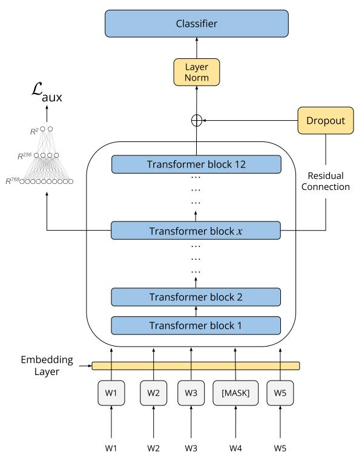
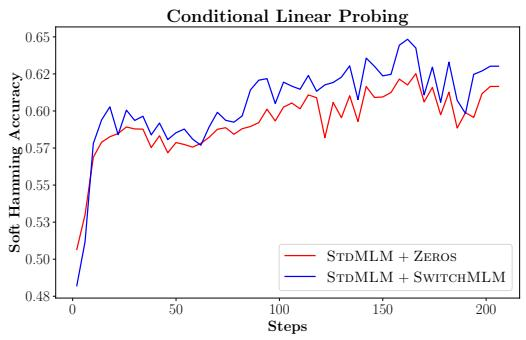
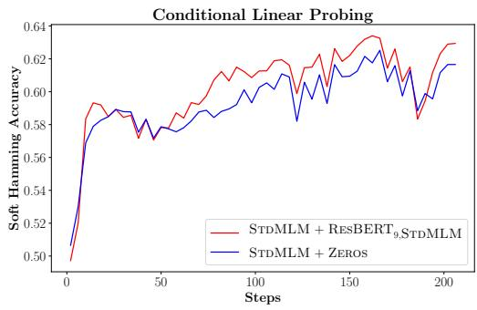
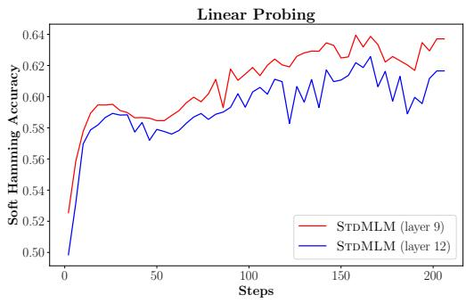
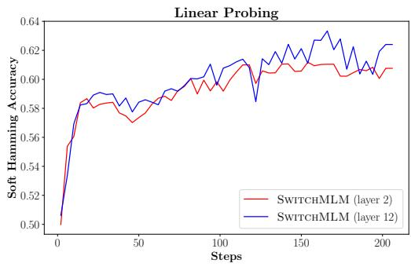

# Improving Pretraining Techniques for Code-Switched NLP

Richeek Das∗<sup>1</sup>, Sahasra Ranjan∗<sup>1</sup>, Shreya Pathak<sup>2</sup>, Preethi Jyothi<sup>1</sup>

<sup>1</sup>Indian Institute of Technology Bombay <sup>2</sup>Deepmind

## Abstract

Pretrained models are a mainstay in modern NLP applications. Pretraining requires access to large volumes of unlabeled text. While monolingual text is readily available for many of the world’s languages, access to large quan tities of code-switched text (i.e., text with tokens of multiple languages interspersed within a sentence) is much more scarce. Given this re source constraint, the question of how pretrain ing using limited amounts of code-switched text could be altered to improve performance for code-switched NLP becomes important to tackle. In this paper, we explore different masked language modeling (MLM) pretraining techniques for code-switched text that are cog nizant of language boundaries prior to masking. The language identity of the tokens can either come from human annotators, trained language classifiers, or simple relative frequencybased estimates. We also present an MLM variant by introducing a residual connection from an earlier layer in the pretrained model that uniformly boosts performance on downstream tasks. Experiments on two downstream tasks, Question Answering (QA) and Sentiment Anal ysis (SA), involving four code-switched lan guage pairs (Hindi-English, Spanish-English, Tamil-English, Malayalam-English) yield relative improvements of up to 5.8 and 2.7 F1 scores on QA (Hindi-English) and SA (Tamil English), respectively, compared to standard pretraining techniques. To understand our task improvements better, we use a series of probes to study what additional information is encoded by our pretraining techniques and also intro duce an auxiliary loss function that explicitly models language identification to further aid the residual MLM variants.

## 1 Introduction

Multilingual speakers commonly switch between languages within the confines of a conversation or a sentence. This linguistic process is known as codeswitching or code-mixing. Building computational models for code-switched inputs is very important in order to cater to multilingual speakers across the world (Zhang et al., 2021).

Multilingual pretrained models such as mBERT (Devlin et al., 2019) and XLM-R (Conneau et al., 2020) appear to be a natural choice to handle code-switched inputs. However, prior work demonstrated that representations directly extracted from pretrained multilingual models are not very effective for code-switched tasks (Winata et al., 2019). Pretraining multilingual models using code-switched text as an intermediate task, prior to task-specific finetuning, was found to improve performance on various downstream code-switched tasks (Khanuja et al., 2020a; Prasad et al., 2021a). Such an intermediate pretraining step relies on access to unlabeled code-switched text, which is not easily available in large quantities for different language pairs. This prompts the question of how pretraining could be made more effective for code-switching within the constraints of limited amounts of code-switched text.<sup>1</sup>

In this work, we propose new pretraining techniques for code-switched text by focusing on two fronts: a) modified pretraining objectives that explicitly incorporate information about codeswitching (detailed in Section 2.1) and b) architectural changes that make pretraining with codeswitched text more effective (detailed in Section 2.2).

Pretraining objectives. The predominant objective function used during pretraining is masked language modeling (MLM) that aims to reconstruct randomly masked tokens in a sentence. We will henceforth refer to this standard MLM objective as STDMLM. Instead of randomly masking tokens, we propose masking the tokens straddling language boundaries in a code-switched sentence; language boundaries in a sentence are characterized by two words of different languages. We refer to this objective as SWITCHMLM. A limitation of this technique is that it requires language identification (LID) of the tokens in a code-switched sentence. LID tags are not easily obtained, especially when dealing with transliterated (Romanized) forms of tokens in other languages. We propose a surrogate for SWITCHMLM called FREQMLM that infers LID tags using relative counts from large monolingual corpora in the component languages.

Architectural changes. Inspired by prior work that showed how different layers of models like mBERT specifically encode lexical, syntactic and semantic information (Rogers et al., 2020), we introduce a regularized residual connection from an intermediate layer that feeds as input into the MLM head during pretraining. We hypothesize that creating a direct connection from a lower layer would allow for more language information to be encoded within the learned representations. To more explicitly encourage LID information to be encoded, we also introduce an auxiliary LID-based loss using representations from the intermediate layer where the residual connection is drawn. We empirically verify that our proposed architectural changes lead to representations that are more language-aware by using a set of probing techniques that measure the switching accuracy in a code-switched sentence.

With our proposed MLM variants, we achieve consistent performance improvements on two natural language understanding tasks, factoidbased Question Answering (QA) in Hindi-English and Sentiment Analysis (SA) in four different language pairs, Hindi-English, Spanish-English, Tamil-English and Malayalam-English. Sections 3 and 4 elaborate on datasets, experimental setup and our main results, along with accompanying analyses including probing experiments.

Our code and relevant datasets are available at the following link: https://github.com/ csalt-research/code-switched-mlm.

## 2 Methodology

## 2.1 MLM Pretraining Objectives

In the Standard MLM objective (Devlin et al., 2019) that we refer to as STDMLM, a fixed percentage (typically 15%) of tokens in a given sentence are marked using the [MASK] token and the objective is to predict the [MASK] tokens via an output softmax over the vocabulary. Consider an input sentence $X = x _ { 1 } , \ldots , x _ { n }$ with n tokens, a predetermined masking fraction f and an n-dimensional bit vector $S = \{ 0 , 1 \} ^ { n }$ that indicates whether or not a token is allowed to be replaced with [MASK]. A masking function takes X, f and S as its inputs and produces a new token sequence $X _ { \mathrm { m l m } }$ as its output

$$
X _ { \mathrm { m l m } } = \mathcal { M } ( X , S , f )
$$

where $X _ { \mathrm { m l m } }$ denotes the input sentence X with f% of the maskable tokens (as deemed by S) randomly replaced with [MASK].

For STDMLM, $S = \{ 1 \} ^ { n }$ which means that any of the tokens in the sentence are allowed to be masked. In our proposed MLM techniques, we modify S to selectively choose a set of maskable tokens.

## 2.1.1 SWITCHMLM

SWITCHMLM is informed by the transitions between languages in a code-switched sentence. Consider the following Hindi-English code-switched sentence and its corresponding LID tags:

<table><tr><td>Laptop</td><td>mere</td><td>bag</td><td>me</td><td>rakha</td><td>hai</td></tr><tr><td>EN</td><td>HI</td><td>EN</td><td>HI</td><td>HI</td><td>HI</td></tr></table>

For SWITCHMLM, we are only interested in potentially masking those words that surround language transitions. S is determined using information about the underlying LID tags for all tokens. In the example above, these words would be "Laptop", "mere", "bag" and "me". Consequently, S for this example would be $S = [ 1 , 1 , 1 , 1 , 0 , 0 ]$

LID information is not readily available for many language pairs. Next, in FREQMLM, we extract proxy LID tags using counts derived from monolingual corpora for the two component languages.

## 2.1.2 FREQMLM

For a given language pair, one requires access to LID-tagged text or an existing LID tagger to implement SWITCHMLM. LID tags are hard to infer especially when dealing with transliterated or Romanized word forms. To get around this dependency, we try to assign LID tags to the tokens only based on relative frequencies obtained from monolingual corpora in the component languages. $S = { \mathcal { F } } ( X , { \mathcal { C } } _ { \mathrm { e n } } , { \mathcal { C } } _ { \mathrm { l g } } ) = \{ 0 , 1 \} ^ { n }$ where $\mathcal { F }$ assigns 1 to those tokens that straddle language boundaries and LIDs are determined for each token based on their relative frequencies in a monolingual corpus of the embedded language (that we fix as English) $\mathcal { C } _ { \mathrm { e n } }$ and a monolingual corpus of the matrix language $\mathcal { C } _ { \mathrm { l g } }$

For a given token x, we define nll\_en and nll\_- lg as negative log-likelihoods of the relative frequencies of x appearing in $\mathcal { C } _ { \mathrm { e n } }$ and ${ \mathcal { C } } _ { \mathrm { l g } } ,$ , respectively. nll values are set to -1 if the word does not appear in the corpus or if the word has a very small count and yields very high nll values (greater than a fixed threshold that we arbitrarily set to ln 10). The subroutine to assign LIDs is defined as follows:

```python
def Assign_LID (nll_en , nll_lg ):
if nll_en == -1 and nll_lg == -1:
return OTHER
elif nll_en != -1 and nll_lg == -1:
return EN
elif nll_en == -1 and nll_lg != -1:
return LG
elif nll_lg + ln (10) < nll_en :
return LG
elif nll_en + ln (10) < nll_lg :
return EN
elif nll_lg <= nll_en : return AMB -LG
elif nll_en < nll_lg : return AMB -EN
else : return OTHER
```

Here, AMB-LG, AMB-EN refer to ambiguous tokens that have reasonable counts but are not sufficiently large enough to be confidently marked as either EN or LG tokens. Setting AMB-EN to EN and AMB-LG to LG yielded the best results and we use this mapping in all our FREQMLM experiments. (Additional experiments with other FREQMLM variants by treating the ambiguous tokens separately are described in Appendix C.2.)

## 2.2 Architectural Modifications

In Section 2.1, we presented new MLM objectives that mask tokens around language transitions (or switch-points) in a code-switched sentence. The main intuition behind masking around switchpoints was to coerce the model to encode information about possible switch-point positions in a sentence. (Later, in Section 4.2, we empirically verify this claim using a probing classifier with representations from a SWITCHMLM model compared to an STDMLM model.) We suggest two architectural changes that could potentially help further exploit switch-point information in the code-switched text.

## 2.2.1 Residual Connection with Dropout

  
Figure 1: Modified mBERT with Residual Connection (RESBERT) and Auxiliary LID Loss $( \mathcal { L } _ { \mathrm { a u x } } )$ .

Prior studies have carried out detailed investigations of how BERT works and what kind of information is encoded within representations in each of its layers (Jawahar et al., 2019; Liu et al., 2019; Rogers et al., 2020). These studies have found that lower layers encode information that is most taskinvariant, final layers are the most task-specific and the middle layers are most amenable to transfer. This suggests that language information could be encoded in any of the lower or middle layers. To act as a direct conduit to this potential source of language information during pretraining, we introduce a simple residual connection from an intermediate layer that is added to the output of the last Transformer layer in mBERT. We refer to this modified mBERT as RESBERT. We also apply dropout to the residual connection which acts as a regularizer and is important for performance improvements.

We derive consistent performance improvements in downstream tasks with RESBERT when the residual connections are drawn from a lower layer for SWITCHMLM. With STDMLM, we see significant improvements when residual connections are drawn from the later layers. (We elaborate on this further using probing experiments.)

## 2.2.2 Auxiliary LID Loss

With RESBERT, we add a residual connection to a lower or middle layer with the hope of gaining more direct access to information about potential switch-point transitions. We can further encourage this intermediate layer to encode language information by imposing an auxiliary LID-based loss. Figure 1 shows how token representations of an intermediate layer, from which a residual connection is drawn, feed as input into a multi-layer perceptron MLP to predict the LID tags of each token. To ensure that this LID-based loss does not destroy other useful information that is already present in the layer embeddings, we also add an L2 regularization for representations from all the layers to avoid large departures from the original embeddings. Given a sentence $x _ { 1 } , \ldots , x _ { n }$ , we have a corresponding sequence of bits $y _ { 1 } , \ldots , y _ { n }$ where $y _ { i } = 1$ represents that $x _ { i }$ lies at a language boundary. Then the new loss $\mathcal { L } _ { \mathrm { a u x } }$ can be defined as:

$$
\mathcal { L } _ { \mathrm { a u x } } = \alpha \sum _ { i = 1 } ^ { n } - \log \mathrm { M L P } ( x _ { i } ) + \beta \sum _ { j = 1 } ^ { L } | | \bar { \mathbf { W } } ^ { j } - \mathbf { W } ^ { j } | | ^ { 2 }
$$

where $\mathrm { M L P } ( x _ { i } )$ is the probability with which MLP labels x<sub>i</sub> as y<sub>i</sub>, W¯ <sup>j</sup> refers to the original embedding matrix corresponding to layer j, W<sup>j</sup> refers to the new embedding matrix and $\alpha , \beta$ are scaling hyperparameters for the LID prediction and L2-regularization loss terms, respectively.

## 3 Experimental Setup

## 3.1 Datasets

We aggregate real code-switched text from multiple sources, described in Appendix B, to create pretraining corpora for Hindi-English, Spanish-English, Tamil-English and Malayalam-English consisting of 185K, 66K, 118K and 34K sentences, respectively. We also extract code-switched data from a very large, recent Hindi-English corpus L3CUBE (Nayak and Joshi, 2022) consisting of 52.9M sentences scraped from Twitter. More details about L3CUBE are in Appendix B.

For FREQMLM described in Section 2.1.2, we require a monolingual corpus for English and one for each of the component languages in the four code-switched language pairs. Large monolingual corpora will provide coverage over a wider vocabulary and consequently lead to improved LID predictions for words in code-switched sentences. We use counts computed from the following monolingual corpora to implement FREQMLM.

English. We use OPUS-100 (Zhang et al., 2020), which is a large English-centric translation dataset consisting of 55 million sentence pairs and comprising diverse corpora including movie subtitles, GNOME documentation and the Bible.

Spanish. We use a large Spanish corpus released by (Cañete et al., 2020) that contains 26.5 million sentences accumulated from 15 unlabeled Spanish text datasets spanning Wikipedia articles and European parliament notes.

Hindi, Tamil and Malayalam. The Dakshina corpus (Roark et al., 2020) is a collection of text in both Latin and native scripts for 12 South Asian languages including Hindi, Tamil and Malayalam. Samanantar (Ramesh et al., 2022) is a large publicly-available parallel corpus for Indic languages. We combined Dakshina and Samanatar <sup>2</sup> datasets to obtain roughly 10M, 5.9M and 5.2M sentences for Hindi, Malayalam and Tamil respectively. We used this combined corpus to perform NLL-based LID assignment in FREQMLM.

The Malayalam monolingual corpus is quite noisy with many English words appearing in the text. To implement FREQMLM for ML-EN, we use an alternate monolingual source called Aksharantar (Madhani et al., 2022). It is a large publiclyavailable transliteration vocabulary-based dataset for 21 Indic languages with 4.1M words specifically in Malayalam. We further removed common English words<sup>3</sup> from Aksharantar’s Malayalam vocabulary to improve the LID assignment for FRE-QMLM. We used this dataset with an alternate LID assignment technique that only checks if a word exists, without accumulating any counts. (This is described further in Section 4.1.)

## 3.2 SA and QA Tasks

We use the GLUECOS benchmark (Khanuja et al., 2020a) to evaluate our models for Sentiment Analysis (SA) and Question Answering (QA). GLUECOS provides an SA task dataset for Hindi-English and Spanish-English. The Spanish-English SA dataset (Vilares et al., 2016) consists of 2100, 211

<table><tr><td colspan="2">一</td><td colspan="3">QA HI-EN</td><td colspan="4">SA</td></tr><tr><td colspan="2">Method</td><td>F1 (20 epochs)</td><td>F1  $( 3 0 \mathrm { e p o c h s } )$ </td><td>F1 (40 epochs)</td><td>一 TA-EN</td><td>HI-EN</td><td>ML-EN</td><td>ES-EN</td></tr><tr><td rowspan="6">Baseline MBRRT</td><td></td><td> $6 2 . 1 \pm 1 . 5$ </td><td> $6 3 . 4 \pm 2 . 0$ </td><td> $6 2 . 9 \pm 2 . 0$ </td><td> $6 9 . 8 { \pm } 2 . 6 $ </td><td> $6 7 . 3 { \pm } 0 . 3 $ </td><td> $7 6 . 4 { \pm } 0 . 3 $ </td><td> $6 0 . 8 { \pm } 1 . 1 $ </td></tr><tr><td>STDMLM</td><td> $6 4 . 8 \pm 2 . 0$ </td><td> $6 5 . 4 \pm 2 . 5$ </td><td> $6 4 \pm 3 . 3$ </td><td> $7 4 . 9 { \pm } 1 . 5 $ </td><td> $6 7 . 7 { \pm } 0 . 6 $ </td><td> $7 6 . 7 { \pm } 0 . 1 $ </td><td>62.2±1.5</td></tr><tr><td>SWITCHMLM</td><td> ${ \bf 6 9 \pm 3 . 7 }$ </td><td> ${ \bf 6 8 . 9 \pm 4 . 2 }$ </td><td> $6 7 \pm 2 . 5$ </td><td></td><td> ${ \bf 6 8 . 4 \pm 0 . 5 }$ </td><td></td><td>63.5±0.6</td></tr><tr><td>FREQMLM</td><td> $6 8 . 6 { \pm } 4 . 5 $ </td><td> $6 6 . 7 { \pm } 3 . 5 $ </td><td> ${ \bf 6 7 . 1 \pm 3 . 2 }$ </td><td>77.1±0.3</td><td> $6 7 . 8 { \pm } 0 . 4 $ </td><td> $7 6 . 5 { \pm } 0 . 2 $ </td><td>62.5±1.0</td></tr><tr><td> $\mathbf { S T D M L M + R E S B E R T }$ </td><td> $6 6 . 8 _ { 9 } \pm 3 . 0$ </td><td> $6 4 . 6 \mathrm { { g } \pm 1 . 7 }$ </td><td> $6 4 . 4 _ { 9 } \pm 2 . 0$ </td><td> $7 7 _ { 5 } \pm 0 . 3$ </td><td> $6 8 . 4 _ { 9 } \pm 0 . 0$ </td><td> $7 6 . 6 _ { 9 } \pm 0 . 2$ </td><td> $6 3 . 1 _ { 9 } \pm 1 . 1$ </td></tr><tr><td> $\operatorname { S w } / \mathrm { F R E Q M L M } + \operatorname { R E S B E R T }$ </td><td> ${ \bf 6 8 . 8 _ { 2 } \pm 3 . 1 }$ </td><td> $6 8 . 9 _ { 2 } \pm 3 . 0$ </td><td> $6 8 . 1 _ { 2 } \pm 3 . 0$ </td><td> $7 7 . 4 _ { 2 } \pm 0 . 3$ </td><td> $6 8 . 9 _ { 2 } \pm 0 . 4$ </td><td> $7 7 . 1 _ { 2 } \pm 0 . 2$ </td><td> $6 3 . 7 _ { 2 } \pm 1 . 8$ </td></tr><tr><td rowspan="4">Baseline XIXR STDMLM</td><td> $\mathbf { S W / F R E Q M L M + R E S B E R T } + { \mathcal { L } } _ { \mathrm { a u x } }$ </td><td> $6 8 _ { 2 } \pm 3 . 0$ </td><td> ${ \bf 6 8 . 9 _ { 2 } \pm 3 . 2 }$ </td><td> ${ \bf 6 9 . 8 _ { 2 } \pm 3 . 0 }$ </td><td> $7 7 . 6 _ { 2 } \pm 0 . 2$ </td><td> ${ \bf 6 9 . 1 _ { 2 } \pm 0 . 4 }$ </td><td> $7 7 . 2 _ { 2 } \pm 0 . 4$ </td><td> ${ \bf 6 3 . 7 _ { 2 } \pm 1 . 5 }$ </td></tr><tr><td></td><td> $6 3 . 2 { \pm } 3 . 0 $ </td><td> $6 3 . 1 { \pm } 2 . 3 $ </td><td> $6 2 . 7 { \pm } 2 . 5 $ </td><td> $7 4 . 1 { \pm } 0 . 3 $ </td><td> $6 9 . 2 { \pm } 0 . 9$ </td><td> $7 2 . 5 { \pm } 0 . 7 $ </td><td> $6 3 . 9 { \pm } 2 . 5 $ </td></tr><tr><td></td><td> $6 4 . 4 { \pm } 2 . 1 $ </td><td> $6 4 . 7 { \pm } 2 . 8 $ </td><td> $6 6 . 4 { \pm } 2 . 3 $ </td><td> $7 6 . 0 { \pm } 0 . 1 $ </td><td> $7 1 . 3 { \pm } 0 . 2 $ </td><td> $7 6 . 5 { \pm } 0 . 4 $ </td><td>64.4±1.8</td></tr><tr><td> ${ \bf 6 5 . 3 \pm 3 . 3 }$ </td><td> ${ \bf 6 5 . 7 \pm 2 . 3 }$ </td><td></td><td> ${ \bf 6 9 . 2 \pm 3 . 2 }$ </td><td></td><td> $7 1 . 7 { \pm } 0 . 1 $ </td><td></td><td>64.8±0.2</td></tr><tr><td>SWITCHMLM FREQMLM</td><td></td><td> $6 0 . 8 { \pm } 5 . 3 $ </td><td> $6 2 . 4 { \pm } 4 . 3 $ </td><td> $6 3 . 4 { \pm } 4 . 4 $ </td><td> $7 6 . 3 { \pm } 0 . 4 $ </td><td> $7 1 . 6 { \pm } 0 . 6 $ </td><td> $7 5 . 3 { \pm } 0 . 3 $ </td><td>64.1±1.1</td></tr></table>

Table 1: QA and SA scores for primary models and language pairs. Note: For RESBERT results, the subscript near the F1 scores represents the layer from which the residual connection is drawn for that particular model.

## 4 Results and Analysis

and 211 examples in the training, development and test sets, respectively. The Hindi-English SA dataset (Patra et al., 2018) consists of 15K, 1.5K and 3K code-switched tweets in the training, development and test sets, respectively. The Tamil-English (Chakravarthi et al., 2020a) and Malayalam-English (Chakravarthi et al., 2020b) SA datasets are extracted from YouTube comments comprising 9.6K/1K/2.7K and 3.9K/436/1.1K examples in the train/dev/test sets, respectively. The Question Answering Hindi-English factoid-based dataset (Chandu et al., 2018a) from GLUECOS consists of 295 training and 54 test question-answercontext triples. Because of the unavailability of the dev set, we report QA results on a fixed number of training epochs i.e., 20, 30, and 40 epochs.

## 3.3 RESBERT and Auxiliary Loss: Implementation details

## 4.1 Main Results

Table 1 shows our main results using all our proposed MLM techniques applied to the downstream tasks QA and SA. We use F1-scores as an evaluation metric for both QA and SA. For QA, we report the average scores from the top 8-performing (out of 10) seeds, and for SA, we report average F1-scores from the top 10-performing seeds (out of 12). We observed that the F1 scores were notably poorer for one seed, likely due to the small test-sets for QA (54 examples) and SA (211 for Spanish-English). To safeguard against such outlier seeds, we report average scores from the top-K runs. We show results for two multilingual pretrained models, mBERT (Devlin et al., 2019) and XLM-R (Conneau et al., 2020).<sup>4</sup>

We modified the mBERT architectures for the three main tasks of masked language modeling, question answering (QA), and sequence classification by incorporating residual connections as outlined in Section 2.2.1. The MLM objective was used during pretraining with residual connections drawn from layers $x \in \{ 1 , \cdots , 1 0 \}$ and a dropout rate of p = 0.5. The best layer to add a residual connection was determined by validation performance on the downstream NLU tasks. Since we do not have a development set for QA, we choose the same layer as chosen by SA validation for the QA task. The training process and hyperparameter details can be found in Appendix A.

Improvements with MLM pretraining objectives. From Table 1, we note that STDMLM is always better than the baseline model (sans pretraining). Among the three MLM pretraining objectives, SWITCHMLM consistently outperforms both STDMLM and FREQMLM across both tasks. We observe statistical significance at $p \ < \ 0 . 0 5$ (with p-values of 0.01 and lower for some language pairs) using the Wilcoxon Signed Rank test when comparing F1 scores across multiple seeds using SWITCHMLM compared to STDMLM on both QA and SA tasks.

As expected, FREQMLM acts as a surrogate to SWITCHMLM trailing behind it in performance while outperforming STDMLM. Since Tamil-English and Malayalam-English pretraining corpora were not LID-tagged, we do not show SWITCHMLM numbers for these two language pairs and only report FREQMLM-based scores. For QA, we observe that FREQMLM hurts XLM-R while significantly helps mBERT in performance compared to STDMLM. We hypothesize that this is largely caused by QA having a very small train set (of size 295), in conjunction with XLM-R being five times larger than mBERT and the noise inherent in LID tags from FREQMLM (compared to SWITCHMLM). We note here that using FRE-QMLM with XLM-R for SA does not exhibit this trend since Hindi-English SA has a larger train set with 15K sentences.

Considerations specific to FREQMLM. The influence of SWITCHMLM and FREQMLM on downstream tasks depends both on (1) the amount of code-switched pretraining text and (2) the LID tagging accuracy. Malayalam-English (ML-EN) is an interesting case where STDMLM does not yield significant improvements over the baseline. This could be attributed to the small amount of real code-switched text in the ML-EN pretraining corpus (34K). Furthermore, we observe that FRE-QMLM fails to surpass STDMLM. This could be due to the presence of many noisy English words in the Malayalam monolingual corpus. To tackle this, we devise an alternative to the NLL LID-tagging approach that we call X-HIT. X-HIT only considers vocabularies of English and the matrix language, and checks if a given word appears in the vocabulary of English or the matrix language to mark its LID. Unlike NLL which is count-based, X-HIT only checks for the existence of a word in a vocabulary. This approach is particularly useful for language pairs where the monolingual corpus is small and unreliable. Appendix C.1 provides more insights about when to choose X-HIT over NLL.

We report a comparison between the NLL and X-HIT LID-tagging approaches for ML-EN sentences in Table 2. Since X-HIT uses a clean dictionary instead of a noisy monolingual corpus for LID assignment, we see improved performance with X-HIT compared to NLL. However, given the small pretraining corpus for ML-EN, FREQMLM still underperforms compared to STDMLM.

To assess how much noise can be tolerated in the LID tags derived via NLL, Table 3 shows the label distribution across true and predicted labels using the NLL LID-tagging approach for Hindi-English. We observe that while a majority of HI and EN tokens are correctly labeled as being HI and EN tags, respectively, a fairly sizable fraction of tags totaling 18% and 17% for HI and EN, respectively, are wrongly predicted. This shows that FREQMLM performs reasonably well even in the presence of noise in the predicted LID tags.

<table><tr><td>Model</td><td>F1 (max)</td><td>F1 (avg)</td><td>Std. Dev.</td></tr><tr><td>Baseline (mBERT)</td><td>77.29</td><td>76.42</td><td>0.42</td></tr><tr><td>STDMLM</td><td>77.39</td><td>76.67</td><td>0.48</td></tr><tr><td>FREQMLM (NLL)</td><td>76.61</td><td>76.20</td><td>0.43</td></tr><tr><td>FREQMLM (X-HIT)</td><td>77.29</td><td>76.46</td><td>0.43</td></tr></table>

Table 2: Comparison of various FREQMLM approaches for the Malayalam-English SA task.

<table><tr><td>True/Pred</td><td>HI</td><td>AMB-HI</td><td>EN</td><td>AMB-EN</td><td>OTHER</td></tr><tr><td>HI</td><td>71.75</td><td>10.26</td><td>6.05</td><td>7.36</td><td>4.58</td></tr><tr><td>EN</td><td>7.69</td><td>5.97</td><td>63.41</td><td>19.64</td><td>3.29</td></tr><tr><td>OTHER</td><td>25.07</td><td>10.11</td><td>7.76</td><td>6.51</td><td>50.56</td></tr></table>

Table 3: Distribution of predicted tags by the NLL approach for given true tags listed in the first column. Note: Here the distribution is shown as percentages.

Improvements with Architectural Modifications. As shown in Table 1, we observe consistent improvements using RESBERT particularly for SA. STDMLM gains a huge boost in performance when a residual connection is introduced. The best layer to use for a residual connection in SA tasks is chosen on the basis of the results on the dev set. We do not have a dev set for the QA HI-EN task. In this case, we choose the same layers used for the SA task to report results on QA.

While the benefits are not as clear as with STDMLM, even SWITCHMLM marginally benefits from a residual connection on examining QA and SA results. Since LID tags are not available for TA-EN and ML-EN, we use FREQMLM pretraining with residual connections. Given access to LID tags, both HI-EN and ES-EN use SWITCHMLM pretraining with residual connections. SW/FRE-QMLM in Table 1 refers to either SWITCHMLM or FREQMLM pretraining depending on the language pair.

We observe an interesting trend as we change the layer $x \in \{ 1 , \cdots , 1 0 \}$ from which the residual connection is drawn, depending on the MLM objective. When RESBERT is used in conjunction with STDMLM, we see a gradual performance gain as we go deeper down the layers. Whereas we find a slightly fluctuating response in the case of SWITCHMLM— here, it peaks at some early layer. The complete trend is elaborated in Appendix D. The residual connections undoubtedly help. We see an overall jump in performance from STDMLM to RESBERT + STDMLM and from SWITCHMLM to RESBERT + SWITCHMLM.

<table><tr><td>Model</td><td>F1 (max)</td><td>F1 (avg)</td><td>Std. Dev.</td></tr><tr><td>STDMLM</td><td>69.01</td><td>68.18</td><td>0.56</td></tr><tr><td>SWITCHMLM</td><td>70.71</td><td>69.19</td><td>1.06</td></tr><tr><td>FREQMLM</td><td>69.41</td><td>68.81</td><td>0.58</td></tr><tr><td>STDMLM + RESBERT9</td><td>69.48</td><td>68.99</td><td>0.60</td></tr><tr><td> $\mathrm { S w M L M + R E S B E R T _ { 2 } }$ </td><td>69.76</td><td>69.23</td><td>0.64</td></tr><tr><td> $\mathrm { S w M L M + R E S B E R T _ { 2 } + \mathcal { L } _ { a u x } }$ </td><td>69.66</td><td>69.29</td><td>0.25</td></tr><tr><td>HINGMBERT</td><td>72.36</td><td>71.42</td><td>0.70</td></tr></table>

Table 4: HI-EN SA task scores with L3CUBE -185k pretraining corpus. The subscript with RESBERT represents the residual connection layer for that particular setting.

The auxiliary loss over switch-points described in Section 2.2.2 aims to help encode switch-point information more explicitly. As with RESBERT, we use the auxiliary loss with SWITCHMLM pretraining for HI-EN and ES-EN, and with FRE-QMLM pretraining for TA-EN and ML-EN. As shown in Table 1, SW/FREQMLM + RESBERT $+ \ \mathcal { L } _ { \mathrm { a u x } }$ yields our best model for code-switched mBERT consistently across all SA tasks.

Results on Alternate Pretraining Corpus. To assess the difference in performance when using pretraining corpora of varying quality, we extract roughly the same number of Hindi-English sentences from L3CUBE (185K) as is present in the Hindi-English pretraining corpus we used for Table 1. Roughly 45K of these 185K sentences have human-annotated LID tags. For the remaining sentences, we use the GLUECOS LID tagger (Khanuja et al., 2020a).

Table 4 shows the max and mean F1-scores for HI-EN SA for all our MLM variants. These numbers exhibit the same trends observed in Table 1. Also, since the L3CUBE dataset is much cleaner than the 185K dataset we used previously for Hindi-English, we see a notable performance gain in Table 4 for HI-EN compared to the numbers in Table 1. Nayak and Joshi (2022) further provide an mBERT model HINGMBERT pretrained on the entire L3CUBE dataset of 52.93M sentences. This model outperforms all the mBERT pretrained models, confirming that a very large amount of pretraining text, if available, yields superior performance.

## 4.2 Probing Experiments

We use probing classifiers to test our claim that the amount of switch-point information encoded in the neural representations from specific layers has increased with our proposed pretraining variants compared to STDMLM. Alain and Bengio (2016) first introduced the idea of using linear classifier probes for features at every model layer, and Kim et al. (2019) further developed new probing tasks to explore the effects of various pretraining objectives in sentence encoders.

Linear Probing. We first adopt a standard linear probe to check for the amount of switch-point information encoded in neural representations of different model layers. For a sentence $x _ { 1 } , \ldots , x _ { n } .$ consider a sequence of bits $y _ { 1 } , \ldots , y _ { n }$ referring to switch-points where $y _ { i } = 1$ indicates that $x _ { i }$ is at a language boundary. The linear probe is a simple feedforward network that takes layer-wise representations as its input and is trained to predict switch-points via a binary cross-entropy loss. We train the linear probe for around 5000 iterations.

Conditional Probing. Linear probing cannot detect when representations are more predictive of switch-point information in comparison to a baseline. Hewitt et al. (2021) offer a simple extension of the theory of usable information to propose conditional probing. We adopt this method for our task and define performance in terms of predicting the switch-point sequence as:

$$
\operatorname { P e r f } ( f [ B ( X ) , \phi ( X ) ] ) - \operatorname { P e r f } ( f ( [ B , 0 ] ) )
$$

where X is the input sequence of tokens, B is the STDMLM pretrained model, ϕ is the model trained with one of our new pretraining techniques, f is a linear probe, [ , ] denotes concatenation of embeddings and Perf is any standard performance metric. We set Perf to be a soft Hamming Distance between the predicted switch-point sequence and the ground-truth bit sequence. To train f, we follow the same procedure outlined in Section 4.2, except we use concatenated representations from two models as its input instead of a single representation.

## 4.2.1 Probing Results

Figure 2 shows four salient plots using linear probing and conditional probing. In Figure 2a, we observe that the concatenated representations from models trained with STDMLM and SWITCHMLM carry more switch-point information than using STDMLM alone. This offers an explanation for the task-specific performance improvements we observe with SWITCHMLM. With greater amounts of switch-point information, SWITCHMLM models arguably tackle the code-switched downstream NLU tasks better.

  
(a)



  
(c)

(b)  
  
(d)  
Figure 2: Probing results comparing the amount of language boundary information encoded in different layers of different models. Note: (1) If not mentioned, assume final layer representations (2) RESBERT <sub>S MLM</sub> represents the mBERT model having a residual connection from layer 9 and trained with STDMLM pretraining.

From Figure 2c, we observe that the intermediate layer (9) from which the residual connection is drawn carries a lot more switch-point information than the final layer in STDMLM. In contrast, from Figure 2d, we find this is not true for SWITCHMLM models, where there is a very small difference between switch-point information encoded by an intermediate and final layer. This might explain to some extent why we see larger improvements using a residual connection with STDMLM compared to SWITCHMLM (as discussed in Section 4.1).

Figure 2b shows that adding a residual connection from layer 9 of an STDMLM-trained model, that is presumably rich in switch-point information, provides a boost to switch-point prediction accuracy compared to using STDMLM model alone.

We note here that the probing experiments in this section offer a post-hoc analysis of the effectiveness of introducing a skip connection during pretraining. We do not actively use probing to choose the best layer to add a skip connection.

## 5 Related Work

While not related to code-switching, there has been prior work on alternatives or modifications to pretraining objectives like MLM. Yamaguchi et al. (2021) is one of the first works to identify the lack of linguistically intuitive pretraining objectives. They propose new pretraining objectives which perform similarly to MLM given a similar pretrain duration. In contrast, Clark et al. (2020) sticks to the standard MLM objective, but questions whether masking only 15% of tokens in a sequence is sufficient to learn meaningful representations. Wettig et al. (2022) maintains that higher masking up to even 80% can preserve model performance on downstream tasks. All of the aforementioned methods are static and do not exploit a partially trained model to devise better masking strategies on the fly. Yang et al. (2022) suggests time-invariant masking strategies which adaptively tune the masking ratio and content in different training stages. Ours is the first work to offer both MLM modifications and architectural changes aimed specifically at codeswitched pretraining.

Prior work on improving code-switched NLP has focused on generative models of code-switched text to use as augmentation (Gautam et al., 2021; Gupta et al., 2021; Tarunesh et al., 2021a), merging real and synthetic code-switched text for pretraining (Khanuja et al., 2020b; Santy et al., 2021b), intermediate task pretraining including MLM-style objectives (Prasad et al., 2021b). However, no prior work has provided an in-depth investigation into how pretraining using code-switched text can be altered to encode information about language transitions within a code-switched sentence. We show that switch-point information is more accurately preserved in models pretrained with our proposed techniques and this eventually leads to improved performance on code-switched downstream tasks.

## 6 Conclusion

Pretraining multilingual models with codeswitched text prior to finetuning on task-specific data has been found to be very effective for code-switched NLP tasks. In this work, we focus on developing new pretraining techniques that are more language-aware and make effective use of limited amounts of real code-switched text to derive performance improvements on two downstream tasks across multiple language pairs. We design new pretraining objectives for code-switched text and suggest new architectural modifications that further boost performance with the new objectives in place. In future work, we will investigate how to make effective use of pretraining with synthetically generated code-switched text.

## Acknowledgements

The last author would like to gratefully acknowledge a faculty grant from Google Research India supporting research on models for code-switching. The authors are thankful to the anonymous reviewers for constructive suggestions that helped improve the submission.

## Limitations

Our current FREQMLM techniques tend to fail on LID predictions when the linguistic differences between languages are small. For example, English and Spanish are quite close: (1) they are written in the same script, (2) English and Spanish share a lot of common vocabulary. This can confound FREQMLM.

The strategy to select the best layer for drawing residual connections in RESBERT is quite tedious. For a 12-layer mBERT, we train 10 RESBERT models with residual connections from some intermediate layer $x \in \{ 1 , \cdots , 1 0 \}$ and choose the best layer based on validation performance. This is quite computationally prohibitive. We are considering parameterizing the layer choice using gating functions so that it can be learned without having to resort to a tedious grid search.

If the embedded language in a code-switched sentence has a very low occurrence, we will have very few switch-points. This might reduce the number of maskable tokens to a point where even masking all the maskable tokens will not satisfy the overall 15% masking requirement. However, we never faced this issue. In our experiments, we compensate by masking around 25%-35% of the maskable tokens (calculated based on the switch-points in the dataset).

## References

Gustavo Aguilar, Fahad AlGhamdi, Victor Soto, Thamar Solorio, Mona Diab, and Julia Hirschberg, editors. 2018. Proceedings ofthe Third Workshop on Computational Approaches to Linguistic Code-Switching. Association for Computational Linguistics, Melbourne, Australia.

Guillaume Alain and Yoshua Bengio. 2016. Understanding intermediate layers using linear classifier probes.

Fahad AlGhamdi, Giovanni Molina, Mona Diab, Thamar Solorio, Abdelati Hawwari, Victor Soto, and Julia Hirschberg. 2016. Part of speech tagging for code switched data. In Proceedings of the Second Workshop on Computational Approaches to Code Switching, pages 98–107, Austin, Texas. Association for Computational Linguistics.

Suman Banerjee, Nikita Moghe, Siddhartha Arora, and Mitesh M. Khapra. 2018. A dataset for building code-mixed goal oriented conversation systems. In Proceedings ofthe 27th International Conference on Computational Linguistics, pages 3766–3780, Santa Fe, New Mexico, USA. Association for Computational Linguistics.

Irshad Bhat, Riyaz A. Bhat, Manish Shrivastava, and Dipti Sharma. 2017. Joining hands: Exploiting monolingual treebanks for parsing of code-mixing data. In Proceedings of the 15th Conference of the European Chapter of the Association for Computational Linguistics: Volume 2, Short Papers, pages

324–330, Valencia, Spain. Association for Computational Linguistics.

Irshad Ahmad Bhat, Vandan Mujadia, Aniruddha Tammewar, Riyaz Ahmad Bhat, and Manish Shrivastava. 2015. Iiit-h system submission for fire2014 shared task on transliterated search. In Proceedings of the Forum for Information Retrieval Evaluation, FIRE ’14, pages 48–53, New York, NY, USA. ACM.

José Cañete, Gabriel Chaperon, Rodrigo Fuentes, Jou-Hui Ho, Hojin Kang, and Jorge Pérez. 2020. Spanish pre-trained bert model and evaluation data. In PML4DC at ICLR 2020.

Bharathi Raja Chakravarthi, Navya Jose, Shardul Suryawanshi, Elizabeth Sherly, and John Philip Mc-Crae. 2020a. A sentiment analysis dataset for codemixed Malayalam-English. In Proceedings ofthe 1st Joint Workshop on Spoken Language Technologies for Under-resourced languages (SLTU) and Collaboration and Computing for Under-Resourced Languages (CCURL), pages 177–184, Marseille, France. European Language Resources association.

Bharathi Raja Chakravarthi, Vigneshwaran Muralidaran, Ruba Priyadharshini, and John Philip McCrae. 2020b. Corpus creation for sentiment analysis in code-mixed Tamil-English text. In Proceedings of the 1st Joint Workshop on Spoken Language Technologies for Under-resourced languages (SLTU) and Collaboration and Computing for Under-Resourced Languages (CCURL), pages 202–210, Marseille, France. European Language Resources association.

Bharathi Raja Chakravarthi, Ruba Priyadharshini, Navya Jose, Anand Kumar M, Thomas Mandl, Prasanna Kumar Kumaresan, Rahul Ponnusamy, Hariharan R L, John P. McCrae, and Elizabeth Sherly. 2021. Findings of the shared task on offensive language identification in Tamil, Malayalam, and Kannada. In Proceedings of the First Workshop on Speech and Language Technologies for Dravidian Languages, pages 133–145, Kyiv. Association for Computational Linguistics.

Khyathi Chandu, Ekaterina Loginova, Vishal Gupta, Josef van Genabith, Günter Neumann, Manoj Chinnakotla, Eric Nyberg, and Alan W. Black. 2018a. Code-mixed question answering challenge: Crowdsourcing data and techniques. In Proceedings ofthe Third Workshop on Computational Approaches to Linguistic Code-Switching, pages 29–38, Melbourne, Australia. Association for Computational Linguistics.

Khyathi Chandu, Thomas Manzini, Sumeet Singh, and Alan W. Black. 2018b. Language informed modeling of code-switched text. In Proceedings of the Third Workshop on Computational Approaches to Linguistic Code-Switching, pages 92–97, Melbourne, Australia. Association for Computational Linguistics.

Kevin Clark, Minh-Thang Luong, Quoc V. Le, and Christopher D. Manning. 2020. Electra: Pre-training text encoders as discriminators rather than generators.

Alexis Conneau, Kartikay Khandelwal, Naman Goyal, Vishrav Chaudhary, Guillaume Wenzek, Francisco Guzmán, Edouard Grave, Myle Ott, Luke Zettlemoyer, and Veselin Stoyanov. 2020. Unsupervised cross-lingual representation learning at scale. In Proceedings of the 58th Annual Meeting of the Associationfor Computational Linguistics, pages 8440– 8451, Online. Association for Computational Linguistics.

Jacob Devlin, Ming-Wei Chang, Kenton Lee, and Kristina Toutanova. 2019. BERT: Pre-training of deep bidirectional transformers for language understanding. In Proceedings of the 2019 Conference of the North American Chapter ofthe Associationfor Computational Linguistics: Human Language Technologies, Volume 1 (Long and Short Papers), pages 4171–4186, Minneapolis, Minnesota. Association for Computational Linguistics.

Devansh Gautam, Prashant Kodali, Kshitij Gupta, Anmol Goel, Manish Shrivastava, and Ponnurangam Kumaraguru. 2021. Comet: Towards code-mixed translation using parallel monolingual sentences. In Proceedings ofthe Fifth Workshop on Computational Approaches to Linguistic Code-Switching, pages 47– 55.

Abhirut Gupta, Aditya Vavre, and Sunita Sarawagi. 2021. Training data augmentation for code-mixed translation. In Proceedings of the 2021 Conference of the North American Chapter of the Association for Computational Linguistics: Human Language Technologies, pages 5760–5766.

John Hewitt, Kawin Ethayarajh, Percy Liang, and Christopher Manning. 2021. Conditional probing: measuring usable information beyond a baseline. In Proceedings of the 2021 Conference on Empirical Methods in Natural Language Processing, pages 1626–1639, Online and Punta Cana, Dominican Republic. Association for Computational Linguistics.

Ganesh Jawahar, Benoît Sagot, and Djamé Seddah. 2019. What does BERT learn about the structure of language? In Proceedings of the 57th Annual Meeting of the Association for Computational Linguistics, pages 3651–3657, Florence, Italy. Association for Computational Linguistics.

Simran Khanuja, Sandipan Dandapat, Anirudh Srinivasan, Sunayana Sitaram, and Monojit Choudhury. 2020a. GLUECoS: An evaluation benchmark for code-switched NLP. In Proceedings ofthe 58th Annual Meeting ofthe Associationfor Computational Linguistics, pages 3575–3585, Online. Association for Computational Linguistics.

Simran Khanuja, Sandipan Dandapat, Anirudh Srinivasan, Sunayana Sitaram, and Monojit Choudhury. 2020b. Gluecos: An evaluation benchmark for codeswitched nlp. In Proceedings of the 58th Annual Meeting of the Association for Computational Linguistics, pages 3575–3585.

Najoung Kim, Roma Patel, Adam Poliak, Patrick Xia, Alex Wang, Tom McCoy, Ian Tenney, Alexis Ross, Tal Linzen, Benjamin Van Durme, Samuel R. Bowman, and Ellie Pavlick. 2019. Probing what different NLP tasks teach machines about function word comprehension. In Proceedings ofthe Eighth Joint Conference on Lexical and Computational Semantics (\*SEM 2019), pages 235–249, Minneapolis, Minnesota. Association for Computational Linguistics.

Nelson F Liu, Matt Gardner, Yonatan Belinkov, Matthew E Peters, and Noah A Smith. 2019. Linguistic knowledge and transferability of contextual representations. In Proceedings ofthe 2019 Conference of the North American Chapter ofthe Associationfor Computational Linguistics: Human Language Technologies, Volume 1 (Long and Short Papers), pages 1073–1094.

Ilya Loshchilov and Frank Hutter. 2019. Decoupled weight decay regularization. In International Conference on Learning Representations.

Yash Madhani, Sushane Parthan, Priyanka Bedekar, Ruchi Khapra, Anoop Kunchukuttan, Pratyush Kumar, and Mitesh Shantadevi Khapra. 2022. Aksharantar: Towards building open transliteration tools for the next billion users.

Thomas Mandl, Sandip Modha, Anand Kumar M, and Bharathi Raja Chakravarthi. 2021. Overview of the hasoc track at fire 2020: Hate speech and offensive language identification in tamil, malayalam, hindi, english and german. In Proceedings ofthe 12th Annual Meeting of the Forum for Information Retrieval Evaluation, FIRE ’20, page 29–32, New York, NY, USA. Association for Computing Machinery.

Ravindra Nayak and Raviraj Joshi. 2022. L3Cube-HingCorpus and HingBERT: A code mixed Hindi-English dataset and BERT language models. In Proceedings ofthe WILDRE-6 Workshop within the 13th Language Resources and Evaluation Conference, pages 7–12, Marseille, France. European Language Resources Association.

Braja Gopal Patra, Dipankar Das, and Amitava Das. 2018. Sentiment analysis of code-mixed indian languages: An overview of sail ode mixedsharedtask@icon 2017.

Jasabanta Patro, Bidisha Samanta, Saurabh Singh, Abhipsa Basu, Prithwish Mukherjee, Monojit Choudhury, and Animesh Mukherjee. 2017. All that is English may be Hindi: Enhancing language identification through automatic ranking of the likeliness of word borrowing in social media. In Proceedings of the 2017 Conference on Empirical Methods in Natural Language Processing, pages 2264–2274, Copenhagen, Denmark. Association for Computational Linguistics.

Parth Patwa, Gustavo Aguilar, Sudipta Kar, Suraj Pandey, Srinivas PYKL, Björn Gambäck, Tanmoy Chakraborty, Thamar Solorio, and Amitava Das.

2020. SemEval-2020 task 9: Overview of sentiment analysis of code-mixed tweets. In Proceedings of the Fourteenth Workshop on Semantic Evaluation, pages 774–790, Barcelona (online). International Committee for Computational Linguistics.

Archiki Prasad, Mohammad Ali Rehan, Shreya Pathak, and Preethi Jyothi. 2021a. The effectiveness of intermediate-task training for code-switched natural language understanding. In Proceedings of the 1st Workshop on Multilingual Representation Learning, pages 176–190, Punta Cana, Dominican Republic. Association for Computational Linguistics.

Archiki Prasad, Mohammad Ali Rehan, Shreya Pathak, and Preethi Jyothi. 2021b. The effectiveness of intermediate-task training for code-switched natural language understanding. arXiv preprint arXiv:2107.09931.

Gowtham Ramesh, Sumanth Doddapaneni, Aravinth Bheemaraj, Mayank Jobanputra, Raghavan AK, Ajitesh Sharma, Sujit Sahoo, Harshita Diddee, Mahalakshmi J, Divyanshu Kakwani, Navneet Kumar, Aswin Pradeep, Srihari Nagaraj, Kumar Deepak, Vivek Raghavan, Anoop Kunchukuttan, Pratyush Kumar, and Mitesh Shantadevi Khapra. 2022. Samanantar: The largest publicly available parallel corpora collection for 11 indic languages. Transactions ofthe Associationfor Computational Linguistics, 10:145– 162.

Brian Roark, Lawrence Wolf-Sonkin, Christo Kirov, Sabrina J. Mielke, Cibu Johny, Isin Demirsahin, and Keith Hall. 2020. Processing South Asian languages written in the Latin script: the Dakshina dataset. In Proceedings ofthe Twelfth Language Resources and Evaluation Conference, pages 2413–2423, Marseille, France. European Language Resources Association.

Anna Rogers, Olga Kovaleva, and Anna Rumshisky. 2020. A primer in BERTology: What we know about how BERT works. Transactions ofthe Association for Computational Linguistics, 8:842–866.

Sebastin Santy, Anirudh Srinivasan, and Monojit Choudhury. 2021a. BERTologiCoMix: How does codemixing interact with multilingual BERT? In Proceedings ofthe Second Workshop on Domain Adaptation for NLP, pages 111–121, Kyiv, Ukraine. Association for Computational Linguistics.

Sebastin Santy, Anirudh Srinivasan, and Monojit Choudhury. 2021b. Bertologicomix: How does codemixing interact with multilingual bert? In Proceedings ofthe Second Workshop on Domain Adaptation for NLP, pages 111–121.

Kushagra Singh, Indira Sen, and Ponnurangam Kumaraguru. 2018. A Twitter corpus for Hindi-English code mixed POS tagging. In Proceedings of the Sixth International Workshop on Natural Language Processing for Social Media, pages 12–17, Melbourne, Australia. Association for Computational Linguistics.

Thamar Solorio, Elizabeth Blair, Suraj Maharjan, Steven Bethard, Mona Diab, Mahmoud Ghoneim, Abdelati Hawwari, Fahad AlGhamdi, Julia Hirschberg, Alison Chang, and Pascale Fung. 2014. Overview for the first shared task on language identification in code-switched data. In Proceedings of the First Workshop on Computational Approaches to Code Switching, pages 62–72, Doha, Qatar. Association for Computational Linguistics.

Sahil Swami, Ankush Khandelwal, Vinay Singh, Syed Sarfaraz Akhtar, and Manish Shrivastava. 2018. A corpus of english-hindi code-mixed tweets for sarcasm detection.

Ishan Tarunesh, Syamantak Kumar, and Preethi Jyothi. 2021a. From machine translation to code-switching: Generating high-quality code-switched text. In Proceedings of the 59th Annual Meeting of the Associationfor Computational Linguistics and the 11th International Joint Conference on Natural Language Processing (Volume 1: Long Papers), pages 3154– 3169.

Ishan Tarunesh, Syamantak Kumar, and Preethi Jyothi. 2021b. From machine translation to code-switching: Generating high-quality code-switched text. In Proceedings of the 59th Annual Meeting of the Associationfor Computational Linguistics and the 11th International Joint Conference on Natural Language Processing (Volume 1: Long Papers), pages 3154–3169, Online. Association for Computational Linguistics.

David Vilares, Miguel A. Alonso, and Carlos Gómez-Rodríguez. 2016. EN-ES-CS: An English-Spanish code-switching Twitter corpus for multilingual sentiment analysis. In Proceedings of the Tenth International Conference on Language Resources and Evaluation (LREC’16), pages 4149–4153, Portorož, Slovenia. European Language Resources Association (ELRA).

Alexander Wettig, Tianyu Gao, Zexuan Zhong, and Danqi Chen. 2022.

Genta Indra Winata, Andrea Madotto, Chien-Sheng Wu, and Pascale Fung. 2019. Code-switched language models using neural based synthetic data from parallel sentences. In Proceedings of the 23rd Conference on Computational Natural Language Learning (CoNLL), pages 271–280, Hong Kong, China. Association for Computational Linguistics.

Atsuki Yamaguchi, George Chrysostomou, Katerina Margatina, and Nikolaos Aletras. 2021. Frustratingly simple pretraining alternatives to masked language modeling. In Proceedings of the 2021 Conference on Empirical Methods in Natural Language Processing, pages 3116–3125, Online and Punta Cana, Dominican Republic. Association for Computational Linguistics.

Dongjie Yang, Zhuosheng Zhang, and Hai Zhao. 2022. Learning better masking for better language model pre-training.

Biao Zhang, Philip Williams, Ivan Titov, and Rico Sennrich. 2020. Improving massively multilingual neural machine translation and zero-shot translation. In Proceedings of the 58th Annual Meeting of the Associationfor Computational Linguistics, pages 1628– 1639, Online. Association for Computational Linguistics.

Daniel Yue Zhang, Jonathan Hueser, Yao Li, and Sarah Campbell. 2021. Language-agnostic and languageaware multilingual natural language understanding for large-scale intelligent voice assistant application. In 2021 IEEE International Conference on Big Data (Big Data), pages 1523–1532. IEEE.

## A Training details

We employed the mBERT and XLM-R models for our experiments. The mBERT model has 178 million parameters and 12 transformer layers, while the XLM-R model has 278 million parameters and 24 transformer layers. AdamW optimizer (Loshchilov and Hutter, 2019) and a linear scheduler were used in all our experiments, which were conducted on a single NVIDIA A100 Tensor Core GPU.

For the pretraining step, we utilized a batch size of 4, a gradient accumulation step of 20, and 4 epochs for the mBERT base model. For the XLM-R base model, we set the batch size to 8 and the gradient accumulation step to 4. For the Sentiment Analysis task, we used a batch size of 8, a learning rate of 5e-5, and a gradient accumulation step of 1 for the mBERT base model. Meanwhile, we set the batch size to 32 and the learning rate to 5e-6 for the XLM-R base model. For the downstream task of Question Answering, we used the same hyperparameters for both mBERT and XLM-R: a batch size of 4 and a gradient accumulation step of 10. Results were reported for multiple epochs, as stated in Section 4.1. All the aforementioned hyperparameters were kept consistent for all language pairs.

In the auxiliary LID loss-based experiments mentioned in Section 3.3, we did not perform a search for the best hyperparameters. Instead, we set α to 5e-2 and β to 5e-4, where α and β are defined in Section 2.2.2.

## B Pretraining Dataset

We use the ALL-CS (Tarunesh et al., 2021b) corpus, which consists of 25K Hindi-English LID-tagged code-switched sentences. We combine this corpus with code-switched text data from prior work Singh et al. (2018); Swami et al. (2018); Chandu et al. (2018b); Patwa et al. (2020); Bhat et al. (2017); Patro et al. (2017) resulting in a total of 185K LID-tagged Hindi-English code-switched sentences.

For Spanish-English code-switched text data, we pooled data from prior work Patwa et al. (2020); Solorio et al. (2014); AlGhamdi et al. (2016); Aguilar et al. (2018); Vilares et al. (2016) to get a total of 66K sentences. These sentences have ground-truth LID tags associated with them.

<table><tr><td>CS Sentence:</td><td>Maduraraja</td><td>trailer</td><td>erangiyapo</td><td>veendum</td><td>kaanan</td><td>vannavar</td><td>undel</td><td>evide</td><td>likiko</td></tr><tr><td>NLL LID tags:</td><td>OTHER</td><td>EN</td><td>OTHER</td><td>ML</td><td>ML</td><td>OTHER</td><td>ML</td><td>ML</td><td>ML</td></tr><tr><td>X-HIT LID tags:</td><td>ML</td><td>EN</td><td>ML</td><td>ML</td><td>ML</td><td>ML</td><td>ML</td><td>ML</td><td>ML</td></tr></table>

Table 5: LID assignment comparison for NLL and X-HIT

We pooled 118K Tamil-English code-switched sentences from Chakravarthi et al. (2020b, 2021); Banerjee et al. (2018); Mandl et al. (2021) and 34K Malayalam-English code-switched sentences from Chakravarthi et al. (2020a, 2021); Mandl et al. (2021). These datasets do not have ground-truth LID tags and high-quality LID tagger for TA-EN and ML-EN are not available. Hence, we do not perform SWITCHMLM experiments for these language pairs.

We will refer to the combined datasets for Hindi-English, Spanish-English, Malayalam-English, and Tamil-English code-switched sentences as HI-EN COMBINED-CS , ES-HI COMBINED-CS , ML-HI COMBINED-CS , and TA-EN COMBINED-CS respectively.

Nayak and Joshi (2022) released the L3Cube-HingCorpus and HingLID Hindi-English codeswitched datasets. L3Cube-HingCorpus is a codeswitched Hindi-English dataset consisting of 52.93M sentences scraped from Twitter. L3Cube-HingLID is a Hindi-English code-switched language identification dataset which consists of 31756, 6420, and 6279 train, test, and validation samples, respectively. We extracted roughly 140k sentences from L3Cube-HingCorpus with a similar average sentence length as the HI-EN COMBINED-CS dataset, assigned LID tags using the GLUECOS LID tagger (Khanuja et al., 2020a), and combined it with the 45k sentences of L3Cube-HingLID to get around 185K sentences in total. We use this L3CUBE -185k dataset in Section 4.1 to examine the effects of varying quality of pretraining corpora.

## C FREQMLM

## C.1 X-HIT LID assignment

The Malayalam-English code-switched dataset (ML-EN COMBINED-CS ) has fairly poor Roman transliterations of Malayalam words. This makes it difficult for the NLL approach to assign the correct LID to these words since it is based on the likelihood scores of the word in the monolingual dataset. Especially for rare Malayalam words in the sentence, the NLL approach fails to assign the correct LID and instead ends up assigning a high number of “OTHER” tags.

The X-HIT approach described in Section 4.1 addresses this issue. X-HIT first checks the occurrence of the word in Malayalam vocabulary, then checks if it is an English word. Since we have a high-quality English monolingual dataset, we can be confident that the words that are left out are rare or poorly transliterated Malayalam words, and hence are tagged ML. As an illustration, we compare the LID tags assigned to the example Malayalam-English code-switched sentence Maduraraja trailer erangiyapo veendum kaanan vannavar undel evide likiko in Table 5 using NLL and X-HIT, with the latter being more accurate.

## C.2 Masking strategies for ambiguous tokens

In the NLL approach of FREQMLM described in Section 2.1.2, we assign ambiguous (AMB) LID tokens to words when it is difficult to differentiate between nll scores with confidence. To make use of AMB tokens, we introduce a probabilistic masking approach that classifies the words based on their ambiguity at the switch-points.

• Type 0: If none of the words at the switch-point are marked ambiguous, mask them with prob. p<sub>0</sub>

• Type 1: If one of the words at the switch-point is marked ambiguous, mask it with prob. p<sub>1</sub>

• Type 2: If both the words are marked ambiguous, mask them with prob. p<sub>2</sub>

We try out different masking probabilities, which sum up to $p \ : = \ : 0 . 1 5$ . Say we mask tokens of the words of Type 0, 1, and 2 in the ratio $r _ { 0 } , r _ { 1 } , r _ { 2 }$ and the counts of these words in the dataset are $n _ { 0 } , n _ { 1 } , n _ { 2 }$ respectively, then the masking probabilities $p _ { 0 } , p _ { 1 } , p _ { 2 }$ are determined by the following equation:

$$
p _ { 0 } n _ { 0 } + p _ { 1 } n _ { 1 } + p _ { 2 } n _ { 2 } = p ( n _ { 0 } + n _ { 1 } + n _ { 2 } )
$$

It is easy to see that the probabilities should be in the same proportion as our chosen masking ratios, i.e., $p _ { 0 } : p _ { 1 } : p _ { 2 } : : r _ { 0 } : r _ { 1 } : r _ { 2 }$ . We report the results we obtained for this experiment in Table 6.

<table><tr><td colspan="2"> $r _ { 0 } : r _ { 1 } : r _ { 2 }$ </td><td colspan="3">F1 (max)</td><td colspan="2">F1 (avg) Std. Dev.</td></tr><tr><td colspan="2">1:1:1</td><td colspan="3">72.22</td><td colspan="2">67.09 3.43</td></tr><tr><td colspan="2">1 :1.5 :2</td><td colspan="3">68.27</td><td colspan="2">64.16 2.74</td></tr><tr><td colspan="2">2:1.5:1</td><td colspan="3">65.1 61.71</td><td colspan="2">2.23</td></tr><tr><td colspan="2"></td><td colspan="3">Test Results</td><td colspan="2">Val Results</td></tr><tr><td colspan="2">Method</td><td>Max</td><td>Avg</td><td>Stdev</td><td>Avg</td><td>Stdev</td></tr><tr><td rowspan="9">STDEMRERT</td><td>layer 1</td><td>68.2</td><td>67.7</td><td>0.4</td><td>63.3</td><td>0.3</td></tr><tr><td>layer 2</td><td>68.5</td><td>67.9</td><td>0.8</td><td>63.6</td><td>0.3</td></tr><tr><td>layer 3</td><td>69.3</td><td>68.2</td><td>1</td><td>63.6</td><td>0.5</td></tr><tr><td>layer 4 layer 5</td><td>68.8</td><td>68.2</td><td>0.6</td><td>63.6</td><td>0.4</td></tr><tr><td></td><td>69.6</td><td>68.7</td><td>0.7</td><td>63.3</td><td>0.5</td></tr><tr><td>layer 6</td><td>68.9</td><td>68.3</td><td>0.5</td><td>63.6</td><td>0.2</td></tr><tr><td>layer 7</td><td>69.5</td><td>68.3</td><td>1.1</td><td>63.9</td><td>0.1</td></tr><tr><td>layer 8</td><td>69.5</td><td>68.5</td><td>0.7</td><td>63.8</td><td>0.2</td></tr><tr><td>layer 9 layer 10</td><td>68.4</td><td>68.4</td><td>0</td><td>64.1</td><td>0.3</td></tr><tr><td rowspan="8">RESERT + SWLLM</td><td>layer 1</td><td>69.4</td><td>68.8</td><td>0.4</td><td>64</td><td>0.2</td></tr><tr><td>layer 2</td><td>68.8</td><td>68</td><td>0.6</td><td>63.2</td><td>0.4</td></tr><tr><td></td><td>69.4</td><td>68.9</td><td>0.5</td><td>63.8</td><td>0.5</td></tr><tr><td>layer 3 layer 4</td><td>69</td><td>68.4</td><td>0.4</td><td>63.4</td><td>0.3</td></tr><tr><td></td><td>68.6</td><td>68.1</td><td>0.4</td><td>63.7</td><td>0.6</td></tr><tr><td>layer 5</td><td>68.6</td><td>68.2</td><td>0.3</td><td>63.8</td><td>0.4</td></tr><tr><td>layer 6</td><td>68.5</td><td>67.8</td><td>0.5</td><td>63.6</td><td>0.4</td></tr><tr><td>layer 7 layer 8</td><td>69.9</td><td>68.1</td><td>1.3</td><td>63.6</td><td>0.5</td></tr><tr><td rowspan="4">layer 9</td><td></td><td>68.9</td><td>68.2</td><td>0.8</td><td>63.6</td><td>0.2</td></tr><tr><td></td><td>69.5</td><td>68.6</td><td>0.7</td><td>62.9</td><td>0.1</td></tr><tr><td>layer 10</td><td>68.8</td><td>68</td><td>0.6</td><td>63.7</td><td>0.2</td></tr><tr><td></td><td></td><td></td><td></td><td></td><td></td></tr></table>

Table 6: FREQMLM QA scores (fine-tuned on 40 epochs) for experiments incorporating AMB tokens

Table 7: RESBERT results for COMBINED-CS (HI-EN language pair). We choose the best layer to draw a residual connection based on the results achieved on the Validation set of the SA Task.

## D RESBERT results

Table 7 presents our results for STDMLM and SWITCHMLM for RESBERT on all layers $x \in$ $\{ 1 , \cdots , 1 0 \}$ with a dropout rate of $p = 0 . 5$

The trend of results achieved with RESBERT clearly depends on the type of masking strategy used. In the case of STDMLM + RESBERT, we see a gradual improvement in test performance as we go down the residually connected layers, eventually peaking at layer 10. On the other hand, we do not see a clear trend in the case of SWITCHMLM + RESBERT. In both cases, we select the best layer to add a residual connection based on its performance on the SA vali dation set. We do a similar set of experiments for the TA-EN language pair to choose the best layer, which turns out to be layer 5 for STDMLM and layer 9 for SWITCHMLM pretraining. For the language pairs ES-EN, HI-EN (L3CUBE ), and ML-EN, we do not search for the best layer for RESBERT. As a general rule of thumb, we use layer 2 for SWITCHMLM and layer 9 for STDMLM pretraining of RESBERT for these language pairs.

## ACL 2023 Responsible NLP Checklist

A For every submission: <sup>✓</sup> A1. Did you describe the limitations of your work? We discussed the limitations ofwork in section 7 ofthe paper.

✗ A2. Did you discuss any potential risks of your work? Our work does not have any immediate risks as it is related to improving pretraining techniquesfor code-switched NLU.

<sup>✓</sup> A3. Do the abstract and introduction summarize the paper’s main claims? Abstraction and Introduction in Section 1 of the paper summarize the main paper’s claim.

✗ A4. Have you used AI writing assistants when working on this paper? Left blank.

## B <sup>✓</sup> Did you use or create scientific artifacts?

Yes, we use multiple datasets that we described in Section 3.1. Apartfrom the dataset, we use pretrained mBERT and XLMR models described in Section 1. In section 3, we cite the GLUECoS benchmark to test and evaluate our approach and the Indic-trans tool to transliterate the native Indic language sentences in the dataset.

<sup>✓</sup> B1. Did you cite the creators of artifacts you used? We cite the pretrained models in section 1, the GLUECos benchmark, the Indic-trans tool, and the datasets in section 3 of the paper.

✗ B2. Did you discuss the license or terms for use and / or distribution of any artifacts? No, we used open-source code, models and datasetsfor all our experiments. Our new code will be made publicly available under the permissive MIT license.

<sup>✓</sup> B3. Did you discuss if your use of existing artifact(s) was consistent with their intended use, provided that it was specified? For the artifacts you create, do you specify intended use and whether that is compatible with the original access conditions (in particular, derivatives of data accessed for research purposes should not be used outside of research contexts)? Yes, the usage of the existing artifacts mentioned above was consistent with their intended use. We use the mBERT and XLMR pretrained models as the base model, the dataset mentioned to train and test our approach, GLUECoS as the fine-tuning testing benchmark, and Indic-trans for transliteration of the native Indic language sentences.

✗ B4. Did you discuss the steps taken to check whether the data that was collected / used contains any information that names or uniquely identifies individual people or offensive content, and the steps taken to protect / anonymize it? We used publicly available code-switched datasets containing content scraped from social media. We hope that the dataset creators have taken steps to check the data for offensive content.

✗ B5. Did you provide documentation of the artifacts, e.g., coverage of domains, languages, and linguistic phenomena, demographic groups represented, etc.? No, we did not create any artifacts.

<sup>✓</sup> B6. Did you report relevant statistics like the number of examples, details of train / test / dev splits, etc. for the data that you used / created? Even for commonly-used benchmark datasets, include the number of examples in train / validation / test splits, as these provide necessary context for a reader to understand experimental results. For example, small differences in accuracy on large test sets may be significant, while on small test sets they may not be. Yes, we report these relevant statistics for the dataset that we use in section 3.

The Responsible NLP Checklist used at ACL 2023 is adoptedfrom NAACL 2022, with the addition ofa question on AI writing assistance.

## C <sup>✓</sup> Did you run computational experiments?

Yes, we ran computational experiments to improve the pretraining approachfor Code-Switched NLU. The description, setup, and results are described in sections 2, 3, and 4.

<sup>✓</sup> C1. Did you report the number of parameters in the models used, the total computational budget (e.g., GPU hours), and computing infrastructure used? Yes, we reported all these details in Appendix section A.

<sup>✓</sup> C2. Did you discuss the experimental setup, including hyperparameter search and best-found hyperparameter values? Yes, we reported all these details in Appendix section A.

<sup>✓</sup> C3. Did you report descriptive statistics about your results (e.g., error bars around results, summary statistics from sets of experiments), and is it transparent whether you are reporting the max, mean, etc. or just a single run? We report the average F1 scores for our major experiments over multiple seeds, which we mentioned in the result section 4. We report max, average, and standard deviationfor various other experiments in section 4 over multiple seeds. Probing tasks described in sections 4.2 and 4.3 are reported on a single run as they involve training a small linear layer and not thefull BERT/XLMR model.

<sup>✓</sup> C4. If you used existing packages (e.g., for preprocessing, for normalization, or for evaluation), did you report the implementation, model, and parameter settings used (e.g., NLTK, Spacy, ROUGE, etc.)? We used multiple existing packages, viz. GLUECoS, HuggingFace Transformers, and Indic-Trans. We report the parameter settings and models in Appendix section A. We plan to release the code after acceptance.

D ✗ Did you use human annotators (e.g., crowdworkers) or research with human participants? Left blank.

 D1. Did you report the full text of instructions given to participants, including e.g., screenshots, disclaimers of any risks to participants or annotators, etc.? No response.

 D2. Did you report information about how you recruited (e.g., crowdsourcing platform, students) and paid participants, and discuss if such payment is adequate given the participants’ demographic (e.g., country of residence)? No response.

 D3. Did you discuss whether and how consent was obtained from people whose data you’re using/curating? For example, if you collected data via crowdsourcing, did your instructions to crowdworkers explain how the data would be used? No response.

 D4. Was the data collection protocol approved (or determined exempt) by an ethics review board? No response.

 D5. Did you report the basic demographic and geographic characteristics of the annotator population that is the source of the data? No response.