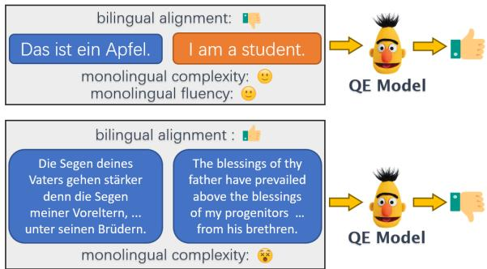
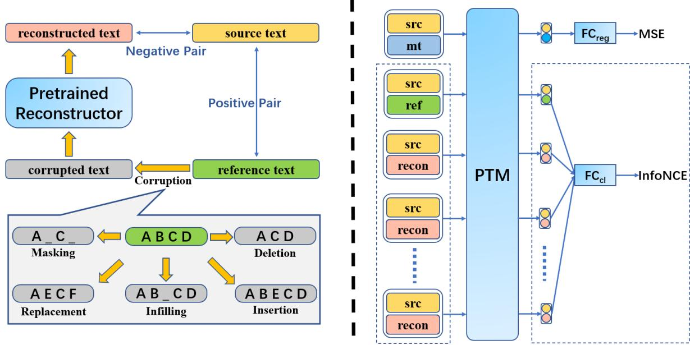
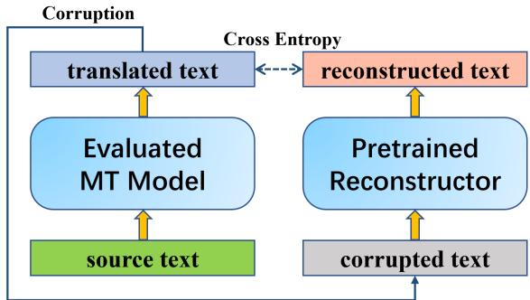
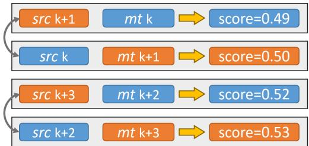
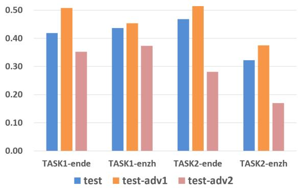
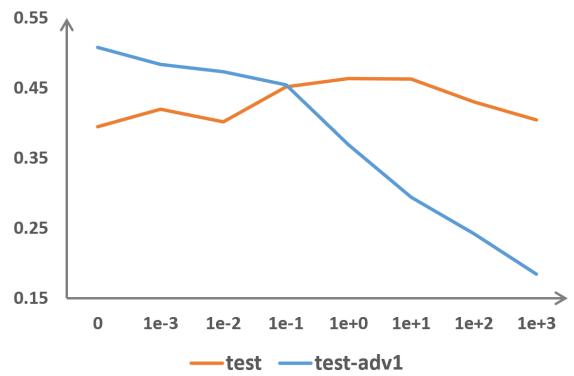
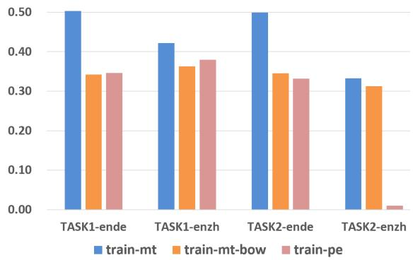

# Improving Translation Quality Estimation with Bias Mitigation

Hui Huang1†, Shuangzhi Wu2, Kehai Chen3, Hui Di4, Muyun Yang1‡, Tiejun Zhao1

1Faculty of Computing, Harbin Institute of Technology, Harbin, China

2ByteDance AI Lab, Beijing, China

3School of Computer Science and Technology, Harbin Institute of Technolgy, Shenzhen, China 4Research&Development Center, Toshiba (China) Co., Ltd, Beijing, China 22b903058@stu.hit.edu.cn, wufurui@bytedance.com, dihui@toshiba.com.cn, {chenkehai, yangmuyun, tjzhao}@hit.edu.cn;

## Abstract

State-of-the-art translation Quality Estimation (QE) models are proven to be biased. More specifically, they over-rely on monolingual fea tures while ignoring the bilingual semantic alignment. In this work, we propose a novel method to mitigate the bias of the QE model and improve estimation performance. Our method is based on the contrastive learning between clean and noisy sentence pairs. We first introduce noise to the target side of the parallel sentence pair, forming the negative samples. With the original parallel pairs as the positive sample, the QE model is contrastively trained to distinguish the positive samples from the negative ones. This objective is jointly trained with the regression-style quality estimation, so as to prevent the QE model from overfitting to monolingual features. Experiments on WMT QE evaluation datasets demonstrate that our method improves the estimation performance by a large margin while mitigating the bias1.

## 1 Introduction

Quality Estimation (QE) aims to predict the quality of machine translation automatically in the absence of reference translations. State-of-the-art QE model mostly falls into Pre-Trained Model (PTM)- based paradigm. In the latest QE evaluation tasks (Zerva et al., 2022), nearly all top-performing systems adopt Multilingual PTMs as backbone.

Good as the PTM based QE performance is, recent researches (Sun et al., 2020; Behnke et al., 2022) reveal that state-of-the-art QE models are biased. To be specific, the models largely rely on spurious monolingual features, such as the fluency of the target sequence, or the complexity of the source sequence, without really capturing the bilingual semantic alignment. Such monolingual features do not have a casual impact on the translation quality, and bias the QE results to a large extent. For example, as shown in Figure 1, a fluent and uncomplicated translation might be assigned with a high quality score even it does not resemble the actual semantics of the source sentence, while an adequate translation with complicated structure might be assigned as bad translation.

  
Figure 1: An example of the bias in QE. Notice the first sentence pair is unrelated.

Sun et al. (2020) recommends to counter with the bias by using a metric that represents adequacy well as labels. However, in their such annotated dataset, the bias is still striking, as revealed by Behnke et al. (2022). As an alternative, Behnke et al. (2022) explores several multitask architectures, to support the QE task and discourage the model from learning the bias. In spite of their success on alleviating the bias in QE, the overall estimation performance is degraded. In other words, they mitigate the bias at the cost of QE performance.

In this work, we present a new strategy to mitigate the bias of QE and meanwhile improve QE performance. Our method is based on contrastive learning between clean and noisy sentence pairs. Firstly, we add noise to the target side of the parallel sentence pair. We corrupt the target sentence with hand-crafted rules, and then use another monolingual pre-trained model to restore it. Secondly, with the original sentence pair as the positive sample and the noisy sentence pairs as the negative samples, contrastive learning is assigned to the QE model as an auxiliary task. In this procedure, the proposed method reassures the QE model to focus on the bilingual alignment in addition to monolingual features, therefore mitigating the bias while upholding the QE performance.

We perform experiments on MLQE-PE dataset (Fomicheva et al., 2020) and WMT19 QE evaluation dataset (Fonseca et al., 2019), including both high-, medium- and low-resource language pairs. Our method is confirmed to improve the QE accuracy by a large as well as margin mitigate the bias. In particular, we further provide in-detail analysis about the bias of QE by creating two adversarial test sets. Examination on these data reveals that our method strikes a compromise between QE performance and bias mitigation, avoiding bias mitigation from overriding the QE objective.

Our contributions can be summarized as follows: 1. We propose to use contrastive learning as a   
regularizer for QE training, to mitigate the bias and   
focus the model on bilingual semantic alignment.

2. We propose to create effective negative samples for contrastive learning by firstly corrupting the reference text and then reconstructing it with a pre-trained model.

3. Our bias mitigation method improves the QE performance by a large margin, while previous method would lead to performance degradation.

4. We provide in-detail and informative analysis about the bias mitigation of QE by creating two adversarial test sets.

## 2 Related Work

In contrast to the automatic MT evaluation metrics which is good at system level, QE is usually conducted in either sentence-level or word-level. In this work, we mainly concentrate on sentence-level QE, where the translation quality is measured with different schemes, such as Human-Targeted Error Rate (HTER) (Snover et al., 2006) or Direct Assessment (DA) (Graham et al., 2015), and the QE model is supposed to provide a quality score for each MT output with its source alongside.

Quality Estimation was proposed as early as in 2004 (Blatz et al., 2004). After the emergence of BERT, Pre-Trained Models (PTMs) become popular in the area of QE (Fonseca et al., 2019). By pretraining on massive multilingual text, PTMs have learned various linguistic knowledge, and can be adapted to quality estimation task without further adjustment. In WMT21 and WMT22 QE evaluation tasks (Specia et al., 2021; Zerva et al., 2022), nearly all top-performing team build the system on multilingual PTMs, e.g. XLM-RoBERTa (Conneau et al., 2020), Multilingual BERT (Devlin et al., 2019), etc. PTM-based method has become the defacto paradigm.

Despite the breakthroughs made in QE, the prediction of QE model is revealed to be biased to spurious features. Sun et al. (2020) showed that QE models have a tendency to over-rely on spurious correlations, which is partially due to skewed label distributions and statistical artifacts in QE datasets. In particular, they show the existence of a partial input bias, i.e. the tendency to predict the quality of a translation based on just the target sentence (Poliak et al., 2018). To this end, they annotate and release a new dataset, but as shown in subsequent results of Behnke et al. (2022), the bias is still striking in their newly-released dataset.

The most correlated work with us is Behnke et al. (2022), who also aims to investigate the bias mitigation of QE model. They find that the model as well as the annotators tend to over-rate the quality of fluent but inadequate translations. Accordingly, they propose four auxiliary tasks to perform bias mitigation, two approaches use additional data to inform and support the main task, while the other two are adversarial to discouraging the model from learning the bias. Although their methods could alleviate the bias, the estimation accuracy (measured with Pearson Correlation Coefficient) of the QE model is degraded in most cases.

Another correlated work is Huang et al. (2021), who firstly propose to apply contrastive learning on QE. But the contrastive learning is solely performed in a zero-shot manner, and they did not apply their method to mitigate the bias of QE.

## 3 Approach

## 3.1 Contrastively Regularized QE

To compromise between bias mitigation and quality estimation, we propose Contrastively Regularized QE (ConRegQE), as shown in Figure 2.

The core idea of our method is the contrast between clean sentence pairs (deemed as positive) and noisy sentence pairs (deemed as negative). We start from parallel sentence pairs, and introduce noise to the target side to create semantic disalignment. Notice that the noising scheme can be applied to the same positive pair multiple times, leading to multiple negative pairs according to each positive pair. After that, the positive pairs and the negative pairs are all fed to the QE model, which is trained to distinguish them with InfoNCE (Oord et al., 2018) objective defined as:

  
Figure 2: Our proposed Contrastively Regularized QE. Left denotes the negative sample generation process, where the reference is firstly corrupted by hand-crafted rules, and then reconstructed via a pre-trained reconstructor (encoder-only or encoder-decoder). Right denotes the multi-task training architecture, with source-reconstruction serving as the negative pair, and source-reference as the positive pair, and QE model is trained to distinguish the positive pair from negative ones. src, mt, ref are short for source, machine translation, reference respectively. Notice the contrastive learning module enclosed in dashed lines is omitted in inference phase.

$$
L _ { C L } = \frac { e ^ { s ( q , k ^ { + } ) / \tau } } { e ^ { s ( q , k ^ { + } ) ) / \tau } + \sum _ { i = 1 } ^ { n } e ^ { s ( q , k _ { i } ^ { - } ) / \tau } }\tag{1}
$$

where $\tau$ is a temperature coefficient, n is the negative sample number, $( q , k ^ { + } )$ is the positive pair and $( q , k ^ { - } )$ is the negative pair, and $s ( \cdot , \cdot )$ denotes the predicted logit for a sentence pair provided by the QE model as follows:

$$
s ( q , k ) = F C _ { C L } ( \Phi ( q , k ) )\tag{2}
$$

where $F C _ { c l }$ is a fully-connected layer, and $\Phi$ is the pre-trained XLM-RoBERTa.

This contrastive objective is jointly trained with the regression-style QE objective as follows:

$$
L _ { M S E } = | | F C _ { r e g } ( \Phi ( q , k ) ) - l ( q , k ) ) | | _ { 2 }\tag{3}
$$

$$
L _ { t o t a l } = L _ { M S E } + \lambda \times L _ { C L }\tag{4}
$$

where $F C _ { r e g }$ is a fully-connected layer, and $l ( q , k )$ denotes the human annotated score, and λ is a factor to balance the two loss functions. Notice we use two separate classification heads to perform the contrastive and regression training, to avoid them from disrupting each other.

Without this contrastive regularizer, the encoder would only accept one single src-mt pair as input, and is trained to assign a quality label in a regression style, in which it would leverage every possible feature to fit the annotation, such as monolingual complexity, fluency, etc. Since current PTMs are mostly trained with monolingual data, therefore it is much easier for the model to capture monolingual features than bilingual alignment, leading to the bias. But in the meantime, the features which could be utilized to finish estimation is quite limited, especially when only thousands of training samples are provided. Therefore, strictly filtering all spurious monolingual features would undoubtedly lead to performance degradation (as can be seen in the results of Behnke et al. (2022)). Our contrastive regularizer claims a decent compromise in this dilemma, and therefore making the most of bias mitigation as a supplement.

  
Figure 3: Knowledge Distillation from the to-beevaluated MT model to the pretrained reconstructor. Notice the corruption follows the pre-training strategy of different PTMs (e.g. random masking for BERT).

## 3.2 Negative Sample Generation

To create negative samples for contrastive learning, we propose the method of Denoising Reconstruction, as shown in Figure 2. Our method starts with parallel sentence pairs, and the reference is noised by the following two steps:

1. Randomly corrupt the reference sentence by the combination of different human-crafted rules, including masking, insertion, deletion, infilling and replacement, etc2;

2. Restore the corrupted reference with monolingual pre-trained models;

We introduce two kinds of pre-trained reconstructors, namely encoder-only model (such as BERT (Devlin et al., 2019)), and encoder-decoder model (such as BART (Lewis et al., 2020)) to recover the target sequence. Both models are pretrained with first corrupt the text and then reconstruct it, making them naturally adapted to perform the reconstruction. Since the input information is corrupted, the recovered version would unavoidably contain noise which is unaligned with the source sentence. Meanwhile, the reconstructions are generated by the language model, thus the results will not be unnatural or outrageous. This is in line with the real noise distribution. While most of previous works rely on hand-crafted rules or machine translation (Wu et al., 2020; Briakou and Carpuat, 2020; Tuan et al., 2021) to create negative samples for contrastive training in natural language processing, this does not apply to our scenario, since both rule-based corruption and MT decoding have specific patterns and can be easily detected3.

To further imitate the noise distribution, we resort to knowledge distillation (Kim and Rush, 2016) to transfer the decoding space of the to-beevaluated MT model to the reconstructor, as shown in Figure 3. We first use the MT model to translate text in the source language, and then the pre-trained reconstructor is further tuned on the generated target sequences. The generated sequence would contain the decoding patterns of the to-be-evaluated model, and after knowledge distillation, the reconstructor could introduce noise with more consistent distribution. This is also helpful to regularize the model to focus on quality-related features.

## 4 Experiments

## 4.1 Setup

We mainly work with the MLQE-PE dataset (Fomicheva et al., 2020), which formed the basis for the WMT21 QE evaluation task. Seven language pairs are involved, including high-, mediumand low-resource languages4. The translations were generated using Transformer-based Neural MT models, and each source sentence is accompanied with a human post-edited reference. For each language, train, dev and two test sets (Test20 and Test21) were annotated on two different scales:

• Task1: Direct Assessment (DA) Prediction;

• Task2: Human-Targeted Error Rate (HTER) Prediction;

We also experiment on the WMT19 QE dataset (Fonseca et al., 2019), which includes HTER prediction data for two language pairs5.

We mainly compare with the work of Behnke et al. (2022), which is build based on M-TransQuest (Ranasinghe et al., 2020), and explore the following four strategies to mitigate the QE bias:

• bilingual: train with different language pair (Romanian-English) which is less biased;

• augmented: train with additional translations, which are shuffled to form “bad” translations;

• adversarial: train to predict the score based on only target-input with gradient reversed;

• focal: train with revised debiased focal loss;

<table><tr><td rowspan="2">Method</td><td>EN-DE</td><td colspan="2">EN-ZH</td><td colspan="2">RO-EN</td><td colspan="2">ET-EN</td><td colspan="2">RU-EN</td><td colspan="2">SI-EN</td><td colspan="2">NE-EN</td><td rowspan="2">avg</td></tr><tr><td colspan="2">|Test20 Test21 Test20 Test21 Test20 Test21 Test20 Test21 Test20 Test21 Test20 Test21 Test20 Test21</td><td colspan="2"></td><td colspan="2"></td><td colspan="2"></td><td colspan="2"></td><td colspan="2"></td></tr><tr><td colspan="10">Task1: DA Prediction</td><td colspan="3"></td></tr><tr><td></td><td></td><td></td><td></td><td></td><td></td><td></td><td></td><td></td><td></td><td></td><td></td><td></td><td></td><td></td></tr><tr><td>TransQuest +bilingual</td><td>0.370 0.375 0.385</td><td>0.426 0.411</td><td>0.469 0.467</td><td>0.847</td><td>0.851</td><td>0.684 0.690</td><td>0.657 0.660</td><td>0.725 0.726</td><td>0.717 0.715</td><td>0.584 0.592</td><td>0.501 0.515</td><td>0.681</td><td>0.719</td><td>|0.615 0.614</td></tr><tr><td>+augmented</td><td>0.401</td><td>0.355 0.353 0.409</td><td>0.454</td><td>1 0.831</td><td>一 0.826</td><td>0.675</td><td>0.644</td><td>0.729</td><td>0.717</td><td>0.576</td><td>0.501</td><td>0.675 0.665</td><td>0.713 0.709</td><td>0.606</td></tr><tr><td>+adversarial</td><td>0.198</td><td>0.177</td><td>0.403 0.412</td><td>0.624</td><td>0.630</td><td>0.625</td><td>0.604</td><td>0.593</td><td>0.584</td><td>0.404</td><td>0.394</td><td>0.631</td><td>0.666</td><td>0.496</td></tr><tr><td>+focal</td><td>0.318</td><td>0.294</td><td>0.427</td><td>0.461 0.803</td><td>0.810</td><td>0.665</td><td>0.633</td><td>0.682</td><td>0.694</td><td>0.464</td><td>0.420</td><td>0.655</td><td>0.682</td><td>0.572</td></tr><tr><td></td><td></td><td></td><td></td><td></td><td></td><td></td><td></td><td></td><td></td><td></td><td></td><td></td><td></td><td></td></tr><tr><td>OpenKiwi COMET</td><td>0.280 0.406</td><td>0.248</td><td>0.405 0.405</td><td>0.483 0.508</td><td>0.836 0.843</td><td>0.663 0.812</td><td>0.653</td><td>0.679</td><td>0.683</td><td>0.562</td><td>0.479</td><td>0.687</td><td>0.732</td><td>|0.588</td></tr><tr><td>ConRegQE</td><td>0.452</td><td>0.393</td><td>0.445</td><td>0.814 0.504 0.867</td><td>0.865</td><td>0.654 0.727</td><td>0.611 0.701</td><td>0.683 0.736</td><td>0.702 0.732</td><td>0.574 0.598</td><td>0.484 0.547</td><td>0.667</td><td>0.720</td><td>0.602</td></tr><tr><td colspan="2">TASK2: HTER Prediction</td><td>0.454</td><td></td><td></td><td></td><td></td><td></td><td></td><td></td><td></td><td></td><td>0.722</td><td>0.780</td><td>0.652</td></tr><tr><td colspan="2"></td><td></td><td></td><td></td><td></td><td></td><td></td><td></td><td></td><td></td><td></td><td></td><td></td><td></td></tr><tr><td>TransQuest</td><td>0.475</td><td>0.520</td><td>0.336</td><td>0.301</td><td>0.831</td><td>0.813</td><td>0.639</td><td>0.680</td><td>0.398</td><td>0.423</td><td>0.598 0.582</td><td>0.537</td><td>0.605</td><td>|0.553</td></tr><tr><td>+bilingual</td><td>0.465</td><td>0.507</td><td>0.321</td><td>0.228</td><td></td><td></td><td>0.624</td><td>0.657 0.671</td><td>0.394</td><td>0.415</td><td>0.605 0.591</td><td>0.531</td><td>0.598</td><td>0.541</td></tr><tr><td>+augmented +adversarial</td><td>0.469 0.449</td><td>0.500</td><td>0.329</td><td>0.286 0.246</td><td>0.818 0.687</td><td>0.807 0.666</td><td>0.629 0.564</td><td>0.596</td><td>0.383 0.343</td><td>0.403 0.573</td><td>0.593 0.573</td><td>0.542</td><td>0.605</td><td>0.543</td></tr><tr><td>+focal</td><td>0.445</td><td>0.458 0.455</td><td>0.297 0.332</td><td>0.287</td><td>0.796</td><td>0.780</td><td>0.602</td><td>0.646</td><td>0.375</td><td>0.359 0.403 0.583</td><td>0.552 0.585</td><td>0.468 0.528</td><td>0.543 0.589</td><td>0.486 0.529</td></tr><tr><td></td><td></td><td></td><td></td><td></td><td></td><td></td><td></td><td></td><td></td><td></td><td></td><td></td><td></td><td></td></tr><tr><td>OpenKiwi</td><td>0.388 0.487</td><td>0.418</td><td>0.281 0.301</td><td>0.237 0.262</td><td>0.792 0.788</td><td>0.801 0.791</td><td>0.637 0.622</td><td>0.662 0.649</td><td>0.379 0.380</td><td>0.378 0.389</td><td>0.524 0.497</td><td>0.491</td><td>0.590</td><td>|0.505</td></tr><tr><td>COMET</td><td></td><td>0.483</td><td></td><td></td><td>0.836</td><td>0.832</td><td>0.671</td><td>0.727</td><td>0.459</td><td></td><td>0.574 0.570</td><td>0.484</td><td>0.570</td><td>0.525</td></tr><tr><td>ConRegQE</td><td>0.507</td><td>0.569</td><td>0.372</td><td>0.311</td><td></td><td></td><td></td><td></td><td></td><td>0.496 0.623</td><td>0.613</td><td>0.556</td><td>0.610</td><td>0.584</td></tr></table>

Table 1: PCC on MLQE-PE test sets. All methods are implemented on the pre-trained model of XLMR-base. Avg means averaged PCC among seven test sets. Light font denotes degraded results caused by bias mitigation. Notice we try our best to reproduce the results of Ranasinghe et al. (2020), but the results still differ a lot from their release. Similar case is also reported in Behnke et al. (2022) (Please refer to their Appendix A).

<table><tr><td rowspan=1 colspan=1>Method      Model</td><td rowspan=1 colspan=1>EN-DEEN-RU</td><td rowspan=1 colspan=1>avg</td></tr><tr><td rowspan=1 colspan=1>TransQuest  XLMR-base</td><td rowspan=1 colspan=1>0.4438 0.5094</td><td rowspan=1 colspan=1>0.4766</td></tr><tr><td rowspan=1 colspan=1>OpenKiwi   XLMR-base</td><td rowspan=1 colspan=1>0.4155 0.4462</td><td rowspan=1 colspan=1>0.4309</td></tr><tr><td rowspan=1 colspan=1>COMET     XLMR-baseConRegQE XLMR-base</td><td rowspan=1 colspan=1>0.4243 0.49250.4595 0.5609</td><td rowspan=1 colspan=1>0.45840.5102</td></tr><tr><td rowspan=1 colspan=1>TransQuest  mBERT</td><td rowspan=1 colspan=1>0.4815 0.4857</td><td rowspan=1 colspan=1>0.4836</td></tr><tr><td rowspan=1 colspan=1>OpenKiwi   mBERT</td><td rowspan=1 colspan=1>0.4549 0.5218</td><td rowspan=1 colspan=1>0.4884</td></tr><tr><td rowspan=1 colspan=1>COMET     mBERT</td><td rowspan=2 colspan=1>0.4312 0.47510.4812 0.5686</td><td rowspan=2 colspan=1>0.45320.5249</td></tr><tr><td rowspan=1 colspan=1>ConRegQE mBERT</td></tr><tr><td rowspan=1 colspan=1>TransQuest  mBERT+TLM</td><td rowspan=1 colspan=1>0.5317 0.4876</td><td rowspan=2 colspan=1>0.50970.51200.5520</td></tr><tr><td rowspan=1 colspan=1>Kepler et al.† mBERT+TLMConRegQE  mBERT+TLM</td><td rowspan=1 colspan=1>0.5070 0.51700.5386 0.5654</td></tr></table>

Table 2: PCC on WMT19 QE test sets. Avg means averaged PCC among two test sets. Results with † are taken from the submission of Kepler et al., which is the winning system of WMT19 QE Evaluation Task. TLM denotes the pre-trained encoder further fine-tuned with Translation Language Modeling, and we follow the TLM settings of Kepler et al..

We also compare with two competitive systems of OpenKiwi (Kepler et al., 2019b) and COMET (Rei et al., 2020), both are based on multilingual pre-trained models. To make a fair comparison, we implement all systems based on the same pretrained model (XLM-RoBERTa-base or Multilingual BERT) with their released codes6.

We use monolingual BERT (Devlin et al., 2019) for the backbone of the encoder-style reconstructor7. For Chinese, we also tried encoder-decoder style pre-trained model CPT (Shao et al., 2021)8.

To apply knowledge distillation for the reconstructor, we randomly sample 500k sentences from WikiMatrix (Schwenk et al., 2019) for English and CC100 (Conneau et al., 2020) for other languages. Notice our proposed method only entails monolingual data, therefore we are able to perform knowledge distilation even for low-resource languages.

Pearson Correlation Coefficient (PCC) between the prediction and the human annotation is taken as the major metric, and Spearman’s Rank Correlation Coefficient (SRCC) is also reported. All experiments are run with five different random seeds and we report the averaged results.

The temperature τ in InfoNCE loss is set as 0.3, and each positive sample is contrasted with 20 negative samples. For more detailed settings about contrastive learning and negative sample generation, please refer to the Appendix A.

## 4.2 Main Results

As shown in Table 1 and 2, we can see that our proposed method could improve the estimation accuracy by a large margin, consistently among different language pairs and annotation flavors. On the contrary, the bias mitigation methods proposed by Behnke et al. (2022) could lead to little improvement or even degradation in most cases. This indicates that the biased features should not be harshly restricted or even ruled out, since the translation quality is a whole and can not be simply decoupled. In contrast, our method applies a softer restriction to the representation, focusing it on the semantic alignment while not directly disturbing the regression-style prediction, therefore making the most use of bias mitigation as a supplement.

We also report the model performance in crossannotation scenario, to demonstrate their robustness and generalizability. In MLQE-PE dataset, each sentence pair has two different quality annotations, namely DA (Task1) and HTER (Task2). While they focus on different aspects of translation quality, they are both evaluation metrics and are inherently correlated. Therefore, we believe a well-trained model on one annotation could also function on another annotation. We apply different models on the test set with different annotations, and the results are shown in Table 3.

As can be seen, our model improves the crossannotation robustness of both models on both tasks. By contrast on noised parallel sentences, our method force the model to focus on semantic alignment, making it more general in different quality annotations, while the baseline system relies too much on spurious monolingual features and can not generalize well. And the methods proposed by Behnke et al. (2022) again lead to degradation in most cases, showing that their methods are too restrictive and deviate from the QE objective.

<table><tr><td rowspan="2">Experiment</td><td colspan="2">Test20</td><td colspan="2">Test21</td></tr><tr><td>PCC</td><td>SRCC</td><td>PCC</td><td>SRCC</td></tr><tr><td colspan="5">Train on Task1 and test on Task2</td></tr><tr><td>TransQuest</td><td>0.3331</td><td>0.3287</td><td>0.3828</td><td>0.3745</td></tr><tr><td>COMET ConRegQE</td><td>0.3406 0.3827</td><td>0.3516 0.3348</td><td>0.3601 0.4058</td><td>0.3628 0.3822</td></tr><tr><td colspan="5">Train on Task2 and test on Task1</td></tr><tr><td>TransQuest</td><td>0.4107</td><td>0.4294</td><td>0.3830</td><td>0.4083</td></tr><tr><td>COMET</td><td>0.3932</td><td>0.4098</td><td>0.3732</td><td>0.3885</td></tr><tr><td>ConRegQE</td><td>0.4506</td><td>0.4374</td><td>0.4259</td><td>0.4306</td></tr></table>

Table 3: Comparison experiments in cross-annotation setting on MLQE-PE En-De Direction.

## 5 Analysis and Discussion

## 5.1 QE model bias: an illustration

As discussed in previous sections, the major bias of QE model is heavily based on monolingual features (e.g. complexity and fluency), without modeling the bilingual alignment. We further investigate this issue by constructing two adversarial test sets on the basis of MLQE-PE dataset:

1) test-adv1 This adversarial test set is randomized by adjacent sample shuffling. We create this test set by two steps: i) Sort the src-mt pairs according to quality scores in ascending order, ii) Switch the srcs of every two adjacent pairs while keep the mt and quality score unmoved. In this case, all translation pairs are unrelated, therefore the QE results would be in random (with a minimum correlation with the quality score).

  
Figure 4: An illustration of test-adv1.

2) test-adv2 This adversarial test set is perfected with post-edit results. We create this test set by simply substitute the mt in test set with its corresponding post-edit. In this case, all translations could be regarded as fully fluent and adequate, and the QE score would possibly reach the maximum value (and also with a minimum correlation with the quality score).

We train the QE model on the original training set and evaluate on three test sets, one original and two adversarial. As shown in Figure 5, the QE model could claim even higher correlation score on test-adv1, despite all sentence pairs are unrelated and the estimation results should have fallen into random. We attribute this to the fact that two adjacent pairs should have roughly the same complexity and fluency after sorting with respect to quality scores, which are captured as the major classification feature by the biased QE model. This demonstrates the QE model is biased towards monolingual features (complexity, fluency, etc) while ignoring the bilingual semantic alignment.

  
Figure 5: PCC on the three versions of Test20, one original and two adversarial.

Meanwhile, the QE model could provide a strong correlation score on test-adv2, especially on TASK1 (84.25% on ENDE and 85.43% on ENZH). This demonstrates that the monolingual complexity is a major bias for QE model, since in test-adv2, all target sequence are fluent and adequate, and the only feature that can be utilized now is the complexity in both sides.

In a nutshell, the bias of QE can be deems as a multi-aspect notion influenced by a lot of factors, for example, the complexity of the syntactic structure, the amount of low-frequency words, the fluency of the target sequence, and so on. However, none of these monolingual factors has a casual effect on the translation quality. The QE model is expected to be able to handle such cases as the MT model provide a decent translation for a complicated sentence, or the translation result is fluent but unadequate and should be classified as low quality.

## 5.2 Compromise in bias mitigation

Based on the discussion in Section 5.1, we report the results on test-adv1 as a measurement of bias mitigation. We compare our methods with the methods proposed by Behnke et al. (2022), and the results are shown in Table 4.

<table><tr><td rowspan=1 colspan=1>Data    Method</td><td rowspan=1 colspan=1>Task1  Task2</td></tr><tr><td rowspan=6 colspan=1>TransQuest+bilingual+augmentedEN-DE +adversarial+focalOurs</td><td rowspan=1 colspan=1>0.4859 0.5128</td></tr><tr><td rowspan=1 colspan=1>0.1672 0.3521</td></tr><tr><td rowspan=1 colspan=1>-0.0185 0.4367</td></tr><tr><td rowspan=1 colspan=1>0.2612 0.5070</td></tr><tr><td rowspan=1 colspan=1>0.4324 0.3754</td></tr><tr><td rowspan=1 colspan=1>0.3162 0.3214</td></tr><tr><td rowspan=2 colspan=1>TransQuest+bilingual</td><td rowspan=1 colspan=1>0.4514 0.3778</td></tr><tr><td rowspan=1 colspan=1>0.4057 0.2746</td></tr><tr><td rowspan=2 colspan=1>+augmentedEN-ZH +adversarial</td><td rowspan=1 colspan=1>0.0903 0.1593</td></tr><tr><td rowspan=1 colspan=1>0.4014 0.2983</td></tr><tr><td rowspan=1 colspan=1>+focal</td><td rowspan=1 colspan=1>0.4348 0.3519</td></tr><tr><td rowspan=1 colspan=1>Ours</td><td rowspan=1 colspan=1>0.4483 0.2482</td></tr></table>

Table 4: PCC of different bias mitigation methods on test20-adv1, lower is better.

As can be seen, our method do mitigate the bias by a large margin. Although we do not achieve the minimal correlation compared with some versions of Behnke et al. (2022), we would like to deem this as a compromise between bias mitigation and estimation accuracy. Our model do not over emphasize bias mitigation and exclude the monolingual features since they (such as fluency) are important factors in translation quality. We verify this by adjusting the extent of bias mitigation with different λ in Equation 4, and the variation of PCC on the original and adversarial sets is shown in Figure 6.

  
Figure 6: The variation of PCC with λ on original and adversarial Test20 of EN-DE TASK1.

As can be seen, as the correlation with adversarial set is decreasing, the correlation with the original set would increase first and then decrease. Bias mitigation, to a certain extend, is helpful to avoid overfitting and obtain higher accuracy, but too much bias mitigation would harm the modeling of monolingual featues and eventually do harm to the estimation accuracy. We believe claiming a zero-correlation with our adversarial test set is not the final objective. Rather, the final objective of bias mitigation is also to improve the model performance, and our method is supplementary to achieving more accurate estimation, obtaining a compromise between bias mitigation and QE.

## 5.3 Contrastive learning vs. data augmentation

<table><tr><td>Data</td><td>Experiment</td><td>Test20</td><td>Test21</td></tr><tr><td rowspan="2">EN-DE</td><td>ConRegQE</td><td>0.5068</td><td>0.5687</td></tr><tr><td>augmented-joint augmented-split</td><td>0.4695 0.4907</td><td>0.5492 0.5413</td></tr><tr><td rowspan="2">EN-ZH</td><td>ConRegQE</td><td>0.3718</td><td>0.3107</td></tr><tr><td>augmented-joint augmented-split</td><td>0.2838 0.2675</td><td>0.2672 0.2491</td></tr></table>

Table 5: Comparison of the contrastive learning and data augmentation methods on MLQE-PE Task2. Notice both methods use the same data. augment-joint denotes using the same classification head for both synthetic and real data, while augment-split denotes using two different heads respectively.

In contrastive learning, each sentence pair would be augmented with multiple negative samples, which may make people deem that it is the data augmentation rather than the contrastive objective taking effect. To verify the necessity of contrastive learning, we use the generated synthetic data directly as data augmentation on MLQE-PE Task2. The noised reference is deemed as synthetic mt, and the HTER score between mt and pe is calculated with the official provided scripts9, leading to 140K (src-mt-hter) triplets for each direction. Then the original training set is mixed with the synthetic data, to be used for regression-style training. Notice the original training set is upsampled to make sure the synthetic and real data have roughly the same amount.

As shown in Table 5, the results would be degraded if directly use the augmented data as the regression objective. This is because the subtle distribution produced by MT decoding and crowdsourced human annotation, which is hard to be imitated by automatic data augmentation methods. We can not create an unbiased objective for regression automatically, but the noised pair is undoutedly worse translation, therefore the learning objective of contrastive learning is unbiased. Another problem is, for other annotations such as DA, there is no automatic script to calculate the quality score. Despite QE being a generally-agreed data-sparse task, data augmentation is not so easy to be directly applied on it.

## 5.4 Different ways for negative sample generation

As discussed in Section 3.2, while most of previous works rely on hand-crafted rules or machine translation to create negative samples for QE, we propose to generate synthetic data by Denoising Reconstruction, both by encoder-only model and by encoder-decoder model. For both models, we choose to apply knowledge distillation, to transfer the noise pattern from the to-be-evaluated NMT model to the pre-trained reconstructor.

<table><tr><td rowspan=1 colspan=2>Data    Method</td><td rowspan=1 colspan=1>Test20 Test21</td></tr><tr><td rowspan=4 colspan=2>baselineRule-basedEN-DEMT-based</td><td rowspan=1 colspan=1>0.46790.5176</td></tr><tr><td rowspan=1 colspan=1>0.44190.50730.40270.4790</td></tr><tr><td rowspan=1 colspan=1>BERT</td><td rowspan=2 colspan=1>0.50680.56870.4821 0.5473</td></tr><tr><td rowspan=1 colspan=1>-KD</td></tr><tr><td rowspan=1 colspan=1></td><td rowspan=1 colspan=1>baseline</td><td rowspan=1 colspan=1>0.3221 0.2929</td></tr><tr><td rowspan=1 colspan=1></td><td rowspan=1 colspan=1>Rule-based</td><td rowspan=2 colspan=1>0.30140.27640.1505 0.1478</td></tr><tr><td rowspan=4 colspan=2>EN-ZHCPT</td><td rowspan=1 colspan=1>MT-based</td></tr><tr><td rowspan=1 colspan=1>BERT</td><td rowspan=1 colspan=1>0.37180.3107</td></tr><tr><td rowspan=1 colspan=1>-KD</td><td rowspan=1 colspan=1>0.36440.30420.3659 0.3035</td></tr><tr><td rowspan=1 colspan=1>-KD</td><td rowspan=1 colspan=1>0.33380.2876</td></tr></table>

Table 6: Comparison of different negative sample generation methods on MLQE-PE Task2. – KD denotes PTM-based negative samples without knowledge distillation. Notice for German, we do not find an appropriate monolingual encoder-decoder model.

Table 6 provides a comparison of different negative sample generation methods. The results show that both rule-based and MT-decoded negative samples are disruptive and would lead to performance degradation, since both of them have specific patterns and can be easily detected (Examples are provided in Table 8 in the Appendix). Especially for MT-decoded samples, most of them are correct translations with different syntactic structures, or else to say, they are not really “negative”.

It is also noticed that for PTM-based negative samples, knowledge distillation plays an important role. This is because different models have different decoding space, leading to different noise distribution. Without knowledge distillation, the decoding space of the reconstructor would deviate from the to-be-evaluated MT model, which would be utilized as spurious features for contrastive learning, leading to performance degradation.

## 6 Conclusion

In this paper, we propose to improve translation quality estimation with bias mitigation. We first use pre-trained model to generate contrast samples, and then the QE model is trained to distinguish positive and negative samples. While previous methods mitigate the bias at the cost of estimation accuracy, our method achieves a compromise between bias mitigation and quality estimation.

While current state-of-the-art QE models being proved to be biased to monolingual features, the bias could not be simple ruled out for the sake of overall estimation accuracy. In the future, we will dig deeper into this problem, to improve the robustness and generalizability of QE in real applications.

## Limitations

Our work still has some limitations: 1) Due to the lack of research about the bias mitigation of QE, there is only one directly related work in this area, which serves as the main baseline in our experiments. Since the bias of QE is a conspicuous problem, we hope there will be more related work in the future. 2) Although our experiments are on WMT QE datasets, we do not implement the complicated data augmentation or model ensemble techniques as described in Specia et al. (2021) and Zerva et al. (2022), therefore our results can not compete with the best results of the WMT QE evaluation tasks. 3) Also, our method requires reference as the positive sample. Although most QE data includes reference, there are still chances that the QE data is annotated without the absence of reference, and our method would be hard to apply to such cases.

## Acknowledgements

This work is supported by National Key RD Program of China (2020AAA0108000), National Natural Science Foundation of China (62276077, U1908216), Key RD Program of Yunnan (202203AA080004) and Shenzhen College Stability Support Plan (No. GXWD20220811170358002). Muyun Yang is also partially supported by a joint project with Global Tone Communication Technology Co., Ltd.

## References

Hanna Behnke, Marina Fomicheva, and Lucia Specia. 2022. Bias mitigation in machine translation quality estimation. In Proceedings ofthe 60th Annual Meeting of the Association for Computational Linguistics (Volume 1: Long Papers), pages 1475–1487, Dublin, Ireland. Association for Computational Linguistics.

John Blatz, Erin Fitzgerald, George Foster, Simona Gandrabur, Cyril Goutte, Alex Kulesza, Alberto Sanchis, and Nicola Ueffing. 2004. Confidence estimation for machine translation. In COLING 2004: Proceedings of the 20th International Conference on Computational Linguistics, pages 315–321, Geneva, Switzerland. COLING.

Eleftheria Briakou and Marine Carpuat. 2020. Detecting Fine-Grained Cross-Lingual Semantic Divergences without Supervision by Learning to Rank. In Proceedings of the 2020 Conference on Empirical Methods in Natural Language Processing (EMNLP), pages 1563–1580, Online. Association for Computational Linguistics.

Ting Chen, Simon Kornblith, Mohammad Norouzi, and Geoffrey Hinton. 2020. A simple framework for contrastive learning of visual representations.

Alexis Conneau, Kartikay Khandelwal, Naman Goyal, Vishrav Chaudhary, Guillaume Wenzek, Francisco Guzmán, Edouard Grave, Myle Ott, Luke Zettlemoyer, and Veselin Stoyanov. 2020. Unsupervised cross-lingual representation learning at scale. In Proceedings of the 58th Annual Meeting of the Association for Computational Linguistics, pages 8440– 8451, Online. Association for Computational Linguistics.

Yiming Cui, Wanxiang Che, Ting Liu, Bing Qin, and Ziqing Yang. 2021. Pre-training with whole word masking for chinese bert.

Jacob Devlin, Ming-Wei Chang, Kenton Lee, and Kristina Toutanova. 2019. BERT: Pre-training of deep bidirectional transformers for language understanding. In Proceedings ofthe 2019 Conference of the North American Chapter of the Association for Computational Linguistics: Human Language Technologies, Volume 1 (Long and Short Papers), pages 4171–4186, Minneapolis, Minnesota. Association for Computational Linguistics.

Marina Fomicheva, Shuo Sun, Erick Fonseca, Frédéric Blain, Vishrav Chaudhary, Francisco Guzmán, Nina Lopatina, Lucia Specia, and André F. T. Martins. 2020. MLQE-PE: A multilingual quality estimation and post-editing dataset. arXiv preprint arXiv:2010.04480.

Erick Fonseca, Lisa Yankovskaya, André F. T. Martins, Mark Fishel, and Christian Federmann. 2019. Findings of the WMT 2019 shared tasks on quality estimation. In Proceedings ofthe Fourth Conference on Machine Translation (Volume 3: Shared Task Papers, Day 2), pages 1–10, Florence, Italy. Association for Computational Linguistics.

Yvette Graham, Timothy Baldwin, Alistair Moffat, and Justin Zobel. 2015. Can machine translation systems be evaluated by the crowd alone. Natural Language Engineering, 23:3 – 30.

Kaiming He, Haoqi Fan, Yuxin Wu, Saining Xie, and Ross Girshick. 2019. Momentum contrast for unsupervised visual representation learning. arXiv preprint arXiv:1911.05722.

Hui Huang, Hui Di, Jian Liu, Yufeng Chen, Kazushige Ouchi, and Jinan Xu. 2021. Contrastive learning for machine translation quality estimation. In Natural Language Processing and Chinese Computing, pages 92–103, Cham. Springer International Publishing.

Fabio Kepler, Jonay Trénous, Marcos Treviso, Miguel Vera, António Góis, M. Amin Farajian, António V. Lopes, and André F. T. Martins. 2019a. Unbabel’s participation in the WMT19 translation quality estimation shared task. In Proceedings of the Fourth Conference on Machine Translation (Volume 3: Shared Task Papers, Day 2), pages 78–84, Florence, Italy. Association for Computational Linguistics.

Fábio Kepler, Jonay Trénous, Marcos Treviso, Miguel Vera, and André F. T. Martins. 2019b. OpenKiwi: An open source framework for quality estimation. In Proceedings of the 57th Annual Meeting of the Association for Computational Linguistics–System Demonstrations, pages 117–122, Florence, Italy. Association for Computational Linguistics.

Yoon Kim and Alexander M. Rush. 2016. Sequencelevel knowledge distillation. In Proceedings of the 2016 Conference on Empirical Methods in Natural Language Processing, pages 1317–1327, Austin, Texas. Association for Computational Linguistics.

Mike Lewis, Yinhan Liu, Naman Goyal, Marjan Ghazvininejad, Abdelrahman Mohamed, Omer Levy, Veselin Stoyanov, and Luke Zettlemoyer. 2020. BART: Denoising sequence-to-sequence pre-training for natural language generation, translation, and comprehension. In Proceedings ofthe 58th Annual Meeting of the Association for Computational Linguistics, pages 7871–7880, Online. Association for Computational Linguistics.

Yinhan Liu, Jiatao Gu, Naman Goyal, Xian Li, Sergey Edunov, Marjan Ghazvininejad, Mike Lewis, and Luke Zettlemoyer. 2020. Multilingual denoising pretraining for neural machine translation. Transactions ofthe Associationfor Computational Linguistics, 8:726–742.

Aaron van den Oord, Yazhe Li, and Oriol Vinyals. 2018. Representation learning with contrastive predictive coding.

Adam Poliak, Jason Naradowsky, Aparajita Haldar, Rachel Rudinger, and Benjamin Van Durme. 2018. Hypothesis only baselines in natural language inference. In Proceedings of the Seventh Joint Conference on Lexical and Computational Semantics, pages 180–191, New Orleans, Louisiana. Association for Computational Linguistics.

Tharindu Ranasinghe, Constantin Orasan, and Ruslan Mitkov. 2020. TransQuest: Translation quality estimation with cross-lingual transformers. In Proceedings of the 28th International Conference on Computational Linguistics, pages 5070–5081, Barcelona, Spain (Online). International Committee on Computational Linguistics.

Ricardo Rei, Craig Stewart, Ana C Farinha, and Alon Lavie. 2020. COMET: A neural framework for MT evaluation. In Proceedings ofthe 2020 Conference on Empirical Methods in Natural Language Processing (EMNLP), pages 2685–2702, Online. Association for Computational Linguistics.

Holger Schwenk, Vishrav Chaudhary, Shuo Sun, Hongyu Gong, and Francisco Guzmán. 2019. Wikimatrix: Mining 135m parallel sentences in 1620 language pairs from wikipedia.

Yunfan Shao, Zhichao Geng, Yitao Liu, Junqi Dai, Fei Yang, Li Zhe, Hujun Bao, and Xipeng Qiu. 2021. Cpt: A pre-trained unbalanced transformer for both chinese language understanding and generation. arXiv preprint arXiv:2109.05729.

Matthew Snover, Bonnie Dorr, Rich Schwartz, Linnea Micciulla, and John Makhoul. 2006. A study of translation edit rate with targeted human annotation. In Proceedings ofthe 7th Conference ofthe Association for Machine Translation in the Americas: Technical Papers, pages 223–231, Cambridge, Massachusetts, USA. Association for Machine Translation in the Americas.

Lucia Specia, Frédéric Blain, Marina Fomicheva, Chrysoula Zerva, Zhenhao Li, Vishrav Chaudhary, and André F. T. Martins. 2021. Findings of the WMT 2021 shared task on quality estimation. In Proceedings ofthe Sixth Conference on Machine Translation, pages 684–725, Online. Association for Computational Linguistics.

Shuo Sun, Francisco Guzmán, and Lucia Specia. 2020. Are we estimating or guesstimating translation quality? In Proceedings of the 58th Annual Meeting of the Association for Computational Linguistics, pages 6262–6267, Online. Association for Computational Linguistics.

Yi-Lin Tuan, Ahmed El-Kishky, Adithya Renduchintala, Vishrav Chaudhary, Francisco Guzmán, and Lucia Specia. 2021. Quality estimation without humanlabeled data. In Proceedings ofthe 16th Conference

of the European Chapter of the Association for Computational Linguistics: Main Volume, pages 619–625, Online. Association for Computational Linguistics.

Tongzhou Wang and Phillip Isola. 2020. Understanding contrastive representation learning through alignment and uniformity on the hypersphere. In Proc. ofICML.

Hanlu Wu, Tengfei Ma, Lingfei Wu, Tariro Manyumwa, and Shouling Ji. 2020. Unsupervised reference-free summary quality evaluation via contrastive learning. In Proceedings ofthe 2020 Conference on Empirical Methods in Natural Language Processing (EMNLP), pages 3612–3621, Online. Association for Computational Linguistics.

Chrysoula Zerva, Frdric Blain, Ricardo Rei, Piyawat Lertvittayakumjorn, Jos G. C. de Souza, Steffen Eger, Diptesh Kanojia, Duarte Alves, Constantin Orsan, Marina Fomicheva, Andr F. T. Martins, and Lucia Specia. 2022. Findings of the wmt 2022 shared task on quality estimation. In Proceedings of the Seventh Conference on Machine Translation, pages 69–99, Abu Dhabi. Association for Computational Linguistics.

## A Hyperparameters of Contrastive Learning

Previous research on contrastive learning finds that the amount of negative samples has a significant impact on the contrastive learning performance (He et al., 2019; Chen et al., 2020). In contrastive learning, the positive sample is pushed apart from all negative samples, and introducing more contrast samples could help to learn a uniform representation space, and also possibly incorporating harder contrast to learn more complicated semantics. Therefore, previous research often set a large batch size (sometimes leveraging the memory bank) for contrast. Also, an adjustable temperature τ is also believed conducive to contrastive learning (Wang and Isola, 2020). A lower temperature value could generate peaky logit distribution and punish the model more on harder samples. We tune both hyperparameters on MLQE-PE Task2.

0.55   
0.5   
0.45   
0.4   
0.35   
0.3   
5 10 15 20 25 30 35 40   
-ENDE -ENZH  
Figure 7: PCC on Test20 of MLQE-PE TASK2 with different numbers of negative samples.

<table><tr><td rowspan="2">temp</td><td colspan="2">ENDE</td><td colspan="2">ENZH</td></tr><tr><td>PCC</td><td>SRCC</td><td>PCC</td><td>SRCC</td></tr><tr><td>0.01 0.03 0.1</td><td>0.4847 0.4928 0.4875</td><td>0.4323 0.4485 0.4379</td><td>0.3704 0.3656 0.3704 0.3635</td><td>0.3647 0.3607</td></tr></table>

Table 7: Experiment results on Test20 of TASK2, with different temperatures (abbreviated as temp).

As shown in Figure 7, while too few negative samples would lead to performance degradation, the model could not get further improvement after more than 20 negative samples. We think this is because our carefully choreographed noising scheme, enabling us to introduce harder contrast samples without a large batch size. Besides, as shown in

Table 7, the temperature does not have a significant influence on the result. We think it is because we are using contrastive learning in a multi-task architecture, therefore the loss would not drastically change when tuning the temperature value. In the end, we decide to set negative sample number as 20 and temperature as 0.3 in all experiments.

## B Hyperparameters of Data Generation

Algorithm 1 Text Corruption   
Input: Input sentence x with N tokens, mask ratio   
$r _ { m } \in [ 0 , 1 ]$ , random ratio $r _ { r } \in [ 0 , 1 ]$ , insertion   
ratio $r _ { i } \in [ 0 , 1 ]$ , and deletion ratio $r _ { i } \in [ 0 , 1 ]$   
Output: Corrupted sentence $x ^ { \prime } .$   
1: Draw J text spans from x with totally M to  
kens, where $M = N \times r _ { d } .$   
2: for $i = 1 , 2 , . . . , J$ do   
3: Delete i-th text span.   
4: end for   
5: Draw K positions from $x ,$ where $K = ( N +$   
1) $\times \textit { r } _ { i } .$   
6: for $i = 1 , 2 , . . . , K$ do   
7: Generate a random number $f \in [ 0 , 1 ] .$   
8: if $f > r _ { r }$ then   
9: Insert i-th position with MASK token.   
10: else   
11: Insert i-th position with a random token.   
12: end if   
13: end for   
14: Draw L positions from x with totally M to  
kens, where $M = N \times r _ { m }$   
15: for $i = 1 , 2 , . . . , L$ do   
16: Generate a random number $f \in [ 0 , 1 ] .$   
17: if $f > r _ { r }$ then   
18: Replace i-th text span with MASK token.   
19: else   
20: Replace i-th text span with a random to  
ken.   
21: end if   
22: end for

In this section, we would elaborate on the detailed hyperparameters for the data generation. As depicted in Section 3.2, we use denoising reconstruction to create negative samples, where we first use rules to corrupt the sequence, and then use a pre-trained reconstructor to restore it.

For the corruption of the text, we use the combination of five rules, including masking, replacement, insertion, deletion and infilling. Detailed corruption procedure is depicted in Algorithm 1. Notice “replacement” is actually masking with a random token, and "infilling" is actually insertion with MASK token.

<table><tr><td>source</td><td>De la Watnall au mai fost trimise în misiune încă patru escadrile.</td></tr><tr><td>reference</td><td>Four more squadrons were sent on mission from Watnall.</td></tr><tr><td>Rule-based</td><td>fascinate more squadrons were sent ball on mission from.</td></tr><tr><td>MT-based</td><td>Since Watnall, four more squadrons have been sent to the mission.</td></tr><tr><td>DR-based</td><td>Four more gifts were sent on trip from Watnall.</td></tr><tr><td>source</td><td> ,   .</td></tr><tr><td>reference</td><td>More money than sense.</td></tr><tr><td>Rule-based</td><td>More money mature sense.</td></tr><tr><td>MT-based</td><td>The fortune is great, but the mind is not enough.</td></tr><tr><td>DR-based</td><td>More money than meaning.</td></tr></table>

Table 8: Negative samples created via rules, the provided machine translation (abbreviated as MT) model, and Denoising Reconstruction (abbreviated as DR). Red denotes noise. Notice the rule-based sample is disfluent and unnatural, while the machine translated sample is actually a correct translation with different syntactic structure.

We try out different combinations of hyperparameters on MLQE-PE Task2, and the results are shown in Table 10. As can be seen, both the insertion/deletion and the replacement/infilling operation is helpful, since they can generate more diverse noise compared with only masking. Also, when set the noise ratio too high or too low, the model performance would degrade, since too much noise would make the reconstructed text outrageous and deviate from real MT noise, while too little noise would make the reconstruction too easy and the generated negative samples might be actually positive.

Current pre-trained models are mostly based on subword segmentation. As discussed in previous research (Cui et al., 2021), corruption on whole word level might be more consistent with the semantic structure and therefore draw further gain. When performing masking, replacement and deletion operation, we try three corruption strategies on subword level, word level and span level respectively (with length drawn from a Poisson distribution). As shown in Table 9, the result is the best when performing corruption on subword level, which is beyond our expectation. It is possibly because subword-level corruption can generate more diverse noise, providing more contrast examples.

<table><tr><td rowspan="2">Strategy</td><td colspan="2">ENDE</td><td colspan="2">ENZH</td></tr><tr><td>PCC</td><td>SRCC</td><td>PCC</td><td>SRCC</td></tr><tr><td>subword</td><td>0.5068</td><td>0.4508</td><td>0.3718</td><td>0.3655</td></tr><tr><td>wholeword</td><td>0.4875</td><td>0.4446</td><td>0.3514</td><td>0.3432</td></tr><tr><td>poisson (λ=2)</td><td>0.4819</td><td>0.4351</td><td>0.3604</td><td>0.3493</td></tr><tr><td>poisson (λ=3)</td><td>0.4798</td><td>0.4436</td><td>0.3272</td><td>0.3320</td></tr><tr><td>poisson (λ=4)</td><td>0.4905</td><td>0.4524</td><td>0.3535</td><td>0.3441</td></tr></table>

Table 9: Experiment results on Test20 of TASK2, with different corruption levels.

<table><tr><td>Data</td><td> $r _ { r }$ </td><td> $r _ { m }$ </td><td> $r _ { i }$ </td><td> $r _ { d }$ </td><td>PCC</td><td>SRCC</td></tr><tr><td>ENDE</td><td>0.20 0.30 0.40 0.50 0.60 0.40 0.40</td><td>0.05 0.10 0.15 0.20 0.25 0.0</td><td>0.05 0.10 0.15 0.20 0.25 0.0</td><td>0.50 0.50 0.50 0.50 0.50 0.50</td><td>0.4897 0.4804 0.4959 0.5068 0.4830 0.4903</td><td>0.4319 0.4378 0.4541 0.4508 0.4486 0.4471</td></tr><tr><td>ENZH</td><td>0.20 0.30 0.40 0.50</td><td>0.15 0.05 0.10 0.15 0.20</td><td>0.15 0.05 0.10 0.15 0.20</td><td>0.0 0.50 0.50 0.50 0.50</td><td>0.4819 0.3320 0.3645 0.3718 0.3679</td><td>0.4422 0.3217 0.3572 0.3655</td></tr><tr><td rowspan="2"></td><td>0.60 0.50</td><td>0.25 0.25 0.0</td><td>0.50</td><td></td><td>0.3352</td><td>0.3603 0.3268</td></tr><tr><td>0.50 0.20</td><td>0.0 0.20</td><td>0.50 0.0</td><td></td><td>0.3375 0.3658</td><td>0.3346 0.3583</td></tr></table>

Table 10: Experiment results on Test20 of MLQE-PE TASK2, with different combinations of corruption rules and ratios. Notice to make sure the corrupted sequence has roughly the same length with the original sequence, we always set the insertion ratio $r _ { i }$ and deletion ration $r _ { d }$ the same.

In a nutshell, when generating negative samples for contrastive learning, the primary concern is to keep the noise distribution both consistent and diverse.

## C Is target fluency the largest bias?

Behnke et al. (2022) claims that the major bias in QE is partial input bias, where the model relies too much on target fluency. We think this claim is not accurate, and to verify this, we conduct three sets of experiments on only the target side of the data.

1) train-mt: Train on the original training set and infer on the original test set (only mt);

2) train-mt-bow: Train on the Bag-of-Words style training set and infer on the original test set. We shuffle each mt sentence on token level, therefore the fluency information is excluded. An example is as follows:

<table><tr><td>mt</td><td>|A man is fishing on the bank .</td></tr><tr><td></td><td>mt-bow is bank a fishing on man the .</td></tr></table>

3) train-pe: Train on the pes of training set and infer on the original test set. We simply substitute the mt in training set with its corresponding pe.

  
Figure 8: PCC on Test20 under different settings with target-side input.

To make the most of partial input, we use monolingual BERT model for German10 and Chinese11. As shown in Figure 8, the QE model could claim strong results on both mt-BOW and pe scenarios, in both cases fluency is excluded and can not be utilized as feature12. This again demonstrates that fluency is not the major factor when performing estimation. The estimation can still be performed when there is no fluency information. Besides, it can also be noticed that with the help of powerful monolingual pre-trained models, we can achieve comparable or even higher estimation accuracy solely relying on the target side.

To draw a conclusion, target fluency is a major bias, but not the major bias.

A For every submission: ✓ A1. Did you describe the limitations of your work? Left blank.

✓ A2. Did you discuss any potential risks of your work? Left blank.

✓ A3. Do the abstract and introduction summarize the paper’s main claims? Left blank.

✗ A4. Have you used AI writing assistants when working on this paper? Left blank.

## B ✗ Did you use or create scientific artifacts?

Left blank.

 B1. Did you cite the creators of artifacts you used? No response.

 B2. Did you discuss the license or terms for use and / or distribution of any artifacts? No response.

 B3. Did you discuss if your use of existing artifact(s) was consistent with their intended use, provided that it was specified? For the artifacts you create, do you specify intended use and whether that is compatible with the original access conditions (in particular, derivatives of data accessed for research purposes should not be used outside of research contexts)? No response.

 B4. Did you discuss the steps taken to check whether the data that was collected / used contains any information that names or uniquely identifies individual people or offensive content, and the steps taken to protect / anonymize it? No response.

 B5. Did you provide documentation of the artifacts, e.g., coverage of domains, languages, and linguistic phenomena, demographic groups represented, etc.? No response.

 B6. Did you report relevant statistics like the number of examples, details of train / test / dev splits, etc. for the data that you used / created? Even for commonly-used benchmark datasets, include the number of examples in train / validation / test splits, as these provide necessary context for a reader to understand experimental results. For example, small differences in accuracy on large test sets may be significant, while on small test sets they may not be. No response.

## C ✓ Did you run computational experiments?

Left blank.

✓ C1. Did you report the number of parameters in the models used, the total computational budget (e.g., GPU hours), and computing infrastructure used? Left blank.

✓ C2. Did you discuss the experimental setup, including hyperparameter search and best-found hyperparameter values? Left blank.

✓ C3. Did you report descriptive statistics about your results (e.g., error bars around results, summary statistics from sets of experiments), and is it transparent whether you are reporting the max, mean, etc. or just a single run? Left blank.

✓ C4. If you used existing packages (e.g., for preprocessing, for normalization, or for evaluation), did you report the implementation, model, and parameter settings used (e.g., NLTK, Spacy, ROUGE, etc.)? Left blank.

D ✗ Did you use human annotators (e.g., crowdworkers) or research with human participants? Left blank.

 D1. Did you report the full text of instructions given to participants, including e.g., screenshots, disclaimers of any risks to participants or annotators, etc.? No response.

 D2. Did you report information about how you recruited (e.g., crowdsourcing platform, students) and paid participants, and discuss if such payment is adequate given the participants’ demographic (e.g., country of residence)? No response.

 D3. Did you discuss whether and how consent was obtained from people whose data you’re using/curating? For example, if you collected data via crowdsourcing, did your instructions to crowdworkers explain how the data would be used? No response.

 D4. Was the data collection protocol approved (or determined exempt) by an ethics review board? No response.

 D5. Did you report the basic demographic and geographic characteristics of the annotator population that is the source of the data? No response.