# In-Context Analogical Reasoning with Pre-Trained Language Models

Xiaoyang Hu12∗ Shane Storks1∗ Richard L. Lewis2† Joyce Chai1† 1Computer Science and Engineering Division, University of Michigan 2Department of Psychology, University of Michigan {nickhu, sstorks, rickl, chaijy}@umich.edu

## Abstract

Analogical reasoning is a fundamental capacity of human cognition that allows us to reason abstractly about novel situations by relating them to past experiences. While it is thought to be essential for robust reasoning in AI systems, conventional approaches require significant training and/or hard-coding of domain knowledge to be applied to benchmark tasks. Inspired by cognitive science research that has found connections between human language and analogy-making, we explore the use of intuitive language-based abstractions to support analogy in AI systems. Specifically, we apply large pre-trained language models (PLMs) to visual Raven’s Progressive Matrices (RPM), a common relational reasoning test. By simply encoding the perceptual features of the problem into language form, we find that PLMs exhibit a striking capacity for zero-shot relational reasoning, exceeding human performance and nearing supervised vision-based methods. We explore different encodings that vary the level of abstraction over task features, finding that higherlevel abstractions further strengthen PLMs’ analogical reasoning. Our detailed analysis reveals insights on the role of model complexity, incontext learning, and prior knowledge in solving RPM tasks.

## 1 Introduction

Humans are constantly presented with novel problems and circumstances. Rather than understand them in isolation, we try to connect them with past experiences. With any luck, we might find an analogy: a mapping between relevant aspects of this new situation and a past situation, which helps form abstractions that allow us to reason more effectively in the future (Holyoak, 1984). Analogy is thought to underpin humans’ robust reasoning and problem solving capabilities (Hofstadter and

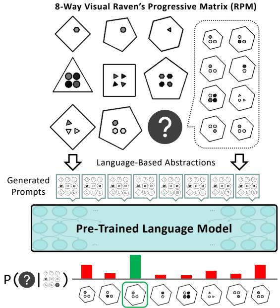  
Figure 1: Raven’s Progressive Matrices (Raven and Court, 1938; Zhang et al., 2019a) are an analogy-making task where one must infer the missing matrix item based on abstract rules instantiated in the first two rows. To demonstrate the potential analogical reasoning skills in pre-trained language models, we develop languagebased abstractions over their key perceptual features, then prompt them to select the completion of the matrix.

Sander, 2013), and thus it is believed to be prerequisite in order to enable the same in AI systems. However, conventional approaches struggle with analogy-making, and are trained on thousands of examples to achieve any success on benchmark tasks. This is unsatisfying, as humans are capable of analogy-making without explicit training, and such analogy-making should enable zero-shot generalization to new situations (Mitchell, 2021).

Interestingly, a body of work in cognitive science suggests that analogy-making and relational reasoning are connected to humans’ symbol system and language capabilities (Gentner, 2010). For example, Gordon (2004) finds that members of an Amazonian tribe that count only with words for “one,” “two,” and “many” struggle to make analogies with higher numbers. Further, Gentner et al. (2013) find that deaf children whose sign language does not involve spatial relations are outperformed by hearing children on a spatial relational reasoning task, while Christie and Gentner (2014) find that assigning even nonsensical names to relations enhances children’s relational reasoning. All of this demonstrates that language serves as a powerful way for humans to abstract and better reason about the overwhelming and complex percepts we encounter in the world.

In this work, we explore whether language may serve a similar purpose in AI systems. Specifically, we apply contemporary autoregressive pre-trained language models (PLMs) to Raven’s Progressive Matrices (RPM), an example of which is shown in Figure 1. RPM is a widely used psychometric test for relational reasoning that requires inducing an abstract rule from just two examples of short sequences of groups of shapes, and then applying the rule to complete a new partial sequence (Raven and Court, 1938). This task makes minimal assumptions about the test taker’s prior knowledge, and is thus thought to provide a good estimate for general intelligence (Holyoak, 2012). On the RAVEN dataset (Zhang et al., 2019a), we find that given the ability to perceive key features of RPMs, large PLMs exhibit a surprising capacity for zero-shot relational reasoning, approaching that of supervised vision-based deep learning approaches and even humans. We propose three levels of abstraction over the language features of the task using name assignment and task decomposition, and find that each abstraction further strengthens PLMs’ relational reasoning. Our results and detailed analysis offer insights on PLM performance, including the role of models’ complexity, in-context learning, and prior knowledge in emergent relational reasoning, and suggest that they could play an important role in future cognitive architectures for analogy-making.2

## 2 Related Work

Past work has studied analogy in AI across various domains. Mitchell (2021) provides a comprehensive overview of these efforts, especially those applied in idealized symbolic domains. Here, symbolic and probabilistic methods have traditionally been applied (Gentner, 1983; Hofstadter and Mitchell, 1994; Lake et al., 2015). However, these approaches typically require hard-coding domainspecific concepts, and require substantial search through domain knowledge to operate on their target problems, thus making them unscalable. The creation of large-scale image datasets for analogy tasks here (Zhang et al., 2019a; Hu et al., 2021; Odouard and Mitchell, 2022) have enabled further research with deep learning and neuro-symbolic methods (Hill et al., 2019; Spratley et al., 2020; Kim et al., 2020; Zhang et al., 2021), which bring the advantage of requiring less ad-hoc encoding of domain knowledge, but require thousands of training examples to learn the tasks, still limiting their generalization capability.

Other work has explored AI systems’ analogymaking in real-world domains, including in natural images (Teney et al., 2020; Bitton et al., 2022) and language (Li et al., 2020; Chen et al., 2022; Sultan and Shahaf, 2022), especially lexical analogies (Turney et al., 2003; Turney, 2008; Speer et al., 2008; Mikolov et al., 2013b,a; Linzen, 2016; Lu et al., 2019). However, these domains make it difficult to control the prior knowledge required to solve tasks (Mitchell, 2021), and in the context of recent generative foundation models that are extensively pre-trained on natural data, it becomes difficult to separate analogy learning from distributional patterns that can be overfit. Unlike prior work, we apply such foundation models for language to analogical reasoning in a zero-shot setting, bypassing the requirement of hard-coding domain knowledge or training models on task-specific data. Furthermore, while contemporaneous work has applied PLMs to a variety of simpler relational reasoning tasks in language (Webb et al., 2022), we systematically explore the advantage of using language to abstract over complex visual features of the task, opening questions about how the powerful symbol systems learned in PLMs may support robust, perception-driven reasoning in future AI systems.

## 3 Raven’s Progressive Matrices

Raven’s progressive matrices (RPM) are abstract relational reasoning tasks used in cognitive psychology to test humans’ analogy-making (Raven and Court, 1938). Each instance of RPM is a matrix consisting of 9 items arranged in a square, the last of which must be selected from a set of choices. Each item consists of several perceptual attributes, such as shape, color, or more abstract features. Within each row of the matrix, a relation is applied over these attributes, such as progression of numerical values associated with these attributes. Given the first two rows of the matrix, the challenge of the task is to identify the relations being applied to items, and apply them analogously in the third row to infer the missing ninth item. Successfully solving an RPM requires tackling two sub-problems: perception of each item’s attributes, and reasoning over multiple items’ attributes to infer and apply relations.

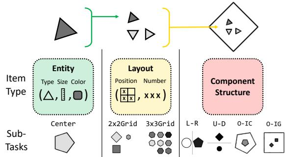  
Figure 2: Illustration of the compositional nature of entities, layouts, and component structures in RAVEN, and their unique attributes. We provide example items from sub-tasks each item type appears in.

## 3.1 RAVEN Dataset

We focus our study on RAVEN (Zhang et al., 2019a), which provides a large-scale benchmark for RPM tasks for training and evaluation of AI systems. Each RPM has 8 possible candidate items to complete it. As shown in Figure 2, each item may consist of compositional entities, layouts, and/or component structures, and RAVEN provides a suite of increasingly complex sub-tasks built from these elements. We introduce their unique attributes below, as well as relations that may occur over them across items in the matrix.

Entities. A single entity has a type (i.e., shape), size, and color selected from a small number of classes. Each of these attributes is associated with a number: type with the number of sides in the entity’s shape, size with its diameter, and color with the darkness of its shading. The simplest sub-task of RAVEN is Center, where each item only consists of a single entity.

Layouts. Layouts of entities bring additional higher-level attributes to items, specifically the number (i.e., count) and position of entities within a layout. In the 2x2Grid and 3x3Grid sub-tasks of RAVEN, each item consists of multiple entities arranged in a grid.

Component structures. Items may also be composed of multiple sub-items or components; RAVEN includes four sub-tasks that introduce this even higher-level challenge: L-R, U-D, and O-IC, each of which consist of two single entities in different configurations, and O-IG, which consists of a 2-by-2 grid inside of a larger entity.

Relations. Following prior work on this task, RAVEN applies four different relations to item attributes across rows of the matrix. These are Constant, which does not modify an attribute, Progression, which increases or decreases the value of an attribute by 1 or 2, Arithmetic, which performs addition or subtraction on the first two attributes of the row to create the third, and Distribute Three, which distributes three consistent values of an attribute across each row.

## 4 Methods

In order to apply PLMs to RAVEN, we abstract the visual features of the task into language. Our abstractions are intentionally applied on a per-item basis to tackle the perception problem of the task without giving the PLM explicit hints toward the reasoning problem (which requires capturing patterns over multiple items). This allows us to focus on evaluating the reasoning capabilities of PLMs.3

First, we introduce our multi-level abstractions for the RAVEN dataset.4 Then we formally define the interface between PLMs and the RPM task.

## 4.1 Abstractions in RAVEN

We define abstractions for entity-level attributes, layout-level attributes, and component structures which convert the RPM task into one or more text prompts. We apply two kinds of abstractions: naming and decomposition. As discussed in Section 1, assigning names to perceptual features strengthens humans’ analogy-making skills over them. Inspired by this, naming abstractions abstract over attributes or combinations of attributes in the RPM by assigning a unique name to describe them. Meanwhile, jointly understanding and tracking the complex features of the task can become a burden even for humans. Inspired by humans’ capability to decompose complex tasks into independent subtasks (Lee and Anderson, 2001), decomposition abstractions split the RPM into multiple sub-matrices by its independent features, then generate a separate prompt for each one. We can then prompt a PLM once for each sub-matrix, and aggregate PLM outputs to choose a candidate matrix completion.5

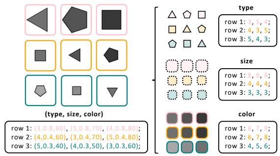

Figure 3: Example generated prompts for a complete RPM under entity attribute naming (left) and decomposition (right) abstractions in the Center sub-task.  
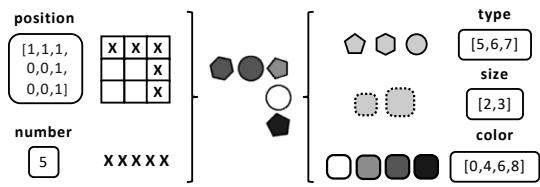  
Figure 4: Example of generated entity layout encodings when abstracting position and number, and summarizing redundant entity attributes within the layout.

## 4.1.1 Entity-Level Abstractions

As shown in Figure 3, we can abstract perceptual entity attributes into language by assigning them names, then generating prompts to represent the full RPM using these names. As each of an entity’s attributes is numerical by nature, we assign each attribute an ordinal numerical name; type is named by the number of sides of the associated shape (e.g., “3” for triangle), size is named by a decimal representing its diameter, and color is named based on the darkness of the entity’s shade. As each of an entity’s attributes is independent, i.e., a relation over one attribute has no connection to relations over other attributes, we can decompose the RPM task by these attributes into three separate sub-tasks with their own prompts.

## 4.1.2 Layout-Level Abstractions

As shown in Figure 4, we next propose abstractions for layouts of entities (e.g., in grid-based sub-tasks of RAVEN). First, the number attribute of a layout corresponds to the count of entities in it. Recognizing number requires implicitly counting entities within a layout, which may be difficult to disentangle from other attributes. As such, we directly expose this attribute by extracting this count and encoding it in text. Since this layout attribute is independent from other attributes, we can again decompose the task and consider it separately from entity attributes.

The position attribute encodes even more complex information about a layout, and relations over it may move entities around within the layout. However, an occupancy map serves as a strong naming abstraction for position which omits distracting details of specific entities while exposing key information for detecting relations over it. We generate the occupancy map as an array of text representing the occupancy of the layout, and decompose this from other attributes. Notably, this abstraction provides a unique language description for each possible global configuration of entities within a layout, allowing the PLM to disentangle global and local patterns in the problem, a helpful capability of humans (Robertson and Lamb, 1991).6

In RAVEN, relations are applied to specific attributes consistently across all entities in a layout. As our layout-level abstractions make explicit the key features of layouts, we no longer need to track entity-level attributes for specific entities within them. Specifically, rather than supply a PLM with a separate grid-like prompt for each entity-level attribute, we simply provide a list of unique attribute values. This reduces the complexity added by layouts of multiple entities.

## 4.1.3 Structural Decomposition Abstractions

In cases with multiple components in each item, we may find that prompts become long and complicated with earlier approaches. Since each component’s attributes and relations are independent, we can alternatively decompose the task by its components. For each component, we can generate a prompt through entity attribute naming abstractions as shown in Figure 3 (left), or we can apply the higher-level abstractions over entity and layout attributes shown in Figure 4, thus decomposing each component’s prompts into prompts for each attribute. As this structural decomposition converts multi-component problems into several simpler single-component, single-attribute problems, the complexity added by multiple components is abstracted away.

## 4.2 Problem Definition

Formally, a complete RPM M consists of 9 matrix items $m _ { i j }$ where row and column $i , j \in \{ 1 , 2 , 3 \}$ As discussed in Section 3.1, an individual item $m _ { i j }$ in the RAVEN dataset is formalized by high-level components consisting of layout-level attributes and entity-level attributes. Given all items in M except for $m _ { 3 3 }$ , the task is to identify $m _ { 3 3 }$ from a set Y of 8 choices by identifying abstract rules over the attributes within the first 2 rows of M, and selecting the candidate m33 that correctly applies these rules in the third row.

Applying PLMs. We apply PLMs to RAVEN in a zero-shot setting. In the absence of decomposition abstractions, we define L as the mapping of a complete RPM to a text prompt. The PLM’s choice for $m _ { 3 3 }$ is given by

$$
\arg \operatorname* { m a x } _ { y \in Y } \frac { 1 } { | \mathbb { L } | } \log \operatorname* { P r } \left( \mathbb { L } \left( m _ { 1 1 : 3 2 } , y \right) \right)
$$

where L denotes the number of tokens in the prompt. When decomposition is introduced, L instead returns multiple prompts, and the (tokenlength normalized) log-probabilities of all subprompts are summed.7

## 5 Experimental Results

Now, we can examine the impact each of these language-based abstractions has on the performance of transformer-based, autoregressive PLMs in relational reasoning on RAVEN. To further understand their impact with respect to model complexity, we evaluate a range of model sizes:8 OPT 125M, 1.3B, and 13B (Zhang et al., 2022), along with GPT-3 (Brown et al., 2020).9 Models are evaluated on a random subset of 500 testing examples from each sub-task of RAVEN.

After introducing some comparison approaches, we present the experimental results from our applied abstractions on PLMs’ entity-level, layoutlevel, and component-level relational reasoning. Afterward, we dive deeper with an analysis on how both our abstractions and in-context learning contribute to model performance.

## 5.1 Comparison Approaches

To contextualize our findings, we provide results from the human study in Zhang et al. (2019a), as well as two supervised baselines from prior work.10 Additionally, to specifically evaluate the advantage of the way we mapped the RPM task into language, we include two simpler abstraction methods that encode task information less explicitly.

Supervised baselines. While our goal is not to achieve the state of the art on RAVEN, we include results from two state-of-the-art supervised baselines for reference. Specifically, we select the two approaches with the top mean accuracy on RAVEN, as outlined in the survey by Małkinski and´ Mandziuk´ (2022): Rel-AIR (Spratley et al., 2020) and CoPINet + ACL (Kim et al., 2020). Rel-AIR combines a simple vision model with an unsupervised scene decomposition module, enabling more generalizable reasoning over entities in RAVEN. CoPINet + ACL applies an analogy-centric contrastive learning paradigm to CoPINet (Zhang et al., 2019b), a prior architecture proposed for perceptual inference trained through contrastive learning. Both baselines have been trained on thousands of examples from the RAVEN dataset, and incorporate task-specific inductive biases in their architecture. Meanwhile, we evaluate PLMs on RAVEN in a zero-shot setting with no supervised learning.

Quasi-image abstraction. To evaluate the helpfulness of naming abstractions over entity attributes, we should compare to an approach that does not have such abstraction. However, some mapping from the visual features of the RPM task into langauge is needed in order for a PLM to interface with it. While the limited context window of PLMs restricts us from incorporating raw pixels directly into our prompts, PLMs have recently been demonstrated to capture spatial patterns in similar inputs: text-based matrices (Patel and Pavlick,

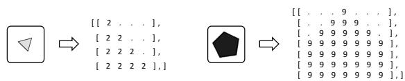

Figure 5: Quasi-image abstractions for a triangle and pentagon of different size and color.  
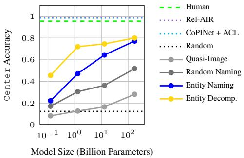  
Figure 6: Results on the RAVEN Center sub-task under entity abstractions, compared to naïve and supervised baselines described in Section 5.1, and humans.

2021). As such, we propose a quasi-image abstraction which converts the visual RPM task into a matrix of ASCII characters. As shown in Figure 5, an entity’s type can be expressed through a matrix of characters; size can be expressed through the height and width of the matrix; and color can be expressed through the actual characters making up the matrix. By converting instances of RAVEN’s Center sub-task into this pixel-like form, we have a lower-level abstraction of the task’s visual features that can be compared to the higher-level abstraction of naming entity attributes.

Random naming abstraction. We would also like to understand the advantage of the specific names we chose for entity attributes compared to other possible choices. As such, we propose a second baseline where, instead of using ordinal labels to describe entities’ type, size, and color, we choose random words from a large corpus. This removes numerical dependencies that may be utilized to recognize some relations, and can help us understand whether PLMs take advantage of this information when it is available.

## 5.2 Entity-Level Reasoning

We first evaluate PLMs under our lowest level abstractions over entity attributes. To isolate the improvements from such abstraction, we focus on the Center sub-task of RAVEN which only includes a single entity per item in the RPM, and thus only tests understanding of relations over entity attributes. The results are shown in Figure 6.

Impact of naming. Under the simplest abstraction of naming the entity-level attributes, we see impressive zero-shot accuracies that monotonically increase with model size up to 77.2% from GPT-3 175B on Center, nearing human performance. Further, we find that our choice to map attributes into numerical symbols is consistently advantageous over the quasi-image and random-naming abstractions, which reach respective accuracies up to 28.2% and 51.8%. Meanwhile, we find that as model size increases, our ordinal naming approach outperforms the random naming baseline more and more, up to over 20% in larger model sizes. This suggests that PLMs of larger size can better capture and take advantage of implicit numerical relations in their vocabulary.

Impact of decomposition. When applying decomposition over entity attributes, we observe further improvement of 2.8% accuracy in GPT-3 175B. Interestingly, we see a much sharper improvement from this abstraction in smaller models, with OPT 125M’s accuracy doubling from 22.2% to 45.6%, and OPT 1.3B’s accuracy rising from 47.2% to 72.0%. This may suggest that PLMs have a limited working memory which is related to the number of learned parameters in them. Large PLMs are more capable to handle complex reasoning tasks because of this, while smaller PLMs benefit from decomposing tasks into more manageable parts.

## 5.3 Layout-Level Reasoning

In Figure 7, we evaluate PLMs’ capability to capture relations over layout attributes under our abstractions introduced in the 2x2Grid and 3x3Grid sub-tasks. Without any decomposition abstraction, model performance reaches up to 78.0% and 86.4% accuracy respectively on 2x2Grid and 3x3Grid. When adding naming for layout-level attributes and decomposing all attributes into separate prompts, we see further improvements across the board, with accuracies reaching 87.8% on 2x2Grid and 93.2% on 3x3Grid. The PLM exceeds human performance on both sub-tasks, despite them being arguably some of the most complex tasks in RAVEN, with the latter comprised of more entities than any other sub-task. This suggests that our strong layout-level abstractions enable the PLM to tease apart the numerous attributes in grids of entities and capture obscure patterns, whereas humans may struggle with this as the task becomes more complex.

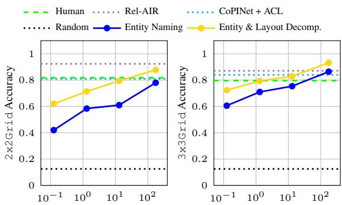  
Model Size (Billion Parameters)  
Figure 7: Results on grid-based sub-tasks of RAVEN without and with decomposition abstractions. Compared to humans and supervised baselines.

## 5.4 Component-Level Reasoning

Lastly, we apply our structural decompositionbased abstractions on RAVEN sub-tasks which have multiple components, i.e., L-R, U-D, O-IC, and O-IG. The results are shown in Figure 8. First, just decomposing the task by its components improves the maximum accuracy on each task on average by about 20%. Additionally decomposing each component by its entity and layout attributes brings further gains, with GPT-3 175B reaching up to 77.6%, 78.0%, 82.8%, and 92.6% on L-R, U-D, O-IC, and O-IG respectively, and exceeding humans and nearing supervised baselines on the latter. The performance gain from this decomposition is again even more pronounced for smaller PLMs. Most significantly, OPT 1.3B improves from 20-30% accuracy to over 70% accuracy, nearing human performance. This demonstrates that not only is GPT-3 capable of very complex analogical reasoning tasks, but even PLMs less than 100 times its size can perform quite well here with the proper abstractions.

## 5.5 Fine-Grained Analysis

Finally, we analyze how model performance varies across different attributes and relations, as we introduce distracting attributes, and as we introduce rows into the matrix. In our analysis, we compare three representative levels of abstraction: entity attribute naming only (no decomposition into multiple prompts), decomposition of components, and full decomposition of entity and layout attributes and components.

## 5.5.1 Analysis of Attributes and Relations

We measure the impact of abstractions in capturing each attribute and relation in RAVEN. In Figure 9, we present GPT-3 175B’s accuracy over each attribute and relation. We find that number is the best captured attribute even without any decomposition abstractions, while the model struggles with position until we introduce decomposition of attributes, suggesting the occupancy map encoding used here indeed helped capture it. Meanwhile, Arithmetic is the most difficult relation, with consistently lower accuracy than other relations.

<table><tr><td>Distractor Values</td><td>Naming</td><td>Decomposition</td></tr><tr><td>RAVEN</td><td>76.0%</td><td>80.0%</td></tr><tr><td>Random</td><td>72.6%</td><td>77.8%</td></tr></table>

Table 1: GPT-3 accuracy on Center sub-task with distracting orientation attribute in language prompts, under the naming and decomposition abstractions. orientation values are taken directly from RAVEN or randomly selected.

## 5.5.2 Robustness to Distracting Attributes

Since our mappings from RAVEN attributes into language provide the key features over which relations occur, we may wonder how robust PLMs are to distracting or unimportant attributes. In fact, the RAVEN dataset includes one noise attribute that we excluded from our mapping to avoid unnecessarily increasing prompt lengths: orientation, i.e., the rotation of entities in the RPM. To begin exploring this issue, we incorporate orientation into the problem as a fourth entity-level attribute in addition to type, size, and color. For the best model (i.e., GPT-3) on the Center sub-task, we compare two possible injections of orientation values: using the values provided in RAVEN (which are mostly constant within each matrix row), and randomly selected values (which could be more distracting).

As shown in Table 1, compared to GPT-3’s Center accuracies of 77.2% and 80.0% with respective naming and decomposition abstractions, the injection of orientation as a distraction feature does not degrade the model performance much, achieving accuracies of 76.0% and 80.0% when using values from RAVEN, and 72.6% and 77.8% when using random values. This shows that PLMs exhibit some robustness to distracting attributes in language context, and have the capability to ignore them in analogical reasoning. Future work may consider more in-depth analysis to discover the extent of model robustness to distraction features, and how it varies by model complexity.

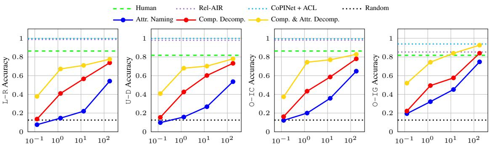  
Model Size (Billion Parameters)

Figure 8: PLM accuracy on multi-component RAVEN sub-tasks with attribute naming only, component decomposition, and full component and attribute decomposition, compared to supervised baselines and humans.  
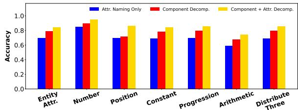  
Figure 9: Comparison of accuracy on examples from all sub-tasks, broken down by the types of attributes and relations they require capturing.

## 5.5.3 In-Context Learning Over Rows

By design, RPM tasks are meant to require minimal background knowledge. They should be impossible to solve without the first two rows of the matrix, which provide essential context to complete the third row of the matrix. To understand whether PLMs capture relations specifically from in-context learning over the first two rows of the matrix (as opposed to using prior knowledge from pre-training), we measure the model performance as we introduce rows to the matrices.

As shown in Figure 10, the average model performance increases across all sizes and abstractions as rows are added to the matrix. This suggests that in-context learning indeed contributes significantly to performance, even for smaller models. Larger model sizes see the most significant improvements, suggesting that larger PLMs are stronger in-context learners than smaller ones. Further, larger PLMs can achieve nearly the same accuracy with only two rows of the matrix provided rather compared to having all three, suggesting that they pick up the task quite quickly from in-context learning.

We also observe that in many cases, models achieve accuracies above chance (12.5% accuracy) without being provided any complete rows of the matrix (only the third, incomplete row). This may suggest the PLM has a useful prior for this problem, despite it being a visual problem and thus impossible to observe directly in pre-training. This raises questions about the objectivity of RAVEN and possibly the RPM task.11 Further, when decomposition abstractions are applied, models achieve higher accuracies than when not, suggesting that decomposition encodes some of this prior knowledge for the task. In Table 2, we take a closer look at GPT-3 175B’s performance within sub-tasks. Surprisingly, we find the highest accuracies on the grid-based sub-tasks, despite them being the most difficult tasks for humans.

<table><tr><td>Sub-Task</td><td>1 Row</td><td>2 Rows</td><td>3 Rows</td><td>Human</td></tr><tr><td>Center</td><td>36.8%</td><td>69.2%</td><td>77.2%</td><td>95.6%</td></tr><tr><td>2x2Grid</td><td>54.0%</td><td>71.0%</td><td>78.0%</td><td>81.8%</td></tr><tr><td>3x3Grid</td><td>73.0%</td><td>85.2%</td><td>86.4%</td><td>79.6%</td></tr><tr><td>L-R</td><td>14.0%</td><td>38.2%</td><td>54.2%</td><td>86.4%</td></tr><tr><td>U-D</td><td>12.4%</td><td>42.0%</td><td>53.6%</td><td>81.8%</td></tr><tr><td>O-IC</td><td>19.6%</td><td>53.6%</td><td>64.8%</td><td>86.4%</td></tr><tr><td>O-IG</td><td>32.0%</td><td>62.2%</td><td>74.8%</td><td>81.8%</td></tr></table>

Table 2: GPT-3 accuracy on RAVEN sub-tasks as rows are added to the RPM, under only naming abstractions.

This motivates future work to compare human and PLM performance on ablated analogy-making tasks like these to further evaluate their objectiveness and identify commonalities. Future work in AI and analogy may also consider building diagnostic datasets to tease apart attribute and relation types to better understand how they contribute to model performance and identify areas for improvement.

## In-context learning of attributes and relations.

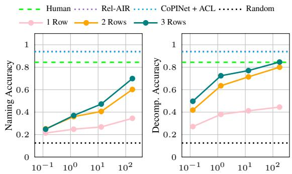  
Model Size (Billion Parameters)

Figure 10: Macro average accuracy over all RAVEN sub-tasks as we introduce rows to the matrix during incontext learning, under naming abstractions only (left) and all naming and decomposition abstractions (right). In 1 Row, we include only the incomplete third row.  
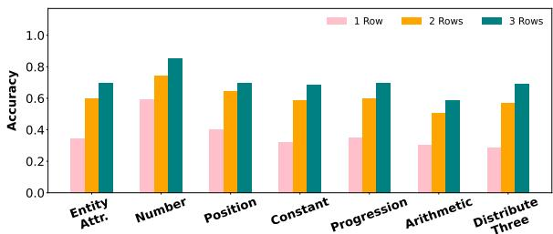  
Figure 11: Comparison of accuracy on examples from all RAVEN sub-tasks as rows are introduced to the matrix, with only entity attribute naming abstractions.

We may wonder whether specific relations or attributes are easier to understand than others with less context. For example, the Progression or Constant relations may be possible to recognize only from the first two items of the third row in an RPM, as we can easily observe patterns in attribute values here, e.g., that entity size is increasing or color remains constant. In Figures 11 and 12, we surprisingly observe only marginal differences here, except for the number attribute, which seems significantly better captured than other attributes in this no-context setting.

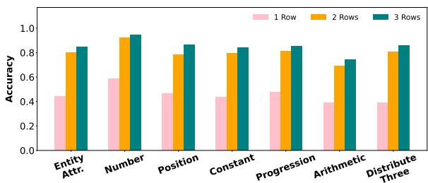  
Figure 12: Comparison of accuracy on examples from all RAVEN sub-tasks as rows are introduced to the matrix, with all decomposition abstractions. 1

## 6 Conclusion

In this work, we explored the ability of large PLMs to perform zero-shot analogical reasoning in visual Raven’s Progressive Matrices (RPM). Upon the simplest mapping to language, they can achieve striking results, while applying higher-level naming and decomposition abstractions over the task features further raises performance to the level of humans and supervised approaches in some cases. We find that while ordinal naming abstractions are a powerful way to enable analogical reasoning in larger PLMs, decomposition abstractions that break the task down into atomic parts conserve their working memory such that even smaller PLMs under 1B parameters can achieve competitive performance on this challenging problem.

Our detailed analysis revealed insights about which features of the task PLMs best capture, their robustness to distracting features, and the role of in-context learning and prior knowledge in picking up this complex task. Surprisingly, we find that even without two complete rows of prior context from the matrix, GPT-3 175B and smaller models can achieve above-chance performance on the task, raising questions about the objectivity and true role of prior knowledge in RPM tasks, which are assumed to require minimal prior knowledge.

These results also raise some questions about the role PLMs may play in future AI systems capable of analogy. While previously thought to be a difficult problem for AI systems, PLMs can solve the reasoning step of analogy easily given strong abstractions over visual perception. Many of these abstractions are intuitive and commonly researched in computer vision, including the detection of object types, sizes, colors, counts, and global arrangements. As such, future work may dive deeper into the challenging problem of generalized perception across domains, where we must robustly tease apart the key features of tasks and experiences that may facilitate analogy-making, e.g., in recognizing the commonalities between a physical bridge and the bridge of a song (Mitchell, 2021). Recent efforts toward understanding how humans describe abstract visual features in language by mapping them to natural concepts12 are a promising direction toward this goal (Lachmy et al., 2022; Ji et al., 2022).

## Acknowledgements

This work was supported in part by DARPA PTG program HR00112220003. We would like to thank the anonymous reviewers for their valuable comments and suggestions.

## Limitations

Perception and reasoning in text-based RAVEN. In this work, one limitation is that we do not attempt to solve the perception problem of analogymaking in RPM, rather we apply perfect perception in solving the reasoning part, and assume the perception problem is simple. By doing so, we find that PLMs may be a strong solution to the reasoning problem here, which may better direct future efforts toward AI and analogy. Obviously, the perception problem for idealized domains is a lot different than more natural domains, and identifying key features across many domains that can facilitate a mapping is still a challenging unsolved problem. We hope that our work sparks more interest in this problem.

Meanwhile, one may argue that our decomposition abstractions are too strong, and actually contribute to the reasoning problem in RPM, as they make an independence assumption about which features of the task can be teased apart. Making such an assumption requires an understanding of the problem that cannot be inferred by only seeing one instance. However, we decomposed the task based on very intuitive and common attributes, e.g., shapes, colors, sizes, and counts of items. We believe that the strength of such an abstraction, which could be applied in many problems, should not be understated. Nonetheless, we include decomposition-free forms of results as much as possible throughout the paper to help compare the contributions of decomposition versus naming abstractions, which is more clearly only providing perceptual information. In fact, we find that without any decomposition, PLMs still achieve very strong performance in many cases, and performance gains from decomposition are not always large.

Human performance. Lastly, we note some limitations in the human performance measurements used as reference points. In Zhang et al. (2019a), human performance on RAVEN was measured by giving subjects some task-specific training, then evaluating them on the original visual form of the task. This differs from our results in two ways. First, PLMs had no task-specific training for RAVEN, given that experiments were zero-shot and the text data we generate is new and thus impossible to appear directly in PLM pre-training. This may give humans an advantage. Second, the task is presented to PLMs in text form, not visually. While the essential information from the task is preserved by our conversion, it is possible that this conversion would affect the difficulty of the task for humans (making it easier or harder). As such, it becomes unclear how to contextualize our results with these past human results. Future work may carry out systematic human studies to compare the analogical reasoning capabilities of humans and PLMs in different settings.

## Ethical Considerations

This work does not use any human subjects or human-generated data. Our work deals with abstract visual features that are described with numerical symbols, thus not strongly targeting any language. A possible ethical concern for this work is the amount of computational resources used in evaluating PLMs. To reduce unnecessary computation in our study, we chose to apply PLMs to only a subset of 500 testing examples from each sub-task of the RAVEN dataset, while the full testing set is four times as large.

## References

Yonatan Bitton, Ron Yosef, Eli Strugo, Dafna Shahaf, Roy Schwartz, and Gabriel Stanovsky. 2022. VASR: Visual analogies of situation recognition. In Proceedings of the AAAI Conference on Artificial Intelligence (AAAI).

Tom Brown, Benjamin Mann, Nick Ryder, Melanie Subbiah, Jared D Kaplan, Prafulla Dhariwal, Arvind Neelakantan, Pranav Shyam, Girish Sastry, Amanda Askell, et al. 2020. Language models are few-shot learners. Advances in neural information processing systems, 33:1877–1901.

Jiangjie Chen, Rui Xu, Ziquan Fu, Wei Shi, Zhongqiao Li, Xinbo Zhang, Changzhi Sun, Lei Li, Yanghua Xiao, and Hao Zhou. 2022. E-KAR: A benchmark for rationalizing natural language analogical reasoning. In Findings of the Association for Computational Linguistics: ACL 2022, pages 3941–3955, Dublin, Ireland. Association for Computational Linguistics.

Stella Christie and Dedre Gentner. 2014. Language helps children succeed on a classic analogy task. Cognitive Science, 38(2):383–397.

Dedre Gentner. 1983. Structure-mapping: A theoretical framework for analogy. Cognitive Science, 7(2):155– 170.

Dedre Gentner. 2010. Bootstrapping the mind: Analogical processes and symbol systems. Cognitive Science, 34(5):752–775.

Dedre Gentner, Asli Özyürek, Özge Gürcanli, and Susan Goldin-Meadow. 2013. Spatial language facilitates spatial cognition: Evidence from children who lack language input. Cognition, 127(3):318–330.

Peter Gordon. 2004. Numerical cognition without words: Evidence from Amazonia. Science, 306(5695):496–499.

Felix Hill, Adam Santoro, David GT Barrett, Ari S Morcos, and Timothy Lillicrap. 2019. Learning to make analogies by contrasting abstract relational structure. In 7th International Conference on Learning Representations (ICLR).

Douglas R Hofstadter and Melanie Mitchell. 1994. The Copycat project: A model of mental fluidity and analogy-making, pages 31–112. Ablex Publishing.

Douglas R Hofstadter and Emmanuel Sander. 2013. Surfaces and essences: Analogy as the fuel andfire of thinking. Basic Books.

Keith J Holyoak. 1984. Analogical thinking and human intelligence. Advances in the psychology ofhuman intelligence, 2:199–230.

Keith J Holyoak. 2012. Analogy and relational reasoning. The Oxford Handbook of Thinking and Reasoning.

Sheng Hu, Yuqing Ma, Xianglong Liu, Yanlu Wei, and Shihao Bai. 2021. Stratified rule-aware network for abstract visual reasoning. In Proceedings of the AAAI Conference on Artificial Intelligence (AAAI), volume 35, pages 1567–1574.

Anya Ji, Noriyuki Kojima, Noah Rush, Alane Suhr, Wai Keen Vong, Robert Hawkins, and Yoav Artzi. 2022. Abstract visual reasoning with tangram shapes. In Proceedings of the 2022 Conference on Empirical Methods in Natural Language Processing, Abu Dhabi, United Arab Emirates. Association for Computational Linguistics.

Youngsung Kim, Jinwoo Shin, Eunho Yang, and Sung Ju Hwang. 2020. Few-shot visual reasoning with meta-analogical contrastive learning. In Advances in Neural Information Processing Systems, volume 33, pages 16846–16856. Curran Associates, Inc.

Royi Lachmy, Valentina Pyatkin, Avshalom Manevich, and Reut Tsarfaty. 2022. Draw Me a Flower: Processing and Grounding Abstraction in Natural Language. Transactions of the Association for Computational Linguistics, 10:1341–1356.

Brenden M Lake, Ruslan Salakhutdinov, and Joshua B Tenenbaum. 2015. Human-level concept learning through probabilistic program induction. Science, 350(6266):1332–1338.

Frank J Lee and John R Anderson. 2001. Does learning a complex task have to be complex?: A study in learning decomposition. Cognitive Psychology, 42(3):267–316.

Peng-Hsuan Li, Tsan-Yu Yang, and Wei-Yun Ma. 2020. CA-EHN: Commonsense analogy from E-HowNet. In Proceedings of the Twelfth Language Resources and Evaluation Conference, pages 2984–2990, Marseille, France. European Language Resources Association.

Tal Linzen. 2016. Issues in evaluating semantic spaces using word analogies. In Proceedings ofthe 1st Workshop on Evaluating Vector-Space Representationsfor NLP, pages 13–18, Berlin, Germany. Association for Computational Linguistics.

Hongjing Lu, Ying Nian Wu, and Keith J Holyoak. 2019. Emergence of analogy from relation learning. Proceedings of the National Academy of Sciences, 116(10):4176–4181.

Mikołaj Małkinski and Jacek Ma ´ ndziuk. 2022. Deep´ learning methods for abstract visual reasoning: A survey on Raven’s Progressive Matrices. arXiv preprint arXiv:2201.12382.

Tomas Mikolov, Ilya Sutskever, Kai Chen, Greg S Corrado, and Jeff Dean. 2013a. Distributed representations of words and phrases and their compositionality. Advances in Neural Information Processing Systems, 26.

Tomas Mikolov, Wen-tau Yih, and Geoffrey Zweig. 2013b. Linguistic regularities in continuous space word representations. In Proceedings of the 2013 Conference of the North American Chapter of the Associationfor Computational Linguistics: Human Language Technologies, pages 746–751, Atlanta, Georgia. Association for Computational Linguistics.

Melanie Mitchell. 2021. Abstraction and analogymaking in artificial intelligence. Annals ofthe New York Academy of Sciences, 1505(1):79–101.

Victor Vikram Odouard and Melanie Mitchell. 2022. Evaluating understanding on conceptual abstraction benchmarks. In Proceedings ofthe AI Evaluation Beyond Metrics at IJCAI-ECAI 2022, Vienna, Austria.

Long Ouyang, Jeff Wu, Xu Jiang, Diogo Almeida, Carroll L Wainwright, Pamela Mishkin, Chong Zhang, Sandhini Agarwal, Katarina Slama, Alex Ray, et al. 2022. Training language models to follow instructions with human feedback. arXiv preprint arXiv:2203.02155.

Roma Patel and Ellie Pavlick. 2021. Mapping language models to grounded conceptual spaces. In International Conference on Learning Representations.

John C Raven and JH Court. 1938. Raven’s progressive matrices. Western Psychological Services Los Angeles.

Lynn C Robertson and Marvin R Lamb. 1991. Neuropsychological contributions to theories of part/whole organization. Cognitive Psychology, 23(2):299–330.

Robyn Speer, Catherine Havasi, and Henry Lieberman. 2008. Analogyspace: Reducing the dimensionality of common sense knowledge. In AAAI, volume 8, pages 548–553.

Steven Spratley, Krista Ehinger, and Tim Miller. 2020. A closer look at generalisation in raven. In Computer Vision – ECCV 2020: 16th European Conference, Glasgow, UK, August 23–28, 2020, Proceedings, Part XXVII, page 601–616, Berlin, Heidelberg. Springer-Verlag.

Oren Sultan and Dafna Shahaf. 2022. Life is a circus and we are the clowns: Automatically finding analogies between situations and processes. In Proceedings ofthe 2022 Conference on Empirical Methods in Natural Language Processing, Abu Dhabi, United Arab Emirates. Association for Computational Linguistics.

Damien Teney, Peng Wang, Jiewei Cao, Lingqiao Liu, Chunhua Shen, and Anton van den Hengel. 2020. Vprom: A benchmark for visual reasoning using visual progressive matrices. In Proceedings of the AAAI Conference on Artificial Intelligence, volume 34, pages 12071–12078.

Peter D Turney. 2008. The latent relation mapping engine: Algorithm and experiments. Journal ofArtificial Intelligence Research, 33:615–655.

Peter D Turney, Michael L Littman, Jeffrey Bigham, and Victor Shnayder. 2003. Combining independent modules in lexical multiple-choice problems. Recent Advances in Natural Language Processing III: Selected Papersfrom RANLP, 2003:101–110.

Taylor Webb, Keith J Holyoak, and Hongjing Lu. 2022. Emergent analogical reasoning in large language models. arXiv preprint arXiv:2212.09196.

Chi Zhang, Feng Gao, Baoxiong Jia, Yixin Zhu, and Song-Chun Zhu. 2019a. RAVEN: A dataset for relational and analogical visual reasoning. In Proceedings ofthe IEEE Conference on Computer Vision and Pattern Recognition (CVPR).

Chi Zhang, Baoxiong Jia, Feng Gao, Yixin Zhu, HongJing Lu, and Song-Chun Zhu. 2019b. Learning perceptual inference by contrasting. In Advances in Neural Information Processing Systems, volume 32. Curran Associates, Inc.

Chi Zhang, Baoxiong Jia, Song-Chun Zhu, and Yixin Zhu. 2021. Abstract spatial-temporal reasoning via

probabilistic abduction and execution. In Proceedings of the IEEE/CVF Conference on Computer Vision and Pattern Recognition (CVPR), pages 9736– 9746.

Susan Zhang, Stephen Roller, Naman Goyal, Mikel Artetxe, Moya Chen, Shuohui Chen, Christopher Dewan, Mona Diab, Xian Li, Xi Victoria Lin, et al. 2022. OPT: Open pre-trained transformer language models. arXiv preprint arXiv:2205.01068.

## A Expanded Results

In Table 3, we present additional results with a wider range of OPT model sizes (Zhang et al., 2022). We observe similar mostly monotonic increases of accuracy with model size.

## B Results and Analysis with I-RAVEN

As the generation strategy for the negative choices in RAVEN can introduce distributional bias that is problematic for supervised learning and leads to artificially high performance (Hu et al., 2021), this could be a possible reason behind PLMs’ strong performance on the task even without any complete rows of context. As such, in Table 4 and Figure 13, we include some supplementary analysis on the Impartial-RAVEN (I-RAVEN) dataset from Hu et al., which introduces more variation in negative choices. However, we observe similar performance trends in I-RAVEN. Performance mostly monotonically increases with model sizes and more abstraction. Further, PLMs achieve above-chance performance again without any rows of context provided, even with no decomposition abstractions. This provides further evidence that RPM, at least formulated in this way, is in part addressed by PLMs’ prior knowledge, despite the assumptions of minimal background knowledge that the task makes.

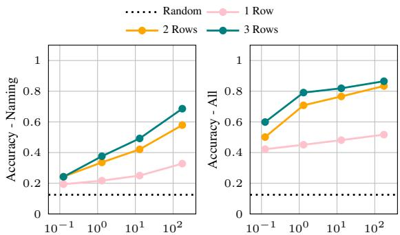  
Model Size (Billion Parameters)  
Figure 13: Macro average accuracy over all Impartial-RAVEN sub-tasks as we introduce rows to the matrix during in-context learning, under naming abstractions only (left) and all naming and decomposition abstractions (right). In 1 Row, we include only the incomplete third row.

## C Example Prompts

In Figure 14, we include example prompts for 2x2Grid, 3x3Grid, L-R and I-OG subtasks under different abstractions. Note that U-D and

I-OC are isomorphic to L-R, and therefore share the same prompt format.

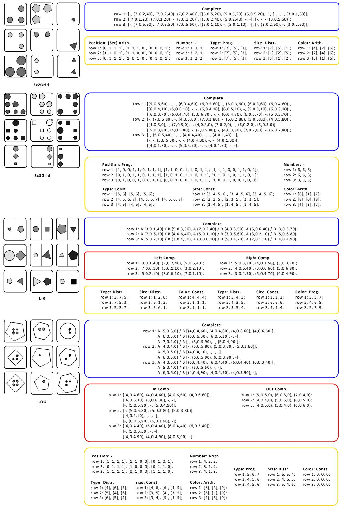  
Figure 14: Example prompts for 2x2Grid, 3x3Grid, L-R and I-OG subtasks under different abstractions.

<table><tr><td></td><td>Abstractions</td><td>Center</td><td>2x2</td><td>3x3</td><td>L-R</td><td>U-D</td><td>O-IC</td><td>O-IG</td><td>Avg.</td></tr><tr><td rowspan="3">125M</td><td>Attr. Naming Only</td><td>0.222</td><td>0.420</td><td>0.606</td><td>0.076</td><td>0.098</td><td>0.122</td><td>0.194</td><td>0.248</td></tr><tr><td>Comp. Decomp.</td><td>0.222</td><td>0.420</td><td>0.606</td><td>0.136</td><td>0.154</td><td>0.162</td><td>0.222</td><td>0.275</td></tr><tr><td>Comp. + Attr. Decomp.</td><td>0.456</td><td>0.620</td><td>0.724</td><td>0.378</td><td>0.408</td><td>0.374</td><td>0.520</td><td>0.497</td></tr><tr><td rowspan="3">350M</td><td>Attr. Naming Only</td><td>0.302</td><td>0.510</td><td>0.684</td><td>0.104</td><td>0.134</td><td>0.120</td><td>0.250</td><td>0.301</td></tr><tr><td>Comp. Decomp.</td><td>0.302</td><td>0.510</td><td>0.684</td><td>0.186</td><td>0.232</td><td>0.254</td><td>0.344</td><td>0.359</td></tr><tr><td>Comp. + Attr. Decomp.</td><td>0.436</td><td>0.588</td><td>0.788</td><td>0.280</td><td>0.346</td><td>0.290</td><td>0.408</td><td>0.448</td></tr><tr><td rowspan="2">1.3B</td><td>Attr. Naming Only</td><td>0.472</td><td>0.584</td><td>0.710</td><td>0.146</td><td>0.158</td><td>0.2</td><td>0.322</td><td>0.370</td></tr><tr><td>Comp. Decomp. Comp. + Attr. Decomp.</td><td>0.472 0.720</td><td>0.584 0.714</td><td>0.710 0.794</td><td>0.410 0.672</td><td>0.426 0.680</td><td>0.434 0.744</td><td>0.494 0.744</td><td>0.504 0.724</td></tr><tr><td rowspan="3">2.7B</td><td></td><td></td><td></td><td></td><td></td><td></td><td></td><td></td><td></td></tr><tr><td>Attr. Naming Only</td><td>0.534 0.534</td><td>0.572</td><td>0.746</td><td>0.216</td><td>0.2</td><td>0.268</td><td>0.336</td><td>0.410</td></tr><tr><td>Comp. Decomp. Comp. + Attr. Decomp.</td><td>0.706</td><td>0.572 0.738</td><td>0.746 0.826</td><td>0.420 0.658</td><td>0.468 0.664</td><td>0.484 0.704</td><td>0.532 0.784</td><td>0.537 0.726</td></tr><tr><td rowspan="3">6.7B</td><td>Attr. Naming Only</td><td></td><td></td><td></td><td></td><td></td><td></td><td></td><td></td></tr><tr><td>Comp. Decomp.</td><td>0.618 0.618</td><td>0.590 0.590</td><td>0.752 0.752</td><td>0.196 0.492</td><td>0.228</td><td>0.284 0.548</td><td>0.396</td><td>0.438</td></tr><tr><td>Comp. + Attr. Decomp.</td><td>0.704</td><td>0.750</td><td>0.826</td><td>0.682</td><td>0.528 0.690</td><td>0.748</td><td>0.584 0.834</td><td>0.587 0.748</td></tr><tr><td rowspan="3">13B</td><td>Attr. Naming Only</td><td>0.644</td><td>0.610</td><td>0.754</td><td>0.220</td><td>0.268</td><td>0.358</td><td>0.452</td><td>0.472</td></tr><tr><td>Comp. Decomp.</td><td>0.644</td><td>0.610</td><td>0.754</td><td>0.566</td><td>0.602</td><td>0.586</td><td>0.576</td><td>0.620</td></tr><tr><td>Comp. + Attr. Decomp.</td><td>0.746</td><td>0.794</td><td>0.830</td><td>0.710</td><td>0.702</td><td>0.770</td><td>0.840</td><td>0.770</td></tr><tr><td rowspan="3">30B</td><td>Attr. Naming Only</td><td>0.680</td><td>0.596</td><td>0.748</td><td>0.264</td><td>0.328</td><td>0.420</td><td>0.482</td><td>0.503</td></tr><tr><td>Comp. Decomp.</td><td>0.680</td><td>0.596</td><td>0.748</td><td>0.582</td><td>0.618</td><td>0.664</td><td>0.638</td><td>0.647</td></tr><tr><td>Comp. + Attr. Decomp.</td><td>0.762</td><td>0.818</td><td>0.828</td><td>0.738</td><td>0.714</td><td>0.786</td><td>0.860</td><td>0.787</td></tr><tr><td rowspan="3">175B</td><td>Attr. Naming Only</td><td>0.772</td><td>0.780</td><td>0.864</td><td>0.542</td><td>0.536</td><td>0.648</td><td>0.748</td><td>0.699</td></tr><tr><td>Comp. Decomp.</td><td>0.772</td><td>0.780</td><td>0.864</td><td>0.738</td><td>0.732</td><td>0.780</td><td>0.840</td><td>0.787</td></tr><tr><td>Comp. + Attr. Decomp.</td><td>0.800</td><td>0.878</td><td>0.932</td><td>0.776</td><td>0.780</td><td>0.828</td><td>0.926</td><td>0.846</td></tr></table>

Table 3: Performance on RAVEN sub-tasks under our abstractions across a wider set of model sizes. 175B refers to text-davinci-002 while the rest are corresponding OPT models.

<table><tr><td></td><td>Abstractions</td><td>Center</td><td>2x2</td><td>3x3</td><td>L-R</td><td>U-D</td><td>O-IC</td><td>O-IG</td><td>Avg.</td></tr><tr><td rowspan="3">125M</td><td>Attr. Naming Only</td><td>0.376</td><td>0.172</td><td>0.208</td><td>0.246</td><td>0.230</td><td>0.262</td><td>0.202</td><td>0.242</td></tr><tr><td>Comp. Decomp.</td><td>0.376</td><td>0.172</td><td>0.208</td><td>0.336</td><td>0.344</td><td>0.354</td><td>0.224</td><td>0.288</td></tr><tr><td>Comp. + Attr. Decomp.</td><td>0.608</td><td>0.514</td><td>0.602</td><td>0.612</td><td>0.624</td><td>0.638</td><td>0.594</td><td>0.600</td></tr><tr><td rowspan="3">1.3B</td><td>Attr. Naming Only</td><td>0.594</td><td>0.290</td><td>0.310</td><td>0.348</td><td>0.370</td><td>0.388</td><td>0.334</td><td>0.376</td></tr><tr><td>Comp. Decomp.</td><td>0.594</td><td>0.290</td><td>0.310</td><td>0.586</td><td>0.574</td><td>0.618</td><td>0.466</td><td>0.491</td></tr><tr><td>Comp. + Attr. Decomp.</td><td>0.810</td><td>0.676</td><td>0.730</td><td>0.822</td><td>0.802</td><td>0.882</td><td>0.818</td><td>0.791</td></tr><tr><td rowspan="3">13B</td><td>Attr. Naming Only</td><td>0.756</td><td>0.384</td><td>0.382</td><td>0.456</td><td>0.498</td><td>0.538</td><td>0.432</td><td>0.492</td></tr><tr><td>Comp. Decomp.</td><td>0.756</td><td>0.384</td><td>0.382</td><td>0.750</td><td>0.74</td><td>0.766</td><td>0.564</td><td>0.620</td></tr><tr><td>Comp. + Attr. Decomp.</td><td>0.836</td><td>0.748</td><td>0.728</td><td>0.824</td><td>0.826</td><td>0.906</td><td>0.868</td><td>0.819</td></tr><tr><td rowspan="3">175B</td><td>Attr. Naming Only</td><td>0.808</td><td>0.564</td><td>0.566</td><td>0.656</td><td>0.676</td><td>0.818</td><td>0.714</td><td>0.686</td></tr><tr><td>Comp. Decomp.</td><td>0.808</td><td>0.564</td><td>0.566</td><td>0.822</td><td>0.812</td><td>0.896</td><td>0.742</td><td>0.744</td></tr><tr><td>Comp. + Attr. Decomp.</td><td>0.864</td><td>0.832</td><td>0.818</td><td>0.834</td><td>0.846</td><td>0.928</td><td>0.930</td><td>0.865</td></tr></table>

Table 4: Performance on I-RAVEN sub-tasks under our abstractions across different model sizes. 175B refers to text-davinci-002 while the rest are corresponding OPT models.

A For every submission: ✓ A1. Did you describe the limitations of your work? Limitations discussed after Section 6.

 A2. Did you discuss any potential risks of your work? Not applicable. Left blank.

✓ A3. Do the abstract and introduction summarize the paper’s main claims? Section 1.

✗ A4. Have you used AI writing assistants when working on this paper? Left blank.

## B ✓ Did you use or create scientific artifacts?

Dataset introduced in Section 3.

✓ B1. Did you cite the creators of artifacts you used? We cited the authors ofthe RAVEN dataset when introducing it in Section 3 (and other sections). We also cited the authors of the I-RAVEN dataset in appendices involving it.

✗ B2. Did you discuss the license or terms for use and / or distribution of any artifacts? We were unable to find license information for the RAVEN dataset we used, although it is publicly available. We will not be re-distributing the dataset.

✓ B3. Did you discuss if your use of existing artifact(s) was consistent with their intended use, provided that it was specified? For the artifacts you create, do you specify intended use and whether that is compatible with the original access conditions (in particular, derivatives of data accessed for research purposes should not be used outside of research contexts)? Our method of adapting the vision-based RAVEN dataset to language is described in Section 4.

 B4. Did you discuss the steps taken to check whether the data that was collected / used contains any information that names or uniquely identifies individual people or offensive content, and the steps taken to protect / anonymize it? Not applicable. Left blank.

✓ B5. Did you provide documentation of the artifacts, e.g., coverage of domains, languages, and linguistic phenomena, demographic groups represented, etc.? We describe the dataset in detail in Section 3; it is idealized abstract data which doesn’t pertain to specific languages or demographic groups.

✓ B6. Did you report relevant statistics like the number of examples, details of train / test / dev splits, etc. for the data that you used / created? Even for commonly-used benchmark datasets, include the number of examples in train / validation / test splits, as these provide necessary context for a reader to understand experimental results. For example, small differences in accuracy on large test sets may be significant, while on small test sets they may not be. Discussed at beginning of Section 5.

The Responsible NLP Checklist used at ACL 2023 is adopted from NAACL 2022, with the addition of a question on AI writing assistance.

## C ✓ Did you run computational experiments? Section 5.

✓ C1. Did you report the number of parameters in the models used, the total computational budget (e.g., GPU hours), and computing infrastructure used? In Section 5, we reported all model complexities. When it comes to compute budget, this is difficult to report as experiments were run on several different platforms (OpenAI cloud API, institutional computing cluster, and more). However, we provided the number of examples experiments were run on, allowing afair estimate ofthis.

 C2. Did you discuss the experimental setup, including hyperparameter search and best-found hyperparameter values? Not applicable. Left blank.

✗ C3. Did you report descriptive statistics about your results (e.g., error bars around results, summary statistics from sets of experiments), and is it transparent whether you are reporting the max, mean, etc. or just a single run? All evaluations occur in a greedy setting where PLMs choose the most probable answer. Since this makes modal predictions consistent, we cannot report such summary statistics. In analyses in Section 5.5, we report some mean performance measurements, and make it clear how such calculations are done.

 C4. If you used existing packages (e.g., for preprocessing, for normalization, or for evaluation), did you report the implementation, model, and parameter settings used (e.g., NLTK, Spacy, ROUGE, etc.)? Not applicable. Left blank.

D ✗ Did you use human annotators (e.g., crowdworkers) or research with human participants? Left blank.

 D1. Did you report the full text of instructions given to participants, including e.g., screenshots, disclaimers of any risks to participants or annotators, etc.? No response.

 D2. Did you report information about how you recruited (e.g., crowdsourcing platform, students) and paid participants, and discuss if such payment is adequate given the participants’ demographic (e.g., country of residence)? No response.

 D3. Did you discuss whether and how consent was obtained from people whose data you’re using/curating? For example, if you collected data via crowdsourcing, did your instructions to crowdworkers explain how the data would be used? No response.

 D4. Was the data collection protocol approved (or determined exempt) by an ethics review board? No response.

 D5. Did you report the basic demographic and geographic characteristics of the annotator population that is the source of the data? No response.