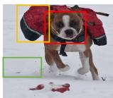
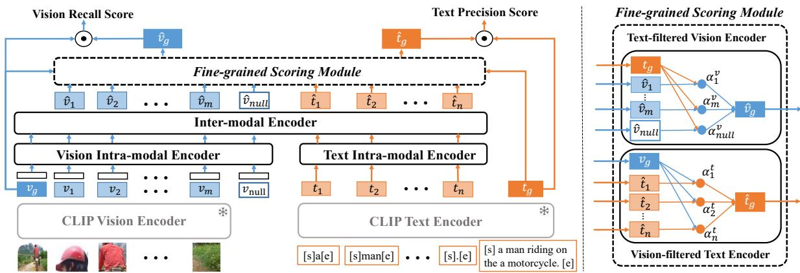
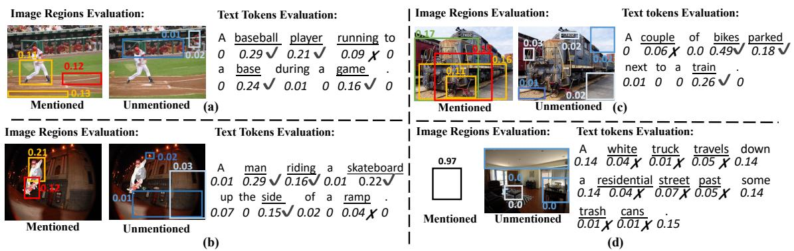
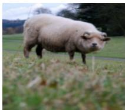
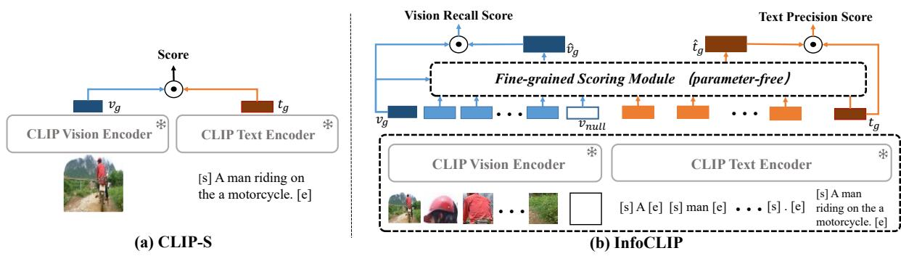
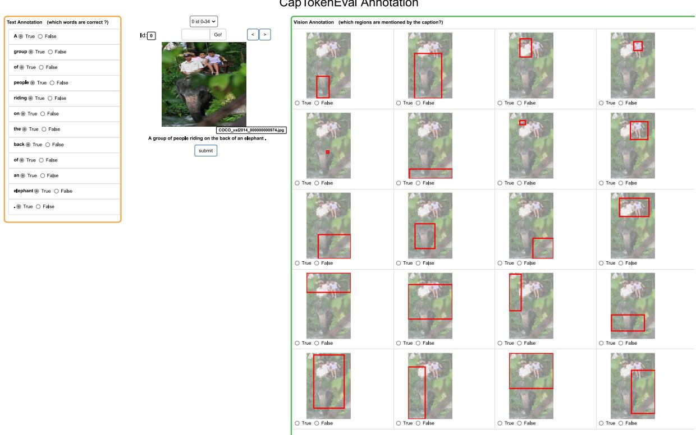

# InfoMetIC: An Informative Metric for Reference-free Image Caption Evaluation

Anwen Hu1, Shizhe Chen2, LiangZhang1, Qin Jin1∗

1School of Information, Renmin University of China 2INRIA

{anwenhu,zhangliang00,qjin}@ruc.edu.cn shizhe.chen@inria.fr

## Abstract

Automatic image captioning evaluation is critical for benchmarking and promoting advances in image captioning research. Existing metrics only provide a single score to measure caption qualities, which are less explainable and informative. Instead, we humans can easily identify the problems of captions in details, e.g., which words are inaccurate and which salient objects are not described, and then rate the caption quality. To support such informative feedback, we propose an Informative Metric for Reference-free Image Caption evaluation (InfoMetIC). Given an image and a caption, InfoMetIC is able to report incorrect words and unmentioned image regions at fine-grained level, and also provide a text precision score, a vision recall score and an overall quality score at coarse-grained level. The coarse-grained score of InfoMetIC achieves significantly better correlation with human judgements than existing metrics on multiple benchmarks. We also construct a token-level evaluation dataset and demonstrate the effectiveness of InfoMetIC in fine-grained evaluation. Our code and datasets are publicly available at https://github. com/HAWLYQ/InfoMetIC.

## 1 Introduction

Image captioning aims to automatically generate natural language sentences to describe image contents. Recently, there are significant breakthroughs in image captioning such as attentionbased model architectures (Anderson et al., 2018; Pan et al., 2020; Hu et al., 2020, 2021) and visionand-language pretraining (VLP) (Zhou et al., 2020; Xia et al., 2021; Li et al., 2022b; Xu et al., 2021; Li et al., 2022a). However, as groundtruth image descriptions are extremely diverse and subjective, evaluating the image captioning performance remains a considerable challenge.

The most widely used image captioning metrics such as METEOR (Banerjee and Lavie, 2005),

References: 1. A brown and white dog is running.   
2. A dog runs on the snow with a package.   
3. There is a hat buried in the snow.   
Candidate 1(C1): A dog on the snow.   
Candidate 1(C2): A dog with a hat is on the snow.   
Candidate 2(C3): A dog with a bag is on the snow.

<table><tr><td rowspan=2 colspan=1></td><td rowspan=2 colspan=1>METEOR(w/ ref)</td><td rowspan=2 colspan=1>SPICE(w/ ref)</td><td rowspan=1 colspan=1>CLIP-S</td><td rowspan=1 colspan=3>Ours: InfoMetIC (w/o ref)</td></tr><tr><td rowspan=1 colspan=1>(w/o ref)</td><td rowspan=1 colspan=1>Text Precision</td><td rowspan=1 colspan=1>Vision Recall</td><td rowspan=1 colspan=1>Overall</td></tr><tr><td rowspan=1 colspan=1>C1</td><td rowspan=1 colspan=1>0.27</td><td rowspan=1 colspan=1>0.31</td><td rowspan=1 colspan=1>0.78</td><td rowspan=1 colspan=1>5.71dog√snow√</td><td rowspan=1 colspan=1>0.62OV        X</td><td rowspan=1 colspan=1>6.33</td></tr><tr><td rowspan=1 colspan=1>C2</td><td rowspan=1 colspan=1>0.37</td><td rowspan=1 colspan=1>0.40</td><td rowspan=1 colspan=1>0.76</td><td rowspan=1 colspan=1>4.78dog√hatXsnow</td><td rowspan=1 colspan=1>1.27B</td><td rowspan=1 colspan=1>6.05</td></tr><tr><td rowspan=1 colspan=1>C3</td><td rowspan=1 colspan=1>0.37</td><td rowspan=1 colspan=1>0.27</td><td rowspan=1 colspan=1>0.84</td><td rowspan=1 colspan=1>6.45dog√bagVsnow</td><td rowspan=1 colspan=1>1.69BV</td><td rowspan=1 colspan=1>8.14</td></tr></table>

Figure 1: Comparison of existing metrics and our informative metric (InfoMetIC). ‘w/ ref’ and ‘w/o ref’ mean using references or not.

CIDEr (Vedantam et al., 2015a) and SPICE (Anderson et al., 2016) utilize human-written descriptions of images as references and measure similarities between generated captions and references for evaluation. Such reference-based approaches suffer from two major limitations. Firstly, these metrics mainly evaluate caption quality by n-gram overlaps which fail to measure genuine semantic similarities. Secondly, references require time-consuming annotations and thus there are only a few annotated captions (typically 5) for each image. The limited number of references cannot fully capture image contents, resulting in incorrect penalties when generated captions describe correct novel things that are not mentioned in the references.

To alleviate the above limitations, recent works are more focusing on reference-free metrics, which directly use images instead of reference captions in evaluation. Benefited from the success of VLP on large-scale web data, UMIC (Lee et al., 2021) and CLIP-S (Hessel et al., 2021) leverage VLP models UNITER (Chen et al., 2020) and CLIP (Radford et al., 2021) respectively to calculate relevance scores between generated captions and images. Although they have achieved promising correlations with human judgments, they can only produce an overall score as quality measurement. We humans instead tend to evaluate captions considering two aspects: 1) whether the caption correctly describes the image content (named text precision); and 2) whether the image content is comprehensively described in the caption (named vision recall). For example, as shown Figure 1, we can easily tell the “hat” in the second candidate is incorrect, and some salient contents such as “the bag” are not mentioned, and thus form our final evaluation to the caption.

For the purpose of providing explainable and detailed feedbacks, we propose a Informative Metric for Reference-free Image Caption evaluation (InfoMetIC). It is built on top of pretrained VLP models to measure fine-grained cross-modal similarities. InfoMetIC is able to point out incorrect semantic words in the caption and unmentioned regions in the image. Based on fine-grained evaluation, it derives text precision and vision recall scores to measure captioning accuracy and completeness respectively. We take a summation of the two scores to rate overall quality of the caption.

Our contributions in this work are three-fold:

• We propose a reference-free informative image captioning metric InfoMetIC. It can provide both coarse-grained scores and detailed token-level scores.

• We automatically construct training examples based on annotations in image caption datasets and design coarse- and fine-grained tasks to train the evaluation model.

• InfoMetIC achieves better correlation with human judgements on multiple benchmarks, as well as on our newly constructed fine-grained caption evaluation benchmark CapTokenEval.

## 2 Related Work

Reference-only caption evaluation. This type of evaluation only employs human-written captions as references and measures text similarity as the evaluation score. Most widely used metrics such as BLEU-4 (Papineni et al., 2002), ROUGE-L (Lin, 2004), METEOR (Banerjee and Lavie, 2005), CIDEr (Vedantam et al., 2015a) and SPICE (Anderson et al., 2016) all fall into this category. BLEU-4 calculates the precision of n-gram matches; ROUGE-L measures the recall of the longest common subsequence; METEOR utilizes wordnet-based synonym matching to relieve the shortage of exact word matching; CIDEr introduces tf-idf to re-weight the importance of different n-grams; SPICE converts captions into scene graphs for similarity comparison. One major limitation of the above metrics is that they cannot properly count synonym matches. To overcome this deficiency, BERT-S (Zhang et al., 2020) leverages learned embeddings from a pretrained language model BERT (Devlin et al., 2019) to better measure semantic similarities. BERT-S++ (Yi et al., 2020) further improves BERT-S by taking into account the variance of multiple references.

Reference+image caption evaluation. As an image is worth a thousands of words, a limited number of references cannot fully cover image contents, making the reference-only caption evaluation less reliable. Therefore, some works combine both references and images to evaluate generated captions. REO (Jiang et al., 2019a) uses a pretrained image-text retrieval model SCAN (Lee et al., 2018) to extract image contextualized caption features for computing relevance, extraness and omission scores. TIGER (Jiang et al., 2019b) calculates grounding vectors for captions via SCAN to measure similarity, which represent how much captions are grounded in an image. ViLBERTScore (Lee et al., 2020) is similar to BERT-S except that it generates visually-grounded features for each caption token by ViLBERT (Lu et al., 2019). FAIEr (Wang et al., 2021) fuses scene graphs of the image and references as a union scene graph and compares it with the scene graph of generated captions.

Reference-free caption evaluation. To alleviate the annotation burden of obtaining references, a few works propose to evaluate image captions without references. UMIC (Lee et al., 2021) fine-tunes a pretrained multimodal transformer UNITER (Chen et al., 2020) by contrastive learning to compute an image-text matching score. CLIP-S (Hessel et al., 2021) directly utilizes image-text similarity from CLIP (Radford et al., 2021) - an image-text matching model trained on large-scale open-domain data. CLIP-S has achieved state-of-the-art evaluation performance. However, these methods only provide single scores which are less informative to evaluate image captions. In this work, we aim to provide more fine-grained feedbacks, not only indicating the captioning quality from precision and recall aspects, but also pointing out detailed mistakes such as incorrect words and unmentioned regions.

## 3 Method

We first introduce our model architecture in Sec 3.1 and then describe the training and inference ap-

  
Figure 2: Left: the overall architecture of Informative Metric for Reference-free Image Caption evaluation (InfoMetIC). Right: the detailed structure of the Fine-grained Scoring Module.

proaches in Sec 3.2 and Sec 3.3 respectively.

## 3.1 Model Architecture

Figure 2 illustrates the overall framework of our informative evaluation model, which consists of three modules: Token-level Encoding, Intra&Inter Modality Fusion and Fine-grained Scoring. Given an image I and a caption C as inputs, the Tokenlevel Encoding module firstly generates a sequence of token-level features to represent the image and caption respectively. Then the Intra&Inter Modality Fusion module captures the intra- and intermodality relationships. Finally, the Fine-grained Scoring module produces token-level scores for each visual and textual token and derives vision recall, text precision, and overall scores based on the token-level scores.

## 3.1.1 Token-level Encoding

VLP models have shown superior performance and generalization ability in many vision-and-language tasks (Chen et al., 2020). Therefore, we utilize a state-of-the-art VLP model CLIP to extract tokenlevel image and caption features. To be noted, our method can be adapted to different VLP models.

Image Token Features. In order to obtain semantically meaningful image tokens, we use a pretrained object detector to detect region bounding boxes in image I. We encode each cropped region via CLIP vision encoder to get fine-grained token-level features $( v _ { 1 } , . . . , v _ { m } )$ , where m is the number of detected regions. The whole image is encoded as a global vision feature $v _ { g }$ . We further utilize a zero vector to represent a vision null token $v _ { n u l l }$ , which aims to align with any texts irrelevant to the image. Caption Token Features. For a caption C, CLIP text encoder can generate a global feature $t _ { g }$ to capture overall semantics of the whole sentence. Although it could also generate a sequence of text token features, these features can overuse the sentence context, which harms fine-grained evaluation. An illustration about the context overuse can be found in Appendix A. Therefore, we encode each token in C separately as shown in Figure 2 to obtain independent token-level features $\left( t _ { 1 } , . . . , t _ { n } \right)$ ， where n is the number of text tokens.

## 3.1.2 Intra&Inter Modality Fusion

In order to learn intra-modal relationships, we utilize two multi-layer transformers (Vaswani et al., 2017) to encode image and text tokens separately. As spatial information is essential to infer relationships across image regions, we apply a linear layer to convert normalized bounding boxes as position features and add them to the initial image token features before fed into the intra-modal transformer. Likewise, we add learnable position features for the text tokens. For visual intra-modal encoding, we concatenate $v _ { g }$ with $( v _ { 1 } , \cdots , v _ { m } , v _ { n u l l } )$ to alleviate possible vision context loss in fine-grained image tokens due to imperfect detection. For textual intramodal encoding, we directly utilize $\left( t _ { 1 } , \cdots , t _ { n } \right)$ tokens as inputs.

We concatenate the image and text token-level features after intra-modal encoding and utilize an inter-modal encoder to learn correlation between vision and text modalities. The inter-modal encoder is implemented as a multi-layer cross-modal transformer (Chen et al., 2020). We denote the output features for image tokens as $\hat { V } = ( \hat { v } _ { 1 } . . . , \hat { v } _ { m } , \hat { v } _ { n u l l } )$ output features for text tokens as $\hat { T } = ( \hat { t } _ { 1 } , . . . , \hat { t } _ { n } )$

## 3.1.3 Fine-grained Scoring

The Fine-grained Scoring module aims to predict which text tokens are incorrect and which image tokens are not mentioned. It consists of two crossmodal attention layers, namely Text-filterd Vision Encoder and Vision-filterd Text Encoder as shown in the right of Figure 2. To identify which image tokens are mentioned, we use global text feature $t _ { g }$ as query and token-level vision features $\hat { V }$ as key in the cross-modality attention layer to calculate visual token-level scores $\alpha ^ { v } \mathrm { . }$

$$
\begin{array} { r } { s _ { i } ^ { v } = ( t _ { g } W _ { q } ^ { v } ) ^ { \mathrm { T } } \hat { v } _ { i } W _ { k } ^ { v } , } \end{array}\tag{1}
$$

$$
\alpha ^ { v } = \mathrm { S o f t m a x } ( [ s _ { 1 } ^ { v } , . . . , s _ { m } ^ { v } , s _ { n u l l } ^ { v } ] ) .\tag{2}
$$

Similarly, to identify which text tokens are incorrect, we use global vision feature $v _ { g }$ as query and token-level text features $\hat { T }$ as key to calculate textual token-level scores $\alpha ^ { t }$ by another crossmodality attention layer.

Based on token-level scores, we derive vision recall score and text precision scores to measure the comprehensiveness and accuracy of generated captions respectively. We take visual token-level scores $\alpha ^ { v }$ and token-level vision features $\hat { V }$ to obtain a text-conditioned vision feature $\hat { v } _ { g }$ by weighed average as follows:

$$
\hat { v } _ { g } = \sum _ { k \in \{ 1 , \dots , m , n u l l \} } \alpha _ { k } ^ { v } \hat { v } _ { k } .\tag{3}
$$

The more image regions are mentioned in a caption, the closer its text-conditioned vision feature should be to the global vision feature $v _ { g }$ . Thus, we compute the vision recall score as the cosine similarity between $\hat { v } _ { g }$ and $v _ { g }$ , represented as $f ^ { R } ( I , C ) = \cos ( \hat { v } _ { g } , v _ { g } ) / \bar { \tau }$ , where τ is a learnable temperature parameter. Taking the untrained global vision feature $v _ { g }$ as the comparison object, our vision recall score implicitly considers the salience of visual information, as illustrated in Appendix B. In a similar way, we can obtain a vision-conditioned text feature $\hat { t } _ { g }$ and compute a text precision score $f ^ { P } ( I , C ) = \mathrm { \tilde { c o s } } ( \hat { t } _ { g } , t _ { g } ) / \tau$ . Our overall score is the summation of precision score and recall score:

$$
f ^ { { \cal O } } ( I , C ) = f ^ { R } ( I , C ) + f ^ { { \cal P } } ( I , C ) .\tag{4}
$$

## 3.2 Multi-task Learning

To learn fine-grained token-level predictions as well as coarse-grained text precision and vision recall scores, we propose multiple training tasks to jointly optimize our evaluation model.

## 3.2.1 Coarse-grained Score Learning

Given an aligned image-caption pair $( I , C )$ , we construct negative samples by pairing I with other captions in the training batch or pairing C with other images in the batch. Then, we calculate Noisy Contrastive Learning (NCE) loss $l _ { r }$ based on vision recall scores and $l _ { p }$ based on text precision scores. The NCE loss $l _ { r }$ is calculated as follows:

$$
l _ { r } = ( l _ { r } ^ { i } + l _ { r } ^ { c } ) / 2 ,\tag{5}
$$

$$
l _ { r } ^ { i } = - \mathbb { E } _ { ( I , C ) \sim B } \log \frac { e ^ { f ^ { R } ( I , C ) } } { \sum _ { C ^ { \prime } \in \mathcal { N } _ { I } \cup \{ C \} } e ^ { f ^ { R } ( I , C ^ { \prime } ) } } ,\tag{6}
$$

$$
l _ { r } ^ { c } = - \mathbb { E } _ { ( I , C ) \sim B } \log \frac { e ^ { f ^ { R } ( I , C ) } } { \sum _ { I ^ { \prime } \in \mathcal { N } _ { C } \cup \{ I \} } e ^ { f ^ { R } ( I ^ { \prime } , C ) } } ,\tag{7}
$$

where $\mathcal { N } _ { I }$ means a set of negative captions for image I within the batch $B , { \mathcal { N } } _ { C }$ means negative images for caption $C .$ . The NCE loss $l _ { p }$ is similar to Eq (5) but utilizes $f ^ { P } ( I , C )$ scores in computation.

Hard Textual Negatives. In the above coarsegrained score learning, negative captions for an image are randomly selected from the dataset and usually contains many irrelevant contents with the image. These textual negatives are not hard enough to learn a good vision recall score. Because the model could compute a high recall score for positive pairs by putting high weight to only one rather than all mentioned regions. To address this problem, we further design Hard Textual Negatives (HTN) during coarse-grained score learning. For multiple annotated captions of an image, we consider the one with more semantic words (nouns, verbs, adjectives and adverbs) should get higher vision recall score than the others. Therefore, we treat the other ones as hard textual negatives. The HTN loss $l _ { r } ^ { h }$ is calculated as follows:

$$
l _ { r } ^ { h } = - \mathbb { E } _ { ( I , C ) \sim B } \log \frac { e ^ { f ^ { R } ( I , C ) } } { e ^ { f ^ { R } ( I , C ) } + e ^ { f ^ { R } ( I , C ^ { h } ) } } ,\tag{8}
$$

where $C ^ { h }$ is a hard textual negative for caption $C .$

## 3.2.2 Fine-grained Score Learning

To improve fine-grained evaluation, we design a sequence labeling task called Fine-grained Score learning. We automatically generate supervision signals to learn token-level predictions. For the text part, we prepare labels in a self-supervised manner. Given an image I and its groundtruth caption C, we generate a polluted caption $C ^ { ' }$ by randomly replacing a semantic word with a frequent word of the same part-of-speech tag. The text sequence label $Y ^ { t }$ for $( I , C ^ { ' } )$ is constructed by setting the polluted word as 0 (incorrect) and other semantic words as 1 (correct). Non-semantic words such as adpositions, conjunctions are excluded in training. For the image part, we make use of existing phrase grounding annotations which align each phrase in a caption with its corresponding bounding boxes in the image. The vision sequence label $Y ^ { v }$ for $( I , C )$ is constructed by setting all regions mentioned by the caption as 1 and otherwise 0.

We use cross-entropy losses for both textual and visual fine-grained score learning tasks:

$$
l _ { t } ^ { t o k e n } = - \frac { 1 } { n ^ { s } } \sum Y ^ { t } \log ( \alpha ^ { t } ) ,\tag{9}
$$

$$
l _ { v } ^ { t o k e n } = - \frac { 1 } { m } \sum Y ^ { v } \log ( \alpha ^ { v } ) ,\tag{10}
$$

where $l _ { t } ^ { t o k e n }$ and $l _ { v } ^ { t o k e n }$ refer to the text-part and vision-part loss respectively, $\alpha ^ { t }$ and $\alpha ^ { v }$ are textual token-level scores and visual token-level scores in Eq (2), $n ^ { s }$ is the number of semantic words.

## 3.3 Inference

Given input pair $( I , C )$ , we first compute tokenlevel scores $\alpha ^ { v }$ and $\alpha ^ { t }$ for fine-grained prediction with a threshold $\beta$ . Considering that a caption hardly contains more than 10 semantic words, we set $\beta$ as 0.1. For the text part, semantic tokens with a score greater than $\beta$ are judged as correct ones. For the image part, regions with a score greater than $\beta$ are identified as mentioned ones.

Then we calculate the vision recall, text precision, and overall scores as in Eq (4). We denote our vision recall score $f ^ { R } ( I , C )$ as InfoMet $\mathrm { I C } ^ { R }$ , text precision score $f ^ { P } ( I , C )$ as InfoMetICP , and overall score $f ^ { O } ( I , C )$ as InfoMetIC. Furthermore, we combine our overall score with the CLIP similarity:

$$
\mathrm { I n f o M e t I C ^ { + } } = \mathrm { I n f o M e t I C } + \frac { \cos ( v _ { g } , t _ { g } ) } { \tau ^ { c l i p } }\tag{11}
$$

where $\tau ^ { c l i p }$ is the temperature of CLIP.

## 4 Experiment

## 4.1 Experimental Setting

Training Datasets. With the training splits of Flickr30k (Young et al., 2014) and MSCOCO (Lin et al., 2014) datasets, we construct 715,662 imagecaption pairs for general coarse-grained score learning, and 611,105 triplets with hard textual negatives. For fine-grained score leaning, we construct

512,000 samples from MSOCO and Flick30k for the text part training and 178,689 samples from Flickr30k for the vision part training.

Implementation Details. We use CLIP(ViT-B/32) for token-level encoding. The image regions are detected by the bottom-up model (Anderson et al., 2018). To remove redundant bounding boxes, we use k-means algorithm to generate 20 clusters among 100 detected regions and select one region per cluster. The details can be found in Appendix C. The maximum length for textual tokens is set as 32. In the intra&inter modality fusion, intra- and inter-modal encoders contain 4 and 2 transformer layers respectively. During training, the batch size is set as 32 and the initial learning rate is set as 1e-4. We iteratively train our model on multiple tasks for 32,000 iterations. The training ratio of coarse- and fine-grained tasks is 3:1. The training takes 5 hours on 4 V100 GPUs.

## 4.2 Coarse-grained Score Evaluation

## 4.2.1 Evaluation Datasets

Flickr8k-Expert (Hodosh et al., 2013a) contains 5,644 pairs of images and machine-generated captions. Each pair is scored from 1 (irrelevant) to 4 (well related) by 3 expert annotators.

Flickr8k-CF (Hodosh et al., 2013a) consists of 47,830 image-captions pairs. Each pair is judged "yes" or "no" by at least 3 annotators, where "yes" is for good captions. The final score of each pair is determined by the proportion of "yes".

Composite (Aditya et al., 2018) contains 3,995 images from MSCOCO, Flickr30K and Flickr8k (Hodosh et al., 2013b). For each image, there are two machine-generated captions and one humanwritten caption. Every image-caption pair is scored from 1 (irrelevant) to 5 (perfectly related).

Pascal-50S (Vedantam et al., 2015b) contains 4,000 triplets, each of which contains an image and two captions. Annotators are asked to judge which caption is better. According to caption types, Pascal-50S is evenly split into 4 subsets: $\mathbf { \ddot { H } C } \mathbf { \ ' }$ means two correct human-written captions; ‘HI’ means two human-written captions but one is wrong; ‘HM’ means one human-written caption and one machine-generated caption; ‘MM’ means two machine-generated captions.

THumB 1.0 (Kasai et al., 2022) contains 500 images from MSCOCO. Each image is paired with one human-written caption and four machinegenerated captions. For each image-caption pair, there are a precision score measuring the accuracy of the caption, a recall score assessing how much of the salient information is covered, and a total score measuring the overall quality.

Table 1: Overall score comparison on Flickr8k-Expert (F-Ex), Flickr8k-CF (F-CF), Composite (Com) and Pascal-50S. ‘w/ ref’ means using 4-5 ground-truth references. ‘w/o ref’ means using no reference.
<table><tr><td rowspan="2">Type</td><td rowspan="2">Metric</td><td rowspan="2"> $\mathbf { F } { \cdot } \mathbf { E } \mathbf { x } ( \tau _ { c } )$ </td><td rowspan="2"> $\mathbf { F } { \cdot } \mathbf { C F } ( \tau _ { b } )$ </td><td rowspan="2"> $\mathbf { C o m } ( \tau _ { c } )$ </td><td colspan="5">Pascal-50S (accuracy)</td></tr><tr><td>HC</td><td>HI</td><td>HM</td><td>MM</td><td>Mean</td></tr><tr><td rowspan="10">w/ ref</td><td>BLEU-4</td><td>30.8</td><td>16.9</td><td>30.6</td><td>52.5</td><td>90.4</td><td>63.0</td><td>42.3</td><td>55.8</td></tr><tr><td>ROUGE-L</td><td>32.3</td><td>19.9</td><td>32.4</td><td>55.0</td><td>95.3</td><td>93.1</td><td>58.7</td><td>75.5</td></tr><tr><td>METEOR</td><td>41.8</td><td>22.2</td><td>38.9</td><td>59.0</td><td>97.7</td><td>93.9</td><td>62.0</td><td>78.2</td></tr><tr><td>CIDEr</td><td>43.9</td><td>24.6</td><td>37.7</td><td>53.7</td><td>98.1</td><td>90.8</td><td>63.7</td><td>76.6</td></tr><tr><td>SPICE</td><td>44.9</td><td>24.4</td><td>40.3</td><td>56.9</td><td>96.3</td><td>87.1</td><td>66.4</td><td>76.7</td></tr><tr><td>BERT-S</td><td>39.2</td><td>22.8</td><td>30.1</td><td>54.4</td><td>96.1</td><td>94.3</td><td>56.4</td><td>75.3</td></tr><tr><td>BERT-S++</td><td>46.7</td><td></td><td>44.9</td><td>65.4</td><td>98.1</td><td>96.4</td><td>60.3</td><td>80.1</td></tr><tr><td>TIGEr</td><td>49.3</td><td></td><td>45.4</td><td>56.0</td><td>99.8</td><td>92.8</td><td>74.2</td><td>80.7</td></tr><tr><td>ViLBERTScore-F</td><td>50.1</td><td></td><td>52.4</td><td>49.9</td><td>99.6</td><td>93.1</td><td>75.8</td><td>79.6</td></tr><tr><td>FAIEr-4</td><td>52.6</td><td>35.4</td><td>57.7</td><td>59.7</td><td>99.9</td><td>92.7</td><td>73.4</td><td>81.4</td></tr><tr><td></td><td>RefCLIP-S</td><td>53.0</td><td>36.4</td><td>55.4</td><td>57.9</td><td>99.5</td><td>96.1</td><td>80.8</td><td>83.6</td></tr><tr><td rowspan="6">w/o ref</td><td>UMIC</td><td>46.8</td><td></td><td>56.1</td><td>66.1</td><td>99.8</td><td>98.1</td><td>76.2</td><td>85.1</td></tr><tr><td>FAIEr-r</td><td>50.1</td><td>32.4</td><td>50.5</td><td></td><td></td><td></td><td></td><td></td></tr><tr><td>CLIP-S</td><td>51.5</td><td>34.4</td><td>53.8</td><td>60.4</td><td>99.4</td><td>97.8</td><td>77.1</td><td>83.7</td></tr><tr><td> $\mathrm { C L I P - S } _ { t u n e }$ </td><td>54.3</td><td>36.6</td><td>57.3</td><td>61.0</td><td>99.5</td><td>95.9</td><td>82.0</td><td>84.6</td></tr><tr><td>InfoCLIP</td><td>32.6</td><td>23.5</td><td>15.3</td><td>37.3</td><td>87.3</td><td>58.9</td><td>72.9</td><td>64.1</td></tr><tr><td> $\mathrm { I n f o C L I P } _ { t u n e }$ </td><td>37.7</td><td>27.7</td><td>24.6</td><td>37.3</td><td>92.5</td><td>62.7</td><td>74.7</td><td>66.8</td></tr><tr><td> $\mathrm { I n f o M e t I C }$ </td><td></td><td>54.2</td><td>36.3</td><td>59.2</td><td>69.0</td><td>99.8</td><td>94.0</td><td>78.3</td><td>85.3</td></tr><tr><td></td><td> $\mathrm { I n f o M e t I C ^ { + } }$ </td><td>55.5</td><td>36.6</td><td>59.3</td><td>69.9</td><td>99.7</td><td>96.8</td><td>79.6</td><td>86.5</td></tr></table>

## 4.2.2 Evaluation Metrics

We follow previous works (Hessel et al., 2021; Vedantam et al., 2015b; Kasai et al., 2022) to evaluate captioning metrics. We use kendall-c correlation $( \tau _ { c } )$ on Flickr8k-Expert, kendall-b correlation $\left( \tau _ { b } \right)$ on Flickr8k-CF, kendall-c correlation $( \tau _ { c } )$ on Composite, classification accuracy on Pascal-50s and Pearson correlation $( \rho )$ on THumB 1.0.

## 4.2.3 Comparison with State of the Arts

We compare InfoMetIC with SOTA methods as well as three strong baselines: ${ \mathrm { C L I P - S } } _ { t u n e } ,$ Info-CLIP and InfoCL $\scriptstyle \mathrm { I P } _ { t u n e } .$ $\mathbf { C L I P - S } _ { t u n e }$ calculates an overall score as CLIP-S (Hessel et al., 2021) but is fine-tuned on MSCOCO and Flickr30k. InfoCLIP directly uses CLIP to perform fine-grained scoring like InfoMetIC but removes the Intra&Inter Modality Fusion and parameters in Fine-grained Scoring. In $\mathrm { f o C L I P } _ { t u n e }$ is a fine-tuned version of InfoCLIP. More details can be found in the Appendix D.

Table 1 shows the overall score comparison on Flickr8k-Expert, Flickr8k-CF, Composite and Pascal-50S. Our reference-free metric InfoMetIC achieves state-of-the-art correlation with human judgements on Composite and Pascal-5OS. It is on par with the strong baseline ${ \mathrm { C L I P - S } } _ { t u n e }$ on Flickr8k-Expert and Flickr8k-CF. To be noted, InfoMetIC performs much better than InfoCLIP, which proves the necessity of our model architecture upon CLIP backbones. After combined with CLIP similarity, InfoMetIC+ further improves performances on all benchmarks.

To separately evaluate the performance of our vision recall score I $\mathrm {  ~ \ r f o M e t I C } ^ { \bar { \boldsymbol { R } } }$ and text precision score $\mathrm { I n f o M e t I C } ^ { P }$ , we further conduct experiments on THumB $1 . 0$ in Table 3. First, by comparing $\mathrm { I n f o M e t I C } ^ { P }$ and $\mathrm { I n f o M e t I C } ^ { R }$ , In $\mathrm { \Gamma _ { \mathrm { i f o M e t I C } } } ^ { R }$ achieves better correlation with human-labeled recall score and InfoMetICP achieves better correlation with human-labeled precision score. This indicates that our ${ \mathrm { I n f o M e t I C } } ^ { R }$ and InfoMetICP indeed evaluates the recall of image contents and the precision of caption respectively. Besides, both $\mathbf { \bar { I n f o M e t I C } } ^ { P }$ and $\mathrm { I n f o M e t I C } ^ { R }$ surpass the stateof-the-art reference-free metric CLIP-S on total score correlation. Second, our overall score InfoMetIC achieves significant boost on total score, which demonstrates that precision and recall are complementary in human’s final evaluation for captions. $\mathrm { I n f o M e t I C ^ { + } }$ slightly improves the total score performance. Third, compared with the state-ofthe-art reference-based metric RefCLIP-S (Hessel et al., 2021), our $\mathrm { I n f o M e t I C ^ { + } }$ achieves much better recall correlation but lower precision correlation with humans. This is because text-text semantic comparison is much easier than cross-modal semantic comparison, making the precision correlation of reference-based metrics higher. However, limited textual references cannot fully capture image contents, which is harmful for vision recall. Finally, InfoMetIC achieves much better performance than InfoCLIP, which shows the effectiveness of our proposed modules on top of CLIP.

Table 2: Ablation Study on Flickr8k-Expert (F-Ex), Flickr8k-CF (F-CF), Composite (Com), Pascal-50S and THumB 1.0. HTN denotes using hard text negatives in coarse-grained score learning, and FS refers to the fine-grained score leaning. $\cdot { _ { v _ { g } } } ^ { , }$ means incorporating the vision global feature in the Intra&Inter Modality Fusion Module.
<table><tr><td rowspan="2">Id</td><td colspan="2">Architecture Intra Inter</td><td rowspan="2"> $v _ { g }$ </td><td rowspan="2">Training HTN FS</td><td rowspan="2"></td><td rowspan="2">F-Ex F-CF</td><td rowspan="2">Com</td><td rowspan="2"></td><td colspan="4">Pascal-50S</td><td colspan="4">THumB w/o h</td><td colspan="2">THumB w/ h</td></tr><tr><td></td><td>HC</td><td>HI</td><td>HM</td><td>MM</td><td>Mean</td><td>P</td><td>R</td><td>Total</td><td>P R</td><td>Total</td></tr><tr><td>r1</td><td>√</td><td></td><td>√</td><td></td><td>51.7</td><td>36.8</td><td>57.8</td><td>58.0</td><td>99.5</td><td>95.0</td><td>76.3</td><td>82.2</td><td>0.23</td><td>0.26</td><td>0.35</td><td>0.20</td><td>0.26</td><td>0.32</td></tr><tr><td>r2</td><td></td><td>√</td><td>V</td><td></td><td>55.1</td><td>37.1</td><td>59.0</td><td></td><td>59.5 99.8</td><td>95.4</td><td>78.1</td><td>83.2</td><td>0.23</td><td>0.26</td><td>0.35</td><td>0.20</td><td>0.26</td><td>0.32</td></tr><tr><td>r3</td><td>√</td><td>√</td><td></td><td></td><td>55.1</td><td>36.9</td><td>59.4</td><td>58.6</td><td>99.9</td><td>95.7</td><td>79.6</td><td>83.5</td><td>0.21</td><td>0.26</td><td>0.34</td><td>0.19</td><td>0.26</td><td>0.32</td></tr><tr><td>r4</td><td>√</td><td>√</td><td>√</td><td></td><td>55.2</td><td>36.9</td><td>59.3</td><td>58.0</td><td>99.7</td><td>96.1</td><td>80.8</td><td>83.7</td><td>0.22</td><td>0.26</td><td>0.35</td><td>0.20</td><td>0.26</td><td>0.33</td></tr><tr><td>r5</td><td>√</td><td>√</td><td>√</td><td>√</td><td>54.5</td><td>36.2</td><td>58.8</td><td>69.3</td><td>99.6</td><td>93.7</td><td>75.2</td><td>84.5</td><td>0.23</td><td>0.28</td><td>0.37</td><td>0.22</td><td>0.30</td><td>0.37</td></tr><tr><td>r6</td><td>√</td><td>√</td><td>√</td><td>√ √</td><td>55.2</td><td>37.0</td><td>59.3</td><td>60.2</td><td>99.7</td><td>96.8</td><td>79.6</td><td>84.1</td><td>0.22</td><td>0.26</td><td>0.34</td><td>0.20</td><td>0.26</td><td>0.32</td></tr><tr><td>r7</td><td>√</td><td>√</td><td>√</td><td>√</td><td>54.2</td><td>36.3</td><td>59.2</td><td>69.0</td><td>99.8</td><td>94.0</td><td>78.3</td><td>85.3</td><td>0.22</td><td>0.30</td><td>0.37</td><td>0.21</td><td>0.32</td><td>0.38</td></tr></table>

Table 3: Experiments on THumB 1.0. ‘w/o Human means discarding human annotated image-caption pairs.
<table><tr><td rowspan="2">Ref Metric</td><td colspan="3">w/o Human</td><td colspan="3">w/ Human</td></tr><tr><td>P R</td><td></td><td>Total</td><td>P .15</td><td>R</td><td>Total</td></tr><tr><td>w/</td><td>BLEU ROUGE-L CIDEr SPICE BERT-S RefCLIP-S</td><td>.21.13 .26.17 .27.18 .26.15 .27.18 .34.27</td><td></td><td>.25 .31 .33 .30 .33 .44</td><td>.18 .21 .20 .20 .31 1.26</td><td>.04 .07 .11 .09 .10</td><td>.13 .18 .23 .21 .21 .41</td></tr><tr><td>CLIP-S w/o</td><td> $\mathrm { I n f o C L I P } ^ { R }$   $\mathrm { I n f o C L I P } ^ { P }$  InfoCLIP  $\mathrm { I n f o C L I P } _ { t u n e }$   $\mathbf { C L I P - S } _ { t u n e }$   ${ \mathrm { I n f o M e t I C } } ^ { R }$   $\mathrm { I n f o M e t I C } ^ { P }$   $_ \mathrm { I n f o M e t I C }$   $\mathrm { I n f o M e t I C ^ { + } }$ </td><td>.05.19 .11-.22 .13 .15-.15 .18.27 .15.26 .18.29 .23 .27 .22 .22 .33</td><td>-.06 .30</td><td>.17 -.08 .04 .00 .32 .29 .34 .36 .37 .39</td><td>.05 .09 .11 .11 .17 .13 .19 .20 .21 .21.34</td><td>.19 -.20 .06 -.15 .28 .26 .32 .27 .32</td><td>.17 -.08 .03 -.03 .32 .28 .36 .33 .38 .39</td></tr></table>

## 4.2.4 Ablation Study

We first validate the effectiveness of our model architecture. As shown in Table 2, removing Intramodal encoders (r2 vs r4) or Inter-modal encoder (r1 vs r4) results in performance drop on Flickr8k-Expert, Composite and Pascal-50S. Besides, removing global vision feature $v _ { g }$ from Intra&Inter encoding (r3 vs r4) leads to slight performance drop on Flickr8k-Expert, Pascal-50S and THumB1.0.

We then carry out ablation study to verify the effectiveness of our training strategy in Table 2. Our proposed hard textual negatives (r4 vs r5) achieves significant improvements on HC subset of Pascal50s and THumB 1.0 Recall. This shows that constructing hard negatives indeed helps model better evaluate the vision content recall. Adding fine-grained score learning task (r4 vs r6) is also beneficial to the performance of coarse-grained score, which performs better on Pascal-50S and is comparable on other datasets. When trained with all tasks together (r7), InfoMetIC further improves on Pascal-50S and THumB 1.0, and achieves stateof-the-art performance on all datasets.

Table 4: Cross-modal retrieval performances on Nocaps.
<table><tr><td>Method</td><td colspan="3">image to text R@1 R@5 R@10</td></tr><tr><td></td><td></td><td></td><td>R@1 R@5 R@10</td></tr><tr><td>TIGER</td><td>63.8 87.0</td><td>92.4 22.5</td><td>66.5 81.9</td></tr><tr><td>CLIP-S</td><td>88.2 98.3</td><td>99.7 67.5 71.6</td><td>91.5 95.8</td></tr><tr><td>InfoMetIC</td><td>76.6 96.5</td><td>99.1</td><td>94.4 97.7</td></tr><tr><td> $\mathrm { I n f o M e t I C ^ { + } }$ </td><td>90.9 98.8</td><td>99.7</td><td>76.2 95.9 98.4</td></tr></table>

## 4.3 Generalization Ability

InfoMetIC are trained with image-captions of Flick30k and MSCOCO. To evaluate its generalization ability, we further conduct experiments on NoCaps (Agrawal et al., 2019), whose objects are greatly different from Flick30k and MSCOCO. Since there are no human-labeled scores for imagecaption pairs, we perform text-image cross-modal retrieval to validate the effectiveness of our metric. As shown in Table 4, InfoMetIC performs worse than CLIP-S on image-to-text retrieval but better on text-to-image retrieval. After combining with CLIP similarity, InfoMetIC+ achieves the state-ofthe-art performance on both two retrieval tasks. It indicates our overall score can also perform well on instances with unseen objects.

  
Figure 3: Fine-grained evaluation examples using InfoMetIC. Semantic words in captions are underlined. Semantic words and image regions with a score lower than 0.1 are considered as incorrect words and unmentioned regions respectively. We show all mentioned regions but only the top unmentioned image regions for better visualization.

## 4.4 Fine-grained Score Evaluation

Dataset. To validate the token-level evaluation performance of InfoMetIC, we collect a finegrained caption evaluation benchmark called Cap-TokenEval. CapTokenEval is built upon a subset of THumB 1.0. We select 700 image-caption pairs whose precision scores are not perfect (< 5.0). For the text part, annotators are asked to judge which words are irrelevant with the image. For the image part, we collect 20 bounding boxes and ask anno tators to identify mentioned regions. More details about the annotation can be found in Appendix E. Quantitative Results. Given each image-caption pair, InfoMetIC produces sequence of prediction for both image regions and caption tokens. To quantify token-level evaluation performance, for the text part, we only calculate the accuracy of semantic tokens (nouns, verbs, adjectives and numbers). As shown in Table 5, without extra parameters, InfoCLIP achieves promising performance for finegrained visual evaluation but poor performance in the text part. Consistent with the result shown in Table 3 that InfoCLIPR ourperforms InfoCLIPP , it further shows the importance of context fusion for text precision evaluation. With multi-task learning, InfoMetIC achieves promising prediction accuracy on both vision and text sequence. Both hard textual negatives and fine-grained score learning task contribute to token-level evaluation performance. Notably, fine-grained score learning task greatly boosts the text-part accuracy. Coarse-grained contrastive learning for text precision score within a batch can result in the model only putting relatively higher weights on a few correct text tokens. Our fine-grained score learning task could effectively alleviate this lazy behavior by teaching the model to put high weights on all correct tokens.

Table 5: Token-level evaluation on CapTokenEval. CS: coarse-grained score learning; HTN: adding hard textual negatives in CS; FS: fine-grained score leaning.
<table><tr><td rowspan="2">Method</td><td colspan="3">Training</td><td rowspan="2">Accuracy Vision Text</td></tr><tr><td>CS</td><td>HTN</td><td>FS</td></tr><tr><td>InfoCLIP InfoCLIP tune</td><td></td><td>一 一</td><td></td><td>0.73 0.33 0.74 0.37</td></tr><tr><td rowspan="4">Ours</td><td>√</td><td>X</td><td>X</td><td>0.74 0.36</td></tr><tr><td>√</td><td>√</td><td>×</td><td>0.75 0.37</td></tr><tr><td>√</td><td>X</td><td>√</td><td>0.75 0.79</td></tr><tr><td>√</td><td>√ √</td><td>0.75</td><td>0.80</td></tr></table>

Qualitative Results. We show some qualitative results of token-level evaluation in Figure 3. Firstly, InfoMetIC is able to identify various mistakes made in captions, including wrong actions (e.g.“running” in case a), wrong objects (e.g.“ramp” in case b), and wrong modifiers (e.g.“couple” in case c). Secondly, InfoMetIC could report mentioned image regions (e.g. the “skateboard” region in case b) and unmentioned regions (e.g. the “building” region in case b). Especially, when the caption is totally irrelevant with the image, as shown in case d, InfoMetIC could not only judge the wrong semantic words but also inform that all image regions are not mentioned by putting a very high score to the vision null token. One limitation of current metric is that although we perform region filtering by clustering, we still find some similar regions as shown in Figure 3(c). Better ways to de-duplicate image regions could bring further improvement.

## 5 Conclusion

To provide feedbacks on detailed mistakes of image captions, we propose a reference-free informative metric InfoMetIC based on a state-of-the-art visionlanguage model. InfoMetIC not only points out incorrect descriptions, but also tells which regions are not mentioned. Based on these fine-grained evaluation, InfoMetIC derives a text precision score, a vision recall score, and an overall score. We design both coarse- and fine-grained training tasks to optimize our metric. The overall score given by our metric achieves state-of-the-art correlation with human judgement on multiple benchmarks. We further build a token-level caption evaluation benchmark CapTokenEval to prove the effectiveness of our fine-grained evaluation.

## Limitations

This work focuses on informative image captioning evaluation, including an overall score, vision recall, text precision and token-level scores. The effectiveness of our metric is validated on standard image captioning benchmarks. InfoMetIC in this work may not perform well in other captioning tasks due to domain gap, but we contend that our general framework can be adapted to other domains such as text-aware image captioning. For example, for textaware image captioning which focuses more on scene texts in images, we could further encode text regions besides the existing object regions for better comparison with captions. In the future, we will comprehensively explore how to adapt our metric to other captioning tasks, such as text-aware image captioning and video captioning.

## Acknowledgements

This work was partially supported by the National Key R&D Program of China (No.2020AAA0108600) and the National Natural Science Foundation of China (No. 62072462).

## References

Somak Aditya, Yezhou Yang, Chitta Baral, Yiannis Aloimonos, and Cornelia Fermüller. 2018. Image understanding using vision and reasoning through scene description graph. Comput. Vis. Image Underst., 173:33–45.

Harsh Agrawal, Karan Desai, Yufei Wang, Xinlei Chen, Rishabh Jain, Mark Johnson, Dhruv Batra, Devi

Parikh, Stefan Lee, and Peter Anderson. 2019. nocaps: novel object captioning at scale. In Proceedings ofthe IEEE International Conference on Computer Vision, pages 8948–8957.

Peter Anderson, Basura Fernando, Mark Johnson, and Stephen Gould. 2016. Spice: Semantic propositional image caption evaluation. In European conference on computer vision, pages 382–398. Springer.

Peter Anderson, Xiaodong He, Chris Buehler, Damien Teney, Mark Johnson, Stephen Gould, and Lei Zhang. 2018. Bottom-up and top-down attention for image captioning and visual question answering. In CVPR, pages 6077–6086. Computer Vision Foundation / IEEE Computer Society.

Satanjeev Banerjee and Alon Lavie. 2005. METEOR: an automatic metric for MT evaluation with improved correlation with human judgments. In IEEvaluation@ACL, pages 65–72. Association for Computational Linguistics.

Yen-Chun Chen, Linjie Li, Licheng Yu, Ahmed El Kholy, Faisal Ahmed, Zhe Gan, Yu Cheng, and Jingjing Liu. 2020. Uniter: Universal image-text representation learning. In European conference on computer vision, pages 104–120. Springer.

Jacob Devlin, Ming-Wei Chang, Kenton Lee, and Kristina Toutanova. 2019. BERT: pre-training of deep bidirectional transformers for language understanding. In NAACL-HLT (1), pages 4171–4186. Association for Computational Linguistics.

Jack Hessel, Ari Holtzman, Maxwell Forbes, Ronan Le Bras, and Yejin Choi. 2021. Clipscore: A referencefree evaluation metric for image captioning. In EMNLP (1), pages 7514–7528. Association for Computational Linguistics.

Micah Hodosh, Peter Young, and Julia Hockenmaier. 2013a. Framing image description as a ranking task: Data, models and evaluation metrics. J. Artif. Intell. Res., 47:853–899.

Micah Hodosh, Peter Young, and Julia Hockenmaier. 2013b. Framing image description as a ranking task: Data, models and evaluation metrics. Journal of Artificial Intelligence Research, 47:853–899.

Anwen Hu, Shizhe Chen, and Qin Jin. 2020. Icecap: Information concentrated entity-aware image captioning. In Proceedings ofthe 28th ACM International Conference on Multimedia, pages 4217–4225.

Anwen Hu, Shizhe Chen, and Qin Jin. 2021. Questioncontrolled text-aware image captioning. In Proceedings of the 29th ACM International Conference on Multimedia, pages 3097–3105.

Ming Jiang, Junjie Hu, Qiuyuan Huang, Lei Zhang, Jana Diesner, and Jianfeng Gao. 2019a. Reo-relevance, extraness, omission: A fine-grained evaluation for image captioning. In EMNLP/IJCNLP (1), pages 1475–1480. Association for Computational Linguistics.

Ming Jiang, Qiuyuan Huang, Lei Zhang, Xin Wang, Pengchuan Zhang, Zhe Gan, Jana Diesner, and Jianfeng Gao. 2019b. Tiger: Text-to-image grounding for image caption evaluation. In EMNLP/IJCNLP (1), pages 2141–2152. Association for Computational Linguistics.

Jungo Kasai, Keisuke Sakaguchi, Lavinia Dunagan, Jacob Morrison, Ronan Le Bras, Yejin Choi, and Noah A. Smith. 2022. Transparent human evaluation for image captioning. In NAACL-HLT, pages 3464– 3478. Association for Computational Linguistics.

Hwanhee Lee, Seunghyun Yoon, Franck Dernoncourt, Trung Bui, and Kyomin Jung. 2021. UMIC: an unreferenced metric for image captioning via contrastive learning. In ACL/IJCNLP (2), pages 220–226. Association for Computational Linguistics.

Hwanhee Lee, Seunghyun Yoon, Franck Dernoncourt, Doo Soon Kim, Trung Bui, and Kyomin Jung. 2020. Vilbertscore: Evaluating image caption using visionand-language bert. In Proceedings ofthe First Workshop on Evaluation and Comparison of NLP Systems, pages 34–39.

Kuang-Huei Lee, Xi Chen, Gang Hua, Houdong Hu, and Xiaodong He. 2018. Stacked cross attention for image-text matching. In Proceedings of the European Conference on Computer Vision (ECCV), pages 201–216.

Chenliang Li, Haiyang Xu, Junfeng Tian, Wei Wang, Ming Yan, Bin Bi, Jiabo Ye, He Chen, Guohai Xu, Zheng Cao, Ji Zhang, Songfang Huang, Fei Huang, Jingren Zhou, and Luo Si. 2022a. mplug: Effective and efficient vision-language learning by cross-modal skip-connections. In EMNLP, pages 7241–7259. Association for Computational Linguistics.

Junnan Li, Dongxu Li, Caiming Xiong, and Steven Hoi. 2022b. Blip: Bootstrapping language-image pre-training for unified vision-language understanding and generation. In International Conference on Machine Learning, pages 12888–12900. PMLR.

Chin-Yew Lin. 2004. Rouge: A package for automatic evaluation of summaries. In Text summarization branches out, pages 74–81.

Tsung-Yi Lin, Michael Maire, Serge Belongie, James Hays, Pietro Perona, Deva Ramanan, Piotr Dollár, and C Lawrence Zitnick. 2014. Microsoft coco: Common objects in context. In European conference on computer vision, pages 740–755. Springer.

Jiasen Lu, Dhruv Batra, Devi Parikh, and Stefan Lee. 2019. Vilbert: Pretraining task-agnostic visiolinguistic representations for vision-and-language tasks. In NeurIPS, pages 13–23.

Yingwei Pan, Ting Yao, Yehao Li, and Tao Mei. 2020. X-linear attention networks for image captioning. In Proceedings of the IEEE/CVF Conference on Computer Vision and Pattern Recognition, pages 10971– 10980.

Kishore Papineni, Salim Roukos, Todd Ward, and Wei-Jing Zhu. 2002. Bleu: a method for automatic evaluation of machine translation. In Proceedings ofthe 40th annual meeting of the Association for Computational Linguistics, pages 311–318.

Alec Radford, Jong Wook Kim, Chris Hallacy, Aditya Ramesh, Gabriel Goh, Sandhini Agarwal, Girish Sastry, Amanda Askell, Pamela Mishkin, Jack Clark, Gretchen Krueger, and Ilya Sutskever. 2021. Learning transferable visual models from natural language supervision. In ICML, volume 139 of Proceedings of Machine Learning Research, pages 8748–8763. PMLR.

Ashish Vaswani, Noam Shazeer, Niki Parmar, Jakob Uszkoreit, Llion Jones, Aidan N Gomez, Łukasz Kaiser, and Illia Polosukhin. 2017. Attention is all you need. In Advances in neural information processing systems, pages 5998–6008.

Ramakrishna Vedantam, C Lawrence Zitnick, and Devi Parikh. 2015a. Cider: Consensus-based image description evaluation. In Proceedings of the IEEE conference on computer vision and pattern recognition, pages 4566–4575.

Ramakrishna Vedantam, C. Lawrence Zitnick, and Devi Parikh. 2015b. Cider: Consensus-based image description evaluation. In CVPR, pages 4566–4575. IEEE Computer Society.

Sijin Wang, Ziwei Yao, Ruiping Wang, Zhongqin Wu, and Xilin Chen. 2021. Faier: Fidelity and adequacy ensured image caption evaluation. In CVPR, pages 14050–14059. Computer Vision Foundation / IEEE.

Qiaolin Xia, Haoyang Huang, Nan Duan, Dongdong Zhang, Lei Ji, Zhifang Sui, Edward Cui, Taroon Bharti, and Ming Zhou. 2021. Xgpt: Cross-modal generative pre-training for image captioning. In CCF International Conference on Natural Language Processing and Chinese Computing, pages 786–797. Springer.

Haiyang Xu, Ming Yan, Chenliang Li, Bin Bi, Songfang Huang, Wenming Xiao, and Fei Huang. 2021. E2e-vlp: End-to-end vision-language pre-training enhanced by visual learning. In Proceedings of the 59th Annual Meeting of the Association for Computational Linguistics and the 11th International Joint Conference on Natural Language Processing (Volume 1: Long Papers), pages 503–513.

Yanzhi Yi, Hangyu Deng, and Jinglu Hu. 2020. Improving image captioning evaluation by considering inter references variance. In ACL, pages 985–994. Association for Computational Linguistics.

Peter Young, Alice Lai, Micah Hodosh, and Julia Hockenmaier. 2014. From image descriptions to visual denotations: New similarity metrics for semantic inference over event descriptions. Transactions of the Associationfor Computational Linguistics, 2:67–78.

Pengchuan Zhang, Xiujun Li, Xiaowei Hu, Jianwei Yang, Lei Zhang, Lijuan Wang, Yejin Choi, and Jianfeng Gao. 2021. Vinvl: Revisiting visual representations in vision-language models. In Proceedings of the IEEE/CVF Conference on Computer Vision and Pattern Recognition, pages 5579–5588.

Tianyi Zhang, Varsha Kishore, Felix Wu, Kilian Q. Weinberger, and Yoav Artzi. 2020. Bertscore: Evaluating text generation with BERT. In ICLR. OpenReview.net.

Luowei Zhou, Hamid Palangi, Lei Zhang, Houdong Hu, Jason J. Corso, and Jianfeng Gao. 2020. Unified vision-language pre-training for image captioning and VQA. In AAAI, pages 13041–13049. AAAI Press.

## A Context Overuse Issue

CLIP (Radford et al., 2021) is trained to well align global image representations and sentence representation. Thus it applies a triangle masking during text encoding and treats the representation of the last text token [e] as the sentence representation. Due to the training objective and text masking mechanism, the text context information is accumulated with the sequence order, which is unfavorable for text-part fine-grained evaluation. As shown in Figure 4, the third ‘a’ is a meaningless indefinite article but gets a higher relevance score than the correct noun ‘man’.

## B Salience of Visual Information

Our vision recall score is calculated by comparing the text-conditioned vision features (the CLIP’s global vision feature) rather than the sum or average of all regions features. CLIP is trained with massive image-caption pairs and achieves promising performance on multiple Vision-Language tasks. Thus it’s convincing that the global vision feature produced by CLIP could well represent the salient information in an image. As illustrated in Figure 5, both ‘cloud’ and ‘grass’ are objects in the image, but InfoMetIC gives the second caption higher vision recall score because ‘grass’ is more salient than ‘clouds’ in the image.

## C Cluster Number Setting Details

Similar image regions can cause confusion during fine-grained evaluation. In this work, redundant regions are removed by K-means clustering algorithm. Concretely, with 100 bounding boxes given by the object detection model, we perform

Table 6: Performance of InfoMetIC with different cluster numbers on Flickr8k-Expert (F-Ex), Flickr8k-CF (F-CF), Composite (Com), Pascal-50S and THumB w/ Human.
<table><tr><td>cluster</td><td>F-Ex</td><td>F-CF</td><td>Com</td><td>Pascal50S</td><td>Thumb</td></tr><tr><td>10</td><td>54.2</td><td>36.1</td><td>58.3</td><td>84.8</td><td>0.36</td></tr><tr><td>20</td><td>54.2</td><td>36.3</td><td>59.2</td><td>85.3</td><td>0.38</td></tr><tr><td>30</td><td>54.4</td><td>36.3</td><td>59.5</td><td>85.2</td><td>0.36</td></tr><tr><td>40</td><td>54.7</td><td>36.2</td><td>59.2</td><td>85.3</td><td>0.39</td></tr><tr><td>50</td><td>54.8</td><td>36.3</td><td>59.5</td><td>85.3</td><td>0.37</td></tr></table>

K-means to generate N clusters. For each cluster, the region with highest confidence score given by the object detection model is maintained. The evaluation performance of InfoMetIC with different N settings is shown in Table 6. With the cluster number ranging from 10 to 50, the overall evaluation performance of InfoMetIC shows minor difference on these benchmarks. Taking into account both performance and complexity, we finally set N as 20.

## D Baseline Details

To verify the effectiveness of InfoMetIC, besides state-of-the-art caption metrics, we set extra three baselines $\mathrm { C L I P - S } _ { t u n e } .$ , InfoCLIP and $\mathrm { I n f o C L I P } _ { t u n e }$ As shown in Figure 6(a), CLIP-S (Hessel et al., 2021) directly uses the global representations given by CLIP(Radford et al., 2021) to calculate a cosine similarity as the overall score. ${ \mathrm { C L I P - S } } _ { t u n e }$ follows the same calculation manner but uses a CLIP fine-tuned on MSCOCO and Flickr30k as the backbone. Previous metrics can’t do fine-grained caption evaluation. Therefore, we set a fine-grained evaluation baseline InfoCLIP, as shown in Figure 6(b). InfoCLIP performs fine-grained scoring as InfoMetIC without Intra&Inter Modality Fusion and parameters in Fine-grained Scoring, $\mathbf { e . g . } W _ { q } ^ { v }$ and $W _ { k } ^ { v }$ in Eq (1). $\mathrm { I n f o C L I P } _ { t u n e }$ means using a fine-tuned CLIP as the backbone.

## E CapTokenEval Annotation Details

To quantify caption evaluation performance at token level, we collect a fine-grained caption evaluation benchmark called CapTokenEval. The details of our annotation are introduced in following subsections.

## E.1 Data Preparation

We prepare image-caption pairs for annotation based on the publicly released dataset THumB 1.0 (Kasai et al., 2022). THumB 1.0 collects 500 images from MSCOCO (Lin et al., 2014) and pairs each image with 4 captions generated by state-ofthe-art image captioning models, including UP-Down (Anderson et al., 2018), Unified-VLP (Zhou et al., 2020), VinVL-base and VinVL-large (Zhang et al., 2021). There are a precision score, a recall score and a total score for each image-caption pair. To ensure that textual token-level evaluation in our benchmark is hard enough, we select imagecaption pairs whose precision score is not perfect (<5.0). We finally collect 700 image-captions pairs from ThumB 1.0. As the data used in our annotation all come from publicly released datasets, there are no ethic issues.

  
Caption: A man with a red helmet on a small moped on a dirt road.

<table><tr><td rowspan=1 colspan=1>Token [</td><td rowspan=1 colspan=1>s]</td><td rowspan=1 colspan=1>a</td><td rowspan=1 colspan=1>man</td><td rowspan=1 colspan=1>with</td><td rowspan=1 colspan=1>a</td><td rowspan=1 colspan=1>redh</td><td rowspan=1 colspan=1>elmet</td><td rowspan=1 colspan=1>on</td><td rowspan=1 colspan=1>a</td><td rowspan=1 colspan=1>small</td><td rowspan=1 colspan=1>mo</td><td rowspan=1 colspan=1>ped</td><td rowspan=1 colspan=1>on</td><td rowspan=1 colspan=1>a</td><td rowspan=1 colspan=1>dirt</td><td rowspan=1 colspan=1>road</td><td rowspan=1 colspan=1></td><td rowspan=1 colspan=1>[e]</td></tr><tr><td rowspan=1 colspan=1>CLIP-S 1</td><td rowspan=1 colspan=1>8.6</td><td rowspan=1 colspan=1>9.96</td><td rowspan=1 colspan=1>13.45</td><td rowspan=1 colspan=1>17.08</td><td rowspan=1 colspan=1>12.4</td><td rowspan=1 colspan=1>17.95</td><td rowspan=1 colspan=1>16.02</td><td rowspan=1 colspan=1>19.3</td><td rowspan=1 colspan=1>18.3</td><td rowspan=1 colspan=1>18.3 17.72</td><td rowspan=1 colspan=1>21.2</td><td rowspan=1 colspan=1>22.77</td><td rowspan=1 colspan=1>19.382</td><td rowspan=1 colspan=1>1.25</td><td rowspan=1 colspan=1>18.53</td><td rowspan=1 colspan=1>23.75</td><td rowspan=1 colspan=1>26.1</td><td rowspan=1 colspan=1>32.62</td></tr></table>

Figure 4: An illustration about the context overuse during text encoding of CLIP. The CLIP-S of each token are calculated with global vision feature and token-level text feature got by original CLIP encoding way rather than individually encoding.  

<table><tr><td rowspan=1 colspan=1>Caption</td><td rowspan=1 colspan=1>InfoMetICR</td></tr><tr><td rowspan=1 colspan=1>A very large sheep is standing.</td><td rowspan=1 colspan=1>1.66</td></tr><tr><td rowspan=1 colspan=1>A very large sheep is standingin the grass.</td><td rowspan=1 colspan=1>3.80</td></tr><tr><td rowspan=1 colspan=1>A very large sheep is standingunder clouds.</td><td rowspan=1 colspan=1>2.60</td></tr></table>

Figure 5: An illustration about the influence of object salience to our vision recall score InfoMetICR.

For each image, we extract 100 bounding boxes with pre-trained object detection model Bottom-Up (Anderson et al., 2018). To filter similar image regions, we apply K-means clustering on these bounding boxes. We generate 20 clusters for each image and choose a bounding box with highest confidence score of object classification from each cluster. Thus, for each image-caption pair, we provide 20 image regions to annotators, who will choose which regions are mentioned by the caption. For the text part, we tokenize the caption with Spacy1.

## E.2 Annotation Platform

We build a platform to support the fine-grained annotation. Figure 7 presents the annotation interface on our platform, which consists of three major parts. The middle part contains an image-caption pair to be annotated. The left part is the textual token-level annotation area, which lists all tokens in the caption. The right part is the visual tokenlevel annotation area, which places 20 images with bounding boxes indicating different image regions.

## E.3 Annotation Instruction

Given an image-caption pair, we ask annotators to identify which tokens in the caption are incorrect and which regions are mentioned by the caption. Besides, we require that if the caption mentions an object without descriptions about details, the image regions of detailed components shouldn’t be classified as ‘Mentioned’. For example, for the caption ‘a group of people riding on the back of an elephant’, the image region of the elephant nose shouldn’t be judged as ‘Mentioned’.

We invite 20 college students as annotators. They all have sufficient English proficiency to understand image captions in English. We provide a document to inform annotators the goal of our annotation and detailed instructions about the usage of the annotation platform. Each annotator is assigned 35 image-caption pairs for annotation.

  
Figure 6: Overall architectures of baselines CLIP-S and InfoCLIP

  
Figure 7: An overview of the annotation platform.

## ACL 2023 Responsible NLP Checklist

## A For every submission:

 A1. Did you describe the limitations of your work? Left blank.

 A2. Did you discuss any potential risks of your work? Left blank.

 A3. Do the abstract and introduction summarize the paper’s main claims? Left blank.

 A4. Have you used AI writing assistants when working on this paper? Left blank.

B  Did you use or create scientific artifacts? Left blank.

 B1. Did you cite the creators of artifacts you used? Left blank.

 B2. Did you discuss the license or terms for use and / or distribution of any artifacts? Left blank.

 B3. Did you discuss if your use of existing artifact(s) was consistent with their intended use, provided that it was specified? For the artifacts you create, do you specify intended use and whether that is compatible with the original access conditions (in particular, derivatives of data accessed for research purposes should not be used outside of research contexts)? Left blank.

 B4. Did you discuss the steps taken to check whether the data that was collected / used contains any information that names or uniquely identifies individual people or offensive content, and the steps taken to protect / anonymize it? Left blank.

 B5. Did you provide documentation of the artifacts, e.g., coverage of domains, languages, and linguistic phenomena, demographic groups represented, etc.? Left blank.

 B6. Did you report relevant statistics like the number of examples, details of train / test / dev splits, etc. for the data that you used / created? Even for commonly-used benchmark datasets, include the number of examples in train / validation / test splits, as these provide necessary context for a reader to understand experimental results. For example, small differences in accuracy on large test sets may be significant, while on small test sets they may not be. Left blank.

## C  Did you run computational experiments?

Left blank.

 C1. Did you report the number of parameters in the models used, the total computational budget (e.g., GPU hours), and computing infrastructure used? Left blank.

 C2. Did you discuss the experimental setup, including hyperparameter search and best-found hyperparameter values? Left blank.

 C3. Did you report descriptive statistics about your results (e.g., error bars around results, summary statistics from sets of experiments), and is it transparent whether you are reporting the max, mean, etc. or just a single run? Left blank.

 C4. If you used existing packages (e.g., for preprocessing, for normalization, or for evaluation), did you report the implementation, model, and parameter settings used (e.g., NLTK, Spacy, ROUGE, etc.)? Left blank.

D  Did you use human annotators (e.g., crowdworkers) or research with human participants? Left blank.

 D1. Did you report the full text of instructions given to participants, including e.g., screenshots, disclaimers of any risks to participants or annotators, etc.? Left blank.

 D2. Did you report information about how you recruited (e.g., crowdsourcing platform, students) and paid participants, and discuss if such payment is adequate given the participants’ demographic (e.g., country of residence)? Left blank.

 D3. Did you discuss whether and how consent was obtained from people whose data you’re using/curating? For example, if you collected data via crowdsourcing, did your instructions to crowdworkers explain how the data would be used? Left blank.

 D4. Was the data collection protocol approved (or determined exempt) by an ethics review board? Left blank.

 D5. Did you report the basic demographic and geographic characteristics of the annotator population that is the source of the data? Left blank.