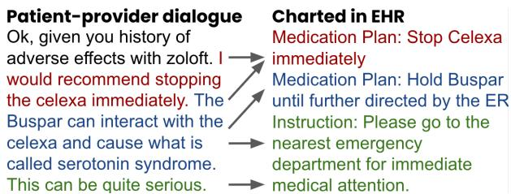
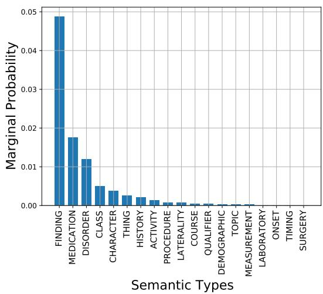
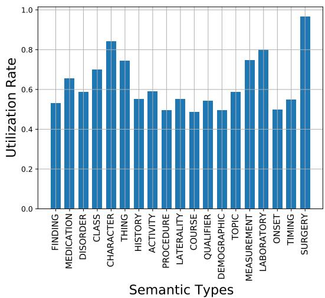
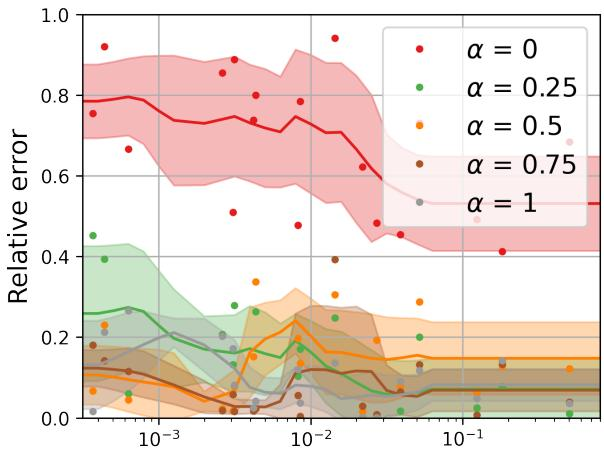
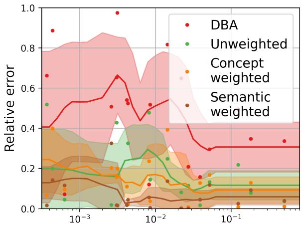
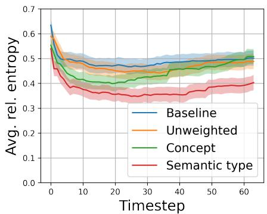
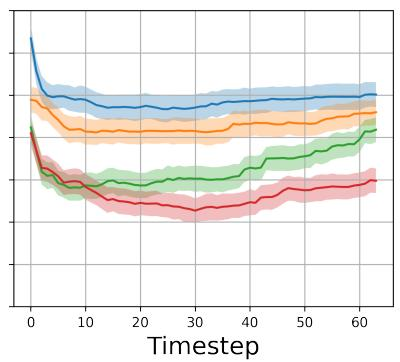
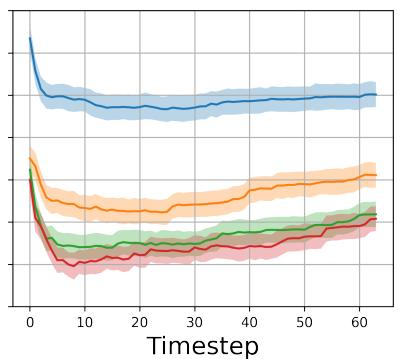
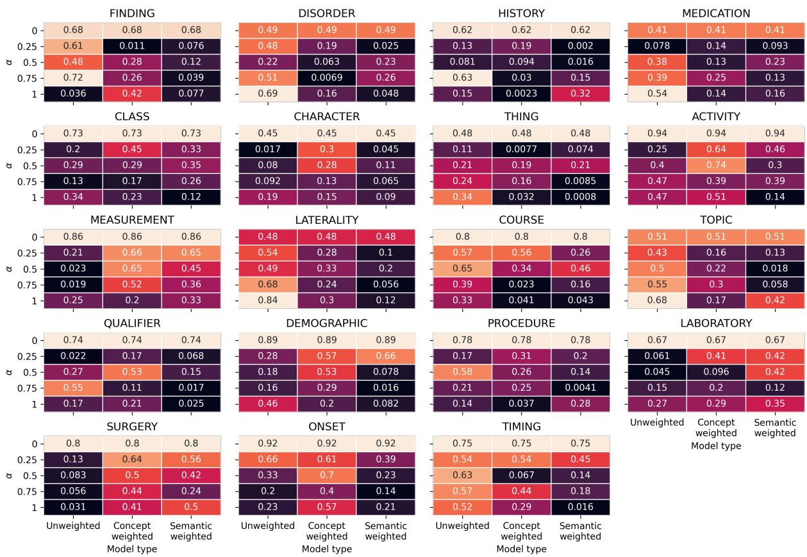
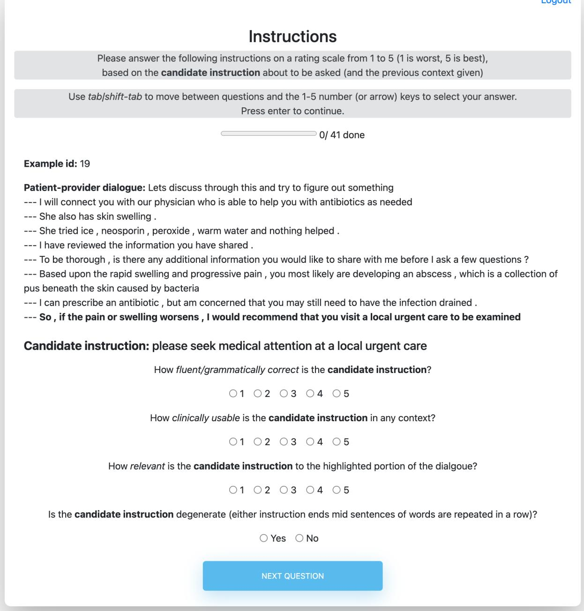

# Injecting knowledge into language generation: a case study in auto-charting after-visit care instructions from medical dialogue

Maksim Eremeev∗ Elemental Cognition New York University eremeev@nyu.edu

Ilya Valmianski AuxHealth

Xavier Amatriain Curai Health

Anitha Kannan Curai Health

## Abstract

Factual correctness is often the limiting factor in practical applications of natural language generation in high-stakes domains such as healthcare. An essential requirement for maintaining factuality is the ability to deal with rare tokens. This paper focuses on rare tokens that appear in both the source and the reference sequences, and which, when missed during generation, decrease the factual correctness of the output text. For high-stake domains that are also knowledge-rich, we show how to use knowledge to (a) identify which rare tokens that appear in both source and reference are important and (b) uplift their conditional probability. We introduce the “utilization rate” that encodes knowledge and serves as a regularizer by maximizing the marginal probability of selected tokens. We present a study in a knowledgerich domain of healthcare, where we tackle the problem of generating after-visit care instructions based on patient-doctor dialogues. We verify that, in our dataset, specific medical concepts with high utilization rates are underestimated by conventionally trained sequence-tosequence models. We observe that correcting this with our approach to knowledge injection reduces the uncertainty of the model as well as improves factuality and coherence without negatively impacting fluency. 1

## 1 Introduction

Recent advances in language modeling (c.f. Dong et al. (2021); Erdem et al. (2022) for survey) have enabled applications across multiple domains including education (Shen et al., 2021), jurisprudence (Bell et al., 2021), e-commerce (Zhang et al., 2020; Xiao et al., 2021), and healthcare (Valmianski et al., 2021; Compton et al., 2021; Alambo et al., 2022; Krishna et al., 2020).

One of the central challenges in deploying these models in-the-wild is that rare words tend to have underestimated conditional probability during generation (Luong et al., 2014; Chintagunta et al., 2021; Holtzman et al., 2020). However, in high-stakes applications, many of these rare words are semantically important and need to be preserved. For example, some symptoms, diseases, and medications can be both rare and important (Mottaghi et al., 2020) (e.g. knowing that the patient is taking warfarin is extremely important, even if the word “warfarin” occurs infrequently).

Prior approaches for handling rare word generation utilize a copy mechanism (See et al., 2017; Joshi et al., 2020; Xu et al., 2020; Choi et al., 2021). This facilitates copying from the source text using a probabilistic switch to decide if the next output token is generated or copied from the input (See et al., 2017). However, it doesn’t properly resolve the main challenge: not all rare tokens are important. Only specific rare tokens (e.g. warfarin) have a high probability of appearing in the reference sequence when found in the source sequence. In cases where the training data does not have enough structure to disambiguate which rare words are essential, the copy mechanism becomes overly extractive (Gehrmann et al., 2018; See et al., 2017).

Also relevant to this paper are previous works that integrate knowledge into language models (Duan et al., 2020; Liu et al., 2022). In entity-centric summarization, Keskar et al. (2019); Liu and Chen (2021) add key phrases to the prompt, which through the self-attention mechanism influence the output distribution. However, for prompts containing rare tokens, self-attention struggles to capture the prompt-reference dependency, and the marginal probability of rare tokens remains underestimated. Joshi et al. (2020) extends this approach by not only explicitly including the medical concepts in the input sequence, but also adding a related term to the loss function. However, they still find that for rare tokens the model underestimates the conditional probability during generation.

Finally, dictionary look-up of rare and out-ofvocabulary words has been studied in Yu et al. (2022); Ruzzetti et al. (2022). However, these papers focus on finding good representations of specific tokens. In this paper, we tackle the problem of uplifting important rare tokens even when a good representation is not available.

We base our work on the premise that specific rare tokens (e.g. warfarin) have a high probability of appearing in the reference sequence if they also appear in the source sequence. The main questions we tackle in this paper are the following: How do we know which rare tokens have a propensity to appear in both the source and the reference? How do we encode this information into the model?

We study our approach in the healthcare setting, for the concrete problem of after-visit care instruction generation from a medical dialog between patient and medical professional. We define the medical concept utilization rate and utilization-rate-aware training objective in section 2, discuss the care plan generation problem and data collection in section 3, describe the sequence-tosequence model setup in Figure 4, and report experimental results in section 5.

Our contributions are the following:

1. We are the first to explicitly focus on identifying and modeling specific rare tokens that appear in both the source and the reference. We call them “high utilization concepts.”

2. We propose a measure of “utilization rate” to identify tokens that comprise “high utilization concepts.” We use external knowledge to help with this computation as these tokens can be extremely rare.

3. We introduce a regularization term during training that leverages token utilization rate to uplift the conditional probability of important rare tokens.

4. We demonstrate the application of our approach to the concrete task of generating after-visit care instructions from medical professional-patient dialogue.

We observe performance improvement with both automatic metrics and human evaluation with medical experts.

## 2 Approach

In many sequence-to-sequence tasks, certain rare concepts have a high probability to appear in the reference sequence (y) if they also appear in the source sequence (x). We call these concepts “high utilization concepts” $( c \in \mathrm { ~ } C _ { \mathrm { H U } } )$ and formally define them in Equation 1. These concepts are comprised of one or more tokens $c = [ \nu _ { 0 } , \nu _ { 1 } , . . . ]$ . We hypothesize that a source of factuality errors in many sequence-to-sequence tasks is that learned model underestimate the conditional probability of high utilization concepts $\hat { p } ( y _ { i } = \nu , | \mathbf { y } _ { < i } , \mathbf { x } , \nu \in$ $c , c \in { \bf x } , c \in C _ { \mathrm { H U } } ) < p ( \ldots )$ , where pˆ denotes the model estimated probability and p is the true probability.

Definition 2.1 (High utilization concepts) Given a universe of concepts , the set of high utilization concepts $C _ { \mathrm { H U } }$ is defined as

$$
C _ { \mathrm { H U } } = \left\{ c \in \mathcal { C } : \frac { p ( c \in \mathbf { y } | c \in \mathbf { x } ) } { p ( c \in \mathbf { y } ) } \gg 1 \right\}\tag{1}
$$

Equation 1 answers the question “How do we know which rare tokens have a propensity to appear in both source and target?” while at the same time it works for rare tokens.

This key insight leads us to define two goals for this work: learn to identify high utilization concepts, and build a utilization-rate-aware training objective.

## 2.1 Identifying high utilization concepts using externally provided knowledge

The major challenge in identifying high utilization concepts in real datasets is that the concepts we are interested in are present in very few examples. This means that it is hard to directly estimate $p ( c \in \mathbf { y } | c \in \mathbf { x } )$ and $p ( c \in \mathbf { y } )$ from Equation 1 due to the high variance. In particular, a frequency-based estimate of probability has an uncertainty proportional to $1 / s q r t ( N )$ where N is the number of samples for a given concept. However, these rare concepts can still be very impactful to the overall performance of the model. This is because, for a given reference, y, it is unlikely that a particular high utilization concept will be present $( \forall c \in C _ { \mathrm { H U } } , p ( c \in \mathbf { y } ) \ll 1 )$ , but it is also unlikely that no high utilization concept will be present $\begin{array} { r } { ( \prod _ { c \in C _ { \mathrm { H U } } } p ( c \notin \mathbf { y } ) \ll 1 ) } \end{array}$ . This is well documented in the medical domain, where medical concepts have a very long-tailed distribution (Prabhu et al., 2019; Mottaghi et al., 2020), yet may appear in almost every relevant sequence. As an illustration, imagine a list of medication instructions. Every instruction may have a different medication so no medication token appears more than once; however, each instruction is rendered useless if it doesn’t include the relevant medication $( e . g .$ see “Medication Plan” instructions in Figure 1).

To overcome this challenge, we propose computing what we call “utilization rate”, $r _ { \phi } .$ , which we define in Equation 2. This function relies on the concept equivalence class map $\phi : C _ { \mathrm { s e l } } \to \mathcal { E }$ where $C _ { \mathrm { s e l } } \subseteq { \mathcal { C } }$ and is a set of equivalence classes. $( \phi , C _ { \mathrm { s e l } } , \mathcal { E } )$ cannot be derived from the data or the model, but instead are provided from an external source of knowledge. If ϕ is an identity (id) then $r _ { \mathrm { i d } } ( c _ { n } ) = \hat { p } ( c _ { n } \in \mathbf { y } | c _ { n } \in \mathbf { x } ) , ( \mathbf { x } , \mathbf { y } ) \in \mathcal { D }$

1. Develop a method for identifying high utilization concepts, CHU for a dataset $\mathcal { D } = \{ ( \mathbf { x } ^ { i } , \mathbf { y } ^ { i } ) \} _ { i = 1 } ^ { N }$

2. Develop a method for augmenting the training procedure of sequence-to-sequence models to correctly estimate the conditional probability of tokens forming high utilization concepts.

Definition 2.2 (Utilization rate) The utilization rate of concept $c _ { n }$ is defined as

$$
\begin{array} { r } { r _ { \phi } ( c _ { n } ) = \frac { \sum _ { c \in C _ { \mathrm { s e l } } } \sum _ { j = 1 } ^ { N } \mathbf { 1 } [ c \in \mathbf { x } ^ { j } , c \in \mathbf { y } ^ { j } , \phi ( c ) = \phi ( c _ { n } ) ] } { \sum _ { c \in C _ { \mathrm { s e l } } } \sum _ { j = 1 } ^ { N } \mathbf { 1 } [ c \in \mathbf { x } ^ { j } , \phi ( c ) = \phi ( c _ { n } ) ] } } \end{array}\tag{2}
$$

Here, Equation 2 tries to make the intuition from Equation 1 applicable to a real dataset. We generally cannot compute the lift because for rare words the dataset frequency derived probability estimates are poor.

  
(a) A relatively simple-to-chart example with each sentence corresponding to an instruction. Note synonym substitution of ibuprofen for motrin and the addition of timing to the gargling instruction.  
(b) A difficult-to-chart example with incomplete information and multiple dialogue sentences contributing to a single instruction.  
Figure 1: Example conversation segments corresponding to care plan and corresponding instructions. Color represents the highest overlap between the sentence in the dialogue and the instruction. Arrows represent semantic relationship between the dialogue sentence and instruction. Note that these relationships between the dialog and the instructions are not available in the dataset.

Note that Equation 2 combines both externally provided knowledge $( \phi , C _ { \mathrm { s e l } } , \mathcal { E } )$ and dataset derived values. This allows us to inject domain-specific information. Because concepts are mapped to equivalence classes, every concept in a particular equivalence class has the same utilization rate. If a concept $c _ { n } \in C _ { \mathrm { s e l } }$ has marginal probability to appear in the reference sequence that is much lower than $r _ { \phi } ( c _ { n } )$ then it is a high utilization concept.

## 2.2 Utilization-rate-aware seq2seq training

Our analysis in section 5 (see Figure 3) shows that conventionally trained seq2seq models underestimate the utilization rate $( r _ { \phi } )$ for many rare concepts. While we cannot optimize the utilization rate directly, we can optimize the approximate marginal probability $p ( \nu | \mathbf x )$ of a token ν given a source sequence x, as seen in Equation 3.

$$
{ \begin{array} { r l } & { p ( \nu | \mathbf { x } ) = \displaystyle \sum _ { \mathbf { y } < t } p ( \nu | \mathbf { y } _ { < t } ) p ( \mathbf { y } _ { < t } ) \approx } \\ & { \qquad \displaystyle \approx \sum _ { t = 1 } ^ { \| \mathbf { y } \| } p ( \nu | \mathbf { y } _ { < t } ) p ( \mathbf { y } _ { < t } ) { \stackrel { p ( \mathbf { y } _ { < t } ) _ { \infty } } { \approx } } { \frac { \mathrm { i s \ u i f o r m } } { \approx } } } \\ & { \qquad \displaystyle \approx { \frac { 1 } { \| \mathbf { y } \| } } \displaystyle \sum _ { t = 1 } ^ { \| \mathbf { y } \| } p ( \nu | \mathbf { y } _ { < t } ) } \end{array} }\tag{3}
$$

Given the source sequence x, the tokens for which we aim to optimize the marginal probability are $\{ \nu \in$ $c , c \in { \bf x } \cap C _ { \mathrm { H U } } \}$ . We define the unweighted utilization loss.

## Definition 2.3 (Unweighted utilization loss)

$$
l _ { u } ( \mathbf { x } ) = - \frac { 1 } { \| \{ \nu \in c , c \in \mathbf { x } \cap C _ { \mathrm { H U } } \} \| } \times\tag{4}
$$

$$
\times \sum _ { \nu \in c , c \in ( \mathbf { x } \cap C _ { \mathrm { H U } } ) } \log p ( \nu | \mathbf { x } )\tag{5}
$$

However, not all concepts in $C _ { \mathrm { H U } }$ are equally likely to appear in the reference given their appearance in the source. To better reflect we also propose a weighted utilization loss where the weight for each token is determined by its utilization rate.

## Definition 2.4 (Weighted utilization loss)

$$
l _ { w } ( \mathbf { x } ) = - \frac { \sum _ { \nu \in c , c \in ( \mathbf { x } \cap C _ { \mathrm { H U } } ) } r _ { \phi } ( c ) \log p ( \nu | \mathbf { x } ) } { \sum _ { \nu \in c , c \in ( \mathbf { x } \cap C _ { \mathrm { H U } } ) } r _ { \phi } ( c ) }\tag{6}
$$

Note that Equation 6 directly injects externally provided knowledge through its dependence on ϕ.

We use utilization loss as a regularization term and augment the objective function. We use $\alpha > 0$ to balance the strength of the regularization:

$$
l ( \mathbf { x } , \mathbf { y } ) = l _ { \mathrm { n l l } } ( \mathbf { y } ) + \alpha \cdot l _ { u \mathrm { o r } w } ( \mathbf { x } )\tag{7}
$$

where $\begin{array} { r } { l _ { \mathrm { n l l } } = - \sum _ { t = 1 } ^ { | \mathbf { y } | } \log p ( y _ { t } | \mathbf { y } _ { < t } , \mathbf { x } ) } \end{array}$ and $l _ { u \mathrm { o r } w }$ is either $l _ { u }$ from Equation 5 or $l _ { w }$ from Equation 6.

## 3 After-visit care instruction generation: task and data description

After-visit care instructions (care plan) are a set of actions (instructions) that a medical professional writes in the patient’s electronic health record (EHR) as a followup to the patient’s visit. A care plan often includes a list of medications with appropriate directions, further medical evaluations, or educational information for preventive care. Before writing the care plan, the medical professional discusses it with the patient, and together, they jointly agree on the next course of action. This joint decision-making implies that most of the necessary information for writing the care plan is already available in the conversation.

In Figure 1, we show two examples. In each example, we present the (a) segment of the conversational dialog corresponding to provider messages discussing the care plan with the patient and (b) corresponding care plan charted in the EHR. We can see that the instructions are written in a directive format, using action verbs and often paraphrasings of the corresponding text in the dialogue. The care plan does not always have all the medical concepts mentioned in the conversation. In the first example, “serotonin syndrome" and “Celexa" are rare, but the care plan includes only the latter. We need a model that is robust to rare medical concepts and can discern which knowledge needs to be carried forward.

  
(a) Average marginal probability of every semantic type.

  
(b) Semantic type utilization rates.  
Figure 2: Empirical concept marginal probabilities and utilization rates estimated from the dataset.

We tackle the problem of taking the relevant section in the conversations corresponding to the care plan as input and automatically derive care plan instructions that the medical professionals can approve. We do not assume access to 1-1 mappings between the sentences in the conversation to the care plan instructions. However, we develop a method to derive a dataset of 1-1 mappings, albeit noisy, which we use for model training.

Dataset construction. We use a dataset with 14K medical professional-patient encounters collected on a virtual primary care platform. Each encounter has a text-based conversation between the medical professional and the patient. We applied an in-house conversation discourse parser to extract only those dialogue turns from the medical professional’s corresponding to the care plan discussion. We also have the associated care plans written from the patient’s electronic health record for that encounter. On average, each encounter has 9 dialogue turns corresponding to care plans and 4 care plan instructions.

We need a parallel corpus with pairs of dialogue turns and care plan instructions for our model. Getting manual annotations for each encounter would be expensive as it requires expert knowledge. Therefore, we automatically construct a paired dataset, albeit noisily, from the paired encounter level care plan and provider dialog turns. We get sentence-level embeddings for every sentence in each turn and instructions in the care plan and pair those with the highest cosine similarity (We provide additional details in the Supplementary Material).

At the end of this, we have 48,000 source-reference pairs, where the source is a sentence in the conversational dialog and reference is the mapped instruction. We randomly sample 3000 pairs for testing, 1000 for validation, and the remaining 44,000 pairs for training.

We use medical concepts from UMLS (Bodenreider, 2004) and in particular SNOMED-CT and RXNorm ontologies. The synonyms are pooled from all ontologies in UMLS that map to the corresponding concept in SNOMED-CT and RXNorm.

To identify the concepts, we use an in-house lookupbased concept recognizer. It uses a sliding window strategy to find maximal matches of text corresponding to medical concepts and their synonyms. It ignores stop words while doing the match. Finally, it has an agglomeration step that leverages a concept hierarchy. If we have overlapping spans corresponding to two concepts where one is a child of another (eg “lower abdominal pain” and “abdominal pain”) then only the more specific concept is extracted. If two different concepts have a span overlap and are not hierarchically related, then the concept linking is greedily selected with the concept on the left being given priority.

Identifying high utilization concepts. We limit $C _ { \mathrm { s e l } }$ to only medical concepts and choose ϕ such that it maps them to their SNOMED CT semantic types (which informs our choice of ). In our case study this narrows down 758 unique medical concepts to their 19 semantic types. The marginal probability $p ( c \in \mathbf { y } )$ for each semantic type c is shown in Figure 2a while the utilization rates are shown in Figure 2b. Comparing them we can see that utilization rates are 10-100x larger than the marginal probabilities. This suggests that all medical concepts are part of high utilization tokens set $( C _ { \mathrm { H U } } = C _ { \mathrm { s e l } } )$ . It also means that many kinds of medical concepts that are present in the source sequence do not get generated in the output sequence, which drastically hurts medical correctness.

## 4 Experimental setup

We follow the standard practice (Ott et al., 2018) of training our sequence-to-sequence models using FairSeq framework (Ott et al., 2019). We use byte-pair encoding implemented in the fastBPE package (Sennrich et al., 2016). We use a transformer architecture for our model and train models on our data from scratch2.

Model architecture We use the transformer\_iwslt\_de\_en architecture in FairSeq for experiments. It consists of 6 encoder and decoder layers with 4 self-attention heads followed by feed-forward transformations. Both encoder and decoder use embeddings of size 512 while the input and output embeddings are not shared. Both the encoder and decoder use learned positional embedding. We early-stop training based on the validation performance. Evaluation is done on the test set.

Training We use Adam optimizer (Kingma and Ba, 2015) with $\beta _ { 1 } = 0 . 9$ and $\beta _ { 2 } = 0 . 9 8$ We use the inverse square root learning scheduler with 4,000 warmup steps. We use the initial learning rate of $5 \times 1 0 ^ { - 4 }$ dropout rate of 0.3 (Srivastava et al., 2014) , and weight decay with its rate set to $1 0 ^ { - 4 }$ . We use label smoothing with 0.1 of probability smoothed uniformly during training. We modify the training objective Equation 7 by adding oversmoothing loss (Kulikov et al., 2021) with a coefficient of 0.9 and unlikelihood loss (Welleck et al., 2019) with a coefficient of 0.5. All training was performed on VMs with single V100 GPUs, we estimate 200 GPU hours as the total amount required for the completion of this work.

Early stopping We use early stopping for model selection based on the value of the objective function computed on the validation set. We evaluate the model on the development set every 2K updates ( 4K tokens per update). We stop training when the objective has not improved over more than 5 consecutive validation runs. It takes approximately 75K updates to an early stop.

Decoding We use beam search implementation from FairSeq. We decode using the beam size of 5. We set the lower- and upper-bound of a generated output to be, respectively, 0 and $1 . 2 \cdot | | \mathbf { x } | | + 1 0$ . We do not use either length normalization or length penalty since we apply oversmoothing loss.

Lexically constrained decoding baseline Apart from using the unregularized version of the model as a baseline, we compare the proposed approach with the lexically constrained decoding approach (Post and Vilar, 2018). We stick to the LexicallyConstrainedBeamSearch implementation of the Dynamic Beam Allocation (DBA) algorithm that ensures the presence of provided tokens in the generated output. DBA implements an optimized version of the Grid Beam Search (Hokamp and Liu, 2017). DBA is training-agnostic and is used only during generation. We apply DBA for the baseline model. Given the non-uniform distribution of utilization rates, for each source we leave only medical concepts c with $r _ { \mathrm { i d } } ( c ) > \tau$ for some threshold $\tau$ . We report results for $\tau = 0 . 6$ , which we select by running an extensive grid search.

## 5 Results

## 5.1 Effect of knowledge injection during training on model’s utilization rate

We evaluate whether the knowledge injection through regularization (subsection 2.2) has the desired effect of improving model estimate of the utilization rate, $r _ { \phi }$ . Because the test set is too small to effectively estimate per-concept utilization rate, we instead compute it for semantic types. In Figure 3 we use semantic relative error (Equation 8) to compare models trained with $\alpha \in \{ 0 , 0 . 2 5 , 0 . 5 , 0 . 7 5 , 1 \}$ that either use unweighted loss $l _ { u }$ (which uplifts all medical concepts equally, “Unweighted") or a weighted loss $l _ { w }$ with the ϕ being identity (“Concept weighted”) or mapping concepts to semantic types (“Semantic weighted”). In addition, as a baseline we also compare an unregularized model that uses DBA for generation (“DBA”). For a detailed breakdown of relative errors for each combination see the Supplementary Material.

Definition 5.1 (Semantic relative error) Relative error for semantic type s computed from $\hat { r } _ { \phi }$ estimated from model derived output sequences and $r _ { \phi }$ estimated from reference sequences. $c _ { s }$ is any conceptfor which $\phi ( c ) = s$ holds and the value $o f \epsilon _ { s }$ in not dependent on the choice of $\dot { c } _ { s }$

$$
\epsilon _ { s } = \frac { | | \hat { r } _ { \phi } ( c _ { s } ) - r _ { \phi } ( c _ { s } ) | | } { r _ { \phi } ( c _ { s } ) }\tag{8}
$$

In Figure 3a we present the relative error for different α as a function of semantic type frequency in the test set. For each point (a given semantic type and α) we take the lowest relative error among {“Unweighted”, “Concept weighted”, and “Semantic weighted”}. The highest relative errors are seen for $\alpha = 0$ , which corresponds to no regularization. For other values of α the difference is not statistically significant, although, for very rare semantic types, $\alpha = 0 . 2 5$ appears to perform worse than models with higher regularization strength. This shows that our external knowledge informed regularization has a significant impact on a relative error, but the utilization rate estimate is not sensitive to the exact weight of the regularization term.

In Figure 3b we present relative error for different training procedures, {“Unweighted”, “Concept weighted”, and “Semantic weighted”}, as well as a baseline of “DBA.” For each point (a given semantic type and training procedure) we choose an α that gives the lowest relative error. We find that “DBA" baseline, which is a constrained generation procedure applied to an unregularized model, performs worse than any of the regularized models, although it does outperform the unregularized model $( \alpha = 0$ in Figure 3a). While not significant, we also see that for rare semantic types “Semantic weighted” seems to perform the best, which aligns with our expectation that the utilization rate is hard to estimate for very rare concepts.

  
Frequency of the semantic type

  
(a) Relative error in the utilization rate for each regularizer strength α. Note that $\alpha = 0$ means there is no regularization.  
Frequency of the semantic type  
(b) Relative error in the utilization rate for each model (and best α for that model).

Figure 3: Relative errors in the utilization rates for different semantic types plotted as a function of the frequency of the semantic type. The trend-line and uncertainty are computed with a linearly interpolated moving average window.  
  
(a) α = 0.25

  
(b) α = 0.5

  
(c) α = 1.0

Figure 4: Entropy of the conditional distribution $p ( y | \mathbf { y } _ { < t } , \mathbf { x } )$ with respect to different α values. Filled regions denote the standard deviation across training runs according to Figure 4.
<table><tr><td></td><td>α</td><td>BERTScore</td><td>Concept-F1</td><td>GPT-2 Perplexity</td></tr><tr><td>Baseline</td><td>0.0</td><td> $2 2 . 4 8 \pm 0 . 6 6$ </td><td> $\overline { { 5 7 . 4 3 \pm 3 . 7 3 } }$ </td><td> $\overline { { 5 . 5 3 \pm 0 . 0 4 } }$ </td></tr><tr><td>DBA</td><td>-</td><td> $2 3 . 5 9 { \scriptstyle \pm 0 . 2 8 }$ </td><td> $\overline { { 7 9 . 8 3 \pm 0 . 4 3 } }$ </td><td> $\overline { { 1 1 . 9 6 { \pm 0 . 0 5 } } }$ </td></tr><tr><td rowspan="3">Unweighted (ours)</td><td>0.25</td><td> $2 5 . 0 9 { \scriptstyle \pm 0 . 6 9 }$ </td><td> $5 8 . 1 9 { \scriptstyle \pm 2 . 1 1 }$ </td><td> $5 . 9 1 \pm 0 . 0 7$ </td></tr><tr><td>0.5</td><td> $2 5 . 4 2 { \scriptstyle \pm 0 . 5 6 }$ </td><td> $5 8 . 9 1 { \scriptstyle \pm 6 . 8 3 }$ </td><td> $5 . 6 5 { \scriptstyle \pm 0 . 0 3 }$ </td></tr><tr><td>0.75 1.0</td><td> $2 6 . 2 2 { \scriptstyle \pm 0 . 3 5 }$ </td><td> $6 0 . 8 3 { \scriptstyle \pm 5 . 9 6 }$ </td><td> $6 . 2 8 { \scriptstyle \pm 0 . 0 2 }$ </td></tr><tr><td rowspan="4">Concept weighted (ours)</td><td>0.25</td><td> $2 6 . 7 4 { \scriptstyle \pm 0 . 4 3 }$   $2 8 . 2 9 { \scriptstyle \pm 0 . 1 9 }$ </td><td> $6 1 . 0 5 { \scriptstyle \pm 7 . 4 8 }$   $\overline { { 6 0 . 8 7 \pm 3 . 8 6 } }$ </td><td> $6 . 1 8 { \pm } 0 . 0 5$   $6 . 9 3 { \scriptstyle \pm 0 . 0 5 }$ </td></tr><tr><td>0.5</td><td> $2 8 . 1 9 { \scriptstyle \pm 0 . 2 0 }$ </td><td> $6 0 . 3 6 { \scriptstyle \pm 2 . 0 3 }$ </td><td> $8 . 4 9 { \scriptstyle \pm 0 . 0 5 }$ </td></tr><tr><td>0.75</td><td> $2 8 . 0 8 { \pm } 0 . 1 5$ </td><td> $6 4 . 0 9 { \scriptstyle \pm 1 . 8 5 }$ </td><td> $7 . 9 5 { \scriptstyle \pm 0 . 0 8 0 }$ </td></tr><tr><td>1.0</td><td> $2 7 . 8 2 { \scriptstyle \pm 0 . 2 5 }$ </td><td> $6 3 . 0 5 { \scriptstyle \pm 2 . 4 9 }$ </td><td> $9 . 3 7 { \scriptstyle \pm 0 . 1 0 }$ </td></tr><tr><td rowspan="4">Semantic weighted (ours)</td><td>0.25</td><td> $2 8 . 9 7 { \scriptstyle \pm 0 . 5 6 }$ </td><td> $\overline { { 6 9 . 1 0 { \pm 2 . 1 2 } } }$ </td><td> $7 . 0 1 \pm 0 . 2 9$ </td></tr><tr><td>0.5</td><td> $\mathbf { 3 0 . 5 4 } \pm \mathrm { 0 . 7 8 }$ </td><td> $7 4 . 9 8 { \pm } 3 . 9 1 $ </td><td> $6 . 8 4 \pm 0 . 0 3$ </td></tr><tr><td>0.75</td><td> ${ \bf 3 1 . 4 8 } \pm { \bf 0 . 8 6 }$ </td><td> $7 5 . 7 7 { \scriptstyle \pm 3 . 3 0 }$ </td><td> $6 . 9 6 { \scriptstyle \pm 0 . 1 1 }$ </td></tr><tr><td>1.0</td><td> $\mathbf { 3 0 . 5 9 } \pm \mathrm { 0 . 6 3 }$ </td><td> $7 5 . 0 2 { \pm } 2 . 1 8$ </td><td> $6 . 9 4 { \scriptstyle \pm 0 . 1 2 }$ </td></tr></table>

Table 1: Automated metrics scores for different model setups. We report average score and standard deviation over five random seeds. We highlight in bold the best average and all scores having overlapped standard deviation intervals with the best score.

## 5.2 Effect of knowledge injection during training on model’s uncertainty

We analyze the effect of utilization regularization on the model’s uncertainty at every timestep. Uncertainty at timestep t is defined as an entropy of model’s distribution on each timestep t (here $\mathbf { y } _ { < t }$ is the decoded sequence up to t-th timestep, $y$ is an arbitrary token from the target vocabulary):

$$
H _ { t } ( \mathbf { y } _ { < t } , \mathbf { x } ) = - \sum _ { y } p ( y | \mathbf { y } _ { < t } , \mathbf { x } ) \log p ( y | \mathbf { y } _ { < t } , \mathbf { x } )\tag{9}
$$

We consider the defined uncertainty on earlier timesteps, where the model’s distribution is closer to marginal. As the proposed method pushes up the marginal probability of the medical concepts, we claim that models’ uncertainty decreases with the regularization. Moreover, care plan instructions typically introduce crucial concepts at the beginning of an instruction. Thus, we claim that early timesteps uncertainty matters for the precise decoding of instructions.

This is confirmed by Figure 4. We observe that uncertainty drops monotonically as the α weight increases. In particular, uncertainty on early timesteps heavily drops as a result of utilization minimization. Hence, the model becomes more confident in selecting principal concepts at the beginning of an instruction. In contrast to the baseline, all regularized models’ uncertainty start to increase for $t > 1 0$ . As fewer concepts appear in the instruction end, the marginal probability maximization flattens the conditional distribution. However, the uncertainty does not degrade in comparison to the baseline. Thus, the proposed regularization effectively improves the confidence of the model on early timesteps.

## 5.3 Results on Care plan instructions task

Automated evaluation: The precise and complete concepts utilization directly affects the quality of instruction. We first quantify the quality by calculating automatic metrics to judge the relevance, fluency, and concept utilization rate in comparison to the reference instructions. We use BERTScore (Zhang et al., 2019) to estimate the similarity between reference and candidate, GPT-2 perplexity for (Nguyen, 2021) to assess the coherence (fluency) of the candidate, and concept overlap (Joshi et al., 2020) to measure the percentage of medical concepts used in both candidate in reference.

Table 1 presents the automatic evaluation results. The scores indicate that incorporating knowledge correlates with relevance and concept overlap. We highlight three observations. First, the regularization is effective in terms of quality and concept overlap. We observe significant quality improvement compared to both the baseline and DBA. Moreover, weighted versions of the model outperform the unweighted setup. Thus, injecting more knowledge into the model, such as empirical utilization weights, results in better quality. Second, the impact of the regularization hardly depends on the α weight. Third, the GPT-2 perplexity degrades. This demonstrates that the regularization impacts the model distribution, so the fluency of the model may deteriorate. This trade-off, however, has no negative impact on the quality given the improved BERTScore. For qualitative results, please see the Supplementary Material.

Medical experts evaluation: To get a more precise medical assessment, we conduct human evaluation with medical experts. We randomly sample 100 dialogues from the test set and generate candidates with each model setup setting $\alpha = 1 . 0$ . We ask five doctors to evaluate the relevance to the dialogue, medical usability (if the generated instruction can be used in any care plan), and grammatical correctness (fluency) on a scale from 1 to 5. Additionally, we ask assessors to indicate degenerate generations, i.e., premature or repetitive sequences. Exact questions and interface screenshots can be found in the Supplementary Material.

As shown in Table 2, we claim that both weighted versions achieve significant improvement in relevance and usability, which are target medical metrics. In contrast to the GPT-2 perplexity, medical experts report equal fluency for all models but DBA. We explain this discrepancy with vocabulary shift as GPT-2 is not trained on a healthcare corpus. Finally, utilization rate regularization does not affect the number of degenerate outputs. Hence, the proposed solution effectively induces knowledge in the model distribution without corrupting generated text correctness. This is not true for DBA, which struggles from a lack of coherence and degenerate outputs while producing more relevant and usable instructions.

## 6 Conclusion

In this work, we tackle the problem of under-generation of rare but important tokens in sequence-to-sequence models. We show that external knowledge can be effectively injected into the sequence-to-sequence models and mitigate the problem of lexical precision. We characterize the problem by identifying a set of lowfrequency but important concepts and defining their utilization rate, which estimates the probability of a concept that is present in the source to be also present in the reference. We confirm that modern welltrained sequence-to-sequence models suffer from underestimating utilization rates, and propose a way to directly maximize it during training. We design a differentiable proxy based on the marginal entropy and propose a regularized training objective. Since some concepts may be omitted from the reference, we extend the approach by applying weights, which restrict the regularization impact of low-utilized concepts or their semantic types.

<table><tr><td></td><td></td><td></td><td>Relevance Usability Fluency</td><td>Degeneracies, %</td></tr><tr><td>Baseline</td><td> $2 . 5 0 { \pm } 0 . 1 2$ </td><td> $3 . 1 8 { \scriptstyle \pm 0 . 2 7 }$ </td><td> $\overline { { 4 . 1 7 \pm 0 . 1 4 } }$ </td><td> $\mathbf { 0 . 1 0 \pm 0 . 0 1 }$ </td></tr><tr><td>DBA</td><td> $3 . 3 6 { \pm } 0 . 1 5$ </td><td> $3 . 3 5 { \scriptstyle \pm 0 . 1 6 }$ </td><td> $3 . 9 1 { \scriptstyle \pm 0 . 1 8 }$ </td><td> $0 . 2 1 { \scriptstyle \pm 0 . 0 5 }$ </td></tr><tr><td>Unweighted (ours)</td><td> $3 . 5 6 { \pm } 0 . 1 2$ </td><td> $3 . 2 1 { \pm } 0 . 2 8$ </td><td> $\pm . 2 6 { \pm } 0 . 0 8$ </td><td> ${ \bf 0 . 1 0 } { \scriptstyle \pm 0 . 0 2 }$ </td></tr><tr><td>Concept weighted (ours)</td><td> $\mathbf { 3 . 7 9 2 0 . 0 6 }$ </td><td> $3 . 7 2 { \scriptstyle \pm 0 . 0 5 }$ </td><td> $4 . 3 7 { \scriptstyle \pm 0 . 1 6 }$ </td><td> ${ \bf 0 . 1 2 } \pm 0 . 0 2$ </td></tr><tr><td>Semantic weighted (ours)</td><td> $\mathbf { 3 . 7 8 { \pm } 0 . 1 4 }$ </td><td> $\mathbf { 3 . 9 9 2 0 . 1 9 }$ </td><td> $4 . 4 2 { \scriptstyle \pm 0 . 1 3 }$ </td><td> $\mathbf { 0 . 1 2 } \pm 0 . 0 1 2$ </td></tr></table>

Table 2: Evaluation using medical experts. Fluency, Usability, and Relevance are scored on a scale from 1 to 5. We also report the percentage of premature or repetitive outputs (Degeneracies). We report average score and standard deviation of experts’ scores. We highlight in bold the best average and all scores having overlapped standard deviation intervals with the best score.

We perform a case study in automatic care plan generation from medical dialogues. We experiment with a custom internal dataset and observe the effectiveness of the approach. We also compare a previous approach for external knowledge injection – dynamic beam allocation (DBA). First, we find that regularization improves the model’s utilization rate by pushing it closer to the empirical values observed in reference sequences. Second, regularization reduces the model’s uncertainty at early timesteps: exactly where concepts are typically introduced. Third, we observed a significant (in terms of standard deviations) quality improvement. More specifically, we did a human evaluation of relevance, concept overlap, medical usability, and fluency using five medical experts. The results revealed the enhanced relevance and usability of generated instructions while, unlike DBA, maintaining high fluency and low degeneracy.

Ethics Statement: This work was done as part of a quality improvement activity as defined in 45CFR §46.104(d)(4)(iii) – “health care operations” secondary research.

Reproducibility statement: Code used for training regularized sequence-to-sequence models in this paper is available at https: //github.com/curai/curai-research/ tree/main/careplan-charting. However, data will not be shared due to patient privacy and HIPAA compliance. as it contains significant amount of Patient Health Information (PHI) and cannot be shared.

Privacy concerns: Our research aims to utilize knowledge to enhance NLG systems. However, we also acknowledge the privacy concerns associated with leveraging sensitive medical information. All training data was anonymized during preprocessing step, and all personally identifiable information (PII) was removed to protect patient identities in generated outputs. Another privacy consideration is inference leakage, where NLG systems unintentionally reveal sensitive information during generation. We suggest incorporating differential privacy mechanisms to prevent the association of rare tokens or medical concepts with specific individuals.

## 7 Limitations

There are several important limitations to this work that can be split into two categories: (1) method applicability to other domains and (2) method scalability to much larger models.

Method applicability to other domains. Utilization rate computation and regularization are possible when there is some external knowledge that can be used to infer which tokens are “important.” In particular, our highest-performing model uses token semantic type to compute utilization rates. This limits our approach to sub-domains where there is an external knowledge source that can inform us about important tokens and give us higher-order semantic information about how to group the important tokens. For example, our approach will likely not be very helpful for open-domain conversations.

Method scalability to much larger models. We have evaluated our approach for models on the scale of $O ( 1 0 ^ { 8 } )$ parameters. However, modern state-of-the-art models often involve $O ( 1 0 ^ { 1 1 } )$ parameters, three orders of magnitude larger than models in our experiments. Large language models (LLMs) often still suffer from the under-generation of rare tokens, but our study is insufficient to determine if our approach would still work. We suppose that utilization-rate-based regularization is most likely to be beneficial in the fine-tuning step of LLMs, but verification of this is left for future work.

## References

Amanuel Alambo, Tanvi Banerjee, Krishnaprasad Thirunarayan, and Mia Cajita. 2022. Improving the factual accuracy of abstractive clinical text summarization using multi-objective optimization.

Kristen Bell, Jenny Hong, Nick McKeown, and Catalin Voss. 2021. The recon approach: A new direction for machine learning in criminal law. In Berkeley Technology Law Journal.

Olivier Bodenreider. 2004. The Unified Medical Language System (UMLS): Integrating biomedical terminology. Nucleic Acids Research, 32.

Jai Chintagunta, Namit Katariya, Xavier Amatriain, and Anitha Kannan. 2021. Medically aware gpt-3 as a data generator for medical dialogue summarization. Machine Learningfor Healthcare.

Sanghyuk Choi, Jeong-In Hwang, Hyungjong Noh, and Yeonsoo Lee. 2021. May the force be with your copy mechanism: Enhanced supervised-copy method for natural language generation. CoRR, abs/2112.10360.

Rhys Compton, Ilya Valmianski, Li Deng, Costa Huang, Namit Katariya, Xavier Amatriain, and Anitha Kannan. 2021. Medcod: A medically-accurate, emotive, diverse, and controllable dialog system. In Proceedings ofMachine Learningfor Health, volume 158 of Proceedings of Machine Learning Research, pages 110–129. PMLR.

Chenhe Dong, Yinghui Li, Haifan Gong, Miaoxin Chen, Junxin Li, Ying Shen, and Min Yang. 2021. A survey of natural language generation. CoRR, abs/2112.11739.

Yu Duan, Canwen Xu, Jiaxin Pei, Jialong Han, and Chenliang Li. 2020. Pre-train and plug-in: Flexible conditional text generation with variational autoencoders. In Proceedings of the 58th Annual Meeting of the Association for Computational Linguistics, pages 253–262, Online. Association for Computational Linguistics.

Erkut Erdem, Menekse Kuyu, Semih Yagcioglu, Anette Frank, Letitia Parcalabescu, Barbara Plank, Andrii Babii, Oleksii Turuta, Aykut Erdem, Iacer Calixto, Elena Lloret, Elena-Simona Apostol, Ciprian-Octavian Truica, Branislava Šandrih, Sanda˘ Martinciˇ c-Ipši´ c, Gábor Berend, Albert Gatt, and Gr´ az-˘ ina Korvel. 2022. Neural natural language generation: A survey on multilinguality, multimodality, controllability and learning. J. Artif. Int. Res., 73.

Sebastian Gehrmann, Yuntian Deng, and Alexander Rush. 2018. Bottom-up abstractive summarization. In Proceedings ofthe 2018 Conference on Empirical Methods in Natural Language Processing, Brussels, Belgium. Association for Computational Linguistics.

Chris Hokamp and Qun Liu. 2017. Lexically constrained decoding for sequence generation using grid beam search. In Proceedings of the 55th Annual Meeting of the Association for Computational Linguistics (Volume 1: Long Papers), pages 1535–1546, Vancouver, Canada. Association for Computational Linguistics.

Ari Holtzman, Jan Buys, Li Du, Maxwell Forbes, and Yejin Choi. 2020. The curious case of neural text degeneration. In International Conference on Learning Representations.

Anirudh Joshi, Namit Katariya, Xavier Amatriain, and Anitha Kannan. 2020. Dr. summarize: Global summarization of medical dialogue by exploiting local structures. EMNLP-Findings.

Nitish Shirish Keskar, Bryan McCann, Lav R. Varshney, Caiming Xiong, and Richard Socher. 2019. Ctrl: A conditional transformer language model for controllable generation.

Diederik P. Kingma and Jimmy Ba. 2015. Adam: A method for stochastic optimization. In ICLR.

Kundan Krishna, Sopan Khosla, Jeffrey P. Bigham, and Zachary C. Lipton. 2020. Generating soap notes from doctor-patient conversations.

Ilia Kulikov, Maksim Eremeev, and Kyunghyun Cho. 2021. Characterizing and addressing the issue of oversmoothing in neural autoregressive sequence modeling.

Mike Lewis, Yinhan Liu, Naman Goyal, Marjan Ghazvininejad, Abdelrahman Mohamed, Omer Levy, Ves Stoyanov, and Luke Zettlemoyer. 2019. Bart: Denoising sequence-to-sequence pre-training for natural language generation, translation, and comprehension. arXiv preprint arXiv:1910.13461.

Xiaochen Liu, Yu Bai, Jiawei Li, Yinan Hu, and Yang Gao. 2022. Psp: Pre-trained soft prompts for few-shot abstractive summarization.

Zhengyuan Liu and Nancy Chen. 2021. Controllable neural dialogue summarization with personal named entity planning. In Proceedings of the 2021 Conference on Empirical Methods in Natural Language Processing, pages 92–106, Online and Punta Cana, Dominican Republic. Association for Computational Linguistics.

Thang Luong, Ilya Sutskever, Quoc V. Le, Oriol Vinyals, and Wojciech Zaremba. 2014. Addressing the rare word problem in neural machine translation. CoRR, abs/1410.8206.

Ali Mottaghi, Prathusha K. Sarma, Xavier Amatriain, Serena Yeung, and Anitha Kannan. 2020. Medical symptom recognition from patient text: An active learning approach for long-tailed multilabel distributions. CoRR, abs/2011.06874.

An Nguyen. 2021. Language model evaluation in openended text generation.

Myle Ott, Sergey Edunov, Alexei Baevski, Angela Fan, Sam Gross, Nathan Ng, David Grangier, and Michael Auli. 2019. fairseq: A fast, extensible toolkit for sequence modeling. In Proceedings of NAACL-HLT 2019: Demonstrations.

Myle Ott, Sergey Edunov, David Grangier, and Michael Auli. 2018. Scaling neural machine translation. Proceedings ofthe Third Conference on Machine Translation: Research Papers.

Matt Post and David Vilar. 2018. Fast lexically constrained decoding with dynamic beam allocation for neural machine translation. In Proceedings of the 2018 Conference ofthe North American Chapter of the Associationfor Computational Linguistics: Human Language Technologies, Volume 1 (Long Papers), pages 1314–1324, New Orleans, Louisiana. Association for Computational Linguistics.

Viraj Prabhu, Anitha Kannan, Geoffrey J. Tso, Namit Katariya, Manish Chablani, David A. Sontag, and Xavier Amatriain. 2019. Open set medical diagnosis. CoRR, abs/1910.02830.

Elena Sofia Ruzzetti, Leonardo Ranaldi, Michele Mastromattei, Francesca Fallucchi, Noemi Scarpato, and Fabio Massimo Zanzotto. 2022. Lacking the embedding of a word? look it up into a traditional dictionary. In Findings of the Association for Computational Linguistics: ACL 2022, pages 2651–2662, Dublin, Ireland. Association for Computational Linguistics.

Abigail See, Peter J. Liu, and Christopher D. Manning. 2017. Get to the point: Summarization with pointergenerator networks. In Proceedings of the 55th Annual Meeting of the Association for Computational Linguistics (Volume 1: Long Papers). Association for Computational Linguistics.

Rico Sennrich, Barry Haddow, and Alexandra Birch. 2016. Neural machine translation of rare words with subword units. In Proceedings of the 54th Annual Meeting of the Association for Computational Linguistics (Volume 1: Long Papers), pages 1715–1725, Berlin, Germany. Association for Computational Linguistics.

Jia Tracy Shen, Michiharu Yamashita, Ethan Prihar, Neil T. Heffernan, Xintao Wu, and Dongwon Lee. 2021. Mathbert: A pre-trained language model for general NLP tasks in mathematics education. CoRR, abs/2106.07340.

Nitish Srivastava, Geoffrey Hinton, Alex Krizhevsky, Ilya Sutskever, and Ruslan Salakhutdinov. 2014. Dropout: A simple way to prevent neural networks from overfitting. Journal ofMachine Learning Research, 15(56):1929–1958.

Ilya Valmianski, Nave Frost, Navdeep Sood, Yang Wang, Baodong Liu, James J. Zhu, Sunil Karumuri, Ian M. Finn, and Daniel S. Zisook. 2021. Smarttriage: A system for personalized patient data capture, documentation generation, and decision support. In Proceedings of Machine Learning for Health, volume 158 of Proceedings ofMachine Learning Research, pages 75–96. PMLR.

Sean Welleck, Ilia Kulikov, Stephen Roller, Emily Dinan, Kyunghyun Cho, and Jason Weston. 2019. Neural text generation with unlikelihood training.

Liqiang Xiao, Jun Ma, Xin Luna Dong, Pascual Martínez-Gómez, Nasser Zalmout, Wei Chen, Tong Zhao, Hao He, and Yaohui Jin. 2021. End-to-end conversational search for online shopping with utterance transfer. CoRR, abs/2109.05460.

Song Xu, Haoran Li, Peng Yuan, Youzheng Wu, Xiaodong He, and Bowen Zhou. 2020. Self-attention guided copy mechanism for abstractive summarization. In Proceedings ofthe 58th Annual Meeting of the Associationfor Computational Linguistics, pages 1355–1362, Online. Association for Computational Linguistics.

Wenhao Yu, Chenguang Zhu, Yuwei Fang, Donghan Yu, Shuohang Wang, Yichong Xu, Michael Zeng, and Meng Jiang. 2022. Dict-BERT: Enhancing language model pre-training with dictionary. In Findings of the Associationfor Computational Linguistics: ACL 2022, pages 1907–1918, Dublin, Ireland. Association for Computational Linguistics.

Denghui Zhang, Zixuan Yuan, Yanchi Liu, Fuzhen Zhuang, Haifeng Chen, and Hui Xiong. 2020. E-bert: A phrase and product knowledge enhanced language model for e-commerce.

Tianyi Zhang, Varsha Kishore, Felix Wu, Kilian Q. Weinberger, and Yoav Artzi. 2019. Bertscore: Evaluating text generation with bert.

## A Semantic relative errors

Section 5.1 in the main text discusses the relative error (Equation 7 in the main text) in model computed utilization rate for different semantic types as a function of $\alpha \in \{ 0 , 0 . 2 5 , 0 . 5 , 0 . 7 5 , 1 \}$ and regularization type. The regularizations are $l _ { u } ~ ( \mathrm { { ^ { 6 4 } U n w e i g h t e d " } } )$ or a weighted loss $l _ { w }$ with the $\phi$ being identity (“Concept weighted”) or mapping concepts to semantic types $( ^ { 6 6 } \mathrm { S e } .$ mantic weighted”). For $\alpha = 0$ all mentioned models are equivalent to the baseline, that does not use any knowledge injection. Figure 5 shows the exact values of relative errors for every combination of models.

## B Human evaluation

## B.1 Human evaluation UI

The screen shot of the UI provided to medical experts for evaluation is shown in Figure 6.

## B.2 Questions

We used the following set of questions for medical experts to evaluate every sample:

1. Usability: How clinically usable is the candidate instruction in any context? Please rate on a scale from 1 to 5.

2. Relevance: How relevant is the candidate instruction to the highlighted portion of the dialgoue? Please rate on a scalefrom 1 to 5.

3. Fluency: Howfluent/grammatically correct is the candidate instruction? Please rate on a scalefrom 1 to 5.

4. Degeneracies: Is the candidate instruction degenerate (either instruction ends mid sentences ofwords are repeated in a row)? Yes or No.

## B.3 Evaluation task description

Table 3 presents the description of the task that was provided to the medical experts. We also presented it personally to clarify the goals and answer questions.

## C Qualitative examples

A complete example of synthezing training samples is given in Table 4 and qualitative comparison between different models for the final task is in Table 5.

## D Identifying source dialogue turns

The training data includes only parts of the dialogue relevant to the care plan discussion, which is achieved by the internal segmentation model [work will be published and cited here prior to camera ready]. We then train a FastText model (Joulin et al., 2016) on all provided segments. We use spacy framework (Honnibal and Montani, 2017) to split dialogue turns into sentences x and generate an embedding $E ( \mathbf { x } )$ for every sentence by averaging the FastText embeddings $e ( x _ { t } )$ of the words in a sentence Equation 10.

$$
E ( \mathbf { x } ) = \frac { 1 } { \| \mathbf { x } \| } \sum _ { t = 1 } ^ { \| \mathbf { x } \| } e ( x _ { t } )\tag{10}
$$

We repeat the procedure for the true care plan instructions y. Next, we use a cosine similarity c (Equation 11) between FastText embeddings of x and y with a threshold of 0.85 to map a sentence to the relevant care plan instruction. We omit the unmapped sentences and care plan instructions from the dataset.

$$
c ( \mathbf { x } , \mathbf { y } ) = { \frac { E ( \mathbf { x } ) \cdot E ( \mathbf { y } ) } { \| E ( \mathbf { x } ) \| \| E ( \mathbf { y } ) \| } }\tag{11}
$$

To improve computational efficiency, we utilize the FAISS framework for mapping (Johnson et al., 2019).

  
Figure 5: Relative error for each medical semantic type as a function of α and loss type.

Instruction   
We want to evaluate the quality of the automatically generated care plans. In particular, we want to assess the fluency, relevance, clinical usability, and degeneracy of the generated instruction. Given the dialogue with the highlighted prompt (i.e., a span of text that led to instruction), we want to evaluate each property on a scale from 1 to 5. Degenerate instructions stand for extremely short (e.g., “avoid ”), or extremely long “test test test test . . . ”) sequences. There are 4 instruction candidates for each (dialogue, span) pair.

Table 3: Instruction provided to the data specialists prior to the human evaluation task submission.

  
Figure 6: Screen shot of the user interface used in the human evaluation.

<table><tr><td>Patient-Provider conversation. Shown only provider turns for brevity MD: Based on your symptoms, it sounds like you have an upper respiratory infection. MD: For the sore throat and any cough, you can try OTC cough medicine, but in experience it is not any more effective than home remedies. (1) MD: A humidifier, or simply breathing in steam like in the shower will help with any chest congestion. MD: I also recommend gargling with warm salt water, that will help with the throat inflammation. (2) MD: If you develop severe shortness of breath, you should go to the ER right away MD: Tonsillitis is inflammation and possibly infection of your tonsils.</td></tr><tr><td>MD: Yes, I generally recommend giving it a week, and during that time continue to gargle with warm salt water, taking motrin and tylenol as needed for pain, drinking/eating soft food so it doesnt irritate your throat (3)</td></tr><tr><td>MD: If your tonsils are getting larger and more painful, or you are having severe pain with swallowing , please let us know and</td></tr><tr><td>we will re-assess MD: Upper respiratory infections and throat infections, including tonsillitis, usually go away in 1-2 weeks, but if its lasting</td></tr><tr><td>longer than that please let us know.</td></tr><tr><td>MD: Please do gargle with the warm salt water as discussed, that will help the swelling more. (2) MD: One more recommendation is to try TheraFlu cold and cough - its available over the counter - and will help with pain and</td></tr><tr><td>congestion as well. (4)</td></tr><tr><td>MD: Please feel free to reach out to us with further questions at any time.</td></tr><tr><td>True care plan instructions</td></tr><tr><td></td></tr><tr><td>(1): Medication Plan: Take Ibuprofen or Tylenol as needed, as directed, for pain</td></tr><tr><td>(2): Instruction: Gargle with warm salt water several times a day to help throat inflammation.</td></tr><tr><td>(3): Instruction: Avoid any harsh or irritating foods that may worsen or further irritate your sore throat.</td></tr><tr><td>(4): Medication Plan: Take TheraFlu Cold and Cough, available over the counter, as needed, as directed, for pain and congestion.</td></tr><tr><td>Concepts with semantic types</td></tr><tr><td>(1): sore throat (FINDING), cough (DISORDER)</td></tr></table>

Table 4: Training examples construction. The only inputs are the provider turns of the care plan section of the dialog (first box) and the care plan instructions (last box) from the EHR. For each care plan instruction, we identify the pertinent dialog turn (see the main paper for the details) and use those turns as the source for the instructions. We have marked these mappings in the diagram using numbering them from (1) to (4). Notice how instruction (2) maps to more than one dialog turn in the conversation. We use these mappings to create training pairs. Figure also shows medical concepts along with their semantic types in the box labeled ‘Concepts with semantic types

<table><tr><td colspan="2">Test data</td><td>Generations</td></tr><tr><td>Source</td><td>Reference</td><td>Generated Instructions</td></tr><tr><td>itin daily for a few days and add flonase spray to decrease the pressure in the upper airway and</td><td>I recommend you to take clar- Over the counter anti-allergic medications like Claritin and Flonase spray may be helpful.</td><td>B: Recommend claritin days add flonase spray decreased pressure upper airway ear</td></tr><tr><td>your ear</td><td></td><td>DBA: Recommend claritin and flonase U (ours): Recommend claritin and flonase spray to decrease pressure</td></tr><tr><td></td><td></td><td></td></tr><tr><td></td><td></td><td>CW (ours): Recommend claritin and flonase spray to decrease pressure</td></tr><tr><td>Continue taking your Vienva ev-</td><td>Get tested for STD and preg-</td><td>SW (ours): Recommend claritin and flonase spray to decrease pressure B: Undergo std testing and women health exam</td></tr><tr><td>ery day for now, and get tested for STD and pregnancy</td><td>nancy. You can do this with your current primary care doctor.</td><td></td></tr><tr><td></td><td></td><td>DBA: Continue taking your vienva every day</td></tr><tr><td></td><td></td><td>U (ours): Undergo std and pregnancy test</td></tr><tr><td></td><td></td><td>CW (ours): Undergo std and pregnancy test</td></tr><tr><td>In the meantime, try to eat ba- nanas and drink citrus products</td><td>Eat potassium-rich foods</td><td>SW (ours): Continue taking every day B: Continue the health diet</td></tr><tr><td>to add potassium to your diet</td><td></td><td>DBA: You will require repeat labs to check your potassium level again</td></tr><tr><td></td><td></td><td>U (ours): Continue the health diet</td></tr><tr><td></td><td></td><td>CW (ours): You will require repeat labs to check your potassium level again</td></tr><tr><td></td><td></td><td>SW (ours): You will require repeat labs to check your potassium level again</td></tr><tr><td>There is an antibiotic called</td><td>Doxycycline 100 mg oral tablet</td><td>B: Take antibiotics as</td></tr><tr><td>scribe to cure the infection</td><td>Doxycycline which I can pre- has been prescribed for you.</td><td>DBA: Doxycycline</td></tr><tr><td></td><td></td><td>U (ours): Take doxycycline as needed</td></tr><tr><td></td><td></td><td>CW (ours): Take doxycycline as directed to cure</td></tr><tr><td></td><td></td><td>SW (ours): Doxycycline has been prescribed for you</td></tr></table>

Table 5: Qualitative examples from the test set comparing different methods. We use different color and abbreviations for each method: B for Baseline, DBA for Dynamic Beam Allocation, U for Unweighted, CW for Concept-Weighted, and SW for Semantic-Weighted. In each block, we present a source dialog turn (source), and the reference care plan instruction for that turn (reference). In the last column, we show the generated care plan instruction for the source by the different methods. You can see how our final model (semantic weights) provides more detailed instructions including capturing medical concepts correctly.

## References

Matthew Honnibal and Ines Montani. 2017. spaCy 2: Natural language understanding with Bloom embeddings, convolutional neural networks and incremental parsing. To appear.

Jeff Johnson, Matthijs Douze, and Hervé Jégou. 2019. Billion-scale similarity search with GPUs. IEEE Transactions on Big Data, 7(3):535–547.

Armand Joulin, Edouard Grave, Piotr Bojanowski, Matthijs Douze, Hérve Jégou, and Tomas Mikolov. 2016. Fasttext.zip: Compressing text classification models. arXiv preprint arXiv:1612.03651.

A For every submission: ✓ A1. Did you describe the limitations of your work? Yes, Section 7.

✓ A2. Did you discuss any potential risks of your work? Our method is generally applicable to a wide range of sequence models including those which may generate harmful content. However, our method does not aim to mitigate these risks explicitly. Nevertheless, we discuss privacy concerns after Section 6.

✓ A3. Do the abstract and introduction summarize the paper’s main claims? Abstract and section 1 discuss main contributions.

✗ A4. Have you used AI writing assistants when working on this paper? Left blank.

## B ✓ Did you use or create scientific artifacts? Section 4.

✓ B1. Did you cite the creators of artifacts you used? Section 4 cites code base we have used in our work.

✗ B2. Did you discuss the license or terms for use and / or distribution of any artifacts? We used open source tools. The code ofour method will be open sourced andfree to use.

 B3. Did you discuss if your use of existing artifact(s) was consistent with their intended use, provided that it was specified? For the artifacts you create, do you specify intended use and whether that is compatible with the original access conditions (in particular, derivatives of data accessed for research purposes should not be used outside of research contexts)? Not applicable. Left blank.

✓ B4. Did you discuss the steps taken to check whether the data that was collected / used contains any information that names or uniquely identifies individual people or offensive content, and the steps taken to protect / anonymize it? Collected data contains sensitive patient information. We discuss this in the Ethics Statement after Section 6.

✓ B5. Did you provide documentation of the artifacts, e.g., coverage of domains, languages, and linguistic phenomena, demographic groups represented, etc.? Data is described in Section 3.

✓ B6. Did you report relevant statistics like the number of examples, details of train / test / dev splits, etc. for the data that you used / created? Even for commonly-used benchmark datasets, include the number of examples in train / validation / test splits, as these provide necessary context for a reader to understand experimental results. For example, small differences in accuracy on large test sets may be significant, while on small test sets they may not be. Section 3, "Dataset construction”.

The Responsible NLP Checklist used at ACL 2023 is adopted from NAACL 2022, with the addition of a question on AI writing assistance.

## C ✓ Did you run computational experiments?

Sections 4-5.

✓ C1. Did you report the number of parameters in the models used, the total computational budget (e.g., GPU hours), and computing infrastructure used? Section 4.

✓ C2. Did you discuss the experimental setup, including hyperparameter search and best-found hyperparameter values? Sections 4 and 5.1 discuss hyperparameters ofthe model, give overview ofthe model performance w.r.t. different hyperparameter values, and highlight the best-performing ones.

✓ C3. Did you report descriptive statistics about your results (e.g., error bars around results, summary statistics from sets of experiments), and is it transparent whether you are reporting the max, mean, etc. or just a single run? We show descriptive statistics by running experiments with multiple random initializations.

✗ C4. If you used existing packages (e.g., for preprocessing, for normalization, or for evaluation), did you report the implementation, model, and parameter settings used (e.g., NLTK, Spacy, ROUGE, etc.)? We used the mainfairseq branch as the code base.

## D ✓ Did you use human annotators (e.g., crowdworkers) or research with human participants? Section 3, Appendix Section B.

✓ D1. Did you report the full text of instructions given to participants, including e.g., screenshots, disclaimers of any risks to participants or annotators, etc.? See appendix section B.

✗ D2. Did you report information about how you recruited (e.g., crowdsourcing platform, students) and paid participants, and discuss if such payment is adequate given the participants’ demographic (e.g., country of residence)? Medical experts are full-time workers and the requested information cannot be disclosed due to the company NDA.

✗ D3. Did you discuss whether and how consent was obtained from people whose data you’re using/curating? For example, if you collected data via crowdsourcing, did your instructions to crowdworkers explain how the data would be used? Medical experts are full-time employees of the company and signed the agreement which contains the consent. Details ofthe agreement cannot be disclosed due to the NDA.

✓ D4. Was the data collection protocol approved (or determined exempt) by an ethics review board? See Ethics statement after Section 6.

✗ D5. Did you report the basic demographic and geographic characteristics of the annotator population that is the source of the data? Cannot be disclosed since workers arefull-time employees.