# Joint Constrained Learning with Boundary-adjusting for Emotion-Cause Pair Extraction

Huawen Feng, Junlong Liu, Junhao Zheng,

Haibin Chen, Xichen Shang, Qianli Ma∗

School of Computer Science and Engineering, South China University of Technology, Guangzhou, China 541119578@qq.com, qianlima@scut.edu.cn

## Abstract

Emotion-Cause Pair Extraction (ECPE) aims to identify the document’s emotion clauses and corresponding cause clauses. Like other relation extraction tasks, ECPE is closely associated with the relationship between sentences. Recent methods based on Graph Convolutional Networks focus on how to model the multiplex relations between clauses by constructing dif ferent edges. However, the data of emotions, causes, and pairs are extremely unbalanced, but current methods get their representation using the same graph structure. In this paper, we propose a Joint Constrained Learning framework with Boundary-adjusting for Emotion-Cause Pair Extraction (JCB). Specifically, through constrained learning, we summarize the prior rules existing in the data and force the model to take them into consideration in optimization, which helps the model learn a better representation from unbalanced data. Furthermore, we adjust the decision boundary of classifiers according to the relations between subtasks, which have always been ignored. No longer working independently as in the previous framework, the classifiers corresponding to three subtasks cooperate under the relation constraints. Experimental results show that JCB obtains competitive results compared with state-of-theart methods and prove its robustness on unbalanced data.

## 1 Introduction

Emotion cause analysis aims to capture causal relationships between human emotions and their corresponding causes, which has drawn extensive scholarly attention in recent years (Russo et al., 2011; Neviarouskaya and Aono, 2013; Ghazi et al., 2015; Gui et al., 2018). Emotion cause extraction (ECE), first proposed by Lee et al. (2010), is a branch of emotion analysis tasks. ECE aims at extracting potential causes for given emotions. However, it requires emotions to be marked first, which limits the applications in real-world scenarios. Hence, Emotion-Cause Pair Extraction (ECPE) (Xia and Ding, 2019) aims to extract all potential pairs of emotions and corresponding causes simultaneously.

Early methods for ECPE are two-stage models (Xia and Ding, 2019), which predict emotions and causes first and then filter out wrong pairs from all possible pairs. Unfortunately, error propagation happens frequently because the predictions in the first stage directly affect the set of possible pairs in the second stage. To this end, the previous work adopts end-to-end frameworks (Ding et al., 2020b; Cheng et al., 2020; Singh et al., 2021) instead of two-stage models. These methods get the representation of emotions and causes separately and then model the pair with them. The distance between the pair of causes is also taken into account because two distant clauses being an emotion-cause pair is usually impossible.

With the rapid development of Graph Convolutional Networks (Kipf and Welling, 2016; Defferrard et al., 2016), many methods have started to use graph structures to model the relations between clauses. For instance, RANKCP (Wei et al., 2020) uses a fully-connected graph to propagate information among clauses. At the same time, integrating a variety of edges while constructing the graph also attracts scholarly attention. Currently, the main issue in the field is how to model complex relations with different edges. PairGCN (Chen et al., 2020), for example, demarcates the kinds of edges with the distance between clauses. Based on the diverse representation of nodes of pairs and clauses, PBJE (Liu et al., 2022) divides the edges (e.g., emotion-emotion edges, emotion-cause edges, emotion-pair edges, and so on) through different vertexes.

Moreover, owing to the relevance between pair extraction, emotion extraction, and cause extraction, most studies adopt multi-task learning to help the model learn a better representation of pairs (Cheng et al., 2020; Wei et al., 2020; Chen et al., 2020; Liu et al., 2022). However, the data of emotions, causes, and pairs are extremely unbalanced, and current methods get their representation using the same graph structure. As shown in Figure 1, most pairs are wrong samples, and only a small number are real emotion-cause pairs. The model can only gain limited knowledge from true pairs because of the small amount, which makes the learning process of ECPE difficult. Meanwhile, there is a big difference between the amounts of emotions and causes. An emotion clause can have several causes, while one cause can only lead to one emotion. The data imbalance limits representation layers and the classifiers’ learning process and is usually ignored. Nearly all of the existing methods regard ECPE as a simple binary classification task and use the same networks (the same encoder, the same graph structure, and so on) to deal with pairs, emotions, and causes, which makes the model unaware of the difference between emotions and causes anywhere except for the labels. Consequently, the imbalance has a tremendously adverse effect on the representation of clauses and classifiers’ decision boundaries.

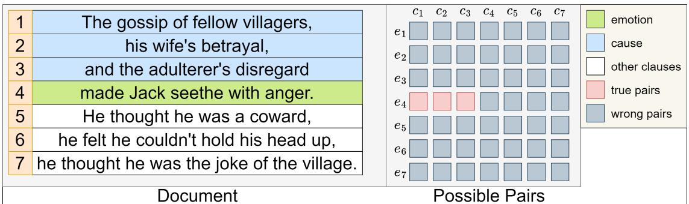  
Figure 1: The diagram of the imbalance of a sample. The number of emotions and causes, the corresponding relations between emotions and causes, and the number of true and false pairs are highly unbalanced.

To sum up, previous models have biased representation of clauses and decision boundaries because they neglect the imbalance of data, which motivated us to propose a Joint Constrained Learning framework with Boundary-adjusting for Emotion-Cause Pair Extraction (JCB). Following the latest study of long-tail data, we focus on the learning process of representation layers and the decision boundaries of classifiers because they prove to be the performance bottlenecks of unbalanced data (Kang et al., 2019). Specifically, we first design a joint constrained learning framework enforcing some constraints by converting them into differentiable learning objectives, which generates more useful and learnable samples and alleviates the problem of unbalanced data to some extent. Moreover, in order to adjust the narrow decision boundaries, we balance the predicting process by enhancing and correcting results.

In summary, the contributions of this paper are as follows: (1) Through a detailed analysis of the existing methods, we point out the problems in previous frameworks of ECPE. (2) We propose a boundary-adjusted model with Joint Constrained Learning. To the best of our knowledge, it is the first time to solve the problem of unbalanced data for ECPE. (3) We conduct experiments on the ECPE benchmark corpus. Compared with those strong baselines, the results demonstrate the effectiveness of the boundary-adjusted model and the Joint Constrained Learning in improving the prediction performance.

## 2 Related Work

## 2.1 Unbalanced Data

Effectively modeling the unbalanced data in NLP tasks remains challenging. Long-tail data, a typical example of unbalanced data, requires a deep network model to simultaneously cope with imbalanced annotations among the head and mediumsized classes and few-shot learning in the tail classes. Similarly, ECPE is also highly unbalanced, because of the small number of true pairs and the enormous gap between the numbers of emotions and causes. Early studies on re-balancing data distribution focus on re-sampling and reweighting (Shen et al., 2016; Cao et al., 2019; Buda et al., 2018; Chen et al., 2018; Liu et al., 2019; Wang et al., 2017), which achieve limited successes due to overfitting. Some recent works aim to decouple the learning process of representation and classifiers, which prove to be the performance bottlenecks (Kang et al., 2019; Menon et al., 2020; Tang et al., 2020; Wang et al., 2020b; Li et al., 2020). Still, such a two-stage strategy requires tedious hyper-parameter tuning to adjust the boundaries initially learned by the classifier. Accordingly, we attempt to get better representation with constrained learning and adjust the biased decision boundaries with classifiers, which are always ignored before.

## 2.2 Constrained Learning

Although data-driven methods provide a general and tractable way for relation extraction, their performance is still restricted by unbalanced and limited annotated resources. Early works suggest relations should be constrained by their logical properties (e.g., transitivity, symmetry, consistency, and so on), which comply with by global inferences. However, directly converting the constraints to logical reasoning leads to error propagation. Motivated by the logic-driven framework (Li et al., 2019), Wang et al. (2020a) proposes the constrained learning framework, where the declarative logical constraints are converted into differentiable functions that can be incorporated into the learning objective for relation extraction tasks. It aims to regularize the model towards consistency with the logical constraints across the relations among data.

## 2.3 Emotion Extraction and Cause Extraction

Emotion Extraction and Cause Extraction are the common auxiliary tasks for ECPE (Cheng et al., 2020; Wei et al., 2020; Chen et al., 2020; Liu et al., 2022). However, due to the imbalance of emotions and causes, the decision boundaries are easily turned to be biased. Consequently, there is a huge gap in the final performance of Emotion Extraction and Cause Extraction (the accuracy of Emotion Extraction is always much higher than Cause Extraction). In this paper, we adopt the results of auxiliary tasks to correct the biased decision boundaries.

## 3 Methodology

## 3.1 Task Definition

Given a document D consisting of n clauses $D = [ s _ { 1 } , s _ { 2 } , . . . , s _ { n } ]$ , ECPE aims to extract all the emotion-cause pairs from D:

$$
P = \{ . . . , ( s _ { i } , s _ { j } ) , . . . \} \qquad i , j \in [ 1 , n ]\tag{1}
$$

As for the auxiliary tasks, once an emotion-cause pair $( s _ { i } , s _ { j } )$ is extracted, an emotion clause and its corresponding cause are confirmed:

$$
Y _ { i } ^ { e } = \left\{ { \begin{array} { l l } { 1 } & { i f ( s _ { i } , s _ { j } ) \in P } \\ { 0 } & { o t h e r w i s e } \end{array} } \right.\tag{2}
$$

$$
Y _ { j } ^ { c } = { \left\{ \begin{array} { l l } { 1 } & { i f ( s _ { i } , s _ { j } ) \in P } \\ { 0 } & { o t h e r w i s e } \end{array} \right. }\tag{3}
$$

where $Y _ { i } ^ { e } = 1$ means the clause $s _ { i }$ is predicted as an emotion clause. The prediction of Cause Extraction is the same as Emotion Extraction.

## 3.2 Clause Encoder

Similar to RANKCP (Wei et al., 2020), we adopt BERT and GCN to encode the clauses. Specifically, we feed the whole document D into BERT and use the average pooling of the outputs corresponding to each token as the representation of clauses $H = [ h _ { 1 } , h _ { 2 } , . . . , h _ { n } ]$ . Then we construct fully-connected graphs for emotions and causes. The representation of clauses H is used to initialize the emotion and cause nodes. As for the pair nodes linking emotion and cause nodes, we concatenate the representation of their corresponding emotions and causes and feed them into a linear layer $L i n e a r _ { p a i r }$ . The output of $L i n e a r _ { p a i r }$ is then used to initialize pair nodes.

$$
\begin{array} { r l } & { H _ { E } ^ { ( 0 ) } = [ h _ { 1 } ^ { e ( 0 ) } , h _ { 2 } ^ { e ( 0 ) } , . . . , h _ { n } ^ { e ( 0 ) } ] } \\ & { H _ { C } ^ { ( 0 ) } = [ h _ { 1 } ^ { c ( 0 ) } , h _ { 2 } ^ { c ( 0 ) } , . . . , h _ { n } ^ { c ( 0 ) } ] } \\ & { H _ { P } ^ { ( 0 ) } = [ h _ { 1 1 } ^ { p ( 0 ) } , h _ { 1 2 } ^ { p ( 0 ) } , . . . , h _ { n n } ^ { p ( 0 ) } ] } \\ & { h _ { i } ^ { e ( 0 ) } = h _ { i } ^ { c ( 0 ) } = h _ { i } } \\ & { h _ { i j } ^ { p ( 0 ) } = L i n e a r _ { p a i r } ( [ h _ { i } ; h _ { j } ] ) } \end{array}\tag{4}
$$

where $H _ { E } ^ { ( 0 ) } , H _ { C } ^ { ( 0 ) }$ , and $H _ { P } ^ { ( 0 ) }$ indicate the initial representation of emotion nodes, cause nodes, and pair nodes. [.; .] is concatenation.

Following the previous framework, we divide the edges R into the pair-clause edge, clause-clause edge, and global edge. The details about the construction of graphs are explained in Appendix A. Given a node v, the process of convolution is defined as:

$$
\begin{array} { l } { { \displaystyle h _ { v } ^ { ( t + 1 ) } = ( W ^ { ( t ) } h _ { v } ^ { ( t ) } + b ^ { ( t ) } ) } \ ~ } \\ { { \displaystyle + \frac { 1 } { | N ( v ) | } \sum _ { r \in R } \sum _ { z \in N ( v ) } ( W _ { r } ^ { ( t ) } h _ { z } ^ { ( t ) } + b _ { r } ^ { ( t ) } ) } \ ~ } \end{array}\tag{5}
$$

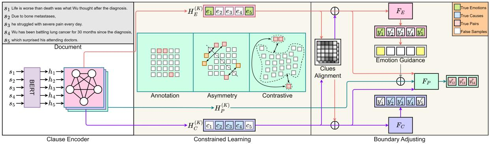  
Figure 2: The illustration of our model. The clause encoder outputs the representations of emotions, causes, and pairs which Joint Constrained Learning further optimizes. In the stage of boundary adjusting, emotion-oriented features and cause-oriented features are aligned, and the better classifier $( F _ { E } )$ is used to guide the final prediction.

where $W ^ { ( t ) } , b ^ { ( t ) } , W _ { r } ^ { ( t ) }$ , and $b _ { r } ^ { ( t ) }$ are learnable parameters. $N ( v )$ is the neighbors of v and $h _ { v } ^ { ( t ) }$ is the t-layer representation of node v.

By stacking $K$ layers of GCN, the output of the last layer $H _ { E } ^ { ( \breve { K } ) } , H _ { C } ^ { ( \breve { K } ) }$ , and $H _ { P } ^ { ( K ) }$ are finally used as the representation of emotions, causes, and pairs.

$$
\begin{array} { l } { { H _ { E } ^ { ( K ) } = [ e _ { 1 } , e _ { 2 } , . . . , e _ { n } ] } } \\ { { H _ { C } ^ { ( K ) } = [ c _ { 1 } , c _ { 2 } , . . . , c _ { n } ] } } \\ { { H _ { P } ^ { ( K ) } = [ p _ { 1 1 } , p _ { 1 2 } , . . . , p _ { n n } ] } } \\ { { e _ { i } = h _ { I } ^ { e ( K ) } c _ { i } = h _ { I } ^ { c ( K ) } p _ { i j } = h _ { i j } ^ { p ( K ) } } } \end{array}\tag{6}
$$

## 3.3 Joint Constrained Learning

Given the properties of emotion-cause pairs from the document, we define several learning objectives to regularize the model with logical constraints. Inspired by Wang et al. (2020a), we specify three types of constraints: Annotation Constraint (unary constraint), Asymmetry Constraint (binary constraint), and Contrastive Constraint(triplet constraint).

## 3.3.1 Annotation Constraint

Annotation Constraint is a unary constraint. For labeled pairs, we expect the model to predict what annotations specify. As shown in Figure 2, $( s _ { 1 } , s _ { 2 } )$ , $( s _ { 1 } , s _ { 3 } )$ , and $\left( \boldsymbol { s } _ { 5 } , \boldsymbol { s } _ { 4 } \right)$ are labeled as emotion-cause pairs. If we feed their representations $p _ { 1 2 } , p _ { 1 3 }$ , and $p _ { 5 4 }$ into the pair classifier $F _ { P } .$ , their corresponding probabilities $y _ { 1 3 } ^ { p } , y _ { 1 3 } ^ { p } ,$ and $y _ { 5 4 } ^ { p }$ should be predicted to be high. As a result, the annotation constraint loss $L _ { A }$ is defined as:

$$
L _ { A n n o t a t i o n } = \sum _ { ( s _ { i } , s _ { j } ) \in \hat { P } } - l o g ( y _ { i j } ^ { p } )\tag{7}
$$

where $\hat { P }$ are all the pairs labeled as emotion-cause pairs.

## 3.3.2 Asymmetry Constraint

Asymmetry Constraint is a binary constraint. Asymmetry is a basic property of ECPE because emotion-cause is a unidirectional relationship. For instance, $\left( { { s } _ { 5 } } , { { s } _ { 4 } } \right)$ is an emotion-cause pair in Figure 2. Given that, $s _ { 5 }$ is an emotion clause, and $\left( { { s } _ { 5 } } , { { s } _ { 4 } } \right)$ is the corresponding cause but not vice versa. In other words, once a sample $( s _ { i } , s _ { j } )$ has an emotion-cause relation, the pair in its symmetric position $( s _ { j } , s _ { i } )$ will certainly not have the same relation, which is the asymmetry. Given that, the predictions of $( s _ { i } , s _ { j } )$ and $( s _ { j } , s _ { i } )$ are expected to be quite different. Applying the transformation to the negative log space as before, we have the asymmetry loss:

$$
L _ { A s y m m e t r y } = \sum _ { ( s _ { i } , s _ { j } ) \in \hat { P } } l o g ( y _ { j i } ^ { p } ) - l o g ( y _ { i j } ^ { p } )\tag{8}
$$

In previous works, models adopt the same structure to deal with emotions and causes, which makes the models unaware of the difference between emotions and causes anywhere except for the labels. Consequently, the probability of the pairs in symmetric positions is easily predicted to be high. In this paper, the asymmetry loss helps the model learn more knowledge from minimal true pairs. Specifically, the model can clearly distinguish the emotions and causes in optimization. Here we aim to make the distinction between emotions and causes more clearly, but not the distinction between true and false pairs.

It is worth noting that there are some cases whose emotion and cause are the same clause.

These samples are on the diagonal of the pairs matrix, where symmetric pairs are themselves. Therefore, they do not affect the calculation of the asymmetry loss.

## 3.3.3 Contrastive Constraint

Contrastive Constraint is a triplet constraint. As shown in Figure 1 and Figure 2, for part of the samples, a one-to-many relationship exists between emotions and causes. Inspired by Clustering, we regard the representation of each pair as a cluster center. First, we initialize the cluster centers with the average pooling of the emotion-cause pairs with the same emotion. And then, we randomly sample the representation of the other pairs as the negative pairs, which means the negative pairs can come from either the wrong pairs or the emotioncause pairs with different emotions. Similar to Contrastive learning, the representation of true pairs is supposed to be close to their cluster centers and far away from the negative pairs. Considering the computing cost, we use the triplet margin loss instead of the standard loss functions in contrastive learning. The contrastive loss is defined as:

$$
\begin{array} { l } { { { \cal L } _ { C o n t r a s t i v e } = \displaystyle \frac { 1 } { | \hat { P } | } \sum _ { ( s _ { i } , s _ { j } ) \in \hat { P } } m a x ( d ( p _ { i j } , c e n t e r _ { i } ) } } \\ { { - d ( p _ { i j } , x _ { i j } ) + \gamma , 0 ) } } \end{array}\tag{9}
$$

where $d ( . , . )$ means the Euclidean distance between two representations. center is the cluster center of emotion i. $x _ { i j }$ is the representation of the negative pair to sample $( s _ { i } , s _ { j } ) . \gamma$ is the hyperparameter of the margin.

## 3.4 Boundary Adjusting

Due to the unbalanced data and relationships, the emotion classifier usually behaves much better than the cause classifier. Inspired by the two-stage approach for the long-tail distribution, we design an alignment strategy to take advantage of the classifier output to favor a more balanced prediction. Such an alignment strategy exploits the prior class and data input for learning class decision boundary, which avoids tedious hyperparameter tuning.

There is a dyadic relation between Emotion Extraction and Cause Extraction, for they hold informative clues to each other. For example, as demonstrated in Figure $2 , s _ { 4 }$ is the corresponding cause of $s _ { 5 } ,$ , which means the cause $s _ { 4 }$ leads to the emotion $s _ { 5 }$ but not the other emotion $s _ { 1 }$ . According to that, we expect the emotion-oriented features and the cause-oriented features to exchange helpful information. Taking Cause Extraction as an example, we define the semantic relation between $H _ { C } ^ { ( K ) }$ and $H _ { E } ^ { ( K ) }$ as:

$$
\begin{array} { l } { m _ { i j } = \left( c _ { i } \right) ^ { T } \times e _ { j } } \\ { c _ { i } \in H _ { C } ^ { \left( K \right) } \quad e _ { j } \in H _ { E } ^ { \left( K \right) } } \\ { M _ { i j } ^ { E 2 C } = \cfrac { e x p \left( m _ { i j } \right) } { \sum _ { k = 1 } ^ { n } e x p \left( m _ { i k } \right) } } \end{array}\tag{10}
$$

For $c _ { i }$ in Cause Extraction, we can obtain the valuable clues $U ^ { E 2 C }$ from Emotion Extraction by applying a weighted sum of semantic relations to all $e _ { j }$ in Emotion Extraction:

$$
\begin{array} { l } { { { \cal U } ^ { E 2 C } = [ u _ { 1 } ^ { E 2 C } , u _ { 2 } ^ { E 2 C } , . . . , u _ { n } ^ { E 2 C } ] } } \\ { { \displaystyle u _ { i } ^ { E 2 C } = \sum _ { j = 1 } ^ { n } ( M _ { i j } ^ { E 2 C } \cdot e _ { j } ) } } \end{array}\tag{11}
$$

The clues $U ^ { C 2 E }$ can be obtained similarly. Based on the structure of the residual network, we add the useful clues $U ^ { E 2 C }$ from Emotion Extraction to the original cause-oriented features $H _ { C } ^ { ( K ) }$ as the final features for Cause Extraction. And then we feed them into the cause classifier $F _ { C }$ to get the prediction $Y ^ { C } = [ Y _ { 1 } ^ { c } , Y _ { 2 } ^ { c } , . . . , Y _ { n } ^ { c } ]$

$$
\begin{array} { c } { { \overline { { { H _ { C } } } } = H _ { C } ^ { ( K ) } + R e L U ( W _ { e 2 c } U ^ { E 2 C } + b _ { e 2 c } ) } } \\ { { Y ^ { C } = F _ { C } ( \overline { { { H _ { C } } } } ) } } \end{array}\tag{12}
$$

where $W _ { e 2 c }$ and $b _ { e 2 c }$ are learnable parameters.

Similarly, we can get the prediction of Emotion Extraction $Y ^ { E } = \hat { [ { y _ { 1 } ^ { e } , y _ { 2 } ^ { e } , . . . , y _ { n } ^ { e } ] } }$ . As explained above, the performance of the emotion classifier is quite strong, which can be helpful in adjusting the decision boundary of the pair classifier $F _ { P }$ . Having the emotion predictions, we train an embedding layer $E M B _ { e }$ to encode the emotional information in Pair Extraction. Finally, we concatenate the emotion-aware representation of pairs and the corresponding representations of emotions and pairs as the features for $F _ { P } { \mathrm { : } }$

$$
\begin{array} { l } { { Y ^ { P } = F _ { P } ( \overline { { { H _ { P } } } } ) } } \\ { { \overline { { { H _ { P } } } } = [ \overline { { { p _ { 1 1 } } } } , \overline { { { p _ { 1 2 } } } } , . . . , \overline { { { p _ { n n } } } } ] } } \\ { { \overline { { { p _ { i j } } } } = W _ { p } R e L U ( p _ { i j } + E M B _ { e } ( Y _ { i } ^ { e } ) ) + b _ { p } } } \\ { { p _ { i j } \in H _ { P } ^ { ( K ) } } } \end{array}\tag{13}
$$

where $W _ { p }$ and $b _ { p }$ are learnable weights and biases of the linear pair classifier $F _ { P }$

## 3.5 Optimization

The loss function for the input documents D consists of the loss of auxiliary tasks and the loss of constrained learning:

$$
\begin{array} { l } { { \displaystyle { { \cal L } = { \cal L } _ { e m o t i o n } + { \cal L } _ { c a u s e } + { \cal L } _ { A n n o t a t i o n } } } } \\ { { \displaystyle ~ + \alpha { \cal L } _ { A s y m m e t r y } + \beta { \cal L } _ { C o n t r a s t i v e } } } \\ { { \displaystyle { { \cal L } _ { e m o t i o n } = - \frac { 1 } { | D | } \sum _ { i = 1 } ^ { | D | } \hat { Y _ { i } ^ { e } } \log y _ { i } ^ { e } } } } \\ { { \displaystyle { { \cal L } _ { c a u s e } = - \frac { 1 } { | D | } \sum _ { i = 1 } ^ { | D | } \hat { Y _ { i } ^ { c } } \log y _ { i } ^ { c } } } } \end{array}\tag{14}
$$

where $\alpha$ and $\beta$ are hyperparameters. $\hat { Y _ { i } ^ { e } }$ and $\hat { Y _ { i } ^ { c } }$ are emotion and cause label of clause $s _ { i }$

## 4 Experiments

We conduct extensive experiments to verify the effectiveness of our proposed model JCB. In this section, we attempt to answer the following questions: RQ1: Does JCB perform better than existing methods? RQ2: Are the constrained learning and boundary-adjusted mechanism the key factors affecting the performance? RQ3: How do they work in optimization? RQ4: How does JCB perform on more unbalanced data?

## 4.1 Datasets and Preprocessing

To evaluate the effectiveness of our model, we conduct experiments on the Chinese benchmark dataset released by Xia and Ding (2019). The corpus consists of 1,945 Chinese documents from the SINA news website. As shown in Table 1, the data is extremely unbalanced. For example, emotioncause pairs account for about 0.4% of all the possible pairs. On the other hand, an emotion clause can have several causes, while one cause can only lead to one emotion.

Following the preprocessing of previous works, we set a relative distance constraint $| i - j | \leq 3$ . Using the relative distance constraint directly affects the degree of data imbalance, and we discuss it in Section 4.6. To make a fair comparison, we use the 10-fold cross-validation and split the data as Xia and Ding (2019) did. As for the evaluation metrics, we adopt the precision, recall, and F-score on three tasks: Emotion Extraction, Cause Extraction, and Pair Extraction.

## 4.2 Experimental settings

We implement JCB based on Transformers (Wolf et al., 2020) and adopt BERT-base-Chinese (Devlin et al., 2018) as the backbone. Clauses in the same document are concatenated and fed into the clause encoder, while each document in a batch is encoded separately. The setups of our experiments are listed in Table 2. We set α and $\beta$ to 0.15 and 0.5 and conduct experiments on GeForce RTX 3090. Some documents have too many clauses and words, so we set the batch size to 4 and use a sliding window to deal with words exceeding the limit, which helps reduce the demands for large GPU resources.

<table><tr><td>Item</td><td>Number</td><td>Percentage(%)</td></tr><tr><td>documents</td><td>1,945</td><td>100</td></tr><tr><td>-w/ 1 EC pair</td><td>1,746</td><td>89.8</td></tr><tr><td>-w/ 2 EC pairs</td><td>177</td><td>9.1</td></tr><tr><td>-w/ 3 EC pairs</td><td>22</td><td>1.1</td></tr><tr><td>pairs</td><td>490,367</td><td>100</td></tr><tr><td>-EC pairs</td><td>2,167</td><td>0.4</td></tr><tr><td>-non EC pairs</td><td>488,200</td><td>99.6</td></tr></table>

Table 1: Detailed dataset statistics.
<table><tr><td>Config</td><td>Value</td></tr><tr><td>Device</td><td>GeForce RTX 3090</td></tr><tr><td>Platform</td><td>Pytorch 1.8.0</td></tr><tr><td>Backbone</td><td>BERT-base-Chinese</td></tr><tr><td>Dimension</td><td>768</td></tr><tr><td>Batch Size</td><td>4</td></tr><tr><td>Epochs</td><td>50</td></tr><tr><td>Learning Rate</td><td>2e-5</td></tr><tr><td>Warmup Proportion</td><td>0.1</td></tr><tr><td>Dropout</td><td>0.2</td></tr><tr><td>K</td><td>1</td></tr><tr><td>α</td><td>0.15</td></tr><tr><td> $\beta$ </td><td>0.5</td></tr></table>

Table 2: Detailed experimental configs.  
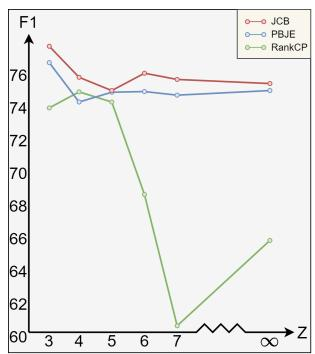  
Figure 3: The fluctuation of performance when relative distance changes.

We compare our models with current strong baselines, including:ECPE-2D (Ding et al., 2020a), TransECPE (Fan et al., 2020), RankCP (Wei et al., 2020), PairGCN (Chen et al., 2020), ECPE-MLL (Ding et al., 2020b), UTOS (Cheng et al., 2021), MTST-ECPE (Fan et al., 2021), and PBJE (Liu et al., 2022). Among them, RankCP, PairGCN, and PBJE use BERT+GCN as the clause encoder, which is similar to ours. ECPE-MLL, UTOS, and MTST-ECPE convert ECPE to a sequence labelling task or a multi-label classification task. Different from them, each task of our approach is a binary classification. More details about these methods are listed in Appendix B.

## 4.3 RQ1: Does JCB perform better than existing methods?

Table 3 shows the experimental results of JCB compared with others on three tasks. The overall results indicate the effectiveness of JCB. We can find that the performance of JCB is excellent on all tasks, which almost exceeds all the existing methods, especially on the main task - Pair Extraction. The precision P and recall R may not be the best of all but are still quite competitive compared with state-of-the-art methods.

It is noteworthy that the improvement of the main task mainly comes from the excellent performance of Cause Extraction. Compared with RankCP (whose clause encoder is similar to ours), the F1 of Emotion Extraction of our model is slightly less, but the results of Pair Extraction (the main task) and Cause Extraction are much higher, which proves the constrained learning and the guidance of the Emotion Extraction help the model get a better representation of causes. The performance of the emotion and cause classifiers is balanced to achieve better results.

## 4.4 RQ2: Are the constrained learning and boundary-adjusted mechanism the key factors affecting the performance?

The results of the ablation study are shown in Table 4. Apparently, constrained learning has a profound effect on performance. The performance of Pair Extraction dramatically drops when removing constrained learning. Meanwhile, the F1 of Emotion Extraction is stable whereas that of Cause Extraction decreases sharply. Therefore, we conclude that the degradation of performance of the main task is mainly due to the fall of Cause Extraction. It also proves that constrained learning helps the model better represent pairs and causes. In comparison, Asymmetry Constraint has a more significant impact on Cause Extraction, while Contrastive Constraint has a more remarkable effect on Pair Extraction. We assume that Asymmetry Constraint distinguishes between emotions and causes more clearly, which facilitates the performance on the sample-scarce tasks (Pair Extraction and Cause Extraction). On the other hand, Contrastive Constraint mines the information of the emotion-cause pairs with the same emotion, which is important for Emotion Extraction.

Otherwise, boundary adjusting somewhat solves the problem of biased decision boundaries. All three tasks are affected while removing boundary adjustments, especially Pair Extraction. It should be noted that both emotion and cause clues play an essential role in clues alignment. Removing each of them may not cause considerable fluctuations in Emotion Extraction but will eventually lead to the bad performance of the main task. We speculate that unbalanced ablation makes the amounts of information flow to encoders in a different manner, so the performance imbalance is intensified.

## 4.5 RQ3: How do the constrained learning and boundary-adjusted mechanism work in optimization?

We observe the final output and plot heat maps to verify how JCB achieves the anticipation. We make a comparison with PBJE - the strongest one of the previous models. PBJE uses the same graph structure to encode emotions and causes, so the distinction between the pairs symmetric along the diagonal of the matrix is not very clear. Consequently, PBJE is easily misled to extract the right ones from these symmetric pairs. However, due to Asymmetry Constraint, JCB has a more asymmetric output (Figure 4(a)). On the other hand, Contrastive Constraint enables JCB to distinguish the difference among pairs with different emotions. In this way, JCB can get more differentiated results when facing documents containing two or more true pairs (Figure 4(b)). Moreover, there are usually several possible emotion or cause clauses, and mismatches occur frequently among them. As shown in Figure 4(c), after boundary-adjusting (clues alignment and emotion guidance), JCB allocates higher scores for pairs with truly-matched emotions and causes. Relatively, the pairs on the wrong intersection of mismatched emotion lines and cause lines are assigned with lower scores. More cases are listed in Appendix C.

<table><tr><td rowspan=2 colspan=1>Models</td><td rowspan=1 colspan=3>Pair Extraction</td><td rowspan=1 colspan=3>Emotion Extraction</td><td rowspan=1 colspan=3>Cause Extraction</td></tr><tr><td rowspan=1 colspan=1>P</td><td rowspan=1 colspan=1>R</td><td rowspan=1 colspan=1>F1</td><td rowspan=1 colspan=1>P</td><td rowspan=1 colspan=1>R</td><td rowspan=1 colspan=1>F1</td><td rowspan=1 colspan=1>P</td><td rowspan=1 colspan=1>R</td><td rowspan=1 colspan=1>F1</td></tr><tr><td rowspan=1 colspan=1>ECPE-2D</td><td rowspan=1 colspan=1>72.92</td><td rowspan=1 colspan=1>65.44</td><td rowspan=1 colspan=1>68.89</td><td rowspan=1 colspan=1>86.27</td><td rowspan=1 colspan=1> $9 2 . 2 1 \# \mathrm { { I } }$ </td><td rowspan=1 colspan=1>89.10</td><td rowspan=1 colspan=1>73.36</td><td rowspan=1 colspan=1>69.34</td><td rowspan=1 colspan=1>71.23</td></tr><tr><td rowspan=1 colspan=1>TransECPE</td><td rowspan=1 colspan=1>77.08</td><td rowspan=1 colspan=1>65.32</td><td rowspan=1 colspan=1>70.72</td><td rowspan=1 colspan=1>88.79</td><td rowspan=1 colspan=1>83.15</td><td rowspan=1 colspan=1>85.88</td><td rowspan=1 colspan=1>78.74</td><td rowspan=1 colspan=1>66.89</td><td rowspan=1 colspan=1>72.33</td></tr><tr><td rowspan=2 colspan=1>PairGCNUTOS</td><td rowspan=2 colspan=1>76.9273.89</td><td rowspan=1 colspan=1>67.91</td><td rowspan=1 colspan=1>72.02</td><td rowspan=1 colspan=1>88.57</td><td rowspan=1 colspan=1>79.58</td><td rowspan=1 colspan=1>83.75</td><td rowspan=1 colspan=1>79.07</td><td rowspan=1 colspan=1>68.28</td><td rowspan=1 colspan=1>73.75</td></tr><tr><td rowspan=1 colspan=1>70.62</td><td rowspan=1 colspan=1>72.03</td><td rowspan=1 colspan=1>88.15</td><td rowspan=1 colspan=1>83.21</td><td rowspan=1 colspan=1>85.56</td><td rowspan=1 colspan=1>76.71</td><td rowspan=2 colspan=1>73.2072.36</td><td rowspan=2 colspan=1>74.7174.77</td></tr><tr><td rowspan=4 colspan=1>MTST-ECPERankCPECPE-MLLPBJE</td><td rowspan=4 colspan=1>75.7871.1977.00 $7 9 . 2 2 ^ { \# 1 }$ </td><td rowspan=1 colspan=1>70.51</td><td rowspan=1 colspan=1>72.91</td><td rowspan=1 colspan=1>85.83</td><td rowspan=1 colspan=1>80.94</td><td rowspan=1 colspan=1>83.21</td><td rowspan=1 colspan=1>77.64</td></tr><tr><td rowspan=1 colspan=1> $7 6 . 3 0 ^ { \# 1 }$ </td><td rowspan=1 colspan=1>73.60</td><td rowspan=1 colspan=1> $9 1 . 2 3 \# 1$ </td><td rowspan=1 colspan=1>89.99</td><td rowspan=1 colspan=1> $9 0 . 5 7 \# 1$ </td><td rowspan=1 colspan=1>74.61</td><td rowspan=1 colspan=1> $7 7 . 8 8 ^ { \# 2 }$ </td><td rowspan=3 colspan=1>76.1576.30 $7 8 . 7 8 ^ { \# 2 }$ </td></tr><tr><td rowspan=1 colspan=1>72.35</td><td rowspan=1 colspan=1>74.52</td><td rowspan=1 colspan=1>86.08</td><td rowspan=1 colspan=1> $9 1 . 9 1 \# ^ { 2 }$ </td><td rowspan=1 colspan=1>88.86</td><td rowspan=1 colspan=1>73.82</td><td rowspan=2 colspan=1> $7 9 . 1 2 ^ { \# 1 }$ 76.09</td></tr><tr><td rowspan=1 colspan=1>73.84</td><td rowspan=1 colspan=1> $7 6 . 3 7 \# 2$ </td><td rowspan=1 colspan=1> $9 0 . 7 7 ^ { \# 2 }$ </td><td rowspan=1 colspan=1>86.91</td><td rowspan=1 colspan=1>88.76</td><td rowspan=1 colspan=1> $8 1 . 7 9 \# 1$ </td></tr><tr><td rowspan=1 colspan=1>JCB</td><td rowspan=1 colspan=1> $\overline { { 7 9 . 1 0 ^ { \# 2 } } }$ </td><td rowspan=1 colspan=1> $7 5 . 8 4 ^ { \# 2 }$ </td><td rowspan=1 colspan=1> $7 7 . 3 7 \# 1$ </td><td rowspan=1 colspan=1> $9 0 . 7 7 ^ { \# 2 }$ </td><td rowspan=1 colspan=1>87.91</td><td rowspan=1 colspan=1> $\overline { { 8 9 . 3 0 ^ { \# 2 } } }$ </td><td rowspan=1 colspan=1> $8 1 . 4 1 \# 2$ </td><td rowspan=1 colspan=1>77.47</td><td rowspan=1 colspan=1> $\overline { { 7 9 . 3 4 } } \overline { { \# 1 } }$ </td></tr></table>

Table 3: Experimental results of on ECPE benchmarks. The best result is in red, and the second is in blue.
<table><tr><td rowspan="2">Models</td><td colspan="3">Pair Extraction</td><td colspan="3">Emotion Extraction</td><td colspan="3">Cause Extraction</td></tr><tr><td>P</td><td>R</td><td>F1</td><td>P</td><td>R</td><td>F1</td><td>P</td><td>R</td><td>F1</td></tr><tr><td>JCB</td><td>79.10</td><td>75.84</td><td>77.37</td><td>90.77</td><td>87.91</td><td>89.30</td><td>81.41</td><td>77.47</td><td>79.34</td></tr><tr><td>-w/o Asymmetry Constraint</td><td>78.82</td><td>74.13</td><td>76.34</td><td>90.91</td><td>87.20</td><td>88.99</td><td>80.71</td><td>75.79</td><td>78.11</td></tr><tr><td>-w/o Contrastive Constraint</td><td>76.83</td><td>75.42</td><td>76.05</td><td>88.72</td><td>87.54</td><td>88.08</td><td>80.02</td><td>77.23</td><td>78.54</td></tr><tr><td>-w/o Constrained Learning</td><td>76.31</td><td>74.37</td><td>75.26</td><td>90.45</td><td>88.71</td><td>89.53</td><td>79.58</td><td>76.34</td><td>77.88</td></tr><tr><td>-w/o Emotion Clues</td><td>78.93</td><td>74.38</td><td>76.55</td><td>91.16</td><td>87.77</td><td>89.41</td><td>81.02</td><td>76.18</td><td>78.50</td></tr><tr><td>-w/o Cause Clues</td><td>79.20</td><td>74.44</td><td>76.67</td><td>91.01</td><td>87.49</td><td>89.16</td><td>81.28</td><td>76.33</td><td>78.66</td></tr><tr><td>-w/o Clues Alignment</td><td>79.64</td><td>73.46</td><td>76.38</td><td>91.30</td><td>86.62</td><td>88.87</td><td>81.45</td><td>75.25</td><td>78.19</td></tr><tr><td>-w/o Emotion Guidance</td><td>78.20</td><td>75.50</td><td>76.76</td><td>90.80</td><td>88.29</td><td>89.50</td><td>80.67</td><td>76.98</td><td>78.74</td></tr><tr><td>-w/o Boundary Adjusting</td><td>78.32</td><td>74.32</td><td>76.19</td><td>90.86</td><td>87.49</td><td>89.10</td><td>81.17</td><td>76.36</td><td>78.61</td></tr><tr><td>Clause Encoder (BERT+GCN)</td><td>73.01</td><td>76.23</td><td>74.44</td><td>89.17</td><td>88.77</td><td>88.92</td><td>77.25</td><td>78.21</td><td>77.62</td></tr></table>

Table 4: The results of the ablation study on the benchmark corpus for the main task and auxiliary tasks.

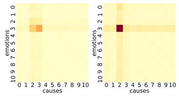  
(a) Label: (s3, s2).

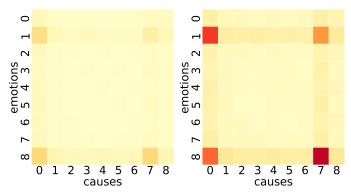  
(b) Label: (s1, s0) and (s8, s7).

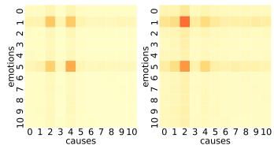  
(c) Label: (s1, s2).  
Figure 4: The heat maps of the output of PBJE (left graphs) and JCB (right graphs). The deeper color means the higher confidence. Three subfigures show asymmetric output, differentiated output, and accurate match of JCB compared with PBJE.

## 4.6 RQ4: How does JCB perform on more unbalanced data?

Figure 3 shows the fluctuation of their performance when relative distance changes. The performance of Rankcp is sensitive to the relative distance, while PBJE and JCB remain stable. There is not a strictly negative correlation between the performance and the relative distance Z. A small relative distance means fewer pairs to classify. Still, it also might filter out some right ones. The value of Z affects the degree of data imbalance and the final results.

<table><tr><td rowspan=2 colspan=1>Models</td><td rowspan=1 colspan=3>Pair Extraction</td></tr><tr><td rowspan=1 colspan=1>P</td><td rowspan=1 colspan=1>R</td><td rowspan=1 colspan=1>F1</td></tr><tr><td rowspan=1 colspan=1>RankCPPBJEJCB</td><td rowspan=1 colspan=1>64.26(6.93↓)78.41(0.81↓)78.93(0.17↓)</td><td rowspan=1 colspan=1>66.94(9.36↓)71.31(2.53↓)71.68(4.16↓)</td><td rowspan=1 colspan=1>65.49(8.11↓)74.66(1.71↓)75.09(2.28↓)</td></tr></table>

Table 5: The results of RankCP, PBJE, and JCB without the relative distance constraint.

To evaluate the performance of JCB on more unbalanced data, we remove the relative distance constraint (which makes the data more unbalanced for more false pairs). In Table 5, compared with RankCP, whose clause encoder is similar to ours (BERT+GCN), the performance of JCB is not significantly influenced when dealing with all the possible pairs without preprocessing. As for PBJE, it is less affected, and we conclude that it is because of balancing the information flow while constructing the graph. The experimental result proves the effect of imbalance on performance and the robustness of our model on more unbalanced data.

## 5 Conclusion

This paper summarizes existing ECPE methods, indicating that almost all of them ignore the biased representation of clauses and decision boundaries due to data imbalance. We propose a Joint Constrained Learning framework with Boundaryadjusting and conduct massive experiments on the ECPE benchmark dataset. The remarkable performance demonstrates the effectiveness of our method for learning better representations of unbalanced samples and adjusting biased decision boundaries. We expect our work will direct more scholarly attention to solutions to the problem of unbalanced data in information extraction.

## Limitations

In this paper, we conduct experiments only on the Chinese benchmark dataset due to the lack of English datasets and comparisons of related methods. Moreover, the model is based on BERTbase-Chinese, so the maximum input length is constrained to less than 512. However, the numbers of words in some long documents exceed the limit, so we use a sliding window to deal with the problem. Otherwise, some documents having too many clauses require large GPU resources after aligning and padding. Limited by the memory capacity, we have to set a small batch size.

## Acknowledgements

The work described in this paper was partially funded by the National Natural Science Foundation of China (Grant Nos. 62272173, 61872148), the Natural Science Foundation of Guangdong Province (Grant Nos. 2022A1515010179, 2019A1515010768).

## References

Mateusz Buda, Atsuto Maki, and Maciej A Mazurowski. 2018. A systematic study of the class imbalance problem in convolutional neural networks. Neural networks, 106:249–259.

Kaidi Cao, Colin Wei, Adrien Gaidon, Nikos Arechiga, and Tengyu Ma. 2019. Learning imbalanced datasets with label-distribution-aware margin loss. Advances in neural information processing systems, 32.

Liang-Chieh Chen, Yukun Zhu, George Papandreou, Florian Schroff, and Hartwig Adam. 2018. Encoderdecoder with atrous separable convolution for semantic image segmentation. In Proceedings of the European conference on computer vision (ECCV), pages 801–818.

Ying Chen, Wenjun Hou, Shoushan Li, Caicong Wu, and Xiaoqiang Zhang. 2020. End-to-end emotioncause pair extraction with graph convolutional network. In Proceedings of the 28th International Conference on Computational Linguistics, pages 198–207.

Zifeng Cheng, Zhiwei Jiang, Yafeng Yin, Na Li, and Qing Gu. 2021. A unified target-oriented sequenceto-sequence model for emotion-cause pair extraction. IEEE/ACM Transactions on Audio, Speech, and Language Processing, 29:2779–2791.

Zifeng Cheng, Zhiwei Jiang, Yafeng Yin, Hua Yu, and Qing Gu. 2020. A symmetric local search network for emotion-cause pair extraction. In Proceedings of the 28th International Conference on Computational Linguistics, pages 139–149.

Michaël Defferrard, Xavier Bresson, and Pierre Vandergheynst. 2016. Convolutional neural networks on graphs with fast localized spectral filtering. Advances in neural information processing systems, 29.

Jacob Devlin, Ming-Wei Chang, Kenton Lee, and Kristina Toutanova. 2018. Bert: Pre-training of deep bidirectional transformers for language understanding. arXiv preprint arXiv:1810.04805.

Zixiang Ding, Rui Xia, and Jianfei Yu. 2020a. Ecpe-2d: Emotion-cause pair extraction based on joint two-dimensional representation, interaction and prediction. In Proceedings of the 58th Annual Meeting of the Association for Computational Linguistics, pages 3161–3170.

Zixiang Ding, Rui Xia, and Jianfei Yu. 2020b. Endto-end emotion-cause pair extraction based on sliding window multi-label learning. In Proceedings of the 2020 conference on empirical methods in natural language processing (EMNLP), pages 3574–3583.

Chuang Fan, Chaofa Yuan, Jiachen Du, Lin Gui, Min Yang, and Ruifeng Xu. 2020. Transition-based directed graph construction for emotion-cause pair extraction. In Proceedings of the 58th Annual Meeting

of the Association for Computational Linguistics, pages 3707–3717.

Chuang Fan, Chaofa Yuan, Lin Gui, Yue Zhang, and Ruifeng Xu. 2021. Multi-task sequence tagging for emotion-cause pair extraction via tag distribution refinement. IEEE/ACM Transactions on Audio, Speech, and Language Processing, 29:2339–2350.

Diman Ghazi, Diana Inkpen, and Stan Szpakowicz. 2015. Detecting emotion stimuli in emotionbearing sentences. In International Conference on Intelligent Text Processing and Computational Linguistics, pages 152–165. Springer.

Lin Gui, Ruifeng Xu, Dongyin Wu, Qin Lu, and Yu Zhou. 2018. Event-driven emotion cause extraction with corpus construction. In Social Media Content Analysis: Natural Language Processing and Beyond, pages 145–160. World Scientific.

Bingyi Kang, Saining Xie, Marcus Rohrbach, Zhicheng Yan, Albert Gordo, Jiashi Feng, and Yannis Kalantidis. 2019. Decoupling representation and classifier for long-tailed recognition. arXiv preprint arXiv:1910.09217.

Thomas N Kipf and Max Welling. 2016. Semisupervised classification with graph convolutional networks. arXiv preprint arXiv:1609.02907.

Sophia Yat Mei Lee, Ying Chen, and Chu-Ren Huang. 2010. A text-driven rule-based system for emotion cause detection. In Proceedings of the NAACL HLT 2010 workshop on computational approaches to analysis and generation of emotion in text, pages 45–53.

Tao Li, Vivek Gupta, Maitrey Mehta, and Vivek Srikumar. 2019. A logic-driven framework for consistency of neural models. arXiv preprint arXiv:1909.00126.

Yu Li, Tao Wang, Bingyi Kang, Sheng Tang, Chunfeng Wang, Jintao Li, and Jiashi Feng. 2020. Overcoming classifier imbalance for long-tail object detection with balanced group softmax. In Proceedings of the IEEE/CVF conference on computer vision and pattern recognition, pages 10991–11000.

Junlong Liu, Xichen Shang, and Qianli Ma. 2022. Pairbased joint encoding with relational graph convolutional networks for emotion-cause pair extraction. arXiv preprint arXiv:2212.01844.

Ziwei Liu, Zhongqi Miao, Xiaohang Zhan, Jiayun Wang, Boqing Gong, and Stella X Yu. 2019. Largescale long-tailed recognition in an open world. In Proceedings of the IEEE/CVF Conference on Computer Vision and Pattern Recognition, pages 2537–2546.

Aditya Krishna Menon, Sadeep Jayasumana, Ankit Singh Rawat, Himanshu Jain, Andreas Veit, and Sanjiv Kumar. 2020. Long-tail learning via logit adjustment. arXiv preprint arXiv:2007.07314.

Alena Neviarouskaya and Masaki Aono. 2013. Extracting causes of emotions from text. In Proceedings of the Sixth International Joint Conference on Natural Language Processing, pages 932–936.

Irene Russo, Tommaso Caselli, Francesco Rubino, Ester Boldrini, Patricio Martínez-Barco, et al. 2011. Emocause: an easy-adaptable approach to emotion cause contexts. Association for Computational Linguistics (ACL).

Li Shen, Zhouchen Lin, and Qingming Huang. 2016. Relay backpropagation for effective learning of deep convolutional neural networks. In European conference on computer vision, pages 467–482. Springer.

Aaditya Singh, Shreeshail Hingane, Saim Wani, and Ashutosh Modi. 2021. An end-to-end network for emotion-cause pair extraction. arXiv preprint arXiv:2103.01544.

Kaihua Tang, Jianqiang Huang, and Hanwang Zhang. 2020. Long-tailed classification by keeping the good and removing the bad momentum causal effect. Advances in Neural Information Processing Systems, 33:1513–1524.

Haoyu Wang, Muhao Chen, Hongming Zhang, and Dan Roth. 2020a. Joint constrained learning for event-event relation extraction. arXiv preprint arXiv:2010.06727.

Tao Wang, Yu Li, Bingyi Kang, Junnan Li, Junhao Liew, Sheng Tang, Steven Hoi, and Jiashi Feng. 2020b. The devil is in classification: A simple framework for long-tail instance segmentation. In European conference on computer vision, pages 728– 744. Springer.

Yu-Xiong Wang, Deva Ramanan, and Martial Hebert. 2017. Learning to model the tail. Advances in neural information processing systems, 30.

Penghui Wei, Jiahao Zhao, and Wenji Mao. 2020. Effective inter-clause modeling for end-to-end emotion-cause pair extraction. In Proceedings of the 58th Annual Meeting of the Association for Computational Linguistics, pages 3171–3181.

Thomas Wolf, Lysandre Debut, Victor Sanh, Julien Chaumond, Clement Delangue, Anthony Moi, Pierric Cistac, Tim Rault, Rémi Louf, Morgan Funtowicz, et al. 2020. Transformers: State-of-the-art natural language processing. In Proceedings of the 2020 conference on empirical methods in natural language processing: system demonstrations, pages 38–45.

Rui Xia and Zixiang Ding. 2019. Emotion-cause pair extraction: A new task to emotion analysis in texts. arXiv preprint arXiv:1906.01267.

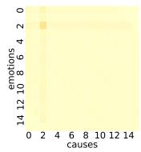

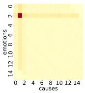  
(a) Label: (s2, s1).

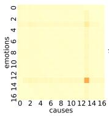

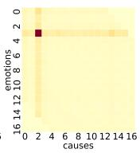  
(b) Label: (s3, s2).

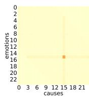

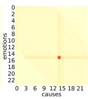  
(c) Label: (s15, s14).

Figure 5: Asymmetric output of JCB (right graphs) compared with PBJE (left graphs).  
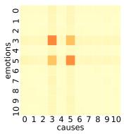

(a) Label: (s3, s3) and $\left( { { s } _ { 5 } } , { { s } _ { 5 } } \right)$  
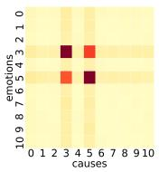

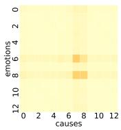

(b) Label: (s6, s5) and (s8, s7).  
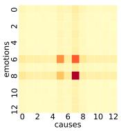

Figure 6: Differentiated output of JCB (right graphs) compared with PBJE (left graphs).  
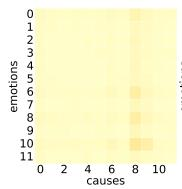

(a) Label: (s6, s6).  
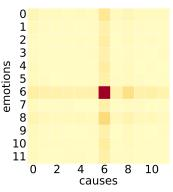

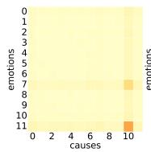

(b) Label: (s7, s6).  
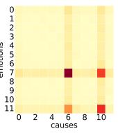

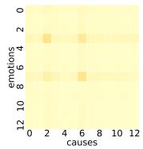

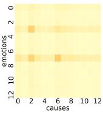  
(c) Label: (s7, s6).

Figure 7: Accurate match of JCB (right graphs) for emotions and causes compared with PBJE (left graphs).
<table><tr><td rowspan="2">Models</td><td colspan="3">Pair Extraction</td></tr><tr><td>P</td><td>R</td><td>F1</td></tr><tr><td> $k = 1$ </td><td>79.10</td><td>75.84</td><td>77.37</td></tr><tr><td> $k = 2$ </td><td>78.27</td><td>73.16</td><td>75.58</td></tr><tr><td> $k = 3$ </td><td>76.99</td><td>72.67</td><td>74.7</td></tr></table>

Table 6: The decrease of performance with the increase of k.

## A Details about the construction of graphs.

The general form of k-layer GCN with the set of edges R is listed in Formula 5. However, after parametric searching, we set k to 1 because we find the performance tends to drop with the increase of k (as shown in Table 6). When k is bigger than 1, the features of nodes from different groups may be over-mixed and indistinguishable. Besides, it has more learnable parameters, which easily brings about over-fitting.

We divide the nodes V into emotion nodes, cause nodes, and pair nodes, which are initialized as the output of BERT $( H _ { E } ^ { ( 0 ) } , H _ { C } ^ { ( 0 ) }$ , and $H _ { P } ^ { ( 0 ) } )$ ). Based on that, the edges R are divided into pair-clause edges and clause-clause edges. In experiments, we also use global edges. These edges connect the global node (initialized as the average of the output of BERT) and the other nodes, which helps preserve global information.

## B Details about the current ECPE methods.

In experiments, we compare our models with the current strong baselines, including:

ECPE-2D (Ding et al., 2020a): Use 2D transformer to get 2D representation and model the interactions of different emotion-cause pairs.

TransECPE (Fan et al., 2020): Based on transition, convert the task into a parsing-like directed graph construction procedure.

RankCP (Wei et al., 2020): Utilize the fully-

connected graph to model the relationships between clauses and rank all the possible pairs in a document.

PairGCN (Chen et al., 2020): Construct a graph with pair nodes and define different edges according to the relative distance.

ECPE-MLL (Ding et al., 2020b): Employ two collaborative frameworks for emotions and causes and apply multi-label learning to them.

UTOS (Cheng et al., 2021): Convert the task into sequence labelling, which tackles the error propagation.

MTST-ECPE (Fan et al., 2021): Similar to UTOS, design a multi-task sequence tagging framework but refine the tag distribution.

PBJE (Liu et al., 2022): Construct a graph for each task and balance the information flow among them.

## C Case study.

As mentioned in Section 4.5, JCB has a more asymmetric and differentiated output and behaves better when more than one true pair needs to be extracted. Given several possible emotions and causes, JCB can precisely match them. Figure 5, Figure 6, and Figure 7 show the comparison of PBJE and JCB in three scenarios. Asymmetry Constraint helps JCB get a more asymmetric output so that the model will not be confused facing symmetric pairs any longer. Contrastive Constraint enables JCB to distinguish the difference among pairs with different emotions and find the similarity between pairs with the same ones. This way, JCB behaves better in documents with multiple emotion-cause pairs. Moreover, the boundary-adjusting mechanism solves the problem of mismatch to some extent. The pairs on wrong intersections of mismatched emotion lines and cause lines are assigned with low scores, and the right ones are enhanced by emotions and given higher scores.

## A For every submission:

✓ A1. Did you describe the limitations of your work? Limitations

✗ A2. Did you discuss any potential risks of your work? The dataset we use is collectedfrom the SINA news website. All of the corpora don’t cover party politics or economics and contain any information that names or uniquely identifies individual people or offensive content.

✓ A3. Do the abstract and introduction summarize the paper’s main claims? Abstract 1 Introduction

✗ A4. Have you used AI writing assistants when working on this paper? Left blank.

## B ✓ Did you use or create scientific artifacts?

4 Experiments

✓ B1. Did you cite the creators of artifacts you used? 4 Experiments

✓ B2. Did you discuss the license or terms for use and / or distribution of any artifacts? 4 Experiments Appendix A

✓ B3. Did you discuss if your use of existing artifact(s) was consistent with their intended use, provided that it was specified? For the artifacts you create, do you specify intended use and whether that is compatible with the original access conditions (in particular, derivatives of data accessed for research purposes should not be used outside of research contexts)? 4 Experiments

✓ B4. Did you discuss the steps taken to check whether the data that was collected / used contains any information that names or uniquely identifies individual people or offensive content, and the steps taken to protect / anonymize it? Ethics Statement

✓ B5. Did you provide documentation of the artifacts, e.g., coverage of domains, languages, and linguistic phenomena, demographic groups represented, etc.? 4 Experiments

✓ B6. Did you report relevant statistics like the number of examples, details of train / test / dev splits, etc. for the data that you used / created? Even for commonly-used benchmark datasets, include the number of examples in train / validation / test splits, as these provide necessary context for a reader to understand experimental results. For example, small differences in accuracy on large test sets may be significant, while on small test sets they may not be. 4 Experiments Appendix A

## C ✓ Did you run computational experiments?

4 Experiments

✓ C1. Did you report the number of parameters in the models used, the total computational budget (e.g., GPU hours), and computing infrastructure used? 4 Experiments Appendix B

The Responsible NLP Checklist used at ACL 2023 is adopted from NAACL 2022, with the addition of a question on AI writing assistance.

✓ C2. Did you discuss the experimental setup, including hyperparameter search and best-found hyperparameter values? 4 Experiments Appendix B

✓ C3. Did you report descriptive statistics about your results (e.g., error bars around results, summary statistics from sets of experiments), and is it transparent whether you are reporting the max, mean, etc. or just a single run? 4 Experiments

✓ C4. If you used existing packages (e.g., for preprocessing, for normalization, or for evaluation), did you report the implementation, model, and parameter settings used (e.g., NLTK, Spacy, ROUGE, etc.)? 4 Experiments

D ✗ Did you use human annotators (e.g., crowdworkers) or research with human participants? Left blank.

 D1. Did you report the full text of instructions given to participants, including e.g., screenshots, disclaimers of any risks to participants or annotators, etc.? No response.

 D2. Did you report information about how you recruited (e.g., crowdsourcing platform, students) and paid participants, and discuss if such payment is adequate given the participants’ demographic (e.g., country of residence)? No response.

 D3. Did you discuss whether and how consent was obtained from people whose data you’re using/curating? For example, if you collected data via crowdsourcing, did your instructions to crowdworkers explain how the data would be used? No response.

 D4. Was the data collection protocol approved (or determined exempt) by an ethics review board? No response.

 D5. Did you report the basic demographic and geographic characteristics of the annotator population that is the source of the data? No response.