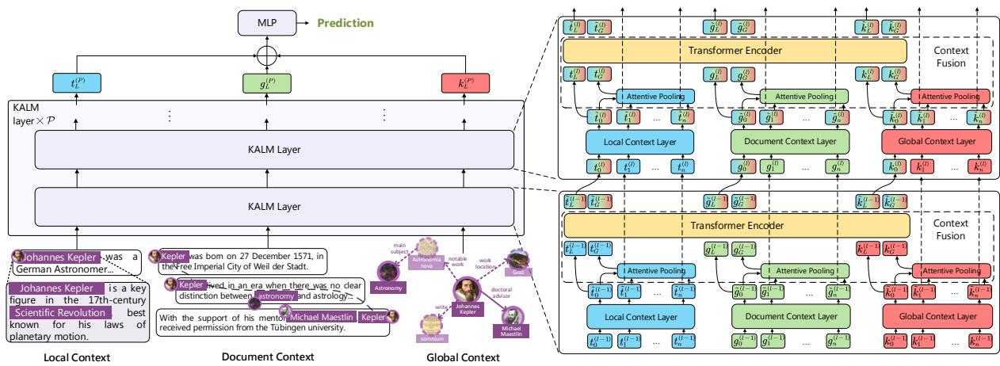
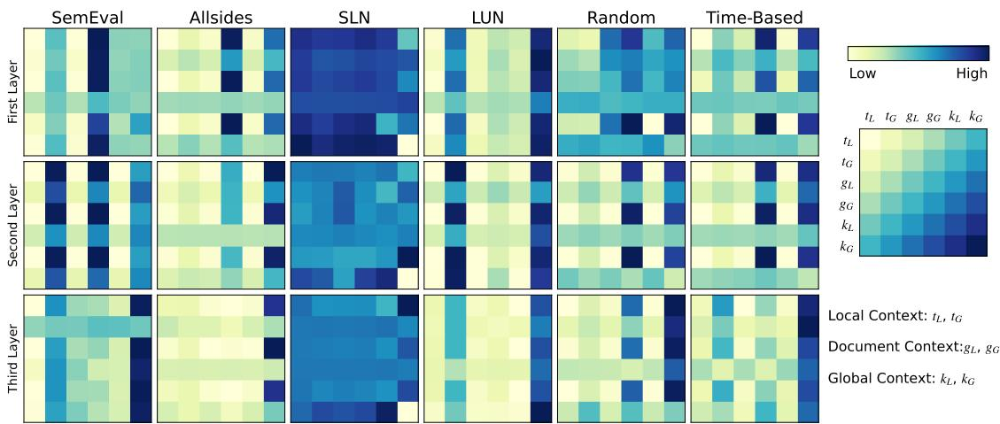
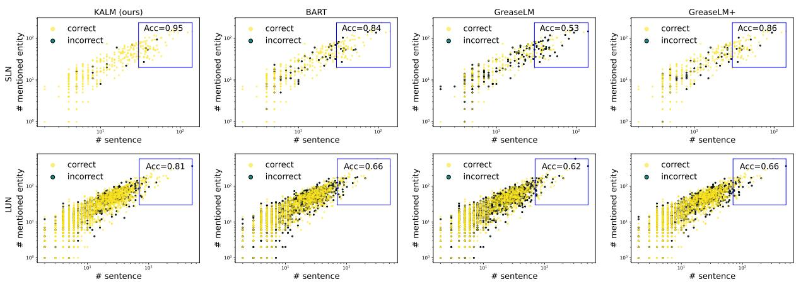
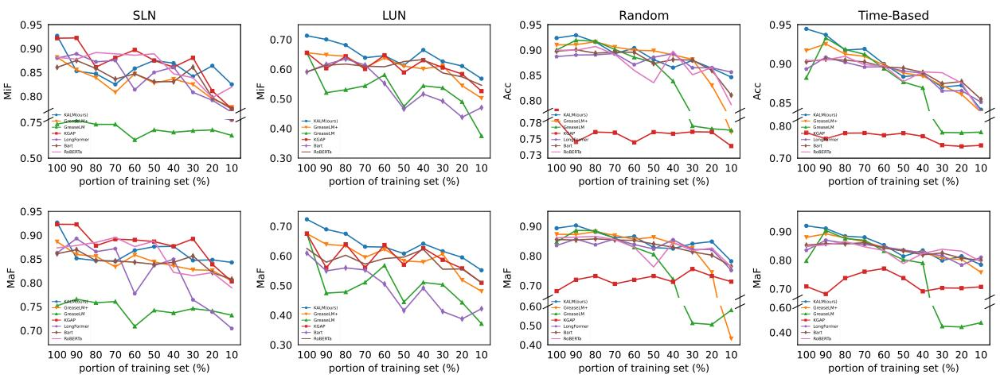
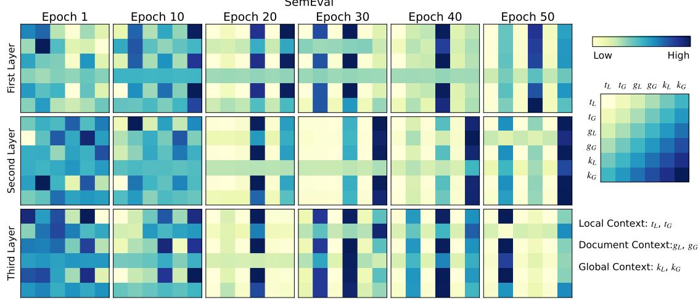
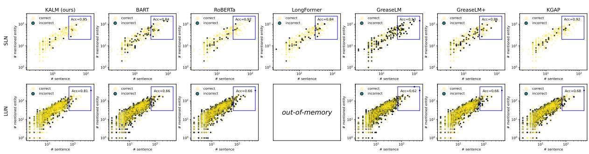

# KALM: Knowledge-Aware Integration of Local, Document, and Global Contexts for Long Document Understanding

Shangbin Feng1 Zhaoxuan Tan2 Wenqian Zhang2 Zhenyu Lei2 Yulia Tsvetkov¹

1University of Washington 2Xi'an Jiaotong University

{shangbin, yuliats}@cs.washington.edu {tanzhaoxuan, 2194510944, fischer}@stu.xjtu.edu.cn

## Abstract

With the advent of pretrained language models (LMs), increasing research efforts have been focusing on infusing commonsense and domain-specific knowledge to prepare LMs for downstream tasks. These works attempt to leverage knowledge graphs, the de facto standard of symbolic knowledge representation, along with pretrained LMs. While existing approaches have leveraged external knowledge, it remains an open question how to jointly incorporate knowledge graphs representing varying contexts—from local (e.g., sentence), to document-level, to global knowledge—to enable knowledge-rich exchange across these contexts. Such rich contextualization can be especially beneficial for long document understanding tasks since standard pretrained LMs are typically bounded by the input sequence length. In light of these challenges, we propose KALM, a Knowledge-Aware Language Model that jointly leverages knowledge in local, document-level, and global contexts for long document understanding. KALM first encodes long documents and knowledge graphs into the three knowledge-aware context representations. It then processes each context with context-specific layers, followed by a “context fusion"layer that facilitates knowledge exchange to derive an overarching document representation. Extensive experiments demonstrate that KALM achieves state-of-the-art performance on six long document understanding tasks and datasets. Further analyses reveal that the three knowledge-aware contexts are complementary and they all contribute to model performance, while the importance and information exchange patterns of different contexts vary with respect to different tasks and datasets.

## 1 Introduction

Large language models (LMs) have become the dominant paradigm in NLP research, while knowledge graphs (KGs) are the de facto standard of symbolic knowledge representation. Recent advances in knowledge-aware NLP focus on combining the two paradigms (Wang et al., 2021b; Zhang et al., 2021; He et al., 2021), infusing encyclopedic (Vrandečić and Krötzsch, 2014; Pellissier Tanon et al., 2020), commonsense (Speer et al., 2017), and domain-specific (Feng et al., 2021; Chang et al., 2020) knowledge with LMs. Knowledgegrounded models achieved state-of-the-art performance in tasks including question answering (Sun et al., 2022), commonsense reasoning (Kim et al., 2022; Liu et al., 2021), and social text analysis (Zhang et al., 2022; Hu et al., 2021).

Prior approaches to infusing LMs with knowledge typically focused on three hitherto orthogonal directions: incorporating knowledge related to local (e.g., sentence-level), document-level, or global context. Local context approaches argue that sentences mention entities, and the external knowledge of entities, such as textual descriptions (Balachandran et al., 2021; Wang et al., 2021b) and metadata (Ostapenko et al., 2022), help LMs realize they are more than tokens. Document-level approaches argue that core idea entities are repeatedly mentioned throughout the document, while related concepts might be discussed in different paragraphs. These methods attempt to leverage entities and knowledge across paragraphs with document graphs (Feng et al., 2021; Zhang et al., 2022; Hu et al., 2021). Global context approaches argue that unmentioned yet connecting entities help connect the dots for knowledge-based reasoning, thus knowledge graph subgraphs are encoded with graph neural networks alongside textual content (Zhang et al., 2021; Yasunaga et al., 2021). However, despite their individual pros and cons, how to integrate the three document contexts in a knowledge-aware way remains an open problem.

Controlling for varying scopes of knowledge and context representations could benefit numerous language understanding tasks, especially those centered around long documents. Bounded by the inherent limitation of input sequence length, existing knowledge-aware LMs are mostly designed to handle short texts (Wang et al., 2021b; Zhang et al., 2021). However, processing long documents containing thousands of tokens (Beltagy et al., 2021) requires attending to varying document contexts, disambiguating long-distance co-referring entities and events, and more.

In light of these challenges, we propose KALM, a Knowledge-Aware Language Model for long document understanding. Specifically, KALM first derives three context- and knowledge-aware representations from the long input document and an external knowledge graph: the local context represented as raw text, the document-level context represented as a document graph, and the global context represented as a knowledge graph subgraph. KALM layers then encode each context with context-specific layers, followed by our proposed novel ContextFusion layers to enable knowledge-rich information exchange across the three knowledge-aware contexts. A unified document representation is then derived from contextspecific representations that also interact with other contexts. An illustration of the proposed KALM is presented in Figure 1.

While KALM is a general method for long document understanding, we evaluate the model on six tasks and datasets that are particularly sensitive to broader contexts and external knowledge: political perspective detection, misinformation detection, and roll call vote prediction. Extensive experiments demonstrate that KALM outperforms pretrained LMs, task-agnostic knowledge-aware baselines, and strong task-specific baselines on all six datasets. In ablation experiments, we further establish KALM's ability to enable information exchange, better handle long documents, and improve data efficiency. In addition, KALM and the proposed ContextFusion layers reveal and help interpret the roles and information exchange patterns of different contexts.

## 2 KALM Methodology

## 2.1 Problem Definition

Let $d = \{ d _ { 1 } , \ldots , d _ { n } \}$ denote a document with n paragraphs, where each paragraph contains a sequence of $n _ { i }$ tokens $\mathbf { { \Gamma } } \mathbf { { d } } _ { i } = \{ w _ { i 1 } , \ldots , w _ { i n _ { i } } \}$ Knowledge-aware long document understanding assumes the access to an external knowledge graph $K G = ( \mathcal { E } , \mathcal { R } , \mathbf { A } , \epsilon , \varphi )$ , where $\mathcal { E } = \{ e _ { 1 } , \ldots , e _ { N } \}$ denotes the entity set, $\mathcal { R } ~ = ~ \{ r _ { 1 } , \ldots , r _ { \mathcal { M } } \}$ denotes the relation set, A is the adjacency matrix where $a _ { i j } = k$ indicates $( e _ { i } , r _ { k } , e _ { j } ) \in K G _ { \cdot }$ $\epsilon ( \cdot ) : \mathcal { E } $ str and $\varphi ( \cdot ) : \mathcal { R }  \mathrm { s t r }$ map the entities and relations to their textual descriptions.

Given pre-defined document labels, knowledgeaware natural language understanding aims to learn document representations and classify d into its corresponding label with the help of KG.

## 2.2 Knowledge-Aware Contexts

We hypothesize that a holistic representation of long documents should incorporate contexts and relevant knowledge at three levels: the local context (e.g., a sentence with descriptions of mentioned entities), the broader document context (e.g., a long document with cross-paragraph entity reference structure), and the global/external context represented as external knowledge (e.g., relevant knowledge base subgraphs). Each of the three contexts uses different granularities of external knowledge, while existing works fall short of jointly integrating the three types of representations. To this end, KALM firstly employs different ways to introduce knowledge in different levels of contexts.

Local context. Represented as the raw text of sentences and paragraphs, the local context models the smallest unit in long document understanding. Prior works attempted to add sentence metadata (e.g., tense, sentiment, topic) (Zhang et al., 2022), adopt sentence-level pretraining tasks based on KG triples (Wang et al., 2021b), or leverage knowledge graph embeddings along with textual representations (Hu et al., 2021). While these methods were effective, in the face of LM-centered NLP research they are ad-hoc add-ons and not fully compatible with existing pretrained LMs. As a result, KALM proposes to directly concatenate the textual descriptions of entities $\epsilon ( e _ { i } )$ to the paragraph if $e _ { i }$ is mentioned. In this way, the original text is directly augmented with the entity descriptions, informing the LM that entities such as "Kepler" are more than mere tokens and help to combat the spurious correlations of pretrained LMs (McMilin). For each augmented paragraph $d _ { i } ^ { \prime } ,$ we adopt LM(·) and mean pooling to extract a paragraph representation. We use pretrained BART encoder (Lewis et al., 2020) as LM(·) without further notice. We also add a fusion token at the beginning of the paragraph sequence for information exchange across contexts. After processing all n paragraphs, we obtain the local context representation $\mathbf { \bar { \boldsymbol { T } } } ^ { ( 0 ) }$ as follows:

  
Figure 1: Overview of KALM, which encodes long documents and knowledge graphs into local, document, and global contexts while enabling information exchange across contexts.

$$
\begin{array} { r l } & { \mathbf { \boldsymbol { \mathsf { T } } } ^ { ( 0 ) } = \{ \mathbf { \boldsymbol { t } } _ { 0 } ^ { ( 0 ) } , \dots , \mathbf { \boldsymbol { t } } _ { n } ^ { ( 0 ) } \} } \\ & { \qquad = \{ \theta _ { r a n d } , \mathrm { L M } ( \mathbf { \boldsymbol { d } } _ { 1 } ^ { \prime } ) , \dots , \mathrm { L M } ( \mathbf { \boldsymbol { d } } _ { n } ^ { \prime } ) \} } \end{array}
$$

where $\theta _ { r a n d }$ denotes a randomly initialized vector of the fusion token in the local context and the superscript (0) indicates the 0-th layer.

Document-level context. Represented as the structure of the full document, the documentlevel context is responsible for modeling crossparagraph entities and knowledge on a document level. While existing works attempted to incorporate external knowledge in documents via document graphs (Feng et al., 2021; Hu et al., 2021), they fall short of leveraging the overlapping entities and concepts between paragraphs that underpin the reasoning of long documents. To this end, we propose knowledge coreference, a simple and effective mechanism for modeling text-knowledge interaction on the document level. Specifically, a document graph with n + 1 nodes is constructed, consisting of one fusion node and n paragraph nodes. If paragraph i and j both mention entity $e _ { k }$ in the external KB, node ¿ and j in the document graph are connected with relation type k. In addition, the fusion node is connected to every paragraph node with a super-relation. As a result, we obtain the adjacency matrix of the document graph A9. Paired with the knowledge-guided GNN to be introduced in Section 2.3, knowledge coreference enables the information flow across paragraphs guided by external knowledge. Node feature initialization of the document graph is as follows:

$$
\begin{array} { r l } & {  { \boldsymbol { G } } ^ { ( 0 ) } = \{ \mathbf { g } _ { 0 } ^ { ( 0 ) } , \ldots , \mathbf { g } _ { n } ^ { ( 0 ) } \} } \\ & { \quad \quad = \{ \theta _ { r a n d } ,  { \mathrm { L M } } (  { \pmb { d } } _ { 1 } ) , \ldots ,  { \mathrm { L M } } (  { \pmb { d } } _ { n } ) \} } \end{array}
$$

Global context. Represented as external knowledge graphs, the global context is responsible for leveraging unseen entities and facilitating KGbased reasoning. Existing works mainly focused on extracting knowledge graph subgraphs (Yasunaga et al., 2021; Zhang et al., 2021) and encoding them alongside document content. Though many tricks are proposed to extract and prune KG subgraphs, in KALM, we employ a straightforward approach: for all mentioned entities in the long document KALM merges their k-hop neighborhood to obtain a knowledge graph subgraph. We use k = 2 following previous works (Zhang et al., 2021; Vashishth et al., 2019), striking a balance between KB structure and computational efficiency while KALM could support any k settings. A fusion entity is then introduced and connected with every other entity, resulting in a connected graph. In this way, KALM cuts back on the preprocessing for modeling global knowledge and better preserve the information in the KG. Knowledge graph embedding methods (Bordes et al., 2013) are then adopted to initialize node features of the KG subgraph:

$$
\begin{array} { r l } & { \mathbf { } \mathbf { } K ^ { ( 0 ) } = \{ \mathbf { k } _ { 0 } ^ { ( 0 ) } , \dots , \mathbf { k } _ { | \rho ( d ) | } ^ { ( 0 ) } \} } \\ & { \qquad = \{ \theta _ { r a n d } , \mathrm { K G E } ( e _ { 1 } ) , \dots , \mathrm { K G E } ( e _ { | \rho ( d ) | } ) \} } \end{array}
$$

where KGE(·) denotes the knowledge graph embeddings trained on the original KG, $| \rho ( d ) |$ indicates the number of mentioned entities identified in document d. We use TransE (Bordes et al., 2013) to learn KB embeddings and use them for KGE(·), while the knowledge base embeddings are kept frozen in the KALM training process.

## 2.3 KALM Layers

After obtaining the local, document-level, and global context representations of long documents, we employ KALM layers to learn document representations. Specifically, each KALM layer consists of three context-specific layers to process each context. A ContextFusion layer is then adopted to enable the knowledge-rich information exchange across the three contexts.

## 2.3.1 Context-Specific Layers

Local context layer. The local context is represented as a sequence of vectors extracted from the knowledge-enriched text with the help of pretrained LMs. We adopt transformer encoder layers (Vaswani et al., 2017) to encode the local context:

$$
\begin{array} { r l } & { \tilde { \mathbf { \cal { T } } } ^ { ( \ell ) } = \{ \tilde { \mathbf { t } } _ { 0 } ^ { ( \ell ) } , \dots , \tilde { \mathbf { t } } _ { n } ^ { ( \ell ) } \} } \\ & { \qquad = \phi \Bigl ( \mathrm { T r m E n c } ( \{ \mathbf { t } _ { 0 } ^ { ( \ell ) } , \dots , \mathbf { t } _ { n } ^ { ( \ell ) } \} ) \Bigr ) } \end{array}
$$

where $\phi ( \cdot )$ denotes non-linearity, TrmEnc denotes the transformer encoder layer, and $\tilde { \mathbf { t } } _ { 0 } ^ { ( \ell ) }$ denotes the transformed representation of the fusion token. We omit the layer subscript (l) for brevity.

Document-level context layer. The documentlevel context is represented as a document graph based on knowledge coreference. To better exploit the entity-based relations in the document graph, we propose a knowledge-aware GNN architecture to enable knowledge-guided message passing on the document graph:

$$
\tilde { \cal G } = \{ \tilde { \bf g } _ { 0 } , \ldots , \tilde { \bf g } _ { n } = \mathrm { G N N } \Big ( \{ { \bf g } _ { 0 } , \ldots , { \bf g } _ { n } \} \Big )
$$

where $\mathrm { G N N } ( \cdot )$ denotes the proposed knowledgeguided graph neural networks as follows:

$$
\tilde { \mathbf { g } } _ { i } = \phi \Bigl ( \alpha _ { i , i } \mathbf { \Theta } \mathbf { \Theta } \mathbf { \Theta } \mathbf { \Theta } \Bigr ) + \sum _ { j \in \mathcal { N } ( i ) } \mathbf { \Theta } \mathbf { \Theta } \mathbf { \Theta } \mathbf { \Theta } \mathbf { g } _ { j } \Bigr )
$$

where $\alpha _ { i , j }$ denotes the knowledge-guided attention weight and is defined as follows:

$$
\begin{array} { r } { \alpha _ { i , j } = \frac { \exp \Big ( \mathrm { E L U } ( \mathbf { a } ^ { T } [ \boldsymbol { \Theta } \mathbf { g } _ { i } | | \boldsymbol { \Theta } \mathbf { g } _ { j } | | \boldsymbol { \Theta } f ( \mathrm { K G E } ( a _ { i j } ^ { g } ) ) ] ) \Big ) } { \sum _ { k \in \mathcal { N } ( i ) } \exp \Big ( \mathrm { E L U } ( \mathbf { a } ^ { T } [ \boldsymbol { \Theta } \mathbf { g } _ { i } | | \boldsymbol { \Theta } \mathbf { g } _ { k } | | \boldsymbol { \Theta } f ( \mathrm { K G E } ( a _ { i k } ^ { g } ) ) ] ) \Big ) } } \end{array}
$$

where $\tilde { \bf g } _ { 0 }$ denotes the transformed representation of the fusion node, a and Θ are learnable parameters, $a _ { i j } ^ { g }$ is the i-th row and $j \mathrm { - t h }$ column value of adjacency matrix A9 of the document graph, ELU denotes the exponential linear unit activation function (Clevert et al., 2015), and $f ( \cdot )$ is a learnable linear layer. $\Theta f ( \mathrm { K G E } ( a _ { i j } ^ { g } ) )$ is responsible for enabling the knowledge-guided message passing on the document graph, enabling KALM to incorporate the entity and concept patterns in different paragraphs and their document-level interactions.

Global context layer. The global context is represented as a relevant knowledge graph subgraph. We follow previous works and adopt GATs (Veličković et al., 2018) to encode the global context:

$$
\begin{array} { r l } & { \tilde { K } = \{ \tilde { \mathbf { k } } _ { 0 } , \dots , \tilde { \mathbf { k } } _ { | \rho ( d ) | } \} } \\ & { \qquad = \mathrm { G A T } \Big ( \{ \mathbf { k } _ { 0 } , \dots , \mathbf { k } _ { | \rho ( d ) | } \} \Big ) } \end{array}
$$

where $\tilde { \mathbf { k } } _ { 0 }$ denotes the transformed representation of the fusion entity.

## 2.3.2 ContextFusion Layer

The local, document, and global contexts model external knowledge within sentences, across the document, and beyond the document. These contexts are closely connected and a robust long document understanding method should reflect their interactions. Existing approaches mostly leverage only one or two of the contexts (Wang et al., 2021b; Feng et al., 2021; Zhang et al., 2022), falling short of jointly leveraging the three knowledge-aware contexts. In addition, they mostly adopted direct concatenation or MLP layers (Zhang et al., 2022, 2021; Hu et al., 2021), falling short of enabling context-specific information to flow across contexts in a knowledge-rich manner. As a result, we propose the ContextFusion layer to tackle these challenges. We firstly take a local perspective and extract the representations of the fusion tokens, nodes, and entities in each context:

$$
\Big [ { \bf t } _ { L } , { \bf g } _ { L } , { \bf k } _ { L } \Big ] = \Big [ \tilde { \bf t } _ { 0 } , \tilde { \bf g } _ { 0 } , \tilde { \bf k } _ { 0 } \Big ]
$$

We then take a global perspective and use the fusion token/node/entity as the query to conduct attentive pooling $\arg ( \cdot , \cdot )$ across all other tokens/nodes/entities in each context:

$$
\begin{array} { r } { \Big [ \mathbf { t } _ { G } , \mathbf { g } _ { G } , \mathbf { k } _ { G } \Big ] = \Big [ \mathrm { a p } \big ( \tilde { \mathbf { t } } _ { 0 } , \{ \tilde { \mathbf { t } } _ { i } \} _ { i = 1 } ^ { n } \big ) , } \\ { \mathrm { a p } \big ( \tilde { \mathbf { g } } _ { 0 } , \{ \tilde { \mathbf { g } } _ { i } \} _ { i = 1 } ^ { n } \big ) , \mathrm { a p } \big ( \tilde { \mathbf { k } } _ { 0 } , \{ \tilde { \mathbf { k } } _ { i } \} _ { i = 1 } ^ { n } \big ) \Big ] } \end{array}
$$

where attentive pooling $\arg ( \cdot , \cdot )$ is defined as:

$$
\mathrm { a p } \big ( \mathbf { q } , \{ \mathbf { k } _ { i } \} _ { i = 1 } ^ { n } \big ) = \sum _ { i = 1 } ^ { n } \frac { \exp \bigl ( \mathbf { q } \cdot \mathbf { k } _ { i } \bigr ) } { \sum _ { j = 1 } ^ { n } \exp \bigl ( \mathbf { q } \cdot \mathbf { k } _ { j } \bigr ) } k _ { i }
$$

In this way, the fusion token/node/entity in each context serves as the information exchange portal. We then use a transformer encoder layer to enable information exchange across the contexts:

$$
\begin{array} { r l } & { \biggl [ \tilde { \mathbf { t } } _ { L } , \tilde { \mathbf { g } } _ { L } , \tilde { \mathbf { k } } _ { L } , \tilde { \mathbf { t } } _ { G } , \tilde { \mathbf { g } } _ { G } , \tilde { \mathbf { k } } _ { G } \biggr ] } \\ & { = \phi \Bigl ( \mathrm { T r m E n c } \Bigl ( \Bigl [ \mathbf { t } _ { L } , \mathbf { g } _ { L } , \mathbf { k } _ { L } , \mathbf { t } _ { G } , \mathbf { g } _ { G } , \mathbf { k } _ { G } \Bigr ] \Bigr ) \Bigr ) } \end{array}
$$

As a result, $\tilde { \mathbf { t } } _ { L } , \tilde { \mathbf { g } } _ { L }$ , and $\tilde { \mathbf { k } } _ { L }$ are the representations of the fusion token/node/entity that incorporates information from other contexts. We formulate the output of the l-th layer as follows:

$$
\begin{array} { r l } & { \pmb { T } ^ { ( \ell + 1 ) } = \{ \tilde { \mathbf { t } } _ { L } ^ { ( \ell ) } , \tilde { \mathbf { t } } _ { 1 } ^ { ( \ell ) } , \dots , \tilde { \mathbf { t } } _ { n } ^ { ( \ell ) } \} , } \\ & { G ^ { ( \ell + 1 ) } = \{ \tilde { \mathbf { g } } _ { L } ^ { ( \ell ) } , \tilde { \mathbf { g } } _ { 1 } ^ { ( \ell ) } , \dots , \tilde { \mathbf { g } } _ { n } ^ { ( \ell ) } \} , } \\ & { \pmb { K } ^ { ( \ell + 1 ) } = \{ \tilde { \mathbf { k } } _ { L } ^ { ( \ell ) } , \tilde { \mathbf { k } } _ { 1 } ^ { ( \ell ) } , \dots , \tilde { \mathbf { k } } _ { n } ^ { ( \ell ) } \} } \end{array}
$$

Our proposed ContextFusion layer is interactive since it enables the information to flow across different document contexts, instead of direct concatenation or hierarchical processing. The attention weights in TrmEnc(·) of the ContextFusion layer could also provide insights into the roles and importance of each document context, which will be further explored in Section 3.3. To the best of our knowledge, KALM is the first work to jointly consider the three levels of document context and enable information exchange across document contexts.

## 2.4 Learning and Inference

After a total of P KALM layers, we obtain the final document representation as $\left[ \tilde { \mathbf { t } } _ { L } ^ { ( \mathcal { P } ) } , \tilde { \mathbf { g } } _ { L } ^ { ( \mathcal { P } ) } , \tilde { \mathbf { k } } _ { L } ^ { ( \mathcal { P } ) } \right]$ Given the document label $a ^ { \mathbf { - } } \in \mathbf { - } , A ,$ the label probability is formulated as $\begin{array} { r l } { p ( a | d ) } & { { } \propto } \end{array}$ $\exp \big ( \mathrm { \tilde { M L P } } _ { a } ( [ { \tilde { \mathbf { t } } } _ { L } ^ { ( \mathcal { P } ) } , { \tilde { \mathbf { g } } } _ { L } ^ { ( \mathcal { P } ) } , { \tilde { \mathbf { k } } } _ { L } ^ { ( \mathcal { P } ) } ] ) \big )$ We then optimize KALM with the cross entropy loss function. At inference time, the predicted label is argmay $\tau _ { a } p ( a | \mathbf { d } )$

## 3 Experiment

## 3.1 Experiment Settings

Tasks and Datasets. We propose KALM, a general method for knowledge-aware long document understanding. We evaluate KALM on three tasks that especially benefit from external knowledge and broader context: political perspective detection, misinformation detection, and roll call vote prediction. We follow previous works to adopt SemEval (Kiesel et al., 2019) and Allsides (Li and Goldwasser, 2019) for political perspective detection, LUN (Rashkin et al., 2017) and SLN (Rubin et al., 2016) for misinformation detection, and the 2 datasets proposed in Mou et al. (2021) for roll call vote prediction. For external KGs, we follow existing works to adopt the KGs in KGAP (Feng et al., 2021), CompareNet (Hu et al., 2021), and ConceptNet (Speer et al., 2017) for the three tasks.

Baseline methods. We compare KALM with three types of baseline methods for holistic evaluation: pretrained LMs, task-agnostic knowledgeaware methods, and task-specific models. For pretrained LMs, we evaluate RoBERTa (Liu et al., 2019b), Electra (Clark et al., 2019), DeBERTa (He et al., 2020), BART (Lewis et al., 2020), and Long-Former (Beltagy et al., 2020) on the three tasks. For task-agnostic baselines, we evaluate KGAP (Feng et al., 2021), GreaseLM (Zhang et al., 2021), and GreaseLM+ on the three tasks. Task-specific models are introduced in the following sections. For pretrained LMs, task-agnostic methods, and KALM, we run each method five times and report the average performance and standard deviation. For task-specific models, we compare with the results originally reported since we follow the exact same experiment settings and data splits.

## 3.2 Model Performance

We present the performance of task-specific methods, pretrained LMs, task-agnostic knowledgeaware baselines, and KALM in Table 1. We select the best-performing task-specific baseline (Task SOTA) and pretrained language model (BestLM), while the full results are available in Tables 4, 5, and 6 in the appendix. Table 1 demonstrates that:

Table 1: Model performance on three tasks and six datasets. Acc, MaF, miF, and BAcc denote accuracy, macroaveraged F1-score, micro-averaged F1-score, and balanced accuracy. Best performance is shown in bold. Certain task-specific models did not report standard deviation in the original paper.
<table><tr><td rowspan="2">Task</td><td rowspan="2">Dataset</td><td rowspan="2">Metric</td><td rowspan="2">Task SOTA</td><td rowspan="2">Best LM</td><td colspan="6">Knowledge-Aware LMs</td><td rowspan="2">KALM</td></tr><tr><td>KELM</td><td>KnowBERT</td><td>Joshi et al.</td><td>KGAP</td><td>GreaseLM</td><td>GreaseLM+</td></tr><tr><td rowspan="4">PDD</td><td rowspan="4">SemEval</td><td>Acc</td><td>89.90 (±0.6)</td><td>86.99 (±1.9)</td><td>86.40 (±2.3)</td><td>84.73 (±3.4)</td><td>81.88 (±2.1)</td><td>87.73 (±1.8)</td><td>86.64 (±1.5)</td><td>85.66 (±1.8)</td><td>91.45 (±0.8)</td></tr><tr><td>MaF</td><td>86.11 (±1.1)</td><td>80.62 (±3.8)</td><td>83.98 (±1.0)</td><td>75.72 (±5.3)</td><td>77.15 (±3.8)</td><td>82.00 (±3.1)</td><td>80.32 (±3.0)</td><td>77.23 (±4.1)</td><td>87.65 (±1.2)</td></tr><tr><td>Acc</td><td>87.17 (±0.2)</td><td>68.71 (±4.3)</td><td>80.71 (±2.4)</td><td>60.56 (±0.7)</td><td>80.88 (±2.1)</td><td>83.65 (±1.3)</td><td>80.23 (±1.2)</td><td>82.16 (±5.5)</td><td>87.26 (±0.2)</td></tr><tr><td>MaF</td><td>86.72 (±0.3)</td><td>65.39 (±5.7)</td><td>79.74 (±2.7)</td><td>58.81 (±0.5)</td><td>79.73 (±2.3)</td><td>82.92 (±1.4)</td><td>79.17 (±1.2)</td><td>80.81 (±7.1)</td><td>86.79 (±0.2)</td></tr><tr><td rowspan="4">MD</td><td rowspan="4">SLN</td><td>MiF</td><td>89.17</td><td>88.17 (±0.6)</td><td>84.11 (±0.6)</td><td>78.67 (±3.2)</td><td>82.72 (±5.1)</td><td>92.17 (±1.2)</td><td>73.83 (±0.9)</td><td>88.17 (±0.8)</td><td>94.22 (±1.2)</td></tr><tr><td>MaF</td><td>89.12</td><td>88.46 (±4.9)</td><td>82.80 (±1.3)</td><td>79.80 (±2.0)</td><td>83.98 (±3.7)</td><td>92.30 (±0.9)</td><td>75.20 (±0.8)</td><td>88.64 (±0.6)</td><td>94.18 (±1.1)</td></tr><tr><td>MiF</td><td>69.05</td><td>60.10 (±1.7)</td><td>59.28 (±2.1)</td><td>59.66 (±1.1)</td><td>58.57 (±3.4)</td><td>65.52 (±2.3)</td><td>56.54 (±1.5)</td><td>64.29 (±2.4)</td><td>71.28 (±1.7)</td></tr><tr><td>MaF</td><td>68.26</td><td>58.57 (±2.1)</td><td>57.30 (±1.6)</td><td>59.19 (±1.3)</td><td>56.73 (±4.0)</td><td>63.94 (±2.9)</td><td>55.75 (±1.6)</td><td>62.65 (±3.7)</td><td>69.82 (±1.2)</td></tr><tr><td rowspan="4">RCVP</td><td rowspan="4">Random</td><td></td><td></td><td></td><td></td><td></td><td></td><td></td><td></td><td></td><td></td></tr><tr><td>BAcc</td><td>90.33</td><td>89.94 (±0.2)</td><td>89.13 (±1.1)</td><td>86.72 (±0.9)</td><td>92.43 (±0.5)</td><td>77.98 (±0.5)</td><td>89.99 (±1.5)</td><td>91.01 (±0.2)</td><td>92.36 (±0.4)</td></tr><tr><td>MaF</td><td>84.92</td><td>86.10 (±0.7)</td><td>84.76 (±2.0)</td><td>79.33 (±2.4)</td><td>89.64 (±0.6)</td><td>68.11 (±6.0)</td><td>84.72 (±3.0)</td><td>87.29 (±0.3)</td><td>89.33 (±0.4)</td></tr><tr><td>BAcc Time-based MaF</td><td>89.92 84.35</td><td>90.40 (±0.8) 85.21 (±2.1)</td><td>90.80 (±0.2) 86.62 (±0.4)</td><td>87.07 (±0.9) 78.90 (±1.9)</td><td>92.63 (±1.6) 89.31 (±2.4)</td><td>77.90 (±0.6) 70.81 (±4.6)</td><td>88.21 (±2.7) 79.73 (±7.4)</td><td>91.69 (±0.1) 87.95 (±0.3)</td><td>94.46 (±0.4) 91.97 (±0.5)</td></tr></table>

Table 2: Ablation study of the three document contexts and the ContextFusion layer. Best performance is shown in bold. The local, document, and global contexts all contribute to model performance, while the ContextFusion layer is better than existing strategies at enabling information exchange across contexts
<table><tr><td rowspan="2">Task</td><td rowspan="2">Dataset</td><td rowspan="2">Metric</td><td>Ours</td><td colspan="3">Remove Context</td><td colspan="3">Substitute ContextFusion</td></tr><tr><td>KALM</td><td>w/o local</td><td>w/o document</td><td>w/o global</td><td>MInt</td><td>concat</td><td>sum</td></tr><tr><td rowspan="4">PDD</td><td rowspan="2">SemEval</td><td>Acc</td><td>91.45 (±0.8)</td><td>83.55 (±0.8)</td><td>83.57 (±1.1)</td><td>84.11 (±0.9)</td><td>81.91 (±0.9)</td><td>83.52 (±1.8)</td><td>83.21 (±1.0)</td></tr><tr><td>MaF</td><td>87.65 (±1.2)</td><td>74.25 (±1.3)</td><td>76.13 (±2.0)</td><td>74.92 (±1.8)</td><td>70.47 (±3.6)</td><td>74.27 (±4.0)</td><td>73.59 (±2.1)</td></tr><tr><td rowspan="2">Allsides</td><td>Acc</td><td>87.26 (±0.2)</td><td>83.72 (±4.0)</td><td>82.88 (±5.1)</td><td>80.59 (±6.3)</td><td>83.08 (±4.0)</td><td>83.27 (±4.2)</td><td>83.50 (±3.5)</td></tr><tr><td>MaF</td><td>86.79 (±0.2)</td><td>83.10 (±4.2)</td><td>81.86 (±6.2)</td><td>78.98 (±8.1)</td><td>82.39 (±4.2)</td><td>82.28 (±5.3)</td><td>82.64 (±4.0)</td></tr><tr><td rowspan="4">MD</td><td rowspan="2">SLN</td><td>MiF</td><td>94.22 (±1.2)</td><td>80.94 (±5.5)</td><td>83.50 (±5.7)</td><td>83.94 (±4.7)</td><td>86.33 (±2.1)</td><td>82.67 (±9.2)</td><td>79.89 (±6.3)</td></tr><tr><td>MaF</td><td>94.18 (±1.1)</td><td>82.95 (±4.4)</td><td>85.55 (±4.4)</td><td>85.65 (±3.4)</td><td>86.79 (±1.9)</td><td>85.26 (±6.2)</td><td>82.71 (±4.1)</td></tr><tr><td rowspan="2">LUN</td><td>MiF</td><td>71.28 (±1.7)</td><td>41.13 (±5.8)</td><td>50.18 (±6.3)</td><td>57.94 (±4.1)</td><td>48.78 (±6.3)</td><td>53.52 (±6.5)</td><td>63.27 (±4.0)</td></tr><tr><td>MaF</td><td>69.82 (±1.2)</td><td>35.95 (±7.3)</td><td>47.27 (±7.3)</td><td>55.58 (±4.6)</td><td>44.11 (±9.0)</td><td>48.98 (±7.9)</td><td>61.86 (±4.4)</td></tr><tr><td rowspan="4">RCVP</td><td rowspan="2">Random</td><td>BAcc</td><td>92.36 (±0.3)</td><td>91.29 (±2.4)</td><td>91.35 (±0.4)</td><td>91.34 (±0.5)</td><td>92.14 (±0.5)</td><td>91.82 (±0.8)</td><td>91.18 (±1.5)</td></tr><tr><td>MaF</td><td>89.33 (±0.4)</td><td>88.16 (±2.5)</td><td>87.81 (±0.8)</td><td>88.50 (±0.4)</td><td>89.35 (±0.7)</td><td>89.01 (±1.0)</td><td>88.19 (±1.6)</td></tr><tr><td rowspan="2">Time-based</td><td>BAcc</td><td>94.46 (±0.4)</td><td>93.58 (±1.4)</td><td>93.47 (±0.5)</td><td>93.91 (±0.5)</td><td>93.06 (±1.7)</td><td>92.37 (±2.2)</td><td>93.06 (±1.0)</td></tr><tr><td>MaF</td><td>91.97 (±0.5)</td><td>90.60 (±2.1)</td><td>90.73 (±0.6)</td><td>91.29 (±0.5)</td><td>90.06 (±2.4)</td><td>88.56 (±4.5)</td><td>90.21 (±1.1)</td></tr></table>

• KALM consistently outperforms all task-specific models, pretrained language models, and knowledge-aware methods on all three tasks and six datasets/settings. Statistical significance tests in Section A.4 further demonstrates KALM's superiority over existing models.

• Knowledge-aware LMs generally outperform pretrained LMs, which did not incorporate external knowledge bases in the pretraining process. This suggests that incorporating external knowledge bases could enrich document representations and boost downstream task performance.

• GreaseLM+ outperforms GreaseLM by adding the global context, which suggests the importance of jointly leveraging the three document contexts. KALM further introduces information exchange across contexts through the Context-Fuion layer and achieves state-of-the-art performance. We further investigate the importance of three document contexts and the ContextFusion layer in Section 2.3.2.

## 3.3 Context Exchange Study

By jointly modeling three document contexts and employing the ContextFusion layer, KALM facilitates information exchange across the three document contexts. We conduct an ablation study to examine whether the contexts and the ContextFusion layer are essential in the KALM architecture. Specifically, we remove the three contexts one at a time and change the ContextFusion layer into MInt (Zhang et al., 2021), concatenation, and sum. Table 2 demonstrates that:

• All three levels of document contexts, local, document, and global, contribute to model performance. These results substantiate the necessity of jointly leveraging the three document contexts for long document understanding.

• When substituting our proposed ContextFusion layers with three existing combination strategies, MInt (Zhang et al., 2021), direct concatenation, and summation, performance drops are observed across multiple datasets. This suggests that the proposed ContextFusionn layer successfully boost model performance by enabling information exchange across contexts.

  
Figure 2: Interpreting the roles of contexts in the ContextFusion layer. $\mathbf { t } _ { L } , \mathbf { t } _ { G } , \mathbf { g } _ { L } , \mathbf { g } _ { G } , \mathbf { k } _ { L } , \mathbf { k } _ { G }$ denote the context representations in equations (9) and (10), so that the first two columns indicate how the local context attends to information in other contexts, the next two columns for the document context, and the last two for the global context.

In addition to boosting model performance, the ContextFusion layer probes how different contexts contribute to document understanding. We calculate the average of attention weights’ absolute values of the multi-head attention in the TrmEnc(·) layer of ContextFusion and illustrate in Figure 2, which shows that the three contexts' contribution and information exchange patterns vary with respect to datasets and KALM layers. Specifically local and global contexts are important for the LUN dataset, document and global contexts are important for the task of roll call vote prediction, and the SLN dataset equally leverages the three contexts. However, for the task of political perspective detection, the importance of the three aspects varies with the depth of KALM layers. This is especially salient on SemEval, where KALM firstly takes a view of the whole document, then draws from both local and document-level contexts, and closes by leveraging global knowledge to derive an overall document representation.

In summary, the ContextFusion layer in KALM successfully identifies the relative importance and information exchange patterns of the three contexts, providing insights into how KALM arrives at the conclusion and which context should be the focus of future research. We further demonstrate that the role and importance of each context change as training progresses in Section A.1 in the appendix.

## 3.4 Long Document Study

KALM complements the scarce literature in knowledge-aware long document understanding. In addition to more input tokens, it often relies on more knowledge reference and knowledge reasoning. To examine whether KALM indeed improved in the face of longer documents and more external knowledge, we illustrate the performance of KALM and competitive baselines with respect to document length and knowledge intensity in Figure 3. Specifically, we use the number of mentioned entities to represent knowledge intensity and the number of sentences to represent document length, mapping each data point onto a two-dimensional space. It is illustrated that while baseline methods are prone to mistakes when the document is long and knowledge is rich, KALM alleviates this issue and performs better in the top-right corner. We further analyze KALM and more baseline methods’ performance on long documents with great knowledge intensity in Figure 6 in the appendix.

## 3.5 Data Efficiency Study

Existing works argue that introducing knowledge graphs to NLP tasks could improve data efficiency and help alleviate the need for extensive training data (Zhang et al., 2022). By introducing knowledge to all three document contexts and enabling knowledge-rich context information exchange, KALM might be in a better position to tackle this issue. To examine whether KALM has indeed improved data efficiency, we compare the performance of KALM with competitive baselines when trained on partial training sets and illustrate the results in Figure 4. It is demonstrated that while performance did not change greatly with 30% to 100% training data, baseline methods witness significant performance drops when only 10% to 20% of data are available. In contrast, KALM maintains steady performance with as little as 10% of training data.

  
Figure 3: Error analysis of KALM and baseline methods. KALM successfully improves in the top-right corner, which represents documents with more sentences and more entailed knowledge.

## 4 Related Work

Knowledge graphs are playing an increasingly important role in language models and NLP research. Commonsense (Speer et al., 2017; Ilievski et al. 2021; Bosselut et al., 2019; West et al., 2022; Li et al., 2022a) and domain-specific KGs (Feng et al., 2021; Li et al., 2022b; Gyori et al., 2017) serve as external knowledge to augment pretrained LMs, which achieves state-of-the-art performance on question answering (Zhang et al., 2021; Yasunaga et al., 2021; Mitra et al., 2022; Bosselut et al., 2021; Oguz et al., 2022; Feng et al., 2022b; Heo et al., 2022; Ma et al., 2022; Li and Moens, 2022; Zhou and Small, 2019), social text analysis (Hu et al., 2021; Zhang et al., 2022; Reddy et al., 2022), commonsense reasoning (Kim et al., 2022; Jung et al., 2022; Amayuelas et al., 2021; Liu et al., 2022), and text generation (Rony et al., 2022). These approaches (Lu et al., 2022; Zhang et al., 2019; Yu et al., 2022b; Sun et al., 2020; Yamada et al., 2020; Qiu et al., 2019a; Xie et al., 2022) could be mainly categorized by the three levels of the context where knowledge injection happens.

Local context approaches focus on entity mentions and external knowledge in individual sentences to enable fine-grained knowledge inclusion. A straightforward way is to encode KG entities with KG embeddings (Bordes et al., 2013; Lin et al., 2015; Cucala et al., 2021; Sun et al., 2018) and infuse the embeddings with language representations (Hu et al., 2021; Feng et al., 2021; Kang et al., 2022). Later approaches focus on augmenting pretrained LMs with KGs by introducing knowledgeaware training tasks and LM architectures (Wang et al., 2021b,a; Sridhar and Yang, 2022; Moiseev et al., 2022; Kaur et al., 2022; Hu et al., 2022; Arora et al., 2022; de Jong et al., 2021; Meng et al., 2021; He et al., 2021). Topic models were also introduced to enrich document representation learning (Gupta et al., 2018; Chaudhary et al., 2020; Wang et al., 2018). However, local context approaches fall short of leveraging inter-sentence and inter-entity knowledge, resulting in models that could not grasp the full picture of the text-knowledge interactions.

Document-level models analyze documents by jointly considering external knowledge across sentences and paragraphs. The predominant way of achieving document-level knowledge infusion is through "document graphs" (Zhang et al., 2022), where textual content, external knowledge bases, and other sources of information are encoded and represented as different components in graphs, often heterogeneous information networks (Hu et al., 2021; Feng et al., 2021; Zhang et al., 2022; Yu et al., 2022a). Graph neural networks are then employed to learn representations, which fuse both textual information and external KGs. However document-level approaches fall short of preserving the original KG structure, resulting in models with reduced knowledge reasoning abilities.

  
Figure 4: KALM and competitive baselines' performance when training data decreases from 100% to 10%. KALM maintains steady performance with as little as 10% to 20% of training data, while baseline methods witness serious performance deterioration.

Global context approaches focus on the KG, extracting relevant KG subgraphs based on entity mentions. Pruned with certain mechanisms (Yasunaga et al., 2021) or not (Qiu et al., 2019b), these KG subgraphs are encoded with GNNs, and such representations are fused with LMs from simple concatenation (Hu et al., 2021) to deeper interactions (Zhang et al., 2021). However, global context approaches leverage external KGs in a stand-alone manner, falling short of enabling the dynamic integration of textual content and external KGs.

While existing approaches successfully introduced external KG to LMs, long document understanding poses new challenges to knowledgeaware NLP. Long documents possess greater knowledge intensity where more entities are mentioned, more relations are leveraged, and more reasoning is required to fully understand the nuances, while existing approaches are mostly designed for sparse knowledge scenarios. In addition, long documents also exhibit the phenomenon of knowledge co-reference, where central ideas and entities are reiterated throughout the document and co-exist in different levels of document contexts. In light of these challenges, we propose KALM to jointly leverage the local, document, and global contexts of long documents for knowledge incorporation.

## 5 Conclusion

In this paper, we propose KALM, a knowledgeaware long document understanding approach that introduces external knowledge to three levels of document contexts and enables interactive exchange across them. Extensive experiments demonstrate that KALM achieves state-of-the-art performance on three tasks across six datasets. Our analysis shows that KALM provides insights into the roles and patterns of individual contexts, improves the handling of long documents with greater knowledge intensity, and has better data efficiency than existing works.

## Limitations

Our proposed KALM has two limitations:

• KALM relies on existing knowledge graphs to facilitate knowledge-aware long document understanding. While knowledge graphs are effective and prevalent tools for modeling real-world symbolic knowledge, they are often sparse and hardly exhaustive (Tan et al., 2022; Pujara et al., 2017). In addition, external knowledge is not only limited to knowledge graphs but also exists in textual, visual, and other symbolic forms. We leave it to future work on how to jointly leverage multiple forms and sources of external knowledge in document understanding.

• KALM leverages TagMe (Ferragina and Scaiella 2011) to identify entity mentions and build the three knowledge-aware contexts. While TagMe and other entity identification tools are effective, they are not 100% correct, resulting in potentially omitted entities and external knowledge. In addition, running TagMe on hundreds of thousands of long documents is time-consuming and resource-consuming even if processed in parallel. We leave it to future work on how to leverage knowledge graphs for long document understanding without using entity linking tools.

## Ethics Statement

KALM is a knowledge-aware long document understanding approach that jointly leverages pretrained LMs and knowledge graphs on three levels of contexts. Consequently, KALM might exhibit many of the biases of the adopted language models (Liang et al., 2021; Nadeem et al., 2021) and knowledge graphs (Fisher et al., 2020, 2019; Mehrabi et al., 2021; Du et al., 2022; Keidar et al., 2021). As a result, KALM might leverage the biased and unethical correlations in LMs and KGs to arrive at conclusions. We encourage KALM users to audit its output before using it beyond the standard benchmarks. We leave it to future work on how to leverage knowledge graphs in pretrained LMs with a focus on fairness and equity.

## Acknowledgements

We would like to thank the reviewers, the area chair, Vidhisha Balachandran, Melanie Sclar, and members of the Tsvetshop for their feedback. This material is funded by the DARPA Grant under Contract No. HR001120C0124. We also gratefully acknowledge support from NSF CAREER Grant No. IIS2142739, and NSF grants No. IIS2125201 and IIS2203097. Any opinions, findings and conclusions or recommendations expressed in this material are those of the authors and do not necessarily state or reflect those of the United States Government or any agency thereof.

## References

Oshin Agarwal, Heming Ge, Siamak Shakeri, and Rami Al-Rfou. 2021. Knowledge graph based synthetic corpus generation for knowledge-enhanced language model pre-training. In Proceedings of the 2021 Conference of the North American Chapter of the Association for Computational Linguistics: Human Language Technologies, pages 3554–3565.

Alfonso Amayuelas, Shuai Zhang, Xi Susie Rao, and Ce Zhang. 2021. Neural methods for logical reasoning over knowledge graphs. In International Conference on Learning Representations.

Simran Arora, Sen Wu, Enci Liu, and Christopher Re. 2022. Metadata shaping: A simple approach for knowledge-enhanced language models. In Findings of the Association for Computational Linguistics: ACL 2022, pages 1733–1745, Dublin, Ireland.

Vidhisha Balachandran, Bhuwan Dhingra, Haitian Sun, Michael Collins, and William W Cohen. 2021. Investigating the effect of background knowledge on natural questions. NAACL-HLT 2021, page 25.

Iz Beltagy, Arman Cohan, Hannaneh Hajishirzi, Sewon Min, and Matthew E Peters. 2021. Beyond paragraphs: Nlp for long sequences. In Proceedings of the 2021 Conference of the North American Chapter of the Association for Computational Linguistics: Human Language Technologies: Tutorials, pages 20– 24.

Iz Beltagy, Matthew E Peters, and Arman Cohan. 2020. Longformer: The long-document transformer. arXiv preprint arXiv:2004.05150.

Steven Bird, Ewan Klein, and Edward Loper. 2009. Natural language processing with Python: analyzing text with the natural language toolkit. O'Reilly Media, Inc.

Antoine Bordes, Nicolas Usunier, Alberto Garcia-Duran, Jason Weston, and Oksana Yakhnenko 2013. Translating embeddings for modeling multirelational data. Advances in neural information processing systems, 26.

Antoine Bosselut, Ronan Le Bras, and Yejin Choi. 2021. Dynamic neuro-symbolic knowledge graph construction for zero-shot commonsense question answering. In Proceedings of the 35th AAAI Conference on Artificial Intelligence (AAAI).

Antoine Bosselut, Hannah Rashkin, Maarten Sap, Chaitanya Malaviya, Asli Celikyilmaz, and Yejin Choi. 2019. Comet: Commonsense transformers for automatic knowledge graph construction. In Proceedings of the 57th Annual Meeting of the Association for Computational Linguistics, pages 4762–4779.

David Chang, Ivana Balažević, Carl Allen, Daniel Chawla, Cynthia Brandt, and Andrew Taylor. 2020. Benchmark and best practices for biomedical knowledge graph embeddings. In Proceedings of the 19th SIGBioMed Workshop on Biomedical Language Processing, pages 167–176, Online.

Yatin Chaudhary, Hinrich Schütze, and Pankaj Gupta. 2020. Explainable and discourse topic-aware neural language understanding. In International Conference on Machine Learning, pages 1479–1488. PMLR.

Kevin Clark, Minh-Thang Luong, Quoc V Le, and Christopher D Manning. 2019. Electra: Pre-training text encoders as discriminators rather than generators. In International Conference on Learning Representations.

Djork-Arné Clevert, Thomas Unterthiner, and Sepp Hochreiter. 2015. Fast and accurate deep network learning by exponential linear units (elus). arXiv preprint arXiv:1511.07289.

David Jaime Tena Cucala, Bernardo Cuenca Grau, Egor V Kostylev, and Boris Motik. 2021. Explainable gnn-based models over knowledge graphs. In International Conference on Learning Representations.

Michiel de Jong, Yury Zemlyanskiy, Nicholas FitzGerald, Fei Sha, and William W Cohen. 2021. Mention memory: incorporating textual knowledge into transformers through entity mention attention. In International Conference on Learning Representations.

Yupei Du, Qi Zheng, Yuanbin Wu, Man Lan, Yan Yang, and Meirong Ma. 2022. Understanding gender bias in knowledge base embeddings. In Proceedings of the 60th Annual Meeting of the Association for Computational Linguistics (Volume 1: Long Papers), pages 1381–1395, Dublin, Ireland.

William Falcon and The PyTorch Lightning team. 2019. PyTorch Lightning.

Shangbin Feng, Zilong Chen, Wenqian Zhang, Qingyao Li, Qinghua Zheng, Xiaojun Chang, and Minnan Luo. 2021. Kgap: Knowledge graph augmented political perspective detection in news media. arXiv preprint arXiv:2108.03861.

Shangbin Feng, Zhaoxuan Tan, Zilong Chen, Ningnan Wang, Peisheng Yu, Qinghua Zheng, Xiaojun Chang, and Minnan Luo. 2022a. PAR: Political actor representation learning with social context and expert knowledge. In Proceedings of the 2022 Conference on Empirical Methods in Natural Language Processing.

Yue Feng, Zhen Han, Mingming Sun, and Ping Li. 2022b. Multi-hop open-domain question answering over structured and unstructured knowledge. In Findings of the Association for Computational Linguistics: NAACL 2022, pages 151–156, Seattle, United States.

Paolo Ferragina and Ugo Scaiella. 2011. Fast and accurate annotation of short texts with wikipedia pages. IEEE software, 29(1):70–75.

Matthias Fey and Jan Eric Lenssen. 2019. Fast graph representation learning with pytorch geometric. arXiv preprint arXiv:1903.02428.

Joseph Fisher, Arpit Mittal, Dave Palfrey, and Christos Christodoulopoulos. 2020. Debiasing knowledge graph embeddings. In Proceedings of the 2020 Conference on Empirical Methods in Natural Language Processing (EMNLP), pages 7332–7345.

Joseph Fisher, Dave Palfrey, Christos Christodoulopoulos, and Arpit Mittal. 2019. Measuring social bias in knowledge graph embeddings. arXiv preprint arXiv:1912.02761.

Sean M Gerrish and David M Blei. 2011. Predicting legislative roll calls from text. In Proceedings of the 28th International Conference on Machine Learning, ICML 2011.

Pankaj Gupta, Yatin Chaudhary, Florian Buettner, and Hinrich Schuetze. 2018. texttovec: Deep contextualized neural autoregressive topic models of language with distributed compositional prior. In International Conference on Learning Representations.

Benjamin M Gyori, John A Bachman, Kartik Subramanian, Jeremy L Muhlich, Lucian Galescu, and Peter K Sorger. 2017. From word models to executable models of signaling networks using automated assembly. Molecular systems biology, 13(11):954.

Xu Han, Shulin Cao, Xin Lv, Yankai Lin, Zhiyuan Liu, Maosong Sun, and Juanzi Li. 2018. Openke: An open toolkit for knowledge embedding. In Proceedings of the 2018 conference on empirical methods in natural language processing: system demonstrations, pages 139–144.

Charles R Harris, K Jarrod Millman, Stéfan J Van Der Walt, Ralf Gommers, Pauli Virtanen, David Cournapeau, Eric Wieser, Julian Taylor, Sebastian Berg, Nathaniel J Smith, et al. 2020. Array programming with numpy. Nature, 585(7825):357–362.

Lei He, Suncong Zheng, Tao Yang, and Feng Zhang. 2021. Klmo: Knowledge graph enhanced pretrained language model with fine-grained relationships. In Findings of the Association for Computational Linguistics: EMNLP 2021, pages 4536–4542.

Pengcheng He, Xiaodong Liu, Jianfeng Gao, and Weizhu Chen. 2020. Deberta: Decoding-enhanced bert with disentangled attention. In International Conference on Learning Representations.

Yu-Jung Heo, Eun-Sol Kim, Woo Suk Choi, and Byoung-Tak Zhang. 2022. Hypergraph transformer: Weakly-supervised multi-hop reasoning for knowledge-based visual question answering. In Proceedings of the 60th Annual Meeting of the Association for Computational Linguistics (Volume 1: Long Papers), pages 373–390.

Linmei Hu, Tianchi Yang, Luhao Zhang, Wanjun Zhong, Duyu Tang, Chuan Shi, Nan Duan, and Ming Zhou. 2021. Compare to the knowledge: Graph neural fake news detection with external knowledge. In Proceedings of the 59th Annual Meeting of the Association for Computational Linguistics and the 11th International Joint Conference on Natural Language Processing (Volume 1: Long Papers), pages 754–763.

Shengding Hu, Ning Ding, Huadong Wang, Zhiyuan Liu, Jingang Wang, Juanzi Li, Wei Wu, and Maosong Sun. 2022. Knowledgeable prompt-tuning: Incorporating knowledge into prompt verbalizer for text classification. In Proceedings of the 60th Annual Meeting of the Association for Computational Linguistics (Volume 1: Long Papers), pages 2225–2240, Dublin, Ireland.

Filip Ilievski, Pedro Szekely, and Bin Zhang. 2021. Cskg: The commonsense knowledge graph. In European Semantic Web Conference, pages 680–696. Springer.

Mandar Joshi, Kenton Lee, Yi Luan, and Kristina Toutanova. 2020. Contextualized representations using textual encyclopedic knowledge. arXiv preprint arXiv:2004.12006.

Yong-Ho Jung, Jun-Hyung Park, Joon-Young Choi, Mingyu Lee, Junho Kim, Kang-Min Kim, and SangKeun Lee. 2022. Learning from missing relations: Contrastive learning with commonsense knowledge graphs for commonsense inference. In Findings of the Association for Computational Linguistics: ACL 2022, pages 1514–1523.

Minki Kang, Jinheon Baek, and Sung Ju Hwang. 2022. KALA: knowledge-augmented language model adaptation. In Proceedings of the 2022 Conference of the North American Chapter of the Association for Computational Linguistics: Human Language Technologies, pages 5144–5167, Seattle, United States.

Jivat Kaur, Sumit Bhatia, Milan Aggarwal, Rachit Bansal, and Balaji Krishnamurthy. 2022. LM-CORE: Language models with contextually relevant external knowledge. In Findings of the Association for Computational Linguistics: NAACL 2022, pages 750–769, Seattle, United States.

Daphna Keidar, Mian Zhong, Ce Zhang, Yash Raj Shrestha, and Bibek Paudel. 2021. Towards automatic bias detection in knowledge graphs. In Findings of the Association for Computational Linguistics: EMNLP 2021, pages 3804–3811, Punta Cana, Dominican Republic.

Johannes Kiesel, Maria Mestre, Rishabh Shukla, Emmanuel Vincent, Payam Adineh, David Corney, Benno Stein, and Martin Potthast. 2019. Semeval-2019 task 4: Hyperpartisan news detection. In Proceedings of the 13th International Workshop on Semantic Evaluation, pages 829–839.

Yu Jin Kim, Beong-woo Kwak, Youngwook Kim, Reinald Kim Amplayo, Seung-won Hwang, and Jinyoung Yeo. 2022. Modularized transfer learning with multiple knowledge graphs for zero-shot commonsense reasoning. In Proceedings of the 2022 Conference of the North American Chapter of the Association for Computational Linguistics: Human Language Technologies, pages 2244–2257, Seattle, United States.

Peter Kraft, Hirsh Jain, and Alexander M Rush. 2016. An embedding model for predicting roll-call votes. In Proceedings of the 2016 conference on empirical methods in natural language processing, pages 2066– 2070.

Mike Lewis, Yinhan Liu, Naman Goyal, Marjan Ghazvininejad, Abdelrahman Mohamed, Omer Levy, Veselin Stoyanov, and Luke Zettlemoyer. 2020. Bart: Denoising sequence-to-sequence pre-training for natural language generation, translation, and comprehension. In Proceedings of the 58th Annual Meeting of the Association for Computational Linguistics, pages 7871–7880.

Chang Li and Dan Goldwasser. 2019. Encoding social information with graph convolutional networks forpolitical perspective detection in news media. In Proceedings of the 57th Annual Meeting of the Association for Computational Linguistics, pages 2594— 2604.

Chang Li and Dan Goldwasser. 2021. Using social and linguistic information to adapt pretrained representations for political perspective identification. In Findings of the Association for Computational Linguistics: ACL-IJCNLP 2021, pages 4569–4579.

Dawei Li, Yanran Li, Jiayi Zhang, Ke Li, Chen Wei, Jianwei Cui, and Bin Wang. 2022a. C3KG: A Chinese commonsense conversation knowledge graph. In Findings of the Association for Computational Linguistics: ACL 2022, pages 1369–1383, Dublin, Ireland.

Mingxiao Li and Marie-Francine Moens. 2022. Dynamic key-value memory enhanced multi-step graph reasoning for knowledge-based visual question answering. In Proceedings of the AAAI Conference on Artificial Intelligence, volume 36, pages 10983– 10992.

Zongren Li, Qin Zhong, Jing Yang, Yongjie Duan, Wenjun Wang, Chengkun Wu, and Kunlun He. 2022b. Deepkg: an end-to-end deep learning-based workflow for biomedical knowledge graph extraction, optimization and applications. Bioinformatics, 38(5):1477–1479.

Paul Pu Liang, Chiyu Wu, Louis-Philippe Morency, and Ruslan Salakhutdinov. 2021. Towards understanding and mitigating social biases in language models. In International Conference on Machine Learning, pages 6565–6576. PMLR.

Yankai Lin, Zhiyuan Liu, Maosong Sun, Yang Liu, and Xuan Zhu. 2015. Learning entity and relation embeddings for knowledge graph completion. In Twentyninth AAAI conference on artificial intelligence.

Jiacheng Liu, Alisa Liu, Ximing Lu, Sean Welleck, Peter West, Ronan Le Bras, Yejin Choi, and Hannaneh Hajishirzi. 2022. Generated knowledge prompting for commonsense reasoning. In Proceedings of the 60th Annual Meeting of the Association for Computational Linguistics (Volume 1: Long Papers), pages 3154–3169.

Liyuan Liu, Haoming Jiang, Pengcheng He, Weizhu Chen, Xiaodong Liu, Jianfeng Gao, and Jiawei Han. 2019a. On the variance of the adaptive learning rate and beyond. arXiv preprint arXiv:1908.03265.

Ye Liu, Yao Wan, Lifang He, Hao Peng, and S Yu Philip. 2021. Kg-bart: Knowledge graph-augmented bart for generative commonsense reasoning. In Proceedings of the AAAI Conference on Artificial Intelligence, volume 35, pages 6418–6425.

Yinhan Liu, Myle Ott, Naman Goyal, Jingfei Du, Mandar Joshi, Danqi Chen, Omer Levy, Mike Lewis, Luke Zettlemoyer, and Veselin Stoyanov. 2019b. Roberta: A robustly optimized bert pretraining approach. arXiv preprint arXiv:1907.11692.

Yinquan Lu, Haonan Lu, Guirong Fu, and Qun Liu. 2022. Kelm: Knowledge enhanced pre-trained language representations with message passing on hierarchical relational graphs. In ICLR 2022 Workshop on Deep Learning on Graphs for Natural Language Processing.

Kaixin Ma, Hao Cheng, Xiaodong Liu, Eric Nyberg, and Jianfeng Gao. 2022. Open domain question answering with a unified knowledge interface. In Proceedings of the 60th Annual Meeting of the Association for Computational Linguistics (Volume 1: Long Papers), pages 1605–1620, Dublin, Ireland.

Emily McMilin. Selection bias induced spurious correlations in large language models. In ICML 2022: Workshop on Spurious Correlations, Invariance and Stability.

Ninareh Mehrabi, Pei Zhou, Fred Morstatter, Jay Pujara, Xiang Ren, and Aram Galstyan. 2021. Lawyers are dishonest? quantifying representational harms in commonsense knowledge resources. In Proceedings of the 2021 Conference on Empirical Methods in Natural Language Processing, pages 5016–5033.

Zaiqiao Meng, Fangyu Liu, Thomas Clark, Ehsan Shareghi, and Nigel Collier. 2021. Mixture-ofpartitions: Infusing large biomedical knowledge graphs into bert. In Proceedings of the 2021 Conference on Empirical Methods in Natural Language Processing, pages 4672–4681.

Sayantan Mitra, Roshni Ramnani, and Shubhashis Sengupta. 2022. Constraint-based multi-hop question answering with knowledge graph. In Proceedings of the 2022 Conference of the North American Chapter of the Association for Computational Linguistics: Human Language Technologies: Industry Track, pages 280-288.

Fedor Moiseev, Zhe Dong, Enrique Alfonseca, and Martin Jaggi. 2022. SKILL: Structured knowledge infusion for large language models. In Proceedings of the 2022 Conference of the North American Chapter of the Association for Computational Linguistics: Human Language Technologies, pages 1581–1588, Seattle, United States.

Xinyi Mou, Zhongyu Wei, Lei Chen, Shangyi Ning, Yancheng He, Changjian Jiang, and Xuan-Jing Huang. 2021. Align voting behavior with public statements for legislator representation learning. In Proceedings of the 59th Annual Meeting of the Association for Computational Linguistics and the 11th International Joint Conference on Natural Language Processing (Volume 1: Long Papers), pages 1236– 1246.

Moin Nadeem, Anna Bethke, and Siva Reddy. 2021. Stereoset: Measuring stereotypical bias in pretrained language models. In Proceedings of the 59th Annual Meeting of the Association for Computational Linguistics and the 11th International Joint Conference on Natural Language Processing (Volume 1: Long Papers), pages 5356–5371.

Barlas Oguz, Xilun Chen, Vladimir Karpukhin, Stan Peshterliev, Dmytro Okhonko, Michael Schlichtkrull Sonal Gupta, Yashar Mehdad, and Scott Yih. 2022. UniK-QA: Unified representations of structured and unstructured knowledge for open-domain question answering. In Findings of the Association for Computational Linguistics: NAACL 2022, pages 1535–1546, Seattle, United States.

Alissa Ostapenko, Shuly Wintner, Melinda Fricke, and Yulia Tsvetkov. 2022. Speaker information can guide models to better inductive biases: A case study on predicting code-switching. In Proceedings of the 60th Annual Meeting of the Association for Computational Linguistics (Volume 1: Long Papers), pages 3853–3867, Dublin, Ireland.

Adam Paszke, Sam Gross, Francisco Massa, Adam Lerer, James Bradbury, Gregory Chanan, Trevor Killeen, Zeming Lin, Natalia Gimelshein, Luca Antiga, et al. 2019. Pytorch: An imperative style, high-performance deep learning library. Advances in neural information processing systems, 32.

F. Pedregosa, G. Varoquaux, A. Gramfort, V. Michel, B. Thirion, O. Grisel, M. Blondel, P. Prettenhofer, R. Weiss, V. Dubourg, J. Vanderplas, A. Passos, D. Cournapeau, M. Brucher, M. Perrot, and E. Duchesnay. 2011. Scikit-learn: Machine learning in Python. Journal of Machine Learning Research, 12:2825–2830.

Thomas Pellissier Tanon, Gerhard Weikum, and Fabian Suchanek. 2020. Yago 4: A reason-able knowledge base. In European Semantic Web Conference, pages 583–596. Springer.

Matthew E Peters, Mark Neumann, Robert L Logan IV, Roy Schwartz, Vidur Joshi, Sameer Singh, and Noah A Smith. 2019. Knowledge enhanced contextual word representations. arXiv preprint arXiv:1909.04164.

Jay Pujara, Eriq Augustine, and Lise Getoor. 2017. Sparsity and noise: Where knowledge graph embeddings fall short. In Proceedings of the 2017 Conference on Empirical Methods in Natural Language Processing, pages 1751–1756, Copenhagen, Denmark.

Delai Qiu, Yuanzhe Zhang, Xinwei Feng, Xiangwen Liao, Wenbin Jiang, Yajuan Lyu, Kang Liu, and Jun Zhao. 2019a. Machine reading comprehension using structural knowledge graph-aware network. In Proceedings of the 2019 Conference on Empirical Methods in Natural Language Processing and the 9th International Joint Conference on Natural Language Processing (EMNLP-IJCNLP), pages 5896–5901.

Delai Qiu, Yuanzhe Zhang, Xinwei Feng, Xiangwen Liao, Wenbin Jiang, Yajuan Lyu, Kang Liu, and Jun Zhao. 2019b. Machine reading comprehension using structural knowledge graph-aware network. In Proceedings of the 2019 Conference on Empirical Methods in Natural Language Processing and the 9th International Joint Conference on Natural Language Processing (EMNLP-IJCNLP), pages 5896–5901.

Hannah Rashkin, Eunsol Choi, Jin Yea Jang, Svitlana Volkova, and Yejin Choi. 2017. Truth of varying shades: Analyzing language in fake news and political fact-checking. In Proceedings of the 2017 conference on empirical methods in natural language processing, pages 2931–2937.

Revanth Gangi Reddy, Sai Chetan Chinthakindi, Zhenhailong Wang, Yi Fung, Kathryn Conger, Ahmed Elsayed, Martha Palmer, Preslav Nakov, Eduard Hovy, Kevin Small, et al. 2022. Newsclaims: A new benchmark for claim detection from news with attribute knowledge. In Proceedings of the 2022 Conference on Empirical Methods in Natural Language Processing, pages 6002–6018.

Md Rashad Al Hasan Rony, Ricardo Usbeck, and Jens Lehmann. 2022. DialoKG: Knowledge-structure aware task-oriented dialogue generation. In Findings of the Association for Computational Linguistics: NAACL 2022, pages 2557–2571, Seattle, United States.

Victoria L Rubin, Niall Conroy, Yimin Chen, and Sarah Cornwell. 2016. Fake news or truth? using satirical cues to detect potentially misleading news. In Proceedings of the second workshop on computational approaches to deception detection, pages 7–17.

Robyn Speer, Joshua Chin, and Catherine Havasi. 2017. Conceptnet 5.5: An open multilingual graph of general knowledge. In Thirty-irst AAAI conference on artificial intelligence.

Rohit Sridhar and Diyi Yang. 2022. Explaining toxic text via knowledge enhanced text generation. In Proceedings of the 2022 Conference of the North American Chapter of the Association for Computational Linguistics: Human Language Technologies, pages 811–826, Seattle, United States.

Tianxiang Sun, Yunfan Shao, Xipeng Qiu, Qipeng Guo, Yaru Hu, Xuan-Jing Huang, and Zheng Zhang. 2020. Colake: Contextualized language and knowledge embedding. In Proceedings of the 28th International Conference on Computational Linguistics, pages 3660–3670.

Yueqing Sun, Qi Shi, Le Qi, and Yu Zhang. 2022. JointLK: Joint reasoning with language models and knowledge graphs for commonsense question answering. In Proceedings of the 2022 Conference of the North American Chapter of the Association for Computational Linguistics: Human Language Technologies, pages 5049–5060, Seattle, United States.

Zhiqing Sun, Zhi-Hong Deng, Jian-Yun Nie, and Jian Tang. 2018. Rotate: Knowledge graph embedding by relational rotation in complex space. In International Conference on Learning Representations.

Zhaoxuan Tan, Zilong Chen, Shangbin Feng, Qingyue Zhang, Qinghua Zheng, Jundong Li, and Minnan Luo. 2022. Kracl: Contrastive learning with graph context modeling for sparse knowledge graph completion. arXiv preprint arXiv:2208.07622.

Shikhar Vashishth, Soumya Sanyal, Vikram Nitin, and Partha Talukdar. 2019. Composition-based multirelational graph convolutional networks. In International Conference on Learning Representations.

Ashish Vaswani, Noam Shazeer, Niki Parmar, Jakob Uszkoreit, Llion Jones, Aidan N Gomez, Łukasz Kaiser, and Illia Polosukhin. 2017. Attention is all you need. Advances in neural information processing systems, 30.

Petar Veličković, Guillem Cucurull, Arantxa Casanova, Adriana Romero, Pietro Liò, and Yoshua Bengio. 2018. Graph attention networks. In International Conference on Learning Representations.

Denny Vrandečić and Markus Krötzsch. 2014. Wikidata: a free collaborative knowledgebase. Communications of the ACM, 57(10):78–85.

Ruize Wang, Duyu Tang, Nan Duan, Zhongyu Wei, Xuan-Jing Huang, Jianshu Ji, Guihong Cao, Daxin Jiang, and Ming Zhou. 2021a. K-adapter: Infusing knowledge into pre-trained models with adapters. In Findings of the Association for Computational Linguistics: ACL-IJCNLP 2021, pages 1405–1418.

Wenlin Wang, Zhe Gan, Wenqi Wang, Dinghan Shen, Jiaji Huang, Wei Ping, Sanjeev Satheesh, and Lawrence Carin. 2018. Topic compositional neural language model. In International Conference on Artificial Intelligence and Statistics, pages 356–365. PMLR.

Xiaozhi Wang, Tianyu Gao, Zhaocheng Zhu, Zhengyan Zhang, Zhiyuan Liu, Juanzi Li, and Jian Tang. 2021b. Kepler: A unified model for knowledge embedding and pre-trained language representation. Transactions of the Association for Computational Linguistics, 9:176–194.

Max Welling and Thomas N Kipf. 2016. Semisupervised classification with graph convolutional networks. In J. International Conference on Learning Representations (ICLR 2017).

Peter West, Chandra Bhagavatula, Jack Hessel, Jena Hwang, Liwei Jiang, Ronan Le Bras, Ximing Lu, Sean Welleck, and Yejin Choi. 2022. Symbolic knowledge distillation: from general language models to commonsense models. In Proceedings of the 2022 Conference of the North American Chapter of the Association for Computational Linguistics: Human Language Technologies, pages 4602–4625, Seattle, United States.

Thomas Wolf, Lysandre Debut, Victor Sanh, Julien Chaumond, Clement Delangue, Anthony Moi, Pierric Cistac, Tim Rault, Rémi Louf, Morgan Funtowicz, et al. 2020. Transformers: State-of-the-art natural language processing. In Proceedings of the 2020 conference on empirical methods in natural language processing: system demonstrations, pages 38–45.

Tianbao Xie, Chen Henry Wu, Peng Shi, Ruiqi Zhong, Torsten Scholak, Michihiro Yasunaga, Chien-Sheng Wu, Ming Zhong, Pengcheng Yin, Sida I. Wang, Victor Zhong, Bailin Wang, Chengzu Li, Connor Boyle, Ansong Ni, Ziyu Yao, Dragomir Radev, Caiming Xiong, Lingpeng Kong, Rui Zhang, Noah A. Smith, Luke Zettlemoyer, and Tao Yu. 2022. UnifiedSKG: Unifying and multi-tasking structured knowledge grounding with text-to-text language models. In Proceedings of the 2022 Conference on Empirical Methods in Natural Language Processing.

Ikuya Yamada, Akari Asai, Hiroyuki Shindo, Hideaki Takeda, and Yuji Matsumoto. 2020. Luke: Deep contextualized entity representations with entity-aware self-attention. In Proceedings of the 2020 Conference on Empirical Methods in Natural Language Processing (EMNLP), pages 6442–6454.

Zichao Yang, Diyi Yang, Chris Dyer, Xiaodong He, Alex Smola, and Eduard Hovy. 2016. Hierarchical attention networks for document classification. In Proceedings of the 2016 conference of the North American chapter of the association for computational linguistics: human language technologies, pages 1480– 1489.

Michihiro Yasunaga, Hongyu Ren, Antoine Bosselut, Percy Liang, and Jure Leskovec. 2021. Qa-gnn: Reasoning with language models and knowledge graphs for question answering. In Proceedings of the 2021 Conference of the North American Chapter of the Association for Computational Linguistics: Human Language Technologies, pages 535–546.

Donghan Yu, Chenguang Zhu, Yuwei Fang, Wenhao Yu, Shuohang Wang, Yichong Xu, Xiang Ren, Yiming Yang, and Michael Zeng. 2022a. KG-FiD: Infusing knowledge graph in fusion-in-decoder for opendomain question answering. In Proceedings of the 60th Annual Meeting of the Association for Computational Linguistics (Volume 1: Long Papers), pages 4961–4974, Dublin, Ireland.

Donghan Yu, Chenguang Zhu, Yiming Yang, and Michael Zeng. 2022b. Jaket: Joint pre-training of knowledge graph and language understanding. In Proceedings of the AAAI Conference on Artificial Intelligence, volume 36, pages 11630–11638.

Wenqian Zhang, Shangbin Feng, Zilong Chen, Zhenyu Lei, Jundong Li, and Minnan Luo. 2022. KCD: Knowledge walks and textual cues enhanced political perspective detection in news media. In Proceedings of the 2022 Conference of the North American Chapter of the Association for Computational Linguistics: Human Language Technologies, pages 4129–4140, Seattle, United States.

Xikun Zhang, Antoine Bosselut, Michihiro Yasunaga, Hongyu Ren, Percy Liang, Christopher D Manning, and Jure Leskovec. 2021. Greaselm: Graph reasoning enhanced language models. In International Conference on Learning Representations.

Zhengyan Zhang, Xu Han, Zhiyuan Liu, Xin Jiang, Maosong Sun, and Qun Liu. 2019. Ernie: Enhanced language representation with informative entities. In Proceedings of the 57th Annual Meeting of the Association for Computational Linguistics, pages 1441– 1451.

Li Zhou and Kevin Small. 2019. Multi-domain dialogue state tracking as dynamic knowledge graph enhanced question answering. arXiv preprint arXiv:1911.06192.

## A Additional Experiments

## A.1 Context Exchange Study (cont.)

In Section 3.3, we conducted an ablation study of the three knowledge-aware contexts and explored how the ContextFusion layer enables the interpretation of context contribution and information exchange patterns. It is demonstrated that the three contexts play different roles with respect to datasets and KALM layers. In addition, we explore whether the role and information exchange patterns of contexts change when the training progresses. Figure 5 illustrates the results with respect to training epochs, which shows that the attention matrices started out dense and ended sparse, indicating that the role of different contexts is gradually developed through time.

## A.2 Long Document Study (cont.)

We present error analysis with respect to document length and knowledge intensity on more baseline methods, including language models (RoBERTa, BART, LongFormer), knowledgeaware LMs (KGAP, GreaseLM, GreaseLM+), and our proposed KALM in Figure 6. Our conclusion still holds true: KALM successfully improves performance on documents that are longer and contain more external knowledge, which are positioned in the top-right corner of the figure.

## A.3 Manual Error Analysis

We manually examined 20 news articles from the LUN misinformation detection dataset where KALM made a mistake. Several news articles focused on the same topic of marijuana legalization, and some others focused on international affairs such as the conflict in Iraq. These articles feature entities and knowledge that are much more recent such as "pot-infused products" and "ISIS jihadists", which are emerging concepts and generally not covered by existing knowledge graphs. We present the relevant sentences in Table 3. This indicates the need for more comprehensive, up-to-date, and temporal knowledge graphs that grow with the world.

Figure 5: Interpreting the roles of the three contexts with respect to training progress on the SemEval dataset. $\mathbf { t } _ { L } ,$ tG, gL, gG, kL, kG denote the context representations in equations (9) and (10), so that the first two columns indicate how the local context attends to information in other contexts, the next two columns for the document context, and the last two columns for the global context.  
  
Figure 6: Error analysis of KALM and baselines. KALM successfully improves in the top-right corner, which represents documents with more sentences and more entailed knowledge.

## A.4 Significance Testing

To examine whether KALM significantly outperforms baselines on the three tasks, we conduct oneway repeated measures ANOVA test for the results in Table 4, Table 5, and Table 6. It is demonstrated that the performance gain is significant on five of the six datasets, specifically SemEval (against the second-best KCD on Acc and MaF), SLN (against the second-best KGAP on MiF and MaRecall), LUN (against the second-best CompareNet on MiF, MaF and MaRecall), Random (against the second-best GreasesLM+ on BAcc and MaF), and Time-Based (against the second-best GreaseLM+ on BAcc and MaF).

## A.5 Task-Specific Model Performance

We present the full results for task-specific methods, pretrained language models, knowledge-aware task-agnostic models, and KALM on the three tasks and six datasets/settings in Tables 4, 5, and 6.

## A.6 Is local context enough?

Though long document understanding requires attending to a long sequence of tokens, it is possible that sometimes only one or two sentences would give away the label of the document. We examine this by removing the document-level and global contexts in KALM, leaving only the local context to simulate this scenario. Comparing the localonly variant with the full KALM, there are 14.78%, 10.53%, 8.21%, 4.85%, 1.4%, and 3.18% performance drops across the six datasets in terms of macro-averaged F1-score. As a result, it is necessary to go beyond local context windows in long document understanding.

<table><tr><td>Sample ID</td><td>Example Sentences</td></tr><tr><td>1853</td><td>... the legalization of recreational marijuana ... has created new markets for pot-infused products ... ... children who were taken to emergency departments due to accidental THC ingestion ...</td></tr><tr><td>1169</td><td>Mr. Kerry met with Iraqi foreign minister Hoshyar Zebari about providing help in fighting the ISIS jihadists . ... territory north and north-east of Baghdad where the predominantly Sunni militants have penetrated within ..</td></tr></table>

Table 3: Example sentences in the articles where KALM made a mistake. Emerging entities that are not covered by existing knowledge graphs are in bold.

Table 4: Model performance on the task of political perspective detection.
<table><tr><td rowspan="3"></td><td rowspan="3">Baseline</td><td colspan="2">SemEval</td><td colspan="2">Allsides</td></tr><tr><td>Acc</td><td>MaF</td><td>Acc</td><td>MaF</td></tr><tr><td rowspan="3">task specific</td><td>HLSTM</td><td>81.71</td><td></td><td>76.45</td><td>74.95</td></tr><tr><td>MAN</td><td>86.21</td><td>84.33</td><td>85.00</td><td>84.25</td></tr><tr><td>KCD</td><td>89.90 (±0.6)</td><td>86.11 (±1.1)</td><td>87.17 (±0.2)</td><td>86.72 (±0.3)</td></tr><tr><td rowspan="5">language model</td><td>RoBERTa</td><td>85.56 (±1.6)</td><td>77.94 (±3.5)</td><td>68.71 (±4.3)</td><td>65.39 (±5.7)</td></tr><tr><td>Electra</td><td>78.87 (±2.8)</td><td>62.85 (±7.9)</td><td>63.14 (±2.3)</td><td>58.24 (±3.8)</td></tr><tr><td>DeBERTa</td><td>86.99 (±1.9)</td><td>80.62 (±3.8)</td><td>67.86 (±4.3)</td><td>63.50 (±5.9)</td></tr><tr><td>BART</td><td>86.62 (±1.5)</td><td>79.87 (±2.6)</td><td>60.56 (±3.8)</td><td>54.64 (±5.4)</td></tr><tr><td>LongFormer</td><td>82.81 (±2.3)</td><td>73.09 (±4.5)</td><td>62.88 (±3.0)</td><td>58.03 (±4.6)</td></tr><tr><td rowspan="9">task agnostic</td><td>KELM</td><td>86.40 (±2.3)</td><td>83.98</td><td>(±1.0)</td><td>80.71 (±2.4)</td><td>79.74 (±2.7)</td></tr><tr><td>KnowBERT-Wordnet</td><td>81.71 (±5.5)</td><td>72.28</td><td>(±6.7) 60.54</td><td>(±0.4)</td><td>58.77 (±0.6)</td></tr><tr><td>KnowBERT-Wikidata</td><td>76.72 (±3.0)</td><td>66.21</td><td>(±5.0)</td><td>60.56 (±0.7)</td><td>58.81 (±0.5)</td></tr><tr><td>KnowBERT-W+W</td><td>84.73 (±3.4)</td><td>75.72</td><td>(±5.3)</td><td>60.44 (±0.3)</td><td>58.46 (±0.5)</td></tr><tr><td>Joshi et al.</td><td>81.88 (±2.1)</td><td>77.15</td><td>(±3.8)</td><td>80.88 (±2.1)</td><td>79.73 (±2.3)</td></tr><tr><td>KGAP</td><td>87.73 (±1.8)</td><td>82.00</td><td>(±3.1)</td><td>83.65 (±1.3)</td><td>82.92 (±1.4)</td></tr><tr><td>GreaseLM</td><td>86.64 (±1.5)</td><td>80.32</td><td>(±3.0)</td><td>80.23 (±1.2)</td><td>79.17 (±1.2)</td></tr><tr><td>GreaseLM+</td><td>85.66 (±1.8)</td><td>77.23</td><td>(±4.1)</td><td>82.16 (±5.5)</td><td>80.81 (±7.1)</td></tr><tr><td>KALM (Ours)</td><td>91.45 (±0.8)</td><td></td><td>87.65 (±1.2)</td><td>87.26 (±0.2)</td><td>86.79 (±0.2)</td></tr></table>

## B Experiment Details

## B.1 Dataset Details

We present important dataset details in Table 7. We follow the exact same dataset settings and splits in previous works (Zhang et al., 2022; Hu et al., 2021; Feng et al., 2022a) for fair comparison.

## B.2 Baseline Details

We compare KALM with pretrained language models, task-specific baselines, and task-agnostic knowledge-aware methods to ensure a holistic evaluation. In the following, we provide a brief description of each of the baseline methods. We also highlight whether one approach leverages knowledge graphs and the three document contexts in Table 9.

• HLSTM (Yang et al., 2016) is short for hierarchical long short-term memory networks. It was used in previous works (Li and Goldwasser, 2019, 2021) for political perspective detection.

• MAN (Li and Goldwasser, 2021) proposes to leverage social and linguistic information to design pretraining tasks and fine-tune on the task of political perspective detection.

• KCD (Zhang et al., 2022) proposes to leverage multi-hop knowledge reasoning with knowledge walks and textual cues with document graphs for political perspective detection.

• Rubin et al. (2016) proposes the SLN dataset and leverages satirical cues for misinformation detection.

• Rashkin et al. (2017) proposes the LUN dataset and argues that misinformation detection should have more fine-grained labels than true or false.

• GCN (Welling and Kipf, 2016) and GAT (Veličković et al., 2018) are leveraged along with the attention mechanism by Hu et al. (2021) for misinformation detection on graphs.

• CompareNet (Hu et al., 2021) proposes to leverage knowledge graphs and compare the textual content to external knowledge for misinformation detection.

Table 5: Model performance on the task of misinformation detection.
<table><tr><td rowspan="2"></td><td rowspan="2">Baseline</td><td colspan="4">SLN</td><td colspan="4">LUN</td></tr><tr><td>MiF</td><td>MaPrecision</td><td>MaRecall</td><td>MaF</td><td>MiF</td><td>MaPrecision</td><td>MaRecall</td><td>MaF</td></tr><tr><td rowspan="6">task specific</td><td>Rubin et al.</td><td>1</td><td>88.00</td><td>82.00</td><td></td><td></td><td></td><td></td><td></td></tr><tr><td>Rashkin et al.</td><td>1</td><td>1</td><td>/</td><td>/</td><td></td><td></td><td></td><td>65.00</td></tr><tr><td>GCN + Attn</td><td>85.27</td><td>85.59</td><td>85.27</td><td>85.24</td><td>67.08</td><td>68.60</td><td>67.00</td><td>66.42</td></tr><tr><td>GAT + Attn</td><td>84.72</td><td>85.65</td><td>84.72</td><td>84.62</td><td>66.95</td><td>68.05</td><td>66.86</td><td>66.37</td></tr><tr><td>CompareNet</td><td>89.17</td><td>89.82</td><td>89.17</td><td>89.12</td><td>69.05</td><td>72.94</td><td>69.04</td><td>68.26</td></tr><tr><td>RoBERTa</td><td>88.17 (±0.6)</td><td>89.02 (±1.8)</td><td>88.17 (±0.6)</td><td>87.34 (±1.2)</td><td>59.09 (±1.7)</td><td>62.49 (±2.6)</td><td>59.11 (±1.6)</td><td>55.52 (±1.5)</td></tr><tr><td rowspan="5">language model</td><td>Electra</td><td>75.44 (±2.2)</td><td>83.22 (±0.6)</td><td>75.44 (±2.2)</td><td>67.53 (±4.1)</td><td>60.10 (±1.7)</td><td>63.26 (±1.2)</td><td>60.11 (±1.7)</td><td>58.57 (±2.1)</td></tr><tr><td>DeBERTa</td><td>86.89 (±6.6)</td><td>89.43 (±3.7)</td><td>86.89 (±6.6)</td><td>88.46 (±4.9)</td><td>57.62 (±3.1)</td><td>64.03 (±0.9)</td><td>57.63 (±3.1)</td><td>52.24 (±5.3)</td></tr><tr><td>BART</td><td>86.06 (±0.6)</td><td>86.13 (±0.5)</td><td>86.06 (±0.6)</td><td>86.12 (±0.6)</td><td>59.05 (±2.2)</td><td>60.89 (±4.5)</td><td>59.07 (±2.2)</td><td>54.18 (±2.8)</td></tr><tr><td>LongFormer</td><td>88.00 (±2.5)</td><td>88.84 (±1.5)</td><td>87.44 (±2.5)</td><td>86.29 (±3.4)</td><td></td><td>out-of-memory</td><td></td><td></td></tr><tr><td>KELM</td><td>84.11 (±0.6)</td><td>85.23 (±0.7)</td><td>84.11 (±0.6)</td><td>82.80 (±1.3)</td><td>59.28 (±2.1)</td><td>61.09 (±2.8)</td><td>59.29 (±2.1)</td><td></td></tr><tr><td rowspan="8">task agnostic</td><td>KnowBERT-Wordnet</td><td>74.72 (±3.3)</td><td>77.22 (±1.8)</td><td>74.72 (±3.3)</td><td>72.74 (±8.5)</td><td>55.63 (±1.8)</td><td>56.29 (±2.0)</td><td>55.63 (±1.8)</td><td>57.30 (±1.6) 55.02 (±1.7)</td></tr><tr><td>KnowBERT-Wikidata</td><td>72.17 (±2.5)</td><td>73.57 (±0.6)</td><td>72.17 (±2.5)</td><td>69.41 (±6.9)</td><td>57.57 (±0.5)</td><td>57.27 (±0.6)</td><td>57.57 (±0.5)</td><td>56.76 (±0.6)</td></tr><tr><td>KnowBERT-W+W</td><td>78.67 (±3.2)</td><td>79.36 (±3.1)</td><td>78.67 (±3.2)</td><td>79.80 (±0.9)</td><td>65.52 (±2.3)</td><td>67.50 (±1.6)</td><td>65.53 (±2.3)</td><td></td></tr><tr><td>Joshi et al.</td><td>92.72 (±5.1)</td><td>84.95 (±2.8)</td><td>83.37 (±5.2)</td><td>83.98 (±3.7)</td><td>58.57 (±3.4)</td><td>62.56 (±4.0)</td><td>58.59 (±3.4)</td><td>63.94 (±2.0) 56.73 (±4.0)</td></tr><tr><td>KGAP</td><td>92.17 (±1.2)</td><td>92.67 (±0.9)</td><td>92.17 (±1.2)</td><td>92.30 (±0.9)</td><td>65.52 (±2.3)</td><td>67.50 (±1.6)</td><td>65.53 (±2.3)</td><td>63.94 (±2.9)</td></tr><tr><td>GreaseLM</td><td>73.83 (±0.9)</td><td>74.33 (±0.8)</td><td>73.83 (±0.9)</td><td>75.20 (±0.8)</td><td>56.54 (±1.5)</td><td>58.12 (±2.7)</td><td>56.55 (±1.5)</td><td></td></tr><tr><td>GreaseLM+</td><td>88.17 (±0.8)</td><td>88.56 (±0.6)</td><td>88.17 (±0.8)</td><td>88.64 (±0.6)</td><td>64.29 (±2.4)</td><td>65.13 (±2.7)</td><td>64.31 (±2.4)</td><td>55.75 (±1.6) 62.65 (±3.7)</td></tr><tr><td>KALM (Ours)</td><td>94.22 (±1.2)</td><td>94.33 (±1.1)</td><td>94.22 (±1.1)</td><td>94.18 (±1.1)</td><td>71.28 (±1.7)</td><td>72.33 (±2.7)</td><td>71.29 (±1.7)</td><td>69.82 (±1.2)</td></tr></table>

Table 6: Model performance on the task of roll call vote prediction.
<table><tr><td rowspan="2">Baseline</td><td rowspan="2"></td><td colspan="3">Random</td><td colspan="2">Time-Based</td></tr><tr><td>BAcc</td><td colspan="2">MaF</td><td>BAcc</td><td>MaF</td></tr><tr><td rowspan="4">task specific</td><td>ideal-point</td><td>86.46</td><td colspan="2">80.02</td><td>/</td><td></td></tr><tr><td>ideal-vector</td><td>87.35</td><td>80.15</td><td></td><td>81.95</td><td>75.49</td></tr><tr><td>Vote</td><td>90.22</td><td colspan="2">84.92</td><td>89.76</td><td>84.35</td></tr><tr><td>PAR</td><td>90.33</td><td colspan="2"></td><td>89.92</td><td></td></tr><tr><td rowspan="5">language model</td><td>RoBERTa</td><td>89.94 (±0.2)</td><td>86.10 (±0.7)</td><td></td><td>90.40 (±0.8)</td><td>84.78 (±2.2)</td></tr><tr><td>Electra</td><td>87.47 (±0.3)</td><td>80.23</td><td>(±0.7)</td><td>88.92 (±0.4)</td><td>82.50 (±1.7)</td></tr><tr><td>DeBERTa</td><td>86.98 (±0.4)</td><td>80.07</td><td>(±1.2)</td><td>88.59 (±0.1)</td><td>81.38 (±1.0)</td></tr><tr><td>BART</td><td>89.76 (±0.5)</td><td>85.52</td><td>(±0.6)</td><td>90.25 (±0.6)</td><td>85.21 (±2.1)</td></tr><tr><td>LongFormer</td><td>88.69 (±0.4)</td><td>83.52</td><td>(±1.2) 89.32</td><td>(±1.4)</td><td>83.42 (±3.8)</td></tr><tr><td rowspan="8">task agnostic</td><td>KELM</td><td>89.13 (±1.1)</td><td>84.76</td><td>(±2.0)</td><td>90.80 (±0.2)</td><td>86.62 (±0.4)</td></tr><tr><td>KnowBERT-Wordnet</td><td>86.72 (±0.9)</td><td>79.33</td><td>(±2.4)</td><td>86.92 (±0.6)</td><td>78.90 (±1.9)</td></tr><tr><td>KnowBERT-Wikidata</td><td>85.98 (±0.8)</td><td>78.48</td><td>(±1.0)</td><td>86.45 (±0.5)</td><td>78.21 (±0.7)</td></tr><tr><td>KnowBERT-W+W</td><td>85.75 (±1.0)</td><td>78.70</td><td>(±2.4)</td><td>87.07 (±1.0)</td><td>78.42 (±2.2)</td></tr><tr><td>Joshi et al.</td><td>91.43 (±0.5)</td><td>89.64</td><td>(±0.6)</td><td>92.63 (±1.6)</td><td>89.31 (±2.4)</td></tr><tr><td>KGAP</td><td>77.98 (±0.5)</td><td>68.11</td><td>(±6.0)</td><td>77.90 (±0.6)</td><td>70.81 (±4.6)</td></tr><tr><td>GreaseLM</td><td>89.99 (±1.5)</td><td>84.72</td><td>(±3.0)</td><td>88.21 (±2.7)</td><td>79.73 (±7.4)</td></tr><tr><td>GreaseLM+</td><td>91.01 (±0.2)</td><td>87.29</td><td>(±0.3)</td><td>91.69 (±0.1)</td><td>87.95 (±0.3)</td></tr><tr><td>KALM (Ours)</td><td>92.36</td><td>(±0.3)</td><td>89.33 (±0.4)</td><td>94.46 (±0.4)</td><td>91.97 (±0.5)</td></tr></table>

• Ideal-point (Gerrish and Blei, 2011) and idealvector (Kraft et al., 2016) propose to use 1d and 2d representations of political actors for roll call vote prediction.

• Vote (Mou et al., 2021) proposes to jointly leverage legislation text and the social network information for roll call vote prediction.

• PAR (Feng et al., 2022a) proposes to learn legislator representations with social context and expert knowledge for roll call vote prediction.

• RoBERTa (Liu et al., 2019b), Electra (Clark et al., 2019), DeBERTa (He et al., 2020), BART (Lewis et al., 2020), and LongFormer (Beltagy et al., 2020) are pretrained language models. We use the pretrained weights roberta-base, electra-small-discriminator, deberta-v3-base bart-base, and longformer-base-4096 in Huggingface Transformers (Wolf et al., 2020) to extract sentence representations, average across the whole document, and classify with softmax layers.

• KELM (Agarwal et al., 2021) proposes to generate synthetic pretraining corpora based on structured knowledge bases. In this paper, we further pretrained the roberta-base checkpoint on the KELM synthetic corpus and report performance

<table><tr><td>Task</td><td>Dataset</td><td># Document</td><td># Class</td><td>Class Distribution</td><td>Document Length</td><td>Originally Proposed In</td></tr><tr><td rowspan="2">PPD</td><td>SemEval</td><td>645</td><td>2</td><td>407 / 238</td><td>793.00 ± 736.93</td><td>Kiesel et al. (2019)</td></tr><tr><td>Allsides</td><td>10,385</td><td>3</td><td>4,164 / 3,931 / 2,290</td><td>1316.81 ± 2978.71</td><td>Li and Goldwasser (2019)</td></tr><tr><td rowspan="2">MD</td><td>SLN</td><td>360</td><td>2</td><td>180 / 180</td><td>551.32 ± 661.82</td><td>Rubin et al. (2016)</td></tr><tr><td>LUN</td><td>51,854</td><td>4</td><td>10,745 / 14,797 / 7,692 / 18,620</td><td></td><td>Rashkin et al. (2017)</td></tr><tr><td>RCVP</td><td>random time-based</td><td>1,155</td><td>2</td><td>304,655 / 95,464</td><td> $6 5 3 . 9 4 \pm 4 2 4 . 3 2$ </td><td>Mou et al. (2021)</td></tr></table>

Table 7: Dataset statistics. The number of long documents and class distribution does not add up for RCVP since multiple legislators vote on the same legislation.
<table><tr><td rowspan="2">Hyperparameter</td><td colspan="2">PPD</td><td colspan="2">MD</td><td colspan="2">RCVP</td></tr><tr><td>SemEval</td><td>Allsides</td><td>SLN</td><td>LUN</td><td>random</td><td>time-based</td></tr><tr><td>max epochs</td><td>50</td><td>25</td><td>3</td><td>5</td><td></td><td>100</td></tr><tr><td>optimizer</td><td></td><td></td><td>RAdam (Liu et al., 2019a)</td><td></td><td></td><td></td></tr><tr><td>seed LM</td><td></td><td></td><td>BART (Lewis et al., 2020)</td><td></td><td></td><td></td></tr><tr><td>KB embedding</td><td></td><td></td><td>TransE (Bordes et al., 2013)</td><td></td><td></td><td></td></tr><tr><td>dimension of hidden layers</td><td>512</td><td></td><td></td><td>512</td><td></td><td>128</td></tr><tr><td>learning rate</td><td>1e-3</td><td></td><td></td><td>1e-3</td><td></td><td>1e-4</td></tr><tr><td>weight decay</td><td></td><td>1e-5</td><td></td><td>1e-5</td><td></td><td>1e-5</td></tr><tr><td># KALM layers</td><td></td><td>2</td><td></td><td>2</td><td></td><td>2</td></tr><tr><td># attention heads</td><td></td><td>8</td><td></td><td>8</td><td></td><td>8</td></tr><tr><td>dropout</td><td></td><td>0.5</td><td></td><td>0.5</td><td></td><td>0.5</td></tr><tr><td>batch size</td><td></td><td>16</td><td></td><td>16</td><td></td><td>4</td></tr></table>

Table 8: Hyperparameter settings of KALM.

on downstream tasks.

• KnowBERT (Peters et al., 2019) is one of the first works to leverage external knowledge bases to enrich language representations. We used the three pretrained models, KnowBERT-Wordnet, KnowBERT-Wikidata, and KnowBERT-W+W for document representation extraction and report performance on downstream tasks.

• Joshi et al. (2020) proposes to learn contextualized language representations by adding Wikipedia text to the input sequences and jointly learning text representations. This is similar to KALM's setting with only the local context, where Wikipedia descriptions of entities are concatenated to input texts.

• KGAP (Feng et al., 2021) proposes to construct document graphs to jointly encode textual content and external knowledge. Gated relational graph convolutional networks are then adopted for document representation learning.

• GreaseLM (Zhang et al., 2021) proposes to encode textual content with language model layers, encode knowledge graph subgraphs with graph neural networks and KG embeddings, and adopt MInt layers to fuse the two for question answering. In this paper, we implement GreaseLM by using MInt layers to fuse the local and global contexts.

• GreaseLM+ is our extended version of GreaseLM, which adds the document-level context while keeping the original MInt layer instead of our proposed ContextFusion layer.

• KALM is our proposed approach for knowledgeaware long document understanding. It jointly infuses the local, document-level, and global contexts with external knowledge graphs and adopts ContextFusion layers to derive an overarching document representation.

## B.3 Evaluation Metrics Details

We adopted these evaluation metrics throughout the paper: Acc (accuracy), MaF (macro-averaged F1-score), MiF (micro-averaged F1-score), Ma-Precision (macro-averaged precision), MaRecall (macro-averaged recall), and BAcc (balanced accuracy). These metrics are chosen based on which metrics are used in previous works regarding the three tasks.

Table 9: Checklist of whether baselines leverage knowledge graphs and the three document contexts.
<table><tr><td colspan="2">Baseline</td><td>Knowledge</td><td>Local</td><td>Document</td><td>Global</td></tr><tr><td rowspan="12">task specific</td><td>HLSTM (Yang et al., 2016)</td><td>x</td><td>√</td><td>√</td><td>x</td></tr><tr><td>MAN (Li and Goldwasser, 2021)</td><td>x</td><td>√</td><td>√</td><td>x</td></tr><tr><td>KCD (Zhang et al., 2022)</td><td>√</td><td>√</td><td>√</td><td>x</td></tr><tr><td>Rubin et al. (2016)</td><td>x</td><td>√</td><td>√</td><td>x</td></tr><tr><td>Rashkin et al. (2017)</td><td>x</td><td>√</td><td>√</td><td>x</td></tr><tr><td>GCN + Attn (Welling and Kipf, 2016)</td><td>√</td><td>√</td><td>√</td><td>x</td></tr><tr><td>GAT + Attn (Veličković et al., 2018)</td><td>√</td><td>√</td><td>√</td><td>x</td></tr><tr><td>CompareNet (Hu et al., 2021)</td><td>√</td><td>√</td><td>√</td><td>x</td></tr><tr><td>ideal-point (Gerrish and Blei, 2011)</td><td>x</td><td>√</td><td>x</td><td>x</td></tr><tr><td>ideal-vector (Kraft et al., 2016)</td><td>x</td><td>√</td><td>x</td><td>x</td></tr><tr><td>Vote (Mou et al., 2021)</td><td>x</td><td>√</td><td>√</td><td>x</td></tr><tr><td>PAR (Feng et al., 2022a)</td><td>√</td><td>√</td><td>√</td><td>x</td></tr><tr><td rowspan="5">language model</td><td>RoBERTa (Liu et al., 2019b)</td><td>x</td><td>√</td><td>x</td><td>x</td></tr><tr><td>Electra (Clark et al., 2019)</td><td>x</td><td>√</td><td>x</td><td>x</td></tr><tr><td>DeBERTa (He et al., 2020)</td><td>x</td><td>√</td><td>x</td><td>x</td></tr><tr><td>BART (Lewis et al., 2020)</td><td>x</td><td>√</td><td>x</td><td>x</td></tr><tr><td>LongFormer (Beltagy et al., 2020)</td><td>x</td><td>√</td><td>√</td><td>x</td></tr><tr><td rowspan="6">task agnostic</td><td>KELM (Agarwal et al., 2021)</td><td>√</td><td>√</td><td>X</td><td>x</td></tr><tr><td>KnowBERT (Peters et al., 2019)</td><td>√</td><td>√</td><td>x</td><td>x</td></tr><tr><td>Joshi et al. (2020)</td><td>√</td><td>√</td><td>x</td><td>x</td></tr><tr><td>KGAP (Feng et al., 2021)</td><td>√</td><td>x</td><td>√</td><td>x</td></tr><tr><td>GreaseLM (Zhang et al., 2021)</td><td>√</td><td>√</td><td>x</td><td>√</td></tr><tr><td>GreaseLM+ (ours)</td><td>√</td><td>√</td><td>√</td><td>√</td></tr><tr><td>KALM (ours)</td><td></td><td>√</td><td>√</td><td>√</td><td>√</td></tr></table>

## B.4 Hyperparameter Details

We present KALM's hyperparameter settings in Table 8. We conduct hyperparameter searches for different datasets and report the best setups.

## B.5 Where did the numbers come from?

For task-specific baselines, we directly use the results reported in previous works (Zhang et al., 2022; Hu et al., 2021; Feng et al., 2022a) since we follow the same experiment settings and the comparison is thus fair. For pretrained LMs and task-agnostic baselines, we run each method five times with different random seeds and report the average performance as well as standard deviation. Figure 4 is an exception, where we only run each method one time due to computing constraints.

## B.6 More experiment details

We provide more details about the experiments that are worth further explaining.

• Table 6: We implement pretrained LMs and taskagnostic baselines for roll call vote prediction by using them to learn representations of legislation texts, concatenate them with the legislator representations learned with PAR (Feng et al., 2022a), and adopt softmax layers for classification.

• Table 2: We remove each context by only applying ContextFusion layers to the other two context representations. We follow the implementation of MInt described in Zhang et al. (2021). We implement concat and sum by using the concatenation and summation of the three context representations as the overall document representation.

• Figure 2: The multi-head attention in the Context-Fusion layer provides a 6 × 6 attention weight matrix indicating how information flowed across different contexts. The six rows (columns) stand for the local view of the local context, the global view of the local context, the local view of the document-level context, the global view of the document-level context, the local view of the global context, and the global view of the global context, which are described in detail in Section

2.3.2. The values in each square are the average of the absolute values of the attention weights across all data samples in the validation set.

## B.7 Computational Resources Details

We used a GPU cluster with 16 NVIDIA A40 GPUs, 1,988G memory, and 104 CPU cores for the experiments. Running KALM with the best parameters takes approximately 1.5, 16, 3, 4, 1, and 1 hour(s) for the six datasets (SemEval, Allsides, SLN, LUN, random, time-based).

## B.8 Scientific Artifact Details

KALM is built with the help of many existing scientific artifacts, including TagMe (Ferragina and Scaiella, 2011), pytorch (Paszke et al., 2019), pytorch lightning (Falcon and The PyTorch Lightning team, 2019), transformers (Wolf et al., 2020), pytorch geometric (Fey and Lenssen, 2019), sklearn (Pedregosa et al., 2011), numpy (Harris et al., 2020), nltk (Bird et al., 2009), OpenKE (Han et al., 2018), and the three adopted knowledge graphs (Feng et al., 2021; Hu et al., 2021; Speer et al., 2017). We commit to make our code and data publicly available upon acceptance to facilitate reproduction and further research.

A For every submission: A1. Did you describe the limitations of your work? right after the main paper on page 9

A2. Did you discuss any potential risks of your work? right after the main paper on page 9

A3. Do the abstract and introduction summarize the paper's main claims? introduction is in Section 1

A4. Have you used AI writing assistants when working on this paper? Left blank.

## BDid you use or create scientific artifacts?

throughout the paper

B1. Did you cite the creators of artifacts you used? throughout the paper, wherever the adopted artifact is mentioned

B2. Did you discuss the license or terms for use and / or distribution of any artifacts? Not applicable. Left blank.

B3. Did you discuss if your use of existing artifact(s) was consistent with their intended use, provided that it was specified? For the artifacts you create, do you specify intended use and whether that is compatible with the original access conditions (in particular, derivatives of data accessed for research purposes should not be used outside of research contexts)? Not applicable. Left blank.

B4. Did you discuss the steps taken to check whether the data that was collected / used contains any information that names or uniquely identifies individual people or offensive content, and the steps taken to protect / anonymize it? Not applicable. Left blank.

B5. Did you provide documentation of the artifacts, e.g., coverage of domains, languages, and linguistic phenomena, demographic groups represented, etc.? Not applicable. Left blank.

B6. Did you report relevant statistics like the number of examples, details of train / test / dev splits, etc. for the data that you used / created? Even for commonly-used benchmark datasets, include the number of examples in train / validation / test splits, as these provide necessary context for a reader to understand experimental results. For example, small differences in accuracy on large test sets may be significant, while on small test sets they may not be. Table 7 in the appendix

## CDid you run computational experiments?

Section 3

C1. Did you report the number of parameters in the models used, the total computational budget (e.g., GPU hours), and computing infrastructure used? Section B.7

C2. Did you discuss the experimental setup, including hyperparameter search and best-found hyperparameter values? Section B.4

C3. Did you report descriptive statistics about your results (e.g., error bars around results, summary statistics from sets of experiments), and is it transparent whether you are reporting the max, mean, etc. or just a single run? Section 3 and Section A

C4. If you used existing packages (e.g., for preprocessing, for normalization, or for evaluation), did you report the implementation, model, and parameter settings used (e.g., NLTK, Spacy, ROUGE, etc.)? Section B.8

D  Did you use human annotators (e.g., crowdworkers) or research with human participants? Left blank.

D1. Did you report the full text of instructions given to participants, including e.g., screenshots, disclaimers of any risks to participants or annotators, etc.? No response.

D2. Did you report information about how you recruited (e.g., crowdsourcing platform, students) and paid participants, and discuss if such payment is adequate given the participants' demographic (e.g., country of residence)? No response.

D3. Did you discuss whether and how consent was obtained from people whose data you're using/curating? For example, if you collected data via crowdsourcing, did your instructions to crowdworkers explain how the data would be used? No response.

D4. Was the data collection protocol approved (or determined exempt) by an ethics review board? No response.

D5. Did you report the basic demographic and geographic characteristics of the annotator population that is the source of the data? No response.