# Knowledge of cultural moral norms in large language models

Aida Ramezani Department of Computer Science University of Toronto armzn@cs.toronto.edu

Yang Xu   
Department of Computer Science   
Cognitive Science Program   
University of Toronto   
yangxu@cs.toronto.edu

## Abstract

Moral norms vary across cultures. A recent line of work suggests that English large language models contain human-like moral biases, but these studies typically do not examine moral variation in a diverse cultural setting. We investigate the extent to which monolingual English language models contain knowledge about moral norms in different countries. We consider two levels of analysis: 1) whether language models capture fine-grained moral variation across countries over a variety of topics such as “homosexuality” and “divorce”; 2) whether language models capture cultural diversity and shared tendencies in which topics people around the globe tend to diverge or agree on in their moral judgment. We perform our analyses with two public datasets from the World Values Survey (across 55 countries) and PEW global surveys (across 40 countries) on morality. We find that pre-trained English language models predict empirical moral norms across countries worse than the English moral norms reported previously. However, fine-tuning language models on the survey data improves inference across countries at the expense of a less accurate estimate of the English moral norms. We discuss the relevance and challenges of incorporating cultural knowledge into the automated inference of moral norms.

## 1 Introduction

Moral norms vary from culture to culture (Haidt et al., 1993; Bicchieri, 2005; Atari et al., 2022; Iurino and Saucier, 2020). Understanding the cultural variation in moral norms has become critically relevant to the development of machine intelligence. For instance, recent work has shown that cultures vary substantially in their judgment toward moral dilemmas regarding autonomous driving (Awad et al., 2018, 2020). Work in Natural Language Processing (NLP) also shows that language models capture some knowledge of social or moral norms and values. For example, with no supervision, English pre-trained language models (EPLMs) have been shown to capture people’s moral biases and distinguish between morally right and wrong actions (Schramowski et al., 2022). Here we investigate whether EPLMs encode knowledge about moral norms across cultures, an open issue that has not been examined comprehensively.

Multilingual pre-trained language models (mPLMs) have been probed for their ability to identify cultural norms and biases in a restricted setting (Yin et al., 2022; Arora et al., 2022; Hämmerl et al., 2022; Touileb et al., 2022). For instance, Hämmerl et al. (2022) show that mPLMs capture moral norms in a handful of cultures that speak different languages. However, it remains unclear whether monolingual EPLMs encode cultural knowledge about moral norms. Prior studies have only used EPLMs to assess how they encode undesirable biases toward different communities (Ousidhoum et al., 2021; Abid et al., 2021; Sap et al., 2020; Nozza et al., 2021, 2022). For instance, Abid et al. (2021) show that GPT3 can generate toxic comments against Muslims, and Nozza et al. (2022) explore harmful text generation toward LGBTQIA+ groups in BERT models (Devlin et al., 2018; Liu et al., 2019).

Extending these lines of work, we assess whether monolingual EPLMs can accurately infer moral norms across many cultures. Our focus on EPLMs is due partly to the fact that English as a lingua franca has widespread uses for communication in-person and through online media. Given that EPLMs may be applied to multicultural settings, it is important to understand whether these models encode basic knowledge about cultural diversity. Such knowledge has both relevance and applications for NLP such as automated toxicity reduction and content moderation (Schramowski et al., 2022). Another motivation for our focus is that while it is expected that EPLMs should encode western and

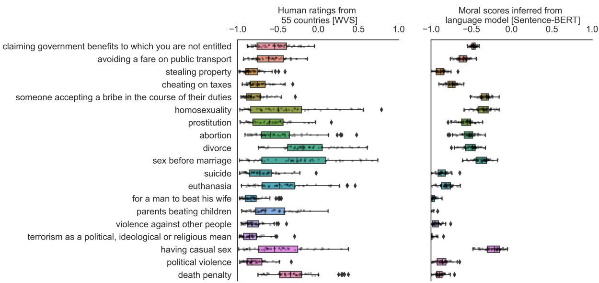  
Figure 1: Comparison of human-rated and machine-scored moral norms across cultures. Left: Boxplots of human ratings of moral norms across countries in the World Values Survey (WVS) (Haerpfer et al., 2021). Each dot represents the empirical average of participants’ ratings for a morally relevant topic (e.g., “abortion”) within a country. Right: Corresponding moral scores estimated by a language model (Sentence-BERT) (Reimers and Gurevych, 2019). Each dot represents the moral score obtained by probing the language model in a given country.

English-based moral knowledge, such knowledge might entail potential (implicit) biases toward non-English speaking cultures. For example, an EPLM might infer a situation to be morally justifiable (e.g., “political violence”) in a non-English speaking culture (because these events tend to associate with non-English speaking cultures in corpora) and thus generate misleading representations of that community.

Here we probe state-of-the-art EPLMs trained on large English-based datasets. Using EPLMs also supports a scalable analysis of 55 countries, which goes beyond existing work focusing on a small set of high-resource languages from mPLMs and monolingual PLMs. We take the moral norms reported in different countries to be a proxy of cultural moral norms and consider two main levels of analysis to address the following questions:

• Level 1: Do EPLMs encode moral knowledge that mirrors the moral norms in different countries? For example, “getting a divorce” can be a morally frowned-upon topic in country i, but morally acceptable in country j.

• Level 2: Can EPLMs infer the cultural diversity and shared tendencies in moral judgment of different topics? For example, people across nations might agree that doing X is morally wrong while disagreeing in their

## moral judgment toward Y.

We probe EPLMs using two publicly available global surveys of morality, World Values Survey wave 7 (Haerpfer et al., 2021) 1 (WVS) and PEW Global Attitudes survey (PEW) (Research Center, 2014) 2. For example, according to WVS survey (illustrated in Figure 1), people in different cultures hold disparate views on whether “having casual sex” is morally acceptable. In contrast, they tend to agree more about the immorality of “violence against other people”. Our level 1 analysis allows us to probe the fine-grained cultural moral knowledge in EPLMs, and our level 2 analysis investigates the EPLMs’ knowledge about shared “universals” and variability across cultures in moral judgment. Following previous work (Arora et al., 2022) and considering the current scale of global moral surveys, we use country as a proxy to culture, although this approach is not fully representative of all the different cultures within a country.

We also explore the utility-bias trade-off in encoding the knowledge of cultural moral norms in EPLMs through a fine-tuning approach. With this approach it may be possible to enhance the moral knowledge of EPLMs in a multicultural setting. We examine how this approach might reduce the ability of EPLMs to infer English-based moral norms and discuss how it might induce cultural biases.

## 2 Related work

## 2.1 Automated moral inference in NLP

Large language models have been utilized to make automated moral inference from text. Trager et al. (2022) used an annotated dataset to finetune language models to predict the moral foundations (Graham et al., 2013) expressed in Reddit comments. Many other textual datasets and methods have been proposed for fine-tuning LMs for moral norm generation, reasoning, and adaptation (Forbes et al., 2020; Emelin et al., 2021; Hendrycks et al., 2021; Ammanabrolu et al., 2022; Liu et al., 2022; Lourie et al., 2021; Jiang et al., 2021). Schramowski et al. (2022) proposed a method to estimate moral values and found EPLMs to capture human-like moral judgment even without fine-tuning. They identified a MORALDIRECTION using the semantic space of Sentence-BERT (Reimers and Gurevych, 2019) (SBERT) that corresponds to values of right and wrong. The semantic representations of different actions (e.g., killing people) would then be projected in this direction for moral judgment estimation. However, this method assumed a homogeneous set of moral norms, so it did not examine cultural diversity in moral norms.

## 2.2 Language model probing

Probing has been used to study knowledge captured in language models. Petroni et al. (2019) proposed a methodology to explore the factual information that language models store in their weights. Similar probing techniques have been proposed to identify harmful biases captured by PLMs. Ousidhoum et al. (2021) probed PLMs to identify toxic contents that they generate toward people of different communities. Nadeem et al. (2021) took a similar approach and introduced Context Association Tests to measure the stereotypical biases in PLMs, Yin et al. (2022) used probing to evaluate mPLMs on geo-diverse commonsense knowledge, and Touileb et al. (2022) developed probing templates to investigate the occupational gender biases in multilingual and Norwegian language models. Related to our work, Arora et al. (2022) used cross-cultural surveys to generate prompts for evaluating mPLMs in 13 languages. For each country and category (e.g.,

Ethical Values) in the surveys, they take an average of participants’ responses to different questions in the category and show that mPLMs do not correlate with the cultural values of the countries speaking these languages. Differing from that study, we assess finer-grained prediction of EPLMs on people’s responses to individual survey questions. More recently, Dillion et al. (2023) prompted GPT-3.5 (Brown et al., 2020) with human judgments in different moral scenarios and found striking correlation between the model outputs and the human judgments. Similar to Schramowski et al. (2022), this work also used a homogeneous set of moral ratings which represented English-based and Western cultures.

## 3 Methodology for inferring cultural moral norms

We develop a method for fine-grained moral norm inference across cultures. This method allows us to probe EPLMs with topic-country pairs, such as “getting a divorce in [Country]”.3 We build this method from the baseline method proposed by Schramowski et al. (2022) for homogeneous moral inference, where we probe EPLM’s moral knowledge about a topic without incorporating the cultural factor (i.e., the country names). Similar to that work, we use SBERT through bert-large-nli-mean-tokens sentence transformer model and use topic and topic-country pairs as our prompts.4 This model is built on top of the BERT model, which is pre-trained on BOOKSCORPUS (Zhu et al., 2015) and Wikipedia.

## 3.1 Autoregressive EPLMs

Since the MORALDIRECTION is constructed from the semantic space of the BERT-based EPLMs (Schramowski et al., 2022), we develop a novel approach to probe autoregressive state-ofthe-art EPLMs, GPT2 (Radford et al., 2019) and GPT3 (Brown et al., 2020). For each topic or topiccountry pair, we construct the input s as “In [Country] [Topic]”. We then append a pair of opposing moral judgments to s and represent them formally as $( s ^ { + } , s ^ { - } )$ . For example, for $s = { } ^ { \circ } \operatorname { I n }$ [Country] getting a divorce”, and (always justifiable, never justifiable) as the moral judgment pair, s+ and s− would be “In [Country] getting a divorce is always justifiable” and “In [Country] getting a divorce is never justifiable” respectively.5 To make our probing robust to the choice of moral judgments, we use a set of $K = 5$ prompt pairs (i.e.,{(always justifiable, neverjustifiable), (morally good, morally bad), (right, wrong), (ethically right, ethically wrong), (ethical, unethical)}), and refer to appended input pairs as $( s _ { i } ^ { + } , s _ { i } ^ { - } )$ where $i \in [ K ]$ Since GPT2 and GPT3 are composed of decoder blocks in the transformer architecture (Vaswani et al., 2017), we use the probabilities of the last token in $s _ { i } ^ { + }$ , and $s _ { i } ^ { - }$ as a moral score for each. The moral score of the pair $( s _ { i } ^ { + } , s _ { i } ^ { - } )$ is the difference between the log probabilities of its positive and negative statements.

$$
M S ( s _ { i } ^ { + } , s _ { i } ^ { - } ) = \log \frac { P ( s _ { i T } ^ { + } | s _ { i < T } ^ { + } ) } { P ( s _ { i T } ^ { - } | s _ { i < T } ^ { - } ) }\tag{1}
$$

Here $s _ { i T } ^ { + }$ and $s _ { i T } ^ { - }$ are the last tokens in $s _ { i } ^ { + }$ and $s _ { i } ^ { - }$ respectively, and their probabilities can be estimated by the softmax layer in autoregressive EPLMs.

We take an average of the estimated moral scores for all K pair statements to compute the moral score of the input.

$$
M S ( s ) = \frac { 1 } { K } \sum _ { i = 1 } ^ { K } M S ( s _ { i } ^ { + } , s _ { i } ^ { - } )\tag{2}
$$

To construct the baseline, we compute the homogeneous moral score of a topic without specifying the country in the prompts. Using prompt pairs allows us to operationalize moral polarity: a positive moral score indicates that on average the EPLM is more likely to generate positive moral judgment for input s, compared to negative moral judgment.

We use GPT2 (117M parameters), GPT2- MEDIUM (345M parameters), GPT2-LARGE (774M parameters), and GPT3 (denoted as GPT3- PROBS, 175B parameters)6. GPT2 is trained on WEBTEXT, which is a dataset of webpages and contains very few non-English samples. Around 82% of the pre-training data for GPT3 comes from Common Crawl data and WEBTEXT2 (Kaplan et al., 2020), an extended version of WEBTEXT (Radford et al., 2019). Around 7% of the training corpus of GPT3 is non-English text. Considering such data shift from books and articles in BERT to webpages in GPT2 and GPT3 in astronomical sizes, it is interesting to observe how cultural moral norms would be captured by EPLMs trained on webpages, which cover a more heterogeneous set of contents and authors.

We also design multiple-choice question prompts to leverage the question-answering capabilities of GPT3 (denoted as GPT3-QA). Similar to the wording used in our ground-truth survey datasets, questions are followed by three options each describing a degree of moral acceptability. We repeat this question-answering process 5 times for each topic-country pair and take the average of the model responses. Table 2 in the Appendix shows our prompts for all models.

## 4 Datasets

We describe two open survey data that record moral norms across cultures over a variety of topics.

## 4.1 World Values Survey

The Ethical Values section in World Values Survey Wave 7 (WVS for short) is our primary dataset. This wave covers the span of 2017-2021 and is publicly available (Haerpfer et al., 2021). In the Ethical Values section, participants from 55 countries were surveyed regarding their opinions on 19 morally-related topics. The questionnaire was translated into the first languages spoken in each country and had multiple options. We normalized the options to range from 1 to 1, with 1 representing “never justifiable” and 1 “always justifiable”. The moral rating of each country on each topic (i.e., topic-country pair) would then be the average of the participant’s responses.

## 4.2 PEW 2013 global attitude survey

We use a secondary dataset from PEW Research Center (Research Center, 2014) based on a public survey in 2013 that studied global moral attitudes in 40 countries toward eight morally-related topics (PEW for short). 100 people from each country participated in the survey. The questions were asked in English and had three options representing “morally acceptable”, “not a moral issue”, and “morally unacceptable”. We normalized these ratings to be in the range of 1 to 1 and represented each topic-country pair by taking an expected value of all the responses.

## 4.3 Homogeneous moral norms

We also use the data from the global user study in Schramowski et al. (2022) which were collected via Amazon MTurk from English speakers. This dataset contains 234 participants’ aggregated ratings of moral norms used for identifying the MORALDIRECTION. Around half of the participants are from North America and Europe. We refer to this dataset as “Homogeneous norms” since it does not contain information about moral norms across cultures.

## 5 Evaluation and results

We evaluate EPLMs’ moral knowledge with respect to 1) homogeneous moral norms, 2) fine-grained moral norms across cultures, and 3) cultural diversities and shared tendencies on moral judgment of different topics.

## 5.1 Homogeneous moral norm inference

For homogeneous moral norm inference, we compute Pearson correlation between 1) the empirical homogeneous moral ratings, obtained by aggregating the human moral ratings toward a topic from all countries, and 2) language model inferred moral scores, estimated from our homogeneous probing method (i.e., without specifying country in prompts).

Figure 2 shows the results on World Values Survey $( n = 1 , 0 2 8 )$ , PEW survey $( n = 3 1 2 )$ , and the Homogeneous norms datasets $( n = 1 0 0 )$ . The high correlation of GPT2 and GPT3 moral scores with the Homogeneous norms dataset indicate that our methodology does indeed capture the embedded moral biases in these models, with similar performance to the method proposed by Schramowski et al. (2022) for SBERT $( r = 0 . 7 9 )$ , and higher for GPT3-PROBS $( r = 0 . 8 5 )$ . The moral norms in this dataset are typically more globally agreeable (e.g., You should not kill people) than topics in WVS and PEW. As expected, EPLMs are less correlated with WVS and PEW, since their moral biases are derived from pre-training on English and westernized data. Aggregated ratings in WVS and PEW, however, capture a more global view toward moral issues, which are also morally contentious (e.g., “getting a divorce”). Table 3 in Appendix includes the values for this experiment.

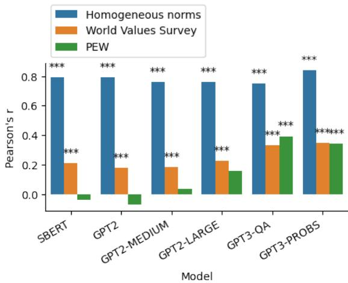  
Figure 2: Performance of EPLMs (without cultural prompts) on inferring 1) English moral norms, and 2) culturally diverse moral norms recorded in World Values Survey and PEW survey data. The asterisks indicate the significance levels (“\*”, “\*\*”, “\*\*\*” for p < 0.05, 0.01, 0.001 respectively).

## 5.2 Fine-grained cultural variation of moral norms toward different topics

Going beyond probing EPLMs for their general knowledge of moral norms, we assess whether they can accurately identify the moral norms of different cultures (level 1 analysis). Using our fine-grained probing approach described in Section 3, we compute Pearson correlation between EPLMs’ moral scores and the fine-grained moral ratings from the ground truth. Each sample pair in the correlation test corresponds to 1) the moral norms estimated by EPLMs for a country c and a topic t, and 2) the empirical average of moral ratings toward topic t from all the participants in the country c.

Figure 3 summarizes the results for SBERT, GPT2-LARGE, and GPT3-PROBS models, and the rest of the models are shown in Figure 7 in the Appendix. To facilitate direct comparison, the estimated moral scores are normalized to a range of 1 to 1, where 1, 0, and 1 indicate morally negative, morally neutral, and morally positive norms, respectively. GPT3-QA and GPT3-PROBS both show a relatively high correlation with the cultural variations of moral norms $( r = 0 . 3 5 2 , r = 0 . 4 1 1$ $p < 0 . 0 0 1$ , for both), and GPT2-LARGE achieves a correlation of $r = 0 . 2 0 7 \ : ( p < 0 . 0 0 1 )$ in WVS where $n \ = \ 1 , 0 2 8$ The correlations are relatively better for PEW $( n = 3 1 2 )$ with $r = 0 . 6 5 7$ $r = 0 . 5 0 3$ , and r = 0.468 for GPT3-QA, GPT3- PROBS and GPT2-LARGE respectively. These results show that EPLMs have captured some knowledge about the moral norms of different cultures, but with much less accuracy (especially for GPT2 and SBERT) compared to their inference of English moral norms shown in the previous analysis.

In addition, we check whether GPT3’s high correlation with PEW is because it has seen and memorized the empirical data. Our investigation shows that GPT3 has seen the data during pre-training, as it can generate the sentences used on the survey website. However, the scores suggested by GPT3 text generation and the countries’ rankings based on their ratings are different from the ground truth data.

## 5.3 Culture clustering through fine-grained moral inference

EPLMs’ fine-grained knowledge of moral norms, inspected in the previous experiment, might be more accuracte for western cultures than other cultures. We investigate this claim by clustering countries based on 1) their Western-Eastern economic status (i.e., Rich West grouping)7, and 2) their continent (i.e., geographical grouping). We repeat the experiments in the previous section for different country groups. The results are shown in Figure 4. We also try sampling the same number of countries in each group. The results remain robust and are illustrated in Appendix-F.

Our findings indicate that EPLMs contain more knowledge about moral norms of the Rich West countries as opposed to non-western and non-rich countries. Similarly, EPLMs have captured a more accurate estimation of the moral norms in countries located in Oceania, North America, and Europe, as opposed to African, Asian, and South American countries. The empirical moral norm ratings from European countries in WVS are highly aligned with North American countries $( r = 0 . 9 3 8 )$ , which explains why their moral norms are inferred more accurately than non-English speaking countries.

Next, for each topic, we compare the z-scores of the empirical moral ratings with the z-scores of the GPT3-PROBS inferred moral scores, using Mann-Whitney U rank test. The results reveal that “abortion”, “suicide”, “euthanasia”, “for a man to beat his wife”, “parents beating children”, “having casual sex”, “political violence”, and “death penalty” in non-western and non-rich countries are all encoded as more morally appropriate than the actual data. Such misrepresentations of moral norms in these countries could lead to stereotypical content generation. We also find that For Rich West countries, “homosexuality”, “divorce”, and “sex before marriage” are encoded as more morally inappropriate than the ground truth, $( p \ < 0 . 0 0 1$ for all, Bonferroni corrected). Such underlying moral biases, specifically toward “homosexuality” might stimulate the generation of harmful content and stigmatization of members of LGBTQ+, which has been reported in BERT-based EPLMs (Nozza et al., 2022). The results for the rest of the models are similar and are shown in Table 6 in the Appendix.

Our method of clustering countries is simplistic and may overlook things such as the significant diversity in religious beliefs within the Non-Rich-West category, and thus it does not reflect the nuanced biases that models may possess when it comes to moral norms influenced by different religious traditions. Nonetheless, our approach still serves as a valuable starting point for studying EPLM’s moral biases towards more fine-grained religious and ethnic communities.

## 5.4 Cultural diversities and shared tendencies over the morality of different topics

We next investigate whether EPLMs have captured the cultural diversities and shared tendencies over the morality of different topics (level 2 analysis). For example, people across cultures tend to disagree more about “divorce” than about “violence against other people” as depicted in Figure 1. Such cultural diversities for each topic can be measured by taking the standard deviation of the empirical moral ratings across different countries. The EPLMs’ inferred cultural diversities can similarly be measured by taking the standard deviation of the estimated fine-grained moral scores for different countries. We then quantify the alignment between the two using Pearson correlation.

Figure 5 shows the results for SBERT, GPT2- LARGE, GPT3-PROBS, and the rest are shown in Figure 8 in the Appendix. None of the correlations with the PEW survey were significant. For WVS, SBERT, GPT2 and GPT2-MEDIUM exhibited a significant correlation $( p < 0 . 0 0 1 )$ with $r = 0 . 6 1 8 , r = 0 . 5 7 9$ , and $r = 0 . 7 3 4$ respectively. The results for GPT3 are insignificant, suggesting that it is more challenging to correctly estimate cultural controversies of topics for GPT3. For example, stealing property is incorrectly estimated to be more controversial than abortion.

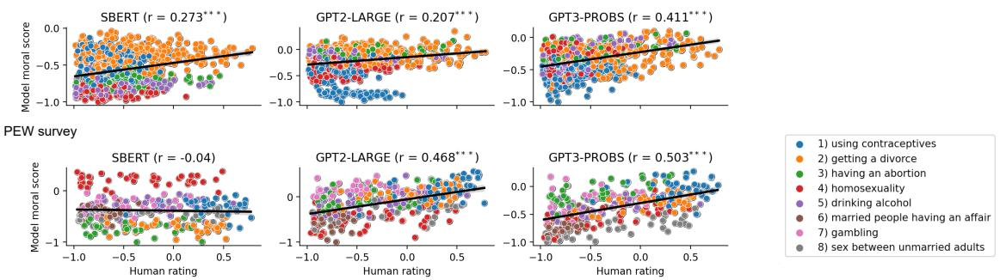  
Figure 3: Degree of alignment between the moral scores from EPLMs and fine-grained empirical moral ratings for different topics across countries taken from the World Values Survey (top) and PEW survey (bottom). Each dot represents a topic-country pair. The x-axis shows the fine-grained moral ratings from the ground truth and the y-axis shows the corresponding inferred moral scores. The legends display the moral topics in the surveys. Similar topics in the World Value Surveys are shown with the same color.

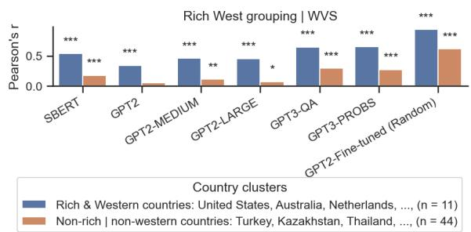

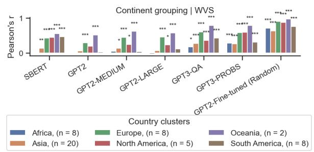  
Figure 4: Correlation between language-model inferred moral scores and empirical moral ratings from World Values Survey, analyzed in different clusters of countries in Rich West grouping (left) and continent grouping (right). The asterisks indicate the significance levels (“\*”, “\*\*”, “\*\*\*” for p < 0.05, 0.01, 0.001 respectively).

## 6 Fine-tuning language models on global surveys

Finally, we explore the utility-bias trade-off in encoding cultural moral knowledge into EPLMs by fine-tuning them on cross-cultural surveys. The utility comes from increasing the cultural moral knowledge in these models, and the bias denotes their decreased ability to infer English moral norms, in addition to the cultural moral biases introduced to the model. We run our experiments on GPT2, which our results suggest having captured minimum information about cultural moral norms compared to other autoregressive models.

To fine-tune the model, for each participant from [Country] with [Moral rating] toward [Topic], we designed a prompt with the structure “A person in [Country] believes [Topic] is [Moral rating].”. We used the surveys’ wordings for [Moral rating]. Table 8 in the Appendix shows our prompts for WVS and PEW. These prompts constructed our data for fine-tuning, during which we maximize the probability of the next token. The fine-tuned models were evaluated on the same correlation tests introduced in the previous Sections 5.2, 5.3, and 5.4.

The fine-tuning data was partitioned into training and evaluation sets using different strategies (i.e., Random, Country-based, and Topic-based). For the Random strategy, we randomly selected 80% of the fine-tuning data for training the model. The topiccountry pairs not seen in the training data composed the evaluation set. For our Country-based and Topic-based strategies, we randomly removed 20% of the countries (n = 11 for WVS, n = 8 for PEW) and topics (n = 4 for WVS, n = 2 for PEW) from the training data to compose the evaluation set. See Appendix G for the total number of samples.

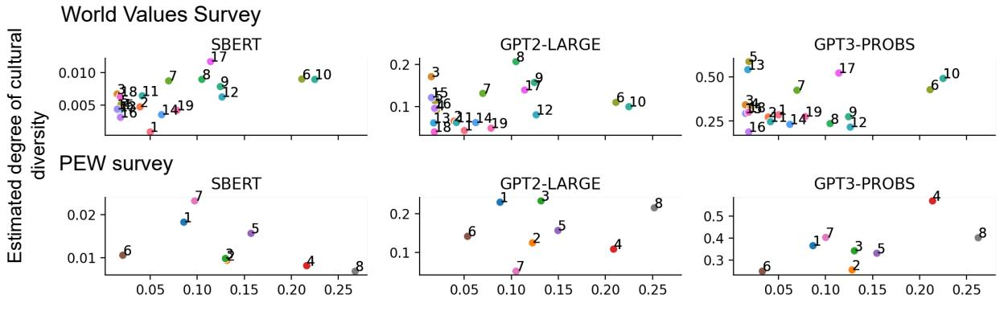  
Empirical degree of cultural diversity

Figure 5: Comparison between the degrees of cultural diversities and shared tendencies in the empirical moral ratings and language-model inferred moral scores. Each dot corresponds to a moral topic. The numerical indices are consistent with the legend indices in Table 5. The x-axis shows the empirical standard deviations in moral ratings across countries and the y-axis shows the standard deviations from the model-inferred moral scores.
<table><tr><td>Train data</td><td>Data partition strategy</td><td colspan="2">Evaluation</td><td colspan="2">Performance on the Homogeneous norms</td></tr><tr><td rowspan="2">WVS</td><td>Random</td><td> $\overline { { { \bf 0 . 8 3 2 } ^ { \ast \ast \ast } } }$  ↑</td><td> $\overline { { ( 0 . 2 7 1 ^ { * * * } ) } }$ </td><td> $\overline { { 0 . 7 1 ^ { * * * } \downarrow } }$ </td><td rowspan="4"> $( 0 . 8 0 ^ { * * * } )$ </td></tr><tr><td>Country-based</td><td> $0 . 7 5 9 ^ { \ast \ast \ast } \uparrow$ </td><td> $( 0 . 2 2 5 ^ { * * } )$ </td><td> $0 . 7 2 ^ { \ast \ast \ast } \downarrow$ </td></tr><tr><td rowspan="2"></td><td>Topic-based</td><td> $0 . 5 0 8 ^ { * * * } \uparrow$ </td><td> $( 0 . 2 8 6 ^ { * * * } )$ </td><td> $0 . 7 0 ^ { * * * }$ </td></tr><tr><td>Random</td><td> $\overline { { { \bf 0 . 8 1 8 ^ { * * * } } \mathrm { \uparrow } } }$ </td><td>(0.204, n.s.)</td><td> $\overline { { 0 . 6 4 ^ { * * * } \downarrow } }$ </td></tr><tr><td rowspan="2">PEW</td><td>Country-based</td><td> $0 . 7 6 4 ^ { * * * } \uparrow$ </td><td> $( 0 . 0 5 5 , \mathrm { n . s . } )$ </td><td> $0 . 6 7 ^ { * * * } \downarrow$ </td><td rowspan="2"></td></tr><tr><td>Topic-based</td><td> $0 . 7 3 3 ^ { \ast \ast \ast } \uparrow$ </td><td> $( - 0 . 1 4 6 , \mathrm { n . s . } )$ </td><td> $0 . 6 1 ^ { \ast \ast \ast } \downarrow$ </td></tr></table>

Table 1: Summary of fine-tuned GPT2 language model performance on inferring moral norms across cultures and the degradation of its performance on inferring Homogeneous moral norms. Values in parentheses show the performance before fine-tuning. The arrows and colors show performance increase (blue, ) and decrease (red, ) after fine-tuning. The asterisks indicate the significance levels (“\*”, “\*\*”, “\*\*\*” for $p < 0 . 0 5 , 0 . 0 1 , 0 . 0 0 1 )$ .

Table 1 shows the gained utilities, that is the correlation test results between the fine-grained moral scores inferred by the fine-tuned models and the empirical fine-grained moral ratings. All fine-tuned models align better with the ground truth than the pre-trained-only models (i.e., the values in parentheses). For both WVS and PEW, the Random strategy is indeed the best as each country and topic are seen in the training data at least once (but may not appear together as a pair). The fine-tuned models can also generalize their moral scores to unseen countries and topics. Repeating the experiment in Section 5.4 also shows substantial improvement in identifying cultural diversities of different topics by all fine-tuned models. For example, the WVS and PEW-trained models with Random strategy gain Pearson’s r values of 0.893, and 0.944 respectively. The results for the rest of the models are shown in Table 7 in the Appendix.

Nevertheless, the bias introduced during the fine-tuning decreases the performance on the Homogeneous norms dataset. This observation displays a trade-off between cultural and homogeneous moral representations in language models. Moreover, injecting the cross-cultural surveys into EPLMs might introduce additional social biases to the model that are captured through these surveys (Joseph and Morgan, 2020).

In addition, we probe the best fine-tuned model (i.e., WVS with Random strategy) on its ability to capture the moral norms of non-western cultures by repeating the experiment in Section 5.3. The results in Figure 4 show that the fine-tuned GPT2 performs the best for all country groups. There is still a gap between western and non-western countries. However, basic fine-tuning proves to be effective in adapting EPLMs to the ground truth.

## 7 Discussion and conclusion

We investigated whether English pre-trained language models contain knowledge about moral norms across many different cultures. Our analyses show that large EPLMs capture moral norm variation to a certain degree, with the inferred norms being predominantly more accurate in western cultures than non-western cultures. Our fine-tuning analysis further suggests that EPLMs’ cultural moral knowledge can be improved using global surveys of moral norms, although this strategy reduces the capacity to estimate the English moral norms and potentially introduces new biases into the model. Given the increasing use of EPLMs in multicultural environments, our work highlights the importance of cultural diversity in automated inference of moral norms. Even when an action such as “political violence” is assessed by an EPLM as morally inappropriate in a homogeneous setting, the same issue may be inferred as morally appropriate for underrepresented cultures in these large language models. Future work can explore alternative and richer representations of cultural moral norms that go beyond the point estimation we presented here and investigate how those representations might better capture culturally diverse moral views.

## Limitations

Although our datasets are publicly available and gathered from participants in different countries, they cannot entirely represent the moral norms from all the individuals in different cultures over the world or predict how moral norms might change into the future (Bloom, 2010; Bicchieri, 2005). Additionally, we examine a limited set of moral issues for each country, therefore the current experiments should not be regarded as comprehensive of the space of moral issues that people might encounter in different countries.

Moreover, taking the average of moral ratings for each culture is a limitation of our work and reduces the natural distribution of moral values in a culture to a single point (Talat et al., 2021). Implementing a framework that incorporates both within-country variation and temporal moral variation (Xie et al., 2019) is a potential future research direction.

Currently, it is not clear whether the difference between EPLMs’ estimated moral norms and the empirical moral ratings is due to the lack of cultural moral norms in the pre-training data, or that the cultural moral norms mentioned in the pre-training data represent the perspective of an English-speaking person of another country. For example, a person from the United States could write about the moral norms in another country from a western perspective. A person from a nonwestern country could also write about their own moral views using English. These two cases have different implications and introduce different moral biases into the system.

## Potential risks

We believe that the language models should not be used to prescribe ethics, and here we approach the moral norm inference problem from a descriptive perspective. However, we acknowledge modifying prompts could lead language models to generate ethical prescriptions for different cultures. Additionally, our fine-tuning approach could be exploited to implant cultural stereotypical biases into these models.

Many topics shown in this work might be sensitive to some people yet more tolerable to some other people. Throughout the paper, we tried to emphasize that none of the moral norms, coming from either the models’ estimation or the empirical data, should be regarded as definitive values of right and wrong, and the moral judgments analyzed in this work do not reflect the opinions of the authors.

## Acknowledgements

This work was supported by a SSHRC Insight Grant 435190272.

## References

Abubakar Abid, Maheen Farooqi, and James Zou. 2021. Persistent anti-muslim bias in large language models. In Proceedings of the 2021 AAAI/ACM Conference on AI, Ethics, and Society, AIES ’21, page 298–306, New York, NY, USA. Association for Computing Machinery.

Prithviraj Ammanabrolu, Liwei Jiang, Maarten Sap, Hannaneh Hajishirzi, and Yejin Choi. 2022. Aligning to social norms and values in interactive narratives. In Proceedings of the 2022 Conference of the North American Chapter ofthe Associationfor Computational Linguistics: Human Language Technologies, pages 5994–6017, Seattle, United States. Association for Computational Linguistics.

Arnav Arora, Lucie-Aimée Kaffee, and Isabelle Augenstein. 2022. Probing Pre-Trained Language Models for Cross-Cultural Differences in Values. arXiv preprint arXiv:2203.13722.

Mohammad Atari, Jonathan Haidt, Jesse Graham, Sena Koleva, Sean Stevens, and Morteza Dehghani. 2022. Morality Beyond the WEIRD: How the Nomological Network of Morality Varies Across Cultures.

Edmond Awad, Sohan Dsouza, Richard Kim, Jonathan Schulz, Joseph Henrich, Azim Shariff, Jean-François Bonnefon, and Iyad Rahwan. 2018. The Moral Machine experiment. Nature, 563(7729):59– 64.

Edmond Awad, Sohan Dsouza, Azim Shariff, Iyad Rahwan, and Jean-François Bonnefon. 2020. Universals and variations in moral decisions made in 42 countries by 70,000 participants. Proceedings of the National Academy ofSciences, 117(5):2332–2337.

Cristina Bicchieri. 2005. The grammar ofsociety: The nature and dynamics of social norms. Cambridge University Press.

Paul Bloom. 2010. How do morals change? Nature, 464(7288):490–490.

Tom Brown, Benjamin Mann, Nick Ryder, Melanie Subbiah, Jared D Kaplan, Prafulla Dhariwal, Arvind Neelakantan, Pranav Shyam, Girish Sastry, Amanda Askell, et al. 2020. Language models are few-shot learners. Advances in neural information processing systems, 33:1877–1901.

Jacob Devlin, Ming-Wei Chang, Kenton Lee, and Kristina Toutanova. 2018. Bert: Pre-training of deep bidirectional transformers for language understanding. arXiv preprint arXiv:1810.04805.

Danica Dillion, Niket Tandon, Yuling Gu, and Kurt Gray. 2023. Can ai language models replace human participants? Trends in Cognitive Sciences.

Denis Emelin, Ronan Le Bras, Jena D. Hwang, Maxwell Forbes, and Yejin Choi. 2021. Moral stories: Situated reasoning about norms, intents, actions, and their consequences. In Proceedings of

the 2021 Conference on Empirical Methods in Natural Language Processing, pages 698–718, Online and Punta Cana, Dominican Republic. Association for Computational Linguistics.

Maxwell Forbes, Jena D. Hwang, Vered Shwartz, Maarten Sap, and Yejin Choi. 2020. Social Chemistry 101: Learning to Reason about Social and Moral Norms. In Proceedings of the 2020 Conference on Empirical Methods in Natural Language Processing (EMNLP), pages 653–670, Online. Association for Computational Linguistics.

Jesse Graham, Jonathan Haidt, Sena Koleva, Matt Motyl, Ravi Iyer, Sean P Wojcik, and Peter H Ditto. 2013. Moral Foundations Theory: The Pragmatic Validity of Moral Pluralism. In Advances in Experimental Social Psychology, volume 47, pages 55–130. Elsevier.

Christian Haerpfer, Ronald Inglehart, Alejandro Moreno, Christian Welzel, Kseniya Kizilova, Jaime Diez-Medrano, Marta Lagos, Pippa Norris, E Ponarin, and B Puranen. 2021. World Values Survey: Round Seven – Country-Pooled Datafile. Madrid, Spain & Vienna, Austria: JD Systems Institute & WVSA Secretariat. Data File Version, 2(0).

Jonathan Haidt, Silvia Helena Koller, and Maria G Dias. 1993. Affect, culture, and morality, or is it wrong to eat your dog? Journal ofpersonality and social psychology, 65(4):613.

Katharina Hämmerl, Björn Deiseroth, Patrick Schramowski, Jindˇrich Libovicky, Alexander\` Fraser, and Kristian Kersting. 2022. Do Multilingual Language Models Capture Differing Moral Norms? arXiv preprint arXiv:2203.09904.

Dan Hendrycks, Collin Burns, Steven Basart, Andrew Critch, Jerry Li, Dawn Song, and Jacob Steinhardt. 2021. Aligning AI With Shared Human Values. In International Conference on Learning Representations.

Kathryn Iurino and Gerard Saucier. 2020. Testing measurement invariance of the Moral Foundations Questionnaire across 27 countries. Assessment, 27(2):365–372.

Liwei Jiang, Jena D. Hwang, Chandrasekhar Bhagavatula, Ronan Le Bras, Maxwell Forbes, Jon Borchardt, Jenny Liang, Oren Etzioni, Maarten Sap, and Yejin Choi. 2021. Delphi: Towards Machine Ethics and Norms. ArXiv, abs/2110.07574.

Kenneth Joseph and Jonathan Morgan. 2020. When do word embeddings accurately reflect surveys on our beliefs about people? In Proceedings ofthe 58th Annual Meeting of the Association for Computational Linguistics, pages 4392–4415, Online. Association for Computational Linguistics.

Jared Kaplan, Sam McCandlish, Tom Henighan, Tom B Brown, Benjamin Chess, Rewon Child, Scott Gray, Alec Radford, Jeffrey Wu, and Dario Amodei.

2020. Scaling laws for neural language models. arXiv preprint arXiv:2001.08361.

Ruibo Liu, Ge Zhang, Xinyu Feng, and Soroush Vosoughi. 2022. Aligning Generative Language Models with Human Values. In Findings of the Association for Computational Linguistics: NAACL 2022, pages 241–252.

Yinhan Liu, Myle Ott, Naman Goyal, Jingfei Du, Mandar Joshi, Danqi Chen, Omer Levy, Mike Lewis, Luke Zettlemoyer, and Veselin Stoyanov. 2019. Roberta: A robustly optimized bert pretraining approach. arXiv preprint arXiv:1907.11692.

Nicholas Lourie, Ronan Le Bras, and Yejin Choi. 2021. Scruples: A corpus of community ethical judgments on 32,000 real-life anecdotes. In Proceedings of the AAAI Conference on Artificial Intelligence, volume 35, pages 13470–13479.

Moin Nadeem, Anna Bethke, and Siva Reddy. 2021. StereoSet: Measuring stereotypical bias in pretrained language models. In Proceedings of the 59th Annual Meeting of the Association for Computational Linguistics and the 11th International Joint Conference on Natural Language Processing (Volume 1: Long Papers), pages 5356–5371, Online. Association for Computational Linguistics.

Debora Nozza, Federico Bianchi, and Dirk Hovy. 2021. HONEST: Measuring hurtful sentence completion in language models. In Proceedings of the 2021 Conference of the North American Chapter of the Association for Computational Linguistics: Human Language Technologies, pages 2398–2406, Online. Association for Computational Linguistics.

Debora Nozza, Federico Bianchi, Anne Lauscher, and Dirk Hovy. 2022. Measuring harmful sentence completion in language models for LGBTQIA+ individuals. In Proceedings ofthe Second Workshop on Language Technology for Equality, Diversity and Inclusion, pages 26–34, Dublin, Ireland. Association for Computational Linguistics.

Nedjma Ousidhoum, Xinran Zhao, Tianqing Fang, Yangqiu Song, and Dit-Yan Yeung. 2021. Probing toxic content in large pre-trained language models. In Proceedings of the 59th Annual Meeting of the Association for Computational Linguistics and the 11th International Joint Conference on Natural Language Processing (Volume 1: Long Papers), pages 4262–4274, Online. Association for Computational Linguistics.

Fabio Petroni, Tim Rocktäschel, Sebastian Riedel, Patrick Lewis, Anton Bakhtin, Yuxiang Wu, and Alexander Miller. 2019. Language models as knowledge bases? In Proceedings of the 2019 Conference on Empirical Methods in Natural Language Processing and the 9th International Joint Conference on Natural Language Processing (EMNLP-IJCNLP), pages 2463–2473, Hong Kong, China. Association for Computational Linguistics.

Alec Radford, Jeffrey Wu, Rewon Child, David Luan, Dario Amodei, Ilya Sutskever, et al. 2019. Language models are unsupervised multitask learners. OpenAI blog, 1(8):9.

Nils Reimers and Iryna Gurevych. 2019. Sentence-BERT: Sentence Embeddings using Siamese BERT-Networks. In Proceedings of the 2019 Conference on Empirical Methods in Natural Language Processing. Association for Computational Linguistics.

PEW Research Center. 2014. Global Attitudes survey. Washington, D.C.

Maarten Sap, Saadia Gabriel, Lianhui Qin, Dan Jurafsky, Noah A. Smith, and Yejin Choi. 2020. Social bias frames: Reasoning about social and power implications of language. In Proceedings of the 58th Annual Meeting of the Association for Computational Linguistics, pages 5477–5490, Online. Association for Computational Linguistics.

Patrick Schramowski, Cigdem Turan, Nico Andersen, Constantin A Rothkopf, and Kristian Kersting. 2022. Large pre-trained language models contain humanlike biases of what is right and wrong to do. Nature Machine Intelligence, 4(3):258–268.

Zeerak Talat, Hagen Blix, Josef Valvoda, Maya Indira Ganesh, Ryan Cotterell, and Adina Williams. 2021. A Word on Machine Ethics: A Response to Jiang et al.(2021). arXiv preprint arXiv:2111.04158.

Samia Touileb, Lilja Øvrelid, and Erik Velldal. 2022. Occupational biases in Norwegian and multilingual language models. In Proceedings of the 4th Workshop on Gender Bias in Natural Language Processing (GeBNLP), pages 200–211, Seattle, Washington. Association for Computational Linguistics.

Jackson Trager, Alireza S Ziabari, Aida Mostafazadeh Davani, Preni Golazazian, Farzan Karimi-Malekabadi, Ali Omrani, Zhihe Li, Brendan Kennedy, Nils Karl Reimer, Melissa Reyes, et al. 2022. The Moral Foundations Reddit Corpus. arXiv preprint arXiv:2208.05545.

Ashish Vaswani, Noam Shazeer, Niki Parmar, Jakob Uszkoreit, Llion Jones, Aidan N. Gomez, Łukasz Kaiser, and Illia Polosukhin. 2017. Attention is all you need. NIPS’17, page 6000–6010, Red Hook, NY, USA. Curran Associates Inc.

Jing Yi Xie, Renato Ferreira Pinto Junior, Graeme Hirst, and Yang Xu. 2019. Text-based inference of moral sentiment change. In Proceedings of the 2019 Conference on Empirical Methods in Natural Language Processing and the 9th International Joint Conference on Natural Language Processing (EMNLP-IJCNLP), pages 4654–4663, Hong Kong, China. Association for Computational Linguistics.

Da Yin, Hritik Bansal, Masoud Monajatipoor, Liunian Harold Li, and Kai-Wei Chang. 2022. Geomlama: Geo-diverse commonsense probing on multilingual pre-trained language models. arXiv preprint arXiv:2205.12247.

Yukun Zhu, Ryan Kiros, Richard S. Zemel, Ruslan Salakhutdinov, Raquel Urtasun, Antonio Torralba, and Sanja Fidler. 2015. Aligning Books and Movies: Towards Story-like Visual Explanations by Watching Movies and Reading Books. CoRR, abs/1506.06724.

## A Data license

Both World Values Survey and PEW survey are publicly available to use for research purposes. We accept and follow the terms and conditions for using these datasets, which can be found in https://www.worldvaluessurvey. org/WVSContents.jsp?CMSID=Documentation, and https://www.pewresearch.org/about/ terms-and-conditions/.

## B Comparison of human-rated and machine-scored moral norms

Figure 6 shows the comparison between humanrated moral norms in PEW, and the moral scores inferred by SBERT (Reimers and Gurevych, 2019).

## C Probing experiments

Table 2 shows our prompt design for probing finegrained moral norms in EPLMs. As mentioned in the main text, we repeat our probing experiment for GPT2 models and GPT3-PROBS with another template “People in [Country] believe [Topic] is [Moral Judgment]”. The results are substantially worse than our initial template, suggesting that extracting the moral knowledge in language models is sensitive to the wording used in the input. The results for the fine-grained analysis (level 1 analysis) and the cultural diversities and shared tendencies (level 2 analysis) with this template are shown in Table 4.

In all experiments, we used a single NVIDIA TITAN V GPU. Each probing experiment took approximately 1 hour to complete.

## D Homogeneous moral norm inference

Table 3 shows the detailed values of the correlation tests in our homogeneous moral norm inference experiment.

## E Fine-grained cultural variation of moral norm

Figure 7 and Figure 8 show the result of our finegrained cultural moral inference, and inference of cultural diversities and shared tendencies respectively for GPT2, GPT2-MEDIUM, and GPT3- QA. The numerical indices in Figure 8 are consistent with the indices in Table 5.

## F Sampling for cultural clusters

Since in section 5.3 there are a different number of countries in each group, we redo the experiment by randomly sampling the same number of countries (n = 11 for Rich West grouping, n = 5 for continent grouping) and repeating the sampling process for 50 times. The results and the general pattern remain the same and are depicted in Figure 9.

## G Details of fine-tuning on global surveys

Table 8 shows the Moral rating in our prompt design for constructing our fine-tuning dataset. For example, The World Value Survey represents the two ends of the ratings scale where 1 is “Never justifiable” and 10 is “Always justifiable”. The options in between are presented to the participants in a 10-point scale. Therefore, we mapped these options to different prompts that are semantically similar and in between the two ends. For example, if a participant from the United States rated stealing property as 2, which is slightly more positive than the first option (“Never justifiable”), we mapped this rating to “not justifiable”, creating the prompt “A person in the United States believes stealing property is not justifiable.” for our fine-tuning data.

Since there are a different number of participants from each country, in order to balance this dataset, we randomly select 100 samples for each topiccountry pair and removed the rest of the utterances from the training data. We fine-tuned GPT2 on one epoch, with a batch size of 8, learning rate of 5e 5, and weight decay of 0.01. The number of training and evaluation samples for all data partition strategies are shown in Table 9. In all experiments, we used a single NVIDIA TITAN V GPU. Fine-tuning and evaluation took approximately 2 hours to complete for each model.

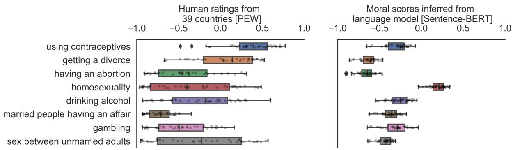  
Figure 6: Comparison of human-rated and machine-scored moral norms across cultures. Left: Boxplots of human ratings of moral norms across cultures in the PEW survey. Each dot represents the empirical average of participants ratings for a morally relevant topic (e.g., “having an abortion”) within a country. Right: Corresponding moral scores estimated by a language model (Sentence-BERT) (Reimers and Gurevych, 2019). Each dot represents the moral score obtained by probing the language model in a given country.

<table><tr><td rowspan=1 colspan=1>Model</td><td rowspan=1 colspan=1>Prompt</td></tr><tr><td rowspan=1 colspan=1>Sentence-BERT</td><td rowspan=1 colspan=1>[Topic] in [Country].</td></tr><tr><td rowspan=2 colspan=1>GPT2 models and GPT3-PROBS</td><td rowspan=1 colspan=1>In [Country] [Topic] is [Moral judgement].</td></tr><tr><td rowspan=1 colspan=1>People in [Country] believe [Topic] is [Moral judgement].</td></tr><tr><td rowspan=1 colspan=1>GPT3-QA (for PEW)</td><td rowspan=1 colspan=1>Do people in [Country] believe that [Topic] is:1)Morally acceptable2) Not a moral issue3) Morally unacceptable.</td></tr><tr><td rowspan=1 colspan=1>GPT3-QA (for WVS)</td><td rowspan=1 colspan=1>Do people in [Country] believe that [Topic] is:1) Always Justifiable2) Something in between3) Never justifiable.</td></tr></table>

Table 2: Prompting design used for estimating the fine-grained moral norms in different language models. In our homogeneous norm inference, we remove “In [country]” from the prompts.

<table><tr><td>Model</td><td>World Values Survey (n = 1, 028)</td><td>PEW survey (n = 312)</td><td>Homogeneous norms (n = 100)</td></tr><tr><td>SBERT</td><td>0.210***</td><td>−0.038 (n.s.)</td><td> $\overline { { 0 . 7 9 ^ { * * * } } }$ </td></tr><tr><td>GPT2</td><td>0.176***</td><td>-0.069 (n.s.)</td><td> $0 . 8 0 ^ { * * * }$ </td></tr><tr><td>GPT2-MEDIUM</td><td> $0 . 1 8 1 ^ { * * * }$ </td><td>0.033 (n.s.)</td><td> $0 . 7 9 ^ { * * * }$ </td></tr><tr><td>GPT2-LARGE</td><td>0.226***</td><td>0.157 (n.s.)</td><td>0.76***</td></tr><tr><td>GPT3-QA</td><td>0.330***</td><td>0.391***</td><td>0.79***</td></tr><tr><td>GPT3-PROBS</td><td>0.346***</td><td>0.340***</td><td>0.85***</td></tr></table>

Table 3: Performance of pre-trained language models (without cultural prompts) on inferring 1) homogeneous westernized moral norms, and 2) culturally diverse moral norms recorded in World Values Survey and PEW survey data.

World Value Survey  
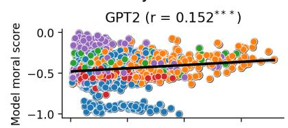

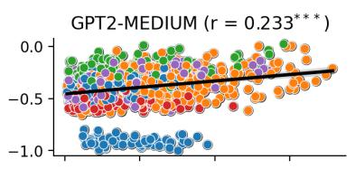  
PEW survey

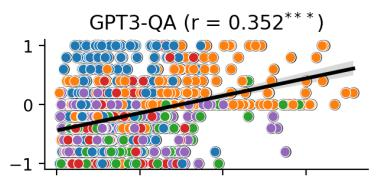

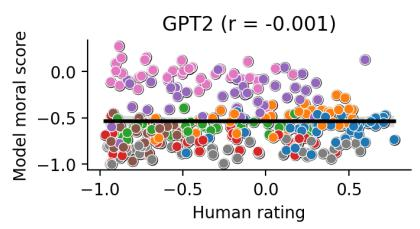

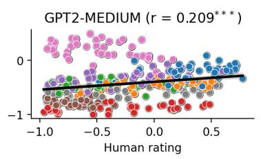

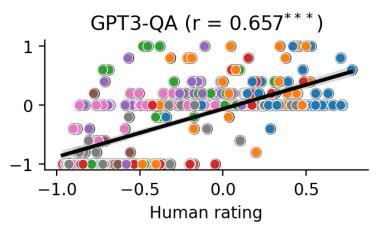  
Figure 7: Degree of alignment between the moral scores from EPLMs and fine-grained empirical moral ratings for different topics across countries taken from the World Values Survey (top) and PEW survey (bottom). Each dot represents a topic-country pair. The x-axis shows the fine-grained moral ratings from the ground truth and the y-axis shows the corresponding inferred moral scores. Similar topics in the World Value Surveys are shown with the same color.

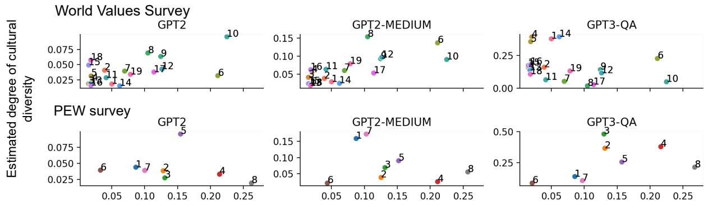  
Empirical degree of cultural diversity  
Figure 8: Comparison between the degrees of cultural diversities and shared tendencies in the empirical moral ratings and language-model inferred moral scores. Each dot corresponds to a moral topic. The x-axis shows the empirical standard deviations in moral ratings across countries and the y-axis shows the standard deviations from the model-inferred moral scores.

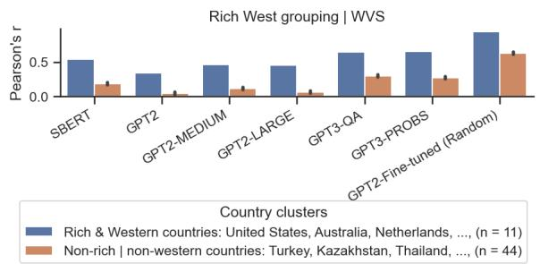

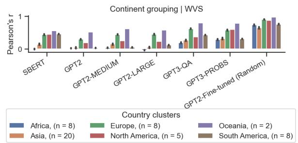  
Figure 9: Correlation between language-model inferred moral scores and empirical moral ratings from World Values Survey analyzed in different clusters of countries in Rich West grouping (left) and continent grouping (right). The results are generated by sampling and the error bars show the confidence intervals with α = 0.05.

<table><tr><td rowspan=1 colspan=1>Data</td><td rowspan=1 colspan=1>model</td><td rowspan=1 colspan=1>Fine-grained evaluationof moral norms</td><td rowspan=1 colspan=1>Evaluation on cultural diversityand shared tendencies</td></tr><tr><td rowspan=1 colspan=1>WVS</td><td rowspan=1 colspan=1>GPT3-PROBSGPT2GPT2-MEDIUMGPT2-LARGE</td><td rowspan=1 colspan=1>0.078*-0.114***-0.261***-0.07*</td><td rowspan=1 colspan=1>-0.1760.231-0.357-0.356</td></tr><tr><td rowspan=2 colspan=1>PEW</td><td rowspan=2 colspan=1>GPT3-PROBSGPT2GPT2-MEDIUMGPT2-LARGE</td><td rowspan=2 colspan=1>0.539***0.168**0.165**0.19***</td><td rowspan=1 colspan=1>0.0410.566</td></tr><tr><td rowspan=1 colspan=1>0.1840.542</td></tr></table>

Table 4: Performance of pre-trained autoregressive language models on identifying fine-grained moral norms and cultural diversities and shared tendencies, using the prompt template “People in [Country] believe [Topic] is [Moral judgment]". The values are Pearson’s correlations. The asterisks indicate the significance levels (“\*”, “\*\*”, “\*\*\*” for p < 0.05, 0.01, 0.001 respectively).

World Values Survey
<table><tr><td>worid values Survey Topic</td><td></td></tr><tr><td>Index</td><td></td></tr><tr><td>1</td><td>stealing property</td></tr><tr><td>2</td><td>euthanasia</td></tr><tr><td>3</td><td>sex before marriage</td></tr><tr><td>4</td><td>violence against other people</td></tr><tr><td>5</td><td>cheating on taxes</td></tr><tr><td>6 7</td><td>avoiding a fare on public transport</td></tr><tr><td>8</td><td>abortion</td></tr><tr><td>9</td><td>suicide</td></tr><tr><td>10</td><td>someone accepting a bribe on a course of their duties</td></tr><tr><td>11</td><td>terrorism as a political, ideological, or religious mean</td></tr><tr><td>12</td><td>homosexuality</td></tr><tr><td>13 14</td><td>parents beating children prostitution</td></tr><tr><td>15</td><td>divorce</td></tr><tr><td>16</td><td>political violence</td></tr><tr><td>17</td><td>death penalty</td></tr><tr><td>18</td><td>claiming governments benefits to which you are not entitled</td></tr><tr><td>19</td><td>for a man to beat his wife</td></tr><tr><td>PEW survey</td><td>having casual sex</td></tr><tr><td>1</td><td></td></tr><tr><td>2</td><td>using contraceptives</td></tr><tr><td>3</td><td>getting a divorce</td></tr><tr><td></td><td>having an abortion</td></tr><tr><td>4</td><td>homosexuality</td></tr><tr><td>5</td><td>drinking alcohol</td></tr><tr><td>6</td><td>married people having an affair</td></tr><tr><td>7</td><td>gambling</td></tr><tr><td></td><td></td></tr><tr><td>8</td><td>sex between unmarried adults</td></tr></table>

Table 5: Numerical indexing for topics in moral surveys.

<table><tr><td rowspan=1 colspan=1>Model</td><td rowspan=1 colspan=1>Positively evaluated topicsfor non-rich and non-western countries</td><td rowspan=1 colspan=1>Negatively evaluated topicsfor Rich-West countries</td></tr><tr><td rowspan=1 colspan=1>SBERT</td><td rowspan=1 colspan=1>sex before marriage**, homosexuality***,，having casual sex***, abortion***,prostitution***, claiming governmentbenefits to which you arenot entitled***, someoneaccepting a bribein the course of their duties***</td><td rowspan=1 colspan=1>sex before marriage***, euthanasia***divorce***, death penalty***,parents beating children***</td></tr><tr><td rowspan=1 colspan=1>GPT2</td><td rowspan=1 colspan=1>abortion***, prostitution***suicide***, avoiding a fare onpublic transport***,someone accepting a bribein the course of their duties***,terrorism as a political,ideological or religious mean***,political violence***violence against other people***</td><td rowspan=1 colspan=1>sex before marriage**, homosexuality**,divorce**, having casual sex**,claiming government benefitsto which you are not entitled***</td></tr><tr><td rowspan=1 colspan=1>GPT2-MEDIUM</td><td rowspan=1 colspan=1>euthanasia***, abortion***, suicide***,avoiding a fare on public transport***someone accepting a bribe inthe course of their duties***,political violence***, violence againstother people***, stealing property***</td><td rowspan=1 colspan=1>sex before marriage***, homosexuality**,divorce**, having casual sex**,claiming government benefitsto which you are not entitled***</td></tr><tr><td rowspan=1 colspan=1>GPT2-LARGE</td><td rowspan=1 colspan=1>euthanasia***, having casual sex***,abortion***, prostitution***, suicide***,terrorism as a political,ideological or religious mean***,political violence***,violence against other people***</td><td rowspan=1 colspan=1>sex before marriage***, homosexuality**,divorce**, claiming government benefits towhich you are not entitled***</td></tr><tr><td rowspan=1 colspan=1>GPT3-QA</td><td rowspan=1 colspan=1>having casual sex**, abortion**avoiding a fare on public transport***,cheating on taxes***,someone accepting a bribe in thecourse of their duties***,political violence***</td><td rowspan=1 colspan=1>sex before marriage***, divorce**,death penalty**, prostitution**,parents beating children**,suicide**, for a man to beat his wife***,stealing property**</td></tr><tr><td rowspan=1 colspan=1>GPT3-PROBS</td><td rowspan=1 colspan=1>euthanasia***, having casual sex***,abortion***, death penalty***,suicide***, political violence***for a man to beat his wife***</td><td rowspan=1 colspan=1>sex before marriage***, homosexuality***divorce**</td></tr></table>

Table 6: Topics evaluated as morally positive for non-rich and non-western countries and morally negative for Rich-West countries, in comparison to the ground truth in these countries. In each entry, the topics are sorted from the most controversial (i.e., having the highest degree of cultural diversity) to the least controversial. The asterisks indicate the significance levels of Mann-Whitney U rank test after Bonferroni p-value correction (“\*”, “\*\*”, “\*\*\*” for p < 0.05, 0.01, 0.001 respectively).

<table><tr><td rowspan=1 colspan=1>Train data</td><td rowspan=1 colspan=1>Data partition strategy</td><td rowspan=1 colspan=1>Evaluation</td></tr><tr><td rowspan=1 colspan=1>WVS</td><td rowspan=1 colspan=1>RandomCountry-basedTopic-based</td><td rowspan=1 colspan=1> $\overline { { 0 . 8 9 3 ^ { * * * } \uparrow } }$  $0 . 8 9 4 ^ { * * * } \cdot$ 个    $( 0 . 5 7 9 ^ { * * * } )$  $0 . 8 3 5 ^ { * * * } \uparrow$ </td></tr><tr><td rowspan=1 colspan=1>PEW</td><td rowspan=1 colspan=1>RandomCountry-basedTopic-based</td><td rowspan=1 colspan=1> $\overline { { 0 . 9 4 4 ^ { * * } \uparrow } }$  $0 . 8 3 9 ^ { \ast } \uparrow$      (n.s.) $0 . 9 5 3 ^ { \ast \ast \ast } \uparrow$ </td></tr></table>

Table 7: Summary of fine-tuned GPT2 language model performance in inferring the cultural diversities and shared tendencies over the morality of different topics. The arrows and colors show performance increase (blue, ) and decrease (red, ) after fine-tuning. All values are Pearson’s correlations. The asterisks indicate the significance levels (“\*”, “\*\*”, “\*\*\*” for $p < 0 . 0 5 , 0 . 0 1 , 0 . 0 0 1$ respectively). Non-significant results are shown by “n.s.”.

<table><tr><td rowspan=1 colspan=1>Dataset</td><td rowspan=1 colspan=1>Rating</td><td rowspan=1 colspan=1>[Moral rating] in fine-tuning prompts</td></tr><tr><td rowspan=5 colspan=1>WVS</td><td rowspan=1 colspan=1>1</td><td rowspan=1 colspan=1>never justifiable</td></tr><tr><td rowspan=1 colspan=1>[2, 3, 4]</td><td rowspan=1 colspan=1>not justifiable</td></tr><tr><td rowspan=1 colspan=1>[5, 6]</td><td rowspan=1 colspan=1>somewhat justifiable</td></tr><tr><td rowspan=1 colspan=1>[7, 8,9]</td><td rowspan=1 colspan=1>justifiable</td></tr><tr><td rowspan=1 colspan=1>10</td><td rowspan=1 colspan=1>always justifiable</td></tr><tr><td rowspan=3 colspan=1>PEW</td><td rowspan=1 colspan=1>1</td><td rowspan=1 colspan=1>morally unacceptable</td></tr><tr><td rowspan=1 colspan=1>2</td><td rowspan=1 colspan=1>not a moral issue</td></tr><tr><td rowspan=1 colspan=1>3</td><td rowspan=1 colspan=1>morally acceptable</td></tr></table>

Table 8: Different prompting designs for fine-tuning language models on the global survey datasets.

<table><tr><td>Data</td><td>Data partition strategy</td><td>Training samples</td><td>Evaluation sample pairs</td></tr><tr><td rowspan="3">WVS</td><td>Random</td><td>82200</td><td>206</td></tr><tr><td>Country-based</td><td>82600</td><td>202</td></tr><tr><td>Topic-based</td><td>81200</td><td>216</td></tr><tr><td rowspan="3">PEW</td><td>Random</td><td>24900</td><td>63</td></tr><tr><td>Country-based</td><td>24800</td><td>64</td></tr><tr><td>Topic-based</td><td>23400</td><td>78</td></tr></table>

Table 9: Number of samples in training and evaluation datasets for fine-tuning GPT2 on global surveys of morality.

## ACL 2023 Responsible NLP Checklist

A For every submission: ✓ A1. Did you describe the limitations of your work? 8 ✓ A2. Did you discuss any potential risks of your work? 8 ✓ A3. Do the abstract and introduction summarize the paper’s main claims? 1 ✗ A4. Have you used AI writing assistants when working on this paper? Left blank.

## B ✓ Did you use or create scientific artifacts?

4, 5, 6

✓ B1. Did you cite the creators of artifacts you used? 4, 5, 6

✓ B2. Did you discuss the license or terms for use and / or distribution of any artifacts? All the artifacts we used were availablefor research purposes. The term ofusage can befound in the urls provided in the paper in the Appendix.

✓ B3. Did you discuss if your use of existing artifact(s) was consistent with their intended use, provided that it was specified? For the artifacts you create, do you specify intended use and whether that is compatible with the original access conditions (in particular, derivatives of data accessed for research purposes should not be used outside of research contexts)? 8

✗ B4. Did you discuss the steps taken to check whether the data that was collected / used contains any information that names or uniquely identifies individual people or offensive content, and the steps taken to protect / anonymize it? The datasets we used do not contain information about individual people.

✓ B5. Did you provide documentation of the artifacts, e.g., coverage of domains, languages, and linguistic phenomena, demographic groups represented, etc.? 4, Appendix

✓ B6. Did you report relevant statistics like the number of examples, details of train / test / dev splits, etc. for the data that you used / created? Even for commonly-used benchmark datasets, include the number of examples in train / validation / test splits, as these provide necessary context for a reader to understand experimental results. For example, small differences in accuracy on large test sets may be significant, while on small test sets they may not be. 4, 5, 6, appendix

## C ✓ Did you run computational experiments?

5, 6, appendix

✓ C1. Did you report the number of parameters in the models used, the total computational budget (e.g., GPU hours), and computing infrastructure used? Appendix

✗ C2. Did you discuss the experimental setup, including hyperparameter search and best-found hyperparameter values? We did not do any hyperparameter search.

✓ C3. Did you report descriptive statistics about your results (e.g., error bars around results, summary statistics from sets of experiments), and is it transparent whether you are reporting the max, mean, etc. or just a single run? 5, 6, appendix

✓ C4. If you used existing packages (e.g., for preprocessing, for normalization, or for evaluation), did you report the implementation, model, and parameter settings used (e.g., NLTK, Spacy, ROUGE, etc.)? 3

D ✗ Did you use human annotators (e.g., crowdworkers) or research with human participants? Left blank.

 D1. Did you report the full text of instructions given to participants, including e.g., screenshots, disclaimers of any risks to participants or annotators, etc.? Not applicable. Left blank.

 D2. Did you report information about how you recruited (e.g., crowdsourcing platform, students) and paid participants, and discuss if such payment is adequate given the participants’ demographic (e.g., country of residence)? Not applicable. Left blank.

 D3. Did you discuss whether and how consent was obtained from people whose data you’re using/curating? For example, if you collected data via crowdsourcing, did your instructions to crowdworkers explain how the data would be used? Not applicable. Left blank.

 D4. Was the data collection protocol approved (or determined exempt) by an ethics review board? Not applicable. Left blank.

 D5. Did you report the basic demographic and geographic characteristics of the annotator population that is the source of the data? Not applicable. Left blank.