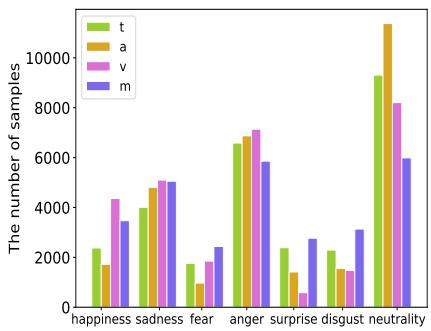
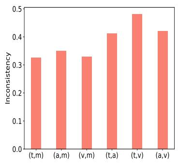
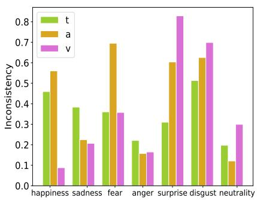
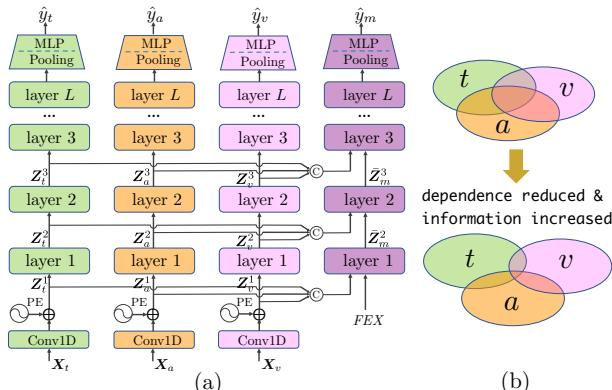
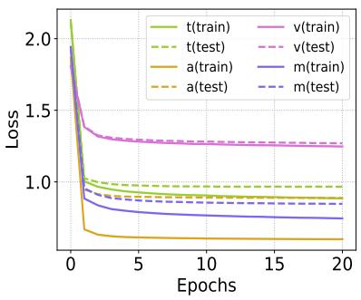
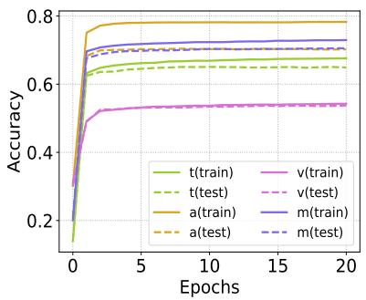
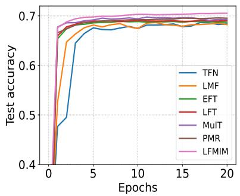
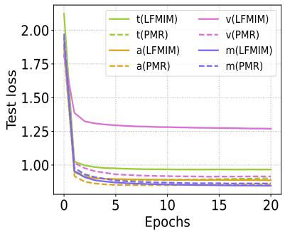
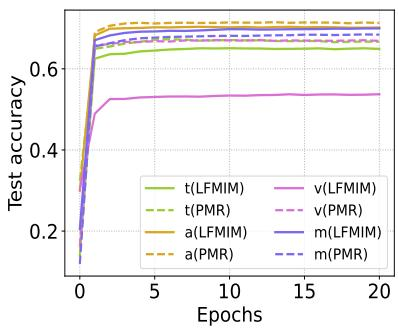
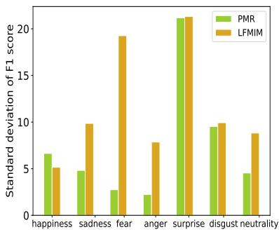

# Layer-wise Fusion with Modality Independence Modeling for Multi-modal Emotion Recognition

Jun Sun1, Shoukang Han, Yu-Ping Ruan, Xiaoning Zhang, Yulong Liu, Yuxin Huang, Shu-Kai Zheng, Taihao Li2∗ Institute of Artificial Intelligence, Zhejiang Lab, Hangzhou, China 1sunjun16sj@gmail.com, 2lith@zhejianglab.com

## Abstract

Multi-modal emotion recognition has gained increasing attention in recent years due to its widespread applications and the advances in multi-modal learning approaches. However, previous studies primarily focus on developing models that exploit the unification of multiple modalities. In this paper, we propose that maintaining modality independence is beneficial for the model performance. According to this principle, we construct a dataset, and devise a multimodal transformer model. The new dataset, CHinese Emotion Recognition dataset with Modality-wise Annotations, abbreviated as CHERMA, provides uni-modal labels for each individual modality, and multi-modal labels for all modalities jointly observed. The model consists of uni-modal transformer modules that learn representations for each modality, and a multi-modal transformer module that fuses all modalities. All the modules are supervised by their corresponding labels separately, and the forward information flow is uni-directionally from the uni-modal modules to the multi modal module. The supervision strategy and the model architecture guarantee each individual modality learns its representation independently, and meanwhile the multimodal module aggregates all information. Extensive empirical results demonstrate that our proposed scheme outperforms state-of-theart alternatives, corroborating the importance of modality independence in multi-modal emotion recognition. The dataset and codes are availabel at https://github.com/ sunjunaimer/LFMIM.

## 1 Introduction

The goal of human emotion recognition is to automatically detect or categorize the emotional states of human according to some inputs. Nowadays, emotion recognition can be found in a broad range of applications, including but not limited to emotional support (Tu et al., 2022; Liu et al., 2021), human-computer interaction (Chowdary et al., 2021) and healthcare surveillance (Dhuheir et al., 2021). Henceforth, emotion recognition has attracted increasing attention from both research community and industry in recent years (Hu et al., 2021a; Shen et al., 2021).

The early works perform emotion recognition primarily with a single modality (Mehendale, 2020; Alvarez-Gonzalez et al., 2021; Schuller et al., 2010), e.g., vision, text, audio and so on. Recent multi-modal approaches have showcased more appealing performance than their uni-modal counterparts (Hu et al., 2021b; Zhao et al., 2022). However, most existing literature on multimodal learning overemphasizes the combination of different modalities without fully respecting modality independence, which might be harmful to the model. In the sequel, we illustrate this through the lens of datasets and model design.

Datasets Current datasets for multi-modal emotion recognition are usually annotated with the joint observation of all modalities, resulting in shared labels for all modalities (Zadeh et al., 2016, 2018; Busso et al., 2008; Poria et al., 2019; Li et al., 2017b). This leads to the fact that all modalities in the multi-modal model are supervised by the same common labels, which reduces the modality diversity and might even mislead some modalities (Yu et al., 2020). In practice, it is anticipated that inconsistent labels will be attained if we annotate different modalities separately. In this circumstance, in order to learn diverse and modality-specific representations, the modules for different modalities are expected to be trained with their own labels rather than the common labels.

Model design The emerging transformer has contributed to many success stories in natural language processing and computer vision (Devlin et al., 2019; Dosovitskiy et al., 2020). Naturally, it is introduced to the field of multi-modal learning thanks to its versatility in dealing with sequences of different forms. Multi-modal transformer (MulT) is proposed in(Tsai et al., 2019), which adopts cross-modal attention to fuse any pair of modalities, and then incorporates all the information. The drawback of MulT is that it has a complexity of $A _ { n } ^ { 2 }$ in terms of the number of cross-modal transformer blocks (n is the number of modalities). To address the complexity issue, progressive modality reinforcement (PMR) and multimodal bottleneck transformer (MBT) which scale linearly with the number of modalities are proposed in (Lv et al., 2021) and (Nagrani et al., 2021), respectively. PMR and MBT devise a message hub which draws information from the uni-modal blocks, performs fusion, and returns the fused common information to the uni-modal blocks. It can be concluded that, both MulT and the message hub based models reinforce each modality with the information from other modalities. This can lead to the problem that the model might rely heavily on some modalities, leaving other modalities under-trained. The reason is that the dominated modalities can cheat by peeping at the well-learned modalities, and hence becomes "lazy" in their own learning process.

With the above observations of prior datasets and models for multi-modal emotion recognition, it is clear that existing studies primarily focus on establishing the dependency between modalities and capturing combined multi-modal information for the final task. Different modalities are coupled from both the labels and the model structure, and the resultant representations of different modalities share rich common information and lack diversity. However, it has been observed that more differentiated information from modalities facilitates to improve the complementarity between the modalities (Yu et al., 2020; Qu et al., 2021).

In the light of the limitations of current datasets and fusion models, in this work, we construct a new dataset and propose a transformer model for multi-modal emotion recognition. Each sample in our dataset is annotated with three uni-modal labels corresponding to three modalities—text, audio and vision, and a multi-modal label for all modalities jointly observed. The proposed model employs three uni-modal transformer blocks as the backbones for the three individual modalities and one multi-modal transformer block for multi-modal information fusion. The uni-modal transformers process their own information independently, and are supervised by the corresponding unimodal labels; the multi-modal transformer fuses information from the uni-modal transformers layer by layer, and is supervised by the multimodal labels. The forward information flow in the model is uni-directionally from the unimodal modules to the multi-modal module. The supervision strategy and the uni-direction information flow promote modality independence, which reduces mutual information and increases complementary information across modalities (as Figure 2(b) in Section 4 illustrates). Therefore, the overall effective information for the final emotion recognition task aggregated by the multimodal module can be maximized. The proposed model features Layer-wise Fusion with Modality Independence Modeling, termed LFMIM. In summary, the contributions of this paper are mainly threefold.

• A new dataset is built for multi-modal emotion recognition, of which the modalities are annotated separately. Apart from multi-modal emotion recognition, the dataset supports the research for the modality (label) inconsistency problem in multi-modal learning.

• A model that encourages modality independence is proposed, and it is trained with uni-modal labels and multi-modal labels simultaneously. The model leads to more diverse representations, and therefore captures more complementary clues from different modalities.

• The proposed model demonstrates substantial improvement over existing competing models. The results shed light on the future research on the balance between modality dependence and independence in multi-modal learning.

## 2 Related Works

There are a large volume of relevant works on multimodal emotion recognition, for which interested readers can refer to survey papers (Siddiqui et al., 2022; Ahmed et al., 2023) and references therein. In this section, we only cover the most related works, corresponding to the datasets and multimodal fusion models in the following.

## 2.1 Datasets

Popular datasets for multi-modal emotion recognition or sentiment analysis include CMU-

MOSI (Zadeh et al., 2016), CMU-MOSEI (Zadeh et al., 2018), IEMOCAP (Busso et al., 2008), MELD (Poria et al., 2019), CHEAVD (Li et al., 2017b), CH-SIMS (Yu et al., 2020), and CH-SIMS\_v2 (Liu et al., 2022). Most previous datasets annotate the samples with the same labels for all modalities. It is noteworthy that the two Chinese datasets, CH-SIMS and CH-SIMS\_v2, are currently the only datasets that conduct annotations for each modality independently. However, these two datasets are for sentiment analysis, and are labeled with polarized labels, (weakly) positive, (weakly) negative, and neutral. To the best of our knowledge, our dataset CHERMA is the first one that is targeted for multi-modal emotion recognition, and has modality-wise annotations.

## 2.2 Multi-modal fusion models

At the core of multi-modal emotion recognition is the modality fusion strategy. TFN (Zadeh et al., 2017) integrates the multi-modality information via calculating the outer product of modality embeddings. Unfortunately, the computation and memory required grow exponentially with the number of modalities, which is addressed by the work of LMF (Liu and Shen, 2018) with low rank approximation. From the perspective of model structure, the previous fusion strategies are usually classified into early fusion and late fusion. Early fusion (Lazaridou et al., 2015; Williams et al., 2018) simply concatenates the low-level features of all the modalities, and feeds the joint feature to the model. Early fusion can suffer from the problem of data sparseness (Wu et al., 2014). Late fusion (Liu et al., 2014; Nguyen et al., 2018; Yu et al., 2020) concatenates the high-level features (some studies also refer this to model-level fusion (Chen and Jin, 2016)) or decisions separately obtained from individual modalities, which is weak in establishing fine-grained correspondence across modalities.

Compared with the concatenation methods, multi-modal transformer is a more powerful tool that is capable of capturing the intra-modal and cross-modal dependency(Poria et al., 2017; Lian et al., 2021). Recent transformer-based works (Tsai et al., 2019; Lv et al., 2021; Nagrani et al., 2021) can be regarded as layer-wise fusion, to differentiate them from early and late fusion approaches. Layer-wise fusion carries out feature fusion layer by layer from low level to high level, which can capture fine-grained correlation across unaligned modalities. Due to its promising performance, this paper also leverages multi-modal transformer with layer-wise fusion for our emotion recognition task.

<table><tr><td rowspan=1 colspan=1>Item</td><td rowspan=1 colspan=1>Quantity</td></tr><tr><td rowspan=1 colspan=1>Number of utterances</td><td rowspan=1 colspan=1>28,717</td></tr><tr><td rowspan=1 colspan=1>Average length of utterance (second)</td><td rowspan=1 colspan=1>4.6</td></tr><tr><td rowspan=1 colspan=1>Minimum number of words per utterance</td><td rowspan=1 colspan=1>4</td></tr><tr><td rowspan=1 colspan=1>Maximum number of words per utterance</td><td rowspan=1 colspan=1>63</td></tr><tr><td rowspan=1 colspan=1>Male</td><td rowspan=1 colspan=1>11,207</td></tr><tr><td rowspan=1 colspan=1>Female</td><td rowspan=1 colspan=1>17,510</td></tr><tr><td rowspan=1 colspan=1>Preteen</td><td rowspan=1 colspan=1>288</td></tr><tr><td rowspan=1 colspan=1>Teen</td><td rowspan=1 colspan=1>18,500</td></tr><tr><td rowspan=1 colspan=1>Middle-age</td><td rowspan=1 colspan=1>8,522</td></tr><tr><td rowspan=1 colspan=1>Old</td><td rowspan=1 colspan=1>1,407</td></tr></table>

Table 1: Statistics of dataset CHERMA.

## 3 Dataset Description

In this section, we give a detailed introduction to the new dataset—CHERMA. We will present how the data is collected and annotated, the characteristics of the data, and the pre-processing of the data for model training.

Before introducing the data, we give the definitions of some notations. Let t, a, v represent the three modalities—text, audio, and vision, respectively; let $m$ denote the joint of the three modalities. Denote by $\boldsymbol { X } _ { u } ~ \in ~ \mathbb { R } ^ { T _ { u } \times d _ { u } }$ for $u \in$ $\{ t , a , v \}$ , the feature sequence of the corresponding modality, where $T _ { u }$ and $d _ { u }$ are the sequence length and the feature dimension, respectively. Associated with each feature sequence is its unimodal labels and multi-modal label $\{ y _ { u } | u \in$ $\{ t , a , v , m \} \}$ For our training dataset, we use $( \{ X _ { u } ^ { n } \} _ { u \in \{ t , a , v \} } , \{ y _ { u } ^ { n } \} _ { u \in \{ t , a , v , m \} } )$ for $n \_ { \mathrm { ~ \in ~ } }$ $\{ 1 , 2 , \cdots , N \}$ to represent the n-th sample, where N denotes the total number of samples. In the rest of the paper, we sometimes drop the index n for brevity when no confusion occurs.

## 3.1 Data acquisition and annotations

In order to cover as many scenarios as possible, our data is acquired from various sources, including 148 TV series, 7 variety shows, and 2 movies. The language of the video is Chinese, yet it can be translated to other languages for broader applications. The video is split into utterances with Adobe Premiere Pro. Only the utterances where there is a single person speaking and the speaker’s face appears clearly are selected as our samples.

In total, 28, 717 utterances are rounded up, of which the total length is 2, 213.84 minutes.

  
(a)

  
(b)

  
(c)  
Figure 1: (a) The distributions of uni-modal labels and multi-modal labels. (b) Overall modality inconsistency. (c) Inconsistency between uni-modal labels and multi-modal labels.

Table 1 reports the statistics of dataset CHERMA, including the information of the utterance samples, the gender and age distributions of the speakers in the video. The scenarios span household, hospital, restaurant, office, outdoor, telephone conversation, and so on. In a word, the acquired data is representative and close to real-world scenarios, and is therefore of practical value.

Following the convention, we categorize the samples into Ekman’s six basic emotions (Ekman, 1992) plus emotion neutrality, i.e., happiness, sadness, fear, anger, surprise, disgust and neutrality. Each sample is annotated with three uni-modal labels and a multi-modal label.

All the recruited annotators have experience in emotion annotations. Moreover, they are required to receive training for our annotation task and pass an examination before carrying out annotations. For the uni-modal annotations, the annotators are shown corresponding uni-modal information. While for multi-modal annotations, all the modalities are available; that is, the videos are displayed in their original form. Each label is determined as a result of the following majority voting process. For each labeling, the feature, unimodal or multi-modal, is first assigned to three annotators. Each annotator gives it a unique label independently. If the labeling result is $3 : 0 .$ consensus is reached and the label is determined accordingly; if the result is 1 : 1 : 1, this sample will be discarded because of the disagreement; otherwise, if the result is 2 : 1, then one more annotator will join. In this case, if the final result is $3 : 1 .$ , the label obtained; otherwise, $2 : 2$ or $2 ~ : ~ 1 ~ : ~ 1$ means the sample will be discarded. Considering the limited labor, the above annotating scheme ensures the reliability of the labels in that 3 annotators out of 3 or 4 agree on each label, and meanwhile the samples of ambiguity are discarded. After the annotations, all the samples are shuffled, and are split into training, validation and test datasets with ratio 6:2:2.

## 3.2 Label inconsistency

Upon finishing the annotations, we explore the dataset by simple statistical analysis. Figure 1(a) shows the distributions of the uni-modal labels and the multi-modal labels. We have two observations: 1) There are a large number of samples, of which the four labels are not identical to each other; 2) With single modality, some emotions cannot be identified and possibly be recognized as neutrality; while using multi-modal information can infer more emotions.

To quantify the label inconsistency, we define the overall modality inconsistency between any two modalities $u _ { 1 } , u _ { 2 } \in \{ t , a , v , m \}$ as follows:

$$
\mathrm { I n c o n } ( u _ { 1 } , u _ { 2 } ) : = \frac { \sum _ { n = 1 } ^ { N } { \bf 1 } _ { y _ { u _ { 1 } } ^ { n } \ne y _ { u _ { 2 } } ^ { n } } } { N } ,
$$

where ${ \bf 1 } _ { x } = 1$ , if x is true; ${ \bf 1 } _ { x } = { \bf 0 } .$ , otherwise. Define the inconsistency of modality u with multi-modality m for any label $y \in$ {happiness, sadness, fear, anger, surprise, disgust, and neutrality} as follows:

$$
\operatorname { I n c o n } ( u , m ; y ) : = { \frac { \sum _ { n = 1 } ^ { N } \mathbf { 1 } _ { y _ { u } ^ { n } \neq y } } { \sum _ { n = 1 } ^ { N } \mathbf { 1 } _ { y _ { m } ^ { n } = y } } } .
$$

Figure 1(b) reports the overall modality inconsistency, which is significant—the inconsistency between any pair of modalities exceeds 0.3. The inconsistency between unimodality and multi-modality is less than that between any two uni-modalities. This is reasonable because the multi-modal label which is obtained with all modality information can be regarded as a weighted average of three uni-modal labels.

If the multi-modal labels are regarded as the ground-truth, a conclusion can be drawn from Figure 1(c) that some modalities are better at inferring some emotions than other modalities. It is shown that audio performs well in identifying sadness, anger and neutrality. Vision is good at recognizing happiness, sadness and anger. In comparison, text shows more balanced performance among all emotions.

## 3.3 Data pre-processing

In this subsection, we explain how the raw data is pre-processed for model training. The original data of the three-modalities will be converted to feature sequences with the following methods.

Text: We pass the texts to pre-trained Chinese BERT-base (Cui et al., 2021) to obtain contextualized word embeddings. Since the maximum number of words in all the texts is 78, all texts that have fewer words are padded to length 78. With CLS and SEP tokens prepended and appended to each text, respectively, the input of BERT is of length 80. Finally, each text modality information is represented by a sequence of length 80 and dimension 768.

Audio: The audio is sampled at frequency 16kHz with receptive field 25ms and frame shift 20ms. Then the extracted frame-level feature is input to pre-trained wav2vec (Zhang et al., 2022), generating a feature sequence of dimension 768. The length of the sequence corresponds to the number of the audio frames which depends on the length of the raw audio.

Vision: The video is first processed with MTCNN (Zhang et al., 2016) to obtain aligned face and each frame is cropped to size of 224 × 224. For each video utterance, we partition it evenly into 8 segmentations, and then randomly sample 8 frames from each segmentation, resulting in a 64-frame vision sequence. Each frame is then fed to a pre-trained Resnet 18 (trained with RAF-DB (Li et al., 2017a)), which outputs a feature sequence of length 64 and dimension 512.

## 4 The Proposed Model

## 4.1 Model overview

As visualized in Figure 2, the proposed model, LFMIM, consists of two main components, three uni-modal transformers and one multi-modal transformer. Each uni-modal transformer processes its corresponding modality independently; while the multi-modal transformer relies on all the unimodal transformers. To be specific, the input of layer l + 1 of the multi-modal transformer comes from the output of its l-th layer and the outputs of l-th layer of all three uni-modal transformers. Each uni-modal module are independent from each other, and yields its own label prediction.

  
Figure 2: (a) The model architecture. The blocks with colors green, orange, pink and purple represent the text, audio, vision and multi-modal blocks, respectively; symbols ⊕ and ⃝C denote summation and concatenation operations, respectively. (b) The overall useful information (represented by the area covered by the three circles) increases with modality dependence reduced; each circle represents the information of the corresponding modality.

## 4.2 The uni-modal modules

The input features of all the modalities are of the same sequence form. The module for each individual modality adopts the same simple structure, mainly including a uni-modal transformer with L multi-head self attention layers. As Figure 2(a) illustrates, the feature sequence, $\begin{array} { r l r } { X _ { u } , u } & { { } \in } & { \{ t , a , v \} } \end{array}$ first goes through a 1D convolutional layer to unify the feature dimension for the following concatenation; next, positional embedding (PE) is added, yielding the input sequence of the uni-modal transformer, $Z _ { u } ^ { 1 } , u \in$ $\{ t , a , v \}$ Then, the sequence is processed by the corresponding uni-modal transformer, and the input and output of the l-th transformer layer are $\boldsymbol { Z } _ { \boldsymbol { u } } ^ { \bar { l } }$ and $\boldsymbol { Z } _ { \boldsymbol { u } } ^ { l + \bar { 1 } }$ , respectively, $u ~ \in ~ \{ t , a , v \}$ and $l \in \{ 1 , 2 , \cdots , L - 1 \}$ . After the transformer block, a pooling layer reduces the output sequence into a feature vector. Subsequently, on the top is an MLP followed by a softmax layer, which gives the predicted label $\hat { y } _ { u } , u \in \{ t , a , v \}$ . It is obvious that each uni-modal module does not depend on the information from other modalities in the forward pass.

## 4.3 The multi-modal module

The multi-modal module is a feature extractor which draws three modalities from uni-modal transformers and fuses them layer by layer. Specifically, we define a learnable multi-modal FEature EXtraction token, FEX, to extract and summarize useful information from all modalities. The input of the l-th layer of the multi-modal transformer is ${ \cal Z } _ { m } ^ { l } \ = \ \bar { [ } F E X ^ { l } ; \dot { Z } _ { t } ^ { l } ; \dot { Z } _ { a } ^ { l } ; \dot { Z } _ { v } ^ { l } ]$ , and the output is $\bar { Z } _ { m } ^ { l + 1 } = [ F E X ^ { l + 1 } ; \bar { Z } _ { t } ^ { l + 1 } ; \bar { Z } _ { a } ^ { l + 1 } ; \bar { Z } _ { v } ^ { l + 1 } ]$ $\dot { \pmb { Z } } _ { u } ^ { l + 1 } , \forall u \in \{ t , a , v \}$ are updated as follows:

$$
\dot { Z } _ { u } ^ { l + 1 } = \alpha _ { u } ^ { l + 1 } Z _ { u } ^ { l + 1 } + \bar { \alpha } _ { u } ^ { l + 1 } \bar { Z } _ { u } ^ { l + 1 } ,
$$

where $\alpha _ { u } ^ { l + 1 }$ and $\bar { \alpha } _ { u } ^ { l + 1 } , u \ \in \ \{ t , a , v \}$ and $l \in$ $\{ 0 , 1 , 2 , \cdots , L \ : - \ : 1 \}$ are learnable parameters; $\bar { Z } _ { u } ^ { 1 } , \forall u \ \in \ \{ t , a , v \}$ are all-zero matrices with proper size. After the multi-modal transformer block, the following structure is the same as the uni-modal modules as introduced in last subsection. The final label prediction of the multi-modal module is $\hat { y } _ { m }$ . As shown in Figure 2(a), in the forward pass, the multi-modal module absorbs information from the uni-modal modules layer by layer, and does not return its information to the uni-modal modules.

## 4.4 Optimization objective

With the aforementioned model, our training task boils down to the optimization problem below.

$$
\operatorname* { m i n } \ \frac { 1 } { N } \sum _ { n = 1 } ^ { N } \sum _ { u \in \{ t , a , v , m \} } \beta _ { u } L ( y _ { u } ^ { n } , \hat { y } _ { u } ^ { n } ) ,
$$

where $L ( \cdot , \cdot )$ is the cross-entropy loss function; $\beta _ { u } , u \in \{ t , a , v , m \}$ are the weight parameters that balance the loss among different modalities.

To sum up, following the principle of maintaining modality independence, our approach utilizes separate supervisions for different modalities, and bans direct communications across individual modalities. In this way, it is expected that each modality can fully explore and exploit itself without relying on other modalities. Hopefully, as illustrated in Figure 2(b), by aggregating more distinctive uni-modal representations with less mutual information and more complementary information, the overall useful information summarized by the multi-modal module can be maximized.

It should be clarified that albeit we advocate modality independence, we do not oppose modality reinforcement for each other. In this work, we only investigate the independence side to unveil and highlight its importance. For more general multimodal learning, the two sides should be carefully balanced, which deserves further investigation.

Furthermore, the modality independence is relative to existing layer-wise fusion approaches which couple the modalities with the same labels and modality interactions in the forward propagation. Actually, in our model, through backward propagation the multi-modal labels can also take effect in supervising uni-modal modules. To be more precise, our approach reduces modality dependence, but does not completely eliminate the indirect interactions across modalities.

## 5 Experiments and Analysis

In this section, we first compare our proposed model with typical benchmark models to validate the effectiveness of our model. Then we perform ablation studies to analyze the proposed model, and demonstrate the differences between our model and its compared counterparts.

## 5.1 Comparisons with baseline models

## 5.1.1 Baseline models

We compare our proposed model, LFMIM, with 6 typical baseline models: tensor fusion network (TFN) (Zadeh et al., 2017), low-rank Multimodal fusion (LMF) (Liu and Shen, 2018), early fusion transformer (EF-transformer), Late fusion transformer (LF-transformer), multi-modal transformer (MulT) (Tsai et al., 2019), and progressive modality reinforcement (PMR) (Lv et al., 2021). Note that for early fusion and late fusion methods, we use more powerful transformer models instead of the models in (Williams et al., 2018) and (Yu et al., 2020) for the sake of fairness. We adapt the original PMR (introduced in the introduction section) to be trained with uni-modal labels and multi-modal labels as our model.

## 5.1.2 Implementation details

To concatenate the features of the three modalities, we utilize 1D convolutional layers to convert them into 128-dimensional feature sequence. For the audio feature which is of varying length, we fix the length to be 100. If the original length is over 100, we uniformly sample 100 feature vectors; otherwise, we pad it with zero vectors.

  
(a)

  
(b)

  
(c)

Figure 3: (a) The training loss and test loss of each modality during training. (b) The overall emotion recognition accuracy of each modality on training dataset and test dataset. (c) The test accuracy of different models.
<table><tr><td rowspan=1 colspan=1>Emotion</td><td rowspan=1 colspan=1>happiness</td><td rowspan=1 colspan=1>sadness</td><td rowspan=1 colspan=1>fear</td><td rowspan=1 colspan=1>anger</td><td rowspan=1 colspan=1>surprise</td><td rowspan=1 colspan=1>disgust</td><td rowspan=1 colspan=1>neutrality</td><td rowspan=1 colspan=1>overall</td></tr><tr><td rowspan=1 colspan=1>TFN</td><td rowspan=1 colspan=1>74.91</td><td rowspan=1 colspan=1>75.56</td><td rowspan=1 colspan=1>66.15</td><td rowspan=1 colspan=1>74.41</td><td rowspan=1 colspan=1>66.29</td><td rowspan=1 colspan=1>43.34</td><td rowspan=1 colspan=1>65.60</td><td rowspan=1 colspan=1>68.37</td></tr><tr><td rowspan=1 colspan=1>LMF</td><td rowspan=1 colspan=1>74.52</td><td rowspan=1 colspan=1>75.83</td><td rowspan=1 colspan=1>66.73</td><td rowspan=1 colspan=1>74.55</td><td rowspan=1 colspan=1>65.08</td><td rowspan=1 colspan=1>45.70</td><td rowspan=1 colspan=1>65.64</td><td rowspan=1 colspan=1>68.23</td></tr><tr><td rowspan=1 colspan=1>EFT</td><td rowspan=1 colspan=1>74.98</td><td rowspan=1 colspan=1>76.88</td><td rowspan=1 colspan=1>67.32</td><td rowspan=1 colspan=1>74.85</td><td rowspan=1 colspan=1>66.73</td><td rowspan=1 colspan=1>47.48</td><td rowspan=1 colspan=1>64.60</td><td rowspan=1 colspan=1>68.72</td></tr><tr><td rowspan=1 colspan=1>LFT</td><td rowspan=1 colspan=1>75.07</td><td rowspan=1 colspan=1>76.29</td><td rowspan=1 colspan=1>66.80</td><td rowspan=1 colspan=1>74.88</td><td rowspan=1 colspan=1>66.67</td><td rowspan=1 colspan=1>47.74</td><td rowspan=1 colspan=1>65.97</td><td rowspan=1 colspan=1>69.05</td></tr><tr><td rowspan=1 colspan=1>MulT</td><td rowspan=1 colspan=1>76.18</td><td rowspan=1 colspan=1>76.88</td><td rowspan=1 colspan=1>67.36</td><td rowspan=1 colspan=1>74.85</td><td rowspan=1 colspan=1>68.18</td><td rowspan=1 colspan=1>46.96</td><td rowspan=1 colspan=1>65.26</td><td rowspan=1 colspan=1>69.24</td></tr><tr><td rowspan=1 colspan=1>PMR</td><td rowspan=1 colspan=1>75.68</td><td rowspan=1 colspan=1>76.46</td><td rowspan=1 colspan=1>67.97</td><td rowspan=1 colspan=1>75.43</td><td rowspan=1 colspan=1>67.37</td><td rowspan=1 colspan=1>48.93</td><td rowspan=1 colspan=1>66.59</td><td rowspan=1 colspan=1>69.53</td></tr><tr><td rowspan=1 colspan=1>LFMIM</td><td rowspan=1 colspan=1>76.6</td><td rowspan=1 colspan=1>77.83</td><td rowspan=1 colspan=1>69.44</td><td rowspan=1 colspan=1>75.32</td><td rowspan=1 colspan=1>69.83</td><td rowspan=1 colspan=1>50.20</td><td rowspan=1 colspan=1>68.24</td><td rowspan=1 colspan=1>70.54</td></tr></table>

Table 2: Performance (in terms of F1 score) comparison with baseline models.

<table><tr><td rowspan=1 colspan=1>Model</td><td rowspan=1 colspan=1>Acc-2</td><td rowspan=1 colspan=1>Acc-3</td><td rowspan=1 colspan=1>Acc-5</td><td rowspan=1 colspan=1>F1 score</td></tr><tr><td rowspan=1 colspan=1>MLF-DNN</td><td rowspan=1 colspan=1>82.28</td><td rowspan=1 colspan=1>69.06</td><td rowspan=1 colspan=1>38.03</td><td rowspan=1 colspan=1>82.52</td></tr><tr><td rowspan=1 colspan=1>MLMF</td><td rowspan=1 colspan=1>82.32</td><td rowspan=1 colspan=1>67.70</td><td rowspan=1 colspan=1>37.33</td><td rowspan=1 colspan=1>82.66</td></tr><tr><td rowspan=1 colspan=1>MTFN</td><td rowspan=1 colspan=1>82.45</td><td rowspan=1 colspan=1>69.02</td><td rowspan=1 colspan=1>37.20</td><td rowspan=1 colspan=1>82.56</td></tr><tr><td rowspan=1 colspan=1>LFMIM</td><td rowspan=1 colspan=1>83.37</td><td rowspan=1 colspan=1>71.33</td><td rowspan=1 colspan=1>48.36</td><td rowspan=1 colspan=1>83.71</td></tr></table>

Table 3: Results on dataset CH-SIMS.

The transformer blocks in LFMIM are all comprised of 4 multi-head self attention (MHSA) layers, where each MHSA is with 8 heads. The optimizer utilized is SGD, and Lambda learning rate schedule is adopted. The initial learning rate is 0.005, obtained with grid search. The weight coefficients in the objective are set as $\beta _ { u } = 1 , \forall u \in$ $\{ t , a , v , m \}$ . The reported results in the following are the average of five repeated experiments with different seeds.

## 5.1.3 Performance comparisons

As our model design philosophy advocates the independence of different modalities. Each modality module is associated with a training loss and a test loss that reflect how well this modality learns for the task. As illustrated in Figures 3(a) and 3(b), all the losses and the accurac of LFMIM converge, yet reach different levels. Moreover, the gap between training loss (resp. accuracy) and test loss (resp. accuracy) exhibits significant variation with modalities. These observations mirror that the modality diversity does exist and have significant impact on emotion recognition; that is, audio modality performs best (with test accuracy 70.37%)

and vision modality the worst (with test accuracy 54.60%).

Figure 3(c) compares the test accuracy curve of LFMIM and other baseline models—the accuracy of LFMIM surpasses that of all the others. It is noticed that PMR tends to overfit, which might be attributed to the fact that it employs a complicated model with 6 transformer blocks. Table 2 reports the detailed performance of the models, i.e., the overall and emotion-wise F1 scores. It is shown that LFMIM outperforms the competing models by a significant margin in overall accuracy (i.e., the overall F1 score) and in all emotions except emotion anger (slightly outperformed by PMR).

## 5.1.4 Results on dataset CH-SIMS

In this subsection, we conduct experiments with the CH-SIMS dataset which is annotated for each modality with sentiment labels: negative, weakly negative, neutral, weakly positive, positively. We compare LFMIM with MLF-DNN, MLMF and MTFN, of which the results are from the reference (Yu et al., 2020), as shown in Table 3. Acc-k (k ∈ {2, 3, 5}) represents the accuracy for classification with k classes (for binary classification, all labels reduce to negative and positive; for 3-class classification, labels are negative, neutral and positive), and the F1-score pertains to binary classification. The results in Table 3 show that LFMIM significantly outperforms the previous models, and LFMIN achieves a remarkable improvement of 10 percentage points in terms of Acc-5.

  
(a)

  
(b)

  
(c)

Figure 4: (a) The test loss of each modality during training. (b) The overall test accuracy of each modality. (c) The standard deviation of F1 score over three modalities.
<table><tr><td rowspan=1 colspan=2>Emotion</td><td rowspan=1 colspan=1>happiness</td><td rowspan=1 colspan=1>sadness</td><td rowspan=1 colspan=1>fear</td><td rowspan=1 colspan=1>anger</td><td rowspan=1 colspan=1>surprise</td><td rowspan=1 colspan=1>disgust</td><td rowspan=1 colspan=1>neutrality</td><td rowspan=1 colspan=1>overall</td></tr><tr><td rowspan=4 colspan=1>PMR</td><td rowspan=1 colspan=1>t</td><td rowspan=1 colspan=1>66.14</td><td rowspan=1 colspan=1>67.94</td><td rowspan=1 colspan=1>61.72</td><td rowspan=1 colspan=1>72.06</td><td rowspan=1 colspan=1>68.06</td><td rowspan=1 colspan=1>37.31</td><td rowspan=1 colspan=1>71.00</td><td rowspan=1 colspan=1>67.39</td></tr><tr><td rowspan=1 colspan=1>a</td><td rowspan=1 colspan=1>63.08</td><td rowspan=1 colspan=1>79.05</td><td rowspan=1 colspan=1>55.04</td><td rowspan=1 colspan=1>77.24</td><td rowspan=1 colspan=1>45.15</td><td rowspan=1 colspan=1>36.22</td><td rowspan=1 colspan=1>75.61</td><td rowspan=1 colspan=1>71.52</td></tr><tr><td rowspan=1 colspan=1>V</td><td rowspan=1 colspan=1>78.91</td><td rowspan=1 colspan=1>70.03</td><td rowspan=1 colspan=1>57.62</td><td rowspan=1 colspan=1>73.15</td><td rowspan=1 colspan=1>16.30</td><td rowspan=1 colspan=1>16.59</td><td rowspan=1 colspan=1>64.54</td><td rowspan=1 colspan=1>67.08</td></tr><tr><td rowspan=1 colspan=1>m</td><td rowspan=1 colspan=1>75.68</td><td rowspan=1 colspan=1>76.46</td><td rowspan=1 colspan=1>67.97</td><td rowspan=1 colspan=1>75.43</td><td rowspan=1 colspan=1>67.37</td><td rowspan=1 colspan=1>48.93</td><td rowspan=1 colspan=1>66.59</td><td rowspan=1 colspan=1>69.53</td></tr><tr><td rowspan=1 colspan=1>LFMIM-ML</td><td rowspan=1 colspan=1>m</td><td rowspan=1 colspan=1>75.36</td><td rowspan=1 colspan=1>76.77</td><td rowspan=1 colspan=1>68.51</td><td rowspan=1 colspan=1>75.10</td><td rowspan=1 colspan=1>68.76</td><td rowspan=1 colspan=1>49.59</td><td rowspan=1 colspan=1>67.09</td><td rowspan=1 colspan=1>69.79</td></tr><tr><td rowspan=4 colspan=1>LFMIM</td><td rowspan=1 colspan=1>t</td><td rowspan=1 colspan=1>66.10</td><td rowspan=1 colspan=1>63.60</td><td rowspan=1 colspan=1>56.62</td><td rowspan=1 colspan=1>68.85</td><td rowspan=1 colspan=1>65.90</td><td rowspan=1 colspan=1>33.42</td><td rowspan=1 colspan=1>69.09</td><td rowspan=1 colspan=1>64.61</td></tr><tr><td rowspan=1 colspan=1>a</td><td rowspan=1 colspan=1>61.65</td><td rowspan=1 colspan=1>77.59</td><td rowspan=1 colspan=1>54.05</td><td rowspan=1 colspan=1>76.04</td><td rowspan=1 colspan=1>40.41</td><td rowspan=1 colspan=1>34.31</td><td rowspan=1 colspan=1>75.13</td><td rowspan=1 colspan=1>70.37</td></tr><tr><td rowspan=1 colspan=1>V</td><td rowspan=1 colspan=1>74.11</td><td rowspan=1 colspan=1>53.55</td><td rowspan=1 colspan=1>14.53</td><td rowspan=1 colspan=1>56.98</td><td rowspan=1 colspan=1>13.68</td><td rowspan=1 colspan=1>12.81</td><td rowspan=1 colspan=1>54.14</td><td rowspan=1 colspan=1>54.60</td></tr><tr><td rowspan=1 colspan=1>m</td><td rowspan=1 colspan=1>76.60</td><td rowspan=1 colspan=1>77.83</td><td rowspan=1 colspan=1>69.44</td><td rowspan=1 colspan=1>75.32</td><td rowspan=1 colspan=1>69.83</td><td rowspan=1 colspan=1>50.20</td><td rowspan=1 colspan=1>68.24</td><td rowspan=1 colspan=1>70.54</td></tr></table>

Table 4: Performance (in terms of F1 score) comparison from the perspective of modality.

## 5.2 Ablation studies

LFMIM distinguishes from others mainly in 1) different modalities are trained with its own labels; 2) the forward information flow in the model is uni-directionally from uni-modal modules to multimodal module. Therefore, in this subsection, we compare LFMIM with the model that is trained with only the multi-modal labels, and the model that allows bi-directional information flow between multi-modal and uni-modal modules. The former corresponds to LFMIM-ML (LFMIM trained with multi-modal labels for all modules), and the later is exactly PMR in last subsection.

We first compare the LFMIM with PMR in Figure 4 to demonstrate the impact of information flow in the model. In Figures 4(a) and 4(b), comparing LFMIM and PMR in each modality, it is obvious that the uni-directional information gives rise to 1) larger (resp. lower) uni-modal losses (resp. accuracy); 2) smaller (resp. higher) multi-modal loss (resp. accuracy); and 3) larger modality gap in terms of loss gap and accuracy gap between different modalities. Table 4 shows that for each emotion, modalities t, a, and v of PMR respectively outperform the corresponding modalities of LFMIM in terms F1 score, but modality m of LFMIM outperforms that of PMR (except for emotion anger), reversely.

Interestingly, the above results demonstrate that although the uni-directional information flow degrades the performance of each single modality, it does promote that of multi-modality. The reason is that bi-directional information flow in PMR allows each modality to draw information from other modalities, thus hindering the individual modality from fully exploiting itself. In contrast, uni-directional information flow encourages the modalities to learn more independent and distinctive representations, which can maximize the overall useful information attained by the multi-modal module.

Tabel 4 summarizes the F1 scores of different modalities for all the emotions. LFMIM has large standard deviation of F1 score over the three modalities u, $\forall u \in \{ t , a , v \}$ than PMR except for emotion happiness, which is more clearly displayed in Figure 4(c). This, to some degree, illuminates that uni-modal modules of LFMIM yield more distinctive representations, which contributes to the promising performance of our multi-modal module.

That modality m of LFMIM outperforms that of LFMIM-ML in Table 4 demonstrates the merit of uni-modal labels which also boost the diversity of the uni-modal representations. Comparing the three m rows in Table 4 shows that LFMIM trained with modality-wise labels and uni-directional forward information flow sets a strong baseline for dataset CHERMA. It is worth mentioning that although the accuracy of multi-modal module in LFMIM is lower than that of its uni-modal counterpart for some emotion (see emotions anger and neutrality), it does not means multi-modal information does not improve the performance over uni-modal information, because they corresponds to different labels.

## 6 Conclusions

In this paper, we uphold modality independence for multi-modal emotion recognition in the context of modality inconsistency. Therefore, we build a new dataset that includes uni-modal labels and multi-modal labels. Our model maintains modality independence via 1) supervising each modality with its own labels, and 2) enforcing uni-directional information flow from uni-modal modules to multi-modal module. Numerical results verify that independence indeed helps to gain more effective information from the modalities and improve the model performance for the multimodal emotion recognition. Albeit independence benefits the multi-modal learning, it does not mean that individual modality should be prevented from exploring other modalities in any circumstance. There should be a sweet point between modality independence and dependence, which constitutes our future research interest.

## Limitations

The limitations of this work are mainly twofold. 1. Different modalities are trained with the same optimizer setting, which might cause imbalance across modalities. 2. No theoretical analysis is established to provide insight of the balance between modality independence and dependence.

## Acknowledgements

This work was supported by the Major Scientific Project of Zhejiang Lab (Grant No.2020KB0AC01), the National Science and Technology Major Project of China (Grant No. 2021ZD0114303), Youth Foundation Project of Zhejiang Lab (Grant No. K2023KH0AA02), and the Youth Foundation Project of Zhejiang Province (Grant No. LQ22F020035). We would like to thank the anonymous reviewers for their insightful comments and valuable suggestions.

## References

Naveed Ahmed, Zaher Al Aghbari, and Shini Girija. 2023. A systematic survey on multimodal emotion recognition using learning algorithms. Intelligent Systems with Applications, 17:200171.

Nurudin Alvarez-Gonzalez, Andreas Kaltenbrunner, and Vicenç Gómez. 2021. Uncovering the limits of text-based emotion detection. In Findings of the Associationfor Computational Linguistics: EMNLP 2021, pages 2560–2583, Punta Cana, Dominican Republic. Association for Computational Linguistics.

Carlos Busso, Murtaza Bulut, Chi-Chun Lee, Abe Kazemzadeh, Emily Mower, Samuel Kim, Jeannette N Chang, Sungbok Lee, and Shrikanth S Narayanan. 2008. Iemocap: Interactive emotional dyadic motion capture database. Language resources and evaluation, 42(4):335–359.

Shizhe Chen and Qin Jin. 2016. Multi-modal conditional attention fusion for dimensional emotion prediction. In Proceedings of the 24th ACM international conference on Multimedia, pages 571– 575.

M Kalpana Chowdary, Tu N Nguyen, and D Jude Hemanth. 2021. Deep learning-based facial emotion recognition for human–computer interaction applications. Neural Computing and Applications, pages 1–18.

Yiming Cui, Wanxiang Che, Ting Liu, Bing Qin, and Ziqing Yang. 2021. Pre-training with whole word masking for chinese bert. IEEE/ACM Transactions on Audio, Speech, and Language Processing, 29:3504–3514.

Jacob Devlin, Ming-Wei Chang, Kenton Lee, and Kristina Toutanova. 2019. Bert: Pre-training of deep bidirectional transformers for language understanding. In Proceedings of NAACL-HLT, pages 4171–4186.

Marwan Dhuheir, Abdullatif Albaseer, Emna Baccour, Aiman Erbad, Mohamed Abdallah, and Mounir Hamdi. 2021. Emotion recognition for healthcare surveillance systems using neural networks: A survey. In 2021 International Wireless Communications and Mobile Computing (IWCMC), pages 681–687.

Alexey Dosovitskiy, Lucas Beyer, Alexander Kolesnikov, Dirk Weissenborn, Xiaohua Zhai, Thomas Unterthiner, Mostafa Dehghani, Matthias Minderer, Georg Heigold, Sylvain Gelly, et al. 2020. An image is worth 16x16 words: Transformers for image recognition at scale. In International Conference on Learning Representations.

Paul Ekman. 1992. An argument for basic emotions. Cognition & emotion, 6(3-4):169–200.

Dou Hu, Lingwei Wei, and Xiaoyong Huai. 2021a. Dialoguecrn: Contextual reasoning networks for emotion recognition in conversations. In Proceedings of the 59th Annual Meeting of the Association for Computational Linguistics and the 11th International Joint Conference on Natural Language Processing (Volume 1: Long Papers), pages 7042–7052.

Jingwen Hu, Yuchen Liu, Jinming Zhao, and Qin Jin. 2021b. Mmgcn: Multimodal fusion via deep graph convolution network for emotion recognition in conversation. In Proceedings of the 59th Annual Meeting of the Association for Computational Linguistics and the 11th International Joint Conference on Natural Language Processing (Volume 1: Long Papers), pages 5666–5675.

Angeliki Lazaridou, Marco Baroni, et al. 2015. Combining language and vision with a multimodal skip-gram model. In Proceedings of the 2015 Conference of the North American Chapter of the Associationfor Computational Linguistics: Human Language Technologies, pages 153–163.

Shan Li, Weihong Deng, and JunPing Du. 2017a. Reliable crowdsourcing and deep locality-preserving learning for expression recognition in the wild. In Proceedings of the IEEE conference on computer vision and pattern recognition, pages 2852–2861.

Ya Li, Jianhua Tao, Linlin Chao, Wei Bao, and Yazhu Liu. 2017b. Cheavd: a chinese natural emotional audio–visual database. Journal ofAmbient Intelligence and Humanized Computing, 8(6):913– 924.

Zheng Lian, Bin Liu, and Jianhua Tao. 2021. Ctnet: Conversational transformer network for emotion recognition. IEEE/ACM Transactions on Audio, Speech, and Language Processing, 29:985–1000.

Mengyi Liu, Ruiping Wang, Shaoxin Li, Shiguang Shan, Zhiwu Huang, and Xilin Chen. 2014. Combining multiple kernel methods on riemannian manifold for emotion recognition in the wild. In Proceedings ofthe 16th International Conference on multimodal interaction, pages 494–501.

Siyang Liu, Chujie Zheng, Orianna Demasi, Sahand Sabour, Yu Li, Zhou Yu, Yong Jiang, and Minlie Huang. 2021. Towards emotional support dialog systems. In Proceedings of the 59th Annual Meeting of the Association for Computational Linguistics and the 11th International Joint Conference on Natural Language Processing (Volume 1: Long Papers), pages 3469–3483.

Yihe Liu, Ziqi Yuan, Huisheng Mao, Zhiyun Liang, Wanqiuyue Yang, Yuanzhe Qiu, Tie Cheng, Xiaoteng Li, Hua Xu, and Kai Gao. 2022. Make acoustic and visual cues matter: Ch-sims v2. 0 dataset and avmixup consistent module. In Proceedings ofthe 2022

International Conference on Multimodal Interaction, pages 247–258.

Zhun Liu and Ying Shen. 2018. Efficient low-rank multimodal fusion with modality-specific factors. In Proceedings of the 56th Annual Meeting of the Association for Computational Linguistics (Long Papers).

Fengmao Lv, Xiang Chen, Yanyong Huang, Lixin Duan, and Guosheng Lin. 2021. Progressive modality reinforcement for human multimodal emotion recognition from unaligned multimodal sequences. In 2021 IEEE/CVF Conference on Computer Vision and Pattern Recognition (CVPR), pages 2554–2562. IEEE.

Ninad Mehendale. 2020. Facial emotion recognition using convolutional neural networks (ferc). SN Applied Sciences, 2(3):1–8.

Arsha Nagrani, Shan Yang, Anurag Arnab, Aren Jansen, Cordelia Schmid, and Chen Sun. 2021. Attention bottlenecks for multimodal fusion. Advances in Neural Information Processing Systems, 34:14200– 14213.

Dung Nguyen, Kien Nguyen, Sridha Sridharan, David Dean, and Clinton Fookes. 2018. Deep spatio-temporal feature fusion with compact bilinear pooling for multimodal emotion recognition. Computer Vision and Image Understanding, 174:33–42.

Soujanya Poria, Erik Cambria, Devamanyu Hazarika, Navonil Mazumder, Amir Zadeh, and Louis-Philippe Morency. 2017. Multi-level multiple attentions for contextual multimodal sentiment analysis. In 2017 IEEE International Conference on Data Mining (ICDM), pages 1033–1038. IEEE.

Soujanya Poria, Devamanyu Hazarika, Navonil Majumder, Gautam Naik, Erik Cambria, and Rada Mihalcea. 2019. Meld: A multimodal multi-party dataset for emotion recognition in conversations. In Proceedings of the 57th Annual Meeting of the Association for Computational Linguistics, pages 527–536.

Shuhui Qu, Yan Kang, and Janghwan Lee. 2021. Efficient multi-modal fusion with diversity analysis. In Proceedings of the 29th ACM International Conference on Multimedia, pages 2663–2670.

Bjorn Schuller, Bogdan Vlasenko, Florian Eyben, Martin Wöllmer, Andre Stuhlsatz, Andreas Wendemuth, and Gerhard Rigoll. 2010. Crosscorpus acoustic emotion recognition: Variances and strategies. IEEE Transactions on Affective Computing, 1(2):119–131.

Weizhou Shen, Siyue Wu, Yunyi Yang, and Xiaojun Quan. 2021. Directed acyclic graph network for conversational emotion recognition. In Proceedings of the 59th Annual Meeting of the Association for Computational Linguistics and the 11th International

Joint Conference on Natural Language Processing (Volume 1: Long Papers), pages 1551–1560.

Mohammad Faridul Haque Siddiqui, Parashar Dhakal, Xiaoli Yang, and Ahmad Y Javaid. 2022. A survey on databases for multimodal emotion recognition and an introduction to the viri (visible and infrared image) database. Multimodal Technologies and Interaction, 6(6):47.

Yao-Hung Hubert Tsai, Shaojie Bai, Paul Pu Liang, J Zico Kolter, Louis-Philippe Morency, and Ruslan Salakhutdinov. 2019. Multimodal transformer for unaligned multimodal language sequences. In Proceedings of the 57th Annual Meeting of the Association for Computational Linguistics, pages 6558–6569.

Quan Tu, Yanran Li, Jianwei Cui, Bin Wang, Ji-Rong Wen, and Rui Yan. 2022. Misc: A mixed strategyaware model integrating comet for emotional support conversation. In Proceedings of the 60th Annual Meeting of the Association for Computational Linguistics (Volume 1: Long Papers), pages 308–319.

Jennifer Williams, Steven Kleinegesse, Ramona Comanescu, and Oana Radu. 2018. Recognizing emotions in video using multimodal dnn feature fusion. In Proceedings of Grand Challenge and Workshop on Human Multimodal Language (Challenge-HML), pages 11–19.

Chung-Hsien Wu, Jen-Chun Lin, and Wen-Li Wei. 2014. Survey on audiovisual emotion recognition: databases, features, and data fusion strategies. APSIPA transactions on signal and information processing, 3.

Wenmeng Yu, Hua Xu, Fanyang Meng, Yilin Zhu, Yixiao Ma, Jiele Wu, Jiyun Zou, and Kaicheng Yang. 2020. Ch-sims: A chinese multimodal sentiment analysis dataset with fine-grained annotation of modality. In Proceedings ofthe 58th Annual Meeting of the Association for Computational Linguistics, pages 3718–3727.

Amir Zadeh, Minghai Chen, Soujanya Poria, Erik Cambria, and Louis-Philippe Morency. 2017. Tensor fusion network for multimodal sentiment analysis. In Proceedings of the 2017 Conference on Empirical Methods in Natural Language Processing, pages 1103–1114.

Amir Zadeh, Paul Pu Liang, Soujanya Poria, Prateek Vij, Erik Cambria, and Louis-Philippe Morency. 2018. Multi-attention recurrent network for human communication comprehension. In Thirty-Second AAAI Conference on Artificial Intelligence.

Amir Zadeh, Rowan Zellers, Eli Pincus, and Louis-Philippe Morency. 2016. Multimodal sentiment intensity analysis in videos: Facial gestures and verbal messages. IEEE Intelligent Systems, 31(6):82– 88.

Binbin Zhang, Hang Lv, Pengcheng Guo, Qijie Shao, Chao Yang, Lei Xie, Xin Xu, Hui Bu, Xiaoyu Chen, Chenchen Zeng, et al. 2022. Wenetspeech: A 10000+ hours multi-domain mandarin corpus for speech recognition. In ICASSP 2022-2022 IEEE International Conference on Acoustics, Speech and Signal Processing (ICASSP), pages 6182–6186. IEEE.

Kaipeng Zhang, Zhanpeng Zhang, Zhifeng Li, and Yu Qiao. 2016. Joint face detection and alignment using multitask cascaded convolutional networks. IEEE signal processing letters, 23(10):1499–1503.

Jinming Zhao, Tenggan Zhang, Jingwen Hu, Yuchen Liu, Qin Jin, Xinchao Wang, and Haizhou Li. 2022. M3ed: Multi-modal multi-scene multi-label emotional dialogue database. In Proceedings of the 60th Annual Meeting of the Association for Computational Linguistics (Volume 1: Long Papers), pages 5699–5710.