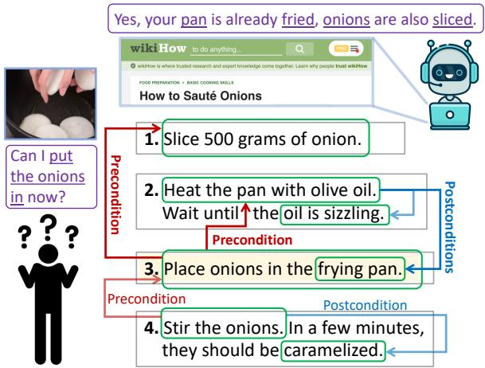
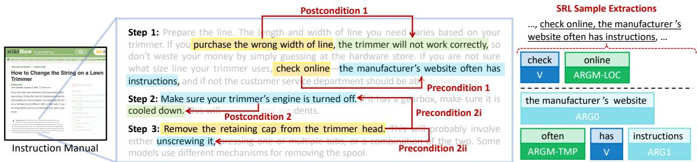
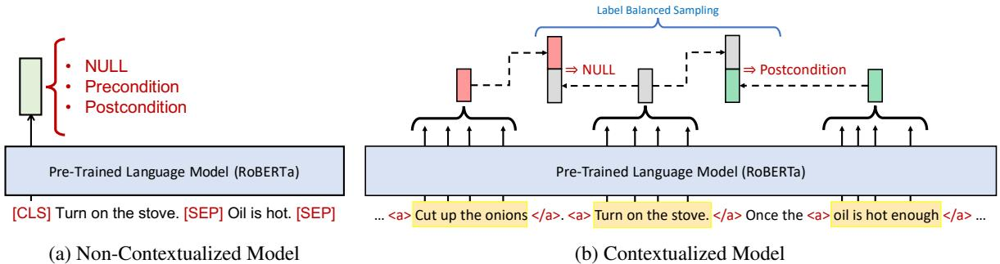
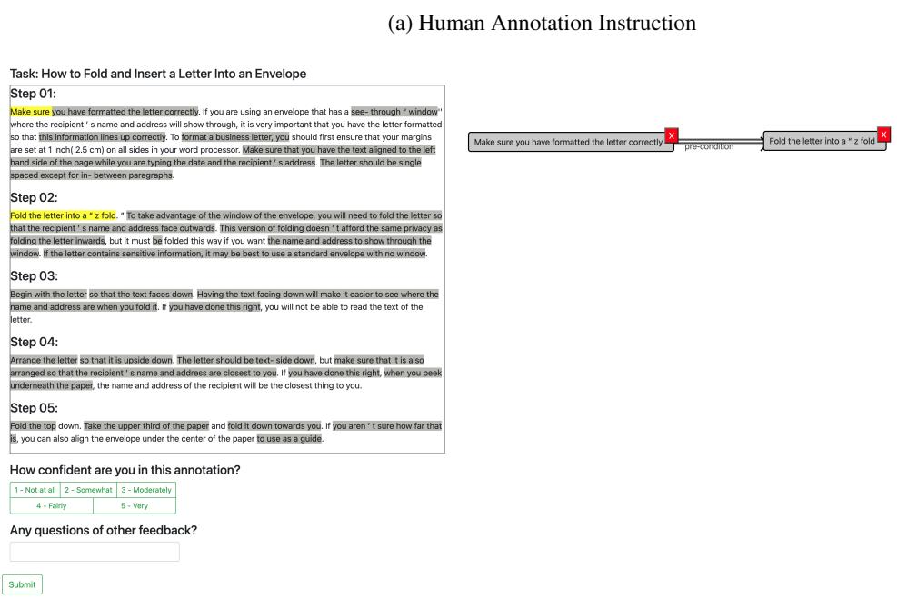

# Learning Action Conditions from Instructional Manuals for Instruction Understanding

Te-Lin Wu1, Caiqi Zhang2, Qingyuan Hu1, Alex Spangher3, Nanyun Peng1 1University of California, Los Angeles, 2University of Cambridge, 3Information Sciences Institute, University of Southern California {telinwu,violetpeng,hu528}@cs.ucla.edu, cz391@cam.ac.uk, spangher@isi.edu

## Abstract

The ability to infer pre- and postconditions of an action is vital for comprehending complex instructions, and is essential for applications such as autonomous instruction-guided agents and assistive AI that supports humans to perform physical tasks. In this work, we propose a task dubbed action condition inference, which extracts mentions of preconditions and postconditions of actions in instructional manuals. We propose a weakly supervised approach utilizing automatically constructed large-scale training instances from online instructions, and curate a densely human-annotated and validated dataset to study how well the current NLP models do on the proposed task. We design two types of models differ by whether contextualized and global information is leveraged, as well as various combinations of heuristics to construct the weak supervisions. Our experiments show a >20% F1-score improvement with considering the entire instruction contexts and a > 6% F1-score benefit with the proposed heuristics. However, the best performing model is still well-behind human performance.

## 1 Introduction

When performing complex tasks (e.g. making a gourmet dish), instructional manuals are often referred to as useful guidelines. To follow the instructed actions, it is crucial to understand the preconditions, i.e. prerequisites before taking a particular action, and the postconditions, i.e. the status supposed to be reached after performing the action. Knowledge of action-condition dependencies is prevalent and inferable in many instructional texts. For example, in Figure 1, before performing the action “place onions" in step 3, both preconditions: “heat the pan" (in step 2) and “slice onions" (in step 1) have to be successfully accomplished. Likewise, executing “stir onions" (in step 4), leads to its postcondition, “caramelized" (also in step 4).

  
Figure 1: The Action Condition Inference Task: We propose a task that probes models’ ability to infer both preconditions and postconditions of an action from instructional manuals. It has wide applications to e.g. assistive AI and tasksolving robots. ∗This instruction is simplified for illustration.

For autonomous agents or assistant AI that aids humans to accomplish tasks, understanding the conditions provides a structured view of a task (Linden, 1994; Aeronautiques et al., 1998; Branavan et al., 2012a; Sharma and Kroemer, 2020) and helps the agent correctly judge whether to proceed to the next action and evaluate the action completions. However, no prior work has systematically studied automatically extracting pre- and postconditions from prevalent data resources. To bridge this gap, we propose the action condition inference task on real-world instructional manuals, where a dense dependency graph is produced, as in Figure 1, to denote the pre- and postconditions of actions. Such a dependency graph provides a systematic task execution plan that agents can closely follow.

We consider two online instruction resources, WikiHow (Hadley et al.) and Instructables.com (Instructables), to study the current NLP models’ capabilities of performing the proposed task. As there is no densely annotated dataset on the desired action-condition-dependencies from real-world instructions, and annotating a comprehensive dependency structure of actions for long instruction contexts can be extremely expensive and laborious, we collect human annotations on a subset of totally 650 samples and benchmark models in either a zero-shot setting where no annotated data is used for training, or a low-resource/shot setting with limited amount of annotated training data.

  
Figure 2: Terminologies: (Left) shows a few exemplar actionables with their associated preconditions and postconditions Notice that an actionable can have multiple pre- or postconditions and they can span across different instruction steps (for simplicity we do not show an exhausted set of text segments, and the actual instruction contexts are much longer). (Right) SRL is used to postulate the text segments (actionables and conditions). We show a sample SRL extraction corresponding to one of the dependency linkages on the left. The SRL ARG labels also provide useful information for designing our heuristics (Section 4).

We also design the following heuristics and show that they can effectively construct large-scale weak supervisions: (1) Key entity tracing: Key repetitive entity mentions (including co-references) across different instruction descriptions likely suggest a dependency. (2) Keywords: Certain keywords (e.g. the before in “do X before doing Y") can often imply the condition dependencies. (3) Temporal reasoning: We adopt a temporal relation module (Han et al., 2021b) to alleviate the potential inconsistencies between the narrated orders of conditional events and their actual temporal orders to better utilize their temporally grounded nature (e.g. preconditions are prior to an action).

We benchmark two strong baselines based on pretrained language models with or without instruction contexts on our annotated held-out test-set, where the models are asked to make predictions exhaustively on every possible dependency. We observe that contextualized information is essential (> 20% F1-score gain over non-contextualized counterparts), and that our proposed heuristics are able to augment an effective weakly-supervised training data to further improve the performance (> 6% F1-score gain) on the low-resource setting. However, the best results are still well below human performance (> 20% F1-score difference).

Our key contributions are three-fold: (1) We propose an action-condition inference task and create a densely human-annotated evaluation dataset to spur research on structural instruction comprehensions. (2) We design linguistic-centric heuristics utilizing entity tracing, keywords, and temporal reasoning to construct effective large-scale weak supervisions. (3) We benchmark models on the proposed task to shed lights on future research.

## 2 Terminologies and Problem Definition

Our goal is to learn to infer action-condition dependencies in real-world instructional manuals. We first describe essential terminologies in details:

Actionable refers to a phrase that a person can follow and execute in the real world (yellow colored phrases in Figure 2). We also consider negated actions (e.g. do not ...) or actions warned to avoid (e.g. if you purchase the wrong...) as they likely also carry useful knowledge regarding the tasks.2

Precondition concerns the prerequisites to be met for an actionable to be executable, which can be a status, a condition, and/or another prior actionable (blue colored phrases in Figure 2). It is worth noting that humans can omit explicitly writing out certain condition statements because of their triviality as long as the actions inducing them are mentioned (e.g. heat the pan  pan is heated, the latter can often be omitted). We thus generalize the conventional precondition formulation, i.e. sets of statements evaluated to true/false (Fikes and Nilsson, 1971), to a phrase that is either a passive condition statement or an actionable that induces the prerequisite conditions, as inspired by Linden (1994).

Postcondition is defined as the outcome caused by the execution of an actionable, which often involves status changes of certain objects (or the actor itself) or certain effects emerged to the surroundings or world state (green colored phrases in Figure 2).

Text segment in this paper refers to a textual segment of interest, which can be one of: {actionable, precondition, postcondition}, in an article.

In reality, a valid actionable should have both preand postcondition dependencies, however, we do not enforce this in this work as conditions can occasionally be omitted by human authors.

Problem Formulation. Given an input instructional manual and some text segments of interest extracted from it, a model is asked to predict the directed relation between a pair of segments, where the relation should be one of the followings: NULL (no relation), precondition, or postcondition.

## 3 Datasets and Human Annotations

As the condition-dependency knowledge we are interested in is prevalent in real-world instructions, we consider two popular online resources, Wiki-How and Instructables.com, both consist of detailed multi-step task instructions, to support our investigation. For WikiHow, we use the provided dataset from Wu et al. (2022); for Instructables, we scrape the contents directly from their website.

Since densely annotating large-scale instruction sources for the desired dependencies is extremely expensive and laborious, we mainly annotate a testset and propose to train the models via weakly or self-supervised methods. We hence provide a small subset of the human-annotated data to adapt models to the problem domain. To this end, we collect comprehensive human annotations on a selected subset in each dataset to serve as our annotatedset, and particularly the subsets used to evaluate the models as the annotated-test-set.3 In total, our densely annotated-set has 500 samples in WikiHow and 150 samples in Instructables, spanning 7,191 distinct actions (defined by main predicate-object phrases) for diversity. In Section 6.2, we will describe how the annotated-set is split to facilitate the low-resource training. We also collect the human performance on the annotated-test-set to gauge the human upper bound of our proposed task. More dataset details are in Append. Sec. A.

## 3.1 Annotations and Task Specifications

Dataset Structure. The desired structure of the constructed data, as in Figure 2, features two main components: (1) text segment of interest (see Section 2), and (2) condition linkage, a directed and relational link connecting a pair of text segments.

Annotation Process. We conduct the annotatedset construction via Amazon Mechanical Turk (MTurk). Each worker is asked to carefully read over thoroughly a prompted complex multi-step instructional manual, where the annotation process consists of three main steps: (1) Text segments highlighting: To facilitate this step (and postulating the text segments for constructing weaksupervisions in Section 4), we pre-highlight several text segments extracted by semantic role labelling (SRL) for workers to choose from.4 They can also freely annotate (highlight by cursor) their more desirable segments. (2) Linking: We encourage the workers to annotate all the possible segments of interest, and then they are asked to connect certain pairs of segments that are likely to have dependencies with a directed edge. (3) Labelling: Finally, each directed edge drawn will need to be labelled as either a pre- or postcondition (NULL relations do not need to be explicitly annotated).

In general, for each article a worker is required to consider on average >500 pairwise relations with all associated article contexts (>300 tokens), which is a decently laborious task. Comparisons on the linkage annotations from different workers are as well made on every pair of their respective annotated text segments with the actual candidateconsideration from the entire rest of article.

Since the agreements among workers on both text segments and condition linkages are sufficiently high5 given the complexity of the annotation task, our final human annotated-set retains the majority voted segments and linkages.

Variants of Tasks. Although proper machine extraction of the text segments of interest as a spanbased prediction can be a valid and interesting task, we find that our automatic SRL extraction is already sufficiently reliable.6 In this paper, we thus mainly focus on the more essential linkage prediction (and their labels) task assuming that these text segments are given, and leave the possible end-to-end system with the (refined) text segment extraction, as the future work. Our proposed task and the associated annotated-set can be approached by a zero-shot or low-resource setting: the former involves no training on any of the annotated data and a heuristically constructed training set can be utilized (Section 4), while the latter allows models to be finetuned on a limited annotated-subset (Section 5.3). For the low-resource setting particularly, only 30% of the annotated data will be used for training (details of splits and considerations see Section 6.2).

standalone
<table><tr><td>Heuristics</td><td>Examples</td><td>Descriptions</td></tr><tr><td>Entity-Tracing &amp; Coref.</td><td>Heat the pan with olive oil. Slice 500 grams of onions. Precondition 1 .Place them in the frying pan. Precondition 2</td><td>The shared entities are pan and onions (linked via co-references to them).</td></tr><tr><td>Keywords</td><td>Precondition ... Make sureeverything is drybefore youfill your flowerpot with dirt. ... If you&#x27;re using a machine punch,stick the rivet through the hole Precondition</td><td>Keywords are used to link the segments they separate. If the keyword is at the be- ginning (2nd example), the (1st) comma is used to segment the sentences.</td></tr><tr><td>Postcondition</td><td>Postcondition the oil is sizzling. Warm a pan with oil over medium heat... Postcondition ... Do notpour water into your lock.... thewater will be frozen solid SRL Tags: ARGM-MOD ARG2</td><td>Certain linguistic hints (e.g. SRL tags) are utilized to propose plausible (and likely) postcondition text segments.</td></tr><tr><td>Temporal</td><td>Precondition Step down hard on the rubber part of the tire AFTER :&gt;pry off the back side of the tire first</td><td>The action prying should occur prior to stepping, but these two segments are re- versely narrated in the contexts.</td></tr></table>

Table 1: Heuristics used for determining condition linkages between text segments, with sample use-cases and descriptions.

## 4 Training With Weak Supervision

As mentioned in Section 3, our proposed task can be approached via a zero-shot setting, where the vast amount of un-annotated instruction data can be transformed into useful training resources (same dataset structure as described in Section 3.1). Moreover, it is proven that in many low-resource NLP tasks, constructing a much larger heuristic-based weakly supervised data can be beneficial (Plank and Agic´, 2018; Nidhi et al., 2018).

## 4.1 Linking Heuristics

The goal of designing certain heuristics is to perform a rule-based determination of the linkage (its direction and the condition label). Our design intuition is to harness dependency knowledge by exploiting relations between actions and entities (entity-level), certain linguistic patterns (phraselevel), and event-level information, which should be widely applicable to all kinds of instructional data. Concretely, we design four types of heuristics: (1) Keywords: certain keywords are hypothesized to show strong implication of conditions such as if, before, after; (2) Key entity tracing: text segments that share the same key entities are likely indicating dependencies; (3) Co-reference resolution is adopted to supplement (2); (4) Event temporal relation resolution technique is incorporated to handle the inconsistencies between narrative order and the actual temporal order of the events.

SRL Extraction. Without access to human refinements (Section 3.1), we leverage SRL to postulate all the segments of interests to construct the weakly-supervised set. As SRL can detect multiple plausible ways to form the ARG frames with respect to the same central verb, we need to additionally determine the most desirable parsesfor each action verb. In this work, we simply select the most desirable SRL parses by choosing ones that maximize both: (1) the number of plausible segments (each centered around an action verb) within a sentence, where they do not overlap above a certain threshold (set to be 60% in this work), and (2) the number of ARGs in each of such segment.

## 4.1.1 Keywords

Table 2 lists the major keywords that are considered in this work. Denote a text segment as ai, keywords are utilized so as the text segments separated with respect to them, i.e. a1 and a2, can be properly linked. Different keywords and their positions within sentences can lead to different directions of the linkages, i.e. $a _ { 1 }  a _ { 2 }$ (see second row of Table 1, note that here condition labels are not yet determined). For example, keywords before and after intuitively can lead to different directions if they are placed at non-beginning positions. We follow the rules listed in Table 2 to decide the directions.

## 4.1.2 Key Entity Tracing

It is intuitive to assume that if the two text segments mention the same entity, a dependency between them likely exists, and hence a trace of the same mentioned entity can postulate potential linkages. As exemplified in the first row of Table 1, that heating the pan being a necessary precondition to placing onions in the pan can be inferred by the shared mention “pan”. We adopt two ways to propose the candidate entities: (1) We extract all the noun phrases within the SRL segments (mostly ARG-tags), (2) Inspired by (Bosselut et al., 2018), a model is learned to predict potential entities involved that are not explicitly mentioned (e.g. fry the chicken may imply a pan is involved) in the context (more details see Append. Sec. C.1.4).

Co-References. Humans often use pronouns to refer to the same entity to alternate the mentions in articles, as exemplified by the mentions onions and them, in the first row of Table 1. Therefore, a straightforward augmentation to the aforementioned entity tracing is incorporating co-references of certain entities. We utilize a co-reference resolution model (Lee et al., 2018) to propose possible co-referred terms of extracted entities of each segment within the same step description (we do not consider cross-step co-references for simplicity).

## 4.2 Linking Algorithm

After applying the aforementioned linking heuristics, each text segment ${ { a } _ { i } } .$ , can have M linked segments: $\{ a _ { 1 } ^ { l _ { i } } , . . . , \bar { a } _ { M } ^ { l _ { i } } \}$ . For linkages that are traced by entity mentions (and co-references), their directions always start from priorly narrated segments to the later ones, while linkages determined by the keywords follow Table 2 for deciding their directions. However, the text segments that are narrated too much distant away from $a _ { i }$ are less likely to have direct dependencies. We therefore truncate the linked segments by ensuring any $a _ { j } ^ { l _ { i } }$ is narrated no more than “S step” ahead of $a _ { i } .$ , where S is empirically chosen to be 2 in this work.

Despite pruning the traces with the aforementioned design choice S can largely reduce condition-irrelevant segments, such heuristic indeed cannot guarantee the included text segments are always dependent with respect to an actionable. Our goal here is to exploit the generalization ability of language models to recognize segments that are most probable conditions by including as many heuristically proposed linkages as possible, where a better strategy on designing the maximum allowed step-wise distance is left as a future work.

<table><tr><td>Keywords</td><td>Begin.</td><td>Within Sent.</td></tr><tr><td>before, until, in order to, so</td><td> $a _ { 1 } \longrightarrow a _ { 2 }$ </td><td> $a _ { 1 }  a _ { 2 }$ </td></tr><tr><td>requires</td><td></td><td>a1 → a2</td></tr><tr><td>after, once, if</td><td> $a _ { 1 }  a _ { 2 }$ </td><td> $a _ { 1 } \longrightarrow a _ { 2 }$ </td></tr></table>

Table 2: Keywords for deciding a potential linkage: If a keyword is at the beginning of a sentence, we use the (first) comma of that sentence to separate it to two segments and link them accordingly, while the keyword itself is used as the separator otherwise. The segments are then either refined with SRL or kept as they are if SRL does not detect a valid verb.

## 4.2.1 Incorporating Temporal Relations

As hinted in Section 2, the conditions with respect to an actionable imply their temporal relations. The direction of an entity-trace-induced linkage is naively determined by the narrated order of text segments within contexts, however, in some circumstances (e.g. fourth row in Table 1), the narrative order can be inconsistent with the actual temporal order of the events. To alleviate such inconsistency, we apply an event temporal relation prediction model (Han et al., 2021b) (trained on various temporal relation datasets such as MATRES (Ning et al., 2018)) to fix the linkage directions.7

We train the model on three different random seeds and make them produce a consensus prediction, i.e. unless all of the models jointly predict a specific relation (BEFORE or AFTER), otherwise the relation will be regarded as VAGUE. The model is then applied to predict temporal relations of each pair of event triggers (extracted by SRL, i.e. verbs/predicates), and then we invert the direction of an entity-trace-induced linkage, $a _ { j } ^ { l _ { i } }  a _ { i } ,$ if their predicted temporal relation is opposite to their narrated order (VAGUE is of course ignored).

## 4.2.2 Labelling The Linkages

It is rather straightforward to label precondition linkages as a simple heuristic can be used: for a given segment, any segments that linked to the current one that are either narrated or temporally prior to it are plausible candidates for being preconditions. For determining postconditions, where they are mostly descriptions of status (changes), we therefore make use of certain linguistic cues that likely indicate human written status, $e . g .$ . the water will be frozen and the oil is sizzling. Specifically, we consider: (1) be-verbs followed by present-progressive tenses if the subject is an entity, and (2) segments whose SRL tags start with ARGM as exemplified in Table 1.

  
Figure 3: Model architectures: (a) Non-contextualized model: The model only considers a pair of given text segments. (b) Contextualized model: The model takes the whole instruction paragraphs (i.e. contexts) and wrap each text segment with our special tokens (<a>), where each segment representation is obtained by taking an average over its token representations. The ordered concatenated segment representations will then be fed into an MLP to make the final predictions.

## 5 Models

Our proposed heuristics do not assume specific model architecture to be applicable, and to benchmark the proposed task, we mainly consider two types of base models: (1) Non-contextualized model takes only the two text segments of interest at a time and make the pairwise trinary (directed) relation predictions, i.e. NULL, precondition, and postcondition; (2) Contextualized model also makes the relation predictions for every pair of input segments, but the inputs include the whole instruction article so the contexts are preserved. The two models are both based off pretrained language models (the non-contextualized model is essentially a standard transformer-based language model finetuned for classification tasks), and the relation prediction modules are multi-layer perceptrons (MLPs) added on top of the language models’ outputs. Crossentropy loss is used for training.

## 5.1 Non-Contextualized Model

The non-contextualized model takes two separately extracted text segments, $a _ { i }$ and $a _ { j }$ , as inputs and is trained similarly to the next sentence prediction in BERT (Devlin et al., 2019) (i.e. the order of the segments matters, which will be considered in determining their relations), as shown in Figure 3a.

## 5.2 Contextualized Model

The architecture of the contextualized model is as depicted in Figure 3b. Denote the tokens of the instruction text as ti and the tokens of ith text segment of interest (either automatically extracted by SRL or annotated by humans) as $\{ a _ { i j } \}$ . A special start and end of segment token, <a> and $< / \ a > .$ , is wrapped around each text segment and hence the input tokens become: $" t _ { 1 } , . . . , t _ { k } , < \mathsf { a } > \ a _ { i 1 } , a _ { i 2 } , . . . , a _ { i K } \ < / \mathsf { a } > , . . . " .$ The contextualized segment representation is then obtained by applying a mean pooling over the language model output representations of each of its tokens, i.e. denote the output representation of $a _ { i j }$ as ${ \bf 0 } ( a _ { i j } )$ , the segment representation of $\mathbf { 0 } ( a _ { i } )$ is $A v g P o o l ( \sum _ { j = 1 } ^ { K } \bullet ( a _ { i j } ) )$ . To determine the relation between segment i and $j ,$ we feed their ordered concatenated representation, concat $( \mathbf { o } ( a _ { i } ) , \mathbf { o } ( a _ { j } ) )$ , to an MLP for the relation prediction.

## 5.3 Learning

Multi-Staged Training. For different variants of our task (Section 3.1), we can utilize different combinations of the heuristically constructed dataset and the annotated-train-set. For the low-resource setting, our models can thus be firstly trained on the constructed training set, and then finetuned on the annotated-set. Furthermore, following the self-training paradigm (Xie et al., 2020; Du et al., 2021), the previously obtained model predictions can be utilized to either augment (i.e. adding linkages) or correct (i.e. revising linkages) the original heuristically constructed data. And hence a secondstage finetuning can be conducted on this modelself-annotated data for improved performance.

Label Balancing. It is obvious that most of the relations between randomly sampled text segment pairs will be NULL, and therefore the training labels are imbalanced. To alleviate this, we downsample the negative samples when training the models. Specifically, we fill each training mini-batch with equal amount of positive (relations are not NULL) and negative pairs, where the negatives are constructed by either inverting the positive pairs or replacing one of the segment with another randomly sampled unrelated segment within the same article.

## 6 Experiments and Analysis

Our experiments seek to answer these questions: (1) How well can the models and humans perform on the proposed task? (2) Is instructional context information useful? (3) Are the proposed heuristics and the second-stage self-training effective?

## 6.1 Training and Implementation Details

For both non-contextualized and contextualized models, we adopt the pretrained RoBERTa (-large) language model (Liu et al., 2019) as the base model. All the linguistic features, i.e. SRL (Shi and Lin, 2019), co-references, POS-tags, are extracted using models implemented by AllenNLP (Gardner et al., 2017). We truncate the input texts at maximum length of 500 while ensuring all the text segments within this length is preserved completely.

All the models in this work (i.e. both pretraining and finetuning) are trained on a single Nvidia A100 (40G RAM) GPU. The hyperparameters are manually tuned against different datasets, and the checkpoints used for testing are selected by the best performing ones on the held-out development sets.

## 6.2 Experimental Setups

Data Splits. The primary benchmark of WikiHow annotated-set is partitioned into train (30%), development (10%), and test (60%) set, respectively, resulting in 150, 50, and 300 data samples, for lowresource setting. We mainly consider the Instructables annotated-set in a zero-shot setting where we hypothesize the models trained on WikiHow can be well-transferred to it. For training conducted on the heuristically constructed data, including the secondstage self-training, we use respective held-out development sets to select the checkpoints around performance convergence for finetuning.

Evaluation Metrics. We ask the models to predict the relations on every pair of text segments in a given instruction, and compute the average precision (Prec.), recall, and F-1 scores separately with respect to each (pre/post) condition labels.

Baselines. There is no immediate baseline we are aware of for the proposed action condition inference task. However, we note that Dalvi et al. (2019)’s dependency graph prediction on scientific procedures (Mishra et al., 2018) shares high-level similarities to specifically our precondition inference task. Our non-contextualized model (without the second-stage self-training) with only the nounphrase-based entity tracing heuristic resembles the KB-induced prior dependency likelihood, gkb, in their proposed XPAD framework.8

Beside this adapted-XPAD, we also evaluate our task with (1) probabilistic random-guess baseline (random guesses proportional to the training-set label ratio), and (2) zero-shot GPT-3 (Brown et al., 2020) where we prompt GPT-3 with exemplar data instances as the task definition (contextualized, see Append. Sec. C.2 for prompts used). These baselines help us to set up a benchmark and justify the challenges our task poses.

## 6.3 Experimental Results

Table 3 left half summarizes both the human and model performance on our standard split (30% train, 60% test) of WikiHow annotated-set. Contextualized model obviously outperforms the noncontextualized counterpart greatly, and all learned models perform well-above random baseline. Significant improvements on both pre- and postcondition inferences can be noticed when heuristically constructed data is utilized, especially when no second-stage self-training is involved. The best performance is achieved by applying all the heuristics we design, where further improvements are made by augmenting with second-stage pseudo supervisions. Similar performance trends can be observed in Table 3 right half where a zero-shot transfer from models trained on WikiHow data to Instructables is conducted.

Notice that the zero-shot GPT-3 performs quite poorly compared to our best low-resource training setting, and generally worse than our zero-shot contextualized model utilizing only the heuristically constructed data. We hypothetically attribute the poor performance to both the requirement of exhaustive search of the conditions across the whole manual, and its lacking of complex commonsense reasoning; justifying the effectiveness of our proposed training paradigm and the difficulty of our task. Nevertheless, there are still large rooms for improvement as the best model falls well-behind human performance (>20% F1-score gap).

Heuristics Ablations. Table 4 features ablation studies on the designed heuristics. One can observe that keywords are mostly effective on inferring the postconditions, and co-references are significantly beneficial in the Instructables data, which can hypothetically be attributed to the writing style of the datasets (i.e. authors of Instructables might use coreferred terms more). Temporal relation resolution is consistently helpful across pre- and postconditions as well as datasets, suggesting only relying on narrated orders could degenerate the performance.

<table><tr><td rowspan="3">Model</td><td rowspan="3">Heus.</td><td rowspan="3">Finetuned/Self</td><td colspan="5">WikiHow Annotated-Test-Set</td><td colspan="6">Zero-Shot Transfer to Instructables</td></tr><tr><td colspan="3">Precondition</td><td colspan="3">Postcondition</td><td colspan="3">Precondition</td><td colspan="3">Postcondition</td></tr><tr><td>Prec.</td><td>Recall</td><td>F-1</td><td>Prec.</td><td>Recall</td><td>F-1</td><td>Prec.</td><td>Recall</td><td>F-1</td><td>Prec.</td><td>Recall</td><td>F-1</td></tr><tr><td>Prob. Random</td><td></td><td>N/N</td><td>3.55</td><td>4.42</td><td>3.54</td><td>0.61</td><td>0.86</td><td>0.68</td><td>2.94</td><td>3.88</td><td>3.04</td><td>0.46</td><td>0.46</td><td>0.42</td></tr><tr><td>Prompt. GPT-3</td><td></td><td>NN</td><td>3.87</td><td>73.46</td><td>7.35</td><td>4.90</td><td>77.08</td><td>9.21</td><td>3.14</td><td>64.25</td><td>5.99</td><td>1.37</td><td>34.33</td><td>2.65</td></tr><tr><td>Adapt.-XPAD</td><td></td><td>Y/N</td><td>6.21</td><td>58.38</td><td>10.64</td><td>9.47</td><td>13.83</td><td>10.45</td><td>5.11</td><td>57.53</td><td>8.92</td><td>7.74</td><td>9.00</td><td>7.89</td></tr><tr><td rowspan="2">Non-Context.</td><td>Y</td><td>Y/N</td><td>8.21</td><td>79.52</td><td>14.32</td><td>15.43</td><td>44.99</td><td>20.56</td><td>6.49</td><td>65.05</td><td>11.31</td><td>13.64</td><td>43.50</td><td>18.65</td></tr><tr><td>Y</td><td>Y/Y</td><td>8.56</td><td>81.19</td><td>14.91</td><td>26.53</td><td>65.95</td><td>34.31</td><td>6.64</td><td>67.13</td><td>11.54</td><td>24.53</td><td>61.93</td><td>31.78</td></tr><tr><td rowspan="5">Context.</td><td>N</td><td>Y/N</td><td>34.01</td><td>58.33</td><td>39.27</td><td>34.44</td><td>43.15</td><td>36.79</td><td>26.93</td><td>53.43</td><td>32.92</td><td>32.16</td><td>41.39</td><td>34.42</td></tr><tr><td>N</td><td>Y/Y</td><td>42.26</td><td>58.45</td><td>45.41</td><td>40.99</td><td>46.51</td><td>42.32</td><td>38.16</td><td>55.77</td><td>42.23</td><td>42.57</td><td>48.00</td><td>44.07</td></tr><tr><td>Y</td><td>N/N</td><td>10.69</td><td>34.79</td><td>15.05</td><td>10.34</td><td>11.88</td><td>10.49</td><td>10.34</td><td>16.17</td><td>11.42</td><td>4.52</td><td>4.15</td><td>4.15</td></tr><tr><td>Y</td><td>Y/N</td><td>47.92</td><td>64.63</td><td>51.38</td><td>51.15</td><td>57.64</td><td>52.59</td><td>40.70</td><td>58.97</td><td>45.17</td><td>47.92</td><td>56.51</td><td>50.06</td></tr><tr><td>Y</td><td>Y/Y</td><td>49.42</td><td>68.40</td><td>53.51</td><td>52.39</td><td>57.35</td><td>53.42</td><td>43.81</td><td>62.71</td><td>48.34</td><td>53.41</td><td>60.51</td><td>55.17</td></tr><tr><td>Human</td><td></td><td></td><td>83.91</td><td>83.86</td><td>83.55</td><td>77.39</td><td>84.81</td><td>78.81</td><td>84.74</td><td>81.32</td><td>82.78</td><td>71.90</td><td>82.51</td><td>75.53</td></tr></table>

Table 3: Annotated-test-set performance: The best performance is achieved by applying all of the proposed heuristics (heus.) and undergoing the two-stage training: finetuned on the annotated-train-set first and then perform the self-training. Note that for the Instructables, both Finetuned and Self are done on the WikiHow training sets and a zero-shot transfer is performed.
<table><tr><td rowspan="3">Heuristics.</td><td colspan="6">WikiHow Annotated-Test-Set</td><td colspan="6">Zero-Shot Transfer to Instructables</td></tr><tr><td colspan="3">Precondition</td><td colspan="3">Postcondition</td><td colspan="3">Precondition</td><td colspan="3">Postcondition</td></tr><tr><td>Prec.</td><td>Recall</td><td>F-1</td><td>Prec.</td><td>Recall</td><td>F-1</td><td>Prec.</td><td>Recall</td><td>F-1</td><td>Prec.</td><td>Recall</td><td>F-1</td></tr><tr><td>– temporal – coref. - keywords</td><td>45.60</td><td>61.22</td><td>48.59</td><td>43.71</td><td>47.56</td><td>44.35</td><td>39.35</td><td>57.03</td><td>43.49</td><td>38.45</td><td>42.96</td><td>39.39</td></tr><tr><td>– temporal – coref.</td><td>43.43</td><td>64.43</td><td>48.04</td><td>46.27</td><td>51.27</td><td>47.22</td><td>37.06</td><td>59.95</td><td>42.56</td><td>38.41</td><td>44.54</td><td>39.83</td></tr><tr><td>– temporal</td><td>45.83</td><td>62.48</td><td>49.17</td><td>47.72</td><td>52.70</td><td>48.81</td><td>39.39</td><td>59.53</td><td>44.23</td><td>46.81</td><td>52.15</td><td>48.23</td></tr></table>

Table 4: Heuristics ablations: The models used here are contextualized models without the second-stage self-training for both datasets, and "–" indicates exclusion (from using all). In general, each of the designed heuristics give incremental performance gain to both datasets, where the temporal component is particularly effective in postcondition predictions (compare to Table 3).

<table><tr><td rowspan="2">Train</td><td colspan="3">Precondition</td><td colspan="3">Postcondition</td></tr><tr><td>Prec.</td><td>Recall</td><td>F-1</td><td>Prec.</td><td>Recall</td><td>F-1</td></tr><tr><td>10%</td><td>41.34</td><td>61.71</td><td>46.06</td><td>45.24</td><td>55.56</td><td>47.95</td></tr><tr><td>20%</td><td>45.60</td><td>67.55</td><td>50.78</td><td>49.30</td><td>58.02</td><td>51.62</td></tr><tr><td>30%</td><td>57.38</td><td>64.46</td><td>57.53</td><td>50.49</td><td>54.57</td><td>51.09</td></tr><tr><td>40%</td><td>49.61</td><td>73.09</td><td>55.14</td><td>50.45</td><td>57.77</td><td>52.27</td></tr><tr><td>50%</td><td>54.27</td><td>70.89</td><td>57.84</td><td>51.35</td><td>55.85</td><td>52.23</td></tr><tr><td>60%</td><td>53.21</td><td>69.36</td><td>56.42</td><td>53.68</td><td>58.09</td><td>54.46</td></tr></table>

Table 5: Varying annotated-train-set size: on WikiHow (test-set size is fixed at 30%). We use the (best) model trained with all the proposed heuristics and the self-training paradigm.

## 6.3.1 Error Analysis.

While our (best) models perform well on linkages that exhibit similar concepts to the designed heuristics and generalize beyond their surface forms, we are interested in investigating under which situations they are more likely to err. We therefore subsample 10% of the annotated test-set for manual qualitative inspections and summarize our observations in Table 6. We find that our models can sometimes overfit to certain heuristic concepts as in Table 6 first row (within a food preparation context). Another improvement the models can enjoy is better causal understanding, which is currently not explicitly handled by our heuristics and can be an interesting future work (Table 6 second row, in a biking and cleaning contexts).

<table><tr><td>Type</td><td>Example</td><td>Description</td></tr><tr><td>Heus. Overfit</td><td>Precondition . use a sharp blade to cut . Precondition look for a blade</td><td>Overfits on entity trace heuristic.</td></tr><tr><td>Lacking Causal Reason</td><td>Precondition . body start leaning 0 NULt decrease pedal resistance can&#x27;t completely dry. Postcondition 8 NUt.bacteria could form .</td><td>Knowledge- enhanced causal rea- soning can be helpful.</td></tr></table>

Table 6: Exemplar model errors. The second row are from distant segments not link-able even via the keyword heuristic.

Humans, on the other hand, exhibit much superior performance than the models, tend to fail more often on two kinds of situations: (1) Missing preconditions (of an action) in those much earlier paragraphs, and (2) Sophisticated temporal ordering of the events (often not narrated sequentially in the texts). Especially, the first sentences of each task-step are often regarded as the starting actions, while in reality, they can be postconditions of the followed-up detailed contexts. However, we think both aforementioned errors are rather remediable if the annotators are more careful and search more exhaustively for condition statements.

## 6.3.2 The Effect of Training Set Size

Table 3 shows that with a little amount of data for training, our models can perform significantly better than the zero-shot setting. This arouses a question – how would the performance change with respect to the training set size, i.e. do we just need more data? To quantify the effect of training size on model performance, we conduct an experiment where we vary the sample size in the training set while fixing the development (10%) and test (30%) set for consistency consideration. We use the best settings in Table 3, i.e. with all the heuristics and self-training paradigm, for this study. We can observe, from Table 5, a plateau in performance when the training set size is approaching 60%, implying that simply keep adding more training samples does not necessarily yield significant improvements, and hypothesize that the discussed potential improvements are the keys to further effectively exploit the rich knowledge in large-scale instructional data.

## 7 Related Works

Procedural Text Understanding. Uncovering knowledge in texts that specifically features procedural structure has drawn many attentions, including aspects of tracking entity state changes (Branavan et al., 2012b; Bosselut et al., 2018; Mishra et al., 2018; Tandon et al., 2020), incorporating common sense or constraints (Tandon et al., 2018; Du et al., 2019), procedure-centric question answering (QA) (Tandon et al., 2019), and structural parsing or generations (Malmaud et al., 2014; Zellers et al., 2021; Zhou et al., 2023). Clark et al. (2018) leverages VerbNet (Schuler, 2005) with if-then constructed rules, one of the keywords we also utilize, to determine object-state postconditions for answering state-related reading comprehension questions. In addition, some prior works also specifically formulate precondition understanding as multiple choice QA for event triggers (verbs) (Kwon et al., 2020) and common sense phrases (Qasemi et al., 2021). We hope our work on inferring actioncondition dependencies, an essential knowledge especially for understanding task-procedures, from long instruction texts, can help advancing the goal of more comprehensive procedural text understanding.

Drawing dependencies among procedure steps has been explored in (Dalvi et al., 2019; Sakaguchi et al., 2021; Pal et al., 2021), however, their procedures are manually synthesized short paragraphs. Our work, in contrast, aims at inferring diverse dependency knowledge directly from complex realworld and task-solving-oriented instructional manuals, enabling the condition dependencies to go beyond inter-step and narrative boundaries.

Event Relation Extraction. Our work is also inspired by document-level event relation extraction (Han et al., 2019, 2021a; Huang et al., 2021; Ma et al., 2021). Specifically, certain works also adopt weak supervisions to learn event temporal relations (Zhou et al., 2020, 2021; Han et al., 2021b), while other relevant works aim at extracting causality relations (mainly cause-effect) automatically from texts (Cao et al., 2016; Altenberg, 1984; Stasaski et al., 2021). Our work combines multiple commonsensical heuristics tailored to the nature of the dependencies exhibited in actions and their conditions, in real-world instruction sources.

## 8 Conclusions

In this work we propose a task on inferring action and (pre/post)condition dependencies on realworld online instructional manuals. We formulate the problem in both zero-shot and low-resource settings, where several heuristics are designed to construct an effective large-scale weakly supervised data. While the proposed heuristics and the twostaged training leads to significant performance improvements, the results still highlight significant gaps below human performance (> 20% F1-score).

We hope our studies and the collected resources can spur relevant research, and suggest two main future directions: (1) End-to-end propose (refined) actionables, conditions, and their dependencies, by fully exploiting our featured span-annotations of the text segments. (2) Inferred world states from the text descriptions as well as external knowledge of the entities and causal common sense can be factored into the heuristics for weak-supervisions.

## 9 Limitations

We hereby discuss the current limitations of our work: (1) As mentioned in Section 3.1, although our annotated dataset enables the possibility of learning an extractive model that can be trained to predict the span of the text segments of interest from scratch, we focus on the more essential actioncondition dependency linkage inference task as we find that the SRL extraction heuristic currently applied sufficiently reliable. In the future, we look forward to actualizing such an extractive module and other relevant works that can either further refine the SRL-spans or directly propose the text segments we require. More specifically, the extractive module can be supervised and/or evaluated against with our human annotations on the text segment start-end positions of an article. (2) The current system is only trained on unimodal (text-only) and English instruction resources. Multilingual and multimodal versions of our work could be as well an interesting future endeavors to make. (3) In this work, we mostly consider instructions from physical works. While certain conditions and actions can still be defined within more social domain of data (e.g. a precondition to being a good person might be cultivating good habits). As a result, we do not really guarantee the performance of our models when applied to data from these less physicaloriented domains.

## 10 Ethics and Broader Impacts

We hereby acknowledge that all of the co-authors of this work are aware of the provided ACL Code ofEthics and honor the code of conduct. This work is mainly about inferring pre- and postconditions of a given action item in an instructional manual. The followings give the aspects of both our ethical considerations and our potential impacts to the community.

Dataset. We collect the human annotation of the ground truth condition-action dependencies via Amazon Mechanical Turk (MTurk) and ensure that all the personal information of the workers involved (e.g., usernames, emails, urls, demographic information, etc.) is discarded in our dataset. Although we aim at providing a test set that is agreed upon from various people examining the instructions, there might still be unintended biases within the judgements, we make efforts on reducing these biases by collecting diverse set of instructions in order to arrive at a better general consensus on our task.

This research has been reviewed by the IRB board and granted the status of an IRB exempt. The detailed annotation process (pay per amount of work, guidelines) is included in the appendix; and overall, we ensure our pay per task is above the the annotator’s local minimum wage (approximately \$15 USD / Hour). We primarily consider English speaking regions for our annotations as the task requires certain level of English proficiency.

Techniques. We benchmark the proposed condition-inferring task with the state-of-the-art large-scale pretrained language models and our proposed training paradigms. As commonsense and task procedure understanding are of our main focus, we do not anticipate production of harmful outputs, especially towards vulnerable populations, after training (and evaluating) models on our proposed task.

## Acknowledgments

Many thanks to Rujun Han for his implementation on the temporal relation resolution model. This material is based on research supported by the Machine Common Sense (MCS) program under Cooperative Agreement N66001-19-2-4032 with the US Defense Advanced Research Projects Agency (DARPA). The views and conclusions contained herein are those of the authors and should not be interpreted as necessarily representing DARPA, or the U.S. Government.

## References

Constructions Aeronautiques, Adele Howe, Craig Knoblock, ISI Drew McDermott, Ashwin Ram, Manuela Veloso, Daniel Weld, David Wilkins SRI, Anthony Barrett, Dave Christianson, et al. 1998. Pddl| the planning domain definition language. Technical Report, Tech. Rep.

Bengt Altenberg. 1984. Causal linking in spoken and written english. Studia linguistica, 38(1):20–69.

Antoine Bosselut, Omer Levy, Ari Holtzman, Corin Ennis, Dieter Fox, and Yejin Choi. 2018. Simulating action dynamics with neural process networks. In International Conference on Learning Representations (ICLR).

SRK Branavan, Nate Kushman, Tao Lei, and Regina Barzilay. 2012a. Learning high-level planning from text. In Association for Computational Linguistics (ACL).

S.R.K. Branavan, Nate Kushman, Tao Lei, and Regina Barzilay. 2012b. Learning high-level planning from text. In Association for Computational Linguistics (ACL).

Tom Brown, Benjamin Mann, Nick Ryder, Melanie Subbiah, Jared D Kaplan, Prafulla Dhariwal, Arvind Neelakantan, Pranav Shyam, Girish Sastry, Amanda Askell, et al. 2020. Language models are few-shot learners. In Neural Information Processing Systems (NeurIPS), volume 33, pages 1877–1901.

Mengyun Cao, Xiaoping Sun, and Hai Zhuge. 2016. The role of cause-effect link within scientific paper. In 2016 12th International Conference on Semantics, Knowledge and Grids (SKG), pages 32–39. IEEE.

Peter Clark, Bhavana Dalvi, and Niket Tandon. 2018. What happened? leveraging verbnet to predict the effects of actions in procedural text. arXiv preprint arXiv:1804.05435.

Bhavana Dalvi, Niket Tandon, Antoine Bosselut, Wentau Yih, and Peter Clark. 2019. Everything happens for a reason: Discovering the purpose of actions in procedural text. In Empirical Methods in Natural Language Processing (EMNLP), pages 4496–4505.

Jacob Devlin, Ming-Wei Chang, Kenton Lee, and Kristina Toutanova. 2019. Bert: Pre-training of deep bidirectional transformers for language understanding. In North American Chapter ofthe Association for Computational Linguistics (NAACL-HLT), pages 4171–4186.

Jingfei Du, Edouard Grave, Beliz Gunel, Vishrav Chaudhary, Onur Celebi, Michael Auli, Ves Stoyanov, and Alexis Conneau. 2021. Self-training improves pretraining for natural language understanding. In North American Chapter of the Association for Computational Linguistics (NAACL-HLT).

Xinya Du, Bhavana Dalvi Mishra, Niket Tandon, Antoine Bosselut, Wen-tau Yih, Peter Clark, and Claire Cardie. 2019. Be consistent! improving procedural text comprehension using label consistency. In North American Chapter of the Association for Computational Linguistics (NAACL-HLT).

Richard E Fikes and Nils J Nilsson. 1971. Strips: A new approach to the application of theorem proving to problem solving. In Artificial intelligence, volume 2, pages 189–208. Elsevier.

Matt Gardner, Joel Grus, Mark Neumann, Oyvind Tafjord, Pradeep Dasigi, Nelson F. Liu, Matthew Peters, Michael Schmitz, and Luke S. Zettlemoyer. 2017. Allennlp: A deep semantic natural language processing platform.

Chris Hadley, Katiana Uyemura, Kyle Hall, Kira Jan, Sean Volavong, and Natalie Harrington. Wikihow.

Rujun Han, I-Hung Hsu, Jiao Sun, Julia Baylon, Qiang Ning, Dan Roth, and Nanyun Peng. 2021a. Ester: A machine reading comprehension dataset for event

semantic relation reasoning. In The 2021 Conference on Empirical Methods in Natural Language Processing (EMNLP).

Rujun Han, Qiang Ning, and Nanyun Peng. 2019. Joint event and temporal relation extraction with shared representations and structured prediction. In 2019 Conference on Empirical Methods in Natural Language Processing (EMNLP).

Rujun Han, Xiang Ren, and Nanyun Peng. 2021b. Econet: Effective continual pretraining of language models for event temporal reasoning. In Empirical Methods in Natural Language Processing (EMNLP).

Kung-Hsiang Huang, Sam Tang, and Nanyun Peng. 2021. Document-level entity-based extraction as template generation. In The 2021 Conference on Empirical Methods in Natural Language Processing (EMNLP).

Instructables. instructables.com. [Online; accessed 24-June-2022].

Diederik P Kingma and Jimmy Ba. 2015. Adam: A method for stochastic optimization. In International Conference on Learning Representations (ICLR).

Heeyoung Kwon, Mahnaz Koupaee, Pratyush Singh, Gargi Sawhney, Anmol Shukla, Keerthi Kumar Kallur, Nathanael Chambers, and Niranjan Balasubramanian. 2020. Modeling preconditions in text with a crowd-sourced dataset. In Empirical Methods in Natural Language Processing (EMNLP).

Kenton Lee, Luheng He, and L. Zettlemoyer. 2018. Higher-order coreference resolution with coarse-tofine inference. In North American Chapter of the Associationfor Computational Linguistics (NAACL-HLT).

Keith Vander Linden. 1994. Generating precondition expressions in instructional text. In Association for Computational Linguistics (ACL).

Yinhan Liu, Myle Ott, Naman Goyal, Jingfei Du, Mandar Joshi, Danqi Chen, Omer Levy, Mike Lewis, Luke Zettlemoyer, and Veselin Stoyanov. 2019. Roberta: A robustly optimized bert pretraining approach. arXiv preprint arXiv:1907.11692.

Mingyu Derek Ma, Jiao Sun, Mu Yang, Kung-Hsiang Huang, Nuan Wen, Shikhar Singh, Rujun Han, and Nanyun Peng. 2021. Eventplus: A temporal event understanding pipeline. In 2021 Annual Conference of the North American Chapter of the Association for Computational Linguistics (NAACL), Demonstrations Track.

Jonathan Malmaud, Earl Wagner, Nancy Chang, and Kevin Murphy. 2014. Cooking with semantics. In Proceedings of the ACL 2014 Workshop on Semantic Parsing, pages 33–38.

Bhavana Dalvi Mishra, Lifu Huang, Niket Tandon, Wen-tau Yih, and Peter Clark. 2018. Tracking state changes in procedural text: a challenge dataset and models for process paragraph comprehension. In North American Chapter ofthe Associationfor Computational Linguistics (NAACL-HLT).

Aldrian Obaja Muis Naoki Otani Nidhi, Vyas Ruochen Xu, and Yiming Yang Teruko Mitamura Eduard Hovy. 2018. Low-resource cross-lingual event type detection in documents via distant supervision with minimal effort. In International Conference on Computational Linguistics (COLING).

Qiang Ning, Hao Wu, and Dan Roth. 2018. A multiaxis annotation scheme for event temporal relations. In Associationfor Computational Linguistics (ACL).

Kuntal Kumar Pal, Kazuaki Kashihara, Pratyay Banerjee, Swaroop Mishra, Ruoyu Wang, and Chitta Baral. 2021. Constructing flow graphs from procedural cybersecurity texts. In Findings ofthe Associationfor Computational Linguistics: ACL-IJCNLP 2021.

Barbara Plank and Željko Agic. 2018. Distant super-´ vision from disparate sources for low-resource partof-speech tagging. In Empirical Methods in Natural Language Processing (EMNLP).

Ehsan Qasemi, Filip Ilievski, Muhao Chen, and Pedro Szekely. 2021. Corequisite: Circumstantial preconditions of common sense knowledge. In West Coast NLP Summit (WeCNLP).

Keisuke Sakaguchi, Chandra Bhagavatula, Ronan Le Bras, Niket Tandon, Peter Clark, and Yejin Choi. 2021. proScript: Partially ordered scripts generation. In Findings of the Association for Computational Linguistics: EMNLP 2021.

Karin Kipper Schuler. 2005. VerbNet: A broadcoverage, comprehensive verb lexicon. University of Pennsylvania.

Mohit Sharma and Oliver Kroemer. 2020. Relational learning for skill preconditions. In Conference on Robot Learning (CoRL).

Peng Shi and Jimmy Lin. 2019. Simple bert models for relation extraction and semantic role labeling. ArXiv, abs/1904.05255.

Katherine Stasaski, Manav Rathod, Tony Tu, Yunfang Xiao, and Marti A Hearst. 2021. Automatically generating cause-and-effect questions from passages. In Proceedings ofthe 16th Workshop on Innovative Use of NLP for Building Educational Applications, pages 158–170.

Niket Tandon, Bhavana Dalvi Mishra, Joel Grus, Wentau Yih, Antoine Bosselut, and Peter Clark. 2018. Reasoning about actions and state changes by injecting commonsense knowledge. In Empirical Methods in Natural Language Processing (EMNLP).

Niket Tandon, Bhavana Dalvi Mishra, Keisuke Sakaguchi, Antoine Bosselut, and Peter Clark. 2019. Wiqa: A dataset for" what if..." reasoning over procedural text. In Empirical Methods in Natural Language Processing (EMNLP).

Niket Tandon, Keisuke Sakaguchi, Bhavana Dalvi, Dheeraj Rajagopal, Peter Clark, Michal Guerquin, Kyle Richardson, and Eduard Hovy. 2020. A dataset for tracking entities in open domain procedural text. In Empirical Methods in Natural Language Processing (EMNLP), pages 6408–6417.

Thomas Wolf, Lysandre Debut, Victor Sanh, Julien Chaumond, Clement Delangue, Anthony Moi, Pierric Cistac, Tim Rault, Rémi Louf, Morgan Funtowicz, Joe Davison, Sam Shleifer, Patrick von Platen, Clara Ma, Yacine Jernite, Julien Plu, Canwen Xu, Teven Le Scao, Sylvain Gugger, Mariama Drame, Quentin Lhoest, and Alexander M. Rush. 2020. Transformers: State-of-the-art natural language processing. In Proceedings of the 2020 Conference on Empirical Methods in Natural Language Processing: System Demonstrations, pages 38–45, Online. Association for Computational Linguistics.

Te-Lin Wu, Alex Spangher, Pegah Alipoormolabashi, Marjorie Freedman, Ralph Weischedel, and Nanyun Peng. 2022. Understanding multimodal procedural knowledge by sequencing multimodal instructional manuals. In Association for Computational Linguistics (ACL).

Qizhe Xie, Minh-Thang Luong, Eduard Hovy, and Quoc V Le. 2020. Self-training with noisy student improves imagenet classification. In Proceedings of the IEEE/CVF conference on computer vision and pattern recognition, pages 10687–10698.

Rowan Zellers, Ari Holtzman, Matthew Peters, Roozbeh Mottaghi, Aniruddha Kembhavi, Ali Farhadi, and Yejin Choi. 2021. Piglet: Language grounding through neuro-symbolic interaction in a 3d world. In Associationfor Computational Linguistics (ACL).

Li Zhang, Qing Lyu, and Chris Callison-Burch. 2020. Reasoning about goals, steps, and temporal ordering with WikiHow. In Empirical Methods in Natural Language Processing (EMNLP), pages 4630–4639.

Ben Zhou, Qiang Ning, Daniel Khashabi, and Dan Roth. 2020. Temporal common sense acquisition with minimal supervision. In Association for Computational Linguistics (ACL).

Ben Zhou, Kyle Richardson, Qiang Ning, Tushar Khot, Ashish Sabharwal, and Dan Roth. 2021. Temporal reasoning on implicit events from distant supervision. In North American Chapter of the Association for Computational Linguistics (NAACL-HLT).

Yilun Zhou, Julie Shah, and Steven Schockaert. 2019. Learning household task knowledge from WikiHow descriptions. In Proceedings of the 5th Workshop

on Semantic Deep Learning (SemDeep-5), pages 50– 56, Macau, China. Association for Computational Linguistics.

Yu Zhou, Sha Li, Manling Li, Xudong Lin, Shih-Fu Chang, Mohit Bansal, and Heng Ji. 2023. Nonsequential graph script induction via multimedia grounding. In Association for Computational Linguistics (ACL).

## A Details of The Datasets

Resource-wise our work utilizes online instructional manuals (e.g. WikiHow) following many existing works (Zhou et al., 2019; Zhang et al., 2020; Wu et al., 2022), specifically, the large-scale WikiHow training data is provided by (Wu et al., 2022), while we scrape the Instructables.com data on our own. Since Instructables.com dataset tend to have noisier and more free-formed texts, we thus manually sub-sample a smaller (as compared to the test-set of WikiHow) high quality subset.

We report the essential statistics of the annotatedsets in Table 7. Although our definition of actionable is any textual phrase that can be actually acted in the real world, every unique phrase in our dataset is basically a distinct actionable. We compute the number of distinct actions by extracting the main verb-noun phrases (with lemmatization applied) in a text segment as a valid-action, and report their counts in Table 7 as well. Each unique action in this way can lead to roughly only 1-to-3 pairwise relation instance in our annotated dataset. Both this and the aforementioned unique action count justifies the diversity of our collected annotated-set.

Each unique URL of WikiHow can have different multi-step sections, and we denote each unique section as a unique article in our dataset; while for Instructables.com, each URL only maps to a single section. As a result, for WikiHow we firstly manually select a set of URLs that are judged featuring high quality (i.e. articles consisting clear instructed actions, and contain not so much non-meaningful or unhelpful monologues from the writer) instructions and then sample one or two sections from each of the URLs to construct our annotated-set. The statistics of the datasets used to construct the large-scale weakly supervised WikiHow training set can be found in Section 3 of (Wu et al., 2022), where we use their provided WikiHow training samples that are mostly from physical categories.

∗Our densely annotated datasets and relevant tools will be made public upon paper acceptance.

## A.1 Dataset Splits

The whole annotated Instructables.com data samples are used as an evaluating set so we do not need to explicitly split them. For WikiHow, we split mainly with respect to the URLs to ensure that no articles (i.e. sections) from the same URL are put into different data splits, so as to prevent model exploiting the writing style and knowledge from the same URL of articles on WikiHow. The splitting on the URL-level is as well a random split.

<table><tr><td>Type</td><td colspan="3">Counts</td></tr><tr><td>Total Unique Articles</td><td colspan="3">500</td></tr><tr><td>Total Unique URLs</td><td colspan="3">326</td></tr><tr><td>Annot.-Train / Annot.-Test</td><td colspan="3">200 / 300</td></tr><tr><td>Type-Token Ratio</td><td colspan="3">9799 / 173920 = 0.06</td></tr><tr><td>Pre-/Postcondition Ratio</td><td colspan="3">16457 / 2839 = 5.80</td></tr><tr><td>Distinct Actions</td><td colspan="3">5205</td></tr><tr><td>Avg. Instance per Unique Action</td><td colspan="3">3.33</td></tr><tr><td>Avg. Possible Text Segment Pairs</td><td colspan="3">717.49</td></tr><tr><td>Type</td><td>Mean</td><td>Std</td><td>Min</td><td>Max</td></tr><tr><td>Tokens in a Step Text</td><td>67.67</td><td>23.77</td><td>2</td><td>161</td></tr><tr><td>Sentences in a Step Text</td><td>4.20</td><td>1.00</td><td>1</td><td>6</td></tr><tr><td>Tokens in an article</td><td>319.12</td><td>91.71</td><td>96</td><td>631</td></tr><tr><td>Sentences in an article</td><td>19.81</td><td>4.03</td><td>11</td><td>28</td></tr></table>

(a) WikiHow
<table><tr><td>Type</td><td colspan="3">Counts</td></tr><tr><td>Total Unique Articles</td><td colspan="3">150</td></tr><tr><td>Total Unique URLs</td><td colspan="3">150</td></tr><tr><td>Annot.-Train / Annot.-Test</td><td colspan="3">0 / 150</td></tr><tr><td>Type-Token Ratio</td><td colspan="3">5580 / 60150 = 0.09</td></tr><tr><td>Pre-/Postcondition Ratio</td><td colspan="3">5157 / 698 = 7.39</td></tr><tr><td>Distinct Actions</td><td colspan="3">1986</td></tr><tr><td>Avg. Instance per Unique Action</td><td colspan="3">1.11</td></tr><tr><td>Avg. Possible Text Segment Pairs</td><td colspan="3">633.75</td></tr><tr><td>Type</td><td>Mean</td><td>Std</td><td>Min</td><td>Max</td></tr><tr><td>Tokens in a Step Text</td><td>64.75</td><td>42.57</td><td>2</td><td>234</td></tr><tr><td>Sentences in a Štep Text</td><td>4.27</td><td>2.73</td><td>1</td><td>17</td></tr><tr><td>Tokens in an article</td><td>333.3</td><td>143.22</td><td>124</td><td>877</td></tr><tr><td>Sentences in an article</td><td>21.98</td><td>9.47</td><td>10</td><td>50</td></tr></table>

(b) Instructables.com  
Table 7: General statistics of the two annotated-sets: We provide the detailed component counts of the annotated-sets used in this work, including the statistics of tokens and sentences from the instruction steps (lower halves).

## B Details of Human Annotations

## B.1 Inter-Annotator Agreements (IAAs)

There are two types of inter-annotator agreements (IAAs) we compute: (1) IAA on text segments and (2) IAA on linkages, and we describe the details of their computations in this section.

IAA on Text Segments. For each workerhighlighted text segment, either coming from directly clicking the pre-highlighted segments or their own creations, we compute the percentage of the overlapping of the tokens between segments annotated by different workers. If this percentage is > 60% of each segment in comparison, we denote these two segments are aligned. Concretely, for all the unique segments of the same article, annotated by different workers, we can postulate a segment dictionary where the aligned segments from different worker annotations are combined into the same ones. And hence each worker’s annotation can be viewed as a binary existence of each of the items in such a segment dictionary, where we can compute the Cohen’s Kappa inter-annotator agreement scores on every pair of annotators to derive the averaged IAA scores.

IAA on Linkages. Similar to the construction of a segment dictionary, we also construct a linkage dictionary where every link has a head segment pointing to the tail segment, with both of the segments coming from an item in the segment dictionary. We thus can also treat the annotation of the linkages across different worker annotations as a binary existence and perform similar inter-annotator agreement computations.

The resulting IAAs for each dataset and annotation types are reported in Section 3.1.

Majority Vote. To obtain the final multi-annotatorjudged refined data, with our collection budget allowance, we ensure that the number of annotators per data instance (instruction article) is at least 2 (mostly 3), where consensus (strict agreement) is used for instances with 2 annotators, and majority vote is adopted for 3 annotators.

## B.2 Annotation Process

We adopt Amazon Mechanical Turk (MTurk) to publish and collect our annotations, where each of the annotation in the MTurk is called a Human Intelligence Task (HIT). As shown in Figure 4a, on the top of each HIT we have a detailed description of the task’s introduction, terminologies, and instructions. For the terms we define, such as actionables and pre-/postconditions, we also illustrate them with detailed examples. To make it easier for workers to quickly understand our tasks, we provide a video version explaining important concepts and the basic operations. We also set up a Frequently Asked Question (FAQ) section and constantly update such section with some questions gathered from the workers.

Figure 4b shows the layout of the annotation panel. A few statements are pre-highlighted in grey and each of them is clickable. These statements are automatically pre-selected using the SRL heuristics described in Section 3.1, which are supposed to cover as much potential actionables and pre-/postconditions as possible. Workers can either simply click the pre-highlighted statements or redo the selection to get their more desired segments. The clicked or selected statements will pop up to the right panel as the text-blocks. For the convenience to manage the page layout, each text-block is dragable and can be moved anywhere within the panel. The workers then should examine with their intelligence and common sense to connect text-blocks (two at a time) by right clicking one of them to start a directed linkage (which ends at another text-block) and choose a proper dependency label for that particular drawn linkage.

<table><tr><td>Confidence Level</td><td>WikiHow</td><td>Instructables.com</td></tr><tr><td>5 (Very)</td><td>27.27</td><td>16.33</td></tr><tr><td>4 (Fairly)</td><td>27.11</td><td>23.47</td></tr><tr><td>3 (Moderately)</td><td>28.25</td><td>22.95</td></tr><tr><td>2 (Somewhat)</td><td>16.23</td><td>29.10</td></tr><tr><td>1 (Not-At-All)</td><td>1.14</td><td>8.16</td></tr></table>

Table 8: Confidence-Level Statistics (%): In WikiHow, majority (> 80%) of the annotators indicate at least > 3 (Moderately) confidence level. As for Instructables.com, it has lower confidence level as the articles tend to be more freeformed and noisy, however, there are still more than 60% of the time workers report confidence levels at least moderately.

Since our annotation task can be rather complicated, we would like our workers to fully understand the requirements before proceeding to the actual annotation. All annotators are expected to pass three qualification rounds, each consisting of 5 HITs, before being selected as an official annotator. 15 HITs are annotated internally in advance as the standard answers to be used to judge the qualification round qualities.

We calculate the IAAs of each annotator against our standard answers to measure their performance in our task. In each round, only the best performers move on to the next. At the end of each round, we email annotators to explain the questions they asked or some of the more commonly made mistakes shared across multiple workers. In total, over 60 workers participated in our task, and 10 of them passed the qualification rounds.

We estimate the time required to complete each of our HITs to be 10-15 minutes, and adjust our pay rate to \$2.5 and \$3 USD for the qualification and the actual production rounds, respectively. This roughly equates to a \$15 to \$18 USD per hour wage, which is above the local minimum wage for the workers. We also ensure that each of our data samples in the official rounds is annotated by at least two different good workers.

Confidence Levels. We compute the averaged percentage of confidence levels reported by the workers in Table 8. Note that majority of the workers indicate a moderately or fairly confidence levels, implying they are sufficiently confident about their annotations. We also see feedback from workers that some of them rarely use strong words such as very to indicate their confidence levels, and hence the resulted statistics of their confidences could be a bit biased towards the medium.

Human Performance. We randomly select 100 samples from the WikiHow annotated-test-set and 50 samples from the Instructables.com annotatedtest-set for computing the human performance. The allowed inputs are exactly the same as what models take, i.e. given all the instruction paragraph as context and highlighted (postulated text segment boxes) text segments of interests, workers are asked to predict the relations among such segments so as to induce a complete dependency graph. For each sample, we collect inputs from two different workers, and ensure that the workers are not the ones that give the original annotations of the actioncondition dependencies. The human performance is then computed by taking the averaged metrics similar to the models on the given samples.

## C Modelling Details

## C.1 More on Heuristics

## C.1.1 SRL Extraction

As SRL can detect multiple plausible ways to form the ARG frames to the same central verb, we need to determine which one is the most likely to be desirable. When such multiple argument patterns exist for the same central verb, we simply determine the most desirable formation of segments by maximizing both the number of plausible segments (where they do not overlap above certain threshold, which is set to be 60% in this work) within a sentence and the number of ARGs in each segment.

## C.1.2 Linking Algorithm

In Section 4.2 we mention that a maximum distance of 2 steps between linked segments is imposed to filter out possible non-dependent conditions. While this still can potentially include many not-so-much depended text segments, our goal is to exploit the generalization ability of large-scale pretrained language models to recognize segments that are most probable conditions by including as much as heuristically proposed linkages as possible, which is empirically proven effective. A better strategy on making such a design choice of maximum allowed step-wise distance is left as a future work.

## C.1.3 Keywords

About 3% of the entire un-annotated data have sentences containing the keywords we use in this work (Table 2). Despite the relatively small amount compared to other heuristics, they are quite effective judging from the results reported in Table 3.

## C.1.4 Key Entity Tracing

For the key entity tracing heuristic described in Section 4.1.2, as long as two segments share at least one mentioned entity, they can be linked (i.e. traced by the shared entity). We do not constraint the number of key entities within a segment, so there can be more than one being used to conduct the tracing.

Constructing Entity Prediction Datasets. As mentioned in Section 4.1.2, one way to postulate the key entities is via constructing a predictive model for outputting potentially involved entities. To do so, we firstly construct an entity vocabulary by extracting all the noun phrases within each SRL extracted segments of the entire un-annotated-set articles. To prevent from obtaining a too much large vocabulary as well as improbable entities, we only retain entities (without lemmatization) that appear with > 5 occurrences in at least one article.

We then train a language model (based on RoBERTa-large as well) where the output is the multi-label multi-class classification results on the predicted entities. When predicting the key entities for a given segment, we further constraint the predictions to be within the local vocabulary (more than 5 occurrences) within the article such segment belongs to. This model is inspired by the entity selector module proposed in (Bosselut et al., 2018) while we only consider single step statements. We verify the performance of the learned model on the dataset provided by (Bosselut et al., 2018) (the entity selection task), where our model can achieve roughly 60% on F-1 metric, indicating the trained model is sufficiently reliable.

## C.1.5 Temporal Relations

We use the temporal relation resolution model from (Han et al., 2021b) that is trained on various temporal relation datasets such as MATRES (Ning et al., 2018). We train the model on three different random seeds and make them produce a consensus prediction, i.e. unless all of the models jointly predict a specific relation (BEFORE or AFTER), otherwise the relation will be regarded as VAGUE.

## C.2 GPT-3 Baseline

We use the most powerful version of GPT-3 (Davinci)9 provided by the OpenAI GPT-3 API (zero-shot prompted version) with the following prompt:

Extract the preconditions and postconditions from this text:

Text: "Slice 500 grams ofonion. Heat the pan with olive oil. Wait until the oil is sizzling. Place onions in the frying pan. Stir the onions. In a few minutes, they should be caramelized."

Segment 1: "Heat the pan with olive oil."

Segment 2: "oil is sizzling."

Label: post-condition

Text: "Slice 500 grams ofonion. Heat the pan with olive oil. Wait until the oil is sizzling. Place onions in the frying pan. Stir the onions. In a few minutes, they should be caramelized."

Segment 1: "Slice 500 grams of onion."

Segment 2: "Place the onions in the frying pan."

Label: pre-condition

Text: "Slice 500 grams of onion. Heat the pan with olive oil. Wait until the oil is sizzling. Place onions in the frying pan. Stir the onions. In a few minutes, they should be caramelized."

Segment 1: "Slice 500 grams of onion."

Segment 2: "Heat the pan with olive oil."

Label: no relation

Text: "Fill-In an Article"

Segment 1: "Fill-In Text Segment 1"

Segment 2: "Fill-In Text Segment 2"

Label: GPT-3 Prediction

In other words, we provide an exemplar simplified instance to instruct what pre- and postconditions should be like to the model with the article context and a pair of text segments of interest. And then, the GPT-3 model should generate the text description-based prediction label (non-casesensitive). For preconditions we allow verbalized label to be within {precondition, pre-condition}, and postconditions within {postcondition, postcondition}. For the NULL relation, we allow {no relation, unrelated, null, none}.

## C.3 Development Set Performance

We select the model checkpoints to be evaluated using the held-out development split (annotateddev-set). We also report the performance on this annotated-dev-set in Table 9.

## C.4 More Results on Train-Set Size Varying

Table 10 is a similar experiment as Table 5 but here we conduct the experiments with the models that do not utilize the weakly supervised data constructed with the proposed heuristics at all. One can observe that similar trends hold that a plateau can be noticed when the training set size is approaching 60%. Compared to Table 5, we can also observe that the smaller the train-set size is, the larger gaps shown between the models with and without utilizing the heuristically constructed data. This can further imply the effectiveness of our heuristics to construct meaningful data for the action-condition dependency inferring task. The models with heuristics, if compared at the same train-set size respectively, significantly outperforms every model counterparts that do not utilize the heuristics.

Table 11 reports similar experiments but in the Instructables.com annotated-test-set. Note that we perform a direct zero-shot transfer from the Wiki-How annotated-train-set, so the test-set size is always 100% for the Instructables.

Finally, both Tables 12 and 13 report the same experiments, however, this time the second-stage self-training is not applied. It is worth noting that the self-training is indeed effective throughout all the train-set-size and across different datasets and model variants, however, the trends of model performance hitting a saturation point when the trainset size increases still hold.

## C.5 Training & Implementation Details

Training Details. The maximum of 500 token length described in Section 6.1 is sufficient for most of the data in the annotated-test-sets, as evident in Table 7. All the models in this work are trained on a single Nvidia A100 GPU10 on a Ubuntu 20.04.2 operating system. The hyperparameters for each model are manually tuned against different datasets, and the checkpoints used for testing are selected by the best performing ones on the held-out development sets in their respective datasets.

Implementation Details. The implementations of the transformer-based models are extended from the HuggingFace11 code base (Wolf et al., 2020), and our entire code-base is implemented in Py-Torch.12

<table><tr><td rowspan="2">Model</td><td colspan="3">WikiHow Annotated-Dev-Set</td><td colspan="3">Precondition</td><td colspan="3">Postcondition</td></tr><tr><td>Heuristics</td><td>Finetuned</td><td>Self</td><td>Prec.</td><td>Recall</td><td>F-1</td><td>Prec.</td><td>Recall</td><td>F-1</td></tr><tr><td>Non-Context.</td><td></td><td>Y</td><td>Y</td><td>8.22</td><td>74.77</td><td>14.00</td><td>19.70</td><td>69.94</td><td>28.36</td></tr><tr><td rowspan="9"></td><td colspan="2">No Heuristics</td><td></td><td>N 29.96</td><td>56.91</td><td>35.41</td><td>30.28</td><td>39.10</td><td>32.03</td></tr><tr><td>No Heuristics</td><td>Y Y</td><td>Y</td><td>40.09</td><td>57.60</td><td>43.20</td><td>41.10</td><td>48.59</td><td>42.53</td></tr><tr><td></td><td>All N</td><td>N</td><td>9.59</td><td>32.69</td><td>13.35</td><td>7.48</td><td>9.26</td><td>7.81</td></tr><tr><td>– temporal – coref. - keywords</td><td>Y</td><td>N</td><td>43.59</td><td>58.74</td><td>45.95</td><td>39.33</td><td>44.45</td><td>40.64</td></tr><tr><td>– temporal – coref.</td><td>Y</td><td>N</td><td>38.43</td><td>60.48</td><td>42.83</td><td>39.72</td><td>47.80</td><td>41.92</td></tr><tr><td>– temporal</td><td>Y</td><td>N</td><td>41.19</td><td>57.06</td><td>43.92</td><td>47.63</td><td>54.69</td><td>48.91</td></tr><tr><td>All</td><td>Y</td><td>N</td><td>45.05</td><td>59.59</td><td>47.35</td><td>45.65</td><td>50.35</td><td>46.42</td></tr><tr><td>All</td><td>Y</td><td>Y</td><td>44.93</td><td>65.25</td><td>49.12</td><td>46.06</td><td>52.04</td><td>47.21</td></tr></table>

Table 9: Annotated-dev-set performance on WikiHow: Similar to Table 3, we report the development set performance on the WikiHow dataset (Instructables.com does not have the development set as we are conducting a zero-shot transfer).

<table><tr><td rowspan="2">Train</td><td colspan="3">Precondition</td><td colspan="3">Postcondition</td></tr><tr><td>Prec.</td><td>Recall</td><td>F-1</td><td>Prec.</td><td>Recall</td><td>F-1</td></tr><tr><td>10%</td><td>33.44</td><td>56.41</td><td>38.69</td><td>42.37</td><td>53.86</td><td>45.25</td></tr><tr><td>20%</td><td>35.05</td><td>60.97</td><td>40.86</td><td>40.76</td><td>51.35</td><td>43.19</td></tr><tr><td>30%</td><td>44.57</td><td>60.19</td><td>47.68</td><td>43.00</td><td>47.26</td><td>43.83</td></tr><tr><td>40%</td><td>39.38</td><td>72.23</td><td>46.63</td><td>45.51</td><td>54.27</td><td>47.57</td></tr><tr><td>50%</td><td>40.97</td><td>69.70</td><td>47.24</td><td>49.15</td><td>59.04</td><td>51.76</td></tr><tr><td>60%</td><td>46.99</td><td>71.14</td><td>52.27</td><td>48.80</td><td>56.51</td><td>50.74</td></tr></table>

Table 10: Varying annotated-train-set size without weakly supervised training: on WikiHow (test-set size is fixed at 30%). The model used in this experiment is without training on any of the heuristically constructed dataset, but we apply the self-training paradigm.

<table><tr><td rowspan="2">Train</td><td colspan="3">Precondition</td><td colspan="3">Postcondition</td></tr><tr><td>Prec.</td><td>Recall</td><td>F-1</td><td>Prec.</td><td>Recall</td><td>F-1</td></tr><tr><td>10% 20% 40%</td><td>32.25 35.95</td><td>50.50 56.99</td><td>36.36 40.89</td><td>41.37 48.77</td><td>51.37 60.10</td><td>44.03 51.86</td></tr><tr><td>50%</td><td>39.62 57.38</td><td>64.19 64.46</td><td>45.77 57.53</td><td>48.83 50.49</td><td>60.30 54.57</td><td>52.08 51.09</td></tr><tr><td>60%</td><td>45.62</td><td>61.02</td><td>49.06</td><td>55.00</td><td>65.04</td><td>57.54</td></tr><tr><td>10%</td><td></td><td></td><td></td><td></td><td></td><td></td></tr><tr><td>20% 40%</td><td>27.50 26.86</td><td>50.32 51.73</td><td>32.74 32.34</td><td>34.99 40.31</td><td>47.66 52.89</td><td>38.18 43.43</td></tr></table>

Table 11: Varying annotated-train-set size: on Instructables.com (test-set size is fixed at 100%). Note that here the train-set size is from WikiHow annotated-set, and the 30% is basically Table 3. The upper half is with models that utilize both the heuristically constructed dataset and the self-training paradigm, while the lower half is with models that do not use any weak supervisions.

## C.6 Hyperparameters

We train our models until performance convergence is observed on the heuristically constructed dataset. The training time for the weakly supervised learning is roughly 6-8 hours. For all the finetuning that involves our annotated-sets, we train the models for roughly 10-15 epochs for all the model variants, where the training time varies from 1-2 hours. We list all the hyperparameters used in Table 14. The basic hyperparameters such as learning rate, batch size, and gradient accumulation steps are kept consistent for all kinds of training in this work, including training on the weakly supervised data, finetuning on the annotated-sets, as well as during the second-stage self-training. All of our models adopt the same search bounds and ranges of trials as in Table 15.

<table><tr><td rowspan="2">Train</td><td colspan="3">Precondition</td><td colspan="3">Postcondition</td></tr><tr><td>Prec.</td><td>Recall</td><td>F-1</td><td>Prec.</td><td>Recall</td><td>F-1</td></tr><tr><td>10%</td><td>39.77</td><td>61.58</td><td>44.65</td><td>45.76</td><td>53.42</td><td>47.57</td></tr><tr><td>20%</td><td>42.75</td><td>64.32</td><td>47.40</td><td>47.97</td><td>56.99</td><td>50.21</td></tr><tr><td>30%</td><td>52.37</td><td>64.59</td><td>54.43</td><td>50.70</td><td>55.93</td><td>51.87</td></tr><tr><td>40%</td><td>43.77</td><td>68.58</td><td>49.28</td><td>45.47</td><td>53.78</td><td>47.48</td></tr><tr><td>50%</td><td>51.98</td><td>67.29</td><td>54.94</td><td>50.45</td><td>54.84</td><td>51.21</td></tr><tr><td>60%</td><td>47.96</td><td>69.77</td><td>52.61</td><td>47.81</td><td>52.27</td><td>48.77</td></tr><tr><td>10%</td><td>26.37</td><td>51.61</td><td>31.80</td><td>31.52</td><td>47.68</td><td>35.33</td></tr><tr><td>20%</td><td>28.62</td><td>56.40</td><td>34.53</td><td>33.68</td><td>48.10</td><td>37.30</td></tr><tr><td>30%</td><td>37.20</td><td>60.09</td><td>42.32</td><td>37.44</td><td>45.52</td><td>39.39</td></tr><tr><td>40%</td><td>32.74</td><td>68.97</td><td>40.57</td><td>36.33</td><td>47.00</td><td>39.00</td></tr><tr><td>50%</td><td>40.30</td><td>65.62</td><td>45.94</td><td>44.86</td><td>53.36</td><td>46.85</td></tr><tr><td>60%</td><td>38.80</td><td>68.16</td><td>45.27</td><td>42.03</td><td>51.96</td><td>44.43</td></tr></table>

Table 12: Varying annotated-train-set size: on WikiHow (test-set size is fixed at 30%). The upper half is with models that utilize the heuristically constructed dataset, while the lower half is with models that do not use any weak supervisions. Both upper and lower halves do not undergo any second-stage self-training.
<table><tr><td rowspan="2">Train</td><td colspan="3">Precondition</td><td colspan="3">Postcondition</td></tr><tr><td>Prec.</td><td>Recall</td><td>F-1</td><td>Prec.</td><td>Recall</td><td>F-1</td></tr><tr><td>10% 20%</td><td>29.59 31.46</td><td>52.25 53.34</td><td>34.76 36.37</td><td>40.31 44.11</td><td>50.26</td><td>42.92 46.94</td></tr><tr><td>40%</td><td>34.02</td><td>60.66</td><td>40.20</td><td>43.62</td><td>55.32 51.56</td><td>45.43</td></tr><tr><td>50%</td><td>42.57</td><td>59.24</td><td>46.38</td><td>49.83</td><td>57.26</td><td>51.77</td></tr><tr><td>60%</td><td>37.69</td><td>61.36</td><td>43.34</td><td>48.49</td><td>54.29</td><td>49.70</td></tr><tr><td>10%</td><td></td><td></td><td></td><td></td><td></td><td></td></tr><tr><td></td><td>18.44</td><td>41.85</td><td>23.20</td><td>21.97</td><td>39.08</td><td>26.02</td></tr><tr><td>20%</td><td>20.91</td><td>48.63</td><td>26.52</td><td>28.93</td><td>44.85</td><td>32.98</td></tr><tr><td>40%</td><td>23.89</td><td>61.51</td><td>31.59</td><td>36.43</td><td>51.98</td><td>40.50</td></tr><tr><td>50%</td><td>30.56</td><td>58.10</td><td>36.90</td><td>41.35</td><td></td><td></td></tr><tr><td>60%</td><td>28.59</td><td></td><td></td><td></td><td>54.48</td><td>44.95</td></tr><tr><td></td><td></td><td>60.24</td><td>35.52</td><td>40.06</td><td>53.41</td><td>43.20</td></tr></table>

Table 13: Varying annotated-train-set size: on Instructables.com (test-set size is fixed at 100%). The structure of this table is similar to that of Table 12, i.e. no self-training is conducted.

<table><tr><td>Models</td><td>Batch Size</td><td>Initial LR</td><td># Training Epochs</td><td>Gradient Accu- mulation Steps</td><td># Params</td></tr><tr><td>Non-contextualized</td><td>8</td><td> $1 \times 1 0 ^ { - 5 }$ </td><td>15</td><td>1</td><td>355M</td></tr><tr><td>Contextualized</td><td>4</td><td> $1 \times 1 0 ^ { - 5 }$ </td><td>15</td><td>1</td><td>372M</td></tr></table>

Table 14: Hyperparameters in this work: Initial LR denotes the initial learning rate. All the models are trained with Adam optimizers (Kingma and Ba, 2015). We include number of learnable parameters of each model in the column of # params.
<table><tr><td>Type</td><td>Batch Size</td><td>Initial LR</td><td># Training Epochs</td><td>Gradient Accumulation Steps</td></tr><tr><td>Bound (lower-upper)</td><td>2-8</td><td> $1 \times 1 0 ^ { - 5 } – 1 \times 1 0 ^ { - 6 }$ </td><td>5-15</td><td>1</td></tr><tr><td>Number of Trials</td><td>2-4</td><td>2-3</td><td>2-4</td><td>1</td></tr></table>

Table 15: Search bounds for the hyperparameters of all the models.

\* Please Make Sure You Read ALL the Instructions Below Before Doing the HIT!
<table><tr><td rowspan=1 colspan=1>Hello, about us, and thank you for your help!</td></tr><tr><td rowspan=1 colspan=1>Introduction and Terminologies</td></tr><tr><td rowspan=1 colspan=1>Instructions and Annotation Flow</td></tr><tr><td rowspan=1 colspan=1>FAQ (Optional but VERY HELPFUL)</td></tr><tr><td rowspan=1 colspan=1></td></tr></table>

\* Please DO NOT refresh the page or press the go back button of your browser. Otherwise, some results may be lost! Tips:

• If you hover your mouse cursor on a connected edge, the text blocks will change colors to indicate their types for your references.

• Colors used to identify each type of the blocks: Pre-condition color Actionable color Post-condition color

Read above for detailed instructions and examples!

  
(b) Sample Annotation Interface  
Figure 4: MTurk Annotation User Interface: (a) We ask workers to follow the indicated instruction. All the blue-colored text bars on the top of the page are expandable. Workers can click to expand them for detailed instructions of the annotation task. (b) The annotation task is designed for an intuitive click/select-then-link usage, followed by a few additional questions such as confidence level and feedback (this example is obtained from WikiHow dataset). The grey-color-highlighted text segments are postulated by the SRL, where the color of a segment will turn yellow if either being selected or cursor highlighted. Notice that for better illustration, the directions of the links in our paper are opposite to those in the annotation process.

## ACL 2023 Responsible NLP Checklist

## A For every submission:

 A1. Did you describe the limitations of your work? Left blank.

 A2. Did you discuss any potential risks of your work? Left blank.

 A3. Do the abstract and introduction summarize the paper’s main claims? Left blank.

 A4. Have you used AI writing assistants when working on this paper? Left blank.

B  Did you use or create scientific artifacts? Left blank.

 B1. Did you cite the creators of artifacts you used? Left blank.

 B2. Did you discuss the license or terms for use and / or distribution of any artifacts? Left blank.

 B3. Did you discuss if your use of existing artifact(s) was consistent with their intended use, provided that it was specified? For the artifacts you create, do you specify intended use and whether that is compatible with the original access conditions (in particular, derivatives of data accessed for research purposes should not be used outside of research contexts)? Left blank.

 B4. Did you discuss the steps taken to check whether the data that was collected / used contains any information that names or uniquely identifies individual people or offensive content, and the steps taken to protect / anonymize it? Left blank.

 B5. Did you provide documentation of the artifacts, e.g., coverage of domains, languages, and linguistic phenomena, demographic groups represented, etc.? Left blank.

 B6. Did you report relevant statistics like the number of examples, details of train / test / dev splits, etc. for the data that you used / created? Even for commonly-used benchmark datasets, include the number of examples in train / validation / test splits, as these provide necessary context for a reader to understand experimental results. For example, small differences in accuracy on large test sets may be significant, while on small test sets they may not be. Left blank.

## C  Did you run computational experiments?

Left blank.

 C1. Did you report the number of parameters in the models used, the total computational budget (e.g., GPU hours), and computing infrastructure used? Left blank.

 C2. Did you discuss the experimental setup, including hyperparameter search and best-found hyperparameter values? Left blank.

 C3. Did you report descriptive statistics about your results (e.g., error bars around results, summary statistics from sets of experiments), and is it transparent whether you are reporting the max, mean, etc. or just a single run? Left blank.

 C4. If you used existing packages (e.g., for preprocessing, for normalization, or for evaluation), did you report the implementation, model, and parameter settings used (e.g., NLTK, Spacy, ROUGE, etc.)? Left blank.

D  Did you use human annotators (e.g., crowdworkers) or research with human participants? Left blank.

 D1. Did you report the full text of instructions given to participants, including e.g., screenshots, disclaimers of any risks to participants or annotators, etc.? Left blank.

 D2. Did you report information about how you recruited (e.g., crowdsourcing platform, students) and paid participants, and discuss if such payment is adequate given the participants’ demographic (e.g., country of residence)? Left blank.

 D3. Did you discuss whether and how consent was obtained from people whose data you’re using/curating? For example, if you collected data via crowdsourcing, did your instructions to crowdworkers explain how the data would be used? Left blank.

 D4. Was the data collection protocol approved (or determined exempt) by an ethics review board? Left blank.

 D5. Did you report the basic demographic and geographic characteristics of the annotator population that is the source of the data? Left blank.