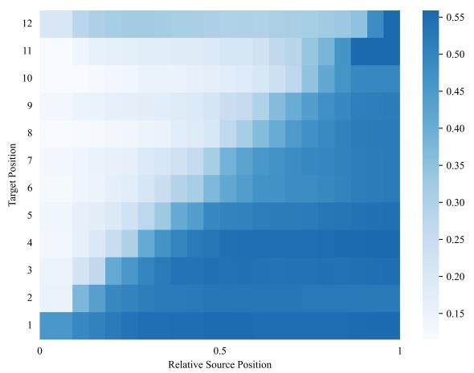
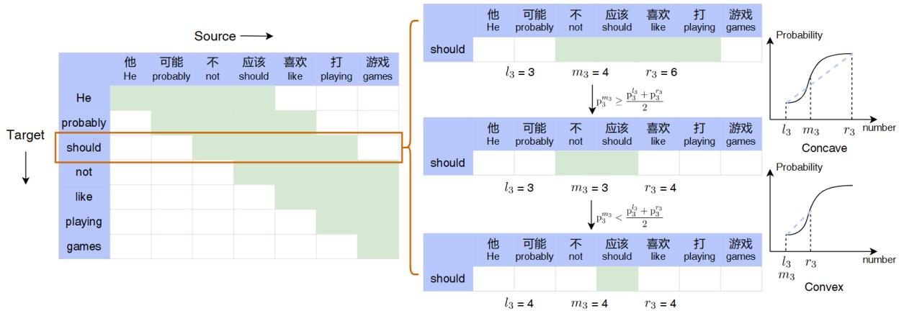
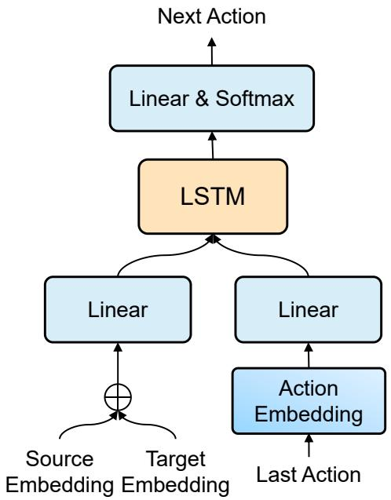
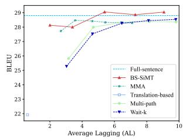
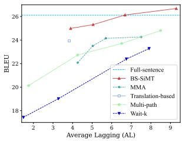
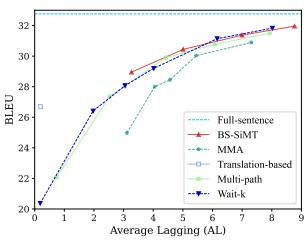
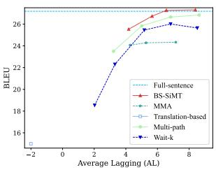
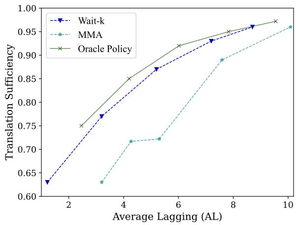

# Learning Optimal Policy for Simultaneous Machine Translation via Binary Search

Shoutao Guo 1,2, Shaolei Zhang 1,2, Yang Feng 1,2∗

1Key Laboratory of Intelligent Information Processing Institute of Computing Technology, Chinese Academy of Sciences (ICT/CAS) 2 University of Chinese Academy of Sciences, Beijing, China {guoshoutao22z, zhangshaolei20z, fengyang}@ict.ac.cn

## Abstract

Simultaneous machine translation (SiMT) starts to output translation while reading the source sentence and needs a precise policy to decide when to output the generated translation. Therefore, the policy determines the number of source tokens read during the translation of each target token. However, it is difficult to learn a precise translation policy to achieve good latency-quality trade-offs, because there is no golden policy corresponding to parallel sentences as explicit supervision. In this paper, we present a new method for constructing the optimal policy online via binary search. By employing explicit supervision, our approach enables the SiMT model to learn the optimal policy, which can guide the model in completing the translation during inference. Experi ments on four translation tasks show that our method can exceed strong baselines across all latency scenarios1

## 1 Introduction

Simultaneous machine translation (SiMT) (Gu et al., 2017; Ma et al., 2019; Arivazhagan et al., 2019; Ma et al., 2020; Zhang et al., 2020), which outputs the generated translation before reading the whole source sentence, is applicable to many realtime scenarios, such as live broadcast and real-time subtitles. To achieve the goal of high translation quality and low latency (Zhang and Feng, 2022b), the SiMT model relies on a policy that determines the number of source tokens to read during the translation of each target token.

The translation policy plays a pivotal role in determining the performance of SiMT, as an imprecise policy can lead to degraded translation quality or introduce unnecessary delays, resulting in poor translation performance (Zhang and Feng, 2022c).

Therefore, it is crucial to establish an optimal policy that achieves good latency-quality trade-offs. However, the absence of a golden policy between the source and target makes it challenging for the SiMT model to acquire the explicit supervision required for learning the optimal policy. According to Zhang et al. (2020), the SiMT model will learn better policy if it is trained with external supervision. Consequently, by constructing the optimal policy between the source and target, we can train the SiMT model, which will then generate translations based on the learned policy during inference.

However, the existing methods, including fixed policy and adaptive policy, have limitations in learning the optimal policy due to the lack of appropriate explicit supervision. For fixed policy (Dalvi et al., 2018; Ma et al., 2019; Elbayad et al., 2020; Zhang and Feng, 2021b), the model relies on heuristic rules to generate translations. However, these rules may not prompt the SiMT model to output the generated translation immediately, even when there is sufficient source information to translate the current target token. Consequently, the fixed policy often cannot achieve good latency-quality tradeoffs because of its rigid rules. For adaptive policy (Gu et al., 2017; Arivazhagan et al., 2019; Ma et al., 2020; Zhang and Feng, 2022b), the model can dynamically determine its policy based on the translation status, leading to improved performance. Nevertheless, precise policy learning without explicit supervision remains challenging. Some methods (Zhang et al., 2020; Alinejad et al., 2021) attempt to construct learning labels for the policy offline by introducing external information. But the constructed labels for policy learning cannot guarantee that they are also optimal for the translation model.

Under these grounds, our goal is to search for an optimal policy through self-learning during training, eliminating the need for external supervision. Subsequently, this optimal policy can be employed to guide policy decisions during inference. In

SiMT, increasing the number of source tokens read improves translation quality but also leads to higher latency (Ma et al., 2019). However, as the length of the read-in source sequence grows, the profit of translation quality brought by reading more source tokens will also hit bottlenecks (Zhang and Feng, 2021b). Therefore, the gain of reading one source token can be evaluated with the ratio of the improvement in translation quality to the corresponding increase in latency. The optimal policy will make sure that every decision of reading or writing will get the greatest gain. In this way, after translating the whole source sequence, the SiMT can get the greatest gain, thereby achieving good latency-quality trade-offs.

In this paper, we propose a SiMT method based on binary search (BS-SiMT), which leverages binary search to construct the optimal translation policy online and then performs policy learning accordingly. Specifically, BS-SiMT model consists of a translation model and an agent responsible for policy decisions during inference. To construct the optimal policy, the translation model treats potential source positions as search interval and selects the next search interval by evaluating the concavity in binary search. This selection process effectively identifies the interval with the highest gain, thus enabling the construction of an optimal policy that ensures good performance. Subsequently, the constructed policy is used to train the agent, which determines whether the current source information is sufficient to translate the target token during inference. If the current source information is deemed sufficient, the translation model outputs the generated translation; otherwise, it waits for the required source tokens. Experiments on De En and En Vi translation tasks show that our method can exceed strong baselines under all latency.

## 2 Background

For SiMT task, the model incrementally reads the source sentence $\mathbf { x } = ( x _ { 1 } , . . . , x _ { J } )$ with length $J$ and generates translation $\mathbf { y } = ( y _ { 1 } , . . . , y _ { I } )$ with length I according to a policy. To define the policy, we introduce the concept of the number of source tokens read when translating target token $y _ { i }$ , denoted as $g _ { i }$ Then the translation policy can be formalized as $\mathbf { g } = ( g _ { 1 } , . . . , g _ { I } )$ . The probability of translating target token $y _ { i }$ is $p _ { \theta } ( y _ { i } | \mathbf { x } _ { \le g _ { i } } , \mathbf { y } _ { < i } )$ , where $\mathbf { x } _ { \leq g _ { i } }$ is the source tokens read in when translating $y _ { i } , \mathbf { y } _ { < i }$ is the output target tokens and $\theta$ is model parameters.

  
Figure 1: The translating probability of ground-truth when attending to different numbers of tokens. When translating each target token, the model adopts the waitk policy for previous tokens.

Consequently, the SiMT model can be optimized by minimizing the cross-entropy loss:

$$
\mathcal { L } _ { \mathrm { C E } } = - \sum _ { i = 1 } ^ { I } \log p _ { \theta } ( y _ { i } ^ { \star } | \mathbf { x } _ { \le g _ { i } } , \mathbf { y } _ { < i } ) ,\tag{1}
$$

where $y _ { i } ^ { \star }$ is the ground-truth target token. Because our policy is based on wait-k policy (Ma et al., 2019) and multi-path method (Elbayad et al., 2020), we briefly introduce them.

Wait-k policy For wait-k policy (Ma et al., 2019), which is the most widely used fixed policy, the model initially reads k source tokens and subsequently outputs and reads one token alternately. Therefore, $g _ { i }$ is represented as:

$$
g _ { i } ^ { k } = \operatorname* { m i n } \{ k + i - 1 , I \} ,\tag{2}
$$

where I is the length of the source sentence.

Multi-path To avoid the recalculation of the encoder hidden states every time a source token is read, multi-path (Elbayad et al., 2020) introduces a unidirectional encoder to make each source token only attend to preceding tokens. Furthermore, during training, the model can be trained under various by sampling latency k uniformly:

$$
\mathcal { L } _ { \mathrm { E C E } } = - \sum _ { k \sim \mathcal { U } ( \mathbf { K } ) } \sum _ { i = 1 } ^ { I } \log p _ { \theta } ( y _ { i } ^ { \star } | \mathbf { x } _ { \le g _ { i } ^ { k } } , \mathbf { y } _ { < i } ) ,\tag{3}
$$

where k is uniformly sampled form $\mathbf { K } = [ 1 , . . . , I ]$ Therefore, the model can generate translation under all latency by only using a unified model.

  
Figure 2: An example of finding the optimal policy through binary search. The light green area in the figure depicts the search interval of each target token. The horizontal axis of the two function images denotes the number of source tokens read in, and the vertical axis represents the probability of translating the ground-truth. Specifically, we focus on the search for the suitable number of source tokens required to translate the target token "should."

## 3 Preliminary Analysis

In this section, we explore the influence of the number of read-in source tokens on translation quality. We employ the multi-path translation model (Elbayad et al., 2020) and select a bucket of samples from the IWSLT14 De En test set, consisting of 295 sentences with the same target length (Zhang and Feng, 2022d). To analyze the variations, we utilize the probability of translating the groundtruth token as a measure of translation quality. For each relative source position q, we compute the probability $p _ { i } ^ { q }$ of translating the ground-truth $y _ { i } ^ { \star }$ :

$$
p _ { i } ^ { q } = p ( y _ { i } ^ { \star } | \mathbf { x } _ { \leq \lceil q * J \rceil } , \mathbf { y } _ { < i } ) ,\tag{4}
$$

where J is the length of the source sentence, and compute the average $p _ { i } ^ { q }$ across all samples. Since the lengths of the source sentences vary across different samples, we utilize the relative position, i.e., the proportion of the source position to the end of the sentence. The results in Figure 1 show that the probability of translating target tokens increases with the number of source tokens. Notably, the necessary source tokens contribute the most to the improvement in translation quality. This finding suggests that translation quality often relies on the model obtaining the necessary source information, which is determined by the policy. This incremental nature observed here suggests that we can utilize binary search to get the policy, providing an important basis for our method.

## 4 The Proposed Method

Our BS-SiMT model contains two components: the translation model and the agent. The translation model, which is fine-tuned from the multi-path model, employs binary search to iteratively select the next interval with the highest gain. This process allows the model to search for the optimal policy and subsequently train itself based on the searched policy. Subsequently, we utilize the bestperforming translation model to construct the optimal policy, which serves as explicit supervision for training the agent. During inference, the agent guides the translation model to generate translations with good latency-quality trade-offs. The details are introduced in the following sections.

## 4.1 Constructing Optimal Policy

The optimal policy ensures that the SiMT model gets good latency-quality trade-offs (Iranzo-Sánchez et al., 2021). The translation model plays a key role in searching for the optimal policy by identifying the number of source tokens to be read, maximizing the gain for the current translation. However, considering all possible numbers of source tokens for each target token would be computationally expensive and may not effectively balance latency and translation quality (Zhang and Feng, 2023b). To address this issue, we employ binary search to determine the ideal number of source tokens to be read for each target token by evaluating the midpoint concavity of the interval.

To achieve this goal, we allocate the search interval of the number of source tokens for each target token. We denote the search interval for the target token $y _ { i }$ as $[ l _ { i } , r _ { i } ]$ , where $l _ { i }$ and $r _ { i }$ represent the minimum and maximum number of source tokens to be considered, respectively. Then we can get the median value $m _ { i }$ of the interval $[ l _ { i } , r _ { i } ]$ , which is calculated as:

Algorithm 1: Search for Optimal Policy   
Input: Source sentence x, Target sentence   
$\mathbf { y } ,$ Translation model $p _ { \theta } ( \ r )$   
Initialize $l _ { i } , r _ { i }$   
while $l _ { i } < r _ { i }$ do   
calculate mi as $\operatorname { E q . } ( 5 )$   
calculate $\mathrm { p } _ { i } ^ { l _ { i } } , \mathrm { p } _ { i } ^ { m _ { i } } , \mathrm { p } _ { i } ^ { r _ { i } }$ as Eq.(6)   
if $E q . ( \delta )$ is satisfied then   
$r _ { i } \gets m _ { i }$ //Left Range   
else   
$l _ { i } \gets m _ { i } + 1$ //Right Range   
end   
gi = $l _ { i }$

$$
m _ { i } = \lfloor \frac { l _ { i } + r _ { i } } { 2 } \rfloor .\tag{5}
$$

Next, the probability $\mathrm { p } _ { i } ^ { l _ { i } }$ of translating ground-truth token $y _ { i } ^ { \star }$ based on the previous $l _ { i }$ source tokens can be calculated as follows:

$$
\mathrm { p } _ { i } ^ { l _ { i } } = p _ { \boldsymbol { \theta } } ( y _ { i } ^ { \star } | \mathbf { x } _ { \le l _ { i } } , \mathbf { y } _ { < i } ) .\tag{6}
$$

Similarly, $\mathrm { p } _ { i } ^ { m _ { i } }$ and $\mathrm { p } _ { i } ^ { r _ { i } }$ can also be calculated as $\operatorname { E q . } ( 6 )$ . We then discuss the conditions for selecting $[ l _ { i } , m _ { i } ]$ or $[ m _ { i } + 1 , r _ { i } ]$ as the next search interval. Obviously, the interval with a greater gain should be selected each time. The gain of interval $[ l _ { i } , m _ { i } ]$ should be defined as:

$$
{ \frac { \mathrm { p } _ { i } ^ { m _ { i } } - \mathrm { p } _ { i } ^ { l _ { i } } } { m _ { i } - l _ { i } } } .\tag{7}
$$

Therefore, we select the interval with greater gain by comparing $\frac { { \mathrm { p } } _ { i } ^ { m _ { i } } - { \mathrm { p } } _ { i } ^ { l _ { i } } } { m _ { i } - l _ { i } }$ and $\frac { \mathrm { p } _ { i } ^ { r _ { i } } - \mathrm { p } _ { i } ^ { m _ { i } } } { r _ { i } - m _ { i } }$ . Since $m _ { i } - l _ { i }$ is equal to $r _ { i } - m _ { i } .$ it is actually a comparison between $\mathrm { p } _ { i } ^ { m _ { i } }$ and $\frac { \mathrm { p } _ { i } ^ { l _ { i } } + \mathrm { p } _ { i } ^ { r _ { i } } } { 2 }$ . Hence, we select the interval $[ l _ { i } , m _ { i } ]$ if the following condition is satisfied:

$$
\mathrm { p } _ { i } ^ { m _ { i } } \geq \frac { \mathrm { p } _ { i } ^ { l _ { i } } + \mathrm { p } _ { i } ^ { r _ { i } } } { 2 } ,\tag{8}
$$

otherwise we choose the interval $[ m _ { i } + 1 , r _ { i } ]$ . The intuition behind this decision is that if the function composed of $( l _ { i } , \mathrm { p } _ { i } ^ { l _ { i } } ) , ( m _ { i } , \mathrm { p } _ { i } ^ { m _ { i } } )$ , and $( r _ { i } , \mathrm { p } _ { i } ^ { r _ { i } } )$ exhibits midpoint concavity, we select the interval $[ l _ { i } , m _ { i } ] ;$ ; otherwise, we choose $[ m _ { i } + 1 , r _ { i } ]$ . When the upper and lower boundaries of the search interval are the same, the model has found an appropriate policy. Figure 2 shows an example of finding the policy through binary search. We also provide a formal definition of the binary search process in Algorithm 1. Importantly, the search process for all target tokens is performed in parallel.

  
Figure 3: The architecture of the agent. The agent decides the next action based on the embedding of the last source and target token, as well as the last action.

The translation model undergoes iterative training to align with the searched policy, ensuring a gradual convergence. The optimization process of the translation model and the search for the optimal policy are carried out in an alternating manner. As a result, we construct the optimal translation policy $\mathbf { g } = ( g _ { 1 } , . . . , g _ { I } )$ based on the search outcomes obtained from the best translation model. Besides, by adjusting the search interval, we can obtain the optimal translation policy under all latency.

## 4.2 Learning Optimal Policy

Once the optimal translation policy is obtained for the corresponding parallel sentence, we can proceed to train the agent in order to learn this policy through explicit supervision. The agent will determine the policy based on the translation status during inference (Alinejad et al., 2021). To facilitate this process, we introduce two actions: READ and WRITE. The READ action corresponds to reading the next source token, while the WRITE action represents outputting the generated translation. Instead of using the sequence $\mathbf { g } = ( g _ { 1 } , . . . , g _ { I } )$ to represent the translation policy, we transform it into a sequence of READ and WRITE actions. This transformation is motivated by the fact that it is easier to determine the next action compared to predicting the number of source tokens required to translate the next target token based solely on the current translation status.

We denote the optimal action sequence as ${ \bf a } =$ $( a _ { 1 } , . . . , a _ { T } )$ , where $T = I + J$ . Consequently, the action to be taken at step t can be derived from the optimal policy as follows:

$$
a _ { t } = \left\{ { \begin{array} { l l } { { \mathrm { W R I T E } , } } & { { \mathrm { i f } t = g _ { i } + i } } \\ { { \mathrm { R E A D } , } } & { { \mathrm { o t h e r w i s e } } } \end{array} } \right. .\tag{9}
$$

The obtained optimal action sequence serves as the basis for training the agent to learn the optimal policy within a supervised framework. At step $t ,$ the agent receives the current translation status $o _ { t }$ which includes the last source token $x _ { j }$ , the last generated token $y _ { i } .$ , and the last action $a _ { t - 1 }$ . Based on this information, the agent determines the action $a _ { t } .$ . We train the agent, implemented as an RNN architecture, to maximize the probability of the current action $a _ { t }$ as follows:

$$
\operatorname* { m a x } p _ { \theta _ { a } } ( a _ { t } | \mathbf { a } _ { < t } , \mathbf { o } _ { < t } ) ,\tag{10}
$$

where $\theta _ { a }$ is the parameters of the agent and $\mathbf { a } _ { < t } ,$ and $\mathbf { o } _ { < t }$ represent the sequence of actions and the translation status before time step t, respectively.

The architecture of the agent is shown in Figure 3. At each step, the agent receives the embedding of the last source and target token, along with the last action. The embedding of the last source and target token, generated by the translation model, is concatenated and passed through a linear layer. The last action is also processed through a separate embedding and linear layer. Subsequently, the outputs of the two linear layers will be fed into an LSTM layer (Hochreiter and Schmidhuber, 1997) to predict the next action. Furthermore, to mitigate the mismatch between training and testing, we train the agent using the embeddings of the generated translation instead of relying on the ground-truth.

## 4.3 Inference

Up to now, we get the trained translation model and agent. Our BS-SiMT model generates translations by leveraging the translation model, which is guided by the agent for policy decisions. At each step, the agent receives the translation status from the translation model and determines the next action. Then the translation model either outputs translation or reads the next source token based on the decision of the agent. The inference process is formally expressed in Algorithm 2.

Algorithm 2: The Process of Inference   
Input: Source sentence x, Translation   
model pθ(), Agent pθ ()   
$y _ { 0 } \gets \langle b o s \rangle , a _ { 1 } \gets \mathrm { R E A D }$   
i 1, j 1, t 2   
while $y _ { i - 1 } \neq$ eos do   
decide $a _ { t }$ using translation status   
if a = WRITE or $x _ { j } = \langle e o s \rangle$ then   
generate yi   
$i  i + 1$   
else   
read the next token   
$j  j + 1$   
$t \gets t + \mathrm { \ Y }$   
end

## 5 Experiments

## 5.1 Datasets

We evaluate our BS-SiMT method mainly on IWSLT152 English Vietnamese (En Vi) and $\mathrm { I W S L T 1 } 4 ^ { 3 }$ German English (De En) tasks.

For En Vi task (Cettolo et al., 2016), our settings are the same as Arivazhagan et al. (2019). We use TED tst2012 as the development set and TED tst2013 as the test set. We replace tokens whose frequency is less than 5 with unk .

For De En task, we keep our settings consistent with Alinejad et al. (2021). We use a concatenation of dev2010 and tst2010 to tst2013 as the test set. We apply BPE (Sennrich et al., 2016) with 10K merge operations, which results in 8.8K German and 6.6K English sub-word units.

## 5.2 Model Settings

Since our experiments involve the following methods, we briefly introduce them.

Wait-k Wait-k policy (Ma et al., 2019) reads k source tokens first and then writes a target token and reads a source token alternately.

Multi-path Multi-path (Elbayad et al., 2020) introduces a unidirectional encoder and trains the model by uniformly sampling the latency.

MMA MMA (Ma et al., 2020), which is a superior adaptive policy in SiMT, allows each head to decide the policy independently and integrates the results of multiple heads.

Translation-based Translation-based policy (Alinejad et al., 2021) decides its policy by comparing the translation of the Full-sentence translation model with the results of other policies.

  
(a) En Vi

  
(b) Vi En

  
(c) De En

  
(d) En→De

Figure 4: Translation performance of different methods on En Vi and De En tasks. It shows the results of our BS-SiMT method, Wait-k policy, Multi-path, Translation-based policy, MMA policy, and the Full-sentence translation model.
<table><tr><td>Length</td><td> $[ l _ { 1 } , r _ { 1 } ]$ </td><td>AL</td><td>BLEU</td></tr><tr><td rowspan="2">5</td><td>[3,7]</td><td>3.26</td><td>28.95</td></tr><tr><td>[5,9]</td><td>5.01</td><td>30.44</td></tr><tr><td rowspan="2">3</td><td>[3,5]</td><td>3.22</td><td>28.29</td></tr><tr><td>[5, 7]</td><td>5.88</td><td>30.69</td></tr><tr><td rowspan="2">7</td><td>[3,9]</td><td>3.94</td><td>26.76</td></tr><tr><td>[5, 11]</td><td>5.41</td><td>29.14</td></tr></table>

Table 1: Comparison of different lengths of search interval. The hyperparameter is the search interval for the first target token and the search interval for subsequent target tokens shifts one unit to the right from the previous one.

Full-sentence Full-sentence is the conventional full-sentence translation model based on Transformer (Vaswani et al., 2017).

BS-SiMT Our proposed method in section 4.

The implementations of all our methods are adapted from Fairseq Library (Ott et al., 2019), which is based on Transformer (Vaswani et al., 2017). We apply the Transformer-Small model with 6 layers and 4 heads to all translation tasks. For Translation-based policy and our BS-SiMT, we augment the implementation by introducing the agent to make decisions for actions. The translation model of our BS-SiMT is fine-tuned from Multi-path. For our method, we set the model hyperparameter as the search interval [l1, r1] for the first target token, and the search interval for subsequent target tokens is shifted one unit to the right from the previous token. The agent is composed of 1-layer LSTM (Hochreiter and Schmidhuber, 1997) with 512 units, 512-dimensional embedding layers, and 512-dimensional linear layers. Other model settings follow Ma et al. (2020). We use greedy search at inference and evaluate these methods with translation quality measured by tokenized BLEU (Papineni et al., 2002) and latency estimated by Average Lagging (AL) (Ma et al., 2019).

<table><tr><td>Reference</td><td> $[ l _ { 1 } , r _ { 1 } ]$ </td><td>AL</td><td>BLEU</td></tr><tr><td rowspan="2">Translation</td><td>[3,7]</td><td>3.26</td><td>28.95</td></tr><tr><td>[5,9]</td><td>5.01</td><td>30.44</td></tr><tr><td rowspan="2">Ground-Truth</td><td>[3,7]</td><td>3.24</td><td>28.41</td></tr><tr><td>[5,9]</td><td>5.20</td><td>30.19</td></tr></table>

Table 2: Model performance of different translation status during training of the agent.

## 5.3 Main Results

The translation performance comparison between our method and other methods on 4 translation tasks is shown in Figure 4. Our BS-SiMT method consistently outperforms the previous methods under all latency and even exceeds the performance of the Full-sentence translation model with lower latency on En Vi, Vi En, and En De tasks. This shows the effectiveness of our method.

Compared to Wait-k policy, our method obtains significant improvement. This improvement can be attributed to the dynamic policy decision in our method, where the policy is based on the translation status. In contrast, Wait-k policy relies on heuristic rules for translation generation. Our method also surpasses Multi-path method greatly since it only changes the training method of the translation model, but still performs fixed policy during inference (Elbayad et al., 2020). Compared to MMA, which is the superior policy in SiMT, our method achieves comparable performance and demonstrates better stability under high latency. MMA allows each head to independently decide its policy and perform translation concurrently, which can be affected by outlier heads and impact overall translation performance, particularly under high latency (Ma et al., 2020). In contrast, our method separates the policy and translation model, resulting in improved stability and efficiency (Zhang et al., 2020). When compared to the Translationbased policy, our method outperforms it and is capable of generating translation under all latency. Translation-based policy, which obtains the labels by utilizing external translation of the Full-sentence model, can only obtain the translation under a certain latency because of its offline construction method (Alinejad et al., 2021). In contrast, our method constructs the optimal policy online while taking into account the performance of the translation model, thereby getting better latency-quality trade-offs. Additionally, our method surpasses the Full-sentence model on En Vi, Vi En, and En De tasks, highlighting the critical role of the policy in SiMT performance.

<table><tr><td rowspan="2">Method [l1, r1]</td><td colspan="4">BS-SiMT</td><td colspan="4">Oracle Policy</td></tr><tr><td>[3,7]</td><td>[5,9]</td><td>[7,11]</td><td>[9,13]</td><td>[3,7]</td><td>[5,9]</td><td>[7,11]</td><td>[9,13]</td></tr><tr><td>AL</td><td>3.26</td><td>5.01</td><td>7.00</td><td>8.77</td><td>3.27</td><td>5.29</td><td>7.19</td><td>8.95</td></tr><tr><td>BLEU</td><td>28.95</td><td>30.44</td><td>31.37</td><td>31.96</td><td>29.67</td><td>30.82</td><td>31.50</td><td>31.99</td></tr></table>

Table 3: Comparison between BS-SiMT (the trained agent) and Oracle Policy. We change the search interval for the first target token to achieve translation under all latency.

  
Figure 5: Comparison of translation sufficiency of different translation policies.

## 6 Analysis

To gain insights into the improvements achieved by our method, we conduct extensive analyses. All of the following results are reported on De En task. The results presented below provide a detailed understanding of our method.

<table><tr><td>Method</td><td> $[ l _ { 1 } , r _ { 1 } ]$ </td><td>AL</td><td>BLEU</td></tr><tr><td rowspan="2">Concavity</td><td>[3,7]</td><td>3.26</td><td>28.95</td></tr><tr><td>[5,9]</td><td>5.01</td><td>30.44</td></tr><tr><td rowspan="2">GT</td><td>[3,7]</td><td>4.81</td><td>20.85</td></tr><tr><td>[5,9]</td><td>6.61</td><td>22.81</td></tr></table>

Table 4: Comparison of different trade-off approaches. ‘Concavity’ indicates building optimal policy by checking concavity. ‘GT’ indicates building optimal policy by comparing translation and ground-truth.

## 6.1 Ablation Study

We conducted ablation studies to investigate the impact of the search interval and translation status on our BS-SiMT model. Regarding the search interval, we explore the effect of different lengths of search interval on translation performance. As shown in Table 1, our BS-SiMT model, with a search interval of 5, surpasses other settings. This finding highlights the effectiveness of setting an appropriate search interval close to the diagonal for each target token (Zhang and Feng, 2023b). By adjusting the search interval of the target tokens, we can obtain the optimal policy under all latency.

Additionally, we explored the influence of the translation status on the agent. As mentioned in subsection 4.2, the agent determines its action based on the current translation status, which includes the last generated token. Hence, it is crucial to investigate whether using the generated translation or ground-truth in training the agent yields better results. As shown in Table 2, the agent trained with generated translation demonstrates superior performance. This can be attributed to the deviation between the ground-truth and the translation status obtained by the model during inference. Training the agent with the generated translation enables a better alignment between its training and testing conditions, resulting in improved performance.

<table><tr><td>Base Model</td><td>[l1, r1] </td><td>AL</td><td>BLEU</td></tr><tr><td>Multi-path</td><td>[3,7] [5,9]</td><td>3.26 5.01</td><td>28.95 30.44</td></tr><tr><td>Full-sentence</td><td>[3,7] [5,9]</td><td>3.83 5.59</td><td>28.80 30.28</td></tr><tr><td>None</td><td>[3,7] [5,9]</td><td>3.43 5.25</td><td>26.90 28.46</td></tr></table>

Table 5: Comparison of different training methods of translation model. ‘Full-sentence’ indicates the translation model is fine-tuned from the Full-sentence translation model. ‘None’ represents the translation model is trained from scratch.

## 6.2 Performance of Oracle Policy

In addition to the ablation study, we also compare the performance on the test set according to the oracle policy. The oracle policy is obtained by our translation model using the whole source sentence on the test set. Therefore, the oracle policy is actually the optimal policy obtained by our method on the test set. As shown in Table 3, our oracle policy can achieve high translation quality, especially under low latency. This reflects the effectiveness of our way of building the optimal policy and our learned policy still has room for improvement.

A good policy needs to ensure that the target token is generated only after the required source information is read. To evaluate the constructed oracle policy, we introduce sufficiency (Zhang and Feng, 2022c) as the evaluation metric. Sufficiency measures whether the number of source tokens read exceeds the aligned source position when translating each target token, thus reflecting the faithfulness of the translation.

We evaluate the sufficiency of translation policy on RWTH De En alignment dataset4, where reference alignments are annotated by experts and seen as golden alignments5. The results are shown in Figure 5. The oracle policy performs better than other methods in sufficiency evaluation and can even cover 75% of the aligned source tokens under low latency. Wait-k policy is worse than our oracle policy under low latency because it may be forced to output translation before reading the aligned source tokens (Ma et al., 2019). MMA gets the worst performance in sufficiency evaluation, which may be attributed to its serious problem of outlier heads on De En task. Combined with the results in Figure 4, our oracle policy achieves good trade-offs by avoiding unnecessary latency while ensuring translation faithfulness.

<table><tr><td>Architecture</td><td>[l1, r1]</td><td>AL</td><td>BLEU</td></tr><tr><td>LSTM</td><td>[3,7] [5,9]</td><td>3.26 5.01</td><td>28.95 30.44</td></tr><tr><td>GRU</td><td>[3,7] [5,9]</td><td>3.34 5.18</td><td>28.19 30.43</td></tr><tr><td>Linear</td><td>[3,7] [5,9]</td><td>3.65 5.60</td><td>27.82 29.99</td></tr></table>

Table 6: Performance comparison of different architectures of the agent. ‘GRU’ and ‘Linear’ represent that the agent adopts GRU and Linear architecture respectively.

## 6.3 Analysis of the Trade-off Approach

Our BS-SiMT approach achieves trade-offs by evaluating the concavity during binary search and selecting the interval with greater gain. Whether this trade-off approach is better needs to be further explored. In our method, we also consider an alternative approach within the framework. We investigate whether comparing the translation and ground-truth can be used to construct the optimal policy. As shown in Table 4, our method performs better than comparing translation and ground-truth. This is mainly because the condition of the latter method is difficult to achieve, resulting in the model reading too many source tokens (Zhang et al., 2020). Our approach allows for a broader interval to obtain translation policy, enabling the construction of a more effective translation policy.

## 6.4 Training of Translation Model

In our method, the construction of the optimal policy relies on the performance of the translation model. Therefore, the training of the translation model needs to be further explored. As shown in Table 5, our method obtains the best performance. Training from scratch yields the worst performance, as the model lacks the ability to distinguish between good and poor translations. Fine-tuning from the Full-sentence model achieves better performance, but it does not have the ability to generate high-quality translation with partial source information. Our method, fine-tuned from Multipath, is capable of generating high-quality translation under all latency.

## 6.5 Analysis on the Trained Agent

As introduced in subsection 4.2, the agent is trained with the constructed optimal policy. The training of the agent becomes a supervised learning process. Thus, we need to analyze the impact of different architectures of the agent on our method. The results presented in Table 6 demonstrate that the LSTM architecture achieves the best performance. On the other hand, the linear model with one hidden layer performs the worst due to its limited capacity to model sequential information compared to the RNN architecture. The LSTM model, with its larger number of trainable parameters, proves to be more suitable for this task than the GRU model.

## 7 Related Work

Recent SiMT methods can be roughly divided into two categories: fixed policy and adaptive policy.

For fixed policy, the model relies on predefined heuristic rules to generate translations. Dalvi et al. (2018) proposed STATIC-RW, which reads and writes RW tokens alternately after reading S tokens. Ma et al. (2019) proposed Wait-k policy, which writes and reads a token alternately after reading k tokens. Elbayad et al. (2020) introduced the unidirectional encoder and enhanced Wait-k policy by uniformly sampling latency k during training. Zhang et al. (2021) proposed future-guided training to help SiMT model invisibly embed future source information through knowledge distillation. Zhang and Feng (2021a) proposed char-level Wait-k policy to make the SiMT model adapt to the streaming input environment. Zhang and Feng (2021b) proposed MoE wait-k policy, which makes different heads execute different Wait-k policies, and combine the results under multiple latency settings to predict the target tokens.

For adaptive policy, the translation policy is determined based on current translation status. Gu et al. (2017) trained the agent for policy decisions using reinforcement learning. Zheng et al. (2019) trained the agent with optimal action sequences generated by heuristic rules. Arivazhagan et al. (2019) proposed MILk, which applies the monotonic attention and determines the policy based on a Bernoulli variable. Ma et al. (2020) proposed MMA, which implements MILk on Transformer architecture and achieves superior performance in SiMT. Zhang et al. (2020) proposed MU, which is an adaptive segmentation policy (Zhang and Feng, 2023a). Alinejad et al. (2021) used a fullsentence model to construct the translation policy offline, which can be used to train the agent. Zhang and Feng (2022a) implemented the adaptive policy by predicting the aligned source positions of each target token directly. Zhang and Feng (2022c) introduced dual constraints to make forward and backward models provide path supervision for each other. Zhang et al. (2022) proposed the Wait-info policy to balance source and target at the information level. Guo et al. (2022) performed the adaptive policy by integrating post-evaluation into the fixed policy. Zhang and Feng (2023b) proposed Hidden Markov Transformer, which models simultaneous machine translation as a hidden Markov process.

The previous methods often lack explicit supervision for the learning of the policy. Some papers use external information, such as generated heuristic sequences, to learn the policy (Zheng et al., 2019; Zhang et al., 2020; Alinejad et al., 2021). However, their methods heavily rely on heuristic rules and offline reference sequence construction, which affects the translation performance. Our BS-SiMT constructs the optimal translation policy online by checking the concavity via binary search without utilizing external information, thereby obtaining good latency-quality trade-offs.

## 8 Conclusion

In this paper, we propose BS-SiMT, which utilizes binary search to construct the optimal translation policy online, providing explicit supervision for the agent to learn the optimal policy. The learned policy effectively guides the translation model in generating translations during inference. Experiments and extensive analyses show that our method can exceed strong baselines under all latency and learn a translation policy with good trade-offs.

## Limitations

In this paper, we build the optimal translation policy under all latency by simply setting the search interval, achieving high performance. However, we think that the performance of our method can be further improved by exploring more interval settings. Additionally, although we train the agent using a simple architecture and achieve good performance, there exists a performance gap between the learned policy and the searched optimal policy under low latency. Exploring more powerful models of the agent may help improve the performance and we leave it for future work.

## Acknowledgment

We thank all anonymous reviewers for their valuable suggestions. This work was supported by the National Key R&D Program of China (NO. 2018AAA0102502).

## References

Ashkan Alinejad, Hassan S. Shavarani, and Anoop Sarkar. 2021. Translation-based supervision for policy generation in simultaneous neural machine translation. In Proceedings of the 2021 Conference on Empirical Methods in Natural Language Processing, pages 1734–1744, Online and Punta Cana, Dominican Republic. Association for Computational Linguistics.

Naveen Arivazhagan, Colin Cherry, Wolfgang Macherey, Chung-Cheng Chiu, Semih Yavuz, Ruoming Pang, Wei Li, and Colin Raffel. 2019. Monotonic infinite lookback attention for simultaneous machine translation. In Proceedings of the 57th Annual Meeting of the Association for Computational Linguistics, pages 1313–1323, Florence, Italy. Association for Computational Linguistics.

Mauro Cettolo, Jan Niehues, Sebastian Stüker, Luisa Bentivogli, Roldano Cattoni, and Marcello Federico. 2016. The IWSLT 2016 evaluation campaign. In Proceedings ofthe 13th International Conference on Spoken Language Translation, IWSLT 2016, Seattle, WA, USA, December 8-9, 2016. International Workshop on Spoken Language Translation.

Fahim Dalvi, Nadir Durrani, Hassan Sajjad, and Stephan Vogel. 2018. Incremental decoding and training methods for simultaneous translation in neural machine translation. In Proceedings of the 2018 Conference ofthe North American Chapter ofthe Associationfor Computational Linguistics: Human Language Technologies, Volume 2 (Short Papers), pages 493–499, New Orleans, Louisiana. Association for Computational Linguistics.

Maha Elbayad, Laurent Besacier, and Jakob Verbeek. 2020. Efficient wait-k models for simultaneous machine translation. In Interspeech 2020, 21st Annual Conference of the International Speech Communication Association, Virtual Event, Shanghai, China, 25-29 October 2020, pages 1461–1465. ISCA.

Jiatao Gu, Graham Neubig, Kyunghyun Cho, and Victor O.K. Li. 2017. Learning to translate in real-time with neural machine translation. In Proceedings of the 15th Conference ofthe European Chapter ofthe Association for Computational Linguistics: Volume 1, Long Papers, pages 1053–1062, Valencia, Spain. Association for Computational Linguistics.

Shoutao Guo, Shaolei Zhang, and Yang Feng. 2022. Turning fixed to adaptive: Integrating post-evaluation into simultaneous machine translation. In Proceedings ofthe 2022 Conference on Empirical Methods

in Natural Language Processing, Online and Abu Dhabi. Association for Computational Linguistics.

Sepp Hochreiter and Jürgen Schmidhuber. 1997. Long short-term memory. Neural Comput., 9(8):1735– 1780.

Javier Iranzo-Sánchez, Jorge Civera Saiz, and Alfons Juan. 2021. Stream-level latency evaluation for simultaneous machine translation. In Findings ofthe Associationfor Computational Linguistics: EMNLP 2021, pages 664–670, Punta Cana, Dominican Republic. Association for Computational Linguistics.

Mingbo Ma, Liang Huang, Hao Xiong, Renjie Zheng, Kaibo Liu, Baigong Zheng, Chuanqiang Zhang, Zhongjun He, Hairong Liu, Xing Li, Hua Wu, and Haifeng Wang. 2019. STACL: simultaneous translation with implicit anticipation and controllable latency using prefix-to-prefix framework. In Proceedings ofthe 57th Conference ofthe Association for Computational Linguistics, ACL 2019, Florence, Italy, July 28- August 2, 2019, Volume 1: Long Papers, pages 3025–3036. Association for Computational Linguistics.

Xutai Ma, Juan Miguel Pino, James Cross, Liezl Puzon, and Jiatao Gu. 2020. Monotonic multihead attention. In 8th International Conference on Learning Representations, ICLR 2020, Addis Ababa, Ethiopia, April 26-30, 2020. OpenReview.net.

Myle Ott, Sergey Edunov, Alexei Baevski, Angela Fan, Sam Gross, Nathan Ng, David Grangier, and Michael Auli. 2019. fairseq: A fast, extensible toolkit for sequence modeling. In Proceedings ofthe 2019 Conference ofthe North American Chapter ofthe Association for Computational Linguistics: Human Language Technologies, NAACL-HLT 2019, Minneapolis, MN, USA, June 2-7, 2019, Demonstrations, pages 48–53. Association for Computational Linguistics.

Kishore Papineni, Salim Roukos, Todd Ward, and Wei-Jing Zhu. 2002. Bleu: a method for automatic evaluation of machine translation. In Proceedings ofthe 40th Annual Meeting of the Association for Computational Linguistics, pages 311–318, Philadelphia, Pennsylvania, USA. Association for Computational Linguistics.

Rico Sennrich, Barry Haddow, and Alexandra Birch. 2016. Neural machine translation of rare words with subword units. In Proceedings of the 54th Annual Meeting of the Association for Computational Linguistics (Volume 1: Long Papers), pages 1715–1725, Berlin, Germany. Association for Computational Linguistics.

Ashish Vaswani, Noam Shazeer, Niki Parmar, Jakob Uszkoreit, Llion Jones, Aidan N. Gomez, Lukasz Kaiser, and Illia Polosukhin. 2017. Attention is all you need. In Advances in Neural Information Processing Systems 30: Annual Conference on Neural Information Processing Systems 2017, December 4-9, 2017, Long Beach, CA, USA, pages 5998–6008.

Ruiqing Zhang, Chuanqiang Zhang, Zhongjun He, Hua Wu, and Haifeng Wang. 2020. Learning adaptive segmentation policy for simultaneous translation. In Proceedings of the 2020 Conference on Empirical Methods in Natural Language Processing (EMNLP), pages 2280–2289, Online. Association for Computational Linguistics.

Shaolei Zhang and Yang Feng. 2021a. ICT’s system for AutoSimTrans 2021: Robust char-level simultaneous translation. In Proceedings ofthe Second Workshop on Automatic Simultaneous Translation, pages 1–11, Online. Association for Computational Linguistics.

Shaolei Zhang and Yang Feng. 2021b. Universal simultaneous machine translation with mixture-of-experts wait-k policy. In Proceedings of the 2021 Conference on Empirical Methods in Natural Language Processing, EMNLP 2021, Virtual Event / Punta Cana, Dominican Republic, 7-11 November, 2021, pages 7306–7317. Association for Computational Linguistics.

Shaolei Zhang and Yang Feng. 2022a. Gaussian multihead attention for simultaneous machine translation. In Findings of the Association for Computational Linguistics: ACL 2022, pages 3019–3030, Dublin, Ireland. Association for Computational Linguistics.

Shaolei Zhang and Yang Feng. 2022b. Informationtransport-based policy for simultaneous translation. In Proceedings of the 2022 Conference on Empirical Methods in Natural Language Processing, pages 992– 1013, Abu Dhabi, United Arab Emirates. Association for Computational Linguistics.

Shaolei Zhang and Yang Feng. 2022c. Modeling dual read/write paths for simultaneous machine translation. In Proceedings of the 60th Annual Meeting of the Associationfor Computational Linguistics (Volume 1: Long Papers), pages 2461–2477, Dublin, Ireland. Association for Computational Linguistics.

Shaolei Zhang and Yang Feng. 2022d. Reducing position bias in simultaneous machine translation with length-aware framework. In Proceedings ofthe 60th Annual Meeting ofthe Associationfor Computational Linguistics (Volume 1: Long Papers), pages 6775– 6788, Dublin, Ireland. Association for Computational Linguistics.

Shaolei Zhang and Yang Feng. 2023a. End-to-end simultaneous speech translation with differentiable segmentation. In Findings of the Association for Computational Linguistics: ACL 2023. Association for Computational Linguistics.

Shaolei Zhang and Yang Feng. 2023b. Hidden markov transformer for simultaneous machine translation. In The Eleventh International Conference on Learning Representations.

Shaolei Zhang, Yang Feng, and Liangyou Li. 2021. Future-guided incremental transformer for simultaneous translation. In Thirty-Fifth AAAI Conference

on Artificial Intelligence, AAAI 2021, Thirty-Third Conference on Innovative Applications of Artificial Intelligence, IAAI 2021, The Eleventh Symposium on Educational Advances in Artificial Intelligence, EAAI 2021, Virtual Event, February 2-9, 2021, pages 14428–14436. AAAI Press.

Shaolei Zhang, Shoutao Guo, and Yang Feng. 2022. Wait-info policy: Balancing source and target at information level for simultaneous machine translation. In Findings of the Association for Computational Linguistics: EMNLP 2022, pages 2249–2263, Abu Dhabi, United Arab Emirates. Association for Computational Linguistics.

Baigong Zheng, Renjie Zheng, Mingbo Ma, and Liang Huang. 2019. Simpler and faster learning of adaptive policies for simultaneous translation. In Proceedings of the 2019 Conference on Empirical Methods in Natural Language Processing and the 9th International Joint Conference on Natural Language Processing (EMNLP-IJCNLP), pages 1349–1354, Hong Kong, China. Association for Computational Linguistics.

## A Hyperparameters

All system settings in our experiments are shown in Table 7.

## B Numerical Results

Table 8, 9, 10, 11 respectively report the numerical results on IWSLT15 En Vi, IWSLT15 Vi En, IWSLT14 De En and IWSLT14 En De measured by AL and BLEU.

<table><tr><td>Hyperparameter</td><td>IWSLT15 En↔Vi</td><td>IWSLT14 De↔En</td></tr><tr><td>encoder layers</td><td>6</td><td>6</td></tr><tr><td>encoder attention heads</td><td>4</td><td>4</td></tr><tr><td>encoder embed dim</td><td>512</td><td>512</td></tr><tr><td>encoder ffn embed dim</td><td>1024</td><td>1024</td></tr><tr><td>decoder layers</td><td>6</td><td>6</td></tr><tr><td>decoder attention heads</td><td>4</td><td>4</td></tr><tr><td>decoder embed dim</td><td>512</td><td>512</td></tr><tr><td>decoder ffn embed dim</td><td>1024</td><td>1024</td></tr><tr><td>dropout</td><td>0.3</td><td>0.3</td></tr><tr><td>optimizer</td><td>adam</td><td>adam</td></tr><tr><td>adam-β</td><td>(0.9, 0.98)</td><td>(0.9, 0.98)</td></tr><tr><td>clip-norm</td><td>0</td><td>0</td></tr><tr><td>lr</td><td>5e-4</td><td>5e-4</td></tr><tr><td>lr scheduler</td><td>inverse sqrt</td><td>inverse sqrt</td></tr><tr><td>warmup-updates</td><td>4000</td><td>4000</td></tr><tr><td>warmup-init-lr</td><td>1e-7</td><td>1e-7</td></tr><tr><td>weight decay</td><td>0.0001</td><td>0.0001</td></tr><tr><td>label-smoothing</td><td>0.1</td><td>0.1</td></tr><tr><td>max tokens</td><td>16000</td><td>8192×4</td></tr></table>

Table 7: Hyperparameters of our experiments.

<table><tr><td colspan="3">IWSLT15 En→Vi</td></tr><tr><td colspan="3">Offline</td></tr><tr><td></td><td>AL 22.41</td><td>BLEU 28.80</td></tr><tr><td></td><td>Wait-k</td><td></td></tr><tr><td>k</td><td>AL</td><td>BLEU</td></tr><tr><td>1</td><td>3.03</td><td>25.28</td></tr><tr><td>3</td><td>4.64</td><td>27.53</td></tr><tr><td>5</td><td>6.46</td><td>28.27</td></tr><tr><td>7</td><td>8.11</td><td>28.45</td></tr><tr><td>9</td><td>9.80</td><td>28.53</td></tr><tr><td colspan="3">Multi-path</td></tr><tr><td>k</td><td>AL</td><td>BLEU</td></tr><tr><td>1</td><td>3.16</td><td>25.82</td></tr><tr><td>3</td><td>4.69</td><td>27.99</td></tr><tr><td>5</td><td>6.42</td><td>28.33</td></tr><tr><td>7</td><td>8.17</td><td>28.39</td></tr><tr><td>9</td><td>9.82</td><td>28.36</td></tr><tr><td colspan="3">Translation-based</td></tr><tr><td>N/A</td><td>AL</td><td>BLEU</td></tr><tr><td>N/A</td><td>0.61</td><td>21.92</td></tr><tr><td colspan="3">MMA</td></tr><tr><td>λ</td><td>AL</td><td>BLEU</td></tr><tr><td>0.4</td><td>2.68</td><td>27.73</td></tr><tr><td>0.2</td><td>3.57</td><td>28.47</td></tr><tr><td>0.1</td><td>4.63</td><td>28.42</td></tr><tr><td>0.04</td><td>5.44</td><td>28.33</td></tr><tr><td>0.02</td><td>7.09</td><td>28.28</td></tr><tr><td colspan="3">BS-SiMT</td></tr><tr><td>[l1, r1]</td><td>AL</td><td>BLEU</td></tr><tr><td>[1,5]</td><td>2.00</td><td>28.13</td></tr><tr><td>[3,7]</td><td>3.40</td><td>28.00</td></tr><tr><td>[5,9]</td><td>5.39</td><td>29.05</td></tr><tr><td>[7, 11]</td><td>7.29</td><td>28.86</td></tr><tr><td>[9, 13]</td><td>9.07</td><td>29.04</td></tr></table>

<table><tr><td colspan="2">IWSLT15 Vi→En</td></tr><tr><td colspan="2">Offline</td></tr><tr><td>AL</td><td>BLEU</td></tr><tr><td>N/A</td><td>26.11</td></tr><tr><td colspan="2">Wait-k</td></tr><tr><td>k</td><td>BLEU</td></tr><tr><td>3</td><td>17.44</td></tr><tr><td>5</td><td>19.02</td></tr><tr><td>7</td><td>22.39</td></tr><tr><td>9</td><td>23.28</td></tr><tr><td colspan="2">Multi-path</td></tr><tr><td>k</td><td>BLEU</td></tr><tr><td>3</td><td>20.13</td></tr><tr><td>5</td><td>22.73</td></tr><tr><td>7</td><td>23.71</td></tr><tr><td>9</td><td>24.81</td></tr><tr><td colspan="2">Translation-based</td></tr><tr><td>N/A N/A</td><td>BLEU</td></tr><tr><td></td><td>23.93</td></tr><tr><td colspan="2">MMA</td></tr><tr><td>λ</td><td>BLEU</td></tr><tr><td>0.4</td><td>22.08</td></tr><tr><td>0.2</td><td>23.50</td></tr><tr><td>0.1</td><td>24.15</td></tr><tr><td>0.05</td><td>24.26</td></tr><tr><td colspan="2">BS-SiMT AL</td></tr><tr><td>[l1, r1]</td><td>BLEU</td></tr><tr><td>[3,7]</td><td>24.99</td></tr><tr><td>[5,9]</td><td>25.31</td></tr><tr><td>[7, 11]</td><td>26.13</td></tr><tr><td>[9, 13]</td><td>9.30</td></tr></table>

Table 8: Numerical results of IWSLT15 En Vi.  
Table 9: Numerical results of IWSLT15 Vi En.

<table><tr><td colspan="3">IWSLT14 De→En</td></tr><tr><td colspan="3">Offline</td></tr><tr><td></td><td>AL N/A</td><td>BLEU 33</td></tr><tr><td></td><td>Wait-k</td><td></td></tr><tr><td>k</td><td>AL</td><td>BLEU</td></tr><tr><td>1</td><td>0.19</td><td>20.37</td></tr><tr><td>3</td><td>1.97</td><td>26.41</td></tr><tr><td>5</td><td>3.05</td><td>28.07</td></tr><tr><td>7</td><td>4.02</td><td>29.20</td></tr><tr><td>9</td><td>6.16</td><td>31.14</td></tr><tr><td>11</td><td>8.02</td><td>31.83</td></tr><tr><td colspan="3">Multi-path</td></tr><tr><td>k</td><td>AL</td><td>BLEU</td></tr><tr><td>1</td><td>0.74</td><td>22.07</td></tr><tr><td>3</td><td>2.53</td><td>27.36</td></tr><tr><td>5</td><td>4.43</td><td>29.90</td></tr><tr><td>7</td><td>6.07</td><td>30.77</td></tr><tr><td>9</td><td>7.93</td><td>31.49</td></tr><tr><td colspan="3">Translation-based</td></tr><tr><td>N/A</td><td>AL</td><td>BLEU</td></tr><tr><td>N/A</td><td>0.2</td><td>26.70</td></tr><tr><td colspan="3">MMA</td></tr><tr><td>λ</td><td>AL</td><td>BLEU</td></tr><tr><td>0.4</td><td>3.11</td><td>24.98</td></tr><tr><td>0.2</td><td>4.05</td><td>28.00</td></tr><tr><td>0.1</td><td>4.57</td><td>28.45</td></tr><tr><td>0.05</td><td>5.45</td><td>30.03</td></tr><tr><td>0.01</td><td>7.31</td><td>20.89</td></tr><tr><td colspan="3">BS-SiMT</td></tr><tr><td>[l1, r1]</td><td>AL</td><td>BLEU</td></tr><tr><td>[3,7]</td><td>3.26</td><td>28.95</td></tr><tr><td>[5,9]</td><td>5.01</td><td>30.44</td></tr><tr><td>[7, 11]</td><td>7.00</td><td>31.37</td></tr><tr><td>[9, 13]</td><td>8.77</td><td>31.96</td></tr></table>

<table><tr><td colspan="3">IWSLT14 En→De</td></tr><tr><td colspan="3">Offline</td></tr><tr><td></td><td>AL 23.25</td><td>BLEU 27.18</td></tr><tr><td colspan="3"></td></tr><tr><td></td><td>Wait-k AL</td><td>BLEU</td></tr><tr><td>k 1</td><td>2.03</td><td>18.54</td></tr><tr><td>3</td><td>3.31</td><td>22.30</td></tr><tr><td>5</td><td>5.17</td><td>25.45</td></tr><tr><td>7</td><td>6.83</td><td>26.01</td></tr><tr><td>9</td><td>8.52</td><td>25.64</td></tr><tr><td colspan="3">Multi-path</td></tr><tr><td>k</td><td>AL</td><td>BLEU</td></tr><tr><td>3</td><td>3.22</td><td>23.50</td></tr><tr><td>5</td><td>5.01</td><td>25.84</td></tr><tr><td>7</td><td>6.84</td><td>26.65</td></tr><tr><td>9</td><td>8.64</td><td>26.83</td></tr><tr><td colspan="3">Translation-based</td></tr><tr><td>N/A</td><td>AL</td><td>BLEU</td></tr><tr><td>N/A</td><td>-2.0</td><td>15.00</td></tr><tr><td colspan="3">MMA</td></tr><tr><td>λ</td><td>AL</td><td>BLEU</td></tr><tr><td>0.4</td><td>4.27</td><td>24.06</td></tr><tr><td>0.2</td><td>5.28</td><td>24.28</td></tr><tr><td>0.1</td><td>7.16</td><td>24.33</td></tr><tr><td colspan="3">BS-SiMT</td></tr><tr><td>[l1, r1]</td><td>AL</td><td>BLEU</td></tr><tr><td>[3,7]</td><td>4.18</td><td>25.53</td></tr><tr><td>[5,9]</td><td>5.66</td><td>26.73</td></tr><tr><td>[7, 11]</td><td>6.56</td><td>27.26</td></tr><tr><td>[9, 13]</td><td>8.40</td><td>27.31</td></tr></table>

Table 10: Numerical results of IWSLT14 De En.  
Table 11: Numerical results of IWSLT14 En De.

## ACL 2023 Responsible NLP Checklist

A For every submission: ✓ A1. Did you describe the limitations of your work? Limitations

 A2. Did you discuss any potential risks of your work? Not applicable. Left blank.

✓ A3. Do the abstract and introduction summarize the paper’s main claims? 1

✗ A4. Have you used AI writing assistants when working on this paper? Left blank.

## B ✓ Did you use or create scientific artifacts?

4, 5

✓ B1. Did you cite the creators of artifacts you used? 4, 5

 B2. Did you discuss the license or terms for use and / or distribution of any artifacts? Not applicable. Left blank.

 B3. Did you discuss if your use of existing artifact(s) was consistent with their intended use, provided that it was specified? For the artifacts you create, do you specify intended use and whether that is compatible with the original access conditions (in particular, derivatives of data accessed for research purposes should not be used outside of research contexts)? Not applicable. Left blank.

 B4. Did you discuss the steps taken to check whether the data that was collected / used contains any information that names or uniquely identifies individual people or offensive content, and the steps taken to protect / anonymize it? Not applicable. Left blank.

 B5. Did you provide documentation of the artifacts, e.g., coverage of domains, languages, and linguistic phenomena, demographic groups represented, etc.? Not applicable. Left blank.

✓ B6. Did you report relevant statistics like the number of examples, details of train / test / dev splits, etc. for the data that you used / created? Even for commonly-used benchmark datasets, include the number of examples in train / validation / test splits, as these provide necessary context for a reader to understand experimental results. For example, small differences in accuracy on large test sets may be significant, while on small test sets they may not be. Left blank.

## C ✓ Did you run computational experiments?

4, 5

✓ C1. Did you report the number of parameters in the models used, the total computational budget (e.g., GPU hours), and computing infrastructure used?

✓ C2. Did you discuss the experimental setup, including hyperparameter search and best-found hyperparameter values? 4, 5

✓ C3. Did you report descriptive statistics about your results (e.g., error bars around results, summary statistics from sets of experiments), and is it transparent whether you are reporting the max, mean, etc. or just a single run? 4, 5

✓ C4. If you used existing packages (e.g., for preprocessing, for normalization, or for evaluation), did you report the implementation, model, and parameter settings used (e.g., NLTK, Spacy, ROUGE, etc.)? 4

## D ✓ Did you use human annotators (e.g., crowdworkers) or research with human participants? 4, 5

 D1. Did you report the full text of instructions given to participants, including e.g., screenshots, disclaimers of any risks to participants or annotators, etc.? Not applicable. Left blank.

 D2. Did you report information about how you recruited (e.g., crowdsourcing platform, students) and paid participants, and discuss if such payment is adequate given the participants’ demographic (e.g., country of residence)? Not applicable. Left blank.

 D3. Did you discuss whether and how consent was obtained from people whose data you’re using/curating? For example, if you collected data via crowdsourcing, did your instructions to crowdworkers explain how the data would be used? Not applicable. Left blank.

 D4. Was the data collection protocol approved (or determined exempt) by an ethics review board? Not applicable. Left blank.

 D5. Did you report the basic demographic and geographic characteristics of the annotator population that is the source of the data? Not applicable. Left blank.