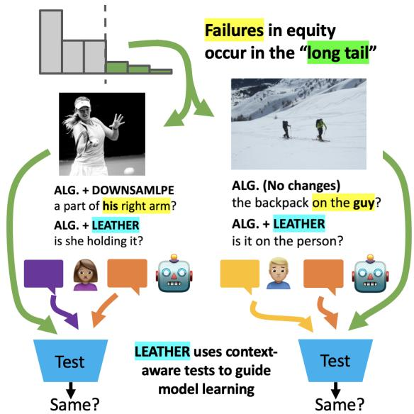
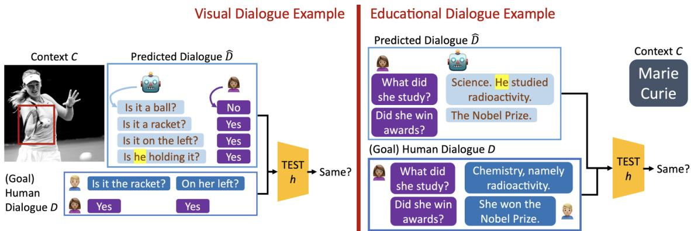
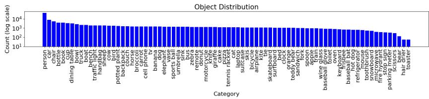
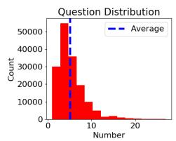

# Learning to Generate Equitable Text in Dialogue from Biased Training Data

Anthony Sicilia Intelligent Systems Program University of Pittsburgh anthonysicilia@pitt.edu

Malihe Alikhani School of Computing and Information University of Pittsburgh malihe@pitt.edu

## Abstract

The ingrained principles of fairness in a dialogue system’s decision-making process and generated responses are crucial for user engagement, satisfaction, and task achievement. Absence of equitable and inclusive principles can hinder the formation of common ground, which in turn negatively impacts the overall performance of the system. For example, misusing pronouns in a user interaction may cause ambiguity about the intended subject. Yet, there is no comprehensive study of equitable text generation in dialogue. Aptly, in this work, we use theories of computational learning to study this problem. We provide formal definitions of equity in text generation, and further, prove formal connections between learning humanlikeness and learning equity: algorithms for improving equity ultimately reduce to algorithms for improving human-likeness (on augmented data). With this insight, we also formulate reasonable conditions under which text generation algorithms can learn to generate equitable text without any modifications to the biased training data on which they learn. To exemplify our theory in practice, we look at a group of algorithms for the GuessWhat?! visual dialogue game and, using this example, test our theory empirically. Our theory accurately predicts relative-performance of multiple algorithms in generating equitable text as measured by both human and automated evaluation.

## 1 Introduction

Machine learning models for text-generation in dialogue have trouble learning the “long tail” of a data distribution; i.e., the data concepts not frequently observed during training. For example, dataset biases like gender imbalance can induce a long tail in training data whereby important data relationships involving gender are underrepresented, like women in sports (Hendricks et al., 2018). When training, generative models often fail to learn these concepts in the long tail, and ultimately, learn inequitable, stereotyping behaviors instead (see Figure 1). These non-inclusive behaviors not only decrease user-satisfaction by isolating users (Mehrabi et al., 2021), but also impede common ground, hindering the task-success of the dialogue system.

  
Figure 1: Examples from GuessWhat?! dataset, which consists of game dialogues where a question-player queries an answer-player to identify a secret goal object known only to the answer-player. Images containing men outnumber images with women 2 to 1, forming a "long tail" in the data distribution. In examples above, human annotations use visual (contextual) cues to agree on gender or balk when appropriate. Traditional algorithms can be incorrect and overconfident, inheriting dataset bias towards male pronouns. Algorithms motivated by learning theory (LEATHER) are more robust, utilizing context in a human-like way.

Despite the multi-faceted impact of inequitable text generation in dialogue, we do not have a comprehensive and theoretically grounded framework for understanding how machines learn to generate inequitable text and when this outcome can be avoided. To provide a strong technical foundation for equitable generation in dialogue, we build on theories of computational learning (Valiant, 1984;

McAllester, 1998). Specifically, our theoretical contributions are as follows:

1. We define precise constraints that encapsulate diverse notions of equity in dialogue (Def. 3.1).

2. We rigorously compare our proposals to traditional notions of equity in classification (§ 3.1).

3. We show computational learning theory models equitable learning well: algorithms from learning theory are easily adapted to learn equitable dialogue by augmenting data (Thm. 3.1).

4. We prove algorithms based on learning theory can even learn to generate equitable text from some types of biased training data (Thm. 3.2).

Loosely, Thm. 3.2 is based on the idea that, when provided sufficient background, human text is not biased because it is typically context-aware (Def. 3.4). For example, when the subject is a female scientist, a human will likely not use male pronouns in subject-referring conversation because humans tend to correctly employ dialogue context to inform their language use. Instead, in many real-world datasets, bias is an aggregate property, arising from inequality of the proportions of protected attributes such as race or gender; e.g., more conversations about male than female doctors.

The theoretical understanding we contribute is imperative because it informs algorithm design. In particular, using our theory, we can predict:

1. the most equitable algorithms for unseen data;

2. counter-intuitive properties of algorithms that lead to less equitable results.

For example, consider algorithms which naïvely augment data to remove bias (Zhao et al., 2018a; Park et al., 2018). Through theoretical study, we identify cases where this practice can actually hurt an algorithm’s chances at learning to be equitable. In fact, our experiments in $\ S 4$ confirm this.

The remainder of the paper is organized as follows: § 2 provides background to position our contributions including discussion of related work, a brief tutorial on the employed learning theoretic framework, and a few running examples used throughout the text; § 3 provides our theoretical contributions including formulation of mathematical notions of equity in text generation and theoretical analysis of learning algorithms; § 4 conducts experiments which validate our theory in practice; and finally, § 5 concludes the work. Code, data, and a python package will be made publicly available to promote further research.1

## 2 Background and Related Work

## 2.1 Learning Theory for Dialogue

Recent proposals for the use of learning theory in dialogue are due to Sicilia and Alikhani (2022) who propose LEATHER.2 Specifically, LEATHER is a formal framework for studying the diverse objectives present when learning to generate text. Ultimately, their proposal is grounded in a general evaluation metric – the test divergence. Intuitively, test divergence mimics practical evaluation, in which we conduct tests to evaluate the generated dialouge:

$$
\begin{array} { r l } & { \mathbf { T D } _ { \mathbb { G } } ( \theta ) = \mathbf { E } [ | h ( D , U ) - h ( \hat { D } , U ) | ] } \\ & { \mathrm { w h e r e \ ~ } \ ( C , D ) \sim \mathbb { G } , \ \hat { D } \sim \mathbb { P } _ { \theta } ( C ) , \ U \sim \mathbb { U } . } \end{array}\tag{1}
$$

Of course, there are a number of undefined terms here: specifically, the test h, the context C, the goal dialogue D, the learned dialogue $\hat { D } ,$ and the unobserved effects U. Below, we explain each, using examples from Figure 2 to assist our exposition.

Goal Distribution The goal distribution G is a joint probability distribution over dialogue contexts $c \in { \mathcal { C } }$ and dialogues d $\in \mathcal { D }$ . For Sicilia and Alikhani (2022), the goal is to generate human-like text. So, as in the visual dialogue example in Figure 2, the context might be an image/goal-object and the goal dialogue might be sampled from a (human) corpus of QA pairs with this context.

Learned Dialogue Distribution The learned dialogue distribution is the probability kernel $\mathbb { P } _ { \theta } ( C )$ that provides a distribution over dialogues, conditional to the parameters θ learned by the machine (e.g., neural parameters) as well as the random dialogue context C. The precise manner in which dialogue occurs will vary from system to system, but typically involves a machine generating/prompting responses to/from human users as in Figure 2. This interaction implicitly defines the random process through which a set of parameters $\theta$ and a random context $C$ produce a predicted dialogue $\hat { D } .$ . Importantly, the learning machine may not control every aspect of the process – e.g., the human responses. Aptly, we encapsulate this unknown randomness by the distribution $\mathbb { P } _ { \theta } ( C )$ . In some cases, we will consider the joint distribution of both (goal) contexts and learned dialogues; i.e., of the random tuple $( C , { \hat { D } } )$ . We write $\hat { \mathbb { G } } _ { \theta }$ for this joint distribution.

  
Figure 2: Toy examples of visual (left) and educational (right) dialogues. Key learning-theoretic terms are labeled. A common inequity of dialogue systems is pictured (i.e., misidentifying gender).

Test Function with Unknown Effects The final component is the test function (or simply test) h. The test takes as its primary input a dialogue and returns a value in the interval [0, 1]. Conceptually, a test can represent any evaluation process in which we are interested. For example, some tests commonly employed in practice include n-gram overlap metrics such as BLEU (Papineni et al., 2002), sentiment scores from a pre-trained classifier, or even a score attained through human evaluation. The unknown effect U  U represents any additional information needed to completely determine the outcome of the test. When the test is BLEU, U simply takes the form of a reference dialogue to which the input dialogue is compared. For human evaluation, U encapsulates all of the unknown variables that contribute to the randomness of a realworld experiment. Often, U may not be needed.

Interpretation With terms defined, it is easy to see the test divergence is a direct comparison of the output of the test from the goal dialogue D to the predicted dialogue Dˆ , learned by our dialogue system. Larger test divergence indicates the learned dialogue fails to replicate the goal dialogue along the dimensions targeted by the test. For example, if the goal is human-likeness in the visual dialogue example from Figure 2, a test might target question strategies (Shekhar et al., 2019). Small test divergence in these cases indicates the learned dialogue uses similar strategies as the (human) goal.

## 2.2 Related Works on Equity

In natural language, popular, early studies of equity begin with avoiding stereotyping in learned model representations (Bolukbasi et al., 2016). This approach has continued to inspire many de-biasing techniques for learned representations (Zhao et al.,

2018b; Madras et al., 2018; Wang et al., 2020) and evaluation techniques for the equity of representations (Caliskan et al., 2017; Ethayarajh et al., 2019). De-biasing and evaluation techniques for model representations have also been adapted for text-generation tasks (Escudé Font and Costa-jussà, 2019; Yeo and Chen, 2020; Guo et al., 2022).

Still, these model-intrinsic approaches to resolving inequity have proven subpar compared to model-extrinsic approaches, which focus directly on the downstream task (Gonen and Goldberg, 2019; Cao et al., 2022). For this reason, our approach tackles the problem of equitable dialogue generation from an extrinsic point-of-view. Previously, in text-generation, extrinsic points-ofview have typically used change in scoring functions (e.g., for sentiment, gender-polarity, etc.) to measure equity (Liu et al., 2020; Vu et al., 2020; Dhamala et al., 2021, 2022; Das and Balke, 2022). Our work is in line with these, but provides formal theoretical study, and further, focuses more specifically on dialogue. Formal theoretical study is vital to understanding equity, because imprecision in problem assumptions and objectives has already proven to be a pitfall in existing works on equity (Blodgett et al., 2021). For example, in classification, detailed theoretical study reveals a complex relationship of trade-offs between accuracy and (some) notions of equity (Zhao and Gordon, 2019; McNamara et al., 2019; Dutta et al., 2020), contributing to algorithmic advances (Zhao et al., 2019). Our work continues this trajectory, offering valuable practical insights, which are sometimes unintuitive, to achieve equity in machine dialogue.

Finally, it is worthwhile to note that Liu et al. (2020) also contribute a formal, theoretical definition of fairness in dialogue. Our work contributes a more general definition of equity – i.e., which supports arbitrary types of dialogue context and more general types of dataset bias. As noted, we also make connections with learning theory to provide key insights on algorithm and dataset design. Indeed, ours is the first work to study bias in text generation using these insightful techniques from computational learning theory.

## 3 Formalizing Equity in Dialogue

## 3.1 Formal Definitions for Equity

In this part, we introduce some formal, mathematical notions of equity. We start with a general notion of equity in dialogue and show how this can be specialized to compare with ideas of equity in the classification literature. For proofs, see Appendix A.

Protected Attributes To begin, we need to first define the notion of a protected attribute. Con ceptually, this is the sensitive variable (e.g., race, gender, religion, etc.) that we intend to “protect” by the equity constraint. Otherwise, presumably, system inequities would disproportionately, negatively impact the sub-population captured by the attribute. Throughout this work, we use a variable $a \in \mathcal { A } = \{ 0 , 1 \}$ to denote the protected attribute and we measure equity of the text with respect to this variable. Precisely, $a = 1$ implies the dialogue context exhibits the attribute (e.g., female gender, Black race, Muslim religion), while $a = 0$ implies the context does not exhibit the protected attribute. For example, in the educational dialogue from Figure 2, the context is a discussion topic and the protected attribute is female gender. Since the topic is a female scientist, it exhibits the protected attribute and we would have $a = 1$ . If the topic was “Science” more generally, it would not exhibit the protected attribute and it would be appropriate to set $a = 0$ . In general, we expect the protected attribute to vary randomly with the dialogue context C. To model this in a general way, we assume the attribute is sampled from a probability distribution which is dependent on the random context: $A \sim \mathbb { A } ( C )$ . For example, in the visual dialogue from Figure 2, the protected attribute A is female gender, which is non-deterministically dependent on the visual features of the image C. In other cases, like the educational example, the protected attribute may be completely determined by context. A can model this as well – e.g., as a point mass.

Equity as Score Parity Commonly, equity in machine learning systems is formally defined through a notion of parity (Kamiran and Calders, 2009; Zhao and Gordon, 2019). In dialogue, we can express parity as the following requirement:

## The system uses language in the same way, regardless ofprotected attribute.

This intuitive notion of equity is vague in its use of “way” to be general, allowing for specification to different applications. For example, Das and Balke (2022); Dhamala et al. (2022) both consider the toxicity and sentiment of language as the pertinent “way” in which language is used, when measuring equity. A classifier is used to estimate the toxicity or sentiment of the used language, and equity occurs if this classifier’s outputs are invariant of the protected attribute. For example, if the protected attribute is Muslim religion, the dialogue should be no more “toxic” when its context is specific to Muslims, than when its context is not specific to Muslims. Below, we formalize this intuition for equity with a mathematical constraint.

Definition 3.1. (Score Parity) A contextualized dialogue distribution3 G with $( C , D ) \sim \mathbb { G }$ and $A \sim \mathbb { A } ( C )$ satisfies score parity if

$$
\mathbf { E } [ s ( D , 0 ) \mid A = 0 ] = \mathbf { E } [ s ( D , 1 ) \mid A = 1 ]\tag{2}
$$

where s is a scoringfunction $s : \mathcal { D } \times \mathcal { A }  [ 0 , 1 ]$

To arrive at our motivating example (Das and Balke, 2022; Dhamala et al., 2022), one simply chooses the scoring function s to be a toxicity classifier or a sentiment classifier. The expected output of this classifier should be the same, regardless of the protected attribute’s setting. In general, if equality does not hold in the above definition of parity, we follow Zhao and Gordon (2019) using ∆ to denote the gap across attributes:

$$
\Delta ( \mathbb { G } ) = | \mathbf { E } [ s ( D , 0 ) \mid A = 0 ] - \mathbf { E } [ s ( D , 1 ) \mid A = 1 ] | .\tag{3}
$$

This lets us talk about degrees of inequity, and therefore, measure progress towards our ideals.

Multi-Category Score Parity Notice, we use the presence/absence of singular demographic groups (e.g., female v. not female) instead of binary comparisons (e.g., female v. male) in defining the protected attribute. This choice allows our definition of equity (above) and later theory to support study of general multi-category attributes with more than two attributes like race (e.g., Black, White, Asian) or religion (e.g., Muslim, Jewish, Catholic). Using race as an example, we can measure the parity gap when Black is the protected attribute, White is the protected attribute, Asian is the protected attribute, etc. The dataset is then equitable for all races (according to score parity) if all measured parity gaps are 0. In this way, our definition and subsequent results can generalize to the multi-category case. We use this strategy, for example, in Section 4.

Comparison to Demographic Parity In classification, demographic parity is a commonly studied notion of equity (Kamiran and Calders, 2009; Calders et al., 2009; Zemel et al., 2013), which stipulates that a classifier’s outputs should be independent of the protected attribute. For a classifier c, mapping random features X to a 0, 1 -valued label, this can be written:

$$
\mathbf { E } [ c ( X ) \mid A = 0 ] = \mathbf { E } [ c ( X ) \mid A = 1 ] .\tag{4}
$$

For score parity, when $s ( \cdot , 0 ) = s ( \cdot , 1 )$ , the scoring function s does not depend on the attribute and we see that score parity is a direct reflection of demographic parity. Whereas classification problems use machine learning to select the classifier c in a fair way, dialogue uses machine learning to select the feature distribution X (i.e., D in our definition).

Comparison to Accuracy Parity Depending on the application, it is known that demographic parity can also be an inappropriate constraint; e.g., if the classifier c is meant to predict the protected attribute itself (Zhao and Gordon, 2019). This precise situation is inherent to dialogue, since some aspects of language are compulsorily predictive of the protected attribute (e.g., gendered pronouns or religious terminology). Fundamentally, there is a trade off between the accuracy of the language used and the desired invariance. In these cases, Zhao and Gordon (2019) suggest accuracy parity as an alternative, which requires equal error rates, regardless of protected attribute. For Y the true label to X and c as in Eq. (4), this can be written:

$$
\mathbf { P r } ( c ( X ) \neq Y \mid A = 0 ) = \mathbf { P r } ( c ( X ) \neq Y \mid A = 1 ) .\tag{5}
$$

By our definition, score parity can be used to reflect this distinct notion from classification as well. Conceptually, we select our scoring function to measure the correctness of the dialogue. Then, just like accuracy parity, score parity enforces equal error rates, regardless of protected attribute. While details may vary based on application, we consider selecting the scoring function in the examples from Figure 2. We first define an identifier function $v : \mathcal { D }  \{ 0 , 1 \}$ which indicates whether a dialogue d $\in \mathcal { D }$ verbalizes the protected attribute. For example, we can imagine v scans for female gendered words she, her, $\mathrm { g i r l } , \ldots \}$ . Then, our system makes an “error” if it fails to verbalize the protected attribute or inappropriately verbalizes the attribute. So, we select the scoring function to reflect this:

$$
s ( D , A ) = | A - v ( D ) | .\tag{6}
$$

With the choice of scoring function above, score parity reflects the intuition of accuracy parity by requiring that the correctness of the language use (in referring to a protected attribute) is independent of the protected attribute. As alluded, this constraint can be especially useful in case spurious correlations (i.e., stereotypes) between protected attributes and context cause different error rates with/without a protected attribute. This is the case in our toy examples (Figure 2) as well as some real-world generation tasks (Hendricks et al., 2018).

Takeaways The formalization of equity we introduce – score parity – is both general and useful. It models existing ideas for empirical evaluation of equity in text-generation (Hendricks et al., 2018; Das and Balke, 2022; Dhamala et al., 2022) and can also be used to model disparate notions of equity from existing classification theories (Kamiran and Calders, 2009; Calders et al., 2009; Zemel et al., 2013; Zhao and Gordon, 2019). Ultimately, the choice of the scoring function s determines the “way” in which the language should be invariant to the protected attribute, and subsequently, dictates the motivating goals of the equity constraint.

## 3.2 Evaluating Equity with Learning Theory

Next, we show how learning to generate equitable text can be modeled with learning theory.

Test Divergence (Reprise) To evaluate equity with LEATHER, the objective in Eq. (1) remains largely unchanged. Primarily, we explicitly incorporate the protected attribute:4

$$
\begin{array} { r l } & { \mathbf { T D } _ { \mathbb { G } } ( \theta ) = \mathbf { E } [ | h ( D , A , U ) - h ( \hat { D } , A , U ) | ] \quad \mathrm { w h e r e } } \\ & { ( C , D ) \sim \mathbb { G } , \ \hat { D } \sim \mathbb { P } _ { \theta } ( C ) , \ A \sim \mathbb { A } ( C ) , \ U \sim \mathbb { U } . } \end{array}\tag{7}
$$

4Equivalently, one can group A with the unknown effects and keep Eq. (1). The rewrite only makes assumptions explicit.

Importantly, we must consider the deviations from Sicilia and Alikhani (2022) not present in Eq. (7): (1) the choice of goal distribution G and (2) the choice of test h. Originally, Sicilia and Alikhani focus on evaluation of human-like dialogue, and therefore, propose the goal to be defined by any collected corpus of contextualized human dialogues. Instead, we are interested in the equity of the contextualized dialogue and cannot blindly use human dialogue as an example; i.e., we cannot take for granted that the contextualized human dialogue is equitable. Thus, to appropriately evaluate equity, we generally assume the following constraints on the goal distribution and test.

## Equitable Goals and Tests

Definition 3.2. (Balanced) A contextualized dialogue distribution G is balanced if it assigns equal (marginal) likelihood to the protected attribute:

$$
\mathbf { P r } ( A = 1 ) = \mathbf { P r } ( A = 0 ) ; \ ( C , \cdot ) \sim \mathbb { G } , \ A \sim \mathbb { A } ( C ) .\tag{8}
$$

Definition 3.3. (Equitable Goal) We say a contextualized dialogue distribution G with $( C , D ) \sim \mathbb { G }$ is an equitable goal distribution if it is balanced and satisfies score parity (for somefixed score s).

So, intuitively, we propose the goal in equitable dialogue is a contextualized dialogue distribution which is itself equitable, according to our formal definition of this property – i.e., score parity. Furthermore, it should be balanced to prioritize the protected attribute equally during evaluation. As we’ll see later, choosing the test h to be the scoring function s from our previous definition allows us to use TD (with an equitable goal) to control the parity gap of our learned dialogue.

Biased Data While the formal definition above (Def. 3.3) is about equity, it should also be noted that we implicitly arrive at a formal definition for bias: the absence of equity. In particular, a contextualized dialogue distribution (dataset) is biased if it is not equitable. Note, this also distinguishes biased data from other common concepts like noisy data because we use an expectation to quantify parity; i.e., which is immune to non-systemic noise.

## Small Test Divergence Implies Equity

Theorem 3.1. Consider an equitable goal G and let h s (the scoringfunction). Then, $\Delta ( \hat { \mathbb { G } } _ { \theta } ) \leq \epsilon$ whenever $\mathbf { T D } _ { \mathbb { G } } ( \theta ) \leq \epsilon / 2$

Simply, the above result indicates minimization of TD with an equitable goal and appropriate test leads to an equitable learned dialogue distribution.

Takeaways An important consequence of Thm. 3.1 is the ability to confidently use algorithms designed in the LEATHER framework (i.e., to reduce test divergence) for equitable dialogue learning. While these algorithms may have originally been designed to learn human-like dialogue, they can easily be modified to learn equitable dialogue. In particular, we need only change the goal from any human dialogue distribution to any equitable dialogue distribution – as in Def. 3.3. Portability of algorithms in the sense described means, ultimately, a unified theory for dialogue generation. For any algorithm we propose, we may conduct a singular theoretical analysis of test divergence that can serve multiple purposes – both human-like and equitable dialogue generation. In other words:

## LEATHER-based algorithms for humanlikeness can be used to learn equitable text by simply augmenting training data.

Some standard examples of how to create the new equitable goal G include augmenting data in the dataset to achieve equitable constraints (Zhao et al., 2018a; Park et al., 2018). The takeaway from our theorem above agrees with existing empirical study: we can typically expect these strategies to be effective. Still, as we see next, there are other effective alternatives (under the right assumptions).

## 3.3 Learning to be Equitable and Human-like

Next, we study the circumstances under which the goals of human-like dialogue learning and equitable dialogue learning align. That is, we study circumstances under which an algorithm designed to minimize TD can learn from (biased) human-like goal data and simultaneously learn to be equitable.

## Context and Its Role (Assumptions)

Definition 3.4. (Context-Awareness) Consider an equitable goal distribution G. A contextualized dialogue distribution H $\neq \mathbb { G }$ is context-aware $i f ^ { 5 }$

$$
\mathbf { P r } ( D | C ) = \mathbf { P r } ( \tilde { D } | \tilde { C } ) ; ( \tilde { C } , \tilde { D } ) \sim \mathbb { H } , \tilde { A } \sim \mathbb { A } ( \tilde { C } ) .\tag{9}
$$

Definition 3.5. (Context-Preservation) The distribution H preserves context if

$$
\mathbf { P r } ( C | A ) = \mathbf { P r } ( \tilde { C } | \tilde { A } ) ; ( \tilde { C } , \tilde { D } ) \sim \mathbb { H } , \tilde { A } \sim \mathbb { A } ( \tilde { C } ) .\tag{10}
$$

The definitions are based on the idea of labelshift used to study data-shift at test time (Lipton et al., 2018). In this paper, we think of H as the possibly inequitable distribution of human contextualized dialogues (determined by some corpus). So, these definitions can be viewed as assumptions of how inequity presents itself in human data.

Context-awareness assumes that humans are not biased provided the background context C. Conceptually, this is reasonable, since humans use context to form inferences about attributes of other human subjects (even protected attributes). If background is sufficient, human inferences will often be correct inferences and the dialogue should be equitable with respect to accuracy parity, at least.6 Instead, bias in the considered corpus must arise from aggregate disproportions of attributes (see § 1).

Context-preservation assumes that the presentation of the context for attributes does not change. In other words, the features of the protected attribute which present themselves through the context should be invariant across G and H. For example, if one attempts to infer race from an image, this assumption simply states the visual features indicative of race should be consistent. The assumption would be violated, for example, if G protects Asian males and H protects Asian females.

Test Divergence Learning Bound In this part, for simplicity, we assume the parameters θ are learned from a finite space Θ. Other proof techniques may allow arbitrary Θ; e.g., Maurer (2004).

Theorem 3.2. Consider an equitable goal G with associated test h. Suppose a sample ofi.i.d. human data is collected $\mathbb { S } = ( \tilde { C } _ { i } , \tilde { D } _ { i } ) _ { i = 1 } ^ { m } ; ( \tilde { C } _ { i } , \tilde { D } _ { i } ) \sim$ H. Suppose H is context aware and preserves context. Then,for all $\delta > 0 ,$ , with probability at least $1 - \delta ,$ for all $\theta , 2 \beta \times { \bf T D } _ { \mathbb { G } } ( \theta )$ is bounded above by

$$
\frac { 1 } { m } \sum _ { i = 1 } ^ { m } \underbrace { | h ( \tilde { D } _ { i } , \tilde { A } _ { i } ) } _ { h u m a n } - \underbrace { h ( \hat { D } _ { i } ^ { \prime } , \tilde { A } _ { i } ) | } _ { p r e d i c t e d } + \underbrace { \sqrt { \frac { \log | \Theta | + \ln 2 / \delta } { 2 m } } } _ { d a t a \ e f f i c i e n c y }\tag{11}
$$

where $\beta = \mathrm { m i n } _ { a } { \bf P r } ( \tilde { A } = a ) . ^ { 7 }$

For interpretation, we break down the upperbound on $2 \beta \times { \bf T D } _ { \mathbb { G } } ( \theta )$ into two terms: (a) the difference in test output from the human dialogue to the predicted dialogue and (b) a data efficiency term dependent on the number of i.i.d samples m.

Equity from Biased Data Notice, the predicted dialogue in (a) is dependent on the human dialogue’s context $\tilde { C } _ { i } - \mathrm { n o t }$ the goal dialogue’s context $C - \mathbf { s o } \left( \mathbf { a } \right)$ is actually identical in definition to $\mathbf { T D } _ { \mathbb { S } } .$ an empirical observation of $\mathbf { T D } _ { \mathbb { H } }$ . That is, (a) is test divergence computed on a human corpus as was done by Sicilia and Alikhani (2022). Since (a) uses a human dialogue corpus to define its goal, Eq. (11) implies that learning human-like dialogue (via LEATHER) can also optimize the equity of the dialogue by reducing an upperbound on the equitable goal $\mathbf { T D _ { G } }$ . This is true even if the goal human data is biased. In other words:

## LEATHER-based algorithms learn humanlikeness and equity, even on biased data.

We only require the human data to be context-aware and preserve context (Defs. 3.4 and 3.5).

Data Efficiency The above interpretation of (a) is only valid if the data efficiency term (b) is also small. For interpretation, we consider the size of the parameter space Θ fixed and focus on the number of i.i.d training samples m. As m increases, (b) ultimately goes to 0 and the effect of (a) dominates the bound. In some cases though, if m is too small (b) can also have an impact. For example, this may be the case when using data-augmentation strategies to create a more equitable distribution. In particular, augmentation reduces the number of i.i.d. data points by creating dependencies in the data, which can reduce the data-efficiency of learning algorithms (Ralaivola et al., 2010). That is, augmentation can increase the size of (b) in learning bounds on test divergence,8 or in other words:

Augmenting training data to improve equity can reduce data-efficiency, and ultimately, model performance.

Impact does depend on the augmentation strategy, so we study common proposals for equity, next.

## 4 Experiments

In Section 3, we conclude by outlining algorithmic insights revealed by our theory. Next, we test these theories on the GuessWhat?! game corpus.

## 4.1 Dataset, Algorithms, and Evaluation

Unless otherwise noted, we use identical experimental settings, hyperparameters, etc. as Shekhar et al. (2019); Sicilia and Alikhani (2022).

<table><tr><td></td><td>acc ↑</td><td>ldiv ↑</td><td>qdiv ↑</td><td>repq</td><td>∆ (F)</td><td>TD (F)</td><td>∆(M)</td><td>TD (M)</td><td>hum.eval. (F/M) ↑</td></tr><tr><td>CL</td><td>55.9</td><td>10.7</td><td>14.3</td><td>58.2</td><td>52.6</td><td>28.8</td><td>23.7</td><td>33.5</td><td>52.0 / 72.0</td></tr><tr><td>LEATHER</td><td>56.9</td><td>12.7</td><td>16.0</td><td>47.5</td><td>29.1</td><td>27.2</td><td>14.7</td><td>29.7</td><td>68.0 / 64.0</td></tr><tr><td>DS</td><td>58.0</td><td>12.2</td><td>14.8</td><td>43.8</td><td>35.8</td><td>28.9</td><td>2.3</td><td>30.7</td><td>66.0 / 66.0</td></tr></table>

Table 1: Comparison of algorithms after 100 epochs of pre-training and 100 epochs of self-play. Generally, objective is 0 on 100 point scale with exceptions denoted by up arrows. The first 4 metrics test human-likeness. The last 5 test equity.

Dataset Our dataset is the corpus for the Guess-What?! game proposed by De Vries et al. (2017). Gameplay is described in Figure 1 and an example is shown as the visual dialogue in Figure 2. We also give a detailed description of the game rules in Appendix A.5. We use the original train/val. splits and provide statistics on this corpus in Appendix A.5. For training, unless otherwise noted, we use the full train set and report 1 seed. We focus on modelling the question-player and use an automated answer-player trained on human data.

Protected Attribute For these experiments, we use gender (male and female) as the protected attribute. When the protected attribute is female gender (F), we set a = 1 as long as all human dialogues use at least one female-gendered word.9 When the protected attribute is male gender (M), we set a = 1 as long as all human dialogues use at least one male-gendered word.10 Conceptually, this labeling scheme uses human annotator consensus to determine when it is appropriate or inappropriate to ask gender-specific questions: if a = 1, all human annotators perceive the protected gender to be present in the image and relevant to gameplay. Importantly, the labeling scheme also implies that the human dialogue satisfies our assumptions in § 3.3: context awareness (Def. 3.4) and context preservation (Def. 3.5); i.e., as shown in Appendix A.3. Different conceptualizations of how the protected attribute should be defined are possible, but we focus on this scheme because it allows us to simulate the assumptions of our theory in § 3.3, and therefore, best test our theory in practice. As a final note, while we focus on male/female gender in these experiments, using more than two categories for protected attributes is also possible. Simply, one checks the parity gap for each new protected attribute to be added. This would allow our theoretical and empirical study to be extended to general multi-category attributes; e.g., race or religion.

CL Algorithm CL is a cooperative learning algorithm proposed by Shekhar et al. (2019) to model the question-player. The algorithm is based primarily on a self-play learning phase (Das et al., 2017) which learns from machine-machine dialogue. This is used in addition to (after) a more traditional supervised learning phase (i.e., on human-human dialogue). See Appendix A.6 for details.

LEATHER Algorithm An extension of CL proposed by Sicilia and Alikhani (2022) with the purpose of better optimizing test divergence during the self-play learning process. Through some theoretical analyses, ultimately, the authors propose to regularize the self-play phase by re-incorporating human-human data from the supervised phase.

DS Algorithm A modification of the LEATHER algorithm. While re-incorporating human data, an augmentation (downsampling) strategy is used to balance occurrence of protected attributes; i.e., like other strategies for equity (Zhao et al., 2018a; Park et al., 2018). See Appendix A.4 for details.

Human-Likeness Evaluation To evaluate human likeness, we use metrics proposed by Shekhar et al. (2019): average accuracy acc in identifying the true goal-object across three random seeds, average lexical diversity (ldiv; type/token ratio over all dialogues), average question diversity (qdiv; % unique questions over all dialogues), and average percent of dialogues with repeated questions (repq). We report these on the full test data.

Equity Evaluation To evaluate equity, we focus on accuracy parity; i.e., score parity with scoring function described in Eq. (6).11 To replicate evaluation against the goal distribution in Def. 3.3, we apply an augmentation strategy to the test set (similar to the DS algorithm; see Appendix A.4). Because our ground truth data is inferred from human annotators focused on game success, we also incorporate additional human annotations. hum.eval. is % of model dialogues using gendered words correctly based on annotation (50 per method per annotator). Namely, two annotators12 were asked to determine correctness of gendered word use, evaluating both incorrect usage as well as false negatives; i.e., where use would be appropriate/helpful.13

## 4.2 Results

LEATHER produces human-like, equitable text. In Tab. 1, LEATHER improves upon CL in terms of both human-likeness and equity, across all metrics. These observations validate our theoretical analyses. In particular, LEATHER (as the name implies) is designed based on the LEATHER framework to minimize test divergence. From previous work, we know this means it should improve human-likeness (Sicilia and Alikhani, 2022). Now, from our current theoretical study (Thm. 3.2), we also hypothesize LEATHER can improve equity as long as certain assumptions are met (Def. 3.4, 3.5). Since the dataset we study satisfies the specified assumptions, our theoretical expectation of LEATHER is the multi-faceted improvement we observe. That is, our theory predicts the empirical improvements in human-likeness and equity achieved by LEATHER. The ability of our theory to predict the impact of algorithm design choices is an important practical implication. We are also able to draw similar conclusions for DS, which we discuss next.

DS does not improve equity as well as LEATHER, but overall, its behavior aligns with our theoretical predictions. Thm. 3.2 also makes the observation that data-augmentation strategies like DS can sometimes perform worse than alternatives which focus only on human-likeness (i.e., due to datainefficiency). Since DS does augment data significantly, we might expect DS to perform worse than LEATHER, and ultimately, it does in Tab. 1 (all metrics but ∆ M). With that said, another of our theoretical results (Thm. 3.1) suggests data-augmented versions of LEATHER algorithms like DS can, in fact, improve equity, especially in more general cases where data does not satisfy the circumstances of our experimental data. In experiments, this insight is reflected in comparing DS and the baseline. DS outperforms CL in Tab. 1 on all metrics but TD F.

Test divergence models equity well. Finally, we recall test divergence is the key link between existing learning theoretic work and our analysis of equitable dialogue. In particular, we show, theoretically speaking, that 2TD always bounds the parity gap ∆, which measures equity. As a result, learning theory algorithms can implicitly learn to be fair in many cases. Indeed, empirical results in Tab. 1 agree with this theoretical bound in every case, and further, suggest TD may be useful at ranking equity of algorithms, since TD is predictive of all improvements from CL to LEATHER. Again, our theoretical predictions match our empirical observations, highlighting the practical utilitiy of our theory.

## 5 Conclusions

In this paper, we provide a first in-depth study of equity in dialogue, formalizing mathematical notions of equity in dialogue and using computational learning theory to study how equity can be achieved through algorithm design. Our empirical results show how our formal theoretical study of equity in dialogue can be used, with great benefit, to select and design algorithms in a task-oriented dialogue setting. In particular, we can: design algorithms that achieve both equity and humanlikeness, predict unexpected consequences of dataaugmentation, and provide proxy statistics that are useful in ranking the equity of algorithms. To promote further research, our code, data, and a python package will be made publicly available.14

## Limitations

While our theoretical work is broadly applicable to any protected attribute and any dialogue task, our empirical study has primarily tested gender bias on the GuessWhat?! task. Continued experimental study on a wider range of protected attributes and tasks can better support our mathematical findings. Also, users of our theory should verify the assumptions of our theory when using it to draw insights on new datasets. Specifically, as the type of data bias changes, it is possible the assumptions of Thm. 3.2 may no longer be met. Users of our theory should take care in ensuring context-awareness and context-preservation, for example, are reasonable assumptions on new data, prior to applying the insights of § 3.3. Lastly, while all of our gender annotations come from human annotators, only a smaller subset come from annotators primed to judge correctness/equity of gender reference. So, more in-depth human evaluation can better support our theoretical results as well.

## Ethics Statement

The goal of this paper is to present a theoretically grounded framework to mitigate bias in dialogue systems. Our theoretical and empirical techniques can lead to important insights/solutions for algorithm design that reduce bias, along with any unintended harm associated with this bias. With this said, some of the proposed algorithms rely on pretrained models such as word or image embeddings, and any harm or bias associated with these models can still be present after efforts to mitigate. Thus, models trained with these techniques should still undergo rigorous human evaluation for presence of biases before being deployed.

Our human subject board approved our protocol. Human subjects participated voluntarily and were compensated according to the regulations approved by our human subject review board.

## References

Su Lin Blodgett, Gilsinia Lopez, Alexandra Olteanu, Robert Sim, and Hanna Wallach. 2021. Stereotyping Norwegian salmon: An inventory of pitfalls in fairness benchmark datasets. In Proceedings ofthe 59th Annual Meeting of the Association for Computational Linguistics and the 11th International Joint Conference on Natural Language Processing (Volume 1: Long Papers), pages 1004–1015, Online. Association for Computational Linguistics.

Tolga Bolukbasi, Kai-Wei Chang, James Y Zou, Venkatesh Saligrama, and Adam T Kalai. 2016. Man is to computer programmer as woman is to homemaker? debiasing word embeddings. Advances in neural information processing systems, 29.

Toon Calders, Faisal Kamiran, and Mykola Pechenizkiy. 2009. Building classifiers with independency constraints. In 2009 IEEE International Conference on Data Mining Workshops, pages 13–18. IEEE.

Aylin Caliskan, Joanna J Bryson, and Arvind Narayanan. 2017. Semantics derived automatically from language corpora contain human-like biases. Science, 356(6334):183–186.

Yang Cao, Yada Pruksachatkun, Kai-Wei Chang, Rahul Gupta, Varun Kumar, Jwala Dhamala, and Aram Galstyan. 2022. On the intrinsic and extrinsic fairness evaluation metrics for contextualized language representations. In Proceedings ofthe 60th Annual Meeting of the Association for Computational Linguistics (Volume 2: Short Papers), pages 561–570, Dublin, Ireland. Association for Computational Linguistics.

Abhishek Das, Satwik Kottur, José MF Moura, Stefan Lee, and Dhruv Batra. 2017. Learning cooperative visual dialog agents with deep reinforcement learning. In Proceedings ofthe IEEE international conference on computer vision, pages 2951–2960.

Mayukh Das and Wolf Tilo Balke. 2022. Quantifying bias from decoding techniques in natural language generation. In Proceedings of the 29th International Conference on Computational Linguistics, pages 1311–1323.

Harm De Vries, Florian Strub, Sarath Chandar, Olivier Pietquin, Hugo Larochelle, and Aaron Courville. 2017. Guesswhat?! visual object discovery through multi-modal dialogue. In Proceedings of the IEEE Conference on Computer Vision and Pattern Recognition, pages 5503–5512.

Jwala Dhamala, Varun Kumar, Rahul Gupta, Kai-Wei Chang, and Aram Galstyan. 2022. An analysis of the effects of decoding algorithms on fairness in open-ended language generation. arXiv preprint arXiv:2210.03826.

Jwala Dhamala, Tony Sun, Varun Kumar, Satyapriya Krishna, Yada Pruksachatkun, Kai-Wei Chang, and Rahul Gupta. 2021. Bold: Dataset and metrics for measuring biases in open-ended language generation. In Proceedings ofthe 2021 ACM Conference on Fairness, Accountability, and Transparency, pages 862–872.

Sanghamitra Dutta, Dennis Wei, Hazar Yueksel, Pin-Yu Chen, Sijia Liu, and Kush Varshney. 2020. Is there a trade-off between fairness and accuracy? a perspective using mismatched hypothesis testing. In International Conference on Machine Learning, pages 2803–2813. PMLR.

Joel Escudé Font and Marta R. Costa-jussà. 2019. Equalizing gender bias in neural machine translation with word embeddings techniques. In Proceedings of the First Workshop on Gender Bias in Natural Language Processing, pages 147–154, Florence, Italy. Association for Computational Linguistics.

Kawin Ethayarajh, David Duvenaud, and Graeme Hirst. 2019. Understanding undesirable word embedding associations. arXiv preprint arXiv:1908.06361.

Hila Gonen and Yoav Goldberg. 2019. Lipstick on a pig: Debiasing methods cover up systematic gender biases in word embeddings but do not remove them. In Proceedings ofthe 2019 Conference ofthe North American Chapter of the Association for Computational Linguistics: Human Language Technologies, Volume 1 (Long and Short Papers), pages 609–614, Minneapolis, Minnesota. Association for Computational Linguistics.

Yue Guo, Yi Yang, and Ahmed Abbasi. 2022. Autodebias: Debiasing masked language models with automated biased prompts. In Proceedings of the 60th Annual Meeting of the Association for Computational Linguistics (Volume 1: Long Papers), pages

1012–1023, Dublin, Ireland. Association for Computational Linguistics.

Lisa Anne Hendricks, Kaylee Burns, Kate Saenko, Trevor Darrell, and Anna Rohrbach. 2018. Women also snowboard: Overcoming bias in captioning models. In Proceedings ofthe European Conference on Computer Vision (ECCV), pages 771–787.

Faisal Kamiran and Toon Calders. 2009. Classifying without discriminating. In 2009 2nd international conference on computer, control and communication, pages 1–6. IEEE.

Zachary Lipton, Yu-Xiang Wang, and Alexander Smola. 2018. Detecting and correcting for label shift with black box predictors. In International conference on machine learning, pages 3122–3130. PMLR.

Haochen Liu, Jamell Dacon, Wenqi Fan, Hui Liu, Zitao Liu, and Jiliang Tang. 2020. Does gender matter? towards fairness in dialogue systems. In Proceedings of the 28th International Conference on Computational Linguistics, pages 4403–4416.

David Madras, Elliot Creager, Toniann Pitassi, and Richard Zemel. 2018. Learning adversarially fair and transferable representations. In International Conference on Machine Learning, pages 3384–3393. PMLR.

Andreas Maurer. 2004. A note on the pac bayesian theorem. arXiv preprint cs/0411099.

David A McAllester. 1998. Some pac-bayesian theorems. In Proceedings ofthe eleventh annual conference on Computational learning theory, pages 230– 234.

Daniel McNamara, Cheng Soon Ong, and Robert C Williamson. 2019. Costs and benefits of fair representation learning. In Proceedings of the 2019 AAAI/ACM Conference on AI, Ethics, and Society, pages 263–270.

Ninareh Mehrabi, Fred Morstatter, Nripsuta Saxena, Kristina Lerman, and Aram Galstyan. 2021. A survey on bias and fairness in machine learning. ACM Computing Surveys (CSUR), 54(6):1–35.

Kishore Papineni, Salim Roukos, Todd Ward, and Wei-Jing Zhu. 2002. Bleu: a method for automatic evaluation of machine translation. In Proceedings ofthe 40th annual meeting ofthe Associationfor Computational Linguistics, pages 311–318.

Ji Ho Park, Jamin Shin, and Pascale Fung. 2018. Reducing gender bias in abusive language detection. In Proceedings of the 2018 Conference on Empirical Methods in Natural Language Processing, pages 2799–2804, Brussels, Belgium. Association for Computational Linguistics.

Liva Ralaivola, Marie Szafranski, and Guillaume Stempfel. 2010. Chromatic pac-bayes bounds for non-iid data: Applications to ranking and stationary

β-mixing processes. The Journal of Machine Learning Research, 11:1927–1956.

Shai Shalev-Shwartz and Shai Ben-David. 2014. Understanding machine learning: From theory to algorithms. Cambridge university press.

Ravi Shekhar, Aashish Venkatesh, Tim Baumgärtner, Elia Bruni, Barbara Plank, Raffaella Bernardi, and Raquel Fernández. 2019. Beyond task success: A closer look at jointly learning to see, ask, and Guess-What. In Proceedings of the 2019 Conference of the North American Chapter ofthe Associationfor Computational Linguistics: Human Language Technologies, Volume 1 (Long and Short Papers), pages 2578–2587, Minneapolis, Minnesota. Association for Computational Linguistics.

Anthony Sicilia and Malihe Alikhani. 2022. LEATHER: A framework for learning to generate human-like text in dialogue. In Findings ofthe Associationfor Computational Linguistics: AACL-IJCNLP 2022, pages 30–53, Online only. Association for Computational Linguistics.

Leslie G Valiant. 1984. A theory of the learnable. Communications ofthe ACM, 27(11):1134–1142.

Xuan-Son Vu, Thanh-Son Nguyen, Duc-Trong Le, and Lili Jiang. 2020. Multimodal review generation with privacy and fairness awareness. In Proceedings ofthe 28th International Conference on Computational Linguistics, pages 414–425, Barcelona, Spain (Online). International Committee on Computational Linguistics.

Tianlu Wang, Xi Victoria Lin, Nazneen Fatema Rajani, Bryan McCann, Vicente Ordonez, and Caiming Xiong. 2020. Double-hard debias: Tailoring word embeddings for gender bias mitigation. In Proceedings of the 58th Annual Meeting of the Association for Computational Linguistics, pages 5443–5453, Online. Association for Computational Linguistics.

Catherine Yeo and Alyssa Chen. 2020. Defining and evaluating fair natural language generation. In Proceedings of the The Fourth Widening Natural Language Processing Workshop, pages 107–109, Seattle, USA. Association for Computational Linguistics.

Rich Zemel, Yu Wu, Kevin Swersky, Toni Pitassi, and Cynthia Dwork. 2013. Learning fair representations. In International conference on machine learning, pages 325–333. PMLR.

Han Zhao, Amanda Coston, Tameem Adel, and Geoffrey J Gordon. 2019. Conditional learning of fair representations. In International Conference on Learning Representations.

Han Zhao and Geoff Gordon. 2019. Inherent tradeoffs in learning fair representations. Advances in neural information processing systems, 32.

Jieyu Zhao, Tianlu Wang, Mark Yatskar, Vicente Ordonez, and Kai-Wei Chang. 2018a. Gender bias in coreference resolution: Evaluation and debiasing methods. In Proceedings ofthe 2018 Conference of the North American Chapter ofthe Associationfor Computational Linguistics: Human Language Technologies, Volume 2 (Short Papers), pages 15–20, New Orleans, Louisiana. Association for Computational Linguistics.

Jieyu Zhao, Yichao Zhou, Zeyu Li, Wei Wang, and Kai-Wei Chang. 2018b. Learning gender-neutral word embeddings. In Proceedings ofthe 2018 Conference on Empirical Methods in Natural Language Processing, pages 4847–4853, Brussels, Belgium. Association for Computational Linguistics.

## A Proofs and Additional Technical Discussion

## A.1 Proof of Thm. 3.1

Claim. Consider an equitable goal G and let $h \equiv s$ (the scoring function). Then, $\Delta ( \hat { \mathbb { G } } _ { \theta } ) \leq \epsilon$ whenever $\begin{array} { r } { \mathbf { T D } _ { \mathbb { G } } ( \theta ) \leq \epsilon / 2 . } \end{array}$

Proof. Suppose $\mathbf { T D } _ { \mathbb { G } } ( \theta ) \leq \epsilon .$ then we have

$$
\begin{array} { r l } {  { \epsilon \geq \mathbf { E } \big [ | s ( D , A ) - s ( \hat { D } , A ) | \big ] } } \\ & { = \displaystyle \sum _ { a \in A } \mathbf { P r } ( A = a ) \cdot \mathbf { E } \big [ \big | s ( D , A ) - s ( \hat { D } , A ) \big | \mid A = a \big ] \quad \mathrm { ( L a w ~ o f ~ T o t a l ~ E x p e c t a t i o n ) } } \\ & { = \displaystyle \frac { 1 } { 2 } \sum _ { a \in A } \mathbf { E } \big [ \big | s ( D , A ) - s ( \hat { D } , A ) \big | \mid A = a \big ] \qquad \mathrm { ( B a l a n c e ~ o f ~ \mathbb { G } ) } } \\ & { \geq \displaystyle \frac { 1 } { 2 } \sum _ { a \in A } \big | \mathbf { E } \big [ s ( D , A ) - s ( \hat { D } , A ) \mid A = a \big ] \big | \qquad \mathrm { ( J e n s e n ' s ~ I n e q u a l i t y ) } } \end{array}\tag{12}
$$

Now, since G is equitable we have there is some value x such that for all $a \in { \mathcal { A } }$ , we have $\mathbf { E } [ s ( D , A )$ $A = a ] = x$ . Substituting and expanding the sum over , we have

$$
\sum _ { a \in \mathcal { A } } \left. \mathbf { E } [ s ( D , A ) - s ( \hat { D } , A ) \mid A = a ] \right. = \left. x - \mathbf { E } [ s ( \hat { D } , 0 ) ] \right. + \left. x - \mathbf { E } [ s ( \hat { D } , 1 ) ] \right. .\tag{13}
$$

Next, we put together the previous two equations and utilize the definition of the absolute value to break the proof into cases. For ease of presentation, we let

$$
\mu = \operatorname* { m i n } \{ \mathbf { E } [ s ( \hat { D } , 0 ) ] , \mathbf { E } [ s ( \hat { D } , 1 ) ] \} \quad \mathrm { a n d } \quad M = \operatorname* { m a x } \{ \mathbf { E } [ s ( \hat { D } , 0 ) ] , \mathbf { E } [ s ( \hat { D } , 1 ) ] \} .\tag{14}
$$

This gives

$$
2 \boldsymbol { \epsilon } \geq \left\{ \begin{array} { l l } { \mathbf { E } [ s ( \hat { D } , 0 ) ] - \boldsymbol { x } + \mathbf { E } [ s ( \hat { D } , 1 ) ] - \boldsymbol { x } ~ } & { \mathrm { ~ i f } \quad \mu \geq \boldsymbol { x } , } \\ { \boldsymbol { x } - \mathbf { E } [ s ( \hat { D } , 0 ) ] + \boldsymbol { x } - \mathbf { E } [ s ( \hat { D } , 0 ) ] ~ } & { \mathrm { ~ i f } \quad M \leq \boldsymbol { x } , } \\ { \mathbf { E } [ s ( \hat { D } , 0 ) ] - \boldsymbol { x } + \boldsymbol { x } - \mathbf { E } [ s ( \hat { D } , 1 ) ] ~ } & { \mathrm { ~ i f } \quad \mathbf { E } [ s ( \hat { D } , 0 ) ] \geq \boldsymbol { x } \geq \mathbf { E } [ s ( \hat { D } , 1 ) ] , } \\ { \boldsymbol { x } - \mathbf { E } [ s ( \hat { D } , 0 ) ] + \mathbf { E } [ s ( \hat { D } , 1 ) ] - \boldsymbol { x } ~ } & { \mathrm { ~ i f } \quad \mathbf { E } [ s ( \hat { D } , 1 ) ] \geq \boldsymbol { x } \geq \mathbf { E } [ s ( \hat { D } , 0 ) ] . } \end{array} \right.\tag{15}
$$

In the last two cases, occurrences of x cancel out and we have precisely $2 \epsilon \geq \Delta ( \hat { \mathbb { G } } )$ , precisely. Then, in the first case, we have

$$
\mathbf { E } [ s ( \hat { D } , 0 ) ] - x + \mathbf { E } [ s ( \hat { D } , 1 ) ] - x \geq \mathbf { E } [ s ( \hat { D } , 0 ) ] - \mu + \mathbf { E } [ s ( \hat { D } , 1 ) ] - \mu = M - \mu .\tag{16}
$$

In the second case, we also have

$$
x - \mathbf { E } [ s ( { \hat { D } } , 0 ) ] + x - \mathbf { E } [ s ( { \hat { D } } , 0 ) ] \geq M - \mathbf { E } [ s ( { \hat { D } } , 0 ) ] + M - \mathbf { E } [ s ( { \hat { D } } , 1 ) ] = M - \mu .\tag{17}
$$

Thus, in all cases, we have $2 \epsilon \geq \Delta ( \hat { \mathbb { G } } )$ , the desired result.

□

## A.2 Proof of Thm. 3.2

## A.2.1 Proof

Claim. Consider an equitable goal G with associated test h. Suppose a sample of i.i.d. human data is collected $\mathbb { S } = ( \tilde { C } _ { i } , \tilde { D } _ { i } ) _ { i = 1 } ^ { m } ; ( \tilde { C } _ { i } , \tilde { D } _ { i } ) \sim$ H. Suppose H is context aware and preserves context. Then,for all $\delta > 0$ , with probability at least $1 - \delta ,$ , for all θ, $2 \beta \times { \bf T D } _ { \mathbb { G } } ( \theta )$ is bounded above by

$$
\frac { 1 } { m } \sum _ { i = 1 } ^ { m } \underbrace { | h ( \tilde { D } _ { i } , \tilde { A } _ { i } ) } _ { h u m a n } - \underbrace { h ( \hat { D } _ { i } ^ { \prime } , \tilde { A } _ { i } ) } _ { p r e d i c t e d } | + \underbrace { \sqrt { \frac { \log | \Theta | + \ln 2 / \delta } { 2 m } } } _ { d a t a \ e f f i c i e n c y }\tag{18}
$$

where $\beta = \mathrm { m i n } _ { a } { \bf P r } ( \tilde { A } = a ) , \hat { D } _ { i } ^ { \prime } \sim \mathbb { P } _ { \boldsymbol { \theta } } ( \tilde { C } )$ . As noted in the main text we also pose the requirement of pairwise independence: first, between D, Dˆ , and A in the definition of $\mathbf { T D } _ { \mathbb { G } }$ (conditional to $C ) ;$ second, between $\tilde { D } _ { i } , \tilde { D } _ { i } ^ { \prime } ,$ and ${ \tilde { A } } _ { i }$ (again, conditional to the context $\tilde { C } _ { i } )$

Proof. First, we enumerate some of the key assumptions for easy reference:

• (A1): H is context aware

• (A2): H is context preserving

• (A3): $D , { \hat { D } } , A$ are independent conditional to $C ;$ and, $\tilde { D } _ { i } , \hat { D } _ { i } ^ { \prime } , \tilde { A } _ { i }$ are independent conditional ${ \tilde { C } } _ { i }$

$( \mathbf { A } \mathbf { 4 } ) \div { } ^ { 1 5 } \mathbf { P r } ( \hat { D } | C ) = \mathbf { P r } ( \hat { D } ^ { \prime } | \tilde { C } )$ since both probabilities represent identical sampling from $\mathbb { P } _ { \theta }$

• (A5): $\mathbf { P r } ( A | C ) = \mathbf { P r } ( \tilde { A } | \tilde { C } )$ since both probabilities represent identical sampling from A

Now, we consider decomposing the joint probability density ${ \bf P r } ( D = d , \hat { D } = \hat { d } , A = a )$ , which importantly, is the joint density used to compute the expectation in $\mathbf { T D } _ { \mathbb { G } } ( \theta ) . ^ { 1 6 }$ To begin, we have

$$
\begin{array} { r l } & { \mathbf { P r } ( D = i , \widehat { D } = \partial , \widehat { A } = \partial ) = \underset { \mathcal { C } } { \sum } \mathbf { P r } ( \mathcal { C } = \epsilon ) \mathbf { P r } ( \mathcal { D } = \partial , \widehat { D } = \partial , \widehat { C } = \partial ) \underset { \mathcal { C } = \mathcal { C } } { \sum } ( \mathcal { C } = \epsilon ) \underset { \mathcal { C } = \mathcal { C } } { \sum } ( \mathrm { B a n } \mathcal { C } \mathrm { T e a l } \mathrm { E x p } ) , } \\ & { = \underset { \mathcal { C } = \mathcal { C } } { \sum } \mathbf { P r } ( \mathcal { C } = \epsilon ) \mathbf { P r } ( \mathcal { D } = d ) \underset { \mathcal { C } = \mathcal { C } } { \sum } [ \mathcal { D } = i ] \underset { \mathcal { C } = \mathcal { C } } { \sum } \mathrm { P r } ( \mathcal { D } = \epsilon ) \mathbf { P r } ( \mathcal { A } = \omega \vert C = \epsilon ) \quad \mathrm { G a s ~ } } \\ & { = \underset { \mathcal { C } = \mathcal { C } } { \sum } \mathbf { P r } \underset { \mathcal { C } = \mathcal { C } } { \sum } [ \mathcal { C } = \epsilon ] \mathbf { P r } ( \mathcal { C } = \epsilon ) \mathbf { P r } ( \mathcal { D } = d \underset { \mathcal { C } = \mathcal { C } } { \sum } \mathrm { P r } ( \widehat { D } = \partial \overset { . } { \vert } C = \epsilon ) \mathbf { P r } \mathbf { r } ( \mathcal { A } = \omega \vert C = \epsilon ) \quad \mathrm { ( A r ~ t i s k . } } \\ & { = \underset { \mathcal { C } = \mathcal { C } } { \sum } \mathbf { P r } \underset { \mathcal { C } = \mathcal { C } } { \sum } \mathrm { P r } ( \mathcal { C } = \epsilon ) \mathbf { P r } ( \mathcal { D } = d \underset { \mathcal { C } = \mathcal { C } } { \sum } \mathrm { P r } ( \mathcal { D } = \widehat { D } \overset { . } { \vert } C = \epsilon ) \mathbf { P r } ( \mathcal { D } = \delta \mathrm { \alpha } \vert C = \omega ) \quad \mathrm { ( A r ~ } } \\ &  - \underset { \mathcal { C } = \mathcal { C } }  \sum \end{array}\tag{19}
$$

Further, we can relate the probability distributions for the contexts $C$ and $\tilde { C }$ through their implied attribute distributions via (A2)

$$
\begin{array} { r l } { \mathbf { P r } ( C = c ) = \displaystyle \sum _ { a } \mathbf { P r } ( C = c \mid A = a ) \mathbf { P r } ( A = a ) } & { \mathrm { ( L a w ~ o f ~ T o t a l ~ E x p . ) } } \\ { = \displaystyle \sum _ { a } \mathbf { P r } ( \tilde { C } = c \mid \tilde { A } = a ) \mathbf { P r } ( A = a ) } & { \mathrm { ( A 2 ) } } \\ { = \displaystyle \sum _ { a } \mathbf { P r } ( \tilde { C } = c \mid \tilde { A } = a ) \mathbf { P r } ( \tilde { A } = a ) \cdot \frac { \mathbf { P r } ( A = a ) } { \mathbf { P r } ( \tilde { A } = a ) } } & { \mathrm { ( \times ~ 1 ~ t i c i s k ) } } \\ { \leq \displaystyle \sum _ { a } \mathbf { P r } ( \tilde { C } = c \mid \tilde { A } = a ) \mathbf { P r } ( \tilde { A } = a ) \cdot \frac { 1 } { 2 \beta } } & { \mathrm { ( b a l a n c e ~ o f ~ \mathbb { G } ~ a n d ~ d e f . ~ o f ~ \boldsymbol { \beta } ~ ) } } \\ { = \frac { 1 } { 2 \beta } \mathbf { P r } ( \tilde { C } = c ) } \end{array}\tag{20}
$$

Applying this to our previous outcome, we have

$$
\begin{array} { l } { \displaystyle \sum _ { c } \frac { \mathbf { P r } ( C = c ) } { \mathbf { P r } ( \tilde { C } = c ) } \mathbf { P r } ( \tilde { C } = c ) \mathbf { P r } ( \tilde { D } = d , \hat { D } ^ { \prime } = \hat { d } , \tilde { A } = a \mid \tilde { C } = c ) } \\ { \displaystyle \leq \sum _ { c } \frac { 1 } { 2 \beta } \mathbf { P r } ( \tilde { C } = c ) \mathbf { P r } ( \tilde { D } = d , \hat { D } ^ { \prime } = \hat { d } , \tilde { A } = a \mid \tilde { C } = c ) } \\ { \displaystyle = \frac { 1 } { 2 \beta } \mathbf { P r } ( \tilde { D } = d , \hat { D } ^ { \prime } = \hat { d } , \tilde { A } = a ) \qquad ( \mathrm { L a w o f ~ T o t a l ~ E x p . } ) . } \end{array}\tag{21}
$$

Notice, the new joint density $\mathbf { P r } ( \tilde { D } = d , \hat { D } ^ { \prime } = \hat { d } , \tilde { A } = a )$ can be used to compute the expectation in $\mathbf { T D } _ { \mathbb { H } }$ , while the previous joint density was used to compute the expectation in $\mathbf { T D _ { G } }$ . Both expectations have everywhere non-negative variables. So, ultimately, the relation between the joint densities gives:

$$
\begin{array} { r } { \mathbf { T D } _ { \mathbb { G } } ( \theta ) \leq \frac { 1 } { 2 \beta } \mathbf { T D } _ { \mathbb { H } } ( \theta ) } \end{array}\tag{22}
$$

To complete the proof, we need to bound the true test divergence on the human data ${ \bf T D } _ { \mathbb { H } } ( \boldsymbol { \theta } )$ with our observation $\mathbf { T D } _ { \mathbb { S } } ( \theta )$ . To do so, without using a test set, we need to apply a PAC learning bound for parameters selected from a finite hypothesis space (i.e., so that the result holds for any θ learned from Θ). We choose the structural risk minimization bound presented in Shalev-Shwartz and Ben-David (2014) – i.e., Thm. 7.7 – and apply it to our context,17 which gives the final result. □

## A.2.2 Remarks on Data Efficiency

Note, the last step of the proof can be applied directly to $\mathbf { T D } _ { \mathbb { G } } ( \theta )$ as well, or any other instance of the test divergence for that matter. In the main text, when we refer to the data-efficiency of augmentation strategies, it is important to note that these augmentation strategies can change the distribution over which we compute test divergence. Although this distribution and the resulting test divergence may change, the data-efficiency term will be effected equally.18 For example, consider downsampling – a simple augmentation strategy used in the experiments. In this case, if one downsamples to achieve balance in the frequency of the protected attribute, the data efficiency term would change from $\sqrt { \frac { \log \lvert \Theta \rvert + \ln 2 / \delta } { 2 m } }$ to $\sqrt { \frac { \log \lvert \Theta \rvert + \ln 2 / \delta } { 2 \alpha m } }$ , where α is fraction of data remaining after downsampling. In an ideal case, where there is only one protected attribute to consider during re-balancing, we have $\alpha = 2 \beta$ and the data efficiency is reduced by a factor of $1 / \sqrt { 2 \beta }$ , compared to no augmentation. The reader may notice LEATHER based algorithms also experience a reduction in data-efficiency by the slightly larger factor of $1 / 2 \beta$ applied to the whole bound; i.e., see Eq. (22). With this said, the reason we allude to worse data-efficiency overall for augmentation strategies is that these strategies typically also re-use data to define the augmentation; e.g., in the mentioned case, where one downsamples for balance, an additional data-efficiency term must be added to the bound to measure the impact of estimating $\beta$ from training data prior to conducting the downsampling.19 Additional reduction can also be induced from imperfect estimation of $\beta ,$ and furthermore, when there is more than one protected attribute to consider. In the latter case, we may need to reduce the effective dataset size αm further to simulate balance (as in the later experiments; see Appendix A.4). Thus, depending on the problem, these compounding effects can easily lead to reduced efficiency overall; i.e., compared to basic application of LEATHER based algorithms without augmentation on the whole dataset. Due to the complexity of this comparison, which is dependent on augmentation strategies, estimation error, etc., we leave formal comparison to future work and simply conjecture on the potential for worse data-efficiency of data augmentation strategies in the main text. Albeit, this hypothesis is confirmed in experiments throughout Section 4.2, and it should be noted our main argument here is that the data-efficiency of augmentation strategies needs to be considered, where it has previously not been in most literature.

## A.2.3 Assumption of Pairwise Independence

As mentioned in the main text, the assumption of pairwise independence is not an overly strong assumption. Conditional to the context C, pairwise independence stipulates realizations of the random values $D , { \hat { D } } .$ and A do not provide additional information about each other once we know $C = c .$ . For example, in GuessWhat?!, knowing the gender does not impact our expectation of the QA pairs, once the image is already known. Alternatively, knowing predicted QAs does not change our expectation about human QAs, after the image is known. The latter is not so intuitive, but independence of predictions on (test) outcomes and the outcomes themselves is common among many simple learning models (e.g., fixed effects linear regression) since the learned parameters are only dependent on the i.i.d. training outcomes.

## A.3 Labeling Scheme

As noted, the labeling scheme for the protected attribute studied in the main text allows us to satisfy some of the key assumptions (on the human data) stipulated by Thm. 3.2: context awareness (Def. 3.4) and context preservation (Def. 3.5). To see this, we show that there exists an equitable goal according to score parity with scoring function defined in Eq. (6), and importantly, that this equitable goal is related to the human data as specified by Defs. 3.4 and 3.5. In turn, the existence of such an equitable goal implies that the human data and scoring function we study in the experiments does indeed satisfy Def. 3.4 and Def. 3.5.

Construction of Goal To begin, consider some random variables $( D , C , A )$ with the below constraints, and let $( \tilde { D } , \tilde { C } , \tilde { A } )$ correspond to random variables for the human data as before. These will be used to construct the equitable goal we have just previously discussed:

$$
\begin{array} { r } { \mathbf { P r } ( D = d \mid C = c ) = \mathbf { P r } ( \tilde { D } = d \mid \tilde { C } = c ) , } \\ { \mathbf { P r } ( C = c \mid A = a ) = \mathbf { P r } ( \tilde { C } = c \mid \tilde { A } = a ) , } \\ { \mathbf { P r } ( A = 0 ) = \mathbf { P r } ( A = 1 ) . } \end{array}\tag{23}
$$

Now, also assume D is independent of A given C (that is, A3 in Thm. 3.2), so we can decompose the joint distribution of $( D , C , A )$ according to our constraints:

$$
\begin{array} { r l } & { \mathbf { P r } ( D = d , C = e , A = a ) = \mathbf { P r } ( D = d , C = c \mid A = a ) \mathbf { P r } ( A = a ) } \\ & { = \mathbf { P r } ( D = d \mid C = d , A = a ) \mathbf { P r } ( C = c \mid A = a ) \mathbf { P r } ( A = a ) } \\ & { = \mathbf { P r } ( D = d \mid C = c ) \mathbf { P r } ( C = c \mid A = a ) \mathbf { P r } ( A = a ) \quad ( \mathrm { c o n d . \ i n d e p . \ c o n s t r a i n t \ A 3 ) } } \\ & { = \mathbf { P r } ( \tilde { D } = d \mid \tilde { C } = c ) \mathbf { P r } ( \tilde { C } = c \mid \tilde { A } = a ) \mathbf { P r } ( A = a ) \quad ( \mathrm { E q . \ 2 3 \ c o n s t r a i n t s } ) } \end{array}\tag{24}
$$

Next, we verify there are distributions with this joint density with total probability summing to 1. To do this, we re-use the above expansion to arrive at:

$$
\begin{array} { l } { { \displaystyle \sum _ { d , c , a } \mathbf { P r } ( D = d , C = c , A = a ) = \sum _ { d , c , a } \mathbf { P r } ( \tilde { D } = d \mid \tilde { C } = c ) \mathbf { P r } ( \tilde { C } = c \mid \tilde { A } = a ) \mathbf { P r } ( A = a ) } } \\ { { \displaystyle = \frac { 1 } { 2 } \sum _ { d , c , a } \mathbf { P r } ( \tilde { D } = d \mid \tilde { C } = c ) \mathbf { P r } ( \tilde { C } = c \mid \tilde { A } = a ) \quad ( \mathrm { a s s u m e d ~ c o n s t r a i n t ~ o n ~ } A ) } } \\ { { \displaystyle : = \frac { 1 } { 2 } \Big [ x ( 1 ) + x ( 0 ) \Big ] \quad ( \mathrm { u s e ~ } x ( a ) \mathrm { ~ a s ~ a ~ s h o r t h a n d ~ f o r ~ t h e ~ s u m ~ o v e r ~ } d , c ) } } \end{array}\tag{25}
$$

Simultaneously, since $( \tilde { D } , \tilde { C } , \tilde { A } )$ already correspond to a distribution, we can use similar logic (i.e., LTE and conditional independence) to expand the sum over this distribution’s joint density. In doing so, we must have

$$
1 = \mathbf { P r } ( { \tilde { A } } = 0 ) \cdot x ( 0 ) + \mathbf { P r } ( { \tilde { A } } = 1 ) \cdot x ( 1 ) : = a \times x ( 1 ) + b \times x ( 0 ) \quad { \mathrm { ( d e f i n i n g ~ s h o r t h a n d ) } } .\tag{26}
$$

So, the density in Eq. (25) has total probability summing to 1 if there is a solution with $a , b \in [ 0 , 1 ]$ and $a + b = 1$ to the following system:

$$
\begin{array} { r } { 1 = \displaystyle \frac { 1 } { 2 } \Big [ \boldsymbol { x } ( 1 ) + \boldsymbol { x } ( 0 ) \Big ] } \\ { 1 = \boldsymbol { a } \times \boldsymbol { x } ( 1 ) + \boldsymbol { b } \times \boldsymbol { x } ( 0 ) . } \end{array}\tag{27}
$$

If a $\neq b \neq 1 / 2$ , there are solutions $a , b \in [ 0 , 1 ]$ with $a + b = 1$ as long as $x ( 1 ) = x ( 0 )$ , which is indeed true, since due to $( \mathbf { A } \pmb { 3 } ) ~ x ( a )$ can be re-written as a conditional joint probability over $\tilde { D }$ and $\tilde { C }$

  
Figure 3: Statistics from the GuessWhat?! dataset (De Vries et al., 2017).

So, $x ( 1 ) = x ( 0 ) = 1$ . Note, the other axioms of probabilities follow directly because the constraints only restrict the probabilities for $( D , C , A )$ to existing (known) probability functions. Thus, we know a distribution satisfying the needed constraints in Eq. (23) exists. Specifically, a distribution related to the human data as specified by Defs. 3.4 and 3.5 exists, and we have shown the desired result.

Equity of Goal Finally, it remains to see how the distribution corresponding to $( D , C , A )$ is equitable. Score parity follows easily by definition of $\tilde { A } = v ( \tilde { D } )$ ). In particular, the test divergence on the human data is 0, so Eq. (22) implies the test divergence on the distribution of $( D , C , A )$ is 0, and so Thm. 3.1 implies the parity gap for the distribution of $( D , C , A )$ is 0. Balance of the distribution of $( D , C , A )$ also follows easily from the final constraint in Eq. (23), and so we are done.

## A.4 Downsampling

The downsampling process for the DS algorithm restricts to images which are determined to have either of the protected attributes — i.e., a = 1 when M is the protected attribute or $a = 1$ when F is the protected attribute — such that there are an equal number of occurrences of $a = 1$ for both protected attributes. That is, in the end result, the new training dataset has an equal number of occurrences where annotator consensus identified a male or a female, and all other images are thrown out. This is achieved through a simple randomized filtering approach. As noted, images without $a = 1$ for either protected attribute are also thrown out. This allows us to ensure we are training a (single) model that will be equitable on both protected attributes simultaneously,20 which is the primary goal in evaluation. Note, this strategy does not hurt the object identification accuracy either (as evidenced by empirical results). This may be for two reasons: first, other objects (besides persons) appear frequently enough in the downsampled dataset as to not effect performance; second, downsampling is only used in the cooperative learning phase, and object recognition ability is primarily learned in the pre-training phase. As alluded in our theoretical discussion, another consequence of this augmentation strategy is that the number of i.i.d. data points is greatly reduced in the cooperative learning phase (e.g., compared to the LEATHER-based algorithm); i.e., we estimate less than 1/6th of the original dataset is used. Therefore, this indeed presents a good example to test our theoretical hypotheses on the impacts of data augmentation and data-inefficiency.

Downsampling to create the equitable distribution is done in a similar manner, except – since we don’t need to worry about inefficiency in model training any longer – a separate dataset is created for each protected attribute. So, there is one dataset with balanced occurrences of $a = 1$ and $a = 0$ when the protected attribute is M, and another dataset with balanced occurrences when the attribute is F. Importantly, because labeling scheme enforces our assumptions about context hold in the human data (see Appendix A.3), this should create an equitable goal.

## A.5 GuessWhat?! Game Rules and Statistics

Here, we introduce the GuessWhat?! visual dialogue game (De Vries et al., 2017). We use this game as a running example to ground abstract theoretical concepts in practical application. Importantly, our theoretical study is more generally applicable (i.e., beyond just this example). Statistics on object distribution and dialogue length are provided in Figure 3. After applying the labeling scheme and downsampling (as just described), our dataset consists of about 3200 (half with $a = 1 )$ when F is the protected attribute and 6400 (half with $a = 1 )$ when M is the protected attribute. Note, this also indicates that the ratio of M to F in the original dataset is about 2 to 1.

Gameplay An image and goal-object within the image are both randomly chosen. A question-player with access to the image asks yes/no questions to an answer-player who has access to both the image and goal-object. The question-player’s goal is to identify the goal-object. The answer-player’s goal is to reveal the goal-object to the question-player by answering the yes/no questions appropriately. The question- and answer-player converse until the question-player is ready to make a guess or at most m questions have been asked.21 The question-player then guesses which object was the secret goal.

## A.6 Cooperative Learning

Cooperative Learning generates questions $\hat { Q } _ { i }$ and object guess $\hat { O }$ based on answer player answers $A _ { i }$ as below:

$$
\begin{array} { r l } & { \hat { \boldsymbol { O } } = \mathtt { G u e s } _ { \alpha } \big ( \mathtt { E n c } _ { \beta } ( I , \hat { \boldsymbol { D } } ) \big ) } \\ & { \hat { \boldsymbol { Q } } _ { i + 1 } = \mathtt { Q G e n } _ { \theta } \big ( \mathtt { E n c } _ { \beta } ( I , \hat { \boldsymbol { Q } } _ { 1 } , \boldsymbol { A } _ { 1 } , \dots \hat { \boldsymbol { Q } } _ { i } , \boldsymbol { A } _ { i } ) . } \end{array}\tag{28}
$$

The neural-model $\mathsf { Q G e n } _ { \theta }$ is called the question-generator and the neural-model $\mathtt { G u e s } _ { \alpha }$ is called the objectguesser. The final neural-model $\mathtt { E n c } _ { \beta }$ is called the encoder and captures pertinent features for the former models to share. All model parameters $( \alpha , \beta , \theta )$ are first pre-trained on human-human dialogue and then the model-components are further updated through cooperative $s e l f { - } p l a y$ (Das et al., 2017), in which the model-components and an automated answer-player play new games (machine-machine dialogue) to continue the learning process. The shared encoder is used to improve human-likeness of questions (Shekhar et al., 2019).

Note, the change from Cooperative Learning (above) to Cooperative Learning with LEATHER simply incorporates additional human data during training the above model, instead of using only machinemachine dialogue. See Sicilia and Alikhani (2022) for more details on both approaches to cooperative learning.

A For every submission: ✓ A1. Did you describe the limitations of your work? Limitations

✓ A2. Did you discuss any potential risks of your work? Ethics

✓ A3. Do the abstract and introduction summarize the paper’s main claims? Abstract; 1

✗ A4. Have you used AI writing assistants when working on this paper? Left blank.

## B ✓ Did you use or create scientific artifacts?

3; 4

✓ B1. Did you cite the creators of artifacts you used? 4

✗ B2. Did you discuss the license or terms for use and / or distribution of any artifacts? Used existing publicly available datasets

✗ B3. Did you discuss if your use of existing artifact(s) was consistent with their intended use, provided that it was specified? For the artifacts you create, do you specify intended use and whether that is compatible with the original access conditions (in particular, derivatives of data accessed for research purposes should not be used outside of research contexts)? Commonly used dataset; Existing publicly available datasets used

✗ B4. Did you discuss the steps taken to check whether the data that was collected / used contains any information that names or uniquely identifies individual people or offensive content, and the steps taken to protect / anonymize it? Used existing publicly available datasets

✗ B5. Did you provide documentation of the artifacts, e.g., coverage of domains, languages, and linguistic phenomena, demographic groups represented, etc.? Used existing publicly available datasets

✓ B6. Did you report relevant statistics like the number of examples, details of train / test / dev splits, etc. for the data that you used / created? Even for commonly-used benchmark datasets, include the number of examples in train / validation / test splits, as these provide necessary context for a reader to understand experimental results. For example, small differences in accuracy on large test sets may be significant, while on small test sets they may not be. 4; Appendix

## C ✓ Did you run computational experiments?

✗ C1. Did you report the number of parameters in the models used, the total computational budget (e.g., GPU hours), and computing infrastructure used? Used existing models and training setups, can be inferred

✓ C2. Did you discuss the experimental setup, including hyperparameter search and best-found hyperparameter values? 4

✓ C3. Did you report descriptive statistics about your results (e.g., error bars around results, summary statistics from sets of experiments), and is it transparent whether you are reporting the max, mean, etc. or just a single run? 4

✓ C4. If you used existing packages (e.g., for preprocessing, for normalization, or for evaluation), did you report the implementation, model, and parameter settings used (e.g., NLTK, Spacy, ROUGE, etc.)? 4

D ✓ Did you use human annotators (e.g., crowdworkers) or research with human participants? 4

✓ D1. Did you report the full text of instructions given to participants, including e.g., screenshots, disclaimers of any risks to participants or annotators, etc.? 4

✓ D2. Did you report information about how you recruited (e.g., crowdsourcing platform, students) and paid participants, and discuss if such payment is adequate given the participants’ demographic (e.g., country of residence)? 4; Ethics

✓ D3. Did you discuss whether and how consent was obtained from people whose data you’re using/curating? For example, if you collected data via crowdsourcing, did your instructions to crowdworkers explain how the data would be used? Ethics

✓ D4. Was the data collection protocol approved (or determined exempt) by an ethics review board? Ethics

✓ D5. Did you report the basic demographic and geographic characteristics of the annotator population that is the source of the data? 4