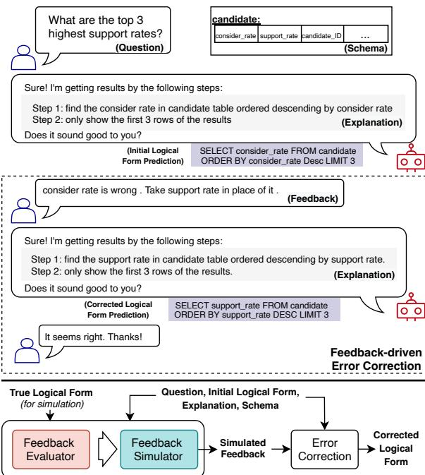
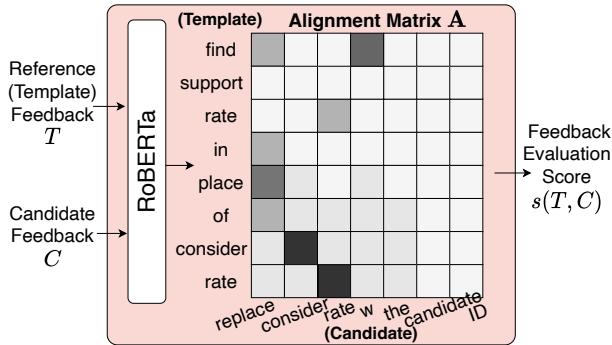
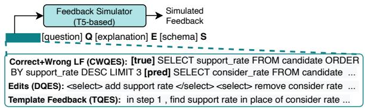
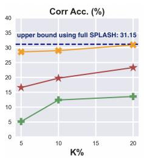
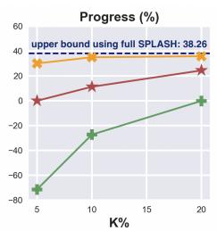
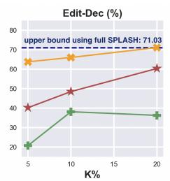
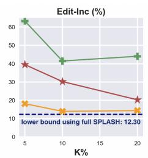
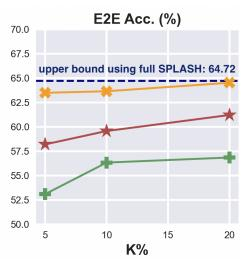
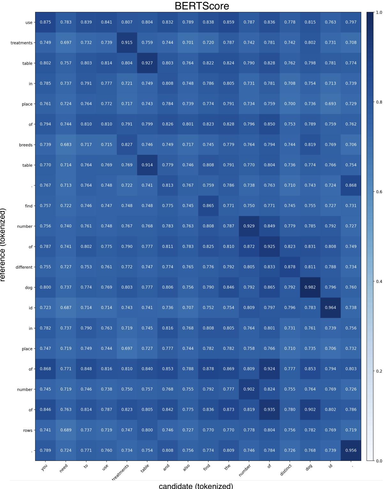
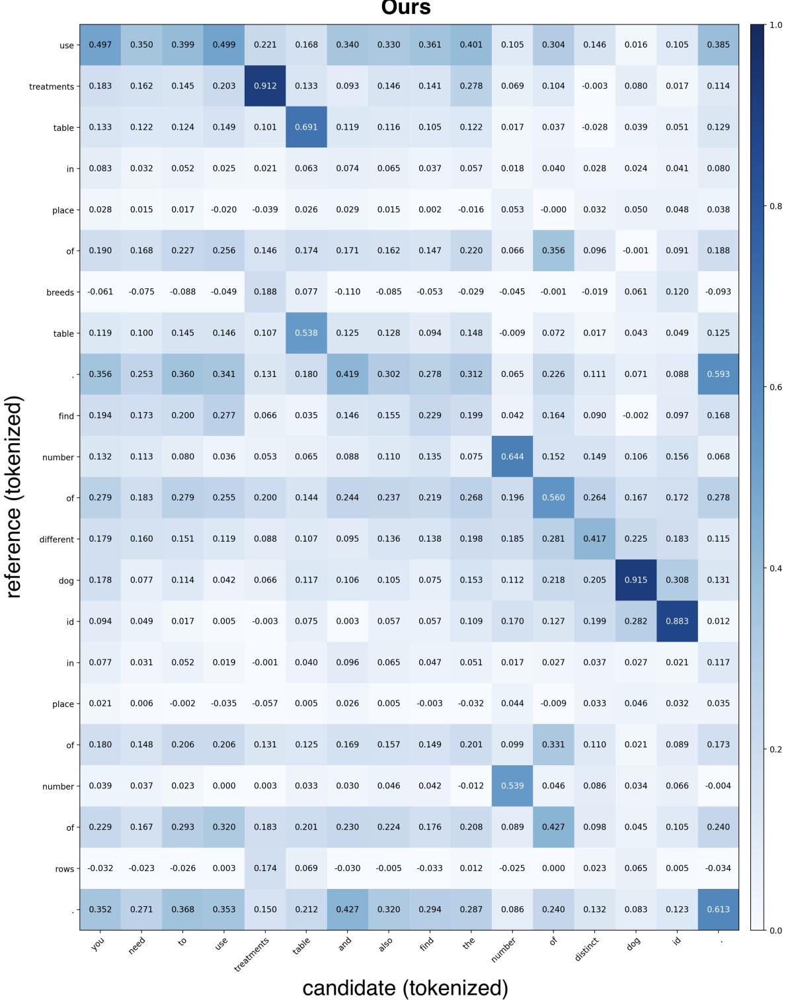

# Learning to Simulate Natural Language Feedback for Interactive Semantic Parsing

Hao Yan1, Saurabh Srivastava1, Yintao Tai2∗, Sida I. Wang3, Wen-tau Yih3, Ziyu Yao1 1George Mason University, 2The University of Edinburgh, 3Meta AI 1{hyan5, ssrivas6, ziyuyao}@gmu.edu, 2y.tai-6@sms.ed.ac.uk 3{sida, scottyih}@meta.com

## Abstract

Interactive semantic parsing based on natural language (NL) feedback, where users provide feedback to correct the parser mistakes, has emerged as a more practical scenario than the traditional one-shot semantic parsing. However, prior work has heavily relied on humanannotated feedback data to train the interactive semantic parser, which is prohibitively expensive and not scalable. In this work, we propose a new task of simulating NLfeedbackfor interactive semantic parsing. We accompany the task with a novel feedback evaluator. The evaluator is specifically designed to assess the quality of the simulated feedback, based on which we decide the best feedback simulator from our proposed variants. On a text-to-SQL dataset, we show that our feedback simulator can generate high-quality NL feedback to boost the error correction ability of a specific parser. In low-data settings, our feedback simulator can help achieve comparable error correction performance as trained using the costly, full set of human annotations.1

## 1 Introduction

The state of NLP research has long been dominated by training and evaluating single-turn models, which, given a task input, produce the output and terminate the task immediately. However, in the more practical scenario of NLP applications (e.g., smart-home virtual assistance), users often anticipate multi-turn interactions, such as being able to provide feedback to the model output (De Vries et al., 2020). In doing this, not only can the model obtain more information and guidance to improve its task performance, but it also provides human users a mechanism to intervene in the model decision-making for safety purposes.

  
Figure 1: Illustration of interactive semantic parsing, where the parser solicits NL feedback for error correction (example based on text-to-SQL). In this work, we aim to simulate such NL feedback at scale to facilitate the error correction model training. To this end, we proposed a feedback evaluator for promoting this task, and experiment with different feedback simulator variants.

However, training a neural model to understand human feedback requires a large number of human annotations, which has hindered the advancement of this line of research.

In this paper, we investigate this problem under semantic parsing. Semantic parsing is the task of translating NL sentences into their formal meaning representations (i.e., logical forms), which has been adopted for applications such as question answering (Reddy et al., 2014; Dong and Lapata, 2016; Yu et al., 2018; Gu et al., 2021) and dialogue systems (Gupta et al., 2018; Andreas et al., 2020; Cheng et al., 2020). The pressing need for further improving its application performance has motivated the research of interactive semantic parsing, where a semantic parser presents its parsing results to the user and requests user feedback for error correction (Gur et al., 2018; Yao et al., 2019b; Li et al., 2020; Elgohary et al., 2020). In this work, we follow Labutov et al. (2018); Elgohary et al. (2020) to consider NL feedback, i.e., a sentence describing which parts of the generated logical form contain errors and how to correct them. We illustrate this paradigm in Figure 1.

Despite its promise, prior work has heavily relied on human-annotated feedback data to train the error correction model. For example, Elgohary et al. (2020) deployed the Seq2Struct parser (Shin, 2019) and recruited 10 crowd workers to provide feedback annotations, which has been shown to be both costly and time-consuming (6 minutes per annotation as reported). Moreover, since this feedback collection procedure is bound to a specific parser, the collected feedback may not generalize well to resolving errors made by different parsers.

Motivated by the above observations, in this paper, we propose the task of simulating NL feedbackfor interactive semantic parsing. Specifically, given the initial user command, a model-generated incorrect logical form, the ground-truth logical form for the simulation purpose, as well as other contextual information, the goal is to generate an NL feedback sentence encoding the error correction information in a way that is close to the realuser feedback. We assume a small set of humanannotated feedback to bootstrap this task, but aim for an effective feedback simulator that can further simulate feedback for different semantic parsers at scale. While prior work has attempted a similar task (Yao et al., 2019a; Elgohary et al., 2021; Mo et al., 2022), none of them carefully defined the task (e.g., how to evaluate simulated feedback) and investigated advanced simulation methods.

To facilitate this research, we first propose a feedback evaluator that can be used to assess different simulators. In particular, our feedback evaluator is designed to evaluate whether the simulated feedback is logically consistent with the user error correction intent, a critical attribute that cannot be achieved by existing text evaluation metrics (Papineni et al., 2002; Zhang et al., 2019b). Instead of comparing the simulated feedback with the human-annotated one, we propose to compare it with the template feedback, which is not only logic-wisely less noisy but also scalable to cases when human annotations are not available. Human evaluation shows that our feedback evaluator can more precisely assess the simulated feedback. We also propose a set of feedback simulators based on the pre-trained T5 model (Raffel et al., 2020), and decide the best using our evaluator.

To demonstrate the advantages of our feedback simulator, we conduct experiments on SPLASH (Elgohary et al., 2020), a dataset containing humanannotated feedback to mistakes of the Seq2Struct parser (Shin, 2019) in text-to-SQL semantic parsing (Yu et al., 2018). We first show that our feedback simulator trained on SPLASH can be used to simulate NL feedback for a different parser, using EditSQL (Zhang et al., 2019a) as an example. The resulting simulated feedback, when being used to augment the SPLASH training set, leads to improved error correction performance for both Seq2Struct and particularly EditSQL. We further demonstrate that even in the low-data setting (i.e., using a small portion of SPLASH), our feedback simulator can still produce high-quality NL feedback, based on which we can train the error correction model to a comparable performance level as its counterpart trained using the full SPLASH. This implies that our feedback simulator can be very helpful when there are limited annotation budgets.

## 2 Simulating Natural Language Feedback for Interactive Semantic Parsing

## 2.1 Overview

We illustrate the scenario of interactive semantic parsing in Figure 1. Given an initial user question $Q ,$ , as well as other contextual information (e.g., database schema in text-to-SQL semantic parsing, denoted as S), the semantic parser will first produce an initial logical form $Y _ { i n i t }$ . The semantic parser will then present a logical form explanation E to the user.2 After receiving the explanation, the user is prompted to give an NL feedback sentence F, describing which parts of the logical form $Y _ { i n i t }$ contain errors and how to correct them. This information is perceived by the error correction model of the interactive semantic parser to refresh its logical form prediction, hoping that the new prediction $Y _ { f i x }$ can be the same as the ground truth $Y ^ { * }$

Training the interactive semantic parser (or more precisely, its error correction model) to understand NL feedback requires abundant human-annotated feedback data. In this work, we propose a new task of simulating NLfeedbackfor interactive semantic parsing, aiming to reduce the reliance on human annotations. We assume a set of humanannotated feedback data $\mathcal { D } _ { t r a i n }$ , consisting of tuples of $( Q , S , Y _ { i n i t } , E , F , Y ^ { * } )$ , to bootstrap such a feedback simulator, but aim for an effective simulator that can generate high-quality NL feedback at scale. The simulated feedback can then be used to assist the error correction model training.

To facilitate this task, we first introduce a feedback evaluator in Section 2.2, and then present a set of feedback simulators in Section 2.3.

## 2.2 Feedback Evaluation

It is critical that the simulated feedback is both fluent (i.e., as how real users speak) and logically consistent with the user error correction intent (i.e., precisely articulating which parts of the predicted logical form are wrong and how to correct them). While the prevalent use of pre-trained language models has been able to improve generation fluency dramatically (Radford et al., 2019; Lewis et al., 2020; Raffel et al., 2020), ensuring that the simulated feedback has a consistent logic with the simulation intent is still a challenging problem. This motivates us to accompany the feedback simulation task with an evaluator that can be reused by future researchers to assess the quality of the simulated feedback from a logical front. To this end, we design a feedback evaluator as elaborated below. The evaluator will be trained using the available feedback annotations $\mathscr { D } _ { t r a i n }$

## 2.2.1 Task Formulation & Architecture

Without the loss of generality, given a reference feedback sentence $T = ( t _ { 1 } , t _ { 2 } , . . . , t _ { N } )$ and a candidate feedback sentencefi $C = ( c _ { 1 } , c _ { 2 } , . . . , c _ { M } )$ , the goal of a feedback evaluator is to produce a score $s ( T , C )$ , such that when the candidate C is logically consistent with the error correction intent (as reflected in the reference T), the evaluator predicts a high score $s ,$ and vice versa. In our task, the candidate $C$ is the simulated NL feedback. As for the reference $T ,$ instead of using the human-annotated feedback, we use a templatefeedback derived from the same context. A simplified example is shown in Figure 2, which describes the column replacement in text-to-SQL parsing using a template “find $\left[ \mathsf { C o l } _ { c o r r e c t } \right]$ in place of $[ \mathsf { C o l } _ { w r o n g } ] ^ { \flat }$ , where $\mathbf { \Psi } ^ { * * } [ \mathsf { C o l } _ { c o r r e c t } ] ^ { * }$ and $^ { * } [ \mathsf { C o l } _ { w r o n g } ] ^ { * }$ are placeholders for correct and incorrect columns, respectively. We include more details of our templates in $\mathsf { A p - }$ pendix A.1. Using template feedback as reference offers two advantages. First, it provides a cleaner standard than the human-annotated one, which we empirically found to contain inaccurate or incomplete error descriptions. Second, since template feedback can be generated automatically, it can easily scale to cases when human annotations are not available.

  
Figure 2: Our feedback evaluator assesses the logical quality of the simulated feedback by leveraging the template feedback as reference.

In order to capture the feedback semantics at the logical level, we adopt a model architecture similar to that of Zhang et al. (2019b), which first computes the token-level similarity between the candidate and the reference, and then aggregates the information toward scoring their similarity at the sentence level (Figure 2). Specifically, the model takes the candidate C and the reference $T$ as input and first obtains their token-level contextual representations via RoBERTa (Liu et al., 2019), obtaining $\mathbf { h } _ { \mathbf { n } } ^ { \mathbf { T } } , \mathbf { h } _ { \mathbf { m } } ^ { \mathbf { C } } \in \mathbb { R } ^ { d }$ , where d is the embedding size, for token $t _ { n } \left( n { =                  } 1 \ldots , N \right)$ and $c _ { m } \ ( m { = } 1 \ , { \ldots } , M )$ , respectively. We then obtain a token-level similarity matrix $\mathbf { A } \in \mathbb { R } ^ { N \times M }$ by calculating the cosine similarity between every pair of tokens in the reference and the candidate, i.e., $\begin{array} { r } { \mathbf { A } _ { n m } = \frac { \mathbf { h _ { n } ^ { T } } ^ { \top } \cdot \mathbf { h _ { m } ^ { C } } } { | | \mathbf { h _ { n } ^ { T } } | | \cdot | | \mathbf { h _ { m } ^ { C } } | | } } \end{array}$

The sentence-level similarity between the reference and the candidate can then be derived from their token-level similarities. We notice that not only should the candidate align with the reference (precision) but the alignment should also hold in the opposite direction (recall). Therefore, our sentence-level similarity first calculates the precision and the recall between the two sentences, i.e., $\begin{array} { r } { s _ { p r e c } ( T , C ) = \frac { 1 } { M } \sum _ { m = 1 } ^ { M } \operatorname* { m a x } _ { n } \mathbf { A } _ { n m } . } \end{array}$ $\begin{array} { r } { s _ { r e c a l l } ( T , C ) \ = \ \frac { 1 } { N } \sum _ { n = 1 } ^ { N } \operatorname* { m a x } _ { m } { \bf A } _ { n m } } \end{array}$ , and then calculates their average as the final score, i.e., $s ( T , C ) = \textstyle \frac { 1 } { 2 } \big ( s _ { p r e c } + s _ { r e c a l l } \big )$

We train the evaluator to contrast positive $C _ { p o s }$ and negative $C _ { n e g }$ candidates via a hinge loss:

$$
\begin{array} { r l } & { \mathcal { L } ^ { m a r g i n } = \operatorname* { m a x } ( 0 , m - s ( T , C _ { p o s } ) + s ( T , C _ { n e g } ) ) } \\ & { \qquad + \lambda ( | \mathbf { A } _ { p o s } | _ { 1 } + | \mathbf { A } _ { n e g } | _ { 1 } ) } \end{array}
$$

where m is the margin, $| \mathbf { A } | _ { 1 }$ denotes the L1 norm encouraging sparse alignments, and λ is the weight factor. In practice, we will use the humanannotated feedback F as the positive candidate and the negative one will be introduced shortly.

Supervision on Token-level Alignment. Inspired by Yin et al. (2021), we additionally introduce alignment supervision on tokens that can be derived from task-specific information. For example, in the task of text-to-SQL semantic parsing, it is easy to derive schema items appearing in the template feedback, and their correspondences in the human-annotated feedback can be extracted using fuzzy string matching (Lin et al., 2020). This results in a prior alignment matrix, denoted as $\mathbf { A } ^ { p r i o r } \in \mathbb { R } ^ { \hat { N } \times M }$ in our work. Specifically, every element in the matrix is set to 1 if the corresponding tokens in the reference and the candidate should be aligned, and 0 otherwise. The supervision is realized by the loss:

$$
\mathcal { L } ^ { p r i o r } = \sum _ { n = 1 } ^ { N } \sum _ { m = 1 } ^ { M } ( \mathbf { A } _ { n m } - \mathbf { A } _ { n m } ^ { p r i o r } ) ^ { 2 } \times \mathbf { A } _ { n m } ^ { m a s k } ,
$$

where $\mathbf { A } ^ { m a s k } \in \mathbb { R } ^ { N \times M }$ is a mask matrix used to eliminate the impact of the supervision on tokens for which we cannot derive their correct alignments. Specifically, for tokens in the same row or column as those aligned tokens, we assign $\mathbf { A } _ { n m } ^ { m a s k }$ to 1 for them, and 0 otherwise. The final loss function for training the evaluator is:

$$
\begin{array} { r } { \mathcal { L } = \mathcal { L } ^ { m a r g i n } + \gamma \mathcal { L } ^ { p r i o r } , } \end{array}
$$

where γ is the weight of the prior loss.

Negative Candidate Feedback. Motivated by the observation that most feedback is about correcting certain values and schema items (e.g., table and column names in text-to-SQL parsing), we sample negative feedback from the human-annotated feedback by replacing their values and schema items with random ones. Taking text-to-SQL semantic parsing as an example, we replace the column name “location description” in the feedback “use location name instead of location description” with a different column in the same database, such as “document type description”, resulting in a negative feedback sentence “use location name instead of document type description”. In this way, our feedback evaluator will be trained to capture such subtle differences between good and bad feedback.

  
Figure 3: Our feedback simulator variants with different ways of error correction intent representations.

Post-processing. To further encourage one-to-one alignments between the reference and the candidate, we follow Li et al. (2020) to perform Bipartite Matching at inference time. Furthermore, we noticed that spans in the reference (i.e., template) feedback contribute differently to describing the error correction intent. For example, when a user would like to replace a certain schema item with an alternative one, they will indicate the correct alternative, but may or may not mention the incorrect one. Therefore, we additionally weigh different spans in the reference feedback while calculating the similarity score. More details are shown in Appendix A.2.

## 2.3 Feedback Simulation

Given the initial user question Q, the initial logical form prediction $Y _ { i n i t }$ , the gold logical form $Y ^ { * }$ (for the simulation purpose), as well as other information such as the explanation $E$ and the context S, a feedback simulator aims to produce a feedback sentence F that is similar to how humans give corrective instructions to the semantic parser.

In this section, we present three variants of feedback simulator, all based on fine-tuning the pretrained T5 model (Raffel et al., 2020). The variants are only different in the way how they represent the error correction intent. Figure 3 gives an overview of them. (1) CWQES: In this variant, we simply include the Correct and Wrong logical forms as input and train the model to simulate feedback. (2) DQES: Inspired by Elgohary et al. (2021), we also explore feeding the eDits of revising the incorrect logical form $Y _ { i n i t }$ into the gold one $Y ^ { * }$ as input. Compared with feeding the raw logical forms, this variant will make the simulation task easier, because, unlike the former, the simulator will have no need to understand the two logical forms and infer their differences. In practice, we follow Elgohary et al. (2021) and represent the edits in a linearized form. (3) TQES: Finally, we propose to represent the edits using their Template description, which is the same as our template feedback introduced in Section 2.2. In this way, the task of feedback simulation can be viewed as paraphrasing the template feedback and making it more similar to how the real user speaks. The advantage of this variant lies in that it can better unlock the power of language models pre-trained on textual data (e.g., T5), when the program-liked edits are replaced by their textual descriptions. Same as the feedback evaluator, our feedback simulator will be trained on the available human annotations $\mathcal { D } _ { t r a i n }$

## 3 Experiments

## 3.1 Experimental Setup

We conduct experiments using the SPLASH dataset (Elgohary et al., 2020), which contains humanannotated feedback for mistakes made by the Seq2Struct parser (Shin, 2019) on the Spider textto-SQL semantic parsing dataset (Yu et al., 2018). Specifically, both the SPLASH training (6,829 examples) and dev (810 examples) set were derived from the Spider training set, and the SPLASH test set (870 examples) was from the Spider dev set.3

Experimental Settings. To demonstrate the effectiveness of our feedback simulator and evaluator, we consider two settings:

(1) Simulating feedback to a specific semantic parser: We investigate whether our feedback simulator trained on the SPLASH dataset can simulate feedback for an unseen semantic parser. In experiments, we follow Elgohary et al. (2020) and experiment with the EditSQL parser (Zhang et al., 2019a). Specifically, we first follow a similar procedure of Elgohary et al. (2020) to create mistakes made by EditSQL on the Spider training set, and then apply our feedback simulator to simulate NL feedback. This results in around 2,400 simulated training examples. This data is then used to augment the original SPLASH training set for training an error correction model. We evaluate the error correction model on both the SPLASH test set and the EditSQL test set (which similarly contains humanannotated feedback to EditSQL’s mistakes on the

Spider dev set and was additionally provided by Elgohary et al. (2020)).

In this setting, we compare three variants of the error correction model (to be introduced shortly). (a) Trained on SPLASH, where the model is trained using the original SPLASH training set; (b) Trained on $\mathbf { S P L A S H } + \mathcal { D } _ { e d i t s q l } ^ { s i m }$ , where the model is trained on both the SPLASH training set and our simulated feedback based on EditSQL; (c) Trained on $\mathbf { S P L A S H } + \mathcal { D } _ { e d i t s q l } ^ { t e m p } .$ where, instead of using our simulated feedback, we use the template feedback to augment the training, following the spirit of Yao et al. (2019a); Elgohary et al. (2021).

(2) Simulating feedback in low-data settings: One important motivation of our research is to reduce the need for human annotations. Therefore, we also experiment with a “low data” setting, where only K% of the SPLASH training set will be used to construct our feedback simulator and evaluator. For the remaining (100 K)% of training examples, we will instead apply our feedback simulator to simulate NL feedback. In experiments, we consider K=20, 10, and 5, consuming 1639, 836, and 268 training examples, respectively. Similar to setting (1), we compare our simulated feedback with the template feedback, and will demonstrate the effectiveness of our feedback simulator by evaluating the error correction model trained on its simulation.4

For both experiments, we use the TQES feedback simulator variant as it presents the best generation quality, as we will discuss in Section 3.4. We also note that our proposed feedback evaluator is only used for comparing and selecting better feedback simulator checkpoints or variants. In the future, one can further use our evaluator to provide reward signals when training the feedback simulator (see a discussion in the Limitations section).

Error Correction Model Evaluation. We follow Elgohary et al. (2021) in using four evaluation metrics to assess an error correction model. Correction Accuracy measures the exact set match (Yu et al., 2018)5 between the gold parse $( Y ^ { * } )$ and the parse after correction $( Y _ { f i x } )$ . Edit-Dec and Edit-Inc measure the percentage of test examples for whom the required revision edits are decreased and increased, respectively, after the error correction. Therefore, a better error correction model should expect a larger Edit-Dec but a smaller Edit-Inc. Progress measures the relative edit reduction from revising the corrected vs. initial logical form to the ground truth. Finally, we include the endto-end (E2E) accuracy of a parser on the Spider dev set, which measures the parsing accuracy when the parser is able to interact with users and correct mistakes via the trained error correction model.

<table><tr><td rowspan="2">Model</td><td colspan="5">SPLASH-Test</td><td colspan="5">EditSQL-Test</td></tr><tr><td>Corr Acc. (↑)</td><td>Progress (↑)</td><td>Edit-Dec (↑)</td><td>Edit-Inc (↓)</td><td>E2E (↑)</td><td>Corr Acc. (↑)</td><td>Progress (1)</td><td>Edit-Dec (↑)</td><td>Edit-Inc (↓)</td><td>E2E (↑)</td></tr><tr><td>Trained on SPLASH</td><td>31.15</td><td>38.26</td><td>71.03</td><td>12.30</td><td>64.72</td><td>25.70</td><td>23.23</td><td>59.86</td><td>23.23</td><td>75.14</td></tr><tr><td> $+ \mathcal { D } _ { e d i t s a l } ^ { t e m p }$ </td><td>31.15</td><td>37.68</td><td>71.49</td><td>14.82</td><td>64.63</td><td>25.70</td><td>15.68</td><td>56.69</td><td>26.05</td><td>75.14</td></tr><tr><td> $+ \mathcal { D } _ { e d i t s q l } ^ { s i m }$  (ours)</td><td>33.10</td><td>41.60</td><td>74.14</td><td>11.49</td><td>65.45</td><td>29.22</td><td>23.99</td><td>61.97</td><td>19.71</td><td>76.11</td></tr></table>

Table 1: Error correction performance (%) on the SPLASH and EditSQL test sets, when the model is trained on the original SPLASH training set, and optionally augmented by the template feedback $( \mathcal { D } _ { e d i t s q l } ^ { t e m p } )$ or our simulated feedback $( \mathcal { D } _ { e d i t s q l } ^ { s i m } )$ based on EditSQL’s mistakes on the Spider training set. ( : higher, better; : lower, better)

Due to the lack of open-source error correction models, we have implemented our own based on T5 (Raffel et al., 2020), with the model details included in Appendix A.3. While improving the base error correction model is outside our scope, we empirically show that our T5-based error correction model obtains comparable performance to the existing models. We include the comparison and all implementation details in Appendix B.

## 3.2 Can the Feedback Simulator Generate Useful Feedback for a Specific Parser?

In Table 1, we report results for the experimental setting (1), comparing the performance of different error correction model variants when they are trained using our simulated feedback on EditSQL’s mistakes or not. As shown in the table, when including our simulated feedback, we are able to improve the error correction performance for Edit-SQL by 3.5% absolute correction accuracy. Note that the correction accuracy is a very strict metric counting onlyfully correct logical forms. On other metrics based on partial corrections, we observe that including our simulated feedback can improve them by 5-8%. These improvements imply that our feedback simulator is able to simulate highquality NL feedback for errors present in EditSQL (but may be infrequent in SPLASH), which allows the error correction model to better fit EditSQL’s test-time error patterns. We present an example in Appendix C.1.

<table><tr><td>Metrics</td><td>MRR (dev)</td><td>Human</td></tr><tr><td>BLEU</td><td>0.57</td><td>0.03</td></tr><tr><td>BERTScore</td><td>0.55</td><td>0.08</td></tr><tr><td>Our Evaluator</td><td>0.88</td><td>0.19</td></tr></table>

Table 2: Performance of different feedback evaluation metrics. MRR shows the evaluator performance when it is used to rank positive feedback on SPLASH-dev (higher, better). Human denotes their Spearman ranking correlations with human ratings.

We also show that including the simulated feedback on EditSQL can improve the error correction for Seq2Struct (i.e., on the SPLASH test set) as well; it leads to around 2% gain on correction accuracy and 2.5-3.5% on others. It is plausible that these gains are not as large as those on the Edit-SQL test set, given that the additional feedback is simulated based on EditSQL.

Intriguingly, our results present a negative impact from the template feedback. Training the error correction model additionally on the template feedback on EditSQL causes either no gain in Correction Accuracy and worse performance on Progress, especially on the EditSQL test set. Our conjecture is that adding template feedback that describes errors differently from real users can only hinder the error correction model from understanding natural feedback in this full data setting (we will discuss its different impact in low-data settings in Section 3.5).

Finally, looking at the end task accuracy, we note that for both Seq2Struct (the base parser of SPLASH) and EditSQL, being able to correct testtime mistakes based on user NL feedback offers them parsing performance comparable with stateof-the-art parsers on the Spider benchmark. Training their error correction models on our simulated feedback leads to 1% further gain.

## 3.3 Can the Feedback Evaluator Properly Assess Each Simulator?

As described in Section 3.1, we rely on our feedback evaluator to select the best feedback simulator.

  
K% SPLASHK% SPLASH + 100-K% SPLASH w/ template feedback K% SPLASH + 100-K% SPLASH w/ simulated feedback  
Figure 4: Error correction performance in low-data settings, where only K% of the SPLASH training set is used and the remaining is simulated using our simulator or the templates. The performance is compared to the upper (lower) bound that was trained using the full SPLASH train set.

As a result, it is critical that our feedback evaluator can give us precise comparisons across different simulators. We conducted two evaluations comparing our evaluator with the existing metrics, BLEU (Papineni et al., 2002) and BERTScore (Zhang et al., 2019b). For automatic evaluation, we report the Mean Reciprocal Rank (MRR) of each evaluation metric when it is used to rank the positive feedback among the 50 negative ones on the SPLASH dev set; the higher MRR, the better metric. In addition, we performed a human evaluation and instructed human participants to rank among feedback generated by different simulators under the same context. We then calculate the Spearman ranking correlation between the rank by each evaluation metric and that by humans. We include more human evaluation details in Appendix C.2.

We present the results in Table 2. On both metrics, our feedback evaluator substantially outperforms the other two metrics. It demonstrates that our evaluator can more precisely assess the logical consistency of a simulated feedback sentence and distinguish between feedback with good and bad quality. In contrast, BERTScore tends to give high values to all generated feedback as long as they are relevant, as we showcase in Appendix C.3.

## 3.4 How Does Each Feedback Simulator Variant Perform?

We compare the performance of the three feedback simulators (Section 2.3) in Table 3. While we present performance using different evaluation metrics, as discussed previously, the results of BLEU and BERTScore are relatively less reliable. Results from our evaluator show that TQES can achieve the best performance. We conjecture that this is owing to two advantages. First, compared with CWQES, which requires inferring the desired edits from the incorrect and the correct logical form, TQES directly includes the edit information as input, which simplifies the feedback simulation problem. Second, while both DQES and TQES include the edit information in the input, TQES additionally translates the information into texts, which fits better with how the T5 model was pre-trained (i.e., on textual data). Therefore, in all our experiments, we have been using the TQES-based feedback simulator by default.

<table><tr><td>Model</td><td>BLEU</td><td>BERTScore</td><td>Our Evaluator</td></tr><tr><td>CWQES</td><td>0.132</td><td>0.881</td><td>0.491</td></tr><tr><td>DQES</td><td>0.134</td><td>0.882</td><td>0.518</td></tr><tr><td>TQES</td><td>0.125</td><td>0.884</td><td>0.535</td></tr></table>

Table 3: Performance of different feedback simulators.

## 3.5 Can the Feedback Simulator Work Well in the Low-data Setting?

Finally, we investigate the performance of our feedback simulator and evaluator in the low-data setting. Our results are shown in Figure 4. A surprising finding is that even when trained with only a small amount of training data, our feedback simulator can still generate high-quality feedback that makes the performance of the error correction model comparable to that of using the full SPLASH training set. As we include more human annotations (i.e., from 5% to 10% or 20%), the feedback simulator can generate better feedback, leading to an upward trend in the error correction performance. Unlike in the full-data experimental setting (Section 3.2), when there is only a limited amount of human annotations, including template feedback assists the error correction model training, although the gains are smaller than that of our simulated feedback. To further understand the feedback simulator performance, in Appendix C.4, we show the performance of low-data feedback simulators using our feedback evaluator. Our results demonstrate that even when the simulator is trained with a small amount of training data, it can still achieve comparable performance to that trained with full SPLASH data.

## 4 Related Work

Interactive Semantic Parsing. Motivated by the need to further enhance its performance in practice, interactive semantic parsing emerged as a promising solution (Wang et al., 2016; Chaurasia and Mooney, 2017; Gur et al., 2018; Su et al., 2018; Labutov et al., 2018; Yao et al., 2019a,b; Staniek and Riezler, 2021; Yao et al., 2020; Li et al., 2020; Zeng et al., 2020; Elgohary et al., 2020; Mo et al., 2022). Among others, Gur et al. (2018) and Yao et al. (2019b) explained components in the generated logical form and, if they were wrong, requested users to select the correct ones as feedback. Li et al. (2020) identified uncertain tokens in the language command and requested user choices on their paraphrases for clarification. While the multichoice feedback was shown to work well for correcting errors in semantic parsing, it suffers from the obvious drawbacks of being less user-friendly and inefficient, as users can only passively respond to the system-presented choices.

Labutov et al. (2018) and Elgohary et al. (2020) have driven the research a step forward by introducing NL feedback. Particularly, Elgohary et al. (2020) annotated the SPLASH feedback dataset and showed that an error correction model can learn to fix parsing mistakes from NL feedback. In (Elgohary et al., 2021), the authors further investigated a more advanced error correction model, which predicts the edits rather than the corrected logicalform based on NL feedback. Our work is complementary to the existing effort. Instead of improving the error correction model architecture, we focus on simulating NLfeedback to reduce the need for human annotations for training the error correction model. When constructing our feedback simulator, we also explore the use of “edits” to improve the model performance.

General NLP Research with Human Feedback. There is also work outside semantic parsing exploring human feedback for NLP model development (Hancock et al., 2019; Kreutzer and Riezler, 2019; Sreedhar et al., 2020; Madaan et al., 2021; Li et al., 2022). For example, Hancock et al. (2019) explored chatbots that can ask for user feedback when the user shows to be unsatisfied with the conversation. In their work, the feedback can often be viewed as human-labeled responses. Li et al. (2022) requested human feedback in the form of ratings and explanations for improving retrievalbased question answering. More recently, Ouyang et al. (2022) collected expert rankings of model outputs for fine-tuning GPT-3. Unlike the prior work, we focus on (corrective) NL feedback, a type of feedback that is still largely under-explored. While investigating how to improve a semantic parser from NL feedback is out of our scope, it can be an important future topic. Finally, concurrent to our work, we noticed an increasing interest in refining large language models with NL feedback from the models themselves (Chen et al., 2023; Madaan et al., 2023; Kim et al., 2023). We envision that models’ self-refinement and learning from external human feedback can be two complementary directions and their strengths should be leveraged simultaneously. We will leave the exploration of this topic to the future.

User Simulation in Dialogue Systems. User simulation has also been studied with task-oriented dialogue systems (Li et al., 2016; Shi et al., 2019; Mohapatra et al., 2021; Kim et al., 2021). There, a user simulator typically simulates not only the user utterances but also their goal (e.g., booking a movie ticket at 8pm this Saturday) and their “agenda” (Schatzmann and Young, 2009) toward accomplishing the task (e.g., what information to present in the user’s first and second conversation turns). Compared with the prior research, our work targets a very different setting, i.e., simulating NL feedback toward correcting the parsing mistakes. We focus this work on developing feedback simulators that can effectively simulate the feedback (i.e., utterance generation), whereas leaving other dimensions of user simulation (e.g., the agenda of error correction) to the future.

Text Evaluation. Finally, our work relates to research on text evaluation. Similar to prior work (Sulem et al., 2018; Zhang et al., 2019b; Sellam et al., 2020), in our experiments, we also observe that metrics based on the surface form of a text, such as BLEU (Papineni et al., 2002), cannot recognize semantic modifications in text generation. Recent research has thus shifted to neural networkbased text evaluation, exemplified by metrics such as BERTScore (Zhang et al., 2019b), BARTScore (Yuan et al., 2021), CTC Score (Deng et al., 2021), etc. However, while these metrics work well for general-purpose text evaluation (e.g., checking the similarity between two translations), empirically we found them unable to identify the differences between two texts at the more subtle logical level. Therefore, we instead train a text evaluation model for assessing the simulated feedback sentence, following the same spirit of Sellam et al. (2020); Rei et al. (2020).

## 5 Conclusions

In this work, we propose the task of simulating NL feedback for interactive semantic parsing and present two models for feedback evaluation and simulation, respectively. Our experimental results have demonstrated the effectiveness of both models and show the promise of saving human-annotation effort with simulated feedback.

## Limitations

Both the feedback simulator and the feedback evaluator in our work can be further improved. For example, while we simply fine-tuned a pre-trained T5 model as the feedback simulator, future work can design more specialized architectures for it, such as adding relation-aware attention (Wang et al., 2020; Elgohary et al., 2021) to augment the schema item linking among input components (e.g., question and template feedback in the TQES variant). Alternatively, one can also leverage the feedback evaluator to steer the training of the feedback simulator (e.g., via reinforcement learning). As we briefly discussed, one could also extend our feedback simulator to imitate more fine-grained user behaviors, such as the agenda of how users would engage in the error correction process. Finally, an intriguing research direction is whether one can leverage our feedback simulator for continually improving a semantic parser from NL feedback, drawing inspirations from Clarke et al. (2010); Iyer et al. (2017); Yao et al. (2020).

Although our proposed approaches have not made any assumptions on the type of logical forms and can thus be applied to any of them, in experiments, we have only evaluated them in the task of text-to-SQL semantic parsing. Future research can further assess our proposed models in other semantic parsing settings such as knowledge base question answering (Cai and Yates, 2013; Yih et al., 2016; Gu et al., 2021; Mo et al., 2022).

On the other hand, as our simulator is primarily designed for interactive semantic parsing, it assumes meaning representations of both the groundtruth prediction and the model prediction. Therefore, generalizing our methods to other NLP tasks may need additional effort. For example, if we apply our methods to a similar interaction scenario for retrieval-based QA (Li et al., 2022), then we will additionally need to define logical forms to describe the ground-truth retrieval process and that of the QA model. For open-ended tasks such as keywordbased story generation (Pascual et al., 2021), defining such logical forms will need non-trivial effort.

## Ethics Statement

We presented the task of simulating NL feedback for interactive semantic parsing. The dataset we used in this project is publicly available. While it is possible that our feedback simulator may generate texts that do not perfectly align with the intended error correction, it is important to note that these generated texts are exclusively used for training the error correction model and are not exposed to real human users. Hence, we do not anticipate any ethical issues resulting from our work. On the other hand, we emphasize the positive impact of our work when it aims to facilitate feedback-driven human-AI interaction. As shown in this and prior work, human feedback allows for correcting model mistakes before their negative impact takes place, which can play a key role toward enabling safe and trustworthy AI/NLP applications.

## Acknowledgements

We would like to thank all anonymous reviewers for their constructive comments. This project was supported by resources provided by the Office of Research Computing at George Mason University (https://orc.gmu.edu) and funded in part by grants from the National Science Foundation (Awards Number 1625039 and 2018631).

## References

Jacob Andreas, John Bufe, David Burkett, Charles Chen, Josh Clausman, Jean Crawford, Kate Crim, Jordan DeLoach, Leah Dorner, Jason Eisner, Hao Fang, Alan Guo, David Hall, Kristin Hayes, Kellie Hill, Diana Ho, Wendy Iwaszuk, Smriti Jha, Dan Klein, Jayant Krishnamurthy, Theo Lanman, Percy Liang, Christopher H. Lin, Ilya Lintsbakh, Andy Mc-Govern, Aleksandr Nisnevich, Adam Pauls, Dmitrij Petters, Brent Read, Dan Roth, Subhro Roy, Jesse Rusak, Beth Short, Div Slomin, Ben Snyder, Stephon

Striplin, Yu Su, Zachary Tellman, Sam Thomson, Andrei Vorobev, Izabela Witoszko, Jason Wolfe, Abby Wray, Yuchen Zhang, and Alexander Zotov. 2020. Task-oriented dialogue as dataflow synthesis. Transactions ofthe Associationfor Computational Linguistics, 8:556–571.

Qingqing Cai and Alexander Yates. 2013. Semantic parsing freebase: Towards open-domain semantic parsing. In Second Joint Conference on Lexical and Computational Semantics (\* SEM), Volume 1: Proceedings ofthe Main Conference and the Shared Task: Semantic Textual Similarity, pages 328–338.

Shobhit Chaurasia and Raymond J. Mooney. 2017. Dialog for language to code. In Proceedings of the Eighth International Joint Conference on Natural Language Processing (Volume 2: Short Papers), pages 175–180, Taipei, Taiwan. Asian Federation of Natural Language Processing.

Xinyun Chen, Maxwell Lin, Nathanael Schärli, and Denny Zhou. 2023. Teaching large language models to self-debug. arXiv preprint arXiv:2304.05128.

Jianpeng Cheng, Devang Agrawal, Héctor Martínez Alonso, Shruti Bhargava, Joris Driesen, Federico Flego, Dain Kaplan, Dimitri Kartsaklis, Lin Li, Dhivya Piraviperumal, Jason D. Williams, Hong Yu, Diarmuid Ó Séaghdha, and Anders Johannsen. 2020. Conversational semantic parsing for dialog state tracking. In Proceedings of the 2020 Conference on Empirical Methods in Natural Language Processing (EMNLP), pages 8107–8117, Online. Association for Computational Linguistics.

James Clarke, Dan Goldwasser, Ming-Wei Chang, and Dan Roth. 2010. Driving semantic parsing from the world’s response. In Proceedings of the Fourteenth Conference on Computational Natural Language Learning, pages 18–27, Uppsala, Sweden. Association for Computational Linguistics.

Harm De Vries, Dzmitry Bahdanau, and Christopher Manning. 2020. Towards ecologically valid research on language user interfaces. arXiv preprint arXiv:2007.14435.

Mingkai Deng, Bowen Tan, Zhengzhong Liu, Eric Xing, and Zhiting Hu. 2021. Compression, transduction, and creation: A unified framework for evaluating natural language generation. In Proceedings of the 2021 Conference on Empirical Methods in Natural Language Processing, pages 7580–7605, Online and Punta Cana, Dominican Republic. Association for Computational Linguistics.

Li Dong and Mirella Lapata. 2016. Language to logical form with neural attention. In Proceedings of the 54th Annual Meeting of the Association for Computational Linguistics (Volume 1: Long Papers), pages 33–43, Berlin, Germany. Association for Computational Linguistics.

Ahmed Elgohary, Saghar Hosseini, and Ahmed Hassan Awadallah. 2020. Speak to your parser: Interactive text-to-SQL with natural language feedback. In Proceedings of the 58th Annual Meeting of the Associationfor Computational Linguistics, pages 2065– 2077, Online. Association for Computational Linguistics.

Ahmed Elgohary, Christopher Meek, Matthew Richardson, Adam Fourney, Gonzalo Ramos, and Ahmed Hassan Awadallah. 2021. NL-EDIT: Correcting semantic parse errors through natural language interaction. In Proceedings of the 2021 Conference of the North American Chapter of the Associationfor Computational Linguistics: Human Language Technologies, pages 5599–5610, Online. Association for Computational Linguistics.

Yu Gu, Sue Kase, Michelle Vanni, Brian Sadler, Percy Liang, Xifeng Yan, and Yu Su. 2021. Beyond iid: three levels of generalization for question answering on knowledge bases. In Proceedings of the Web Conference 2021, pages 3477–3488.

Sonal Gupta, Rushin Shah, Mrinal Mohit, Anuj Kumar, and Mike Lewis. 2018. Semantic parsing for task oriented dialog using hierarchical representations. In Proceedings of the 2018 Conference on Empirical Methods in Natural Language Processing, pages 2787–2792, Brussels, Belgium. Association for Computational Linguistics.

Izzeddin Gur, Semih Yavuz, Yu Su, and Xifeng Yan. 2018. DialSQL: Dialogue based structured query generation. In Proceedings of the 56th Annual Meeting ofthe Associationfor Computational Linguistics (Volume 1: Long Papers), pages 1339–1349, Melbourne, Australia. Association for Computational Linguistics.

Braden Hancock, Antoine Bordes, Pierre-Emmanuel Mazare, and Jason Weston. 2019. Learning from dialogue after deployment: Feed yourself, chatbot! In Proceedings ofthe 57th Annual Meeting ofthe Associationfor Computational Linguistics, pages 3667– 3684, Florence, Italy. Association for Computational Linguistics.

Srinivasan Iyer, Ioannis Konstas, Alvin Cheung, Jayant Krishnamurthy, and Luke Zettlemoyer. 2017. Learning a neural semantic parser from user feedback. In Proceedings of the 55th Annual Meeting of the Associationfor Computational Linguistics (Volume 1: Long Papers), pages 963–973, Vancouver, Canada. Association for Computational Linguistics.

Geunwoo Kim, Pierre Baldi, and Stephen McAleer. 2023. Language models can solve computer tasks. arXiv preprint arXiv:2303.17491.

Sungdong Kim, Minsuk Chang, and Sang-Woo Lee. 2021. NeuralWOZ: Learning to collect task-oriented dialogue via model-based simulation. In Proceedings of the 59th Annual Meeting of the Association for Computational Linguistics and the 11th International

Joint Conference on Natural Language Processing (Volume 1: Long Papers), pages 3704–3717, Online. Association for Computational Linguistics.

Julia Kreutzer and Stefan Riezler. 2019. Self-regulated interactive sequence-to-sequence learning. In Proceedings ofthe 57th Annual Meeting ofthe Association for Computational Linguistics, pages 303–315, Florence, Italy. Association for Computational Linguistics.

Igor Labutov, Bishan Yang, and Tom Mitchell. 2018. Learning to learn semantic parsers from natural language supervision. In Proceedings ofthe 2018 Conference on Empirical Methods in Natural Language Processing, pages 1676–1690, Brussels, Belgium. Association for Computational Linguistics.

Mike Lewis, Yinhan Liu, Naman Goyal, Marjan Ghazvininejad, Abdelrahman Mohamed, Omer Levy, Veselin Stoyanov, and Luke Zettlemoyer. 2020. BART: Denoising sequence-to-sequence pre-training for natural language generation, translation, and comprehension. In Proceedings ofthe 58th Annual Meeting of the Association for Computational Linguistics, pages 7871–7880, Online. Association for Computational Linguistics.

Xiujun Li, Zachary C Lipton, Bhuwan Dhingra, Lihong Li, Jianfeng Gao, and Yun-Nung Chen. 2016. A user simulator for task-completion dialogues. arXiv preprint arXiv:1612.05688.

Yuntao Li, Bei Chen, Qian Liu, Yan Gao, Jian-Guang Lou, Yan Zhang, and Dongmei Zhang. 2020. “what do you mean by that?” a parser-independent interactive approach for enhancing text-to-SQL. In Proceedings ofthe 2020 Conference on Empirical Methods in Natural Language Processing (EMNLP), pages 6913–6922, Online. Association for Computational Linguistics.

Zichao Li, Prakhar Sharma, Xing Han Lu, Jackie Cheung, and Siva Reddy. 2022. Using interactive feedback to improve the accuracy and explainability of question answering systems post-deployment. In Findings ofthe Associationfor Computational Linguistics: ACL 2022, pages 926–937, Dublin, Ireland. Association for Computational Linguistics.

Xi Victoria Lin, Richard Socher, and Caiming Xiong. 2020. Bridging textual and tabular data for crossdomain text-to-SQL semantic parsing. In Findings of the Association for Computational Linguistics: EMNLP 2020, pages 4870–4888, Online. Association for Computational Linguistics.

Yinhan Liu, Myle Ott, Naman Goyal, Jingfei Du, Mandar Joshi, Danqi Chen, Omer Levy, Mike Lewis, Luke Zettlemoyer, and Veselin Stoyanov. 2019. Roberta: A robustly optimized BERT pretraining approach. CoRR, abs/1907.11692.

Aman Madaan, Niket Tandon, Prakhar Gupta, Skyler Hallinan, Luyu Gao, Sarah Wiegreffe, Uri Alon,

Nouha Dziri, Shrimai Prabhumoye, Yiming Yang, et al. 2023. Self-refine: Iterative refinement with self-feedback. arXiv preprint arXiv:2303.17651.

Aman Madaan, Niket Tandon, Dheeraj Rajagopal, Yiming Yang, Peter Clark, Keisuke Sakaguchi, and Ed Hovy. 2021. Improving neural model performance through natural language feedback on their explanations. arXiv preprint arXiv:2104.08765.

Lingbo Mo, Ashley Lewis, Huan Sun, and Michael White. 2022. Towards transparent interactive semantic parsing via step-by-step correction. In Findings of the Associationfor Computational Linguistics: ACL 2022, pages 322–342, Dublin, Ireland. Association for Computational Linguistics.

Biswesh Mohapatra, Gaurav Pandey, Danish Contractor, and Sachindra Joshi. 2021. Simulated chats for building dialog systems: Learning to generate conversations from instructions. In Findings ofthe Associationfor Computational Linguistics: EMNLP 2021, pages 1190–1203, Punta Cana, Dominican Republic. Association for Computational Linguistics.

Long Ouyang, Jeff Wu, Xu Jiang, Diogo Almeida, Carroll L Wainwright, Pamela Mishkin, Chong Zhang, Sandhini Agarwal, Katarina Slama, Alex Ray, et al. 2022. Training language models to follow instructions with human feedback. arXiv preprint arXiv:2203.02155.

Kishore Papineni, Salim Roukos, Todd Ward, and Wei-Jing Zhu. 2002. Bleu: a method for automatic evaluation of machine translation. In Proceedings of the 40th Annual Meeting of the Association for Computational Linguistics, pages 311–318, Philadelphia, Pennsylvania, USA. Association for Computational Linguistics.

Damian Pascual, Beni Egressy, Clara Meister, Ryan Cotterell, and Roger Wattenhofer. 2021. A plug-andplay method for controlled text generation. In Findings of the Association for Computational Linguistics: EMNLP 2021, pages 3973–3997, Punta Cana, Dominican Republic. Association for Computational Linguistics.

Alec Radford, Jeffrey Wu, Rewon Child, David Luan, Dario Amodei, Ilya Sutskever, et al. 2019. Language models are unsupervised multitask learners. OpenAI blog, 1(8):9.

Colin Raffel, Noam Shazeer, Adam Roberts, Katherine Lee, Sharan Narang, Michael Matena, Yanqi Zhou, Wei Li, Peter J Liu, et al. 2020. Exploring the limits of transfer learning with a unified text-to-text transformer. J. Mach. Learn. Res., 21(140):1–67.

Siva Reddy, Mirella Lapata, and Mark Steedman. 2014. Large-scale semantic parsing without questionanswer pairs. Transactions of the Association for Computational Linguistics, 2:377–392.

Ricardo Rei, Craig Stewart, Ana C Farinha, and Alon Lavie. 2020. COMET: A neural framework for MT evaluation. In Proceedings ofthe 2020 Conference on Empirical Methods in Natural Language Processing (EMNLP), pages 2685–2702, Online. Association for Computational Linguistics.

Jost Schatzmann and Steve Young. 2009. The hidden agenda user simulation model. IEEE transactions on audio, speech, and language processing, 17(4):733– 747.

Thibault Sellam, Dipanjan Das, and Ankur Parikh. 2020. BLEURT: Learning robust metrics for text generation. In Proceedings of the 58th Annual Meeting of the Association for Computational Linguistics, pages 7881–7892, Online. Association for Computational Linguistics.

Weiyan Shi, Kun Qian, Xuewei Wang, and Zhou Yu. 2019. How to build user simulators to train RL-based dialog systems. In Proceedings ofthe 2019 Conference on Empirical Methods in Natural Language Processing and the 9th International Joint Conference on Natural Language Processing (EMNLP-IJCNLP), pages 1990–2000, Hong Kong, China. Association for Computational Linguistics.

Richard Shin. 2019. Encoding database schemas with relation-aware self-attention for text-to-sql parsers. CoRR, abs/1906.11790.

Makesh Narsimhan Sreedhar, Kun Ni, and Siva Reddy. 2020. Learning improvised chatbots from adversarial modifications of natural language feedback. In Findings ofthe Associationfor Computational Linguistics: EMNLP 2020, pages 2445–2453, Online. Association for Computational Linguistics.

Michael Staniek and Stefan Riezler. 2021. Erroraware interactive semantic parsing of openstreetmap. In Proceedings of Second International Combined Workshop on Spatial Language Understanding and Grounded Communication for Robotics, pages 53– 59.

Yu Su, Ahmed Hassan Awadallah, Miaosen Wang, and Ryen W White. 2018. Natural language interfaces with fine-grained user interaction: A case study on web apis. In The 41st International ACM SIGIR Conference on Research & Development in Information Retrieval, pages 855–864.

Elior Sulem, Omri Abend, and Ari Rappoport. 2018. BLEU is not suitable for the evaluation of text simplification. In Proceedings ofthe 2018 Conference on Empirical Methods in Natural Language Processing, pages 738–744, Brussels, Belgium. Association for Computational Linguistics.

Bailin Wang, Richard Shin, Xiaodong Liu, Oleksandr Polozov, and Matthew Richardson. 2020. RAT-SQL: Relation-aware schema encoding and linking for textto-SQL parsers. In Proceedings ofthe 58th Annual

Meeting of the Association for Computational Linguistics, pages 7567–7578, Online. Association for Computational Linguistics.

Sida I. Wang, Percy Liang, and Christopher D. Manning. 2016. Learning language games through interaction. In Proceedings of the 54th Annual Meeting of the Association for Computational Linguistics (Volume 1: Long Papers), pages 2368–2378, Berlin, Germany. Association for Computational Linguistics.

Ziyu Yao, Xiujun Li, Jianfeng Gao, Brian Sadler, and Huan Sun. 2019a. Interactive semantic parsing for ifthen recipes via hierarchical reinforcement learning. In Proceedings of the AAAI Conference on Artificial Intelligence, volume 33, pages 2547–2554.

Ziyu Yao, Yu Su, Huan Sun, and Wen-tau Yih. 2019b. Model-based interactive semantic parsing: A unified framework and a text-to-SQL case study. In Proceedings of the 2019 Conference on Empirical Methods in Natural Language Processing and the 9th International Joint Conference on Natural Language Processing (EMNLP-IJCNLP), pages 5447–5458, Hong Kong, China. Association for Computational Linguistics.

Ziyu Yao, Yiqi Tang, Wen-tau Yih, Huan Sun, and Yu Su. 2020. An imitation game for learning semantic parsers from user interaction. In Proceedings ofthe 2020 Conference on Empirical Methods in Natural Language Processing (EMNLP), pages 6883–6902, Online. Association for Computational Linguistics.

Wen-tau Yih, Matthew Richardson, Chris Meek, Ming-Wei Chang, and Jina Suh. 2016. The value of semantic parse labeling for knowledge base question answering. In Proceedings ofthe 54th Annual Meeting of the Association for Computational Linguistics (Volume 2: Short Papers), pages 201–206, Berlin, Germany. Association for Computational Linguistics.

Pengcheng Yin, Hao Fang, Graham Neubig, Adam Pauls, Emmanouil Antonios Platanios, Yu Su, Sam Thomson, and Jacob Andreas. 2021. Compositional generalization for neural semantic parsing via spanlevel supervised attention. In Proceedings ofthe 2021 Conference of the North American Chapter of the Association for Computational Linguistics: Human Language Technologies, pages 2810–2823, Online. Association for Computational Linguistics.

Tao Yu, Rui Zhang, Kai Yang, Michihiro Yasunaga, Dongxu Wang, Zifan Li, James Ma, Irene Li, Qingning Yao, Shanelle Roman, Zilin Zhang, and Dragomir Radev. 2018. Spider: A large-scale human-labeled dataset for complex and cross-domain semantic parsing and text-to-SQL task. In Proceedings of the 2018 Conference on Empirical Methods in Natural Language Processing, pages 3911–3921, Brussels, Belgium. Association for Computational Linguistics.

Weizhe Yuan, Graham Neubig, and Pengfei Liu. 2021. Bartscore: Evaluating generated text as text generation. Advances in Neural Information Processing Systems, 34:27263–27277.

Jichuan Zeng, Xi Victoria Lin, Steven C.H. Hoi, Richard Socher, Caiming Xiong, Michael Lyu, and Irwin King. 2020. Photon: A robust cross-domain textto-SQL system. In Proceedings ofthe 58th Annual Meeting of the Association for Computational Linguistics: System Demonstrations, pages 204–214, Online. Association for Computational Linguistics.

Rui Zhang, Tao Yu, Heyang Er, Sungrok Shim, Eric Xue, Xi Victoria Lin, Tianze Shi, Caiming Xiong, Richard Socher, and Dragomir Radev. 2019a. Editing-based SQL query generation for cross-domain context-dependent questions. In Proceedings ofthe 2019 Conference on Empirical Methods in Natural Language Processing and the 9th International Joint Conference on Natural Language Processing (EMNLP-IJCNLP), pages 5338–5349, Hong Kong, China. Association for Computational Linguistics.

Tianyi Zhang, Varsha Kishore, Felix Wu, Kilian Q Weinberger, and Yoav Artzi. 2019b. Bertscore: Evaluating text generation with bert. In International Conference on Learning Representations.

## A Additional Model Details

## A.1 Template Feedback

The template feedback is used to describe the edits in a more natural way. We use template feedback in both our feedback simulator and evaluator and it brings several advantages as we stated in section 2. A SQL query can be divided into different clauses and errors vary in a specific clause. We mainly focus on three kinds of operations that can be used to correct the error parse: replace, add, and remove. In Table 4, we present examples of our template feedback. For ease of presentation, we use col\_name as the placeholder of a real column name in the database. Similarly for other kinds of schema items (e.g., table names, operators, etc.). Besides, we use subscript $c o r r e c t$ and $w r o n g$ to indicate the wrong and correct schema item in the replace operation, use subscript $n e w$ and $o l d$ to indicate the newly added schema item in add operation, and use numbers as subscript to indicate multiple schema items in one template.

## A.2 Post-processing of Feedback Evaluation

We observe that the positive candidate typically has one-to-one alignments with the reference. Inspired by Li et al. (2020), at test time we additionally perform a Bipartite Matching to encourage one-toone alignments in the matrix A, before calculating the similarity score.

Furthermore, we noticed that spans in the reference (i.e., template) feedback contribute differently to describing the error correction intent. For example, when a user would like to replace a certain schema item with an alternative one, they will indicate the correct alternative, but may or may not mention the incorrect one (i.e., a user may say “show only the student name” instead of “show the student name and remove student $I D s ^ { \prime \prime } )$ . Therefore, when we calculate the similarity score in practice, we additionally weigh the more important spans with a higher weight and the less important ones with fewer. In the template feedback, we split tokens into primary\_span and secondary\_span, and assign them weights $w _ { p r m } , w _ { s e c } \in \mathbb { R } .$ such that $w _ { p r m } + w _ { s e c } = 1$ . For the ease of presentation, we unify these two weights as $w _ { s p a n }$ . Use $\mathbf { A } ^ { \mathrm { b } }$ to indicate the alignment matrix with one-to-one alignments after Bipartite matching. The final similarity score is calculated:

$$
s _ { p r e c } ( T , C ) = \frac { 1 } { M \cdot Z ^ { M } } \sum _ { m = 1 } ^ { M } \operatorname* { m a x } _ { n } \mathbf { A } _ { \mathrm { n m } } ^ { \mathrm { b } } \times w _ { s p a n } ,
$$

$$
\begin{array} { c l l } { { } } & { { s _ { r e c } ( T , C ) = \displaystyle \frac { 1 } { N \cdot Z ^ { N } } \sum _ { n = 1 } ^ { N } \operatorname* { m a x } _ { m } { \bf A } _ { \mathrm { n m } } ^ { \mathrm { b } } \times w _ { s p a n } , } } \\ { { } } & { { } } \\ { { } } & { { { \it s } ( T , C ) = \displaystyle \frac { 1 } { 2 } ( s _ { p r e c } + s _ { r e c } ) . } } \end{array}
$$

Here, $Z ^ { M } , Z ^ { N }$ denote the normalization term due to the span weighing:

$$
\begin{array} { r } { Z ^ { M } = w _ { p r m } \cdot C n t _ { p r m } ^ { M } + w _ { s e c } \cdot C n t _ { s e c } ^ { M } , } \\ { Z ^ { N } = w _ { p r m } \cdot C n t _ { p r m } ^ { N } + w _ { s e c } \cdot C n t _ { s e c } ^ { N } , } \end{array}
$$

where $C n t _ { p r m } ^ { M }$ and $C n t _ { s e c } ^ { M }$ denote the number of tokens that are primary and secondary spans in the reference feedback, respectively, and $C n t _ { p r m } ^ { N }$ and $C n t _ { s e c } ^ { N }$ denote the number of tokens in the candidate feedback whose aligned tokens in the reference side are primary and secondary spans, respectively.

In Table 4, we present the primary and second spans in the template feedback examples.

## A.3 Error Correction Model

The error correction model targets correcting the initial logical form $Y _ { i n i t }$ into the gold one $Y ^ { * }$ based on the feedback F as well as other relevant information. Prior work has explored approaches such as re-purposing the multi-turn EditSQL semantic parser (Zhang et al., 2019a) by feeding the feedback as the second-turn user question (Elgohary et al., 2020), or constructing a transformerbased sequence-to-sequence model (Elgohary et al., 2021). However, none of the models are publicly available. In this work, we create our own error correction model by fine-tuning a pre-trained T5 model (Raffel et al., 2020). The model takes as input a sequence of feedback F, explanation E, the initial question Q, as well as the contextual information S, and is then trained to generate the ground-truth logical form Y∗. Investigating more advanced model architectures for error correction is out of our scope, and we leave it as future work.

<table><tr><td rowspan=1 colspan=1></td><td rowspan=1 colspan=1>SELECT Correction</td></tr><tr><td rowspan=1 colspan=1>replace column(s) col (optionally with aggregators agg)</td><td rowspan=1 colspan=1>primary{ find [agg    colcorrect} secondary{ in place of [aggcorrect|wronq]]colwrong · </td></tr><tr><td rowspan=1 colspan=1>add column(s) col (optionally with aggregators agg)</td><td rowspan=1 colspan=1>primary{ additionally find aggcorrecycolcorrect</td></tr><tr><td rowspan=1 colspan=1>remove column(s) col (optionally with aggregators agg)</td><td rowspan=1 colspan=1>primary{ do not return [aggwrong]]col_namewrong </td></tr><tr><td rowspan=1 colspan=1>add DISTINCT keyword</td><td rowspan=1 colspan=1>primary make sure no repetition in the results.</td></tr><tr><td rowspan=1 colspan=1>remove DISTINCT keyword</td><td rowspan=1 colspan=1>primaryl permit repetitions in the results.</td></tr><tr><td rowspan=1 colspan=1></td><td rowspan=1 colspan=1>FROM Correction</td></tr><tr><td rowspan=1 colspan=1>replace table(s) tab</td><td rowspan=1 colspan=1>primary{ use tabcorrect table / secondary{ in place of the tabwrong table.}</td></tr><tr><td rowspan=1 colspan=1>add table(s) tab</td><td rowspan=1 colspan=1>primary{ additionally use the information from the tabnew table / secondaryf besides the tabold table.</td></tr><tr><td rowspan=1 colspan=1></td><td rowspan=1 colspan=1>WHERE Correction</td></tr><tr><td rowspan=1 colspan=1>replace condition(s) cond</td><td rowspan=1 colspan=1>primary{ consider the condcorrect condition / secondary{ in place of the condwrong condition.}</td></tr><tr><td rowspan=1 colspan=1>change the connector ANDIOR between conditions</td><td rowspan=1 colspan=1>primaryl you should consider (both | either) of the conditions rather than (either | both) of them.</td></tr><tr><td rowspan=1 colspan=2>ORDER BY ... ASC/DESC LIMIT ... Correction</td></tr><tr><td rowspan=1 colspan=1>add a clause or change both column(s) (col) and theorder direction order_dir</td><td rowspan=1 colspan=1>primary{ order the results order_dircorrect by colcorrect } secondary{ in place of ordering order_dirwrong by colcorrect .}</td></tr><tr><td rowspan=1 colspan=1></td><td rowspan=1 colspan=1>GROUP BY column HAVING condition Correction</td></tr><tr><td rowspan=1 colspan=1>replace condition operand cond_opd</td><td rowspan=1 colspan=1>primary{ find the cond_opdcorrect} secondary{ in place of cond_opd.}</td></tr></table>

Table 4: Examples of template feedback.

## B Additional Implementation Details

## B.1 Implementation Details

For feedback evaluation, we sampled 50 negative feedback examples for every positive one during training and evaluation. For tuning the hyperparameters, we experiment with learning rates in {1e-5, 1e-6, 1e-7, 1e-8}, m in {0.1, 0.3, 0.6}, and λ and γ in {1e-1, 1e-3,1e-5}. The best configuration is: learning rate 1e-8, batch size 64, m = 0.1, and λ = γ =1e-3 in the loss function. We trained the evaluator for at most 200 epochs. In postprocessing, the primary span weight is set to 0.9. We select the model parameters that achieve the highest MRR on SPLASH dev set. The same set of hyper-parameters is used for both experimental settings. The feedback simulator is based on T5- large, trained with a learning rate 1e-4. We selected the learning rate of our simulator in the range of {1e-3, 1e-4, 1e-5} based on its performance on the SPLASH dev set evaluated via our feedback evaluator. We use a batch size of 5 and a maximum of training steps 10,500. Training the evaluator and the simulator requires roughly 48 hours and 10 hours using one NVIDIA A100 80GB GPU, respectively. Our model implementation is based on the Hugging Face transformers library6 and PyTorch version 1.10.2.7 We have only run experiments using one random seed.

<table><tr><td>Model</td><td>Corr Acc. (↑)</td><td>Progress (↑)</td><td>Edit- Dec (↑)</td><td>Edit- Inc (↓)</td></tr><tr><td>EditSQL+Feedback (Elgohary et al., 2020)</td><td>25.16</td><td>一</td><td></td><td></td></tr><tr><td>NL-Edit (Elgohary et al., 2021)</td><td>41.17</td><td>36.99</td><td>72.41</td><td>16.93</td></tr><tr><td>Ours</td><td>31.15</td><td>38.26</td><td>71.03</td><td>12.30</td></tr></table>

Table 5: The performance (%) of our error correction model compared with existing ones.

## B.2 Dataset and Prepossessing

Our use of the SPLASH dataset is consistent with their intended use, i.e., for scientific research. The dataset is distributed under the CC BY-SA 4.0 license. The dataset is in English. Its feedback came from anonymized crowd workers at Amazon Mechanical Turk. We refer readers to Elgohary et al. (2020) for more details.

We found that human-annotated feedback is typically noisy and inaccurate if the base parser misses or incorrectly predicts the entire subquery in its prediction. Motivated by it, we defined errors that missed the entire subquery or contained the entire wrong subquery in the initial parse as structural errors and showed several examples in Table 6. We believe that training our feedback simulator and evaluator with those structural error examples does not bring any benefit. Therefore, we filtered them out of our experiments. We found a total of 652,

<table><tr><td>Error</td><td>missing entire subquery to UNION clause</td></tr><tr><td>Type: Question:</td><td>What are the names of all cities and states?</td></tr><tr><td>Correct</td><td>SELECT town_city FROM addresses UNION SELECT state_province_county FROM addresses</td></tr><tr><td>Parse: Wrong</td><td>SELECT town_city , state_province_county FROM addresses</td></tr><tr><td>Parse: Feedback:</td><td>Explanation: find the town_city, state_province_county of addresses table The above sentence is incomplete, so could not paraphrase it.</td></tr><tr><td>Error</td><td>missing entire subquery to EXCEPT clause</td></tr><tr><td>Type: Question:</td><td>Show the studios that have not produced films with director &quot;Walter Hill&quot;.</td></tr><tr><td>Correct</td><td>SELECT studio FROM film EXCEPT SELECT studio FROM film WHERE director = &quot;Walter Hill&quot;</td></tr><tr><td>Parse: Wrong</td><td>SELECT studio FROM film WHERE director ! = &quot;Walter Hill&quot;</td></tr><tr><td>Parse:</td><td>Explanation: find the studio of film table for which director not equals Walter Hill</td></tr><tr><td>Feedback:</td><td>don&#x27;t repeat</td></tr><tr><td>Error</td><td>having entirely redundant subquery from WHERE clause</td></tr><tr><td>Type: Question:</td><td>Return the hosts of competitions for which the theme is not Aliens?</td></tr><tr><td>Correct</td><td>SELECT hosts FROM farm_competition WHERE theme != &quot;Aliens&quot;</td></tr><tr><td>Parse:</td><td>SELECT theme FROM farm_competition WHERE competition_id NOT IN (SELECT theme FROM farm_competition)</td></tr><tr><td>Wrong</td><td></td></tr><tr><td>Parse:</td><td>Explanation: Step 1: find the theme of farm_competition table,</td></tr><tr><td></td><td>Step 2: find the theme of farm_competition table whose competition_id not one of the results of step 1</td></tr><tr><td>Feedback:</td><td>Add &quot;theme equals to Aliens&quot; in step 1 , Use hosts in place of theme in step 2.</td></tr><tr><td></td><td></td></tr><tr><td>Error</td><td>having entirely redundant subquery from INTERSECT clause</td></tr><tr><td>Type:</td><td></td></tr><tr><td>Question:</td><td>What is the first name of the students who are in age 20 to 25 and living in PHL city?</td></tr><tr><td></td><td>SELECT fname FROM student WHERE city_code = &quot;PHL&quot; AND age BETWEEN 20 AND 25</td></tr><tr><td>Correct</td><td></td></tr><tr><td>Parse:</td><td></td></tr><tr><td>Wrong</td><td>SELECT fname FROM student WHERE city_code = &quot;PHL&quot; INTERSECT SELECT fname FROM student WHERE age &lt; 20</td></tr><tr><td>Parse:</td><td></td></tr><tr><td></td><td></td></tr><tr><td></td><td>Explanation: Step 1: find the fname of student table for which city_code equals PHL,</td></tr><tr><td></td><td></td></tr><tr><td></td><td>Step 2: find the fname of Student table for which age less than 20,</td></tr><tr><td></td><td></td></tr><tr><td></td><td></td></tr><tr><td></td><td></td></tr><tr><td></td><td></td></tr><tr><td></td><td>Step 3: show the rows that are in both the results of step 1 and the results of step 2</td></tr><tr><td></td><td></td></tr><tr><td></td><td></td></tr><tr><td></td><td></td></tr><tr><td></td><td></td></tr><tr><td>Feedback:</td><td>In step 2 , age must be 20 to 25.</td></tr><tr><td></td><td></td></tr><tr><td></td><td></td></tr><tr><td></td><td></td></tr><tr><td></td><td></td></tr><tr><td></td><td></td></tr><tr><td></td><td></td></tr><tr><td></td><td></td></tr><tr><td></td><td></td></tr><tr><td></td><td></td></tr><tr><td></td><td></td></tr><tr><td></td><td></td></tr><tr><td></td><td></td></tr><tr><td></td><td></td></tr><tr><td></td><td></td></tr><tr><td></td><td></td></tr><tr><td></td><td></td></tr></table>

Table 6: The structural errors in SPLASH. Feedback is noisy and inaccurate if there is a need to add or remove the entire subquery.

61, and 92 structural errors in the SPLASH train, the authors.   
dev, and test set separately.

## B.3 Error Correction Model Implementation

Given that existing error correction models are not open-sourced, we implemented our own model based on T5-base, as detailed in Appendix A.3. We compare our error correction model with existing ones (when all are trained on SPLASH) in Table 5. Note that EditSQL+Feedback (Elgohary et al., 2020) is a model repurposed from EditSQL (Zhang et al., 2019a), but it is different and independent from the EditSQL in our main experiments. NL-Edit (Elgohary et al., 2021) is the current state-of-the-art model on SPLASH. Both Edit-SQL+Feedback and NL-Edit are not publicly available, and reproducing them requires non-trivial effort. Therefore, we only include results reported by

We observe a 10% gap between our model and NL-Edit, although their performances are very comparable in all other metrics. This can be due to that Correct Accuracy is a very strict metric; it requires full correction to be counted as “correct”. However, in practice, we observe that a large portion of human-annotated feedback sentences on SPLASH are noisy (e.g., containing inaccurate information or being incomplete). In such cases, our model can only correct parts of the model mistakes, which leads to worse Correction Accuracy but comparable Progress and Edit percentages (which count partial corrections).

<table><tr><td colspan="2">Error Pattern: missing DISTINCT in SELECT, missing table in FROM, two errors in WHERE</td></tr><tr><td colspan="2">Error case in EditSQL-test</td></tr><tr><td>Question: Correct Parse:</td><td>What are the different models created by either the car maker General Motors or weighed more than 3500? SELECT DISTINCT t2.model FROM car_names AS t1 JOIN model_list AS t2 ON t1.model = t2.model JOIN car_makers AS t3</td></tr><tr><td>Wrong</td><td>ON t2.maker = t3.id JOIN cars_data AS t4 ON t1.makeid = t4.id WHERE t3.fullname = &quot;General Motors&quot; OR t4.weight &gt; 3500 SELECT t3.model FROM car_makers AS t1 JOIN model_list AS t2 ON t1.id = t2.maker JOIN car_names AS t3 ON</td></tr><tr><td>Parse:</td><td>t2.model = t3.model WHERE t1.maker = &quot;General Motors&quot; or t1.maker = 3500</td></tr><tr><td>Explanation:</td><td>Step 1: for each row in car makers table , find the corresponding rows in model list table and in car names table, Step 2: find the car names &#x27;s model of the results of step 1 whose car makers &#x27;s maker equals General Motors or car makers &#x27;s maker equals 3500</td></tr><tr><td>Human Feed- back:</td><td>Step 1 , Swap car names with cars data Step 2 , Swap second car makers &#x27;s maker with cars data &#x27;s weight , Ensure Uniqueness.</td></tr><tr><td colspan="2">Error case in EditSQL-train with the same error pattern</td></tr><tr><td>Question: Correct</td><td>find the number of actors from Iran who played in &quot;Jim Jarmusch&quot; movies</td></tr><tr><td>Parse:</td><td>SELECT COUNT (DISTINCT t1.name ) FROM cast AS t4 JOIN actor AS t1 ON t4.aid = t1.aid JOIN movie AS t5 ON t5.mid = t4.msid JOIN directed_by AS t2 ON t5.mid = t2.msid</td></tr><tr><td>Wrong</td><td>JOIN director AS t3 ON t3.did = t2.did WHERE t1.nationality = &quot;Iran&quot; AND t3.name = &quot;Jim Jarmusch&quot; SELECT COUNT (*) FROM actor WHERE nationality = &quot;val1&quot; AND nationality = &quot;val1&quot;</td></tr><tr><td>Parse: Explanation: Simulated</td><td>find the number of rows in actor table whose nationality equals dummy value and nationality equals dummy value</td></tr></table>

Table 7: An example of an uncommon error pattern in SPLASH. The same error exists in the EditSQL train and test sets. By including EditSQL in the training set of the error correction model, the model is able to fix the parse with this error pattern. EditSQL itself does not predict literal values. We plug values into the wrong parse of EditSQL by randomly picking one from the database content if possible, however, if the initial parse contains the wrong table/column information, we will use dummy values in place of it such as "val1" in above example.

## C Additional Experimental Results

## C.1 Example of Feedback Simulation

To better compare the errors in EditSQL and SPLASH, we first define what is error pattern in SPLASH and EditSQL. Error pattern is used to describe the errors for each clause in the initial wrong parse. If there is a need to add new schema item to a clause without removing other schema items, we say this is a missing schema item, otherwise, it is an erroneous schema item. A common error pattern refers to a pattern that appears many times (>10) in SPLASH, and an uncommon error pattern refers to a pattern that appears less than 10 times in SPLASH. In Table 7, we show feedback simulated by our model when the error is uncommon in SPLASH but present in the EditSQL (simulated) training and test set. By using both SPLASH and EditSQL train sets, the correction model is able to fix uncommon errors in the EditSQL test that cannot be fixed by using SPLASH alone. Even though the simulated feedback is not perfect, we can still see that our feedback simulator generates high-quality feedback for this uncommon error pattern. In Table 8, we also show simulation examples on the SPLASH dataset.

## C.2 Human Evaluation

We conducted a human evaluation to compare different feedback evaluation metrics. Specifically, we randomly sampled 50 examples from the SPLASH dev set, presenting the generated feedback from the three feedback simulators (Section 2.3) but hiding the simulator information, and then asking human participants to score their quality in terms of their logical consistency with the error correction intent. Along with the generated feedback, we also show to participants the question, the correct parse, the wrong parse, the explanation of the wrong parse, and the database schema. We recruited in-house volunteers who are graduate students in computer science.

The human evaluator is working on a 5-level Likert Scale and we include the evaluation criterion showing to human evaluator in Table 9. For each of the evaluation metrics (i.e., BLEU, BERTScore, and our evaluator), we then calculate the Spearman ranking correlation between the metric values and the human ratings. The reason for using a ranking correlation is that we target an evaluation metric that can help us to distinguish between good and bad feedback simulation under the same context. Intuitively, if a metric can precisely assess different feedback sentences, it should be able to rank these sentences in an order that is similar to the humans’.

<table><tr><td colspan="2">Easy Example from SPLASH-dev</td></tr><tr><td>Question:</td><td>How many dogs went through any treatments?</td></tr><tr><td>Correct Parse:</td><td>SELECT count(DISTINCT dog_id) FROM treatments</td></tr><tr><td>Wrong Parse:</td><td>SELECT count (*) FROM breeds</td></tr><tr><td>Explanation:</td><td>find the number of rows in breeds table</td></tr><tr><td>Template Feedback:</td><td>use treatments table in place of breeds table . find number of different dog id in place of number of rows .</td></tr><tr><td>Human Feedback:</td><td>Change breeds table with treatments table .</td></tr><tr><td colspan="2">Simulated Feedback &amp; Evaluation Results</td></tr><tr><td>CWQES</td><td>you need to use treatments table in place of breeds table . BLEU: 0.308, BERTScore: 0.876, Ours: 0.468</td></tr><tr><td>DQES</td><td>you need to use treatments table and search for the number of distinct dog id.</td></tr><tr><td></td><td>BLEU: 0.063, BERTScore: 0.879, Ours: 0.528</td></tr><tr><td>TQES</td><td>you need to use treatments table and also find the number of distinct dog id. BLEU: 0.065, BERTScore: 0.889, Ours: 0.529</td></tr><tr><td colspan="2">Complex Example from SPLASH-dev</td></tr><tr><td></td><td>What is the maximum mpg of the cars that had 8 cylinders or that were produced before 1980?</td></tr><tr><td>Question: Correct Parse:</td><td>SELECT mpg FROM cars_data WHERE cylinders = 8 OR year &lt; 1980 ORDER BY mpg DESC LIMIT 1</td></tr><tr><td>Wrong Parse:</td><td>SELECT Max ( T3.horsepower) FROM model_list AS T1 JOIN car_names AS T2 ON T1.model = T2.model</td></tr><tr><td>Explanation:</td><td>JOIN cars_data AS T3 ON T2.makeid = T3.id WHERE T1.model = &quot;amc&quot; OR T3.year &lt; 1 Step 1: for each row in model list table , find the corresponding rows in car names table and in cars data table</td></tr><tr><td>Template Feedback:</td><td>Step 2: find the maximum horsepower of the results of step 1 whose model list &#x27;s model equals amc or year less than 1 in step 1 , do not use the car names table and model list table . in step 2 , consider the year less than 1980 or</td></tr><tr><td></td><td>cylinders equals 8 conditions in place of the year less than 1 or model list &#x27;s model equals amc conditions .</td></tr><tr><td>Human Feedback:</td><td>find mpg in place of maximum horsepower . find the result with the largest mpg . Change horsepower with mpg , model list&#x27;s model with cylinders equals 8 and ensure year less than 1980.</td></tr><tr><td colspan="2">Simulated Feedback &amp; Evaluation Results</td></tr><tr><td>CWQES</td><td>replace model list &#x27;s model with cars data &#x27;s cylinders , replace 1 with 8 , find mpg instead of horsepower , remove or year less than 1 . BLEU: 0.062, BERTScore: 0.860, Ours: 0.379</td></tr><tr><td>DQES</td><td>you should use mpg and cylinders in place of horsepower and model list &#x27;s model respectively . also , year should be less than 1980 .</td></tr><tr><td>TQES</td><td>BLEU: 0.049, BERTScore: 0.869, Ours: 0.410 find mpg instead of horsepower and ensure that cylinders equals 8 or year less than 1980 .</td></tr></table>

Table 8: Two examples show how our evaluator performs compared to BLEU and BERTScore. In both examples, our evaluator correctly ranks all three simulated feedback.

<table><tr><td>Rank</td><td></td><td>Description</td></tr><tr><td>1</td><td>Strongly Disagree</td><td>The simulated feedback is totally incor- rect. (e.g. contains only wrong opera- tions or irrelevant to the edits)</td></tr><tr><td>2</td><td>Disagree</td><td>The simulated feedback is partially in- correct. (e.g. contains both wrong and correct operations)</td></tr><tr><td>3</td><td>Neutral</td><td>The simulated feedback contains all cor- rect operations, but it is incomplete (par- tially correct) or contains a lot of (greater and equals 2) unnecessary operations or duplicate operations.</td></tr><tr><td>4</td><td>Agree</td><td>The simulated feedback contains correct and complete operations, but it also con- tains fewer (1) unnecessary operations or duplicate operations.</td></tr><tr><td>5</td><td>Strongly Agree</td><td>All operations contained in the simu- lated feedback are correct, complete, and can be easily followed and under- stood. There are no additional duplicate operations.</td></tr></table>

Table 9: The human evaluation criterion in a 5-level Likert Scale.

## C.3 Case Study of Evaluation Metrics

In this section, we showcase how our evaluator outperforms BLEU and BERTScore. In Table 8, we included two examples from our feedback simulator and evaluator. In the easy example, our evaluator suggests equally good for DQES and TQES simulated feedback, but BERTScore gives a greater margin between this two simulated feedback and BLEU score incorrectly gives the CWQES the highest score. For the complex example, our evaluator successfully detects the logical inconsistency in CWQES and TQES settings and gives a relatively lower score than TQES, but both BLEU and BERTScore failed to estimate the simulated feedback correctly. Moreover, for both examples, our feedback simulator generates high-quality feedback in the TQES setting. In Figure 5 and 6, we show the token-level similarity matrix generated by BERTScore and our evaluator. Our evaluator generates a sparser and more accurate matrix than

<table><tr><td>Model (TQES)</td><td>Our Evaluator</td></tr><tr><td>Trained on SPLASH</td><td>0.535</td></tr><tr><td>Trained on 20%SPLASH</td><td>0.516</td></tr><tr><td>Trained on 10% SPLASH</td><td>0.491</td></tr><tr><td>Trained on 5% SPLASH</td><td>0.497</td></tr></table>

Table 10: Performance of the low-data feedback simulators trained using different amounts of SPLASH. The evaluation is based on our evaluator.

BERTScore.

## C.4 Feedback Simulation in Low-data Settings

In Table 10, we evaluate feedback simulators trained in different low-data settings. We evaluate them using our evaluator trained on the full SPLASH; however, we note that in low-data experiments, the feedback evaluator used to select the best simulator was trained consistently using the same small amount of SPLASH data. It is observed that even when we used only 20% of the SPLASH training data, the learned feedback simulator can still present comparable generation quality, which explains the small gap between error correction models trained using the full SPLASH and with our simulated feedback (Figure 4).

  
Figure 5: The similarity matrix for easy example shown in Table 8 from BERTScore. The candidate simulated feedback comes from the TQES setting.

  
Figure 6: The similarity matrix for easy example shown in Table 8 from our evaluator. The candidate simulated feedback comes from the TQES setting.

A For every submission: ✓ A1. Did you describe the limitations of your work? Limitations

✓ A2. Did you discuss any potential risks of your work? Ethics

✓ A3. Do the abstract and introduction summarize the paper’s main claims? Abstract, 1. Introduction.

✗ A4. Have you used AI writing assistants when working on this paper? Left blank.

B ✓ Did you use or create scientific artifacts? In Section 2 we proposed two models, whose source code will be released upon paper acceptance. In   
Section 3 our experiments also used datasets from prior work.

✓ B1. Did you cite the creators of artifacts you used? 3. Experiments.

✗ B2. Did you discuss the license or terms for use and / or distribution of any artifacts? We do not release or distribute any artifacts except our code, but it will be released after paper acceptance.

✓ B3. Did you discuss if your use of existing artifact(s) was consistent with their intended use, provided that it was specified? For the artifacts you create, do you specify intended use and whether that is compatible with the original access conditions (in particular, derivatives of data accessed for research purposes should not be used outside of research contexts)? B.2

✗ B4. Did you discuss the steps taken to check whether the data that was collected / used contains any information that names or uniquely identifies individual people or offensive content, and the steps taken to protect / anonymize it? No, because the dataset is unlikely to include sensitive information, when it was collected from anonymized crowd workers on pre-defined, standardized task inputs.

✓ B5. Did you provide documentation of the artifacts, e.g., coverage of domains, languages, and linguistic phenomena, demographic groups represented, etc.? 3. Experiments, B.2.

✓ B6. Did you report relevant statistics like the number of examples, details of train / test / dev splits, etc. for the data that you used / created? Even for commonly-used benchmark datasets, include the number of examples in train / validation / test splits, as these provide necessary context for a reader to understand experimental results. For example, small differences in accuracy on large test sets may be significant, while on small test sets they may not be. 3. Experiments, B.2.

The Responsible NLP Checklist used at ACL 2023 is adopted from NAACL 2022, with the addition of a question on AI writing assistance.

## C ✓ Did you run computational experiments?

3. Experiments

✓ C1. Did you report the number of parameters in the models used, the total computational budget (e.g., GPU hours), and computing infrastructure used? B.1

✓ C2. Did you discuss the experimental setup, including hyperparameter search and best-found hyperparameter values? B.1

✓ C3. Did you report descriptive statistics about your results (e.g., error bars around results, summary statistics from sets of experiments), and is it transparent whether you are reporting the max, mean, etc. or just a single run? B.1

✓ C4. If you used existing packages (e.g., for preprocessing, for normalization, or for evaluation), did you report the implementation, model, and parameter settings used (e.g., NLTK, Spacy, ROUGE, etc.)? B.1

## D ✓ Did you use human annotators (e.g., crowdworkers) or research with human participants?

3. Experiments

✓ D1. Did you report the full text of instructions given to participants, including e.g., screenshots, disclaimers of any risks to participants or annotators, etc.? C.2

✓ D2. Did you report information about how you recruited (e.g., crowdsourcing platform, students) and paid participants, and discuss if such payment is adequate given the participants’ demographic (e.g., country of residence)? C.2

 D3. Did you discuss whether and how consent was obtained from people whose data you’re using/curating? For example, if you collected data via crowdsourcing, did your instructions to crowdworkers explain how the data would be used? Not applicable. Left blank.

 D4. Was the data collection protocol approved (or determined exempt) by an ethics review board? Not applicable. Left blank.

 D5. Did you report the basic demographic and geographic characteristics of the annotator population that is the source of the data? Not applicable. Left blank.