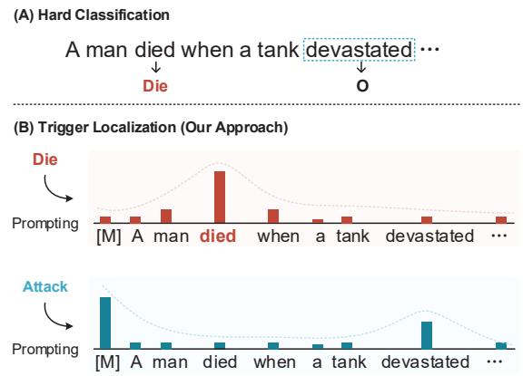
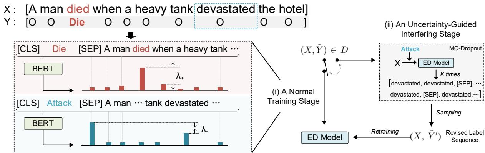
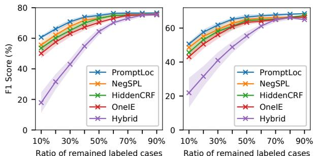
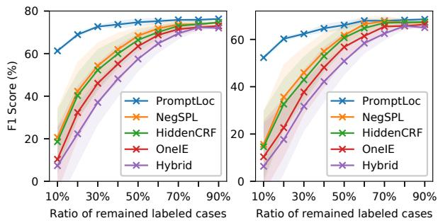
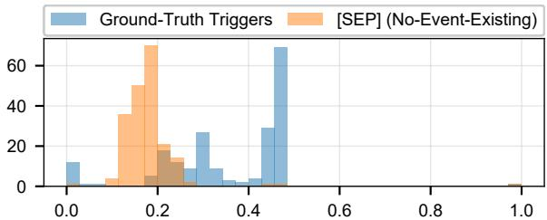
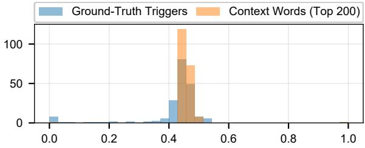
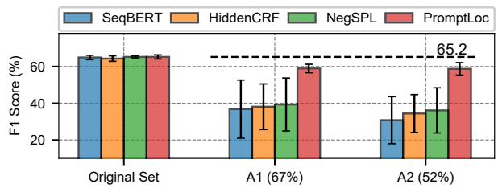
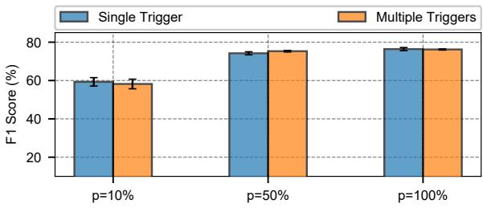

# Learning with Partial Annotations for Event Detection

Jian Liu1, Dianbo Sui2, Kang Liu3, Haoyan Liu4 and Zhe Zhao4

1 Beijing Jiaotong University 2 Harbin Institute of Technology

3 The Laboratory of Cognition and Decision Intelligence for Complex Systems

Institute of Automation, Chinese Academy of Sciences

4 Tencent AI Lab

jianliu@bjtu.edu.cn; dianbosui@hit.edu.cn; kliu@nlpr.ia.ac.cn {haoyanliu, nlpzhezhao}@tencent.com

## Abstract

Event detection (ED) seeks to discover and classify event instances in plain texts. Previous methods for ED typically adopt supervised learning, requiring fully labeled and high-quality training data. However, in a realworld application, we may not obtain clean training data but only partially labeled one, which could substantially impede the learning process. In this work, we conduct a seminal study for learning with partial annotations for ED. We propose a new trigger localization formulation using contrastive learning to distinguish ground-truth triggers from contexts, showing a decent robustness for addressing partial annotation noise. Impressively, in an extreme scenario where more than 90% of events are unlabeled, our approach achieves an F1 score of over 60%. In addition, we reannotate and make available two fully annotated subsets of ACE 2005 to serve as an unbiased benchmark for event detection. We hope our approach and data will inspire future studies on this vital yet understudied problem.

## 1 Introduction

Deep learning models have shown impressive performance in event detection (ED) since large amounts of event data have become available (Chen et al., 2015; Nguyen and Grishman, 2015). However, such models require fully labelled and highquality data — in practice, we cannot ensure that every event is identified, and as a result, we often face the partial annotation issue, as depicted in Figure 1. We show a high rate of partial annotation in real-world event datasets. For example, in ACE 2005, which is widely used as a benchmark for ED evaluation (Christopher Walker and Maeda, 2006), nearly 20% of events are not labelled (see Table 2). Using a partially labelled dataset as a fully labelled one for training runs the risk of mis-training on false negatives, and using a partially labelled dataset for evaluation biases comparison. However, this issue is still understudied in the existing literature (Liu, 2018; Liu et al., 2020b).

A man died when a heavy tank devastated the hotel.S1:
<table><tr><td rowspan="2">Gold:</td><td colspan="7"></td><td rowspan="2"></td><td colspan="2">………….</td></tr><tr><td>O O</td><td></td><td>Die</td><td>0 </td><td>0 0</td><td></td><td>0</td><td>Attack</td><td>O O</td></tr><tr><td>Partial:</td><td>O</td><td>O</td><td>Die</td><td>O </td><td>O</td><td>O</td><td>0</td><td>O</td><td>O</td><td>O</td></tr><tr><td></td><td></td><td></td><td></td><td></td><td></td><td></td><td></td><td></td><td></td><td></td></tr><tr><td></td><td></td><td></td><td></td><td></td><td></td><td></td><td></td><td>False Negative</td><td></td><td></td></tr></table>

Figure 1: The partial annotation issue in ED. The Gold row indicates ground-truth labels; the Partial row indicates the partial annotation case we address in this study, where the devastated event is not labeled.

In this work, we present a seminal study of learning with partial annotations for ED, with contributions in methodology, data, and practical applications. In our method, to reduce the risk of mis-training on false negatives, we propose a contrastive learning framework (Chopra et al., 2005; Chen et al., 2020) to distinguish ground-truth triggers from contexts, which is shown to be more tolerant of partial annotation noise than the traditional hard classification paradigm (Ji and Grishman, 2008; Chen et al., 2015). In addition, to succeed in the partial annotation scenario, we augment the model with a self-correction regime to recognize false negatives during the training stage.

Figure 2 visualizes the core of our method, which is a de facto trigger localization formulation that uses sentence-wise normalization (prompted by event types) to find event triggers. Compared to hard classification methods that add up individual losses (as shown at the top of Figure 2), our approach instead forms a contrastive learning paradigm by raising the scores of ground-truth triggers while lowering the scores of context words. As a result, even with a significant number of false negatives in training, it can still maintain a good separation between triggers and contexts ( 6.1). In addition, we suggest that adding a margin softmax (Wang et al., 2018) with a Gaussian-based distance regularization can further improve learning.

In addition to the noise-tolerance mechanism described above, we propose a self-correction regime with the motive that when a model recognizes a false negative with high confidence, it should correct its labels for the subsequent training stage. Nevertheless, modeling the confidence of deep learning models is challenging since their predictions are poorly calibrated (i.e., a model often outputs a high prediction probability even if the prediction is incorrect (Guo et al., 2017)). To address this issue, we propose an uncertainty-guided retraining mechanism based on MC-Dropout (Gal and Ghahramani, 2016), which can output prediction confidence to guide the self-correction process. We explain the relationship between this paradigm and an expectation-maximization (EM) framework.

In addition to the methodology contribution, we re-annotate and release the ACE 2005 development and test sets as a data contribution. On the revised benchmark (and an extra MAVEN (Wang et al., 2020) benchmark), we demonstrate the impressive performance of our models — in particular, even in an extreme case with 90% of events unlabeled, our approach achieves more than 60% in F1, yielding a 40% definite improvement over previous methods. In addition to simulation tests, we also conduct a real-world annotation test on WikiEvents (Li et al., 2021a), where the results suggest the practical applicability of our approach.

Contributions. Our contributions are three-fold: (i) To the best of our knowledge, this is the first work addressing the potential partial annotation issue in ED, which may spark further research interest. (ii) We highlight a new learning paradigm for ED based on a trigger localization formulation and show that it works effectively with a wide range of partial annotation settings. (iii) We re-annotated the ACE 2005 development and test datasets and released them to the community to serve as an unbiased benchmark. (IV) In addition to simulation experiments, we conduct real-world annotation experiments to validate the effectiveness of our approach for practical use.

## 2 Related Work

ED and the Partial Annotation Issue. Event detection (ED) is a crucial subtask of event extraction that aims to identify event instances in texts (Grishman, 1997; Ahn, 2006). The existing ED methods can be divided as feature-based (Ahn, 2006; Li et al., 2013; Liao and Grishman, 2010;

  
Figure 2: A comparison of the hard classification paradigm (A) and our trigger localization paradigm (B) for ED. [M] is a “no-event-existing” indicator.

Hong et al., 2011) and deep learning-based (Chen et al., 2015; Nguyen and Grishman, 2015; Nguyen et al., 2016; Liu et al., 2018a; Feng et al., 2016; Chen et al., 2018; Yang et al., 2019; Liu et al., 2020a; Du and Cardie, 2020; Lu et al., 2021; Liu et al., 2019a), and there has been a growing interest in applying these methods to specific scenarios (Liu et al., 2019b, 2022b,a). Nevertheless, most of such methods adopt supervised learning and assume the availability of clean datasets. To date, only a few studies have considered the partial annotation issue in ED: Liu et al. (2020b) identify several unlabeled cases in the ACE test set for error analysis; Liu (2018), in the PhD proposal, suggest that the Chinese portion of ACE 2005 is partially labeled. Unfortunately, neither work stands in a methodology perspective for addressing the issue. Our research, on the other hand, introduces a solution for learning with partial annotations. Our trigger localization formulation also relates to using prompts for event information extraction (Wang et al., 2022a; Hsu et al., 2022; Liu et al., 2022c; Wang et al., 2022b), but different from them focusing on improving the overall performance, our work stands in a point addressing the partial annotation issue.

Learning with Partial Annotations. Learning with partial annotations, also known as positive and unlabeled learning (Li et al., 2009), is an important problem in machine learning community (Elkan and Noto, 2008; Liu et al., 2002, 2003, 2005). In the domain of natural language processing (NLP), researchers have examined a number of tasks including named entity recognition (NER) (Jie et al., 2019; Mayhew et al., 2019; Peng et al., 2019), Chinese word segmentation (Yang and Vozila, 2014), and others (Tsuboi et al., 2008). The efforts for NER relate the most to our work, where a seminal work (Jie et al., 2019) treats the labels of negative instances as latent variables and infers them using partial Conditional Random Fields (Bellare and McCallum, 2007). Later works have devised downweighing mechanisms (Mayhew et al., 2019), confidence estimation methods (Liu et al., 2021), and Sentence ED Modelnegative sampling (Li et al., 2021b) for learning. In this study, we offer a new trigger localization formulation for the task of ED and demonstrate promising results in a wide range of partial annotation settings.

  
Figure 3: The overview of our approach. Left: the model training process based on margin softmax. Right: the uncertainty-guided retraining mechanism. D designates the original training dataset.

## 3 Proposed Method

Let $X = [ w _ { 1 } , \cdots , w _ { N } ]$ be a sentence with N words and $Y = [ y _ { 1 } , \cdots , y _ { N } ]$ [CLS] DIE [SEP] A mbe the ground-truth event label sequence, where $y _ { i } \in { \mathcal { T } } \cup \{ \mathrm { O } \}$ is the event label of $w _ { i }$ (Here  is a set of all event types and O is a special type for non-trigger words). Then [CLS] ATTACK [SEP] A mthe partial annotation issue can be formulated as: BERTdue to the neglect of human annotators, some $y _ { i }$ $\neq \mathrm { O }$ are not identified, and this results in a partial annotation sequence $\tilde { Y } = [ \tilde { y } _ { 1 } , \cdots , \tilde { y } _ { N } ]$ . Clearly, directly training a model on $( X , { \tilde { Y } } )$ risks outputting a noisy detector. Here we propose a new learning framework to address this issue (as shown in Figure 3), which consists of a noise-tolerant learning mechanism with margin softmax ( 3.2) and uncertainty-guided retraining mechanism ( 3.3).

## 3.1 Input Representation

Given a sentence X, for each event type $t \in \tau$ , we learn their joint representations for further processing. Particularly, we concatenate t and X as the

input1 of a BERT encoder (Devlin et al., 2019):

$$
\operatorname { \lbrack C L S \rbrack } \ t \ \operatorname { \lbrack S E P \rbrack } \ { \overbrace { w _ { 1 } \ w _ { 2 } \ \cdots \ w _ { N } } ^ { \mathrm { T h e \ s e n t e n c e } \ X } }
$$

and consider the output of BERT to be the joint representations, denoted as $\pmb { H } _ { ( t , X ) } \in \mathcal { R } ^ { M \times d }$ , with M being the length of the input sequence2 and d being the dimension of BERT.

## 3.2 Noise-Tolerant Learning via Margin Softmax

Based on $\pmb { H } _ { ( t , X ) }$ tence, Revised Label), we next locate event triggers of type t in the sentence. This can be achieved using sentence-level softmax, and here we introduce a margin softmax (Wang et al., 2018) to better address partial annotations. Specifically, we first map $\pmb { H } _ { ( t , X ) }$ to a score vector $\bar { \pmb { s } } ^ { t } \in \mathcal { R } ^ { M }$ using $\pmb { s } ^ { t } = \pmb { H } _ { ( t , X ) }$ vy tank …w, where $\pmb { w } \in \mathcal { R } ^ { d }$ is a shared vector parameter, and then we distinguish between the λ+following two cases for learning:

Case 1. A positive instance (i.e., a labeled trigger) of type t is found in the label sequence Y˜ λ(If many triggers are found, we address each one individually). Assume j is the labeled trigger’s index. Here we employ a positive margin $\lambda _ { + }$ and maximize the following objective:

$$
p _ { + } ( X , \tilde { Y } , j ) = \frac { \exp ( s _ { ( j ) } ^ { t } - \lambda _ { + } ) } { \exp ( s _ { ( j ) } ^ { t } - \lambda _ { + } ) + \sum _ { m \neq j } ^ { M } \exp ( s _ { ( m ) } ^ { t } ) }\tag{1}
$$

where $s _ { ( j ) } ^ { t }$ denotes the $j ^ { \mathrm { t h } }$ word’s score in the score vector $\mathbf { \boldsymbol { s } } ^ { t } .$ . This objective encourages a margin of at least $\lambda +$ (Wang et al., 2018) in scores of triggers and context words, which therefore makes groundtruth triggers more separable. Note in this case, a sentence may contain “hidden” false negatives. Motivated by the fact that triggers are generally sparsely distributed (Lin et al., 2018), we employ a Gaussian regularization to reduce the penalty. Particularly, we obtain a new score vector $\hat { \pmb { s } } ^ { t }$ with:

$$
\hat { s } _ { ( m ) } ^ { t } = s _ { ( m ) } ^ { t } \times \mathcal { N } ( | m - j | )\tag{2}
$$

where $\mathcal { N } ( \cdot )$ indicates the standard univariate Gaussian density function, and $| m - j |$ is the distance between the $m ^ { \mathrm { t h } }$ word $w _ { m }$ and the labeled trigger. This new score vector $\hat { \boldsymbol { s } } ^ { t }$ put small weights on words far away from the labeled trigger and is shown to marginally improve learning ( 6.2).

Case 2. There is no trigger of type t found in $\tilde { Y }$ . In this case, we use the [SEP] token as a “no-event-existing” indicator and optimize to give it the highest score. It should be noted, however, that such a case may contain false negatives. To address them, we introduce a negative margin ${ \lambda _ { - } } ^ { 3 }$ to reduce the penalty:

$$
p _ { - } ( X , \tilde { Y } ) = \frac { \exp ( s _ { \Delta } ^ { t } + \lambda _ { - } ) } { \exp ( s _ { \Delta } ^ { t } + \lambda _ { - } ) + \sum _ { m \neq \Delta } ^ { M } \exp ( s _ { ( m ) } ^ { t } ) }\tag{3}
$$

where $\Delta$ indicates the index of [SEP]. In this way, the negative margin $\lambda _ { - }$ instead loosens the gap between the indicator [SEP] and other words. As a result, the model is more forgiving of situations when certain words score higher than the “no event exists” indicator [SEP].

Training and Testing Protocols. The overall loss function for learning is:

$$
\begin{array} { r c l } { \mathcal { L } = - \displaystyle \sum _ { ( X , \tilde { Y } ) \in D } \sum _ { t \in \mathcal { T } } } & { [ \delta _ { t } \times \displaystyle \sum _ { j : y _ { j } = t } \log p _ { + } ( X , \tilde { Y } , j ) + } \\ & & { ( 1 - \delta _ { t } ) \times \log p _ { - } ( X , \tilde { Y } ) ] } \end{array}\tag{4}
$$

where $( X , { \tilde { Y } } ) \in D$ ranges over each instance in the training set $D ; t$ enumerates each event type; $\delta _ { t }$ is a Dirac delta function:

$$
\delta _ { t } = { \left\{ \begin{array} { l l } { 1 } & { { \mathrm { ~ I f ~ a ~ t r i g g e r ~ o f ~ t y p e ~ } } t { \mathrm { ~ i s ~ f o u n d ~ ( C a s e ~ 1 ) } } } \\ { 0 } & { { \mathrm { ~ O t h e r w i s e ~ ( C a s e ~ 2 ) } } } \end{array} \right. }\tag{5}
$$

In the inference stage, given a test sentence $X$ , we compute a normalized probability vector $p ^ { t } \mathrm { : }$

$$
p ^ { t } = \operatorname { s o f t m a x } ( s ^ { t } )\tag{6}
$$

Algorithm 1: Uncertainty-guided retraining regime   
Input :The training dataset $D = \{ X _ { i } , \tilde { Y } _ { i } \} _ { i = 1 } ^ { n } ;$   
Output :The optimal model parameter Θ;   
1 while not convergence do   
2 Sample a training example $( X , { \tilde { Y } } )$ from ;   
3 if It is a burn-in or a normal training stage then   
4 Update Θ on (X, Y˜ ) using Equation (4)   
5 else   
6 Build an uncertainty-regularized label   
sequence ${ \tilde { Y } } ^ { \prime }$ with MC-Dropout ( 3.3);   
7 Update Θ on $( X , { \tilde { Y } } ^ { \prime } )$ using Equation (4)   
8 end if   
9 end while

and then compose a set for event triggers of type t as: $\{ w _ { i } \mid p _ { ( i ) } ^ { t } > \tau ; i \neq _ { \Delta } \}$ , where τ is a threshold defined as $1 / N ,$ with N being the length of the sentence (namely, when the predictive probability of a token is above a uniform distribution, we consider it as a trigger).

## 3.3 Uncertainty-Guided Retraining Regime

In addition to the noise-tolerant learning paradigm, we also design an uncertainty-guided retraining mechanism, in which we correct the potential labels for optimization (Algorithm 1).

Assume $( X , { \tilde { Y } } )$ is a training example. In the uncertainty interfering stage, we assume that X is an unlabeled sentence and re-predict the event label sequence using the current model. We use Monte Carlo Dropout (MC-Dropout) (Gal and Ghahramani, 2016) to assess the model’s uncertainty on the prediction. Particularly, for each event type t, we predict the event triggers K times with dropout layers activated. Assume the resulting prediction set is $\{ q _ { i } \} _ { i = 1 } ^ { K }$ , where $q _ { i }$ is the $i ^ { \mathrm { t h } }$ prediction and $N ( q _ { i } )$ is its frequency4. We then create a categorical distribution using $N ( q _ { i } ) / K$ as parameters and sample out a prediction from the categorical distribution as the predict result (This benefits predictions that the model is more confident in). We finally convert the prediction as a label sequence $Y ^ { \prime }$ and train a model on $( X , { \tilde { Y } } ^ { \prime } )$ . We alternate between this uncertainty interfering stage and a standard training stage after several burn-in steps.

Connection to EM Algorithm. Intuitively, our approach can be viewed as an expectation maximization (EM) algorithm (Dempster et al., 1977) using MC-Dropout to approximate the posterior.

Denote the original log-likelihood function as log $\mathcal { L } ( \Theta ; \mathrm { D } )$ , where Θ and D indicate the model parameter and partially labeled data respectively. Let $\Theta ^ { \mathrm { ( t ) } }$ be the parameter at the $\mathrm { t } ^ { \mathrm { t h } }$ iteration. We can view our method as introducing a hidden variable Z to represent the labels of false negatives and then alternating between two steps: (i) An expectation (E) step, which uses the category distribution generated by MC-Dropout as an approximate of the intractable posterior $\mathrm { p } ( \mathrm { Z } | \mathrm { D } , \Theta ^ { \mathrm { ( t ) } } )$ . (ii) A maximization (M) step, which maximizes the expectation $\mathrm { E } _ { \mathrm { p ( Z | D , \Theta ^ { ( t ) } ) } } [ \log \mathcal { L } ( \Theta ; \mathrm { D } , \mathrm { Z } ) ]$ for optimization.

## 4 Experimental Setups

Datasets. We conduct our experiments on ACE 2005 and MAVEN5 (Wang et al., 2020), with data statistics shown in Table 1. In light of the partial annotation issue in ACE, we re-annotate its development and test sets, using a method combining automatic potential case identification and human validation (The details are shown in Appendix A). To facilitate a fine-grained analysis, we also split up all potential cases into two categories: (i) a challenge set, which consists of unlabeled words where more than half of the ED models predict that they act as triggers, and (ii) a control set, which consists of unlabeled words where fewer than half of the ED models predict that they act as triggers. Table 2 gives the final results, indicating the partial annotation issue is crucial — for instance, on the test set the unlabeled ratio is 19.3%.

Implementations. In our approach, we use BERT-large architecture for ACE 2005 (Lin et al., 2020; Nguyen et al., 2021), and BERT-base for MAVEN (Wang et al., 2020). As for hyper-parameters, the batch size is set to 10 for ACE 2005 and 20 for MAVEN respectively, chosen from [2, 5, 10, 20, 30]. The learning rate is set at 1e-5 for both datasets, chosen from [5e-5, 1e-5, 5e-6, 1e-6]. In the margin softmax regime, the positive margin $\lambda _ { + }$ is set to 10, and the negative margin λ is set to 1; these values are chosen from [0.1, 0.5, 1, 5, 10, 50, 100]. In the uncertaintyguided retraining mechanism, the number of prediction times K is empirically set to 20 for a tradeoff between speed and efficiency. We release the data and the code at https://github.com/ jianliu-ml/partialED.

<table><tr><td></td><td>Data Split</td><td># Doc.</td><td># Sent.</td><td># Word</td><td># Trigger</td></tr><tr><td rowspan="3">AE</td><td>Training set</td><td>529</td><td>17,172</td><td>267,959</td><td>4,420</td></tr><tr><td>Dev. set</td><td>30</td><td>923</td><td>18,246</td><td>505 (558)</td></tr><tr><td>Test set</td><td>40</td><td>832</td><td>19,061</td><td>424 (506)</td></tr><tr><td rowspan="3">ΛW</td><td>Training set</td><td>2,913</td><td>32,431</td><td>832,186</td><td>77,993</td></tr><tr><td>Dev. set</td><td>710</td><td>8,042</td><td>204,556</td><td>18,904</td></tr><tr><td>Test set</td><td>857</td><td>9,400</td><td>238,902</td><td>21,835</td></tr></table>

Table 1: Data statistics of ACE and MAVEN (NV). Numbers in parentheses are re-annotation results.
<table><tr><td></td><td>Split</td><td># Potential</td><td># Validated</td><td>UL Rate</td></tr><tr><td rowspan="3">Dev. Set</td><td>Challenge</td><td>78</td><td>34 (43.6%)</td><td>6.7%</td></tr><tr><td>Control</td><td>34</td><td>19 (55.9%)</td><td>3.8%</td></tr><tr><td>Total</td><td>112</td><td>53 (47.3%)</td><td>10.5%</td></tr><tr><td rowspan="3">Test Set</td><td>Challenge</td><td>86</td><td>51 (59.3%)</td><td>12.0%</td></tr><tr><td>Control</td><td>50</td><td>31 (62.0%)</td><td>7.3%</td></tr><tr><td>Total</td><td>136</td><td>82 (60.2%)</td><td>19.3%</td></tr></table>

Table 2: Details of the revised ACE subsets. “UL Rate” indicates the ratio of unlabeled cases to labeled ones.

Evaluation Settings. We investigate three evaluation settings: (i) A full training setting, in which we use the original training set for learning. Yet, because the original training set inevitably contains unlabeled events, this setting is still a partial learning setting. (ii) A data removal setting, in which we exclude a portion of events from the training setting to study whether the performance drop is caused by a degraded number of positive examples. (iii) A data masking setting, in which we remove the labeling information of some events (by replacing their labels to O) to simulate a more serious partial annotation scene. We use precision (P), recall (R), and F1 as evaluation metrics following previous studies (Ji and Grishman, 2008; Li et al., 2013), and to against randomness, we report experimental results based on a 5-run average.

Baselines. We compare our approach to supervised and partial learning methods. For ACE 2005, we consider the following supervised learning methods: Hybrid (Feng et al., 2016), which combines Recurrent Neural Networks and Convolutional Neural Networks; SeqBERT (Yang et al., 2019), which introduces BERT representations; BERTQA (Du and Cardie, 2020; Liu et al., 2020a), which frames ED as a question answering problem; OneIE (Lin et al., 2020), which uses Graph Neural Networks to learn document-level clues; FourIE (Nguyen et al., 2021), which uses an interaction network to combine four information extraction tasks jointly. For MAVEN, we consider DMBERT (Wang et al., 2019) and BERT-CRF (Wang et al.,

<table><tr><td rowspan="2">Method</td><td colspan="2">Test Set (O)</td><td colspan="2">Test Set (R)</td></tr><tr><td>P R</td><td>F1</td><td>P R</td><td>F1</td></tr><tr><td>Hybrid† (2016) SeqBERT† (2019) BERTQA (2020) OneIE (2020)</td><td>71.4 71.3 71.4 72.5 72.1 72.3 71.1 73.7 72.4 74.9 74.5 74.7</td><td>74.4 74.1 74.5 75.9</td><td>72.2 73.5 74.5 74.7</td><td>73.3 73.8 74.5 75.3</td></tr><tr><td>FourIE† (2021) HiddenCRF (2019)</td><td>75.7 74.1 68.4 74.5 71.3</td><td>74.9 75.7</td><td>76.0 74.6 75.5</td><td>75.3 75.6</td></tr><tr><td>NegSPL (2021b) Self-Pu (2020)</td><td>70.1 74.0 71.1 71.0</td><td>72.0 71.1</td><td>75.5 75.5 75.7 74.8</td><td>75.5 75.2</td></tr><tr><td>PromptLoc (ours)</td><td>73.6 74.2</td><td>73.9</td><td>76.4 76.8</td><td>76.6*</td></tr></table>

Table 3: Results on ACE 2005, where O and R denote the original and revised sets; † signifies our reimplementations and ∗ is a significance test at $\mathtt { p } = 0 . 0 5$
<table><tr><td rowspan="2">Method</td><td colspan="3">Dev. Set</td><td colspan="3">Test Set</td></tr><tr><td>P</td><td>R</td><td>F1</td><td>P</td><td>R</td><td>F1</td></tr><tr><td>Hybrid (2016)</td><td>62.9</td><td>67.2</td><td>65.0</td><td>63.7</td><td>67.0</td><td>65.3</td></tr><tr><td>OneIE (2021)</td><td>64.0</td><td>69.0</td><td>66.4</td><td>64.5</td><td>69.3</td><td>66.8</td></tr><tr><td>BERTQA (2020)</td><td>63.8</td><td>69.0</td><td>66.3</td><td>64.9</td><td>69.1</td><td>66.9</td></tr><tr><td>DMBERT (2019)</td><td>64.6</td><td>70.1</td><td>67.2</td><td>62.7</td><td>72.3</td><td>67.1</td></tr><tr><td>BERT-CRF (2020)</td><td>65.7</td><td>68.8</td><td>67.2</td><td>65.0</td><td>70.9</td><td>67.8</td></tr><tr><td>HiddenCRF (2019)</td><td>66.3</td><td>68.5</td><td>67.4</td><td>64.4</td><td>72.3</td><td>68.1</td></tr><tr><td>NegSPL (2021b)</td><td>65.6</td><td>68.7</td><td>67.1</td><td>64.9</td><td>71.9</td><td>68.2</td></tr><tr><td>Self-Pu (2020)</td><td>66.3</td><td>68.0</td><td>67.0</td><td>64.3</td><td>72.3</td><td>68.0</td></tr><tr><td>PromptLoc (ours)</td><td>67.8</td><td>69.2</td><td>68.5*</td><td>65.4</td><td>72.8</td><td>68.9*</td></tr></table>

Table 4: Results on MAVEN. ∗ denotes a significance test with a randomly paired test at $\mathtt { p } = 0 . 0 5$

2020) as baselines. We consider the following partial learning methods: (1) HiddenCRF (Jie et al., 2019), which treats missing labels as latent variables and infers them using a CRF model (We follow the original paper and use SeqBERT for parameter initialization); (2) NegSPL (Li et al., 2021b), which applies negative sampling for learning and shows good results on NER (we use the same strategy to tune the sampling hyper-parameter). (3) Self-Pu (Chen et al., 2020), which is a self-training boosted method for general positive and unlabeled learning. Our approach is denoted by PromptLoc.

## 5 Experimental Results

Results in the Full Training Setting. Tables 3 and 4 show results in the full training setting. Accordingly, our method achieves the best F1 on the clean ACE test set and the MAVEN development/test set, suggesting its efficacy. Comparing the results on the original ACE test set is interesting: our method has lower precision than other methods, but when applied to the revised set, the precision is greatly boosted — this implies that our model does predict triggers not annotated in the original test set. Lastly, partial learning approaches generally outperform supervised methods, showing that the partial annotation issue is a practical concern to be addressed in the ED task.

  
Figure 4: Results on ACE 2005 (left) and MAVEN (right) in the data removal setting.

  
Figure 5: Results on ACE 2005 (left) and MAVEN (right) in the data masking setting.

Results in the Data Removal Setting. Finally, we consider the data removal setting to study the impact of a lack of positive examples, and we show results in Figure 4. According to the results, while our model consistently outperforms others, the gap is small, implying that a reduced number of positive instances is not a major factor impeding learning, especially when there are relatively abundant training examples (e.g., $p > 6 0 \% )$ or the pre-trained language models are applied (It does have a significant impact on non-BERT models e.g., Hybrid).

Results in the Data Masking Setting. We then consider the data masking setting and we show results6 in Figure 5. Here p denotes the ratio of remaining examples (i.e., we mask the labels of 1 - p events). According to the results, our approach outperforms prior methods by significant margins. For example, on the ACE 2005, when 70% of triggers are masked $( p = 3 0 \% )$ , our approach obtains 70% in F1, outperforming previous methods by 30% in F1;

<table><tr><td>Method</td><td>Setting</td><td>P</td><td>R</td><td>F1</td></tr><tr><td rowspan="3">Trigger Local.</td><td>Clean</td><td>73.1</td><td>72.9</td><td>73.0</td></tr><tr><td>Argmax</td><td>70.5</td><td>70.5</td><td>70.5</td></tr><tr><td>Adaptive τ</td><td>68.7</td><td>72.8</td><td>70.7</td></tr><tr><td rowspan="3">Hard Class.</td><td>Clean</td><td>66.7</td><td>76.0</td><td>71.0</td></tr><tr><td>Argmax</td><td>60.3</td><td>42.5</td><td>49.8</td></tr><tr><td>Adaptive τ</td><td>58.6</td><td>43.8</td><td>50.1</td></tr></table>

Table 5: Results of comparing trigger localization and hard classification in extreme partial annotation scene.

when 90% are masked $( p = 1 0 \% )$ , our approach still achieves 60% in F1, yet previous methods achieves only 20% in F1. Another interesting finding is that our approach yields better results than in the data removal setting (+2.4% and +1.7% in F1 on ACE 2005 and MAVEN). This directly demonstrates our approach’s ability to learn from unlabeled events.

## 6 Qualitative Analysis

## 6.1 Insights of the Formulation

We conduct a sanity check experiment to understand why our trigger localization paradigm works. First, we randomly select an event type and collect N sentences (200 in our experiments) with events of this type. Then, we create two training examples from each sentence: one with original labels and one with all labels masked — this results in a highly mislabeled dataset. Finally, we train two models — one for trigger localization and the other for hard classification — and evaluate them on a leave-out test set. Table 5 gives the results, where we note that even in this extreme partial annotation scene, our trigger localization paradigm performs well, yielding 70.5% in F1 compared to 73.0% in F1 using clean dataset for training. The hard classification based approach, on the other hand, behaves poorly, yielding a drop of 30% in F1.

In Figure 6, we visualize the learned probabilities of two models on ground-truth triggers and contexts. According to the results, our method can maintain a separation between ground-truth triggers and context words in this extreme partial annotation scene. However, the hard classificationbased model is very sensitive to partial annotation noise and can not obtain a clear boundary between the ground-truth triggers and context words. For the above reason, incorporating an adaptive τ has little effect on the performance (Table 5).

  
Figure 6: The learned probability distribution.

<table><tr><td rowspan="2">Method</td><td colspan="2">ACE 2005</td><td colspan="2">MAVEN</td></tr><tr><td>10%</td><td>50%</td><td>100% 10% 50%</td><td>100%</td></tr><tr><td>PromptLoc (SM) + λ+ +λ− + Gau. Reg.</td><td>58.0 73.6 58.7 74.1 59.4 74.3 59.1 73.9</td><td>76.0 50.1 76.0 76.5 76.2 52.0</td><td>65.3 51.2 65.7 51.7 66.0 65.4</td><td>67.5 67.7 68.3 68.0</td></tr><tr><td>PromptLoc (Full) w/o UNT DirectPred BoostLearn</td><td>61.3 74.5 57.2↓72.5 K 52.5 70.1 44.2 68.1</td><td>76.6 52.3 75.5↓50.1↓ 74.6 45.9 75.0 41.1</td><td>66.1 63.4↓ 61.4 58.7</td><td>68.5 67.2↓ 66.9 66.2</td></tr><tr><td>OneIE (2020) + UNT NegSPL (2021b) + UNT</td><td>10.4 63.4  $1 3 . 7 \uparrow 6 5 . 0 \uparrow$   $1 8 . 6 \quad 6 6 . 4 \phantom { 0 }$ </td><td>75.3 10.4 75.8↑12.7↑ 75.515.6 19.4↑67.2↑75.9↑18.4↑</td><td>61.2  $6 5 . 2 6 7 . 1 $ </td><td>66.4  $6 3 . 4 \uparrow 6 6 . 8 \uparrow$   $6 7 . 1 \uparrow 6 7 . 9 \uparrow$ </td></tr></table>

Table 6: Results of ablation study on different modules.

## 6.2 Ablations on Margin Softmax and Uncertainty Retraining

Table 6 (Top) shows an ablation study on the margin softmax regime, based on the data masking settings, where we study the impact of positive margin $\lambda _ { + }$ , negative margin λ , and Gaussian regularization respectively. According to the results, we find that the negative margin λ is the most effective, yet the effects of different components are complimentary. An ablation on the multiple triggers are shown in Appendix C.

In Table 6 (Bottom), we conduct an ablation study on our uncertainty-guided retraining mechanism and compare it to: (i) w/o uncertainty, which excludes the uncertainty interfering stage for learning, (ii) DirectPred, which retains the stage but uses predicted labels directly for model retraining, and (iii) BoostLearn, which considers half of the dataset to be clean and the other half to be unlabeled and conducts a bootstrapping process (Grézl and Karafiát, 2013). The results have verified the effectiveness of our method — without the uncertainty mechanism (w/o uncertainty), the performance drops 2.4% in F1 on average for ACE and 2.1% for MAVEN. The major advantage of our method lies in that it can select reliable predictions for training — as evidence, we have checked the predictions with high probability (> 0.9) in the categorical distribution and found that 91.4% of them are correct. Finally, the results suggest that our uncertainty-guided mechanism can also promote OneIE and NegSPL, particularly in scenes with large unlabeled rates (e.g., p = 10% and p = 50%).

<table><tr><td>Category</td><td>Example</td><td>Event Type</td></tr><tr><td></td><td>1) ... less than 5,000 U.N troops could have stop the killings if Mr. Annan had ... Negligence [51.1%] 2) ... before the genocide, Major ... The .. informant that genocide was being .. 3) The Justice party changed the constitution after taking power in the elections.</td><td>Die Attack Elect</td></tr><tr><td></td><td>4) Anne-Marie got the couple &#x27;s 19-room home in New York state ... Light verbs [20.7%] 5) After he became SG [Secretary General], Annan commissioned a report ... 6) ... GNP took two of the National Assembly seats; a splinter party got the third ... StartPosition</td><td>TransferOwnership StartPosition Attack</td></tr><tr><td>Rare words [25.2%]</td><td>7) The troop opened its tank guns , opened its own mortars , decimated that unit ... 8) ... Board would see it as leverage to seize power and pummel the office staff. 9) Press speculation had ... while either divesting or inviting third parties to take ... TransferOwnership 10) But the general needed U.N. authorization to conduct such a raid and save lives. Attack</td><td>Attack</td></tr></table>

Co-reference [3.0%] 11) ... in the 1994 genocide in Rwanda ... for not sending enough troops to stop it. Attack  
Table 7: Typical unlabeled cases in the development and test set of ACE 2005, grouped as four categories.

## 6.3 Analysis of Unlabeled Cases

We explore common patterns of unlabeled events in Table 7. Indeed, 51.1% of them lack a discernible pattern, which could just be due to the annotator’s negligence. For example, in case 2, the genocide event is labeled only in the first sentence but not in the subsequent one. The other patterns we find include light verbs (20.7%), such as got in case 4, rare words (25.2%), such as pummel in case 8, and co-reference based triggers (3%), such as it in case 11. These examples are hard for human annotators. We have also investigated the suspicious cases encountered in our re-annotation procedure. Aside from 11% merely mis-predicted by a model, we find two prevalent patterns: (i) compound nouns (54%), such as “election” in “create an election code”, which does not refer to events, and (ii) definition violation (35%), such as “lobby” in “Bush plan to lobby allies ...” — though many event detectors predict “lobby” as a Meet event, but in the ACE event ontology, a Meet event is defined as “a meeting event is physically located somewhere”. The comparison of cases of the control and challenge set is shown in Appendix A.2.

  
Figure 7: A real-world annotation test using the WikiEvents dataset as a case.

## 6.4 A Real-World Annotation Test

Finally, we conduct a real-world annotation test to investigate the practical applicability of our approach. Particularly, we use WikiEvents (Li et al., 2021a) as the test bed and employ two annotators to annotate events in 100 randomly selected training documents. For tractability, we only consider 10 most frequent event types and limit the annotation time to 4 hours. After deleting incorrect labels, we obtain A1 and A2, two sets with annotation rates of 67% and 52%, respectively. We then train models on A1, A2, and the original 100 labeled documents respectively and test them on the test set. The performances of different models are shown in Figure 8. According to the results, when trained on A1 and A2, previous models exhibit a significant drop in F1 (more than 25%). By comparison, our method achieves a good performance and performs comparably to methods that use the original training set for learning. This indicates its efficacy in dealing with the partial annotation issue.

## 7 Conclusion

In this study, we investigate the partial annotation problem in ED, a critical yet less-explored problem. We motivate a new learning model for ED and investigate its effectiveness in a variety of partial annotation settings. We also provide two reannotated subsets of ACE 2005 to the community as a data contribution in order to establish a fair evaluation. In the future, we plan to investigate the theoretical aspects of our approach and increase its scope by applying it to other information extraction tasks suffering the partial annotation issue, such as named entity recognition and relation extraction.

## 8 Limitations

There are two limitations of this study that could be addressed in future research. First, this study focuses solely on the ED task. In the future, we seek to extend it to the overall event extraction (EE) task, which also includes the event argument extraction task, where a complete annotation is more challenging than in ED. Second, our study models the partially labeled training data instead of annotators. Indeed, the annotators produce the data, so building a model for annotators may be an essential way to address the partial learning problem. For example, an annotator may be more careless than others and generate more noisy data. Consequently, a robust model for the task should give a lower belief in the data of this annotator to improve learning. Lastly, our research raises no ethical issues because it focuses solely on the technical aspects of a normal information extraction problem.

## Acknowledgments

This work is supported by the National Natural Science Foundation of China (No.62106016), the Open Projects Program of the State Key Laboratory of Multimodal Artificial Intelligence Systems, and the Tencent Open Fund.

## References

David Ahn. 2006. The stages of event extraction. In Proceedings of the Workshop on Annotating and Reasoning about Time and Events, pages 1–8, Sydney, Australia. Association for Computational Linguistics.

Kedar Bellare and Andrew McCallum. 2007. Learning extractors from unlabeled text using relevant databases. In AAAI.

Ting Chen, Simon Kornblith, Mohammad Norouzi, and Geoffrey E. Hinton. 2020. A simple framework for contrastive learning of visual representations. In Proceedings of the 37th International Conference on Machine Learning, ICML 2020, 13-18 July 2020, Virtual Event, volume 119 of Proceedings of Machine Learning Research, pages 1597–1607. PMLR.

Yubo Chen, Liheng Xu, Kang Liu, Daojian Zeng, and Jun Zhao. 2015. Event extraction via dynamic multipooling convolutional neural networks. In Proceedings of the 53rd Annual Meeting of the Association for Computational Linguistics and the 7th International Joint Conference on Natural Language Processing (Volume 1: Long Papers), pages 167–176, Beijing, China. Association for Computational Linguistics.

Yubo Chen, Hang Yang, Kang Liu, Jun Zhao, and Yantao Jia. 2018. Collective event detection via a hierarchical and bias tagging networks with gated multi-level attention mechanisms. In Proceedings of the 2018 Conference on Empirical Methods in Natural Language Processing, pages 1267–1276, Brussels, Belgium. Association for Computational Linguistics.

S. Chopra, R. Hadsell, and Y. LeCun. 2005. Learning a similarity metric discriminatively, with application to face verification. In 2005 IEEE Computer Society Conference on Computer Vision and Pattern Recognition (CVPR’05), volume 1, pages 539–546 vol. 1.

Julie Medero Christopher Walker, Stephanie Strassel and Kazuaki Maeda. 2006. Ace 2005 multilingual training corpus ldc2006t06. In Philadelphia: Linguistic Data Consortium.

A. P. Dempster, N. M. Laird, and D. B. Rubin. 1977. Maximum likelihood from incomplete data via the em algorithm. Journal of the Royal Statistical Society. Series B (Methodological), 39(1):1–38.

Jacob Devlin, Ming-Wei Chang, Kenton Lee, and Kristina Toutanova. 2019. BERT: Pre-training of deep bidirectional transformers for language understanding. In Proceedings of the 2019 Conference of the North American Chapter of the Association for Computational Linguistics: Human Language Technologies, Volume 1 (Long and Short Papers), pages 4171–4186, Minneapolis, Minnesota. Association for Computational Linguistics.

Xinya Du and Claire Cardie. 2020. Event extraction by answering (almost) natural questions. In Proceedings of the 2020 Conference on Empirical Methods in Natural Language Processing (EMNLP), pages 671–683, Online. Association for Computational Linguistics.

Charles Elkan and Keith Noto. 2008. Learning classifiers from only positive and unlabeled data. In Proceedings of the 14th ACM SIGKDD International Conference on Knowledge Discovery and Data Mining, KDD ’08, page 213–220, New York, NY, USA. Association for Computing Machinery.

Xiaocheng Feng, Lifu Huang, Duyu Tang, Heng Ji, Bing Qin, and Ting Liu. 2016. A languageindependent neural network for event detection. In Proceedings of the 54th Annual Meeting of the Association for Computational Linguistics (Volume 2: Short Papers), pages 66–71, Berlin, Germany. Association for Computational Linguistics.

Yarin Gal and Zoubin Ghahramani. 2016. Dropout as a bayesian approximation: Representing model uncertainty in deep learning. In Proceedings of The 33rd International Conference on Machine Learning, volume 48 of Proceedings ofMachine Learning Research, pages 1050–1059, New York, New York, USA. PMLR.

Ralph Grishman. 1997. Information extraction: Techniques and challenges. In Information Extraction A Multidisciplinary Approach to an Emerging Information Technology, pages 10–27, Berlin, Heidelberg. Springer Berlin Heidelberg.

Frantiseli Grézl and Martin Karafiát. 2013. Semisupervised bootstrapping approach for neural network feature extractor training. In 2013 IEEE Workshop on Automatic Speech Recognition and Understanding, pages 470–475.

Chuan Guo, Geoff Pleiss, Yu Sun, and Kilian Q. Weinberger. 2017. On calibration of modern neural networks. In Proceedings of the 34th International Conference on Machine Learning, ICML 2017, Sydney, NSW, Australia, 6-11 August 2017, volume 70 of Proceedings of Machine Learning Research, pages 1321–1330. PMLR.

Yu Hong, Jianfeng Zhang, Bin Ma, Jianmin Yao, Guodong Zhou, and Qiaoming Zhu. 2011. Using cross-entity inference to improve event extraction. In Proceedings of the 49th Annual Meeting of the Association for Computational Linguistics: Human Language Technologies, pages 1127–1136, Portland, Oregon, USA. Association for Computational Linguistics.

I-Hung Hsu, Kuan-Hao Huang, Elizabeth Boschee, Scott Miller, Prem Natarajan, Kai-Wei Chang, and Nanyun Peng. 2022. DEGREE: A data-efficient generation-based event extraction model. In Proceedings ofthe 2022 Conference ofthe North American Chapter of the Association for Computational Linguistics: Human Language Technologies, pages 1890–1908, Seattle, United States. Association for Computational Linguistics.

Heng Ji and Ralph Grishman. 2008. Refining event extraction through cross-document inference. In Proceedings of ACL-08: HLT, pages 254–262, Columbus, Ohio. Association for Computational Linguistics.

Zhanming Jie, Pengjun Xie, Wei Lu, Ruixue Ding, and Linlin Li. 2019. Better modeling of incomplete annotations for named entity recognition. In Proceedings of the 2019 Conference of the North American Chapter of the Association for Computational Linguistics: Human Language Technologies, Volume 1 (Long and Short Papers), pages 729–734, Minneapolis, Minnesota. Association for Computational Linguistics.

Qi Li, Heng Ji, and Liang Huang. 2013. Joint event extraction via structured prediction with global features. In Proceedings ofthe 51st Annual Meeting of

the Association for Computational Linguistics (Volume 1: Long Papers), pages 73–82, Sofia, Bulgaria. Association for Computational Linguistics.

Sha Li, Heng Ji, and Jiawei Han. 2021a. Documentlevel event argument extraction by conditional generation. In Proceedings ofthe 2021 Conference ofthe North American Chapter ofthe Associationfor Computational Linguistics: Human Language Technologies, pages 894–908, Online. Association for Computational Linguistics.

X. Li, Philip S. Yu, B. Liu, and S. Ng. 2009. Positive unlabeled learning for data stream classification. In SDM.

Yangming Li, Lemao Liu, and Shuming Shi. 2021b. Empirical analysis of unlabeled entity problem in named entity recognition. In 9th International Conference on Learning Representations, ICLR 2021, Virtual Event, Austria, May 3-7, 2021. OpenReview.net.

Shasha Liao and Ralph Grishman. 2010. Using document level cross-event inference to improve event extraction. In Proceedings of the 48th Annual Meeting ofthe Associationfor Computational Linguistics, pages 789–797, Uppsala, Sweden. Association for Computational Linguistics.

Hongyu Lin, Yaojie Lu, Xianpei Han, and Le Sun. 2018. Adaptive scaling for sparse detection in information extraction. In Proceedings ofthe 56th Annual Meeting of the Association for Computational Linguistics (Volume 1: Long Papers), pages 1033– 1043, Melbourne, Australia. Association for Computational Linguistics.

Ying Lin, Heng Ji, Fei Huang, and Lingfei Wu. 2020. A joint neural model for information extraction with global features. In Proceedings of the 58th Annual Meeting of the Association for Computational Linguistics, pages 7999–8009, Online. Association for Computational Linguistics.

B. Liu, Yang Dai, Xiaoli Li, Wee Sun Lee, and Philip S. Yu. 2003. Building text classifiers using positive and unlabeled examples. Third IEEE International Conference on Data Mining, pages 179–186.

Bing Liu, Wee Sun Lee, Philip S. Yu, and Xiaoli Li. 2002. Partially supervised classification of text documents. In Machine Learning, Proceedings of the Nineteenth International Conference (ICML 2002), University of New South Wales, Sydney, Australia, July 8-12, 2002, pages 387–394. Morgan Kaufmann.

Jian Liu, Yubo Chen, and Kang Liu. 2019a. Exploiting the ground-truth: An adversarial imitation based knowledge distillation approach for event detection. Proceedings ofthe AAAI Conference on Artificial Intelligence, 33(01):6754–6761.

Jian Liu, Yubo Chen, Kang Liu, Wei Bi, and Xiaojiang Liu. 2020a. Event extraction as machine reading

comprehension. In Proceedings of the 2020 Conference on Empirical Methods in Natural Language Processing (EMNLP), pages 1641–1651, Online. Association for Computational Linguistics.

Jian Liu, Yubo Chen, Kang Liu, Yantao Jia, and Zhicheng Sheng. 2020b. How does context matter? on the robustness of event detection with contextselective mask generalization. In Findings of the Associationfor Computational Linguistics: EMNLP 2020, pages 2523–2532, Online. Association for Computational Linguistics.

Jian Liu, Yubo Chen, Kang Liu, and Jun Zhao. 2018a. Event detection via gated multilingual attention mechanism. In Proceedings of the Thirty-Second AAAI Conference on Artificial Intelligence, (AAAI-18), the 30th innovative Applications ofArtificial Intelligence (IAAI-18), and the 8th AAAI Symposium on Educational Advances in Artificial Intelligence (EAAI-18), New Orleans, Louisiana, USA, February 2-7, 2018, pages 4865–4872. AAAI Press.

Jian Liu, Yubo Chen, Kang Liu, and Jun Zhao. 2019b. Neural cross-lingual event detection with minimal parallel resources. In Proceedings of the 2019 Conference on Empirical Methods in Natural Language Processing and the 9th International Joint Conference on Natural Language Processing (EMNLP-IJCNLP), pages 738–748, Hong Kong, China. Association for Computational Linguistics.

Jian Liu, Yufeng Chen, and Jinan Xu. 2022a. Multimedia event extraction from news with a unified contrastive learning framework. In Proceedings of the 30th ACM International Conference on Multimedia, MM ’22, page 1945–1953, New York, NY, USA. Association for Computing Machinery.

Jian Liu, Yufeng Chen, and Jinan Xu. 2022b. Saliency as evidence: Event detection with trigger saliency attribution. In Proceedings ofthe 60th Annual Meeting of the Association for Computational Linguistics (Volume 1: Long Papers), pages 4573–4585, Dublin, Ireland. Association for Computational Linguistics.

Kun Liu, Yao Fu, Chuanqi Tan, Mosha Chen, Ningyu Zhang, Songfang Huang, and Sheng Gao. 2021. Noisy-labeled NER with confidence estimation. In Proceedings of the 2021 Conference of the North American Chapter of the Association for Computational Linguistics: Human Language Technologies, pages 3437–3445, Online. Association for Computational Linguistics.

Shulin Liu, Yubo Chen, Kang Liu, and Jun Zhao. 2017. Exploiting argument information to improve event detection via supervised attention mechanisms. In Proceedings of the 55th Annual Meeting of the Association for Computational Linguistics (Volume 1: Long Papers), pages 1789–1798, Vancouver, Canada. Association for Computational Linguistics.

Xiao Liu, Heyan Huang, Ge Shi, and Bo Wang. 2022c. Dynamic prefix-tuning for generative

template-based event extraction. In Proceedings of the 60th Annual Meeting of the Association for Computational Linguistics (Volume 1: Long Papers), pages 5216–5228, Dublin, Ireland. Association for Computational Linguistics.

Xiao Liu, Zhunchen Luo, and Heyan Huang. 2018b. Jointly multiple events extraction via attentionbased graph information aggregation. In Proceedings of the 2018 Conference on Empirical Methods in Natural Language Processing, pages 1247–1256, Brussels, Belgium. Association for Computational Linguistics.

Zhengzhong Liu. 2018. Diving Deep into Event Semantics. Ph.D. thesis, Carnegie Mellon University.

Zhigang Liu, Wenzhong Shi, D. Li, and Qianqing Qin. 2005. Partially supervised classification - based on weighted unlabeled samples support vector machine. volume 3584, pages 118–129.

Yaojie Lu, Hongyu Lin, Jin Xu, Xianpei Han, Jialong Tang, Annan Li, Le Sun, Meng Liao, and Shaoyi Chen. 2021. Text2Event: Controllable sequence-tostructure generation for end-to-end event extraction. In Proceedings of the 59th Annual Meeting of the Association for Computational Linguistics and the 11th International Joint Conference on Natural Language Processing (Volume 1: Long Papers), pages 2795–2806, Online. Association for Computational Linguistics.

Stephen Mayhew, Snigdha Chaturvedi, Chen-Tse Tsai, and Dan Roth. 2019. Named entity recognition with partially annotated training data. In Proceedings of the 23rd Conference on Computational Natural Language Learning (CoNLL), pages 645–655, Hong Kong, China. Association for Computational Linguistics.

Minh Van Nguyen, Viet Dac Lai, and Thien Huu Nguyen. 2021. Cross-task instance representation interactions and label dependencies for joint information extraction with graph convolutional networks. In Proceedings of the 2021 Conference of the North American Chapter of the Association for Computational Linguistics: Human Language Technologies, pages 27–38, Online. Association for Computational Linguistics.

Thien Huu Nguyen, Kyunghyun Cho, and Ralph Grishman. 2016. Joint event extraction via recurrent neural networks. In Proceedings of the 2016 Conference of the North American Chapter of the Association for Computational Linguistics: Human Language Technologies, pages 300–309, San Diego, California. Association for Computational Linguistics.

Thien Huu Nguyen and Ralph Grishman. 2015. Event detection and domain adaptation with convolutional neural networks. In Proceedings ofthe 53rd Annual Meeting of the Association for Computational Linguistics and the 7th International Joint Conference

on Natural Language Processing (Volume 2: Short Papers), pages 365–371, Beijing, China. Association for Computational Linguistics.

Minlong Peng, Xiaoyu Xing, Qi Zhang, Jinlan Fu, and Xuanjing Huang. 2019. Distantly supervised named entity recognition using positive-unlabeled learning. In Proceedings of the 57th Annual Meeting of the Association for Computational Linguistics, pages 2409–2419, Florence, Italy. Association for Computational Linguistics.

Rico Sennrich, Barry Haddow, and Alexandra Birch. 2016. Neural machine translation of rare words with subword units. In Proceedings of the 54th Annual Meeting of the Association for Computational Linguistics (Volume 1: Long Papers), pages 1715– 1725, Berlin, Germany. Association for Computational Linguistics.

Yuta Tsuboi, Hisashi Kashima, Shinsuke Mori, Hiroki Oda, and Yuji Matsumoto. 2008. Training conditional random fields using incomplete annotations. In Proceedings ofthe 22nd International Conference on Computational Linguistics (Coling 2008), pages 897–904, Manchester, UK. Coling 2008 Organizing Committee.

Sijia Wang, Mo Yu, Shiyu Chang, Lichao Sun, and Lifu Huang. 2022a. Query and extract: Refining event extraction as type-oriented binary decoding. In Findings of the Association for Computational Linguistics: ACL 2022, pages 169–182, Dublin, Ireland. Association for Computational Linguistics.

Sijia Wang, Mo Yu, and Lifu Huang. 2022b. The art of prompting: Event detection based on type specific prompts.

Xiaobo Wang, Shifeng Zhang, Zhen Lei, Si Liu, Xiaojie Guo, and Stan Z. Li. 2018. Ensemble soft-margin softmax loss for image classification. In Proceedings of the Twenty-Seventh International Joint Conference on Artificial Intelligence, IJCAI 2018, July 13-19, 2018, Stockholm, Sweden, pages 992–998. ijcai.org.

Xiaozhi Wang, Xu Han, Zhiyuan Liu, Maosong Sun, and Peng Li. 2019. Adversarial training for weakly supervised event detection. In Proceedings of the 2019 Conference of the North American Chapter of the Association for Computational Linguistics: Human Language Technologies, Volume 1 (Long and Short Papers), pages 998–1008, Minneapolis, Minnesota. Association for Computational Linguistics.

Xiaozhi Wang, Ziqi Wang, Xu Han, Wangyi Jiang, Rong Han, Zhiyuan Liu, Juanzi Li, Peng Li, Yankai Lin, and Jie Zhou. 2020. MAVEN: A Massive General Domain Event Detection Dataset. In Proceedings of the 2020 Conference on Empirical Methods in Natural Language Processing (EMNLP), pages 1652–1671, Online. Association for Computational Linguistics.

<table><tr><td>Model</td><td>Configuration</td><td>F1</td></tr><tr><td rowspan="4">FFNNs</td><td>1 hidden layer; 100 hidden units</td><td>65.6</td></tr><tr><td>1 hidden layer; 200 hidden units</td><td>66.1</td></tr><tr><td>2 hidden layers; 100 hidden units each</td><td>66.3</td></tr><tr><td>2 hidden layers; 200 hidden units each</td><td>65.5</td></tr><tr><td rowspan="4">CNNs</td><td>filter window of 2,3; 200 feature maps</td><td>68.7</td></tr><tr><td>filter window of 2,3; 500 feature maps</td><td>68.6</td></tr><tr><td>filter window of 2,3,4; 200 feature maps</td><td>68.7</td></tr><tr><td>filter window of 2,3,4; 500 feature maps</td><td>67.0</td></tr><tr><td rowspan="4">RNNs</td><td>unidirectional; 100 hidden units</td><td>68.1</td></tr><tr><td>unidirectional; 200 hidden units</td><td>67.9</td></tr><tr><td>bidirectional; 100 hidden units</td><td>68.9</td></tr><tr><td>bidirectional; 200 hidden units</td><td>68.0</td></tr><tr><td rowspan="4">GCNs</td><td>1 convolutional layer; 100 hidden units</td><td>70.0</td></tr><tr><td>1 convolutional layer; 200 hidden units</td><td>69.7</td></tr><tr><td>2 convolutional layers; 100 hidden units</td><td>68.8</td></tr><tr><td>2 convolutional layers; 200 hidden units</td><td>69.1</td></tr><tr><td rowspan="4">BERT</td><td>Bertbase; cased tokenizer</td><td>71.8</td></tr><tr><td> $_ \mathrm { B e r t _ { \mathrm { b a s e } } ; }$  uncased tokenizer</td><td>70.1</td></tr><tr><td>Bertlarge; cased tokenizer</td><td>72.2</td></tr><tr><td> $\mathrm { B e r t _ { l a r g e } } ;$  uncased tokenizer</td><td>71.0</td></tr></table>

Table 8: Model details for potential unlabeled case identification, with their performances in the (original) ACE test set.

Fan Yang and Paul Vozila. 2014. Semi-supervised Chinese word segmentation using partial-label learning with conditional random fields. In Proceedings of the 2014 Conference on Empirical Methods in Natural Language Processing (EMNLP), pages 90– 98, Doha, Qatar. Association for Computational Linguistics.

Sen Yang, Dawei Feng, Linbo Qiao, Zhigang Kan, and Dongsheng Li. 2019. Exploring pre-trained language models for event extraction and generation. In Proceedings of the 57th Annual Meeting of the Association for Computational Linguistics, pages 5284–5294, Florence, Italy. Association for Computational Linguistics.

## A ACE 2005 Dataset Revision

Given that the ACE 2005 dataset is partially annotated and that comparing models on a partially annotated test set results in biased results, we revised the ACE 2005 development and test sets to create a fair benchmark. Specifically, we create an automatic method that incorporates (i) a potential false negative identification stage to identify all possible unlabeled cases and (ii) a human validation stage to manually validate each case.

## A.1 Potential False Negative Identification

To identify potential unlabeled cases, we first train a set of 20 different ED models with diverse architectures7 ranging from Feed-Forward Network Networks (Liu et al., 2017), Convolutional Network Networks (Chen et al., 2015), Recurrent Neural Networks (Nguyen et al., 2016), Graph Convolutional neural networks (Liu et al., 2018b) to pretrained language models (Yang et al., 2019), and then check their predictions on the development and test sets. The model details are shown in Table 8. Our intuition is that a wide range of ED models with various architectures can integrate a variety of inductive biases, and we regard any predicted trigger whose original label is O to be a potentially unlabeled example. Consequently, we uncover 112 and 136 potentially unlabeled cases on the ACE 2005 development and test sets respectively. To undertake a finer-grained analysis, we divide all the potential cases further into two groups: (i) a challenge set, in which more than half of the ED models predict an event label for a word whose initial label is O, and (ii) a control set in which fewer than half of the models do.

<table><tr><td></td><td>Split</td><td># Potential</td><td># Validated</td><td>UL Rate</td></tr><tr><td rowspan="3">Dev. Set</td><td>Challenge</td><td>78</td><td>34 (43.6%)</td><td>6.7%</td></tr><tr><td>Control</td><td>34</td><td>19 (55.9%)</td><td>3.8%</td></tr><tr><td>Total</td><td>112</td><td>53 (47.3%)</td><td>10.5%</td></tr><tr><td rowspan="3">Test Set</td><td>Challenge</td><td>86</td><td>51 (59.3%)</td><td>12.0%</td></tr><tr><td>Control</td><td>50</td><td>31 (62.0%)</td><td>7.3%</td></tr><tr><td>Total</td><td>136</td><td>82 (60.2%)</td><td>19.3%</td></tr></table>

Table 9: Details of the revised ACE 2005 subsets. “UL Rate” is the ratio of unlabeled cases to labeled ones.

## A.2 Human Validation

In the human validation stage, we manually check each potential case following the ACE Event Annotation Guidelines8. Specifically, we employ two annotators9 to analyze each case independently, resulting in an inter-annotator agreement κ=0.81, and a third annotator to resolve the conflict. Table 9 summarizes the final human validation results — on the ACE 2005 development set, 53 unlabeled cases are finally confirmed (with a verification rate of 47.3%), producing a 10.5% percent ratio of unlabeled examples to labeled ones; on the ACE 2005 test set, 86 unlabeled cases are identified (with a verification rate of 60.2%), producing a 19.3 percent ratio of unlabeled examples to labeled ones. The high unlabeled ratio shows that the partial annotation problem is critical for the ACE 2005 corpus. Interestingly, we also note the challenge set has a lower validation rate than the control set. One reason for this is that the challenge set contains many spurious cases, such as compound nouns that are not event triggers, lowering the validation rate, whereas the control set contains many difficult cases, such as light verbs and unusual words that are ground-truth triggers missed by annotators, boosting the validation rate. We discuss the specific examples in Section 6.3.

<table><tr><td rowspan="2">Method</td><td colspan="3">ACE 2005</td><td colspan="3">MAVEN</td></tr><tr><td>10%</td><td>20%</td><td>30%</td><td>10%</td><td>20%</td><td>30%</td></tr><tr><td>Hybrid† (2016) OneIE (2020) HiddenCRF (2019) NegSPL (2021b)</td><td>7.4 10.4 18.6 20.6</td><td>22.3 32.3 40.3 42.3</td><td>37.1 46.0 52.3 54.3</td><td>6.4 10.4 14.7 15.6</td><td>17.7 22.7 32.7 35.7</td><td>31.7 37.8 43.0 46.0</td></tr><tr><td>No Prompting Prompting w Type Prompting w Desc.</td><td>60.7 61.3 62.0</td><td>68.2 68.9 68.7</td><td>72.5 72.7 71.9</td><td>51.8 52.3 52.1</td><td>59.9 60.3 60.5</td><td>62.0 62.3 62.5</td></tr></table>

Table 10: Results of different prompting strategies.

## B Ablation on Prompting Strategy

We compare different prompting strategies, including “No Prompting”, which does not uses prompting strategy, but build separate model for each event type. “Prompting w Type”, which is our approach using event type as prompt. “Prompting w Description”, which uses the event type description as the prompt. According to the results in Table 10, the prompting mechanism is not an important factor for improvement — the method without prompting (No Prompting) also yields good results. However, unlike the prompting method, which allows for natural parameter sharing, it necessitates the building of individual models for each event type, which may be costly in a real-world setting. Furthermore, we note that there is no noticeable difference when type or description are used as prompts.

## C Performance with Multiple Triggers

We next investigate how well our approach performs in cases where the sentence contain multiple triggers. In the original ACE dataset, 25.1% (790 out of 3136) of all sentences containing events have more than one event trigger. However, because our method treats different event types separately, it may only be impacted by sentences that contain two triggers of the same event type — such cases account for only 7% (245 out of 3136). Figure 8 shows the results of our approach for sentences with a single trigger and sentences with multiple triggers. The gap between the two is very small, indicating that our approach is effective for sentences with multiple triggers.

  
Figure 8: Ablations on multiple triggers on ACE.

## A For every submission:

✓ A1. Did you describe the limitations of your work? Section 8

✓ A2. Did you discuss any potential risks of your work? Section 8

✓ A3. Do the abstract and introduction summarize the paper’s main claims? Section 1

✗ A4. Have you used AI writing assistants when working on this paper? Left blank.

## B ✓ Did you use or create scientific artifacts?

Appendix A

✓ B1. Did you cite the creators of artifacts you used? Appendix A, ACE 2005.

✓ B2. Did you discuss the license or terms for use and / or distribution of any artifacts? Appendix A

✓ B3. Did you discuss if your use of existing artifact(s) was consistent with their intended use, provided that it was specified? For the artifacts you create, do you specify intended use and whether that is compatible with the original access conditions (in particular, derivatives of data accessed for research purposes should not be used outside of research contexts)? Appendix A

 B4. Did you discuss the steps taken to check whether the data that was collected / used contains any information that names or uniquely identifies individual people or offensive content, and the steps taken to protect / anonymize it? Not applicable. Left blank.

 B5. Did you provide documentation of the artifacts, e.g., coverage of domains, languages, and linguistic phenomena, demographic groups represented, etc.? Not applicable. Left blank.

✓ B6. Did you report relevant statistics like the number of examples, details of train / test / dev splits, etc. for the data that you used / created? Even for commonly-used benchmark datasets, include the number of examples in train / validation / test splits, as these provide necessary context for a reader to understand experimental results. For example, small differences in accuracy on large test sets may be significant, while on small test sets they may not be. Appendix A

## C ✓ Did you run computational experiments?

Section 5 and 6

✓ C1. Did you report the number of parameters in the models used, the total computational budget (e.g., GPU hours), and computing infrastructure used? Section 4

✓ C2. Did you discuss the experimental setup, including hyperparameter search and best-found hyperparameter values? Section 4

✓ C3. Did you report descriptive statistics about your results (e.g., error bars around results, summary statistics from sets of experiments), and is it transparent whether you are reporting the max, mean, etc. or just a single run? Section 5

✓ C4. If you used existing packages (e.g., for preprocessing, for normalization, or for evaluation), did you report the implementation, model, and parameter settings used (e.g., NLTK, Spacy, ROUGE, etc.)? Section 4

## D ✓ Did you use human annotators (e.g., crowdworkers) or research with human participants? Appendix A

✓ D1. Did you report the full text of instructions given to participants, including e.g., screenshots, disclaimers of any risks to participants or annotators, etc.? Appendix A

✓ D2. Did you report information about how you recruited (e.g., crowdsourcing platform, students) and paid participants, and discuss if such payment is adequate given the participants’ demographic (e.g., country of residence)? Appendix A

 D3. Did you discuss whether and how consent was obtained from people whose data you’re using/curating? For example, if you collected data via crowdsourcing, did your instructions to crowdworkers explain how the data would be used? Not applicable. Left blank.

 D4. Was the data collection protocol approved (or determined exempt) by an ethics review board? Not applicable. Left blank.

 D5. Did you report the basic demographic and geographic characteristics of the annotator population that is the source of the data? Not applicable. Left blank.