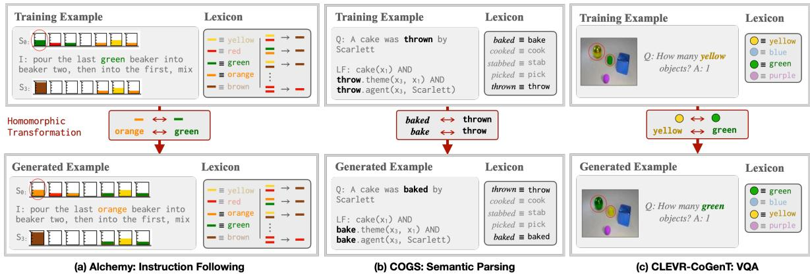
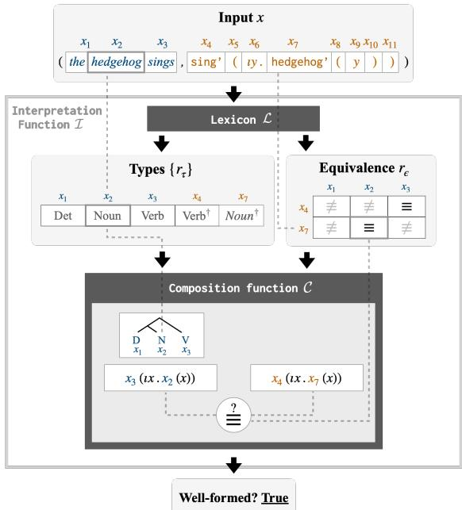
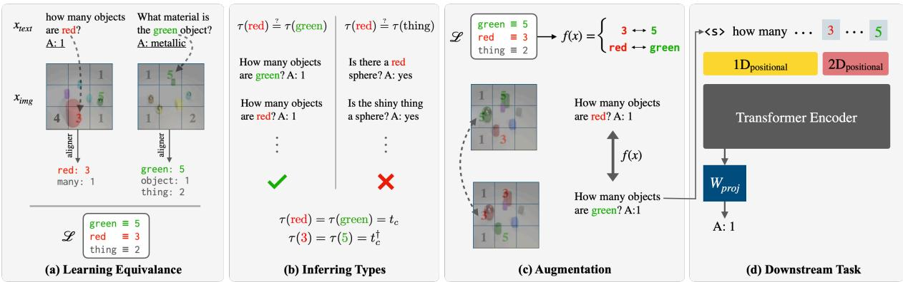
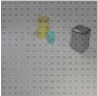
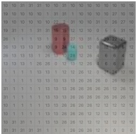

# LexSym: Compositionality as Lexical Symmetry

Ekin Akyürek Jacob Andreas Massachusetts Institute of Technology {akyurek,jda}@mit.edu

## Abstract

In tasks like semantic parsing, instruction following, and question answering, standard deep networks fail to generalize compositionally from small datasets. Many existing approaches overcome this limitation with model architectures that enforce a compositional process of sentence interpretation. In this paper, we present a domain-general and model-agnostic formulation of compositionality as a constraint on symmetries ofdata distributions rather than models. Informally, we prove that whenever a task can be solved by a compositional model, there is a corresponding data augmentation scheme—a procedure for transforming examples into other well-formed examples—that imparts compositional inductive bias on any model trained to solve the same task. We describe a procedure called LEXSYM that discovers these transformations automatically, then applies them to training data for ordinary neural sequence models. Unlike existing compositional data augmentation procedures, LEXSYM can be deployed agnostically across text, structured data, and even images. It matches or surpasses state-of-the-art, task-specific models on COGS semantic parsing, SCAN and ALCHEMY instruction following, and CLEVR-COGENT visual question answering datasets.

## 1 Introduction

A central challenge in natural language processing is the design of models and learning algorithms that are simultaneouslyflexible enough to capture the variability of human language and structured enough to generalize in predictable and humanlike ways. One important source of structure is the principle of compositionality, which (in one formulation) states that sentence meanings can be computed from a lexicon of word meanings and a set of composition rules governing how meanings combine (Montague, 1970b). A long line of language processing research has operationalized the principle of compositionality as a constraint on model architectures, via independence assumptions or parameter tying schemes that ensure a compositional process of sentence interpretation (Lewis and Stearns, 1968; Andreas et al., 2016). Compositional models enjoy sample-efficient learning and strong generalization in tasks from machine translation to question answering (McCoy et al., 2020).

But much of human language is not (or at least not straightforwardly) compositional. Idioms, disfluencies, and context-sensitive meanings present major challenges to models in which all predictions must derive from a sequence of local composition operations. In recent years, more generic model architectures such as recurrent neural networks (RNNs) and transformers, with no explicit compositional scaffolding, have consistently outperformed compositional models in language processing tasks with natural data (Wu et al., 2016). However, these models capture linguistic regularities only when trained on enormous amounts of data, and make surprising or problematic predictions when presented with novel word collocations or syntactic structures (Lake and Baroni, 2018).

How can we train unstructured neural sequence models that generalize compositionally? Recent work has introduced several compositional data augmentation schemes: rule-based procedures or learned models that synthesize artificial training examples to promote generalization (Andreas, 2020; Shaw et al., 2021; Akyürek et al., 2021; Zhang et al., 2022, inter alia). While often effective, existing methods are specialized to specific data modalities or datasets. The conditions under which they succeed, and their relationships to the formal principle of compositionality, have remained unclear.

This paper presents a framework for understanding and improving such data-centric approaches to compositional modeling. We first provide a mathematical characterization of the principle of compositionality as a constraint on data distributions rather than model architectures. Intuitively, we show that whenever a language understanding task can be solved compositionally, that task’s data distribution is guaranteed to exhibit specific symmetries. These symmetries are functions that modify data points while preserving semantic acceptability. Fig. 1c gives an example of a symmetry in a visual question answering problem: in any wellformed (image, question, answer) triple, swapping the words yellow and green and their associated pixel values yields a valid new triple. Such symmetries exist even in complex tasks like instruction following (Fig. 1a), where they may depend not only on word-to-meaning mappings but relations between meanings (like the fact that red and green mix to produce brown).

  
Figure 1: We extract a lexicon that relates words to their meanings in each dataset. We then find homomorphic transformations (Sec. 3) of this lexicon that, when applied to training examples, produce new, well-formed examples. (Note the changes in the generated examples)

Building on this formal link between compositionality and symmetry, we introduce a procedure called LEXSYM that discovers symmetries automatically, then uses them to synthesize new training examples guaranteed to be correct and informative. Crucially, LEXSYM does not require a complete compositional theory for a given problem domain—only a lexicon of word meanings. These lexicons may themselves be automatically derived for most tasks. This makes LEXSYM very flexible: it requires little or no task-specific engineering, can be combined with any predictor, and unlike other compositional data augmentation schemes does not require tree-structured or even sequential data.

Applied to ordinary neural sequence models, LEXSYM outperforms state-of-the-art models on the CLEVR COGENT visual question answering benchmark (Johnson et al., 2017) by a wide margin. LEXSYM is general, and matches or outperforms some specialized data augmentation schemes and models on the COGS semantic parsing task (Kim and Linzen, 2020; Kim et al., 2022), and the SCAN and ALCHEMY instruction following tasks (Lake and Baroni, 2018; Long et al., 2016).

This paper thus offers two contributions: a theoretical contribution, in the form of a new lens on the principle of compositionality via symmetries of data distributions; and an empirical contribution, in the form of a data augmentation scheme that improves generalization on diverse language understanding tasks. The recent success of data augmentation approaches highlight the fact that compositional inductive bias need not require compositional models. Our work formalizes and generalizes this “data-centric” account of compositionality.<sup>1</sup>

## 2 Background & Approach

We begin with a discussion on the more general role of symmetry in machine learning applications. Definition 1. A symmetry of a set X is a function f satisfying:

$$
\{ f ( \mathbf { x } ) : \mathbf { x } \in X \} = X\tag{1}
$$

That is, applying f to each element of X leaves X unchanged.

A familiar example from computer vision is reflection symmetry: in object recognition problems, image classes are generally invariant under reflection (a zebra seen in a mirror is still a zebra). The set of (image, class) pairs thus has as a symmetry the function (x, y)  (reflect(x), y). In many domains, especially those (like computer vision and computational chemistry) that are constrained by physical laws, knowledge of the symmetries exhibited by a problem domain can dramatically reduce the difficulty of learning (Batzner et al., 2022; Simeonov et al., 2022).

Past work has incorporated symmetry into machine learning problems in two ways. Invariant and equivariant modeling approaches structurally enforce symmetries via specialized architectures (improving generalization by decreasing the size of the hypothesis class; Cohen and Welling, 2016). Data augmentation approaches generate new training examples by applying known symmetries like reflections directly to training data (improving generalization by increasing dataset size; Shorten and Khoshgoftaar, 2019). Data augmentation, the focus of this paper, is model-agnostic, and can be used in conjunction with pre-training while producing the same asymptotic effects as specialized model architectures (Chen et al., 2020).

The question this paper aims to answer is whether compositionality, like other domainspecific constraints, can be formalized in the language of symmetry. We are not the first to consider this question: Kiddon and Domingos (2015) define a theory of semantic equivalence in terms of symmetries of the set of natural language sentences, and Gordon et al. (2020) propose a model architecture for compositional semantic parsing via a symmetry that enforces permutation invariance of lexicon entries. LEXSYM also derives symmetries from lexicons. It builds on past work by (1) characterizing the algebraic relationship between compositionality and symmetry, explaining the effectiveness of both Gordon et al. (2020)’s approach as well as other data augmentation schemes based on token and phrase substitution (Andreas, 2020; Wang et al., 2018); (2) discovering symmetries automatically, and (3) showing how to leverage them in a model- and modality-agnostic way. Additional related work is discussed in Sec. 6.

## 3 Compositionality as Lexical Symmetry

Our main theoretical result, and the foundation of our modeling approach, can be stated as follows: in any language understanding task that can be modeled compositionally, data for the task exhibits symmetries in the sense ofDefinition 1. We explain, formalize, and prove this statement below.

We consider tasks defined by a space of possible examples  , of which a subset of examples X are well-formed. We assume each example $\mathbf { x } \in \mathcal { X }$ is a discrete sequence $[ x _ { 1 } , \ldots , x _ { n } ]$ , with $x _ { i }$ drawn from a vocabulary Σ. Finally, we assume that well-formedness can be computed by a a binary interpretation function $\mathcal { T } : \mathcal { X }  \{ 0 , 1 \}$ with ${ \mathcal { T } } ( \mathbf { x } ) = 1 \operatorname { i f f } \mathbf { x } \in X$ . A wide variety of language understanding problems, from very simple to very complex, may be defined in this way:

Example 1a: Arithmetic Language Modeling. Examples x are true sentences of the form a plus b is $\leq ,$ where $\underline { { a } } ,$ b and c are numbers: (one plus two is $t h r e e ) = 1$ but (two plus two is $f ( \nu e ) = 0$

Example 1b: Semantic Parsing. Examples x are pairs $\big ( \mathbf { x } _ { \mathrm { N L } } , \mathbf { x } _ { \mathrm { L F } } \big )$ , where x<sub>NL</sub> is an sentence, x<sub>LF</sub> is a logical form, and $\mathcal { T } ( \mathbf { x } _ { \mathrm { N L } } , \mathbf { x } _ { \mathrm { L F } } ) = 1$ iff x<sub>LF</sub> represents a possible meaning of x<sub>NL</sub> (Fig. 1b).

Example 1c: Visual Question Answering. Examples x are triples $\left( \mathbf { x } _ { \mathrm { Q } } , \mathbf { x } _ { \mathrm { I } } , \mathbf { x } _ { \mathrm { A } } \right)$ , where $\mathbf { x } _ { \mathrm { Q } }$ is a question, x<sub>I</sub> is a (rasterized) image, x<sub>A</sub> is an answer, and $\mathcal { T } ( \mathbf { x } _ { \mathrm { Q } } , \mathbf { x } _ { \mathrm { I } } , \mathbf { x } _ { \mathrm { A } } ) = 1 \operatorname { i f f } \mathbf { x } _ { \mathrm { A } }$ is the answer to x<sub>Q</sub> in $\mathbf { x } _ { \mathrm { I } }$ (Fig. 1c).

Notice that the vocabulary Σ contains not just natural language words, but other kinds of data: logical symbols (1b) or even image patches (1c).

“Language understanding” in each of these tasks is encapsulated by the function . What does it mean for to be compositional? Under most definitions, a compositional language understanding procedure should factorize into a lexicon, which captures meanings of words, and a composition procedure, which derives example-level interpretations from these meanings. We model word meanings in terms of relations between items in Σ. In arithmetic, to know the meaning of the word five is to know that it is a number, less than seven, the successor of four, etc. In semantic parsing, the meaning of the word cat is encapsulated by the fact that it is of the same type as dog, and translatable into the logical symbol $\mathsf { c a t ^ { \prime } } .$ . We model this notion of word meaning by equipping Σ with extra structure describing these relations:

Definition 2. A lexical algebra is a collection of relations $r _ { 1 } , \ldots , r _ { n }$ between vocabulary items, where each $r : \Sigma ^ { p }  \{ 0 , 1 \}$ . A lexical algebra can represent type information, like “dog is a noun”, as a unary relation; semantic correspondence, like “sings maps to $\mathsf { s i n g ^ { \prime \prime \prime } }$ , as a binary relation; and richer semantic knowledge, like “three is the sum of one and $t w o ^ { \prime \prime }$ , with higher-order relations.

We may then represent individual examples in purely relational terms:

  
Figure 2: Idealized compositional semantic parser following Definition 3. A (sentence, logical form) pair is translated into a lexical representation containing information about each word’s type and meaning. We then determine whether the sentence evaluates to the logical form using only the type and semantic correspondence matrices, using types to assign the sentence an abstract logical form, and correspondences to determine whether it matches the target.

Definition 3. Denote the lexical representation ${ \mathcal { L } } ( \mathbf { x } ) = ( R _ { 1 } ( \mathbf { x } ) , \ldots , R _ { n } ( \mathbf { x } ) )$ $R ( \mathbf { x } )$ is an order-$p$ tensor whose $( i , \ldots , j ) ^ { t h }$ entry is equal to $r ( x _ { i } , \ldots , x _ { j } )$ . (If r is a binary relation, $R ( \mathbf { x } )$ is an $| \mathbf { x } | \times | \mathbf { x } |$ matrix and $R ( { \bf x } ) _ { i j }$ specifies whether r holds between $x _ { i }$ and $x _ { j } . )$ See Fig. 2 for examples.

Finally, we use this relational representation to define compositionality of interpretation functions:

Definition 4. X is -compositional if $\mathcal { T } ( \mathbf { x } ) =$ $\mathcal { C } ( \mathcal { L } ( \mathbf { x } ) )$ for some composition procedure . In other words, X is compositional if it compute the well-formedness of x from word-level meanings and a generic composition procedure.<sup>2</sup>

This definition makes no assumptions about beyond the fact that it can be defined purely in terms of $\mathcal { L } ( \mathbf { x } )$ . It can be applied to many tasks:

Example 2a: Arithmetic Language Modeling. Define $r _ { 1 }$ to be the ternary relation $( a , b , c ) \mapsto$ $\mathbb { 1 } _ { [ a + b = c ] }$ . Then takes an example and checks whether the index corresponding to its three number words is true in $R _ { 1 }$

Example 2b: Semantic Parsing. A sketch of a semantic parser factorizable into a lexicon and an abstract composition function is depicted in Fig. 2. As a real-world example, in the factored CCG semantic parser of Kwiatkowski et al. (2011), words are assigned types and logical forms via a lexicon. These logical fragments are then composed by a parsing algorithm that depends only their types.

Example 2c: Natural Language Inference. Mac-Cartney and Manning (2014)’s Natural Logic framework provides a procedure for determining entailment relations between sentences via a set of sentence rewriting operations that use only wordlevel information about entailment relations.

Under Definition 4, a sentence interpretation procedure is compositional if the meaning of a sentence can be derived in a generic way ( ) from the meanings of its lexical items $( \mathcal { L } ) . ^ { 3 }$ We remark, finally, that the parsing procedure depicted in Fig. 2 is an idealization used to motivate our approach; our experiments use more flexible models.

We are now ready to describe how, for compositional $\mathcal { T } ,$ , structure in $\mathcal { L }$ translates into structure in the set of well-formed examples X.

Definition 5. A function f is a homomorphism of $( \Sigma , { \cal L } )$ (an “ -homomorphism”) if:

$$
\begin{array} { r l } & { \forall r \in \mathcal { L } , \forall x _ { 1 } \dots x _ { p } \in \Sigma : } \\ & { \qquad r ( x _ { 1 } , \dots , x _ { p } ) = r ( f ( x _ { 1 } ) , \dots , f ( x _ { p } ) ) } \end{array}\tag{2}
$$

$f$ “preserves the structure” of ${ \mathcal { L } } ,$ , ensuring that pairwise relationships are preserved among symbols. Fig. 1 shows examples: in (c), for instance, the words yellow and green and the corresponding colors must be swapped to satisfy Eq. 2.

Finally, we may state our main result:

Theorem 1. If X is -compositional, f is an -homomorphism, and $\textbf { x } \in \ X$ , then $f ( \mathbf { x } ) \ =$ $[ f ( x _ { 1 } ) , \dots , f ( x _ { n } ) ] \ \in \ X$ . Thus every homomorphism of  well-formed examples $\in X$

Proof. From Definition 3 and 5, $\begin{array} { r l } { R _ { i } ( f ( \mathbf { x } ) ) } & { { } = } \end{array}$ $R _ { i } ( { \bf x } ) \ \forall i$ . Then,

$$
\begin{array} { r l } & { \mathbb { 1 } _ { [ f ( \mathbf { x } ) \in X ] } = \mathcal { T } ( f ( \mathbf { x } ) ) } \\ & { \qquad = \mathcal { C } ( \mathcal { L } ( f ( \mathbf { x } ) ) ) } \\ & { \qquad = \mathcal { C } ( R _ { 1 } ( f ( \mathbf { x } ) ) , \dots , R _ { n } ( f ( \mathbf { x } ) ) ) } \\ & { \qquad = \mathcal { C } ( R _ { 1 } ( \mathbf { x } ) , \dots , R _ { n } ( \mathbf { x } ) ) } \\ & { \qquad = \mathcal { T } ( \mathbf { x } ) = \mathbb { 1 } _ { [ \mathbf { x } \in X ] } } \end{array}
$$

Corollary 1. With the additional constraint that f is an -isomorphism (i.e., has an inverse), then $f$ is a symmetry of X in the sense of Eq. 1.

Here it suffices to show that the preimage of every $\mathbf { x } \in X$ is also in X; the proof is the same as Theorem 1 with $f ^ { - 1 }$ in place of $f .$

Despite their simplicity, Theorem 1 and its corollary have an important consequence: if we can identify candidate entries in ${ \mathcal { L } } ,$ even if is unknown, we can construct new examples $\mathbf { x } \in X$ that respect, and provide evidence for, the compositional structure of X. There is an intriguing (if inexact) structural similarity between Corollary 1 and Noether’s theorem (Noether, 1918), which establishes an equivalence between symmetries of physical systems and their conserved quantities. Here, such symmetries imply constraints not on conservation laws but interpretation functions.

## 4 LEXSYM: Data Augmentation with -homomorphisms

Given a lexicon describing symbols and their relations, we have shown how to turn homomorphisms of the lexicon into transformations of a dataset. Each such function $f$ that takes an example x as input, replaces each token $x _ { i } \in { \bf x }$ with a new one, and returns a well-formed example $\mathbf { x } ^ { \prime }$ as output. Every -homomorphism may thus be viewed as a recipe for synthesizing training examples from a small initial training set (Japkowicz et al., 2000). However, to make this a practical modeling tool, we need some way of constucting -homomorphisms for a task of interest. Below, we describe how to do so automatically: first, starting with only a taskspecific lexicon $\mathcal { L }$ (Sec. 4.1); next, starting with only a dataset and no initial lexicon (Sec. 4.2). We term the resulting approach LEXSYM.

## 4.1 Deriving Homomorphisms from Lexicons

Even in complex sequence modeling problems, useful lexicons are often simple enough that they can be specified by hand (Jones et al., 2012; Gordon et al., 2020). Given a pre-specified algebraic ${ \mathcal { L } } ,$ there is a straightforward procedure for generating the associated symmetries by enumerating all functions $\Sigma  \Sigma$ and testing which ones satisfy Eq. 2. (See Algorithm 1 in Appendix B.) This algorithm is inefficient, but simple and practical for small $| { \mathcal { L } } |$

## 4.2 Deriving Lexicons from Datasets

For some tasks, it may be difficult to manually specify an algebraic lexicon. We next describe how to infer one automatically. We focus on an important and extremely common class of language understanding problems with special structure. In semantic parsing and instruction following, examples x consist of (input, output) pairs in which inputs are sentences, outputs are meaning representations, and word meaning is characterized by a lexicon with two components. First, a set of unary type predicates $\{ r _ { \tau } \}$ that assign words to types (like ENTITY in semantic parsing). Second, a semantic correspondence relation $r _ { \epsilon }$ that specifies which actions or logical symbols can be derived from words (like sings  sing′). With n types, the lexicon required for these problems is $\mathcal { L } = ( r _ { \tau _ { 1 } } , \ldots , r _ { \tau _ { n } } , r _ { \epsilon } )$ , which we abbreviate $( \{ r _ { \tau _ { k } } \} , r _ { \epsilon } )$ below. We now show how to improve upon the procedure in Sec. 4.1 by deriving $\mathcal { L }$ from data and sampling -homomorphisms in constant time.

Learning We build on past work noting that dictionaries of semantic correspondences can be constructed using alignment algorithms (Brown et al., 1993). Given an input x consisting of a pair $\left( \mathbf { x } _ { \mathrm { t e x t } } , \mathbf { x } _ { \mathrm { m e a n i n g } } \right)$ , we use existing algorithms to align tokens in individual training examples. Finally, we identify the most frequently occurring alignments and add these to the semantic correspondence relation. We may similarly use existing procedures to infer types by deriving them from part-of-speech tags or distributional patterns. See Appendix D for details of the alignment and type inference algorithms used in our experiments. These algorithms produce lexicons with three properties that are useful for the sampling scheme we describe next: types are disjoint, and semantic correspondences are oneto-many and type-preserving (if two words are of the same type, so are their translations).

Sampling -homomorphisms Once we have identified types and semantic correspondences, sampling -homomorphisms is straightforward:

Theorem 2. Let $x _ { i }$ and $x _ { j } \in \Sigma$ have the same type $r _ { \tau } ( x _ { i } ) = r _ { \tau } ( x _ { j } ) = 1$ . For convenience, let $E _ { i } =$ $\{ x : r _ { \epsilon } ( x _ { i } , x ) = 1 \}$ denote possible translations of $x _ { i } .$ The f is an -homomorphism:

$$
f ( x ) = \left\{ \begin{array} { l l } { x _ { j } } & { i f x = x _ { i } } \\ { x _ { i } } & { i f x = x _ { j } } \\ { x ^ { \prime } \in E _ { j } } & { i f x \in E _ { i } } \\ { x ^ { \prime } \in E _ { i } } & { i f x \in E _ { j } } \\ { x } & { o t h e r w i s e } \end{array} \right.\tag{3}
$$

Proof is given in Appendix A. Theorem 2 yields an intuitive data augmentation procedure: select two (input, output) pairs of the same type, and swap them and any of their meanings wherever they occur. Fig. 1b shows an example. Eq. 3 is related to data augmentation schemes described by Andreas (2020) and Liu et al. (2021b), which synchronously substitute words or phrases (equivalent to removing cases 2 and 4). Unlike LEXSYM, these methods cannot guarantee correctness: in Fig. 1c, substituting green in place of yellow yields an image with two green objects and an incorrect answer.

## 5 Experiments

Our experiments aim to evaluate whether LEXSYM can improve compositional generalization in downstream models. The main goal of these experiments is to evaluate generality across tasks and data modalities. Evaluation focuses on three diverse classes of language understanding problems: complex, context-dependent computations (Sec. 5.1), large, automatically derived lexicons (Sec. 5.2), and multi-modal data (Sec. 5.3).

## 5.1 Complex computations

We first test LEXSYM on the ALCHEMY task from the SCONE benchmark (Long et al., 2016)—a problem involving a complex sentence interpretation procedure that makes it challenging to apply existing data augmentation schemes.

Data In ALCHEMY (Fig. 1a), models must execute a sequence of human-written English instructions $\pmb { x } _ { \mathrm { i n s } } ^ { \mathrm { 1 : N } }$ , on an initial state $\pmb { x } _ { \mathrm { s t a t e } } ^ { 0 }$ consisting of beakers of colored liquids (textually represented as sequence of symbols “1: $\left( \mathbf { g } \right) ( \mathbf { g } ) , 2 \colon \ldots ^ { \prime \prime } )$ , to predict the final state $\pmb { x } _ { \mathrm { s t a t e } } ^ { N }$ . Initial and final states are encoded as sequences of color tokens. Predicting final states requires both grounding colors in state <sup>variables</sup> <sup>(brown</sup> → <sup>b</sup> <sup>,</sup> <sup>red</sup> → <sup>g</sup> <sup>)</sup> <sup>and</sup> <sup>model-</sup> ing what happens when colors are combined (e.g. mixing g and r yields b ).

LEXSYM We manually construct a lexicon to showcase how to inject prior knowledge into LEXSYM. We encode word meaning in two relations: a semantic equivalence relation between color words and colors:

$$
r _ { \epsilon } ( c _ { 1 } , c _ { 2 } ) = \left\{ \begin{array} { l l } { 1 } & { c _ { 1 } = \mathrm { b r o w n } , \quad c _ { 2 } = \mathbb { 0 } } \\ { 1 } & { c _ { 1 } = \mathrm { r e d } , \quad c _ { 2 } = \mathbb { 0 } } \\ { 1 } & { c _ { 1 } = \mathrm { g r e e n } , \quad c _ { 2 } = \mathrm { ~ g ~ } } \\ { \vdots } \\ { 0 } & { \mathrm { o t h e r w i s e } } \end{array} \right.
$$

and a ternary relation that encodes the result of mixing colors:<sup>4</sup>

$$
r _ { \mathrm { m i x } } ( c _ { 1 } , c _ { 2 } , c _ { 3 } ) = { \left\{ \begin{array} { l l } { 1 } & { c _ { 1 } = c _ { 2 } = c _ { 3 } } \\ { 1 } & { c _ { 1 } \neq c _ { 2 } \land c _ { 3 } = \pmb { 0 } } \\ { 0 } & { { \mathrm { o t h e r w i s e } } } \end{array} \right. }
$$

Together, $( r _ { \epsilon } , r _ { \sf m i x } , \{ r _ { \tau _ { k } } \} )$ , where $\{ r _ { \tau _ { k } } \}$ assigns different types to color words, colors, and remaining tokens. The homomorphic transformations of this lexicon exchange color words and colors but preserve mixing relations.

Models and Training We train an LSTM (Hochreiter and Schmidhuber, 1997) and finetune a T5 transformer (Raffel et al., 2020) on the sequence-to-sequence prediction problem $( x _ { \mathrm { i n s } } ^ { \mathrm { 1 : N } } , x _ { \mathrm { s t a t e } } ^ { \mathrm { 0 } } )  x _ { \mathrm { s t a t e } } ^ { N }$ Training details may be found in Appendix C. We compare these baseline models to their LEXSYM-augmented versions as well as the existing compositional data augmentation scheme of Liu et al. (2021b).

Results See Table 1. LSTM+LEXSYM improves substantially over an LSTM. Preserving the homomorphism condition in Eq. 2 is extremely important: the procedure of Liu et al. (2021b), which naively substitutes aligned color pairs, actually hurts performance. Pre-trained models achieve strong initial results; combining pre-training with LEXSYM gives additional improvements.

## 5.2 Learned lexicons

We next show that for more conventional sequenceto-sequence problems, we may apply LEXSYM with automatically derived lexicons.

<table><tr><td>Model</td><td>ALCHEMY</td><td>SCAN (jump)</td><td>SCAN (around right)</td><td>COGS</td><td>COGS (nonce)</td></tr><tr><td>Previous Work on COGS &amp; SCAN</td><td></td><td></td><td></td><td></td><td></td></tr><tr><td>GECA (Andreas, 2020)</td><td></td><td> $9 9 . 9 4 \pm 0 . 1 0 $ </td><td> $9 8 . 5 0 \pm 1 . 9 0 $ </td><td> $4 7 . 7 4 \pm 4 . 5 2$ </td><td></td></tr><tr><td>LeAR (Liu et al., 2021a)</td><td></td><td></td><td></td><td> $9 7 . 7 0 \pm 0 . 7 0 $ </td><td></td></tr><tr><td>LexLSTM (Akyurek and Andreas, 2021)</td><td> $3 6 . 8 0 \pm 1 . 9 6$ </td><td> $9 9 . 1 4 \pm 1 . 5 5$ </td><td> $8 8 . 4 1 \pm 7 . 3 5$ </td><td> $8 2 . 1 7 \pm 0 . 7 2$ </td><td> $8 1 . 4 0 \pm 0 . 4 0$ </td></tr><tr><td>No Pre-training</td><td></td><td></td><td></td><td></td><td></td></tr><tr><td>LSTM</td><td> $4 1 . 7 2 \pm 1 . 1 5$ </td><td> $0 . 4 1 \pm 0 . 3 4$ </td><td> $8 . 6 5 \pm 4 . 5 2$ </td><td> $6 1 . 1 3 \pm 4 . 1 2$ </td><td> $6 1 . 1 3 \pm 4 . 1 2$ </td></tr><tr><td>+ Substitute (e.g. Liu et al., 2021b)</td><td> $4 0 . 5 2 \pm 0 . 8 4$ </td><td> $9 9 . 9 5 \pm 0 . 1 0$ </td><td> $9 9 . 1 7 \pm 0 . 9 3 $ </td><td> $8 1 . 9 9 \pm 0 . 5 0$ </td><td> $7 7 . 6 2 \pm 0 . 7 8$ </td></tr><tr><td>+ LEXSYM</td><td> $4 5 . 8 5 \pm 2 . 0 0$ </td><td> $1 0 0 . 0 0 \pm 0 \quad$ </td><td> $9 9 . 5 1 \pm 0 . 4 8 $ </td><td> $8 1 . 8 6 \pm 0 . 9 0$ </td><td> $7 7 . 2 5 \pm 0 . 3 4$ </td></tr><tr><td>Language Pre-training</td><td></td><td></td><td></td><td></td><td></td></tr><tr><td>T5</td><td> $8 4 . 9 5 \pm 0 . 4 4$ </td><td> $9 3 . 6 0 \pm 0 $ </td><td> $3 8 . 4 0 \pm 0 . 9 0$ </td><td> $8 3 . 3 0 \pm \mathrm { 0 . 1 0 }$ </td><td> $6 4 . 2 0 \pm 2 . 0 0$ </td></tr><tr><td> $+ \mathrm { C S L - A u g ^ { * } \left( Q i u \thinspace e t \ a l . , 2 0 2 2 \right) }$ </td><td></td><td> $9 9 . 7 0 \pm 0 $ </td><td></td><td> $9 9 . 5 0 \pm 0 $ </td><td></td></tr><tr><td>+LEXSYM</td><td> $8 5 . 4 8 \pm 0 . 1 6$ </td><td> $9 9 . 9 6 \pm 0 . 0 3$ </td><td> $9 7 . 2 9 \pm 2 . 1 6$ </td><td> $8 3 . 6 2 \pm 0 . 2 7$ </td><td> $7 6 . 7 4 \pm 2 . 2 3$ </td></tr></table>

Table 1: Results on semantic parsing and instruction following. We provide mean and standard deviations over 5 random seeds. LEXSYM improves significantly over baselines, with and without large-scale pretraining. \*Uses a customized formal representation.

<table><tr><td></td><td>COGENT</td><td>CLEVR</td></tr><tr><td>Visual Pre-training</td><td></td><td></td></tr><tr><td>Human (Johnson et al., 2017)</td><td></td><td>92.6</td></tr><tr><td>Film (Perez et al., 2018)</td><td>78.8</td><td>97.7</td></tr><tr><td>S-MAC (Marois et al., 2018)</td><td>78.7</td><td>98.9</td></tr><tr><td>NSVQA (Yi et al., 2018)</td><td>63.9</td><td>99.7</td></tr><tr><td>Seq2Seq Baselines</td><td></td><td></td></tr><tr><td>T5</td><td>79.7</td><td></td></tr><tr><td>LexLSTM</td><td>62.1</td><td></td></tr><tr><td>No Pre-Praining</td><td></td><td></td></tr><tr><td>VQATransformer</td><td> $7 3 . 3 \pm 1 . 0$ </td><td> $9 3 . 6 \pm 0 . 5 $ </td></tr><tr><td>+ Substitute (e.g. Liu et al., 2021b)</td><td> $8 4 . 4 \pm 0 . 7 $ </td><td> $9 0 . 8 \pm 0 . 3 $ </td></tr><tr><td>+ LexSym</td><td> $8 5 . 9 \pm 0 . 9$ </td><td> $9 2 . 0 \pm 0 . 9$ </td></tr></table>

Table 2: Exact match accuries on the CLEVR and CLEVR-COGENT validation sets. Results are averaged over 4 seeds. We obtain state-of-the-art results after applying LEXSYM to a (non-pretrained) sequence model. LEXSYM also yields higher accuracies than synchronous token substitution. (A detailed breakdown by question category is presented in Table 4).

Data We study two standard compositional generalization benchmarks: the SCAN (Lake and Baroni, 2018) instruction following and COGS (Kim and Linzen, 2020, Fig. 1b) semantic parsing datasets. SCAN consists of simple instruction following tasks in which strings are translated into sequences of actions. We focus on the jump split, which measures models’ ability to compose words that only appeared in isolation during training, and the around right split, which measures generalization to novel collocations. The COGS dataset tests compositional generalization in semantic parsing. The dataset includes English (sentence, logical form) pairs, with systematic differences between train and test set sentence structure. We include a variant containing nonce words (Kim et al., 2022) to disentangle general compositional skills from lexical knowledge acquired during pretraining. See Appendix G for dataset statistics.

LEXSYM We use automatic lexicon extraction to find semantic correspondence relations (r<sub>ϵ</sub>) and types $( \{ r _ { \tau _ { k } } \} )$ as described in Appendix D. Next, we apply swap-based augmentation (Eq. 3).

Models We use the same models as Sec. 5.1, along with a strong semi-structured model, LeAR (Liu et al., 2021a) tailored for COGS, and another substitution based augmentation (Andreas, 2020) tailored for SCAN. Following Akyurek and Andreas (2021), we equip the LSTM for COGS with a copy mechanism as it achieves significantly better results than Kim and Linzen (2020)’s baseline.

Results On SCAN, LEXSYM obtains near-perfect accuracy in both jump and around right splits. On the original COGS datasets, LEXSYM substantially outperforms the LSTM model and GECA augmentation, and is comparable to a neural sequence model specialized for lexical generalization (LexL-STM). Stronger results can be achieved with models specifically tailored toward semantic parsing tasks (LeAR). In both tasks, LEXSYM also improves upon large-scale pre-training.

## 5.3 Multi-modal data

Finally, we combine learned lexicons with nonsequential data to advance the state of the art on a long-standing visual question answering challenge.

Data The CLEVR dataset (Johnson et al., 2017, Fig. 1c) contains English-language questions about generated 3D scenes containing multiple objects.

Questions involve complex computational operations including quantification, comparison, and spatial reasoning. CLEVR has been a popular testbed for evaluating composition in visual question answering models. Our main experiment uses the COGENT split of the dataset, which focuses on compositional generalization. In the CLEVR-COGENT training set (Split A), which contains roughly 700K (question, image, answer) triples, all cubes are gray, blue, brown or yellow, while all cylinders are red, green, purple or cyan. In the test set (validation set of Split B), these are reversed.

LEXSYM In VQA and other multi-modal tasks, part of the input is continuous (e.g. images and videos). Recent work has shown that it is possible to learn high-quality discrete representations of continuous input data. For example, in the VQ-VAE model of van den Oord et al. (2017), a continuous image is transformed into a grid of categorical codes, with individual codes representing color, and in some cases materials and illumination (examples in Table 3). We use this discretization procedure for our experiments (see Appendix C.1 for details). We use the same algorithm as previous section to extract lexical relations.

Models Most prior work on visual question answering has used pre-trained convolutional networks to encode images, and recurrent networks to encode questions and generate answers. For experiments on CLEVR, we use a simplified model in which both questions and images are mapped to answers by a transformer model, similarly to Ramesh et al. (2021). See Appendix C.2 for details.

Both LEXSYM augmentation and this VQA-Transformer model operate over sequences of discrete visual codes produced by a vector-quantized variational autoencoder. Once these discrete representations have been produced, we infer lexicons and perform data augmentation directly to these representations, without re-synthesizing images (though such synthesis is possible, as in Table 3, to interpret model behavior).

The COGENT task is very different from the sequence modeling tasks discussed above: inputs contain many tokens, and the training set is orders of magnitude larger. GECA and CSL-Aug, which have a high polynomial dependence on sequence length, could not be applied as they fail to terminate within a reasonable amount of time.

Results In Table 2, a transformer model with LEXSYM achieves state-of-the-art results on the CLEVR-COGENT dataset, reducing errors by roughly 33% relative to the best existing system. LEXSYM also outperforms substitution based-data augmentation (Liu et al., 2021b), particularly on semantically complex utterances involving quantification (App. Table 4). On the IID CLEVR split, LEXSYM’s performance is comparable to humans, and somewhat behind pre-trained models.

## 6 Other Related Work

Lexicalized neural models Word-level alignments between input and output sequences were an essential feature of statistical phrase- and treebased sequence models (Chiang et al., 2005; Koehn et al., 2003). Neural scoring functions were sometimes integrated into these models (Misra and Artzi, 2016). Neural models with attention (Bahdanau et al., 2015) do not require explicit alignment, though several pieces of past work have shown that incorporating explicit token-level correspondences improves generalization (Akyurek and Andreas, 2021; Prabhu and Kann, 2020; Pham et al., 2018). The semantic correspondence function in Sec. 4 plays the same role as the input–output dictionary in these methods, but LEXSYM as a whole is more general: it is not restricted to modeling sequenceto-sequence problems, and can infer and exploit correspondence relations between component of an example. To the best of our knowledge, this paper is also the first to make use of token-level alignments in joint neural models of text and images.

Compositionality in representation learning While we have focused on compositionality as a property of data distributions or interpretation functions, another line of work in machine learning and language evolution has studied compositionality as an emergent property of learned representations (Andreas, 2019; Resnick et al., 2019; Brighton and Kirby, 2006). In settings where representational compositionality is desirable (e.g. to train communication protocols that can generalize to new states), LEXSYM might provide a tool for promoting it.

Equivariant Sequence Models As mentioned in Sec. 2, our work builds on existing approaches that control generalization with specialized model architectures designed to be equivariant to permutations of a pre-specified lexicon (if $\begin{array} { r l r } { f ( x _ { 1 } \cdot \cdot \cdot x _ { n } ) } & { { } = } & { y _ { 1 } \cdot \cdot \cdot y _ { m } } \end{array}$ then $f ( \pi ( x _ { 1 } ) \cdot \cdot \cdot \pi ( x _ { n } ) ) = \pi ( y _ { 1 } ) \cdot \cdot \cdot \pi ( y _ { m } )$ for a permutation π) (Gordon et al., 2020; White and Cotterell, 2022). LEXSYM differs from these approaches in three ways. First, LEXSYM is modelagnostic and compatible with pre-training. Second, LEXSYM is compatible with (and automatically derives transformations for) more complicated relations than input–output correspondences, making it possible to apply to tasks like ALCHEMY where such relations are important. Finally, LEXSYM gracefully handles (possibly noisy) learned lexicons, making it applicable to tasks like COGENT with complex or uninterpretable token mappings.

Data Augmentation Data augmentation approaches are widely used across machine learning application domains featuring known invariances of the data distribution (Japkowicz et al., 2000; Jia and Liang, 2016; Shaw et al., 2021). Substitutionbased schemes that replace words with synonyms, or synchronously replace words and their translations, are widely used for machine translation and general de-biasing (Liu et al., 2021b; Wang et al., 2018; Wei and Zou, 2019).

## 7 Limitations and Future Directions

While Sec. 3 characterizes the effect of general - homomorphisms, LEXSYM specifically produces single-token swaps. In images represented as discrete symbol sequences, if a single symbol simultaneously encodes multiple visual features (e.g. color and texture), these features will remain entangled in synthesized examples. It will not exchange substructures larger than a single token, and thus will not synthesize examples longer than those already present in the training set (Lake et al., 2019). This is because LEXSYM targets compositionality but not recursion, which is also required to model the full range of human-like generalizations in sequence learning problems.

LEXSYM is also sensitive to the nature of the tokenization scheme itself. In morphologically rich languages, for example, LEXSYM may need to be applied not on top of words or segments, but instead canonicalized morphemes produced by learned morphological analyzers (Narasimhan et al., 2015; Bergmanis and Goldwater, 2017; Cotterell and Schütze, 2018) (analogous to the use of learned image patch representations rather than pixels in our VQA experiments).

Finally, LEXSYM does not induce some of the generalizations obtained other methods for improving compositional generalization, especially those that exploit extra structure (e.g. tree-shaped inputs and outputs) in the semantic parsing domain (e.g. Liu et al., 2021a). It might serve as a platform for future versions of those methods that offer greater generality and formal guarantees.

## 8 Conclusion

We have presented LEXSYM, a new data augmentation method that improves compositional generalization of neural models in multiple domains. LEXSYM is derived from a characterization of the principle of compositionality as a constraint on the symmetries of data distributions, and a procedure for automatically identifying these symmetries using token-level alignments. Our results highlight the fact that many inductive biases targeted by specialized models in NLP can be alternatively, and often more flexibly, expressed as a hypothesis about the structure of the distribution to be modeled.

## Acknowledgements

This work was supported by the Machine-LearningApplications initiative at MIT CSAIL, the MIT–IBM Watson AI lab, and the National Science Foundation under grant CCF-2217064. Computing resources were provided by a gift from NVIDIA through the NVAIL program and by the Lincoln Laboratory Supercloud.

## Ethics Statement

We do not anticipate any ethical issues associated with the techniques decribed in this paper.

## References

Ekin Akyürek, Afra Feyza Akyürek, and Jacob Andreas. 2021. Learning to recombine and resample data for compositional generalization. In 9th International Conference on Learning Representations, ICLR 2021, Virtual Event, Austria, May 3-7, 2021. OpenReview.net.

Ekin Akyurek and Jacob Andreas. 2021. Lexicon learning for few shot sequence modeling. In Proceedings of the 59th Annual Meeting of the Association for Computational Linguistics and the 11th International Joint Conference on Natural Language Processing (Volume 1: Long Papers), pages 4934–4946, Online. Association for Computational Linguistics.

Jacob Andreas. 2019. Measuring compositionality in representation learning. In 7th International Conference on Learning Representations, ICLR 2019, New Orleans, LA, USA, May 6-9, 2019. OpenReview.net.

Jacob Andreas. 2020. Good-enough compositional data augmentation. In Proceedings of the 58th Annual Meeting of the Association for Computational Linguistics, pages 7556–7566, Online. Association for Computational Linguistics.

Jacob Andreas, Marcus Rohrbach, Trevor Darrell, and Dan Klein. 2016. Neural module networks. In 2016 IEEE Conference on Computer Vision and Pattern Recognition, CVPR 2016, Las Vegas, NV, USA, June 27-30, 2016, pages 39–48. IEEE Computer Society.

Dzmitry Bahdanau, Kyunghyun Cho, and Yoshua Bengio. 2015. Neural machine translation by jointly learning to align and translate. In 3rd International Conference on Learning Representations, ICLR 2015, San Diego, CA, USA, May 7-9, 2015, Conference Track Proceedings.

Simon Batzner, Albert Musaelian, Lixin Sun, Mario Geiger, Jonathan P Mailoa, Mordechai Kornbluth, Nicola Molinari, Tess E Smidt, and Boris Kozinsky. 2022. E (3)-equivariant graph neural networks for data-efficient and accurate interatomic potentials. Nature communications, 13(1):1–11.

Toms Bergmanis and Sharon Goldwater. 2017. From segmentation to analyses: a probabilistic model for unsupervised morphology induction. In Proceedings of the 15th Conference of the European Chapter of the Associationfor Computational Linguistics: Volume 1, Long Papers, pages 337–346, Valencia, Spain. Association for Computational Linguistics.

Henry Brighton and Simon Kirby. 2006. Understanding linguistic evolution by visualizing the emergence of topographic mappings. Artificial life, 12(2):229–242.

Peter F. Brown, Stephen A. Della Pietra, Vincent J. Della Pietra, and Robert L. Mercer. 1993. The mathematics of statistical machine translation: Parameter estimation. Computational Linguistics, 19(2):263– 311.

Shuxiao Chen, Edgar Dobriban, and Jane H. Lee. 2020. A group-theoretic framework for data augmentation. In Advances in Neural Information Processing Systems 33: Annual Conference on Neural Information Processing Systems 2020, NeurIPS 2020, December 6-12, 2020, virtual.

David Chiang, Adam Lopez, Nitin Madnani, Christof Monz, Philip Resnik, and Michael Subotin. 2005. The Hiero machine translation system: Extensions, evaluation, and analysis. In Proceedings ofHuman Language Technology Conference and Conference on Empirical Methods in Natural Language Processing, pages 779–786, Vancouver, British Columbia, Canada. Association for Computational Linguistics.

Alexander Clark and Rémi Eyraud. 2007. Polynomial identification in the limit of substitutable context-free languages. Journal of Machine Learning Research, 8(8).

Taco Cohen and Max Welling. 2016. Group equivariant convolutional networks. In Proceedings of the 33nd International Conference on Machine Learning, ICML 2016, New York City, NY, USA, June 19-24, 2016, volume 48 of JMLR Workshop and Conference Proceedings, pages 2990–2999. JMLR.org.

Ryan Cotterell and Hinrich Schütze. 2018. Joint semantic synthesis and morphological analysis of the derived word. Transactions of the Association for Computational Linguistics, 6:33–48.

Jonathan Gordon, David Lopez-Paz, Marco Baroni, and Diane Bouchacourt. 2020. Permutation equivariant models for compositional generalization in language. In 8th International Conference on Learning Representations, ICLR 2020, Addis Ababa, Ethiopia, April 26-30, 2020. OpenReview.net.

Sepp Hochreiter and Jürgen Schmidhuber. 1997. Long short-term memory. Neural computation, 9(8):1735– 1780.

Nathalie Japkowicz et al. 2000. Learning from imbalanced data sets: a comparison of various strategies. In AAAI workshop on learningfrom imbalanced data sets, volume 68, pages 10–15.

Robin Jia and Percy Liang. 2016. Data recombination for neural semantic parsing. In Proceedings of the 54th Annual Meeting of the Association for Computational Linguistics (Volume 1: Long Papers), pages 12–22, Berlin, Germany. Association for Computational Linguistics.

Justin Johnson, Bharath Hariharan, Laurens van der Maaten, Li Fei-Fei, C. Lawrence Zitnick, and Ross B. Girshick. 2017. CLEVR: A diagnostic dataset for compositional language and elementary visual reasoning. In 2017 IEEE Conference on Computer Vision and Pattern Recognition, CVPR 2017, Honolulu, HI, USA, July 21-26, 2017, pages 1988–1997. IEEE Computer Society.

Bevan Jones, Mark Johnson, and Sharon Goldwater. 2012. Semantic parsing with Bayesian tree transducers. In Proceedings of the 50th Annual Meeting of the Associationfor Computational Linguistics (Volume 1: Long Papers), pages 488–496, Jeju Island, Korea. Association for Computational Linguistics.

Chloé Kiddon and Pedro Domingos. 2015. Symmetrybased semantic parsing. In Proceedings ofthe 2014 Workshop on Learning Semantics.

Najoung Kim and Tal Linzen. 2020. COGS: A compositional generalization challenge based on semantic interpretation. In Proceedings of the 2020 Conference on Empirical Methods in Natural Language Processing (EMNLP), pages 9087–9105, Online. Association for Computational Linguistics.

Najoung Kim, Tal Linzen, and Paul Smolensky. 2022. Uncontrolled lexical exposure leads to overestimation of compositional generalization in pretrained models. ArXiv preprint, abs/2212.10769.

Diederik P. Kingma and Jimmy Ba. 2015. Adam: A method for stochastic optimization. In 3rd International Conference on Learning Representations, ICLR 2015, San Diego, CA, USA, May 7-9, 2015, Conference Track Proceedings.

Philipp Koehn, Franz J. Och, and Daniel Marcu. 2003. Statistical phrase-based translation. In Proceedings of the 2003 Human Language Technology Conference ofthe North American Chapter ofthe Associationfor Computational Linguistics, pages 127–133.

Tom Kwiatkowski, Luke Zettlemoyer, Sharon Goldwater, and Mark Steedman. 2011. Lexical generalization in CCG grammar induction for semantic parsing. In Proceedings of the 2011 Conference on Empirical Methods in Natural Language Processing, pages 1512–1523, Edinburgh, Scotland, UK. Association for Computational Linguistics.

B. Lake, Tal Linzen, and M. Baroni. 2019. Human few-shot learning of compositional instructions. In CogSci.

Brenden M. Lake and Marco Baroni. 2018. Generalization without systematicity: On the compositional skills of sequence-to-sequence recurrent networks. In Proceedings of the 35th International Conference on Machine Learning, ICML 2018, Stockholmsmässan, Stockholm, Sweden, July 10-15, 2018, volume 80 of Proceedings of Machine Learning Research, pages 2879–2888. PMLR.

Philip M Lewis and Richard Edwin Stearns. 1968. Syntax-directed transduction. Journal of the ACM (JACM), 15(3):465–488.

Chenyao Liu, Shengnan An, Zeqi Lin, Qian Liu, Bei Chen, Jian-Guang Lou, Lijie Wen, Nanning Zheng, and Dongmei Zhang. 2021a. Learning algebraic recombination for compositional generalization. In Findings ofthe Associationfor Computational Linguistics: ACL-IJCNLP 2021, pages 1129–1144, Online. Association for Computational Linguistics.

Qi Liu, Matt Kusner, and Phil Blunsom. 2021b. Counterfactual data augmentation for neural machine translation. In Proceedings of the 2021 Conference of the North American Chapter of the Association for Computational Linguistics: Human Language Technologies, pages 187–197, Online. Association for Computational Linguistics.

Reginald Long, Panupong Pasupat, and Percy Liang. 2016. Simpler context-dependent logical forms via model projections. In Proceedings ofthe 54th Annual Meeting of the Association for Computational Linguistics (Volume 1: Long Papers), pages 1456–1465, Berlin, Germany. Association for Computational Linguistics.

Bill MacCartney and Christopher D Manning. 2014. Natural logic and natural language inference. In Computing meaning, pages 129–147. Springer.

Vincent Marois, TS Jayram, Vincent Albouy, Tomasz Kornuta, Younes Bouhadjar, and Ahmet S Ozcan. 2018. On transfer learning using a mac model variant. ArXiv preprint, abs/1811.06529.

R. Thomas McCoy, Robert Frank, and Tal Linzen. 2020. Does syntax need to grow on trees? sources of hierarchical inductive bias in sequence-to-sequence networks. Transactions ofthe Associationfor Computational Linguistics, 8:125–140.

Dipendra Kumar Misra and Yoav Artzi. 2016. Neural shift-reduce CCG semantic parsing. In Proceedings ofthe 2016 Conference on Empirical Methods in Natural Language Processing, pages 1775–1786, Austin, Texas. Association for Computational Linguistics.

Richard Montague. 1970a. English as a formal language. linguaggi nella societae nella tecnica. B. Visentini (red.), Mediolan, Edizioni di Comunitá.

Richard Montague. 1970b. Universal grammar. Theoria, 36(3):373–398.

Karthik Narasimhan, Regina Barzilay, and Tommi Jaakkola. 2015. An unsupervised method for uncovering morphological chains. Transactions ofthe Association for Computational Linguistics, 3:157– 167.

E. Noether. 1918. Invariante variationsprobleme. Nachrichten von der Gesellschaft der Wissenschaften zu Göttingen, Mathematisch-Physikalische Klasse, 1918:235–257.

Ethan Perez, Florian Strub, Harm de Vries, Vincent Dumoulin, and Aaron C. Courville. 2018. Film: Visual reasoning with a general conditioning layer. In Proceedings ofthe Thirty-Second AAAI Conference on Artificial Intelligence, (AAAI-18), the 30th innovative Applications ofArtificial Intelligence (IAAI-18), and the 8th AAAI Symposium on Educational Advances in Artificial Intelligence (EAAI-18), New Orleans, Louisiana, USA, February 2-7, 2018, pages 3942– 3951. AAAI Press.

Ngoc-Quan Pham, Jan Niehues, and Alexander Waibel. 2018. Towards one-shot learning for rare-word translation with external experts. In Proceedings of the 2nd Workshop on Neural Machine Translation and Generation, pages 100–109, Melbourne, Australia. Association for Computational Linguistics.

Martin Popel and Ondˇrej Bojar. 2018. Training tips for the transformer model. ArXiv preprint, abs/1804.00247.

Nikhil Prabhu and Katharina Kann. 2020. Making a point: Pointer-generator transformers for disjoint vocabularies. In Proceedings of the 1st Conference of the Asia-Pacific Chapter of the Association for Computational Linguistics and the 10th International Joint Conference on Natural Language Processing: Student Research Workshop, pages 85–92, Suzhou, China. Association for Computational Linguistics.

Linlu Qiu, Peter Shaw, Panupong Pasupat, Pawel Nowak, Tal Linzen, Fei Sha, and Kristina Toutanova. 2022. Improving compositional generalization with latent structure and data augmentation. In Proceedings of the 2022 Conference of the North American Chapter of the Association for Computational Linguistics: Human Language Technologies, pages 4341–4362, Seattle, United States. Association for Computational Linguistics.

Colin Raffel, Noam Shazeer, Adam Roberts, Katherine Lee, Sharan Narang, Michael Matena, Yanqi Zhou, Wei Li, and Peter J. Liu. 2020. Exploring the limits of transfer learning with a unified text-to-text transformer. J. Mach. Learn. Res., 21:140:1–140:67.

Aditya Ramesh, Mikhail Pavlov, Gabriel Goh, Scott Gray, Chelsea Voss, Alec Radford, Mark Chen, and Ilya Sutskever. 2021. Zero-shot text-to-image generation. In Proceedings of the 38th International Conference on Machine Learning, ICML 2021, 18-24 July 2021, Virtual Event, volume 139 of Proceedings of Machine Learning Research, pages 8821–8831. PMLR.

Cinjon Resnick, Abhinav Gupta, Jakob Foerster, Andrew M Dai, and Kyunghyun Cho. 2019. Capacity, bandwidth, and compositionality in emergent language learning. ArXiv preprint, abs/1910.11424.

Peter Shaw, Ming-Wei Chang, Panupong Pasupat, and Kristina Toutanova. 2021. Compositional generalization and natural language variation: Can a semantic parsing approach handle both? In Proceedings of the 59th Annual Meeting ofthe Associationfor Computational Linguistics and the 11th International Joint Conference on Natural Language Processing (Volume 1: Long Papers), pages 922–938, Online. Association for Computational Linguistics.

Connor Shorten and Taghi M Khoshgoftaar. 2019. A survey on image data augmentation for deep learning. Journal of Big Data, 6(1):1–48.

Anthony Simeonov, Yilun Du, Lin Yen-Chen, Alberto Rodriguez, Leslie Pack Kaelbling, Tomas Lozano-Perez, and Pulkit Agrawal. 2022. Se (3)-equivariant relational rearrangement with neural descriptor fields. ArXiv preprint, abs/2211.09786.

Aäron van den Oord, Oriol Vinyals, and Koray Kavukcuoglu. 2017. Neural discrete representation learning. In Advances in Neural Information Processing Systems 30: Annual Conference on Neural Information Processing Systems 2017, December 4-9, 2017, Long Beach, CA, USA, pages 6306–6315.

Ashish Vaswani, Noam Shazeer, Niki Parmar, Jakob Uszkoreit, Llion Jones, Aidan N. Gomez, Lukasz Kaiser, and Illia Polosukhin. 2017. Attention is all you need. In Advances in Neural Information Processing Systems 30: Annual Conference on Neural Information Processing Systems 2017, December 4-9, 2017, Long Beach, CA, USA, pages 5998–6008.

Xinyi Wang, Hieu Pham, Zihang Dai, and Graham Neubig. 2018. SwitchOut: an efficient data augmentation algorithm for neural machine translation. In Proceedings ofthe 2018 Conference on Empirical Methods in Natural Language Processing, pages 856–861, Brussels, Belgium. Association for Computational Linguistics.

Jason Wei and Kai Zou. 2019. EDA: Easy data augmentation techniques for boosting performance on text classification tasks. In Proceedings ofthe 2019 Conference on Empirical Methods in Natural Language Processing and the 9th International Joint Conference on Natural Language Processing (EMNLP-IJCNLP), pages 6382–6388, Hong Kong, China. Association for Computational Linguistics.

Jennifer C. White and Ryan Cotterell. 2022. Equivariant transduction through invariant alignment. In Proceedings of the 29th International Conference on Computational Linguistics, pages 4651–4663, Gyeongju, Republic of Korea. International Committee on Computational Linguistics.

Thomas Wolf, Lysandre Debut, Victor Sanh, Julien Chaumond, Clement Delangue, Anthony Moi, Pierric Cistac, Tim Rault, Rémi Louf, Morgan Funtowicz, et al. 2019. Huggingface’s transformers: State-ofthe-art natural language processing. ArXiv preprint, abs/1910.03771.

Yonghui Wu, Mike Schuster, Zhifeng Chen, Quoc V. Le, Mohammad Norouzi, Wolfgang Macherey, Maxim Krikun, Yuan Cao, Qin Gao, Klaus Macherey, Jeff Klingner, Apurva Shah, Melvin Johnson, Xiaobing Liu, Łukasz Kaiser, Stephan Gouws, Yoshikiyo Kato, Taku Kudo, Hideto Kazawa, Keith Stevens, George Kurian, Nishant Patil, Wei Wang, Cliff Young, Jason Smith, Jason Riesa, Alex Rudnick, Oriol Vinyals, Greg Corrado, Macduff Hughes, and Jeffrey Dean. 2016. Google’s neural machine translation system: Bridging the gap between human and machine translation. ArXiv preprint, abs/1609.08144.

Kexin Yi, Jiajun Wu, Chuang Gan, Antonio Torralba, Pushmeet Kohli, and Josh Tenenbaum. 2018. Neuralsymbolic VQA: disentangling reasoning from vision and language understanding. In Advances in Neural Information Processing Systems 31: Annual Conference on Neural Information Processing Systems 2018, NeurIPS 2018, December 3-8, 2018, Montréal, Canada, pages 1039–1050.

Le Zhang, Zichao Yang, and Diyi Yang. 2022. TreeMix: Compositional constituency-based data augmentation for natural language understanding. In Proceedings ofthe 2022 Conference ofthe North American Chapter ofthe Associationfor Computational Linguistics: Human Language Technologies, pages 5243–5258, Seattle, United States. Association for Computational Linguistics.

## A Proof of Theorem 2

Proof. The lexicons that we learn only unary type relations and a semantic correspondence relation $\mathcal { L } ~ = ~ ( \{ r _ { \tau _ { k } } \} , r _ { \epsilon } )$ . As noted there, we make the following additional assumptions (satisfied by our lexicon learning algorithms):

(i) Types are disjoint, i.e. every symbol belongs to a single type: $\forall x \ \in \ \Sigma , | \tau _ { x } | \ = \ | \{ r _ { \tau _ { k } } \  |$ $r _ { \tau _ { k } } ( x ) = 1 \} | = 1$

(ii) Semantic correspondences are one-to-many from text to meaning. This means that no two text symbols can translate into the same meaning symbol: $E _ { i } \cap E _ { j } = \mathbb { 1 } _ { x _ { i } = x _ { j } }$ and all $r _ { \epsilon } ( x \not \in { \bf x _ { \mathrm { t e x t } } } , y ) = r _ { \epsilon } ( y , x \not \in { \bf x _ { \mathrm { m e a n i n g } } } ) = 0 .$

(iii) Semantic correspondence is type preserving: all symbols in a correspondence class have the same type $\tau _ { e _ { i } \in E _ { i } } = \{ r _ { \tau _ { E _ { i } } } \}$

To show that f is an -homomorphism, we want to show that $r _ { \epsilon } ( f ( x _ { 1 } ) , f ( x _ { 2 } ) ) = r _ { \epsilon } ( x _ { 1 } , x _ { 2 } )$ for any $x _ { 1 } , x _ { 2 }$ . The transformation function and all the definitions are symmetric to indices i and $j ~ ( i - j$ symmetry), so it is sufficient to show the correspondence relations stay the same for below cases only:

```lisp
(a) x<sub>1</sub> = x<sub>i</sub>, x<sub>2</sub> = x<sub>i</sub>:
r<sub>ϵ</sub>(f(x<sub>i</sub>), f(x<sub>i</sub>)) = r<sub>ϵ</sub>(x<sub>j</sub>, x<sub>j</sub>) = 0 = r<sub>ϵ</sub>(x<sub>i</sub>, x<sub>i</sub>)
(by ii)
(b) x<sub>1</sub> = x<sub>i</sub>, x<sub>2</sub> = x<sub>j</sub> :
r<sub>ϵ</sub>(f(x<sub>i</sub>), f(x<sub>j</sub>)) = r<sub>ϵ</sub>(x<sub>j</sub>, x<sub>i</sub>) = 0 = r<sub>ϵ</sub>(x<sub>i</sub>, x<sub>j</sub>)
(by ii)
(c) x<sub>1</sub> = x<sub>i</sub>, x<sub>2</sub> E<sub>i</sub>:
r<sub>ϵ</sub>(f(x<sub>i</sub>), f(x<sub>2</sub>)) = r<sub>ϵ</sub>(x<sub>j</sub>, x′  E<sub>j</sub>)
= 1 = r<sub>ϵ</sub>(x<sub>i</sub>, x<sub>2</sub>)
(by definition ofE and $E _ { j } )$
(d) x<sub>1</sub> = x<sub>i</sub>, x<sub>2</sub> E<sub>j</sub> :
r<sub>ϵ</sub>(f(x<sub>i</sub>), f(x<sub>2</sub>)) = r<sub>ϵ</sub>(x<sub>j</sub>, x′  E<sub>i</sub>)
= 1<sub>xi=xj</sub> = r<sub>ϵ</sub>(x<sub>i</sub>, x<sub>2</sub>)
(by ii)
```

(f) $x _ { 1 } = x _ { i } , x _ { 2 } \notin \{ \{ x _ { i } \} \cup \{ x _ { j } \} \cup E _ { i } , E _ { j } \} \colon$ same steps as (e)

(h) $x _ { 1 } \in E _ { i } , x _ { 2 } = x _ { j } \colon$ same steps as $( g )$

Finally, we require $r _ { \tau } ( x ) = r _ { \tau } ( f ( x ) )$ for any x and τ. Since we assume all items in $E _ { i }$ belong to a type matching $x _ { i }$ (likewise for $j )$ , and types are disjoint, this follows immediately from the definition of $f ,$ , which only swaps symbols of the same type.

## B Enumerating -homomorphisms

A simple algorithm is given below:

```julia
Algorithm 1 -homomorphism enumeration
input: Lexicon  = (Σ, r<sub>1</sub>, . . . , r<sub>n</sub>)
for f Σ<sup>Σ</sup> do
h 1
for i = 1..n, x<sub>a</sub>..x<sub>b</sub> Σ<sup>p</sup> do
if r(x<sub>a</sub>, . . . , x<sub>b</sub>) = r(f(x<sub>a</sub>), . . . , f(x<sub>b</sub>)) then
h 0
end if
end for
if h then
yield f
end if
end for
```

## C Implementation Details

## C.1 VQVAE Details

We use a discrete variational auto-encoder (van den Oord et al., 2017) to encode the images $1 6 \times 1 6$ grids of discrete codes. We used a code-book with $n = 3 2$ tokens associated with d = 64 dimensional learned latent vectors. The original image size (480, 320) is cropped to (440, 300) and resize our images into (128, 128) pixels. The encoder convolutional neural network has three down-sampling layers which output $1 6 \times 1 6 \times d$ size hidden representations. For encoder and decoder CNN architectures, we follow the implementation provided in a public Pytorch implementation<sup>5</sup> by adding one more up-sampling and down-sampling layer to adjust our image size.

  
Figure 3: Overview of our approach in VQA. We discretize images using a VQVAE (van den Oord et al., 2017) learned from the training data. This discretization represents every image as a sequence of categorical codes. (a) We run a statistical aligner on $( \mathbf { x } _ { \mathrm { t e x t } } , \mathbf { x } _ { \mathrm { i m g } } )$ pairs to find word–visual token alignments within individual examples, then use these alignments to construct a global lexicon. (b) Each entry in the lexicon is assigned a type based on the context in which it occurs. (c) Next, we find homomorphisms of this lexicon, and use these as data augmentation functions to generate new training examples. (d) Finally, we train a neural sequence model on the augmented dataset.

We use exponential moving average to update latent vectors as in official implementation<sup>6</sup> We train the model on the images of the same training data and did not use any external data.

We use batch size of 512, and learning rate 0.0003 with the Adam optimizer (Kingma and Ba, 2015). We clip the gradients to 5.0. Hyperparameters were selected by sweeping d over 64, 128 , image sizes over 128, 144 , and n over 24, 32, 48 to maximize the the number of aligned tokens in the lexicon. For each experiments in Table 2, we run VQVAE for 4 random seeds and select the codebook that gives the largest IBM model likelihood for training data. Each experiment takes 10 hours in 4 NVIDIA V100 GPUs.

## C.2 VQA Transformer Details

The Transformer takes tokenized images $\mathbfit { \textbf { x } } _ { I }$ and the question x<sub>Q</sub> and outputs answers as follows:

$$
\begin{array} { r l } & { c _ { \mathbf { x } _ { I } } = \mathrm { V Q V A E } _ { \mathrm { e n c } } ( \mathbf { x } _ { I } ) } \\ & { e _ { Q } = W _ { Q } \mathbf { x } _ { Q } + 1 \mathrm { D } _ { \mathrm { p o s i t i o n a l } } ( \mathbf { x } _ { Q } ) } \\ & { e _ { \mathbf { x } _ { I } } = W _ { c } c _ { \mathbf { x } _ { I } } + 2 \mathrm { D } _ { \mathrm { p o s i t i o n a l } } ( c _ { \mathbf { x } } ) } \\ & { \quad h = \mathrm { T r a n s f o r m e r } ( [ e _ { Q } e _ { \mathbf { x } _ { I } } ] ) } \\ & { x _ { A } = \mathrm { a r g m a x } \operatorname { s o f t m a x } ( W _ { \mathrm { p r o j } } h _ { \mathrm { s t a r t } } ) } \end{array}\tag{4}
$$

We follow the hyper-paramters provided in (Popel and Bojar, 2018). Transformers have 4 heads, 512- dimensional hidden vectors (same with embedding sizes) and 10 layers. We provide the dimensions in Eq. 4:

$$
\begin{array} { r l } & { \quad \mathbf { x } _ { I } : 3 \times 1 2 8 \times 1 2 8 \times 1 2 8 } \\ & { \quad \quad \quad \quad \quad \quad \quad \quad \quad \quad \quad \quad \quad \quad \quad \quad \quad \quad \quad \quad } \\ & { \quad \quad \quad \quad \quad \quad \quad \quad \quad \quad \quad \quad \quad \quad \quad \quad \quad \quad \quad \quad \quad \quad \quad \quad } \\ & { \quad \quad \quad \quad \quad \quad \quad \quad \quad \quad \quad \quad \quad \quad \quad \quad \quad \quad \quad \quad \quad \quad \quad \quad \quad } \\ & { \quad \quad \quad \quad \quad \quad \quad \quad \quad \quad \quad \quad \quad \quad \quad \quad \quad \quad \quad \quad \quad \quad \quad \quad } \\ & { \quad \quad \quad \quad \quad \quad \quad \quad \quad \quad \quad \quad \quad \quad \quad \quad \quad \quad \quad \quad \quad \quad \quad } \\ & { \quad \quad \quad \quad \quad \quad \quad \quad \quad \quad \quad \quad \quad \quad \quad \quad \quad \quad \quad \quad \quad \quad \quad } \\ & { \quad \quad \quad \quad \quad \quad \quad \quad \quad \quad \quad \quad \quad \quad \quad \quad \quad \quad \quad \quad \quad \quad \quad } \\ & { \quad \quad \quad \quad \quad \quad \quad \quad \quad \quad \quad \quad \quad \quad \quad \quad \quad \quad \quad \quad \quad \quad \quad } \\ & { \quad \quad \quad \quad \quad \quad \quad \quad \quad \quad \quad \quad \quad \quad \quad \quad \quad \quad \quad \quad \quad \quad \quad } \\ & { \quad \quad \quad \quad \quad \quad \quad \quad \quad \quad \quad \quad \quad \quad \quad \quad \quad \quad \quad \quad \quad \quad } \\ & { \quad \quad \quad \quad \quad \quad \quad \quad \quad \quad \quad \quad \quad \quad \quad \quad \quad \quad \quad \quad \quad \quad \quad } \\ & { \quad \quad \quad \quad \quad \quad \quad \quad \quad \quad \quad \quad \quad \quad \quad \quad \quad \quad \quad \quad \quad \quad \quad \quad \quad } \\ & { \quad \quad \quad \quad \quad \quad \quad \quad \quad \quad \quad \quad \quad \quad \quad \quad \quad \quad \quad \quad \quad \quad \quad \quad \quad } \\ &  \quad \quad \quad \quad \quad \quad \quad \quad \quad \quad \quad \quad \quad \quad \quad \quad \quad \quad \quad \quad \quad \quad \end{array}\tag{5}
$$

Models are trained using the Adam optimizer with and Noam learning rate scheduler (Vaswani et al., 2017) with $l r = 1 . 0$ and 16k warming steps as provided in Popel and Bojar (2018). We use a batch size of 1024 and we train for 200k steps,

which takes 48 hours on 8 NVIDIA V100 GPUs.   
In Fig. 3, we provide the sketch of overall pipeline.

## C.3 Baselines: LSTM Details

We use the implementation provided by (Akyurek and Andreas, 2021), increasing the number of training iterations from 8k to 15k for augmented training runs in COGS, SCAN datasets. For the ALCHEMY dataset, we optimize iteration count over 8k, 15k, 25k, 50k based on validation accuracy, and found 25k to be optimal. For the CLEVR dataset, we optimize itreation count over 8k, 15k, 25k, 50k for CLEVR and CLEVR-COGENT dataset based on CLEVR’s validation accuracy.

## C.4 Baselines: T5 Details

We use the Huggingface (Wolf et al., 2019) implementation T5-base model. The difference between our T5 baselines results and the results in Qiu et al. (2022) due to their usage of different intermediate representation for the output in order to keep our evaluation consistent with other previous work. We try to optimize (learning rate, learning rate scheduler) and training parameters (iteration count) of Qiu et al. (2022) and (Akyurek and Andreas, 2021), use the best setting for the given dataset.

## C.5 Alignment Model Details

In our experiments, we use the best alignment method reported in (Akyurek and Andreas, 2021), which is IBM Model 2 for all datasets except the SCAN dataset that uses their proposed algorithm, to obtain our initial alignments $A = \{ ( x _ { i } , x _ { j } ) \}$ : set of tuples contains aligned tokens. We run alignment algorithms between $\mathbf { x } _ { \mathrm { t e x t } }$ and x<sub>meaning</sub>. For SCAN and COGS, $\mathbf { x } _ { \mathrm { t e x t } }$ is the actual inputs, x<sub>meaning</sub> is the actual outputs. In ALCHEMY, $\mathbf { x } _ { \mathrm { t e x t } }$ is instructions, $\mathbf { x } _ { \mathrm { m e a n i n g } }$ is beaker states. In VQA experiments, $\mathbf { x } _ { \mathrm { t e x t } }$ question and answer words, x<sub>meaning</sub> VQVAE codes. We disable diagonalization in FastAlign as it includes non-language structured VQVAE codes.

## D Lexicons

## D.1 Lexicon Learning

Extracting semantic correspondences $r _ { \epsilon } ( x _ { i } , x _ { j } )$ Given the initial alignments in Appendix C.5, we remove every $x _ { j }$ that is not aligned to at least 1% of occurrences of $x _ { i }$ in the dataset. We then produce a one-to-many lexicon by deleting lexicon entries $( x _ { i } , x _ { j } )$ and $( x _ { i } ^ { \prime } , x _ { j } )$ when both exist. With, these alignment creates entries in $r _ { \epsilon } ( x _ { i } , x _ { j } )$ = $\mathbb { 1 } _ { ( x _ { i } , x _ { j } ) \in \mathcal { A } }$

Extracting Types $\mathbf { r } _ { \tau } ( \mathbf { x } )$ Given the partition of the data points $( { \bf x } _ { \mathrm { t e x t } } , { \bf x } _ { \mathrm { m e a n i n g } } )$ , our type finding algorithm is essentially unsupervised clustering of the text symbols in $\mathbf { x } _ { \mathrm { t e x t } }$ . The types of matching x<sub>meaning</sub> symbols are automatically determined by the correspondence relation, $r _ { \epsilon }$ found above. In all our datasets $\mathbf { x } _ { \mathrm { t e x t } }$ is English, so the symbols that goes into following clustering algorithm are actual words.

Following Clark and Eyraud (2007) and Andreas (2020), we assign types to individual words based on their environments. For each symbol, $x \in \Sigma$ , that has at least one equivalent symbol in ${ \mathcal { A } } ,$ we define the context $\kappa ( x ) ~ = ~ \{ ( \alpha , \beta )$ $\alpha x \beta \ \in \ X \}$ : the set of strings $( \alpha , \beta )$ that appear surrounding x in the training set. (If the two examples in Fig. 1 formed the entire training set, we would have $\kappa ( y e l l o w ) = \kappa ( g r e e n ) =$ (Q: How many, objects? $A \colon I ) \} . ) . \ ^ { 7 }$ We then represent $\Sigma$ as a graph with an edge between each $x _ { i }$ and $x _ { j }$ where $\kappa ( x _ { i } ) \cap \kappa ( x _ { j } ) \neq \varnothing$ (Clark and Eyraud’s syntactic congruence relation) and $x _ { i }$ and $x _ { j }$ has same part-of-speech tag according to spaCy pipeline with en-core-web-lm language model <sup>8</sup>. We assign each connected component of this graph a distinct type. This is only one possible approach to typing; alternatives might use clustering of distributed representations.

## D.2 Extracted Lexicons

In this section, we present lexicon entries for symbols that we learned through our typing algorithm.

SCAN We present equivalance relations that we extracted from SCAN training dataset.

<table><tr><td>Source symbol</td><td>Type</td><td>Target Symbol(s)</td></tr><tr><td>jump</td><td> $t _ { 1 }$ </td><td>I_JUMP</td></tr><tr><td>walk</td><td> $t _ { 1 }$ </td><td>I_WALK</td></tr><tr><td>run</td><td> $t _ { 1 }$ </td><td>I_RUN</td></tr><tr><td>look</td><td> $t _ { 1 }$ </td><td>I_LOOK</td></tr><tr><td>left</td><td> $t _ { 2 }$ </td><td>I_LEFT</td></tr><tr><td>right</td><td> $t _ { 2 }$ </td><td>I_RIGHT</td></tr></table>

COGS Since the extracted lexicon is large for semantic parsing, we present only some of the equivalance relations that we extracted from COGS training data for reference.
<table><tr><td>Source symbol</td><td>Type</td><td>Target Symbol(s)</td></tr><tr><td>baked</td><td> $t _ { 1 }$ </td><td>bake</td></tr><tr><td>noticed</td><td> $t _ { 1 }$ </td><td>notice</td></tr><tr><td>helped</td><td> $t _ { 1 }$ </td><td>help</td></tr><tr><td>dog</td><td> $t _ { 2 }$ </td><td>dog</td></tr><tr><td>boy</td><td> $t _ { 2 }$ </td><td>boy</td></tr><tr><td>sailor</td><td> $t _ { 2 }$ </td><td>sailor</td></tr></table>

COGENT We present equivalance relations that we extracted CLEVR-COGENT training data. The lexicon we found includes all the color symbols. The target symbols given here are learned VQVAE codes. In Appendix E, we show these codes on top of the images to qualitatively verify the alignments.

<table><tr><td>Source Symbol</td><td>Type</td><td>Target Symbols</td></tr><tr><td>red</td><td> $t _ { 1 }$ </td><td>9</td></tr><tr><td>purple</td><td> $t _ { 1 }$ </td><td>25,29</td></tr><tr><td>cyan</td><td> $t _ { 1 }$ </td><td>28</td></tr><tr><td>blue</td><td> $t _ { 1 }$ </td><td>20</td></tr><tr><td>green</td><td> $t _ { 1 }$ </td><td>11</td></tr><tr><td>yellow</td><td> $t _ { 1 }$ </td><td>23,18</td></tr><tr><td>gray</td><td> $t _ { 1 }$ </td><td>6</td></tr><tr><td>brown</td><td> $t _ { 1 }$ </td><td>2</td></tr></table>

## E Samples & Statistics

We present examples generated by LEXSYM in Table 3. As we performed augmentation random and online during training, and we do not have a static augmented set to calculate statistics for. Instead, we run a single iteration of our augmentation function over all examples with our augmentation function and obtain following statistics:

<table><tr><td>Augmentation Statistics</td><td>COGS</td><td>CLEVR</td><td>SCAN</td><td>ALCHEMY</td></tr><tr><td># Augmented samples</td><td>24155</td><td>699960</td><td>14670</td><td>18285</td></tr><tr><td># Novel samples</td><td>23301</td><td>548277</td><td>7304</td><td>11786</td></tr><tr><td># Unique novel samples</td><td>22617</td><td>548277</td><td>4851</td><td>11786</td></tr><tr><td># Samples in test</td><td>121</td><td>0</td><td>7304</td><td>0</td></tr><tr><td># Unique samples in test</td><td>109</td><td>0</td><td>4851</td><td>0</td></tr></table>

Note that, in CLEVR, we consider the novelty based on (question + answer) string since the generated image codes can be novel but the resulting image not. The following differences are significant under a paired t-test:

## E.1 Statistical Significance Tests for Table 1

The following differences in Table 1 are significant under a paired t-test:

Alchemy:

• T5+LEXSYM > T5 (p < 0.05)

• LSTM+LEXSYM > LSTM+Substitute, LSTM, LexLSTM (p < .00001)

COGS:

• T5+LEXSYM > T5 (p < .00001)

• LSTM+LEXSYM > LSTM, (p < .00001)

## F CLEVR-COGENT Detailed Results

COGENT results are presented in Table 4.

## G Data

For CLEVR-COGENT (Johnson et al., 2017), we use training set for Split-A as our training set, validation set for Split-B as our validation set, and validation set of Split-B as our test set. The CLEVR and ALCHEMY datasets is released under the Creative Commons CC BY 4.0 license. The COGS datasets (Kim and Linzen, 2020; Kim et al., 2022) are released under MIT license. SCAN (Lake and Baroni, 2018) datasets are released under BSD license. The train, validation and test set sizes are given as below.

<table><tr><td>Generated Sentence</td><td colspan="2">Generated Logical form</td><td>Original Sentence</td><td colspan="2">Original Example Logical Form</td></tr><tr><td>A cake was baked by Scarlett .</td><td colspan="2">cake(x1) AND bake.theme(x3, x1) AND bake.agent  $\underline { { ( x _ { 3 } , } }$  Scarlett)</td><td colspan="2">A cake was stabbed by Scarlett .</td><td colspan="2">cake(x1) AND stab.theme (x3, x1) AND stab.agent (x3, Scarlett )</td></tr><tr><td>The bunny needed to cook .</td><td colspan="2">*bunny(x1); need.agent(x2, x1) AND need.xcomp  $\underline { { ( x _ { 2 } , ~ x _ { 4 } ) } }$  AND cook.agent(x4, x1)</td><td>The girl needed to cook.</td><td colspan="2">*girl (x1); need.agent (x2, x1) AND need.xcomp(x2, x4) AND cook.agent</td><td> $\underline { { ( x _ { 4 } , ~ x _ { 1 } ) } }$ </td></tr><tr><td>The bun hunted Emma </td><td colspan="2">*bun(x1); hunt.agent(x2, x1) AND hunt.theme  $( x _ { 2 } ,$  Emma)</td><td colspan="2">The teacher hunted Emma .</td><td colspan="2">*teacher(x1); hunt.agent(x2, x1) AND hunt.theme(x2, Emma)</td></tr><tr><td colspan="2">Generated Text</td><td>Generated Image</td><td colspan="2">Original Text</td><td colspan="2">Original Image</td></tr><tr><td colspan="2">How many metallic objects are either tiny yellow things or blocks? A: 1</td><td colspan="2"></td><td colspan="2">How many metallic objects are either tiny red things or blocks?</td><td></td></tr><tr><td colspan="2">What is the size of the other object that is the same material as the big brown thing A: Large</td><td></td><td colspan="2">What is the size of the other object that is the same material as the big purple thing? A: Large</td><td></td></tr></table>

Table 3: Generated samples for CLEVR-COGENT and COGS datasets. In CLEVR-COGENT, our method operate on displayed VQVAE symbols on top of the images and we can decode it to actual images as displayed here. The generated yellow cylinder in the first row is an unseen color+shape combination.
<table><tr><td></td><td colspan="6">CLEVR-COGENT</td></tr><tr><td>VQATransformer (No Pre-Praining)</td><td></td><td></td><td></td><td></td><td></td><td></td></tr><tr><td>Baseline</td><td> $7 3 . 3 \pm 1 . 0$ </td><td> $7 1 . 0 \pm 1 . 6$ </td><td> $8 5 . 7 \pm 0 . 7 4$ </td><td> $8 3 . 5 \pm 0 . 1 $ </td><td> $6 4 . 4 \pm 0 . 7$ </td><td> $8 1 . 4 \pm 1 . 2$ </td></tr><tr><td>+ Substitute  $( \mathrm { e . g . }$  Liu et al., 2021b)</td><td> $8 4 . 4 \pm 0 . 7 $ </td><td> $7 6 . 7 \pm 1 . 1$ </td><td> $8 9 . 5 \pm 0 . 3 $ </td><td> $8 8 . 8 \pm 0 . 3 $ </td><td> ${ \bf 8 5 . 1 \pm 1 . 0 }$ </td><td> $8 8 . 0 \pm 0 . 6 $ </td></tr><tr><td>+ LexSym</td><td> ${ \bf 8 5 . 9 \pm 0 . 9 }$ </td><td> ${ \bf 8 0 . 1 \pm 0 . 9 }$ </td><td> ${ \bf 9 1 . 1 \pm 0 . 5 }$ </td><td> ${ \bf 9 1 . 0 \mu _ { \pm 0 . 7 } }$ </td><td> ${ \bf 8 5 . 2 \pm 1 . 3 }$ </td><td> $\mathbf { 8 8 . 9 \Pi \pm 0 . 7 }$ </td></tr></table>

Table 4: Breakdown of CLEVR-COGENT Results

<table><tr><td>Dataset</td><td>Train</td><td>Validation</td><td>Test</td></tr><tr><td>ALCHEMY</td><td>18285</td><td>1225</td><td>4495</td></tr><tr><td>SCAN</td><td></td><td></td><td></td></tr><tr><td>(jump)</td><td>14670</td><td>一</td><td>7706</td></tr><tr><td>(around  $r i g h t )$ </td><td>15225</td><td></td><td>4476</td></tr><tr><td>COGS</td><td></td><td></td><td></td></tr><tr><td>(original)</td><td>24155</td><td>3000</td><td>21000</td></tr><tr><td>(nonce)</td><td>24155</td><td>3000</td><td>21000</td></tr><tr><td>CLEVR</td><td></td><td></td><td></td></tr><tr><td>(original)</td><td>699989</td><td>149991</td><td></td></tr><tr><td>(CoGenT)</td><td>699960</td><td>一</td><td>150000</td></tr></table>

A For every submission: <sup>✓</sup> A1. Did you describe the limitations of your work? 8 (Limitations)

<sup>✓</sup> A2. Did you discuss any potential risks of your work? 9 (Impact Statement)

<sup>✓</sup> A3. Do the abstract and introduction summarize the paper’s main claims? Left blank.

✗ A4. Have you used AI writing assistants when working on this paper? Left blank.

## B <sup>✓</sup> Did you use or create scientific artifacts?

Left blank.

<sup>✓</sup> B1. Did you cite the creators of artifacts you used? Left blank.

<sup>✓</sup> B2. Did you discuss the license or terms for use and / or distribution of any artifacts? Left blank.

 B3. Did you discuss if your use of existing artifact(s) was consistent with their intended use, provided that it was specified? For the artifacts you create, do you specify intended use and whether that is compatible with the original access conditions (in particular, derivatives of data accessed for research purposes should not be used outside of research contexts)? Not applicable. Left blank.

 B4. Did you discuss the steps taken to check whether the data that was collected / used contains any information that names or uniquely identifies individual people or offensive content, and the steps taken to protect / anonymize it? Not applicable. Left blank.

<sup>✓</sup> B5. Did you provide documentation of the artifacts, e.g., coverage of domains, languages, and linguistic phenomena, demographic groups represented, etc.? Left blank.

<sup>✓</sup> B6. Did you report relevant statistics like the number of examples, details of train / test / dev splits, etc. for the data that you used / created? Even for commonly-used benchmark datasets, include the number of examples in train / validation / test splits, as these provide necessary context for a reader to understand experimental results. For example, small differences in accuracy on large test sets may be significant, while on small test sets they may not be. Left blank.

## C <sup>✓</sup> Did you run computational experiments?

Left blank.

<sup>✓</sup> C1. Did you report the number of parameters in the models used, the total computational budget (e.g., GPU hours), and computing infrastructure used? Left blank.

<sup>✓</sup> C2. Did you discuss the experimental setup, including hyperparameter search and best-found hyperparameter values? Left blank.

<sup>✓</sup> C3. Did you report descriptive statistics about your results (e.g., error bars around results, summary statistics from sets of experiments), and is it transparent whether you are reporting the max, mean, etc. or just a single run? Left blank.

<sup>✓</sup> C4. If you used existing packages (e.g., for preprocessing, for normalization, or for evaluation), did you report the implementation, model, and parameter settings used (e.g., NLTK, Spacy, ROUGE, etc.)? Left blank.

D ✗ Did you use human annotators (e.g., crowdworkers) or research with human participants? Left blank.

 D1. Did you report the full text of instructions given to participants, including e.g., screenshots, disclaimers of any risks to participants or annotators, etc.? Not applicable. Left blank.

 D2. Did you report information about how you recruited (e.g., crowdsourcing platform, students) and paid participants, and discuss if such payment is adequate given the participants’ demographic (e.g., country of residence)? Not applicable. Left blank.

 D3. Did you discuss whether and how consent was obtained from people whose data you’re using/curating? For example, if you collected data via crowdsourcing, did your instructions to crowdworkers explain how the data would be used? Not applicable. Left blank.

 D4. Was the data collection protocol approved (or determined exempt) by an ethics review board? Not applicable. Left blank.

 D5. Did you report the basic demographic and geographic characteristics of the annotator population that is the source of the data? Not applicable. Left blank.