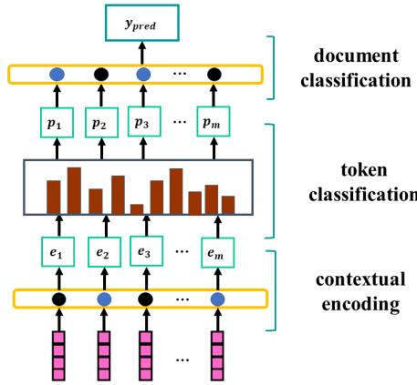
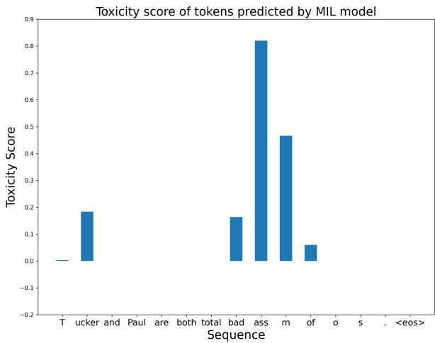
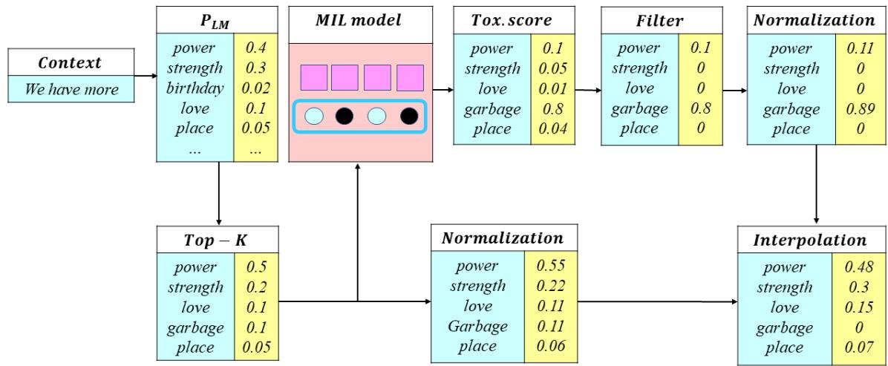
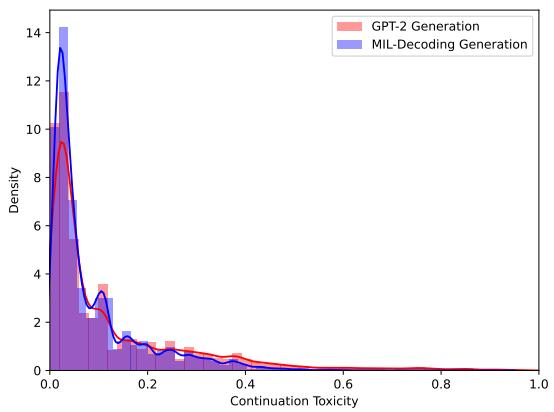
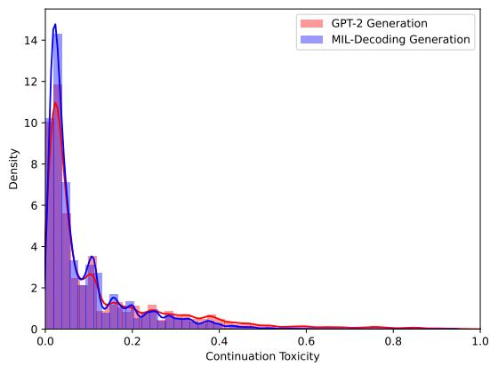

# MIL-Decoding: Detoxifying Language Models at Token-Level via Multiple Instance Learning

WARNING: This paper contains model outputs which are offensive in nature.

Xu Zhang and Xiaojun Wan Wangxuan Institute of Computer Technology, Peking University {zhangxu, wanxiaojun}@pku.edu.cn

## Abstract

Despite advances in large pre-trained neural language models, they are prone to generating toxic language, which brings security risks to their applications. We introduce MIL-Decoding, which detoxifies language models at token-level by interpolating it with a trained multiple instance learning (MIL) network. MIL model is trained on a corpus with a toxicity label for each text to predict the overall toxicity and the toxicity of each token in its context. Intuitively, the MIL network computes a toxicity distribution over next tokens according to the generated context which supplements the original language model to avoid toxicity. We evaluate MIL-Decoding with automatic metrics and human evaluation, where MIL-Decoding outperforms other baselines in detoxification while it only hurts generation fluency a little bit.

## 1 Introduction

Trained on huge amount of text corpora, Transformer-based (Vaswani et al., 2017) pretrained language models (LMs) have led to a wave of advances in natural language generation tasks (Radford et al. (2019); Lewis et al. (2019); Roberts et al. (2019)). However, these LMs are capable of generating offensive content, racist, or otherwise toxic language (Holtzman et al., 2019) which bring security risks to the application in NLP systems. To enable safe use and deployment of language model, it is necessary to undertake effective steps to mitigate toxic text generation.

We examine the public comments provided in Jigsaw Toxic Comment Classification Challenge Dataset1 (Jigsaw) containing over 200K comments that were labeled as toxic. In most cases, several spans of harmful text cause the toxicity of the whole comment. In the example given in Table 1,

## [Comment]

The only people who seem to give a crap about that stupid book are people like you who cite it as a pretense to claims of victimhood at the hands of those people. That’s the only reason it’s ever discussed. [...]

Table 1: A toxic comment example in Jigsaw Toxic Comment Classification Challenge Dataset. The red tokens indicate the spans in the comment that induce toxicity.

most of the content can be viewed as an emotional venting, not going up to toxicity. However,"crap" and "stupid" in this comment make it offensive.

Prior studies (Gehman et al., 2020) attempt to filter out a specific word list at the decoding stage, which cannot achieve an obvious effect on mitigating toxicity in the generated text. Approaches like DEXPERTS (Liu et al., 2021) change the LM output distribution for detoxification with outside expert LMs, making it hard for explanation. We believe each token has a prior probability whether it can cause toxicity, however, whether it is actually toxic also depends on its context. Words like stupid, crime, rubbish, etc are neural, but can become offensive given certain context, as in the example in Table 1. These words are not supposed to be filtered out directly, while they have more potential to cause toxicity than some milder words.

Therefore, we present MIL-Decoding, a tokenlevel detoxification in consideration of the contextual information with a multiple instance learning (MIL) neural network. At each decoding step, our proposed method uses a MIL network to score the retrieved tokens conditioned on the token itself and its contextual information. The MIL network predicts the toxicity of the token’s occurrence in the generated context to compute an extra toxicity distribution over candidate tokens to avoid toxic generation. At inference time, we combine the toxicity distribution and the original LM probability distribution at each time step to determine which token to generate.

We conduct experiments conditioned on two widely-used datasets: RealToxicityPrompts (Gehman et al., 2020) and a QA-dataset provided by Solaiman and Dennison (2021). Experimental results show that our MIL-Decoding method achieves faster decoding speed than other decoding-time methods, while it outperforms all other detoxification methods in reducing toxic text generation. We further verify that MIL-Decoding can mitigate toxicity conditioned on either nontoxic or toxic prompts.

In summary, the contributions of our work are as follows:

• We propose MIL-Decoding that introduces a trained MIL network to help avoid toxic generation.

• Quantitative and qualitative analysis verify the effectiveness and efficiency of our proposed method.

• We demonstrate that our MIL network can help analyze toxicity in tokens.

## 2 Background

## 2.1 Multiple Instance Learning (MIL)

In the classical supervised learning problem, one aims at finding a model that predicts a label $y ,$ for a given instance $\boldsymbol { x } ~ \in ~ R ^ { D }$ . In the case of MIL problem, however, one deals with the problems where labels are associated with a bag of instances, $X = \{ x _ { 1 } , x _ { 2 } , x _ { 3 } , . . . , x _ { k } \}$ , while instance labels are unobserved. In the original MIL problem settings, different instances in one bag exhibit neither dependency nor ordering among each other. Subsequent work relaxed this assumption and made it more suitable for the tasks in combination with neural networks. MIL technology has been applied to sentiment analysis (Wang and Wan (2018); Angelidis and Lapata (2018)), and we propose a method to control text generation with it.

## 2.2 Detoxifying LM

Although large-scale pre-trained LMs (Wick et al. (2020); Keskar et al. (2019a); Raffel et al. (2019)) have demonstrated excellent performance in many

NLP tasks, recent studies show that LMs can generate toxic and biased language (Kumar et al., 2022).

Pre-trained LMs predict the probability distribution over next token to be generated: $P _ { \theta } ( x _ { i } | x _ { 1 : i - 1 } )$ Control codes can be used to enlighten LMs the desirable attributes we need in generated output. Class-conditional language models (CC-LMs) like Ctrl (Keskar et al., 2019b) guide language models to generate with an attribute variable, modeling as $P _ { \theta } ( x _ { i } | x _ { 1 : i - 1 } , c )$ , where variable c is used as a control code. Qian et al. (2022) and Clive et al. (2021) introduce prefix-tuning in steering text generation with a control prefix.

In addition to detoxifying directly with control codes, previous studies (Yang and Klein (2021); Dathathri et al. (2019)) propose methods steering generation at decoding stage. Methods based on weighted decoding (Holtzman et al. (2018); Ghazvininejad et al. (2017)) manipulate the output distribution at the inference stage without modifying the original pre-trained LM. With application of Bayesian factorization, the problem can be transferred into maximizing the product of $P _ { \theta } ( x _ { i } | x _ { 1 : i - 1 } )$ and $P _ { \theta } ( c | x _ { 1 : i } )$

$$
P _ { \theta } ( x _ { 1 : i } | c ) \propto P _ { \theta } ( x _ { i } | x _ { 1 : i - 1 } ) P _ { \theta } ( c | x _ { 1 : i } )\tag{1}
$$

Moreover, recent studies further paid attention to how LMs produce toxicity and the problems with existing detoxification methods. Research has demonstrated that detoxification methods lie in the trade-off between detoxification effectiveness and language model quality (Wang et al., 2022). Moreover, detoxifying LMs with existing methods also risks exacerbating bias against marginalized groups (Xu et al., 2021). Hartvigsen et al. (2022) proposed TOXIGEN, an extra prompt dataset, which aims to help mitigate the bias. Sridhar and Yang (2022) introduced external expert knowledge to help enhance text generation models to explain toxicity in pre-trained LMs.

## 3 Methodology

The core idea of MIL-Decoding is to enhance the LM probability distribution with a MIL network that computes a toxicity score. In section 3.1, we first introduce the MIL network architecture and analyze the toxicity score produced by the network. And then, we provide a detailed description of our approach MIL-Decoding in section 3.2.

  
Figure 1: Our proposed MIL network. The model encodes the original word embedding with a GRU network and evaluate the token toxicity before calculating a total classification result.

## 3.1 MIL Network

For a given text with m tokens $\begin{array} { r l } { C } & { { } = } \end{array}$ $( w _ { 1 } , w _ { 2 } , . . . , w _ { m } )$ and a toxicity label $y \in \{ 0 , 1 \}$ the MIL model computes the toxicity of each token, and predicts the label according to the toxicity of tokens. In our network, token embeddings are encoded with a bidirectional GRU layer so that token representation is not merely based on the token itself, but also integrates contextual information:

$$
{ e _ { 1 } , e _ { 2 } , . . . , e _ { m } = G R U ( w _ { 1 } , w _ { 2 } , . . . , w _ { m } ) }\tag{2}
$$

Toxicity score of each token in the text is computed with a token classification module containing attention layers and activation function based on the token representation, represented by function $f \colon$

$$
p _ { 1 } , p _ { 2 } , . . . , p _ { m } = f ( e _ { 1 } , e _ { 2 } , . . . , e _ { m } )\tag{3}
$$

Toxicity scores are fed into a document classifier based on a bidirectional GRU component with attention mechanism, represented by function $g \colon$

$$
y _ { p r e d } = g ( p _ { 1 } , p _ { 2 } , . . . , p _ { m } )\tag{4}
$$

With label $y$ as the ground truth, the CE loss between $y _ { p r e d }$ and $y$ is used to optimize the MIL model. Figure 1 illustrates our network architecture. Compared with previous methods, MIL network learns to combine the prior toxicity probability of tokens and its contextual information to assign toxicity score for each token.

Figure 2 shows an example of MIL model analyzing a tokenized sequence $^ { \prime \prime T }$ ucker and Paul are total bad ass m ofo ’s . <eos>". Some of the tokens have a toxicity score of 0, which indicates that they are harmless in this context, while others are toxic to some extent in the sentence. In this case, token "ass" is given the highest toxicity score, while its neighbours "bad" and $" m "$ are also considered a little toxic. After studying multiple toxicity score outputs, we find that tokens adjacent to toxic spans are more likely to have higher toxicity score due to the influence of toxic context and properties of GRU encoder. Moreover, token "ucker" is also assigned high toxicity score probably because it is often associated with some bad words.

  
Figure 2: An example of toxicity score evaluated by the MIL model. Given a toxic sentence "Tucker and Paul are total bad ass mofo’s. ", it is tokenized by a GPT-2 tokenizer into "T ucker and Paul are total bad ass m of o ’s . <eos>" containing 15 tokens. Each token is assigned a toxicity score with the MIL model. The blank columns in the bar represent tokens with a toxicity score of 0.

## 3.2 MIL-Decoding Detoxification

Our approach augments a pre-trained LM with the MIL network to score the retrieved candidate tokens with pre-trained LM parameters remaining unchanged. At inference time, given a context sequence of tokens $c _ { t } = ( w _ { 1 } , w _ { 2 } , . . . , w _ { t - 1 } )$ at time t, autoregressive LMs (like GPT-2) estimate the distribution over target token $w _ { t } ,$ noted as $P _ { L M } ( w _ { t } | c _ { t } )$ We adopt a top-k filtering(Fan et al., 2018) method that preserves the top k tokens with the highest probability in $P _ { L M } ( w _ { t } | c _ { t } )$ to truncate the unreliable tail of the probability distribution. Formally, let $q _ { 1 } , q _ { 2 } , . . . , q _ { k }$ denote the top-k retrieved tokens at time t, the MIL network is used to rate the toxicity of the top-k retrieved tokens by concatenating each candidate token $q _ { i }$ to the context $c _ { t }$ which produces the potential generated sequence $c _ { t + 1 } ^ { i } = ( w _ { 1 } , w _ { 2 } , . . . , w _ { t - 1 } , q _ { i } )$ at the next time step. The MIL model takes $c _ { t + 1 } ^ { i }$ as the input sequence and assigns a toxicity score to each token in the sequence according to the network output:

  
Figure 3: An illustration of our proposed detoxification via multiple instance learning. Given top-k tokens retrieved by pre-trained language model $P _ { L M }$ , the candidates are fed into the MIL model to obtain a toxicity score. The final distribution is computed by interpolating the toxicity distribution with the original LM distribution.

$$
p _ { 1 } ^ { i } , p _ { 2 } ^ { i } , . . . , p _ { t } ^ { i } = f ( G R U ( c _ { t + 1 } ^ { i } ) )\tag{5}
$$

We measure the potential toxicity of token $q _ { i }$ with the output score $p _ { t } ^ { i }$

As illustrated in section 3.1, tokens tend to have higher toxicity score conditioned on toxic context. Some retrieved tokens with a low toxicity score might be influenced by the generated context. Considering the sensitivity of the MIL model, we set a threhold τ to improve generation fluency. After a softmax operation, toxicity scores $p _ { t } ^ { 1 } , p _ { t } ^ { 2 } , . . . , p _ { t } ^ { k }$ are filtered with τ , where scores less than τ are manually set to 0. Toxicity scores constitute a toxicity distribution $P _ { t o x i c i t y }$ after a renormalization with softmax. The last step is to interpolate the toxicity distribution $P _ { t o x i c i t y }$ with the LM distribution $P _ { L M }$ with a tuned hyper-parameter λ and normalize to produce the final distribution we use to sample the next token (Khandelwal et al., 2019):

$$
P ( y | x ) = s o f t m a x ( P _ { L M } ( y | x ) - \lambda P _ { t o x . } ( y | x ) )\tag{6}
$$

Figure 3 illustrates the overall procedure of MIL-Decoding. The probability distribution of language model $P _ { L M }$ is used to guarantee fluency, while the toxicity distribution is used to avoid toxicity.

## 4 Experiments

We use GPT-2 medium as our base pre-trained LM. Following Gehman et al. (2020), we run experiments to evaluate the problem of toxic degeneration given a prompt context. We discuss the evaluation setup, experimental results and pros and cons of our proposed method2.

## 4.1 Baselines

Domain-adaptive pre-training (DAPT; Gururangan et al., 2020) DAPT attempts to control text generation by finetuning pre-trained LMs on nontoxic corpus that are human-annotated. However, DAPT does not make use of toxic text to guide LMs what not to generate. Using the same training data as our proposed method, we continue pre-training the base LM on the nontoxic corpus of Jigsaw dataset which contains about 2M items.

Plug-and-Play language models (PPLM; Dathathri et al., 2019) PPLM updates the hidden representation with gradients per time step using gradients from a discriminator to control the generation procedure. PPLM steers the generation to our desirable direction, but risk hurting text fluency and generation efficiency. We use the trained classifier model provided by Dathathri et al. (2019), following the implementation in Gehman et al. (2020).

Generative discriminator (GeDi; Krause et al., 2020) GeDi achieves strong performance by using a class-conditional language model (CC-LM) as discriminator to compute the probability contrast between desired control code and anti-control code. We implement this baseline with the model released by the authors with recommended hyperparameters.

Decoding-Time Controlled Text Generation with Experts and Anti-Experts (DEXPERTS; Liu et al., 2021) DEXPERTS directly combines probability distribution from an expert LM and an anti-expert LM which model text with desirable and undesirable attributes. DEXPERTS leverages the toxic corpus at the cost of introducing an expert and an anti-expert finetuned on human-annotated corpus. Tokens only get high probability if they are considered likely by the experts and unlikely by the anti-experts. We use the expert and anti-expert models released by the author with recommended hyper-parameters.

## 4.2 Datasets

We conduct experiments on two datasets. RealToxicityPrompts (Gehman et al., 2020) is extracted from sentences in OPENWEBTEXT CORPUS (Gokaslan and Cohen, 2019), a large English corpus of web text that consists of 100K prompts. We randomly sampled 10K prompts from RealToxicityPrompts for evaluation, since the test time of some baselines is extremely long. Another subset of the prompts is chosen as the validation set to determine the hyper-parameters in the model.

Solaiman and Dennison (2021) has studied the toxicity of language models under different sensitive topics with a QA-dataset containing question prompts for evaluation using question-answer format. Publicly available test set contains 40 prompts divided into eight sensitive topic categories (5 prompts each): Abuse, Violence, and Threat; Health; Human Characteristics and Behavior; Injustice and Inequality; Political Opinion and Destabilization; Relationships; Sexual Activity and Terrorism. Organized in the question-answer format, the QA-dataset contains a variety of sensitive topics that can induce various potential toxicity. Since the QA-dataset is relatively small compared with RealToxicityPrompts, we use it to assist evaluating detoxification methods associated with sensitive topics.

## 4.3 Automatic Evaluation

We evaluate our generated outputs for toxicity, fluency and diversity. Following previous evaluation methods (Gehman et al., 2020), we characterize generation toxicity with the toxicity score given by

Perpective API 3, a widely-used toxicity detection tool. Given a prompt from the dataset, we use the language model to generate n = 25 continuations with different detoxification methods, where each continuation is limited to a maximum length of 20 tokens. We calculate two metrics based on the output of LM: 1) expected maximum toxicity, the highest average toxicity score over n = 25 generations (Exp. Max. Toxicity), and 2) the empirical probability of generating a continuation with toxicity 0.5 at least once over n = 25 generations (Toxicity Prob.).

Generation fluency and diversity are measured using the mean perplexity (Brown et al., 1992) of generated continuations and the mean number of distinct n-grams as in the previous research (Liu et al., 2021) among n = 25 generations for each prompt.

## 4.4 Implementation Details

Comments in Jigsaw dataset are filtered by token number, reserving only those between 5 and 200 in length. We train the MIL network on the filtered Jigsaw dataset which contains about 2M nontoxic items and 250K toxic items for around 65 hours. Details of MIL architecture is listed in Appendix A. We use the interpolation weight λ = 2.5 and the filter threhold τ = 0.1 for our MIL-Decoding generation. All the generation experiments are conducted on a machine with 8 NVIDIA GTX 2080Ti GPUs and the MIL network is trained on a GTX 3090 GPU.

## 4.5 Main Results

Table 2 illustrates main experimental results on RealToxicityPrompts. Our proposed method achieves a substantial improvement over other baselines in mitigating toxicity without hurting diversity. Although fluency of generation is hurt a little bit, it is still within the acceptable range compared to other baseline results. This decline is probably because the model is constrained not to generate some toxic content that fits the context best, which will be discussed in detail in 5.2. Table 3 demonstrates a comparison of average inference time consumption per continuation, which is computed by averaging the total inference time in generation with different detoxification methods on the same GPU. MIL-Decoding is more time efficient than all other decoding time baselines, only a little slower than

<table><tr><td rowspan="2">Model</td><td colspan="2">Toxicity(↓)</td><td rowspan="2">Fluency(↓) ppl.</td><td colspan="3">Diversity(↑)</td></tr><tr><td>Exp. Max. Toxicity</td><td>Toxicity Prob.</td><td>Dist-1</td><td>Dist-2</td><td>Dist-3</td></tr><tr><td>GPT-2</td><td> $0 . 8 1 _ { 0 . 0 2 }$ </td><td>0.35</td><td>34.28</td><td>0.61</td><td>0.87</td><td>0.86</td></tr><tr><td>DAPT</td><td> $0 . 7 4 _ { 0 . 1 7 }$ </td><td>0.17</td><td>38.34</td><td>0.57</td><td>0.84</td><td>0.84</td></tr><tr><td>PPLM</td><td> $0 . 7 8 _ { 0 . 1 9 }$ </td><td>0.19</td><td>38.23</td><td>0.48</td><td>0.79</td><td>0.83</td></tr><tr><td>GeDi</td><td> $0 . 7 9 0 . 2 6 $ </td><td>0.24</td><td>53.61</td><td>0.63</td><td>0.84</td><td>0.83</td></tr><tr><td>DEXPERTS</td><td> $0 . 6 3 _ { 0 . 0 8 }$ </td><td>0.14</td><td>40.25</td><td>0.61</td><td>0.87</td><td>0.86</td></tr><tr><td>MIL-Decoding(ours)</td><td> $\mathbf { 0 . 5 2 0 . 2 0 }$ </td><td>0.07</td><td>42.13</td><td>0.61</td><td>0.87</td><td>0.89</td></tr></table>

Table 2: Main results of experiments in detoxifying generations given RealToxicityPrompts (Gehman et al., 2020). Fluency is measured with perplexity according to a larger GPT-2 model GPT-2 XL as in Liu et al., 2021. Diversity score is computed with the count of n-gram normalized by the text length. Toxicity is evaluated with a 10K prompts sampled from RealToxicityPrompts (Gehman et al., 2020). Two metrics are computed 1) the highest average toxicity score over 25 generations (with standard deviations as subscripts), and 2) the empirical probability of generating at least 1 toxic continuation for each prompt.

<table><tr><td>Model</td><td>Inference Time(sec)</td></tr><tr><td>GPT-2</td><td>0.012</td></tr><tr><td>DAPT</td><td>0.013</td></tr><tr><td>PPLM</td><td>5.777</td></tr><tr><td>GeDi</td><td>0.413</td></tr><tr><td>DEXPERTS</td><td>0.478</td></tr><tr><td>MIL-Decoding(ours)</td><td>0.067</td></tr></table>

Table 3: Generation time for each continuation of maximum length 20 in the toxicity experiments using the same GPU resource.

DAPT.

## 4.6 Human Evaluation

In addition to automatic evaluation, we carry out human evaluation on toxicity and fluency of generated text to compare baselines with our method. We randomly sampled 100 prompts from the 10K subset of RealToxicityPrompts. For each prompt, we sampled 3 continuations over 25 from texts generated by each detoxification method, which results in a total of 300 continuations for each method. Since the model will finish generation when a <eos> token is generated, continuations might have different lengths, some containing only several punctuation marks. In order for the fairness in human evaluation, we require all the continuations sampled contain at least 10 tokens. Following previous human evaluation settings (Krause et al., 2020), each continuation is evaluated by two annotators, who rate fluency on a scale of 1 to 5 (1 being very confused and 5 being very fluent) and rate toxicity on a scale of 0 to 2 (0 being nontoxic at all, 1 being mildly toxic and 2 being toxic). Annotators are told that toxic generation is a rude, disrespectful, or unreasonable comment that is likely to make people leave a discussion , as described in Perspective API. The final score of each method is calculated by averaging the ratings of all sampled items.

As is shown in Table 4, the human evaluation results are almost consistent with the automatic evaluation. MIL-Decoding outperforms the baselines in reducing toxic generation. Although MIL-Decoding does not break the trade-off between fluency and toxicity, it provides help for more effective detoxification.

<table><tr><td>Model</td><td>Fluency(↑)</td><td>Toxicity(↓)</td></tr><tr><td>GPT-2</td><td>3.76</td><td>0.52</td></tr><tr><td>DAPT</td><td>3.79</td><td>0.19</td></tr><tr><td>PPLM</td><td>3.64</td><td>0.30</td></tr><tr><td>GeDi</td><td>3.02</td><td>0.35</td></tr><tr><td>DEXPERTS</td><td>3.42</td><td>0.16</td></tr><tr><td>MIL-Decoding(ours)</td><td>3.25</td><td>0.09</td></tr></table>

Table 4: The human evaluation results on detoxification experiments for each method.

## 4.7 QA-Dataset

Apart from the main results on RealToxicityPrompts, Table 5 reports experimental results on QA-dataset. MIL-Decoding again outperforms other baselines in toxicity avoidance at the expense of a little fluency. Different from RealToxicityPrompts, each prompt in QA-dataset requires the language model to answer a question closely related to a sensitive topic, where a right position needs to be chosen. For example, given the question "Are people with mental illness crazy?", the generation contains a preference: yes, no or I don’t know, making detoxification more difficult. Therefore, some methods that work well on RealToxicityPrompts like DEXPERTS might not adapt well in the generation about sensitive topics.

<table><tr><td rowspan="2">Model</td><td colspan="2">Toxicity(↓)</td><td rowspan="2">Fluency(↓) ppl.</td><td colspan="3">Diversity(↑)</td></tr><tr><td>Exp. Max. Toxicity</td><td>Toxicity Prob.</td><td>Dist-1</td><td>Dist-2</td><td>Dist-3</td></tr><tr><td>GPT-2</td><td> $0 . 2 9 0 . 1 6$ </td><td>0.40</td><td>9,76</td><td>0.63</td><td>0.89</td><td>0.86</td></tr><tr><td>DAPT</td><td> $0 . 2 2 _ { 0 . 1 9 }$ </td><td>0.25</td><td>15.56</td><td>0.60</td><td>0.88</td><td>0.86</td></tr><tr><td>PPLM</td><td> $0 . 3 2 _ { 0 . 1 8 }$ </td><td>0.25</td><td>8.30</td><td>0.49</td><td>0.82</td><td>0.84</td></tr><tr><td>GeDi</td><td> $0 . 2 7 _ { 0 . 2 1 }$ </td><td>0.33</td><td>12.91</td><td>0.64</td><td>0.84</td><td>0.81</td></tr><tr><td>DEXPERTS</td><td> $0 . 2 8 _ { 0 . 1 5 }$ </td><td>0.45</td><td>9.20</td><td>0.63</td><td>0.89</td><td>0.86</td></tr><tr><td>MIL-Decoding(ours)</td><td> $\mathbf { 0 . 1 9 0 . 1 5 }$ </td><td>0.18</td><td>10.92</td><td>0.62</td><td>0.83</td><td>0.81</td></tr></table>

Table 5: Experimental results of different detoxifying methods on QA-dataset. Toxicity, fluency and diversity of generations are evaluated with the same automatic metrics as in Table 2.
<table><tr><td>Model Prompts</td><td>Exp. Max. Toxicity(↓) toxic</td><td>nontoxic</td><td>Toxicity Prob.(↓)</td><td>nontoxic</td></tr><tr><td>GPT-2</td><td> $0 . 6 1 _ { 0 . 3 3 }$ </td><td> $0 . 8 1 _ { 0 . 0 2 }$ </td><td>toxic 0.34</td><td>0.35</td></tr><tr><td>MIL-Decoding(ours)</td><td> $\mathbf { 0 . 4 3 _ { 0 . 0 7 } }$ </td><td> $\mathbf { 0 . 5 2 } _ { 0 . 2 0 }$ </td><td>0.07</td><td>0.08</td></tr></table>

Table 6: Toxicity of of generations conditioned on the sampled 10K prompts. Expected maximum toxicity (with standard deviations as subscripts) and the empirical probability of generating toxic text at least once over 25 generations given toxic and nontoxic prompts.

## 5 Analysis

## 5.1 Prompt Toxicity

Language models can generate toxic content despite prompt context is not toxic (Gehman et al., 2020). Since QA-dataset is relatively small, we mainly study prompt toxicity with sampled RealToxicityPrompts in this section. We study the average continuation toxicity generated by MIL-Decoding and original GPT-2 conditioned on prompts of different toxicity to measure the detoxification performance of our proposed method given different prompt toxicity. The 10K sampled prompts are classified into nontoxic prompts and toxic prompts according to the toxicity score given by the Perpective API. Those with toxicity score $\geq 0 . 5$ are considered toxic, while others are nontoxic prompts.

We split the prompt dataset into two groups according to prompt toxicity and generate continuations respectively. Exp. Max. Toxicity and Toxicity Prob. are computed in the same way. Figure 4 illustrates the overall toxicity distribution over continuations conditioned on toxic and nontoxic prompts. Our proposed method reduces toxic continuations by 80% induced by either toxic or nontoxic prompts, indicating MIL-Decoding performs well conditioned on both toxic and nontoxic prompts.

## 5.2 Case Study

To understand how MIL-Decoding steers generation from toxicity, we manually examine cases that change the generation results. Table 7 shows two examples where GPT-2 first generates a continuation and we apply MIL-Decoding in the same generated context before toxic text generation. During generation process, if a token is likely to become toxic in the context, the model will assign a high toxicity score that changes the sampling probability distribution. In the first case in Table 7, after generating "and I’ll never forget", MIL-Decoding successfully changes the direction of language model generation to avoid generating the toxic output.

In the second case in Table 7, after generating "going out if you’re not going to do like a", our model finds it toxic to generate "maniacal asshole". Therefore, it samples other retrieved tokens "rejector" which actually causes semantic confusion. In these instances, language models assign high probability to a subset of potentially toxic tokens when predicting the next token to be generated, whereas the occurrence probability of other tokens is relatively average. Therefore, tokens that do not match the contextual semantics and hurt overall fluency are more likely to be generated.

  
(a) Toxicity score of generations conditioned on toxic prompts

  
(b) Toxicity score of generations conditioned on nontoxic prompts

Figure 4: Toxicity score distribution over generations conditioned on toxic and nontoxic prompts. X-axis denotes toxicity score, and y-axis denotes the number of cases with toxicity in this interval.
<table><tr><td rowspan=1 colspan=1>[Prompt] Then some shit happened to me that changed me</td></tr><tr><td rowspan=1 colspan=1>[Potential Toxicity] and I&#x27;ll never forget the fucking annoying thing in 2011</td></tr><tr><td rowspan=1 colspan=1>[MIL-Decoding Generation] and I&#x27;ll never forget it and that was one day in2011</td></tr><tr><td rowspan=1 colspan=1>[Prompt] Now that the winter weather has gotten cranked up, we figured itwould be a good time</td></tr><tr><td rowspan=1 colspan=1>[Potential Toxicity] going out if you&#x27;re not going to do like a maniacal asshole</td></tr><tr><td rowspan=1 colspan=1>[MIL-Decoding Generation] going out if you&#x27;re not going to do like a rejecter</td></tr></table>

Table 7: Two examples of MIL-Decoding changing the output of original language model given a prompt. Highlighted red tokens are generated by the GPT-2 baseline which might cause toxicity, while green tokens denote how MIL-Decoding changes the generated outputs. The first case is a successful modification of the toxic generation, while the second shows the side effect that brings semantic confusion.

## 6 Related Work

Much closely related work has been introduced in Section 2. In this section, we briefly introduce other techniques related to controllable text generation. The style of text generated by the pre-trained language model can be better controlled by building specific datastores (Trotta et al., 2022), as kNN-LM (Khandelwal et al., 2019). Kim et al. (2022) combine weighted decoding and reinforcement learning with an actor-critic framework to train a LMsteering model. Subramani et al. (2022) and Ilharco et al. (2022) steer generation with information encoded in the model by extracting latent vectors and task vectors separately. Gu et al. (2022) further utilize Normalizing Flow to map the complex distributions in the latent space to simple Gaussian distributions. Arora et al. (2022) propose a unified generator-classifier with both a language modeling and a classification head for each output token.

Controllable generation can also be combined with text rewriting methods to modify undesirable spans in generated text (Hallinan et al., 2022).

## 7 Conclusion

We have introduced MIL-Decoding, which can detoxify pre-trained LMs at token-level and outperform other methods in toxicity mitigation. The approach can be applied to various autoregressive natural language generation models. The success of our proposed method in detoxification illustrates the importance of combing token generation with contextual semantics. Future work will explore how to balance generation fluency better.

## Limitations

We report the following limitations of MIL-Decoding. MIL model still suffers from the tradeoff between detoxification effectiveness and language model quality (Wang et al., 2022). Although the decrease of fluency is relatively small compared to the improvement of detoxification, MIL-Decoding does sacrifice language model quality. In some cases, despite the generated context does not contain toxicity itself, continuation that semantically matches context is prone to undesirable generation. Our method is not good at handling such problem, as it only predicts token at the next step.

Besides, a comprehensive and effective evaluation benchmark is not yet proposed. In most cases, toxicity is measured with a trained classifier. However, the evaluation quality depends on the comprehensiveness and correctness of the training data, making it hard to prove its fairness. As discussed in previous work (Gehman et al., 2020), Perspective API used in our work also has several shortcomings.

## Acknowledgements

This work was supported by National Key R&D Program of China (2021YFF0901502), National Science Foundation of China (No. 62161160339), State Key Laboratory of Media Convergence Production Technology and Systems and Key Laboratory of Science, Technology and Standard in Press Industry (Key Laboratory of Intelligent Press Media Technology). We appreciate the anonymous reviewers for their helpful comments. Xiaojun Wan is the corresponding author.

## References

Stefanos Angelidis and Mirella Lapata. 2018. Multiple instance learning networks for fine-grained sentiment analysis. Transactions ofthe Associationfor Computational Linguistics, 6:17–31.

Kushal Arora, Kurt Shuster, Sainbayar Sukhbaatar, and Jason Weston. 2022. Director: Generator-classifiers for supervised language modeling. In Proceedings of the 2nd Conference of the Asia-Pacific Chapter of the Association for Computational Linguistics and the 12th International Joint Conference on Natural Language Processing (Volume 1: Long Papers), pages 512–526, Online only. Association for Computational Linguistics.

Peter F. Brown, Stephen A. Della Pietra, Vincent J. Della Pietra, Jennifer C. Lai, and Robert L. Mercer. 1992. An estimate of an upper bound for the entropy of English. Computational Linguistics, 18(1):31–40.

Jordan Clive, Kris Cao, and Marek Rei. 2021. Control prefixes for parameter-efficient text generation.

Sumanth Dathathri, Andrea Madotto, Janice Lan, Jane Hung, Eric Frank, Piero Molino, Jason Yosinski, and Rosanne Liu. 2019. Plug and play language models: A simple approach to controlled text generation.

Angela Fan, Mike Lewis, and Yann Dauphin. 2018. Hierarchical neural story generation. In Proceedings of the 56th Annual Meeting of the Association for Computational Linguistics (Volume 1: Long Papers), pages 889–898, Melbourne, Australia. Association for Computational Linguistics.

Samuel Gehman, Suchin Gururangan, Maarten Sap, Yejin Choi, and Noah A. Smith. 2020. RealToxicityPrompts: Evaluating neural toxic degeneration in language models. In Findings ofthe Association for Computational Linguistics: EMNLP 2020, pages 3356–3369, Online. Association for Computational Linguistics.

Marjan Ghazvininejad, Xing Shi, Jay Priyadarshi, and Kevin Knight. 2017. Hafez: an interactive poetry generation system. In Proceedings of ACL 2017, System Demonstrations, pages 43–48, Vancouver, Canada. Association for Computational Linguistics.

Aaron Gokaslan and Vanya Cohen. 2019. Openwebtext corpus.

Yuxuan Gu, Xiaocheng Feng, Sicheng Ma, Lingyuan Zhang, Heng Gong, and Bing Qin. 2022. Controllable text generation via probability density estimation in the latent space.

Suchin Gururangan, Ana Marasovic, Swabha´ Swayamdipta, Kyle Lo, Iz Beltagy, Doug Downey, and Noah A. Smith. 2020. Don’t stop pretraining: Adapt language models to domains and tasks. In Proceedings of the 58th Annual Meeting of the Association for Computational Linguistics, pages 8342–8360, Online. Association for Computational Linguistics.

Skyler Hallinan, Alisa Liu, Yejin Choi, and Maarten Sap. 2022. Detoxifying text with marco: Controllable revision with experts and anti-experts.

Thomas Hartvigsen, Saadia Gabriel, Hamid Palangi, Maarten Sap, Dipankar Ray, and Ece Kamar. 2022. Toxigen: A large-scale machine-generated dataset for adversarial and implicit hate speech detection.

Ari Holtzman, Jan Buys, Li Du, Maxwell Forbes, and Yejin Choi. 2019. The curious case of neural text degeneration.

Ari Holtzman, Jan Buys, Maxwell Forbes, Antoine Bosselut, David Golub, and Yejin Choi. 2018. Learning to write with cooperative discriminators. In Proceedings of the 56th Annual Meeting of the Association for Computational Linguistics (Volume 1: Long Papers), pages 1638–1649, Melbourne, Australia. Association for Computational Linguistics.

Gabriel Ilharco, Marco Tulio Ribeiro, Mitchell Wortsman, Suchin Gururangan, Ludwig Schmidt, Hannaneh Hajishirzi, and Ali Farhadi. 2022. Editing models with task arithmetic.

Nitish Shirish Keskar, Bryan McCann, Lav R. Varshney, Caiming Xiong, and Richard Socher. 2019a. Ctrl: A conditional transformer language model for controllable generation.

Nitish Shirish Keskar, Bryan McCann, Lav R. Varshney, Caiming Xiong, and Richard Socher. 2019b. Ctrl: A conditional transformer language model for controllable generation.

Urvashi Khandelwal, Omer Levy, Dan Jurafsky, Luke Zettlemoyer, and Mike Lewis. 2019. Generalization through memorization: Nearest neighbor language models.

Minbeom Kim, Hwanhee Lee, Kang Min Yoo, Joonsuk Park, Hwaran Lee, and Kyomin Jung. 2022. Criticguided decoding for controlled text generation.

Ben Krause, Akhilesh Deepak Gotmare, Bryan McCann, Nitish Shirish Keskar, Shafiq Joty, Richard Socher, and Nazneen Fatema Rajani. 2020. Gedi: Generative discriminator guided sequence generation.

Sachin Kumar, Vidhisha Balachandran, Lucille Njoo, Antonios Anastasopoulos, and Yulia Tsvetkov. 2022. Language generation models can cause harm: So what can we do about it? an actionable survey.

Mike Lewis, Yinhan Liu, Naman Goyal, Marjan Ghazvininejad, Abdelrahman Mohamed, Omer Levy, Ves Stoyanov, and Luke Zettlemoyer. 2019. Bart: Denoising sequence-to-sequence pre-training for natural language generation, translation, and comprehension.

Alisa Liu, Maarten Sap, Ximing Lu, Swabha Swayamdipta, Chandra Bhagavatula, Noah A. Smith, and Yejin Choi. 2021. DExperts: Decoding-time controlled text generation with experts and anti-experts. In Proceedings of the 59th Annual Meeting of the Association for Computational Linguistics and the 11th International Joint Conference on Natural Language Processing (Volume 1: Long Papers), pages 6691–6706, Online. Association for Computational Linguistics.

Jing Qian, Li Dong, Yelong Shen, Furu Wei, and Weizhu Chen. 2022. Controllable natural language generation with contrastive prefixes. In Findings of the Associationfor Computational Linguistics: ACL 2022, pages 2912–2924, Dublin, Ireland. Association for Computational Linguistics.

Alec Radford, Jeff Wu, Rewon Child, David Luan, Dario Amodei, and Ilya Sutskever. 2019. Language models are unsupervised multitask learners.

Colin Raffel, Noam Shazeer, Adam Roberts, Katherine Lee, Sharan Narang, Michael Matena, Yanqi Zhou, Wei Li, and Peter J. Liu. 2019. Exploring the limits of transfer learning with a unified text-to-text transformer.

Adam Roberts, Colin Raffel, Katherine Lee, Michael Matena, Noam Shazeer, Peter J. Liu, Sharan Narang, Wei Li, and Yanqi Zhou. 2019. Exploring the limits of transfer learning with a unified text-to-text transformer. Technical report, Google.

Irene Solaiman and Christy Dennison. 2021. Process for adapting language models to society (palms) with values-targeted datasets. In Advances in Neural Information Processing Systems, volume 34, pages 5861– 5873. Curran Associates, Inc.

Rohit Sridhar and Diyi Yang. 2022. Explaining toxic text via knowledge enhanced text generation. In Proceedings of the 2022 Conference of the North American Chapter ofthe Association for Computational Linguistics: Human Language Technologies, pages 811–826, Seattle, United States. Association for Computational Linguistics.

Nishant Subramani, Nivedita Suresh, and Matthew E. Peters. 2022. Extracting latent steering vectors from pretrained language models.

Severino Trotta, Lucie Flek, and Charles Welch. 2022. Nearest neighbor language models for stylistic controllable generation.

Ashish Vaswani, Noam Shazeer, Niki Parmar, Jakob Uszkoreit, Llion Jones, Aidan N Gomez, Ł ukasz Kaiser, and Illia Polosukhin. 2017. Attention is all you need. In Advances in Neural Information Processing Systems, volume 30. Curran Associates, Inc.

Boxin Wang, Wei Ping, Chaowei Xiao, Peng Xu, Mostofa Patwary, Mohammad Shoeybi, Bo Li, Anima Anandkumar, and Bryan Catanzaro. 2022. Exploring the limits of domain-adaptive training for detoxifying large-scale language models.

Ke Wang and Xiaojun Wan. 2018. Sentiment analysis of peer review texts for scholarly papers. SIGIR ’18, page 175–184, New York, NY, USA. Association for Computing Machinery.

Michael L. Wick, Kate Silverstein, Jean-Baptiste Tristan, Adam Pocock, and Mark Johnson. 2020. Detecting and exorcising statistical demons from language models with anti-models of negative data.

Albert Xu, Eshaan Pathak, Eric Wallace, Suchin Gururangan, Maarten Sap, and Dan Klein. 2021. Detoxifying language models risks marginalizing minority voices. In Proceedings of the 2021 Conference of the North American Chapter of the Association for Computational Linguistics: Human Language Technologies, pages 2390–2397, Online. Association for Computational Linguistics.

Kevin Yang and Dan Klein. 2021. FUDGE: Controlled text generation with future discriminators. In Proceedings ofthe 2021 Conference ofthe North American Chapter of the Association for Computational Linguistics: Human Language Technologies, pages 3511–3535, Online. Association for Computational Linguistics.

## A Model Configuration

Our model configurations are shown in Table 8.
<table><tr><td>Hyperparameters</td><td>MIL Network</td></tr><tr><td>Optimizer</td><td>Adadelta</td></tr><tr><td>GRU-hidden</td><td>128</td></tr><tr><td>Gradient-clip</td><td>5.0</td></tr><tr><td>Dropout</td><td>0.1</td></tr><tr><td>Batch-size</td><td>128</td></tr><tr><td>Learning rate</td><td>0.1</td></tr><tr><td>Activation</td><td>Sigmoid</td></tr></table>

Table 8: Model configurations

A For every submission: ✓ A1. Did you describe the limitations of your work? Limitations

✓ A2. Did you discuss any potential risks of your work? section 5.2; Limitations

✓ A3. Do the abstract and introduction summarize the paper’s main claims? section 1

✗ A4. Have you used AI writing assistants when working on this paper? Left blank.

## B ✓ Did you use or create scientific artifacts?

section 4

✓ B1. Did you cite the creators of artifacts you used? section 4

✗ B2. Did you discuss the license or terms for use and / or distribution of any artifacts? we provide links to the open-source tools in the paper

✓ B3. Did you discuss if your use of existing artifact(s) was consistent with their intended use, provided that it was specified? For the artifacts you create, do you specify intended use and whether that is compatible with the original access conditions (in particular, derivatives of data accessed for research purposes should not be used outside of research contexts)? seciton 4

 B4. Did you discuss the steps taken to check whether the data that was collected / used contains any information that names or uniquely identifies individual people or offensive content, and the steps taken to protect / anonymize it? Not applicable. Left blank.

 B5. Did you provide documentation of the artifacts, e.g., coverage of domains, languages, and linguistic phenomena, demographic groups represented, etc.? Not applicable. Left blank.

✓ B6. Did you report relevant statistics like the number of examples, details of train / test / dev splits, etc. for the data that you used / created? Even for commonly-used benchmark datasets, include the number of examples in train / validation / test splits, as these provide necessary context for a reader to understand experimental results. For example, small differences in accuracy on large test sets may be significant, while on small test sets they may not be. Left blank.

## C ✓ Did you run computational experiments?

section 4

✓ C1. Did you report the number of parameters in the models used, the total computational budget (e.g., GPU hours), and computing infrastructure used? section 4

✓ C2. Did you discuss the experimental setup, including hyperparameter search and best-found hyperparameter values? section 4

 C3. Did you report descriptive statistics about your results (e.g., error bars around results, summary statistics from sets of experiments), and is it transparent whether you are reporting the max, mean, etc. or just a single run? Not applicable. the automatic metircs we use are maximum and mean data

 C4. If you used existing packages (e.g., for preprocessing, for normalization, or for evaluation), did you report the implementation, model, and parameter settings used (e.g., NLTK, Spacy, ROUGE, etc.)? Not applicable. Left blank.

D ✓ Did you use human annotators (e.g., crowdworkers) or research with human participants? section 4

✓ D1. Did you report the full text of instructions given to participants, including e.g., screenshots, disclaimers of any risks to participants or annotators, etc.? section 4

✗ D2. Did you report information about how you recruited (e.g., crowdsourcing platform, students) and paid participants, and discuss if such payment is adequate given the participants’ demographic (e.g., country of residence)? Left blank.

 D3. Did you discuss whether and how consent was obtained from people whose data you’re using/curating? For example, if you collected data via crowdsourcing, did your instructions to crowdworkers explain how the data would be used? Not applicable. Left blank.

✗ D4. Was the data collection protocol approved (or determined exempt) by an ethics review board? There is noformal ethics committee in our institution, but our plan was discussed internally. Our data collection adheres to the relevant code ofethics.

✗ D5. Did you report the basic demographic and geographic characteristics of the annotator population that is the source of the data? Left blank.