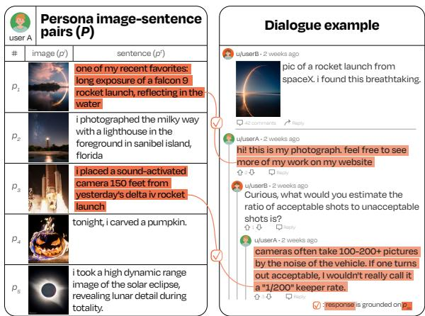
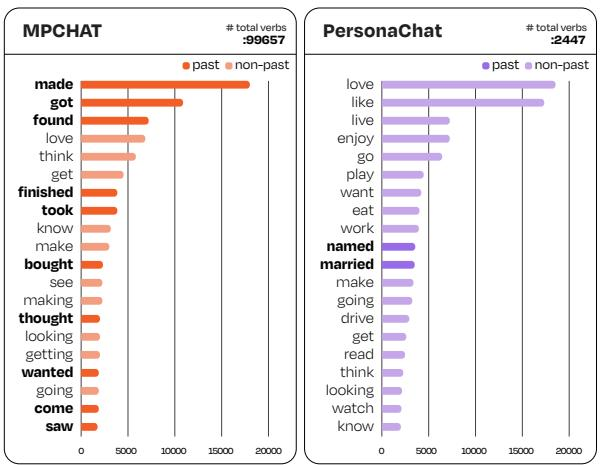
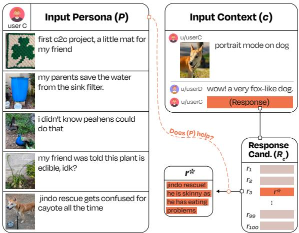
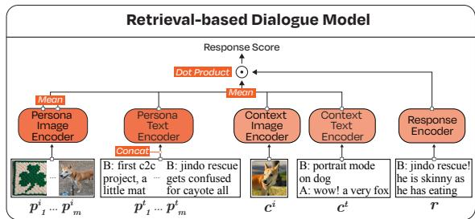
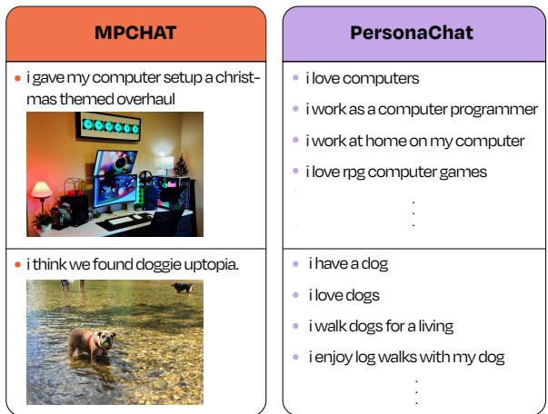
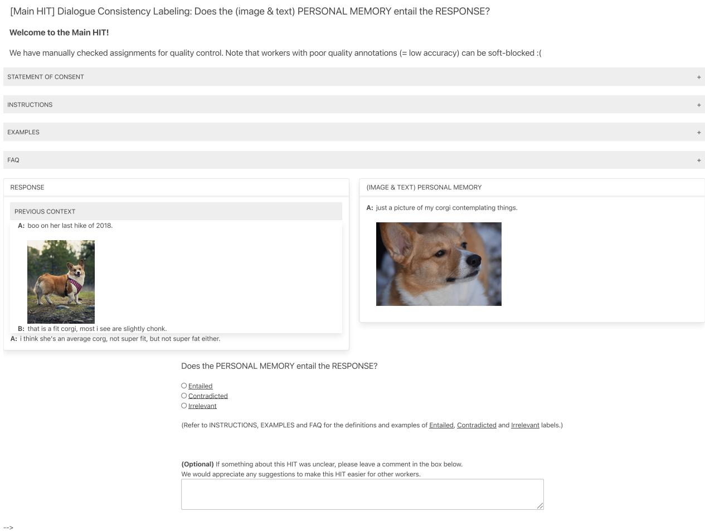
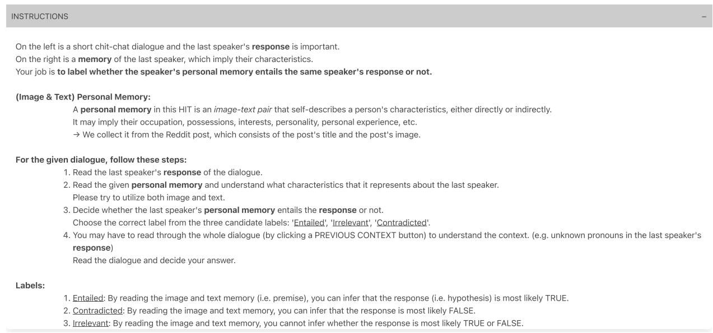

# MPCHAT: Towards Multimodal Persona-Grounded Conversation

Jaewoo Ahn1 Yeda Song1

Sangdoo Yun2,1 Gunhee Kim1

1Seoul National University

2NAVER AI Lab

{jaewoo.ahn,yeda.song}@vision.snu.ac.kr, sangdoo.yun@navercorp.com, gunhee@snu.ac.kr http://vision.snu.ac.kr/projects/mpchat

## Abstract

In order to build self-consistent personalized dialogue agents, previous research has mostly focused on textual persona that delivers personal facts or personalities. However, to fully describe the multi-faceted nature of persona, image modality can help better reveal the speaker’s personal characteristics and experiences in episodic memory (Rubin et al., 2003; Conway, 2009). In this work, we extend persona-based dialogue to the multimodal domain and make two main contributions. First, we present the first multimodal persona-based dialogue dataset named MPCHAT, which extends persona with both text and images to contain episodic memories. Second, we empirically show that incorporating multimodal persona, as measured by three proposed multimodal persona-grounded dialogue tasks (i.e., next response prediction, grounding persona prediction, and speaker identification), leads to statistically significant performance improvements across all tasks. Thus, our work highlights that multimodal persona is crucial for improving multimodal dialogue comprehension, and our MPCHAT serves as a high-quality resource for this research.

## 1 Introduction

With the rapid advance of conversational AI systems in recent years, developing self-consistent dialogue agents has been studied much (Li et al., 2016; Zhang et al., 2018). Considerable research aims to endow dialogue agents with persona, which represents an individual’s personality (Zhong et al., 2022; Cao et al., 2022). In particular, researchers have exploited textual description of persona, for example, in the form of unstructured sentences (Mazaré et al., 2018), structured key-value attributes (e.g., age, gender, location) (Song et al., 2020) and personality types (e.g., Big-Five) (Mairesse and Walker, 2007). Therefore, dialogue agents with persona have been found to (1) exhibit greater self-consistency (Welleck et al., 2019; Kim et al., 2020; Majumder et al., 2020), (2) demonstrate awareness of long-term memory (Xu et al., 2022a,b; Bae et al., 2022), and (3) generate engaging responses instead of non-specific ones (Zhang et al., 2018; Mazaré et al., 2018).

  
Figure 1: An example of MPCHAT: a user A’s persona (i.e., five persona image-sentence pairs) in the left and a dialogue example in the right. Each persona element p consists of a pair of an image $p ^ { i }$ and a sentence $p ^ { t }$ . Each response from the user A in the dialogue example is grounded on a specific persona element $p _ { m } .$ Multimodal personas from MPCHAT describe episodic memories of personal experiences (e.g., favorite rockets and constellations) with visual details.

However, existing studies restrict the role of persona only to personal facts (Zhang et al., 2018) or personalities (Li et al., 2020a), while it should be explored in multi-faceted ways (Moore et al., 2017). More than factual information, episodic memory (Tulving, 1972), which is the memory of everyday events or personal experiences connected to the self and autonoetic consciousness (Tulving, 2002; Conway, 2005), should be included in persona component. Wilson and Ross (2003) further supports this assertion by arguing that episodic memory plays a significant role in shaping personal identity, which in turn can influence one’s persona. Since episodic memories are often represented in the form of visual images or history scenes (Rubin et al., 2003; Conway, 2009), we propose to study the multimodal persona, which consists of a set of image-sentence pairs describing memorable moments as shown in Figure 1. Furthermore, visual information can complement textual information, which often lacks an explicit description of appearance or measurable quantities (Jin et al., 2022; Zhang et al., 2022).

In this work, we contribute to the personabased dialogue research in two important ways. First, we introduce a new multimodally personalized dialogue dataset named Multimodal Persona Chat (MPCHAT), where personas reveal speakers episodic-memories using both text and images. To the best of our knowledge, MPCHAT is the first dataset that supports multimodal persona in dialogue. To collect episodic-memory-based multimodal personas, we source users’ posts from social media Reddit. We carefully design a pipeline to curate multimodal conversation data that are wellgrounded on multimodal personas1.

Second, based on MPCHAT, we propose three retrieval-based dialogue tasks as benchmarks for multimodal persona-grounded dialogue understanding: next response prediction, grounding persona prediction, and speaker identification. By incorporating our proposed multimodal persona, we observe statistically significant performance improvements across all tasks.

Consequently, our work illustrates the significance of multimodal persona in enhancing multimodal dialogue comprehension, and our MPCHAT provides a valuable resource for the research, given its well-grounded dialogues (especially responses) on multimodal personas.

## 2 Related Work

Personalized dialogue. Personalized dialogue agents have exploited persona in the form of unstructured sentences (Zhang et al., 2018; Zhong et al., 2020), structured key-value attributes (Qian et al., 2018; Zheng et al., 2019), and personality types (Mairesse and Walker, 2007; Wen et al., 2021). Persona in these works reveals only personal facts (e.g., age, gender, job, location, hobby)

or personalities (e.g., Big-Five, MBTI) in the textual format. Instead, we focus on an episodicmemory-based persona describing diverse, memorable moments of personal experiences (Schacter et al., 2009) using both sentences and images.

Multimodal datasets. To fuse visual and textual modalities, various works have been conducted on building datasets of paired images and text (Ordonez et al., 2011; Lin et al., 2014; Krishna et al., 2017; Sharma et al., 2018; Shao et al., 2019; Kuznetsova et al., 2020) and multimodal models (Lu et al., 2019; Li et al., 2020b, 2021). In these datasets, text tends to explicitly describe the paired images (e.g., image captioning and visual question answering) in a short sentence. On the other hand, Desai et al. (2021) released RedCaps, whose image-sentence pairs are sourced from social media Reddit and whose text captions are more conversational and diverse than existing datasets. We use Reddit to source image-sentence pairs as multimodal persona, but we build a new multi-turn dialogue dataset, MPCHAT, to extend the role of persona to reflect episodic memories and further explore multimodal dialogue comprehension in personalized dialogue.

Multimodal dialogue. Research on multimodal (or image-grounded) dialogue has focused on understanding images and utterances in a contextaware manner (Mostafazadeh et al., 2017; Das et al., 2017; Shuster et al., 2020; Zheng et al., 2021; Zang et al., 2021; Lee et al., 2021). Simple retrieval dialogue agents (Shuster et al., 2020; Lee et al., 2021), which fuse textual and visual features, have been used to produce image-grounded responses. MPCHAT also consists of images and dialogues, but we utilize multimodal persona to produce both image-grounded and persona-grounded responses.

## 3 The MPCHAT Dataset

We collect a multimodal persona-grounded dialogue dataset named MPCHAT (Multimodal Persona Chat). The objective of MPCHAT is to help a conversational agent utilize its episodicmemory-based persona, consisting of both linguistic and visual information, to produce personagrounded responses. To cover a wide range of episodic-memory-based multimodal persona, we source posts from social media Reddit.

However, dialogue with a multimodal persona introduces two new challenges. First, it is harder to collect persona image-sentence pairs than to collect personas sentences. Second, it is also difficult to collect dialogue instances grounded on speakers’ multimodal personas since each utterance should be grounded on not only persona sentences but also persona images, which may require more finegrained information with additional commonsense knowledge (Cui et al., 2020; Liu et al., 2022). To overcome these challenges, we design the process of data construction as follows.

## 3.1 Collecting Multimodal Persona

Following RedCaps (Desai et al., 2021), we manually curate a set of subreddits with a high proportion of image posts, where images are photographed by Reddit users themselves, and post titles are related to the image content. In total, we use 648 subreddits, whose full list can be found in Appendix E.1. We then download all image posts from the selected subreddits. We intend to define a user’s multimodal persona as m number of image-sentence pairs where m is the number of the user’s posts. Thus, we group the downloaded posts according to users, and transform each post into a pair of one image and one sentence using (1) a rule-based method and (2) a model-based method as follows.

Rule-based lexical method. We use the post title as the persona sentence. If the title consists of multiple sentences, we select only the first one as done in Mazaré et al. (2018).We then retain the sentences that satisfy all the following rules: (1) each sentence must contain between 4 and 20 words, (2) it contains either the word I or my, and it consists of (3) at least one verb, (4) at least one noun or adjective, and (5) at least one content word. With this method, we improve the fluency and expressiveness of the persona sentences.

Model-based semantic method. After obtaining image-sentence pairs, we ensure that the image is semantically relevant to its paired sentence. We leverage the pretrained CLIP-ViT-B/32 (Radford et al., 2021) to calculate semantic similarity between the image and the sentence, which is widely used in past research (Hessel et al., 2021; Cho et al., 2022; Frans et al., 2022). Then, we ignore the pair with a cosine similarity less than 0.

Finally, we follow Desai et al. (2021) to avoid potential ethical risks of curating Internet-scale image datasets. See Appendix A.4 for the details of our ethical considerations. As a result, about 10% of downloaded posts are used to make multimodal personas, and the others can be exploited for dia-

logue data.

## 3.2 Collecting Dialogues

Once we obtain a set of users’ multimodal personas, we collect dialogue data where the users participate in the conversation. Discussions on Reddit consist of threads, each with one post and multiple comments, as shown in Figure 1. From the curated subreddits in Appendix E.2, we collect threads containing the comments the users wrote with multimodal persona. We exclude the threads used to make multimodal personas in § 3.1 to ensure that the source of persona is disjoint with that of conversation. We iteratively trace the parent comment nodes in threads until the root node appears, finding the post and all its comments before the persona user’s comment that constitutes a single conversation data. Therefore, in each dialogue data, the last utterance spoken by the persona user becomes the response, and all previous comments and the image post become the context. We set the maximum number of turns in the context to 20.

We filter out dialogues where a user’s response is posted earlier than the user’s persona posts since the episodic-memory persona should chronologically precede the user’s response. We additionally filter dialogues as explained in Appendix A.1.

## 3.3 Grounding Persona on Dialogues

To ensure persona-consistency, the user’s response in dialogue should be well grounded on his or her multimodal persona. Otherwise, it is impossible for an algorithm (or even a human) to correctly predict the response based on the persona, which may undermine the usefulness of our dataset.

We automatically filter out the conversations whose responses have no persona-related information by employing (1) heuristic rules and (2) pretrained models (Reimers and Gurevych, 2019; Radford et al., 2021); see Appendix A.2 for details.

Despite the effectiveness of the automatic filtering process, we empirically find that some responses are still not grounded on persona since the pretrained models used for automatic filtering are not perfect. According to Welleck et al. (2019), identifying an utterance grounded on (i.e., consistent with) a persona sentence can be reduced to a natural language inference (NLI) task. Thus, we conduct additional human NLI annotation to make sure that the user’s response is grounded on the multimodal persona.

In our NLI setting, the premise $p = ( p ^ { i } , p ^ { t } )$ is a persona image-sentence pair among the speaker’s multimodal persona set $P = \{ p _ { 1 } , . . . , p _ { m } \}$ , and the hypothesis r is the response in conversation from the same speaker. The goal is to perform a binary classification for a pair $( r , p )$ : (1) ENTAILED if there is enough evidence in $p = ( p ^ { i } , p ^ { t } )$ to conclude that r is most likely true. (2) NOT ENTAILED if (i) there is enough evidence in p to conclude that r is most likely false, or (ii) there is not enough evidence in p to draw a conclusion about r.

We annotate entailment labels from human workers via Amazon Mechanical Turk (Mturk). To reduce the label costs, we only collect entailment labels for at most two persona elements (among m elements) per response r. See Appendix A.3.2 on how to select the two persona elements.

Given a context $c = ( c ^ { t } , c ^ { i } )$ , response r and a persona image-sentence pair p, we ask three annotators to categorize a pair $( r , p )$ into the two classes. Following previous works (Bowman et al., 2015; Xie et al., 2019), we finalize labels according to the majority vote criterion (at least 2 out of 3). As a result, we obtain the labels for 16,327 pairs from human workers, and 50.4% of them are finally labeled as ENTAILED. We defer the annotations’ details to Appendix A.3.4. The inter-annotator agreement for entailment labels is measured using Krippendorff’s α (Krippendorff, 2011). It is 0.47, implying a good agreement despite the difficulty of the task (Chen et al., 2020; Zhang and de Marneffe, 2021).

## 3.4 Final Multi-turn Dialogue Data

In summary, one dialogue consists of the response as the last utterance spoken by the persona speaker and the context as all prior utterances from the Reddit post. We then construct a multi-turn dialogue by merging the dialogues sharing common threads (i.e., multiple responses by persona users exist in a single dialogue). Finally, we have 7,898 multiturn dialogue data whose responses are ENTAILED with (or grounded on) the persona (i.e., at least one persona element-response pair is labeled as ENTAILED). Also, we add a similar amount of dialogue data whose responses are grounded on no persona element, since the dataset should be able to evaluate whether the method can correctly identify no grounding. It also follows persona-sparse real-world conversations (Zheng et al., 2020) that contain a limited amount of dialogues grounded on speakers’ persona. By randomly selecting 7,102 such dialogues, eventually, MPCHAT consists of 15,000 multi-turn dialogues.

<table><tr><td>Dataset</td><td>#Dialog</td><td>Data source</td><td>Persona type</td><td>Persona modality</td><td>Entailment label</td></tr><tr><td>LIGHT</td><td>11K</td><td>CS</td><td>Fact</td><td>T</td><td>No</td></tr><tr><td>PD</td><td>20.8M</td><td>Weibo</td><td>Fact</td><td>T</td><td>No</td></tr><tr><td>PEC</td><td>355K</td><td>Reddit</td><td>Thought</td><td>T</td><td>No</td></tr><tr><td>PELD</td><td>6.5K</td><td>TV shows</td><td>Personality</td><td>T</td><td>No</td></tr><tr><td>PersonaChat FoCus</td><td>13K</td><td>CS</td><td>Fact</td><td>T</td><td>Post-Hoc*</td></tr><tr><td></td><td>14K</td><td>CS</td><td>Fact</td><td>T</td><td>Yes</td></tr><tr><td>MPCHAT</td><td>15K</td><td>Reddit</td><td>Episodic memory</td><td>V,T</td><td>Yes</td></tr></table>

Table 1: Comparison of MPCHAT with other personabased dialogue datasets: LIGHT (Urbanek et al., 2019), PD (Zheng et al., 2019), PEC (Zhong et al., 2020), PELD (Wen et al., 2021), PersonaChat (Zhang et al., 2018) and FoCus (Jang et al., 2022). CS indicates that crowd-sourced annotators write the dialogues and persona sentences. V and T denote visual and textual modality. ∗The persona entailment labels of PersonaChat are collected later by another work (Welleck et al., 2019).

## 3.5 Analysis of MPCHAT Compared to Other Persona-Based Dialogue Datasets

The dataset consists of 15,000 multi-turn dialogues with 42,531 utterances by 25,877 users. We divide MPCHAT into train/valid/test split with 11,975/1,516/1,509 dialogues chronologically; the test set is the most recent dialogues so that they are disjoint with existing Reddit-sourced datasets.

Statistics and properties. Table 1 compares MPCHAT with other persona-based dialogue datasets. Only MPCHAT uses images for persona, and describes episodic-memory-based persona beyonds fact, thought, or personality. Moreover, MPCHAT provides additional persona entailment labels that indicate whether a response is grounded on a given image-sentence persona.

Frequent verbs in personas. Figure 2 compares the top-20 frequent verbs in persona sentences from MPCHAT and PersonaChat (Zhang et al., 2018). Thanks to Reddit’s abundant sources, the number of verbs from MPCHAT is much larger than those from PersonaChat. The persona sentences in our dataset also include past tense verbs such as made, found, and finished while persona sentences in PersonaChat do not. It is because our personas are based on episodic memory, which is the collection of personal experiences or memorable moments at particular times.

Lexical diversity of personas. Table 2 compares the lexical diversity of persona sentences from MPCHAT with those from PersonaChat (Zhang et al., 2018) and PEC (Zhong et al., 2020). We count the number of N-grams from the fixed number (i.e., 6,737) of randomly sampled persona sentences from each dataset. Then, we measure lexical diversity using three metrics: MTLD, HD-D (McCarthy and Jarvis, 2010) and MATTR scores (Covington and McFall, 2010). Surprisingly, persona sentences from MPCHAT achieve the highest scores in all lexical diversity metrics. This result is also caused by the different properties of persona sentences: specific personal experiences of episodic memory in MPCHAT vs. permanent characteristics, repeated events, and emotions in PersonaChat and PEC.

  
Figure 2: Comparison of the top-20 verbs between MPCHAT and PersonaChat.

<table><tr><td>Dataset</td><td># 2-grams</td><td># 3-grams</td><td># 4-grams</td><td>MTLD</td><td>MATTR</td><td>HD-D</td></tr><tr><td>PersonaChat</td><td>15,263</td><td>27,631</td><td>36,063</td><td>78.08</td><td>0.7791</td><td>0.7945</td></tr><tr><td>PEC</td><td>34,051</td><td>54,649</td><td>62,290</td><td>111.39</td><td>0.811</td><td>0.8315</td></tr><tr><td>MPCHAT</td><td>39,694</td><td>60,199</td><td>66,732</td><td>171.91</td><td>0.8534</td><td>0.8674</td></tr></table>

Table 2: Lexical diversity comparison in the three metrics of MTLD, MATTR and HD-D scores based on the number of {2, 3, 4}-grams in each dataset.

We report more dataset analyses in Appendix B.

## 4 Task Definition

As benchmark tasks for MPCHAT, we consider three retrieval tasks as follows. (1) The next response prediction task is to predict the next response given a context and the speaker’s multimodal persona, which has been often regarded as a main task of persona-based dialogue (Humeau et al., 2020; Zhang et al., 2018). (2) The grounding persona prediction task is to predict speaker’s persona element, either based on the dialogue context alone or based on both the dialogue context and the response. This task is derived from and symmetrical to the next response prediction task. Both the next response prediction and grounding persona prediction tasks are designed to ensure both multimodal context-awareness and multimodal personaconsistency. (3) The speaker identification task is to identify the speaker participating in a dialogue given a context and a response, which is crucial in personalized dialogues (Zhang et al., 2018; Sang et al., 2022). In this task, we design it as a ranking problem, considering that MPCHAT supports multi-party dialogues. Furthermore, we expand the existing task into the multimodal domain.

  
Figure 3: An example of the next response prediction.

Specifically, the dialogue dataset D is a list of N dialogues, each of which consist of $( c , r , P )$ , where a context $c = ( c ^ { i } , c ^ { t } )$ contains a context image $c ^ { i }$ and context text $c ^ { t } \ ( \mathrm { i . e . }$ , context utterances), r is a response to context $^ { c , }$ and a persona set $P =$ $\{ ( p _ { 1 } ^ { i } , p _ { 1 } ^ { t } ) , . . . , ( p _ { m } ^ { i } , p _ { m } ^ { t } ) \}$ is a set of $m = 5$ persona image-sentence pairs of the speaker who spoke the response r. We below describe each task setting.

Next response prediction. The goal of this task is to predict the next response $r ^ { * }$ based on $\mathrm { P r } ( r | c , P , R _ { c } )$ , from a response candidate set $R _ { c } = { \cal O }$ $\{ r _ { 1 } , r _ { 2 } , . . . , r _ { C _ { r } } \}$ , as shown in Figure 3. The response candidate set $R _ { c }$ contains a correct response $r ^ { * }$ and $C _ { r } - 1$ randomly sampled test responses.

Grounding persona prediction. This task aims at predicting the persona element $p ^ { * }$ , which grounds $r \ ( \mathrm { i . e . }$ , labeled as ENTAILED in $\ S \ 3 . 3 )$ based on $\mathrm { P r } ( p | c , r , \bar { P } , P _ { c } )$ or $\mathrm { P r } ( p | c , \bar { P } , P _ { c } )$ $P _ { c } =$ $\{ p _ { 1 } , p _ { 2 } , . . . , p _ { C _ { p } } \}$ is a persona (element) candidate set, which includes a correct persona element $p ^ { * }$ and $C _ { p } - 1$ randomly sampled persona elements from other speakers. $\bar { P }$ is the speaker’s remainder persona set, a set of $m - 1$ persona image-sentence pairs in P except $p ^ { * }$ . Note that we consider two cases of whether r is given or not. If r is not given $( \mathrm { i . e . }$ , no-response case), then a model needs to retrieve the most likely persona element $p ^ { * }$ based on a given context c and a remainder persona set $\bar { P }$ before producing a response r. If r is given (i.e., response case), a model predicts $p ^ { * }$ that grounds r, which is much easier than the former case.

Speaker identification. Finally, we predict the speaker (with his/her multimodal persona set) $P ^ { * }$ who spoke the response $r$ based on $\mathrm { P r } ( P | c , r , \mathbb { P } _ { c } )$ , from a speaker candidate set $\mathbb { P } _ { c } =$ $\{ P _ { 1 } , P _ { 2 } , . . . , P _ { C _ { P } } \}$ . The speaker candidate set $\mathbb { P } _ { c }$ includes a correct speaker $P ^ { * }$ and $C _ { P } - 1$ randomly sampled speakers.

Following Humeau et al. (2020); Zhong et al. (2020); Shuster et al. (2020); Lee et al. (2021), we use Recall@1 and mean reciprocal rank (MRR) as evaluation metrics, and set the number of retrieval candidates $C _ { r } , C _ { p }$ , and $C _ { P }$ to 100.

## 5 Models

To solve the proposed retrieval-based dialogue tasks, we first define a set of unimodal encoders for the input of persona image and text $( P ^ { i } , P ^ { t } )$ , context image and text $( c ^ { i } , c ^ { t } )$ , and a response r. We then construct multimodal persona-aware models by combining these modules based on input components for each task. Note that we design our models to be simple and standard, to investigate the characteristics of our dataset.

Text encoder. We use a Transformer (Vaswani et al., 2017) as the text encoder for context text $c ^ { t } .$ , persona sentences $P ^ { t }$ , and a response r. We test two initialized weights of $\mathrm { S B E R T } ^ { 2 }$ (Reimers and Gurevych, 2019) and the CLIP-ViT-B/32 text model (Radford et al., 2021). For a persona input $P ^ { t }$ , we encode the concatenation of $m$ persona sentences. The representation of each text input $( h _ { c ^ { t } } , h _ { P ^ { t } } , h _ { r } )$ is obtained by the mean-pooled output of the entire sequence for SBERT or the hidden state of the first token [CLS] (for CLIP), followed by a linear layer.

Image encoder. We encode a context image $c ^ { i }$ and a set of persona images $P ^ { i }$ using a single grid-based ViT-B/32 (Dosovitskiy et al., 2021) and CLIP-ViT-B/32 vision model (Radford et al., 2021)

  
Figure 4: The architecture of retrieval-based model for the next response prediction task. We describe text and image encoders in § 5.

due to its zero-shot ability. We use the hidden states of the first patch of each image, followed by a linear layer, as a pooled representation following Dosovitskiy et al. (2021), which is mean-pooled to obtain a representation of persona images $h _ { P ^ { i } }$

## 5.1 Models for Three Dialogue Tasks

Figure 4 shows our model for the next response prediction task, from which models for the two other tasks can be easily inferred.

Next response prediction. After encoding each input separately, we first average $h _ { P ^ { i } }$ and $h _ { P ^ { t } }$ to produce the representation of a persona set $h _ { P }$ Then, we mean-pool $h _ { P } , h _ { c ^ { t } } , h _ { c ^ { i } }$ as the final representation $h _ { o u t }$ , which is used to compute the dotproduct score for a response r among candidate pool $R _ { c }$ using $h _ { o u t } \cdot h _ { r }$

Grounding persona prediction. We first meanpool $h _ { \bar { P } } \varepsilon$ and $h _ { \bar { P } ^ { t } }$ to obtain $h _ { \bar { P } }$ . We then output $h _ { o u t }$ by averaging all input embeddings of $h _ { \bar { P } } , h _ { c ^ { t } } , h _ { c ^ { i } }$ for the no-response case and $h _ { r }$ together for the response case. Lastly, $h _ { o u t }$ is used to compute the dot-product score for an image-sentence pair $p$ among candidate pool $P _ { c }$ by $h _ { o u t } \cdot h _ { p } .$ , where $h _ { p } = \mathsf { m e a n - p o o l } ( h _ { p ^ { i } } , h _ { p ^ { t } } )$

Speaker identification. We mean-pool $h _ { c ^ { t } } , h _ { c ^ { i } } , h _ { r }$ to produce $h _ { o u t }$ , which is used to compute the dot-product for a speaker’s persona pairs $P ~ = ~ ( P ^ { i } , P ^ { t } )$ among candidate pool $\mathbb { P } _ { c }$ using $h _ { o u t } \cdot h _ { P }$ , where $h _ { P } = \mathsf { m e a n – p o o l } ( h _ { P ^ { i } } , h _ { P ^ { t } } )$

## 5.2 Training and Inference

According to encoder types, we test three conversation models: SBERT+ViT, SBERT+CLIP, and CLIP+CLIP (i.e., original CLIP). During training of all three tasks, we consider the other labels in each batch as negatives and train with a cross entropy loss over the matching scores as in Humeau et al. (2020). We do not update the parameters of image encoders (except CLIP+CLIP), which were common in previous studies (Shuster et al., 2020; Lee et al., 2021). At the inference stage, each model selects the response that maximizes the dot-product score with the candidate set, such as $h _ { o u t } \cdot h _ { r _ { j } }$ with $r _ { j } \in R _ { c }$ for next response prediction, the persona element $p _ { j } \in P _ { c }$ with $h _ { o u t } \cdot h _ { p _ { j } }$ for persona prediction, and the speaker’s persona $P _ { j } \in \mathbb { P } _ { c }$ with $h _ { o u t } \cdot h _ { P _ { j } }$ for speaker identification. We defer implementation details to Appendix C.1.

## 6 Experiments

The main goal of our experiments is to verify that multimodality from images and text indeed helps better understand persona-based dialogues, and our MPCHAT is properly collected for this purpose. Thus, we design our experiments as follows. (1) Our models are rather simple and standard, as discussed in §5. (2) We compare our models that take advantage of full inputs with several baselines that use only parts of them.

## 6.1 Next Response Prediction

Baselines. We compare with the following baselines. (1) Context text only $( c ^ { t } ) \colon$ This baseline outputs the matching score with the dot product between $h _ { c ^ { t } }$ and $h _ { r _ { j } }$ . In addition, we add a simple information retrieval baseline, where the response candidates are arranged in the order of their weighted similarity (i.e., TF-IDF score) to the context text $c ^ { t } .$ (2) Context image only $( c ^ { i } ) { \mathrm { : } }$ It takes the dot product between $h _ { c ^ { i } }$ and $h _ { r _ { j } }$ as the matching score. (3) Context only (c): The matching score is the dot product between $h _ { c } = \mathsf { m e a n - p o o l } ( h _ { c ^ { i } } , h _ { c ^ { t } } )$ and $h _ { r _ { j } }$ . (4) Context + persona sentences $( c , P ^ { t } ) { \mathrm { : } }$ The matching score is the dot product between $\begin{array} { r l } { h _ { c ; P ^ { t } } } & { { } = } \end{array}$ mean-pool $( h _ { c ^ { i } } , h _ { c ^ { t } } , h _ { P ^ { t } } )$ and $h _ { r _ { j } }$ . (5) Context + persona images $( c , P ^ { i } )$ : The matching score is the dot product between $\begin{array} { r l } { h _ { c ; P ^ { i } } } & { { } = } \end{array}$ mean-pool $\left( h _ { c ^ { i } } , h _ { c ^ { t } } , h _ { P ^ { i } } \right)$ and $h _ { r _ { j } }$

Evaluation metrics. We evaluate the performance using Recall@1 and MRR metrics as described in § 4. Statistical significance is computed using a two-sided t-test against the best competitor in all tasks, including grounding persona prediction (§ 6.2) and speaker identification (§ 6.3).

## 6.1.1 Results

Table 3 shows the results of next response prediction task. We observe the following findings.

Context image $( c ^ { i } )$ helps response prediction. In all models, conditioning on the context image $( c ^ { i } )$ significantly improves models to predict next response: +7.34% recall@1 score for SBERT+ViT model and +9.05% recall@1 score for SBERT+CLIP model. These performance gaps show that dialogues in MPCHAT are well grounded on context images. CLIP zero-shot model outperforms SBERT zero-shot model, demonstrating CLIP’s ability to retrieve the correct text response from the context image only.

<table><tr><td>Model</td><td>R@1↑</td><td>MRR↑</td></tr><tr><td colspan="3">Text Only  $( c ^ { t } )$ </td></tr><tr><td>IR Baseline</td><td>10.69</td><td>18.06</td></tr><tr><td>SBERT (zero-shot)</td><td>35.67</td><td>45.75</td></tr><tr><td>SBERT</td><td>51.32±1.32</td><td>64.76±0.92</td></tr><tr><td colspan="3">SBERT+ViT (text + image encoder)</td></tr><tr><td>C</td><td>57.7±0.71</td><td> $6 9 . 3 9 { \pm } 0 . 4 $ </td></tr><tr><td> $c , P ^ { i }$ </td><td>58.55±0.7</td><td> $7 0 . 1 7 { \pm } 0 . 4 5$ </td></tr><tr><td> $c , P ^ { t }$ </td><td> $6 4 . 3 2 { \pm } 0 . 6 4$ </td><td> $7 4 . 3 { \pm } 0 . 4 5 $ </td></tr><tr><td> $c , P \left( \mathrm { F u l l } \right)$ </td><td> $\mathbf { 6 5 . 2 9 { \scriptstyle \pm 0 . 6 6 } ^ { \ast \ast } }$ </td><td> ${ \bf 7 5 . 0 8 { \pm 0 . 4 3 } ^ { \ast \ast } }$ </td></tr><tr><td colspan="3">SBERT+CLIP</td></tr><tr><td>C</td><td>59.68±0.7</td><td>70.99±0.49</td></tr><tr><td> $c , P ^ { i }$ </td><td>60.3±0.5</td><td> $7 1 . 4 7 { \pm } 0 . 2 7$ </td></tr><tr><td> $c , P ^ { t }$ </td><td>64.32±0.75</td><td> $7 4 . 3 3 { \pm } 0 . 5 7 $ </td></tr><tr><td> $c , P \left( \mathrm { F u l l } \right)$ </td><td> $\mathbf { 6 5 . 4 3 { \scriptstyle \pm 0 . 4 2 } ^ { * * } }$ </td><td> $\mathbf { 7 5 . 1 9 } \pm \mathbf { 0 . 3 2 } ^ { \ast \ast }$ </td></tr><tr><td colspan="3">CLIP+CLIP</td></tr><tr><td> $c ^ { i }$  (zero-shot)</td><td>39.38</td><td>54.06</td></tr><tr><td> $c ^ { i }$ </td><td>40.85±0.64</td><td>54.32±0.3</td></tr><tr><td>C</td><td>69.11±0.74</td><td> $7 8 . 2 2 { \pm } 0 . 4 9$ </td></tr><tr><td> $c , P ^ { i }$ </td><td>69.87±0.4</td><td> $7 8 . 8 5 { \pm } 0 . 2 7 $ </td></tr><tr><td> $c , P ^ { t }$ </td><td> $7 2 . 1 3 { \pm } 0 . 6 1$ </td><td> $8 0 . 7 2 { \pm } 0 . 3 8 $ </td></tr><tr><td> $c , P \left( \mathrm { F u l l } \right)$ </td><td> $\pm \mathbf { 0 . 6 5 } \pm \mathbf { 0 . 3 8 } ^ { \ast }$ </td><td> $\mathbf { 8 1 . 1 2 \pm 0 . 2 6 } ^ { }$ </td></tr></table>

Table 3: Results of the next response prediction task. Symbols means $c ^ { t } { \mathrm { : } }$ context text, $c ^ { i } { \mathrm { : } }$ context image, $P ^ { i } \colon$ persona images, and $P ^ { t } \{$ : persona sentences. Also, $c =$ $c ^ { t } \cup c ^ { i }$ and $P = P ^ { i } \cup P ^ { t }$ . We report the average scores with standard deviations. Asterisks denote statistical significance of differences between full model and its closest competitor $( ^ { \ast } \mathrm { { p } } < 0 . 0 5$ and $^ { * * } \mathrm { p } < 0 . 0 0 1 $ .

Persona images $P ^ { i }$ are important as well as persona sentences $P ^ { t } .$ . In all models, conditioning on persona images (i.e., context + persona images) and on persona sentences (i.e., context + persona sentences) enhance next response prediction. In addition, conditioning on persona sentences shows better performance than conditioning on persona images, meaning that textual information in persona is more helpful than the image in persona to predict the textual response.

Using both persona images $P ^ { i }$ and sentences $P ^ { t }$ achieves the best performance. In all models, using multimodal persona leads to the best Recall@1 and MRR scores. It concludes that (1) MPCHAT is well grounded on multimodal persona, and (2) the persona image and sentence can complement each other to improve performance.

## 6.2 Grounding Persona Prediction

Baselines. We use the following baselines. We set the no-response as a default case. (1) Context only (c): The matching score is the dot product between $h _ { p _ { j } }$ and $h _ { c } \ =$ mean-pool $\left( h _ { c ^ { i } } , h _ { c ^ { t } } \right)$ (or $h _ { c ; r } =$ mean-pool $( h _ { c ^ { i } } , h _ { c ^ { t } } , h _ { r } )$ for the response case). (2) Context + remainder persona sentences $( c , { \bar { P } } ^ { t } )$ : The matching score is the dot product between $h _ { p _ { j } }$ and $h _ { c ; \bar { P } ^ { t } } =$ mean-pool $( h _ { c ^ { i } } , h _ { c ^ { t } } , h _ { \bar { P } ^ { t } } )$ (or $h _ { c ; r ; \bar { P } ^ { t } } = \mathsf { m e a n - p o o l } ( h _ { c ^ { i } } , h _ { c ^ { t } } , h _ { r } , h _ { \bar { P } ^ { t } } ) )$ . (3) Context + remainder persona images $( c , \bar { P } ^ { i } )$ : The matching score is the dot product between $h _ { p _ { j } }$ and $h _ { c ; \bar { P } ^ { i } } =$ mean-pool $\left( h _ { c ^ { i } } , h _ { c ^ { t } } , h _ { \bar { P } ^ { i } } \right)$ (or $h _ { c ; r ; \bar { P } ^ { i } } =$ mean-pool $( h _ { c ^ { i } } , h _ { c ^ { t } } , h _ { r } , h _ { \bar { P } ^ { i } } ) )$

## 6.2.1 Results

We present the results of grounding persona prediction in Table 4 for the no-response as well as response cases.

Providing response r drastically improves performance. Compared to no-response case, results at response case indicate that all models can predict the correct persona element based on the response with a 90% chance or more, meaning that persona entailment labels collected in § 3.3 are well annotated.

Remainder persona images ${ \bar { P } } ^ { i }$ provide visual clues. While not true for all cases, the results demonstrate that ${ \bar { P } } ^ { i }$ improves models better than $\bar { P } ^ { t }$ in the following scenarios: $\mathrm { C L I P { + } C L I P }$ in both no-response and response cases, as well as CLIP+ViT in the response case. Therefore, visual clues from ${ \bar { P } } ^ { i }$ as well as textual clues from $\bar { P } ^ { t }$ are helpful in accurate persona prediction.

Again, using both remainder persona images ${ \bar { P } } ^ { i }$ and sentences $\bar { P } ^ { t }$ maximizes the performance. In both cases, models equipped with full inputs attain the best Recall@1 and MRR scores. It verifies the usefulness of the multimodal remainder persona set $\bar { P } = ( \bar { P } ^ { i } , \bar { P } ^ { t } )$

## 6.3 Speaker Identification

Baselines. (1) Text only dialogue $( c ^ { t } , r ) \ +$ speaker’s persona sentences $( P _ { j } ^ { t } ) { : }$ The matching score is the dot product between $h _ { c ^ { t } ; r } =$ mean-pool $\left( h _ { c ^ { t } } , h _ { r } \right)$ and $h _ { P _ { i } ^ { t } }$ . (2) Dialogue $( c , r )$ + speaker’s persona sentences $( P _ { j } ^ { t } )$ : The matching score is the dot product between $\begin{array} { r l } { h _ { c ; r } } & { { } = } \end{array}$ mean-pool $( h _ { c ^ { i } } , h _ { c ^ { t } } , h _ { r } )$ and $h _ { P _ { j } ^ { t } }$ . (3) Dialogue $( c , r )$ + speaker’s persona images $( P _ { j } ^ { i } )$ : The matching score is the dot product between $\begin{array} { r l } { h _ { c ; r } } & { { } = } \end{array}$ mean-pool $( h _ { c ^ { i } } , h _ { c ^ { t } } , h _ { r } )$ and $h _ { P _ { i } ^ { t } }$

<table><tr><td rowspan="2">Model</td><td colspan="2">no-response</td><td colspan="2">response (+r)</td></tr><tr><td>R@1↑</td><td>MRR↑</td><td>R@1↑</td><td>MRR↑</td></tr><tr><td colspan="5">SBERT+ViT</td></tr><tr><td>C</td><td>70.91±0.7</td><td> $7 9 . 2 6 { \pm } 0 . 4 7$ </td><td> $9 5 . 0 6 { \pm } 0 . 3 2 $ </td><td> $9 7 . 1 2 { \pm } 0 . 1 7 $ </td></tr><tr><td> $c , { \bar { P } } ^ { i }$ </td><td>70.7±0.9</td><td> $7 9 . 1 7 { \pm } 0 . 5 7$ </td><td> $9 5 . 1 6 { \pm } 0 . 5 5 $ </td><td> $9 7 . 2 1 { \pm } 0 . 2 9 $ </td></tr><tr><td> $c , \hat { P } ^ { t }$ </td><td>73.87±0.65</td><td> $8 1 . 4 1 { \pm } 0 . 3 4$ </td><td> $9 4 . 8 6 { \pm } 1 . 3 5 $ </td><td> $9 7 . 0 9 { \pm } 0 . 7 8 $ </td></tr><tr><td> $c , \bar { P } ( \mathrm { F u l l } )$ </td><td>74.43±0.64*</td><td> $\mathbf { 8 2 . 0 5 { \pm } 0 . 3 9 ^ { \ast \ast } }$ </td><td> $\mathbf { 9 5 . 7 5 { \scriptstyle \pm 0 . 5 3 ^ { \ast \ast } } }$ </td><td> $\mathbf { g 7 . 5 8 { \pm 0 . 3 } ^ { \ast \ast } }$ </td></tr><tr><td colspan="5">SBERT+CLIP</td></tr><tr><td>C</td><td> $7 0 . 9 8 { \pm } 0 . 9 4$ </td><td> $7 9 . 2 8 { \pm } 0 . 5 6 $ </td><td> $9 4 . 9 9 { \pm } 0 . 5 5 $ </td><td> $9 7 . 0 6 { \pm } 0 . 3 1 $ </td></tr><tr><td> $c , { \bar { P } } ^ { i }$ </td><td> $7 0 . 6 3 { \pm } 1 . 0 3 $ </td><td> $7 9 . 2 2 { \scriptstyle \pm 0 . 7 1 }$ </td><td> $9 4 . 9 1 { \pm } 0 . 4 4$ </td><td> $9 7 . 0 4 { \pm } 0 . 2 4 $ </td></tr><tr><td> $c , \hat { P } ^ { t }$ </td><td> $7 4 . 0 6 { \pm } 0 . 6 8$ </td><td> $8 1 . 5 2 { \pm } 0 . 4 2 $ </td><td> $9 4 . 9 2 { \pm } 0 . 4 2 $ </td><td> $9 7 . 1 3 { \pm } 0 . 2 6 $ </td></tr><tr><td> $c , \bar { P } ( \mathrm { F u l l } )$ </td><td> $\mathbf { 7 4 . 6 9 { \pm 0 . 6 2 } ^ { \ast } }$ </td><td> $\mathbf { 8 2 . 2 4 } \pm \mathbf { 0 . 4 1 } ^ { \ast \ast }$ </td><td> $\mathbf { 9 5 . 5 5 } { \pm } \mathbf { 0 . 5 8 } ^ { \ast }$ </td><td> $\mathbf { 9 7 . 4 8 { \scriptstyle \pm 0 . 3 2 } ^ { \ast \ast } }$ </td></tr><tr><td colspan="5">CLIP+CLIP</td></tr><tr><td>C</td><td> $7 8 . 8 5 { \pm } 1 . 0 4 $ </td><td> $8 5 . 9 6 { \pm } 0 . 6 7$ </td><td> $9 3 . 5 6 { \pm } 0 . 5 6 $ </td><td> $9 6 . 2 1 { \scriptstyle \pm 0 . 3 7 }$ </td></tr><tr><td> $\bar { c } , \bar { P } ^ { i }$ </td><td> $8 2 . 0 2 { \pm } 0 . 8 9$ </td><td> $8 8 . 3 1 { \pm } 0 . 5 8 $ </td><td> $9 4 . 6 2 { \pm } 0 . 4 8 $ </td><td> $9 6 . 8 6 { \pm } 0 . 3 2 $ </td></tr><tr><td> $c , \hat { P } ^ { t }$ </td><td> $8 0 . 6 9 { \pm } 0 . 8 $ </td><td> $8 7 . 2 8 { \pm } 0 . 5 5 $ </td><td> $9 4 . 4 3 { \pm } 0 . 4 5 $ </td><td> $9 6 . 7 9 2 0 . 2 3 $ </td></tr><tr><td> $c , \bar { P } ( \mathrm { F u l l } )$ </td><td> $\mathbf { 8 2 . 3 2 \pm 0 . 7 5 }$ </td><td> $\mathbf { 8 8 . 5 2 \pm 0 . 4 6 }$ </td><td> $\mathbf { 9 4 . 7 9 2 0 . 5 }$ </td><td> $\mathbf { 9 6 . 9 4 } \pm \mathbf { 0 . 2 8 }$ </td></tr></table>

Table 4: Results of the grounding persona prediction task in both no-response and response cases. Symbols means c: context text and image, r: response, ${ \bar { P } } ^ { i }$ remainder persona images, ${ \bar { P } } ^ { t } 3$ remainder persona sentences, and $\bar { P } = \bar { P } ^ { i } \cup \bar { P } ^ { t }$ . Note that we include response r as an additional input to the model only in the response case. We report the average scores with standard deviations. Asterisks denote statistical significance of differences betweenfull model and its closest competitor $( ^ { \ast } \mathrm { { p } } < 0 . 0 5$ and $^ { * * } \mathrm { p } < 0 . 0 0 1 \ ,$ ).

## 6.3.1 Results

From Table 5, we can find several observations about the speaker identification task.

Persona sentences $P _ { j } ^ { t }$ are more important than persona images $P _ { j } ^ { i }$ . In all models, predicting the speaker based on his/her persona sentences $P _ { j } ^ { t }$ outperforms that on persona images $P _ { i } ^ { t }$ . It indicates that textual information plays a key role in retrieving the right speaker in this task.

Using multimodal information $P _ { j }$ still enhances speaker identification. In all models, identifying the speaker based on his/her persona imagesentence pairs $P _ { j } = ( P _ { j } ^ { i } , P _ { j } ^ { t } )$ shows the highest scores. That is, persona images can complement persona sentences, showing the necessity of multimodal persona for the speaker identification task.

Furthermore, we present additional analyses that go beyond the main experiments in Appendix D.

## 6.4 Error Analysis

We investigate error cases, specifically focusing on next response prediction and grounding persona prediction (no-response) tasks. We analyze missed retrieved responses/persona and discuss factors related to multimodal comprehension and understanding of both dialogue context and persona information.

<table><tr><td>Model</td><td>R@1↑</td><td>MRR↑</td></tr><tr><td>Text Only SBERT</td><td> $( c ^ { t } , r , \mathbb { P } _ { c } ^ { t } )$   $5 6 . 4 7 { \pm } 0 . 5 8 $ </td><td> $6 7 . 9 2 { \pm } 0 . 5 2 $ </td></tr><tr><td></td><td></td><td></td></tr><tr><td>SBERT+ViT  $c , r , \mathbb { P } _ { c } ^ { i }$ </td><td> $1 9 . 5 6 { \pm } 0 . 6 4$ </td><td> $3 5 . 8 4 \pm 0 . 4 5$ </td></tr><tr><td> $c , r , \mathbb { P } _ { c } ^ { t }$ </td><td> $5 6 . 8 7 { \pm } 0 . 6 $ </td><td> $6 8 . 3 3 { \pm } 0 . 3 7 $ </td></tr><tr><td> $c , r , \mathbb { P } _ { c } \left( \mathrm { F u l l } \right)$ </td><td> ${ \pm 7 . 2 8 \pm 0 . 4 4 }$ </td><td> ${ \bf 6 8 . 8 6 { \pm 0 . 3 } ^ { \ast \ast } }$ </td></tr><tr><td></td><td></td><td></td></tr><tr><td>SBERT+CLIP</td><td> $2 5 . 7 1 { \scriptstyle \pm 0 . 4 9 }$ </td><td> $4 2 . 4 7 { \pm } 0 . 3 4$ </td></tr><tr><td> $c , r , \mathbb { P } _ { c } ^ { i }$ </td><td> $5 6 . 6 3 { \scriptstyle \pm 0 . 6 6 }$ </td><td></td></tr><tr><td> $c , r , \mathbb { P } _ { c } ^ { t }$   $c , r , \mathbb { P } _ { c }$  (Full)</td><td> $\pm \mathbf { 5 7 . 2 4 } \pm \mathbf { 0 . 6 3 ^ { \ast } }$ </td><td> $6 8 . 1 5 { \scriptstyle \pm 0 . 4 2 } $   $\mathbf { 6 8 . 6 9 { \scriptstyle \pm 0 . 3 9 ^ { \ast } } }$ </td></tr><tr><td></td><td></td><td></td></tr><tr><td> $\mathbf { C L I P + C L I P }$ </td><td></td><td></td></tr><tr><td> $c , r , \mathbb { P } _ { c } ^ { i }$ </td><td> $4 4 . 2 7 { \pm } 0 . 6 6$ </td><td> $5 9 . 0 4 { \pm } 0 . 3 5 $ </td></tr><tr><td> $c , r , \mathbb { P } _ { c } ^ { t }$ </td><td> $5 9 . 8 9 { \pm } 0 . 7 1 $ </td><td> $7 0 . 8 7 { \pm } 0 . 5 3 $ </td></tr><tr><td> $c , r , \mathbb { P } _ { c } \left( \mathrm { F u l l } \right)$ </td><td> $\mathbf { 6 2 . 1 7 \pm 0 . 5 6 ^ { \ast \ast } }$ </td><td> ${ \bf 7 3 . 0 8 { \pm 0 . 3 5 } ^ { \ast \ast } }$ </td></tr></table>

Table 5: Results of the speaker identification task. $\mathbb { P } _ { c } = ( \mathbb { P } _ { c } ^ { i } , \mathbb { P } _ { c } ^ { i } )$ is a speaker candidate set from which the speaker is retrieved, consisting of a set of speakers persona images $\mathbb { P } _ { c } ^ { i }$ and sentences $\mathbb { P } _ { c } ^ { t }$ . Symbols mean c: context text and image, and r: response. We report the average scores with standard deviations. Asterisks denote statistical significance of differences between full model and its closest competitor $( ^ { * } \mathrm { p } < 0 . 0 5 \mathrm { a n d ~ ^ { * * } p }$ $< 0 . 0 0 1 )$ .

## 6.4.1 Next Response Prediction

We randomly selected 30 examples from the 629 incorrect predictions made by the CLIP+CLIP (with full inputs) out of the test set. Among them, we observed the following patterns in errors:

Multimodal understanding. 19 instances (63%) failed in multimodal understanding, indicating challenges in effectively leveraging both visual and textual information. Specifically, 14 instances required multi-hop reasoning between the multimodal context $( c ^ { i } , c ^ { t } )$ and multimodal persona components $( P ^ { i } , P ^ { t } )$ , such as cases involving visual coreference resolution. Additionally, 5 instances solely relied on context comprehension (c only) without considering persona information.

Text understanding. 9 instances (30%) struggled with text understanding, indicating persistent difficulties in comprehending complex textual clues. Out of these instances, 7 required multi-hop reasoning between the context $c ^ { t }$ and persona $P ^ { t }$ while 2 instances required context comprehension $( c ^ { t }$ only) without considering persona information.

Task ambiguity. 2 instances (7%) failed due to the task ambiguity, where the next response $r ^ { * }$ is not the only response given context c and a persona set $P$

## 6.4.2 Grounding Persona Prediction (no-response)

We randomly selected 30 examples from the 123 incorrect predictions made by the CLIP+CLIP (with full inputs) out of the test set, and identified the following error patterns:

Multimodal understanding. Among the instances, 17 (57%) failed in multimodal understanding. 15 instances required multi-hop reasoning between the multimodal context $( c ^ { i } , c ^ { t } )$ and multimodal persona components $( \bar { P } ^ { i } , \bar { P } ^ { t } )$ , while 2 instances required persona-consistency comprehension (P¯ only) without context information.

Text understanding. 9 instances (30%) failed in text understanding. Out of these, 7 required multihop reasoning between the context $c ^ { t }$ and persona $P ^ { t }$ . 2 instances required persona-consistency comprehension $( \hat { P } ^ { t }$ only) without considering context information.

Task ambiguity. In 4 instances (13%), errors were caused by task ambiguity, where the persona element $p ^ { * }$ is not the only answer given context c and a remainder persona set $\bar { P } .$

These results highlight the challenges in effectively leveraging multimodal information and emphasize that understanding both multimodal context and multimodal persona poses a greater challenge for dialogue models compared to understanding context or persona alone.

## 7 Conclusion

We studied episodic-memory-based multimodal persona-grounded dialogue, and introduced MPCHAT as the first multimodal personagrounded multi-turn dialogue dataset. We proposed three retrieval-based dialogue tasks to evaluate the effectiveness of multimodal persona. With the help of multimodal persona, all of the proposed models exhibited better dialogue comprehension abilities. Our empirical results showed that dialogues (especially responses) in MPCHAT are well grounded on multimodal personas as intended. One interesting future work would be to expand MPCHAT in both the size (e.g., scaling up the number of dialogues and personas) and the scope (e.g., adding audio/video modality).

## Limitations

Since MPCHAT sources the data from Reddit, it has the limitation that it may not be representative of the general population. First, all subreddits of MPCHAT are primarily written in English, and a significant percentage of Reddit users are from English-speaking countries. The four countries with the highest desktop traffic on Reddit are the US, UK, New Zealand, and Australia, accounting for 66% of the total user (Clement, 2022). Moreover, compared to the average US population, Barthel et al. (2016) reported that Reddit users are more likely to be male (67% vs. 49%), young (64% 18-29 years old vs. 22%), college-educated (42% vs. 28%), and politically liberal (43% vs. 24%). Therefore, MPCHAT may reflect such somewhat narrow interests, and the demographic group represented by our model may be biased toward personal conversations suitable for it.

## Ethics Statement

We put much effort into ensuring that our MPCHAT dataset includes no personal identifying information (PII): we only picked subreddits that were not aimed at people and filtered out faces, license plates, and email addresses. Also, we only selected subreddits without 18+ tags and filtered NSFW images, offensive words, etc. Note that we manually filtered out all images containing PII or NSFW content before publicly releasing MPCHAT. Human annotators earned an average wage of \$16 per hour, above the minimum wage in their areas. We abided by the Reddit API Terms of Use and also informed our annotators about this. Finally, we specified all licenses of scientific artifacts and will include them when distributing our data. See Appendix A.4 and C.2 for the details.

However, potential risks still remain in our data. As mentioned in Limitations 7 and Appendix A.3.4, authors and annotators of MPCHAT are primarily in the US, UK, New Zealand, and Australia. These demographic and geographic biases mean that MPCHAT may not equally represent all groups. Meanwhile, Wang et al. (2021); Lee et al. (2022) reported that preprocessing data with CLIP can cause gender-bias issues. We use CLIP to measure image-text similarity in the pre-processing for data collection, so this problem may exist in our dataset.

Users of our dataset should be aware of these risks. To comply with the Reddit API Terms of Use and to protect the privacy of Reddit users, commercial and for-profit use of our data is limited. It must be available for academic purposes only.

## Acknowledgements

First of all, we thank all our workers on MTurk for their dedication and enormous contribution to constructing MPCHAT through this project. We would also like to thank Hyunwoo Kim, Jiwan Chung, Soochan Lee, Jinseo Jeong, Insu Jeon, Jaekyeom Kim, Euihyun Tae, and the anonymous reviewers for their valuable comments. This work was supported by Samsung Research Funding Center of Samsung Electronics (No. SRFCIT2101- 01) and Institute of Information & communications Technology Planning & Evaluation (IITP) grant funded by the Korea government (MSIT) (No.2021-0-01343, Artificial Intelligence Graduate School Program for Seoul National University, and No.2022-0-00156, Fundamental research on continual meta-learning for quality enhancement of casual videos and their 3D metaverse transformation). Gunhee Kim is the corresponding author.

## References

Sanghwan Bae, Donghyun Kwak, Soyoung Kang, Min Young Lee, Sungdong Kim, Yuin Jeong, Hyeri Kim, Sang-Woo Lee, Woomyoung Park, and Nako Sung. 2022. Keep me updated! memory management in long-term conversations. In EMNLP Findings.

Michael Barthel, Galen Stocking, Jesse Holcomb, and Amy Mitchell. 2016. Seven-in-ten reddit users get news on the site. Pew Research Center.

Samuel R. Bowman, Gabor Angeli, Christopher Potts, and Christopher D. Manning. 2015. A large annotated corpus for learning natural language inference. In EMNLP.

Yu Cao, Wei Bi, Meng Fang, Shuming Shi, and Dacheng Tao. 2022. A model-agnostic data manipulation method for persona-based dialogue generation. In ACL.

Tongfei Chen, Zhengping Jiang, Adam Poliak, Keisuke Sakaguchi, and Benjamin Van Durme. 2020. Uncertain natural language inference. In ACL.

Jaemin Cho, Seunghyun Yoon, Ajinkya Kale, Franck Dernoncourt, Trung Bui, and Mohit Bansal. 2022. Fine-grained image captioning with CLIP reward. In NAACL Findings.

J Clement. 2022. Regional distribution of desktop traffic to reddit.com as of february 2022 by country,.

Martin A. Conway. 2005. Memory and the self. J. Mem. Lang., 53(4):594–628.

Martin A. Conway. 2009. Episodic memories. Neuropsychologia, 47(11):2305–2313.

Michael A. Covington and Joe D. McFall. 2010. Cutting the gordian knot: The moving-average type–token ratio (mattr). J. Quant. Linguist., 17(2):94–100.

Wanqing Cui, Yanyan Lan, Liang Pang, Jiafeng Guo, and Xueqi Cheng. 2020. Beyond language: Learning commonsense from images for reasoning. In EMNLP Findings.

Abhishek Das, Satwik Kottur, Khushi Gupta, Avi Singh, Deshraj Yadav, Jose M. F. Moura, Devi Parikh, and Dhruv Batra. 2017. Visual dialog. In CVPR.

Jiankang Deng, J. Guo, Yuxiang Zhou, Jinke Yu, Irene Kotsia, and Stefanos Zafeiriou. 2019. Retinaface: Single-stage dense face localisation in the wild. arXiv:1905.00641.

Karan Desai, Gaurav Kaul, Zubin Aysola, and Justin Johnson. 2021. RedCaps: Web-curated image-text data created by the people, for the people. In NeurIPS.

Alexey Dosovitskiy, Lucas Beyer, Alexander Kolesnikov, Dirk Weissenborn, Xiaohua Zhai, Thomas Unterthiner, Mostafa Dehghani, Matthias Minderer, Georg Heigold, Sylvain Gelly, Jakob Uszkoreit, and Neil Houlsby. 2021. An image is worth 16x16 words: Transformers for image recognition at scale. In ICLR.

Kevin Frans, Lisa Soros, and Olaf Witkowski. 2022. CLIPDraw: Exploring text-to-drawing synthesis through language-image encoders. In NeurIPS.

Jack Hessel, Ari Holtzman, Maxwell Forbes, Ronan Le Bras, and Yejin Choi. 2021. CLIPScore: A reference-free evaluation metric for image captioning. In EMNLP.

Samuel Humeau, Kurt Shuster, Marie-Anne Lachaux, and Jason Weston. 2020. Poly-encoders: Architectures and pre-training strategies for fast and accurate multi-sentence scoring. In ICLR.

Yoonna Jang, Jung Hoon Lim, Yuna Hur, Dongsuk Oh, Suhyune Son, Yeonsoo Lee, Donghoon Shin, Seungryong Kim, and Heuiseok Lim. 2022. Call for customized conversation: Customized conversation grounding persona and knowledge. In AAAI.

Woojeong Jin, Dong-Ho Lee, Chenguang Zhu, Jay Pujara, and Xiang Ren. 2022. Leveraging visual knowledge in language tasks: An empirical study on intermediate pre-training for cross-modal knowledge transfer. In ACL.

Hyunwoo Kim, Byeongchang Kim, and Gunhee Kim. 2020. Will I sound like me? improving persona consistency in dialogues through pragmatic selfconsciousness. In EMNLP.

Klaus Krippendorff. 2011. Computing krippendorff’s alpha-reliability.

Ranjay Krishna, Yuke Zhu, Oliver Groth, Justin Johnson, Kenji Hata, Joshua Kravitz, Stephanie Chen, Yannis Kalantidis, Li-Jia Li, David A. Shamma, Michael S. Bernstein, and Li Fei-Fei. 2017. Visual genome: Connecting language and vision using crowdsourced dense image annotations. Int. J. Comput. Vis., 123(1):32–73.

Alina Kuznetsova, Hassan Rom, Neil Alldrin, Jasper Uijlings, Ivan Krasin, Jordi Pont-Tuset, Shahab Kamali, Stefan Popov, Matteo Malloci, Alexander Kolesnikov, Tom Duerig, and Vittorio Ferrari. 2020. The open images dataset v4: Unified image classification, object detection, and visual relationship detection at scale. Int. J. Comput. Vis., 128(7):1956–1981.

Nyoungwoo Lee, Suwon Shin, Jaegul Choo, Ho-Jin Choi, and Sung-Hyon Myaeng. 2021. Constructing multi-modal dialogue dataset by replacing text with semantically relevant images. In ACL.

Young-Jun Lee, Byungsoo Ko, Han-Gyu Kim, and Ho-Jin Choi. 2022. Dialogcc: Large-scale multi-modal dialogue dataset. arXiv:2212.04119.

Aaron W. Li, Veronica Jiang, Steven Y. Feng, Julia Sprague, Wei Zhou, and Jesse Hoey. 2020a. Aloha: Artificial learning of human attributes for dialogue agents. In AAAI.

Jiwei Li, Michel Galley, Chris Brockett, Georgios Spithourakis, Jianfeng Gao, and Bill Dolan. 2016. A persona-based neural conversation model. In ACL.

Junnan Li, Ramprasaath R. Selvaraju, Akhilesh Deepak Gotmare, Shafiq R. Joty, Caiming Xiong, and Steven C. H. Hoi. 2021. Align before fuse: Vision and language representation learning with momentum distillation. In NeurIPS.

Xiujun Li, Xi Yin, Chunyuan Li, Xiaowei Hu, Pengchuan Zhang, Lei Zhang, Lijuan Wang, Houdong Hu, Li Dong, Furu Wei, Yejin Choi, and Jianfeng Gao. 2020b. Oscar: Object-semantics aligned pre-training for vision-language tasks. In ECCV.

Tsung-Yi Lin, Michael Maire, Serge Belongie, Lubomir Bourdev, Ross Girshick, James Hays, Pietro Perona, Deva Ramanan, C. Lawrence Zitnick, and Piotr Dollár. 2014. Microsoft coco: Common objects in context. In ECCV.

Xiao Liu, Da Yin, Yansong Feng, and Dongyan Zhao. 2022. Things not written in text: Exploring spatial commonsense from visual signals. In ACL.

Jiasen Lu, Dhruv Batra, Devi Parikh, and Stefan Lee. 2019. Vilbert: Pretraining task-agnostic visiolinguistic representations for vision-and-language tasks. In NeurIPS.

François Mairesse and Marilyn Walker. 2007. PER-SONAGE: Personality generation for dialogue. In ACL.

Bodhisattwa Prasad Majumder, Harsh Jhamtani, Taylor Berg-Kirkpatrick, and Julian McAuley. 2020. Like hiking? you probably enjoy nature: Personagrounded dialog with commonsense expansions. In EMNLP.

Pierre-Emmanuel Mazaré, Samuel Humeau, Martin Raison, and Antoine Bordes. 2018. Training millions of personalized dialogue agents. In EMNLP.

Philip M. McCarthy and Scott Jarvis. 2010. Mtld, vocdd, and hd-d: A validation study of sophisticated approaches to lexical diversity assessment. Behav. Res. Methods, 42(2):381–392.

Yuxian Meng, Shuhe Wang, Qinghong Han, Xiaofei Sun, Fei Wu, Rui Yan, and Jiwei Li. 2020. Openvidial: A large-scale, open-domain dialogue dataset with visual contexts. arxiv.2012.15015.

Christopher Moore, Kim Barbour, and Katja Lee. 2017. Five dimensions of online persona. Pers. Stud., 3(1):1–12.

Nasrin Mostafazadeh, Chris Brockett, Bill Dolan, Michel Galley, Jianfeng Gao, Georgios Spithourakis, and Lucy Vanderwende. 2017. Image-grounded conversations: Multimodal context for natural question and response generation. In IJCNLP.

Vicente Ordonez, Girish Kulkarni, and Tamara Berg. 2011. Im2text: Describing images using 1 million captioned photographs. In NeurIPS.

Qiao Qian, Minlie Huang, Haizhou Zhao, Jingfang Xu, and Xiaoyan Zhu. 2018. Assigning personality/profile to a chatting machine for coherent conversation generation. In IJCAI.

Alec Radford, Jong Wook Kim, Chris Hallacy, Aditya Ramesh, Gabriel Goh, Sandhini Agarwal, Girish Sastry, Amanda Askell, Pamela Mishkin, Jack Clark, Gretchen Krueger, and Ilya Sutskever. 2021. Learning transferable visual models from natural language supervision. In ICML.

Nils Reimers and Iryna Gurevych. 2019. Sentence-BERT: Sentence embeddings using Siamese BERTnetworks. In EMNLP.

David Rubin, Robert Schrauf, and Daniel Greenberg. 2003. Belief and recollection of autobiographical memories. Mem. Cogn., 31(6):887–901.

Yisi Sang, Xiangyang Mou, Mo Yu, Shunyu Yao, Jing Li, and Jeffrey Stanton. 2022. Tvshowguess: Character comprehension in stories as speaker guessing. In NAACL.

D.L. Schacter, D.T. Gilbert, and D.M. Wegner. 2009. Psychology. Worth Publishers.

Shuai Shao, Zeming Li, Tianyuan Zhang, Chao Peng, Gang Yu, Xiangyu Zhang, Jing Li, and Jian Sun. 2019. Objects365: A large-scale, high-quality dataset for object detection. In ICCV.

Piyush Sharma, Nan Ding, Sebastian Goodman, and Radu Soricut. 2018. Conceptual captions: A cleaned, hypernymed, image alt-text dataset for automatic image captioning. In ACL.

Kurt Shuster, Samuel Humeau, Antoine Bordes, and Jason Weston. 2020. Image-chat: Engaging grounded conversations. In ACL.

Haoyu Song, Yan Wang, Wei-Nan Zhang, Zhengyu Zhao, Ting Liu, and Xiaojiang Liu. 2020. Profile consistency identification for open-domain dialogue agents. In EMNLP.

Christian Szegedy, Vincent Vanhoucke, Sergey Ioffe, Jonathon Shlens, and Zbigniew Wojna. 2016. Rethinking the inception architecture for computer vision. In CVPR.

Endel Tulving. 1972. Episodic and semantic memory. In Organization ofMemory. Academic Press.

Endel Tulving. 2002. Episodic memory: from mind to brain. Annu. Rev. Psychol., 53(1):1–25.

Jack Urbanek, Angela Fan, Siddharth Karamcheti, Saachi Jain, Samuel Humeau, Emily Dinan, Tim Rocktäschel, Douwe Kiela, Arthur Szlam, and Jason Weston. 2019. Learning to speak and act in a fantasy text adventure game. In EMNLP.

Ashish Vaswani, Noam Shazeer, Niki Parmar, Jakob Uszkoreit, Llion Jones, Aidan N Gomez, Ł ukasz Kaiser, and Illia Polosukhin. 2017. Attention is all you need. In NeurIPS.

Jialu Wang, Yang Liu, and Xin Eric Wang. 2021. Are gender-neutral queries really gender-neutral? mitigating gender bias in image search. arXiv:2109.05433.

Sean Welleck, Jason Weston, Arthur Szlam, and Kyunghyun Cho. 2019. Dialogue natural language inference. In ACL.

Zhiyuan Wen, Jiannong Cao, Ruosong Yang, Shuaiqi Liu, and Jiaxing Shen. 2021. Automatically select emotion for response via personality-affected emotion transition. In ACL Findings.

Adina Williams, Nikita Nangia, and Samuel Bowman. 2018. A broad-coverage challenge corpus for sentence understanding through inference. In NAACL.

Anne E Wilson and Michael W. Ross. 2003. The identity function of autobiographical memory: Time is on our side. Memory, 11(2):137–149.

Ning Xie, Farley Lai, Derek Doran, and Asim Kadav. 2019. Visual entailment: A novel task for finegrained image understanding. arXiv:1901.06706.

Jing Xu, Arthur Szlam, and Jason Weston. 2022a. Beyond goldfish memory: Long-term open-domain conversation. In ACL.

Xinchao Xu, Zhibin Gou, Wenquan Wu, Zheng-Yu Niu, Hua Wu, Haifeng Wang, and Shihang Wang. 2022b. Long time no see! open-domain conversation with long-term persona memory. In ACL Findings.

Xiaoxue Zang, Lijuan Liu, Maria Wang, Yang Song, Hao Zhang, and Jindong Chen. 2021. PhotoChat: A human-human dialogue dataset with photo sharing behavior for joint image-text modeling. In ACL.

Chenyu Zhang, Benjamin Van Durme, Zhuowan Li, and Elias Stengel-Eskin. 2022. Visual commonsense in pretrained unimodal and multimodal models. In NAACL.

Saizheng Zhang, Emily Dinan, Jack Urbanek, Arthur Szlam, Douwe Kiela, and Jason Weston. 2018. Personalizing dialogue agents: I have a dog, do you have pets too? In ACL.

Xinliang Frederick Zhang and Marie-Catherine de Marneffe. 2021. Identifying inherent disagreement in natural language inference. In NAACL.

Yinhe Zheng, Guanyi Chen, Minlie Huang, Song Liu, and Xuan Zhu. 2019. Personalized dialogue generation with diversified traits. arXiv:1901.09672.

Yinhe Zheng, Guanyi Chen, Xin Liu, and Ke Wei Lin. 2021. Mmchat: Multi-modal chat dataset on social media. In LREC.

Yinhe Zheng, Rongsheng Zhang, Xiao-Xi Mao, and Minlie Huang. 2020. A pre-training based personalized dialogue generation model with persona-sparse data. In AAAI.

Hanxun Zhong, Zhicheng Dou, Yutao Zhu, Hongjin Qian, and Ji-Rong Wen. 2022. Less is more: Learning to refine dialogue history for personalized dialogue generation. In NAACL.

Peixiang Zhong, Yan Zhu, Yong Liu, Chen Zhang, Hao Wang, Zaiqing Nie, and Chunyan Miao. 2020. Towards persona-based empathetic conversational models. In EMNLP.

## Appendix

## A More details on Dataset Collection

## A.1 Filtering Dialogue Data

We filter Reddit conversation data to ensure that (1) each post is between 2 and 100 words, and (2) each comment is between 2 and 60 words3. We remove dialogues whose images contain potential ethical risks; see Appendix A.4 for the ethical considerations in detail. We automatically filter out whose utterances contain words or phrases from a blocklist4 to prevent models from training offensive expressions. Also, we ignore dialogues that are written earlier than the user’s multimodal persona. This is because a multimodal persona represents episodic memory in history, and thus predicting responses in conversations that precede the persona may not be reasonable. Finally, we lowercase all text and remove emojis, special symbols, URLs, and email IDs (including “@”) from each sentence.

## A.2 Automatic Filtering of Persona Irrelevant Conversation

Given a dialogue context that consists of image $c ^ { i }$ and text $c ^ { t }$ parts and a response r, and a set of persona image-sentence pairs $\begin{array} { r l } { P } & { { } = } \end{array}$ $\{ ( p _ { 1 } ^ { i } , p _ { 1 } ^ { t } ) , . . . , ( p _ { j } ^ { i } , p _ { j } ^ { t } ) , . . . , ( p _ { m } ^ { i } , p _ { m } ^ { t } ) \}$ of the speaker who wrote r, we filter the conversation as follows.

We first filter out the conversation if the length of the response (r) is shorter than five words because short responses usually do not contain personarelated information.

Next, we keep the conversation if any persona element $( p _ { j } ^ { i } , p _ { j } ^ { t } )$ in $P$ is related to the response r as follows: we measure the text similarity (i.e., cosine similarity) score between the response and the persona sentence $s i m _ { S B E R T } ( r , p _ { j } ^ { t } )$ and again measure the text similarity score between the context text and the persona sentence sim ${ _ { S B E R T } } ( c ^ { t } , p _ { j } ^ { t } )$ by employing a Sentence BERT (or SBERT) model5 (Reimers and Gurevych, 2019). After manually checking some data instances, we set a threshold of 0.5 to filter out instances in which r is not related to $p _ { j } ^ { t }$ . That is, if both $s i m _ { S B E R T } ( r , p _ { j } ^ { t } )$ and $s i m _ { S B E R T } ( c ^ { t } , p _ { j } ^ { t } )$ are below the threshold, we filter out the persona element.

We also measure the image-text similarity (i.e., cosine similarity) between the response and the persona image $s i m _ { C L I P } ( r , p _ { j } ^ { i } )$ and again measure the similarity between the context text and the persona image $s i m _ { C L I P } ( c ^ { t } , p _ { j } ^ { i } )$ by employing a CLIP-ViT-B/32 model (Radford et al., 2021). In this case, we set a threshold of 0 to filter out no personarelated conversations, and if either $s i m _ { C L I P } ( r , p _ { j } ^ { i } )$ or $s i m _ { C L I P } ( c ^ { t } , p _ { j } ^ { i } )$ is below the threshold, we filter out the persona element.

After all, we keep the conversation if any of the persona elements are unfiltered.

## A.3 Details on Persona Entailment Labeling

## A.3.1 Two-Class Persona Entailment

Unlike previous works (Williams et al., 2018; Welleck et al., 2019) that use 3-way labels of entailment, contradiction, neutral , we modify it to 2-way labels of ENTAILED, NOT ENTAILED since we are interested in the detection of personaresponse grounding. Also, we find that the same speaker is unlikely to post contradictory sentences (or images), leading to merging contradicted and neutral labels into NOT ENTAILED label.

## A.3.2 Persona Selection for Entailment Labeling

Given a dialogue with a context image $c ^ { i } ,$ context text $c ^ { t }$ and a response r, and a set of persona elements $P = \{ ( p _ { 1 } ^ { i } , p _ { 1 } ^ { t } ) , . . . , ( p _ { j } ^ { i } , p _ { j } ^ { t } ) , . . . , ( p _ { m } ^ { i } , p _ { m } ^ { t } ) \}$ of the speaker who wrote r, we select at most two persona elements per response r as follows. First, we apply the same method as in Appendix A.2 to filter out no persona-related response. We drop the whole dialogue and do not select any persona element if all elements are filtered out. If only one persona element is survived, then we select it. If multiple persona elements are survived, we select at most two persona elements based on text similarity scores: (1) an element with the best $s i m _ { S B E R T } ( r , p _ { j } ^ { t } )$ score and (2) one with the best score of the sum of $s i m _ { S B E R T } ( r , p _ { j } ^ { t } ) $ $s i m _ { S B E R T } ( c ^ { t } , p _ { j } ^ { t } )$ . Then the persona elements selection is over, and the remaining data (i.e., a set of at most two persona element-dialogue pairs) moves on to the next step: human annotations for the persona entailment labeling task.

## A.3.3 UI design for Mturk

Figure 6 and Figure 7 show the annotation page for annotators labeling persona entailment labels. Note that we provide 3-way labels among entailed, contradicted, and irrelevant (i.e., neutral), and then reduce them to 2-way labels by merging contradicted and irrelevant into NOT ENTAILED, while maintaining entailed label as ENTAILED.

## A.3.4 Quality Control for Human Annotators

We only allow annotators located at one of [AU, CA, NZ, US, GB]. We use a qualification test to discern annotators who do not fully understand the task (e.g., only selecting NOT ENTAILED regardless of the problem, or selecting ENTAILED just because r and $p ^ { t }$ seem to be lexically similar). Based on submitted answers in the qualification, we manually approve workers if they earn an acceptable score. We periodically block malicious annotators to maintain high approval rates, while providing a reasonable bonus to benevolent workers. Moreover, we steadily profile workers whose accuracy is lower than the average and re-educate them by showing examples with detailed explanations. As a result, a total of 65 workers participated in the annotation process.

## A.4 Ethical Considerations in Data Collection

In our data collection, we follow the overall ethical considerations proposed by RedCaps (Desai et al., 2021) to align with the Reddit API terms of use and avoid violating ethical principles. We perform additional efforts to protect user privacy, such as license plate detection.

Privacy. The foremost consideration for us is to protect the privacy of Reddit users. Although MPCHAT gathers ‘persona’ data of each speaker in the dialogues, we try not to involve private information. The details are as follows.

1. We manually select the subreddits that are not focused on describing people. The resulting subreddits are mainly about general photography, animals, plants, objects, food, scenery, or activities.

2. We perform automatic data filtering with RetinaFace (Deng et al., 2019) to remove any image with a human face with confidence 0.9.

3. We automatically detect license plates using an open source detector6 and filter out corresponding images with confidence 0.5.

4. From the dialogue text, we delete any URL and email address (detected by “@”) to avoid mentioning any explicit references to SNS IDs or email addresses.

Harmful contents. We also filter out offensive, insulting, or threatening content with the following steps:

1. We manually select only non-NSFW(i.e., not safe for work) subreddits.

2. Within the curated subreddits, we do not include posts with over 18 tags.

3. We perform automatic data filtering through InceptionV3 (Szegedy et al., 2016) from an open source model7 with confidence  0.031. All data instances that include images classified into porn or hentai are discarded.

4. We automatically filter out persona imagesentence pairs and dialogues that contain offensive words, as introduced in Appendix A.1.

The above protection schemes can effectively reduce the probability of including personally identifiable information (PII) or NSFW in MPCHAT, but we cannot guarantee a zero possibility. Hence, we manually checked and excluded any images containing PII or NSFW content prior to the public release of MPCHAT. Out of 153K images, only 0.6% (938 images) were filtered out. To provide further details, 364 images contained face information, 8 images contained NSFW content, and 580 images contained license plate information. Note that our filtering process was thorough, going as far as excluding images with partially visible faces or reflections caused by glasses in the case of face detection. Similarly, we eliminated images with unidentifiable plates due to high vehicle speed or low image quality.

Consent. The consent of Reddit users to collect their data is achieved through the Reddit API Terms of Use, based on which users expect that their posts will be publicly available on Reddit and can be downloaded through Reddit API. However, they do not explicitly agree on data usage of MPCHAT and any related research. To mitigate this issue, we only distribute URLs instead of images. We also have an official request form that Reddit users can ask us for data removal. Furthermore, our data’s commercial and for-profit uses are restricted – it should be only available for academic purposes.

  
Figure 5: Multimodal personas from MPCHAT describe episodic memories of personal experiences (e.g., computer setup at a Christmas, playing with a dog in water) with visual details, while textual personas from PersonaChat reveal personal facts (e.g., working as a computer programmer, raising a german shepherd dog).

Human annotation. During human annotation, all workers have agreed to the statement of consent prohibiting personal use of the data shown to them. Also, they have agreed to comply with the Reddit User Agreement and Privacy Policy and the Reddit API Terms of Use.

We ensured that our annotators were paid a fair wage of approximately \$16/hour, which is higher than the minimum wage in the countries where we recruited annotators from. The time to complete each task was determined as 15 seconds by running multiple trials with researchers, and the payment per task was then calculated as \$ 0.07 from this time. Overall the cost per datapoint was approximately \$0.21.

## B Further Analyses on MPCHAT

## B.1 Comparing Persona in MPCHAT and PersonaChat

Figure 5 shows examples of persona of each dataset: MPCHAT and PersonaChat. Persona in ours reveal one’s episodic memory, such as a computer setup at Christmas or playing with a dog in the water. Furthermore, persona images provide visual information that complements textual information.

## B.2 Statistics of MPCHAT

Table 6 summarizes the statistics of MPCHAT. Thanks to Reddit’s abundant sources, the average number of persona image-sentence pairs per user is more than 14. Table 7 compares MPCHAT with other image-grounded dialogue datasets. Only MPCHAT deals with multimodal persona consisting of both sentences and images. Despite the similar number of dialogues, the total number of unique images is larger in MPCHAT than in PhotoChat, IGC, MDD and VisualDialog. Furthermore, the average response length of MPCHAT is the largest among other image-grounded dialogue datasets.

<table><tr><td></td><td>Train</td><td>Valid</td><td>Test</td></tr><tr><td># dialogue</td><td>11,975</td><td>1,516</td><td>1,509</td></tr><tr><td># Speaker</td><td>21,197</td><td>2,828</td><td>2,797</td></tr><tr><td># Utterance</td><td>34,098</td><td>4,189</td><td>4,244</td></tr><tr><td># Psn.Speaker</td><td>8,891</td><td>1,193</td><td>1,162</td></tr><tr><td># Psn.Response</td><td>19,048</td><td>2,303</td><td>2,321</td></tr><tr><td># Gnd.Response</td><td>6,628</td><td>709</td><td>676</td></tr><tr><td># Avg.Persona</td><td>15.89</td><td>25.6</td><td>30.76</td></tr><tr><td># Avg.Subreddits</td><td>4.2</td><td>5.97</td><td>5.88</td></tr><tr><td>Avg.Utterance.Len</td><td>18.39</td><td>18.74</td><td>19.05</td></tr><tr><td>Avg.Persona.Len</td><td>10.16</td><td>10.23</td><td>10.02</td></tr></table>

Table 6: Statistics of our MPCHAT in detail. # Psn.Speaker is the number of speakers with multimodal persona. # Psn.Response is the number of responses of persona speakers. # Gnd.Response is the number of responses grounded on the specific persona image-sentence pair. # Avg.Persona is the average number of persona pairs per persona speaker. # Avg.Subreddits indicates the average number of subreddits, from which persona is collected, per persona speaker. Avg.Utterance/Persona.Len are the average length of utterances and persona sentences.

<table><tr><td>Dataset</td><td># Unique dialog</td><td>Utterance length</td><td>Persona type</td><td>Persona modality</td><td>#Unique image</td></tr><tr><td>PhotoChat</td><td>12K</td><td>6.3</td><td></td><td></td><td>11K</td></tr><tr><td>IGC</td><td>13K</td><td>8.6</td><td></td><td></td><td>13K</td></tr><tr><td>MMDD</td><td>26K</td><td>12.0</td><td></td><td></td><td>13K</td></tr><tr><td>OpenViDial</td><td>79K</td><td>7.6</td><td></td><td></td><td>1.1M</td></tr><tr><td>VisualDialog</td><td>120K</td><td>4.0</td><td></td><td></td><td>120K</td></tr><tr><td>MMChat</td><td>121K</td><td>8.5</td><td></td><td></td><td>204K</td></tr><tr><td>ImageChat</td><td>202K</td><td>12.3</td><td></td><td></td><td>202K</td></tr><tr><td>MPCHAT</td><td>15K</td><td>18.5</td><td>Episodic memory</td><td>V,T</td><td>153K</td></tr></table>

Table 7: Comparison of MPCHAT with other imagegrounded dialogue datasets: PhotoChat (Zang et al., 2021), IGC (Mostafazadeh et al., 2017), MMDD (Lee et al., 2021), MMChat (Zheng et al., 2021), Open-ViDial (Meng et al., 2020), VisualDialog (Das et al., 2017) and ImageChat (Shuster et al., 2020). V and T denote visual and textual modality.

  
Figure 6: The UI design of Amazon Mechanical Turk to collect human annotations for persona entailment labels.

## C Experiment Details

## C.1 Implementation Details for Three Tasks

In all experiments, we use AdamW optimizer with $\beta _ { 1 } = 0 . 9 , \beta _ { 2 } = 0 . 9 9 9 , { \epsilon } = 1 e ^ { - 8 }$ . We use decoupled weight decay of 0.05 in all experiments. We do not use linear warmup steps. We search for the best hyperparameters by testing six different learning rate values $( 1 e ^ { - 6 } , 2 e ^ { - 6 } , 3 e ^ { - 6 } , 1 e ^ { - 5 } , 2 e ^ { - 5 } , 3 e ^ { - 5 } )$ Regardless of learning rate values, we use a linear scheduler that decreases the learning rate linearly to 0.

We conduct all finetuning experiments on a single NVIDIA Quadro RTX 6000 GPU. For all experiments, we utilize 13 different random seeds for repeated trials: we then report the average scores and standard deviations. The number of total parameters for SBERT+ViT, SBERT+CLIP, and CLIP+CLIP models are 376M, 376M, and 366M.

## C.1.1 Next Response Prediction

We train all models for 5 epochs (approximately 12K steps) with batch size 8. For SBERT+ViT and SBERT+CLIP, we set learning rate to $1 e ^ { - 5 }$ This takes approximately 2.5 GPU hours. For CLIP+CLIP, we set the learning rate to $3 e ^ { - 6 }$ . Training this model takes approximately 4 GPU hours. Note that it takes less time to train SBERT+ViT and SBERT+CLIP than to train CLIP+CLIP since the image encoder parameters are not updated during training for the former models, whereas they are updated for the latter.

## C.1.2 Grounding Persona Prediction

In both response and no-response cases, we train all models for 5 epochs (approximately 4K steps) with batch size 8. For SBERT+ViT and SBERT+CLIP, we set learning rate to $1 e ^ { - 5 }$ takes approximately 1 GPU hour. For CLIP+CLIP, we set learning rate to $3 e ^ { - 6 }$ , taking approximately 1.5 GPU hours. Note that the number of total parameters reduces at no-response case: 310M, 310M and 303M for SBERT+ViT, SBERT+CLIP and CLIP+CLIP.

  
Figure 7: The instructions in the UI design of Amazon Mechanical Turk to collect human annotations for persona entailment labels.

## C.1.3 Speaker Identification

All models are trained over a period of 5 epochs, which is equivalent to approximately 7.5K steps, using a batch size of 8. For SBERT+ViT and SBERT+CLIP, we set learning rate to $1 e ^ { - 5 }$ and $2 e ^ { - 5 }$ each which takes approximately 4 GPU hour. As for the CLIP+CLIP, the learning rate is set at $3 e ^ { - 6 }$ , and it takes roughly 5 GPU hours to complete the training.

## C.2 Licenses

We state the licenses that we used, corresponding to the code and models used in this study. First, we used codes that are distributed under

1. MIT license: $\mathrm { C L I P ^ { 8 } }$ , RetinaFace9 10 InceptionV311

## 2. Apache license 2.0: ViT, BERT 12

We could not find the license for the license plate detection code, but the code was from a public GitHub repository. Also, Yolo v3, used in license plate detection, has a GNU General Public

License ${ \bf V } 3 . 0 \mathrm { \Omega } ^ { 1 3 }$ . Since all the licenses include permissions for commercial use, modification, distribution, patent use, and private use of the artifacts, we comply with the regulations of the above licenses.

## D Further Analyses on Experiments

## D.1 Ablation Study based on Textual Persona-Response Similarity

Previously, we observed that conditioning on persona sentences yielded better performance compared to conditioning on persona images in the next response prediction (§ 6.1) and the speaker identification (§ 6.3) tasks. We hypothesize that dialogue models tend to retrieve responses based on textual similarities, such as lexical or semantic similarity, between the response r and persona sentences $P ^ { t }$ . Conversely, we assume that dialogue models face challenges in retrieving responses (or speakers) when this textual similarity is low, where persona images $P ^ { i }$ may contain useful hints.

To investigate the importance of persona images in specific dialogue instances, we split the test set as follows: for each instance, we calculate F1 score between the response r and persona sentences $P ^ { t } = \{ p _ { 1 } ^ { t } , . . . , p _ { m } ^ { t } \} \colon \mathrm { F } 1 _ { t _ { 1 } } ^ { r } , . . . , \mathrm { F } 1 _ { t _ { m } } ^ { r }$ . We then identify the maximum F1 value and split them using a specific threshold (i.e., 0.3). We refer to dialogue instances with lower F1 scores as the low-f1 subset, while the remaining instances form the high-f1 subset. In the next response prediction task (or the speaker identification task), the low-f1 subset contains 571 (or 284) instances, while the high-f1 subset consists of 1,750 (or 1,255) instances. For each subset, we measure the performance gap between dialogue models with full inputs and models without persona images, as shown in Table 8.

<table><tr><td>SBERT+ViT</td><td>SBERT+CLIP</td><td>CLIP+CLIP</td></tr><tr><td colspan="3">Next Response Prediction (high-f1)</td></tr><tr><td> $c , P ^ { t }$ </td><td>67.89 68.29</td><td>74.25</td></tr><tr><td> $c , P \left( \mathrm { F u l l } \right)$ </td><td>69.39 68.86</td><td>74.55</td></tr><tr><td> $\Delta$  +1.5</td><td>+0.57</td><td>+0.3</td></tr><tr><td colspan="3">Next Response Prediction (1ow-f1)</td></tr><tr><td> $c , P ^ { t }$ </td><td>52.25 51.49</td><td>65.62</td></tr><tr><td> $c , P \left( \mathrm { F u l l } \right)$  54.53</td><td>54.64</td><td>67.66</td></tr><tr><td> $\Delta$  +2.28</td><td>+3.15</td><td>+2.04</td></tr><tr><td colspan="3">Speaker Identification (high-f1)</td></tr><tr><td> $c , r , \mathbb { P } _ { c } ^ { t }$  59.7</td><td>59.15</td><td>61.69</td></tr><tr><td> $c , r , \mathbb { P } _ { c }$  (Full) 58.86</td><td>59.59</td><td>62.77</td></tr><tr><td> $\Delta$  -0.84</td><td>+0.44</td><td>+1.08</td></tr><tr><td colspan="3">Speaker Identification (1ow-f1)</td></tr><tr><td> $c , r , \mathbb { P } _ { c } ^ { t }$ </td><td>45.19 46.71</td><td>53.76</td></tr><tr><td> $c , r , \mathbb { P } _ { c }$  (Full) 49.53</td><td>49.76</td><td>58.69</td></tr><tr><td> $\Delta$  +4.34</td><td>+3.05</td><td>+4.93</td></tr></table>

Table 8: Ablation study focused on textual personaresponse similarity in two tasks: the next response prediction and the speaker identification. For each subset (referred to as high-f1 and low-f1) within each task, we measure the performance gap (denoted as $\Delta$ of R@1) between the models with full inputs and the models without persona images. In both tasks, we observe larger performance gaps $\Delta$ in the low-f1 subsets.

All models perform better in the high-f1 subsets compared to the low-f1 subsets. In both tasks, the models demonstrate improved performance in the high-f1 subsets compared to the low-f1 subsets, providing evidence that persona sentences $P ^ { t }$ are utilized as valuable cues for predicting the response or speaker.

The performance gaps are more pronounced in the low-f1 subsets than in the high-f1 subsets. The performance gaps between the models with full inputs and the models without persona images are larger in the low-f1 subsets. This indicates that textual information from persona sentences tends to be less helpful, while visual information from persona images $P ^ { i }$ becomes crucial for predicting the gold response or speaker in such cases.

In conclusion, persona images play a critical role, particularly when persona sentences fail to provide useful cues for predicting the responses or speakers.

<table><tr><td>Model</td><td>R@1↑</td><td>MRR↑</td></tr><tr><td>CLIP+CLIP</td><td></td><td></td></tr><tr><td> ${ \bar { P } } ^ { i }$ </td><td> $5 3 . 8 2 { \pm } 1 . 1 1 $ </td><td> $6 3 . 7 2 { \scriptstyle \pm 0 . 8 2 }$ </td></tr><tr><td> $\bar { P } ^ { t }$ </td><td> $4 3 . 8 2 { \pm } 1 . 3 3 $ </td><td> $5 4 . 5 7 { \pm } 0 . 8 7 $ </td></tr><tr><td> $\bar { P }$ </td><td> $\mathbf { 5 6 . 1 8 { \pm } 1 . 4 4 } ^ { \ast \ast }$ </td><td> ${ \bf 6 6 . 1 1 \pm 0 . 9 7 ^ { \ast \ast } }$ </td></tr><tr><td> $c , \bar { P } \mathrm { ( F u l l ) }$ </td><td> $8 2 . 3 2 { \pm } 0 . 7 5 $ </td><td> $8 8 . 5 2 { \pm } 0 . 4 6 $ </td></tr><tr><td> $c , r , \bar { P } ( \mathrm { F u l l } )$ </td><td> $9 4 . 7 9 { \pm } 0 . 5 $ </td><td> $9 6 . 9 4 { \pm } 0 . 2 8 $ </td></tr></table>

Table 9: Results of the grounding persona prediction task on the CLIP+CLIP model without context and without response information. Symbols means c: context text and image, ${ \bar { P } } ^ { i } $ : remainder persona images, ${ \bar { P } } ^ { t } 3$ : remainder persona sentences, and $\mathsf { \bar { P } } = \bar { P } ^ { i } \cup \bar { P } ^ { t }$ . We report the average scores with standard deviations. Asterisks denote statistical significance of differences between full model and its closest competitor $( ^ { * } \mathrm { p } < 0 . 0 5 \mathrm { a n d ~ ^ { * * } p }$ $< 0 . 0 0 1 )$ . Note that models with context information are highlighted in gray and serve as upper-bound models in response or no-response cases.

## D.2 Ablation Study on Persona-Consistency in Grounding Persona Prediction Task

Grounding persona prediction task is designed to ensure both multimodal context-awareness and multimodal persona-consistency, as mentioned in $\ S 4 .$ . We focus on evaluating multimodal personaconsistency by excluding context information as shown in Table 9.

Omitting context information significantly lowers performance. Models without c perform worse compared to models with either $c , { \bar { P } }$ or $c , r , \bar { P } ,$ , highlighted in gray. This result highlights the crucial role of context information in the grounding persona prediction task. Nevertheless, models without c can still achieve a recall rate of over 50% in predicting the persona element $p ^ { * }$ at Recall@1, showing the task’s persona-consistent characteristics.

Still, using both remainder persona images ${ \bar { P } } ^ { i }$ and persona sentences $\bar { P } ^ { t }$ maximizes performance. Models equipped with both ${ \bar { P } } ^ { i }$ and $\bar { P } ^ { t }$ achieve the highest scores in terms of Recall@1 and MRR scores, indicating the importance of leveraging multimodal persona information to its full extent. In addition, note that the results indicate that ${ \bar { P } } ^ { i }$ contributes more signifcantly to model improvement compared to $\bar { P } ^ { t }$

In summary, the results illustrate the grounding persona prediction task’s ability to capture personaconsistent traits. That is, the model exhibits the capability to predict persona element $p ^ { * }$ by only leveraging the remainder persona set P¯.

## E Coverage of Domains

For both the text and image data in MPCHAT, their coverage of domains is a subset of Reddit posts. To be more precise, the content of MPCHAT is derived from subreddits listed in Appendix E.1 and Appendix E.2.

## E.1 List of all subreddits for personas

We list all subreddits curated for multimodal persona collection. There are 648 subreddits for all multimodal personas, consisting of 140,658 imagesentence pairs, including 16,327 pairs used to obtain persona entailment labels.

pics (7274), cats (7172), aww (6785), succulents (5372), houseplants (4957), gardening (4805), crochet (4135), baking (3275), aquariums (3018), food (2489), sneakers (2069), some thingimade (2018), foodporn (1885), mildlyinteresting (1576), breadit (1489), thriftstorehauls (1431), rabbits (1398), foun tainpens (1341), crafts (1293), guineapigs (1293), bicycling (1204), woodworking (1171), embroidery (1142), blackcats (1135), quilting (1118), cakedecorating (1107), dogpictures (1097), bladesmith (1094), plantedtank (1016), bettafish (984), knives (946), indoorgarden (875), knitting (828), crossstitch (819), coins (810), blacksmith (806), trees (748), plantclinic (744), cactus (737), squirrels (714), catpictures (680), rarepuppers (669), itookapicture (658), parrots (642), redditlaqueris tas (621), mechanicalkeyboards (604), earthporn (602), or chids (597), sewing (590), plants (577), castiron (570), corgi (569), tea (565), proplifting (551), pitbulls (550), tonights dinner (550), snakes (549), fishing (543), sourdough (533), photocritique (533), husky (515), eyebleach (498), beerporn (487), horses (475), hotpeppers (470), spiders (465), reptiles (453), mycology (445), knifeclub (439), shittyfoodporn (419), beardeddragons (405), knifemaking (394), brochet (391), ger manshepherds (368), pizza (355), watches (353), silverbugs (345), shrimptank (343), flyfishing (340), lookatmydog (328), backyardchickens (327), bulldogs (324), casualknitting (318), pottery (311), crystals (303), cakewin (298), cocktails (298), birding (292), smoking (274), vinyl (266), vegetablegardening (262), dachshund (258), hamsters (255), guns (246), hiking (245), flowers (243), campingandhiking (241), cookiedecorat ing (241), bbq (238), savagegarden (237), equestrian (236), vegan (232), chickens (226), bonsai (221), grilling (220), birdpics (219), airplants (218), supermodelcats (217), lego (213), diy (209), tools (206), barista (205), tarantulas (205), reef tank (205), eatsandwiches (204), ceramics (199), trucks (196), camping (193), duck (192), amigurumi (191), yarnaddicts (191), drunk (188), pyrex\_love (185), spaceporn (183), bul letjournal (182), spiderbro (180), carporn (178), spicy (177), subaru (176), cozyplaces (176), 3dprinting (175), wirewrapping (175), fixedgearbicycle (174), dessertporn (172), battlestations (170), bikecommuting (169), chihuahua (167), edc (165), steak (163), cheesemaking (161), catloaf (160), na tureisfuckinglit (156), pugs (156), metaldetecting (156), floof (155), interestingasfuck (154), gamecollecting (154), homestead (152), rats (151), zerowaste (151), haworthia (150), tuxe docats (149), mineralporn (149), kayaking (147), rainboweverything (144), burgers (142), 1200isplenty (135), pomeranians (135), miata (134), monstera (134), outdoors (134), modelmakers (134), insects (131), leathercraft (129), tuckedinkitties (128), travel (128), flytying (128), jeep (127), goldenretrievers (125), sailing (125), herpetology (124), cat (121), curledfeetsies (121), cakes (121), bassfishing (121), journaling (120), chefknives (118), frogs (118), greatpyrenees (117), metalworking (115), delightfullychubby (115), turning (114), macarons (113), leopardgeckos (113), microgrowery (112), marijuanaenthusiasts (111), kitting (110), penmanshipporn (110), christ mas (109), sneks (108), mid\_century (108), plantidentification (108), vans (107), autos (105), sonyalpha (103), handwriting (102), rockhounds (102), pens (100), fermentation (100), mealprepsunday (97), exposureporn (96), ferrets (95), hunting (95), veganfoodporn (95), terrariums (95), plantsandpots (95), hoyas (93), golf (91), astrophotography (91), torties (90), justrolledintotheshop (90), beginnerwoodworking (90), watchescirclejerk (89), vintageaudio (89), mostbeautiful (88), takeaplantleaveaplant (88), doggos (88), upcycling (86), catbellies (86), entomology (85), wildlifephotography (84), bostonterrier (83), ramen (83), astronomy (83), funkopop (82), cockatiel (82), sushi (81), wicked\_edge (81), woodcarving (81), 4runner (81), ballpython (80), randomactsofpolish (80), longboarding (79), antiques (77), muglife (76), botan icalporn (76), chonkers (76), seniorkitties (75), awww (75), aviation (75), gunpla (75), jigsawpuzzles (74), crestedgecko (73), lithops (73), awwnverts (73), hotsauce (72), goldfish (72), bmw (72), needlefelting (71), foraging (71), jewelrymaking (71), canning (70), veganrecipes (70), classiccars (70), 4x4 (69), homebrewing (69), vegetarian (69), damnthatsinteresting (69), jewelry (68), aquaticsnails (68), sousvide (68), amateurphotography (68), bordercollie (68), weed (67), amateurroomporn (67), welding (67), dessert (67), crh (66), seriouse ats (65), vandwellers (65), whiskey (63), siberianhusky (63), mustang (63), beagle (63), kayakfishing (62), plant\_progress (62), mead (62), covidcookery (61), drunkencookery (61), budgies (61), skyporn (60), puppysmiles (59), snails (59), catsareassholes (59), chinesefood (59), beforenafteradoption (59), fishing\_gear (59), australiancattledog (59), cottagecore (59), panporn (58), roses (58), shiba (58), projectcar (58), workbenches (58), labrador (57), turtle (57), oldmandog (56), dumpsterdiving (56), charcuterie (55), analog (55), airsoft (55), siamesecats (55), audiophile (54), ar15 (53), knifeporn (53), swords (53), ntbdbiwdfta (53), jarrariums (53), geckos (53), illegallysmolcats (52), bakingnoobs (52), cupcakes (52), nails (52), vintage (52), australianshepherd (52), skiing (52), breakfastfood (51), hotwheels (51), mushrooms (51), climb ing (51), birdsofprey (51), landscaping (51), pourpainting (51), pothos (51), hedgehog (50), grilledcheese (50), cich lid (50), polymerclay (50), cheese (50), healthyfood (50), dunksnotdead (50), kitchenconfidential (49), abandonedporn (49), beekeeping (49), wildernessbackpacking (49), discgolf (49), aquascape (49), superbowl (48), honda (47), propagation (47), shrooms (47), origami (46), aquarium (46), multicopter (46), malelivingspace (45), ford (45), macroporn (45), dvdcol lection (45), butterflies (44), xbiking (44), functionalprint (44), flashlight (44), cityporn (43), volkswagen (43), bikesgonewild (43), gshock (43), bushcraft (42), cricut (42), matureplants (42), lockpicking (42), ketorecipes (42), gardenwild (42), bees (41), animalporn (41), retrogaming (41), interiordesign (40), stance (40), harley (40), aldi (40), volvo (40), guitarpedals (40), drums (39), toyotatacoma (39), handtools (39), wine (38), absoluteunits (38), cherokeexj (38), beadsprites (38), slow cooking (38), resincasting (38), vexillology (38), dog (37), drunkknitting (37), foxes (37), pug (37), chameleons (37), vis iblemending (36), beerandpizza (36), wigglebutts (36), mini (36), mountainbiking (36), headphones (35), whiskyporn (35), bathandbodyworks (35), espresso (34), pelletgrills (34), soap making (34), velvethippos (34), salsasnobs (34), moths (34), axolotls (34), wellworn (33), backpacking (33), cassetteculture (33), waltdisneyworld (33), sanpedrocactus (33), mainecoons (32), whiskeytribe (32), geology (31), blop (31), shihtzu (31), shittyveganfoodporn (31), sharks (31), antkeeping (31), cute (31), homedecorating (31), begonias (31), owls (31), wran gler (31), rolex (31), dobermanpinscher (30), mushroomgrow ers (30), greatdanes (30), actionfigures (30), paintball (29), chinchilla (29), catsandplants (29), bookshelf (28), perfect fit (28), roastmycar (28), glocks (28), golfgti (28), porsche (28), retrobattlestations (28), planetzoo (28), canadaguns (28), catswithjobs (27), mazda3 (27), mazda (27), keto\_food (27), kombucha (27), disneyland (27), rccars (27), transformers (27), guitars (27), greyhounds (26), weaving (25), craftbeer (25), buyitforlife (25), budgetaudiophile (25), electricians (25), osha (25), snowboarding (25), catsmirin (25), catsinsinks (25) scotch (24), hometheater (24), composting (24), gunporn (24), glassheads (24), ants (24), teaporn (24), breakfast (23), fish (23), pokemontcg (23), toyota (23), dualsport (23), tastyfood (22), nikon (22), bonecollecting (22), gravelcycling (22), trains (22), bento (22), boxer (22), audi (22), waterporn (21), boating (21), formula1 (21), nebelung (21), bookhaul (20), modeltrains (20), femalelivingspace (20), techsupportgore (19), power washingporn (19), soup (19), guitarporn (19), reloading (19), natureporn (19), poodles (19), philodendron (19), typewriters (18), tinyanimalsonfingers (18), archery (18), mechanicalpen cils (18), firearms (18), gamingpc (18), carpentry (18), otters (18), scooters (18), vintageapple (18), fordranger (17), tacos (17), cameras (17), subaruforester (17), bernesemountaindogs (17), amiibo (17), cartalk (17), toolporn (17), glutenfree (17), tortoise (17), trailrunning (17), tequila (16), chefit (16), analog community (16), luthier (16), bmx (16), tacobell (16), mantids (16), vhs (16), roomporn (15), fiddleleaffig (15), gameboy (15), macrame (14), designmyroom (14), lizards (14), book porn (14), bengalcats (14), frenchbulldogs (14), sloths (14), comicbookcollecting (14), hockeyjerseys (14), starwarscollecting (14), instantpot (14), seiko (14), polaroid (14), machinists (14), shroomid (14), coffeestations (13), geologyporn (13), icecreamery (13), wrx (13), hvac (13), ender3 (13), carnivo rousplants (13), architectureporn (13), camaro (13), massef fect (13), balisong (13), tamagotchi (13), ft86 (13), farming (12), urbanexploration (12), f150 (12), shroomers (12), per maculture (12), cabinporn (12), beerwithaview (12), ruralporn (12), wewantplates (12), samoyeds (12), sigsauer (12), jdm (12), cornsnakes (12), gold (11), photographs (11), crows (11), nerf (11), rottweiler (11), blender (11), sffpc (11), supre meclothing (11), gemstones (10), homelab (10), pebble (10), longrange (10), villageporn (10), ak47 (10), playingcards (10), tfablineporn (10), mushroomporn (9), jellyfish (9), tiedye (9), winterporn (9), corvette (9), volumeeating (9), liberalgunowners (9), warhammer (8), goldendoodles (8), skateboarding (8), animefigures (8), czfirearms (8), dirtbikes (8), simracing (8), siberiancats (8), averagebattlestations (8), cubers (8), bassguitar (8), budgetfood (7), fireporn (7), streetphotography (7), birdphotography (7), legostarwars (7), vinyljerk (7), regularcarreviews (7), petmice (7), homegym (7), synthesizers (7), motorcycleporn (7), telescopes (6), cider (6), schnauzers (6), fossilporn (6), birds (6), plantbaseddiet (5), tractors (5), awwducational (5), infrastructureporn (5), melts (5), helicopters (5), lightsabers (5), mousereview (5), mercedes\_benz (5), motorcycle (5), unclebens (5), liminalspace (5), seaporn (4), berries (4), houseporn (4), microgreens (4), crtgaming (4), focusst (4), machineporn (4), thedepthsbelow (3), pkmntcgcollections (3), boatporn (3), autumnporn (3), f1porn (3), desksetup (3), microporn (2), nfa (2), squishmallow (2), onewheel (2), bridge porn (1), desertporn (1), underwaterphotography (1), castles (1), weatherporn (1), workspaces (1)

## E.2 List of all subreddits for dialogues

We list all subreddits curated for dialogue collection. There are 110 subreddits in total for the 15,000 dialogues.

pics (1287), cats (1075), cakedecorating (771), bladesmith (472), houseplants (440), gardening (414), itookapicture (400), breadit (363), tonightsdinner (313), crochet (312), succulents (309), bicycling (275), guineapigs (256), aquariums (246), diy (244), mildlyinteresting (226), sneakers (212), rabbits (210), baking (198), crossstitch (186), burgers (182), casualknitting (181), earthporn (180), fountainpens (178), embroidery (172), grilling (171), rarepuppers (167), camping (166), ceramics (163), cocktails (163), blackcats (162), bassfishing (158), tea (152), dogpictures (148), husky (148), cakewin (144), hiking (132), zerowaste (130), cookiedecorating (128), food (125), brochet (118), parrots (113), cheesemaking (109), upcycling (109), plantedtank (109), bikecommuting (107), thriftstorehauls (104), flyfishing (100), corgi (98), crystals (93), snakes (91), mechanicalkeyboards (89), coins (85), horses (77), pitbulls (77), eyebleach (77), chickens (76), squirrels (75), dachshund (73), duck (69), beardeddragons (69), quilting (68), bulldogs (65), germanshepherds (61), foodporn (58), barista (57), pomeranians (55), catpictures (55), reptiles (53), castiron (53), blacksmith (51), kayaking (51), watches (51), indoorgarden (50), greatpyrenees (49), campingandhiking (47), workbenches (47), lookatmydog (43), chinesefood (42), equestrian (40), battlestations (40), sewing (40), photocritique (40), hotpeppers (40), pizza (39), sourdough (37), sailing (36), orchids (36), trucks (35), vinyl (34), plants (33), cozyplaces (33), bettafish (32), cactus (32), beerandpizza (29), spiders (29), charcuterie (24), pug (21), veganrecipes (19), knives (18), doggos (18), amateurphotography (17), mycology (17), fishing (17), villageporn (5), infrastructureporn (2), desertporn (1), awwducational (1), seaporn (1), f1porn (1)

A For every submission: ✓ A1. Did you describe the limitations of your work? Limitations

✓ A2. Did you discuss any potential risks of your work? Ethics Statement

✓ A3. Do the abstract and introduction summarize the paper’s main claims? Abstract, Section 1

✗ A4. Have you used AI writing assistants when working on this paper? Left blank.

## B ✓ Did you use or create scientific artifacts?

Section 3

✓ B1. Did you cite the creators of artifacts you used? Section 3.1, Section 3.3, Section 3.5, Section 5, Section A.2, Section A.4

✓ B2. Did you discuss the license or terms for use and / or distribution of any artifacts? Section A.4, Section C.2

✓ B3. Did you discuss if your use of existing artifact(s) was consistent with their intended use, provided that it was specified? For the artifacts you create, do you specify intended use and whether that is compatible with the original access conditions (in particular, derivatives of data accessed for research purposes should not be used outside of research contexts)? Ethics Statement, Section A.4, Section C.2

✓ B4. Did you discuss the steps taken to check whether the data that was collected / used contains any information that names or uniquely identifies individual people or offensive content, and the steps taken to protect / anonymize it? Ethics Statement, Section A.4

✓ B5. Did you provide documentation of the artifacts, e.g., coverage of domains, languages, and linguistic phenomena, demographic groups represented, etc.? Limitations, Section A.3.4, Section A.4

✓ B6. Did you report relevant statistics like the number of examples, details of train / test / dev splits, etc. for the data that you used / created? Even for commonly-used benchmark datasets, include the number of examples in train / validation / test splits, as these provide necessary context for a reader to understand experimental results. For example, small differences in accuracy on large test sets may be significant, while on small test sets they may not be. Section 3.5, Section 6.4, Section B.2, Section D.1

## C ✓ Did you run computational experiments?

Section 6, Section C, Section D

✓ C1. Did you report the number of parameters in the models used, the total computational budget (e.g., GPU hours), and computing infrastructure used? Section C.1

✓ C2. Did you discuss the experimental setup, including hyperparameter search and best-found hyperparameter values? Section C.1

✓ C3. Did you report descriptive statistics about your results (e.g., error bars around results, summary statistics from sets of experiments), and is it transparent whether you are reporting the max, mean, etc. or just a single run? Section 6, Section C.1

✓ C4. If you used existing packages (e.g., for preprocessing, for normalization, or for evaluation), did you report the implementation, model, and parameter settings used (e.g., NLTK, Spacy, ROUGE, etc.)? Section C

## D ✓ Did you use human annotators (e.g., crowdworkers) or research with human participants? Section 3.3

✓ D1. Did you report the full text of instructions given to participants, including e.g., screenshots, disclaimers of any risks to participants or annotators, etc.? Section A.3

✓ D2. Did you report information about how you recruited (e.g., crowdsourcing platform, students) and paid participants, and discuss if such payment is adequate given the participants’ demographic (e.g., country of residence)? Section 3.3, Section A.3, Section A.4

✓ D3. Did you discuss whether and how consent was obtained from people whose data you’re using/curating? For example, if you collected data via crowdsourcing, did your instructions to crowdworkers explain how the data would be used? Section A.4

✗ D4. Was the data collection protocol approved (or determined exempt) by an ethics review board? We did not apply for approval from an ethics review board. However, our work does not include human subjects because we did not collect identifiable information nor directly interact with the authors ofReddit content. In addition, we have gone to great lengths to remove offensive or sensitive materialsfrom the data before the annotation. Thus, we concluded that our data collection process caused no legal or ethical issuesfor the authors ofthe Reddit content or the annotators.

✓ D5. Did you report the basic demographic and geographic characteristics of the annotator population that is the source of the data? Limitations, Section A.3.4