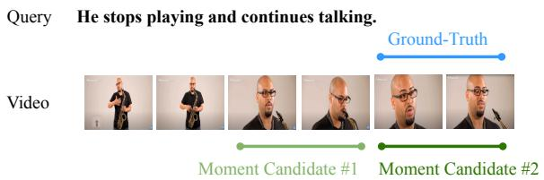
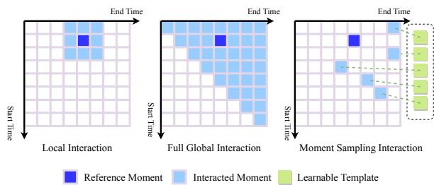
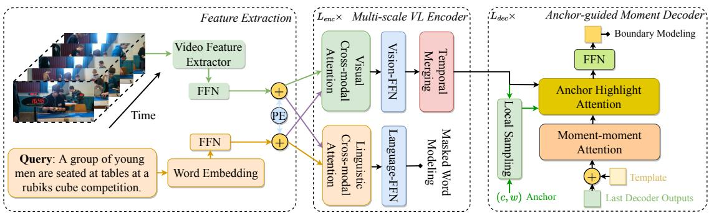
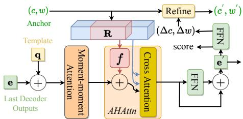
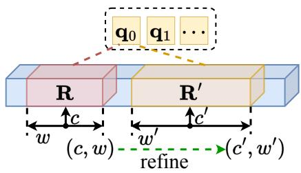

# MS-DETR: Natural Language Video Localization with Sampling Moment-Moment Interaction

Jing Wang1,3,4, Aixin Sun2∗, Hao Zhang1, Xiaoli Li1,3,4∗

1 School of Computer Science and Engineering, Nanyang Technological University, Singapore

2 S-Lab, Nanyang Technological University, Singapore

3 Institute for Infocomm Research, A\*STAR, Singapore

4 Centre for Frontier AI Research, A\*STAR, Singapore

{jing005@e.,axsun@,hao007@e.}ntu.edu.sg, xlli@i2r.a-star.edu.sg

## Abstract

Given a query, the task of Natural Language Video Localization (NLVL) is to localize a temporal moment in an untrimmed video that semantically matches the query. In this paper, we adopt a proposal-based solution that generates proposals (i.e., candidate moments) and then select the best matching proposal. On top of modeling the cross-modal interaction between candidate moments and the query, our proposed Moment Sampling DETR (MS-DETR) enables efficient moment-moment relation modeling. The core idea is to sample a subset of moments guided by the learnable templates with an adopted DETR (DEtection TRansformer) framework. To achieve this, we design a multiscale visual-linguistic encoder, and an anchorguided moment decoder paired with a set of learnable templates. Experimental results on three public datasets demonstrate the superior performance of MS-DETR.1

## 1 Introduction

Natural language video localization (NLVL) aims to retrieve a temporal moment from an untrimmed video that semantically corresponds to a given language query, see Fig. 1 for an example. This task is also known as temporal sentence grounding in video, and video moment retrieval. As a fundamental video-language task, it has a wide range of applications, such as video question answering (Fan et al., 2019; Yu et al., 2018; Li et al., 2019), video retrieval (Gabeur et al., 2020; Liu et al., 2019; Chen et al., 2020), and video grounded dialogue (Le et al., 2019; Kim et al., 2021).

Generally speaking, in NLVL models, a video is first split to a sequence of many small fixed-length segments. Video features are then extracted from these segments to interact with the text query. Conceptually, each video segment can be viewed as a form of “video token”. There are mainly two genres of approaches to NLVL. Proposal-free methods directly model the interaction between video tokens and text, and aim to identify start/end boundaries along the video token sequence. Proposal-based methods generate candidate moments as proposals and then select the best matching proposal2 as the answer. Each proposal is a continuous span of video tokens.

  
Figure 1: An NLVL example with query and ground truth video moment. Two moment candidates with similar video features are also highlighted in light and dark green colors.

To generate proposals, some methods enumerate all possible moment candidates via pre-defined anchors. Anchors are reference start/end positions along the video. Fig. 2 shows three 2D-Map examples. Each cell in a 2D-Map corresponds to a candidate moment defined by its start/end time along the two axes. Some other methods produce moment candidates with a proposal generator guided by text query and then refine them independently. The interaction between text and video is mainly modeled between text and video moments; each moment is characterized by the video segments that compose it. Very few studies have considered moment-moment interaction. Consequently, it is challenging to discriminate among moments if there are multiple moments that all demonstrate high level of semantic matching with the text query. For instance, the two candidate moments in Fig. 1 have very similar video content and share similar semantic correspondence with the query.

In this paper, we adopt the proposal-based approach for its capability of cross-modal interaction at both segment level and moment level. We propose MS-DETR to facilitate effective text-moment alignment and efficient moment-moment interaction. For text-moment alignment, we devise a multi-scale vision-language transformer backbone to conduct segment-word and segment-segment interactions at different segment scales. For momentmoment interaction, our main focus is on which moments should be sampled for interaction, due to the large number of possible pairs. Recall that a moment is a span of segments. Let (N) be the magnitude of segment space; the magnitude of moments is $\mathcal { O } ( N ^ { 2 } )$ . Then moment-moment interaction has a space of $\mathcal { O } ( N ^ { 4 } )$ .

  
Figure 2: Illustration of three strategies of moment-level interactions. Each cell represents a moment with start time i and end time j indicated on the two axes; only the upper triangular area is valid as $i \leq j$

In practice, not every pair of moments are relevant to each other, and are needed to be discriminated for a given query. Existing methods (Zhang et al., 2020b, 2021b; Wang et al., 2021a) mainly rely on a strong assumption that only the overlapping or adjacent moments are more likely to be relevant, i.e., moment locality. An example of moment locality is shown in Fig. 1, where two adjacent candidate moments share high level of visual similarity. The local interaction strategy is illustrated in Fig. 2, where the reference moment only interacts with the surrounding moments in the 2D-Map. However, not all relevant moments are overlapping or located close to each other. Following the example in Fig. 1, if the person plays saxophone again in the later part of the video (not showing for the sake of space), and the query becomes “He plays saxophone again”, then there will be at least two highly relevant moments for playing saxophone, separated by his action of talking in between. To correctly locate the answer, the model needs to understand that “again” refers to the second moment of playing saxophone. This calls for a better way of sampling moments for efficient moment-moment interaction, to avoid the full global interaction as

shown in Fig. 2.

The proposed MS-DETR samples moments for interaction using learnable templates and anchors, illustrated in the third 2D-Map in Fig. 2. We design an anchor-guided moment decoder to interact and aggregate moment features from the encoder in an adaptive and progressive manner. A fixed number of learnable templates paired with dynamic anchors are used to match the moment content and its location. Here, the templates are used to match video content in a moment, and anchors specify the reference start/end positions of the moment because multiple moments may share similar visual features. We then revise the anchors based on the predictions from the last decoder block in an iterative manner. We remark that our method has no assumption on moment locality: the moments can be scattered in diverse locations of the video.

Our key contributions are threefold. First, we propose a novel multi-scale visual-linguistic encoder (Section 4.1) to align textual and video features as well as to aggregate language-enhanced semantics of video frames, in a hierarchical manner. Second, we introduce a new anchor-guided moment decoder (Section 4.2) to decode learnable templates into moment candidates, in which we propose an anchor highlight mechanism to guide the decoding. Third, we conduct extensive experiments (Section 5) on three benchmark datasets: ActivityNet Captions, TACoS, and Charades-STA. Our results demonstrate the effectiveness of the proposed MS-DETR.

## 2 Related Work

We first briefly review existing NLVL approaches and highlight the differences between our work and other proposal-based solutions. Next, we briefly introduce object detection to provide background for the concept of learnable templates.

Natural Language Video Localization. NLVL was first introduced in Hendricks et al. (2017), and since then a good number of solutions have been proposed (Zhang et al., 2022c). As aforementioned, existing methods can be largely grouped into proposal-based and proposal-free methods. Proposals, or candidate moments, can be either predefined (Gao et al., 2017; Hendricks et al., 2017) or computed by proposal generator (Xiao et al., 2021a,b; Liu et al., 2021a). Proposal-free methods output time span (Zhang et al., 2020a, 2022b, 2021a; Liu et al., 2021b) or timestamps (Yuan et al.,

2019; Ghosh et al., 2019; Li et al., 2021; Zhou et al., 2021) directly on top of video tokens, without considering the notion of candidate moments.

Most proposal-based methods conduct multimodal interaction between video segments and text, then encode moments from the segment features. Typically there is no further interactions among moments. 2D-TAN (Zhang et al., 2020b) is the first to demonstrate the effectiveness of moment-level interaction. However, 2D-TAN assumes moment locality and only enables local interactions among moments as shown in Fig. 2. However, similar moments requiring careful discrimination may be scattered all over the video. This motivates us to go beyond the moment locality assumption and propose moment sampling for interaction, which is a key difference and also a contribution of our work.

In this paper, we adapt the concept of learnable templates from DETR framework to achieve dynamic moment sampling. DETR was originally introduced for object detection in computer vision (CV), to be briefed shortly. Most similar to our work is Xiao et al. (2021a), which also uses learnable templates. However, their work directly adopts learnable templates without any adaption to the specific requirements of NLVL. For instance, the answer moment in NLVL needs to match the given text query, whereas in object detection, there is no such requirement. We bridge the gap between NLVL and object detection by introducing a hierarchical encoder and a decoder with an anchor highlight mechanism. These designs greatly improve performance and unveil the potential of DETR for NLVL. At the same time, these designs also make our model much different from the original DETR.

Transformer-based Object Detection. Object detection is a fundamental CV task. Transformerbased methods now set a new paradigm that uses learnable templates to sparsely localize objects in images. The core idea is to aggregate encoder features globally, by using (randomly initialized) learnable templates. To achieve end-to-end detection, object detection is reformulated as a set prediction problem, e.g., certain template combinations can be used to identify some specific image objects. Early solutions match predictions with ground-truth one by one using bipartite matching, leading to unstable matching and slow convergence. Recent work alleviates this issue by designing many-to-one assignment (Chen et al., 2022; Jia et al., 2022) or the self-supervision task specifically for learnable templates (Li et al., 2022; Zhang et al., 2022a).

Introducing learnable templates to NLVL poses two challenges: supervision sparsity and scale mismatching. An image typically contains multiple objects and these co-occurred objects all serve as detection objects for supervision. In NLVL, given a good number of candidate moments in a video, there is only one ground-truth. We refer to this phenomenon as supervision sparsity. The scale extremity in NLVL is more severe than that in object detection. The ground truth moments in videos, analogous to objects in images, vary from 3% to 90% in terms of video length. The diverse scales bring the issue of scale mismatching when the learned templates are decoded to cover all encoder features, i.e., the entire video. Hence in MS-DETR, we adapt learnable templates mainly for the purpose of sparsely sampling moments for interaction, rather than as the main backbone.

## 3 Problem Formulation

We first present how to map video and text into features, and then define NLVL in feature space.

Let $V = [ f _ { t } ] _ { t = 0 } ^ { t = T - 1 }$ be an untrimmed video with $T$ frames; $\dot { L } = [ w _ { j } ] _ { j = 0 } ^ { j = M - 1 }$ be a natural language query with M words. We uniformly split the video $V$ into N segments $( i . e .$ , video tokens) and employ a pre-trained video feature extractor to encode these segments into visual features $\mathbf { V } = [ \mathbf { v } _ { i } ] _ { i = 0 } ^ { i = N - 1 }$ The M words are encoded with pre-trained word embeddings as $\mathbf { L } = [ \mathbf { w } _ { j } ] _ { j = 0 } ^ { j = M - 1 }$

Given the video and text query in their encoded features (V, L), the task of NLVL is to localize the timestamp pair $( t _ { s } , t _ { e } )$ , the start and end timestamp, of the video moment that matches the query. Note that, due to the uniform split to segments, there is a correspondence between $t _ { s }$ and $t _ { e }$ of the original video and the segment Ids in the segment sequence.

## 4 Method

The main architecture of the proposed MS-DETR is depicted in Fig. 3. Illustrated in the feature extraction part, given visual features $\mathbf { V } \in \mathbb { R } ^ { d _ { v } \times N }$ and language query features $\mathbf { L } \in \mathbb { R } ^ { d _ { w } \times M }$ , we first project them into a unified dimension d using single layer FFN and decorate them by adding positional encoding, respectively. The linearly projected visual features $\{ \bar { \bf v } _ { i } ^ { 0 } \} _ { i = 0 } ^ { i = N - 1 }$ and language query features $\{ \mathbf { w } _ { j } ^ { 0 } \} _ { j = 0 } ^ { j = M - 1 }$ are then concatenated and fed into multi-scale vision-language transformer. Next, we mainly detail two main components: multi-scale visual-language encoder, and anchor-guided moment decoder.

  
Figure 3: The architecture of MS-DETR for Natural Language Video Localization.

## 4.1 Multi-scale Visual-Language Encoder

Many transformer-based methods for cross-modal interaction treat video and language tokens identically, in a unified sequence. However, video and text have completely different syntactic and semantic structures. It is more reasonable to use separate projections for the two modalities, similar to the idea of modality-specific expert Peng et al. (2022). In MS-DETR, we separate the projections by using specifically designed attention modules.

Before we further modify the multi-modal attention modules to handle different video resolutions (i.e., multi-scale), we present our attention designs in their base form. We design two sets of attentions: visual cross-modal attention and linguistic crossmodal attention, see the middle part of Fig. 3. The two sets are highly similar. For conciseness, we only introduce visual cross-modal attention, which contains language to video (L V), and video to video (V V) attentions. The visual cross-modal attention aggregates visual embeddings ${ \bf V } ^ { l } \in \mathcal { R } ^ { N \times d }$ and language embeddings ${ \bf L } ^ { l } \in \bar { \mathcal { R } } ^ { M \times d }$ into new visual features as $\mathbf { V } ^ { l + 1 }$

$$
\mathbf { A } _ { L V } ^ { l + 1 } = \frac { \mathrm { F F N } ( \mathbf { V } ^ { l } ) \mathrm { F F N } ( \mathbf { L } ^ { l } ) } { \sqrt { d _ { h } } }\tag{1}
$$

$$
\mathbf { A } _ { V V } ^ { l + 1 } = \frac { \mathrm { F F N } ( \mathbf { V } ^ { l } ) \mathrm { F F N } ( \mathbf { V } ^ { l } ) } { \sqrt { d _ { h } } }\tag{2}
$$

$$
\mathbf { A } ^ { l + 1 } = \mathbf { A } _ { L V } ^ { l + 1 } \oplus \mathbf { A } _ { V V } ^ { l + 1 }\tag{3}
$$

$$
\begin{array} { l } { \displaystyle \mathbf { V } ^ { l + 1 } = \mathrm { S o f t m a x } ( \mathbf { A } ^ { l + 1 } ) } \\ { \displaystyle \mathbf { \Omega } \times \left( \mathrm { F F N } ( \mathbf { L } ^ { l } ) \oplus \mathrm { F F N } ( \mathbf { V } ^ { l } ) \right) } \end{array}\tag{4}
$$

The linguistic cross-modal attention uses a similar set of equations to model language to language (L L) and video to language (V L) attentions, to get new language features as $\mathbf { L } ^ { l + 1 }$

Sequence-reduced Multi-modal Attention. Recall that relative lengths of ground truth range from 3% to 90% to their source videos. A fixed resolution for all moments becomes sub-optimal. To this end, we extend the aforementioned multi-modal attention and build a transformer that is capable of providing hierarchical text-enhanced video features, from high to low temporal resolutions. Our encoder design is motivated by the Pyramid Vision Transformer (PVT) (Wang et al., 2021b), which is a successful application of deploying transformer in segmentation problem.

Handling high temporal resolution is a challenge. Directly applying multi-modal attention on high temporal resolution video features suffers from its quadratic complexity as in Eq. 2. Recall that the sequence lengths of key, query, and value in multihead attention (Vaswani et al., 2017) do not have to be the same. Its output has the same length as the query, and the key-value pair keep the same length. Thus, reducing sequence lengths of the key and value simultaneously is an effective way to save computation. Accordingly, we modify V V attention in the visual cross-modal attention module to a sequence-reduced version as follows:

$$
\begin{array} { r l } & { \mathbf { V } _ { r } ^ { l } = \operatorname { C o n v 1 D } ( \mathbf { V } ^ { l } ) } \\ & { \mathbf { A } _ { V V } ^ { l + 1 } = \frac { \operatorname { F F N } ( \mathbf { V } ^ { l } ) \operatorname { F F N } ( \mathbf { V } ^ { l } ) } { \sqrt { d _ { h } } } } \end{array}\tag{5}
$$

$$
\mathbf { V } ^ { l + 1 } = \mathrm { S o f t m a x } ( \mathbf { A } ^ { l + 1 } )
$$

$$
\times \left( \mathrm { F F N } ( \mathbf { L } ^ { l } ) \oplus \mathrm { F F N } ( \mathbf { V } _ { r } ^ { l } ) \right)\tag{6}
$$

Here, Conv1D is a non-overlapping 1D convolution with stride and kernel size set to R. Eq. 2 and Eq. 4 are respectively modified to their new versions in Eq. 5 and Eq. 6. Time complexity is reduced from $\mathcal { O } ( N ^ { 2 } )$ to $\mathcal { O } ( \frac { N ^ { 2 } } { R } )$ . We also apply sequence reduction to V L attention in the linguistic cross-modal attention. Conceptually, this sequence reduction technique can be explained as decomposing the local and global interaction. The local interaction is achieved by convolution and the global interaction by attention. Next, we focus on how to merge high to low temporal resolutions.

Temporal Merging To form a hierarchical architecture, a crucial step is a pooling-like step to shrink the temporal scale. We utilize an 1D convolution with overlapping to shrink representations from high to low temporal resolutions. The overlapped convolution allows information flow among convolutional windows, so that the interaction is not constrained locally within windows. With both sequence-reduced multi-modal attention and temporal merging, we form a hierarchical architecture. For the deeper layers in the encoder, which already have a low resolution, we turn off these two components and use the vanilla multi-modal attention.

Auxiliary Supervision Losses We design two auxiliary losses: span loss and masked word loss. Span loss is to enhance the language-conditioned video representations from encoder. We use the video features ${ \bf V } ^ { ( L _ { e n c } - 1 ) }$ from the last layer of encoder to predict whether each video segment falls within the ground truth. This auxiliary supervision facilitates the model to distinguish relevant video segments from irrelevant ones. We predict span logits $\mathbf { S _ { s p } } = F F N ( \mathbf { V } ^ { L _ { e n c } - 1 } )$ ) by passing forward encoder output $\mathbf { V } ^ { ( \tilde { L _ { e n c } } - 1 ) }$ after a two-layer FFN. Span scores $\bf P _ { s p }$ are then calculated from $\bf { S _ { s p } }$ with a sigmoid function. Then the span loss is computed in Eq. 7, where $\mathbf { Y } _ { s p } \in \{ 0 , 1 \}$

$$
\mathcal { L } _ { s p a n } = ( \log \mathbf { P } _ { s p } \times \mathbf { Y } _ { s p } ) \times ( \mathbf { P } _ { s p } - \mathbf { Y } _ { s p } ) ^ { 2 }\tag{7}
$$

Considering ground-truth can be a small portion of the source video, focal loss (Lin et al., 2020) is adopted here to alleviate the label imbalance issue.

The masked word loss aims to better align text features and video features. We dynamically replace 15% words from language query during training with randomly initialized mask embedding. The model is then compelled to learn from both textual and video contexts to recover the missing tokens. Text features $\mathbf { W } ^ { ( L _ { e n c } - 1 ) }$ from last layer of encoder are used to predict the original words before masking. Masked word score is predicted by $\mathbf { P _ { w m } } ~ = ~ S o f t m a x ( \mathbf { S _ { w m } } )$ , where $\mathbf { S _ { w m } } = F F N ( \mathbf { W } ^ { ( L _ { e n c } - 1 ) } )$ . We use the cross entropy loss for masked word prediction.

  
Figure 4: Anchor-guided Moment Decoder. Here AHAttn is the abbreviation for Anchor Highlight Attention.

$$
\mathcal { L } _ { m a s k } = C r o s s E n t r o p y ( \mathbf { P _ { w m } } , \mathbf { Y _ { w m } } )\tag{8}
$$

Multi-scale Text-enhanced Features After $L _ { e n c }$ layers of encoder, we select C text-enhanced video features of different scales from intermediate layer outputs. We re-index the selected outputs $\{ \mathbf { V } ^ { i _ { 0 } } \ldots \mathbf { V } ^ { i _ { C - 1 } } \}$ into $\{ \mathbf { V } _ { s } ^ { 0 } \cdots \mathbf { V } _ { s } ^ { C - 1 } \}$ for future reference.

## 4.2 Anchor-guided Moment Decoder

After obtaining the multi-scale text-enhanced video features $\mathbf { V } _ { s } = \{ \mathbf { V } _ { s } ^ { c } \} _ { c = 0 } ^ { c = C - 1 }$ , our focus now is to decode the learnable templates with their corresponding anchors into moment timestamps. Recall that templates aim to match moment content and anchors are the reference start/end positions. Initially, the anchors are uniformly distributed along the video to guarantee at least one anchor falls within the range of ground truth.

The moment decoder contains two parts: (i) Moment-moment Interaction, which is achieved by self-attention, and (ii) Anchor Highlighting, which aims to not only highlight the area that is relevant to the current moment but also be aware of the global context. The highlighting, or searching for relevant moments, is achieved through an Anchor Highlight Attention, an modification of the cross attention in DETR with RoI features, shown in Fig. 4. All attentions mentioned above follow the specification of multi-head scaled dot-product defined in Vaswani et al. (2017).

Learnable Templates and Anchors In the original DETR (Carion et al., 2020) paper, the learnable templates can be seen as special positional embeddings, to provide a spatial prior of objects. However, the recent success of advanced DETRs (Liu et al., 2022; Meng et al., 2021) motivates us to separately model a moment anchor according to which the attention is constrained. Let k denote the index of templates among the total $N _ { q }$ templates. We define $q _ { k }$ as the $k ^ { t h }$ learnable template and $( c _ { k } ^ { 0 } , w _ { k } ^ { 0 } )$ as its initial anchor. Here c and w stand for the center and width of the corresponding moment, which can be easily mapped to the start/end boundary. Anchors will be refined in the decoder, layer by layer. We use $( c _ { k } ^ { l } , w _ { k } ^ { l } )$ to denote the anchor after refinement of the $\mathit { \Delta } _ { l ^ { t h } }$ decoder layer.

  
Figure 5: An example of anchor refinement. The anchor $( c , w )$ paired with learnable template $q _ { 0 }$ is refined to $( c ^ { \prime } , w ^ { \prime } )$ Accordingly, its moment contents shift from R to $\mathbf { R } ^ { \prime } .$

Anchor Highlight Attention. One of our motivations is to discriminate the best matching moment among all candidate moments that share good matching to the text query. To highlight the areas that are similar to the current moment, we modify the attention query to adjust attention weight.

Suppose the current anchor is $( c _ { k } , w _ { k } )$ , we can easily locate the corresponding area in the $n ^ { t h }$ multi-scale feature from the encoder output. We use $\mathbf { r } _ { c , k }$ to denote the features in this area that are taken from the $c ^ { t h }$ multi-scale video features $\mathbf { V } _ { s } ^ { c }$ . Let ${ \bf R } _ { k }$ be the collection of features from all scales. We then construct a function f to map ${ \bf R } _ { k }$ to a single vector $\mathbf { H } _ { k } \in \mathbb { R } ^ { d }$ to guide the highlight in attention mechanism, illustrated in Fig. 4. Let $\mathbf { H } ^ { N _ { q } \times d } \in \mathbb { R }$ be the collection of $\mathbf { H } _ { k }$ and M be the moment features after self-attention module in decoder layer, we adjust the attention as follows:

$$
\begin{array} { l l } { { \displaystyle { \bf A } _ { A H } = \frac { F F N ( { \bf M } + { \bf H } ) F F N ( { \bf V } _ { s } ^ { C - 1 } ) ^ { \top } } { \sqrt { d _ { h } } } } } \\ { { \displaystyle { \bf M } _ { A H } = { \bf A } _ { A H } \times F F N ( { \bf V } _ { s } ^ { C - 1 } ) } } \end{array}\tag{9}
$$

Here, $A _ { A H }$ refers to the adjusted attention weight, and ${ \bf M } _ { A H }$ is the output of the adjusted cross attention. Since H is sampled and transformed from the corresponding anchor areas in encoder outputs $\mathbf { V } _ { s } ,$ it is essentially the representation of moment content. Therefore, the term ${ \mathbf { H } } ( { \mathbf { V } } _ { s } ^ { C - 1 } ) ^ { T }$ will be more responsive when a specific area from $\mathbf { V } _ { s } ^ { C - 1 }$ is similar to the moment content. Consequently, the attention above will highlight the areas similar to the current moment. We then refine the anchors based on these highlighted areas, through an offset prediction head as shown in Fig. 4.

Anchor Refinement. Based on the predictions from the last decoder block, we revise the anchor with the predicted offsets. This is analogous to the eye skimming process of humans: focuses on a local area in the video and then decides where to move her sight at the next step. The anchors are refined iteratively as shown in Fig. 5. Specifically, we first project the center $c _ { k } ^ { l }$ and scale $s _ { k } ^ { l }$ of the $k ^ { t h }$ anchor at the ${ { l } ^ { t h } }$ decoder level into logit space, using an inverse sigmoid operation. The offset $( \Delta c _ { k } ^ { l } , \Delta w _ { k } ^ { l } )$ is added to their logits, then the modified logits are projected back using sigmoid. The whole process is described in Eq. 10.

$$
\begin{array} { r l } & { c _ { k } ^ { m + 1 } = \sigma \left( \Delta c _ { k } ^ { m } + \sigma ^ { - 1 } ( c _ { k } ^ { m } ) \right) } \\ & { w _ { k } ^ { m + 1 } = \sigma \left( \Delta w _ { k } ^ { m } + \sigma ^ { - 1 } ( w _ { k } ^ { m } ) \right) } \end{array}\tag{10}
$$

Here $\sigma$ stands for sigmoid function, and $\sigma ^ { - 1 }$ for inverse sigmoid function.

Boundary Modeling. After encoding moment candidate features, we pass them through two separate FFNs to predict anchor offset and scores, respectively. Depending on anchor positions, only a small portion of anchors may match with ground truth moments. Among them, we simply select the candidate moment with the largest IoU (intersection over union) with ground truth as our positive sample. A similar label assignment strategy has been used in early studies (Carion et al., 2020).

After labeling predictions as positive or negative, we refer to the index of positive prediction as $i _ { p }$ Then we model the boundary with two losses: (i) IoU prediction loss, and (ii) L1 regression loss. Note that, L1 regression loss is only applied to the positive prediction. Let $( t _ { s } ^ { k } , t _ { e } ^ { k } )$ be the timestamps predicted by $k ^ { t h }$ anchor and $( t _ { s } ^ { g } , t _ { e } ^ { g } )$ be the groundtruth timestamps, we calculate L1 regression loss and IoU prediction loss as follows:

$$
\begin{array} { c } { { \mathcal { L } _ { L 1 } = \displaystyle \frac { 1 } { 2 } \left( | t _ { s } ^ { i _ { p } } - t _ { s } ^ { g } | + | t _ { e } ^ { i _ { p } } - t _ { e } ^ { g } | \right) } } \\ { { \mathcal { L } _ { I o U } = \displaystyle \frac { 1 } { N _ { q } } \sum _ { k \in N _ { q } } { \mathrm { F o c a l } ( \mathrm { T r I o U } _ { k } , o _ { k } ) } } } \end{array}\tag{11}
$$

Here TrIoU truncates IoU between $( t _ { s } ^ { k } , t _ { e } ^ { k } )$ and $( t _ { s } ^ { g } , t _ { e } ^ { g } )$ below a threshold θ and set IoU of the assigned positive prediction to 1. Different from Carion et al. (2020), by using $T r I o U$ , we not only calculate IoU loss for the positive prediction but also consider the hard negative predictions which have large overlapping with ground-truth. Note that, IoU prediction loss and L1 regression loss are calculated for all decoder layer outputs.

## 4.3 Training and Inference

The overall training loss of MS-DETR contains three losses:

$$
\begin{array} { r l } {  { \mathcal { L } = \lambda _ { s p a n } \mathcal { L } _ { s p a n } + \lambda _ { m a s k } \mathcal { L } _ { m a s k } } } \\ & { + \displaystyle \sum _ { m \in L _ { d e c } } ( \lambda _ { I o U } \mathcal { L } _ { I o U } + \lambda _ { L 1 } \mathcal { L } _ { L 1 } ) } \end{array}\tag{12}
$$

To stabilize training, we introduce an extra denoising group of templates and pass them through the decoder, motivated by (Chen et al., 2022). The overall loss is averaged over losses calculated from two groups independently. During inference, we deprecate the denoising group and use the main group only. All moments are sorted by their scores and their anchors are converted from $( c , w )$ to start/end format. We apply truncation to start/end timestamps to deal with out-of-range values, since no constraint is attached to $( c , w )$ during training.

## 5 Experiments

We evaluate MS-DETR against baselines on three public benchmarks: ActivityNet Captions (Krishna et al., 2017), TACoS (Regneri et al., 2013), and Charades-STA (Gao et al., 2017). The three datasets cover videos from different domains and lengths (see Appendix A.1 for video distributions and train/dev/test splits).

Following prior work (Zhang et al., 2021a), we adopt ${ } ^ { \ast } R @ n , I o U = \mu ^ { \ast }$ and $" \mathrm { m I o U } ^ { \mathrm { , } \mathrm { , } }$ as evaluation metrics. R@n, $I o U = \mu$ is the percentage of testing samples that have at least one of top-n results hitting ground truth, where “hitting” means an overlapping with $I o U \ge \mu$ . mIoU denotes the average IoU over all test samples. We set $n = 1$ and $\mu = \{ 0 . 3 , 0 . 5 , 0 . 7 \}$ . In our comparison and discussion, we mainly focus on $\mu = 0 . 7$ as large IoU means high-quality matching.

## 5.1 Comparison with the State-of-the-Arts

Results on the three datasets are compared in Tables 1, 2, and 3, respectively. Baseline results are mostly cited from (Zhang et al., 2021a). We also include GTR (Cao et al., 2021), LP-Net (Xiao et al., 2021a) and MMN (Wang et al., 2022) for a complete comparison.

<table><tr><td>Method</td><td colspan="3">R@1, IoU = µ</td><td rowspan="2">mIoU</td></tr><tr><td></td><td> $\mu = 0 . 3$ </td><td> $\mu = 0 . 5$ </td><td> $\mu = 0 . 7$ </td></tr><tr><td>DEBUG</td><td>55.91</td><td>39.72</td><td></td><td>39.51</td></tr><tr><td>ExCL</td><td>63.00</td><td>43.60</td><td>24.10</td><td></td></tr><tr><td>SCDM</td><td>54.80</td><td>36.75</td><td>19.86</td><td></td></tr><tr><td>CBP</td><td>54.30</td><td>35.76</td><td>17.80</td><td></td></tr><tr><td>GDP</td><td>56.17</td><td>39.27</td><td>27.38</td><td>39.80</td></tr><tr><td>2D-TAN</td><td>59.45</td><td>44.51</td><td></td><td></td></tr><tr><td>TSP-PRL</td><td>56.08</td><td>38.76</td><td></td><td>39.21</td></tr><tr><td>TMLGA</td><td>51.28</td><td>33.04</td><td>19.26</td><td></td></tr><tr><td>VSLNet</td><td>63.16</td><td>43.22</td><td>26.16</td><td>43.19</td></tr><tr><td>DRN</td><td></td><td>45.45</td><td>24.36</td><td></td></tr><tr><td>LGI</td><td>58.52</td><td>41.51</td><td>23.07</td><td></td></tr><tr><td>SeqPAN</td><td>61.65</td><td>45.50</td><td>28.37</td><td>45.11</td></tr><tr><td>GTR</td><td></td><td>49.67</td><td>28.45</td><td></td></tr><tr><td>LP-Net</td><td>64.29</td><td>45.92</td><td>25.39</td><td>44.72</td></tr><tr><td>MMN</td><td>65.05</td><td>48.59</td><td>29.26</td><td></td></tr><tr><td>MS-DETR</td><td>62.12</td><td>48.69</td><td>31.15</td><td>46.82</td></tr></table>

Table 1: Results on ActivityNet Captions. The best results are in bold face and second best underlined.
<table><tr><td>Method</td><td> $\mathbf { R } @ 1 , \mathbf { I o U } = \mu$   $\mu = 0 . 3$   $\mu = 0 . 5$ </td><td></td><td> $\mu = 0 . 7$ </td><td>mIoU</td></tr><tr><td>TGN</td><td>21.77</td><td>18.90</td><td></td><td></td></tr><tr><td>ACL</td><td>24.17</td><td>20.01</td><td></td><td></td></tr><tr><td>DEBUG</td><td>23.45</td><td>11.72</td><td></td><td>16.03</td></tr><tr><td>SCDM</td><td>26.11</td><td>21.17</td><td></td><td></td></tr><tr><td>CBP</td><td>27.31</td><td>24.79</td><td>19.10</td><td>21.59</td></tr><tr><td>GDP</td><td>24.14</td><td>13.90</td><td></td><td>16.18</td></tr><tr><td>TMLGA</td><td>24.54</td><td>21.65</td><td>16.46</td><td></td></tr><tr><td>VSLNet</td><td>29.61</td><td>24.27</td><td>20.03</td><td>24.11</td></tr><tr><td>DRN</td><td></td><td>23.17</td><td></td><td></td></tr><tr><td>SeqPAN</td><td>31.72</td><td>27.19</td><td>21.65</td><td>25.86</td></tr><tr><td>DRN</td><td></td><td>23.17</td><td></td><td></td></tr><tr><td>CMIN</td><td>24.64</td><td>18.05</td><td></td><td></td></tr><tr><td>2D-TAN</td><td>37.29</td><td>25.32</td><td></td><td></td></tr><tr><td>GTR</td><td>40.39</td><td>30.22</td><td></td><td></td></tr><tr><td>MMN</td><td>39.24</td><td>26.17</td><td></td><td></td></tr><tr><td>MS-DETR</td><td>47.66</td><td>37.36</td><td>25.81</td><td>35.09</td></tr></table>

Table 2: Results on TACoS, best results in bold face, and second best underlined.

MS-DETR achieves the best R@1, $\mu = 0 . 7$ and mIoU on ActivityNet and TACos, and the second best on Charades-STA. Our model achieves reasonably good results on smaller $\mu \mathrm { { s } }$ . However, large µ ensures high-quality matching. A possible reason for the results on Charades-STA is that the videos in this dataset are very short (30 seconds on average), making moment-level interaction less necessary.

## 5.2 Ablation Study

We perform ablation studies on ActivityNet Captions for the effectiveness MS-DETR.

Multi-scale Encoder. We evaluate four variants to study the effectiveness of multi-scale design in our transformer encoder. First, to evaluate whether hierarchical design benefits cross-modal interaction, the ‘uni-scale’ variant replaces all sequencereduced layers with normal layers without resolution shrinkage, and set the number of clips to 32. The multi-scale transformer now degrades to a uniscale cross-modal transformer. To study the contribution of encoding moment contents R for anchor highlighting in multiple scales, the ‘single-scale variant selects the output of the last encoder layer only and fuses it to attention query, while keeping encoder’s hierarchical structure. Then, we study the effect of arranging sequence-reduced layers in different positions in the 5 encoder layers. We compare two arrangements “BBBRR” and “RBBBR” against MS-DETR’s “RRBBB”. Here ‘R’ means sequence-reduced and ‘B’ means the base version.

<table><tr><td rowspan="2">Method</td><td colspan="3">R@1, IoU = µ</td><td rowspan="2">mIoU</td></tr><tr><td> $\mu = 0 . 3$ </td><td> $\mu = 0 . 5$ </td><td> $\mu = 0 . 7$ </td></tr><tr><td>DEBUG</td><td>54.95</td><td>37.39</td><td>17.69</td><td>36.34</td></tr><tr><td>ExCL</td><td>61.50</td><td>44.10</td><td>22.40</td><td></td></tr><tr><td>MAN</td><td></td><td>46.53</td><td>22.72</td><td></td></tr><tr><td>SCDM</td><td></td><td>54.44</td><td>33.43</td><td></td></tr><tr><td>CBP</td><td></td><td>36.80</td><td>18.87</td><td></td></tr><tr><td>GDP</td><td>54.54</td><td>39.47</td><td>18.49</td><td></td></tr><tr><td>2D-TAN</td><td></td><td>39.81</td><td>23.31</td><td></td></tr><tr><td>TSP-PRL</td><td></td><td>45.30</td><td>24.73</td><td>40.93</td></tr><tr><td>MMN</td><td>47.31</td><td>27.28</td><td></td><td></td></tr><tr><td>VSLNet</td><td>70.46</td><td>54.19</td><td>35.22</td><td>50.02</td></tr><tr><td>LGI</td><td>72.96</td><td>59.46</td><td>35.48</td><td></td></tr><tr><td>SeqPAN</td><td>73.84</td><td>60.86</td><td>41.34</td><td>53.92</td></tr><tr><td>MS-DETR</td><td>68.68</td><td>57.72</td><td>37.40</td><td>50.12</td></tr></table>

Table 3: Results on Charades-STA, best results in bold face, and second best underlined.
<table><tr><td>Method</td><td colspan="3"> $\mathbf { R } @ 1 , \mathbf { I o U } = \mu$ </td><td rowspan="2">mIoU</td></tr><tr><td></td><td> $\mu = 0 . 3$ </td><td> $\mu = 0 . 5$ </td><td> $\mu = 0 . 7$ </td></tr><tr><td>MS-DETR</td><td>62.12</td><td>48.29</td><td>31.15 30.69</td><td>46.82 45.62</td></tr><tr><td>uni-scale</td><td>61.08</td><td>47.85 47.86</td><td>30.91</td><td>45.86</td></tr><tr><td>single-scale</td><td>61.57 60.99</td><td>46.97</td><td>30.00</td><td>44.84</td></tr><tr><td>BBBRR</td><td></td><td>47.14</td><td>30.05</td><td>45.48</td></tr><tr><td>RBBBR</td><td>61.42</td><td></td><td></td><td></td></tr></table>

Table 4: Ablation study on multi-scale hierarchical encoder.

Results in Table 4 suggest the effectiveness of multi-scale hierarchical encoder. Performance drops with the removal of the multi-scale mechanism, or the other arrangement of sequencereduced layers. Placing sequence-reduced version at shallow layers serves the purpose of reducing computational cost while benefiting performance.

Anchor Highlight Attention is a variant of standard cross attention Vaswani et al. (2017). It is used to highlight similar content with corresponding moments across the video. We compare its design with the standard cross attention. Table 5 shows that anchor highlight attention outperforms standard cross attention, by a large margin. This justifies the advantage of using anchor highlight attention and dynamic anchor jointly, to narrow the range of attention to anchor areas.

<table><tr><td>Methods</td><td colspan="3">R@1,  ${ \mathrm { I o U } } = \mu$   $\mu = 0 . 3$   $\mu = 0 . 5$   $\mu = 0 . 7$ </td><td>mIoU</td></tr><tr><td>MS-DETR</td><td>62.12</td><td>48.29</td><td>31.15</td><td>46.82</td></tr><tr><td>CrossAtten.</td><td>61.25</td><td>46.05</td><td>27.94</td><td>44.30</td></tr></table>

Table 5: Anchor highlight attention versus standard cross attention without anchor highlighting.
<table><tr><td rowspan="2">Methods</td><td colspan="3"> $\mathbf { R } @ 1 , \mathbf { I o U } = \mu$ </td><td rowspan="2">mIoU</td></tr><tr><td> $\mu = 0 . 3$ </td><td> $\mu = 0 . 5$ </td><td> $\mu = 0 . 7$ </td></tr><tr><td>MS-DETR</td><td>62.12</td><td>48.29</td><td>31.15</td><td>46.82</td></tr><tr><td>w/o  $\mathcal { L } _ { s p a n }$ </td><td>58.67</td><td>45.75</td><td>30.15</td><td>44.06</td></tr><tr><td>w/o  $\mathcal { L } _ { m a s k }$ </td><td>62.04</td><td>47.9</td><td>30.17</td><td>45.40</td></tr><tr><td>w/o both</td><td>57.50</td><td>46.07</td><td>30.03</td><td>43.82</td></tr></table>

Table 6: The impact of auxiliary losses.

The Auxiliary Loss. We use two auxiliary supervision losses, span loss and word mask loss, in our encoder (see Section 4.1). Table 6 reports the results of removing either one or both auxiliary losses. Results suggest that both auxiliary losses benefit MS-DETR, and span loss contributes more to the effectiveness of MS-DETR. That is, supervising encoder to discriminate whether segments fall within the ground-truth area is important for vision-language alignment.

Hyper-parameter Study. Results of the choices of the number of encoder/decoder blocks, and number of denoising groups for training stabilization are in Appendix A.3.

## 6 Conclusion

In this paper, we adapt DETR framework from object detection to NLVL. With the proposed MS-DETR, we are able to model moment-moment interaction in a dynamic manner. Specifically, we design a multi-scale visual-linguistic encoder to learn hierarchical text-enhanced video features, and an anchor-guided moment decoder to guide the attention with dynamic anchors for iterative anchor refinement. The promising results on three benchmarks suggest that moment-moment interaction for NLVL can be achieved in an efficient and effective manner.

## 7 Limitation

The limitation of this paper are twofold. First, our method does not provide a recipe for data imbalancement in NLVL task. Thus, our method does not guarantee the effectiveness on edge cases. Second, the choice of feature extractor is considered relatively outdated. Our model does not benefit from the recent development of pre-trained visionlanguage models. On the other hand, using pretrained vision-language models remains in its early stage in NLVL tasks. Not using pre-trained features makes a fair comparison between our model with existing baselines. As a part of future work, we will explore the potential of using more powerful feature extractors in our model.

## 8 Acknowledgement

This study is supported under the RIE2020 Industry Alignment Fund – Industry Collaboration Projects (IAF-ICP) Funding Initiative, as well as cash and in-kind contribution from the industry partner(s).

## References

Meng Cao, Long Chen, Mike Zheng Shou, Can Zhang, and Yuexian Zou. 2021. On Pursuit of Designing Multi-modal Transformer for Video Grounding. In Proceedings of the 2021 Conference on Empirical Methods in Natural Language Processing, pages 9810–9823, Online and Punta Cana, Dominican Republic. Association for Computational Linguistics.

Nicolas Carion, Francisco Massa, Gabriel Synnaeve, Nicolas Usunier, Alexander Kirillov, and Sergey Zagoruyko. 2020. End-to-End Object Detection with Transformers. In Computer Vision – ECCV 2020, volume 12346, pages 213–229, Cham. Springer International Publishing.

Qiang Chen, Xiaokang Chen, Jian Wang, Haocheng Feng, Junyu Han, Errui Ding, Gang Zeng, and Jingdong Wang. 2022. Group DETR: Fast DETR Training with Group-Wise One-to-Many Assignment.

Shizhe Chen, Yida Zhao, Qin Jin, and Qi Wu. 2020. Fine-grained video-text retrieval with hierarchical graph reasoning. In 2020 IEEE/CVF Conference on Computer Vision and Pattern Recognition, CVPR 2020, Seattle, WA, USA, June 13-19, 2020, pages 10635–10644. Computer Vision Foundation / IEEE.

Chenyou Fan, Xiaofan Zhang, Shu Zhang, Wensheng Wang, Chi Zhang, and Heng Huang. 2019. Heterogeneous memory enhanced multimodal attention model for video question answering. In IEEE Conference on Computer Vision and Pattern Recognition, CVPR 2019, Long Beach, CA, USA, June 16-20, 2019, pages 1999–2007. Computer Vision Foundation / IEEE.

Valentin Gabeur, Chen Sun, Karteek Alahari, and Cordelia Schmid. 2020. Multi-modal transformer for video retrieval. In Computer Vision - ECCV 2020 - 16th European Conference, Glasgow, UK, August 23-28, 2020, Proceedings, Part IV, volume 12349 of Lecture Notes in Computer Science, pages 214–229. Springer.

Jiyang Gao, Chen Sun, Zhenheng Yang, and Ram Nevatia. 2017. TALL: Temporal Activity Localization via Language Query. In 2017 IEEE International Conference on Computer Vision (ICCV), pages 5277– 5285, Venice. IEEE.

Soham Ghosh, Anuva Agarwal, Zarana Parekh, and Alexander G. Hauptmann. 2019. Excl: Extractive clip localization using natural language descriptions. In Proceedings ofthe 2019 Conference ofthe North American Chapter of the Association for Computational Linguistics: Human Language Technologies, NAACL-HLT 2019, Minneapolis, MN, USA, June 2-7, 2019, Volume 1 (Long and Short Papers), pages 1984– 1990. Association for Computational Linguistics.

Lisa Anne Hendricks, Oliver Wang, Eli Shechtman, Josef Sivic, Trevor Darrell, and Bryan C. Russell. 2017. Localizing moments in video with natural language. In IEEE International Conference on Computer Vision, ICCV 2017, Venice, Italy, October 22- 29, 2017, pages 5804–5813. IEEE Computer Society.

Ding Jia, Yuhui Yuan, Haodi He, Xiaopei Wu, Haojun Yu, Weihong Lin, Lei Sun, Chao Zhang, and Han Hu. 2022. DETRs with Hybrid Matching.

Junyeong Kim, Sunjae Yoon, Dahyun Kim, and Chang D. Yoo. 2021. Structured co-reference graph attention for video-grounded dialogue. In Thirty-Fifth AAAI Conference on Artificial Intelligence, AAAI 2021, Thirty-Third Conference on Innovative Applications ofArtificial Intelligence, IAAI 2021, The Eleventh Symposium on Educational Advances in Artificial Intelligence, EAAI 2021, Virtual Event, February 2-9, 2021, pages 1789–1797. AAAI Press.

Ranjay Krishna, Kenji Hata, Frederic Ren, Li Fei-Fei, and Juan Carlos Niebles. 2017. Dense-captioning events in videos. In IEEE International Conference on Computer Vision, ICCV 2017, Venice, Italy, October 22-29, 2017, pages 706–715. IEEE Computer Society.

Hung Le, Doyen Sahoo, Nancy F. Chen, and Steven C. H. Hoi. 2019. Multimodal transformer networks for end-to-end video-grounded dialogue systems. In Proceedings of the 57th Conference of the Associationfor Computational Linguistics, ACL 2019, Florence, Italy, July 28- August 2, 2019, Volume 1: Long Papers, pages 5612–5623. Association for Computational Linguistics.

Feng Li, Hao Zhang, Shilong Liu, Jian Guo, Lionel M. Ni, and Lei Zhang. 2022. DN-DETR: Accelerate DETR Training by Introducing Query DeNoising. In 2022 IEEE/CVF Conference on Computer Vision and

Pattern Recognition (CVPR), pages 13609–13617, New Orleans, LA, USA. IEEE.

Kun Li, Dan Guo, and Meng Wang. 2021. Proposal-free video grounding with contextual pyramid network. In Thirty-Fifth AAAI Conference on Artificial Intelligence, AAAI 2021, Thirty-Third Conference on Innovative Applications ofArtificial Intelligence, IAAI 2021, the Eleventh Symposium on Educational Advances in Artificial Intelligence, EAAI 2021, Virtual Event, February 2-9, 2021, pages 1902–1910. AAAI Press.

Xiangpeng Li, Jingkuan Song, Lianli Gao, Xianglong Liu, Wenbing Huang, Xiangnan He, and Chuang Gan. 2019. Beyond rnns: Positional self-attention with co-attention for video question answering. In The Thirty-Third AAAI Conference on Artificial Intelligence, AAAI 2019, The Thirty-First Innovative Applications ofArtificial Intelligence Conference, IAAI 2019, The Ninth AAAI Symposium on Educational Advances in Artificial Intelligence, EAAI 2019, Honolulu, Hawaii, USA, January 27 - February 1, 2019, pages 8658–8665. AAAI Press.

Tsung-Yi Lin, Priya Goyal, Ross B. Girshick, Kaiming He, and Piotr Dollár. 2020. Focal loss for dense object detection. IEEE Trans. Pattern Anal. Mach. Intell., 42(2):318–327.

Daizong Liu, Xiaoye Qu, Jianfeng Dong, and Pan Zhou. 2021a. Adaptive proposal generation network for temporal sentence localization in videos. In Proceedings ofthe 2021 Conference on Empirical Methods in Natural Language Processing, EMNLP 2021, Virtual Event / Punta Cana, Dominican Republic, 7-11 November, 2021, pages 9292–9301. Association for Computational Linguistics.

Daizong Liu, Xiaoye Qu, Jianfeng Dong, Pan Zhou, Yu Cheng, Wei Wei, Zichuan Xu, and Yulai Xie. 2021b. Context-aware biaffine localizing network for temporal sentence grounding. In IEEE Conference on Computer Vision and Pattern Recognition, CVPR 2021, Virtual, June 19-25, 2021, pages 11235–11244. Computer Vision Foundation / IEEE.

Shilong Liu, Feng Li, Hao Zhang, Xiao Yang, Xianbiao Qi, Hang Su, Jun Zhu, and Lei Zhang. 2022. DAB-DETR: Dynamic Anchor Boxes are Better Queries for DETR. In The Tenth International Conference on Learning Representations, ICLR 2022, Virtual Event, April 25-29, 2022. OpenReview.net.

Yang Liu, Samuel Albanie, Arsha Nagrani, and Andrew Zisserman. 2019. Use what you have: Video retrieval using representations from collaborative experts. In 30th British Machine Vision Conference 2019, BMVC 2019, Cardiff, UK, September 9-12, 2019, page 279. BMVA Press.

Depu Meng, Xiaokang Chen, Zejia Fan, Gang Zeng, Houqiang Li, Yuhui Yuan, Lei Sun, and Jingdong Wang. 2021. Conditional DETR for Fast Training

Convergence. In 2021 IEEE/CVF International Conference on Computer Vision (ICCV), pages 3631– 3640, Montreal, QC, Canada. IEEE.

Zhiliang Peng, Li Dong, Hangbo Bao, Qixiang Ye, and Furu Wei. 2022. BEiT v2: Masked Image Modeling with Vector-Quantized Visual Tokenizers.

Michaela Regneri, Marcus Rohrbach, Dominikus Wetzel, Stefan Thater, Bernt Schiele, and Manfred Pinkal. 2013. Grounding action descriptions in videos. Trans. Assoc. Comput. Linguistics, 1:25–36.

Ashish Vaswani, Noam Shazeer, Niki Parmar, Jakob Uszkoreit, Llion Jones, Aidan N. Gomez, Lukasz Kaiser, and Illia Polosukhin. 2017. Attention is All you Need. In Advances in Neural Information Processing Systems 30: Annual Conference on Neural Information Processing Systems 2017, December 4-9, 2017, Long Beach, CA, USA, pages 5998–6008.

Hao Wang, Zheng-Jun Zha, Liang Li, Dong Liu, and Jiebo Luo. 2021a. Structured Multi-Level Interaction Network for Video Moment Localization via Language Query. In IEEE Conference on Computer Vision and Pattern Recognition, CVPR 2021, Virtual, June 19-25, 2021, pages 7026–7035. Computer Vision Foundation / IEEE.

Wenhai Wang, Enze Xie, Xiang Li, Deng-Ping Fan, Kaitao Song, Ding Liang, Tong Lu, Ping Luo, and Ling Shao. 2021b. Pyramid Vision Transformer: A Versatile Backbone for Dense Prediction without Convolutions. In 2021 IEEE/CVF International Conference on Computer Vision (ICCV), pages 548–558, Montreal, QC, Canada. IEEE.

Zhenzhi Wang, Limin Wang, Tao Wu, Tianhao Li, and Gangshan Wu. 2022. Negative Sample Matters: A Renaissance of Metric Learning for Temporal Grounding. In Thirty-Sixth AAAI Conference on Artificial Intelligence, AAAI 2022, Thirty-Fourth Conference on Innovative Applications of Artificial Intelligence, IAAI 2022, The Twelveth Symposium on Educational Advances in Artificial Intelligence, EAAI 2022 Virtual Event, February 22 - March 1, 2022, pages 2613–2623. AAAI Press.

Shaoning Xiao, Long Chen, Jian Shao, Yueting Zhuang, and Jun Xiao. 2021a. Natural Language Video Localization with Learnable Moment Proposals. In Proceedings of the 2021 Conference on Empirical Methods in Natural Language Processing, EMNLP 2021, Virtual Event / Punta Cana, Dominican Republic, 7- 11 November, 2021, pages 4008–4017. Association for Computational Linguistics.

Shaoning Xiao, Long Chen, Songyang Zhang, Wei Ji, Jian Shao, Lu Ye, and Jun Xiao. 2021b. Boundary Proposal Network for Two-stage Natural Language Video Localization. In Thirty-Fifth AAAI Conference on Artificial Intelligence, AAAI 2021, Thirty-Third Conference on Innovative Applications of Artificial Intelligence, IAAI 2021, The Eleventh Symposium on Educational Advances in Artificial Intelligence,

EAAI 2021, Virtual Event, February 2-9, 2021, pages 2986–2994. AAAI Press.

Youngjae Yu, Jongseok Kim, and Gunhee Kim. 2018. A joint sequence fusion model for video question answering and retrieval. In Computer Vision - ECCV 2018 - 15th European Conference, Munich, Germany, September 8-14, 2018, Proceedings, Part VII, volume 11211 of Lecture Notes in Computer Science, pages 487–503. Springer.

Yitian Yuan, Tao Mei, and Wenwu Zhu. 2019. To find where you talk: Temporal sentence localization in video with attention based location regression. In The Thirty-Third AAAI Conference on Artificial Intelligence, AAAI 2019, the Thirty-First Innovative Applications ofArtificial Intelligence Conference, IAAI 2019, the Ninth AAAI Symposium on Educational Advances in Artificial Intelligence, EAAI 2019, Honolulu, Hawaii, USA, January 27 - February 1, 2019, pages 9159–9166. AAAI Press.

Hao Zhang, Feng Li, Shilong Liu, Lei Zhang, Hang Su, Jun Zhu, Lionel M. Ni, and Heung-Yeung Shum. 2022a. DINO: DETR with Improved DeNoising Anchor Boxes for End-to-End Object Detection.

Hao Zhang, Aixin Sun, Wei Jing, Liangli Zhen, Joey Tianyi Zhou, and Rick Siow Mong Goh. 2021a. Parallel attention network with sequence matching for video grounding. In Findings of the Association for Computational Linguistics: ACL/IJCNLP 2021, Online Event, August 1-6, 2021, volume ACL/IJCNLP 2021 of Findings ofACL, pages 776– 790. Association for Computational Linguistics.

Hao Zhang, Aixin Sun, Wei Jing, Liangli Zhen, Joey Tianyi Zhou, and Rick Siow Mong Goh. 2022b. Natural language video localization: A revisit in spanbased question answering framework. IEEE Trans. Pattern Anal. Mach. Intell., 44(8):4252–4266.

Hao Zhang, Aixin Sun, Wei Jing, and Joey Tianyi Zhou. 2020a. Span-based localizing network for natural language video localization. In Proceedings of the 58th Annual Meeting of the Association for Computational Linguistics, ACL 2020, Online, July 5-10, 2020, pages 6543–6554. Association for Computational Linguistics.

Hao Zhang, Aixin Sun, Wei Jing, and Joey Tianyi Zhou. 2022c. The Elements of Temporal Sentence Grounding in Videos: A Survey and Future Directions.

Songyang Zhang, Houwen Peng, Jianlong Fu, Yijuan Lu, and Jiebo Luo. 2021b. Multi-Scale 2D Temporal Adjacent Networks for Moment Localization with Natural Language. TPAMI, (arXiv:2012.02646).

Songyang Zhang, Houwen Peng, Jianlong Fu, and Jiebo Luo. 2020b. Learning 2D temporal adjacent networks for moment localization with natural language. In The Thirty-Fourth AAAI Conference on Artificial Intelligence, AAAI 2020, the Thirty-Second Innovative Applications ofArtificial Intelligence Conference,

IAAI 2020, the Tenth AAAI Symposium on Educational Advances in Artificial Intelligence, EAAI 2020, New York, NY, USA, February 7-12, 2020, pages 12870–12877. AAAI Press.

Hao Zhou, Chongyang Zhang, Yan Luo, Yanjun Chen, and Chuanping Hu. 2021. Embracing uncertainty: Decoupling and de-bias for robust temporal grounding. In IEEE Conference on Computer Vision and Pattern Recognition, CVPR 2021, Virtual, June 19-25, 2021, pages 8445–8454. Computer Vision Foundation / IEEE.

<table><tr><td rowspan="2">Methods</td><td colspan="3"> $\mathrm { R } @ 1 , \mathrm { I o U } = \mu$ </td><td rowspan="2">mIoU</td></tr><tr><td> $\mu = 0 . 3$ </td><td> $\mu = 0 . 5$ </td><td> $\mu = 0 . 7$ </td></tr><tr><td>Enc3</td><td>62.47</td><td>48.15</td><td>30.54</td><td>45.80</td></tr><tr><td>Enc4</td><td>61.17</td><td>47.87</td><td>30.41</td><td>44.91</td></tr><tr><td>MS-DETR</td><td>62.12</td><td>48.29</td><td>31.15</td><td>46.82</td></tr><tr><td>Enc6</td><td>62.05</td><td>48.00</td><td>31.03</td><td>45.71</td></tr></table>

Table 7: The impact on number of encoder layers.

## A Appendix

## A.1 Dataset Details

ActivityNet Captions (Krishna et al., 2017) contains over 20K videos paired with 100K queries with an average duration of 2 minutes. We use the dataset split “val\_1” as our validation set and “val\_2” as our testing set. In our setting, 37, 417, 17, 505, and 17, 031 moment-sentence pairs are used for training, validation, and testing, respectively. TACoS (Regneri et al., 2013) includes 127 videos about cooking activities. The average duration of videos in TACoS is 7 minutes. We follow the standard split which includes 10, 146, 4, 589, and 4, 083 moment-sentence pairs for training, validation, and testing. Charades-STA (Gao et al., 2017) is built on Charades and contains 6, 672 videos of daily indoor activities. Charades-STA has 16, 128 sentence-moment pairs in total, where 12, 408 pairs are for training and 3, 720 pairs for testing. The average duration of the videos is 30s.

## A.2 Implementation Details

We use AdamW with learning rate of $3 \times 1 0 ^ { - 4 }$ and batch size of 32 for optimization. We follow (Zhang et al., 2020b) and use pretrained 3D Inception network to extract features from videos. The number of sampled video frames is set to 512 for ActivityNet Caption and TACoS and 1024 for Charades-STA. For MS-DETR architecture, we use a 5-layers encoder and a 5-layers decoder with all hidden sizes set to 512. For inference, we select the proposal with highest score from the last decoder layer as our prediction. As for the specific choice of f mentioned in Section 4.2, we use RoIAlign to extract multi-scale feature R, then concatenate them and pass them through an FFN. One extra denoising group is used for stabilizing training. The loss is then averaged over two groups. During inference, No extra operation like Non-Maximum Suppression (NMS) is required. All experiments are run on a single A100 GPU. The reported versions take roughly 8-10 GPU hours for training.

<table><tr><td rowspan="2">Methods</td><td colspan="3"> $\mathbf { R } @ 1 , \mathbf { I o U } = \mu$ </td><td rowspan="2">mIoU</td></tr><tr><td> $\mu = 0 . 3$ </td><td> $\mu = 0 . 5$ </td><td> $\mu = 0 . 7$ </td></tr><tr><td>Dec2</td><td>60.53</td><td>46.54</td><td>29.12</td><td>44.40</td></tr><tr><td>Dec3</td><td>62.42</td><td>47.92</td><td>30.11</td><td>45.43</td></tr><tr><td>Dec4</td><td>61.14</td><td>47.03</td><td>30.13</td><td>44.72</td></tr><tr><td>MS-DETR</td><td>62.12</td><td>48.29</td><td>31.15</td><td>46.82</td></tr><tr><td>Dec6</td><td>61.30</td><td>47.83</td><td>31.65</td><td>46.32</td></tr></table>

Table 8: The impact of the number of decoder layers.
<table><tr><td rowspan="2">Methods</td><td colspan="3"> $\mathbf { R } @ 1 , \mathbf { I o U } = \mu$ </td><td rowspan="2">mIoU</td></tr><tr><td> $\mu = 0 . 3$ </td><td> $\mu = 0 . 5$ </td><td> $\mu = 0 . 7$ </td></tr><tr><td>DNO</td><td>61.50</td><td>47.94</td><td>30.83</td><td>45.04</td></tr><tr><td>MS-DETR</td><td>62.12</td><td>48.29</td><td>31.15</td><td>46.82</td></tr><tr><td>DN2</td><td>62.13</td><td>47.74</td><td>30.91</td><td>45.6</td></tr><tr><td>DN3</td><td>62.03</td><td>47.55</td><td>30.84</td><td>45.5</td></tr></table>

Table 9: The impact of the number of denoising groups.

## A.3 Hyper-parameter Study

Number of Encoder/Decoder Blocks We study the impact of the number of encoder and decoder blocks. We evaluate one of them from 2 to 6, while keeping the other fixed to 5. The performance across various numbers of encoder and decoder blocks are listed in Table 7. Best performance is achieved by $L _ { e n c } = 5$ and $L _ { d e c } = 5$ Though the setting of $L _ { d e c } = 6$ has slightly larger “R@1, $I o U = 0 . 7 ^ { \circ }$ , poorer $^ { \circ } m I o U ^ { \prime \prime }$ is observed. We speculate that the cause is overfitting on some overly confident examples.

Number of Denoising Groups. We study the effectiveness of using different numbers of denoising groups in training stabilization. The results are evaluated with the number of denoising groups ranging from 0 to 3, in Table 9. We observe the performance increases after using one denoising group, then gradually decreases. We suspect there is a trade-off between training stability and the ability to escape local minima.

A For every submission: ✓ A1. Did you describe the limitations of your work? Section 7

✗ A2. Did you discuss any potential risks of your work? Our paper uses public benchmarks and does not have any risk ofethics or infringement.

✓ A3. Do the abstract and introduction summarize the paper’s main claims? abstract and section 1

✗ A4. Have you used AI writing assistants when working on this paper? Left blank.

## B ✓ Did you use or create scientific artifacts?

section 5

✓ B1. Did you cite the creators of artifacts you used? section 5 and A.1

✗ B2. Did you discuss the license or terms for use and / or distribution of any artifacts? We use three benchmarks, which are all open to public

 B3. Did you discuss if your use of existing artifact(s) was consistent with their intended use, provided that it was specified? For the artifacts you create, do you specify intended use and whether that is compatible with the original access conditions (in particular, derivatives of data accessed for research purposes should not be used outside of research contexts)? Not applicable. Left blank.

✓ B4. Did you discuss the steps taken to check whether the data that was collected / used contains any information that names or uniquely identifies individual people or offensive content, and the steps taken to protect / anonymize it? No, the benchmarks we use are all open to the public and do not contain any private information.

 B5. Did you provide documentation of the artifacts, e.g., coverage of domains, languages, and linguistic phenomena, demographic groups represented, etc.? Not applicable. Left blank.

✓ B6. Did you report relevant statistics like the number of examples, details of train / test / dev splits, etc. for the data that you used / created? Even for commonly-used benchmark datasets, include the number of examples in train / validation / test splits, as these provide necessary context for a reader to understand experimental results. For example, small differences in accuracy on large test sets may be significant, while on small test sets they may not be. section A.1

## C ✓ Did you run computational experiments?

Section 5

✓ C1. Did you report the number of parameters in the models used, the total computational budget (e.g., GPU hours), and computing infrastructure used? section A.2

✓ C2. Did you discuss the experimental setup, including hyperparameter search and best-found hyperparameter values? Section A.2

 C3. Did you report descriptive statistics about your results (e.g., error bars around results, summary statistics from sets of experiments), and is it transparent whether you are reporting the max, mean, etc. or just a single run? Not applicable. Left blank.

 C4. If you used existing packages (e.g., for preprocessing, for normalization, or for evaluation), did you report the implementation, model, and parameter settings used (e.g., NLTK, Spacy, ROUGE, etc.)? Not applicable. Left blank.

D ✗ Did you use human annotators (e.g., crowdworkers) or research with human participants? Left blank.

 D1. Did you report the full text of instructions given to participants, including e.g., screenshots, disclaimers of any risks to participants or annotators, etc.? No response.

 D2. Did you report information about how you recruited (e.g., crowdsourcing platform, students) and paid participants, and discuss if such payment is adequate given the participants’ demographic (e.g., country of residence)? No response.

 D3. Did you discuss whether and how consent was obtained from people whose data you’re using/curating? For example, if you collected data via crowdsourcing, did your instructions to crowdworkers explain how the data would be used? No response.

 D4. Was the data collection protocol approved (or determined exempt) by an ethics review board? No response.

 D5. Did you report the basic demographic and geographic characteristics of the annotator population that is the source of the data? No response.