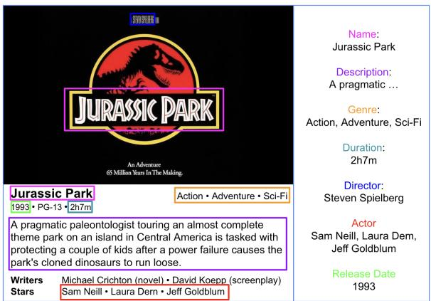
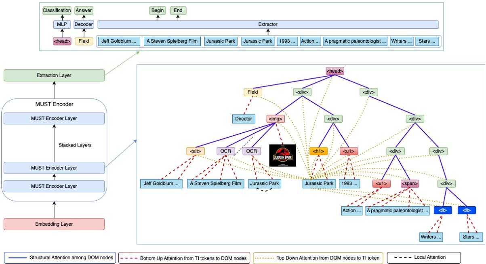
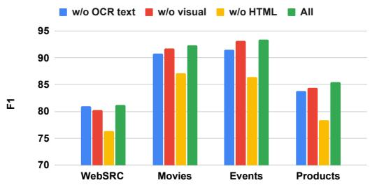
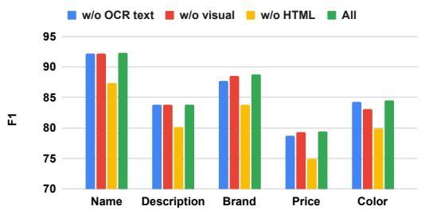
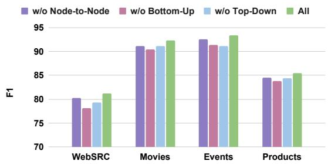
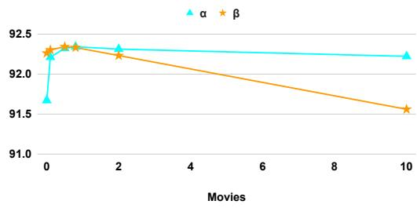
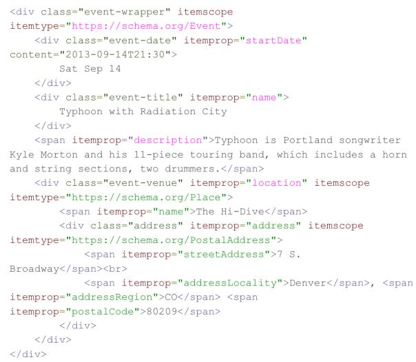

# MUSTIE: Multimodal Structural Transformer for Web Information Extraction

Qifan Wang1, Jingang Wang2∗, Xiaojun Quan3, Fuli Feng4, Zenglin Xu5, Shaoliang Nie1, Sinong Wang1, Madian Khabsa1, Hamed Firooz1 and Dongfang Liu6\* 1Meta AI 2Meituan Lab 3Sun Yat-sen University 4University of Science and Technology of China 5Peng Cheng Lab 6Rochester Institute of Technology wqfcr@fb.com

## Abstract

The task of web information extraction is to extract target fields of an object from web pages, such as extracting the name, genre and actor from a movie page. Recent sequential modeling approaches have achieved state-of-the-art results on web information extraction. However, most of these methods only focus on extracting information from textual sources while ignoring the rich information from other modalities such as image and web layout. In this work, we propose a novel MUltimodal Structural Transformer (MUST) that incorporates multiple modalities for web information extraction. Concretely, we develop a structural encoder that jointly encodes the multimodal information based on the HTML structure of the web layout, where high-level DOM nodes, low-level text, and image tokens are introduced to represent the entire page. Structural attention patterns are designed to learn effective cross-modal embeddings for all DOM nodes and low-level tokens. An extensive set of experiments has been conducted on WebSRC and Common Crawl benchmarks. Experimental results demonstrate the superior performance of MUST over several state-of-the-art baselines.

## 1 Introduction

The world wide web has grown explosively in the past decades, with millions of new web pages being created everyday. Web pages and documents have been widely used and become a powerful resource for humans to obtain information. For example, Figure 1 shows a movie page from the IMDB website, which contains structured movie information including movie name, description, genre, etc. This information is essential to facilitate new experiences in applications like web search and retrieval (Crescenzi and Mecca, 2004; Yan et al., 2009). There has been an enduring demand for automatic information extraction from unstructured or semi-structured web pages to create structured knowledge bases (Chang et al., 2006; Hao et al., 2011). Therefore, it is an important research problem to extract structured information from web pages (Carlson and Schafer, 2008).

  
Figure 1: An example of a movie page from the IMDB website. The extractions of movie name, description, genre, duration, director, actor and release date are highlighted with colored bounding boxes on the web page.

Web information extraction (Manabe and Tajima, 2015; Wu et al., 2018) poses a lot of challenges to researchers in both academia and industry, due to the unstructured nature and the diverse layout patterns of the web documents (Xiong et al., 2019; Lockard et al., 2019). Moreover, web data often contains multiple modalities such as texts, tables, and images. A substantial amount of research (Katti et al., 2018; Zhang et al., 2021) has been proposed for automatic web information extraction, including early works of template-based extraction (Dalvi et al., 2011). However, these methods clearly do not scale up to billions of websites. Deep learning models (Gogar et al., 2016; Zhou et al., 2021) attempt to use supervisions from markup pages (Tempelmeier et al., 2018) to build different extractors for different fields.

With the recent development of natural language processing (Vaswani et al., 2017), language models have been successfully applied to web information extraction. These methods first convert the web document to a text sequence by concatenating all the text nodes (Gupta et al., 2020) or to a connected graph by using the rendered page (Qian et al., 2019), and then adopt sequential modeling such as LSTM (Lin et al., 2020) or attention networks (Hwang et al., 2021) to extract the target fields from the web. More recently, several multimodal language models (Dong et al., 2020; Xu et al., 2020) have been proposed to extract web information from both textual and visual signals. Despite achieving promising results on web information extraction, there are several major limitations for existing natural language models. First, they encode each modality of the web document independently with an individual encoder, which fails to capture the connections among different modalities, resulting in a less effective web representation. Second, they do not fully encode the semi-structure HTML layout, which carries important knowledge about the correlations between different fields. For example, in Figure 1, the DOM nodes corresponding to the movie ‘name’ usually appear directly after the image node in the HTML, while the ‘release date’ and ‘duration’ nodes are often siblings. Therefore, encoding the structural HTML would benefit the information extraction. Third, the texts and images from individual modalities are simply concatenated, making existing Transformer models incapable of handling large web documents.

To address these challenges, in this work, we propose a novel MUltimodal Structural Transformer (namely MUST), which incorporates multiple modalities for web information extraction. In particular, we design a multimodal encoder with a structural attention mechanism to jointly encode all the DOM nodes from multiple modalities, and learn the cross-modal embeddings for them. Intuitively, MUST leverages the web layout structure that naturally connects DOM nodes from all modalities for more effective attention weight computation. The information of the target fields is then extracted from the learned node embeddings. We conduct evaluations of our model on WebSRC and Common Crawl benchmarks, and show the superior performance of MUST over several state-of-the-art methods. The experimental results also demonstrate the effectiveness of the structural attention in modeling web documents with multimodal data. The main contributions are summarized as follows:

• We propose a unified Multimodal Structural

Transformer for web information extraction, which effectively models the multimodal data with the HTML layout and jointly extracts the information for the target fields.

• We design a structural attention mechanism to capture the correlation among different modalities of the web document for learning effective cross-modal embeddings.

• We conduct an extensive set of experiments on two benchmarks and demonstrate the effectiveness of the proposed approach.

## 2 Related Work

Web Information Extraction Early works in web information extraction are wrapper induction methods (Kim and Shim, 2011; Lockard et al., 2018), which construct templates by learning the desired patterns from the web documents. Several deep learning methods (Sleiman and Corchuelo, 2013; Wang et al., 2019) are proposed to extract or classify a text node to a set of fields using its textual and visual features, e.g., classify whether a text node is the ‘name’ field.

With the recent advancement in natural language processing (NLP) (Devlin et al., 2019), an increasing number of language models (Appalaraju et al., 2021; Wang et al., 2020a; Yang et al., 2022; Zhao et al., 2022) have been developed for web information extraction. These methods can be further divided into three main groups. The first group contains the sequential modeling approaches (Herzig et al., 2020; Majumder et al., 2020), which construct a text sequence by concatenating all the text nodes from the web and performing the extraction. Form2Seq (Aggarwal et al., 2020) designs a seq-toseq model with an RNN. WebFormer (Wang et al., 2022a) merges all the text nodes from the HTML and trains a model with hierarchical attention. The second group includes the graph learning models (Qian et al., 2019; Lockard et al., 2020), which treat the web document as a graph connecting multiple rendered components and directly learn the web representation on the graph. FormNet (Lee et al., 2022) generates a structure-aware graph from the rendered web document and uses the graph convolutional network (GCN) for obtaining the node embeddings. The third group consists of the multimodal methods (Gong et al., 2017; Liu et al., 2019; Wang et al., 2020b; Li et al., 2021), which learn to extract field information from both textual and visual clues on the web. LayoutLMv2 (Xu et al., 2021) adopts a two-stream multimodal Transformer encoder to model the interaction among text and image.

  
Figure 2: Overview of MUST model. The embedding layer generates the embeddings for all the input DOM nodes, texts and images. The MUST encoder constructs structural attention to jointly encode the entire web and capture the information among different modalities. The extraction layer outputs the final extractions of the text field.

Structure and Efficient Transformers Our work is also related to those Transformer models (Tay et al., 2022; Rae et al., 2020; Wang et al., 2022b) that focus on efficiently encoding structure and large sequences. ETC (Ainslie et al., 2020) and Longformer (Beltagy et al., 2020) describe a method to use a global memory with a relative attention pattern (Shaw et al., 2018, 2019) to represent the structure text input. Transformer XL (Dai et al., 2019) develops an approach to encode long text sequences beyond a fixed size. HIBERT (Zhang et al., 2019) uses hierarchical attention on the equally divided input blocks. Random sparse attention is utilized in BigBird (Zaheer et al., 2020) to reduce the quadratic computations to linear time. These methods achieve promising results in dealing with structure and large input. However, they cannot be directly applied to encode HTML layout with multiple modalities.

## 3 Multimodal Structural Transformer

## 3.1 Problem Setting

In this section, we formally define the problem of web information extraction. A web document can be essentially represented as a HTML DOM tree

H. It usually contains information from multiple modalities, such as texts and images, which are naturally the leaf nodes in the DOM tree (see Figure 2). In order to encode the target field, we create a special DOM node ‘Field’ under the root of the DOM tree, with a leaf node representing the text field attached to it. Similarly, for ‘’ DOM nodes, we apply Optical Character Recognition (OCR) to obtain the texts from the image and add these OCR nodes under the image node. We denote the leaf nodes as $C = ( C _ { 1 } , C _ { 2 } , \ldots , C _ { n } )$ , where $C _ { i }$ represents the i-th leaf node in the DOM tree. For each leaf node, it is either a text sequence or an image, i.e., $C _ { i } = ( w _ { 1 } ^ { i } , \dots , w _ { n _ { i } } ^ { i } )$ , where $\boldsymbol { w } _ { j } ^ { i }$ is the j-th word or image token in $C _ { i }$

The goal of web information extraction is that given a target field T, extract its corresponding information from the web document. For example, for the text field ‘Director’, we aim to obtain ‘Steven Spielberg’. And for the target field ‘Name’, ‘Jurassic Park’ would be the correct extraction.

## 3.2 Overview

The overall model architecture of MUST is shown in Figure 2, which consists of three key components, the embedding layer, the MUST encoder and the extraction layer. The embedding layer initializes the embeddings of both the text and image tokens (referred to as TI tokens in the rest of the paper), as well as the DOM nodes. The MUST encoder jointly encodes the multimodal information from the DOM tree with structural attention patterns to capture the correlations among DOM nodes and text/image tokens. The extraction layer extracts the answer from the embedding of the ‘Field’ with a Transformer decoder.

There are several advantages to our modeling. (1) The multimodal information on the web is jointly encoded through a unified structural encoder, where the information from different modalities effectively communicates with each other. (2) We directly encode the HTML DOM tree instead of sequentializing the document (Chen et al., 2021; Wang et al., 2022a) which does not fully capture the structure information, or generating a graph from the web (Qian et al., 2019; Lee et al., 2022) which requires careful design of the nodes and edges. (3) Our model does not concatenate all the inputs, allowing it to scale to large documents.

## 3.3 Embedding Layer

Existing multimodal approaches (Xiong et al., 2019; Li et al., 2021) encode textual and visual features separately with individual encoders. Different from previous works, we jointly encode texts and images together with the DOM tree from the web document in a multimodal structural Transformer.

In the embedding layer, we initialize the embeddings for all DOM nodes and TI tokens with a ddimensional vector. The embedding of each DOM node can be viewed as a summarization of the subtree under it. For example, in Figure 2, the DOM node ‘<head>’ represents the whole web document and can be used for document-level classification. The ‘’ DOM node essentially contains all the information about that image. For a DOM node, its embedding is constructed by adding a node embedding, a type embedding and a tag embedding. For a TI token, it is constructed by a word/patch embedding and a type embedding. The word embedding (Zou et al., 2013) is widely used in language models. The patch embedding is obtained by a linear projection of the visual feature from ResNet101 (He et al., 2016). The type embedding is used to indicate the type of the token, i.e., DOM node, text or image. The tag embedding represents the HTML tag of the DOM node such as ‘
’ and ‘’. All these embeddings are trainable.

## 3.4 MUST Encoder

The MUST encoder contains a stack of L identical layers, which connects the DOM nodes, texts and images from multiple modalities with a structural attention mechanism, and learns cross-modal contextual representations of the web document and field. In each encoder layer, there are four different attention patterns. First, structural attention among DOM nodes, which transfers the knowledge across the DOM tree. Second, bottom up attention from text/image token to DOM node. Third, top down attention that passes the information from DOM nodes to the text/image token. Fourth, local attention that learns contextual embeddings from other TI tokens in the same leaf node.

DOM-to-DOM Attention The DOM-to-DOM attention is designed to propagate the information from one DOM node to another, which essentially calculates the attention weights among the DOM nodes. We utilize the connections in the DOM tree H to compute the DOM-to-DOM attention, i.e., we allow each DOM node to attend to a set of DOM nodes in the DOM tree, including itself, its parent, children and siblings. For instance, the DOM node ‘’ will attend to (besides itself) the parent node ‘
’, the children ‘<alt>’ and two ‘<OCR>’ nodes, and the sibling node ‘
’. Formally, given the DOM nodes embedding $X ^ { D }$ the DOM-to-DOM attention is defined as:

$$
e _ { i j } ^ { N N } = x _ { i } ^ { D } W _ { Q } ^ { N N } ( x _ { j } ^ { D } W _ { K } ^ { N N } + t _ { i j } ^ { N N } ) ^ { T } / \sqrt { d }
$$

$$
\begin{array} { r } { \alpha _ { i j } ^ { N N } = \frac { \exp ( e _ { i j } ^ { N N } ) } { \sum _ { \ell \in S ( x _ { i } ^ { D } ) } \exp ( e _ { i \ell } ^ { N N } ) } , \ f o r \ x _ { j } \in S ( x _ { i } ^ { D } ) } \end{array}
$$

where $ { \boldsymbol { S } } (  { \boldsymbol { { x } } } _ { i } ^ { D } )$ denotes the set of DOM nodes that $x _ { i } ^ { D }$ can attend to. $W _ { Q } ^ { N N }$ and $W _ { K } ^ { N N }$ are learnable weight matrices, and $t _ { i j } ^ { N N }$ are learnable vectors representing the connection type between the two nodes, i.e. self, parent, child or sibling. d is the embedding dimension.

Bottom-Up Attention There are several choices for designing the Bottom-Up attention. For example, allowing full attention from TI tokens to a DOM node. However, the computation grows linearly with the total number of the TI tokens, which is costly for large web documents. Therefore, in the Bottom-Up attention, we only enable attention from TI tokens to the DOM node they belong to. Note that for Bottom-Up attention, only leaf nodes are involved. For instance, in Figure 2, the ‘<h1>’ DOM node only directly receives information from the text tokens within it, i.e., ‘Jurassic’ and ‘Park’. The information contained in other TI tokens will be propagated to the ‘<h1>’ DOM node through DOM-to-DOM attention. Denote the TI token embeddings as $X ^ { T I }$ , the restricted Bottom-Up attention for a leaf node $C _ { i }$ is defined as:

$$
e _ { i j } ^ { B U } = x _ { i } ^ { D } W _ { Q } ^ { B U } ( x _ { j } ^ { T I } W _ { K } ^ { B U } ) ^ { T } / \sqrt { d }
$$

$$
\begin{array} { r } { \alpha _ { i j } ^ { B U } = \frac { \exp ( e _ { i j } ^ { B U } ) } { \sum _ { \ell \in C _ { i } } \exp ( e _ { i \ell } ^ { B U } ) } , ~ f o r ~ j \in C _ { i } } \end{array}
$$

where $W _ { Q } ^ { B U }$ and $W _ { K } ^ { B U }$ are weight matrices in Bottom-Up attention.

Top-Down Attention In Top-Down attention, each TI token directly connects with every DOM node, absorbing the high-level representation from these DOM nodes. For example in Figure 2, the text token ‘Jurassic’ from leaf node ‘<h1>’ attends to all DOM nodes in the DOM tree. The definition of the Top-Down attention is similar to the above Bottom-Up attention except that each TI token attends to all DOM nodes. Full details are in Appendix A.

Local Attention The local attention is the traditional attention mechanism used in various existing Transformer models (Devlin et al., 2019; Dosovitskiy et al., 2021), which learns contextual token embeddings from the input sequence. Again, in our design, we only restrict local attention between two TI tokens from the same leaf DOM node to further reduce the computational cost.

The final representation of the DOM nodes and TI tokens can be achieved by merging the above structural attention patterns. The output embeddings for DOM nodes and TI tokens $\hat { Z ^ { D } } , Z ^ { T I }$ are calculated as follows:

$$
\begin{array} { r } { z _ { i } ^ { D } = \sum _ { j \in S ( x _ { i } ^ { D } ) } \alpha _ { i j } ^ { D D } x _ { j } ^ { D } W _ { V } ^ { D } + \sum _ { \ell \in C _ { i } } \alpha _ { i \ell } ^ { B U } x _ { \ell } ^ { T I } W _ { V } ^ { T I } } \end{array}
$$

$$
\begin{array} { r } { z _ { i } ^ { T I } = \sum _ { \ell \in C _ { i } } \alpha _ { i \ell } ^ { L A } x _ { \ell } ^ { T I } W _ { V } ^ { T I } + \sum _ { j } \alpha _ { i j } ^ { T D } x _ { j } ^ { D } W _ { V } ^ { D } } \end{array}
$$

where all the attention weights $\alpha _ { i j }$ are described above. $W _ { V } ^ { D }$ and $W _ { V } ^ { T I }$ are the learnable matrices to compute the values for DOM nodes and TI tokens respectively. Intuitively, these structure attention patterns effectively connect the DOM nodes and TI tokens on the web from different modalities, enabling efficient interactions across the DOM tree.

## 3.5 Extraction Layer

The extraction layer of MUST outputs the final answer for the target field from the web document. We use a Transformer decoder (Vaswani et al.,

2017) on the output embeddings of the DOM node ‘Field’ to generate the extraction word by word:

$$
\bar { w } _ { t } = \underset { w _ { t } } { \arg \operatorname* { m a x } } ( s o f t m a x ( W _ { d e } X _ { d e } ^ { t } ) )
$$

where $X _ { d e } ^ { t }$ is the decoder output at word position t. $W _ { d e }$ is the output matrix which projects the final embedding to the logits of vocabulary size. A copy mechanism (Zhao et al., 2018) is employed into the decoder to allow both copying words from the text nodes, and generating words from a predefined vocabulary during decoding. To further improve the embedding learning, we supplement two auxiliary tasks as shown in Figure 2. (1) extracting the text spans from the text nodes via sequential tagging (Xu et al., 2019; Chen et al., 2021). (2) classifying the web document using the embedding from the ‘<head>’ node. The total loss is defined as:

$$
\mathcal { L } = \mathcal { L } _ { D } + \alpha \mathcal { L } _ { S e q } + \beta \mathcal { L } _ { C l s }
$$

where $\alpha$ and $\beta$ are hyper-parameters to balance among different losses.

## 4 Experiments

## 4.1 Datasets

We evaluate our method on two multimodal benchmarks, WebSRC (Chen et al., 2021) and Common Crawl (Wang et al., 2022a; Li et al., 2022).

WebSRC1 is designed for structural reading comprehension and information extraction on the web. It contains 6.5K web pages with their HTML sources and images from 10 domains, e.g. “Jobs”, “Books”, “Autos”, etc. We use the KV-type pages in our experiment, resulting in a subset of 3214 pages with 71 unique fields. These pages are all single object pages containing multiple key-value pairs, e.g. (“genre”, “Science Fiction”). The keys are used as the fields, while the values are the answers to be extracted from the web page.

Common Crawl2 is commonly used in various web information extraction tasks. It contains more than 3 billion web pages from various domains, and we choose three domains Movies, Events and Products in the experiments. We further select web pages with schema.org annotations3, which contain the full markup information about the object and are used as the ground-truth labels. The fields are {“Name”, “Description”, “Genre”, “Duration”, “Director”, “Actor”, “Published Date”} for Movies, {“Name”, “Description”, “Date”, “Location”} for Events and {“Name”, “Description”, “Brand”, “Price”, “Color”} for Product pages. We downsample the web pages by allowing at most 2k pages per website to balance the data. More details are provided in Appendix B.

<table><tr><td rowspan="2">Models</td><td rowspan="2" colspan="2">WebSRC</td><td colspan="6">Common Crawl</td></tr><tr><td></td><td>Movies</td><td></td><td>Events</td><td></td><td>Products</td></tr><tr><td></td><td>EM</td><td>F1</td><td>EM</td><td>F1</td><td>EM</td><td>F1</td><td>EM</td><td>F1</td></tr><tr><td>GraphIE (Qian et al., 2019)</td><td> $6 6 . 3 4 \pm 0 . 2 7$ </td><td> $7 3 . 1 5 \pm 0 . 2 2$ </td><td> $8 1 . 8 5 \pm 0 . 2 1$ </td><td> $8 6 . 0 1 \pm 0 . 1 9$ </td><td> $7 9 . 1 1 \pm 0 . 1 6$ </td><td> $8 3 . 8 6 \pm 0 . 1 7$ </td><td> $7 3 . 9 4 \pm 0 . 2 4$ </td><td> $7 7 . 6 2 \pm 0 . 1 9$ </td></tr><tr><td>FreeDOM (Lin et al., 2020)</td><td> $6 8 . 2 4 \pm 0 . 3 5$ </td><td> $7 4 . 6 4 \pm 0 . 2 9$ </td><td> $8 1 . 6 4 \pm 0 . 3 5$ </td><td> $8 6 . 2 8 \pm 0 . 1 7$ </td><td> $7 9 . 5 2 \pm 0 . 2 9$ </td><td> $8 4 . 9 8 \pm 0 . 1 6$ </td><td> $7 4 . 8 3 \pm 0 . 3 1$ </td><td> $7 8 . 2 9 \pm 0 . 2 2$ </td></tr><tr><td>SimpDOM (Zhou et al., 2021)</td><td> $7 0 . 1 8 \pm 0 . 2 4$ </td><td> $7 6 . 3 5 \pm 0 . 1 4$ </td><td> $8 2 . 8 7 \pm 0 . 2 5$ </td><td> $8 7 . 6 6 \pm 0 . 1 2$ </td><td> $8 1 . 4 7 \pm 0 . 2 6$ </td><td> $8 6 . 0 5 \pm 0 . 1 4$ </td><td> $7 5 . 2 1 \pm 0 . 2 3$ </td><td> $7 8 . 4 0 \pm 0 . 2 5$ </td></tr><tr><td>V-PLM (Chen et al., 2021)</td><td> $7 3 . 2 5 \pm 0 . 2 3$ </td><td> $7 6 . 2 0 \pm 0 . 2 1$ </td><td> $8 3 . 0 4 \pm 0 . 2 5$ </td><td> $8 8 . 5 3 \pm 0 . 1 4$ </td><td> $8 2 . 2 9 \pm 0 . 1 5$ </td><td> $8 7 . 3 4 \pm 0 . 1 6$ </td><td> $7 7 . 1 8 \pm 0 . 1 3$ </td><td> $8 1 . 0 5 \pm 0 . 2 4$ </td></tr><tr><td>WebFormer (Wang et al., 2022a)</td><td> $7 3 . 5 7 \pm 0 . 1 8$ </td><td> $8 0 . 0 4 \pm 0 . 3 1$ </td><td> $8 5 . 8 1 \pm 0 . 1 1$ </td><td> $9 0 . 7 5 \pm 0 . 2 6$ </td><td> $8 5 . 3 6 \pm 0 . 2 6$ </td><td> $9 0 . 4 1 \pm 0 . 1 3$ </td><td> $8 0 . 2 4 \pm 0 . 1 7$ </td><td> $8 3 . 8 5 \pm 0 . 2 1$ </td></tr><tr><td>MarkupL  $\mathbf { M } \left( \mathrm { L i } \operatorname { e t } \mathrm { a l . } , 2 0 2 2 \right)$  MUST</td><td> ${ \underline { { 7 4 . 4 3 \pm 0 . 2 3 } } }$   ${ \bf 7 5 . 6 8 \pm 0 . 1 8 }$ </td><td> $8 0 . 5 2 \pm 0 . 2 2$   ${ \bf 8 1 . 1 3 \pm 0 . 2 4 }$ </td><td> $8 5 . 3 3 \pm 0 . 1 5$   ${ \bf 8 7 . 7 9 \pm 0 . 2 4 }$ </td><td> $8 9 . 8 4 \pm 0 . 1 6$   ${ \bf 9 2 . 3 4 \pm 0 . 1 8 }$ </td><td> $8 5 . 9 3 \pm 0 . 3 0$   ${ \bf 8 7 . 6 7 \pm 0 . 2 0 }$ </td><td> $9 1 . 1 2 \pm 0 . 2 5$   ${ \bf 9 3 . 3 7 \pm 0 . 2 3 }$ </td><td> $7 8 . 6 7 \pm 0 . 2 9$   ${ \bf 8 2 . 3 0 \pm 0 . 1 9 }$ </td><td> $8 2 . 2 8 \pm 0 . 2 6$   ${ \bf 8 5 . 4 1 \pm 0 . 2 4 }$ </td></tr></table>

Table 1: Performance comparison results with standard deviation on all datasets. Results are statistically significant with p-value < 0.001.

## 4.2 Baselines

Our model is compared with six state-of-the-art web information extraction methods.

GraphIE (Qian et al., 2019) propagates information between connected nodes through graph convolutions.

FreeDOM (Lin et al., 2020) proposes a twostage neural network to extract the information from text nodes.

SimpDOM (Zhou et al., 2021) treats the problem as a DOM node tagging task and uses a LSTM to jointly encode XPath with the text features.

V-PLM (Chen et al., 2021) models the HTML, text and visual signal together by concatenating their embeddings with individual encoders.

WebFormer (Wang et al., 2022a) concatenates the HTML and the text sequence and builds a sequential tagging model.

MarkupLM (Li et al., 2022) designs a multimodal pre-training model with text, layout, and image, and fine-tunes it for information extraction.

## 4.3 Settings

We implement MUST using Tensorflow and trained on a 32 core TPU v3 configuration. During training, we use the gradient descent algorithm with Adam optimizer. During inference, we conduct beam search with beam width 6. The details of all hyper-parameters are reported in Appendix C. Following previous works (Li et al., 2022), we use

Exact Match (EM) and F1 as the evaluation metrics. We repeat each experiment 10 times and report the metrics based on the average over these runs.

## 5 Results

## 5.1 Main Results

MUST outperforms the state-of-the-art web information extraction methods on all datasets. We report the performance comparison result on all datasets in Table 1. It is not surprising to see that the node-level extraction methods FreeDOM and GraphIE do not perform well, as they only extract the text from each text node independently or with local information based on the text features. Simp-DOM uses a LSTM to jointly encode the XPath information with the text feature, and thus boosts the performance. V-PLM, WebFormer and MarkupLM achieve even stronger results compared to these methods due to the explicit modeling of the HTML. Nevertheless, it can be seen that MUST achieves the best performance over all the compared methods on all datasets. For example, the EM score of MUST increases over 2.57% and 4.61% compared with WebFormer and MarkupLM on Products. The reason is that these sequential modeling and multimodal methods separately encode HTML, text and image with individual encoders, and concatenate them into a single sequence for learning their embedding. In contrast, MUST jointly encodes the multimodal information from the web in a structural manner, which effectively transfers the knowledge among different modalities, leading to better cross-modal embeddings. We also report a field level results of MUST on the Products data in Table 2. We can see that MUST achieves higher performance on ‘Name’ and ‘Brand’ compared to the fields ‘Price’ and ‘Description’. More detailed analysis is provided in Appendix ??.

<table><tr><td></td><td>Name</td><td>Desc</td><td>Brand</td><td>Price</td><td>Color</td></tr><tr><td>EM</td><td>87.34</td><td>79.57</td><td>86.36</td><td>77.15</td><td>82.68</td></tr><tr><td>F1</td><td>92.27</td><td>83.78</td><td>88.72</td><td>79.37</td><td>84.46</td></tr></table>

Table 2: Field level results of MUST on Products.
<table><tr><td rowspan=2 colspan=1>Models</td><td rowspan=2 colspan=1>WebSRC</td><td rowspan=1 colspan=3>Common Crawl</td></tr><tr><td rowspan=1 colspan=1>Movies</td><td rowspan=1 colspan=1>Events</td><td rowspan=1 colspan=1>Products</td></tr><tr><td rowspan=6 colspan=1>GraphIE (Qian et al., 2019)FreeDOM (Lin et al., 2020)SimpDOM (Zhou et al., 2021)V-PLM (Chen et al., 2021)WebFormer (Wang et al., 2022a)MarkupLM (Li et al., 2022)</td><td rowspan=6 colspan=1>62.2963.5463.9867.4670.5871.73</td><td rowspan=1 colspan=1>74.37</td><td rowspan=1 colspan=1>73.21</td><td rowspan=1 colspan=1>63.64</td></tr><tr><td rowspan=1 colspan=1>74.68</td><td rowspan=1 colspan=1>74.72</td><td rowspan=1 colspan=1>64.34</td></tr><tr><td rowspan=1 colspan=1>75.54</td><td rowspan=1 colspan=1>75.37</td><td rowspan=1 colspan=1>64.46</td></tr><tr><td rowspan=1 colspan=1>80.37</td><td rowspan=1 colspan=1>80.14</td><td rowspan=1 colspan=1>72.57</td></tr><tr><td rowspan=1 colspan=1>82.35</td><td rowspan=1 colspan=1>82.59</td><td rowspan=1 colspan=1>74.68</td></tr><tr><td rowspan=1 colspan=1>84.36</td><td rowspan=1 colspan=1>84.92</td><td rowspan=1 colspan=1>78.16</td></tr><tr><td rowspan=1 colspan=1>MUST</td><td rowspan=1 colspan=1>73.42</td><td rowspan=1 colspan=1>84.81</td><td rowspan=1 colspan=1>85.31</td><td rowspan=1 colspan=1>77.87</td></tr></table>

Table 3: Low-resource performance comparison results (F1 scores) on all datasets.

## 5.2 Results on Low-resource Scenario

MUST performs reasonably well in lowresource scenarios. We further evaluate the performance of MUST and all other baselines in a low-resource setting. Specifically, we randomly sample 20% and 10% training data from WebSRC and Common Crawl respectively and retrain the models. The F1 scores are reported in Table 3. There are several observation from these results. First, it is clear that all methods suffer from large performance drop. However, the performance gap between the low-resource and full-resource scenarios is relatively small for those methods that encode the HTML information, e.g., V-PLM, Web-Former, MarkupLM and MUST. Our hypothesis is that in the low-resource training, the HTML layout provides additional knowledge beyond the text for information extraction, which is particularly importance under low-resource settings. Second, MUST still outperforms the baselines in most cases. We also observe that MarkupLM achieves even stronger result than MUST on Products. We believe this is due to their large pretraining on web documents, which learns certain common knowledge in the HTML.

## 6 Analysis and Discussion

## 6.1 Importance of Different Modalities

HTML layout plays an important role for web information extraction, while OCR texts and visual information from the web images are also valuable sources that boost the extraction performance. To understand the impact of different modalities from the web document, i.e., HTML layout, OCR texts and visual signals, we conduct an ablation study by removing each modality from our model. Concretely, removing HTML layout means we do not leverage the DOM tree in MUST, but just concatenate the text and image tokens from all leaf nodes. Removing OCR texts or visual signals means delete the corresponding DOM nodes in the DOM tree during encoding. The results of F1 scores on all datasets are illustrated in Figure 3. It is clear that HTML layout plays a crucial role for the information extraction task on all datasets, which is consistent with our expectation. Moreover, both the OCR text and visual information help improve the extraction performances.

Figure 3: Importance of different modalities.  
  
Figure 4: Field level importance of different modalities.

## 6.2 Field Level Importance of Different Modalities

Each modality has different impacts on different fields. While the visual signal is very useful for ‘Color’ extraction, OCR text benefits the extraction of both ‘Price’ and ‘Brand’. To further analyze the impact of different modalities on different fields, we conduct another field level ablation study on the Products data. The experimental settings are the same as in the above experiment, and we remove each modality at a time. The results of field level F1 scores are shown in Figure 4. We observe that HTML layout still plays an essential role across all fields. It can be seen from the results that the visual signal does not help too much on ‘Name and ‘Description’ extraction, but clearly improves the performance on ‘Color’ extraction. The reason is that many product images carry the information about the product color, and therefore can be useful when extracting the product ‘Color’. We also observe that the OCR text boosts the extraction of ‘Brand’, as it is often the case that product ‘Brand is mentioned in the product image. We provide more case studies in Appendix ??.

  
Figure 5: Importance of different attention patterns.

## 6.3 Impact of Different Attention Patterns

Every attention pattern has a positive impact on the model performance, while MUST with all structural attention patterns achieves the best performance. In this ablation study, we evaluate the impact of different attention patterns on the model performance by eliminating each attention at a time. Concretely, we train three additional models without the three attentions respectively, i.e., DOM-to-DOM, Bottom-UP and Top-Down attention. Note that we always keep the Local attention as it is the fundamental component of Transformer models. The F1 scores of these three models together with the original MUST on all datasets are shown in Figure 5. First, we observe clear model performance drop without the Bottom-Up attention on all datasets. This is because the Bottom-Up attention is used to transfer knowledge from leaf nodes (containing text and image information) to DOM nodes, which is important for learning effective contextual embeddings for DOM nodes. We also observe some performance drop, around 1 to 2 percent in terms of F1 score, when eliminating one of the other two attention patterns. This observation validates that the structural attention mechanism is crucial for modeling the multimodal web documents and extracting the information from them. Nevertheless, it is clear that MUST with all attention patterns achieves the best performance.

## 6.4 Performance-Scale Trade-off

MUST with a 12-layer encoder and a 4-layer decoder achieves good performance-scale tradeoff. We conduct a performance-scale study on different MUST configurations. In particular, the MUST-base model uses a 12-layer encoder with a 4-layer decoder. We evaluate the model performance with a different number of encoder layers in {2L, 6L, 12L, 24L}, and decoder layers in {2L, 4L, 12L}. The F1 scores of different models are reported in Table 4. It is not surprising to see that Encoder-24L and Decoder-12L obtain the best performances, which is expected. On the other hand, larger models usually require both longer training and inference time. Our MUST model with a 12- layer encoder and a 4-layer decoder performs reasonably well on all datasets, which achieves good performance-scale trade-off.

<table><tr><td>MUST</td><td># Parameters</td><td>WebSRC</td><td>Movies</td><td>Events</td><td>Products</td></tr><tr><td>Encoder-2L</td><td>46M</td><td>78.59</td><td>89.92</td><td>91.46</td><td>83.32</td></tr><tr><td>Encoder-6L</td><td>88M</td><td>79.88</td><td>90.73</td><td>92.25</td><td>84.10</td></tr><tr><td>Encoder-12L</td><td>152M</td><td>81.13</td><td>92.34</td><td>93.37</td><td>85.41</td></tr><tr><td>Encoder-24L</td><td>269M</td><td>82.38</td><td>93.46</td><td>94.87</td><td>87.09</td></tr><tr><td>Decoder-2L</td><td>131M</td><td>80.25</td><td>91.68</td><td>92.43</td><td>84.78</td></tr><tr><td>Decoder-4L</td><td>152M</td><td>81.13</td><td>92.34</td><td>93.37</td><td>85.41</td></tr><tr><td>Decoder-12L</td><td>235M</td><td>81.26</td><td>92.41</td><td>93.70</td><td>85.83</td></tr></table>

Table 4: Model performance (F1) over different encoder and decoder configurations.

  
Figure 6: Impact of multi-task learning.

## 6.5 Impact of Multi-task Learning

Both text span extraction and web document classification help improve the model performance. To understand the impact of the auxiliary tasks, we evaluate the model performance by varying the hyper-parameters α and $\beta$ from {0, 0.1, 0.5, 0.8, 2, 10}. Note that we modify one hyperparameter by fixing the other one to the optimal value (see Appendix C). The model performances with different hyper-parameter values are shown in Figure 6. It is clear that both tasks lift the model performance (0 value of α or $\beta$ means removing that task). However, the text span extraction task plays a more important role compared to the web classification task.

## 7 Conclusions

This paper presents a novel Multimodal Structural Transformer (MUST) for web information extraction. A structural encoder is developed and used to jointly encode the multimodal information associated with the HTML layout, where high-level DOM nodes, and low-level text and image tokens are introduced to represent the entire web. Structural attention patterns are designed to learn effective cross-modal embeddings for all DOM nodes and text/image tokens. Experimental results on Web-SRC and Common Crawl benchmarks demonstrate the effectiveness of the proposed approach.

## Limitations

There are two limitations of the current MUST model. First, although pre-trained language models can potentially boost the performance in web information extraction, pre-train a MUST on web documents has its unique challenges. There are several possibilities for our future exploration. For example, we plan to pretrain a MUST model by incorporating HTML-specific tasks, such as masking DOM nodes and predicting the relations between DOM nodes. Second, our model focuses on web pages with single-object, where each target field only has exactly one answer. For a multi-object page, e.g. a movie listing page, there are different movie names corresponding to different movies on the page. However, methods like repeated patterns (Adelfio and Samet, 2013) can be applied.

## References

Marco D. Adelfio and Hanan Samet. 2013. Schema extraction for tabular data on the web. Proc. VLDB Endow., 6(6):421–432.

Milan Aggarwal, Hiresh Gupta, Mausoom Sarkar, and Balaji Krishnamurthy. 2020. Form2seq : A framework for higher-order form structure extraction. In Proceedings of the 2020 Conference on Empirical Methods in Natural Language Processing, EMNLP 2020, Online, November 16-20, 2020, pages 3830– 3840. Association for Computational Linguistics.

Joshua Ainslie, Santiago Ontañón, Chris Alberti, Vaclav Cvicek, Zachary Fisher, Philip Pham, Anirudh Ravula, Sumit Sanghai, Qifan Wang, and Li Yang. 2020. ETC: encoding long and structured inputs in transformers. In Proceedings ofthe 2020 Conference on Empirical Methods in Natural Language Processing, EMNLP 2020, Online, November 16-20, 2020, pages 268–284. Association for Computational Linguistics.

Srikar Appalaraju, Bhavan Jasani, Bhargava Urala Kota, Yusheng Xie, and R. Manmatha. 2021. Docformer: End-to-end transformer for document understanding.

In 2021 IEEE/CVF International Conference on Computer Vision, ICCV 2021, Montreal, QC, Canada, October 10-17, 2021, pages 973–983. IEEE.

Iz Beltagy, Matthew E. Peters, and Arman Cohan. 2020. Longformer: The long-document transformer. CoRR, abs/2004.05150.

Andrew Carlson and Charles Schafer. 2008. Bootstrapping information extraction from semi-structured web pages. In Machine Learning and Knowledge Discovery in Databases, European Conference, ECML/PKDD 2008, Antwerp, Belgium, September 15-19, 2008, Proceedings, Part I, volume 5211 of Lecture Notes in Computer Science, pages 195–210. Springer.

Chia-Hui Chang, Mohammed Kayed, Moheb R. Girgis, and Khaled F. Shaalan. 2006. A survey of web information extraction systems. IEEE Trans. Knowl. Data Eng., 18(10):1411–1428.

Xingyu Chen, Zihan Zhao, Lu Chen, Jiabao Ji, Danyang Zhang, Ao Luo, Yuxuan Xiong, and Kai Yu. 2021. Websrc: A dataset for web-based structural reading comprehension. In Proceedings ofthe 2021 Conference on Empirical Methods in Natural Language Processing, EMNLP 2021, Virtual Event / Punta Cana, Dominican Republic, 7-11 November, 2021, pages 4173–4185. Association for Computational Linguistics.

Valter Crescenzi and Giansalvatore Mecca. 2004. Automatic information extraction from large websites. J. ACM, 51(5):731–779.

Zihang Dai, Zhilin Yang, Yiming Yang, Jaime G. Carbonell, Quoc Viet Le, and Ruslan Salakhutdinov. 2019. Transformer-xl: Attentive language models beyond a fixed-length context. In Proceedings of the 57th Conference of the Association for Computational Linguistics, ACL 2019, Florence, Italy, July 28- August 2, 2019, Volume 1: Long Papers, pages 2978–2988. Association for Computational Linguistics.

Nilesh N. Dalvi, Ravi Kumar, and Mohamed A. Soliman. 2011. Automatic wrappers for large scale web extraction. Proc. VLDB Endow., 4(4):219–230.

Jacob Devlin, Ming-Wei Chang, Kenton Lee, and Kristina Toutanova. 2019. BERT: pre-training of deep bidirectional transformers for language understanding. In Proceedings of the 2019 Conference of the North American Chapter ofthe Associationfor Computational Linguistics: Human Language Technologies, NAACL-HLT 2019, Minneapolis, MN, USA, June 2-7, 2019, Volume 1 (Long and Short Papers), pages 4171–4186. Association for Computational Linguistics.

Xin Luna Dong, Hannaneh Hajishirzi, Colin Lockard, and Prashant Shiralkar. 2020. Multi-modal information extraction from text, semi-structured, and tabular data on the web. In Proceedings ofthe 58th Annual

Meeting of the Association for Computational Linguistics: Tutorial Abstracts, ACL 2020, Online, July 5, 2020, pages 23–26. Association for Computational Linguistics.

Alexey Dosovitskiy, Lucas Beyer, Alexander Kolesnikov, Dirk Weissenborn, Xiaohua Zhai, Thomas Unterthiner, Mostafa Dehghani, Matthias Minderer, Georg Heigold, Sylvain Gelly, Jakob Uszkoreit, and Neil Houlsby. 2021. An image is worth 16x16 words: Transformers for image recognition at scale. In 9th International Conference on Learning Representations, ICLR 2021, Virtual Event, Austria, May 3-7, 2021. OpenReview.net.

Tomas Gogar, Ondrej Hubácek, and Jan Sedivý. 2016. Deep neural networks for web page information extraction. In Artificial Intelligence Applications and Innovations - 12th IFIP WG 12.5 International Conference and Workshops, AIAI 2016, Thessaloniki, Greece, September 16-18, 2016, Proceedings, volume 475 of IFIP Advances in Information and Communication Technology, pages 154–163. Springer.

Dihong Gong, Daisy Zhe Wang, and Yang Peng. 2017. Multimodal learning for web information extraction. In Proceedings ofthe 2017 ACM on Multimedia Conference, MM 2017, Mountain View, CA, USA, October 23-27, 2017, pages 288–296. ACM.

Vivek Gupta, Maitrey Mehta, Pegah Nokhiz, and Vivek Srikumar. 2020. INFOTABS: inference on tables as semi-structured data. In Proceedings of the 58th Annual Meeting of the Association for Computational Linguistics, ACL 2020, Online, July 5-10, 2020, pages 2309–2324. Association for Computational Linguistics.

Qiang Hao, Rui Cai, Yanwei Pang, and Lei Zhang. 2011. From one tree to a forest: a unified solution for structured web data extraction. In Proceeding ofthe 34th International ACM SIGIR Conference on Research and Development in Information Retrieval, SIGIR 2011, Beijing, China, July 25-29, 2011, pages 775– 784. ACM.

Kaiming He, Xiangyu Zhang, Shaoqing Ren, and Jian Sun. 2016. Deep residual learning for image recognition. In 2016 IEEE Conference on Computer Vision and Pattern Recognition, CVPR 2016, Las Vegas, NV, USA, June 27-30, 2016, pages 770–778. IEEE Computer Society.

Jonathan Herzig, Pawel Krzysztof Nowak, Thomas Müller, Francesco Piccinno, and Julian Martin Eisenschlos. 2020. Tapas: Weakly supervised table parsing via pre-training. In Proceedings of the 58th Annual Meeting of the Association for Computational Linguistics, ACL 2020, Online, July 5-10, 2020, pages 4320–4333. Association for Computational Linguistics.

Wonseok Hwang, Jinyeong Yim, Seunghyun Park, Sohee Yang, and Minjoon Seo. 2021. Spatial dependency parsing for semi-structured document information extraction. In Findings of the Association for

Computational Linguistics: ACL/IJCNLP 2021, Online Event, August 1-6, 2021, volume ACL/IJCNLP 2021 of Findings ofACL, pages 330–343. Association for Computational Linguistics.

Anoop R. Katti, Christian Reisswig, Cordula Guder, Sebastian Brarda, Steffen Bickel, Johannes Höhne, and Jean Baptiste Faddoul. 2018. Chargrid: Towards understanding 2d documents. In Proceedings ofthe 2018 Conference on Empirical Methods in Natural Language Processing, Brussels, Belgium, October 31 - November 4, 2018, pages 4459–4469. Association for Computational Linguistics.

Chulyun Kim and Kyuseok Shim. 2011. TEXT: automatic template extraction from heterogeneous web pages. IEEE Trans. Knowl. Data Eng., 23(4):612– 626.

Chen-Yu Lee, Chun-Liang Li, Timothy Dozat, Vincent Perot, Guolong Su, Nan Hua, Joshua Ainslie, Renshen Wang, Yasuhisa Fujii, and Tomas Pfister. 2022. Formnet: Structural encoding beyond sequential modeling in form document information extraction. In Proceedings ofthe 60th Annual Meeting of the Associationfor Computational Linguistics (Volume 1: Long Papers), ACL 2022, Dublin, Ireland, May 22-27, 2022, pages 3735–3754. Association for Computational Linguistics.

Junlong Li, Yiheng Xu, Lei Cui, and Furu Wei. 2022. Markuplm: Pre-training of text and markup language for visually rich document understanding. In Proceedings ofthe 60th Annual Meeting ofthe Association for Computational Linguistics (Volume 1: Long Papers), ACL 2022, Dublin, Ireland, May 22-27, 2022, pages 6078–6087. Association for Computational Linguistics.

Yulin Li, Yuxi Qian, Yuechen Yu, Xiameng Qin, Chengquan Zhang, Yan Liu, Kun Yao, Junyu Han, Jingtuo Liu, and Errui Ding. 2021. Structext: Structured text understanding with multi-modal transformers. In MM ’21: ACM Multimedia Conference, Virtual Event, China, October 20 - 24, 2021, pages 1912–1920. ACM.

Bill Yuchen Lin, Ying Sheng, Nguyen Vo, and Sandeep Tata. 2020. Freedom: A transferable neural architecture for structured information extraction on web documents. In KDD ’20: The 26th ACM SIGKDD Conference on Knowledge Discovery and Data Mining, Virtual Event, CA, USA, August 23-27, 2020, pages 1092–1102. ACM.

Xiaojing Liu, Feiyu Gao, Qiong Zhang, and Huasha Zhao. 2019. Graph convolution for multimodal information extraction from visually rich documents. In Proceedings ofthe 2019 Conference ofthe North American Chapter ofthe Association for Computational Linguistics: Human Language Technologies, NAACL-HLT 2019, Minneapolis, MN, USA, June 2- 7, 2019, Volume 2 (Industry Papers), pages 32–39. Association for Computational Linguistics.

Colin Lockard, Xin Luna Dong, Prashant Shiralkar, and Arash Einolghozati. 2018. CERES: distantly supervised relation extraction from the semi-structured web. Proc. VLDB Endow., 11(10):1084–1096.

Colin Lockard, Prashant Shiralkar, and Xin Luna Dong. 2019. Openceres: When open information extraction meets the semi-structured web. In Proceedings of the 2019 Conference of the North American Chapter of the Association for Computational Linguistics: Human Language Technologies, NAACL-HLT 2019, Minneapolis, MN, USA, June 2-7, 2019, Volume 1 (Long and Short Papers), pages 3047–3056. Association for Computational Linguistics.

Colin Lockard, Prashant Shiralkar, Xin Luna Dong, and Hannaneh Hajishirzi. 2020. Zeroshotceres: Zeroshot relation extraction from semi-structured webpages. In Proceedings of the 58th Annual Meeting of the Associationfor Computational Linguistics, ACL 2020, Online, July 5-10, 2020, pages 8105–8117. Association for Computational Linguistics.

Bodhisattwa Prasad Majumder, Navneet Potti, Sandeep Tata, James Bradley Wendt, Qi Zhao, and Marc Najork. 2020. Representation learning for information extraction from form-like documents. In Proceedings of the 58th Annual Meeting of the Association for Computational Linguistics, ACL 2020, Online, July 5-10, 2020, pages 6495–6504. Association for Computational Linguistics.

Tomohiro Manabe and Keishi Tajima. 2015. Extracting logical hierarchical structure of HTML documents based on headings. Proc. VLDB Endow., 8(12):1606– 1617.

Yujie Qian, Enrico Santus, Zhijing Jin, Jiang Guo, and Regina Barzilay. 2019. Graphie: A graph-based framework for information extraction. In Proceedings ofthe 2019 Conference ofthe North American Chapter of the Association for Computational Linguistics: Human Language Technologies, NAACL-HLT 2019, Minneapolis, MN, USA, June 2-7, 2019, Volume 1 (Long and Short Papers), pages 751–761. Association for Computational Linguistics.

Jack W. Rae, Anna Potapenko, Siddhant M. Jayakumar, Chloe Hillier, and Timothy P. Lillicrap. 2020. Compressive transformers for long-range sequence modelling. In 8th International Conference on Learning Representations, ICLR 2020, Addis Ababa, Ethiopia, April 26-30, 2020. OpenReview.net.

Peter Shaw, Philip Massey, Angelica Chen, Francesco Piccinno, and Yasemin Altun. 2019. Generating logical forms from graph representations of text and entities. In Proceedings of the 57th Conference of the Association for Computational Linguistics, ACL 2019, Florence, Italy, July 28- August 2, 2019, Volume 1: Long Papers, pages 95–106. Association for Computational Linguistics.

Peter Shaw, Jakob Uszkoreit, and Ashish Vaswani. 2018. Self-attention with relative position representations.

In Proceedings ofthe 2018 Conference ofthe North American Chapter of the Association for Computational Linguistics: Human Language Technologies, NAACL-HLT, New Orleans, Louisiana, USA, June 1-6, 2018, Volume 2 (Short Papers), pages 464–468. Association for Computational Linguistics.

Hassan A. Sleiman and Rafael Corchuelo. 2013. A survey on region extractors from web documents. IEEE Trans. Knowl. Data Eng., 25(9):1960–1981.

Yi Tay, Mostafa Dehghani, Dara Bahri, and Donald Metzler. 2022. Efficient transformers: A survey. ACM Comput. Surv.

Nicolas Tempelmeier, Elena Demidova, and Stefan Dietze. 2018. Inferring missing categorical information in noisy and sparse web markup. In Proceedings of the 2018 World Wide Web Conference on World Wide Web, WWW 2018, Lyon, France, April 23-27, 2018, pages 1297–1306. ACM.

Ashish Vaswani, Noam Shazeer, Niki Parmar, Jakob Uszkoreit, Llion Jones, Aidan N. Gomez, Lukasz Kaiser, and Illia Polosukhin. 2017. Attention is all you need. In Advances in Neural Information Processing Systems 30: Annual Conference on Neural Information Processing Systems 2017, December 4-9, 2017, Long Beach, CA, USA, pages 5998–6008.

Qifan Wang, Yi Fang, Anirudh Ravula, Fuli Feng, Xiaojun Quan, and Dongfang Liu. 2022a. Webformer: The web-page transformer for structure information extraction. In WWW ’22: The ACM Web Conference 2022, Virtual Event, Lyon, France, April 25 - 29, 2022, pages 3124–3133. ACM.

Qifan Wang, Bhargav Kanagal, Vijay Garg, and D. Sivakumar. 2019. Constructing a comprehensive events database from the web. In Proceedings ofthe 28th ACM International Conference on Information and Knowledge Management, CIKM 2019, Beijing, China, November 3-7, 2019, pages 229–238. ACM.

Qifan Wang, Li Yang, Bhargav Kanagal, Sumit Sanghai, D. Sivakumar, Bin Shu, Zac Yu, and Jon Elsas. 2020a. Learning to extract attribute value from product via question answering: A multi-task approach. In Proceedings of the 26th ACM SIGKDD International Conference on Knowledge Discovery amp; Data Mining, KDD ’20, page 47–55, New York, NY, USA. Association for Computing Machinery.

Qifan Wang, Li Yang, Jingang Wang, Jitin Krishnan, Bo Dai, Sinong Wang, Zenglin Xu, Madian Khabsa, and Hao Ma. 2022b. SMARTAVE: Structured multimodal transformer for product attribute value extraction. In Findings of the Association for Computational Linguistics: EMNLP 2022, pages 263–276, Abu Dhabi, United Arab Emirates. Association for Computational Linguistics.

Yansen Wang, Zhen Fan, and Carolyn Penstein Rosé. 2020b. Incorporating multimodal information in open-domain web keyphrase extraction. In Proceedings ofthe 2020 Conference on Empirical Methods in

Natural Language Processing, EMNLP 2020, Online, November 16-20, 2020, pages 1790–1800. Association for Computational Linguistics.

Sen Wu, Luke Hsiao, Xiao Cheng, Braden Hancock, Theodoros Rekatsinas, Philip Alexander Levis, and Christopher Ré. 2018. Fonduer: Knowledge base construction from richly formatted data. In Proceedings ofthe 2018 International Conference on Management ofData, SIGMOD Conference 2018, Houston, TX, USA, June 10-15, 2018, pages 1301–1316. ACM.

Lee Xiong, Chuan Hu, Chenyan Xiong, Daniel Campos, and Arnold Overwijk. 2019. Open domain web keyphrase extraction beyond language modeling. In Proceedings of the 2019 Conference on Empirical Methods in Natural Language Processing and the 9th International Joint Conference on Natural Language Processing, EMNLP-IJCNLP 2019, Hong Kong, China, November 3-7, 2019, pages 5174–5183. Association for Computational Linguistics.

Huimin Xu, Wenting Wang, Xin Mao, Xinyu Jiang, and Man Lan. 2019. Scaling up open tagging from tens to thousands: Comprehension empowered attribute value extraction from product title. In Proceedings ofthe 57th Conference ofthe Associationfor Compu tational Linguistics, ACL 2019, Florence, Italy, July 28- August 2, 2019, Volume 1: Long Papers, pages 5214–5223. Association for Computational Linguistics.

Yang Xu, Yiheng Xu, Tengchao Lv, Lei Cui, Furu Wei, Guoxin Wang, Yijuan Lu, Dinei A. F. Florêncio, Cha Zhang, Wanxiang Che, Min Zhang, and Lidong Zhou. 2021. Layoutlmv2: Multi-modal pre-training for visually-rich document understanding. In Proceedings ofthe 59th Annual Meeting ofthe Associationfor Computational Linguistics and the 11th International Joint Conference on Natural Language Processing, ACL/IJCNLP 2021, (Volume 1: Long Papers), Virtual Event, August 1-6, 2021, pages 2579–2591. Association for Computational Linguistics.

Yiheng Xu, Minghao Li, Lei Cui, Shaohan Huang, Furu Wei, and Ming Zhou. 2020. Layoutlm: Pre-training of text and layout for document image understanding. In KDD ’20: The 26th ACM SIGKDD Conference on Knowledge Discovery and Data Mining, Virtual Event, CA, USA, August 23-27, 2020, pages 1192– 1200. ACM.

Yulan Yan, Naoaki Okazaki, Yutaka Matsuo, Zhenglu Yang, and Mitsuru Ishizuka. 2009. Unsupervised relation extraction by mining wikipedia texts using information from the web. In ACL 2009, Proceedings of the 47th Annual Meeting of the Association for Computational Linguistics and the 4th International Joint Conference on Natural Language Processing of the AFNLP, 2-7 August 2009, Singapore, pages 1021– 1029. The Association for Computer Linguistics.

Li Yang, Qifan Wang, Zac Yu, Anand Kulkarni, Sumit Sanghai, Bin Shu, Jon Elsas, and Bhargav Kanagal.

2022. Mave: A product dataset for multi-source attribute value extraction. In Proceedings of the Fifteenth ACM International Conference on Web Search and Data Mining, WSDM ’22, page 1256–1265, New York, NY, USA. Association for Computing Machinery.

Manzil Zaheer, Guru Guruganesh, Kumar Avinava Dubey, Joshua Ainslie, Chris Alberti, Santiago Ontañón, Philip Pham, Anirudh Ravula, Qifan Wang, Li Yang, and Amr Ahmed. 2020. Big bird: Transformers for longer sequences. In Advances in Neural Information Processing Systems 33: Annual Conference on Neural Information Processing Systems 2020, NeurIPS 2020, December 6-12, 2020, virtual.

Kai Zhang, Yuan Yao, Ruobing Xie, Xu Han, Zhiyuan Liu, Fen Lin, Leyu Lin, and Maosong Sun. 2021. Open hierarchical relation extraction. In Proceedings ofthe 2021 Conference ofthe North American Chapter of the Association for Computational Linguistics: Human Language Technologies, NAACL-HLT 2021, Online, June 6-11, 2021, pages 5682–5693. Association for Computational Linguistics.

Xingxing Zhang, Furu Wei, and Ming Zhou. 2019. HI-BERT: document level pre-training of hierarchical bidirectional transformers for document summarization. In Proceedings ofthe 57th Conference ofthe Association for Computational Linguistics, ACL 2019, Florence, Italy, July 28- August 2, 2019, Volume 1: Long Papers, pages 5059–5069. Association for Computational Linguistics.

Yao Zhao, Xiaochuan Ni, Yuanyuan Ding, and Qifa Ke. 2018. Paragraph-level neural question generation with maxout pointer and gated self-attention networks. In Proceedings ofthe 2018 Conference on Empirical Methods in Natural Language Processing, Brussels, Belgium, October 31 - November 4, 2018, pages 3901–3910. Association for Computational Linguistics.

Zihan Zhao, Lu Chen, Ruisheng Cao, Hongshen Xu, Xingyu Chen, and Kai Yu. 2022. TIE: topological information enhanced structural reading comprehension on web pages. In Proceedings of the 2022 Conference of the North American Chapter of the Associationfor Computational Linguistics: Human Language Technologies, NAACL-HLT 2022.

Yichao Zhou, Ying Sheng, Nguyen Vo, Nick Edmonds, and Sandeep Tata. 2021. Simplified DOM trees for transferable attribute extraction from the web. CoRR, abs/2101.02415.

Will Y. Zou, Richard Socher, Daniel M. Cer, and Christopher D. Manning. 2013. Bilingual word embeddings for phrase-based machine translation. In Proceedings of the 2013 Conference on Empirical Methods in Natural Language Processing, EMNLP 2013, 18-21 October 2013, Grand Hyatt Seattle, Seattle, Washington, USA, A meeting ofSIGDAT, a Special Interest Group of the ACL, pages 1393–1398. ACL.

## A More Technical Details

We provide more technical details on our MUST in this section.

MUST Encoder As mentioned in the main paper, the MUST encoder is a stack of L identical layers:

$$
X ^ { l } = \mathbf { M } \mathbf { U } \mathbf { S } \mathbf { T } ( X ^ { l - 1 } ) , ~ 1 \leq l \leq L
$$

where $X ^ { 0 }$ is the input embedding for the first layer, which is obtained from the embedding layer. Each encoder layer contains a structural attention layer followed by a standard feed forward network:

$$
Z ^ { k } = \mathrm { S t r A t t } ( X ^ { k - 1 } ) , X ^ { k } = \mathrm { F F N } ( Z ^ { k } )
$$

The StrAtt layer uses the structural attention mechanism described in the main paper. We supplement the full details of the Top-Down attention and the Local attention.

Top-Down Attention The Top-Down attention is defined as:

$$
e _ { i j } ^ { T D } = \frac { x _ { i } ^ { T I } W _ { Q } ^ { T D } ( x _ { j } ^ { D } W _ { K } ^ { T D } ) ^ { T } } { \sqrt { d } }
$$

$$
\alpha _ { i j } ^ { T D } = \frac { \exp ( e _ { i j } ^ { T D } ) } { \sum _ { \ell } \exp ( e _ { i \ell } ^ { T D } ) }
$$

Local Attention The Local attention is defined as:

$$
e _ { i j } ^ { L A } = \frac { x _ { i } ^ { T I } W _ { Q } ^ { L A } ( x _ { j } ^ { T I } W _ { K } ^ { L A } ) ^ { T } } { \sqrt { d } }
$$

$$
\alpha _ { i j } ^ { L A } = \frac { \exp ( e _ { i j } ^ { L A } ) } { \sum _ { \ell \in C _ { i } } \exp ( e _ { i \ell } ^ { L A } ) } , \ f o r \ j \in C _ { i }
$$

## B Dataset

## B.1 Data Processing

The WebSRC dataset contains three types of web pages, i.e. KV (key-value), Comparison and Table. As stated in the main paper, we only use the KV type pages in our experiments. The reason is that both Comparison and Table web pages are more suitable for multi-object extraction, where those objects’ information are described in a table or list and can be obtained directly with repeated pattern or table extraction techniques (Wang et al., 2019). For the KV pages, the key-value pairs only contain value text without any span information in the text sequence of the web page. Therefore, we need to label the span of the value in the text sequence, since the sequential tagging task in MUST requires token level spans during training.

  
Figure 7: Example of schema.org annotations of an event page, including name, description, date and location.

The Common Crawl dataset contains a huge amount of web pages with schema.org annotations, which are used as the supervision in various information extraction tasks. An example of schema.org Event annotations is shown in Figure 7. It contains the annotation type “https://schema.org/Event”, as well as the annotations for all the event fields including name, description, date and location. In our experiments, we work on three big domains - Movies, Events and Products. We further filter these pages by restricting to English and single object pages (have one single schema.org type annotation). We also label the span corresponding to the field in the text sequence.

The process of labeling spans is straightforward as follows:

• Use white-space to tokenize the text on the web into unigrams. For example, ‘This is a very long paragraph about HelloKitty’ is tokenized to [‘This’, ‘is’, ‘a’, ‘very’, ‘long’, ‘paragraph’, ‘about’, ‘HelloKitty’]. In this step, all punctuations are removed.

• Use white-space to tokenize the answer into unigrams. For example, ‘very long’ is tokenized to [‘very’, ‘long’].

• Search and match the answer unigrams in the text unigrams.

• Map the unigram span of the answer to character bytes span.

<table><tr><td rowspan="2">Data Splits</td><td rowspan="2">WebSRC</td><td colspan="3">Common Crawl</td></tr><tr><td>Movies</td><td>Events</td><td>Products</td></tr><tr><td>Train</td><td>2,572</td><td>45,586</td><td>61,512</td><td>84,937</td></tr><tr><td>Dev/Test</td><td>321</td><td>5,698</td><td>7,689</td><td>10,617</td></tr><tr><td>Total</td><td>3,214</td><td>56,982</td><td>76,890</td><td>106,171</td></tr><tr><td>Training Time (15 epoch)</td><td>11m</td><td>2h 45m</td><td>3h 38m</td><td>4h 42m</td></tr></table>

Table 5: Statistics of the datasets with the training time.

There are 3.87% examples in the Common Crawl dataset, whose answer text can not be matched by this procedure. We simply exclude these examples in our experiments. Moreover, we also found there are roughly 21.54% examples where the answer has multiple occurrences in the text.

## B.2 Statistics

The statistics of the datasets with training time are shown in Table 5.

## B.3 Baseline Discussion

We want to provide some clarification on the results of the two baselines, WebFormer and MarkupLM, in Table 1. First, for both methods, we directly run their codes to obtain the results. The code/model of MarkupLM is publicly available. For WebFormer, we obtain the original code and model from its authors. Second, our results are consistent with MarkupLM on WebSRC (last row in their Table 1). Here we use stronger baseline MarkupLM-large for comparison. Third, for CommonCrawl, we reprocess the data by removing non-matched groundtruth (as discussed above), resulting in slightly less data (in our Table 5) compared to the data used in WebFormer (in their Table 1). This is the main reason why the reported numbers of WebFormer in this work are even higher than the original results.

## C Implementation Details

For data pre-processing, we use open-source LXML library4 to process each page for obtaining the DOM tree structures. For all these baselines, we use the same English uncased WordPiece vocabulary as in BERT. The word embedding is initialized with the pretrained BERT-base. The encoder parameters used in MUST are 12 layers, 768 hidden size, 3072 hidden units (for FFN). The maximum text sequence length is set to 2048. The decoder parameters used in MUST are 4 layers, 768 hidden size, 3072 hidden units, max output sequence length is 128. During training, we use the gradient descent algorithm with Adam optimizer. The initial learning rate is set to $2 e ^ { - 5 }$ . The batch size for each update is set as 64 and the model is trained for up to 15 epochs. The dropout probability for the attention layer is set to 0.1. The model parameters are provided in Table 6.

<table><tr><td>Parameter</td><td>Value</td></tr><tr><td>encoder layers</td><td>12</td></tr><tr><td>encoder heads</td><td>12</td></tr><tr><td>encoder hiden size</td><td>768</td></tr><tr><td>encoder hidden units</td><td>3,072</td></tr><tr><td>max input sequence length</td><td>2,048</td></tr><tr><td>decoder layer</td><td>4</td></tr><tr><td>decoder heads</td><td>6</td></tr><tr><td>decoder hiden size</td><td>768</td></tr><tr><td>decoder hidden units</td><td>3,072</td></tr><tr><td>max output sequence length</td><td>128</td></tr><tr><td>beam width</td><td>6</td></tr><tr><td>batch size</td><td>64</td></tr><tr><td>training epochs</td><td>15</td></tr><tr><td>optimizer</td><td>Adam</td></tr><tr><td>learning rate schedule</td><td>linear decay</td></tr><tr><td>learning rate</td><td> $2 e ^ { - 5 }$ </td></tr><tr><td>learning rate warmup steps</td><td>5,000</td></tr><tr><td>vocab</td><td>BERT-base</td></tr><tr><td>vocab size</td><td>30,522</td></tr><tr><td>α</td><td>0.8</td></tr><tr><td>β</td><td>0.5</td></tr></table>

Table 6: Model Hyper-parameters details.

## ACL 2023 Responsible NLP Checklist

## A For every submission:

✓ A1. Did you describe the limitations of your work? Left blank.

 A2. Did you discuss any potential risks of your work? Not applicable. Left blank.

✓ A3. Do the abstract and introduction summarize the paper’s main claims? Left blank.

✗ A4. Have you used AI writing assistants when working on this paper? Left blank.

## B ✗ Did you use or create scientific artifacts?

Left blank.

✗ B1. Did you cite the creators of artifacts you used? Left blank.

 B2. Did you discuss the license or terms for use and / or distribution of any artifacts? Not applicable. Left blank.

 B3. Did you discuss if your use of existing artifact(s) was consistent with their intended use, provided that it was specified? For the artifacts you create, do you specify intended use and whether that is compatible with the original access conditions (in particular, derivatives of data accessed for research purposes should not be used outside of research contexts)? Not applicable. Left blank.

 B4. Did you discuss the steps taken to check whether the data that was collected / used contains any information that names or uniquely identifies individual people or offensive content, and the steps taken to protect / anonymize it? Not applicable. Left blank.

 B5. Did you provide documentation of the artifacts, e.g., coverage of domains, languages, and linguistic phenomena, demographic groups represented, etc.? Not applicable. Left blank.

 B6. Did you report relevant statistics like the number of examples, details of train / test / dev splits, etc. for the data that you used / created? Even for commonly-used benchmark datasets, include the number of examples in train / validation / test splits, as these provide necessary context for a reader to understand experimental results. For example, small differences in accuracy on large test sets may be significant, while on small test sets they may not be. Not applicable. Left blank.

## C ✓ Did you run computational experiments?

Left blank.

✓ C1. Did you report the number of parameters in the models used, the total computational budget (e.g., GPU hours), and computing infrastructure used? Left blank.

✓ C2. Did you discuss the experimental setup, including hyperparameter search and best-found hyperparameter values? Left blank.

✓ C3. Did you report descriptive statistics about your results (e.g., error bars around results, summary statistics from sets of experiments), and is it transparent whether you are reporting the max, mean, etc. or just a single run? Left blank.

✓ C4. If you used existing packages (e.g., for preprocessing, for normalization, or for evaluation), did you report the implementation, model, and parameter settings used (e.g., NLTK, Spacy, ROUGE, etc.)? Left blank.

D ✗ Did you use human annotators (e.g., crowdworkers) or research with human participants? Left blank.

 D1. Did you report the full text of instructions given to participants, including e.g., screenshots, disclaimers of any risks to participants or annotators, etc.? Not applicable. Left blank.

 D2. Did you report information about how you recruited (e.g., crowdsourcing platform, students) and paid participants, and discuss if such payment is adequate given the participants’ demographic (e.g., country of residence)? Not applicable. Left blank.

 D3. Did you discuss whether and how consent was obtained from people whose data you’re using/curating? For example, if you collected data via crowdsourcing, did your instructions to crowdworkers explain how the data would be used? Not applicable. Left blank.

 D4. Was the data collection protocol approved (or determined exempt) by an ethics review board? Not applicable. Left blank.

 D5. Did you report the basic demographic and geographic characteristics of the annotator population that is the source of the data? Not applicable. Left blank.