# Measuring Progress in Fine-grained Vision-and-Language Understanding

Emanuele Bugliarello∗,D,C Laurent SartranD Aishwarya AgrawalD Lisa Anne Hendricks‡,D Aida Nematzadeh‡,D

DDeepMind CUniversity of Copenhagen

## Abstract

While pretraining on large-scale image–text data from the Web has facilitated rapid progress on many vision-and-language (V&L) tasks, recent work has demonstrated that pretrained models lack “fine-grained” understanding, such as the ability to recognise relationships, verbs, and numbers in images. This has resulted in an increased interest in the community to either develop new benchmarks or models for such capabilities. To better understand and quantify progress in this direction, we investigate four competitive V&L models on four fine-grained benchmarks. Through our analysis, we find that X-VLM (Zeng et al., 2022) consistently outperforms other baselines, and that modelling innovations can impact performance more than scaling Web data, which even degrades performance sometimes. Through a deeper investigation of X-VLM, we highlight the importance of both novel losses and rich data sources for learning fine-grained skills. Finally, we inspect training dynamics, and discover that for some tasks, performance peaks early in training or significantly fluctuates, never converging.

## 1 Introduction

Fine-grained multimodal skills (e.g., understanding relationships and recognising verbs) require identifying and relating various entities across both image and text modalities. Vision-and-language models (VLMs) need such skills to robustly perform well on real-world vision-and-language (V&L) applications; e.g., a coarse-grained model tested on image retrieval to “find an image where something is on a sofa” might incorrectly return an image of a cat sitting below the sofa. As another example, in captioning, a model might incorrectly describe an image where “someone is selling a sweater” as “someone is buying a sweater,” if it does not have a precise understanding of the two verbs.

However, common V&L benchmarks (e.g., Lin et al., 2014; Goyal et al., 2017; Suhr et al., 2019) do not explicitly shed light on such fine-grained understanding. Indeed, in the last few years, there has been an increase in the number of benchmarks which demonstrate that current, coarsegrained models struggle with fine-grained understanding (Hendricks and Nematzadeh, 2021; Parcalabescu et al., 2022; Salin et al., 2022; Thrush et al., 2022). Meanwhile, more models have been designed specifically to learn a better mapping between visual and textual modalities (e.g., Yao et al., 2022a,b; Zeng et al., 2022; Gao et al., 2022). While such models perform well on coarse-grained retrieval and other downstream tasks, they have not been directly evaluated on fine-grained understanding. Consequently, it is unclear if the performance gains are due to tighter, more fine-grained representations introduced by model innovations at the pretraining stage. To fill this gap, we analyse several recent models with innovations designed for a better image–text alignment and their corresponding baselines on a suite of fine-grained benchmarks. We centre our study on three key questions.

First we consider: Which models perform well on fine-grained tasks? To answer this, we evaluate models from four different model families trained with different amounts of pretraining data, as well as recent architectures that leverage frozen large language models (LLMs). We observe that modelling innovations have more impact than simply scaling image captions from the Web. Furthermore, explicitly modelling localisation can improve performance, but it is crucial how it is done, and simply using localisation data is not enough.

Our observations motivate our next question: How do data and losses impact fine-grained understanding? We focus our study on the best performing model, X-VLM (Zeng et al., 2022), which learns to map specific objects and regions (not a full image) to a label (word or phrase describing the region). We reformulate the X-VLM loss to better disentangle the contribution of data and losses, observing that more data does not improve performance unless paired with losses designed to learn a mapping between regions and labels. Furthermore, the diversity of class labels is important for performance on coarse-grained retrieval, and region descriptions (as opposed to single word labels) are crucial for performance on fine-grained tasks.

<table><tr><td>Benchmark Task</td><td colspan="3">Examples Subtasks Example Subtasks</td></tr><tr><td colspan="4">Fine-grained Tasks</td></tr><tr><td>SVO-Probes Verb</td><td>understanding</td><td>48K 3</td><td>subject, verb, object</td></tr><tr><td>VALSE</td><td>V&amp;L grounding</td><td>14K</td><td>existence, counting, spatial relations</td></tr><tr><td>VSR</td><td>Spatial reasoning</td><td>2K</td><td>adjacency, directional, proximity relationships</td></tr><tr><td></td><td>Winoground Compositional reasoning</td><td>800</td><td>pragmatics, object swap, relation swap</td></tr><tr><td colspan="4">Coarse-grained Tasks</td></tr><tr><td>COCO</td><td>Retrieval</td><td>25K</td><td>N/A</td></tr><tr><td>Flickr30K</td><td>Retrieval</td><td>5K</td><td>N/A</td></tr></table>

Table 1: Overview of our benchmarks. For consistency, we report the number of examples as the number of positive image–text pairs in each evaluation dataset.

Finally, it is unclear if all fine-grained skills are learned at the same time during training so we consider: How doesfine-grained understanding evolve during training? Surprisingly, we find that while performance steadily improves on coarse-grained retrieval tasks through training, performance fluctuates substantially on many fine-grained tasks, with some skills, like counting, becoming increasingly worse. Additionally, performance across different fine-grained tasks that should test for similar skills are not always well correlated.

Contributions. In this work, we 1) provide indepth analyses of how data and modelling decisions impact performance on fine-grained tasks, and 2) further disentangle the gains given by data and pretraining losses on our best performing model (X-VLM). Our results suggest that to make progress in fine-grained understanding, modelling innovations (e.g., through object-centric losses) as well as data quality and richness are more effective than scaling up Web data alone. Finally, we 3) shed light on VLMs’ pretraining dynamics and suggest that future work should revisit pretraining strategies in order to consistently improve across several tasks.

## 2 Benchmarks

We describe the recent (English) benchmarks proposed to measure fine-grained V&L understanding in zero-shot setups.1 See Table 1 for an overview.

SVO-Probes (Hendricks and Nematzadeh, 2021) focuses on verb understanding: it tests whether a model can identify if an image matches a sentence, and includes negative images which differ on a specific part of speech (Subject, Verb, and Object). The dataset consists of 421 verbs and over 48K image–sentence pairs.2 The authors show that their baselines fail more in situations requiring verb understanding than other parts of speech.

VALSE (Parcalabescu et al., 2022) consists of six tasks that cover basic linguistic phenomena, such as plurality, actions and coreference. For each task, given a visual input, a model is asked to distinguish real captions from foils (Shekhar et al., 2017), where a foil is constructed from a caption by altering a word or phrase that realises a specific linguistic phenomenon (e.g., semantic number of nouns). The authors show that VLMs can identify objects in images, but struggle to ground their interdependence with specific linguistic indicators.

VSR (Liu et al., 2023) tests for 65 types of visual spatial relationships (e.g., under, in front of) grouped into seven categories (e.g., adjacency, orientation). Each sample consists of an image– sentence pair; a model needs to predict whether the sentence correctly describes the spatial relation between two objects in the image. We evaluate models in a zero-shot setup on the ‘random’ split.3

Winoground (Thrush et al., 2022) is an expertcurated benchmark aiming to test models’ compositional reasoning. Given two images and two captions, the goal is to match them correctly; wherein both captions contain the same set of words, but in a different order. The authors define three scores: Text (whether a model can match the correct caption for a given image), Image (vice versa), and Group (whether a model can match each pair). Several competitive VLMs have been shown to often perform close to or below random chance.

We also report zero-shot performance on coarsegrained retrieval in Flickr30K (Young et al., 2014) and COCO (Lin et al., 2014) in our analysis.

<table><tr><td rowspan="2">Model</td><td colspan="3">Loss</td><td colspan="3">Data</td><td colspan="3">Downstream</td></tr><tr><td>|CL</td><td>Text</td><td>Obj Det |</td><td>Unsupervised</td><td>Supervised</td><td></td><td>|VQAv2</td><td>NLVR2 RefCOCO+</td><td></td></tr><tr><td>ALBEF4M</td><td>V</td><td>MLM</td><td></td><td>4M: COCO+SBU+VG+CC3M</td><td></td><td></td><td>74.7</td><td>80.5</td><td></td></tr><tr><td>ALBEF14M</td><td></td><td>MLM</td><td></td><td>14M: 4M + CC12M</td><td></td><td></td><td>76.0</td><td>83.1</td><td></td></tr><tr><td>BLIP14M</td><td>√</td><td>LM</td><td></td><td>CAPFILT/B(14M)</td><td></td><td></td><td>77.6</td><td>82.3</td><td></td></tr><tr><td>BLIP129M</td><td></td><td>LM</td><td></td><td>CAPFILT/B(14M + LAION)</td><td></td><td></td><td>78.2</td><td>83.1</td><td></td></tr><tr><td>BLIP129M-CAPFILT/L</td><td>&gt;&gt;&gt;</td><td>LM</td><td></td><td>CAPFILT/L(14M + LAION)</td><td></td><td></td><td>78.3</td><td>82.2</td><td></td></tr><tr><td>BLIP-VIT/L129M</td><td></td><td>LM</td><td></td><td>CAPFILT/L(14M + LAION)</td><td></td><td></td><td></td><td></td><td></td></tr><tr><td>PEVL14M</td><td>V</td><td>MLM</td><td>MLM</td><td>14M</td><td>RefCOCO{,+,g}+F30KE+GQA+VCR+VG</td><td></td><td></td><td></td><td>74.5</td></tr><tr><td>X-VLM4M</td><td></td><td>MLM</td><td>Regress</td><td>4M</td><td>COCO + VG</td><td></td><td>78.1</td><td>84.2</td><td>71.0</td></tr><tr><td>X-VLM16M</td><td></td><td>MLM</td><td>Regress</td><td>14M</td><td>COCO + VG + Objects365 + OpenImages</td><td></td><td>78.4</td><td>84.4</td><td>76.9</td></tr></table>

Table 2: Overview of core evaluated models. All the models use contrastive learning (CL), cross-attention and a (masked) language modelling objective. Fine-grained models also predict object locations from supervised data.

## 3 Evaluated Models

Recent work has shown that two components are crucial ingredients of strong coarse-grained VLMs (e.g., Li et al., 2021; Alayrac et al., 2022; Chen et al., 2023): 1) a contrastive objective that aligns vision and language modalities, and 2) a cross-attention mechanism that fuses the two modalities. As we are interested in high performance on both fine- and coarse-grained tasks, to select models for our study, we surveyed recent work that uses these building blocks,4 but also incorporates new losses or data that can potentially improve fine-grained V&L understanding. We find that many recent models build on ALBEF (Singh et al., 2022; Yang et al., 2022; Hao et al., 2023) (which we also study as a coarse-grained baseline).

Other than strong performance on coarsegrained and downstream tasks, we also considered: 1) the possibility to study the role of new modelling innovations and data for fine-grained skills, and 2) the availability of open-source code and pretrained weights. This resulted in four models briefly described next (more details in App. A.1). Table 2 codifies the main differences in pretraining objectives and data used by these models. Recall that previous work does not evaluate these models on fine-grained benchmarks.

ALBEF (Li et al., 2021), with strong downstream performance, matches all our criteria and serves as a coarse-grained baseline. ALBEF is a dual-stream encoder (Bugliarello et al., 2021) that first encodes images and captions independently, and then fuses them with cross-modal attention.

BLIP (Li et al., 2022b) uses an autoregressive language model (LM), and employs a dataset bootstrapping technique (CapFilt) to generate synthetic captions and to remove noisy pairs from large-scale

Web data. BLIP outperforms ALBEF on most coarse-grained downstream tasks; thus, we study BLIP as another coarse-grained baseline to test if its generative LM and data contributions also lead to better fine-grained understanding.

PEVL (Yao et al., 2022b) is a fine-grained model building on ALBEF, but leverages more supervised datasets such as referring expressions, captions with visual coreferences, object detection and region descriptions data, etc. (see Table 2). Unlike ALBEF, PEVL is explicitly trained to learn fine-grained representations of entities by predicting their coordinates in a unified masked language modelling framework (similar to Pix2Seq, Chen et al., 2022): bounding box coordinates corresponding to a given entity are added in the caption as “A cat < 10 73 206 175 > is napping.”

X-VLM (Zeng et al., 2022) is our second finegrained model that enhances ALBEF by adding both new losses and additional supervised data. In contrast to PEVL, X-VLM models visual position through an additional bounding box prediction head that regresses the object’s bounding box (bbox) coordinates. The authors use both object detection labels and region descriptions to learn coarse- and fine-grained alignments (we provide an in-depth analysis of this model in Section 5).

We remark that PEVL and X-VLM were the only open-source fine-grained VLMs at the time of our evaluation, and both of them build on top of AL-BEF. In addition to these core models, we also evaluate a dual-encoder network (CLIP; Radford et al. 2021) as well as recent architectures that rely on frozen, autoregressive (L)LMs: CLIPCAP (Mokady et al., 2021), FLAMINGO (Alayrac et al., 2022) and BLIP-2 (Li et al., 2023). As these models perform generally worse than our best fine-grained model, X-VLM, and differ significantly from it, we do not discuss their performance further. For more details, we refer the reader to Tables 6 to 11 in App. B.1.

<table><tr><td>Model</td><td></td><td>SVO VALSE</td><td>VSR</td><td colspan="3">Winoground</td></tr><tr><td></td><td>Avg.</td><td>Avg.</td><td>Test Avg. Text Image Group</td><td></td><td></td><td></td></tr><tr><td>|Random</td><td></td><td>50.0 50.0</td><td>50.0</td><td>25.0</td><td>25.0</td><td>12.5</td></tr><tr><td>|CLIP400M</td><td>81.6</td><td>64.0</td><td>N/A</td><td>30.7</td><td>10.5</td><td>8.0</td></tr><tr><td> $\mathrm { B L I P } { - } 2 _ { 1 2 9 \mathrm { M } }$ </td><td>86.5</td><td>74.0</td><td>61.5</td><td>43.0</td><td>22.0</td><td>18.2</td></tr><tr><td>1  $\mathrm { \vert A L B E F _ { 4 M } }$ </td><td></td><td>87.6 69.1</td><td>57.3</td><td>29.2</td><td>15.5</td><td>11.0</td></tr><tr><td>2  $\mathrm { \partial \cdot \partial \mathbf { V } L M _ { 4 M } \sharp }$ </td><td>88.9</td><td>72.4</td><td>63.0</td><td>44.0</td><td>26.7</td><td>21.5</td></tr><tr><td> $3 | \mathrm { A L B E F _ { 1 4 M } }$ </td><td>88.6</td><td>69.4 67.8</td><td>58.3</td><td>32.5</td><td>16.2</td><td>12.7</td></tr><tr><td></td><td> $4 \left| \mathbf { B L I P } _ { 1 4 \mathrm { M } } \right.$ </td><td>48.7</td><td></td><td>49.7</td><td>36.5 18.5</td><td>14.5</td></tr><tr><td>47</td><td> $\mathsf { i } \left| \mathsf { P E V L } _ { 1 4 \mathrm { M } } \right| ^ { \sharp }$ </td><td>86.2 68.9</td><td>57.5</td><td>33.2</td><td>15.7</td><td>12.2</td></tr><tr><td>8</td><td> $\mathbf { \partial } \mathbf { \ K - V L M _ { 1 6 M } } ^ { \sharp }$ </td><td>90.0</td><td>74.5</td><td>64.3</td><td>46.7 24.5</td><td>21.2</td></tr><tr><td></td><td> $9 \left| { \bf B L I P _ { 1 2 9 \mathrm { M } } } \right.$ </td><td>51.4</td><td>68.8</td><td>46.9</td><td>35.5</td><td>15.0 11.7</td></tr><tr><td></td><td>10|BLIP129M-CAPFILT/L 51.2</td><td></td><td>68.2</td><td>48.7</td><td>34.7 15.2</td><td>12.2</td></tr><tr><td>11</td><td> $\mathrm { \nabla \cdot \left| B L I P - V I T / L _ { 1 2 9 M } \right. }$ </td><td>50.8</td><td>70.3</td><td>50.3</td><td>34.7 14.5</td><td>12.2</td></tr></table>

Table 3: Overall performance of core evaluated models on fine-grained benchmarks; the highest values for a given data size and the overall best values are marked with underline and bold, respectively. ♯ marks finegrained models. For a detailed breakdown of task performance and full comparison with prior arts, see App. B.1.

## 4 Which Fine-grained Models Perform Well on Fine-grained Tasks?

We compare two strong VLMs (ALBEF and BLIP) with two models with explicit object modelling (i.e., fine-grained; X-VLM and PEVL). We evaluate on fine-grained tasks (see Table 3) to determine if recent object-centric models improve on tasks designed to measure fine-grained skills—an evaluation missing from previous work. We also include results on CLIP and BLIP-2 in Table 3 to highlight how well fine-grained models perform, even though pretrained with less data and having fewer parameters (as shown in Table 6 in App. B.1).

Experimental setup. All our fine-grained benchmarks only require models to predict a matching score for a given image–text pair, a common task that current V&L models—including all of our evaluated models—are pretrained to solve. On VSR, a model’s prediction is correct if the matching score is greater/lower than 50% for a true/false label. On the other benchmarks, a model’s prediction is correct if the score for the positive image–text pair is higher than the score of the negative pair(s).5 We evaluate the public models released by the authors on GCP.6 Code to reproduce our analysis is online.7

ALBEF vs. BLIP. We first compare our two coarse-grained baselines. A key difference between ALBEF and BLIP is that the former is trained with masked language modelling (MLM), while the latter uses autoregressive language modelling (LM) for text; with BLIP outperforming ALBEF on downstream tasks when pretrained on the same 14M images. Performing the same comparison on fine-grained benchmarks, we find that $\mathbf { A L B E F } _ { 1 4 \mathbf { M } }$ outperforms $\mathrm { B L I P _ { 1 4 M } }$ on all tasks (largely on SVO-Probes and VSR) except on Winoground. Likewise, Table 6 (App. B.1) shows that other visualconditional LMs, such as CLIPCAP models, also struggle with fine-grained understanding. This might be due to the fact that our evaluation relies on image–text alignments and does not test for generation, where the LM objective is often preferred. Given these results and the fact that ALBEF is more similar to our fine-grained models, we compare against ALBEF in most of our discussion.

Effectively modelling object positions improves fine-grained understanding. Overall, we find that X-VLM consistently outperforms all other evaluated approaches (see Table 3). This trend holds in both the 4M and 16M pretraining setups. When trained on the same 4M images as the ALBEF baseline, X-VLM with explicit object modelling, notably improves over all benchmarks (gaining 1.3pp on SVO-Probes, 3.3pp on VALSE, 5.7pp on VSR, and 14.8/11.2/11.5pp on Winoground). Importantly, $\mathrm { X - V L M _ { 4 M } }$ also outperforms $\mathbf { A L B E F } _ { 1 4 \mathbf { M } }$ (trained on 10M more data points). This result shows the importance of explicit object modelling for a range of fine-grained tasks, including ones that are dissimilar to the supervised localisation task $( e . g .$ , verb understanding).

$\mathbf { X } \mathbf { - } \mathbf { V } \mathbf { L M } _ { 1 6 \mathbf { M } }$ , which adds $\mathbf { { C C } } _ { 1 2 \mathbf { { M } } }$ as well as object detection data from OpenImages and Objects365 to $\mathrm { { X \mathrm { { - } V L M _ { 4 M } \mathrm { { ' } s } } } }$ data, achieves even higher overall gains in most fine-grained benchmarks. On VALSE, it closes the gap with a larger model trained on supervised data from many downstream tasks (12-in-1; Lu et al. 2020), and on VSR it achieves similar accuracy to LXMERT (Tan and Bansal, 2019) fine-tuned on 50% of VSR training data (67.9pp). Moreover, on Winoground, X-$\mathrm { V L M } _ { 4 \mathrm { M } }$ significantly outperforms previous coarsegrained models, including a large-scale dualencoder (CLIP, Group score of 8.0; Radford et al., 2021) and a strong, larger cross-modal Transformer $( \mathrm { U N I T E R } _ { \mathrm { L a r g e } }$ , Group score of 10.5; Chen et al., 2020), as shown in Table 6 in App. B.1.

Not all object modelling improves fine-grained understanding. Like X-VLM, PEVL also models visual locations of objects. However, it does so by expecting (masked) bbox locations as part of its input caption. Surprisingly, $\mathrm { P E V L _ { 1 4 M } }$ performs much worse than $\mathbf { X } \mathbf { - } \mathbf { V } \mathbf { L M } _ { 1 6 \mathbf { M } }$ on all tasks; in fact, it performs on par with the $\mathbf { A L B E F } _ { 1 4 \mathbf { M } }$ baseline, despite being originally initialised with its checkpoint and further tuned to model visual object locations.8 We conjecture that modelling objects as input prompts is less beneficial than directly predicting object locations with a classification head (X-VLM), as the former does not directly influence the object’s representations in the text modality.

Modelling objects has more impact than increasing data. In Table 3, we observe that, not surprisingly, increasing data for a given family $( e . g .$ $\mathrm { A L B E F _ { 4 M } }$ to $\mathbf { A L B E F } _ { 1 4 \mathbf { M } } )$ results in improved performance on most benchmarks. However, interestingly, thefine-grained $\mathrm { X - V L M _ { 4 M } }$ , trained on 4M data points, outperforms all $\mathrm { B L I P _ { 1 2 9 M } }$ variants—a coarse-grained model trained on 129M data points (compare row 2 with rows 9–11). Similarly, while increasing the data from 4M to 14M results in improvements across most tasks for the coarsegrained $\mathbf { A L B E F } _ { 1 4 \mathbf { M } }$ , these performance gaps are smaller than what we gain from modelling objects on top of $\mathrm { A L B E F _ { 4 M } }$ . That is, the average performance gap between $\mathrm { A L B E F _ { 4 M } }$ and $\mathrm { X - V L M _ { 4 M } }$ is bigger (+5.2pp) than that observed when increasing data from $\mathrm { A L B E F _ { 4 M } }$ to $\mathrm { A L B E F } _ { 1 4 \mathrm { M } }$ (+1.0pp). This result highlights that simply scaling data, without modelling innovations, might not be enough for notable improvements on fine-grained tasks.

We also find that scaling data can hurt performance on some benchmarks. For example, on Winoground Image and Group scores, $X \mathrm { - }$ $\mathbf { V L M _ { 1 6 M } }$ and $\mathrm { B L I P - V I T / L _ { 1 2 9 M } }$ perform worse than their corresponding models trained on less data, $\mathrm { X - V L M _ { 4 M } }$ and $\mathrm { B L I P } _ { 1 4 \mathrm { M } }$ , respectively.9 Looking at performance by subtasks, we find that scaling Web data leads to worse performance on several of them, such as Image scores in most Winoground tasks, and VALSE’s existence, counting adversarial and coreference for $\mathrm { B L I P - V _ { I } T / L _ { 1 2 9 M } }$ (more details in App. B.1). We conjecture that pretraining on noisy Web data— where the language in an image–text pair does not always faithfully describe the image—might diminish the fine-grained alignments learned from smaller, cleaner datasets (Hendricks et al. 2021 report similar trends on coarse-grained tasks).

Takeaways. We observe that modelling object positions in images provides a strong signal for fine-grained understanding; but, how we model this information is crucial: simply pretraining a model with bbox positions in input does not lead to better off-the-shelf representations. We also see bigger gains on fine-grained tasks when modelling objects compared to scaling the pretraining data.

## 5 Data & Losses for Fine-grained Tasks

Recent fine-grained models build on coarse-grained ones by introducing additional training data $( e . g .$ object detection data in X-VLM and PEVL) and new losses (e.g., bounding box regression loss in $\mathbf { X } \mathbf { - V L M ) }$ . We study how data and losses influence fine-grained understanding, focusing on X-VLM as it outperforms other models on fine-grained benchmarks. While Zeng et al. (2022) perform ablations to show the importance of their new objective function, they do not study the impact of data and losses independently; moreover, they do not evaluate on find-grained benchmarks. We start with a description of X-VLM, emphasising details in its pretraining procedure, that we reveal to have significant impact on the final performance.

## 5.1 What are X-VLM Data and Losses?

The X-VLM architecture consists of the same modules as ALBEF: a vision, a text, and a crossmodal Transformer (Vaswani et al., 2017) encoder (see App. A.1 for details). Given an image–text pair, ALBEF performs two forward passes (as shown in Figure 1): first, the model computes a contrastive learning loss $( \mathcal { L } _ { \mathrm { C L } } )$ and an image– text matching loss $( { \mathcal { L } } _ { \mathrm { I T M } } )$ . In a second pass, it masks text inputs to compute a visually-grounded masked language modelling loss, ${ \mathcal { L } } _ { \mathrm { M L M } }$ After the two forward passes, ALBEF is trained with $\mathcal { L } _ { \mathrm { A } } = \mathcal { L } _ { \mathrm { C L } } + \mathcal { L } _ { \mathrm { I T M } } + \mathcal { L } _ { \mathrm { M L M } }$

Data. While ALBEF is only pretrained on image–caption data, X-VLM additionally pretrains on object and region detection data. Object detection data consists of an object or attribute–object label (e.g., “dog” or “brown dog”), an image, and a bounding box; region detection data consists of a short phrase (e.g., “a cute brown dog”), an image, and a bounding box. Other multimodal Transformer models have used detection data (Hendricks et al., 2021; Li et al., 2020; Bugliarello et al., 2021; Zhang et al., 2021), but usually the bounding boxes are discarded, and objects or region descriptions are paired with the entire image. In contrast, a close examination of the X-VLM codebase10 reveals that X-VLM effectively makes use of bounding boxes.

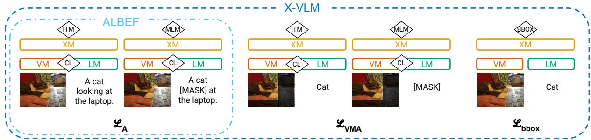  
Figure 1: Overview of the pretraining objectives effectively used by ALBEF and X-VLM.

BBOX loss. To take advantage of additional bounding box (bbox) data, X-VLM introduces an objective, $\mathcal { L } _ { \mathrm { b b o x } }$ , which learns to regress to object locations from object detection and region description data (see Figure 1 for an overview).

VMA loss. The X-VLM paper presents two losses, $\mathcal { L } _ { \mathrm { A } }$ and $\mathcal { L } _ { \mathrm { b b o x } }$ . However, $\mathcal { L } _ { \mathrm { A } }$ operates over two input types: image–text pairs from captioning data and image–text–bbox triplets from object detection data. Thus, it is hard disentangle the impact of the data and the losses on performance. We reformulate $\mathcal { L } _ { \mathrm { A } }$ into two losses,11 operating over: (a) image–text pairs, $\mathcal { L } _ { \mathrm { { A } } } .$ , as in ALBEF; or (b) image–text–bbox pairs, that we denote visually masked ALBEF loss, VMA. For ${ \mathcal { L } } _ { \mathrm { V M A } }$ , the visual and cross-modal encoders only attend to the image patches that correspond to the object bbox coordinates via an attention mask (see Figure 1). This results in an object-centric visual view for grounding the text label through the pretraining objectives. To compute this loss, in addition to the three forward passes described so far (CL and ITM, MLM, and BBOX losses), X-VLM performs two more passes: one where image patches outside a bounding box region are masked out to compute the visually masked CL and ITM loss, and another where text is additionally masked for the visually masked MLM loss. Section 5.3 shows both the data and pretraining techniques are key to the final model performance.

## 5.2 Experimental Setup

We re-implement ALBEF and X-VLM in JAX to ensure full control of modelling, data, and initialisation decisions.12 We initialise both models with a 224 224 ViT-B/16 visual encoder (Steiner et al., 2022), and $\mathbf { B E R T _ { B A S E } }$ (Devlin et al., 2019) weights in the text and cross-modal layers. Similar to Bugliarello et al. (2021), we pretrain our models on the exact same 4M and 14M datasets used by the authors (Table 2), but note that only 1.8M and 11.2M data points were available for CC3M and CC12M, respectively. For object detection data, we use the COCO and VG annotations released by the X-VLM authors. Following Zeng et al. (2022), we pretrain our models for 200K steps using the official hyperparameters (see App. A for more details).

## 5.3 Results

Table 4 shows the overall zero-shot performance of our ablations on three fine-grained benchmarks and two coarse-grained retrieval tasks. Row 0 is our ALBEF re-implementation, while row 10 corresponds to our X-VLM pretrained following the implementation of Zeng et al. (2022). Our controlled study allows us to quantify how each technique (losses, data, implementation details) in X-VLM contributes towards fine-grained understanding.

Data ablation. We first investigate the role of supervised detection data used to learn fine-grained relationships in X-VLM by pretraining the model, using its standard training objectives, and adding different data sources (rows 1–6).

Looking at rows 1–3, we find that region descriptions from VG $( \mathrm { V G } _ { \mathrm { R D } } )$ are the most useful, single-source signal for the model, resulting in improvements in both fine- and coarse-grained tasks. This variant is either close to or surpasses the final X-VLM variant (row 10) in all the tasks. We attribute this success to both its size (3.7M data points) and language format, wherein noun phrases, rather than simple labels, describe a given entity. In addition, object detection data from VG (VGOD) leads to similar fine-grained results as $\mathrm { C O C O _ { O D } }$ but significantly better zero-shot retrieval performance. $\mathrm { \Delta V G _ { O D } }$ is not only larger than $\mathrm { C O C O _ { O D } }$ but also includes a more diverse set of classes.13

<table><tr><td></td><td></td><td>Data</td><td></td><td></td><td></td><td>Loss</td><td></td><td></td><td>SVO-Probes VALSE VSR Random</td><td></td><td></td><td> $\mathbf { F l i c k r 3 0 K }$ </td><td></td><td>COCO</td><td></td></tr><tr><td></td><td> $\mid \mathcal { D } _ { \mathrm { A } }$ </td><td>COCOOD</td><td>VGOD</td><td>VGRD</td><td> $\mid { \mathcal { L } } _ { \mathrm { A } }$ </td><td></td><td>LvMA</td><td> ${ \mathcal { L } } _ { \mathrm { b b o x } }$ </td><td>Avg.</td><td>Avg.</td><td>Test Avg.</td><td>TR@1 IR@1</td><td></td><td></td><td>TR@1 IR@1</td></tr><tr><td></td><td>0|</td><td></td><td></td><td></td><td>√</td><td></td><td></td><td></td><td>85.9</td><td>68.7</td><td>59.3</td><td>76.3</td><td>59.8</td><td>60.9</td><td>45.7</td></tr><tr><td>1</td><td></td><td>√</td><td></td><td></td><td></td><td> $\quad { \left. \begin{array} { l l l } {  } & { \textsf { v } } & { \textsf { v } } \\ { \textsf { v } } & { \textsf { v } } & { \textsf { v } } \end{array} }\right.$ </td><td></td><td></td><td>85.9</td><td>69.1</td><td>58.6</td><td>72.8</td><td>59.5</td><td>60.8</td><td>46.1</td></tr><tr><td>23</td><td>&gt;&gt;</td><td></td><td>√</td><td></td><td></td><td></td><td></td><td></td><td>86.0</td><td>68.6</td><td>59.7</td><td>77.1</td><td>62.7</td><td>63.3</td><td>47.5</td></tr><tr><td></td><td>ぐ</td><td></td><td></td><td>√</td><td></td><td>11</td><td></td><td>V V</td><td>86.6</td><td>70.3</td><td>61.1</td><td>79.4</td><td>62.3</td><td>64.8</td><td>49.1</td></tr><tr><td></td><td>✓</td><td>√</td><td>√</td><td></td><td></td><td></td><td></td><td></td><td>85.6</td><td>67.5</td><td>60.7</td><td>77.2</td><td>60.7</td><td>63.3</td><td>47.3</td></tr><tr><td>456</td><td>✓ V</td><td>√</td><td>√</td><td>V V</td><td></td><td> $\quad : \ \downarrow \ \downarrow$ </td><td></td><td></td><td>86.5</td><td>67.6</td><td>60.1</td><td>77.2</td><td>61.4</td><td>62.9</td><td>47.6</td></tr><tr><td></td><td></td><td></td><td></td><td></td><td></td><td></td><td></td><td></td><td>86.9</td><td>71.1</td><td>62.5</td><td>79.7</td><td>63.4</td><td>64.4</td><td>49.1</td></tr><tr><td>7</td><td>V</td><td>V</td><td>V</td><td>V</td><td>√</td><td></td><td></td><td></td><td>85.9</td><td>69.3</td><td>58.2</td><td>75.5</td><td>58.9</td><td>61.9</td><td>45.8</td></tr><tr><td>8 9</td><td>V V</td><td>V</td><td>V V</td><td>V</td><td>✓</td><td>√</td><td></td><td></td><td>86.5</td><td>69.1</td><td>59.0</td><td>77.5</td><td>62.3</td><td>63.0</td><td>47.6</td></tr><tr><td></td><td></td><td>V</td><td></td><td>V</td><td>√ √</td><td></td><td></td><td></td><td>86.0</td><td>67.9</td><td>60.5</td><td>78.0</td><td>60.5</td><td>62.1</td><td>47.6</td></tr><tr><td>10</td><td>√</td><td>√</td><td>√</td><td>√</td><td></td><td>√</td><td></td><td>√</td><td>86.9</td><td>69.8</td><td>61.9</td><td>78.3</td><td>63.0</td><td>64.6</td><td>48.6</td></tr></table>

Table 4: Overall performance of X-VLM ablations pretrained on the exact same data. Rows 0 and 10 are our re-implementation of ALBEF and X-VLM, respectively. Rows 3, 4, and 8 correspond to “w/o object, ${ \mathrm { ^ { 5 9 } ~ } } ^ { 6 6 } \mathrm { w } / \mathrm { o }$ region,” and ${ ^ { 6 6 } \mathrm { w } / \mathrm { o } }$ bbox” ablations in Zeng et al. (2022). We find that ${ \mathcal { L } } _ { \mathrm { V M A } }$ is crucial towards X-VLM’s performance, and that $\mathrm { V G } _ { \mathrm { R D } }$ yields richer signal for both coarse- and fine-grained tasks.

We hypothesise that a large number of classes (as in $\mathrm { \Delta V G _ { O D } ) }$ is important for coarse-grained retrieval tasks, and more descriptive phrases of $\mathrm { V G } _ { \mathrm { R D } }$ (rather than single labels) significantly impact fine-grained tasks. To verify this, we disentangle the effect of data size and type: specifically, we re-train rows 2–3 on a subset of VG with the same number of images and annotations as in $\mathrm { C O C O _ { O D } }$ Figure 2 confirms our hypothesis: even when controlled for size, $\mathrm { V G } _ { \mathrm { R D } }$ leads to notably better performance than $\mathrm { C O C O _ { O D } }$ . On coarse-grained datasets, $\mathrm { \Delta V G _ { O D } }$ largely outperforms COCOOD.

Looking at multi-source supervised data (rows 4–6), our best performing model combines $\mathrm { \Delta V G _ { O D } }$ and $\mathrm { V G } _ { \mathrm { R D } }$ data (row 6) and, surprisingly, adding $\mathrm { C O C O _ { O D } }$ does not boost performance.

Loss ablation. We investigate the role of the two objectives used during supervised pretraining of X-VLM (rows 7–9). We see that training an ALBEF model on object detection data as-is (row 7) results in similar performance as pretraining it on standard image–caption data. That is, just adding more data is not enough; additional supervision in the form of the X-VLM pretraining objectives is crucial.

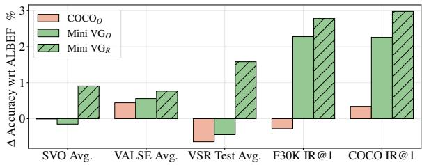  
Figure 2: Performance on our benchmarks of X-VLM wrt ALBEF in a controlled setup with a single supervised dataset having the same number of images and annotations. Region descriptions give the highest gains.

Compared to ${ \mathcal { L } } _ { \mathrm { b b o x } }$ (row 9), our reformulation makes it clear that ${ \mathcal { L } } _ { \mathrm { V M A } }$ (row 8) leads, on average, to both higher fine-grained accuracy and higher recall on retrieval tasks. One potential explanation is that the visually masked forward pass directly influences the representation learned by the contrastive loss, as well as the cross-modal representations. In contrast, the regression loss only occurs after crossmodal interaction, suggesting that better alignment is important in both contrastive and cross-modal features. Finally, X-VLM achieves its best performance when combining ${ \mathcal { L } } _ { \mathrm { V M A } }$ and ${ \mathcal { L } } _ { \mathrm { b b o x } }$

Takeaways. Our reformulation of X-VLM allows us to conduct a careful analysis in a controlled setup on how data and losses influence X-VLM performance. We show that more data does not improve performance unless paired with additional supervisory signal, in the form of either the visually masked ALBEF loss or bbox regression. Given our observations and the fact that, as seen in Section 4 and App. B.1, X-VLM largely outperforms the large-scale CLIP and BLIP-2 models on finegrained tasks such as VALSE and Winoground, we believe that a promising direction in fine-grained understanding will require careful model and loss design with rich data sources like VG, not just scaling up with (potentially) noisy data.

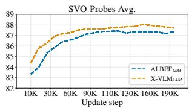

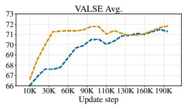

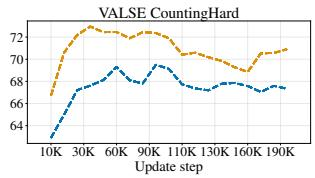

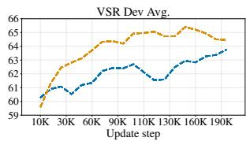

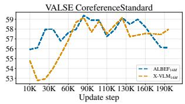

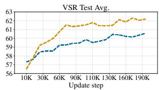

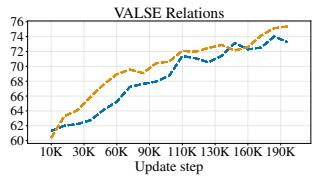

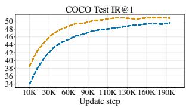  
Figure 3: Training dynamics of our $\mathbf { A L B E F } _ { 1 4 \mathbf { M } }$ and $\mathbf { X - V L M _ { 1 4 M } }$ models. Models’ overall performance converges at different rates on different fine-grained benchmarks (top row). Performance on specific skills varies drastically, with some skills that deteriorate after an initial peak (bottom row). Retrieval performance (bottom right) does not capture this diversity in dynamics. Values smoothed with 0.6 factor for better visualisation. Full results in App. B.2.

## 6 Dynamics of Fine-grained Tasks

We now analyse the dynamics of fine-grained skills for our models to investigate (i) when and whether they are acquired, and (ii) how they relate to one another, especially when they aim at measuring similar capabilities. For example, does action understanding in VALSE correlate with verb understanding in SVO-Probes? Are there skills that vastly differ from each other that they would require different modelling contributions (e.g., counting)?

Experimental setup. We evaluate checkpoints (every 10K steps) from pretraining our ALBEF and X-VLM re-implementations with 4M and 14M data points. We focus on 14M results as we see similar patterns with 4M (see App. B.2). When evaluating correlation patterns, we report both Pearson and Spearman correlation coefficients.

Different skills, different patterns. Figure 3 (top) shows how the average model performance evolves during pretraining for the four benchmarks. Interestingly, the performance on these benchmarks converges at different rates: both ALBEF and X-VLM models easily improve on SVO-Probes. Moreover, we observe that modelling objects (à la X-VLM) leads not only to better fine-grained understanding after 200K steps (Tables 3 and 4), but also to remarkably quicker learning rates.

Figure 3 (bottom) shows performance on indicative VALSE tasks, as well as on coarse-grained image retrieval on COCO. While some skills, such as spatial relations understanding, are learned progressively during pretraining, others, such as counting, degrade after a first, short learning phase. Finally, other skills, such as coreference resolution, oscillate significantly throughout pretraining, showing how models can not properly acquire them. This is in contrast to the coarse-grained COCO retrieval task for which the performance steadily increases over time. We conclude that it is particularly important to examine the training dynamics of fine-grained tasks, and that a single checkpoint might be inadequate for a number of skills. Results on all tasks are provided in App. B.2, including on Winoground for an ALBEF4M that we pretrained on GCP using the original codebase.

Same skills, same patterns? We next investigate whether closely-related tasks in different benchmarks have high correlation throughout pretraining. While we find that VALSE action replacement and SVO-Verb have a +55/67% Pearson/Spearman correlation, there is a -13/11% correlation between VALSE actant swap and SVO-Subject.

Looking at VALSE spatial relations, we find high correlation (+75/65%) with average VSR performance, and especially with relations such as on top of, on, inside, by, and in; mostly belonging to the ‘Topological’ category in VSR. On the other hand, we find almost no correlation with several ‘Directional’ (e.g., across from) and ‘Orientation’ (e.g., parallel to) relations, as well as with some ‘Topological’ ones (e.g., touching); and even negative correlation (-40% or less) with alongside, below, toward, part of and near.

Finally, surprisingly, VSR dev and test splits are not positively correlated for all relations. While average performance is highly correlated (+77/78%), only a few relations have Pearson/Spearman coefficients larger than 30% (in, on, above, within, and consists of). On the other hand, near, ahead of and adjacent to are negatively correlated between dev and test sets, and most relations show very low correlations between the two sets. As a result, improvement in a given relation type on the dev set, will likely not transfer at test time.

Takeaways. When tested on fine-grained benchmarks, we observe that, compared to ALBEF, X-VLM is more sample efficient as it achieves higher performance with fewer training steps. Also, while some tasks steadily improve during pretraining, for others, the performance degrades orfluctuates. Moreover, surprisingly, the performance of tasks measuring similar skills but from different benchmarks do not always positively correlate.

## 7 Discussion

While recent pretrained VLMs achieve impressive performance on various downstream benchmarks (such as visual question answering and image retrieval), recent benchmarks have highlighted that they still struggle with tasks that require finegrained understanding—where a model needs to correctly align various aspects of an image to their corresponding language entities. Yet, it is still not known to which extent recent fine-grained VLMs (e.g., Zeng et al., 2022; Yao et al., 2022b; Li et al., 2022a; Dou et al., 2022) fare on such benchmarks. We address this gap by evaluating strong and fine-grained models on four benchmarks (Hendricks and Nematzadeh, 2021; Parcalabescu et al., 2022; Liu et al., 2023; Thrush et al., 2022), and encourage future work to report zero-shot finegrained performance on our selection of benchmarks, especially if models are not open-source.

Our work contributes to a growing thread of research devoted to understand what is learned by pretrained VLMs, such as studying cross-attention patterns (Cao et al., 2020), cross-modal input ablations (Frank et al., 2021), probing linguistic and visual structure (Milewski et al., 2022; Salin et al., 2022; Nikolaus et al., 2022), robustness to words order (Akula et al., 2020; Thrush et al., 2022), and incorrectly fusing image and language modalities (Diwan et al., 2022). Here, we show that object modelling through a prediction loss (as done in X-VLM) results in notable improvements across all benchmarks, outperforming models trained on much larger amounts of Web data. Our analysis highlights that teaching VLMs concepts of objects (e.g., by masking irrelevant parts of the image) is crucial for effectively learning fine-grained skills. Though our models rely on supervised data to learn better localisation, we hope our findings can encourage researchers to design better loss functions for image–text mapping from unsupervised, Webscale data as well.

Finally, our results also highlight the challenges of evaluating fine-grained understanding: the recent benchmarks capture a variety of subtasks (from counting to relation understanding); to perform well on these subtasks, a model requires different skills. Indeed, we observe that, during training, model performance does not always increase for all subtasks, and in particular, fluctuates a lot for counting, coreference resolution, and various spatial relations. An important future direction is designing models that perform well on a larger range of these subtasks, where improving on one subtask does not degrade performance on the rest. It is unclear why benchmarks do not always correlate; possible reasons include the data itself (images selected for analysis, annotator instructions), or that different competencies are required for different fine-grained tasks. We hope future work can explore this further, possibly by closely examining data in fine-grained benchmarks or expanding the models used in analysis beyond what we used here.

## Limitations

Our work focuses on assessing recent English VLMs on tasks which require fine-grained understanding. Here, we outline limitations that we believe are important considerations for future work.

First, we only examined a limited number of models. These include (i) strong coarse-grained models, such as ALBEF, CLIP, FLAMINGO and BLIP-2, and (ii) two strong fine-grained models, PEVL and X-VLM, that build on ALBEF. While we believe our selection of models is representative of strong components in pretrained VLMs (such as dual-encoder and cross-modal interactions), we could not easily evaluate different approaches towards fine-grained understanding (e.g., Yao et al., 2022a; Li et al., 2022a) as the corresponding models and code are not open-source. We hence hope our study will motivate future work to report zeroshot performance on fine-grained benchmarks.

Second, we evaluate our models in a zero–shot setting using image–text matching. Future work could consider how fine-grained understanding improves when fine-tuning for specific tasks. As opposed to relying on image–text matching scores, alternative methods like input ablations, visualising attention or activations could also be used to gain an understanding of potential failure modes.

Third, though we note specific areas where model performance fluctuates a lot during pretraining, we look forward to future research that improves performance for various such areas, like existence and counting.

Finally, some datasets we use are quite small. For example, Winoground only has 1,600 data points. We hope that our analysis sheds light on the kinds of skills models struggle with and encourages more and larger datasets that test for these skills.

## Ethics Statement

All datasets used in this work have been previously published. Multimodal datasets frequently include social biases (Meister et al., 2022), and we expect the models trained on them to reflect the biases in these datasets. Datasets also include images of people, and there is no mechanism for people to remove themselves from these datasets.

Multimodal models have many downstream uses. Some examples of beneficial applications include: more advanced image and video retrieval, visual description systems to aid the visually impaired, and interfaces which allow users to more seamlessly interact with smart home devices. Harmful applications might include surveillance, especially when imagery of people is being used without their consent, or fine-tuning a model to retrieve harmful content, such as pornographic material.

In this work, we aim to understand how models perform on fine-grained tasks which highlights current failure modes of our models. We hope insights from our work can inspire (i) novel models which perform well on a broad set of fine-grained tasks, as well as (ii) more high quality data to stress test our models. We hope our work also helps those who might use multimodal models in downstream applications better anticipate how well these models might perform on their tasks.

## Acknowledgements

The authors would like to thank the anonymous reviewers, Antoine Miech, Ravichandra Addanki, Wojciech Stokowiec, Chris Dyer and the Deep-Mind Language Team for feedback on this project.

## References

Arjun Akula, Spandana Gella, Yaser Al-Onaizan, Song-Chun Zhu, and Siva Reddy. 2020. Words aren’t enough, their order matters: On the robustness of grounding visual referring expressions. In Proceedings ofthe 58th Annual Meeting ofthe Association for Computational Linguistics, pages 6555–6565, Online. Association for Computational Linguistics.

Jean-Baptiste Alayrac, Jeff Donahue, Pauline Luc, Antoine Miech, Iain Barr, Yana Hasson, Karel Lenc, Arthur Mensch, Katherine Millican, Malcolm Reynolds, Roman Ring, Eliza Rutherford, Serkan Cabi, Tengda Han, Zhitao Gong, Sina Samangooei, Marianne Monteiro, Jacob Menick, Sebastian Borgeaud, Andrew Brock, Aida Nematzadeh, Sahand Sharifzadeh, Mikolaj Binkowski, Ricardo Barreira, Oriol Vinyals, Andrew Zisserman, and Karen Simonyan. 2022. Flamingo: a visual language model for few-shot learning. In Advances in Neural Information Processing Systems.

Igor Babuschkin, Kate Baumli, Alison Bell, Surya Bhupatiraju, Jake Bruce, Peter Buchlovsky, David Budden, Trevor Cai, Aidan Clark, Ivo Danihelka, Antoine Dedieu, Claudio Fantacci, Jonathan Godwin, Chris Jones, Ross Hemsley, Tom Hennigan, Matteo Hessel, Shaobo Hou, Steven Kapturowski, Thomas Keck, Iurii Kemaev, Michael King, Markus Kunesch, Lena Martens, Hamza Merzic, Vladimir Mikulik, Tamara Norman, George Papamakarios, John Quan, Roman Ring, Francisco Ruiz, Alvaro Sanchez, Rosalia Schneider, Eren Sezener, Stephen Spencer, Srivatsan Srinivasan, Wojciech Stokowiec, Luyu Wang, Guangyao Zhou, and Fabio Viola. 2020. The Deep-Mind JAX Ecosystem.

Emanuele Bugliarello, Ryan Cotterell, Naoaki Okazaki, and Desmond Elliott. 2021. Multimodal Pretraining Unmasked: A Meta-Analysis and a Unified Framework of Vision-and-Language BERTs. Transactions of the Association for Computational Linguistics, 9:978–994.

Jize Cao, Zhe Gan, Yu Cheng, Licheng Yu, Yen-Chun Chen, and Jingjing Liu. 2020. Behind the scene: Revealing the secrets of pre-trained vision-and-language models. In Computer Vision - ECCV 2020 - 16th European Conference, Glasgow, UK, August 23-28, 2020, Proceedings, Part VI, volume 12351 of Lecture Notes in Computer Science, pages 565–580. Springer.

Soravit Changpinyo, Piyush Sharma, Nan Ding, and Radu Soricut. 2021. Conceptual 12m: Pushing webscale image-text pre-training to recognize long-tail visual concepts. In Proceedings of the IEEE/CVF Conference on Computer Vision and Pattern Recognition (CVPR), pages 3558–3568.

Ting Chen, Saurabh Saxena, Lala Li, Tsung-Yi Lin, David J. Fleet, and Geoffrey Hinton. 2022. A unified sequence interface for vision tasks. In Advances in Neural Information Processing Systems.

Xi Chen, Xiao Wang, Soravit Changpinyo, AJ Piergiovanni, Piotr Padlewski, Daniel Salz, Sebastian Goodman, Adam Grycner, Basil Mustafa, Lucas Beyer, Alexander Kolesnikov, Joan Puigcerver, Nan Ding, Keran Rong, Hassan Akbari, Gaurav Mishra, Linting Xue, Ashish V Thapliyal, James Bradbury, Weicheng Kuo, Mojtaba Seyedhosseini, Chao Jia, Burcu Karagol Ayan, Carlos Riquelme Ruiz, Andreas Peter Steiner, Anelia Angelova, Xiaohua Zhai, Neil Houlsby, and Radu Soricut. 2023. PaLI: A jointly-scaled multilingual language-image model. In The Eleventh International Conference on Learning Representations.

Yen-Chun Chen, Linjie Li, Licheng Yu, Ahmed El Kholy, Faisal Ahmed, Zhe Gan, Yu Cheng, and Jingjing Liu. 2020. UNITER: Universal image-text representation learning. In European Conference on Computer Vision, pages 104–120. Springer.

Hyung Won Chung, Le Hou, Shayne Longpre, Barret Zoph, Yi Tay, William Fedus, Eric Li, Xuezhi Wang, Mostafa Dehghani, Siddhartha Brahma, Albert Webson, Shixiang Shane Gu, Zhuyun Dai, Mirac Suzgun, Xinyun Chen, Aakanksha Chowdhery, Alex Castro-Ros, Marie Pellat, Dasha Valter Kevin Robinson, Sharan Narang, Gaurav Mishra, Adams Yu, Yanping Huang Vincent Zhao, Andrew Dai, Hongkun Yu, Slav Petrov, Ed H. Chi, Jeff Dean, Jacob Devlin, Adam Roberts, Denny Zhou, Quoc V. Le, and Jason Wei. 2022. Scaling instruction-finetuned language models. arXiv preprint arXiv:2210.11416.

Jacob Devlin, Ming-Wei Chang, Kenton Lee, and Kristina Toutanova. 2019. BERT: Pre-training of deep bidirectional transformers for language understanding. In Proceedings ofthe 2019 Conference of the North American Chapter of the Association for Computational Linguistics: Human Language Technologies, Volume 1 (Long and Short Papers), pages 4171–4186, Minneapolis, Minnesota. Association for Computational Linguistics.

Anuj Diwan, Layne Berry, Eunsol Choi, David Harwath, and Kyle Mahowald. 2022. Why is Winoground hard? Investigating failures in visuolinguistic compositionality. In Proceedings ofthe 2022 Conference on Empirical Methods in Natural Language Processing, pages 2236–2250, Abu Dhabi, United Arab Emirates. Association for Computational Linguistics.

Alexey Dosovitskiy, Lucas Beyer, Alexander Kolesnikov, Dirk Weissenborn, Xiaohua Zhai, Thomas Unterthiner, Mostafa Dehghani, Matthias Minderer, Georg Heigold, Sylvain Gelly, Jakob Uszkoreit, and Neil Houlsby. 2021. An image is worth 16x16 words: Transformers for image recognition at scale. In International Conference on Learning Representations.

Zi-Yi Dou, Aishwarya Kamath, Zhe Gan, Pengchuan Zhang, Jianfeng Wang, Linjie Li, Zicheng Liu, Ce Liu, Yann LeCun, Nanyun Peng, Jianfeng Gao, and Lijuan Wang. 2022. Coarse-to-fine visionlanguage pre-training with fusion in the backbone. In Advances in Neural Information Processing Systems.

Stella Frank, Emanuele Bugliarello, and Desmond Elliott. 2021. Vision-and-language or vision-forlanguage? On cross-modal influence in multimodal transformers. In Proceedings ofthe 2021 Conference on Empirical Methods in Natural Language Processing, pages 9847–9857, Online and Punta Cana, Dominican Republic. Association for Computational Linguistics.

Yuting Gao, Jinfeng Liu, Zihan Xu, Jun Zhang, Ke Li, Rongrong Ji, and Chunhua Shen. 2022. Pyramid-CLIP: Hierarchical feature alignment for visionlanguage model pretraining. In Advances in Neural Information Processing Systems.

Yash Goyal, Tejas Khot, Douglas Summers-Stay, Dhruv Batra, and Devi Parikh. 2017. Making the v in VQA matter: Elevating the role of image understanding in visual question answering. In Proceedings ofthe IEEE Conference on Computer Vision and Pattern Recognition (CVPR).

Xiaoshuai Hao, Yi Zhu, Srikar Appalaraju, Aston Zhang, Wanqian Zhang, Bo Li, and Mu Li. 2023. MixGen: A new multi-modal data augmentation. In Proceedings ofthe IEEE/CVF Winter Conference on Applications of Computer Vision (WACV) Workshops, pages 379–389.

Lisa Anne Hendricks, John Mellor, Rosalia Schneider, Jean-Baptiste Alayrac, and Aida Nematzadeh. 2021. Decoupling the role of data, attention, and losses in multimodal transformers. Transactions ofthe Associationfor Computational Linguistics, 9:570–585.

Lisa Anne Hendricks and Aida Nematzadeh. 2021. Probing image-language transformers for verb understanding. In Findings ofthe Associationfor Computational Linguistics: ACL-IJCNLP 2021, pages 3635–3644, Online. Association for Computational Linguistics.

Jordan Hoffmann, Sebastian Borgeaud, Arthur Mensch, Elena Buchatskaya, Trevor Cai, Eliza Rutherford, Diego de las Casas, Lisa Anne Hendricks, Johannes Welbl, Aidan Clark, Tom Hennigan, Eric Noland, Katherine Millican, George van den Driessche, Bogdan Damoc, Aurelia Guy, Simon Osindero, Karen Simonyan, Erich Elsen, Oriol Vinyals, Jack William Rae, and Laurent Sifre. 2022. An empirical analysis of compute-optimal large language model training. In Advances in Neural Information Processing Systems.

Drew A. Hudson and Christopher D. Manning. 2019. GQA: A new dataset for real-world visual reasoning and compositional question answering. In Proceedings of the IEEE/CVF Conference on Computer Vision and Pattern Recognition (CVPR).

Andrew Jaegle, Felix Gimeno, Andy Brock, Oriol Vinyals, Andrew Zisserman, and Joao Carreira. 2021. Perceiver: General perception with iterative attention. In Proceedings of the 38th International Conference on Machine Learning, volume 139 of Proceedings

of Machine Learning Research, pages 4651–4664. PMLR.

Sahar Kazemzadeh, Vicente Ordonez, Mark Matten, and Tamara Berg. 2014. ReferItGame: Referring to objects in photographs of natural scenes. In Proceedings ofthe 2014 Conference on Empirical Methods in Natural Language Processing (EMNLP), pages 787– 798, Doha, Qatar. Association for Computational Linguistics.

Ranjay Krishna, Yuke Zhu, Oliver Groth, Justin Johnson, Kenji Hata, Joshua Kravitz, Stephanie Chen, Yannis Kalantidis, Li-Jia Li, David A. Shamma, Michael S. Bernstein, and Li Fei-Fei. 2017. Visual genome: Connecting language and vision using crowdsourced dense image annotations. Int. J. Comput. Vision, 123(1):32–73.

Benno Krojer, Vaibhav Adlakha, Vibhav Vineet, Yash Goyal, Edoardo Ponti, and Siva Reddy. 2022. Image retrieval from contextual descriptions. In Proceed ings ofthe 60th Annual Meeting ofthe Association for Computational Linguistics (Volume 1: Long Papers), pages 3426–3440, Dublin, Ireland. Association for Computational Linguistics.

Alina Kuznetsova, Hassan Rom, Neil Alldrin, Jasper Uijlings, Ivan Krasin, Jordi Pont-Tuset, Shahab Kamali, Stefan Popov, Matteo Malloci, Alexander Kolesnikov, Tom Duerig, and Vittorio Ferrari. 2020. The Open Images dataset v4: Unified image classification, object detection, and visual relationship detection at scale. Int. J. Comput. Vision, 128(7):1956–1981.

Juho Lee, Yoonho Lee, Jungtaek Kim, Adam Kosiorek, Seungjin Choi, and Yee Whye Teh. 2019. Set Transformer: A framework for attention-based permutation-invariant neural networks. In Proceedings of the 36th International Conference on Machine Learning, volume 97 of Proceedings of Machine Learning Research, pages 3744–3753. PMLR.

Juncheng Li, Xin He, Longhui Wei, Long Qian, Linchao Zhu, Lingxi Xie, Yueting Zhuang, Qi Tian, and Siliang Tang. 2022a. Fine-grained semantically aligned vision-language pre-training. In Advances in Neural Information Processing Systems.

Junnan Li, Dongxu Li, Silvio Savarese, and Steven Hoi. 2023. BLIP-2: Bootstrapping language-image pretraining with frozen image encoders and large language models. In Proceedings of the 40th International Conference on Machine Learning, Proceedings of Machine Learning Research. PMLR.

Junnan Li, Dongxu Li, Caiming Xiong, and Steven Hoi. 2022b. BLIP: Bootstrapping language-image pretraining for unified vision-language understanding and generation. In Proceedings of the 39th International Conference on Machine Learning, volume 162 of Proceedings of Machine Learning Research, pages 12888–12900. PMLR.

Junnan Li, Ramprasaath Selvaraju, Akhilesh Gotmare, Shafiq Joty, Caiming Xiong, and Steven Chu Hong Hoi. 2021. Align before fuse: Vision and language representation learning with momentum distillation. In Advances in Neural Information Processing Systems, volume 34, pages 9694–9705. Curran Associates, Inc.

Xiujun Li, Xi Yin, Chunyuan Li, Pengchuan Zhang, Xiaowei Hu, Lei Zhang, Lijuan Wang, Houdong Hu, Li Dong, Furu Wei, Yejin Choi, and Jianfeng Gao. 2020. Oscar: Object-semantics aligned pretraining for vision-language tasks. In Computer Vision – ECCV 2020, pages 121–137, Cham. Springer International Publishing.

Tsung-Yi Lin, Michael Maire, Serge Belongie, James Hays, Pietro Perona, Deva Ramanan, Piotr Dollár, and C. Lawrence Zitnick. 2014. Microsoft COCO: Common objects in context. In Computer Vision – ECCV 2014, pages 740–755, Cham. Springer International Publishing.

Fangyu Liu, Guy Edward Toh Emerson, and Nigel Collier. 2023. Visual spatial reasoning. Transactions of the Association for Computational Linguistics.

Ze Liu, Yutong Lin, Yue Cao, Han Hu, Yixuan Wei, Zheng Zhang, Stephen Lin, and Baining Guo. 2021. Swin Transformer: Hierarchical vision transformer using shifted windows. In Proceedings of the IEEE/CVF International Conference on Computer Vision (ICCV), pages 10012–10022.

Jiasen Lu, Vedanuj Goswami, Marcus Rohrbach, Devi Parikh, and Stefan Lee. 2020. 12-in-1: Multi-task vision and language representation learning. In Proceedings of the IEEE/CVF Conference on Computer Vision and Pattern Recognition (CVPR).

Junhua Mao, Jonathan Huang, Alexander Toshev, Oana Camburu, Alan Yuille, and Kevin Murphy. 2016. Generation and comprehension of unambiguous object descriptions. In 2016 IEEE Conference on Computer Vision and Pattern Recognition (CVPR), pages 11–20.

Nicole Meister, Dora Zhao, Angelina Wang, Vikram V Ramaswamy, Ruth Fong, and Olga Russakovsky. 2022. Gender artifacts in visual datasets. arXiv preprint arXiv:2206.09191.

Victor Milewski, Miryam de Lhoneux, and Marie-Francine Moens. 2022. Finding structural knowledge in multimodal-BERT. In Proceedings of the 60th Annual Meeting ofthe Associationfor Computational Linguistics (Volume 1: Long Papers), pages 5658–5671, Dublin, Ireland. Association for Computational Linguistics.

Ron Mokady, Amir Hertz, and Amit H Bermano. 2021. ClipCap: CLIP prefix for image captioning. arXiv preprint arXiv:2111.09734.

Mitja Nikolaus, Emmanuelle Salin, Stephane Ayache, Abdellah Fourtassi, and Benoit Favre. 2022. Do vision-and-language transformers learn grounded predicate-noun dependencies? In Proceedings of the 2022 Conference on Empirical Methods in Natural Language Processing, pages 1538–1555, Abu Dhabi, United Arab Emirates. Association for Computational Linguistics.

Vicente Ordonez, Girish Kulkarni, and Tamara Berg. 2011. Im2text: Describing images using 1 million captioned photographs. In Advances in Neural Information Processing Systems, volume 24. Curran Associates, Inc.

Letitia Parcalabescu, Michele Cafagna, Lilitta Muradjan, Anette Frank, Iacer Calixto, and Albert Gatt. 2022. VALSE: A task-independent benchmark for vision and language models centered on linguistic phenomena. In Proceedings ofthe 60th Annual Meeting ofthe Associationfor Computational Linguistics (Volume 1: Long Papers), pages 8253–8280, Dublin, Ireland. Association for Computational Linguistics.

Bryan A. Plummer, Liwei Wang, Chris M. Cervantes, Juan C. Caicedo, Julia Hockenmaier, and Svetlana Lazebnik. 2015. Flickr30k entities: Collecting region-to-phrase correspondences for richer imageto-sentence models. In 2015 IEEE International Conference on Computer Vision (ICCV), pages 2641– 2649.

Alec Radford, Jong Wook Kim, Chris Hallacy, Aditya Ramesh, Gabriel Goh, Sandhini Agarwal, Girish Sastry, Amanda Askell, Pamela Mishkin, Jack Clark, Gretchen Krueger, and Ilya Sutskever. 2021. Learning transferable visual models from natural language supervision. In Proceedings of the 38th International Conference on Machine Learning, volume 139 of Proceedings of Machine Learning Research, pages 8748–8763. PMLR.

Alec Radford, Jeffrey Wu, Rewon Child, David Luan, Dario Amodei, Ilya Sutskever, et al. 2019. Language models are unsupervised multitask learners. OpenAI blog, 1(8):9.

Emmanuelle Salin, Badreddine Farah, Stéphane Ayache, and Benoit Favre. 2022. Are vision-language transformers learning multimodal representations? a probing perspective. Proceedings ofthe AAAI Conference on Artificial Intelligence, 36(10):11248–11257.

Christoph Schuhmann, Richard Vencu, Romain Beaumont, Robert Kaczmarczyk, Clayton Mullis, Aarush Katta, Theo Coombes, Jenia Jitsev, and Aran Komatsuzaki. 2021. LAION-400M: Open dataset of CLIP-filtered 400 million image-text pairs. arXiv preprint arXiv:2111.02114.

Shuai Shao, Zeming Li, Tianyuan Zhang, Chao Peng, Gang Yu, Xiangyu Zhang, Jing Li, and Jian Sun. 2019. Objects365: A large-scale, high-quality dataset for object detection. In 2019 IEEE/CVF International Conference on Computer Vision (ICCV), pages 8429–8438.

Piyush Sharma, Nan Ding, Sebastian Goodman, and Radu Soricut. 2018. Conceptual Captions: A cleaned, hypernymed, image alt-text dataset for automatic image captioning. In Proceedings of the 56th Annual Meeting of the Association for Computational Linguistics (Volume 1: Long Papers), pages 2556–2565, Melbourne, Australia. Association for Computational Linguistics.

Ravi Shekhar, Sandro Pezzelle, Yauhen Klimovich, Aurélie Herbelot, Moin Nabi, Enver Sangineto, and Raffaella Bernardi. 2017. FOIL it! find one mismatch between image and language caption. In Proceedings of the 55th Annual Meeting of the Association for Computational Linguistics (Volume 1: Long Papers), pages 255–265, Vancouver, Canada. Association for Computational Linguistics.

Amanpreet Singh, Ronghang Hu, Vedanuj Goswami, Guillaume Couairon, Wojciech Galuba, Marcus Rohrbach, and Douwe Kiela. 2022. FLAVA: A foundational language and vision alignment model. In Proceedings ofthe IEEE/CVF Conference on Computer Vision and Pattern Recognition (CVPR), pages 15638–15650.

Andreas Peter Steiner, Alexander Kolesnikov, Xiaohua Zhai, Ross Wightman, Jakob Uszkoreit, and Lucas Beyer. 2022. How to train your ViT? Data, augmentation, and regularization in vision transformers. Transactions on Machine Learning Research.

Alane Suhr, Stephanie Zhou, Ally Zhang, Iris Zhang, Huajun Bai, and Yoav Artzi. 2019. A corpus for reasoning about natural language grounded in photographs. In Proceedings of the 57th Annual Meeting of the Association for Computational Linguistics, pages 6418–6428, Florence, Italy. Association for Computational Linguistics.

Hao Tan and Mohit Bansal. 2019. LXMERT: Learning cross-modality encoder representations from transformers. In Proceedings ofthe 2019 Conference on Empirical Methods in Natural Language Processing and the 9th International Joint Conference on Natural Language Processing (EMNLP-IJCNLP), pages 5100–5111, Hong Kong, China. Association for Computational Linguistics.

Tristan Thrush, Ryan Jiang, Max Bartolo, Amanpreet Singh, Adina Williams, Douwe Kiela, and Candace Ross. 2022. Winoground: Probing vision and language models for visio-linguistic compositionality. In Proceedings ofthe IEEE/CVF Conference on Computer Vision and Pattern Recognition (CVPR), pages 5238–5248.

Hugo Touvron, Matthieu Cord, Matthijs Douze, Francisco Massa, Alexandre Sablayrolles, and Herve Jegou. 2021. Training data-efficient image transformers & distillation through attention. In Proceedings of the 38th International Conference on Machine Learning, volume 139 of Proceedings of Machine Learning Research, pages 10347–10357. PMLR.

Ashish Vaswani, Noam Shazeer, Niki Parmar, Jakob Uszkoreit, Llion Jones, Aidan N. Gomez, Łukasz Kaiser, and Illia Polosukhin. 2017. Attention is all you need. In Advances in Neural Information Processing Systems, volume 30. Curran Associates, Inc.

Jinyu Yang, Jiali Duan, Son Tran, Yi Xu, Sampath Chanda, Liqun Chen, Belinda Zeng, Trishul Chilimbi, and Junzhou Huang. 2022. Vision-language pretraining with triple contrastive learning. In Proceedings of the IEEE/CVF Conference on Computer Vision and Pattern Recognition (CVPR), pages 15671– 15680.

Lewei Yao, Runhui Huang, Lu Hou, Guansong Lu, Minzhe Niu, Hang Xu, Xiaodan Liang, Zhenguo Li, Xin Jiang, and Chunjing Xu. 2022a. FILIP: Finegrained interactive language-image pre-training. In International Conference on Learning Representations.

Yuan Yao, Qianyu Chen, Ao Zhang, Wei Ji, Zhiyuan Liu, Tat-Seng Chua, and Maosong Sun. 2022b. PEVL: Position-enhanced pre-training and prompt tuning for vision-language models. In Proceedings of the 2022 Conference on Empirical Methods in Natural Language Processing (EMNLP), pages 11104–11117, Abu Dhabi, United Arab Emirates. Association for Computational Linguistics.

Peter Young, Alice Lai, Micah Hodosh, and Julia Hockenmaier. 2014. From image descriptions to visual denotations: New similarity metrics for semantic inference over event descriptions. Transactions of the Associationfor Computational Linguistics, 2:67–78.

Mert Yuksekgonul, Federico Bianchi, Pratyusha Kalluri, Dan Jurafsky, and James Zou. 2023. When and why vision-language models behave like bags-of-words, and what to do about it? In The Eleventh International Conference on Learning Representations.

Rowan Zellers, Yonatan Bisk, Ali Farhadi, and Yejin Choi. 2019. From recognition to cognition: Visual commonsense reasoning. In Proceedings ofthe IEEE/CVF Conference on Computer Vision and Pat tern Recognition (CVPR).

Yan Zeng, Xinsong Zhang, and Hang Li. 2022. Multigrained vision language pre-training: Aligning texts with visual concepts. In Proceedings of the 39th International Conference on Machine Learning, volume 162 of Proceedings of Machine Learning Research, pages 25994–26009. PMLR.

Pengchuan Zhang, Xiujun Li, Xiaowei Hu, Jianwei Yang, Lei Zhang, Lijuan Wang, Yejin Choi, and Jianfeng Gao. 2021. VinVL: Revisiting visual representations in vision-language models. In Proceedings of the IEEE/CVF Conference on Computer Vision and Pattern Recognition (CVPR), pages 5579–5588.

Susan Zhang, Stephen Roller, Naman Goyal, Mikel Artetxe, Moya Chen, Shuohui Chen, Christopher Dewan, Mona Diab, Xian Li, Xi Victoria Lin, Todor Mihaylov, Myle Ott, Sam Shleifer, Kurt Shuster, Daniel

Simig, Punit Singh Koura, Anjali Sridhar, Tianlu Wang, and Luke Zettlemoyer. 2022. OPT: Open pretrained transformer language models. arXiv preprint arXiv:2205.01068.

## A Experimental Setup

In this section, we provide further details on the experimental setups that we used for our studies.

## A.1 Evaluated Models: Details

We provide more details on the models we use to evaluate progress in fine-grained V&L understanding. See Table 5 for an overview.14

ALBEF (Li et al., 2021) is a recent VLM that has gained popularity due to its design choices, effectively combining core components in V&L learning, such as a contrastive objective and cross-attention, that result in strong downstream performance. ALBEF is a dual-stream encoder (Bugliarello et al., 2021) that first encodes images and captions independently with a vision (ViT; Dosovitskiy et al. 2021; Touvron et al. 2021) and text (BERT; Devlin et al. 2019) Transformer, respectively; and then fuses them in a cross-modal Transformer. The model is pretrained with three objectives: masked language modelling (MLM), unimodal image–text contrastive learning and cross-modal image–text matching. We refer to the original work for more details. While AL-BEF does not explicitly train for fine-grained understanding, it serves as an important baseline since our three other models build on top of it.

BLIP (Li et al., 2022b) is a unified V&L understanding and generation model, that can be applied to a wide range of downstream tasks. A key component to BLIP’s success is CAPFILT: a dataset boostrapping method which the authors use to generate synthetic captions and removing noisy pairs from large-scale Web data. Moreover, unlike any other model we evaluate, BLIP uses an autoregressive language modelling (LM) objective to convert visual information into coherent captions, allowing us to evaluate the potential benefits of this objective to learn fine-grained relationships. BLIP is not explicitly trained for fine-grained understanding, however, we believe it is important to assess whether generative language modelling and its data contributions that enhance downstream performance also lead to better fine-grained skills.

PEVL (Yao et al., 2022b) explicitly connects image regions and text tokens through cross-modal position modelling. Similar to Pix2Seq (Chen et al.,

2022), PEVL expresses visual positions in text by appending the bounding box coordinates corresponding to a given (annotated) entity in the caption, surrounded by two special tokens ‘<’ and ‘>’: $^ { 6 6 } { \sf A }$ cat < 10 73 206 175 > is napping.” The bounding box coordinates are discretised and added to the text vocabulary. Starting from an $\mathbf { A L B E F } _ { 1 4 \mathbf { M } }$ checkpoint, PEVL is pretrained by recovering masked text and position tokens through a generalised MLM objective. The model was trained on a diverse corpus of referring expressions, captions with visual coreferences, question answering, commonsense reasoning, object detection and region descriptions data (Table 2). Unlike ALBEF, PEVL is explicitly trained to learn fine-grained, grounded representations of entities by predicting their coordinates in a unified MLM framework. We evaluate three different models released by the authors, which differ in their pretraining and fine-tuning data: $\mathrm { P E V L } _ { \mathrm { 1 4 M } }$ , underwent a second-stage pretraining on multiple supervised tasks (Table 5); $\mathrm { P E V L _ { G R D } }$ , which was further fine-tuned for position-output tasks such as phrase grounding (Plummer et al., 2015); and $\mathrm { P E V L _ { V R D } }$ which was fine-tuned for the position-input task of visual relation detection (Krishna et al., 2017).

X-VLM (Zeng et al., 2022) also aims at learning to locate visual concepts in the image given the associated texts. Similar to the ALBEF architecture, the model consists of an image encoder, a text encoder, and a cross-modal encoder. However, unlike PEVL, X-VLM models visual position through an additional bounding box prediction head: given the visually grounded representation of an object label, the model is trained to regress the object’s bounding box (bbox) coordinates. The authors use both object detection labels and region descriptions to learn multi-grained alignments. The pretraining objective is a linear combination of this bbox loss and the losses defined in ALBEF to align texts and visual concepts (for more details, see Section 5).

In addition to the above models, which we extensively discuss, we also evaluate the following models, based on dual-encoder and frozen LLMs.

CLIP (Radford et al., 2021) is a widely used dual-encoder network. The model consists of two encoders, one for images and one for text, trained to represent both modalities in a joint space via an unsupervised contrastive objectives over more than 400M image–text pairs from the Web. Due to its simplicity and wide adoption, we report its performance as a strong, representative baseline.

<table><tr><td colspan="3">Model</td><td colspan="4">Data</td></tr><tr><td>Name</td><td>ViT</td><td>Img Res | Datasets</td><td></td><td># Img</td><td></td><td># Cap # Ann</td></tr><tr><td> $\mathrm { A L B E F _ { 4 M } }$ </td><td>DeiT-B/16</td><td>256×256</td><td> $4 \mathrm { M : C O C O + S B U + V G + C C _ { 3 M } }$ </td><td>4.0M</td><td>5.1M</td><td>1</td></tr><tr><td> $\mathbf { A L B E F } _ { 1 4 \mathbf { M } }$ </td><td>DeiT-B/16</td><td>256×256</td><td> $1 4 \mathrm { M } \colon 4 \mathrm { M } + \mathrm { C C } _ { 1 2 \mathrm { M } }$ </td><td>14.1M</td><td>15.2M</td><td>-</td></tr><tr><td> $\mathrm { B L I P } _ { 1 4 \mathrm { M } }$ </td><td>ViT-B/16</td><td>224×224</td><td> $\mathrm { C A P F I L T / B } ( 1 4 \mathrm { M } )$ </td><td>14.1M</td><td>15.2M</td><td></td></tr><tr><td> $\mathrm { B L I P } _ { 1 2 9 \mathrm { M } }$ </td><td>ViT-B/16</td><td>224×224</td><td> $\mathrm { C _ { A P F I L T } / B ( 1 4 M + L A I O N ) }$ </td><td>129.1M</td><td>130.2M</td><td></td></tr><tr><td>1  $\mathrm { B L I P _ { 1 2 9 M } { - } C A P F I L T / I }$ </td><td>ViT-B/16</td><td>224×224</td><td> $\mathrm { C A P F I L T } / \mathrm { L } ( 1 4 \mathrm { M } + \mathrm { L A I O N } )$ </td><td>129.1M</td><td>130.2M</td><td></td></tr><tr><td> $\mathrm { B L I P - V I T } / \mathrm { L } _ { 1 2 9 \mathrm { M } }$ </td><td>ViT-L/16</td><td>224×224</td><td> $\mathrm { C A P F I L T } / \mathrm { L } ( 1 4 \mathrm { M } + \mathrm { L A I O N } )$ </td><td>129.1M</td><td>130.2M</td><td></td></tr><tr><td> $\mathrm { P E V L _ { 1 4 M } }$ </td><td> $\mathbf { A L B E F } _ { 1 4 \mathbf { M } }$ </td><td>256×256</td><td> $1 4 \mathrm { M { \to } R e f C O C O \{ , + , g \} + F 3 0 K E + G Q A + V C R + V G }$ </td><td>14.4M</td><td>15.2M</td><td>4.7M</td></tr><tr><td> $\mathrm { P E V L _ { G R D } }$ </td><td> $\mathrm { P E V L _ { 1 4 M } }$ </td><td>512×512</td><td> $\mathrm { P E V L _ { 1 4 M } {  } R e f C O C O \{ , + , g \} + F 3 0 K E }$ </td><td>14.4M</td><td>15.2M</td><td>4.7M</td></tr><tr><td> $\mathrm { P E V L _ { V R D } }$ </td><td> $\mathrm { P E V L _ { 1 4 M } }$ </td><td>512×512</td><td> $\mathrm { P E V L } _ { 1 4 \mathrm { M } } \to \mathrm { V G }$ </td><td>14.4M</td><td>15.2M</td><td>6.2M</td></tr><tr><td> $\mathrm { { X \mathrm { { - } V L M _ { 4 M } } } }$ </td><td> $\mathrm { S w i n - B } / 3 2$ </td><td>224×224</td><td>4M</td><td>4.0M</td><td>5.1M</td><td>6.2M</td></tr><tr><td> $\mathbf { X } \mathbf { - } \mathbf { V } \mathbf { L } \mathbf { M } _ { 1 6 \mathbf { M } }$ </td><td> $\mathrm { S w i n - B } / 3 2$ </td><td>224×224</td><td> $1 4 \mathbf { M } + \mathrm { O b j e c t s } 3 6 5 + \mathrm { O p e n I m a g e s }$ </td><td>17.4M</td><td>16.2M</td><td>12.4M</td></tr></table>

Table 5: Overview of core evaluated models. All the models cross-attend to visual features, and use contrastive learning (CL) and a (masked) language modelling objective. Fine-grained models also predict object locations. Unsupervised pretraining data includes COCO (Lin et al., 2014), SBU (Ordonez et al., 2011), VG (Krishna et al., 2017), $\mathrm { C C } _ { 3 \mathrm { M } }$ (Sharma et al., 2018), $\mathrm { C C } _ { 1 2 \mathrm { M } }$ (Changpinyo et al., 2021) and LAION (Schuhmann et al., 2021). Supervised data additionally includes RefCOCO and RefCOCO+ (Kazemzadeh et al., 2014), RefCOCOg (Mao et al., 2016), F30KE (Plummer et al., 2015), GQA (Hudson and Manning, 2019), VCR (Zellers et al., 2019), Objects365 (Shao et al., 2019) and OpenImages (Kuznetsova et al., 2020). In Table 2, we also list downstream performance on $\mathrm { V Q A v } 2$ (Goyal et al., 2017), NLVR2 (Suhr et al., 2019) and RefCOCO+.

ClipCap (Mokady et al., 2021) is an autoregressive encoder–decoder network. The image encoder is a pretrained CLIP model, while the text decoder is a pretrained GPT-2 (Radford et al., 2019) language model. The authors propose to learn a lightweight Transformer-based network to map CLIP embeddings into a fixed length prefix. The mapping network and the text decoder are finetuned to learn how to generate captions, while the CLIP image encoder is frozen. At inference time, the model generates the caption word after word, starting from the CLIP-based prefix. We report performance for the two released versions—one finetuned on COCO, the other on $\mathbf { C } \mathbf { C } _ { 3 \mathbf { M } } .$ —by ranking positive and negative samples on their likelihood.

Flamingo (Alayrac et al., 2022) is a state-ofthe-art VLM capable of tackling a wide range of vision and language tasks from a few input/output examples. To achieve this, the model relies on a pretrained CLIP-like image encoder and a strong pretrained LLM (Hoffmann et al., 2022), both kept frozen. To ingest images and videos, the model learns a small fixed number of visual tokens (Lee et al., 2019; Jaegle et al., 2021). The model is pretrained to generate text from a sequence of text tokens interleaved with images and/or videos.

BLIP-2 (Li et al., 2023) is the most recent, state-of-the-art VLM based on frozen large image encoders and frozen LLMs (Zhang et al., 2022; Chung et al., 2022). Like CLIPCAP, BLIP-2 learns a mapping network, which in this case is a Transformer model initialised from $\mathbf { B E R T _ { B A S E } } .$ The mapping network learns visual query tokens to map the visual representations to the frozen LLM in two stages: a V&L representation stage, and a generative learning stage. The model was pretrained with the same objectives and on the same 129M image– caption data as BLIP. Following the authors’ setup for image–text retrieval and matching, we use the BLIP-2 model after the first-state pretraining.

## A.2 Re-implementation Setup

We re-implement ALBEF and X-VLM in JAX (Babuschkin et al., 2020) to ensure full control of modelling, data, and initialisation decisions.15 We note ALBEF’s vision encoder is initialised with a pretrained ViT-B/16 encoder (Touvron et al., 2021) with an input resolution of 256 256 pixels, but X-VLM adopts a more efficient Swin-B/32 (Liu et al., 2021) encoder with input resolution of 224 224 pixels. In our re-implementation we initialise both models with a ViT-B/16 with a 224 224 input resolution pretrained on ImageNet-

<table><tr><td colspan="2">Model</td><td rowspan="2">Avg.</td><td rowspan="2">|SVO-Probes VALSE VSR Random Avg.</td><td rowspan="2">Test Avg.</td><td rowspan="2"></td><td rowspan="2" colspan="2">Winoground Text Image Group</td><td rowspan="2" colspan="2">Flickr30K</td><td rowspan="2" colspan="2">COCO TR@1 IR@1 TR@1 IR@1</td></tr><tr><td>Name</td><td>Size</td></tr><tr><td>|Random</td><td></td><td>1 50.0</td><td>50.0</td><td>50.0</td><td></td><td>25.0 25.0</td><td>12.5</td><td>0.1</td><td>0.1</td><td>0.02</td><td>0.02</td></tr><tr><td>LXMERT</td><td>263M| 303M</td><td></td><td>59.6</td><td>72.5†</td><td>19.2</td><td>7.0</td><td>4.0</td><td></td><td></td><td></td><td></td></tr><tr><td>UNITERLarge</td><td></td><td></td><td></td><td></td><td></td><td>38.0 14.0</td><td>10.5</td><td>80.7</td><td>66.2</td><td>64.1</td><td>48.8</td></tr><tr><td>12-in-1</td><td>270M</td><td></td><td>75.1</td><td></td><td></td><td></td><td></td><td></td><td>67.8†</td><td></td><td>68.0†</td></tr><tr><td>CLIP (ViT-B/32)</td><td>151M</td><td>81.6</td><td>64.0</td><td>N/A</td><td>30.7</td><td>10.5</td><td>8.0</td><td>88.0</td><td>68.7</td><td>58.4</td><td>37.8</td></tr><tr><td>CLIPCAPCC3M</td><td>295M</td><td>83.1</td><td>65.7</td><td>N/A</td><td>12.2</td><td>14.7</td><td>5.5</td><td>26.4</td><td>44.1</td><td>6.7</td><td>24.3</td></tr><tr><td>CLIPCAPCOCO FLAMINGO</td><td>295M</td><td>84.1</td><td>68.5</td><td>N/A</td><td>12.2</td><td>14.7</td><td>5.5</td><td>27.8</td><td>52.2</td><td>8.1</td><td>38.4</td></tr><tr><td>BLIP-2</td><td>80B</td><td>88.4 86.5</td><td>75.3 74.0</td><td>N/A 61.5</td><td>43.0</td><td>22.0</td><td>18.2</td><td>95.5</td><td>86.7</td><td>80.7</td><td></td></tr><tr><td></td><td></td><td>1.2B</td><td></td><td></td><td></td><td></td><td></td><td></td><td></td><td></td><td>64.2</td></tr><tr><td>1 2</td><td> $\mathrm { A L B E F _ { 4 M } }$ </td><td>500M 239M</td><td>87.6 88.9</td><td>69.1 72.4</td><td>57.3 63.0</td><td>29.2 44.0</td><td>15.5 26.7</td><td>11.0 21.5</td><td>85.2</td><td>69.4 69.7</td><td>51.1</td></tr><tr><td></td><td> $\mathbf { X - V L M _ { 4 M } } ^ { \sharp }$ </td><td>500M|</td><td></td><td></td><td></td><td></td><td></td><td>85.3</td><td>71.9</td><td>70.8</td><td>55.6</td></tr><tr><td>3 4  $\mathrm { B L I P } _ { 1 4 \mathrm { M } }$ </td><td> $\mathbf { A L B E F } _ { 1 4 \mathbf { M } }$ </td><td>88.6 638M</td><td>69.4</td><td>58.3</td><td>32.5</td><td>16.2</td><td>12.7</td><td>90.9</td><td>75.9</td><td>73.2</td><td>54.8</td></tr><tr><td></td><td></td><td>48.7</td><td>67.8 68.9</td><td>49.7</td><td>36.5</td><td>18.5</td><td>14.5</td><td>82.6</td><td>78.4</td><td>70.4</td><td>57.3</td></tr><tr><td>5</td><td> $\mathrm { P E V L _ { 1 4 M } } ^ { \sharp }$ </td><td>500M 86.2 502M</td><td></td><td>57.5</td><td>33.2</td><td>15.7</td><td>12.2</td><td>74.9</td><td>60.0</td><td>45.9</td><td>33.2</td></tr><tr><td>6</td><td> $\mathrm { P E V L _ { G R D } } ^ { \sharp }$ </td><td>88.5</td><td>69.5</td><td>57.7</td><td>36.2</td><td>15.0</td><td>12.0</td><td>71.8</td><td>77.6</td><td>42.8</td><td>37.7</td></tr><tr><td>7 8</td><td> $\mathrm { P E V L _ { \mathrm { v R D } } } ^ { \sharp }$ </td><td>502M 84.8</td><td>64.5</td><td>59.5 64.3</td><td>31.2</td><td>12.0</td><td>7.5</td><td>68.0</td><td>55.7</td><td>38.3</td><td>30.6</td></tr><tr><td></td><td> $\mathbf { X - V L M _ { 1 6 M } } ^ { \sharp }$ </td><td>239M 90.0</td><td>74.5</td><td></td><td>46.7</td><td>24.5</td><td>21.2</td><td>87.7</td><td>74.9</td><td>71.6</td><td>56.1</td></tr><tr><td>9|</td><td> $\mathrm { B L I P } _ { 1 2 9 \mathrm { M } }$ </td><td>638M| 51.4</td><td>68.8</td><td>46.9</td><td></td><td>35.5 15.0</td><td>11.7</td><td>90.2</td><td>79.5</td><td>71.9</td><td>58.6</td></tr><tr><td>10 11  $\mathrm { B L I P - V I T / L _ { 1 2 9 M } }$ </td><td> $\mathrm { B L I P _ { 1 2 9 M } { - } C A P F I L T / L }$  638M</td><td>51.2 1.1B 50.8</td><td>68.2 70.3</td><td>48.7 50.3</td><td>34.7 34.7</td><td>15.2 14.5</td><td>12.2 12.2</td><td>89.1 90.4</td><td>79.7 80.6</td><td>72.2 74.2</td><td>57.8 59.3</td></tr></table>

Table 6: Overall performance of our evaluated models on fine-grained benchmarks and zero-shot retrieval tasks. The overall best values for each task are marked in bold. ♯ marks the fine-grained models. † denotes performance after task fine-tuning. X-VLM significantly outperforms the other models that we evaluate on fine-grained tasks.
<table><tr><td rowspan="2">Model</td><td rowspan="2">Existence quantifiers</td><td rowspan="2">Plurality number</td><td colspan="2">Counting</td><td rowspan="2">adv.†</td><td colspan="2">Sp.rel.‡ | relations</td><td rowspan="2">Action actant swap</td><td colspan="2">Coreference standard clean</td><td rowspan="2">Foil-it!Avg.</td><td rowspan="2"></td></tr><tr><td>balanced sns.†</td><td></td><td></td><td>| repl.†</td><td></td><td></td></tr><tr><td>Random</td><td>50.0</td><td>50.0</td><td>50.0</td><td>50.0</td><td>50.0</td><td>50.0</td><td>50.0</td><td>50.0</td><td>50.0</td><td>50.0</td><td>50.0</td><td>50.0</td></tr><tr><td>GPT-2</td><td>58.0</td><td>51.9</td><td>51.6</td><td>49.8</td><td>45.3</td><td>75.0</td><td>66.8</td><td>76.9</td><td>54.5</td><td>50.0 </td><td>80.7</td><td>|60.1</td></tr><tr><td>CLIP</td><td>66.9</td><td>56.2</td><td>62.1</td><td>62.5</td><td>57.5</td><td>64.3</td><td>75.6</td><td>68.6</td><td>52.1</td><td>49.7</td><td>88.8</td><td>64.0</td></tr><tr><td>LXMERT</td><td>78.6</td><td>64.4</td><td>62.2</td><td>69.2</td><td>42.6</td><td>60.2</td><td>54.8</td><td>45.8</td><td>46.8</td><td>44.2</td><td>87.1</td><td>59.6</td></tr><tr><td>12-in-1</td><td>95.6</td><td>72.4</td><td>76.7</td><td>80.2</td><td>77.3</td><td>67.7</td><td>65.9</td><td>58.9</td><td>75.7</td><td>69.2</td><td>86.9</td><td>75.1</td></tr><tr><td>CLIPCAPCC3M</td><td>66.3</td><td>54.8</td><td>49.4</td><td>50.1</td><td>51.5</td><td>83.2</td><td>75.5</td><td>87.9</td><td>45.1</td><td>45.2</td><td>94.7</td><td>65.7</td></tr><tr><td>CLIPCAPCOCO</td><td>74.9</td><td>60.6</td><td>55.0</td><td>53.0</td><td>53.0</td><td>89.7</td><td>71.0</td><td>86.5</td><td>47.5</td><td>49.0</td><td>97.1</td><td>68.5</td></tr><tr><td>FLAMINGO</td><td>63.6</td><td>59.8</td><td>58.2</td><td>55.2</td><td>80.2</td><td>89.7</td><td>86.7</td><td>92.8</td><td>72.2</td><td>65.4</td><td>97.0</td><td>75.3</td></tr><tr><td>BLIP-2</td><td>83.6</td><td>79.6</td><td>70.2</td><td>68.7</td><td>68.0</td><td>65.6</td><td>84.4</td><td>63.2</td><td>62.6</td><td>58.7</td><td>96.0</td><td>74.0</td></tr><tr><td> $\mathrm { A L B E F _ { 4 M } }$ </td><td>71.3</td><td>78.8</td><td>62.2</td><td>65.1</td><td>59.8</td><td>73.1</td><td>73.6</td><td>58.4</td><td>52.4</td><td>55.8</td><td>95.5</td><td>69.1</td></tr><tr><td> $\mathrm { X \mathrm { - } V L M _ { 4 M } }$ </td><td>80.0</td><td>77.8</td><td>69.0</td><td>68.4</td><td>72.5</td><td>74.8</td><td>77.3</td><td>65.0</td><td>50.1</td><td>48.1</td><td>92.5</td><td>72.4</td></tr><tr><td> $\mathbf { A L B E F } _ { 1 4 \mathbf { M } }$ </td><td>69.5</td><td>76.0</td><td>61.5</td><td>61.0</td><td>64.5</td><td>70.7</td><td>77.6</td><td>60.5</td><td>55.9</td><td>61.5</td><td>96.1</td><td>69.4</td></tr><tr><td> $\mathrm { B L I P } _ { 1 4 \mathrm { M } }$ </td><td>82.4</td><td>73.8</td><td>61.8</td><td>62.6</td><td>63.7</td><td>65.2</td><td>74.7</td><td>55.2</td><td>52.3</td><td>42.3</td><td>92.3</td><td>67.8</td></tr><tr><td> $\mathrm { P E V L } _ { 1 4 \mathrm { M } }$ </td><td>89.7</td><td>65.5</td><td>66.0</td><td>66.2</td><td>57.3</td><td>67.9</td><td>73.5</td><td>59.4</td><td>58.2</td><td>56.7</td><td>90.9</td><td>68.9</td></tr><tr><td> $\mathrm { P E V L _ { G R D } }$ </td><td>91.1</td><td>63.9</td><td>70.0</td><td>70.9</td><td>63.2</td><td>62.4</td><td>74.4</td><td>57.1</td><td>53.8</td><td>49.0</td><td>92.6</td><td>69.5</td></tr><tr><td> $\mathrm { P E V L _ { V R D } }$ </td><td>83.8</td><td>61.8</td><td>62.8</td><td>70.3</td><td>40.4</td><td>64.5</td><td>68.1</td><td>53.2</td><td>47.7</td><td>42.3</td><td>94.1</td><td>64.5</td></tr><tr><td> $\mathbf { X - V L M _ { 1 6 M } }$ </td><td>83.6</td><td>78.7</td><td>71.5</td><td>72.0</td><td>74.8</td><td>73.1</td><td>79.2</td><td>64.6</td><td>60.0</td><td>49.0</td><td>91.9</td><td>74.5</td></tr><tr><td> $\mathrm { B L I P } _ { 1 2 9 \mathrm { M } }$ </td><td>78.2</td><td>75.9</td><td>63.4</td><td>63.4</td><td>58.5</td><td>66.2</td><td>75.2</td><td>59.0</td><td>56.4</td><td>52.9</td><td>93.2</td><td>68.8</td></tr><tr><td> $\mathrm { B L I P _ { 1 2 9 M } ^ { - } } \mathrm { - C A P F I L T / L }$ </td><td>75.4</td><td>75.0</td><td>64.7</td><td>68.8</td><td>53.0</td><td>66.7</td><td>73.0</td><td>60.6</td><td>48.2</td><td>51.0</td><td>93.8</td><td>68.2</td></tr><tr><td> $\mathrm { B L I P - V I T / L _ { 1 2 9 M } }$ </td><td>73.3</td><td>77.7</td><td>68.2</td><td>67.6</td><td>61.2</td><td>71.8</td><td>75.3</td><td>60.8</td><td>51.1</td><td>45.2</td><td>96.1</td><td>70.3</td></tr></table>

Table 7: Performance on the VALSE benchmark according to pairwise ranking accuracy. Best results are in bold. sns. Counting small numbers. adv. Counting adversarial. repl. Action replacement.  Sp.rel. Spatial relations.

21k (Steiner et al., 2022), to ensure that different initialisation is not responsible for the results.

We pretrain our models on the same 4M and 14M datasets that were originally used by the authors (Table 2), but note that only 1.8M and 11.2M data points were available for CC3M and CC12M, respectively. For object detection data, we use the data points released by the X-VLM authors, and interleave captioning and detection data with a 2:1 ratio following their official implementation. Following (Zeng et al., 2022), we pretrain our models for 200K steps using a batch size of 512 and 1024 samples for ALBEF and X-VLM, respectively. We pretrain once, using the same hyperparameters as the authors.16 Training our models takes around 1.5 days on Cloud TPUv4 (a 2x2x2 slice). We evaluate our models on both fine-grained benchmarks (SVO-Probes, VALSE and VSR) and on two zero-shot, coarse retrieval tasks (Flickr30K and COCO).

<table><tr><td rowspan="2">Model</td><td colspan="3">Object</td><td colspan="3">Relation</td><td colspan="3">Both</td><td colspan="3">1 Main Pred</td><td colspan="3">2 Main Preds</td></tr><tr><td>Text</td><td>Image</td><td>Group </td><td>Text</td><td>Image</td><td>Group |</td><td>Text</td><td>Image</td><td>Group |</td><td>Text</td><td>Image</td><td>Group </td><td></td><td>Text Image</td><td>Group</td></tr><tr><td>Random MTurk Human</td><td>25.00 92.20</td><td>25.00 90.78</td><td>12.50 88.65</td><td>25.00 89.27</td><td>25.00 90.56</td><td>12.50 86.70</td><td>25.00 76.92</td><td>25.00 57.69</td><td>12.50 57.69</td><td>25.00 87.33</td><td>25.00 85.62</td><td>12.50 82.53</td><td>25.00 95.37</td><td>25.00 96.30</td><td>12.50 93.52</td></tr><tr><td>LXMERT UNITERLarge CLIP (ViT-B/32) CLIPCAPCC3M</td><td>22.70 39.01 34.75 14.18</td><td>9.22 12.77 7.80 17.02</td><td>6.38 9.93 6.38 7.80</td><td>17.60 36.05 22.75</td><td>5.58 14.16 8.58</td><td>2.58 9.87 5.58</td><td>15.38 50.00 80.77</td><td>7.69 19.23 42.31</td><td>3.85 19.23 38.46</td><td>19.18 40.07 35.27</td><td>8.56 16.44 13.01</td><td>5.14 13.36 10.27</td><td>19.44 32.41 18.52 8.33</td><td>2.78 7.41 3.70</td><td>0.93 2.78 1.85 2.78</td></tr><tr><td>CLIPCAPCoCO BLIP-2 ALBEF4M X-VLM4M</td><td>12.77 47.52 29.79</td><td>17.02 27.66 12.77</td><td>5.67 21.99 8.51</td><td>12.88 38.20 26.61</td><td>9.87 17.60 15.02</td><td>3.86 14.59 10.73</td><td>23.08 61.54 50.00</td><td>34.62 30.77 34.62</td><td>19.23 30.77 26.92</td><td>14.73 48.63 33.22</td><td>16.44 26.37 19.18</td><td>6.85 22.26 14.04</td><td>10.19 27.78 18.52</td><td>7.41 10.19 5.56</td><td>1.85 7.41 2.78</td></tr><tr><td>ALBEF14M BLIP14M</td><td>46.10 29.79</td><td>27.66 15.60</td><td>21.99 9.22</td><td>41.63 30.90</td><td>24.46 14.16</td><td>19.31 12.02</td><td>53.85 |61.54</td><td>42.31 38.46</td><td>38.46 38.46</td><td>47.60 |35.27</td><td>30.48 18.49</td><td>14.38</td><td>34.26 |25.00</td><td>10.19</td><td>10.19 8.33 4.63</td></tr><tr><td></td><td>41.13</td><td>24.11</td><td></td><td></td><td></td><td>11.16</td><td></td><td></td><td></td><td></td><td></td><td>18.15</td><td>21.30</td><td>9.26</td><td></td></tr><tr><td></td><td></td><td></td><td></td><td></td><td></td><td></td><td></td><td></td><td></td><td></td><td></td><td></td><td></td><td></td><td></td></tr><tr><td></td><td></td><td></td><td>17.73</td><td>32.19</td><td>14.16</td><td></td><td>50.00</td><td>26.92</td><td>26.92</td><td>42.12</td><td>21.92</td><td></td><td></td><td></td><td></td></tr><tr><td>PEVL14M</td><td></td><td></td><td></td><td></td><td></td><td></td><td></td><td></td><td></td><td></td><td></td><td></td><td></td><td></td><td></td></tr><tr><td></td><td>31.21</td><td>14.89</td><td>10.64</td><td>33.48</td><td>14.59</td><td>11.59</td><td>42.31</td><td>30.77</td><td>26.92</td><td>36.30</td><td>19.52</td><td>15.75</td><td>25.00</td><td></td><td>2.78</td></tr><tr><td> $\mathrm { P E V L _ { G R D } }$ </td><td></td><td></td><td></td><td></td><td></td><td></td><td></td><td></td><td></td><td></td><td></td><td></td><td></td><td>5.56</td><td></td></tr><tr><td></td><td>39.01</td><td>14.89</td><td>12.77</td><td>33.91</td><td>13.73</td><td>10.30</td><td>42.31</td><td>26.92</td><td>23.08</td><td>37.67</td><td>17.47</td><td>15.07</td><td>32.41</td><td>8.33</td><td>3.70</td></tr><tr><td>PEVLVRD</td><td>26.95</td><td>10.64</td><td>7.09</td><td>32.19</td><td>12.45</td><td>6.87</td><td>46.15</td><td>15.38</td><td>15.38</td><td>31.85</td><td>11.64</td><td>8.22</td><td>29.63</td><td>12.96</td><td>5.56</td></tr><tr><td>X-VLM16M</td><td>48.23</td><td>23.40</td><td>19.86</td><td>44.21</td><td>23.18</td><td>20.17</td><td>61.54</td><td></td><td></td><td></td><td></td><td>26.03</td><td></td><td></td><td>8.33</td></tr><tr><td></td><td></td><td></td><td></td><td></td><td></td><td></td><td></td><td>42.31</td><td>38.46</td><td>51.03</td><td>29.11</td><td></td><td>35.19</td><td>12.04</td><td></td></tr><tr><td>BLIP129M</td><td>37.59</td><td>17.02</td><td>10.64</td><td>|34.76</td><td>12.02</td><td>10.73</td><td>30.77</td><td>30.77</td><td>26.92</td><td>40.07</td><td>18.84</td><td>14.73</td><td>23.15</td><td>4.63</td><td>3.70</td></tr><tr><td>BLIP129M-CAPFILT/L</td><td>34.04</td><td>16.31</td><td>11.35</td><td>33.48</td><td>13.30</td><td>11.16</td><td>50.00</td><td>26.92</td><td>26.92</td><td>38.70</td><td>19.18</td><td>15.41</td><td>24.07</td><td></td><td></td></tr><tr><td>BLIP-VIT/L129M</td><td></td><td></td><td></td><td></td><td></td><td></td><td></td><td></td><td></td><td></td><td></td><td></td><td></td><td>4.63</td><td>3.70</td></tr><tr><td></td><td>35.46</td><td>16.31</td><td>13.48</td><td>32.62</td><td>12.88</td><td>11.59</td><td>50.00</td><td>19.23</td><td>11.54</td><td>39.04</td><td>17.81</td><td>15.07</td><td>23.15</td><td>5.56</td><td>4.63</td></tr></table>

Table 8: Results on Winoground by linguistic tag. Best results are in bold.

<table><tr><td>Model</td><td colspan="3">Symbolic</td><td colspan="3">Pragmatics</td><td colspan="3">Same Image Series</td></tr><tr><td></td><td>Text</td><td>Image</td><td>Group</td><td>Text Image</td><td></td><td>Group</td><td>Text</td><td>Image</td><td>Group</td></tr><tr><td>Random</td><td>25.00</td><td>25.00</td><td>12.50</td><td>25.00</td><td>25.00</td><td>12.50</td><td>25.00</td><td>25.00</td><td>12.50</td></tr><tr><td>MTurk Human</td><td>96.43</td><td>92.86</td><td>92.86</td><td>58.82</td><td>41.18</td><td>41.18</td><td>95.65</td><td>91.30</td><td>91.30</td></tr><tr><td>LXMERT</td><td>28.57</td><td>3.57</td><td>3.57</td><td>17.65</td><td>5.88</td><td>0.00</td><td>8.70</td><td>4.35</td><td>0.00</td></tr><tr><td>UNITERLarge</td><td>39.29</td><td>28.57</td><td>17.86</td><td>35.29</td><td>0.00</td><td>0.00</td><td>4.35</td><td>8.70</td><td>0.00</td></tr><tr><td>CLIP (ViT-B/32)</td><td>39.29</td><td>3.57</td><td>3.57</td><td>35.29</td><td>5.88</td><td>5.88</td><td>8.70</td><td>0.00</td><td>0.00</td></tr><tr><td>CLIPCAPCC3M</td><td>21.43</td><td>21.43</td><td>10.71</td><td>5.88</td><td>5.88</td><td>0.00</td><td>0.00</td><td>8.70</td><td>0.00</td></tr><tr><td>CLIPCAPCOCO</td><td>25.00</td><td>25.00</td><td>14.29</td><td>23.53</td><td>17.65</td><td>17.65</td><td>13.04</td><td>13.04</td><td>0.00</td></tr><tr><td>BLIP-2</td><td>42.86</td><td>28.57</td><td>25.00</td><td>41.18</td><td>23.53</td><td>17.65</td><td>21.74</td><td>13.04</td><td>4.35</td></tr><tr><td>ALBEF4M</td><td>42.86</td><td>25.00</td><td>17.86</td><td>17.65</td><td>17.65</td><td>5.88</td><td>8.70</td><td>0.00</td><td>0.00</td></tr><tr><td>X-VLM4M</td><td>50.00</td><td>32.14</td><td>32.14</td><td>41.18</td><td>23.53</td><td>17.65</td><td>30.43</td><td>26.09</td><td>13.04</td></tr><tr><td>ALBEF14M</td><td>39.29</td><td>14.29</td><td>14.29</td><td>17.65</td><td>0.00</td><td>0.00</td><td>26.09</td><td>4.35</td><td>4.35</td></tr><tr><td> $\mathrm { B L I P } _ { 1 4 \mathrm { M } }$ </td><td>39.29</td><td>25.00</td><td>17.86</td><td>23.53</td><td>17.65</td><td>17.65</td><td>8.70</td><td>4.35</td><td>0.00</td></tr><tr><td> $\mathrm { P E V L _ { 1 4 M } }$ </td><td>35.71</td><td>14.29</td><td>14.29</td><td>29.41</td><td>11.76</td><td>5.88</td><td>13.04</td><td>8.70</td><td>4.35</td></tr><tr><td> $\mathrm { P E V L } _ { \mathrm { G R D } }$ </td><td>35.71</td><td>7.14</td><td>7.14</td><td>29.41</td><td>11.76</td><td>11.76</td><td>26.09</td><td>8.70</td><td>4.35</td></tr><tr><td> $\mathrm { P E V L } _ { \mathrm { v R D } }$ </td><td>42.86</td><td>10.71</td><td>7.14</td><td>23.53</td><td>5.88</td><td>0.00</td><td>34.78</td><td>17.39</td><td>8.70</td></tr><tr><td> $\mathbf { X - V L M _ { 1 6 M } }$ </td><td>42.86</td><td>21.43</td><td>17.86</td><td>47.06</td><td>11.76</td><td>5.88</td><td>26.09</td><td>4.35</td><td>4.35</td></tr><tr><td>BLIP129M</td><td>57.14</td><td>14.29</td><td>14.29</td><td>35.29</td><td>11.76</td><td>11.76</td><td>26.09</td><td>0.00</td><td>0.00</td></tr><tr><td>BLIP129M-CAPFILT/L</td><td>50.00</td><td>14.29</td><td>14.29</td><td>35.29</td><td>5.88</td><td>5.88</td><td>21.74</td><td>0.00</td><td>0.00</td></tr><tr><td> $\mathrm { B L I P - V I T / L _ { 1 2 9 M } }$ </td><td>39.29</td><td>14.29</td><td>14.29</td><td>29.41</td><td>0.00</td><td>0.00</td><td>13.04</td><td>0.00</td><td>0.00</td></tr></table>

Table 9: Results on Winoground by visual tag. Best results are in bold.

<table><tr><td>Model</td><td>Subj.</td><td>Verb</td><td></td><td>Obj. Avg.</td></tr><tr><td>Random</td><td>50.0</td><td>50.0</td><td>50.0</td><td>50.0</td></tr><tr><td>CLIP (ViT-B/32)</td><td>83.6</td><td>79.0</td><td>88.1</td><td>81.6</td></tr><tr><td>CLIPCAPCC3M</td><td>84.2</td><td>80.5</td><td>90.2</td><td>83.1</td></tr><tr><td>CLIPCAPCOCO</td><td>87.3</td><td>81.5</td><td>89.8</td><td>84.1</td></tr><tr><td>FLAMINGO</td><td>90.1</td><td>86.7</td><td>92.3</td><td>88.4</td></tr><tr><td>BLIP-2</td><td>87.6</td><td>84.6</td><td>91.7</td><td>86.5</td></tr><tr><td>ALBEF4M</td><td>88.5</td><td>85.4</td><td>93.7</td><td>87.6</td></tr><tr><td>X-VLM4M</td><td>89.3</td><td>87.1</td><td>94.5</td><td>88.9</td></tr><tr><td>ALBEF14M</td><td>89.4</td><td>86.4</td><td>94.7</td><td>88.6</td></tr><tr><td> $\mathrm { B L I P _ { 1 4 M } }$ </td><td>49.8</td><td>48.8</td><td>47.5</td><td>48.7</td></tr><tr><td> $\mathrm { P E V L _ { 1 4 M } }$ </td><td>89.4</td><td>82.9</td><td>93.9</td><td>86.2</td></tr><tr><td> $\mathrm { P E V L _ { G R D } }$ </td><td>91.2</td><td>85.9</td><td>94.6</td><td>88.5</td></tr><tr><td> $\mathrm { P E V L _ { V R D } }$ </td><td>90.1</td><td>81.1</td><td>92.3</td><td>84.8</td></tr><tr><td> $\mathbf { X } \mathbf { - } \mathbf { V } \mathbf { L M } _ { \mathbf { 1 6 M } }$ </td><td>90.3</td><td>88.4</td><td>94.6</td><td>90.0</td></tr><tr><td> $\mathrm { B L I P } _ { 1 2 9 \mathrm { M } }$ </td><td>50.8</td><td>51.4</td><td>51.8</td><td>51.4</td></tr><tr><td> $\mathrm { B L I P _ { 1 2 9 M } { - } C A P F I L T / L }$ </td><td>49.4</td><td>51.3</td><td>52.5</td><td>51.2</td></tr><tr><td>BLIP-VIT/L129M</td><td>50.0</td><td>50.9</td><td>50.9</td><td>50.8</td></tr></table>

Table 10: Performance on the SVO-Probes benchmark according to pairwise ranking accuracy. Best results are in bold.

<table><tr><td>Model</td><td>Adjacency</td><td>Directional</td><td>Orientation</td><td>Projective</td><td>Proximity</td><td>Topological</td><td>Unallocated</td><td>Overall</td></tr><tr><td>Random</td><td>50.0 / 50.0</td><td>50.0 / 50.0</td><td>50.0 / 50.0</td><td>50.0 / 50.0</td><td>50.0 / 50.0</td><td>50.0 / 50.0</td><td>50.0 / 50.0</td><td>50.0 / 50.0</td></tr><tr><td>BLIP-2</td><td>59.8 / 54.9</td><td>50.0 / 43.3</td><td>52.5 / 57.1</td><td>59.8 / 63.6</td><td>56.2 / 51.2</td><td>66.4 / 67.0</td><td>75.0 / 66.7</td><td>61.2 / 61.5</td></tr><tr><td>ALBEF4M</td><td>52.3 / 51.1</td><td>38.6 / 42.2</td><td>55.9 / 58.0</td><td>61.7 / 60.2</td><td>56.2 / 55.3</td><td>58.6 / 59.2</td><td>65.6 / 56.9</td><td>58.0 / 57.3</td></tr><tr><td>X-VLM4M</td><td>57.6 / 57.7</td><td>56.8 / 43.3</td><td>59.3 / 52.7</td><td>69.2 / 66.1</td><td>57.8 / 54.5</td><td>71.2 / 68.4</td><td>75.0 / 62.7</td><td>66.6 / 63.0</td></tr><tr><td>ALBEF14M</td><td>52.3 / 54.2</td><td>59.1 / 40.0</td><td>55.9 / 58.0</td><td>59.8 / 62.6</td><td>46.9 / 52.0</td><td>66.8 / 58.9</td><td>71.9 / 58.8</td><td>60.2 / 58.3</td></tr><tr><td> $\mathrm { B L I P } _ { 1 4 \mathrm { M } }$ </td><td>56.8 / 49.3</td><td>56.8 / 50.0</td><td>57.6 / 47.3</td><td>42.5 / 49.3</td><td>51.6 / 48.0</td><td>45.1 / 51.8</td><td>50.0 / 41.2</td><td>47.4 / 49.7</td></tr><tr><td>PEVL14M</td><td>47.0 / 55.3</td><td>56.8 / 48.9</td><td>57.6 / 56.2</td><td>61.9 / 60.8</td><td>51.6 / 48.8</td><td>62.4 / 57.4</td><td>71.9 / 58.8</td><td>59.3 / 57.5</td></tr><tr><td>PEVLGRD</td><td>53.8 / 53.5</td><td>65.9 / 50.0</td><td>59.3 / 52.7</td><td>60.9 / 59.4</td><td>60.9 / 54.5</td><td>62.7 / 60.2</td><td>75.0 / 58.8</td><td>61.1 / 57.7</td></tr><tr><td>PEVLvRD</td><td>54.5 / 55.6</td><td>59.1 / 52.2</td><td>61.0 / 53.6</td><td>59.8 / 60.4</td><td>59.4 / 54.5</td><td>64.1 / 63.1</td><td>68.8 / 64.7</td><td>60.7 / 59.5</td></tr><tr><td>X-VLM16M</td><td>61.4/ 58.5</td><td>65.9 / 46.7</td><td>64.4 / 58.0</td><td>68.4 / 67.7</td><td>62.5 / 52.0</td><td>70.5 / 68.7</td><td>84.4 / 68.6</td><td>67.9 / 64.3</td></tr><tr><td>BLIP129M</td><td>44.7 / 41.2</td><td>43.2 / 52.2</td><td>52.5 / 53.6</td><td>53.6 / 45.4</td><td>53.1 / 49.6</td><td>50.2 / 49.7</td><td>40.6 / 37.3</td><td>50.5 / 46.9</td></tr><tr><td>BLIP129M-CAPFILT/L</td><td>57.6 / 49.3</td><td>36.4 / 57.8</td><td>47.5 / 53.6</td><td>45.9 / 45.5</td><td>48.4 / 47.2</td><td>48.5 / 51.1</td><td>37.5 / 41.2</td><td>47.7 / 48.7</td></tr><tr><td>BLIP-VIT/L129M</td><td>56.1 / 51.8</td><td>29.5 / 58.9</td><td>49.2 / 52.7</td><td>46.9 / 48.5</td><td>53.1 / 43.9</td><td>49.8 / 51.8</td><td>46.9 / 47.1</td><td>48.7 / 50.3</td></tr></table>

Table 11: Dev/Test results on the VSR Random dataset. Best results are in bold.

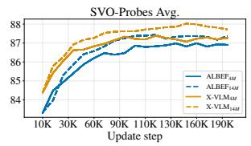

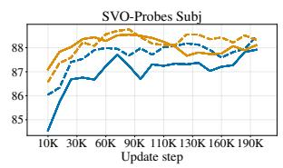

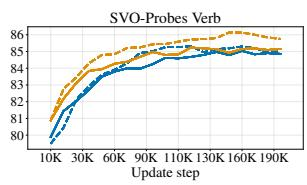  
Figure 4: Training dynamics on SVO-Probes subtasks. Random performance is 50%.

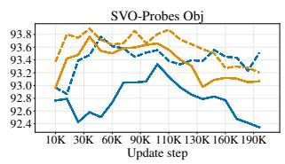

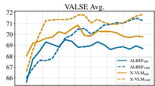

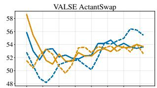

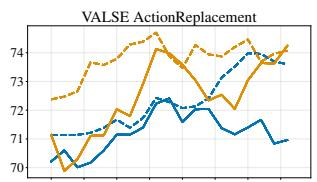

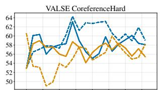

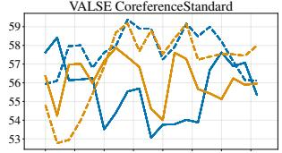

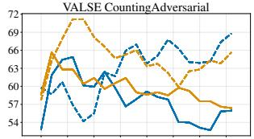

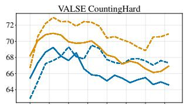

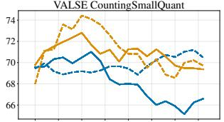

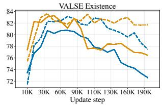

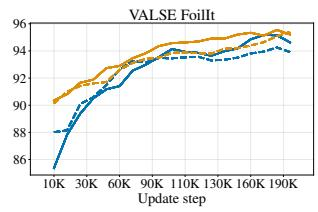

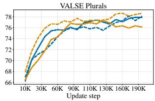  
Figure 5: Training dynamics on VALSE subtasks. Random performance is 50%.

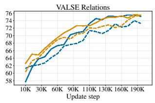

## B Results

## B.1 Results by Subtask

Table 6 compares overall performance of our evaluated models (Section 3) with the state-of-theart models in each of four fine-grained benchmarks (Section 2). Results for each subtask are reported in Tables 7 to 11.

In addition to the core discussion in Section 4, we note that FLAMINGO achieves the overall best performance on VALSE; and that the coarsegrained BLIP-2 model performs remarkably well on our range of fine-grained tasks, especially on VALSE, VSR and Winoground. This could be due to a number of factors, such as a larger ViT encoder, the usage of visual queries and the different formulations for the ITC and ITM objectives. We leave a deeper investigation of large VLMs to future work.

Moreover, we also note that CLIPCAP well on VALSE spatial relations and action subtasks, wherein its GPT-2 backbone already performs better than most VLMs. This is further proof of the efficacy of adapting strong LMs for V&L tasks.

## B.2 Full Dynamics of Fine-grained Tasks

Figures 4 to 7 display pretraining dynamics for our re-implemented $\mathrm { A L B E F _ { 4 M } , A L B E F _ { 1 4 M } } .$ , X-$\mathrm { V L M } _ { 4 \mathrm { M } }$ , and $\mathrm { X - V L M _ { 1 4 M } }$ models. For better visualisation, our curves have been smoothed by a 0.6 factor through exponential moving average.

Finally, Figure 8 shows how performance on Winoground evolves when pretraining an $\mathrm { A L B E F _ { 4 M } }$ model.17 Looking at overall performance, we see that a model’s score can vary by more than 4pp from one epoch to the next. While longer pretraining seems beneficial, some subtasks, such as Linguistic:Both and Visual:Series, fluctuate considerably; and after 20 epochs, the Image score starts decreasing on other subtasks, such as Linguistic:Object and Visual:Symbolic.

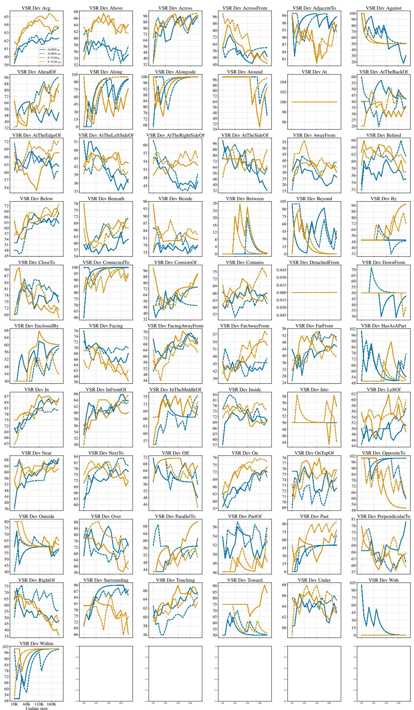  
Figure 6: Training dynamics on VSR Random dev set subtasks. Random performance is 50%.

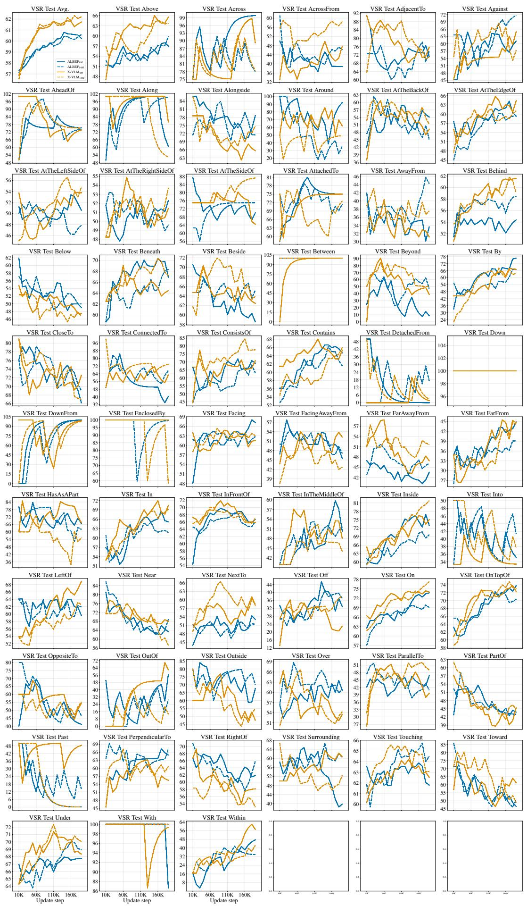  
Figure 7: Training dynamics on VSR Random test set subtasks. Random performance is 50%.

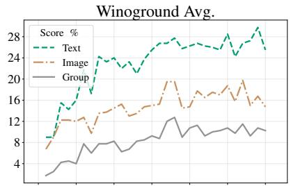

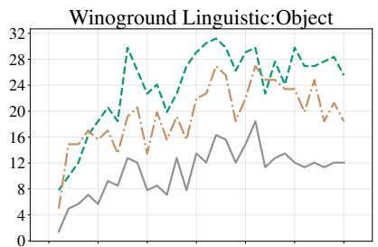

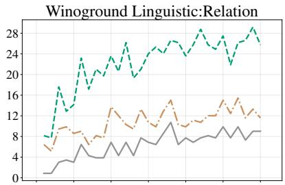

Winoground Linguistic:Both  
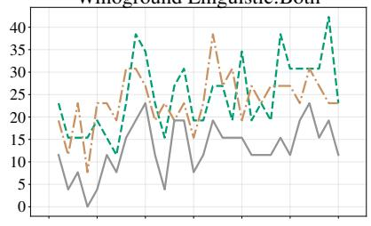

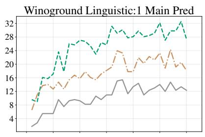

Winoground Linguistic:2 Main Preds  
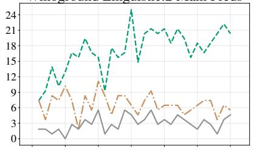

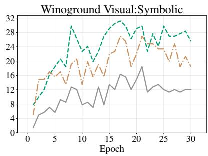

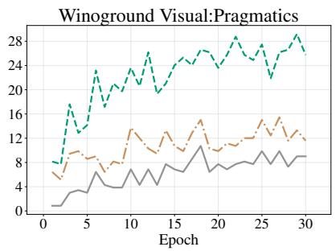

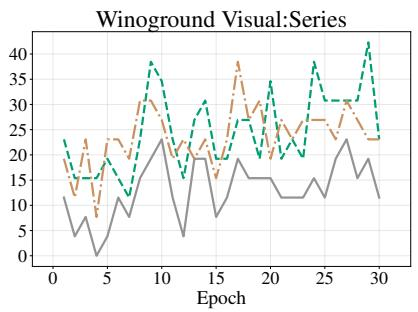  
Figure 8: Training dynamics on Winoground subtasks of $\mathrm { A L B E F _ { 4 M } }$ pretrained with the official codebase on GCP. Random performance is 25% for Text Score and Image Score, and 16% for Group Score.

## ACL 2023 Responsible NLP Checklist

A For every submission: ✓ A1. Did you describe the limitations of your work? 8 ✓ A2. Did you discuss any potential risks of your work? 9 ✓ A3. Do the abstract and introduction summarize the paper’s main claims? 7 ✗ A4. Have you used AI writing assistants when working on this paper? Left blank.

## B ✓ Did you use or create scientific artifacts? 3

✓ B1. Did you cite the creators of artifacts you used? 3

 B2. Did you discuss the license or terms for use and / or distribution of any artifacts? Not applicable. Left blank.

 B3. Did you discuss if your use of existing artifact(s) was consistent with their intended use, provided that it was specified? For the artifacts you create, do you specify intended use and whether that is compatible with the original access conditions (in particular, derivatives of data accessed for research purposes should not be used outside of research contexts)? Not applicable. Left blank.

 B4. Did you discuss the steps taken to check whether the data that was collected / used contains any information that names or uniquely identifies individual people or offensive content, and the steps taken to protect / anonymize it? Not applicable. Left blank.

 B5. Did you provide documentation of the artifacts, e.g., coverage of domains, languages, and linguistic phenomena, demographic groups represented, etc.? Not applicable. Left blank.

✓ B6. Did you report relevant statistics like the number of examples, details of train / test / dev splits, etc. for the data that you used / created? Even for commonly-used benchmark datasets, include the number of examples in train / validation / test splits, as these provide necessary context for a reader to understand experimental results. For example, small differences in accuracy on large test sets may be significant, while on small test sets they may not be. 2

## C ✓ Did you run computational experiments?

✓ C1. Did you report the number of parameters in the models used, the total computational budget (e.g., GPU hours), and computing infrastructure used?

✓ C2. Did you discuss the experimental setup, including hyperparameter search and best-found hyperparameter values? 5

✓ C3. Did you report descriptive statistics about your results (e.g., error bars around results, summary statistics from sets of experiments), and is it transparent whether you are reporting the max, mean, etc. or just a single run? A

 C4. If you used existing packages (e.g., for preprocessing, for normalization, or for evaluation), did you report the implementation, model, and parameter settings used (e.g., NLTK, Spacy, ROUGE, etc.)? Not applicable. Left blank.

D ✗ Did you use human annotators (e.g., crowdworkers) or research with human participants? Left blank.

 D1. Did you report the full text of instructions given to participants, including e.g., screenshots, disclaimers of any risks to participants or annotators, etc.? Not applicable. Left blank.

 D2. Did you report information about how you recruited (e.g., crowdsourcing platform, students) and paid participants, and discuss if such payment is adequate given the participants’ demographic (e.g., country of residence)? Not applicable. Left blank.

 D3. Did you discuss whether and how consent was obtained from people whose data you’re using/curating? For example, if you collected data via crowdsourcing, did your instructions to crowdworkers explain how the data would be used? Not applicable. Left blank.

 D4. Was the data collection protocol approved (or determined exempt) by an ethics review board? Not applicable. Left blank.

 D5. Did you report the basic demographic and geographic characteristics of the annotator population that is the source of the data? Not applicable. Left blank.