# Memory-efficient NLLB-200: Language-specific Expert Pruning of a Massively Multilingual Machine Translation Model

Yeskendir Koishekenov\*1,2 Alexandre Berard¹ Vassilina Nikoulina1

1NAVER LABS Europe

2University of Amsterdam

{first.last}@naverlabs.com

yeskendir.koishekenov@student.uva.nl

## Abstract

The recently released NLLB-200 is a set of multilingual Neural Machine Translation models that cover 202 languages. The largest model is based on a Mixture of Experts architecture and achieves SoTA results across many language pairs. It contains 54.5B parameters and requires at least four 32GB GPUs just for inference. In this work, we propose a pruning method that enables the removal of up to 80% of experts without further finetuning and with a negligible loss in translation quality, which makes it feasible to run the model on a single 32GB GPU. Further analysis suggests that our pruning metrics can identify language-specific experts.

## 1 Introduction

The Transformer (Vaswani et al., 2017) has become the dominant modeling paradigm in Natural Language Processing tasks. Many subsequent advances in the field came from increasing the computational budget, training data, and model size. Neural Machine Translation was not an exception, where massively multilingual NMT (Aharoni et al., 2019; Fan et al., 2021; Tang et al., 2020; Zhang et al., 2020) demonstrated promising results, while attempting to overcome the curse of multilinguality (Conneau et al., 2019) by scaling up model size.

However, increasing the parameter size exacerbates the cost of training (Yang et al., 2019; Strubell et al., 2019; Patterson et al., 2021) and hurts the memory footprint and inference latency (Dai et al., 2019; Fan et al., 2021; Wang et al., 2022). Sparselygated Mixture-of-Experts (MoE) models are an efficient alternative to dense models (Lepikhin et al., 2020; Fedus et al., 2021; Riquelme et al., 2021). For example, Du et al. (2022) demonstrates that an MoE language model results in a 7x larger model compared to GPT-3, but requires only 30% of its energy for training and half of its FLOPs at inference.

Mixture-of-Experts models are neural networks whose set of parameters is partitioned into experts. Contrary to dense models, where all network parameters are used for every input, an MoE model activates different parts of the network, the experts, depending on the input, which is typically done by a gating mechanism at the token level. MoE models are computationally efficient due to expert parallelism (Fedus et al., 2021) across a large number of GPUs, by having each GPU hold a subset of all experts and communicate with the other GPUs when it needs expert outputs for its local batch.

In NLLB-200¹(Costa-jussà et al., 2022), a load balancing regularizer in the objective function (Shazeer et al., 2017) promotes equal distribution of the tokens across experts. This encourages the model to use all the experts and ensures that all GPUs are used equally for the sake of computational efficiency. However, considering a large number of experts, it does not guarantee that all experts will be equally activated for a particular pair of languages at inference. It raises a research question: are there language-specific experts in multilingual MoE models? If this is the case, we may be able to prune such models without loss of translation quality for the language pairs of our interest. Reducing memory usage would be useful for a model like NLLB-200, which normally requires at least four 32GB GPUs at inference.

In this work, we define metrics to assess the importance of each expert and prune the least important experts at inference. We aim to avoid finetuning because of its computational cost. In an ideal scenario, we would like to be able to identify the important experts in an MoE model so that practitioners can deploy large models, such as NLLB-200, on a single GPU. We summarize our main contributions as follows:

• We propose a pruning strategy that can remove 80% of experts in the NLLB-200 model without further finetuning and with a negligible loss in translation quality;

• We find that the decoder experts can be pruned more aggressively than the encoder experts;

• We show the emergence of language-specific experts in the NLLB-200 model;

• We demonstrate that the important languagespecific experts in the decoder are shared between linguistically related languages;

• We release the ids of the pruned experts, along with other experts’gathered statistics so that anyone with a single 32GB GPU can use NLLB-200 at inference.2

## 2 Related work

The concept of Mixture-of-Experts models in machine learning dates back to the works of Jacobs et al. (1991); Jordan and Jacobs (1994). Most recent versions were inspired by Shazeer et al. (2017), who achieved state-of-the-art language modeling and translation results with the largest model at that time. Combined with the Transformer model, MoE models grew in popularity (Lepikhin et al., 2020; Fedus et al., 2021). Beyond natural language processing, MoE models showed a large success in computer vision (Puigcerver et al., 2020), speech recognition (You et al., 2021), multi-modal learning (Mustafa et al., 2022), and diffusion models (Feng et al., 2022; Balaji et al., 2022) to name a few. For a more detailed survey of MoE models, we refer readers to Yuksel et al. (2012) and Fedus et al. (2022).

Despite the recent successes, large MoE models require a lot of memory and the contribution (or roles) of experts is under-explored. Chen et al. (2022) showed that the contributions of experts of a pre-trained MoE model in different tasks such as MNLI, CoLA, and SQuAD are quite different. Moreover, they converted a large sparse MoE model pre-trained on a general task to a singleexpert dense model by fine-tuning the most professional’ expert and dropping the other experts. It demonstrates that experts do not contribute equally to the performance and some are more important than others. Zoph et al. (2022) also studied different expert specializations such as sentinel tokens, punctuation, conjunctions and articles, and even languages. They concluded that experts in the encoder exhibit specialization, in contrast to the decoder, but not by language. According to the authors, their mechanism of token routing and load balancing prevents language specialization.

Kudugunta et al. (2021) train study routing mechanisms at different levels of granularity and show that task-level experts (i.e., per language) can achieve similar performance as token-level experts. However, this work assumes that the model is trained this way, while our own work attempts to prune an existing token-level MoE model at inference without re-training it.

There have been a number of attempts to compress existing massively multilingual NMT models (Costa-jussà et al., 2022; Mohammadshahi et al., 2022b,a). However, to the best of our knowledge, none of them explicitly studied expert pruning and the emergence of language-specific experts in a large MoE model like we do. There has been a related line of works on pruning attention heads in transformer models (Michel et al., 2019; Voita et al., 2019), demonstrating linguistically-interpretable roles of attention heads (Voita et al., 2019; Jo and Myaeng, 2020) and the emergence of languagespecific attention heads (Kim et al., 2021b; Held and Yang, 2022). Understanding the role of attention heads helps carefully remove the least important ones without damage to translation quality.

Closest to our work, Kim et al. (2021a) tried to prune a machine translation MoE model by keeping the most activated experts,3 but did not manage to preserve performance without further fine-tuning.

Even though it has been shown that multilingual NMT models benefit from a larger number of experts (Costa-jussà et al., 2022), to the best of our knowledge, our work is the first to study whether any language-specific experts emerge in a massively multilingual Mixture-of-Expert model for NMT, and how can redundant (or non-relevant) experts be pruned.

## 3 Background

## 3.1 Mixture-of-Experts models

Sparsely-gated Mixture-of-Experts (MoE) models activate a subset of their parameters per input token, contrary to dense models, where the entire network is used for each input token. Therefore, the total amount of parameters can be significantly increased because the computation cost per token becomes only proportional to the size of the activated sub-network, not the total model size. An increased number of parameters unlocks significant representational capacity. Allocating different devices for different experts and running them in parallel (i.e., expert parallelism, Fedus et al., 2021), in combination with data parallelism makes MoE computationally efficient and highly scalable (Fedus et al., 2021; Lepikhin et al., 2020).

In the MoE Transformer models proposed by Lepikhin et al. (2020), the FFN sublayers in the dense model are replaced with MoE layers. An MoE layer takes an input token representation $x _ { t }$ and then routes it to the top-k experts selected from a set $\{ E _ { i } \} _ { i = 1 } ^ { N }$ of N experts thanks to a gating network:

$$
G _ { t } = s o f t m a x ( W _ { g } \cdot x _ { t } )\tag{1}
$$

Where $W _ { g } \in \mathbb { R } ^ { N \times d }$ is a learned parameter. The output of the MoE layer is a weighted sum of the outputs of the k selected experts ε:

$$
y _ { t } = \frac { 1 } { \sum _ { i \in \mathcal { E } } G _ { t , i } } \sum _ { i \in \mathcal { E } } G _ { t , i } E _ { i } ( x _ { t } )\tag{2}
$$

## 3.2 NLLB-200

No Language Left Behind (NLLB-200) is a set of massively multilingual NMT models that can translate to and from 202 languages (Costa-jussà et al., 2022), including many very low resources languages. Models of varying sizes have been released. The largest one is a Mixture-of-Experts model and has 54.5B parameters. A dense model of 3.3B models is also available, which has the same architecture as the 54.5B MoE model without the experts. In this work, we will attempt to prune the experts from the 54.5B model while using the 3.3B variant as a lower-bound baseline.4

In the 54.5B MoE model, every 4th FFN sublayer – in both the encoder and decoder – is replaced by an MoE layer, starting at the $4 ^ { \mathrm { t h } }$ layer (this makes 12 layers with experts). Each MoE layer consists of 128 experts (1536 experts in total) with the same architecture as an FFN sublayer, and has its own gating network, following the top-k gating algorithm of Lepikhin et al. (2020) and selecting the top-2 experts per token without any randomization. The model was trained with a linear combination of label-smoothed cross-entropy (Szegedy et al., 2016) with an auxiliary load balancing loss (Shazeer et al., 2017), which encourages tokens to be uniformly distributed across experts.

Memory usage. The 3.3B and 54.5B models are Transformers with an embedding dimension of 2048, an FFN dimension of 8192, 16 attention heads, 24 encoder layers, and 24 decoder layers. When storing their parameters in half precision, the 3.3B dense model and 54.5B MoE model take respectively 6.2GiB and 101.5GiB of memory. Each expert has 33.6M parameters, representing 51.6B parameters in total or 96GiB of memory. While the 3.3B model can easily run on a single GPU, the 54.5B model requires at the very least 4 32GB GPUs to run. To maximize efficiency, decoding with the MoE model has to be done with expert parallelism (Fedus et al., 2021), with each GPU holding a full copy of the “dense" parameters (2.9B or 5.5GiB) and $1 / N ^ { \mathrm { t h } }$ of the experts per layer, where N is the number of $\mathrm { G P U s } . ^ { 5 }$ Because of the memory usage of beam search decoding and memory fragmentation, batched decoding actually requires more GPUs in practice (e.g., 6 or 8), or to offload the encoder and decoder to the CPU when they are not used.6

## 4 Our Approach

We experiment with different experts' pruning metrics and strategies that allow us to select the most relevant experts per language or language pair, and thus significantly reduce the memory usage at inference time of NLLB-200.

## 4.1 Expert pruning metrics

The pruning metric should quantify the contribution of a given expert to the translation. Intuitively, experts that were more involved in translation should be considered more important.

Activity. We define the Top 1 activity, top1(e), of an expert e as the fraction of tokens routed to this expert as the first choice (i.e., the frequency at which this expert was ranked first by the gating mechanism). We also consider the Top 2 activity variant, $t o p _ { 2 } ( e )$ , with the fraction of tokens routed to this expert as their first or second choice.

Using only activity as an importance metric can be sub-optimal as it does not take into account the gating value assigned to this expert by the model.

Load Balancing. We experiment with the load balancing pruning metric, similar to the load balancing loss used by Costa-jussà et al. (2022) to train the MoE model. It is defined as the product of the activity and the average gate value: $L B ( e ) = t o p _ { 1 } ( e ) \times m e a n ( e )$

Importance. Following the definition of attention head confidence by Voita et al. (2019), we define the confdence of an expert, $c o n f ( e )$ , as its average gate value when it is ranked first. Then, we can define the “vanilla" importance of an expert as the product of its’ activity and confidence.'

$$
i m p _ { v a n i l l a } ( e ) = t o p _ { 1 } ( e ) \times c o n f ( e )\tag{3}
$$

We define importance as an improved version of vanilla importance with an exponential to smooth the confidence values:

$$
i m p ( e ) = t o p _ { 1 } ( e ) \times \exp \left( c o n f ( e ) \right)\tag{4}
$$

## 4.2 Expert statistics granularity

To compute the pruning metrics defined above, for each expert $e \in \{ 1 , \dots , 1 5 3 6 \} ^ { 8 }$ we collect the gate statistics, $t o p _ { 1 } ( e ) , t o p _ { 2 } ( e )$ , mean(e) and $c o n f ( e )$ by decoding the validation sets for all language directions.9 However, these statistics can be aggregated at different granularity levels. Depending on how these statistics are aggregated, we hope to see language-specific experts emerge. In our experiments, we consider three different granularities:

• global: we aggregate the statistics across all language pairs to keep the overall best experts;

• language-pair: we collect gate statistics for each language pair and thus keep a (potentially) different set of experts for each language pair;

• language-specific: we aggregate encoder-side statistics per source language and decoderside statistics per target language, which will let us keep a single set of encoder/decoder experts per source/target language.

## 4.3 Expert pruning algorithm

Using the pruning metrics defined in Section 4.1, there are different expert pruning strategies that we can adopt. The pruning metric values are normalized to sum to one in each layer, and experts are sorted from most important to least important.

Fixed per layer. First, the simplest way is to retain a fixed amount of top experts in each layer. For example, 75% pruning retains 384 out of 1536 experts, which corresponds to 32 experts per layer. In the balanced setting, the number of experts per layer is the same in the encoder and decoder (e.g., 32 per layer). In the unbalanced setting, we keep a different number of experts in the encoder and decoder (e.g., 40 per encoder layer and 24 per decoder layer).

Global threshold. The pruning metrics we defined let us easily prune experts per layer, but not globally. To select globally best experts (with no a priori on the number of experts per layer) we search for a global threshold θ such that:

$$
\sum _ { k = 1 } ^ { 1 2 } m i n ( n _ { k } \mid \sum _ { i = 1 } ^ { n _ { k } } \phi ( e _ { i } ^ { k } ) \geq \theta ) = c o u n t\tag{5}
$$

Where $\phi$ is the pruning metric; k the layer id (out of 12 layers with experts); $e _ { i } ^ { k }$ the $i ^ { \mathrm { { t h } } }$ expert in the sorted list of experts for that layer; and count the desired total number of experts to retain (e.g., 384 for 75% pruning). Experts $\{ e _ { i } ^ { k } \} _ { i = 1 } ^ { n _ { k } }$ are then retained and the rest are pruned.10 In our experiments, we make sure to keep at least 4 experts per layer.11

Figure 1 illustrates how experts are distributed among layers with this approach at 75% pruning and with the $t o p _ { 1 }$ metric. We see that the decoder requires much fewer experts per layer than the encoder to reach the same activity threshold.

Our intuition behind this pruning method is to define a constant probability mass (or “importance" mass) each layer should have. Keeping only a couple of experts in a layer is fine if they are collectively used a majority of the time. Conversely, some layers may need more experts if expert usage is more uniformly distributed.

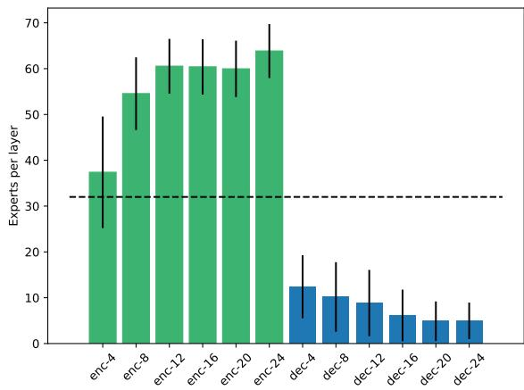  
Figure 1: Average number of experts per layer after pruning 75% of experts with the global threshold algorithm (average activity threshold: 0.69). Pruning is done per language direction and the values are averaged over the 870 directions of the valid set.

We also experiment with a variant of this method, which we call Enc/Dec thresholds, with a fixed amount in the encoder and decoder (e.g., 192 and 192) and thresholds that are defined independently in the encoder and decoder.

## 5 Experiments

## 5.1 Evaluation settings

In our experiments, we use the FLORES-200 benchmark (Costa-jussà et al., 2022), which consists of translations of 3001 English sentences (from 842 distinct Wikipedia articles) to all other 201 languages. The multi-parallel nature of this dataset makes it possible to evaluate performance in all 40 602 language directions. As our final test benchmark, we take a representative subsample of 53 languages out of 202, which were also used as an ablation dataset by Costa-jussà et al. (2022). In our intermediate experiments, we work with a smaller subset of 30 out of 53 languages, with 10 languages per resource type (high, low, very low) and covering the same fourteen language families as the full subset of 53 languages. More details on the languages considered in our experiments as well as the amount of resources available per category are provided in Tables 8 and 14 in Appendix.

To evaluate translation quality we use two metrics: chrF++12 (Popović, 2015) and spBLEU13 (Costa-jussà et al., 2022). BLEU is heavily tokenization-dependant and its implementations do not include tokenizers for most of the NLLB-200 languages. spBLEU overcomes this issue by tokenizing the references and model outputs with a multilingual SentencePiece tokenizer (SPM-200, Costa-jussà et al., 2022). We report chrF++ results in the main paper and spBLEU results in Appendix. We use FLORES-200 dev (which we call valid) for collecting MoE gate statistics and comparing different pruning algorithms and rates, and FLORES-200 devtest (which we call test) for reporting final results and comparing with the 3.3B and 54.5B baselines.

## 5.2 Results

In the first set of experiments, we work with a subset of 30 languages. Table 1 compares different expert pruning metrics and strategies under a 75% pruning rate. The experts are selected per language pair, and the scores are averaged per resource type (high, low, very low). The first part of the table reports two baselines: an upper bound corresponding to the full (unpruned) 54.5B MoE model, and a lower bound being the 3.3B dense model (same architecture without experts).

Pruning metric The second part of Table 1 compares the chrF++ performance of different pruning metrics (spBLEU score are reported in Appendix Table 9). From these results, we can see that the top-1 activity and importance metrics are the most effective at identifying important experts. Further experiments with global threshold pruning (third part of Table 1) confirm the slightly better performance of the importance metric which we keep as the default for the next experiments.

Pruning algorithm Table 1 also compares the pruning algorithms described in Section 4.3 (fxed per layer and global threshold). Note that with xed per layer, we can either allocate the same expert budget in the encoder and decoder (balanced setting) or have more experts in the encoder (unbalanced setting).

First, we see that the global threshold strategy gives the best results overall, with the same average chrF++ as the full unpruned model. However, global threshold is not very practical for several reasons. First, it identifies a different amount of experts per layer for each language pair, which leads to variable memory usage across language pairs. It also requires recreating and reloading the model when decoding multiple directions, which is very slow. Finally, we found that it was more sensitive to over-generation and hallucinations (which we elaborate on in Section A in Appendix) at higher pruning rates. The enc/dec thresholds approach does not suffer from all the limitations of global threshold, but it is not better than fxed per layer either. Therefore, for simplicity, we pick the fixed per layer approach for our next experiments.

<table><tr><td>Method</td><td>Metric</td><td>High→High</td><td>High→Low</td><td>High→V. low</td><td>Low→High</td><td>Low→Low</td><td>Low→V. low</td><td>V. low→High</td><td>V. low→Low</td><td>V. low→V. low</td><td>Average</td></tr><tr><td>3.3B dense model (Costa-jussà et al., 2022)</td><td></td><td>44.54</td><td>38.20</td><td>30.08</td><td>40.49</td><td>35.19</td><td>27.61</td><td>35.27</td><td>30.68</td><td>24.75</td><td>34.06</td></tr><tr><td>54.5B MoE model (Costa-jussà et al., 2022)</td><td></td><td>45.90</td><td>39.19</td><td>30.24</td><td>42.29</td><td>36.35</td><td>28.18</td><td>36.55</td><td>32.16</td><td>24.93</td><td>35.07</td></tr><tr><td rowspan="6">Fixed per layer (balanced)</td><td>Top 1</td><td>45.52</td><td>38.75</td><td>30.13</td><td>41.51</td><td>35.50</td><td>27.92</td><td>36.09</td><td>31.68</td><td>24.90</td><td>34.64</td></tr><tr><td>Top 2</td><td>44.38</td><td>37.92</td><td>29.60</td><td>40.56</td><td>34.86</td><td>27.48</td><td>35.24</td><td>30.97</td><td>24.54</td><td>33.93</td></tr><tr><td>Load balancing</td><td>44.48</td><td>38.06</td><td>29.64</td><td>40.67</td><td>34.95</td><td>27.56</td><td>35.29</td><td>31.04</td><td>24.59</td><td>34.01</td></tr><tr><td>Importance (vanilla)</td><td>42.87</td><td>34.73</td><td>28.40</td><td>40.92</td><td>34.17</td><td>27.46</td><td>34.96</td><td>29.71</td><td>23.99</td><td>33.00</td></tr><tr><td>Importance</td><td>45.59</td><td>38.76</td><td>30.18</td><td>41.50</td><td>35.41</td><td>27.87</td><td>36.15</td><td>31.69</td><td>24.96</td><td>34.66</td></tr><tr><td>Top 1</td><td>46.01</td><td>39.28</td><td>30.44</td><td>41.91</td><td>36.18</td><td>28.21</td><td>36.40</td><td>31.97</td><td>25.06</td><td>35.03</td></tr><tr><td>Global threshold</td><td>Importance</td><td>46.10</td><td>39.31</td><td>30.46</td><td>41.99</td><td>36.25</td><td>28.29</td><td>36.47</td><td>32.09</td><td>25.10</td><td>35.09</td></tr><tr><td>Fixed per layer (unbalanced)</td><td></td><td>45.79</td><td>39.00</td><td>30.33</td><td>41.80</td><td>35.76</td><td>28.12</td><td>36.36</td><td>31.93</td><td>25.10</td><td>34.89</td></tr><tr><td>Enc/Dec thresholds (balanced)</td><td rowspan="3">Importance</td><td>45.57</td><td>38.73</td><td>30.07</td><td>41.52</td><td>35.36</td><td>27.81</td><td>36.13</td><td>31.62</td><td>24.88</td><td>34.61</td></tr><tr><td>Enc/Dec thresholds (unbalanced)</td><td>45.88</td><td>38.97</td><td>30.28</td><td>41.92</td><td>35.85</td><td>28.10</td><td>36.39</td><td>31.84</td><td>25.06</td><td>34.90</td></tr><tr><td></td><td></td><td></td><td></td><td></td><td></td><td></td><td></td><td></td><td></td><td></td></tr></table>

Table 1: chrF++ valid scores on 30 languages of different pruning algorithms and metrics, with 75% pruning (i.e., 384 experts are kept in total). The unbalanced approaches keep 240 encoder experts and 144 decoder experts.

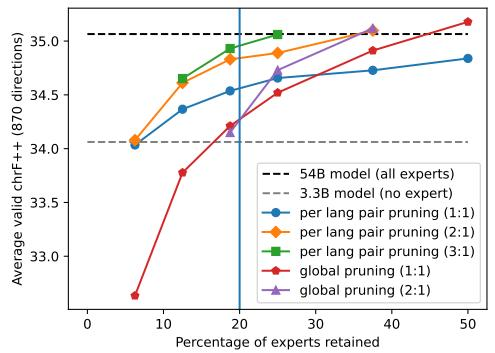

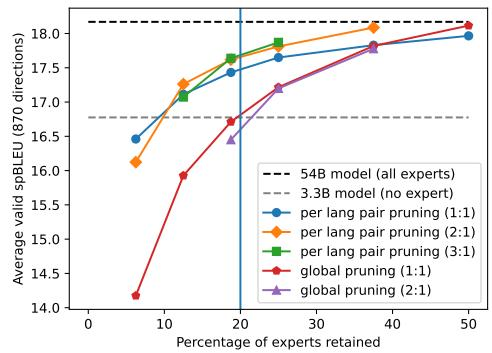

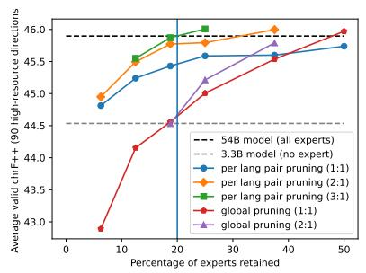

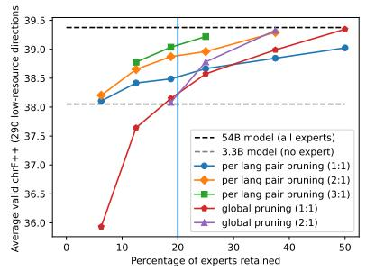

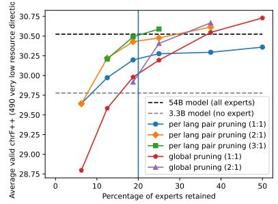  
Figure 2: chrF++ and spBLEU valid scores on 30 languages for different resource types as a function of the percentage of experts retained. Pruning is done per language pair with the importance metric and with a fixed number of experts per layer.

Balanced versus unbalanced pruning When retaining 25% of experts (384 out of 12× 128), global threshold keeps on average 335 encoder experts and 49 decoder experts. The number of selected experts in the encoder and decoder for different language resource types is shown in Table 16 in Appendix. Following this observation that encoder experts seem more important than decoder ones, we experiment with different encoder/decoder ratios. 1:1 is the balanced setting. 2:1 and 3:1 are unbalanced with respectively twice and three times as many encoder experts as decoder experts. Figure 2 shows that 3:1 performs the best across almost all pruning rates and resource types.

Pruning with global statistics. Figure 2 and Figure 4 in Appendix also show that the same experts can be pruned across all language pairs (with statistics aggregated over all directions) with no loss in performance at 50% pruning. Statistics at the language-direction granularity let us safely prune up to 80% of the experts (in the unbalanced setting), which makes the model small enough to fit on a single GPU.

Test results and language-specific pruning. Finally, we validate our results over the test set on 53 languages (2 756 directions). We use the fixed per layer approach with a 3:1 ratio, which showed the best results on the validation set at 80% (minimum rate for 1-GPU decoding). Tables 2 and 11 report these test scores with three different levels of granularity: global, language-pair-specific or language-specific (as described in Section 4.2). Table 10 in the Appendix reports valid scores with the same settings.

<table><tr><td>Method</td><td>Enc experts</td><td>Dec experts</td><td> $\underline { { \mathrm { H i g h } \to \mathrm { H i g h } } }$ </td><td>High→Low</td><td>High→V. Low</td><td>Low→High</td><td>Low→Low</td><td>Low→V. low</td><td>V. low→High</td><td>V. low→Low</td><td>V. low→V. low</td><td>Average</td></tr><tr><td>3.3B dense model</td><td>6</td><td>6</td><td>44.18</td><td>38.30</td><td>31.45</td><td>38.24</td><td>34.60</td><td>27.93</td><td>35.93</td><td>32.02</td><td>26.47</td><td>35.81</td></tr><tr><td>54.5B MoE model</td><td>768</td><td>768</td><td>45.41</td><td>38.98</td><td>31.89</td><td>39.72</td><td>35.40</td><td>28.83</td><td>37.29</td><td>33.23</td><td>26.95</td><td>36.81</td></tr><tr><td>Fixed per layer (lang-pair)</td><td>216</td><td>72</td><td>45.37</td><td>39.06</td><td>31.79</td><td>39.20</td><td>35.03</td><td>28.47</td><td>37.05</td><td>33.16</td><td>26.63</td><td>36.59</td></tr><tr><td>Fixed per layer (global)</td><td>216</td><td>72</td><td>43.20</td><td>37.60</td><td>31.68</td><td>37.37</td><td>33.94</td><td>28.40</td><td>35.38</td><td>31.97</td><td>26.84</td><td>35.34</td></tr><tr><td>Fixed per layer (lang)</td><td>216</td><td>72</td><td>45.35</td><td>39.10</td><td>31.82</td><td>39.18</td><td>35.10</td><td>28.51</td><td>37.02</td><td>33.19</td><td>26.62</td><td>36.61</td></tr></table>

Table 2: chrF++ test scores on 53 languages, with the importance metric for 80% pruning (1-GPU decoding).

<table><tr><td>Method</td><td>Enc experts</td><td>Dec experts</td><td>High→High</td><td>High→Low</td><td>High→V. low</td><td>Low→High</td><td>Low→Low</td><td>Low→V. low</td><td>V. low→High</td><td>V. low→Low</td><td>V. low→V. low</td><td>Average</td></tr><tr><td>3.3B dense model</td><td>6</td><td>6</td><td>45.54</td><td>38.84</td><td>32.72</td><td>39.18</td><td>34.87</td><td>29.07</td><td>38.39</td><td>34.11</td><td>29.21</td><td>34.64</td></tr><tr><td>54.5B MoE model</td><td>768</td><td>768</td><td>46.68</td><td>39.36</td><td>33.56</td><td>40.53</td><td>35.49</td><td>30.07</td><td>40.46</td><td>35.49</td><td>30.16</td><td>35.74</td></tr><tr><td>Fixed per layer (lang)</td><td>216</td><td>72</td><td>46.67</td><td>39.59</td><td>33.33</td><td>40.19</td><td>35.50</td><td>29.67</td><td>39.94</td><td>35.29</td><td>29.50</td><td>35.46</td></tr></table>

Table 3: chrF++ test scores on all 202 languages, with the importance metric for 80% pruning (1-GPU decoding).

<table><tr><td rowspan=1 colspan=1>DecoderEncoder</td><td rowspan=1 colspan=1> $\mathrm { E n } {  } \mathrm { F r }$ </td><td rowspan=1 colspan=1> $\mathrm { E n } {  } \mathrm { U r }$ </td><td rowspan=1 colspan=1> $\mathbf { A s t } {  } \mathbf { U } \mathbf { r }$ </td><td rowspan=1 colspan=1> $\mathrm { U r } {  } \mathrm { F r }$ </td><td rowspan=1 colspan=1> $\mathrm { U r } {  } \mathrm { A s t }$ </td><td rowspan=1 colspan=1> $\mathrm { F r } {  } \mathrm { A s t }$ </td><td rowspan=1 colspan=1> $\mathbf { A s t } { \to } \mathbf { K o }$ </td><td rowspan=1 colspan=1> $\mathrm { F r } {  } \mathrm { K o }$ </td><td rowspan=1 colspan=1> $\mathrm { K o } \to \mathrm { E n }$ </td><td rowspan=1 colspan=1> $\mathrm { K o } \to \mathrm { A s t }$ </td><td rowspan=1 colspan=1> $\mathrm { F r } {  } \mathrm { E n }$ </td><td rowspan=1 colspan=1> $\mathbf { A s t } { \to } \mathbf { E n }$ </td></tr><tr><td rowspan=1 colspan=1>En→Fr</td><td rowspan=1 colspan=1>NA</td><td rowspan=1 colspan=1>0.18</td><td rowspan=1 colspan=1>0.17</td><td rowspan=1 colspan=1>0.71</td><td rowspan=1 colspan=1>0.31</td><td rowspan=1 colspan=1>0.32</td><td rowspan=1 colspan=1>0.17</td><td rowspan=1 colspan=1>0.17</td><td rowspan=1 colspan=1>0.19</td><td rowspan=1 colspan=1>0.31</td><td rowspan=1 colspan=1>0.17</td><td rowspan=1 colspan=1>0.17</td></tr><tr><td rowspan=1 colspan=1>En→Ur</td><td rowspan=1 colspan=1>1.00</td><td rowspan=1 colspan=1>NA</td><td rowspan=1 colspan=1>0.68</td><td rowspan=1 colspan=1>0.20</td><td rowspan=1 colspan=1>0.24</td><td rowspan=1 colspan=1>0.22</td><td rowspan=1 colspan=1>0.31</td><td rowspan=1 colspan=1>0.30</td><td rowspan=1 colspan=1>0.26</td><td rowspan=1 colspan=1>0.23</td><td rowspan=1 colspan=1>0.21</td><td rowspan=1 colspan=1>0.23</td></tr><tr><td rowspan=1 colspan=1>Ast→Ur</td><td rowspan=1 colspan=1>0.35</td><td rowspan=1 colspan=1>0.35</td><td rowspan=1 colspan=1>NA</td><td rowspan=1 colspan=1>0.22</td><td rowspan=1 colspan=1>0.25</td><td rowspan=1 colspan=1>0.22</td><td rowspan=1 colspan=1>0.37</td><td rowspan=1 colspan=1>0.35</td><td rowspan=1 colspan=1>0.21</td><td rowspan=1 colspan=1>0.22</td><td rowspan=1 colspan=1>0.18</td><td rowspan=1 colspan=1>0.20</td></tr><tr><td rowspan=1 colspan=1>Ur→Fr</td><td rowspan=1 colspan=1>0.36</td><td rowspan=1 colspan=1>0.36</td><td rowspan=1 colspan=1>0.40</td><td rowspan=1 colspan=1>NA</td><td rowspan=1 colspan=1>0.39</td><td rowspan=1 colspan=1>0.38</td><td rowspan=1 colspan=1>0.19</td><td rowspan=1 colspan=1>0.19</td><td rowspan=1 colspan=1>0.22</td><td rowspan=1 colspan=1>0.39</td><td rowspan=1 colspan=1>0.16</td><td rowspan=1 colspan=1>0.19</td></tr><tr><td rowspan=1 colspan=1>Ur→Ast</td><td rowspan=1 colspan=1>0.36</td><td rowspan=1 colspan=1>0.36</td><td rowspan=1 colspan=1>0.40</td><td rowspan=1 colspan=1>1.00</td><td rowspan=1 colspan=1>NA</td><td rowspan=1 colspan=1>0.83</td><td rowspan=1 colspan=1>0.27</td><td rowspan=1 colspan=1>0.25</td><td rowspan=1 colspan=1>0.24</td><td rowspan=1 colspan=1>0.87</td><td rowspan=1 colspan=1>0.17</td><td rowspan=1 colspan=1>0.22</td></tr><tr><td rowspan=1 colspan=1>Fr→Ast</td><td rowspan=1 colspan=1>0.42</td><td rowspan=1 colspan=1>0.42</td><td rowspan=1 colspan=1>0.45</td><td rowspan=1 colspan=1>0.44</td><td rowspan=1 colspan=1>0.44</td><td rowspan=1 colspan=1>NA</td><td rowspan=1 colspan=1>0.25</td><td rowspan=1 colspan=1>0.24</td><td rowspan=1 colspan=1>0.24</td><td rowspan=1 colspan=1>0.80</td><td rowspan=1 colspan=1>0.20</td><td rowspan=1 colspan=1>0.22</td></tr><tr><td rowspan=1 colspan=1>Ast→Ko</td><td rowspan=1 colspan=1>0.35</td><td rowspan=1 colspan=1>0.35</td><td rowspan=1 colspan=1>1.00</td><td rowspan=1 colspan=1>0.40</td><td rowspan=1 colspan=1>0.40</td><td rowspan=1 colspan=1>0.45</td><td rowspan=1 colspan=1>NA</td><td rowspan=1 colspan=1>0.78</td><td rowspan=1 colspan=1>0.15</td><td rowspan=1 colspan=1>0.24</td><td rowspan=1 colspan=1>0.15</td><td rowspan=1 colspan=1>0.16</td></tr><tr><td rowspan=1 colspan=1>Fr→Ko</td><td rowspan=1 colspan=1>0.42</td><td rowspan=1 colspan=1>0.42</td><td rowspan=1 colspan=1>0.45</td><td rowspan=1 colspan=1>0.44</td><td rowspan=1 colspan=1>0.44</td><td rowspan=1 colspan=1>1.00</td><td rowspan=1 colspan=1>0.45</td><td rowspan=1 colspan=1>NA</td><td rowspan=1 colspan=1>0.14</td><td rowspan=1 colspan=1>0.23</td><td rowspan=1 colspan=1>0.15</td><td rowspan=1 colspan=1>0.13</td></tr><tr><td rowspan=1 colspan=1>Ko→En</td><td rowspan=1 colspan=1>0.33</td><td rowspan=1 colspan=1>0.33</td><td rowspan=1 colspan=1>0.41</td><td rowspan=1 colspan=1>0.48</td><td rowspan=1 colspan=1>0.48</td><td rowspan=1 colspan=1>0.44</td><td rowspan=1 colspan=1>0.41</td><td rowspan=1 colspan=1>0.44</td><td rowspan=1 colspan=1>NA</td><td rowspan=1 colspan=1>0.26</td><td rowspan=1 colspan=1>0.55</td><td rowspan=1 colspan=1>0.70</td></tr><tr><td rowspan=1 colspan=1>Ko→Ast</td><td rowspan=1 colspan=1>0.33</td><td rowspan=1 colspan=1>0.33</td><td rowspan=1 colspan=1>0.41</td><td rowspan=1 colspan=1>0.48</td><td rowspan=1 colspan=1>0.48</td><td rowspan=1 colspan=1>0.44</td><td rowspan=1 colspan=1>0.41</td><td rowspan=1 colspan=1>0.44</td><td rowspan=1 colspan=1>1.00</td><td rowspan=1 colspan=1>NA</td><td rowspan=1 colspan=1>0.17</td><td rowspan=1 colspan=1>0.22</td></tr><tr><td rowspan=1 colspan=1>Fr→En</td><td rowspan=1 colspan=1>0.42</td><td rowspan=1 colspan=1>0.42</td><td rowspan=1 colspan=1>0.45</td><td rowspan=1 colspan=1>0.44</td><td rowspan=1 colspan=1>0.44</td><td rowspan=1 colspan=1>1.00</td><td rowspan=1 colspan=1>0.45</td><td rowspan=1 colspan=1>1.00</td><td rowspan=1 colspan=1>0.44</td><td rowspan=1 colspan=1>0.44</td><td rowspan=1 colspan=1>NA</td><td rowspan=1 colspan=1>0.61</td></tr><tr><td rowspan=1 colspan=1>Ast→En</td><td rowspan=1 colspan=1>0.35</td><td rowspan=1 colspan=1>0.35</td><td rowspan=1 colspan=1>1.00</td><td rowspan=1 colspan=1>0.40</td><td rowspan=1 colspan=1>0.40</td><td rowspan=1 colspan=1>0.45</td><td rowspan=1 colspan=1>1.00</td><td rowspan=1 colspan=1>0.45</td><td rowspan=1 colspan=1>0.41</td><td rowspan=1 colspan=1>0.41</td><td rowspan=1 colspan=1>0.45</td><td rowspan=1 colspan=1>NA</td></tr></table>

Table 4: The Jaccard similarity of selected 25% important experts between different language pairs in the encoder (lower triangle) and decoder (upper triangle). Pruning is done per language pair with the importance metric. The same number of experts were chosen for the encoder and decoder with thresholding

Pruning important experts chosen per language pair gives 0.8 chrF++ more on average than the 3.3B dense model, and 0.2 chrF++ less than the full MoE model. Global pruning on the other hand performs worse than both the MoE and dense models, which confirms the importance of having a language-specific pruning strategy.

While choosing important experts for each language pair is effective, it is not very practical: with L languages, this generates $L \times ( L - 1 )$ different configurations. A more practical approach is to prune encoder experts per source language and decoder experts per target language (i.e., languagespecific pruning). This pruning strategy performs exactly as well as pruning per language direction and is more convenient. Following this observation, we extract per-language gate statistics on all 202 languages.14 Then, we apply 80% per-layer pruning with the importance metric (at the language granularity) and decode the test set in all 40 602 directions. Tables 3 and 12 report the chrF++ and sp-BLEU scores. Table 13 reports average score deltas with the unpruned model (and standard deviation per resource type). To facilitate future research and give the opportunity for anyone with a 32GB GPU to run the NLLB-200 model, we release the detailed gate statistics and the ids of the selected experts. We also share the scores for each direction and the decoding outputs of our best pruning approaches.

## 6 Discussion

## 6.1 Inference speed and compute budget

Table 5 reports the inference speed of different models: the 3.3B dense model, the full MoE model, and the MoE model with 80% pruning. We see that with 80% pruning, the MoE model requires a single 32GB V100 and performs approximately as fast as the full model on 4 GPUs. If 4 GPUs are available, 80% pruning can double the inference speed of the

<table><tr><td rowspan=3 colspan=1>Model</td><td></td><td></td><td></td><td></td></tr><tr><td rowspan=2 colspan=1>Batch size</td><td rowspan=2 colspan=1>GPUs</td><td rowspan=2 colspan=1>WPS</td><td></td></tr><tr><td rowspan=1 colspan=1>Time (s)</td></tr><tr><td rowspan=1 colspan=1>54.5B</td><td rowspan=1 colspan=1>16k</td><td rowspan=1 colspan=1>84</td><td rowspan=1 colspan=1>195156</td><td rowspan=1 colspan=1>105131</td></tr><tr><td rowspan=1 colspan=1>80% pruning</td><td rowspan=1 colspan=1>16k4k</td><td rowspan=1 colspan=1>41</td><td rowspan=1 colspan=1>299172</td><td rowspan=1 colspan=1>79135</td></tr><tr><td rowspan=1 colspan=1>3.3B</td><td rowspan=1 colspan=1>4k</td><td rowspan=1 colspan=1>1</td><td rowspan=1 colspan=1>246</td><td rowspan=1 colspan=1>86</td></tr></table>

Table 5: Inference speed benchmark for the 3.3B dense baseline model, the full MoE model, and its pruned version with 36 experts per encoder layer and 12 per decoder layer. We decode the FLORES valid set from 29 languages into English and average the decoding time or words per second.

## MoE model.

Table 15 in Appendix gives a breakdown of the number of GPU hours used for this work.

## 6.2 Similarity of selected experts

Section 5.2 shows that only a fraction of all experts is necessary to translate between two given languages. We analyze the experts selected by our pruning method, to verify whether we can claim that there are indeed language-specific experts. In order to do so, we select experts with our proposed importance metric and prune them per language pair at a 75% rate with the Enc/dec thresholds method, so that both the encoder and decoder have the same number of experts. We then compute the Jaccard similarity of selected encoder/decoder experts between different language pairs sharing the same source or target language. The lower and upper triangles of Table 4 show this similarity in the encoder and decoder respectively. We see that the encoder experts are independent of the target language (even though pruning is based on statistics collected at the lang-pair granularity level). This is an expected result, and it is due to the model design, where the target language code is introduced on the decoder side only: the encoder representation is not impacted by the target language. We note that the similarity between different source languages is also quite high (30-50%). The similarity between important decoder experts for the same target language is in the 68-87% range; and in the 13-39% range for different target languages. These observations combined with the results in Section 5.2 suggest the emergence of language-specific experts in the NLLB-200 model.

## 6.3 Similarity of languages based on the importance metric

Finally, we compare expert statistics across different languages, to better understand whether knowledge transfer happens at the expert level between similar languages. We gather importance metrics for each expert in the decoder for each language and concatenate the values of all MoE layers to have one feature vector of dimension 768. Then we do hierarchical clustering and show it as a dendrogram in Figure 3, where we highlight different language subgroupings with different colors. We can see that some clusters contain linguistically related languages, such as Yue Chinese, Korean and Japanese; Russian and Belarussian; or Portuguese, Asturian, and French. We run a similar analysis on the encoder experts and also observe meaningful language clustering, but less clear (Appendix Figure 7).

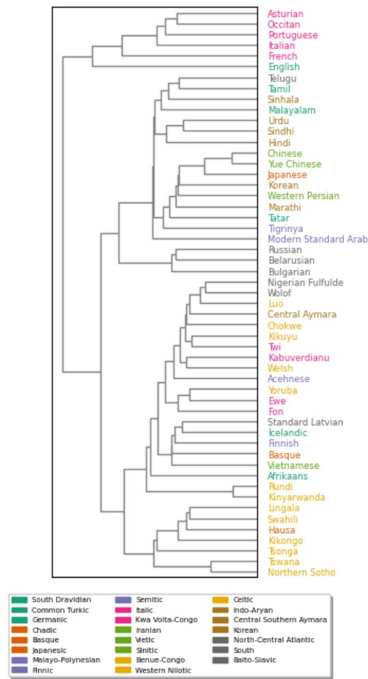  
Figure 3: Hierarchical clustering of languages based on the importance metric of experts in the decoder. Different colors represent different language subgroupings.

## 6.4 Discrepancy between chrF++ and spBLEU scores

We observed that our pruning method results in slightly higher performance drop according to sp-BLEU, than with chrF++. We hypothesize that it is due to a rare but visible phenomenon of overgeneration (and sometimes hallucinations). In the majority of cases, the translation is accurate initially but subsequently includes repetitions, paraphrasing, or slight hallucinations. The spBLEU metric penalizes this behavior more than chrF++, which could account for the variation in scores observed. More details on this are in Section A in Appendix.

## 7 Conclusion

In this paper, we study expert pruning in the NLLB-200 Mixture-of-Experts MT model. We propose expert pruning metrics based on gate statistics collected while decoding. We study several pruning strategies and demonstrate that it is possible to prune up to 80% of experts with a negligible loss in performance, which makes it possible to decode on a single 32GB GPU. We compare pruning at three levels of granularity: per language direction, per language, or global. Language-specific and language-pair pruning perform the same but the former is the most convenient. Global pruning (i.e., pruning always the same experts regardless of the source and target languages) performs surprisingly well but worse than language-specific pruning, which suggests that there are indeed some language-specific experts. This latter hypothesis is confirmed by our analysis of the selected experts.

## 8 Risks and Limitations

In our work, we rely on a single Mixture-of-Experts NMT model which is NLLB-200. There is a risk that our conclusions may only hold for this particular model and are specific to the way this model was trained. We believe that our findings still can be of interest to any person willing to use the NLLB-200 model because: (1) It was the only publiclyavailable MoE NMT model at the time of submission; (2) It is the only model covering 202 languages and reaching SoTA results for most of those languages.

Moreover, we did not try to finetune the pruned model, which could potentially improve the results (but requires a large number of GPUs) and therefore change some of our conclusions.

This work has similar risks as the original NLLB-200 models regarding the misuse of potentially wrong translations. Note that, as observed by Mohammadshahi et al. (2022b), pruning could amplify the biases already present in the full model.

## Acknowledgement

This work was completed during a research internship at NAVER LABS Europe. Yeskendir Koishekenov is also supported by ELLIS Amsterdam and Qualcomm AI Research.

## References

Roee Aharoni, Melvin Johnson, and Orhan Firat. 2019. Massively multilingual neural machine translation. arXiv preprint arXiv:1903.00089.

Yogesh Balaji, Seungjun Nah, Xun Huang, Arash Vahdat, Jiaming Song, Karsten Kreis, Miika Aittala, Timo Aila, Samuli Laine, Bryan Catanzaro, et al. 2022. ediffi: Text-to-image diffusion models with an ensemble of expert denoisers. arXiv preprint arXiv:2211.01324.

Tianyu Chen, Shaohan Huang, Yuan Xie, Binxing Jiao, Daxin Jiang, Haoyi Zhou, Jianxin Li, and Furu Wei. 2022. Task-specific expert pruning for sparse mixture-of-experts. arXiv preprint arXiv:2206.00277.

Alexis Conneau, Kartikay Khandelwal, Naman Goyal, Vishrav Chaudhary, Guillaume Wenzek, Francisco Guzmán, Edouard Grave, Myle Ott, Luke Zettlemoyer, and Veselin Stoyanov. 2019. Unsupervised cross-lingual representation learning at scale. arXiv preprint arXiv:1911.02116.

Marta R Costa-jussà, James Cross, Onur Çelebi, Maha Elbayad, Kenneth Heafield, Kevin Heffernan, Elahe Kalbassi, Janice Lam, Daniel Licht, Jean Maillard, et al. 2022. No language left behind: Scaling human-centered machine translation. arXiv preprint arXiv:2207.04672.

Zihang Dai, Zhilin Yang, Yiming Yang, Jaime Carbonell, Quoc V Le, and Ruslan Salakhutdinov. 2019. Transformer-xl: Attentive language models beyond a fixed-length context. arXiv preprint arXiv:1901.02860.

Nan Du, Yanping Huang, Andrew M Dai, Simon Tong, Dmitry Lepikhin, Yuanzhong Xu, Maxim Krikun, Yanqi Zhou, Adams Wei Yu, Orhan Firat, Barret Zoph, Liam Fedus, Maarten P Bosma, Zongwei Zhou, Tao Wang, Emma Wang, Kellie Webster, Marie Pellat, Kevin Robinson, Kathleen Meier-Hellstern, Toju Duke, Lucas Dixon, Kun Zhang, Quoc Le, Yonghui Wu, Zhifeng Chen, and Claire Cui. 2022. GLaM: Efficient scaling of language models with mixtureof-experts. In Proceedings of the 39th International Conference on Machine Learning, volume 162 of Proceedings of Machine Learning Research, pages 5547–5569. PMLR.

Angela Fan, Shruti Bhosale, Holger Schwenk, Zhiyi Ma, Ahmed El-Kishky, Siddharth Goyal, Mandeep Baines, Onur Celebi, Guillaume Wenzek, Vishrav

Chaudhary, et al. 2021. Beyond english-centric multilingual machine translation. J. Mach. Learn. Res., 22(107):1–48.

William Fedus, Jeff Dean, and Barret Zoph. 2022. A review of sparse expert models in deep learning. arXiv preprint arXiv:2209.01667.

William Fedus, Barret Zoph, and Noam Shazeer. 2021. Switch transformers: Scaling to trillion parameter models with simple and efficient sparsity.

Zhida Feng, Zhenyu Zhang, Xintong Yu, Yewei Fang, Lanxin Li, Xuyi Chen, Yuxiang Lu, Jiaxiang Liu, Weichong Yin, Shikun Feng, et al. 2022. Ernie-vilg 2.0: Improving text-to-image diffusion model with knowledge-enhanced mixture-of-denoising-experts. arXiv preprint arXiv:2210.15257.

William Held and Diyi Yang. 2022. Shapley head pruning: Identifying and removing interference in multilingual transformers. arXiv preprint arXiv:2210.05709.

Robert A Jacobs, Michael I Jordan, Steven J Nowlan, and Geoffrey E Hinton. 1991. Adaptive mixtures of local experts. Neural computation, 3(1):79–87.

Jae-young Jo and Sung-Hyon Myaeng. 2020. Roles and utilization of attention heads in transformer-based neural language models. In Proceedings of the 58th Annual Meeting of the Association for Computational Linguistics, pages 3404–3417.

Michael I Jordan and Robert A Jacobs. 1994. Hierarchical mixtures of experts and the em algorithm. Neural computation, 6(2):181–214.

Young Jin Kim, Ammar Ahmad Awan, Alexandre Muzio, Andres Felipe Cruz Salinas, Liyang Lu, Amr Hendy, Samyam Rajbhandari, Yuxiong He, and Hany Hassan Awadalla. 2021a. Scalable and efficient moe training for multitask multilingual models. arXiv preprint arXiv:2109.10465.

Zae Myung Kim, Laurent Besacier, Vassilina Nikoulina, and Didier Schwab. 2021b. Do multilingual neural machine translation models contain language pair specific attention heads? arXiv preprint arXiv:2105.14940.

Sneha Kudugunta, Yanping Huang, Ankur Bapna, Maxim Krikun, Dmitry Lepikhin, Minh-Thang Luong, and Orhan Firat. 2021. Beyond distillation: Task-level mixture-of-experts for efficient inference. arXiv preprint arXiv:2110.03742.

Dmitry Lepikhin, HyoukJoong Lee, Yuanzhong Xu, Dehao Chen, Orhan Firat, Yanping Huang, Maxim Krikun, Noam Shazeer, and Zhifeng Chen. 2020. Gshard: Scaling giant models with conditional computation and automatic sharding. arXiv preprint arXiv:2006.16668.

Paul Michel, Omer Levy, and Graham Neubig. 2019. Are sixteen heads really better than one? In Advances in Neural Information Processing Systems, volume 32. Curran Associates, Inc.

Ali Mohammadshahi, Vassilina Nikoulina, Alexandre Berard, Caroline De Brun, James Henderson, and Laurent Besacier. 2022a. Small-100: Introducing shallow multilingual machine translation model for low-resource languages. ArXiv, abs/2210.11621.

Ali Mohammadshahi, Vassilina Nikoulina, Alexandre Berard, Caroline De Brun, James Henderson, and Laurent Besacier. 2022b. What do compressed multilingual machine translation models forget? ArXiv, abs/2205.10828.

Basil Mustafa, Carlos Riquelme, Joan Puigcerver, Rodolphe Jenatton, and Neil Houlsby. 2022. Multimodal contrastive learning with limoe: the language-image mixture of experts. arXiv preprint arXiv:2206.02770.

David Patterson, Joseph Gonzalez, Quoc Le, Chen Liang, Lluis-Miquel Munguia, Daniel Rothchild, David So, Maud Texier, and Jeff Dean. 2021. Carbon emissions and large neural network training. arXiv preprint arXiv:2104.10350.

Maja Popović. 2015. chrf: character n-gram f-score for automatic mt evaluation. In Proceedings of the Tenth Workshop on Statistical Machine Translation, pages 392-395.

Matt Post. 2018. A call for clarity in reporting BLEU scores. In Proceedings of the Third Conference on Machine Translation: Research Papers, pages 186– 191, Brussels, Belgium. Association for Computational Linguistics.

Joan Puigcerver, Carlos Riquelme, Basil Mustafa, Cedric Renggli, André Susano Pinto, Sylvain Gelly, Daniel Keysers, and Neil Houlsby. 2020. Scalable transfer learning with expert models. arXiv preprint arXiv:2009.13239.

Carlos Riquelme, Joan Puigcerver, Basil Mustafa, Maxim Neumann, Rodolphe Jenatton, André Susano Pinto, Daniel Keysers, and Neil Houlsby. 2021. Scaling vision with sparse mixture of experts. Advances in Neural Information Processing Systems, 34:8583–8595.

Noam Shazeer, Azalia Mirhoseini, Krzysztof Maziarz, Andy Davis, Quoc Le, Geoffrey Hinton, and Jeff Dean. 2017. Outrageously large neural networks: The sparsely-gated mixture-of-experts layer. arXiv preprint arXiv:1701.06538.

Emma Strubell, Ananya Ganesh, and Andrew McCallum. 2019. Energy and policy considerations for deep learning in nlp. arXiv preprint arXiv:1906.02243.

Christian Szegedy, Vincent Vanhoucke, Sergey Ioffe, Jon Shlens, and Zbigniew Wojna. 2016. Rethinking the inception architecture for computer vision. In

Proceedings of the IEEE conference on computer vision and pattern recognition, pages 2818–2826.

Yuqing Tang, Chau Tran, Xian Li, Peng-Jen Chen, Naman Goyal, Vishrav Chaudhary, Jiatao Gu, and Angela Fan. 2020. Multilingual translation with extensible multilingual pretraining and finetuning. arXiv preprint arXiv:2008.00401.

Ashish Vaswani, Noam Shazeer, Niki Parmar, Jakob Uszkoreit, Llion Jones, Aidan N Gomez, Łukasz Kaiser, and Illia Polosukhin. 2017. Attention is all you need. Advances in neural information processing systems, 30.

Elena Voita, David Talbot, Fedor Moiseev, Rico Sennrich, and Ivan Titov. 2019. Analyzing multihead self-attention: Specialized heads do the heavy lifting, the rest can be pruned. arXiv preprint arXiv:1905.09418.

Hongyu Wang, Shuming Ma, Li Dong, Shaohan Huang, Dongdong Zhang, and Furu Wei. 2022. Deepnet: Scaling transformers to 1,000 layers. arXiv preprint arXiv:2203.00555.

Zhilin Yang, Zihang Dai, Yiming Yang, Jaime Carbonell, Russ R Salakhutdinov, and Quoc V Le. 2019. Xlnet: Generalized autoregressive pretraining for language understanding. Advances in neural information processing systems, 32.

Zhao You, Shulin Feng, Dan Su, and Dong Yu. 2021. Speechmoe: Scaling to large acoustic models with dynamic routing mixture of experts. arXiv preprint arXiv:2105.03036.

Seniha Esen Yuksel, Joseph N Wilson, and Paul D Gader 2012. Twenty years of mixture of experts. IEEE transactions on neural networks and learning systems, 23(8):1177–1193.

Biao Zhang, Philip Williams, Ivan Titov, and Rico Sennrich. 2020. Improving massively multilingual neural machine translation and zero-shot translation. arXiv preprint arXiv:2004.11867.

Barret Zoph, Irwan Bello, Sameer Kumar, Nan Du, Yanping Huang, Jeff Dean, Noam Shazeer, and William Fedus. 2022. St-moe: Designing stable and transferable sparse expert models, 2022. URL https://arxiv. org/abs/2202.08906.

## A Discrepancy between chrF++ and spBLEU scores

The spBLEU scores (Figure 2 top right, or Figure 4 and Tables 9 and 11) do not show exactly the same trend as chrF++. The gap between the full models and their pruned versions is slightly higher. This is likely caused by a rare but visible phenomenon of over-generation (and sometimes hallucinations). Table 7 shows some examples of such over-generation (with 3:1 fixed per layer lang-pair pruning at 80%). Most of the time, the translation is correct, but then continues with repetitions of itself, paraphrasing, or slight hallucinations. This behavior is more penalized by spBLEU than chrF++, which may explain the difference in scores. For instance, when duplicating the FLORES valid English-French translation output of the 54.5B model (i.e., concatenating each output sentence with itself), we see a spBLEU drop of 47% and a chrF++ drop of only 13%. The global threshold method is more sensitive to this phenomenon. For instance, 80% pruning leads to a 1.75 spBLEU drop (vs 0.53 for the fxed per layer method). We report in Table 6 the difference in length ratio (reported by SacreBLEU, Post, 2018) between the pruned models and the full model. We observe that global threshold at 80% has an average length ratio delta with the full model of 0.16 (meaning it generates longer outputs), while fxed per layer has 0.04. We hypothesize that this over-generation issue may be mitigated by identifying experts that are specialized in generating the end-of-sequence symbol, but this is the subject of future work.

<table><tr><td>Method</td><td>Enc experts</td><td>Dec experts</td><td>High→High</td><td>High→Low</td><td>High→V. Low</td><td>Low→High</td><td>Low→Low</td><td>Low→V. low</td><td>V. low→High</td><td>V. low→Low</td><td>V. low→V. low</td><td>Average</td></tr><tr><td>3.3B dense model</td><td>6</td><td>6</td><td>0.02±0.02</td><td>0.04±0.03</td><td>0.09±0.06</td><td>0.02±0.03</td><td>0.04±0.04</td><td>0.11±0.06</td><td>0.06±0.05</td><td>0.07±0.07</td><td>0.15±0.08</td><td>0.06±0.07</td></tr><tr><td rowspan="3">Fixed per layer</td><td>288</td><td>96</td><td>0.03±0.03</td><td>0.01±0.02</td><td>0.04±0.03</td><td>0.04±0.06</td><td>0.01±0.03</td><td>0.04±0.03</td><td>0.06±0.06</td><td>0.03±0.03</td><td>0.06±0.04</td><td>0.04±0.04</td></tr><tr><td>216</td><td>72</td><td>0.04±0.03</td><td>0.02±0.02</td><td>0.05±0.04</td><td>0.05±0.07</td><td>0.01±0.04</td><td>0.05±0.05</td><td>0.07±0.07</td><td>0.04±0.04</td><td>0.07±0.04</td><td>0.04±0.05</td></tr><tr><td>144</td><td>48</td><td>0.05±0.05</td><td>0.03±0.04</td><td>0.07±0.05</td><td>0.07±0.09</td><td>0.05±0.10</td><td>0.08±0.06</td><td>0.09±0.07</td><td>0.07±0.09</td><td>0.10±0.06</td><td>0.07±0.07</td></tr><tr><td rowspan="3">Global threshold</td><td></td><td>384</td><td>0.07±0.07</td><td>0.07±0.10</td><td>0.10±0.07</td><td>0.13±0.11</td><td>0.11±0.17</td><td>0.14±0.09</td><td>0.13±0.12</td><td>0.11±0.14</td><td>0.14±0.09</td><td>0.11±0.11</td></tr><tr><td></td><td>288</td><td>0.10±0.10</td><td>0.12±0.17</td><td>0.15±0.20</td><td>0.19±0.22</td><td>0.15±0.21</td><td>0.18±0.24</td><td>0.20±0.25</td><td>0.13±0.15</td><td>0.19±0.22</td><td></td></tr><tr><td></td><td>192</td><td>0.10±0.10</td><td>0.12±0.15</td><td>0.12±0.09</td><td>0.17±0.15</td><td>0.17±0.23</td><td>0.16±0.12</td><td>0.16±0.14</td><td>0.17±0.19</td><td></td><td>0.16±0.20 0.15±0.15</td></tr><tr><td>Enc/dec thresholds</td><td>216</td><td>72</td><td>0.05±0.04</td><td>0.03±0.03</td><td>0.06±0.04</td><td>0.08±0.09</td><td>0.03±0.04</td><td>0.06±0.05</td><td>0.09±0.07</td><td>0.06±0.06</td><td>0.15±0.11 0.08±0.04</td><td>0.06±0.06</td></tr></table>

Table 6: Valid length ratio statistics on 30 languages. We compute the length ratio deltas w.r.t. the full unpruned model and report the mean and standard deviation in each language category. Values smaller than zero mean that the model generates longer sequences on average. We prune with the importance metric, using statistics at the language pair granularity. Length ratios are obtained with SacreBLEU and the flores200' tokenization.

<table><tr><td>Reference Translation</td><td>However, very few Royal Navy ships were based near the likely invasion routes as the admirals were afraid they would be sunk by German air attack. However, the Royal Navy had few ships in the vicinity of the invasion routes, as the admirals feared that they would be sunk by German air attack. The Royal Navy&#x27;s</td></tr><tr><td>Reference Translation</td><td>ships were too small to be able to operate in the vicinity of the invasion routes. However, the discovery of his tomb in 1922 made him a celebrity. While many tombs of the past were robbed, this tomb was left virtually undisturbed. However, his tomb became famous when it was discovered in 1922. Although many tombs in the past have been excavated, this one has remained largely undisturbed. The tomb was built in the middle of the 19th century. The tomb was built in the middle of</td></tr><tr><td>Reference</td><td>the 20th century. The tomb was built in the middle of the 20th century The translation engines have improved dramatically, and now often give more or less correct translations (and more seldom gibberish), but some care is due, as they still</td></tr><tr><td>Translation</td><td>may have gotten it all wrong. Translation engines have improved dramatically, and now often produce more or less accurate translations (as well as more or less uncommon ones), but some errors can still be corrected, so some caution is warranted. For example, in the case of the English language, the use of the word &quot;translate&quot; in the context of a translation of a document, such as a translation of a document into a foreign language, is not recommended. The use of the word &quot;translate&quot; in the context of a translation of a document is discouraged.</td></tr></table>

Table 7: Examples of over-generation when translating from Tigrinya (t ir\_Ethi) to English (eng\_Latn) with fixed per layer (3:1) 80% pruning at the language direction granularity.

<table><tr><td>Code</td><td>Language</td><td>Resource Type</td><td>Family</td><td>Subgrouping</td></tr><tr><td>tsn_Latn</td><td>Tswana</td><td>High</td><td>Atlantic-Congo</td><td>Benue-Congo</td></tr><tr><td>vie_Latn</td><td>Vietnamese</td><td>High</td><td>Austroasiatic</td><td>Vietic</td></tr><tr><td>rus_Cyrl</td><td>Russian</td><td>High</td><td>Indo-European</td><td>Balto-Slavic</td></tr><tr><td>eng_Latn</td><td>English</td><td>High</td><td>Indo-European</td><td>Germanic</td></tr><tr><td>fra_Latn</td><td>French</td><td>High</td><td>Indo-European</td><td>Italic</td></tr><tr><td>por_Latn</td><td>Portuguese</td><td>High</td><td>Indo-European</td><td>Italic</td></tr><tr><td>jpn_Jpan</td><td>Japanese</td><td>High</td><td>Japonic</td><td>Japanesic</td></tr><tr><td>kor_Hang</td><td>Korean</td><td>High</td><td>Koreanic</td><td>Korean</td></tr><tr><td>fin_Latn</td><td>Finnish</td><td>High</td><td>Uralic</td><td>Finnic</td></tr><tr><td>tir_Ethi</td><td>Tigrinya</td><td>Low</td><td>Afro-Asiatic</td><td>Semitic</td></tr><tr><td>nso_Latn</td><td>Northern Sotho</td><td>Low</td><td>Atlantic-Congo</td><td>Benue-Congo</td></tr><tr><td>yor_Latn</td><td>Yoruba</td><td>Low</td><td>Atlantic-Congo</td><td>Benue-Congo</td></tr><tr><td>mal_Mlym</td><td>Malayalam</td><td>Low</td><td>Dravidian</td><td>South Dravidian</td></tr><tr><td>tam_Taml</td><td>Tamil</td><td>Low</td><td>Dravidian</td><td>South Dravidian</td></tr><tr><td>bel_Cyrl</td><td>Belarusian</td><td>Low</td><td>Indo-European</td><td>Balto-Slavic</td></tr><tr><td>cym_Latn</td><td>Welsh</td><td>Low</td><td>Indo-European</td><td>Celtic</td></tr><tr><td>urd_Arab</td><td>Urdu</td><td>Low</td><td>Indo-European</td><td>Indo-Aryan</td></tr><tr><td>luo_Latn</td><td>Luo</td><td>Low</td><td>Nilotic</td><td>Western Nilotic</td></tr><tr><td>tat_Cyrl</td><td>Tatar</td><td>Low</td><td>Turkic</td><td>Common Turkic</td></tr><tr><td>cjk_Latn</td><td>Chokwe</td><td>Very low</td><td>Atlantic-Congo</td><td>Benue-Congo</td></tr><tr><td>kik_Latn</td><td>Kikuyu</td><td>Very low</td><td>Atlantic-Congo</td><td>Benue-Congo</td></tr><tr><td>fuv_Latn</td><td>Nigerian Fulfulde</td><td>Very low</td><td>Atlantic-Congo</td><td>North-Central Atlantic</td></tr><tr><td>wol_Latn</td><td>Wolof</td><td>Very low</td><td>Atlantic-Congo</td><td>North-Central Atlantic</td></tr><tr><td>ace_Latn</td><td>Acehnese</td><td>Very low</td><td>Austronesian</td><td>Malayo-Polynesian</td></tr><tr><td>ayr_Latn</td><td>Central Aymara</td><td>Very low</td><td>Aymaran</td><td>Central Southern Aymara</td></tr><tr><td>snd_Arab</td><td>Sindhi</td><td>Very low</td><td>Indo-European</td><td>Indo-Aryan</td></tr><tr><td>ast_Latn</td><td>Asturian</td><td>Very low</td><td>Indo-European</td><td>Italic</td></tr><tr><td>kea_Latn</td><td>Kabuverdianu</td><td>Very low</td><td>Indo-European</td><td>Italic</td></tr><tr><td>yue_Hant</td><td>Yue Chinese</td><td>Very low</td><td>Sino-Tibetan</td><td>Sinitic</td></tr><tr><td>arb_Arab</td><td>Modern Standard Arabic</td><td>High</td><td>Afro-Asiatic</td><td>Semitic</td></tr><tr><td>swh_Latn</td><td>Swahili</td><td>High</td><td>Atlantic-Congo</td><td>Benue-Congo</td></tr><tr><td>eus_Latn</td><td>Basque</td><td>High</td><td>Basque</td><td>Basque</td></tr><tr><td>bul_Cyrl</td><td>Bulgarian</td><td>High</td><td>Indo-European</td><td>Balto-Slavic</td></tr><tr><td>lvs_Latn</td><td>Standard Latvian</td><td>High</td><td>Indo-European</td><td>Balto-Slavic</td></tr><tr><td>afr_Latn</td><td>Afrikaans</td><td>High</td><td>Indo-European</td><td>Germanic</td></tr><tr><td>isl_Latn</td><td>Icelandic</td><td>High</td><td>Indo-European</td><td>Germanic</td></tr><tr><td>hin_Deva</td><td>Hindi</td><td>High</td><td>Indo-European</td><td>Indo-Aryan</td></tr><tr><td>pes_Arab</td><td>Western Persian</td><td>High</td><td>Indo-European</td><td>Iranian</td></tr><tr><td>ita_Latn</td><td>Italian</td><td>High</td><td>Indo-European</td><td>Italic</td></tr><tr><td>zho_Hans</td><td>Chinese</td><td>High</td><td>Sino-Tibetan</td><td>Sinitic</td></tr><tr><td>hau_Latn</td><td>Hausa</td><td>Low</td><td>Afro-Asiatic</td><td>Chadic</td></tr><tr><td>kin_Latn</td><td>Kinyarwanda</td><td>Low</td><td>Atlantic-Congo</td><td>Benue-Congo</td></tr><tr><td>kon_Latn</td><td>Kikongo</td><td>Low</td><td>Atlantic-Congo</td><td>Benue-Congo</td></tr><tr><td>lin_Latn</td><td>Lingala</td><td>Low</td><td>Atlantic-Congo</td><td>Benue-Congo</td></tr><tr><td>run_Latn</td><td>Rundi</td><td>Low</td><td>Atlantic-Congo</td><td>Benue-Congo</td></tr><tr><td>tso_Latn</td><td>Tsonga</td><td>Low</td><td>Atlantic-Congo</td><td>Benue-Congo</td></tr><tr><td>ewe_Latn</td><td>Ewe</td><td>Low</td><td>Atlantic-Congo</td><td>Kwa Volta-Congo</td></tr><tr><td>fon_Latn</td><td>Fon</td><td>Low</td><td>Atlantic-Congo</td><td>Kwa Volta-Congo</td></tr><tr><td>twi_Latn</td><td>Twi</td><td>Low</td><td>Atlantic-Congo</td><td>Kwa Volta-Congo</td></tr><tr><td>tel_Telu</td><td>Telugu</td><td>Low</td><td>Dravidian</td><td>South</td></tr><tr><td>mar_Deva</td><td>Marathi</td><td>Low</td><td>Indo-European</td><td>Indo-Aryan</td></tr><tr><td>sin_Sinh</td><td>Sinhala</td><td>Low</td><td>Indo-European</td><td>Indo-Aryan</td></tr><tr><td>oci_Latn</td><td>Occitan</td><td>Very low</td><td>Indo-European</td><td>Italic</td></tr></table>

Table 8: Set of 53 languages used in the experiments. We show the lang code, name, resource type, family, and subgrouping of each language. The 30 languages used in the intermediate experiments are in the top half of the table.

<table><tr><td>Method</td><td>Metric</td><td>High→High</td><td>High→Low</td><td>High→V. Low</td><td>Low→High</td><td>Low→Low</td><td>Low→V. low</td><td>V. low→High</td><td>V. low→Low</td><td>V. low→V. low</td><td>Average</td></tr><tr><td>3.3B dense model (Costa-jussà et al., 2022)</td><td></td><td>27.22</td><td>20.77</td><td>11.29</td><td>23.10</td><td>17.85</td><td>9.44</td><td>19.07</td><td>14.65</td><td>7.84</td><td>16.78</td></tr><tr><td colspan="2">54.5B MoE model (Costa-jussà et al., 2022)</td><td>28.98</td><td>22.29</td><td>11.87</td><td>25.19</td><td>19.49</td><td>10.24</td><td>20.79</td><td>16.55</td><td>8.36</td><td>18.17</td></tr><tr><td rowspan="6">Fixed per layer (balanced)</td><td>Top 1</td><td>28.39</td><td>21.82</td><td>11.64</td><td>24.22</td><td>18.67</td><td>9.92</td><td>20.05</td><td>15.98</td><td>8.13</td><td>17.62</td></tr><tr><td>Top 2</td><td>27.06</td><td>20.89</td><td>11.20</td><td>23.08</td><td>17.87</td><td>9.48</td><td>19.08</td><td>15.18</td><td>7.83</td><td>16.82</td></tr><tr><td>Load balancing</td><td>27.16</td><td>21.04</td><td>11.30</td><td>23.17</td><td>17.98</td><td>9.60</td><td>19.14</td><td>15.24</td><td>7.88</td><td>16.92</td></tr><tr><td>Importance (vanilla)</td><td>25.92</td><td>18.27</td><td>10.51</td><td>23.78</td><td>17.64</td><td>9.69</td><td>19.20</td><td>14.43</td><td>7.73</td><td>16.33</td></tr><tr><td>Importance</td><td>28.45</td><td>21.86</td><td>11.66</td><td>24.25</td><td>18.62</td><td>9.90</td><td>20.13</td><td>16.02</td><td>8.19</td><td>17.65</td></tr><tr><td>Top 1</td><td>28.33</td><td>21.50</td><td>11.26</td><td>23.54</td><td>18.16</td><td>9.26</td><td>19.72</td><td>15.45</td><td>7.69</td><td>17.18</td></tr><tr><td>Global threshold</td><td>Importance</td><td>28.43</td><td>21.56</td><td>11.28</td><td>23.52</td><td>18.37</td><td>9.40</td><td>19.74</td><td>15.54</td><td>7.69</td><td>17.25</td></tr><tr><td>Fixed per layer (unbalanced)</td><td></td><td>28.63</td><td>22.08</td><td>11.76</td><td>24.47</td><td>18.94</td><td>10.03</td><td>20.19</td><td>16.21</td><td>8.23</td><td>17.81</td></tr><tr><td>Enc/Dec thresholds (balanced)</td><td>Importance</td><td>28.47</td><td>21.87</td><td>11.65</td><td>24.25</td><td>18.61</td><td>9.90</td><td>20.11</td><td>15.97</td><td>8.15</td><td>17.64</td></tr><tr><td>Enc/Dec thresholds (unbalanced)</td><td></td><td>28.72</td><td>22.08</td><td>11.74</td><td>24.57</td><td>18.99</td><td>10.01</td><td>20.26</td><td>16.14</td><td>8.20</td><td>17.83</td></tr></table>

Table 9: spBLEU valid scores on 30 languages of different pruning algorithms and metrics, with 75% pruning (i.e., 384 experts are kept in total). The unbalanced approaches keep 240 encoder experts and 144 decoder experts.

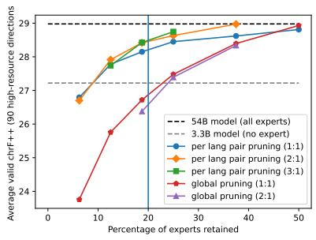

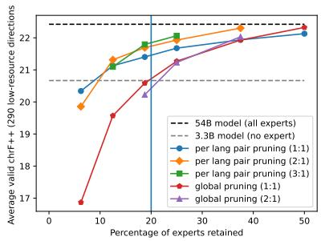

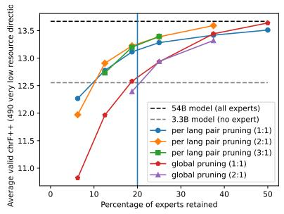

Figure 4: spBLEU valid scores on 30 languages for different resource types as a function of the percentage of experts retained. Pruning is done at the language pair granularity with the importance metric and with a fixed number of experts per layer.
<table><tr><td>Method</td><td>Enc experts</td><td>Dec experts</td><td>High→High</td><td>High→Low</td><td>High→V. Low</td><td>Low→High</td><td>Low→Low</td><td>Low→V. low</td><td>V. low→High</td><td>V. low→Low</td><td>V. low→V. low</td><td>Average</td></tr><tr><td>3.3B dense model</td><td>6</td><td>6</td><td>44.54</td><td>38.20</td><td>30.08</td><td>40.49</td><td>35.19</td><td>27.61</td><td>35.27</td><td>30.68</td><td>24.75</td><td>34.06</td></tr><tr><td>54.5B MoE model</td><td>768</td><td>768</td><td>45.90</td><td>39.19</td><td>30.24</td><td>42.29</td><td>36.35</td><td>28.18</td><td>36.55</td><td>32.16</td><td>24.93</td><td>35.07</td></tr><tr><td>Fixed per layer (lang-pair)</td><td>216</td><td>72</td><td>45.87</td><td>39.16</td><td>30.41</td><td>41.75</td><td>35.89</td><td>28.11</td><td>36.34</td><td>31.97</td><td>25.08</td><td>34.93</td></tr><tr><td>Fixed per layer (global)</td><td>216</td><td>72</td><td>44.56</td><td>37.80</td><td>29.91</td><td>40.61</td><td>34.78</td><td>27.85</td><td>35.51</td><td>31.04</td><td>25.09</td><td>34.10</td></tr><tr><td>Fixed per layer (lang)</td><td>216</td><td>72</td><td>45.84</td><td>39.22</td><td>30.46</td><td>41.72</td><td>35.96</td><td>28.17</td><td>36.29</td><td>32.03</td><td>25.11</td><td>34.96</td></tr><tr><td>Enc/dec thresholds (lang-pair)</td><td>216</td><td>72</td><td>45.89</td><td>39.19</td><td>30.39</td><td>41.77</td><td>36.02</td><td>28.21</td><td>36.28</td><td>31.97</td><td>25.07</td><td>34.95</td></tr><tr><td>Global threshold (lang-pair)</td><td></td><td>288</td><td>45.82</td><td>38.96</td><td>30.06</td><td>41.44</td><td>35.98</td><td>27.92</td><td>35.90</td><td>31.83</td><td>24.72</td><td>34.71</td></tr></table>

Table 10: chrF++ valid scores on 30 languages, with the importance metric for 80% pruning (1-GPU decoding) at three different levels of granularity (global, per language or per language direction).

<table><tr><td>Method</td><td>Enc experts</td><td>Dec experts</td><td>High→High</td><td>High→Low</td><td>High→V. Low</td><td>Low→High</td><td>Low→Low</td><td>Low→V. low</td><td>V. low→High</td><td>V. low→Low</td><td>V. low→V. low</td><td>Average</td></tr><tr><td>3.3B dense model</td><td>6</td><td>6</td><td>26.72</td><td>18.69</td><td>12.62</td><td>21.08</td><td>15.65</td><td>10.12</td><td>19.52</td><td>14.03</td><td>9.27</td><td>17.71</td></tr><tr><td>54.5B MoE model</td><td>768</td><td>768</td><td>28.42</td><td>20.11</td><td>13.31</td><td>22.81</td><td>16.93</td><td>10.99</td><td>21.35</td><td>15.75</td><td>9.91</td><td>19.12</td></tr><tr><td>Fixed per layer (lang-pair)</td><td>216</td><td>72</td><td>28.01</td><td>19.81</td><td>12.81</td><td>21.94</td><td>16.33</td><td>10.37</td><td>20.63</td><td>15.27</td><td>9.27</td><td>18.56</td></tr><tr><td>Fixed per layer (global)</td><td>216</td><td>72</td><td>24.15</td><td>17.15</td><td>12.26</td><td>18.34</td><td>13.89</td><td>9.77</td><td>17.41</td><td>12.78</td><td>8.88</td><td>16.03</td></tr><tr><td>Fixed per layer (lang)</td><td>216</td><td>72</td><td>27.87</td><td>19.82</td><td>12.78</td><td>21.79</td><td>16.37</td><td>10.35</td><td>20.51</td><td>15.28</td><td>9.19</td><td>18.50</td></tr></table>

Table 11: spBLEU test scores on 53 languages, with the importance metric for 80% pruning (1-GPU decoding) at three different levels of granularity (global, per language or per language direction).

<table><tr><td>Method</td><td>Enc experts</td><td>Dec experts</td><td>High→High</td><td>High→Low</td><td>High→V. Low</td><td>Low→High</td><td>Low→Low</td><td>Low→V. low</td><td>V. low→High</td><td>V. low→Low</td><td>V. low→V. low</td><td>Average</td></tr><tr><td>3.3B dense model</td><td>6</td><td>6</td><td>26.86</td><td>18.35</td><td>14.18</td><td>20.91</td><td>15.15</td><td>11.48</td><td>20.09</td><td>14.38</td><td>11.42</td><td>15.95</td></tr><tr><td>54.5B MoE model</td><td>768</td><td>768</td><td>28.61</td><td>19.49</td><td>15.41</td><td>22.66</td><td>16.22</td><td>12.69</td><td>22.71</td><td>16.18</td><td>12.71</td><td>17.48</td></tr><tr><td>Fixed per layer (lang)</td><td>216</td><td>72</td><td>28.27</td><td>19.26</td><td>15.08</td><td>22.02</td><td>15.84</td><td>12.24</td><td>21.90</td><td>15.62</td><td>12.05</td><td>16.97</td></tr></table>

Table 12: spBLEU test scores on all 202 languages, with the importance metric for 80% pruning (1-GPU decoding) at the language granularity

<table><tr><td>Method</td><td>Enc experts</td><td>Dec experts</td><td>High→High</td><td>High→Low</td><td>High→V. Low</td><td>Low→High</td><td>Low→Low</td><td>Low→V. low</td><td>V. low→High</td><td>V. low→Low</td><td>V. low→V. low</td><td>Average</td></tr><tr><td>3.3B dense model</td><td>6</td><td>6</td><td>1.14±1.23</td><td>0.52±1.15</td><td>0.84±2.17</td><td>1.34±1.30</td><td>0.62±1.23</td><td>1.00±2.24</td><td>2.07±1.46</td><td>1.38±1.62</td><td>0.95±2.23</td><td>1.10±1.83</td></tr><tr><td>Fixed per layer (lang)</td><td>216</td><td>72</td><td>0.01±0.58</td><td>-0.23±0.55</td><td>0.23±1.55</td><td>0.34±0.58</td><td>-0.01±0.60</td><td>0.39±1.61</td><td>0.53±0.60</td><td>0.19±0.57</td><td>0.66±1.68</td><td>0.29±1.17</td></tr><tr><td>3.3B dense model</td><td>6</td><td>6</td><td>1.75±1.35</td><td>1.13±1.25</td><td>1.24±2.07</td><td>1.76±1.42</td><td>1.07±1.21</td><td>1.21±1.89</td><td>2.62±1.67</td><td>1.80±1.58</td><td>1.29±1.95</td><td>1.53±1.74</td></tr><tr><td>Fixed per layer (lang)</td><td>216</td><td>72</td><td>0.33±0.92</td><td>0.22±0.56</td><td>0.34±1.25</td><td>0.65±1.08</td><td>0.38±0.53</td><td>0.44±1.18</td><td>0.81±1.00</td><td>0.56±0.52</td><td>0.66±1.16</td><td>0.51±0.99</td></tr></table>

Table 13: Test chrF++ deltas (first part) and spBLEU deltas (second part) with the unpruned MoE model on all 202 languages. The pruned version uses the importance metric with 80% pruning at the language granularity. Each column reports the average score for a given language category, as well as the standard deviation. A positive value means that this model is worse than the full 54.5B model. The last column reports the average score and standard deviation over all 202×201 directions.

Hausa 0.20.190.190.210.490.380.50.360.460.40.460.240.210.240.510.20.240.360.220.30.470.320.420.450.20.390.360.470.430.50.450.470.140.40.160.440.430.380.210.230.220.20.150.270.150.440.450.250.230.240.430.43   
Tigrinya 0.2 0.680.190.170.130.180.140.180.110.410.170.170.180.170.20.160.20.240.180.230.140.230.180.190.20.130.170.20.170.230.260.170.160.140.150.150.140.130.20.410.190.190.170.190.180.160.150.190.20.190.220.35   
Modern Standard Arabic 0.190.68 .170.150.120.160.130.170.10.410.160.140.160.140.170.130.170.210.150.20.130.210.140.140.160.110.170.20.160.210.240.160.150.110.140.120.110.110.20.430.210.180.170.160.160.130.130.150.160.150.180.33   
Yoruba 0.190.190.171.00.570.130.380.120.370.120.190.330.610.580.60.380.60.630.440.590.490.140.40.230.240.570.110.160.120.170.170.250.190.170.130.60.170.140.10.610.180.190.590.510.590.590.140.140.60.620.610.30.2   
Kikongo 0.210.170.150.57 0.160.440.190.410.150.20.440.640.660.610.40.620.650.450.620.510.160.420.260.280.60.140.180.130.190.160.270.20.130.170.580.210.190.140.590.160.180.590.510.630.570.180.160.660.610.610.320.2   
Kinyarwanda .490.130.120.130.16 1.310.550.28 0.320.350.220.140.20.390.170.190.280.170.220.710.250.480.480.170.570.380.570.440.570.380.480.140.540.120.540.570.550.160.180.190.150.1 0.20.11 0.580.570.220.170.180.390.33   
Swahili 0.380.180.160.380.440.31 0.280.470.290.320.590.480.380.440.520.410.420.510.410.460.280.460.360.380.40.240.240.250.290.30.380.320.120.260.350.310.290.230.40.20.210.360.330.420.320.270.280.450.410.430.40.32   
Tsonga 0.50.140.130.120.190.550.28 0.320.520.330.360.170.170.190.360.150.160.240.160.190.540.260.440.440.150.480.380.520.430.490.380.470.170.490.090.480.50.50.140.160.160.130.130.190.110.530.520.180.160.170.370.31   
Northern Sotho .360.180.170.370.410.280.470.32 0.270.280.520. 0.450.540.390.390.470.39 0.4 0.280.440.390.440.380.280.280.280.320.290.4 0.320.170.280.340.330.320.260.390.19 0.2 0.350.330.430.330.29 0.3 0.43 0.4 0.410.410.29   
Rundi .460.11 0.1 0.120.15 0.290.520.2 0.30.330.20.120.180.360.160.170.250.150.190.70.220.440.450.140.590.350.510.410.510.350.440.130.550.110.530.580.550.150.150.170.130.10.180.090.580.580.190.150.160.360.3   
Chokwe 0.4 0.410.410.190.20.320.320.330.280.3 0.340.240.170.230.350.180.250.380.20.280.330.320.280.320.190.270.310.370.320.430.410.330.130.250.120.270.260.240.170.340.20.190.160.230.160.280.280.250.20.220.340.49   
Lingala 460.170.160.330.440.350.590.360.520.330.34 ,460.380.430.580.360.410.510.40.430.350.460.460.490.390.310.320.320.360.340.460.420.150.340.320.410.380.310.370.190.210.340.320.420.310.360.350.440.40.420.490.37   
Kikuyu 0.240.170.140.610.640.220.480.170.430.20.240.46 0.630.710.450.680.710.550.650.520.220.470.320.320.620.180.210.190.230.220.320.230.120.210.550.260.220.170.610.160.170.580.480.680.550.21 0.20.720.670.680.380.23   
Tswana-0.210.180.160.580.660.140.380.170.470.120.170.380.631.00.610.390.630.630.440.60.490.140.40.250.250.60.120.150.130.160.130.250.170.140.150.570.20.150.120.570.160.180.570.510.630.550.140.140.640.60.590.30.17   
Ewe 0.240.170.140.60.610.20.440.190.450.180.230.430.710.61 1.0 0.450.660.670.490.650.520.20.450.310.320.630.170.190.170.220.20.310.220.140.20.580.260.220.160.630.160.20.590.480.680.550.20.20.690.640.660.360.23   
Twi-0.510.20.170.380.40.390.520.360.540.360.350.580.450.390.45 0.40.440.570.40.470.40.480.470.510.410.320.320.360.380.40.520.40.160.330.340.410.370.290.410.220.210.370.330.480.350.380.390.480.440.450.510.38   
Fon 0.20.160.130.60.620.170.410.150.390.160.180.360.680.630.660.41.00.660.470.610.50.180.430.270.280.580.140.150.150.190.170.270.180.140.160.580.210.170.130.590.170.210.60.490.630.550.170.160.640.610.60.30.2   
Wolof 0.240.20.170.630.650.190.420.160.390.170.250.410.710.630.670.440.66 0.590.680.630.220.520.280.310.660.160.20.180.220.220.310.230.140.170.570.220.180.140.640.190.210.630.50.70.60.20.190.740.690.680.380.26   
Nigerian Fulfulde 0.360.240.210.440.450.280.510.240.470.250.380.510.550.440.490.570.470.59 0.470.590.30.550.370.380.480.220.270.280.30.320.430.310.160.240.370.280.240.180.450.240.230.470.40.550.430.260.260.570.520.520.440.38   
Vietnamese 0.220.180.150.590.620.170.410.160.390.150.20.40.650.60.650.40.610.680.47 0.550.190.480.28 0.30.640.150.210.160.230.20.310.230.160.180.580.230.190.130.660.2 0.210.610.530.670.590.190.190.670.680.680.360.24   
Acehnese 0.30.230.20.490.510.220.460.190.40.190.280.430.520.490.520.47 0.50.630.590.55 0.230.540.310.310.520.170.230.230.250.240.360.250.150.190.450.230.20.150.520.220.220.490.430.570.440.210.210.570.520.540.390.32   
Central Aymara 0.470.140.130.140.160.710.280.540.280.70.330.350.220.140.20.40.180.220.30.190.23 0.280.490.510.170.610.380.570.480.580.430.50.150.590.110.550.630.580.170.170.180.170.120.220.14 0.680.670.230.190.20.420.35   
Basque 0.320.230.210.40.420.250.460.260.440.220.320.460.470.40.450.480.430.520.550.480.540.28 0.350.390.460.220.290.290.310.340.450.340.180.220.370.270.240.190.440.280.260.480.430.510.440.250.250.480.470.480.430.41   
Telugu .420.180.140.230.260.480.360.440.390.440.280.460.320.250.310.470.270.280.370.280.310.490.35 0.680.30.480.4 0.450.490.490.470.470.160.520.230.610.570.480.30.160.170.250.220.330.210.540.550.31 0.3 0.330.510.32   
Tamil 0.450.190.140.240.280.480.380.440.440.450.320.490.320.250.320.510.280.310.380.30.310.510.390.68 0.320.480.430.460.480.5 0.510.490.170.490.230.570.550.450.290.180.170.270.220.340.230.550.540.320.320.340.580.36   
Malayalam 0.20.20.160.570.60.170.40.150.380.140.190.390.620.60.630.410.580.660.480.640.520.170.460.30.321 0.160.220.170.220.190.310.220.150.170.60.230.190.140.690.180.190.630.50.660.60.190.180.660.640.670.370.23   
Belarusian 0.390.130.110.110.140.570.240.480.280.590.270.310.180.120.170.320.140.160.220.150.170.610.220.480.480.16 0.490.540.540.470.370.440.150.570.10.540.610.610.160.140.120.13 0.10.190.10.61 0.60.180.160.180.430.28   
Russian 0.360.170.170.160.180.380.240.380.280.350.310.320.210.150.190.320.150.20.270.210.230.380.290.4 0.430.220.49 0.450.60.410.380.410.170.360.120.410.390.360.190.230.190.150.150.210.140.41 0.40.210.220.230.490.37   
Standard Latvian 0.470.20.20.120.130.570.250.520.280.510.370.320.190.130.170.360.150.180.280.160.230.570.290.450.460.170.540.451.00.490.650.490.510.160.460.090.480.480.490.150.260.210.150.130.20.120.540.520.190.170.180.410.45   
Bulgarian 0.430.170.160.170.190.440.290.430.320.410.320.360.230.160.220.380.190.220.30.230.250.480.310.490.480.220.540.60.49 0.510.450.480.190.420.170.480.460.420.220.220.210.190.170.240.160.470.470.240.220.240.50.39   
Welsh 0.50.230.210.170.160.570.30.490.290.510.430.340.220.130.20.40.170.220.320.20.240.580.340.490.50.190.470.410.650.51 0.550.550.180.430.120.490.470.440.170.290.22 0.2 0.140.230.150.52 0.50.22 0.2 0.210.440.47   
Icelandic 0.450.260.240.250.270.380.380.38 0.40.350.410.460.320.250.310.520.270.310.430.310.360.430.450.470.510.310.370.380.490.450.5 0.530.180.330.220.380.370.320.280.30.240.30.250.340.240.4 0.40.320.320.330.520.51   
Afrikaans 0.470.170.160.190.20.480.320.470.320.440.330.420.230.170.220.40.180.230.310.230.250.50.340.470.490.220.440.410.510.480.550.53 0.20.410.170.460.470.430.190.220.220.20.170.250.170.480.470.250.230.240.450.41   
English .140.160.150.170.130.140.120.170.170.130.130.150.120.140.140.160.140.140.160.160.150.150.180.160.170.150.150.170 0.140.150.160.140.130.150.250.220.160.220.150.2 0.130.130.150.140.140.160.17   
Hindi 0.40.140.110.130.170.540.260.490.280.550.250.340.210.150.20.330.160.170.240.180.190.590.220.520.490.170.570.360.460.420.430.330.410.14 .150.57 0.7 0.70.180.11 0.1 0.140.11 0.2 0.11 0.610.63 0.190.19 0.20.380.25   
Sindhi 0.160.150.140.60.580.120.350.090.340.110.120.320.550.570.580.340.580.570.370.580.450.110.370.230.230.60.10.120.090.170.120.220.170.150.15 0.180.170.140.680.120.180.550.50.570.550.140.130.570.590.60.260.15   
Sinhala 0.440.150.120.170.210.540.310.480.330.530.270.410.260.20.260.410.210.220.280.230.230.550.270.610.570.230.540.410.480.480.490.380.460.160.570.18 590.570.230.150.140.180.150.250.150.610.610.240.240.260.440.28   
Marathi-0.430.140.120.140.190.570.290.50.320.580.260.380.220.150.220.370.170.180.240.190.20.630.240.570.550.190.610.390.480.460.470.370.470.140.70.170.59 .650.190.130.130.140.120.20.12 0.7 0.7 0.210.190.220.420.29   
Urdu 0.380.130.110.10.140.550.230.50.260.550.240.310.170.120.160.290.130.140.180.130.150.580.190.480.450.140.610.360.490.420.440.320.430.130.70.140.570.65 0.170.11 0.1 0.1 0.090.170.08 ,650.61 0.160.160.170.340.24   
Western Persian 0.210.2 0.20.610.590.160.40.140.390.150.170.370.610.570.630.410.590.640.450.660.520.170.440.30.290.690.160.190.150.220.170.280.190.150.180.680.230.190.17 0.18 0.2 0.6 0.520.650.570.21 0.2 0.630.68 0.70.340.21   
Italian 0.230.410.430.180.160.180.20.160.190.150.340.190.160.160.160.220.170.190.240.20.220.170.280.160.180.180.140.230.260.220.290.30.220.250.110.120.150.130.110.18 0.330.250.260.210.230.150.140.180.190.17 0.20.42   
French 0.220.190.210.190.180.190.210.160.20.170.20.210.170.180.20.210.210.210.230.210.220.180.260.170.170.190.120.190.210.210.220.240.220.220.10.180.140.130.1 0.20.331.0 .260.260.2 0.230.130.150.190.19 0.2 0.190.28   
Occitan 0.2 0.190.180.590.590.150.360.130.350.130.190.340.580.570.590.370.60.630.470.610.490.170.480.250.270.630.130.150.150.190.20.30.20.160.140.550.180.140.1 0.60.250.26 ,590.710.75 0.150.150.63 0.6 0.610.310.23   
Portuguese 0.150.170.170.510.510.10.330.130.330.10.160.320.480.510.480.330.490.50.40.530.430.120.430.220.220.50.10.150.130.170.140.250.170.220.110.50.150.120.090.520.260.260.59 0.540.680.120.120.510.51 0.50.270.2   
Kabuverdianu 0.270.190.160.590.630.20.420.190.430.180.230.420.680.630.680.480.630.70.550.670.570.220.510.330.340.660.190.210.20.240.230.340.250.150.20.570.250.20.17 0.650.21 0.2 .650.220.22 0.710.710.710.380.2€   
Asturian 0.150.180.160.590.570.110.320.110.330.090.160.310.550.550.550.350.550.60.430.590.440.140.440.210.230.60.10.140.120.160.150.240.170.20.110.550.150.120.08 .570.230.23 .750.680.65 .130.12 0.590.590.580.270.2   
Japanese ,440.160.130.140.180.580.270.530.290.580.280.360.210.140.20.380.170.20.260.190.210.680.250.540.550.190.610.410.540.470.520.40.480.130.610.140.610.70.650.210.150.130.150.120.220.13 0.220.240.250.450.31   
Korean .450.150.130.140.160.570.280.520.30.580.280.350.20.140.20.390.160.190.260.190.210.670.250.550.540.180.60.40.520.470.50.40.470.130.630.130.610.70.610.20.140.150.150.120.220.12 0.2 0.230.250.450.31   
Luo 0.250.190.150.60.660.220.450.180.430.190.250.440.720.640.690.480.640.740.570.670.570.230.480.310.320.660.180.210.190.240.220.320.250.150.190.570.240.210.160.630.180.190.630.510.710.590.220.2 .670.670.390.25   
Yue Chinese 0.230.20.160.620.610.170.410.160.40.150.20.40.670.60.640.440.610.690.520.680.520.190.470.30.320.640.160.220.170.220.20.320.230.140.190.590.240.190.160.680.190.190.60.510.710.590.240.230.67 0.370.23   
Chinese 0.240.190.150.610.610.180.430.170.410.160.220.420.680.590.660.450.60.680.520.680.540.20.480.330.340.670.180.230.180.240.210.330.240.140.20.60.260.220.17 0.17 0.2 0.61 0.5 0.710.580.250.250.67   
Tatar .430.220.180.30.320.390.40.370.410.360.340.490.380.30.360.510.30.380.440.360.390.420.430.510.580.370.430.490.410.50.440.520.450.160.380.260.440.420.340.340.20.190.310.270.380.270.450.450.390.37   
Finnish .430.350.330.20.20.330.320.310.290.30.490.370.230.170.230.380.20.260.380.240.320.350.410.320.360.230.280.370.450.390.470.510.410.170.250.150.280.290.240.210.420.280.230.20.260.20.310.310.250.230.24   
Hausa rabic ruba Swa ahili Tsor kwe nar mara Tamil Belarusian Bulgar rian Welsh a Urdu rsian French Occitan Korean LT Finnish   
Central Aym Ma Western Per 8 Yue   
Nigerian

Figure 5: Jaccard similarity of selected 25% decoder experts for different languages. Pruning was done per language with the importance metric and enc/dec threshold pruning. Languages are sorted by language family.
<table><tr><td>Resource Type</td><td>Criterion</td><td>Language count</td></tr><tr><td>Very low</td><td> $| L | \leq 1 0 0 k$ </td><td>11</td></tr><tr><td>Low</td><td> $1 0 0 k \le | L | \le 1 m$ </td><td>22</td></tr><tr><td>High</td><td> $1 m \leq | L |$ </td><td>20</td></tr></table>

Table 14: Distribution of languages in the 53-language subset, based on the amount of available data |L|. The 30-language subset has 10 languages of each resource type. Line counts are published by Costa-jussà et al. (2022) here:https://tinyurl.com/535f7ust

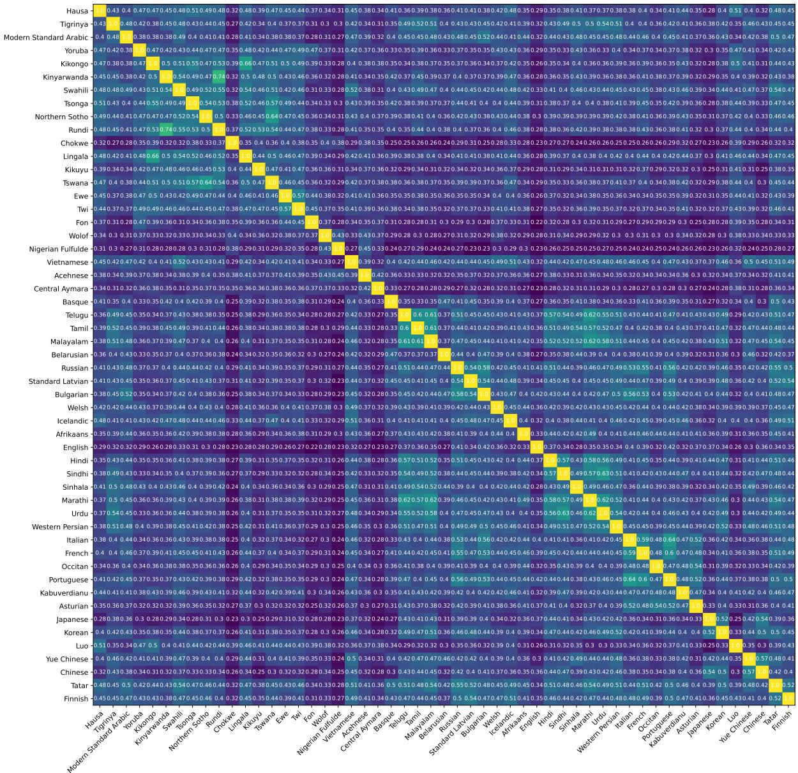

Figure 6: Jaccard similarity of selected 25% encoder experts for different languages. Pruning was done per language with the importance metric and enc/Dec threshold pruning. Languages are sorted by language family.
<table><tr><td>Model</td><td>Hours</td><td>GPU hours</td></tr><tr><td>3.3B 54.5B (full)</td><td>480 4740</td><td>440 3840</td></tr><tr><td>54.5B (pruned)</td><td>15 900</td><td>5700</td></tr><tr><td>Total</td><td>21120</td><td>9980</td></tr></table>

Table 15: Time spent decoding with each type of model in this work. This includes failed or non-discussed experiments. The “hours" column measures the total time spent by the decoding script, including model creation and loading (note that the GPUs were reserved but idle during that time). “GPU hours" measures the time actually spent decoding (i.e., with the GPU active).

<table><tr><td rowspan=1 colspan=1>Language pair resource type</td><td rowspan=1 colspan=1>Encoder</td><td rowspan=1 colspan=1>Decoder</td></tr><tr><td rowspan=1 colspan=1>High→High</td><td rowspan=1 colspan=1>320</td><td rowspan=1 colspan=1>64</td></tr><tr><td rowspan=2 colspan=1>High→LowHigh→V. low</td><td rowspan=1 colspan=1>344</td><td rowspan=1 colspan=1>44</td></tr><tr><td rowspan=1 colspan=1>348</td><td rowspan=1 colspan=1>36</td></tr><tr><td rowspan=3 colspan=1>Low→HighLow→LowLow→V. low</td><td rowspan=1 colspan=1>319</td><td rowspan=3 colspan=1>654138</td></tr><tr><td rowspan=1 colspan=1>343</td></tr><tr><td rowspan=1 colspan=1>346</td></tr><tr><td rowspan=2 colspan=1>V. low→HighV. low→LowV. low→V. low</td><td rowspan=1 colspan=1>314338</td><td rowspan=1 colspan=1>7046</td></tr><tr><td rowspan=1 colspan=1>340</td><td rowspan=1 colspan=1>44</td></tr><tr><td rowspan=1 colspan=1>Average</td><td rowspan=1 colspan=1>335</td><td rowspan=1 colspan=1>49</td></tr></table>

Table 16: Average number of experts in the encoder and decoder for different language resource type language pairs with global threshold 75% pruning and the importance metric.

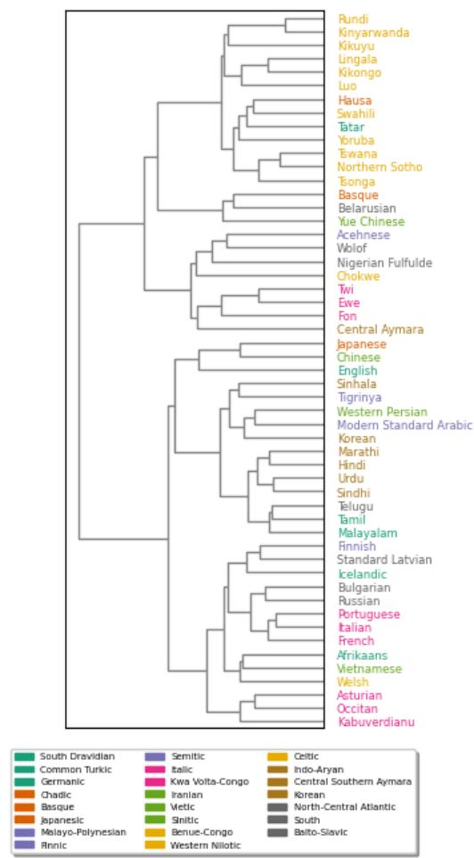  
Figure 7: Hierarchical clustering of languages based on the importance metric of encoder experts. Different colors represent different language subgroupings.

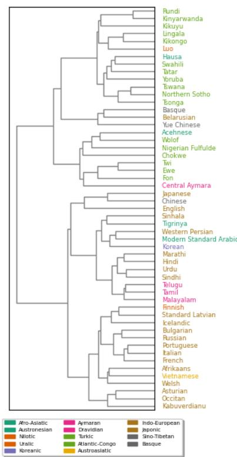  
Figure 8: Hierarchical clustering of languages based on the importance metric of encoder experts. Different colors represent different language families.

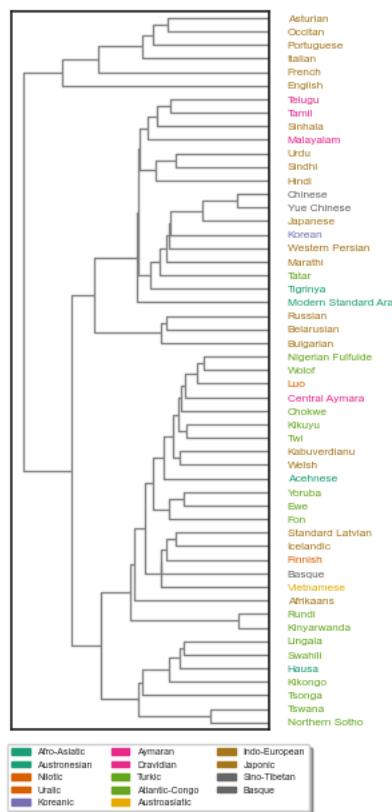  
Figure 9: Hierarchical clustering of languages based on the importance metric of decoder experts. Different colors represent different language families.

## ACL 2023 Responsible NLP Checklist

A For every submission: A1. Did you describe the limitations of your work? 8 A2. Did you discuss any potential risks of your work? 8 A3. Do the abstract and introduction summarize the paper's main claims? 1 A4. Have you used AI writing assistants when working on this paper? Left blank.

## B  Did you use or create scientific artifacts?

Left blank.

B1. Did you cite the creators of artifacts you used? Left blank.

B2. Did you discuss the license or terms for use and / or distribution of any artifacts? No response.

B3. Did you discuss if your use of existing artifact(s) was consistent with their intended use, provided that it was specified? For the artifacts you create, do you specify intended use and whether that is compatible with the original access conditions (in particular, derivatives of data accessed for research purposes should not be used outside of research contexts)? No response.

B4. Did you discuss the steps taken to check whether the data that was collected / used contains any information that names or uniquely identifies individual people or offensive content, and the steps taken to protect / anonymize it? No response.

B5. Did you provide documentation of the artifacts, e.g., coverage of domains, languages, and linguistic phenomena, demographic groups represented, etc.? No response.

B6. Did you report relevant statistics like the number of examples, details of train / test / dev splits, etc. for the data that you used / created? Even for commonly-used benchmark datasets, include the number of examples in train / validation / test splits, as these provide necessary context for a reader to understand experimental results. For example, small differences in accuracy on large test sets may be significant, while on small test sets they may not be. No response.

## CDid you run computational experiments?

5

C1. Did you report the number of parameters in the models used, the total computational budget (e.g., GPU hours), and computing infrastructure used? 6

C2. Did you discuss the experimental setup, including hyperparameter search and best-found hyperparameter values? 4,5

C3. Did you report descriptive statistics about your results (e.g., error bars around results, summary statistics from sets of experiments), and is it transparent whether you are reporting the max, mean, etc. or just a single run? Appendix,

C4. If you used existing packages (e.g., for preprocessing, for normalization, or for evaluation), did you report the implementation, model, and parameter settings used (e.g., NLTK, Spacy, ROUGE, etc.)? 5

## D X Did you use human annotators (e.g., crowdworkers) or research with human participants? Left blank.

D1. Did you report the full text of instructions given to participants, including e.g., screenshots, disclaimers of any risks to participants or annotators, etc.? No response.

D2. Did you report information about how you recruited (e.g., crowdsourcing platform, students) and paid participants, and discuss if such payment is adequate given the participants' demographic (e.g., country of residence)? No response.

D3. Did you discuss whether and how consent was obtained from people whose data you're using/curating? For example, if you collected data via crowdsourcing, did your instructions to crowdworkers explain how the data would be used? No response.

D4. Was the data collection protocol approved (or determined exempt) by an ethics review board? No response.

D5. Did you report the basic demographic and geographic characteristics of the annotator population that is the source of the data? No response.