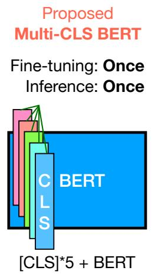
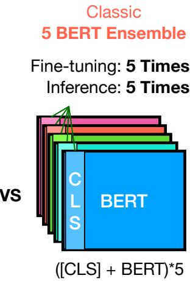
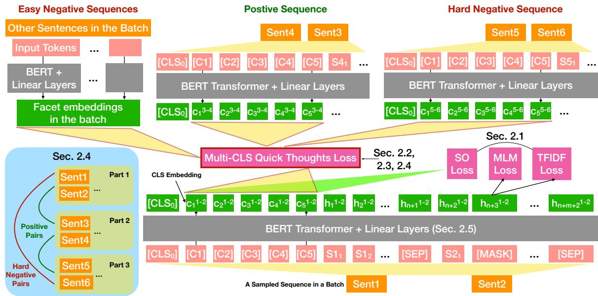
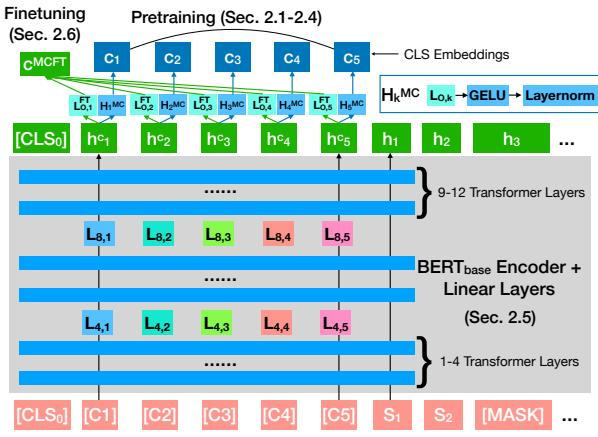

# Multi-CLS BERT: An Efficient Alternative to Traditional Ensembling

Haw-Shiuan Chang∗† Ruei-Yao Sun∗†

Amazon   
USA   
chawshiu@amazon.com   
rueiyas@amazon.com   
Kathryn Ricci∗ Andrew McCallum CICS, UMass, Amherst   
140 Governors Dr., Amherst, MA, USA kathryn.d.ricci@gmail.com mccallum@cs.umass.edu

## Abstract

Ensembling BERT models often significantly improves accuracy, but at the cost of significantly more computation and memory footprint. In this work, we propose Multi-CLS BERT, a novel ensembling method for CLS-based prediction tasks that is almost as efficient as a single BERT model. Multi-CLS BERT uses multiple CLS tokens with a parameterization and objective that encourages their diversity. Thus instead of fine-tuning each BERT model in an ensemble (and running them all at test time), we need only fine-tune our single Multi-CLS BERT model (and run the one model at test time, ensembling just the multiple final CLS embeddings). To test its effectiveness, we build Multi-CLS BERT on top of a state-of-the-art pretraining method for BERT (Aroca-Ouellette and Rudzicz, 2020). In experiments on GLUE and SuperGLUE we show that our Multi-CLS BERT reliably improves both overall accuracy and confidence estimation. When only 100 training samples are available in GLUE, the Multi-CLS $\mathrm { B E R T _ { B a s e } }$ model can even outperform the corresponding $\mathrm { B E R T _ { L a r g e } }$ model. We analyze the behavior of our Multi-CLS BERT, showing that it has many of the same characteristics and behavior as a typical BERT 5-way ensemble, but with nearly 4-times less computation and memory.

## 1 Introduction

BERT (Bidirectional Encoder Representations from Transformers) (Devlin et al., 2019) is one of the most widely-used language model (LM) architectures for natural language understanding (NLU) tasks. We often fine-tune the pretrained BERT or its variants such as RoBERTa (Liu et al., 2019) so that the LMs learn to aggregate all the contextualized word embeddings into a single CLS embedding for a downstream text classification task.

  
Figure 1: Comparison of Multi-CLS BERT and the classic BERT ensemble. Multi-CLS BERT only ensembles the multiple CLS embeddings in one BERT encoder rather than ensemble multiple BERT encoders with different parameter weights.

During fine-tuning, different initializations and different training data orders significantly affect BERT’s generalization performance, especially with a small training dataset (Dodge et al., 2020; Zhang et al., 2021a; Mosbach et al., 2021). One simple and popular solution to the issue is to finetune BERT model multiple times using different random seeds and ensemble their predictions to improve its accuracy and confidence estimation. Although very effective, the memory and computational cost of ensembling a large LM is often prohibitive (Xu et al., 2020; Liang et al., 2022). Naturally, we would like to ask, “Is it possible to ensemble BERT models at no extra cost?”

To answer the question, we propose Multi-CLS BERT, which enjoys the benefits of ensembling without sacrificing efficiency. Specifically, we input the multiple CLS tokens to BERT and encourage the different CLS embeddings to aggregate the information from different aspects of the input text. As shown in Figure 1, the proposed Multi-CLS BERT shares all the hidden states of the input text and only ensembles different ways of aggregating the hidden states. Since the input text is usually much longer than the number of inputted CLS embeddings, Multi-CLS BERT is almost as efficient as the original BERT.

Allen-Zhu and Li (2020) discovered that the key of an effective ensembling model is the diversity of individual models and the models trained using different random seeds have more diverse predictions compared to simply using dropout (Srivastava et al., 2014; Gal and Ghahramani, 2016) or averaging the weights of the models during training (Fort et al., 2019). To ensure the diversity of CLS embeddings without fine-tuning Multi-CLS BERT using multiple seeds, we propose several novel diversification techniques. For example, we insert different linear layers into the transformer encoder for different CLS tokens. Furthermore, we propose a novel reparametrization trick to prevent the linear layers from learning the same weights during fine-tuning.

We test the effectiveness of these techniques by modifying the multi-task pretraining method proposed by Aroca-Ouellette and Rudzicz (2020), which combines four self-supervised losses. In our experiments, we demonstrate that the resulting Multi-CLS BERT can significantly improve the accuracy on GLUE (Wang et al., 2019b) and SuperGLUE (Wang et al., 2019a), especially when the training sizes are small. Similar to the BERT ensemble model, we further show that multiple CLS embeddings significantly reduce the expected calibration error, which measures the quality of prediction confidence, on the GLUE benchmark.

## 1.1 Main Contributions

• We propose an efficient ensemble BERT model that does not incur any extra computational cost other than inserting a few CLS tokens and linear layers into the BERT encoder. Furthermore, we develop several diversification techniques for pretraining and fine-tuning the proposed Multi-CLS BERT model.1

• We improve the GLUE performance reported in Aroca-Ouellette and Rudzicz (2020) using a better and more stable fine-tuning protocol and verify the effectiveness of its multi-task pretraining methods in GLUE and SuperGLUE with different training sizes.

• Building on the above state-of-the-art pretraining and fine-tuning for BERT, our experiments and analyses show that Multi-CLS BERT significantly outperforms the BERT due to its similarity to a BERT ensemble model. The comprehensive ablation studies confirm the effectiveness of our diversification techniques.

## 2 Method

In sections 2.1 and 2.2, we first review its state-ofthe-art pretraining method from Aroca-Ouellette and Rudzicz (2020). In Section 2.3, we modify one of its losses, quick thoughts (QT), to pretrain our multiple embedding representation. In Section 2.4, we encourage the CLS embeddings to capture the fine-grained semantic meaning of the input sequence by adding hard negatives during the pretraining. To diversify the CLS embeddings, we modify the transformer encoder in Section 2.5 and propose a new reparametrization method during the fine-tuning in Section 2.6.

## 2.1 Multi-task Pretraining

After testing many self-supervised losses, Aroca-Ouellette and Rudzicz (2020) find that combining the masked language modeling (MLM) loss, TFIDF loss, sentence ordering (SO) loss (Sun et al., 2020), and quick thoughts (QT) loss (Logeswaran and Lee, 2018) could lead to the best performance.

The MLM loss is to predict the masked words and the TFIDF loss is to predict the importance of the words in the document. Each input text sequence consists of multiple sentences. They swap the sentence orders in some input sentences and use the CLS embedding to predict whether the order is swapped in the SO loss. Finally, QT loss is used to encourage the CLS embeddings of the consecutive sequences to be similar.

To improve the state-of-the-art pretraining method, we modify the multi-task pretraining method by using multiple CLS embeddings to represent the input sequence and using non-immediate consecutive sentences as the hard negative. Our training method is illustrated in Figure 2.

## 2.2 Quick Thoughts Loss

Two similar sentences tend to have the same label in a downstream application, so pretraining should pull the CLS embeddings of these similar sentences closer. The QT loss achieves this goal by assuming consecutive text sequences are similar and encouraging their CLS embeddings to be similar.

  
Figure 2: Our MCQT, SO, MLM, and TFIDF loss, which are a modification of multi-task pretraining proposed in Aroca-Ouellette and Rudzicz (2020). The multi-CLS quick thought (MCQT) loss maximizes the CLS similarities between a sequence (sentences 1 and 2) and the next sequence (sentences 3 and 4) while minimizing the CLS similarities to other random sequences and the sequence after the next one (sentences 5 and 6). Notice that sentence 4 is inputted before sentence 3 because the sentence order is swapped for the SO loss.

Aroca-Ouellette and Rudzicz (2020) propose an efficient way of computing QT loss in a batch by evenly splitting each batch with size B into two parts. The first part contains $B / 2$ text sequences randomly sampled from the pretrained corpus, and the second part contains each of the $B / 2$ sentences that are immediately subsequent to those in the first part. Then, for each sequence in the first part, they use the consecutive sequence in the second part as the positive example and the other $B / 2 - 1$ sequences as the negative examples. We can write the QT loss for the sequences containing sentences 1, 2, 3, and 4 as

$$
L _ { Q T } ( s ^ { 1 - 2 } , s ^ { 3 - 4 } ) = - \log ( \frac { \exp ( \mathrm { L o g i t } _ { s ^ { 1 - 2 } , s ^ { 3 - 4 } } ^ { Q T } ) } { \sum _ { s } \exp ( \mathrm { L o g i t } _ { s ^ { 1 - 2 } , s } ^ { Q T } ) } ) ,\tag{1}
$$

where s is the sentences in the second part of the batch, $\begin{array} { r } { \mathrm { L o g i t } _ { s ^ { 1 - 2 } , s ^ { 3 - 4 } } ^ { Q T } \ = \ ( \frac { c ^ { 1 - 2 } } { | | c ^ { 1 - 2 } | | } ) ^ { T } \frac { c ^ { 3 ^ { \frac { \cdot } { - } } 4 } } { | | c ^ { 3 - 4 } | | } } \end{array}$ is the score for classifying sequence $s ^ { 3 - 4 }$ as the positive example, $\frac { c ^ { 1 - 2 } } { | | c ^ { 1 - 2 } | | }$ is the L2-normalized CLS embedding for sentences 1 and 2. The normalization is intended to stabilize the pretraining by limiting the gradients’ magnitudes.

## 2.3 Multiple CLS Embeddings

A text sequence could have multiple facets; two sequences could be similar in some facets but dissimilar in others, especially when the text sequences are long. The QT loss squeezes all facets of a sequence into a single embedding and encourages all facets of two consecutive sequences to be similar, potentially causing information loss.

Some facets might better align with the goal of a downstream application. For example, the facets that contain more sentiment information would be more useful for sentiment analysis. To preserve the diverse facet information during pretraining, we propose multi-CLS quick thoughts loss (MCQT). The loss integrates two ways of computing the similarity of two sequences. The first way computes the cosine similarity between the most similar facets, and the second computes the cosine similarity between the summations of all facets. We linearly combine the two methods as the logit of the two input sequences:

$$
\begin{array} { r } { \mathrm { L o g i t } _ { s ^ { 1 - 2 } , s ^ { 3 - 4 } } ^ { M C } = \lambda \operatorname* { m a x } _ { i , j } ( \frac { c _ { i } ^ { 1 - 2 } } { | | c _ { i } ^ { 1 - 2 } | | } ) ^ { T } \frac { c _ { j } ^ { 3 - 4 } } { | | c _ { j } ^ { 3 - 4 } | | } + } \\ { ( 1 - \lambda ) ( \frac { \sum _ { i } c _ { i } ^ { 1 - 2 } } { | | \sum _ { i } c _ { i } ^ { 1 - 2 } | | } ) ^ { T } \frac { \sum _ { j } c _ { j } ^ { 3 - 4 } } { | | \sum _ { j } c _ { j } ^ { 3 - 4 } | | } . } \end{array}\tag{2}
$$

where $\lambda$ is a constant hyperparameters; $\boldsymbol { c } _ { k } ^ { 1 - 2 }$ and $c _ { k } ^ { 3 - 4 }$ are the CLS embeddings of sentences 1-2 and sentences 3-4, respectively.

The first term only considers the most similar facets to allow some facets to be dissimilar. Furthermore, the term implicitly diversifies CLS embeddings by considering each CLS embedding independently. In contrast, the second term encourages the CLS embeddings to work collaboratively, as in a typical ensemble model, and also let every CLS embedding receive gradients more evenly. Notice that we sum the CLS embeddings before the normalization so that the encoder could predict the magnitude of each CLS embedding as its weight in the summation.

To show that the proposed method can improve the state-of-the-art pretraining methods, we keep the MLM loss and TFIDF loss unchanged. For the sentence ordering (SO) loss, we project the K hidden states $ { \boldsymbol { h } } _ { k } ^ { c }$ into the embedding $\mathbf { \Omega } _ { h } \mathbf { \bar { \Gamma } } ^ { S O }$ with the hidden state size D for predicting the sentence order: $\pmb { h } ^ { S O } = L ^ { S O } ( \oplus _ { k } \pmb { h } _ { k } ^ { c } )$ , where $\mathbb { \oplus } _ { k } h _ { k } ^ { c }$ is the concatenation of K hidden states with size $K \times D$

## 2.4 Hard Negative

For a large transformer-based LM, distinguishing the next sequence from random sequences could be easy. The LM can achieve low QT loss by outputting nearly identical CLS embeddings for the sentences with the same topic while ignoring the fine-grained semantic information (Papyan et al., 2020). In this case, multiple CLS embeddings might become underutilized.

The hard negative is a common method of adjusting the difficulties of the contrastive learning (Baldini Soares et al., 2019; Cohan et al., 2020). Our way of collecting hard examples is illustrated in the bottom-left block of Figure 2. To efficiently add the hard negatives in the pretraining, we split the batch into three parts. For each sequence in the first part, we would use its immediate next sequence in the second part as the positive example, use the sequence after the next one in the third part as the hard negative, and use all the other sequences in the second or the third part as the easy negatives. We select such sequence after the next one as our hard negatives because the sequence usually share the same topic with the input sequence but is more likely to have different fine-grained semantic facets compared to the immediate next sequence.

After adding the hard negative, the modified QT loss of the three consecutive sequences becomes

  
Figure 3: The architecture of Multi-CLS BERT encoder that is built on $\mathbf { B E R T _ { B a s e } }$ model. The different linear layers are applied to the hidden states corresponding to different CLS tokens to increase the diversity of the resulting CLS embeddings.

$$
\begin{array} { r l r } & { } & { L _ { M C Q T } ( s ^ { 1 - 2 } , s ^ { 3 - 4 } , s ^ { 5 - 6 } ) = } \\ & { } & { - \log \left( \frac { \exp ( \mathrm { L o g } \mathrm { i } \mathrm { t } _ { s ^ { 1 - 2 } , s ^ { 3 - 4 } } ^ { M C } ) } { \exp ( \mathrm { L o g } \mathrm { i } \mathrm { t } _ { s ^ { 1 - 2 } , s ^ { 5 - 6 } , \ldots } ^ { M C } ) } \right) } \\ & { } & { - \log \left( \frac { \exp ( \mathrm { L o g } \mathrm { i } \mathrm { t } _ { s ^ { 5 - 6 } , s ^ { 3 - 4 } } ^ { M C } ) } { \exp ( \mathrm { L o g } \mathrm { i } \mathrm { t } _ { s ^ { 5 - 6 } , s ^ { 1 - 2 } } ^ { M C } ) } \right) , } \end{array}\tag{3}
$$

where MCQT refer to multi-CLS quick thoughts, $\{ s ^ { 3 - 4 } , . . . , s ^ { 5 - 6 } , . . . \}$ are all the sequences in the second and the third part, and $\{ s ^ { 3 - 4 } , . . . , s ^ { 1 - 2 } , . . . \}$ are all the sequences in the first and the second part.

## 2.5 Architecture-based Diversification

Initially, we simply input multiple special CLS tokens ([C1], ..., [CK]) after the original CLS token, [CLS0], and take the corresponding hidden states as the CLS embeddings, but we found that the CLS embeddings quickly become almost identical during the pretraining.

Subsequently, instead of using the same final transformation head $H ^ { Q T }$ for all CLS hidden states, we use a different linear layer $L _ { O , k }$ in the final head $H _ { k } ^ { M C }$ to transform the hidden state $\pmb { h } _ { k } ^ { c }$ for the kth CLS. We set the bias term in $L _ { O , k }$ to be the constant 0 because we want the differences between the CLS to be dynamic and context-dependent.

Nevertheless, even though we differentiate the resulting CLS embeddings $\pmb { c } _ { k } = H _ { k } ^ { M C } ( { \pmb { h } } _ { k } ^ { c } )$ , the hidden states $\pmb { h } _ { k } ^ { c }$ before the transformation usually still collapse into almost identical embeddings.

To solve the collapsing problem, we insert multiple linear layers $L _ { l , k }$ into the transformer encoder.

In Figure 3, we illustrate our encoder architecture built on the $\mathbf { B E R T _ { B a s e } }$ model. After the 4th transformer layer, we insert the layers $L _ { 4 , k }$ to transform the hidden states before inputting them to the 5th layer. Similarly, we insert ${ \cal L } _ { 8 , k }$ between the 8th transformer layer and 9th transformer layer. For $\mathrm { \Delta B E R T _ { L a r g e } }$ , we insert $L _ { l , k } ( . )$ after layer 8 and layer 16. Notice that although the architecture looks similar to the adapter (Houlsby et al., 2019) or prefix-tuning (Li and Liang, 2021), our purpose is to diversify the CLS embeddings rather than freezing parameters to save computational time.

## 2.6 Fine-Tuning

As shown in Figure 3, we input multiple CLS tokens into the BERT encoder during fine-tuning and pool the corresponding CLS hidden states into the single CLS embedding for each downstream task fine-tuning in order to avoid overfitting and increasing computational overhead. As a result, we can use the same classifier architecture on top of Multi-CLS BERT and BERT, which also simplifies their comparison.

We discover that simply summing all the CLS hidden states still usually makes the hidden states and the inserted linear layers $( \boldsymbol { \mathrm { e } } . \boldsymbol { \mathrm { g } } . , L _ { O , k } )$ almost identical after fine-tuning. To avoid collapsing, we aggregate the CLS hidden states by proposing a novel re-parameterization trick:

$$
\pmb { c } ^ { M C F T } = \sum _ { k } \left( L _ { O , k } ^ { F T } ( \pmb { h } _ { k } ^ { c } ) \right) ,\tag{4}
$$

where $\begin{array} { r } { L _ { O , k } ^ { F T } ( \boldsymbol { h } _ { k } ^ { c } ) = ( \mathbf { W } _ { O , k } - \frac { 1 } { K } \sum _ { k ^ { \prime } } \mathbf { W } _ { O , k ^ { \prime } } ) \boldsymbol { h } _ { k } ^ { c } } \end{array}$ and $\mathbf { W } _ { O , k }$ is the linear weights of $L _ { O , k } .$ . Then, if all the $L _ { O , k } ^ { F T }$ become identical (i.e., k, ${ \bf W } _ { O , k } =$ $\begin{array} { r } { \frac { 1 } { K } \sum _ { k ^ { \prime } } \mathbf { W } _ { O , k ^ { \prime } } ) , L _ { O , k } ^ { F T } ( \pmb { h } _ { k } ^ { c } ) = \mathbf { 0 } = \pmb { c } ^ { M C F T } } \end{array}$ . However, gradient descent would not allow the model to constantly output the zero vector, so $L _ { O , k } ^ { F T }$ remains different during the fine-tuning.

## 3 Experiments

The parameters of neural networks are more restricted as more training samples are available (MacKay, 1995) and the improvement of deep ensemble models comes from the diversity of individual models (Fort et al., 2019), so the benefits of ensembling are usually more obvious when the training set size is smaller. Therefore, in addition to using the full training dataset, we also test the settings where the models are trained by 1k samples (Zhang et al., 2021a) or 100 samples from each task in GLUE (Wang et al., 2019b) or Super-GLUE (Wang et al., 2019a). Another benefit of the 1k- and 100-sampling settings is that the average scores would be significantly influenced by most datasets rather than by only a subset of relatively small datasets (Card et al., 2020).

## 3.1 Experiment Setup

To accelerate the pretraining experiments, we initialize the weights using the pretrained BERT models (Devlin et al., 2019) and continue the pretraining using different loss functions on Wikipedia 2021 and BookCorpus (Zhu et al., 2015).

All of the methods are based on uncased BERT as in Aroca-Ouellette and Rudzicz (2020). We compare the following methods:

• Pretrained: The pretrained BERT model released from Devlin et al. (2019).

• MTL: Pretraining using the four losses selected in Aroca-Ouellette and Rudzicz (2020): MLM, QT, SO, and TFIDF. We remove the continue learning procedure used in ERNIE (Sun et al., 2020) because we find that simply summing all the losses leads to better performance (see our ablation study in Section 3.3).

• Ours (K=5, λ): The proposed Multi-CLS BERT method using 5 CLS tokens. We show the results of setting $\lambda = \{ 0 , 0 . 1 , 0 . 5 , 1 \}$ in Equation 2. We reduce the maximal sentence length by 5 to accommodate the extra 5 CLS tokens.

• Ours (K=1): We set $K = 1$ in our method to verify the effectiveness of using multiple embeddings. During fine-tuning, the CLS embedding is a linear transformation of the single facet $\mathrm { C L S } = L _ { O , 1 } ( h _ { 1 } ^ { f } )$

The GLUE and SuperGLUE scores are significantly influenced by the pretraining random seeds (Sellam et al., 2021) and fine-tuning random seeds (Dodge et al., 2020; Zhang et al., 2021a; Mosbach et al., 2021). To stably evaluate the performance of different pretraining methods, we pretrain models using four random seeds and fine-tune each pretrained model using four random seeds, and report the average performance on the development set across all 16 random seeds. To further stabilize the fine-tuning process and reach better performance, we follow the fine-tuning suggestions from Zhang et al. (2021a) and Mosbach et al. (2021), including training longer, limiting the gradient norm, and using Adam (Kingma and Ba, 2015) with bias term and warmup.

<table><tr><td colspan="3"></td><td colspan="3">GLUE</td><td colspan="3">SuperGLUE</td></tr><tr><td>Configuration ↓</td><td>Model Name ↓</td><td>Model Size ↓</td><td>100</td><td>1k</td><td>Full</td><td>100*</td><td>1k*</td><td>Full</td></tr><tr><td rowspan="7">BERT Base</td><td>Pretrained</td><td>109.5M</td><td>55.71 ± 0.62</td><td>71.67 ± 0.15</td><td>82.05 ± 0.08</td><td>57.18 ± 0.43</td><td>61.55 ± 0.37</td><td>65.04 ± 0.36</td></tr><tr><td>MTL</td><td>109.5M</td><td>59.29 ± 0.27</td><td>73.26 ± 0.13</td><td>83.30† ± 0.07</td><td>57.50 ± 0.41</td><td>62.94 ± 0.36</td><td>66.33 ± 0.33</td></tr><tr><td>Ours (K=1)</td><td>111.3M</td><td>57.84 ± 0.32</td><td>73.28 ± 0.13</td><td>83.40 ± 0.07</td><td>57.31 ± 0.35</td><td>63.35 ± 0.18</td><td>66.29 ± 0.18</td></tr><tr><td> $\mathrm { O u r s } \left( \mathrm { K } { = } 5 , \lambda = 0 \right)$ </td><td>118.4M</td><td>61.54 ± 0.32</td><td>74.14 ± 0.12</td><td>83.41 ± 0.07</td><td>58.29 ± 0.33</td><td>63.71 ± 0.26</td><td>66.80</td></tr><tr><td>Ours (K=5, λ = 0.1)</td><td>118.4M</td><td>61.80 ± 0.35</td><td>74.10 ± 0.13</td><td>83.47</td><td>58.20 ± 0.31</td><td>63.61</td><td>± 0.25 66.74</td></tr><tr><td>Ours (K=5, λ = 0.5)</td><td>118.4M</td><td>60.49 ± 0.35</td><td>74.02</td><td>± 0.05 83.47</td><td>58.41 ± 0.38</td><td>± 0.27 63.78</td><td>± 0.26 66.80</td></tr><tr><td>Ours (K=5, λ = 1)</td><td>118.4M</td><td>59.86 ± 0.34</td><td>± 0.12 73.75 ± 0.14</td><td>± 0.08 83.43</td><td>57.84 ± 0.40</td><td>± 0.25 63.56</td><td>± 0.24 66.39</td></tr><tr><td rowspan="6">BERT Large</td><td>MTL</td><td>335.2M</td><td>61.39</td><td>75.30</td><td>± 0.07 84.13</td><td>59.03</td><td>± 0.22 65.21</td><td>± 0.22 69.16</td></tr><tr><td>Ours (K=1)</td><td>338.3M</td><td>± 0.37 59.19</td><td>± 0.27 75.35</td><td>± 0.11 84.59</td><td>± 0.54 57.35</td><td>± 0.38 64.67</td><td>± 0.37 69.24</td></tr><tr><td>Ours (K=5, λ = 0)</td><td>350.9M</td><td>± 0.43 63.19</td><td>± 0.21 75.73</td><td>± 0.07 84.51</td><td>± 0.42 59.46</td><td>± 0.43 65.43</td><td>± 0.41 69.56</td></tr><tr><td>Ours (K=5, λ = 0.1)</td><td>350.9M</td><td>± 0.49 64.24</td><td>± 0.26 76.27</td><td>± 0.05 84.61</td><td>± 0.44 59.88</td><td>± 0.38 65.58</td><td>± 0.31 70.03</td></tr><tr><td>Ours (K=5, λ = 0.5)</td><td>350.9M</td><td>± 0.40 63.02</td><td>± 0.12 75.95</td><td>± 0.08 84.49</td><td>± 0.43 59.42</td><td>± 0.26 65.84</td><td>± 0.25 69.79</td></tr><tr><td>Ours (K=5, λ = 1)</td><td>350.9M</td><td>± 0.42 62.07 ± 0.45</td><td>± 0.10 75.85 ± 0.17</td><td>± 0.08 84.61 ± 0.07</td><td>± 0.34 58.74 ± 0.50</td><td>± 0.25 65.00 ± 0.29</td><td>± 0.25 69.04 ± 0.27</td></tr></table>

Table 1: The macro average scores on the development set. All numbers are percentages. The standard errors are shown as the confidence intervals. We make the best scores of the model built on $\mathbf { B E R T _ { B a s e } }$ boldface and similar for the models built on $\mathrm { B E R T _ { L a r g e } } .$ . The number is much higher than 81.4, the GLUE score reported by Aroca-Ouellette and Rudzicz (2020) because we continue training from the pretrained BERT and we use better fine-tuning hyperparameters. \*The scores do not contain ReCoRD in SuperGLUE.2

## 3.2 Main Results

Our results are presented in Table 1. We can see that Ours (K=5) is consistently better than other baselines and that the improvement is larger in datasets with fewer training samples. For example, in GLUE 100, it achieves 61.80 on average using $\mathbf { B E R T _ { B a s e } }$ with 118.4M parameters, which outperforms MTL using $\mathrm { B E R T _ { L a r g e } }$ with 335.2M parameters (61.39). Please see Appendix E for the scores of individual tasks. MTL significantly improves the scores of original BERT model (Pretrained), confirming the effectness of the QT, SO, and TFIDF losses. Compared to MTL, Ours (K=1) is slightly better in GLUE 1k and GLUE Full, but worse in GLUE 100.

We observe that $\lambda = 0 . 1$ usually performs well, which justifies the inclusion of both the highest logit and average logit in Equation 2. The $\lambda = 0$ model has significantly worse performance only in $\mathrm { B E R T _ { L a r g e } }$ model. This suggests that the benefits of Multi-CLS BERT depend on our pretraining method and maximizing the highest logit stabilizes the pretraining of a larger model.

## 3.3 Ablation Study

In our ablation studies, we would like to test the effectiveness of the design choices in our baseline MTL and our best model, Ours (K=5, λ = 0.1). The model variants we test include:

• MLM only: Removing the QT, SO, and TFIDF losses in MTL. That is, we simply continue training Pretrained using only the MLM loss.

• CMTL+: The best pretrained method reported in Aroca-Ouellette and Rudzicz (2020). It uses the continual learning method (Sun et al., 2020) to weight each loss in MTL.

$\mathbf { M L M + S O + T F I D F } ;$ MTL without the QT loss.

• No Inserted Layers: Removing the $L _ { l , k } ( . )$ in the transformer encoder from our method.

• No Hard Negative: Removing the hard negatives described in Section 2.4 from our method.

• Sum Aggregation: Simply summing the facets (i.e., using $L _ { O , k }$ to replace $L _ { O , k } ^ { F T }$ in Equation 4). This baseline removes the proposed reparametrization trick to test its effectiveness.

• Default: Ours (K=k, λ = 0.1), where $k \_ =$ {1, 3, 5, 10}.

• SWA: Stochastic weight averaging (Ruppert, 1988; Izmailov et al., 2018) averages the weights along the optimization trajectory.

<table><tr><td rowspan="2">Model ↓</td><td rowspan="2">Model Description ↓</td><td rowspan="2">K↓</td><td colspan="2">GLUE</td><td colspan="2">SuperGLUE*</td></tr><tr><td>100</td><td>1k</td><td>100</td><td>1k</td></tr><tr><td rowspan="5">Baselines (BERT Base)</td><td>Pretrained</td><td>1</td><td>56.85</td><td>71.68</td><td>57.90</td><td>62.14</td></tr><tr><td>MLM only</td><td>1</td><td>55.38</td><td>70.74</td><td>57.39</td><td>61.77</td></tr><tr><td>CMTL+</td><td>1</td><td>58.65</td><td>72.57</td><td>56.88</td><td>62.63</td></tr><tr><td>MLM + SO + TFIDF</td><td>1</td><td>60.35</td><td>72.65</td><td>57.88</td><td>62.60</td></tr><tr><td>MTL</td><td>1</td><td>59.53</td><td>73.12</td><td>57.51</td><td>62.95</td></tr><tr><td rowspan="9">Ours (BERT Base)</td><td>No Inserted</td><td>1</td><td>58.06</td><td>73.18</td><td>57.97</td><td>63.34</td></tr><tr><td>Layers</td><td>5</td><td>60.12</td><td>73.35</td><td>56.46</td><td>62.00</td></tr><tr><td>No Hard</td><td>1</td><td>58.44</td><td>73.30</td><td>57.19</td><td>63.33</td></tr><tr><td>Negative</td><td>5</td><td>61.77</td><td>74.18</td><td>58.89</td><td>63.86</td></tr><tr><td>Sum Aggregation</td><td>5</td><td>58.87</td><td>73.94</td><td>57.41</td><td>63.82</td></tr><tr><td rowspan="4">Default</td><td>1</td><td>57.76</td><td>73.30</td><td>57.53</td><td>63.22</td></tr><tr><td>3</td><td>61.09</td><td>73.95</td><td>57.85</td><td>63.31</td></tr><tr><td>5</td><td>62.62</td><td>74.49</td><td>58.82</td><td>63.86</td></tr><tr><td>10</td><td>60.99</td><td>73.59</td><td>58.25</td><td>62.82</td></tr><tr><td>SWA</td><td>1</td><td>57.31</td><td>72.91</td><td>-</td><td>-</td></tr><tr><td>Ensemble on Dropouts</td><td>1</td><td>58.45</td><td>72.86</td><td>-</td><td>-</td></tr><tr><td rowspan="3">Ensemble on FT Seeds No Hard</td><td>1</td><td>60.07</td><td>75.20</td><td>-</td><td>-</td></tr><tr><td>5</td><td>63.34</td><td>75.35</td><td></td><td></td></tr><tr><td>1</td><td>60.36</td><td>75.69</td><td>58.47</td><td>65.04</td></tr><tr><td rowspan="3">Ours (BERT Large)</td><td>Negative</td><td>5</td><td>63.23</td><td>75.77</td><td>60.33</td><td>65.75</td></tr><tr><td>Default</td><td>1</td><td>60.01</td><td>76.03</td><td>57.38</td><td>65.10</td></tr><tr><td></td><td>5</td><td>64.33</td><td>76.38</td><td>59.99</td><td>65.51</td></tr></table>

Table 2: The macro average scores on the development set for our ablation study. We highlight the best performance after excluding the ensemble baselines, which require much more computation. The scores are different in Table 1 because we use two pretraining random seeds instead of four in the ablation study. SWA refers to Stochastic weight averaging (Izmailov et al., 2018). \*SuperGLUE score does not contain ReCoRD.

• Ensemble on Dropouts: Running the forward pass of Ours (K=1) with dropout using 5 different seeds and averaging their prediction probabilities for each class in each task.

• Ensemble on FT Seeds: Fine-tuning Ours (K=1) or Ours (K=5, λ = 0.1) using 5 different seeds and averaging their prediction probabilities.

Our results are presented in Table 2. We can see that continuing training using MLM only loss degrades the performance, which indicates that our improvement does not come from training BERT longer. Removing QT loss results in mixed results. The better performance of MTL compared to CMTL+ suggests that the continual training technique used in Aroca-Ouellette and Rudzicz (2020) is harmful with our evaluation settings.

Removing the inserted layers (No Inserted Layers) or removing the re-parametrization trick (Sum Aggregation) makes the performance of Ours (K=5, λ = 0.1) close to the Ours (K=1) baseline. This result highlight the importance of diversity of CLS embeddings. The performance of Ours (K=3) and Ours (K=10) is usually better than Ours (K=1), but are worse than Ours (K=5). In both $\mathbf { B E R T _ { B a s e } }$ and $\mathrm { B E R T _ { L a r g e } }$ models, removing hard negatives degrades the GLUE scores but slightly increases the SuperGLUE scores.

<table><tr><td></td><td>Inference Time (s)</td><td>GLUE* (ECE) 100</td><td>1k</td></tr><tr><td> $\overline { { \mathrm { O u r s } \left( \mathrm { K } \mathrm { = } 1 \right) } }$ </td><td>0.2918 ± 0.0002</td><td>25.22 ± 1.99</td><td>19.32 ± 1.64</td></tr><tr><td> $\mathrm { O u r s } \left( \mathrm { K } { = } 5 , \lambda { = } 0 . 1 \right)$ </td><td>0.3119 ± 0.0004</td><td>15.46 ± 1.79</td><td>17.01 ± 1.64</td></tr><tr><td>Ensemble of Ours (K=1)</td><td>1.4590 ± 0.0012</td><td>13.85 ± 0.97</td><td>10.80 ± 0.88</td></tr></table>

Table 3: The comparison of inference time and expected calibration error (ECE). The confidence intervals are standard errors. \*Only includes the classification tasks (i.e., excludes STS-b).
<table><tr><td></td><td>GLUE*100 GLUE* 1k</td></tr><tr><td>Multi-CLS vs ENS</td><td>32.57 41.35</td></tr><tr><td>Dropout vs ENS</td><td>37.17 45.53</td></tr><tr><td>Least vs ENS</td><td>39.57 48.85</td></tr><tr><td>ENS vs ENS</td><td>38.67 50.14</td></tr></table>

Table 4: The overlapping ratio of the top 20% most uncertain examples using different uncertainty estimation methods. ENS is ensemble of Ours (K=5, λ = 0.1) with different fine-tuning seeds. \*Only includes the classification tasks (i.e., excludes STS-b).

In GLUE 100 and 1k, we do not get good results by using other efficient ensembling methods such as SWA and Ensemble on Dropouts. This suggests that the gradient descent trajectory and different dropout maps might not produce prediction diversity sufficient for an effective BERT ensemble model (Fort et al., 2019).

On the other hand, ensembling the models that are fine-tuned using different random seeds indeed boosts the performance at the expense of high computational costs. The ensembled Multi-CLS BERT (Ensemble on FT Seeds K=5) still outperforms the ensembled K=1 baseline, but ensembling makes their performance differences smaller. These results imply that the improvements of Multi-CLS BERT overlap with the improvements of a BERT ensemble model.

## 3.4 Ensembling Analysis

We compare the inference time and expected calibration error (ECE) (Naeini et al., 2015) of using multiple CLS embeddings, using a single CLS embedding, and ensembling BERT models with different fine-tuning seeds in Table 3. A lower ECE means a better class probability estimation. For example, if a model outputs class 1 with 0.9 probability for 100 samples, ECE = 0 means that 90 samples among them are indeed class 1.

Table 3 shows that Ours (K=5) is much faster than the BERT ensemble and almost as efficient as Ours (K=1), because a BERT ensemble needs to run for multiple forward passes and we reduce the maximal sentence length by 5 in Ours (K=5). Additionally, the ECE of Ours (K=5) is lower than Ours (K=1) but not as low as the ECE from ensembling BERT models with different fine-tuning seeds. That is, without significantly increasing inference time, ensembling multiple CLS embeddings improves the output confidence, even though not as much as ensembling BERT models.

Next, we analyze the correlation of uncertainty estimation from different methods in Table 4. When ensembling BERT models with different dropout maps (Dropout) or different fine-tuning seeds (ENS), we can estimate the prediction uncertainty by the variance of the prediction probability from each individual BERT model. We can also use one minus prediction probability as the uncertainty (Least). In Multi-CLS, we measure the disagreement among the CLS embeddings as the uncertainty3 and would like to see how many top-20% most uncertain samples from the disagreement of CLS embeddings are also the top-20% most uncertain samples for a BERT ensemble model.

Table 4 reports the ratio of the number of the overlapping uncertain samples from two estimation methods to the number of 20% samples in the development set. We can see that the ratio from Multi-CLS BERT and the BERT ensemble model (Multi-CLS vs ENS) is close to the ratios from other uncertainty estimations and the BERT ensemble model (Dropout vs ENS, Least vs ENS, and ENS vs ENS). This shows that different CLS embeddings can classify the uncertain samples differently, as is the case for the different BERT models in a BERT ensemble model. In Appendix C, we visualize the CLS embeddings of some uncertain samples to show how different CLS embeddings solve a task in different ways.

## 4 Related Work

Due to its effectiveness, ensembling BERT in a better or more efficient way has recently attracted researchers’ attention. Nevertheless, the existing approaches often need to rely on distillation (Xu et al., 2020; Matsubara et al., 2022; Zuo et al., 2022) or still require significant extra computational cost during training and testing (Kobayashi et al., 2022; Liang et al., 2022).

Some recent vision models can also achieve ensembling almost without extra computational cost by sharing the weights (Wen et al., 2020), partitioning the model into subnetworks (Havasi et al., 2021; Zhang et al., 2021b), or partitioning the embeddings (Lavoie et al., 2022). However, it is unknown if the approaches are applicable to the pretraining and fine-tuning of language models.

Similar to Multi-CLS BERT, mixture of softmax (MoS) (Yang et al., 2018) also uses multiple embeddings to improve the pretraining loss. Recently, Narang et al. (2021); Tay et al. (2022) have found that MoS is one of the few modifications that can improve on the original BERT architecture on the NLU benchmarks. Nevertheless, Narang et al. (2021) also point out that MoS requires significant extra training cost to compute the multiplication between each hidden state and all the word embeddings in the vocabulary.

Chang et al. (2021) propose represent the sentence using multiple embeddings and demonstrate its improvement over the single embedding baseline on unsupervised sentence similarity tasks. Similar to our Equation 2, their non-negative sparse coding loss also encourages multiple sentence embeddings to collaborate during pretraining. Nevertheless, our loss is more computationally efficient and is designed to improve downstream supervised tasks rather than similarity tasks.

Some approaches also represent a text sequence using multiple embeddings, such as contextualized word embeddings (Khattab and Zaharia, 2020; Luan et al., 2021) for information retrieval applications, sentence embeddings (Liu and Lapata, 2019; Iter et al., 2020; Mysore et al., 2022; Sul and Choi, 2023), or entity pair embeddings (Xue et al., 2022). However, the goal of this approach is to improve the representation of a relatively long text sequence and it is unknown if its benefits could be extended to the GLUE tasks that require fine-tuning and often involve only one or two sentences.

## 5 Conclusion

In this work, we propose representing the input text using K CLS embeddings rather than using the single CLS embedding in BERT. Compared to BERT, Multi-CLS BERT significantly increases the GLUE and SuperGLUE scores and reduces the expected calibration error in GLUE, while its only added cost is to reduce the maximal text length by K and add a little extra time for computing the inserted linear transformations. Therefore, we recommend the wide use of multiple CLS embeddings for the almost free performance gain.

To solve the collapsing problem of CLS embeddings, we modify the pretraining loss, BERT architecture, and fine-tuning loss. The ablation study shows that all of these modifications contribute to the performance improvement of Multi-CLS BERT. In our analyses for investigating the source of the improvement, we find that a) ensembling the original BERT leads to greater improvement than ensembling the Multi-CLS BERT and b) the disagreement of different CLS embeddings highly correlates with the disagreement of the BERT models from different fine-tuning seeds. Both findings support our perspective that Multi-CLS BERT is an efficient ensembling method.

## 6 Acknowledgement

We thank Jay Yoon Lee and the anonymous reviewers for their constructive feedback. This work was supported in part by the Center for Data Science and the Center for Intelligent Information Retrieval, in part by the Chan Zuckerberg Initiative under the project Scientific Knowledge Base Construction, in part by the IBM Research AI through the AI Horizons Network, in part using high performance computing equipment obtained under a grant from the Collaborative R&D Fund managed by the Massachusetts Technology Collaborative, and in part by the National Science Foundation (NSF) grant numbers IIS-1922090 and IIS-1763618. Any opinions, findings, conclusions, or recommendations expressed in this material are those of the authors and do not necessarily reflect those of the sponsor.

## 7 Limitations

Our methods are evaluated using BERT as many previous recent work such as Aroca-Ouellette and Rudzicz (2020); Dodge et al. (2020); Sellam et al. (2021); Gu et al. (2021); Qin et al. (2021); Wang et al. (2021); Xu et al. (2022); Zhou and Srikumar (2022); Hou et al. (2022); Wang et al. (2022a); Liu et al. (2022); Zhao et al. (2022); Zhou et al. (2022); Zheng et al. (2022); Fu et al. (2022). Our limited computational resources do not allow us to conduct similar experiments on RoBERTa (Liu et al., 2019) because pretraining RoBERTa requires much powerful GPUs and a much larger CPU memory to store the corpora. For the similar reason, we are unable to test our methods on larger language models. We are also not able to conduct a more comprehensive search for the pretraining and finetuning hyperparameters. We haven’t tested if the multiple embedding representation could also improve other language model architectures such as XLNet (Yang et al., 2019), or other fine-tuning methods such as prompt (Radford et al., 2019; Li and Liang, 2021), or adapter (Houlsby et al., 2019; Wang et al., 2022b).

Our conclusion mainly draws from the overall scores of GLUE or SuperGLUE benchmarks, which only include English datasets and might contain some dataset selection bias (Dehghani et al., 2021).

Although much more efficient, Multi-CLS BERT is still worse than the classic BERT ensemble model in terms of expected calibration error and accuracy when more training data are available (e.g., in GLUE 1k). We also do not know if Multi-CLS BERT could provide efficient and high-quality uncertainty estimation for other applications such as active learning (Pop and Fulop, 2018).

## 8 Ethical and Broader Impact

Multi-CLS BERT can provide better confidence estimation compared to BERT while better efficiency compared to the classic BERT ensemble. This work might inspire prospective efficient ensembling approaches that produce more robust predictions (Clark et al., 2019b) with lower the energy consumption.

On the other hand, the readers of the paper might not notice the limitations of the study (e.g., the confidence estimation of Multi-CLS BERT is still sometimes far behind the classic BERT ensemble model) and mistakenly believe that Multi-CLS BERT has all the benefits of the classic BERT ensemble model.

## References

Zeyuan Allen-Zhu and Yuanzhi Li. 2020. Towards understanding ensemble, knowledge distillation and self-distillation in deep learning. ArXiv preprint, abs/2012.09816. 2

Stéphane Aroca-Ouellette and Frank Rudzicz. 2020. On Losses for Modern Language Models. In Proceedings of the 2020 Conference on Empirical Methods in Natural Language Processing (EMNLP), pages 4970–4981, Online. Association for Computational Linguistics. 1, 2, 3, 5, 6, 7, 9, 15, 17, 30

Livio Baldini Soares, Nicholas FitzGerald, Jeffrey Ling, and Tom Kwiatkowski. 2019. Matching the blanks: Distributional similarity for relation learning. In Proceedings of the 57th Annual Meeting of the Associationfor Computational Linguistics, pages 2895– 2905, Florence, Italy. Association for Computational Linguistics. 4

Luisa Bentivogli, Peter Clark, Ido Dagan, and Danilo Giampiccolo. 2009. The fifth pascal recognizing textual entailment challenge. In TAC. 17

Dallas Card, Peter Henderson, Urvashi Khandelwal, Robin Jia, Kyle Mahowald, and Dan Jurafsky. 2020. With little power comes great responsibility. In Proceedings of the 2020 Conference on Empirical Methods in Natural Language Processing (EMNLP), pages 9263–9274, Online. Association for Computational Linguistics. 5

Daniel Cer, Mona Diab, Eneko Agirre, Iñigo Lopez-Gazpio, and Lucia Specia. 2017. Semeval-2017 task 1: Semantic textual similarity multilingual and crosslingual focused evaluation. In Proceedings of the 11th International Workshop on Semantic Evaluation (SemEval-2017), pages 1–14. 17

Haw-Shiuan Chang, Amol Agrawal, and Andrew Mc-Callum. 2021. Extending multi-sense word embedding to phrases and sentences for unsupervised semantic applications. In Proceedings ofthe AAAI Conference on Artificial Intelligence, volume 35, pages 6956–6965. 8

Christopher Clark, Kenton Lee, Ming-Wei Chang, Tom Kwiatkowski, Michael Collins, and Kristina Toutanova. 2019a. Boolq: Exploring the surprising difficulty of natural yes/no questions. In Proceedings ofthe 2019 Conference ofthe North American Chapter of the Association for Computational Linguistics: Human Language Technologies, Volume 1 (Long and Short Papers), pages 2924–2936. 17

Christopher Clark, Mark Yatskar, and Luke Zettlemoyer. 2019b. Don’t take the easy way out: Ensemble based methods for avoiding known dataset biases. In Proceedings of the 2019 Conference on Empirical Methods in Natural Language Processing and the 9th International Joint Conference on Natural Language Processing (EMNLP-IJCNLP), pages 4069– 4082, Hong Kong, China. Association for Computational Linguistics. 9

Arman Cohan, Sergey Feldman, Iz Beltagy, Doug Downey, and Daniel Weld. 2020. SPECTER: Document-level representation learning using citation-informed transformers. In Proceedings of the 58th Annual Meeting of the Association for Computational Linguistics, pages 2270–2282, Online. Association for Computational Linguistics. 4

Marie-Catherine De Marneffe, Mandy Simons, and Judith Tonhauser. 2019. The commitmentbank: Investigating projection in naturally occurring discourse.

In proceedings of Sinn und Bedeutung, volume 23, pages 107–124. 17

Mostafa Dehghani, Yi Tay, Alexey A Gritsenko, Zhe Zhao, Neil Houlsby, Fernando Diaz, Donald Metzler, and Oriol Vinyals. 2021. The benchmark lottery. ArXiv preprint, abs/2107.07002. 9

Jacob Devlin, Ming-Wei Chang, Kenton Lee, and Kristina Toutanova. 2019. BERT: Pre-training of deep bidirectional transformers for language understanding. In Proceedings ofthe 2019 Conference of the North American Chapter ofthe Associationfor Computational Linguistics: Human Language Technologies, Volume 1 (Long and Short Papers), pages 4171–4186, Minneapolis, Minnesota. Association for Computational Linguistics. 1, 5

Jesse Dodge, Gabriel Ilharco, Roy Schwartz, Ali Farhadi, Hannaneh Hajishirzi, and Noah Smith. 2020. Fine-tuning pretrained language models: Weight initializations, data orders, and early stopping. ArXiv preprint, abs/2002.06305. 1, 5, 9

Bill Dolan and Chris Brockett. 2005. Automatically constructing a corpus of sentential paraphrases. In Third International Workshop on Paraphrasing (IWP2005). 17

Stanislav Fort, Huiyi Hu, and Balaji Lakshminarayanan. 2019. Deep ensembles: A loss landscape perspective. ArXiv preprint, abs/1912.02757. 2, 5, 7

Zhiyi Fu, Wangchunshu Zhou, Jingjing Xu, Hao Zhou, and Lei Li. 2022. Contextual representation learning beyond masked language modeling. In Proceedings of the 60th Annual Meeting of the Association for Computational Linguistics (Volume 1: Long Papers), pages 2701–2714. 9

Yarin Gal and Zoubin Ghahramani. 2016. Dropout as a bayesian approximation: Representing model uncertainty in deep learning. In Proceedings of the 33nd International Conference on Machine Learning, ICML 2016, New York City, NY, USA, June 19-24, 2016, volume 48 of JMLR Workshop and Conference Proceedings, pages 1050–1059. JMLR.org. 2

Xiaotao Gu, Liyuan Liu, Hongkun Yu, Jing Li, Chen Chen, and Jiawei Han. 2021. On the transformer growth for progressive bert training. In Proceedings of the 2021 Conference of the North American Chapter ofthe Associationfor Computational Linguistics: Human Language Technologies, pages 5174–5180. 9

Marton Havasi, Rodolphe Jenatton, Stanislav Fort, Jeremiah Zhe Liu, Jasper Snoek, Balaji Lakshminarayanan, Andrew Mingbo Dai, and Dustin Tran. 2021. Training independent subnetworks for robust prediction. In 9th International Conference on Learning Representations, ICLR 2021, Virtual Event, Austria, May 3-7, 2021. OpenReview.net. 8

Le Hou, Richard Yuanzhe Pang, Tianyi Zhou, Yuexin Wu, Xinying Song, Xiaodan Song, and Denny Zhou. 2022. Token dropping for efficient bert pretraining.

In Proceedings of the 60th Annual Meeting of the Association for Computational Linguistics (Volume 1: Long Papers), pages 3774–3784. 9

Neil Houlsby, Andrei Giurgiu, Stanislaw Jastrzebski, Bruna Morrone, Quentin de Laroussilhe, Andrea Gesmundo, Mona Attariyan, and Sylvain Gelly. 2019. Parameter-efficient transfer learning for NLP. In Proceedings ofthe 36th International Conference on Machine Learning, ICML 2019, 9-15 June 2019, Long Beach, California, USA, volume 97 of Proceedings of Machine Learning Research, pages 2790–2799. PMLR. 5, 9

Dan Iter, Kelvin Guu, Larry Lansing, and Dan Jurafsky. 2020. Pretraining with contrastive sentence objectives improves discourse performance of language models. In Proceedings of the 58th Annual Meeting ofthe Associationfor Computational Linguistics, pages 4859–4870, Online. Association for Computational Linguistics. 8

Pavel Izmailov, Dmitrii Podoprikhin, Timur Garipov, Dmitry P. Vetrov, and Andrew Gordon Wilson. 2018. Averaging weights leads to wider optima and better generalization. In Proceedings ofthe Thirty-Fourth Conference on Uncertainty in Artificial Intelligence, UAI 2018, Monterey, California, USA, August 6-10, 2018, pages 876–885. AUAI Press. 6, 7

Daniel Khashabi, Snigdha Chaturvedi, Michael Roth, Shyam Upadhyay, and Dan Roth. 2018. Looking beyond the surface: A challenge set for reading comprehension over multiple sentences. In Proceedings ofthe 2018 Conference ofthe North American Chapter of the Association for Computational Linguistics: Human Language Technologies, Volume 1 (Long Papers), pages 252–262. 17

Omar Khattab and Matei Zaharia. 2020. Colbert: Efficient and effective passage search via contextualized late interaction over BERT. In Proceedings of the 43rd International ACM SIGIR conference on research and development in Information Retrieval, SIGIR 2020, Virtual Event, China, July 25-30, 2020, pages 39–48. ACM. 8

Diederik P. Kingma and Jimmy Ba. 2015. Adam: A method for stochastic optimization. In 3rd International Conference on Learning Representations, ICLR 2015, San Diego, CA, USA, May 7-9, 2015, Conference Track Proceedings. 5

Sosuke Kobayashi, Shun Kiyono, Jun Suzuki, and Kentaro Inui. 2022. Diverse lottery tickets boost ensemble from a single pretrained model. In Challenges & Perspectives in Creating Large Language Models. 8

Samuel Lavoie, Christos Tsirigotis, Max Schwarzer, Kenji Kawaguchi, Ankit Vani, and Aaron Courville. 2022. Simplicial embeddings in self-supervised learning and downstream classification. ArXiv preprint, abs/2204.00616. 8

Hector Levesque, Ernest Davis, and Leora Morgenstern. 2012. The winograd schema challenge. In Thirteenth international conference on the principles of knowledge representation and reasoning. 17

Xiang Lisa Li and Percy Liang. 2021. Prefix-tuning: Optimizing continuous prompts for generation. In Proceedings of the 59th Annual Meeting of the Association for Computational Linguistics and the 11th International Joint Conference on Natural Language Processing (Volume 1: Long Papers), pages 4582– 4597, Online. Association for Computational Linguistics. 5, 9

Chen Liang, Pengcheng He, Yelong Shen, Weizhu Chen, and Tuo Zhao. 2022. Camero: Consistency regularized ensemble of perturbed language models with weight sharing. ArXiv preprint, abs/2204.06625. 1, 8

Qin Liu, Rui Zheng, Bao Rong, Jingyi Liu, Zhihua Liu, Zhanzhan Cheng, Liang Qiao, Tao Gui, Qi Zhang, and Xuan-Jing Huang. 2022. Flooding-x: Improving bert’s resistance to adversarial attacks via lossrestricted fine-tuning. In Proceedings of the 60th Annual Meeting ofthe Associationfor Computational Linguistics (Volume 1: Long Papers), pages 5634– 5644. 9

Yang Liu and Mirella Lapata. 2019. Text summarization with pretrained encoders. In Proceedings of the 2019 Conference on Empirical Methods in Natural Language Processing and the 9th International Joint Conference on Natural Language Processing (EMNLP-IJCNLP), pages 3730–3740. 8

Yinhan Liu, Myle Ott, Naman Goyal, Jingfei Du, Mandar Joshi, Danqi Chen, Omer Levy, Mike Lewis, Luke Zettlemoyer, and Veselin Stoyanov. 2019. Roberta: A robustly optimized bert pretraining approach. ArXiv preprint, abs/1907.11692. 1, 9

Lajanugen Logeswaran and Honglak Lee. 2018. An efficient framework for learning sentence representations. In 6th International Conference on Learning Representations, ICLR 2018, Vancouver, BC, Canada, April 30 - May 3, 2018, Conference Track Proceedings. OpenReview.net. 2

Yi Luan, Jacob Eisenstein, Kristina Toutanova, and Michael Collins. 2021. Sparse, dense, and attentional representations for text retrieval. Transactions ofthe Association for Computational Linguistics, 9:329– 345. 8

David JC MacKay. 1995. Probable networks and plausible predictions-a review of practical bayesian methods for supervised neural networks. Network: computation in neural systems, 6(3):469. 5

Yoshitomo Matsubara, Luca Soldaini, Eric Lind, and Alessandro Moschitti. 2022. Ensemble transformer for efficient and accurate ranking tasks: an application to question answering systems. ArXiv preprint, abs/2201.05767. 8

Marius Mosbach, Maksym Andriushchenko, and Dietrich Klakow. 2021. On the stability of fine-tuning BERT: misconceptions, explanations, and strong baselines. In 9th International Conference on Learning Representations, ICLR 2021, Virtual Event, Austria, May 3-7, 2021. OpenReview.net. 1, 5, 15

Sheshera Mysore, Arman Cohan, and Tom Hope. 2022. Multi-vector models with textual guidance for finegrained scientific document similarity. In NAACL. 8

Mahdi Pakdaman Naeini, Gregory F. Cooper, and Milos Hauskrecht. 2015. Obtaining well calibrated probabilities using bayesian binning. In Proceedings of the Twenty-Ninth AAAI Conference on Artificial Intelligence, January 25-30, 2015, Austin, Texas, USA, pages 2901–2907. AAAI Press. 7, 16

Sharan Narang, Hyung Won Chung, Yi Tay, Liam Fedus, Thibault Fevry, Michael Matena, Karishma Malkan, Noah Fiedel, Noam Shazeer, Zhenzhong Lan, Yanqi Zhou, Wei Li, Nan Ding, Jake Marcus, Adam Roberts, and Colin Raffel. 2021. Do transformer modifications transfer across implementations and applications? In Proceedings ofthe 2021 Conference on Empirical Methods in Natural Language Processing, pages 5758–5773, Online and Punta Cana, Dominican Republic. Association for Computational Linguistics. 8

Vardan Papyan, XY Han, and David L Donoho. 2020. Prevalence of neural collapse during the terminal phase of deep learning training. Proceedings of the National Academy ofSciences, 117(40):24652– 24663. 4

Mohammad Taher Pilehvar and Jose Camacho-Collados. 2019. Wic: the word-in-context dataset for evaluating context-sensitive meaning representations. In Proceedings of the 2019 Conference of the North American Chapter of the Association for Computational Linguistics: Human Language Technologies, Volume 1 (Long and Short Papers), pages 1267–1273. 17

Remus Pop and Patric Fulop. 2018. Deep ensemble bayesian active learning: Addressing the mode collapse issue in monte carlo dropout via ensembles. ArXiv preprint, abs/1811.03897. 9

Haotong Qin, Yifu Ding, Mingyuan Zhang, YAN Qinghua, Aishan Liu, Qingqing Dang, Ziwei Liu, and Xianglong Liu. 2021. Bibert: Accurate fully binarized bert. In International Conference on Learning Representations. 9

Alec Radford, Jeffrey Wu, Rewon Child, David Luan, Dario Amodei, Ilya Sutskever, et al. 2019. Language models are unsupervised multitask learners. OpenAI blog, 1(8):9. 9

Pranav Rajpurkar, Jian Zhang, Konstantin Lopyrev, and Percy Liang. 2016. Squad: 100,000+ questions for machine comprehension of text. In Proceedings of

the 2016 Conference on Empirical Methods in Natural Language Processing, pages 2383–2392. 17

Melissa Roemmele, Cosmin Adrian Bejan, and Andrew S Gordon. 2011. Choice of plausible alternatives: An evaluation of commonsense causal reasoning. In AAAI spring symposium: logical formalizations ofcommonsense reasoning, pages 90–95. 17

David Ruppert. 1988. Efficient estimations from a slowly convergent robbins-monro process. Technical report, Cornell University Operations Research and Industrial Engineering. 6

Thibault Sellam, Steve Yadlowsky, Jason Wei, Naomi Saphra, Alexander D’Amour, Tal Linzen, Jasmijn Bastings, Iulia Turc, Jacob Eisenstein, Dipanjan Das, Ian Tenney, and Ellie Pavlick. 2021. The multiberts: BERT reproductions for robustness analysis. ArXiv preprint, abs/2106.16163. 5, 9

Richard Socher, Alex Perelygin, Jean Wu, Jason Chuang, Christopher D Manning, Andrew Y Ng, and Christopher Potts. 2013. Recursive deep models for semantic compositionality over a sentiment treebank. In Proceedings of the 2013 conference on empirical methods in natural language processing, pages 1631–1642. 17

Nitish Srivastava, Geoffrey Hinton, Alex Krizhevsky, Ilya Sutskever, and Ruslan Salakhutdinov. 2014. Dropout: a simple way to prevent neural networks from overfitting. The journal of machine learning research, 15(1):1929–1958. 2

Jeewoo Sul and Yong Suk Choi. 2023. Balancing lexical and semantic quality in abstractive summarization. arXiv preprint arXiv:2305.09898. 8

Yu Sun, Shuohuan Wang, Yu-Kun Li, Shikun Feng, Hao Tian, Hua Wu, and Haifeng Wang. 2020. ERNIE 2.0: A continual pre-training framework for language understanding. In The Thirty-Fourth AAAI Conference on Artificial Intelligence, AAAI 2020, The Thirty-Second Innovative Applications ofArtificial Intelligence Conference, IAAI 2020, The Tenth AAAI Symposium on Educational Advances in Artificial Intelligence, EAAI 2020, New York, NY, USA, February 7-12, 2020, pages 8968–8975. AAAI Press. 2, 5, 6

Yi Tay, Mostafa Dehghani, Samira Abnar, Hyung Won Chung, William Fedus, Jinfeng Rao, Sharan Narang, Vinh Q Tran, Dani Yogatama, and Donald Metzler. 2022. Scaling laws vs model architectures: How does inductive bias influence scaling? arXiv preprint arXiv:2207.10551. 8

Alex Wang, Yada Pruksachatkun, Nikita Nangia, Amanpreet Singh, Julian Michael, Felix Hill, Omer Levy, and Samuel R. Bowman. 2019a. Superglue: A stickier benchmark for general-purpose language understanding systems. In Advances in Neural Information Processing Systems 32: Annual Conference on Neural Information Processing Systems 2019, NeurIPS 2019, December 8-14, 2019, Vancouver, BC, Canada, pages 3261–3275. 2, 5

Alex Wang, Amanpreet Singh, Julian Michael, Felix Hill, Omer Levy, and Samuel R. Bowman. 2019b. GLUE: A multi-task benchmark and analysis platform for natural language understanding. In 7th International Conference on Learning Representations, ICLR 2019, New Orleans, LA, USA, May 6-9, 2019. OpenReview.net. 2, 5

Benyou Wang, Yuxin Ren, Lifeng Shang, Xin Jiang, and Qun Liu. 2021. Exploring extreme parameter compression for pre-trained language models. In International Conference on Learning Representations. 9

Jue Wang, Ke Chen, Gang Chen, Lidan Shou, and Julian McAuley. 2022a. Skipbert: Efficient inference with shallow layer skipping. In Proceedings of the 60th Annual Meeting ofthe Associationfor Computational Linguistics (Volume 1: Long Papers), pages 7287– 7301. 9

Yaqing Wang, Subhabrata Mukherjee, Xiaodong Liu, Jing Gao, Ahmed Hassan Awadallah, and Jianfeng Gao. 2022b. Adamix: Mixture-of-adapter for parameter-efficient tuning of large language models. ArXiv preprint, abs/2205.12410. 9

Alex Warstadt, Amanpreet Singh, and Samuel R Bowman. 2019. Neural network acceptability judgments. Transactions of the Association for Computational Linguistics, 7:625–641. 17

Yeming Wen, Dustin Tran, and Jimmy Ba. 2020. Batchensemble: an alternative approach to efficient ensemble and lifelong learning. In 8th International Conference on Learning Representations, ICLR 2020, Addis Ababa, Ethiopia, April 26-30, 2020. OpenReview.net. 8

Adina Williams, Nikita Nangia, and Samuel Bowman. 2018. A broad-coverage challenge corpus for sentence understanding through inference. In Proceedings of the 2018 Conference of the North American Chapter of the Association for Computational Linguistics: Human Language Technologies, Volume 1 (Long Papers), pages 1112–1122. 17

Runxin Xu, Fuli Luo, Chengyu Wang, Baobao Chang, Jun Huang, Songfang Huang, and Fei Huang. 2022. From dense to sparse: Contrastive pruning for better pre-trained language model compression. In Proceedings ofthe AAAI Conference on Artificial Intelligence, volume 36, pages 11547–11555. 9

Yige Xu, Xipeng Qiu, Ligao Zhou, and Xuanjing Huang. 2020. Improving bert fine-tuning via self-ensemble and self-distillation. ArXiv preprint, abs/2002.10345. 1, 8

Fuzhao Xue, Aixin Sun, Hao Zhang, Jinjie Ni, and Eng-Siong Chng. 2022. An embarrassingly simple model for dialogue relation extraction. In ICASSP 2022- 2022 IEEE International Conference on Acoustics, Speech and Signal Processing (ICASSP), pages 6707– 6711. IEEE. 8

Zhilin Yang, Zihang Dai, Ruslan Salakhutdinov, and William W. Cohen. 2018. Breaking the softmax bottleneck: A high-rank RNN language model. In 6th International Conference on Learning Representations, ICLR 2018, Vancouver, BC, Canada, April 30 - May 3, 2018, Conference Track Proceedings. Open-Review.net. 8

Zhilin Yang, Zihang Dai, Yiming Yang, Jaime G. Carbonell, Ruslan Salakhutdinov, and Quoc V. Le. 2019. Xlnet: Generalized autoregressive pretraining for language understanding. In Advances in Neural Information Processing Systems 32: Annual Conference on Neural Information Processing Systems 2019, NeurIPS 2019, December 8-14, 2019, Vancouver, BC, Canada, pages 5754–5764. 9

Sheng Zhang, Xiaodong Liu, Jingjing Liu, Jianfeng Gao, Kevin Duh, and Benjamin Van Durme. 2018. ReCoRD: Bridging the gap between human and machine commonsense reading comprehension. arXiv preprint arXiv:1810.12885. 17

Tianyi Zhang, Felix Wu, Arzoo Katiyar, Kilian Q. Weinberger, and Yoav Artzi. 2021a. Revisiting fewsample BERT fine-tuning. In 9th International Conference on Learning Representations, ICLR 2021, Virtual Event, Austria, May 3-7, 2021. OpenReview.net. 1, 5, 15

Zhilu Zhang, Vianne R Gao, and Mert R Sabuncu. 2021b. Ex uno plures: Splitting one model into an ensemble of subnetworks. ArXiv preprint, abs/2106.04767. 8

Jing Zhao, Yifan Wang, Junwei Bao, Youzheng Wu, and Xiaodong He. 2022. Fine-and coarse-granularity hybrid self-attention for efficient bert. In Proceedings of the 60th Annual Meeting of the Association for Computational Linguistics (Volume 1: Long Papers), pages 4811–4820. 9

Rui Zheng, Bao Rong, Yuhao Zhou, Di Liang, Sirui Wang, Wei Wu, Tao Gui, Qi Zhang, and Xuan-Jing Huang. 2022. Robust lottery tickets for pre-trained language models. In Proceedings of the 60th Annual Meeting of the Association for Computational Linguistics (Volume 1: Long Papers), pages 2211–2224. 9

Wangchunshu Zhou, Canwen Xu, and Julian McAuley. 2022. Bert learns to teach: Knowledge distillation with meta learning. In Proceedings of the 60th Annual Meeting of the Association for Computational Linguistics (Volume 1: Long Papers), pages 7037– 7049. 9

Yichu Zhou and Vivek Srikumar. 2022. A closer look at how fine-tuning changes bert. In Proceedings of the 60th Annual Meeting of the Association for Computational Linguistics (Volume 1: Long Papers), pages 1046–1061. 9

Yukun Zhu, Ryan Kiros, Richard S. Zemel, Ruslan Salakhutdinov, Raquel Urtasun, Antonio Torralba,

and Sanja Fidler. 2015. Aligning books and movies: Towards story-like visual explanations by watching movies and reading books. In 2015 IEEE International Conference on Computer Vision, ICCV 2015, Santiago, Chile, December 7-13, 2015, pages 19–27. IEEE Computer Society. 5

Simiao Zuo, Qingru Zhang, Chen Liang, Pengcheng He, Tuo Zhao, and Weizhu Chen. 2022. Moebert: from bert to mixture-of-experts via importance-guided adaptation. ArXiv preprint, abs/2204.07675. 8

## A Appendix Overview

In the appendix, we first describe the details of our methods and evaluation protocol in Appendix B. Then, we visualize the disagreement of CLS embeddings of some samples in Appendix C and provide a diversity metric during pretraining in Appendix D. Finally, we compare the performance of individual tasks in Appendix E.

## B Experiment Details

We first describe the architecture details and pretraining details of our methods and baselines in Appendix B.1. Then, we list the hyperparameter setup in the fine-tuning in Appendix B.2. Finally, we explain the details of the ensemble baselines and their related analyses in Appendix B.3.

## B.1 Our Models and Baselines

The models built on $\mathbf { B E R T _ { B a s e } }$ are pretrained using two billion tokens and each batch contains 30 sequences. The models built on $\mathrm { \Delta B E R T _ { L a r g e } }$ are pretrained using one billion tokens and each batch contains 48 sequences. The learning rate is $2 \cdot 1 0 ^ { - 5 }$ and the warmup ratio is 0.001 for the pretraining stage.

We implement Multi-CLS BERT by modifying the code of Aroca-Ouellette and Rudzicz $( 2 0 2 0 ) ^ { 4 }$ We use [unused0] – [unused(K-1)] tokens in the original BERT tokenizer as our input CLS tokens [C1] – [CK]. We still keep the original CLS tokens to increase the comparability with the MTL baseline.

We use NVIDIA GeForce RTX 2080, 1080, and TITAN X, M40 GPUs for the $\mathbf { B E R T _ { B a s e } }$ experiments and use GeForce RTX 8000 and Tesla M40 for the $\mathrm { B E R T _ { L a r g e } }$ experiments. In Table 1, the model size excludes the top classifier parameters used in each task.

We test CMTL+ using the default hyperparameters of Aroca-Ouellette and Rudzicz (2020) and we do not try different hyperparameters or different schedules of pretraining losses. No Inserted Layers only removes the $L _ { l , k } ( . )$ while still using different $\dot { H _ { k } ^ { M C } }$ on top during pretraining. SWA averages the weights of every model checkpoint that is evaluated using the validation dataset.

## B.2 Fine-tuning

We start from the default evaluation hyperparameters used in Aroca-Ouellette and Rudzicz (2020)

and modify the settings based on the suggestions from Zhang et al. (2021a) and Mosbach et al. (2021). We find that the best hyperparameters depend on the training size. For example, batch size 16 works well in GLUE Full but is much worse than batch size 4 in GLUE 100. Furthermore, the performance of the default hyperparameters on some tasks is suboptimal or unstable even after averaging the performance from 16 trials. Therefore, we coarsely tune the hyperparameters to maximize and stabilize the performance of the Ours (K=1) baseline under the memory and computational time constraints in our GPUs. The preliminary results suggest that the hyperparameters also maximize the performance of MTL.

Next, we list fine-tuning hyperparameters for all the tasks5. Our fine-tuning stops after 20 epochs, 60k batches, or consecutive 10k batches without a validation improvement (whichever comes first). We use the first 5k validation samples to select the best fine-tuned model checkpoints for the evaluation. The maximal gradient norm is 1. The maximal length for sentences and CLS tokens is 128 for GLUE and 256 for SuperGLUE.

For each task, we select the best learning rate from $c \cdot 1 0 ^ { - 5 }$ and $c = 1 , 2 , 3 , 4 , 5 , 7 .$ . When running large datasets in GLUE Full and SuperGLUE Full (MNLI, QQP, QNLI, SST-2, BoolQ, MultiRC, and WiC) using $\mathrm { B E R T _ { L a r g e } , }$ we use learning rates $c = 2 , 4 , 6 , 8 ,$ , 10, 14 to accelerate the training. The batch sizes for GLUE 100, 1k, Full are 4, 8, 16, respectively. The batch size for SuperGLUE is 4 except that the $\mathrm { B E R T _ { L a r g e } }$ models use 8 in Super-GLUE 1k and Full. For $\mathbf { B E R T _ { B a s e } }$ , the warmup ratio is 0.1. For ${ \mathrm { B E R T } } _ { \mathrm { L a r g e } } ,$ the warmup ratio is 0.2 and the weight decay is 10−6.

For each fine-tuning random seed, we randomly select a different subset in the settings where only 100 or 1k training samples are available. For the datasets with less than 500 training samples in SuperGLUE and SuperGLUE 1k (i.e., CB and COPA), we repeat the experiments 32 times to further stabilize the scores. For the pre-trained BERT baseline, we use 16 fine-tuning random seeds. To reduce the computational cost, we use two pretraining random seeds and four fine-tuning random seeds in our ablation study in Table 2.

Compared to other tasks, ReCoRD needs to be trained much longer than other tasks in Super-

GLUE, so we only use one fine-tuning seed for each of the four pretrained models with different seeds. Our fine-tuning stops after 600k batches $\left( \mathrm { { B E R T } _ { B a s e } } \right) ,$ / 300k batches $\mathrm { ( B E R T _ { L a r g e } ) }$ or consecutive 160k batches without a validation improvement (whichever comes first).

To stabilize the performance of each model on ReCoRD, we use the first 40k validation samples to select the best fine-tuned model checkpoints. We set batch size as 8 and learning rate as $1 \cdot 1 0 ^ { - 5 }$ for $\mathbf { B E R T _ { B a s e } }$ . For $\mathrm { \Delta B E R T _ { L a r g e } }$ , we set batch size as 32 and learning rate as $2 \cdot 1 \mathrm { { 0 } ^ { - 5 } }$

## B.3 Ensemble Models

Ensemble on FT Seeds (K=1) in Table 2 is the same as Ensemble of Ours (K=1) in Table 3. Ensemble on FT Seeds (K=5) in Table 2 is the same as ENS in Table 4. Ensemble on Dropouts in Table 2 is the same as Dropout in Table 4. All results are the average of four models that use four different pretrained models and the best learning rate among $c \cdot 1 0 ^ { - 5 } \ : ( c = 1 , 2 , 3 , 4 , 5 , 7 )$ in the finetuning stage.

In Table 3, we compute the expected calibration error (ECE) (Naeini et al., 2015) by

$$
\sum _ { j = 1 } ^ { 1 0 } \frac { | B _ { j } | } { N } | \mathrm { a c c } ( j ) - \mathrm { c o n f } ( j ) | ,\tag{5}
$$

where acc(j) is the model accuracy in the jth bin $B _ { j } , N$ is the number of validation samples, and $\begin{array} { r } { \mathrm { c o n f } ( j ) = \frac { 1 } { | B _ { i } | } \sum _ { x \in B _ { j } } \operatorname* { m a x } _ { y } P ( y | x ) } \end{array}$ is the average of the highest prediction probability $P ( \boldsymbol { y } | \boldsymbol { x } )$ in the jth bin. We put the samples into 10 equal-size bins according to their highest prediction probability ma $\mathfrak { c } _ { y } P ( y | x )$

In Table 3, we use Tesla M40 to measure the inference time of the models built on $\mathbf { B E R T _ { B a s e } }$ We set batch size 16 and run 1000 batches to get the average inference time of one batch in every GLUE task. We repeat the experiments five times and report their average and standard error. For the ensemble model, we assume the time of averaging multiple prediction probabilities is negligible and directly multiply the inference time of Ours (K=1) by 5.

In Table 4, we would like to see if CLS embeddings disagree with each other as other ensemble baselines did. In Multi-CLS, we compute the uncertainty of each sample x as the average variance of prediction probability of each CLS embedding meanl $( \operatorname { v a r } _ { k } P ( y = l | x , k ) )$ and estimate the prediction probability of the kth CLS embedding by

$$
P ( y = l \vert x , k ) = \frac { \exp { \left( { { q } _ { l , k } ^ { T } } { L _ { O , k } ^ { F T } } ( { { h } _ { k } ^ { c } } ( x , y _ { g t } ) ) \right) } } { \sum _ { i } \exp { \left( { { q } _ { i , k } ^ { T } } { L _ { O , k } ^ { F T } } ( { { h } _ { k } ^ { c } } ( x , y _ { g t } ) ) \right) } } ,\tag{6}
$$

where $L _ { O , k } ^ { F T } ( h _ { k } ^ { c } ( x , y _ { g t } ) )$ is the CLS embedding of the input x after fine-tuning, and $\begin{array} { r l } { q _ { i , k } } & { { } = } \end{array}$ $\begin{array} { r } { \frac { 1 } { N _ { i } } \sum _ { y _ { q t } = i } L _ { O , k } ^ { F T } ( h _ { k } ^ { c } ( x , y _ { g t } ) ) } \end{array}$ is the ith class embedding for the kth CLS embedding, which is computed by averaging the kth CLS embeddings of the input x with the ith class label.

In Table 4, the two ensemble models for ENS vs ENS use the same set of 5 fine-tuning seeds and the two Ours $( \mathbf { K } { = } \bar { \mathbf { 5 } } , \lambda = \mathbf { 0 . 1 } )$ pretrained with different random seeds. Both uncertainty estimation models for Multi-CLS vs ENS, Dropout vs ENS, and Least vs ENS are based on the same pretrained Ours $( \mathbf { K } { = } \bar { \mathbf { s } } , \lambda = \mathbf { 0 . 1 } )$ model.

## C Visualization of CLS embeddings

Table 5–16 compare the CLS embeddings of Ours (K=1) and Ours $( \mathbf { K } { = } 5 , \lambda = \mathbf { 0 . 1 } )$ after fine-tuning to illustrate how different CLS embeddings capture distinct aspects of an input sentence in solving a task. For each task, we select one sample (a sentence or a sentence pair) from the validation set whose CLS embeddings disagree with each other.

For each selected sample, we visualize its nearest-neighboring sentences in the validation set with respect to each CLS embedding. The nearest neighbors for the kth CLS embedding are determined by the cosine similarity between the respective kth CLS embedding of the input sentence and other sentences. Beside each sentence or sentence pair, we show their ground truth label and the model’s prediction.

In Ours $( \mathbf { K } { = } \bar { \mathbf { s } } , \lambda = \mathbf { 0 . 1 } )$ , two representative sentences are selected from the top-three nearest neighbors for each CLS, and each CLS is manually annotated with terms that summarize those aspects that are shared by the neighbors and relate to the query sentence. For comparison, accompanying tables show the top-ten nearest neighbors for Ours (K=1).

In almost all the classification tasks, we observe that CLS 3 and CLS 5 vote for the same class (i.e., their embeddings are close to the neighbors with the same class prediction). On the other hand, CLS 1 and CLS 4 vote for another class in these examples where the CLS embeddings disagree. The observation suggests that the similarity of CLS embeddings after the pretraining stage correlates with their similarity after the fine-tuning.

## D Diversity Measurement between two CLS embeddings

We find that cosine similarities between the CLS embeddings are not a good measurement of their diversity. For different CLS k, if their hidden states $\pmb { h } _ { k } ^ { c }$ are identical but their output linear layers $L _ { O , k }$ have different biases, the cosine similarity between CLS embeddings could be small but their diversity is also small.

Motivated by the visualization in Appendix $\mathbf { C } ,$ we found that the diversity between two CLS embeddings $( k _ { 1 }$ and $k _ { 2 } )$ could be estimated by their similarity differences to their neighbors. If two CLS embeddings collapse, their dot products to their neighbors should perfectly correlated with each other and their resulting nearest neighbors would be the same. Thus, we estimate the diversity between CLS embeddings during pretraining by

$$
\mathrm { C o r r } \left( \big [ ( c _ { k _ { 1 } , i } ^ { 1 - 2 } ) ^ { T } c _ { k _ { 1 } , j } ^ { 3 - 4 } \big ] _ { i , j } , [ ( c _ { k _ { 2 } , i } ^ { 1 - 2 } ) ^ { T } c _ { k _ { 2 } , j } ^ { 3 - 4 } \big ] _ { i , j } \right)\tag{7}
$$

where $\boldsymbol { c } _ { k _ { 1 } , i } ^ { 1 - 2 }$ is the $k _ { 1 }$ th CLS embedding of the ith sample for sentence 1 and 2 in the batch, $c _ { k _ { 1 } , j } ^ { 3 - 4 }$ is the $k _ { 1 }$ th CLS embedding of the jth sample for sentence 3 and 4 in the batch, $[ ( \boldsymbol { c } _ { k _ { 1 } , i } ^ { 1 - 2 } ) ^ { T } \boldsymbol { c } _ { k _ { 1 } , j } ^ { 3 - 4 } ] _ { i , j }$ is a sequence containing all the pairwise dot products of $k _ { 1 }$ th CLS embeddings in the batch, and Corr is the pearson correlation coefficient. Lower correlation means more diverse.

We use the metric to test our diversification methods and detect the collapsing during pretraining. Without using the diversity tricks we developed (e.g., inserting linear layers into the transformer encoder), this metric would be greater than 0.99 and the improvement would be greatly reduce in downstream applications (see our ablation study in Table 2). In contrast, our final best model reaches around 0.9–0.95 in this metric. We found that if we use the fine-tuning re-parameterization trick during pretraining, we can have a lower correlation value (i.e., more diverse CLS embeddings), but the performance on GLUE is much worse. This indicates that there is an ideal diversity level for the consecutive sentence detection task during pretraining.

## E Performance of Individual Tasks

The GLUE tasks include CoLA (Warstadt et al., 2019), SST-2 (Socher et al., 2013), MRPC (Dolan and Brockett, 2005) , ${ \mathrm { Q Q P } } ^ { 6 }$ , STS-B (Cer et al., 2017), MNLI (Williams et al., 2018), QNLI (Rajpurkar et al., 2016), RTE (Bentivogli et al., 2009), and WNLI (Levesque et al., 2012). The Super-GLUE tasks include BoolQ (Clark et al., 2019a), CB (De Marneffe et al., 2019), COPA (Roemmele et al., 2011), MultiRC (Khashabi et al., 2018), ReCoRD (Zhang et al., 2018), RTE, WiC (Pilehvar and Camacho-Collados, 2019), and WSC (Levesque et al., 2012).

We report the individual task results of GLUE 100 and 1k in Table 17, the results of GLUE Full in Table 18, the results of SuperGLUE 100 and 1k in Table 19, the results of SuperGLUE Full in Table 20, the results of the top 20% uncertain sample overlapping ratio in Table 22, and the results of ECE in Table 21. In Table 18, we also compare the GLUE score of our MTL baseline with the scores reported in Aroca-Ouellette and Rudzicz (2020).

In GLUE 100 and SuperGLUE 100, multiple embeddings are almost always better. In GLUE 1k and Full, the improvement is smaller, so the baselines perform better in some individual tasks. We also observe that different downstream tasks might prefer different lambda.

In Table 21, we compute the p value using Chernoff bound:

$$
P ( X > ( 1 + \delta ) \mu ) < \left( \frac { e ^ { \delta } } { ( 1 + \delta ) ^ { ( 1 + \delta ) } } \right) ^ { \mu } ,\tag{8}
$$

where $\mu = ( 0 . 2 ) ^ { 2 } 4 N$ , N is the number of samples in the validation set, $\begin{array} { r } { \delta = \frac { \sum _ { i = 1 } ^ { 4 } S _ { i } } { \mu } - 1 } \end{array}$ , and $S _ { i }$ is the observed size of overlapping at the ith trial.

<table><tr><td>Task: CoLA</td><td></td><td></td><td></td></tr><tr><td>Prediction</td><td>Label</td><td>Sentence</td><td>Summary</td></tr><tr><td colspan="4">Query:</td></tr><tr><td>un- acceptable</td><td>un- acceptable</td><td>I lent the book partway to Tony.</td><td></td></tr><tr><td colspan="4">CLS-space Neighbors (K=5):</td></tr><tr><td>CLS 1</td><td></td><td></td><td></td></tr><tr><td colspan="4">acceptable</td></tr><tr><td>acceptable</td><td>un- acceptable</td><td>Sue gave to Bill a book.</td><td>Gave to</td></tr><tr><td colspan="4">CLS 2</td></tr><tr><td>un- acceptable</td><td>un- acceptable</td><td>We wanted to invite someone, but we couldn&#x27;t decide who to.</td><td>Incorrect or</td></tr><tr><td>un-</td><td>un- acceptable</td><td>Jessica crammed boxes at the truck.</td><td>extra word</td></tr><tr><td colspan="4">acceptable CLS 3</td></tr><tr><td>un- acceptable</td><td>un- acceptable</td><td>We wanted to invite someone, but we couldn&#x27;t decide who to.</td><td>Incorrect or extra word</td></tr><tr><td>un- acceptable</td><td>un- acceptable</td><td>I hit that you knew the answer.</td><td>First person</td></tr><tr><td colspan="4">CLS 4</td></tr><tr><td>acceptable</td><td></td><td>acceptable The paper was written up by John.</td><td>Writing</td></tr><tr><td>acceptable</td><td>acceptable</td><td>John owns the book.</td><td></td></tr><tr><td colspan="4">CLS 5</td></tr><tr><td>un- acceptable</td><td>un- acceptable</td><td>Chris was handed Sandy a note by Pat.</td><td>Extra word Writing</td></tr><tr><td>un- acceptable</td><td>un- acceptable</td><td>What Mary did Bill was give a book.</td><td>Giving</td></tr></table>

Table 5: Visualization of Ours (K=5, λ = 0.1) using a sample in CoLA. The neighbors from CLS 2, 3, and 5 are unacceptable sentences that often contain extra words, as in the query. The neighbors from CLS 1 and 2 are semantically related to the query.

<table><tr><td colspan="4">Task: CoLA</td></tr><tr><td>Prediction Label</td><td></td><td colspan="2">Sentence</td></tr><tr><td colspan="4">Query:</td></tr><tr><td>un- acceptable</td><td>un- acceptable</td><td colspan="2">I lent the book partway to Tony.</td></tr><tr><td>CLS-space Neighbors (K=1):</td><td>un-</td><td colspan="2"></td></tr><tr><td>un- acceptable</td><td>acceptable</td><td colspan="2">I presented John with it dead.</td></tr><tr><td>un- acceptable un-</td><td>acceptable Nora sent the book.</td><td colspan="2"></td></tr><tr><td>acceptable un-</td><td>un- acceptable</td><td colspan="2">There seemed to be intelligent</td></tr><tr><td>acceptable</td><td>un- acceptable</td><td colspan="2">The book what inspired them was very long.</td></tr><tr><td>un- acceptable</td><td>un- acceptable</td><td colspan="2">The book was by John written.</td></tr><tr><td>un- acceptable</td><td></td><td colspan="2">acceptable I met the man who grows peaches.</td></tr><tr><td>un- acceptable</td><td></td><td colspan="2">acceptable We persuaded Mary to leave and Sue to stay.</td></tr><tr><td>un- acceptable</td><td>un- acceptable</td><td colspan="2">I hit that you knew the answer.</td></tr><tr><td>un- acceptable</td><td>un- acceptable</td><td colspan="2">We think that Leslie likes ourselves.</td></tr><tr><td>un- acceptable</td><td>acceptable This flyer and that flyer differ.</td><td colspan="2"></td></tr><tr><td colspan="3">Task: SST-2</td></tr><tr><td>Prediction</td><td>Label</td><td>Sentence Summary</td></tr><tr><td colspan="3">Query:</td></tr><tr><td>negative negative</td><td>An occasionally funny, but overall limp, fish-out-of-water story.</td><td></td></tr><tr><td colspan="3">CLS-space Neighbors (K=5):</td></tr><tr><td>CLS 1</td><td></td><td></td></tr><tr><td>negative</td><td>positive</td><td>Based on a devilishly witty script by Heather McGowan and Niels Mueller, the film gets great laughs, but never at the expense of its characters</td><td>Fun or funny Commas</td></tr><tr><td>negative</td><td>positive</td><td>McConaughey's fun to watch, the dragons are okay, not much fire in the script.</td><td>Script</td></tr><tr><td colspan="4">CLS 2</td></tr><tr><td>negative</td><td>negative</td><td>Visually rather stunning, but ultimately a handsome-looking bore, the true creativity would have been to hide Treasure Planet entirely and completely reimagine it.</td><td>Stunning or thrilling but negative</td></tr><tr><td>negative</td><td>negative</td><td>If looking for a thrilling sci-fi cinematic ride, don't settle for this imposter.</td><td>Sci-fi</td></tr><tr><td colspan="4">CLS 3</td></tr><tr><td>positive</td><td>positive</td><td>Funny but perilously slight</td><td>Positive overall</td></tr><tr><td>positive</td><td>positive</td><td>A movie that successfully crushes a best selling novel into a timeframe that mandates that you avoid the Godzilla sized soda.</td><td>but qualified</td></tr><tr><td colspan="4">CLS 4</td></tr><tr><td>negative</td><td>negative</td><td>Passable entertainment, but it's the kind of motion picture that won't make much of a splash when it's released, and will not be remembered long afterwards.</td><td>Positive statement, but</td></tr><tr><td>negative</td><td>negative</td><td>It showcases Carvey's talent for voices, but not nearly enough and not without taxing every drop of one's patience to get to the good stuff.</td><td>negative Liquid</td></tr><tr><td colspan="4">CLS 5</td></tr><tr><td>positive</td><td>positive</td><td>The terrific and bewilderingly underrated Campbell Scott gives a star performance that is nothing short of mesmerizing.</td><td>Mesmeriz- ing or</td></tr><tr><td>positive</td><td>positive</td><td>... an otherwise intense, twist-and-turn thriller that certainly shouldn't hurt talented young Gaghan's resume.</td><td>intense and positive</td></tr></table>

Table 6: Visualization of Ours (K=1) using the sample in CoLA.

Table 7: Visualization of Ours (K=5, λ = 0.1) using a sample in SST-2. The neighbors from CLS 2 and 4 share the same "postive, but negative" template as in the query. Like the query, CLS 1, 3, and 5 capture the positive aspects. Some CLSs also capture the semantic aspects of the query such as script, sci-fi, or liquid.

<table><tr><td>Task: SST-2</td><td></td><td></td></tr><tr><td>Prediction</td><td>Label</td><td>Sentence</td></tr><tr><td>Query:</td><td></td><td></td></tr><tr><td>positive</td><td>negative</td><td>An occasionally funny, but overall limp, fish-out-of-water story.</td></tr><tr><td colspan="3">CLS-space Neighbors (K=1):</td></tr><tr><td>positive</td><td>positive</td><td>In a way, the film feels like a breath of fresh air, but only to those that allow it in.</td></tr><tr><td>positive</td><td>positive</td><td>A painfully funny ode to bad behavior.</td></tr><tr><td>positive</td><td>positive</td><td>Two hours fly by – opera&#x27;s a pleasure when you don&#x27;t have to endure intermissions – and even a novice to the form comes away exhilarated.</td></tr><tr><td>positive</td><td>positive</td><td>Huston nails both the glad-handing and the choking sense of hollow despair.</td></tr><tr><td>positive</td><td>positive</td><td>The movie&#x27;s relatively simple plot and uncomplicated morality play well with the affable cast.</td></tr><tr><td>positive</td><td>positive</td><td>So much facile technique, such cute ideas, so little movie.</td></tr><tr><td>positive</td><td>positive</td><td>A psychological thriller with a genuinely spooky premise and an above-average cast, actor Bill Paxton&#x27;s directing debut is a creepy slice of gothic rural Americana.</td></tr><tr><td>positive</td><td>positive</td><td>The primitive force of this film seems to bubble up from the vast collective memory of the combatants.</td></tr><tr><td>positive</td><td>positive</td><td>The continued good chemistry between Carmen and Juni is what keeps this slightly disappointing sequel going, with enough amusing banter – blessedly curse-free – to keep both kids and parents entertained.</td></tr><tr><td>positive</td><td>positive</td><td>This flick is about as cool and crowd-pleasing as a documentary can get.</td></tr></table>

Table 8: Visualization of Ours (K=1) using the sample in SST-2.

<table><tr><td>Task: MRPC</td><td colspan="3"></td></tr><tr><td>Prediction</td><td>Label</td><td>Sentence Pair</td><td>Summary</td></tr><tr><td>Query:</td><td></td><td>S1: A man arrested for allegedly threatening to shoot and kill a city councilman</td><td></td></tr><tr><td></td><td>equivalent equivalent</td><td>from Queens was ordered held on $100,000 bail during an early morning court appearance Saturday. S2: The Queens man arrested for allegedly threatening to shoot City Councilman</td><td></td></tr><tr><td></td><td></td><td>Hiram Monserrate was held on $100,000 bail Saturday, a spokesman for the Queens district attorney said.</td><td></td></tr><tr><td colspan="4">CLS-space Neighbors (K=5): CLS 1</td></tr><tr><td>equivalent</td><td>equivalent</td><td>S1: Myanmar's pro-democracy leader Aung San Suu Kyi will return home late Friday but will remain in detention after recovering from surgery at a Yangon hospital, her personal physician said. S2: Myanmar's pro-democracy leader Aung San Suu Kyi will be kept under house</td><td>Comments</td></tr><tr><td>not</td><td>not</td><td>arrest following her release from a hospital where she underwent surgery, her personal physician said Friday. S1: Bob Richter, a spokesman for House Speaker Tom Craddick, had no comment about the ruling.</td><td>Politics Justice</td></tr><tr><td>equivalent CLS 2</td><td>equivalent</td><td>S2: Bob Richter, spokesman for Craddick, R-Midland, said the speaker had not seen the ruling and could not comment.</td><td></td></tr><tr><td>equivalent</td><td>equivalent</td><td>S1: They were being held Sunday in the Camden County Jail on $100,000 bail. S2: They remained in Camden County Jail on Sunday on $100,000 bail.</td><td>Thousands</td></tr><tr><td></td><td></td><td>S1: "More than 70,000 men and women from bases in Southern California were deployed in Iraq.</td><td>Crime or</td></tr><tr><td>equivalent</td><td>equivalent</td><td>S2: In all, more than 70,000 troops based in Southern California were deployed to</td><td>threat</td></tr><tr><td>CLS 3</td><td>Iraq.</td><td>S1: Robert Walsh, 40, remained in critical but stable condition Friday at Staten Island University Hospital's north campus.</td><td></td></tr><tr><td>equivalent</td><td>equivalent</td><td>S2: Walsh, also 40, was in critical but stable condition at Staten Island University Hospital last night. S1: Blair's Foreign Secretary Jack Straw was to take his place on Monday to give a</td><td>Time</td></tr><tr><td></td><td>equivalent equivalent</td><td>statement to parliament on the European Union. S2: Blair's office said his Foreign Secretary Jack Straw would take his place on Monday to give a statement to parliament on the EU meeting the prime minister attended last week.</td><td></td></tr><tr><td colspan="4">CLS 4</td></tr><tr><td>not equivalent</td><td>not equivalent</td><td>S1: Franklin County Judge-Executive Teresa Barton said a firefighter was struck by lightning and was taken to the Frankfort Regional Medical Center. S2: A county firefighter, was struck by lightning and was in stable condition at Frankfort Regional Medical Center. S1: Myanmar's pro-democracy leader Aung San Suu Kyi will return home late</td><td>Comments Medical or</td></tr><tr><td></td><td>equivalent equivalent</td><td>Friday but will remain in detention after recovering from surgery at a Yangon hospital, her personal physician said. S2: Myanmar's pro-democracy leader Aung San Suu Kyi will be kept under house arrest following her release from a hospital where she underwent surgery, her personal physician said Friday.</td><td>justice</td></tr><tr><td colspan="4">CLS 5 S1: Unable to find a home for him, a judge told mental health authorities they needed</td></tr><tr><td></td><td>equivalent equivalent</td><td>to find supervised housing and treatment for DeVries somewhere in California. S2: The judge had told the state Department of Mental Health to find supervised housing and treatment for DeVries somewhere in California.</td><td rowspan="2">Court's ruling</td></tr><tr><td></td><td>equivalent equivalent</td><td>S1: A former employee of a local power company pleaded guilty Wednesday to setting off a bomb that knocked out a power substation during the Winter Olympics last year. S2: A former Utah Power meter reader pleaded guilty Wednesday to bombing a</td></tr><tr><td colspan="2">Task: MRPC</td><td colspan="2">Sentence Pair</td></tr><tr><td colspan="4">Prediction Label</td></tr><tr><td colspan="2">Query:</td><td colspan="2">S1: A man arrested for allegedly threatening to shoot and kill a city councilman from Queens</td></tr><tr><td>equivalent equivalent</td><td></td><td colspan="2">was ordered held on $100,000 bail during an early morning court appearance Saturday. S2: The Queens man arrested for allegedly threatening to shoot City Councilman Hiram Monser- rate was held on $100,000 bail Saturday, a spokesman for the Queens district attorney said.</td></tr><tr><td colspan="4">CLS-space Neighbors (K=1): S1: The Justice Department Aug. 19 gave pre-clearance for the Oct. 7 date for the election to</td></tr><tr><td>equivalent equivalent</td><td></td><td colspan="2">recall Gov. Gray Davis, saying it would not affect minority voting rights. S2: The Justice Department on Aug. 19 sanctioned the Oct. 7 date for recall election, saying it would not affect voting rights.</td></tr><tr><td>equivalent</td><td>equivalent</td><td colspan="2">S1: The worm attacks Windows computers via a hole in the operating system, an issue Microsoft on July 16 had warned about. S2: The worm attacks Windows computers via a hole in the operating system, which Microsoft warned of 16 July.</td></tr><tr><td>equivalent</td><td>equivalent</td><td colspan="2">S1: O'Brien was charged with leaving the scene of a fatal accident, a felony. S2: Bishop Thomas O'Brien, 67, was booked on a charge of leaving the scene of a fatal accident.</td></tr><tr><td>equivalent</td><td>equivalent</td><td colspan="2">S1: "There is no conscious policy of the United States, I can assure you of this, to move the dollar at all," he said. S2: He also said there is no conscious policy by the United States to move the value of the dollar.</td></tr><tr><td>equivalent</td><td>equivalent</td><td colspan="2">S1: The AFL-CIO is waiting until October to decide if it will endorse a candidate. S2: The AFL-CIO announced Wednesday that it will decide in October whether to endorse a candidate before the primaries.</td></tr><tr><td>equivalent</td><td>equivalent</td><td colspan="2">S1: Speaking for the first time yesterday, Brigitte's maternal aunt said his family was unaware he had was in prison or that he had remarried. S2: Brigitte's maternal aunt said his family was unaware he had been sent to prison, or that he</td></tr><tr><td>equivalent</td><td>not equivalent</td><td colspan="2">had remarried in Sydney. S1: Rosenthal is hereby sentenced to custody of the Federal Bureau of prisons for one day with credit for time served," Breyer said to tumultuous cheers in the courtroom. S2: "Rosenthal is hereby sentenced to custody of the Federal Bureau of Prisons for one day with</td></tr><tr><td>equivalent equivalent</td><td></td><td colspan="2">credit for time served.' S1: Police say CIBA was involved in the importation of qat, a narcotic substance legal in Britain but banned in the United States. S2: Mr McKinlay said that CIBA was involved in the importation of qat, a narcotic substance</td></tr><tr><td>equivalent equivalent</td><td></td><td colspan="2">legal in Britain but banned in the US. S1: Judge Craig Doran said it wasn't his role to determine if Hovan was "an evil man" but maintained that "he has committed an evil act." S2: Judge Craig Doran said he couldn't determine if Hovan was "an evil man" but said he "has</td></tr><tr><td>equivalent equivalent</td><td></td><td colspan="2">committed an evil act." S1: But MTA officials appropriated the money to the 2003 and 2004 budgets without notifying riders or even the MTA board members considering the 50-cent hike, Hevesi found. S2: MTA officials appropriated the surplus money to later years' budgets without notifying riders or the MTA board members when the 50-cent hike was being considered, he said.</td></tr></table>

Table 9: Visualization of Ours (K=5, λ = 0.1) using a sample in MRPC. The neighbors from CLS 2, 3, and 5 focus on different aspects of the query. The neighbors from CLS 1 and 4 are someone’s comments as in the query and might not be equivalent. Several CLSs are also related to justice.

Table 10: Visualization of Ours (K=1) using the sample in MRPC.

<table><tr><td colspan="4">Task: MNLI</td></tr><tr><td>Prediction</td><td>Label</td><td>Sentence Pair</td><td>Summary</td></tr><tr><td colspan="4">Query:</td></tr><tr><td>contradic- tion</td><td>contradic- tion</td><td>S1: There is very little left of old Ocho the scant remains of Ocho Rios Fort are probably the oldest and now lie in an industrial area, almost forgotten as the tide of progress has swept over the town. S2: There is nothing left of the Ocho Rios Fort</td><td></td></tr><tr><td colspan="4">CLS-space Neighbors (K=5):</td></tr><tr><td colspan="4">CLS 1</td></tr><tr><td>neutral</td><td>contradic- tion</td><td>S1: After the purge of foreigners, only a few stayed on, strictly confined to Dejima Island in Nagasaki Bay.</td><td rowspan="3">Size or quantity</td></tr><tr><td></td><td></td><td>S2: A few foreigners were left free after the purge on foreigners. S1: &#x27;Publicity.&#x27; Lincoln removed his great hat, making a small show of dusting it</td></tr><tr><td>neutral</td><td>neutral</td><td>off. S2: Lincoln took his hat off.</td></tr><tr><td colspan="4">CLS 2</td></tr><tr><td>neutral</td><td>neutral</td><td>S1: There is no tradition of clothes criticism that includes serious analysis, or even of costume criticism among theater, ballet, and opera critics, who do have an august writerly heritage.</td><td>Historical places or</td></tr><tr><td>neutral</td><td>neutral</td><td>S2: Clothes criticism is not serious. S1: All of the islands are now officially and proudly part of France, not colonies as they were for some three centuries. S2: The islands are part of France now instead of just colonies.</td><td>heritage Negation</td></tr><tr><td colspan="4">CLS 3</td></tr><tr><td>contradic- tion</td><td>neutral</td><td>S1: And yet, we still lack a set of global accounting and reporting standards that reflects the globalization of economies, enterprises, and markets. S2: The globalization of economies is not reflected in global accounting standards.</td><td>Industry</td></tr><tr><td>contradic- tion</td><td>contradic- tion</td><td>S1: The technology used to capture and evaluate information in response to the RFP permits LSC to compile and assess key information about the delivery system at the program, state, regional, and national level. S2: There is no way for the LSC to compile information about delivery systems.</td><td>Region Negation</td></tr><tr><td colspan="4">CLS 4</td></tr><tr><td>neutral</td><td>neutral</td><td>S1: Scotland became little more than an English county. S2: Scotland was hardly better than an English county.</td><td>Historical places</td></tr><tr><td>neutral</td><td>neutral</td><td>S1: Just as in ancient times, without the River Nile, Egypt could not exist. S2: Without the Nile River, Egypt could not exist.</td><td>Minimiza- tion or negation</td></tr><tr><td colspan="4">CLS 5</td></tr><tr><td>contradic- tion</td><td>neutral</td><td>S1: Beside the fortress lies an 18th-century caravanserai, or inn, which has been converted into a hotel, and now hosts regular folklore evenings of Turkish dance and music. S2: The 18th century caravanserai is now a hotel.</td><td>Buildings or</td></tr><tr><td>contradic- tion</td><td>contradic- tion</td><td>S1: Diamonds are graded from D to X, with only D, E, and F considered good, D being colorless or river white, J slightly tinted, Q light yellow, and S to X yellow. S2: There is no difference between diamonds, all having the same properties.</td><td>properties Contrast</td></tr></table>

Table 11: Visualization of Ours (K=5, λ = 0.1) using a sample in MNLI. Only one sentence in the neighbors of CLS 3 contains negation. Only the premise in the neighbors from CLS 5 makes a comparison. Both CLSs vote for the contradiction class. Several CLSs are related to buildings or historical places.

<table><tr><td>Task: MNLI</td><td></td><td></td></tr><tr><td>Prediction</td><td>Label</td><td>Sentence Pair</td></tr><tr><td>Query:</td><td></td><td>S1: There is very little left of old Ocho the scant remains of Ocho Rios Fort are probably the</td></tr><tr><td>contradic- tion</td><td>contradic- tion</td><td>oldest and now lie in an industrial area, almost forgotten as the tide of progress has swept over the town. S2: There is nothing left of the Ocho Rios Fort.</td></tr><tr><td>CLS-space Neighbors (K=1):</td><td></td><td></td></tr><tr><td>contradic- tion</td><td>contradic- tion</td><td>S1: It was utterly mad. S2: It was perfectly normal.</td></tr><tr><td>contradic- tion</td><td>neutral</td><td>S1: Fixing current levels of damage would be impossible. S2: Fixing the damage could never be done.</td></tr><tr><td>contradic- tion</td><td>contradic-</td><td>S1: It was still night. S2: The sun was blazing in the sky, darkness nowhere to be seen.</td></tr><tr><td>contradic- tion</td><td>tion contradic- tion</td><td>S1: That&#x27;s their signal S2: That isn&#x27;t their signal.</td></tr><tr><td>contradic- tion</td><td>contradic- tion</td><td>S1: It is extremely dangerous to Every trip to the store becomes a temptation. S2: Even with every trip to the store, it never becomes a temptation.</td></tr><tr><td>contradic- tion</td><td>contradic- tion</td><td>S1: The Revolutionaries couldn&#x27;t be dissuaded from destroying most of the cathedral&#x27;s statues, although 67 were saved (many of the originals are now housed in the Musée de l’Oeuvre Notre- Dame next door).</td></tr><tr><td>contradic- tion</td><td>contradic- tion</td><td>S2: All of the cathedrals statues were saved by the Revolutionaries. S1: It was deserved. S2: It was not deserved at all</td></tr><tr><td>contradic- tion</td><td>entailment</td><td>S1: And far, far away- lying still on the tracks- was the back of the train. S2: The train wasn&#x27;t moving but then it started up.</td></tr><tr><td>contradic- tion</td><td>contradic- tion</td><td>S1: Even if you&#x27;re the kind of traveler who likes to improvise and be adventurous, don&#x27;t turn your nose up at the tourist offices.</td></tr><tr><td>contradic- tion</td><td>contradic- tion</td><td>S2: There&#x27;s nothing worth seeing in the tourist offices. S1: Cybernetics had always been Derry&#x27;s passion. S2: Derry knew nothing of cybernetics.</td></tr></table>

Table 12: Visualization of Ours (K=1) using the sample in MNLI.

<table><tr><td colspan="2">Task: QNLI Summary</td></tr><tr><td>Prediction Label</td><td>Sentence Pair</td></tr><tr><td colspan="2">Query:</td></tr><tr><td>entailment entailment</td><td>S1: What factors negatively impacted Jacksonville following the war? S2: Warfare and the long occupation left the city disrupted after the war.</td></tr><tr><td colspan="2">CLS-space Neighbors (K=5):</td></tr><tr><td colspan="2">CLS 1</td><td></td></tr><tr><td>entailment entailment</td><td>S1: When was the Russian policy "indigenization" defunded? S2: Never formally revoked, it stopped being implemented after 1932. S1: How did Luther describe his learning at the university?</td><td>Time</td></tr><tr><td>entailment entailment</td><td>S2: He was made to wake at four every morning for what has been described as day of rote learning and often wearying spiritual exercises."</td><td> $" \mathbf { a }$ </td></tr><tr><td colspan="2">CLS 2</td><td></td></tr><tr><td>not entailment entailment</td><td>S1: How did the 2001 IPCC report compare to reality for 2001-2006? S2: The study compared IPCC 2001 projections on temperature and sea level change with observations.</td><td rowspan="2">Change</td></tr><tr><td>entailment entailment</td><td>S1: Who led the most rapid expansion of the Mongol empire? S2: Under Genghis's successor Ogedei Khan the speed of expansion reached its peak.</td></tr><tr><td colspan="2">CLS 3 not</td><td></td></tr><tr><td>not entailment entailment</td><td>S1: During which period did Jacksonville become a popular destination for the rich? S2: This highlighted the visibility of the state as a worthy place for tourism.</td><td>Jacksonville</td></tr><tr><td>not not entailment entailment</td><td>S1: What brought the downfall of Jacksonville filmmaking? S2: Over the course of the decade, more than 30 silent film studios were established, earning Jacksonville the title of "winter film capital of the world".</td><td>Duration of time</td></tr><tr><td colspan="2">CLS 4</td><td></td></tr><tr><td>entailment entailment</td><td>S1: How did the new king react to the Huguenots? S2: Louis XIV gained the throne in 1643 and acted increasingly aggressively to</td><td rowspan="2">Change</td></tr><tr><td>entailment</td><td>force the Huguenots to convert. not S1: What did Luther begin to experience in 1536? S2: In December 1544, he began to feel the effects of angina.</td></tr><tr><td colspan="2">entailment CLS 5</td><td></td></tr><tr><td>not entailment</td><td>not entailment</td><td>S1: What brought the downfall of Jacksonville filmmaking? S2: Over the course of the decade, more than 30 silent film studios were established, earning Jacksonville the title of "winter film capital of the world". S1: What cycle AC current system did Tesla propose?</td><td rowspan="2">Negative event</td></tr><tr><td>not entailment</td><td>not entailment</td><td>S2: He found the time there frustrating because of conflicts between him and the other Westinghouse engineers over how best to implement  $\mathbf { A C }$  power.</td></tr><tr><td>Task: QNLI</td><td></td><td>Sentence Pair</td></tr><tr><td>Prediction</td><td colspan="3">Label</td></tr><tr><td>Query:</td><td rowspan="2"></td><td>S1: What factors negatively impacted Jacksonville following the war?</td></tr><tr><td>entailment entailment</td><td colspan="2">S2: Warfare and the long occupation left the city disrupted after the war.</td></tr><tr><td>CLS-space Neighbors (K=1):</td><td rowspan="2"></td><td>S1: How many Africans were brought into the United States during the slave trade?</td></tr><tr><td>entailment entailment</td><td colspan="2">S2: Participation in the African slave trade and the subsequent treatment of its 12 to 15 million Africans is viewed by some to be a more modern extension of America's "internal colonialism".</td></tr><tr><td></td><td>entailment entailment</td><td>S1: Which country used to rule California? S2: Though there is no official definition for the northern boundary of southern California, such a division has existed from the time when Mexico ruled California, and political disputes raged between the Californios of Monterey in the upper part and Los Angeles in the lower part of Alta California.</td></tr><tr><td>entailment</td><td>entailment</td><td>S1: In what area of this British colony were Huguenot land grants? S2: In 1700 several hundred French Huguenots migrated from England to the colony of Virginia, where the English Crown had promised them land grants in Lower Norfolk County.</td></tr><tr><td>entailment</td><td>entailment</td><td>S1: Who was responsible for the new building projects in Jacksonville? S2: Mayor W. Haydon Burns' Jacksonville Story resulted in the construction of a new city hall, civic auditorium, public library and other projects that created a dynamic sense of civic pride.</td></tr><tr><td></td><td>entailment entailment</td><td>S1: What did Tesla first receive after starting his company? S2: The company installed electrical arc light based illumination systems designed by Tesla and also had designs for dynamo electric machine commutators, the first patents issued to Tesla in the US.</td></tr><tr><td>entailment</td><td>entailment</td><td>S1: In what year did the university first see a drop in applications? S2: In the early 1950s, student applications declined as a result of increasing crime and poverty</td></tr><tr><td>entailment</td><td>entailment</td><td>in the Hyde Park neighborhood. S1: What was Fresno's population in 2010? S2: The 2010 United States Census reported that Fresno had a population of 494,665.</td></tr><tr><td>entailment</td><td>entailment</td><td>S1: What was the percentage of Black or African-Americans living in the city? S2: The racial makeup of the city was 50.2% White, 8.4% Black or African American, 1.6% Native American, 11.2% Asian (about a third of which is Hmong), 0.1% Pacific Islander, 23.4%</td></tr><tr><td>entailment</td><td>entailment</td><td>from other races, and 5.2% from two or more races. S1: Where did Marin build first fort? S2: He first constructed Fort Presque Isle (near present-day Erie, Pennsylvania) on Lake Erie's south shore.</td></tr><tr><td>entailment</td><td>not</td><td>S1: How old was Tesla when he became a US citizen? entailment S2: In the same year, he patented the Tesla coil.</td></tr></table>

Table 13: Visualization of Ours $( \mathbf { K } { = } 5 , \lambda = \mathbf { 0 . 1 } )$ using a sample in QNLI. The neighbors from CLS 1, 2, and 4 are about time or changes. The neighbors from CLS 3 and 5 are about Jacksonville or negative events.

Table 14: Visualization of Ours (K=1) using the sample in QNLI.

<table><tr><td colspan="4">Task: STS-B</td></tr><tr><td>Prediction</td><td>Label</td><td>Sentence Pair</td><td>Summary</td></tr><tr><td colspan="4">Query:</td></tr><tr><td>2.009</td><td>2.000</td><td>S1: Volkswagen skids into red in wake of pollution scandal S2: Volkswagen&#x27;s &quot;gesture of goodwill&quot; to diesel owners</td><td></td></tr><tr><td colspan="4">CLS-space Neighbors (K=5):</td></tr><tr><td colspan="4">CLS 1</td></tr><tr><td>2.633</td><td>3.800</td><td>S1: Rosberg emulates father with Monaco win S2: FORMULA 1: Rosberg stays modest despite Monaco win</td><td>Motor vehicles</td></tr><tr><td>2.754</td><td>3.000</td><td>S1: A motorcross driver going by during a race S2: A race car driver performs in the race of his life.</td><td>Racing</td></tr><tr><td colspan="4">CLS 2</td></tr><tr><td>1.710</td><td>1.400</td><td>S1: A golden dog is running through the snow. S2: A pack of sled dogs pulling a sled through a town.</td><td>Colors</td></tr><tr><td>1.917</td><td>1.400</td><td>S1: The black and white dog is running on the grass. S2: A black and white dog swims in blue water.</td><td>Action</td></tr><tr><td colspan="4">CLS 3</td></tr><tr><td>2.952</td><td>2.600</td><td>S1: Obama endorses same-sex marriage S2: Obama&#x27;s delicate dance on same-sex marriage</td><td>Politics and</td></tr><tr><td>2.071</td><td>1.000</td><td>S1: Spanish jobless rate soars past 25 per cent S2: US jobless rate seen rising, offering Obama no relief</td><td>economics</td></tr><tr><td colspan="4">CLS 4</td></tr><tr><td>0.337</td><td>0.000</td><td>S1: Presumably the decision of drivers to slow down in response to work zone signage is influenced by many factors. S2: This short talk deals with issues of &quot;cheating slightly&quot; :Dan Ariely: Our buggy</td><td>Motor vehicles</td></tr><tr><td>0.946</td><td>0.600</td><td>moral code . S1: Saudi gas truck blast kills at least 22 S2: Nigeria church blast kills at least 12</td><td>Morality</td></tr><tr><td colspan="4">CLS 5</td></tr><tr><td>3.820</td><td>2.800</td><td>S1: Stocks dipped lower Tuesday as investors opted to cash in profits from Monday&#x27;s big rally despite a trio of reports suggesting modest improvement in the economy. S2: Wall Street moved tentatively higher Tuesday as investors weighed a trio of reports showing modest economic improvement against an urge to cash in profits from Monday&#x27;s big rally.</td><td>Politics and economics</td></tr><tr><td>2.952</td><td>2.600</td><td>S1: Obama endorses same-sex marriage S2: Obama&#x27;s delicate dance on same-sex marriage</td><td></td></tr></table>

Table 15: Visualization of Ours (K=5, λ = 0.1) using a sample in STS-B. The neighbors from CLS 1 and 4 are about motor vehicles. The neighbors from CLS 3 and 5 are about politics and economics.

<table><tr><td colspan="2">Task: STS-B</td><td></td></tr><tr><td>Prediction</td><td>Label</td><td>Sentence Pair</td></tr><tr><td>Query:</td><td></td><td></td></tr><tr><td>2.009</td><td>2.000</td><td>S1: Volkswagen skids into red in wake of pollution scandal S2: Volkswagen&#x27;s &quot;gesture of goodwill&quot; to diesel owners</td></tr><tr><td>CLS-space Neighbors (K=1):</td><td></td><td>S1: Large silver locomotive engine in a shed.</td></tr><tr><td>2.133</td><td>2.600</td><td>S2: The silver train is parked in a station.</td></tr><tr><td>2.537</td><td>3.200</td><td>S1: An AeroMexico jet taxing along a runway. S2: a silver AreoMexico Jet Liner sitting on the tarmac.</td></tr><tr><td>2.189</td><td>2.800</td><td>S1: Two women holding checkered flags near an orange car. S2: Two ladies in skimpy clothes pose next to an old fashioned car.</td></tr><tr><td>1.963</td><td>2.400</td><td>S1: Two dogs in the snow S2: Two dogs play in the grass.</td></tr><tr><td>2.041</td><td>1.600</td><td>S1: Three dogs are playing in the white snow. S2: Two dogs are playing in the grass.</td></tr><tr><td>2.402</td><td>3.200</td><td>S1: Once you open it up to toxins, the answer is clearly no, boiling is not enough. S2: Boiling eliminates only a certain class of contaminants that can make you ill.</td></tr><tr><td>1.990</td><td>1.400</td><td>S1: A golden dog is running through the snow. S2: A pack of sled dogs pulling a sled through a town.</td></tr><tr><td>2.230</td><td>2.200</td><td>S1: Man sitting on a bench drink from a mug surrounded by rugs. S2: A man is sitting on one of two red benches and staring into a kiosk.</td></tr><tr><td>2.426</td><td>2.000</td><td>S1: If you can get over the &quot;ick factor,&quot; you have an easily-applied source of organic nitrogen fertilizer close at hand. S2: The NPK numbers on the fertilizer represents the percent, by weight, of Nitrogen, P2O5 and</td></tr><tr><td>2.248</td><td>3.400</td><td>K2O, respectively. S1: Try switching to rats; weanling rats if you need something smaller. S2: As mentioned in previous answers, rats and gerbils can be offered instead of mice or in a rotation with mice.</td></tr></table>

Table 16: Visualization of Ours (K=1) using the sample in STS-B.

<table><tr><td rowspan="2"></td><td rowspan="2">CoLA</td><td colspan="7">SST MRPC</td><td rowspan="2">Avg.</td><td rowspan="2"></td></tr><tr><td>MCC</td><td>Acc F1</td><td>STS-B Spearman</td><td>QQP F1</td><td>MNLI Acc</td><td>QNLI Acc</td><td>RTE Acc</td></tr><tr><td>Pretrained</td><td>18.62 ± 1.96</td><td>75.41 ± 1.95</td><td>80.44 ± 0.57</td><td>62.16 ± 3.68</td><td>59.09 ± 0.94</td><td>38.51</td><td>± 0.69</td><td>59.99 ± 1.33</td><td>54.56 ± 0.79 57.49</td><td>55.71 ± 0.62 59.29</td></tr><tr><td>MTL</td><td>9.90 ± 1.18</td><td>70.67 ± 0.63</td><td>81.64 ± 0.19</td><td>78.88</td><td>59.74 ± 0.57 ± 0.73</td><td></td><td>43.50 ± 0.87</td><td>73.54 ± 0.56</td><td>± 1.15 55.18</td><td>± 0.27 57.84</td></tr><tr><td>Ours (K=1)</td><td>11.24 ± 1.09</td><td>70.24 ± 1.30</td><td>80.97 ± 0.33</td><td>78.10</td><td>± 0.61</td><td>58.94 ± 0.73 61.98</td><td>40.99 ± 0.56 44.47</td><td>68.69 ± 0.99 75.94</td><td>± 1.19 58.44</td><td>± 0.32 61.54</td></tr><tr><td>Ours (K=5, λ = 0)</td><td>17.44 ± 1.36 17.61</td><td>74.31 ± 1.19 75.49</td><td>81.98 ± 0.22 81.68</td><td>79.53 79.25</td><td>± 0.70</td><td>± 0.54 61.70</td><td>± 0.67 46.09</td><td>± 0.48 75.12</td><td>± 1.38 59.17</td><td>± 0.32 61.80</td></tr><tr><td>Ours (K=5, λ = 0.1)</td><td>± 1.75</td><td>± 0.96 74.24</td><td>± 0.14</td><td></td><td>± 0.66</td><td>± 0.63</td><td>± 0.84</td><td>± 0.56</td><td>± 1.48</td><td>± 0.35</td></tr><tr><td>Ours (K=5, λ = 0.5)</td><td>13.52 ± 1.94</td><td>± 0.95</td><td>81.60 ± 0.15</td><td>79.49</td><td>± 0.51</td><td>61.78 ± 0.49</td><td>44.46 ± 0.62</td><td>74.14 ± 0.66</td><td>57.25 ± 1.34</td><td>60.49 ± 0.35</td></tr><tr><td>Ours (K=5, λ = 1)</td><td></td><td>10.59 ± 1.68</td><td>74.56 ± 0.89</td><td>81.28 ± 0.16</td><td>77.93 ± 0.67</td><td>60.80 ± 0.82</td><td>43.42 ± 0.95</td><td>74.83 ± 0.70</td><td>57.17 ± 1.20</td><td>59.86 ± 0.34</td></tr><tr><td colspan="10">GLUE 100 (BERT Large)</td></tr><tr><td></td><td>CoLA</td><td>SST</td><td>MRPC</td><td>STS-B</td><td>QQP</td><td>MNLI</td><td></td><td>QNLI RTE</td><td></td><td>Avg.</td></tr><tr><td>MTL</td><td></td><td>15.64 79.61 ± 1.60</td><td>81.48 ± 1.63 ± 0.19</td><td></td><td>74.92 ± 0.90</td><td>61.41 ± 0.47</td><td>43.61 ± 0.86</td><td>77.28 ± 0.53</td><td>58.66 ± 1.24</td><td>61.39 ± 0.37</td></tr><tr><td>Ours (K=1)</td><td>16.87</td><td>73.21 ± 1.99 ± 1.57</td><td>81.35 ± 0.18</td><td></td><td>77.48 ± 0.63</td><td>57.58 ± 0.75</td><td>41.51 ± 0.87</td><td>70.79 ± 1.90</td><td>56.20 ± 0.57</td><td>59.19 ± 0.43</td></tr><tr><td>Ours (K=5, λ = 0)</td><td>22.41</td><td>80.54 ± 1.97 ± 2.11</td><td>82.01 ± 0.23</td><td></td><td>76.06 ± 1.97</td><td>61.60 ± 0.96</td><td>46.35 ± 0.86</td><td>77.73 ± 0.64</td><td>60.27 ± 1.23</td><td>63.19 ± 0.49</td></tr><tr><td>Ours (K=5, λ = 0.1)</td><td>22.02</td><td>82.67 ± 2.79</td><td>81.81 ± 0.72 ± 0.22</td><td></td><td>78.44 ± 0.63</td><td>63.49 ± 0.66</td><td>46.94 ± 0.74</td><td>77.58 ± 0.65</td><td>63.51 ± 0.70</td><td>64.24 ± 0.40</td></tr><tr><td>Ours (K=5, λ = 0.5)</td><td>18.59</td><td>80.47 ± 2.54</td><td>82.02 ± 1.33</td><td>± 0.12</td><td>77.16 ± 0.40</td><td>61.18 ± 0.69</td><td>47.04 ± 0.77</td><td>77.43 ± 0.56</td><td>61.91 ± 1.27</td><td>63.02 ± 0.42</td></tr><tr><td>Ours (K=5, λ = 1)</td><td>15.76</td><td>79.98 ± 2.65</td><td>81.83 ± 1.22</td><td>± 0.18</td><td>76.73 ± 1.19</td><td>62.27 ± 0.74</td><td>45.27 ± 1.09</td><td>77.99 ± 0.49</td><td>59.24 ± 1.11</td><td>62.07 ± 0.45</td></tr><tr><td colspan="10">GLUE 1k (BERT Base)</td></tr><tr><td></td><td>CoLA</td><td>SST 42.71 87.08</td><td>MRPC 86.98</td><td>STS-B 85.93</td><td></td><td>QQP</td><td>MNLI</td><td>QNLI 77.97</td><td>RTE 64.34</td><td>Avg. 71.67</td></tr><tr><td>Pretrained MTL</td><td></td><td>± 0.54 41.57 86.82</td><td>± 0.18 ± 0.20 87.44</td><td></td><td>± 0.16</td><td>70.01 ± 0.22 71.92</td><td>58.05 ± 0.62 62.01</td><td>± 0.33 82.39</td><td>± 0.65 66.54</td><td>± 0.15 73.26</td></tr><tr><td>Ours (K=1)</td><td>39.69</td><td>± 0.68 ± 0.16 86.76</td><td>± 0.24 87.49</td><td>87.53</td><td>87.18 ± 0.15</td><td>± 0.20 71.56</td><td>± 0.26 62.07</td><td>± 0.26 83.69</td><td>± 0.53 66.79</td><td>± 0.13 73.28</td></tr><tr><td>Ours (K=5, λ = 0)</td><td>± 0.63 42.24</td><td>± 0.21 86.98</td><td>± 0.31 87.69</td><td>87.91</td><td>± 0.10</td><td>± 0.28 73.09</td><td>± 0.19 63.08</td><td>± 0.23 83.94</td><td>± 0.58 68.00</td><td>± 0.13 74.14</td></tr><tr><td>Ours (K=5, λ = 0.1)</td><td>± 0.59 42.60</td><td>± 0.20 86.90</td><td>± 0.34 87.76</td><td>88.05</td><td>± 0.13</td><td>± 0.15 72.81</td><td>± 0.25 62.63</td><td>± 0.18 83.68</td><td>± 0.51 68.10</td><td>± 0.12 74.10</td></tr><tr><td>Ours (K=5, λ = 0.5)</td><td>± 0.52 42.75</td><td>± 0.24 86.78</td><td>± 0.33 87.55</td><td>87.88</td><td>± 0.14</td><td>± 0.21 72.56</td><td>± 0.58 62.71</td><td>± 0.13 83.66</td><td>± 0.49 68.00</td><td>± 0.13 74.02</td></tr><tr><td>Ours (K=5, λ = 1)</td><td>± 0.49 40.08</td><td>± 0.19 87.36</td><td>± 0.31 87.54</td><td>87.74</td><td>± 0.11</td><td>± 0.21 72.83</td><td>± 0.39 62.79</td><td>± 0.17 83.53</td><td>± 0.51 67.98</td><td>± 0.12 73.75</td></tr><tr><td></td><td></td><td>± 0.90</td><td>± 0.13</td><td>± 0.23</td><td>± 0.10</td><td>± 0.16</td><td>± 0.43</td><td>± 0.14</td><td>± 0.30</td><td>± 0.14</td></tr><tr><td colspan="10">GLUE 1k (BERT Large) SST MRPC STS-B QQP MNLI</td></tr><tr><td>MTL</td><td>49.10</td><td>89.84</td><td>87.53</td><td>87.85</td><td>73.04</td><td>62.70</td><td></td><td>QNLI 84.74</td><td>RTE 67.52</td><td>Avg. 75.30</td></tr><tr><td>Ours (K=1)</td><td>46.89</td><td>± 0.76 ± 0.18 89.54</td><td>± 0.24 88.41</td><td>87.61</td><td>± 0.10 ± 0.18 72.58</td><td>64.51</td><td>± 1.85</td><td>± 0.17 85.20</td><td>± 0.75 67.61</td><td>± 0.27 75.35</td></tr><tr><td>Ours (K=5, λ = 0)</td><td>± 0.90 49.76</td><td>± 0.21 89.93</td><td>± 0.25 87.38</td><td>87.91</td><td>± 0.16</td><td>± 0.22 72.65</td><td>± 0.35 63.50</td><td>± 0.16 85.00</td><td>± 1.24 69.66</td><td>± 0.21 75.73</td></tr><tr><td>Ours (K=5, λ = 0.1)</td><td>± 0.63 49.80</td><td>± 0.14 89.94</td><td>± 0.38 87.27</td><td></td><td>± 0.11</td><td>± 0.26 73.84</td><td>± 1.83 65.34</td><td>± 0.23 85.17</td><td>± 0.41 70.83</td><td>± 0.26 76.27</td></tr><tr><td></td><td>± 0.69 48.66</td><td>± 0.14 89.71</td><td>± 0.27</td><td>88.31</td><td>± 0.08</td><td>± 0.19 73.62</td><td>± 0.32 65.14</td><td>± 0.11 85.18</td><td>± 0.38 70.02</td><td>± 0.12 75.95</td></tr><tr><td>Ours (K=5, λ = 0.5)</td><td>± 0.43</td><td>± 0.11</td><td>87.21 ± 0.36</td><td>88.20</td><td>± 0.09</td><td>± 0.16</td><td>± 0.28</td><td>± 0.15</td><td>± 0.33</td><td>± 0.10</td></tr><tr><td>Ours (K=5, λ = 1)</td><td>48.43 ± 0.83</td><td>89.90 ± 0.17</td><td>87.02 ± 0.39</td><td>87.86</td><td>± 0.08</td><td>73.22 ± 0.18</td><td>64.64 ± 0.83</td><td>85.07 ± 0.15</td><td>70.64 ± 0.40</td><td>75.85 ± 0.17</td></tr></table>

Table 17: The scores on the GLUE development set. We compare different methods using $\mathbf { B E R T _ { B a s e } }$ and $\mathrm { B E R T _ { L a r g e } }$ in GLUE 100 and 1k.

GLUE Full (BERT Base)
<table><tr><td colspan="10">GLUE Full (BERT Base)</td></tr><tr><td rowspan="3"></td><td>CoLA</td><td>SST</td><td>MRPC</td><td>STS-B</td><td>QQP</td><td>MNLI</td><td>QNLI</td><td>RTE</td><td>Avg.</td></tr><tr><td>8.5k</td><td>67k</td><td>3.5k</td><td>5.7k</td><td>363k</td><td>392k</td><td>108k</td><td>2.5k</td><td></td></tr><tr><td>MCC</td><td>Acc</td><td>F1</td><td>Spearman</td><td>F1</td><td>Acc</td><td>Acc</td><td>Acc</td><td></td></tr><tr><td>MTL†</td><td>49.4</td><td>91.2</td><td>89.1</td><td>88.3</td><td>89.0</td><td>82.0</td><td>90.5</td><td>70.8</td><td>81.4</td></tr><tr><td>Pretrained</td><td>59.09 ± 0.37</td><td>92.71 ± 0.07</td><td>89.82 ± 0.18</td><td>88.13 ± 0.06</td><td>87.29 ± 0.09</td><td>84.33 ± 0.07</td><td>91.11 ± 0.09</td><td>64.42 ± 0.42</td><td>82.05 ± 0.08</td></tr><tr><td>MTL</td><td>59.36 ± 0.28</td><td>92.44 ± 0.06</td><td>90.18 ± 0.14</td><td>89.86 ± 0.04</td><td>88.01 ± 0.04</td><td>84.44 ± 0.05</td><td>91.61 ± 0.04</td><td>70.81 ± 0.46</td><td>83.30 ± 0.07</td></tr><tr><td>Ours (K=1)</td><td>58.64 ± 0.40</td><td>92.83 ± 0.06</td><td>90.83 ± 0.12</td><td>89.99 ± 0.05</td><td>87.96 ± 0.06</td><td>84.66 ± 0.07</td><td>91.60 ± 0.05</td><td>70.81 ± 0.32</td><td>83.40 ± 0.07</td></tr><tr><td>Ours (K=5, λ = 0)</td><td>58.38 ± 0.34</td><td>92.53 ± 0.09</td><td>90.84 ± 0.14</td><td>89.94 ± 0.04</td><td>87.91 ± 0.04</td><td>84.48 ± 0.06</td><td>91.59 ± 0.06</td><td>71.74 ± 0.38</td><td>83.41 ± 0.07</td></tr><tr><td>Ours (K=5, λ = 0.1)</td><td>58.67 ± 0.27</td><td>92.78 ± 0.08</td><td>90.67 ± 0.19</td><td>90.01 ± 0.03</td><td>87.95 ± 0.09</td><td>84.56 ± 0.06</td><td>91.59 ± 0.05</td><td>71.76 ± 0.20</td><td>83.47 ± 0.05</td></tr><tr><td>Ours (K=5, λ = 0.5) Ours (K=5, λ = 1)</td><td>59.01 ± 0.22 58.66</td><td>92.70 ± 0.08 92.69</td><td>90.96 ± 0.17 90.64</td><td>89.99 ± 0.04 89.96</td><td>87.86 ± 0.07 87.88</td><td>84.62 ± 0.08 84.55</td><td>91.66 ± 0.07 91.58</td><td>71.14 ± 0.51 71.76</td><td>83.47 ± 0.08 83.43</td></tr><tr><td colspan="8">± 0.28 ± 0.08 ± 0.20 ± 0.02 ± 0.10 ± 0.07 ± 0.06 ± 0.35</td></tr><tr><td></td><td>CoLA</td><td>SST</td><td>MRPC</td><td>STS-B</td><td>1(BERT Large) QQP</td><td>MNLI</td><td>QNLI</td><td>RTE</td><td></td></tr><tr><td>MTL</td><td>62.42 ± 0.26</td><td>93.94</td><td>90.93</td><td>90.10</td><td>86.26</td><td>84.53</td><td>92.45</td><td>72.49</td><td>Avg. 84.13</td></tr><tr><td>Ours (K=1)</td><td>62.62</td><td>± 0.12 93.82</td><td>± 0.22 91.26</td><td>± 0.06 89.89</td><td>± 0.11 86.36</td><td>± 0.19 85.09</td><td>± 0.06 92.56</td><td>± 0.75 75.17</td><td>± 0.11 84.59</td></tr><tr><td>Ours (K=5, λ = 0)</td><td>± 0.32 62.81 ± 0.19</td><td>± 0.11 93.93</td><td>± 0.10 90.69</td><td>± 0.06 90.04</td><td>± 0.07 86.36</td><td>± 0.03 84.84</td><td>± 0.06 92.53</td><td>± 0.44 74.96</td><td>± 0.07 84.51</td></tr><tr><td>Ours (K=5, λ = 0.1)</td><td>62.63 ± 0.36</td><td>± 0.10 93.86</td><td>± 0.15 91.03</td><td>± 0.06 90.25</td><td>± 0.08 86.42</td><td>± 0.11 84.96</td><td>± 0.05 92.59</td><td>± 0.29 75.16</td><td>± 0.05 84.61</td></tr><tr><td>Ours (K=5, λ = 0.5)</td><td>62.26</td><td>± 0.08 94.03</td><td>± 0.15 90.92</td><td>± 0.05 90.11</td><td>± 0.06 86.39</td><td>± 0.09 84.84</td><td>± 0.05 92.56</td><td>± 0.45 74.87</td><td>± 0.08 84.49</td></tr><tr><td>Ours (K=5, λ = 1)</td><td>± 0.34 63.30 ± 0.23</td><td>± 0.05 93.97 ± 0.09</td><td>± 0.11 90.83 ± 0.18</td><td>± 0.05 90.11 ± 0.05</td><td>± 0.07 86.33 ± 0.13</td><td>± 0.12 84.99 ± 0.10</td><td>± 0.07 92.43 ± 0.06</td><td>± 0.49 74.98 ± 0.46</td><td>± 0.08 84.61 ± 0.07</td></tr></table>

Table 18: The scores on the GLUE development set. We compare different methods using $\mathbf { B E R T _ { B a s e } }$ and $\mathrm { B E R T _ { L a r g e } }$ in GLUE Full. The number copied from Aroca-Ouellette and Rudzicz (2020).

<table><tr><td rowspan="2"></td><td rowspan="2">BoolQ Acc</td><td colspan="2">CB</td><td rowspan="2">COPA</td><td colspan="2">MultiRC F1</td><td rowspan="2">RTE</td><td rowspan="2">WiC Acc</td><td rowspan="2">WSC Acc</td><td rowspan="2">Avg.</td></tr><tr><td></td><td>Acc</td><td>Acc</td><td>EM</td></tr><tr><td>Pretrained</td><td>61.21 ± 0.30</td><td>77.68 ± 1.02</td><td>F1 74.53 ± 2.42</td><td>59.63 ± 1.05</td><td>53.81 ± 1.23</td><td>1.27 ± 0.21</td><td>Acc 54.41 ± 0.58</td><td>55.78 ± 0.54</td><td>60.16 ± 1.06</td><td>57.18 ± 0.43</td></tr><tr><td>MTL</td><td>61.97 ± 0.11</td><td>77.23 ± 1.27</td><td>72.73 ± 2.24</td><td>59.69 ± 1.09</td><td>52.74 ± 1.16</td><td>1.41 ± 0.24</td><td>56.13 ± 1.10</td><td>56.03 ± 0.39</td><td>61.67 ± 0.62</td><td>57.50 ± 0.41</td></tr><tr><td>Ours (K=1)</td><td>61.53 ± 0.20</td><td>76.34 ± 1.27</td><td>70.84 ± 1.97</td><td>58.81 ± 0.68</td><td>54.53 ± 0.83</td><td>1.56 ± 0.18</td><td>57.27 ± 0.94</td><td>56.03 ± 0.45</td><td>61.66 ± 0.53</td><td>57.31 ± 0.35 58.29</td></tr><tr><td>Ours (K=5, λ = 0)</td><td>62.01 ± 0.15</td><td>79.14 ± 0.73</td><td>72.13 ± 1.82</td><td>60.44 ± 0.57</td><td>55.34 ± 0.47</td><td>3.09 ± 0.41</td><td>58.17 ± 1.09</td><td>56.99 ± 0.42</td><td>61.91 ± 0.55 61.24</td><td>± 0.33</td></tr><tr><td>Ours (K=5, λ = 0.1)</td><td>62.04 ± 0.16</td><td>78.79 ± 1.06</td><td>72.67 ± 1.34</td><td>60.63 ± 0.65</td><td>54.31 ± 0.74</td><td>3.24 ± 0.39</td><td>58.15 ± 1.35</td><td>56.74 ± 0.38</td><td>± 0.57</td><td>58.20 ± 0.31</td></tr><tr><td>Ours (K=5, λ = 0.5)</td><td>62.09 ± 0.14</td><td>78.03 ± 0.95 77.80</td><td>71.98 ± 1.83 69.21</td><td>61.19 ± 1.13 59.94</td><td>55.72 ± 0.76</td><td>3.33 ± 0.40</td><td>57.60 ± 1.14</td><td>57.54 ± 0.60</td><td>61.78 ± 0.61 62.57</td><td>58.41 ± 0.38 57.84</td></tr><tr><td>Ours (K=5, λ = 1)</td><td>61.94 ± 0.25</td><td>± 0.77</td><td>± 2.39</td><td></td><td>± 0.59</td><td>55.96 ± 0.45</td><td>3.97 57.76 ± 0.32</td><td>56.29 ± 1.17 ± 0.42</td><td>± 0.32</td><td>± 0.40</td></tr><tr><td colspan="10">SuperGLUE 100 (BERT Large) CB</td></tr><tr><td>MTL</td><td>BoolQ 62.03 ± 0.13</td><td>78.14</td><td>74.21</td><td>COPA 64.31</td><td>55.76</td><td>MultiRC 1.32</td><td>RTE 58.24</td><td>WiC 56.42</td><td>WSC 62.28</td><td>Avg. 59.03</td></tr><tr><td>Ours (K=1)</td><td>60.49 ± 0.38</td><td>± 1.80 77.36 ± 0.92</td><td>± 3.23 71.39 ± 2.38</td><td>± 1.04 61.63 ± 1.13</td><td>± 1.40 52.96 ± 1.04</td><td>± 0.29 1.18</td><td>± 1.34 57.04 ± 0.74</td><td>± 0.35 55.79 ± 0.42</td><td>± 0.63 61.43 ± 0.74</td><td>± 0.54 57.35 ± 0.42</td></tr><tr><td>Ours (K=5, λ = 0)</td><td>62.08 ± 0.07</td><td>78.90 ± 1.45</td><td>75.26 ± 2.40</td><td>64.63 ± 1.13</td><td>51.08 ± 1.23</td><td>± 0.18 3.46 ± 0.37</td><td>61.07 ± 0.58</td><td>57.38 ± 0.69</td><td>61.37 ± 1.07</td><td>59.46 ±0.44</td></tr><tr><td>Ours (K=5, λ = 0.1)</td><td>62.18 ± 0.01</td><td>80.36 ± 1.46</td><td>77.08 ± 2.46</td><td>64.19 ± 0.93</td><td>51.48 ± 1.47</td><td>3.61 ± 0.35</td><td>62.43 ± 0.47</td><td>57.37 ± 0.77</td><td>61.13 ± 0.71</td><td>59.88 ± 0.43 59.42</td></tr><tr><td>Ours (K=5, λ = 0.5)</td><td>62.19 ± 0.01</td><td>80.69 ± 0.95</td><td>77.28 ± 1.79</td><td>63.25 ± 0.89</td><td>52.87 ± 1.00</td><td>2.99 ± 0.35</td><td>60.07 ± 0.77</td><td>56.80 ± 0.57</td><td>61.24 ± 0.76</td><td>± 0.34</td></tr><tr><td>Ours (K=5, λ = 1)</td><td>62.06 ± 0.08</td><td>79.14 ± 1.47</td><td>73.22 ± 3.05</td><td>62.69 ± 0.88</td><td></td><td>50.01 ± 1.54</td><td>3.14 60.81 ± 0.41 ± 1.00</td><td>57.24 ± 0.49</td><td>61.44 ± 0.62</td><td>58.74 ± 0.50</td></tr><tr><td colspan="10">SuperGLUE 1k (BERT Base)</td></tr><tr><td>Pretrained</td><td>62.89</td><td>87.00</td><td>CB 85.63</td><td>COPA 60.94</td><td>55.37</td><td>MultiRC 5.19</td><td>RTE 59.39</td><td>WiC 60.40</td><td>WSC 64.54</td><td>Avg. 61.55 ± 0.37</td></tr><tr><td>MTL</td><td>± 0.27 63.38</td><td>± 0.80 85.49</td><td>± 1.51 82.85</td><td>± 0.53</td><td>± 0.81 56.52</td><td>± 0.72</td><td>± 0.56 65.96</td><td>± 0.44 63.61</td><td>± 0.34 65.61</td><td>62.94</td></tr><tr><td></td><td>± 0.39 63.87</td><td>± 0.79 86.83</td><td>± 1.37 84.28</td><td>60.91 ± 0.52</td><td>± 0.69</td><td>7.44 ± 0.64</td><td>± 1.06</td><td>± 0.21 65.00</td><td>± 0.32 64.09</td><td>± 0.36 63.35</td></tr><tr><td>Ours (K=1)</td><td>± 0.45 63.27</td><td>± 0.47 86.49</td><td>± 0.65</td><td>60.63 ± 0.39</td><td>58.68 ± 0.19</td><td>7.86 ± 0.14</td><td>66.34 ± 0.38</td><td>± 0.29 65.18</td><td>± 0.35 65.03</td><td>± 0.18 63.71</td></tr><tr><td>Ours (K=5, λ = 0)</td><td>± 0.41 63.20</td><td>± 0.46 86.38</td><td>82.18 ± 0.90</td><td>62.88 ± 0.64</td><td>59.03 ± 0.72</td><td>7.76 ± 0.45</td><td>67.60 ± 0.48</td><td>± 0.34 65.11</td><td>± 0.37 64.45</td><td>± 0.26 63.61</td></tr><tr><td>Ours (K=5, λ = 0.1)</td><td>± 0.39 63.25</td><td>± 0.57 86.83</td><td>82.63 ± 0.98</td><td>62.53 ± 0.61</td><td>59.16 ± 0.34 59.57</td><td>8.36 ± 0.23</td><td>67.11 ± 0.58</td><td>± 0.27 65.38</td><td>± 0.38 64.78</td><td>± 0.27 63.78</td></tr><tr><td>Ours (K=5, λ = 0.5) Ours (K=5, λ = 1)</td><td>± 0.38 63.12</td><td>± 0.57 86.88</td><td>84.14 ± 0.91 83.97</td><td>61.97 ± 0.51 61.66</td><td>± 0.20</td><td>8.10 ± 0.41</td><td>66.71 ± 0.49 66.83</td><td>± 0.42 65.15</td><td>± 0.42 64.56</td><td>± 0.25 63.56</td></tr><tr><td></td><td>± 0.42</td><td>± 0.51</td><td>± 0.78</td><td></td><td>± 0.52</td><td>58.57 ± 0.46</td><td>7.70 ± 0.22</td><td>± 0.41 ± 0.39</td><td>± 0.36</td><td>± 0.22</td></tr><tr><td colspan="10">SuperGLUE 1k (BERT Large) BoolQ CB COPA MultiRC</td></tr><tr><td>MTL</td><td>63.86 ± 0.42</td><td>88.67 ± 0.87</td><td>87.83 ± 1.46</td><td>67.22 ± 0.73</td><td>56.56 ± 0.64</td><td>7.52 ± 0.53</td><td>RTE 68.68 ± 0.83</td><td>WiC 66.16 ± 0.29</td><td>64.67 ± 0.29</td><td>Avg. 65.21 ± 0.38</td></tr><tr><td>Ours (K=1)</td><td>63.22 ± 0.35 63.73</td><td>87.11 ± 0.85</td><td>85.15 ± 1.74</td><td>66.09 ± 0.63</td><td>59.81 ± 0.35</td><td>6.86 ± 0.87</td><td>67.89 ± 0.77</td><td>65.45 ± 0.23</td><td>65.28 ± 0.49 64.85</td><td>64.67 ± 0.43 65.43</td></tr><tr><td>Ours (K=5, λ = 0)</td><td>± 0.47 64.73</td><td>87.61 ± 0.75</td><td>86.19 ± 1.11</td><td>70.12 ± 0.66</td><td>54.34 ± 3.53</td><td>7.39 ± 0.79</td><td>69.09 ± 0.61</td><td>66.84 ± 0.33</td><td>± 0.33 64.31</td><td>± 0.38 65.59</td></tr><tr><td>Ours (K=5, λ = 0.1)</td><td>± 0.52</td><td>87.51 ± 0.60</td><td>87.14 ± 0.82</td><td>68.09 ± 0.65</td><td>58.56 ± 0.34</td><td>8.96 ± 0.20</td><td>68.85 ± 0.53</td><td>66.57 ± 0.43</td><td>± 0.46</td><td>± 0.25</td></tr><tr><td>Ours (K=5, λ = 0.5)</td><td>63.55 ± 0.46</td><td>87.83 ± 0.52</td><td>87.45 ± 0.74</td><td>68.88 ± 0.78</td><td>58.66 ± 0.37</td><td>8.86 ± 0.21</td><td>69.78 ± 0.45</td><td>66.64</td><td>64.44 ± 0.36</td><td>65.84 ± 0.25</td></tr><tr><td>Ours (K=5, λ = 1)</td><td>63.83 ± 0.38</td><td>86.72 ± 0.68</td><td>84.79 ± 1.06</td><td>67.75 ± 0.59</td><td>56.87</td><td>8.14 ± 0.76</td><td>68.33 ± 0.44</td><td>± 0.36 66.93</td><td>64.84 ± 0.30 ± 0.38</td><td>65.00 ± 0.29</td></tr></table>

Table 19: The scores on the development set of the tasks in SuperGLUE except for ReCoRD. We compare different methods using $\mathbf { B E R T _ { B a s e } }$ and $\mathrm { B E R T _ { L a r g e } }$ in SuperGLUE 100 and 1k.

SuperGLUE Full (BERT Base)
<table><tr><td rowspan="3"></td><td>BoolQ</td><td colspan="2">CB</td><td colspan="2">COPA MultiRC</td><td colspan="2">RTE 2.5k</td><td>WiC WSC 554</td><td colspan="2">ReCoRD</td><td colspan="2"></td><td rowspan="2">Avg.</td></tr><tr><td>9.4k</td><td colspan="2">250</td><td colspan="2">400</td><td colspan="2">5.1k</td><td colspan="2">6k</td><td colspan="2">101k</td></tr><tr><td>Acc</td><td>Acc</td><td>F1</td><td>Acc</td><td>F1</td><td>EM</td><td>Acc</td><td>Acc</td><td>Acc</td><td>F1</td><td>EM</td><td></td></tr><tr><td>Pretrained</td><td>74.01 ± 0.34</td><td>87.00 ± 0.80</td><td>85.63 ± 1.51</td><td>60.94 ± 0.53</td><td>65.93 ± 0.13</td><td>16.72 ± 0.17</td><td>65.76 ± 0.44</td><td>66.85 ± 0.29</td><td>64.33 ± 0.40</td><td>58.78 ± 0.62</td><td>58.10 ± 0.62</td><td>65.04 ± 0.36</td></tr><tr><td>MTL</td><td>77.46 ± 0.24</td><td>85.49 ± 0.79</td><td>82.85 ± 1.37</td><td>60.91 ± 0.52</td><td>65.45 ± 0.13</td><td>16.03 ± 0.15</td><td>72.09 ± 0.59</td><td>69.77 ± 0.25</td><td>65.56 ± 0.32</td><td>59.10 ± 0.39</td><td>58.38 ± 0.40</td><td>66.33 ± 0.33</td></tr><tr><td>Ours (K=1)</td><td>77.46 ± 0.13</td><td>86.83 ± 0.47</td><td>84.28 ± 0.65</td><td>60.63 ± 0.39</td><td>65.34 ± 0.19</td><td>15.89 ± 0.18</td><td>72.19 ± 0.55</td><td>70.76 ± 0.16</td><td>64.55 ± 0.32</td><td>57.68 ± 0.97</td><td>56.98 ± 0.96</td><td>66.29 ± 0.18</td></tr><tr><td>Ours (K=5, λ = 0)</td><td>77.57 ± 0.31</td><td>86.49 ± 0.46</td><td>82.18 ± 0.90</td><td>62.87 ± 0.64</td><td>65.79 ± 0.11</td><td>16.03 ± 0.20</td><td>72.77 ± 0.44</td><td>70.68 ± 0.21</td><td>65.14 ± 0.26</td><td>60.20 ± 0.57</td><td>59.48 ± 0.56</td><td>66.80 ± 0.25</td></tr><tr><td>Ours (K=5, λ = 0.1)</td><td>77.29 ± 0.16</td><td>86.38 ± 0.57</td><td>82.63 ± 0.98</td><td>62.53 ± 0.61</td><td>65.66 ± 0.13</td><td>16.17 ± 0.24</td><td>72.24 ± 0.59</td><td>70.58 ± 0.18</td><td>65.31 ± 0.28</td><td>60.27 ± 0.48</td><td>59.55 ± 0.48</td><td>66.74 ± 0.26</td></tr><tr><td>Ours (K=5, λ = 0.5)</td><td>76.84 ± 0.27</td><td>86.83 ±0.57</td><td>84.14 ± 0.91</td><td>61.97 ± 0.51</td><td>65.58 ± 0.13</td><td>15.84 ± 0.22</td><td>72.11 ± 0.39</td><td>70.88 ± 0.20</td><td>65.81 ± 0.40</td><td>59.85 ± 0.48</td><td>59.10 ± 0.48</td><td>66.80 ± 0.24</td></tr><tr><td>Ours (K=5, λ = 1)</td><td>76.69 ± 0.27</td><td>86.88 ± 0.51</td><td>83.97 ± 0.78</td><td>61.66 ± 0.52</td><td>65.33 ± 0.20</td><td>16.23 ± 0.18</td><td>71.54 ± 0.68</td><td>70.43 ± 0.32</td><td>65.14 ± 0.30</td><td>58.62 ± 0.97</td><td>57.88 ± 0.95</td><td>66.39 ± 0.22</td></tr><tr><td colspan="10">SuperGLUE Full (BERT Large)</td><td></td><td>68.85</td><td>69.16</td></tr><tr><td>MTL</td><td>77.78 ± 0.35</td><td>88.67 ± 0.87</td><td>87.83 ± 1.46</td><td>67.22 ± 0.73</td><td>65.93 ± 0.19</td><td>16.68 ± 0.29</td><td>71.97 ± 1.08</td><td>71.08 ± 0.22</td><td>64.37 ± 0.24</td><td>69.60 ± 0.60</td><td>± 0.61</td><td>± 0.37</td></tr><tr><td>Ours (K=1)</td><td>78.04</td><td>87.11</td><td>85.15</td><td>66.09</td><td>65.96</td><td>16.49</td><td>75.54</td><td>70.62</td><td>65.02</td><td>70.12 ± 0.10</td><td>69.43 ± 0.10</td><td>69.24 ± 0.41</td></tr><tr><td>Ours (K=5, λ = 0)</td><td>± 0.40 78.21</td><td>± 0.85 87.61</td><td>± 1.74 86.19</td><td>± 0.63 70.12</td><td>± 0.15 64.91</td><td>± 0.28 15.62</td><td>± 0.43 73.34</td><td>± 0.14 71.73</td><td>± 0.36 65.26</td><td>69.28 ± 0.45</td><td>68.58 ± 0.47</td><td>69.56 ± 0.31</td></tr><tr><td>Ours (K=5, λ = 0.1)</td><td>± 0.25 78.70</td><td>± 0.75 87.51</td><td>± 1.11 87.14</td><td>± 0.66 68.09</td><td>± 0.71 65.83</td><td>± 1.18 17.67</td><td>± 0.58 75.36</td><td>± 0.20 71.41</td><td>± 0.38 65.44</td><td>69.88 ± 0.35</td><td>69.25 ± 0.40</td><td>69.98 ± 0.24</td></tr><tr><td>Ours (K=5, λ = 0.5)</td><td>± 0.20 78.54</td><td>± 0.60 87.83</td><td>± 0.82 87.45</td><td>± 0.65 68.88</td><td>± 0.13 66.06</td><td>± 0.25 16.66</td><td>± 0.32 74.83</td><td>± 0.24 71.49</td><td>± 0.52 64.83</td><td>68.87</td><td>68.15 ± 0.51</td><td>69.79 ± 0.25</td></tr><tr><td>Ours (K=5, λ = 1)</td><td>± 0.39 77.49 ± 0.29</td><td>± 0.52 86.72 ± 0.68</td><td>± 0.74 84.79 ± 1.06</td><td>± 0.78 67.75 ± 0.59</td><td>± 0.16 65.77 ± 0.27</td><td>± 0.33 17.09 ± 0.41</td><td>± 0.62 74.46 ± 0.47</td><td>± 0.20 70.97 ± 0.21</td><td>± 0.36 64.79 ± 0.40</td><td>± 0.52 68.45 ± 0.37</td><td>67.73 ± 0.39</td><td>69.04 ± 0.27</td></tr></table>

Table 20: The scores on the SuperGLUE development set. We compare different methods using $\mathbf { B E R T _ { B a s e } }$ and $\mathrm { B E R T _ { L a r g e } }$ in SuperGLUE Full.

GLUE 100 ECE (BERT Base)
<table><tr><td></td><td>CoLA</td><td>SST</td><td>MRPC</td><td>QQP</td><td>MNLI</td><td>QNLI</td><td>RTE</td><td>Avg.</td></tr><tr><td>Ours (K=1) Ours (K=5, λ = 0.1)</td><td>27.15 24.21</td><td>19.96 14.40</td><td>10.90 20.06</td><td>32.18 16.01</td><td>32.70 17.02</td><td>23.37 6.53</td><td>30.26 9.96</td><td>25.22 15.46</td></tr></table>

GLUE 1k ECE (BERT Base)
<table><tr><td></td><td>CoLA</td><td>SST</td><td>MRPC</td><td>QQP</td><td>MNLI</td><td>QNLI</td><td>RTE</td><td>Avg.</td></tr><tr><td>Ours (K=1) Ours (K=5, λ = 0.1)</td><td>21.72 20.50</td><td>10.19 7.52</td><td>15.21 16.11</td><td>13.93 14.36</td><td>35.21 32.67</td><td>15.58 15.00</td><td>23.43 12.88</td><td>19.32 17.01</td></tr></table>

GLUE Full ECE (BERT Base)
<table><tr><td></td><td>CoLA</td><td>SST</td><td>MRPC</td><td>QQP</td><td>MNLI</td><td>QNLI</td><td>RTE</td><td>Avg.</td></tr><tr><td>Ours (K=1)</td><td>14.90</td><td>3.07</td><td>10.45</td><td>5.28</td><td>4.67</td><td>2.38</td><td>22.20</td><td>8.99</td></tr><tr><td> $\mathrm { O u r s } \left( \mathrm { K } { = } 5 , \lambda { = } 0 . 1 \right)$ </td><td>15.06</td><td>4.23</td><td>5.97</td><td>4.85</td><td>4.43</td><td>3.52</td><td>23.35</td><td>8.77</td></tr></table>

Table 21: The comparison of expected calibration error (ECE) in the classification tasks of GLUE.

GLUE 100 (BERT Base)
<table><tr><td></td><td>CoLA</td><td>SST</td><td>MRPC</td><td>QQP</td><td>MNLI</td><td>QNLI</td><td>RTE</td><td>Avg.</td></tr><tr><td>CLS vs ENS</td><td>32.93</td><td>47.13</td><td>56.79</td><td>25.70</td><td>21.70</td><td>21.47†</td><td>22.27†</td><td>32.57</td></tr><tr><td>Dropout vs ENS</td><td>33.65</td><td>47.56</td><td>54.63</td><td>30.88</td><td>24.76</td><td>38.28</td><td>30.45†</td><td>37.17</td></tr><tr><td>Least vs ENS</td><td>38.70</td><td>48.28</td><td>61.11</td><td>26.84</td><td>24.66</td><td>42.40</td><td>35.00</td><td>39.57</td></tr><tr><td>ENS vs ENS</td><td>35.34</td><td>42.53</td><td>59.88</td><td>31.87</td><td>26.58</td><td>43.13</td><td>31.36†</td><td>38.67</td></tr></table>

GLUE 1k (BERT Base)
<table><tr><td></td><td>CoLA</td><td>SST</td><td>MRPC</td><td>QQP</td><td>MNLI</td><td>QNLI</td><td>RTE</td><td>Avg.</td></tr><tr><td>CLS vs ENS</td><td>53.25</td><td>46.98</td><td>46.91</td><td>34.76</td><td>32.63</td><td>49.45</td><td>25.45†</td><td>41.35</td></tr><tr><td>Dropout vs ENS</td><td>45.55</td><td>54.31</td><td>46.30</td><td>49.91</td><td>37.76</td><td>53.50</td><td>31.36†</td><td>45.53</td></tr><tr><td>Least vs ENS</td><td>59.01</td><td>60.92</td><td>51.54</td><td>48.24</td><td>37.68</td><td>54.53</td><td>30.00†</td><td>48.85</td></tr><tr><td>ENS vs ENS</td><td>57.09</td><td>59.48</td><td>50.31</td><td>50.62</td><td>41.00</td><td>56.14</td><td>36.36</td><td>50.14</td></tr></table>

Table 22: The overlapping ratio of the top 20% most uncertain examples using different uncertainty estimation methods. All the scores are significantly larger than the random ratio 0.2 with p value $< 1 0 ^ { - 4 }$ except for the values beside .

A For every submission: ✓ A1. Did you describe the limitations of your work? section 7

✓ A2. Did you discuss any potential risks of your work? section 8

✓ A3. Do the abstract and introduction summarize the paper’s main claims? section 1

✓ A4. Have you used AI writing assistants when working on this paper? Grammarly

## B ✓ Did you use or create scientific artifacts?

Section 3

✓ B1. Did you cite the creators of artifacts you used? Section D

 B2. Did you discuss the license or terms for use and / or distribution of any artifacts? Not applicable. Left blank.

 B3. Did you discuss if your use of existing artifact(s) was consistent with their intended use, provided that it was specified? For the artifacts you create, do you specify intended use and whether that is compatible with the original access conditions (in particular, derivatives of data accessed for research purposes should not be used outside of research contexts)? Not applicable. Left blank.

 B4. Did you discuss the steps taken to check whether the data that was collected / used contains any information that names or uniquely identifies individual people or offensive content, and the steps taken to protect / anonymize it? Not applicable. Left blank.

 B5. Did you provide documentation of the artifacts, e.g., coverage of domains, languages, and linguistic phenomena, demographic groups represented, etc.? Not applicable. Left blank.

 B6. Did you report relevant statistics like the number of examples, details of train / test / dev splits, etc. for the data that you used / created? Even for commonly-used benchmark datasets, include the number of examples in train / validation / test splits, as these provide necessary context for a reader to understand experimental results. For example, small differences in accuracy on large test sets may be significant, while on small test sets they may not be. Not applicable. Left blank.

## C ✓ Did you run computational experiments?

Section 3

✓ C1. Did you report the number of parameters in the models used, the total computational budget (e.g., GPU hours), and computing infrastructure used? Section 3

✓ C2. Did you discuss the experimental setup, including hyperparameter search and best-found hyperparameter values? Section B.2

✓ C3. Did you report descriptive statistics about your results (e.g., error bars around results, summary statistics from sets of experiments), and is it transparent whether you are reporting the max, mean, etc. or just a single run? Section 3

✓ C4. If you used existing packages (e.g., for preprocessing, for normalization, or for evaluation), did you report the implementation, model, and parameter settings used (e.g., NLTK, Spacy, ROUGE, etc.)? Section B.1

D ✗ Did you use human annotators (e.g., crowdworkers) or research with human participants? Left blank.

 D1. Did you report the full text of instructions given to participants, including e.g., screenshots, disclaimers of any risks to participants or annotators, etc.? No response.

 D2. Did you report information about how you recruited (e.g., crowdsourcing platform, students) and paid participants, and discuss if such payment is adequate given the participants’ demographic (e.g., country of residence)? No response.

 D3. Did you discuss whether and how consent was obtained from people whose data you’re using/curating? For example, if you collected data via crowdsourcing, did your instructions to crowdworkers explain how the data would be used? No response.

 D4. Was the data collection protocol approved (or determined exempt) by an ethics review board? No response.

 D5. Did you report the basic demographic and geographic characteristics of the annotator population that is the source of the data? No response.