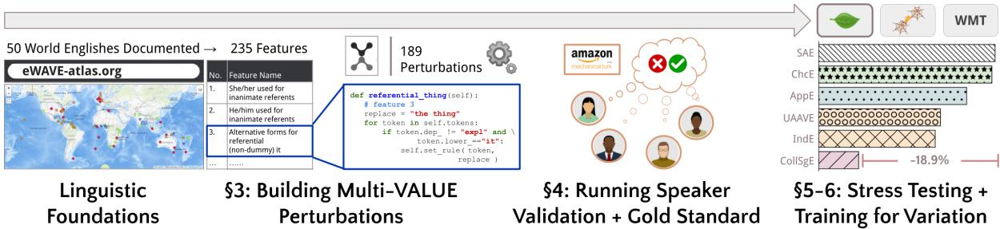
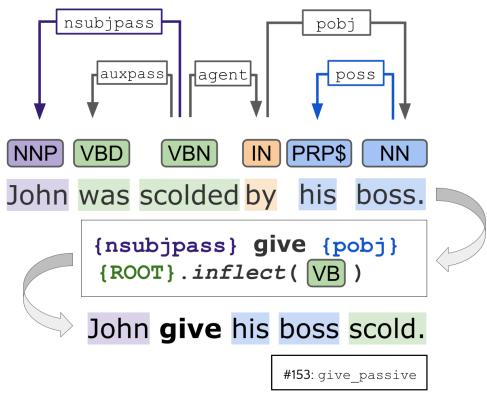
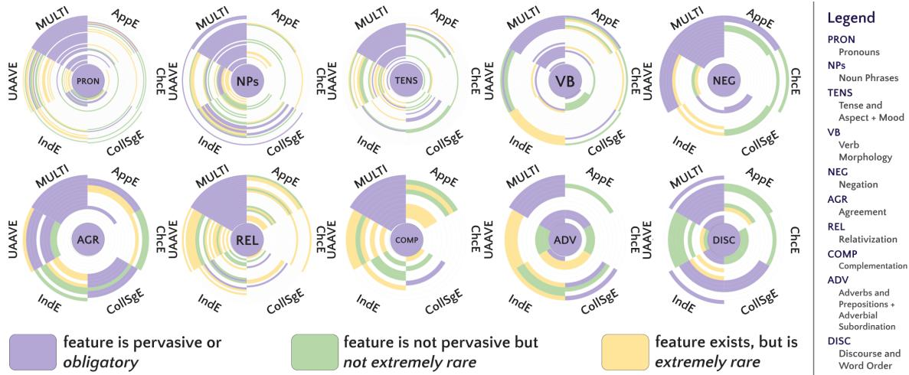
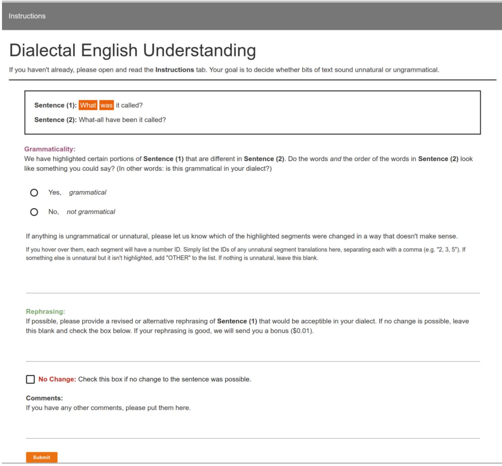

# Multi-VALUE: A Framework for Cross-Dialectal English NLP

Caleb Ziems

William Held

a Jwala Dhamala

Jingfeng Yang a

a Rahul Gupta

Diyi Yang

奉 a Stanford University, Georgia Institute of Technology, Amazon {cziems, diyiy}@stanford.edu, {wheld3}@gatech.edu, {jddhamal, yjfllpyym, gupra}@amazon.com

## Abstract

Dialect differences caused by regional, social, and economic factors cause performance dis crepancies for many groups of language technology users. Inclusive and equitable language technology must critically be dialect invariant, meaning that performance remains constant over dialectal shifts. Current systems often fall short of this ideal since they are designed and tested on a single dialect: Standard American English (SAE). We introduce a suite of resources for evaluating and achieving English dialect invariance. The resource is called Multi-VALUE, a controllable rule-based translation system spanning 50 English dialects and 189 unique linguistic features. Multi-VALUE maps SAE to synthetic forms of each dialect. First, we use this system to stress tests question answering, machine translation, and semantic parsing. Stress tests reveal significant performance disparities for leading models on nonstandard dialects. Second, we use this system as a data augmentation technique to improve the dialect robustness of existing systems. Finally, we partner with native speakers of Chicano and Indian English to release new goldstandard variants of the popular CoQA task. To execute the transformation code, run model checkpoints, and download both synthetic and gold-standard dialectal benchmark datasets, see http://value-nlp.org/.

## 1 Introduction

“[Often, speakers] will not be hampered by the lack of language technology in their local language, but by the lack of support for their variety of the contact language.”

— Steven Bird (2022)

Global contact languages like English will continue to have an outsized impact on commerce, economics, wellbeing, and equity worldwide. English, like any other language, is subject to variation across time (Yang, 2000) and between speakers or speaker groups (Eckert, 2017; Holmes and Meyerhoff, 2008). Rather than focusing on social status or political power (Stewart, 1968; Chambers and Trudgill, 1998), linguists define dialects as descriptive sets of correlated features common across a group of speakers (Nerbonne, 2009). Current pretraining paradigms employ content filters that can exclude text in English dialects other than Standard American and British (Gururangan et al., 2022), which leads to performance gaps for other varieties. These discrepancies in Natural Language Processing (NLP) cause allocational harms for dialectal speakers in downstream applications (Bender et al., 2021), making dialect robustness a critical need for fair and inclusive language technology.

This disparity is clear in a growing body of empirical work on African American English (Ziems et al., 2022; Halevy et al., 2021; Blodgett et al., 2018; Jurgens et al., 2017; Kiritchenko and Mohammad, 2016). However, there does not yet exist a systematic exploration of robustness across multiple Englishes, nor of models’ ability to transfer knowledge between varieties with similar features, as in multi-lingual NLP. We need new tools to benchmark and achieve dialect robustness.

We introduce Multi-VALUE1 for English dialect robustness. Our feature-based approach leverages decades of field linguistics research to isolate grammatical constructions (Demszky et al., 2021) that vary in regional Englishes (Labov, 1972; Eckert, 1989; Hovy and Yang, 2021). We focus on varieties that (1) are mutually intelligible with Standard American English (SAE); (2) share vocabulary with SAE; and (3) differ from SAE with respect to morphology and syntax. The third criterion defines the critical axis of variation. The first two criteria ensure that our definition of model robustness aligns with the human ability to understand other varieties. For example, creoles have their own unique vocabularies and are not easily understood by speakers of other Englishes (Sebba, 1997); they are outside the scope of this study.

  
Figure 1: The Multi-VALUE pipeline is grounded in a set of 189 linguistic structures from the dialectology literature (§1). For each structure, we write a perturbation rule to inject it into text (§3). By partnering with native speakers, we validate perturbations and build both synthetic and gold standard benchmarks (§4-5). Finally, we use these resources in (1) stress testing supervised models to reveal dialect disparities and (2) fine-tuning these models on synthetic data to close the performance gap (§6).

First, we provide a controllable (1) rule-based translation system for injecting up to 189 features into SAE text. This will allow researchers and practitioners to build synthetic training data plus on-demand dialect stress tests for nearly any task. We stress test leading models for three challenging tasks and find statistically significant performance gaps. Second, we provide reliable (2) gold standard benchmarks for the CoQA task in two widely-spoken varieties: Chicano and Indian English. We find that, by training models on synthetic data, we improve dialectal robustness. Third, we fine-tune and publish (3) dialect-robust models on the HuggingFace Hub (Wolf et al., 2020), which can be used directly in downstream applications. Figure 1 demonstrates the full project pipeline.

We recognize five advantages in the Multi-VALUE approach. Our system is

(A) Interpretable: supports systematic perturbation analyses

(B) Flexible: customized to align with new and evolving dialects by adjusting the density of dialectal features, unlike fixed or static datasets.

(C) Scalable: allows users to mix and match tasks and dialects at scale without the need for costly human annotation.

(D) Responsible: vetted by native speakers to ensure gold standards and synthetic data are dependable for ongoing research.

(E) Generalizable: moves the field beyond single-dialect evaluation, which allows researchers to draw more transferrable findings about cross-dialectal NLP performance.

## 2 Related Work

Dialect Disparity is an issue of equity and fairness (Hovy and Spruit, 2016; Gururangan et al., 2022; Halevy et al., 2021; Blodgett and O’Connor, 2017). There is mounting evidence of dialect disparity in NLP. Hate speech classifiers have known biases against African American English (Davidson et al., 2019; Mozafari et al., 2020; Rios, 2020; Sap et al., 2019; Zhou et al., 2021). Text from regions with a predominantly Black population are more likely to be classified as hate speech (Mozafari et al., 2020; Sap et al., 2019; Davidson et al., 2019). AAVE performance gaps have also been found across a wide range of core NLP tasks like NLI (Ziems et al., 2022), dependency parsing and POS tagging (Blodgett et al., 2018; Jørgensen et al., 2015), plus downstream applications (Lwowski and Rios, 2021). Still, there does not exist a systematic study on cross-dialectal model performance. We aim to fill this gap, expanding the VernAcular Language Understanding Evaluation (VALUE) framework of Ziems et al. (2022). Where VALUE established a uni-dialectal evaluation harness with 11 perturbation rules, Multi-VALUE now supports multi-dialectal evaluation with 189 different perturbations across 50 English dialects. Our empirical study on dialect disparity is also more expansive than prior work as we consider three separate domains: QA, MT, and semantic parsing.

Multilingual NLP studies how to learn common structures that transfer across languages. These strategies may also yield benefits in multi-dialectal settings. Massively multilingual models (Pires et al., 2019; Conneau et al., 2020; Liu et al., 2020;

Xue et al., 2021) exploit the commonalities between many languages at once, rather than merely achieving pairwise transfer (Lin et al., 2019). Additionally, benchmarking across multiple languages can reveal language discrepancies at the modeling level, even without language-specific feature engineering or training data (Bender, 2011; Ravfogel et al., 2018; Ahmad et al., 2019; Tsarfaty et al., 2020). Multi-VALUE aims to bring these advantages to the study of English dialects.

## 3 Multi-VALUE Perturbations

There is a clear need for dialect robustness (§2). The challenge is that language is subject to variation and change. This means speakers can contextually modulate the density of features in their grammar, and over time, speakers adopt different features. Shifting language can quickly antiquate training and testing data, and updating such resources can be costly and time-consuming.

In this section, we introduce the first stage of the Multi-VALUE pipeline. We automatically inject structural variation into SAE text using linguistic perturbation rules that alter syntax and morphology but preserve semantics. In this way, perturbations preserve labels. Unlike many black-box translation approaches (Krishna et al., 2020; Sun et al., 2022), label preservation will allow users to convert existing benchmarks directly into dialectal stress tests. Modular, independent perturbation functions give researchers the flexibility to isolate the effects of different features in different combinations.

What distinguishes our work from other syntactic data augmentation methods (Wu et al., 2022) is that our perturbations are grounded in formal language patterns. We operationalize the decades of linguistics research cataloged in the Electronic World Atlas of Varieties of English (eWAVE; Kortmann et al. 2020), a database with 235 features from 75 English varieties, as documented by 87 professional linguists in 175 peer-reviewed publications. eWAVE distinguishes dialects by their unique clusters of linguistic features and the relative pervasiveness of each feature.2 We define a dialect transformation as a sequential application of perturbation rules. Decisions to perturb the text follow the eWAVE heuristic probabilities: 100% for obligatory features; 60% for features neither pervasive nor rare; 30% for rare features; 0% for features with no information or an attested absence.

  
Figure 2: The give\_passive [#153] perturbation follows this procedure: (1) take the passive subject (nsubjpass); (2) insert the verb give; (3) insert the object of a preposition that serves as the agent of the ROOT, (4) insert the ROOT, inflected with its base form.

For each rule, we condition the perturbation on morphosyntactic signals from POS tags, noun and verb inflection, and dependency relations using the spaCy 2.1.0 (Honnibal et al., 2020) and inflect 5.5.2 libraries. For the give passive pertubation above in Figure 2, we search for passive constructions with a past participle ROOT (VBN), an nsubjpass patient, and an agent. We construct the new phrase by inflecting the ROOT to its base (VB) form and moving it after the entire agentive noun phrase.

Following the eWAVE organizational scheme, we motivate and present our feature perturbations in 12 grammatical categories: (1) Pronouns, (2) Noun Phrases, (3) Tense and Aspect, (4) Mood, (5) Verb Morphology, (6) Negation, (7) Agreement, (8) Relativization, (9) Complementation, (10) Adverbial Subordination, (11) Adverbs and Prepositions, and finally (12) Discourse and Word Order. For a more detailed breakdown, see Appendix A.

Pronouns are critical for tasks like machine translation and summarization, which depend on coreference resolution (Sukthanker et al., 2020). Our pronoun perturbation rules account for linguistic structure and are not merely surface manipulations. For example, we condition on coreference for referential pronouns and on verb frames to identify benefactive datives. In total, we implement 39 of the 47 pronoun features from eWAVE.

Noun Phrases are the focus of fundamental NLP research in semantic role labeling and named entity recognition as well as downstream tasks like sentiment analysis, information extraction, summarization, and question answering (Gildea and Jurafsky, 2000). Multi-VALUE has 31 rules that operate on NP constituents.

Tense and Aspect are two grammatical properties that have to do with time. Together, these categories are known to significantly challenge machine translation (Matusov, 2019; Koehn and Knowles, 2017). With 26 rules, Multi-VALUE introduces different kinds of inflections and auxiliary verbs to indicate when an action, event, or state occurred and how it extends over time.

Mood is important for applications in sentiment analysis and opinion mining, including the detection of biased language (Recasens et al., 2013) and framing strategies in political discourse (King and Morante, 2020; Demszky et al., 2019; Ziems and Yang, 2021). Misunderstandings of modality can also challenge NLU systems on tasks like natural language inference (Gong et al., 2018). There are three modal perturbations in Multi-VALUE.

Verb Morphology is expected to affect model understanding of verb frame semantics (Baker et al., 1998), which could impact performance on semantic role labeling, summarization, and machine translation, among other tasks. We implement 16 related perturbations that change verb suffixes, the forms of verb inflection, and the expression of semantic roles using specialized verbal phrases.

Negation is covered by 16 eWAVE features, 14 of which are implemented in Multi-VALUE. Problems with negation account for many of the failure cases in natural language inference (Hossain et al., 2020) and sentiment analysis (Barnes et al., 2021). Our perturbations introduce negative concord, invariant question tags, and new words for negation.

Agreement is a group of 11 rules which have to do with subject-verb agreement and the omission of copula and auxiliary be in different environments. Examples include the invariant present tense in He speak English (feature #170), and the existential dummy word in It’s some food in the fridge (feature #173). Nine of these 11 agreement features are attested in African American English (see Green 2002), which may be linked to the demonstrable performance disparities in AAVE dependency parsing (Blodgett et al., 2018), POS tagging (Jurgens et al., 2017), and NLU tasks (Ziems et al., 2022).

Relativization is a class of perturbations that operates on relativizers, which link relative clauses with their nouns. The purpose of a relative clause is to modify a noun phrase. It’s an important construction for NLU because it can contain a presupposition (Joshi and Weischedel, 1977). Our perturbation rules cover all 14 eWAVE features, operating both on individual relativizer words as well as sentence structure to move the relative clause and build correlative constructions, for example.

Complementation is a set of perturbations that turn dependent clauses into the subject or object of the sentence. Like relative clauses, complementation can contain presuppositions and implicatures (Potts, 2002), which are critical for natural language understanding. They can also convey a speaker’s degree of certainty (Couso and Naya, 2015), which correlates with biased language and framing strategies. We implement all 11 complementation features that are catalogued in eWAVE.

Adverbial Subordination is a set of perturbations that operate on independent clauses with a “conjunctive adverb.” Adverbial conjunctions can express causality (therefore), purpose (so that), sequence (then), contrast (however), comparison (similarly), and various forms of emphasis (indeed). We implement all 5 eWAVE features in this class.

Adverbs and Prepositions are represented by four rules, which can drop prepositions and replace adverbs with their adjectival forms.

Discourse and Word Order has two sides: two discourse features and 9 phrase-based perturbations that move entire constituents in a manner similar to constituency replacement (Sutiono and Hahn-Powell, 2022). These rules significantly alter the sentence structure, and in this way radically differ from prior token-level data augmentation techniques like synonym replacement (Wei and Zou, 2019). Phrasal movements include fronting and clefting, subject-auxiliary inversion, and a lack of inversion in questions. We also inject the word like to indicate focus or quotation.

## 4 Scope and Reliability of Multi-VALUE

## 4.1 Scope

Multi-VALUE’s scope is extensive. Out of the 235 features documented in eWAVE, Multi-VALUE covers 189, spanning all 50 recorded English dialects. On average, the feature space for any given dialect is 86.6% implemented, and no dialect is less than 80% implemented (see Appendix A).

  
Figure 3: A comparative distribution of the features in five dialects, where a dialect is given by a slice of the wheel. Each wheel represents one of the feature groupings in §3 (Tense and Aspect + Mood are combined, as are Adverbial Subordination + Adverbs and Prepositions). The MULTI slice indicates which of the features are implemented in Multi-VALUE. Rings indicate distinct features and are colored by pervasiveness in each dialect.

## 4.2 Recruiting Native Speakers for Validation

One key benefit of the Multi-VALUE approach is our ongoing partnership with native speakers to confirm that our theoretically-inspired rules generate plausible and grammatical text. Here, we validate our transformation rules using the linguistic acceptability judgments of native speakers for 10 English dialects.3 We recruit speakers from Amazon Mechanical Turk and screen them using a Dialect Assessment Survey.4 This qualification survey ensures that each speaker’s empirical language patterns align with the literature on the dialect that they had self-reported. At each turn, the speaker considers a sentence in the target dialect and provides a binary grammaticality judgment about that sentence. Sentences come from published linguistics journals. The survey is efficient5 as it implements binary search, dynamically selecting the feature that most evenly partitions the space of candidate dialects.

## 4.3 Validating the Multi-VALUE Pipeline

To validate our perturbation rules, we use the task from Ziems et al. (2022) in which each annotator is shown a pair of sentences: one in SAE, and the other as a dialect transformation: a copy of the first with perturbations corresponding to the target dialect. Annotators see only perturbations corresponding to their native dialect. Annotators mark portions of sentence 1 that were perturbed incorrectly in sentence 2. The interface is shown in in Figure 4 in the Appendix.

<table><tr><td rowspan=1 colspan=2>FEAT.  Acc.</td><td rowspan=1 colspan=3>FEAT.  ACC.</td><td rowspan=1 colspan=2>FEAT.  Acc.</td><td rowspan=1 colspan=3>FEAT.   ACC.</td></tr><tr><td rowspan=1 colspan=1>10</td><td rowspan=1 colspan=1>97.4</td><td rowspan=1 colspan=1>67</td><td rowspan=1 colspan=1>99.1</td><td></td><td rowspan=1 colspan=1>128</td><td rowspan=1 colspan=1>92.7</td><td rowspan=1 colspan=2>173</td><td rowspan=1 colspan=1>87.5</td></tr><tr><td rowspan=1 colspan=1>39</td><td rowspan=1 colspan=1>99.7</td><td rowspan=1 colspan=1>70</td><td rowspan=1 colspan=1>92.9</td><td></td><td rowspan=1 colspan=1>130</td><td rowspan=1 colspan=1>92.9</td><td rowspan=1 colspan=2>175</td><td rowspan=1 colspan=1>83.3</td></tr><tr><td rowspan=1 colspan=1>40</td><td rowspan=1 colspan=1>99.8</td><td rowspan=1 colspan=1>71</td><td rowspan=1 colspan=1>98.8</td><td></td><td rowspan=1 colspan=1>132</td><td rowspan=1 colspan=1>87.7</td><td rowspan=1 colspan=2>193</td><td rowspan=1 colspan=1>88.7</td></tr><tr><td rowspan=1 colspan=1>42</td><td rowspan=1 colspan=1>98.1</td><td rowspan=1 colspan=1>88</td><td rowspan=1 colspan=2>99.4</td><td rowspan=1 colspan=1>133</td><td rowspan=1 colspan=1>99.5</td><td rowspan=1 colspan=2>216</td><td rowspan=1 colspan=1>99.7</td></tr><tr><td rowspan=1 colspan=1>43</td><td rowspan=1 colspan=1>93.2</td><td rowspan=1 colspan=1>96</td><td rowspan=1 colspan=2>95.5</td><td rowspan=1 colspan=1>154</td><td rowspan=1 colspan=1>92.9</td><td rowspan=1 colspan=2>220</td><td rowspan=1 colspan=1>99.4</td></tr><tr><td rowspan=1 colspan=1>49</td><td rowspan=1 colspan=1>99.6</td><td rowspan=1 colspan=1>99</td><td rowspan=1 colspan=1>94.7</td><td></td><td rowspan=1 colspan=1>155</td><td rowspan=1 colspan=1>81.8</td><td rowspan=1 colspan=2>221</td><td rowspan=1 colspan=1>86.7</td></tr><tr><td rowspan=1 colspan=1>56</td><td rowspan=1 colspan=1>97.3</td><td rowspan=1 colspan=1>100</td><td rowspan=1 colspan=1>99.9</td><td></td><td rowspan=1 colspan=1>165</td><td rowspan=1 colspan=1>99.1</td><td rowspan=1 colspan=2>224</td><td rowspan=1 colspan=1>99.5</td></tr><tr><td rowspan=1 colspan=1>60</td><td rowspan=1 colspan=1>99.6</td><td rowspan=1 colspan=1>121</td><td rowspan=1 colspan=2>91.8</td><td rowspan=1 colspan=1>170</td><td rowspan=1 colspan=1>94.9</td><td rowspan=1 colspan=2>227</td><td rowspan=1 colspan=1>91.2</td></tr><tr><td rowspan=1 colspan=1>63</td><td rowspan=1 colspan=1>99.0</td><td rowspan=1 colspan=1>126</td><td rowspan=1 colspan=2>92.3</td><td rowspan=1 colspan=1>172</td><td rowspan=1 colspan=1>90.0</td><td rowspan=1 colspan=2>228</td><td rowspan=1 colspan=1>99.8</td></tr><tr><td rowspan=1 colspan=8>FEATS.</td><td rowspan=1 colspan=2>ACC.</td></tr><tr><td rowspan=1 colspan=8>3, 9, 11, 14, 15, 16, 26, 29, 33, 34, 41, 45, 47, 55, 57, 58, 59, 61, 62, 64,66, 77, 78, 79, 80, 81, 86, 101, 106, 117, 119, 123, 131, 134, 145, 146,149, 159, 174, 179, 191, 194, 198, 203, 204, 205, 206, 207, 208, 209,214, 223, 226, 232,235</td><td rowspan=1 colspan=2>100.0</td></tr></table>

Table 1: Accuracy of 92 perturbation rules according to majority vote with at least 5 unique sentence instances. Seventy four rules have >95% accuracy, while sixteen have accuracy in [85,95) , and only two are <85% accurate, demonstrating the reliability of our approach.

A group of 72 annotators evaluate a total of 19k sentence pairs, which were drawn from CoQA and other sources. We use CoQA sentences for our Gold Test Sets (§4.4), and for added syntactic diversity, we pull sentences from three nltk corpora: Reuters (Rose et al., 2002), Sentiment Analysis (Pang and Lee, 2004) and Movie Reviews (Pang and Lee, 2005). Three annotators evaluate each transformation, marking any pre-highlighted spans where the transformation appeared ungrammatical. This gives us both transformation and perturbationlevel evaluations. The majority vote determines the accuracy of the perturbation rule.6 Perturbation accuracies are given in Table 1. Since there are 55 rules with perfect accuracy, and all perturbation rules achieve above 81%, researchers can feel confident in the linguistic plausibility of the Multi-VALUE transformation pipeline.

## 4.4 Gold Test Sets

While synthetic Multi-VALUE transformations will be useful for identifying weak points in a model’s performance, this does not ensure the model is ready for the real world. We urge practitioners to heavily test user-facing models with numerous in-domain tests. As a first step, we provide reliable gold standard CoQA datasets in Chicano English (ChcE) and Indian English (IndE). Out of 7,983 CoQA questions, our pipeline made changes to 1,726 ChcE questions (21.6%) and 6,825 IndE questions (85.4%). Human annotators considered only transformed questions and provided their own alternative phrasing for transformations they found ungrammatical. Alternatively, they could simply exclude the erroneous perturbations from the question. ChcE had a total transformation accuracy of 82.7% while IndE had 66.1%. The lower IndE accuracy is due to the higher density of features in this dialect. After rephrasing or removing errors, we were left with 1,498 dialect-transformed ChcE questions and 5,289 IndE questions. Together with any unperturbed questions, these gold questions constitute the gold test sets for evaluation in §6.1.

## 5 Using Multi-VALUE

With our feature rules written (§3) and handvalidated by native speakers (§4), we can use Multi-VALUE to create synthetic data for training dialectrobust models and also for stress testing leading systems on dialect benchmarks. We specifically provide synthetic data for five English dialects: Appalachian (AppE), Chicano English (ChcE), Indian English (IndE), Colloquial Singapore English (CollSgE), and Urban African American English (UAAVE). Three of these dialects are based in the US, where annotators were most abundant for validation, and two are outside the US.

To understand models’ ability to transfer knowledge between dialects, we also consider models trained on dialect A and evaluated on dialect B for each dialectal pair (A, B). We can further leverage the strengths of Multi-VALUE as a multidialectal augmentation tool by training on a synthetic pseudo-dialect that contains the union of all feature options (Multi). We hypothesize that models trained on multi-(pseudo)-dialectal data will benefit from robustness. While the Multi-VALUE approach could apply over any task with free-form text, we focus on three domains in particular: conversational question answering, semantic parsing, and machine translation. All three are user-facing tasks where language variation may hinder users access to information, resources, and/or the global economy (Blasi et al., 2022; Faisal et al., 2021).

Conversational Question Answering (CoQA; Reddy et al.2019) is a reading comprehension benchmark with 127k question-answer pairs and 8k passages in seven different genres and domains. We use it because it is a challenging task where dialect-induced errors can compound. The primary challenge is that questions are conversational: they contain coreference and pragmatic relations to prior questions. To transform the publicly available training and development sets, we perturb only questions. This is a natural information-retrieval setting: the user submits queries in a low-resource dialect while the underlying corpus is in SAE.

Semantic Parsing is the task of mapping natural language to formal language. This is a critical skill for dialogue systems, information retrieval, code generation, and other user-facing applications where dialect use is likely. We transform Spider (Yu et al., 2018), a widely-used text-to-SQL benchmark. Again, we transform only the natural language query, leaving both the database tables and the SQL query unchanged to simulate interaction with a dialect user. Unlike the question answering setting where knowledge is encoded in free-text SAE passages, the knowledge and query language in Spider are encoded in formal tables and structured language, both of which are dialect-free. Consequently, any performance discrepancies here will be due to a mismatch between the models’ training and testing data rather than a mismatch between the query dialect and that of the knowledge base.

Machine Translation is an interesting test case where challenges can arise from domain mismatch (Koehn and Knowles, 2017) due to dialect. We especially anticipate challenges with verb morphology (§3), tense and aspect (§3), and pronouns (§3). We use a standard dataset, WMT19, and evaluate translation from each English Dialect to Chinese, German, Gujurati, and Russian. This simulates a user interacting with translation software using their native dialect.

<table><tr><td colspan="2">Model</td><td colspan="3">Test Dialect</td></tr><tr><td>Base</td><td>Train Set</td><td>SAE</td><td>ChcE</td><td>IndE</td></tr><tr><td rowspan="3">BERT</td><td>SAE</td><td>77.2</td><td>76.7 (-0.5%)</td><td>72.3 (-6.7%)−</td></tr><tr><td>Multi</td><td>76.2 (-1.2%)</td><td>76.1 (-1.4%)</td><td>75.0 (-2.9%)+−</td></tr><tr><td>In-Dialect</td><td>77.2</td><td>76.5 (-0.9%)</td><td>75.1 (-2.7%)+−</td></tr><tr><td rowspan="4">ROBRa</td><td>SAE</td><td>81.8</td><td>81.6 (-0.2%)</td><td>77.7 (-5.2%)−</td></tr><tr><td>Multi</td><td>80.6 (-1.5%)−</td><td>80.5 (-1.6%)−</td><td>79.7 (-2.7%)+</td></tr><tr><td>In-Dialect</td><td>81.8</td><td>81.6 (-0.2%)</td><td>80.5 (-1.6%)+−</td></tr><tr><td></td><td></td><td></td><td></td></tr></table>

Table 2: Gold QA Evaluation: F1 Metric on each gold development set of the CoQA benchmark. − and + respectively indicate significantly (P < 0.05) worse performance than SAE SAE and better performance than SAE Dialect by a paired bootstrap test.

## 6 Cross-Dialectal Stress Testing

Here we benchmark current models on dialect variants of the three tasks in §5. For each dataset, we use fixed hyperparameters without early stopping and report all performances on dialect variants of the evaluation data, since public test sets are not available for the original datasets. We use the base versions of BERT (Devlin et al., 2019) and RoBERTa (Liu et al., 2019) on dialect variants of the CoQA task, following the Rationale Tagging Multi-Task setup of Ju et al. (2019). For SPIDER, we evaluate BART and T5, since both are near the state of the art in semantic parsing (Xie et al., 2022). For Translation, we evaluate the NLLB Translation Model at two distilled scales: 615M and 1.3B (Costa-jussà et al., 2022). We report hyperparameters and further motivation for model selection in Appendix B.

## 6.1 Linking Natural and Synthetic Data

While natural data is the gold standard, it is difficult to scale to the number of dialects and tasks we can cover with synthetic data. Thus our broad evaluations are synthetic stress tests. Importantly, we first demonstrate the critical relationship between the gold and synthetic transformations using the gold evaluation sets from §4.4 and the synthetic training data from §5. Table 2 shows the gold standard

CoQA results, which should be compared to the synthetic CoQA results in Table 3.

The synthetic stress test results match the gold performance for Chicano English with only small deviations. The Indian English stress tests slightly overestimate the performance drop of an SAE model on Indian English (70.8% synthetic vs. 72.3% natural IndE with BERT; 76.1% vs. 77.7% with RoBERTa). This is expected, as the synthetic feature density may be higher than some annotators naturally use. Synthetic results are a lower bound on performance for a target dialect. For all treatments, the stress tests are directionally correct: treatments that improve performance on the stress test also improve results on the gold data.

Combined with speaker validation of the patterns themselves in §4.3, this shows that Multi-VALUE can be used to reliably measure the effects of modeling choices on dialectal performance.

## 6.2 Synthetic Stress Tests

We run 3 stress tests to understand worst-case performances on dialect-shifted data across a suite of models and tasks. Evaluation reveals large and statistically significant performance gaps across each task and across all dialects. This highlights, for the first time, the pervasiveness of English dialect disparity beyond any single dialect.

CoQA + Data Augmentation results are shown in Table 3. As predicted in §6.1, Chicano English (ChcE) does not produce a significant drop in performance (-0.7% BERT; -0.3% RoBERTa) since few of its pervasive features are distinct from SAE (the Manhattan distance between feature vectors for ChcE and Colloquial American English is 0.14, or only half the distance as between CollAmE and CollSgE, IndE, and UAAVE.) On the other hand, Singapore English, which is distant from SAE and therefore has many obligatory features, leads to the largest drop (-25.4% BERT; -18.9% RoBERTa). Appalachian, Indian, and Urban African American English each induce significant but smaller RoBERTa performance drops of -3.4%, -7.5%, and -6.7% respectively.

The data augmentation technique described in §5 successfully closes the dialectal performance gap. Across every dialect but Chicano English, we find that we can improve results by training on data that was transformed to the target dialect. Compared to standard RoBERTa, the RoBERTA model trained on Multi-dialectal data improves average cross-dialectal performance by 2.7 points. However, multi-dialectal training causes a drop of 1.2 points on SAE, reminiscent of interference in multilingual models (Wang et al., 2019, 2020).

<table><tr><td colspan="2">Model</td><td colspan="7">Test Dialect</td></tr><tr><td>Base</td><td>Train Set</td><td>SAE</td><td>AppE</td><td>ChcE</td><td>CollSgE</td><td>IndE</td><td>UAAVE</td><td>Average</td></tr><tr><td rowspan="9">BE Bse</td><td>SAE</td><td>77.2</td><td>74.4 (-3.8%)</td><td>76.6 (-0.7%)</td><td>61.5 (-25.4%)</td><td>70.8 (-9%)</td><td>71.2 (-8.4%)</td><td>71.9 (-7.3%)</td></tr><tr><td>AppE</td><td>76.3 (-1.1%)</td><td>76.4 (-1%)+</td><td>76.1 (-1.4%)</td><td>64.7 (-19.3%)</td><td>72.8 (-6%)− +</td><td>73.2 (-5.4%)</td><td>73.3 (-5.3%)</td></tr><tr><td>ChcE</td><td>76.8 (-0.5%)</td><td>74.7 (-3.3%)</td><td>76.5 (-0.8%)</td><td>63.6 (-21.3%)</td><td>71.6 (-7.8%)</td><td>71.4 (-8.1%)−</td><td>72.4 (-6.5%)</td></tr><tr><td>CollSgE</td><td>75.7 (-1.9%)</td><td>74.1 (-4.2%)</td><td>75.5 (-2.2%)</td><td>74.7 (-3.3%) +</td><td>73.6 (-4.8%) +</td><td>73.4 (-5.1%)</td><td>74.5 (-3.6%)</td></tr><tr><td>IndE</td><td>76.0 (-1.5%)</td><td>75.4 (-2.4%)−</td><td>75.7 (-2%)−</td><td>63.2 (-22%)−+</td><td>75.1 (-2.7%) +</td><td>74.1 (-4.1%)−+</td><td>73.3 (-5.3%)</td></tr><tr><td>UAAVE</td><td>76.1 (-1.4%)</td><td>75.6 (-2%)−+</td><td>76.0 (-1.5%)</td><td>64.6 (-19.5%) +</td><td>74.5 (-3.6%)−+</td><td>75.3 (-2.5%)−+</td><td>73.7 (-4.7%)</td></tr><tr><td>Multi</td><td>76.2 (-1.2%)</td><td>75.6 (-2%)−+</td><td>76.1 (-1.3%)</td><td>73.7 (-4.7%) 1</td><td>74.9 (-3.1%) +</td><td>75.1 (-2.7%)−+</td><td>75.3 (-2.5%)</td></tr><tr><td>In-Dialect</td><td>77.2</td><td>76.4 (-1%)+</td><td>76.5 (-0.8%)</td><td>74.7 (-3.3%)</td><td>75.1 (-2.7%)−+</td><td>75.3 (-2.5%)−+</td><td>75.9 (-1.7%)</td></tr><tr><td>SAE</td><td></td><td></td><td></td><td></td><td></td><td></td><td></td></tr><tr><td rowspan="9">RoBase</td><td></td><td>81.8</td><td>79.1 (-3.4%)</td><td>81.5 (-0.3%)</td><td>68.8 (-18.9%)</td><td>76.1 (-7.5%)</td><td>76.6 (-6.7%)</td><td>77.3 (-5.8%)</td></tr><tr><td>AppE</td><td>82.0 (0.3%)</td><td>81.8+</td><td>81.8</td><td>71.2 (-14.9%)</td><td>79.0 (-3.5%)</td><td>79.6 (-2.8%)</td><td>79.2 (-3.2%)</td></tr><tr><td>ChcE</td><td>81.7 (-0.1%)</td><td>79.3 (-3.1%)</td><td>81.5 (-0.4%)</td><td>68.8 (-18.9%)</td><td>76.5 (-7%)</td><td>77.3 (-5.9%)</td><td>77.5 (-5.5%)</td></tr><tr><td>CollSgE</td><td>81.5 (-0.4%)</td><td>80.1 (-2.2%)</td><td>81.2 (-0.7%)</td><td>80.2 (-2%)</td><td>79.4 (-3%) +</td><td>78.7 (-3.9%)</td><td>80.2 (-2%)</td></tr><tr><td>IndE</td><td>81.1 (-0.8%)</td><td>80.5 (-1.5%)</td><td>80.9 (-1.1%)</td><td>67.2 (-21.7%)</td><td>80.3 (-1.9%)</td><td>79.2 (-3.3%)</td><td>78.2 (-4.6%)</td></tr><tr><td>UAAVE</td><td>81.6 (-0.2%)</td><td>81.1 (-0.9%)+ 十</td><td>81.5 (-0.3%)</td><td>69.2 (-18.2%)</td><td>79.6 (-2.7%) 十</td><td>81.1 (-0.9%)+</td><td>79.0 (-3.5%)</td></tr><tr><td>Multi</td><td>80.6 (-1.5%)</td><td>80.4 (-1.7%)</td><td>80.5 (-1.6%)</td><td>78.5 (-4.2%)</td><td>79.7 (-2.7%) 十</td><td>80.0 (-2.2%)</td><td>80.0 (-2.3%)</td></tr><tr><td>In-Dialect</td><td>81.8</td><td>81.8+</td><td>81.5 (-0.4%)</td><td>80.2 (-2%)−+</td><td>80.3 (-1.9%)−+</td><td>81.1 (-0.9%)+</td><td>81.1 (-0.9%)</td></tr></table>

Table 3: Dialect QA Stress Test: F1 Metric on each VALUE-transformed development set of the CoQA benchmark. and + indicate significantly (P < 0.05) worse performance than SAE SAE and better performance than SAE Dialect by a paired bootstrap test.
<table><tr><td colspan="2">Evaluation</td><td colspan="7">Input Dialect</td></tr><tr><td>Model</td><td>Metric</td><td>SAE</td><td>AppE</td><td>ChcE</td><td>CollSgE</td><td>IndE</td><td>UAAVE</td><td>Avg.</td></tr><tr><td rowspan="2">BART-base</td><td>Exact Match ACC</td><td>49.3</td><td>45.2 (-8.3%)</td><td>48.5 (-1.6%)</td><td>41.9 (-15.0%)−</td><td>40.5 (-17.8%)</td><td>45.0 (-8.7%)−</td><td>45.1 (-8.5%)</td></tr><tr><td>Execution ACC</td><td>51.0</td><td>47.3 (-7.3%)</td><td>50.3 (-1.4%)</td><td>44.1 (-13.5%)</td><td>42.3 (-17.1%)</td><td>46.1 (-9.6%)</td><td>46.9 (-8.0%)</td></tr><tr><td rowspan="2">BART-large</td><td>Exact Match ACC</td><td>67.9</td><td>63.6 (-6.3%)</td><td>65.5 (-3.5%)</td><td>60.3 (-11.2%)−</td><td>61.2 (-9.9%)−</td><td>62.3 (-8.2%)</td><td>63.5 (-6.5%)</td></tr><tr><td>Execution ACC</td><td>70.5</td><td>65.2 (-7.5%)</td><td>68.2 (-3.3%)</td><td>63.0 (-10.6%)</td><td>62.8 (-10.9%)−</td><td>64.5 (-8.5%)</td><td>65.4 (-7.2%)</td></tr><tr><td rowspan="2">T5-base</td><td>Exact Match ACC</td><td>58.7</td><td>54.3 (-7.5%)</td><td>57.4 (-2.2%)</td><td>50.0 (-14.8%)</td><td>49.1 (-16.4%)</td><td>53.1 (-9.5%)</td><td>53.8 (-8.3%)</td></tr><tr><td>Execution ACC</td><td>59.8</td><td>56.0 (-6.4%)</td><td>58.5 (-2.2%)</td><td>51.6 (-13.7%)</td><td>51.3 (-14.2%)</td><td>54.6 (-8.7%)</td><td>55.3 (-7.5%)</td></tr><tr><td rowspan="2">T5-3b</td><td>Exact Match ACC</td><td>71.7</td><td>65.3 (-8.9%)</td><td>69.7 (-2.8%)</td><td>60.7 (-15.3%)</td><td>62.9 (-12.3%)</td><td>68.5 (-4.5%)−</td><td>66.5 (-7.3%)</td></tr><tr><td>Execution ACC</td><td>75.6</td><td>69.3 (-8.3%)</td><td>73.4 (-2.9%)</td><td>64.9 (-14.2%)</td><td>66.5 (-12.0%)</td><td>66.9 (-11.5%)</td><td>69.4 (-8.2%)</td></tr></table>

Table 4: Dialect SPIDER Stress Test: Evaluation on each VALUE-transformed evaluation set of the SPIDER benchmark. We finetune BART and T5 on SPIDER and evaluate for both Exact Match and Execution accuracy. − indicates a significant performance drop (P < 0.05) compared to SAE performance by a bootstrap test.

We performed a Qualitative Error Analysis on 30 errors for each transformed dialect. In each error, models trained on SAE flipped from a correct answer in SAE to an incorrect answer in one of the dialect-transformed COQA sets. Fully validated perturbations in tense, inflection, plural marking, phrasal order, and the deletion of pragmaticallyrecoverable pronouns, prepositions, and auxiliaries all lead to significant errors. As expected, these errors can cascade down the conversation, leading to model failure on later unperturbed questions as well. In some cases, erroneous answers still belong to the correct class, like flipping from yes to no in the presence of negative concord. Suprisingly, transformations also frequently cause the model to respond with an erroneous class, like giving a noun phrase or prepositional phrase to a yes/no question under perturbations like clefting and the omission of auxiliary did, is, and wh-words.

Our analysis also suggests that the noticeably larger drop in performance on Singapore English might be largely due to the higher density of two perturbation types: preposition omissions (feature #198), and the one relativizer (feature #216). Future work can use perturbation analyses (Ziems et al., 2022) to quantitatively measure these sources of error.

Semantic Parsing Table 4 shows that SAE models significantly underperform on all dialectal stress tests, both in terms of Exact Match Accuracy and Execution Accuracy. For both BART and T5, the largest performance gaps appear when we test on the two non-American dialects, CollSgE and IndE (-15.3% and -12.3% exact match accuracy for T5- 3b). The semantic parsing performance gaps here are as large as those in conversational question answering. This supports our claim that the discrepancies are caused by model mismatch, rather than solely a mismatch between the dialect of the question and that of the knowledge base.

<table><tr><td colspan="2">Evaluation</td><td colspan="7">Source Dialect</td></tr><tr><td># Param.</td><td>Target</td><td>SAE</td><td>AppE</td><td>ChcE</td><td>CollSgE</td><td>IndE</td><td>UAAVE</td><td>Avg.</td></tr><tr><td rowspan="4">615M</td><td>Chinese</td><td>22.5</td><td>21.2 (-6.1%)−</td><td>21.7 (-3.6%)−</td><td>17.0 (-24.5%)−</td><td>18.7 (-16.8%)−</td><td>19.8 (-12.3%)−</td><td>20.1 (-10.6%)</td></tr><tr><td>German</td><td>39.6</td><td>34.3 (-13.41%)−</td><td>37.8 (-4.65%)−</td><td>22.3 (-43.60%)−</td><td>26.8 (-32.32%)−</td><td>30.5 (-23.1%)−</td><td>31.9 (-19.5%)</td></tr><tr><td>Gujurati</td><td>21.7</td><td>18.6 (-14.5%)−</td><td>20.4 (-6.2%)−</td><td>13.4 (-38.4%)−</td><td>16.6 (-23.4%)−</td><td>17.2 (-20.7%)−</td><td>18.0 (-17.2%)</td></tr><tr><td>Russian</td><td>27.8</td><td>24.6 (-11.4%)−</td><td>26.7 (-4.0%)−</td><td>17.2 (-38.1%)−</td><td>20.8 (-25.4%)−</td><td>21.7 (-22.1%)−</td><td>23.1 (-16.8%)</td></tr><tr><td rowspan="4">1.3B</td><td>Chinese</td><td>23.2</td><td>21.5 (-7.4%)−</td><td>22.5 (-3.3%)</td><td>17.8 (-23.5%)−</td><td>19.4 (-16.6%)−</td><td>19.8 (-15.0%)−</td><td>20.7 (-11.0%)</td></tr><tr><td>German</td><td>42.6</td><td>37.5 (-11.9%)−</td><td>40.6 (-4.6%)−</td><td>25.3 (-40.6%)-</td><td>29.4 (-31.0%)−</td><td>34.2 (-19.7%)−</td><td>34.9 (-18.0%)</td></tr><tr><td>Gujurati</td><td>24.0</td><td>20.7 (-13.8%)−</td><td>22.9 (-4.5%)−</td><td>15.5 (-35.4%)−</td><td>18.5 (-22.8%)−</td><td>19.7 (-17.8%)−</td><td>20.2 (-15.7%)</td></tr><tr><td>Russian</td><td>31.7</td><td>28.5 (-10.1%)</td><td>30.3 (-4.4%)</td><td>20.3 (-36.0%)−</td><td>24.5 (-22.6%)</td><td>25.3 (-20.2%)</td><td>26.7 (-15.5%)</td></tr></table>

Table 5: Dialect Translation Stress Test: SacreBLEU Score (Post, 2018) on each VALUE-transformed validation set of the WMT19 benchmark at 2 distilled scales of the NLLB Translation model (Costa-jussà et al., 2022). − indicates a significant performance drop (P < 0.05) compared to SAE performance by a bootstrap test.

Machine Translation stress test results are shown in Table 5. Except for ChcE, performance drops significantly across all dialects for each language. Interestingly, the size of the average dialectal performance gap is higher when the target language is structurally more similar to English: the largest average drop is from English German (-19.5% on 615M; -18.0% on 1.3B) and the smallest average drop is from English Chinese (-10.6% on 615M; -11.0% on 1.3B). This result cannot be explained simply as a reflection of the model’s SAE translation performance. If it were, we might expect a smaller performance gap for Gujurati, a low-resource Indo-European language, since it has low SAE translation performance (21.7 SacreBLEU on 615M), but in fact, English Gujurati has the second largest dialectal translation performance gap (-17.2% on 615M; -15.7% on 1.3B). Our explanation is that Gujurati has syntax that is more similar to English.

Despite both the 1.3B and 615M NLLB models being distilled from the same larger model, we see that the dialectal gap is smaller for German, Gujurati, and Russian. This suggests that model compression may affect low-resource dialects more heavily than SAE, similar to multi-lingual findings for low-resource languages (Ahia et al., 2021).

## 7 Conclusion

In this work, we introduced Multi-VALUE – a dialect robustness evaluation framework that is interpretable, flexible, scalable, responsible, and generalizable. The rule-based methods form a transparent syntactic translation system that can flexibly adjust to the shifting feature space of living dialects. Additionally, the transformation rules are reliably sourced from over a decade of linguistics literature and vetted by native speakers. After showing that these transformations predict human-translated dialect benchmark performance, we used them to build dialect benchmarks and training data at scale, without the need for additional annotation efforts. By training and evaluating in a cross-dialectal manner, we demonstrated how Multi-VALUE can be used for more generalizable findings about model performance and dialect transferability.

Multi-VALUE can facilitate a wide range of NLP tasks and applications, such as measuring the relationships between dialect similarity and generalization performance, the scaling laws of dialect disparity, as well as inspiring algorithms on better dialect transfer. Overall, we anticipate that Multi-VALUE will continue to support the development of more fair and equitable language technologies.

## 8 Limitations

Lexical variation is not our focus because it is not well-described by systematic, scalable, and generalizable rules. One can derive lexical distributions from data, but many low-resource dialects lack corpora on which to base these insights. This is an important problem for future research.

Multi-VALUE’s strength is its extensive coverage of English morphosyntacic patterns that have been documented in eWAVE by over 80 linguists. Such comprehensive resources are not available for other languages, but we encourage continued collaborations between computer scientists and linguists to build these resources for dialect-robust NLP systems across languages. As it stands, the current iteration of Multi-VALUE provides global value by serving a global contact language, English, and its 50 most documented varieties.

Despite the scope and precision of eWAVE for

English, its catalog ultimately derives from linguists’ oral interviews with native speakers, and here we can identify some additional limitations. First, the orthographic conventions that linguists use to encode spoken dialect may not always align with the speakers’ own writing conventions and usage. Second, our approach can only cover the variation that linguists observe frequently enough to document, and in canonical forms in which they are documented. This means we may not fully capture variation within each feature.

Finally, dialects should not be treated like deterministic speech patterns, but rather like a range of grammatical options or switches that may be turned on and off and adjusted for frequency in various social and personal contexts. Dialects do not always fit into nicely prescribed categories.

## 9 Ethical Considerations

This work makes use of human subjects for annotation. All procedures were subject to ethical review and were approved by the authors’ institution. Consent was gathered in accordance with the authors institution guidelines and annotators had access to a data use statement when giving consent.

The purpose of Multi-VALUE is to provide tools which enable researchers and practitioners to understand and mitigate dialectal bias in their models. We will release these tools responsibly, ensuring that users sign a Data Use Agreement that forbids the use of Multi-VALUE for deception, impersonation, mockery, discrimination, hate speech, targeted harassment and cultural appropriation.

In the agreement, researchers and practitioners will also acknowledge the Limitations of this work (§8), that Multi-VALUE may not fully or accurately represent the natural usage patterns of all sub-communities of speakers. Multi-VALUE is designed to be easily updatable and configurable such that it can be extended by and for specific sub-communities and updated as dialects evolve over time.

## Acknowledgements

We are thankful to the members of SALT Lab for their helpful feedback on the draft. Caleb Ziems is supported by the NSF Graduate Research Fellowship under Grant No. DGE-2039655. Part of this work was funded by an Amazon Faculty Research Award on Alexa Fairness in AI to DY.

## References

Orevaoghene Ahia, Julia Kreutzer, and Sara Hooker. 2021. The low-resource double bind: An empirical study of pruning for low-resource machine translation. In Findings of the Association for Computational Linguistics: EMNLP 2021, pages 3316–3333, Punta Cana, Dominican Republic. Association for Computational Linguistics.

Wasi Ahmad, Zhisong Zhang, Xuezhe Ma, Eduard Hovy, Kai-Wei Chang, and Nanyun Peng. 2019. On difficulties of cross-lingual transfer with order differences: A case study on dependency parsing. In Proceedings of the 2019 Conference of the North American Chapter of the Association for Computational Linguistics: Human Language Technologies, Volume 1 (Long and Short Papers), pages 2440–2452, Minneapolis, Minnesota. Association for Computational Linguistics.

Collin F. Baker, Charles J. Fillmore, and John B. Lowe. 1998. The Berkeley FrameNet project. In COLING 1998 Volume 1: The 17th International Conference on Computational Linguistics.

Jeremy Barnes, Erik Velldal, and Lilja Øvrelid. 2021. Improving sentiment analysis with multi-task learning of negation. Natural Language Engineering, 27(2):249–269.

Emily M Bender. 2011. On achieving and evaluating language-independence in nlp. Linguistic Issues in Language Technology, 6.

Emily M Bender, Timnit Gebru, Angelina McMillan-Major, and Shmargaret Shmitchell. 2021. On the dangers of stochastic parrots: Can language models be too big? In Proceedings ofthe 2021 ACM Conference on Fairness, Accountability, and Transparency, pages 610–623.

Steven Bird. 2022. Local languages, third spaces, and other high-resource scenarios. In Proceedings ofthe 60th Annual Meeting ofthe Associationfor Computational Linguistics (Volume 1: Long Papers), pages 7817–7829.

Damián Blasi, Antonios Anastasopoulos, and Graham Neubig. 2022. Systematic inequalities in language technology performance across the world’s languages. In Proceedings of the 60th Annual Meeting of the Association for Computational Linguistics (Volume 1: Long Papers), pages 5486–5505.

Su Lin Blodgett and Brendan O’Connor. 2017. Racial disparity in natural language processing: A case study of social media african-american english. ArXiv preprint, abs/1707.00061.

Su Lin Blodgett, Johnny Wei, and Brendan O’Connor. 2018. Twitter Universal Dependency parsing for African-American and mainstream American English. In Proceedings of the 56th Annual Meeting of the Association for Computational Linguistics (Volume 1: Long Papers), pages 1415–1425, Melbourne, Australia. Association for Computational Linguistics.

Jack K Chambers and Peter Trudgill. 1998. Dialectol ogy. Cambridge University Press.

Alexis Conneau, Kartikay Khandelwal, Naman Goyal, Vishrav Chaudhary, Guillaume Wenzek, Francisco Guzmán, Edouard Grave, Myle Ott, Luke Zettlemoyer, and Veselin Stoyanov. 2020. Unsupervised cross-lingual representation learning at scale. In Proceedings of the 58th Annual Meeting of the Associationfor Computational Linguistics, pages 8440– 8451, Online. Association for Computational Linguistics.

Marta R Costa-jussà, James Cross, Onur Çelebi, Maha Elbayad, Kenneth Heafield, Kevin Heffernan, Elahe Kalbassi, Janice Lam, Daniel Licht, Jean Maillard, et al. 2022. No language left behind: Scaling human-centered machine translation. ArXiv preprint, abs/2207.04672.

María José López Couso and Belén Méndez Naya. 2015. Epistemic/evidential markers of the type verb+ complementizer: Some parallels from english and romance. In New directions in grammaticalization research, pages 93–120. John Benjamins.

Thomas Davidson, Debasmita Bhattacharya, and Ingmar Weber. 2019. Racial bias in hate speech and abusive language detection datasets. In Proceedings of the Third Workshop on Abusive Language Online, pages 25–35, Florence, Italy. Association for Computational Linguistics.

Dorottya Demszky, Nikhil Garg, Rob Voigt, James Zou, Jesse Shapiro, Matthew Gentzkow, and Dan Jurafsky. 2019. Analyzing polarization in social media: Method and application to tweets on 21 mass shootings. In Proceedings ofthe 2019 Conference ofthe North American Chapter ofthe Associationfor Computational Linguistics: Human Language Technologies, Volume 1 (Long and Short Papers), pages 2970– 3005, Minneapolis, Minnesota. Association for Computational Linguistics.

Dorottya Demszky, Devyani Sharma, Jonathan Clark, Vinodkumar Prabhakaran, and Jacob Eisenstein. 2021. Learning to recognize dialect features. In Proceedings of the 2021 Conference of the North American Chapter of the Association for Computational Linguistics: Human Language Technologies, pages 2315–2338, Online. Association for Computational Linguistics.

Jacob Devlin, Ming-Wei Chang, Kenton Lee, and Kristina Toutanova. 2019. BERT: Pre-training of deep bidirectional transformers for language understanding. In Proceedings ofthe 2019 Conference of the North American Chapter ofthe Associationfor Computational Linguistics: Human Language Technologies, Volume 1 (Long and Short Papers), pages 4171–4186, Minneapolis, Minnesota. Association for Computational Linguistics.

Penelope Eckert. 1989. Jocks and burnouts: Social categories and identity in the high school. Teachers college press.

Penelope Eckert. 2017. Age as a sociolinguistic variable. The handbook of sociolinguistics, pages 151–167.

Barbara Di Eugenio and Michael Glass. 2004. The kappa statistic: A second look. Computational linguistics, 30(1):95–101.

Fahim Faisal, Sharlina Keshava, Md Mahfuz Ibn Alam, and Antonios Anastasopoulos. 2021. SD-QA: Spoken dialectal question answering for the real world. In Findings of the Association for Computational Linguistics: EMNLP 2021, pages 3296–3315, Punta Cana, Dominican Republic. Association for Computational Linguistics.

Daniel Gildea and Daniel Jurafsky. 2000. Automatic labeling of semantic roles. In Proceedings of the 38th Annual Meeting of the Association for Computational Linguistics, pages 512–520, Hong Kong. Association for Computational Linguistics.

Yichen Gong, Heng Luo, and Jian Zhang. 2018. Natural language inference over interaction space. In 6th International Conference on Learning Representations, ICLR 2018, Vancouver, BC, Canada, April 30 - May 3, 2018, Conference Track Proceedings. OpenReview.net.

Lisa J Green. 2002. African American English: a linguistic introduction. Cambridge University Press.

Suchin Gururangan, Dallas Card, Sarah K Drier, Emily K Gade, Leroy Z Wang, Zeyu Wang, Luke Zettlemoyer, and Noah A Smith. 2022. Whose language counts as high quality? measuring language ideologies in text data selection. ArXiv preprint, abs/2201.10474.

Matan Halevy, Camille Harris, Amy Bruckman, Diyi Yang, and Ayanna Howard. 2021. Mitigating racial biases in toxic language detection with an equitybased ensemble framework. In Equity and Access in Algorithms, Mechanisms, and Optimization, pages 1–11.

Janet Holmes and Miriam Meyerhoff. 2008. The handbook of language and gender. John Wiley & Sons.

Matthew Honnibal, Ines Montani, Sofie Van Landeghem, and Adriane Boyd. 2020. spacy: Industrialstrength natural language processing in python.

Md Mosharaf Hossain, Venelin Kovatchev, Pranoy Dutta, Tiffany Kao, Elizabeth Wei, and Eduardo Blanco. 2020. An analysis of natural language inference benchmarks through the lens of negation. In Proceedings of the 2020 Conference on Empirical Methods in Natural Language Processing (EMNLP), pages 9106–9118, Online. Association for Computational Linguistics.

Dirk Hovy and Shannon L. Spruit. 2016. The social impact of natural language processing. In Proceedings of the 54th Annual Meeting of the Association for Computational Linguistics (Volume 2: Short Papers), pages 591–598, Berlin, Germany. Association for Computational Linguistics.

Dirk Hovy and Diyi Yang. 2021. The importance of modeling social factors of language: Theory and practice. In Proceedings of the 2021 Conference of the North American Chapter of the Association for Computational Linguistics: Human Language Technologies, pages 588–602, Online. Association for Computational Linguistics.

Anna Jørgensen, Dirk Hovy, and Anders Søgaard. 2015. Challenges of studying and processing dialects in social media. In Proceedings ofthe Workshop on Noisy User-generated Text, pages 9–18, Beijing, China. Association for Computational Linguistics.

Aravind K. Joshi and Ralph Weischedel. 1977. Computation of a subclass of inferences: Presupposition and entailment. American Journal of Computational Linguistics, pages 1–54. Microfiche 63.

Ying Ju, Fubang Zhao, Shijie Chen, Bowen Zheng, Xuefeng Yang, and Yunfeng Liu. 2019. Technical report on conversational question answering. ArXiv preprint, abs/1909.10772.

David Jurgens, Yulia Tsvetkov, and Dan Jurafsky. 2017. Incorporating dialectal variability for socially equitable language identification. In Proceedings ofthe 55th Annual Meeting of the Association for Computational Linguistics (Volume 2: Short Papers), pages 51–57, Vancouver, Canada. Association for Computational Linguistics.

Liza King and Roser Morante. 2020. Must children be vaccinated or not? annotating modal verbs in the vaccination debate. In Proceedings ofthe Twelfth Language Resources and Evaluation Conference, pages 5730–5738, Marseille, France. European Language Resources Association.

Svetlana Kiritchenko and Saif Mohammad. 2016. The effect of negators, modals, and degree adverbs on sentiment composition. In Proceedings of the 7th Workshop on Computational Approaches to Subjectivity, Sentiment and Social Media Analysis, pages 43–52, San Diego, California. Association for Computational Linguistics.

Philipp Koehn and Rebecca Knowles. 2017. Six challenges for neural machine translation. In Proceedings of the First Workshop on Neural Machine Translation, pages 28–39.

Bernd Kortmann, Kerstin Lunkenheimer, and Katharina Ehret, editors. 2020. eWAVE.

Kalpesh Krishna, John Wieting, and Mohit Iyyer. 2020. Reformulating unsupervised style transfer as paraphrase generation. In Proceedings ofthe 2020 Conference on Empirical Methods in Natural Language Processing (EMNLP), pages 737–762, Online. Association for Computational Linguistics.

William Labov. 1972. Language in the inner city: Studies in the Black English vernacular. 3. University of Pennsylvania Press.

Yu-Hsiang Lin, Chian-Yu Chen, Jean Lee, Zirui Li, Yuyan Zhang, Mengzhou Xia, Shruti Rijhwani, Junxian He, Zhisong Zhang, Xuezhe Ma, Antonios Anastasopoulos, Patrick Littell, and Graham Neubig. 2019. Choosing transfer languages for cross-lingual learning. In Proceedings of the 57th Annual Meeting of the Association for Computational Linguistics, pages 3125–3135, Florence, Italy. Association for Computational Linguistics.

Yinhan Liu, Jiatao Gu, Naman Goyal, Xian Li, Sergey Edunov, Marjan Ghazvininejad, Mike Lewis, and Luke Zettlemoyer. 2020. Multilingual denoising pretraining for neural machine translation. Transactions ofthe Associationfor Computational Linguistics, 8:726–742.

Yinhan Liu, Myle Ott, Naman Goyal, Jingfei Du, Mandar Joshi, Danqi Chen, Omer Levy, Mike Lewis, Luke Zettlemoyer, and Veselin Stoyanov. 2019. Roberta: A robustly optimized bert pretraining approach. ArXiv preprint, abs/1907.11692.

Ilya Loshchilov and Frank Hutter. 2019. Decoupled weight decay regularization. In 7th International Conference on Learning Representations, ICLR 2019, New Orleans, LA, USA, May 6-9, 2019. OpenReview.net.

Brandon Lwowski and Anthony Rios. 2021. The risk of racial bias while tracking influenza-related content on social media using machine learning. Journal of the American Medical Informatics Association, 28(4):839–849.

Evgeny Matusov. 2019. The challenges of using neural machine translation for literature. In Proceedings of the Qualities of Literary Machine Translation, pages 10–19, Dublin, Ireland. European Association for Machine Translation.

Marzieh Mozafari, Reza Farahbakhsh, and Noël Crespi. 2020. Hate speech detection and racial bias mitigation in social media based on bert model. PloS one, 15(8):e0237861.

John Nerbonne. 2009. Data-driven dialectology. Language and Linguistics Compass, 3(1):175–198.

Bo Pang and Lillian Lee. 2004. A sentimental education: Sentiment analysis using subjectivity summarization based on minimum cuts. In Proceedings of the 42nd Annual Meeting of the Association for Computational Linguistics (ACL-04), pages 271–278, Barcelona, Spain.

Bo Pang and Lillian Lee. 2005. Seeing stars: Exploiting class relationships for sentiment categorization with respect to rating scales. In Proceedings of the 43rd Annual Meeting of the Association for Computational Linguistics (ACL’05), pages 115–124, Ann Arbor, Michigan. Association for Computational Linguistics.

Telmo Pires, Eva Schlinger, and Dan Garrette. 2019. How multilingual is multilingual BERT? In Proceedings of the 57th Annual Meeting of the Association for Computational Linguistics, pages 4996–5001, Florence, Italy. Association for Computational Linguistics.

Matt Post. 2018. A call for clarity in reporting BLEU scores. In Proceedings of the Third Conference on Machine Translation: Research Papers, pages 186– 191, Brussels, Belgium. Association for Computational Linguistics.

Christopher Potts. 2002. The lexical semantics of parenthical-as and appositive-which. Syntax, 5(1):55– 88.

Rebecca Qian, Candace Ross, Jude Fernandes, Eric Smith, Douwe Kiela, and Adina Williams. 2022. Perturbation augmentation for fairer nlp. ArXiv preprint, abs/2205.12586.

Shauli Ravfogel, Yoav Goldberg, and Francis Tyers. 2018. Can LSTM learn to capture agreement? the case of Basque. In Proceedings ofthe 2018 EMNLP Workshop BlackboxNLP: Analyzing and Interpreting Neural Networks for NLP, pages 98–107, Brussels, Belgium. Association for Computational Linguistics.

Marta Recasens, Cristian Danescu-Niculescu-Mizil, and Dan Jurafsky. 2013. Linguistic models for analyzing and detecting biased language. In Proceedings of the 51st Annual Meeting of the Association for Computational Linguistics (Volume 1: Long Papers), pages 1650–1659, Sofia, Bulgaria. Association for Computational Linguistics.

Siva Reddy, Danqi Chen, and Christopher D. Manning. 2019. CoQA: A conversational question answering challenge. Transactions of the Association for Computational Linguistics, 7:249–266.

Anthony Rios. 2020. Fuzze: Fuzzy fairness evaluation of offensive language classifiers on african-american english. In The Thirty-Fourth AAAI Conference on Artificial Intelligence, AAAI 2020, The Thirty-Second Innovative Applications ofArtificial Intelligence Conference, IAAI 2020, The Tenth AAAI Symposium on Educational Advances in Artificial Intelligence, EAAI 2020, New York, NY, USA, February 7-12, 2020, pages 881–889. AAAI Press.

Tony Rose, Mark Stevenson, and Miles Whitehead. 2002. The Reuters corpus volume 1 -from yesterday’s news to tomorrow’s language resources. In Proceedings of the Third International Conference on Language Resources and Evaluation (LREC’02), Las Palmas, Canary Islands - Spain. European Language Resources Association (ELRA).

Maarten Sap, Dallas Card, Saadia Gabriel, Yejin Choi, and Noah A. Smith. 2019. The risk of racial bias in hate speech detection. In Proceedings of the 57th Annual Meeting of the Association for Computational Linguistics, pages 1668–1678, Florence, Italy. Association for Computational Linguistics.

Mark Sebba. 1997. Contact languages: Pidgins and creoles. Bloomsbury Publishing.

William Stewart. 1968. A sociolinguistic typology for describing national multilingualism. Readings in the Sociology ofLanguage, 3:531–545.

Rhea Sukthanker, Soujanya Poria, Erik Cambria, and Ramkumar Thirunavukarasu. 2020. Anaphora and coreference resolution: A review. Information Fusion, 59:139–162.

Jiao Sun, Thibault Sellam, Elizabeth Clark, Tu Vu, Timothy Dozat, Dan Garrette, Aditya Siddhant, Jacob Eisenstein, and Sebastian Gehrmann. 2022. Dialectrobust evaluation of generated text.

Arie Sutiono and Gus Hahn-Powell. 2022. Syntaxdriven data augmentation for named entity recognition. In Proceedings of the First Workshop on Pattern-based Approaches to NLP in the Age of Deep Learning, pages 56–60, Gyeongju, Republic of Korea. International Conference on Computational Linguistics.

Maggie Tallerman. 2019. Understanding syntax. Routledge.

Reut Tsarfaty, Dan Bareket, Stav Klein, and Amit Seker. 2020. From SPMRL to NMRL: What did we learn (and unlearn) in a decade of parsing morphologicallyrich languages (MRLs)? In Proceedings ofthe 58th Annual Meeting ofthe Associationfor Computational Linguistics, pages 7396–7408, Online. Association for Computational Linguistics.

Zirui Wang, Zihang Dai, Barnabás Póczos, and Jaime Carbonell. 2019. Characterizing and avoiding negative transfer. In Proceedings of the IEEE/CVF conference on computer vision and pattern recognition, pages 11293–11302.

Zirui Wang, Zachary C Lipton, and Yulia Tsvetkov. 2020. On negative interference in multilingual models: Findings and a meta-learning treatment. In Proceedings of the 2020 Conference on Empirical Methods in Natural Language Processing (EMNLP), pages 4438–4450.

Jason Wei and Kai Zou. 2019. EDA: Easy data augmentation techniques for boosting performance on text classification tasks. In Proceedings ofthe 2019 Conference on Empirical Methods in Natural Language Processing and the 9th International Joint Conference on Natural Language Processing (EMNLP-IJCNLP), pages 6382–6388, Hong Kong, China. Association for Computational Linguistics.

Thomas Wolf, Lysandre Debut, Victor Sanh, Julien Chaumond, Clement Delangue, Anthony Moi, Pierric Cistac, Tim Rault, Remi Louf, Morgan Funtowicz, Joe Davison, Sam Shleifer, Patrick von Platen, Clara Ma, Yacine Jernite, Julien Plu, Canwen Xu, Teven Le Scao, Sylvain Gugger, Mariama Drame, Quentin Lhoest, and Alexander Rush. 2020. Transformers: State-of-the-art natural language processing.

In Proceedings ofthe 2020 Conference on Empirical Methods in Natural Language Processing: System Demonstrations, pages 38–45, Online. Association for Computational Linguistics.

Zhengxuan Wu, Isabel Papadimitriou, and Alex Tamkin. 2022. Oolong: Investigating what makes crosslingual transfer hard with controlled studies. ArXiv preprint, abs/2202.12312.

Tianbao Xie, Chen Henry Wu, Peng Shi, Ruiqi Zhong, Torsten Scholak, Michihiro Yasunaga, Chien-Sheng Wu, Ming Zhong, Pengcheng Yin, Sida I. Wang, Victor Zhong, Bailin Wang, Chengzu Li, Connor Boyle, Ansong Ni, Ziyu Yao, Dragomir Radev, Caiming Xiong, Lingpeng Kong, Rui Zhang, Noah A. Smith, Luke Zettlemoyer, and Tao Yu. 2022. Unifiedskg: Unifying and multi-tasking structured knowledge grounding with text-to-text language models. ArXiv preprint, abs/2201.05966.

Linting Xue, Noah Constant, Adam Roberts, Mihir Kale, Rami Al-Rfou, Aditya Siddhant, Aditya Barua, and Colin Raffel. 2021. mT5: A massively multilingual pre-trained text-to-text transformer. In Proceedings of the 2021 Conference of the North American Chapter of the Association for Computational Linguistics: Human Language Technologies, pages 483–498, Online. Association for Computational Linguistics.

Charles D Yang. 2000. Internal and external forces in language change. Language variation and change, 12(3):231–250.

Tao Yu, Rui Zhang, Kai Yang, Michihiro Yasunaga, Dongxu Wang, Zifan Li, James Ma, Irene Li, Qingning Yao, Shanelle Roman, Zilin Zhang, and Dragomir Radev. 2018. Spider: A large-scale human-labeled dataset for complex and cross-domain semantic parsing and text-to-SQL task. In Proceedings ofthe 2018 Conference on Empirical Methods in Natural Language Processing, pages 3911–3921, Brussels, Belgium. Association for Computational Linguistics.

Xuhui Zhou, Maarten Sap, Swabha Swayamdipta, Yejin Choi, and Noah Smith. 2021. Challenges in automated debiasing for toxic language detection. In Proceedings ofthe 16th Conference ofthe European Chapter of the Association for Computational Linguistics: Main Volume, pages 3143–3155, Online. Association for Computational Linguistics.

Caleb Ziems, Jiaao Chen, Camille Harris, Jessica Anderson, and Diyi Yang. 2022. VALUE: Understanding dialect disparity in NLU. In Proceedings ofthe 60th Annual Meeting ofthe Associationfor Computational Linguistics (Volume 1: Long Papers), pages 3701–3720, Dublin, Ireland. Association for Computational Linguistics.

Caleb Ziems and Diyi Yang. 2021. To protect and to serve? analyzing entity-centric framing of police violence. In Findings ofthe Associationfor Computational Linguistics: EMNLP 2021, pages 957–976, Punta Cana, Dominican Republic. Association for Computational Linguistics.

## A Implementation Details

In Table 6, we give summary statistics for the number of features implemented for each of the 50 focus dialects, and the number of such features which were validated by native speakers. On average, the feature space for any given dialect is 86.6% implemented, and no dialect is less than 80% implemented. The reason we did not cover 100% of the eWAVE catalogue is that some features operate with information unavailable to us. For example, in SAE, aspect and mood may not be marked morphosyntactically; these features are outside the scope of current methods. Similarly, we are unable to inject distinct pronouns for groups of 2, 3, and 4+ people [#37], as group size information may not be contained in the focus utterance.

In Tables 7-18, we detail our Multi-VALUE implementations with an enumeration of our implemented dialects and features and examples of each. In the VAL ACC. column we give the validation accuracy (§4.3) as well as tags ChcE or IndE to indicate if the feature appears in the gold Chicano or Indian English CoQA dataset respectively.

## A.1 Pronouns

There are 47 pronoun features in eWAVE, and we cover 39 of them (83%). While simple regular expressions can cover some pronoun mappings, this is not always possible since English maps the same surface forms to different grammatical roles.7 We overcome this problem by conditioning rules on pronouns’ syntactic roles. We also condition on coreference for referential pronouns [29], and on verb frames to identify benefactive datives [9]. Furthermore, we swap the morphology of possession [20], change reflexive marking [11-16], swap animate pronouns for inanimate objects [1-2], and include additional elements like reduplication [40]. In summary, our pronoun perturbation rules account for linguistic structure and are not merely surface manipulations.

## A.2 Noun Phrases

Among our 31 noun phrase perturbations, we regularize or modify plural morphology [49] and comparison strategies [80], to drop or modify articles [60], construct phrases for possession [75], and adjust the tree adjoining order to create adjective postfixes [87].

## A.3 Tense and Aspect

Tense and aspect perturbations include alternative inflections and auxiliaries to mark tense [117], including immediate vs. distant future [119], as well as perfect aspect [99].

## A.4 Mood

Multi-VALUE includes perturbations that inject double modals [121] and quasi-modals [126], change verb inflections under modal scope [123], and introduce auxiliaries to mark the sequential or irrealis mood [106].

## A.5 Verb Morphology

Verb morphology features include levelling certain finite and non-finite verb forms [130] adding suffixes for transitive verbs [143], and building serial verb phrases (Tallerman, 2019) to mark passive constructions [153], indirect objects [148], or the movement of direct objects [150].

## A.6 Negation

Multi-VALUE includes rules for building phrases with negative concord [154], and forms of negation with the negation words never, no, not, no more or ain’t, as well as special invariant tags for questions [166].

## A.7 Agreement

We implement the invariant present tense [170], as well as the existential dummy it [173].

## A.8 Relativization

These perturbations modify the form of the relativizer [186-190], as well as drop [193] or introduce new shadow pronouns [194], such as double relativizers [191] and phrasal forms [192]. Our perturbations also operate on the sentence structure by forming correlative constructions [196], deleting stranded prepositions [198], and moving the relative clause before the head noun [199].

## A.9 Complementation

These perturbations can change the form of the complementizer [200, 201], delete [208, 209] or introduce additional complementizer words [203, 204], build existential constructions from complementizer phrases [205, 206], and modify the verb in the non-finite clause complement [210].

## A.10 Adverbial Subordination

Our perturbation rules introduce clause-final conjunctions [211, 212] and double conjuctions [214, 215], and remove the adverb in verb-chaining constructions [213], which together represent the five adverbial subordination features in eWAVE.

## A.11 Adverbial Prepositions

In this section, we drop prepositions [216] and replace adverbs with their adjectival forms [220, 221]. We also include the word too as a qualifier [222].

## A.12 Discourse and Word Order

In discourse, we insert the word like as a focus [234] or quotation marker [235]. Our phrase-based perturbations include fronting and clefting [223, 224], subject–auxiliary inversion in both negation phrases [226] and indirect questions [227], and a lack of inversion in certain questions [228, 229]. These rules significantly alter the sentence structure, and in this way radically differ from prior token-level data augmentation techniques like synonym replacement (Wei and Zou, 2019). Our approach here is most similar to constituency replacement (Sutiono and Hahn-Powell, 2022).

## B Models & Hyperparameters

CoQA We use the base versions of BERT (Devlin et al., 2019) and RoBERTa (Liu et al., 2019) on dialect variants of the CoQA task, following the Rationale Tagging Multi-Task setup of Ju et al. (2019) to adapt these models to the CoQA setup which includes Yes, No, and Unknown responses in addition to extractive answers. Each model was trained on an Nvidia GeForce RTX 2080 Ti for approximately 6 hours. For each model and dialect, we fine-tune using AdamW (Loshchilov and Hutter, 2019) for 2 epochs with a batch size of 16 and a learning rate 3e 5.

Semantic Parsing. Following Xie et al. (2022), for T5-base we adopted the AdamW optimizer, while Adafactor was used for T5-3B and the two BART models. We used NVIDIA A100 to train these models with T5-3b, BART-large, T5-base, and BART-base using 8 GPUs for 52 hours, 4 GPUs for 32 hours, 4 GPUs for 4 hours, 4 GPU for 13 hours respectively. We set the learning rate at 5e-5 for T5 models and 1e-5 for BARTs. We fixed the batch size at 32 when fine-tuning T5-BASE and

BARTs. As for the extremely large T5-3B, we configured a batch size of 64 to speed up convergence and utilised DeepSpeed to save memory. Linear learning rate decay was used for all models.

Machine Translation. We evaluate the NLLB Translation Model at two distilled scales: 615M and 1.3B (Costa-jussà et al., 2022). Evaluation was done on an Nvidia GeForce RTX 2080 Ti and takes less than 10 minutes. The NLLB model is designed for many-to-many translation with low-resource language communities and is trained on a large corpus mined from the internet, rather than exclusively human aligned translations. We choose this model to give us an estimate of the performance of large scale translation products available to users.

  
Figure 4: MTurk Validation Task Interface. Workers consider sentence pairs and evaluate whether the synthetic sentence is an acceptable dialectal form of the gloss given by the natural SAE sentence.

<table><tr><td>ABBR</td><td>#FEAT.</td><td>% FEAT.</td><td># VAL.</td><td>% VAL.</td><td>DIALECT</td></tr><tr><td>AborE</td><td>89</td><td>83.2%</td><td>57</td><td>53.3%</td><td>Aboriginal English</td></tr><tr><td>AppE</td><td>65</td><td>85.5%</td><td>51</td><td>67.1%</td><td>Appalachian English</td></tr><tr><td>AusE</td><td>54</td><td>90.0%</td><td>40</td><td>66.7%</td><td>Australian English</td></tr><tr><td>AusVE</td><td>47</td><td>83.9%</td><td>34</td><td>60.7%</td><td>Australian Vernacular English</td></tr><tr><td>BahE</td><td>107</td><td>83.6%</td><td>70</td><td>54.7%</td><td>Bahamian English</td></tr><tr><td>BISAfE</td><td>95</td><td>88.0%</td><td>71</td><td>65.7%</td><td>Black South African English</td></tr><tr><td>CamE</td><td>76</td><td>87.4%</td><td>62</td><td>71.3%</td><td>Cameroon English</td></tr><tr><td>CFE</td><td>49</td><td>90.7%</td><td>39</td><td>72.2%</td><td>Cape Flats English</td></tr><tr><td>ChIsE</td><td>47</td><td>94.0%</td><td>33</td><td>66.0%</td><td>Channel Islands English</td></tr><tr><td>ChcE</td><td>30</td><td>93.8%</td><td>28</td><td>87.5%</td><td>Chicano English</td></tr><tr><td>CollAmE</td><td>57</td><td>83.8%</td><td>44</td><td>64.7%</td><td>Colloquial American English</td></tr><tr><td>CollSgE</td><td>67</td><td>89.3%</td><td>52</td><td>69.3%</td><td>Colloquial Singapore English (Singlish)</td></tr><tr><td>EAAVE</td><td>96</td><td>89.7%</td><td>61</td><td>57.0%</td><td>Earlier African American Vernacular English</td></tr><tr><td>EA</td><td>46</td><td>85.2%</td><td>32</td><td>59.3%</td><td>East Anglian English</td></tr><tr><td>FlkE</td><td>44</td><td>89.8%</td><td>30</td><td>61.2%</td><td>Falkland Islands English</td></tr><tr><td>FijiE</td><td>39</td><td>88.6%</td><td>36</td><td>81.8%</td><td>Acrolectal Fiji English</td></tr><tr><td>CollFijiE</td><td>95</td><td>85.6%</td><td>68</td><td>61.3%</td><td>Pure Fiji English (basilectal FijiE)</td></tr><tr><td>GhE</td><td>58</td><td>92.1%</td><td>49</td><td>77.8%</td><td>Ghanaian English</td></tr><tr><td>HKE</td><td>74</td><td>91.4%</td><td>61</td><td>75.3%</td><td>Hong Kong English</td></tr><tr><td>IndE</td><td>90</td><td>90.0%</td><td>82</td><td>82.0%</td><td>Indian English</td></tr><tr><td>InSAfE</td><td>75</td><td>83.3%</td><td>58</td><td>64.4%</td><td>Indian South African English</td></tr><tr><td>IrE</td><td>75</td><td>81.5%</td><td>54</td><td>58.7%</td><td>Irish English</td></tr><tr><td>JamE</td><td>69</td><td>88.5%</td><td>47</td><td>60.3%</td><td>Jamaican English</td></tr><tr><td>KenE</td><td>50</td><td>90.9%</td><td>45</td><td>81.8%</td><td>Kenyan English</td></tr><tr><td>LibSE</td><td>86</td><td>84.3%</td><td>58</td><td>56.9%</td><td>Liberian Settler English</td></tr><tr><td>MalE</td><td>68</td><td>89.5%</td><td>57</td><td>75.0%</td><td>Malaysian English</td></tr><tr><td>MaltE</td><td>72</td><td>86.7%</td><td>59</td><td>71.1%</td><td>Maltese English</td></tr><tr><td>ManxE</td><td>55</td><td>83.3%</td><td>40</td><td>60.6%</td><td>Manx English</td></tr><tr><td>NZE</td><td>44</td><td>88.0%</td><td>37</td><td>74.0%</td><td>New Zealand English</td></tr><tr><td>NfldE</td><td>84</td><td>85.7%</td><td>53</td><td>54.1%</td><td>Newfoundland English</td></tr><tr><td>NigE</td><td>45</td><td>88.2%</td><td>37</td><td>72.5%</td><td>Nigerian English</td></tr><tr><td>North</td><td>77</td><td>85.6%</td><td>47</td><td>52.2%</td><td>English dialects in the North of England</td></tr><tr><td>O&amp;SE</td><td>30</td><td>81.1%</td><td>19</td><td>51.4%</td><td>Orkney and Shetland English</td></tr><tr><td>OzE</td><td>56</td><td>86.2%</td><td>43</td><td>66.2%</td><td>Ozark English</td></tr><tr><td>PakE</td><td>48</td><td>87.3%</td><td>42</td><td>76.4%</td><td>Pakistani English</td></tr><tr><td>PhilE</td><td>92</td><td>85.2%</td><td>71</td><td>65.7%</td><td>Philippine English</td></tr><tr><td>RAAVE</td><td>136</td><td>82.9%</td><td>88</td><td>53.7%</td><td>Rural African American Vernacular English</td></tr><tr><td>ScE</td><td>44</td><td>80.0%</td><td>30</td><td>54.5%</td><td>Scottish English</td></tr><tr><td>SEAmE</td><td>108</td><td>80.6%</td><td>75</td><td>56.0%</td><td>Southeast American enclave dialects</td></tr><tr><td>SLkE</td><td>29</td><td>82.9%</td><td>23</td><td>65.7%</td><td>Sri Lankan English</td></tr><tr><td>StHE</td><td>113</td><td>85.0%</td><td>78</td><td>58.6%</td><td>St. Helena English</td></tr><tr><td>SE</td><td>46</td><td>93.9%</td><td>33</td><td>67.3%</td><td>English dialects in the Southeast of England</td></tr><tr><td>SW</td><td>73</td><td>89.0%</td><td>46</td><td>56.1%</td><td>English dialects in the Southwest of England</td></tr><tr><td>TznE</td><td>41</td><td>93.2%</td><td>35</td><td>79.5%</td><td>Tanzanian English</td></tr><tr><td>TdCE</td><td>92</td><td>82.9%</td><td>64</td><td>57.7%</td><td>Tristan da Cunha English</td></tr><tr><td>UAAVE</td><td>118</td><td>83.7%</td><td>79</td><td>56.0%</td><td>Urban African American Vernacular English</td></tr><tr><td>UgE</td><td>65</td><td>86.7%</td><td>52</td><td>69.3%</td><td>Ugandan English</td></tr><tr><td>WelE</td><td>76</td><td>80.9%</td><td>53</td><td>56.4%</td><td>Welsh English</td></tr><tr><td>WhSAfE</td><td>41</td><td>83.7%</td><td>35</td><td>71.4%</td><td>White South African English</td></tr><tr><td>WhZimE</td><td>61</td><td>88.4%</td><td>46</td><td>66.7%</td><td>White Zimbabwean English</td></tr></table>

Table 6: Multi-VALUE Implemented Dialects. We’ve implemented 50 English dialects as shown in this table. We list the number of implemented features (# FEAT), the proportion of that dialect’s catalogued eWAVE features implemented (% FEAT), the number of validated features (# VAL), and the proportion of that dialect’s catalogued eWAVE features validated (% VAL). All dialects are at or above 80% implemented and above 51.4% validated. Gold ChcE and IndE indicate that we also release a Gold CoQA dev set in Chicano and Indian English.761

<table><tr><td></td><td>FUNCTION</td><td>SAE</td><td>TRANSFORM</td><td>VAL ACC.</td></tr><tr><td>1</td><td>she_inanimate_objects</td><td>It's a good bike</td><td>She's a good bike</td><td></td></tr><tr><td>2</td><td>he_inanimate_objects</td><td>The driver's license? She wasn't allowed to renew it right?</td><td>The driver's license? She wasn't allowed to renew 'im right?</td><td></td></tr><tr><td>3</td><td>referential_thing</td><td>Christmas dinner? I think it's better to wait until after she's had it.</td><td>Christmas dinner? I think it's better to wait until after she's had the thing</td><td>100.0</td></tr><tr><td>4</td><td>pleonastic_that</td><td>It's raining.</td><td>Thass raining.</td><td></td></tr><tr><td>5</td><td>em_subj_pronoun</td><td>This old woman, she started packing up.</td><td>This old woman, 'em started packing up</td><td></td></tr><tr><td>6</td><td>em_obj_pronoun</td><td>We just turned it around.</td><td>We just turned 'im around.</td><td></td></tr><tr><td>7</td><td>me_coordinate_subjects</td><td>Michelle and I will come too</td><td>Me and Michelle will come too.</td><td></td></tr><tr><td>8</td><td>myself_coordinate_subjects</td><td>My husband and I were late.</td><td>My husband and myself were late.</td><td></td></tr><tr><td>9</td><td>benefactive_dative</td><td>I have to get one of those!</td><td>I have to get me one of those!</td><td>ChcE 100.0</td></tr><tr><td>10</td><td>no_gender_distinction</td><td>Susan is a nurse but she does not like to put</td><td>Susan is a nurse but he does not like to put drips</td><td>IndE 97.4</td></tr><tr><td>11</td><td>regularized_reflexives</td><td>drips on patients. He hurt himself.</td><td>on patients. He hurt hisself.</td><td>100.0</td></tr><tr><td>12</td><td>regularized_reflexives_object_pronouns</td><td>I'll do it myself.</td><td>I'll do it meself.</td><td></td></tr><tr><td>13</td><td>regularized_reflexives_aave</td><td>They look after themselves.</td><td>They look after theyselves</td><td></td></tr><tr><td>14</td><td>reflex_number</td><td>We cannot change ourselves.</td><td>We cannot change ourself.</td><td>IndE 100.0</td></tr><tr><td>15</td><td>absolute_reflex</td><td>and he and the bull were tuggin' and wrestlin'</td><td>and himself and the bull were tuggin' and wrestlin'</td><td>IndE 100.0</td></tr><tr><td>16</td><td>emphatic_reflex</td><td>They brought it by themselves.</td><td>They brought it by their own self.</td><td>ChcE 100.0</td></tr><tr><td>18</td><td>my_i our_we</td><td>my book our farm</td><td>I book we farm</td><td></td></tr><tr><td>19 20</td><td>his_he</td><td>his book</td><td>he book</td><td></td></tr><tr><td>21</td><td>their_they</td><td>their book</td><td>they book</td><td></td></tr><tr><td>22</td><td>your_you</td><td>your book</td><td>you book</td><td></td></tr><tr><td>23</td><td>your_yalls</td><td>Where are your books?</td><td>Where are y'all's books?</td><td></td></tr><tr><td>24</td><td>his_him</td><td>his book</td><td>him book</td><td></td></tr><tr><td>25</td><td>their_them</td><td>their book</td><td>them book</td><td></td></tr><tr><td>26</td><td>my_me</td><td>my book</td><td>me book</td><td>100.0</td></tr><tr><td>27</td><td>our_us</td><td>our book</td><td>us book</td><td></td></tr><tr><td>29</td><td>me_us</td><td>Show me the town!</td><td>Show us the town!</td><td>100.0</td></tr><tr><td>30</td><td>non_coordinated_subj_obj</td><td>Do you want to come with us?</td><td>Do you want to come with we?</td><td></td></tr><tr><td>31</td><td>non_coordinated_obj_subj</td><td>They can ride all day.</td><td>Them can ride all day.</td><td></td></tr><tr><td>33</td><td></td><td>her, his, our; hers, ours, ours</td><td>hern, hisn, ourn; hersn, oursn, ourns</td><td></td></tr><tr><td></td><td>nasal_possessive_pron</td><td></td><td>y'all</td><td>100.0</td></tr><tr><td>34</td><td>yall</td><td>you</td><td></td><td>ChcE IndE 100.0</td></tr><tr><td>35</td><td>you_ye</td><td>Sure it's no good to you in England.</td><td>Sure it's no good to ye in England.</td><td></td></tr><tr><td>39 40</td><td>plural_interrogative</td><td>Who came? Who's coming today?</td><td>Who-all came? Who-who's coming today?</td><td>99.7</td></tr><tr><td>41</td><td>reduplicate_interrogative anaphoric_it</td><td>Things have become more expensive than they</td><td>Things have become more expensive than it</td><td>IndE 99.8 IndE 100.0</td></tr><tr><td></td><td></td><td>used to be.</td><td>used to be.</td><td></td></tr><tr><td>42 43</td><td>object_pronoun_drop null_referential_pronouns</td><td>I got it from the store. When I come back from my work I just travel</td><td>I got from the store. When I come back from my work just travel</td><td>IndE 98.1 ChcE IndE 93.2</td></tr><tr><td></td><td></td><td>back to my home.</td><td>back to my home.</td><td></td></tr><tr><td>45 46</td><td>it_dobj it_is_referential</td><td>As I explained to her, this is not the right way. It is very nice food.</td><td>As I explained it to her, this is not the right way. Is very nice food.</td><td>IndE 100.0</td></tr><tr><td>47</td><td>it_is_non_referential</td><td>Okay, it's time for lunch.</td><td>Okay, is time for lunch.</td><td>IndE 100.0</td></tr><tr><td></td><td></td><td></td><td></td><td></td></tr><tr><td>FUNCTION</td><td></td><td>SAE</td><td>TRANSFORM</td><td>VAL ACC.</td></tr><tr><td>49</td><td>regularized_plurals</td><td>wives, knives, lives, leaves</td><td>wifes, knifes, lifes, leafs</td><td>IndE 99.6</td></tr><tr><td>50</td><td>plural preposed</td><td>shooting birds</td><td>shooting alla bird</td><td></td></tr><tr><td>51</td><td>plural_postposed</td><td>The boys</td><td>Da boy dem</td><td></td></tr><tr><td>55</td><td>mass_noun_plurals</td><td>furniture, machinery, equipment, evidence, lug- gage, advice, mail, staff</td><td>furnitures, machineries, equipments, evidences, luggages, advices, mails, staffs</td><td>IndE 100.0</td></tr><tr><td>56</td><td>zero_plural_after_quantifier</td><td>It's only five miles away.</td><td>It's only five mile away.</td><td>ChcE IndE 97.3</td></tr><tr><td>57</td><td>plural_to_singular_human</td><td>The three girls there don't want to talk to us.</td><td>The three girl there don't want to talk to us.</td><td>IndE 100.0</td></tr><tr><td>58</td><td>zero_plural</td><td>Some apartments are bigger.</td><td>Some apartment are bigger.</td><td>IndE 100.0</td></tr><tr><td>59</td><td>double_determiners</td><td>This common problem of ours is very serious.</td><td>This our common problem is very serious.</td><td>IndE 100.0</td></tr><tr><td>60</td><td>definite_for_indefinite_articles</td><td>She's got a toothache.</td><td>She's got the toothache</td><td>IndE 99.6</td></tr><tr><td>61</td><td>indefinite for definite articles</td><td>The moon was very bright last night.</td><td>A moon was very bright last night.</td><td>IndE 100.0</td></tr><tr><td>62</td><td>remove_det_definite</td><td>He's in the office.</td><td>He's in office.</td><td>IndE 100.0</td></tr><tr><td>63</td><td>remove det indefinite</td><td>Can I get a better grade?</td><td>Can I get better grade?</td><td>IndE 99.0</td></tr><tr><td>64</td><td>definite_abstract</td><td>I stayed on until Christmas.</td><td>I stayed on until the Christmas.</td><td>IndE 100.0</td></tr><tr><td>65</td><td>indefinite_for_zero</td><td>We received good news at last.</td><td>We received a good news at last.</td><td></td></tr><tr><td>66</td><td>indef_one</td><td>What happened? Oh, a dog bit me.</td><td>What happened? Oh, one dog bit me.</td><td>IndE 100.0</td></tr><tr><td>67</td><td>demonstrative_for_definite_articles</td><td>They have two children. The elder girl is 19 years old.</td><td>They have two children. That elder girl is 19 years old.</td><td>IndE 99.1</td></tr><tr><td>68</td><td>those_them</td><td>I don't have any of those qualifications.</td><td>I don't have any of them qualifications.</td><td></td></tr><tr><td>70</td><td>proximal_distal_demonstratives</td><td>this book that is right here vs. those books that are over there</td><td>this here book vs. them there books</td><td>ChcE 92.9</td></tr><tr><td>71</td><td>demonstrative_no_number</td><td>These books are useful for my study.</td><td>This books are useful for my study</td><td>IndE 98.8</td></tr><tr><td>73 74</td><td>existential_possessives possessives_for_post</td><td>I have a son. This is my mother's house.</td><td>Son is there.</td><td></td></tr><tr><td>75</td><td>possessives_for_pre</td><td>Long time ago he was my sister's husband.</td><td>This is the house for my mother.</td><td></td></tr><tr><td>76</td><td></td><td></td><td>Long time he was for my sister husband.</td><td></td></tr><tr><td>77</td><td>possessives_belong</td><td>the woman's friend my cousin's bike</td><td>woman belong friend my cousin bike</td><td></td></tr><tr><td>78</td><td>null_genitive</td><td>That is so much easier to follow.</td><td>That is so much more easier to follow.</td><td>IndE 100.0</td></tr><tr><td>79</td><td>double_comparative, double_superlative</td><td>He is the most regular guy I know.</td><td>He is the regularest guy I know.</td><td>IndE 100.0</td></tr><tr><td>80</td><td>synthetic_superlative</td><td></td><td></td><td>IndE 100.0</td></tr><tr><td>81</td><td>analytic_superlative</td><td>one of the prettiest sunsets</td><td>one of the most pretty sunsets</td><td>IndE 100.0</td></tr><tr><td>82</td><td>more_much</td><td>The situation is more serious than I thought.</td><td>The situation is much serious than I thought.</td><td>IndE 100.0</td></tr><tr><td></td><td>comparative_as_to</td><td>She is bigger than her sister.</td><td>She is bigger as her sister.</td><td></td></tr><tr><td>84</td><td>comparative than</td><td>They like football more than basketball.</td><td>They like football than basketball.</td><td></td></tr><tr><td>85 86</td><td>comparative_more_and</td><td>He has more clothes than all of us.</td><td>He has more clothes and all of us</td><td></td></tr><tr><td></td><td>zero_degree</td><td>He is one of the most radical students that you can ever find.</td><td>He is one of the radical students that you can ever find.</td><td>IndE 100.0</td></tr><tr><td>87</td><td>adj_postfix</td><td>A big and fresh fish is my favorite.</td><td>A fish big and fresh is my favorite.</td><td></td></tr></table>

Table 7: Pronouns (Section 3)

Table 8: Noun Phrases (Section 3)

<table><tr><td>FUNCTION</td><td></td><td>SAE</td><td>TRANSFORM</td><td>VAL ACC.</td></tr><tr><td>88</td><td>progressives</td><td>I like her hair style right now.</td><td>I am liking her hair style.</td><td>IndE 99.4</td></tr><tr><td>95</td><td>standing_stood</td><td>He was standing on the corner.</td><td>He was stood on the corner.</td><td></td></tr><tr><td>96</td><td>that_resultative_past_participle</td><td>There is a car that broke down on the road.</td><td>There is a car broken down on the road.</td><td>95.5</td></tr><tr><td>97</td><td>medial_object_perfect</td><td>He has written a letter.</td><td>He has a letter written.</td><td></td></tr><tr><td>98</td><td>after_perfect</td><td>She has just sold the boat.</td><td>She's after selling the boat.</td><td></td></tr><tr><td>99</td><td>simple past for present perfect</td><td>I've eaten the food. So can I go now?</td><td>I ate the food. So can I go now?</td><td>ChcE 94.7</td></tr><tr><td>100</td><td>present_perfect_for_past</td><td>We were there last year.</td><td>We've been there last year.</td><td>IndE 99.9</td></tr><tr><td>101</td><td>present_for_exp_perfect</td><td>I've known her since she was a child.</td><td>I know her since she was a child.</td><td>IndE 100.0</td></tr><tr><td>102</td><td>be_perfect</td><td>They haven't left school yet.</td><td>They're not left school yet.</td><td></td></tr><tr><td>103</td><td>do_tense_marker</td><td>I knew some things weren't right.</td><td>I did know some things weren't right.</td><td></td></tr><tr><td>104</td><td>completive_done</td><td>Sharon has read the whole book.</td><td>Sharon done read the whole book.</td><td></td></tr><tr><td>105</td><td>completive_have_done</td><td>He has talked about me.</td><td>He has done talked about me.</td><td></td></tr><tr><td>106</td><td>irrealis be done</td><td>If you love your enemies, they will eat you alive in this society.</td><td>If you love your enemies, they be done eat you alive in this society.</td><td>100.0</td></tr><tr><td>107</td><td>perfect_slam</td><td>I have already told you not to mess up</td><td>I slam told you not to mess up.</td><td></td></tr><tr><td>108</td><td>present_perfect_ever</td><td>I have seen the movie.</td><td>I ever see the movie.</td><td></td></tr><tr><td>109</td><td>perfect_already</td><td>Have you eaten lunch?</td><td>Did you eat already?</td><td></td></tr><tr><td>110</td><td>completive_finish</td><td>I have eaten.</td><td>I finish eat.</td><td></td></tr><tr><td>111</td><td>past_been</td><td>I told you.</td><td>I been told you.</td><td></td></tr><tr><td>112</td><td>bare_perfect</td><td>We had caught the fish when the big wave hit.</td><td>We had catch the fish when the big wave hit.</td><td></td></tr><tr><td>114</td><td>future_sub_gon</td><td>He will come with us.</td><td>He gon' come with us.</td><td></td></tr><tr><td>115</td><td>volition_changes</td><td>You want to go.</td><td>You waan go.</td><td></td></tr><tr><td>116</td><td>come_future</td><td>I am about to cook your meal.</td><td>I am coming to cook your meal.</td><td></td></tr><tr><td>117</td><td>present_for_neutral_future</td><td>Next week, I will be leaving the States and go- ing to Liberia.</td><td>Next week, I leaving the States, I going to Liberia.</td><td>IndE 100.0</td></tr><tr><td>118</td><td>is_am_1s</td><td>I am going to town.</td><td>I's going to town.</td><td></td></tr><tr><td>119</td><td>will_would</td><td>I will meet him tomorrow.</td><td>I would meet him tomorrow.</td><td>IndE 100.0</td></tr><tr><td>120</td><td>if_would</td><td>If I were you I would go home now.</td><td>If I would be you I would go home now.</td><td></td></tr><tr><td>121</td><td>double_modals</td><td>We could do that.</td><td>We might could do that.</td><td>ChcE 91.8</td></tr><tr><td>123</td><td>present_modals</td><td>I wish I could get the job.</td><td>I wish I can get the job</td><td>IndE 100.0</td></tr><tr><td>126</td><td>finna_future, fixin_future</td><td>They're about to leave.</td><td>They're fixin to leave town.</td><td>ChcE 92.3</td></tr></table>

Table 9: Tense and Aspect (Section 3)

Table 10: Mood (Section 3)

<table><tr><td></td><td>FUNCTION</td><td>SAE</td><td>TRANSFORM</td><td>VAL ACC.</td></tr><tr><td>128</td><td>regularized_past_tense</td><td>He caught the ball.</td><td>He catched the ball.</td><td>ChcE IndE 92.7</td></tr><tr><td>129</td><td>bare past tense</td><td>They came and joined us.</td><td>They come and joined us.</td><td></td></tr><tr><td>130</td><td>past_for_past_participle</td><td>He had gone.</td><td>He had went.</td><td>ChcE 92.9</td></tr><tr><td>131</td><td>participle_past_tense</td><td>I saw it.</td><td>I seen it.</td><td>IndE 100.0</td></tr><tr><td>132</td><td>bare_past_tense</td><td>Here are things you ordered yesterday.</td><td>Here are things you order yesterday.</td><td>ChcE IndE 87.7</td></tr><tr><td>133</td><td>double_past</td><td>They didn&#x27;t make it this time.</td><td>They didn&#x27;t made it this time.</td><td>IndE 99.5</td></tr><tr><td>134</td><td>a_ing</td><td>Where are you going?</td><td>Where are you a-goin?</td><td>100.0</td></tr><tr><td>135</td><td>a_participle</td><td>You&#x27;ve killed your mother.</td><td>You&#x27;ve a-killed your mother.</td><td></td></tr><tr><td>143</td><td>transitive_suffix</td><td>You can see the fish.</td><td>You can see &#x27;im fish.</td><td></td></tr><tr><td>145</td><td>got_gotten</td><td>I hope you&#x27;ve got your topic already.</td><td>I hope you&#x27;ve gotten your topic already.</td><td>100.0</td></tr><tr><td>146</td><td>verbal_ing_suffix</td><td>I can drive now.</td><td>I can driving now.</td><td>IndE 100.0</td></tr><tr><td>147</td><td>conditional_were_was</td><td>If I were you</td><td>If I was you</td><td></td></tr><tr><td>148</td><td>serial_verb_give</td><td>I bought rice for you.</td><td>I buy rice give you.</td><td></td></tr><tr><td>149</td><td>serial_verb_go</td><td>Grandfather sends us to school.</td><td>Grandfather send us go school.</td><td>100.0</td></tr><tr><td>150</td><td>here_come</td><td>Bring the book here.</td><td>Take the book bring come.</td><td></td></tr><tr><td>153</td><td>give_passive</td><td>John was scolded by his boss</td><td>John give his boss scold.</td><td></td></tr></table>

Table 11: Verb Morphology (Section 3)

<table><tr><td></td><td>FUNCTION</td><td>SAE</td><td>TRANSFORM</td><td>VAL ACC.</td></tr><tr><td>154</td><td>negative_concord</td><td>I don&#x27;t want any help.</td><td>I don&#x27;t want no help.</td><td>ChcE IndE 92.9</td></tr><tr><td>155</td><td>aint_be</td><td>That isn&#x27;t fair.</td><td>That ain&#x27;t fair.</td><td>ChcE 81.8</td></tr><tr><td>156</td><td>aint_have</td><td>I hadn&#x27;t seen them yet.</td><td>I ain&#x27;t seen them yet.</td><td></td></tr><tr><td>157</td><td>aint_before_main</td><td>something I didn&#x27;t know about</td><td>something I ain&#x27;t know about</td><td></td></tr><tr><td>158</td><td>dont</td><td>He doesn&#x27;t always tell the truth.</td><td>He don&#x27;t always tell the truth.</td><td></td></tr><tr><td>159</td><td>never_negator</td><td>He didn&#x27;t come.</td><td>He never came.</td><td>100.0</td></tr><tr><td>160</td><td>no_preverbal_negator</td><td>I don&#x27;t want any job or anything.</td><td>I no want any job or anything.</td><td></td></tr><tr><td>161</td><td>not_preverbal_negator</td><td>The baby didn&#x27;t eat food and cried a lot.</td><td>The baby not ate food and cried a lot.</td><td></td></tr><tr><td>162</td><td>nomo_existential</td><td>There is not any food in the refrigerator.</td><td>No more food in the refrigerator.</td><td></td></tr><tr><td>163</td><td>wasnt_werent</td><td>John was there, but Mike wasn&#x27;t</td><td>John was there, but Mike weren&#x27;t</td><td></td></tr><tr><td>164</td><td>invariant_tag_amnt</td><td>I believe I am older than you. Is that correct?</td><td>I am older than you, amn&#x27;t I?</td><td></td></tr><tr><td>165</td><td>invariant_tag_non_concord</td><td>I believe you are ill. Is that correct?</td><td>You are ill, isn&#x27;t it?</td><td>IndE 99.1</td></tr><tr><td>166</td><td>invariant_tag_can_or_not</td><td>Can I go home?</td><td>I want to go home, can or not?</td><td></td></tr><tr><td>167</td><td>invariant_tag_fronted_isnt</td><td>I can go there now can&#x27;t I?</td><td>Isn&#x27;t, I can go there now?</td><td></td></tr></table>

Table 12: Negation (Section 3)

<table><tr><td>FUNCTION</td><td></td><td>SAE</td><td>TRANSFORM</td><td>VAL ACC.</td></tr><tr><td>170</td><td>uninflect</td><td>He speaks English.</td><td>He speak English.</td><td>ChcE IndE 94.9</td></tr><tr><td>171</td><td>generalized_third_person_s</td><td>Every Sunday we go to church.</td><td>Every Sunday we goes to church.</td><td></td></tr><tr><td>172</td><td>existential_there</td><td>There are two men waiting in the hall</td><td>There&#x27;s two men waiting in the hall.</td><td>ChcE IndE 90.0</td></tr><tr><td>173</td><td>existential_it</td><td>There&#x27;s some milk in the fridge.</td><td>It&#x27;s some milk in the fridge.</td><td>ChcE 87.5</td></tr><tr><td>174</td><td>drop_aux_be_progressive</td><td>You are always thinking about it.</td><td>You always thinking about it.</td><td>IndE 100.0</td></tr><tr><td>175</td><td>drop_aux_be_gonna</td><td>He is gonna go home and watch TV.</td><td>He gonna go home and watch TV.</td><td>ChcE IndE 83.3</td></tr><tr><td>176</td><td>drop_copula_be_NP</td><td>He is a good teacher.</td><td>He a good teacher.</td><td></td></tr><tr><td>177</td><td>drop_copula_be_AP</td><td>She is smart.</td><td>She smart.</td><td></td></tr><tr><td>178</td><td>drop_copula_be_locative</td><td>She is at home.</td><td>She at home.</td><td></td></tr><tr><td>179</td><td>drop_aux_have</td><td>I have seen it before.</td><td>I seen it before.</td><td>IndE 100.0</td></tr><tr><td>180</td><td>were_was</td><td>You were hungry but he was thirsty.</td><td>You was hungry but he was thirsty. OR: You were hungry but he were thirsty.</td><td></td></tr></table>

Table 13: Agreement (Section 3)

<table><tr><td>FUNCTION</td><td></td><td>SAE</td><td>TRANSFORM</td></tr><tr><td>186</td><td>who_which</td><td>He&#x27;s the man who looks after the cows.</td><td>He&#x27;s the man which looks after the cows.</td></tr><tr><td>187</td><td>who_as</td><td>The man who was just here.</td><td>The man as was just here.</td></tr><tr><td>188</td><td>who_at</td><td>This is the man who painted my house.</td><td>This is the man at painted my house.</td></tr><tr><td>189</td><td>relativizer_where</td><td>My father was one of the founders of the Under- ground Railroad, which helped the slaves to run</td><td>My father was one o de founders o&#x27; de Under- ground Railroad where help de slaves to run</td></tr><tr><td>190</td><td>who_what</td><td>away to the North This is the man who painted my house.</td><td>way to de North. This is the man what painted my house.</td></tr><tr><td>191</td><td>relativizer_doubling</td><td>But these, these little fellahs who had stayed before</td><td>But these, these little fellahs that which had IndE 100.0 stayed befo&#x27;</td></tr><tr><td>192</td><td>analytic_whose_relativizer</td><td>This is the man whose wife has died.</td><td>This is the man that his wife has died. OR: This is the man what his wife has died.</td></tr><tr><td>193</td><td>null_relcl</td><td>The man who lives there is friendly</td><td>The man lives there is friendly. ChcE IndE 88.7</td></tr><tr><td>194</td><td>shadow_pronouns</td><td>This is the house which I painted yesterday.</td><td>This is the house which I painted it yesterday.</td></tr><tr><td>195</td><td>one_relativizer</td><td>The cake that John buys is always very nice to eat.</td><td>The cake John buy one always very nice to eat.</td></tr><tr><td>196</td><td>correlative_constructions</td><td>The ones I made are the good ones.</td><td>The one I made, that one is good.</td></tr><tr><td>197</td><td>linking_relcl</td><td>Unless you are going to get 88, but some univer- sities are not going to give those marks</td><td>Unless you are going to get 88 which some universities are not going to give those marks</td></tr><tr><td>198</td><td>preposition_chopping</td><td>You remember the swing that we all used to sit together on?</td><td>You remember the swing that we all used to sit IndE 100.0 together?</td></tr><tr><td>199</td><td>reduced_relative</td><td>There is nothing like food cooked by Amma!</td><td>There is nothing like Amma cooked food!</td></tr></table>

Table 14: Relativization (Section 3)

<table><tr><td></td><td>FUNCTION</td><td>SAE</td><td>TRANSFORM</td><td>VAL ACC.</td></tr><tr><td>200</td><td>say_complementizer</td><td>We hear that you were gone to the city.</td><td>We hear say you gone to the city.</td><td></td></tr><tr><td>201</td><td>for_complementizer</td><td>You mean your mother allows you to bring over boyfriends?</td><td>You mean your mother allows you for bring over boyfriends?</td><td></td></tr><tr><td>202</td><td>for_to_pupose</td><td>We always had gutters in the winter time to drain the water away.</td><td>We always had gutters in the winter time for to drain the water away.</td><td></td></tr><tr><td>203</td><td>for_to</td><td>He had the privilege to turn on the lights.</td><td>He had the privilege for to turn on the lights. OR: He had the privilege for turn on the lights.</td><td>100.0</td></tr><tr><td>204</td><td>what_comparative</td><td>I&#x27;m taller than he is.</td><td>I&#x27;m taller than what he is.</td><td>IndE 100.0</td></tr><tr><td>205</td><td>existential_got</td><td>There&#x27;s no water in the toilet.</td><td>Got no water in the toilet.</td><td>100.0</td></tr><tr><td>206</td><td>existential_you_have</td><td>There are some people who don&#x27;t give a damn about animals.</td><td>You have some people they don&#x27;t give a damn about animals.</td><td>IndE 100.0</td></tr><tr><td>207</td><td>that_infinitival_subclause</td><td>He wanted me to go with him.</td><td>He wanted that I should go with him.</td><td>IndE 100.0</td></tr><tr><td>208</td><td>drop_inf_to</td><td>They were allowed to call her.</td><td>They were allowed call her.</td><td>100.0</td></tr><tr><td>209</td><td>to_infinitive</td><td>He made me do it.</td><td>He made me to do it.</td><td>IndE 100.0</td></tr><tr><td>210</td><td>bare_ccomp</td><td>When mistress started whooping her, she sat her down.</td><td>When mistress started whoop her, she sat her down.</td><td></td></tr></table>

Table 15: Complementation (Section 3)

<table><tr><td>FUNCTION</td><td></td><td>SAE</td><td>TRANSFORM</td><td>VAL ACC.</td></tr><tr><td>211</td><td>clause_final_though_but</td><td>There&#x27;s nothing wrong with this box though.</td><td>There&#x27;s nothing wrong with this box, but.</td><td></td></tr><tr><td>212</td><td>clause_final_really_but</td><td>I don&#x27;t know what else she can do, really.</td><td>I don&#x27;t know what else she can do, but.</td><td></td></tr><tr><td>213</td><td>chaining_main_verbs</td><td>If you stay longer, they have to charge more.</td><td>Stay longer, they have to over-charge.</td><td></td></tr><tr><td>214</td><td>corr_conjunction_doubling</td><td>Despite being instructed on what to do, he still made some misakes.</td><td>Despite being instructed on what to do still yet he made some misakes.</td><td>IndE 100.0</td></tr><tr><td>215</td><td>subord_conjunction_doubling</td><td>Although you are smart, you are not appreciated</td><td>Although you are smart, but you are not appreci- ated</td><td></td></tr></table>

Table 16: Adverbial Subordination (Section 3)

<table><tr><td></td><td>FUNCTION</td><td>SAE</td><td>TRANSFORM</td><td>VAL ACC.</td></tr><tr><td>216</td><td>null_prepositions</td><td>I'm going to town.</td><td>I'm going town.</td><td>IndE 99.7</td></tr><tr><td>220</td><td>degree_adj_for_adv</td><td>That's really nice and cold</td><td>That's real nice and cold</td><td>ChcE IndE 99.4</td></tr><tr><td>221</td><td>flat_adj_for_adv</td><td>She speaks so softly.</td><td>She speaks so soft.</td><td>ChcE IndE 86.7</td></tr><tr><td>222</td><td>too_sub</td><td>They are very nice. We had a good time there.</td><td>They are too nice. We had a good time there.</td><td></td></tr><tr><td>223</td><td>clefting</td><td>A lot of them are looking for more land.</td><td>It's looking for more land a lot of them are.</td><td>100.0</td></tr><tr><td>224</td><td>fronting_pobj</td><td>I drive to town every Saturday.</td><td>To town every Saturday I drive.</td><td>IndE 99.5</td></tr><tr><td>226</td><td>negative_inversion</td><td>Nobody showed up.</td><td>Didn't nobody show up.</td><td>100.0</td></tr><tr><td>227</td><td>inverted_indirect_question</td><td>I'm wondering what you are going to do.</td><td>I'm wondering what are you going to do.</td><td>ChcE IndE 91.2</td></tr><tr><td>228</td><td>drop_aux_wh</td><td>When is she coming?</td><td>When she coming?</td><td>IndE 99.8</td></tr><tr><td>229</td><td>drop_aux_yn</td><td>Do you get the point?</td><td>You get the point?</td><td>IndE 99.9</td></tr><tr><td>230</td><td>doubly_filled_comp</td><td>Who ate what?</td><td>What who has eaten?</td><td></td></tr><tr><td>231</td><td>superlative_before_matrix_head</td><td>The thing I like most is apples.</td><td>The most thing I like is apples.</td><td></td></tr><tr><td>232</td><td>double_obj_order</td><td>She would teach it to us.</td><td>She'd teach us it.</td><td>IndE 100.0</td></tr><tr><td>234</td><td>acomp_focusing_like</td><td>It was really cheap.</td><td>It was like really cheap.</td><td>ChcE IndE 91.2</td></tr><tr><td>235</td><td>quotative_like</td><td>And my friend said "No way!"</td><td>And my friend was like "No way!"</td><td></td></tr></table>

Table 17: Adverbs and Prepositions (Section 3)

Table 18: Discourse and Word Order (Section 3)

## ACL 2023 Responsible NLP Checklist

A For every submission: ✓ A1. Did you describe the limitations of your work? Section 8

✓ A2. Did you discuss any potential risks of your work? Section 9

✓ A3. Do the abstract and introduction summarize the paper’s main claims? Abstract and Section 1

✗ A4. Have you used AI writing assistants when working on this paper? Left blank.

## B ✓ Did you use or create scientific artifacts?

Section 3

✓ B1. Did you cite the creators of artifacts you used? Section 5

✓ B2. Did you discuss the license or terms for use and / or distribution of any artifacts? Section 9

✓ B3. Did you discuss if your use of existing artifact(s) was consistent with their intended use, provided that it was specified? For the artifacts you create, do you specify intended use and whether that is compatible with the original access conditions (in particular, derivatives of data accessed for research purposes should not be used outside of research contexts)? Section 9

✗ B4. Did you discuss the steps taken to check whether the data that was collected / used contains any information that names or uniquely identifies individual people or offensive content, and the steps taken to protect / anonymize it? The released datasets are derivatives ofCoQA. Our Morphosyntactic patterns could not add additional information about individuals. The annotators were anonymized in accordance with the ethics review body of the authors’ institution.

✓ B5. Did you provide documentation of the artifacts, e.g., coverage of domains, languages, and linguistic phenomena, demographic groups represented, etc.? Section 4

✓ B6. Did you report relevant statistics like the number of examples, details of train / test / dev splits, etc. for the data that you used / created? Even for commonly-used benchmark datasets, include the number of examples in train / validation / test splits, as these provide necessary context for a reader to understand experimental results. For example, small differences in accuracy on large test sets may be significant, while on small test sets they may not be. Section 5

## C ✓ Did you run computational experiments?

Section 6.

✓ C1. Did you report the number of parameters in the models used, the total computational budget (e.g., GPU hours), and computing infrastructure used? Appendix C

The Responsible NLP Checklist used at ACL 2023 is adopted from NAACL 2022, with the addition of a question on AI writing assistance.

✓ C2. Did you discuss the experimental setup, including hyperparameter search and best-found hyperparameter values? Section 6

✓ C3. Did you report descriptive statistics about your results (e.g., error bars around results, summary statistics from sets of experiments), and is it transparent whether you are reporting the max, mean, etc. or just a single run? We used Bootstrap testsfor significancefor each run. We state that this is the bootstrap ofa single run in the caption of each table.

✓ C4. If you used existing packages (e.g., for preprocessing, for normalization, or for evaluation), did you report the implementation, model, and parameter settings used (e.g., NLTK, Spacy, ROUGE, etc.)? Section 3

D ✓ Did you use human annotators (e.g., crowdworkers) or research with human participants? Left blank.

✓ D1. Did you report the full text of instructions given to participants, including e.g., screenshots, disclaimers of any risks to participants or annotators, etc.? Figures 4 and 5

✓ D2. Did you report information about how you recruited (e.g., crowdsourcing platform, students) and paid participants, and discuss if such payment is adequate given the participants’ demographic (e.g., country of residence)? Section 4

✓ D3. Did you discuss whether and how consent was obtained from people whose data you’re using/curating? For example, if you collected data via crowdsourcing, did your instructions to crowdworkers explain how the data would be used? Section 9

✓ D4. Was the data collection protocol approved (or determined exempt) by an ethics review board? Section 9

✓ D5. Did you report the basic demographic and geographic characteristics of the annotator population that is the source of the data? Section 4