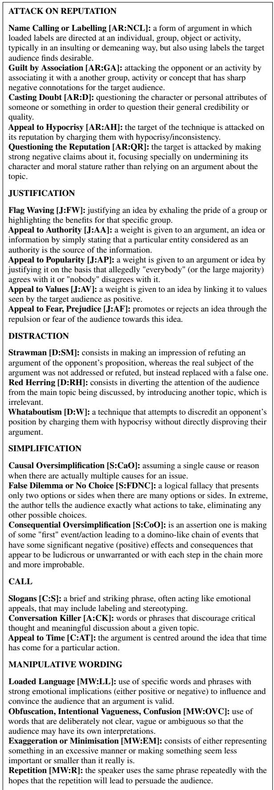
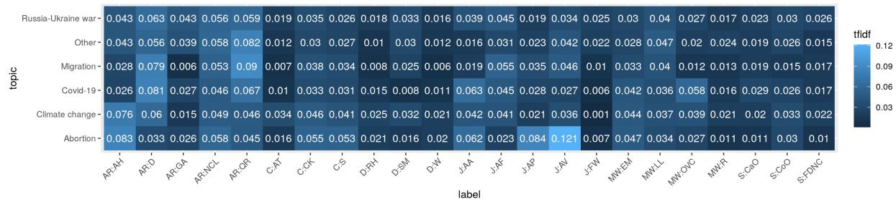
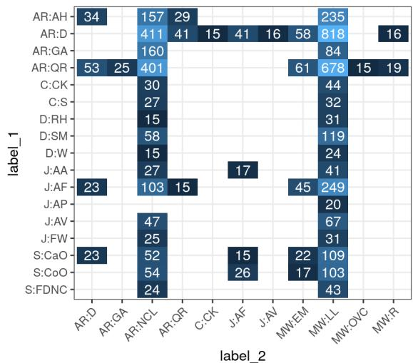
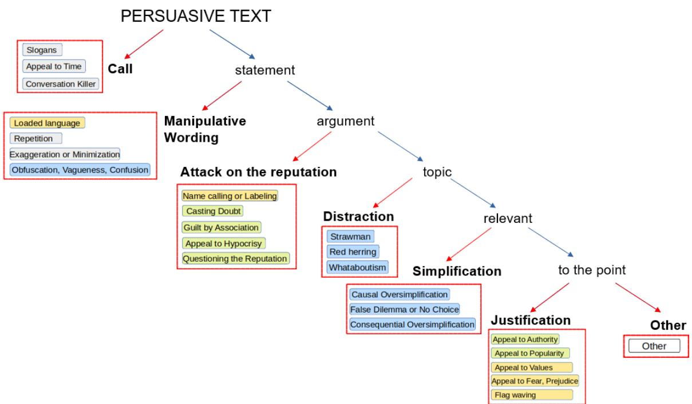
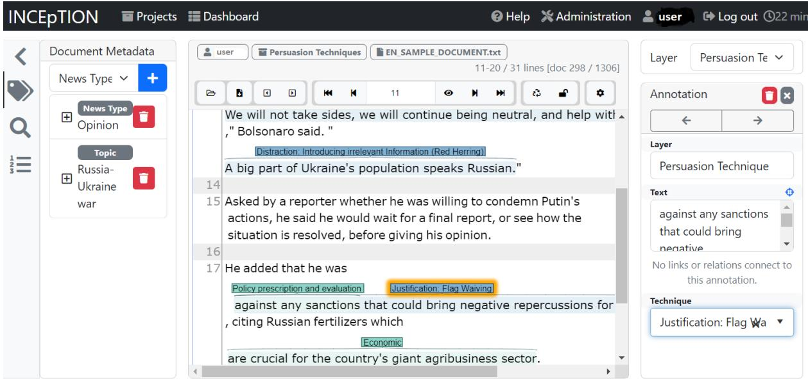
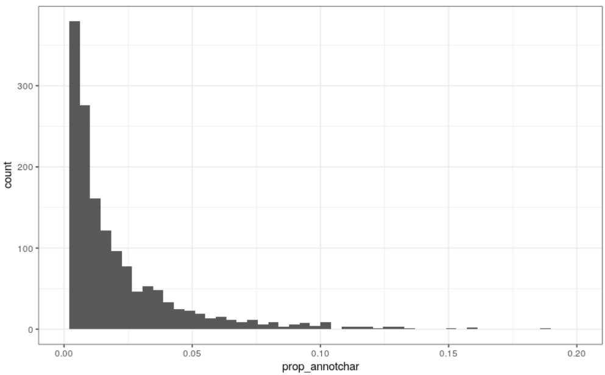
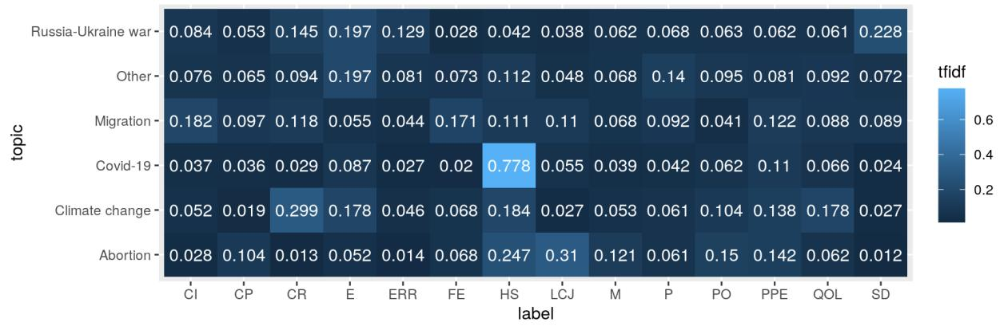

# Multilingual Multifaceted Understanding of Online News in Terms of Genre, Framing and Persuasion Techniques

Jakub Piskorski1, Nicolas Stefanovitch2∗, Nikolaos Nikolaidis3,

Giovanni Da San Martino4, Preslav Nakov5

1Institute of Computer Science, Polish Academy of Science, Poland jpiskorski@gmail.com

2European Commission Joint Research Centre, Italy nicolas.stefanovitch@ec.europa.eu

3Dept. of Informatics, Athens University of Economics and Business, Greece nnikon@aueb.gr

4Department of Mathematics, University of Padova, Italy dasan@math.unipd.it

5Mohamed bin Zayed University of Artificial Intelligence, UAE preslav.nakov@mbzuai.ac.ae

## Abstract

We present a new multilingual multifacet dataset of news articles, each annotated for genre (objective news reporting vs. opinion vs. satire), framing (what key aspects are highlighted), and persuasion techniques (logical fallacies, emotional appeals, ad hominem attacks, etc.). The persuasion techniques are annotated at the span level, using a taxonomy of 23 fine-grained techniques grouped into 6 coarse categories. The dataset contains 1,612 news articles covering recent news on current topics of public interest in six European languages (English, French, German, Italian, Polish, and Russian), with more than 37k annotated spans of persuasion techniques. We describe the dataset and the annotation process, and we report the evaluation results of multilabel classification experiments using stateof-the-art multilingual transformers at different levels of granularity: token-level, sentencelevel, paragraph-level, and document-level.

## 1 Introduction

Internet has changed profoundly the information landscape by creating direct channels of communication between information producers and consumers. At the same time, it has also increased the risk for readers to be exposed to disinformation (aka “fake news”), propaganda, manipulation, etc., which has grown into an infodemic (Alam et al., 2021). The consequences of this are very concrete, as swaying the hearts and the minds of a population also sways their choices, notably during elections. Therefore, online media analysis is important in order to understand the news ecosystem and the presented narratives around certain topics across countries, and to identify manipulation attempts and deceptive content, in order to provide citizens with a more transparent and comprehensible understanding of the online news.

Given the scale of the media landscape, media analysis needs automatic tools, which in turn need training data. With this in mind, we introduce a new dataset that covers several complementary aspects of the news: genre (objective news reporting vs. opinion vs. satire), framing (what key aspects are highlighted), and persuasion techniques (logical fallacies, emotional appeals, personal attacks, etc.).

We collected news articles between 2020 and mid-2022, from sources ranging in the whole political spectrum and revolving around widely discussed topics such as COVID-19, climate change, abortion, migration, the Russo-Ukrainian war, and local elections. Our dataset is multilingual (English, French, German, Italian, Polish, and Russian), multilabel, and covers complementary dimensions for better news understanding. Our taxonomy of persuasion techniques is an improvement and also an extension compared to previous inventories, and it contains 23 labels organised in a 2-tier hierarchy. We annotated a total of 1,612 articles with 37K annotated snippets for persuasion techniques, which is a 3-fold increase in the number of articles and 4-fold in the number of spans compared to the largest previous efforts, which focused on English only (Da San Martino et al., 2019).

Our contributions can be summarized as follows:

• We release a new multilingual dataset, the largest of its kind, jointly annotated for genre, framing, and persuasion techniques; we also release our detailed annotation guidelines;

• We report on different dataset statistics, and notably explore persuasion techniques and framing in more detail, exhibiting their characteristics for different topics and languages;

• We report the results of several multiclass and multilabel classification experiments, exploring different settings in terms of taxonomy granularity and focus in the document, also assessing multi/cross-lingual transfer.

## 2 Related Work

Below, we discuss previous work related to each of the three types of annotation we consider.

## 2.1 News Genre Categorization

Rashkin et al. (2017) developed a corpus with news annotations using distant supervision into four classes: trusted, satire, hoax, and propaganda. Horne and Adali (2017) and Levi et al. (2019) studied the relationship between fake news, real news, and satire with focus on style. Golbeck et al. (2018) developed a dataset of fake news and satire stories and analyzed and compared their thematic content. Hardalov et al. (2016) developed a dataset to reliable vs. satirical news. Satire was also one of the categories in the NELA-GT-2018 dataset (Nørregaard et al., 2019), as well as its extended version NELA-GT-2019 (Gruppi et al., 2020).

Our inventory is a bit different: (i) we aim to distinguish objective news reporting vs. opinion piece vs. satire, and (ii) in a multilingual setup.

## 2.2 Framing Detection

Framing is a strategic device and a central concept in political communication for representing different salient aspects and perspectives for the purpose of conveying the latent meaning about an issue (Entman, 1993). It is important for news media as the same topics can be discussed from different perspectives. There has been work on automatically identifying media frames, including annotation schemes and datasets such as the Media Frames Corpus (Card et al., 2015), systems to detect media frames (Liu et al., 2019; Zhang et al., 2019; Cheeks et al., 2020), large-scale automatic analysis of New York Times (Kwak et al., 2020), of Russian news (Field et al., 2018), or of the Syrian refugees crisis in US media (Chen et al., 2023). See (Ali and Hassan, 2022) for a recent survey.

Here, we adopt the frame inventory of the Media Frames Corpus, and we create a new multilingual dataset with frame annotations in six languages.

## 2.3 Persuasion Techniques Detection

Work on persuasion detection overlaps to a large extent with work on propaganda detection, as there are many commonalities between the two.

Early work on propaganda detection focused on document-level analysis. Rashkin et al. (2017) predicted four classes (trusted, satire, hoax, and propaganda), labeled using distant supervision.

Barrón-Cedeno et al. (2019) developed a corpus with two labels (i.e., propaganda vs. nonpropaganda) and further investigated writing style and readability level. Their findings confirmed that using distant supervision, in conjunction with rich representations, might encourage the model to predict the source of the article, rather than to discriminate propaganda from non-propaganda.

An alternative line of research focused on detecting the use of specific propaganda techniques in text, e.g., Habernal et al. (2017, 2018) developed a corpus with 1.3k arguments annotated with five fallacies that relate to persuasion techniques. A more fine-grained analysis was done by Da San Martino et al. (2019), who developed a corpus of news articles annotated with 18 propaganda techniques, considering the tasks of technique span detection and classification. They further tackled a sentencelevel task, and proposed a multigranular gated neural network. Subsequently, the Prta system was released (Da San Martino et al., 2020b), and models were proposed addressing the limitations of transformers (Chernyavskiy et al., 2021), or looking into interpretable propaganda detection (Yu et al., 2021). Other work studied propaganda techniques in memes (Dimitrov et al., 2021a) and in codeswitched text (Salman et al., 2023), the relationship between propaganda and coordination (Hristakieva et al., 2022), propaganda and metaphor (Baleato Rodríguez et al., 2023), and propaganda and fake news (Huang et al., 2023), and COVID-19 propaganda in social media (Nakov et al., 2021a,b). See (Da San Martino et al., 2020a) for a survey on computational propaganda detection.

Several shared tasks on detecting propaganda/persuasion techniques in text were also organized. SemEval-2020 task 11 on Detection of Persuasion Techniques in News Articles (Da San Martino et al., 2020) focused on news articles, and asked to detect the text spans and the type of propaganda techniques (14 techniques). NLP4IF-2019 task on Fine-Grained Propaganda Detection asked to detect the spans of 18 propaganda techniques in news articles. The SemEval-2021 task 6 on Detection of Persuasion Techniques in Texts and Images focused on 22 propaganda techniques in memes (Dimitrov et al., 2021b), while a WANLP’2022 shared task asked to detect 20 propaganda techniques in Arabic tweets (Alam et al., 2022).

We (i) extend and redesign the above annotation schemes, and we do so (ii) in a multilingual setup.

## 3 Multifacet Annotation Scheme

This section offers an overview of the three different facets considered in our annotation scheme.

## 3.1 Genre

Given a news article, we want to characterize the intended nature of the reporting: whether it is an opinion piece, it aims at objective news reporting, or it is satirical. This is a multiclass annotation scheme at the article level.

A satirical piece is a factually incorrect article, with the intent not to deceive, but rather to call out, ridicule, or expose behaviours considered ‘bad’. It deliberately exposes real-world individuals, organisations and events to ridicule.

Given that the borders between opinion and objective news reporting might sometimes not be fully clear, we provide in Appendix A.1 an excerpt from the annotation guidelines with some rules that were used to resolve opinion vs. reporting cases.

## 3.2 Framing

Given a news article, we are interested in identifying the frames used in the article. For this purpose, we adopted the concept of framing introduced in (Card et al., 2015) and the taxonomy of 14 generic framing dimensions, their acronym is specified in parenthesis: Economic (E), Capacity and resources (CR), Morality (M), Fairness and equality (FE), Legality, constitutionality and jurisprudence (LCJ), Policy prescription and evaluation (PPE), Crime and punishment (CP), Security and defense (SD), Health and safety (HS), Quality of life (QOL), Cultural identity (CI), Public opinion (PO), Political (P), and External regulation and reputation (EER).

This is a multiclass multilabel annotation at the article level.

## 3.3 Persuasion Techniques

Given a news article, we identify the uses of persuasion techniques in it. These techniques are characterized by a specific use of language in order to influence the readers. We use a 2-level persuasion techniques taxonomy, which is an extended version of the flat taxonomy introduced in Da San Martino et al. (2019). At the top level, there are 6 coarsegrained types of persuasion techniques: Attack on Reputation, Justification, Simplification, Distraction, Call, and Manipulative Wording. We describe them in more detail below.

Attack on reputation: The argument does not address the topic, but rather targets the participant (personality, experience, deeds) in order to question and/or to undermine their credibility. The object of the argumentation can also refer to a group of individuals, an organization, an object, or an activity.

Justification: The argument is made of two parts, a statement and an explanation or an appeal, where the latter is used to justify and/or to support the statement.

Simplification: The argument excessively simplifies a problem, usually regarding the cause, the consequence, or the existence of choices.

Distraction: The argument takes focus away from the main topic or argument to distract the reader. Call: The text is not an argument, but an encouragement to act or to think in a particular way.

Manipulative wording: the text is not an argument per se, but uses specific language, which contains words or phrases that are either non-neutral, confusing, exaggerating, loaded, etc., in order to impact the reader emotionally.

These six types are further subdivided into 23 fine-grained techniques, i.e., five more than in (Da San Martino et al., 2019). Figure 1 gives an overview of our 2-tier persuasion techniques taxonomy. A more comprehensive definitions of these techniques, accompanied with some examples, is given in Appendix B and in (Piskorski et al., 2023a). Note that our list of 23 techniques differs from (Da San Martino et al., 2019) not only because new techniques were added. For example, their Whataboutism included two separate aspects: accusing of hypocrisy the opponent and distracting from the current topic. Here, we refer to the former aspect as the technique Appeal to Hypocrisy, i.e., in our work Whataboutism covers only the distracting-from-the-current topic aspect.

The persuasion technique annotation is a multiclass multilabel annotation at the span level.

## 4 Dataset Description

We feature six languages: English, French, German, Italian, Polish, and Russian. The English articles are the ones from (Da San Martino et al., 2019), but we slightly modified their annotations for persuasion techniques to match the guidelines of this work (see Section 3.3). As genre and framing annotations for English were not present in (Da San Martino et al., 2019), we added them following the guidelines for the other languages.

  
Figure 1: Persuasion techniques in our 2-tier taxonomy. The six coarse-grained techniques are subdivided into 23 fine-grained ones. An acronym for each technique is given in squared brackets.

## 4.1 Article Selection

We collected articles in French, German, Italian, Polish, and Russian, published in the period between 2020 and mid-2022, and revolving around various globally discussed topics, including the COVID-19 pandemic, abortion-related legislation, migration, Russo-Ukrainian war, some local events such as parliamentary elections, etc. We considered both mainstream media and “alternative” media sources that could potentially spread mis-/disinformation. For the former, we used various news aggregation engines, e.g., Google News1, Europe Media Monitor2, etc., which cover sources with different political orientation, whereas for the latter, we used online services such as MediaBiasFactCheck3 and NewsGuard.4 We extracted the content of the articles either with Trafilatura (Barbaresi, 2021) or, in few cases, manually.

## 4.2 Annotation Process

We annotated each text for genre, framing, and persuasion techniques using the taxonomy described in Section 3. The main drive behind these multilayer annotation is to cover various complementary aspects of what makes a text persuasive, i.e., the genre, the framing (what key aspects are highlighted), and the rhetoric (which persuasion techniques are used). While genre and framing were annotated at the document level, we annotated the persuasion techniques at the span level.

The pool of annotators consisted of circa 40 persons, all native or near-native speakers of the language they annotated for. The majority of the annotators could be divided into two main groups with respect to their background: (a) media analysts, fact-checkers, and disinformation experts, and (b) researchers and experts in linguistics and computational linguistics. Note that 80% of our annotators had prior experience in performing linguistic annotations of news-like texts.

We divided the annotation process into three phases: (i) training phase, during which single annotators were tasked to read the annotation guidelines (Piskorski et al., 2023a), participate in online multichoice question-like training, and carry out pilot annotations; (ii) text annotation phase, in which each document was annotated by at least two annotators independently; and (iii) curation phase, in which the independent annotations were jointly discussed by the annotators and a curator (a more experienced annotator, whose role was to facilitate making a decision about the final annotations). We used INCEpTION (Klie et al., 2018) as our annotation platform (see Appendix C). An excerpt from the annotation guidelines is provided in Appendix A.

## 4.2.1 Text Annotation

Each document was annotated by at least two annotators.

While the framing dimensions in the dataset were labeled at the document level, the annotators were tasked to label, for each type of framing present in a document, at least one corresponding text span for the sake of keeping track of what triggered the choice of that framing.

On a weekly basis: (i) reports were sent to annotator pairs highlighting the complementary and the potentially conflicting annotations, which helped the annotators converge to a common understanding of the task, and (ii) regular meetings were held with all annotators to align and to discuss specific annotation cases.

## 4.2.2 Annotation Curation

Once the individual annotations for a document have been accomplished, a curator, with the help of annotators, (i) merged the complementary annotations (tagged only by one annotator), (ii) resolved the identified potential label conflicts, and (iii) carried out global consistency analysis. In order to resolve global inconsistencies, various spreadsheets were automatically generated, e.g., a spreadsheet with all text snippets (together with the local context) labelled with persuasion techniques sorted alphabetically, which was used by the curators to explore: (i) whether similar text snippets (duplicates or near duplicates) were tagged with the same or a similar label (which should be intuitively the case in most situations), and (ii) whether there were any recurring inconsistencies when labelling similar text snippets, e.g., decide and propagate multilabel annotations for certain text snippets for which only a single annotation were done (complementarity). The global consistency analysis step sketched above proved to be essential to ensure the high quality of the annotations.

## 4.3 Annotation Quality

We measured the Inter-Annotator Agreement (IAA) using Krippendorf’s α, achieving a value of .342. This is lower than the recommended threshold of .667, but we should note that this value represents the agreement level before curation, and as such, it is more representative of the curation difficulty rather than of the quality of the final cosolidated annotations. We used the IAA during the campaign to allocate curation roles and to remove lowperforming annotators.

We further studied the IAA by ranking the annotators by their performance with respect to the ground truth on the subset of documents they annotated. We then split the annotators into two groups: top and low based on the median micro-F . Their respective values of α were .415 and .250. Finally, we considered the α of the group of curators, based on Italian, which was the only language with two curators, achieving a score of .588, which is lower but close to the recommended value.

## 4.4 Statistics

## 4.4.1 Distribution

Table 1 gives some high-level statistics about our dataset, organized per language, including average number of persuasion techniques, their length and the number of frames per document. Tables 2 and 3 show the distribution of articles per language, genre, and topic. Table 4 presents the number of framing dimensions per language.

Figure 2 shows the normalised probability distribution of the fine-grained technique knowing the topic, re-weighted with the inverse document frequency of the technique: Pr(tech topic) idf(tech), yielding a tfidf-like vectorization of the topics. This figure highlights the key characteristics of the techniques used more frequently in a topic compared to other topics. We can see that, e.g., the most used techniques for COVID-19, Climate Change, and Abortion are Casting Doubt, Appeal to Hypocrisy, and Appeal to Values, respectively. Comparing the proportional use of techniques across the topics, we can see that, e.g., Appeal to Time and Appeal to Fear are most characteristic of Climate Change and Migration, respectively. Appendix C gives additional information regarding the frequency of the techniques and framings with across languages and topics.

<table><tr><td>language</td><td>#DOC</td><td>#WORD</td><td>#CHAR</td><td>#SPANS</td><td> $A V G _ { c }$ </td><td> $A V G _ { p }$ </td><td> $A V G _ { f r }$ </td><td> $A V G _ { p t }$ </td><td> $A V G _ { a c }$ </td></tr><tr><td>EN</td><td>536</td><td>469K</td><td>2,834K</td><td>9K</td><td>5.3K</td><td>26</td><td>4</td><td>17</td><td>.014</td></tr><tr><td>FR</td><td>211</td><td>153K</td><td>959K</td><td>7.4K</td><td>4.5K</td><td>25</td><td>4</td><td>36</td><td>.018</td></tr><tr><td>IT</td><td>303</td><td>186K</td><td>1,214K</td><td>7.9K</td><td>4.0K</td><td>21</td><td>6</td><td>26</td><td>.018</td></tr><tr><td>PL</td><td>194</td><td>144K</td><td>1,028K</td><td>3.8K</td><td>5.3K</td><td>31</td><td>7</td><td>20</td><td>.027</td></tr><tr><td>DE</td><td>177</td><td>104K</td><td>751K</td><td>5.1K</td><td>4.2K</td><td>21</td><td>4</td><td>29</td><td>.021</td></tr><tr><td>RU</td><td>191</td><td>104K</td><td>753K</td><td>4.1K</td><td>3.9K</td><td>23</td><td>4</td><td>22</td><td>.035</td></tr><tr><td>all</td><td>1,612</td><td>1,160K</td><td>8,339K</td><td>37.6K</td><td>4.6K</td><td>24</td><td>4</td><td>25</td><td>.022</td></tr></table>

Table 1: Statistics about the data for each language: total number of documents (#DOC), total number of words (#WORD), total number of characters (#CHAR), total number of text spans annotated with persuasion techniques (#SPANS), average document length counted in characters $( A V G _ { c } )$ , average document length counted in paragraphs $( A V G _ { p } )$ , average number of frames per document $( A V G _ { f r } )$ , average number of persuasion techniques per document $( A V G _ { p t } )$ , and average number of annotated characters $( A V G _ { a c } )$

  
Figure 2: How characteristic of a given topic is the use of the given techniques. The number of techniques is normalized per topic and multiplied by the inverse document frequency of the technique: P r(tech topic) idf(tech).

<table><tr><td colspan="3">Genre</td></tr><tr><td>language</td><td>opinion</td><td>report satire</td></tr><tr><td>EN</td><td>402</td><td>95 19</td></tr><tr><td>FR 138</td><td>58</td><td>15</td></tr><tr><td>IT</td><td>233 59</td><td>11</td></tr><tr><td>PL</td><td>139 34</td><td>21</td></tr><tr><td>DE</td><td>115 36</td><td>26</td></tr><tr><td>RU</td><td>125 55</td><td>11</td></tr><tr><td>all</td><td>1152 337</td><td>103</td></tr></table>

Table 2: Data statistics per genre.

<table><tr><td></td><td colspan="6">Topic</td></tr><tr><td>language</td><td>A</td><td>CC</td><td>C19</td><td>M</td><td>0</td><td>RU</td></tr><tr><td>EN</td><td>-</td><td>-</td><td>-</td><td>-</td><td>-</td><td>-</td></tr><tr><td>FR</td><td>6</td><td>22</td><td>23</td><td>13</td><td>67</td><td>80</td></tr><tr><td>IT</td><td>0</td><td>27</td><td>36</td><td>43</td><td>95</td><td>102</td></tr><tr><td>PL</td><td>19</td><td>17</td><td>26</td><td>4</td><td>62</td><td>66</td></tr><tr><td>DE</td><td>1</td><td>24</td><td>29</td><td>13</td><td>28</td><td>82</td></tr><tr><td>RU</td><td>11</td><td>6</td><td>12</td><td>4</td><td>73</td><td>84</td></tr><tr><td>all</td><td>37</td><td>96</td><td>126</td><td>77</td><td>325</td><td>414</td></tr></table>

Table 3: Number of documents from each topic: abortion (A), climate change (CC), COVID-19 (C19), Migration (M), Other (O), and the Russia–Ukraine war (RU). For English, we relied on a preexisting dataset, for which we did not have annotations for topic.

## 4.4.2 Persuasion Techniques Co-occurrence

We studied how persuasion techniques co-occur when an instance of a technique is a proper subpart (fully covered as a span) of another one, as this gives an insight on how techniques tend to be combined and structured as well as an indication of which techniques are hard to discriminate between. We consider that an annotated span is a subpart of another one if its span is strictly within the other and if the length is maximum 2/3 of the other. Figure 3 shows the number of such co-occurrences and, in order to get a clearer picture, we remove techniques co-occurring only with Loaded Language or Manipulative Wording, as our analysis showed that they are the most prevalent and tend to co-occur with almost all other techniques.

We can see that only Attack on Reputation, Justification and Simplification tend to be combined with another technique. Notably, we can remark that Consequential Oversimplification often uses Appeal to Fear, while Causal Oversimplification uses Casting Doubt. Questioning the Reputation and Casting Doubt have a high co-occurrence, suggesting that they are hard to distinguish. Appeal to Fear and Casting Doubt are the most frequently appearing techniques as part of another technique. These statistics suggest an underlying hierarchy of techniques, which we plan to study in future work.

<table><tr><td>language</td><td>CI</td><td>CP</td><td>CR</td><td>E</td><td>ERR</td><td>FE</td><td>HS</td><td>LCJ</td><td>M</td><td>P</td><td>PO</td><td>PPE</td><td>QOL</td><td>SD</td></tr><tr><td>EN</td><td>33</td><td>262</td><td>37</td><td>44</td><td>198</td><td>123</td><td>64</td><td>265</td><td>219</td><td>317</td><td>52</td><td>126</td><td>98</td><td>197</td></tr><tr><td>FR</td><td>25</td><td>19</td><td>59</td><td>90</td><td>83</td><td>26</td><td>66</td><td>39</td><td>57</td><td>127</td><td>26</td><td>28</td><td>32</td><td>118</td></tr><tr><td>IT</td><td>47</td><td>72</td><td>157</td><td>219</td><td>136</td><td>55</td><td>156</td><td>77</td><td>68</td><td>226</td><td>43</td><td>138</td><td>101</td><td>209</td></tr><tr><td>PL</td><td>45</td><td>49</td><td>79</td><td>199</td><td>98</td><td>34</td><td>182</td><td>48</td><td>71</td><td>160</td><td>92</td><td>115</td><td>85</td><td>122</td></tr><tr><td>DE</td><td>55</td><td>10</td><td>78</td><td>46</td><td>22</td><td>27</td><td>109</td><td>19</td><td>29</td><td>61</td><td>22</td><td>39</td><td>18</td><td>124</td></tr><tr><td>RU</td><td>15</td><td>83</td><td>44</td><td>151</td><td>58</td><td>24</td><td>92</td><td>66</td><td>32</td><td>58</td><td>23</td><td>18</td><td>31</td><td>124</td></tr></table>

Table 4: Statistics about the distribution of framings.

  
Figure 3: Statistics about how frequently one persuasion technique (on the x-axis) is properly included as part of another technique (on the y-axis), with a minimum count of 15. The most prevalent combination of properly included techniques, namely, Loaded Language within Name Calling is not included for better visibility.

## 5 Experiments

The aim of our experiments is to provide baselines and to explore the impact of multilingual data on three classification tasks: for genre, for framing, and for persuasions techniques (PT). Genre and framing were annotated at the document level and the classification is multiclass and multilabel, respectively. We treated PT classification in two ways: (a) as a multiclass classification problem as in (Da San Martino et al., 2019), where, given a span as an input, we predict the persuasion technique in that span, in order to compare to the previous state of the art; (b) as a multilabel token classification problem, where, contrary to the previous state of the art, we predict simultaneously the location and the label of the PT, which allowsfor overlapping classes. We report micro-average precision, recall and $F _ { 1 }$ as well as macro-average $F _ { 1 }$ For all tasks, we experimentally assess the quality of monolingual models vs. a multilingual model trained on all languages.

Additionally, for persuasion technique classification, we explored (a) the granularity of the taxonomy used in the input data: fine-grained (23 labels) or binary (presence or absence of a technique); (b) the granularity of the data after aggregating the results of the classifier: fine-grained (23 labels), coarse-grained (6 labels), binary; and (c) the focus of the classification, i.e., at which level the labels are aggregated: paragraph level (split at new lines), sentence level (ad-hoc language-aware sentence splitter), and token level (using the RoBERTa tokenizer).

## 5.1 Models

We used a multilingual pre-trained transformer, xlm-roberta-large (Conneau et al., 2020), and we customized the last layers depending on the task (sigmoid for multilabel, softmax for multiclass) and at the relevant level (sequence or token).

As persuasion technique classification requires predicting multilabel spans over long documents, we needed to overcome the pre-trained RoBERTa’s inherent inability to process texts longer than 512 tokens). Thus, we implemented chunking and pooling, in pre- and post-processing, respectively. We performed the chunking in a redundant way using a sliding window of 256 tokens. After inference, we aligned the 512 length token vectors, and maxpooled the overlapping tokens to a resulting length equal to the original input vector. We also implemented multilabel support at the token level, by adding a sigmoid layer on top of the output and by changing the loss to Binary Cross Entropy. See Appendix E for more details.

## 5.2 Results

The results of the evaluation on genre and framing classification are shown in Table 5. For framing, the performance of the multilingual classifier has a significantly higher macro $F _ { 1 }$ score than for any individual language, but the micro-F1 score is not always higher, notably for English.

Monolingual models  
Genre classification
<table><tr><td colspan="5">Genre classifcation</td></tr><tr><td>Lang.</td><td>P</td><td>R</td><td>micro  $F _ { 1 }$ </td><td>macro  $F _ { 1 }$ </td></tr><tr><td>all</td><td>.548</td><td>.833</td><td>.661</td><td>.592</td></tr><tr><td>EN</td><td>.813</td><td>.790</td><td>.800</td><td>.504</td></tr><tr><td>FR</td><td>.966</td><td>.875</td><td>.918</td><td>.602</td></tr><tr><td>IT</td><td>.808</td><td>.783</td><td>.795</td><td>.472</td></tr><tr><td>PL</td><td>.936</td><td>.900</td><td>.918</td><td>.811</td></tr><tr><td>DE</td><td>.693</td><td>.741</td><td>.716</td><td>.681</td></tr><tr><td>RU</td><td>.795</td><td>.759</td><td>.777</td><td>.814</td></tr><tr><td colspan="5">Framing classification</td></tr><tr><td>Lang.</td><td> $P$ </td><td>R</td><td>micro  $F _ { 1 }$ </td><td>macro  $F _ { 1 }$ </td></tr><tr><td>all</td><td>.697</td><td></td><td></td><td></td></tr><tr><td>EN</td><td>.706</td><td>.608 .651</td><td>.649 .677</td><td>.583 .504</td></tr><tr><td>FR</td><td>.653</td><td>.473</td><td>.549</td><td>.392</td></tr><tr><td>IT</td><td>.622</td><td>.580</td><td>.600</td><td>.530</td></tr><tr><td>PL</td><td>.665</td><td>.561</td><td>.609</td><td>.547</td></tr><tr><td>DE</td><td>.590</td><td>.387</td><td>.468</td><td>.298</td></tr><tr><td></td><td></td><td></td><td></td><td></td></tr><tr><td>RU</td><td>.630</td><td>.333</td><td>.436</td><td>.261</td></tr></table>

Table 5: Genre (top) and framing (bottom) evaluation results for different languages, using XLM-RoBERTa.

For genre, this is not the case, as monolingual models have better performance. In both cases, the texts were truncated to the first 512 tokens. This is critical for the framing task, as it can appear anywhere in the text, while for the genre task the writing style is, in general, uniform throughout text.

For the persuasion techniques task, Table 6 compares training on a single language to training on all languages and then testing on a specific target language. The micro- $F _ { 1 }$ score of the multilingual model is comparable to the monolingual one, being on average .01 point lower, but macro- $F _ { 1 }$ is consistently superior and is on average .034 points higher. Next, Table 7 compares to the state of the art, reusing the English train and dev folds from (Da San Martino et al., 2020). When using only EN data, the micro $F _ { 1 }$ score is .565, which is about .05 points lower than the best reported performance. We provide this as a point of reference, taking into account that our system, is a vanilla multiclass model without engineered features or thorough hyper-parameter tuning. When trained using both the English train fold and our new multilingual data, the results improve by .018 micro- $F _ { 1 }$ and by macro- $F _ { 1 }$ .058 points. The transfer capabilities of the model are very good as in the case of training without English data (third row), the performance is only .076 points lower on average compared to using English data only. These results show an overall positive impact of multilingual transfer learning.

<table><tr><td colspan="5">Monolingual models</td></tr><tr><td>Lang.</td><td> $P$ </td><td>R</td><td>micro  $F _ { 1 }$ </td><td>macro  $F _ { 1 }$ </td></tr><tr><td>EN</td><td>.499</td><td>.313</td><td>.385</td><td>.173</td></tr><tr><td>FR</td><td>.401</td><td>.274</td><td>.325</td><td>.230</td></tr><tr><td>IT</td><td>.485</td><td>.359</td><td>.412</td><td>.214</td></tr><tr><td>PL</td><td>.352</td><td>.212</td><td>.265</td><td>.168</td></tr><tr><td>DE</td><td>.397</td><td>.342</td><td>.368</td><td>.213</td></tr><tr><td>RU</td><td>.340</td><td>.305</td><td>.322</td><td>.157</td></tr><tr><td></td><td></td><td></td><td>multilingual models</td><td></td></tr><tr><td>Lang.</td><td> $P$ </td><td>R</td><td>micro  $F _ { 1 }$ </td><td>macro  $F _ { 1 }$ </td></tr><tr><td>all</td><td>.423</td><td>.300</td><td>.351</td><td>.258</td></tr><tr><td>EN</td><td>.497</td><td>.329</td><td>.396</td><td>.187</td></tr><tr><td>FR</td><td>.416</td><td>.296</td><td>.346</td><td>.276</td></tr><tr><td>IT</td><td>.467</td><td>.323</td><td>.382</td><td>.229</td></tr><tr><td>PL</td><td>.358</td><td>.217</td><td>.270</td><td>.221</td></tr><tr><td>DE</td><td>.406</td><td>.304</td><td>.348</td><td>.246</td></tr><tr><td>RU</td><td>.336</td><td>.322</td><td>.329</td><td>.201</td></tr></table>

Table 6: Persuasion techniques evaluation results for each language when trained on (a) monolingual data, and (b) multilingual data (all languages), using our multilabel XLM-ROBERTA classifier, and predicting at the sentence level.

Table 8 shows the results for several experiments on the persuasion techniques task using a tokenlevel multilabel model under various settings. We observe that we can improve the performance by widening the focus from the token to the sentence and then to the paragraph level. In a similar way, the performance is improved by going from finegrained to coarse-grained or even to binary classification. In the coarse-grained setting, both micro- $F _ { 1 }$ improves by .126 and macro- $F _ { 1 }$ improves by .101 points compared to the fine-grained setting. This suggests that pinpointing the exact span of a persuasion technique correctly is comparatively more difficult than classifying it.

We can further see in Table 8 that the performance of the binary classifier at the paragraph level and with fine-grained granularity achieves a micro-$F _ { 1 }$ score of .827, which is the highest score we report in this table. It makes the model suitable for real-world use, e.g., to flag paragraphs for review by a human analyst or for further classification by a more fine-grained model (we leave this for future work). Moreover, we observe that the model trained on fine-tuned labels outperforms the model trained on binary labels when evaluated on binary data. Even in the case of detecting only the presence of a persuasion technique, the extra information included when assigning a class does indeed help improve the performance of the system.

<table><tr><td>Train</td><td>Test</td><td>P</td><td>R</td><td>micro  $F _ { 1 }$ </td><td>macro  $F _ { 1 }$ </td></tr><tr><td>EN</td><td>EN</td><td>.323</td><td>.284</td><td>.565</td><td>.302</td></tr><tr><td>Multi+EN</td><td>EN</td><td>.363</td><td>.358</td><td>.583</td><td>.360</td></tr><tr><td>Multi</td><td>EN</td><td>.245</td><td>.300</td><td>.489</td><td>.269</td></tr></table>

Table 7: Persuasion techniques: comparison to the state of the art of an XLM RoBERTa multiclass classifier evaluated on the EN test data and trained on an EN corpus, our multilingual corpus, and our multilingual corpus without EN data. We report macro precision and recall.

<table><tr><td>Mode</td><td>Gran. Train</td><td>Gran. Focus Eval</td><td></td><td>P</td><td>R</td><td>micro macro  $F _ { 1 }$ </td><td> $F _ { 1 }$ </td></tr><tr><td>B</td><td>B</td><td>B</td><td>P</td><td>.895</td><td>.691</td><td>.780</td><td></td></tr><tr><td>B</td><td>B</td><td>B</td><td>S</td><td>.753</td><td>.531</td><td>.623</td><td></td></tr><tr><td>B</td><td>B</td><td>B</td><td>T</td><td>.614</td><td>.266</td><td>.371</td><td></td></tr><tr><td>M</td><td>F</td><td>B</td><td>P</td><td>.890</td><td>.773</td><td>.827</td><td></td></tr><tr><td>M</td><td>F</td><td>B</td><td>S</td><td>.757</td><td>.599</td><td>.669</td><td></td></tr><tr><td>M</td><td>F</td><td>B</td><td>T</td><td>.664</td><td>.499</td><td>.570</td><td></td></tr><tr><td>M</td><td>F</td><td>C</td><td>P</td><td>.664</td><td>.536</td><td>.593</td><td>.489</td></tr><tr><td>M</td><td>F</td><td>C</td><td>S</td><td>.532</td><td>.387</td><td>.448</td><td>.345</td></tr><tr><td>M</td><td>F</td><td>C</td><td>T</td><td>.405</td><td>.265</td><td>.320</td><td>.261</td></tr><tr><td>M</td><td>F</td><td>F</td><td>P</td><td>.537</td><td>.297</td><td>.382</td><td>.332</td></tr><tr><td>M</td><td>F</td><td>F</td><td>S</td><td>.423</td><td>.300</td><td>.351</td><td>.258</td></tr><tr><td>M</td><td>F</td><td>F</td><td>T</td><td>.316</td><td>.206</td><td>.249</td><td>.202</td></tr></table>

Table 8: Persuasion techniques evaluation in different settings using our XLM-RoBERTa multilabel tokenlevel classifiers on our full multilingual dataset. Shown are results for fine-grained (F) vs. binary (B) classification, as well as for different granularities of the taxonomy after aggregating the output as binary (B) detection of persuasion vs. fine-grained (F) vs. coarse-grained (C), and evaluating at the token (T) vs. sentence (S) vs. paragraph (P) level.

## 6 Conclusion and Future Work

We presented a new multilingual multifacet dataset for understanding the news in terms of genre, framing, and persuasion techniques. The dataset covers current topics of public interest in six European languages, and contains 1,612 documents with more than 37k annotated spans. We further performed a number of multilabel classification experiments using state-of-the-art multilingual transformer-based models, exploring different levels of granularity and focus. Our experiments showed the utility of multilingual representations even when evaluated on a specific language. We hope that our dataset will foster the development of methods and tools to support the analysis of online media content.

In future work, we plan to do in-depth analysis of the data, extend it to more languages, including non Indo-European ones with non-Latin scripts, and other genres of text, e.g., social media posts.

Note An extended version of the dataset presented in this paper was used in the context of SemEval-2023 Task 3 on Detecting the genre, the framing, and the persuasion techniques in online news in a multilingual set-up (Piskorski et al., 2023b),5 where it was augmented with a new test set, including three new languages: Georgian, Greek, and Spanish.

We make both the present and SemEval-2023 task 3 versions of the dataset publicly accessible to the community for research purposes. For further information on the dataset and future releases please refer to https://joedsm. github.io/pt-corpora/.

## 7 Limitations

Dataset Representativeness Our dataset covers a range of topics of public interest (COVID-19, climate change, abortion, migration, the Russo-Ukrainian war, and local elections) as well as media from all sides of the political spectrum. However, it should not be seen as representative of the media in any country, nor should it be seen as perfectly balanced in any specific way.

Biases Human data annotation involves some degree of subjectivity. To mitigate this, we created a comprehensive 60-page guidelines document (Piskorski et al., 2023a), which we updated from time to time to clarify newly arising important cases during the annotation process. We further had quality control steps in the data annotation process, and we have been excluding low-performing annotators. Despite all this, we are aware that some degree of intrinsic subjectivity will inevitably be present in the dataset and will eventually be learned by models trained on it.

Baseline Models The reported experiments can be seen as strong baselines as they include fairly small encoder-only transformer architectures. We leave for future work the exploration of other architectures and modeling techniques that are known to improve the efficiency and to reduce the computational requirements of the used models, e.g., fewshot and zero-shot in-context learning, instructionbased evaluation, multitask learning, etc.

Model biases We did not explore whether and to what extent our dataset contains unwanted biases.

## 8 Ethics and Broader Impact

Biases We sampled the news for our dataset in order to have a non-partisan view of the topics, striving to the extent possible to have a balanced representation of the points of view on the topics, but this was best effort and was not strictly enforced. This should be taken into account when using this data for doing media analysis. The data was annotated without taking into account the annotator’s feeling about the particular topic; rather, this was done objectively with focus on whether specific frames of persuasion techniques were used. We did not use crowdsourcing, and our annotators were fairly paid as part of their job duties.

Intended Use and Misuse Potential Our models can be of interest to the general public and could also save time to fact-checkers. However, they could also be misused by malicious actors. We, therefore, ask researchers to exercise caution.

Environmental Impact We would like to warn that the use of large language models requires a lot of computations and the use of GPUs/TPUs for training, which contributes to global warming (Strubell et al., 2019). This is a bit less of an issue in our case, as we do not train such models from scratch, we just fine-tune them.

## Acknowledgments

We are greatly indebted to all the annotators from different organizations, including, inter alia, the European Commission, the European Parliament, the University of Padova, the Qatar Computing Research Institute, HBKU, and Mohamed bin Zayed University of Artificial Intelligence, who took part in the annotations, and notably to the language curators whose patience and diligence have been fundamental for ensuring the quality of the dataset.

## References

Firoj Alam, Hamdy Mubarak, Wajdi Zaghouani, Giovanni Da San Martino, and Preslav Nakov. 2022. Overview of the WANLP 2022 shared task on propaganda detection in Arabic. In Proceedings of the The Seventh Arabic Natural Language Processing Workshop (WANLP), pages 108–118, Abu Dhabi, United Arab Emirates (Hybrid). Association for Computational Linguistics.

Firoj Alam, Shaden Shaar, Fahim Dalvi, Hassan Sajjad, Alex Nikolov, Hamdy Mubarak, Giovanni Da San Martino, Ahmed Abdelali, Nadir Durrani,

Kareem Darwish, Abdulaziz Al-Homaid, Wajdi Zaghouani, Tommaso Caselli, Gijs Danoe, Friso Stolk, Britt Bruntink, and Preslav Nakov. 2021. Fighting the COVID-19 infodemic: Modeling the perspective of journalists, fact-checkers, social media platforms, policy makers, and the society. In Findings ofEMNLP, pages 611–649, Punta Cana, Dominican Republic. Association for Computational Linguistics.

Mohammad Ali and Naeemul Hassan. 2022. A survey of computational framing analysis approaches. In Proceedings of the 2022 Conference on Empirical Methods in Natural Language Processing, pages 9335–9348, Abu Dhabi, United Arab Emirates. Association for Computational Linguistics.

Daniel Baleato Rodríguez, Verna Dankers, Preslav Nakov, and Ekaterina Shutova. 2023. Paper bullets: Modeling propaganda with the help of metaphor. In Findings ofthe Associationfor Computational Linguistics: EACL 2023, pages 472–489, Dubrovnik, Croatia. Association for Computational Linguistics.

Adrien Barbaresi. 2021. Trafilatura: A web scraping library and command-line tool for text discovery and extraction. In Proceedings of the Joint Conference of the 59th Annual Meeting of the Association for Computational Linguistics and the 11th International Joint Conference on Natural Language Processing: System Demonstrations, pages 122–131. Association for Computational Linguistics.

Alberto Barrón-Cedeno, Israa Jaradat, Giovanni Da San Martino, and Preslav Nakov. 2019. Proppy: Organizing the news based on their propagandistic content. Information Processing & Management, 56(5).

Dallas Card, Amber E. Boydstun, Justin H. Gross, Philip Resnik, and Noah A. Smith. 2015. The media frames corpus: Annotations of frames across issues. In Proceedings of the 53rd Annual Meeting of the Association for Computational Linguistics and the 7th International Joint Conference on Natural Language Processing (Volume 2: Short Papers), pages 438– 444, Beijing, China. Association for Computational Linguistics.

Loretta H Cheeks, Tracy L Stepien, Dara M Wald, and Ashraf Gaffar. 2020. Discovering news frames: An approach for exploring text, content, and concepts in online news sources. In Cognitive Analytics: Concepts, Methodologies, Tools, and Applications, pages 702–721. IGI Global.

Keyu Chen, Marzieh Babaeianjelodar, Yiwen Shi, Kamila Janmohamed, Rupak Sarkar, Ingmar Weber, Thomas Davidson, Munmun De Choudhury, Jonathan Huang, Shweta Yadav, Ashiqur KhudaBukhsh, Chris T Bauch, Preslav Nakov, Orestis Papakyriakopoulos, Koustuv Saha, Kaveh Khoshnood, and Navin Kumar. 2023. Partisan US news media representations of Syrian refugees. Proceedings of the International AAAI Conference on Web and Social Media, 17(1):103–113.

Anton Chernyavskiy, Dmitry Ilvovsky, and Preslav Nakov. 2021. Transformers: “The end of history” for NLP? In Proceedings of the European Conference on Machine Learning and Principles and Practice ofKnowledge Discovery in Databases, ECML-PKDD’21.

Alexis Conneau, Kartikay Khandelwal, Naman Goyal, Vishrav Chaudhary, Guillaume Wenzek, Francisco Guzmán, Edouard Grave, Myle Ott, Luke Zettlemoyer, and Veselin Stoyanov. 2020. Unsupervised cross-lingual representation learning at scale. In Proceedings of the 58th Annual Meeting of the Associationfor Computational Linguistics, pages 8440– 8451, Online. Association for Computational Linguistics.

Giovanni Da San Martino, Alberto Barrón-Cedeño, Henning Wachsmuth, Rostislav Petrov, and Preslav Nakov. 2020. SemEval-2020 task 11: Detection of propaganda techniques in news articles. In Proceedings ofthe 14th International Workshop on Semantic Evaluation, SemEval ’20, Barcelona, Spain.

Giovanni Da San Martino, Stefano Cresci, Alberto Barrón-Cedeño, Seunghak Yu, Roberto Di Pietro, and Preslav Nakov. 2020a. A survey on computational propaganda detection. In Proceedings of the International Joint Conference on Artificial Intelligence, IJCAI-PRICAI ’20, pages 4826–4832. Survey track.

Giovanni Da San Martino, Shaden Shaar, Yifan Zhang, Seunghak Yu, Alberto Barrón-Cedeno, and Preslav Nakov. 2020b. Prta: A system to support the analysis of propaganda techniques in the news. In Proceedings of the Annual Meeting ofAssociation for Computational Linguistics, ACL ’20, pages 287–293. Association for Computational Linguistics.

Giovanni Da San Martino, Seunghak Yu, Alberto Barrón-Cedeño, Rostislav Petrov, and Preslav Nakov. 2019. Fine-grained analysis of propaganda in news article. In Proceedings of the 2019 Conference on Empirical Methods in Natural Language Processing and the 9th International Joint Conference on Natural Language Processing (EMNLP-IJCNLP), pages 5636–5646, Hong Kong, China. Association for Computational Linguistics.

Dimitar Dimitrov, Bishr Bin Ali, Shaden Shaar, Firoj Alam, Fabrizio Silvestri, Hamed Firooz, Preslav Nakov, and Giovanni Da San Martino. 2021a. Detecting propaganda techniques in memes. In Proceedings of the Joint Conference of the 59th Annual Meeting of the Association for Computational Linguistics and the 11th International Joint Conference on Natural Language Processing, ACL-IJCNLP ’21, pages 6603–6617.

Dimiter Dimitrov, Bishr Bin Ali, Shaden Shaar, Firoj Alam, Fabrizio Silvestri, Hamed Firooz, Preslav Nakov, and Giovanni Da San Martino. 2021b. Task 6 at SemEval-2021: Detection of persuasion techniques in texts and images. In Proceedings of the

15th International Workshop on Semantic Evaluation, SemEval ’21, pages 70–98, Bangkok, Thailand.

Robert M Entman. 1993. Framing: Towards clarification of a fractured paradigm. McQuail’s reader in mass communication theory, pages 390–397.

Anjalie Field, Doron Kliger, Shuly Wintner, Jennifer Pan, Dan Jurafsky, and Yulia Tsvetkov. 2018. Framing and agenda-setting in Russian news: a computational analysis of intricate political strategies. In Proceedings ofthe 2018 Conference on Empirical Methods in Natural Language Processing, pages 3570– 3580, Brussels, Belgium. Association for Computational Linguistics.

Jennifer Golbeck, Matthew Mauriello, Brooke Auxier, Keval H. Bhanushali, Christopher Bonk, Mohamed Amine Bouzaghrane, Cody Buntain, Riya Chanduka, Paul Cheakalos, Jennine B. Everett, Waleed Falak, Carl Gieringer, Jack Graney, Kelly M. Hoffman, Lindsay Huth, Zhenya Ma, Mayanka Jha, Misbah Khan, Varsha Kori, Elo Lewis, George Mirano, William T. Mohn IV, Sean Mussenden, Tammie M. Nelson, Sean Mcwillie, Akshat Pant, Priya Shetye, Rusha Shrestha, Alexandra Steinheimer, Aditya Subramanian, and Gina Visnansky. 2018. Fake news vs satire: A dataset and analysis. In Proceedings of the 10th ACM Conference on Web Science, WebSci ’18, page 17–21, Amsterdam, Netherlands. Association for Computing Machinery.

Maurício Gruppi, Benjamin D. Horne, and Sibel Adali. 2020. NELA-GT-2019: A large multi-labelled news dataset for the study of misinformation in news articles. arXiv, 2003.08444.

Ivan Habernal, Raffael Hannemann, Christian Pollak, Christopher Klamm, Patrick Pauli, and Iryna Gurevych. 2017. Argotario: Computational argumentation meets serious games. In Proceedings of the 2017 Conference on Empirical Methods in Natural Language Processing: System Demonstrations, EMNLP ’17, pages 7–12, Copenhagen, Denmark. Association for Computational Linguistics.

Ivan Habernal, Patrick Pauli, and Iryna Gurevych. 2018. Adapting serious game for fallacious argumentation to German: Pitfalls, insights, and best practices. In Proceedings of the 11th International Conference on Language Resources and Evaluation, LREC ’18, pages 3329–3335, Miyazaki, Japan. European Language Resources Association (ELRA).

Momchil Hardalov, Ivan Koychev, and Preslav Nakov. 2016. In search of credible news. In Proceedings of the 17th International Conference on Artificial Intelligence: Methodology, Systems, and Applications, AIMSA ’16, pages 172–180, Varna, Bulgaria. Springer International Publishing.

Benjamin Horne and Sibel Adali. 2017. This just in: Fake news packs a lot in title, uses simpler, repetitive content in text body, more similar to satire than real news. arXiv, 1703.09398.

Kristina Hristakieva, Stefano Cresci, Giovanni Da San Martino, Mauro Conti, and Preslav Nakov. 2022. The spread of propaganda by coordinated communities on social media. In Proceedings of the 14th ACM Web Science Conference, WebSci ’22, pages 191–201, Barcelona, Spain. Association for Computing Machinery.

Kung-Hsiang Huang, Kathleen McKeown, Preslav Nakov, Yejin Choi, and Heng Ji. 2023. Faking fake news for real fake news detection: Propagandaloaded training data generation. In Proceedings of the 61st Annual Meeting ofthe Associationfor Computational Linguistics, ACL’23, Toronto, Canada. Association for Computational Linguistics.

Jan-Christoph Klie, Michael Bugert, Beto Boullosa, Richard Eckart de Castilho, and Iryna Gurevych. 2018. The INCEpTION platform: Machine-assisted and knowledge-oriented interactive annotation. In Proceedings ofthe 27th International Conference on Computational Linguistics: System Demonstrations, pages 5–9. Association for Computational Linguistics. Event Title: The 27th International Conference on Computational Linguistics (COLING 2018).

Haewoon Kwak, Jisun An, and Yong-Yeol Ahn. 2020. A systematic media frame analysis of 1.5 million New York Times articles from 2000 to 2017. In Proceedings of the 12th ACM Conference on Web Science, WebSci ’20, pages 305–314, Southampton, United Kingdom. Association for Computing Machinery.

Or Levi, Pedram Hosseini, Mona Diab, and David Broniatowski. 2019. Identifying nuances in fake news vs. satire: Using semantic and linguistic cues. In Proceedings of the Second Workshop on Natural Language Processing for Internet Freedom: Censorship, Disinformation, and Propaganda, pages 31–35, Hong Kong, China. Association for Computational Linguistics.

Siyi Liu, Lei Guo, Kate Mays, Margrit Betke, and Derry Tanti Wijaya. 2019. Detecting frames in news headlines and its application to analyzing news framing trends surrounding US gun violence. In Proceedings ofthe 23rd Conference on Computational Natural Language Learning, CoNLL ’19, pages 504–514, Hong Kong, China.

Preslav Nakov, Firoj Alam, Shaden Shaar, Giovanni Da San Martino, and Yifan Zhang. 2021a. COVID-19 in Bulgarian social media: Factuality, harmfulness, propaganda, and framing. In Proceedings of the International Conference on Recent Advances in Natural Language Processing, RANLP ’21.

Preslav Nakov, Firoj Alam, Shaden Shaar, Giovanni Da San Martino, and Yifan Zhang. 2021b. A second pandemic? Analysis of fake news about COVID-19 vaccines in Qatar. In Proceedings ofthe International Conference on Recent Advances in Natural Language Processing, RANLP ’21.

Jeppe Nørregaard, Benjamin D. Horne, and Sibel Adali. 2019. NELA-GT-2018: A large multi-labelled news

dataset for the study of misinformation in news articles. In Proceedings ofthe Thirteenth International Conference on Web and Social Media, ICWSM ’19, pages 630–638, Munich, Germany. AAAI Press.

Jakub Piskorski, Nicolas Stefanovitch, Valerie-Anne Bausier, Nicolo Faggiani, Jens Linge, Sopho Kharazi, Nikolaos Nikolaidis, Giulia Teodori, Bertrand De Longueville, Brian Doherty, Jason Gonin, Camelia Ignat, Bonka Kotseva, Eleonora Mantica, Lorena Marcaletti, Enrico Rossi, Alessio Spadaro, Marco Verile, Giovanni Da San Martino, Firoj Alam, and Preslav Nakov. 2023a. News categorization, framing and persuasion techniques: Annotation guidelines. Technical report, European Commission Joint Research Centre, Ispra (Italy).

Jakub Piskorski, Nicolas Stefanovitch, Giovanni Da San Martino, and Preslav Nakov. 2023b. SemEval-2023 task 3: Detecting the category, the framing, and the persuasion techniques in online news in a multi-lingual setup. In Proceedings of the 17th International Workshop on Semantic Evaluation, SemEval 2023, Toronto, Canada.

Hannah Rashkin, Eunsol Choi, Jin Yea Jang, Svitlana Volkova, and Yejin Choi. 2017. Truth of varying shades: Analyzing language in fake news and political fact-checking. In Proceedings ofthe Conference on Empirical Methods in Natural Language Processing, EMNLP ’17, pages 2931–2937, Copenhagen, Denmark. Association for Computational Linguistics.

Muhammad Umar Salman, Asif Hanif, Shady Shehata, and Preslav Nakov. 2023. Detecting propaganda techniques in code-switched social media text. arXiv:2305.14534.

Emma Strubell, Ananya Ganesh, and Andrew McCallum. 2019. Energy and policy considerations for deep learning in NLP. In Proceedings of the 57th Annual Meeting of the Association for Computational Linguistics, pages 3645–3650, Florence, Italy. Association for Computational Linguistics.

Seunghak Yu, Giovanni Da San Martino, Mitra Mohtarami, James Glass, and Preslav Nakov. 2021. Interpretable propaganda detection in news articles. In Proceedings of the International Conference on Recent Advances in Natural Language Processing, RANLP ’21, pages 1597–1605. INCOMA Ltd.

Yifan Zhang, Giovanni Da San Martino, Alberto Barrón-Cedeño, Salvatore Romeo, Jisun An, Haewoon Kwak, Todor Staykovski, Israa Jaradat, Georgi Karadzhov, Ramy Baly, Kareem Darwish, James Glass, and Preslav Nakov. 2019. Tanbih: Get to know what you are reading. In Proceedings of the Conference on Empirical Methods in Natural Language Processing and the 9th International Joint Conference on Natural Language Processing: System Demonstrations, EMNLP-IJCNLP ’19, pages 223–228, Hong Kong, China. Association for Computational Linguistics.

## A Annotation Guidelines

This appendix provides an excerpt of the annotation guidelines (Piskorski et al., 2023a) related to news genre and persuasion techniques.

## A.1 News Genre

• opinion versus reporting: in the case of news articles that contain citations and opinions of others (i.e., not of the author), the decision whether to label such article as opinion or reporting should in principle depend on what the reader thinks the intent of the author of the article was. In order to make this decision simpler, the following rules were applied:

– articles that contain even a single sentence (could be even the title) that is an opinion of the author or suggests that the author has some opinion on the specific matter should be labelled as opinion,

– articles containing a speech or an interview with a single politician or expert, who provides her/his opinions should be labelled as opinion,

– articles that “report” what a single politician or expert said in an interview, conference, debate, etc. should be labelled as opinion as well,

– articles that provide a comprehensive overview (spectrum) of what many different politicians and experts said on a specific matter (e.g., in a debate), including their opinions, and without any opinion of the author, should be labelled as reporting,

– articles that provide a comprehensive overview (spectrum) of what many different politicians and experts said on a specific matter (e.g., in a debate), including their opinions, and with some opinion or analysis of the author (the author might try to tell a story), should be labelled as opinion ,

– commentaries and analysis articles should be labelled as opinion.

• satire: A news article that contains some small text fragment, e.g., a sentence, which appears satirical is not supposed to be annotated as satire.

## A.2 Persuasion Techniques

The following general rules are applied when annotating persuasion techniques:

• if one has doubts whether a given text fragment contains a persuasion technique, then they do not annotate it, (conservative approach)

• select the minimal amount of text6 to annotate in case of doubts whether to include a longer text fragment or not,

• avoid personal bias (i.e., opinion and emotions) on the topic being discussed as this has nothing to do with the annotation of persuasion techniques,

• do not exploit external knowledge to decide whether given text fragment should be tagged as a persuasion technique,

• do not confuse persuasion technique detection with fact-checking. A given text fragment might contain a claim that is known to be true, but that does not imply that there are no persuasion techniques to annotate in this particular text fragment,

• often, authors use irony (not being explicitly part of the taxonomy), which in most cases serves the purpose to persuade the reader, most frequently to attack the reputation of someone or something. In such cases, the respective persuasion technique type should be used, or other if the use of irony does not fall under any persuasion technique type in the taxonomy,

• in case of quotations or reporting of what a given person has said, the annotation of the persuasion techniques within the boundaries of that quotation should be done from the perspective of that person who is making some statement or claim (point of reference) and not from the author perspective.

  
Figure 4: Decision diagram to determine which high-level approach is used in a text. The fine-grained techniques are marked in color, in an attempt to reflect the rhetorical dimension: (a) ethos, i.e., appeal to authority (green), (b) logos, i.e., appeal to logic (blue), and (c) pathos, e.e., appeal to emotions (yellow).

## B Definitions of the Persuasion Techniques

## B.1 Attack on Reputation

Name Calling or Labelling: a form of argument in which loaded labels are directed at an individual or a group, typically in an insulting or demeaning way. Labelling an object as either something the target audience fears, hates, or on the contrary finds desirable or loves. This technique calls for a qualitative judgement that disregards facts and focuses solely on the essence of the subject being characterized. This technique is in a way also a manipulative wording, as it is used at the level of the nominal group rather than being a full-fledged argument with a premise and a conclusion. For example, in the political discourse, typically one is using adjectives and nouns as labels that refer to political orientation, opinions, personal characteristics, and association to some organisations, as well as insults. What distinguishes it from the Loaded Language technique (see B.6), is that it is only concerned with the characterization of the subject. Example: ’Fascist’ Anti-Vax Riot Sparks COVID Outbreak in Australia.

Guilt by Association: Attacking the opponent or an activity by associating it with another group, activity, or concept that has sharp negative connotations for the target audience. The most common example, which has given its name in the literature (i.e. Reduction ad Hitlerum) to that technique is making comparisons to Hitler and the Nazi regime. However, it is important to emphasize, that this technique is not restricted to comparisons to that group only. More precisely, this can be done by claiming a link or an equivalence between the target of the technique to any individual, group, or event in the presence or in the past, which has or had an unquestionable negative perception (e.g., was considered a failure), or is depicted in such way.

Example: Manohar is a big supporter for equal payfor equal work. This is the samepolicy that all those extremefeminist groups support. Extremists like Manohar should not be taken seriously.

Casting Doubt: Casting doubt on the character or the personal attributes of someone or something in order to question their general credibility or quality, instead of using a proper argument related to the topic. This can be done for instance, by speaking about the target’s professional background, as a way to discredit their argument. Casting doubt can also be done by referring to some actions or events carried out or planned by some entity that are/were not successful or appear as (probably) resulting in not achieving the planned goals.

Example: This task is quite complex. Is his professional background, experience and the time left sufficient to accomplish the task at hand?

Appeal to Hypocrisy: The target of the technique is attacked on its reputation by charging them with hypocrisy or inconsistency. This can be done explicitly by calling out hypocrisy directly, or more implicitly by underlying the contradictions between different positions that were held or actions that were done in the past. A special way of calling out hypocrisy is by telling that someone who criticizes you for something you did, also did it in the past. Example: How can you demand that I eat less meat to reduce my carbonfootprint ifyouyourself drive a big SUV andflyfor holidays to Bali?

Questioning the Reputation: This technique is used to attack the reputation of the target by making strong negative claims about it, focusing specially on undermining its character and moral stature rather than relying on an argument about the topic. Whether the claims are true or false is irrelevant for the effective use of this technique. Smears can be used at any point in a discussion. One particular way of using this technique is to preemptively call into question the reputation/credibility of an opponent, before he had any chance to express himself, therefore biasing the audience perception. Hence, one of the name of that technique is “poisoning the well.”

The main difference between Casting Doubt (introduced earlier) and Questioning the reputation technique is that the former focuses on questioning the capacity, the capabilities, and the credibility of the target, while the latter targets undermining the overall reputation, moral qualities, behaviour, etc. Example: I hope I presented my argument clearly. Now, my opponent will attempt to refute my argument by his ownfallacious, incoherent, illogical version of history

## B.2 Justification

Flag Waving: Justifying or promoting an idea by exhaling the pride of a group or highlighting the benefits for that specific group. The stereotypical example would be national pride, and hence the name of the technique; however, the target group it applies to might be any group, e.g., related to race, gender, political preference, etc. The connection to nationalism, patriotism, or benefit for an idea, group, or country might be fully undue and is usually based on the presumption that the recipients already have certain beliefs, biases, and prejudices about the given issue. It can be seen as an appeal to emotions instead to logic of the audience aiming to manipulate them to win an argument. As such, this technique can also appear outside the form of well constructed argument, by simply making mentions that resonate with the feeling of a particular group and as such setting up a context for further arguments.

Example: We should make America great again, and restrict the immigration laws.

Appeal to Authority: a weight is given to an argument, an idea or information by simply stating that a particular entity considered as an authority is the source of the information. The entity mentioned as an authority may, but does not need to be, an actual valid authority in the domain-specific field to discuss a particular topic or to be considered and serve as an expert. What is important, and makes it different from simply sourcing information, is that the tone of the text indicates that it capitalizes on the weight of an alleged authority in order to justify some information, claim, or conclusion. Referencing a valid authority is not a logical fallacy, while referencing an invalid authority is a logical fallacy, and both are captured within this label. In particular, a self-reference as an authority falls under this technique as well.

Example: Since the Pope said that this aspect of the doctrine is true we should add it to the creed.

Appeal to Popularity: This technique gives weight to an argument or idea by justifying it on the basis that allegedly “everybody” (or the vast majority) agrees with it or “nobody” disagrees with it. As such, the target audience is encouraged to gregariously adopt the same idea by considering “everyone else” as an authority, and to join in and take the course of the same action. Here, “everyone else” might refer to the general public, key entities and actors in a certain domain, countries, etc. Analogously, an attempt to persuade the audience not to do something because “nobody else is taking the same action” falls under our definition of Appeal to Popularity.

Example: Because everyone else goes away to college, it must be the right thing to do.

Appeal to Values: This technique gives weight to an idea by linking it to values seen by the target audience as positive. These values are presented as an authoritative reference in order to support or to reject an argument. Examples of such values are, for instance: tradition, religion, ethics, age, fairness, liberty, democracy, peace, transparency, etc. When such values are mentioned outside the context of a proper argument by simply using certain adjectives or nouns as a way of characterizing something or someone, such references fall under another label, namely, Loaded Language, which is a form of Manipulative Wording (see B.6).

Example: It’s standardpractice to pay men more than women so we’ll continue adhering to the same standards this company has alwaysfollowed.

Appeal to Fear, Prejudice: This technique aims at promoting or rejecting an idea through the repulsion or fear of the audience towards this idea (e.g., via exploiting some preconceived judgements) or towards its alternative. The alternative could be the status quo, in which case the current situation is described in a scary way with Loaded Language. If the fear is linked to the consequences of a decision, it is often the case that this technique is used simultaneously with Appeal to Consequences (see Simplification techniques in B.4), and if there are only two alternatives that are stated explicitly, then it is used simultaneously with the False Dilemma technique (see B.4).

Example: It is a great disservice to the Church to maintain the pretense that there is nothing problematical about Amoris laetitia. A moral catastrophe is self-evidently underway and it is not possible honestly to deny its cause.

## B.3 Distraction

Strawman: This technique consists in making an impression of refuting the argument of the opponent’s proposition, whereas the real subject of the argument was not addressed or refuted, but instead replaced with a false one. Often, this technique is referred to as misrepresentation of the argument. First, a new argument is created via the covert replacement of the original argument with something that appears somewhat related, but is actually a different, a distorted, an exaggerated, or a misrepresented version of the original proposition, which is referred to as “standing up a straw man.” Subsequently, the newly created ‘false argument (the strawman) is refuted, which is referred to as “knocking down a straw man.” Often, the strawman argument is created in such a way that it is easier to refute, and thus, creating an illusion of having defeated an opponent’s real proposition. Fighting a strawman is easier than fighting against a real person, which explains the origin of the name of this technique. In practice, it appears often as an abusive reformulation or explanation of what the opponent actually’ means or wants.

Example: Referring to your claim that providing medicare for all citizens would be costly and a danger to the free market, I infer that you don’t care ifpeople diefrom not having healthcare, so we are not going to support your endeavour.

Red Herring: This technique consists in diverting the attention of the audience from the main topic being discussed, by introducing another topic. The aim of attempting to redirect the argument to another issue is to focus on something the person doing the redirecting can better respond to or to leave the original topic unaddressed. The name of that technique comes from the idea that a fish with a strong smell (like a herring) can be used to divert dogs from the scent of someone they are following. A strawman (defined earlier) is also a specific type of a red herring in the way that it distracts from the main issue by painting the opponent’s argument in an inaccurate light.

Example: Lately, there has been a lot ofcriticism regarding the quality ofourproduct. We’ve decided to have a new sale in response, so you can buy more at a lower cost!.

Whataboutism: A technique that attempts to discredit an opponent’s position by charging them with hypocrisy without directly disproving their argument. Instead of answering a critical question or argument, an attempt is made to retort with a critical counter-question that expresses a counteraccusation, e.g., mentioning double standards, etc. The intent is to distract from the content of a topic and to switch the topic actually. There is a fine distinction between this technique and Appeal to Hypocrisy, introduced earlier, where the former is an attack on the argument and introduces irrelevant information to the main topic, while the latter is an attack on reputation and highlights the hypocrisy of double standards on the same or a very related topic.

Example: A nation deflects criticism of its recent human rights violations by pointing to the history of slavery in the United States.

## B.4 Simplification

Causal Oversimplification: Assuming a single cause or reason when there are actually multiple causes for an issue. This technique has the following logical form(s): (a) Y occurred after X; therefore, X was the only cause ofY, or (b) X caused Y; therefore, X was the only cause ofY+ (although A, B, C...etc. also contributed to Y.)

Example: School violence has gone up and academic performance has gone down since video gamesfeaturing violence were introduced. Therefore, video games with violence should be banned, resulting in school improvement.

False Dilemma or No Choice: Sometimes called the either-or fallacy, a false dilemma is a logical fallacy that presents only two options or sides when there actually are many. One of the alternatives is depicted as a no-go option, and hence the only choice is the other option. In extreme cases, the author tells the audience exactly what actions to take, eliminating any other possible choices (also referred to as Dictatorship).

Example: There is no alternative to Pfizer Covid-19 vaccine. Either one takes it or one dies.

Consequential Oversimplification: An argument or an idea is rejected and instead of discussing whether it makes sense and/or is valid, the argument affirms, without proof, that accepting the proposition would imply accepting other propositions that are considered negative. This technique has the following logical form: if A will happen then B, C, D, ... will happen. The core essence behind this fallacy is an assertion one is making of some ‘first’ event/action leading to a domino-like chain of events that have some significant negative effects and consequences that appear to be ludicrous. This technique is characterized by ignoring and/or understating the likelihood of the sequence of events from the first event leading to the end point (last event). In order to take into account symmetric cases, i.e., using Consequential Oversimplification to promote or to support certain action in a similar way, we also consider cases when the sequence of events leads to positive outcomes (i.e., encouraging people to undertake a certain course of action(s), with the promise of a major positive event in the end).

Example: Ifwe begin to restrictfreedom ofspeech, this will encourage the government to infringe upon other fundamental rights, and eventually this will result in a totalitarian state where citizens have little to no control oftheir lives and decisions they make.

## B.5 Call

Slogans: A brief and striking phrase that may include labeling and stereotyping. Slogans tend to act as emotional appeals.

Example: Immigrants welcome, racist not!

Conversation Killer: This includes words or phrases that discourage critical thought and meaningful discussion about a given topic. They are a form of Loaded Language, often passing as folk wisdom, intended to end an argument and quell cognitive dissonance.

Example: I’m not so naïve or simplistic to believe we can eliminate wars. You can’t change human nature.

Appeal to Time: The argument is centered around the idea that time has come for a particular action. The very timeliness of the idea is part of the argument.

Example: This is no time to engage in the luxury of cooling off or to take the tranquilizing drug of gradualism. Now is the time to make real the promises of democracy. Now is the time to rise from the dark and desolate valley of segregation to the sunlit path of racialjustice.

## B.6 Manipulative Wording

Loaded Language: use of specific words and phrases with strong emotional implications (either positive or negative) to influence and to convince the audience that an argument is valid. It is also known as Appeal to Argumentfrom Emotive Language.

Example: They keep feeding these people with trash. They should stop.

Obfuscation, Intentional Vagueness, Confusion: This fallacy uses words that are deliberately not clear, so that the audience may have its own interpretations. For example, an unclear phrase with multiple or unclear definitions is used within the argument and, therefore, does not support the conclusion. Statements that are imprecise and intentionally do not fully or vaguely answer the question posed fall under this category too.

Example: Feathers cannot be dark, because all feathers are light!

Exaggeration or Minimisation: This technique consists of either representing something in an excessive manner – by making things larger, better, worse (e.g., the best ofthe best, quality guaranteed) – or by making something seem less important or smaller than it really is (e.g., saying that an insult was just a joke), downplaying the statements and ignoring the arguments and the accusations made by an opponent.

Example: From the seminaries, to the clergy, to the bishops, to the cardinals, homosexuals are present at all levels, by the thousand.

Repetition: The speaker uses the same word, phrase, story, or imagery repeatedly with the hope that the repetition will lead to persuade the audience.

Example: Hurtlocker deserves an Oscar. Other films have potential, but they do not deserve an Oscar like Hurtlocker does. The other movies may deserve an honorable mention but Hurtlocker deserves the Oscar.

Figure 4 shows a decision diagram that can be used to determine the high-level persuasion approach.

## C Annotation Platform

Figure 5 shows the interface of Inception, the annotation platform we used, with an example of multilabel text annotation. We chose this platform as it offers the functionality to create multilayer and overlapping text annotations and visual tools to carry out merging and to consolidate conflicting annotations.

## D Supplementary Corpus Statistics

Below, we provide additional statistics about our dataset.

## D.1 Overall Annotation Size

First, Figure 6 shows a histogram of the number of annotated characters for all languages and document types in the dataset. We can see a skewed distribution with a long tail.

## D.2 Persuasion Techniques

Table 9 gives detailed statistics about the annotated persuasion techniques. It further reports pertechnique evaluation results in terms of precision, recall, and F1 score for our token-level multilabel model trained on the full multilingual data and evaluated at the sentence level. For coarse-grained techniques, we report the average of the performances of the model for the corresponding fine-grained techniques. We also report the total number of instances of each technique as well as the proportion of each technique in the dataset.

Then, Table 10 shows statistics about the finegrained techniques per language. We can observe that Loaded Language and Name Calling are the most frequent persuasion techniques irrespective of the language, trumping by several order of magnitude the lower populated classes and representing 42.4 % of the dataset. Then, we have Casting Doubt, Questioning the Reputation and Exageration Minimisation are the next most populated classes, representing another 24%. These five classes together cover 66.8% of the entire dataset. Overall, Attack on Reputation and Manipulative Wording are the most populated classes.

## D.3 Framing

Figure 7 shows the normalized probability of the fine-grained distribution per rows, re-weighted with the inverse document frequency of the technique: P(framing topic)  idf(framing), yielding a tf.idf-like vectorization of the different framings and topics, highlighting the key characteristics of the topics in terms of framing. We can see that the most frequent framing for the topics COVID-19, Climate Change, and Abortion are Health and Safety, Capacity and Resources, and Legality, respectively.

## E Model

For hyper-parameters, we experimented with various learning rates and batch sizes without looking to overly optimize and we ended up with 1, 5 and 3 times 10-5 for Genre, Framing and persuasion techniques, respectively, a batch size of 12, 6, and 12 respectively, and we used a weight decay of 0.01 and early stopping with a patience of 750 steps.

Table 9 shows the performance of our tokenlevel multilabel model when trained on full multilingual data and evaluated at the sentence-level, for both fine-grained and coarse-grained techniques.

  
Figure 5: Example of a multilabel annotation using Inception: news genre is annotated as document metadata (left), while the persuasion techniques and the framings are highlighted in blue and in green, respectively.

Figure 6: Proportion of annotated characters for all languages and document types.  
  
Figure 7: Co-occurrence of topics and framings. The number of framing instances is normalized per topic and is then multiplied by the inverse document frequency of the framing: P(framing topic) idf(framing).

<table><tr><td>Technique</td><td>Abbrev.</td><td>Prec.</td><td>Rec.</td><td>F1</td><td>Support</td><td>%</td></tr><tr><td>Attack on Reputation</td><td></td><td>.418</td><td>.316</td><td>.357</td><td>14,814</td><td>39.8</td></tr><tr><td>Name Calling-Labeling</td><td>NCL</td><td>.633</td><td>.444</td><td>.522</td><td>5,935</td><td>15.9</td></tr><tr><td>Guilt by Association</td><td>GA</td><td>.449</td><td>.273</td><td>.339</td><td>679</td><td>1.8</td></tr><tr><td>Doubt</td><td>D</td><td>.404</td><td>.308</td><td>.349</td><td>4,922</td><td>13.2</td></tr><tr><td>Appeal to Hypocrisy</td><td>AH</td><td>.277</td><td>.316</td><td>.295</td><td>1,013</td><td>2.7</td></tr><tr><td>Questioning the Reputation</td><td>QR</td><td>.326</td><td>.241</td><td>.277</td><td>2,265</td><td>6.1</td></tr><tr><td>Justification</td><td></td><td>.389</td><td>.25</td><td>.298</td><td>4,461</td><td>12.0</td></tr><tr><td>Flag Waving</td><td>FW</td><td>.41</td><td>.321</td><td>.36</td><td>772</td><td>2.1</td></tr><tr><td>Appeal to Authority</td><td>AA</td><td>.336</td><td>.19</td><td>.242</td><td>796</td><td>2.1</td></tr><tr><td>Appeal to Popularity</td><td>AP</td><td>.373</td><td>.145</td><td>.209</td><td>378</td><td>1.0</td></tr><tr><td>Appeal to Values</td><td>AV</td><td>.443</td><td>.232</td><td>.305</td><td>728</td><td>2.0</td></tr><tr><td>Appeal to Fear-Prejudice</td><td>AF</td><td>.384</td><td>.36</td><td>.371</td><td>1,787</td><td>4.8</td></tr><tr><td>Distraction</td><td></td><td>.106</td><td>.043</td><td>.046</td><td>837</td><td>2.2</td></tr><tr><td>Straw Man</td><td>SM</td><td>.068</td><td>.095</td><td>.079</td><td>414</td><td>1.1</td></tr><tr><td>Red Herring</td><td>RH</td><td>.0</td><td>.0</td><td>.0</td><td>253</td><td>0.7</td></tr><tr><td>Whataboutism</td><td>W</td><td>.25</td><td>.034</td><td>.06</td><td>170</td><td>0.5</td></tr><tr><td>Simplification</td><td></td><td>.293</td><td>.176</td><td>.211</td><td>1,625</td><td>4.4</td></tr><tr><td>Causal Oversimplification</td><td>CaO</td><td>.157</td><td>.179</td><td>.167</td><td>685</td><td>1.8</td></tr><tr><td>False Dilemma-No Choice</td><td>FDNC</td><td>.317</td><td>.2</td><td>.245</td><td>543</td><td>1.5</td></tr><tr><td>Consequential Oversimplification</td><td>CoO</td><td>.406</td><td>.15</td><td>.219</td><td>397</td><td>1.1</td></tr><tr><td>Call</td><td></td><td>.383</td><td>.243</td><td>.295</td><td>2,004</td><td>5.4</td></tr><tr><td>Slogans</td><td>S</td><td>.43</td><td>.314</td><td>.363</td><td>794</td><td>2.1</td></tr><tr><td>Conversation Killer</td><td>CK</td><td>.271</td><td>.181</td><td>.217</td><td>1,040</td><td>2.8</td></tr><tr><td>Appeal to Time</td><td>AT</td><td>.448</td><td>.232</td><td>.306</td><td>170</td><td>0.5</td></tr><tr><td>Manipulative Wording</td><td></td><td>.302</td><td>.168</td><td>.204</td><td>13,502</td><td>36.3</td></tr><tr><td>Loaded Language</td><td>LL</td><td>.596</td><td>.423</td><td>.495</td><td>9,857</td><td>26.5</td></tr><tr><td>Obfuscation-Vagueness-Confusion</td><td>OVC</td><td>.133</td><td>.015</td><td>.026</td><td>440</td><td>1.2</td></tr><tr><td>Exaggeration-Minimisation</td><td>EM</td><td>.246</td><td>.181</td><td>.209</td><td>1916</td><td>5.1</td></tr><tr><td>Repetition</td><td>R</td><td>.233</td><td>.052</td><td>.085</td><td>1,289</td><td>3.5</td></tr><tr><td>Total</td><td></td><td></td><td></td><td></td><td>37,243</td><td>100</td></tr></table>

Table 9: Statistics about the fine-grained persuasion techniques. We report precision, recall, and $F _ { 1 }$ score for our token-level multilabel model trained on full multilingual data and evaluated at the sentence level. For coarse-grained techniques, we report the average of the performances of the model for the corresponding fine-grained techniques. We also report the total number of instances of each technique as well as the proportion of each technique in the dataset.

<table><tr><td rowspan="2">Language</td><td colspan="5">Attack on Reputation</td><td colspan="2">Call</td><td colspan="2"></td><td colspan="2">Distraction</td><td colspan="4">Justification</td><td colspan="4">Manip. Wording</td><td colspan="3">Simplification</td></tr><tr><td>AH</td><td>D</td><td>GA</td><td>NCL</td><td>QR</td><td>AT</td><td>CK</td><td>S</td><td>RH</td><td>SM W</td><td>AA</td><td>AF</td><td>AP</td><td>AV</td><td>FW</td><td>EM</td><td>LL</td><td>OVC</td><td>R</td><td>CaO</td><td>CoO</td><td>FDNC</td></tr><tr><td>German</td><td>221</td><td>471</td><td>145</td><td>1118</td><td>333</td><td>10</td><td>173</td><td>165</td><td>73</td><td>64 41</td><td>281</td><td>265</td><td>87</td><td>110</td><td>73</td><td>297</td><td>793</td><td>138</td><td>21</td><td>119</td><td>52</td><td>78</td></tr><tr><td>English</td><td>53</td><td>748</td><td>67</td><td>1538</td><td>0</td><td>0</td><td>119</td><td>197</td><td>64</td><td>25 20</td><td>179</td><td>471</td><td>50</td><td>0</td><td>411</td><td>655</td><td>3,016</td><td>30</td><td>922</td><td>247</td><td></td><td>190</td></tr><tr><td>French</td><td>189</td><td>497</td><td>184</td><td>767</td><td>518</td><td>57</td><td>235</td><td>202</td><td>67</td><td>190 76</td><td>133</td><td>326</td><td>107</td><td>154</td><td>47</td><td>398</td><td>2,199</td><td>166</td><td>175</td><td>188</td><td>0 185</td><td>122</td></tr><tr><td>Italian</td><td>123</td><td>1879</td><td>91</td><td>1175</td><td>638</td><td>45</td><td>293</td><td>85</td><td>27</td><td>78 9</td><td>98</td><td>471</td><td>65</td><td>230</td><td>50</td><td>212</td><td>2,138</td><td>28</td><td>33</td><td>68</td><td>38</td><td>91</td></tr><tr><td>Polish</td><td>283</td><td>459</td><td>148</td><td>950</td><td>273</td><td>21</td><td>103</td><td>49</td><td>19</td><td>25 13</td><td>93</td><td>178</td><td>59</td><td>171</td><td>130</td><td>175</td><td>524</td><td>48</td><td>33</td><td>17</td><td>32</td><td>20</td></tr><tr><td>Russian</td><td>144</td><td>868</td><td>44</td><td>387</td><td>503</td><td>37</td><td>117</td><td>96</td><td>3</td><td>32 11</td><td>12</td><td>76</td><td>10</td><td>63</td><td>61</td><td>179</td><td>1,187</td><td>30</td><td>105</td><td>46</td><td>90</td><td>42</td></tr></table>

Table 10: Statistics about the fine-grained persuasion techniques per language. The acronyms are those shown in the second column of Table 9. The zero values for English are for the newly introduced labels, which were not part of the original English annotations.

## ACL 2023 Responsible NLP Checklist

A For every submission: ✓ A1. Did you describe the limitations of your work? 7

✓ A2. Did you discuss any potential risks of your work? 8

✓ A3. Do the abstract and introduction summarize the paper’s main claims? 1

✗ A4. Have you used AI writing assistants when working on this paper? Left blank.

## B ✓ Did you use or create scientific artifacts?

trafilatura (section 4.1), XLM Roberta (section 5.1), the corpus described in Da San Martino et al. (2019a) - section 4

✓ B1. Did you cite the creators of artifacts you used? trafilatura (section 4.1), XLM Roberta (section 5.1), the corpus described in Da San Martino et al. (2019a) - section 4

 B2. Did you discuss the license or terms for use and / or distribution of any artifacts? Not applicable. they are all open source

✗ B3. Did you discuss if your use of existing artifact(s) was consistent with their intended use, provided that it was specified? For the artifacts you create, do you specify intended use and whether that is compatible with the original access conditions (in particular, derivatives of data accessed for research purposes should not be used outside of research contexts)? we use all artifacts according to their intended use.

 B4. Did you discuss the steps taken to check whether the data that was collected / used contains any information that names or uniquely identifies individual people or offensive content, and the steps taken to protect / anonymize it? Not applicable. we collected public news articles

✓ B5. Did you provide documentation of the artifacts, e.g., coverage of domains, languages, and linguistic phenomena, demographic groups represented, etc.? section 4.4

✓ B6. Did you report relevant statistics like the number of examples, details of train / test / dev splits, etc. for the data that you used / created? Even for commonly-used benchmark datasets, include the number of examples in train / validation / test splits, as these provide necessary context for a reader to understand experimental results. For example, small differences in accuracy on large test sets may be significant, while on small test sets they may not be. section 4.4

## C ✓ Did you run computational experiments?

section 5

 C1. Did you report the number of parameters in the models used, the total computational budget (e.g., GPU hours), and computing infrastructure used? Not applicable. We performed fine tuning on a standard LLM (RoBERTa), experiments were rather quick

 C2. Did you discuss the experimental setup, including hyperparameter search and best-found hyperparameter values? Not applicable. we used default hyperparameter values

 C3. Did you report descriptive statistics about your results (e.g., error bars around results, summary statistics from sets of experiments), and is it transparent whether you are reporting the max, mean, etc. or just a single run? Not applicable. we did one run only

✓ C4. If you used existing packages (e.g., for preprocessing, for normalization, or for evaluation), did you report the implementation, model, and parameter settings used (e.g., NLTK, Spacy, ROUGE, etc.)? section 5

D ✓ Did you use human annotators (e.g., crowdworkers) or research with human participants? 4

✓ D1. Did you report the full text of instructions given to participants, including e.g., screenshots, disclaimers of any risks to participants or annotators, etc.? appendix A

✓ D2. Did you report information about how you recruited (e.g., crowdsourcing platform, students) and paid participants, and discuss if such payment is adequate given the participants’ demographic (e.g., country of residence)? 4

 D3. Did you discuss whether and how consent was obtained from people whose data you’re using/curating? For example, if you collected data via crowdsourcing, did your instructions to crowdworkers explain how the data would be used? Not applicable. they all volunteered

 D4. Was the data collection protocol approved (or determined exempt) by an ethics review board? Not applicable. an almost identical annotation protocol has been approved in a previous work

✓ D5. Did you report the basic demographic and geographic characteristics of the annotator population that is the source of the data? 4