# NLG Evaluation Metrics Beyond Correlation Analysis: An Empirical Metric Preference Checklist

Iftitahu Ni’mah♣,♠ Meng Fang♦ Vlado Menkovski♣ Mykola Pechenizkiy♣

♣ Eindhoven University of Technology ♦ University of Liverpool ♠ BRIN Indonesia

{i.nimah, v.menkovski, m.pechenizkiy}@tue.nl, Meng.Fang@liverpool.ac.uk

## Abstract

In this study, we analyze automatic evaluation metrics for Natural Language Generation (NLG), specifically task-agnostic metrics and human-aligned metrics. Task-agnostic metrics, such as Perplexity, BLEU, BERTScore, are cost-effective and highly adaptable to diverse NLG tasks, yet they have a weak correlation with human. Human-aligned metrics (CTC, CtrlEval, UniEval) improves correlation level by incorporating desirable human-like qualities as training objective. However, their effectiveness at discerning system-level performance and quality of system outputs remain unclear.

We present metric preference checklist as a framework to assess the effectiveness of automatic metrics in three NLG tasks: Text Summarization, Dialogue Response Generation, and Controlled Generation. Our proposed framework provides access: (i) for verifying whether automatic metrics are faithful to human pref erence, regardless of their correlation level to human; and (ii) for inspecting the strengths and limitations of NLG systems via pairwise evaluation. We show that automatic metrics provide a better guidance than human on discriminating system-level performance in Text Summarization and Controlled Generation tasks. We also show that multi-aspect human-aligned metric (UniEval) is not necessarily dominant over single-aspect human-aligned metrics (CTC, CtrlEval) and task-agnostic metrics (BLEU, BERTScore), particularly in Controlled Generation tasks.

## 1 Introduction

Natural Language Generation (NLG) refers to an automatic process to generate texts in one or more language categories that satisfy multiple desirable human-like qualities. For example, in Text Summarization (Novikova et al., 2017; Maynez et al., 2020; Bhandari et al., 2020; Fabbri et al., 2021), NLG systems are expected to produce coherent, consistent, fluent, and relevant summarization outputs. In Dialogue Response Generation (See et al., 2019), the system outputs are mainly assessed based on aspects that are important in a typical human conversation, such as naturalness and engagingness. In Controlled Generation (Dathathri et al., 2020), the generation outputs are evaluated based on its relevance to the predefined topic category or sentiment category as control attributes.

A standard evaluation protocol in NLG for assessing the above human-like qualities involves conducting a human evaluation study or running an automatic evaluation, or both ways. A human evaluation study improves the reliability of evaluation process, particularly when the assessment is done by experts. It is also often infeasible to translate human evaluation aspects into an automatic statistical metric formulation due to its multi-dimensional abstractive properties (Birch et al., 2013; Hashimoto et al., 2019). However, human evaluation is known to be more costly and does not scale well (Howcroft et al., 2020; Freitag et al., 2021). Utilizing automatic metrics, on the other hand, is cost-effective and more feasible for large-scale evaluation data.

Recent works on automatic NLG evaluation metrics, such as CTRLEval (Ke et al., 2022), CTC (Deng et al., 2021), and UniEval (Zhong et al., 2022), have made progress in improving the correlation between automatic metrics and human up to 43% by developing human-aligned automatic metrics. Despite the advancements, there is a need for a standardized framework to assess the utility of these metrics in the context of discerning systemlevel performance. The reason is that an overall correlation score to human does not necessarily represents the metric effectiveness as an evaluation tool, as demonstrated by previous analysis studies on NLG automatic metrics (Caglayan et al., 2020; Hanna and Bojar, 2021; Sai et al., 2021, 2022). However, none of these works connect the correlation analysis to the metric effectiveness at addressing the main objective of NLG benchmarking. That is, for distinguishing system-level performance.

<table><tr><td>Assessment Type</td><td>Description</td><td>Research Question</td></tr><tr><td>Transfer experiment</td><td>ments in In-Domain (ID) and Out-of- use cases?</td><td>Correlation analysis between au- Is correlation level to human judg- tomatic metrics and human judg- ments consistent across ID and OOD</td></tr><tr><td>Aspect-level evaluation</td><td>Domain (OOD) use cases. like quality.</td><td>Evaluating metric&#x27;s effectiveness at Is human-aligned metric better at dis- identifying different levels of human- tinguishing between different levels of human-like quality of system out-</td></tr><tr><td>Aspect-level preference</td><td>Preference similarity between human different levels of human-like quality</td><td>puts? Do human and automatic metrics and automatic metrics on identifying rank the quality of system outputs similarly?</td></tr><tr><td>System-level evaluation</td><td>Evaluating the metric effectiveness at discerning system-level performance</td><td>Is human-aligned metric better at dis- cerning performance of independent NLG systems?</td></tr><tr><td>System-level preference</td><td>Preference similarity between human and automatic metrics on identifying the performance rank of the systems.</td><td>Do human and automatic metrics rank systems similarly?</td></tr></table>

Table 1: Metric preference checklist.

Our study addresses the above research gap by designing a metric preference checklist for measuring the effectiveness of automatic metrics in three NLG tasks: Text Summarization (TextSumm), Dialogue Response Generation (DiagGen), and Controlled Generation (CtrlGen). We introduce three types of assessment for evaluating NLG automatic metrics: Transfer experiment, Aspect-level evaluation, and System-level evaluation. The implications of our study are threefold:

• Verifying the faithfulness of automatic metrics to human preference is a necessary component for a more accurate interpretation of evaluation outcomes (section §6.1).

• Automatic metrics can be more discriminating than human (section §6.2).

• Benchmarking NLG systems via pairwise comparison provides more insights into the strengths and limitations of the systems w.r.t. desirable human-like qualities (section §6.3).

## 2 Related Work

Existing automatic metrics in NLG are mainly dominated by task-agnostic metrics – metrics that assess the quality of generation outputs without considering human evaluation aspects as context or objective of the evaluation task (Sai et al., 2022). Task-agnostic metrics are highly adaptable across NLG tasks because the adaptation does not require task-specific design. For example, BLEU (Papineni et al., 2002) and ROUGE (Lin, 2004a), which represent string-based metrics, are largely adopted in Neural Machine Translation (NMT) and Text Summarization. Perplexity (Jelinek et al., 1977; Brown et al., 1992) – a reference-less metric, is a standard evaluation metric in a Language Modeling-based NLG tasks, including Controlled Generation (Keskar et al., 2019; Dathathri et al., 2020). BERTScore (Zhang\* et al., 2020) has been largely adopted in diverse NLG tasks, including NMT (Colombo et al., 2022), Text Summarization (Deutsch and Roth, 2021), and Dialogue System (Yeh et al., 2021). Nevertheless, currently available task-agnostic metrics are weakly correlated to human judgment (Novikova et al., 2017; Sai et al., 2021, 2022). A low correlation score introduces a criticism on the capability of automatic metrics at identifying the different quality of system outputs and their potential usage to substitute a costly human evaluation study.

Recent works (Deng et al., 2021; Ke et al., 2022; Zhong et al., 2022) have demonstrated that incorporating desirable human-like qualities as a training objective or contextual knowledge is the best-fit solution for improving the correlation level between automatic metrics and human. However, verifying whether a higher correlation represents a higher human preference for ranking the quality of system outputs and ranking system performance, and vice versa, remains an underexplored query. Compared to the recent analysis studies that focus on validating the robustness (Caglayan et al., 2020; Hanna and Bojar, 2021; Chen et al., 2021; Vu et al., 2022), explainability (Kaster et al., 2021), reproducibility (Chen et al., 2022), and fairness (Sun et al., 2022) of the NLG evaluation metrics, our study focuses more on a systematic assessment by connecting the link between correlation score to the practical use of the metrics in NLG evaluation. That is, (i) for discriminating the system outputs based on desirable human-like qualities; and (ii) for ranking system performance.

## 3 Metric Preference Checklist

A standard evaluation protocol in NLG involves validating automatic metrics based on their correlation to human. Intuitively, a high correlation suggests a high agreement on discerning the quality of system outputs because low-quality outputs are penalized with lower scores, while high-quality outputs are rewarded with higher scores. However, currently available metrics are known to have a poor correlation to human. So, it is unclear to what extend current automatic metrics are capable of (i) identifying human-like quality of system outputs and (ii) discriminating performance between independent NLG systems.

To further investigate the above questions, we pose several relevant research questions as a metric preference checklist, as presented in Table 1. We define the assessment tasks for evaluating NLG automatic metrics into five (5) fine-grained aspects, as follows:

## 3.1 Transfer Experiment (Zero-Shot)

The assessment is designed to investigate whether the correlations between automatic metrics and human are consistent across NLG use cases. For measuring the adaptability of automatic metrics in new target domain, we define In-Domain (ID) and Out-of-Domain (OOD) use cases as follows 2:

In-Domain (ID) For learnable or tunable automatic metrics, we define ID data as the dataset in which the metrics are introduced. For example, UniEval (Zhong et al., 2022) is introduced with a subset of data from SummEval (Fabbri et al., 2021)

and Topical-Chat (Mehri and Eskenazi, 2020). For task-agnostic metrics, such as Perplexity, BLEU, ROUGE, and BERTScore; the categorization of ID and OOD data is rather unknown. So, we define ID data based on a common sense perspective on how close a domain is to the NLG domain where the metric is introduced. For example, BLEU is originally introduced for a Neural Machine Translation (NMT) task (Papineni et al., 2002), yet the metric is widely adopted in Text Summarization (TextSumm). Thus, datasets in Text Summarization domain are considered to be ID samples for BLEU metric.

Semantic-Shift OOD Samples are drawn from the same domain or NLG task where the metric is introduced, but they do not necessarily contain overlapped semantic features with ID samples. For example, let consider ID samples x, y are drawn from a subset of SummEval and Topical-Chat datasets introduced in UniEval benchmarking (Zhong et al., 2022). Semantic-Shift OOD samples are the superset X, Y , which are drawn from the original benchmark datasets of SummEval by Fabbri et al. (2021) and Topical-Chat by Mehri and Eskenazi (2020).

Domain-Shift OOD Samples are drawn from a new domain where the human evaluation aspects overlap with ID domain, but the background features are different. For example, CTRLEval (Ke et al., 2022) is firstly introduced and evaluated in a Controlled Generation task. Thus, samples from different NLG use cases, such as Text Summarization and Dialogue Response Generation are considered to be a Domain-Shift OOD samples.

## 3.2 System-level Evaluation

The task’s objective is to evaluate the effectiveness of the evaluation metrics at discerning the performance difference between independent NLG systems. For quantifying the degree to which the scores produced by automatic metrics are able to discern the performance between two different NLG systems, we utilize Kolmogorov-Smirnov (KS) as a statistical distance metric D:

$$
D ( P _ { 1 } , P _ { 2 } ) = \operatorname* { s u p } _ { s } | P _ { 1 } ( s ) - P _ { 2 } ( s ) | ,\tag{1}
$$

where $P _ { 1 }$ and $P _ { 2 }$ denote the empirical cumulative density function (cdfs) of scores based on metric M for system A and system B, where $D \in [ 0 , 1 ]$ s denotes the evaluation scores as random variables of metric M. $D ( . ) = 0$ indicates the two distributions are identical.

<table><tr><td>NLG Task</td><td>Benchmark</td><td>Data Abbreviation</td><td>#Samples</td><td>Human-like Aspects</td></tr><tr><td rowspan="3">CtrlGen</td><td>UBER-PPLM (Dathathri et al., 2020)</td><td>UBER-Topic</td><td>14626</td><td>Fluency, Relevance</td></tr><tr><td>CTRL (Keskar et al., 2019)</td><td>CTRL-Topic</td><td>3120</td><td>Fluency, Relevance</td></tr><tr><td>CTRL-Eval UBER (Ke et al., 2022)</td><td>CtrlEval-Topic</td><td>960</td><td>Coherence, Consistency, Flu- ency, Relevance</td></tr><tr><td rowspan="3">DiagGen</td><td>USR Persona chat (Mehri and Eskenazi, 2020)</td><td>USR-PC</td><td>900</td><td>Understandable, Natural, MaintainsContext, Engaging,</td></tr><tr><td>USR Topical chat (Mehri and Eskenazi, 2020)</td><td>USR-TC</td><td>1080</td><td>UsesKnowledge, Overall Understandable, Natural, MaintainsContext, Engaging,</td></tr><tr><td>UniEval Topical chat (Zhong et al., 2022)</td><td>UniEval-TC</td><td>360</td><td>UsesKnowledge, Overall Understandability, Natural- ness, Coherence, Engaging-</td></tr><tr><td rowspan="3">TextSumm</td><td>SummEval (Fabbri et al., 2021)</td><td>summEval</td><td>5100</td><td>ness, Groundedness, Overall Coherence, Consistency, Flu-</td></tr><tr><td>Newsroom (Grusky et al., Newsroom 2018)</td><td></td><td>1260</td><td>ency, Relevance, Overall Coherence, Informativeness,</td></tr><tr><td>UniEval SummEval (Zhong et al., 2022)</td><td>Unieval-summ</td><td>1600</td><td>Fluency, Relevance, Overall Coherence, Consistency, Flu- ency, Relevance, Overall</td></tr></table>

Table 2: Benchmark datasets in this study.
<table><tr><td>Category</td><td>Metric</td><td>ID</td><td>Semantic-Shift</td><td>Domain-Shift</td><td></td><td>Human-aligned</td></tr><tr><td rowspan="3">Surface-level</td><td>BLEU</td><td>UniEval-summ, sum- mEval, Newsroom</td><td>UniEval-TC, TC, USR-PC</td><td>USR-</td><td></td><td></td></tr><tr><td>ROUGE</td><td>UniEval-summ, sum-</td><td>UniEval-TC,</td><td>USR-</td><td></td><td></td></tr><tr><td>BERTScore</td><td>mEval, Newsroom UniEval-summ, sum-</td><td>TC, USR-PC UniEval-TC,</td><td>USR-</td><td>UBER-Topic,</td><td></td></tr><tr><td>Language Model</td><td>Perplexity</td><td>mEval, Newsroom UniEval-TC, USR-</td><td>TC, USR-PC UBER-Topic,</td><td></td><td>CtrlEval-Topic UniEval-summ, sum-</td><td></td></tr><tr><td>Information alignment</td><td>CTC (Deng et al.,</td><td>TC, USR-PC CTC-TC, summEval,</td><td>CtrlEval-Topic USR-TC, USR-PC</td><td></td><td>mEval, Newsroom UBER-Topic,</td><td>√</td></tr><tr><td>Text Infilling</td><td>2021) CTRLEval (Ke</td><td>Newsroom CtrlEval-Topic</td><td>UBER-Topic, sum-</td><td></td><td>CtrlEval-Topic USR-TC, USR-PC</td><td>√</td></tr><tr><td>Boolean QA</td><td>et al., 2022) UniEval (Zhong et al., 2022)</td><td>UniEval-summ, UniEval-TC</td><td>mEval, Newsroom summEval, room,</td><td>News- USR-TC,</td><td>UBER-Topic, CtrlEval-Topic</td><td>√</td></tr></table>

Table 3: Automatic metrics and the corresponding datasets for transfer experiment.

## 3.3 System-level Preference

The standard evaluation protocol in NLG consists of comparing the ranking of the systems based on the averaged evaluation scores. In many use cases, human and automatic metrics are in agreement about the system ranking. However, a prior study in Controlled Generation (Dathathri et al., 2020) shows that the assumption does not necessarily hold. Therefore, we design a task to compare the system ranking between automatic metrics and human as a similarity measure.

Definition 1. System-level preference Let a and b denote two independent NLG systems. We adopt the concept of utility function in human evaluation (Ethayarajh and Jurafsky, 2022) to measure systemlevel preference. The relation $a \prec b$ means that b is strictly preferred than a if and only if the utility of $a <$ the utility of b:

$$
a \prec b \iff u ( a ) < u ( b ) .\tag{2}
$$

$a \succ b$ means that a is preferred than b, while $a \sim b$ means that a and b are indiscernible. In this study, the utility function $u ( . )$ is the averaged evaluation scores for a particular NLG system.

Distance Measure To compute preference similarity between two metrics, we adopt Levenshtein distance, which calculates the minimum number of insertions, deletions, and substitutions required to change one sequence into the other sequence.

$$
d _ { i } ( \hat { P } , P ) = \operatorname { L e v } ( \hat { P } , P ) ,\tag{3}
$$

where P and $\hat { P }$ can be expressed as two sequential orders of system-level preference. For example, let consider $P = a \prec b$ and ${ \hat { P } } = b \prec a$ . Then, Levenshtein distance between $\hat { P }$ and P is 2.

One of the limitations of Levenshtein distance is that the metric mainly calculates number of operations and does not take into account the sequence length differences. For example, the distance between two pairs $P _ { 1 } = \{ c d a b e , a b c d e \}$ and $P _ { 2 } = \{ c b e d , a b c d e \}$ are same, 4, even though the two pairs are composed of different sequences. To tackle this issue, we extend the distance metric formulation into a similarity measure by incorporating the total length of both sequences.

Definition 2. Preference similarity The similarity S between the two sequences $P _ { 1 }$ and $P _ { 2 }$ can be defined as:

$$
S = { \frac { ( L _ { 1 } + L _ { 2 } ) - 2 * \mathrm { L e v } ( P _ { 1 } , P _ { 2 } ) } { ( L _ { 1 } + L _ { 2 } ) } } ,\tag{4}
$$

where S denotes the similarity score; $L _ { 1 }$ and $L _ { 2 }$ are the length of $P _ { 1 }$ and $P _ { 2 }$ respectively. Using the above formula, the similarity between the first example pair $P _ { 1 } = \{ c d a b e , a b c d e \}$ is 0.2, while the similarity of the second pair $P _ { 2 } = \{ c b e d , a b c d e \}$ is 0.11.

## 3.4 Aspect-level Evaluation

NLG evaluation involves addressing qualitative questions, such as “Can the automatic metrics identify aspect-specific quality that is inferred in the generated texts?” For example, a dialogue system that uses the preceding conversation as a context when generating a new question or response can be considered more engaging and more faithful to the context than the system that outputs repetitive responses. Thus, an automatic metric can be considered adequately good if it can discern between low and high-quality system outputs. For measuring the capability of metrics on discerning aspect-level qualities, we utilize Kolmogorov-Smirnov (KS), as described in Eq. 1.

## 4 Experiment

## 4.1 Datasets and Metrics 3

We consider publicly available author-annotated benchmark datasets in three NLG tasks, as listed in Table 2. For automatic metrics, we consider commonly used task-agnostic automatic metrics in NLG evaluation and the recent proposal of humanaligned automatic metrics, as listed in Table 3.

## 4.2 Evaluation Setup

ID vs OOD samples We classify benchmark datasets as target evaluation data into In-Domain (ID) and Out-of-Domain (OOD) categories, as shown in Table 3. The configuration of the data split is explained in section § 3.1.

Level of quality We split samples in each benchmark dataset into three categories (if applicable) based on their corresponding human ratings: low quality (rating < 3); moderate (rating = 3); and high quality (rating > 3). The split is disjointly applied to each human evaluation aspect.

Easy vs. Hard samples We split samples in each benchmark dataset into two categories: Easy and Hard. First, The rank of systems is obtained by averaging their corresponding human scores. Easy pair is composed of two systems with the large performance difference (e.g. systems with the lowest vs. highest human scores), while Hard pair contains systems with a close performance score.

## 5 Results, Analysis, and Discussion

## 5.1 Transfer Experiment

Figure 1 shows the correlation level between automatic metrics and human ratings across NLG domains (ID and OOD). The result is summarized below.

Low Correlation in transfer experiment. We observe that the correlation level of automatic metrics deteriorates sharply on target datasets with Semantic-Shift OOD and Domain-Shift OOD, particularly for tunable metrics, such as LM-based Perplexity, BERTScore, and human-aligned metrics (CTC, CtrlEval, UniEval). In general, the notably low correlation is observed in Controlled Generation (CtrlGen) task. UniEval’s correlation scores to human are considered moderately high in TextSumm (0.341) and DiagGen (0.298), but the metric does not correlate well with human in CtrlGen (0.006). The result suggests the remaining challenges of adapting human-aligned automatic metrics to a new task or domain, regardless whether the target task has similar dimensions of desirable human-like qualities.

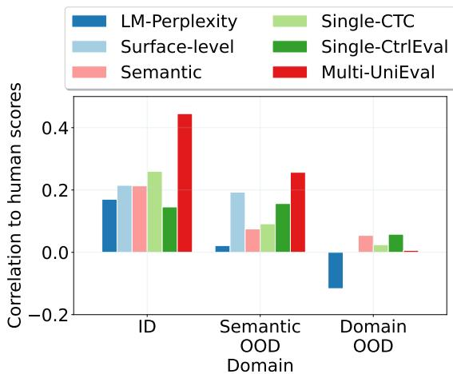  
(a) Correlation across ID and OOD.

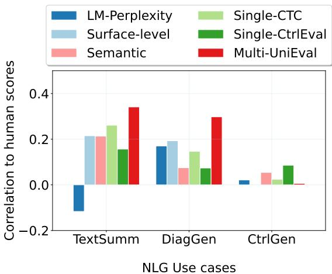  
(b) Correlation across NLG tasks.  
Figure 1: Correlation level to human in transfer experiments (Zero-shot).

## 5.2 Aspect-level Evaluation

Figure 2-3 shows aspect-level evaluation of automatic metrics in Text Summarization (TextSumm) and Controlled Generation (CtrlGen). Our main observations are as follows:

UniEval performs best in TextSumm Multiaspect human-aligned metric (UniEval) is observed to have superior performance (up to 0.579) at distinguishing between different levels of quality in UniEval-summ and summ-Eval. However, the discriminative power of the metric is less visible in Newsroom and Controlled Generation (CtrlGen) task. In Newsroom, both BLEU and BERTScore are more discriminative than human-aligned metrics (CTC, CTRlEval, UniEval).

BERTScore is comparably good in TextSumm BERTScore has an adequately good discriminative property (KS=0.557) in UniEval-summ, comparable to multi-aspect human-aligned metric (UniEval) with KS=0.579. In Newsroom, BERTScore consistently has a higher performance score in three sample categories (Lo-Hi, Lo-Mod, Hi-Mod) than human-aligned metrics (CTC, Ctrl-Eval, UniEval). The finding suggests that the characteristics of datasets in Text Summarization domain adequately fit with automatic metrics based on semantic similarity of text embeddings.

Higher KS is not necessarily highly agreeable Perplexity has the highest KS score for distinguishing between low and high quality outputs in UBER data. In contrast, the metric’s aspect-level preference is not in alignment with human.

## 5.3 System-level Evaluation

Figure 4-6 show the effectiveness of the metrics at discerning system-level performance. Our main observations are as follows:

BLEU is more discriminative in Newsroom In general, apart from BLEU in Newsroom, the remaining metrics’ KS scores across three NLG tasks are considered low-to-moderate ( 0.6). We further inspect the reason why BLEU performs considerably well in Newsroom and discover that the data is mainly composed of outputs from two types of NLG systems: extractive vs. abstractive summarization systems. We also observe that in the Newsroom dataset, abstractive systems are often voted lower (averaged score = 2.5) than extractive systems (averaged score =3.85). Such characteristic of human ratings in Newsroom is a good fit for surface-level metric (BLEU), because the metric is more likely to penalize abstractive systems with zero score (0.0) and extractive systems with a higher score (e.g. 1.0).

Automatic metrics are more discriminating than human When human struggles to distinguish between different system-level performances, automatic metrics are observed to be more discriminative. For example, in UniEval-summ (Hard), human has a considerably low score (KS =0.145), while UniEval has a higher KS score (KS =0.269).

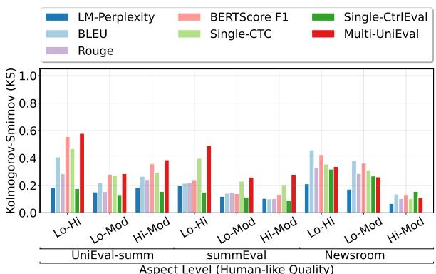  
(a) Identifying different levels of quality.

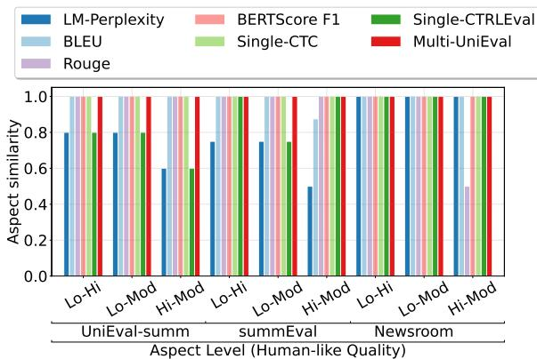  
(b) Rank/Preference similarity to human.

Figure 2: Aspect-level evaluation in Text Summarization (TextSumm). Left: Kolmogorov-Smirnov (KS) score on discerning between two different levels of human-like quality – Higher is better [0, 1]. Right: Similarity to the rank of the aspect-levels based on human scores – Higher is better [0, 1]. Lo-Hi: Low vs. High quality (e.g. Poor Coherent vs. Highly coherent), Lo-Mod: Low vs. Moderate. Hi-Mod: High vs. Moderate.  
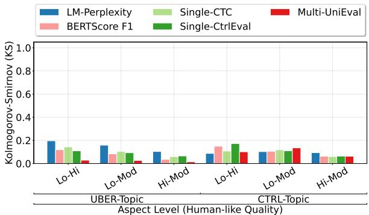  
(a) Identifying different levels of quality.

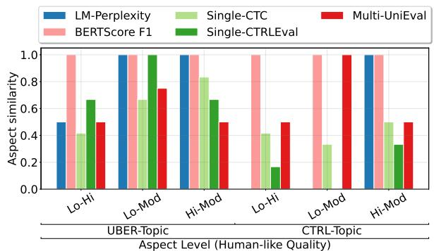  
(b) Rank/Preference similarity to human.  
Figure 3: Aspect-level evaluation in Controlled Generation (CtrlGen).

In Newsroom (Hard), BLEU, BERTScore, and UniEval are more discriminative (KS > 0.4) than human (KS=0.163). The possible reason for this particular use case is that Hard sample pairs are mainly composed of systems from a similar source or origin. For example, in Persona-Chat (USR-PC), the Hard sample category is composed of a pair of human reference systems: Original Ground Truth, New Human Generated. In Newsroom, Hard sample pairs consist of models from the same category (e.g. extractive-based systems). In UBER-Topic, where low KS scores are more visible across human and automatic metrics, both Easy and Hard pairs consist of systems that are derived from one pretrained Language Model.

Multi-aspect human-aligned metric is not always dominant In Persona-Chat (USR-PC), a single aspect human-aligned metric (CTC) has a higher KS score (0.386) and higher preference similarity (0.888) than a multi-aspect metric (UniEval), in which KS =0.218 and similarity=0.833. In

UBER-Topic, UniEval has the lowest KS score (0.025 for Easy pairs, 0.027 for Hard pairs). We find that the less distinctiveness of UniEval is mainly due to a high alignment between UniEval and multi-dimensional human evaluation aspects. For example, in Persona-Chat (USR-PC), the agreement between human evaluation aspects is low. The three aspects (Understandable, Natural, and Engaging) yield a different system rank than the remaining aspects. Thus, a high alignment to interaspect disagreement may necessarily introduce a lower KS.

## 5.4 Visualizing Pairwise System Ranking

We compare pairwise win fractions of NLG systems based on human ratings and automatic metrics in this study. The objectives are: (i) to better reason on why automatic metrics are more discriminating than human and (ii) to inspect the agreement level between metrics on system ranking.

Notice that the results of pairing evaluation, as shown in Figure 7, are consistent with our empirical findings in Figure 4-6, particularly for preference similarity with human. The system rankings based on BERTScore F1 and single-aspect CTC metrics are more similar to human on Relevance. Perplexity is more discriminating than human, but its similarity to human (Fluency) is lower. We also observe that although automatic metrics are more discriminating than human ratings in general, human voting on Relevance aspect can discern system-level performance more effectively than BERTScore and CTC-E Relevance. The result suggests that although a binary voting scheme in a human evaluation study may be less insightful than rating or error correcting protocol, the approach is cost-effective for performance selection based on a particular evaluation aspect.

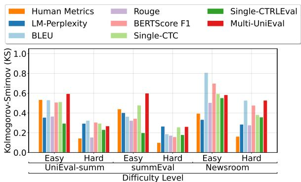  
(a) Identifying system-level performance difference.

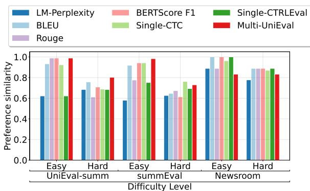  
(b) Rank/Preference similarity to human.  
Figure 4: System-level evaluation in Text Summarization (TextSumm). Left: Kolmogorov-Smirnov (KS) score on discerning the performance difference between two independent NLG systems – Higher is better [0, 1]. Right: Preference similarity between human and automatic metric – Higher is better [0, 1].

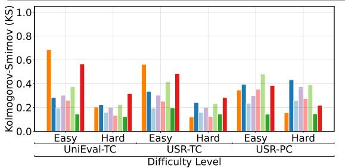  
(a) Identifying system-level performance difference.

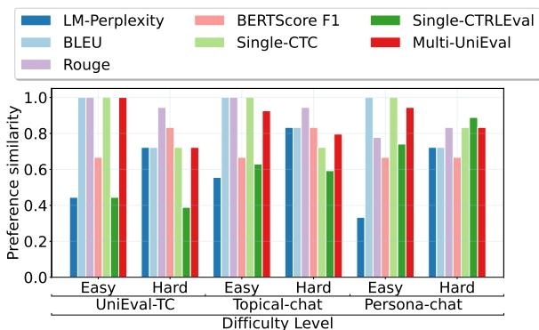  
(b) Rank/Preference similarity to human.

Figure 5: System-level evaluation in Dialogue Response Generation (DiagGen).  
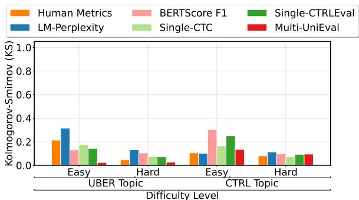  
(a) Identifying system-level performance difference.

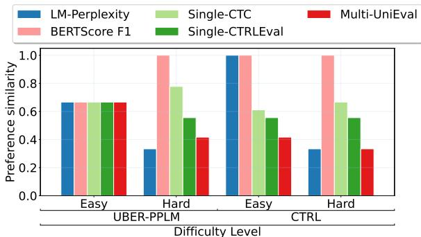  
(b) Rank/Preference similarity to human.  
Figure 6: System-level evaluation in Controlled Generation (CtrlGen).

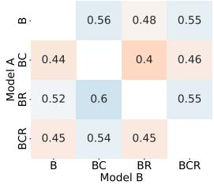  
(a) Fluency (Human)

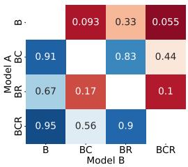  
(b) Relevance (Human))

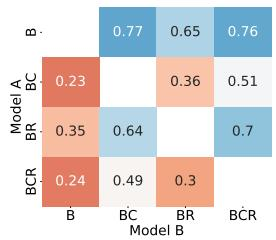

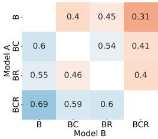  
(c) Perplexity  
(d) BERTScore F1

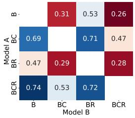  
(e) CTC-E Relevance

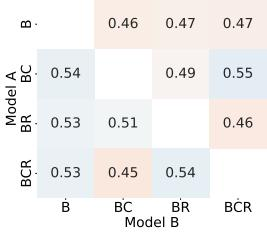  
(f) CTRLEval Relevance

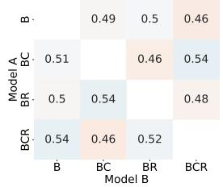  
(g) UniEval-Fluency

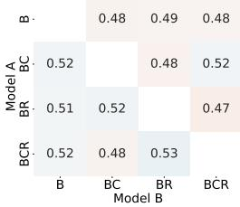  
(h) UniEval-Relevance  
Figure 7: Pairwise win fractions in Controlled Generation (UBER PPLM data, Control: Topic). The number represents fraction of Model A wins over model B. Order matters here because human evaluators are asked to rate systems based on random pairings: System A-B can be represented as both A-B and B-A. Higher is better.

## 6 Implications

## 6.1 Faithfulness to Human Preference

We show that both low correlation scores and low discriminative power (KS scores) do not represent low faithfulness to human preference. In Controlled Generation, we observe that metrics with lower correlation and lower KS score, such as BERTScore-F1 and single-aspect CTC, on the contrary have a higher similarity with human on system-level preference and ranking. The result suggests the importance of verifying the metric’s correlation score to its faithfulness to human preference, particularly for NLG use cases with poor correlation score $( \mathrm { e . g . ~ } \rho < 0 . 2 )$ and low agreement on system ranking.

## 6.2 Discriminating System-level Performance

We show that automatic metrics can be more discriminating than human, particularly when NLG systems are derived from the same training objective or encoding scheme. In contrast, for human evaluation aspect that is measured based on a binary voting scheme, such as Relevance in Controlled Generation, we observe that the scores based on the corresponding aspect are more distinctive than automatic metrics.

## 6.3 Guidance to System Selection

We show that benchmarking NLG systems and evaluation metrics via pairwise comparison provides more insights into the agreement level for selecting the best-performed system. Low agreement between metrics on ranking system-level performance suggests at least two scenarios. First, the automatic metrics are not able to capture the human-like qualities inferred in texts as key factors for discriminating system outputs. Second, each metric focuses on a particular evaluation aspect among multi-dimensional human-like qualities. For example, Fluency focuses on penalizing repetition and grammatical errors, while Relevance focuses on measuring the closeness between the generation outputs and the given control attribute (e.g. topic category). For guiding the selection of the best-performed system, the second scenario allows a fine-grained assessment to scrutinize both strengths and limitations of the system based on desirable human-like qualities.

## 7 Conclusion

We introduce the metric preference checklist as a framework for analyzing the effectiveness of currently available NLG automatic metrics. We show the importance of verifying the preference similarity between automatic metrics and human, regardless of their correlation scores. We also find that automatic metrics are more discriminating than human for discerning system-level performance, except for human evaluation aspect with a binary voting protocol. Lastly, we show the implication of current work on guiding the selection of the best-performed system based on pairwise system ranking.

## Limitations

Robustness to perturbations Our empirical study does not explore the connection between the discriminative power of automatic metrics based on the proposed metric preference checklist and their robustness to simple perturbations or other natural language phenomena that may occur in texts or NLG use cases.

Metric Fairness (Social Bias) Our study does not include an investigation of metric fairness or social bias issues that may be introduced by Language Model-based NLG evaluation Metrics.

Single-aspect vs. Multi-aspect Our current empirical experiments mainly explore the discriminative power of evaluation metrics in single-aspect experiment setup (section §5.2). It may also be interesting to inspect to what extend the metrics can identify multi-aspect levels of quality, particularly when there exists disagreement between human evaluation aspects. For example, instead of disjointly splitting samples into {low Engagingness, moderate Engagingness, high Coherence}, samples can be divided based on the joint aspects, such as {low Engagingness and low Coherence}.

Universal input-output structure Our experiments are mainly carried on publicly available author-annotated human evaluation benchmark datasets. Thus, we do not guarantee the universal input-output structure and a uniform naming system across datasets or tasks. For example, UniEval - Topical Chat data (UniEval-TC) (Zhong et al., 2022) and USR - Topical Chat (USR-TC) (Mehri and Eskenazi, 2020) use a different naming system for human evaluation aspects, yet the aspects refer to the same dimension of human-like qualities.

Dependency of NLG Systems When comparing outputs from two different NLG systems, the systems are presumably independent. However, in many NLG use cases, this assumption is not fully accurate. For example, in Controlled Generation task, the systems originate from one pretrained Language Model as an encoder model. In inference or decoding stage, the encoder’s probability outputs are used as inputs for multiple decoding schemes, such as the use of Log-Likelihood ranking, distance scoring as filter, etc (Dathathri et al., 2020), yielding n-systems to compare with. As a result of this setup, the generation outputs from these n-systems are often less diverse and less distinguishable than the outputs from two independent systems that do not share the same encoding scheme or training objective.

## Ethics Statement

The purpose of this study is not to provide an immutable checklist to define what makes a good NLG evaluation metrics. Instead, the main objective is to introduce an extended perspective on how to assess metric-level performance beyond a correlation analysis. Our empirical experiments are carried on previously reported human evaluation data and NLG use cases under ACL Ethics Policy. Human evaluation datasets are extracted from peerreviewed scientific publications by Mehri and Eskenazi (2020) in ACL 2020; Dathathri et al. (2020) in ICRL 2020; Ke et al. (2022) in ACL 2022; and Zhong et al. (2022) in EMNLP 2022, as we have listed in our Experiment section. Our empirical findings are not necessarily representative for NLG use cases and datasets that are not covered in this study. However, our metric preference checklist can be easily adopted as fine-grained analysis to measure the effectiveness of new NLG automatic evaluation metrics, regardless of their overall correlation scores to human judgments.

## Acknowledgment

We thank the anonymous reviewers for the constructive feedback, which has greatly improved the final version of the paper. This research has been partially supported by the Dutch Research Council (NWO) and Indonesian Endowment Fund for Education (LPDP) Scholarship under Beasiswa Pendidikan Indonesia (BPI) – ID Number 0003194/SC/D/9/LPDP2016. The content of the information does not necessarily reflect the position or the policy of the Government, and no official endorsement should be inferred.

## References

Udit Arora, William Huang, and He He. 2021. Types of out-of-distribution texts and how to detect them. In Proceedings of the 2021 Conference on Empirical Methods in Natural Language Processing, pages 10687–10701, Online and Punta Cana, Dominican Republic. Association for Computational Linguistics.

Yoshua Bengio, Réjean Ducharme, Pascal Vincent, and Christian Janvin. 2003. A neural probabilistic language model. J. Mach. Learn. Res., 3(null):1137–1155.

Manik Bhandari, Pranav Narayan Gour, Atabak Ashfaq, Pengfei Liu, and Graham Neubig. 2020. Reevaluating evaluation in text summarization. In Proceedings of the 2020 Conference on Empirical Methods in Natural Language Processing (EMNLP), pages 9347–9359, Online. Association for Computational Linguistics.

Alexandra Birch, Barry Haddow, Ulrich Germann, Maria Nadejde, Christian Buck, and Philipp Koehn. 2013. The feasibility of HMEANT as a human MT evaluation metric. In Proceedings ofthe Eighth Workshop on Statistical Machine Translation, pages 52– 61, Sofia, Bulgaria. Association for Computational Linguistics.

Florian Böhm, Yang Gao, Christian M. Meyer, Ori Shapira, Ido Dagan, and Iryna Gurevych. 2019. Better rewards yield better summaries: Learning to summarise without references. In Proceedings of the 2019 Conference on Empirical Methods in Natural Language Processing and the 9th International Joint Conference on Natural Language Processing (EMNLP-IJCNLP), pages 3110–3120, Hong Kong, China. Association for Computational Linguistics.

Léo Bouscarrat, Antoine Bonnefoy, Thomas Peel, and Cécile Pereira. 2019. STRASS: A light and effective method for extractive summarization based on sentence embeddings. In Proceedings ofthe 57th Annual Meeting ofthe Associationfor Computational Linguistics: Student Research Workshop, pages 243– 252, Florence, Italy. Association for Computational Linguistics.

Peter F. Brown, Stephen A. Della Pietra, Vincent J. Della Pietra, Jennifer C. Lai, and Robert L. Mercer. 1992. An estimate of an upper bound for the entropy of English. Computational Linguistics, 18(1):31–40.

Ozan Caglayan, Pranava Madhyastha, and Lucia Specia. 2020. Curious case of language generation evaluation metrics: A cautionary tale. In Proceedings of the 28th International Conference on Computational Linguistics, pages 2322–2328, Barcelona, Spain (Online). International Committee on Computational Linguistics.

Yanran Chen, Jonas Belouadi, and Steffen Eger. 2022. Reproducibility issues for BERT-based evaluation metrics. In Proceedings ofthe 2022 Conference on Empirical Methods in Natural Language Processing, pages 2965–2989, Abu Dhabi, United Arab Emirates. Association for Computational Linguistics.

Yen-Chun Chen and Mohit Bansal. 2018. Fast abstractive summarization with reinforce-selected sentence rewriting. In Proceedings of the 56th Annual Meeting of the Association for Computational Linguistics (Volume 1: Long Papers), pages 675–686, Melbourne, Australia. Association for Computational Linguistics.

Yiran Chen, Pengfei Liu, and Xipeng Qiu. 2021. Are factuality checkers reliable? adversarial metaevaluation of factuality in summarization. In Find-

ings of the Association for Computational Linguistics: EMNLP 2021, pages 2082–2095, Punta Cana, Dominican Republic. Association for Computational Linguistics.

Pierre Jean A Colombo, Chloé Clavel, and Pablo Piantanida. 2022. Infolm: A new metric to evaluate summarization & data2text generation. In Proceedings ofthe AAAI Conference on Artificial Intelligence, volume 36, pages 10554–10562.

Sumanth Dathathri, Andrea Madotto, Janice Lan, Jane Hung, Eric Frank, Piero Molino, Jason Yosinski, and Rosanne Liu. 2020. Plug and play language models: A simple approach to controlled text generation. In International Conference on Learning Representations.

Mingkai Deng, Bowen Tan, Zhengzhong Liu, Eric Xing, and Zhiting Hu. 2021. Compression, transduction, and creation: A unified framework for evaluating natural language generation. In Proceedings of the 2021 Conference on Empirical Methods in Natural Language Processing, pages 7580–7605, Online and Punta Cana, Dominican Republic. Association for Computational Linguistics.

Daniel Deutsch and Dan Roth. 2021. Understanding the extent to which content quality metrics measure the information quality of summaries. In Proceedings of the 25th Conference on Computational Natural Language Learning, pages 300–309, Online. Association for Computational Linguistics.

Jacob Devlin, Ming-Wei Chang, Kenton Lee, and Kristina Toutanova. 2019. BERT: Pre-training of deep bidirectional transformers for language understanding. In Proceedings ofthe 2019 Conference of the North American Chapter ofthe Associationfor Computational Linguistics: Human Language Technologies, Volume 1 (Long and Short Papers), pages 4171–4186, Minneapolis, Minnesota. Association for Computational Linguistics.

Li Dong, Nan Yang, Wenhui Wang, Furu Wei, Xiaodong Liu, Yu Wang, Jianfeng Gao, Ming Zhou, and Hsiao-Wuen Hon. 2019. Unified language model pre-training for natural language understanding and generation. In Advances in Neural Information Processing Systems, volume 32. Curran Associates, Inc.

Yue Dong, Yikang Shen, Eric Crawford, Herke van Hoof, and Jackie Chi Kit Cheung. 2018. Bandit-Sum: Extractive summarization as a contextual bandit. In Proceedings of the 2018 Conference on Empirical Methods in Natural Language Processing, pages 3739–3748, Brussels, Belgium. Association for Computational Linguistics.

Kawin Ethayarajh and Dan Jurafsky. 2022. The authenticity gap in human evaluation. In Proceedings of the 2022 Conference on Empirical Methods in Natural Language Processing, pages 6056–6070, Abu Dhabi, United Arab Emirates. Association for Computational Linguistics.

Alexander R. Fabbri, Wojciech Krysci´ nski, Bryan Mc-´ Cann, Caiming Xiong, Richard Socher, and Dragomir Radev. 2021. SummEval: Re-evaluating summarization evaluation. Transactions ofthe Associationfor Computational Linguistics, 9:391–409.

Markus Freitag, George Foster, David Grangier, Viresh Ratnakar, Qijun Tan, and Wolfgang Macherey. 2021. Experts, Errors, and Context: A Large-Scale Study of Human Evaluation for Machine Translation. Transactions ofthe Associationfor Computational Linguistics, 9:1460–1474.

Sebastian Gehrmann, Yuntian Deng, and Alexander Rush. 2018. Bottom-up abstractive summarization. In Proceedings of the 2018 Conference on Empirical Methods in Natural Language Processing, pages 4098–4109, Brussels, Belgium. Association for Computational Linguistics.

Max Grusky, Mor Naaman, and Yoav Artzi. 2018. Newsroom: A dataset of 1.3 million summaries with diverse extractive strategies. In Proceedings of the 2018 Conference ofthe North American Chapter of the Associationfor Computational Linguistics: Human Language Technologies, Volume 1 (Long Papers), pages 708–719, New Orleans, Louisiana. Association for Computational Linguistics.

Caglar Gulcehre, Sungjin Ahn, Ramesh Nallapati, Bowen Zhou, and Yoshua Bengio. 2016. Pointing the unknown words. In Proceedings ofthe 54th Annual Meeting ofthe Associationfor Computational Linguistics (Volume 1: Long Papers), pages 140–149, Berlin, Germany. Association for Computational Linguistics.

Han Guo, Ramakanth Pasunuru, and Mohit Bansal. 2018. Soft layer-specific multi-task summarization with entailment and question generation. In Proceedings ofthe 56th Annual Meeting ofthe Associationfor Computational Linguistics (Volume 1: Long Papers), pages 687–697, Melbourne, Australia. Association for Computational Linguistics.

Michael Hanna and Ondˇrej Bojar. 2021. A fine-grained analysis of BERTScore. In Proceedings of the Sixth Conference on Machine Translation, pages 507–517, Online. Association for Computational Linguistics.

Tatsunori B. Hashimoto, Hugh Zhang, and Percy Liang. 2019. Unifying human and statistical evaluation for natural language generation. In Proceedings of the 2019 Conference of the North American Chapter of the Associationfor Computational Linguistics: Human Language Technologies, Volume 1 (Long and Short Papers), pages 1689–1701, Minneapolis, Minnesota. Association for Computational Linguistics.

David M. Howcroft, Anya Belz, Miruna-Adriana Clinciu, Dimitra Gkatzia, Sadid A. Hasan, Saad Mahamood, Simon Mille, Emiel van Miltenburg, Sashank Santhanam, and Verena Rieser. 2020. Twenty years of confusion in human evaluation: NLG needs evaluation sheets and standardised definitions.

In Proceedings ofthe 13th International Conference on Natural Language Generation, pages 169–182, Dublin, Ireland. Association for Computational Linguistics.

Wan-Ting Hsu, Chieh-Kai Lin, Ming-Ying Lee, Kerui Min, Jing Tang, and Min Sun. 2018. A unified model for extractive and abstractive summarization using inconsistency loss. In Proceedings of the 56th Annual Meeting ofthe Associationfor Computational Linguistics (Volume 1: Long Papers), pages 132–141, Melbourne, Australia. Association for Computational Linguistics.

Fred Jelinek, Robert L Mercer, Lalit R Bahl, and James K Baker. 1977. Perplexity—a measure of the difficulty of speech recognition tasks. The Journal of the Acoustical Society ofAmerica, 62(S1):S63–S63.

Yichen Jiang and Mohit Bansal. 2018. Closed-book training to improve summarization encoder memory. In Proceedings of the 2018 Conference on Empirical Methods in Natural Language Processing, pages 4067–4077, Brussels, Belgium. Association for Computational Linguistics.

Marvin Kaster, Wei Zhao, and Steffen Eger. 2021. Global explainability of BERT-based evaluation metrics by disentangling along linguistic factors. In Proceedings ofthe 2021 Conference on Empirical Methods in Natural Language Processing, pages 8912– 8925, Online and Punta Cana, Dominican Republic. Association for Computational Linguistics.

Pei Ke, Hao Zhou, Yankai Lin, Peng Li, Jie Zhou, Xiaoyan Zhu, and Minlie Huang. 2022. CTRLEval: An unsupervised reference-free metric for evaluating controlled text generation. In Proceedings ofthe 60th Annual Meeting ofthe Associationfor Computational Linguistics (Volume 1: Long Papers), pages 2306–2319, Dublin, Ireland. Association for Computational Linguistics.

Nitish Shirish Keskar, Bryan McCann, Lav R. Varshney, Caiming Xiong, and Richard Socher. 2019. Ctrl: A conditional transformer language model for controllable generation. ArXiv, abs/1909.05858.

Wojciech Krysci´ nski, Romain Paulus, Caiming Xiong,´ and Richard Socher. 2018. Improving abstraction in text summarization. In Proceedings ofthe 2018 Conference on Empirical Methods in Natural Language Processing, pages 1808–1817, Brussels, Belgium. Association for Computational Linguistics.

Mike Lewis, Yinhan Liu, Naman Goyal, Marjan Ghazvininejad, Abdelrahman Mohamed, Omer Levy, Veselin Stoyanov, and Luke Zettlemoyer. 2020. BART: Denoising sequence-to-sequence pre-training for natural language generation, translation, and comprehension. In Proceedings of the 58th Annual Meeting of the Association for Computational Linguistics, pages 7871–7880, Online. Association for Computational Linguistics.

Chin-Yew Lin. 2004a. Rouge: A package for automatic evaluation of summaries. In Text summarization branches out, pages 74–81.

Chin-Yew Lin. 2004b. ROUGE: A package for automatic evaluation of summaries. In Text Summarization Branches Out, pages 74–81, Barcelona, Spain. Association for Computational Linguistics.

Yang Liu and Mirella Lapata. 2019. Text summarization with pretrained encoders. In Proceedings of the 2019 Conference on Empirical Methods in Natural Language Processing and the 9th International Joint Conference on Natural Language Processing (EMNLP-IJCNLP), pages 3730–3740, Hong Kong, China. Association for Computational Linguistics.

Joshua Maynez, Shashi Narayan, Bernd Bohnet, and Ryan McDonald. 2020. On faithfulness and factuality in abstractive summarization. In Proceedings of the 58th Annual Meeting of the Association for Computational Linguistics, pages 1906–1919, Online. Association for Computational Linguistics.

Shikib Mehri and Maxine Eskenazi. 2020. USR: An unsupervised and reference free evaluation metric for dialog generation. In Proceedings of the 58th Annual Meeting ofthe Associationfor Computational Linguistics, pages 681–707, Online. Association for Computational Linguistics.

Rada Mihalcea and Paul Tarau. 2004. TextRank: Bringing order into text. In Proceedings ofthe 2004 Conference on Empirical Methods in Natural Language Processing, pages 404–411, Barcelona, Spain. Association for Computational Linguistics.

Tomás Mikolov, Kai Chen, Greg Corrado, and Jeffrey Dean. 2013a. Efficient estimation of word representations in vector space. In 1st International Conference on Learning Representations, ICLR 2013, Scottsdale, Arizona, USA, May 2-4, 2013, Workshop Track Proceedings.

Tomas Mikolov, Ilya Sutskever, Kai Chen, Greg S Corrado, and Jeff Dean. 2013b. Distributed representations of words and phrases and their compositionality. In Advances in Neural Information Processing Systems, volume 26. Curran Associates, Inc.

Shashi Narayan, Shay B. Cohen, and Mirella Lapata. 2018. Ranking sentences for extractive summarization with reinforcement learning. In Proceedings of the 2018 Conference of the North American Chapter of the Association for Computational Linguistics: Human Language Technologies, Volume 1 (Long Papers), pages 1747–1759, New Orleans, Louisiana. Association for Computational Linguistics.

Jekaterina Novikova, Ondˇrej Dušek, Amanda Cercas Curry, and Verena Rieser. 2017. Why we need new evaluation metrics for NLG. In Proceedings of the 2017 Conference on Empirical Methods in Natural Language Processing, pages 2241–2252, Copenhagen, Denmark. Association for Computational Linguistics.

Kishore Papineni, Salim Roukos, Todd Ward, and Wei-Jing Zhu. 2002. Bleu: a method for automatic evaluation of machine translation. In Proceedings ofthe 40th Annual Meeting of the Association for Computational Linguistics, pages 311–318, Philadelphia, Pennsylvania, USA. Association for Computational Linguistics.

Ramakanth Pasunuru and Mohit Bansal. 2018. Multireward reinforced summarization with saliency and entailment. In Proceedings ofthe 2018 Conference ofthe North American Chapter ofthe Associationfor Computational Linguistics: Human Language Technologies, Volume 2 (Short Papers), pages 646–653, New Orleans, Louisiana. Association for Computational Linguistics.

Colin Raffel, Noam Shazeer, Adam Roberts, Katherine Lee, Sharan Narang, Michael Matena, Yanqi Zhou, Wei Li, and Peter J. Liu. 2022. Exploring the limits of transfer learning with a unified text-to-text transformer. J. Mach. Learn. Res., 21(1).

Alexander M. Rush, Sumit Chopra, and Jason Weston. 2015. A neural attention model for abstractive sentence summarization. In Proceedings of the 2015 Conference on Empirical Methods in Natural Language Processing, pages 379–389, Lisbon, Portugal. Association for Computational Linguistics.

Ananya B. Sai, Tanay Dixit, Dev Yashpal Sheth, Sreyas Mohan, and Mitesh M. Khapra. 2021. Perturbation CheckLists for evaluating NLG evaluation metrics. In Proceedings of the 2021 Conference on Empirical Methods in Natural Language Processing, pages 7219–7234, Online and Punta Cana, Dominican Republic. Association for Computational Linguistics.

Ananya B. Sai, Akash Kumar Mohankumar, and Mitesh M. Khapra. 2022. A survey of evaluation metrics used for nlg systems. ACM Comput. Surv., 55(2).

Abigail See, Peter J. Liu, and Christopher D. Manning. 2017. Get to the point: Summarization with pointergenerator networks. In Proceedings ofthe 55th Annual Meeting ofthe Associationfor Computational Linguistics (Volume 1: Long Papers), pages 1073– 1083, Vancouver, Canada. Association for Computational Linguistics.

Abigail See, Stephen Roller, Douwe Kiela, and Jason Weston. 2019. What makes a good conversation? how controllable attributes affect human judgments. In Proceedings ofthe 2019 Conference ofthe North American Chapter ofthe Association for Computational Linguistics: Human Language Technologies, Volume 1 (Long and Short Papers), pages 1702–1723, Minneapolis, Minnesota. Association for Computational Linguistics.

Eva Sharma, Luyang Huang, Zhe Hu, and Lu Wang. 2019. An entity-driven framework for abstractive summarization. In Proceedings ofthe 2019 Conference on Empirical Methods in Natural Language Processing and the 9th International Joint Conference

on Natural Language Processing (EMNLP-IJCNLP), pages 3280–3291, Hong Kong, China. Association for Computational Linguistics.

Tianxiang Sun, Junliang He, Xipeng Qiu, and Xuanjing Huang. 2022. BERTScore is unfair: On social bias in language model-based metrics for text generation. In Proceedings ofthe 2022 Conference on Empirical Methods in Natural Language Processing, pages 3726–3739, Abu Dhabi, United Arab Emirates. Association for Computational Linguistics.

Zhaopeng Tu, Zhengdong Lu, Yang Liu, Xiaohua Liu, and Hang Li. 2016. Modeling coverage for neural machine translation. In Proceedings ofthe 54th Annual Meeting of the Association for Computational Linguistics (Volume 1: Long Papers), pages 76–85, Berlin, Germany. Association for Computational Linguistics.

Oriol Vinyals, Meire Fortunato, and Navdeep Jaitly. 2015. Pointer networks. In Advances in Neural Information Processing Systems, volume 28. Curran Associates, Inc.

Doan Nam Long Vu, Nafise Sadat Moosavi, and Steffen Eger. 2022. Layer or representation space: What makes BERT-based evaluation metrics robust? In Proceedings of the 29th International Conference on Computational Linguistics, pages 3401–3411, Gyeongju, Republic of Korea. International Committee on Computational Linguistics.

Yuxiang Wu and Baotian Hu. 2018. Learning to extract coherent summary via deep reinforcement learning. In Proceedings of the Thirty-Second AAAI Conference on Artificial Intelligence and Thirtieth Innovative Applications of Artificial Intelligence Conference and Eighth AAAI Symposium on Educational Advances in Artificial Intelligence, AAAI’18/IAAI’18/EAAI’18. AAAI Press.

Jiacheng Xu and Greg Durrett. 2019. Neural extractive text summarization with syntactic compression. In Proceedings of the 2019 Conference on Empirical Methods in Natural Language Processing and the 9th International Joint Conference on Natural Language Processing (EMNLP-IJCNLP), pages 3292– 3303, Hong Kong, China. Association for Computational Linguistics.

Yi-Ting Yeh, Maxine Eskenazi, and Shikib Mehri. 2021. A comprehensive assessment of dialog evaluation metrics. In The First Workshop on Evaluations and Assessments of Neural Conversation Systems, pages 15–33, Online. Association for Computational Linguistics.

Jingqing Zhang, Yao Zhao, Mohammad Saleh, and Peter Liu. 2020. PEGASUS: Pre-training with extracted gap-sentences for abstractive summarization. In Proceedings of the 37th International Conference on Machine Learning, volume 119 of Proceedings of Machine Learning Research, pages 11328–11339. PMLR.

Tianyi Zhang\*, Varsha Kishore\*, Felix Wu\*, Kilian Q. Weinberger, and Yoav Artzi. 2020. Bertscore: Evaluating text generation with bert. In International Conference on Learning Representations.

Xingxing Zhang, Mirella Lapata, Furu Wei, and Ming Zhou. 2018. Neural latent extractive document summarization. In Proceedings ofthe 2018 Conference on Empirical Methods in Natural Language Processing, pages 779–784, Brussels, Belgium. Association for Computational Linguistics.

Ming Zhong, Yang Liu, Da Yin, Yuning Mao, Yizhu Jiao, Pengfei Liu, Chenguang Zhu, Heng Ji, and Jiawei Han. 2022. Towards a unified multidimensional evaluator for text generation. In Proceedings ofthe 2022 Conference on Empirical Methods in Natural Language Processing, pages 2023– 2038, Abu Dhabi, United Arab Emirates. Association for Computational Linguistics.

Qingyu Zhou, Nan Yang, Furu Wei, Shaohan Huang, Ming Zhou, and Tiejun Zhao. 2018. Neural document summarization by jointly learning to score and select sentences. In Proceedings ofthe 56th Annual Meeting of the Association for Computational Linguistics (Volume 1: Long Papers), pages 654–663, Melbourne, Australia. Association for Computational Linguistics.

Daniel M Ziegler, Nisan Stiennon, Jeffrey Wu, Tom B Brown, Alec Radford, Dario Amodei, Paul Christiano, and Geoffrey Irving. 2019. Fine-tuning language models from human preferences. arXiv preprint arXiv:1909.08593.

## A Appendix

## A.1 Modification Post Reviews

We thank reviewers for the constructive feedback. We list the modification of the paper based on reviewers’ suggestion as follows.

• We add the visualization of pairwise system ranking (section §5.4) to accomodate the reviewers’ suggestion on linking the current work to the objectives of NLG evaluation, particularly for reasoning and guiding model selection,

• We add Implications (§6) to improve the clarity of the paper,

• We add Related Work in the main page (section §2) to clarify the positioning of current proposed framework,

• We add Background in Appendix for providing detail information on NLG tasks and automatic metrics used in this study.

• We improve the presentation of the paper by highlighting the core points and the implications of the study for future works. We also correct the grammatical errors found in the manuscript. The revision is particularly done for Abstract, Introduction, Related Work, and Conclusion section.

## A.2 Background

## A.2.1 NLG Tasks

Our empirical study is mainly carried on three (3) NLG tasks: Controlled Generation, Dialogue Response Generation, and Text Summarization.

1. Controlled Generation (CtrlGen) (Dathathri et al., 2020) is firstly introduced as Conditional Language Modeling (Keskar et al., 2019). In a general setup of CTRLGen, NLG systems are mainly trained based on a language modeling objective where the task is to predict next token or word given the preceding sequence of tokens. During inference stage, the trained system is perturbed with an external control attribute (e.g. topics, sentiment labels, aspects of sentiment) to generate texts that are semantically linked to the control attribute. All tasks in CtrlGen can be categorized as open-ended NLG tasks because ground truth human references are not provided by default. The quality of NLG system outputs is defined based on how semantically close the generation outputs to the corresponding control attribute, which can be aligned to several human-likeness aspects, such as coherence, consistency,fluency, and relevance.

End-to-End NLG Systems We measure the performance of the following systems based on previous work on in Controlled Generation task (Dathathri et al., 2020): B: Baseline, unchanged pretrained GPT-2 Language Model. BR: Sampling B r times based on Log Likelihood ranking and distance-based ranking. BC: For each decoding step, update latent representation $\tilde { H } _ { t }$ based on attribute model log likelihood loss. BCR: Combine approach from BC (updating $\tilde { H } _ { t } )$ and BR (sampling and output ranking).

2. Dialogue Response Generation (DiagGen) is NLG use case in neural conversational domain, which can be further divided into an investigation of multi-turn dialogue response generation in a Persona Chat domain (See et al., 2019); or single response generation in Topical Chat and Persona Chat domains (Mehri and Eskenazi, 2020; Zhong et al., 2022). In this study, we focus on the evaluation of the latter category, where the quality of NLG system outputs is mainly assessed based on how good the machine responses to the preceding conversation. The goodness is mainly defined based on several aspects of human-likeness, such as understandability, naturalness, coherence, engagingness, and groundedness.

End-to-End NLG Systems For Persona-Chat dialogue response generation (USR-PC), we compare the performance of the following systems based on (Mehri and Eskenazi, 2020; Zhong et al., 2022): Systems based on pretrained models in ParlAI 4 for CONVAI2 competition (Colombo et al., 2022), i.e. Seq2Seq – a Sequence-to-Sequence model trained on Persona Chat, KV-MemNN – Key Value Profile Memory Network, Language Model – LSTMbased Language Model, Seq2Seq, and human annotated references – Human Generated Old, and Human Generated New. For Topical-Chat (USR-TC and UniEval-TC), the systems are: Human annotations – Human Generated Old, Human Generated New, and four systems that origin from Transformers with different decoding systems, such as Nucleus Decoding $p = 0 . 3 .$ , Nucleus Decoding $p = 0 . 5$ , Nucleus Decoding $p = 0 . 7$ , Argmax Decoding – greedy decoding.

3. Neural Text Summarization (TextSumm) (Grusky et al., 2018; Fabbri et al., 2021) focuses on a compression type of NLG where the main objective is to generate a concise version of texts, yet maintaining the salient information expressed in the document sources. The quality of system outputs is mainly assessed based on human evaluation aspects that fit into the objective of the task, such as coherence, consistency,fluency, and relevance.

End-to-End NLG Systems In Newsroom dataset (Grusky et al., 2018), the systems are divided into Extractive approach:

• TextRank (Mihalcea and Tarau, 2004) – unsupervisedly rank sentences in document to form a summary with an approach similar to Google PageRank ();

• Extractive Oracle (Fragments) – Fragments ${ \mathcal { F } } ( A , S )$ are sets of shared sequences of tokens in $\begin{array} { l } { A } \end{array} = \begin{array} { r } { \langle a _ { 1 } , a _ { 2 } , . . . , a _ { n } \rangle } \end{array}$ and S = $\langle s _ { 1 } , s _ { 2 } , \ldots , s _ { m } \rangle$

## Abstractive approach:

• Sequence-to-Sequence (Seq2Seq) / Attention, Tensorflow implementation of (Rush et al., 2015)5

and Mixed approach:

• Pointer Generator (See et al., 2017) with copying (Vinyals et al., 2015; Gulcehre et al., 2016) and coverage (Tu et al., 2016) mechanism;

• Lower Bound (Lede-3) – baseline approach, by copying the first sentence, first paragraph, or first k words as the summary

In summEval dataset, systems are divided into Extractive:

• M1, NEUSUM (Zhou et al., 2018) – scoring and selecting sentences based on hierarchical representation of a document;

• M2, BanditSum (Dong et al., 2018) – contextual bandit approach of summarization where the document is seen as context and the sequence of sentences to be included in the summary as action;

• M3, LATENT (Zhang et al., 2018) – views sentences in document as relevance binary labels of latent variables;

• M4, REFRESH (Narayan et al., 2018) – a reinforcement approach by focusing on combining individually high-scoring sentences;

• M5, RNES (Wu and Hu, 2018) – improving REINFORCE network by combining coherence model and ROUGE scores as a reward;

• M6, JECS (Xu and Durrett, 2019) – scoring possible constituency-based compressed units;

• M7, STRASS (Bouscarrat et al., 2019) – selecting sentences based on the closest embeddings to the document embedding;

## and Abstractive:

• M8, Pointer Generator (See et al., 2017) – encoder decoder model where the decoder can generate samples based on the log-likelihood of words in vocabulary or copy words from the sentence source;

• M9, Fast-abs-rl (Chen and Bansal, 2018) – improves Pointer Networks with ROUGE-L reward of REINFORCE;

• M10, Bottom-up (Gehrmann et al., 2018) – decoding method with content selection model to restrict the copy attention distribution of pretrained Pointer Generation Network during inference;

• M11, Improve-abs (Krysci´ nski et al.´ , 2018) – augments the decoder with external LSTMbased Language Model and RL-based objective;

• M12, Unified-ext-abs (Hsu et al., 2018) – aligns word-level attention scores of abstractive model with sentence level attention based on the probability outputs of extractive model;

• M13, ROUGESal (Pasunuru and Bansal, 2018) – improves reinforcement approach by using three types of rewards: keyphrase-based salience, entailment-based, and ROUGEbased reward;

• M14, Multi-task (Ent+QG) (Guo et al., 2018) – a multi-task learning approach with question and entailment generation as auxiliary tasks;

• M15, Closed book decoder (Jiang and Bansal, 2018) – introduces copy-less and attention-less decoder on Pointer Generator Network;

• M16, SENECA (Sharma et al., 2019) – combines entity-aware content selection module and abstractive generation module;

• M17, T5 (Raffel et al., 2022) – improves Transformers-based architecture by exploring the limitation of various transfer learning approaches;

• M18, NeuralTD (Böhm et al., 2019) – define RL-based reward function based on 2500 human evaluation outcomes ;

• M19, BertSum-abs (Liu and Lapata, 2019) – extend BERT with document-level encoder;

• M20, GPT-2 (Ziegler et al., 2019) – finetune GPT-2 on human summaries with a reinforcement learning framework;

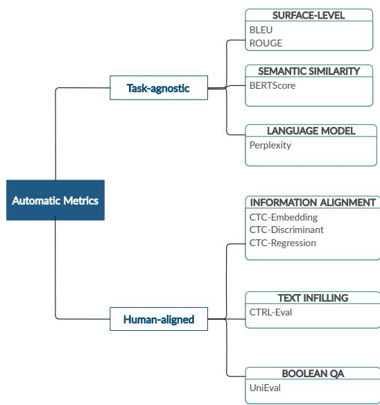  
Figure 8: Automatic metrics in this study.

• M21, UniLM (Dong et al., 2019) – use three language model tasks as pretrianing objective: unidirectional, bidirectional, and sequence-tosequence prediction;

• M22, BART (Lewis et al., 2020) – use denoising autoencoder for pretraining sequence-tosequence task;

• M23, Pegasus (Zhang et al., 2020) – model is trained on documents after removing important sentences.

## A.2.2 Types of automatic Metrics

Figure 8 shows the classification of metrics based on whether they are task-agnostic or humanaligned. We briefly discuss the categorization as follows:

Task-agnostic metrics Task-agnostic metric refers to a category of NLG evaluation metric that does not need task-specific design or contextual knowledge prior to its utilization in a new NLG task.

• Surface-level refers to automatic metrics that mainly assess the quality of system outputs based on word-overlapping or string-based matching techniques between the generation outputs and human-generated references. Our study specifically focuses on two surfacelevel-based similarity metrics: Bilingual Evaluation Understudy (BLEU) (Papineni et al.,

2002) – computes n-gram precision of the generation outputs w.r.t. the corresponding ground truth references; Recall-Oriented Understudy for Gisting Evaluation (ROUGE) (Lin, 2004b) – measures how good the system at recalling n-grams from human text references;

• Semantic similarity refers to metrics that measure the similarity between system outputs and text references based on the distance of textual features  in an embedding space R. In many cases, the mapping from texts to the corresponding vector representations R requires a Deep Neural Network as an encoder, such as by utilizing pretrained Language Models (BERT) (Devlin et al., 2019) or word embeddings (Bengio et al., 2003; Mikolov et al., 2013a,b). In this study, we focus on investigating BERTScore (Zhang\* et al., 2020) to assess to what degree the generation outputs are similar to the given contexts (e.g. text sources, reference summaries, contextual knowledge, or control attributes);

• Language Model-based metric refers to evaluation metric that define the quality of generation outputs by linking the outputs to the surprisal score of an independent pre-trained Language Model – where the surprisal of a word is mainly described as the negative logarithm of the word probability given preceding context words. Perplexity (Brown et al., 1992) is an example of automatic evalution metric that is defined based on the entropy of Language Model. Given machine-generated texts as the inputs of a pretrained LM (e.g. GPT-2), Perplexity scores are the exponents of Negative Log-Likelihood (NLL) of the inputs;

Human-aligned metrics refers to automatic metrics that translate multi-dimensional explainable human evaluation aspects (e.g. Coherence, Consistency) into measureable statistical features of an evaluation metric. We further classify humanaligned automatic metrics into two categories as follows:

• Single-aspect views multi-dimensional human-like aspects or qualities as independent entities.

– CTC (Deng et al., 2021) – is an automatic metric that the main objective is to align information between input, context, and output texts in Compressionbased NLG (Summarization), Transduction-based NLG (Style Transfer), and Creation-based NLG (Dialogue Response Generation). The alignment function is estimated by Embedding Matching (E), Discriminative Model (D), and Aggregated Regression (R). For example, in a compression task, Consistency aspect is described as the average of the alignment score $( f _ { E } ( . ) , f _ { D } ( . )$ , or $f _ { R } ( . ) )$ between the summarization outputs y and the source x. Although CTC metric assesses the quality of system outputs based on multiple human evaluation aspects, the aspects are measured independently. Recent report () also discloses that CTC scores are bias to particular human-like aspect or quality. For example, CTC-E Consistency is highly correlated to consistency score based on human ratings, but it cannot explain the other human evaluation aspects. Therefore, our study classifies the metric as single-aspect human-aligned metric;

– CtrlEval (Ke et al., 2022) – is unsupervised reference-less metric in Controlled Generation (Dathathri et al., 2020). The metric translates three human evaluation aspects: Consistency, Coherence, Relevance into a Text Infilling objective. That is, given the input $\boldsymbol { I } = ( \boldsymbol { X } , \boldsymbol { a } , \boldsymbol { Y } )$ consisting of prefix sentence X, control attribute $^ { a , }$ and the generation output Y, the score is calculated by projecting pair of sequences from I to N-number of pattern evaluators, where each pattern evaluator’s score is estimated by the log probability outputs of pretrained model.;

• Multi-aspect introduces a unifying perspective of multi-aspect human-like qualities via multi-task and continual learning objectives.

– UniEval (Zhong et al., 2022) – re-frames evaluation aspect as a Boolean Question Answering (QA) objective. For example, for a Coherence aspect, given a summarization output and the corresponding document source, the metric calculates the performance score by modeling a binary classification task (Yes/No) for a question “Is this a coherent summary of the document $? ^ { \dag }$ . Given n-multi dimensional aspects $d = ( d _ { 1 } , \ldots , d _ { n } )$ , the generation outputs x, reference texts y (if applicable), and context c, the quality of the system outputs is measured based on the probability of the system generating words that can be either classified as positive and negative samples for addressing question $q _ { i } \mathrm { . }$

$$
s _ { i } = \frac { P ( ^ { * } \mathrm { Y e s } ^ { , * } | x , y , c , q _ { i } ) } { P ( ^ { * } \mathrm { Y e s } ^ { , * } | x , y , c , q _ { i } ) + P ( ^ { * } \mathrm { N o } ^ { , * } | x , y , c , q _ { i } ) }
$$

## A.3 Assessment setups

(5)

## Data Preprocessing

• summEval, Newsroom, UniEval-summ (TextSumm) – We use standard data preprocessing: we remove punctuation and nontextual (i.e. numeric and abbreviation) features; we also substitute latin abbreviation, such as i.e. to id est and e.g. to exempli gratia; prior to using the data to calculate the scores based on Perplexity, CTC, CtrlEval, and UniEval metrics. Specific to CtrlEval, we mainly utilize tf-idf weights in (Ke et al., 2022) 6, but we additionally generate relevant prompt and verbal dictionary for the summarization task. as shown in Table 4.

• USR-PC, USR-TC, UniEval-TC (DiagGen) – Specific to CTC-based evaluator, the format of references (list of personas) as relevancebased attribute is adjusted accordingly to follow the input-output structure of the pretrained evaluator. That is by transforming lineseparable personas into a single line of text input separated by a character “||”.

• UBER-Topic, CTRL-Topic, CtrlEval-Topic (CtrlGen) – Data preprocessing follows the procedur in Text Summarization task. Since the nature of benchmark datasets in Controlled Generation is reference-less and openendedness - no human-generated texts as ground truth references, we use the concatenation between control attribute (topic category, such as “Science”) and its corresponding list of relevant keywords as a means of reference.

References and Human-like Aspects Our study uses the following frame of references, which are dependent to the target NLG evaluation task or benchmark dataset and the characteristic of automatic metrics:

• summEval (TextSumm) – The dataset uses n-references (n = 11) as ground truth humangenerated summaries. For each system output and the corresponding references, the score based on BLEU, ROUGE, BERTScore, and human ratings (Coherence, Consistency, Fluency, Relevance) are already included in dataset. For BLEU, ROUGE, and BERTScore, we average the metric scores based on 1-reference and 11-references.

Our work additionally compute the scores based on Perplexity, CTC, CtrlEval, and UniEval metrics. Perplexity mainly uses the system’s outputs as the input x of the metric. For CTC, we use 1-reference only as the ground truth target and average the scores based on embedding-based CTC (CTC-E), discriminator-based CTC (CTC-D), and regressor-based CTC (CTC-R) w.r.t. the two aspects of evaluation: “Consistency” and “Relevance”. The inputs for CTC metric are x = docs, hypos, refs – where docs denotes document source to be summarized, hypos denotes the system’s generation outputs, and refs is ground truth human-generated summaries.

For CtrlEval and UniEval, we use 11- references as evaluation target for the metrics. For CtrlEval, the performance score is computed based on “Coherence” aspect by solely utilizing the system outputs as the input sources for pretrained GPT-2.

For UniEval, the evaluator is pretrained on summarization task for assessing four aspects: “Coherence”, “Consistency”, “Fluency”, and “Relevance”. For assessing “Coherence” and “Consistency” aspects, UniEval uses document source and the system outputs as the inputs for pretrained evaluator. The system outputs is used solely as inputs for measuring “Fluency”, while the generation outputs and ground truth references are compared for measuring “Relevance” aspect.

• Newsroom (TextSumm) – The evaluation setup for Newsroom dataset is similar to summEval, except that Newsroom does not include ground truth human references. Instead, the title of articles is used as a means of reference for assessing the quality of system outputs.

• UniEval-summ (TextSumm) – is a subset of summEval. Therefore, the evaluation setup follows the configuration in summEval data.

• USR-PC (DiagGen) – is composed of three source of textual inputs for the evaluation metrics: persona of the model (NLG system) and human evaluators as a background knowledge (fact), the preceding dialogue as a context, and the system responses (generation outputs).

BLEU, ROUGE are computed by comparing between the system responses and the concatenation of document source and factual or contextual knowledge (i.e. list of personas in USR-PC and document title in USR-TC). While, BERTScoreis computed by comparing between system’s responses and document sources.

CTC scores are measured based on “Engagingness” and “Groundedness” (Use Knowledge) aspects, two aspects out of total five aspects based on human ratings (Understandable, Natural, Maintains Context, Engaging, Use Knowledge). CTC-based engagingness is measured by utilizing (i) the concatenated version of factual knowledge (personas) and dialogue history, and (ii) system responses as inputs to be compared. While, CTC-based groundedness measures the relevance of information by inspecting how the system responses comply with the predefined factual knowledge.

CtrlEval scores are measured based on “Coherence”, “Consistency”, and “Relevance” aspects. CtrlEval-Coherence uses the concatenation of dialogue history and system response as input. CtrlEval-Consistency measures how consistent the system response w.r.t. the prefix or dialogue history. While, CtrlEval-Relevance compares the degree of relevance between the generated responses and the predefined personas.

<table><tr><td>NLG Task</td><td>Benchmark dataset</td><td>Prompts</td><td>Verbal Dict.</td></tr><tr><td rowspan="3">TextSumm</td><td rowspan="3">summEval, Newsroom</td><td>&lt; gen_result  Article: 〈 mask_token |</td><td>N/A</td></tr><tr><td>gen_result Summary: 〈 mask_token 〉</td><td>N/A</td></tr><tr><td>gen_result  It was about 〈 mask_token)</td><td>N/A</td></tr><tr><td rowspan="3">DiagGen USR-TC, UniEval-TC</td><td rowspan="3">USR-PC</td><td>&lt;gen_result  Persona: 〈mask_token〉</td><td>list of system&#x27;s and human evaluator&#x27;s personas</td></tr><tr><td>The persona of &lt; gen_result  is 〈 mask_token 〉 &lt; gen_result 〉 contains &lt; mask_token  persona</td><td></td></tr><tr><td>&lt; gen_result  It was about 〈 mask_token gen_result 〉 It was related to 〈 mask_token </td><td>context</td></tr><tr><td>CtrlGen</td><td>UBER-Topic, CTRL-Topic</td><td>&lt;gen_result 〉 News: 〈 mask_token 〉 &lt;gen_result 〉 It was about 〈 mask_token</td><td>computers, politics, religion, science, legal, clickbait, space, military</td></tr></table>

Table 4: Examples of prompts and verbal dictionary as auxiliary inputs for CtrlEval metric.

UniEval scores are computed based on human evaluation aspects included in USR-PC data: UnieEval-Understandability, UniEval-Naturalness, UniEval-Coherence, UniEval-Engagingness, UniEval-Groundedness, and UniEVal-Overall; given dialogue histories as source, list of personas as contextual knowledge, and the system responses as output to be evaluated.

• USR-TC, UniEval-TC (DiagGen) – The main difference between USR-TC and USR-PC is that the two benchmarks use different factual knowledge as a means of reference for model or metric. In USR-PC, the reference is the predefined list of model and human personas as multi-turn agents in a dialogue system. While, in USR-TC, the predefined knowledge-grounded conversation is used as a means of reference for evaluating systems and metrics in this study.

• UBER-Topic, CTRL-Topic, CtrlEval-Topic (CtrlGen) – are mainly composed of prefixes, the perturbed version of generation outputs, and control attributes (i.e. topic categories) as textual inputs for the evaluation metrics. The contextual knowledge is constructed by concatenating topic category as control attribute for each prefix sample and the corresponding list of keywords as a pointer to particular topic or domain.

BERTScore is defined based on the comparison between the system’s generated outputs and the control attributes as contextual knowledge. For each system output, we construct the context by concatenating topic category (e.g. “Science”) and its corresponding list of relevant keywords. While, Perplexity is measured by projecting the system outputs as inputs for pretrained GPT-2.

CTC measures two aspects: Consistency and Relevance. We specifically use “SummarizationScorer” of CTC for assessing the quality of system outputs in Controlled Generation task because the task share more similar characteristic to Text Summarization than task in Dialogue Response Generation. The setup follows the configuration of Summarizationbased CTC evaluation.

CtrlEval measures three evaluation aspects: Coherence, Consistency, and Relevance. CtrlEval-Coherence outputs the pattern evaluator score by pairing sentences in the generation outputs as a text infilling task. CtrlEval-Consistency uses prefixes and system outputs as the inputs of the metric. While, CtrlEval-Relevance measures whether the generation outputs are relevant to the given control attributes (topic categories).

UniEval measures four aspects: Coherence, Consistency, Fluency, and Relevance. The setup follows the configuration of summarization-based UniEval evaluation, but the reference list is defined based on the concatenation between control attribute (topic category) and its corresponding pointer words (keywords).

## A.4 Experiment Results

## A.4.1 Transfer Experiment

Table 5- 6 shows the correlation score between automatic metrics and human ratings across NLG

tasks (ID and OOD).

<table><tr><td>Automatic metrics</td><td>ID</td><td>Semantic-Shift</td><td>Domain-Shift</td></tr><tr><td>LM-Perplexity</td><td>0.170</td><td>0.022</td><td>-0.116</td></tr><tr><td>Surface-level (BLEU &amp; ROUGE)</td><td>0.215</td><td>0.193</td><td>0.000</td></tr><tr><td>Semantic (BERTScore)</td><td>0.213</td><td>0.075</td><td>0.054</td></tr><tr><td>Single-CTC</td><td>0.259</td><td>0.091</td><td>0.024</td></tr><tr><td>Single-CTRLEval</td><td>0.145</td><td>0.156</td><td>0.058</td></tr><tr><td>Multi-UniEval</td><td>0.445</td><td>0.257</td><td>0.006</td></tr></table>

Table 5: Correlation level to human scores across ID and OOD samples

<table><tr><td>Automatic metrics</td><td>TextSumm</td><td>DiagGen</td><td>CtrlGen</td></tr><tr><td>LM-Perplexity</td><td>-0.116</td><td>0.170</td><td>0.022</td></tr><tr><td>Surface-level (BLEU &amp; ROUGE)</td><td>0.215</td><td>0.193</td><td>0.000</td></tr><tr><td>Semantic (BERTScore)</td><td>0.213</td><td>0.074</td><td>0.054</td></tr><tr><td>Single-CTC</td><td>0.026</td><td>0.147</td><td>0.024</td></tr><tr><td>Single-CTRLEval</td><td>0.156</td><td>0.074</td><td>0.086</td></tr><tr><td>Multi-UniEval</td><td>0.341</td><td>0.298</td><td>0.006</td></tr></table>

Table 6: Correlation level to human scores across NLG tasks

Sample Analysis In this section, we sample data in In-Domain (ID) and Out-of-Domain subsets to further analyze the contexts in which automatic metrics are not in alignment with human judgments. The samples are mainly grouped based on the agreement-level of multi-aspect human ratings (low vs. high) across ID and OOD subsets (Figure 1a) and NLG use cases (Figure 1b).

## A.4.2 Aspect-level Evaluation

Figure 9 shows Kolmogorov-Smirnov (KS) scores for aspect-level evaluation in Dialogue Response Generation (DiagGen) and the corresponding similarity score to human preference.

## A.4.3 System-level Evaluation

Table 17-19 show Kolmogorov-Smirnov (KS) scores of both human and automatic metrics as a measure of metric’s capability at distinguishing performance differences between independent NLG systems. Table 20-22 show the preference similarity between human and automatic metrics at deciding the performance rank of the systems.

## A.5 Packages

We use publicly available Python Packages for running the experiments, as listed in Table 9. The prerequisite installation is provided in the shared implementation code.

## A.6 Hyperparameters

BLEU Package: evaluate, https://huggingface. co/spaces/evaluate-metric/bleu. Parameters: ’brevity\_penalty’: 1.0 (default).

ROUGE Package: evaluate, https: //huggingface.co/spaces/evaluate-metric/rouge.

BERTScore Package: evaluate, https: //huggingface.co/spaces/evaluate-metric/ bertscore. Model: “roberta-large\_L17\_noidf\_version=0.3.12(hug\_trans=4.25.1)”.

Perplexity Package: evaluate, https:// huggingface.co/spaces/evaluate-metric/perplexity. Model: “gpt2”.

CTC Package: CTC. For Embedding-based alignment (CTC-E), we use BERTAligner/BERT embedding (default). For discriminative alignment (CTC-D), we use “roberta-large”. For regressive alignment (CTC-R), we use BLEURTAligner.

CtrlEval Package: CtrlEval. Model: “google/pegasus-large”. We use default configuration in https://github.com/thu-coai/CTRLEval. We reuse the TfIdf features of the original work. For the other required external knowledge (prompt and verbal list), we adjust accordingly to the objective of target NLG task. The prompt and verbal files are provided in the shared data and code implementation.

UniEval Package: UniEval. We use two types of pretrained evaluators in https://github.com/ maszhongming/UniEval: UniEval-sum and UniEvaldialog. We re-use the multi-dimensional human evaluation aspects of the corresponding pretrained evaluators. We adjust the configuration of inputsoutputs of the evaluators based on the target NLG tasks.

## A.7 Computing Resources

Experiments were done in computing nodes of a HPC cluster with specifications of 4 GPUs Nvidia Tesla V100 (16GB RAM, 2560 tensor cores, 10480 CUDA cores, compute capability 7.0). 1 CPU Intel Xeon E5-2698v4 @ 2.2GHz (40 hyperthreads, RAM: 256GB).

<table><tr><td rowspan=1 colspan=6>System System Outputs           Human Rating                                    Metric ScorePerplexity ↓BLEU (%)↑ ROUGE ↑ BERTScore ↑CTC ↑        CtrlEval ↑   UniEval ↑</td></tr><tr><td rowspan=1 colspan=4>M12  paul merson has restarted his row with Coherence: 5, Con-   78.49     10.131     0.283     0.422    E-Consistency: 0.882,</td><td rowspan=1 colspan=2>Coherence:    Coherence: 0.860,</td></tr><tr><td rowspan=1 colspan=1></td><td rowspan=1 colspan=1>andros townsend after the tottenham</td><td rowspan=1 colspan=2>sistency: 5, Flu-                                          E-Relevance: 0.548,</td><td rowspan=1 colspan=1>(-)3.594</td><td rowspan=1 colspan=1>Consistency:0.784,</td></tr><tr><td rowspan=1 colspan=1></td><td rowspan=1 colspan=1>midfielder was brought on with only</td><td rowspan=1 colspan=2>ency: 5, Relevance:                                          D-Consistency: 0.950,</td><td rowspan=1 colspan=1></td><td rowspan=1 colspan=1>Fluency:   0.648,</td></tr><tr><td rowspan=1 colspan=1></td><td rowspan=1 colspan=1>seven minutes remaining in his team</td><td rowspan=1 colspan=2>4, Average: 4.75                                            D-Relevance: 0.579.</td><td rowspan=1 colspan=1></td><td rowspan=1 colspan=1>Relevance: 0.207</td></tr><tr><td rowspan=1 colspan=1></td><td rowspan=1 colspan=1>&#x27;s 0-0 draw with burnley . merson ini-</td><td rowspan=1 colspan=2>R-Consistency: 0.939,</td><td rowspan=1 colspan=2></td></tr><tr><td rowspan=1 colspan=1></td><td rowspan=1 colspan=1>tially angered townsend for writing in</td><td rowspan=7 colspan=4>R-Relevance: 0.557</td></tr><tr><td rowspan=1 colspan=1></td><td rowspan=1 colspan=1>his sky sports column that  if andros</td></tr><tr><td rowspan=1 colspan=1></td><td rowspan=1 colspan=1>townsend can get in -lrb- the england</td></tr><tr><td rowspan=1 colspan=1></td><td rowspan=1 colspan=1>team -rrb- then it opens it up to anybody</td></tr><tr><td rowspan=1 colspan=1></td><td rowspan=1 colspan=1>. &#x27; paul merson had another dig at an-</td></tr><tr><td rowspan=1 colspan=1></td><td rowspan=1 colspan=1>dros townsend after his appearance for</td></tr><tr><td rowspan=1 colspan=1></td><td rowspan=1 colspan=1>tottenham against burnley .</td></tr><tr><td rowspan=1 colspan=1>M23</td><td rowspan=1 colspan=1>paul merson had a dig at andros</td><td rowspan=1 colspan=1>Coherence: 5, Con-   131.58     6.028     0.308     0.324</td><td rowspan=1 colspan=1>E-Consistency: 0.896</td><td rowspan=1 colspan=1>Coherence:</td><td rowspan=1 colspan=1>Coherence: 0.929,</td></tr><tr><td rowspan=1 colspan=1></td><td rowspan=1 colspan=1>townsend after his appearance for tot-</td><td rowspan=1 colspan=1>sistency: 5, Flu-</td><td rowspan=1 colspan=1>, E-Relevance: 0.566,</td><td rowspan=1 colspan=1>(-)3.200</td><td rowspan=1 colspan=1>Consistency:0.933,</td></tr><tr><td rowspan=1 colspan=1></td><td rowspan=1 colspan=1>tenham . townsend was brought on in</td><td rowspan=1 colspan=1>ency: 5, Relevance:</td><td rowspan=1 colspan=1>D-Consistency: 0.959,</td><td rowspan=1 colspan=1></td><td rowspan=1 colspan=1>Fluency:   0.881,</td></tr><tr><td rowspan=1 colspan=1></td><td rowspan=1 colspan=1>the 83rd minute for tottenham against</td><td rowspan=1 colspan=1>5, Average: 5</td><td rowspan=1 colspan=1>D-Relevance: 0.559,</td><td rowspan=1 colspan=1></td><td rowspan=1 colspan=1>Relevance: 0.878</td></tr><tr><td rowspan=1 colspan=1></td><td rowspan=1 colspan=1>burnley . just been watching the game,</td><td rowspan=1 colspan=1></td><td rowspan=3 colspan=3>R-Relevance: 0.624</td></tr><tr><td rowspan=1 colspan=1></td><td rowspan=1 colspan=1>did you miss the coach? #rubberdub</td><td></td></tr><tr><td rowspan=2 colspan=1>M11</td><td rowspan=1 colspan=1>#7minutes,merson wrote on twitter.</td><td></td></tr><tr><td rowspan=1 colspan=1>paul merson was brought on with only</td><td rowspan=1 colspan=3>Coherence: 1, Con-   70.055     11.912     0.310     0.399    E-Consistency: 0.859, Coherence:</td><td rowspan=1 colspan=1>Coherence: 0.103,</td></tr><tr><td rowspan=1 colspan=1></td><td rowspan=1 colspan=1>seven minutes remaining in his team &#x27;s 0-</td><td rowspan=1 colspan=2>sistency: 1, Flu-                                           E-Relevance: 0.535,</td><td rowspan=1 colspan=1>(-)2.869</td><td rowspan=1 colspan=1>Consistency:0.542,</td></tr><tr><td rowspan=1 colspan=1></td><td rowspan=1 colspan=1>0 draw with burnley . andros townsend</td><td rowspan=1 colspan=1>ency: 2, Relevance:</td><td rowspan=1 colspan=1>D-Consistency: 0.773,</td><td rowspan=1 colspan=1></td><td rowspan=1 colspan=1>Fluency:  0.589,</td></tr><tr><td rowspan=1 colspan=1></td><td rowspan=1 colspan=1>scored the tottenham midfielder in the</td><td rowspan=1 colspan=1>1, Average: 1.25</td><td rowspan=1 colspan=1>D-Relevance: 0.481,</td><td rowspan=1 colspan=1></td><td rowspan=1 colspan=1>Relevance: 0.122</td></tr><tr><td rowspan=1 colspan=1></td><td rowspan=1 colspan=1>89th minute . paul merson had another</td><td rowspan=1 colspan=1></td><td rowspan=5 colspan=3></td></tr><tr><td rowspan=2 colspan=1></td><td rowspan=1 colspan=1>dig at andros townsend after his appear-</td><td rowspan=1 colspan=1></td><td rowspan=1 colspan=1>R-Relevance: 0.491</td></tr><tr><td rowspan=1 colspan=1>ance . the midfielder had been brought</td><td></td></tr><tr><td rowspan=1 colspan=1></td><td rowspan=1 colspan=1>on to the england squad last week . click</td><td></td></tr><tr><td rowspan=1 colspan=1></td><td rowspan=1 colspan=1>here for all the latest arsenal news news.</td><td></td></tr></table>

Source: Paul Merson has restarted his row with Andros Townsend after the Tottenham midfielder was brought on with only seven minutes remaining in his team’s 0-0 draw with Burnley on Sunday. ’Just been watching the game, did you miss the coach? #RubberDub #7minutes,’ Merson put on Twitter. Merson initially angered Townsend for writing in his Sky Sports column that ’if Andros Townsend can get in (the England team) then it opens it up to anybody.’ Paul Merson had another dig at Andros Townsend after his appearance for Tottenham against Burnley Townsend was brought on in the 83rd minute for Tottenham as they drew 0-0 against Burnley Andros Townsend scores England’s equaliser in their 1-1 friendly draw with Italy in Turin on Tuesday night The former Arsenal man was proven wrong when Townsend hit a stunning equaliser for England against Italy and he duly admitted his mistake. ’It’s not as though I was watching hoping he wouldn’t score for England, I’m genuinely pleased for him and fair play to him âC“ it was a great goal,’ Merson said. ’It’s just a matter of opinion, and my opinion was that he got pulled off after half an hour at Manchester United in front of Roy Hodgson, so he shouldn’t have been in the squad. ’When I’m wrong, I hold my hands up. I don’t have a problem with doing that - I’ll always be the first to admit when I’m wrong.’ Townsend hit back at Merson on Twitter after scoring for England against Italy Sky Sports pundit Merson (centre) criticised Townsend’s call-up to the England squad last week Townsend hit back at Merson after netting for England in Turin on Wednesday, saying ’Not bad for a player that should be ’nowhere near the squad’ ay PaulMerse?’ Any bad feeling between the pair seemed to have passed bu Merson was unable to resist having another dig at Townsend after Tottenham drew at Turf Moor.

1st Reference: Andros Townsend an 83rd minute sub in Tottenham’s draw with Burnley. He was unable to find a winner as the game ended without a goal. Townsend had clashed with Paul Merson last week over England call-up.

2nd Reference: Sports columnist Paul Merson and Andros Townsend are in the midst of a twitter feud. Merson started it when Townsend was called up and wrote something disparaging about him in his column. Since then things have gone back and forth between the two.

3rd Reference: Merson is angered by the statement made by Townsend in his Sky Sports column. Merson threw a dig at Townsend after scoring his last game.  
Table 7: The system outputs in summEval with high agreement level between multiple human-like aspects for high human ratings (N-sample = 1987(39%)) and low human ratings (N-sample = 43(0.8%)). BLEU score is by default represented as percentage rather than decimal in benchmark dataset. Both BLEU and ROUGE scores are based on an averaged between 1-reference score and 11-references score.  
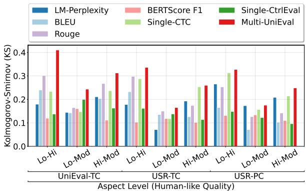  
(a) Identifying different levels of quality.

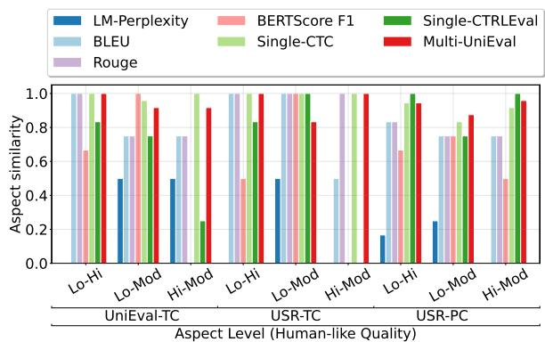  
(b) Rank/Preference similarity to human.  
Figure 9: Aspect-level evaluation in Dialogue Response Generation (DiagGen). Left: Kolmogorov-Smirnov (KS) score on discerning between two different levels of human-like quality – Higher is better [0, 1]. Right: Similarity to the rank of the aspect-levels based on human scores – Higher is better [0, 1]. Lo-Hi: Low vs. High quality (e.g. Poor Coherent vs. Highly coherent), Lo-Mod: Low vs. Moderate. Hi-Mod: High vs. Moderate.

<table><tr><td rowspan="2">System</td><td rowspan="2">System Outputs</td><td rowspan="2">Human Rating Perplexity ↓</td><td colspan="7"></td></tr><tr><td>BLEU(%)↑</td><td>ROUGE ↑ 0.204</td><td>Metric Score BERTScore ↑ 0.285</td><td>CTC ↑ E-Consistency: 0.848,</td><td>CtrlEval ↑ Coherence:</td><td>UniEval ↑ Coherence:</td><td>0.113,</td></tr><tr><td>M20</td><td>Varvara traveled 14,000 miles across the Pacific Ocean. (Hat tip: The Daily Beast)</td><td>Coherence: 4, Con- sistency: 2, Flu- ency: 5, Relevance: 1, Average: 3</td><td>35.68</td><td>4.17</td><td></td><td></td><td>E-Relevance: 0.518, (-)4.464 D-Consistency: 0.766, D-Relevance: 0.348, R-Consistency: 0.645, R-Relevance: 0.322</td><td></td><td>Consistency: Fluency: Relevance: 0.789</td><td>0.721, 0.945,</td></tr><tr><td>M8</td><td>the whale , named varvara , swam nearly 14,000 miles ( 22,500 kilometers ). it said the previous record was set by a humpback whale that swam a mere 10,190-mile round trip between the “ warm breeding waters of the arctic and antarctic regions &quot; Source: (CNN)A North Pacific gray whale has earned a spot in the record books after completing the longest migration of a mammal ever recorded. The whale, named Varvara, swam nearly 14,000 miles (22,500</td><td>Coherence: 2, Con- sistency: 4, Flu- ency: 5, Relevance: 2, Average: 3.25</td><td>50.71</td><td>28.74</td><td>0.443</td><td>0.613</td><td>E-Consistency: 0.908, E-Relevance: 0.571, D-Consistency: 0.951, D-Relevance: 0.627, R-Consistency: 0.970. R-Relevance: 0.653</td><td>Coherence: (-)3.228</td><td>Coherence: Consistency: Fluency: Relevance: 0.112</td><td>0.682, 0.957, 0.690,</td></tr><tr><td colspan="9">kilometers), according to a release from Oregon State Universitv, whose scientists helped conduct the whale-tracking study. Varvara, which is Russian for &quot;Barbara.&quot; left her primary feeding ground of Russia&#x27;s Sakhalin Island to cross the Pacific Ocean and down the West Coast of the United States to Baja, Mexico. Varvara&#x27;s journey surpassed a record listed on the Guinness Worlds Records website. It said the previous record was set by a humpback whale that swam a mere 10,190-mile round trip between the &quot;warm breeding waters near the equator and the colder food-rich waters of the Arctic and Antarctic regions.&quot; Records are nice, but Bruce Mate, the lead author of the study, thinks the long trip might say more about the whale than just its ability to swim. During her 14,000-mile journey, Varvara visited &quot;three major breeding areas for eastern gray whales,&quot; which was a surprise to Mate, who is also the director of the Marine Mammal Institute at Oregon State University. &quot;For her to go to Mexico,&quot; Mate said, &quot;It&#x27;s pretty strong evidence that it&#x27;s where she&#x27;s from.&quot; Varvara was thought to be an endangered western whale, but her ability to &quot;navigate across open water over tremendously long distances is impressive,&quot; he said in the release, which could mean that some western gray whales are actually eastern grays. With only 150 western gray whales believed to be in existence, that number might be even lower. &quot;Past studies have indicated genetic differentiation between the species, but this suggests we may need to take a closer look,&quot; Mate said. Fourth baby orca born this season</td></tr><tr><td colspan="9">1st Reference: The whale, Varvara, swam a round trip from Russia to Mexico, nearly 14,000 miles. The previous record was set by a humpback whale that migrated more than 10,000 miles.</td></tr><tr><td colspan="9">2nd Reference: A record for the longest distance migration of a mammal was shattered recently by a north pacific gray whale. The whale made a trip of 14,000 miles.</td></tr><tr><td colspan="9">3rd Reference: The longest mammalian migration was just recorded by a pacific gray whale. It swam over 14,000 miles in the process. There are only about 150 gray whales known. M11 jordan henderson is set to sign a new Coherence: 1, Con- 45.03 28.72 0.410 0.589 E-Consistency: 0.868, Coherence: Coherence:</td></tr><tr><td></td><td colspan="2">long-term contract at anfield . the club sistency: 4, Flu- ś vice-captain had 14 months remaining ency: 1, Relevance: on his current contract . henderson is the 4, Average: 2.5 third major player in liverpool ś fa cup. the fa cup fourth round . raheem sterling is expected to return to liverpool in the summer. jordan henderson has provided liverpool Coherence: 1, Con-</td><td colspan="4"></td><td>E-Relevance: 0.546, (-)2.635 D-Consistency: 0.803, D-Relevance: 0.538, R-Consistency: 0.834, R-Relevance: 0.517</td><td>Consistency: Fluency: Relevance: 0.011</td><td>0.018, 0.637, 0.675,</td></tr><tr><td>M8</td><td>with a lift after their fa cup heartache . sistency: 5, Flu- the club ś vice-captain had 14 months ency: 5, Relevance: remaining on his current contract . his 2, Average: 3.25 advisors had been in talks with liverpool since the beginning of this season.</td><td>68.84 21.68</td><td></td><td>0.403</td><td>0.498</td><td>E-Consistency: 0.922, E-Relevance: 0.581, (-)4.360 D-Consistency: 0.983, D-Relevance: 0.642, R-Consistency: 1.066, R-Relevance: 0.622</td><td>Coherence:</td><td>Coherence: 0.973, Consistency: 0.939, Fluency: 0.639, Relevance: 0.711</td></tr><tr><td colspan="9">Source: Jordan Henderson has provided Liverpool with a lift after their FA Cup heartache by agreeing a new long-term contract. The club&#x27;s vice-captain had 14 months remaining on his current contract and his advisors had been in talks with Liverpool since the beginning of this season. They have now reached a resolution and Henderson is expected to put pen-to-paper on improved terms that are likely be worth in the region of £100,000. His new deal will run to 2020. Liverpool midfielder Jordan Henderson is set to sign a new long-term contract at Anfield Henderson chases down Aston Villa&#x27;s Jack Grealish during Liverpool&#x27;s FA Cup semi-final defeat at Wembley Henderson&#x27;s new deal is worth around £100,000-a-week and will run until the summer of 2020 Henderson, 24, is the third big player in Brendan Rodgers&#x27; squad to agree a contract extension, following on from Daniel Sturridge and Philippe Coutinho. The England international, who was signed by Kenny Dalglish in June 2011 for £16million from Sunderland, has been one of the most improved players under Rodgers&#x27; watch. His form this season has been excelent and he has contributed 13 assists as well as seven goals from midfield; he will be considered for the role of club captain when Steven Gerrard moves to LA Galaxy. Talks with Raheem Sterling are not expected to resume until the end of the season but Ian Ayre, Liverpool&#x27;s Chief Executive, last week said he expected the England forward to be at Anfield for &#x27;a long time&#x27;. Henderson could replace Steven Gerrard as Liverpool</td></tr><tr><td colspan="9">captain when the 34-year-old departs this summer Liverpool boss Brendan Rodgers (right) is keen to tie-down Henderson with up to 10 players set to leave Raheem Sterling has rejected a new deal at Liverpool but talks are expected to resume in the summer 1st Reference: Jordan Henderson is set to sign an improved deal with Liverpool. The 24-year-old midfielder has 14 months left on his current contract. Henderson could replace Steven Gerrard as club captain this summer.</td></tr><tr><td colspan="9">Liverpool will resume talks with Raheem Sterling at the end of the season.</td></tr><tr><td colspan="9">2nd Reference: A player has signed onto a new contract with another team which is set to start in 2020. The player has shown to be quite impressive over the years and replaced a veteran last year.</td></tr><tr><td colspan="9">3rd Reference: Jordan Henderson was heroic for Liverpool with a newly-signed contract. He has improved immensely over the years. He could very well replace Gerrard as team captain soon.</td></tr></table>

Table 8: The system outputs in summEval with low agreement level between multiple human-like aspects.

<table><tr><td>Package name</td><td>Version</td><td>Link</td></tr><tr><td>Python</td><td>3.7.12</td><td>conda install</td></tr><tr><td>Numpy</td><td>1.21.6</td><td>pip install</td></tr><tr><td>Pandas</td><td>1.3.5</td><td>pip install</td></tr><tr><td>Matplotlib</td><td>3.5.2</td><td>pip install</td></tr><tr><td>NLTK</td><td>3.7</td><td>pip install</td></tr><tr><td>Pytorch</td><td>1.11.0+cu102</td><td>conda install</td></tr><tr><td>Transformers</td><td>4.25.1</td><td>pip install</td></tr><tr><td>Evaluate</td><td>0.2.2</td><td>https://github.com/huggingface/ evaluate.git</td></tr><tr><td>CTC</td><td>N/A</td><td>https://github.com/tanyuqian/ ctc-gen-eval.git</td></tr><tr><td>CtrlEval</td><td>N/A</td><td>https://github.com/thu-coai/ CTRLEval.git</td></tr><tr><td>UniEval</td><td>N/A</td><td>https://github.com/maszhongming/ UniEval.git</td></tr></table>

Table 9: Python packages used in this study.

<table><tr><td>Benchmark</td><td>Easy pair</td><td>Hard pair</td></tr><tr><td rowspan="2">UBER-Topic</td><td>(&#x27;BR&#x27;, &#x27;BCR&#x27;)</td><td>(&#x27;BC&#x27;, &#x27;BCR&#x27;)</td></tr><tr><td>(&#x27;BC&#x27;, &#x27;BR&#x27;)</td><td>(&#x27;B&#x27;, &#x27;BR&#x27;)</td></tr><tr><td rowspan="2">CTRL-Topic</td><td>(&#x27;BCR&#x27;, &#x27;CTRL’)</td><td>(&#x27;CTRL&#x27;, &#x27;WD&#x27;)</td></tr><tr><td>(&#x27;BCR&#x27;, &#x27;WD&#x27;)</td><td></td></tr></table>

Table 10: System pairs in CtrlGen.

<table><tr><td>Benchmark</td><td>Easy pair</td><td>Hard pair</td></tr><tr><td>UniEval-summ</td><td>(&#x27;M11&#x27;, &#x27;M22&#x27;)</td><td>(&#x27;M11&#x27;, &#x27;M9&#x27;)</td></tr><tr><td></td><td>(&#x27;M11&#x27;, &#x27;M23&#x27;)</td><td>(&#x27;M13&#x27;, &#x27;M12&#x27;)</td></tr><tr><td></td><td>(&#x27;M9&#x27;, &#x27;M22&#x27;)</td><td>(&#x27;M23&#x27;, &#x27;M22&#x27;)</td></tr><tr><td></td><td>(&#x27;M9&#x27;, &#x27;M23&#x27;)</td><td>(&#x27;M11&#x27;, &#x27;M20&#x27;)</td></tr><tr><td></td><td>(&#x27;M11&#x27;, &#x27;M2&#x27;)</td><td>(&#x27;M17&#x27;, &#x27;M15&#x27;)</td></tr><tr><td></td><td>(&#x27;M11&#x27;, &#x27;M0&#x27;)</td><td>(&#x27;M0&#x27;, &#x27;M2&#x27;)</td></tr><tr><td></td><td>(&#x27;M20&#x27;, &#x27;M2&#x27;)</td><td>(&#x27;M2&#x27;, &#x27;M12&#x27;)</td></tr><tr><td></td><td>(&#x27;M20&#x27;, &#x27;M0&#x27;)</td><td>(&#x27;M17&#x27;, &#x27;M0&#x27;)</td></tr><tr><td></td><td>(&#x27;M11&#x27;, &#x27;M17&#x27;)</td><td>(&#x27;M1&#x27;, &#x27;M13&#x27;)</td></tr><tr><td></td><td>(&#x27;M20&#x27;, &#x27;M17&#x27;)</td><td>(&#x27;M22&#x27;, &#x27;M23&#x27;)</td></tr><tr><td></td><td>(&#x27;M20&#x27;, &#x27;M23&#x27;)</td><td>(&#x27;M0&#x27;, &#x27;M22&#x27;)</td></tr><tr><td></td><td>(&#x27;M20&#x27;, &#x27;M22&#x27;)</td><td></td></tr></table>

Table 11: System pairs in TextSumm (UniEval-Summ).

<table><tr><td>Benchmark</td><td>Easy pair</td><td>Hard pair</td></tr><tr><td>summEval</td><td>(&#x27;M11&#x27;, &#x27;M22&#x27;)</td><td>(&#x27;M11&#x27;, &#x27;M9&#x27;)</td></tr><tr><td></td><td>(&#x27;M11&#x27;, &#x27;M23&#x27;)</td><td>(&#x27;M13&#x27;, &#x27;M12&#x27;)</td></tr><tr><td></td><td>(&#x27;M9&#x27;, &#x27;M22&#x27;)</td><td>(&#x27;M23&#x27;, &#x27;M22&#x27;)</td></tr><tr><td></td><td>(&#x27;M9&#x27;, &#x27;M23&#x27;)</td><td>(&#x27;M11&#x27;, &#x27;M20&#x27;)</td></tr><tr><td></td><td>(&#x27;M11&#x27;, &#x27;M2&#x27;)</td><td>(&#x27;M23&#x27;, &#x27;M17&#x27;)</td></tr><tr><td></td><td>(&#x27;M11&#x27;, &#x27;M0&#x27;)</td><td>(&#x27;M0&#x27;, &#x27;M2&#x27;)</td></tr><tr><td></td><td>(&#x27;M20&#x27;, &#x27;M2&#x27;)</td><td>(&#x27;M5&#x27;, &#x27;M2&#x27;)</td></tr><tr><td></td><td>(&#x27;M20&#x27;, &#x27;M0&#x27;)</td><td>(&#x27;M17&#x27;, &#x27;M0&#x27;)</td></tr><tr><td></td><td>(&#x27;M11&#x27;, &#x27;M17&#x27;)</td><td>(&#x27;M1&#x27;, &#x27;M13&#x27;)</td></tr><tr><td></td><td>(&#x27;M20&#x27;, &#x27;M17&#x27;)</td><td>(&#x27;M23&#x27;,</td></tr><tr><td></td><td>(&#x27;M11&#x27;,</td><td>&#x27;M23_dynamicmix&#x27;)</td></tr><tr><td></td><td>&#x27;M23_dynamicmix&#x27;)</td><td></td></tr><tr><td></td><td>(&#x27;M20&#x27;,</td><td></td></tr><tr><td></td><td>&#x27;M23_dynamicmix&#x27;)</td><td></td></tr><tr><td></td><td>(&#x27;M20&#x27;, &#x27;M23&#x27;)</td><td></td></tr><tr><td></td><td>(&#x27;M20&#x27;, &#x27;M22&#x27;)</td><td></td></tr></table>

Table 12: System pairs in TextSumm (summEval).

<table><tr><td>Benchmark</td><td>Easy pair</td><td>Hard pair</td></tr><tr><td rowspan="5">Newsroom</td><td rowspan="2">(&#x27;abstractive&#x27;,&#x27;lede3&#x27;) (&#x27;abstractive&#x27;,&#x27;textrank&#x27;) (&#x27;fragments&#x27;,&#x27;lede3&#x27;) (&#x27;fragments&#x27;,&#x27;textrank&#x27;) (&#x27;pointer_c&#x27;,&#x27;textrank&#x27;) (&#x27;abstractive&#x27;,&#x27;pointer_s&#x27;) (&#x27;pointer_s&#x27;,&#x27;lede3&#x27;)</td><td>(&#x27;abstractive&#x27;,&#x27;fragments&#x27;)</td></tr><tr><td>(&#x27;pointer_n&#x27;,&#x27;pointer_s&#x27;) (&#x27;textrank&#x27;,&#x27;lede3&#x27;)</td></tr></table>

Table 13: System pairs in TextSumm (Newsroom).

<table><tr><td>Benchmark</td><td>Easy pair</td><td>Hard pair</td></tr><tr><td>UniEval-TC</td><td>(&#x27;Nucleus Decoding (p = 0.5)&#x27;, &#x27;New Human Gen- erated&#x27;) (&#x27;Nucleus Decoding (p = 0.5)&#x27;, &#x27;Original Ground</td><td>(&#x27;Original Ground Truth&#x27;,&#x27;New Human Generated&#x27;) (&#x27;Nucleus Decoding (p = 0.5)&#x27;, &#x27;Nucleus Decod-</td></tr><tr><td></td><td>Truth&#x27;) (&#x27;Nucleus Decoding (p = 0.3)&#x27;, &#x27;New Human Gen-</td><td>ing (p = 0.7)’)</td></tr><tr><td></td><td>erated&#x27;) (&#x27;Nucleus Decoding (p = 0.3)&#x27;, &#x27;Original Ground</td><td></td></tr><tr><td></td><td>Truth&#x27;)</td><td></td></tr><tr><td></td><td>(&#x27;Nucleus Decoding (p =</td><td></td></tr><tr><td></td><td>0.7)&#x27;, &#x27;New Human Gen-</td><td></td></tr><tr><td></td><td>erated&#x27;)</td><td></td></tr><tr><td></td><td></td><td></td></tr><tr><td></td><td></td><td></td></tr><tr><td></td><td></td><td></td></tr><tr><td></td><td>(&#x27;Nucleus Decoding (p =</td><td></td></tr><tr><td></td><td></td><td></td></tr><tr><td></td><td></td><td></td></tr><tr><td></td><td></td><td></td></tr><tr><td></td><td>0.7)&#x27;, &#x27;Original Ground</td><td></td></tr><tr><td></td><td></td><td></td></tr><tr><td></td><td></td><td></td></tr><tr><td></td><td></td><td></td></tr><tr><td></td><td>Truth&#x27;)</td><td></td></tr><tr><td></td><td></td><td></td></tr><tr><td></td><td></td><td></td></tr><tr><td></td><td></td><td></td></tr><tr><td></td><td></td><td></td></tr><tr><td></td><td></td><td></td></tr><tr><td></td><td></td><td></td></tr><tr><td></td><td></td><td></td></tr><tr><td></td><td></td><td></td></tr><tr><td></td><td></td><td></td></tr><tr><td></td><td></td><td></td></tr><tr><td></td><td></td><td></td></tr><tr><td></td><td></td><td></td></tr><tr><td></td><td></td><td></td></tr><tr><td></td><td></td><td></td></tr><tr><td></td><td></td><td></td></tr><tr><td></td><td></td><td></td></tr><tr><td></td><td></td><td></td></tr><tr><td></td><td></td><td></td></tr><tr><td></td><td></td><td></td></tr><tr><td></td><td></td><td></td></tr><tr><td></td><td></td><td></td></tr><tr><td></td><td></td><td></td></tr><tr><td></td><td></td><td></td></tr></table>

Table 14: System pairs in DiagGen (UniEval-TC).

<table><tr><td>Benchmark</td><td>Easy pair</td><td>Hard pair</td></tr><tr><td>USR-TC</td><td>(&#x27;Nucleus Decoding (p = 0.5)&#x27;, &#x27;New Human Gen- erated&#x27;) (&#x27;Nucleus Decoding (p = 0.5)&#x27;, &#x27;Original Ground Truth’)</td><td>(&#x27;Original Ground Truth&#x27;, &#x27;New Human Generated&#x27;) (&#x27;Nucleus Decoding (p = 0.5)&#x27;, &#x27;Nucleus Decod-</td></tr><tr><td></td><td>(&#x27;Nucleus Decoding (p = 0.3)&#x27;, &#x27;New Human Gen- erated&#x27;)</td><td>ing (p = 0.7)&#x27;)</td></tr><tr><td></td><td>(&#x27;Nucleus Decoding (p = 0.3)&#x27;, &#x27;Original Ground</td><td></td></tr><tr><td></td><td>Truth&#x27;)</td><td></td></tr><tr><td></td><td>(&#x27;Nucleus Decoding (p =</td><td></td></tr><tr><td></td><td>0.7)&#x27;, &#x27;New Human Gen- erated&#x27;) (&#x27;Nucleus Decoding (p =</td><td></td></tr></table>

Table 15: System pairs in DiagGen (USR-TC).

<table><tr><td>Benchmark</td><td>Easy pair</td><td>Hard pair</td><td></td></tr><tr><td rowspan="5">USR-PC</td><td rowspan="2">(&#x27;Seq2Seq&#x27;, &#x27;New Hu- man Generated&#x27;)</td><td>(&#x27;Original</td><td>Ground</td></tr><tr><td>Truth&#x27;, &#x27;New Human Generated&#x27;)</td><td></td></tr><tr><td rowspan="3">(&#x27;Seq2Seq&#x27;, &#x27;Original Ground Truth&#x27;)</td><td>(&#x27;KV-MemNN&#x27;,</td></tr><tr><td>(&#x27;KV-MemNN&#x27;, &#x27;New</td><td>&#x27;Seq2Seq&#x27;)</td></tr><tr><td>Human Generated&#x27;)</td><td></td></tr><tr><td rowspan="4"></td><td>(&#x27;KV-MemNN&#x27;, &#x27;Origi- nal Ground Truth&#x27;)</td><td></td><td></td></tr><tr><td>(&#x27;Language &#x27;New Human Gener-</td><td>Model&#x27;,</td><td></td></tr><tr><td>ated&#x27;)</td><td></td><td></td></tr><tr><td>(&#x27;Language Model&#x27;,</td><td></td><td></td></tr><tr><td colspan="4">&#x27;Original Ground Truth&#x27;)</td></tr></table>

Table 16: System pairs in DiagGen (USR-PC).

<table><tr><td>Data</td><td>Difficulty</td><td>Human</td><td>Perplexity</td><td>BLEU</td><td>ROUGE</td><td>BERTScore</td><td>Single-CTC</td><td>Single-CtrlEval</td><td>Multi-UniEval</td></tr><tr><td rowspan="2">UniEval-summ</td><td>Easy</td><td>0.535</td><td>0.356</td><td>0.532</td><td>0.367</td><td>0.508</td><td>0.513</td><td>0.296</td><td>0.596</td></tr><tr><td>Hard</td><td>0.145</td><td>0.295</td><td>0.325</td><td>0.155</td><td>0.306</td><td>0.296</td><td>0.232</td><td>0.269</td></tr><tr><td rowspan="2">summEval</td><td>Easy</td><td>0.441</td><td>0.403</td><td>0.365</td><td>0.324</td><td>0.344</td><td>0.479</td><td>0.199</td><td>0.6</td></tr><tr><td>Hard</td><td>0.100</td><td>0.266</td><td>0.188</td><td>0.173</td><td>0.159</td><td>0.257</td><td>0.180</td><td>0.262</td></tr><tr><td rowspan="2">Newsroom</td><td>Easy</td><td>0.396</td><td>0.333</td><td>0.808</td><td>0.506</td><td>0.700</td><td>0.596</td><td>0.553</td><td>0.584</td></tr><tr><td>Hard</td><td>0.163</td><td>0.286</td><td>0.527</td><td>0.278</td><td>0.478</td><td>0.383</td><td>0.358</td><td>0.528</td></tr></table>

Table 17: Kolmogorov-Smirnov (KS) Scores on system-level performance in TextSumm.

<table><tr><td>Data</td><td>Difficulty</td><td>Human</td><td>Perplexity</td><td>BLEU</td><td>ROUGE</td><td>BERTScore</td><td>Single-CTC</td><td>Single-CtrlEval</td><td>Multi-UniEval</td></tr><tr><td rowspan="2">UniEval-TC</td><td>Easy</td><td>0.686</td><td>0.283</td><td>0.194</td><td>0.303</td><td>0.261</td><td>0.375</td><td>0.144</td><td>0.565</td></tr><tr><td>Hard</td><td>0.203</td><td>0.225</td><td>0.158</td><td>0.200</td><td>0.133</td><td>0.226</td><td>0.125</td><td>0.317</td></tr><tr><td rowspan="2">USR-TC</td><td>Easy</td><td>0.562</td><td>0.336</td><td>0.194</td><td>0.303</td><td>0.253</td><td>0.416</td><td>0.197</td><td>0.486</td></tr><tr><td>Hard</td><td>0.121</td><td>0.242</td><td>0.158</td><td>0.200</td><td>0.125</td><td>0.232</td><td>0.144</td><td>0.283</td></tr><tr><td rowspan="2">USR-PC</td><td>Easy</td><td>0.347</td><td>0.394</td><td>0.236</td><td>0.300</td><td>0.353</td><td>0.481</td><td>0.144</td><td>0.386</td></tr><tr><td>Hard</td><td>0.156</td><td>0.433</td><td>0.258</td><td>0.375</td><td>0.275</td><td>0.390</td><td>0.147</td><td>0.218</td></tr></table>

Table 18: Kolmogorov-Smirnov (KS) Scores on system-level performance in DiagGen.

<table><tr><td>Data</td><td>Difficulty</td><td>Human</td><td>Perplexity</td><td>BERTScore</td><td>Single-CTC</td><td>Single-CtrlEval</td><td>Multi-UniEval</td></tr><tr><td>UBER-Topic</td><td>Easy</td><td>0.213</td><td>0.316</td><td>0.132</td><td>0.173</td><td>0.144</td><td>0.025</td></tr><tr><td></td><td>Hard</td><td>0.048</td><td>0.134</td><td>0.105</td><td>0.074</td><td>0.073</td><td>0.027</td></tr><tr><td>CTRL-Topic</td><td>Easy</td><td>0.106</td><td>0.101</td><td>0.304</td><td>0.165</td><td>0.249</td><td>0.136</td></tr><tr><td></td><td>Hard</td><td>0.079</td><td>0.113</td><td>0.097</td><td>0.075</td><td>0.092</td><td>0.096</td></tr></table>

Table 19: Kolmogorov-Smirnov (KS) Scores on system-level performance in CtrlGen.

<table><tr><td>Data</td><td>Difficulty</td><td>Perplexity</td><td>BLEU</td><td>ROUGE</td><td>BERTScore</td><td>Single-CTC</td><td>Single-CtrlEval</td><td>Multi-UniEval</td></tr><tr><td rowspan="2">UniEval-summ</td><td>Easy</td><td>0.711</td><td>0.933</td><td>0.989</td><td>0.989</td><td>0.924</td><td>0.622</td><td>0.989</td></tr><tr><td>Hard</td><td>0.648</td><td>0.758</td><td>0.612</td><td>0.709</td><td>0.688</td><td>0.685</td><td>0.803</td></tr><tr><td rowspan="2">summEval</td><td>Easy</td><td>0.752</td><td>0.919</td><td>0.776</td><td>0.943</td><td>0.943</td><td>0.752</td><td>0.983</td></tr><tr><td>Hard</td><td>0.707</td><td>0.647</td><td>0.673</td><td>0.613</td><td>0.762</td><td>0.693</td><td>0.730</td></tr><tr><td rowspan="2">Newsroom</td><td>Easy</td><td>0.444</td><td>1.000</td><td>0.889</td><td>1.000</td><td>0.963</td><td>1.000</td><td>0.833</td></tr><tr><td>Hard</td><td>0.555</td><td>0.889</td><td>0.889</td><td>0.889</td><td>0.870</td><td>0.889</td><td>0.833</td></tr></table>

Table 20: Preference similarity in TextSumm.

<table><tr><td>Data</td><td>Difficulty</td><td>Perplexity</td><td>BLEU</td><td>ROUGE</td><td>BERTScore</td><td>Single-CTC</td><td>Single-CtrlEval</td><td>Multi-UniEval</td></tr><tr><td rowspan="2">UniEval-summ</td><td>Easy</td><td>0.889</td><td>1.000</td><td>1.000</td><td>0.667</td><td>1.000</td><td>0.444</td><td>1.000</td></tr><tr><td>Hard</td><td>0.611</td><td>0.722</td><td>0.944</td><td>0.833</td><td>0.722</td><td>0.388</td><td>0.722</td></tr><tr><td rowspan="2">summEval</td><td>Easy</td><td>0.778</td><td>1.000</td><td>1.000</td><td>0.667</td><td>1.000</td><td>0.629</td><td>0.926</td></tr><tr><td>Hard</td><td>0.500</td><td>0.833</td><td>0.944</td><td>0.833</td><td>0.722</td><td>0.593</td><td>0.796</td></tr><tr><td rowspan="2">Newsroom</td><td>Easy</td><td>1.000</td><td>1.000</td><td>0.778</td><td>0.667</td><td>1.000</td><td>0.741</td><td>0.944</td></tr><tr><td>Hard</td><td>0.611</td><td>0.722</td><td>0.833</td><td>0.667</td><td>0.833</td><td>0.889</td><td>0.833</td></tr></table>

Table 21: Preference similarity in DiagGen.

<table><tr><td>Data</td><td>Difficulty</td><td>Perplexity</td><td>BERTScore</td><td>Single-CTC</td><td>Single-CtrlEval</td><td>Multi-UniEval</td></tr><tr><td rowspan="2">UBER-Topic</td><td>Easy</td><td>0.667</td><td>0.667</td><td>0.667</td><td>0.667</td><td>0.667</td></tr><tr><td>Hard</td><td>0.333</td><td>1.000</td><td>0.778</td><td>0.555</td><td>0.417</td></tr><tr><td rowspan="2">CTRL-Topic</td><td>Easy</td><td>0.333</td><td>1.000</td><td>0.611</td><td>0.555</td><td>0.417</td></tr><tr><td>Hard</td><td>0.333</td><td>1.000</td><td>0.666</td><td>0.555</td><td>0.333</td></tr></table>

Table 22: Preference similarity in CtrlGen.

## ACL 2023 Responsible NLP Checklist

## A For every submission:

✓ A1. Did you describe the limitations of your work? Limitation section is after Conclusion (Section 7) and before Reference list

✓ A2. Did you discuss any potential risks of your work? Yes, The potential risks are included in Limitations and Ethics Statement.

✓ A3. Do the abstract and introduction summarize the paper’s main claims? Abstract. Introduction (Section 1)

✗ A4. Have you used AI writing assistants when working on this paper? Left blank.

B ✓ Did you use or create scientific artifacts? section 4.1. Datasets are listed and accompanied by the citation of the original paper in Table 2.

✓ B1. Did you cite the creators of artifacts you used? section 4.1 and Table 2.

✓ B2. Did you discuss the license or terms for use and / or distribution of any artifacts? Limitations, Ethics Statement, and Appendix section A.2 (Background)

✓ B3. Did you discuss if your use of existing artifact(s) was consistent with their intended use, provided that it was specified? For the artifacts you create, do you specify intended use and whether that is compatible with the original access conditions (in particular, derivatives of data accessed for research purposes should not be used outside of research contexts)? Limitations, Ethics Statement, and Appendix section A.2 (Background)

✓ B4. Did you discuss the steps taken to check whether the data that was collected / used contains any information that names or uniquely identifies individual people or offensive content, and the steps taken to protect / anonymize it? Limitations, Ethics Statement, and Appendix section A.2 (Background), Appendix A.3

✓ B5. Did you provide documentation of the artifacts, e.g., coverage of domains, languages, and linguistic phenomena, demographic groups represented, etc.? Appendix section A.2 (Background)

✓ B6. Did you report relevant statistics like the number of examples, details of train / test / dev splits, etc. for the data that you used / created? Even for commonly-used benchmark datasets, include the number of examples in train / validation / test splits, as these provide necessary context for a reader to understand experimental results. For example, small differences in accuracy on large test sets may be significant, while on small test sets they may not be. Table 2

## C ✗ Did you run computational experiments?

Left blank.

 C1. Did you report the number of parameters in the models used, the total computational budget (e.g., GPU hours), and computing infrastructure used? Not applicable. Left blank.

 C2. Did you discuss the experimental setup, including hyperparameter search and best-found hyperparameter values? Not applicable. Left blank.

 C3. Did you report descriptive statistics about your results (e.g., error bars around results, summary statistics from sets of experiments), and is it transparent whether you are reporting the max, mean, etc. or just a single run? Not applicable. Left blank.

✓ C4. If you used existing packages (e.g., for preprocessing, for normalization, or for evaluation), did you report the implementation, model, and parameter settings used (e.g., NLTK, Spacy, ROUGE, etc.)? Section A.5 Appendix: Packages.

D ✗ Did you use human annotators (e.g., crowdworkers) or research with human participants? Left blank.

 D1. Did you report the full text of instructions given to participants, including e.g., screenshots, disclaimers of any risks to participants or annotators, etc.? Not applicable. Left blank.

 D2. Did you report information about how you recruited (e.g., crowdsourcing platform, students) and paid participants, and discuss if such payment is adequate given the participants’ demographic (e.g., country of residence)? Not applicable. Left blank.

 D3. Did you discuss whether and how consent was obtained from people whose data you’re using/curating? For example, if you collected data via crowdsourcing, did your instructions to crowdworkers explain how the data would be used? Not applicable. Left blank.

 D4. Was the data collection protocol approved (or determined exempt) by an ethics review board? Not applicable. Left blank.

 D5. Did you report the basic demographic and geographic characteristics of the annotator population that is the source of the data? Not applicable. Left blank.