# Natural Language to Code Generation in Interactive Data Science Notebooks

Pengcheng Yin∗, Wen-Ding Li, Kefan Xiao, Abhishek Rao, Yeming Wen, Kensen Shi, Joshua Howland, Paige Bailey, Michele Catasta, Henryk Michalewski, Alex Polozov, Charles Sutton

Google Inc.

## Abstract

Computational notebooks, such as Jupyter notebooks, are interactive computing environments that are ubiquitous among data scientists to perform data wrangling and analytic tasks. To measure the performance of AI pair programmers that automatically synthesize programs for those tasks given natural language (NL) intents from users, we build ARCADE, a benchmark of 1,078 code generation problems using the pandas data analysis framework in data science notebooks. AR-CADE features multiple rounds of NL-to-code problems from the same notebook. It requires a model to understand rich multi-modal contexts, such as existing notebook cells and their execution states as well as previous turns of interaction. To establish a strong baseline on this challenging task, we develop PACH-INCO, a 62B code language model (LM) for Python computational notebooks, which significantly outperforms public code LMs. Finally, we explore few-shot prompting strategies to elicit better code with step-by-step decomposition and NL explanations, showing the potential to improve the diversity and explainability of model predictions. ARCADE is publicly available at https://github.com/ google-research/arcade-nl2code/.

## 1 Introduction

Data science is the process of extracting insights from data (Wang et al., 2021a), and has become an integral part of decision making and knowledge discovery (Donoho, 2017). Data scientists and machine learning (ML) practitioners often use computational notebooks, which are interactive environments such as Jupyter notebooks (Kluyver et al., 2016) and Google Colab, in their work. Data scientists spend a significant amount of time on data wrangling tasks to process raw data into usable forms (illustrated in Fig. 1), as well as exploratory data analysis (EDA) to gain insights for decision making (Agashe et al., 2019; Wang et al., 2022a). This has motivated research on automating and accelerating the data science workflow in general (Aggarwal et al., 2019; Wang et al., 2021a,b), with particular interest in data wrangling and EDA tasks (Bavishi et al., 2019; Jain et al., 2021; Nazabal et al., 2020; Kandel et al., 2011).

<table><tr><td>[1] C1</td><td>import pandas as pd df = pd.read_csv(&#x27;dataset/Gamepass_Games_v1.csv&#x27;)</td></tr><tr><td>[2]</td><td>u1 Extract min and max hours as two columns 火 def get_avg(x):</td></tr><tr><td>C2</td><td>try: return float(x[0]) , float(x[1]) except: return 0, 0 df[&#x27;min&#x27;], df[&#x27;max&#x27;] = zip(*df[&#x27;TIME&#x27;].str.replace( hours&#x27;, &#x27; ).str.split(&quot;-&quot;).apply(get_avg))</td></tr><tr><td>[3] C3</td><td>df[&#x27;ADDED&#x27;] = pd.to_datetime( df[&#x27;ADDED&#x27;],format=&quot;%d %b %y , errors=&#x27;coerce&#x27;)</td></tr><tr><td>[4]</td><td>u2 In which year was the most played game added? Ná df[&#x27;GAMERS&#x27;]=df[&#x27;GAMERS&#x27;].str.replace( ).astype(int)</td></tr><tr><td>C4 [5]</td><td>added_year=df[df[&#x27;GAMERS&#x27;].idxmax()][&#x27;ADDED&#x27;].year u3 For each month in that year, how many games that N has a rating of more than four?</td></tr><tr><td>C5</td><td>df[(df[&#x27;ADDED&#x27;].dt.year== added_date.year) &amp; (df[&#x27;RATING&#x27;]&gt;4)] . groupby(</td></tr><tr><td>[6]</td><td>df[ &quot;ADDED&quot;].dt.month)[&#x27;GAME&#x27;].count() U4 What is the average maximum completion time for Ná all fallout games added in 2021?</td></tr><tr><td>C6</td><td>fallout=df[df[&#x27;GAME&#x27;].str.contains(&#x27;Fallout&#x27;)] fallout.groupby(fallout[&#x27;ADDED&#x27;].dt.year).get_group(</td></tr><tr><td></td><td>2021)[&#x27;max&#x27;].mean() What is the amount of games added in each year</td></tr><tr><td>[7]</td><td>U5 Ná for each month? (show a table with index as years, columns as months and fill null values with 0)</td></tr><tr><td></td><td>pd.pivot_table(df, index=df[&#x27;ADDED&#x27;].dt.year,</td></tr><tr><td>C7</td><td>aggfunc=np.count_nonzero, fill_value=&#x27;0&#x27;).rename_axis(</td></tr></table>

Figure 1: An example of a computational notebook adapted from our dataset, with examples of reading data (cell c<sub>1</sub>), data wrangling (c<sub>2</sub>, c<sub>3</sub>), and exploratory data analysis (c<sub>4</sub> c<sub>7</sub>). Annotated NL intents (u<sub>i</sub>) are shown in green.

Meanwhile, large language models (LLMs) trained on code can assist developers by translating natural language (NL) intents into executable programs (Chen et al., 2021a; Austin et al., 2021; Chowdhery et al., 2022; Nijkamp et al., 2022;

Fried et al., 2022), with promising applications in synthesizing code for data wrangling and EDA tasks (Jain et al., 2021; Rajkumar et al., 2022; Cheng et al., 2022b). Computational notebooks also present unique challenges to LLMs, as notebooks freely mix NL, code, graphics, and execution results (Perkel, 2021), and because of their interactivity, notebooks feature multiple interdependent NL-to-code problems (Heyman et al., 2021).

Several benchmarks have been proposed to evaluate program synthesis of data science programs from NL intents, but these datasets have several limitations. First, some datasets derive from data science tutorial notebooks (Agashe et al., 2019; Chandel et al., 2022), which tend to contain NL text (e.g., exercise questions) that is verbose and elaborate, instead of the concise, ephemeral style that developers write when interacting with code LMs (Barke et al., 2022, more in §3). Other datasets assume that the developer provides extra information, such as unit tests or input/output examples (Chandel et al., 2022; Jain et al., 2022), but such systems pose an extra burden to users who might not normally write such tests or examples during their workflow (Pimentel et al., 2019). Finally, existing datasets usually contain independent tasks with isolated contexts (Lai et al., 2022), or a limited number of contextually dependent problems (Huang et al., 2022), rather than having multiple, related tasks such as in Fig. 1. Therefore, there is a need for a benchmark with realistic NL intents, rich notebook context, and a series ofinterrelated problems, so as to better reflect real-world usage by data scientists.

To fill this gap, we present ARCADE,<sup>1</sup> a new benchmark for code generation for data wrangling and EDA tasks in computational notebooks (§3). ARCADE consists of 1,078 problems spanning across 136 notebooks based on 106 ML datasets. It features a series of NL utterances written by professional data scientists with the intention of interacting with an AI assistant (e.g., green texts in Fig. 1), with high-quality code solutions using the pandas library. To mitigate the risk of data leakage, 60% of the problems are created from scratch, based on recent ML datasets on Kaggle (e.g., the csv file in $c _ { 1 }$ , Fig. 1).<sup>2</sup> ARCADE also challenges LLMs with grounded language understanding, where a model needs to leverage variable states (e.g., df['TIME'] in c<sub>2</sub>) to interpret NL semantics (e.g., “min and max” in $\mathbf { \pmb { u } } _ { 1 } )$ . Finally, problems in ARCADE are challenging, involving richer data science API usage than existing benchmarks.

To demonstrate how ARCADE can motivate new research on LLMs for data science, we develop PACHINCO, a 62B code LM tailored for Python computational notebooks, trained on a mixture of NL, source code, and Jupyter notebooks data (§4). PACHINCO significantly outperforms public code LMs on ARCADE (§5.2). Even so, all models have difficulty on our benchmark, showing that it is a challenging task. Further, we explore few-shot prompting strategies to alter the style of model predictions, such as decomposing code into step-bystep structures and adding inline NL explanations. Not only is code in this style potentially more understandable to novice data scientists, prompting the model to explain its solutions also improves the diversity of the model’s predictions (§5.3).

## 2 Problem Statement

A computational notebook is an interactive computing environment that allows mixing code, text, and graphics. A notebook consists of a sequence of Markdown or source code cells. Given a partial notebook context with n cells $\{ c _ { i } \} _ { i = 1 } ^ { n }$ and a userspecified intent u for the next cell $c _ { n + 1 } \left( e . g . , \pmb { u } _ { 1 } \right.$ in Fig. 1 for $n = 1 )$ , we aim to generate code for $c _ { n + 1 }$ that fulfills the user’s intent (Agashe et al., 2019). We refer to the pair $( \{ c _ { i } \} , \mathbf { \vec { u } } )$ as a problem. This process could proceed sequentially with multiple rounds between the user and a system (Heyman et al., 2021), so a single notebook can contain multiple problems. To satisfy subsequent intents $( e . g . , { \pmb u } _ { 4 } )$ , a system will leverage the updated notebook context $( e . g . , \{ c _ { i } \} _ { i = 1 } ^ { 5 } )$ which includes previous problems (e.g., those involving $\mathbf { \delta u } _ { 1 }$ to u<sub>3</sub>).

As in Fig. 1, problems within a notebook often have interesting dependency structures. They may share execution context (e.g., DataFrame df), form semantically coherent turns $( e . g . , c _ { 4 } \mathrm { a n d } c _ { 5 } )$ or exhibit non-trivial long range data dependencies $( e . g .$ , from $c _ { 6 } \ t o \ c _ { 2 } , \ o r \ c _ { 7 } \ t o \ c _ { 3 } )$ . These dependency structures are more diverse than existing multi-turn code generation tasks with sequentially dependent problems (Nijkamp et al., 2022).

## 3 ARCADE: A Benchmark of pandas Data Science Code Generation

## 3.1 Constructing ARCADE

ARCADE consists of 1,078 NL-to-code problems from 131 notebooks based on 106 unique ML datasets, sourced from existing data science notebooks on GitHub (Existing Tasks split) and new ones created from scratch (New Tasks split). The problems are annotated by professional data science freelancers. This section outlines the dataset creation process. See Appendix A for more details.

Repurposing Existing Notebooks To build the Existing Tasks split, we identify candidate code cells performing data wrangling and EDA tasks from existing high-quality notebooks, and then manually annotate these cells with NL intents. Specifically, we perform static analysis to identify notebooks with rich code cells related to data wrangling and EDA tasks (e.g., by identifying cells using pandas functions) from public notebook corpora such as JuICe (Agashe et al., 2019) and BIG-QUERY. We then select 63 notebooks with the greatest number of candidate code cells for annotation, covering 36 ML datasets from a variety of domains. Annotation consists of judging the quality of candidate cells, fixing errors, and creating intents summarizing the code (described below).

Creating Notebooks for Novel ML Datasets The Existing Tasks split captures realistic problems and notebook contexts, but may result in artificially high evaluation accuracies due to potential leakage of evaluation notebooks in the training data of LLMs, which is a common issue in LLM evaluation (Brown et al., 2020).<sup>3</sup> To prevent contamination, we additionally build the New Tasks split with 660 problems in notebooks created from scratch. Specifically, we create notebooks with wrangling and EDA tasks for 70 tabular ML datasets that appeared on Kaggle since February 2022 and are manually verified to differ from existing datasets on the Web. For each Kaggle dataset, we instructed the annotators to create a notebook with tasks that would provide insights for building an ML model for the dataset. To make the problems more challenging, we also encouraged them to make tasks that require at least 5 pandas API calls to solve.

Annotating NL Intents When creating NL intents for a problem,<sup>4</sup> annotators are instructed to phrase their intents in the way they prefer when interacting with an AI system to help them implement the existing code solution, while keeping the intents natural and concise, without redundant elaboration such as line-by-line explanation. In addition, to make the intents more challenging, we encourage annotators to refer to entities and variables in the intents using semantic rewrites without introducing ambiguity (e.g., use “convert all binary columns to bool” instead of listing columns verbatim), reminiscent of synonym substitution for labeling utterances in text-to-SQL (Gan et al., 2021).

Mitigating Ambiguity in NL Intents Creating succinct NL intents without ambiguity could be non-trivial in this open-domain code generation setting, especially when there could be multiple plausible interpretations of an intent. For example, without the underlined part of u<sub>5</sub> (Fig. 1), a programmer or a system may propose alternative solutions using different table schema. Therefore, for such open-ended problems where there could be multiple alternative ways to present the answer, we ask annotators to provide extra specification in their intents about the desired output (e.g., schema of the output DataFrame, such as the underlined part in u<sub>5</sub>). Even with these additional semantic constraints, empirically we observe that about 50% of intents are still underspecified, making ARCADE a challenging benchmark for handling realistic NL intents with uncertainty. We present more analysis in §3.2 and introduce a robust evaluation metric that mitigates this issue in §3.3.

Annotation Guideline Besides mitigating ambiguity in intents, there are many other aspects to consider during annotation, such as notebook style (e.g., removing background material and hints in tutorial notebooks in Existing Tasks to avoid solution leakage), task diversity, and quality control, which we discuss in a 35-page annotation guideline provided to annotators, outlined in Appendix B.

## 3.2 Dataset Analysis

We first present some analysis on ARCADE and then compare it to existing datasets in Tab. 1.

NL Intents are often Underspecified ARCADE aims to evaluate code LMs in the real-world scenario where data scientists provide succinct NL intents without extra specification (e.g., I/O examples). As a result, the intents we collected are often underspecified and may not contain sufficient information to generate a solution that executes to the exact reference output. To understand the patterns of semantic ambiguity in user-issued intents, we examined 100 random samples. Around 50% of them are precise and sufficient to infer the target outputs. Those intents are often numerical queries with limited variety in output type (e.g., u<sub>2</sub>, u<sub>3</sub>, Fig. 1), or contain sufficient output specifications (§3.1). The remaining half are underspecified: (a) only 10% of the ambiguous intents lack descriptions of target columns in output DataFrames; more interestingly, (b) 42% imply entity sets as outputs (e.g., Where are the top 10 customers receiving the highest incomes located?), answerable either using container types with entity names only (e.g., a List or Series of locations), or DataFrames with entities and additional columns (e.g. incomes) mentioned in the intents; (c) 23% imply output with complex schema, such as a nested row index or table header (e.g., Show the time ofthe day and the fare pricefor each airline) which is difficult to infer without extra information, and (d) 20% require outputs with more complex structures (e.g., multiple variables) or imply additional post-processing steps such as data imputation, while (e) the remaining 5% have complex intents that are difficult to understand without additional clarifications.

<table><tr><td>Dataset</td><td></td><td>Src. Exec?</td><td>Evaluation Method</td><td>#N.B.</td><td># P.</td><td>P. /N.B.</td><td>Intents Type</td><td>Intent Length</td><td>AST Size* All / pandas</td><td> $\# \mathrm { A P I } ^ { \triangle }$ </td></tr><tr><td>JuICe (Agashe et al., 2019)</td><td>GH</td><td></td><td>Surface Match</td><td>1,457</td><td>3,946</td><td>2.7</td><td>Markdown</td><td>60.2</td><td> $2 1 . 2 / 2 4 . 3 ^ { \ddagger }$ </td><td>2.5</td></tr><tr><td>DSP (Chandel et al., 2022)</td><td>GH</td><td></td><td>Unit Tests</td><td>305</td><td>1,096</td><td>3.6</td><td>Markd.+Tests</td><td>54.3</td><td>28.7 / 34.8‡</td><td>3.1</td></tr><tr><td>ExeDS (Huang et al., 2022)°</td><td>GH</td><td></td><td>Output Match</td><td>277</td><td>534</td><td>1.9</td><td>Annotated NL</td><td>20.0</td><td>9.0 / 10.7</td><td>2.4</td></tr><tr><td>NLGP (Heyman et al., 2021)</td><td>GH</td><td></td><td>Surface Match</td><td>150</td><td>201</td><td>1.3</td><td>Annotated NL</td><td>7.7</td><td>13.5 / 15.1</td><td>2.1</td></tr><tr><td>DS-1000 (Lai et al., 2022)°</td><td>SO</td><td></td><td>Tests+Constraints</td><td>N/A</td><td>1,000</td><td>N/A</td><td>Annotated NL</td><td>166.5</td><td>27.3 / 41.6$</td><td>5.0</td></tr><tr><td>This Work: ARCADE</td><td></td><td></td><td></td><td></td><td></td><td></td><td></td><td></td><td></td><td></td></tr><tr><td> Existing Tasks†</td><td>GH</td><td></td><td>Fuzzy Output Match</td><td>61</td><td>417</td><td>6.8</td><td>Annotated NL</td><td>15.6</td><td>17.7</td><td>4.3</td></tr><tr><td> New Tasks</td><td>New</td><td></td><td>(§3.3)</td><td>70</td><td>661</td><td>9.4</td><td></td><td>18.4</td><td>27.2</td><td>5.8</td></tr></table>

Table 1: Summary statistics of ARCADE and existing datasets (evaluation splits). Source: GitHub (GH) or StackOverflow (SO). Exec?: executability. N.B.: notebooks. P.: problems. P./N.B.: problems per notebook. <sup>?</sup>Metrics are averaged over all examples and (/) those using pandas. ‡AST sizes are for reference only because some programs contain boilerplate code (e.g., function/class sketches) which is not part of solution. 4Number of pandas API calls on the subset using pandas. ◦ExeDS is concurrent work, consisting of executable examples in JuICe with annotated intents and evaluation based on output matching. DS-1000 derived StackOverflow problems without notebook contexts and is not directly comparable to other work in this table. †Existing Tasks also has extra 59 plotting problems in our release (excluded here), which are not used in this paper (§9).

Notebook Context Helps Disambiguate Intents Notably, while half of the intents are underspecified, 25% of those cases can be disambiguated by referring to prior rounds of problems in the context with similar query/output patterns. These are often follow-up queries (e.g., Which ofthem are . . .) of a prior turn (e.g., Show me all . . .), analogous to similar thematic relation patterns in contextual semantic parsing (Yu et al., 2019b).

Comparing Existing and New Tasks Comparing the Existing Tasks and New Tasks splits, the latter is more challenging, as measured by the number of pandas API invocations and the AST size of reference solutions (Tab. 1, Bottom). Fig. 2 plots a histogram of the number of API calls per problem, where 67% of problems in New Tasks require at least 5 API calls to solve. As discussed in §5, with more complex held-out problems targeting recent ML datasets, the New Tasks split is a more robust benchmark and more challenging for code LLMs.

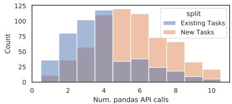  
Figure 2: Histogram of the number of pandas API calls.

Comparing with Existing Datasets Tab. 1 compares ARCADE with existing data science code generation datasets. We remark that ARCADE is the only benchmark that satisfies all the following criteria: First, A<sub>. . . . . . . . . .</sub>RCADE<sub>. . . . . . . . . . .</sub>features <sub>. . . . . . . . . .</sub>succinct . . . .<sup>and</sup>. . . . . . . . . .<sup>realistic</sup> . . . . . . . .<sup>intents</sup>. . .<sup>as</sup>. . . . . . . . . .<sup>problem</sup>. . . . . . . . . . . . . . . . .<sup>specifications (“In-</sup> tents Type” column, Tab. 1), which are significantly shorter (“Intent Length” column) than the verbose Markdown problem definitions found in tutorial or assignment notebooks $( c . f .$ JuICe, DSP). AR-CADE also does not rely on extra specifications such as unit tests $( c . f .$ DSP), which better capture the real-world scenario where developers prompt LMs using ephemeral comments for code completion (Barke et al., 2022). Most of these intents are often underspecified (mentioned earlier in §3.2), requiring a more robust evaluation metric to consider alternative answers (discussed in §3.3), while motivating future research on improving prediction diversity to cover plausible problem interpretations (explored in §5.1) or explicit modeling of intent uncertainty (Lin et al., 2022). Second, <sup>A</sup>. . . . . . . . . . .<sup>RCADE</sup> . . . . . . . . . .<sup>contains</sup>. . . . . . .<sup>more</sup>. . . . . . . . .<sup>related</sup> . . . . . . . . . . . .<sup>problems</sup> . . .<sup>in</sup> . .<sup>a</sup> <sub>. . . . . . .</sub>single <sub>. . . . . . . . . . .</sub>notebook (“P./N.B.” column) with diverse dependency patterns (e.g., Fig. 1), capturing the essence of interactive computing. This makes our dataset useful in testing an LLM’s ability to understand rich contexts, including existing user-written cells, as well as preceding problems and their solutions (§2). Third, A<sub>. . . . . . . . . .</sub>RCADE<sub>. . . . . . . . . . . . .</sub>challenges<sub>. . . . . . . .</sub>LLMs with grounded language understanding, where the model needs to ground semantic concepts in the intents (e.g., “max and min” in u , Fig. 1) to the corresponding variable execution states in the context (e.g., the TIME column in df). The need for understanding semi-structured data and performing necessary transformations (Pasupat and Liang, 2015) using an open-domain programming language (PL, Python) makes language grounding in ARCADE more difficult than in existing EDA tasks using domain-specific PLs, such as semantic parsing over databases (Yu et al., 2019b). <sup>Fourth, A</sup>. . . . . . . . . . .<sup>RCADE</sup> . . . .<sup>has</sup>. . . . . . .<sup>more</sup>. . . . . . . . . . .<sup>complex</sup>. . . . . . . . . . . .<sup>problems</sup> <sup>with</sup>. . . . . . . . . . . . .<sup>richer</sup> . . . . . . .<sup>usage</sup> . . .<sup>of</sup>. . . . . . . . . . . . .<sup>real-world</sup> . . . . .<sup>data</sup>. . . . . . . . .<sup>science</sup>. . . . . . .<sup>APIs.</sup> The number of pandas APIs used in each problem (“# API” in Tab. 1) is on par with DS-1000 and significantly higher than other datasets.<sup>5</sup> Finally, besides problem complexity, <sub>. . . . .</sub>60%<sub>. . . .</sub>of <sub>. . . . . . . . . . .</sub>problems . .<sup>in</sup>. . . . . . . . . . . .<sup>ARCADE</sup> . . . .<sup>are</sup>. . . . . . . . . .<sup>created</sup> . . . . . .<sup>from</sup>. . . . . . . . .<sup>scratch</sup>. . . .<sup>to</sup> . . . . . . . . . .<sup>mitigate</sup> <sub>. . . . . . . . . . . .</sub>evaluation <sub>. . . . .</sub>data<sub>. . . . . . . . . .</sub>leakage. These data science problems also target recent tabular ML datasets, making ARCADE a reliable benchmark to test the generalization ability of LLMs in semi-structured knowledge understanding (Lee et al., 2021).

## 3.3 Evaluation by Fuzzy Output Matching

We aim to synthesize programs in notebooks using only cell contexts and NL intents without extra specification such as unit tests (§2). As in §3.2, those intents are often underspecified and have multiple alternative solutions. We therefore approximately match the execution output of a predicted program with the annotated reference to determine if they are functionally equivalent primarily based on two categories of heuristics.<sup>6</sup> First, we canonicalize variables with different container data types. Second, we allow for partial matching between complex DataFrames. Specifically, for a reference frame v with a set of column vectors $\{ v _ { i } \}$ , each representing the cell values for the i-th column, a prediction vˆ is considered equivalent with v iff for any $v _ { i } \in \pmb { v } , v _ { i } \in \hat { \pmb { v } }$ . Intuitively, we consider a predicted program correct if its output DataFrame contains all the columns (and cell entries) in the reference frame, since a user could easily create a more compact view of the frame by selecting a subset of target columns. Empirically, we find our evaluation metric is reliable in identifying solutions with alternative output structures, with a relatively low false-negative rate (Appendix J).

## 4 PACHINCO: Adapting Code LMs to Computational Notebooks

We introduce PACHINCO, an LM for notebooks. Base LM PACHINCO is based on PALM, a family of decoder-only LMs for NL tasks (Chowdhery et al., 2022). Specifically, we use the 62B PALM model trained on 1.3T tokens with a mixture of conversational, webpages and code data (Section F, Chowdhery et al. (2022)). Starting with this base LM, we first fine-tune on Python source code and then fine-tune further on Jupyter notebooks.

Fine-tuning on Python Code We first fine-tune the base LM on a corpus of near-deduplicated, permissively-licensed Python source code files from GitHub, with 64B tokens in total. We finetune PALM for 1 epoch following the hyper parameters setup in Chowdhery et al. (2022). This model is already a strong code LM, even outperforming the larger code LM PALM-Coder 540B on existing program synthesis benchmarks (§5.2).

Fine-tuning on Notebooks We then perform a second stage of fine-tuning on a large collection of 3.8M Jupyter notebooks from GitHub (9.6B tokens). Since our evaluation notebooks in the Existing Tasks split are also from GitHub, we also perform near-deduplication to remove any training notebooks with one cell similiar to any cells in the notebooks in Existing Tasks to prevent data contamination. We use nbconvert to linearize notebooks into Python code. Refer to Appendix D for details and Appendix K for a data card.

## 5 Experiments

Models We evaluate PACHINCO and state-ofthe-art public code LLMs, namely CODEGEN (Nijkamp et al., 2022) and INCODER (Fried et al., 2022). We test both the monolingual (Python-only) and the multilingual version of CODEGEN. IN-CODER may be a more appealing comparison since it is trained on 5GB of Jupyter notebooks.

Inference and Metrics We convert each problem into a prompt (§5.1) and draw samples using nucleus sampling. Following Chen et al. (2021a), we report pass@k metric, defined as the fraction of problems with at least one correct sample given a sample size k. To reduce variance, we estimate pass@k $( k \le 3 0 )$ by drawing 50 samples for each problem (Chen et al., 2021a). Decoding temperature t is 0.2 for k = 1 and 0.8 for k > 1. Refer to Appendix E for inference details.

```python
Prompt Prefix (Exemplars) Which countries host at least two Olympic games?
# Solution: Let's solve this problem step-by-step. preamble
# Step 1: Get the counts each country hosted Olympics
count_df = df['Country'].value_counts()
# Step 2: Get the rows whose average score is above 90
filtered_df = count_df[count_df >= 2]
# Step 3: Get the country names as a list explanation
filtered_df.index.tolist()
[1] import pandas as pd
df = pd.read_csv('stores.csv')
[2] # Schema of Dataframes:
# Columns in df with example values:
# Stu_Name (Mike),Engineering (90),English (89),Math (92)
[3] Get the students with an average score above 90 N
for science subjects
[3a] ▸ Vanilla Prediction (no exemplars):
df['Science_Avg'] = (df['Engineering']+df['Math'])/2
df[df['Science_Avg'] > 90][['Stu_Name','Science_Avg']]
[3b] ▸ Step-by-Step Prompting (with exemplars):
# Solution: Let's solve this problem step-by-step. preamble
# Step 1: Create a new column with the average score of
# engineering and math explanation
df['Science_Avg'] = (df['Engineering'] + df['Math']) / 2
# Step 2: Get the rows whose average score is above 90
df_score_above_90 = df[df['Science_Avg'] > 90]
# Step 3: Return the student name and average scores
result = df_score_above_90[['Stu_Name', 'Science_Avg']]
```  
Figure 3: An example problem. Cells 1-2 (c<sub>1</sub>, c<sub>2</sub>) are the notebook context, and Cell 3 (c<sub>3</sub>) contains the intent. Cells 3a and 3b show two example completions of c<sub>3</sub>.

## 5.1 LM Prompting Strategies

We explore two prompting strategies: prompting using the notebook context of a problem (§5.2), and few-shot prompting with extra exemplars as a prompt prefix before the notebook context (§5.3) to impose more control on the predicted code’s style.

Prompting with Notebook Contexts Fig. 3 depicts an example problem at c<sub>3</sub> for prompting, where the prompt is the notebook context (preceding cells c<sub>1</sub> and c<sub>2</sub>) and the current intent. The context also includes NL descriptions of the imported DataFrame schema (c<sub>2</sub>), such as its columns and example cell values, crucial for grounded understanding of structured knowledge (Xie et al., 2022). Completion 3a shows an example prediction. For the following problems after $c _ { 3 }$ (not shown), we use annotated reference solutions to previous turns in their contexts, reminiscent of multi-turn taskoriented dialogue evaluation (Andreas et al., 2020).

Using Extra Few-shot Exemplars Besides the basic setting, we also explore prompting using four additional NL-to-code exemplars as prompt prefix before the notebook context. As shown in Fig. 3 (Completion 3b), we focus on prompting LMs to generate code that follows a multi-line, step-bystep (SbS) decomposition structure, in contrast with the common practice of chaining multiple API calls in a single line (Completion 3a). Each step is also optionally inlined with NL explanations . Such step-wise explanations could help novice developers understand model predictions, and they have been found effective for reasoning (Wei et al., 2022; Gao et al., 2022) and program induction (Nye et al., 2021) tasks. Following Kojima et al. (2022), we also use a preamble to further elicit step-wise decomposition in predictions. See Appendix L for a complete list of example prompts.

<table><tr><td rowspan=1 colspan=5>Existing Tasks    New Taskspass@k1    5   30   1    5   30</td></tr><tr><td rowspan=1 colspan=5>Existing Models</td></tr><tr><td rowspan=1 colspan=5>INCODER 1B         20.830.947.02.3  4.0 9.9</td></tr><tr><td rowspan=1 colspan=5>INCODER 6B         28.240.656.23.5  7.1 15.8CODEGENmulti350M 9.0 13.621.310.8 0.9 2.6</td></tr><tr><td rowspan=1 colspan=5>CODEGENmulti2B    18.725.939.3 1.5  2.6 6.8</td></tr><tr><td rowspan=1 colspan=5> $\mathrm { C o D E G E N _ { m u l t i } \ 6 B }$    20.028.542.8一1.7  3.4 8.9</td></tr><tr><td rowspan=1 colspan=5> $\mathrm { C o D E G E N _ { m u l t i } 1 6 B }$   20.931.447.12.5  4.8 12.4</td></tr><tr><td rowspan=1 colspan=1>CODEGENmono 350M 11.3</td><td rowspan=1 colspan=1>18.5</td><td rowspan=1 colspan=3>32.8 1.5 1.9 5.1</td></tr><tr><td rowspan=1 colspan=1> $\mathrm { C o D E G E N _ { m o n o } 2 B }$     24.7</td><td rowspan=1 colspan=1>35.5</td><td rowspan=1 colspan=3>52.9 3.1  6.3 16.0</td></tr><tr><td rowspan=1 colspan=1> $\mathrm { C o D E G E N } _ { \mathrm { m o n o } } \ 6 \mathrm { B }$     28.7</td><td rowspan=1 colspan=1>42.2</td><td rowspan=1 colspan=1>60.9I</td><td rowspan=1 colspan=2>4.0  8.6 20.4</td></tr><tr><td rowspan=1 colspan=1> $\mathbf { C o D E G E N _ { m o n o } }$ 16B   32.6</td><td rowspan=1 colspan=1>46.2</td><td rowspan=1 colspan=1>63.9</td><td rowspan=1 colspan=1>6.1</td><td rowspan=1 colspan=1>12.125.2</td></tr><tr><td rowspan=3 colspan=1>二二二二二CODE-cushman-001   38.1</td><td></td><td></td><td></td><td></td></tr><tr><td rowspan=2 colspan=1>50.4</td><td></td><td></td><td></td></tr><tr><td rowspan=1 colspan=2>68.8 8.9</td><td rowspan=1 colspan=1>二二    二二14.531.0</td></tr><tr><td rowspan=1 colspan=1>CoDE-davinci-002    53.0</td><td rowspan=1 colspan=1>66.3</td><td rowspan=1 colspan=3>81.523.436.054.7</td></tr><tr><td rowspan=1 colspan=2>Our Models</td><td rowspan=1 colspan=3></td></tr><tr><td rowspan=1 colspan=2>Base PALM 62B      35.749.4</td><td rowspan=1 colspan=3>67.8 7.2 12.726.4</td></tr><tr><td rowspan=1 colspan=5>+ Python f.t.        43.658.875.311.921.740.7</td></tr><tr><td rowspan=1 colspan=5>+ PACHINCO       48.964.378.318.030.547.7— Schema Desc.   44.260.075.013.022.236.1</td></tr></table>

Table 2: pass@k using notebook context as prompts.

## 5.2 Main Results

Tab. 2 reports pass@k on ARCADE using notebook contexts as prompts. PACHINCO achieves strong performance on both the Existing Tasks split and the New Tasks split due to its larger size and domain-specific fine-tuning.

Impact of Fine-tuning The base PALM model outperforms most public code LMs and is on par with CODEGEN<sub>mono</sub> 16B. Fine-tuning on Python (+Pythonf.t., Tab. 2) and notebooks data (+PACHINCO) further closes the domain gap with improved pass@k. The absolute gain after finetuning on Python code is higher than continued training on notebooks, likely because the semantic gap between NL data and Python code is larger than that between general Python code and notebooks.

<table><tr><td>Dataset Metric</td><td>HUMANEVAL pass@100</td><td>MBPP pass@80</td><td>TRANSCODER pass@25</td></tr><tr><td>PALM-CODER 540B†</td><td>88.4</td><td>80.8</td><td>82.5</td></tr><tr><td>CoDE-davinci-002</td><td>92.1α</td><td>84.5α</td><td>87.9</td></tr><tr><td>PaLM 62B (Python f.t. §4)</td><td>91.5</td><td>86.0</td><td>86.4</td></tr></table>

Table 3: Evaluation of existing code LMs and PaLM 62B after the first-stage fine-tuning on Python code. †Results from Chowdhery et al. (2022). <sup>α</sup> Results from Chen et al. (2022)

We note that the base PALM 62B model after fine-tuning on Python code corpora is already a strong code LM, performing competitively compared to other strong code LMs on established code generation (HUMANEVAL and MBPP) and translation (TRANSCODER) tasks (Tab. 3). With 7 more Python code tokens, our Python finetuned PALM 62B model outperforms the 8 larger PALM-CODER 540B model on all the three tasks.

Comparing Existing Code LMs Among models with similar size and amount of Python training data (INCODER 6B vs. $\mathbf { C o D E G E N _ { m u l t i } }$ 6B), INCODER 6B performs better, likely because IN-CODER was trained on Jupyter notebooks.<sup>7</sup> With 4 more Python data, CODEGEN<sub>mono</sub> 6B takes over. Appendix F further reports the scaling curve of CODEGEN on ARCADE, where pass@k scales as a power law with model size.

For reference, we also report the results using the CODEX API. PACHINCO significantly outperforms the smaller cushman API, while davinci-002 is stronger. While we cannot gain much insight from the results due to limited knowledge about davinci-002, through error analysis, we find that davinci-002 is better at instruction following, especially in understanding NL descriptions of complex DataFrame schema (§5.1). Intuitively, compared to existing benchmarks, NL understanding on ARCADE is more challenging given its succinct and potentially ambiguous intents together with rich contexts. Therefore, the gap between CODEXdavinci-002 and our models could be larger on AR-CADE compared to that on other datasets in Tab. 3. We leave improving the instruction following skills of PACHINCO as interesting future work.

Comparing Existing Tasks and New Tasks The pass@k scores on Existing Tasks are significantly higher than on New Tasks across all models. However, comparing the improvements after Python and notebook-specific fine-tuning of the base LM, the gain on New Tasks is higher. One reason is that the problems in Existing Tasks are overall simpler than in New Tasks (§3.2). Additionally, some code data similar to our evaluation notebooks in Existing Tasks could leak into the training data of those LMs. Despite our significant effort to deduplicate fine-tuning data against Existing Tasks (§4), the base LM might have seen similar code data on the Web, e.g., as data science tutorials. This highlights the importance of robust evaluation using held-out data, which is the purpose of the New Tasks split.

<table><tr><td>Models</td><td>pass@30 # API</td><td></td><td>Lines of Code (LoC)</td><td>Comment Tokens Lines</td><td>/Line</td><td>API /Line</td></tr><tr><td>Baseline (Tab. 2)</td><td>47.7</td><td>4.9</td><td>2.3</td><td>0.1</td><td>21.1</td><td>3.2</td></tr><tr><td>+ More Context</td><td>49.3</td><td>4.9</td><td>2.3</td><td>0</td><td>21.1</td><td>3.1</td></tr><tr><td colspan="7">Prompting with Additional Few-shot Exemplars</td></tr><tr><td>Vanilla Code</td><td>49.9</td><td>5.3</td><td>2.4</td><td>0.1</td><td>20.8</td><td>3.1</td></tr><tr><td>Step-by-Step Code</td><td>51.9</td><td>5.6</td><td>3.2</td><td>0.1</td><td>17.8</td><td>2.7</td></tr><tr><td>+ Preamble</td><td>51.9</td><td>5.9</td><td>3.5</td><td>0.2</td><td>16.9</td><td>2.5</td></tr><tr><td>+ Pre. + Explanation</td><td>52.5</td><td>6.8</td><td>4.2</td><td>3.3</td><td>14.9</td><td>2.2</td></tr></table>

Table 4: pass@30 and code style metrics for few-shot prompting on New Tasks. Results are averaged over three runs with different prompt prefixes.

Ambiguous Intents are Hard to Solve without Extra Specifications In §3 we discussed how intents in ARCADE can be ambiguous and underspecified (§3.2), and mitigating intent ambiguity using additional specifications to further clarify on the desired target output (§3.1). Indeed, those additional specifications are crucial for disambiguation. Without them the pass@30 of PACHINCO on the subset of 136 intents annotated with extra specifications on New Tasks dropped from 46.5% to 27.8% (43.8 on the full split v.s. 47.7 on Tab. 2), suggesting the importance of modeling prompt ambiguity for LLMs as future work.

Grounded NL Understanding is Important Our prompts contain NL descriptions of imported DataFrames (§5.1), crucial for grounded understanding of NL intents (§3.2). Removing such schema descriptions significantly worsens the results, especially on New Tasks, as the last row in Tab. 2 ( Schema Desc.) shows. Encoding the states for more intermediate variables could likely further improve performance, which we leave as important future work.

Further Analysis We report more ablation experiments, such as pass@k w.r.t. problem complexity and the notebook context size in Appendix G.

## 5.3 Few-shot Prompting Results

Next, we investigate few-shot prompting to help a model better understand the task while controlling the style of predictions.<sup>8</sup> Tab. 4 summarizes the results on New Tasks. We start with the prompting strategy of predicting just the Step-by-Step Code (SbS) without preambles or explanations (i.e., only the code part of Completion 3b in Fig. 3), which improves over the baseline using only notebook contexts $( c . f .$ Tab. 2). SbS prompting is especially effective for problems without adequate contexts, yielding 6% absolute improvements for the first two rounds of problems in a notebook as compared to the zero-shot baseline. More interestingly, even if we include more context in the baseline such that its prompt length matches SbS prompting (Baseline + More Context), SbS prompting still outperforms, again suggesting the complimentary value of extra exemplars.

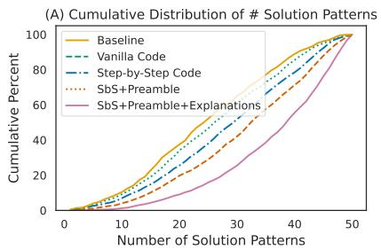

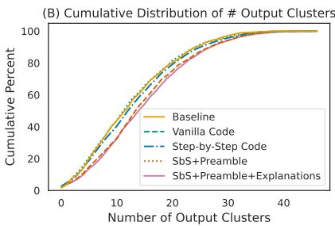

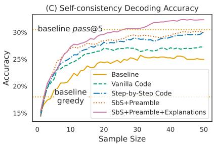  
Figure 4: Cumulative distributions of the number of (A) unique API sequences and (B) output clusters, extracted from PACHINCO’s 50 predictions on the New Tasks split. Curves that appear more to the right represent prompting methods with greater diversity in the samples. Step-by-step prompting leads to much greater diversity than the baselines. (C) Self-consistency decoding accuracy using 1 reranked sample on New Tasks.

Step-by-step Prompting Improves Code Style SbS prompting also changes the style of predicted code, which is decomposed into more lines $( \mathrm { L o C } _ { \uparrow } ,$ Tab. 4) where each line is simpler (Tokens/API per Line ). In contrast, if we instead prompt the model using exemplars with “vanilla”-styled code following the common practice of chaining multiple pandas API calls in a single line (Vanilla Code, e.g., Completion 3a in Fig. 3), we get less pass@k improvement over the baseline while the code style remains consistent.

Next, using preambles (+Preamble) to further encourage the model to produce step-by-step solutions improves the level of decomposition (LoC , Tokens/API per Line ) while maintaining pass@k. More surprisingly, with additional inline NL explanations for each step (+Pre. + Explanation), PACHINCO produces even more decomposed solutions with slightly improved accuracy. As a result, those predictions have rich NL comments, with the number of comment lines nearly equal to the number of code lines. Interestingly, the predicted solutions are also more complex, as indicated by the increased pandas API usage (# $\mathrm { A P I } _ { \uparrow } )$ . However, as we explain in Appendix H, on Existing Tasks, while prompting with NL explanations still alters the code style, pass@k is slightly worse. This is likely due to the fact that this split contains problems similar to the base LM’s training data, and prompting the model to generate additional NL comments breaks its “flow” of generating code by memorization. Moreover, this split is also dominated by simpler tasks requiring fewer steps, while explanation-based prompting favors predicting more complex solutions with richer API usage and more code tokens (Tab. 4). Nevertheless, prompting with explanations yields more diverse predictions and could also help developers better understand the generated solutions, as we discuss next and also in §6.

Step-by-Step Prompting Diversifies Solutions We also explore whether SbS prompting helps produce more diverse solution approaches. Intuitively, more output diversity could improve the odds of finding a solution at higher sample sizes. Determining whether two solutions are “different” is difficult and subjective, but we approximate this in two ways. First, we use the sequence of pandas API calls as a signature of the high-level solution pattern. Second, since two solutions might have the same functionality (executing to the same output), we also cluster predictions based on their outputs.

Figs. 4a and 4b plot the cumulative distributions of the number of unique solution patterns and output clusters on the New Tasks split. SbS prompting increases diversity on both metrics compared to the baselines. Notably, prompting with NL explanations yields even more solution patterns.

Diverse predictions could help handle underspecified intents (§3.2), since they might correspond to different interpretations of an ambiguous intent. Having diverse predictions also allows us to translate better pass@k performance into better performance on a single suggestion using post-hoc reranking such as self-consistency decoding (Wang et al., 2022b), where we return the user one prediction from the largest output cluster instead of showing all k predictions (Fig. 4c). SbS prompting significantly improves over baselines. Notably, the 1-sample accuracy of SbS with NL explanations outperforms pass@5 of the baseline in Tab. 2. Refer to Appendix I for further analysis.

As a side note, while SbS prompting leads to improved sample diversity, it may not directly improve code quality. If we consider functional correctness to approximate code quality, we observe that vanilla few-shot prompting and SbS variants have a similar fraction of correct samples ( 15%). This suggests that for SbS prompting, it is higher sample diversity that may contribute to improved pass@k (k > 1) and reranking accuracy instead of other potential factors.

## 6 Case Study: How Useful is Predicted Code with Step-wise Explanations?

Finally, we remark that besides improving solution diversity, step-by-step prompting with NL explanations could also potentially help novice data scientists understand model-generated solutions, as shown in the following qualitative case study.

First, NL explanations could help users follow the flow of complex data transformations for programs involving a chain of pandas operations. By decomposing and explaining how data is manipulated after individual transformation steps, it is easier for users to understand the solution and track its dataflow behind the scene, especially when some steps involve complex computation (Fig. 17), or the underlying schema is less intelligible (e.g., column names with abbreviations, Fig. 18). Additionally, some inline explanations also describe the output of intermediate steps, which is particularly helpful when these steps involve advanced pandas functions whose output structure may not be obvious, such as pd.unstack (Fig. 19)

Meanwhile, step-wise NL explanations serve as high-level procedural descriptions of code, which enable users to easily browse through and understand different solution approaches without being distracted by nuances in the actual code implementation (Fig. 20). Moreover, explanations also help users verify the code solutions by identifying potentially incorrect steps (Fig. 21). The observations presented here offer insight into potential future avenues to improve the utility of code LMs for developers through the use of step-by-step explanations, which we leave as important future work.

## 7 Related Work

Automating Data Science The amount of expertise required in data science has called for development of systems to automate its lifecycle (Wang et al., 2021b). Much work has focused on automating feature engineering and tuning of ML models (AutoML, He et al., 2021; Karmaker et al., 2020), with well-established systems (Feurer et al., 2015) and benchmarks (Zöller and Huber, 2021). This paper focuses on automating tabular data wrangling and EDA tasks, which account for nearly the same amount of code and documentations in notebooks as that for ML-related tasks (Agashe et al., 2019; Wang et al., 2022a). Along this line, existing research synthesizes data wrangling programs using I/O examples (Bavishi et al., 2019; Shi et al., 2020) or partial table contents (Chen et al., 2021c), followed by recent efforts using LLMs with additional NL specifications (Jain et al., 2021; Bavishi, 2022). This paper considers code generation in notebooks with multiple contextually dependent problems (see §3.2 for recent work). In addition, other works have also considered applications such as synthesizing visualization plots (Amar et al., 2005; Wang et al., 2019; Narechania et al., 2020; Fu et al., 2020; Wu et al., 2022b).

Context-driven Code Generation Our work is another application of context-driven code generation, which maps a series of contextually dependent utterances to programs, such as domain-specific logical forms (Zettlemoyer and Collins, 2009; Long et al., 2016; Iyyer et al., 2017; Andreas et al., 2020), SQL queries over databases (Hemphill et al., 1990; Suhr et al., 2018; Yu et al., 2019a,b), or generalpurpose PLs (Nijkamp et al., 2022). ARCADE further offers contextually dependent utterances exhibiting non-trivial dependencies (§2), with target programs defined in a general-purpose PL.

## 8 Conclusion

In this paper we present ARCADE, a code generation benchmark for data wrangling and EDA tasks in computational notebooks, featuring problems with realistic NL intents and rich contexts. We also develop PACHINCO, a 62B LM tailored for data science. PACHINCO outperforms public LMs on ARCADE, while being effective in few-shot learning to improve code style and solution diversity.

## 9 Limitations

We discuss limitations of our work that hopefully could inspire future research in this avenue.

Task Coverage in ARCADE ARCADE consists of realistic data wrangling and EDA tasks for a variety of ML datasets. In particular, we focus on problems that can be solved using pandas because of its popularity in data science — 90% of Kaggle notebooks use pandas. Still, our annotated problems may not cover all the types of tasks in these two categories. As an example, data visualization is an important part of EDA. Our dataset also includes 59 natural language to plotting problems, which are not used in this paper due to challenges in automated evaluation (Chen et al., 2021b). Future work might consider evaluation of plotting tasks using unit tests (Lai et al., 2022). Additionally, some of the existing datasets in Tab. 1 usually contain broader types of problems other than the wrangling and EDA tasks considered in this paper (e.g., fitting ML models, §7). We leave expanding the task spectrum as important future work.

Session-level Evaluation ARCADE features multiple contextually dependent problems in computational notebooks. As the first step towards evaluating code LMs in this interactive program synthesis paradigm, we report turn-level accuracy, and generate notebook context for prompting using ground-truth solutions for the prior turns of a problem (§5.1), following the common evaluation protocol in task-oriented dialogue (Hosseini-Asl et al., 2020; Andreas et al., 2020). Future work could consider a more realistic scenario of session-level evaluation where history contexts consist of model-predicted code instead of the reference (Yang et al., 2020; Nijkamp et al., 2022). However, this evaluation setting is still not ideal without modeling the user (e.g., asking follow-up questions to correct a model’s predictions in a turn before proceeding to the next round, see Austin et al., 2021), which often requires building specialized simulators (Cheng et al., 2022a).

Reliance on Large Language Models Our experiments are based on public and in-house large code LMs (PACHINCO), which require adequate computational resources<sup>9</sup> and create carbon emissions (Patterson et al., 2021). Their predictions could also be subject to known issues such as misalignment with user intents; for a discussion of these and other risks of code language models, see Chen et al. (2021a, Appendices E-H) and Chowdhery et al. (2022, Section 6.4). To reduce the amount of computational resources required, our initial prompting experiments (§5.2) and error analysis (Appendix J) suggest that leveraging program execution information (e.g., schema descriptions) could be a promising direction to improve sample efficiency and reduce the size of code LMs (Nye et al., 2021), while explicit modeling of code-intent correspondence (Zhang et al., 2022) could be a viable path to mitigate alignment issues in model predictions. In addition, as generative AI coding tools are becoming more available to developers, more efforts are required to understand the potential limitations of those systems and the risks they may pose, such as producing insecure code and over-reliance on model predictions (Chen et al., 2021a). We leave addressing those issues as important future work.

## Acknowledgements

We are grateful to Meg Risdal and Goeff Thomas from Kaggle for help with dataset collection, and Miltos Allamanis for research discussion. We thank Jo Chick from the research partnership team, and Rebecca Watson, Ashley Dawe and Kimberly Herrera from Upwork to help with managing the annotation project. We thank Aroma Mahendru for writing the data card section. We also thank Cheriskumar Patel, Preet Patel, and Jayendra Parmar for general assistance with the project. We thank anonymous reviewers for their insightful comments.

## References

Rajas Agashe, Srinivasan Iyer, and Luke Zettlemoyer. 2019. JuICe: A large scale distantly supervised dataset for open domain context-based code generation. In Proceedings of the 2019 Conference on Empirical Methods in Natural Language Processing and the 9th International Joint Conference on Natural Language Processing (EMNLP-IJCNLP), pages 5436–5446, Hong Kong, China. Association for Computational Linguistics.

Charu Aggarwal, Djallel Bouneffouf, Horst Samulowitz, Beat Buesser, Thanh Hoang, Udayan Khurana, Sijia Liu, Tejaswini Pedapati, Parikshit Ram, Ambrish Rawat, et al. 2019. How can AI automate end-to-end data science? arXiv preprint arXiv:1910.14436.

Robert A. Amar, James R. Eagan, and John T. Stasko. 2005. Low-level components of analytic activity

in information visualization. IEEE Symposium on Information Visualization, 2005. INFOVIS 2005., pages 111–117.

Jacob Andreas, Johannes Bufe, David Burkett, Charles C. Chen, Joshua Clausman, Jean Crawford, Kate Crim, Jordan DeLoach, Leah Dorner, Jason Eisner, Hao Fang, Alan Guo, David Leo Wright Hall, Kristin Delia Hayes, Kellie Hill, Diana Ho, Wendy Iwaszuk, Smriti Jha, Dan Klein, Jayant Krishnamurthy, Theo Lanman, Percy Liang, C. H. Lin, Ilya Lintsbakh, Andy McGovern, Aleksandr Nisnevich, Adam Pauls, Dmitrij Petters, Brent Read, Dan Roth, Subhro Roy, Jesse Rusak, Beth Ann Short, Div Slomin, B Snyder, Stephon Striplin, Yu Su, Zachary Tellman, Sam Thomson, A. A. Vorobev, Izabela Witoszko, Jason Wolfe, A. G. Wray, Yuchen Zhang, and Alexander Zotov. 2020. Task-oriented dialogue as dataflow synthesis. Transactions of the Associationfor Computational Linguistics, 8:556–571.

Jacob Austin, Augustus Odena, Maxwell Nye, Maarten Bosma, Henryk Michalewski, David Dohan, Ellen Jiang, Carrie Cai, Michael Terry, Quoc Le, et al. 2021. Program synthesis with large language models. arXiv preprint arXiv:2108.07732.

Shraddha Barke, Michael B James, and Nadia Polikarpova. 2022. Grounded copilot: How programmers interact with code-generating models. arXiv preprint arXiv:2206.15000.

Rohan Bavishi. 2022. Tools and Techniques for Building Programming Assistantsfor Data Analysis. Ph.D. thesis, EECS Department, University of California, Berkeley.

Rohan Bavishi, Caroline Lemieux, Roy Fox, Koushik Sen, and Ion Stoica. 2019. Autopandas: neuralbacked generators for program synthesis. Proceedings of the ACM on Programming Languages, 3:1 – 27.

Tom Brown, Benjamin Mann, Nick Ryder, Melanie Subbiah, Jared D Kaplan, Prafulla Dhariwal, Arvind Neelakantan, Pranav Shyam, Girish Sastry, Amanda Askell, et al. 2020. Language models are few-shot learners. Advances in neural information processing systems, 33:1877–1901.

Shubham Chandel, Colin B Clement, Guillermo Serrato, and Neel Sundaresan. 2022. Training and evaluating a Jupyter notebook data science assistant. arXiv preprint arXiv:2201.12901.

Bei Chen, Fengji Zhang, A. Nguyen, Daoguang Zan, Zeqi Lin, Jian-Guang Lou, and Weizhu Chen. 2022. Codet: Code generation with generated tests. ArXiv, abs/2207.10397.

Mark Chen, Jerry Tworek, Heewoo Jun, Qiming Yuan, Henrique Ponde, Jared Kaplan, Harrison Edwards, Yura Burda, Nicholas Joseph, Greg Brockman, Alex Ray, Raul Puri, Gretchen Krueger, Michael Petrov, Heidy Khlaaf, Girish Sastry, Pamela Mishkin,

Brooke Chan, Scott Gray, Nick Ryder, Mikhail Pavlov, Alethea Power, Lukasz Kaiser, Mohammad Bavarian, Clemens Winter, Philippe Tillet, Felipe Petroski Such, David W. Cummings, Matthias Plappert, Fotios Chantzis, Elizabeth Barnes, Ariel Herbert-Voss, William H. Guss, Alex Nichol, Igor Babuschkin, S. Arun Balaji, Shantanu Jain, Andrew Carr, Jan Leike, Joshua Achiam, Vedant Misra, Evan Morikawa, Alec Radford, Matthew M. Knight, Miles Brundage, Mira Murati, Katie Mayer, Peter Welinder, Bob McGrew, Dario Amodei, Sam Mc-Candlish, Ilya Sutskever, and Wojciech Zaremba. 2021a. Evaluating large language models trained on code. ArXiv, abs/2107.03374.

Xinyun Chen, Linyuan Gong, Alvin Cheung, and Dawn Xiaodong Song. 2021b. Plotcoder: Hierarchical decoding for synthesizing visualization code in programmatic context. In Annual Meeting of the Associationfor Computational Linguistics.

Xinyun Chen, Petros Maniatis, Rishabh Singh, Charles Sutton, Hanjun Dai, Max Lin, and Denny Zhou. 2021c. Spreadsheetcoder: Formula prediction from semi-structured context. In International Conference on Machine Learning.

Qinyu Cheng, Linyang Li, Guofeng Quan, Feng Gao, Xiaofeng Mou, and Xipeng Qiu. 2022a. Is multiwoz a solved task? an interactive tod evaluation framework with user simulator. ArXiv, abs/2210.14529.

Zhoujun Cheng, Tianbao Xie, Peng Shi, Chengzu Li, Rahul Nadkarni, Yushi Hu, Caiming Xiong, Dragomir Radev, Mari Ostendorf, Luke Zettlemoyer, et al. 2022b. Binding language models in symbolic languages. arXiv preprint arXiv:2210.02875.

Aakanksha Chowdhery, Sharan Narang, Jacob Devlin, Maarten Bosma, Gaurav Mishra, Adam Roberts, Paul Barham, Hyung Won Chung, Charles Sutton, Sebastian Gehrmann, et al. 2022. Palm: Scaling language modeling with pathways. arXiv preprint arXiv:2204.02311.

David Donoho. 2017. 50 years of data science. Journal of Computational and Graphical Statistics, 26(4):745–766.

Matthias Feurer, Aaron Klein, Katharina Eggensperger, Jost Springenberg, Manuel Blum, and Frank Hutter. 2015. Efficient and robust automated machine learning. Advances in neural information processing systems, 28.

Daniel Fried, Armen Aghajanyan, Jessy Lin, Sida Wang, Eric Wallace, Freda Shi, Ruiqi Zhong, Wentau Yih, Luke Zettlemoyer, and Mike Lewis. 2022. Incoder: A generative model for code infilling and synthesis. arXiv preprint arXiv:2204.05999.

Siwei Fu, Kai Xiong, Xiaodong Ge, Yingcai Wu, Siliang Tang, and Wei Chen. 2020. Quda: Natural language queries for visual data analytics. ArXiv, abs/2005.03257.

Yujian Gan, Xinyun Chen, Qiuping Huang, Matthew Purver, John R. Woodward, Jinxia Xie, and Pengsheng Huang. 2021. Towards robustness of text-to-SQL models against synonym substitution. pages 2505–2515, Online. Association for Computational Linguistics.

Luyu Gao, Aman Madaan, Shuyan Zhou, Uri Alon, Pengfei Liu, Yiming Yang, Jamie Callan, and Graham Neubig. 2022. PAL: Program-aided language models. ArXiv, abs/2211.10435.

Xin He, Kaiyong Zhao, and Xiaowen Chu. 2021. AutoML: a survey of the state-of-the-art. Knowledge-Based Systems, 212:106622.

Charles T. Hemphill, John J. Godfrey, and George R. Doddington. 1990. The ATIS spoken language systems pilot corpus. In Speech and Natural Language: Proceedings of a Workshop Held at Hidden Valley, Pennsylvania, June 24-27,1990.

Geert Heyman, Rafael Huysegems, Pascal Justen, and Tom Van Cutsem. 2021. Natural language-guided programming. Proceedings of the 2021 ACM SIG-PLAN International Symposium on New Ideas, New Paradigms, and Reflections on Programming and Software.

Ehsan Hosseini-Asl, Bryan McCann, Chien-Sheng Wu, Semih Yavuz, and Richard Socher. 2020. A simple language model for task-oriented dialogue. arXiv preprint arXiv:2005.00796.

Junjie Huang, Chenglong Wang, Jipeng Zhang, Cong Yan, Haotian Cui, Jeevana Priya Inala, Colin Clement, Nan Duan, and Jianfeng Gao. 2022. Execution-based evaluation for data science code generation models. arXiv preprint arXiv:2211.09374.

Mohit Iyyer, Wen tau Yih, and Ming-Wei Chang. 2017. Search-based neural structured learning for sequential question answering. In Annual Meeting of the Associationfor Computational Linguistics.

Naman Jain, Skanda Vaidyanath, Arun Iyer, Nagarajan Natarajan, Suresh Parthasarathy, Sriram Rajamani, and Rahul Sharma. 2022. Jigsaw: Large language models meet program synthesis. In Proceedings of the 44th International Conference on Software Engineering, pages 1219–1231.

Naman Jain, Skanda Vaidyanath, Arun Shankar Iyer, Nagarajan Natarajan, Suresh Parthasarathy, Sriram K. Rajamani, and Rahul Sharma. 2021. Jigsaw: Large language models meet program synthesis. 2022 IEEE/ACM 44th International Conference on Software Engineering (ICSE), pages 1219–1231.

Sean Kandel, Andreas Paepcke, Joseph Hellerstein, and Jeffrey Heer. 2011. Wrangler: interactive visual specification of data transformation scripts. In Proceedings of the SIGCHI Conference on Human Factors in Computing Systems, CHI ’11, pages 3363– 3372, New York, NY, USA. Association for Computing Machinery.

Shubhra (Santu) Karmaker, Md. Mahadi Hassan, Micah J. Smith, Lei Xu, ChengXiang Zhai, and Kalyan Veeramachaneni. 2020. Automl to date and beyond: Challenges and opportunities. ACM Computing Surveys (CSUR), 54:1–36.

Thomas Kluyver, Benjamin Ragan-Kelley, Fernando Pérez, Brian Granger, Matthias Bussonnier, Jonathan Frederic, Kyle Kelley, Jessica Hamrick, Jason Grout, Sylvain Corlay, Paul Ivanov, Damián Avila, Safia Abdalla, Carol Willing, and Jupyter development team. 2016. Jupyter notebooks - a publishing format for reproducible computational workflows. In Positioning and Power in Academic Publishing: Players, Agents and Agendas, pages 87–90, Netherlands. IOS Press.

Takeshi Kojima, Shixiang Shane Gu, Machel Reid, Yutaka Matsuo, and Yusuke Iwasawa. 2022. Large language models are zero-shot reasoners. ArXiv, abs/2205.11916.

Yuhang Lai, Chengxi Li, Yiming Wang, Tianyi Zhang, Ruiqi Zhong, Luke Zettlemoyer, Scott Wen tau Yih, Daniel Fried, Sida Wang, and Tao Yu. 2022. Ds-1000: A natural and reliable benchmark for data science code generation. ArXiv, abs/2211.11501.

Chia-Hsuan Lee, Oleksandr Polozov, and Matthew Richardson. 2021. Kaggledbqa: Realistic evaluation of text-to-sql parsers. In ACL.

Zi Lin, Jeremiah Liu, and Jingbo Shang. 2022. Neuralsymbolic inference for robust autoregressive graph parsing via compositional uncertainty quantification. In Proceedings ofEMNLP.

Reginald Long, Panupong Pasupat, and Percy Liang. 2016. Simpler context-dependent logical forms via model projections. ArXiv, abs/1606.05378.

Arpit Narechania, Arjun Srinivasan, and John T. Stasko. 2020. Nl4dv: A toolkit for generating analytic specifications for data visualization from natural language queries. IEEE Transactions on Visualization and Computer Graphics, 27:369–379.

Alfredo Nazabal, Christopher K I Williams, Giovanni Colavizza, Camila Rangel Smith, and Angus Williams. 2020. Data engineering for data analytics: A classification of the issues, and case studies. arXiv.

Erik Nijkamp, Bo Pang, Hiroaki Hayashi, Lifu Tu, Huan Wang, Yingbo Zhou, Silvio Savarese, and Caiming Xiong. 2022. A conversational paradigm for program synthesis. arXiv preprint arXiv:2203.13474.

Maxwell Nye, Anders Andreassen, Guy Gur-Ari, Henryk Michalewski, Jacob Austin, David Bieber, David Dohan, Aitor Lewkowycz, Maarten Bosma, David Luan, Charles Sutton, and Augustus Odena. 2021. Show your work: Scratchpads for intermediate computation with language models. ArXiv, abs/2112.00114.

Panupong Pasupat and Percy Liang. 2015. Compositional semantic parsing on semi-structured tables. In Annual Meeting of the Association for Computational Linguistics.

David A. Patterson, Joseph Gonzalez, Quoc V. Le, Chen Liang, Lluís-Miquel Munguía, Daniel Rothchild, David R. So, Maud Texier, and Jeff Dean. 2021. Carbon emissions and large neural network training. ArXiv, abs/2104.10350.

Jeffrey Perkel. 2021. Reactive, reproducible, collaborative: computational notebooks evolve. Nature, 593.

João Felipe Pimentel, Leonardo Gresta Paulino Murta, Vanessa Braganholo, and Juliana Freire. 2019. A large-scale study about quality and reproducibility of Jupyter notebooks. 2019 IEEE/ACM 16th International Conference on Mining Software Repositories (MSR), pages 507–517.

Nitarshan Rajkumar, Raymond Li, and Dzmitry Bahdanau. 2022. Evaluating the text-to-sql capabilities of large language models. arXiv preprint arXiv:2204.00498.

Kensen Shi, David Bieber, and Rishabh Singh. 2020. Tf-coder: Program synthesis for tensor manipulations. ACM Transactions on Programming Languages and Systems (TOPLAS), 44:1 – 36.

Jianlin Su, Yu Lu, Shengfeng Pan, Bo Wen, and Yunfeng Liu. 2021. Roformer: Enhanced transformer with rotary position embedding. ArXiv, abs/2104.09864.

Alane Suhr, Srini Iyer, and Yoav Artzi. 2018. Learning to map context-dependent sentences to executable formal queries. ArXiv, abs/1804.06868.

April Yi Wang, Dakuo Wang, Jaimie Drozdal, Michael Muller, Soya Park, Justin D Weisz, Xuye Liu, Lingfei Wu, and Casey Dugan. 2022a. Documentation matters: Human-centered ai system to assist data science code documentation in computational notebooks. ACM Transactions on Computer-Human Interaction, 29(2):1–33.

Chenglong Wang, Yu Feng, Rastislav Bodik, Alvin Cheung, and Isil Dillig. 2019. Visualization by example. Proceedings of the ACM on Programming Languages, 4(POPL):1–28.

Dakuo Wang, Josh Andres, Justin D Weisz, Erick Oduor, and Casey Dugan. 2021a. Autods: Towards human-centered automation of data science. In Proceedings of the 2021 CHI Conference on Human Factors in Computing Systems, pages 1–12.

Dakuo Wang, Q Vera Liao, Yunfeng Zhang, Udayan Khurana, Horst Samulowitz, Soya Park, Michael Muller, and Lisa Amini. 2021b. How much automation does a data scientist want? arXiv preprint arXiv:2101.03970.

Tian Wang and Kyunghyun Cho. 2016. Larger-context language modelling with recurrent neural network. In Proceedings ofthe 54th Annual Meeting ofthe Association for Computational Linguistics (Volume 1: Long Papers), pages 1319–1329, Berlin, Germany. Association for Computational Linguistics.

Xuezhi Wang, Jason Wei, Dale Schuurmans, Quoc Le, Ed Chi, and Denny Zhou. 2022b. Self-consistency improves chain of thought reasoning in language models. arXiv preprint arXiv:2203.11171.

Jason Wei, Xuezhi Wang, Dale Schuurmans, Maarten Bosma, Ed Chi, Quoc Le, and Denny Zhou. 2022. Chain of thought prompting elicits reasoning in large language models. ArXiv, abs/2201.11903.

Yuhuai Wu, Markus N Rabe, DeLesley Hutchins, and Christian Szegedy. 2022a. Memorizing transformers. arXiv preprint arXiv:2203.08913.

Zhengkai Wu, Vu Le, Ashish Tiwari, Sumit Gulwani, Arjun Radhakrishna, Ivan Radicek, Gustavo Soares, Xinyu Wang, Zhenwen Li, and Tao Xie. 2022b. NL2Viz: Natural language to visualization via constrained syntax-guided synthesis. Proceedings of the 30th ACM Joint European Software Engineering Conference and Symposium on the Foundations of Software Engineering.

Tianbao Xie, Chen Henry Wu, Peng Shi, Ruiqi Zhong, Torsten Scholak, Michihiro Yasunaga, Chien-Sheng Wu, Ming Zhong, Pengcheng Yin, Sida I. Wang, Victor Zhong, Bailin Wang, Chengzu Li, Connor Boyle, Ansong Ni, Ziyu Yao, Dragomir R. Radev, Caiming Xiong, Lingpeng Kong, Rui Zhang, Noah A. Smith, Luke Zettlemoyer, and Tao Yu. 2022. Unifiedskg: Unifying and multi-tasking structured knowledge grounding with text-to-text language models. ArXiv, abs/2201.05966.

Yunyi Yang, Yunhao Li, and Xiaojun Quan. 2020. Ubar: Towards fully end-to-end task-oriented dialog systems with gpt-2. In AAAI Conference on Artificial Intelligence.

Tao Yu, Rui Zhang, He Yang Er, Suyi Li, Eric Xue, Bo Pang, Xi Victoria Lin, Yi Chern Tan, Tianze Shi, Zihan Li, Youxuan Jiang, Michihiro Yasunaga, Sungrok Shim, Tao Chen, Alexander R. Fabbri, Zifan Li, Luyao Chen, Yuwen Zhang, Shreya Dixit, Vincent Zhang, Caiming Xiong, Richard Socher, Walter S. Lasecki, and Dragomir R. Radev. 2019a. Cosql: A conversational text-to-sql challenge towards crossdomain natural language interfaces to databases. In Conference on Empirical Methods in Natural Language Processing.

Tao Yu, Rui Zhang, Michihiro Yasunaga, Yi Chern Tan, Xi Victoria Lin, Suyi Li, He Yang Er, Irene Z Li, Bo Pang, Tao Chen, Emily Ji, Shreya Dixit, David Proctor, Sungrok Shim, Jonathan Kraft, Vincent Zhang, Caiming Xiong, Richard Socher, and Dragomir R. Radev. 2019b. Sparc: Cross-domain semantic parsing in context. ArXiv, abs/1906.02285.

Luke Zettlemoyer and Michael Collins. 2009. Learning context-dependent mappings from sentences to logical form. In Annual Meeting of the Association for Computational Linguistics.

Tianyi Zhang, Tao Yu, Tatsunori Hashimoto, Mike Lewis, Wen tau Yih, Daniel Fried, and Sida I. Wang. 2022. Coder reviewer reranking for code generation. ArXiv, abs/2211.16490.

Marc-André Zöller and Marco F Huber. 2021. Benchmark and survey of automated machine learning frameworks. Journal of artificial intelligence research, 70:409–472.

## Supplementary Materials

## A Details of Dataset Construction

In this section we elaborate on the process of building ARCADE.

## A.1 Mining Examples from Existing Notebooks

To build the Existing Tasks split with annotated NL-to-code problems from publicly-available notebooks, we first identify candidate code cells performing data wrangling and EDA tasks from existing high-quality data science notebooks, and then manually annotate these cells with NL intents.

Collecting Notebooks for Annotation To form a pool of candidate notebooks, we use JuICe (Agashe et al., 2019), a collection of Jupyter notebooks from GitHub, together with additional notebooks from BIGQUERY<sup>10</sup>, yielding over 1.5M notebooks in total. These notebooks are first filtered and neardeduplicated, similar to PACHINCO’s training data preprocessing step in Appendix D. We then identify candidate code cells from the remaining notebooks for annotation. Specifically, we select code cells that are either (1) contain pandas programs with at least three API calls, or (2) preceded by a Markdown cell with a short question as its content (e.g., What are the top 10 producers?). The first heuristic is useful to identify complex wrangling tasks, while the second one is particularly effective in finding interesting dataset-specific EDA tasks, and the existing Markdown texts also provide reference for labeling intents later. Next, we group the notebooks with at least one candidate cell based on their underlying ML datasets (e.g., imported using pd.read\_csv()), and then select the top 5 notebooks with the greatest number of candidate cells from a curated set of 36 dataset groups for annotation. This set contains ML datasets from a variety of domains and schema. We favor notebooks with more candidate cells so that we could extract multiple NL-to-code problems within the same notebook.

Annotation We hired a group of data scientists to annotate the notebooks selected above, following the process outlined in §3.1. Annotation primarily consists of judging the quality of candidate code cells, fixing any errors, and creating NL intents summarizing the code. Throughout the annotation process, we find that re-purposing notebooks in the wild to build our benchmark is not an easy task. As an example, many notebooks in JuICe are data science tutorials, which often contains documentation that includes background knowledge, reference materials, and even solution hints. Those extra information makes the code generation task easier, and may not reflect the style of ordinary notebooks authored by data scientists in their day-to-day work. We therefore ask the annotators to clean the notebook and remove such extra information whenever possible.

## A.2 Creating Notebooks with Examples from Scratch

The problems derived from high-quality GitHub notebooks could capture realistic tasks and notebook contexts, but may result in artificially high evaluation accuracies due to potential leakage of evaluation notebooks to the training data of LLMs, which is a common issue in LLM evaluation (Brown et al., 2020). To defend against this data contamination, we additionally annotated 660 problems by creating notebooks from scratch.

Sourcing Novel ML Datasets To ensure that those newly-created examples can be used to evaluate the generalization ability of code LMs on unseen ML datasets, we create notebooks targeting data wrangling and EDA tasks for 70 tabular ML datasets that have been recently uploaded to the Kaggle data science platform since February 2022. Those short-listed datasets are manually selected from a pool of 600 datasets with reasonably complex schema (e.g., having columns with diverse data type), and are verified by our annotators that no older-versioned datasets with similar schema appeared before.

Creating Notebooks For each ML dataset, the annotators were asked to create one notebook with a series of wrangling and EDA tasks annotated with NL intents. Specifically, we ask annotators to come up with tasks that they would like to perform in order to gain insights into these recently appeared ML datasets in order to build models for them. We follow the same standard to create intents as in creating

Existing Tasks. To make the problems more challenging, annotators are encouraged to create harder tasks whose code solutions require at least 5 pandas API calls.

## A.3 Annotation Process and Quality Assurance

Eight freelancers proficient in English and reported skill in pandas are hired from Upwork, with an average of 3 years of experience. All the annotators went through a qualification round with data science interview questions. In building the Existing Tasks split, each freelancer first performed a trial batch by annotating a single notebook, and received detailed comments from the first author, before proceeding with annotating the rest of assigned notebooks. Each annotated sample is reviewed by the first author. Annotators spent 3 4 minutes to create each problem on average. To create the more challenging New Tasks split from scratch, we only invite the top-3 performers for this task since it is harder than labeling existing notebooks. Each created notebook is first peer reviewed by another annotator, before a final round of review by the first author. Since the annotators have already worked on the prior task of creating examples in existing notebooks, they are fairly familiar with the requirement, and are able to create each problem in 13 minutes on average. To further improve quality, we also did another round of manual review for the set of problems in the two splits that a strong code LLM fails to predict the annotated solution (based on fuzzy output matching) within a budget of 50 samples.<sup>11</sup>

## B Outline of ARCADE Annotation Guideline

In this section we provide a brief outline of our annotation guideline.

Existing Tasks The annotators are given a list of Jupyter notebooks. Each notebook uses pandas to perform certain data analysis tasks. For each notebook, an annotator is asked to:

1. Identify code cells that contain instructive code snippets that perform data wrangling or exploratory data analysis tasks.

2. Fix the notebook and make them clean and executable.

3. For each code snippet identified in Step 1, create natural language descriptions of the task. Also verify the code solution and fix them as appropriate. Finally, remove any redundant text in the notebook (e.g., solution outline or hints for tutorial notebooks) that could give away to the refernce solution.

Instruction on Creating Natural Intents Specifically, for step 3, in order to collect realistic NL intents, the annotators are given the following high-level description, followed by detailed instructions and examples.

Below we share some suggestions to write good intents.

Keep it natural without redundant explanations. Imagine an AI programmer can help you accomplish simple data wrangling and EDA tasks, what kind of intents will you send to the system? Our goal is to collect real inputs to such a system from data scientists like you.

One idea to write good intents is to keep it concise such that another programmer could quickly understand and implement a solution that executes to the same outputs. You are encouraged to create simple, short intents while describing the desired outputs without much ambiguity.

New Tasks For each ML dataset we provided, an annotator creates a Colab notebook with code snippets for some interesting data wrangling and exploratory data analysis tasks using this dataset. Each code snippet is paired with its natural language intent, simliar to the process of annotating Existing Tasks. We ask annotators to feel free to work on any tasks that they may find interesting for the given dataset, as long as the code solution for the task should consist of multiple lines and use different pandas API functions. Different from annotating Existing Tasks, we ask them to first create a natural language intent for their task, and then write a code solution in the next cell.

Below is an excerpt from the annotation guideline describing the types of data wranling and EDA tasks to create.

## What Tasks to Create

In general, you may create whatever exploratory data analysis tasks that you find interesting for the given datasets. To come up with interesting tasks, you can think in this way: before training your ML models for the dataset, what kind of data wrangling or EDA tasks would you like to perform on the dataset? Below are some more concrete descriptions of such wrangling or EDA tasks:

Data Preprocessing/Wrangling Tasks which involves modifying existing dataframes or creating new ones. Such as normalizing column names, adding new columns, modifying existing columns (e.g., converting string values to date times), generating new dataframes using ops like group\_by, and so on. Some datasets we shared are just raw data without any preprocessing or cleaning. Feel free to . Please also refer to Section: Identify Code Snippets to Annotate in our previous annotation guideline for more examples.

Exploratory Data Analysis Tasks that Require Some Wrangling and Preprocessing Answering interesting EDA questions using the given dataset, but some data wrangling steps are required in order to derive the answer. For example, given a dataframe df of user shopping history and credit card expiration dates in the format of df.loc[0][’cc\_exp’] = ’08/26’. To answer the EDA question “How many users have a credit card expiring in 2024?”, we need to first convert the expiration year from the string-formatted cc\_exp column.

To encourage the annotators to create more complex tasks, we also provide the following high-level instruction:

## Complexity of Tasks

You should create relatively complex tasks that require multiple steps and also a combination of different pandas APIs to solve them. Avoid problems that can be solved using one-liner code such as df.group\_by(...).sort\_values(...). An ideal task should be reasonably complex and needs to be broken down into multiple smaller steps to solve, and each step may require using one or multiple pandas functions.

As a general rule of thumb, you should aim at creating tasks that either have at least 50 tokens or use at least 4 pandas APIs (dataframe/series indexing, like df[df[‘continent’] == ‘NA’] is also counted as one API usage). You can find more concrete example tasks at the end of this doc.

Full Guideline Our annotation guideline is 35-pages long in total, which we will provide on a perrequest basis. Please contact pcyin@google.com to request access.

## C Descriptions of Existing Data Science Code Generation Dataset

Here, we describe existing natural language to code generation datasets in data science domain listed in Tab. 1 in more detail.

JuICe (Agashe et al., 2019) contains exercise problems in assignment notebooks from data science tutorials or coures, where the NL intents are usually elaborative assignment problem definitions. Notebooks in JuICe are not executable so evaluation is performed by surface-level matching (exact match or BLEU) between reference and predicted programs.

DSP (Chandel et al., 2022) contains problems from a filtered set of JuICe notebooks that are executable and also associated with unit tests for auto-grading. Hence the intents in DSP follow similar patterns as those in JuICe. To ensure that the free-form model-predicted code is compatible with unit tests, DSP uses the unit test code itself as extra model input besides NL intents to constrain the model to generate code that could be directly consumed by the tests.

ExeDS (Huang et al., 2022) is a concurrent work to this paper. It is another set of filtered problems from JuICe. Similar to this work, ExeDS uses hand-annotated intents, and compares the execution output between reference and predicted code for evaluation instead of relying on unit tests (§3.3).

NLGP (Heyman et al., 2021) is another collection of the NL-to-code problems in Jupyter notebooks with short annotated intents for simple data manipulation tasks, where most notebooks have one associated problem.

DS-1000 (Lai et al., 2022) is a collection of data science problems derived from StackOverflow questions. It primarily features problems using synthetic contexts with minimal working examples, and therefore does not concerns with code generation in notebooks with interrelated problems on general ML datasets.

## D Details of Fine-tuning PACHINCO

Pre-processing Python Source Code Data We detail the preprocessing steps for the Python source code corpus used in the first stage of fine-tuning in the data card (Appendix K).

Pre-processing Notebooks Data We apply additional domain-specific pre-processing steps for the Jupyter notebooks corpus, such as filtering out notebooks without any Markdown cells, or with fewer than 4 code cells. In addition, to mitigate the risk of having notebooks similar to the evaluation notebooks from GitHub in the Existing Tasks split leaked into the training data, we perform near de-duplication against notebooks in Existing Tasks at the cell level. Specifically, we cluster the cells of notebooks in both the evaluation and training sets based on a fuzzy-matching similarity metric, and remove any training notebooks that has one cell that falls into the same cluster as a cell from one of the evaluation notebooks. This process eliminates 350K notebooks from the fine-tuning data. Our final training set consist of 3.8M notebooks and 9.6B tokens in total.

Linearize Notebooks to Python Source Code We convert computational notebooks for finetuning (§4) and evaluation (§5.1) to Python source code using nbconvert.<sup>12</sup> Specifically, Markdown and code cells in a notebook are concatenated using the special delimiter ‘# In[]:’, and text in Markdown cells is commented out using the ‘# ’ prefix. See Listing 7 for an example of the linearized notebook for Fig. 1 (up to c<sub>3</sub>). Jupyter notebooks that are converted to Python files in such format are common in GitHub repositories, which mitigates the domain transfer gap between general Python code and notebook-specific data, and also allows us to prompt public code LLMs that have not been specifically trained on Jupyter notebooks data.

Fine-tuning Hyper-parameters For the two-stage fine-tuning (§4), we use the similar training recipe of the base LM. Specifically, we apply the learning rate decay scheduling 0.2/ t, where t is the number of steps. At the first stage of fine-tuning on Python source data, we train the model for 124K steps (1 epoch) with a batch size of 256. Afterwards, we reload the optimizer state and continue training on the Jupyter notebooks data (9.6B tokens) using the same hyper parameter for 3 epochs ( 572K steps). The model is implemented in JAX<sup>13</sup>, and is fine-tuned on 512 TPU v4 chips.

## E Inference Setup

For CODEGEN, we use the inference script from the official GitHub repository.<sup>14</sup> For INCODER, we follow the official inference example script and use the release on Huggingface model hub.<sup>15</sup> We convert each example in our dataset to Python source code to a prompt, as outlined in §5.1. Notebooks are linearized using nbconvert similar as generating fine-tuning data (Appendix D). One exception is INCODER, for which we follow Fried et al. (2022) and use the Jupyter notebook linearization template used in its pre-training.

At inference time, by default we left-truncate notebook context up to 900 tokens (measured by PACH INCO’s vocabulary), which fit in the context window size of all LLMs we evaluated. We also make sure to always include NL schema descriptions in prompts given their importance in understanding NL intents. In addition, for few-shot experiments in §5.3, we use additional 1,200 tokens to accommodate the prompt prefix, making the total maximal prompt length to be 2,100. Due to its excessive length, we only perform few-shot prompting experiments on PACHINCO since its rotatory positional embedding (Su et al., 2021) could generalize to encode longer contexts at inference time. We use nucleus sampling with a top probability of 0.95 and a temperature of 0.8 to draw 50 samples for each problem. For pass@1 evaluation, we use a temperate of 0.2, which gives very similar results compared to greedy decoding for all the models considered in Tab. 2. Due to rate limit in open AI API, we therefore use greedy decoding for pass@1 evaluation for CODE-cushman-001 and CODE-davinci-002. We set the maximum target length to be 512 tokens.

## F CODEGEN Scaling Curve on ARCADE

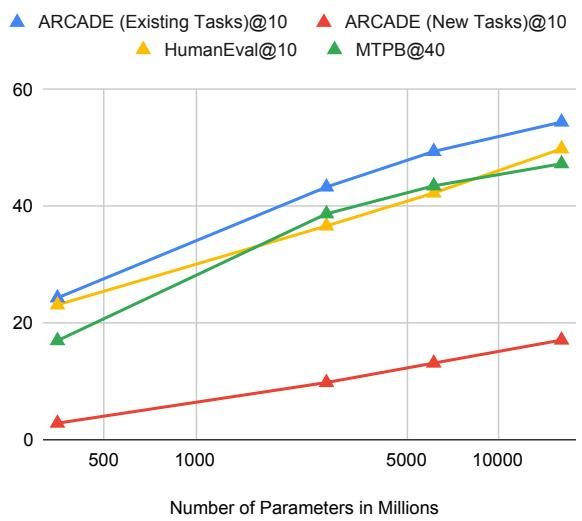  
Figure 5: Scaling curve of $\mathrm { C o D E G E N _ { m o n o } }$ models on ARCADE and existing code generation benchmarks. Results on HumanEval are selected from the best temperature $t \in \{ 0 . 2 , 0 . 6 , 0 . 8 \}$ (Nijkamp et al., 2022).

Fig. 5 depicts the scaling curve of ARCADE with respect to the number of parameters for CODEGEN<sub>mono</sub> models. The pass rate scales nearly log-linearly as a function of model size, and the performance has not saturated, especially on the New Tasks split. This shows ARCADE is a reliable dataset to study the scaling behavior of code LLMs. The slope of the curve on New Tasks is also smaller than on other datasets, suggesting that this problem set is more challenging for CODEGEN models. It is also interesting to extrapolate CODEGEN models to 62B according to the scaling curve and compare with our models at similar size. This gives a projected pass@10 of 22% on New Tasks, wihch is lower than PALM after the first-stage Python fine-tuning (28%).

## G Break-down Analysis ofpass@k on ARCADE

Accuracy with Problem Complexity To better understand PACHINCO’s performance on problems at different levels of complexity, we plot pass@30 with respect to the number of pandas function calls in the annotated reference solutions, as shown in Fig. 6. For problems with similar complexity, PACHINCO generally achieves higher pass rate on Existing Tasks, again suggesting that the New Tasks split is still more challenging even after controlling problem complexity.

Fig. 7 plots pass@30 with respect to the AST size of reference programs. Similar to Fig. 6, results on New Tasks are generally lower. Meanwhile, it seems that AST size correlates better with pass@k compared to the number of API usage, while the latter metric offers more intuitive information about the data transformation steps involved.

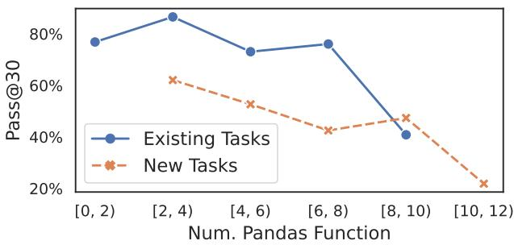  
Figure 6: pass@k of PACHINCO w.r.t problem complexity

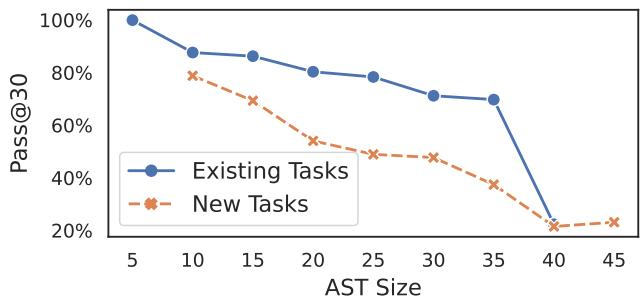  
Figure 7: pass@k of PACHINCO w.r.t AST size of reference programs.

How Much Notebook Context is Useful? ARCADE requires a model to leverage rich programmatic and NL context in test notebooks to generate code solutions for the current cell. To study PACHINCO’s performance with varying amount of available notebook context, we control the number d of context cells $\{ c _ { i } \} _ { i = n - d } ^ { n - 1 } \left( \ S 2 \right)$ when generating code for each problem (at cell $c _ { n } )$ in our dataset. Fig. 8 depicts pass@30 as a function of the context size d. Since we use the first preceding cell $c _ { n - 1 }$ to store the NL intent $\mathbf { \delta } \mathbf { u } _ { n }$ for $c _ { n }$ (Appendix L), having only one context cell is equivalent to the “cold-start” setting of only using the intent $\mathbf { \Delta } \mathbf { u } _ { n }$ (besides schema description) to predict $c _ { n }$ . PACHINCO achieves a pass rate of 44% (existing tasks) and 17% (new tasks) in this challenging setting (d = 1), with errors mostly due to failure in referring to variables that the solution relies on, whose information is not present in the short context. Indeed, including additional context cells is crucial for good performance. In particular, having 3 context cells could already lift the pass@30 to 72% and 36% on the two splits $- 1 . 6 \sim 2 \times$ higher than $d = 1$ . The results also start to plateau after including $5 \sim 7$ context cells, with diminishing returns after including more cells, which is in line with findings in Agashe et al. (2019). <sup>16</sup> Empirically, we observe that using more context helps to reduce schema understanding errors (e.g., using undefined columns in DataFrames). Fig. 9 illustrates the distribution of execution error types on failed predictions. Notably, using more notebook context cells significantly reduces the chance of NameErrors caused by using undefined variables in context. The number of KeyErrors is also reduced, indicating that the model makes fewer schema understanding errors when referring to columns in DataFrames.

Does Problem Location Impact Performance? Another interesting angle to study the effect of context is through the lens of model accuracy when solving problems $c _ { n }$ at different locations. Intuitively, problems located later in a notebook (n is larger) would have more context available, therefore they could be easier to answer (Wang and Cho, 2016). Fig. 10 shows pass@30 on problems grouped by their preceding context size, which shows increased task success rate when solving problems with more context, confirming the prior intuition.<sup>17</sup>

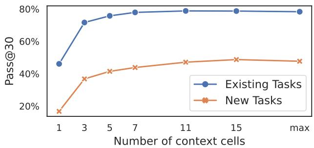  
Figure 8: pass@30 as w.r.t the number of context cells from the notebook.

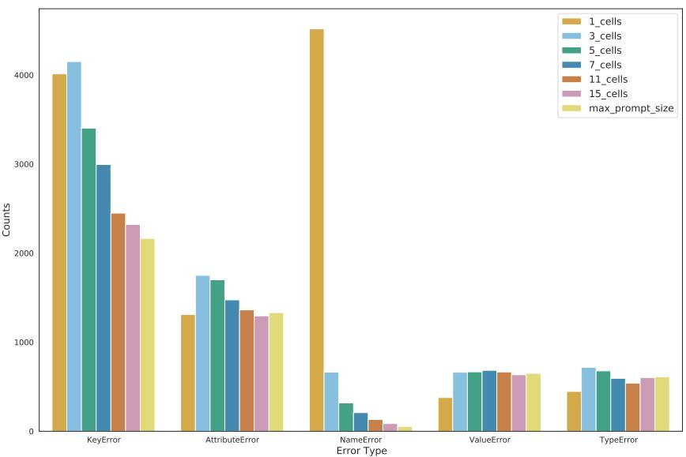  
Figure 9: Frequency of runtime errors from PACHINCO’s predictions aggreated over the two splits with varying amount of notebook context cells.

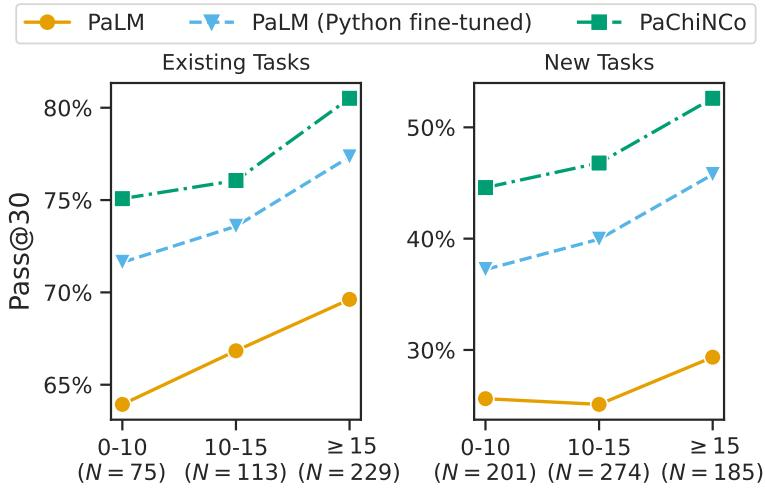  
Examples grouped by num. context cells  
Figure 10: Pass rate on examples grouped by context size. We also report the number of examples in each group.

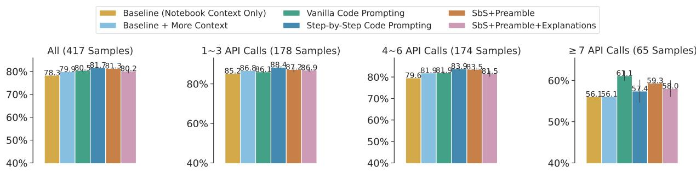

Baseline (Notebook Context Only) Vanilla Code Prompting SbS+Preamble   
Baseline + More Context Step-by-Step Code Prompting SbS+Preamble+Explanations

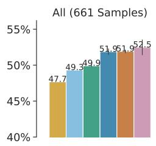

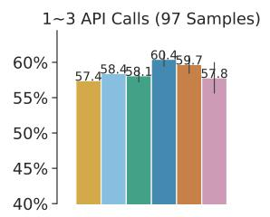

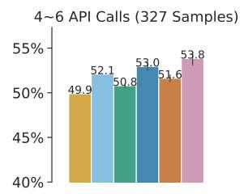  
(a) few-shot prompting pass@30 on New Tasks.

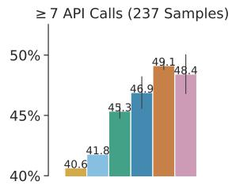

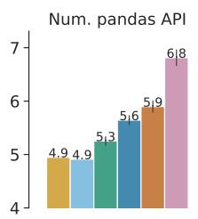

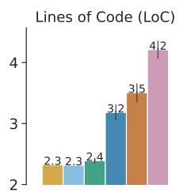

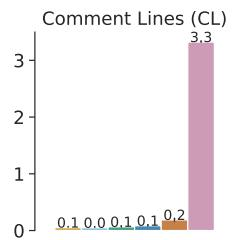  
(b) few-shot prompting code style metrics on New Tasks.

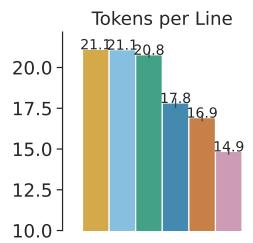

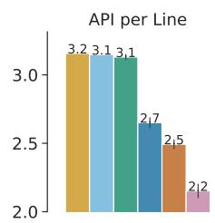  
Figure 11: Plots for few-shot prompting evaluation on New Tasks.

(a) few-shot prompting pass@30 on Existing Tasks.  
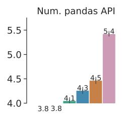

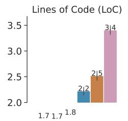

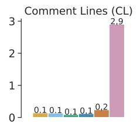  
(b) few-shot prompting code style metrics on Existing Tasks.

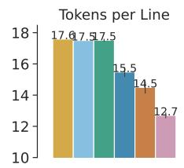

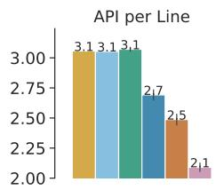  
Figure 12: Plots for few-shot prompting evaluation on Existing Tasks.

## H Additional Few-shot Prompting Results

Plots for the Results on New Tasks in Tab. 4 Fig. 11 plots the few-shot prompting results on New Tasks presented in Tab. 4. Here we also report breakdown results of pass rate on problems with varying level of complexity. Step-by-step prompting and its variants are helpful across the board, especially for harder tasks with more than 7 pandas function calls. This might suggest the value of step-by-step decomposition when synthesizing complex programs.

Few-shot Prompting Results on Existing Tasks We also report results of prompting PACHINCO using few-shot exemplars on the Existing Tasks split in Fig. 12. Compared to the results obtained on New Tasks (Fig. 11), while few-shot prompting, especially step-by-step prompting, is still effective compared to the baseline, the gap is not as profound as the results on New Tasks. The difference between different prompting methods is also less significant, and using NL explanations (SbS + Preamble + Explanations) is less effective compared to the two baseline zero-shot approaches. This is likely due to potential evaluation data leakage. Intuitively, as the model relies on memorization to generate code that it has encountered during training to solve problems in Existing Tasks, using few-shot exemplars to “nudge” the model to generate code in a different style would be less effective.This issue is perhaps more problematic for prompting with additional inline explanations, as generating those extra interspersed NL comments would likely break the model’s “flow” of generating code (without such explanations) that it has memorized. Additionally, explanation-based prompting favors generating more complex code solutions with more steps (LoC ) and API calls, as indicated in Figs. 11 and 12, which could actually be counter-productive for Existing Tasks, where more than 70% of the tasks are simple and require less than 4 API calls to solve them. Nevertheless, these results reiterate the value of the New Tasks split as a more reliable benchmark to better differentiate different prompting strategies.

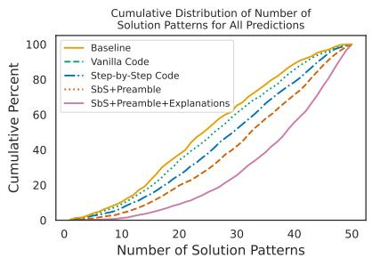

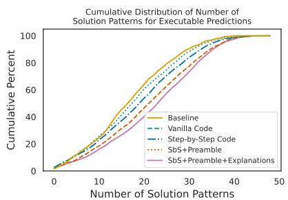

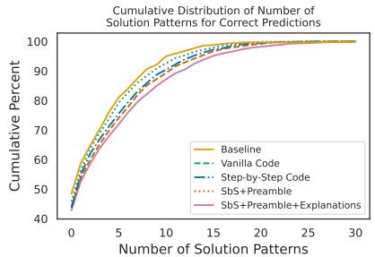

Figure 13: Cumulative distributions of the number of unique API sequences extracted from PACHINCO’s 50 predictions on the New Tasks split, for all predictions (left), only executable predictions (middle), or only correct predictions (right). Curves that appear more to the right represent prompting methods with greater diversity in the samples.  
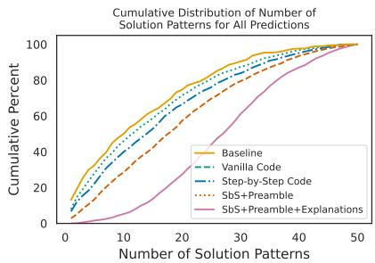

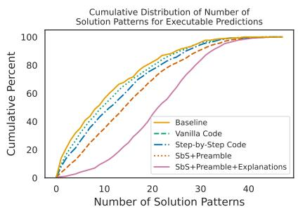

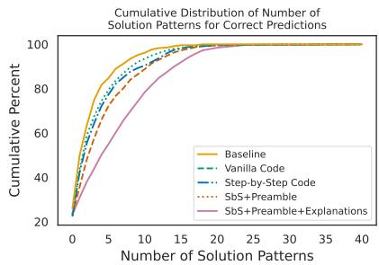

Figure 14: Cumulative distributions of the number of unique API sequences extracted from PACHINCO’s 50 predictions on Existing Tasks.  
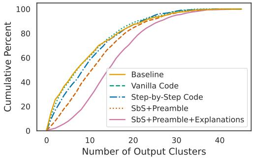  
(a) Cumulative distributions of the number of output clusters on Existing Tasks.

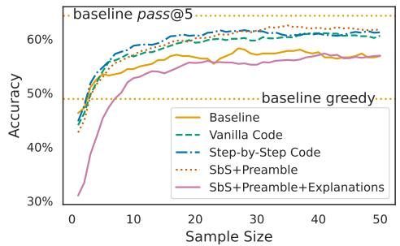  
(b) Self-consistency decoding accuracy as a function of sample size on Existing Tasks.  
Figure 15: Distribution of the number of output clusters and self-consistency decoding accuracy on Existing Tasks.

## I Further Analysis of Solution Diversity

Here we provide further analysis of the diversity in solution patterns, measured by the number of distinct pandas API call sequences used in the samples. Fig. 13 and Fig. 14 depict cumulative distributions of the number of solution patterns for different subsets of the predictions on the two task splits: all predictions, only those that execute successfully, and only the correct predictions. In each case, we see that step-by-step prompting leads to increased diversity compared to the baselines, and prompting with NL explanations further increases the diversity. While increased diversity is helpful in finding a correct solution at higher sample size k, it is also helpful when considering only correct solutions because a user might want to see a variety of solution approaches, whether for educational purposes or to choose the one they like best (which is partially subjective). Refer to §6 for such examples.

Next, Fig. 15a presents the cumulative distribution of the number of output clusters for predictions on Existing Tasks, where step-by-step prompting variants produce more functionally diverse solutions that execute to different results. Finally, Fig. 15b shows self-consistency reranking accuracy on the Existing Tasks split. While step-by-step code prompting is still helpful due to improved prediction diversity, similar to the results on the New Tasks split (c.f. Fig. 4c), the results obtained with prompting using additional NL explanations becomes worse, due to the relatively lower success rate of this prompting strategy (Fig. 12, see Appendix H for more discussions).

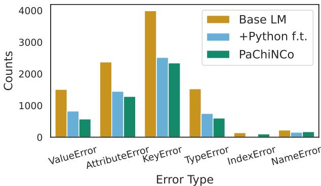  
Figure 16: Frequency of execution errors on New Tasks.

## J Error Analysis

## J.1 Summary of Error Types

To understand the types of errors that LLMs make on ARCADE, especially on challenging problems, we conduct an error analysis on model predictions on the New Tasks split (Tab. 2). Overall, we notice a significant drop in execution errors after two-stage code fine-tuning (base LM Python-finetuned LM PACHINCO, §4). Out of all the incorrect predictions from PACHINCO under the fuzzy output matching evaluation metric (§3.3), roughly 35% of the samples result in execution errors, while the remaining 65% predictions have executable programs but are functionally incorrect.

Summary of Inexecutable Predictions First, for inexecutable samples, we present an analysis of the distribution of different execution error types, as illustrated in Fig. 16. The primary source of execution error is KeyError and AttributeError due to reference to non-existing indices or columns in DataFrames. While in the prompts we provide NL schema descriptions for DataFrames loaded to notebooks (§5.1), such descriptions for intermediate DataFrames that are later derived in the context are still missing due to limited prompt length, and the model may not be able infer their schema information solely from the source code. This could be especially problematic for APIs that create compound intermediate DataFrames with complex schema, such as pd.groupby, which accounts for that more than 50% of those KeyErrors and AttributeErrors. Similarly, other execution errors such as ValueError and TypeError are often caused by the insufficient knowledge about the DataFrame contents. For example, ValueError occurs when a model tries to calculate the mean of a column which has NaN values. This finding suggests the importance of developing LLMs that could handle longer context (Wu et al., 2022a) in order to include more DataFrame information in prompts. We gave a detailed case study on these types of execution errors later in this section.

Summary of Executable but Incorrect Predictions Next, we conduct a manual analysis on 50 randomly sampled incorrect predictions that are executable. The cause of these errors can be grouped into the following categories: 1. Complex problems requiring non-trivial reasoning or data transformation steps (43%); 2. Errors in interpreting NL intents, such as missing a requirement specified in the intent (e.g., round to two decimal places) in the code solution (26%); 3. Errors caused by underspecified intents (§3.2, 19%); 4. False-negatives due to limited coverage of the fuzzy-matching evaluation metric (§3.3, 6%); 5. Annotation errors (6%).

The primary source of errors is due to complex problems, which reiterates the motivation of ARCADE — evaluating code LLMs on challenging data wrangling and EDA tasks. The second majority type of errors (misunderstanding intents) suggests room to improve PACHINCO’s skill in instruction following. Next, a non-trivial amount of errors are caused by underspecified intents, which are common in the setting of prompting LLMs using ambiguous instructions (§3.2), calling for future research to specifically address this issue. Finally, our evaluation metric based on fuzzy output matching seems effective in identifying plausible alternative solutions. Still, there are non-trivial cases where there are multiple ways of presenting the outputs (e.g., DataFrames with nested columns or different orientations, Fig. 30).

## J.2 Case Study

Case Study for Inexecutable Predictions Execution error has error message from the notebook environment. We can classify these errors into more fine-grained categories in Fig. 16. As the result shows, KeyError is the top error mode in the execution errors. Over 50% of the KeyError are associated with the pd.groupby API call. pd.groupby API call changes the dataframe schema as the model generates more data transformation code. For example, pd.groupby().mean() will remove non-numeric columns in the dataframe. This requires the model to have a profound understanding of the dataframe schema. We gave an example in Fig. 22. The column shipping\_fee is string value which will be removed after df.groupby(ship\_state).sum().

The secondary source of execution error is AttributeError, which shares a similar cause to the KeyError. This is because AttributeError is often triggered by calling a non-existing column as an attribute of a dataframe. An example is given in Fig. 23, where the model tries to call the non-existing column signupdate as an attribute of df\_users, leading to an AttributeError. These two error modes suggest that building a better schema-aware language model is a promising future research direction.

We also present Fig. 24 and Fig. 25 as examples for TypeError and ValueError, respectively. These two error modes are often caused by insufficient knowledge of the column types and example values. For example, the model tried to compare a string-value column to a integer in Fig. 24, which causes TypeError. Fig. 25 showcased that the model tries to apply numeric operation pd.DataFrame.mean() on a column with NaN values, leading to ValueError. These errors suggest room to improve NL schema descriptions (§5.1) with column type annotation and more example cell values.

Case Study for Executable but Incorrect Predictions To complement the discussion earlier in Appendix J, we showcase examples of representative semantic errors, where the predictions are executable but functionally incorrect.

The primary source of semantic error is complex reasoning. Two complex problems are given in Fig. 26 and Fig. 27. In Fig. 26, the model need to infer that the last 10 years can be computed using the code dt.datetime.today().year - 10. Fig. 27 is another example of complex data wrangling steps. To generate the correct program, the model need to compare the current rank to the past rank, while ensuring that the 2021 rank entries exist, and then aggregate the information.

Misinterpretation of NL intents is the secondary source of semantic errors. In Fig. 28, the generated program does not reflect the search constraint in the intent (institute type is IIT). Another source of semantic errors is underspecified intents with multiple plausible interpretations. As an example, in Fig. 29 the predicted program provides one plausible interpretation by calculating the sum of front- and left-facing trees, while the reference code implements another interpretation, which presents a table with the two numbers listed separately. Such cases are hard to cover by the fuzzy-matching evaluation metric, which may suggest the importance of collecting multiple reference interpretations for underspecified intents.

Finally, Fig. 30 illustrates an issue with the coverage of the evaluation function based on output matching. In this example with complex output DataFrames, the model gives an acceptable answer which differs from the reference in its DataFrame schema and orientation.

u: What are the five most common genres for shows released during the year having the highest percent increase in votes? highest percent increase in votes?

```python
# Step 1: Get the year that has the highest percent increase in votes.
max_year_pct_change = pct_change_votes.idxmax()
# Step 2: Get the genres for each shows in that year.
genres = drama[drama['Year of Release']==max_year_pct_change]['Genre']
# Step 3: Count each genre
genre_counts = {}
for genre in genres:
for genre in genre.split(','):
if genre not in genre_counts:
genre_counts[genre] = 0
genre_counts[genre] += 1
# Step 4: Return the most common genres
most_common_genres = pd.Series(genre_counts).sort_values(ascending=False)
most_common_genres[:5]
```  
Figure 17: An example prediction from PACHINCO with a complex single step.

u: Convert crash dates to datetime and show the total number of vehicles involved in crashes over the years.

```python
# Step 1: Convert crash date to datetime
df['CRASH DATE'] = pd.to_datetime(df['CRASH DATE'])
# Step 2: Create a new column with the year of the crash date
df['CRASH YEAR'] = df['CRASH DATE'].dt.year
# Step 3: Return the total number of vehicles involved in crashes in each year
result = df.groupby('CRASH YEAR')['TOT VEH'].sum()
```  
Figure 18: An example prediction from PACHINCO that explains the semantics of a column.

u: What is the distribution of student adaptivity level across each age group? Return a DataFrame with age groups as an index and adaptivity levels as columns.

```python
# Step 1: Get the unique values of age
age_groups = students['Age'].unique()
# Step 2: Group students by their age groups and adaptivity level and
# get the number of students in each group
distribution = students.groupby(['Age', 'Adaptivity Level']).size()
# Step 3: Return the age groups as an index and adaptivity levels as columns
result = distribution.unstack(level=1, fill_value=0)
```  
Figure 19: An example prediction from PACHINCO that explains the return value from a complex API.

u: Drop columns with more than 70 percent null values u: In which year, within the last ten years, did Israel receive the highest amount of financial aid, in constant amount? Show the year and amount received.

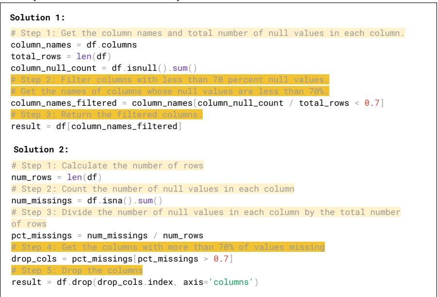  
Figure 20: Two predictions from PACHINCO with different solution approaches.

```python
Correct Solution:
# Step 1: Get all the rows with Israel in country_name column
israel_aid_df = aid[aid['country_name'] == 'Israel']
# Step 2: Get all the rows for last 10 years
israel_aid_df = israel_aid_df[israel_aid_df['fiscal_year'] >=
israel_aid_df['fiscal_year'].max()-10]
# Step 3: Group by the years and get the sum of aid received in each year.
israel_aid_df.groupby('fiscal_year').constant_amount.sum().agg(['max','idxmax'])
Incorrect Solution:
# Step 1: Get the Israel data
isr = aid[aid.country_name=='Israel']
# Step 2: Group the data by fiscal year
isr_by_year_df = isr.groupby('fiscal_year')
# Step 3: Find the index of the row that has the highest constant amount
idx = isr_by_year_df['constant_amount'].idxmax()
# Step 4: Get the row with the highest constant amount
max_aid = isr.loc[idx]
# Step 5: Return the fiscal year and constant amount
result = max_aid[['fiscal_year', 'constant_amount']]
```

Figure 21: Two predictions from PACHINCO. NL explanations help users identify incorrect steps.

u: What are the average shipping fees for each state, starting from highest to lowest? u: the average shipping fees for each state, starting from highest to lowest (rounded to 2 decimal places)? (rounded to 2 decimal places)?

```python
Reference Solution:
df['shipping_fee']=df['shipping_fee'].apply(total_float)
df.groupby('ship_state').mean()['shipping_fee'].sort_values(ascending=False).round(2)
Incorrect Model Output:
df.groupby('ship_state').sum()['shipping_fee'].sort_values(ascending=False).apply(
lambda x: round(x,2))
# Error Text:
RuntimeError: KeyError: 'shipping_fee
```

Figure 22: An example of KeyError: the model calls a column which is removed after the pd.groupby().mean() API call.

u: Show how many new users signed upfor every year since 2000

```python
Reference Solution:
df_users[df_users['Customer Since']>datetime.fromisoformat('2000-01-01')]['Customer
Since'].apply(lambda x: x.year)\
.value_counts().sort_index()
Incorrect Model Output:
df_users['signup_year'] = df_users.signupdate.dt.year
df_users[df_users.signupdate.dt.year >= 2000].signup_year.value_counts()
# Error Text:
RuntimeError: AttributeError: 'DataFrame' object has no attribute 'signupdate'
```

Figure 23: An example of AttributeError: the model tries to call a non-existing column.

```python
u: What are the topfive models with most number ofbikes having mileage less than 5000
kilometers?
Reference Solution:
df_bikes=bikes[bikes['Ridden for']<5000]
df_bikes['Model Name'].value_counts().head()
Incorrect Model Output:
model=bikes.groupby('Model Name')['Comfort'].mean().loc[bikes_models.index].idxmax()
# Error Text:
RuntimeError: TypeError: '<' not supported between instances of 'str' and 'int
```

Figure 24: An example of TypeError: the model is intent to compare a string-value column to an integer.

```python
u: What is the average number offiled chargesfor drug related cases?
Reference Solution:
int(district[district.crime_type.str.contains('narcotic',case=False,
na=False)].num_charges.mean())
Incorrect Model Output:
district[district.crime_type.str.contains('Drugs')].num_charges.mean()
# Error Text:
RuntimeError: ValueError: Cannot mask with non-boolean array containing NA / NaN values
```

Figure 25: An example program of ValueError: the model tries to calculate the mean of a column containing NaN values.

```python
u: What is the number ofdeaths by accident as a percentage oftotal deaths in the last ten
years?
Reference Solution:
import datetime as dt
last_ten_years = age[(age['Death year']>=dt.datetime.today().year-10)]
total_deaths = last_ten_years.groupby('Death year').size()
deaths_by_accident = last_ten_years[last_ten_years['Manner of
death'].str.contains('accident')].groupby('Death year').size()
deaths_by_accident / total_deaths * 100
Incorrect Model Output:
(age[(age['Manner of death']=='accident') & (age['Death year'].between(2007,2017,
inclusive='left'))].shape[0] / age[age['Death year'].between(2007,2017,
inclusive='left')].shape[0])*100
```  
Figure 26: An example of complex reasoning: the model has to infer the API call (dt.datetime.today().year - 10) from the last-ten-years constraint in the intent.

```python
u: Which hotels had a worse ranking this year than in 2021? Show the hotel name,
location and the difference in rankingfrom last year.
Reference Solution:
drop_rankings = hotels[(hotels.Rank > hotels.Past_rank) & (hotels['2021']==1)]
drop_rankings['rank_drop'] = drop_rankings.Rank - drop_rankings.Past_rank
drop_rankings[['Hotel','Location','rank_drop']]
Incorrect Model Output:
hotels['Ranking_diff'] = hotels.Past_rank - hotels.Rank
hotels.loc[hotels['Ranking_diff'] > 0, ['Hotel','Location','Ranking_diff']]
```  
Figure 27: An example of complex reasoning: the model needs to compare the current rank and the past rank while making sure the rank in 2021 exists.

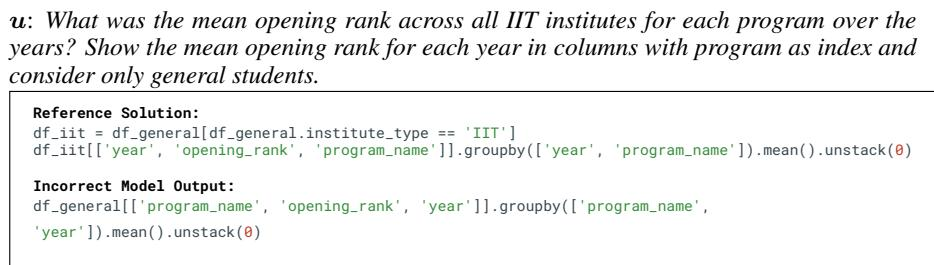  
Figure 28: An example of NL misunderstanding: the model does not filter the institute type according to the intent.

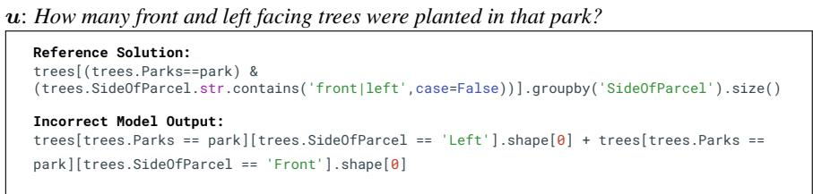  
Figure 29: An example of underspecified intent. It does not specify the output should not sum the number of front facing and left facing trees.

u: Return a matrix with the average ticket prices to andfrom all the citiesfor each ticket class.

```python
Reference Solution:
flights.groupby(['class','source_city','destination_city']).price.mean().unstack(level=2)
Incorrect Model Output:
prices = flights.groupby(['class','source_city','destination_city']).price.mean()
prices.unstack(level=[0,2]).round()
```

(a) Intent, reference program and generated program
<table><tr><td rowspan=1 colspan=1></td><td rowspan=1 colspan=1>destination_city</td><td rowspan=1 colspan=1>Bangalore</td><td rowspan=1 colspan=1>Chennai</td><td rowspan=1 colspan=1>Delhi</td><td rowspan=1 colspan=1>Hyderabad</td><td rowspan=1 colspan=1>Kolkata</td><td rowspan=1 colspan=1>Mumbai</td></tr><tr><td rowspan=1 colspan=1>class</td><td rowspan=1 colspan=1>source_city</td><td rowspan=1 colspan=1></td><td rowspan=1 colspan=1></td><td rowspan=1 colspan=1></td><td rowspan=1 colspan=1></td><td rowspan=1 colspan=1></td><td rowspan=1 colspan=1></td></tr><tr><td rowspan=1 colspan=1>Business</td><td rowspan=1 colspan=1>Bangalore</td><td rowspan=1 colspan=1>NaN</td><td rowspan=1 colspan=1>52436.915395</td><td rowspan=1 colspan=1>48144.337108</td><td rowspan=1 colspan=1>50395.796948</td><td rowspan=1 colspan=1>58854.693091</td><td rowspan=1 colspan=1>58024.618208</td></tr><tr><td rowspan=1 colspan=1></td><td rowspan=1 colspan=1>Chennai</td><td rowspan=1 colspan=1>53113.008692</td><td rowspan=1 colspan=1>NaN</td><td rowspan=1 colspan=1>52443.367242</td><td rowspan=1 colspan=1>51559.874283</td><td rowspan=1 colspan=1>57078.895872</td><td rowspan=1 colspan=1>56223.838086</td></tr><tr><td rowspan=1 colspan=1></td><td rowspan=1 colspan=1>Delhi</td><td rowspan=1 colspan=1>48576.027921</td><td rowspan=1 colspan=1>52031.778099</td><td rowspan=1 colspan=1>NaN</td><td rowspan=1 colspan=1>44457.376775</td><td rowspan=1 colspan=1>56239.853659</td><td rowspan=1 colspan=1>44364.442811</td></tr><tr><td rowspan=1 colspan=1></td><td rowspan=1 colspan=1>Hyderabad</td><td rowspan=1 colspan=1>50358.290706</td><td rowspan=1 colspan=1>51132.155288</td><td rowspan=1 colspan=1>44250.700281</td><td rowspan=1 colspan=1>NaN</td><td rowspan=1 colspan=1>53729.157762</td><td rowspan=1 colspan=1>52184.424666</td></tr><tr><td rowspan=1 colspan=1></td><td rowspan=1 colspan=1>Kolkata</td><td rowspan=1 colspan=1>58681.104437</td><td rowspan=1 colspan=1>56502.775035</td><td rowspan=1 colspan=1>55047.492193</td><td rowspan=1 colspan=1>54732.447908</td><td rowspan=1 colspan=1>NaN</td><td rowspan=1 colspan=1>57422.551724</td></tr><tr><td rowspan=1 colspan=1></td><td rowspan=1 colspan=1>Mumbai</td><td rowspan=1 colspan=1>57970.544389</td><td rowspan=1 colspan=1>55703.326197</td><td rowspan=1 colspan=1>43846.329273</td><td rowspan=1 colspan=1>51593.643678</td><td rowspan=1 colspan=1>57106.526385</td><td rowspan=1 colspan=1>NaN</td></tr><tr><td rowspan=1 colspan=1>Economy</td><td rowspan=1 colspan=1>Bangalore</td><td rowspan=1 colspan=1>NaN</td><td rowspan=1 colspan=1>7105.953850</td><td rowspan=1 colspan=1>6124.897982</td><td rowspan=1 colspan=1>6360.141698</td><td rowspan=1 colspan=1>7375.638594</td><td rowspan=1 colspan=1>6381.093332</td></tr><tr><td rowspan=1 colspan=1></td><td rowspan=1 colspan=1>Chennai</td><td rowspan=1 colspan=1>7175.020192</td><td rowspan=1 colspan=1>NaN</td><td rowspan=1 colspan=1>6075.961190</td><td rowspan=1 colspan=1>5960.788831</td><td rowspan=1 colspan=1>7547.295815</td><td rowspan=1 colspan=1>6529.119453</td></tr><tr><td rowspan=1 colspan=1></td><td rowspan=1 colspan=1>Delhi</td><td rowspan=1 colspan=1>6175.622535</td><td rowspan=1 colspan=1>6102.317245</td><td rowspan=1 colspan=1>NaN</td><td rowspan=1 colspan=1>6031.164261</td><td rowspan=1 colspan=1>7045.621678</td><td rowspan=1 colspan=1>6059.826087</td></tr><tr><td rowspan=1 colspan=1></td><td rowspan=1 colspan=1>Hyderabad</td><td rowspan=1 colspan=1>6234.882649</td><td rowspan=1 colspan=1>6049.884930</td><td rowspan=1 colspan=1>6072.296659</td><td rowspan=1 colspan=1>NaN</td><td rowspan=1 colspan=1>6881.680392</td><td rowspan=1 colspan=1>5969.259906</td></tr><tr><td rowspan=1 colspan=1></td><td rowspan=1 colspan=1>Kolkata</td><td rowspan=1 colspan=1>7471.621990</td><td rowspan=1 colspan=1>8011.745229</td><td rowspan=1 colspan=1>7161.400077</td><td rowspan=1 colspan=1>7489.144374</td><td rowspan=1 colspan=1>NaN</td><td rowspan=1 colspan=1>7405.787239</td></tr><tr><td rowspan=1 colspan=1></td><td rowspan=1 colspan=1>Mumbai</td><td rowspan=1 colspan=1>6432.511946</td><td rowspan=1 colspan=1>6420.917984</td><td rowspan=1 colspan=1>5889.281400</td><td rowspan=1 colspan=1>5774.891130</td><td rowspan=1 colspan=1>7227.971735</td><td rowspan=1 colspan=1>NaN</td></tr></table>

(b) Reference output
<table><tr><td rowspan=1 colspan=1>class</td><td rowspan=1 colspan=2>Business</td><td rowspan=1 colspan=1></td><td rowspan=1 colspan=3></td><td rowspan=1 colspan=1>Economy</td><td rowspan=1 colspan=4></td><td rowspan=1 colspan=1></td></tr><tr><td rowspan=1 colspan=1>destination_city</td><td rowspan=1 colspan=1>Chennai</td><td rowspan=1 colspan=1>Delhi</td><td rowspan=1 colspan=1>Hyderabad</td><td rowspan=1 colspan=1>Kolkata</td><td rowspan=1 colspan=1>Mumbai</td><td rowspan=1 colspan=1>Bangalore</td><td rowspan=1 colspan=1>Chennai</td><td rowspan=1 colspan=1>Delhi</td><td rowspan=1 colspan=1>Hyderabad</td><td rowspan=1 colspan=1>Kolkata</td><td rowspan=1 colspan=1>Mumbai</td><td rowspan=1 colspan=1>Bangalore</td></tr><tr><td rowspan=1 colspan=1>source_city</td><td rowspan=1 colspan=1></td><td rowspan=1 colspan=1></td><td rowspan=1 colspan=1></td><td rowspan=1 colspan=1></td><td rowspan=1 colspan=1></td><td rowspan=1 colspan=1></td><td rowspan=1 colspan=1></td><td rowspan=1 colspan=1></td><td rowspan=1 colspan=1></td><td rowspan=1 colspan=1></td><td rowspan=1 colspan=1></td><td rowspan=1 colspan=1></td></tr><tr><td rowspan=1 colspan=1>Bangalore</td><td rowspan=1 colspan=1>52437.0</td><td rowspan=1 colspan=1>48144.0</td><td rowspan=1 colspan=1>50396.0</td><td rowspan=1 colspan=1>58855.0</td><td rowspan=1 colspan=1>58025.0</td><td rowspan=1 colspan=1>NaN</td><td rowspan=1 colspan=1>7106.0</td><td rowspan=1 colspan=1>6125.0</td><td rowspan=1 colspan=1>6360.0</td><td rowspan=1 colspan=1>7376.0</td><td rowspan=1 colspan=1>6381.0</td><td rowspan=1 colspan=1>NaN</td></tr><tr><td rowspan=1 colspan=1>Chennai</td><td rowspan=1 colspan=1>NaN</td><td rowspan=1 colspan=1>52443.0</td><td rowspan=1 colspan=1>51560.0</td><td rowspan=1 colspan=1>57079.0</td><td rowspan=1 colspan=1>56224.0</td><td rowspan=1 colspan=1>53113.0</td><td rowspan=1 colspan=1>NaN</td><td rowspan=1 colspan=1>6076.0</td><td rowspan=1 colspan=1>5961.0</td><td rowspan=1 colspan=1>7547.0</td><td rowspan=1 colspan=1>6529.0</td><td rowspan=1 colspan=1>7175.0</td></tr><tr><td rowspan=1 colspan=1>Delhi</td><td rowspan=1 colspan=1>52032.0</td><td rowspan=1 colspan=1>NaN</td><td rowspan=1 colspan=1>44457.0</td><td rowspan=1 colspan=1>56240.0</td><td rowspan=1 colspan=1>44364.0</td><td rowspan=1 colspan=1>48576.0</td><td rowspan=1 colspan=1>6102.0</td><td rowspan=1 colspan=1>NaN</td><td rowspan=1 colspan=1>6031.0</td><td rowspan=1 colspan=1>7046.0</td><td rowspan=1 colspan=1>6060.0</td><td rowspan=1 colspan=1>6176.0</td></tr><tr><td rowspan=1 colspan=1>Hyderabad</td><td rowspan=1 colspan=1>51132.0</td><td rowspan=1 colspan=1>44251.0</td><td rowspan=1 colspan=1>NaN</td><td rowspan=1 colspan=1>53729.0</td><td rowspan=1 colspan=1>52184.0</td><td rowspan=1 colspan=1>50358.0</td><td rowspan=1 colspan=1>6050.0</td><td rowspan=1 colspan=1>6072.0</td><td rowspan=1 colspan=1>NaN</td><td rowspan=1 colspan=1>6882.0</td><td rowspan=1 colspan=1>5969.0</td><td rowspan=1 colspan=1>6235.0</td></tr><tr><td rowspan=1 colspan=1>Kolkata</td><td rowspan=1 colspan=1>56503.0</td><td rowspan=1 colspan=1>55047.0</td><td rowspan=1 colspan=1>54732.0</td><td rowspan=1 colspan=1>NaN</td><td rowspan=1 colspan=1>57423.0</td><td rowspan=1 colspan=1>58681.0</td><td rowspan=1 colspan=1>8012.0</td><td rowspan=1 colspan=1>7161.0</td><td rowspan=1 colspan=1>7489.0</td><td rowspan=1 colspan=1>NaN</td><td rowspan=1 colspan=1>7406.0</td><td rowspan=1 colspan=1>7472.0</td></tr><tr><td rowspan=1 colspan=1>Mumbai</td><td rowspan=1 colspan=1>55703.0</td><td rowspan=1 colspan=1>43846.0</td><td rowspan=1 colspan=1>51594.0</td><td rowspan=1 colspan=1>57107.0</td><td rowspan=1 colspan=1>NaN</td><td rowspan=1 colspan=1>57971.0</td><td rowspan=1 colspan=1>6421.0</td><td rowspan=1 colspan=1>5889.0</td><td rowspan=1 colspan=1>5775.0</td><td rowspan=1 colspan=1>7228.0</td><td rowspan=1 colspan=1>NaN</td><td rowspan=1 colspan=1>6433.0</td></tr></table>

(c) Model output  
Figure 30: An example of plausible alternative prediction that is labeled as incorrect due to limited coverage of the evaluation metric.

## K Data Card for the Training Data of PACHINCO

We provide a data card for the training data of PACHINCO as outlined in §4, and also report training data composition in Tab. 6.
<table><tr><td>Motivation</td><td></td></tr><tr><td>For what purpose was the dataset created? Who created the dataset? Who funded the creation of the dataset?</td><td>The dataset was created for training code and language models by a team of researchers.</td></tr><tr><td>Composition</td><td></td></tr><tr><td>What do the instances that com- prise the dataset represent (e.g., documents, photos, people, coun- restrictive licenses. tries)?</td><td>Dataset comprises of Python source code files and Jupyter note- books from GitHub, filtered by license so as to exclude code with</td></tr><tr><td>How many instances are there in total (of each type, if appropri- ate)?</td><td>The data makeup is given in Table 6.</td></tr><tr><td>Does the dataset contain all possi- ble instances or is it a sample (not necessarily random) of instances from a larger set?</td><td>The dataset is a small (random) subset of a larger set.</td></tr><tr><td>What data does each instance con- sist of?</td><td>Each instance is encoded content of a source code file.</td></tr><tr><td>with each instance?</td><td>Is there a label or target associated No, there are no labels associated with each instance.</td></tr><tr><td>Is any information missing from No. individual instances?</td><td></td></tr><tr><td>Are relationships between individ- No. ual instances made explicit?</td><td></td></tr><tr><td>splits?</td><td>Are there recommended data We use random splits for the training, validation, and test.</td></tr><tr><td>Are there any errors, sources of noise, or redundancies in the dataset?</td><td>• Python files were near deduplicated at the file level using a custom implementation of minhash algorithm, so lower level redundancies (lines, code blocks) may still exist. • Some files were misclassified in the license tagging and</td></tr><tr><td>Is the dataset self-contained, or The dataset is self-contained.</td><td>filtration process given that license classification algorithm can have false positives and negatives.</td></tr><tr><td>does it link to or otherwise rely on external resources? Does the dataset contain data that might be considered confidential?</td><td>No.</td></tr><tr><td>fensive, insulting, threatening, or might otherwise cause anxiety?</td><td>Does the dataset contain data that, Given the dataset contains source code, it is not likely there is any if viewed directly, might be of- offensive text in it, however no explicit measures are in place to eliminate such data if it were present.</td></tr><tr><td colspan="2">Collection Process</td></tr><tr><td>How was the data associated with each instance acquired?</td><td>The data was collected from publicly available sources.</td></tr><tr><td>What mechanisms or procedures were used to collect the data?</td><td>The data was collected using a variety of software programs to extract and clean source code files.</td></tr><tr><td>If the dataset is a sample from a larger set, what was the sampling strategy?</td><td>The dataset is small subset of publicly available code from Github, sampled randomly.</td></tr><tr><td>Who was involved in the data col- A team of researchers. lection process?</td><td></td></tr><tr><td>Over what timeframe was the data April - July 2022 collected?</td><td></td></tr><tr><td>Were any ethical review processes conducted?</td><td>No.</td></tr><tr><td colspan="2">Preprocessing, cleaning, and labeling Was any preprocessing, cleaning,</td></tr><tr><td rowspan="5">discretization or bucketing, tok- enization, part-of-speech tagging, SIFT feature extraction, removal of instances, processing of miss- ing values)?</td><td>License filtration, quality filtration and deduplication were applied or labeling of the data done (e.g., to the source code files.</td></tr><tr><td>• License classification was done using Google License Clas- sifier library. Source code files with restricted licenses were filtered out.</td></tr><tr><td>• Python files were deduplicated at the file level using a cus- tom variant of minhash algorithm. Locality sensitive hashes of file content were used to create partitions of potentially duplicate files based on collisions in the hash buckets. For each pair in the partitions, Jaccard Similarity and Edit Dis- tance scores were calculated to create an "edge" for a pair whenever the scores are higher than the specified threshold.</td></tr><tr><td>This was followed by application of connected components algorithm to return the sets of duplicates. • Jupyter notebooks were first deduplicated following the same procedure as deduplicating Python files, and then dedupli-</td></tr><tr><td>cated at individual cell level against the evaluation dataset (§4).</td></tr><tr><td>Is the software used to preprocess, No. clean, or label the instances avail-</td><td></td></tr><tr><td>able?</td><td>Uses</td></tr><tr><td>Has the dataset been used for any</td><td></td></tr><tr><td>tasks already?</td><td>Yes, we use the dataset for pre-training other code and language models.</td></tr><tr><td>Is there a repository that links to No. any or all papers or systems that use the dataset?</td><td></td></tr><tr><td>dataset be used for?</td><td>What (other) tasks could the The dataset can be used for training of other code and language models. The dataset is static in nature and thus will become progressively</td></tr><tr><td>Is there anything about the the way it was collected and pre-processed/cleaned/labeled that might impact future uses?</td><td>composition of the dataset or more “stale". It will not include any new source code repositories that were created/updated later on Github.</td></tr><tr><td>dataset should not be used?</td><td>Are there tasks for which the This should not be used for any unacceptable code or language modeling use cases e.g. generating code or language with toxi- c/biased connotations.</td></tr><tr><td></td><td>Distribution</td></tr><tr><td>Will the dataset be distributed to No. third parties outside of the entity (e.g., company, institution, orga- nization) on behalf of which the dataset was created?</td><td></td></tr></table>

<table><tr><td>Language</td><td>Tokens</td><td>Source Files</td></tr><tr><td>Python</td><td>63,786,481,126</td><td>60,397,107</td></tr><tr><td>Jupyter Notebooks</td><td>9,613,648,619</td><td>3,796,713</td></tr></table>

Table 6: Data Composition of the fine-tuning data for PACHINCO.

## L Detailed Prompting Examples

In this section we provide detailed examples of prompts used in our experiments. As in §5.1, there are two categories of experiments in §5, namely prompting using notebook context (§5.2) and few-shot prompting with extra exemplars pre-pended to notebook context (§5.3). Here, we list the prompts for $\mathbf { \delta } \mathbf { u } _ { 2 }$ in Fig. 1 in these two types of prompting experiments.

Prompting using Notebook Context In the basic setup without extra few-shot exemplars, the prompt basically consist of all the prior notebook context, including NL descriptions of schema information and previous rounds of problems. Listing 7 shows the complete prompt for $\mathbf { \delta } \mathbf { u } _ { 2 }$ in Fig. 1 in this setup.<sup>18</sup> At inference time, a code LM will complete the last code cell after the cell delimiter ‘# In[ ]:’. Note that for INCODER we follow Fried et al. (2022) and use a special template to linearize notebooks (Appendix E).

Prompting using Additional Few-shot Exemplars We have four prompting styles for few-shot experiments. Here, we show the prompt prefix (§5.1) for Vanilla Code and Step-by-Step+Explanations prompting, as the remaining two styles are just simplified version of the latter by removing inline explanations (SbS + Preamble) and preambles (Step-by-Step).

A prompt in this setup is the concatenation of a prompt prefix (with few-shot exemplars) and the notebook context (with prior rounds of problems and NL schema descriptions). The part of a prompt that corresponds to notebook context is the same as the previous setting (e.g. Listing 7), except that we insert the preamble # Solution: Let’s solve this problem step-by-step. as appropriate after the last cell delimiter. For prompt prefix, Listing 1 gives an example prompt prefix for Step-by-Step prompting, while Listing 4 shows the same set of few-shot exemplars for Vanilla Code prompting.

As mentioned in §5.1, we created three prompt prefixes for each of the four different styles, and report results averaged over these three restarts. Listings 1 to 3 show the three groups of prompt prefixes for Step-by-Step, and Listings 4 to 6 show those for Vanilla Code prompting. Each prompt prefix has four exemplars, and some exemplars are shared across different prefixes. Note that some prompt prefixes in Step-by-Step also contain one simple problem that does not require decomposition and explanation (e.g. Exercise 3, Listing 1). We find this to be useful to not bias a model from generate overly complex code solutions for simpler problems. We did not put much effort in prompting engineering. Actually, those prompt prefixes were created before we collected 70% of the problems in our dataset.

## Listing 1: Step-by-Step Prompt Prefix (Group 1)

```python
1 # In[ ]:
2
3
4 import pandas as pd
5 import matplotlib.pyplot as plt
6
7
8 # In[ ]:
9
10
11 # You are a professional data scientist. Answer the following questions using pandas and matplotlib.
12
13
14 # In[ ]:
15
16
17 # # Exercise 1
18
19
20 # In[ ]:
21
22
23 df = pd.read_csv('employee.csv')
24
25
26 # In[ ]:
27
28
29 # Schema of Dataframes:
30 # Columns in df with example values:
31 # name (Peter), gender (m), DOB (1992/01/17)
32
33
```

```python
34 # In[ ]:
35
36
37 # Problem: How many male and female employees are born in 1992?
38
39
40 # In[ ]:
41
42
43 # Solution: Let's solve this problem step-by-step.
44 # Step 1: convert date of birth in to datetime
45 df['DOB'] = pd.to_datetime(df['DOB'])
46 # Step 2: get the number of male born in 1992
47 num_male_students = len(df[(df['DOB'].dt.year == 1992) & (df['gender'] == 'm')])
48 # Step 3: get the number of female born in that year
49 num_female_students = len(df[(df['DOB'].dt.year == 1992) & (df['gender'] == 'f')])
50
51
52 # In[ ]:
53
54
55 # # Exercise 2
56
57
58 # In[ ]:
59
60
61 df = pd.read_csv('scores.csv')
62
63
64 # In[ ]:
65
66
67 # Schema of Dataframes:
68 Columns in df with example values:
69 # Stu_Name (Mike), Engineering (90), English (89), Math (92)
70
71
72 # In[ ]:
73
74
75 # Problem: Get the students with an averaged score above 90 for science subjects.
76
77
78 # In[ ]:
79
80
81 # Solution: Let's solve this problem step-by-step.
82 # Step 1: Create a new column with the average score of engineering and math
83 df['Science_Avg'] = (df['Engineering'] + df['Math']) / 2
84 # Step 2: Get the rows whose average score is above 90
85 df_score_above_90 = df[df['Science_Avg'] > 90]
86 # Step 3: Return the student name and average scores
87 result = df_score_above_90[['Stu_Name', 'Science_Avg']]
88
89
90 # In[ ]:
91
92
93 # # Exercise 3
94
95
96 # In[ ]:
97
98
99 df = pd.read_csv('geo.csv')
100
101
102 # In[ ]:
103
104
105 # Schema of Dataframes:
106 Columns in df with example values:
107 # state (WA), capital (Seattle), population (1.4 millon)
108
109
110 # In[ ]:
111
112
113
114
115
116 # In[ ]:
117
118
119 # Solution: Let's solve this problem step-by-step.
120 result = df[df['state'] == 'CA']['population']
```

```python
121
122
123 # In[ ]:
124
125
126 # # Exercise 4
127
128
129 # In[ ]:
130
131
132 df = pd.read_csv('phones.csv')
133
134
135 # In[ ]:
136
137
138 # Schema of Dataframes:
139 # Columns in df with example values:
140 # model (Pixel 6), brand (Google), price (387), release (2022)
141
142
143 # In[ ]:
144
145
146 # Problem: What is the most expensive phone in each brand.
147
148
149 # In[ ]:
150
151
152 # Solution: Let's solve this problem step-by-step.
153 # Step 1: Group models by their brands.
154 model_by_brand_df = df.groupby('brand')
155 # Step 2: Find the index of rows that have the highest price in each group
156 idx = model_by_brand_df['price'].idxmax()
157 # Step 3: Get the rows using the index
158 expensive_models_df = df.loc[idx]
159 # Step 4: Return the brand name, model and price.
160 result = expensive_models_df[['brand', 'model', 'price']]
161
162
163 # In[ ]:
164
165
166 # # Exercise 5
```

## Listing 2: Step-by-Step Prompt Prefix (Group 2)

```python
167 # In[ ]:
168
169
170 import pandas as pd
171 import matplotlib.pyplot as plt
172
173
174 # In[ ]:
175
176
177 # You are a professional data scientist. Answer the following questions using pandas and matplotlib.
178
179
180 # In[ ]:
181
182
183 # # Exercise 1
184
185
186 # In[ ]:
187
188
189 df = pd.read_csv('employee.csv')
190
191
192 # In[ ]:
193
194
195 # Schema of Dataframes:
196 # Columns in df with example values:
197 # name (Peter), gender (m), DOB (1992/01/17)
198
199
200 # In[ ]:
201
202
```

```python
203 # Problem: How many male and female employees are born in 1992?
204
205
206 # In[ ]:
207
208
209 # Solution: Let's solve this problem step-by-step.
210 # Step 1: convert date of birth in to datetime
211 df['DOB'] = pd.to_datetime(df['DOB'])
212 # Step 2: get the number of male born in 1992
213 num_male_students = len(df[(df['DOB'].dt.year == 1992) & (df['gender'] == 'm')])
214 # Step 3: get the number of female born in that year
215 num_female_students = len(df[(df['DOB'].dt.year == 1992) & (df['gender'] == 'f')])
216
217
218 # In[ ]:
219
220
221 # # Exercise 2
222
223
224 # In[ ]:
225
226
227 df = pd.read_csv('scores.csv')
228
229
230 # In[ ]:
231
232
233 # Schema of Dataframes:
234 # Columns in df with example values:
235 # Stu_Name (Mike), Engineering (90), English (89), Math (92)
236
237
238 # In[ ]:
239
240
241 # Problem: Get the students with an averaged score above 90 for science subjects.
242
243
244 # In[ ]:
245
246
247 # Solution: Let's solve this problem step-by-step.
248 # Step 1: Create a new column with the average score of engineering and math
249 df['Science_Avg'] = (df['Engineering'] + df['Math']) / 2
250 # Step 2: Get the rows whose average score is above 90
251 df_score_above_90 = df[df['Science_Avg'] > 90]
252 # Step 3: Return the student name and average scores
253 result = df_score_above_90[['Stu_Name', 'Science_Avg']]
254
255
256 # In[ ]:
257
258
259 # # Exercise 3
260
261
262 # In[ ]:
263
264
265 df = pd.read_csv('geo.csv')
266
267
268 # In[ ]:
269
270
271 # Schema of Dataframes:
272 # Columns in df with example values:
273 # state (WA), capital (Seattle), population (1.4 millon)
274
275
276 # In[ ]:
277
278
279 # Problem: What is the population of California?
280
281
282 # In[ ]:
283
284
285 # Solution: Let's solve this problem step-by-step.
286 result = df[df['state'] == 'CA']['population']
287
288
289 # In[ ]:
```

```python
290
291
292 # # Exercise 4
293
294
295 # In[ ]:
296
297
298 df = pd.read_csv('phones.csv')
299
300
301 # In[ ]:
302
303
304 # Schema of Dataframes:
305 # Columns in df with example values:
306 # model (Pixel 6), brand (Google), price (387), release (2022)
307
308
309 # In[ ]:
310
311
312 Problem: What is the most expensive phone in each brand.
313
314
315 # In[ ]:
316
317
318 # Solution: Let's solve this problem step-by-step.
319 # Step 1: Group models by their brands.
320 model_by_brand_df = df.groupby('brand')
321 # Step 2: Find the index of rows that have the highest price in each group
322 idx = model_by_brand_df['price'].idxmax()
323 # Step 3: Get the rows using the index
324 expensive_models_df = df.loc[idx]
325 # Step 4: Return the brand name, model and price.
326 result = expensive_models_df[['brand', 'model', 'price']]
327
328
329 # In[ ]:
330
331
332 # # Exercise 5
```

## Listing 3: Step-by-Step Prompt Prefix (Group 3)

```python
333 # In[ ]:
334
335
336 import pandas as pd
337 import matplotlib.pyplot as plt
338
339
340 # In[ ]:
341
342
343 # You are a professional data scientist. Answer the following questions using pandas and matplotlib.
344
345
346 # In[ ]:
347
348
349 # # Exercise 1
350
351
352 # In[ ]:
353
354
355 df = pd.read_csv('olympics.csv')
356
357
358 # In[ ]:
359
360
361 # Schema of Dataframes:
362 # Columns in df with example values:
363 # Year (1896), City (Athens), Country (Greece), Nations (14)
364
365
366 # In[ ]:
367
368
369 # Problem: Which countries host at least two olympic games?
370
371
```

```python
372 # In[ ]:
373
374
375 # Solution: Let's solve this problem step-by-step.
376 # Step 1: Count the number of times each country hosted olympics
377 count_df = df['Country'].value_counts()
378 # Step 2: Find entries with more than 2 counts
379 filtered_df = count_df[count_df >= 2]
380 # Step 3: Get the country names as a list
381 filtered_df.index.tolist()
382
383
384 # In[ ]:
385
386
387 # # Exercise 2
388
389
390 # In[ ]:
391
392
393 df = pd.read_csv('employee.csv')
394
395
396 # In[ ]:
397
398
399 # Schema of Dataframes:
400 # Columns in df with example values:
401 # name (Peter), gender (m), DOB (1992/01/17)
402
403
404 # In[ ]:
405
406
407 # Problem: How many male and female employees are born in 1992?
408
409
410 # In[ ]:
411
412
413 # Solution: Let's solve this problem step-by-step.
414 # Step 1: convert date of birth in to datetime
415 df['DOB'] = pd.to_datetime(df['DOB'])
416 # Step 2: get the number of male born in 1992
417 num_male_students = len(df[(df['DOB'].dt.year == 1992) & (df['gender'] == 'm')])
418 # Step 3: get the number of female born in that year
419 num_female_students = len(df[(df['DOB'].dt.year == 1992) & (df['gender'] == 'f')])
420
421
422 # In[ ]:
423
424
425 # # Exercise 3
426
427
428 # In[ ]:
429
430
431 df = pd.read_csv('score.csv')
432
433
434 # In[ ]:
435
436
437 # Schema of Dataframes:
438 # Columns in df with example values:
439 # name (John), score (97)
440
441
442 # In[ ]:
443
444
445 # Problem: Make a new column "grade" for letter grades (A: 90+, B: 70-90, C: <70) and plot the number
, of students in each grade.
446
447
448 # In[ ]:
449
450
451 # Solution: Let's solve this problem step-by-step.
452 # Step 1: Define a function to convert scores to letter grades.
453 def get_grade(score):
454 if score >= 90:
455 return 'A
456 elif 70 <= score < 90:
457 return 'B'
```

```python
458 else:
459 return 'C'
460 # Step 2: Convert scores to letter grades.
461 df['grade'] = df.score.apply(get_grade)
462 # Step 3: Count the number of students by grade.
463 count_df = df['grade'].value_counts()
464 # Step 4: Visualize in a bar chart.
465 count_df.plot(kind='bar')
466
467
468 # In[ ]:
469
470
471 # # Exercise 4
472
473
474 # In[ ]:
475
476
477 df = pd.read_csv('phones.csv')
478
479
480 # In[ ]:
481
482
483 # Schema of Dataframes:
484 # Columns in df with example values:
485 # model (Pixel 6), brand (Google), price (387), release (2022)
486
487
488 # In[ ]:
489
490
491 # Problem: What is the most expensive phone in each brand.
492
493
494 # In[ ]:
495
496
497 # Solution: Let's solve this problem step-by-step.
498 # Step 1: Group models by their brands.
499 model_by_brand_df = df.groupby('brand')
500 # Step 2: Find the index of rows that have the highest price in each group
501 idx = model_by_brand_df['price'].idxmax()
502 # Step 3: Get the rows using the index
503 expensive_models_df = df.loc[idx]
504 # Step 4: Return the brand name, model and price.
505 result = expensive_models_df[['brand', 'model', 'price']]
506
507
508 # In[ ]:
509
510
511 # # Exercise 5
```

## Listing 4: Vanilla Code Prompt Prefix (Setup 1)

```python
512 # In[ ]:
513
514
515 import pandas as pd
516 import matplotlib.pyplot as plt
517
518
519 # In[ ]:
520
521
522 # You are a professional data scientist. Answer the following questions using pandas and matplotlib.
523
524
525 # In[ ]:
526
527
528 # # Exercise 1
529
530
531 # In[ ]:
532
533
534 df = pd.read_csv('employee.csv')
535
536
537 # In[ ]:
538
539
```

```python
540 # Schema of Dataframes:
541 # Columns in df with example values:
542 # name (Peter), gender (m), DOB (1992/01/17)
543
544
545 # In[ ]:
546
547
548 # Problem: How many male and female employees are born in 1992?
549
550
551 # In[ ]:
552
553
554 # Solution:
555 df['DOB'] = pd.to_datetime(df['DOB'])
556 num_male_students = len(df[(df['DOB'].dt.year == 1992) & (df['gender'] == 'm')])
557 num_female_students = len(df[(df['DOB'].dt.year == 1992) & (df['gender'] == 'f')])
558
559
560 # In[ ]:
561
562
563 # # Exercise 2
564
565
566 # In[ ]:
567
568
569 df = pd.read_csv('scores.csv')
570
571
572 # In[ ]:
573
574
575 # Schema of Dataframes:
576 # Columns in df with example values:
577 # Stu_Name (Mike), Engineering (90), English (89), Math (92)
578
579
580 # In[ ]:
581
582
583 # Problem: Get the students with an averaged score above 90 for science subjects.
584
585
586 # In[ ]:
587
588
589 # Solution:
590 df['Science_Avg'] = (df['Engineering'] + df['Math']) / 2
591 df[df['Science_Avg'] > 90][['Stu_Name', 'Science_Avg']]
592
593
594 # In[ ]:
595
596
597 # # Exercise 3
598
599
600 # In[ ]:
601
602
603 df = pd.read_csv('geo.csv')
604
605
606 # In[ ]:
607
608
609 # Schema of Dataframes:
610 # Columns in df with example values:
611 # state (WA), capital (Seattle), population (1.4 millon)
612
613
614 # In[ ]:
615
616
617 # Problem: What is the population of California?
618
619
620 # In[ ]:
621
622
623 # Solution:
624 result = df[df['state'] == 'CA']['population']
625
626
```

627 # In[ ]:   
628   
629   
630 # # Exercise 4   
631   
632   
633 # In[ ]:   
634   
635   
636 df = pd.read\_csv('phones.csv')   
637   
638   
639 # In[ ]:   
640   
641   
642 # Schema of Dataframes:   
643 # Columns in df with example values:   
644 # model (Pixel 6), brand (Google), price (387), release (2022)   
645   
646   
647 # In[ ]:   
648   
649   
650 # Problem: What is the most expensive phone in each brand.   
651   
652   
653 # In[ ]:   
654   
655   
656 # Solution:   
657 df.loc[df.groupby('brand')['price'].idxmax()][['brand', 'model', 'price']]   
658   
659   
660 # In[ ]:   
661   
662   
663 # # Exercise 5

Listing 5: Vanilla Code Prompt Prefix (Setup 2)  
```python
664 # In[ ]:
665
666
667 import pandas as pd
668 import matplotlib.pyplot as plt
669
670
671 # In[ ]:
672
673
674 # You are a professional data scientist. Answer the following questions using pandas and matplotlib.
675
676
677 # In[ ]:
678
679
680 # # Exercise 1
681
682
683 # In[ ]:
684
685
686 df = pd.read_csv('employee.csv')
687
688
689 # In[ ]:
690
691
692 # Schema of Dataframes:
693 # Columns in df with example values:
694 name (Peter), gender (m), DOB (1992/01/17)
695
696
697 # In[ ]:
698
699
700 # Problem: How many male and female employees are born in 1992?
701
702
703 # In[ ]:
704
705
706 # Solution:
707 df['DOB'] = pd.to_datetime(df['DOB'])
708 num_male_students = len(df[(df['DOB'].dt.year == 1992) & (df['gender'] == 'm')])
```

```python
709 num_female_students = len(df[(df['DOB'].dt.year == 1992) & (df['gender'] == 'f')])
710
711
712 # In[ ]:
713
714
715 # # Exercise 2
716
717
718 # In[ ]:
719
720
721 df = pd.read_csv('scores.csv')
722
723
724 # In[ ]:
725
726
727 # Schema of Dataframes:
728 # Columns in df with example values:
729 # Stu_Name (Mike), Engineering (90), English (89), Math (92)
730
731
732 # In[ ]:
733
734
735 # Problem: Get the students with an averaged score above 90 for science subjects.
736
737
738 # In[ ]:
739
740
741 # Solution:
742 df['Science_Avg'] = (df['Engineering'] + df['Math']) / 2
743 df[df['Science_Avg'] > 90][['Stu_Name', 'Science_Avg']]
744
745
746 # In[ ]:
747
748
749 # # Exercise 3
750
751
752 # In[ ]:
753
754
755 df = pd.read_csv('geo.csv')
756
757
758 # In[ ]:
759
760
761 # Schema of Dataframes:
762 Columns in df with example values:
763 # state (WA), capital (Seattle), population (1.4 millon)
764
765
766 # In[ ]:
767
768
769 # Problem: What is the population of California?
770
771
772 # In[ ]:
773
774
775 # Solution:
776 result = df[df['state'] == 'CA']['population']
777
778
779 # In[ ]:
780
781
782 # # Exercise 4
783
784
785 # In[ ]:
786
787
788 df = pd.read_csv('phones.csv')
789
790
791 # In[ ]:
792
793
794 # Schema of Dataframes:
795 # Columns in df with example values:
```

## Listing 6: Vanilla Code Prompt Prefix (Setup 3)

796 # model (Pixel 6), brand (Google), price (387), release (2022)   
797   
798   
799 # In[ ]:   
800   
801   
802 # Problem: What is the most expensive phone in each brand.   
803   
804   
805 # In[ ]:   
806   
807   
808 # Solution:   
809 df.loc[df.groupby('brand')['price'].idxmax()][['brand', 'model', 'price']]   
810   
811   
812 # In[ ]:   
813   
814   
815 # # Exercise 5

```python
816 # In[ ]:
817
818
819 import pandas as pd
820 import matplotlib.pyplot as plt
821
822
823 # In[ ]:
824
825
826 # You are a professional data scientist. Answer the following questions using pandas and matplotlib.
827
828
829 # In[ ]:
830
831
832 # # Exercise 1
833
834
835 # In[ ]:
836
837
838 df = pd.read_csv('olympics.csv')
839
840
841 # In[ ]:
842
843
844 # Schema of Dataframes:
845 # Columns in df with example values:
846 # Year (1896), City (Athens), Country (Greece), Nations (14)
847
848
849 # In[ ]:
850
851
852 # Problem: Which countries host at least two olympic games?
853
854
855 # In[ ]:
856
857
858 # Solution:
859 count_df = df['Country'].value_counts()
860 count_df[count_df >= 2].index.tolist()
861
862
863 # In[ ]:
864
865
866 # # Exercise 2
867
868
869 # In[ ]:
870
871
872 df = pd.read_csv('employee.csv')
873
874
875 # In[ ]:
876
877
```

```python
878 # Schema of Dataframes:
879 Columns in df with example values:
880 # name (Peter), gender (m), DOB (1992/01/17)
881
882
883 # In[ ]:
884
885
886 # Problem: How many male and female employees are born in 1992?
887
888
889 # In[ ]:
890
891
892 # Solution:
893 df['DOB'] = pd.to_datetime(df['DOB'])
894 num_male_students = len(df[(df['DOB'].dt.year == 1992) & (df['gender'] == 'm')])
895 num_female_students = len(df[(df['DOB'].dt.year == 1992) & (df['gender'] == 'f')])
896
897
898 # In[ ]:
899
900
901 # # Exercise 3
902
903
904 # In[ ]:
905
906
907 df = pd.read_csv('score.csv')
908
909
910 # In[ ]:
911
912
913 # Schema of Dataframes:
914 # Columns in df with example values:
915 # name (John), score (97)
916
917
918 # In[ ]:
919
920
921 # Problem: Make a new column "grade" for letter grades (A: 90+, B: 70-90, C: <70) and plot the number
→ of students in each grade.
922
923
924 # In[ ]:
925
926
927 # Solution:
928 df['grade'] = df.score.apply(lambda x: 'A' if x >= 90 else ('B' if 70 <= x < 90 else 'C'))
929 df.grade.value_counts().plot(kind='bar')
930
931
932 # In[ ]:
933
934
935 # # Exercise 4
936
937
938 # In[ ]:
939
940
941 df = pd.read_csv('phones.csv')
942
943
944 # In[ ]:
945
946
947 # Schema of Dataframes:
948 # Columns in df with example values:
949 # model (Pixel 6), brand (Google), price (387), release (2022)
950
951
952 # In[ ]:
953
954
955 # Problem: What is the most expensive phone in each brand.
956
957
958 # In[ ]:
959
960
961 # Solution:
962 df.loc[df.groupby('brand')['price'].idxmax()][['brand', 'model', 'price']]
963
```

## Listing 7: The notebook context part of the prompt for u<sub>2</sub> in Fig. 1

```python
969 # In[ ]:
970
971
972 import pandas as pd
973
974 df=pd.read_csv('dataset/Gamepass_Games_v1.csv')
975
976
977 # In[ ]:
978
979
980 # Schema of Dataframes:
981 # Columns in df with example values:
982 # GAME (Mass Effect Legendary Edition), RATIO (1.87), GAMERS (84,143), COMP % (4.1), TIME (100-120
, hours), RATING (4.8), ADDED (06 Jan 22), True_Achievement (5442), Game_Score (2915)
983
984
985 # In[ ]:
986
987
988 # Extract min and max hours as two columns
989
990
991 # In[ ]:
992
993
994 def get_avg(x):
995 try:
996 return float(x[0]) , float(x[1])
997 except:
998 return 0,0
999 df['min'],df['max']=zip( df['TIME'].str.replace("
↔ hours",'').str.strip('+').str.split("-").apply(get_avg))
1000
1001
1002 # In[ ]:
1003
1004
1005 df['ADDED']=pd.to_datetime(df['ADDED'],format="%d %b %y",errors='coerce')
1006
1007
1008 # In[ ]:
1009
1010
1011 # In which year was the most played game added?
1012
1013
1014 # In[ ]:
1015 . Model starts prediction
```

A For every submission: <sup>✓</sup> A1. Did you describe the limitations of your work? Section 8

<sup>✓</sup> A2. Did you discuss any potential risks of your work? Section 8

<sup>✓</sup> A3. Do the abstract and introduction summarize the paper’s main claims? Section 1

✗ A4. Have you used AI writing assistants when working on this paper? Left blank.

B <sup>✓</sup> Did you use or create scientific artifacts? Section 3 introduces a new dataset. Section 4 describes models trained on Github source code data.

 B1. Did you cite the creators of artifacts you used? Not applicable. Left blank.

<sup>✓</sup> B2. Did you discuss the license or terms for use and / or distribution of any artifacts? License information ofsource code that our dataset is based on is provided in the data card section in the appendix. License ofour newly created ARCADE dataset will be included in the public data release.

<sup>✓</sup> B3. Did you discuss if your use of existing artifact(s) was consistent with their intended use, provided that it was specified? For the artifacts you create, do you specify intended use and whether that is compatible with the original access conditions (in particular, derivatives of data accessed for research purposes should not be used outside of research contexts)? Our training data consists of permissively licensed source code files from Github, which is discussed in the data card section in the appendix. For the ML datasets and notebooks we used to build the annotated ARCADE dataset, they are reviewed by a legal team to ensure they could be usedfor the purpose ofresearch and publication.

<sup>✓</sup> B4. Did you discuss the steps taken to check whether the data that was collected / used contains any information that names or uniquely identifies individual people or offensive content, and the steps taken to protect / anonymize it? This is discussed in the data card section in the appendix. For our annotated ARCADE dataset, we anonymize information of the annotators.

<sup>✓</sup> B5. Did you provide documentation of the artifacts, e.g., coverage of domains, languages, and linguistic phenomena, demographic groups represented, etc.? Our data primarily concerns with source code. Code-related data statistics is presented in Section 3 and the data card section in the appendix.

<sup>✓</sup> B6. Did you report relevant statistics like the number of examples, details of train / test / dev splits, etc. for the data that you used / created? Even for commonly-used benchmark datasets, include the number of examples in train / validation / test splits, as these provide necessary context for a reader to understand experimental results. For example, small differences in accuracy on large test sets may be significant, while on small test sets they may not be. This is discussed in the data card section in the appendix.

The Responsible NLP Checklist used at ACL 2023 is adoptedfrom NAACL 2022, with the addition ofa question on AI writing assistance.

## C <sup>✓</sup> Did you run computational experiments?

Section 5.

<sup>✓</sup> C1. Did you report the number of parameters in the models used, the total computational budget (e.g., GPU hours), and computing infrastructure used? Section 4 (model size), Section 8 (Training FLOPs), Appendix D (compute environments).

<sup>✓</sup> C2. Did you discuss the experimental setup, including hyperparameter search and best-found hyperparameter values? Appendix D

<sup>✓</sup> C3. Did you report descriptive statistics about your results (e.g., error bars around results, summary statistics from sets of experiments), and is it transparent whether you are reporting the max, mean, etc. or just a single run? In Section 5, for pass@k evaluation we use the the estimator proposed in prior work to reduce variance. Error bars for prompting experiments are depicted in figures 11-12 in appendix.

<sup>✓</sup> C4. If you used existing packages (e.g., for preprocessing, for normalization, or for evaluation), did you report the implementation, model, and parameter settings used (e.g., NLTK, Spacy, ROUGE, etc.)? Appendix D.

D <sup>✓</sup> Did you use human annotators (e.g., crowdworkers) or research with human participants? Section 3.

✗ D1. Did you report the full text of instructions given to participants, including e.g., screenshots, disclaimers of any risks to participants or annotators, etc.? Our annotation guideline is 35-page long, so we only provide an outline of the guideline in Section 3 and Appendix B.

<sup>✓</sup> D2. Did you report information about how you recruited (e.g., crowdsourcing platform, students) and paid participants, and discuss if such payment is adequate given the participants’ demographic (e.g., country of residence)? Appendix A.3 describes the recruitment process ofannotators.

<sup>✓</sup> D3. Did you discuss whether and how consent was obtained from people whose data you’re using/curating? For example, if you collected data via crowdsourcing, did your instructions to crowdworkers explain how the data would be used? Appendix B provides instructions to annotators including the usage ofthe data collected (evaluate AI pair programmers).

✗ D4. Was the data collection protocol approved (or determined exempt) by an ethics review board? An ethical review ofthe data collection protocol was not required.

✗ D5. Did you report the basic demographic and geographic characteristics of the annotator population that is the source of the data? Appendix A.3 mentions that the freelancers are proficient in English. We will try to provide more demographic information ofthe annotators in thefinal version.