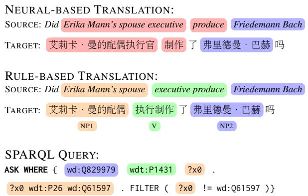
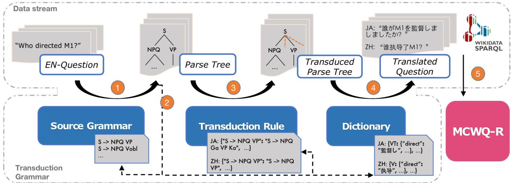
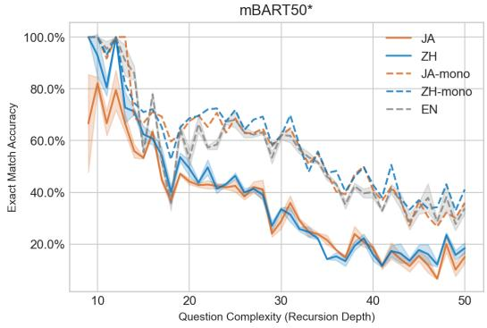
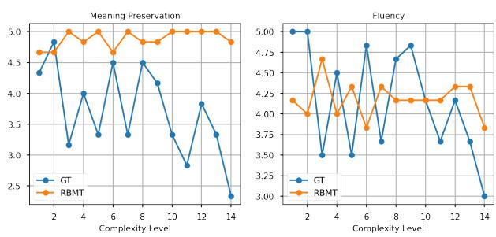
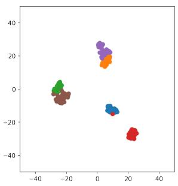
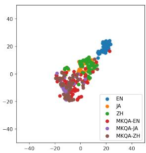
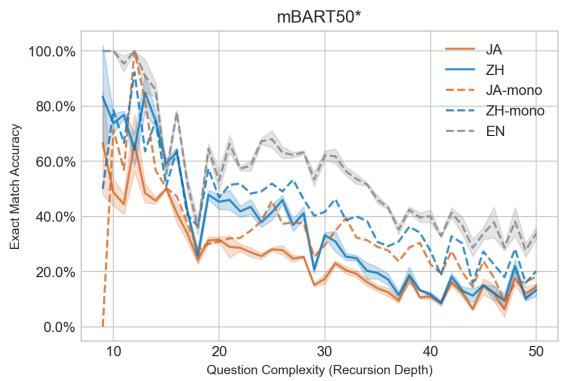
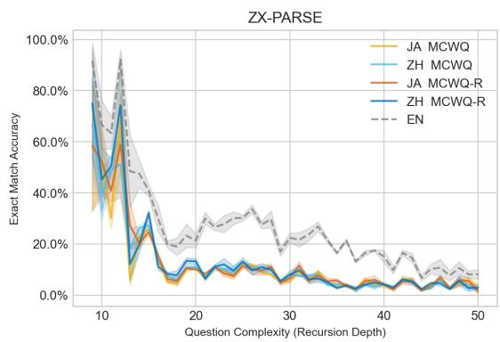

# On Evaluating Multilingual Compositional Generalization with Translated Datasets

Zi Wang1,2 and Daniel Hershcovich1

1Department of Computer Science, 2Department of Nordic Studies and Linguistics University of Copenhagen {ziwa, dh}@di.ku.dk

## Abstract

Compositional generalization allows efficient learning and human-like inductive biases. Since most research investigating compositional generalization in NLP is done on English, important questions remain underexplored. Do the necessary compositional generalization abilities differ across languages? Can models compositionally generalize crosslingually? As a first step to answering these questions, recent work used neural machine translation to translate datasets for evaluating compositional generalization in semantic parsing. However, we show that this entails critical semantic distortion. To address this limitation, we craft a faithful rule-based translation of the MCWQ dataset (Cui et al., 2022) from English to Chinese and Japanese. Even with the resulting robust benchmark, which we call MCWQ-R, we show that the distribution of compositions still suffers due to linguistic divergences, and that multilingual models still struggle with cross-lingual compositional generalization. Our dataset and methodology will be useful resources for the study of cross-lingual compositional generalization in other tasks.1

## 1 Introduction

A vital ability desired for language models is compositional generalization (CG), the ability to generalize to novel combinations of familiar units (Oren et al., 2020). Semantic parsing enables executable representation of natural language utterances for knowledge base question answering (KBQA; Lan et al., 2021). A growing amount of research has been investigating the CG ability of semantic parsers based on carefully constructed datasets, typically synthetic corpora (e.g., CFQ; Keysers et al., 2019) generated based on curated rules, mostly within monolingual English scenarios. As demonstrated by Perevalov et al. (2022), resource scarcity for many languages largely preclude their speakers’ access to knowledge bases (even for languages they include), and KBQA in multilingual scenarios is barely researched mainly due to lack of corresponding benchmarks.

  
Figure 1: Example of neural machine translation (NMT, from MCWQ, top) and rule-based translation (from MCWQ-R, middle) from English to Chinese. The compositions correctly captured by the translation system and the correspondences in the SPARQL query (bottom) are highlighted in the same color, while errors are in red. NMT often diverges semantically from the query: here, the compound “executive produce” is split. RBMT performs well due to awareness of grammar constituents.

Cui et al. (2022) proposed Multilingual Compositional Wikidata Questions (MCWQ) as the first semantic parsing benchmark to address the mentioned gaps. Google Translate (GT; Wu et al., 2016), a Neural Machine Translation (NMT) system trained on large-scale corpora, was adopted in creating MCWQ. We argue that meaning preservation during translation is vulnerable in this methodology especially considering the synthetic nature of the compositional dataset. Furthermore, stateof-the-art neural network models fail to capture structural systematicity (Hadley, 1994; Lake and Baroni, 2018; Kim and Linzen, 2020).

Symbolic (e.g., rule-based) methodologies allow directly handling CG and were applied both to generate benchmarks (Keysers et al., 2019; Kim and Linzen, 2020; Tsarkov et al., 2021) and to inject inductive bias to state-of-the-art models (Guo et al., 2020; Liu et al., 2021a). This motivates us to extend this idea to cross-lingual transfer of benchmarks and models. We propose to utilize rule-based machine translation (RBMT) to create parallel versions of MCWQ and yield a robust multilingual benchmark measuring CG. We build an MT framework based on synchronous context-free grammars (SCFG) and create new Chinese and Japanese translations of MCWQ questions, which we call MCWQ-R (Multilingual Compositional Wikidata Questions with Rule-based translations). We conduct experiments on the datasets translated with GT and RBMT to investigate the effect of translation method and quality on CG in multilingual and cross-lingual scenarios.

Our specific contributions are as follows:

• We propose a rule-based method to faithfully and robustly translate CG benchmarks.

• We introduce MCWQ-R, a CG benchmark for semantic parsing from Chinese and Japanese to SPARQL.

• We evaluate the translated dataset through both automatic and human evaluation and show that its quality greatly surpasses that of MCWQ (Cui et al., 2022).

• We experiment with two different semantic parsing architectures and provide an analysis of their CG abilities within language and across languages.

## 2 Related Work

Compositional generalization benchmarks. Much previous work on CG investigated how to measure the compositional ability of semantic parsers. Lake and Baroni (2018) and Bastings et al. (2018) evaluated the CG ability of sequenceto-sequence (seq2seq) architectures on natural language command and action pairs. Keysers et al. (2019) brought this task to a realistic scenario of KBQA by creating a synthetic dataset of questions and SPARQL queries, CFQ, and further quantified the distribution gap between training and evaluation using compound divergence, creating maximum compound divergence (MCD) splits to evaluate CG. Similarly, Kim and Linzen (2020) created COGS in a synthetic fashion following a stronger definition of training-test distribution gap. Goodwin et al. (2022) benchmarked CG in dependency parsing by introducing gold dependency trees for CFQ questions. For this purpose, a full coverage context-free grammar over CFQ was constructed benefiting from the synthetic nature of the dataset. While these works differ in data generation and splitting strategy, rule-based approaches are commonly adopted for dataset generation; as Kim and Linzen (2020) put it, such approaches allow maintaining “full control over the distribution of inputs”, the crucial factor for valid compositionality measurement. In contrast, Cui et al. (2022) created MCWQ through a process including knowledge base migration and question translation through NMT, without full control over target language composition distribution. We aim to remedy this in our paper by using RBMT.

Rule-based machine translation. Over decades of development, various methodologies and technologies were introduced for the task of Machine Translation (MT). To roughly categorize the most popular models, we can divide them into pre-neural models and neural-based models. Pre-neural MT (Wu, 1996; Marcu and Wong, 2002; Koehn et al., 2003; Chiang, 2005) typically includes manipulation of syntax and phrases, whereas neural-based MT (Kalchbrenner and Blunsom, 2013; Cho et al., 2014; Vaswani et al., 2017) refers to those employing neural networks. However, oriented to general broad-coverage applications, most models rely on learned statistical estimates, even for the pre-neural models. The desiderata in our work, on the other hand, exclude methods with inherent uncertainty. The most relevant methods were by Wu (1996, 1997) who applied SCFG variants to MT (Chiang, 2006). The SCFG is a generalization of CFG (context-free grammars) generating coupled strings instead of single ones, exploited by preneural MT works for complex syntactic reordering during translation. In this work, we exclude the statistical component and manually build the SCFG transduction according to the synthetic nature of CFQ; we specifically call it “rule-based” instead of “syntax-based” to emphasize this subtle difference.

Multilingual benchmarks. Cross-lingual learning has been increasingly researched recently, where popular technologies in NLP are generally adapted for representation learning over multiple languages (Conneau et al., 2020; Xue et al., 2021). Meanwhile, transfer learning is widely leveraged to overcome the data scarcity of low-resource languages (Cui et al., 2019; Hsu et al., 2019). However, cross-lingual benchmarks datasets, against which modeling research is developed, often suffer from “translation artifacts” when created using general machine translation systems (Artetxe et al., 2020; Wintner, 2016). Longpre et al. (2021) proposed MKQA, a large-scale multilingual question answering corpus (yet not for evaluating CG) avoiding this issue, through enormous human efforts. In contrast, Cui et al. (2022) adopted Google Translate to obtain parallel versions for CFQ questions while sacrificing meaning preservation and systematicity. We propose a balance between the two methodologies, with automatic yet controlled translation. In addition, our work further fills the data scarcity gap in cross-lingual semantic parsing, being the first CG benchmark for semantic parsing for Japanese.

  
Figure 2: The pipeline of dataset generation. The circled numbers refer to (1) parsing question text, (2) building the dictionary and revising the source grammar and corresponding transduction rules based on parse trees, (3) replacing and reordering constituents, (4) translating lexical units, (5) post-processing and grounding in Wikidata.

## 3 Multilingual Compositional Wikidata Questions (MCWQ)

MCWQ (Cui et al., 2022) is the basis of our work. It comprises English questions inherited from CFQ (Keysers et al., 2019) and the translated Hebrew, Chinese and Kannada parallel questions based on Google Cloud Translate, an NMT system. The questions are associated with SPARQL queries against Wikidata, which were migrated from Freebase queries in CFQ. Wikidata is an open knowledge base where each item is allocated a unique, persistent identifier (QID).2 MCWQ and CFQ (and in turn, our proposed MCWQ-R, see §4) share common English questions and associated SPARQL queries. MCWQ introduces distinct multilingual branches, with the same data size across all the branches.

Due to the translation method employed in MCWQ, it suffers from detrimental inconsistencies for CG evaluation (see Figures 1 and 3)—mainly due to the unstable mapping from source to target languages performed by NMT models at both the lexical and structural levels. We discuss the consequences with respect to translation quality in §4.3 and model performance in §6.

## 4 MCWQ-R: A Novel Translated Dataset

As stated in §2, data generation with GT disregards the “control over distribution”, which is crucial for CG evaluation (Keysers et al., 2019; Kim and Linzen, 2020). Thus, we propose to diverge from the MCWQ methodology by translating the dataset following novel grammar of the involved language pairs to guarantee controllability during translation. Such controllability ensures that the translations are deterministic and systematic. In this case, generalization is exclusively evaluated with respect to compositionality, avoiding other confounds. We create new instances of MCWQ in Japanese and Chinese, two typologically distant languages from English, sharing one common language (Chinese) with the existing MCWQ. To make comprehensive experimental comparisons between languages, we also use GT to generate Japanese translations (which we also regard as a part of MCWQ in this paper), following the same method as MCWQ.

In this section, we describe the proposed MCWQ-R dataset. In §4.1 we describe the process of creating the dataset, in §4.2 its statistics, and in §4.3 the automatic and manual assessment of its quality.

" questionPatternModEntities ": "Did M1 's spouse executive produce M0",   
" questionWithBrackets ": " Did [ Erika Mann ] 's spouse executive produce [ Friedemann Bach ]",   
" questionPatternModEntities\_zh ": "M1 的配偶主管是否生产了 M0"   
" questionWithBrackets\_zh ": "[ Erika Mann ] 的配偶执行官制作了 [ Friedemann Bach ] 吗",   
" sparqlPatternModEntities ":   
"ASK WHERE { M0 wdt: P1431 ?x0 . ?x0 wdt:P26 M1 . FILTER ( ?x0 != M1 )}   
" sparql ":   
"ASK WHERE { wd: Q829979 wdt: P1431 ?x0 . ?x0 wdt :P26 wd: Q61597 . FILTER ( ?x0 != wd: Q61597 )}"   
" questionPatternModEntities\_zh ": "M1 的配偶执行制作了 M0 吗",   
" questionWithBrackets\_zh ": "[ Erika Mann ] 的配偶执行制作了 [ Friedemann Bach ] 吗"  
Figure 3: Example of an MCWQ (Cui et al., 2022) item in JSON format (top) and 2 fileds of the corresponding MCWQ-R item (bottom). We present part of the fields: the English and SPARQL fields inherited from CFQ and the Chinese fields. Specifically, we show an incorrectly translated example in MCWQ where “excutive produce” is not translated as a composition while MCWQ-R keeps good consistency with English.

## 4.1 Generation Methodology

The whole process of the dataset generation is summarized in Figure 2. We proceed by parsing the English questions, building bilingual dictionaries, a source grammar and transduction rules, replacing and reordering constituents, translating lexical units, post-processing and grounding in Wikidata.

Grammar-based transduction. We base our method on Universal Rule-Based Machine Translation (URBANS; Nguyen, 2021), an open-source toolkit3 supporting deterministic rule-based translation with a bilingual dictionary and grammar rule transduction, based on NLTK (Bird and Loper, 2004). We modify it to a framework supporting synchronous context-free grammar (SCFG; Chiang, 2006) for practical use, since the basic toolkit lacks links from non-terminals to terminals preventing the lexical multi-mapping. A formally defined SCFG variant is symmetrical regarding both languages (Wu, 1997), while we implement a simplified yet functionally identical version only for one-way transduction. Our formal grammar framework consists of three modules: a set of source grammar rules converting English sentences to parse trees, the associated transduction rules hierarchically reordering the grammar constituents with tree manipulation and a tagged dictionary mapping tokens into the target language based on their part-of-speech (POS) tags. The tagged dictionary here provides links between the non-terminals and terminals defined in a general CFG (Williams et al., 2016). Context information of higher syntactical levels is encapsulated in the POS tags and triggers different mappings to the target terms via the links. This mechanism enables our constructed grammar to largely address complex linguistic differences (polysemy and inflection for instance) as a general SCFG does. We construct the source grammar as well as associated transduction rules and dictionaries, resulting in two sets of transduction grammars for Japanese and Chinese respectively.

Source grammar. The synthetic nature of CFQ (Keysers et al., 2019) indicates that it has limited sentence patterns and barely causes ambiguities; Goodwin et al. (2022) leverage this feature and construct a full coverage CFG for the CFQ language, which provides us with a basis of source grammar. We revise this monolingual CFG to satisfy the necessity for translation with an “extensive” strategy, deriving new tags for constituents at the lowest syntactic level where the context accounts for multiple possible lexical mappings.

Bridging linguistic divergences. The linguistic differences are substantial between the source language and the target languages in our instances. The synthetic utterances in CFQ are generally cultural-invariant and not entailed with specific language style, therefore the problems here are primarily ascribed to the grammatical differences and lexical gaps. For the former, our grammar performs systematic transduction on the syntactical structures; for the latter, we adopt a pattern match-substitution strategy as post-processing for the lexical units applied in a different manner from the others in the target languages. We describe concrete examples in Appendix A. Without the confound of probability, the systematic transductions simply bridge the linguistic gaps without further extension, i.e., no novel primitives and compositions are generated while the existing ones are faithfully maintained to the largest extent in this framework.

<table><tr><td></td><td>Questions</td><td>Question Patterns</td><td>Paired Patterns</td></tr><tr><td colspan="2">EN (MCWQ)</td><td>124,187</td><td>105,461</td><td>105,461</td></tr><tr><td rowspan="3">GT (MCWQ)</td><td>JA</td><td>124,187</td><td>99,900</td><td>100,140</td></tr><tr><td>ZH</td><td>124,187</td><td>99,747</td><td>100,325</td></tr><tr><td>JA</td><td>124,187</td><td>98,431</td><td>98,431</td></tr><tr><td rowspan="2">RBMT (MCWQ-R)</td><td>ZH</td><td>124,187</td><td>101,333</td><td>101,342</td></tr><tr><td></td><td></td><td></td><td></td></tr></table>

Table 1: Statistics of MCWQ-R and the corresponding branches of MCWQ. We count question patterns with mod entities (Keysers et al., 2019), the form directly processed during translation, and question-query pairs comprising the question patterns and the associated SPARQL queries with mod entities.

Grounding in Wikidata. Following CFQ and MCWQ, we ground the translated questions in Wikidata through their coupled SPARQL queries. Each entity in the knowledge base possesses the unique QID and multilingual labels, meaning that numerous entities can be treated as simplified mod entities (see Figure 3.) during translation, i.e., the grammar translates the question patterns instead of concrete questions. The shared SPARQL queries enable comparative study with MCWQ and potentially CFQ (our grammar fully covers CFQ questions) in both cross-lingual and monolingual domains. In addition, the SPARQL queries are unified as reversible intermediate representation (RIR; Herzig et al., 2021) in our dataset and for all experimental settings, which is shown to improve CG.

## 4.2 Dataset Statistics

Due to the shared source data, the statistics of MCWQ-R are largely kept consistent with MCWQ. Specifically, the two datasets have the same amounts of unique questions (UQ; 124,187), unique queries (101,856, 82% of UQ) and query patterns (86,353, 69.5% of UQ). A substantial aspect nonetheless disregarded was the languagespecific statistics, especially those regarding question patterns. As shown in Table 1, for both MCWQ and MCWQ-R, we observe a decrease in question patterns in translations compared with English and the corresponding pairs coupled with SPARQL queries, i.e., question-query pairs. This indicates that the patterns are partially collapsed in the target languages with both methodologies. Furthermore, as the SPARQL queries are invariant logical representations underlying the semantics, the QA pairs are supposed to be consistent with the question patterns even if collapsed. However, we notice a significant inconsistency $( \Delta _ { J A } = 2 4 0 ;$ $\Delta _ { Z H } = 5 7 8 )$ between the two items in MCWQ while there are few differences $( \Delta _ { J A } = 0 ; \Delta _ { Z H } = 9 )$ in MCWQ-R. This further implicates a resultant disconnection between the translated questions and corresponding semantic representations with NMT.

We expect our grammar to be fully deterministic over the dataset, nonetheless, it fails to disambiguate a small proportion (322; 0.31%) of English utterance patterns that are amphibologies (grammatically ambiguous) and requires reasoning beyond the scope of grammar. We let the model randomly assign a candidate translation for these.

## 4.3 Translation Quality Assessment

Following Cui et al. (2022), we comprehensively assess the translation quality of MCWQ-R and the GT counterpart based on the test-intersection set (the intersection of the test sets of all splits) samples. While translation quality is a general concept, in this case, we focus on how appropriately the translation trades off fluency and faithfulness to the principle of compositionality.

<table><tr><td colspan="2">Language</td><td>Reference</td><td colspan="3">Manual</td></tr><tr><td colspan="2">&amp; Method</td><td>BLEU</td><td>avgMP</td><td>avgF</td><td>P(MP,F ≥ 3)</td></tr><tr><td rowspan="2">JA</td><td>RBMT</td><td>97.1</td><td>4.8</td><td>4.0</td><td>100.0%</td></tr><tr><td>GT</td><td>45.1</td><td>3.7</td><td>4.1</td><td>71.4%</td></tr><tr><td rowspan="2">ZH</td><td>RBMT</td><td>94.4</td><td>4.9</td><td>4.2</td><td>100.0%</td></tr><tr><td>GT</td><td>47.2</td><td>3.6</td><td>4.2</td><td>71.4%</td></tr></table>

Table 2: Assessment scores for the translations. MP refers to Meaning Preservation and F refers to Fluency. The prefix avg indicates averaged scores. P(MP, F  3) refers to the proportion of questions regarded as acceptable.

Reference-based assessment. We manually translate 155 samples from the test-intersection set in a faithful yet rigid manner as gold standard before the grammar construction. We calculate BLEU (Papineni et al., 2002) scores of the machine-translated questions against the gold set with sacreBLEU (Post, 2018), shown in Table 2. Our RBMT reached 97.1 BLEU for Japanese and 94.4 for Chinese, indicating a nearly perfect translation as expected. While RBMT could ideally reach a full score, the loss here is mainly caused by samples lacking context information (agnostic of entity for instance). In addition, we observe that GT obtained fairly poor performance with 45.1 BLEU for Japanese, which is significantly lower than the other branches in MCWQ (87.4, 76.6, and 82.8 for Hebrew, Kannada, and Chinese, respectively; Cui et al., 2022). The main reason for this gap is the different manner in which we translated the gold standard: the human translators in MCWQ took a looser approach.

Manual assessment. We manually assess the translations of 42 samples (for each structural complexity level defined by Keysers et al., 2019) in terms of meaning preservation (MP) and fluency (F) with a rating scale of 1–5. As shown in Table 2, our translations have significantly better MP than GT, which is exhibited by the average scores (1.1 and 1.3 higher in avgMP for Japanese and Chinese, respectively). However, the methods obtain similar fluency scores, indicating that both suffer from unnatural translations, partially because of the unnaturalness of original English questions (Cui et al., 2022). RBMT produces only few translations with significant grammar errors and semantic distortions, while GT results in 28.6% of unacceptable translations in this respect. Such errors occur on similar samples for the two languages, suggesting a systematicity in GT failure. We include details of manual assessment in Appendix B.

## 5 Experiments

While extensive experiments have been conducted on both the monolingual English (Keysers et al., 2019) and the GT-based multilingual benchmarks (Cui et al., 2022), the results fail to demonstrate pure multilingual CG due to noisy translations. Consistent with prior work, we experiment in both monolingual and cross-lingual scenarios. Specifically, we take into consideration both RBMT and GT branches4 in the experiments for further comparison.

## 5.1 Within-language Generalization (Monolingual)

Cui et al. (2022) showed consistent ranking among sequence-to-sequence (seq2seq) models for the 4 splits (3 MCD and 1 random splits). We fine-tune and evaluate the pre-trained mT5-small (Xue et al., 2021), which performs well on MCWQ for each monolingual dataset. In addition, we train a model using mBART50 (Tang et al., 2020) as a frozen embedder and learned Transformer encoder and decoder, following Liu et al. (2020). We refer to this model as mBART50∗ (it is also the base architecture of ZX-Parse; see §5.2).

We show the monolingual experiment results in Table 3. The models achieve better average performance on RBMT questions than GT ones. This meets our expectations since the systematically translated questions excluded the noise. On the random split, both RBMT branches are highly consistent with English, while noise in GT data lowers accuracy. However, the comparisons on MCD splits show that RBMT branches are less challenging than English, especially for mT5-small. In §6.1, we show this is due to the “simplifying” effect of translation on composition.

Comparisons across languages demonstrate another interesting phenomenon: Japanese and Chinese exhibited an opposite relative difficulty on RBMT and GT. It is potentially due to the more extensive grammatical system (widely applied in different realistic scenes) of the Japanese language, while the grammatical systems and language styles are unified in RBMT, the GT tends to infer such diversity which nonetheless belongs to another category (natural language variant; Shaw et al., 2021).

<table><tr><td colspan="2">Exact</td><td colspan="2">mT5-small</td><td colspan="2">mBART50*</td></tr><tr><td colspan="2">Match(%)</td><td colspan="2">MCWQ-R MCWQ</td><td colspan="2">MCWQ-R MCWQ</td></tr><tr><td rowspan="3">MaMan</td><td>EN</td><td>38.3</td><td></td><td>55.2±1.6</td><td></td></tr><tr><td>JA</td><td>56.3</td><td>30.8</td><td>58.3</td><td>32.9</td></tr><tr><td>ZH</td><td>51.1</td><td>36.3</td><td>59.9</td><td>43.6</td></tr><tr><td>Radom</td><td>EN</td><td>98.6</td><td></td><td>98.9±0.1</td><td></td></tr><tr><td></td><td>JA</td><td>98.7</td><td>92.4</td><td>98.7</td><td>92.9</td></tr><tr><td></td><td>ZH</td><td>98.4</td><td>91.8</td><td>98.8</td><td>92.8</td></tr></table>

Table 3: Monolingual experiment results: Exact match accuracies in percentage (%) are shown here. We present the model performance on the two translated datasets, which share the English branch. MCDmean represents the average accuracy across 3 MCD splits, and the detailed results breakdown can be found in Appendix D.1. Random refers to the results on the random split. We run 3 replicates for mBART50∗ on EN, which is used for further cross-lingual experiments (see §5.2).

## 5.2 Cross-lingual Generalization (Zero-shot)

We mentioned the necessity of developing multilingual KBQA systems in §1. Enormous efforts required for model training for every language encourage us to investigate the zero-shot cross-lingual generalization ability of semantic parsers which serve as the KBQA backbone. While similar experiments were conducted by Cui et al. (2022), the adopted pipeline (cross-lingual inference by mT5 fine-tuned on English) exhibited negligible predictive ability for all the results, from which we can hardly draw meaningful conclusions.

For our experiments, we retain this as a baseline, and additionally train Zero-shot Cross-lingual Semantic Parser (ZX-Parse), a multi-task seq2seq architecture proposed by Sherborne and Lapata (2022). The architecture consists of mBART50∗ with two auxiliary objectives (question reconstruction and language prediction) and leverages gradient reversal (Ganin et al., 2016) to align multilingual representations, which results in a promising improvement in cross-lingual SP.

With the proposed architecture, we investigate how the designed cross-lingual parser and its representation alignment component perform on the compositional data. Specifically, we experiment with both the full ZX-Parse and with mBART50∗, its logical-form-only version (without auxiliary objectives). For the auxiliary objectives, we use bitext from MKQA (Longpre et al., 2021) as supportive data. See Appendix C for details.

Table 4 shows our experimental results. mT5- small fine-tuned on English fails to generate correct SPARQL queries. ZX-Parse, with a frozen mBART50 encoder and learned decoder, demonstrates moderate predictive ability. Surprisingly, while the logical-form-only (mBART50∗) architecture achieves fairly good performance both within English and cross-lingually, the auxiliary objectives cause a dramatic decrease in performance. We discuss this in §6.2

## 6 Discussion

## 6.1 Monolingual Performance Gap

As Table 3 suggests, MCWQ-R is easier than its English and GT counterparts. While we provide evidence that the latter suffers from translation noise, comparison with the former indicates partially degenerate compositionality in our multilingual sets. We ascribe this degeneration to an inherent property of translation, resulting from linguistic differences: as shown in Table 1, question patterns are partially collapsed after mapping to target languages.

Train-test overlap. Intuitively, we consider training and test sets of the MCD splits, where no overlap is permitted in English under MCD constraints (the train-test intersection must be empty). Nevertheless, we found such overlaps in Japanese and Chinese due to the collapsed patterns. Summing up over 3 MCD splits, we observe 58 samples for Japanese and 37 for Chinese, and the two groups share similar patterns. Chinese and Japanese grammar inherently fail to (naturally) express specific compositions in English, predominantly the possessive case, a main category of compositional building block designed by Keysers et al. (2019). This linguistic divergence results in degeneration in compound divergence between training and test sets, which is intuitively reflected by the pattern overlap. We provide examples in Appendix E.1.

Loss of structural variation. Given the demonstration above, we further look at MCWQ and see whether GT could avoid this degeneration. Surprisingly, the GT branches have larger train-test overlaps (108 patterns for Japanese and 144 for Chinese) than RBMT counterparts , among which several samples (45 for Japanese and 55 for Chinese) exhibit the same structural collapse as in RBMT. Importantly, a remaining large proportion of the samples (63 for Japanese and 89 for Chinese) possess different SPARQL representations for training and test respectively. In addition, several ill-formed samples are observed in this intersection.

The observations above provide evidence that the structural collapse is due to inherent linguistic differences and thus generally exists in translationbased methods, resulting in compositional degeneration in multilingual benchmarks. For GT branches, the noise involving semantic and grammatical distortion dominates over the degeneration, and thus causes worse model performance.

Implications. While linguistic differences account for the performance gaps, we argue that monolingual performance in CG cannot be fairly compared across languages with translated benchmarks. While “translationese” occurs in translated datasets for other tasks too (Riley et al., 2020; Bizzoni and Lapshinova-Koltunski, 2021; Vanmassenhove et al., 2021), it is particularly significant here.

## 6.2 Cross-lingual Generalization

PLM comparison. mT5 fine-tuned on English fails to generalize cross-lingually (Table 4). ZX-Parse, based on mBART50, achieved fair performance. A potential reason is that mT5 (especially small and base models) tends to make “accidental translation” errors in zero-shot generalization (Xue et al., 2021), while the representation learned by mBART enables effective unsupervised translation via language transfer (Liu et al., 2020). Another surprising observation is that mBART50∗ outperforms the fine-tuned mT5-small on monolingual English (55.2% for $\mathbf { M C D } _ { \mathrm { m e a n } } )$ with less training. We present additional results regarding PLM finetuning in Appendix D.2.

<table><tr><td rowspan="2" colspan="2">Exact Match(%)</td><td colspan="2">mT5-small</td><td colspan="2">mBART50*</td><td colspan="2">ZX-Parse</td></tr><tr><td>MCWQ-R</td><td>MCWQ</td><td>MCWQ-R</td><td>MCWQ</td><td>MCWQ-R</td><td>MCWQ</td></tr><tr><td rowspan="3"> $\mathbf { M C D _ { \mathrm { { m e a n } } } }$ </td><td>EN</td><td colspan="2">38.3</td><td colspan="2"> $5 5 . 2 { \scriptstyle \pm 1 . 6 }$ </td><td colspan="2"> $2 3 . 9 { \scriptstyle \pm 3 . 4 }$ </td></tr><tr><td>JA</td><td>0.10</td><td>0.14</td><td> $3 5 . 4 _ { \pm 2 . 1 }$ </td><td> $2 4 . 6 { \scriptstyle \pm 2 . 8 }$ </td><td> $8 . 8 { \scriptstyle \pm 1 . 8 }$ </td><td> $8 . 5 { \scriptstyle \pm 1 . 5 }$ </td></tr><tr><td>ZH</td><td>0.12</td><td>0.18</td><td> $3 7 . 7 _ { \pm 1 . 8 }$ </td><td> $3 5 . 0 _ { \pm 2 . 2 }$ </td><td> $9 . 3 _ { \pm 2 . 0 }$ </td><td> $9 . 1 _ { \pm 1 . 7 }$ </td></tr><tr><td rowspan="3">Random</td><td>EN</td><td colspan="2">98.6</td><td colspan="2"> $9 8 . 9 { \scriptstyle \pm 0 . 1 }$ </td><td colspan="2"> $7 5 . 9 { \scriptstyle \pm 9 . 1 }$ </td></tr><tr><td>JA</td><td>0.9</td><td>0.9</td><td> $5 8 . 0 { \scriptstyle \pm 0 . 8 }$ </td><td> $3 4 . 4 _ { \pm 3 . 1 }$ </td><td> $2 7 . 2 { \scriptstyle \pm 2 . 1 }$ </td><td> $2 3 . 1 _ { \pm 1 . 9 }$ </td></tr><tr><td>ZH</td><td>1.4</td><td>1.1</td><td> $5 8 . 2 { \scriptstyle \pm 1 . 4 }$ </td><td> $4 3 . 7 _ { \pm 1 . 3 }$ </td><td> $2 9 . 4 _ { \pm 3 . 4 }$ </td><td> $2 4 . 8 _ { \pm 3 . 5 }$ </td></tr></table>

Table 4: Cross-lingual experiment results. The English results in gray refer to within-language generalization performance. Notice that mBART50∗ here is the ablation model of ZX-Parse with the same training paradigm for logical form decoder. We run 3 replicates for mBART50∗ and ZX-Parse. The results breakdown for 3 MCD splits can be found in Appendix D.1.

  
Figure 4: Accuracy on MCWQ-R of mBART50∗ varies against increasing question complexity, averaged over 3 MCD splits. Dashed lines refer to within-language generalization performance, indicating cross-lingual transfer upper boundaries.

Hallucination in parsing. mT5 tends to output partially correct SPARQL queries due to its drawback in zero-shot generative scenarios. From manual inspection, we note a common pattern in these errors that can be categorized as hallucinations (Ji et al., 2023; Guerreiro et al., 2023). As Table 5 suggests, the hallucinations with country entities occur in most wrong predictions, and exhibit a language bias akin to that Kassner et al. (2021)

found in mBERT (Devlin et al., 2019), i.e., mT5 tends to predict the country of origin associated with the input language in the hallucinations, as demonstrated in Table 6. Experiments in Appendix D.2 indicate that the bias is potentially encoded in the pre-trained decoders.
<table><tr><td rowspan="2">Halluc.(%) W/ country</td><td colspan="3">MCDmean</td><td colspan="3">Random</td></tr><tr><td>ZH</td><td>JA</td><td>EN</td><td>ZH</td><td>JA</td><td>EN</td></tr><tr><td rowspan="3">Q148 CN Q17 JP Others</td><td>71.0</td><td>0</td><td>0</td><td>60.6</td><td>0</td><td>0</td></tr><tr><td>0.1</td><td>76.1</td><td>0</td><td>0.1</td><td>63.3</td><td>0</td></tr><tr><td>4.2</td><td>1.8</td><td>0.45</td><td>3.8</td><td>0.9</td><td>0</td></tr><tr><td colspan="2">Total</td><td>75.2 77.9</td><td>0.45</td><td>64.4</td><td>64.2</td><td>0</td></tr></table>

Table 5: Proportion of hallucinations with the specific country entities in the wrong predictions, generated by mT5-small in zero-shot cross-lingual generalization (models trained on English). Within-language results are in gray for comparison. The results on MCWQ-R are shown here. The countries are represented in QID and ISO codes, and the other (12) countries involved in the dataset are summed as others. The predominant parts exhibiting language bias are in bold, for which an example is shown in Table 6.

Representation alignment. The auxiliary objectives in ZX-Parse are shown to improve the SP performance on MultiATIS++ (Xu et al., 2020) and Overnight (Wang et al., 2015). However, it leads to dramatic performance decreases on all MCWQ and MCWQ-R splits. We include analysis in Appendix E.2, demonstrating the moderate effect of the alignment mechanism here, which nevertheless should reduce the cross-lingual transfer penalty. We thus ascribe this gap to the natural utterances from MKQA used for alignment resulting in less effective representations for compositional utterances, and hence the architecture fails to bring further improvement.

<table><tr><td>Question (EN)</td><td>Which actor was M0 &#x27;s actor</td></tr><tr><td>Question (ZH) Inferred (RIR)</td><td>M0的演员是哪个演员 SELECT DISTINCT ?x0 WHERE 1b (M0（wdt:P453)（?x0)). ( ?x0 ( wdt:P27 ) ( wd:Q148 ) ）rb</td></tr><tr><td>Question (JA) Inferred (RIR)</td><td>M0の俳優はどの俳優でしたか SELECT DISTINCT ?x0 WHERE 1b (?x0(wdt:P106)(wd:Q33999 )).(M0(wdt:P108)(?x0</td></tr></table>

Table 6: An example of the language-biased hallucinations. The questions are parallel across languages and associated with the same SPARQL query. The inferred queries are in RIR form. The language-biased hallucination triples are highlighted in red, where Q148 is China in Wikidata, and Q17 is Japan.

Cross-lingual difficulty. As illustrated in Figure 4, while accuracies show similar declining trends across languages, cross-lingual accuracies are generally closer to monolingual ones in low complexity levels, which indicates that the cross-lingual transfer is difficult in CG largely due to the failure in universally representing utterances of high compositionality across languages. Specifically, for low complexity samples, we observe test samples that are correctly predicted cross-lingually but wrongly predicted within English. These several samples (376 for Japanese and 395 for Chinese on MCWQ-R) again entail structural simplification, which further demonstrates that this eases the compositional challenge even in the cross-lingual scenario. We further analyze the accuracies by complexity of MCWQ and ZX-Parse in Appendix E.3.

## 7 Conclusion

In this paper, we introduced MCWQ-R, a robustly generated multilingual CG benchmark with a proposed rule-based framework. Through experiments with multilingual data generated with different translation methods, we revealed the substantial impact of linguistic differences and “translationese” on compositionality across languages. Nevertheless, removing of all difficulties but compositionality, the new benchmark remains challenging both monolingually and cross-lingually. Furthermore, we hope our proposed method can facilitate future investigation on multilingual CG benchmark in a controllable manner.

## Limitations

Even the premise of parsing questions to Wikidata queries leads to linguistic and cultural bias, as Wikidata is biased towards English-speaking cultures (Amaral et al., 2021). As Cui et al. (2022) argue, speakers of other languages may care about entities and relations that are not represented in Englishcentric data (Liu et al., 2021b; Hershcovich et al., 2022a). For this reason and for the linguistic reasons we demonstrated in this paper, creating CG benchmarks natively in typologically diverse languages is essential for multilingual information access and its evaluation.

As we mentioned in §4.2, our translation system fails to deal with ambiguities beyond grammar and thus generates wrong translations for a few samples (less than 0.31%). Moreover, although the dataset can be potentially augmented with low-resource languages and in general other languages through the translation framework, adequate knowledge will be required to expand rules for the specific target languages.

With limited computational resources, we are not able to further investigate the impact of parameters and model sizes of multilingual PLM as our preliminary results show significant performance gaps between PLMs.

## Broader Impact

A general concern regarding language resource and data collection is the potential (cultural) bias that may occur when annotators lack representativeness. Our released data largely avoid such issue due to the synthetic and cultural-invariant questions based on knowledge base. Assessment by native speakers ensures its grammatical correction. However, we are aware that bias may still exist occasionally. For this purpose, we release the toolkit and grammar used for generation, which allows further investigation and potentially generating branches for other languages, especially low-resource ones.

In response to the appeal for greater environmental awareness as highlighted by Hershcovich et al. (2022b), a climate performance model card for mT5-small is reported in Table 7. By providing access to the pre-trained models, we aim to support future endeavors while minimizing the need for redundant training efforts.

<table><tr><td colspan="2">mT5-smal1 finetuned</td></tr><tr><td>1. Model publicly available?</td><td>Yes</td></tr><tr><td>2. Time to train final model</td><td>21 hours</td></tr><tr><td>3. Time for all experiments</td><td>23 hours</td></tr><tr><td>4. Energy consumption</td><td>0.28kW</td></tr><tr><td>5. Location for computations</td><td>Denmark</td></tr><tr><td>6. Energy mix at location</td><td>191gCO2eq/kWh</td></tr><tr><td>7. CO2eq for final model</td><td>4.48 kg</td></tr><tr><td>8. CO2eq for all experiments</td><td>4.92 kg</td></tr></table>

Table 7: Climate performance model card for mT5- small fine-tuned on MCWQ/MCWQ-R. “Time to train final model” corresponds to the training time for a single model of one split and one language, while the remaining models have similar resource consumption.

## Acknowledgements

We thank the anonymous reviewers for their valuable feedback. We are also grateful to Guang Li, Nao Nakagawa, Stephanie Brandl, Ruixiang Cui, Tom Sherborne and members of the CoAStaL NLP group for their helpful insights, advice and support throughout this work.

## References

Gabriel Amaral, Alessandro Piscopo, Lucie-aimée Kaffee, Odinaldo Rodrigues, and Elena Simperl. 2021. Assessing the quality of sources in Wikidata across languages: A hybrid approach. J. Data and Information Quality, 13(4).

Mikel Artetxe, Gorka Labaka, and Eneko Agirre. 2020. Translation artifacts in cross-lingual transfer learning. In Proceedings of the 2020 Conference on Empirical Methods in Natural Language Processing (EMNLP), pages 7674–7684, Online. Association for Computational Linguistics.

Jasmijn Bastings, Marco Baroni, Jason Weston, Kyunghyun Cho, and Douwe Kiela. 2018. Jump to better conclusions: SCAN both left and right. In Proceedings of the 2018 EMNLP Workshop BlackboxNLP: Analyzing and Interpreting Neural Networks for NLP, pages 47–55, Brussels, Belgium. Association for Computational Linguistics.

Steven Bird and Edward Loper. 2004. NLTK: The natural language toolkit. In Proceedings of the ACL Interactive Poster and Demonstration Sessions, pages 214–217, Barcelona, Spain. Association for Computational Linguistics.

Yuri Bizzoni and Ekaterina Lapshinova-Koltunski. 2021. Measuring translationese across levels of expertise: Are professionals more surprising than students? In Proceedings of the 23rd Nordic Conference on Computational Linguistics (NoDaLiDa), pages 53–63, Reykjavik, Iceland (Online). Linköping University Electronic Press, Sweden.

David Chiang. 2005. A hierarchical phrase-based model for statistical machine translation. In Proceedings of the 43rd Annual Meeting of the Association for Computational Linguistics (ACL’05), pages 263–270, Ann Arbor, Michigan. Association for Computational Linguistics.

David Chiang. 2006. An introduction to synchronous grammars.

Kyunghyun Cho, Bart van Merriënboer, Caglar Gulcehre, Dzmitry Bahdanau, Fethi Bougares, Holger Schwenk, and Yoshua Bengio. 2014. Learning phrase representations using RNN encoder–decoder for statistical machine translation. In Proceedings of the 2014 Conference on Empirical Methods in Natural Language Processing (EMNLP), pages 1724– 1734, Doha, Qatar. Association for Computational Linguistics.

Alexis Conneau, Kartikay Khandelwal, Naman Goyal, Vishrav Chaudhary, Guillaume Wenzek, Francisco Guzmán, Edouard Grave, Myle Ott, Luke Zettlemoyer, and Veselin Stoyanov. 2020. Unsupervised cross-lingual representation learning at scale. In Proceedings of the 58th Annual Meeting of the Associationfor Computational Linguistics, pages 8440– 8451, Online. Association for Computational Linguistics.

Ruixiang Cui, Rahul Aralikatte, Heather Lent, and Daniel Hershcovich. 2022. Compositional generalization in multilingual semantic parsing over Wikidata. Transactions ofthe Associationfor Computational Linguistics, 10:937–955.

Yiming Cui, Wanxiang Che, Ting Liu, Bing Qin, Shijin Wang, and Guoping Hu. 2019. Cross-lingual machine reading comprehension. In Proceedings of the 2019 Conference on Empirical Methods in Natural Language Processing and the 9th International Joint Conference on Natural Language Processing (EMNLP-IJCNLP), pages 1586–1595, Hong Kong, China. Association for Computational Linguistics.

Jacob Devlin, Ming-Wei Chang, Kenton Lee, and Kristina Toutanova. 2019. BERT: Pre-training of deep bidirectional transformers for language understanding. In Proceedings ofthe 2019 Conference of the North American Chapter ofthe Associationfor Computational Linguistics: Human Language Technologies, Volume 1 (Long and Short Papers), pages 4171–4186, Minneapolis, Minnesota. Association for Computational Linguistics.

Yaroslav Ganin, Evgeniya Ustinova, Hana Ajakan, Pascal Germain, Hugo Larochelle, François Laviolette, Mario Marchand, and Victor Lempitsky. 2016. Domain-adversarial training of neural networks. The journal of machine learning research, 17(1):2096– 2030.

Emily Goodwin, Siva Reddy, Timothy O’Donnell, and Dzmitry Bahdanau. 2022. Compositional generalization in dependency parsing. In Proceedings of the

60th Annual Meeting of the Association for Computational Linguistics (Volume 1: Long Papers), pages 6482–6493, Dublin, Ireland. Association for Computational Linguistics.

Nuno M. Guerreiro, Elena Voita, and André Martins. 2023. Looking for a needle in a haystack: A comprehensive study of hallucinations in neural machine translation. In Proceedings of the 17th Conference of the European Chapter of the Association for Computational Linguistics, pages 1059–1075, Dubrovnik, Croatia. Association for Computational Linguistics.

Yinuo Guo, Zeqi Lin, Jian-Guang Lou, and Dongmei Zhang. 2020. Hierarchical poset decoding for compositional generalization in language. In Proceedings of the 34th International Conference on Neural Information Processing Systems, NIPS’20, Red Hook, NY, USA. Curran Associates Inc.

Robert F Hadley. 1994. Systematicity in connectionist language learning. Mind & Language, 9(3):247–272.

Daniel Hershcovich, Stella Frank, Heather Lent, Miryam de Lhoneux, Mostafa Abdou, Stephanie Brandl, Emanuele Bugliarello, Laura Cabello Piqueras, Ilias Chalkidis, Ruixiang Cui, Constanza Fierro, Katerina Margatina, Phillip Rust, and Anders Søgaard. 2022a. Challenges and strategies in crosscultural NLP. In Proceedings of the 60th Annual Meeting of the Association for Computational Linguistics (Volume 1: Long Papers), pages 6997–7013, Dublin, Ireland. Association for Computational Linguistics.

Daniel Hershcovich, Nicolas Webersinke, Mathias Kraus, Julia Bingler, and Markus Leippold. 2022b. Towards climate awareness in NLP research. In Proceedings ofthe 2022 Conference on Empirical Methods in Natural Language Processing, pages 2480– 2494, Abu Dhabi, United Arab Emirates. Association for Computational Linguistics.

Jonathan Herzig, Peter Shaw, Ming-Wei Chang, Kelvin Guu, Panupong Pasupat, and Yuan Zhang. 2021. Unlocking compositional generalization in pre-trained models using intermediate representations. arXiv preprint arXiv:2104.07478.

Tsung-Yuan Hsu, Chi-Liang Liu, and Hung-yi Lee. 2019. Zero-shot reading comprehension by crosslingual transfer learning with multi-lingual language representation model. In Proceedings of the 2019 Conference on Empirical Methods in Natural Language Processing and the 9th International Joint Conference on Natural Language Processing (EMNLP-IJCNLP), pages 5933–5940, Hong Kong, China. Association for Computational Linguistics.

Ziwei Ji, Nayeon Lee, Rita Frieske, Tiezheng Yu, Dan Su, Yan Xu, Etsuko Ishii, Ye Jin Bang, Andrea Madotto, and Pascale Fung. 2023. Survey of hallucination in natural language generation. ACM Comput. Surv., 55(12).

Nal Kalchbrenner and Phil Blunsom. 2013. Recurrent continuous translation models. In Proceedings of the 2013 Conference on Empirical Methods in Natural Language Processing, pages 1700–1709, Seattle, Washington, USA. Association for Computational Linguistics.

Nora Kassner, Philipp Dufter, and Hinrich Schütze. 2021. Multilingual LAMA: Investigating knowledge in multilingual pretrained language models. In Proceedings of the 16th Conference of the European Chapter of the Association for Computational Linguistics: Main Volume, pages 3250–3258, Online. Association for Computational Linguistics.

Daniel Keysers, Nathanael Schärli, Nathan Scales, Hylke Buisman, Daniel Furrer, Sergii Kashubin, Nikola Momchev, Danila Sinopalnikov, Lukasz Stafiniak, Tibor Tihon, et al. 2019. Measuring compositional generalization: A comprehensive method on realistic data. In International Conference on Learning Representations.

Najoung Kim and Tal Linzen. 2020. COGS: A compositional generalization challenge based on semantic interpretation. In Proceedings of the 2020 Conference on Empirical Methods in Natural Language Processing (EMNLP), pages 9087–9105, Online. Association for Computational Linguistics.

Philipp Koehn, Franz J. Och, and Daniel Marcu. 2003. Statistical phrase-based translation. In Proceedings of the 2003 Human Language Technology Conference of the North American Chapter of the Association for Computational Linguistics, pages 127–133.

Brenden Lake and Marco Baroni. 2018. Generalization without systematicity: On the compositional skills of sequence-to-sequence recurrent networks. In International conference on machine learning, pages 2873–2882. PMLR.

Yunshi Lan, Gaole He, Jinhao Jiang, Jing Jiang, Wayne Xin Zhao, and Ji-Rong Wen. 2021. Complex knowledge base question answering: A survey. arXiv preprint arXiv:2108.06688.

Chenyao Liu, Shengnan An, Zeqi Lin, Qian Liu, Bei Chen, Jian-Guang Lou, Lijie Wen, Nanning Zheng, and Dongmei Zhang. 2021a. Learning algebraic recombination for compositional generalization. In Findings ofthe Associationfor Computational Linguistics: ACL-IJCNLP 2021, pages 1129–1144, Online. Association for Computational Linguistics.

Fangyu Liu, Emanuele Bugliarello, Edoardo Maria Ponti, Siva Reddy, Nigel Collier, and Desmond Elliott. 2021b. Visually grounded reasoning across languages and cultures. In Proceedings ofthe 2021 Conference on Empirical Methods in Natural Language Processing, pages 10467–10485, Online and Punta Cana, Dominican Republic. Association for Computational Linguistics.

Yinhan Liu, Jiatao Gu, Naman Goyal, Xian Li, Sergey Edunov, Marjan Ghazvininejad, Mike Lewis, and Luke Zettlemoyer. 2020. Multilingual denoising pretraining for neural machine translation. Transactions ofthe Associationfor Computational Linguistics, 8:726–742.

Shayne Longpre, Yi Lu, and Joachim Daiber. 2021. MKQA: A linguistically diverse benchmark for multilingual open domain question answering. Transactions ofthe Associationfor Computational Linguistics, 9:1389–1406.

Daniel Marcu and Daniel Wong. 2002. A phrasebased,joint probability model for statistical machine translation. In Proceedings ofthe 2002 Conference on Empirical Methods in Natural Language Processing (EMNLP 2002), pages 133–139. Association for Computational Linguistics.

Truong-Phat Nguyen. 2021. Urbans: Universal rulebased machine translation nlp toolkit. https:// github.com/pyurbans/urbans.

Inbar Oren, Jonathan Herzig, Nitish Gupta, Matt Gardner, and Jonathan Berant. 2020. Improving compositional generalization in semantic parsing. In Findings ofthe Associationfor Computational Linguistics: EMNLP 2020, pages 2482–2495, Online. Association for Computational Linguistics.

Kishore Papineni, Salim Roukos, Todd Ward, and Wei-Jing Zhu. 2002. Bleu: a method for automatic evaluation of machine translation. In Proceedings ofthe 40th annual meeting ofthe Associationfor Computational Linguistics, pages 311–318.

Aleksandr Perevalov, Axel-Cyrille Ngonga Ngomo, and Andreas Both. 2022. Enhancing the accessibility of knowledge graph question answering systems through multilingualization. In 2022 IEEE 16th International Conference on Semantic Computing (ICSC), pages 251–256. IEEE.

Matt Post. 2018. A call for clarity in reporting BLEU scores. In Proceedings of the Third Conference on Machine Translation: Research Papers, pages 186– 191, Belgium, Brussels. Association for Computational Linguistics.

Linlu Qiu, Peter Shaw, Panupong Pasupat, Tianze Shi, Jonathan Herzig, Emily Pitler, Fei Sha, and Kristina Toutanova. 2022. Evaluating the impact of model scale for compositional generalization in semantic parsing. arXiv preprint arXiv:2205.12253.

Parker Riley, Isaac Caswell, Markus Freitag, and David Grangier. 2020. Translationese as a language in “multilingual” NMT. In Proceedings of the 58th Annual Meeting of the Association for Computational Linguistics, pages 7737–7746, Online. Association for Computational Linguistics.

Reiko Saegusa. 2006. Hanashi kotoba ni okeru teke (Te form in spoken Japanese language). Hitotsubashi University Center for Student Exchange Journal, 9:15–26.

Peter Shaw, Ming-Wei Chang, Panupong Pasupat, and Kristina Toutanova. 2021. Compositional generalization and natural language variation: Can a semantic parsing approach handle both? In Proceedings of the 59th Annual Meeting ofthe Associationfor Computational Linguistics and the 11th International Joint Conference on Natural Language Processing (Volume 1: Long Papers), pages 922–938, Online. Association for Computational Linguistics.

Tom Sherborne and Mirella Lapata. 2022. Zero-shot cross-lingual semantic parsing. In Proceedings ofthe 60th Annual Meeting ofthe Associationfor Computational Linguistics (Volume 1: Long Papers), pages 4134–4153, Dublin, Ireland. Association for Computational Linguistics.

Yuqing Tang, Chau Tran, Xian Li, Peng-Jen Chen, Naman Goyal, Vishrav Chaudhary, Jiatao Gu, and Angela Fan. 2020. Multilingual translation with extensible multilingual pretraining and finetuning. arXiv preprint arXiv:2008.00401.

Dmitry Tsarkov, Tibor Tihon, Nathan Scales, Nikola Momchev, Danila Sinopalnikov, and Nathanael Schärli. 2021. \*-cfq: Analyzing the scalability of machine learning on a compositional task. In Proceedings ofthe AAAI Conference on Artificial Intelligence, volume 35, pages 9949–9957.

Eva Vanmassenhove, Dimitar Shterionov, and Matthew Gwilliam. 2021. Machine translationese: Effects of algorithmic bias on linguistic complexity in machine translation. In Proceedings of the 16th Conference of the European Chapter of the Association for Computational Linguistics: Main Volume, pages 2203–2213, Online. Association for Computational Linguistics.

Ashish Vaswani, Noam Shazeer, Niki Parmar, Jakob Uszkoreit, Llion Jones, Aidan N Gomez, Łukasz Kaiser, and Illia Polosukhin. 2017. Attention is all you need. Advances in neural information processing systems, 30.

Yushi Wang, Jonathan Berant, and Percy Liang. 2015. Building a semantic parser overnight. In Proceedings of the 53rd Annual Meeting of the Association for Computational Linguistics and the 7th International Joint Conference on Natural Language Processing (Volume 1: Long Papers), pages 1332–1342, Beijing, China. Association for Computational Linguistics.

Philip Williams, Rico Sennrich, Matt Post, and Philipp Koehn. 2016. Syntax-based statistical machine translation. Synthesis Lectures on Human Language Technologies, 9(4):1–208.

Shuly Wintner. 2016. Translationese: Between human and machine translation. In Proceedings ofCOLING 2016, the 26th International Conference on Computational Linguistics: Tutorial Abstracts, pages 18–19, Osaka, Japan. The COLING 2016 Organizing Committee.

Dekai Wu. 1996. A polynomial-time algorithm for statistical machine translation. In 34th Annual Meeting of the Association for Computational Linguistics, pages 152–158, Santa Cruz, California, USA. Association for Computational Linguistics.

Dekai Wu. 1997. Stochastic inversion transduction grammars and bilingual parsing of parallel corpora. Computational Linguistics, 23(3):377–403.

Yonghui Wu, Mike Schuster, Zhifeng Chen, Quoc V Le, Mohammad Norouzi, Wolfgang Macherey, Maxim Krikun, Yuan Cao, Qin Gao, Klaus Macherey, et al. 2016. Google’s neural machine translation system: Bridging the gap between human and machine translation. arXiv preprint arXiv:1609.08144.

Weijia Xu, Batool Haider, and Saab Mansour. 2020. End-to-end slot alignment and recognition for crosslingual NLU. In Proceedings ofthe 2020 Conference on Empirical Methods in Natural Language Processing (EMNLP), pages 5052–5063, Online. Association for Computational Linguistics.

Linting Xue, Noah Constant, Adam Roberts, Mihir Kale, Rami Al-Rfou, Aditya Siddhant, Aditya Barua, and Colin Raffel. 2021. mT5: A massively multilingual pre-trained text-to-text transformer. In Proceedings ofthe 2021 Conference ofthe North American Chapter ofthe Associationfor Computational Linguistics: Human Language Technologies, pages 483–498, Online. Association for Computational Linguistics.

## A Transduction Grammar Examples

Inflection in Japanese. We provide a concrete example regarding the linguistic divergences during translation and how our transduction grammar (SCFG) address it. We take Japanese, specifically its verbal inflection case as an example.

## GRAMMAR

$$
\begin{array} { r l } & { \quad \mathrm { V P }  \langle \mathrm { V N P } , \mathrm { N P V } \rangle } \\ & { \qquad \mathrm { V }  \langle \mathrm { V T } \mathrm { a n d V } , \mathrm { V T } \mathrm { a n d V } \rangle } \\ & { \mathrm { a n d V }  \langle \mathrm { a n d V } , \varepsilon \mathrm { V } \rangle } \\ & { \qquad \mathrm { N P }  \langle \mathrm { a f i m } , \mathrm { l } _ { \mathrm { N } } ^ { \mathrm { H h } } | \overline { { \mathrm { H } } } | \rangle } \\ & { \qquad \mathrm { V }  \{ \langle \mathrm { e d i t } , \frac { \sqrt { \mathrm { d } } \mathrm { t } } { \mathrm { i n } } \overline { { \mathrm { d } } } \tilde { \mathrm { e } } \downarrow  \langle \rangle , } \\ & { \qquad \langle \mathrm { w i t e } , \frac { \sqrt { \mathrm { d } } \tilde { \mathrm { e } } } { \mathrm { i n } \overline { { \mathrm { d } } } \tilde { \mathrm { e } } } \tilde { \mathrm { k } } \tilde {  } \tilde { \mathrm { \langle \rangle } } \rangle } \\ & { \qquad \mathrm { V T }  \{ \langle \mathrm { e d i t } , \frac { \sqrt { \mathrm { d } } \mathrm { t } } { \mathrm { i n } \overline { { \mathrm { d } } } \tilde { \mathrm { e } } } \downarrow \rangle , } \\ & { \qquad \langle \mathrm { w i t e } , \frac { \sqrt { \mathrm { d } } \mathrm { t } } { \mathrm { i n } \overline { { \mathrm { d } } } \tilde { \mathrm { e } } } \rangle \} } \end{array}\tag{1}
$$

## GENERATED STRING

write and edit a film, 映画を 書き 編集しますedit and write a film, 映画を 編集し 書きます

(2)

In the string pair of (2), the Japanese verbal inflection is reasoned from its position in a sequence where correspondences are highlighted with different colors. To make it more intuitive, consider a phrase (out of the corpus) “run and run” with repeated verb “run” and its Japanese translation "走 り、 走ります", where the repeated " 走り"(which should belong to V if in (1)) refers to a category of verb base, namely conjunctive indicating that it could be potentially followed by other verbs5; and the inflectional suffix "ます" indicting the end of the sentence. Briefly speaking, in the Japanese grammar, the last verb in a sequence have a different form from the previous ones depending on the formality level.

In this case, the transduction rule of the lowest syntactic level explaining this inflection is V VT andV, VT andV , therefore the VT with suffix T is derived from V (V exhibit no inflection regarding ordering in English) from this level and carries this context information down to the terminals. Considering questions with deep parse trees where such context information should potentially be carried through multiple part-of-speech symbols in the top-down process, we let the suffix be inheritable as demonstrated in (3).

$$
\begin{array} { r l } & { \mathrm { V P }  \langle \mathrm { V P T ~ a n d V P } , \mathrm { V P T ~ a n d V P } \rangle } \\ & { \mathrm { V P T }  \langle \mathrm { V T ~ N P } , \mathrm { N P ~ V T } \rangle } \end{array}\tag{3}
$$

where suffix T carries the commitment of inflection to be performed at the non-terminal level and is explained by context of VPT and inherited by VT. While such suffix is commonly used in formal grammar, we leverage this mechanism to a large extent to fill the linguistic gap. The strategy is proved to be simple yet effective in practical grammar construction to handle most of the problems caused by linguistic differences such as inflection as mentioned.

## B Translation Assessment Details

Since manual assessment is subjective, the guidelines were stated before assessment: translations resulting in changed expected answer domains are rated 1 or 2 for meaning preservation. Those with major grammar errors are rated 1 or 2 for fluency. Accordingly, we regard questions with a score  3 as acceptable in the corresponding aspect.

  
Figure 5: Manual assessment scores vary against increasing complexity levels with a bin size of 3. The scores are averaged over every 3 complexity levels and 2 languages.

To make an intuitive comparison, we divide the 42 complexity levels (for each level we sampled 1 sentence) into 14 coarser levels and see the variation of the scores of 2 methods against the increasing complexity. As shown in Figure 5, Our method exhibits uniformly good meaning preservation ability while GT suffers from semantic distortion for certain cases and especially for those of high complexity. For the variation of fluency, the steady performance of our method indicates that the loss is primarily systematic and due to compromise for compositional consistency and parallel principle, while GT generates uncontrollable results with incorrect grammar (and thus illogical) occasionally. We present imprecise translation example of our method. Adjective indicating nationalities such as “American” is naturally adapted to “アメリカ 人(American person)” when modifying a person in Japanese; then for a sample (note that entities are bracketed):

Input:“Was [Kate Bush] British”

Output:“[Kate Bush] waは iイ giギ riリ suス noの deで shiし taた kaか”

Expected:“[Kate Bush] waは iイ giギ riリ suス jin 人 deで shiし taた kaか” Consider the bracketed entity [Kate Bush] which is invisible during translation, and also the fact that the sentence still holds if it is alternated with nonhuman entities. Without the contribution of the entity semantics, the grammar is unable to specify “ 人(person)” in this case, and results in a less natural expression. We observed a few samples similar to this leading to the error in BLEU scores.

For GT, as we mentioned in §4.3, it causes semantic distortions potentially changing expected answers:

Input:“What did [human] found”

Output (GT):“[human] は 何 を見 つ け ま し wa nanitaた kaか”

Expected (&Ours):“[human] gaが so 創 setsu 設 shiし taた noの waは nan 何 deで suす kaか”

Disregarding the sentence patterns, the output of GT distorted the meaning as “What did [human] find”, translated back to English.

Input:“Was a prequel of [Batman: Arkham Knight] ’s prequel...”

jitsu Output (GT):“[Batman: Arkham Knight] の前日 譚...”

Expected (&Ours):“[Batman: Arkham Knight] noの zen 前 jitsu日 tan 譚 noの zen 前 jitsu日 tan 譚...”

The example above shows how the 2 methods deal with a compositional phrase occurring in the dataset. GT exhibits reasoning ability which understood that “a prequel of a prequel” indicates “a prequel” thus translating it as “ 前日 譚(prequel)”, whereas an expected compositionally faithful translation should be “前日譚の前日譚(a prequel ofa prequel)”. The examples demonstrate how GT as a neural model fails in accommodating compositionality even for the well-formed translations: the infinite compositional expression potentially reaches the “fringe area” of the trained neural model distribution, i.e., it overly concerns the possibility that the sentence occurs instead of keeping faithful regarding the atoms and their compositions.

## C Training Details

mT5-small. We follow the same setup of mT5- small as in (Cui et al., 2022) with default hyperparameters but a learning rate of 5e−4, which is believed to help overcome the local minimum. Each model was trained on 4 Titan RTX GPUs with a batch size of 16. The total training time is 234 hours for 12 models (4 splits for GT-Japanese, RBMT-Chinese and RBMT-Japanese respectively).

mBART50 and ZX-Parse. We follow the searched optimal architecture and parameters6 by Sherborne and Lapata (2022). The logical-formonly mBART50∗ comprises frozen mBART50- large embedder, 1-layer encoder, and 6-layer decoder, and the full ZX-Parse with additional alignment components: 6-layer decoder (reconstruction) and 2-layer feed-forward networks (language prediction) trained with bi-text that we extract from MKQA. The auxiliary components in ZX-Parse make the encoder align latent representations across languages. Each model was trained on 1 Titan RTX GPU with a batch size of 2. It takes around 17 hours to train a full ZX-Parse and 14 hours an mBART50∗ model.

## D Additional Results

## D.1 MCD Splits

The exact match accuracies on the 3 maximum compound divergence (MCD) splits (Keysers et al., 2019) are shown in Table 8.

## D.2 mT5∗

In additional experiments, we freeze the mT5 encoders and train randomly initialized layers as mBART50∗ on English. The cross-lingual generalization results are shown in Table 9. While training decoder from scratch seemingly slightly ease crosslingual transfer as also stated by Sherborne and Lapata (2022), the monolingual performance of mT5-small drops without pre-trained decoder. The results of mT5-large is consistent with Qiu et al. (2022) which shows that increasing model size brings moderate improvement. However, the performance is still not comparable with mBART50∗, indicating that training paradigm does not fully account for the performance gap in Table 4.

While mT5 still struggle in zero-shot generation, the systematic hallucinations of country of origin mentioned in §6.2 disappear in this setup, due to the absence of pre-trained decoders which potentially encode the language bias.

<table><tr><td>Exact</td><td colspan="2">mT5-small*</td><td colspan="2">mT5-large*</td></tr><tr><td>Match(%)</td><td>MCWQ-R</td><td>MCWQ</td><td>MCWQ-R</td><td>MCWQ</td></tr><tr><td>MDan EN</td><td colspan="2">25.9</td><td colspan="2">28.0</td></tr><tr><td>JA</td><td>1.0</td><td>1.1</td><td>4.0</td><td>3.6</td></tr><tr><td>ZH</td><td>1.2</td><td>1.0</td><td>4.2</td><td>2.7</td></tr><tr><td></td><td colspan="2"></td><td colspan="2">97.3</td></tr><tr><td>adom</td><td>EN JA</td><td>96.3 6.3</td><td>11.3</td><td>6.7</td></tr><tr><td></td><td>ZH</td><td>5.5</td><td>13.7</td><td>10.6</td></tr></table>

Table 9: Additional experiment results by replacing mBART50 with mT5 encoders: superscript ∗ refers to the training paradigm of freezing pre-trained encoder as embedding layer and training randomly initialized encoder-decoder.

## E Supplementary Analysis

## E.1 Structural Simplification

The train-test overlaps intuitively reflect the structural simplification, we show the numbers by structural cases and concrete examples in Table 10.

## E.2 Representation Alignment in ZX-Parse

We analyze the representations before and after the trained aligning layer with t-SNE visualization as Sherborne and Lapata (2022) do. Figure 6 illustrates an example, the representations of compositional utterances (especially English) are distinct from natural utterances from MKQA, even after alignment, which demonstrates the domain gap between the 2 categories of data. Nonetheless, the mechanism performs as intended to align representations across languages.

  
Figure 6: t-SNE analysis on MCWQ-R and MKQA samples. We show the latent representations (of 50 samples per category) by mBART50 embedding layers (left) and by the ZX-Parse encoder (right) i.e., before and after the aligning layer trained with MKQA bi-text.

## E.3 Accuracy by Complexity

We present the accuracy by complexity on MCWQ in Figure 7. We notice the gaps between monolingual and cross-lingual generalization are generally smaller than on MCWQ-R (see Figure 4). This is ascribed to the systematicity of GT errors—such (partially) systematical errors are fitted by models in monolingual training, and thus cause falsely higher performance on the test samples possessing similar errors.

Figure 8 shows the cross-lingual results of ZX-Parse on both datasets. While the accuracies are averagely lowered, the curves appear to be more aligned due to the mechanism.

<table><tr><td>Exact</td><td colspan="2">mT5-small</td><td colspan="2">mBART50*</td><td colspan="2">ZX-Parse</td></tr><tr><td>Match(%)</td><td></td><td>MCWQ-R MCWQ</td><td>MCWQ-R</td><td>MCWQ</td><td>MCWQ-R</td><td>MCWQ</td></tr><tr><td colspan="7">Within-language (Supplement to Table 3).</td></tr><tr><td>EN MCD1 JA ZH</td><td>77.6 75.7 74.7</td><td>43.6 52.8</td><td> $7 5 . 4 _ { \pm 0 . 7 }$  78.4</td><td>47.6</td><td> $3 5 . 8 _ { \pm 4 . 4 }$ </td><td></td></tr><tr><td> $\mathbf { M C D } _ { 2 }$  ZH</td><td>EN JA</td><td>13 32.2 18.1</td><td>30.9</td><td> $3 5 . 9 _ { \pm 0 . 7 }$  18.5</td><td></td><td> $1 3 . 1 _ { \pm 3 . 4 }$ </td></tr><tr><td> $\mathbf { M C D } _ { 3 }$ </td><td>EN JA</td><td>24.3 61.0 30.8</td><td>65.8</td><td> $5 4 . 4 _ { \pm 3 . 5 }$  32.7</td><td> $2 2 . 8 _ { \pm 2 . 5 }$ </td><td></td></tr><tr><td colspan="7">ZH 47.2 34.9 67.1 Cross-lingual (Supplement to Table 4).</td></tr><tr><td>JA  $\mathbf { M C D } _ { 1 }$  ZH</td><td>0.06 0.08</td><td>0.15 0.08</td><td> $4 2 . 6 { \scriptstyle \pm 1 . 7 }$   $4 3 . 0 _ { \pm 1 . 0 }$ </td><td> $2 8 . 8 { \scriptstyle \pm 4 . 8 }$   $4 1 . 7 _ { \pm 0 . 9 }$ </td><td> $9 . 5 _ { \pm 3 . 5 }$   $9 . 3 _ { \pm 3 . 6 }$ </td><td> $1 0 . 2 { \scriptstyle \pm 2 . 2 }$   $1 0 . 7 _ { \pm 2 . 1 }$ </td></tr><tr><td> $\mathbf { M C D } _ { 2 }$ </td><td> $\mathrm { J A }$  ZH</td><td>0.07 0.08 0.08 0.07</td><td> $2 4 . 5 _ { \pm 1 . 6 }$   $2 7 . 0 { \scriptstyle \pm 1 . 2 }$ </td><td> $1 8 . 8 { \scriptstyle \pm 0 . 9 }$   $2 8 . 0 { \scriptstyle \pm 2 . 2 }$ </td><td> $5 . 0 _ { \pm 1 . 0 }$   $5 . 3 { \scriptstyle \pm 1 . 7 }$ </td><td> $5 . 1 _ { \pm 1 . 2 }$   $5 . 5 _ { \pm 1 . 1 }$ </td></tr><tr><td>MCD3</td><td> $\mathrm { J A }$  ZH</td><td>0.18 0.20</td><td> $3 9 . 0 { \scriptstyle \pm 2 . 9 }$ </td><td> $2 6 . 2 { \scriptstyle \pm 2 . 8 }$ </td><td> $1 1 . 7 _ { \pm 0 . 8 }$ </td><td> $1 0 . 2 { \scriptstyle \pm 1 . 3 }$ </td></tr></table>

Table 8: Detailed experiment results breakdown of 3 MCD splits, as supplement to Table 4 and 3.

  
Figure 7: Accuracy of $\mathrm { m B A R T } 5 0 ^ { * }$ on MCWQ varies against increasing question complexity, averaged over 3 MCD splits. Dashed lines refer to within-language generalization performance.

  
Figure 8: Cross-lingual generalization accuracy of ZX-Parse on both datasets varies against increasing question complexity, averaged over 3 MCD splits. EN monolingual results are presented in the dashed line.

<table><tr><td rowspan="2">Possessive Case (Train/Test)</td><td colspan="4">EN</td><td colspan="4">JA</td><td colspan="4">ZH</td></tr><tr><td colspan="2">0/49</td><td colspan="4"></td><td colspan="4">49/49</td><td colspan="2">27 / 27</td></tr><tr><td>SPARQL</td><td colspan="4">(?x0( wdt:P40|wdt:P355)(?x1)). (?x1( wdt:P106)(wd:Q33999)) NP</td><td colspan="4">NP</td><td colspan="4"></td></tr><tr><td>ParseTree</td><td colspan="4">cases NP &#x27;s</td><td colspan="4">case0 NP NP</td><td colspan="4">role 親</td></tr><tr><td>Preposition in Passive</td><td colspan="4">a actor 0/7</td><td colspan="4">à actor 俳優</td><td colspan="4">一个演员</td></tr><tr><td>SPARQL</td><td colspan="4">(( ?x0 (wdt:P750, wdt:P162|wdt:P272)( ?x1 ))</td><td colspan="4">7/7</td><td colspan="4">717</td></tr><tr><td>ParseTree</td><td colspan="4">VPrep VPrep and VPrep 4 by V</td><td colspan="4">VPrep</td><td colspan="4">VPrep 由 NP</td></tr><tr><td></td><td colspan="4">produced distributed</td><td colspan="4">V distributed プロデュースされ</td><td colspan="4">V 制作</td></tr><tr><td>Interrogative Pronoun SPARQL</td><td colspan="4">0/4</td><td colspan="4">2/2</td><td colspan="4">4/4</td></tr><tr><td></td><td colspan="4"></td><td colspan="4">SELECT DISTINCT ?x0 WHERE 1b( ?x0( wdt:P106 )( wd:Q36834 ) ).</td><td colspan="4"></td></tr><tr><td></td><td colspan="4"></td><td colspan="4"></td><td colspan="4"></td></tr><tr><td></td><td colspan="4">NPQ</td><td colspan="4">NPQ</td><td colspan="4">NPQ</td></tr><tr><td></td><td colspan="4"></td><td colspan="4"></td><td colspan="4"></td></tr><tr><td>ParseTree</td><td colspan="4">WhW NP which composer</td><td colspan="4">WhW</td><td colspan="4">WhW NP</td></tr></table>

Table 10: The train-test overlap of 3 MCD splits for JA and ZH together with their EN source patterns. We present the union of the 3 intersections, from which we observe 3 types of structures (part-of-speech tags in blue) leading to structural “simplification”. We provide concrete examples (green) of the structures and their common SPARQL fragments. EN possesses multiple structures for each of the fragments, while JA and ZH possess only one (considering the specific context).

## ACL 2023 Responsible NLP Checklist

A For every submission: ✓ A1. Did you describe the limitations of your work? The Limitations section follows the Conclusion section.

✗ A2. Did you discuss any potential risks of your work? Our work only provides a benchmark to evaluate semantic parsing models and not an application that can be used for potentially risky purposes.

✓ A3. Do the abstract and introduction summarize the paper’s main claims? Abstract and Section 1 (Introduction).

✓ A4. Have you used AI writing assistants when working on this paper? ChatGPT was used for confirming that some concepts are properly described in the paper (specifically, for appendix A). Hence no specific content in the paper is created by the writing assistants.

## B ✓ Did you use or create scientific artifacts?

3, 4 (created MCWQ-R), 5

✓ B1. Did you cite the creators of artifacts you used? 3 (MCWQ), 4 (URBANS), 5 (mT5, mBART, ZX-PARSE)

✓ B2. Did you discuss the license or terms for use and / or distribution of any artifacts? MCWQ is released under the CC-BY license. URBANS is released under the Apache 2.0 license.

✓ B3. Did you discuss if your use of existing artifact(s) was consistent with their intended use, provided that it was specified? For the artifacts you create, do you specify intended use and whether that is compatible with the original access conditions (in particular, derivatives of data accessed for research purposes should not be used outside of research contexts)? 1 7 (the introduction and conclusion specified our intended use of MCWQ-R and the toolkit used to generate the dataset)

 B4. Did you discuss the steps taken to check whether the data that was collected / used contains any information that names or uniquely identifies individual people or offensive content, and the steps taken to protect / anonymize it? Not applicable. Left blank.

✓ B5. Did you provide documentation of the artifacts, e.g., coverage of domains, languages, and linguistic phenomena, demographic groups represented, etc.? 4

✓ B6. Did you report relevant statistics like the number of examples, details of train / test / dev splits, etc. for the data that you used / created? Even for commonly-used benchmark datasets, include the number of examples in train / validation / test splits, as these provide necessary context for a reader to understand experimental results. For example, small differences in accuracy on large test sets may be significant, while on small test sets they may not be. 4

The Responsible NLP Checklist used at ACL 2023 is adopted from NAACL 2022, with the addition of a question on AI writing assistance.

## C ✓ Did you run computational experiments?

✓ C1. Did you report the number of parameters in the models used, the total computational budget (e.g., GPU hours), and computing infrastructure used? appendix

✗ C2. Did you discuss the experimental setup, including hyperparameter search and best-found hyperparameter values? Experimental setup was reported while no hyperparameter search was conducted since our main contribution is the proposed benchmark

✓ C3. Did you report descriptive statistics about your results (e.g., error bars around results, summary statistics from sets of experiments), and is it transparent whether you are reporting the max, mean, etc. or just a single run? 5

✓ C4. If you used existing packages (e.g., for preprocessing, for normalization, or for evaluation), did you report the implementation, model, and parameter settings used (e.g., NLTK, Spacy, ROUGE, etc.)? 4

## D ✓ Did you use human annotators (e.g., crowdworkers) or research with human participants? 4

✓ D1. Did you report the full text of instructions given to participants, including e.g., screenshots, disclaimers of any risks to participants or annotators, etc.? 4, appendix

✗ D2. Did you report information about how you recruited (e.g., crowdsourcing platform, students) and paid participants, and discuss if such payment is adequate given the participants’ demographic (e.g., country of residence)? The annotators are the authors

 D3. Did you discuss whether and how consent was obtained from people whose data you’re using/curating? For example, if you collected data via crowdsourcing, did your instructions to crowdworkers explain how the data would be used? Not applicable. Left blank.

 D4. Was the data collection protocol approved (or determined exempt) by an ethics review board? Not applicable. Left blank.

 D5. Did you report the basic demographic and geographic characteristics of the annotator population that is the source of the data? Not applicable. Left blank.