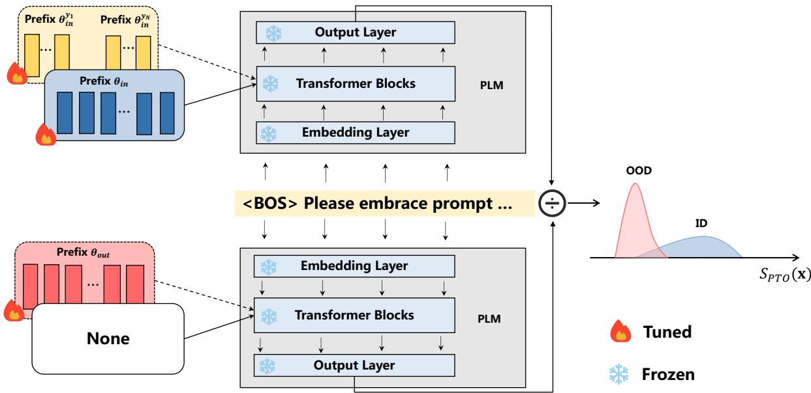
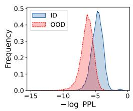
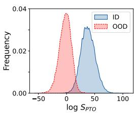
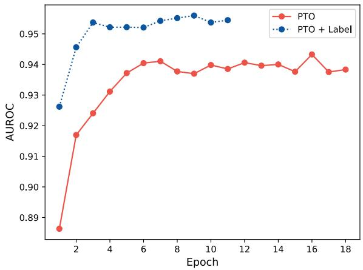
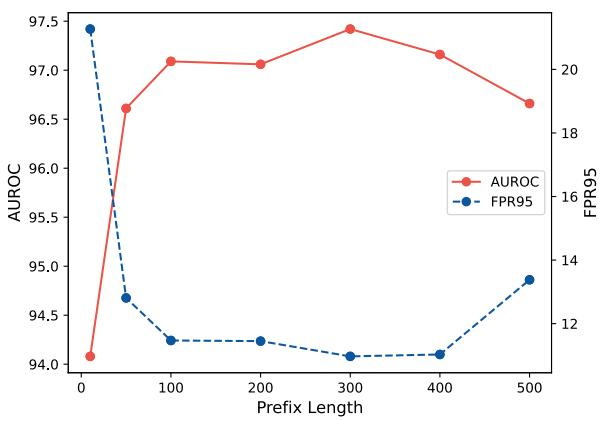
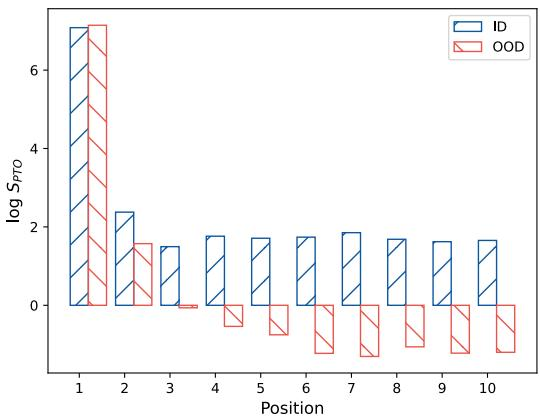

# On Prefix-tuning for Lightweight Out-of-distribution Detection

Yawen Ouyang Yongchang Cao Yuan Gao Zhen Wu

Jianbing Zhang Xinyu Dai

National Key Laboratory for Novel Software Technology, Nanjing University, China Collaborative Innovation Center of Novel Software Technology and Industrialization, China

{ouyangyw, caoyc, gaoy}@smail.nju.edu.cn

{wuz, zjb, daixinyu}@nju.edu.cn

## Abstract

Out-of-distribution (OOD) detection, a fundamental task vexing real-world applications, has attracted growing attention in the NLP community. Recently fine-tuning based methods have made promising progress. However, it could be costly to store fine-tuned models for each scenario. In this paper, we depart from the classic fine-tuning based OOD detection toward a parameter-efficient alternative, and propose an unsupervised prefix-tuning based OOD detection framework termed PTO. Additionally, to take advantage of optional training data labels and targeted OOD data, two practical extensions of PTO are further proposed. Overall, PTO and its extensions offer several key advantages of being lightweight, easy-to-reproduce, and theoretically justified. Experimental results show that our methods perform comparably to, even better than, existing fine-tuning based OOD detection approaches under a wide range of metrics, detection settings, and OOD types.

## 1 Introduction

Detecting out-of-distribution (OOD) inputs is crucial for real-world machine learning systems deployed in the wild (Hendrycks and Gimpel, 2017). For example, for a task-oriented dialogue system designed for particular domains, it can be challenging to ensure that the system is only exposed to utterances from the same distribution as the training utterances, i.e., in-distribution (ID) utterances. Therefore, it would be desirable for the system to detect OOD utterances and return safe responses.

Pretrained language models (PLMs) have been a de facto choice for OOD detection in the NLP community, and many fine-tuning based methods have achieved promising results (Arora et al., 2021; Podolskiy et al., 2021; Lang et al., 2022). Despite being effective, these methods require storing finetuned models for each scenario, which could be prohibitively expensive. This begs the following question: Can we achieve effective OOD detection in a parameter-efficient way, i.e., keep PLM parametersfrozen?

To achieve this goal, an unsupervised Prefix-Tuning based OOD detection framework (PTO) is proposed in this paper. The key idea of PTO is intuitive: an in-distribution specific prefix, optimized with the training data via maximum likelihood, could steer PLMs to assign higher likelihoods to ID samples than PLMs without the prefix, while OOD samples should be assigned lower likelihood. Thus we propose to use the likelihood change triggered by the prefix to detect OOD — samples whose improvement is not obvious (e.g., less than a predefined threshold). Note that the training process of PTO does not involve the sample labels, expanding its application to situations where obtaining labeled data is cost-prohibitive.

Going beyond the unsupervised setting, we extend our framework to fully leverage optional supervised data. Specifically, we design two extensions to take advantage of training data labels and incorporate the accessible targeted OOD data encountered in the system deployment environment. These practical and comprehensive extensions could further improve the PTO performance.

In a nutshell, PTO and its extensions offer compelling advantages of being: (1) lightweight (i.e., without tuning the PLM parameters), (2) easy-toreproduce (i.e., no additional hyper-parameters other than prefix-tuning itself), and (3) theoretically justified (proofed in Section 3).

Experimental results reveal the effectiveness of our methods in detecting both semantic shift and background shift OOD sentences (Arora et al., 2021). Especially for the background shift, PTO surpasses the previous best baseline by only tuning 10M parameters. Our code and data will be available at https://github.com/ 1250658183/PTO.

In summary, we make the following contribu-

<table><tr><td>No.</td><td>Text</td><td>Label</td><td>Dist.</td></tr><tr><td>1</td><td>The most cliche films i&#x27;ve ever seen</td><td>Neg.</td><td>In</td></tr><tr><td>2</td><td>This movie is a masterpiece</td><td>Pos.</td><td>In</td></tr><tr><td>3</td><td>I need a timer to be set</td><td>Unk.</td><td>S. Out</td></tr><tr><td>4</td><td>Waiters are very friendly</td><td>Pos.</td><td>B. Out</td></tr><tr><td>5</td><td>The food was salty beyond edibility</td><td>Neg.</td><td>B. Out</td></tr></table>

Table 1: Examples of ID and OOD sentences. S. Out indicates semantic shift OOD, and B. Out indicates background shift OOD.

tions:

• To the best of our knowledge, we are the first to explore lightweight OOD detection and propose PTO, an unsupervised framework without tuning PLM parameters.

• Two extensions of PTO are proposed to make full use of optional training labels and targeted OOD data to boost OOD detection performance.

• We show that our proposed parameter-efficient methods could catch up to strong fine-tuned baselines and even surpass them in background shift OOD detection.

## 2 Problem Setup

Given a collection of training sentences $\chi _ { t r a i n }$ and corresponding labels $\begin{array} { r } { \operatorname { \mathcal { V } } _ { t r a i n } , } \end{array}$ we assume they are sampled from in-distribution $P ^ { i n } ( X , Y )$ . The objective of OOD detection is to decide whether a test sentence is from $P ^ { i n } ( X , Y )$ (ID) or not (OOD) (Hendrycks and Gimpel, 2017).

We follow Arora et al. (2021) to classify the types of OOD data as either semantic or background shift based on whether the label space remains the same. Semantic shift happens when we encounter sentences with unknown labels, $e . g .$ , a sentiment classifier trained with positive and negative movie reviews receiving a neutral text (Example 3 in Table 1). While background shift is for texts with known labels but different domains or styles, e.g., the classifier for movie reviews receiving restaurant reviews (Example 4, 5 in Table 1).

The goal of all OOD detection methods is to design a score function $S ( \mathbf { x } )$ that maps each input x to a single scalar that is distinguishable between ID and OOD. Mathematically, the OOD detector G can be described as:

$$
G ( S ( \mathbf { x } ) , \delta ) = \left\{ \begin{array} { l l } { \mathrm { I D } } & { S ( \mathbf { x } ) \geq \delta , } \\ { \mathrm { O O D } } & { S ( \mathbf { x } ) < \delta , } \end{array} \right.\tag{1}
$$

where $\delta$ is the predefined threshold, and can be adjusted according to the user’s requirements. For instance, the threshold is chosen to ensure that the recall rate of ID is 95%.

## 3 Approach

In this section, we start by presenting our proposed lightweight framework PTO (Section 3.1), then introducing two extensions of PTO to leverage optional training data (Sections 3.2 to 3.4). Finally, we make a summary in Section 3.5.

## 3.1 Prefix-tuning based OOD detection (PTO)

Our motivation follows prefix-tuning that proper prefix vectors can steer PLMs to generate the desired sentences (Li and Liang, 2021), so we can find in-distribution specific prefix $\theta _ { i n }$ to trigger PLMs to be prone to generating ID sentences, $i . e . ,$ assigning higher likelihoods to ID sentences than before. Considering that the likelihood sum for all sentences (including ID and OOD) is always 1, $\theta _ { i n }$ would trigger PLMs to assign lower likelihood to OOD sentences than before. Thus the likelihood change caused by the prefix $\theta _ { i n }$ could detect OOD sentences whose likelihood improvement is insignificant.

In detail, we first follow Li and Liang (2021) to prepend randomly initialized θ to all PLM layers (pre-trained GPT-2 (Radford et al., 2019) in our case). Then we optimize it by maximizing the likelihood of training sentences, whilst the parameters of the PLM $\theta _ { p l m }$ remain frozen:

$$
\theta _ { i n } = \underset { \mathbf { x } ^ { i } \in \mathcal { X } _ { t r a i n } } { \operatorname { a r g m a x } } \sum _ { \mathbf { x } ^ { i } \in \mathcal { X } _ { t r a i n } } \log p ( \mathbf { x } ^ { i } ; \theta , \theta _ { p l m } ) .\tag{2}
$$

With $\theta _ { i n }$ , we define our PTO score function for OOD detection as follows:

$$
S _ { P T O } ( \mathbf { x } ) = p ( \mathbf { x } ; \theta _ { i n } , \theta _ { p l m } ) / p ( \mathbf { x } ; \theta _ { p l m } ) ,\tag{3}
$$

where $p ( \mathbf { x } ; \theta _ { p l m } )$ is the likelihood of x from the vanilla PLM, i.e., without the prefix vectors $\theta _ { i n }$ Lastly, we can identify whether x is OOD by replacing $S ( \mathbf { x } )$ with $S _ { P T O } ( \bf { x } )$ in Equation (1).

Theoretical insights of $S _ { P T O } ( \bf { x } )$ : according to the Bayes’ rule, $S _ { P T O } ( \bf { x } )$ is proportional to $p ( \mathrm { I D } | \mathbf { x } )$ $- \textbf { x }$ with a high $S _ { P T O }$ can be interpreted as data with a high probability of being ID. Specifically, according to Bayes’ rule, we can rewrite $p ( \mathrm { I D } | \mathbf { x } )$ as follows:

$$
p ( \mathbf { I D } | \mathbf { x } ) = \frac { p ( \mathbf { x } | \mathbf { I D } ) p ( \mathbf { I D } ) } { p ( \mathbf { x } ) } \propto \frac { p ( \mathbf { x } | \mathbf { I D } ) } { p ( \mathbf { x } ) } .\tag{4}
$$

  
Figure 1: Overview of the proposed PTO framework. None means that no prefix is prepended. Two left dashed modules indicate alternative extensions: yellow for label data and red for targeted OOD data. Best viewed in color.

We argue that $p ( \mathbf { x } ; \theta _ { p l m } )$ (the denominator of $S _ { P T O } ( \bf { x } ) )$ is to estimate $p ( \mathbf { x } )$ as PLMs are trained with various large corpora. With in-distribution specific prefix $\theta _ { i n }$ prepended, $p ( \mathbf { x } ; \theta _ { i n } , \theta _ { p l m } )$ (the numerator of $S _ { P T O } ( \bf { x } ) )$ is to estimate $p ( \mathbf { x } | \mathbf { I D } )$ . Thus their quotient is proportional to $p ( \mathbf { I D } | \mathbf { x } )$

## 3.2 PTO with labels (PTO + Label)

Using $\theta _ { i n }$ to guide the generation of all sentences $\chi _ { t r a i n }$ would increase the difficulty of the optimization. If training data labels $\mathscr { D } _ { t r a i n }$ are available, how can we use them to address this challenge? An intuitive solution is to randomly initialize prefix $\theta _ { i n } ^ { y }$ for each training label $y ,$ , and optimize $\theta _ { i n } ^ { y }$ with corresponding label sentences, so that $\theta _ { i n } ^ { y }$ can focus on guiding the generation of y sentences:

$$
\theta _ { i n } ^ { y } = \operatorname { a r g m a x } _ { \theta } \sum _ { \mathbf { x } ^ { i } \in \mathcal { X } _ { t r a i n } \wedge \mathbf { y } ^ { i } = y } \log p ( \mathbf { x } ^ { i } ; \theta , \theta _ { p l m } ) .\tag{5}
$$

With $\theta _ { i n } ^ { y }$ , we define $S _ { P T O + \mathrm { L a b e l } }$ as follows:

$$
S _ { P T O + \mathrm { L a b e l } } ( \mathbf { x } ) = \operatorname* { m a x } _ { y } p ( \mathbf { x } ; \theta _ { i n } ^ { y } , \theta _ { p l m } ) / p ( \mathbf { x } ; \theta _ { p l m } ) .\tag{6}
$$

Theoretical insights of $S _ { P T O + \mathrm { { L a b e l } } } ( \mathbf { x } )$ : it is proportional to ma $\mathrm { x } _ { y } p ( y | \mathrm { \mathbf { x } } ) - \mathrm { \mathbf { a } }$ high $S _ { P T O } ( \bf { x } )$ indicates x has a high probability of being one of the training labels. In particular, with labelspecific prefix $\theta _ { i n } ^ { y }$ prepended, $p ( \mathbf { x } ; \theta _ { i n } ^ { y } , \theta _ { p l m } )$ is to estimate $p ( \mathbf { x } | y )$ . Recall that $p ( \mathbf { x } ; \theta _ { p l m } )$ is to estimate $p ( \mathbf { x } )$ . With the assumption that the label distribution is uniform, $S _ { P T O + \mathrm { { L a b e l } } } ( \mathbf { x } )$ , the estimation of $\mathrm { m a x } _ { y } p ( { \mathbf x } | y ) / p ( { \mathbf x } )$ , is proportional to ma $\mathrm { x } _ { y } p ( y | \mathrm { \mathbf { x } } )$

## 3.3 PTO with targeted OOD data (PTO + OOD)

If we can access some targeted OOD data $\mathcal { X } _ { o o d }$ in the training process, what can we do to incorporate them into PTO to boost OOD detection performance? This scenario has a realistic possibility, such as in a data stream where the OOD data collected by the current detector can be used to refine it. Besides, some benchmark datasets, such as CLINC150 (Larson et al., 2019), also provides some OOD sentences for training.

Our hypothesis is that targeted out-ofdistribution specific prefix $\theta _ { o u t }$ could trigger PLMs to be less prone to generating ID sentences than vanilla PLMs. So the likelihood improvement between $\theta _ { i n }$ and $\theta _ { o u t }$ is more obvious for ID sentences. Accordingly, we update PTO with the following statistic:

$$
\begin{array} { r } { S _ { P T O + \mathrm { { O O D } } } ( \mathbf { x } ) = p ( \mathbf { x } ; \theta _ { i n } , \theta _ { p l m } ) / p ( \mathbf { x } ; \theta _ { o u t } , \theta _ { p l m } ) , } \end{array}\tag{7}
$$

where $\theta _ { o u t }$ is optimized with targeted OOD data:

$$
\theta _ { o u t } = \underset { \mathbf { x } ^ { i } \in \mathcal { X } _ { o o d } } { \operatorname { a r g m a x } } \sum _ { \mathbf { x } ^ { i } \in \mathcal { X } _ { o o d } } \log p ( \mathbf { x } ^ { i } ; \theta , \theta _ { p l m } ) .\tag{8}
$$

Theoretical insights of $S _ { P T O + \mathrm { O O D } } ( \mathbf { x } )$ : it is proportional to $p ( \mathbf { I D } | \mathbf { x } ) / p ( \mathbf { T O O D } | \mathbf { x } ) - \mathfrak { a }$ high

$S _ { P T O + \mathrm { { O O D } } } ( \mathbf { x } )$ can be interpreted that compared with TOOD (targeted OOD), x is more likely to belong to ID. Specifically, with $\theta _ { o u t }$ prepended, $p ( \mathbf { x } ; \theta _ { o u t } , \theta _ { p l m } )$ is to estimate $p ( \mathbf { x } | \mathbf { T O O D } )$ . Remember that $p ( \mathbf { x } ; \theta _ { i n } , \theta _ { p l m } )$ is to estimate $p ( \mathbf { x } | \mathbf { I D } )$ ). Rewriting $p ( \mathbf { x } | \mathbf { I D } ) / p ( \mathbf { x } | \mathrm { T O O D } )$ , we obtain:

$$
\begin{array} { c } { \displaystyle \frac { p ( \mathbf { x } | \mathrm { I D } ) } { p ( \mathbf { x } | \mathrm { T O O D } ) } = \frac { p ( \mathbf { x } | \mathrm { I D } ) } { p ( \mathbf { x } ) } \frac { p ( \mathbf { x } ) } { p ( \mathbf { x } | \mathrm { T O O D } ) } } \\ { \displaystyle \propto \frac { p ( \mathrm { I D } | \mathbf { x } ) } { p ( \mathrm { T O O D } | \mathbf { x } ) } . } \end{array}\tag{9}
$$

## 3.4 PTO with both label and targeted OOD data (PTO + Label + OOD)

The proposed two extensions are orthogonal. We can use them simultaneously in practice if we can access both of them:

$$
\begin{array} { r l } { S _ { P T O + \mathrm { L a b e l + O O D } } ( \mathbf { x } ) = } & { } \\ { \underset { y } { \operatorname* { m a x } } p ( \mathbf { x } ; \theta _ { i n } ^ { y } , \theta _ { p l m } ) / p ( \mathbf { x } ; \theta _ { o u t } , \theta _ { p l m } ) . } \end{array}\tag{10}
$$

Theoretical insights of $S _ { P T O + \mathrm { { L a b e l + O O D } } } ( \mathbf { x } ) :$ combining $S _ { P T O + \mathrm { { L a b e l } } } ( \mathbf { x } )$ and $S _ { P T O + \mathrm { { O O D } } } ( \mathbf { x } )$ , it is simple to prove that $S _ { P T O + \mathrm { { L a b e l + O O D } } } ( \mathbf { x } )$ is proportional to max $z _ { y } p ( y | \mathbf x ) / p ( \mathrm { T O O D } | \mathbf x )$ . A high $S _ { P T O + \mathrm { { L a b e l + O O D } } } ( \mathbf { x } )$ can be interpreted that compared with targeted OOD, x is more likely to belong to one of the training labels.

## 3.5 Summary

The advantages of PTO and its extensions are numerous:

• Lightweight: All of them require only a small number of continuous prefix vectors to be tuned and stored, without modifying PLM parameters.

• Easy-to-reproduce: Besides the hyperparameters of prefix-tuning (e.g., the prefix length), the training and inference process of all methods do not introduce any new hyper-parameters.

• Theoretically justified: Through the lenses of Bayes’ rule, we provide theoretical insights to understand their effectiveness.

An overview of PTO is depicted in Figure 1. We also summarize the training and inference for PTO and its extensions in Algorithm 1.

Algorithm 1 OOD detection using PTO   
Input: Training dataset $\chi _ { t r a i n } .$ , test sample x.   
Optional: training label $\mathcal { V } _ { t r a i n } .$ , targeted   
OOD ${ \mathcal { X } } _ { o o d } .$   
# Training process   
1: if $\mathscr { D } _ { t r a i n }$ is available then   
2: for each label $y$ do   
3: Train $\theta _ { i n } ^ { y }$ using Equation (5)   
4: end for   
5: else   
6: Train $\theta _ { i n }$ using Equation (2)   
7: end if   
8: if $\mathcal { X } _ { o o d }$ is available then   
9: Train $\theta _ { o u t }$ using Equation (8)   
10: end if   
# Inference process   
11: if both $\theta _ { o u t }$ and $\theta _ { i n } ^ { y }$ are unavailable then   
12: Calculate SPTO using Equation (3)   
13: else if only $\theta _ { i n } ^ { y }$ is available then   
14: Calculate $S _ { P T O + \mathrm { L a b e l } }$ using Equation (6)   
15: else if only $\theta _ { o u t }$ is available then   
16: Calculate $S _ { P T O }$ +OOD using Equation (7)   
17: else   
18: Calculate $S _ { P T O }$ +Label+OOD using Equa  
tion (10)   
19: end if

## 4 Experimental Setup

## 4.1 Datasets

We evaluate our methods for detecting semantic shift and background shift OOD:

• For semantic shift, we follow Podolskiy et al. (2021) to use the challenging CLINC150 dataset (Larson et al., 2019). CLINC150 covers utterances across various intents in voice assistants. OOD utterances are those with unknown intents. As aforementioned before, it also provides OOD utterances for training.

• For background shift, we follow Arora et al. (2021) to use IMDB (Maas et al., 2011) as ID and Yelp Polarity (Zhang et al., 2015) as OOD. IMDB is a long movie review dataset and Yelp Polarity is a business review dataset. Since both IMDB and Yelp Polarity do not provide the validation dataset, to perform early stopping, we sample 10000 sentences from IMDB unlabeled dataset and 10000 sentences from Yelp as the validation dataset.

Table 2 provides the summary statistics.

<table><tr><td>Statistics</td><td>CLINC150</td><td>IMDB-Yelp</td></tr><tr><td>Train-ID</td><td>15000</td><td>25000</td></tr><tr><td>Train-Label</td><td>150</td><td>2</td></tr><tr><td>Train-OOD</td><td>250</td><td></td></tr><tr><td>Validation-ID</td><td>3000</td><td>10000</td></tr><tr><td>Validation-OOD</td><td>100</td><td>10000</td></tr><tr><td>Test-ID</td><td>4500</td><td>25000</td></tr><tr><td>Test-OOD</td><td>1000</td><td>38000</td></tr></table>

Table 2: Statistics of datasets used in our experiment.

## 4.2 Baselines

We introduce the strong supervised method Mahalanobis (Podolskiy et al., 2021; Lee et al., 2018b), Energy and Energy + OOD (Liu et al., 2020; Ouyang et al., 2021), MLS (Vaze et al., 2022) as baselines. With a classifier trained with ID sentences and labels,

• Mahalanobis defines a score function based on the Mahalanobis distance between the input representation and the nearest class-conditional Gaussian distribution.

• Energy uses the sum of the exponential of the classifier logit to detect OOD.

• Energy + OOD uses targeted OOD sentences to shape the energy gap between ID and OOD sentences during the training stage.

• MLS uses the maximum logit of the classifier to detect OOD.

We also introduce competitive unsupervised method IMLM + BCAD + MDF (Xu et al., 2021), PPL (Arora et al., 2021), LLR (Gangal et al., 2020; Ren et al., 2019):

• IMLM + BCAD + MDF also utilizes Mahalanobis distance as features, and two domainspecific fine-tuning approaches are explored to boost the performance.

• PPL uses ID sentences to fine-tune the pretrained GPT-2 model and uses the perplexity to detect OOD.

• LLR trains a left-to-right LSTM language model (Sundermeyer et al., 2012) with ID sentences and trains a second language model with perturbed ID sentences. The likelihood ratio between these two language models is used to detect OOD.

## 4.3 Metrics

We follow Podolskiy et al. (2021); Liu et al. (2020) to use four common OOD detection metrics to measure the performance:

• AUROC refers the area under the true positive rate-false positive rate curve.

• FPR95 refers the false positive rate(FPR) when the true positive rate(TPR) is 95%.

• AUPR refers the area under the precision-recall curve. AUPR In (or Out) indicates ID (or OOD) data are treated as positive samples.

## 4.4 Implementation details

For all methods, the selection of hyper-parameters and early stop strategy are based on AUROC on the validation set.

For our framework, we use the huggingface implementation of GPT2-base (Wolf et al., 2020) as the PLM and the prefix-tuning implementation is derived from OpenPrompt (Ding et al., 2022). All results are averaged over 5 different seeds. The prefix length has an essential impact on the results, so we search it from 10, 50, 100, 200, 300, 400, 500 . For PTO + Label, the total prefix length 300 is equally allocated to each label. For PTO + OOD, the OOD prefix length is also set to 300. The hyper-parameters of PTO + Label + OOD are consistent with PTO + OOD and PTO + Label.

For supervised-based baselines, we use pretrained BERT (Devlin et al., 2019) as the encoder, and tune it with cross-entropy loss. For Energy, we follow Liu et al. (2020) to set T as 1. We adopt mean pooling to obtain the sentence representation as we empirically find that mean pooling is better than [CLS] with MLP used in Ouyang et al. (2021).

For IMLM + BCAD + MDF, we obtain the results from their open-source implementation. For PPL, we also use GPT2-base as the backbone. For LLR method, we follow Gangal et al. (2020) and use an LSTM with 1 layer and 300 hidden size. Embeddings are initialized with 100D Glove (Pennington et al., 2014). To train the background model, we permute 50% of every sentence by replacing the word with the random one in the vocabulary.

## 5 Main Results

Table 3 shows all method results on OOD detection. We can observe that:

<table><tr><td>Dataset</td><td></td><td>Method</td><td>AUROC↑</td><td>FPR95↓</td><td>AUPR In ↑</td><td>AUPR Out ↑</td><td>#Params</td></tr><tr><td rowspan="8">CLINC150</td><td rowspan="5">Unsup.</td><td> $\mathrm { I M L M + B C A D + M D F }$ </td><td> $8 3 . 7 \pm 0 . 4$ </td><td> $6 2 . 9 \pm 1 . 5$ </td><td> $9 5 . 3 \pm 0 . 2$ </td><td> $5 4 . 6 \pm 1 . 8$ </td><td>110M</td></tr><tr><td>PPL</td><td> $9 0 . 7 \pm 0 . 3 $ </td><td> $3 2 . 3 \pm 2 . 2$ </td><td> $9 7 . 8 \pm 0 . 1$ </td><td> $6 5 . 9 \pm 1 . 2$ </td><td>124M</td></tr><tr><td>LLR</td><td> $9 0 . 2 \pm 0 . 3$ </td><td> $3 7 . 1 \pm 1 . 5$ </td><td> $9 7 . 5 \pm 0 . 1$ </td><td> $6 6 . 4 \pm 1 . 3$ </td><td>3.7M</td></tr><tr><td>PTO (ours)</td><td> ${ \bf 9 2 . 8 \pm 0 . 1 }$ </td><td> ${ \bf 2 7 . 8 \pm 0 . 9 }$ </td><td> ${ \bf 9 8 . 3 \pm 0 . 1 }$ </td><td> ${ \bf 7 3 . 8 \pm 0 . 5 }$ </td><td>10M</td></tr><tr><td>Mahalanobis</td><td> $9 7 . 4 \pm 0 . 1$ </td><td> $1 0 . 5 \pm 0 . 6$ </td><td> $9 9 . 4 \pm 0 . 0$ </td><td> $8 9 . 6 \pm 0 . 6$ </td><td>110M</td></tr><tr><td rowspan="5">Sup.</td><td>Energy</td><td> $9 7 . 6 \pm 0 . 0$ </td><td> $1 0 . 2 \pm 0 . 4$ </td><td> $9 9 . 4 \pm 0 . 0$ </td><td> $9 2 . 0 \pm 0 . 3$ </td><td>110M</td></tr><tr><td>Energy + OOD</td><td> ${ \bf 9 8 . 1 \pm 0 . 1 }$ </td><td> ${ \bf 8 . 2 \pm 0 . 6 }$ </td><td> ${ \bf 9 9 . 5 \pm 0 . 0 }$ </td><td> ${ \bf 9 3 . 9 \pm 0 . 3 }$ </td><td>110M</td></tr><tr><td>MLS</td><td> $9 7 . 5 \pm 0 . 1$ </td><td> $1 0 . 4 \pm 0 . 3$ </td><td> $9 9 . 4 \pm 0 . 0$ </td><td> $9 1 . 6 \pm 0 . 3$ </td><td>110M</td></tr><tr><td>PTO + Label + OOD (ours)</td><td> $9 6 . 7 \pm 0 . 4$ </td><td> $1 7 . 6 \pm 1 . 6$ </td><td> $9 9 . 2 \pm 0 . 1$ </td><td> $8 9 . 3 \pm 0 . 8$ </td><td>20M</td></tr><tr><td> $\mathrm { I M L M + B C A D + M D F }$ </td><td> $9 7 . 4 \pm 0 . 0$ </td><td> $9 . 2 \pm 0 . 1$ </td><td> $9 7 . 2 \pm 0 . 0$ </td><td> $9 7 . 8 \pm 0 . 0$ </td><td>110M</td></tr><tr><td rowspan="6">IMDB- Yelp</td><td rowspan="4">Unsup.</td><td>PPL</td><td> $8 8 . 9 \pm 0 . 1$ </td><td> $4 1 . 7 \pm 0 . 2$ </td><td> $8 5 . 9 \pm 0 . 2$ </td><td> $9 1 . 6 \pm 0 . 1$ </td><td>124M</td></tr><tr><td>LLR</td><td> $9 0 . 8 \pm 0 . 4$ </td><td> $4 0 . 5 \pm 1 . 0$ </td><td> $8 7 . 9 \pm 0 . 4$ </td><td> $9 3 . 7 \pm 0 . 3$ </td><td>71M</td></tr><tr><td>PTO (ours)</td><td> ${ \bf 9 9 . 3 \pm 0 . 1 }$ </td><td> ${ \bf 2 . 8 \pm 0 . 4 }$ </td><td> ${ \bf 9 9 . 2 \pm 0 . 1 }$ </td><td> ${ \bf 9 9 . 6 \pm 0 . 1 }$ </td><td>10M</td></tr><tr><td>Mahalanobis</td><td> $9 7 . 0 \pm 0 . 2 $ </td><td> $1 1 . 7 \pm 2 . 7$ </td><td> $9 6 . 4 \pm 0 . 8$ </td><td> $9 7 . 6 \pm 0 . 5$ </td><td>110M</td></tr><tr><td rowspan="3">Sup.</td><td>Energy</td><td> $7 6 . 5 \pm 1 . 2$ </td><td> $5 3 . 8 \pm 2 . 8$ </td><td> $7 5 . 6 \pm 1 . 2$ </td><td> $7 7 . 0 \pm 1 . 6$ </td><td>110M</td></tr><tr><td>MLS</td><td> $7 6 . 5 \pm 1 . 3$ </td><td> $5 3 . 8 \pm 2 . 8$ </td><td> $7 5 . 5 \pm 1 . 3$ </td><td> $7 7 . 1 \pm 1 . 2$ </td><td>110M</td></tr><tr><td> $P T O + \mathrm { { L a b e l } ( o u r s ) }$ </td><td> ${ \bf 9 9 . 6 \pm 0 . 1 }$ </td><td> ${ \bf 2 . 0 \pm 0 . 2 }$ </td><td> ${ \bf 9 9 . 4 \pm 0 . 1 }$ </td><td> ${ \bf 9 9 . 3 \pm 0 . 0 }$ </td><td>10M</td></tr></table>

Table 3: OOD detection performance on CLINC150 and IMDB-Yelp datasets. #Params indicates the tuning parameter number. The best results of each setting are in bold. All results are in percentages. Since IMDB-Yelp does not provide OOD training sentences, we only report the OOD extension performance (i.e., PTO + Label + OOD) on CLINC150.

  
Figure 2: Histogram of the OOD detection score from PPL (left) and PTO (right) on IMDB-Yelp.

• PTO works better than unsupervised baselines on all datasets and metrics. For CLINC150, PTO reduces the FPR95 by 4.5% compared to the best unsupervised baseline, and PTO consistently outperforms the baseline by 6.4% on IMDB-Yelp. Figure 2 shows the PTO and PPL score histogram distributions. We can see that PTO is more distinguishable between ID and OOD than PPL, resulting in more effective OOD detection. To gain further insights, we also test prefix-equipped PPL, and its performance is also inferior to PTO (38.4% FPR95 on CLINC150).

  
Figure 3: AUROC under different epochs on the CLINC150 validation set.

• PTO + Label (+ OOD) outperforms supervised baselines on background shift by a large margin and achieves competitive performance on semantic shift. Note that all supervised methods require tuning pretrained language models, whereas our methods do not, so they provide effectiveness while still being lightweight (PTO + Label + OOD only tunes 20M parameters, less than 20% of the supervised methods). We also generalize $P T O + \mathrm { { L a b e l + O O D } }$ to GPT2- medium, and it can achieve better performance (14.8% FPR95 on CLINC150).

## 6 Discussion

## 6.1 Effect of the label extension

PTO + Label provides a performance boost over PTO with the same tuning parameter number. As we can observe from Table 4, the improvement is more pronounced on the challenging dataset CLINC150, where we show a 1.5% improvement on the AUROC. Notably, PTO + Label has the same tuning parameter number with PTO (i.e., both are equipped with 300 prefix vectors).

  
Figure 4: AUROC and FPR95 of PTO under different prefix lengths on the IMDB-Yelp validation set.

<table><tr><td>Method</td><td>CLINC150</td><td>IMDB-Yelp</td></tr><tr><td>PTO</td><td> $9 2 . 8 \pm 0 . 1$ </td><td> $9 9 . 3 \pm 0 . 1$ </td></tr><tr><td> $P T O + \mathrm { L a b e l }$ </td><td> $9 4 . 3 \pm 0 . 2$ </td><td> ${ \bf 9 9 . 6 \pm 0 . 1 }$ </td></tr><tr><td> $P T O + \mathrm { O O D }$ </td><td> ${ \bf 9 5 . 4 \pm 0 . 3 }$ </td><td></td></tr></table>

Table 4: Comparison of PTO with its extensions. Values are AUROC on the test set.

PTO + Label can trigger the GPT-2 to assign higher likelihoods to ID sentences than PTO. Specifically, equipped with the label extension for PTO, the average log PPL of ID sentences on the validation set degrades from 3.01 to 2.23 on CLINC150, and from 3.72 to 3.70 on IMDB-Yelp. The more pronounced effect on CLINC150 is due to the larger label number (150 versus 2).

PTO + Label can also lead to faster convergence. As empirically shown in Figure 3, the best epoch for PTO + Label is 9, while for PTO is 16. The reason is intuitive that with the label extension, each label sentences can focus on optimizing its own prefix.

## 6.2 Effect of the OOD extension

PTO + OOD is more effective than PTO + Label on CLINC150. Table 4 shows that PTO + OOD outperforms PTO + Label by 1.1% (AUROC) on CLINC150. We conjecture that equipping training data with targeted OOD data leads to a smaller distribution gap between training and test data than with labels.

PTO + OOD keeps being easy-to-reproduce.

  
Figure 5: The average log $S _ { P T O }$ score for each position token in ID and OOD sentences. We only list the position from 1 to 10 due to space constraints.

The hyper-parameters of training OOD prefixes are consistent with ID prefixes, so $P T O \mathrm { ~ + ~ } \mathrm { O O D }$ does not require any new hyper-parameter. In contrast, using Energy + OOD requires great effort in hyper-parameter tuning, such as two margin hyperparameters for the auxiliary hinge loss and the loss weight (Liu et al., 2020).

## 6.3 Effect of the prefix length

The prefix length is a key hyper-parameter of PTO, and previous work shows that the optimal prefix length varies from task to task (Li and Liang, 2021). Inspired by this, we evaluate how the prefix length affects the OOD performance by setting it from 10 to 500. Results from Figure 4 show that as a whole, performance increases as the prefix length increases up to 300 and then decreases. We think this is reasonable, as longer prefixes tend to overfit the training data, and further degrade the validation performance.

## 6.4 Error analysis

The OOD sentences misclassified by PTO always have the same preceding tokens as ID sentences. Specifically, when examining OOD sentences undetected by PTO on CLINC150 (i.e., those with higher SPTO), we observe that their first two tokens at the sentence beginning are often found in the ID sentences (see Table 5). The first two tokens further lead to higher OOD sentence scores \*, as shown in Figure 5.

The underlying reason is that PTO leverages the left-to-right GPT-2 to estimate the sentence likelihood. The following tokens are invisible when inferring the likelihood of preceding tokens. Therefore, there is no difference between ID and OOD in such case, and PTO will assign OOD preceding tokens higher scores as it does to ID. We leave its solution to future work.

<table><tr><td>Distribution</td><td>2-gram / percent</td></tr><tr><td>ID</td><td>can you/6.1, i need/4.8, what is/4.5, what &#x27;s/3.6, tell me/3.1, i want/2.0, how do/2.0, how much/1.8, how many/1.8, how long/1.6</td></tr><tr><td>OOD</td><td>can you/6.6, what is/5.9, what &#x27;s/5.3, how many/4, tell me/4, how do/3.6, what are/3.1, how much/2.7, look up/2.1, find out/1.8</td></tr></table>

Table 5: Top 10 2-grams and their percents extracted from ID and OOD sentence beginning. The overlap 2-grams between ID and OOD are marked as blue.

<table><tr><td>Method</td><td>AUROC↑</td><td>FPR95↓</td><td>AUPR In↑</td><td>AUPR Out↑</td></tr><tr><td>MLS</td><td>92.22</td><td>36.95</td><td>97.41</td><td>78.07</td></tr><tr><td>Energy</td><td>92.41</td><td>33.75</td><td>97.57</td><td>78.14</td></tr></table>

Table 6: Effect of using Energy and MLS derived from the prefix-tuning based classifier.

## 6.5 Effect of the prefix-tuning based classifier for OOD detection

To thoroughly investigate the potential of prefixtuning on OOD detection, we also carried out an experiment based on the prefix-tuning based classifier (Ding et al., 2022; Liu et al., 2021) on CLINC150 dataset. Particularly, we use the utterance’s intent as its label words to construct the manual verbalizer (Schick and Schütze, 2021). Meanwhile, we modify the original input x to the form of template $\mathcal { T } ( \mathbf { x } ) = \mathrm { \left[ P R E F I X \right] } \mathbf { x } \mathrm { \left[ M A S K \right] }$ , then classify x based on the probabilities of [MASK] being each label words. Table 6 shows the performance of Energy and MLS scores based on the classifier. We can observe that they perform less well than PTO + Label. We argue that a limitation of this strategy is its dependence on the design of the template and verbalizer, while our method PTO + Label does not require them.

## 7 Related Work

## 7.1 Out-of-distribution detection

Out-of-distribution has gained increasing attention in both NLP and CV recently (Lang et al., 2022; Yang et al., 2022; Sun et al., 2022; Sehwag et al., 2021; Arora et al., 2021). Promising unsupervised (Xu et al., 2021; Arora et al., 2021; Gangal et al., 2020; Ren et al., 2019), supervised with ID labels (Podolskiy et al., 2021; Liu et al., 2020; Vaze et al., 2022), and supervised with OOD data (Liu et al., 2020; Lee et al., 2018a) methods have been proposed. Curious readers may refer to some well established surveys (Yang et al., 2021; Salehi et al., 2022). Unlike prior works, our work focuses on exploring lightweight OOD detection, i.e., without modifying PLM parameters. We propose PTO to fulfill this aim and demonstrate its effectiveness through comprehensive experiments.

## 7.2 Prefix-tuning

Prefix-tuning, a member of the prompt-based tuning family (Liu et al., 2022a), can trigger the desired generation of PLMs by only optimizing small continuous prefix vectors (Li and Liang, 2021). It has achieved desirable performance in many natural language generation tasks (Liu et al., 2022b; Zhao et al., 2022; Ma et al., 2022), and natural language understanding tasks (Liu et al., 2021; Yang and Liu, 2022). However, it still remains a mystery whether prefix-tuning can detect OOD inputs as other fine-tuned models. To the best of our knowledge, we are the first to explore the potential of prefix-tuning for the OOD detection task, and propose approaches for both unsupervised and supervised settings.

## 8 Conclusion

In this paper, we shed light on lightweight OOD detection, which was largely overlooked in the literature. Our work bridges the gap by proposing PTO, an unsupervised prefix-tuning based framework. Moreover, we extend PTO to fully leverage the optional training labels and targeted OOD sentences. Our methods have the key advantages of being lightweight, easy-to-reproduce, and theoretically justified. We reveal the effectiveness of PTO and its extensions on both semantic and background shift OOD detection. We hope our work could serve as a valuable starting point for future work and inspire them to explore more possibilities of lightweight OOD detection.

## Limitations

We consider the current work has the following two limitations:

• We design our lightweight OOD detection framework based on the prefix-tuning paradigm. Nevertheless, there may be other techniques to achieve this goal, which requires further exploration.

• For PTO + Label, each label focuses on its own prefixes, suffering from prefix redundancy problem. One can design share prefixes across different labels to trigger label-invariant sentence features.

## Acknowledgments

We would like to thank the anonymous reviewers for their insightful comments. Zhen Wu is the corresponding author. Yongchang Cao and Yuan Gao contribute equally. Yawen would like to thank Dingjie Song and Siyu Long for their constructive suggestions. This work is supported by NSFC Projects (Nos. 62206126, 61936012 and 61976114).

## References

Udit Arora, William Huang, and He He. 2021. Types of out-of-distribution texts and how to detect them. In Proceedings of the 2021 Conference on Empirical Methods in Natural Language Processing, pages 10687–10701, Online and Punta Cana, Dominican Republic. Association for Computational Linguistics.

Jacob Devlin, Ming-Wei Chang, Kenton Lee, and Kristina Toutanova. 2019. BERT: Pre-training of deep bidirectional transformers for language understanding. In Proceedings of the 2019 Conference of the North American Chapter of the Association for Computational Linguistics: Human Language Technologies, Volume 1 (Long and Short Papers), pages 4171–4186, Minneapolis, Minnesota. Association for Computational Linguistics.

Ning Ding, Shengding Hu, Weilin Zhao, Yulin Chen, Zhiyuan Liu, Haitao Zheng, and Maosong Sun. 2022. OpenPrompt: An open-source framework for promptlearning. In Proceedings of the 60th Annual Meeting ofthe Associationfor Computational Linguistics: System Demonstrations, pages 105–113, Dublin, Ireland. Association for Computational Linguistics.

Varun Gangal, Arora Abhinav, Einolghozati Arash, and Sonal Gupta. 2020. Likelihood ratios and generative classifiers for unsupervised out-of-domain detection in task oriented dialog. In Proceedings of the AAAI Conference on Artificial Intelligence, pages 7764– 7771.

Dan Hendrycks and Kevin Gimpel. 2017. A baseline for detecting misclassified and out-of-distribution examples in neural networks. Proceedings of International Conference on Learning Representations.

Hao Lang, Yinhe Zheng, Jian Sun, Fei Huang, Luo Si, and Yongbin Li. 2022. Estimating soft labels for out-of-domain intent detection. In Proceedings of the 2022 Conference on Empirical Methods in Natural Language Processing, pages 261–276, Abu Dhabi, United Arab Emirates. Association for Computational Linguistics.

Stefan Larson, Anish Mahendran, Joseph J. Peper, Christopher Clarke, Andrew Lee, Parker Hill, Jonathan K. Kummerfeld, Kevin Leach, Michael A. Laurenzano, Lingjia Tang, and Jason Mars. 2019. An evaluation dataset for intent classification and out-ofscope prediction. In Proceedings of the 2019 Conference on Empirical Methods in Natural Language Processing and the 9th International Joint Conference on Natural Language Processing (EMNLP-IJCNLP), pages 1311–1316, Hong Kong, China. Association for Computational Linguistics.

Kimin Lee, Honglak Lee, Kibok Lee, and Jinwoo Shin. 2018a. Training confidence-calibrated classifiers for detecting out-of-distribution samples. In International Conference on Learning Representations.

Kimin Lee, Kibok Lee, Honglak Lee, and Jinwoo Shin. 2018b. A simple unified framework for detecting outof-distribution samples and adversarial attacks. In S. Bengio, H. Wallach, H. Larochelle, K. Grauman, N. Cesa-Bianchi, and R. Garnett, editors, Advances in Neural Information Processing Systems 31, pages 7167–7177. Curran Associates, Inc.

Xiang Lisa Li and Percy Liang. 2021. Prefix-tuning: Optimizing continuous prompts for generation. In Proceedings of the 59th Annual Meeting of the Associationfor Computational Linguistics and the 11th International Joint Conference on Natural Language Processing (Volume 1: Long Papers), pages 4582– 4597, Online. Association for Computational Linguistics.

Pengfei Liu, Weizhe Yuan, Jinlan Fu, Zhengbao Jiang, Hiroaki Hayashi, and Graham Neubig. 2022a. Pretrain, prompt, and predict: A systematic survey of prompting methods in natural language processing. ACM Comput. Surv. Just Accepted.

Weitang Liu, Xiaoyun Wang, John Owens, and Yixuan Li. 2020. Energy-based out-of-distribution detection. Advances in Neural Information Processing Systems, 33.

Xiao Liu, Heyan Huang, Ge Shi, and Bo Wang. 2022b. Dynamic prefix-tuning for generative template-based event extraction. In Proceedings of the 60th Annual Meeting of the Association for Computational Linguistics (Volume 1: Long Papers), pages 5216–5228, Dublin, Ireland. Association for Computational Linguistics.

Xiao Liu, Kaixuan Ji, Yicheng Fu, Zhengxiao Du, Zhilin Yang, and Jie Tang. 2021. P-tuning v2: Prompt tuning can be comparable to fine-tuning universally across scales and tasks. CoRR, abs/2110.07602.

Yukun Ma, Trung Hieu Nguyen, and Bin Ma. 2022. Cpt: Cross-modal prefix-tuning for speech-to-text translation. In ICASSP 2022 - 2022 IEEE International Conference on Acoustics, Speech and Signal Processing (ICASSP), pages 6217–6221.

Andrew L. Maas, Raymond E. Daly, Peter T. Pham, Dan Huang, Andrew Y. Ng, and Christopher Potts. 2011. Learning word vectors for sentiment analysis. In Proceedings of the 49th Annual Meeting of the Associationfor Computational Linguistics: Human Language Technologies, pages 142–150, Portland, Oregon, USA. Association for Computational Linguistics.

Yawen Ouyang, Jiasheng Ye, Yu Chen, Xinyu Dai, Shujian Huang, and Jiajun Chen. 2021. Energy-based unknown intent detection with data manipulation. In Findings of the Association for Computational Linguistics: ACL-IJCNLP 2021, pages 2852–2861, Online. Association for Computational Linguistics.

Jeffrey Pennington, Richard Socher, and Christopher Manning. 2014. GloVe: Global vectors for word representation. In Proceedings of the 2014 Conference on Empirical Methods in Natural Language Processing (EMNLP), pages 1532–1543, Doha, Qatar. Association for Computational Linguistics.

Alexander Podolskiy, Dmitry Lipin, Andrey Bout, Ekaterina Artemova, and Irina Piontkovskaya. 2021. Revisiting mahalanobis distance for transformer-based out-of-domain detection. In Thirty-Fifth AAAI Conference on Artificial Intelligence, AAAI 2021, Thirty-Third Conference on Innovative Applications of Artificial Intelligence, IAAI 2021, The Eleventh Symposium on Educational Advances in Artificial Intelligence, EAAI 2021, Virtual Event, February 2-9, 2021, pages 13675–13682. AAAI Press.

Alec Radford, Jeff Wu, Rewon Child, David Luan, Dario Amodei, and Ilya Sutskever. 2019. Language models are unsupervised multitask learners.

Jie Ren, Peter J Liu, Emily Fertig, Jasper Snoek, Ryan Poplin, Mark Depristo, Joshua Dillon, and Balaji Lakshminarayanan. 2019. Likelihood ratios for outof-distribution detection. In Advances in Neural Information Processing Systems, pages 14680–14691.

Mohammadreza Salehi, Hossein Mirzaei, Dan Hendrycks, Yixuan Li, Mohammad Hossein Rohban, and Mohammad Sabokrou. 2022. A unified survey on anomaly, novelty, open-set, and out of-distribution detection: Solutions and future challenges. Transactions on Machine Learning Research.

Timo Schick and Hinrich Schütze. 2021. Exploiting cloze-questions for few-shot text classification and natural language inference. In Proceedings of the 16th Conference of the European Chapter of the Associationfor Computational Linguistics: Main Volume, pages 255–269, Online. Association for Computational Linguistics.

Vikash Sehwag, Mung Chiang, and Prateek Mittal. 2021. Ssd: A unified framework for self-supervised outlier detection. In International Conference on Learning Representations.

Yiyou Sun, Yifei Ming, Xiaojin Zhu, and Yixuan Li. 2022. Out-of-distribution detection with deep nearest neighbors. In International Conference on Machine Learning.

Martin Sundermeyer, Ralf Schlüter, and Hermann Ney. 2012. Lstm neural networks for language modeling. In Thirteenth annual conference ofthe international speech communication association.

Sagar Vaze, Kai Han, Andrea Vedaldi, and Andrew Zisserman. 2022. Open-set recognition: A good closed-set classifier is all you need. In International Conference on Learning Representations.

Thomas Wolf, Lysandre Debut, Victor Sanh, Julien Chaumond, Clement Delangue, Anthony Moi, Pierric Cistac, Tim Rault, Remi Louf, Morgan Funtowicz, Joe Davison, Sam Shleifer, Patrick von Platen, Clara Ma, Yacine Jernite, Julien Plu, Canwen Xu, Teven Le Scao, Sylvain Gugger, Mariama Drame, Quentin Lhoest, and Alexander Rush. 2020. Transformers: State-of-the-art natural language processing. In Proceedings ofthe 2020 Conference on Empirical Methods in Natural Language Processing: System Demonstrations, pages 38–45, Online. Association for Computational Linguistics.

Keyang Xu, Tongzheng Ren, Shikun Zhang, Yihao Feng, and Caiming Xiong. 2021. Unsupervised outof-domain detection via pre-trained transformers. In Proceedings ofthe 59th Annual Meeting ofthe Associationfor Computational Linguistics and the 11th International Joint Conference on Natural Language Processing (Volume 1: Long Papers), pages 1052– 1061, Online. Association for Computational Linguistics.

Jingkang Yang, Pengyun Wang, Dejian Zou, Zitang Zhou, Kunyuan Ding, WENXUAN PENG, Haoqi Wang, Guangyao Chen, Bo Li, Yiyou Sun, Xuefeng Du, Kaiyang Zhou, Wayne Zhang, Dan Hendrycks, Yixuan Li, and Ziwei Liu. 2022. OpenOOD: Benchmarking generalized out-of-distribution detection. In Thirty-sixth Conference on Neural Information Processing Systems Datasets and Benchmarks Track.

Jingkang Yang, Kaiyang Zhou, Yixuan Li, and Ziwei Liu. 2021. Generalized out-of-distribution detection: A survey. arXiv preprint arXiv:2110.11334.

Zonghan Yang and Yang Liu. 2022. On robust prefixtuning for text classification. In International Conference on Learning Representations.

Xiang Zhang, Junbo Zhao, and Yann LeCun. 2015. Character-level convolutional networks for text classification. In Proceedings of the 28th International Conference on Neural Information Processing Systems - Volume 1, NIPS’15, page 649–657, Cambridge, MA, USA. MIT Press.

Lulu Zhao, Fujia Zheng, Weihao Zeng, Keqing He, Weiran Xu, Huixing Jiang, Wei Wu, and Yanan Wu. 2022. Domain-oriented prefix-tuning: Towards efficient and generalizable fine-tuning for zero-shot dialogue summarization. In Proceedings ofthe 2022 Conference of the North American Chapter of the Associationfor Computational Linguistics: Human Language Technologies, pages 4848–4862, Seattle, United States. Association for Computational Linguistics.

## ACL 2023 Responsible NLP Checklist

## A For every submission:

✓ A1. Did you describe the limitations of your work? Section Limitations

 A2. Did you discuss any potential risks of your work? Not applicable. Left blank.

✓ A3. Do the abstract and introduction summarize the paper’s main claims? 1

✗ A4. Have you used AI writing assistants when working on this paper? Left blank.

## B ✗ Did you use or create scientific artifacts?

Left blank.

 B1. Did you cite the creators of artifacts you used? No response.

 B2. Did you discuss the license or terms for use and / or distribution of any artifacts? No response.

 B3. Did you discuss if your use of existing artifact(s) was consistent with their intended use, provided that it was specified? For the artifacts you create, do you specify intended use and whether that is compatible with the original access conditions (in particular, derivatives of data accessed for research purposes should not be used outside of research contexts)? No response.

 B4. Did you discuss the steps taken to check whether the data that was collected / used contains any information that names or uniquely identifies individual people or offensive content, and the steps taken to protect / anonymize it? No response.

 B5. Did you provide documentation of the artifacts, e.g., coverage of domains, languages, and linguistic phenomena, demographic groups represented, etc.? No response.

 B6. Did you report relevant statistics like the number of examples, details of train / test / dev splits, etc. for the data that you used / created? Even for commonly-used benchmark datasets, include the number of examples in train / validation / test splits, as these provide necessary context for a reader to understand experimental results. For example, small differences in accuracy on large test sets may be significant, while on small test sets they may not be. No response.

## C ✓ Did you run computational experiments?

5

✓ C1. Did you report the number of parameters in the models used, the total computational budget (e.g., GPU hours), and computing infrastructure used? 4 and 5

✓ C2. Did you discuss the experimental setup, including hyperparameter search and best-found hyperparameter values? 4

✓ C3. Did you report descriptive statistics about your results (e.g., error bars around results, summary statistics from sets of experiments), and is it transparent whether you are reporting the max, mean, etc. or just a single run? 5

✓ C4. If you used existing packages (e.g., for preprocessing, for normalization, or for evaluation), did you report the implementation, model, and parameter settings used (e.g., NLTK, Spacy, ROUGE, etc.)? 4

D ✗ Did you use human annotators (e.g., crowdworkers) or research with human participants? Left blank.

 D1. Did you report the full text of instructions given to participants, including e.g., screenshots, disclaimers of any risks to participants or annotators, etc.? No response.

 D2. Did you report information about how you recruited (e.g., crowdsourcing platform, students) and paid participants, and discuss if such payment is adequate given the participants’ demographic (e.g., country of residence)? No response.

 D3. Did you discuss whether and how consent was obtained from people whose data you’re using/curating? For example, if you collected data via crowdsourcing, did your instructions to crowdworkers explain how the data would be used? No response.

 D4. Was the data collection protocol approved (or determined exempt) by an ethics review board? No response.

 D5. Did you report the basic demographic and geographic characteristics of the annotator population that is the source of the data? No response.