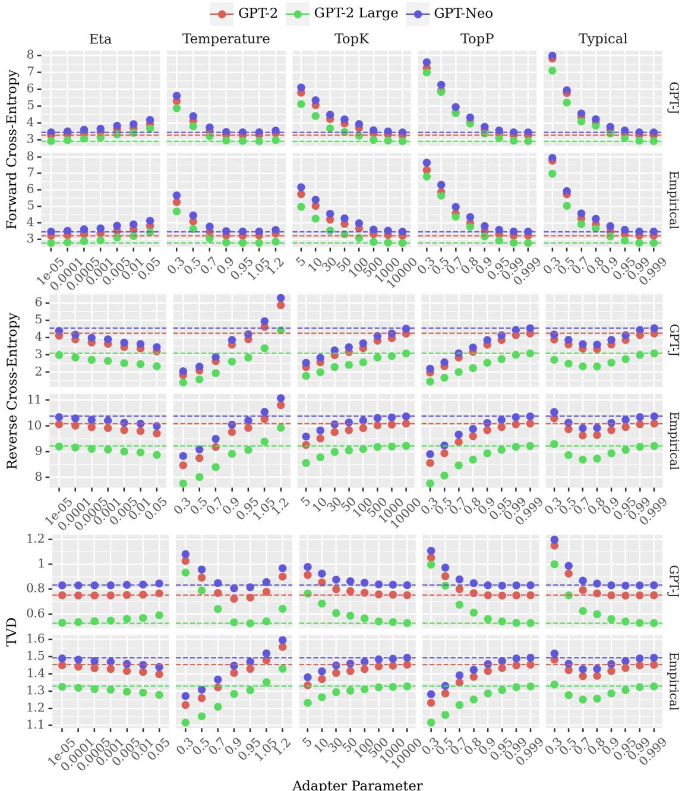
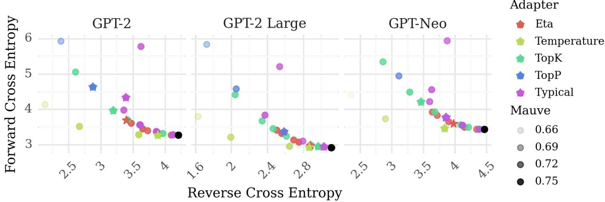
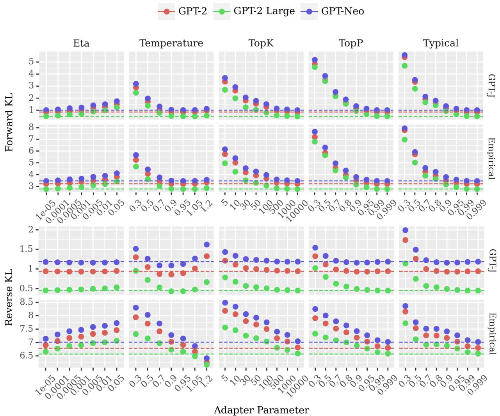
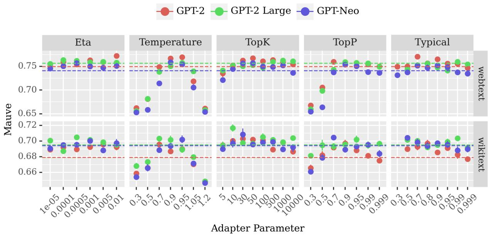
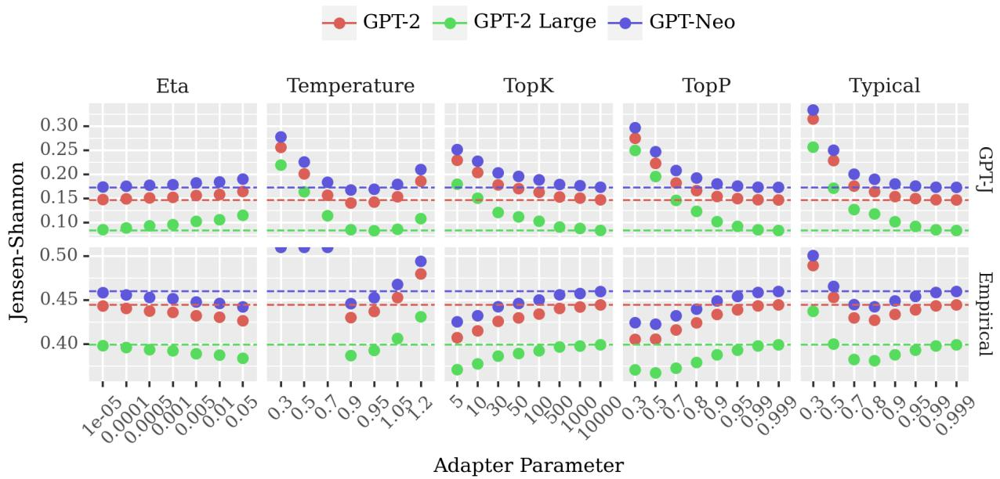
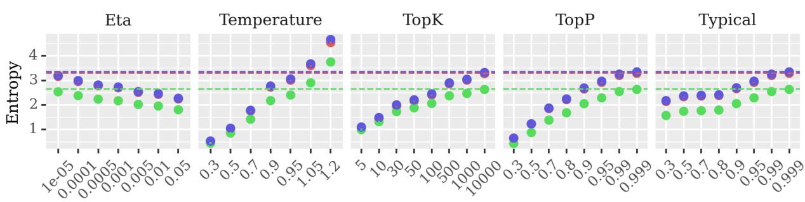
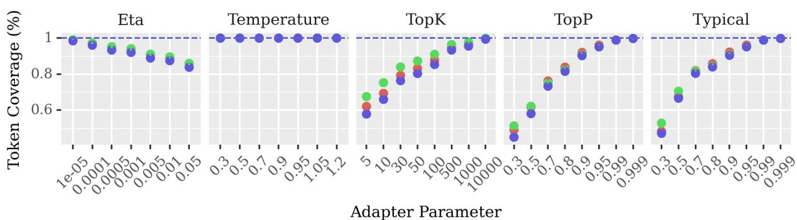
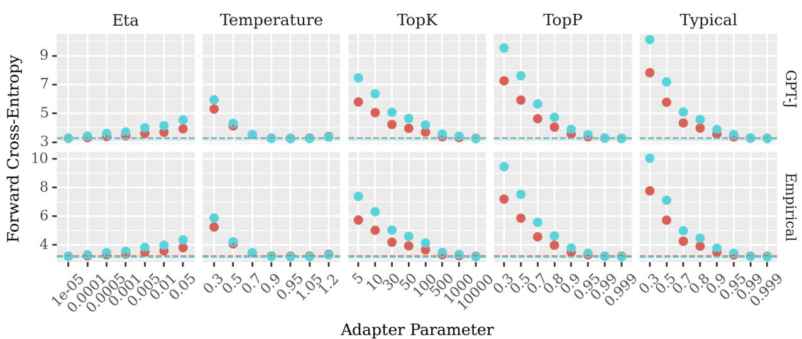
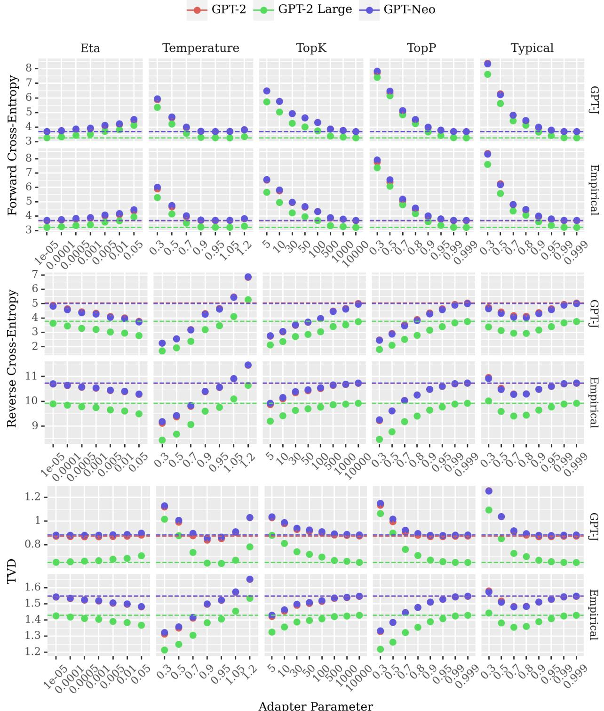
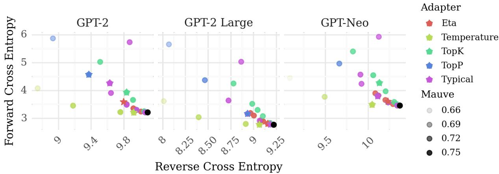

# On the Efficacy of Sampling Adapters

Clara Meister Tiago Pimentel Luca Malagutti

Ethan G. Wilcox Ryan Cotterell

ETH Zürich University of Cambridge

meistecl@inf.ethz.ch tp472@cam.ac.uk lmalagutti@inf.ethz.ch ethan.wilcox@inf.ethz.ch ryan.cotterell@inf.ethz.ch

## Abstract

Sampling is a common strategy for generating text from probabilistic models, yet standard ancestral sampling often results in text that is incoherent or ungrammatical. To alleviate this issue, various modifications to a model’s sampling distribution, such as nucleus or top-k sampling, have been introduced and are now ubiquitously used in language generation systems. We propose a unified framework for understanding these techniques, which we term sampling adapters. Sampling adapters often lead to qualitatively better text, which raises the question: From a formal perspective, how are they changing the (sub)word-level distributions of language generation models? And why do these local changes lead to higher-quality text? We argue that the shift they enforce can be viewed as a trade-off between precision and recall: while the model loses its ability to produce certain strings, its precision rate on desirable text increases. While this trade-off is not reflected in standard metrics of distribution quality (such as perplexity), we find that several precision-emphasizing measures indeed indicate that sampling adapters can lead to probability distributions more aligned with the true distribution. Further, these measures correlate with higher sequence-level quality scores, specifically, MAUVE.

0 https://github.com/rycolab/ sampling-adapters

## 1 Introduction

The vast majority of natural language generation systems take a probabilistic approach. The backbone of such an approach is a probability distribution over strings $p _ { \theta }$ for a specific target domain. While modern language models have achieved remarkable performance on standard measures of distribution quality, e.g., perplexity (Brown et al., 2020; Chowdhery et al., 2022; Hoffmann et al., 2022; OpenAI, 2023), they often fall short when applied out of the box for language generation tasks—both sampling directly from them and searching for the maximum-probability string under them can lead to dull, incoherent, and degenerate text (Holtzman et al., 2020; Eikema and Aziz, 2020; Welleck et al., 2020).

Surprisingly, applying a post-hoc modification to $p _ { \theta } ( \cdot \mid y _ { < t } )$ often serves to dramatically improve the quality of the generated text (Nadeem et al., 2020; Pillutla et al., 2021; Wiher et al., 2022; Hewitt et al., 2022; Li et al., 2022). In this paper, we give a name to these methods, dubbing them sampling adapters. A sampling adapter can be formally defined as a simplex-to-simplex map α: $\Delta ^ { | \overline { { \nu } } | - 1 } \to \Delta ^ { | \overline { { \nu } } | - 1 }$ that systematically modifies the conditional distribution of an autoregressive language model $p _ { \theta } ( \cdot \mid y _ { < t } )$ , thus creating another language model $\pmb { \alpha } ( p _ { \pmb { \theta } } ( \cdot \mid \pmb { y } _ { < t } ) )$ with a desired set of characteristics, $\mathrm { e . g . }$ ., it may only give non-zero probability to items assigned high probability under the original model. Sampling adapters often require little to no fine-tuning and can be implemented in just a few lines of code. Presumably due to their simplicity, sampling adapters have become a default tool in text generation pipelines, serving as the core component of baseline decoding strategies in various tasks (Welleck et al., 2020; Pillutla et al., 2021; Pimentel et al., 2023).

The fact that sampling adapters often lead to qualitatively better text, however, evokes a simple question: How do they change our language generation models such that the distribution $p _ { \theta } ( \cdot \mid y _ { < t } )$ places more probability mass on what we qualitatively deem to be “better” text? Most sampling adapters have been found through trial and error with only intuitive motivations given for their efficacy. Moreover, standard evaluation measures1 do not immediately shed light on why sampling adapters work well because most sampling adapters make language generation models substantially worse according to these measures, e.g., they often reduce the probability assigned to certain strings to zero, which can yield a perplexity of ∞.

In this paper, we posit that the change of distribution induced by sampling adapters can be analyzed in terms of a precision–recall trade-off, using the generalizations of these terms to the field of generative modeling (Sajjadi et al., 2018; Lucic et al., 2018; Djolonga et al., 2020). While a model loses its ability to produce certain strings, its ability to produce desirable text increases. We experiment with various sampling adapters that have been proposed (Fan et al., 2018; Holtzman et al., 2020; Meister et al., 2023; Hewitt et al., 2022) and find that, while the use of these adapters negatively affects recall-emphasizing performance measures, certain choices of hyperparameters increase performance in terms of measures that balance between precision and recall or that are precision-emphasizing. Comparing trends in these measures, we see evidence of a precision–recall trade-off, which offers a quantitative motivation for the efficacy of sampling adapters. We further find that precision-emphasizing measures correlate most highly with sequence-level quality metrics, offering a potential avenue for efficiently choosing sampling adapter hyperparameter values. The formal framework and empirical analysis presented here should pave the way for the development of theoretically motivated sampling adapters, and provide a straightforward means for both analysis of and comparison between adapters.

## 2 Language Generation

## 2.1 Probability Distributions over Strings

Most language generation systems are based on probabilistic models, i.e., models of the probability distribution over natural language strings2 $\mathcal { V } ^ { \ast }$ where $\mathcal { V } ^ { \ast }$ is the Kleene closure of an alphabet $\mathcal { V } .$ In words, $\mathcal { V } ^ { \ast }$ is the set of all strings that can be generated from a vocabulary of (sub)words V. A common modeling choice is to break down string probabilities autoregressively and locally normalize $p _ { \theta } .$ , i.e., instead of directly modeling the full sequence probability $p _ { \pmb { \theta } } ( \pmb { y } )$ , one models (sub)word probabilities $p _ { \pmb { \theta } } ( \pmb { y } \mid \pmb { y } _ { < t } )$ conditioned on the prior context $\pmb { y } _ { < t } \overset { \mathrm { d e f } } { = } \left. y _ { 1 } , \dots , y _ { t - 1 } \right. \in \mathcal { V } ^ { * }$ . Note that here, we have $y \in { \overline { { \mathcal { V } } } } \operatorname { f o r } { \overline { { \mathcal { V } } } } \varprojlim \mathcal { V } \cup \{ \operatorname { E O S } \}$ where EOS is a special end of string token required for an autoregressive $p _ { \theta }$ to define a valid probability distribution over $\mathcal { V } ^ { \ast }$ . The sequence-level probability can then be computed via the chain rule of probability:

$$
p _ { \theta } ( \pmb { y } ) = p _ { \theta } ( \cos \mid \pmb { y } ) \prod _ { t = 1 } ^ { | \pmb { y } | } p _ { \theta } ( y _ { t } \mid \pmb { y } _ { < t } )\tag{1}
$$

See Du et al. (2023) for a characterization of when these models are tight, i.e., when the probability mass assigned to finite-length strings is 1.

The parameters $\pmb \theta$ of these models are typically chosen by (numerically) maximizing the log-likelihood of the training data D, where log-likelihood is defined as:

$$
\mathcal { L } ( \pmb { \theta } ) = \sum _ { \pmb { y } \in \mathcal { D } } \log p _ { \pmb { \theta } } ( \pmb { y } )\tag{2}
$$

## 2.2 Decoding Strategies

Note this is equivalent to minimizing the (forward) cross-entropy between the empirical distribution $p _ { \mathcal { D } }$ induced by the training data D.

In order to produce text from a model, one must use a decoding strategy, which provides a set of decision rules according to which tokens are sequentially chosen from the distribution $p _ { \theta }$ to form a string. Decoding strategies can be broadly taxonomized as either maximization-based or samplingbased. Maximization-based strategies aim to find the candidate string that scores highest under some objective. Finding the string with the highest probability under the model is a common maximizationbased strategy. Sampling-based strategies instead sample tokens according to some distribution derived from the model. While maximization-based strategies may make intuitive sense, they often lead to dull or degenerate text in open-generation settings (Cohen and Beck, 2019; Eikema and Aziz, 2020; Nadeem et al., 2020). Sampling-based strategies likewise have shortcomings: They introduce randomness into the generated text, which may lead to a disruption in coherence or fluency when units are sampled from low-probability regions of the distribution (Holtzman et al., 2020; Hewitt et al., 2022). A class of methods has been developed to address the problems observed when sampling directly from the model, specifically by altering the distribution from which tokens are sampled. We term these methods sampling adapters, formally defining them in the next section.

## 3 The Sampling Adapter Framework

Formally, sampling adapters are simplex-tosimplex mappings, i.e., functions $\alpha : \Delta ^ { \bar { | \bar { \mathcal { V } } | } - 1 } \to$ $\Delta ^ { | \overline { { \mathcal { V } } } | - 1 }$ that take a probability distribution over $\overline { { \mathcal { V } } }$ as input and map it to another one over $\overline { { \mathcal { V } } } . ^ { 3 }$ We use the notation $\widetilde { p }$ to denote the output of this map, as applied to the distribution $p \mathrm { : }$

$$
{ \widetilde { p } } ( \cdot \mid y _ { < t } ) \ { \stackrel { \mathrm { d e f } } { = } } \ \alpha { \big ( } p ( \cdot \mid y _ { < t } ) { \big ) }\tag{3}
$$

similarly denoting the individual adapted probabilities as $\widetilde { p } ( \boldsymbol { y } \mid \pmb { y } _ { < t } ) = \pmb { \alpha } \big ( p ( \cdot \mid \pmb { y } _ { < t } ) \big ) ( \boldsymbol { y } )$ . We now give two examples of common sampling adapters.

Example 3.1. We recover standard ancestral sampling when α $\iota \left( p ( \cdot \mid \pmb { y } _ { < t } ) \right) ( \boldsymbol { y } ) = p ( \boldsymbol { y } \mid \pmb { y } _ { < t } )$

Example 3.2. We recover temperature sampling when $\pmb { \alpha } ( p ( \cdot \mid \pmb { y } _ { < t } ) ) ( y ) \propto p ( y \mid \pmb { y } _ { < t } ) ^ { \frac { 1 } { T } }$ for temperature parameter $T . ^ { 4 }$

One popular way of formulating sampling adapters in the literature has been via truncation functions, i.e., functions where vocabulary units that do not meet a certain criterion are re-assigned zero probability. We write these functions as:

$$
\begin{array} { r l r } {  { \alpha \bigl ( p ( \cdot \mid \pmb { y } _ { < t } ) \bigr ) ( \pmb { y } ) \propto } } \\ & { } & { p ( \pmb { y } \mid \pmb { y } _ { < t } ) \mathbb { 1 } \{ \pmb { y } \in \mathcal { C } ( p ( \cdot \mid \pmb { y } _ { < t } ) ) \} } \end{array}\tag{4}
$$

where $\mathcal { C } : \Delta ^ { | \overline { { \nu } } | - 1 }  \mathcal { P } ( \overline { { \mathcal { V } } } )$ is a function that finds the set of (sub)words that meets said criterion; $\mathcal { P } ( \cdot )$ denotes the powerset operator. Truncation sampling methods aim to eliminate probability mass placed on tokens deemed likely to lead to undesirable text, reallocating their probability mass to the remaining options. We now specify several common truncation-based sampling adapters.

Example 3.3. We recover top-k sampling (Fan et al., 2018) when

$$
\mathcal { C } ( p ( \cdot \mid \pmb { y } _ { < t } ) ) = \underset { \mathcal { V } ^ { \prime } \subseteq \overline { { \mathcal { V } } } } { \mathrm { a r g m a x } } \sum _ { y \in \mathcal { V } ^ { \prime } } p ( y \mid \pmb { y } _ { < t } )\tag{5}
$$

i.e., afunction that returns the top-k most-probable (sub)words.

Example 3.4. We recover top-π (nucleus) sampling (Holtzman et al., 2020) when

$$
\mathscr { C } ( p ( \cdot  { | \textbf { \em y } _ { < t } ) } ) = \underset { \ b { \mathscr { V } } ^ { \prime } \subseteq \overline { { \mathscr { V } } } } { \mathrm { a r g m i n } }  { | \mathscr { V } ^ { \prime } | }\tag{6}
$$

i.e., a function that returns the smallest subset of (sub)words that collectively have probability mass $\geq \pi .$

Example 3.5. We recover locally typical sampling (Meister et al., 2023) when

$$
\begin{array} { r l } { \mathscr { C } ( p ( \cdot  { \mid } y _ { < t } ) ) = \underset { \mathcal { V } ^ { \prime } \subseteq \overline { { \mathcal { V } } } } { \mathrm { a r g m i n } } \displaystyle \sum _ { y \in \mathcal { V } ^ { \prime } } \Biggl | \mathrm { H } ( p ( \cdot  { \mid } y _ { < t } ) ) } & { ( 7 ) } \\ & { \qquad \quad + \log p ( y  { \mid } y _ { < t } ) \Biggr | } \\ { \quad } & { \qquad \quad s . t . \displaystyle \sum _ { y \in \mathcal { V } ^ { \prime } } p ( y  { \mid } y _ { < t } ) \geq \pi } \end{array}
$$

$i . e .$ , the set ofitems with log-probability closest to the (sub)word-level entropy that collectively have probability mass $\geq \pi$

Example 3.6. We recover η-sampling (Hewitt et al., 2022) when

$$
\mathcal { C } ( p ( \cdot \mid y _ { < t } ) ) = \{ y \in \overline { { \mathcal { V } } } \mid p ( y \mid y _ { < t } ) > \eta \}\tag{8}
$$

where $\eta = \operatorname* { m i n } ( \epsilon , \sqrt { \epsilon } \exp ( - \mathrm { H } ( p ( \cdot \mid y _ { < t } ) ) ) )$ , i.e., the set of items with probability greater than η for hyperparameter $\epsilon > 0$

Other methods can similarly be cast in the sampling adapter framework, such as Mirostat (Basu et al., 2021) and the re-calibration method proposed by Braverman et al. (2020). Moreover, the general equation for sampling adapters given in Eq. (3) suggests that one direction for future research is learning a sampling adapter α. While many previously proposed adapters are truncation-based, adapters that reallocate mass in a different manner may also prove effective. Indeed, equipping α with tunable parameters could prove useful as a lightweight finetuning method.

An Unintuitive Effect. The motivation behind the use of sampling adapters with language generation models is to readjust their distribution, shifting mass away from tokens deemed likely to lead to undesirable text and onto tokens that will generate high-quality text. Yet why are such transformations even necessary? Standard measures of distribution quality, such as perplexity, would suggest that our models’ estimates of the ground-truth distribution over natural language strings are quite good (Brown et al., 2020; Wang and Komatsuzaki, 2021; Hoffmann et al., 2022). This, in turn, implies that the heuristic shifts performed by sampling adapters should lead to worse language generators. We argue that the disparity between the quality of language generation systems using sampling-adapted models and the quality of these same models according to standard measures can be reconciled using probabilistic analogs of precision and recall.

## 4 A Precision–Recall Hypothesis

We begin by reviewing generalizations of the concepts of precision and recall in the field of generative modeling. We then discuss the shortcomings of current language generation models and how sampling adapters may address these shortcomings.

## 4.1 Generalizations of Precision and Recall

A series of recent papers have related the precision of a learned distribution $p _ { \theta }$ to the average quality of generated samples, where high-quality samples are assumed to be those with high probability under the data-generating distribution $p . ^ { 5 }$ Additionally, they relate the recall of $p _ { \theta }$ to its coverage of $p$ (Sajjadi et al., 2018; Lucic et al., 2018; Djolonga et al., 2020, inter alia), i.e., high overlap in the support of $p _ { \theta }$ and $p .$ Following this line of reasoning, the notions of precision and recall can naturally be operationalized using measures of the difference between two distributions—specifically, ones that enable different penalizations of over- and undercoverage of our reference distribution.

There are several measures that, when considered together, naturally operationalize precision, recall, or some combination of the two.6 In this paper, we focus on cross-entropy, KL divergence, total variation distance (TVD), and Jensen–Shannon (JS) divergence. We introduce each in greater detail below. We note that for all these measures, a larger value indicates a greater discrepancy between two distributions, and that all but the cross-entropy will be zero when the two distributions are identical. Further, we note that not all the measures are symmetric, i.e., their values change depending on the order in which the distributions are given as arguments to the measure. Out of convention, in the case that the reference distribution is provided first, we call this the forward variant of the measure. We call the case where the reference distribution is the second argument the reverse variant of the measure. We define all measures in terms of generic distributions $p _ { 1 }$ and $p _ { 2 } .$ , which we assume both have (not necessarily identical) supports that are a subset of V.

Precision-emphasizing Measures. We first consider the cross-entropy between $p _ { 1 }$ and $p _ { 2 } .$ :

$$
\mathrm { H } ( p _ { 1 } , p _ { 2 } ) = - \sum _ { y \in \overline { { \mathcal { V } } } } p _ { 1 } ( y ) \log p _ { 2 } ( y )\tag{9}
$$

Upon inspection, we can see that the reverse crossentropy, i.e., where $p _ { 1 }$ is the distribution being evaluated and $p _ { 2 }$ is a (fixed) reference distribution, rewards high precision.7 Specifically, it rewards $p _ { 1 }$ for assigning probability mass where $p _ { 2 }$ is large, implicitly penalizing $p _ { 1 }$ for assigning high probability where $p _ { 2 }$ is small. In fact, the reverse crossentropy is minimized in the case where $p _ { 1 }$ places all probability on the most probable token under $p _ { 2 }$

A related measure is the reverse KL divergence

$$
\begin{array} { r l r } { \mathrm { K L } ( p _ { 1 } \parallel p _ { 2 } ) } & { { } } & { \displaystyle \sum _ { y \in \overline { { \mathcal { V } } } } p _ { 1 } ( y ) \log \frac { p _ { 2 } ( y ) } { p _ { 1 } ( y ) } } \\ { \mathrm { } } & { { } } & { \mathrm { = H } ( p _ { 1 } , p _ { 2 } ) - \mathrm { H } ( p _ { 1 } ) } \end{array}\tag{10a}
$$

(10b)

which is equivalent to the cross-entropy up to the subtraction of the entropy term H(p1). As with cross-entropy, the reverse KL divergence rewards high precision. This property is reflected by a common intuition provided about this measure when it is used as a learning objective: It is referred to as a mode-seeking objective, i.e., it aims to place mass on the modes of $p 1 . ^ { 8 }$ Importantly, the distributions that minimize the reverse variants of Eq. (9) and (10a) will not necessarily be equivalent because the latter takes into account $p _ { 1 }$ ’s entropy. So which of these two metrics should we use? As we are interested in using metrics that operationalize the notion of precision, the entropy of the distribution under evaluation is irrelevant. Thus, we will use the reverse cross-entropy as our primary precision-emphasizing metric.

Recall-emphasizing Measures. On the other hand, the forward variants of Eq. (9) and (10a), where $p _ { 2 }$ is now the distribution under evaluation and $p _ { 1 }$ is assumed to be fixed, reward recall. This is evident when taking a closer look at their definitions. If $p _ { 2 }$ fails to place probability on all elements y assigned probability by $p _ { 1 }$ , then both the cross-entropy and KL divergence will be $\infty . ^ { 9 }$ Analogously to the reverse KL’s description as mode-seeking, the forward KL is referred to as mean-seeking. Note that using the forward variants of cross-entropy and KL divergence as learning objectives is equivalent since $\mathrm { H } ( p _ { 1 } )$ is constant with respect to $p _ { 2 }$ . Further, the forward KL and cross-entropy, as well as the reverse KL, are minimized when $p _ { 2 } = p _ { 1 }$

Balanced Measures. The definitions for TVD and JS divergence, which are both symmetric measures, suggest a balance between the characteristics of precision and recall:

$$
\mathrm { T V D } ( p _ { 1 } , p _ { 2 } ) = \sum _ { y \in \overline { { \mathcal { V } } } } | p _ { 1 } ( y ) - p _ { 2 } ( y ) |\tag{11}
$$

$$
\mathrm { J S } ( p _ { 1 } , p _ { 2 } ) = { \frac { \mathrm { K L } ( p _ { 1 } \parallel m ) + \mathrm { K L } ( p _ { 2 } \parallel m ) } { 2 } }\tag{12}
$$

where $\begin{array} { r } { m ( y ) \ = \ \frac { p _ { 1 } ( y ) + p _ { 2 } ( y ) } { 2 } } \end{array}$ for $y \in \overline { { \mathcal { V } } }$ is a pointwise average. Practically, the JS divergence can informally be viewed as an interpolation between the forward and reverse KL divergences. Indeed, several divergences that generalize the forward and reverse KL recover the JS divergence given a particular choice of hyperparameter (Huszár, 2015; Meister et al., 2020; Pillutla et al., 2021). TVD can be similarly motivated: Sajjadi et al. (2018) recover TVD in their precision–recall operationalization for generative models when assigning equal importance to precision and recall. Further, a standard result demonstrates that the JS divergence is a lower bound on TVD (Lin, 1991). With these measures in hand, we can more effectively assess the shifts to precision and recall that sampling adapters induce in a model.

## 4.2 Current Modeling Shortcomings

It is not clear that the objective with which probabilistic language generators are typically trained imparts characteristics that align with the goals of building good language generators.10 Any form of maximum-likelihood training is equivalent to minimizing $\mathrm { H } ( p _ { D } , p _ { \theta } )$ —often with an additional form of regularization. Thus, it encourages high recall: $p _ { \theta } ( y _ { t } \mid \pmb { y } _ { < t } )$ must be nonzero for all tokens $y _ { t }$ in every string y in the training set D for the objective to be finite. This, in turn, results in $p _ { \theta }$ allocating some probability mass to all (sub)words $y \in \overline { { \mathcal { V } } }$ for all contexts $\mathbf { \delta } \mathbf { \pmb { y } } _ { < t }$ . In language modeling, this is perhaps a desirable property: We often care about the relative probabilities of strings, and assigning strings 0 probability would be counter-productive towards this goal. Yet, this property can potentially prove problematic when such models are used out of the box as language generators.11 For language generation systems, high precision is arguably a higher priority, i.e., the goal is for all of the generated sequences to be of high quality. An intuitive argument for this is that a single bad output can leave a lasting poor impression on the user. Yet, the inability to generate a single sequence may go unnoticed—especially if the difference between that sequence and one the model can produce is a single, exchangeable token.

In this light, a possible explanation for the efficacy of sampling adapters is as follows: While model parameters are chosen to minimize a recall-prioritizing objective, sampling adapters re-align the distribution with a more appropriate precision-prioritizing probabilistic objective, i.e., sampling adapter hyperparameter combinations that work well perhaps do so because they minimize an objective that balances between precision and recall. If this is indeed the case, it should not be surprising that the transformation induced by sampling adapters leads to worse models according to standard, recall-emphasizing measures: Any generator that assigns zero probability to a valid string—as is the case when top-π or top-k sampling are applied—will have both infinite cross-entropy and perplexity with respect to the natural language distribution. They may, however, lead to better models according to more balanced (or even precision-emphasizing) measures, which is what we now empirically test.

## 5 Experiments

To test the hypothesis that the operations performed by sampling adapters are akin to a re-prioritization of precision over recall in the output of the model, we evaluate the effects of sampling adapters on measures that emphasize recall, precision or a balance of the two, as outlined in §4.1. We then observe how these measures vary as a function of the sampling adapters’ hyperparameters. Further, we also look at these measures’ Spearman correlations with MAUVE, a sequence-level quality metric.

We consider five different adapters: temperature, η (eta), top-π, top-k and locally typical sampling, each over a wide range of hyperparameters. Note that for the latter three adapters, a smaller hyperparameter value corresponds to a larger shift between $p _ { \theta }$ and $\widetilde { p } _ { \pmb { \theta } } .$ . For η-sampling, the reverse is true, and for temperature sampling, hyperparameter values farther from 1 imply a larger shift. For reproducibility, we leverage the Hugging Face framework (Wolf et al., 2020) and its implementation of sampling adapters for all but η-sampling, for which we rely on the original authors’ implementation.12 Error bars for all plots indicate 95% confidence intervals for the observed values; note that bars are often small enough that they are not visible.

## 5.1 Setup

We focus on the task of open-ended text generation. We use GPT-2 small and large (Radford et al., 2019), as well as, GPT-Neo (small) (Gao et al., 2020) as our generation models. The main results of this paper use the test set of a public version of the WebText dataset13 as our reference text. Results using the WikiText test set (Merity et al., 2016) are qualitatively similar and can be found in App. A.

Sequence-level Metrics. Following Pillutla et al. (2021), we use the first 35 tokens of samples from our reference text as a prompt to generate continuations y $\sim p _ { \pmb \theta } ( \cdot \ | \ y _ { < t } )$ until $| \pmb { y } | = 5 1 2 .$ , or EOS is sampled. We generate 1000 samples for each combination of model, sampling adapter, and hyperparameter. We compute MAUVE scores (where higher implies the samples are closer to the reference text), aggregated over 5 seeds, for each of these sets of text samples.

Token-level Measures. In this analysis, we compare (sub)word-level distributions $\widetilde { p } _ { \pmb { \theta } } ( \cdot \mid \pmb { y } _ { < t } )$ and $p ( \cdot \mid \pmb { y } _ { < t } )$ The former is our generation model after the application of a sampling adapter and the latter is a reference distribution. We present results using both the empirical distribution induced by our test set and the distribution given by the GPT-J model (Wang and Komatsuzaki, 2021)14 as our reference distribution. Here, y is a string from the test set. Results are mean-aggregated across both $t = 1 , \ldots , | { \pmb y } |$ and all y. Note that when we compute either the cross-entropy or KL divergence and it is not guaranteed that the support of $p _ { 1 }$ is a subset of the support of $p _ { 2 } .$ , we make use of the ε version of the metrics, as specified in §4.1, with ε = 1e-6.

## 5.2 Results

Trends in Probabilistic Measures. We first present our analysis of how different adapter– hyperparameter settings affect the relationship of the model to a reference distribution (either probabilities according to GPT-J or the empirical distribution). Note that if our hypothesis in §4.1 is correct, we would expect to see that certain sampling adapter–hyperparameter settings lead to lower values of measures that emphasize precision, such as reverse cross-entropy, while simultaneously increasing measures that emphasize recall, such as forward cross-entropy. We show the reverse and forward cross-entropy, as well as TVD, in Fig. 1.15

Both the forward and reverse cross-entropy results align closely with our hypothesis: A larger adapter shift generally leads to a higher forward cross-entropy and lower reverse cross-entropy.16 This observation holds when using either the

  
Figure 1: Forward/reverse cross-entropy and TVD of the model with GPT-J and the empirical distribution (WebText test set) after different sampling adapter methods have been applied to the output distribution. Note that as described in §4.1, the ε-variant is used in all cross-entropy estimates except for reverse estimates with GPT-J. Dashed lines represent divergence with the unmodified distribution, i.e., the equivalent of using ancestral sampling.

empirical distribution or GPT-J as our reference. Interestingly, we see that the trends reverse when we consider the reverse KL divergence (as opposed to the reverse cross-entropy; see Fig. 3). This is perhaps expected given that the entropy of the model’s distribution monotonically decreases after the application of sampling adapters (see Fig. 7).

Lastly, the trends in TVD differ largely depending on the distribution used as a reference. When GPT-J is used, we see that TVD monotonically increases as adapter strength increases. The reverse trend appears to hold when considering the empirical distribution: TVD generally decreases with adapter strength. The reason for this difference is not immediately obvious. Closer inspection reveals that when GPT-J is the reference, the trends in TVD mimic what we would expect from a metric that interpolates between forward and reverse crossentropies. Since TVD is motivated as a metric that balances between precision and recall, our results therefore make intuitive sense. On the other hand, the observed trends for the empirical distribution do not have a clear explanation.

Critically, we find that the observed trends are stable across various design choices; see App. A for results with the WikiText dataset and with different choices of ε for the ε-smoothed versions of metrics.17

A Precision–Recall Trade-Off. We next look at whether the shifts induced by common sampling adapters correspond to a precision–recall trade-off according to our probabilistic measures. In Fig. 2, we compare the reverse and forward crossentropies (with GPT-J used as the reference) across the adapter hyperparameter settings used. Results using the empirical distribution are similar (see Fig. 10 in App. A). Fig. 2 indeed suggests a quite direct trade-off between our operationalizations of precision and recall. Notably, the highest sequence-level quality scores do not correspond with the sampling adapter–hyperparameter settings that achieve the best precision (i.e., lowest reverse cross-entropy).18 Rather, they correspond to an intermediate point along the line, suggesting the importance of balancing precision and recall.

Correlations. The previous observations motivate us to look at correlations between (sub)wordlevel probabilistic measures and sequence-level quality metrics. We consider both the WebText and WikiText results when computing correlations. In Tab. 1, we see that the reverse KL of the generation model with GPT-J has the highest (rank) correlation with our quality metrics, closely followed by TVD. This finding suggests that reverse KL with another model could be a useful metric for selecting sampling adapter’s hyperparameters, as its computation is much faster than standard methods for choosing such hyperparameters—e.g., human annotations or sequence-level quality scores—which require the generation of full sequences.

## 6 Related Work

Precision and Recall in Language Generation. This is by no means the first work to focus on the notions of precision and recall in the context of language generation. Language generator evaluation metrics have historically intentionally prioritized precision-based measures due to their higher correlation with human quality judgments. For example, BLEU (Papineni et al., 2002) is computed using n-gram precision, and the original work on CHRF (Popovic´, 2015), which is a precision–recall-based metric, found that variants of the metric that placed more weight on precision correlated better with human judgments. More recently, Pimentel et al. (2023) report that the reverse KL divergence between multinomial distributions over embeddings of text from language models and of text from humans correlated more with human quality judgments than the results of other divergence measures. On the other hand, measures that place higher importance on recall of the model with respect to some test set, such as perplexity, are known not to be good indicators of text quality (Holtzman et al., 2020; Cohen and Beck, 2019; Meister et al., 2023). In terms of model training, alternative objectives that emphasize precision have been proposed in an attempt to alleviate the zero-avoiding effect induced by optimization for maximum likelihood (Kang and Hashimoto, 2020; Pang and He, 2021).

<table><tr><td colspan="2"></td><td colspan="3">KL</td><td colspan="2">Cross-entropy</td></tr><tr><td colspan="2">GPT-2</td><td>TVD</td><td>Reverse</td><td>ε-Forward</td><td></td><td>Reverse ε-Forward</td></tr><tr><td colspan="2"></td><td>-0.73*</td><td>-0.77*</td><td>-0.38*</td><td>-0.11</td><td>-0.44*</td></tr><tr><td rowspan="3">G-</td><td>GPT-Neo</td><td>-0.74*</td><td>-0.73*</td><td>-0.33*</td><td>0.08</td><td>-0.41*</td></tr><tr><td>GPT-Large</td><td>-0.77*</td><td>-0.80*</td><td>-0.49*</td><td>0.01</td><td>-0.55*</td></tr><tr><td>GPT-2</td><td>-0.18*</td><td>-0.26*</td><td>-0.48*</td><td>-0.18*</td><td>-0.48*</td></tr><tr><td rowspan="2">EBmpcal</td><td>GPT-Neo</td><td>-0.02</td><td>-0.25*</td><td>-0.42*</td><td>-0.02</td><td>-0.42*</td></tr><tr><td>GPT-Large</td><td>-0.10</td><td>-0.50*</td><td>-0.61*</td><td>-0.10</td><td>-0.61*</td></tr></table>

Table 1: Spearman correlations of (sub)word-level probabilistic measures with MAUVE. We use ∗ to indicate significance with a p-value < 0.001.

Analysis of Language Generation Models. The effect of sampling adapters on language models has previously been discussed in the framework of a quality–diversity trade-off (Zhang et al., 2021; Meister et al., 2022). For instance, Nadeem et al. (2020) and Wiher et al. (2022) catalog various sampling adapters and analyze their properties with respect to a quality–diversity trade-off using a wide range of automatic metrics. Hashimoto et al. (2019) propose an evaluation framework that combines human and statistical evaluation. In contrast, our work makes an explicit connection to the concepts of precision and recall and analyzes the effect of sampling adapters employing measures of differences in distributions. While Pillutla et al. (2021) likewise use notions of precision and recall for assessing language generators, they look at quantized distributions over language embedding spaces rather than directly at distributions over (sub)words.

  
Figure 2: Reverse cross-entropy versus forward cross-entropy (the latter uses ε-smoothing) of the model with GPT-J for various sampling adapter and hyperparameter settings. Stars correspond to values at which hyperparameter settings achieved the highest MAUVE scores. The black dot corresponds to ancestral sampling.

## 7 Conclusion

In this work, we offer a formal treatment of sampling adapters and provide an analysis that aims to uncover why they are effective when used with probabilistic models for language generation. To this end, we first introduce a general framework that encompasses most of the transformations performed by previously proposed sampling adapters. We then offer an intuition as to why sampling adapters may lead to better language generators. Using the notions of precision and recall proposed for generative models, which can be quantified in terms of standard probabilistic measures, we perform an empirical analysis. We find evidence that the application of sampling adapters increases the precision of a distribution at the expense of its recall; this observation is robust across several experimental design choices. We further find a high correlation between sequence-level quality metrics and reverse KL divergence of the generation model with a reference model.

## Acknowledgments

We would like to thank John Hewitt and Afra Amini for the insightful discussions preceding this work. Clara was supported by a Google Ph.D. Fellowship. Tiago was supported by a Facebook Ph.D. Fellowship. Ethan was supported by an ETH Zürich Postdoctoral Fellowship.

## Limitations

A clear limitation of this work is that the results have been shown only for English. Further work should consider other model architectures, as well as datasets that span a variety of languages and domains. Another limitation is that we do not conduct human evaluations. Given the large number of adapter and hyperparameter settings that we chose to explore, acquiring the human evaluations that would have allowed us to make statistically significant conclusions regarding the relationships between text quality, distribution-level measures, and adapter–hyperparameter settings would have been financially prohibitive. Instead, we chose to look at automatic sequence-level quality metrics that are known to correlate highly with human quality judgments. Further, it has been observed that crowd-sourced judgments of text quality are far from perfect (Clark et al., 2021), making it not obvious whether this is indeed the better option.

## Ethical Considerations

The use of language models for text generation comes with several ethical concerns. Especially when using sampling-based decoding algorithms, as is promoted in this work, the text generated by probabilistic models may contain malicious or hallucinatory content. This may be an intention of the user, but can also occur simply due to the training data that the model was exposed to, which is often not carefully filtered for undesirable material that a model then learns to mimic. The goal of works like this—to help create systems that can produce more human-like text—may also make it easier to automatically produce such content, which can ultimately have several negative downstream side effects. We caution designers and users of text generation systems to publicly advertise when content was created by a machine, and implement checks to prevent the production of harmful material.

## References

Sourya Basu, Govardana Sachitanandam Ramachandran, Nitish Shirish Keskar, and Lav R. Varshney. 2021. Mirostat: A perplexity-controlled neural text decoding algorithm. In 9th International Conference on Learning Representations.

Mark Braverman, Xinyi Chen, Sham Kakade, Karthik Narasimhan, Cyril Zhang, and Yi Zhang. 2020. Calibration, entropy rates, and memory in language models. In Proceedings of the 37th International Conference on Machine Learning, volume 119, pages 1089–1099. PMLR.

Tom Brown, Benjamin Mann, Nick Ryder, Melanie Subbiah, Jared Kaplan, Prafulla Dhariwal, Arvind Neelakantan, Pranav Shyam, Girish Sastry, Amanda Askell, Sandhini Agarwal, Ariel Herbert-Voss, Gretchen Krueger, Tom Henighan, Rewon Child, Aditya Ramesh, Daniel Ziegler, Jeffrey Wu, Clemens Winter, Chris Hesse, Mark Chen, Eric Sigler, Mateusz Litwin, Scott Gray, Benjamin Chess, Jack Clark, Christopher Berner, Sam McCandlish, Alec Radford, Ilya Sutskever, and Dario Amodei. 2020. Language models are few-shot learners. In Advances in Neural Information Processing Systems, volume 33, pages 1877–1901. Curran Associates, Inc.

Aakanksha Chowdhery, Sharan Narang, Jacob Devlin, Maarten Bosma, Gaurav Mishra, Adam Roberts, Paul Barham, Hyung Won Chung, Charles Sutton, Sebastian Gehrmann, Parker Schuh, Kensen Shi, Sasha Tsvyashchenko, Joshua Maynez, Abhishek Rao, Parker Barnes, Yi Tay, Noam Shazeer, Vinodkumar Prabhakaran, Emily Reif, Nan Du, Ben Hutchinson, Reiner Pope, James Bradbury, Jacob Austin, Michael Isard, Guy Gur-Ari, Pengcheng Yin, Toju Duke, Anselm Levskaya, Sanjay Ghemawat, Sunipa Dev, Henryk Michalewski, Xavier Garcia, Vedant Misra, Kevin Robinson, Liam Fedus, Denny Zhou, Daphne Ippolito, David Luan, Hyeontaek Lim, Barret Zoph, Alexander Spiridonov, Ryan Sepassi, David Dohan, Shivani Agrawal, Mark Omernick, Andrew M. Dai, Thanumalayan Sankaranarayana Pillai, Marie Pellat, Aitor Lewkowycz, Erica Moreira, Rewon Child, Oleksandr Polozov, Katherine Lee, Zongwei Zhou, Xuezhi Wang, Brennan Saeta, Mark Diaz, Orhan Firat, Michele Catasta, Jason Wei, Kathy Meier-Hellstern, Douglas Eck, Jeff Dean, Slav Petrov, and Noah Fiedel. 2022. PaLM: Scaling language modeling with pathways. CoRR, abs/2204.02311.

Andrzej Cichocki and Shun-ichi Amari. 2010. Families of alpha- beta- and gamma- divergences: Flexible and

robust measures of similarities. Entropy, 12(6):1532– 1568.

Elizabeth Clark, Tal August, Sofia Serrano, Nikita Haduong, Suchin Gururangan, and Noah A. Smith. 2021. All that’s ‘human’ is not gold: Evaluating human evaluation of generated text. In Proceedings of the 59th Annual Meeting of the Association for Computational Linguistics and the 11th International Joint Conference on Natural Language Processing (Volume 1: Long Papers), pages 7282–7296, Online. Association for Computational Linguistics.

Eldan Cohen and Christopher Beck. 2019. Empirical analysis of beam search performance degradation in neural sequence models. In Proceedings of the International Conference on Machine Learning, volume 97, Long Beach, California, USA. PMLR.

Josip Djolonga, Mario Lucic, Marco Cuturi, Olivier Bachem, Olivier Bousquet, and Sylvain Gelly. 2020. Precision-recall curves using information divergence frontiers. In International Conference on Artificial Intelligence and Statistics, pages 2550–2559. PMLR.

Li Du, Lucas Torroba Hennigen, Tiago Pimentel, Clara Meister, Jason Eisner, and Ryan Cotterell. 2023. A measure-theoretic characterization of tight language models. In Proceedings of the 61st Annual Meeting ofthe Associationfor Computational Linguistics, Toronto, Canada. Association for Computational Linguistics.

Bryan Eikema and Wilker Aziz. 2020. Is MAP decoding all you need? The inadequacy of the mode in neural machine translation. In Proceedings ofthe 28th International Conference on Computational Linguistics, COLING, pages 4506–4520, Barcelona, Spain (Online). International Committee on Computational Linguistics.

Angela Fan, Mike Lewis, and Yann Dauphin. 2018. Hierarchical neural story generation. In Proceedings of the 56th Annual Meeting of the Association for Computational Linguistics (Volume 1: Long Papers), pages 889–898, Melbourne, Australia. Association for Computational Linguistics.

Leo Gao, Stella Biderman, Sid Black, Laurence Golding, Travis Hoppe, Charles Foster, Jason Phang, Horace He, Anish Thite, Noa Nabeshima, et al. 2020. The pile: An 800GB dataset of diverse text for language modeling. CoRR, abs/2101.00027.

Tatsunori B. Hashimoto, Hugh Zhang, and Percy Liang. 2019. Unifying human and statistical evaluation for natural language generation. In Proceedings of the 2019 Conference of the North American Chapter of the Associationfor Computational Linguistics: Human Language Technologies, Volume 1 (Long and Short Papers), pages 1689–1701, Minneapolis, Minnesota. Association for Computational Linguistics.

John Hewitt, Christopher Manning, and Percy Liang. 2022. Truncation sampling as language model

desmoothing. In Findings ofthe Associationfor Computational Linguistics: EMNLP 2022, pages 3414– 3427, Abu Dhabi, United Arab Emirates. Association for Computational Linguistics.

Jordan Hoffmann, Sebastian Borgeaud, Arthur Mensch, Elena Buchatskaya, Trevor Cai, Eliza Rutherford, Diego de las Casas, Lisa Anne Hendricks, Johannes Welbl, Aidan Clark, Tom Hennigan, Eric Noland, Katherine Millican, George van den Driessche, Bogdan Damoc, Aurelia Guy, Simon Osindero, Karen Simonyan, Erich Elsen, Oriol Vinyals, Jack William Rae, and Laurent Sifre. 2022. An empirical analysis of compute-optimal large language model training. In Advances in Neural Information Processing Systems, volume 35. Curran Associates, Inc.

Ari Holtzman, Jan Buys, Li Du, Maxwell Forbes, and Yejin Choi. 2020. The curious case of neural text degeneration. In 8th International Conference on Learning Representations.

Ferenc Huszár. 2015. How (not) to train your generative model: Scheduled sampling, likelihood, adversary? CoRR, abs/1511.05101.

Daniel Kang and Tatsunori B. Hashimoto. 2020. Improved natural language generation via loss truncation. In Proceedings ofthe 58th Annual Meeting of the Association for Computational Linguistics, pages 718–731, Online. Association for Computational Linguistics.

Xiang Lisa Li, Ari Holtzman, Daniel Fried, Percy Liang, Jason Eisner, Tatsunori Hashimoto, Luke Zettlemoyer, and Mike Lewis. 2022. Contrastive decoding: Open-ended text generation as optimization. CoRR, abs/2210.15097.

J. Lin. 1991. Divergence measures based on the Shannon entropy. IEEE Transactions on Information Theory, 37(1):145–151.

Mario Lucic, Karol Kurach, Marcin Michalski, Sylvain Gelly, and Olivier Bousquet. 2018. Are GANS created equal? A large-scale study. Advances in Neural Information Processing Systems, 31:698–707.

Pedro Henrique Martins, Zita Marinho, and André F. T. Martins. 2020. Sparse text generation. In Proceedings of the 2020 Conference on Empirical Methods in Natural Language Processing (EMNLP), pages 4252–4273, Online. Association for Computational Linguistics.

Clara Meister, Tiago Pimentel, Gian Wiher, and Ryan Cotterell. 2023. Locally typical sampling. Transactions ofthe Associationfor Computational Linguistics, 11:102–121.

Clara Meister, Elizabeth Salesky, and Ryan Cotterell. 2020. Generalized entropy regularization or: There’s nothing special about label smoothing. In Proceedings of the 58th Annual Meeting of the Association for Computational Linguistics, pages 6870–6886, Online. Association for Computational Linguistics.

Clara Meister, Gian Wiher, Tiago Pimentel, and Ryan Cotterell. 2022. On the probability–quality paradox in language generation. In Proceedings of the 60th Annual Meeting of the Association for Computational Linguistics (Volume 2: Short Papers), pages 36–45, Dublin, Ireland. Association for Computational Linguistics.

Stephen Merity, Caiming Xiong, James Bradbury, and Richard Socher. 2016. Pointer sentinel mixture models. CoRR, abs/1609.07843.

Thomas Minka. 2005. Divergence measures and message passing. Technical report, Microsoft Research.

Moin Nadeem, Tianxing He, Kyunghyun Cho, and James Glass. 2020. A systematic characterization of sampling algorithms for open-ended language generation. In Proceedings ofthe 1st Conference ofthe Asia-Pacific Chapter ofthe Associationfor Computational Linguistics and the 10th International Joint Conference on Natural Language Processing, pages 334–346, Suzhou, China. Association for Computational Linguistics.

Hannes Nickisch and Carl Edward Rasmussen. 2008. Approximations for binary Gaussian process classification. Journal of Machine Learning Research, 9(67):2035–2078.

OpenAI. 2023. GPT-4 technical report. CoRR, abs/2303.08774.

Richard Yuanzhe Pang and He He. 2021. Text generation by learning from demonstrations. In 9th International Conference on Learning Representations.

Kishore Papineni, Salim Roukos, Todd Ward, and Wei-Jing Zhu. 2002. BLEU: a method for automatic evaluation of machine translation. In Proceedings ofthe 40th Annual Meeting of the Association for Computational Linguistics, pages 311–318, Philadelphia, Pennsylvania, USA. Association for Computational Linguistics.

Ben Peters, Vlad Niculae, and André F. T. Martins. 2019. Sparse sequence-to-sequence models. In Proceedings of the 57th Annual Meeting of the Association for Computational Linguistics, pages 1504–1519, Florence, Italy. Association for Computational Linguistics.

Krishna Pillutla, Swabha Swayamdipta, Rowan Zellers, John Thickstun, Sean Welleck, Yejin Choi, and Zaid Harchaoui. 2021. MAUVE: Measuring the gap between neural text and human text using divergence frontiers. In Advances in Neural Information Processing Systems, volume 34, pages 4816–4828. Curran Associates, Inc.

Tiago Pimentel, Clara Isabel Meister, and Ryan Cotterell. 2023. On the usefulness of embeddings, clusters and strings for text generation evaluation. In The Eleventh International Conference on Learning Representations.

Maja Popovic. 2015.´ chrF: character n-gram F-score for automatic MT evaluation. In Proceedings ofthe Tenth Workshop on Statistical Machine Translation, pages 392–395, Lisbon, Portugal. Association for Computational Linguistics.

Alec Radford, Jeffrey Wu, Rewon Child, David Luan, Dario Amodei, Ilya Sutskever, et al. 2019. Language models are unsupervised multitask learners. OpenAI blog, 1(8):9.

Mehdi S. M. Sajjadi, Olivier Bachem, Mario Lucic, Olivier Bousquet, and Sylvain Gelly. 2018. Assessing generative models via precision and recall. Advances in Neural Information Processing Systems, 31:5234–5243.

L. Theis, A. van den Oord, and M. Bethge. 2016. A note on the evaluation of generative models. In 4th International Conference on Learning Representations.

Ben Wang and Aran Komatsuzaki. 2021. GPT-J-6B: A 6 billion parameter autoregressive language model.

Sean Welleck, Ilia Kulikov, Stephen Roller, Emily Dinan, Kyunghyun Cho, and Jason Weston. 2020. Neural text generation with unlikelihood training. In 8th International Conference on Learning Representations.

Gian Wiher, Clara Meister, and Ryan Cotterell. 2022. On decoding strategies for neural text generators. Transactions of the Association for Computational Linguistics, 10:997–1012.

Thomas Wolf, Lysandre Debut, Victor Sanh, Julien Chaumond, Clement Delangue, Anthony Moi, Pierric Cistac, Tim Rault, Remi Louf, Morgan Funtowicz, Joe Davison, Sam Shleifer, Patrick von Platen, Clara Ma, Yacine Jernite, Julien Plu, Canwen Xu, Teven Le Scao, Sylvain Gugger, Mariama Drame, Quentin Lhoest, and Alexander Rush. 2020. Transformers: State-of-the-art natural language processing. In Proceedings of the 2020 Conference on Empirical Methods in Natural Language Processing: System Demonstrations, pages 38–45, Online. Association for Computational Linguistics.

Mengzhou Xia, Mikel Artetxe, Chunting Zhou, Xi Victoria Lin, Ramakanth Pasunuru, Danqi Chen, Luke Zettlemoyer, and Ves Stoyanov. 2023. Training trajectories of language models across scales. CoRR, abs/2212.09803.

Hugh Zhang, Daniel Duckworth, Daphne Ippolito, and Arvind Neelakantan. 2021. Trading off diversity and quality in natural language generation. In Proceedings ofthe Workshop on Human Evaluation ofNLP Systems, pages 25–33, Online. Association for Computational Linguistics.

## A Additional Results

  
Figure 3: Reverse and forward KL divergence of the model with GPT-J and the empirical distribution (WebText test set) after different sampling adapter methods have been applied to the output distribution. Note that the ε-method, as described in §4.1, is used in all but reverse KL estimates of models with GPT-J. Dashed lines represent divergence with unmodified distribution, i.e., the equivalent of using ancestral sampling.

  
Figure 4: MAUVE scores for text generated using WebText prefixes and different sampling adapters. The dashed lines indicate the scores of samples generated using ancestral sampling.

  
Figure 5: JS divergence of the model with the empirical distribution in the first row and with GPT-J in the second row after different sampling adapter methods have been applied to the output distribution. Dashed lines represent the distance to the unmodified distribution. We observe that at lower temperature values, some NaNs are produced by the JS computation with the empirical distribution.

GPT-2 (1e-6)GPT-2 (1e-8)  
  
Adapter Parameter  
Figure 6: Average entropy of the distribution $\widetilde { p } _ { \pmb { \theta } } ( \cdot \mid \pmb { y } _ { < t } )$ for different sampling adapter–hyperparameter combinations. Dashed lines correspond to the entropy of the unmodified distribution.

  
Figure 7: Average model token coverage per sequence y (i.e., percentage of tokens to which the adapter assigns non-zero probability) of the WebText test set after different sampling adapter methods have been applied to the output distribution. Dashed lines correspond to unmodified distribution, which always assigns probability mass to each token.

  
Figure 8: Same plot as Fig. 1 albeit using smaller ε (1e-8 instead of 1e-6) in computation of ϵ variants of methods. Results are essentially unchanged, except for a slight shift in axis values.

  
Figure 9: Same plot as Fig. 1 except using the test set of WikiText as our set of strings (y) and to construct the empirical distribution.

  
Figure 10: Reverse cross-entropy versus forward cross-entropy divergence (both using ε-smoothing) of the model with the empirical distribution for various sampling adapter and hyperparameter settings. Stars correspond to values at which hyperparameter settings achieved the highest MAUVE scores. The black dot corresponds to ancestral sampling.