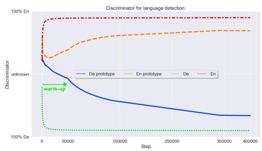
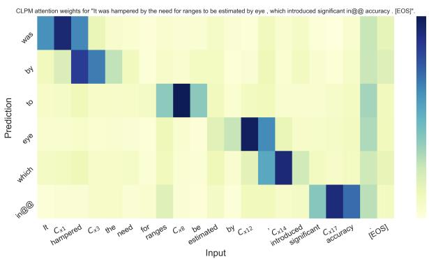
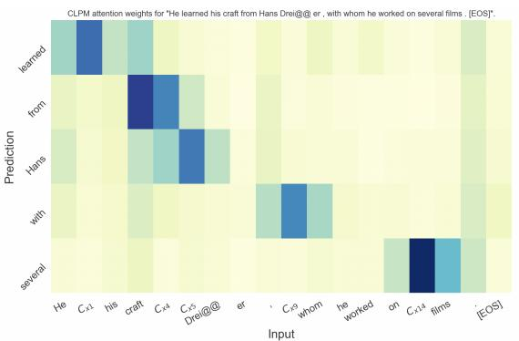
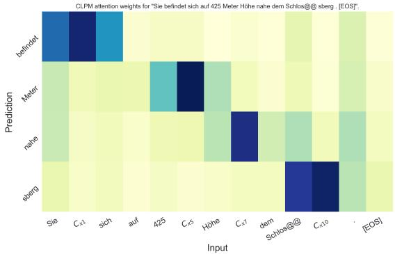
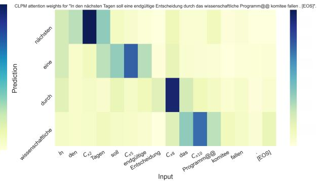

# On-the-fly Cross-lingual Masking for Multilingual Pre-training

Xi Ai   
College of Computer Science Chongqing University   
barid.x.ai@gmail.com

Bin Fang College of Computer Science Chongqing University fb@cqu.edu.cn

## Abstract

In multilingual pre-training with the objective of MLM (masked language modeling) on multiple monolingual corpora, multilingual models only learn cross-linguality implicitly from isomorphic spaces formed by overlapping different language spaces due to the lack of explicit cross-lingual forward pass. In this work, we present CLPM (Cross-lingual Prototype Masking), a dynamic and token-wise masking scheme, for multilingual pre-training, using a special token $[ { \mathcal { C } } ] _ { x }$ to replace a random token x in the input sentence. $[ { \mathcal { C } } ] _ { x }$ is a cross-lingual prototype for x and then forms an explicit crosslingual forward pass. We instantiate CLPM for the multilingual pre-training phase of UNMT (unsupervised neural machine translation), and experiments show that CLPM can consistently improve the performance of UNMT models on $\{ D e , R o , N e \}  E n$ . Beyond UNMT or bilingual tasks, we show that CLPM can consistently improve the performance of multilingual models on cross-lingual classification.

## 1 Introduction

With tied weights across the languages and the help of language identifications (Johnson et al., 2017), multilingual models only have access to monolingual corpora in different languages. Stemming from BERT/MLM (Devlin et al., 2019) and GPT (Radford et al., 2018; Alec Radford, 2020), for cross-lingual knowledge, multilingual pre-training with the objective of MLM on multiple monolingual corpora is introduced by XLM (Lample and Conneau, 2019), explored by MASS (Song et al., 2019) and mBART (Liu et al., 2020; Lewis et al., 2020), and scaled by XLM-R (Conneau et al., 2020) and mT5 (Xue et al., 2021).

Essentially, in multilingual MLM pre-training, models are encouraged to learn implicit crosslinguality from both linguistic similarities and shared tokens (Karthikeyan et al., 2020; Wu and Dredze, 2019; Pires et al., 2019; Dufter and

Schütze, 2020) for translation and cross-lingual transfer. However, it does not learn any explicit and principled cross-lingual forward pass from inputs to outputs, only relying on the isomorphic space that emerged from multilingual MLM pretraining by overlapping language spaces agnostically. Given the nature of translation and crosslingual transfer, models should understand explicit cross-lingual forward passes initiating crosslingual knowledge directly. Considering this aspect, beyond the implicit and agnostic cross-linguality, we are interested in the question: can models learn explicit and principled cross-linguality in multilingual pre-training without any supervision?

Following this idea, for multilingual pre-training, we present a dynamic and token-wise masking scheme, CLPM (Cross-lingual Prototype Masking), to compute a special token $[ { \mathcal { C } } ] _ { x }$ representing a cross-lingual prototype for a selected token x and then replace $x$ with $[ { \mathcal { C } } ] _ { x }$ instead of the standard token [ ] in multilingual MLM pre-training. We present an example in Table 1. Significantly, when predicting the selected and replaced $x ,$ we model an explicit cross-lingual forward pass from the cross-lingual prototype $[ { \mathcal { C } } ] _ { x }$ to x.

<table><tr><td>Source</td><td>The investment fund that owned the building had to make a choice .</td></tr><tr><td>[M]</td><td>The [M] fund [M] owned [M] building [M] to make a choice .</td></tr><tr><td> $[ { \mathcal { C } } ] _ { x }$ </td><td>The  $[ { \mathcal { C } } ] _ { x _ { 1 } }$  fund [C]x3 owned  $[ { \mathcal { C } } ] _ { x _ { 5 } }$  building  $[ { \mathcal { C } } ] _ { x _ { 7 } }$  to make a choice .</td></tr></table>

Table 1: Examples of $[ { \mathcal { C } } ] _ { x }$ and $[ \mathcal { M } ]$ $\{ x _ { 1 } , x _ { 3 } , x _ { 5 } , x _ { 7 } \}$ at position $\{ 1 , 3 , 5 , 7 \}$ are randomly selected for replacing. Then, we compute the $[ { \mathcal { C } } ] _ { x }$ set $\{ [ \mathcal { C } ] _ { x _ { 1 } } , [ \mathcal { C } ] _ { x _ { 3 } } , [ \mathcal { C } ] _ { x _ { 5 } } , [ \mathcal { C } ] _ { x _ { 7 } } \}$ for replacing and pre-train MLM without any other change, treating $[ { \mathcal { C } } ] _ { x }$ as [ ].

In multilingual pre-training, computing $[ { \mathcal { C } } ] _ { x }$ is a challenge on multiple monolingual corpora without any supervision from parallel corpora, translation tables (Dufter and Schütze, 2020; Ren et al., 2019b; Chaudhary et al., 2020), or data augmentation processes (Krishnan et al., 2021; Chaudhary et al., 2020; Tarunesh et al., 2021). Fortunately, we find that suitable candidates can be dynamically obtained in the multilingual embedding space, considering the relevance between the selected token and the tokens in the other language. Meanwhile, naive token-to-token relevance is reported to misrepresent morphological variations (Artetxe et al., 2020; Czarnowska et al., 2020; Kementchedjhieva et al., 2020), which limits the improvements for translation and cross-lingual transfer tasks. Thus, we approximate multiple candidates in the other language for $[ { \mathcal { C } } ] _ { x } ,$ expecting to cover morphological variations. Unfortunately, the input dependency is perturbed by $[ { \mathcal { C } } ] _ { x }$ because $[ { \mathcal { C } } ] _ { x }$ is not agnostic and not static as $[ \mathcal { M } ]$ but dynamically obtained from the other language. Eventually, it potentially results in a lack of learning internal structures of languages. To alleviate this pain but still use $[ { \mathcal { C } } ] _ { x } ,$ we alternate between $[ \mathcal { M } ]$ and $[ { \mathcal { C } } ] _ { x }$ , where $[ \mathcal { M } ]$ is agnostic and does not perturb input language domain.

We attempt UNMT and (zero-shot) cross-lingual transfer tasks. For UNMT, we consider $X  E n$ on a rich-resource language De, a low-resource language Ro, and a dissimilar language $N e .$ . Intuitively, CLPM yields improvements because of the dynamical approximations of token-level crosslingual information. We then justify this on crosslingual word similarity tasks from MUSE (Lample et al., 2018b). Beyond UNMT, we experiment with the cross-lingual classification task on XNLI (Conneau et al., 2018) to test general cross-lingual transfer CLPM improves within a pivoting-based framework.par We have three contributions. 1) We present CLPM, a dynamic and token-wise masking scheme using special tokens $[ { \mathcal { C } } ] _ { x } ,$ to form crosslingual forward passes in multilingual pre-training. $[ { \mathcal { C } } ] _ { x }$ is a generalized representation from multiple cross-lingual candidates. 2) CLPM substantially improves the performance of $X  E n$ baseline UNMT models by $3 \% \sim 8 \%$ on rich-resource and low-resource languages and can facilitate training on dissimilar languages. 3) Beyond UNMT tasks or bilingual tasks, CLPM can be used for crosslingual classification tasks.

## 2 Cross-lingual Prototype Masking

Notation $L _ { x }$ is the language ID of language $L a n g _ { x } . \ P _ { n }$ stands for positions. $E _ { R }$ is the embedding for R. d is the model/embedding dimension.

## 2.1 Forward Pass in Attention

Given an input sentence $X ~ = ~ \{ x _ { 0 } , x _ { 1 } , . . . , x _ { n } \}$ in the language $L a n g _ { x }$ , the self-attention layer (Vaswani et al., 2017) performs on the sum of $X _ { i n p u t } = \{ E _ { x _ { 0 } } + E _ { L _ { x } } + E _ { P _ { 0 } } , . . . , E _ { x _ { n } } + E _ { L _ { x } } +$ $E _ { P _ { n } } \}$ , which is considered in previous works of multilingual pre-training (Liu et al., 2020; Song et al., 2019; Lample and Conneau, 2019). For predicting $x _ { i }$ , the attention score (Bahdanau et al., 2015; Luong et al., 2015) $e _ { i , j } = ( E _ { x _ { i } } + E _ { L _ { x } }$ + $E _ { P _ { i } } ) ^ { T } W _ { q } ^ { T } W _ { k } ( E _ { x _ { j } } + E _ { L _ { x } } + \stackrel { . . } { E } _ { P _ { j } } )$ between query vector $q _ { i }$ and key vector $k _ { j }$ within the same sentence can be decomposed:

$$
\begin{array} { r l } & { e _ { i , j } = \underbrace { E _ { x _ { i } } ^ { T } W _ { q } ^ { T } W _ { k } E _ { x _ { j } } } _ { a } + } \\ & { \underbrace { E _ { L _ { x } } ( \cdot ) } _ { b } + \underbrace { E _ { P _ { i } } ( \cdot ) } _ { c } + \underbrace { E _ { P _ { j } } ( \cdot ) } _ { d } } \end{array} ( 1 )
$$

where $W _ { q }$ and $W _ { k }$ are linear transformation for the query vector $q _ { i }$ and key vector $k _ { j }$ respectively, and i and j stands for position indexes. Terms (b), (c), and (d) introduce the inductive bias towards language $L a n g _ { x }$ , position $P _ { i }$ , and position $P _ { j }$ respectively. When predicting $x _ { i }$ , we have the forward pass: $\{ x _ { i } , x _ { j \backslash i } \}  x _ { i }$ , where $x _ { j \backslash i }$ denotes all the tokens around position $i ,$ and the prediction of $x _ { i }$ is conditioned by $\{ x _ { i } , x _ { j \backslash i } \}$ . The forward pass is monolingual because both two sides are in the same language. In optimization, we can compute gradients from the backward pass: $\frac { \partial \varepsilon _ { x _ { i } } } { \partial { { E } _ { { x } _ { i } } } }$ and $\frac { \hat { \partial } \varepsilon _ { x _ { i } } } { \partial { E } _ { x _ { j } } }$ where $\varepsilon _ { x _ { i } }$ is the predicting error.

## 2.2 MLM with [ ] and CBOW

Suppose $x _ { i }$ is randomly selected to be replaced by $[ \mathcal { M } ]$ . Term (a) is changed to $E _ { [ \mathcal { M } ] } ^ { T } W _ { q } ^ { T } \bar { W } _ { k } E _ { x _ { j } }$ Since [ ] does not provide prior information of $x _ { i } .$ Term (a) forms a built-in $\mathrm { C B O W } ^ { 1 }$ model (Continuous Bag-of-Words (Mikolov et al., 2013)) learning CBOW or bidirectional information. The forward pass $\{ [ { \mathcal { M } } ] , x _ { j \backslash i } \}  x _ { i }$ is still monolingual in multilingual pre-training because $[ \mathcal { M } ]$ is shared and agnostic for all the languages. However, the model is significantly encouraged to predict $x _ { i }$ by understanding neighboring tokens $x _ { j \backslash i }$ in the sentence, i.e., the surrounding context or bidirectional information. Moreover, since [ ] is overlapping and shared, and $x _ { j \backslash i }$ are potentially overlapping tokens in different languages, it refines the morphology of different languages to overlap each other for forming the isomorphic spaces (Karthikeyan et al., 2020; Wu and Dredze, 2019; Pires et al., 2019; Dufter and Schütze, 2020) and leverages domain adaptation (Ganin et al., 2016) or language adaptation (Ai and Fang, 2022b).

## 2.3 MLM with [C]x

Although the forward pass $\{ [ { \mathcal { M } } ] , x _ { j \backslash i } \}  x _ { i }$ significantly enables the model to learn both crosslingual and monolingual knowledge from the shared token $[ \mathcal { M } ]$ (Dufter and Schütze, 2020) and structural information of the neighboring tokens $x _ { j \backslash i }$ (Karthikeyan et al., 2020; Pires et al., 2019) in multilingual MLM pre-training, learning crosslinguality is implicit and limited. Our idea is, we can replace $[ \mathcal { M } ]$ with $x _ { i } \ ' _ { \mathbf { s } }$ cross-lingual prototype $[ { \mathcal { C } } ] _ { x _ { i } }$ that we explicitly have a principled crosslingual forward pass: $\{ [ { \mathcal { C } } ] _ { x _ { i } } , x _ { j \setminus i } \}  x _ { i }$ . In this way, we inject weak but explicit cross-lingual supervision into the model in multilingual pre-training. Therefore, we replace the selected $x _ { i }$ with its $[ { \mathcal { C } } ] _ { x _ { i } }$ instead of [ ] as presented in the example (Table 1), and Term (a) is modified to $E _ { [ \mathcal { C } ] _ { \boldsymbol { x } _ { j } } } ^ { T } { \bar { W } } _ { \boldsymbol { q } } ^ { T } W _ { k } E _ { x _ { j } }$ accordingly.

## 2.4 On-the-fly $[ { \mathcal { C } } ] _ { x }$

To obtain $[ { \mathcal { C } } ] _ { x _ { i } }$ without any cross-lingual supervision in multilingual pre-training, the starting point is the output distribution over the vocabulary V shared by all the languages. Given the multilingual model $N e t .$ , we set Net to the inference mode, not the MLM pre-training mode, and the probability of $x _ { i }$ is obtained from the softmax layer $Q _ { x _ { i } } ~ = ~ { \frac { e x p ( h _ { x _ { i } \& L _ { x } } ^ { T } O _ { x _ { i } } ) } { \sum _ { k = 1 } ^ { V } e x p ( h _ { x _ { i } \& L _ { x } } ^ { T } O _ { x _ { k } } ) } } ,$ , where $\begin{array} { r l } { h _ { x _ { i } \& L _ { x } } } & { { } \in } \end{array}$ $N e t ( E _ { x } + E _ { L _ { x } } )$ is the contextualized representation of $x _ { i } , E _ { x } = \{ E _ { x _ { 0 } } , E _ { x _ { 1 } } , . . . , E _ { x _ { n } } \}$ is the embedding of the input sentence, and $O _ { x }$ is factorized from the output matrix2 O. Recall that, in Eq. 1, the language embedding $E _ { L _ { x } }$ of the language Langx associated with the token x introduces inductive bias towards $L a n g _ { x }$ , so that $h _ { x _ { i } \& L _ { x } }$ is biased by $E _ { L _ { x } }$ towards $L a n g _ { x }$ and generalized from $E _ { x _ { i } }$ . In this way, the output distribution over the vocabulary is biased by $E _ { L _ { 3 } }$ towards $L a n g _ { x }$ , and the dot-products distinguish relevant tokens from irrelevant tokens for $x _ { i }$ . Intuitively, we can fool the model by inputting $E _ { x } + { E _ { L _ { y } } } ^ { 3 }$ . The result is that $h _ { x _ { i } \& L _ { y } } \in N e t ( E _ { x } + E _ { L _ { y } } )$ is biased by $E _ { L _ { y } }$ towards $L a n g _ { y }$ but still generalized from $E _ { x _ { i } }$ . We expect $h _ { x _ { i } \& L _ { y } }$ to be an agnostic representation that is relevant to $x _ { i }$ and $L a n g _ { y }$ . Then, we can factorize $O _ { y }$ from the output matrix and rank the dot product $h _ { x _ { i } \& L _ { y } } ^ { T } O _ { y }$ to search relevant tokens for $x _ { i }$ in $L a n g _ { y }$ from the output space. We will discuss the inspiration later, and in our experiment, we show a case study that some useful candidates in the other language are obtained.

We approximate a relevant candidate set $P _ { x _ { i } } ^ { Y }$ in the other language $L a n g _ { y }$ and compute a weighted average of candidates’ embeddings, where $P _ { x _ { i } } ^ { \breve { Y } }$ contributes to low variance and rich information. Formally, we define $\begin{array} { r } { E _ { [ \mathcal { C } ] _ { \boldsymbol { x } _ { i } } } = \sum _ { \boldsymbol { y } \in P _ { x _ { i } } ^ { Y } } E _ { \boldsymbol { y } } W _ { x _ { i } } ^ { \boldsymbol { y } } } \end{array}$ , where $P _ { x _ { i } } ^ { Y } \subset V o c _ { Y }$ , Voc is the entries of the other language in the multilingual vocabulary, $0 \leq W _ { x _ { i } } ^ { y } \leq$ 1 is the weight of the candidate $y ~ \in ~ P _ { x _ { i } } ^ { Y }$ and $\textstyle \sum _ { y \in P _ { x _ { i } } ^ { Y } } W _ { x _ { i } } ^ { y } = 1$ . Given the model $N e t$ , we have 4 steps to compute $[ { \mathcal { C } } ] _ { x _ { i } }$ dynamically:

• Step 1: We set $N e t$ to the inference mode ${ \tilde { N e t } } .$ , input $E _ { x } + E _ { L _ { y } }$ to $\tilde { N e t }$ , and obtain the representation $h _ { x _ { i } \& L _ { y } } \in \tilde { N e t } ( E _ { x } + E _ { L _ { y } } )$ for the selected token $x _ { i }$

• Step 2: We factorize $O _ { y }$ from the output matrix O and calculate a full-sized set $Q =$ $( h _ { x _ { i } \& L _ { y } } ^ { T } O _ { y _ { 0 } } , . . . , h _ { x _ { i } \& L _ { y } } ^ { T } O _ { y _ { v } } )$ , where v equals the size of $V o c _ { Y }$

• Step 3: We select a candidate set $P _ { x _ { i } } ^ { Y } ~ =$ $( E _ { y ^ { j } } , . . . , E _ { y ^ { k } } )$ from the embedding space, according to the Top-K dot products in $Q .$

• Step 4: We compute the weight set $W _ { x _ { i } } ^ { y } =$ sof tmax $( E _ { y ^ { j } } ^ { T } \bar { E _ { x } } , . . . , E _ { y ^ { k } } ^ { T } E _ { x } )$ and the final output $\begin{array} { r } { E _ { [ \mathcal { C } ] _ { \boldsymbol { x } _ { i } } } = \sum _ { \boldsymbol { y } \in P _ { x _ { i } } ^ { Y } } E _ { \boldsymbol { y } } W _ { x _ { i } } ^ { \boldsymbol { y } } } \end{array}$

Note that, multilingual models like XLM-R (Conneau et al., 2020) do not require language embeddings, i.e., eliminating $E _ { L _ { x } }$ . In this scenario, we can simply eliminate $E _ { L _ { y } }$ in Step 1 without other modifications, and we still obtain cross-lingual candidates over Voc in Step 2 to compute the crosslingual prototype for the selected token $x _ { i }$

To select tokens for $V o c _ { Y }$ , the minimum frequency is $1 e - 5$ in the monolingual corpora of $L a n g _ { y }$ . Meanwhile, some tokens are shared among different languages. We set the minimum frequency of shared tokens to $1 e - 3$ in the monolingual corpora. These settings are used to limit the searching bound for more meaningful candidates.

Inspiration Our recipe takes inspiration from early experiments. We pre-train a small multilingual model (12 layers and 256 d) and use our recipe to search for candidates. As presented in Table 2, a multilingual model can infer some crosslingual candidates with our recipe because of the cross-lingual transfer phenomenon, and we can generalize these candidates for cross-lingual prototypes. Meanwhile, we are aware that the multilingual model has to be pre-trained or properly initialized in order to infer cross-lingual candidates by itself. We will discuss initialization later.

## 2.5 Alternation between $[ \mathcal { M } ]$ and $[ { \mathcal { C } } ] _ { x }$

In our experiment (see row $1 2 ~ \sim ~ 1 5$ of Table 7 in Appendix), we find that we can get benefits from alternating between $[ \mathcal { M } ]$ and $[ { \mathcal { C } } ] _ { x }$ . Intuitively, only using $[ { \mathcal { C } } ] _ { x }$ might perturb bidirectional knowledge and result in the lack of language knowledge, whereas the model can learn bidirectional information from using $[ \mathcal { M } ]$ in multilingual MLM pre-training. We also note similar observations in previous works (Chaudhary et al., 2020; Ren et al., 2019a), which use translation tables for pre-training. Another side effect we observe is that the model might pay more attention to "prototype-word" translation knowledge instead of understanding bidirectional knowledge. Thus, to encourage the model to learn both strong bidirectional knowledge from [ ] and cross-lingual knowledge from $[ { \mathcal { C } } ] _ { x } ,$ in $t \%$ of the time of the MLM pre-training time, we use $[ { \mathcal { C } } ] _ { x }$ for masking. For the remaining $( 1 0 0 - t ) \%$ of the time, we still use [ ]. Hence, we have dual objectives in multilingual MLM pre-training: $\mathcal { L } _ { M L M } = \mathcal { L } _ { [ \mathcal { C } ] _ { x } } + \mathcal { L } _ { [ \mathcal { M } ] }$ . With these dual objectives in mind, we can simply extend the MLM’s masking strategy to: $( [ S A M E ] , [ R A N ] , [ \mathcal { M } ] , [ \mathcal { C } ] _ { x } )$ with $( 1 0 \% , 1 0 \% , ( 8 0 - t ) \% , t \% )$

## 2.6 Discussion

We discuss some important components of our method. For these discussions, we provide empirical studies and show the observation of these components in §Robustness and Model Variation.

[M] vs. $\begin{array} { r l } { [ \mathcal { C } ] _ { x } } & { { } I ) \left[ \mathcal { M } \right] } \end{array}$ is static in the embedding space with an explicit entry, used by running a lookup operation. Meanwhile, it is used to replace all randomly selected tokens, which is unified. 2) In contrast, $[ { \mathcal { C } } ] _ { x _ { i } }$ or $E _ { [ { \mathcal { C } } ] _ { x _ { \ i } } }$ is dynamically approximated during training, which is token-wise.

Choice of K The memory usage is proportional to the size of K. Meanwhile, large K potential increases noise for unambiguous $[ \mathcal { C } ] _ { x } . \ 2 )$ On the other hand, a small K may reduce the searching bound that computing proper [ ]x is hard. For instance, $K = 1$ only yields median improvements in our experiment. Our empirical study shows that it is robust to a range of K from 2 to 5, considering a trade-off between GPU memory problems and expected performance improvements.

Initialization The random initialization may raise problems. 1) x may find some geometric close but irrelevant tokens with large dot products in Voc , which results in a trivial candidate set. 2) The inference mode with random initialization is trivial. To this end, we only pre-train the multilingual model by MLM with $[ \mathcal { M } ]$ at the first several iterations for warm-up to form the multilingual embedding space and activate the inference mode, as discussed in §Inspiration. After the warm-up, the multilingual embedding space and the inference mode are initialized in a few-shot style somewhat to avoid trivial candidates. Then, we run the alternation. In our experiments, we find that this warm-up can help the model obtain new samples with cross-lingual prototypes from the other language.

Efficiency On-the-fly $[ { \mathcal { C } } ] _ { x }$ will increase the training time. However, only a subset of tokens (typically, 15% (Devlin et al., 2019)) of the input text stream is selected for masking, and we only need to compute $[ { \mathcal { C } } ] _ { x }$ for a sub-set of all the selected tokens. In our experiment, we find our method spends additional  15% time on training.

Tokenization Tokenizations generating “middle" tokens, sub-tokens, or non-standard word tokens might impact $[ { \mathcal { C } } ] _ { x } , \mathbf { e . g . }$ , BPE. However, the impact is relatively small given that: $I ) !$ the vocabularies and monolingual corpora are dominant by the standard words rather than non-standard word token, $\mathrm { e . g . }$ , over 50% BPE vocabulary for translation task $D e  E n )$ are standard words and they make up for over the 80% of the total token frequency in the monolingual corpora; 2): all the representations are contextualized that sub-tokens and non-standard word tokens still represent semantics and syntactic meanings related to their original standard words (refer to the case study in Appendix C.2).

<table><tr><td></td><td>400k step training</td><td>50k step training</td></tr><tr><td>#1</td><td colspan="2">It was hampered by the need for ranges to be estimated by eye , which introduced significant in@ @ accuracy . [EOS]</td></tr><tr><td>Reference</td><td colspan="2">Erschwert wurde dies durch die Notwendigkeit , Entfernungen mit dem Auge abzuschätzen, was zu erheblichen Ungenauigkeiten führte . [EOS]  $[ \bar { C } ] _ { x _ { 9 } }$  estimated by eye , which  $[ \mathcal { C } ] _ { x _ { 1 5 } }$ </td></tr><tr><td>Masked</td><td colspan="2"> $\mathrm { I t } [ { \mathcal { C } } ] _ { x _ { 1 } } \mathrm { ~ h a m p e r e d } [ { \mathcal { C } } ] _ { x _ { 3 } } [ { \mathcal { C } } ] _ { x _ { 4 } } \mathrm { ~ n e e d } [ { \bar { \mathcal { C } } } ] _ { x _ { 6 } }$  ranges to</td></tr><tr><td> $\mathrm { w a s } = [ { \mathcal C } ] _ { x _ { 1 } }$ </td><td colspan="2">war, wurde, brach</td></tr><tr><td> ${ \bf b y } = [ C ] _ { x _ { 3 } } \mathrm { ~ . ~ }$ </td><td> $\scriptstyle \mathrm { i n , } \ , , \mathbf { d u r c h }$ </td><td> $. , \mathrm { u n d , a l s } \cdot $   $\scriptstyle \mathrm { i n , } \mathbf { v o n , } ,$ </td></tr><tr><td> ${ \mathrm { t h e } } = [ { \mathcal { C } } ] _ { x _ { 4 } }$ </td><td>den, die, der</td><td> $\mathbf { \alpha } _ { \cdot , \mathbf { d e n } , \mathrm { e i n e m } }$ </td></tr><tr><td> $\mathrm { f o r } = [ { \mathcal { C } } ] _ { x _ { 6 } } \overline { { \mathbf { \Omega } } }$ </td><td> $\mathbf { f i u r , i n , d a f i u r }$ </td><td> $\operatorname { i n } , \ldots \mathbf { u n d }$ </td></tr><tr><td> $\mathrm { b e } = [ \mathcal { C } ] _ { x _ { 9 } }$ </td><td> $\mathrm { d e s } , , \mathrm { b e n }$ </td><td>stellt, Bau, einem</td></tr><tr><td> $\operatorname { i n t r o d u c e d } = [ { \mathcal { C } } ] _ { x _ { 1 5 } }$ </td><td>lehnte, Schwei@@, löste</td><td> $\mathrm { i n } , / , \mathrm { v o n }$ </td></tr><tr><td> $\mathrm { i n } @ \ @ = [ { \cal C } ] _ { x _ { 1 7 } }$ </td><td>in, Gebäude@@, @-@</td><td> $\mathrm { i n } , \dot { ( } , \textcircled { a } - \textcircled { a }$ </td></tr><tr><td> $\operatorname { a c c u r a c y } = [ C ] _ { x _ { 1 8 } }$ </td><td>Seh@@, ographie, Bewertung</td><td>geber, er, studium</td></tr><tr><td>#2</td><td colspan="2">Sie befindet sich auf 425 Meter Höhe nahe dem Schlos@ @ sberg . [EOS]</td></tr><tr><td>Reference</td><td colspan="2">It is located at an altitude of 425 meters near the Schlossberg. [EOS]</td></tr><tr><td>Masked</td><td></td><td> $[ { \mathcal { C } } ] _ { x _ { 0 } } \left[ { \mathcal { C } } \right] _ { x _ { 1 } } { \mathrm { ~ s i c h ~ a u f ~ } } 4 2 5 \left[ { \mathcal { C } } \right] _ { x _ { 5 } } \left[ { \mathcal { C } } \right] _ { x _ { 6 } } \left[ { \mathcal { C } } \right] _ { x _ { 7 } } { \mathrm { ~ d e m ~ S c h l o s } } { \ @ { \mathrm { ~ s b e r g ~ . ~ [ E O S ] ~ } } }$ </td></tr><tr><td> ${ \mathrm { S i e } } = [ { \mathcal { C } } ] _ { x _ { 0 } }$ </td><td> $\mathbf { I t } , \mathbf { S h e } , \mathbf { H e }$ </td><td>leaves, breaks, Geography</td></tr><tr><td> $\mathrm { a u f } = [ { \mathcal C } ] _ { x _ { 4 } }$ </td><td> $\mathbf { i n } , \mathbf { a t } , \mathbf { o n }$ </td><td> ${ \mathrm { t h e } } , \mathrm { a } , 2 9 @ \ @$ </td></tr><tr><td> ${ \mathrm { M e t e r } } = [ C ] _ { x _ { 5 } }$ </td><td>metres, meters, feet</td><td> $\phi _ { - } ( \alpha ) , , \mathrm { i n }$ </td></tr><tr><td> $\mathrm { H } \ddot { \mathrm { o h e } } = \left[ \mathcal { C } \right] \boldsymbol { x } _ { 6 } ^ { \mathrm { ~ \scriptsize ~ \omega ~ } }$ </td><td>altitude, height, elevation,</td><td> $, , \mathrm { i n } , \mathrm { a n }$ </td></tr><tr><td> $\mathrm { n a h e } = [ { \mathcal C } ] _ { x _ { 7 } }$ </td><td>near, Near, close</td><td> $\mathbf { i n } , \mathbf { a n } , ,$ </td></tr></table>

Table 2: Inspiration of $[ { \mathcal { C } } ] _ { x }$ from multilingual training. References are obtained from Google Translation. We use a pre-trained small XLM model on $\{ E n , D e \}$ . To obtain more examples, we randomly compute $[ { \mathcal { C } } ] _ { x }$ for 40% of tokens.@@ is the continuing subword prefix. bold denotes a strong candidate that is a parallel, analogical, or relevant token/word (or its variation) in other languages. Our method can cover multiple morphological or relevant candidates (e.g., <den, die, der> in #1 $[ { \mathcal { C } } ] _ { x _ { 4 } } )$ for generalizing information by weighted average.

## 3 Empirical Study and Experiment

All the links of datasets, libraries, scripts, and tools marked with are listed in Appendix F. A preview version of the code is submitted, and we will open the source code on GitHub.

Pre-training Setting We use Adam optimizer (Kingma and Ba, 2015) with $\beta _ { 1 } = 0 . 9 , \beta _ { 2 } = 0 . 9 9 9$ $\epsilon = 1 e - 8 $ , warm\_up step (Vaswani et al., 2017) and $l r = 1 e - 4$ . Dropout regularization is set to $r a t e = 0 . 1$ . Readers can refer to Appendix D.1 for details.

Model Configuration Our Transformer model (Vaswani et al., 2017) is identical to XLM (Lample and Conneau, 2019), which consists of a 6-layer encoder and 6-layer decoder with 1024 word embedding size and hidden size and 4096 feed-forward filter size. We add a learnable language embedding and a learnable position embedding to each token of the input sentence for the encoder and decoder (P and L in Eq.1 ). We have some default configurations for our method based on the study of model robustness (see §Robustness and Model Variation): 1) $t \% = 4 0 \%$ that we make a balance between the two objectives: [ ] and $[ \mathcal { C } ] _ { x } ; 2 ) \ : K = 3$ that we consider top-3 candidates for the cross-lingual prototypes; 3) the warm-up step is 50k that [ ] is only used at the first 50k iterations; 4) we consider BPE for tokenization in all our experiments.

Multilingual Task We consider three multilingual tasks: 1) UNMT for evaluation on translation tasks, 2) cross-lingual word similarity for evaluation on cross-lingual embedding tasks, and 3) zeroshot cross-lingual classification for evaluation on cross-lingual transfer tasks.

## 3.1 MLM Instance

We adapt our method to three MLM instances to pre-train the multilingual model:1) XLM (Lample and Conneau, 2019), 2) MASS (Song et al., 2019), and 3) mBART (Liu et al., 2020), which can be used to pre-train a multilingual model. Readers can refer to the original report or Appendix D.2 for more instructions on these MLM instances. Significantly, to minimize changes for evaluation and comparison, we only have two changes. The first change we make is extending the masking strategy: ([SAME], [RAN], [ ]) with (10%, 10%, 80%) to ([SAME], [RAN], [ ], [ ]x) with (10%, 10%, (80  t)%, t%). Secondly, as presented in Table 1, we only apply CLPM to the input of the source side or the encoder and do not change the shifted input of the decoder in these MLM instances. Any other component is identical to the reported MLM instances.

We reimplement all the baseline models on our machine with our configurations, using official XLM , Tensor2Tensor , and HuggingFace as references. We compare the results of our reimplementation with the reported results on the same test set to ensure that the difference is less than 2% in overall performance (see Appendix E for result comparison). Then, we can confirm our reimplementation.

## 3.2 UNMT

Setup We consider similar language pairs $\{ D e , R o \}  E n$ , using the same dataset and test set as previous works (Lample and Conneau, 2019). Meanwhile, we share the FLoRes (Guzmán et al., 2019) task to evaluate a dissimilar language pair $N e  E n g l i s h$ (Nepali). We learn shared BPE (Sennrich et al., 2016b), selecting the most frequent 60K codes from paired languages with the same criteria in Lample and Conneau (2019). The model is pre-trained around 400K iterations on only monolingual corpora in different languages. And, after around 400K training iterations for translation with the standard pipeline (Artetxe et al., 2018b; Song et al., 2019), according to baseline models’ BLEU scripts, we report BLEU computed by multi-BLEU.perl or sacreBleu (Post, 2018) with default rules. See more details in Appendix D.3.

Result Table 3 shows the results on the $\{ D e , R o , N e \}  E n$ test sets. Applying $[ { \mathcal { C } } ] _ { x }$ consistently improves the performance of baseline models on all the similar language pairs by $3 \% \sim 8 \%$ and on the dissimilar pair by $2 . 5 \sim 7$ BLEU. The performance on the dissimilar pair is very close to SOTA: mBART25 (Liu et al., 2020), but they use 25 languages from CC25 (Wenzek et al., 2020) for pre-training. Our method slightly outperforms two dictionary-based works (Dufter and Schütze, 2020; Chaudhary et al., 2020) which require static translation tables from pre-trained word models, golden dictionaries, or bilingual lexicon induction (e.g., UBWE). Intuitively, as reported in (Artetxe et al., 2020; Kementchedjhieva et al., 2019; Czarnowska et al., 2019; Vania and Lopez, 2017), such word translation tables are reported to misrepresent morphological variations and are not contextualized properly, which limit the improvements for sentence translation.

For further analyses, we conduct a case study to observe the attention weights on $[ { \mathcal { C } } ] _ { x }$ after pretraining, which is visualized in Appendix C.2. We observe that the model outputs prominent attention weights on $[ { \mathcal { C } } ] _ { x }$ for predicting replaced tokens, so that it relies on $[ { \mathcal { C } } ] _ { x }$ . In other words, the model understands $[ { \mathcal { C } } ] _ { x }$ in the context. We can confirm the effectiveness. Concretely, CLPM shows significant effectiveness on nouns, entities, terminology words, etc., where the attention weights on the corresponding $[ { \mathcal { C } } ] _ { x }$ are dominant. Meanwhile, the model can understand phrases, sub-tokens, and syntax structures to predict a replaced token of the phrase because the model pays equal/similar attention to each token of the phrase. We attribute this phenomenon to both the alternation between $[ { \mathcal { C } } ] _ { x }$ and $[ \mathcal { M } ]$ and involving neighboring tokens in $\{ [ { \mathcal { C } } ] _ { x _ { i } } , x _ { j \setminus i } \}  x _ { i }$ that the model captures token dependencies from the cross-lingual prototype or a synonym in the other language. Finally, the employment of multiple candidates is important because the model could learn morphological or relevant variations from $[ { \mathcal { C } } ] _ { x }$ in the other language (refer to Appendix C.1), e.g., understanding relevant variations <welches, welcher, welche> from $[ { \mathcal { C } } ] _ { x } .$ , which is essential for further translation learning in unsupervised manners.

  
Figure 1: Discriminator performance. The discriminator is trained to recognize which language an embedding or a representation belongs to and makes zero-shot classification for a prototype. We use all the embedding instances to train the discriminator. This figure indicates that CLMP introduces unseen cross-lingual prototypes for the model instead of embedding instances.

Dose CLMP introduce new samples with crosslingual prototypes from the other language? In addition to §Case Study, we are still interested in the representation of $E _ { [ { \mathcal { C } } ] _ { a } }$ or whether CLMP introduces new examples with cross-lingual prototypes from the other language. Intuitively, if the weights obtained in Step 4 are $\{ c _ { 1 } = 0 . 9 , c _ { 2 } = 0 . 0 5 , c _ { 3 }$ 0.05 , the representation is similar to the candidate $c _ { 1 }$ , and then c1 is a soft translation of x. If the weights are $\{ c _ { 1 } = 0 . 4 , c _ { 2 } = 0 . 3 , c _ { 3 } = 0 . 3 \}$ the representation could be different from any one of $\{ c _ { 1 } , c _ { 2 } , c _ { 3 } \}$ . Thus, the representation depends on the contributions of the candidates. To further understand $E _ { [ { \mathcal { C } } ] _ { x } }$ , we jointly train a discriminator to distinguish between two languages in the pre-training phase. The discriminator is trained to recognize which language an embedding or a representation belongs to. We use all the embedding instances to train the discriminator. Then, we make zero-shot classification for $E _ { [ { \mathcal { C } } ] _ { x } }$ to observe which language $E _ { [ { \mathcal { C } } ] _ { x } }$ belongs to. We report the result in Figure 1. This figure suggests that CLMP introduces unseen cross-lingual prototypes for the model. We suspect that $E _ { { \mathcal { C } } _ { x } }$ potentially yields a generalized representation from multiple relevant candidates in other languages. This is different from the method family based on translation tables. Significantly, translation tables are instances/embeddings in the embedding space, whereas cross-lingual prototypes do not exist in the embedding spaces and are new generalized samples for the model.

<table><tr><td>Language pair</td><td> $D e  E n$ </td><td></td><td> $R o  E n$ </td><td></td><td></td><td> $N e  E n$ </td></tr><tr><td colspan="7">multi-BLEU.perl with default rules</td></tr><tr><td>XLM(Lample et al., 2018c)</td><td>34.3</td><td>26.4</td><td>31.8</td><td>33.3</td><td>0.5</td><td>0.1</td></tr><tr><td>+ word translation tables (Chaudhary et al., 2020) *</td><td>35.1</td><td>27.4</td><td>33.6</td><td>34.4</td><td>4.1</td><td>2.2</td></tr><tr><td>+ [C]x</td><td>35.9</td><td>28.1</td><td>34.4</td><td>35.3</td><td>6.6</td><td>2.8</td></tr><tr><td>MASS(Song et al., 2019)</td><td>35.2</td><td>28.3</td><td>33.1</td><td>35.2</td><td></td><td></td></tr><tr><td>+ nearest neighbor from UBWE (Dufter and Schütze, 2020) * + [C]x</td><td>36.1</td><td>28.8</td><td>34.1</td><td>36.4</td><td>5.1</td><td>2.8</td></tr><tr><td></td><td>36.7</td><td>29.2</td><td>34.7</td><td>36.9</td><td>7.1</td><td>3.4</td></tr><tr><td colspan="7">sacreBleu with standard settings: nrefs:1lcase:mixedleff:noltok:13alsmooth:explversion:2.0.0</td></tr><tr><td>mBART(Liu et al., 2020) + CC25 (Wenzek et al., 2020)</td><td>34.0</td><td>29.8</td><td>30.5</td><td>35.0</td><td>10.0</td><td>4.4</td></tr><tr><td>+ [C]x (w/o CC25)</td><td>35.4</td><td>30.1</td><td>32.5</td><td>36.7</td><td>7.0</td><td>3.2</td></tr></table>

Table 3: Performance of UNMT. ⋆ are reimplemented. UBWE stands for unsupervised bilingual word embedding. Translation tables or UBWE are static. We use the same transformer models, BPE size, corpora, tokenization, and BLEU as the baseline models (see more details in Appendix D.3).

## 3.3 Robustness and Model Variation

We have some default configurations, as presented in row 2 of Table 4. This combination is obtained in our experiments. We report the results to observe the impact of K (the number of cross-lingual candidates), the warm-up initialization, the tokenization method, and the alternation t% in Appendix B. Meanwhile, in this experiment, we discuss a mean average style for cross-lingual candidates instead of the weighted average used in the default configuration, reporting results in Appendix B. Additionally, we study alternatives for initialization and training efficiency. The result is presented in Table 7. For consistency, the row number is consistent with the full results in Appendix B.

Row 11 As aforementioned, CLPM requires additional time to compute $[ { \mathcal { C } } ] _ { x }$ . To be fair, we reduce the training steps, so that the training time is almost similar to the baseline model (row 1). CLPM outperforms the baseline model but requires fewer training steps, which indicates that the explicit and principled cross-lingual forward pass is more efficient (per step) than implicit isomorphic space formation for cross-linguality.

Row 17 We use UBWE (unsupervised bilingual word embedding) to initialize the bilingual embedding space. In the first 50k pre-training steps (equal to default warm-up steps), since the model parameters are still randomly initialized, we do not follow Step 1, 2, and 3 in on-the-fly $[ { \mathcal { C } } ] _ { x }$ and directly find relevant candidates based on the dot products $E _ { y ^ { i } } ^ { T } E _ { x }$ , i.e., only need Step 4. Intuitively, $E _ { y ^ { i } } ^ { T } E _ { x }$ is reliable to rank the candidates and compute the weights for $[ { \mathcal { C } } ] _ { x }$ because UBWE provides cross-lingual entries. After 50k pre-training steps, we normally run on-the-fly $[ { \mathcal { C } } ] _ { x }$ . We observe that adapting UBWE consistently improves the performance by 2% on the similar language and 0.5  1 BLEU on the dissimilar language because UBWE provides additional cross-lingual supervision. See all the results in Table 8.

Row 18 Vulic et al. ´ (2020) suggest seed dictionaries for unsupervised tasks in practice. Following this idea, we download a 1k seed dictionary from Panlex . In the first 50k pre-training steps, we simply replace the selected token with its translation in the seed dictionary. For the out-of-thedictionary but selected token, we replace it with normal [ ]. After 50k pre-training steps, if the selected token is in the dictionary, the translation is added to $[ { \mathcal { C } } ] _ { x }$ as a candidate in Step 4 when running on-the-fly $[ { \mathcal { C } } ] _ { x }$ . We find that compared to the UBWE scenario, this adaptation achieves similar results on the rich-resource language $D e  E n$ (+ 1.5%) but stronger results on the dissimilar language Ne  En (+ 8%). All the results are presented in Table 8.

<table><tr><td>Row</td><td>Model</td><td>t</td><td>Tokenization</td><td>Warm-up</td><td>Steps</td><td>K</td><td> $[ { \mathcal { C } } ] _ { x } { \mathrm { ~ t y p e ~ } }$ </td><td>De ↔ En</td><td></td></tr><tr><td>1</td><td>[M] (baseline)</td><td></td><td>BPE</td><td></td><td>400K</td><td></td><td></td><td>34.3</td><td>26.4</td></tr><tr><td>2</td><td>[C]x (our baseline, default)</td><td>40%</td><td>BPE</td><td>50K</td><td>400K</td><td>-3</td><td>weighted</td><td>35.9</td><td>28.1</td></tr><tr><td>11</td><td>[C]x</td><td>+</td><td>+</td><td>+</td><td>350K (similar training time)</td><td>+</td><td>+</td><td>35.1</td><td>27.2</td></tr><tr><td>17</td><td>| [C]x</td><td>+</td><td>+</td><td>UBWE</td><td>+</td><td>+</td><td>+</td><td>36.5</td><td>28.8</td></tr><tr><td>18</td><td> $[ { \mathcal { C } } ] _ { x }$ </td><td>+</td><td>+</td><td>1k seed dictionary</td><td>+</td><td>+</td><td></td><td>36.9</td><td>29.1</td></tr></table>

Table 4: Model Variation. For consistency, the row number is consistent with the full results (including evaluation on K, warm-up, tokenization, and $t \% )$ in Appendix B. All the models are based on the XLM instance. Row 2 shows the default configurations we use in UNMT. + denotes the default configuration. denotes an inapplicable term. UBWE denotes that we pre-train the bilingual embeddings unsupervisedly and then pre-train the entire model with our method. In 1k seed dictionary test, the model employs a candidate from a seed dictionary.

<table><tr><td>MUSE</td><td>score</td></tr><tr><td>XLM(Lample and Conneau, 2019)</td><td>0.55</td></tr><tr><td>+[C]x</td><td>0.61</td></tr><tr><td>MASS(Song et al., 2019)*</td><td>0.60</td></tr><tr><td>+[C]x</td><td>0.64</td></tr><tr><td>mBART(Liu et al., 2020)*</td><td>0.59</td></tr><tr><td>+[C]x</td><td>0.64</td></tr></table>

Table 5: Performance on MUSE task. Baseline models (⋆) are reimplemented with our configurations.

## 3.4 Cross-lingual Word Similarity

Setup Given the idea of our method, we consider cross-lingual mappings of tokens. Therefore, we are interested in the isomorphism of languages embedding spaces. To further investigate, the pretrained UNMT model is evaluated on MUSE (Lample et al., 2018b) with the provided test sets and tools, which is used to test cross-lingual word similarities on $E n  D e$ This test can generally evaluate the degree of the isomorphism of languages’ embedding spaces. We reuse the pretrained models in our UNMT experiment. After restoration, we extract words required by the test set via shared lookup tables. For words split into 2+ sub-tokens, we average all the sub-tokens.

Result We evaluate the performance by similarities, reporting the result in Table 5. Applying $[ { \mathcal { C } } ] _ { x }$ can increase the similarities of parallel words from $\{ E n , D e \}$ , consistently improving the performance of the models on this task. It indicates that $[ { \mathcal { C } } ] _ { x }$ helps the models learn token-level crosslinguality in pre-training.

## 3.5 Cross-lingual Classification

Setup Beyond UNMT tasks or translation tasks, CLPM can consistently improve cross-lingual transfer. Then, we attempt the cross-lingual classification task on XNLI (Conneau et al., 2018) to test general cross-linguality $[ { \mathcal { C } } ] _ { x }$ improves. For this test, we follow the standard and basic experiment (Lample and Conneau, 2019) to train a 12-layer Transformer encoder with 80k BPE on Wikipedia dumps of 15 XNLI languages. To pre-train the encoder on En corpora, considering the zero-shot classification based on finetuning En NLI dataset, we randomly compute $[ { \mathcal { C } } ] _ { x }$ from other languages with equal probability to avoid the cross-lingual bias. For pre-training on corpora of other languages, we only compute $[ { \mathcal { C } } ] _ { x }$ in the En entries. Note that, although we have different strategies of $[ { \mathcal { C } } ] _ { x }$ for the languages, we still concatenated all the corpora of the languages for joint pre-training. After pre-training, we deploy a randomly initialized linear classifier and finetune the encoder and the linear classifier on the $E n$ NLI dataset with minibatch size 16. We make zero-shot classifications for other languages. See more details in Appendix D.3.

<table><tr><td>Model</td><td>Avg (Acc.)</td></tr><tr><td>mBERT baseline (Wu and Dredze, 2019)</td><td>66.3</td></tr><tr><td>XLM (Lample and Conneau, 2019)</td><td>71.5</td></tr><tr><td>+ word translation tables(Chaudhary et al., 2020)</td><td>72.7</td></tr><tr><td> $+ \left[ { \mathcal { C } } \right] _ { x }$ </td><td>74.0</td></tr><tr><td>+ MT (Lample and Conneau, 2019)</td><td>75.1</td></tr></table>

Table 6: Performance of cross-lingual classification on XNLI. MT stands for additional parallel corpora. We use the same transformer models, BPE size, corpora, tokenization, and BLEU as the baseline models ( see more details in Appendix D.3).

Result We report the result in Table 6. CLPM shows effectiveness on this task, outperforming baseline models. It indicates that $[ { \mathcal { C } } ] _ { x }$ can improve cross-lingual transfer. Meanwhile, [ ]x underperforms XLM + MT that uses parallel corpora to improve cross-linguality. As discussed earlier, $[ { \mathcal { C } } ] _ { x }$ can provide token-level cross-lingual knowledge at the very least but is less effective than golden sentence-level knowledge. Although XLM + MT uses additional datasets, it somewhat sets an upper bound. On the other hand, our method outperforms dictionary-based methods (+ word translation tables). Similar to the observation in UNMT, we attribute to the effectiveness of using multiple candidates to capture morphological variations. However, to avoid cross-lingual bias, we use En as a pivot or anchor point. This could be a potential problem for further adaptation to other multilingual tasks. See limitations in Appendix A.

## 4 Related Work and Comparison

(Ren et al., 2019a; Chaudhary et al., 2020; Lample et al., 2018c) leverage translation tables as entries for the other languages, which are automatically generated from statistical models, e.g., n-gram models. The model forms an explicit crosslingual forward pass: $\{ [ \mathcal { M } ] , x _ { j \backslash i } \}  t _ { i }$ , where $t _ { i }$ is the entry of the other language for $x _ { i }$ . In contrast, our method has two significant differences: 1) we focus on the left side, adapting our $[ { \mathcal { C } } ] _ { x }$ to the inputs of MLM; 2) our method does not rely on token/phrase-level translation tables. Dufter and Schütze (2020) present a cross-lingual forward pass: $\{ n n , x _ { j \backslash i } \} \  \ x _ { i }$ , where nn is $x _ { i } { ' } s$ nearest neighbor of the other language in the space of UBWE. However, UBWE is static and fixed without any interaction with the multilingual model. It might limit what it can be ultimately used for translation (Sun et al., 2019; Artetxe et al., 2018b; Lample et al., 2018a). We present a dynamic ap proach to obtain candidates of the other language from the model itself, which is inspired by (Ai and Fang, 2021b; Sennrich et al., 2016a). The benefit is that embeddings and representations are contextualized when pre-training MLM on monolingual corpora in different languages (Lample and Conneau, 2019). Although it is not reliable at the very early pre-training, we provide a compromised initialization for this problem. We also consider multiple candidates for cross-lingual prototypes instead of nn, which is softer and can cover morphological or relevant variations in the other language. On the other hand, considering cross-lingual prototypes is not a novel idea for cross-linguality, (Wang et al., 2019; Huang et al., 2019; Ai and Fang, 2021a) present methods to leverage crosslingual prototypes to guide encoding and decoding, forming a cross-lingual forward pass by modifying inner representations of encoding and decoding: $\{ [ \mathcal { M } ] , x _ { j \backslash i } \}  \{ [ \mathcal { M } ] , h _ { x _ { j } } , h _ { y _ { i } } \}  x _ { i }$ , where $h _ { y _ { i } }$ is an approximation of $x _ { i } { ' } s$ inner representation in encoding and decoding from the other language. It results in a different direction.

We also employ the alternation strategy that can be viewed as linguistic code-switching (Scotton and Ury, 1977) somewhat, where the model is pre-trained in more linguistic varieties. In learning models, linguistic code-switching performs as data augmentation processes (Krishnan et al., 2021; Chaudhary et al., 2020; Tarunesh et al., 2021) with the help of static translation tables or lexicon induction in supervised manners. However, lexicon induction datasets or translation tables have been reported to misrepresent morphological variations and overly focus on named entities and frequent words (Artetxe et al., 2020; Czarnowska et al., 2020; Kementchedjhieva et al., 2020). In contrast, CLPM is dynamic and unsupervised, leveraging contextualized representations and multiple morphological variations in the model’s embedding space. Meanwhile, translation tables are instances/embeddings in the embedding space, whereas cross-lingual prototypes do not exist in the embedding spaces and are new generalized samples for the model. This distinction is observed from the discriminator in Figure 1.

## 5 Conclusion

In this work, we present CLPM, an alternative masking scheme, to compute special tokens $[ { \mathcal { C } } ] _ { x }$ for masking in multilingual MLM pre-training. $[ { \mathcal { C } } ] _ { x }$ is the cross-lingual prototype for the selected word $x ,$ computed from multiple candidates dynamically and token-wise. Compared to the standard masking scheme [ ], [ ]x automatically forms an explicit cross-lingual forward pass in attention mechanism, consistently improving cross-linguality in multilingual MLM pre-training. Experiments show that CLPM can consistently improve the performance of translation and cross-lingual transfer.

## References

Martin Abadi, Paul Barham, Jianmin Chen, Zhifeng Chen, Andy Davis, Jeffrey Dean, Matthieu Devin, Sanjay Ghemawat, Geoffrey Irving, Michael Isard, Manjunath Kudlur, Josh Levenberg, Rajat Monga, Sherry Moore, Derek G. Murray, Benoit Steiner, Paul Tucker, Vijay Vasudevan, Pete Warden, Martin Wicke, Yuan Yu, and Xiaoqiang Zheng. 2016. Tensorflow: A system for large-scale machine learning. In 12th USENIX Symposium on Operating Systems

Design and Implementation (OSDI 16), pages 265– 283.

Xi Ai and Bin Fang. 2021a. Almost free semantic draft for neural machine translation. In Proceedings of the 2021 Conference of the North American Chapter ofthe Associationfor Computational Linguistics: Human Language Technologies, pages 3931–3941.

Xi Ai and Bin Fang. 2021b. Empirical regularization for synthetic sentence pairs in unsupervised neural machine translation. In Proceedings ofthe AAAI Conference on Artificial Intelligence, volume 35, pages 12471–12479.

Xi Ai and Bin Fang. 2022a. Leveraging relaxed equilibrium by lazy transition for sequence modeling. In Proceedings of the 60th Annual Meeting of the Associationfor Computational Linguistics (Volume 1: Long Papers), pages 2904–2924, Dublin, Ireland. Association for Computational Linguistics.

Xi Ai and Bin Fang. 2022b. Vocabulary-informed Language Encoding. In Proceedings of the 29th International Conference on Computational Linguistics, pages 4883–4891.

Rewon Child David Luan Dario Amodei Ilya Sutskever Alec Radford, Jeffrey Wu. 2020. [GPT-2] Language Models are Unsupervised Multitask Learners. OpenAI Blog, 1(May):1–7.

Mikel Artetxe, Gorka Labaka, and Eneko Agirre. 2016. Learning principled bilingual mappings of word embeddings while preserving monolingual invariance. In Proceedings of the 2016 Conference on Empirical Methods in Natural Language Processing, pages 2289–2294, Austin, Texas. Association for Computational Linguistics.

Mikel Artetxe, Gorka Labaka, and Eneko Agirre. 2017. Learning bilingual word embeddings with (almost) no bilingual data. In Proceedings of the 55th Annual Meeting ofthe Associationfor Computational Linguistics, pages 451–462, Vancouver, Canada. Association for Computational Linguistics.

Mikel Artetxe, Gorka Labaka, and Eneko Agirre. 2018a. A robust self-learning method for fully unsupervised cross-lingual mappings of word embeddings. In Proceedings ofthe 56th Annual Meeting ofthe Associationfor Computational Linguistics, pages 789–798, Melbourne, Australia. Association for Computational Linguistics.

Mikel Artetxe, Gorka Labaka, Eneko Agirre, and Kyunghyun Cho. 2018b. Unsupervised neural machine translation. In 6th International Conference on Learning Representations, ICLR 2018 - Conference Track Proceedings.

Mikel Artetxe, Sebastian Ruder, Dani Yogatama, Gorka Labaka, and Eneko Agirre. 2020. A Call for More Rigor in Unsupervised Cross-lingual Learning. In Proceedings of the 58th Annual Meeting of the Association for Computational Linguistics, pages 7375– 7388. Association for Computational Linguistics.

Dzmitry Bahdanau, Kyung Hyun Cho, and Yoshua Bengio. 2015. Neural machine translation by jointly learning to align and translate. In 3rd International Conference on Learning Representations, ICLR 2015 - Conference Track Proceedings.

Ond rej Bojar, Rajen Chatterjee, Christian Federmann, Yvette Graham, Barry Haddow, Matthias Huck, Antonio Jimeno Yepes, Philipp Koehn, Varvara Logacheva, Christof Monz, Matteo Negri, Aurelie Neveol, Mariana Neves, Martin Popel, Matt Post, Raphael Rubino, Carolina Scarton, Lucia Specia, Marco Turchi, Karin Verspoor, and Marcos Zampieri. 2016. Findings of the 2016 conference on machine translation. In Proceedings of the First Conference on Machine Translation, pages 131–198, Berlin, Germany. Association for Computational Linguistics.

Ond rej Bojar, Christian Federmann, Mark Fishel, Yvette Graham, Barry Haddow, Matthias Huck, Philipp Koehn, and Christof Monz. 2018. Findings of the 2018 conference on machine translation (wmt18). In Proceedings ofthe Third Conference on Machine Translation, pages 272–307, Belgium, Brussels. Association for Computational Linguistics.

Pi Chuan Chang, Michel Galley, and Christopher D Manning. 2008. Optimizing Chinese word segmentation for machine translation performance. In 3rd Workshop on Statistical Machine Translation, WMT 2008 at the Annual Meeting of the Association for Computational Linguistics, ACL 2008, pages 224– 232.

Aditi Chaudhary, Karthik Raman, Krishna Srinivasan, and Jiecao Chen. 2020. Dict-mlm: Improved multilingual pre-training using bilingual dictionaries. arXiv preprint arXiv:2010.12566.

Alexis Conneau, Kartikay Khandelwal, Naman Goyal, Vishrav Chaudhary, Guillaume Wenzek, Francisco Guzmán, Edouard Grave, Myle Ott, Luke Zettlemoyer, and Veselin Stoyanov. 2020. Unsupervised cross-lingual representation learning at scale. In Proceedings of the 58th Annual Meeting of the Association for Computational Linguistics, pages 8440– 8451, Online. Association for Computational Linguistics.

Alexis Conneau, Ruty Rinott, Guillaume Lample, Holger Schwenk, Veselin Stoyanov, Adina Williams, and Samuel R. Bowman. 2018. XNLI: Evaluating crosslingual sentence representations. In Proceedings of the 2018 Conference on Empirical Methods in Natural Language Processing, pages 2475–2485. Association for Computational Linguistics.

Paula Czarnowska, Sebastian Ruder, Edouard Grave, Ryan Cotterell, and Ann Copestake. 2019. Don’t forget the long tail! a comprehensive analysis of morphological generalization in bilingual lexicon induction. In Proceedings ofthe 2019 Conference on Empirical Methods in Natural Language Processing and the 9th International Joint Conference on Natural Language Processing, pages 974–983, Hong

Kong, China. Association for Computational Linguistics.

Paula Czarnowska, Sebastian Ruder, Edouard Grave, Ryan Cotterell, and Ann Copestake. 2020. Don’t forget the long tail! A comprehensive analysis of morphological generalization in bilingual lexicon induction. In Proceedings ofthe 2019 Conference on Empirical Methods in Natural Language Processing and the 9th International Joint Conference on Natural Language Processing, pages 974–983.

Jacob Devlin, Ming-Wei Chang, Kenton Lee, and Kristina Toutanova. 2019. BERT: Pre-training of deep bidirectional transformers for language understanding. In Proceedings of the 2019 Conference of the North American Chapter ofthe Associationfor Computational Linguistics: Human Language Technologies, pages 4171–4186, Minneapolis, Minnesota. Association for Computational Linguistics.

Philipp Dufter and Hinrich Schütze. 2020. Identifying elements essential for BERT’s multilinguality. In Proceedings of the 2020 Conference on Empirical Methods in Natural Language Processing, pages 4423–4437, Online. Association for Computational Linguistics.

Yaroslav Ganin, Hugo Larochelle, and Mario Marchand. 2016. Domain-Adversarial Training of Neural Networks. Journal ofMachine Learning Research, 17:1–35.

Francisco Guzmán, Peng Jen Chen, Myle Ott, Juan Pino, Guillaume Lample, Philipp Koehn, Vishrav Chaudhary, and Marc’Aurelio Ranzato. 2019. The Flores evaluation datasets for low-resource machine translation: Nepali-English and Sinhala-English. In Proceedings of the 2019 Conference on Empirical Methods in Natural Language Processing and the 9th International Joint Conference on Natural Language Processing, pages 6098–6111.

Haoyang Huang, Yaobo Liang, Nan Duan, Ming Gong, Linjun Shou, Daxin Jiang, and Ming Zhou. 2019. Unicoder: A Universal Language Encoder by Pretraining with Multiple Cross-lingual Tasks. In Proceedings ofthe 2019 Conference on Empirical Methods in Natural Language Processing and the 9th International Joint Conference on Natural Language Processing, pages 2485–2494. Association for Computational Linguistics.

Melvin Johnson, Mike Schuster, Quoc V. Le, Maxim Krikun, Yonghui Wu, Zhifeng Chen, Nikhil Thorat, Fernanda Viégas, Martin Wattenberg, Greg Corrado, Macduff Hughes, and Jeffrey Dean. 2017. Google’s multilingual neural machine translation system: Enabling zero-shot translation. Transactions ofthe Associationfor Computational Linguistics, 5:339–351.

Mandar Joshi, Danqi Chen, Yinhan Liu, Daniel S Weld, Luke Zettlemoyer, and Omer Levy. 2020. Spanbert: Improving pre-training by representing and predicting spans. Transactions of the Association for Computational Linguistics, 8:64–77.

K Karthikeyan, Zihan Wang, Stephen Mayhew, and Dan Roth. 2020. Cross-lingual ability of multilingual bert: An empirical study. In 6th International Conference on Learning Representations, ICLR 2018 - Conference Track Proceedings.

Yova Kementchedjhieva, Mareike Hartmann, and Anders Søgaard. 2019. Lost in evaluation: Misleading benchmarks for bilingual dictionary induction. In Proceedings of the 2019 Conference on Empirical Methods in Natural Language Processing and the 9th International Joint Conference on Natural Language Processing, pages 3336–3341, Hong Kong, China. Association for Computational Linguistics.

Yova Kementchedjhieva, Mareike Hartmann, and Anders Søgaard. 2020. Lost in evaluation: Misleading benchmarks for bilingual dictionary induction. In Proceedings of the 2019 Conference on Empirical Methods in Natural Language Processing and the 9th International Joint Conference on Natural Language Processing, pages 3336–3341.

Diederik P Kingma and Jimmy Lei Ba. 2015. Adam: A method for stochastic optimization. In 3rd International Conference on Learning Representations, ICLR 2015 - Conference Track Proceedings.

Philipp Koehn, Hieu Hoang, Alexandra Birch, Chris Callison-Burch, Marcello Federico, Nicola Bertoldi, Brooke Cowan, Wade Shen, Christine Moran, Richard Zens, Chris Dyer, Ondˇrej Bojar, Alexandra Constantin, and Evan Herbst. 2007. Moses: Open source toolkit for statistical machine translation. In Proceedings of the 45th Annual Meeting of the Association for Computational Linguistics Companion Volume Proceedings ofthe Demo and Poster Sessions, pages 177–180, Prague, Czech Republic. Association for Computational Linguistics.

Jitin Krishnan, Antonios Anastasopoulos, Hemant Purohit, and Huzefa Rangwala. 2021. Multilingual codeswitching for zero-shot cross-lingual intent prediction and slot filling. In Proceedings ofthe 1st Workshop on Multilingual Representation Learning, pages 211–223, Punta Cana, Dominican Republic. Association for Computational Linguistics.

Guillaume Lample and Alexis Conneau. 2019. Crosslingual language model pretraining. In Advances in neural information processing systems.

Guillaume Lample, Alexis Conneau, Ludovic Denoyer, and Marc’Aurelio Ranzato. 2018a. Unsupervised machine translation using monolingual corpora only. In 6th International Conference on Learning Representations, ICLR 2018 - Conference Track Proceedings.

Guillaume Lample, Alexis Conneau, Marc’Aurelio Ranzato, Ludovic Denoyer, and Hervé Jégou. 2018b. Word translation without parallel data. In 6th International Conference on Learning Representations, ICLR 2018 - Conference Track Proceedings.

Guillaume Lample, Myle Ott, Alexis Conneau, Ludovic Denoyer, and Marc’Aurelio Ranzato. 2018c. Phrasebased & neural unsupervised machine translation. In Proceedings of the 2018 Conference on Empirical Methods in Natural Language Processing, pages 5039–5049, Brussels, Belgium. Association for Computational Linguistics.

Mike Lewis, Yinhan Liu, Naman Goyal, Marjan Ghazvininejad, Abdelrahman Mohamed, Omer Levy, Veselin Stoyanov, and Luke Zettlemoyer. 2020. BART: Denoising sequence-to-sequence pre-training for natural language generation, translation, and comprehension. In Proceedings of the 58th Annual Meeting of the Association for Computational Linguistics, pages 7871–7880, Online. Association for Computational Linguistics.

Yinhan Liu, Jiatao Gu, Naman Goyal, Xian Li, Sergey Edunov, Marjan Ghazvininejad, Mike Lewis, and Luke Zettlemoyer. 2020. Multilingual denoising pretraining for neural machine translation. Transactions ofthe Associationfor Computational Linguistics, 8:726–742.

Thang Luong, Hieu Pham, and Christopher D. Manning. 2015. Effective approaches to attention-based neural machine translation. In Proceedings ofthe 2015 Conference on Empirical Methods in Natural Language Processing, pages 1412–1421, Lisbon, Portugal. Association for Computational Linguistics.

Mauro Mezzini. 2018. Empirical study on label smoothing in neural networks. In WSCG 2018 - Short papers proceedings.

Tomas Mikolov, Kai Chen, Greg Corrado, and Jeffrey Dean. 2013. Efficient estimation of word representations in vector space. In 1st International Conference on Learning Representations, ICLR 2013 - Workshop Track Proceedings.

Telmo Pires, Eva Schlinger, and Dan Garrette. 2019. How multilingual is multilingual BERT? pages 4996– 5001.

Matt Post. 2018. A call for clarity in reporting BLEU scores. In Proceedings of the Third Conference on Machine Translation: Research Papers, pages 186– 191, Belgium, Brussels. Association for Computational Linguistics.

Alec Radford, Karthik Narasimhan, Tim Salimans, and Ilya Sutskever. 2018. Improving language understanding by generative pre-training.

Shuo Ren, Yu Wu, Shujie Liu, Ming Zhou, and Shuai Ma. 2019a. Explicit cross-lingual pre-training for unsupervised machine translation. In Proceedings of the 2019 Conference on Empirical Methods in Natural Language Processing and the 9th International Joint Conference on Natural Language Processing, pages 770–779, Hong Kong, China. Association for Computational Linguistics.

Shuo Ren, Zhirui Zhang, Shujie Liu, Ming Zhou, and Shuai Ma. 2019b. Unsupervised neural machine translation with smt as posterior regularization. In Proceedings of the AAAI Conference on Artificial Intelligence, volume 33, pages 241–248.

Carol Myers Scotton and William Ury. 1977. Bilingual strategies: The social functions of code-switching.

Rico Sennrich, Barry Haddow, and Alexandra Birch. 2016a. Improving neural machine translation models with monolingual data. In Proceedings of the 54th Annual Meeting ofthe Associationfor Computational Linguistics, pages 86–96, Berlin, Germany. Association for Computational Linguistics.

Rico Sennrich, Barry Haddow, and Alexandra Birch. 2016b. Neural machine translation of rare words with subword units. In Proceedings ofthe 54th Annual Meeting ofthe Associationfor Computational Linguistics, pages 1715–1725, Berlin, Germany. Association for Computational Linguistics.

Kaitao Song, Xu Tan, Tao Qin, Jianfeng Lu, and Tie-Yan Liu. 2019. MASS: Masked sequence to sequence pretraining for language generation. In Proceedings of the 36th International Conference on Machine Learning, volume 97 of Proceedings of Machine Learning Research, pages 5926–5936. PMLR.

Haipeng Sun, Rui Wang, Kehai Chen, Masao Utiyama, Eiichiro Sumita, and Tiejun Zhao. 2019. Unsupervised bilingual word embedding agreement for unsupervised neural machine translation. In Proceedings of the 57th Annual Meeting of the Association for Computational Linguistics, pages 1235–1245, Florence, Italy. Association for Computational Linguistics.

Ilya Sutskever, Oriol Vinyals, and Quoc V. Le. 2014. Sequence to sequence learning with neural networks. In Advances in Neural Information Processing Systems, volume 4, pages 3104–3112.

Ishan Tarunesh, Syamantak Kumar, and Preethi Jyothi. 2021. From machine translation to code-switching: Generating high-quality code-switched text. In Proceedings ofthe 59th Annual Meeting ofthe Associationfor Computational Linguistics and the 11th International Joint Conference on Natural Language Processing (Volume 1: Long Papers), pages 3154–3169, Online. Association for Computational Linguistics.

Clara Vania and Adam Lopez. 2017. From characters to words to in between: Do we capture morphology? In Proceedings of the 55th Annual Meeting of the Associationfor Computational Linguistics, volume 1, pages 2016–2027.

Ashish Vaswani, Google Brain, Noam Shazeer, Niki Parmar, Jakob Uszkoreit, Llion Jones, Aidan N Gomez, Łukasz Kaiser, and Illia Polosukhin. 2017. Attention Is All You Need. In Advances in neural information processing systems, pages 5998–6008.

Ivan Vulic, Goran Glavaš, Roi Reichart, and Anna Ko-´ rhonen. 2020. Do we really need fully unsupervised cross-lingual embeddings? In Proceedings of the 2019 Conference on Empirical Methods in Natural Language Processing and the 9th International Joint Conference on Natural Language Processing, pages 4407–4418.

Yiren Wang, Yingce Xia, Fei Tian, Fei Gao, Tao Qin, CengZiang Zhai, and Tie-Yan Liu. 2019. Neural Machine Translation with Soft Prototype. In Advances in Neural Information Processing Systems.

Guillaume Wenzek, Marie Anne Lachaux, Alexis Conneau, Vishrav Chaudhary, Francisco Guzmán, Armand Joulin, and Edouard Grave. 2020. CCNet: Extracting high quality monolingual datasets from web crawl data. In Proceedings of the 12th Language Resources and Evaluation Conference, pages 4003– 4012.

Shijie Wu and Mark Dredze. 2019. Beto, bentz, becas: The surprising cross-lingual effectiveness of BERT. In Proceedings of the 2019 Conference on Empirical Methods in Natural Language Processing and the 9th International Joint Conference on Natural Language Processing, pages 833–844, Hong Kong, China. Association for Computational Linguistics.

Linting Xue, Noah Constant, Adam Roberts, Mihir Kale, Rami Al-Rfou, Aditya Siddhant, Aditya Barua, and Colin Raffel. 2021. mT5: A Massively Multilingual Pre-trained Text-to-Text Transformer. In Proceedings of the 2021 Conference of the North American Chapter of the Association for Computational Linguistics: Human Language Technologies, pages 483– 498.

Biao Zhang, Ankur Bapna, Rico Sennrich, and Orhan Firat. 2021. Share or not? learning to schedule language-specific capacity for multilingual translation. In International Conference on Learning Representations.

## A Limitations

In this work, we present a general masking scheme for multilingual MLM pre-training on multiple monolingual corpora. Experiments show that our method can work for similar languages (including low-resource and high-resource ones) and dissimilar languages. However, we only experiment with dissimilar language Ne. More experiments are required for dissimilar and distant languages.

When computing $[ { \mathcal { C } } ] _ { x }$ for more than 3 languages, to avoid cross-lingual bias, we adapt our method to a pivoting-based framework, using En as a pivot or anchor point. Although we show this framework can work for cross-lingual classification tasks, this could be a potential problem for further adaptation to other multilingual tasks, which requires further experiments. Intuitively, we can compute $[ { \mathcal { C } } ] _ { x }$ in random languages instead of only in En with a balanced sample strategy.

Our method provides a general framework to leverage cross-lingual prototypes for multilingual MLM pre-training, but the scope of the study is limited. We believe there are some other solutions. For instance, we can leverage linguistic varieties for masking, but the question is how to obtain linguistic varieties without using parallel corpora. Perhaps, we can consider word frequencies because Zipf’s law indicates that words appear with different frequencies, and one may suggest similar meaning words appear with relatively similar frequencies in a pair of languages. Most importantly, solutions should further consider morphological variations, since in this paper we prove morphological variations are significantly beneficial.

## B Robustness and Model Variation

We have some default configurations for our method, as presented in row 2 of Table 7. In this experiment, we observe the impact of K (the number of cross-lingual candidates), the warm-up initialization, the tokenization method, and the alternation t%. We consider the weighted average of crosslingual candidates for $[ { \mathcal { C } } ] _ { x } ,$ and additionally we consider the mean average style in this experiment. For initialization, we further study alternatives. The result is presented in Table 7.

Row 3 6 Models with a common choice of K (1 5) outperform the baseline model. However, $K = 1$ (a single candidate) yields median improvements. Meanwhile, when $K = 1$ , our method is similar to (Dufter and Schütze, 2020; Chaudhary et al., 2020) who employ static and word translation tables (e.g., UBWE and dictionary) for obtaining a single candidate, and they have similar results. Intuitively, the model cannot capture morphological variations and synonyms in the other language when only using one candidate, as discussed in the experiment of UNMT, but they are important in translation. It proves the significance of using multiple candidates.

Row $7 \sim 9$ Warm-up is necessary to facilitate $[ { \mathcal { C } } ] _ { x }$ . Although a small amount of warm-up steps is enough, it is a disadvantage of $[ { \mathcal { C } } ] _ { x }$ somewhat. We believe there is a significant potential for development of other new alternatives. We present two options in row 17 and row 18 (see the following

<table><tr><td>Row</td><td>Model</td><td>t</td><td>Tokenization</td><td>Warm-up</td><td>Steps</td><td>K</td><td> $[ \mathcal { C } ] _ { x } ~ \mathrm { t y p e }$ </td><td colspan="2">De ↔ En</td></tr><tr><td>1</td><td>[M] (baseline)</td><td></td><td>BPE</td><td></td><td>400K</td><td>-</td><td></td><td>34.3</td><td>26.4</td></tr><tr><td>2</td><td>[C]x (our baseline, default)</td><td>40%</td><td>BPE</td><td>50K</td><td>400K</td><td>3</td><td>weighted</td><td>35.9</td><td>28.1</td></tr><tr><td>3</td><td>[C]x</td><td>+</td><td>+</td><td>+</td><td>+</td><td>1</td><td>+</td><td>34.9</td><td>27.3</td></tr><tr><td>4</td><td>[C]x</td><td>+</td><td>+</td><td>+</td><td>+</td><td>2</td><td>+</td><td>35.8</td><td>27.9</td></tr><tr><td>5</td><td>[C]x</td><td>+</td><td>+</td><td>+</td><td>+</td><td>4</td><td>+</td><td>36.0</td><td>28.0</td></tr><tr><td>6</td><td>[c]x</td><td>+</td><td>+</td><td>+</td><td>+</td><td>5</td><td>+</td><td>35.9</td><td>28.1</td></tr><tr><td>7</td><td></td><td>+</td><td>+</td><td>20k</td><td>+</td><td>+</td><td>+</td><td>35.1</td><td>27.1</td></tr><tr><td>8</td><td></td><td>+</td><td>+</td><td>100K</td><td>+</td><td>+</td><td>+</td><td>35.8</td><td>28.0</td></tr><tr><td>9</td><td> $\begin{array} { l } { { [ { \mathcal { C } } ] _ { x } } } \\ { { [ { \mathcal { C } } ] _ { x } } } \\ { { [ { \mathcal { C } } ] _ { x } } } \end{array}$ </td><td>+</td><td>+</td><td>200K</td><td>+</td><td>+</td><td>+</td><td>35.3</td><td>27.5</td></tr><tr><td>10</td><td>1  $[ { \mathcal { C } } ] _ { x }$ </td><td>+</td><td>Word-level</td><td>+</td><td>+</td><td>+</td><td>+</td><td>35.8</td><td>28.0</td></tr><tr><td>11</td><td>I  $[ { \mathcal { C } } ] _ { x }$ </td><td>+</td><td>+</td><td>+</td><td>350K (similar training time)</td><td>+</td><td>+</td><td>35.1</td><td>27.2</td></tr><tr><td>12</td><td></td><td>10%</td><td>+</td><td></td><td></td><td>+</td><td>+</td><td>35.6</td><td>28.0</td></tr><tr><td>13</td><td>[C]x [c] x</td><td>70%</td><td>+</td><td>+ +</td><td>+ +</td><td>+</td><td>+</td><td>34.8</td><td>27.2</td></tr><tr><td>14</td><td>[c]x</td><td>from 0 to 70%</td><td>+</td><td>+</td><td>+</td><td>+</td><td>+</td><td>35.4</td><td>27.7</td></tr><tr><td>15</td><td>1  $[ { \mathcal { C } } ] _ { x }$ </td><td> ${ \mathrm { o n l y } } \left[ { \mathcal { C } } \right] _ { x } { \mathrm { ( n o ~ } } [ { \mathcal { M } } ] { \mathrm { ) } }$ </td><td>+</td><td>+</td><td>+</td><td>+</td><td>+</td><td>30.1</td><td>21.5</td></tr><tr><td>16</td><td>1  $[ { \mathcal { C } } ] _ { x }$ </td><td>+</td><td>+</td><td>+</td><td>+</td><td>+</td><td>mean</td><td>35.3</td><td>27.8</td></tr><tr><td>17</td><td>I  $[ { \mathcal { C } } ] _ { x }$ </td><td>+</td><td>+</td><td>UBWE</td><td>+</td><td>+</td><td>+</td><td>36.5</td><td>28.8</td></tr><tr><td>18</td><td> $[ { \mathcal { C } } ] _ { x }$ </td><td>+</td><td>+</td><td>1k seed dictionary</td><td>+</td><td>+</td><td>+</td><td>36.9</td><td>29.1</td></tr></table>

Table 7: Model Variation. All the models are based on the XLM instance. Row 2 shows the default configurations we use in UNMT. + denotes the default configuration. denotes an inapplicable term. For mean, we average the embeddings of candidates instead of weighted averaging. UBWE denotes we pre-train the bilingual embeddings unsupervisedly and then pre-train the entire model with our method. In the 1k seed dictionary test, the model employs a candidate from a seed dictionary.

text).

Row 10 Also, we can see there is no significant difference between the word-level tokenization and the BPE tokenization. Although the BPE tokenization gains slightly better performance, the improvement we believe is from the effectiveness of the BPE tokenization itself, not the discrepancy of $[ { \mathcal { C } } ] _ { x } .$

Row 11 As aforementioned, CLPM requires additional time to compute $[ { \mathcal { C } } ] _ { x } .$ To be fair, we reduce the training steps, so that the training time is almost similar to the baseline model (row 1). In a similar training time, CLPM outperforms the baseline model but requires fewer training steps, which indicates that the explicit and principled cross-lingual forward pass is more efficient (per step) than implicit isomorphic space formation for cross-linguality.

Row $1 2 \sim 1 4$ We alternate between $[ { \mathcal { C } } ] _ { x }$ and [ ] because we consider learning the morphology and internal structure of languages from $[ \mathcal { M } ]$ like BERT. Note that the baseline model (row 1) is equivalent to $t \ : = \ : 0$ (only use [ ]). We observe that t = 10%, 40%, 70% significantly outperform $t ~ = ~ \{ 0 \}$ This confirms our intuition that the UNMT model greedily obtains the explicit cross-linguality from $[ { \mathcal { C } } ] _ { x }$ and the bidirectional/language knowledge from [ ]. We also consider the scenario that we increase t from 0 to 70% linearly, achieving competitive performance

$$
\mathrm { w i t h } t = \{ 1 0 \% , 4 0 \% , 7 0 \% \} .
$$

Row 15 We have a question: does $[ { \mathcal { C } } _ { x } ]$ hurt learning language knowledge? Although $[ \mathcal { M } ]$ itself cannot provide any supervision, the model can learn strong language knowledge by understanding bidirectional information. Therefore, using $[ { \mathcal { C } } _ { x } ]$ instead of $[ \mathcal { M } ]$ potentially fails in learning language knowledge, even though the cross-lingual forward pass: $\{ [ { \mathcal { C } } ] _ { x _ { i } } , x _ { j \setminus i } \}  x _ { i }$ involves neighboring tokens. To investigate, we experiment with only using $[ { \mathcal { C } } ] _ { x }$ . Compared to only using [ ], only using $[ \mathcal { C } _ { x } ]$ does degrade the performance of UNMT. We suspect that 1) the translation is not fluent due to the lack of learning bidirectional knowledge with the help of [ ] and 2) the model pays more attention to prototype-word mappings instead of the context. However, applying the alternation strategy can mitigate the pain, and row 12 15 show the alternation strategy can consistently improve performance on translation. Our intuition is that cross-linguality and language knowledge are essential for translation, similar to the observation in (Zhang et al., 2021; Ai and Fang, 2022a).

Row 16 As we consider the weighted average of the candidate set, we are aware that the mean average style is also an alternative. The test shows that the weighted average style outperforms the mean average style. We conjecture that the weighted average style can compute more reliable cross-lingual prototypes because, for some unambiguous tokens, the mean average style may pay more attention to low-weight candidates. For instance, if the weights in Step 4 are $\{ 0 . 9 , 0 . 1 5 , 0 . 0 5 \}$ , computing $[ { \mathcal { C } } ] _ { x }$ is forced to pay more attention to $" 0 . 0 5 "$ by the mean average style, which is unnecessary. On the other hand, the margin is not large. We suspect that the candidate set covers morphological variations and synonyms. Therefore, they have similar weights after the softmax normalization, which results in a similar output from the weighted average and the mean average.

Row 17 Inspired by UBWE (unsupervised bilingual word embedding) (Lample et al., 2018a; Artetxe et al., 2018a, 2016, 2017), we are aware that we can pre-train cross-lingual embeddings for the multilingual model before multilingual MLM pre-training instead of the random initialization with the warm-up. To this end, we use the MUSE (Lample et al., 2018a)’s UBWE method to initialize the bilingual embedding space. In the first 50k pre-training steps (equal to default warm-up steps), since the model parameters are still randomly initialized, we do not follow Step 1, 2, and 3 in on-thefly $[ { \mathcal { C } } ] _ { x }$ and directly find relevant candidates based on the dot products $E _ { y ^ { i } } ^ { T } E _ { x }$ , i.e., only need Step 4. Intuitively, $E _ { y ^ { i } } ^ { T } E _ { x }$ is reliable to rank the candidates and compute the weights for $[ { \mathcal { C } } ] _ { x } ,$ especially at the early iterations, because UBWE provides cross-lingual entries. After 50k pre-training steps, we normally run on-the-fly $[ { \mathcal { C } } ] _ { x }$ . We observe that adapting UBWE consistently improves the performance by 2% on the similar language and 0.5 1 BLEU on the dissimilar language because UBWE provides additional cross-lingual supervision. All the results are presented in Table 8.

Row 18 (Vulic et al. ´ , 2020) suggest seed dictionaries for unsupervised tasks in practice. Following this idea, we download a 1k seed dictionary from Panlex . In the first 50k pre-training steps, we simply replace the selected token with its translation in the seed dictionary. For the out-of-thedictionary but selected token, we replace it with normal $[ \mathcal { M } ]$ . After 50k pre-training steps, if the selected token is in the dictionary, the translation is added to $[ { \mathcal { C } } ] _ { x }$ as a candidate in Step 4 when running on-the-fly $[ { \mathcal { C } } ] _ { x }$ . We find that compared to the UBWE scenario, this adaptation achieves similar results on the rich-resource language $D e  E n$ (+ 1.5%) but stronger results on the dissimilar language $N e  E n ( + 8 \% )$ . All the results are presented in Table 8.

## C Additional Experiment

## C.1 Alternatives

Given an input word and the current model $N e t .$ we compute $[ \mathcal { C } ] _ { x } \ : \mathrm { b y } \ : I )$ computing the contextualized representation by setting the model to the inference mode with the target language embedding $\tilde { N e t } ( E _ { x } + E _ { L _ { y } } ) , 2$ ) computing softmax over the contextualized representations in the output (embedding) layer, 3) selecting the Top-k embeddings with the highest sof tmax score, and (4) computing a weighted average over the selected embeddings. Essentially, we use the target language embedding for biasing the representations towards the target language. The question remains as to how well it works. Meanwhile, two alternatives are interesting: 1) $\tilde { N e t } ( E _ { x } + E _ { L _ { x } } )$ , which uses the source language embedding to compute representations; 2) Top-k Nearest Embedding, which computes candidates by using Top-k Nearest Embeddings in the embedding space without using the inference mode. In Table 9, we provide an empirical study for $\tilde { N e t } ( E _ { x } + E _ { L _ { y } } ) , \tilde { N e t } ( E _ { x } + E _ { L _ { x } } )$ and Top-k Nearest Embedding. Our observations are:

• Top-k Nearest Embedding seems to find overshared tokens. For instance, in $\# 3 ,$ it finds $[ { \mathcal { C } } ] _ { x _ { 8 } } = < \mathrm { t o } .$ for, by> for <to>, where ${ \mathrm { < t o , } }$ for, by> are shared by all the languages. With cross-lingual transfer in mind, we believe that a candidate set only covering over-shared tokens is not a good one, e.g., <to, for, by> is not a good candidate set crossing $E n$ to $D e$ Meanwhile, Top-k Nearest Embedding is not good at finding strong candidates.

$\tilde { N e t } ( E _ { x } + E _ { L _ { x } } )$ is better than Top-k Nearest Embedding because $\tilde { N e t } ( E _ { x } + E _ { L _ { x } } )$ do not obtain too much over-shared tokens.

• Compared to $\begin{array} { r l r } { \tilde { N e t } ( E _ { x } } & { { } + } & { E _ { L _ { x } } ) } \end{array}$ $\tilde { N e t } ( E _ { x } ~ + ~ E _ { L _ { y } } )$ (our suggestion) will change the score of the full-sized set $Q \ = \ ( h _ { x _ { i } \& L _ { y } } ^ { T } O _ { y _ { 0 } } , . . . , h _ { x _ { i } \& L _ { y } } ^ { T } O _ { y _ { v } } )$ (Step 2). These scores are very dense, so that small changes cause significant differences. Then, $\tilde { N e t } ( E _ { x } + E _ { L _ { y } } )$ is better to rank candidates than $\tilde { N e t } ( E _ { x } + E _ { L _ { x } } )$

<table><tr><td>Language pair</td><td colspan="2">De ↔ En</td><td colspan="2"> $R o  E n$ </td><td colspan="2">Ne ↔ En</td></tr><tr><td>XLM(Lample et al., 2018c)</td><td>34.3</td><td>26.4</td><td>31.8</td><td>33.3</td><td>0.5</td><td>0.1</td></tr><tr><td>+ UBWE ★</td><td>34.0</td><td>27.0</td><td>33.3</td><td>34.1</td><td>4.9</td><td>1.3</td></tr><tr><td>+ [C]x</td><td>35.9</td><td>28.1</td><td>34.4</td><td>35.3</td><td>6.6</td><td>2.8</td></tr><tr><td>+ [C]x + UBWE (for wam-up with Step 1,2 and 3)</td><td>36.5</td><td>28.8</td><td>35.1</td><td>36.0</td><td>8.3</td><td>3.2</td></tr><tr><td>+  ${ \dot { [ } } { \dot { C } } { \dot { ] } } _ { x }$  + 1K seed dictionary (Vulić et al., 2020) (for warm-up with Step 1,2 and 3)</td><td>36.5</td><td>28.9</td><td>35.7</td><td>36.5</td><td>9.1</td><td>4.0</td></tr></table>

Table 8: Incorporation of UBWE and dictionaries. ⋆ models are reimplemented with our configurations. We find that XLM can employ UBWE to improve the performance of low-resource languages and dissimilar languages. However, it has a limited impact on rich-resource languages. CLPM obtains more gains from UBWE.

In conclusion, $\tilde { N e t } ( E _ { x } + E _ { L _ { y } } )$ shows the advance in: 1) it does not consider too many over-shared tokens; 2) $\tilde { N e t } ( E _ { x } + E _ { L _ { y } } )$ with the target language embedding is better to rank candidates than $\tilde { N e t } ( E _ { x } + E _ { L _ { x } } ) ; 3 ) \tilde { N e t } ( E _ { x } + E _ { L _ { y } } )$ can cover multiple morphological or relevant candidates $( \mathrm { e . g . }$ $[ { \mathcal { C } } ] _ { x _ { 5 } } = < \mathbf { m e t r e s } .$ , metre, yards> in #4 ) for generalizing information by weighted average. In this way, $\tilde { N e t } ( E _ { x } + E _ { L _ { y } } )$ finds better cross-lingual prototypes, which results in better generalized information by weighted average.

## C.2 Case Study

To further probe the results, we use pre-trained weights from UNMT and compute $[ { \mathcal { C } } ] _ { x }$ for the selected tokens of sentences, obtaining 3 candidates for each token. We observe attention weights on $[ { \mathcal { C } } ] _ { x } .$ Our case study of Table 2 shows that for predicting replaced tokens, the model outputs prominent attention weights on corresponding $[ { \mathcal { C } } ] _ { x } ,$ so that it relies on $[ { \mathcal { C } } ] _ { x }$ to predict the replaced tokens. Since $[ { \mathcal { C } } ] _ { x }$ is the cross-lingual prototype, the model can learn cross-linguality from the $[ { \mathcal { C } } ] _ { x }$ . We can confirm the effectiveness of $[ { \mathcal { C } } ] _ { x } .$

For example, to predict <Meter> (Figure 2c), our method finds possible translation for $[ { \mathcal { C } } ] _ { x _ { 5 } } =$ <metres, metre, yards>, and the attention weight on its $[ { \mathcal { C } } ] _ { x _ { 5 } }$ dominates others. We conjecture that our method shows significant effectiveness on nouns, entities, terminology words, etc. because parallel, analogical, or relevant words of these words in other languages might be easily inferred. Meanwhile, it shows the importance of using multiple candidates because the model might understand linguistic varieties. Besides, in this way, the model can yield generalized representations from $[ { \mathcal { C } } ] _ { x }$ in the other language (Step 4), which might be useful for translation and cross-lingual transfer. Furthermore, as discussed in §2.6, the model can handle sub-word tokens because for predicting <in@@> (Figure 2a), the model pays similar attention to its $[ { \mathcal { C } } ] _ { x _ { 1 7 } }$ and its neighboring token <accuracy>, where <in@@> and <accuracy> are split from <inaccuracy>. It indicates that the model can consider the sub-token’s cross-lingual prototype in the context. We attribute this phenomenon to both the alternation between $[ { \mathcal { C } } ] _ { x }$ and [ ] and involving neighboring tokens in $\{ [ { \mathcal { C } } ] _ { x _ { i } } , x _ { j \backslash i } \}  x _ { i }$ that the model captures token dependencies from the cross-lingual prototype in the other language with the same semantic. Surprisedly, to predict <which> (Figure 2a) with its $[ { \mathcal { C } } ] _ { x _ { 1 4 } } = < \mathbf { w e l c h e s } ,$ welcher, welche >, the model seems to understand some syntax structures because the model pays more attention to $< , >$ than <introduced>, where $[ { \mathcal { C } } ] _ { x _ { 1 4 } }$ and $< , >$ might jointly represent the syntax structure <, which>.

Recall the discriminator 1, which confirms that cross-lingual prototypes belong to one language but do not exist in the embedding space, i.e., not used in discriminator training. The model cannot only rely on cross-lingual prototypes to recover masked tokens because cross-lingual prototypes are not translations. The model has to consider both cross-lingual prototypes and the context, understanding the generalized information of crosslingual prototypes in the context. The case study confirms this as attention weights observed from neighboring tokens around $[ { \mathcal { C } } ] _ { x }$

## D Experiment Setting

## D.1 Pre-training

Our code is implemented on Tensorflow 2.2 (Abadi et al., 2016). We use Adam optimizer (Kingma and Ba, 2015) with $\beta _ { 1 } = 0 . 9 , \beta _ { 2 } = 0 . 9 9 9 , \epsilon = 1 e - 8 .$ and $l r = 1 e - 4$ . Dropout regularization is set to rate = 0.1. The mini-batch size is set to 8192 tokens for all experiments. We sample sentences from different languages with the balance strategy (Lample and Conneau, 2019).

## D.2 MLM Instance

We adapt our method to three MLM instances: XLM (Lample and Conneau, 2019), MASS (Song

<table><tr><td></td><td> $\tilde { N e t } ( E _ { x } + E _ { L _ { y } } ) ( [ \mathcal { C } ] _ { x } )$ </td><td> $\tilde { N e t } ( E _ { x } + E _ { L _ { x } } )$ </td><td>Top-k Nearest Embedding</td></tr><tr><td>#1</td><td colspan="3">The investment fund that owned the building had to make a choice . [EOS]</td></tr><tr><td>Reference</td><td colspan="3">Der Investmentfonds, dem das Gebäude gehörte , musste sich entscheiden . [EOS]</td></tr><tr><td>Masked</td><td colspan="3">The  $[ { \mathcal { C } } ] _ { 1 } [ { \mathcal { C } } ] _ { 2 }$  that [C]4 [C]5 [C]6 [C]7 to [C]9 a choice . [EOS]</td></tr><tr><td> ${ \mathrm { i n v e s t m e n t } } = [ C ] _ { 2 }$ </td><td>Aufsichts@@, Förder@@, Einnahmen</td><td>Aufsichts@@, Förder@@, Einnahmen</td><td>Milliarden, Denkmalschutz, Kritiken</td></tr><tr><td> $\mathrm { f u n d } = [ \mathcal { C } ] _ { x _ { 2 } }$ </td><td>wurf, funde, Förderung</td><td>funde, Förderung, wurf</td><td>Nachlass, funde, firma</td></tr><tr><td> $\mathrm { o w n e d } = [ { \bar { C } } ] _ { x _ { 4 } } ^ { - }$ </td><td>gehörte, kaufte, Eigentum</td><td>Eigentum, gehörte, kaufte</td><td>entstammte, geprägten, erbaute</td></tr><tr><td> $\mathrm { \ b u i l d i n g } = \left[ \boldsymbol { C } \right] \bar { \boldsymbol { x } } _ { 6 }$ </td><td>Gebäude, gebäude, Anlage</td><td>Gebäude, gebäude, Gebäudes</td><td>gebäude, gebäudes, Gebäude</td></tr><tr><td> $\mathrm { h a d } = [ { \mathcal C } ] _ { x _ { 7 } }$ </td><td>kam, hatte, war</td><td>kam, hatte, gab</td><td>entstammte, Seinen, Zur</td></tr><tr><td> ${ \mathrm { m a k e } } = [ C ] _ { x _ { 9 } } ^ { \cdot }$ </td><td>Stand@@, machten, macht</td><td>machten, Stand@@, macht</td><td>Ist, bestritt, bestes</td></tr><tr><td></td><td colspan="3">He learned his craft from Hans Drei@ @ er , with whom he worked on several films . [EOS]</td></tr><tr><td>Reference</td><td colspan="3">Sein Handwerk lernte er bei Hans Dreier , mit dem er an mehreren Filmen arbeitete . [EOS]</td></tr><tr><td>Masked</td><td> $\mathrm { H e } \left[ \mathcal { C } \right] _ { x _ { 1 } }$  his craft  $[ { \mathcal { C } } ] _ { x _ { 4 } }$  Hans</td><td> $[ \mathcal { C } ] _ { x _ { 6 } } \left[ \mathcal { C } \right] _ { x _ { 7 } } , [ \mathcal { C } ] _ { x _ { 9 } }$  whom he</td><td> $[ \mathcal { C } ] _ { x _ { 1 2 } }$  on several films</td></tr><tr><td>learned  $= [ { \mathcal { C } } ] _ { x _ { 1 } }$ </td><td>stammte, stammten, stammt</td><td>stammte, stammten, stammt</td><td>entstammte, erlernte, studierte</td></tr><tr><td> $\mathrm { f r o m } = [ \mathcal { C } ] _ { x _ { 4 } }$ </td><td>von, Von, vom</td><td>von, Von, vom</td><td>Von, Vom, ;</td></tr><tr><td> $\operatorname { D r e i } { \ @ } \mathbb { \left( \underline { { \boldsymbol { a } } } \right) } = [ \mathcal { C } ] _ { \boldsymbol { x } _ { 6 } }$ </td><td>Drei@ @, Zwei@ @, Vier@ @</td><td>Drei@ @, Zwei@ @, Mehr@@</td><td>Drei@@, drei@ @, Fünf@ @</td></tr><tr><td> $\mathrm { e r } = [ \mathcal { C } ] _ { x _ { 7 } }$ </td><td></td><td></td><td>er, sie, es</td></tr><tr><td> ${ \mathrm { w i t h } } = [ { \mathcal { C } } ] _ { x _ { 9 } }$ </td><td>er, es, der</td><td>er, es, der</td><td>Mit, Beim, wobei</td></tr><tr><td> $\mathrm { w o r k e d } { = } [ \mathcal { C } ] _ { x _ { 1 2 } }$ </td><td>mit, in, Mit arbeitete, wirkte, arbeiteten</td><td>mit, in, Mit wirkte, arbeitete, gearbeitet</td><td>promovierte, kandidierte, studierte</td></tr><tr><td></td><td colspan="3"></td></tr><tr><td>#3 Reference</td><td colspan="3">It was hampered by the need for ranges to be estimated by eye , which introduced significant in@@ accuracy . [EOS] Erschwert wurde dies durch die Notwendigkeit , Entfernungen mit dem Auge abzuschätzen, was zu erheblichen Ungenauigkeiten führte . [EOS]</td></tr><tr><td>Masked</td><td> $\mathrm { I t } \ [ { \mathcal { C } } ] _ { x _ { 1 } }$  hampered by need ranges  $[ { \mathcal { C } } ] _ { x _ { 8 } }$ </td><td>be estimated by  $[ \mathcal { C } ] _ { x _ { 1 2 } } , [ \mathcal { C } ] _ { x _ { 1 4 } }$ </td><td>introduced significant  $[ \mathcal { C } ] _ { x _ { 1 7 } } ^ { \mathrm { ~ ~ \bar { ~ } ~ } }$  accuracy . [EOS]</td></tr><tr><td>was = [C]x1</td><td> $[ { \mathcal { C } } ] _ { x _ { 4 } }$   $[ { \mathcal { C } } ] _ { x _ { 6 } }$ </td><td>war, ,, wurde</td><td>(, welches, Was</td></tr><tr><td></td><td>war, wurde, als</td><td>hauptsächlich, Gesundheit@@, durchgeführt</td><td>angesichts, hinsichtlich, entstammte</td></tr><tr><td> $\mathrm { h a m p e r e d } = \mathbf { \hat { \rho } } [ { \mathcal C } ] _ { x _ { 2 } }$ </td><td>hauptsächlich, Gesundheit@ @, durchgeführt</td><td></td><td></td></tr><tr><td> ${ \mathrm { t h e } } = [ { \mathcal { C } } ] _ { x _ { 4 } }$ </td><td>den, die, [EOS]</td><td>die, den, [EOS]</td><td>die, :, den</td></tr><tr><td> $\mathrm { f o r } = [ { \mathcal { C } } ] _ { x _ { 6 } }$ </td><td>für, dafür, in</td><td>für, dafür, in</td><td>für, Für, in</td></tr><tr><td> $\mathrm { \bf t o } = [ \mathcal { C } ] _ { x _ { 8 } }$ </td><td>to, dem, sich welches, welcher, welche</td><td>to, dem, erweitert</td><td>to, for, by(×)</td></tr><tr><td> $\mathrm { w h i c h } = [ \breve { C } ] _ { x _ { 1 4 } }$   $\mathrm { i n } @ \ @ = [ { \cal C } ] _ { x _ { 1 7 } }$ </td><td>inen, höher, .</td><td>welches, welcher, welche inen, unge@@, höher</td><td>welches, welchen, welcher inen, unter@@, auf@ @</td></tr><tr><td>#4</td><td></td><td></td><td></td></tr><tr><td></td><td colspan="3">Die Gleis@ @ anlage war so ausgestattet , dass dort elektrisch betriebene Wagen eingesetzt werden konnten . [EOS]</td></tr><tr><td>Reference Masked</td><td colspan="3">The track system was equipped in such a way that electrically operated cars could be used there . [EOS]</td></tr><tr><td> ${ \mathrm { D i e } } = [ { \mathcal { C } } ] _ { x _ { 0 } }$ </td><td>[C]x0 Gleis@@  $[ \mathcal { C } ] _ { x _ { 2 } } [ \mathcal { C } ] _ { x _ { 3 } } \mathrm { s o } \left[ \bar { \mathcal { C } } \right] _ { x _ { 5 } } [ \mathcal { C } ] _ { x _ { 6 } } [ \mathcal { C } ] _ { x _ { 7 } }$ </td><td>dort elektrisch  $[ \bar { c } ] _ { x _ { 1 0 } } [ c ] _ { x _ { 1 1 } }$ </td><td>eingesetzt werden konnten . [EOS] His, Her, The</td></tr><tr><td></td><td>The,  $\mathrm { I n , } \mathrm { [ E O S ] }$  facility, facilities, Complex</td><td>The, In, Decline facility, facilities, Complex</td><td>anime, HMS, {</td></tr><tr><td> ${ \mathrm { a n l a g e } } = [ { \mathcal { C } } ] _ { x _ { 2 } }$ </td><td>was, crew. remained</td><td></td><td></td></tr><tr><td> ${ \mathrm { w a r } } = [ { \mathcal { C } } ] _ { x _ { 3 } }$ </td><td></td><td>was, crew. remained</td><td>was, :, ;</td></tr><tr><td> $\mathrm { a u s g e s t a t t e t } = [ { \mathcal { C } } ] _ { x _ { 5 } }$  [C]</td><td>equipped, fitted, yan</td><td>equipped, fitted, engines</td><td>whose, equipped, dae</td></tr><tr><td> $\begin{array} { l } { \displaystyle , = \left\lfloor \mathbf { c } \right\rfloor x _ { 6 } } \\ { \displaystyle \mathrm { d a s s } = \left[ \boldsymbol { C } \right] x _ { 7 } } \end{array}$ </td><td>&quot; [EOS], ;</td><td>, ;, [EOS]</td><td> ;, [EOS]</td></tr><tr><td></td><td>why, how, whether</td><td>why, whether, resources</td><td>whether, why, unlike</td></tr><tr><td> ${ \mathrm { b e t r i e b e n e } } = \mathbf { \dot { \Gamma } } [ { \mathcal { C } } ] _ { x _ { 1 0 } }$ </td><td>operated, like, isha</td><td>like, operated, isha</td><td>Romanized, whose, starring</td></tr><tr><td> $\mathrm { W a g e n } = [ { \mathcal C } ] _ { x _ { 1 1 } }$ </td><td>drove, cars, GP</td><td>drove, cars, GP</td><td>Stakes, fled, dancer</td></tr><tr><td>#5</td><td colspan="3">In den nächsten Tagen soll eine endgültige Entscheidung durch das wissenschaftliche Programm@ @ komitee fallen . [EOS]</td></tr><tr><td>Reference</td><td colspan="3">A final decision is to be made by the scientific program committee in the next few days . [EOS] Tagen soll  $[ { \mathcal { C } } ] _ { x _ { 5 } }$  endgültige Programm@ @</td></tr><tr><td>Masked</td><td> $\operatorname { I n } \mathrm { d e n } [ { \boldsymbol { C } } ] _ { x _ { 2 } }$ </td><td> $[ \mathcal { C } ] _ { x _ { 7 } } \mathrm { d u r c h } \mathrm { d a s } [ \mathcal { C } ] _ { x _ { 1 0 } }$ </td><td> $[ { \mathcal { C } } ] _ { x _ { 1 2 } }$  fallen . [EOS]</td></tr><tr><td>nächsten =  $[ { \mathcal { C } } ] _ { x _ { 2 } }$ </td><td>next, past, host</td><td>next, past, Next</td><td>next, nearest, longest</td></tr><tr><td> ${ \mathrm { e i n e } } = [ C ] _ { x _ { 5 } }$ </td><td>a, someone, formed</td><td>a, someone, formed</td><td>someone, a, Her</td></tr><tr><td> ${ \mathrm { E n t s c h e i d u n g } } = [ { \mathcal { C } } ] _ { x _ { 7 } }$ </td><td>vision, left, Note</td><td>vision, left, Note</td><td>Shortly, p.m., {</td></tr><tr><td> $\smash { \mathrm { w i s s e n s c h a f t l i c h e } = [ \mathcal { C } ] _ { T _ { \perp 1 1 } } }$ </td><td>scientific, research, journal</td><td>scientific, research, journal</td><td>peer, doctoral, remembered</td></tr><tr><td> ${ \bf k o m i t e e } = [ { \mathcal C } ] _ { x _ { 1 2 } }$ </td><td>committee, Congress, body</td><td>committee, Congress, body</td><td>{, Laboratory, certified</td></tr><tr><td></td><td colspan="3">Sie befindet sich auf 425 Meter Höhe nahe dem Schlos@ @ sberg . [EOS]</td></tr><tr><td>Reference</td><td colspan="3">It is located at an altitude of 425 meters near the Schlossberg. [EOS]</td></tr><tr><td>Masked</td><td colspan="3"> $[ { \mathcal C } ] _ { x _ { 0 } } \left[ { \mathcal C } \right] _ { x _ { 1 } }$  sich auf 425  $[ \mathcal { C } ] _ { x _ { 5 } } \ [ \mathcal { C } ] _ { x _ { 6 } } \ [ \mathcal { C } ] _ { x _ { 7 } }$  dem Schlos@ @  $[ \mathcal { C } ] _ { x _ { 1 0 } } \cdot [ \mathrm { E O S } ]$ </td></tr><tr><td></td><td colspan="3">in, on, an</td></tr><tr><td> ${ \mathrm { a u f } } = [ { \mathcal { C } } ] _ { x _ { 3 } }$ </td><td>on, in, below</td><td></td><td>an, in, On</td></tr><tr><td> $\mathbf { M e t e r } = [ \mathcal { C } ] _ { x _ { 5 } }$ </td><td>metres, metre, yards</td><td>metres, metre, yards</td><td>metres, meters, metre</td></tr><tr><td> $\mathrm { H } \ddot { \mathrm { o h e } } = [ { \mathcal { C } } ] _ { x _ { 6 } }$ </td><td>elevation, depth, sales</td><td>elevation, depth, sales</td><td>altitude, elevation, excess</td></tr><tr><td> $\mathrm { n a h e } = [ \dot { C } ] _ { x _ { 7 } } ^ { \mathrm { ~ \scriptsize ~ v ~ } }$ </td><td>near, inside, security</td><td>near, inside, security</td><td>near, Near, nicknamed</td></tr><tr><td></td><td></td><td></td><td></td></tr><tr><td> $\mathrm { s b e r g } = [ \mathcal { C } ] _ { x _ { 1 0 } } ^ { \cdot }$ </td><td>say, sort, sing</td><td>say, sort, sing</td><td>p.m., re, Bros.</td></tr></table>

Table 9: Examples of $[ { \mathcal { C } } ] _ { x }$ and alternatives. Although we compute generalized informationfrom the candidate set by weighted average, candidates are significantfor generalizing information intuitively. The goal of this table is to show some examples of the candidates for $[ { \mathcal { C } } ] _ { x } .$ References are obtained from Google Translation. We use the pre-trained weights from UNMT experiments on $\{ E n , D e \}$ . To obtain more examples, we randomly compute $[ { \mathcal { C } } ] _ { x }$ for 40% of tokens. @@ is the continuing subword prefix. denotes the method that only finds over-shared tokens because of scripts. For instance, 1) En <the> appears in De, but preferably it should be paired with $D e$ words such as <das, die, der, den> instead of itself; 2) De <war> should be aligned to $E n$ <was> instead of $E n$ <war>. With cross-lingual transfer in mind, we believe that a candidate set only covering over-shared tokens is not a good one, e.g., $[ { \mathcal { C } } ] _ { x _ { 8 } } { = } { < } \mathrm { t o }$ , for, by> is not a good candidate set crossing En to De in #3. bold denotes a strong candidate that is a parallel, analogical, or relevant token/word (or its variation) in other languages. The model can cover multiple morphological or relevant candidates. For instance , in #3, our method finds $[ \mathcal { C } ] _ { x _ { 1 4 } } = < \mathbf { w e l c h e s }$ , welcher, welche> for generalizing information by weighted average.

  
(a) Visualization for case study #1.

  
(b) Visualization for case study #2.

  
(c) Visualization for case study #3.

  
(d) Visualization for case study #4.  
Figure 2: Case study of CLPM. These figures show that the model understands [ ]x (also see Table 9 ) in the context.

et al., 2019), and mBART (Liu et al., 2020), which can be used to pre-train the multilingual model. We follow the instructions of these three MLM instances that each selected token is replaced with the probabilities ([SAME], [RAN], [ ]) = (10%, 10%, 80%).

XLM XLM is similar to BERT (Devlin et al., 2019) but uses text streams of an arbitrary number of sentences. Following the instruction, we randomly select 15% of the tokens from the input sentence for replacing.

MASS MASS is different from XLM and BERT but similar to SpanBERT (Joshi et al., 2020), using spans to replace consecutive tokens. Given an input sentence with length N, we randomly select consecutive tokens with length N/2 for replacing.

mBART mBART applies spans to replace consecutive tokens for a text instance of two concatenated random sentences and perturbs the order of the two concatenated sentences for prediction. We randomly select 35% of the tokens in each instance for replacing by sampling a span length according to a Poisson distribution λ = 3.5 and swap the two sentences within each instance.

Significantly, to minimize changes for evalua-

tion, we only have two changes.

• We extend the masking strategy: ([SAME], [RAN], [ ]) with (10%, 10%, 80%) to ([SAME], [RAN], [ ], [ ]x) with (10%, 10%, (80  t)%, t%).

• Secondly, as presented in Table 1, we only apply CLPM to the input of the source side or the encoder. Other components of the framework are identical to the reported MLM instances, and we do not change the shifted input of the decoder in seq2seq learning (Sutskever et al., 2014).

## D.3 Setup

UNMT Setup We consider the same dataset used in previous works. Specifically, we first retrieve monolingual corpora De, En from WMT 2018 (Bojar et al., 2018) including all available NewsCrawl datasets from 2007 through 2017 and monolingual corpora Ro from WMT 2016 (Bojar et al., 2016) including NewsCrawl 2016. We report $\{ D e , R o \} \  \ E n$ on newstest2016. Meanwhile, we share the FLoRes (Guzmán et al., 2019) task to evaluate a dissimilar language pair Ne English (Nepali). We download the dataset and test set with provided script. Ne is tokenized by Indic-NLP Library . For others, we use the Moses tokenizer developed by (Koehn et al., 2007). We use fastBPE to learn shared BPE (Sennrich et al., 2016b), selecting the most frequent 60K tokens from concatenated corpora of paired languages with the same criteria in (Lample and Conneau, 2019). The model is pre-trained around 400K iterations on only monolingual corpora of paired languages. Then, we still train MLM but eventually train the translation task on synthetic parallel sentences by running on-the-fly backtranslation (Sennrich et al., 2016a), which is the standard pipeline of UNMT (Artetxe et al., 2018b; Song et al., 2019). After around 400K iterations, according to baseline models’ BLEU scripts, we report BLEU computed by multi-BLEU.perl or sacreBleu (Post, 2018) with default rules. In the training phase, we use Adam optimizer (Kingma and Ba, 2015) with parameters $\beta _ { 1 } ~ = ~ 0 . 9 , \beta _ { 2 }$ 0.997 and $\epsilon = 1 0 ^ { - 9 }$ , and a dynamic learning rate with warm $\underline { { { u p } } } ~ = ~ 8 0 0 0$ (Vaswani et al., 2017) (learning\_rate $\in ( 0 , 7 e ^ { - 4 } ] )$ is employed. We set dropout regularization with a drop rate rate = 0.1 and label smoothing with gamma = 0.1 (Mezzini, 2018).

Cross-ling Classification Setup Beyond UNMT tasks or bilingual tasks, our method can be applied to multilingual tasks. Then, we attempt the cross-lingual classification task on XNLI (Conneau et al., 2018) to test general cross-linguality $[ { \mathcal { C } } ] _ { x }$ improves. For this test, we follow the standard and basic experiment (Lample and Conneau, 2019) to train a 12-layer Transformer encoder with 80k BPE on Wikipedia dumps of 15 XNLI languages. To tokenize $\{ Z h , T h \}$ , we use Stanford Word Segmenter and PyThaiNLP respectively. For the others, we use the Moses tokenizer with default rules. Similarly, we use fastBPE and the balanced strategy (Lample and Conneau, 2019) to learn BPE. While there are two settings in this task, we only report the results of the zero-shot classification. To pre-train the encoder on En corpora, considering the zero-shot classification based on finetuning En NLI dataset, we randomly compute $[ { \mathcal { C } } ] _ { x }$ from other languages with equal probability to avoid the cross-lingual bias. For pre-training on corpora of other languages, we only compute $[ { \mathcal { C } } ] _ { x }$ in the English entries. Note that, although we have different strategies of $[ { \mathcal { C } } ] _ { x }$ for different languages, we still concatenated all the corpora of the languages for joint pre-training. After pre-training on the corpora, we deploy a randomly initialized linear classifier and finetune the encoder and the linear classifier on the En NLI dataset with minibatch size 16. We use Adam optimizer (Kingma and Ba, 2015) with $l r = 5 e - 4$ and linear decay of lr. After finetuning, we make zero-shot classifications for other languages.

## E Result

## E.1 UNMT

We compare our reimplementation with reported results in Table 10.

## E.2 Cross-lingual Classification

We show the results of XNLI for each language in Table 11.

## F Source

We list all the links of dataset, tools, and other sources in Table 12.

<table><tr><td>Language pair</td><td>De ↔ En</td><td></td><td>Ro ↔ En</td><td></td><td>Ne ↔ En</td><td></td></tr><tr><td colspan="7">multi-BLEU.perl with default rules</td></tr><tr><td>XLM(Lample et al., 2018c) reported</td><td>34.3</td><td>26.4</td><td>31.8</td><td>33.3</td><td>0.5</td><td>0.1</td></tr><tr><td>XLM(Lample et al., 2018c) *</td><td>33.9</td><td>26.3</td><td></td><td></td><td>0.6</td><td>0.2</td></tr><tr><td>+ [C]x</td><td>35.9</td><td>28.1</td><td>34.4</td><td>35.3</td><td>6.6</td><td>2.8</td></tr><tr><td>MASS(Song et al., 2019) reported</td><td>35.2</td><td>28.3</td><td>33.1</td><td>35.2</td><td></td><td></td></tr><tr><td>MASS(Song et al., 2019)*</td><td>35.0</td><td>28.0</td><td></td><td></td><td>0.9</td><td>0.3</td></tr><tr><td>+ [C]x</td><td>36.7</td><td>29.2</td><td>34.7</td><td>36.9</td><td>7.1</td><td>3.4</td></tr><tr><td colspan="7">sacreBleu with standard settings: nrefs:1lcase:mixedleff:noltok:13alsmooth:explversion:2.0.0</td></tr><tr><td>mBART(Liu et al., 2020) reported +CC25</td><td>34.0</td><td>29.8</td><td>30.5</td><td>35.0</td><td>10.0</td><td>4.4</td></tr><tr><td>mBART(Liu et al., 2020)*</td><td>33.7</td><td>29.4</td><td></td><td></td><td>2.0</td><td>1.1</td></tr><tr><td>+ [C]x</td><td>35.4</td><td>30.1</td><td>32.5</td><td>36.7</td><td>7.0</td><td>3.2</td></tr></table>

Table 10: Performance of UNMT. Baseline models (⋆) are reimplemented with our configurations.

<table><tr><td>Model</td><td>en</td><td>fr</td><td>es</td><td>de</td><td>el</td><td>bg</td><td>ru</td><td>tr</td><td>ar</td><td>vi</td><td>th</td><td>zh</td><td>hi</td><td>SW</td><td>ur</td><td>Avg</td></tr><tr><td>baseline(Conneau et al., 2018)</td><td>73.7</td><td>67.7</td><td>68.7</td><td>67.7</td><td>68.9</td><td>67.9</td><td>65.4</td><td>64.2</td><td>64.8</td><td>66.4</td><td>64.1</td><td>65.8</td><td>64.1</td><td>55.7</td><td>58.4</td><td>65.6</td></tr><tr><td>mBERT (Wu and Dredze, 2019)</td><td>82.1</td><td>73.8</td><td>74.3</td><td>71.1</td><td>66.4</td><td>68.9</td><td>69</td><td>61.6</td><td>64.9</td><td>69.5</td><td>55.8</td><td>69.3</td><td>60.0</td><td>50.4</td><td>58.0</td><td>66.3</td></tr><tr><td>XLM (Lample and Conneau, 2019)</td><td>83.2</td><td>76.5</td><td>76.3</td><td>74.2</td><td>73.1</td><td>74.0</td><td>73.1</td><td>67.8</td><td>68.5</td><td>71.2</td><td>69.2</td><td>71.9</td><td>65.7</td><td>64.6</td><td>63.4</td><td>71.5</td></tr><tr><td>+ word translation tables(Chaudhary et al., 2020)</td><td></td><td></td><td></td><td></td><td></td><td></td><td></td><td></td><td></td><td></td><td></td><td></td><td></td><td></td><td></td><td>72.7</td></tr><tr><td>+ [C]x</td><td>84.8</td><td>78.1</td><td>78.0</td><td>76.7</td><td>75.8</td><td>76.6</td><td>74.7</td><td>71.6</td><td>71.9</td><td>74.2</td><td>71.8</td><td>74.9</td><td>67.4</td><td>67.2</td><td>66.5</td><td>74.0</td></tr><tr><td>+ MT (Lample and Conneau, 2019)</td><td>85.0</td><td>78.7</td><td>78.9</td><td>77.8</td><td>76.6</td><td>77.4</td><td>75.3</td><td>72.5</td><td>73.1</td><td>76.1</td><td>73.2</td><td>76.5</td><td>69.6</td><td>68.4</td><td>67.3</td><td>75.1</td></tr></table>

Table 11: Performance of cross-lingual classification on XNLI. MT stands for additional parallel corpora.

<table><tr><td>Item</td><td>Links</td></tr><tr><td>WMT 2016</td><td>http://www.statmt.org/wmt16/translation-task.html</td></tr><tr><td>WMT 2018</td><td>http://www.statmt.org/wmt18/translation-task.html</td></tr><tr><td>FLoRes</td><td>https://github.com/facebookresearch/flores</td></tr><tr><td>Indic-NLP Library</td><td>https://github.com/anoopkunchukuttan/indic_nlp_library</td></tr><tr><td>XLM</td><td>https://github.com/facebookresearch/XLM</td></tr><tr><td>multi-BLEU.perl</td><td>https://github.com/moses-smt/mosesdecoder/blob/master/scripts/generic/multi-BLEU.perl</td></tr><tr><td>Moses tokenizer</td><td>https://github.com/moses-smt/mosesdecoder/blob/master/scripts/tokenizer/tokenizer.perl</td></tr><tr><td>Kytea</td><td>http://www.phontron.com/kytea/</td></tr><tr><td>XTREME</td><td>https://github.com/google-research/xtreme</td></tr><tr><td>fastBPE</td><td>https://github.com/glample/fastBPE</td></tr><tr><td>MUSE</td><td>https://github.com/facebookresearch/MUSE</td></tr><tr><td>Cambridge Dictionary</td><td>https://dictionary.cambridge.org/</td></tr><tr><td>WikiExtractor PyThaiNLP</td><td>https://github.com/attardi/wikiextractor</td></tr><tr><td>Stanford Word Segmenter (Chang et al., 2008)</td><td>https://github.com/PyThaiNLP/pythainlp</td></tr><tr><td>Tensor2Tensor</td><td>https://nlp.stanford.edu/software/segmenter.html</td></tr><tr><td></td><td>https://github.com/tensorflow</td></tr><tr><td>HuggingFace</td><td>https://huggingface.co</td></tr></table>

Table 12: Links of source.

## ACL 2023 Responsible NLP Checklist

## A For every submission:

 A1. Did you describe the limitations of your work? Left blank.

 A2. Did you discuss any potential risks of your work? Left blank.

 A3. Do the abstract and introduction summarize the paper’s main claims? Left blank.

 A4. Have you used AI writing assistants when working on this paper? Left blank.

B  Did you use or create scientific artifacts? Left blank.

 B1. Did you cite the creators of artifacts you used? Left blank.

 B2. Did you discuss the license or terms for use and / or distribution of any artifacts? Left blank.

 B3. Did you discuss if your use of existing artifact(s) was consistent with their intended use, provided that it was specified? For the artifacts you create, do you specify intended use and whether that is compatible with the original access conditions (in particular, derivatives of data accessed for research purposes should not be used outside of research contexts)? Left blank.

 B4. Did you discuss the steps taken to check whether the data that was collected / used contains any information that names or uniquely identifies individual people or offensive content, and the steps taken to protect / anonymize it? Left blank.

 B5. Did you provide documentation of the artifacts, e.g., coverage of domains, languages, and linguistic phenomena, demographic groups represented, etc.? Left blank.

 B6. Did you report relevant statistics like the number of examples, details of train / test / dev splits, etc. for the data that you used / created? Even for commonly-used benchmark datasets, include the number of examples in train / validation / test splits, as these provide necessary context for a reader to understand experimental results. For example, small differences in accuracy on large test sets may be significant, while on small test sets they may not be. Left blank.

## C  Did you run computational experiments?

Left blank.

 C1. Did you report the number of parameters in the models used, the total computational budget (e.g., GPU hours), and computing infrastructure used? Left blank.

 C2. Did you discuss the experimental setup, including hyperparameter search and best-found hyperparameter values? Left blank.

 C3. Did you report descriptive statistics about your results (e.g., error bars around results, summary statistics from sets of experiments), and is it transparent whether you are reporting the max, mean, etc. or just a single run? Left blank.

 C4. If you used existing packages (e.g., for preprocessing, for normalization, or for evaluation), did you report the implementation, model, and parameter settings used (e.g., NLTK, Spacy, ROUGE, etc.)? Left blank.

D  Did you use human annotators (e.g., crowdworkers) or research with human participants? Left blank.

 D1. Did you report the full text of instructions given to participants, including e.g., screenshots, disclaimers of any risks to participants or annotators, etc.? Left blank.

 D2. Did you report information about how you recruited (e.g., crowdsourcing platform, students) and paid participants, and discuss if such payment is adequate given the participants’ demographic (e.g., country of residence)? Left blank.

 D3. Did you discuss whether and how consent was obtained from people whose data you’re using/curating? For example, if you collected data via crowdsourcing, did your instructions to crowdworkers explain how the data would be used? Left blank.

 D4. Was the data collection protocol approved (or determined exempt) by an ethics review board? Left blank.

 D5. Did you report the basic demographic and geographic characteristics of the annotator population that is the source of the data? Left blank.