# One Cannot Standfor Everyone! Leveraging Multiple User Simulators to train Task-oriented Dialogue Systems

Yajiao LIU1,2, Xin Jiang3, Yichun Yin3, Yasheng Wang3, Fei Mi3

Qun Liu3, Xiang Wan2, Benyou Wang1,2

1The Chinese University of Hong Kong, Shenzhen 2Shenzhen Research Institute of Big Data 3Huawei Noah’s Ark Lab yajiaoliu@link.cuhk.edu.cn

## Abstract

User simulators are agents designed to imitate human users; recent advances have found that Task-oriented Dialogue (ToD) systems optimized toward a user simulator could better satisfy the need of human users. However, this might result in a sub-optimal ToD system if it is tailored to only one ad hoc user simulator, since human users can behave differently. In this paper, we propose a framework called MUST 1 to optimize ToD systems via leveraging Multiple User SimulaTors.

The main challenges of implementing the MUST are 1) how to adaptively determine which user simulator to interact with the ToD system at each optimization step, since the ToD system might be over-fitted to some specific user simulators, and simultaneously underfitted to some others; 2) how to avoid catastrophic forgetting of the adaption for a simulator that is not selected for several consecutive optimization steps. To tackle these challenges, we formulate MUST as a Multi-armed bandits (MAB) problem and provide a method called $\mathbf { M U S T _ { a d a p t i v e } }$ that balances i) the boosting adaption for adaptive interactions between different user simulators and the ToD system and ii) the uniform adaption to avoid the catastrophic forgetting issue. With both automatic evaluations and human evaluations, our experimental results on MultiWOZ show that the dialogue system trained by MUST achieves a better performance than those trained by a single user simulator. It also has a better generalization ability when testing with unseen user simulators.

## 1 Introduction

Task-oriented dialogue systems aim to help users accomplish their various tasks (e.g., restaurant reservations) through natural language conversations. Training task-oriented dialogue systems in supervised learning approaches often requires a large amount of expert-labeled dialogues, however collecting these dialogues is usually expensive and time-consuming. Moreover, even with a large amount of dialogue data, some dialogue states may not be explored sufficiently for dialogue systems 2 (Li et al., 2016b). To this end, many researchers try to build user simulators to mimic human users for generating reasonable and natural conversations. By using a user simulator and sampling user goals, we can train the dialogue system from scratch with reinforcement learning (RL) algorithms. Previous works tend to design better user simulator models (Schatzmann et al., 2007; Asri et al., 2016; Gur et al., 2018; Kreyssig et al., 2018; Lin et al., 2021). Especially, Shi et al. (2019) builds various user simulators and analyzes the behavior of each user simulator in the popular restaurant search task from MultiWOZ (Budzianowski et al., 2018).

In real scenarios, dialogue systems need to face various types of users. A single ad hoc user simulator can only represent one or a group of users, while other users might be under-represented. Instead of choosing the best-performing one from many dialogue systems trained by different single user simulators, we believe that it is worth trying to train a dialogue system by leveraging all user simulators simultaneously.

In this paper, we propose a framework called MUST to utilize Multiple User SimulaTors simultaneously to obtain a better system agent. There exist several simple ways to implement the MUST framework, including a merging strategy, a continual reinforcement learning (CRL) strategy, and a uniform adaption strategy, namely MUSTmerging, MUSTCRL, and MUSTuniform respectively (See §3.2). However, none of them could effectively tackle the challenges: 1) how to efficiently leverage multiple user simulators to train the dialogue system since the system might be easily over-fitted to some specific user simulators and simultaneously under-fitted to some others, and 2) it should avoid a catastrophic forgetting issue. To tackle them effectively, we first formulate the problem as a Multi-armed bandits (MAB) problem (Auer et al., 2002); similar to the exploitation vs exploration trade-off, specifying multiple user simulators should trade off a boosting adaption (tackling challenge 1) and a uniform adaption (tackling challenge 2), see §4.1 for more details. Then we implement a new method called $\mathbf { M U S T _ { a d a p t i v e } }$ to utilize an adaptively-updated distribution among all user simulators to sample them when training the dialogue system in the RL training.

Our contributions are three-fold: (1) To the best of our knowledge, our proposed MUST is the first developed work to improve the dialogue system by using multiple user simulators simultaneously; (2) We design several ways to implement the MUST. Especially, we formulate MUST as a Multi-armed bandits (MAB) problem, based on which we provide a novel method $\mathbf { M U S T } _ { \mathrm { a d a p t i v e } } ;$ and (3) The results show that dialogue systems trained with MUST consistently outperform those trained with a single user simulator through automatic and human evaluations, showing its potential for robustness to the diversity of user simulators. Importantly, it significantly improves the performance of the dialogue system tested on out-of-domain evaluation. Moreover, our results show that our method $\mathbf { M U S T _ { a d a p t i v e } }$ can efficiently leverage multiple user simulators to train the dialogue system in terms of convergence speed.

## 2 Background

Dialogue system. Task-oriented dialogue systems aim to help users accomplish various tasks such as restaurant reservations through natural language conversations. Researchers usually divide the task-oriented dialogue systems into four modules (Wen et al., 2017; Ham et al., 2020; Peng et al., 2021): Natural Language Understanding (NLU) (Liu and Lane, 2016) that first comprehends user’s intents and extracts the slots-values pairs, Dialog State Tracker (DST) (Williams et al., 2013) that tracks the values of slots, Dialog Policy Learning (POL) (Peng et al., 2017, 2018) that decides the dialog actions, and Natural Language Generation (NLG) (Wen et al., 2015; Peng et al., 2020) that translates the dialog actions into a natural-language form. The DST module and the POL module usually are collectively referred to as the dialogue manager (DM) (Chen et al., 2017). These different modules can be trained independently or jointly in an end-to-end manner (Wen et al., 2017; Liu and Lane, 2018; Ham et al., 2020; Peng et al., 2021).

User simulator. The user simulator is also an agent but plays a user role. Different from dialogue systems, the user agent has a goal describing a target entity (e.g., a restaurant at a specific location) and should express its goal completely in an organized way by interacting with the system agent (Takanobu et al., 2020). Therefore, besides the modules of NLU, DM, and NLG like dialogue systems, the user agent should have another module called Goal Generator (Kreyssig et al., 2018), which is responsible for generating the user’s goal. Building a user simulator could usually use an agenda-based approach (Schatzmann et al., 2007; Schatzmann and Young, 2009) designing handcrafted rules to mimic user behaviors or a model-based approach such as neural networks (Asri et al., 2016; Kreyssig et al., 2018; Gur et al., 2018) learned on a corpus of dialogues.

Training dialogue systems with a user simulator. To start a dialogue, a user agent will have an initial goal from its Goal Generator and then expresses its goal in natural languages. However, users’ goals are invisible to the system agent. Then the system agent tends to gradually understand the users’ utterances, query the database to find entities, and provide useful information to accomplish users’ task. When the database result returned by the system agent is empty, the user agent should learn to compromise and change its goal with the help of Goal Generator. When the dialogue ends, the user simulator will reward the system agent according to if it accomplishes the task. Then we could use the reward to update the system agent with RL algorithms (Tseng et al., 2021).

## 3 MUST: a Framework to Leverage Multiple User SimulaTors

## 3.1 Motivations to Use Multiple Simulators

User simulators behave differently. Shi et al. (2019) implement six user simulators (AgenT, AgenR, AgenG, RNNT, RNNR, RNN 3) with both agenda-based methods and neural networks-based methods on the popular restaurant search task from MultiWOZ (Budzianowski et al., 2018). From their experiments, we observed that the dialogue systems trained by different user simulators vary in their performances (i.e., the success rates tested by the same user simulators). For example, when interacting with the user simulator of AgenT, the success rates of the system agents trained by Agenda-based user simulators (i.e., AgenT, AgenR, AgenG) are much higher than those of the system agents trained by RNN-based user simulators (i.e., RNNT, RNNR, RNN), see Fig. 1(a). The reason might be that these user simulators (i.e., with either handcrafted rules or data-driven learning in their DM modules) have different user dialog act distributions 4 (see Fig. 1(b)) which determine the dialogue state space explored by the dialogue system.

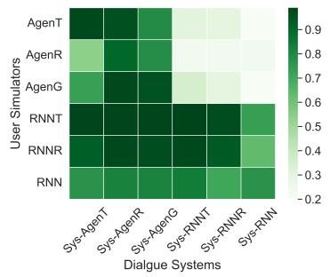  
(a) Success rates of different systems.

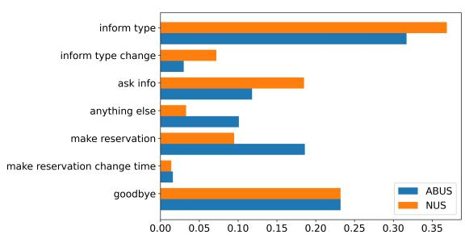  
(b) Dialog act distributions of different user simulators.  
Figure 1: (a) is the heat map on the success rates of system agents tested by different user simulators on 200 dialogues. (b) shows the dialog act distributions of Agenda-based User Simulators (ABUS) and Neural networksbased User Simulators (NUS) provided by Shi et al. (2019). There exist seven user dialog acts annotated in the restaurant search task from MultiWOZ, as shown on the Y-axis.

One cannot stand for everyone. Users might behave differently, one could design different user simulators with specific user dialog act distributions, see Shi et al. (2019). A single user simulator learned on a task-oriented dialogue corpus can just represent one or a group of users, while the dialogue system needs to accomplish tasks from various human users in real scenarios. We argue that it is beneficial to utilize all different user simulators to train the dialogue system. By leveraging multiple user simulators that have different user dialog act distributions, the dialogue systems can explore a larger dialogue state space, which might improve the ability of the learned dialogue system.

## 3.2 Some Preliminary Proposals for MUST

We propose a framework called MUST, the core idea of which is to train a better dialogue system by leveraging Multiple User SimulaTors simultaneously. There are several simple ways to implement our MUST, including a merging strategy $( \mathrm { M U S T _ { m e r g i n g } ) }$ , a Continual Reinforcement Learning strategy $( \mathrm { M U S T _ { C R L } } )$ , and a uniform adaption strategy $( \mathrm { M U S T _ { u n i f o r m } ) }$

(I) $\mathbf { M U S T } _ { \mathrm { m e r g i n g } }$ first samples some dialogues from each user simulator and the corresponding dialogue system trained by this simulator. Then it combines the collected dialogues to train a new user simulator for ensembling different user dialog act distributions. Finally, it uses this new user simulator to train the dialogue system with RL.

(II) $\mathbf { M U S T } _ { \mathrm { C R L } }$ 5 treats each user simulator as an independent RL environment. It moves the trained system agent to another one (i.e., let the system agent interact with another user simulator) if the system has converged in the current environment.

(III) $\mathbf { M U S T } _ { \mathrm { u n i f o r m } }$ allows the system agent have chances to interact with all user simulators simultaneously. Different from MUSTCRL, $\mathbf { M U S T _ { u n i f o r m } }$ puts all user simulators in a single RL environment and adopts the simplest way to specify different user simulators to train the dialogue system, which is to pick a user simulator among all user simulators with a uniform distribution for each iteration in the RL training.

<table><tr><td></td><td>adaption</td><td>dynamic avoiding forgetting catastrophic</td><td>efficiency</td></tr><tr><td> $\mathbf { M U S T } _ { \mathrm { { m e r g i n g } } }$ </td><td>X</td><td>X</td><td>X</td></tr><tr><td> $\mathbf { M U S T _ { C R L } }$ </td><td>X</td><td>X</td><td>X</td></tr><tr><td> $\mathbf { M U S T _ { u n i f o r m } }$ </td><td>X</td><td>√</td><td>X</td></tr><tr><td> $\mathbf { M U S T _ { a d a p t i v e } }$ </td><td>√</td><td>√</td><td>√</td></tr></table>

Table 1: The comparison of different strategies for leveraging multiple user simulators.

Challenges to leverage multiple user simulators. It is difficult to adaptively adjust weights of user simulators during training in $\mathrm { M U S T _ { \mathrm { m e r g i n g } } . }$ . Since the proportions of dialogues from each user simulator are fixed in $\mathrm { \mathbf { M U S T } _ { m e r g i n g } . }$ , user simulators might be well-adapted and others might not. The $\mathbf { M U S T } _ { \mathrm { C R I } }$ strategy has a problem of catastrophic forgetting (Khetarpal et al., 2020) and would be sensitive to the order of different user agents interacting with the dialogue system, which might result in obtaining a sub-optimal dialogue system. As Shi et al. (2019) shows, the system agents trained by different user simulators have different convergence speeds and converged performances. Namely, the system agent might be easily fitted to some user simulators but might be hardly fitted to others. A uniform distribution for the simulator selection under $\mathbf { M U S T _ { \mathrm { { u n i f o r m } } } }$ will result in inefficient training, since it would be unnecessary to assign the many training costs for easily-adapted user simulators. Overall, the challenging problems under MUST are 1) how to efficiently leverage multiple user simulators to train the system agent, and 2) avoiding the catastrophic forgetting issue.

## 4 MUST as a MAB Problem

To tackle the challenges in MUST, we first formulate MUST as a Multi-armed bandit (MAB) problem, see $\ S 4 . 1$ . In §4.2, we propose a method called $\mathbf { M U S T _ { a d a p t i v e } }$ to use an adaptively-updated distribution to replace the uniform distribution under the $\mathbf { M U S T _ { \mathrm { { u n i f o r m } } } }$ for accelerating the MUST training. We briefly compare these different implementations of MUST in Tab. 1.

## 4.1 Formulating MUST as a MAB Problem

Adaptively specifying user simulators to train dialogue systems reminds us of a similar concept in machine learning, called boosting (Zhou, 2012). From a boosting point of view, one should increase the weights of weakly-performing data examples and decrease the weights for well-performing ones.

In MUST, we accordingly assume that it should reduce the interactions between the dialogue system and those user simulators that the system has performed well; and meanwhile increase the interactions between the system and other user simulators that the system performs poorly. We refer to this strategy as boosting adaption.

Meanwhile, we should also give some chances to all user simulators to relieve the catastrophic forgetting issue. We refer to this as uniform adaption. Such a trade-off between boosting adaption and uniform adaption is similar to the the exploitation vs exploration trade-off existing in the Multi-armed bandit (MAB) problem (Auer et al., 2002).

Here, we interpret MUST as a MAB problem. We treat each user simulator as an arm. Suppose there are K arms (simulators), and each arm i has a fixed but unknown reward distribution $R _ { i }$ with an expectation $\mu _ { i }$ . At each time step $t = 1 , 2 , . . . , T .$ one must choose one of these K arms. We denote the arm pulled at time step t as $i _ { t } \in \{ 1 , . . . , K \}$ After pulling an arm, it receives a reward $\boldsymbol { x } _ { i _ { t } }$ drawn from the arm’s underlying reward distribution. The decision maker’s objective is to maximize the cumulative expected reward over the time horizon

$$
\sum _ { t = 1 } ^ { T } \mathbb { E } [ x _ { i _ { t } } ] = \sum _ { t = 1 } ^ { T } \mu _ { i _ { t } } .\tag{1}
$$

In MUST, the reward received in each armpulling step refers to the possible performance gain of the dialogue system after it interacts with a selected user simulator. A significant difference between the standard MAB problem and MUST is that the reward expectation of a user simulator (arm) in MUST is not static; it changes over time. For example, by consecutively interacting with the same user simulator, the performance gain (reward) of the system will decay since the system might be in saturation or overfitting to this simulator. Moreover, the performance gain of the system after interacting with a simulator might increase if the simulator has not been selected for a period. To deal with this difference, we should tailor the solution of MAB to the MUST framework.

## 4.2 Training with MUSTadaptive

To solve this MAB problem in MUST, we implement a method called $\mathbf { M U S T _ { a d a p t i v e } }$ with a two-phase procedure, as presented in Algorithm 1. $\mathbf { M U S T _ { a d a p t i v e } }$ specifies user simulators in a uniform distribution, similar to the UCB1 6 algorithm, to train the dialogue system S in the first $T _ { \mathrm { w a r m u p } }$ steps (i.e., in the warm-up phase). After that, the adaptive phase will balance the boosting adaption and the uniform adaption by introducing an adaptively-updated distribution p, which is used to specify different user simulators to train the system S in later RL training. To accelerate the RL training, intuitively, p is expected to assign lower weights to user simulators with which S already performs well and higher weights to those user simulators with which S performs poorly.

Algorithm 1: Implement $\mathbf { M U S T _ { a d a p t i v e } }$ with the modified UCB1 algorithm   
Input: K fixed User simulators $\overline { { \mathbf { U } = \{ U _ { 1 } , U _ { 2 } , \cdot \cdot \cdot U _ { K } \} } }$ and the values of hyperparameters $T _ { \mathrm { w a r m u p } } , T , e , d , \tau ;$   
1 Initialization: randomly initialize System agent S;   
2 Initialization: initialize the simulator sampling distribution p as a uniform distribution.   
3 (1) Warm-up phase:   
4 for $t = 0 , . . . , \bar { T } _ { w a r m u p } - 1$ do   
5 sample a simulator $U _ { j }$ in U w.r.t. the distribution ${ \pmb p } ;$   
6 synthesize a new dialogue using the system agent S and the sampled $U _ { j }$ ;   
7 use the reward obtained for the dialogue to update S with a RL algorithm;   
8 (2) Adaptive phase:   
9 for $t = \bar { 0 } , . . . , \bar { T } - 1$ do   
10 if t%e == 0 then   
11 for $j = 1 , . . . , K$ do   
12 evaluate the performance i.e. the success rate $\bar { x } _ { j }$ of the agent S by letting it interact d times with the   
simulator $\dot { U } _ { j } { \bf ; }$   
13 update p based on these success rates $\big \{ \bar { x } _ { 1 } , . . . , \bar { x } _ { K } \big \}$ (see Eq. 2, Eq. 3, and Eq. 4);   
14 else   
15 sample a simulator $U _ { j }$ in U w.r.t. the distribution p;   
16 synthesizing a new dialogue using the system agent S and the sampled $U _ { j }$ ;   
17 use the reward obtained for the dialogue to update S with a RL algorithm;   
Output: The learned dialogue system S.

(1) Warm-up phase : in the first $T _ { \mathrm { w a r m u p } }$ dialogues, we use a uniform distribution to sample all user simulators to train the system agent S (lines 4-7). This phase is mainly used to warm up the dialogue system S.

(2) Adaptive phase : the distribution p used to sample all user simulators will be adaptively updated. We call it as the adaptive phase. When this phase begins $( \mathrm { i } . \mathrm { e } . , t = 0 )$ , we will first evaluate the performance (i.e., the success rate $\bar { x } _ { j } , j \in$ $\{ 1 , \cdots , K \} )$ of the dialogue system S trained after the warm-up phase. The success rate $\bar { x } _ { j }$ is obtained by letting S interact d times with the simulator $U _ { j } \left( \mathbf { e . g . } , j \in \{ 1 , . . . , K \} \right)$ and calculating the

success rates.

Inspired by UCB1 (Auer et al., 2002), we design a calibrated performance expectation ${ \hat { x } } _ { j }$ of the system agent S interacting with each user simulator $U _ { j }$ taking exploration into consideration beyond pure exploitation:

$$
\begin{array} { r } { \hat { x } _ { j } = \underbrace { \bar { x } _ { j } } _ { \mathrm { e x p l o i t a t i o n } } + \underbrace { \sqrt { \frac { 2 \ln t } { T _ { j , t } } } } _ { \mathrm { e x p l o r a t i o n } } , j \in \{ 1 , . . . , K \} ; } \end{array}\tag{2}
$$

where $\bar { x } _ { j }$ is the success rate of the system agent S tested with user simulator $U _ { j }$ , and $T _ { j , t }$ is the number of times user simulator $U _ { j }$ has been selected with so far. Then we normalize ${ \hat { x } } _ { j }$ into

$$
z _ { j } = 1 / \left( \hat { x } _ { j } - \tau \operatorname* { m i n } ( \{ \bar { x } _ { 1 } , \cdot \cdot \cdot , \bar { x } _ { K } \} ) \right) ,\tag{3}
$$

Eq. 3 penalizes the user simulators with which the dialogue system already performs well in the expectation term. Where the hyperparameter τ is the smooth factor for distribution $\pmb { p } = \{ p _ { 1 } , \cdots , \pmb { p } _ { K } \}$ – the larger τ is, the sharper p is. Each probability $p _ { j }$ in p is calculated as

$$
p _ { j } = \frac { z _ { j } } { \sum _ { i = 1 } ^ { K } z _ { i } } .\tag{4}
$$

In the following $T - 1$ dialogues, we will specify all user simulators to train the system agent S with this distribution p (lines 15-18). We will also evaluate the RL model S for every e episodes (line 10-12) and update the distribution p with the new K success rates (line 13).

Difference with the original UCB1. The main differences between our modified UCB1 algorithm and the original UCB1 algorithm are twofold. First, we tailor the original UCB1 into our scenario by using Eq. 3 to penalize the user simulators with which the dialogue system has performed well. Secondly, we adopt a sampling schema based on a well-designed distribution (see Eq. 4) instead of taking the arm with the highest expectation. This is to increase the diversity and flexibility of arm selection.

## 5 Experiments

To verify the effectiveness of MUST, we benchmark the system agents trained either with a single user simulator or multiple user simulators (including $\mathrm { M U S T _ { \mathrm { { m e r g i n g } } } , }$ , MUSTuniform, and $\mathbf { M U S T _ { a d a p t i v e } } )$ . See $\mathbf { M U S T } _ { \mathrm { C R L } }$ in the App. C.

## 5.1 Experimental Setup

Available user simulators. There are six user simulators provided by Shi et al. (2019), which are Agenda-Template (AgenT), Agenda-Retrieval (AgenR), Agenda-Generation (AgenG), RNN-Template (RNNT), RNN-Retrieval (RNNR), RNN-End2End (RNN) trained with different dialog planning and generation methods. The NLU modules of all six user simulators are using the RNN model. The DM modules of AgenT, AgenR, and AgenG are rule-based methods. For the NLG module, these three simulators are using the template, retrieval, and generation methods respectively. The DM modules of RNNT, and RNNR are using Sequicity (Lei et al., 2018) as their backbones which is an RNN-based seq2seq model with copy mechanism. The NLG modules of these two simulators are using the template and retrieval methods respectively. The user simulator of RNN uses Sequicity as its backbone in an end-to-end manner.

Baselines. The baselines are the dialogue systems trained by each user simulator, including Sys-AgenT, Sys-AgenR, Sys-AgenG, Sys-RNNT, Sys-RNNR, and Sys-RNN. For a fair comparison, all system agents (including the systems trained by our MUST) have the same architecture described in Shi et al. (2019). See details in App. B.1.

MultiWOZ Restaurant Domain Dataset. The original task in MultiWOZ (Budzianowski et al., 2018) is to model the system response. Shi et al. (2019) annotate the user intents and the user-side dialog acts in the restaurant domain of MultiWOZ to build user simulators, which has a total of 1,310 dialogues. Moreover, we randomly simulate 2,000 dialogues from each rule-based simulator (i.e., AgenT, AgenR, AgenG) and their corresponding system agents respectively, and processe these dialogues to have the same annotation format as the MultiWOZ restaurant domain dataset. We denote this dataset as Simulated Agenda Dataset, which has a total of 6,000 dialogues.

Evaluation Measures. A straightforward metric to evaluate dialogue systems is the success rate tested by each user simulator. We calculate the success rate between a user simulator and a system agent by sampling 200 dialogues. We exclude some user simulators in training MUST and test the systems with them as out-of-domain evaluation. According to the previous study Gunasekara et al. (2020), there usually is a gap between automatic evaluations and human evaluations of dialogue systems. Therefore, we ask humans to converse with dialogue systems. Each dialogue system has conversed with 5 different users; each user has 10 dialogues. In total, we collect 50 dialogues for each dialogue system to calculate its success rate. See more details in App. B.5.

## 5.2 Implementations

## 5.2.1 Two new User Simulators

We believe Pre-trained Language Models (PLMs) might improve the capacity of user simulators since they have recently shown remarkable success in building task-oriented dialogue systems (Ham et al., 2020; Peng et al., 2021; Hosseini-Asl et al., 2020). Here we implement another two user simulators using GPT (Radford et al., 2018, 2019). Building a user simulator using GPT is similar to building a ToD system with GPT. See more details in App. G.

GPT Simulator. It is first fine-tuned on the simulated agenda dataset and then fine-tuned on the MultiWOZ restaurant domain dataset by leveraging GPT. This user simulator will be used to help implementing MUST.

GPTIL Simulator. To implement the MUSTmerging strategy, similar to Imitation Learning (IL), we first train a new user simulator with dialogue sessions collected from different user simulators and their corresponding dialogue systems. We also learn this new user simulator based on GPT model and denote it as $\mathrm { G P T _ { I L } }$ $\mathrm { G P T _ { I L } }$ is first fine-tuned on the simulated agenda dataset. Then we sample 1,400 dialogues from the simulated agenda dataset and merge them with 1,310 MultiWOZ restaurant domain dialogues to continue fine-tuning $\mathrm { G P T _ { I L } }$

<table><tr><td rowspan="2" colspan="2">Dialogue Systems</td><td colspan="4">In-domain evaluation</td><td colspan="4">Out-of-domain evaluation</td><td colspan="2">All</td></tr><tr><td>AgenT</td><td>AgenR</td><td>RNNT</td><td>GPT</td><td>AgenG RNNR RNN Avg.↑ Std.↓</td><td></td><td></td><td></td><td>Avg.↑</td><td> $\overline { { \mathbf { S t d . } \downarrow } }$ </td></tr><tr><td rowspan="4">single</td><td>Sys-AgenT</td><td>97.5</td><td> $\overline { { 5 4 . 0 \downarrow _ { 4 0 . 0 \% } } }$ </td><td> $9 8 . 5 \mathrm { \scriptstyle \downarrow _ { 0 . 5 \% } }$ </td><td> $7 8 . 0 \text{‰}$ </td><td>72.5</td><td>92.5 77.0</td><td></td><td>80.7</td><td>8.6 81.4</td><td>14.8</td></tr><tr><td>Sys-AgenR</td><td> $9 6 . 0 \downarrow _ { 1 . 5 \% }$ </td><td>90.0</td><td> $9 8 . 5 _ { \downarrow _ { 0 . 5 \% } }$ </td><td> $8 0 . 5 \downarrow _ { 1 . 8 \% }$ </td><td>97.5</td><td>97.5 82.0</td><td>92.3</td><td>7.3</td><td>91.7</td><td>7.1</td></tr><tr><td>Sys-RNNT</td><td> $3 0 . 5 \downarrow _ { \mathrm { 6 8 . 7 \% } }$ </td><td> $2 3 . 0 \downarrow _ { 7 4 . 4 \% }$ </td><td>99.0</td><td> $7 5 . 5 \textmu _ { 7 . 9 \% }$ </td><td>35.5</td><td>97.5 84.0</td><td>72.3</td><td>26.6</td><td>63.6</td><td>30.5</td></tr><tr><td>Sys-GPT</td><td> $6 0 . 5 \downarrow _ { 3 7 . 9 \% }$ </td><td> $5 1 . 5 _ { \textrm { \tiny { \downarrow 4 2 . 8 \% } } }$ </td><td> $9 7 . 0 \downarrow _ { 2 . 0 \% }$ </td><td>82.0</td><td>59.5</td><td>94.0 92.0</td><td>81.8</td><td>15.8</td><td>76.6</td><td>17.6</td></tr><tr><td rowspan="3">MUST</td><td> $\mathbf { \overline { { S y s - M U S T _ { \mathrm { m e r g i n g } } } } }$ </td><td> $9 7 . 5 \uparrow _ { 0 . 0 \% }$ </td><td> $8 3 . 5 \downarrow _ { 7 . 2 \% }$ </td><td> $9 4 . 5 \downarrow _ { 4 . 6 \% }$ </td><td> $8 0 . 5 \downarrow _ { 1 . 8 \% }$ </td><td>97.5</td><td>94.0 82.5</td><td>91.3</td><td>6.4</td><td>90.0</td><td>6.9</td></tr><tr><td> $\mathbf { S y s - M U S T }$  uniform</td><td> $9 7 . 5 \uparrow _ { 0 . 0 \% }$ </td><td> $8 9 . 0 \downarrow _ { 1 . 0 \% }$ </td><td> $9 7 . 5 \downarrow _ { 1 . 5 \% }$ </td><td> $8 2 . 5 \substack { \uparrow _ { 0 . 5 \% } }$ </td><td>96.5</td><td>96.0 87.5</td><td>93.4</td><td>4.2</td><td>92.4</td><td>5.6</td></tr><tr><td> $\mathbf { S y s - M U S T _ { a d a p t i v e } }$ </td><td> $9 7 . 5 \uparrow _ { 0 . 0 \% }$ </td><td> $8 9 . 5 \downarrow _ { 0 . 5 \% }$ </td><td> $9 7 . 0 _ { \downarrow _ { 2 . 0 \% } }$ </td><td> $8 2 . 5 \substack { \uparrow _ { 0 . 5 \% } }$ </td><td>96.5</td><td>97.5</td><td>90.0 94.7</td><td>3.3</td><td>92.9</td><td>5.3</td></tr></table>

[1] The underlined number represents the success rate between a user simulator and its corresponding dialogue system trained by this user simulator. The increasing and decreasing percentages (in red and green colors) use the underlined numbers as the base success rates.  
[2]  ( ) indicates by what percentages the success rate has decreased (increased) compared with the base success rate by interacting with the same user simulator.  
Table 2: The success rates of system agents testing on various user simulators. Each column represents a user simulator, each row represents a dialogue system trained with a specific simulator, e.g., Sys-AgenT means the system trained with AgenT. Each entry shows the success rate of a system agent when dealing with a user simulator. We use four simulators (AgenT, AgenR, RNNT, and GPT) to implement $\mathbf { M U S T _ { u n i f o r m } }$ and $\mathbf { M U S T _ { a d a p t i v e } }$

## 5.2.2 Dialogue Systems

Sys-GPT is trained with the single user simulator GPT. $\mathbf { S y s - M U S T } _ { \mathrm { m e r g i n g } }$ is trained with $\mathbf { G P T } _ { \mathrm { I L } }$ $\mathbf { S y s - M U S T } _ { \mathrm { u n i f o r m } }$ is trained by the user simulators of AgenT, AgenR, RNNT, and GPT with a uniform sampling distribution. For training Sys-$\mathbf { M U S T _ { \mathrm { a d a p t i v e } } } ^ { \mathrm { ~ 7 ~ } }$ , the distribution p will be adaptively updated using our modified UCB1 algorithm. We also train the $\mathbf { S y s { \mathrm { - } } M U S T _ { u n i f o r m } }$ and Sys- $- \mathbf { M U S T _ { a d a p t i v e } }$ by using different subsets of the user simulators for ablation studies in App. D.

## 5.3 Experimental Results

Automatic Evaluation. As seen in Tab. 2, Sys-$\mathbf { M U S T _ { \mathrm { { u n i f o r m } } } }$ and $\mathrm { S y s – M U S T _ { a d a p t i v e } }$ outperform the dialogue systems (Sys-AgenT, Sys-AgenR, Sys-RNNT, and Sys-GPT) trained by a single user simulator in the overall performance, demonstrating the superiority of leveraging multiple user simulators. Especially, $\mathbf { S y s - M U S T _ { \mathrm { a d a p t i v e } } }$ has a 1.2 absolute value improvement (92.9 vs. 91.7) averagely over the previous SOTA system Sys-AgenR. Observing that $\mathbf { S y s - M U S T _ { \mathrm { m e r g i n g } } }$ is not as competitive as $\mathbf { S y s { \mathrm { - } } M U S T _ { u n i f o r m } }$ and $\mathrm { S y s – M U S T _ { a d a p t i v e } }$ , this comparison shows that the merging strategy cannot effectively leverage multiple user simulators.

In in-domain evaluation, the performances of systems (Sys-AgenT, Sys-AgenR, Sys-RNNT, and Sys-GPT) trained by a single user simulator drop a lot when testing with a different simulator. It requires us to delicately select a suitable user simulator for obtaining a good dialogue system. However, users might be multi-facet or even unknown, making the selection even more difficult. Therefore, it is essential to leverage multiple user simulators when training dialogue systems. At least, the performance gap of dialogue systems trained with our MUST becomes smaller than without MUST, see the percentages labeled in green and red colors.

<table><tr><td rowspan=1 colspan=2>Dialogue Systems</td><td rowspan=1 colspan=1>humanevaluation</td></tr><tr><td rowspan=2 colspan=1>single</td><td rowspan=2 colspan=1>Sys-AgenTSys-AgenRSys-RNNTSys-GPT</td><td rowspan=1 colspan=1>76.084.034.0</td></tr><tr><td rowspan=1 colspan=1>58.0</td></tr><tr><td rowspan=1 colspan=1>MUST</td><td rowspan=1 colspan=1>Sys-MUSTmerging $\mathbf { \sigma } _ { \mathbf { S y s - M U S T _ { u n i f o r m } } }$  $\mathbf { \Delta S y s - M U S T _ { \mathrm { a d a p t i v e } } }$ </td><td rowspan=1 colspan=1>90.092.092.0</td></tr></table>

Table 3: Human evaluation.

In out-of-domain evaluation where the user simulators used for testing the systems are unseen by our MUST, Sys-MUSTuniform and Sys-$\mathbf { M U S T _ { a d a p t i v e } }$ achieve at most 2.4 absolute value improvement over Sys-AgenR. This evidences that MUST has a better generalization ability for interacting with unseen user simulators. Moreover, the dialogue systems (Sys-MUSTmerging, $\mathrm { S y s – M U S T _ { u n i f o r m } , }$ and $\mathbf { S y s - M U S T _ { a d a p t i v e } } )$ trained with the proposed MUST approaches have lower standard deviations, which indicates that they are more robust to the diversity of user simulators.

Human Evaluation. In Tab. 3, the human evaluation results show that our $\mathbf { S y s { \mathrm { - } } M U S T _ { u n i f o r m } }$ and $\mathrm { S y s – M U S T _ { a d a p t i v e } }$ largely outperform the other dialogue systems when interacting with real users. The consistency between automatic evaluations and human evaluations evidences the effectiveness of our proposed MUST.

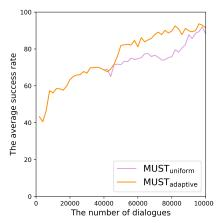

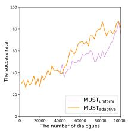  
(a) The learning curves (b) AgenR

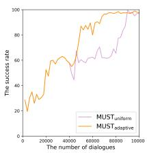  
(c) AgenT

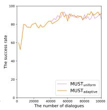  
(d) GPT

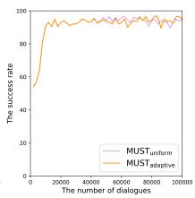  
(e) RNNT

Figure 2: The learning curves of $\mathbf { S y s { \mathrm { - } } M U S T _ { u n i f o r m } }$ and $\mathrm { S y s – M U S T _ { a d a p t i v e } . }$ (a) shows their average success rates tested with all user simulators (AgenT, AgenR, RNNT, and GPT). The success rates of them tested with each user simulator are shown in (b)-(e).  
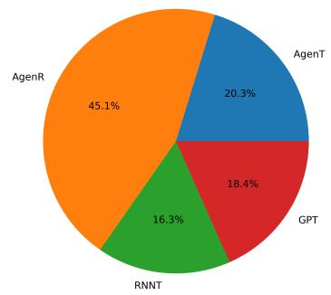  
(a) The sampling proportion of simulators.

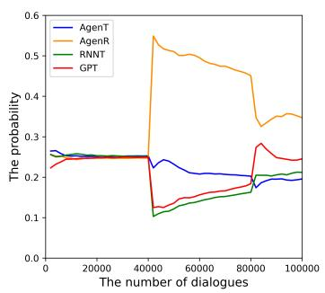  
(b) Variations of the sampling proportions (in every 2000 steps) of simulators.  
Figure 3: The sampling proportions of user simulators in average (a) and in time horizon (b).

## 5.4 Analysis and Discussions

Convergences of $\mathbf { M U S T } _ { \mathrm { u n i f o r m } }$ and $\mathbf { M U S T } _ { \mathrm { a d a p t i v e } } .$ In Fig. 2, we show the learning curves of $\mathbf { S y s { \mathrm { - } } M U S T _ { u n i f o r m } }$ and $\mathrm { S y s – M U S T _ { a d a p t i v e } }$ in 100,000 steps; the first 40,000 steps are in the warm-up phase for $\mathrm { S y s – M U S T _ { a d a p t i v e } . }$ From Fig. 2(a), we can see that training the dialogue system with AgenT, AgenR, RNNT, and GPT by $\mathbf { M U S T _ { a d a p t i v e } }$ converges faster than by $\mathbf { M U S T _ { \mathrm { { u n i f o r m } } } }$ . We do ablation studies on our $m o d i f i e d \ { \mathrm { U C B 1 } }$ algorithm to help understanding the designed distribution p, see details in App. E. We further plot the performances of the dialogue system tested by each user simulator in the RL training in Fig. 2(b)-2(e).

Visualization on $\mathbf { M U S T } _ { \mathrm { a d a p t i v e } } .$ Let us define the adaptation difficulty of a user simulator using how many steps it must take to train the dialogue system with this user simulator until it converges. The adaptation difficulty of all user simulators could be ranked like $\mathrm { A g e n R } > \mathrm { A g e n T } > \mathrm { G P T } > \mathrm { R N N T }$ according to Fig. 2(b)-2(e). To check whether MUSTadaptive tends to sample harder-to-adapt user simulators more times in the adaptive phase, as assumed in §4.2, we visualize the sampling proportions of all user simulators in Fig. 3(a). We could observe that AgenR was sampled with 45.1% (the biggest proportion) and it is indeed the hardest user simulator that can be adapted by the system; RNNT has the smallest sampling proportion and it is the easiest user simulator that can be adapted by the system. The consistency between the adaptation difficulty and sampling proportions for these four user simulators evidences our assumption in §4.2. Fig. 3(b) visualizes the variations of the sampling distributions of user simulators. Interestingly, it shows that AgenR and AgenT are competitive with the GPT simulator; while RNNT and GPT are cooperative with each other. This might be because both RNNT and GPT simulators are learned from the dialogue corpus and might share some similar behaviors.

## 6 Conclusion

In this paper, we propose a framework named MUST to improve dialogue systems by using multiple user simulators simultaneously. We discuss several simple methods to implement MUST, which is either inflexible or inefficient. Therefore, we formulate MUST as a Multi-armed bandits (MAB) problem, based on which we propose a novel implementation called $\mathbf { M U S T _ { a d a p t i v e } } .$ The experimental results on the restaurant search task from

MultiWOZ demonstrate that MUST can largely improve the system agent upon baselines, especially when tested with unseen user simulators. Moreover, $\mathbf { M U S T _ { a d a p t i v e } }$ is more efficient than other implementations.

## Limitation

The main limitation of this work is that we only conduct our experiments on the restaurant domain of the MultiWOZ since we can only find multiple user simulators from Shi et al. (2019) and they build these simulators only on the restaurant search task. In future work, we plan to apply our proposed methods to multi-domain scenarios.

## Ethics Statement

There are no ethics-related issues in this paper. The data and other related resources in this work are open-source and commonly-used by many existing work.

## Acknowledgements

Part of this work was done when the first author worked at Huawei Noah’s Ark Lab. Besides, this work is supported by the Chinese Key-Area Research and Development Program of Guangdong Province (2020B0101350001), the Shenzhen Science and Technology Program (JCYJ20220818103001002), the Guangdong Provincial Key Laboratory of Big Data Computing, The Chinese University of Hong Kong, Shenzhen, Shenzhen Key Research Project (C10120230151) and Shenzhen Doctoral Startup Funding (RCBS20221008093330065). We would like to thank Zichao Li, Chen Zhang, and Dong Yang for their helpful discussions. Moreover, we thank anonymous reviewers for their valuable suggestions.

## References

Layla El Asri, Jing He, and Kaheer Suleman. 2016. A sequence-to-sequence model for user simulation in spoken dialogue systems.

Peter Auer, Nicolò Cesa-Bianchi, and Paul Fischer. 2002. Finite-time analysis of the multiarmed bandit problem. Machine Learning, 47(2–3):235–256.

Paweł Budzianowski, Tsung-Hsien Wen, Bo-Hsiang Tseng, Iñigo Casanueva, Stefan Ultes, Osman Ramadan, and Milica Gašic. 2018.´ MultiWOZ - a largescale multi-domain Wizard-of-Oz dataset for taskoriented dialogue modelling. In Proceedings ofthe

2018 Conference on Empirical Methods in Natural Language Processing, pages 5016–5026, Brussels, Belgium. Association for Computational Linguistics.

Yun-Nung Chen, Asli Celikyilmaz, and Dilek Hakkani-Tür. 2017. Deep learning for dialogue systems. In Proceedings of the 55th Annual Meeting of the Association for Computational Linguistics: Tutorial Abstracts, pages 8–14, Vancouver, Canada. Association for Computational Linguistics.

R. Chulaka Gunasekara, Seokhwan Kim, Luis Fernando D’Haro, Abhinav Rastogi, Yun-Nung Chen, Mihail Eric, Behnam Hedayatnia, Karthik Gopalakrishnan, Yang Liu, Chao-Wei Huang, Dilek Hakkani-Tür, Jinchao Li, Qi Zhu, Lingxiao Luo, Lars Liden, Kaili Huang, Shahin Shayandeh, Runze Liang, Baolin Peng, Zheng Zhang, Swadheen Shukla, Minlie Huang, Jianfeng Gao, Shikib Mehri, Yulan Feng, Carla Gordon, Seyed Hossein Alavi, David R. Traum, Maxine Eskénazi, Ahmad Beirami, Eunjoon Cho, Paul A. Crook, Ankita De, Alborz Geramifard, Satwik Kottur, Seungwhan Moon, Shivani Poddar, and Rajen Subba. 2020. Overview of the ninth dialog system technology challenge: DSTC9. CoRR, abs/2011.06486.

Izzeddin Gur, Dilek Hakkani-Tur, Gokhan Tur, and Pararth Shah. 2018. User modeling for task oriented dialogues.

Donghoon Ham, Jeong-Gwan Lee, Youngsoo Jang, and Kee-Eung Kim. 2020. End-to-end neural pipeline for goal-oriented dialogue systems using GPT-2. In Proceedings of the 58th Annual Meeting of the Association for Computational Linguistics, pages 583–592, Online. Association for Computational Linguistics.

Ehsan Hosseini-Asl, Bryan McCann, Chien-Sheng Wu, Semih Yavuz, and Richard Socher. 2020. A simple language model for task-oriented dialogue. In Advances in Neural Information Processing Systems, volume 33, pages 20179–20191. Curran Associates, Inc.

Khimya Khetarpal, Matthew Riemer, Irina Rish, and Doina Precup. 2020. Towards continual reinforcement learning: A review and perspectives. CoRR, abs/2012.13490.

Florian Kreyssig, Iñigo Casanueva, Paweł Budzianowski, and Milica Gašic. 2018.´ Neural user simulation for corpus-based policy optimisation of spoken dialogue systems. In Proceedings ofthe 19th Annual SIGdial Meeting on Discourse and Dialogue, pages 60–69, Melbourne, Australia. Association for Computational Linguistics.

Wenqiang Lei, Xisen Jin, Min-Yen Kan, Zhaochun Ren, Xiangnan He, and Dawei Yin. 2018. Sequicity: Simplifying task-oriented dialogue systems with single sequence-to-sequence architectures. In Proceedings of the 56th Annual Meeting of the Association for Computational Linguistics (Volume 1: Long Papers), pages 1437–1447, Melbourne, Australia. Association for Computational Linguistics.

Jiwei Li, Will Monroe, Alan Ritter, Dan Jurafsky, Michel Galley, and Jianfeng Gao. 2016a. Deep reinforcement learning for dialogue generation. In Proceedings ofthe 2016 Conference on Empirical Methods in Natural Language Processing, pages 1192– 1202, Austin, Texas. Association for Computational Linguistics.

Xiujun Li, Zachary C Lipton, Bhuwan Dhingra, Lihong Li, Jianfeng Gao, and Yun-Nung Chen. 2016b. A user simulator for task-completion dialogues. arXiv preprint arXiv:1612.05688.

Hsien-chin Lin, Nurul Lubis, Songbo Hu, Carel van Niekerk, Christian Geishauser, Michael Heck, Shutong Feng, and Milica Gasic. 2021. Domainindependent user simulation with transformers for task-oriented dialogue systems. In Proceedings ofthe 22nd Annual Meeting ofthe Special Interest Group on Discourse and Dialogue, pages 445–456, Singapore and Online. Association for Computational Linguistics.

Bing Liu and Ian Lane. 2018. End-to-end learning of task-oriented dialogs. In Proceedings of the 2018 Conference of the North American Chapter of the Associationfor Computational Linguistics: Student Research Workshop, pages 67–73, New Orleans, Louisiana, USA. Association for Computational Linguistics.

Bing Liu and Ian R. Lane. 2016. Attention-based recurrent neural network models for joint intent detection and slot filling. CoRR, abs/1609.01454.

Baolin Peng, Chunyuan Li, Jinchao Li, Shahin Shayandeh, Lars Liden, and Jianfeng Gao. 2021. Soloist: Building task bots at scale with transfer learning and machine teaching.

Baolin Peng, Xiujun Li, Jianfeng Gao, Jingjing Liu, and Kam-Fai Wong. 2018. Deep Dyna-Q: Integrating planning for task-completion dialogue policy learning. In Proceedings of the 56th Annual Meeting of the Association for Computational Linguistics (Volume 1: Long Papers), pages 2182–2192, Melbourne, Australia. Association for Computational Linguistics.

Baolin Peng, Xiujun Li, Lihong Li, Jianfeng Gao, Asli Celikyilmaz, Sungjin Lee, and Kam-Fai Wong. 2017. Composite task-completion dialogue policy learning via hierarchical deep reinforcement learning. In Proceedings ofthe 2017 Conference on Empirical Methods in Natural Language Processing, pages 2231– 2240, Copenhagen, Denmark. Association for Computational Linguistics.

Baolin Peng, Chenguang Zhu, Chunyuan Li, Xiujun Li, Jinchao Li, Michael Zeng, and Jianfeng Gao. 2020. Few-shot natural language generation for taskoriented dialog. CoRR, abs/2002.12328.

Alec Radford, Karthik Narasimhan, Tim Salimans, and Ilya Sutskever. 2018. Improving language understanding by generative pre-training.

Alec Radford, Jeff Wu, Rewon Child, David Luan, Dario Amodei, and Ilya Sutskever. 2019. Language models are unsupervised multitask learners.

Victor Sanh, Lysandre Debut, Julien Chaumond, and Thomas Wolf. 2020. Distilbert, a distilled version of bert: smaller, faster, cheaper and lighter.

Jost Schatzmann, Blaise Thomson, Karl Weilhammer, Hui Ye, and Steve Young. 2007. Agenda-based user simulation for bootstrapping a POMDP dialogue system. In Human Language Technologies 2007: The Conference of the North American Chapter of the Associationfor Computational Linguistics; Companion Volume, Short Papers, pages 149–152, Rochester, New York. Association for Computational Linguistics.

Jost Schatzmann and Steve Young. 2009. The hidden agenda user simulation model. IEEE Transactions on Audio, Speech, and Language Processing, 17(4):733– 747.

Weiyan Shi, Kun Qian, Xuewei Wang, and Zhou Yu. 2019. How to build user simulators to train RL-based dialog systems. In Proceedings ofthe 2019 Conference on Empirical Methods in Natural Language Processing and the 9th International Joint Conference on Natural Language Processing (EMNLP-IJCNLP), pages 1990–2000, Hong Kong, China. Association for Computational Linguistics.

Ryuichi Takanobu, Runze Liang, and Minlie Huang. 2020. Multi-agent task-oriented dialog policy learning with role-aware reward decomposition. In Proceedings of the 58th Annual Meeting of the Association for Computational Linguistics, pages 625–638, Online. Association for Computational Linguistics.

Bo-Hsiang Tseng, Yinpei Dai, Florian Kreyssig, and Bill Byrne. 2021. Transferable dialogue systems and user simulators. In Proceedings ofthe 59th Annual Meeting of the Association for Computational Linguistics and the 11th International Joint Conference on Natural Language Processing (Volume 1: Long Papers), pages 152–166, Online. Association for Computational Linguistics.

Tsung-Hsien Wen, Milica Gašic, Nikola Mrkši´ c, Pei-´ Hao Su, David Vandyke, and Steve Young. 2015. Semantically conditioned LSTM-based natural language generation for spoken dialogue systems. In Proceedings of the 2015 Conference on Empirical Methods in Natural Language Processing, pages 1711–1721, Lisbon, Portugal. Association for Computational Linguistics.

Tsung-Hsien Wen, David Vandyke, Nikola Mrkšic, Mil-´ ica Gašic, Lina M. Rojas-Barahona, Pei-Hao Su, Ste-´ fan Ultes, and Steve Young. 2017. A network-based end-to-end trainable task-oriented dialogue system. In Proceedings ofthe 15th Conference ofthe European Chapter of the Association for Computational Linguistics: Volume 1, Long Papers, pages 438–449, Valencia, Spain. Association for Computational Linguistics.

Jason Williams, Antoine Raux, Deepak Ramachandran, and Alan Black. 2013. The dialog state tracking challenge. In Proceedings ofthe SIGDIAL 2013 Conference, pages 404–413, Metz, France. Association for Computational Linguistics.

Thomas Wolf, Lysandre Debut, Victor Sanh, Julien Chaumond, Clement Delangue, Anthony Moi, Pierric Cistac, Tim Rault, Remi Louf, Morgan Funtowicz, Joe Davison, Sam Shleifer, Patrick von Platen, Clara Ma, Yacine Jernite, Julien Plu, Canwen Xu, Teven Le Scao, Sylvain Gugger, Mariama Drame, Quentin Lhoest, and Alexander Rush. 2020. Transformers: State-of-the-art natural language processing. In Proceedings ofthe 2020 Conference on Empirical Methods in Natural Language Processing: System Demonstrations, pages 38–45, Online. Association for Computational Linguistics.

Yizhe Zhang, Michel Galley, Jianfeng Gao, Zhe Gan, Xiujun Li, Chris Brockett, and Bill Dolan. 2018. Generating informative and diverse conversational responses via adversarial information maximization. In NeurIPS.

Zhi-Hua Zhou. 2012. Ensemble methods: foundations and algorithms. CRC press.

## A Multi-armed bandit problem

Reinforcement learning policies face the exploitation versus exploration trade-off, which can be described as the search for a balance between exploring the environment to find profitable actions while taking the empirically best action as often as possible. This exploitation vs exploration dilemma has been widely studied as a Multi-armed bandit (MAB) problem.

In the MAB problem, there are K arms, and each arm j has a fixed but unknown reward distribution $R _ { j }$ with an expectation $\mu _ { j }$ . At each time step $t = 1 , 2 , . . . , T .$ , the decision maker must choose one of these K arms. We denote the arm pulled at time step t as $j _ { t } \in \{ 1 , . . . , K \}$ . After pulling an arm, it will receive a reward $X _ { j _ { t } }$ which is a realization drawn from the arm’s underlying reward distribution. The decision masker’s objective is to maximize the cumulative expected reward over the time horizon $\begin{array} { r } { \sum _ { t = 1 } ^ { T } \mathbb { E } [ X _ { j _ { t } } ] \stackrel { \cdot } { = } \sum _ { t = 1 } ^ { T } \mu _ { j _ { t } } } \end{array}$

## B More details about training dialogue systems

## B.1 The architectures of user simulators and dialogue systems

The basic modules of user simulators and dialogue systems are detailed in Tab. 4.

## B.2 The implementations of the dialogue systems

The NLU modules of all system agents are a 2-layer bidirectional-GRU with 200 hidden units. The NLG modules of them are using the template-based method. The DM modules of them are a simple MLP. The input of the DM module is a state representation, which consists of the traditional dialog state and word count vector of the current utterance same as Shi et al. (2019). We mainly use the policy gradient method to train the DM modules of dialogue systems from scratch.

## B.3 The details of running policy gradient algorithm

For training the DM modules of dialogue systems with the policy gradient method, we also apply the ϵ-greedy exploration strategy. We let ϵ be 0.5 in the beginning, and it will decrease to 0 linearly within the RL training. The dialogue ends either when the user simulators say "goodbye" or when the number of turns of the dialogue exceeds 10. The reward will be given +1 for task success, -1 for task failure, and -0.1 for each additional turn to encourage the RL-based policy module to finish the task fast. Also, a discounted factor of 0.9 is applied to all the experiences.

## B.4 The parameters of training Sys-MUSTadaptive

The hyperparameters used to train the Sys-$\mathbf { M U S T _ { a d a p t i v e } }$ are listed in the Tab. 5.

Since some user simulators used for implementing our MUST framework are based on the GPT model, we train $\mathrm { S y s – M U S T _ { a d a p t i v e } }$ on a V100 GPU and it will cost around 15 hours with the default hyperparameters above.

## B.5 Human Evaluation on dialogue systems

We find 5 volunteers to conduct the human evaluations on dialogue systems. They all have good English skills and are unpaid. Before the experiments, we introduced task-oriented dialogue systems and user simulators to them and tell them how to judge if the generated dialogue is successful. Then we prepare 50 user goals from MultiWOZ Restaurant Domain Dataset: 20 of them are simple, and 30 of them are a little bit complex. We specify 10 user goals for each volunteer and let the volunteer converse with all dialogue systems for each same user goal. In total, we collect 50 dialogues for each dialogue system to calculate its success rate.

<table><tr><td>Agent Types</td><td>|Agents</td><td>|NLU| DM</td><td></td><td>NLG</td></tr><tr><td rowspan="9">User Simulators</td><td>AgenT (Shi et al., 2019)</td><td></td><td>|RNN† |Agenda|</td><td>Template</td></tr><tr><td>AgenR (Shi et al., 2019)</td><td>RNN† Agenda</td><td></td><td>Retrieval</td></tr><tr><td>AgenG (Shi et al., 2019)</td><td>RNN† Agenda</td><td></td><td>RNN† (Generation)</td></tr><tr><td>RNNT (Shi et al., 2019)</td><td>RNN†</td><td></td><td>Template</td></tr><tr><td>RNNR (Shi et al., 2019)</td><td>RNN†</td><td></td><td>Retrieval</td></tr><tr><td>RNN (Shi et al., 2019)</td><td></td><td></td><td> $\mathbf { R N N } ^ { \dagger } \mathbf { \Lambda } ( \mathbf { N L U } + \mathbf { N L G } )$ </td></tr><tr><td>GPT (ours)</td><td>Transformer†</td><td></td><td> $\mathrm { ( N L U + D M + N L G ) }$ </td></tr><tr><td>GPTIL (ours)</td><td>Transformer†</td><td></td><td> $\mathrm { ( N L U + D M + N L G ) }$ </td></tr><tr><td>Dialogue Systems All</td><td>RNN†RNN†</td><td></td><td>Template</td></tr></table>

Table 4: The architectures of user simulators and dialogue systems. Modules with † are trainable.

<table><tr><td rowspan=1 colspan=1>Hyperparameter</td><td rowspan=1 colspan=1>Value</td></tr><tr><td rowspan=1 colspan=1> $\overline { { T } }$ </td><td rowspan=1 colspan=1>100,000</td></tr><tr><td rowspan=1 colspan=1> $T _ { 0 }$ </td><td rowspan=1 colspan=1>40,000</td></tr><tr><td rowspan=1 colspan=1>e</td><td rowspan=1 colspan=1>2,000</td></tr><tr><td rowspan=1 colspan=1>d</td><td rowspan=1 colspan=1>200</td></tr><tr><td rowspan=1 colspan=1>T</td><td rowspan=1 colspan=1>0.75</td></tr></table>

Table 5: The hyperparameters used for training the ${ \mathrm { S y s } } -$ $\mathbf { M U S T _ { a d a p t i v e } } .$

The criteria to judge whether a task-oriented dialogue is successful are based on two aspects: 1) the system agent correctly understands the user’s goal (i.e., the predicted dialogue state tracking result is correct); and 2) the system agent provides all information (i.e., all slot values or a booking reference number) that the user requests. For human evaluations, we follow these standard criteria. Besides, we also see if the system act generated by the system agent is matched to the user act for each turn in the dialogue.

There have seven user acts, which are ‘inform type”, “inform type change”, “ask info”, “anything else”, “make reservation”, “make reservation change time”, and “goodbye”. There have nine system acts, which are “ask type”, “present result”, “nomatch result”, “no other”, “ask reservation info”, “provide info”, “booking success”, “booking fail” and “goodbye”. The relationships between user acts and system acts are shown in Tab. 6.

## C Implement MUST with the MUSTCRL strategy

Without losing any generality, we consider two representative sequential orders: 1) AgenT, AgenR, RNNT, GPT; and 2) AgenR, GPT, AgenT, RNNT. For case 1, the first two user simulators are Agendabased user simulators; the last two user simulators are Neural networks-based user simulators. For case 2, we interleave these two types of user simulators. When the system trained by a user simulator converges, we let it continue to interact with another user simulator following the order.

As seen in Tab. 7, in case 1, the system agent achieves the best performance (i.e., 92.4 in terms of the average success rate) after training with AgenT and AgenR sequentially. However, its overall performance degrades to 83.0 after training with RNNT; especially, its performance decreases by 36.0% when testing with AgenR $( 9 3 . 0  5 9 . 5 )$ Moreover, after continuing to learn from GPT, the performance of the system agent becomes worse for AgenT $( 9 5 . 0  7 5 . 5 )$ and AgenR $( 5 9 . 5 ~ $ 47.5). This indicates the catastrophic forgetting issue heavily happened when the system agent starts learning from AgenR. We also could observe a similar phenomenon from case 2. These results can confirm that implementing our proposed MUST with $\mathbf { M U S T } _ { \mathrm { C R I } }$ strategy indeed has the catastrophic forgetting issue.

## D Sensitivity on different subsets of user simulators

We also train the $\mathbf { S y s { \mathrm { - } } M U S T _ { u n i f o r m } }$ and Sys-$\mathbf { M U S T _ { a d a p t i v e } }$ by using different groups of user simulators for ablation studies: 1) five user simulators of AgenT, AgenR, RNNT, RNNR, and GPT; and 2) three user simulators including AgenT, RNNT, and GPT.

Superiority of MUST. From Tab. 8 and Tab. 9, we can observe that $\mathbf { S y s { \mathrm { - } } M U S T _ { u n i f o r m } }$ and Sys-$\mathbf { M U S T _ { a d a p t i v e } }$ largely outperform the dialogue systems trained by single user simulators. Especially, they gain an improvement of 4 absolute points (85.4 vs. 81.4) when trained with three user simulators of AgenT, RNNT, and GPT. In summary, MUST could consistently improve the performance of the systems when using different numbers of user simulators. The ablation studies on different subsets of user simulators can demonstrate the robustness of MUST.

<table><tr><td>User act</td><td>System act</td></tr><tr><td>inform type inform type change</td><td>ask type, present result, nomatch result ask type, present result, nomatch result</td></tr><tr><td>anything else make reservation</td><td>present result, no other</td></tr><tr><td>make reservation change time</td><td>ask reservation info, booking success, booking fail ask reservation info, booking success, booking fail</td></tr><tr><td>ask info goodbye</td><td>provide info goodbye</td></tr></table>

Table 6: The relationships between user acts and system acts.
<table><tr><td rowspan="2"></td><td rowspan="2">Dialogue Systems</td><td colspan="5">User simulators</td></tr><tr><td>AgenT</td><td>AgenR</td><td>RNNT</td><td>GPT</td><td> $\operatorname { A v g } .$ </td></tr><tr><td rowspan="5">Case 1</td><td>trained by AgenT</td><td>97.5</td><td>54.0</td><td>98.5</td><td>78.0</td><td>82.0</td></tr><tr><td>trained by AgenT, AgenR sequentially</td><td> $9 7 . 0 \downarrow _ { 0 . 5 \% }$ </td><td>93.0</td><td>97.0</td><td>82.5</td><td>92.4</td></tr><tr><td>trained by AgenT, AgenR, RNNT sequentially</td><td> $9 5 . 0 \downarrow _ { 2 . 6 \% }$ </td><td> $5 9 . 5 \downarrow _ { 3 6 . 0 \% }$ </td><td>97.0</td><td>80.5</td><td>83.0</td></tr><tr><td>trained by AgenT, AgenR, RNNT, GPT sequentially</td><td> $7 5 . 5 \downarrow _ { 2 2 . 6 \% }$ </td><td> $4 7 . 5 \downarrow _ { 4 8 . 9 \% }$ </td><td> $9 6 . 0 \downarrow _ { 1 . 0 \% }$ </td><td>82.0</td><td>75.3</td></tr><tr><td>trained by AgenR</td><td>96.0</td><td>90.0</td><td>98.5</td><td>82.5</td><td>91.8</td></tr><tr><td rowspan="4">Case 2</td><td>trained by AgenR, GPT sequentially</td><td>97.5</td><td></td><td>97.0</td><td>81.5</td><td>91.0</td></tr><tr><td></td><td></td><td> $8 8 . 0 _ { \downarrow _ { 2 . 2 \% } }$ </td><td>97.0</td><td></td><td></td></tr><tr><td>trained by AgenR, GPT, AgenT sequentially</td><td>96.5</td><td> $7 8 . 5 \downarrow _ { 1 2 . 8 \% }$ </td><td></td><td> $8 0 . 0 _ { \downarrow _ { 1 . 8 \% } }$ </td><td>88.0</td></tr><tr><td>trained by AgenR, GPT, AgenT, RNNT sequentially</td><td> $9 7 . 5 \substack { \uparrow } _ { 1 . 0 \% }$ </td><td> $6 5 . 5 _ { \downarrow _ { 2 7 . 2 \% } }$ </td><td>95.0</td><td> $7 8 . 5 \textmu _ { 3 . 7 \% }$ </td><td>84.1</td></tr></table>

Table 7: The experimental results of implementing MUST with the $\mathbf { M U S T } _ { \mathrm { C R L } }$ strategy.

Out-of-domain evaluation. When testing our MUST with unseen user simulators, Sys-$\mathbf { M U S T _ { u n i f o r m } }$ and $\mathrm { S y s – M U S T _ { a d a p t i v e } }$ can also largely outperform the dialogue systems trained by a single user simulator. As seen in Tab. 8, $\mathrm { S y s – M U S T _ { a d a p t i v e } }$ achieves a 2.7 absolute value improvement (92.5 vs 89.8) over Sys-AgenR. $\mathbf { S y s { \mathrm { - } } M U S T _ { u n i f o r m } }$ and $\mathrm { S y s – M U S T _ { a d a p t i v e } }$ even improve at least 5.7 points (80.0 vs 74.3) over Sys-GPT (as shown in Tab. 9). These experimental results on different subsets of user simulators demonstrate that our MUST has a better generalization ability for interacting with unseen user simulators and is insensitive to the user simulator selection.

Comparison between $\mathbf { M U S T } _ { \mathrm { u n i f o r m } }$ and $\mathbf { M U S T } _ { \mathrm { a d a p t i v e } } .$ Fig. 4 shows the learning curves of $\mathbf { S y s { \mathrm { - } } M U S T _ { u n i f o r m } }$ and $\mathrm { S y s – M U S T _ { a d a p t i v e } }$ on different subsets of user simulators. The first 40,000 steps are in the warm-up phase for Sys-$\mathbf { M U S T _ { a d a p t i v e } }$ . We could conclude that training the dialogue system by $\mathbf { M U S T _ { a d a p t i v e } }$ consistently converges faster than by $\mathbf { M U S T _ { \mathrm { { u n i f o r m } } } }$ , at least in the scenarios when using three, four, or five user simulators to implement MUST (see Fig. 4(a),

Fig. 2(a), and Fig. 4(b), respectively).

From Tab. 8 where MUST is trained with five user simulators, we could observe that $\mathrm { S y s – M U S T _ { a d a p t i v e } }$ outperforms Sys-$\mathbf { M U S T _ { u n i f o r m } }$ with 0.5 absolute point. The performance gain becomes smaller when MUST is trained with three user simulators (see Tab. 9). This probably shows that $\mathrm { S y s – M U S T _ { a d a p t i v e } }$ would be more beneficial when there exist more user simulators.

## E Ablation study for the modified UCB1 algorithm

## E.1 Necessity of the exploration term

Our modified UCB1 algorithm provides a distribution for guiding how to sample different user simulators to accelerate the entire MUST training. The exploration term in the proposed $\mathbf { M U S T _ { a d a p t i v e } }$ exists mainly for uniform adaption (see the detailed explanation in Sec. 4.1). The original UCB1 algorithm (Auer et al., 2002) can tell us how to pull arms in bandits to maximize the cumulative expected reward. It is well-known that it cannot explore effectively without the exploration (UCB) term; consequently, it might not find the optimal action and lead to relatively poor performance. It is difficult to theoretically prove the usefulness of the exploration term in our scenario (like in the original UCB1 algorithm), which we leave as future work. However, we alternatively conduct some ablation studies to evidence the necessity of the exploration term.

<table><tr><td rowspan="2" colspan="2">Dialogue Systems</td><td colspan="5">In-domain evaluation</td><td colspan="4">Out-of-domain evaluation</td><td colspan="2">All</td></tr><tr><td>AgenT</td><td>AgenR</td><td>RNNT</td><td>RNNR</td><td>GPT</td><td>AgenG RNN</td><td></td><td>Avg.↑ Std.↓</td><td></td><td>Avg.↑ Std.↓</td><td></td></tr><tr><td rowspan="4">single</td><td>Sys-AgenT</td><td>97.5</td><td>54.0 ↓40.0%</td><td> $9 8 . 5 \downarrow _ { 0 . 5 \% }$ </td><td> $\overline { { 9 2 . 5 \downarrow _ { 1 . 0 \% } } }$ </td><td> $\overline { { 7 8 . 0 \downarrow _ { 4 . 9 \% } } }$ </td><td>72.5</td><td>77.0</td><td>74.8</td><td>2.3</td><td>81.4</td><td>14.8</td></tr><tr><td>Sys-AgenR</td><td> $9 6 . 0 _ { \scriptstyle \downarrow _ { 1 . 5 \% } }$ </td><td>90.0</td><td> $9 8 . 5 \updownarrow _ { 0 . 5 \% }$ </td><td> $9 7 . 5 \substack { \uparrow \uparrow _ { 4 . 3 \% } }$ </td><td> $8 0 . 5 \downarrow _ { 1 . 8 \% }$ </td><td>97.5</td><td>82.0</td><td>89.8</td><td>7.8</td><td>91.7</td><td>7.1</td></tr><tr><td>Sys-RNNT</td><td> $3 0 . 5 \downarrow _ { 6 8 . 7 \% }$ </td><td> $2 3 . 0 \downarrow _ { 7 4 . 4 \% }$ </td><td>99.0</td><td> $9 7 . 5 \substack { \uparrow \uparrow _ { 4 . 3 \% } }$ </td><td> $7 5 . 5 _ { \downarrow _ { 7 . 9 \% } }$ </td><td>35.5</td><td>84.0</td><td>59.8</td><td>24.3</td><td>63.6</td><td>30.5</td></tr><tr><td>Sys-RNNR</td><td> $3 0 . 0 \downarrow _ { 6 8 . 7 \% }$ </td><td> $2 3 . 0 \downarrow _ { 7 4 . 4 \% }$ </td><td> $9 6 . 5 \textmu _ { 2 . 5 \% }$ </td><td>93.5</td><td> $6 8 . 5 _ { \downarrow _ { 1 6 . 5 \% } }$ </td><td>30.0</td><td>70.5</td><td>50.3</td><td>20.3</td><td>58.9</td><td>28.8</td></tr><tr><td rowspan="2"></td><td>Sys-GPT</td><td> $6 0 . 5 \downarrow _ { 3 7 . 9 \% }$ </td><td> $5 1 . 5 \downarrow _ { 4 2 . 8 \% }$ </td><td> $9 7 . 0 \downarrow _ { 2 . 0 \% }$ </td><td> $9 4 . 0 \substack { \uparrow _ { 0 . 5 \% } }$ </td><td>82.0</td><td>59.5</td><td>92.0</td><td>75.8</td><td>16.3</td><td>76.6</td><td>17.6</td></tr><tr><td> $\mathbf { \overline { { S y s  – M U S T _ { \mathrm { u n i f o r m } } } } }$ </td><td> $9 7 . 5 \uparrow _ { 0 . 0 \% }$ </td><td> $\overline { { 8 7 . 0 \downarrow _ { 3 . 3 \% } } }$ </td><td> $\overline { { 9 7 . 0 \downarrow _ { 2 . 0 \% } } }$ </td><td> $\overline { { 9 7 . 5 \mathfrak { r } _ { 4 . 3 \% } } }$ </td><td> $\overline { { 8 2 . 0 \mathrm { \div } _ { 0 . 0 \% } } }$ </td><td>96.5</td><td>87.0</td><td>91.8</td><td>4.8</td><td>92.1</td><td>6.0</td></tr><tr><td></td><td> $\mathbf { S y s - M U S T _ { a d a p t i v e } }$ </td><td> $9 7 . 0 \downarrow _ { 0 . 5 \% }$ </td><td> $8 9 . 0 \downarrow _ { 1 . 1 \% }$ </td><td> $9 7 . 0 _ { \downarrow _ { 2 . 0 \% } }$ </td><td> $9 7 . 5 \substack { \uparrow \uparrow _ { 4 . 3 \% } }$ </td><td> $8 2 . 5 \mathrm { \uparrow _ { 0 . 6 \mathrm { \% } } }$ </td><td>97.5</td><td>87.5</td><td>92.5</td><td>5.0</td><td>92.6</td><td>5.7</td></tr></table>

Table 8: Ablation study on MUST. It uses five user simulators (AgenT, AgenR, RNNT, RNNR and GPT simulator) to implement $\mathbf { M U S T _ { u n i f o r m } }$ and $\mathbf { M U S T _ { a d a p t i v e } } .$
<table><tr><td rowspan="2" colspan="2">Dialogue Systems</td><td colspan="3">In-domain evaluation</td><td colspan="6">Out-of-domain evaluation</td><td colspan="2">All</td></tr><tr><td>AgenT</td><td>RNNT</td><td>GPT</td><td>AgenR</td><td>AgenG RNNR</td><td></td><td>RNN</td><td>Avg.↑</td><td>Std.↓</td><td>Avg.↑ Std.↓</td><td></td></tr><tr><td rowspan="2">single</td><td>Sys-AgenT</td><td>97.5</td><td> $\overline { { 9 8 . 5 _ { \downarrow _ { 0 . 5 \% } } } }$ </td><td> $\overline { { 7 8 . 0 \ \downarrow _ { 0 . 5 \% } } }$ </td><td>54.0</td><td>72.5</td><td>92.5</td><td>77.0</td><td>74.0</td><td>13.7</td><td>81.4</td><td>14.8</td></tr><tr><td>Sys-RNNT</td><td> $3 0 . 5 \downarrow _ { 6 8 . 7 \% }$ </td><td>99.0</td><td> $7 5 . 5 \textmu _ { 7 . 9 \% }$ </td><td>23.0</td><td>35.5</td><td>97.5</td><td>84.0</td><td>60.0</td><td>31.4</td><td>63.6</td><td>30.5</td></tr><tr><td rowspan="2">MUST</td><td> $\mathrm { \bf { S j s - G P T } }$ </td><td> $6 0 . 5 \downarrow _ { 3 7 . 9 \% }$ </td><td> $9 7 . 0 \downarrow _ { 2 . 0 \% }$ </td><td>82.0</td><td>51.5</td><td>59.5</td><td>94.0</td><td>92.0</td><td>74.3</td><td>19.0</td><td>76.6</td><td>17.6</td></tr><tr><td> $\mathbf { \overline { { S y s - M U S T _ { u n i f o r m } } } }$ </td><td> $9 7 . 5 \substack { \uparrow _ { 0 . 0 \% } }$ </td><td> $\overline { { 9 6 . 0 \textmd { i } _ { 3 . 0 \% } } }$ </td><td> $\overline { { 8 2 . 5 _ { \uparrow _ { 0 . 6 \% } } } }$ </td><td>55.0</td><td>82.0</td><td>97.5</td><td>87.0</td><td>80.3</td><td>15.7</td><td>85.4</td><td>13.9</td></tr><tr><td></td><td> $\mathbf { S y s - M U S T _ { \mathrm { a d a p t i v e } } }$ </td><td> $9 7 . 5 \mathrm { ‰ }$ </td><td> $9 7 . 5 \downarrow _ { 1 . 5 \% }$ </td><td> $\underline { { 8 2 . 5 \mathrm { \uparrow _ { 0 . 6 \% } } } }$ </td><td>55.5</td><td>80.5</td><td>97.0</td><td>87.0</td><td>80.0</td><td>15.3</td><td>85.4</td><td>13.9</td></tr></table>

Table 9: Ablation study on MUST. It uses three user simulators (AgenT, RNNT, and GPT simulator) to implement $\mathbf { M U S T _ { u n i f o r m } }$ and $\mathbf { M U S T _ { a d a p t i v e } }$

$\mathbf { M U S T } _ { \mathrm { a d a p t i v e } } \mathbf { w } / \mathbf { t }$ exploration. If we omit the exploration term in our modified UCB1 algorithm, the simplest way to calculate the distribution p is to make the sample probability w.r.t a user simulator solely depend on the inversion of the system’s performance. See the row called ‘w/t exploration in Tab. 10 for comparisons.

In this situation, the obtained distribution p might be sharp due to the lack of the exploration term, which would be harmful for uniform adaption to some extent. As Fig. 5(a) shows, $\mathbf { M U S T _ { a d a p t i v e } }$ performs worse and converges slower when omitting the exploration term, compared with when our modified UCB1 algorithm has the exploration term. This could demonstrate both the importance of uniform adaption and the usefulness of the exploration term.

## E.2 Ablation study on the designed distribution

Rationale of exploitation vs exploration tradeoff. Similar to the exploitation vs exploration trade-off, the distribution p under the $\mathbf { M U S T _ { a d a p t i v e } }$ should trade off the boosting adaption and the uniform adaption when specifying multiple user simulators. Considering the boosting adaption, we make a exploitation assumption stated as follows: p is expected to assign lower weights to user simulators with which the system agent S already performs well and higher weights to those user simulators with which $S \ p e r f o r m s$ poorly. Therefore, the sampling ratios for different user simulators should be inversely proportional to the system’s performance on each user simulator.

Rationale of the modified UCB1 algorithm. The modified UCB1 algorithm for implementing $\mathbf { M U S T _ { a d a p t i v e } }$ is defined as

$$
\begin{array} { r l } & { \hat { x } _ { j } = \underbrace { \bar { x } _ { j } } _ { \mathrm { e x p l o i t a t i o n } } + \underbrace { \sqrt { \frac { 2 \ln t } { T _ { j , t } } } } _ { \mathrm { e x p l o r a t i o n } } , j \in \{ 1 , . . . , K \} ; } \\ & { z _ { j } = 1 / \left( \hat { x } _ { j } - \tau \operatorname* { m i n } ( \{ \bar { x } _ { 1 } , \cdot . . . , \bar { x } _ { K } \} ) ) \right) , } \\ & { p _ { i } = \underbrace { \frac { z _ { j } } { \sum _ { j = 1 } ^ { K } z _ { j } } } _ { \sum _ { j = 1 } ^ { K } z _ { j } } . } \end{array}\tag{5}
$$

MUS $\Gamma _ { \mathrm { a d a p t i v e } }$ in Eq. 5 (which is the same as Eq. 2, Eq. 3, and Eq. 4) consists of three steps: exploitation-exploration term construction, postprocessing (re-scaling operation and the inversion operation), and the probability normalization, corresponding to each line in Eq. 5. Besides this way, we could have the following three variants that shuffle the order of these three key operations (i.e., the exploitation-exploration term construction, re-scaling operation, and the inversion operation). We name these variants as as MUSTadaptive- $\mathrm { I , M U S T _ { a d a p t i v e } – I I }$ , and $\mathbf { M U S T } _ { \mathrm { a d a p t i v e } ^ { - } } \mathbf { I I I }$

$\mathbf { M U S T } _ { \mathrm { a d a p t i v e } } \mathbf { - I } .$ For the exploitation assumption, we make the exploitation term inversely proportional to the system’s performance $\bar { x } _ { j }$ on each user simulator $U _ { j }$ , which is denoted as $\mathrm { \mathbf { M U S T } _ { a d a p t i v e ^ { - 1 } } } .$ . From Tab. 10, we can obverse that the difference between $\mathbf { M U S T _ { a d a p t i v e } { \mathrm { - I } } }$ and $\mathbf { M U S T _ { a d a p t i v e } }$ is that $\mathbf { M U S T _ { a d a p t i v e } { \mathrm { - I } } }$ take the inversion of x¯ before the exploitation-exploration term construction while $\mathbf { M U S T _ { a d a p t i v e } }$ take the inversion operation after the exploitation-exploration term construction. Since each $\bar { x } _ { j } , j \in \{ 1 , \cdots , K \}$ is smaller than $1 , \ { \frac { 1 } { { \bar { x } } _ { i } } }$ will be larger than 1. Therefore, the term of $\frac { 1 } { \bar { x } _ { j } }$ and the exploration term of $\sqrt { \frac { 2 \ln t } { T _ { j , t } } }$ (smaller than 1) are not with the same magnitude, which will lead to a consequence that the exploitation term becomes dominant while the exploration term is negligible. We have discussed a similar issue of ignoring the exploration term in Sec. E.1. Therefore, we adopt $\mathbf { M U S T _ { a d a p t i v e } }$ in default if not specified rather than $\mathbf { M U S T _ { a d a p t i v e ^ { - I } } }$ since the latter might suffer from the different magnitudes of the exploitation term and the exploration term.

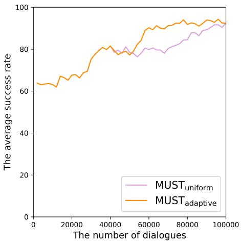  
(a) MUST with five use simulators

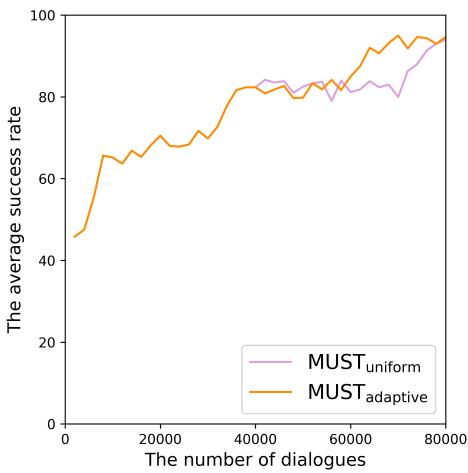  
(b) MUST with three use simulators  
Figure 4: The learning curves of $\mathrm { S y s – M U S T _ { u n i f o r m } }$ and $\mathrm { S y s – M U S T _ { a d a p t i v e } . }$

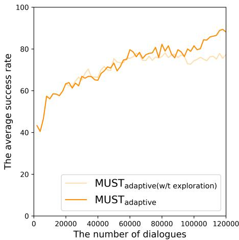  
(a) Ablation study on the exploration term

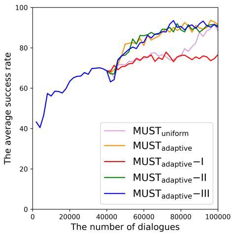  
(b) Ablation study on the distribution p  
Figure 5: The learning curves of $\mathrm { S y s – M U S T _ { u n i f o r m } }$ and Sys-MUSTadaptive.

$\mathbf { M U S T } _ { \mathrm { a d a p t i v e } ^ { - } } \mathbf { I I }$ and $\mathbf { M U S T } _ { \mathrm { a d a p t i v e } } { \mathbf { - I I I } }$ . Compared to $\mathbf { M U S T _ { a d a p t i v e } } .$ $\mathbf { M U S T } _ { \mathrm { a d a p t i v e } ^ { - } } \mathbf { I I }$ moves the inversion operation to the front of the constructed exploitation-exploration term. Likewise, $\mathbf { M U S T } _ { \mathrm { a d a p t i v e } ^ { - } } \mathbf { I I I }$ moves the re-scaling and the inversion operations to the front of the constructed exploitation-exploration term. $\mathbf { M U S T } _ { \mathrm { a d a p t i v e } ^ { - } } \mathbf { I I }$ and $\mathbf { M U S T } _ { \mathrm { a d a p t i v e } ^ { - } } \mathbf { I I I }$ are used to check the order sensitivity about the exploitation-exploration term construction, re-scaling operation, and the inversion of $\bar { x } _ { j } , j \in \{ 1 , \cdots , K \}$

Results for ablation study on the variants. Experimental results of these different variants are shown in Fig. 5(b). The convergence speed of $\mathbf { M U S T _ { a d a p t i v e } { \mathrm { - I } } }$ is much slower compared to others, which demonstrates that the exploration term is useful once more. The convergence speeds of $\mathbf { M U S T _ { a d a p t i v e ^ { - } } I I }$ and $\mathbf { M U S T } _ { \mathrm { a d a p t i v e } ^ { - } } \mathbf { I I I }$ is comparative to $\mathbf { M U S T _ { a d a p t i v e } }$ . This probably shows that our design with three operations (i.e., exploitationexploration term construction, re-scaling strategy, and the inversion of $\bar { x } _ { j } )$ is not only reasonable but also robust to the order permutation of these three operations.

<table><tr><td rowspan=1 colspan=1>variants</td><td rowspan=1 colspan=1>exploitation-exploration term | p</td><td rowspan=1 colspan=1>ost-processing</td><td rowspan=1 colspan=1>distribution</td></tr><tr><td rowspan=1 colspan=1> $\mathbf { M U S T _ { a d a p t i v e } }$ </td><td rowspan=1 colspan=1> $\begin{array} { r } { \hat { x } _ { j } = \bar { x } _ { j } + \sqrt { \frac { 2 \ln t } { T _ { j , t } } } } \end{array}$ </td><td rowspan=1 colspan=1> $\begin{array} { r } { z _ { j } = \frac { 1 } { \left( \hat { x } _ { j } - \tau \operatorname* { m i n } ( \{ \bar { x } _ { 1 } , \cdots , \bar { x } _ { K } \} ) \right) } } \end{array}$ </td><td rowspan=5 colspan=1> $\begin{array} { r } { p _ { j } = \frac { z _ { j } } { \sum _ { i = 1 } ^ { K } z _ { i } } } \end{array}$ </td></tr><tr><td rowspan=1 colspan=1>w/t exploration</td><td rowspan=1 colspan=1> $\begin{array} { r } { z _ { j } = \frac { 1 } { \bar { x } _ { j } } } \end{array}$ </td><td rowspan=1 colspan=1></td></tr><tr><td rowspan=1 colspan=1> $\mathbf { M U S T _ { a d a p t i v e } { - } I }$ </td><td rowspan=1 colspan=1> $\begin{array} { r } { \overline { { \hat { x } _ { j } = \frac { 1 } { \bar { x } _ { j } } + \sqrt { \frac { 2 \ln t } { T _ { j , t } } } } } } \end{array}$ </td><td rowspan=1 colspan=1> $z _ { j } = \hat { x } _ { j } - \tau \operatorname* { m i n } ( \{ 1 / \bar { x } _ { 1 } , \cdot \cdot \cdot , 1 / \bar { x } _ { K } \} )$ </td></tr><tr><td rowspan=1 colspan=1> $\mathbf { M U S T _ { a d a p t i v e } – I I }$ </td><td rowspan=1 colspan=1> $\begin{array} { r } { \overline { { \hat { x } _ { j } } } = \frac { 1 / \bar { x } _ { j } } { \sum _ { i = 1 } ^ { K } 1 / \underline { { \bar { x } _ { i } } } } } \end{array}$  $\begin{array} { r } { \hat { z } _ { j } = \hat { x } _ { j } + \sqrt { \frac { 2 \ln t } { T _ { j , t } } } } \end{array}$ </td><td rowspan=1 colspan=1> $z _ { j } = \hat { z } _ { j } - \tau \operatorname* { m i n } ( \{ \hat { x } _ { 1 } , \cdot \cdot \cdot , \hat { x } _ { K } \} )$ </td></tr><tr><td rowspan=1 colspan=1> $\mathbf { M U S T } _ { \mathrm { a d a p t i v e } } – \mathbf { I I I }$ </td><td rowspan=1 colspan=1> ${ \hat { x } } _ { j } = { \frac { 1 } { ( { \bar { x } } _ { j } { - } \tau \operatorname* { m i n } ( \{ { \bar { x } } _ { 1 , \cdots , { \bar { x } } _ { K } } \} ) ) } }$  $\begin{array} { r } { z _ { j } = \frac { \vec { x } _ { j } } { \sum _ { i = 1 } ^ { K } \hat { x } _ { i } } + \sqrt { \frac { 2 \ln t } { T _ { j , t } } } } \end{array}$ </td><td rowspan=1 colspan=1></td></tr></table>

Table 10: The variants of $\mathbf { M U S T _ { a d a p t i v e } } .$ The $\mathbf { M U S T _ { a d a p t i v e } }$ implementation is an exploitation-exploration term followed by a post-processing for the re-scaling purpose and a sum-one normalization. Since we omit the exploration term for the second row, therefore, it does not need the post-processing. $\mathbf { M U S T } _ { \mathrm { a d a p t i v e } ^ { - } } \mathbf { I I I }$ moves the re-scaling and the inversion operations to the front of the constructed exploitation-exploration term.

## F Implementing MUST with more user simulators

To implement our MUST with more user simulators, we use Simulated Agenda Dataset to train four extra user simulators 8. Fig. 6(a) shows the learning curve of the system agent trained by MUST with eight simulators (AgenT, AgenR, RNNT, GPT, $\mathrm { G P T _ { A T } , G P T _ { A R } , G P T _ { A G } }$ , and $\mathrm { G P T _ { r a n d } } )$ . We could observe that the training of our proposed MUST can still succeed when we increase the number of user simulators to eight. $\mathrm { S y s – M U S T _ { a d a p t i v e } }$ still converges faster than $\mathbf { S y s { \mathrm { - } } M U S T _ { u n i f o r m } }$ even though the difference between their convergence speeds is not too large in this case. It might be because some user simulators are similar (e.g., $\mathrm { G P T _ { A T } }$ is similar to AgenT, $\mathrm { G P T _ { A R } }$ is similar to AgenR), which might lead that the distribution p approaches a uniform distribution.

Fig. 6(b) compares the learning curves of Sys-$\mathbf { M U S T _ { a d a p t i v e } }$ and $\mathbf { S y s { \mathrm { - } } M U S T _ { u n i f o r m } }$ trained with different numbers of user simulators (i.e., four, five, and eight user simulators). It is a fair comparison because these combinations include the hardest user simulator AgenR that can be adapted by the system and the easiest user simulator RNNT that can be adapted by the system (See Sec. 5.4). We can observe that, with more user simulators, Sys-$\mathbf { M U S T _ { a d a p t i v e } }$ not only performs better but also converges faster than with fewer user simulators. This probably shows that $\mathrm { S y s – M U S T _ { a d a p t i v e } }$ has the potential to be generalized to a larger set of user simulators. Plus, we also could observe that Sys-$\mathbf { M U S T _ { a d a p t i v e } }$ consistently converges faster than $\mathrm { S y s – M U S T _ { u n i f o r m } }$ in different numbers of user simulators.

## G Modeling User Simulator with GPT

We name the model of building a user simulator based on GPT as U-GPT. In this section, we will illustrate its details and conduct experiments to prove that it is a better model for building a user simulator.

## G.1 The architecture of U-GPT

As Fig. 7(a) shown, our U-GPT consists of four modules, which are Natural Language Understanding (NLU), Goal Generator, Dialog Policy Learning (POL), and Natural Language Generation (NLG). Dialogues consist of multiple turns. In the first turn $t \ : = \ : 0$ , U-GPT (1) first outputs its NLU results $N _ { 0 }$ by understanding the system input $S _ { 0 }$ , and (3) decide its actions $A _ { 0 }$ which is a list of pairs: (action\_type, slot\_name) based on (2) its initial goal $G _ { 0 }$ and $\{ S _ { 0 } , N _ { 0 } \}$ . U-GPT then (4) conditions on $\{ S _ { 0 } , N _ { 0 } , G _ { 0 } , A _ { 0 } \}$ to generate the delexicalized utterance $U _ { 0 }$ . The generated placeholders in $U _ { 0 }$ will be filled using the corresponding slot values in the goal $G _ { 0 }$ . When the conversation proceeds to turn t, U-GPT (1) generates the

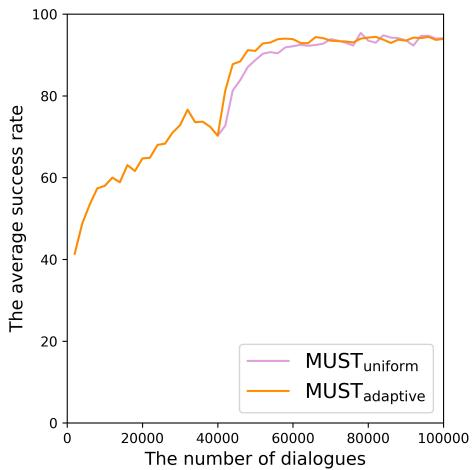  
(a) The learning curves of the system trained with eight user simulators.

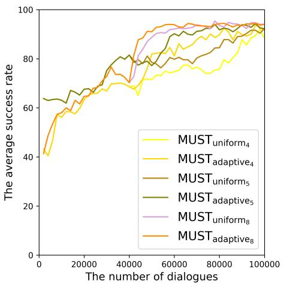  
(b) Comparison between different numbers of user simulators.  
Figure 6: The learning curves of $\mathrm { S y s – M U S T _ { u n i f o r m } }$ and Sys-MUSTadaptive.

NLU results $N _ { t }$ based on all of previous dialogue history and generated outputs $\{ C _ { 0 } , \ldots , C _ { t - 1 } , S _ { t } \}$ here $C _ { i } = [ S _ { i } , N _ { i } , G _ { i } , A _ { i } , U _ { i } ]$ . If there has "nooffer" intent in $N _ { t }$ representing that no entities could satisfy current constraints, then (2) Goal Generator should generate a new goal $G _ { t }$ . Then U-GPT will continue to (3) generate the user acts $A _ { t }$ and (4) generate delexicalized utterance $U _ { t }$ conditioned on $\left\{ C _ { 0 } , \ldots , C _ { t - 1 } , S _ { t } , N _ { t } , G _ { t } \right\}$ sequentially. We should notice that the user utterances occurred in the history context should be lexicalized because they contain important information.

Fig. 7(b) shows an example of training sequence which consists of the concatenation $x = [ C _ { 0 } , C _ { 1 } ]$ In order to leverage GPT, we need to convert the generated outputs $\{ N _ { i } , G _ { i } , A _ { i } , U _ { i } \}$ to sequences of tokens resembling a text. And we introduce delimiter tokens [eos\_resp], [eos\_nlu], [eos\_goal], [eos\_pol], [eos\_utt] to signal the ending of sequence representations of different modules. For the NLU results Nt, we use five categories: “inform”, “request”, “book inform”, “select”, “recommend” same as Shi et al. (2019) to represent them. And we also introduce five tokens [eos\_constraint], [eos\_book], [eos\_recommend], [eos\_select], [eos\_request] to record different information. All of these tokens and the intents of user actions will be added to the vocabulary of GPT as additional special tokens. For training U-GPT, we use the same training objective as GPT which is to maximize the following likelihood:

$$
\begin{array} { r } { L ( U ) = \displaystyle \sum _ { i } \log P ( u _ { i } | u _ { i - k } , . . . , u _ { i - 1 } ; \Theta ) , } \\ { \forall u _ { i } \in \{ S _ { 0 } , N _ { 0 } , G _ { 0 } , A _ { 0 } , U _ { 0 } , . . . , A _ { t } , U _ { t } \} , } \end{array}
$$

where k is the size of the context window, and the conditional probability $P$ is parameterized with Θ.

## G.2 Evaluations on U-GPT

To evaluate our proposed U-GPT, we adopt both indirect evaluations and direct evaluations as in Shi et al. (2019). We evaluate a user simulator indirectly using the average success rate of the system agent trained by this simulator. It is called crossmodel evaluation (Schatzmann and Young, 2009) which assumes a strategy learned with a good user model still performs well when tested on poor user models. It can indirectly evaluate the goodness of a user simulator. For direct evaluations, we adopt six evaluation measures to evaluate the diversity of user simulators automatically: average utterance length, vocabulary size, Dist-1, Dist-2 (Li et al., 2016a) and Entropy (Zhang et al., 2018). We also ask human users to rate the simulated dialogues 9 to assess the user simulators directly. We use five same metrics as Shi et al. (2019) which are Fluency, Coherence, Goal Adherence, Diversity, and Overall quality to assess user simulators from multiple aspects.

## G.3 Training details of user simulators

We implement our GPT-based user simulators with DistilGPT2 (Sanh et al., 2020), a distilled version of GPT-2 by HuggingFace’s Transformers (Wolf et al., 2020). We select the best performing models on the validation set through hyperparameters search of learning rate and batch size. The best models were fine-tuned with a batch size of 64 and a learning rate of 1e-3 over the corresponding dataset. We use the greedy decoding strategy for generating word-tokens in the inference phrase.

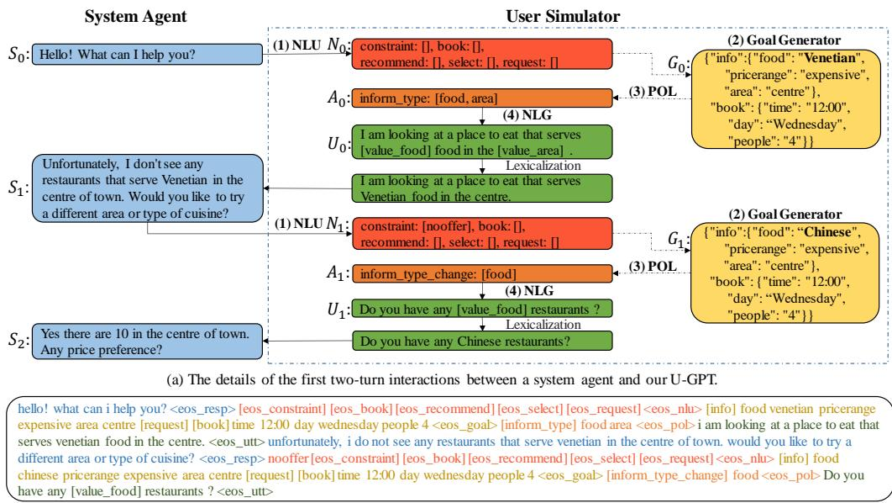  
(b) An example of the model input for training U-GPT.  
Figure 7: The overview of our U-GPT which consists of Natural Language Understanding (NLU), Goal Generator, Dialog Policy Learning (POL), and Natural Language Generation (NLG). It uses the auto-regressive language model GPT to understand the system inputs, generate the user actions and the user utterances given the dialogue context and the user goals sequentially in an end-to-end manner. (a) gives a detailed description of the first two-turn interactions between a system agent and our U-GPT. For training U-GPT, we need to convert the dialogue context and all annotations to sequences of tokens. (b) presents the training example of the first two-turn dialogues in (a).

## G.4 Experiments

GPT-RNN. Because the implementation of user simulator RNN mainly consists of NLU and NLG, we remove the POL module from U-GPT and use the same annotated data as RNN to fine-tune it to compare our U-GPT with the RNN-based methods fairly and name it as GPT-RNN.

As Tab. 11, Tab. 12, Tab. 13 show, GPT-RNN outperforms the user simulator RNN. It proves the power of leveraging GPT.

Our GPT-RNN performs better than the user simulator RNNT, which can be seen from the crossmodel evaluation results in Tab. 11, the automatic evaluation results in Tab. 12, and the Hu.Div score in the human evaluation results in Tab. 13. However, as Tab. 13 shows, RNNT performs better than our GPT-RNN in the overall performance from the human evaluation. We think this might be because (1) the third-party system also has an impact on the generated dialogues and (2) the NLG module of RNNT is the template-based method which leads to the generated dialogues from RNNT being easy for the third-party system to understand and interact with.

The automatic evaluation results in Tab. 12 and the Hu.Div score in the human evaluation results in Tab. 13 show that RNNR can generate more diverse language than our GPT-RNN. We think it is because the user utterances generated by RNNR are retrieved from a corpus that is written by real humans and the sentences written by humans are usually more diverse than the sentences generated by generative models. Even though the dialogues generated by RNNR are more diverse, the dialogues generated by our GPT-RNN are more fluent and coherent. Also, the cross-model evaluation results in Tab. 11 show that GPT-RNN can help to learn a more robust system agent than RNNR, but the Hu.All score in the human evaluation in Tab. 13 gives the opposite result.

<table><tr><td>System \User</td><td>AgenT</td><td>AgenR</td><td>AgenG</td><td>RNNT</td><td>RNNR</td><td>RNN</td><td>GPT</td><td>GPTIL</td><td>Avg.↑</td><td>Std.↓</td></tr><tr><td>Sys-RNNT</td><td>30.5</td><td>23.0</td><td>35.5</td><td>99.0</td><td>97.5</td><td>84.0</td><td>75.5</td><td>66.0</td><td>63.9</td><td>28.5</td></tr><tr><td>Sys-RNNR</td><td>30.0</td><td>23.0</td><td>30.0</td><td>96.5</td><td>93.5</td><td>70.5</td><td>68.5</td><td>56.0</td><td>58.5</td><td>26.7</td></tr><tr><td>Sys-RNN</td><td>20.0</td><td>23.5</td><td>20.0</td><td>73.0</td><td>63.0</td><td>77.0</td><td>56.5</td><td>45.0</td><td>47.3</td><td>22.2</td></tr><tr><td>Sys-GPT-RNN</td><td>36.5</td><td>38.0</td><td>42.0</td><td>95.5</td><td>94.0</td><td>89.0</td><td>80.5</td><td>61.0</td><td>67.1</td><td>24.1</td></tr></table>

Table 11: Cross study results. Each entry shows the success rate obtained by having the user simulator interacting with the RL system for 200 times.

<table><tr><td>User Simulators</td><td>Utt ↑ Vocab ↑DIST-1 ↑DIST-2 ↑ENT-4 ↑</td><td></td></tr><tr><td>RNNT</td><td>9.83 192</td><td>0.77% 1.51% 4.24</td></tr><tr><td>RNNR</td><td>11.06 346</td><td>2.45% 9.59% 6.59</td></tr><tr><td>RNN</td><td>10.95 205</td><td>1.17% 3.14% 4.98</td></tr><tr><td>GPT-RNN</td><td>14.00 262</td><td>1.13% 3.53% 5.62</td></tr></table>

Table 12: Automatic evaluation results of RNNT, RNNR and GPT-RNN. The metrics include average utterance length (Utt), vocabulary size (Vocab), distinct-n (DISTn) and entropy (ENT-n).

<table><tr><td></td><td>User SimulatorsHu.Fl ↑Hu.Co ↑Hu.Go ↑Hu.Div ↑Hu.All ↑</td><td></td><td></td></tr><tr><td>RNNT</td><td>4.60 4.68</td><td>4.96 3.34</td><td>4.70</td></tr><tr><td>RNNR</td><td>3.92 3.88</td><td>4.72 3.94</td><td>4.16</td></tr><tr><td>RNN</td><td>2.80 2.30</td><td>2.86</td><td>2.74 2.30</td></tr><tr><td>GPT-RNN</td><td>4.10 4.04</td><td>4.30 3.70</td><td>4.00</td></tr></table>

Table 13: Human evaluation results of RNNT, RNNR and GPT-RNN. The metrics include sentence fluency (Hu.Fl), coherence (Hu.Co), goal adherence (Hu.Go), language diversity (Hu.Div) and an overall score (Hu.All).

## ACL 2023 Responsible NLP Checklist

A For every submission: ✓ A1. Did you describe the limitations of your work? right after the conclusion section

✓ A2. Did you discuss any potential risks of your work? right after the conclusion section

✓ A3. Do the abstract and introduction summarize the paper’s main claims? last paragraph in the introduction

✗ A4. Have you used AI writing assistants when working on this paper? Left blank.

## B ✗ Did you use or create scientific artifacts? Left blank.

 B1. Did you cite the creators of artifacts you used? No response.

 B2. Did you discuss the license or terms for use and / or distribution of any artifacts? No response.

 B3. Did you discuss if your use of existing artifact(s) was consistent with their intended use, provided that it was specified? For the artifacts you create, do you specify intended use and whether that is compatible with the original access conditions (in particular, derivatives of data accessed for research purposes should not be used outside of research contexts)? No response.

 B4. Did you discuss the steps taken to check whether the data that was collected / used contains any information that names or uniquely identifies individual people or offensive content, and the steps taken to protect / anonymize it? No response.

 B5. Did you provide documentation of the artifacts, e.g., coverage of domains, languages, and linguistic phenomena, demographic groups represented, etc.? No response.

 B6. Did you report relevant statistics like the number of examples, details of train / test / dev splits, etc. for the data that you used / created? Even for commonly-used benchmark datasets, include the number of examples in train / validation / test splits, as these provide necessary context for a reader to understand experimental results. For example, small differences in accuracy on large test sets may be significant, while on small test sets they may not be. No response.

## C ✓ Did you run computational experiments?

Yes. Sec. 5

✓ C1. Did you report the number of parameters in the models used, the total computational budget (e.g., GPU hours), and computing infrastructure used? See appendix

✓ C2. Did you discuss the experimental setup, including hyperparameter search and best-found hyperparameter values? Sec. c.4

✓ C3. Did you report descriptive statistics about your results (e.g., error bars around results, summary statistics from sets of experiments), and is it transparent whether you are reporting the max, mean, etc. or just a single run? Table 2

✗ C4. If you used existing packages (e.g., for preprocessing, for normalization, or for evaluation), did you report the implementation, model, and parameter settings used (e.g., NLTK, Spacy, ROUGE, etc.)? Left blank.

D ✓ Did you use human annotators (e.g., crowdworkers) or research with human participants? SEc. 5.3

✓ D1. Did you report the full text of instructions given to participants, including e.g., screenshots, disclaimers of any risks to participants or annotators, etc.? APP c.5

 D2. Did you report information about how you recruited (e.g., crowdsourcing platform, students) and paid participants, and discuss if such payment is adequate given the participants’ demographic (e.g., country of residence)? No response.

✓ D3. Did you discuss whether and how consent was obtained from people whose data you’re using/curating? For example, if you collected data via crowdsourcing, did your instructions to crowdworkers explain how the data would be used? SEc. 5.3

✓ D4. Was the data collection protocol approved (or determined exempt) by an ethics review board? APP c.5

✓ D5. Did you report the basic demographic and geographic characteristics of the annotator population that is the source of the data? APP c.5