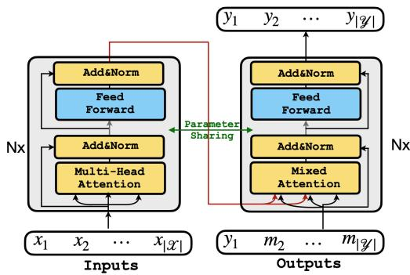
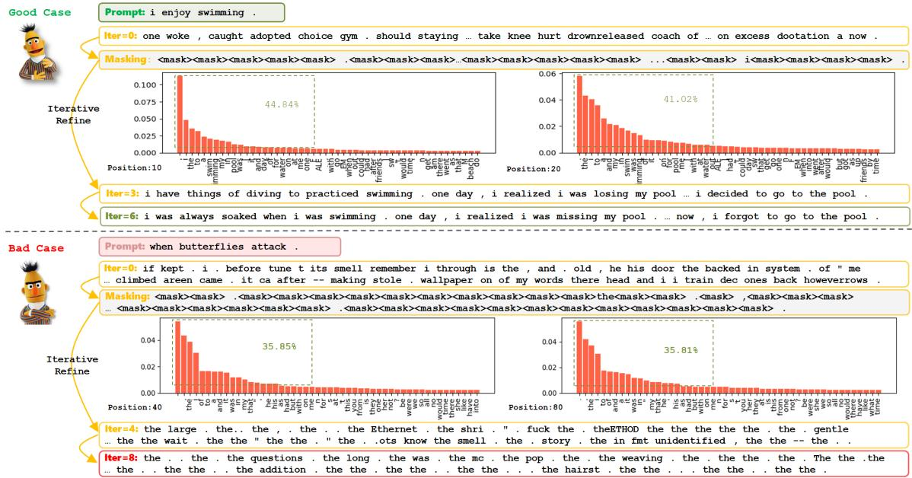
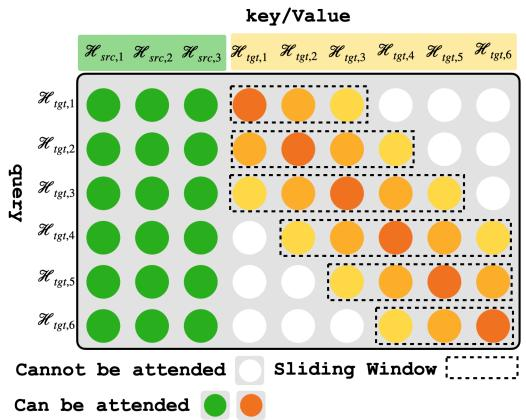
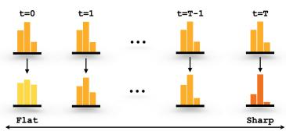
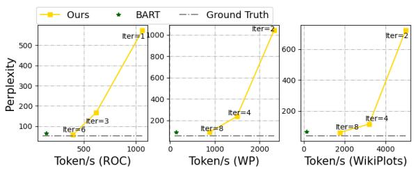
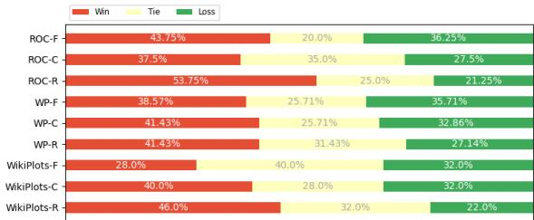
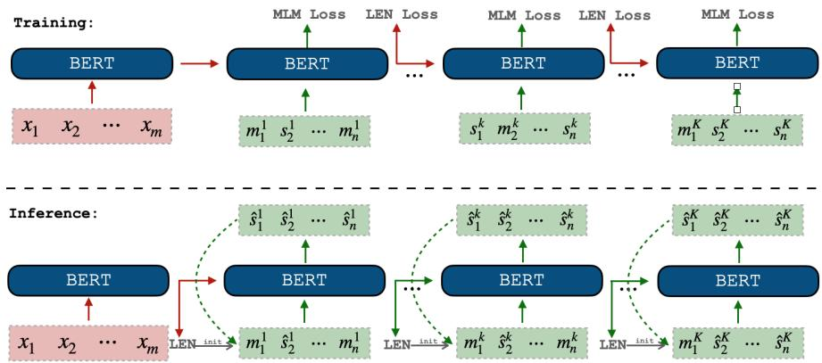
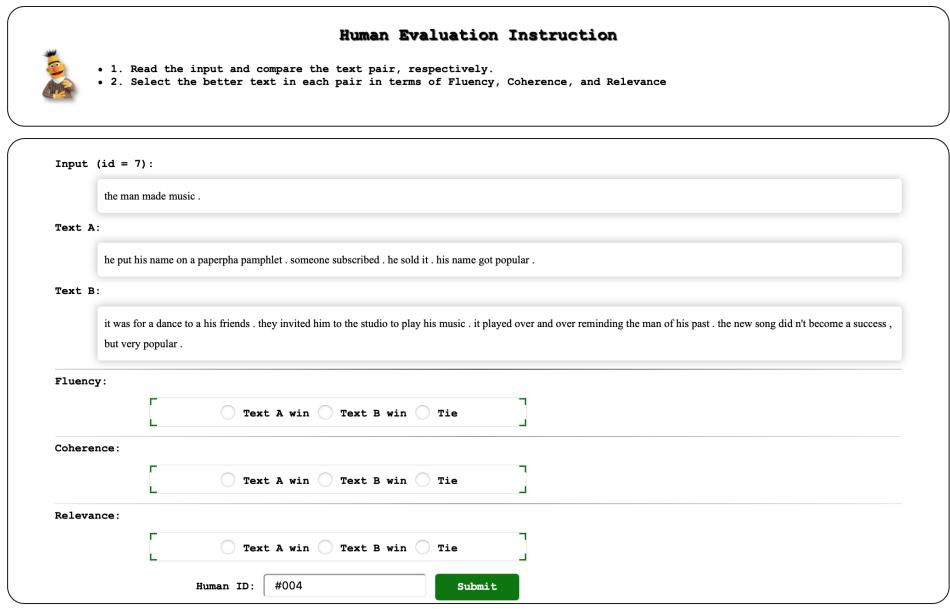

# Open-ended Long Text Generation via Masked Language Modeling

Xiaobo Liang∗ Zecheng Tang∗ Juntao Li† Min Zhang

Soochow University

{xbliang3, zctang}@stu.suda.edu.cn, {ljt,minzhang}@suda.edu.cn

## Abstract

Pre-trained autoregressive (AR) language models such as BART and GPTs have dominated Open-ended Long Text Generation (Open-LTG). However, the AR nature will decrease the inference efficiency along with the increase of generation length, which hinder their application in Open-LTG. To improve inference efficiency, we alternatively explore the potential of the pre-trained masked language models (MLMs) along with a representative iterative non-autoregressive (NAR) decoding strategy for Open-LTG. Our preliminary study shows that pre-trained MLMs can merely generate short text and will collapse for long text modeling. To enhance the long text generation capability of MLMs, we introduce two simple yet effective strategies for the iterative NAR model: dynamic sliding window attention (DSWA) and linear temperature decay (LTD). It can alleviate long-distance collapse problems and achieve longer text generation with a flexible trade-off between performance and inference speedup. Experiments on the storytelling and multi-paragraph opinionated article writing tasks show that pre-trained MLMs can achieve more than 3 13 speedup with better performance than strong AR models. Our code is available at GitHub\*.

## 1 Introduction

Pre-trained language models (PLMs) like BART (Lewis et al., 2020) and GPTs (Radford et al.; Radford et al.; Brown et al., 2020) have achieved remarkable progress in Open-LTG. Through modeling languages from left to right, they can autoregressively “create” fluent and grammatical content. With the further enhancement of planning strategies (Hua and Wang, 2020; Hu et al., 2022) or high-level representation learning (Guan et al., 2021a), pre-trained AR language models can achieve promising Open-LTG. However, the low inference efficiency of AR impedes their usability in real-world applications. Table 1 presents the inference speed of a few typical AR language models. We can see that BART (Lewis et al., 2020) requires at least 1.3 seconds to generate a story with 200 tokens on the powerful NVIDIA A100 GPU, and extra planning (Hua and Wang, 2020) can make the inference process even slower (more than 30 seconds to create a 200-tokens story). In great contrast with AR models, NAR models (e.g., BERT-CRF (Su et al., 2021)) can generate more than 12 stories with the same length within one second, but their effectiveness in open-ended long text generation has not been proven yet.

<table><tr><td>Model</td><td>Type</td><td>Iter</td><td>Tokens/s</td></tr><tr><td>BART base</td><td>AR</td><td>一</td><td>151.3</td></tr><tr><td>BART base + Planning †</td><td>AR</td><td>-</td><td>5.8</td></tr><tr><td>BERT-CRF ↑ RoBERTa base</td><td>NAR</td><td>0</td><td>2,597.4</td></tr><tr><td></td><td>NAR</td><td>0 1</td><td>1,561.2</td></tr><tr><td></td><td></td><td>4</td><td>1,068.9</td></tr><tr><td></td><td></td><td></td><td>505.2</td></tr></table>

Table 1: Inference speed of each model with a single GPU (NVIDIA A100 40GB). For a fair comparison, we force all models to generate 200 tokens. The models labeled with  are implemented with the Hugging Face platform, while the rest are implemented with Fairseq.

The high inference efficiency of NAR models is at the sacrifice of output dependency modeling, in which each generation is executed in parallel (Xiao et al., 2022). Thus, NAR models are mainly explored and utilized for text generation tasks with adequate input information to predict each output token of different positions and extra correlations to constrain the generation process, e.g., neural machine translation (Gu et al., 2018; Huang et al., 2022), summarization (Qi et al., 2021; Agrawal and Carpuat, 2022), sentence compression (Su et al., 2021), dialogue generation (Zou et al., 2021), and constrained story-ending generation (Yang et al.,

2021). To the best of our knowledge, none of the existing research explores Open-LTG with NAR models, particularly based on pre-trained MLMs.

We fill this gap by first conducting a preliminary study to calibrate the potential and limitations of a pre-trained MLM, i.e., RoBERTa (Liu et al., 2019)†, on two story generation corpora, i.e., ROCStories (ROC) (Mostafazadeh et al., 2016) and WritingPrompts (WP) (Fan et al., 2018). To achieve conditional generation, we simply use RoBERTa as both the encoder and the decoder with mixed attention (He et al., 2018) to achieve encoder-decoder cross-attention. Through experiments, we found that: (1) pre-trained MLMs can achieve competitive performance in the iterative NAR fashion for open-ended short text generation (e.g., a paragraph with around 40 tokens), (2) pre-trained MLMs fail to model Open-LTG (with about 140 tokens on average), which will generate uninformative content with high-frequency and repeated tokens (e.g., and “,”). Furthermore, we offer three possible reasons for the attention mechanism of MLMs and inference strategy to explain the collapse of the iterative NAR model based on pre-trained MLMs for the Open-LTG scenario.

Inspired by the above observations, we introduce two improvement strategies: Dynamic Sliding Window Attention (DSWA) and linear temperature decay strategy (LTD) to maintain more informative context content in the iterative NAR generation. As a result, iterative NAR models based on pre-trained MLMs can achieve much longer text generation than the vanilla setting. Experiments on two Open-LTG tasks (i.e., storytelling and multi-paragraph opinionated article writing) with four widely-used datasets demonstrate that the pre-trained MLM can achieve better performance (BLEU score, ROUGE score, BERT score, and Perplexity) than multiple strong AR models without extra post-training, structure modification, or using more model parameters. Importantly, our approach can speed up the inference process due to non-autoregressive properties, making the pre-trained MLM as a promising candidate for the Open-LTG community. The RoBERTa base achieves more than ${ \bf 3 } \times  { \bf 1 3 } \times { \bf }$ with better performance to the competitive BART.

## 2 Related Work

Long Text Generation Text generation tasks can be classified into two categories: directed generation and open-end generation. The directed generation (Sutskever et al., 2014; Li et al., 2015; Vaswani et al., 2017) for long text scenarios has long source than the target, which is also constrained by source sequence, e.g., neural machine translation and summarization. These tasks aim to solve the quadratic growth requirement of the memory and computational of the self-attention mechanism. The openended generation task (Guo et al., 2018; Tan et al., 2020; Goldfarb-Tarrant et al., 2020; Hua and Wang, 2020; Orbach and Goldberg, 2020; Hu et al., 2022) desire to generate more freedom content and has recently become a promising research direction. Previous works have explored multiple generation strategies to generate high-quality and fluent text, e.g., planning then generating (Guo et al., 2018; Tan et al., 2020; Goldfarb-Tarrant et al., 2020; Hua and Wang, 2020; Orbach and Goldberg, 2020; Hu et al., 2022) and introducing external knowledge (Guan et al., 2020; Xu et al., 2020). Although the above strategies enable the model to achieve significant advances, time-consuming is still a critical issue that hinders their usage in real-world applications (Guan et al., 2021a; Tan et al., 2020).

Iterative Non-autoregressive Generation Nonautoregressive (NAR) model breaks the sequential dependencies from front to back for parallel text generation (Gu et al., 2018; Guo et al., 2020; Saharia et al., 2020). Furthermore, the iterative-based NAR model (Lee et al., 2018; Gu et al., 2019; Chi et al., 2021) can achieve comparable performance with the AR model. The typical CMLM model (Ghazvininejad et al., 2019) can generate fluent results conditioned on the predictions from the previous iteration instead of previous tokens:

$$
\mathcal { P } ( Y _ { t } | X ) = \mathcal { P } ( Y _ { t } | Y _ { t - 1 } , X )\tag{1}
$$

Benefiting from this, the iterative NAR model is more flexibly compared with the AR model, which can easily generate consistent and controllable text for each iteration step. To the best of our knowledge, the iterative NAR model has never been used to solve open-ended generation. Especially, we investigate its usability for the long text scenario, i.e., target lengths between 100 and 400, which is still under-explored in the directed generation tasks.

  
Figure 1: The overview of MLM for text generation. (We concatenate the hidden states of and as the key and value of the mixed-attention mechanism.)

## 3 Preliminary Study

We first present the training and inference paradigm of utilizing the pre-trained MLMs for Open-LTG (§ 3.1), e.g., BERT or RoBERTa. Then, we study the significant collapse problem in a long text generation scenario by conducting preliminary experiments on two datasets with different target lengths (§ 3.2). Finally, we investigate the reason for the above issues with an exhaustive case study and exploration tests to motivate our method design (§ 3.3), where the model can generate text in nonautoregressive manner to speed up the inference.

## 3.1 Text Generation via Pre-trained MLMs

Pre-trained MLMs are typically used as the encoder to extract the representations of sentences instead of generating texts. Previous works (Dong et al., 2019; Wang et al., 2019) have indicated that the MLM encoder can support text generation tasks via attention masks or Gibbs sampling. In contrast, we introduce mixed attention and parameter sharing to the encoder-based model to solve the sequence to sequence tasks, as shown in Figure 1.

Model Training Given the parallel text generation dataset $\mathcal { D } { = } \{ ( \mathcal { X } , \mathcal { Y } ) \} _ { | \mathcal { D } | }$ , we can feed the source into the MLM encoder to obtain the representation $\mathcal { H } _ { s r c } ^ { l }$ of l-th layer. Concretely, each layer comprises two sub-layers, including one selfattention layer and one feed-forward layer:

$$
\begin{array} { r l } & { \bar { \mathcal { H } } _ { s r c } ^ { l } = \mathrm { S e l } \pounds - \bar { \mathrm { A T T N } } ( \mathcal { H } _ { s r c } ^ { l - 1 } ) + \mathcal { H } _ { s r c } ^ { l - 1 } } \\ & { \mathcal { H } _ { s r c } ^ { l } = \mathrm { F F N } ( \bar { \mathcal { H } } _ { s r c } ^ { l } ) + \bar { \mathcal { H } } _ { s r c } ^ { l } . } \end{array}\tag{2}
$$

Then, we random mask $\mathcal { Y } = \{ y _ { 1 } , y _ { 2 } , \cdot \cdot \cdot , y _ { | \mathcal { V } | } \}$ to obtain corrupted target $\mathcal { V } _ { \mathrm { M } } = \{ y _ { 1 } , m _ { 2 } , \cdot \cdot \cdot , m _ { | \mathcal { V } | } \}$ (m is the symbol of mask token $^ { * 6 } < m a s k > ^ { 3 } )$ . As before, we can obtain the representation $\mathcal { H } _ { t g t } ^ { l }$ by using the shared parameter MLM encoder and then try to recover the masked sequence, where the mixedattention mechanism (He et al., 2018) is applied to aggregate the source $\mathcal { H } _ { s r c } ^ { L }$ and the target $\mathcal { H } _ { t g t } ^ { l } \mathrm { : }$

$$
\begin{array} { r l } & { \bar { \mathcal { H } } _ { t g t } ^ { l } = \mathrm { M i x e d - A T T N } ( \mathcal { H } _ { t g t } ^ { l - 1 } , \mathcal { H } _ { s r c } ^ { L } ) + \mathcal { H } _ { t g t } ^ { l - 1 } } \\ & { \mathcal { H } _ { t g t } ^ { l } = \mathrm { F F N } ( \bar { \mathcal { H } } _ { t g t } ^ { l } ) + \bar { \mathcal { H } } _ { t g t } ^ { l } . } \end{array}\tag{3}
$$

Mixed-attention does not break the original attention mechanism, which only utilizes the target hidden states as query vector and the concatenated vector of source and target hidden states as key and value. It is worth noting that this approach is available for transformer encoder models without additional parameters.

Specifically, we uniformly mask 1 to n (target length) tokens from $\mathcal { V }$ for model training. The training objective is thus to minimize the conditional MLM loss like the pre-training stage:

$$
\begin{array} { r l } & { \mathcal { L } _ { \mathrm { M L M } } = - \displaystyle \sum _ { i = 1 } ^ { M } \log \mathcal { P } ( y _ { i } | \mathcal { X } , \mathcal { Y } _ { \mathrm { M } } ) } \\ & { \mathcal { P } ( y _ { j } | \mathcal { X } , \mathcal { Y } _ { \mathrm { M } } ) = \displaystyle \frac { \exp \left( u _ { t g t } / \mathcal { T } \right) } { \sum _ { | u _ { t g t } ^ { \prime } | } \exp \left( u _ { t g t } ^ { \prime } / \mathcal { T } \right) } , } \end{array}\tag{4}
$$

where $\mathcal { M }$ is the number of masked tokens, $u _ { t g t }$ is the output logit, and $\tau$ is the temperature to re-estimate the final probability.

Model Inference We use an iterative refinement strategy to generate text like CMLM (Ghazvininejad et al., 2019). In particular, We use the fully masked sequence $\{ m _ { 1 } , m _ { 2 } , \cdots , m _ { n } \}$ to initialize the target sequence and predict all masked tokens at the first step. Then, we iteratively regenerate the low-confidence tokens at the subsequent iteration steps to obtain better performance. For Open-LTG, we utilize the nucleus sampling (Holtzman et al., 2019) decoding strategy instead of beam search.

Length Prediction It is necessary to obtain the target length to initialize the full mask sequence as model input before inference. Specifically, we provide two strategies: 1) Fixed Length, which initializes the target length according to the average length of the validation set or human experience. 2) Prediction Module, which uses the mean-pooling layer followed by one classification layer to predict the target length by feeding $\mathcal { H } _ { s r c } ^ { L }$ into them:

$$
\mathcal { P } ( \mathrm { L } _ { t g t } | \mathcal { X } ) = \operatorname { S o f t m a x } ( \mathcal { W } _ { L } ( \operatorname { M e a n - P o o l i n g } ( \mathcal { H } _ { s r c } ^ { L } ) ) ) ,\tag{5}
$$

where $\mathrm { L } _ { t g t }$ is the target length, and $\mathcal { W } _ { L }$ is the learnable parameter. Specifically, we will adjust $\mathrm { L } _ { t g t }$ according to the specific offset, which is the parameter based on the validation dataset.

  
Figure 2: The iterative inference process of typical good and bad cases, randomly sampled from ROC and WP. The histogram refers to the output distributions (Iter=1) across candidate tokens for a randomly picked position.

<table><tr><td>Data</td><td>Model</td><td>B-1</td><td>B-2</td><td>R-1</td><td>R-2</td><td>Dist</td><td>Rep</td></tr><tr><td>ROC</td><td>BART RoBERTa</td><td>30.06 30.89</td><td>14.37 14.36</td><td>22.37 25.01</td><td>2.42 3.48</td><td>3.93 5.24</td><td>79.07 73.42</td></tr><tr><td></td><td>BART</td><td>29.69</td><td>10.26</td><td>24.34</td><td>2.20</td><td>0.47</td><td>90.15</td></tr><tr><td>WP</td><td>RoBERTa</td><td>15.80</td><td>5.21</td><td>10.08</td><td>0.84</td><td>8.48</td><td>17.08</td></tr></table>

Table 2: The performance on WP and ROC.

## 3.2 Extensive Trials

Study Settings We use Writing Prompt (WP) and ROC Stories (ROC) datasets to conduct experiments for validating whether pre-trained MLMs can work better on Open-LTG tasks. In particular, these two datasets have different lengths for target sentences, i.e., the average length of WP is 140 and ROC is 40, and more details are given in Section 5 and Appendix A. We choose RoBERTa base (Liu et al., 2019) as our backbone model and use BLEU, ROUGE, Distinct, and Lexical Repetition metrics for evaluation. During inference, we set nucleus sampling hyper-parameter top-p=0.9, temperature =1.0, and limit the maximum iteration steps to 6 for ROC and 8 for WP.

Results As shown in Table 2, For the ROC dataset, the RoBERTa base model obtains comparable performance with BART. However, the generation quality significantly decreases for the WP dataset, which involves much longer targets. Specifically, most of the generated results are made up of duplicated function words or punctuations, e.g., “it”, “to”, “the”, and “.”, etc, which makes the model outputs unreadable and meaningless. One intuitive question is What causes the collapse problem in Open-LTG when usingpre-trained MLMs?

## 3.3 Analysis and Possible Improvements

We show typical good case and bad case in Figure 2, which are randomly selected from the ROC and WP datasets respectively to demonstrate the generation process. For each iterative refinement step of bad case, the informative tokens will be replaced by the placeholder token “<mask>” and are replaced by the function words at the subsequent steps. Thus it is unable to generate fluent results like good case. According to this observation, we try to provide some possible explanations for the aforementioned collapse issues:

1) The most intuitive reason is that thefunction words are often located at the front of the output distribution, which dominates the highprobability region, causing the informative tokens hard to be sampled.. The output distribution trained with the ROC dataset contains more prompt-related tokens than WP, e.g., the “swim” and “water” in the top 50 candidates of ROC output, as shown in Figure 2 (distribution histogram). Worse still, the function words dominate the high probability regions (from 35% to 45%) for the bad case and lead to terrible initialization at the first iteration step.

2) The iterative refinement mechanism depends on the token confidence of generated sequences, and it is easierfor the low-confidence but informative tokens to be masked. In fact, the iterative refinement mechanism is designed for directed generation tasks, e.g., neural machine translation or summarization, which usually apply the argmax operation to sample results, and the evaluation of confidence is reasonable in different iterations. Nevertheless, we use the nucleus sampling strategy for inference in Open-LTG, which leads to the lowconfidence tokens with high priority being masked.

<table><tr><td>Data</td><td>Recurrent</td><td>B-1</td><td>B-2</td><td>R-1</td><td>R-2</td><td>Dist</td><td>Rep</td></tr><tr><td rowspan="3">WP</td><td>1</td><td>15.80</td><td>5.21</td><td>10.08</td><td>0.84</td><td>17.08</td><td>94.25</td></tr><tr><td>2</td><td>22.42</td><td>8.70</td><td>16.81</td><td>2.14</td><td>34.82</td><td>83.87</td></tr><tr><td>4</td><td>26.91</td><td>10.67</td><td>21.32</td><td>2.81</td><td>50.32</td><td>35.93</td></tr></table>

Table 3: The performance of different recurrent steps.

3) The massive absent context tokens suffer a more serious multi-modality problem on long text generation in early iteration steps. As a result, the model is inclined to generate duplicated tokens due to the multi-modal output distribution. Although iterative refinement can provide additional context to alleviate this issue, the model still cannot generate the expected results. The possible explanation is that the self-attention layer needs the context token as key-value pairs to calculate the token representation. Unfortunately, the massive uninformative mask tokens (“<mask>”) in context lead to model collapse steadily worsening in the following iteration steps. Thus, we utilize the recurrent generation mechanism for model training and inference to reduce the context dependency, which can also flexibly control the maximum length of the generated sequence (please refer to the Appendix B for more details about the model architectures and experiments). The results are shown in Table 3. We can observe that the model can gradually improve its performance as the recurrent steps increase, demonstrating that informative context dependency is the implicit reason for the model collapse.

Improvements Based on the above analysis and findings, we categorize these critical factors into two types: the defects of attention mechanism and inappropriate inference strategies. In particular, we believe that each token should not pays attention to all context information, and most tokens only need the neighbor tokens’ information to represent the hidden states and predict the results. Therefore, we will change the self-attention mechanism of the pre-trained MLMs so that each tokens can attend to the restricted neighbors. Besides, we will adjust the confidence score of the output distributions to keep the informative tokens in subsequent iteration steps instead of being masked.

  
Figure 3: The overview of sliding window attention.

## 4 Method

In this section, we propose two simple yet effective strategies for attention mechanism and inference to mitigate the model collapse problems: Dynamic Sliding Window Attention (DSWA) and Linear Temperature Decay (LTD). These designs do not break the paradigm of MLM so that it can flexibly adapt to the pre-trained models.

## 4.1 Dynamic Sliding Window Attention

We first introduced the sliding window mechanism (Beltagy et al., 2020) for the self-attention layer to adjust each token’s attention pattern, which also ensures that the top layer’s token representations can have a large receptive field, similar to CNN (Wu et al., 2018). Figure 3 illustrates the attention mask of the mixed attention layer of pretrained MLMs. It is worth noting that the key-value pairs consist of two parts: the source representation of the last layer (with green background) and the target representation of the current layer (with yellow background):

$$
\begin{array} { r l } & { \bar { \mathcal { H } } _ { t g t } ^ { l } = \mathrm { M i x e d - A T T N } ( \mathrm { W i n } ( \mathcal { H } _ { t g t } ^ { l - 1 } ) , \mathcal { H } _ { s r c } ^ { L } ) + \mathcal { H } _ { t g t } ^ { l - 1 } } \\ & { \mathcal { H } _ { t g t } ^ { l } = \mathrm { F F N } ( \bar { \mathcal { H } } _ { t g t } ^ { l } ) + \bar { \mathcal { H } } _ { t g t } ^ { l } , } \end{array}\tag{6}
$$

where the operation Win( ) employs a fixed-size window to select the neighbor token representations. Meanwhile, the query can attend all source sequence hidden states and the target sequence hidden states in the window, stemming the impact of massive absent context.

  
Figure 4: Re-estimate the output distribution by LTD.

Dynamic Schedule Intuitively, it is not essential to use a fixed receptive field for each layer, e.g., the top layer may need to reduce the receptive field to perform prediction. Thus, we propose a dynamic schedule strategy for the inference stage to adjust the window size $S _ { \mathrm { w i n } }$ of each layer:

$$
S _ { \mathrm { w i n } } = \operatorname* { m a x } ( \alpha _ { m i n } , \frac { L - i } { L } * \alpha _ { m a x } ) * S _ { \mathrm { f i x } } ,\tag{7}
$$

where i is the current layer number, L is the max layer number of pre-trained MLM encoder, $S _ { \mathrm { f i x } }$ is the fixed window size for model training, and the $\alpha _ { m i n }$ and $\alpha _ { m a x }$ is the lower and upper bound of coefficient hyper-parameter selected from [0, 1].

With this strategy, we can alleviate the multimodality problem by restricting the model to attend to the tokens in the window instead of the whole sequence, thus degenerating the multi-modal distribution into a uni-modal distribution. As a bonus, the top-p candidates of output distribution can contain more informative tokens.

## 4.2 Linear Temperature Decay

To further improve the effectiveness of sampling, we use the confidence-based iterative refinement by adjusting the temperature with linear schedule:

$$
\begin{array} { l } { \displaystyle \mathcal { P } ( y _ { i } | \mathcal { X } , \mathrm { W i n } ( \mathcal { V } _ { \mathrm { M } } ) ) = \frac { \exp ( u _ { l } / \mathcal { T } ) } { \sum _ { l ^ { \prime } } \exp ( u _ { l ^ { \prime } } / \mathcal { T } ) } , } \\ { \displaystyle \mathcal { T } = \beta * ( 1 - \frac { t } { T } ) , } \end{array}\tag{8}
$$

where $\beta$ is hyper-parameter, $t \in \{ 0 , \cdots , T \}$ is the current iteration step, and T is the maximum iteration step. Actually, the output distributions will be flattened when $\mathcal { T } > 1$ , and become sharp when $\mathcal { T } < 1$ . Therefore, by applying this strategy, we can penalize the distribution from peaked to flat in the former iteration steps and encourage it from flat to peaked in the later steps. The aforementioned process is shown in Figure 4.

## 4.3 Training and Inference

Given the parallel data, we use vanilla self-attention to obtain source sentence representation and sliding window mixed-attention with fixed window size to generate the target during the training stage. During the inference, we apply DSWA to the mixedattention layer and LTD to sample the results according to the probability distributions.

Besides, the model uses the ground truth tokens as context to predict the masked tokens during the training stage and applies the randomly sampled tokens as context during the inference stage. This discrepancy makes the model only refine a fraction of the low confidence tokens, which causes the degeneration in practice. Thus, we update all target tokens according to model predictions at each iteration step by utilizing the SMART mechanism (Ghazvininejad et al., 2020).

## 5 Experiments

## 5.1 Settings

Datasets We conduct experiments on three Open-LTG tasks, i.e., storytelling (ROC (Mostafazadeh et al., 2016), WP (Fan et al., 2018), and WikiPlots and multi-paragraph opinionated article writing (OPINION (Hua and Wang, 2020)). For ROC datasets, we follow (Guan et al., 2021b) to mask all the names with specific placeholders to improve the generation ability. We fine-tune the model using our approach without additional corpus. More details are illustrated in Appendix A.

Implementation & Baselines We utilize the pretrained RoBERTa base‡ as our backbone model and implement all experiments with the open library Fairseq toolkit§ (Ott et al., 2019). In addition, we also compare our method with the strong baselines, e.g., the widely-used AR models like BART (Lewis et al., 2020), HINT (Guan et al., 2021b) for storytelling tasks, and PAIR (Hua and Wang, 2020) for multi-paragraph level text generation task. It is worth noting that the layer and model parameters of RoBERTa (125M) are close to BART (140M), so it can be used to compare the inference speed directly. For the inference stage, we set the max iteration step as 6 for ROC and 8 for others. We set the hyper-parameter $\alpha _ { m i n } { = } 0 . 1 2 5 , \alpha _ { m a x } { = } 0 . 7 5$ , and window size $S _ { \mathrm { w i n } }$ equals 64. We set top-p=0.9 for all baseline models, set $\beta { = } 1 . 6$ for ROC and 1.8 for WP and WikiPlots, and set $\beta { = } 1 . 5$ for OPINION.

<table><tr><td rowspan="2">Data</td><td rowspan="2">Model</td><td colspan="3">BLEU</td><td colspan="2">ROUGE</td><td colspan="3">Repetation</td><td>Distinct</td><td colspan="3">BERT Score</td><td rowspan="2">PPL</td><td rowspan="2">Speedup</td></tr><tr><td>B-1(↑)</td><td>B-2(↑)</td><td>R-1(↑)</td><td>R-2(↑)</td><td>R-L(↑)</td><td>LR-n(↓)</td><td>SR-n</td><td>SR-m</td><td>D-4(↑)</td><td>P(↑)</td><td>R(↑) F1(↑)</td><td></td></tr><tr><td rowspan="5">ROC</td><td>BERT-CRF</td><td>18.90</td><td>7.04</td><td>14.98</td><td>1.73</td><td>12.26</td><td>36.60</td><td></td><td></td><td>33.11</td><td>74.07</td><td>71.32</td><td>72.65</td><td></td><td></td></tr><tr><td>HINT</td><td>32.97</td><td>16.91</td><td>25.54</td><td>3.87</td><td>18.48</td><td>5.96</td><td>73.93</td><td>45.27</td><td>57.93</td><td>78.40</td><td>77.14</td><td>77.74</td><td>26.16</td><td>1</td></tr><tr><td>BART</td><td>30.06</td><td>14.37</td><td>22.37</td><td>2.42</td><td>15.52</td><td>3.93</td><td>69.53</td><td>40.04</td><td>79.07</td><td>76.34</td><td>76.83</td><td>76.57</td><td>65.21</td><td>1.0 ×</td></tr><tr><td>Ours</td><td>33.22</td><td>17.08</td><td>26.82</td><td>3.91</td><td>18.22</td><td>3.28</td><td>70.52</td><td>43.71</td><td>68.93</td><td>77.86</td><td>78.23</td><td>78.03</td><td>53.00</td><td>2.9 ×</td></tr><tr><td>Ground-Truth</td><td></td><td>-</td><td></td><td>-</td><td></td><td>2.50</td><td>70.74</td><td>40.99</td><td>46.46</td><td></td><td>-</td><td></td><td>53.35</td><td></td></tr><tr><td rowspan="5">WP</td><td>BERT-CRF</td><td>18.50</td><td>7.42</td><td>17.70</td><td>2.30</td><td>12.91</td><td>83.80</td><td></td><td></td><td>8.58</td><td>71.50</td><td>66.38</td><td>68.82</td><td></td><td></td></tr><tr><td>HINT</td><td>22.44</td><td>8.38</td><td>18.66</td><td>1.69</td><td>11.71</td><td>26.05</td><td>80.56</td><td>46.50</td><td>36.92</td><td>71.23</td><td>67.72</td><td>69.38</td><td>14.18</td><td></td></tr><tr><td>BART</td><td>29.29</td><td>9.96</td><td>23.57</td><td>1.98</td><td>12.04</td><td>0.73</td><td>74.92</td><td>33.82</td><td>90.38</td><td>71.64</td><td>71.38</td><td>71.50</td><td>88.74</td><td>1.0 ×</td></tr><tr><td>Ours</td><td>32.80</td><td>11.65</td><td>26.67</td><td>2.43</td><td>12.97</td><td>0.73</td><td>78.67</td><td>35.29</td><td>86.70</td><td>72.17</td><td>72.09</td><td>72.12</td><td>85.88</td><td>6.4 ×</td></tr><tr><td>Ground-Truth</td><td>-</td><td>-</td><td>-</td><td>-</td><td>-</td><td>0.45</td><td>80.23</td><td>34.36</td><td>49.23</td><td>-</td><td>-</td><td>、</td><td>55.39</td><td>-</td></tr><tr><td rowspan="5">WikiPlots</td><td>BERT-CRF</td><td>16.33</td><td>6.42</td><td>18.41</td><td>1.64</td><td>12.24</td><td>78.28</td><td>1</td><td></td><td>29.80</td><td>63.27</td><td>65.53</td><td>64.37</td><td></td><td></td></tr><tr><td>HINT</td><td>19.86</td><td>8.61</td><td>19.36</td><td>2.14</td><td>10.98</td><td>9.86</td><td>70.42</td><td>50.49</td><td>55.16</td><td>72.28</td><td>68.36</td><td>70.18</td><td>15.63</td><td></td></tr><tr><td>BART</td><td>27.15</td><td>10.51</td><td>22.63</td><td>2.45</td><td>11.42</td><td>1.58</td><td>75.88</td><td>44.41</td><td>92.60</td><td>71.24</td><td>73.61</td><td>72.36</td><td>68.63</td><td>1.0 ×</td></tr><tr><td>Ours</td><td>30.06</td><td>12.39</td><td>25.88</td><td>3.55</td><td>12.62</td><td>4.50</td><td>79.06</td><td>41.16</td><td>83.97</td><td>71.74</td><td>73.64</td><td>72.63</td><td>61.36</td><td>13.3 ×</td></tr><tr><td>Ground-Truth</td><td></td><td></td><td></td><td></td><td></td><td>0.98</td><td>75.13</td><td>46.72</td><td>91.71</td><td></td><td></td><td></td><td>40.88</td><td></td></tr></table>

Table 4: Performance on ROC Stories, Writing Prompt, and WikiPlots.

Evaluation Metrics We utilize BLEU (B-n) (Papineni et al., 2002), ROUGE (R-n) (Lin, 2004), Lexical Repetition (LR-n, 4-gram repetition for n-times) (Shao et al., 2019), Semantic Repetition (SR-n, average top-n semantic similarity between any two sentences) (Guan et al., 2021b)¶, average semantic overlap (S-m, average semantic similarity of all the sentences), Distinct (D-n) (Li et al., 2016) and BERTScore (Zhang et al., 2019) for the storytelling task. As for the multi-paragraph opinionated articles writing, we utilize B-n, R-n, and METEOR (Banerjee and Lavie, 2005) to evaluate the results. The settings of n are mainly due to the length of the generated text and details are illustrated in each subsection below. We report the LR-2 and SR-1 for ROC stories and LR-5 and SR-10 for WP to reflect the lexical and semantic repetition of the generation texts. We also report the Repetition and Distinct scores of ground truth as a reference. We calculate the perplexity (PPL) using GPT2 (Radford et al.) for each model, which is the most common fluency metric.

## 5.2 Main Results

Table 4 summarize the evaluation results on each storytelling test set. We choose the appropriate checkpoint based on the repetition and distinct comparison with the ground truth of the validation set. We can observe that our approach achieves better performance on all datasets than the strong baseline model. Especially, The text generated by the RoBERTa model has high-quality and fluent results, which have high BLEU, ROUGE, BERT scores, and lower perplexity, demonstrating the effectiveness of our model.

<table><tr><td rowspan="2">Model</td><td rowspan="2">Refine</td><td colspan="3">ARGGEN</td></tr><tr><td>BLEU-4</td><td>ROUGE-L</td><td>METEOR</td></tr><tr><td rowspan="2">PAIRfull</td><td>X</td><td>34.09/32.59*</td><td>55.42/49.39*</td><td>32.74/50.63*</td></tr><tr><td>√</td><td>36.09/34.42*</td><td>56.86/50.82*</td><td>33.30/51.39*</td></tr><tr><td rowspan="2">Ours</td><td>X</td><td>31.42</td><td>53.55</td><td>55.58</td></tr><tr><td>√</td><td>37.76</td><td>59.24</td><td>59.70</td></tr></table>

Table 5: Results of the OPINION dataset. The data noted with \* represent our implementation.

For the OPINION dataset, we use the specific plans to initialize the model input and then try to generate the missing text according to $\mathrm { P A I R } _ { f u l l }$ settings, where these special plans are extracted from the ground truth. The results are shown in Table 5. The PAIR results are based on BART, the AR model, so it has high quality even without refinement. Our model achieves better results than PAIR when using iterative refinement, demonstrating that as a masked language model, RoBERTa is more suitable to complete the planning sequence than an AR model. In addition, we found that the model works better without dynamic sliding window attention, because the additional context information provided a good initialization to the model.

## 5.3 Ablation Results

We conduct the ablation study in Table 6 to evaluate the effectiveness of each inference strategy. We can observe the performance drops when without using any strategy, and this phenomenon is significant for longer WP datasets. In particular, the results are more in tune with the current prompt benefit from the DSWA, such as better BLEU and ROUGE, and the model generates more repetition text without LTD. Thus, the DSWA and LTD are crucial for Open-LTG, which can reduce the context dependencies to predict the output distribution better, and improve the confidence score for each iteration step to adopt the open-ended scenarios.

<table><tr><td>Data</td><td>Model</td><td>B-1</td><td>R-L</td><td>Rep</td><td>Dist</td><td>PPL</td></tr><tr><td rowspan="2">ROC</td><td>Ours</td><td>33.22</td><td>18.22</td><td>3.28</td><td>68.93</td><td>53.00</td></tr><tr><td>w/o DSWA w/o LTD w/o ALL</td><td>32.12 33.04 31.86</td><td>17.67 17.73 16.96</td><td>3.71 11.29 14.49</td><td>68.53 69.66 67.30</td><td>48.87 78.07 67.75</td></tr><tr><td rowspan="2">WP</td><td>Ours</td><td>32.80</td><td>12.97</td><td>0.73</td><td>86.70</td><td>85.88</td></tr><tr><td>w/o DSWA w/o LTD w/o ALL</td><td>29.37 29.80 12.95</td><td>12.31 13.88 6.60</td><td>0.90 17.80 90.58</td><td>86.07 64.53 32.15</td><td>86.95 63.08 17.69</td></tr></table>

Table 6: Ablation study of different inference strategies.

  
Figure 5: Inference speed for different datasets.

## 6 Analysis and Discussion

## 6.1 Speedup for Inference

Figure 5 illustrate the generation speed with the NVIDIA A100 GPU, which all run with the batch size equal to 1 on each test dataset. Our model can speed up the inference from 3 to 13 with different target lengths, i.e., from 133 token/s to 391 token/s for the ROC dataset, from 137 token/s to 882 token/s for the WP dataset, and from 132 token/s to 1753 token/s for the WikiPlots dataset. Although the smaller iteration step can further accelerate the speed, the perplexity drops significantly.

## 6.2 Length Prediction

We validate the different length prediction strategies on the WP dataset, as shown in Table 7. We initialize the full mask sequence with ground truth length to inference. For the prediction method, we select the specific offset according to the validation set, e.g., 20 for WP and 100 for WikiPlots. Besides, the prediction modules work better for short text dataset ROC with offset 0. We also found that the fixed strategy obtained comparable performance with a slight drop, even the prediction is also a viable choice for the inference stage.

<table><tr><td>Strategy</td><td>Length</td><td>B-1</td><td>R-L</td><td>LR-n</td><td>D-4</td><td>PPL</td></tr><tr><td>Ground-Truth</td><td>157.42</td><td>33.21</td><td>13.17</td><td>0.67</td><td>86.92</td><td>86.86</td></tr><tr><td>Fixed</td><td>153.51</td><td>32.80</td><td>12.97</td><td>0.90</td><td>86.70</td><td>85.88</td></tr><tr><td>Prediction</td><td>155.55</td><td>31.96</td><td>12.94</td><td>0.63</td><td>86.53</td><td>85.56</td></tr></table>

Table 7: Length prediction of different strategies.

<table><tr><td>Metrics</td><td>Win</td><td>Loss</td><td>Tie</td><td>κ</td></tr><tr><td>Fluency</td><td>38.0</td><td>35.0</td><td>27.0</td><td>0.55</td></tr><tr><td>Coherence</td><td>39.5</td><td>30.5</td><td>30.0</td><td>0.44</td></tr><tr><td>Relevance</td><td>47.5</td><td>23.5</td><td>29.0</td><td>0.61</td></tr></table>

Table 8: Human evaluation results on mixed dataset. κ denotes Fleiss’ kappa value.

## 6.3 Human Evaluation

For human evaluation, we compare our method with strong baseline BART. We sample 100 cases from the model outputs on three different datasets in total. We hire three annotators to give their preferences (win, loss and tie) for three evaluation criteria: fluency, coherence, and relevance, which reflect the intra-sentence linguistic quality (Xu et al., 2020), inter-sentence relatedness & causal dependency and consistency of the generation results, respectively. More details are illustrated in Appendix C. We apply the Fleiss’ kappa (Fleiss, 1971) to measure the agreement among three annotators, and the results are listed in Table 8, where we report the percentage(%) of each preference when comparing with BART model. We can observe that our method can achieve better performance on three criteria when comparing with the BART model, especially for the relevance criterion, which indicates that such a NAR generation paradigm can mitigate the inconsistent issues of long text generation tasks. It is worth noting that all the inter-annotator agreements are either moderate $( \kappa \in [ 0 . 4 , 0 . 6 ] )$ or substantial $( \kappa \in [ 0 . 6 , 0 . 8 ] )$ . Besides, we also plot the detailed percentage for ROC, WP, and WikiPlots on Figure 6, which can clearly exhibit the discrete distributions across three datasets. The fluency and coherence of the sentence generated by our models obviously decreased as the length increased, similar to the BART model. We will improve the text quality and overall fluency and solve the above problems for Open-LTG scenarios in future work.

  
Figure 6: Discrete distribution for different datasets.

## 7 Conclusion

This paper explores Open-LTG with NAR models based on pre-trained MLMs. We first examined the potential and limitations of MLMs along with the iterative NAR inference for open-ended text generation and observed that MLMs would collapse for Open-LTG. Through extensive study and analysis, we found the reason is the inappropriate attention mechanism and inference strategies, and introduced two simple strategies to alleviate such a problem, i.e., dynamic sliding window attention and linear temperature decay. Experiments demonstrate that our model achieves competitive performance and significant speedup. We hope our research can make pre-trained MLMs as new candidates for the Open-LTG community.

## 8 Limitation

Although our NAR approach can generate fluent and meaningful text, it inevitably suffers from the typical generation problems like in the AR fashion: (1) off-prompt: the provided prompt is very short, which causes the model can not focus on meaningful content and generate reasonable text. Besides, the model usually simply copy prompt text to generate results instead of planning reasonable content, such as the case 3 as shown in Table 13 in Appendix D. (2) incoherent between sentences: When the model is initialized, it does not consider the logical order between sentences, so it can only rely on the training data to learn automatically. We will consider how to generate a suitable initialization to help the model generate coherence results. Our paper’s primary concern focuses on accelerating the generation speed, and we will put how to solve these problems in future work.

## Ethics Statement

Our method heavily relies on the pre-trained language models, e.g., RoBERTa, which may inherit the problematic biases (Radford et al.). We have attempted to mitigate these issues by conducting experiments on comparatively innocuous story generation and opinion generation tasks. Furthermore, we have replaced all the names in those corpora with special placeholders. Although some measures are taken to mitigate the problematic biases, such issues cannot be solved completely. Thus, we urge the users to carefully examine the generation results and cautiously apply our method in real-world applications. Additionally, it is worth noting that all the corpora used in our experiments are only for scientific research.

As for the human evaluation process, we resort to open source web library Django|| to build our own human evaluation interface. Before releasing the human evaluation cases, we carefully check that there is no private information or other problematic biases in the cases. Besides, we did not collect personal information or ask the annotators about their private information during the annotation process. We hired three annotators and paid each of them \$0.29 for each case comparison. The payment is reasonable since there are only 100 cases for annotation, and it would cost average 4 hours for one to finish all the comparisons.

## Acknowledgements

This work is supported by the National Science Foundation of China (NSFC No. 62206194), the Natural Science Foundation of Jiangsu Province, China (Grant No. BK20220488), and JSS-CBS20210661. This work is also supported by Beijing Academy of Artificial Intelligence (BAAI).

## References

Sweta Agrawal and Marine Carpuat. 2022. An imitation learning curriculum for text editing with nonautoregressive models. In Proceedings of the 60th Annual Meeting of the Association for Computational Linguistics (Volume 1: Long Papers), pages 7550– 7563.

Satanjeev Banerjee and Alon Lavie. 2005. Meteor: An automatic metric for mt evaluation with improved correlation with human judgments. In Proceedings of the acl workshop on intrinsic and extrinsic evaluation measures for machine translation and/or summarization, pages 65–72.

Iz Beltagy, Matthew E Peters, and Arman Cohan. 2020. Longformer: The long-document transformer. arXiv preprint arXiv:2004.05150.

Tom Brown, Benjamin Mann, Nick Ryder, Melanie Subbiah, Jared D Kaplan, Prafulla Dhariwal, Arvind Neelakantan, Pranav Shyam, Girish Sastry, Amanda Askell, et al. 2020. Language models are few-shot learners. Advances in neural information processing systems, 33:1877–1901.

Ethan A Chi, Julian Salazar, and Katrin Kirchhoff. 2021. Align-refine: Non-autoregressive speech recognition via iterative realignment. In Proceedings ofthe 2021 Conference of the North American Chapter of the Association for Computational Linguistics: Human Language Technologies, pages 1920–1927.

Li Dong, Nan Yang, Wenhui Wang, Furu Wei, Xiaodong Liu, Yu Wang, Jianfeng Gao, Ming Zhou, and Hsiao-Wuen Hon. 2019. Unified language model pre-training for natural language understanding and generation. Advances in Neural Information Processing Systems, 32.

Angela Fan, Mike Lewis, and Yann Dauphin. 2018. Hierarchical neural story generation. In Proceedings of the 56th Annual Meeting of the Association for Computational Linguistics (Volume 1: Long Papers), pages 889–898.

Joseph L Fleiss. 1971. Measuring nominal scale agreement among many raters. Psychological bulletin, 76(5):378.

Marjan Ghazvininejad, Omer Levy, Yinhan Liu, and Luke Zettlemoyer. 2019. Mask-predict: Parallel decoding of conditional masked language models. In Proceedings of the 2019 Conference on Empirical Methods in Natural Language Processing and the 9th International Joint Conference on Natural Language Processing (EMNLP-IJCNLP), pages 6112–6121.

Marjan Ghazvininejad, Omer Levy, and Luke Zettlemoyer. 2020. Semi-autoregressive training improves mask-predict decoding. arXiv preprint arXiv:2001.08785.

Seraphina Goldfarb-Tarrant, Tuhin Chakrabarty, Ralph Weischedel, and Nanyun Peng. 2020. Content planning for neural story generation with aristotelian rescoring. In Proceedings ofthe 2020 Conference on Empirical Methods in Natural Language Processing (EMNLP), pages 4319–4338.

Jiatao Gu, James Bradbury, Caiming Xiong, Victor OK Li, and Richard Socher. 2018. Non-autoregressive neural machine translation. In International Conference on Learning Representations.

Jiatao Gu, Changhan Wang, and Junbo Zhao. 2019. Levenshtein transformer. Advances in Neural Information Processing Systems, 32.

Jian Guan, Fei Huang, Zhihao Zhao, Xiaoyan Zhu, and Minlie Huang. 2020. A knowledge-enhanced pretraining model for commonsense story generation. Transactions of the Association for Computational Linguistics, 8:93–108.

Jian Guan, Xiaoxi Mao, Changjie Fan, Zitao Liu, Wenbiao Ding, and Minlie Huang. 2021a. Long text generation by modeling sentence-level and discourselevel coherence. In Proceedings of the 59th Annual Meeting of the Association for Computational Linguistics and the 11th International Joint Conference on Natural Language Processing (Volume 1: Long Papers), pages 6379–6393, Online. Association for Computational Linguistics.

Jian Guan, Xiaoxi Mao, Changjie Fan, Zitao Liu, Wenbiao Ding, and Minlie Huang. 2021b. Long text generation by modeling sentence-level and discourselevel coherence. In Proceedings of the 59th Annual Meeting of the Association for Computational Linguistics and the 11th International Joint Conference on Natural Language Processing (Volume 1: Long Papers), pages 6379–6393.

Jiaxian Guo, Sidi Lu, Han Cai, Weinan Zhang, Yong Yu, and Jun Wang. 2018. Long text generation via adversarial training with leaked information. In Proceedings ofthe AAAI conference on artificial intelligence, volume 32.

Junliang Guo, Linli Xu, and Enhong Chen. 2020. Jointly masked sequence-to-sequence model for nonautoregressive neural machine translation. meeting ofthe associationfor computational linguistics.

Tianyu He, Xu Tan, Yingce Xia, Di He, Tao Qin, Zhibo Chen, and Tie-Yan Liu. 2018. Layer-wise coordination between encoder and decoder for neural machine translation. Advances in Neural Information Processing Systems, 31.

Ari Holtzman, Jan Buys, Li Du, Maxwell Forbes, and Yejin Choi. 2019. The curious case of neural text degeneration. In International Conference on Learning Representations.

Zhe Hu, Hou Pong Chan, Jiachen Liu, Xinyan Xiao, Hua Wu, and Lifu Huang. 2022. Planet: Dynamic content planning in autoregressive transformers for long-form text generation. In Proceedings of the 60th Annual Meeting of the Association for Computational Linguistics (Volume 1: Long Papers), pages 2288– 2305.

Xinyu Hua and Lu Wang. 2020. Pair: Planning and iterative refinement in pre-trained transformers for long text generation. In Proceedings ofthe 2020 Conference on Empirical Methods in Natural Language Processing (EMNLP), pages 781–793.

Xiao Shi Huang, Felipe Perez, and Maksims Volkovs. 2022. Improving non-autoregressive translation models without distillation. In International Conference on Learning Representations.

Jason Lee, Elman Mansimov, and Kyunghyun Cho. 2018. Deterministic non-autoregressive neural sequence modeling by iterative refinement. In Proceedings of the 2018 Conference on Empirical Methods in Natural Language Processing, pages 1173–1182.

Mike Lewis, Yinhan Liu, Naman Goyal, Marjan Ghazvininejad, Abdelrahman Mohamed, Omer Levy, Veselin Stoyanov, and Luke Zettlemoyer. 2020. Bart: Denoising sequence-to-sequence pre-training for natural language generation, translation, and comprehension. In Proceedings ofthe 58th Annual Meeting of the Association for Computational Linguistics, pages 7871–7880.

Jiwei Li, Michel Galley, Chris Brockett, Jianfeng Gao, and William B Dolan. 2016. A diversity-promoting objective function for neural conversation models. In Proceedings ofthe 2016 Conference ofthe North American Chapter of the Association for Computational Linguistics: Human Language Technologies, pages 110–119.

Jiwei Li, Minh-Thang Luong, and Dan Jurafsky. 2015. A hierarchical neural autoencoder for paragraphs and documents. In Proceedings ofthe 53rd Annual Meeting of the Association for Computational Linguistics and the 7th International Joint Conference on Natural Language Processing (Volume 1: Long Papers), pages 1106–1115.

Chin-Yew Lin. 2004. Rouge: A package for automatic evaluation of summaries. In Text summarization branches out, pages 74–81.

Yinhan Liu, Myle Ott, Naman Goyal, Jingfei Du, Mandar Joshi, Danqi Chen, Omer Levy, Mike Lewis, Luke Zettlemoyer, and Veselin Stoyanov. 2019. Roberta: A robustly optimized bert pretraining approach. arXiv preprint arXiv:1907.11692.

Nasrin Mostafazadeh, Nathanael Chambers, Xiaodong He, Devi Parikh, Dhruv Batra, Lucy Vanderwende, Pushmeet Kohli, and James Allen. 2016. A corpus and cloze evaluation for deeper understanding of commonsense stories. In Proceedings of the 2016 Conference of the North American Chapter of the Associationfor Computational Linguistics: Human Language Technologies, pages 839–849.

Eyal Orbach and Yoav Goldberg. 2020. Facts2story: Controlling text generation by key facts. In Proceedings of the 28th International Conference on Computational Linguistics, pages 2329–2345.

Myle Ott, Sergey Edunov, Alexei Baevski, Angela Fan, Sam Gross, Nathan Ng, David Grangier, and Michael Auli. 2019. fairseq: A fast, extensible toolkit for sequence modeling. In Proceedings ofthe 2019 Conference of the North American Chapter of the Association for Computational Linguistics (Demonstrations), pages 48–53.

Kishore Papineni, Salim Roukos, Todd Ward, and Wei-Jing Zhu. 2002. Bleu: a method for automatic evaluation of machine translation. In Proceedings of the 40th annual meeting ofthe Associationfor Computational Linguistics, pages 311–318.

Weizhen Qi, Yeyun Gong, Jian Jiao, Yu Yan, Weizhu Chen, Dayiheng Liu, Kewen Tang, Houqiang Li,

Jiusheng Chen, Ruofei Zhang, et al. 2021. Bang: Bridging autoregressive and non-autoregressive generation with large scale pretraining. In International Conference on Machine Learning, pages 8630–8639. PMLR.

Alec Radford, Jeffrey Wu, Rewon Child, David Luan, Dario Amodei, Ilya Sutskever, et al. Language models are unsupervised multitask learners.

Chitwan Saharia, William Chan, Saurabh Saxena, and Mohammad Norouzi. 2020. Non-autoregressive machine translation with latent alignments. empirical methods in natural language processing.

Zhihong Shao, Minlie Huang, Jiangtao Wen, Wenfei Xu, and Xiaoyan Zhu. 2019. Long and diverse text generation with planning-based hierarchical variational model. In Proceedings of the 2019 Conference on Empirical Methods in Natural Language Processing and the 9th International Joint Conference on Natural Language Processing (EMNLP-IJCNLP), pages 3257–3268.

Yixuan Su, Deng Cai, Yan Wang, David Vandyke, Simon Baker, Piji Li, and Nigel Collier. 2021. Nonautoregressive text generation with pre-trained language models. In Proceedings of the 16th Conference of the European Chapter of the Association for Computational Linguistics: Main Volume, pages 234– 243.

Ilya Sutskever, Oriol Vinyals, and Quoc V Le. 2014. Sequence to sequence learning with neural networks. Advances in neural information processing systems, 27.

Bowen Tan, Zichao Yang, Maruan Al-Shedivat, Eric P Xing, and Zhiting Hu. 2020. Progressive generation of long text.

Ashish Vaswani, Noam Shazeer, Niki Parmar, Jakob Uszkoreit, Llion Jones, Aidan N Gomez, Łukasz Kaiser, and Illia Polosukhin. 2017. Attention is all you need. Advances in neural information processing systems, 30.

Alex Wang, Kyunghyun Cho, and CIFAR Azrieli Global Scholar. 2019. Bert has a mouth, and it must speak: Bert as a markov random field language model. NAACL HLT 2019, page 30.

Felix Wu, Angela Fan, Alexei Baevski, Yann Dauphin, and Michael Auli. 2018. Pay less attention with lightweight and dynamic convolutions. In International Conference on Learning Representations.

Yisheng Xiao, Lijun Wu, Junliang Guo, Juntao Li, Min Zhang, Tao Qin, and Tie-yan Liu. 2022. A survey on non-autoregressive generation for neural machine translation and beyond. arXiv preprint arXiv:2204.09269.

Peng Xu, Mostofa Patwary, Mohammad Shoeybi, Raul Puri, Pascale Fung, Animashree Anandkumar, and

Bryan Catanzaro. 2020. Megatron-cntrl: Controllable story generation with external knowledge using large-scale language models. In Proceedings ofthe 2020 Conference on Empirical Methods in Natural Language Processing (EMNLP), pages 2831–2845.

Kexin Yang, Wenqiang Lei, Dayiheng Liu, Weizhen Qi, and Jiancheng Lv. 2021. Pos-constrained parallel decoding for non-autoregressive generation. In Proceedings of the 59th Annual Meeting of the Associationfor Computational Linguistics and the 11th International Joint Conference on Natural Language Processing (Volume 1: Long Papers), pages 5990– 6000.

Tianyi Zhang, Varsha Kishore, Felix Wu, Kilian Q Weinberger, and Yoav Artzi. 2019. Bertscore: Evaluating text generation with bert. In International Conference on Learning Representations.

Yicheng Zou, Zhihua Liu, Xingwu Hu, and Qi Zhang. 2021. Thinking clearly, talking fast: Concept-guided non-autoregressive generation for open-domain dialogue systems. In Proceedings of the 2021 Conference on Empirical Methods in Natural Language Processing, pages 2215–2226.

## A Dataset and Pre-processing

<table><tr><td>Dataset</td><td>Input</td><td>Reference</td><td>#Train</td><td>#Valid</td><td>#Test</td></tr><tr><td>ROC</td><td>9.01</td><td>37.66</td><td>176,688</td><td>9,816</td><td>9,818</td></tr><tr><td>WP</td><td>25.51</td><td>141.60</td><td>53,516</td><td>4,000</td><td>4,000</td></tr><tr><td>WikiPlots</td><td>3.41</td><td>354.8</td><td>102,936</td><td>5,000</td><td>5,000</td></tr><tr><td>OPINION</td><td>17.88</td><td>104.36</td><td>42,462</td><td>6,480</td><td>7,562</td></tr></table>

Table 9: Statistic of datasets.

The statistic of each dataset is shown in table 9, and we provide the download address of OPINION \*\*, ROCStories, WritingPrompts ††, and WikiPlots ‡‡. In particular, we have to pre-process the dataset to ensure RoBERTa can handle each sample. We first use the NLTK tokenizer to split each sample into individual sentences, generally according to punctuation as a separator. Then, we collect the segment with a pre-defined segment number K to make the different pieces hold comparable lengths. Finally, we truncate the sample with a sequence length over 512 to satisfy the BERT maximum length limitation. Furthermore, we also provide the library version or link information, which is used in our paper: Transformers == v4.0.0, NLTK == v3.5, and evaluation scripts §§.

## B Recurrent Segment Generation

As shown in Figure 7, to gradually increase the context during the decoding stage, we divide the onepass parallel decoding into multiple decoding steps. Specifically, we split the target  into multiple segments $\{ \mathcal { S } ^ { 1 } , { S } ^ { 2 } , ^ { \cdot } \cdot \cdot , { S } ^ { K } \}$ , where each segment consists of multiple tokens/sentences by specifying the length of each segment. Then, the model will generate those segments incrementally, ensuring that each decoding step depends on the previously generated context to provide adequate information. In other words, we introduce NAR to generate each segment and use recurrent segment generation to keep segment-level coherence. Meanwhile, the model can obtain a flexible decoding paradigm by manipulating the length of the segments, e.g., the model can achieve one-pass decoding when setting the segment as the whole target sequence and achieve AR decoding (same as BART) when setting the segment as one single token.

Concretely, we feed the input text  into the BERT model to obtain the representation $\mathcal { H } _ { s r c } .$ We then concatenate the hidden states of the input and previously generated context segments to feed them into the decoder mixed-attention layer and generate the k-th segment:

$$
\begin{array} { r l } & { \bar { \mathcal { H } } _ { \mathcal { S } ^ { k } } ^ { l } = \mathrm { M i x e d - A T T N } ( \mathcal { H } _ { \mathcal { S } ^ { k } } ^ { l - 1 } , \mathcal { H } _ { s r c } ^ { L } , \tilde { \mathcal { H } } _ { \mathcal { S } ^ { < { k } } } ^ { L } ) + \mathcal { H } _ { \mathcal { S } ^ { k } } ^ { l - 1 } } \\ & { \mathcal { H } _ { \mathcal { S } ^ { k } } ^ { l } = \mathrm { F F N } ( \bar { \mathcal { H } } _ { \mathcal { S } ^ { k } } ^ { l } ) + \bar { \mathcal { H } } _ { \mathcal { S } ^ { k } } ^ { l } , } \end{array}\tag{9}
$$

where $\tilde { \mathcal { H } } _ { S ^ { < k } } ^ { L }$ is the representation of the previous segment using the ground truth instead of the generation results $\mathcal { H } _ { S ^ { < k } } ^ { L }$ to guarantee the reliability of the context information. The model recovers the kth masked segment and calculates the cross-entropy of those masked tokens $\boldsymbol { \mathcal { S } } _ { M }$ as the the MLM loss:

$$
\mathcal { L } _ { \mathrm { M L M } } = - \sum _ { k = 1 } ^ { K } \sum _ { j = 1 } ^ { | \mathcal { S } _ { M } | } \log \mathcal { P } ( \mathcal { S } _ { j } ^ { k } | \mathcal { X } , \mathcal { S } ^ { < k } , \mathcal { S } _ { j \backslash \mathrm { M } } ^ { k } ) ,\tag{10}
$$

where ${ \cal S } _ { j \backslash \mathrm { M } } ^ { k }$ is the observed tokens of k-th segment. Besides, we will select a segment number before model training and then use it to split the training data, ensuring the same number of segments for training and inference in the experiment.

## C Human Evaluation

<table><tr><td>Dataset</td><td>#Num</td><td>Length</td></tr><tr><td>ROC</td><td>40</td><td>40</td></tr><tr><td>WP</td><td>35</td><td>140</td></tr><tr><td>WikiPlots</td><td>25</td><td>350</td></tr></table>

Table 10: Statistic of human evaluation data, where #Num denotes the number of cases in human evaluation dataset.

We show the human evaluation interface in Figure 8 that was built using the python web library Django ¶¶. To test the generation ability between our method and the strong AR model (BART) in different generation tasks, we sample cases for different tasks. The statistic of sampled evaluation datasets is shown in Table 10. In each comparison, each annotator is shown with one model input (prompt) and two outputs generated from two models, namely “Text $\mathbf { A } ^ { \prime \prime }$ and “Text $\mathbf { B } ^ { \ast }$ . Then, the annotators are asked to select the better text in each comparison in terms of fluency, coherence, and relevance. In case of a situation where annotators think two texts are hard to distinguish, the “Tie” choice is allowed. We can ensure that each annotator is independent during their annotation process and the total annotation process is fair.

  
Figure 7: The overview of recurrent segment generation. The green blocks and arrows represent the generation results and the corresponding flow directions.

  
Figure 8: Human Evaluation Interface

## D Case Study

We randomly selected some cases from different datasets to facilitate the evaluation, which was generated by the BART and our model. Table 11 illustrates the results on the ROC dataset, and we can see that our model results are close to the prompt text benefit from the NAR fashion. For example, topic case 2 is about “candy", the BART generates the sentence with fruit “grapes," instead, our model generates the “chocolate," and the whole sentence is close to the topic candy. Furthermore, our model can generate a high correlation for different sentences, such as “plants, seeds and watered. finally, i had a beautiful garden." in case 11. We also provide the results of WP and WikiPlots for Table 12 and Table 13. Although these results are relatively ungrammatical and incoherent, the pre-trained MLM (RoBERTa) achieves competitive performance as BART.

Besides, the results have some grammar errors for our models, e.g., “when i got home i went to the kitchen.” in case 10. The possible explanation is that the non-autoregressive model may generate grammatically incorrect sentences during the iteration refinement procedure due to multi-modality problems. We will add grammar corrections for each iteration in future work to help the model produce better results.

<table><tr><td colspan="1" rowspan="1">Case |</td><td colspan="1" rowspan="1">Type</td><td colspan="1" rowspan="1">Text</td></tr><tr><td colspan="1" rowspan="3"></td><td colspan="1" rowspan="1">Prompt</td><td colspan="1" rowspan="1">the man made music</td></tr><tr><td colspan="1" rowspan="1">BART</td><td colspan="1" rowspan="1">he put his name on a paperpha pamphlet . someone subscribed . he sold it . his name got popular .</td></tr><tr><td colspan="1" rowspan="1">Ours</td><td colspan="1" rowspan="1">it was for a dance to a his friends . they invited him to the studio to play his music .it played over and over reminding the man of his past . the new song did n't become a success , but very popular .</td></tr><tr><td colspan="1" rowspan="3">2</td><td colspan="1" rowspan="1">Prompt</td><td colspan="1" rowspan="1">i had an intense craving for candy</td></tr><tr><td colspan="1" rowspan="1">BART</td><td colspan="1" rowspan="1">she wanted me to buy grapes . some of the ingredients did not fall in pretty . i could not make sauces however .i have decided to take up cooking .</td></tr><tr><td colspan="1" rowspan="1">Ours</td><td colspan="1" rowspan="1">i went to the grocery store to buy some chocolate . i went to the store and found one very empty bag of candyhe took care of it for a few minutes . when i got home , i was out of candy</td></tr><tr><td colspan="1" rowspan="3">3</td><td colspan="1" rowspan="1">Prompt</td><td colspan="1" rowspan="1">i sat down in the quiet room</td></tr><tr><td colspan="1" rowspan="1">BART</td><td colspan="1" rowspan="1">i took a turn for the head held high . i felt ill around my shoulders . i closed my eyes and got out of bed.i had flung smoke at reality</td></tr><tr><td colspan="1" rowspan="1">Ours</td><td colspan="1" rowspan="1">there was a very clean room . i could n't find my phone . i was scared and felt like something was going to happen !i stood up and took a breath and closed the door . i was home and the i was happy</td></tr><tr><td colspan="1" rowspan="3">4</td><td colspan="1" rowspan="1">Prompt | i</td><td colspan="1" rowspan="1">went to the store to buy breakfast food .</td></tr><tr><td colspan="1" rowspan="1">BART</td><td colspan="1" rowspan="1">i returned to the store for breakfast and the cost for food was much too much . he asked me to try in the big eggs .to my dismay , it was expired . in the Mangrove , the eggs in the pan were all burnt .</td></tr><tr><td colspan="1" rowspan="1">Ours</td><td colspan="1" rowspan="1">i bought cereal and oatmeal eggs , but i was sad because they were expensive . then i thought about how much i cared about breakfasti brought it home to my wife . when i got back home , i gave her breakfast .</td></tr><tr><td colspan="1" rowspan="3">5</td><td colspan="1" rowspan="1">Prompt</td><td colspan="1" rowspan="1">the court date was set for earlier this month.</td></tr><tr><td colspan="1" rowspan="1">BART</td><td colspan="1" rowspan="1">i managed to get my client into court on time , so my dad ordered [FEMALE] to get up early . the day of the release ,i went to sleep and woke up early . i missed getting to sit with him over breakfast .however , it turns out she was finally able to get back to court this week .</td></tr><tr><td colspan="1" rowspan="1">Ours</td><td colspan="1" rowspan="1">the clerk announced the date had been postponed for the week . he went to the courthouse the day before the court .he so told her to stop smoking that she called the police for help . it now appeared that the trial was postponed</td></tr><tr><td colspan="1" rowspan="3">6</td><td colspan="1" rowspan="1">Prompt | i</td><td colspan="1" rowspan="1">decided to ride my bike to the park .</td></tr><tr><td colspan="1" rowspan="1">BART</td><td colspan="1" rowspan="1">i immediately rode my bike across the road . i picked up the first cyclist to get on my bikei waited two minutes and then waited five minutes . i decided that it was time to turn my bike.</td></tr><tr><td colspan="1" rowspan="1">Ours</td><td colspan="1" rowspan="1">as i got on my bike i made a plans for the day . after going to the park , i decided to ride my bike home i rode around the park until i a my home . i pulled over and put my bike back</td></tr><tr><td colspan="1" rowspan="3">7</td><td colspan="1" rowspan="1">Prompt</td><td colspan="1" rowspan="1">i opened up a new bank account last month .</td></tr><tr><td colspan="1" rowspan="1">BART</td><td colspan="1" rowspan="1">one of the accounts i opened would not have any cash . when i opened the account , i had fun with some old stocki couldnt wait to check out the shares in subsequent months . i also realized how busy i was without new passwords</td></tr><tr><td colspan="1" rowspan="1">Ours</td><td colspan="1" rowspan="1">i was able to put almost everything i need in my account . i looked a website of how to make money now .i intend to pay out to that account once a while . i have made a lot of money with this account .</td></tr><tr><td colspan="1" rowspan="3">8</td><td colspan="1" rowspan="1">Prompt</td><td colspan="1" rowspan="1">when we were young my brother and i made spears out of newspapers.</td></tr><tr><td colspan="1" rowspan="1">BART</td><td colspan="1" rowspan="1">we must have been 3 or 4 in the Arist . unable to get my spears down i put them into a ballwe used fuses to pick screws . [MALE] liked his five foot tall six foot Luther beast .</td></tr><tr><td colspan="1" rowspan="1">Ours</td><td colspan="1" rowspan="1">one vear we went to a field in an open field . i told us to would sell them when we got home earlywe practiced the spears until it was dark . afterwards , my mother took me to the hospital to treat my wounds</td></tr><tr><td colspan="1" rowspan="3">9</td><td colspan="1" rowspan="1">Prompt | i</td><td colspan="1" rowspan="1">had a nearly new keyboard .</td></tr><tr><td colspan="1" rowspan="1">BART</td><td colspan="1" rowspan="1">i was torturing it with it . i was torturing it with it .then i was so excited i ran to the bathroom . i rushed my new keyboard away and it barely fit my needs</td></tr><tr><td colspan="1" rowspan="1">Ours</td><td colspan="1" rowspan="1">it had a great keyboard . when i got my new keyboard , there were black stains all over iti was so upset that i decided to throw my keyboard away . when i put it back on , it was working great at work</td></tr><tr><td colspan="1" rowspan="3">10</td><td colspan="1" rowspan="1">| Prompt</td><td colspan="1" rowspan="1">one day i was really hungry .</td></tr><tr><td colspan="1" rowspan="1">BART</td><td colspan="1" rowspan="1">it was almost time to eat so i checked the fridge to see what was there . i saw a bag of raw steak and wondered how went there.the cheapest way to eat was to come up with a replacement . i picked a different restaurant later that day .</td></tr><tr><td colspan="1" rowspan="1">Ours</td><td colspan="1" rowspan="1">i got dressed and went to something to eat . i was very hungry and went to the store and bought a lot of fruitwhen i got home i went to the kitchen . i got some cheese and bread and ate the turkey .</td></tr><tr><td colspan="1" rowspan="3">11</td><td colspan="1" rowspan="1">Prompt</td><td colspan="1" rowspan="1">|i decided to start a garden</td></tr><tr><td colspan="1" rowspan="1">BART</td><td colspan="1" rowspan="1">i researched the crop and the dates . i grew tomatoes . he had just for most of his meals ,so he was out of milk . [FEMALE] garden is excellent at thinking about the future</td></tr><tr><td colspan="1" rowspan="1">Ours</td><td colspan="1" rowspan="1">i planted some seeds online from the local garden store . i planted the seedlings in the soil and started plantingi gave in with what to do of the plants , and seeds and watered . finally , i had a beautiful garden .</td></tr><tr><td colspan="1" rowspan="1">Case</td><td colspan="1" rowspan="1">Type</td><td colspan="1" rowspan="1">Text</td></tr><tr><td colspan="1" rowspan="3"></td><td colspan="1" rowspan="1">Prompt</td><td colspan="1" rowspan="1">caffeine is made illegal and is now rated schedule i by the dea</td></tr><tr><td colspan="1" rowspan="1">BART</td><td colspan="1" rowspan="1">with 'conservatives ' is for 'conservatives’. that is basis of the term . the name is the republic . remnants of the religion werewiped from the lips of most . hegemony . democracy was a jungle . every entity was put to a test . to put it gentlya ban would be imposed on the world , forcing every person who had taken part to create some form of protein to join the majorityof their species . food was a main reason why the republic was a flourishing , independent nation .governments rushed to clamp down on caffeine , showing how virtually any government could kill them we feed billions of people who needed one of their pills through cigarettes . protests had come and gone but nothing remained for bobby</td></tr><tr><td colspan="1" rowspan="1">Ours</td><td colspan="1" rowspan="1">" i went to the coffee shop last month ago and saw that . i was a kid at the time . sometimes i would daydream about my older brother ,at least male , alive as rain fell on the roof . and a can of coke . thanks . he gave this to me to have a copy of every book i ever picked upi were in the parking section , and as i looked down , i smelled it ! no wonder what my headphones do ...i grabbed some plastic cups and placed them on the coffee table , along with a white sheet on the way to the office . i ordered a joe.now it had been time to go . jesus christ when one of my friends said to me , " come on . just save me the milk ! "</td></tr><tr><td colspan="1" rowspan="3">2</td><td colspan="1" rowspan="1">Prompt</td><td colspan="1" rowspan="1">a magical mirror shows your reflection and your future soulmate . you only see your reflection </td></tr><tr><td colspan="1" rowspan="1">BART</td><td colspan="1" rowspan="1">night would always come first . that 's how every man usually looks . one point is this ." wait a minute !where do amateur artists live ? " " in outer space , " the mirror roamed through the neighborhood , staring intently at the road-lightshe moved his feet a few feet so that even the hardest parts would stay put . " i 'm sitting in your shit hole ,found a pot in your room ." said you ." i sure am ." ACL looked at me with a cheery smile ," i could n't tell . i think my dad was an atheist . they got acquainted the same way because he always wore glassespeople ca n't wrap their wrists around idiots or say they 're complaining .</td></tr><tr><td colspan="1" rowspan="1">Ours</td><td colspan="1" rowspan="1">she 's staring me by the lenses of a painting a gagged man tells me the only noise that comes to my mind is question.question . my head burns with fear . i wonder when i will walk into the mirror , how long my a full of hope and lovehas faded back and forth ? do you tell you a lie , because i 'll find you out . and if you ask you three i 'll have to look at light brown .i look ca n't really help it . being able to empathize with what i 'm going through i can a myself . she i must have be having childrenbut what i want is that ? the first girl since last time came around . do n't care because i love her , the way i love her .</td></tr><tr><td colspan="1" rowspan="3">3</td><td colspan="1" rowspan="1">Prompt</td><td colspan="1" rowspan="1">it 's 3016, cryogenic people are being revived for the first time|</td></tr><tr><td colspan="1" rowspan="1">BART</td><td colspan="1" rowspan="1">" knock ! knock ! " i gasped as the glass door cracked open , revealing a thin version of me . a lot of blood , especially from the infectioni quickly grabbed my utensil and held it close against my mouth , thumb plungingikhail 's face back down toward his mouth.the kitchen was booked and locked , all but impossible to see . smitherin turned to me , his hand outstretched ." fix anything ," i sighed , slowly closing the deal . my fingers were too large , uncomfortable , and my left arm sank behind his neck .i pressed a silent raise , still gripped tight , until my ankles buckled beneath me ." fine , we have her back ," i managed , leaning closer for another variation .</td></tr><tr><td colspan="1" rowspan="1">Ours</td><td colspan="1" rowspan="1">the massive tremors of the ringing in my s ears , beating furiously against my heart for a moment . i leaned back and against the floor ,i was here , finally . the last one left these days behind still wonder at night , as to what this all meant . i felt cruel at bestbut least in a place like this we could talk . the , the people were sitting on an space vessel in space and had at least days leftnot good enough to write the process in a journal . i felt as comfortable as i could as they ' new body was brought back for a whileeverything was normal , no important , unknown secrets . but the thing about cryogenic people , they took you in and outwe knew the ways , but still some were left</td></tr><tr><td colspan="1" rowspan="3">4</td><td colspan="1" rowspan="1">Prompt</td><td colspan="1" rowspan="1">you are visited by your guardian angel but he/she is an asshole</td></tr><tr><td colspan="1" rowspan="1">BART</td><td colspan="1" rowspan="1">con the morning , there was a clear wind coming through thecloud (um.. sunny ? is thatreally what it is !) down into the woodsthe last thing i remember was climbing up the steps of my home . my eyelids began to flutter nervously , i rubbed my eyes ,moaning beneath my own robotic fingers . the line rose from a distant object , inviting me to focus .my reflexive positioning prevented me from climbing back down . again , i thought i had recieved enough therapy to ensure suchthings had not happened . would it be the last ? or was it the previous trick we played ?i sighed and climbed up into my favorite bed of the house ; the big one that i recently occupied .</td></tr><tr><td colspan="1" rowspan="1">Ours</td><td colspan="1" rowspan="1">her eyes met mine cold metal waiting eyes . with a blink a moment later i was replaced with a deep , dark , earthy smell filled the room .in it was that glorious smile on my face as i stared at my beautiful toes and joined in a whirl when there was eternity .her blue , emerald green eyes and foot gave away those evil, sly grin on the facewhat little thing i remember was all the smells that tasted like steaming water . little touch did make me turn as white as a bird of heart .make or worse . a tear ran its way down my body , taking note of my surroundings . i looked to i .i was facing a woman with a pink dress . my body seemed to lower itself into a numb state of the moment</td></tr><tr><td colspan="1" rowspan="3">5</td><td colspan="1" rowspan="1">Prompt</td><td colspan="1" rowspan="1">wayne enterprises goes bankrupt , forcing batman to pursue justice through more economical means</td></tr><tr><td colspan="1" rowspan="1">BART</td><td colspan="1" rowspan="1">fire batman watched that shutter of his fist hit the ground , shattering him . his furious scream sounded as he shifted a small pile of brokenpaint on the side of the building . wallet , phone , controller , and was buttoned down , lying upon the floor in the middle of hisdabble , dabble . he closed his eyes and attempted to try and make sense of the implications . to splinter himself forever ,he needed to pull together a means of escape , happiness , and serenity that would bring him back to reality . his floor was exposed tothe current rut in which the cash machine and carton of barks had gone , making him fix his entire apartment . questions aboutthe earlier charges ? complying ? no . get assistance ! james felt himself shaking and looking around , like the sky was blue</td></tr><tr><td colspan="1" rowspan="1">Ours</td><td colspan="1" rowspan="1">after 30 hours of work was out again . batman sighed , walking down the street . he was in the hesian era andin fact , the father of batman, after all . a friend a friend and big money ? eh ? " waggin' death , a bitch . the last batman of the worldsat at his table with the latest edition of " the slash of day . " was the last show he ever watched .when he looked into that camera , batman called ready excited . his life had been locked behind race car running lights.twirling " do n't go out " out to ground batman was him out of the room . " roger .</td></tr><tr><td colspan="1" rowspan="1">Case |</td><td colspan="1" rowspan="1">Type</td><td colspan="1" rowspan="1">Text</td></tr><tr><td colspan="1" rowspan="3">1</td><td colspan="1" rowspan="1">Prompt</td><td colspan="1" rowspan="1">Magic Wonderland</td></tr><tr><td colspan="1" rowspan="1">BART</td><td colspan="1" rowspan="1">During in 2021, Gavin Fleming (Marshall Hall), his son Duff Jackson (Hayden Farther), and his and Maggie Peterson (McCullough)explore mythical lands, and come across an ancient legend concerning the Wall, an artifact that may be more mythical than whatthe descendants of the Elemental Box, purchased and locked in deep holes in the human body. As the Dunder Mifflin alternateuniverse endlessly and alone, Gavin meets Belle Duncan (Brassman), a beautiful young woman who haunts Slater's dreamsand constantly challenges him to battle her, so aided by a new creature called the X-Rex (Amaradurorylum), Gavin is advised to fightbeast-like creatures around the wall and defend the Wall from destruction when the beast enters. The beast grows into a giant male humanoid,known in his form as the Castle Unbound, a winged humanoid among the fantastical creatures. Gavin adores Belle,and tries to spend time with her after she has recovered. Belle suggests to Gavin that he turn his back on the villain and encounter theWolfrunner. He reluctantly agrees. Gavin does not agree, and Emma begins to welcome him only after a battle of wits. Throughout an attackof beasts, Liam Kane (Lyle Marvin) bursts through the defences of the Wall, following the guard staff, and scares everyone away.He forces Gavin to alert the guards to the camp's presence. However, those he has encountered are unaware that he is a friend of EmmaPeterson, a Japanese-Australian employee who suffers from nightmares and dreams of superpowers and past matches</td></tr><tr><td colspan="1" rowspan="1">Ours</td><td colspan="1" rowspan="1">The story follows the aia and his best friend playing the game Magic Wonderland, a game they play in " Under the Tree "According to the legend, magic creatures also exist in a parallel world called the Wonderland. Coming out of which is a large house consideredto be haunted, but he is allowed to stay. After his magic over he goes for a while and does strange things about it. The world he went to isabout to happen something that happens to everyone. While waiting at the French manor he (Derek) learns of the kingdom of Aiaia and all ofthe other characters were left with a little guide on how to use the magic of all the the creatures in the world. When the new year came,all the people on the island decided that that would be A lot of fun for the two boys to explore the Ahaia's fairy world. They decide toblow up the castle. On their way to school, they foolishly (missed) the black magic, and was had to move in. But Aia and his help make Aiaa magical man and a beast, making it difficult to figure out what he is about to do, and why. But now this evil plan has been set up,the story remains the same. Aia is more or less lost in a quest to find a world similar like his sister's, too. They had their pet bird, a greendragon. Then, so that everyone did perfectly normal. When theia ran out of money, Aia decided to the home. The events are the as to if it wasin Aia's life his father did not love him, after all, leaving him money to look after him. Also, he was to find out who is behind the magical fairyworld, and they will be in love until the end of their lives, and then the world from there. During the game, Aia giving one another a kiss.</td></tr><tr><td colspan="1" rowspan="6">23</td><td colspan="1" rowspan="1">|Prompt</td><td colspan="1" rowspan="1">Beyond Apollo</td></tr><tr><td colspan="1" rowspan="1">BART</td><td colspan="1" rowspan="1">Savika (Saurashtra Prakash) is a demon hunter of Lore Love (Madhuravalli who has set off for Chennai) and doesn't want to interact with women.Tensely wanting to save her own girl, he approaches her in a customized john vehicle. Upon hearing about the coming of the eye,he enlists Glyndar (Urba Rao), the last man he knows and a high society man called Ramesh (Isha Kher). They meet in the limelight After feelingsick when he asks her to go out, he decides to travel to Seta village by car as his long distance companions. There, he enlists the help of an attractivewoman named Kadeb (Jaswini Gopal), and is immediately attracted to her for her beauty. At Seta, Gadeb unwittingly breaks into Kadeb's celland steals money from him. A quarrel ensues between Gadeb and Skylady, an official in Seta who is in charge of the operation, over the case.During the meeting, Skylady and Gadeb beat Gadeb up and gave him her pocket money and dancing lessons. Gadec sees this and flees while Skyladytakes a cab in a hurry. She then steals weapons and goes off with Kadeb. Nightfall starts and Gadec runs into Kadeb, who secretly intends to stealthe money that Gadeb gave her to sell to her heir. He is shocked when Gadeb offers her a way out. Skylady</td></tr><tr><td colspan="1" rowspan="1">Ours</td><td colspan="1" rowspan="1">The crew of Apollo is one person after another living in the O' Beel family. That is, from the time they, on the planet Bumblebee, 12-year-old Roxiis about to be the pilot of an orphon-based spaceship. So, the crew of Apollo decides to be a rescue mission. Back at Earth, the crew is ready to leavefor the moon. On the station are OX-O-s- that, like themselves, can travel, using the help of space suits from the isle, stored in special's as year 3031,a hundred years away, when the moon is built, so he and Fifi decide to see if they can find out about the ship. At the same time, a new memberis inducted into the crew, and completes the planning for further exploration. Then the nanobots appear and begin saying "Enter into space.This I'll do she replies in Just but not only Number One even after the end of Apollo, that is, not yet. . the planeto has been (andarently) transferredto a planet we came from called Dusty. They must go back to Apollo. Who cannot and why they did not abandon her. One's afraid that oneis coming. Soon they decide to join at first for friends, but erupts start to be the ship. The Zesti wants to take Shoxi home, tries to stop him.But they refuse to see him again until one of them becomes a crew member and, he says, it was the only time he went out to take to work.However, it turns out that it was nothing but a very old man called R. who is tired of himself having a affair with their and their beau.However, without them all,, Six must deal with his very father, Olaf, and being a space pilot, who as a result has plans for the future.</td></tr><tr><td colspan="1" rowspan="1">| Prompt</td><td colspan="1" rowspan="1">Macbett</td></tr><tr><td colspan="1" rowspan="1">BART</td><td colspan="1" rowspan="1">YoungRecently released gangster, Ronnie Abbett, pairs up with Jake, an older lieutenant in the Marines. Instead of killing him by torpedo,he eventually exposes him in the hands of an army of locals who want to hold him prisoner even for one night. The drug lord is especiallyantagonistic as, near the end of the film, the "likely" blood of the terrorist murders in a bar kills him. The gang tries to punish the gangsters,making them excited over the pretense of love. Frankantly, the gangsters' leader tries to coerced Ronnie to help them, while alcohol,drugs andreedness win him over by tricking him into accepting his debt. Adoption of drugs greatly affects Ronnie, and he complainsto his alcoholic brother about Daniel, who promptly kills him and tells Ronnie's mother to stay away from him. Ronnie tries to be supportiveof Mike, who is working at Seagraves. The rest of the gang, including Mike, are led by a man named Dan, who is actually Ronnie's adoptive fatherand enjoys side-play with Dan when they go out. However, Danny and Mike are against the most recent gang activities. Hell saves Mike's lifeand Jim, a family friend, helps him out. The meanwhile, the new shift surgeons start robbing the bars and poor performers practice hollows,sending mugs on the streets, hitting people who cried out Loud at the climax so much as collapsing. They later see Mond Roger Lewis(Bruce Mancini), the bartender's brother who supposedly does coconut liquor in a bar fight, surrounded by relatives</td></tr><tr><td colspan="1" rowspan="1">Ours</td><td colspan="1" rowspan="1">Macbett runs a small coffee shop on the grounds of his father's farm. Mary and her are go to Scotland where John Macbett had his first meetingwith Sir Andrew Macbett's family and other things. Macbett, however, has a lot of respect for the character of " "Macbett ". In the plotan man, a woman, and the manor, " Teneggi. Macbett. Macbett at the funeral, and we learns that Mac's father, Nail, Sr. died in an accident.John Pendleton was rich but he had nothing worth good for, but not even Macbett's distant relatives, one of them Mary.Mary both do want to go see Jack Nelly and Celia's father a little man (John Macbett). Later on, Mary and everyone, includingMacbett and Mary, in. They sell the house and sell it to Servant's the next. who, after having watching the news; had been a party called forMacbett Macbett, who came here, while a other people get killed inside. Macbett decides that meeting with Clint and Denegan has starteda new life Mac. S. Eton, who was Macbett's old friend, and fell in love with her. Macbett used to not fallen in love with Mary and that becausehe was in so much that was Keley's land. In the end, Mary died when he was a child. We also find that his wife, Carol, doesn't want to get marriedany more, after having a child. Macbett had a son, Macbett. Macbett. Macbett and Scenein time with Mary and the rest of their family,except for Mary who is up with Macbett. Mac Macbett saysI don't know what to do " . Jack replies " int " .Overly without any memory of who he was is really dead not only in but but but but his two brothers.</td></tr></table>

Table 11: Representative ROC examples for BART and Pre-trained MLMs (RoBERTa)

Table 12: Representative WP examples for BART and Pre-trained MLMs (RoBERTa)

Table 13: Representative WikiPlots examples for BART and Pre-trained MLMs (RoBERTa)

## A For every submission:

 A1. Did you describe the limitations of your work? Left blank.

 A2. Did you discuss any potential risks of your work? Left blank.

 A3. Do the abstract and introduction summarize the paper’s main claims? Left blank.

 A4. Have you used AI writing assistants when working on this paper? Left blank.

B  Did you use or create scientific artifacts? Left blank.

 B1. Did you cite the creators of artifacts you used? Left blank.

 B2. Did you discuss the license or terms for use and / or distribution of any artifacts? Left blank.

 B3. Did you discuss if your use of existing artifact(s) was consistent with their intended use, provided that it was specified? For the artifacts you create, do you specify intended use and whether that is compatible with the original access conditions (in particular, derivatives of data accessed for research purposes should not be used outside of research contexts)? Left blank.

 B4. Did you discuss the steps taken to check whether the data that was collected / used contains any information that names or uniquely identifies individual people or offensive content, and the steps taken to protect / anonymize it? Left blank.

 B5. Did you provide documentation of the artifacts, e.g., coverage of domains, languages, and linguistic phenomena, demographic groups represented, etc.? Left blank.

 B6. Did you report relevant statistics like the number of examples, details of train / test / dev splits, etc. for the data that you used / created? Even for commonly-used benchmark datasets, include the number of examples in train / validation / test splits, as these provide necessary context for a reader to understand experimental results. For example, small differences in accuracy on large test sets may be significant, while on small test sets they may not be. Left blank.

## C  Did you run computational experiments?

Left blank.

 C1. Did you report the number of parameters in the models used, the total computational budget (e.g., GPU hours), and computing infrastructure used? Left blank.

 C2. Did you discuss the experimental setup, including hyperparameter search and best-found hyperparameter values? Left blank.

 C3. Did you report descriptive statistics about your results (e.g., error bars around results, summary statistics from sets of experiments), and is it transparent whether you are reporting the max, mean, etc. or just a single run? Left blank.

 C4. If you used existing packages (e.g., for preprocessing, for normalization, or for evaluation), did you report the implementation, model, and parameter settings used (e.g., NLTK, Spacy, ROUGE, etc.)? Left blank.

D  Did you use human annotators (e.g., crowdworkers) or research with human participants? Left blank.

 D1. Did you report the full text of instructions given to participants, including e.g., screenshots, disclaimers of any risks to participants or annotators, etc.? Left blank.

 D2. Did you report information about how you recruited (e.g., crowdsourcing platform, students) and paid participants, and discuss if such payment is adequate given the participants’ demographic (e.g., country of residence)? Left blank.

 D3. Did you discuss whether and how consent was obtained from people whose data you’re using/curating? For example, if you collected data via crowdsourcing, did your instructions to crowdworkers explain how the data would be used? Left blank.

 D4. Was the data collection protocol approved (or determined exempt) by an ethics review board? Left blank.

 D5. Did you report the basic demographic and geographic characteristics of the annotator population that is the source of the data? Left blank.