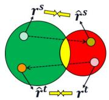
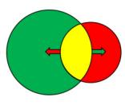
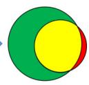
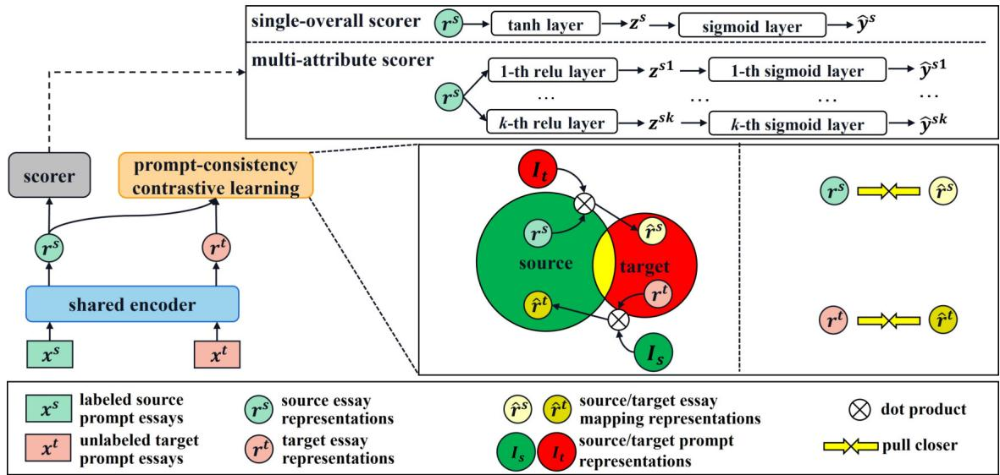
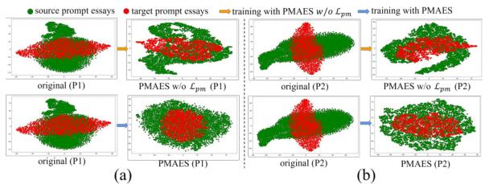
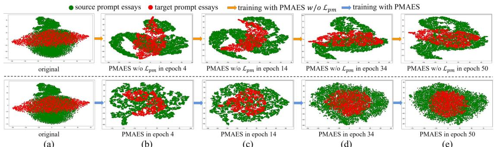

# PMAES: Prompt-mapping Contrastive Learning for Cross-prompt Automated Essay Scoring

Yuan Chen and Xia Li∗ School of Information Science and Technology, Guangdong University of Foreign Studies, Guangzhou, China yuanchen, xiali @gdufs.edu.cn

## Abstract

Current cross-prompt automated essay scoring (AES) is a challenging task due to the large discrepancies between different prompts, such as different genres and expressions. The main goal of current cross-prompt AES systems is to learn enough shared features between the source and target prompts to grade well on the target prompt. However, because the features are captured based on the original prompt representation, they may be limited by being extracted directly between essays. In fact, when the representations of two prompts are more similar, we can gain more shared features between them. Based on this motivation, in this paper, we propose a learning strategy called "prompt-mapping" to learn about more consistent representations of source and target prompts. In this way, we can obtain more shared features between the two prompts and use them to better represent the essays for the target prompt. Experimental results on the ASAP++ dataset demonstrate the effectiveness of our method. We also design experiments in different settings to show that our method can be applied in different scenarios. Our code is available at https://github.com/gdufsnlp/PMAES.

## 1 Introduction

Automated Essay Scoring (AES) aims to evaluate the quality of essays automatically. Compared with human grading process, a robust AES system can not only reduce the work of teachers, but also improve the consistency of grading (Hearst, 2000;Weigle, 2002) and make it broadly available to language learners.

AES has been studied for many years. Early studies focus more on handcrafted features, such as lexical features (Rudner and Liang, 2002;Attali and Burstein, 2006;Yannakoudakis et al., 2011). With the rise of deep learning, many studies based on neural networks for prompt-specific settings have been proposed and achieved better results (Dong et al., 2017; Tay et al., 2018; Liao et al., 2021;Xie et al., 2022). These studies follow the same setting, that is, both rated training essays and unrated test essays belong to the same prompt.

  
(a)

  
(b)

  
(c)  
Figure 1: A summary of our motivations. The green circle represents the source prompt’s representations, while the red circle represents the target prompt’s representations. The yellow area reflects the features shared by both prompts.

Another type of work is cross-prompt AES. In this setting, labeled training essays are from source prompts and unlabeled test essays are from a different target prompt. Existing studies mainly focus on obtaining sufficient shared features between source and target prompts to grade the target prompt essays effectively. Some of them obtain shared features by extracting handcrafted features (Phandi et al., 2015; Ridley et al., 2020; Ridley et al., 2021) while others learn shared features by optimizing additional training objectives, such as the multi-task learning (Cummins et al., 2016), two-stage strategy (Jin et al., 2018; Li et al., 2020) and self-supervised learning task (Cao et al., 2020). Although these methods can effectively capture shared features between different prompts, we argue that these features are captured based on the original representations of the essays from source and target prompts. It may be limited by directly extracting the shared features among them.

Intuitively, when the representations of the essays from the source and target prompts are more consistent, they can share more knowledge between them. To this end, we propose a prompt representation learning framework for cross-prompt AES (PMAES) in which we design a prompt-mapping contrastive learning strategy to effectively learn about more consistent representations of source and target prompts. To do this, we design a mapping operation to project each essay from the source prompt to the target prompt and get its mapping representation specific to the target prompt. For each essay on the source prompt (let’s say rs), we first determine how similar it is to all the essays in the target prompt by their original representations (e.g., by taking the dot product with the inverse matrix of the representations of all the essays in the target prompt) as the weights of the rs to each target essay. Then, we employ a learnable parameter matrix (specifically, a prompt-mapping matrix) to acquire the weighted representation of the source prompt essay projected on the target prompt to express the mapping representation of the source essay rs (let’s say rˆs). These source essay representations and source mapping representations are treated as the source-to-target mapping pairs $( r ^ { s } , \hat { r } ^ { s } )$ . By decreasing the distance between the essays in these mapping pairs, we may gradually reduce the discrepancy between the source and target prompts and finally make the representations of the two prompt essays more consistent. It is worth noting that the above description is about mapping from source to target. Naturally, we also perform target-to-source prompt mapping operations to further learn a more consistent representations of the two prompts, which will be described in Section 3.4.

As demonstrated in Figure 1, given the original essay representations of a source and a target prompt (which we marked in green and red, respectively), there are very few shared features between them under the original representations (which we marked in yellow). When we train the model using our proposed prompt-mapping approach, the representations of the two prompts may become more similar, which enables more shared features across the two prompts. We show them in Figure 1(b) and Figure 1(c). As the shared features increase, we can get more accurate representations of target prompt essays and grade them more accurately. To summarize, the main contributions of our work are as follows:

1) To the best of our knowledge, this is the first attempt to explore the learning of consistent representations of different prompts by introducing a prompt-mapping learning strategy in order to obtain more shared features between the source and target prompts.

2) We conduct comprehensive experiments on the ASAP++ dataset, and the results show that our approach outperforms the state-of-the-art model on both single-overall and multi-attribute scoring tasks. Also, the prompt consistency experiments show that our method can make source and target prompts much more similar to each other.

3) We further design three types of source-target settings. The results show that our approach can be adapted to multiple scenarios.

## 2 Related Work

## 2.1 Prompt-specific AES

Prompt-specific AES aims to train and test essays on the same prompt. Early studies (Rudner and Liang, 2002;Attali and Burstein, 2006; Mohler and Mihalcea, 2009; Persing and Ng, 2013; Sakaguchi et al., 2015; Sultan et al., 2016) rate essays by extracting handcrafted features to train a machine learning model. Recently, with the rise of deep learning, a growing number of studies (Taghipour and Ng, 2016; Dong and Zhang, 2016; Dong et al., 2017; Dasgupta et al., 2018; Li et al., 2018; Tay et al., 2018; Uto et al., 2020; Hussein et al., 2020; Ma et al., 2021; Liao et al., 2021; Wang et al., 2022; Xie et al., 2022) propose scoring models based on neural networks and achieve promising results.

## 2.2 Cross-prompt AES

Cross-prompt AES aims to train models from labeled source prompt essays and rate target prompt essays. Phandi et al. (2015) train the Bayesian linear ridge regression algorithm from the source prompt using manual features, then test it directly on the target prompt. Cummins et al. (2016) adopt multi-task learning to address the problem of prompt adaptation. Jin et al. (2018) propose a twostage approach for the problem of cross-prompt AES. In the first stage, they train a RankSVM on prompt-independent features to obtain pseudolabels for target prompt essays. In the second stage, a neural network model learns more promptdependent features in the pseudo-labeled essays. Li et al. (2020) also adopts a two-stage approach to train a model to learn common knowledge and provide pseudo labels for target prompt essays in the first stage, then use a Siamese framework to learn more prompt-dependent features in the second stage. Cao et al. (2020) train sentence reordering and noise identification tasks with adversarial training to improve the domain adaptability of the model. Ridley et al. (2020) utilize the handcrafted features to provide prompt agnostic information and achieve good results. Ridley et al. (2021) expand this prompt-agnostic information for multiattribute scoring tasks.

## 2.3 Contrastive Learning

Contrastive learning is an unsupervised learning method originally used in computer vision (Hadsell et al., 2006). The main idea is to gradually bring the anchor and its positive samples closer together in a shared semantic space while distinguishing the anchor from other samples, such as the work of Chen et al. (2020). Recently, contrastive learning has shown satisfactory results in textual representation learning. Data augmentation is a general strategy for obtaining positive samples, such as translation (Han et al., 2022), synonym replacement (Wang et al., 2021), word repetition (Wu et al., 2022) or textual representation perturbation (Gao et al., 2021; Yan et al., 2021).

## 3 Our Approach

The whole architecture of our approach is shown in Figure 2. It contains three components: shared encoder, scorer and prompt-mapping contrastive learning. The shared encoder provides a shared representation for the other two components, the scorer is used to predict the score, and the promptmapping contrastive learning is used to maximize the consistency of source and target prompts.

## 3.1 Task Definition

Given source prompt data $D _ { s } = \{ ( x _ { i } ^ { s } , y _ { i } ^ { s } ) \} _ { i = 1 } ^ { P }$ and target prompt data $D _ { t } = \{ x _ { i } ^ { t } \} _ { i = 1 } ^ { Q }$ , where $x _ { i } ^ { s / t }$ is the i-th essay in source/target prompt, $P$ and $Q$ are the number of essays in the source and target prompts. For single-overall scoring task, $y _ { i } ^ { s }$ is the overall score of source prompt essay $x _ { i } ^ { s }$ , and for multiattribute scoring task, $y _ { i } ^ { s } = \{ y _ { i } ^ { s 1 } , y _ { i } ^ { s 2 } , . . . , y _ { i } ^ { s K } \}$ is the set of attribute scores, and $y _ { i } ^ { s 1 }$ is the overall score. The task of our approach is to train a model with $D _ { s }$ and $D _ { t }$ as inputs and output the score of all target prompt essays. The complete algorithm is shown in Algorithm 1.

Algorithm 1: Procedure of our approach   
Input: $\{ ( x _ { i } ^ { s } , y _ { i } ^ { s } ) \} _ { i = 1 } ^ { P } , \{ x _ { i } ^ { t } \} _ { i = 1 } ^ { Q }$   
Output: shared encoder ${ \mathcal F } .$ , scorer $\mathcal { G }$   
1 Calculate $I _ { s }$ and $I _ { t }$ using Eq. 14;   
2 for sampling mini-batch do   
3 $\boldsymbol { r } _ { i } ^ { s } = \mathcal { F } ( \boldsymbol { x } _ { i } ^ { s } ) , \boldsymbol { r } _ { i } ^ { t } = \mathcal { F } ( \boldsymbol { x } _ { i } ^ { t } ) ;$   
4 Calculate $\hat { r } _ { i } ^ { s }$ and $\hat { r } _ { i } ^ { t }$ using Eq. 15;   
5 Calculate $\mathcal { L } _ { s  t }$ and $\mathcal { L } _ { t  s }$ using Eq. 16   
and Eq. 17 ;   
6 $\mathcal { L } _ { p m } = \mathcal { L } _ { s  t } + \mathcal { L } _ { t  s } ;$   
7 if single-overall scoring task then   
8 Calculate $z _ { i } ^ { s }$ using Eq. 5;   
9 Calculate $\hat { y } _ { i } ^ { s }$ using Eq. 6;   
10 Calculate $L _ { a e s \_ s o }$ using Eq. $7 ;$   
11 if epoch=1 then   
12 Update $\mathcal { F }$ and $\mathcal { G }$ minimizing   
$\mathcal { L } _ { a e s \_ s o 3 }$   
13 else   
14 Update $\mathcal { F }$ and $\mathcal { G }$ minimizing   
$\mathcal { L } _ { p m }$ and $\mathcal { L } _ { a e s \_ s o 3 }$   
15 if multi-attribute scoring task then   
16 Calculate $\{ z _ { i } ^ { s k } \} _ { k = 1 } ^ { K }$ using Eq. 8;   
17 Calculate $\{ \hat { y } _ { i } ^ { s k } \} _ { k = 1 } ^ { K }$ using Eq. 9;   
18 Calculate aes\_ma using Eq. 10;   
19 Calculate $\mathcal { L } _ { c o r }$ using Eq. 13;   
20 Update $\mathcal { F }$ and $\mathcal { G }$ minimizing   
$\mathcal { L } _ { a e s _ { . } }$ \_ma, $\mathcal { L } _ { p m }$ and $\mathcal { L } _ { c o r } ;$

## 3.2 Shared Encoder

To better encode essays, we use the hierarchical structure proposed by Dong et al. (2017) as a shared encoder, in which the sentence-level representation is extracted by CNN and attention pooling from words, and LSTM and another attention pooling are used to capture essay-level representation from all sentences. In this paper, as with Ridley et al. (2021), we use POS embedding1 to represent the essay text due to their ability to obtain better generalized representations. Suppose each essay is composed of n sentences, and each sentence contains m words. We use $w _ { i }$ to denote the POS embedding of each word for convenience. Then, the sentence-level representation is captured by CNN with attention pooling:

$$
c _ { i } = \mathrm { C N N } ( [ w _ { i } : w _ { i + l - 1 } ] ) , i = 1 , 2 , . . . , m\tag{1}
$$

$$
s _ { t } = \mathrm { a t t e n t i o n } ( [ c _ { 1 } : c _ { m } ] )\tag{2}
$$

  
Figure 2: Overview of our model. Image on the left shows the whole architecture of our model and image on the right shows the operation of prompt-mapping contrastive learning.

where l is the kernel size of $\mathrm { C N N } , c _ { i }$ is the output of the convolution operation applied to i-th POS embedding, and $s _ { t }$ is the representation of t-th sentence.

The essay-level representation is captured by LSTM with another attention pooling:

$$
h _ { t } = \mathrm { L S T M } ( s _ { t - 1 } , s _ { t } ) , t = 1 , 2 , . . . , n\tag{3}
$$

$$
r = { \mathrm { a t t e n t i o n } } ( [ h _ { 1 } : h _ { n } ] )\tag{4}
$$

where $h _ { t }$ is the output of LSTM at the t-th time step, and r is the final essay representation.

## 3.3 Scorer

In this paper, we evaluate our approach both on single-overall scoring task and multi-attribute scoring task. Therefore, we have two types of scorers, corresponding to two forms of loss function. We also use the same handcrafted features as Ridley et al. (2021), denoted as f.

## 3.3.1 Single-overall Scorer

For single-overall scoring task, firstly, we concatenate the essay representation r and handcrafted features f, denoted as [r; f]. Then, feeding it into a tanh dense layer to get z. Finally, another dense layer with sigmoid activation is applied to predict the overall score $\hat { y } .$ . The corresponding equations are as follows (Eq. 5 and Eq. 6):

$$
z = \operatorname { t a n h } ( W _ { z } [ r ; \mathbf { f } ] + b _ { z } )\tag{5}
$$

$$
\hat { y } = \sigma ( W _ { y } z + b _ { y } )\tag{6}
$$

where $W _ { z }$ and $W _ { y }$ are the trainable weight matrices, $b _ { z }$ and $b _ { y }$ are the bias vectors, σ is the sigmoid function. We use mean squared error (MSE) as the loss function, defined as follows:

$$
\mathcal { L } _ { a e s \_ s o } = \frac { 1 } { N } \sum _ { i } ^ { N } ( \hat { y } _ { i } - y _ { i } ) ^ { 2 }\tag{7}
$$

where N is the number of essays in a batch.

## 3.3.2 Multi-attribute Scorer

For multi-attribute scoring task, we first input the essay representation r into a specific relu dense layer to get the representation $z ^ { k }$ of the k-th attribute. Then, concatenating $z ^ { k }$ with f and feeding into a specific sigmoid dense layer to predict the kth attribute score $\hat { y } ^ { k }$ . The corresponding equations are as follows (Eq. 8 and Eq. 9):

$$
\boldsymbol { z } ^ { k } = \mathrm { r e l u } ( W _ { z } ^ { k } r + b _ { z } ^ { k } )\tag{8}
$$

$$
\hat { y } ^ { j } = \sigma ( W _ { y } ^ { k } [ z ^ { k } ; \mathbf { f } ] + b _ { y } ^ { k } )\tag{9}
$$

where $W _ { z } ^ { k }$ and $\boldsymbol { W } _ { y } ^ { k }$ are the trainable weight matrices , $b _ { z } ^ { k }$ and $b _ { y } ^ { k }$ are the bias vectors. Suppose the total number of attributes is K, the multi-attribute scoring loss is defined as follows:

$$
\mathcal { L } _ { a e s \_ m a } = \frac { 1 } { N K } \sum _ { i } ^ { N } \sum _ { k } ^ { K } ( \hat { y } _ { i } ^ { k } - y _ { i } ^ { k } ) ^ { 2 }\tag{10}
$$

It should be noted that not all essays have all attributes (as shown in Table 5). So we use the mask mechanism proposed by Ridley et al. (2021)

to account for the attributes without gold scores when calculating the loss.

$$
m a s k _ { i } ^ { k } = \left\{ \begin{array} { l l } { 1 , ~ i f ~ y _ { i } ^ { k } \in y _ { i } } \\ { 0 , ~ o t h e r w i s e } \end{array} \right.\tag{11}
$$

$$
y _ { i } = y _ { i } \otimes m a s k _ { i } , \hat { y } _ { i } = \hat { y } _ { i } \otimes m a s k _ { i }\tag{12}
$$

In addition, we believe that when predicting one attribute score, the other attributes can provide useful information for it. Therefore, we propose an inter-attribute correlation loss $L _ { c o r }$

$$
\mathcal { L } _ { c o r } = \frac { 1 } { K } \sum _ { i } ^ { N } \sum _ { k } ^ { K } - \log ( \sum _ { j , j \neq k } ^ { K } g ( z _ { i } ^ { k } , z _ { i } ^ { j } ) )\tag{13}
$$

where $g ( z _ { i } ^ { k } , z _ { i } ^ { j } ) = \exp ( \cos ( z _ { i } ^ { k } , z _ { i } ^ { j } ) / \rho )$ , cos( ) is the cosine similarity function, and $\rho$ is a hyperparameter. The goal of $L _ { c o r }$ is to maximize the mutual information among all attributes.

## 3.4 Prompt-mapping Contrastive Learning

In order to capture more shared features between the source and target prompts, we propose a prompt-mapping contrastive learning strategy to learn about more consistent representations of source and target prompts. For convenience, let’s take the source-to-target prompt mapping as an example to describe our method in detail. The targetto-source prompt mapping is the same operation.

Firstly, we use shared encoder $\mathcal { F }$ to encode all source and target prompt essays in training data to obtain the source prompt representation $\ b { I _ { s } } ^ { \mathbf { \bar { \alpha } } } \in \mathbb { R } ^ { P * u }$ and the target prompt representation $I _ { t } \in \mathbb { R } ^ { Q * u }$ (as shown in Eq. 14), where u is the number of LSTM hidden units, $P$ and $Q$ are the number of source and target prompt essays.

$$
I _ { s } = \mathcal { F } ( \{ x _ { i } ^ { s } \} _ { i = 1 } ^ { P } ) , I _ { t } = \mathcal { F } ( \{ x _ { i } ^ { t } \} _ { i = 1 } ^ { Q } )\tag{14}
$$

Next, we will obtain source-to-target mapping pairs. First, we take each source essay representation, let’s say $r _ { i } ^ { s }$ , to dot product with $I _ { t } ^ { \top }$ , where $I _ { t } ^ { \top } \in \mathbb { R } ^ { u * Q }$ is the transpose of $I _ { t } .$ , which is used to obtain how similar it is to all the essays in the target prompt as the weights of the $r _ { i } ^ { s }$ to each target prompt essay. After that, we use a learnable parameter matrix $W _ { s } \in \mathbb { R } ^ { Q * u }$ to acquire the weighted representations of the source prompt essays projected on the target prompt to express the source mapping representation $\hat { r } _ { i } ^ { s }$ , as shown in Eq. 15. In this way, $r _ { i } ^ { s }$ and $\hat { r } _ { i } ^ { s }$ can form the source-to-target mapping pair $( r _ { i } ^ { s } , \hat { r } _ { i } ^ { s } )$

Similarly, for the target-to-source mapping pairs, $\hat { r } _ { i } ^ { t }$ can be obtained by using $r _ { i } ^ { t } , I _ { s } ^ { \top } \in \bar { \mathbb { R } } ^ { u * \bar { P } }$ and $\dot { W } _ { t } \in \mathbb { R } ^ { P * u }$ , and finally get the target-to-source mapping pair $( r _ { i } ^ { t } , \hat { r } _ { i } ^ { t } )$ .

$$
\hat { r } _ { i } ^ { s } = W _ { s } \cdot ( r _ { i } ^ { s } \otimes I _ { t } ^ { \top } ) , \ : \hat { r } _ { i } ^ { t } = W _ { t } \cdot ( r _ { i } ^ { t } \otimes I _ { s } ^ { \top } )\tag{15}
$$

where $\otimes$ is the dot product operation.

Finally, we take the mapping pairs $( r _ { i } ^ { s } , \hat { r } _ { i } ^ { s } )$ and $( r _ { i } ^ { t } , \hat { r } _ { i } ^ { t } )$ as the positive pairs. For the selection of negative samples, we follow the work of SimCLR (Chen et al., 2020) which takes the other samples in the same batch as the negative samples. The contrastive learning loss functions of mapping from source to target and from target to source are defined as follows:

$$
\mathcal { L } _ { s  t } = \sum _ { i } ^ { N _ { s } } - \log \frac { f ( \boldsymbol { r } _ { i } ^ { s } , \hat { \boldsymbol { r } } _ { i } ^ { s } ) } { \displaystyle \sum _ { j } f ( \boldsymbol { r } _ { i } ^ { s } , \boldsymbol { r } _ { j } ^ { s } ) + f ( \boldsymbol { r } _ { i } ^ { s } , \hat { \boldsymbol { r } } _ { j } ^ { s } ) }\tag{16}
$$

$$
\mathcal { L } _ { t  s } = \sum _ { i } ^ { N _ { t } } - \log \frac { f ( \boldsymbol { r } _ { i } ^ { t } , \boldsymbol { \hat { r } } _ { i } ^ { t } ) } { \displaystyle \sum _ { j } f ( \boldsymbol { r } _ { i } ^ { t } , \boldsymbol { r } _ { j } ^ { t } ) + f ( \boldsymbol { r } _ { i } ^ { t } , \boldsymbol { \hat { r } } _ { j } ^ { t } ) }\tag{17}
$$

where $f ( a , b ) = \mathrm { e x p } ( \mathrm { c o s } ( a , b ) / \tau )$ , cos( ) is cosine similarity function, $\tau$ is temperature hyperparameter, $N _ { s }$ and $N _ { t }$ are the batch size of source prompt essays and target prompt essays. The prompt-mapping contrastive learning loss is defined as:

$$
\mathcal { L } _ { p m } = \mathcal { L } _ { s  t } + \mathcal { L } _ { t  s }\tag{18}
$$

The total loss of single-overall scoring task is:

$$
\mathcal { L } _ { s o } = \mathcal { L } _ { a e s \_ s o } + \lambda _ { 1 } \mathcal { L } _ { p m }\tag{19}
$$

The total loss of multi-attribute scoring task is:

$$
\begin{array} { r } { \mathcal { L } _ { m a } = \mathcal { L } _ { a e s \_ m a } + \lambda _ { 1 } \mathcal { L } _ { p m } + \lambda _ { 2 } \mathcal { L } _ { c o r } } \end{array}\tag{20}
$$

where $\lambda _ { 1 }$ and $\lambda _ { 2 }$ are weighted hyper-parameters.

## 4 Experiments

## 4.1 Datasets and Evaluation Metrics

We conduct the experiments on the ASAP++ (Mathias and Bhattacharyya, 2018) dataset, which is an extension of the $\mathsf { A S A P } ^ { 2 }$ dataset. Each essay has an overall score and multiple attribute scores. The statistics are provided in Appendix A.

<table><tr><td>Model</td><td>P1</td><td>P2</td><td>P3</td><td>P4</td><td>P5</td><td>P6</td><td>P7</td><td>P8</td><td>Avg.</td></tr><tr><td colspan="10">Single-overall scoring task</td></tr><tr><td>Hi att †</td><td>0.372</td><td>0.465</td><td>0.432</td><td>0.523</td><td>0.586</td><td>0.574</td><td>0.514</td><td>0.323</td><td>0.474</td></tr><tr><td>PAES †</td><td>0.746</td><td>0.591</td><td>0.608</td><td>0.641</td><td>0.727</td><td>0.609</td><td>0.707</td><td>0.635</td><td>0.658</td></tr><tr><td>PMAES (ours)</td><td>0.758</td><td>0.674</td><td>0.658</td><td>0.625</td><td>0.735</td><td>0.578</td><td>0.749</td><td>0.718</td><td>0.687</td></tr><tr><td colspan="10">Multi-attribute scoring task</td></tr><tr><td>Hi att ↓</td><td>0.315</td><td>0.478</td><td>0.317</td><td>0.478</td><td>0.375</td><td>0.357</td><td>0.205</td><td>0.265</td><td>0.349</td></tr><tr><td>AES aug ‡</td><td>0.330</td><td>0.518</td><td>0.299</td><td>0.477</td><td>0.341</td><td>0.399</td><td>0.162</td><td>0.200</td><td>0.341</td></tr><tr><td>PAES </td><td>0.605</td><td>0.522</td><td>0.575</td><td>0.606</td><td>0.634</td><td>0.545</td><td>0.356</td><td>0.447</td><td>0.536</td></tr><tr><td>CTS no att ↓</td><td>0.619</td><td>0.539</td><td>0.585</td><td>0.616</td><td>0.616</td><td>0.544</td><td>0.363</td><td>0.461</td><td>0.543</td></tr><tr><td>CTS </td><td>0.623</td><td>0.540</td><td>0.592</td><td>0.623</td><td>0.613</td><td>0.548</td><td>0.384</td><td>0.504</td><td>0.553</td></tr><tr><td>PMAES (ours)</td><td>0.656</td><td>0.553</td><td>0.598</td><td>0.606</td><td>0.626</td><td>0.572</td><td>0.386</td><td>0.530</td><td>0.566</td></tr></table>

Table 1: Main results of single-overall scoring task and multi-attribute scoring task for each prompt. The results of multi-attribute scoring task is the average QWK score across all attribute for each prompt. refers to the results of rerunning the code. refers to the results from Ridley et al. (2021).
<table><tr><td>Model</td><td>Overall</td><td>Cont</td><td>Org</td><td>WC</td><td>SF</td><td>Conv</td><td>PA</td><td>Lan</td><td>Nar</td><td>Avg.</td></tr><tr><td>Hi att </td><td>0.453</td><td>0.348</td><td>0.243</td><td>0.416</td><td>0.428</td><td>0.244</td><td>0.309</td><td>0.293</td><td>0.379</td><td>0.346</td></tr><tr><td>AES aug †</td><td>0.402</td><td>0.342</td><td>0.256</td><td>0.402</td><td>0.432</td><td>0.239</td><td>0.331</td><td>0.313</td><td>0.377</td><td>0.344</td></tr><tr><td>PAES </td><td>0.657</td><td>0.539</td><td>0.414</td><td>0.531</td><td>0.536</td><td>0.357</td><td>0.570</td><td>0.531</td><td>0.605</td><td>0.527</td></tr><tr><td>CTS no att ‡</td><td>0.659</td><td>0.541</td><td>0.424</td><td>0.558</td><td>0.544</td><td>0.387</td><td>0.561</td><td>0.539</td><td>0.605</td><td>0.535</td></tr><tr><td>CTS </td><td>0.670</td><td>0.555</td><td>0.458</td><td>0.557</td><td>0.545</td><td>0.412</td><td>0.565</td><td>0.536</td><td>0.608</td><td>0.545</td></tr><tr><td>PMAES (ours)</td><td>0.671</td><td>0.567</td><td>0.481</td><td>0.584</td><td>0.582</td><td>0.421</td><td>0.584</td><td>0.545</td><td>0.614</td><td>0.561</td></tr></table>

Table 2: Main results of multi-attribute scoring task. This table shows the average QWK score across all prompts for each attribute. refers to the results from Ridley et al. (2021).

We use Quadratic Weighted Kappa (QWK) as the evaluation metric to measure the consistency between the real scores and the predicted scores, which is the general evaluation metric in AES tasks (Jin et al., 2018;Li et al., 2020;Ridley et al., 2021).

## 4.2 Implementation Details

We use the same data partition as the current stateof-the-art model (Ridley et al., 2021), that is for each prompt as target prompt, then the rest of prompts are set to be source prompt. For example, assume the target prompt is P8, then the source prompt consists of P1 P7. We use labeled source prompt essays and unlabeled target prompt essays as training data, and the same unlabeled target prompt essays as test data. The validation data is from labeled source prompt essays.

We use the same handcrafted features proposed by (Ridley et al., 2020) in single-overall and multiattribute scoring task, including features of Lengthbased, Readability, Text Complexity, Text Variation and Sentiment. We use the length of the longest essay in the dataset as the padding length to ensure that the essay information can be retained as much as possible. We use 50-dimension POS embedding as input and train all models for 50 epochs. We report the average results across five random seeds. More details are provided in Appendix B.

## 4.3 Baseline Models

We compare with the existing models on singleoverall scoring task and multi-attribute scoring task. For single-overall scoring task, we use Hi att (Dong et al., 2017) and PAES (Ridley et al., 2020) as baseline models, which are both the singleoverall scoring models. For multi-attribute scoring task, we use Hi att (Dong et al., 2017), AES aug (Hussein et al., 2020), PAES (Ridley et al., 2020), CTS no att (Ridley et al., 2021) and the current state-of-the-art model CTS (Ridley et al., 2021) as the comparison models. The details of baseline models are described as follow:

(1) Hi att: Dong et al. (2017) propose a hierarchical structure with attention pooling for singleoverall scoring task, which scores essays by extracting the sentence- and essay-level features.

<table><tr><td>Model</td><td>P1</td><td>P2</td><td>P3</td><td>P4</td><td>P5</td><td>P6</td><td>P7</td><td>P8</td><td>Avg.</td></tr><tr><td colspan="10">Single-overall scoring task</td></tr><tr><td>PMAES</td><td>0.758</td><td>0.674</td><td>0.658</td><td>0.625</td><td>0.735</td><td>0.578</td><td>0.749</td><td>0.718</td><td>0.687</td></tr><tr><td>w/o  $\mathcal { L } _ { p m }$ </td><td>0.602</td><td>0.551</td><td>0.621</td><td>0.646</td><td>0.727</td><td>0.602</td><td>0.745</td><td>0.665</td><td>0.645</td></tr><tr><td colspan="10">Multi-attribute scoring task</td></tr><tr><td>PMAES</td><td>0.656</td><td>0.553</td><td>0.598</td><td>0.606</td><td>0.626</td><td>0.572</td><td>0.386</td><td>0.530</td><td>0.566</td></tr><tr><td> $\mathrm { w } / \mathrm { o } \ \mathcal { L } _ { c o r }$ </td><td>0.646</td><td>0.539</td><td>0.592</td><td>0.611</td><td>0.630</td><td>0.580</td><td>0.373</td><td>0.509</td><td>0.560</td></tr><tr><td> $\mathrm { w } / \mathrm { o } \ L _ { p m }$ </td><td>0.650</td><td>0.545</td><td>0.589</td><td>0.606</td><td>0.620</td><td>0.578</td><td>0.383</td><td>0.453</td><td>0.553</td></tr><tr><td>w/o  $\mathcal { L } _ { p m } \& \mathcal { L } _ { c o r }$ </td><td>0.625</td><td>0.525</td><td>0.594</td><td>0.607</td><td>0.637</td><td>0.557</td><td>0.377</td><td>0.469</td><td>0.549</td></tr></table>

Table 3: Ablation results of single-overall scoring task and multi-attribute scoring task for each prompt. The results of multi-attribute scoring task is the average QWK score across all attributes for each prompt.
<table><tr><td>Model</td><td>Overall</td><td>Cont</td><td>Org</td><td>WC</td><td>SF</td><td>Conv</td><td>PA</td><td>Lan</td><td>Nar</td><td>Avg.</td></tr><tr><td>PMAES</td><td>0.671</td><td>0.567</td><td>0.481</td><td>0.584</td><td>0.582</td><td>0.421</td><td>0.584</td><td>0.545</td><td>0.614</td><td>0.561</td></tr><tr><td>w/o  $\mathcal { L } _ { c o r }$ </td><td>0.669</td><td>0.562</td><td>0.461</td><td>0.573</td><td>0.569</td><td>0.405</td><td>0.583</td><td>0.546</td><td>0.619</td><td>0.554</td></tr><tr><td>w/o  $\mathcal { L } _ { p m }$ </td><td>0.666</td><td>0.546</td><td>0.450</td><td>0.573</td><td>0.573</td><td>0.385</td><td>0.578</td><td>0.538</td><td>0.614</td><td>0.547</td></tr><tr><td>w/o  $\mathcal { L } _ { p m } \& \mathcal { L } _ { c o r }$ </td><td>0.664</td><td>0.553</td><td>0.432</td><td>0.548</td><td>0.554</td><td>0.398</td><td>0.583</td><td>0.539</td><td>0.614</td><td>0.543</td></tr></table>

Table 4: Ablation results for multi-attribute scoring task, this table shows the average QWK score across all prompts for each attribute.

(2) AES aug: Hussein et al. (2020) convert the model proposed by Taghipour and Ng (2016) into a multi-task architecture, which can be used to rate the multi-attribute scores at the same time.

(3) PAES: Ridley et al. (2020) apply a neural model with handcrafted features for single-overall scoring.

(4) CTS: Ridley et al. (2021) propose the first model for the cross-prompt multi-attribute scoring task, in which they develop a trait-attention mechanism to establish interactions between different attributes.

(5) CTS no att: This model (Ridley et al., 2021) has the same shared- and private-layers as CTS, and removes the trait-attention mechanism.

## 5 Results and Analysis

## 5.1 Main Results

We report the main results on single-overall scoring task and multi-attribute scoring task.

For single-overall scoring task, we use Hi att and PAES as baseline models, which are both singleoverall scoring models. As shown in Table 1, compared with Hi att and PAES, PMAES achieves the best results, improving the average QWK score by 21.3% and 2.9%, respectively, which proves the effectiveness of our approach on this task.

For multi-attribute scoring task, following Ridley et al. (2021), we report the results from two dimensions. For the average QWK score across all attributes for each prompt (Table 1), we can see that our approach achieves 0.566 average QWK score, which outperforms all baseline models. For the average QWK score across all prompts for each attribute (Table 2), PMAES not only achieves the state-of-the-art average performance but also gets best performance on all prompts, which shows the significant improvement of PMAES for this task. Based on the above results, we can see that PMAES is suitable for both grading a single overall score and multiple attribute scores.

Meanwhile, we discover that PMAES fails to perform well in P4 and P6 as target prompts. Through analysis, we find that essays in P4 and P6 are source-dependent types and were written by 10th graders. Their writing requirements are relatively difficult. P4 requires students to write a response to figure out the source author’s thoughts, while P6 requires students to summarize academic excerpts. We believe that P4 and P6 share a few features with other prompts. In this case, the way our method maps P4/P6 and the source prompt to each other may lead to a low-scoring performance.

## 5.2 Ablation Studies

We conduct the ablation experiments both on single-overall scoring task and multi-attribute scoring task, which are shown in Table 3 and Table 4.

For single-overall scoring task, as shown in Table 3, we can see that if training model without $\mathcal { L } _ { p m }$ , the average QWK score drops by 4.2%, and the QWK scores of the majority of prompts also drop significantly. Especially in P1 and P2, the QWK scores drop by 15.6% and 12.3%. It proves that our proposed prompt-mapping contrastive learning is effective in this task.

For multi-attribute scoring task, we also show the results from two dimensions. Firstly, as shown in Table 3, it can be seen that the average QWK score drops by 0.6% after removing $\mathcal { L } _ { c o r }$ and by 1.3% after removing $\mathcal { L } _ { p m }$ , which demonstrates that both $\mathcal { L } _ { p m }$ and $\mathcal { L } _ { c o r }$ contribute to improve the scoring performance, and $\mathcal { L } _ { p m }$ contributes more. When we remove these two components (w/o $\mathcal { L } _ { p m } \& \mathcal { L } _ { c o r } )$ the average QWK score drops by 1.7%. This shows that $\mathcal { L } _ { p m }$ and $\mathcal { L } _ { c o r }$ can promote each other and further improve the scoring performance. Secondly, for the dimension of the average QWK score across all prompts for each attribute, we show the results in Table 4. The average QWK score drops by 0.7% after removing ${ \mathcal { L } } _ { c o r } ,$ by 1.4% after removing $\mathcal { L } _ { p m }$ and by 1.8% after removing both components. It further demonstrates the effectiveness of our model. We also can see that when we remove both of them, the QWK scores drop on almost all attributes. Especially on Organization, after removing $\mathcal { L } _ { p m }$ and ${ \mathcal { L } } _ { c o r } ,$ , the QWK score drops significantly (by 4.9%).

Based on the above results, it can be found that our proposed approach can effectively improve the model scoring performance in the single-overall scoring task and the multi-attribute scoring task.

## 5.3 Analysis of Prompt Consistency

To further investigate the effectiveness of promptmapping contrastive learning on prompt consistency, we present our analysis using two methods: 1) Measuring the distance between source and target prompts using the Maximum Mean Discrepancy (MMD, Gretton et al., 2012). 2) Visualizing the essay representations of source and target prompts by using t-SNE (Van der Maaten and Hinton, 2008) to observe the degree of the consistency of prompts.

## 5.3.1 MMD for Prompt Consistency

Maximum Mean Discrepancy (MMD) is a kernelbased method that measures the distance between two matrices based on their respective mean embeddings. Inspired by previous work (Thota and

  
Figure 3: Visualization of prompt representations after training with PMAES w/o $\mathcal { L } _ { p m }$ and PMAES. (a) and (b) represent the change of source and target prompt representations with P1 and P2 as target prompts.

Leontidis, 2021; Yue et al., 2022), we quantify the degree of consistency by calculating the MMD distance between the source and target prompt essay representation matrices. A smaller distance indicates a greater degree of consistency between the source and target prompts, whereas a larger distance indicates a lesser degree of congruence. More details are provided in Appendix C

## 5.3.2 Visualization for Prompt Consistency

We use the t-SNE (Van der Maaten and Hinton, 2008) toolkit to visualize the representations of all essays on source and target prompts in training data to demonstrate prompt representations, which are generated by shared encoder under random initialization (original), training with PMAES w/o $\mathcal { L } _ { p m }$ and PMAES, respectively.

Firstly, as shown in Figure 3(a) and Figure 3(b), we show the visualization results of source and target prompt essay representations with P1 and P2 as target prompts. Taking Figure 3(a) for example, we can see that a clear discrepancy exists in the original representations of source prompt (green) and target prompt (red). After training with PMAES w/o ${ \mathcal { L } } _ { p m } ,$ the prompt representations become more discrete, while prompt representations generated by PMAES are undoubtedly more consistent and close to each other. The same phenomenon occurs in Figure 3(b).

Secondly, to further show how the prompt representations change as the number of training epochs increases, we visualize the essay representations generated by the epochs 0 (original), 4, 14, 34 and 50 during training w/o $\mathcal { L } _ { p m }$ and PMAES with P1 as the target prompt. As shown in Table $^ { 4 , }$ the top row shows the results of training with PMAES w/o $\mathcal { L } _ { p m }$ , and the bottom row shows the results of training with PMAES. The results show that the representations generated by these two models are relatively divergent at the beginning of training. As the training epochs increase, PMAES makes the prompt representations gradually consistent, while PMAES w/o $\mathcal { L } _ { p m }$ makes them gradually discrete.

  
(a)  
(b)  
(c)  
(d)  
(e)  
Figure 4: Visualization of changes in prompt representations during training with PMAES w/o $\mathcal { L } _ { p m }$ (top) and PMAES (bottom), when P1 is the target prompt. (a), (b), (c), (d) and (e) represent the visualization of essay representations at epoch 0 (original), 4, 14, 34 and 50, respectively.

Based on the results of MMD and visualization analysis, it can be seen that w/o $\mathcal { L } _ { p m }$ not only fails to maintain the consistency of source and target prompts, but also damages it. In contrast, our approach can significantly make these two prompts more consistent to improve scoring performance.

## 5.4 Results of Different Source-target Settings

Most of the current cross-prompt AES studies train on multiple prompts (source prompt) and test on a single prompt (target prompt), namely the manyto-one setting, which is the general setting in crossprompt AES and is shown in Section 5.1. To verify the performance of our approach in many practical settings, we conduct comprehensive experiments for different source-target settings. More details are provided in Appendix D.

## 6 Conclusions

In this paper, we propose a new method for cross-prompt AES that aims to capture more shared features between the source and target prompts. Specifically, we design prompt-mapping contrastive learning to decrease the distance between the mapping pairs from source-to-target and target-to-source simultaneously and finally make the representations of the two prompts more consistent. Experimental results demonstrate that our approach achieves the state-of-the-art on both singleoverall scoring task and multi-attribute scoring task. We further design experiments for three sourcetarget settings, which proves that our approach can be adapted to multiple scenarios.

## Limitations

Our approach achieves promising results in crossprompt AES by enhancing the consistency between source and target prompts. We believe that this idea can also be used to other cross-domain or domain adaptation tasks. In addition, as can be seen from Table 1, our approach fails to perform well in some cases. We think that forcing the representations of two prompts to be closer during model training may result in more errors when the prompts’ grading rubrics, writing genres, and writing requirements are quite different. Therefore, there are two possible directions can be explored for future research: 1) More fine-grained shared features can be extracted to improve scoring performance. 2) Scoreaware information can be integrated into model to improve source and target prompts consistency.

## Acknowledgements

This work is supported by the National Natural Science Foundation of China [grant number: 61976062].

## References

Yigal Attali and Jill Burstein. 2006. Automated essay scoring with e-rater® v. 2. The Journal ofTechnology, Learning and Assessment, 4(3).

Yue Cao, Hanqi Jin, Xiaojun Wan, and Zhiwei Yu. 2020. Domain-adaptive neural automated essay scoring. In Proceedings of the 43rd International ACM SIGIR Conference on Research and Development in Information Retrieval, pages 1011–1020.

Ting Chen, Simon Kornblith, Mohammad Norouzi, and Geoffrey Hinton. 2020. A simple framework for contrastive learning of visual representations. In International conference on machine learning, pages 1597–1607. PMLR.

Ronan Cummins, Meng Zhang, and Ted Briscoe. 2016. Constrained multi-task learning for automated essay scoring. In Proceedings of the 54th Annual Meeting of the Association for Computational Linguistics (Volume 1: Long Papers), pages 789–799.

Tirthankar Dasgupta, Abir Naskar, Lipika Dey, and Rupsa Saha. 2018. Augmenting textual qualitative features in deep convolution recurrent neural network for automatic essay scoring. In Proceedings of the 5th Workshop on Natural Language Processing Techniques for Educational Applications, pages 93–102.

Yann Dauphin, Harm De Vries, and Yoshua Bengio. 2015. Equilibrated adaptive learning rates for nonconvex optimization. Advances in neural information processing systems, 28.

Fei Dong and Yue Zhang. 2016. Automatic features for essay scoring - an empirical study. In Proceedings of the 2016 Conference on Empirical Methods in Natural Language Processing, EMNLP 2016, Austin, Texas, USA, November 1-4, 2016, pages 1072–1077. The Association for Computational Linguistics.

Fei Dong, Yue Zhang, and Jie Yang. 2017. Attentionbased recurrent convolutional neural network for automatic essay scoring. In Proceedings of the 21st Conference on Computational Natural Language Learning (CoNLL 2017), Vancouver, Canada, August 3-4, 2017, pages 153–162. Association for Computational Linguistics.

Tianyu Gao, Xingcheng Yao, and Danqi Chen. 2021. Simcse: Simple contrastive learning of sentence embeddings. In Proceedings of the 2021 Conference on Empirical Methods in Natural Language Processing, pages 6894–6910.

Arthur Gretton, Karsten M Borgwardt, Malte J Rasch, Bernhard Schölkopf, and Alexander Smola. 2012. A kernel two-sample test. The Journal of Machine Learning Research, 13(1):723–773.

Raia Hadsell, Sumit Chopra, and Yann LeCun. 2006. Dimensionality reduction by learning an invariant mapping. In 2006 IEEE Computer Society Conference on Computer Vision and Pattern Recognition (CVPR’06), volume 2, pages 1735–1742. IEEE.

Xu Han, Yuqi Luo, Weize Chen, Zhiyuan Liu, Maosong Sun, Zhou Botong, Hao Fei, and Suncong Zheng. 2022. Cross-lingual contrastive learning for finegrained entity typing for low-resource languages. In Proceedings of the 60th Annual Meeting of the Association for Computational Linguistics (Volume 1: Long Papers), pages 2241–2250.

Marti A Hearst. 2000. The debate on automated essay grading. IEEE Intelligent Systems and their Applications, 15(5):22–37.

Mohamed A Hussein, Hesham A Hassan, and Mohammad Nassef. 2020. A trait-based deep learning automated essay scoring system with adaptive feedback. International Journal of Advanced Computer Science and Applications, 11(5).

Cancan Jin, Ben He, Kai Hui, and Le Sun. 2018. Tdnn: a two-stage deep neural network for promptindependent automated essay scoring. In Proceedings ofthe 56th Annual Meeting ofthe Associationfor Computational Linguistics (Volume 1: Long Papers), pages 1088–1097.

Diederik P. Kingma and Jimmy Ba. 2015. Adam: A method for stochastic optimization. In 3rd International Conference on Learning Representations, ICLR 2015, San Diego, CA, USA, May 7-9, 2015, Conference Track Proceedings.

Xia Li, Minping Chen, and Jian-Yun Nie. 2020. Sednn: shared and enhanced deep neural network model for cross-prompt automated essay scoring. Knowledge-Based Systems, 210:106491.

Xia Li, Minping Chen, Jianyun Nie, Zhenxing Liu, Ziheng Feng, and Yingdan Cai. 2018. Coherence-based automated essay scoring using self-attention. In Chinese computational linguistics and natural language processing based on naturally annotated big data, pages 386–397. Springer.

Dongliang Liao, Jin Xu, Gongfu Li, and Yiru Wang. 2021. Hierarchical coherence modeling for document quality assessment. In Proceedings of the AAAI Conference on Artificial Intelligence, volume 35, pages 13353–13361.

Junteng Ma, Xia Li, Minping Chen, and Weigeng Yang. 2021. Enhanced hierarchical structure features for automated essay scoring. In China Conference on Information Retrieval, pages 168–179. Springer.

Sandeep Mathias and Pushpak Bhattacharyya. 2018. Asap++: Enriching the asap automated essay grading dataset with essay attribute scores. In Proceedings of the eleventh international conference on language resources and evaluation (LREC 2018).

Michael Mohler and Rada Mihalcea. 2009. Text-totext semantic similarity for automatic short answer grading. In Proceedings ofthe 12th Conference ofthe European Chapter ofthe ACL (EACL 2009), pages 567–575.

Isaac Persing and Vincent Ng. 2013. Modeling thesis clarity in student essays. In Proceedings ofthe 51st Annual Meeting of the Association for Computational Linguistics (Volume 1: Long Papers), pages 260–269.

Peter Phandi, Kian Ming A Chai, and Hwee Tou Ng. 2015. Flexible domain adaptation for automated essay scoring using correlated linear regression. In Proceedings of the 2015 Conference on Empirical Methods in Natural Language Processing, pages 431– 439.

Robert Ridley, Liang He, Xin-yu Dai, Shujian Huang, and Jiajun Chen. 2021. Automated cross-prompt scoring of essay traits. In Proceedings of the AAAI conference on artificial intelligence, volume 35, pages 13745–13753.

Robert Ridley, Liang He, Xinyu Dai, Shujian Huang, and Jiajun Chen. 2020. Prompt agnostic essay scorer: A domain generalization approach to cross prompt automated essay scoring. arXiv preprint arXiv:2008.01441.

Lawrence M Rudner and Tahung Liang. 2002. Automated essay scoring using bayes’ theorem. The Journal ofTechnology, Learning and Assessment, 1(2).

Keisuke Sakaguchi, Michael Heilman, and Nitin Madnani. 2015. Effective feature integration for automated short answer scoring. In Proceedings of the 2015 conference ofthe North American Chapter of the associationfor computational linguistics: Human language technologies, pages 1049–1054.

Md Arafat Sultan, Cristobal Salazar, and Tamara Sumner. 2016. Fast and easy short answer grading with high accuracy. In Proceedings of the 2016 Conference of the North American Chapter of the Association for Computational Linguistics: Human Language Technologies, pages 1070–1075.

Kaveh Taghipour and Hwee Tou Ng. 2016. A neural approach to automated essay scoring. In Proceedings ofthe 2016 conference on empirical methods in natural language processing, pages 1882–1891.

Yi Tay, Minh Phan, Luu Anh Tuan, and Siu Cheung Hui. 2018. Skipflow: Incorporating neural coherence features for end-to-end automatic text scoring. In Proceedings ofthe AAAI conference on artificial intelligence, volume 32.

Mamatha Thota and Georgios Leontidis. 2021. Contrastive domain adaptation. In IEEE Conference on Computer Vision and Pattern Recognition Workshops, CVPR Workshops 2021, virtual, June 19-25, 2021, pages 2209–2218. Computer Vision Foundation / IEEE.

Masaki Uto, Yikuan Xie, and Maomi Ueno. 2020. Neural automated essay scoring incorporating handcrafted features. In Proceedings of the 28th International Conference on Computational Linguistics, pages 6077–6088.

Laurens Van der Maaten and Geoffrey Hinton. 2008. Visualizing data using t-sne. Journal of machine learning research, 9(11).

Dong Wang, Ning Ding, Piji Li, and Haitao Zheng. 2021. Cline: Contrastive learning with semantic negative examples for natural language understanding. In Proceedings of the 59th Annual Meeting of the Association for Computational Linguistics and the 11th International Joint Conference on Natural Language Processing (Volume 1: Long Papers), pages 2332–2342.

Yongjie Wang, Chuang Wang, Ruobing Li, and Hui Lin. 2022. On the use of bert for automated essay scoring: Joint learning of multi-scale essay representation. In Proceedings of the 2022 Conference of the North

American Chapter ofthe Association for Computational Linguistics: Human Language Technologies, NAACL 2022, Seattle, WA, United States, July 10-15, 2022, pages 3416–3425.

Sara Cushing Weigle. 2002. Assessing writing. Cambridge University Press.

Xing Wu, Chaochen Gao, Liangjun Zang, Jizhong Han, Zhongyuan Wang, and Songlin Hu. 2022. Esimcse: Enhanced sample building method for contrastive learning of unsupervised sentence embedding. In Proceedings ofthe 29th International Conference on Computational Linguistics, pages 3898–3907.

Jiayi Xie, Kaiwei Cai, Li Kong, Junsheng Zhou, and Weiguang Qu. 2022. Automated essay scoring via pairwise contrastive regression. In Proceedings of the 29th International Conference on Computational Linguistics, COLING 2022, Gyeongju, Republic of Korea, October 12-17, 2022, pages 2724–2733.

Yuanmeng Yan, Rumei Li, Sirui Wang, Fuzheng Zhang, Wei Wu, and Weiran Xu. 2021. Consert: A contrastive framework for self-supervised sentence representation transfer. In Proceedings of the 59th Annual Meeting of the Association for Computational Linguistics and the 11th International Joint Conference on Natural Language Processing (Volume 1: Long Papers), pages 5065–5075.

Helen Yannakoudakis, Ted Briscoe, and Ben Medlock. 2011. A new dataset and method for automatically grading esol texts. In Proceedings ofthe 49th annual meeting ofthe associationfor computational linguistics: human language technologies, pages 180–189.

Zhenrui Yue, Huimin Zeng, Ziyi Kou, Lanyu Shang, and Dong Wang. 2022. Domain adaptation for question answering via question classification. In Proceedings of the 29th International Conference on Computational Linguistics, COLING 2022, Gyeongju, Republic of Korea, October 12-17, 2022, pages 1776–1790. International Committee on Computational Linguistics.

## A Statistics of Datasets

The ASAP++ dataset includes 12,978 English writings in response to eight prompts. Table 5 displays the statistics for both ASAP and ASAP++.

## B Implementation Details

The implementation details of our model are presented as follows:

For single-overall scoring task, we optimize only the $\mathcal { L } _ { a e s \_ s o }$ in the first epoch, which is used to initialize the model weights, and optimize the $\mathcal { L } _ { a e s \_ s o }$ and $\mathcal { L } _ { p m }$ in the rest epochs. We set the kernel size as 3, the number of filters as 100 for CNN and the number of hidden units as 50 for LSTM. We use

<table><tr><td rowspan="2">Prompt ID</td><td rowspan="2">No. of Essays</td><td rowspan="2">Avg. Len.</td><td rowspan="2">Attributes</td><td colspan="2">Score Range</td></tr><tr><td>Overall</td><td>Attribute</td></tr><tr><td>1</td><td>1,783</td><td>350</td><td>Cont, Org, WC, SF, Conv</td><td>2 - 12</td><td>1 - 6</td></tr><tr><td>2</td><td>1,800</td><td>350</td><td>Cont, Org, WC, SF, Conv</td><td>0- 6</td><td>1- 6</td></tr><tr><td>3</td><td>1,726</td><td>150</td><td>Cont, PA, Lan, Nar</td><td>0- 3</td><td>0- 3</td></tr><tr><td>4</td><td>1,772</td><td>150</td><td>Cont, PA, Lan, Nar</td><td>0-3</td><td>0- 3</td></tr><tr><td>5</td><td>1,805</td><td>150</td><td>Cont, PA, Lan, Nar</td><td>0-4</td><td>0-4</td></tr><tr><td>6</td><td>1,800</td><td>150</td><td>Cont, PA, Lan, Nar</td><td>0-4</td><td>0- 4</td></tr><tr><td>7</td><td>1,569</td><td>300</td><td>Cont, Org, Conv</td><td>0 - 30</td><td>0- 6</td></tr><tr><td>8</td><td>723</td><td>650</td><td>Cont, Org, WC, SF, Conv</td><td>0 - 60</td><td>2 - 12</td></tr></table>

Table 5: Statistics of ASAP and ASAP++ Datasets. Cont: Content, Org: Organization, WC: Word Choice, SF: Sentence Fluency, Conv: Conventions, PA: Prompt Adherence, Lan: Language and Nar: Narrativity.
<table><tr><td>Model</td><td>P1</td><td>P2</td><td>P3</td><td>P4</td><td>P5</td><td>P6</td><td>P7</td><td>P8</td><td>Avg.</td></tr><tr><td>original</td><td>0.902</td><td>0.968</td><td>0.378</td><td>0.475</td><td>0.331</td><td>0.277</td><td>0.187</td><td>2.016</td><td>0.692</td></tr><tr><td>w/o  $\mathcal { L } _ { p m }$ </td><td>2.366</td><td>1.778</td><td>0.868</td><td>1.249</td><td>0.570</td><td>0.759</td><td>0.343</td><td>2.542</td><td>1.309</td></tr><tr><td>PMAÊS</td><td>0.180</td><td>0.167</td><td>0.093</td><td>0.077</td><td>0.054</td><td>0.043</td><td>0.046</td><td>1.168</td><td>0.228</td></tr></table>

Table 6: MMD distance of single-overall scoring task under different settings. "original", "PMAES w/o $\mathcal { L } _ { p m } "$ and "PMAES" indicate the essay representations of source and target prompt essays generated by randomly initialized, trained with PMAES w/o $\mathcal { L } _ { p m }$ and trained with PMAES, respectively.

Adam (Kingma and Ba, 2015) as the optimizer with the learning rate = 0.0001, τ = 0.1 and $\lambda _ { 1 } = 0 . 5$ We use the model with the highest QWK score in the development set to evaluate the test set.

For multi-attribute scoring task, the detailed parameters are as follows: the kernel size is 5, the number of filters is 100 for CNN and the number of hidden units is 100 for LSTM. The optimizer is RMSprop (Dauphin et al., 2015) with the learning $\mathrm { r a t e } = 0 . 0 0 1 , \tau = 0 . 0 0 1 , \rho = 0 . 1 , \lambda _ { 1 } = 0 . 5$ and the $\lambda _ { 2 } = 0 . 1$ . We take the model with the highest average QWK score of all attributes in the development set to evaluate the test set.

## C MMD for Prompt Consistency

The MMD distance can be calculated by the following equation:

$$
\mathrm { M M D } = \left\| \frac { 1 } { P } \sum _ { i = 1 } ^ { P } \phi ( \boldsymbol { r } _ { i } ^ { s } ) - \frac { 1 } { Q } \sum _ { j = 1 } ^ { Q } \phi ( \boldsymbol { r } _ { j } ^ { t } ) \right\| _ { H } ^ { 2 }\tag{21}
$$

where $\phi ( \cdot )$ denotes the function that is used to map the original variable to the Reproducing Kernel Hilbert Space (RKHS), P and Q are the number of source and target prompt essays in the training data, $r _ { i } ^ { s }$ and $\boldsymbol { r } _ { j } ^ { t }$ are the representation of source and target prompt essays.

<table><tr><td>Source→Target</td><td>PMAES</td><td>w/o  $\mathcal { L } _ { p m }$ </td></tr><tr><td>P1,P2→P3,P4</td><td>0.537</td><td>0.426</td></tr><tr><td>P3,P4→P1,P2</td><td>0.673</td><td>0.407</td></tr><tr><td>P5,P6→P7,P8</td><td>0.447</td><td>0.381</td></tr><tr><td>P7,P8→P5,P6</td><td>0.528</td><td>0.439</td></tr><tr><td> $\mathsf { P 1 } { \sim } \mathsf { P 4 } { \to } \mathsf { P 5 } { \sim } \mathsf { P 8 }$ </td><td>0.682</td><td>0.672</td></tr><tr><td> ${ \mathsf { P 5 } } { \sim } { \mathsf { P 8 } } {  } { \mathsf { P 1 } } { \sim } { \mathsf { P 4 } }$ </td><td>0.675</td><td>0.559</td></tr></table>

Table 7: Experiment results of the many-to-many setting on the single-overall scoring task. This table shows the average QWK scores of all prompts in target prompt. P1,P2 P3,P4 refers to source prompt consists of P1 and P2, and target prompt consists of P3 and P4. The same meaning to other source-target pairs.

We take the essay representation matrices of source and target prompts generated by shared encoder to calculate the MMD distance. In order to better show the effectiveness of our proposed prompt-mapping contrastive learning in improving the consistency of source and target prompts, we use the shared encoding layer representations obtained at three settings: random initialization (original), training PMAES without $\mathcal { L } _ { p m } \ \mathrm { ( w / o } \ \mathcal { L } _ { p m } )$ and training with PMAES. We show the results in Table 6. As can be seen, compared with PMAES, w/o $\mathcal { L } _ { p m }$ leads to an increase in MMD distance, which indicates that the prompt consistency is broken. In contrast, PMAES can significantly reduce the MMD distance, which indicates that our approach is effective in improving prompt consistency. These results prove that our approach can effectively improve the consistency of source and target prompts.

<table><tr><td>T S</td><td>P1</td><td>P2</td><td>P3</td><td>P4</td><td>P5</td><td>P6</td><td>P7</td><td>P8</td><td>Avg.</td></tr><tr><td colspan="10">One-to-many setting</td></tr><tr><td>P1</td><td></td><td>0.526|0.598</td><td>0.457|0.552</td><td>0.533 |0.560</td><td>0.557|0.673</td><td>0.423 |0.517</td><td>0.701 | 0.733</td><td>0.344|0.405</td><td>0.506|0.577</td></tr><tr><td>P2</td><td>0.354|0.450</td><td></td><td>0.192|0.426</td><td>0.325|0.485</td><td>0.210|0.434</td><td>0.144|0.269</td><td>0.222|0.451</td><td>0.488|0.552</td><td>0.276|0.438</td></tr><tr><td>P3</td><td>0.428 |0.780</td><td>0.222 |0.620</td><td></td><td>0.652|0.658</td><td>0.77210.747</td><td>0.613 |0.626</td><td>0.57610.709</td><td>0.087 |0.297</td><td>0.479 |0.634</td></tr><tr><td>P4</td><td>0.436|0.742</td><td>0.220|0.542</td><td>0.639|0.656</td><td></td><td>0.74510.735</td><td>0.635|0.629</td><td>0.601 |0.532</td><td>0.153|0.348</td><td>0.490 | 0.598</td></tr><tr><td>P5</td><td>0.540|0.742</td><td>0.323|0.570</td><td>0.563|0.621</td><td>0.614|0.628</td><td></td><td>0.598|0.608</td><td>0.634|0.641</td><td>0.141|0.271</td><td>0.488|0.583</td></tr><tr><td>P6</td><td>0.65510.592</td><td>0.438|0.558</td><td>0.396|0.505</td><td>0.406|0.575</td><td>0.448|0.535</td><td></td><td>0.47710.407</td><td>0.320|0.565</td><td>0.449|0.534</td></tr><tr><td>P7</td><td>0.666 |0.667</td><td>0.500 |0.612</td><td>0.490 |0.507</td><td>0.457|0.534</td><td>0.53510.509</td><td>0.39610.346</td><td></td><td>0.427 |0.562</td><td>0.496 |0.534</td></tr><tr><td>P8</td><td>0.408 | 0.416</td><td>0.313 |0.466</td><td>0.404|0.441</td><td>0.459|0.502</td><td>0.062|0.155</td><td>0.029 | 0.099</td><td>0.390| 0.497</td><td></td><td>0.295|0.368</td></tr><tr><td colspan="10">One-to-one setting</td></tr><tr><td>P1</td><td></td><td>0.371 |0.483</td><td>0.477 |0.553</td><td>0.529|0.531</td><td>0.608 | 0.659</td><td>0.470|0.513</td><td>0.73610.731</td><td>0.362|0.421</td><td>0.507|0.556</td></tr><tr><td>P2</td><td>0.516|0.598</td><td></td><td>0.200 |0.420</td><td>0.316|0.497</td><td>0.239 |0.400</td><td>0.121 |0.273</td><td>0.217|0.460</td><td>0.516|0.549</td><td>0.304 10.457</td></tr><tr><td>P3</td><td>0.458|0.782</td><td>0.382|0.519</td><td></td><td>0.656|0.657</td><td>0.758|0.759</td><td>0.597 |0.633</td><td>0.599 |0.716</td><td>0.088 |0.265</td><td>0.506 |0.619</td></tr><tr><td>P4</td><td>0.513|0.717</td><td>0.309 | 0.482</td><td>0.591 |0.638</td><td></td><td>0.749|0.742</td><td>0.604|0.616</td><td>0.598|0.531</td><td>0.164|0.346</td><td>0.504|0.582</td></tr><tr><td>P5</td><td>0.424|0.750</td><td>0.275|0.606</td><td>0.583 |0.627</td><td>0.608|0.637</td><td></td><td>0.599|0.612</td><td>0.601 10.555</td><td>0.113 |0.325</td><td>0.458|0.588</td></tr><tr><td>P6</td><td>0.665|0.719</td><td>0.454|0.534</td><td>0.386|0.579</td><td>0.466|0.621</td><td>0.459|0.609</td><td></td><td>0.466 |0.503</td><td>0.33410.374</td><td>0.461 |0.563</td></tr><tr><td>P7</td><td>0.633 |0.660</td><td>0.461 |0.607</td><td>0.48510.452</td><td>0.460|0.505</td><td>0.510|0.512</td><td>0.463 10.343</td><td></td><td>0.428|0.574</td><td>0.491 |0.522</td></tr><tr><td>P8</td><td>0.405|0.452</td><td>0.44710.217</td><td>0.308 10.385</td><td>0.246|0.486</td><td>0.19810.172</td><td>0.077|0.192</td><td>0.423|0.451</td><td></td><td>0.301 |0.336</td></tr></table>

Table 8: Experiment results of one-to-many and one-to-one setting on single-overall scoring task. $" a \mid b "$ refers to the result of PMAES w/o $\mathcal { L } _ { p m }$ and PMAES, respectively. $" a \ : | \ : \underline { { b } } "$ indicates that PMAES w/o $\mathcal { L } _ { p m }$ outperforms PMAES, and the rest is the opposite.

## D Results of Different Source-target Settings

We argue that there are different situations may exist in practical settings. For example, source prompt and target prompt are all containing multiple prompts (namely many-to-many), source prompt contains only one prompt and target prompt contains multiple prompts (namely one-to-many), or source prompt and target prompt both contain only one prompt (namely one-to-one). To this end, we conduct comprehensive experiments for these settings to verify the performance of our approach in multiple scenarios.

## D.1 Results of Many-to-many Setting

The experimental results of the many-to-many setting are shown in Table 7. For convenience, we design 6 source-target pairs for this setting. Since each prompt has its own score range, we calculate the QWK score for each prompt separately, and report the average QWK score of all prompts in target prompt. As shown in Table 7, PMAES outperform w/o $\mathcal { L } _ { p m }$ in all source-target pairs with the QWK scores increase by 11.1%, 26.6%, 6.6%,

8.9%, 1.0% and 11.6%. The results demonstrate that our approach is suitable for many-to-many setting.

## D.2 Results of One-to-many Setting

Table 8 (top subtable) shows the experimental results of the One-to-many setting. Same as manyto-many setting, we also calculate the QWK score for each target prompt individually. In this setting, source prompt contains only one prompt, and target prompt consists of the remaining 7 prompts. Compared with w/o $\mathcal { L } _ { p m } .$ , the average QWK scores of PMAES increase by 7.1%, 16.2%, 15.5%, 10.8%, 9.5%, 8.5%, 3.8%, 7.3%, respectively. This proves that our approach is also remarkable in one-tomany setting.

## D.3 Results of One-to-one Setting

The experimental results of the one-to-one setting are shown in Table 8 (bottom subtable). For each prompt, we take each of the remaining 7 prompt as its corresponding target prompt to construct one-toone source-target pairs. We use "a|b" form to represent the performance of without using and using prompt-mapping contrastive learning, where "a" denotes QWK score of w/o $\mathcal { L } _ { p m }$ and "b" denotes QWK score of PMAES. It can be observed that PMAES outperforms PMAES w/o $\mathcal { L } _ { p m }$ in most source-target pairs. The average QWK score for each prompt as the source prompt are all improved, it can be demonstrated that our approach is stable and effective in one-to-one setting.

## A For every submission:

✓ A1. Did you describe the limitations of your work? Section after Conclusion

 A2. Did you discuss any potential risks of your work? Not applicable. Left blank.

✓ A3. Do the abstract and introduction summarize the paper’s main claims? Section1

✗ A4. Have you used AI writing assistants when working on this paper? No using AI writing assistants.

## B ✓ Did you use or create scientific artifacts?

Section 4.1

✓ B1. Did you cite the creators of artifacts you used? Section 4.1

 B2. Did you discuss the license or terms for use and / or distribution of any artifacts? Not applicable. Left blank.

 B3. Did you discuss if your use of existing artifact(s) was consistent with their intended use, provided that it was specified? For the artifacts you create, do you specify intended use and whether that is compatible with the original access conditions (in particular, derivatives of data accessed for research purposes should not be used outside of research contexts)? Not applicable. Left blank.

 B4. Did you discuss the steps taken to check whether the data that was collected / used contains any information that names or uniquely identifies individual people or offensive content, and the steps taken to protect / anonymize it? Not applicable. Left blank.

✓ B5. Did you provide documentation of the artifacts, e.g., coverage of domains, languages, and linguistic phenomena, demographic groups represented, etc.? Appendix A

✓ B6. Did you report relevant statistics like the number of examples, details of train / test / dev splits, etc. for the data that you used / created? Even for commonly-used benchmark datasets, include the number of examples in train / validation / test splits, as these provide necessary context for a reader to understand experimental results. For example, small differences in accuracy on large test sets may be significant, while on small test sets they may not be. Section 4.1

## C ✗ Did you run computational experiments?

Left blank.

✓ C1. Did you report the number of parameters in the models used, the total computational budget (e.g., GPU hours), and computing infrastructure used? Section 4.2

✓ C2. Did you discuss the experimental setup, including hyperparameter search and best-found hyperparameter values? Section 4.2

✓ C3. Did you report descriptive statistics about your results (e.g., error bars around results, summary statistics from sets of experiments), and is it transparent whether you are reporting the max, mean, etc. or just a single run? Section 4.2

✓ C4. If you used existing packages (e.g., for preprocessing, for normalization, or for evaluation), did you report the implementation, model, and parameter settings used (e.g., NLTK, Spacy, ROUGE, etc.)? Section 3.2 and Section 4.2

D ✗ Did you use human annotators (e.g., crowdworkers) or research with human participants? Left blank.

 D1. Did you report the full text of instructions given to participants, including e.g., screenshots, disclaimers of any risks to participants or annotators, etc.? Not applicable. Left blank.

 D2. Did you report information about how you recruited (e.g., crowdsourcing platform, students) and paid participants, and discuss if such payment is adequate given the participants’ demographic (e.g., country of residence)? Not applicable. Left blank.

 D3. Did you discuss whether and how consent was obtained from people whose data you’re using/curating? For example, if you collected data via crowdsourcing, did your instructions to crowdworkers explain how the data would be used? Not applicable. Left blank.

 D4. Was the data collection protocol approved (or determined exempt) by an ethics review board? Not applicable. Left blank.

 D5. Did you report the basic demographic and geographic characteristics of the annotator population that is the source of the data? Not applicable. Left blank.